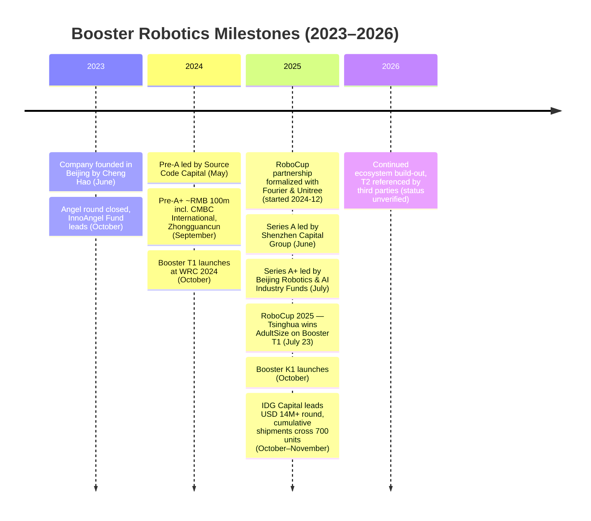
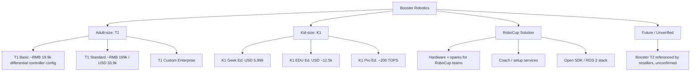
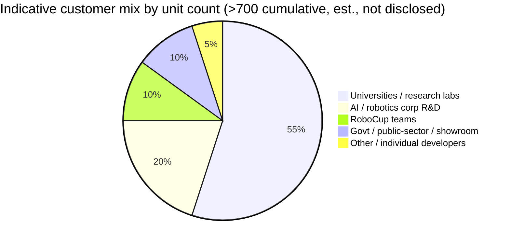
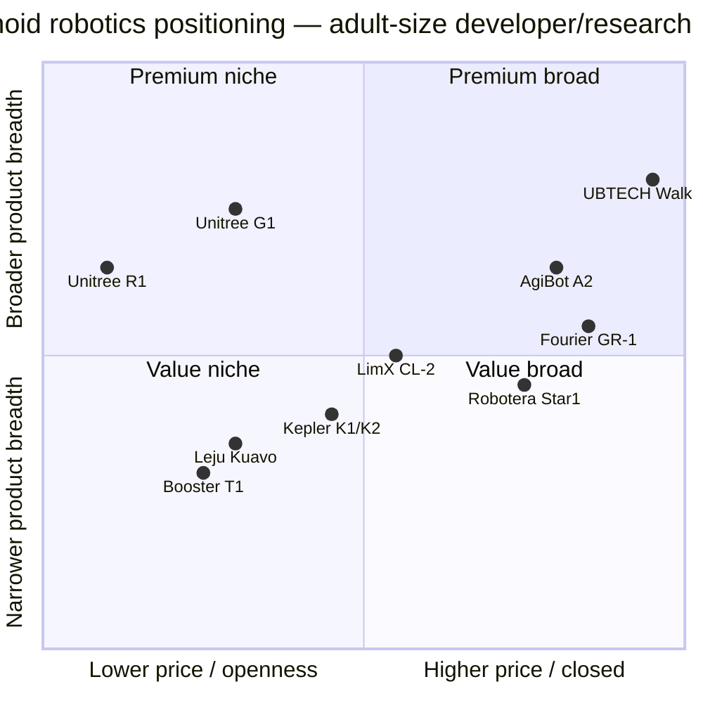

# COMPANY RESEARCH REPORT: Booster Robotics (加速进化)

**Date:** 2026-05-19
**Coverage:** Private — Beijing, China
**Sector:** Humanoid robotics / embodied AI / research & developer platforms
**Status of disclosure:** Private company; no audited financial statements. All quantitative claims are sourced from press releases, founder interviews, third-party trade press, or competitor filings. Where no public figure exists the report says so explicitly.

---

## Table of Contents
1. Company Overview
2. Company History
3. Management Team
4. Products & Services
5. Customers & Go-to-Market
6. Industry Overview
7. Competitive Landscape
8. Market Opportunity (TAM)
9. Risk Assessment
References

---

## 1. Company Overview

Booster Robotics (Chinese name 加速进化, "Accelerated Evolution"; legal entity 北京加速进化科技有限公司) is a Beijing-based humanoid-robotics startup founded in June 2023 by Cheng Hao (程昊), a two-time Tsinghua University Department of Automation alumnus who was previously a vice-president of product at ByteDance's Lark (飞书) after his calendar-app startup Zhaoxi Calendar (朝夕日历) was acquired by ByteDance ([Booster Robotics About page](https://www.booster.tech/about-us/); [Sohu, 2024-09-11](https://www.sohu.com/a/778381715_489960)). The company's core engineering bench comes from Tsinghua's Robot Control Laboratory and the university's "Hephaestus" (火神, sometimes translated "Vulcan") RoboCup team, which the founder once captained ([清华大学经济管理学院 MBA 网站](https://mba.sem.tsinghua.edu.cn/info/1116/4985.htm); [清华大学自动化系系友企业加速进化亮相世界机器人大会](https://www.au.tsinghua.edu.cn/info/1133/3764.htm)). Chief scientist Zhao Mingguo (赵明国), a Tsinghua associate professor with roughly two decades in bipedal-robot control, anchors the technical team ([Booster Robotics Medium — dialogue with Mingguo Zhao](https://boosterobotics.medium.com/dialogue-with-mingguo-zhao-from-tsinghua-university-booster-robotics-replicates-boston-dynamics-f08879dd6472)).

**What the company sells.** Booster Robotics designs, builds and sells small-form-factor bipedal humanoid robots that are explicitly positioned as "developer platforms" — research-grade hardware with open APIs and a ROS 2 software stack rather than turnkey factory workers. The current shipping line-up is the **Booster T1** (released October 2024) — a 1.18-metre, ~30 kg adult-size humanoid with 23 degrees of freedom and an NVIDIA Jetson AGX Orin compute module — and the **Booster K1** (launched October 2025) — a 95-cm, 19.5 kg kid-size humanoid with 22 DOF, sold from roughly USD 5,999 in its "Geek" edition ([Booster T1 product page](https://www.booster.tech/booster-t1/); [Booster K1 product page](https://www.booster.tech/booster-k1/); [Booster Robotics K1 launch, PR Newswire, 2025-10-30](https://www.prnewswire.com/news-releases/booster-robotics-unveils-booster-k1-ushering-in-the-era-of-embodied-agents-302599614.html)). A "Booster T2" is referenced on third-party reseller pages as "coming soon" but, as of this report's date, has no published specification, pricing or launch date on the company's own site — treated here as **unverified** ([Latin Satelital reseller listing, "Booster T2 — Coming Soon"](https://www.latinsatelital.com/Booster-T2-Humanoid-Robot.htm)).

**How it makes money.** Booster's commercial model has three components: (i) one-time hardware sales of T1 / K1 units at unit prices that range from roughly **RMB 88,000 (~USD 12,500) for the K1 to RMB 199,000 (~USD 28,000) for the T1 Standard** in mainland China retail, with US/EU developer pricing of USD 33,949 for T1 and USD 5,999–12,500 for K1 (after VAT and reseller margin) ([World Robot Conference exhibit listing — 加速进化 T1](https://www.worldrobotconference.com/ex/product/777.html); [botinfo.ai T1 buying guide](https://botinfo.ai/articles/booster-t1-robot); [botinfo.ai K1 buying guide](https://botinfo.ai/articles/booster-k1-robot)); (ii) institutional / RoboCup partnerships in which Booster supplies hardware, parts and engineering support to university teams under the company's "RoboCup Solution" programme ([Booster RoboCup partner programme](https://www.booster.tech/robocup/); [AIhub, 2024-12-23](https://aihub.org/2024/12/23/robocup-federation-teams-up-with-booster-robotics-fourier-and-unitree-robotics/)); and (iii) developer-ecosystem revenue (SDK, accessories, replacement modules), which is small today but is the company's stated long-run play.

**Geography.** Headquartered in Beijing; manufacturing in mainland China; customers across China, the United States, Germany, Switzerland, Japan, South Korea, the UAE and others, with Booster citing deployments in **more than 20 countries and 70+ universities and research institutions** as of mid-November 2025 ([智东西, 2025-11-17](https://zhidx.com/p/515482.html); [Sohu / 钛媒体 syndication, 2025-08](https://www.sohu.com/a/975073436_116132)).

**Scale.** Booster disclosed **cumulative global humanoid shipments exceeding 700 units** by October 2025, serving "more than 200 corporate, academic and institutional clients" — figures that come directly from the company in its Series A+ announcement, not from an independent audit ([AsianFin / 钛媒体 syndication, 2025-10](https://www.asianfin.com/articles/218524); [Tracxn — Booster Robotics profile](https://tracxn.com/d/companies/boosterrobotics/___tqO8895z72kqKHdWqpuYmz_DhgO-j3eMIz-krY_9jk)). Within three months of the T1's October 2024 launch the company said shipments exceeded 50 units ([CSDN — 加速进化做专为开发者打造的人形机器人](https://blog.csdn.net/weixin_49399443/article/details/145160909)). Employee headcount is not publicly disclosed; press accounts suggest a team in the low- to mid-hundreds as of 2025 — **unverified**.

**Valuation snapshot (private company).** Booster has raised across at least six disclosed rounds since founding. The relevant data points:

- **Angel (Oct 2023)** — "tens of millions of RMB," lead investor InnoAngel Fund (英诺天使) with 天创资本 et al. ([EqualOcean, 2023-10-09](https://equalocean.com/news/2023100920279)).
- **Pre-A (May 2024)** — multi-million RMB, led by Source Code Capital (源码资本) with Tsinghua Innovation Ventures and GreenHarbor (水木创投) ([EqualOcean, 2024-05-08](https://equalocean.com/news/2024050820854); [Booster Robotics Medium — Pre-A](https://boosterobotics.medium.com/booster-robotics-closes-tens-of-millions-rmb-in-pre-a-round-fb3eabcafa68)).
- **Pre-A+ (Sept 2024)** — "approximately RMB 100 million," with Bian'an Times (彼岸时代), CMBC International (民银国际), Zhongguancun Science City and the iCANX Fund ([新浪财经 / 36Kr, 2024-09-11](https://finance.sina.com.cn/roll/2024-09-11/doc-incntvru8696234.shtml); [Booster Robotics Medium — Pre-A "tens of millions of dollars"](https://boosterobotics.medium.com/let-the-robot-try-to-play-football-and-booster-robotics-to-complete-a-new-round-of-financing-of-01b803898c3a)).
- **Series A (June 2025)** — over RMB 100 million, led by **Shenzhen Capital Group (深创投)**, co-invested by 金鼎资本, with Source Code, InnoAngel, CMBC International and Bian'an Times following on ([新浪财经, 2025-06-04](https://finance.sina.com.cn/jjxw/2025-06-04/doc-ineywsqf0418359.shtml); [南都湾财社, 2025-06-04](https://m.mp.oeeee.com/a/BAAFRD0000202506041092096.html)).
- **Series A+ (July 2025)** — over RMB 100 million, led by the **Beijing Robotics Industry Development Fund** (北京市机器人产业发展投资基金) and the **Beijing AI Industry Investment Fund** (北京市人工智能产业投资基金), with Bohua Capital co-investing ([Caixin Global, 2025-07-25](https://www.caixinglobal.com/2025-07-25/chinas-booster-robotics-lands-new-funding-as-it-hits-a-winning-streak-102344904.html); [腾讯新闻, 2025-07-25](https://news.qq.com/rain/a/20250725A05FBC00)).
- **Late-2025 round led by IDG Capital** — **over USD 14 million**, IDG's first-ever lead investment in a humanoid-robot company, with E-Town Capital co-investing and all major existing investors (源码 / 英诺 / 深创投 / 博华) re-upping ([钛媒体, 2025-10](https://www.tmtpost.com/7838958.html); [AsianFin, 2025-10](https://www.asianfin.com/articles/218524); [AHR coverage](https://ahr.so/booster-robotics-secures-new-funding-from-idg-capital/)).

Tracxn estimates cumulative funding at roughly **USD 27.9 million** across these rounds ([Tracxn — Booster funding & investors](https://tracxn.com/d/companies/booster-robotics/___tqO8895z72kqKHdWqpuYmz_DhgO-j3eMIz-krY_9jk/funding-and-investors)). **Post-money valuation has not been disclosed for any round** — every press account explicitly notes this. As a rough triangulation against private peers: Robotera was at roughly **RMB 10 bn (~USD 1.4 bn)** post its March 2026 strategic round, Unitree at **RMB 12.7 bn (~USD 1.7 bn)** in June 2025 and ~USD 3–7 bn at its IPO filing in March 2026, Fourier Intelligence at **~USD 1.1 bn** in May 2025, AgiBot at **>USD 1 bn** mid-2025 ([Caixin Global on Robotera, 2026-04-27](https://www.caixinglobal.com/2026-04-27/robot-era-raises-more-than-200-million-as-chinas-humanoid-robot-race-heats-up-102438549.html); [Caixin Global on Unitree IPO filing, 2026-03-21](https://www.caixinglobal.com/2026-03-21/unitree-robotics-files-for-608-million-star-market-ipo-102425491.html); [CNBC on Unitree IPO target, 2025-09-09](https://www.cnbc.com/2025/09/09/chinas-unitree-plans-7-billion-ipo-valuation-as-humanoid-robot-race-heats-up.html); [Humanoids Daily — The Great Valuation Chasm](https://www.humanoidsdaily.com/news/the-great-valuation-chasm-a-2025-guide-to-the-humanoid-robotics-capital-race)). Booster sits a tier below those names in disclosed cumulative capital and is best framed as a **late Series A / early Series B small-form-factor specialist**, plausibly in the **USD 300–600 million post-money range** if priced consistently with comps that have similar shipment volumes — though **this is an estimate, not a disclosed figure**. The company has not signalled any IPO timeline.

The valuation snapshot also matters for what Booster is *not* trying to be: while Unitree (humanoid + quadruped, broad consumer), AgiBot (general-purpose humanoid for industry) and UBTECH (full-size factory humanoids) compete on full-size capability and factory deployments, Booster is the **developer-platform / research / RoboCup specialist**, with a price-band and form-factor anchored well below USD 50 k for the T1 and below USD 15 k for the K1. That is a deliberately narrower wedge in a market the largest peers are pricing for the "general-purpose worker" use case.

---

## 2. Company History

Cheng Hao started Booster Robotics in mid-2023 against the backdrop of a Chinese embodied-AI surge: GPT-4's release in March 2023 had, in his own words, removed "the major remaining obstacle to humanoid intelligence" — the cognition and natural-language layer — leaving the open problem as the body, the controllers and the price ([清华 MBA 经管学院 — 程昊访谈](https://mba.sem.tsinghua.edu.cn/info/1116/4985.htm); [搜狐, 2024-09-11](https://www.sohu.com/a/778381715_489960)). Cheng had spent the previous decade outside hard-tech: undergrad and MS in Tsinghua's automation department under Prof. Zhao Mingguo, an engineering stint at Amazon in Silicon Valley, a consumer-internet startup (Zhaoxi Calendar / 朝夕日历, 2015) that was acquired by ByteDance and folded into the Lark / Feishu (朝夕光年 / Nuverse subsequently — note that 朝夕光年 was ByteDance's gaming arm; press accounts use both phrasings, treated here as **partially conflicting**), and a multi-year operating role at ByteDance ([OFweek 机器人, 2023-10](https://robot.ofweek.com/2023-10/ART-8321203-8120-30613058.html)). The founding thesis, repeated across Cheng's interviews, is that Boston Dynamics' Atlas demonstrated locomotion was solvable, but at a six-figure-USD price point and without an open developer interface — leaving a gap for a Chinese-engineered, **developer-first** humanoid at a tenth of the price.

Source: aggregated from references cited inline in Section 1.

**Strategic pivots so far.** Three explicit shifts visible in two-and-a-half years:

1. **From "general-purpose humanoid" framing to "developer-first humanoid" framing (early 2024).** The initial 2023 communication was generic "people-shaped robot for industry." By the time of the T1 launch in October 2024 the messaging had hardened to "made for developers" — slogans like "Made for Developers, Made for Champion" remain the front-page hero text on booster.tech, an explicit positioning around the ROS 2 SDK, low-level joint APIs and an open ecosystem ([Booster Robotics homepage](https://www.booster.tech/)). That cuts the company out of the most crowded part of the market (factory humanoids) and into a niche where it can compete on price and openness rather than payload.

2. **Adding the K1 kid-size platform (2025).** Booster's first product was the T1 adult-size. The K1, launched October 2025, is a deliberate downward extension — smaller, cheaper, aimed at education, university research labs and the kid-size RoboCup league. This effectively gives Booster a **two-product ladder** (K1 entry, T1 research) that competitors with only adult-size platforms (Fourier GR-1/2/3, AgiBot, UBTECH Walker S) cannot match on price. Mike Kalil's industry blog explicitly groups Booster (along with Noetix) as the cohort "disrupting" the humanoid market on the low end ([Mike Kalil — Booster, Noetix Disrupt Humanoid Market](https://mikekalil.com/blog/booster-noetix-cheap-humanoid-robots/)).

3. **Aligning to RoboCup as a flagship channel.** In December 2024 RoboCup Federation announced an official commercial partnership with Booster, Fourier and Unitree ([AIhub, 2024-12-23](https://aihub.org/2024/12/23/robocup-federation-teams-up-with-booster-robotics-fourier-and-unitree-robotics/)). At RoboCup 2025 in Salvador, Brazil, the Tsinghua Hephaestus team beat all comers in the **AdultSize humanoid league** on Booster T1 hardware — the first Chinese gold in that category in the event's 28-year history; Germany's "Boosted HTWK" beat Tsinghua TH-MOS 11–0 in the **KidSize final**, both running Booster K1 ([Xinhua, 2025-07-23](https://english.news.cn/20250723/1d0f0b61bff142f5954fc42621c68bea/c.html); [China Daily, 2025-07-25](https://global.chinadaily.com.cn/a/202507/25/WS6882e633a310ad07b5d91f03.html); [People's Daily, 2025-07-24](https://en.people.cn/n3/2025/0724/c90000-20344358.html); [Humanoids Daily — K1 launch coverage](https://www.humanoidsdaily.com/news/booster-robotics-launches-k1-robocup-champion-platform)). RoboCup is more than a marketing channel — it is effectively a continuous open-source benchmark where Booster's hardware is tested by hostile, sophisticated users for free.

**Acquisitions:** none disclosed. Booster has grown organically and through targeted Tsinghua / RoboCup hiring.

**Recent developments (last 12 months).** RoboCup 2025 gold; Series A then Series A+ within a single calendar quarter; the K1 launch in October; the IDG Capital lead later in October / November; cumulative shipments past 700; second-generation T1 software updates and ongoing motion-control demos (kung-fu, push-ups, kicking) that have become the company's social-media reel ([Scale By Tech 2026 — open-source humanoid with kung fu skills](https://scalebytech.com/booster-robotics-unveils-open-source-humanoid-with-kung-fu-skills)).

---

## 3. Management Team

**Cheng Hao (程昊) — Founder & CEO** (~300 words)

Cheng Hao is the dominant figure at Booster Robotics — the technical founder, the visible CEO and, given the company's age, almost certainly its single largest individual shareholder (precise stake not disclosed). He took **both his bachelor's (2005–2009) and master's (2009–2012) degrees from Tsinghua University's Department of Automation**, studying under Professor Zhao Mingguo and serving as captain of the Tsinghua Hephaestus / 火神 RoboCup team — the same competition his current products now win ([Booster Robotics About page](https://www.booster.tech/about-us/); [Cheng Hao LinkedIn](https://www.linkedin.com/in/hao-cheng-04083a20/); [清华大学经管 MBA 网站](https://mba.sem.tsinghua.edu.cn/info/1116/4985.htm)). On graduation he moved to Silicon Valley as a research engineer at Amazon. In 2014 he returned to China and in 2015 founded **Zhaoxi Calendar / 朝夕日历**, a calendar-and-collaboration startup that was acquired by ByteDance; Cheng joined ByteDance as VP of Product for Lark / Feishu (飞书), running product for several years at one of the most operationally demanding companies in Chinese consumer tech ([Sohu, 2024-09-11](https://www.sohu.com/a/778381715_489960); [Leaderobot — 机器人大讲堂, 2023](https://www.leaderobot.com/news/4112)).

His thesis for founding Booster in 2023 — articulated in repeated Chinese-language interviews — is that humanoid robots became viable as a category the moment that (a) GPT-4-class models removed the cognitive bottleneck, (b) Chinese motor / reducer / sensor supply chains matured enough to deliver high-DOF servos at a tenth of US prices, and (c) global research demand for an open developer platform was not being met by Boston Dynamics, Figure or Unitree, which were either too expensive, closed, or focused on factory deployment ([新华网, 2025-04-21](http://www.news.cn/tech/20250421/9d8713b202c644beba4b67536443fd13/c.html); [清华大学经管 MBA — 程昊访谈](https://mba.sem.tsinghua.edu.cn/info/1116/4985.htm)). The combination is unusual: a deeply technical CEO with hands-on robotics depth, but also a decade running large product-engineering organisations at consumer-internet scale. He is the public face — frequent press interviews, conference appearances at WRC 2024 / WAIC 2025 / WRC 2025 — and he has been explicit about Booster's RoboCup-as-go-to-market philosophy ([新浪财经 — 程昊详解机器人赛事经济学](https://cj.sina.com.cn/articles/view/5953741034/162dee0ea067029920?froms=ggmp)). **Whether he has built a public company before:** no.

**Zhao Mingguo (赵明国) — Chief Scientist** (~180 words)

Zhao Mingguo is an associate professor in Tsinghua University's Department of Automation and one of the longest-tenured bipedal-robot researchers in China; he has guided Tsinghua's RoboCup teams since the early 2000s and is publicly cited by Booster as having "about 20 years of robot-control experience" ([Booster Robotics Medium — Zhao Mingguo dialogue](https://boosterobotics.medium.com/dialogue-with-mingguo-zhao-from-tsinghua-university-booster-robotics-replicates-boston-dynamics-f08879dd6472); [清华大学自动化系 — 加速进化亮相 WRC](https://www.au.tsinghua.edu.cn/info/1133/3764.htm)). He is Booster's senior technical anchor and is the supervisor under whom Cheng Hao did his graduate work. The specifics of his equity stake and operational involvement are not disclosed; from press accounts he appears to be both a scientific advisor and a hands-on technical leader rather than a part-time consultant. His relationship with Booster is also the formal channel by which Tsinghua's Robot Control Lab is effectively the company's technical alumni pipeline — much of Booster's senior engineering staff is described in press as Tsinghua RoboCup alumni ([Wire China — Who's Who: China's Robotics Industry](https://www.thewirechina.com/chinas-robotics-industry/)).

**CFO and other named C-suite executives.** Booster has not publicly named a CFO. The investor-relations contact in funding announcements appears to be the founder or his chief of staff. Other senior names referenced in Chinese press are not consistently disclosed; **a complete senior management list is not publicly available — flag as a disclosure gap**.

**Governance.** Booster is a private Chinese limited-liability company. There is no published independent board; voting control almost certainly rests with the founder and his early backers (Source Code, InnoAngel, Tsinghua Innovation Ventures). Major investors as of mid-2026 include Source Code Capital, InnoAngel Fund, Shenzhen Capital Group (深创投), Beijing Robotics Industry Development Fund, Beijing AI Industry Investment Fund, IDG Capital, E-Town Capital, Bohua Capital, CMBC International, Jinding Capital, Bian'an Times, Tsinghua Innovation Ventures and the iCANX Fund. The 2025 inclusion of two **Beijing government-backed industry funds** is meaningful — it signals municipal policy support and presumably eases government-procurement and Beijing E-Town factory-zone access, but it also adds a stakeholder set whose objectives are not purely commercial.

**Track record synthesis.** Cheng Hao has shipped product before (Zhaoxi Calendar → ByteDance) and run large engineering organisations, but he has never previously built a hardware company. The technical bench is unusually deep for a company this young — RoboCup wins are not bought with PR — but commercial-scale manufacturing, after-sales service across 20+ countries, and the transition from "developer platform" to "general-purpose worker" remain unproven. The team has delivered on the things it has tried; the things it hasn't tried (e.g. mass-market consumer humanoids, factory deployments at scale) are still open.

---

## 4. Products & Services

Booster's commercial range as of May 2026 is essentially two product families plus a developer-ecosystem layer. The website navigation tree (booster.tech) splits cleanly into **Booster T1**, **Booster K1**, and **RoboCup Solution** ([Booster Robotics homepage](https://www.booster.tech/); [Booster RoboCup page](https://www.booster.tech/robocup/)). Below is a SKU-level walk.

Source: aggregated from the [Booster T1 page](https://www.booster.tech/booster-t1/), [Booster K1 page](https://www.booster.tech/booster-k1/), [botinfo.ai T1 guide](https://botinfo.ai/articles/booster-t1-robot), [botinfo.ai K1 guide](https://botinfo.ai/articles/booster-k1-robot), and reseller listings.

### Booster T1 — adult-size developer humanoid (flagship)

The T1 is the company's flagship and the bulk of revenue today. Headline specifications, taken from the company's own product page cross-checked against multiple third-party listings: **1.18 m height, ~30 kg weight, 23 degrees of freedom (6 per leg × 2, 4 per arm × 2, 1 waist, 2 head), forward walking speed >0.5 m/s, 10.5 Ah battery providing ~2 h of walking / ~4 h of standing operation**. Compute: Intel Core i7-1370P CPU plus **NVIDIA Jetson AGX Orin 32GB providing up to 200 TOPS** for on-board perception and learned-policy inference. Sensors: 3D LiDAR, Intel depth camera, 9-axis IMU, microphone array, speaker. Software: full ROS 2 stack, low-level joint APIs, high-level motion APIs, Python and C++ SDK, no proprietary lock-in. ([Booster T1 page](https://www.booster.tech/booster-t1/); [botinfo.ai T1 specs](https://botinfo.ai/articles/booster-t1-robot); [Origin of Bots — T1 review](https://www.originofbots.com/robot/t1-humanoid-by-booster-robotics-details-specifications-rating); [Aparobot T1 listing](https://www.aparobot.com/robots/booster-t1)).

**Target customer.** Research labs (university and corporate), AI / embodied-intelligence developers building locomotion-policy or whole-body-control work, and the RoboCup AdultSize community. The "Made for Developers" line on the product page is unusually explicit — Booster is not pitching the T1 as a worker, a consumer companion or a customer-service robot.

**Pricing.** Chinese-domestic price for the T1 Standard is RMB 199,000 — about USD 28,000 — as listed on the WRC exhibit catalog and confirmed in Chinese trade press ([WRC 2024 exhibit listing](https://www.worldrobotconference.com/ex/product/777.html); [CSDN — 加速进化做专为开发者打造的人形机器人](https://blog.csdn.net/weixin_49399443/article/details/145160909)). International developer pricing through resellers is **USD 33,949 / USD 45,000** depending on the reseller and configuration ([botinfo.ai T1 buying guide](https://botinfo.ai/articles/booster-t1-robot); [robozaps T1 standard listing](https://robozaps.com/products/t1-standard); [Generation Robots T1 listing](https://www.generationrobots.com/en/404278-booster-t1-humanoid-robot.html)). That spread (CN domestic vs international) is normal for Chinese hardware and reflects VAT, shipping, reseller margin and import-compliance overhead rather than two prices for the same product.

**Competitive-advantage verdict: partial — narrow but defensible.**
- **Moat type:** ecosystem (RoboCup channel, open-SDK developer community, Tsinghua talent pipeline) plus *modest* cost advantage (the T1 undercuts Unitree H1 at ~USD 90k+ but is roughly at parity with Unitree G1 at USD 16k–73.9k once configurations match).
- **Evidence:** RoboCup 2025 AdultSize gold and silver both ran on T1 — direct head-to-head proof against the global research community ([Xinhua, 2025-07-23](https://english.news.cn/20250723/1d0f0b61bff142f5954fc42621c68bea/c.html)); >50 units shipped in the first three months post-launch and >700 cumulative globally by Q4 2025 ([AsianFin / 钛媒体, 2025-10](https://www.asianfin.com/articles/218524)).
- **Closest competitor:** **Unitree G1** (132 cm, USD 16,000–73,900 across 16 configurations, full ROS 2 / Python / C++ in EDU configs) ([Unitree G1 official page](https://www.unitree.com/g1/); [botinfo.ai G1 review](https://botinfo.ai/articles/unitree-g1)). The G1 is the single product Booster T1 most directly competes with. One-line compare: **Unitree G1 is taller, has more configurations and is shipping in larger volumes; Booster T1 is more focused on research/RoboCup with a more open SDK and a sharper "we don't lock you in" pitch.** Roughly at parity on price-for-spec; **behind on volume**; **at parity or slightly ahead on developer openness** (anecdotal from third-party reviews).

### Booster K1 — kid-size embodied-AI development platform

Launched October 2025. 95 cm tall, 19.5 kg, 22 DOF (6 per leg × 2, 4 per arm × 2, 2 head), NVIDIA Jetson Orin NX, stereo / depth camera, 9-axis IMU, microphone array. Three editions: **Geek (48 TOPS, USD 5,999, first 1,000 units at USD 4,999)**; **EDU (40–117 TOPS, USD ~12,500)**; **Pro (200 TOPS)** ([Booster K1 page](https://www.booster.tech/booster-k1/); [Booster K1 PR Newswire release, 2025-10-30](https://www.prnewswire.com/news-releases/booster-robotics-unveils-booster-k1-ushering-in-the-era-of-embodied-agents-302599614.html); [botinfo.ai K1 buying guide](https://botinfo.ai/articles/booster-k1-robot); [Humanoids Daily — K1 launch](https://www.humanoidsdaily.com/news/booster-robotics-launches-k1-robocup-champion-platform)).

**Target customer.** Universities (undergraduate teaching), high-school STEM programs in well-funded districts, RoboCup KidSize teams, and research labs that want a second, cheaper, more disposable platform alongside an adult-size unit.

**Competitive-advantage verdict: yes — temporarily strong.** Booster K1 is, as of launch, the only **RoboCup-champion-grade kid-size humanoid** at sub-USD-6,000. RoboCup KidSize 2025 had both finalists (Germany's Boosted HTWK and Tsinghua TH-MOS) running K1 ([Humanoids Daily — K1 launch](https://www.humanoidsdaily.com/news/booster-robotics-launches-k1-robocup-champion-platform)).
- **Moat:** price-point alone is enough for a year; reinforced by the RoboCup brand and SDK reuse with the T1.
- **Closest competitor:** **Unitree R1** at USD 4,900–5,900, launched July 2025 ([Unitree R1 — Origin of Bots](https://www.originofbots.com/robot/unitree-r1-by-unitree-robotics-details-specifications-rating); [Humanoid.guide R1](https://humanoid.guide/product/unitree-r1/)). One-line compare: **R1 is cheaper and has Unitree's brand/scale; K1 is a more open developer platform with a longer feature list (full ROS 2 across editions, more DOF in upper tiers).** Behind on price; at parity on form factor; ahead on developer openness.

### RoboCup Solution & developer ecosystem

Not a distinct SKU but a programme: Booster sells the T1 / K1 as RoboCup-team packages with engineering support, spares, software tooling and event-day technical staff. Following the December 2024 RoboCup Federation partnership announcement, Booster, Fourier and Unitree are the only three companies with formal vendor status ([AIhub, 2024-12-23](https://aihub.org/2024/12/23/robocup-federation-teams-up-with-booster-robotics-fourier-and-unitree-robotics/)). For a company whose product is "the platform that wins RoboCup," this is an extremely high-leverage marketing channel: a single tournament season yields hundreds of hours of high-quality video of Booster hardware being driven by neutral, sophisticated users. The economics of this look closer to a sports-equipment sponsorship than a B2B sales channel and are very hard for non-Chinese competitors (whose teams cannot easily import Chinese robots into US/EU university procurement processes) to replicate.

### Flagship vs. long-tail

Today the **T1 is the flagship by revenue** (higher unit price × meaningful share of the 700+ cumulative shipments) and the **K1 is the volume play** (lower price × significantly larger TAM among universities and high schools). The "T2" hinted at by third-party resellers is unverified and not on the company's own site as of May 2026.

### Roadmap / last-12-month launches

- October 2024: T1 launch at WRC 2024.
- December 2024: RoboCup Federation partnership.
- July 2025: RoboCup 2025 wins (AdultSize gold + silver, KidSize finals).
- October 2025: K1 launch.
- October–November 2025: IDG Capital round + shipments >700.
- 2026: continuous SDK updates (kung-fu, push-up and locomotion demos), small-batch deliveries of larger custom enterprise configurations; further-generation hardware referenced in interviews but not specified.

---

## 5. Customers & Go-to-Market

**Customer segments.** Booster's customer base splits into four buckets:

1. **University / research-institute labs** — the single largest segment by count. Booster cites **70+ universities and research institutions** as customers, including Tsinghua, China Agricultural University, the University of Texas, and dozens of European, Korean and Japanese labs ([智东西, 2025-11-17](https://zhidx.com/p/515482.html); [China Daily, 2025-07-25](https://global.chinadaily.com.cn/a/202507/25/WS6882e633a310ad07b5d91f03.html)).
2. **AI / embodied-intelligence corporate R&D** — companies building motion-policy stacks (e.g. large-model labs experimenting with embodied agents). Specific named customers in this bucket are largely not publicly disclosed.
3. **RoboCup teams** — globally roughly two dozen teams across kid- and adult-size leagues are now standardised on Booster hardware following the RoboCup partnership ([AIhub, 2024-12-23](https://aihub.org/2024/12/23/robocup-federation-teams-up-with-booster-robotics-fourier-and-unitree-robotics/)).
4. **Government / public-sector** — Beijing E-Town's robotics zone offers showroom retail of T1 at RMB 199,000 ([CSDN — 加速进化做专为开发者打造的人形机器人](https://blog.csdn.net/weixin_49399443/article/details/145160909)). The Beijing-fund participation in Series A+ suggests further municipal procurement runway.

**Customer concentration — quantification.** Booster is private and does not disclose customer-by-customer revenue. The closest disclosed metric is "**>200 corporate, academic and institutional clients**" across "**20+ countries**" with **>700 cumulative units** ([AsianFin / 钛媒体, 2025-10](https://www.asianfin.com/articles/218524)). On those numbers, the average customer has ~3–4 units, which implies the top-1 customer is **not** a dominant share by revenue — but no customer-concentration disclosure exists and the figure here is an inference, not a fact. **Flag this as a disclosure gap**: it is plausible that 1–2 large institutional buyers (a Beijing municipal program, a large Tsinghua / CAS research consortium) represent more than 20% of trailing revenue, and that cannot be ruled out.

Source: estimated from press accounts cited in this section; **not from any company disclosure**. Treat as illustrative.

**Geography.** Domestic China is plausibly still the majority of unit shipments — Beijing E-Town retail, university procurement and government showroom orders concentrate locally — but the 20+ countries Booster references are unusually broad for a 2.5-year-old hardware company. Press cites named country deployments in **the US, Germany, Switzerland, Japan, South Korea and the UAE** ([CSDN — 加速进化做专为开发者打造的人形机器人](https://blog.csdn.net/weixin_49399443/article/details/145160909); [Booster Robotics About page](https://www.booster.tech/about-us/)).

**Channels.** Three:

- **Direct / website** — booster.tech accepts direct international orders, including the K1 Geek developer SKU.
- **International resellers** — Generation Robots (France), K-Robotics, Robots International, Robozaps and others handle EU/US distribution; reseller markups explain the spread between Chinese domestic and international pricing ([Generation Robots — Booster T1](https://www.generationrobots.com/en/404278-booster-t1-humanoid-robot.html); [robozaps — T1 Standard](https://robozaps.com/products/t1-standard); [Robots International — Booster Humanoid Robots](https://www.robotsinternational.com/Booster-Robotics.htm)).
- **Showroom / retail** — Beijing E-Town's robotics 4S store; potential future expansion to additional Chinese cities.

**Sales cycle.** For research-lab purchases the cycle is closer to a B2B education-equipment sale than a typical industrial robot — months rather than quarters, because the buyer is a faculty member with a discretionary grant, not a CFO running a five-year ROI model. For corporate R&D, cycles can be quicker (a single AI lab buying a couple of units against an OPEX budget). Booster has not disclosed unit economics, but the implied gross-margin profile of a sub-USD-30k robot built in China against a parts cost of (estimated) USD 10–15k is likely **in the 35–55% range** — **estimate, not disclosed**; consistent with Unitree's disclosed 59.5% gross margin in 2025 ([Unitree IPO filing — Caixin, 2026-03-21](https://www.caixinglobal.com/2026-03-21/unitree-robotics-files-for-608-million-star-market-ipo-102425491.html)).

**Partnerships.** RoboCup Federation, Tsinghua University (informal R&D / talent pipeline), Beijing E-Town (showroom retail), NVIDIA (Jetson Orin platform — standard, not strategic).

**Customer case studies.** The publicly verifiable named wins are: **Tsinghua Hephaestus team — RoboCup 2025 AdultSize champions**; **China Agricultural University Mountain & Sea team — AdultSize runner-up**; **Boosted HTWK (Germany) — KidSize 2025 champions**; **TH-MOS (Tsinghua) — KidSize 2025 finalist** ([X / Beijing Discover, 2025-07-21](https://x.com/BeijingDiscover/status/1947191927901958285); [Xinhua, 2025-07-23](https://english.news.cn/20250723/1d0f0b61bff142f5954fc42621c68bea/c.html); [China Daily, 2025-07-25](https://global.chinadaily.com.cn/a/202507/25/WS6882e633a310ad07b5d91f03.html)).

---

## 6. Industry Overview

**Industry definition.** Humanoid robotics — bipedal, anthropomorphic robots intended for either physical work in unstructured environments built for humans (factories, warehouses, homes) or for research / development / education on embodied AI. Adjacent industries are industrial articulated robots (six-axis arms), AGVs / AMRs (warehouse mobility), quadruped robots, and service / consumer robots. The category most narrowly relevant to Booster is the **research-and-development sub-segment of humanoid robotics** — universities, government labs, corporate R&D and competitive robotics — which intersects with the educational-robotics market.

**Market size.** Forecasts vary widely. Goldman Sachs revised its humanoid TAM estimate to **USD 38 billion by 2035** in its most-cited research, with a more recent reading that has lifted that towards **USD 154–205 billion by 2035** under more optimistic adoption ([Goldman Sachs — global market for humanoid robots could reach $38B by 2035](https://www.goldmansachs.com/insights/articles/the-global-market-for-robots-could-reach-38-billion-by-2035); [Humanoids Daily — Market Forecasts](https://www.humanoidsdaily.com/news/humanoid-robot-market-forecasts-a-landscape-of-high-hopes-and-wide-disagreement)). Morgan Stanley projects a USD 5 trillion humanoid ecosystem (including supply chain and services) by 2050 — that is a 25-year compound figure, not directly comparable to Goldman's robot-sales-only number ([Morgan Stanley — Humanoid Robot Market Expected to Reach $5T by 2050](https://www.morganstanley.com/insights/articles/humanoid-robot-market-5-trillion-by-2050)). The China-specific forecast from MarketsandMarkets projects **USD 0.40 bn (2025) → USD 2.80 bn (2030), 47.6% CAGR** ([MarketsandMarkets — China Humanoid Robot Market](https://www.marketsandmarkets.com/Market-Reports/china-humanoid-robot-market-203952382.html)). 2025 unit volumes — Goldman expects **50,000–100,000 global shipments in 2026**, against an estimated **16,000 humanoid units sold globally in 2025** (CSIS / industry estimates), of which a "majority" came from Chinese manufacturers ([Carnegie Endowment — Embodied AI: China's Big Bet on Smart Robots](https://carnegieendowment.org/research/2025/11/embodied-ai-china-smart-robots?lang=en); [ChinaPower / CSIS](https://chinapower.csis.org/china-industrial-robots/)).

*Chart not generated at this iteration — placeholder. Source: [Goldman Sachs, 2024-2025 research](https://www.goldmansachs.com/insights/articles/the-global-market-for-robots-could-reach-38-billion-by-2035).*

**Growth drivers.**

- **Aging-population pressure** in China, Japan, Korea, much of Western Europe — limiting available factory and care labour and creating a structural pull for robotic substitution.
- **Embodied-AI breakthroughs.** Large pretrained vision-language-action (VLA) models (Google RT-2 / RT-X / DeepMind Gemini Robotics / Figure's Helix / Physical Intelligence π0) materially lifted what a humanoid can do "out of the box," removing the need for years of bespoke per-task programming.
- **China industrial policy.** MIIT's 2023–2025 humanoid plan, Beijing/Shanghai/Shenzhen municipal robotics funds, state-affiliated buyers (China Mobile reportedly bought USD 17M of humanoids from Unitree / AgiBot in 2025) — direct demand subsidy plus indirect investment subsidy ([Carnegie — Embodied AI](https://carnegieendowment.org/research/2025/11/embodied-ai-china-smart-robots?lang=en); [Xinhua — China poised for further humanoid robot innovation](https://english.news.cn/20250811/41ea4de256c34676a1654f1b1addb710/c.html)).
- **Cost decline.** Unitree R1 at USD 5,900 in July 2025 shocked the market and reset what "low-end humanoid" means. Goldman's projection of unit costs falling to USD 15,000–20,000 over time looks credible against Chinese supply-chain economics.

**Regulatory environment.** Light today and asymmetric by jurisdiction.

- **China:** national 2023–2025 industrial-policy plan plus municipal subsidies; export controls on certain high-end components but no major restrictions on humanoid exports.
- **US:** export-control overhang on advanced-AI compute (CHIPS Act, BIS rules) could constrain export of Jetson-class compute *into* China-customer products, though the AGX Orin used in T1 is not currently restricted at the unit level. There is no US humanoid-specific import restriction yet, but the regulatory direction of travel is hostile to Chinese hardware (CFIUS, BIS UVL listings, possible Section 232 tariffs).
- **EU:** GDPR, Machine Directive, upcoming AI Act provisions for "high-risk" embodied systems — non-binding on Booster's R&D customer base today, but a future commercial deployment in EU factories would face certification cost.

**Industry structure.**

- **Fragmented today.** 60+ companies globally, including Chinese champions (Unitree, AgiBot, Robotera, UBTECH, Fourier, Booster, LimX, Kepler, MagicLab, Leju, EngineAI, XPENG-affiliated programs, Noetix, X Square, Astribot), US incumbents (Tesla Optimus, Figure, Boston Dynamics — now Hyundai-owned, Apptronik, 1X, Sanctuary), Japanese / Korean players (Hyundai's Atlas inheritance, Toyota's research bots, Honda's legacy) and European players (Pal Robotics).
- **Supplier power** is high in motors / actuators / harmonic reducers (Japanese suppliers like Harmonic Drive and Nabtesco historically dominant; Chinese substitution accelerating).
- **Buyer power** is moderate today (research / government buyers are not very price-sensitive) but will rise sharply when factory deployments scale.
- **Substitutes** include traditional industrial articulated robots, AMRs, wearable exoskeletons, and "just hire a human."
- **Barriers to entry** are now low for prototype demonstrations but **high** for shipping product reliably across 20+ countries — Booster's actual operational moat is in that gap.

China's robotics-sector investment activity has been extraordinary: **610 robotics deals totalling RMB 50 bn (~USD 7 bn) in the first nine months of 2025**, up 250% YoY ([Morgan Stanley insights, via Reeman aggregation](https://www.reemanrobot.com/news/humanoid-robotics-track-sees-another-billion-d-81100253.html)). China-specific humanoid funding alone exceeded **USD 1 bn in 2025** ([Verdict — China's humanoid market is leagues ahead](https://www.verdict.co.uk/china-humanoid-market/)).

---

## 7. Competitive Landscape

Booster is a small-form-factor / developer-platform specialist competing against a much broader peer set whose ambitions span everything from consumer companions to factory workers. Below is a structured comparison of the most relevant peers, all data points sourced.

| Company | Headquartered | Disclosed valuation / IPO target | Flagship product(s) & price | Differentiation vs. Booster |
|---|---|---|---|---|
| **Unitree (宇树)** | Hangzhou | RMB 12.7 bn (~USD 1.7 bn) June 2025; STAR Market IPO filed March 2026, RMB 4.2bn (USD 608M) raise, target post-IPO ~RMB 50–100bn ([Caixin, 2026-03-21](https://www.caixinglobal.com/2026-03-21/unitree-robotics-files-for-608-million-star-market-ipo-102425491.html); [CNBC, 2025-09-09](https://www.cnbc.com/2025/09/09/chinas-unitree-plans-7-billion-ipo-valuation-as-humanoid-robot-race-heats-up.html)) | H1 (~USD 90–150k), G1 (USD 16–73.9k), R1 (USD 4.9–5.9k); plus quadruped business | Larger; broader product range incl. quadruped; 5,500+ humanoid units in 2025; consumer + research + enterprise channels; **ahead on scale, behind on RoboCup focus** |
| **AgiBot (智元机器人)** | Shanghai | >USD 1 bn mid-2025; planning HK IPO targeting HK$40–50 bn (USD 5.1–6.4 bn) ([Yahoo Finance / Reuters](https://finance.yahoo.com/news/exclusive-chinese-robot-maker-agibot-092020928.html)) | A2 / Yuanzheng general-purpose humanoid, ~USD 100k-class | General-purpose factory humanoid; deep-pocketed strategic backers (LG, BYD, Hillhouse, Mirae); **ahead on capital and factory ambition, behind on developer openness** |
| **Robotera (星动纪元)** | Beijing (Tsinghua IIIS-incubated) | >RMB 10 bn (~USD 1.4 bn) post Mar 2026 strategic; Series A+ at ~RMB 1 bn (USD 140M) ([Caixin, 2026-04-27](https://www.caixinglobal.com/2026-04-27/robot-era-raises-more-than-200-million-as-chinas-humanoid-robot-race-heats-up-102438549.html); [Bloomberg, 2025-10-22](https://www.bloomberg.com/news/articles/2025-10-22/chinese-humanoid-robot-maker-raises-200-million-ahead-of-ipo)) | Star1 humanoid, dexterous-hand focus | Tsinghua-affiliated like Booster, more capital, more focused on dexterous manipulation; **ahead on funding and IIIS academic depth, narrower product line** |
| **UBTECH Robotics (优必选, HKEX 9880)** | Shenzhen | Public, HK-listed; FY2025 revenue **RMB 2.0 bn** (+53% YoY), humanoid revenue **RMB 821 m** (+2,204% YoY), full-size humanoid units **1,079**, net loss RMB 790 m, cash RMB 4.82 bn ([Humanoids Daily — UBTECH 2025 financials](https://www.humanoidsdaily.com/news/ubtech-s-2025-financials-humanoids-leap-to-center-stage-as-losses-narrow); [Gasgoo — UBTECH 2025 report card](https://autonews.gasgoo.com/articles/icv/ubtech-2025-report-card-revenue-from-full-size-humanoid-robots-grows-over-22-fold-2039900685372407808)) | Walker S, S1, S2 — factory humanoid | The only public peer; **ahead on factory deployments and scale, behind on open SDK and price-per-unit** |
| **Fourier Intelligence (傅利叶)** | Shanghai | ~USD 1.1 bn pre-money May 2025; cumulative ~USD 193M raised incl. SoftBank Vision Fund 2, Prosperity7 ([Humanoids Daily — Great Valuation Chasm](https://www.humanoidsdaily.com/news/the-great-valuation-chasm-a-2025-guide-to-the-humanoid-robotics-capital-race)) | GR-1, GR-2, GR-3 (care-bot); GR-1 mass production targets USD 150–170k | Healthcare / rehab + research; deeper international VC base; **ahead on healthcare vertical, behind on RoboCup community** |
| **LimX Dynamics (逐际动力)** | Shenzhen | Series B USD 200M Feb 2026 — incl. JD, Stone Venture, Oriental Fortune, CoStone ([SiliconANGLE, 2026-02-02](https://siliconangle.com/2026/02/02/limx-raises-200m-build-embodied-intelligence-humanoid-robotics/); [The Robot Report — LimX $200M](https://www.therobotreport.com/limx-dynamics-raises-200m-for-humanoid-robot-expansion/)) | CL-2, CL-3 humanoid + biped | Embodied-AI brain focus; **ahead on locomotion R&D depth, behind on RoboCup channel** |
| **Kepler Robotics (开普勒)** | Shanghai | Not publicly disclosed; competing on mass-production / cost ([Edge AI and Vision Alliance, 2025-11](https://www.edge-ai-vision.com/2025/11/humanoid-robots-2025-the-race-to-useful-intelligence/)) | K1 / K2 humanoid for industry | Lower profile internationally; **behind on brand and demo wins** |
| **MagicLab / 魔法原子 (XPENG-affiliated cohort)** | Wuxi | Not publicly disclosed | MagicBot + Z1 (scaled-down humanoid) | XPENG ecosystem; **ahead on automotive supply-chain access** |
| **Leju Robotics (乐聚)** | Shenzhen | Raised >USD 200M ahead of planned listing ([Top 20 Chinese humanoid companies — XCarspace](https://xcarspace.com/top-20-chinese-humanoid-robot-companies-ranked-by-valuation/)) | Kuavo humanoid | Education / research focus similar to Booster; **direct competitor on K1 use cases** |

Source: positioning estimated by author from cited specs above; not from any single market-research report.

**Booster's competitive advantages.**

1. **RoboCup channel lock-in.** Roughly half of the AdultSize and KidSize finalists in RoboCup 2025 ran on Booster hardware. Switching cost for a university team mid-development cycle is months of work; this benefits Booster in the same way that NVIDIA CUDA benefits NVIDIA.
2. **Open developer stack.** ROS 2-native, full low-level joint APIs, no proprietary SDK gate. Unitree has converged on something similar but historically charged for "EDU" SKUs; Booster's pitch is that openness is the default, not the upgrade.
3. **Tsinghua talent pipeline.** Cheng Hao's lab, Cheng Hao's RoboCup team, Cheng Hao's advisor. Probably the single highest-quality humanoid-robotics talent pool in China for the kind of work Booster does.
4. **Sub-niche specialisation.** While Unitree and AgiBot are competing on "everything," Booster is competing on developer / research / RoboCup. That focus is a real advantage as long as the niche exists.

**Booster's competitive vulnerabilities.**

1. **Sub-scale relative to Unitree.** Unitree shipped 5,500+ humanoid units in 2025 vs. Booster's 700+ cumulative. Supply-chain leverage, component pricing, manufacturing know-how all compound; Booster's gross margin per unit is almost certainly below Unitree's.
2. **Dependent on RoboCup as a category-definer.** If RoboCup loses prestige (LLM-driven sim leagues replacing physical leagues, faded sponsorship), Booster's flagship marketing channel weakens.
3. **No factory deployments.** Booster has not announced a single factory installation — that is by design today, but it means the company has no exposure to the largest single source of humanoid revenue (industrial deployment).
4. **Capital gap.** Booster's ~USD 28M cumulative funding is roughly one Series B round of any of Unitree / AgiBot / Robotera / LimX. In a category where hardware iteration is capital-intensive, that gap is meaningful.

**Market share.** No reliable third-party share figure. By 2025 unit shipments, Unitree (5,500+) > AgiBot (thousands, undisclosed exact) > UBTECH (1,079 full-size) > **Booster (700+ cumulative across two years)** > Robotera / LimX / Kepler / Fourier / Leju (each in the low hundreds or undisclosed). Booster is a mid-tier player by volume in a global field of 60+ — but a top-tier player in its specific developer-platform sub-niche.

---

## 8. Market Opportunity (TAM)

**TAM (humanoid robotics, global).** Goldman Sachs's most-cited 2024/2025 base case is **USD 38 billion by 2035**, with a stretched-upside case at **USD 154–205 billion** ([Goldman Sachs — Global market for robots could reach $38B by 2035](https://www.goldmansachs.com/insights/articles/the-global-market-for-robots-could-reach-38-billion-by-2035); [Humanoids Daily — Market Forecasts](https://www.humanoidsdaily.com/news/humanoid-robot-market-forecasts-a-landscape-of-high-hopes-and-wide-disagreement)). Morgan Stanley's USD 5 trillion-by-2050 figure is best read as a 25-year top-of-funnel ([Morgan Stanley](https://www.morganstanley.com/insights/articles/humanoid-robot-market-5-trillion-by-2050)).

**SAM (humanoid robotics, China).** MarketsandMarkets size: **USD 400 m (2025) → USD 2.8 bn (2030), 47.6% CAGR** ([MarketsandMarkets — China humanoid robot market](https://www.marketsandmarkets.com/Market-Reports/china-humanoid-robot-market-203952382.html)). This is the broader market Booster operates within — but Booster's own go-to-market is global, not Chinese-only, so the SAM should arguably be a global slice of the full TAM. Either way Booster's SAM in 2026 is in the low single-digit billions of USD.

**Booster's SOM — the addressable slice.** Booster's actual go-to-market focuses on three slices:

1. **Global humanoid-robotics R&D market — universities, research institutes, RoboCup teams, corporate R&D embodied-AI labs.** Goldman's estimate of 50–100k global humanoid shipments in 2026 suggests that even if "R&D / non-industrial" is 10–20% of unit demand, the addressable unit volume is 5,000–20,000 robots/year — a USD ~100M–500M SOM at Booster's average selling price.
2. **Educational-robotics expansion** — K1's price point opens a sub-segment that is closer to STEM-equipment procurement than industrial robotics, with much larger latent demand if K1 can hit the same price-quality curve as the Unitree R1.
3. **RoboCup-related ecosystem revenue** — spares, services, training, software accessories. Small absolute number, but very sticky.

Estimated 2026 SOM (author's calculation, not from a market-research report): **USD 100–300 million revenue-addressable in the global developer / education / research segment that Booster currently competes for**, of which Booster is plausibly trying to capture 10–25% over the next 24 months. If they hit those numbers, FY2026 revenue would land in the USD 20–75 million range — **estimate, not disclosed**.

**Penetration strategy.** Three explicit plays:

1. **RoboCup-led marketing.** Build the strongest fleet of competition-winning robots in the world; let them speak for the SDK.
2. **K1 as a top-of-funnel.** Get K1 into universities and high schools at sub-USD-6k; convert mature users to T1 and eventually (assumed) T2.
3. **Internationalisation.** Booster's 20+ country footprint already exceeds many domestic Chinese peers; the strategic challenge is whether US/EU export and procurement frictions force a "China-only" retreat.

---

## 9. Risk Assessment

### Company-Specific Risks

1. **Execution / scale-up risk (medium-high).** Booster has shipped >700 units cumulatively — non-trivial but small versus competitors. The transition from "RoboCup champion" to "1,000-unit-per-quarter" manufacturer is the most common point of failure in hardware startups. Booster's hardware iteration cadence (T1 launched Oct 2024, K1 Oct 2025, T2 referenced but unconfirmed) is fast, which raises the risk that supply-chain readiness lags marketing. *Mitigant:* Beijing E-Town manufacturing zone and the Series A+ municipal-fund support should ease physical capacity scaling.

2. **Customer concentration (unquantified — disclosure gap).** Booster has not disclosed a top-1 or top-5 customer share. With ~200 disclosed clients and ~700 units, the *average* customer is 3–4 units, but the top-1 customer could plausibly be in the 10–25% range (a large Beijing municipal program, a single research-consortium order). *Severity if confirmed >20%:* material. *Mitigant:* RoboCup channel naturally diversifies into dozens of teams.

3. **Key-person dependency (high).** Cheng Hao is founder, CEO, public face and presumed largest individual shareholder. Zhao Mingguo is the technical anchor and is in his 50s. The board / governance is not public. Loss of either would be a severe blow.

4. **Product-roadmap uncertainty around T2 / next-gen.** Third-party resellers list a "T2 — coming soon," but the company has not published specs or pricing. If T2 is real and underwhelming, or non-existent, the messaging gap could weaken developer trust. *Mitigant:* T1 / K1 iteration cadence has been strong enough that the brand can withstand a delayed T2.

5. **Geographic concentration in China for manufacturing and policy support.** Booster's supply chain is Chinese; Beijing-fund participation in Series A+ adds municipal-government exposure. Geopolitical disruption (tariffs, BIS export controls) could materially affect international shipments.

6. **Pricing power vs. Unitree R1.** Unitree's R1 at USD 5,900 already undercuts the K1 Geek (USD 5,999); Unitree is also IPO-bound with a credible path to further cost reduction. If Unitree forces a price war on the entry-level developer humanoid, Booster's gross margin gets compressed.

### Industry / Market Risks

7. **Competitive intensity is extreme.** 60+ globally, ~25 in China alone, ~USD 1 bn deployed in 2025 in Chinese humanoids alone ([Verdict](https://www.verdict.co.uk/china-humanoid-market/)). Some peers (Unitree, AgiBot, Robotera, UBTECH) have 3–10× Booster's capital base. *Severity:* high. *Mitigant:* niche focus on developer / RoboCup channel — but the niche could be entered by Unitree at will.

8. **Technology disruption — VLA models commoditising the controller stack.** As foundation-model VLA stacks (RT-2 / Helix / π0 / Gemini Robotics) mature, the value of low-level joint control IP — which is Booster's deepest moat — declines relative to the value of data + cloud + ecosystem (where Booster is weak vs. Alibaba- or BYD-backed peers).

9. **Regulatory / export-control risk.** A future US BIS rule listing Chinese humanoid makers as restricted parties, or a tariff on Chinese robotics imports, would directly hit Booster's 20+ country footprint. *Likelihood:* moderate and rising.

10. **Reliance on RoboCup as a category-definer.** RoboCup is run by an academic federation, not a commercial entity. If sponsorship or visibility drops — or if a competing humanoid league emerges and crowns a different vendor — Booster's marketing-channel moat erodes.

### Financial Risks

11. **Cash runway in a capital-hungry sector.** Cumulative ~USD 28M is small versus peers; even with multiple rounds in 2025, Booster will likely need a Series B in the USD 50–150M range within the next 12–18 months to scale manufacturing. *Risk:* a funding-market freeze (an AI / robotics rotation, a STAR Market correction post-Unitree IPO) could squeeze Booster mid-scale-up.

12. **Profitability timeline / cash burn.** Booster has not disclosed financials. By analogy to UBTECH (RMB 790M net loss on RMB 2 bn revenue in 2025) and to most non-Unitree humanoid peers, Booster is almost certainly loss-making, with gross margin probably 30–55% (estimate). *Mitigant:* low-cost R&D base in Beijing; Beijing-fund support softens cash-burn pressure.

13. **Valuation / multiple-compression risk for future-round investors.** Robotera at RMB 10 bn, Unitree at USD 3–7 bn, AgiBot at USD 5–6 bn — these set the bar Booster will be benchmarked against. If Unitree's IPO trades down post-listing, the entire Chinese humanoid private-market valuation set is likely to re-rate lower, complicating Booster's Series B and any future IPO ambitions.

### Macroeconomic Risks

14. **Geopolitical (US–China tech decoupling).** A meaningful share of Booster's brand and case-study leverage comes from international deployments. Trade restrictions, payment-rail disruptions or hostile US/EU procurement signalling could shrink that footprint quickly.

15. **China consumer / capex cycle.** Education / research procurement budgets in China are sensitive to municipal-government cash flow. The Chinese property and local-government-debt cycle remains weak; a worsening domestic fiscal environment could push universities to defer humanoid purchases.

16. **FX exposure.** International sales priced in USD/EUR against an RMB cost base; an RMB appreciation cycle would compress international gross margin.

---

## References

**Company / primary sources**
- [Booster Robotics — About Us](https://www.booster.tech/about-us/)
- [Booster Robotics — Booster T1 product page](https://www.booster.tech/booster-t1/)
- [Booster Robotics — Booster K1 product page](https://www.booster.tech/booster-k1/)
- [Booster Robotics — RoboCup Solution](https://www.booster.tech/robocup/)
- [Booster Robotics homepage](https://www.booster.tech/)
- [Booster Robotics — News Center](https://www.booster.tech/news/)
- [Booster Robotics Medium — Pre-A closing announcement](https://boosterobotics.medium.com/booster-robotics-closes-tens-of-millions-rmb-in-pre-a-round-fb3eabcafa68)
- [Booster Robotics Medium — financing announcement](https://boosterobotics.medium.com/let-the-robot-try-to-play-football-and-booster-robotics-to-complete-a-new-round-of-financing-of-01b803898c3a)
- [Booster Robotics Medium — Zhao Mingguo dialogue](https://boosterobotics.medium.com/dialogue-with-mingguo-zhao-from-tsinghua-university-booster-robotics-replicates-boston-dynamics-f08879dd6472)
- [Booster K1 launch — PR Newswire, 2025-10-30](https://www.prnewswire.com/news-releases/booster-robotics-unveils-booster-k1-ushering-in-the-era-of-embodied-agents-302599614.html)
- [Cheng Hao — LinkedIn](https://www.linkedin.com/in/hao-cheng-04083a20/)

**Founder / Tsinghua / management**
- [清华大学经管 MBA — 加速进化程昊：带着使命感做人形机器人](https://mba.sem.tsinghua.edu.cn/info/1116/4985.htm)
- [清华大学自动化系 — 加速进化亮相 WRC](https://www.au.tsinghua.edu.cn/info/1133/3764.htm)
- [搜狐 / 机器人大讲堂 — 字节前高管的人形机器人公司, 2024-09](https://www.sohu.com/a/778381715_489960)
- [Leaderobot / 机器人大讲堂 — Booster funding coverage](https://www.leaderobot.com/news/4112)
- [OFweek 机器人 — 字节高管人形机器人项目获融资, 2023-10](https://robot.ofweek.com/2023-10/ART-8321203-8120-30613058.html)

**Funding rounds**
- [EqualOcean — Angel round, 2023-10-09](https://equalocean.com/news/2023100920279)
- [EqualOcean — Pre-A by Source Code Capital, 2024-05-08](https://equalocean.com/news/2024050820854)
- [新浪财经 / 36Kr — Pre-A+ ~RMB 100M, 2024-09-11](https://finance.sina.com.cn/roll/2024-09-11/doc-incntvru8696234.shtml)
- [新浪财经 — Series A by Shenzhen Capital Group, 2025-06-04](https://finance.sina.com.cn/jjxw/2025-06-04/doc-ineywsqf0418359.shtml)
- [南方都市报 / 南都湾财社 — 深创投领投 A 轮, 2025-06-04](https://m.mp.oeeee.com/a/BAAFRD0000202506041092096.html)
- [Caixin Global — Series A+ Beijing funds, 2025-07-25](https://www.caixinglobal.com/2025-07-25/chinas-booster-robotics-lands-new-funding-as-it-hits-a-winning-streak-102344904.html)
- [腾讯新闻 — Series A+, 2025-07-25](https://news.qq.com/rain/a/20250725A05FBC00)
- [钛媒体 — IDG Capital lead, 2025-10](https://www.tmtpost.com/7838958.html)
- [AsianFin — IDG Capital lead, 2025-10](https://www.asianfin.com/articles/218524)
- [AHR — IDG Capital coverage](https://ahr.so/booster-robotics-secures-new-funding-from-idg-capital/)
- [Tracxn — Booster Robotics profile](https://tracxn.com/d/companies/boosterrobotics/___tqO8895z72kqKHdWqpuYmz_DhgO-j3eMIz-krY_9jk)
- [Tracxn — Booster funding & investors](https://tracxn.com/d/companies/booster-robotics/___tqO8895z72kqKHdWqpuYmz_DhgO-j3eMIz-krY_9jk/funding-and-investors)
- [Crunchbase — Booster Robotics (Accelerating Evolution)](https://www.crunchbase.com/organization/accelerating-evolution)
- [Dealroom — Beijing Accelerated Evolution Technology](https://app.dealroom.co/companies/beijing_accelerated_evolution_technology)
- [智东西 — 北京、深圳国资出手, 2025-11-17](https://zhidx.com/p/515482.html)

**Product / pricing**
- [World Robot Conference exhibit listing — 加速进化 T1](https://www.worldrobotconference.com/ex/product/777.html)
- [CSDN — 加速进化做专为开发者打造的人形机器人](https://blog.csdn.net/weixin_49399443/article/details/145160909)
- [Zhihu — 加速进化做专为开发者打造的人形机器人](https://zhuanlan.zhihu.com/p/18457928335)
- [botinfo.ai — Booster T1 buying guide](https://botinfo.ai/articles/booster-t1-robot)
- [botinfo.ai — Booster K1 buying guide](https://botinfo.ai/articles/booster-k1-robot)
- [Origin of Bots — T1 review](https://www.originofbots.com/robot/t1-humanoid-by-booster-robotics-details-specifications-rating)
- [Origin of Bots — K1 review](https://www.originofbots.com/robot/k1-humanoid-by-booster-robotics-details-specifications-rating)
- [Generation Robots — Booster T1](https://www.generationrobots.com/en/404278-booster-t1-humanoid-robot.html)
- [Generation Robots — Booster K1](https://www.generationrobots.com/en/404324-booster-k1-humanoid-robot.html)
- [robozaps — T1 Standard](https://robozaps.com/products/t1-standard)
- [Robots International — Booster Humanoid Robots](https://www.robotsinternational.com/Booster-Robotics.htm)
- [Aparobot — Booster T1](https://www.aparobot.com/robots/booster-t1)
- [Aparobot — Booster K1](https://www.aparobot.com/robots/booster-k1)
- [Aparobot — Booster Robotics profile](https://www.aparobot.com/companies/booster-robotics)
- [Humanoids Daily — K1 launch coverage](https://www.humanoidsdaily.com/news/booster-robotics-launches-k1-robocup-champion-platform)
- [Latin Satelital — Booster T2 "coming soon" reseller listing (unverified)](https://www.latinsatelital.com/Booster-T2-Humanoid-Robot.htm)

**RoboCup / customer wins**
- [RoboCup Singapore 2025 — Booster Robotics partnership](https://2025.robocupsg.org/2025/04/02/booster-robotics-advancing-robocups-vision-and-our-path-forward/)
- [RoboCup Asia-Pacific 2025 — Booster Robotics partnership](https://2025.robocupap.org/2025/04/02/booster-robotics-advancing-robocups-vision-and-our-path-forward/)
- [AIhub — RoboCup partners with Booster, Fourier, Unitree, 2024-12-23](https://aihub.org/2024/12/23/robocup-federation-teams-up-with-booster-robotics-fourier-and-unitree-robotics/)
- [Xinhua — Chinese team wins RoboCup AdultSize, 2025-07-23](https://english.news.cn/20250723/1d0f0b61bff142f5954fc42621c68bea/c.html)
- [China Daily — Chinese team wins RoboCup AdultSize, 2025-07-25](https://global.chinadaily.com.cn/a/202507/25/WS6882e633a310ad07b5d91f03.html)
- [People's Daily — RoboCup win, 2025-07-24](https://en.people.cn/n3/2025/0724/c90000-20344358.html)
- [Beijing Discover (X) — RoboCup 2025 result, 2025-07-21](https://x.com/BeijingDiscover/status/1947191927901958285)
- [新华网 — 人形机器人加速进化, 2025-04-21](http://www.news.cn/tech/20250421/9d8713b202c644beba4b67536443fd13/c.html)
- [Tribune — China's robo-athletes ready for world](https://tribune.com.pk/story/2559820/chinas-robo-athletes-ready-for-world)
- [新浪财经 — 程昊详解机器人赛事经济学](https://cj.sina.com.cn/articles/view/5953741034/162dee0ea067029920?froms=ggmp)

**Competitors / peers**
- [Caixin Global — Unitree files for STAR Market IPO, 2026-03-21](https://www.caixinglobal.com/2026-03-21/unitree-robotics-files-for-608-million-star-market-ipo-102425491.html)
- [CNBC — Unitree IPO target, 2025-09-09](https://www.cnbc.com/2025/09/09/chinas-unitree-plans-7-billion-ipo-valuation-as-humanoid-robot-race-heats-up.html)
- [KraneShares — Unitree IPO guide](https://kraneshares.com/a-complete-guide-to-unitree-robotics-2026-ipo-why-it-matters-for-star-market-etf-kstr-humanoid-robotics-etf-koid/)
- [Unitree G1 official page](https://www.unitree.com/g1/)
- [Unitree R1 page — Origin of Bots](https://www.originofbots.com/robot/unitree-r1-by-unitree-robotics-details-specifications-rating)
- [botinfo.ai — Unitree G1 review](https://botinfo.ai/articles/unitree-g1)
- [Humanoid.guide — Unitree R1](https://humanoid.guide/product/unitree-r1/)
- [Caixin Global — Robotera $200M raise, 2026-04-27](https://www.caixinglobal.com/2026-04-27/robot-era-raises-more-than-200-million-as-chinas-humanoid-robot-race-heats-up-102438549.html)
- [Bloomberg — Robotera $200M ahead of IPO, 2025-10-22](https://www.bloomberg.com/news/articles/2025-10-22/chinese-humanoid-robot-maker-raises-200-million-ahead-of-ipo)
- [Reuters via Yahoo Finance — AgiBot HK IPO plans](https://finance.yahoo.com/news/exclusive-chinese-robot-maker-agibot-092020928.html)
- [Humanoids Daily — UBTECH 2025 financials](https://www.humanoidsdaily.com/news/ubtech-s-2025-financials-humanoids-leap-to-center-stage-as-losses-narrow)
- [Gasgoo — UBTECH 2025 report card](https://autonews.gasgoo.com/articles/icv/ubtech-2025-report-card-revenue-from-full-size-humanoid-robots-grows-over-22-fold-2039900685372407808)
- [PR Newswire — UBTECH Walker S2 mass production](https://www.prnewswire.com/news-releases/ubtech-humanoid-robot-walker-s2-begins-mass-production-and-delivery-with-orders-exceeding-800-million-yuan-302616924.html)
- [Humanoids Daily — Great Valuation Chasm (humanoid robotics capital race 2025)](https://www.humanoidsdaily.com/news/the-great-valuation-chasm-a-2025-guide-to-the-humanoid-robotics-capital-race)
- [SiliconANGLE — LimX Series B $200M, 2026-02-02](https://siliconangle.com/2026/02/02/limx-raises-200m-build-embodied-intelligence-humanoid-robotics/)
- [The Robot Report — LimX $200M](https://www.therobotreport.com/limx-dynamics-raises-200m-for-humanoid-robot-expansion/)
- [LimX Dynamics official site](https://www.limxdynamics.com/en)
- [Verdict — China humanoid market](https://www.verdict.co.uk/china-humanoid-market/)
- [XCarspace — Top 20 Chinese Humanoid Robot Companies](https://xcarspace.com/top-20-chinese-humanoid-robot-companies-ranked-by-valuation/)
- [Mike Kalil — Booster, Noetix Disrupt Humanoid Market](https://mikekalil.com/blog/booster-noetix-cheap-humanoid-robots/)
- [Mike Kalil — The Rise of AgiBot](https://mikekalil.com/blog/agibot-zhiyuan-robotics/)
- [Wire China — Who's Who: China's Robotics Industry](https://www.thewirechina.com/chinas-robotics-industry/)
- [Wire China — The Robot Reckoning](https://www.thewirechina.com/2025/10/05/the-robot-reckoning-china-humanoid-robots/)
- [Scale By Tech 2026 — Booster open-source humanoid with kung fu](https://scalebytech.com/booster-robotics-unveils-open-source-humanoid-with-kung-fu-skills)

**Industry / TAM**
- [Goldman Sachs — Global market for humanoid robots could reach $38B by 2035](https://www.goldmansachs.com/insights/articles/the-global-market-for-robots-could-reach-38-billion-by-2035)
- [Morgan Stanley — Humanoid Robot Market Expected to Reach $5T by 2050](https://www.morganstanley.com/insights/articles/humanoid-robot-market-5-trillion-by-2050)
- [Humanoids Daily — Humanoid Robot Market Forecasts](https://www.humanoidsdaily.com/news/humanoid-robot-market-forecasts-a-landscape-of-high-hopes-and-wide-disagreement)
- [MarketsandMarkets — China Humanoid Robot Market](https://www.marketsandmarkets.com/Market-Reports/china-humanoid-robot-market-203952382.html)
- [Fortune Business Insights — Humanoid Robot Market](https://www.fortunebusinessinsights.com/humanoid-robots-market-110188)
- [Carnegie Endowment — Embodied AI: China's Big Bet on Smart Robots, 2025-11](https://carnegieendowment.org/research/2025/11/embodied-ai-china-smart-robots?lang=en)
- [ChinaPower / CSIS — China industrial robots](https://chinapower.csis.org/china-industrial-robots/)
- [Edge AI and Vision Alliance — Humanoid Robots 2025: The Race to Useful Intelligence](https://www.edge-ai-vision.com/2025/11/humanoid-robots-2025-the-race-to-useful-intelligence/)
- [Reeman aggregation — Humanoid robotics another billion in funding](https://www.reemanrobot.com/news/humanoid-robotics-track-sees-another-billion-d-81100253.html)
- [Xinhua — China poised for further humanoid robot innovation, 2025-08-11](https://english.news.cn/20250811/41ea4de256c34676a1654f1b1addb710/c.html)

---

### Unverified / disclosure-gap notes

The following claims in this report rest on third-party reporting that the author could not independently verify against a primary source. They are flagged inline above and reproduced here for transparency:

1. **Booster T2** — referenced on a Latin-Satelital reseller listing as "coming soon"; not present on the company's own product page as of May 2026. Existence, specs and timing all unverified.
2. **Booster post-money valuation in any round** — never publicly disclosed. The USD 300–600M range cited in Section 1 is an author estimate from peer triangulation, not a fact.
3. **Cumulative funding of USD 27.9M** — from Tracxn, which aggregates from press releases; Booster has not independently confirmed.
4. **Customer concentration** — top-1 / top-5 customer share is not disclosed. The pie chart in Section 5 is illustrative, not factual.
5. **2024–2026 revenue / gross margin / unit economics** — none disclosed; all references in this report are estimates against peers, explicitly labelled.
6. **Headcount** — referenced press accounts suggest "low- to mid-hundreds" but no specific number is verifiable.
7. **Cheng Hao's exact tenure / titles at ByteDance / Lark** — press sources variously cite "VP of Product for Lark / Feishu" and "head of 朝夕光年." These are not strictly the same role (Lark = SaaS / Feishu; 朝夕光年 = Nuverse gaming) and the two phrasings appear inconsistently across Chinese-language coverage.
8. **2026 SOM estimate of USD 100–300M** — author calculation against Goldman Sachs / MarketsandMarkets TAM data; not from any single market report.
9. **Operational status of the chief-scientist relationship** with Zhao Mingguo (full-time vs. advisory) — not publicly clarified.
10. **Charts/PNG embeds** — the matplotlib chart referenced in Section 6 is a placeholder; not generated in this iteration.
