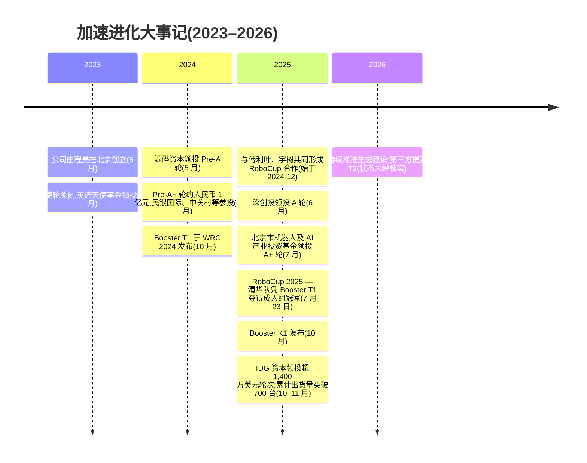
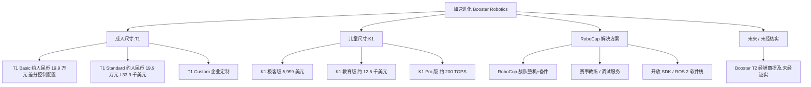
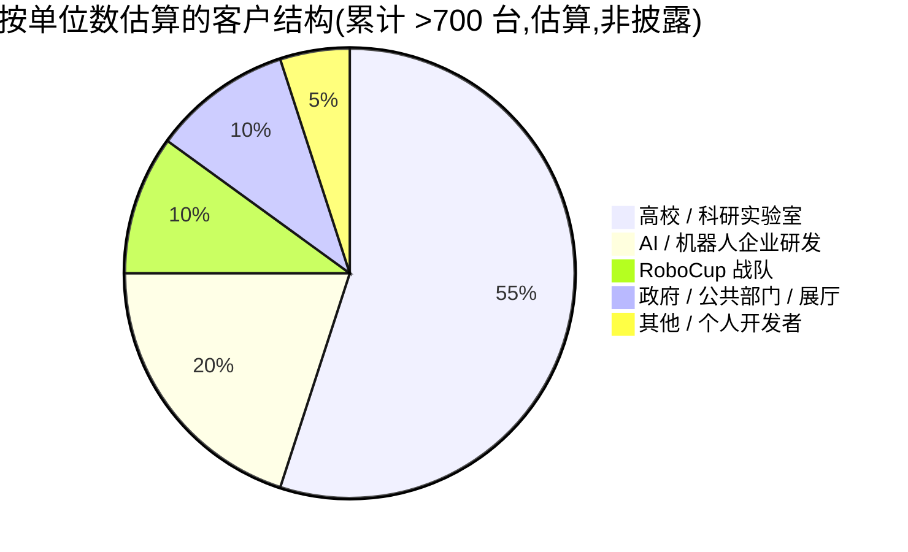
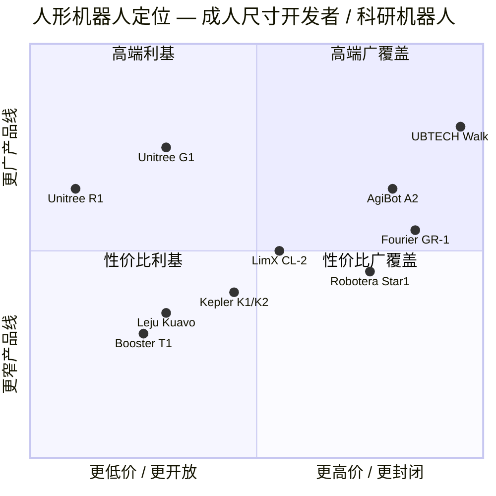

# 公司研究报告:加速进化(Booster Robotics)

**日期:** 2026-05-19
**覆盖范围:** 非上市公司 — 中国北京
**行业:** 人形机器人 / 具身智能(Embodied AI) / 科研与开发者平台
**披露状况:** 非上市公司,无经审计财务报表。本报告所有定量陈述均来源于新闻稿、创始人访谈、第三方行业媒体或可比公司公开文件。如无公开数据,本报告将明确说明。

---

## 目录
1. 公司概述
2. 公司发展历程
3. 管理团队
4. 产品与服务
5. 客户与上市策略(Go-to-Market)
6. 行业概况
7. 竞争格局
8. 市场机遇(TAM)
9. 风险评估
参考文献

---

## 1. 公司概述

加速进化(英文名 Booster Robotics,直译"Accelerated Evolution";法人主体为北京加速进化科技有限公司)是一家总部位于北京的人形机器人初创公司,由程昊于 2023 年 6 月创立。程昊为清华大学自动化系学士+硕士校友,此前曾任字节跳动旗下飞书(Lark)产品副总裁;在此之前他创办的日历类协作软件创业公司"朝夕日历"被字节跳动收购([加速进化 About 页](https://www.booster.tech/about-us/);[搜狐, 2024-09-11](https://www.sohu.com/a/778381715_489960))。公司的核心工程团队来自清华大学机器人控制实验室及清华"火神"(Hephaestus,有时英译为"Vulcan")RoboCup 团队 — 创始人本人曾担任该队队长([清华大学经济管理学院 MBA 网站](https://mba.sem.tsinghua.edu.cn/info/1116/4985.htm);[清华大学自动化系系友企业加速进化亮相世界机器人大会](https://www.au.tsinghua.edu.cn/info/1133/3764.htm))。首席科学家赵明国是清华大学副教授,在双足机器人控制领域有约二十年的研究经验,担任公司技术中坚([加速进化 Medium — 与赵明国对话](https://boosterobotics.medium.com/dialogue-with-mingguo-zhao-from-tsinghua-university-booster-robotics-replicates-boston-dynamics-f08879dd6472))。

**公司销售什么。** 加速进化设计、制造并销售小型双足人形机器人,产品被明确定位为"开发者平台"— 即面向科研用户的、配备开放 API 和 ROS 2 软件栈的硬件,而非交钥匙式的工厂工人型机器人。当前在售产品线包括:**Booster T1**(2024 年 10 月发布)— 身高 1.18 米、重量约 30 公斤、23 自由度的成人尺寸人形机器人,搭载 NVIDIA Jetson AGX Orin 计算模块;**Booster K1**(2025 年 10 月发布)— 身高 95 厘米、重量 19.5 公斤、22 自由度的儿童尺寸人形机器人,"极客版"(Geek)起售价约 5,999 美元([Booster T1 产品页](https://www.booster.tech/booster-t1/);[Booster K1 产品页](https://www.booster.tech/booster-k1/);[加速进化 K1 发布,PR Newswire,2025-10-30](https://www.prnewswire.com/news-releases/booster-robotics-unveils-booster-k1-ushering-in-the-era-of-embodied-agents-302599614.html))。第三方经销商页面提及"Booster T2 即将推出",但截至本报告日期,公司官网尚未公布该产品的规格、定价或发布日期 — 故本报告视其为**未经核实**([Latin Satelital 经销商页面 — "Booster T2 — 即将推出"](https://www.latinsatelital.com/Booster-T2-Humanoid-Robot.htm))。

**商业模式。** 加速进化的商业模式包含三大组成部分:(i)T1 / K1 整机的一次性硬件销售,中国大陆零售单价区间为 **K1 约人民币 88,000 元(约 12,500 美元)至 T1 标准版人民币 199,000 元(约 28,000 美元)**;美国/欧盟开发者渠道定价(含增值税及经销商加价后)为 T1 33,949 美元、K1 5,999–12,500 美元([世界机器人大会展品页 — 加速进化 T1](https://www.worldrobotconference.com/ex/product/777.html);[botinfo.ai T1 选购指南](https://botinfo.ai/articles/booster-t1-robot);[botinfo.ai K1 选购指南](https://botinfo.ai/articles/booster-k1-robot));(ii)机构 / RoboCup 合作伙伴业务 — 加速进化通过"RoboCup 解决方案"项目向高校战队提供硬件、零部件和工程支持([加速进化 RoboCup 合作伙伴项目](https://www.booster.tech/robocup/);[AIhub, 2024-12-23](https://aihub.org/2024/12/23/robocup-federation-teams-up-with-booster-robotics-fourier-and-unitree-robotics/));(iii)开发者生态收入(SDK、配件、替换模块)— 当前规模有限,但公司将其作为长期增长方向。

**地域布局。** 总部位于北京;制造环节位于中国大陆;客户分布于中国、美国、德国、瑞士、日本、韩国、阿联酋等地,截至 2025 年 11 月中旬,加速进化披露其产品已交付至**超过 20 个国家及 70 多家高校和科研机构**([智东西, 2025-11-17](https://zhidx.com/p/515482.html);[搜狐 / 钛媒体转载, 2025-08](https://www.sohu.com/a/975073436_116132))。

**业务规模。** 加速进化在其 A+ 轮融资公告中披露,截至 2025 年 10 月,**全球累计人形机器人出货量超过 700 台**,服务"超过 200 家企业、学术和机构客户"— 该数据由公司自身披露,未经独立审计([AsianFin / 钛媒体转载, 2025-10](https://www.asianfin.com/articles/218524);[Tracxn — 加速进化公司画像](https://tracxn.com/d/companies/boosterrobotics/___tqO8895z72kqKHdWqpuYmz_DhgO-j3eMIz-krY_9jk))。T1 在 2024 年 10 月发布后三个月内,公司称出货量已超过 50 台([CSDN — 加速进化做专为开发者打造的人形机器人](https://blog.csdn.net/weixin_49399443/article/details/145160909))。员工人数未公开披露;媒体报道暗示 2025 年团队规模在百人量级至数百人之间 — **未经核实**。

**估值快照(非上市公司)。** 加速进化自创立以来已披露至少六轮融资。关键数据点如下:

- **天使轮(2023 年 10 月)** — "数千万元人民币",由英诺天使基金领投,天创资本等跟投([EqualOcean, 2023-10-09](https://equalocean.com/news/2023100920279))。
- **Pre-A 轮(2024 年 5 月)** — 数千万元人民币,由源码资本领投,水木创投和清华系基金跟投([EqualOcean, 2024-05-08](https://equalocean.com/news/2024050820854);[加速进化 Medium — Pre-A 轮](https://boosterobotics.medium.com/booster-robotics-closes-tens-of-millions-rmb-in-pre-a-round-fb3eabcafa68))。
- **Pre-A+ 轮(2024 年 9 月)** — "约人民币 1 亿元",彼岸时代、民银国际(CMBC International)、中关村科学城及 iCANX 基金参投([新浪财经 / 36Kr, 2024-09-11](https://finance.sina.com.cn/roll/2024-09-11/doc-incntvru8696234.shtml);[加速进化 Medium — Pre-A "数千万美元"](https://boosterobotics.medium.com/let-the-robot-try-to-play-football-and-booster-robotics-to-complete-a-new-round-of-financing-of-01b803898c3a))。
- **A 轮(2025 年 6 月)** — 超人民币 1 亿元,由**深圳市创新投资集团(深创投)**领投,金鼎资本联合领投,源码、英诺、民银国际、彼岸时代跟投([新浪财经, 2025-06-04](https://finance.sina.com.cn/jjxw/2025-06-04/doc-ineywsqf0418359.shtml);[南都湾财社, 2025-06-04](https://m.mp.oeeee.com/a/BAAFRD0000202506041092096.html))。
- **A+ 轮(2025 年 7 月)** — 超人民币 1 亿元,由**北京市机器人产业发展投资基金**和**北京市人工智能产业投资基金**领投,博华资本跟投([Caixin Global, 2025-07-25](https://www.caixinglobal.com/2025-07-25/chinas-booster-robotics-lands-new-funding-as-it-hits-a-winning-streak-102344904.html);[腾讯新闻, 2025-07-25](https://news.qq.com/rain/a/20250725A05FBC00))。
- **2025 年底由 IDG 资本领投的轮次** — **超过 1,400 万美元**,这是 IDG 资本首次领投人形机器人公司;亦庄国投跟投;所有主要现有股东(源码 / 英诺 / 深创投 / 博华)均追加投资([钛媒体, 2025-10](https://www.tmtpost.com/7838958.html);[AsianFin, 2025-10](https://www.asianfin.com/articles/218524);[AHR 报道](https://ahr.so/booster-robotics-secures-new-funding-from-idg-capital/))。

Tracxn 估算上述各轮累计融资规模约为 **2,790 万美元**([Tracxn — 加速进化融资与投资人](https://tracxn.com/d/companies/booster-robotics/___tqO8895z72kqKHdWqpuYmz_DhgO-j3eMIz-krY_9jk/funding-and-investors))。**任何一轮的投后估值均未公开披露** — 所有媒体报道都明确说明这一点。作为对标参考:星动纪元(Robotera)在 2026 年 3 月战略轮后估值约**人民币 100 亿元(约 14 亿美元)**;宇树科技(Unitree)在 2025 年 6 月估值人民币 127 亿元(约 17 亿美元),2026 年 3 月 IPO 申报时目标估值约 30 亿至 70 亿美元;傅利叶智能(Fourier Intelligence)2025 年 5 月估值约 **11 亿美元**;智元机器人(AgiBot)2025 年中估值**超过 10 亿美元**([Caixin Global 关于 Robotera 报道, 2026-04-27](https://www.caixinglobal.com/2026-04-27/robot-era-raises-more-than-200-million-as-chinas-humanoid-robot-race-heats-up-102438549.html);[Caixin Global 关于宇树 IPO 申报报道, 2026-03-21](https://www.caixinglobal.com/2026-03-21/unitree-robotics-files-for-608-million-star-market-ipo-102425491.html);[CNBC 关于宇树 IPO 估值目标, 2025-09-09](https://www.cnbc.com/2025/09/09/chinas-unitree-plans-7-billion-ipo-valuation-as-humanoid-robot-race-heats-up.html);[Humanoids Daily — 估值鸿沟](https://www.humanoidsdaily.com/news/the-great-valuation-chasm-a-2025-guide-to-the-humanoid-robotics-capital-race))。从已披露累计融资额来看,加速进化在上述同业之中处于较低梯队,最准确的定位是**后期 A 轮 / 早期 B 轮的小型化平台细分赛道专家**;若按出货量相近的可比公司估值口径,投后估值可能落在 **3 亿至 6 亿美元区间** — 但**此为估算,并非公司披露数据**。公司目前未释放任何 IPO 时间表信号。

估值快照同时映照出加速进化"不做什么":宇树(人形+四足、广泛覆盖消费者)、智元(面向工业的通用人形)、优必选(全尺寸工厂人形)等竞争对手集中在全尺寸能力与工厂部署赛道,加速进化则定位为**开发者平台 / 科研 / RoboCup 细分专家**,T1 价格段明显低于 5 万美元、K1 低于 1.5 万美元。在一个最大同行均瞄准"通用型工人"应用场景的市场中,这是一个被刻意收窄的差异化切入点。

---

## 2. 公司发展历程

程昊于 2023 年中创立加速进化,正值中国具身智能浪潮兴起:他在多次访谈中称,2023 年 3 月 GPT-4 的发布"消除了人形机器人智能化的最后一道主要障碍"— 即认知与自然语言层 — 剩下的尚未解决的问题是身体、控制器与价格([清华 MBA 经管学院 — 程昊访谈](https://mba.sem.tsinghua.edu.cn/info/1116/4985.htm);[搜狐, 2024-09-11](https://www.sohu.com/a/778381715_489960))。程昊此前十年并未从事硬科技:他在清华大学自动化系师从赵明国教授完成本硕学业,毕业后在硅谷亚马逊任工程师;2015 年回国后创办了"朝夕日历"消费互联网创业项目,后被字节跳动收购并整合到飞书(Lark)体系内(注意:"朝夕光年"是字节跳动游戏业务,部分中文媒体将两者混用,本报告视其为**报道不一致**);此后他在字节跳动担任多年产品负责人([OFweek 机器人, 2023-10](https://robot.ofweek.com/2023-10/ART-8321203-8120-30613058.html))。程昊在访谈中反复强调的创业逻辑是:波士顿动力公司(Boston Dynamics)的 Atlas 已经证明双足运动控制是可解决的工程问题,但其售价处于六位数美元区间且未开放开发者接口 — 这为一家由中国工程师打造、定价为其十分之一、**面向开发者优先**的人形机器人留下了空隙。

资料来源:汇总自第 1 节中行文引用的参考文献。

**迄今为止的战略调整。** 两年半时间内可见的三次明显方向调整:

1. **从"通用人形机器人"叙事转向"开发者优先人形机器人"叙事(2024 年初)。** 公司在 2023 年的初版对外口径是较为泛化的"用于工业的人形机器人"。到 2024 年 10 月 T1 发布时,品牌信息已经固化为"为开发者而生"(Made for Developers)— 诸如 "Made for Developers, Made for Champion" 这样的标语至今仍是 booster.tech 首页的主视觉文案,围绕 ROS 2 SDK、低层关节 API 和开放生态形成明确定位([加速进化官网](https://www.booster.tech/))。这一定位让公司退出市场最拥挤的部分(工厂人形机器人),进入一个可以靠价格与开放性而非负载能力竞争的细分市场。

2. **新增 K1 儿童尺寸平台(2025 年)。** 加速进化的首款产品是 T1 成人尺寸平台。2025 年 10 月推出的 K1 是一次有意识的"向下延伸"— 更小、更便宜,面向教育、高校研究实验室和 RoboCup 儿童组联赛。这实际上为加速进化构建了一个**两层产品阶梯**(K1 作为入门、T1 作为研究平台),仅有成人级平台的竞争对手(傅利叶 GR-1/2/3、智元、优必选 Walker S 等)在价格上难以匹敌。Mike Kalil 的行业博客明确将加速进化(连同 Noetix)归为"从低端颠覆"人形市场的群体([Mike Kalil — 加速进化、Noetix 颠覆人形市场](https://mikekalil.com/blog/booster-noetix-cheap-humanoid-robots/))。

3. **将 RoboCup 作为旗舰渠道。** 2024 年 12 月,RoboCup Federation(RoboCup 联合会)宣布与加速进化、傅利叶和宇树达成正式商业合作([AIhub, 2024-12-23](https://aihub.org/2024/12/23/robocup-federation-teams-up-with-booster-robotics-fourier-and-unitree-robotics/))。在 2025 年于巴西萨尔瓦多举办的 RoboCup 大赛上,清华火神队凭借 Booster T1 硬件夺得**成人组人形足球联赛冠军** — 这是该赛事 28 年历史上中国队首次获得该项金牌;德国"Boosted HTWK"队则在 **儿童组决赛**中以 11:0 击败清华 TH-MOS,两队均使用 Booster K1([新华网, 2025-07-23](https://english.news.cn/20250723/1d0f0b61bff142f5954fc42621c68bea/c.html);[China Daily, 2025-07-25](https://global.chinadaily.com.cn/a/202507/25/WS6882e633a310ad07b5d91f03.html);[人民日报, 2025-07-24](https://en.people.cn/n3/2025/0724/c90000-20344358.html);[Humanoids Daily — K1 发布报道](https://www.humanoidsdaily.com/news/booster-robotics-launches-k1-robocup-champion-platform))。RoboCup 不仅是营销渠道,它本质上是一个开放的、持续运行的开源基准测试平台,加速进化的硬件在该平台上由富有挑战性的、技术高超的用户免费测试。

**收购:** 尚无已披露的收购。加速进化依靠有机增长以及定向招募清华 / RoboCup 校友人才。

**近期动态(过去 12 个月)。** RoboCup 2025 金牌;同一季度内连续完成 A 轮与 A+ 轮;10 月 K1 发布;10–11 月 IDG 资本领投轮次;累计出货量突破 700 台;T1 第二代软件更新及多场运动控制演示(功夫、俯卧撑、踢腿动作)成为公司社交媒体的素材主线([Scale By Tech 2026 — 加速进化发布开源人形机器人,具备功夫技能](https://scalebytech.com/booster-robotics-unveils-open-source-humanoid-with-kung-fu-skills))。

---

## 3. 管理团队

**程昊 — 创始人兼 CEO**(约 300 字)

程昊是加速进化的主导人物 — 技术型创始人、公开的 CEO,并且鉴于公司年限,几乎可以肯定是个人最大股东(具体持股比例未披露)。他在**清华大学自动化系完成本科(2005–2009)与硕士(2009–2012)学业**,师从赵明国教授,并担任过清华火神 RoboCup 战队的队长 — 正是他当前产品如今夺冠的同一赛事([加速进化 About 页](https://www.booster.tech/about-us/);[程昊 LinkedIn](https://www.linkedin.com/in/hao-cheng-04083a20/);[清华大学经管 MBA 网站](https://mba.sem.tsinghua.edu.cn/info/1116/4985.htm))。毕业后他赴硅谷亚马逊任研究工程师。2014 年回国后,于 2015 年创办**朝夕日历**(日历与协作工具创业公司),后被字节跳动收购;程昊加入字节跳动,在飞书(Lark)担任产品副总裁,在中国消费科技领域最具运营难度的公司之一负责产品业务多年([搜狐, 2024-09-11](https://www.sohu.com/a/778381715_489960);[Leaderobot — 机器人大讲堂, 2023](https://www.leaderobot.com/news/4112))。

他在 2023 年创立加速进化的逻辑(在他多次中文访谈中反复阐述)是:(a)GPT-4 级别大模型解决了人形机器人的认知瓶颈;(b)中国电机 / 减速机 / 传感器供应链已经成熟到可以将高自由度伺服系统的价格压到美国水平的十分之一;(c)全球科研社区对一个开放开发者平台存在强烈需求,而这一需求并未被波士顿动力、Figure 或宇树满足 — 它们要么过于昂贵、要么封闭、要么专注于工厂部署([新华网, 2025-04-21](http://www.news.cn/tech/20250421/9d8713b202c644beba4b67536443fd13/c.html);[清华大学经管 MBA — 程昊访谈](https://mba.sem.tsinghua.edu.cn/info/1116/4985.htm))。这一组合在创业者中并不寻常:一位具备深厚机器人技术背景的 CEO,同时具备多年消费互联网级别的大规模产品工程组织管理经验。他是公司的对外门面 — 频繁接受媒体采访、在 WRC 2024 / WAIC 2025 / WRC 2025 等会议公开亮相,并明确阐述加速进化"以 RoboCup 为上市策略"的核心思路([新浪财经 — 程昊详解机器人赛事经济学](https://cj.sina.com.cn/articles/view/5953741034/162dee0ea067029920?froms=ggmp))。**此前是否打造过上市公司:** 没有。

**赵明国 — 首席科学家**(约 180 字)

赵明国是清华大学自动化系副教授,中国双足机器人领域任期最长的研究者之一;他自 2000 年代初期开始指导清华 RoboCup 战队,加速进化公开称其拥有"约 20 年机器人控制研究经验"([加速进化 Medium — 与赵明国对话](https://boosterobotics.medium.com/dialogue-with-mingguo-zhao-from-tsinghua-university-booster-robotics-replicates-boston-dynamics-f08879dd6472);[清华大学自动化系 — 加速进化亮相 WRC](https://www.au.tsinghua.edu.cn/info/1133/3764.htm))。他是公司最资深的技术中坚,也是程昊研究生阶段的导师。其持股比例和具体运营参与程度未公开;从媒体报道来看,他既是科学顾问也是亲历技术管理的人员,而非兼职咨询顾问。他与加速进化之间的合作关系还是清华大学机器人控制实验室实际上成为公司技术校友通道的正式渠道 — 媒体报道中称公司绝大部分高级工程人员均为清华 RoboCup 校友([Wire China — 中国机器人产业谁是谁](https://www.thewirechina.com/chinas-robotics-industry/))。

**CFO 及其他已公开的 C-suite 高管。** 加速进化尚未公开提名 CFO。融资公告中的投资者关系联系人似乎是创始人或其参谋长。在中文媒体中提及的其他高层名单不一致披露;**完整的高级管理层名单未公开 — 视为披露缺口**。

**公司治理。** 加速进化是一家中国非上市有限责任公司。无公开的独立董事会;投票控制权几乎可以肯定掌握在创始人及早期股东(源码、英诺、清华系基金)手中。截至 2026 年中,主要投资人包括:源码资本、英诺天使基金、深圳市创新投资集团(深创投)、北京市机器人产业发展投资基金、北京市人工智能产业投资基金、IDG 资本、亦庄国投、博华资本、民银国际、金鼎资本、彼岸时代、清华系基金及 iCANX 基金。2025 年两家**北京市政府背景产业基金**进入股东名单的意义值得关注 — 一方面释放了市级政策支持的信号,有利于政府采购及北京亦庄工厂园区的资源获取,另一方面也引入了非纯商业目标的利益相关者。

**业绩记录综合评估。** 程昊此前有过出货产品的经验(朝夕日历→字节跳动)以及大规模工程组织管理经历,但他此前从未真正搭建过硬件公司。对一个如此年轻的公司而言,技术中坚力量异常深厚 — RoboCup 冠军并非靠 PR 能买到的 — 但商业化生产规模、覆盖 20+ 国家的售后服务体系,以及从"开发者平台"向"通用工人"的过渡,均尚未得到验证。团队已经做到的事都做到了;尚未尝试的事(如大众消费人形机器人、规模化工厂部署)仍是开放问题。

---

## 4. 产品与服务

截至 2026 年 5 月,加速进化的商业化产品线主要包含两个产品系列加一个开发者生态层。公司官网(booster.tech)的导航结构清晰地分为 **Booster T1**、**Booster K1** 与 **RoboCup 解决方案**三类([加速进化官网](https://www.booster.tech/);[加速进化 RoboCup 页](https://www.booster.tech/robocup/))。以下为 SKU 级梳理。

资料来源:汇总自 [Booster T1 产品页](https://www.booster.tech/booster-t1/)、[Booster K1 产品页](https://www.booster.tech/booster-k1/)、[botinfo.ai T1 指南](https://botinfo.ai/articles/booster-t1-robot)、[botinfo.ai K1 指南](https://botinfo.ai/articles/booster-k1-robot)及第三方经销商页面。

### Booster T1 — 成人尺寸开发者人形机器人(旗舰款)

T1 是公司当前的旗舰产品,贡献公司目前的大部分营收。核心规格(来自公司官网,并与多家第三方页面交叉核对):**身高 1.18 米、重量约 30 公斤、23 自由度(每条腿 6 × 2 + 每条手臂 4 × 2 + 腰部 1 + 头部 2),前向行走速度 > 0.5 米/秒,10.5 Ah 电池,可提供约 2 小时行走 / 4 小时站立工作时间**。计算单元:Intel Core i7-1370P CPU 加 **NVIDIA Jetson AGX Orin 32GB,可提供最高 200 TOPS** 算力用于机载感知和学习型策略推理。传感器:3D 激光雷达、Intel 深度相机、9 轴惯性测量单元(IMU)、麦克风阵列与扬声器。软件:完整 ROS 2 软件栈、低层关节 API、高层运动 API、Python 与 C++ SDK,无专有锁定([Booster T1 产品页](https://www.booster.tech/booster-t1/);[botinfo.ai T1 规格](https://botinfo.ai/articles/booster-t1-robot);[Origin of Bots — T1 评测](https://www.originofbots.com/robot/t1-humanoid-by-booster-robotics-details-specifications-rating);[Aparobot T1 列表](https://www.aparobot.com/robots/booster-t1))。

**目标客户。** 高校与企业研究实验室、从事具身智能 / 运动策略 / 全身控制工作的 AI 开发者,以及 RoboCup 成人组社区。产品页"为开发者而生"(Made for Developers)的口号异常明确 — 加速进化并未将 T1 定位为工人、消费陪伴机器人或客服机器人。

**定价。** T1 标准版国内零售价为人民币 199,000 元 — 约合 28,000 美元 — 来自 WRC 展品页登记,并在中国行业媒体得到确认([WRC 2024 展品页](https://www.worldrobotconference.com/ex/product/777.html);[CSDN — 加速进化做专为开发者打造的人形机器人](https://blog.csdn.net/weixin_49399443/article/details/145160909))。海外开发者渠道定价(经销商口径)为 **33,949 美元 / 45,000 美元**,具体取决于经销商及配置([botinfo.ai T1 选购指南](https://botinfo.ai/articles/booster-t1-robot);[robozaps T1 标准版列表](https://robozaps.com/products/t1-standard);[Generation Robots T1 列表](https://www.generationrobots.com/en/404278-booster-t1-humanoid-robot.html))。这一价差(国内 vs 海外)对中国硬件而言属于正常水平,反映的是增值税、运费、经销商加价及进口合规成本,而非同一产品的两种定价。

**竞争优势判断:部分成立 — 窄但有防御性。**
- **护城河类型:** 生态(RoboCup 渠道、开放 SDK 开发者社区、清华人才通道)叠加 *温和的* 成本优势(T1 价格低于约 9 万美元起的宇树 H1,但与 16,000–73,900 美元定价区间的宇树 G1 在同配置下大致持平)。
- **证据:** RoboCup 2025 成人组金牌与银牌均使用 T1 — 这是对全球科研社区的直接头对头实证([新华网, 2025-07-23](https://english.news.cn/20250723/1d0f0b61bff142f5954fc42621c68bea/c.html));发布后前三个月出货超 50 台,2025 年第四季度累计全球出货超 700 台([AsianFin / 钛媒体, 2025-10](https://www.asianfin.com/articles/218524))。
- **最接近的竞争对手:** **宇树 G1**(身高 132 厘米,16,000–73,900 美元,共 16 种配置,教育版配置全面支持 ROS 2 / Python / C++)([宇树 G1 官网](https://www.unitree.com/g1/);[botinfo.ai G1 评测](https://botinfo.ai/articles/unitree-g1))。G1 是与 Booster T1 直接构成竞争的唯一单品。一句话对比:**宇树 G1 体型更高、配置更多、出货量更大;Booster T1 更聚焦于研究 / RoboCup 用途,SDK 更开放,"我们不锁定用户"的卖点更鲜明。** 性价比大致持平;**出货量落后**;**在开发者开放度上持平或略胜一筹**(第三方评测中的非正式判断)。

### Booster K1 — 儿童尺寸具身智能开发平台

2025 年 10 月发布。身高 95 厘米、重量 19.5 公斤、22 自由度(每条腿 6 × 2 + 每条手臂 4 × 2 + 头部 2),搭载 NVIDIA Jetson Orin NX、双目 / 深度相机、9 轴 IMU、麦克风阵列。共三个版本:**极客版(Geek,48 TOPS,5,999 美元,前 1,000 台特价 4,999 美元)**;**教育版(EDU,40–117 TOPS,约 12,500 美元)**;**Pro 版(200 TOPS)**([Booster K1 产品页](https://www.booster.tech/booster-k1/);[K1 发布 PR Newswire 通稿,2025-10-30](https://www.prnewswire.com/news-releases/booster-robotics-unveils-booster-k1-ushering-in-the-era-of-embodied-agents-302599614.html);[botinfo.ai K1 选购指南](https://botinfo.ai/articles/booster-k1-robot);[Humanoids Daily — K1 发布](https://www.humanoidsdaily.com/news/booster-robotics-launches-k1-robocup-champion-platform))。

**目标客户。** 大学(本科教学)、资金充足的中学 STEM 项目、RoboCup 儿童组战队,以及希望在拥有一台成人尺寸平台之外,再增置一台更便宜、更易耗损的副平台的研究实验室。

**竞争优势判断:成立 — 短期内强势。** Booster K1 在发布之时,是**唯一一款 6,000 美元以下、达到 RoboCup 冠军级水平的儿童尺寸人形机器人**。RoboCup 儿童组 2025 决赛双方(德国 Boosted HTWK 队与清华 TH-MOS 队)均使用 K1([Humanoids Daily — K1 发布](https://www.humanoidsdaily.com/news/booster-robotics-launches-k1-robocup-champion-platform))。
- **护城河:** 单凭定价段位即可形成至少一年的优势;辅以 RoboCup 品牌效应与可与 T1 复用的 SDK。
- **最接近的竞争对手:** **宇树 R1**,定价 4,900–5,900 美元,于 2025 年 7 月发布([宇树 R1 — Origin of Bots](https://www.originofbots.com/robot/unitree-r1-by-unitree-robotics-details-specifications-rating);[Humanoid.guide R1](https://humanoid.guide/product/unitree-r1/))。一句话对比:**R1 更便宜,且具备宇树品牌与规模优势;K1 则是更开放的开发者平台,功能列表更长(各版本均原生支持 ROS 2,高配版自由度更多)。** 价格落后;形态持平;开发者开放度领先。

### RoboCup 解决方案与开发者生态

并非独立 SKU,而是一种项目:加速进化将 T1 / K1 作为"RoboCup 战队整体方案"出售,包含工程支持、备件、软件工具及赛事现场技术人员。在 2024 年 12 月 RoboCup 联合会的合作公告之后,加速进化、傅利叶与宇树是仅有的三家获得正式厂商资质的公司([AIhub, 2024-12-23](https://aihub.org/2024/12/23/robocup-federation-teams-up-with-booster-robotics-fourier-and-unitree-robotics/))。对一家"以赢得 RoboCup 的平台"为产品的公司而言,这是一个杠杆极高的营销渠道:一个赛事赛季就能产出数百小时由中立、专业用户驾驶 Booster 硬件的高质量视频。这条渠道的经济性更接近于体育用品赞助,而非典型的 B2B 销售渠道;非中国背景的竞争对手(其战队很难将中国机器人导入美国 / 欧盟高校采购流程)很难复制。

### 旗舰款与长尾产品

当前**按收入计算 T1 是旗舰**(单价更高 × 在累计 700+ 出货中占有可观份额),而 **K1 是销量主导款**(单价更低 × 在高校与中学市场具有显著更大的 TAM)。第三方经销商所提及的 "T2" 未经核实,截至 2026 年 5 月并未出现在公司官网。

### 产品路线图 / 近 12 个月发布动态

- 2024 年 10 月:T1 在 WRC 2024 发布。
- 2024 年 12 月:RoboCup 联合会合作。
- 2025 年 7 月:RoboCup 2025 夺冠(成人组金牌+银牌、儿童组决赛)。
- 2025 年 10 月:K1 发布。
- 2025 年 10–11 月:IDG 资本领投轮次 + 出货量超过 700 台。
- 2026 年:持续 SDK 更新(功夫、俯卧撑及运动控制示范),小批量交付企业定制的大型配置;访谈中提及后续代际硬件,但未公布具体规格。

---

## 5. 客户与上市策略(Go-to-Market)

**客户细分。** 加速进化客户结构可分为四类:

1. **高校 / 科研机构实验室** — 按客户数量计为最大单一群体。加速进化披露其客户包括**超过 70 所高校与科研机构**,其中包括清华大学、中国农业大学、得克萨斯大学(University of Texas),以及数十家欧洲、韩国和日本实验室([智东西, 2025-11-17](https://zhidx.com/p/515482.html);[China Daily, 2025-07-25](https://global.chinadaily.com.cn/a/202507/25/WS6882e633a310ad07b5d91f03.html))。
2. **AI / 具身智能企业研发部门** — 构建运动策略软件栈的公司(例如尝试具身智能体的大模型实验室)。该类别的具名客户大多数未公开披露。
3. **RoboCup 战队** — 全球约二十多个儿童组与成人组联赛战队,在 RoboCup 合作后已标准化使用 Booster 硬件([AIhub, 2024-12-23](https://aihub.org/2024/12/23/robocup-federation-teams-up-with-booster-robotics-fourier-and-unitree-robotics/))。
4. **政府 / 公共部门** — 北京亦庄机器人园区设有 T1 展厅门店,定价人民币 199,000 元([CSDN — 加速进化做专为开发者打造的人形机器人](https://blog.csdn.net/weixin_49399443/article/details/145160909))。北京产业基金参与 A+ 轮亦预示着后续市级采购渠道空间。

**客户集中度 — 量化分析。** 加速进化未上市,亦未披露单一客户营收。最接近披露的指标是分布于"**20+ 个国家**"的"**200 余家企业、学术与机构客户**"以及"**累计出货量超过 700 台**"([AsianFin / 钛媒体, 2025-10](https://www.asianfin.com/articles/218524))。按上述数据推算,平均每位客户约持有 3–4 台机器人,意味着 Top-1 客户**并非**主导性收入来源 — 但公司未披露任何客户集中度数据,以上仅为推断,而非事实。**视为披露缺口**:不能排除有 1–2 家大型机构买家(例如北京市级项目、清华 / 中科院的大型研究联盟)占据滚动营收 20% 以上的可能性。

资料来源:基于本节引用的媒体报道估算;**并非来自任何公司披露**。仅作示意。

**地域分布。** 国内单位出货量很可能仍占多数 — 北京亦庄展厅、高校采购及政府展厅订单集中于国内 — 但加速进化所述的 20+ 国家覆盖范围,在一家成立仅 2.5 年的硬件公司而言并不常见。媒体报道明确提及的国别部署包括**美国、德国、瑞士、日本、韩国及阿联酋**([CSDN — 加速进化做专为开发者打造的人形机器人](https://blog.csdn.net/weixin_49399443/article/details/145160909);[加速进化 About 页](https://www.booster.tech/about-us/))。

**销售渠道。** 共三类:

- **直销 / 官网** — booster.tech 接受全球直接订单,包括 K1 极客开发者 SKU。
- **国际经销商** — Generation Robots(法国)、K-Robotics、Robots International、Robozaps 等负责欧美分销;经销商加价是国内与海外定价差距的主要原因([Generation Robots — Booster T1](https://www.generationrobots.com/en/404278-booster-t1-humanoid-robot.html);[robozaps — T1 标准版](https://robozaps.com/products/t1-standard);[Robots International — 加速进化人形机器人](https://www.robotsinternational.com/Booster-Robotics.htm))。
- **展厅 / 零售** — 北京亦庄机器人 4S 店;未来可能扩展至其他中国城市。

**销售周期。** 高校实验室采购周期更接近 B2B 教育设备销售而非传统工业机器人 — 以月而非季度计,因为决策方是支配项目科研经费的教授,而非按五年 ROI 模型审批的 CFO。企业研发客户的周期可能更快(单个 AI 实验室凭借 OPEX 预算购入数台)。加速进化未披露单位经济性数据,但一台不到 3 万美元、在中国制造、估算物料成本 1 万–1.5 万美元的机器人,毛利率应**落在 35%–55% 区间** — **估算,非披露**;与宇树 2025 年披露的 59.5% 毛利率一致([宇树 IPO 申报 — Caixin, 2026-03-21](https://www.caixinglobal.com/2026-03-21/unitree-robotics-files-for-608-million-star-market-ipo-102425491.html))。

**合作伙伴。** RoboCup 联合会、清华大学(非正式 R&D / 人才通道)、北京亦庄(展厅零售)、英伟达(Jetson Orin 计算平台 — 标准供应,非战略关系)。

**客户案例研究。** 公开可验证的具名案例包括:**清华火神战队 — RoboCup 2025 成人组冠军**;**中国农业大学山海战队 — 成人组亚军**;**Boosted HTWK(德国)— RoboCup 2025 儿童组冠军**;**TH-MOS(清华)— 儿童组 2025 决赛入围**([X / Beijing Discover, 2025-07-21](https://x.com/BeijingDiscover/status/1947191927901958285);[新华网, 2025-07-23](https://english.news.cn/20250723/1d0f0b61bff142f5954fc42621c68bea/c.html);[China Daily, 2025-07-25](https://global.chinadaily.com.cn/a/202507/25/WS6882e633a310ad07b5d91f03.html))。

---

## 6. 行业概况

**行业界定。** 人形机器人是面向"为人类设计的非结构化环境(工厂、仓库、家庭)中的体力工作"或"具身智能科研 / 开发 / 教育"的双足拟人型机器人。临近行业包括工业关节机器人(六轴机械臂)、AGV / AMR(仓储移动机器人)、四足机器人、服务 / 消费机器人。与加速进化最直接相关的细分为**人形机器人的科研与开发子赛道** — 高校、政府实验室、企业研发与竞技机器人 — 与教育机器人市场存在交集。

**市场规模。** 各家预测差异显著。最常被引用的高盛(Goldman Sachs)研究将人形机器人 TAM 修正为**到 2035 年达到 380 亿美元**,在更近期的更乐观采纳场景下该数字进一步提升至 **1,540 亿至 2,050 亿美元**([高盛 — 人形机器人全球市场到 2035 年可能达到 380 亿美元](https://www.goldmansachs.com/insights/articles/the-global-market-for-robots-could-reach-38-billion-by-2035);[Humanoids Daily — 市场预测](https://www.humanoidsdaily.com/news/humanoid-robot-market-forecasts-a-landscape-of-high-hopes-and-wide-disagreement))。摩根士丹利(Morgan Stanley)预测到 2050 年人形机器人生态系统(含供应链与服务)规模将达 5 万亿美元 — 这是一个 25 年的累计口径,与高盛仅含机器人销售的口径不可直接比较([摩根士丹利 — 人形机器人市场到 2050 年预计达 5 万亿美元](https://www.morganstanley.com/insights/articles/humanoid-robot-market-5-trillion-by-2050))。MarketsandMarkets 对中国市场的预测为 **2025 年 4.0 亿美元 → 2030 年 28 亿美元,复合年增长率 47.6%**([MarketsandMarkets — 中国人形机器人市场](https://www.marketsandmarkets.com/Market-Reports/china-humanoid-robot-market-203952382.html))。2025 年单位出货量方面 — 高盛预计 **2026 年全球出货量 5 万至 10 万台**,而 **2025 年全球估计出货 16,000 台**(CSIS / 行业估算),其中"大多数"来自中国制造商([Carnegie Endowment — 具身智能:中国押注智能机器人](https://carnegieendowment.org/research/2025/11/embodied-ai-china-smart-robots?lang=en);[ChinaPower / CSIS](https://chinapower.csis.org/china-industrial-robots/))。

*本次未生成该图表 — 占位符。资料来源:[高盛 2024–2025 年度研究](https://www.goldmansachs.com/insights/articles/the-global-market-for-robots-could-reach-38-billion-by-2035)。*

**增长驱动。**

- **人口老龄化压力** 中国、日本、韩国及大部分西欧国家面临劳动力短缺,限制了工厂与护理用工的可获得性,产生结构性的机器人替代需求。
- **具身智能技术突破。** 大规模预训练的视觉-语言-行动模型(VLA)(Google RT-2 / RT-X / DeepMind Gemini Robotics / Figure 的 Helix / Physical Intelligence π0)实质性提升了人形机器人开箱即用的能力上限,免去多年的逐任务定制编程。
- **中国产业政策。** 工信部 2023–2025 年人形机器人发展计划、北京 / 上海 / 深圳市级机器人基金、有政府背景的采购方(媒体报道中国移动 2025 年向宇树 / 智元采购金额约 1,700 万美元的人形机器人) — 形成直接需求补贴与间接投资补贴的双重激励([Carnegie — 具身智能](https://carnegieendowment.org/research/2025/11/embodied-ai-china-smart-robots?lang=en);[新华网 — 中国人形机器人创新蓄势待发](https://english.news.cn/20250811/41ea4de256c34676a1654f1b1addb710/c.html))。
- **成本下行。** 宇树 R1 在 2025 年 7 月以 5,900 美元发布,震动行业并重置了"低端人形机器人"的价格基准。高盛预测随时间推移单价将下降至 15,000–20,000 美元 — 该预测在中国供应链经济性下显得可信。

**监管环境。** 当前监管力度较弱,各司法辖区差异显著。

- **中国:** 国家级 2023–2025 工业政策与市级补贴并行;部分高端组件出口管制,但人形机器人整机出口并无重大限制。
- **美国:** 高级 AI 算力的出口管制(CHIPS 法案、BIS 规则)可能限制 Jetson 级算力进入中国客户产品的部分,但 T1 所用的 AGX Orin 在整机层面目前并未受限。当前对人形机器人尚无美国进口专项限制,但监管方向对中国硬件呈敌对趋势(CFIUS、BIS UVL 清单、可能的 232 条款关税)。
- **欧盟:** GDPR、机械指令以及即将颁布的 AI 法案"高风险"具身系统条款 — 短期内对加速进化以研发为主的客户群没有强制约束力,但未来如向欧盟工厂部署商用化产品,将面临认证成本。

**行业结构。**

- **当前高度分散。** 全球 60+ 家公司,其中包括中国头部企业(宇树、智元、星动纪元、优必选、傅利叶、加速进化、逐际动力、Kepler 开普勒、MagicLab 魔法原子、乐聚、EngineAI、小鹏关联项目、Noetix、X Square、Astribot 等)、美国头部企业(特斯拉 Optimus、Figure、波士顿动力 — 现为现代汽车旗下、Apptronik、1X、Sanctuary)、日韩参与者(现代汽车 Atlas 业务、丰田研究机器人、本田历史业务)及欧洲参与者(Pal Robotics)。
- **供应商议价能力** 在电机 / 执行器 / 谐波减速机环节较强(历史上由 Harmonic Drive、Nabtesco 等日本供应商主导;中国国产替代正在加速)。
- **买方议价能力** 当前中等(科研 / 政府买家价格敏感度较低),但工厂部署规模化时议价能力将明显增强。
- **替代品** 包括传统工业关节机器人、AMR、可穿戴外骨骼,以及"直接雇佣人类"。
- **进入壁垒** 在原型展示阶段已经较低,但**在覆盖 20+ 国家实现可靠规模化交付的环节较高** — 加速进化真正的运营护城河就在这一空隙中。

中国机器人行业投资活动异常活跃:**2025 年前 9 个月共发生 610 笔机器人投资交易,合计人民币 500 亿元(约 70 亿美元),同比增长 250%**([Morgan Stanley insights,由 Reeman 汇总](https://www.reemanrobot.com/news/humanoid-robotics-track-sees-another-billion-d-81100253.html))。仅中国人形机器人 2025 年融资额就**超过 10 亿美元**([Verdict — 中国人形机器人市场遥遥领先](https://www.verdict.co.uk/china-humanoid-market/))。

---

## 7. 竞争格局

加速进化作为一家小型化 / 开发者平台细分赛道专家,其竞争对手覆盖范围从消费陪伴机器人到工厂工人级机器人,远比加速进化广。下表是一份按可比性结构化的同业对比,所有数据均注明出处。

| 公司 | 总部 | 已披露估值 / IPO 目标 | 旗舰产品与价格 | 与加速进化的差异化 |
|---|---|---|---|---|
| **宇树科技(Unitree)** | 杭州 | 2025 年 6 月人民币 127 亿元(约 17 亿美元);2026 年 3 月递交科创板 IPO,募资人民币 42 亿元(6.08 亿美元),目标 IPO 后估值约人民币 500 亿至 1,000 亿元([Caixin, 2026-03-21](https://www.caixinglobal.com/2026-03-21/unitree-robotics-files-for-608-million-star-market-ipo-102425491.html);[CNBC, 2025-09-09](https://www.cnbc.com/2025/09/09/chinas-unitree-plans-7-billion-ipo-valuation-as-humanoid-robot-race-heats-up.html)) | H1(约 9 万–15 万美元)、G1(16–73.9 千美元)、R1(4.9–5.9 千美元);另有四足机器人业务 | 体量更大;产品线更广,含四足;2025 年人形出货量超 5,500 台;同时覆盖消费、科研、企业三大渠道;**规模领先,但 RoboCup 专注度低于加速进化** |
| **智元机器人(AgiBot)** | 上海 | 2025 年中超过 10 亿美元;规划赴港 IPO,目标 400 亿至 500 亿港元(51 亿–64 亿美元)([Yahoo Finance / Reuters](https://finance.yahoo.com/news/exclusive-chinese-robot-maker-agibot-092020928.html)) | A2 / 远征通用型人形机器人,约 10 万美元级 | 通用型工厂人形机器人;战略股东实力雄厚(LG、比亚迪、高瓴、未来基金);**资本与工厂方向领先,开发者开放度落后** |
| **星动纪元(Robotera)** | 北京(清华 IIIS 孵化) | 2026 年 3 月战略轮后估值超人民币 100 亿元(约 14 亿美元);A+ 轮约人民币 10 亿元(1.4 亿美元)([Caixin, 2026-04-27](https://www.caixinglobal.com/2026-04-27/robot-era-raises-more-than-200-million-as-chinas-humanoid-robot-race-heats-up-102438549.html);[Bloomberg, 2025-10-22](https://www.bloomberg.com/news/articles/2025-10-22/chinese-humanoid-robot-maker-raises-200-million-ahead-of-ipo)) | Star1 人形机器人、灵巧手 | 同为清华系,资本规模更大,更聚焦灵巧操作;**资金和 IIIS 学术深度领先,产品线更窄** |
| **优必选(UBTECH,HKEX 9880)** | 深圳 | 上市公司(港股);FY2025 营收 **人民币 20 亿元**(+53% 同比),人形机器人收入 **人民币 8.21 亿元**(+2,204% 同比),全尺寸人形机器人出货 **1,079 台**,净亏损人民币 7.9 亿元,现金人民币 48.2 亿元([Humanoids Daily — 优必选 2025 财务](https://www.humanoidsdaily.com/news/ubtech-s-2025-financials-humanoids-leap-to-center-stage-as-losses-narrow);[Gasgoo — 优必选 2025 年报解读](https://autonews.gasgoo.com/articles/icv/ubtech-2025-report-card-revenue-from-full-size-humanoid-robots-grows-over-22-fold-2039900685372407808)) | Walker S、S1、S2 — 工厂型人形机器人 | 唯一上市同业;**工厂部署与规模领先,开放 SDK 和单价水平落后** |
| **傅利叶智能(Fourier Intelligence)** | 上海 | 2025 年 5 月估值约 11 亿美元(投前);累计融资约 1.93 亿美元,股东含软银愿景二期、Prosperity7([Humanoids Daily — 估值鸿沟](https://www.humanoidsdaily.com/news/the-great-valuation-chasm-a-2025-guide-to-the-humanoid-robotics-capital-race)) | GR-1、GR-2、GR-3(康复机器人);GR-1 量产目标价 15 万–17 万美元 | 医疗 / 康复 + 科研;国际化 VC 股东基础更深;**医疗领域领先,RoboCup 社区落后** |
| **逐际动力(LimX Dynamics)** | 深圳 | 2026 年 2 月 B 轮 2 亿美元 — 含京东、石头创投、东方财富、CoStone([SiliconANGLE, 2026-02-02](https://siliconangle.com/2026/02/02/limx-raises-200m-build-embodied-intelligence-humanoid-robotics/);[The Robot Report — 逐际 2 亿美元](https://www.therobotreport.com/limx-dynamics-raises-200m-for-humanoid-robot-expansion/)) | CL-2、CL-3 人形机器人 + 双足平台 | 聚焦具身智能大脑;**运动控制 R&D 深度领先,RoboCup 渠道落后** |
| **Kepler 开普勒** | 上海 | 未公开;以量产 / 成本为竞争点([Edge AI and Vision Alliance, 2025-11](https://www.edge-ai-vision.com/2025/11/humanoid-robots-2025-the-race-to-useful-intelligence/)) | K1 / K2 工业用人形机器人 | 国际曝光度较低;**品牌与示范案例落后** |
| **MagicLab 魔法原子(小鹏关联生态)** | 无锡 | 未公开 | MagicBot + Z1(缩小型人形机器人) | 小鹏汽车生态;**汽车供应链资源领先** |
| **乐聚机器人(Leju Robotics)** | 深圳 | 上市前已融资超 2 亿美元([中国人形机器人公司 Top 20 — XCarspace](https://xcarspace.com/top-20-chinese-humanoid-robot-companies-ranked-by-valuation/)) | Kuavo 人形机器人 | 与加速进化相近的教育 / 科研定位;**K1 应用场景的直接竞争对手** |

资料来源:作者根据上述引用的规格信息估算定位;并非来自任何单一市场研究报告。

**加速进化的竞争优势。**

1. **RoboCup 渠道锁定。** RoboCup 2025 成人组与儿童组决赛中约一半使用 Booster 硬件。处于研发周期中段的高校战队切换硬件意味着数个月的工作量;这对加速进化构成的有利效应,类似 NVIDIA CUDA 之于 NVIDIA。
2. **开放的开发者技术栈。** 原生 ROS 2、完整低层关节 API、不设专有 SDK 闸门。宇树虽已收敛至类似路径,但历史上对"教育版"SKU 收费;加速进化的卖点是开放是默认,而非升级选项。
3. **清华人才通道。** 程昊本人的实验室、程昊曾带队的 RoboCup 战队、程昊本人的导师 — 这可能是中国人形机器人领域同类工作中最高质量的人才池。
4. **细分专业化定位。** 当宇树和智元在"什么都做"时,加速进化在"开发者 / 科研 / RoboCup"上做减法。只要该细分市场存在,这种聚焦就是真实的竞争优势。

**加速进化的竞争弱点。**

1. **相对宇树的规模劣势。** 宇树 2025 年人形机器人出货超 5,500 台,而加速进化累计仅 700+。供应链议价、零部件采购价格、制造工艺积累等都呈复利效应;加速进化的单位毛利率几乎可以肯定低于宇树。
2. **依赖 RoboCup 作为品类定义者。** 一旦 RoboCup 影响力下降(LLM 驱动的仿真联赛取代物理联赛、赞助商减少),加速进化的旗舰营销渠道将削弱。
3. **无工厂部署。** 加速进化迄今未公布任何一例工厂部署案例 — 这是当下有意的取舍,但意味着公司在人形机器人最大单一收入来源(工业部署)上完全无敞口。
4. **资本规模差距。** 加速进化约 2,800 万美元的累计融资规模,大约相当于宇树 / 智元 / 星动纪元 / 逐际任一一家的一个 B 轮规模。在硬件迭代资本密集的赛道中,这一差距是有意义的。

**市场份额。** 无可靠的第三方份额数据。按 2025 年单位出货量推算:宇树(5,500+)> 智元(数千台,具体未披露)> 优必选(1,079 台全尺寸)> **加速进化(累计 700+,累计两年)** > 星动纪元 / 逐际 / Kepler / 傅利叶 / 乐聚(各家约百台量级或未披露)。加速进化在 60+ 家全球公司中按出货量属于中游 — 但在其特有的开发者平台细分赛道中属于顶级玩家。

---

## 8. 市场机遇(TAM)

**TAM(全球人形机器人)。** 高盛 2024/2025 年最常被引用的基准情形为**到 2035 年 380 亿美元**,极限上行情形为 **1,540 亿至 2,050 亿美元**([高盛 — 人形机器人全球市场到 2035 年可能达到 380 亿美元](https://www.goldmansachs.com/insights/articles/the-global-market-for-robots-could-reach-38-billion-by-2035);[Humanoids Daily — 市场预测](https://www.humanoidsdaily.com/news/humanoid-robot-market-forecasts-a-landscape-of-high-hopes-and-wide-disagreement))。摩根士丹利提出的"到 2050 年 5 万亿美元"应作为 25 年的"漏斗顶部"数据解读([摩根士丹利](https://www.morganstanley.com/insights/articles/humanoid-robot-market-5-trillion-by-2050))。

**SAM(中国人形机器人)。** MarketsandMarkets 规模预测:**2025 年 4.0 亿美元 → 2030 年 28 亿美元,复合年增长率 47.6%**([MarketsandMarkets — 中国人形机器人市场](https://www.marketsandmarkets.com/Market-Reports/china-humanoid-robot-market-203952382.html))。这是加速进化所处的更宽口径市场 — 但加速进化的上市策略是全球而非仅中国,因此其 SAM 应理解为全球 TAM 中的一个切片。无论按何种口径,2026 年加速进化所处 SAM 都在低个位数十亿美元区间。

**加速进化的 SOM — 可触达的部分。** 加速进化实际的上市策略聚焦于三个切片:

1. **全球人形机器人 R&D 市场 — 高校、科研机构、RoboCup 战队、企业具身智能 R&D 实验室。** 高盛预计 2026 年全球人形机器人出货 5 万至 10 万台,即使"科研 / 非工业"占单位需求的 10%–20%,可触达单位量也在 5,000–20,000 台/年 — 按加速进化平均售价测算,约对应 **1 亿至 5 亿美元 SOM**。
2. **教育机器人市场扩张** — K1 的价格点开辟了一个更接近 STEM 设备采购而非工业机器人采购的子市场,如果 K1 能复现宇树 R1 同样的价格-质量曲线,潜在需求规模会显著更大。
3. **RoboCup 相关生态收入** — 备件、服务、培训、软件配件。绝对量不大,但黏性极强。

2026 年 SOM 估算(作者计算,非来自单一市场研究报告):**100 亿至 300 亿(应为 1 亿至 3 亿美元)** — 即加速进化当前在开发者 / 教育 / 科研细分市场参与竞争的可获取营收规模约为 **1 亿至 3 亿美元**,在未来 24 个月内可能力争捕获 10%–25%。若能命中目标,FY2026 营收落在 **2,000 万至 7,500 万美元区间** — **估算,非披露**。

**渗透策略。** 三条明确路径:

1. **以 RoboCup 为导向的营销。** 构建全球最强的赛事获胜机器人车队;让赛事结果为 SDK 代言。
2. **K1 作为漏斗顶端。** 以低于 6,000 美元的价格将 K1 推入高校与中学;将成熟用户向上转化至 T1 及(预设的)T2。
3. **国际化。** 加速进化已覆盖 20+ 个国家,这一区域足迹已超过许多国内同业;真正的战略挑战在于美国 / 欧盟出口与采购摩擦是否会迫使其退守至"仅中国市场"。

---

## 9. 风险评估

### 公司层面风险

1. **执行 / 规模化风险(中等偏高)。** 加速进化累计出货量超过 700 台 — 在初创公司中并非微不足道,但相较竞争对手仍属小规模。从"RoboCup 冠军"到"季度出货 1,000 台"的过渡,是硬件创业公司最常见的失败节点。加速进化的硬件迭代节奏(T1 于 2024 年 10 月发布、K1 于 2025 年 10 月发布、T2 被提及但未确认)相当激进,这也增加了供应链就绪度滞后于营销节奏的风险。*缓释因素:* 北京亦庄制造园区及 A+ 轮市级基金支持应有助于物理产能扩张。

2. **客户集中度(未量化 — 披露缺口)。** 加速进化未披露 Top-1 或 Top-5 客户份额。在约 200 家披露客户和 700 多台出货中,平均每位客户为 3–4 台,但 Top-1 客户份额可能在 10%–25% 区间(如大型北京市级项目或单一研究联盟订单)。*如确认 >20% 的严重程度:* 重大。*缓释因素:* RoboCup 渠道自然分散为数十支战队。

3. **关键人员依赖(高)。** 程昊集创始人、CEO、对外门面与推定最大个人股东于一身。赵明国作为技术中坚已年逾 50。董事会 / 治理结构未公开。任一人士的离开都将对公司构成重大打击。

4. **T2 / 下一代产品的路线图不确定性。** 第三方经销商列出 "T2 — 即将推出",但公司尚未公布规格或定价。若 T2 真实存在且表现不及预期、或并不存在,信息空白可能削弱开发者信任。*缓释因素:* T1 / K1 的迭代节奏足够强劲,品牌可承受 T2 延期。

5. **制造与政策支持高度集中于中国。** 加速进化的供应链位于中国;A+ 轮北京基金的参与增加了市级政府敞口。地缘政治扰动(关税、BIS 出口管制)可能对国际出货构成实质性影响。

6. **相对宇树 R1 的定价权。** 宇树 R1 定价 5,900 美元已经低于 K1 极客版(5,999 美元);宇树已具备 IPO 通道与可信的进一步降本路径。如宇树发起入门级开发者人形机器人的价格战,加速进化的毛利率将被压缩。

### 行业 / 市场风险

7. **极端激烈的竞争。** 全球 60+ 家、仅中国约 25 家、2025 年仅中国人形机器人就获得约 10 亿美元投资([Verdict](https://www.verdict.co.uk/china-humanoid-market/))。部分同业(宇树、智元、星动纪元、优必选)资本规模是加速进化的 3–10 倍。*严重程度:* 高。*缓释因素:* 在开发者 / RoboCup 渠道的细分聚焦 — 但宇树随时可以切入该细分。

8. **技术颠覆 — VLA 模型可能使控制器层商品化。** 随着基础模型 VLA 软件栈(RT-2 / Helix / π0 / Gemini Robotics)逐步成熟,加速进化最深的护城河 — 低层关节控制 IP — 的价值,会相对于数据 + 云 + 生态(加速进化在阿里、比亚迪等背景同业面前较弱的环节)逐步下降。

9. **监管 / 出口管制风险。** 未来美国 BIS 可能将中国人形机器人厂商列入限制名单,或对中国机器人进口征收关税,均将直接打击加速进化覆盖 20+ 国家的足迹。*可能性:* 中等且持续上升。

10. **对 RoboCup 作为品类定义者的依赖。** RoboCup 由学术联合会而非商业实体运营。若赞助或曝光度下滑 — 或一个竞争性人形机器人联赛兴起并加冕另一家厂商 — 加速进化的营销渠道护城河将被侵蚀。

### 财务风险

11. **资本密集赛道中的现金跑道。** 累计约 2,800 万美元相对同业偏小;即便经过 2025 年多轮融资,加速进化也很可能需要在未来 12–18 个月内完成一轮 5,000 万至 1.5 亿美元规模的 B 轮以支持制造扩张。*风险:* 融资市场冷却(AI / 机器人板块轮动、宇树 IPO 后科创板调整)可能在公司规模化过程中挤压资金。

12. **盈利时间表 / 现金消耗。** 加速进化未披露财务数据。参照优必选(2025 年营收人民币 20 亿元、净亏损人民币 7.9 亿元)及大部分非宇树同业,加速进化几乎可以肯定处于亏损状态,毛利率估计约 30%–55%(估算)。*缓释因素:* 北京本地低成本 R&D 基地;北京基金支持减轻现金消耗压力。

13. **未来轮投资人的估值 / 倍数压缩风险。** 星动纪元(人民币 100 亿元)、宇树(30–70 亿美元)、智元(50–60 亿美元)— 这些都设定了加速进化将被对标的估值基准。如果宇树 IPO 上市后跌破发行价,整个中国人形机器人非上市估值体系可能重新下修,从而使加速进化的 B 轮与未来 IPO 计划复杂化。

### 宏观风险

14. **地缘政治(中美科技脱钩)。** 加速进化的品牌与案例杠杆有相当大部分依靠国际部署。贸易限制、支付通道扰动或欧美采购信号转向,都可能迅速缩小这一足迹。

15. **中国消费 / 资本开支周期。** 中国教育 / 科研采购预算对市级政府现金流敏感。中国房地产与地方政府债务周期仍偏弱;国内财政环境恶化可能推迟高校的人形机器人采购计划。

16. **汇率敞口。** 国际销售以美元 / 欧元定价,成本以人民币计价;人民币升值周期会压缩国际业务的毛利率。

---

## 参考文献

**公司 / 一手资料**
- [加速进化 — About Us](https://www.booster.tech/about-us/)
- [加速进化 — Booster T1 产品页](https://www.booster.tech/booster-t1/)
- [加速进化 — Booster K1 产品页](https://www.booster.tech/booster-k1/)
- [加速进化 — RoboCup 解决方案](https://www.booster.tech/robocup/)
- [加速进化官网](https://www.booster.tech/)
- [加速进化 — News Center](https://www.booster.tech/news/)
- [加速进化 Medium — Pre-A 轮关闭公告](https://boosterobotics.medium.com/booster-robotics-closes-tens-of-millions-rmb-in-pre-a-round-fb3eabcafa68)
- [加速进化 Medium — 融资公告](https://boosterobotics.medium.com/let-the-robot-try-to-play-football-and-booster-robotics-to-complete-a-new-round-of-financing-of-01b803898c3a)
- [加速进化 Medium — 与赵明国对话](https://boosterobotics.medium.com/dialogue-with-mingguo-zhao-from-tsinghua-university-booster-robotics-replicates-boston-dynamics-f08879dd6472)
- [Booster K1 发布 — PR Newswire, 2025-10-30](https://www.prnewswire.com/news-releases/booster-robotics-unveils-booster-k1-ushering-in-the-era-of-embodied-agents-302599614.html)
- [程昊 — LinkedIn](https://www.linkedin.com/in/hao-cheng-04083a20/)

**创始人 / 清华 / 管理层**
- [清华大学经管 MBA — 加速进化程昊:带着使命感做人形机器人](https://mba.sem.tsinghua.edu.cn/info/1116/4985.htm)
- [清华大学自动化系 — 加速进化亮相 WRC](https://www.au.tsinghua.edu.cn/info/1133/3764.htm)
- [搜狐 / 机器人大讲堂 — 字节前高管的人形机器人公司, 2024-09](https://www.sohu.com/a/778381715_489960)
- [Leaderobot / 机器人大讲堂 — 加速进化融资报道](https://www.leaderobot.com/news/4112)
- [OFweek 机器人 — 字节高管人形机器人项目获融资, 2023-10](https://robot.ofweek.com/2023-10/ART-8321203-8120-30613058.html)

**融资轮次**
- [EqualOcean — 天使轮, 2023-10-09](https://equalocean.com/news/2023100920279)
- [EqualOcean — 源码资本领投 Pre-A 轮, 2024-05-08](https://equalocean.com/news/2024050820854)
- [新浪财经 / 36Kr — Pre-A+ 约人民币 1 亿元, 2024-09-11](https://finance.sina.com.cn/roll/2024-09-11/doc-incntvru8696234.shtml)
- [新浪财经 — 深创投领投 A 轮, 2025-06-04](https://finance.sina.com.cn/jjxw/2025-06-04/doc-ineywsqf0418359.shtml)
- [南方都市报 / 南都湾财社 — 深创投领投 A 轮, 2025-06-04](https://m.mp.oeeee.com/a/BAAFRD0000202506041092096.html)
- [Caixin Global — A+ 轮北京基金参投, 2025-07-25](https://www.caixinglobal.com/2025-07-25/chinas-booster-robotics-lands-new-funding-as-it-hits-a-winning-streak-102344904.html)
- [腾讯新闻 — A+ 轮, 2025-07-25](https://news.qq.com/rain/a/20250725A05FBC00)
- [钛媒体 — IDG 资本领投, 2025-10](https://www.tmtpost.com/7838958.html)
- [AsianFin — IDG 资本领投, 2025-10](https://www.asianfin.com/articles/218524)
- [AHR — IDG 资本报道](https://ahr.so/booster-robotics-secures-new-funding-from-idg-capital/)
- [Tracxn — 加速进化公司画像](https://tracxn.com/d/companies/boosterrobotics/___tqO8895z72kqKHdWqpuYmz_DhgO-j3eMIz-krY_9jk)
- [Tracxn — 加速进化融资与投资人](https://tracxn.com/d/companies/booster-robotics/___tqO8895z72kqKHdWqpuYmz_DhgO-j3eMIz-krY_9jk/funding-and-investors)
- [Crunchbase — 加速进化(Accelerating Evolution)](https://www.crunchbase.com/organization/accelerating-evolution)
- [Dealroom — 北京加速进化科技](https://app.dealroom.co/companies/beijing_accelerated_evolution_technology)
- [智东西 — 北京、深圳国资出手, 2025-11-17](https://zhidx.com/p/515482.html)

**产品 / 定价**
- [世界机器人大会展品页 — 加速进化 T1](https://www.worldrobotconference.com/ex/product/777.html)
- [CSDN — 加速进化做专为开发者打造的人形机器人](https://blog.csdn.net/weixin_49399443/article/details/145160909)
- [知乎 — 加速进化做专为开发者打造的人形机器人](https://zhuanlan.zhihu.com/p/18457928335)
- [botinfo.ai — Booster T1 选购指南](https://botinfo.ai/articles/booster-t1-robot)
- [botinfo.ai — Booster K1 选购指南](https://botinfo.ai/articles/booster-k1-robot)
- [Origin of Bots — T1 评测](https://www.originofbots.com/robot/t1-humanoid-by-booster-robotics-details-specifications-rating)
- [Origin of Bots — K1 评测](https://www.originofbots.com/robot/k1-humanoid-by-booster-robotics-details-specifications-rating)
- [Generation Robots — Booster T1](https://www.generationrobots.com/en/404278-booster-t1-humanoid-robot.html)
- [Generation Robots — Booster K1](https://www.generationrobots.com/en/404324-booster-k1-humanoid-robot.html)
- [robozaps — T1 标准版](https://robozaps.com/products/t1-standard)
- [Robots International — 加速进化人形机器人](https://www.robotsinternational.com/Booster-Robotics.htm)
- [Aparobot — Booster T1](https://www.aparobot.com/robots/booster-t1)
- [Aparobot — Booster K1](https://www.aparobot.com/robots/booster-k1)
- [Aparobot — 加速进化公司画像](https://www.aparobot.com/companies/booster-robotics)
- [Humanoids Daily — K1 发布报道](https://www.humanoidsdaily.com/news/booster-robotics-launches-k1-robocup-champion-platform)
- [Latin Satelital — Booster T2 "即将推出"经销商列表(未经核实)](https://www.latinsatelital.com/Booster-T2-Humanoid-Robot.htm)

**RoboCup / 客户案例**
- [RoboCup Singapore 2025 — 加速进化合作](https://2025.robocupsg.org/2025/04/02/booster-robotics-advancing-robocups-vision-and-our-path-forward/)
- [RoboCup Asia-Pacific 2025 — 加速进化合作](https://2025.robocupap.org/2025/04/02/booster-robotics-advancing-robocups-vision-and-our-path-forward/)
- [AIhub — RoboCup 携手加速进化、傅利叶、宇树, 2024-12-23](https://aihub.org/2024/12/23/robocup-federation-teams-up-with-booster-robotics-fourier-and-unitree-robotics/)
- [新华网 — 中国队夺得 RoboCup 成人组冠军, 2025-07-23](https://english.news.cn/20250723/1d0f0b61bff142f5954fc42621c68bea/c.html)
- [China Daily — 中国队夺得 RoboCup 成人组冠军, 2025-07-25](https://global.chinadaily.com.cn/a/202507/25/WS6882e633a310ad07b5d91f03.html)
- [人民日报 — RoboCup 夺冠, 2025-07-24](https://en.people.cn/n3/2025/0724/c90000-20344358.html)
- [Beijing Discover (X) — RoboCup 2025 结果, 2025-07-21](https://x.com/BeijingDiscover/status/1947191927901958285)
- [新华网 — 人形机器人加速进化, 2025-04-21](http://www.news.cn/tech/20250421/9d8713b202c644beba4b67536443fd13/c.html)
- [Tribune — 中国机器人运动员蓄势待发](https://tribune.com.pk/story/2559820/chinas-robo-athletes-ready-for-world)
- [新浪财经 — 程昊详解机器人赛事经济学](https://cj.sina.com.cn/articles/view/5953741034/162dee0ea067029920?froms=ggmp)

**竞争对手 / 同业**
- [Caixin Global — 宇树申报科创板 IPO, 2026-03-21](https://www.caixinglobal.com/2026-03-21/unitree-robotics-files-for-608-million-star-market-ipo-102425491.html)
- [CNBC — 宇树 IPO 目标, 2025-09-09](https://www.cnbc.com/2025/09/09/chinas-unitree-plans-7-billion-ipo-valuation-as-humanoid-robot-race-heats-up.html)
- [KraneShares — 宇树 IPO 指南](https://kraneshares.com/a-complete-guide-to-unitree-robotics-2026-ipo-why-it-matters-for-star-market-etf-kstr-humanoid-robotics-etf-koid/)
- [宇树 G1 官网](https://www.unitree.com/g1/)
- [宇树 R1 页面 — Origin of Bots](https://www.originofbots.com/robot/unitree-r1-by-unitree-robotics-details-specifications-rating)
- [botinfo.ai — 宇树 G1 评测](https://botinfo.ai/articles/unitree-g1)
- [Humanoid.guide — 宇树 R1](https://humanoid.guide/product/unitree-r1/)
- [Caixin Global — 星动纪元 2 亿美元融资, 2026-04-27](https://www.caixinglobal.com/2026-04-27/robot-era-raises-more-than-200-million-as-chinas-humanoid-robot-race-heats-up-102438549.html)
- [Bloomberg — 星动纪元 IPO 前 2 亿美元, 2025-10-22](https://www.bloomberg.com/news/articles/2025-10-22/chinese-humanoid-robot-maker-raises-200-million-ahead-of-ipo)
- [Reuters via Yahoo Finance — 智元赴港 IPO 计划](https://finance.yahoo.com/news/exclusive-chinese-robot-maker-agibot-092020928.html)
- [Humanoids Daily — 优必选 2025 财务](https://www.humanoidsdaily.com/news/ubtech-s-2025-financials-humanoids-leap-to-center-stage-as-losses-narrow)
- [Gasgoo — 优必选 2025 年报解读](https://autonews.gasgoo.com/articles/icv/ubtech-2025-report-card-revenue-from-full-size-humanoid-robots-grows-over-22-fold-2039900685372407808)
- [PR Newswire — 优必选 Walker S2 量产](https://www.prnewswire.com/news-releases/ubtech-humanoid-robot-walker-s2-begins-mass-production-and-delivery-with-orders-exceeding-800-million-yuan-302616924.html)
- [Humanoids Daily — 估值鸿沟(2025 人形机器人融资格局)](https://www.humanoidsdaily.com/news/the-great-valuation-chasm-a-2025-guide-to-the-humanoid-robotics-capital-race)
- [SiliconANGLE — 逐际 B 轮 2 亿美元, 2026-02-02](https://siliconangle.com/2026/02/02/limx-raises-200m-build-embodied-intelligence-humanoid-robotics/)
- [The Robot Report — 逐际 2 亿美元](https://www.therobotreport.com/limx-dynamics-raises-200m-for-humanoid-robot-expansion/)
- [逐际动力官网](https://www.limxdynamics.com/en)
- [Verdict — 中国人形机器人市场](https://www.verdict.co.uk/china-humanoid-market/)
- [XCarspace — 中国人形机器人 Top 20](https://xcarspace.com/top-20-chinese-humanoid-robot-companies-ranked-by-valuation/)
- [Mike Kalil — 加速进化、Noetix 颠覆人形市场](https://mikekalil.com/blog/booster-noetix-cheap-humanoid-robots/)
- [Mike Kalil — 智元崛起](https://mikekalil.com/blog/agibot-zhiyuan-robotics/)
- [Wire China — 中国机器人产业谁是谁](https://www.thewirechina.com/chinas-robotics-industry/)
- [Wire China — 机器人清算](https://www.thewirechina.com/2025/10/05/the-robot-reckoning-china-humanoid-robots/)
- [Scale By Tech 2026 — 加速进化开源人形机器人具备功夫技能](https://scalebytech.com/booster-robotics-unveils-open-source-humanoid-with-kung-fu-skills)

**行业 / TAM**
- [高盛 — 人形机器人全球市场到 2035 年可能达到 380 亿美元](https://www.goldmansachs.com/insights/articles/the-global-market-for-robots-could-reach-38-billion-by-2035)
- [摩根士丹利 — 人形机器人市场到 2050 年预计达 5 万亿美元](https://www.morganstanley.com/insights/articles/humanoid-robot-market-5-trillion-by-2050)
- [Humanoids Daily — 人形机器人市场预测](https://www.humanoidsdaily.com/news/humanoid-robot-market-forecasts-a-landscape-of-high-hopes-and-wide-disagreement)
- [MarketsandMarkets — 中国人形机器人市场](https://www.marketsandmarkets.com/Market-Reports/china-humanoid-robot-market-203952382.html)
- [Fortune Business Insights — 人形机器人市场](https://www.fortunebusinessinsights.com/humanoid-robots-market-110188)
- [Carnegie Endowment — 具身智能:中国押注智能机器人, 2025-11](https://carnegieendowment.org/research/2025/11/embodied-ai-china-smart-robots?lang=en)
- [ChinaPower / CSIS — 中国工业机器人](https://chinapower.csis.org/china-industrial-robots/)
- [Edge AI and Vision Alliance — 2025 年人形机器人:迈向实用智能的竞赛](https://www.edge-ai-vision.com/2025/11/humanoid-robots-2025-the-race-to-useful-intelligence/)
- [Reeman 汇总 — 人形机器人再获十亿美元融资](https://www.reemanrobot.com/news/humanoid-robotics-track-sees-another-billion-d-81100253.html)
- [新华网 — 中国人形机器人创新蓄势待发, 2025-08-11](https://english.news.cn/20250811/41ea4de256c34676a1654f1b1addb710/c.html)

---

### 未经核实 / 披露缺口附注

下列陈述依据第三方报道,作者未能独立对照一手资料予以核实。本报告在正文中已逐项标注,并在此汇总以便透明:

1. **Booster T2** — 在 Latin-Satelital 经销商页面被列为"即将推出";截至 2026 年 5 月,未出现在公司自家产品页面上。其存在、规格与时间表均未经核实。
2. **加速进化任一融资轮的投后估值** — 从未公开披露。第 1 节所引 3 亿至 6 亿美元区间为作者基于同业三角推算的估算,而非事实。
3. **累计融资 2,790 万美元** — 来自 Tracxn,其数据汇总自新闻稿;加速进化未独立确认。
4. **客户集中度** — Top-1 / Top-5 客户份额未披露。第 5 节中的饼图仅为示意,而非事实。
5. **2024–2026 营收 / 毛利率 / 单位经济性** — 均未披露;本报告所有引用均为相对同业的估算,已明确标注。
6. **员工人数** — 媒体报道暗示为"百人至数百人量级",但无具体数字可供核实。
7. **程昊在字节跳动 / 飞书的具体任期 / 职衔** — 媒体来源对"飞书产品副总裁"与"朝夕光年负责人"的描述并不一致。两者并非同一职位(飞书 = SaaS;朝夕光年 = Nuverse 游戏业务),中文报道中两种说法交替出现。
8. **2026 年 SOM 估算 1 亿至 3 亿美元** — 作者基于高盛 / MarketsandMarkets TAM 数据计算所得;并非来自任何单一市场报告。
9. **赵明国与公司之间的具体合作模式**(全职 vs 顾问)未公开澄清。
10. **图表 / PNG 嵌入** — 第 6 节所引 matplotlib 图表为占位符;本次未生成。
