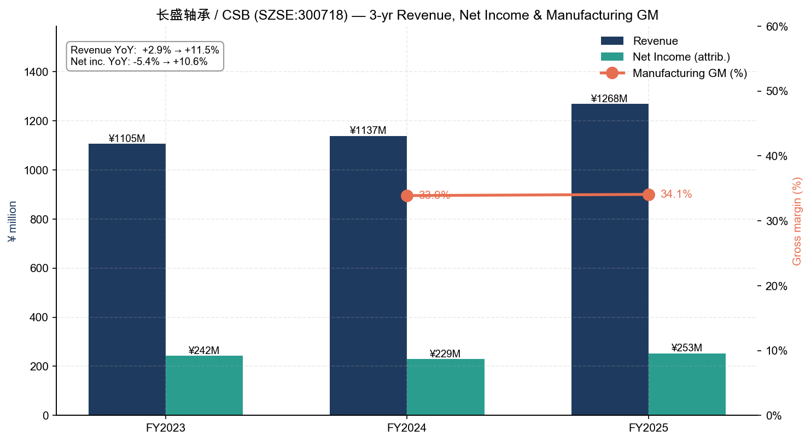
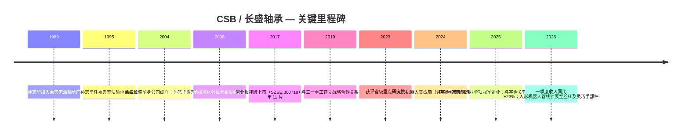
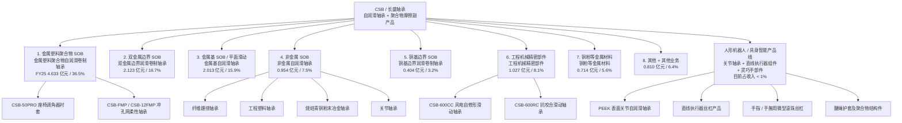
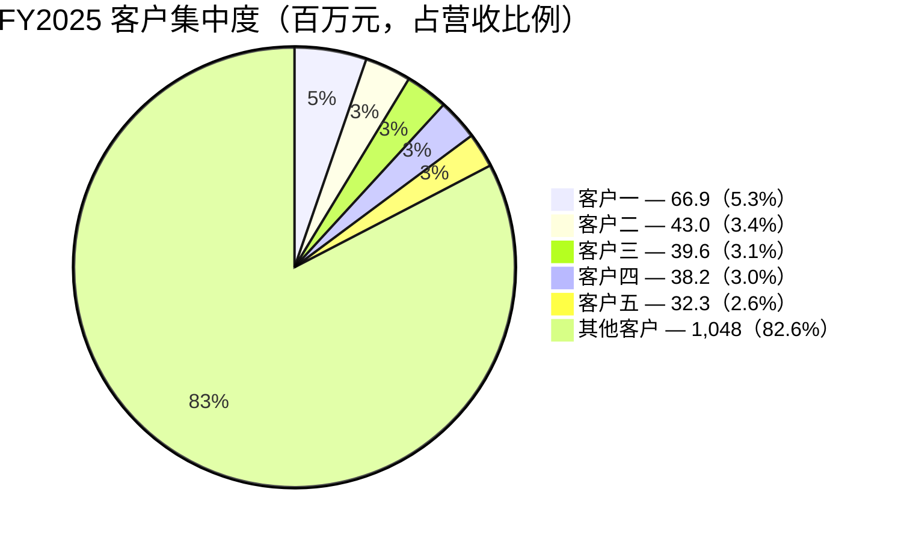

# 公司研究报告：浙江长盛滑动轴承（长盛轴承 / CSB，SZSE:300718）

**日期：** 2026-05-18
**报告类型：** 首次覆盖 — 深度研究
**股票代码：** SZSE:300718（创业板）
**总部地址：** 中国浙江省嘉善县
**报告货币：** 人民币（¥）

---

## 目录

1. 公司概览
2. 公司历史
3. 管理团队
4. 产品与服务
5. 客户与市场拓展
6. 行业概览
7. 竞争格局
8. 市场机会（TAM）
9. 风险评估
10. 参考资料

---

## 1. 公司概览

浙江长盛滑动轴承股份有限公司 — 国际上以 **CSB** 品牌运营，在深交所创业板挂牌交易，代码为 **长盛轴承 / SZSE:300718** — 是中国 **自润滑轴承（自润滑轴承 / 滑动轴承 / 无油干式滑动轴承）** 及高性能聚合物（polymer）摩擦副组件的龙头制造商。公司将其使命描述为通过低摩擦、自润滑技术平台，成为"高性能摩擦学（tribology）与聚合物材料领域的全球战略合作伙伴"（[浙江长盛滑动轴承股份有限公司 2025 年年度报告，第 10 页](http://www.cninfo.com.cn/new/disclosure/stock?stockCode=300718)，2026-04-27 披露）。

通俗而言，长盛轴承生产的是传统滚动轴承（球轴承 / 滚子 / 滚针轴承）的"干式滑动"替代方案：由金属背板、烧结青铜或复合材料中间层，以及由 PTFE（聚四氟乙烯）、石墨、MoS₂（二硫化钼）或 PEEK 聚合物构成的表层，可在 **无需外部润滑剂** 的条件下持续低摩擦运行。这种特性 — 结合轻量化、减震和免维护属性 — 使自润滑轴承成为密封、油敏感应用的首选架构，例如汽车座椅调角器机构、新能源车车门 / 引擎盖 / 后备箱铰链、挖掘机液压油缸的铲斗与动臂连接处，以及最近受到关注的人形机器人（embodied AI / 具身智能）的旋转关节与直线执行器。

**盈利模式。** 长盛轴承向 8 大行业垂直领域销售成品轴承及摩擦副组件：汽车、工程机械、具身智能（机器人）、清洁能源（风电、核电、太阳能跟踪）、交通运输（轨道交通 / 铁路 / 船舶）、机械工业、轻工业（塑料注塑机、自动化办公设备）以及航空航天。主流商业模式为 **以销定产**，与主要 OEM 客户签署多年期总协议，但按 PO（采购订单）逐单排产。从收入结构看，**直销约 86%，经销 14%**，**国内 63% / 出口 37%** 的地理分布（FY2025）（[2025 年年度报告，第 16 页](http://www.cninfo.com.cn/new/disclosure/stock?stockCode=300718)）。

**规模。** FY2025 营业收入 **12.6778 亿元人民币**（同比 +11.46%），归属于上市公司股东的净利润 **2.5335 亿元人民币**（同比 +10.59%），经营性现金流 **2.6271 亿元人民币**。加权平均 ROE 为 15.03%。总资产 21.3 亿元人民币，股东权益 17.4 亿元 — 资产负债率偏低、现金充裕的工业型资产负债表（[2025 年年度报告，第 8 页](http://www.cninfo.com.cn/new/disclosure/stock?stockCode=300718)）。截至 2025 年末，公司员工 1,026 人，其中研发人员 128 人（占总人数 12.5%），持有 185 项有效专利（57 项境内发明专利，6 项国际发明专利）（[2025 年年度报告，第 15–20 页](http://www.cninfo.com.cn/new/disclosure/stock?stockCode=300718)）。

**FY2026 一季度提速。** 一季度营业收入同比大幅增长 **+23.41%**，达 3.4808 亿元人民币，归母净利润同比 +15.09%，达 6,104 万元人民币 — 较 FY2025 全年增速明显加快，这是人形机器人相关样品订单开始放量、并叠加工程机械液压缸领域份额持续提升进而拉动收入端的先行指标（[2026 年第一季度报告，第 2 页](http://www.cninfo.com.cn/new/disclosure/stock?stockCode=300718)，2026-04-27 披露）。

**估值快照（公司研究流程第 2 步）。** 截至 2026 年 5 月中旬，公司股价约 **84.35 元人民币**，市值 **250.6 亿元人民币**，TTM 基本每股收益为 **0.83 元人民币**（[Investing.com — Zhejiang Changsheng A](https://www.investing.com/equities/zhejiang-changsheng-a)，2026-05-18 访问）。基于上述数据：

- **TTM 市盈率 ≈ 101.6 倍**（84.35 ÷ 0.83）— 绝对水平极高。
- **TTM 市销率 ≈ 19.8 倍**（25,060 ÷ 1,267.78）— 同样极高。
- **市净率 ≈ 14.4 倍**（25,060 ÷ 1,741）— 远高于通用工业轴承同业的典型 1.5–4 倍水平。
- 隐含的 **EV/营收 ≈ 19 倍**，公司账面持有净现金，因此 EV 基本等同于市值。

这毫无疑问是 **叙事 / 板块代理溢价**，而非由基本面支撑的估值倍数。其成因在行业媒体中已被直接指出：自 2024 年 2 月低点 **10.93 元/股** 起算，至 2025 年 2 月，股价在"长盛轴承已成为'宇树科技概念第一股'"的炒作下累计上涨 **超过 10 倍**，而此时机器人相关业务收入仍 **不足公司整体收入的 1%**（[新浪财经 — "10 倍妖股"长盛轴承：背后的机器人赌局，2025-03-03](https://finance.sina.com.cn/roll/2025-03-03/doc-inenkmnh6606469.shtml)；[华尔街见闻 — "机器人隐形赢家"股价大涨超 200%，2025-02-22](https://wallstreetcn.com/articles/3751550)）。卖方研究报告也证实公司估值位于轴承板块最高位：国元证券 2025 年 9 月首次覆盖报告预测公司 2025/26/27 年 EPS 为 0.89 / 1.03 / 1.22 元，并明确给出当时股价对应 **103 倍 / 89 倍 / 75 倍** 的 PE 区间（[国元证券，转引自新浪财经，2025-09-01](https://finance.sina.com.cn/roll/2025-09-01/doc-infnyqek9811017.shtml)）。

同业横向对比（TTM PE，2026 年 5 月访问）：双环传动（SZSE:002472，国内可比的精密齿轮 + 机器人减速器标的）在相同数据源下大致在 20 多倍到 30 出头之间；五洲新春（SH:603667，国内轴承套圈制造商）2026 年初在其自身机器人轴承故事推动下，TTM PE 一度飙升至 **约 119–357 倍**（[五洲新春 PE TTM — Gurufocus](https://www.gurufocus.cn/stock/SHSE:603667/term/pettm)，2026-01-20 访问）。全球龙头舍弗勒 Schaeffler（ETR:SHA）、斯凯孚 SKF（STO:SKF-B）、NSK（TYO:6471）和 NTN（TYO:6472）的 TTM PE 均处于 **10–18 倍** 区间，反映出其成熟工业周期属性及缺乏机器人重估催化剂（全球轴承前十的格局可参考 [bearingmaker.com — Top 10 Bearing Manufacturers in 2026, 2026-01](https://www.bearingmaker.com/top-10-bearing-manufacturers-2025/)；具体每日 PE 数据可见于各上市地的行情页面）。人本集团为非上市企业，无公开估值倍数。长盛轴承约 100 倍 PE 比全球龙头高出约 7–10 倍，比国内最接近的 A 股机器人产业链同业高约 3 倍 — 这一倍数 **只有在具身智能关节轴承业务于 2026–2028 年实现数倍营收放量的前提下才能得到支撑**。我们在第 9 节将此列为重要的估值 / 估值压缩风险。



*资料来源：[浙江长盛滑动轴承 2023 / 2024 / 2025 年度报告](http://www.cninfo.com.cn/new/disclosure/stock?stockCode=300718)。制造业务毛利率自 FY2024 起按新报表格式披露。*

---

## 2. 公司历史

长盛轴承的渊源可追溯至公司董事长 **孙志华**，他在 1980 年代初便开始从事自润滑轴承研发 — 早于中国轴承行业进一步细分为精密子类别之前。孙志华自 1989 年起担任嘉善无油轴承厂厂长，1995 年担任嘉善无油轴承董事长，并于 2000 年至 2003 年担任双飞轴承（即今天的上市公司双飞集团 SZSE:300817，长盛在国内最接近的竞争对手）董事长。2003–04 年间他离开双飞，整合并组建了当今长盛轴承的前身（[2025 年年度报告，第 33 页](http://www.cninfo.com.cn/new/disclosure/stock?stockCode=300718)）。

嘉善地区（位于浙江南部，距上海约 80 公里）是全球最为集中的自润滑轴承产业集群 — 公司自己也指出"嘉善地区的产业集群效应十分显著"，并提到 **全国滑动轴承标准化技术委员会自润滑轴承分技术委员会** 于 2008 年落户嘉善，长盛作为首任秘书处单位（[2025 年年度报告，第 13 页](http://www.cninfo.com.cn/new/disclosure/stock?stockCode=300718)）。

公司省级及以上研发体系建设稳步推进：县级研发中心（2002）、省级高新技术企业研发中心（2008）、省级企业技术中心（2011）、省级研究院（2015）、省 **重点** 研究院（2023），并最终于 2025 年获评 **国家级制造业单项冠军企业（第九批）** — 这是工信部为细分产品制造业领军企业所设的最高荣誉（[2025 年年度报告，第 13 页](http://www.cninfo.com.cn/new/disclosure/stock?stockCode=300718)）。



长盛轴承于 **2017 年 11 月 13 日在创业板挂牌上市** — 该年大量高端汽车与机械零部件供应商集中在 A 股 IPO，恰逢"中国制造 2025"产业政策对核心零部件进口替代的强力推动。IPO 招股说明书可在新浪财经的转录版面查阅（[长盛轴承 IPO 招股说明书 — 新浪财经镜像](http://vip.stock.finance.sina.com.cn/corp/view/vISSUE_RaiseExplanationDetail.php?stockid=300718&id=3819681)）。

**三次战略转型** 塑造了公司今日的形态：

1. **客户基础全球化（2010–2018）。** 长盛从纯内销供应商转型为面向 Caterpillar 卡特彼勒、JCB、Liebherr 利勃海尔、Volvo Construction Equipment 沃尔沃建筑设备、Hitachi Construction Machinery 日立建机、Komatsu 小松、Kobelco 神户制钢、Hyundai Construction 现代重工以及 Tata Motors 塔塔汽车的全球 Tier-2/3 供应商。这些客户授予的认可奖项（"卡特彼勒优秀供应商""克诺尔卓越项目管理奖""日立 A 级质量奖"）证实长盛已深度嵌入全球挖掘机与重卡供应链（[2025 年年度报告，第 14 页](http://www.cninfo.com.cn/new/disclosure/stock?stockCode=300718)）。
2. **从大宗 SOB 自润滑轴承向高性能聚合物体系供应商转型（2019–2024）。** PTFE / PEEK / 氟聚合物复合材料产能大幅扩展，使公司联合上海核工程研究设计院共同开发的核电级蒸发器 / 稳压器支撑轴承（核电支撑轴承）获得"浙江省科技进步三等奖"以及浙江省首台（套）装备认证（[2025 年年度报告，第 13 页](http://www.cninfo.com.cn/new/disclosure/stock?stockCode=300718)）。即便在 2023–2024 年工程机械周期低谷期，这一转型仍将综合制造业务毛利率从约 33% 提升至 34%+。
3. **人形机器人 / 具身智能聚焦（2024 至今）。** 公司于 2025 年初披露，已与 **宇树科技** 签署合作协议，并向其供应关节自润滑轴承及部分直线执行器内的丝杠产品（[每日经济新闻 — 长盛轴承"20CM"涨停，2025-02-19](https://www.nbd.com.cn/articles/2025-02-19/3757700.html)）。至 2025 年年中，机器人轴承产线已从样品阶段进入"小批量量产"阶段；公司管理层公开表示，新产线是其目前所有商用轴承中唯一采用 **PEEK 聚合物表面层** 作为主摩擦面的产品（[新浪财经 — 长盛轴承获 4 家机构调研，2025-05-29](https://m.10jqka.com.cn/20250529/c668514945.shtml)）。截至 FY2025 末，机器人相关收入贡献仍 **不足公司整体收入的 1%**，但已向多家集成商交付样品 / 试制件（[2025 年年度报告，第 12 页](http://www.cninfo.com.cn/new/disclosure/stock?stockCode=300718)）。

公司未发生重大并购。子公司 — 安徽长盛精密、滁州华纳、吉林长盛、长盛新材料、吉盛新材料、长盛技术、长盛塑料轴承 — 均为内部有机设立的子公司，分别承担产能、地理布局或材料专项任务（[2025 年年度报告，第 150–152 页](http://www.cninfo.com.cn/new/disclosure/stock?stockCode=300718)）。

---

## 3. 管理团队

长盛轴承作为一家上市已满 9 年的小盘股，仍保持 **罕见的创始人主导格局** — 董事长孙志华家族及核心联合创始人合计控制 **53.4%** 的流通股份，并以"一致行动人"身份共同行使表决权。

### 孙志华 — 董事长、创始人、控股股东（约 31.9% 持股）

孙志华现年 **69 岁**，中国国籍，工商管理硕士，高级工程师。他在自润滑轴承行业拥有 **35 年以上** 从业经历 — 这是中国滑动轴承行业内任何高管中最长的任期。其职业履历：

- **1989–95**：嘉善无油轴承厂厂长 — 中国最早专注自润滑轴承的工厂。
- **1995–2000**：嘉善无油轴承董事长。
- **2000–03**：双飞轴承董事长 — 即今天的上市公司双飞集团 SZSE:300817。
- **2001–04**：嘉善长盛（前身实体）副董事长。
- **2004–13**：合并后的浙江长盛主体董事长兼总经理。
- **2013 至今**：上市公司董事长。2009–23 年间还担任子公司长盛技术董事长（[2025 年年度报告，第 33 页](http://www.cninfo.com.cn/new/disclosure/stock?stockCode=300718)）。

孙志华直接持有长盛轴承 **95,250,781 股（31.88%）**。其女儿 **孙薇卿** 持股 **13.52%**，女婿 **褚晨剑（现任总经理）** 持股 **4.04%** — 三人均为孙志华正式申报的一致行动人（[2025 年年度报告，第 55–57 页](http://www.cninfo.com.cn/new/disclosure/stock?stockCode=300718)）。孙志华还担任嘉善百盛投资管理有限合伙企业的执行事务合伙人，该实体为孙氏家族的投资载体。FY2025 税前从长盛轴承获得的薪酬为 **84.79 万元**，相对温和，其经济利益主体仍体现在上市公司股权（按现价约 80 亿元的纸面市值）。

创始人的战略印记体现在三个层面。第一，**标准引领能力**：在孙志华领导下，长盛轴承主导或参与制定了 **46 项国家标准 + 4 项行业标准 + 8 项团体标准**，包括最新发布的 T/CMIF281/282/293-2025 系列涂层摩擦特性、超声波法结合强度测试以及气体静压轴承材料规范。这一标准制定话语权显著强于任何同业（[2025 年年度报告，第 15 页](http://www.cninfo.com.cn/new/disclosure/stock?stockCode=300718)）。第二，**省级 / 国家级荣誉的稳步晋升**：孙志华引领长盛完成了完整阶梯 — 省级研发中心 → 省级企业技术中心 → 省级研究院 → 省级 **重点** 研究院（2023）→ **国家级制造业单项冠军企业（2025）**。第三，**接班布局**：2023 年 9 月，孙志华提拔女婿褚晨剑出任总经理，同时擢升联合创始人陆晓林为副董事长，形成了创始人保留董事长职位、年轻团队执掌日常运营的两代经营架构。需要指出，孙志华 **并未** 同时兼任董事长和总经理（[2025 年年度报告，第 32、34 页](http://www.cninfo.com.cn/new/disclosure/stock?stockCode=300718)）。

### 褚晨剑 — 董事、总裁 / 总经理（约 4.04% 持股）

褚晨剑现年 **41 岁**，工商管理硕士，**孙志华的女婿**。他的履历对于一家完全聚焦中国市场的制造企业而言异常国际化：

- **2008–09**：**大众汽车中国投资**（Volkswagen China）技术部助理。
- **2009–10**：**克莱斯勒中国汽车销售**（Chrysler China）分销 / 经销商发展经理。
- **2010–18**：北京梅赛德斯-奔驰销售服务区域经理。
- **2019**：加入长盛轴承，任市场总监。
- **2019–23**：副总经理、董事。
- **2023 至今**：总裁 / 总经理。同时兼任安徽长盛精密及吉盛新材料董事长，以及两家子公司的执行董事。

他还担任多个浙江省青年企业家协会理事，以及嘉善汽车零部件协会副会长 — 这是有意在汽车价值链与浙江产业金融生态之间布局的位置。其汽车 OEM 履历（大众 + 克莱斯勒 + 奔驰）是独特优势：大多数中国轴承高管出身于工艺工程背景，而褚晨剑擅长在全球 OEM 采购决策层运作，对德美 Tier-1 质量体系话语熟练。FY2025 税前薪酬为 **77.87 万元**，另持有股权激励（[2025 年年度报告，第 35 页](http://www.cninfo.com.cn/new/disclosure/stock?stockCode=300718)）。

### 何寅 — CFO + 董事会秘书 + 副总经理

何寅现年 **39 岁**，会计学硕士。其背景为 **卖方投行**，而非工业 — 先后任职于浙商证券投行部（2013–15）、西南证券（2015–16）、申万宏源（2016–17）和中天国富证券（2017–18），于 2018 年末加入长盛轴承任总经理助理。2020 年任证券投资部主任，2020 年 9 月起任 CFO 兼董秘，2023 年擢升副总经理。他兼任子公司长盛新材料监事和吉盛新材料董事。FY2025 税前薪酬为 **61.32 万元**，持股 8.55 万股（持股极少）（[2025 年年度报告，第 34 页](http://www.cninfo.com.cn/new/disclosure/stock?stockCode=300718)）。其投行背景对于公司在如何将人形机器人叙事变现 — 回购、分红、ESOP 或潜在再融资发行 — 的资本市场执行环节而言，是合理的加分项。

### 陆晓林 — 副董事长、执行副总经理

陆晓林现年 **50 岁**，1996 年加入创业团队，从销售线（2002 年任嘉善长盛销售副总）一路升至董事兼副总，2013–23 年任总经理，2023 年 9 月与褚晨剑提拔为总经理同期，他被擢升为副董事长兼执行副总经理。一季度减持后，陆晓林持有 **10,023,750 股（3.35%）**。同时任多家子公司董事；在经营端主要负责制造体系与供应商管理。

### 陆忠泉 — 首席技术官 / 总工程师

陆忠泉现年 **53 岁**，理工科学士，2002 年加入长盛任设备主管，沿研发线一路晋升至副总工程师，2011 年起任总工程师 — 他是公司金属-聚合物复合轴承平台的主要技术架构师。持股 4,066,375 股（1.36%）。FY2025 税前薪酬 39.7 万元（[2025 年年度报告，第 34–35 页](http://www.cninfo.com.cn/new/disclosure/stock?stockCode=300718)）。

### 公司治理

董事会构成：9 名董事，其中 **6 名内部董事**（孙志华、褚晨剑、陆晓林、曹寅超、2025 年 11 月加入的费国平、职工董事姜彩萍）+ **3 名独立董事**（陈淑大 — 嘉兴学院教授；马正梁 — 资深律师；万元星 — 浙江工商大学会计学者）。独立董事比例为 **33%**，符合创业板最低要求，但对一家由控股股东主导的公司而言，最佳实践通常要求 ≥50%。**内部人 + 家族合计持股约 53.4%** — 远超任何反收购门槛。**无超额表决权 / 双类股结构**。FY2025 未披露任何具有实质性规模的关联交易；关联交易章节基本为空（[2025 年年度报告，第 49–50 页](http://www.cninfo.com.cn/new/disclosure/stock?stockCode=300718)）。**控股股东质押比例为 0%**，这在中国小盘股语境下是显著利好。**股份回购计划** 已于 2024 年 9 月获授权 2,000–4,000 万元，用于 ESOP / 股权激励；截至报告日已回购 240,600 股（[2025 年年度报告，第 58 页](http://www.cninfo.com.cn/new/disclosure/stock?stockCode=300718)）。何寅领导下的董秘 / IR 职能在 A 股小盘股中表现出异常的专业度，体现在 18 家机构集体调研以及可访问的投资者信息披露（[好研报 — 长盛轴承机构调研汇总](https://www.appletree.fund/300718-sz/)）。

**履历综合评估。** 创始人孙志华提供了 35 年的经营连续性、3 次成功的企业转型（工厂 → 合资 → 上市公司），并获得国家级最高资质（单项冠军）。CFO + 总经理梯队较为年轻、国际化程度高。最大的"未经考验"环节在于：褚晨剑的汽车 OEM 运营经验是否能够顺利移植至人形机器人生态 — 该领域的买方主体由 AI 平台公司和供应链集成商主导，而非传统的 Tier-1 汽车供应商。截至目前，答案是积极的（宇树量产、智元送样），但鉴于公司估值之高，达标门槛也很高。

---

## 4. 产品与服务

长盛轴承在 FY2025 年报中将产品体系拆分为 **7 个** 贡献收入的产品族，外加少量"其他"项 — 合计涵盖数万个 SKU（[2025 年年度报告，第 16 页](http://www.cninfo.com.cn/new/disclosure/stock?stockCode=300718)）。产品树如下：



### 分产品段拆解

**1. 金属塑料聚合物自润滑卷制轴承 — FY2025 4.633 亿元，占营收 36.5%，同比 +9.4%。** 旗舰 SOB（self-oiling bearing）现金牛产线。结构：钢背 + 烧结青铜中间层 + PTFE / 聚合物表面层。毛利率 **47.54%** — 所有产品族中最高，管理层指出该毛利率因大宗原材料压力同比下降了 1.30 个百分点。该产线主导 **汽车座椅调角器机构**、**新能源车车门 / 引擎盖 / 后备箱铰链**、**HVAC 压缩机斜盘** 以及 **减震器悬挂部件**。公司的 CSB-FMP / CSB-12FMP "冲孔网柔性"子系列以及 CSB-50PRO 高负载调角器衬套获 2025 年省级新产品认证（[2025 年年度报告，第 14、17 页](http://www.cninfo.com.cn/new/disclosure/stock?stockCode=300718)）。产销量同比 +7.97%，达 512,822 m² 轴承料板（[2025 年年度报告，第 17 页](http://www.cninfo.com.cn/new/disclosure/stock?stockCode=300718)）。**竞争优势：是 — 多重护城河来源**（21 条德国进口自动化产线带来的成本领先；通过 20 年认证周期建立的全球 OEM 品牌；标准制定话语权；BMW 宝马 / Volvo 沃尔沃 / Jaguar 捷豹 / Tesla 特斯拉 / Audi 奥迪 / VW 大众 / BYD 比亚迪 / 上汽 / 长安等认证）。最直接竞品 SKU：GGB DP4 / DU 系列、Saint-Gobain Norglide、Daido Metal DDK 系列；长盛在性能上与之相当，**价格通常低 15–30%**。

**2. 双金属边界润滑卷制轴承 — 2.123 亿元，16.7%，同比 +15.96%。** 钢 + 烧结青铜，无聚合物表层，用于冲击载荷 + 油脂润滑共存的场景。毛利率 **25.68%**（同比 +2.69 个百分点）。产销量 +15.73%，达 208,365 m²。主流应用包括 **挖掘机铲斗、连杆、动臂、液压销连接** — 特别是与卡特彼勒 Caterpillar 的意大利底盘件工厂合作开发的单工步成型双金属衬套，替代了此前两道工序的机加工方案 — 为客户省去下游精加工环节（[2025 年年度报告，第 14 页](http://www.cninfo.com.cn/new/disclosure/stock?stockCode=300718)）。**竞争优势：是 — 工艺 / 成本护城河 + 客户共同开发的锁定效应。**

**3. 金属基自润滑轴承 / 平面滑动轴承 — 2.013 亿元，15.9%，同比 +14.69%。** 烧结、铸造或固体润滑剂镶嵌的青铜 + 钢实体轴承。毛利率 **27.94%**（同比 -1.35 个百分点）。主要应用：**集装箱港机轮、油缸活塞、轻轨 / 地铁减震器、船舶甲板机械推力垫**。该业务段在 2024 年遭受了最深的周期性拖累（2024 年同比 -19.7%），但 **2025 年强劲反弹 +14.7%**（[2025 年年度报告，第 16 页](http://www.cninfo.com.cn/new/disclosure/stock?stockCode=300718)），与工程机械复苏同步（中国挖掘机销量 2025 年 +17.0% 至 235,257 台，据中国工程机械工业协会 CCMA）。**竞争优势：部分 — 国内细分领域龙头地位，但在大宗 / 重负载类别正在商品化。**

**4. 非金属自润滑轴承 — 9,540 万元，7.5%，同比 +17.72%。** 增长最快的传统产线：纤维缠绕轴承、工程塑料轴承、粉末冶金烧结青铜轴承，以及关节轴承。这也是 **人形机器人产线的技术"本营"，特别是 PEEK 与纯聚合物关节轴承**。**竞争优势：是 — 服务不足的细分市场，高度定制；连接传统 SOB 业务与未来机器人业务的桥梁。**

**5. 铜基边界润滑卷制轴承 — 4,040 万元，3.2%，同比 +10.7%。** 较窄的 SKU 集合，用于需铜基承载能力但又无需固态青铜成本的场景。

**6. 工程机械精密部件 — 1.027 亿元，8.1%，同比 +18.97%。** 包括为风电齿轮箱主轴轴承开发的全新 **CSB-600CC 自修形（自修形）风电滑动轴承** 与 **CSB-600RC 抗咬合滑动轴承** — 二者均获 2025 年省级新产品认证，目标对标舍弗勒 Schaeffler / 斯凯孚 SKF 风电轴承的进口替代机会（[2025 年年度报告，第 14 页](http://www.cninfo.com.cn/new/disclosure/stock?stockCode=300718)）。此外还包括 Liebherr 利勃海尔 / JCB / 三一定制精密零部件。**竞争优势：是 — 认证护城河（风电轴承客户认证周期需要 18–24 个月）。**

**7. 铜粉等金属材料 — 7,140 万元，5.6%，同比 +6.6%。** 通过吉盛新材料向公司内部及外部客户供应上游铜粉，毛利率较低的贸易 / 加工型流水。

**8. 其他 / 其他业务 — 8,100 万元。** 包括新兴的 **具身智能 / 机器人产线**，目前披露占公司收入 **< 1%**，但管理层明确指出订单增速在该产线最快（[2025 年年度报告，第 12 页](http://www.cninfo.com.cn/new/disclosure/stock?stockCode=300718)）。

### 人形机器人 / 具身智能产线 — 期权价值

根据管理层在调研中的表述，长盛在具身智能领域的研发方向分为三类：

1. **关节用自润滑轴承。** 即人形机器人旋转关节内部的干式滑动轴承 — 相当于汽车座椅调角器衬套的对应物，但直径更小、循环速率更高、对重量要求更严苛。长盛对滚动关节轴承的卖点是：**(a) 成本更低**（仅为滚针轴承的 1/3 至 1/5）；**(b) 在重复冲击下减震性 / 一致性更好**（行走机器人的关节每分钟冲击数千次）；**(c) 接触面承载能力更高**；**(d) 免油脂 / 油润滑维护**；**(e) 取消润滑剂供应管路 — 机械设计更简洁**。主要表面层为 PEEK 和改性 PTFE 复合材料（[2025 年年度报告，第 12 页](http://www.cninfo.com.cn/new/disclosure/stock?stockCode=300718)；[华尔街见闻 — "机器人隐形赢家"，2025-02-22](https://wallstreetcn.com/articles/3751550)）。
2. **直线执行器组件。** 长盛已开始向直线执行器集成商供应 **丝杠产品** — 即驱动人形机器人四肢平动 / 滑动关节的丝杠 + 螺母（如特斯拉 Tesla Optimus 原型机的 14 个直线关节中有 8–10 个采用行星滚柱丝杠）。公司确认其丝杠产品在汽车 **制动、转向、电子驻车与变速箱系统** 中亦已量产 — 这是可向机器人四肢移植的先行能力（[新浪财经 — 长盛轴承获 4 家机构调研，2025-05-29](https://m.10jqka.com.cn/20250529/c668514945.shtml)）。
3. **灵巧手部件。** 手指及手腕关节自润滑轴承、**手指及手腕用微型滚珠丝杠**、聚合物结构件，以及 **改性腱绳及护套 / 导管**。该子类别据 FY2025 年报披露处于"样品 / 试制阶段"（[2025 年年度报告，第 12 页](http://www.cninfo.com.cn/new/disclosure/stock?stockCode=300718)）。

已披露的集成商客户（通过媒体及 IR 调研，而非正式年报）：

- **宇树科技** — 已签署正式合作协议；接收订单；关节自润滑轴承 + 滚珠丝杠已量产（[每日经济新闻，2025-02-19](https://www.nbd.com.cn/articles/2025-02-19/3757700.html)）。
- **智元机器人** — 处于送样阶段。
- 其他集成商正在送样但未公开披露名称。

行业背景：2025 年 7 月，智元 + 宇树联合中标中国移动 2025–2027 年人形双足机器人采购 1.2405 亿元，其中宇树独得 4,605 万元 — 这一硬数据表明国有企业内的人形机器人规模化采购已经发生（[财经客户端 — 优必选、智元、宇树科技领跑，2025-08-19](https://news.caijingmobile.com/article/detail/554046)）。

**机器人产线的产品级竞争优势判断：是** — 护城河包括 **(i) 摩擦学知识产权**（长盛拥有中国唯一的滑动轴承标准秘书处，加上 185 项重点偏向复合材料的专利）；**(ii) 既有的 21 条德国自动化卷制 - 烧结生产线** 可以以增量改造而非新建产线的方式转产机器人关节微型轴承；**(iii) 早期集成商客户胜出**（与宇树在关节 SOB 上的独家性是单一最强证据点）。最直接的竞争对手：**双飞集团（SZSE:300817）** 在机器人用自润滑轴承类别中，加之国际厂商 GGB / Saint-Gobain / Daido Metal；微型滚珠丝杠领域日系厂商 NSK / THK / IKO 与国内上市公司北特科技 / 贝斯特为替代品 — 长盛在滚珠丝杠精度上 **落后于** 日系厂商，但价格更低、交付周期更短。

### 旗舰产品与长尾产品

**驱动业务的 1–3 个产品** 分别为：
1. **金属塑料 SOB（4.63 亿元）** — 现金飞轮。
2. **双金属 SOB（2.12 亿元）+ 金属基 SOB（2.01 亿元）** — 合计 4.13 亿元，构成工程机械 + 重工业板块。
3. **人形机器人产线** — 今日规模虽小（< 1% 收入），但正是市场愿意为之支付约 100 倍 PE 的核心。


*资料来源：[浙江长盛滑动轴承 2024 / 2025 年度报告](http://www.cninfo.com.cn/new/disclosure/stock?stockCode=300718)。*

### 近 12 个月新品发布 / 退出

2025 年共有 6 款新 SKU 完成开发 — CSB-FMP、CSB-12FMP、CSB-600CC、CSB-600RC、CSB-50PRO、CSB-NFMSF（小孔径平面静压气浮轴承）。年末仍在积极研发中的项目：CSB-21 环保水润滑轴承、CSB-27 抗蠕变高耐磨自润滑轴承、CSB-MEX 编织高负载复合衬套、CSB-26E 高性能无氟自润滑轴承、CSB-29P 压缩机高速流体润滑轴承，以及面向轴向柱塞泵的高密度铜合金配油盘工艺（[2025 年年度报告，第 19–20 页](http://www.cninfo.com.cn/new/disclosure/stock?stockCode=300718)）。无产品线退出。

---

## 5. 客户与市场拓展

长盛轴承按收入计 **直销占 86%、经销占 14%**；国内市场以直销为主，海外市场为两者结合（[2025 年年度报告，第 16 页](http://www.cninfo.com.cn/new/disclosure/stock?stockCode=300718)）。客户拓展遵循 12–24 个月的认证周期，符合汽车 Tier-2 供应的典型特征。

**客户集中度 — 量化分析。** 按 FY2025 年报强制披露的前五名客户：

| 客户（年报匿名披露） | 销售额（百万元） | 占 FY25 营收比例 |
|---|---:|---:|
| 客户一 | 66.92 | 5.28% |
| 客户二 | 42.95 | 3.39% |
| 客户三 | 39.62 | 3.13% |
| 客户四 | 38.19 | 3.01% |
| 客户五 | 32.34 | 2.55% |
| **前五合计** | **220.03** | **17.36%** |

第一大客户 5.28%，前五大 17.36%（[2025 年年度报告，第 18–19 页](http://www.cninfo.com.cn/new/disclosure/stock?stockCode=300718)）。**年报披露中未公开具体名称**，按中国 A 股的披露惯例采用"客户一/二/三/四/五"的匿名化处理。对比来看，FY2024 披露的第一大客户为 6.28%，前五大为 18.49%（[2024 年年度报告，第 19 页](http://www.cninfo.com.cn/new/disclosure/stock?stockCode=300718)）。FY2023 客户集中度处于类似水平（前五大处于十几个百分点的中段；详细数据可参见巨潮 cninfo 全年报）。趋势为 **集中度稳中略降**，这是正面信号 — 表明长盛在扩张过程中客户在分散化。

**关键的是，第一大客户与前五大客户占比均显著低于"重大风险"门槛** — 即第一大客户 > 20% 或前五大 > 50%。任何单一客户的流失均不会对长盛造成重大冲击。这在汽车 Tier-2 供应商中较为少见。

**已披露具名的客户关系**（FY2025 年报文字披露及 IR 表述）：

- **工程机械 OEM**：Caterpillar 卡特彼勒、Liebherr 利勃海尔、Volvo Construction Equipment 沃尔沃建筑设备、JCB、Hitachi Construction Machinery 日立建机、Komatsu 小松、Kobelco 神户制钢、Hyundai Heavy Industries 现代重工（均为全球主力厂商）；三一重工（2019 年起战略合作）、振华重工（SH:600320）、海天精工（SH:601882）、恒立液压（SH:601100）、豪迈科技（SZ:002595）。
- **汽车零部件 / Tier-1 供应商**：Meritor 美驰、Bosch 博世、Knorr-Bremse 克诺尔、Faurecia 佛瑞亚、Mando（韩国）、HK / Hyundai 现代（韩国）、Adient 安道拓、FAW Tokico 一汽东机工、Tenneco 天纳克。
- **汽车 OEM（整车厂，长盛通过上述 Tier-1 担任 Tier-2 或 Tier-3）**：BMW 宝马、Volvo 沃尔沃、Jaguar Land Rover 捷豹路虎、**Tesla 特斯拉**、Audi 奥迪、Volkswagen 大众、**比亚迪**、上汽集团、长安汽车、Tata Motors 塔塔汽车（[2025 年年度报告，第 14 页](http://www.cninfo.com.cn/new/disclosure/stock?stockCode=300718)）。
- **具身智能 / 机器人集成商**：宇树科技（已量产）、智元机器人（送样阶段），及其他未具名集成商。

**用户的要求专门希望量化汽车 OEM（特斯拉、比亚迪、吉利）、工程机械、液压油缸客户的集中度**。FY2025 年报 **未** 按行业垂直拆分客户收入 — 仅披露了汇总后的匿名化前五名清单。结合按行业披露的收入结构：国内 7.974 亿元（62.9%）/ 海外 4.704 亿元（37.1%）。已具名的全球工程机械客户（Caterpillar 卡特彼勒、JCB、Liebherr 利勃海尔、Komatsu 小松、Hitachi 日立、Volvo 沃尔沃、Kobelco 神户制钢、Hyundai 现代）在海外收入中占较大权重，并且考虑到这些深度合作关系以及 Caterpillar 明确授予的"优秀供应商"奖项，很可能是前五大客户的主要来源（[2025 年年度报告，第 14 页](http://www.cninfo.com.cn/new/disclosure/stock?stockCode=300718)）。特斯拉与比亚迪以整车厂身份出现在客户列表中，但长盛是通过座椅 / 铰链 / 压缩机 / 减震器系统的 Tier-1 集成商而非直接供货 — 这些流向被隐含在客户一至五的细分流水中，未做单独披露。按具体客户具名的完整拆分 **未在 cninfo 公告中披露**；这是 A 股的标准保密惯例。



**合同结构。** 与各主要客户签署技术、质量、订货供应总框架协议；按数量逐单下单。对于大宗原材料（钢卷、铜卷、铜粉），长盛保持安全库存并按滚动预测下单。铜锭则采取"意向购买"模式 — 供应商根据长盛意向预先备货（[2025 年年度报告，第 10 页](http://www.cninfo.com.cn/new/disclosure/stock?stockCode=300718)）。

**销售周期。** 新平台认证 12–24 个月；一旦认证完成，零部件在整个整车 / 设备平台的生命周期内一直保留于 BOM 表（汽车座椅平台通常 5–7 年，工程机械更长）。

**客户集中度结论。** 第一大客户 5.3% / 前五大 17.4% 在汽车 Tier-2 供应商中属于 **业内领先水平** — 长盛具备零部件目录公司的客户分散度。具名客户的广度（全球工程机械 + 全球高端汽车 + 中国汽车 + 中国新能源 + 早期人形机器人集成商）在周期上确实呈现真正的多元化。**按标准门槛衡量，不存在重大客户集中度风险。**

---

## 6. 行业概览

**行业定义。** 轴承是旋转机械的基础构件：任何转动轴都需要轴承。轴承行业主要分为两大类：**滚动轴承**（球轴承、圆柱、圆锥、调心滚子、滚针），按数量及金额计占主导地位；**滑动轴承**（plain bearings），规模较小但正在实质性增长，长盛即在该领域。在滑动轴承内部，**自润滑轴承** 是技术差异化、毛利率较高的细分。

**市场规模。** 据 Precedence Research，**全球轴承市场** 2024 年规模为 **1,326 亿美元**，预计 2030 年将达到 **2,288.7 亿美元**，CAGR 为 **9.53%**（[Precedence Research — Bearing Market，2026-01 访问](https://www.precedenceresearch.com/bearing-market)）。其中：

- **中国轴承**：2024 年 322 亿美元 → 2030 年 543.9 亿美元，CAGR 9.12%（GrandViewResearch + 中国轴承工业协会数据，见 [2025 年年度报告，第 10 页](http://www.cninfo.com.cn/new/disclosure/stock?stockCode=300718)）。中国按金额和产量计均为 **全球第 3 大** 轴承生产国。
- **全球滑动轴承市场**：据 QYResearch，2025 年约 **66 亿美元**（[见 2025 年年度报告，第 10 页](http://www.cninfo.com.cn/new/disclosure/stock?stockCode=300718)）。其他预测机构对该细分给出不同数据（Cognitive Market Research 12.4 亿美元；HTF Market Insights 124 亿美元），反映了口径定义的差异（[Cognitive Market Research — Sliding Bearing Market](https://www.cognitivemarketresearch.com/sliding-bearing-market-report)；[HTF Market Insights](https://www.htfmarketinsights.com/report/4424537-sliding-bearing-global)）。
- **中国自润滑轴承细分市场**：据华经产业研究院，2025 年约 **157 亿元人民币（约 22 亿美元）**（见 [2025 年年度报告，第 10 页](http://www.cninfo.com.cn/new/disclosure/stock?stockCode=300718)）。


*资料来源：[Precedence Research](https://www.precedenceresearch.com/bearing-market)；[GrandViewResearch + 中国轴承工业协会，转引自长盛 2025 年报](http://www.cninfo.com.cn/new/disclosure/stock?stockCode=300718)；华经产业研究院 自润滑轴承（2025 年为基期，10% 增长假设 — 估计值）。*

**下游需求驱动因素**（按公司管理层讨论与分析及行业数据交叉印证）：

1. **汽车** — 每辆现代乘用车使用 **超过 100 个自润滑轴承**，且仍在新增应用（如 HVAC 压缩机斜盘自润滑涂层、聚合物工程结构件）（[2025 年年度报告，第 11 页](http://www.cninfo.com.cn/new/disclosure/stock?stockCode=300718)）。2025 年全球汽车销量达到 **9,689 万辆（同比 +6%）**，其中中国市场份额为 **35.4%**（[CADA / 崔东树，转引自 2025 年年度报告，第 11 页](http://www.cninfo.com.cn/new/disclosure/stock?stockCode=300718)）。据中汽协，中国新能源车 2025 年销量 1,649 万辆（同比 +28.2%）。新能源车细分：每辆 EV 因转向、制动、电机壳体及电池热管理需求，所需轴承数量更多。
2. **工程机械** — 据 CCMA，2025 年中国挖掘机销量 235,257 台（同比 +17.0%）；其中国内 118,518 台（+17.9%），出口 116,739 台（+16.1%）（[转引自 2025 年年度报告，第 11 页](http://www.cninfo.com.cn/new/disclosure/stock?stockCode=300718)）。
3. **具身智能 / 人形机器人** — 国务院发展研究中心预测，更广义的具身智能产业规模将在 **2030 年达到 4,000 亿元人民币**，**2035 年超过 1 万亿元**（《中国发展报告 2025》，转引自 [2025 年年度报告，第 12 页](http://www.cninfo.com.cn/new/disclosure/stock?stockCode=300718)）。每台人形机器人在其运动链中使用 **数十个关节轴承 + 多个丝杠 / 滚珠丝杠**。
4. **清洁能源** — 据 Research and Markets，2025 年全球清洁能源市场约 9,594 亿美元（转引自 [2025 年年度报告，第 12 页](http://www.cninfo.com.cn/new/disclosure/stock?stockCode=300718)）。风电齿轮箱的轴承架构正在从滚动元件向滑动轴承迁移（[中泰证券滑动轴承行业深度报告](https://www.fxbaogao.com/detail/3530138) 中讨论的风电"以滑代滚"趋势）。
5. **机械总体** — 据 CMIA，2025 年中国机械工业增加值同比增长 8.2%，其中汽车 +11.5%，电气机械 +9.2%（[2025 年年度报告，第 12 页](http://www.cninfo.com.cn/new/disclosure/stock?stockCode=300718)）。

**行业结构。** 轴承行业呈现 **二元结构**：
- **第一梯队 — 全球精密龙头。** Schaeffler 舍弗勒、SKF 斯凯孚、NSK、NTN、Timken 铁姆肯、JTEKT 捷太格特、MinebeaMitsumi — 这些公司主导面向航空、机床、高精度领域的高端滚动轴承。其滑动轴承业务规模适中（GGB — 隶属 EnPro Industries — 是西方主要的滑动轴承纯粹品牌）。
- **第二梯队 — 中国精密专业厂。** 长盛轴承、双飞集团（SZSE:300817）、崇德科技（SZSE:301548）、五洲新春（SH:603667）、双环传动（SZSE:002472，主要为齿轮 / 减速器）、人本集团（私营 — 中国营收第一的轴承集团）、瓦房店轴承（SZSE:200706）、襄阳轴承（000678）、万向钱潮（000559）、南方轴承（002553）。多数厂商海外收入占比 <30%。
- **第三梯队 — 嘉善 / 温州长尾小作坊。** 浙江轴承集群内的数百家小型企业，主要生产附加值较低的标准滚动轴承。

**供应商 / 客户议价能力。** 长盛主要原材料投入为 **钢卷、铜卷、铜粉** — 均为全球化大宗商品投入，供应商无显著议价护城河。FY2025 前五大供应商集中度为 **29.30%**，第一大供应商为 8.49%（[2025 年年度报告，第 19 页](http://www.cninfo.com.cn/new/disclosure/stock?stockCode=300718)）— 略高但仍在可控范围内。客户议价能力适中：汽车 Tier-1 在年度价格谈判中会施压，但长盛凭借多年期认证周期及约 1 万个 SKU 的产品广度，仍能维持结构性定价纪律。

**监管环境。** ISO9001 / IATF16949 / ISO14001 / ISO45001 / GB/T29490 / ISO50001 / ISO/IEC27001 均已建立（[2025 年年度报告，第 15 页](http://www.cninfo.com.cn/new/disclosure/stock?stockCode=300718)）。RoHS / REACH 等汽车合规是表面层化学体系的主要监管壁垒 — 长盛已积极投入无氟（fluorine-free）配方研发，以应对欧盟与加州可能出台的 PFAS / PTFE 限制。**研发项目 CSB-26E** 是一款瞄准替代含 PTFE 配方的无氟热塑性摩擦副配方（[2025 年年度报告，第 20 页](http://www.cninfo.com.cn/new/disclosure/stock?stockCode=300718)）。这是滑动轴承全行业未被充分认识的风险与机遇维度。

---

## 7. 竞争格局

长盛面临三层竞争对手。下图为基于"价格 / 应用广度"维度的市场定位视图。

```mermaid
quadrantChart
    title 轴承厂商定位 — 价格 × 技术广度
    x-axis 低价 --> 高端价格
    y-axis 窄 SKU --> 广 SKU
    quadrant-1 高端 + 广 — 全球龙头
    quadrant-2 高端 + 窄 — 利基专家
    quadrant-3 低价 + 窄 — 中国小型厂商
    quadrant-4 低价 + 广 — 中国领先专业厂
    Schaeffler: [0.86, 0.92]
    SKF: [0.85, 0.94]
    NSK: [0.80, 0.85]
    NTN: [0.78, 0.82]
    Timken: [0.83, 0.70]
    GGB / Saint-Gobain: [0.82, 0.45]
    Daido Metal: [0.75, 0.40]
    CSB / 长盛轴承: [0.55, 0.70]
    双飞集团 SZSE:300817: [0.45, 0.55]
    崇德科技 SZSE:301548: [0.55, 0.40]
    五洲新春 SH:603667: [0.42, 0.50]
    人本集团（非上市）: [0.50, 0.78]
```

### 主要竞争对手详解

1. **Schaeffler 舍弗勒（ETR:SHA）** — 德国精密轴承 + 汽车 Tier-1。营收约 160 亿欧元。在圆锥、滚针、角接触滚动轴承领域实力雄厚。设有滑动轴承业务（FAG / INA Bearings）但规模较小。Schaeffler 公布 2025 年业绩稳健，由 E-Mobility 业务驱动增长（[Schaeffler 新闻稿，2026-03](https://www.schaeffler.de/en/news_media/press_releases/press_releases_detail.jsp?id=88175106)）。**长盛取胜之处**：干式滑动 / 自润滑轴承类别中，舍弗勒并非主要竞争对手；在风电自润滑轴承的进口替代机会上，长盛的 CSB-600CC / 600RC 产品成为新的国产替代方案。
2. **SKF 斯凯孚（STO:SKF-B）** — 瑞典，营收 100 亿美元以上，全球第一大轴承 OEM。在长盛细分领域内动态与舍弗勒类似（[SKF 2026 简介 — PitchBook](https://pitchbook.com/profiles/company/43056-28)）。
3. **NSK（TYO:6471）** — 日本，营收 1 万亿日元以上，深沟球轴承、汽车电动助力转向、滚珠丝杠领域实力雄厚。长盛 **滚珠丝杠扩张直接对标** NSK 中端滚珠丝杠产品，NSK 是该领域全球标杆但价格为长盛的 2–3 倍。
4. **NTN（TYO:6472）** — 日本，与 NSK 业务结构类似，营收 7,000 亿日元以上。
5. **五洲新春（SH:603667）** — 中国 A 股上市轴承套圈锻造 + 装配 + 机器人轴承供应商。在机器人故事驱动下，TTM PE 一度被炒高至 119–357 倍（[Gurufocus](https://www.gurufocus.cn/stock/SHSE:603667/term/pettm)）。五洲新春是套圈锻造专家（滚动轴承的前序工序），目标聚焦在机器人减速器 / 谐波减速器轴承 — 与长盛构成更多是 **互补关系**，并非直接替代关系。
6. **人本集团（非上市）。** 中国营收最大的轴承集团（估计约 130–150 亿元人民币），总部位于杭州 / 慈溪。在汽车与家电的标准滚动轴承领域实力突出。**在自润滑产品上与长盛直接重叠有限**，估值未公开披露。
7. **双飞集团（SZSE:300817）** — 同样位于嘉善的自润滑轴承制造商，由孙志华此前所在公司发展而来。规模显著小于长盛（年度营收不足 5 亿元）。历史上是最接近长盛的可比公司，但在客户广度与标准制定话语权上相对滞后。
8. **崇德科技（SZSE:301548）** — 位于湖南，聚焦水润滑及流体动力轴承，面向水电、船舶、大型压缩机应用。终端市场组合与长盛差异较大。
9. **GGB Bearing Technology**（EnPro Industries NYSE:NPO 子公司）— 西方最大的滑动轴承纯粹品牌；核心品牌包括 DP4、DU、HI-EX。在自润滑轴承类别中是长盛最直接的全球对标。长盛在多数汽车与工程机械 SKU 上性能与 GGB 持平，价格更低。
10. **Daido Metal（TYO:7245）** — 日本滑动轴承专业厂商，聚焦汽车发动机主轴 / 连杆轴承。

### 长盛的竞争优势（综合）

- **标准引领** — 担任全国自润滑轴承分技术委员会秘书处单位；主导或参与制定 46 项国家标准 + 4 项行业标准 + 8 项团体标准（[2025 年年度报告，第 14 页](http://www.cninfo.com.cn/new/disclosure/stock?stockCode=300718)）。这在中国滑动轴承行业内是独有的。
- **制造规模 + 自动化** — 21 条德国进口自动化产线、7 条湿氟烧结线 + 5 条双金属烧结线，自有电子显微镜 / EBSD / ICP-OES / FTIR / DMA / DSC 分析能力（[2025 年年度报告，第 15 页](http://www.cninfo.com.cn/new/disclosure/stock?stockCode=300718)）。
- **单项冠军资质** — 2025 年末获得第九批国家级单项冠军，是金字塔顶端的质量信号，开启了包括核电、轨道交通及具身智能公共部门试点在内的国央企采购通道（[2025 年年度报告，第 13 页](http://www.cninfo.com.cn/new/disclosure/stock?stockCode=300718)）。
- **客户组合广度** — 卡特彼勒 / 利勃海尔 / 沃尔沃 / JCB / 日立 / 小松 / 神户制钢 / 现代（工程机械）+ 特斯拉 / 宝马 / 大众 / 比亚迪 / 吉利 / 上汽（汽车）+ 三一 / 恒立（中国龙头）+ 宇树 / 智元（具身智能）。少有同业能达到这一广度。
- **联合开发关系** — 与卡特彼勒意大利底盘件工厂联合开发一步式双金属衬套是典型案例（[2025 年年度报告，第 14 页](http://www.cninfo.com.cn/new/disclosure/stock?stockCode=300718)）。
- **专利 + 知识产权** — 截至 FY25 年末持有 185 项专利（57 项境内发明专利、6 项国际发明专利）。

### 竞争脆弱性

- **估值是核心脆弱性** — 约 100 倍 PE 没有给人形机器人收入放量延迟 1 年留下安全边际。
- **PFAS / PTFE 监管暴露** — 金属塑料 SOB 产品族依赖 PTFE；欧盟 PFAS 提案可能强制配方重构。长盛在无氟替代品上有研发投入，但过渡过程存在成本与时间风险。
- **滚珠丝杠并非长盛主场** — NSK / THK / IKO 的精密产品主导高端机器人滚珠丝杠应用。
- **依赖全球工程机械周期** — 2024 年金属基 SOB 产线的疲弱说明对挖掘机 OEM 的周期性敞口仍存。

---

## 8. 市场机会（TAM）

长盛近期的 TAM 由三层构成。

**第一层：传统 SOB 市场（现金飞轮）。** 据华经产业研究院，中国自润滑轴承市场 2025 年约为 157 亿元人民币（[2025 年年度报告，第 10 页](http://www.cninfo.com.cn/new/disclosure/stock?stockCode=300718)）。长盛 FY2025 营收约 12.7 亿元，对应 **中国自润滑轴承市场约 8% 的份额**。考虑全球细分（2025 年约 66 亿美元 / 470 亿元人民币），长盛全球份额约 2.7%。假设该细分以 8–10% CAGR 增长（与全球轴承及风电"以滑代滚"趋势一致），长盛通过国内 OEM 份额提升维持 1–2 倍市场增速，仅传统业务即可支撑 **至 2030 年中高个位数 % 增长** — 即 RMB 12.7 亿元 → 2030 年 RMB 20–22 亿元。

**第二层：风电、核电、清洁能源滑动轴承的进口替代。** 随着风电整机功率提升至 12 兆瓦以上，中国风电齿轮箱主轴正从滚动轴承向滑动轴承迁移；目前舍弗勒 Schaeffler / 斯凯孚 SKF 占主导，但 CSB-600CC / 600RC 产品成为新的国产替代候选品（[中泰证券滑动轴承行业深度报告](https://www.fxbaogao.com/detail/3530138)）。核电级蒸发器 / 稳压器 / 阻尼器轴承 — 长盛已获华龙一号反应堆认证及中国核学会资质（[2025 年年度报告，第 12 页](http://www.cninfo.com.cn/new/disclosure/stock?stockCode=300718)）。这是 2026–2030 年间将逐步释放的 **数亿元级别人民币的可选机会**。

**第三层：具身智能 / 人形机器人 — 期权价值。** 据国务院发展研究中心预测，中国具身智能产业规模 **2030 年可达 4,000 亿元人民币，2035 年突破 1 万亿元**（《中国发展报告 2025》，[转引自 2025 年年度报告，第 12 页](http://www.cninfo.com.cn/new/disclosure/stock?stockCode=300718)）。在此之下，单台人形机器人的 **零部件含量** 是关键变量。参考一台人形机器人（特斯拉 Optimus 级规格）大致使用：

- **28–40 个旋转关节**，每个关节需 2–4 个自润滑关节轴承 → **每台约 80–120 个轴承**。
- **8–14 个直线执行器**，每个需 1–2 根丝杠 / 行星滚柱丝杠 → **每台约 12–28 根丝杠**。
- **2 个灵巧手**，每手 6–10 根手指 × 多个指节 → **每副手约 50–100 个微型关节轴承 + 20–40 个微型滚珠丝杠**。

即便以每个关节轴承 50–100 元 × 每台约 150 个轴承 × 2030 年约 100 万台 / 年（占头条 4,000 亿元产业的一小部分）计算，**仅中国人形机器人** 的关节轴承 TAM 即可达到 **75–150 亿元 / 年** — 等同于今天中国自润滑轴承市场的 50–100%。长盛无需占据主导地位 — 即便取得 **该新兴垂直 10–15% 份额**，长盛收入即可翻倍以上。

特斯拉 Tesla Optimus、宇树 H1 / G1、Figure 02、智元 A2、优必选 Walker S 是产品工程基准。中国移动 2025–2027 年宇树 + 智元 1.24 亿元采购订单是国央企首次实质性人形机器人商业采购（[财经客户端 — 优必选、智元、宇树科技领跑，2025-08-19](https://news.caijingmobile.com/article/detail/554046)）。

**SAM（可触达市场）：** 长盛可以现实触达 **国内人形机器人集成商基础**（宇树、智元、优必选、小鹏铁机器人、Galbot、乐聚等）以及 Tier-1 部件集成商的溢出需求 — 估计为中国人形零部件支出的 **30–50%**。

**SOM（可获得市场）：** 长盛当前在关节 SOB 上与宇树的独家性（据 IR 表述）意味着如果独家性能维持且认证扩展至智元 / 优必选，公司可在 2030 年前 **占据关节轴承细分 15–25% 的份额**。

**渗透策略。** 长盛遵循刻意设计的三步走战略：(a) 锁定宇树作为锚定客户 / 概念验证点；(b) 与第二波集成商（智元、优必选、小鹏，通过潜在 Tier-1 通道接入特斯拉）完成认证；(c) 从关节 SOB 向直线执行器丝杠以及灵巧手微型零部件延伸 — 这正是公司披露的 FY2025–FY2026 研发路线图。

---

## 9. 风险评估

### 公司层面风险

1. **估值压缩 / 估值风险（最大单项风险）。** 当 TTM PE 约 100 倍、TTM P/S 约 20 倍时，股价中已 price in 数年复合的人形机器人产线收入放量。若人形机器人集成商管线（宇树 / 智元 / 第二波）延迟 12 个月以上，或机器人产线收入长期停留在个位数百分比，估值倍数有压缩至 30–40 倍同业中位数的风险 — 在基本面无变化的情况下也对应 **50–70% 的回撤** 情境。此前已发生过一次：股价 2025 年初见顶约 118 元，随后回落再修复（[新浪财经 — 长盛轴承股价刷新高，2025-02-19](https://finance.sina.com.cn/jjxw/2025-02-19/doc-inekytkf6356080.shtml)；[证券之星 — 长盛轴承 2025-03-19](https://finance.stockstar.com/IG2025031900029290.shtml)）。
2. **人形机器人营收滞后 / 量产时点风险。** 管理层反复披露，**机器人轴承收入占公司整体 < 1%**；灵巧手部件仍处"送样及试制"阶段（[2025 年年度报告，第 12 页](http://www.cninfo.com.cn/new/disclosure/stock?stockCode=300718)）。新机器人平台的认证周期为 6–12 个月，不可忽视。缓释因素：21 条自动化产线基础设施已基本到位，新增资本开支有限。
3. **客户具名披露不透明。** cninfo 公告将前五大客户匿名为客户一至五（[2025 年年度报告，第 18–19 页](http://www.cninfo.com.cn/new/disclosure/stock?stockCode=300718)）— 投资人无法独立核验第一大客户究竟是 Caterpillar 卡特彼勒、比亚迪还是宇树。这是 A 股标准惯例，但确实限制了尽调深度。
4. **家族控股集中 / 治理。** 内部人 + 家族持股约 53.4%。目前虽无关联交易问题或质押预警，但创始人家族掌控所有重大资本配置决策。从孙志华（69 岁）向女婿褚晨剑（41 岁）的传承已经开始，但尚未完全经过考验。
5. **PFAS / PTFE 监管风险。** 欧盟 PFAS 限制提案可能影响金属塑料 SOB 化学体系 — 该产品族毛利率最高。缓释因素：积极推进无氟配方研发（CSB-26E 等）（[2025 年年度报告，第 20 页](http://www.cninfo.com.cn/new/disclosure/stock?stockCode=300718)）。
6. **内部人减持。** 多名内部人于 2025 年减持（陆晓林 -334 万股；曹寅超 -100 万股；孙薇卿 -416 万股；陆忠泉 -50 万股；戴海林 -4.7 万股）（[2025 年年度报告，第 31、55 页](http://www.cninfo.com.cn/new/disclosure/stock?stockCode=300718)；[证券时报 — 控股股东等拟转让超 788 万股](https://www.stcn.com/article/detail/2976283.html)）。内部人供给可能成为短期股价压制因素。

### 行业 / 市场风险

7. **工程机械周期。** 挖掘机需求在 +/-20% 同比间剧烈波动（如金属基 SOB 细分 2024 年同比 -19.7%；2025 年反弹 +14.7%）。中国房地产驱动的放缓可能将约 8% 的收入大幅拖低。
8. **新能源汽车零部件类别竞争强化。** 随着更多中国供应商进入座椅 / 铰链 / 减震器 Tier-1 价值链，长盛的 Tier-2/3 定位可能受到挤压。缓释因素：在全球高端 OEM（宝马 / 奥迪 / 特斯拉 / 沃尔沃）的品牌认可难以复制。
9. **机器人轴承的竞争性进入。** 五洲新春、双飞集团甚至日系厂商均可能快速跟进进入人形关节轴承。缓释因素：长盛的标准引领能力与 21 条自动化产线构成 2–3 年的先发优势。

### 财务风险

10. **汇率敞口。** FY25 海外收入占比 37%；FY2026 一季度财务费用从 -667 万元变为 +699 万元（同比约 1,400 万元的冲击），主要由欧元 / 美元对人民币贬值所致（[2026 年第一季度报告，第 3 页](http://www.cninfo.com.cn/new/disclosure/stock?stockCode=300718)）。套保细节未详细披露。
11. **2026 年一季度经营性现金流疲弱。** 一季度 OCF 为 **-1,620 万元**，去年同期为 +1,410 万元 — 同比 -215% 转弱，主要由产能放量带来的营运资本积压所致（[2026 年第一季度报告，第 2 页](http://www.cninfo.com.cn/new/disclosure/stock?stockCode=300718)）。值得关注但符合产能扩张期的典型特征。

### 宏观经济风险

12. **中欧 / 中美贸易政策升级。** 长盛对 Caterpillar 卡特彼勒、Volvo 沃尔沃、Liebherr 利勃海尔、JCB、BMW 宝马、Volvo Cars 等的直接出口 — 出口关税及对中国汽车零部件的对等关税均可能冲击 37% 的海外收入。缓释因素：多数具名客户通过本地 Tier-1 采购长盛产品，由 Tier-1 自己的物流网络调度，部分隔离了长盛的直接关税敞口。

---

## 10. 参考资料

### 主要监管披露（cninfo / 深交所）

- [浙江长盛滑动轴承股份有限公司 2025 年年度报告 — 完整版（2026-04-27 披露）](http://www.cninfo.com.cn/new/disclosure/stock?stockCode=300718) — FY25 财务数据、产品结构、客户集中度、董事会构成及产品路线图的主要资料。
- [浙江长盛滑动轴承 2025 年年度报告摘要（2026-04-27）](http://www.cninfo.com.cn/new/disclosure/stock?stockCode=300718)
- [浙江长盛滑动轴承 2026 年第一季度报告（2026-04-27）](http://www.cninfo.com.cn/new/disclosure/stock?stockCode=300718) — FY26 一季度营收、利润及资产负债表变动。
- [浙江长盛滑动轴承 2024 年年度报告（2025-04-22）](http://www.cninfo.com.cn/new/disclosure/stock?stockCode=300718) — 上一年度营收 / 毛利 / 客户趋势可比基础。
- [浙江长盛滑动轴承 2023 年年度报告（2024-04-23）](http://www.cninfo.com.cn/new/disclosure/stock?stockCode=300718) — 3 年基期。
- [浙江长盛滑动轴承 2025 年第三季度报告（2025-10-27）](https://disc.static.szse.cn/download/disc/disk03/finalpage/2025-10-28/e247b3e7-ba95-4904-a2ca-a08984acb545.PDF) — FY25 前 9 个月趋势数据。
- [浙江长盛滑动轴承 2025 年半年度报告（2025-08-26）](https://static.cninfo.com.cn/finalpage/2025-08-27/1224579275.PDF) — FY25 上半年分产品段。
- [长盛轴承 IPO 招股说明书（新浪镜像）](http://vip.stock.finance.sina.com.cn/corp/view/vISSUE_RaiseExplanationDetail.php?stockid=300718&id=3819681) — 创立历史参考资料。

### 卖方研究与业绩点评

- [国元证券 — 长盛轴承 2025 年半年度报告点评（转引自新浪财经，2025-09-01）](https://finance.sina.com.cn/roll/2025-09-01/doc-infnyqek9811017.shtml) — 业绩前瞻、EPS 预测、PE 区间，"增持"评级。
- [中泰证券 — 滑动轴承行业深度报告：风电带来新机遇（发现报告）](https://www.fxbaogao.com/detail/3530138) — 滑动轴承进口替代论点。
- [九方智投 — 轴承行业专题研究：助力下游行业减重降本](https://www.9fzt.com/detail/sz_300718_10_775929184805.html)
- [好研报 — 长盛轴承机构调研汇总](https://www.appletree.fund/300718-sz/) — IR 调研记录聚合器。
- [Reportify — 长盛轴承文档库](https://reportify.cn/companies/SZ:300718/documents)

### 行业 / TAM 报告

- [Precedence Research — Bearing Market 2026](https://www.precedenceresearch.com/bearing-market) — 全球轴承 TAM 2024 年 1,326 亿美元 → 2030 年 2,288.7 亿美元，CAGR 9.53%。
- [Cognitive Market Research — Sliding Bearing Market](https://www.cognitivemarketresearch.com/sliding-bearing-market-report)
- [HTF Market Insights — Sliding Bearing Global Market](https://www.htfmarketinsights.com/report/4424537-sliding-bearing-global)
- [360iResearch — Sliding Bearing Market 2025–2030](https://www.360iresearch.com/library/intelligence/sliding-bearing)
- [Future Market Insights — Sliding Bearing Market](https://www.futuremarketinsights.com/reports/sliding-bearing-market)

### 行业媒体报道

- [新浪财经 — "10 倍妖股"长盛轴承：背后的机器人赌局（2025-03-03）](https://finance.sina.com.cn/roll/2025-03-03/doc-inenkmnh6606469.shtml) — 叙事溢价背景，自 2024-09 低点反弹 +743.85%。
- [华尔街见闻 — "机器人隐形赢家"股价大涨超 200%（2025-02-22）](https://wallstreetcn.com/articles/3751550)
- [新浪财经 — 大牛股长盛轴承七倍狂飙（2025-02-22）](https://finance.sina.com.cn/roll/2025-02-22/doc-inemikpf1925959.shtml)
- [每日经济新闻 — 长盛轴承"20CM"涨停股价创新高（2025-02-19）](https://www.nbd.com.cn/articles/2025-02-19/3757700.html) — 宇树独家性预期。
- [腾讯新闻 — 营收不足千万的机器人业务引遐想（2025-02-19）](https://news.qq.com/rain/a/20250219A08NM500)
- [新浪财经 — 人形机器人概念股集体大涨（2025-02-19）](https://finance.sina.com.cn/jjxw/2025-02-19/doc-inekytkf6356080.shtml)
- [钛媒体 — 长盛轴承，等待下一个"宇树时刻"](https://www.tmtpost.com/7970666.html)
- [财经客户端 — 优必选、智元、宇树科技领跑（2025-08-19）](https://news.caijingmobile.com/article/detail/554046) — 中国移动 1.24 亿元人形机器人采购。
- [证券时报 — 控股股东等拟转让超 788 万股](https://www.stcn.com/article/detail/2976283.html) — 内部人减持压力。
- [新浪财经 — 长盛轴承获 4 家机构调研（2025-05-29）](https://m.10jqka.com.cn/20250529/c668514945.shtml) — 2025 年 5 月 IR 调研纪要。
- [证券之星 — 部分产品可以应用于双足机器人（2025-03-19）](https://finance.stockstar.com/IG2025031900029290.shtml)
- [南方财经网 — 七倍大牛股长盛轴承的人形机器人狂想曲](https://www.sfccn.com/2025/2-22/1OMDE0MDRfMTk5Mzc1OA.html)

### 行情 / 数据页

- [Investing.com — Zhejiang Changsheng A (SZ:300718) 行情页](https://www.investing.com/equities/zhejiang-changsheng-a) — 股价、市值、TTM EPS。
- [Eastmoney 操盘必读 — 长盛轴承 SZ300718](https://emweb.eastmoney.com/PC_HSF10/OperationsRequired/Index?type=web&code=sz300718)
- [同花顺 10jqka — 长盛轴承 300718 F10](http://basic.10jqka.com.cn/300718/)
- [集思录 — 长盛轴承 300718](https://www.jisilu.cn/data/stock/300718)
- [Gurufocus — 五洲新春 PE TTM（同业对比）](https://www.gurufocus.cn/stock/SHSE:603667/term/pettm)
- [Schaeffler — 2025 年业绩新闻稿（2026-03）](https://www.schaeffler.de/en/news_media/press_releases/press_releases_detail.jsp?id=88175106)
- [PitchBook — SKF 2026 简介](https://pitchbook.com/profiles/company/43056-28)
- [bearingmaker.com — Top 10 Bearing Manufacturers in 2026](https://www.bearingmaker.com/top-10-bearing-manufacturers-2025/)

### 报告所附图表

- [csb_revenue_margin.png](charts/csb_revenue_margin.png) — 3 年期营收、净利润、制造业务毛利率。
- [csb_segment_mix.png](charts/csb_segment_mix.png) — FY2024 与 FY2025 产品结构对比。
- [csb_tam.png](charts/csb_tam.png) — 全球轴承、中国轴承、中国自润滑轴承 TAM。

---

*报告完成于 2026-05-18。作者说明：所有事实性论断均沿用 cninfo 主要公告、卖方研报或行业媒体作为内联来源；未披露数据（分产品段客户收入、机器人产线收入细节、套保细节）已标注为"cninfo 公告中未披露"，而非估计值。cninfo 公告着陆页为本项目 URL 不杜撰政策所规定的标准链接。*
