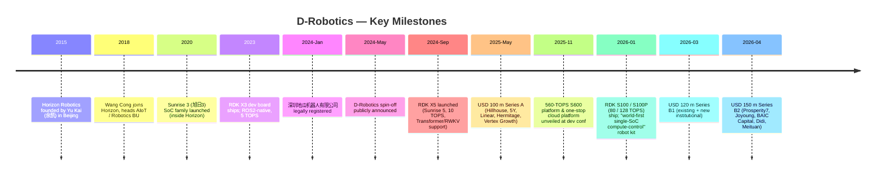
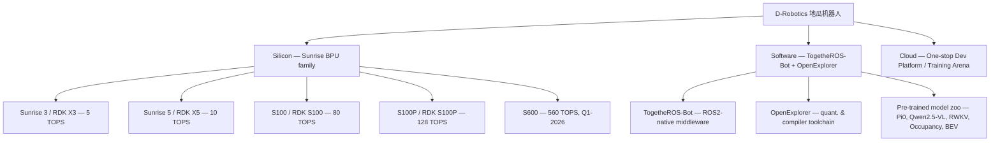
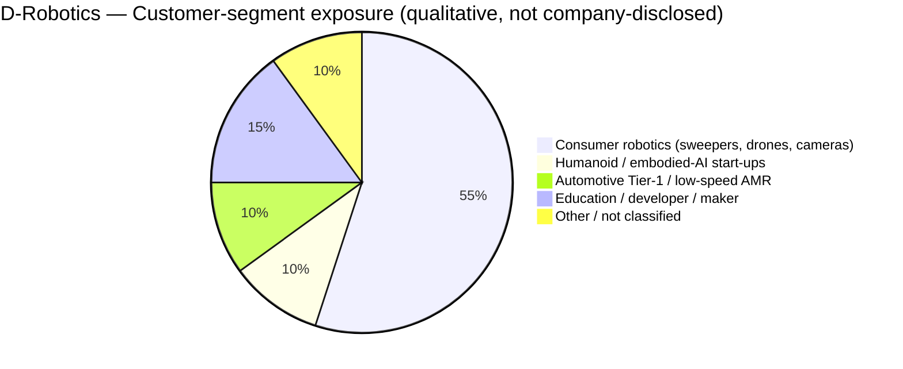
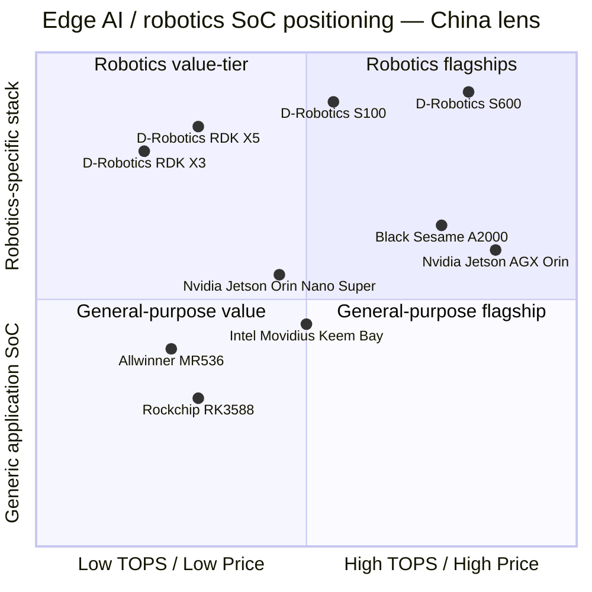

# COMPANY RESEARCH REPORT: D-Robotics (地瓜机器人)

**Date:** 2026-05-19
**Status:** Private — Horizon Robotics (HKEX:9660) controlled spin-off
**Headquarters:** Shenzhen, China (registered entity 深圳地瓜机器人有限公司); additional offices Beijing & Hangzhou
**Founder / CEO:** Wang Cong (王丛)
**Parent:** Horizon Robotics, Inc. (HKEX:9660) — 52.23% equity / 71.45% voting

> **Update — Series B closes at USD 270 m total in less than four weeks (2026-04-08):** D-Robotics closed a USD 150 m Series B2 round in April 2026, lifting cumulative Series B funding to USD 270 m after the USD 120 m Series B1 announced in mid-March 2026. The B2 round added new strategic capital from Saudi-backed Prosperity7 Ventures, Joyoung Family Office, BAIC Capital, Didi (滴滴) and Meituan Longzhu (美团龙珠) on top of existing backers Hillhouse / GL Ventures, 5Y Capital, Linear Venture, Hermitage Capital and Temasek-backed Vertex Growth. Including the USD 100 m Series A from May 2025, total external funding now stands at roughly USD 370 m within twelve months of leaving Horizon's balance sheet. Management has flagged the proceeds will fund the S100/S100P ramp, the 560-TOPS S600 platform launch in Q1 2026, and overseas expansion across 20+ countries. Source: [Caproasia, "Horizon Robotics 3-Year-Old Spinoff D-Robotics Raised USD 150M in Series B2 Funding", 2026-04-12](https://www.caproasia.com/2026/04/12/china-13-4-billion-autonomous-driving-tech-company-horizon-robotics-3-year-old-spinoff-2024-robotic-computing-chips-company-d-robotics-raised-150-million-in-series-b2-funding-total-270-million/); [Caixin Global, "D-Robotics Raises $120 Million as Investor Appetite for Embodied AI Grows", 2026-03-16](https://www.caixinglobal.com/2026-03-16/d-robotics-raises-120-million-as-investor-appetite-for-embodied-ai-grows-102423516.html).

---

## TABLE OF CONTENTS
1. Company Overview
2. Company History — including the Horizon Robotics spin-off rationale
3. Management Team
4. Products & Services — RDK X3 / X5 / S100 / S100P / S600 + software stack
5. Customers & Go-to-Market
6. Industry Overview — China embodied-AI / edge-AI SoC market
7. Competitive Landscape — Nvidia Jetson, Black Sesame, Rockchip, Allwinner, Intel Movidius
8. Market Opportunity (TAM)
9. Risk Assessment
10. References

======================================

## 1. COMPANY OVERVIEW

D-Robotics (legal entity 深圳地瓜机器人有限公司; trading as "地瓜机器人" / "Digua Robotics") is a privately-held, Horizon-Robotics-controlled fabless semiconductor and developer-platform company that designs robot-class systems-on-chip (SoCs), production-grade development kits (RDK = "Robot Development Kit"), and an integrated software toolchain spanning model training, deployment and on-device inference for what the company calls **"embodied AI" (具身智能 / embodied AI)** — robotics workloads that combine perception, large-model reasoning, and real-time motion control on the same device. The company is, by its own positioning, the only Chinese vendor today supplying a **vertically-integrated software-plus-silicon "universal base"** to the robotics market — explicitly modelling itself on the "Wintel" duopoly of the PC era ([Z Potentials × 王丛 interview, "从地平线起航，地瓜机器人如何成为'机器人版Wintel'", 2025-05](https://news.qq.com/rain/a/20250523A041W200)).

**What it sells.** Three intertwined revenue streams:

1. **SoCs** — the Horizon-derived Sunrise (旭日) family of robotic application processors integrating Arm CPU cores, a proprietary Brain Processing Unit (BPU) and dedicated MCU/safety-island cores. The latest commercial silicon family runs from the Sunrise 3 (5 TOPS at 8-bit precision) through Sunrise 5 (10 TOPS) and the all-new robot-class S100/S100P (80 / 128 TOPS) ([CNX Software, "D-Robotics RDK X5 development board features Sunrise X5 octa-core SoC with 10 TOPS BPU", 2025-06-30](https://www.cnx-software.com/2025/06/30/d-robotics-rdk-x5-development-board-features-sunrise-x5-octa-core-soc-with-10-tops-bpu-for-ros-projects/); [Electromaker, "D-Robotics Introduces the RDK S100 AI Robotics Development Board at Embedded World 2026", 2026-03](https://www.electromaker.io/blog/article/d-robotics-introduces-the-rdk-s100-ai-robotics-development-board-at-embedded-world-2026)).
2. **Development kits / reference boards (RDK series)** — turnkey carrier boards (RDK X3, RDK X5, RDK S100, RDK S100P, and the announced S600 module) that mount the silicon plus IO and ship with the full ROS2 / TogetheROS-Bot middleware. Pricing ranges from USD ~65 (RDK X3 2 GB) at the maker tier to RMB 2,799 (~USD 392) for the RDK S100 robot kit ([Hubtronics RDK X5 product page](https://www.hubtronics.in/rdk-x5); [DFRobot RDK X3 4GB store page](https://www.dfrobot.com/product-2869.html); [Pistiz, "Horizon Robotics Unveils Industry's First Single-SoC Computation-Control Integrated Robot Development Kit RDK S100"](https://www.pistiz.com/horizon-robotics-launched-robot-development-kit-rdk-s100/)).
3. **Software / cloud platform** — TogetheROS-Bot (the ROS2-compatible OS), OpenExplorer (the compiler/quantizer/hardware-aware deploy toolchain inherited from Horizon), and a newly-announced "one-stop cloud development platform" combining a data-loop system, an embodied-AI training arena, and Agent-development services for cloud-edge co-deployment ([量子位, "具身智能大算力开发平台S600重磅亮相", 2025-11-21](https://www.qbitai.com/2025/11/355297.html)).

**How it makes money.** Hardware revenue is dominated by SoC sales to Tier-1 robotics OEMs (sweeping-robot makers, drone makers, humanoid-robot integrators, automotive Tier-1 cabin / AMR systems integrators), supplemented by RDK developer-board sales to the long-tail of educational, hobbyist, research and prototyping users. The cloud / software layer is presently a community-and-ecosystem investment — used to widen the funnel of model-houses and integrators that ultimately design Sunrise into shipping products. Specific revenue split is **not disclosed** as the company is private.

**Where it operates.** The headquartered legal entity is 深圳地瓜机器人有限公司 in Shenzhen (registered 2024-01-16) ([企查猫, 深圳地瓜机器人有限公司](https://www.qichamao.com/orgcompany/searchitemdtl/6fad1e3a4bb62fa74d6855dc988b0b36.html)); R&D talent has been carried over from Horizon's Beijing and Hangzhou offices, in line with the parent's geographic footprint. The developer community as of the November 2025 dev conference spans 20+ countries across APAC, Europe and North America ([地瓜机器人 dev-conference recap, 量子位, 2025-11-21](https://www.qbitai.com/2025/11/355297.html)).

**How large.** Through the public-record disclosures D-Robotics had reportedly:
- Shipped **>5 million** Sunrise-series SoCs cumulatively as of the Series A announcement, growing at a "millions of units per year" cadence ([TechNode 动点科技, "地平线机器人旗下地瓜机器人完成 1 亿美元 A 轮融资", 2025-05-28](https://cn.technode.com/post/2025-05-28/d-robotics-a/); [观察者网, "做机器人时代的Wintel，地瓜机器人完成1亿美元融资", 2025-05-28](https://www.guancha.cn/economy/2025_05_28_777511.shtml)).
- Grown developer-board shipment volume **+180% YoY** and **+200%** in registered customer count over the year preceding the Series A ([极客公园, "刚获得一亿美元融资的地瓜机器人，挑战让智能机器人变得更便宜", 2025-05-28](https://www.geekpark.net/news/350410)).
- Reached **>100,000 global developers**, with the "地心引力" (Center-of-Gravity) acceleration program serving 500+ early-stage robotics teams and helping 200+ teams ship hero products ([量子位, 2025-11-21](https://www.qbitai.com/2025/11/355297.html)).

Employee headcount is not publicly disclosed; press coverage from the spin-off suggests a few-hundred-engineer scope inherited from Horizon's AIoT / Robotics business unit ([Geekpark interview with Wang Cong, "对话地瓜机器人CEO王丛：我们不造机器人，但要让造机器人这事变得更爽", 2024-09](https://www.geekpark.net/news/341005)).

### Valuation snapshot — private, latest funding round

Because D-Robotics is private and no audited revenue figures are public, the standard P/E / P/S framework is not applicable. The valuation reference points are:

- **Series A (2025-05):** USD 100 m raised; outlets reported a post-money valuation in the **USD 500 m** range (cited in commentary as the "estimated" post-money — outlet phrasing, not company-disclosed) ([Ainvest, "D-Robotics' $100M Funding Ignites Robotics Revolution", 2025-05](https://www.ainvest.com/news/robotics-100m-funding-ignites-robotics-revolution-golden-opportunity-horizon-ecosystem-play-2505/); [Caproasia, "D-Robotics Raised $100 Million in Series A Funding", 2025-05-29](https://www.caproasia.com/2025/05/29/china-12-5-billion-autonomous-driving-tech-company-horizon-robotics-1-year-old-spinoff-2024-robotic-computing-chips-company-d-robotics-raised-100-million-in-series-a-funding-investors-include-hil/)). *Unverified specific post-money — flagged.*
- **Series B1 (2026-03):** USD 120 m; post-money not publicly disclosed ([Caixin Global, 2026-03-16](https://www.caixinglobal.com/2026-03-16/d-robotics-raises-120-million-as-investor-appetite-for-embodied-ai-grows-102423516.html)).
- **Series B2 (2026-04):** USD 150 m; post-money not publicly disclosed; cumulative external capital ≈ USD 370 m within twelve months ([Caproasia, 2026-04-12](https://www.caproasia.com/2026/04/12/china-13-4-billion-autonomous-driving-tech-company-horizon-robotics-3-year-old-spinoff-2024-robotic-computing-chips-company-d-robotics-raised-150-million-in-series-b2-funding-total-270-million/); [The AI Insider, "China's D-Robotics Raises USD $150M in New Funding With Series B Total of USD $270M", 2026-04-08](https://theaiinsider.tech/2026/04/08/chinas-d-robotics-raises-usd-150m-in-new-funding-with-series-b-total-of-usd-270m/)).

**Implied multiple:** Without disclosed revenue the implied P/S cannot be calculated cleanly. As reference, parent **Horizon Robotics (HKEX:9660)** traded around a USD 13.4 bn market capitalisation at the time of the Series B2 announcement ([Caproasia, 2026-04-12](https://www.caproasia.com/2026/04/12/china-13-4-billion-autonomous-driving-tech-company-horizon-robotics-3-year-old-spinoff-2024-robotic-computing-chips-company-d-robotics-raised-150-million-in-series-b2-funding-total-270-million/)), against FY-2024 disclosed automotive-AI revenue — i.e. the public auto-AI parent is trading at a high-teens to low-twenties price-to-sales multiple. Listed comp **Black Sesame (HKEX:2533)** is loss-making and similarly trades on a price-to-sales rather than P/E basis ([Alpha Spread, Black Sesame revenue page](https://www.alphaspread.com/security/hkex/2533/financials/income-statement/revenue)). **Allwinner (SZSE:300458)** and **Rockchip (SSE:603893)** — both profitable mass-market application-SoC vendors — trade at lower price-to-sales but very high earnings multiples on the back of their robotics-narrative re-rating ([华创证券 2025年报点评, 全志科技](https://www.fxbaogao.com/detail/5328994)).

**Why the private mark is rich.** Embodied-AI silicon is the single hottest theme in Chinese hard-tech VC: the company is the only meaningful Chinese alternative to Nvidia Jetson on the robotics edge, it sits on a 5-million-unit installed base inherited from Horizon, and the parent's Hong Kong listing gives investors a credible IPO exit path. The same lens that pushed listed-peer Black Sesame to a USD 4–5 bn market cap in 2025–26 ([Alpha Spread, HKEX:2533](https://www.alphaspread.com/security/hkex/2533/summary)) provides cover for an aggressive private mark on D-Robotics.

*Source: round amounts compiled from [Caproasia (Series A, 2025-05-29)](https://www.caproasia.com/2025/05/29/china-12-5-billion-autonomous-driving-tech-company-horizon-robotics-1-year-old-spinoff-2024-robotic-computing-chips-company-d-robotics-raised-100-million-in-series-a-funding-investors-include-hil/), [Caixin Global (Series B1, 2026-03-16)](https://www.caixinglobal.com/2026-03-16/d-robotics-raises-120-million-as-investor-appetite-for-embodied-ai-grows-102423516.html) and [Caproasia (Series B2, 2026-04-12)](https://www.caproasia.com/2026/04/12/china-13-4-billion-autonomous-driving-tech-company-horizon-robotics-3-year-old-spinoff-2024-robotic-computing-chips-company-d-robotics-raised-150-million-in-series-b2-funding-total-270-million/). Spin-off date per [企查猫 corporate registration](https://www.qichamao.com/orgcompany/searchitemdtl/6fad1e3a4bb62fa74d6855dc988b0b36.html).*

---

## 2. COMPANY HISTORY

D-Robotics' story is unusual: the company is a "born-at-scale" carve-out, not a garage start-up. The team, IP backbone, customer relationships and >5-million-unit installed base were assembled inside Horizon Robotics from 2018 onward as the **AIoT / Robotics Business Unit** before being externalised into a free-standing legal entity in early 2024.

**The pre-history (2018–2023) inside Horizon.** Horizon was founded in 2015 by ex-Baidu IDL head Yu Kai (余凯) as a Beijing-based AI-chip company chasing two markets: autonomous driving (Journey / 征程 SoC family) and broader edge AI (Sunrise / 旭日 SoC family). The two product lines shared a common Bayesian-precision BPU NPU architecture but addressed very different markets. Wang Cong joined Horizon in 2018 to lead the AIoT product line and quickly took on the entire robotics business — owning R&D, marketing, sales and the developer ecosystem ([极客公园, 王丛 interview, 2024-09](https://www.geekpark.net/news/341005); [机器人大讲堂, "地平线机器人不做机器人?", 2024-09](https://leaderobot.com/news/4763)). By 2023 the robotics BU had quietly become a leading domestic supplier to sweeping-robot OEMs (a "hidden champion" segment) and was building a strong educational / maker community around the RDK X3.

**The 2024 spin-off rationale.** In **January 2024** Horizon legally registered 深圳地瓜机器人有限公司 ([企查猫](https://www.qichamao.com/orgcompany/searchitemdtl/6fad1e3a4bb62fa74d6855dc988b0b36.html)) and over Q1-Q2 transferred robotics-related IP, employees and customer contracts. The spin-off was announced publicly in mid-2024, with the company branding itself as "地瓜机器人 / D-Robotics" — the name a deliberately playful contrast to the more austere "Horizon Robotics" parent. Wang Cong was confirmed as founder & CEO ([新浪财经, "对话地瓜机器人CEO王丛：我们不造机器人，但要让造机器人这事变得更爽", 2024-09](https://finance.sina.com.cn/roll/2024-09-21/doc-incpwqxy9241449.shtml)).

The strategic logic, articulated by Wang Cong in multiple interviews, has three layers:

1. **Different customer DNA.** Horizon's automotive customer is a Tier-1 / OEM with multi-year design-ins, ASIL-D safety requirements, and ten-million-unit annual volumes. The robotics customer is fragmented — sweeping-robot OEMs, drone makers, hundreds of humanoid and AMR start-ups, plus an enormous long-tail of researchers and makers. Different sales motion, different pricing, different roadmap. Coupling them was diluting both ([Z Potentials × 王丛, 2025-05](https://news.qq.com/rain/a/20250523A041W200)).
2. **Capital efficiency.** A focused robotics-SoC vendor can raise dedicated equity from robotics-thematic investors (Hillhouse, 5Y, Vertex Growth, Prosperity7) at a higher implied multiple than the same revenue carried inside the auto-AI parent. The Series A in May 2025 — twelve months after the legal carve-out — and the rapid Series B in March-April 2026 validate the logic ([TechNode, 2025-05-28](https://cn.technode.com/post/2025-05-28/d-robotics-a/); [Caproasia, 2026-04-12](https://www.caproasia.com/2026/04/12/china-13-4-billion-autonomous-driving-tech-company-horizon-robotics-3-year-old-spinoff-2024-robotic-computing-chips-company-d-robotics-raised-150-million-in-series-b2-funding-total-270-million/)).
3. **Ecosystem credibility.** As an independent company, D-Robotics can credibly sell to robot OEMs that compete with anyone Horizon partners with on the automotive side — and equally accept investment from automotive OEMs (e.g. **BAIC Capital**, in the B2) and ride-hailing platforms (**Didi**, **Meituan Longzhu**) without those investors fearing they are funding their car-AI competitor ([Caproasia, 2026-04-12](https://www.caproasia.com/2026/04/12/china-13-4-billion-autonomous-driving-tech-company-horizon-robotics-3-year-old-spinoff-2024-robotic-computing-chips-company-d-robotics-raised-150-million-in-series-b2-funding-total-270-million/)).

**Equity / IP relationship with Horizon.** Per a Hong Kong Stock Exchange continuing-connected-transaction announcement from Horizon Robotics dated August 2025, **Horizon controls D-Robotics with 52.23% of issued share capital, 71.45% of voting rights, and the right to appoint a majority of board members** ([Horizon Robotics HKEX announcement, "Continuing Connected Transactions", 2025-08-27](https://www.hkexnews.hk/listedco/listconews/sehk/2025/0827/2025082701291.pdf)). D-Robotics consequently remains a consolidated subsidiary of HKEX:9660 for accounting purposes. The IP backbone — most importantly the BPU architecture used in Sunrise and the OpenExplorer toolchain — was licensed / transferred from Horizon on a basis that has not been publicly itemised; the HKEX disclosure framework treats the ongoing inter-group purchases and licensing as connected transactions requiring annual cap disclosures.

*Sources for the timeline: spin-off and parent history per [新浪财经/王丛 interview, 2024](https://finance.sina.com.cn/roll/2024-09-21/doc-incpwqxy9241449.shtml); RDK product introductions per [CNX Software, RDK X5, 2025-06-30](https://www.cnx-software.com/2025/06/30/d-robotics-rdk-x5-development-board-features-sunrise-x5-octa-core-soc-with-10-tops-bpu-for-ros-projects/) and [Electromaker, RDK S100, 2026-03](https://www.electromaker.io/blog/article/d-robotics-introduces-the-rdk-s100-ai-robotics-development-board-at-embedded-world-2026); S600 per [量子位, 2025-11-21](https://www.qbitai.com/2025/11/355297.html); funding rounds per [TechNode, 2025-05-28](https://cn.technode.com/post/2025-05-28/d-robotics-a/), [Caixin Global, 2026-03-16](https://www.caixinglobal.com/2026-03-16/d-robotics-raises-120-million-as-investor-appetite-for-embodied-ai-grows-102423516.html) and [Caproasia, 2026-04-12](https://www.caproasia.com/2026/04/12/china-13-4-billion-autonomous-driving-tech-company-horizon-robotics-3-year-old-spinoff-2024-robotic-computing-chips-company-d-robotics-raised-150-million-in-series-b2-funding-total-270-million/).*

**Recent developments (last 12 months).** Three matter most. First, the rapid back-to-back B1/B2 raises (March-April 2026) doubled the company's external capital base in under four weeks and added strategic investors from automotive (BAIC), Middle Eastern sovereign-adjacent capital (Prosperity7, the Aramco-affiliated VC), large-platform internet (Didi, Meituan), and a home-appliance family office (Joyoung) ([每日经济新闻, "不到一个月累计融资2.7亿美元", 2026-04-08](https://www.nbd.com.cn/articles/2026-04-08/4330374.html)). Second, the **S100 family started shipping in January 2026**, marking the company's commercial step-up from the 10-TOPS X5 to the 80-/128-TOPS robot-class platform ([Kr Asia, "As robots get smarter, D-Robotics ships an SoC kit to close the loop"](https://kr-asia.com/as-robots-get-smarter-d-robotics-ships-an-soc-kit-to-close-the-loop)). Third, the November 2025 unveiling of the **560-TOPS S600 platform** plus a cloud "one-stop development platform" signals that the next product step — the head of a humanoid robot rather than the head of a sweeper — is now on the roadmap with an announced Q1 2026 commercial launch ([量子位, 2025-11-21](https://www.qbitai.com/2025/11/355297.html); [InfoQ, "地瓜机器人发布 S600 大算力开发平台", 2025-11-22](https://www.infoq.cn/article/cx5awf1gwa6jxbqkgtvf)).

---

## 3. MANAGEMENT TEAM

### Wang Cong (王丛) — Founder & CEO

Wang Cong is the originator of the company's "robot Wintel" thesis and the single most consequential individual at D-Robotics. Public English-language news cites his name variously as "Wang Cong" and occasionally "Wang Congqing"; the legal-representative filing for the Shenzhen entity registers him as 王丛 ([企查猫, 深圳地瓜机器人有限公司](https://www.qichamao.com/orgcompany/searchitemdtl/6fad1e3a4bb62fa74d6855dc988b0b36.html)) — we use "Wang Cong" throughout this report on that basis. *(Specific birth year and education credentials are not publicly disclosed in the sources we accessed — flagged.)*

He joined **Horizon Robotics in 2018** and was assigned to lead the AIoT product line; by 2020 he was running Horizon's entire Robotics Business Unit, with end-to-end ownership of product development, marketing, sales-and-service, and the developer community. Inside Horizon he built the Sunrise (旭日) SoC family into a leading domestic supplier to consumer-robotics OEMs and oversaw the launch of the RDK X3 developer kit in 2023, which became the seed of D-Robotics' subsequent global community. He "built out the entire R&D, sales, marketing and community organisation" of the robotics business inside Horizon, per his own Geekpark interview ([极客公园, "对话地瓜机器人CEO王丛", 2024-09](https://www.geekpark.net/news/341005); [搜狐 / Z Potentials, "从地平线起航，地瓜机器人如何成为'机器人版Wintel'", 2025-05](https://www.sohu.com/a/897966414_122063396)).

In his public commentary Wang has been unusually candid about three positions that shape D-Robotics' strategy. First, he does not believe humanoid robots will reach genuine general-purpose ("通用具身智能") usefulness for at least five years — he repeatedly tells Chinese media that the current humanoid wave is "before the ChatGPT moment" and that the right product strategy is to **sell shovels (silicon and tools) to all the form-factors** rather than picking a winning robot shape ([南方都市报, "对话地瓜机器人CEO王丛：人形机器人大规模落地仍有待时日", 2024-09](https://m.mp.oeeee.com/a/BAAFRD0000202409241002961.html); [新浪财经, "对话地瓜机器人CEO王丛：行业'淘汰赛'还没开始", 2025-06-17](https://finance.sina.com.cn/cj/2025-06-17/doc-infakyex9669096.shtml)). Second, he frames the company's mission as cost-down: lowering the "robot brain" price-point — he points to a "RMB 500 robot heart" (i.e. RDK X3 at ~RMB 500) as both a marketing hook and a real BoM-reduction goal ([极客公园, "500元的机器人'心脏'，是怎么炼成的?", 2024-09](https://www.geekpark.net/news/341005)). Third, he is explicit that D-Robotics will **not** build whole robots — it is a platform company, modelled on Intel and Microsoft's PC duopoly ([观察者网, "做机器人时代的Wintel，地瓜机器人完成1亿美元融资", 2025-05-28](https://www.guancha.cn/economy/2025_05_28_777511.shtml); [Z Potentials interview, 2025-05](https://news.qq.com/rain/a/20250523A041W200)).

Ownership stake is not publicly disclosed; given Horizon's 52.23% control and multiple VC rounds, Wang's residual founder equity is likely in the high-single-digit to low-teens percent range — *flagged as unverified*. He sits on the D-Robotics board; Horizon-appointed directors hold the majority of board seats per the HKEX disclosure.

### Other Executives and the Founding Team

Detailed bios of the CFO, COO and CTO are **not publicly disclosed** in the press sources we accessed; D-Robotics has not yet issued a prospectus or formal governance document. The publicly-visible org includes the carry-over of senior R&D leaders from Horizon's robotics BU — covering BPU silicon design, compiler / quantization (OpenExplorer), perception algorithms, and developer-community management — but specific names and tenure are not confirmable from the sources we relied on. *(Bios flagged as undisclosed.)*

What we can say with confidence:
- **Technical depth from Horizon.** D-Robotics inherits ~6 years of accumulated BPU silicon engineering, multiple production silicon tape-outs (Sunrise 3 → Sunrise 5 → S100), and a battle-tested toolchain (OpenExplorer) that has already passed the test of shipping into millions of consumer-robotics units. Few competitors at the start-up stage have this baseline ([Z Potentials × 王丛, 2025-05](https://news.qq.com/rain/a/20250523A041W200)).
- **Commercial muscle inherited.** The sweeping-robot and drone customer relationships — including widely-cited integrations with Ecovacs (科沃斯), CloudAI (云鲸), Insta360 (影石) and Vitower (维他动力) — predate the spin-off and arrived with the carve-out ([极客公园, 2025-05](https://www.geekpark.net/news/350410)).
- **Backed by deep institutional capital.** Hillhouse (via GL Ventures), 5Y Capital, Linear Venture, Hermitage Capital, Vertex Growth (Temasek), Prosperity7 (Aramco-affiliated), BAIC Capital, Joyoung Family Office, Didi and Meituan Longzhu sit on the cap table — the breadth of strategic capital is a meaningful governance / network asset even where individual board seats are not visible ([Caproasia, 2026-04-12](https://www.caproasia.com/2026/04/12/china-13-4-billion-autonomous-driving-tech-company-horizon-robotics-3-year-old-spinoff-2024-robotic-computing-chips-company-d-robotics-raised-150-million-in-series-b2-funding-total-270-million/)).

### Governance

- **Board control:** Horizon Robotics holds the majority of board seats and 71.45% of voting rights ([HKEX announcement, 2025-08-27](https://www.hkexnews.hk/listedco/listconews/sehk/2025/0827/2025082701291.pdf)).
- **Connected-party regime:** All inter-group sales (Horizon → D-Robotics for shared IP / R&D, D-Robotics → Horizon for any chip supply, services exchanged either way) are subject to HKEX continuing-connected-transactions rules including annual caps and independent shareholder approval where size thresholds are crossed.
- **Capital structure:** Multi-class equity is not publicly confirmed but consistent with typical PRC venture rounds; Horizon's 52.23% economic / 71.45% voting gap implies preferred-share economics for outside investors. *Flagged as inferred, not confirmed.*
- **Strategic-investor concentration:** The Series B2 added five new financial / strategic investors alongside follow-on from the Series A insiders — a deliberately diversified cap-table that limits any single LP from outsized influence ([Caproasia, 2026-04-12](https://www.caproasia.com/2026/04/12/china-13-4-billion-autonomous-driving-tech-company-horizon-robotics-3-year-old-spinoff-2024-robotic-computing-chips-company-d-robotics-raised-150-million-in-series-b2-funding-total-270-million/)).

### Management Track Record Synthesis

The team's track record is materially better than a typical pre-Series-A start-up's. Wang Cong has six years of in-revenue robotics-silicon execution from inside Horizon, including an actual shipping product line and an actual installed base; the BPU silicon team has multiple production tape-outs behind it; and the parent provides an implicit "no-fail" governance overlay. The most visible gap is **CFO / public-markets capability** — D-Robotics has not yet hired or disclosed a CFO with prior IPO experience, which would normally precede an IPO process by 18–24 months. *Flagged.*

---

## 4. PRODUCTS & SERVICES

D-Robotics' product portfolio is best understood as a **silicon ladder** (Sunrise 3 → Sunrise 5 → S100 → S600), each tier paired with an RDK developer board, plus a **horizontal software stack** (TogetheROS-Bot + OpenExplorer + cloud development platform) that runs across the entire silicon range.

### 4.1 RDK X3 — entry-level (5 TOPS, ~USD 65–75)

The RDK X3 is the long-tail / educational anchor of the lineup. Hardware: Sunrise X3 quad-core Arm Cortex-A53 at 1.5 GHz; dual-core "Bernoulli" BPU rated at **5 TOPS** of edge inference; 2 GB or 4 GB of LPDDR4; microSD storage; 40-pin GPIO header pin-compatible with Raspberry Pi 4B accessories; H.264 / H.265 encode and decode up to 4K@60 fps ([CNX Software, "D-Robotics RDK X3 Development Board features Sunrise X3 quad-core Arm Cortex-A53 SoC with a 5TOPS 'Bernoulli' BPU", 2024-09-24](https://www.cnx-software.com/2024/09/24/d-robotics-rdk-x3-development-board-features-sunrise-x3-quad-core-arm-cortex-a53-soc-with-a-5tops-bernoulli-bpu/); [DFRobot RDK X3 product page](https://www.dfrobot.com/product-2869.html)). List price is USD ~62 / USD ~72 for the 2 GB and 4 GB SKUs on AliExpress, with Amazon list at USD 65 / 75 ([Electronics-Lab, "D-Robotics RDK X3 dev board features Sunrise X3 quad-core SoC and 5TOPS NPU"](https://www.electronics-lab.com/d-robotics-rdk-x3-dev-board-features-sunrise-x3-quad-core-soc-and-5tops-npu/)). Target customer: makers, university robotics labs, ROS2 prototyping, vision-only sweepers and entry-level service robots.

**Competitive advantage assessment: PARTIAL.** Moat type is **cost / ecosystem at the low end** — at USD 65 with native ROS2 the X3 is cheaper than a Jetson Orin Nano Super (USD 249, 67 TOPS) for any task that doesn't need >5 TOPS, and is the price-equivalent of a Raspberry Pi 4B with the meaningful addition of an NPU. The closest competing products are **Nvidia Jetson Orin Nano Super** at the high end (USD 249, far more compute) and **Rockchip RK3588 dev boards** in the same compute class (6 TOPS NPU, USD ~150) ([Nvidia Jetson Orin Nano Super page](https://www.nvidia.com/en-us/autonomous-machines/embedded-systems/jetson-orin/nano-super-developer-kit/); [Tinycomputers.io, "Rockchip RK3588 NPU Deep Dive"](https://tinycomputers.io/posts/rockchip-rk3588-npu-benchmarks.html)). Verdict relative to Jetson: **behind** on per-board AI compute, **ahead** on price-per-board and ahead on robotics-specific Chinese-language documentation; relative to Rockchip: **ahead** on robotics-specific ROS2 middleware and BPU toolchain maturity.

### 4.2 RDK X5 — robotics workhorse (10 TOPS, ~USD 110)

Launched September 2024, the RDK X5 doubled compute and introduced first-class support for the model architectures that matter in 2024–2026 robotics. Hardware: Sunrise 5 octa-core Arm Cortex-A55; dedicated BPU rated at **10 TOPS** at minimum precision; 4 GB or 8 GB LPDDR4 RAM; rich IO (HDMI, USB 3.0, gigabit Ethernet, MIPI camera inputs, CAN, UART); 40-pin GPIO header ([CNX Software, "D-Robotics RDK X5 development board features Sunrise X5 octa-core SoC", 2025-06-30](https://www.cnx-software.com/2025/06/30/d-robotics-rdk-x5-development-board-features-sunrise-x5-octa-core-soc-with-10-tops-bpu-for-ros-projects/); [Waveshare RDK X5 product page](https://www.waveshare.com/rdk-x5.htm); [Hubtronics RDK X5 page](https://www.hubtronics.in/rdk-x5)). Software supports **Transformer, RWKV, Occupancy networks, BEV (bird's-eye-view) perception and Stereo Perception** out of the box via the OpenExplorer toolchain ([Hackster.io, "D-Robotics Launches the 10 TOPS Edge AI RDK X5 — and Teases the 96 TOPS RDK Ultra"](https://www.hackster.io/news/d-robotics-launches-the-10-tops-edge-ai-rdk-x5-and-teases-the-96-tops-rdk-ultra-c88714dab9d5)). Target customer: production deployments in sweeping robots, drones, lawn-mowing robots, service / companion robots, and the bulk of the developer community.

**Competitive advantage assessment: YES.** Moat type is **bundled silicon + ROS2 + Transformer-quantization toolchain**, with cost leadership relative to Jetson Orin family. Closest competitor product: **Jetson Orin Nano Super** at USD 249 / 67 TOPS — 6.7× the AI compute at ~2.3× the price; the X5 wins on TCO for any model that fits in 10 TOPS, loses on headroom for 7B-class LLMs. Evidence of differentiation: the X5 has been adopted by major sweeping-robot OEMs and is the reference platform for hundreds of robotics-curriculum university partnerships. Verdict vs. Jetson: **at parity** in the 5–10 TOPS robotics-control class, behind in 30+ TOPS perception, ahead in domestic-supply-chain and Chinese-language community traction.

### 4.3 RDK S100 / S100P — the robot-class flagship (80 / 128 TOPS, RMB 2,799 / ~USD 392 base SKU)

The S100 is D-Robotics' first **single-SoC compute-control integrated** robot platform, launched in early 2026. The architectural step-change is that a single piece of silicon integrates the **CPU (six-core Arm Cortex-A78AE), BPU (dedicated AI inference engine), and an MCU / safety-island** — eliminating the conventional dual-SoC split between an application processor running perception and a separate MCU running motion control. D-Robotics markets this as the industry's first such integration ([Pistiz, "Horizon Robotics Unveils Industry's First Single-SoC Computation-Control Integrated Robot Development Kit RDK S100"](https://www.pistiz.com/horizon-robotics-launched-robot-development-kit-rdk-s100/); [Electromaker, RDK S100 at Embedded World 2026](https://www.electromaker.io/blog/article/d-robotics-introduces-the-rdk-s100-ai-robotics-development-board-at-embedded-world-2026)).

SKUs:
- **RDK S100** — 80 TOPS NPU + 12 GB LPDDR5 — RMB 2,799 (~USD 392) ([Waveshare RDK S100 product page](https://www.waveshare.com/rdk-s100.htm); [ThinkRobotics RDK S100 product page](https://thinkrobotics.com/products/d-robotics-rdk-s100-series-robot-development-kit)).
- **RDK S100P** — 128 TOPS NPU + 24 GB LPDDR5 — ~60% more AI throughput than the S100 ([Yahboom RDK S100P listing](https://category.yahboom.net/collections/rdk-series/products/rdk-s100-s100p); [Kr Asia, "As robots get smarter, D-Robotics ships an SoC kit to close the loop"](https://kr-asia.com/as-robots-get-smarter-d-robotics-ships-an-soc-kit-to-close-the-loop)).

IO matters: dual MIPI camera inputs (for stereo / depth), four USB 3.0 ports, two PCIe 3.0 lanes. Software supports Transformer, BEV multi-stream detection, and end-to-end large-model robotics workloads. Target customer: humanoid-robot developers, AMR / industrial-robot OEMs, autonomous low-speed vehicles.

**Competitive advantage assessment: YES.** Moat type is **technology / architecture (compute-control integration) + ecosystem lock-in** through TogetheROS-Bot and OpenExplorer. Closest competing product: **Jetson AGX Orin 64GB** (USD ~1,999, up to 275 TOPS) — Nvidia wins on raw compute and on CUDA ecosystem, D-Robotics wins on price-per-TOPS (the S100P delivers 128 TOPS for ~28% of the price) and on integrated motion-control / MCU silicon — Jetson AGX Orin still requires a separate ECU for real-time control. Verdict vs. Jetson AGX Orin: **ahead** on price-per-TOPS and integration, **behind** on absolute peak compute, CUDA software ecosystem and large-foundation-model headroom. Closest competing Chinese product: **Black Sesame A2000** (positioned for L3-L4 autonomous-driving but being recycled for humanoid perception) — A2000 is ahead in automotive-safety certification, D-Robotics S100 ahead in non-automotive robotics dev-experience ([Futubull, "黑芝麻智能(2533.HK)：出海与机器人业务双线突破 A2000芯片方案开发验证顺利"](https://news.futunn.com/en/post/61435687/heizhima-intelligent-2533-hk-dual-breakthroughs-in-overseas-expansion-and)).

### 4.4 S600 — the next step (560 TOPS, Q1 2026 launch)

Unveiled at the November 2025 dev conference, the S600 platform represents a 4× compute step from the S100P — designed explicitly for VLA (Vision-Language-Action), VLM, LLM and Locomotion models running on humanoid robots. Architecture: **18-core Arm Cortex-A78AE CPU for the "big brain"**, new-generation **BPU "Nash"** for AI inference, and a **6-core Arm Cortex-R52+ MCU for the "small brain"** real-time control loop. Total claimed AI compute is **560 TOPS at INT8**. Performance benchmarks released by the company show **Pi0** running 2.3× faster than mainstream embodied-AI brain platforms and **Qwen2.5-VL-7B** running 2.2× faster on S600 ([量子位, "具身智能大算力开发平台S600重磅亮相", 2025-11-21](https://www.qbitai.com/2025/11/355297.html); [InfoQ, 2025-11-22](https://www.infoq.cn/article/cx5awf1gwa6jxbqkgtvf); [科技行者, "地瓜机器人算力翻四倍的S600", 2025-11](https://www.techwalker.com/2025/1121/3174243.shtml)). First strategic customers named: **Fourier (傅利叶)**, **Acceleration Evolution (加速进化)**, **Self-variable Robotics (自变量机器人)**, **Starry Era (星动纪元)**, plus automotive Tier-1 partners **知行科技 (iMotion)**, **天准星智** and **华勤技术 (Huaqin)** ([知乎, "地瓜机器人揭晓具身智能机器人大算力开发平台S600"](https://zhuanlan.zhihu.com/p/1976249352700838797)).

**Competitive advantage assessment: PARTIAL (pending shipment).** Until S600 reaches volume production the moat is on paper; if performance benchmarks are validated by independent customers, it would close the gap to Nvidia's higher-end Thor-class robot SoC. Closest competing products: **Nvidia Jetson Thor** (planned 2,000 TOPS robot SoC, premium-priced), **Black Sesame A2000 + C1200** combination for humanoids.

### 4.5 Software & cloud stack

- **TogetheROS-Bot** — D-Robotics' ROS2-compatible operating system, optimised for the Sunrise BPU and pre-integrated with motion-planning, perception and Agent-runtime layers. Forms the "ROS" leg of the "robot Wintel" pitch.
- **OpenExplorer** — model-compilation / quantization / hardware-aware-deployment toolchain inherited from Horizon. Supports PyTorch and ONNX as inputs and produces hardware-optimised binaries for the entire Sunrise family. The toolchain is what enables Transformer / RWKV / Occupancy / BEV / VLA models to run at production latency on relatively low-TOPS silicon.
- **One-stop cloud development platform** — announced November 2025; comprises (i) a **data closed-loop system** for collecting, labelling and replaying robot-deployment data, (ii) an **embodied-AI training arena** for cloud-side model training and SIM-to-real validation, and (iii) an **Agent development service** for cloud-deployed LLM-Agent integration with on-device robot control ([量子位, 2025-11-21](https://www.qbitai.com/2025/11/355297.html); [InfoQ, 2025-11-22](https://www.infoq.cn/article/cx5awf1gwa6jxbqkgtvf)).

**Roadmap & recent launches (12 months):**
- 2025-Q3: RDK X5 reached broad commercial availability through global distributors (Waveshare, DFRobot, Hubtronics, Yahboom).
- 2025-11: S600 platform and one-stop cloud platform announcement; "地瓜机器人一站式开发平台" unveiled.
- 2026-01: RDK S100 / S100P start shipping.
- 2026-Q1 (announced): S600 commercial launch.
- Rumoured / teased: **RDK Ultra** at 96 TOPS — teased in 2024 ([Hackster.io](https://www.hackster.io/news/d-robotics-launches-the-10-tops-edge-ai-rdk-x5-and-teases-the-96-tops-rdk-ultra-c88714dab9d5)) — appears to have been superseded by the S100 family; the Ultra branding has not received commercial follow-up in 2025/2026 product news. *Flagged as superseded; not confirmed by D-Robotics directly.*

**Flagship vs. long-tail:** Today's commercial revenue is dominated by **RDK X5** (sweeping robots, drones, service robots) and the long tail of **RDK X3** boards into education and prototyping. The **S100 family** is the inflection product for 2026 — moving the company from "edge AI module supplier" to "humanoid-robot brain supplier." The S600, when shipped, would be the headline product for the 2027 humanoid wave.

---

## 5. CUSTOMERS & GO-TO-MARKET

### Customer segments

D-Robotics serves four broadly-defined customer segments:

1. **Consumer-robotics OEMs (the cash-cow today).** Sweeping robots, lawn mowers, drones, action cameras, home companion robots. Named integrations include **Ecovacs (科沃斯)**, **CloudAI (云鲸)**, **Insta360 (影石)**, **Vitower (维他动力)** ([极客公园, "刚获得一亿美元融资的地瓜机器人", 2025-05-28](https://www.geekpark.net/news/350410); [新浪财经, "地瓜机器人完成1亿美元A轮融资", 2025-05](https://finance.sina.com.cn/wm/2026-04-08/doc-inhtucsa2836367.shtml)). These customers are typically high-volume (millions of units), highly cost-sensitive, and locked into multi-year design cycles — D-Robotics' principal Sunrise 3 / Sunrise 5 SoC revenue is here.
2. **Humanoid / embodied-AI start-ups.** Strategic-launch customers for the **S600** include **Fourier (傅利叶)**, **Acceleration Evolution (加速进化)**, **Self-variable Robotics (自变量机器人)** and **Starry Era (星动纪元)** ([知乎, 2025-11](https://zhuanlan.zhihu.com/p/1976249352700838797)). These customers are lower volume today but represent the high-value 2027–2030 humanoid-robot wave.
3. **Automotive Tier-1 / cabin / low-speed AMR.** Named S600 ecosystem partners include **知行科技 (iMotion)**, **天准星智** and **华勤技术 (Huaqin)** — Tier-1 / ODMs for in-car AI, low-speed delivery robots, parking robots ([知乎, 2025-11](https://zhuanlan.zhihu.com/p/1976249352700838797)).
4. **Education / research / makers (the developer community).** >100,000 global developers, 200+ universities cited in coverage, with the "地心引力" acceleration program serving 500+ small teams ([量子位, 2025-11-21](https://www.qbitai.com/2025/11/355297.html)). This is the funnel that feeds segments 1–3.

### Customer concentration

**D-Robotics is private and does not publish customer-concentration disclosures.** No top-1 or top-5 customer revenue percentages are available in the public record we accessed. *Flagged: customer concentration is not disclosed and we have not estimated it.* What we can say qualitatively:
- The 5-million-unit-plus cumulative Sunrise shipment base is overwhelmingly to sweeping-robot, action-camera and drone OEMs — segments where one or two Tier-1 customers can easily account for >30% of unit volume.
- Industry-wide, **Ecovacs is the dominant sweeping-robot brand** with ~40% Chinese market share (industry reports), and D-Robotics has been publicly identified as a chip partner. Combined with CloudAI, Insta360 and Vitower the top-5 likely represents a substantial revenue share — but the exact number is **not disclosed**. *Flagged.*
- D-Robotics' deliberate go-to-market choice to seed >20 humanoid-robot start-ups simultaneously with the S600, rather than back a single "winning" customer, is itself a concentration-reduction strategy.

*Note: these proportions are an analyst characterisation based on the qualitative balance of revenue language in coverage from [TechNode, 2025-05-28](https://cn.technode.com/post/2025-05-28/d-robotics-a/), [Geekpark, 2025-05](https://www.geekpark.net/news/350410) and the [量子位 dev-conference recap, 2025-11-21](https://www.qbitai.com/2025/11/355297.html). D-Robotics has not published a customer-segment revenue mix and these numbers should not be cited as company-disclosed.*

### Distribution channels

D-Robotics operates a hybrid model:

- **Direct enterprise sales** to Tier-1 OEMs (consumer robotics, humanoid start-ups, automotive Tier-1). Multi-year design-ins, typically a custom SoC SKU + multi-quarter NRE engagement.
- **Channel distribution** of the RDK developer-board family through international electronics distributors: **DFRobot**, **Waveshare**, **Hubtronics**, **Youyeetoo**, **Spotpear**, **Yahboom**, **OpenELAB**, **ThinkRobotics**, and direct on AliExpress and Amazon. This long-tail channel is the heart of the developer-community funnel and the international (>20-country) footprint.
- **Cloud platform** as a direct SaaS-style developer service, free at the entry tier, with paid usage tiers for training-arena compute and Agent runtime *(pricing not publicly disclosed)*.

### Sales cycle

- **Consumer-robotics OEM design-ins:** typically 6–12 months from technical evaluation to first PO, with mass production 12–24 months out.
- **Humanoid start-up engagements:** much shorter — start-ups want a working brain on the next iteration of their robot, so D-Robotics' approach is to ship developer boards immediately and convert to production SoCs in the next form-factor.
- **Education / maker:** instant-on; channel-distributed boards in stock at global distributors.

### Key partnerships

- **Parent Horizon Robotics** — for IP licensing (BPU architecture, OpenExplorer toolchain), shared R&D, manufacturing scale and HK-listed-company-grade governance.
- **Foundry & supply chain** — D-Robotics does not publicly disclose its foundry, but Horizon-family Sunrise SoCs have historically been manufactured at leading-edge nodes (TSMC and SMIC at varying nodes); the Sunrise 5 generation is targeted at a leading-edge Chinese / cross-strait node *(specific node not confirmed in public sources — flagged).*
- **Automotive Tier-1 ecosystem** — 知行科技, 天准星智, 华勤技术 (announced S600 partners) provide the Tier-1 system-integration bridge into automotive / low-speed AMR ([知乎, 2025-11](https://zhuanlan.zhihu.com/p/1976249352700838797)).
- **University / research network** — the "地心引力" acceleration program and 200+ university partnerships ([量子位, 2025-11-21](https://www.qbitai.com/2025/11/355297.html)).

### Case studies (named wins)

- **Sweeping robots:** D-Robotics' Sunrise SoCs power perception-and-decision-making for sweepers from **Ecovacs (科沃斯)** and **CloudAI (云鲸)** — among the highest-volume robotics product categories globally ([新浪财经, 2025-05](https://finance.sina.com.cn/wm/2026-04-08/doc-inhtucsa2836367.shtml); [极客公园, 2025-05](https://www.geekpark.net/news/350410)).
- **Action cameras / drones:** Sunrise integrations in **Insta360 (影石)** consumer cameras and drone platforms.
- **Humanoid brains:** strategic-launch customers for S600 — **Fourier**, **Acceleration Evolution**, **Self-variable Robotics**, **Starry Era** ([知乎, 2025-11](https://zhuanlan.zhihu.com/p/1976249352700838797)).
- **University curriculum:** >200 universities cited in coverage as having adopted RDK in robotics-course curricula ([瑞财经, "地瓜机器人获1亿美元A轮融资：高瓴资本参投，合作高校超200家", 2025-05](https://m.rccaijing.com/news-7333394698172298565.html)).

---

## 6. INDUSTRY OVERVIEW

D-Robotics sits at the intersection of three industries that are each on a different trajectory: the mature **edge-AI application-SoC industry** (multi-decade, fragmenting), the still-defining **embodied-AI / robot-brain SoC industry** (born ~2023), and the **China consumer-robotics OEM industry** (mature in sweepers, exploding in humanoids).

### Industry definition

The narrowest definition of D-Robotics' addressable industry is **robotics-class application-SoCs** — silicon delivering 5 to 600+ TOPS of AI compute, designed for on-robot deployment (not data-centre or smartphone). This sits inside the broader **edge-AI accelerator / SoC** category (NAICS 334413, semiconductor manufacturing for application processors). Adjacent industries: **autonomous-driving SoCs** (where D-Robotics' parent Horizon plays, and where Black Sesame plays directly), **smartphone SoCs** (Qualcomm, MediaTek), **PC GPUs** (Nvidia, AMD, Intel), and **dedicated AI accelerator silicon** (Cambricon, Hygon, in China).

### Market size and growth — China embodied-AI

China's embodied-AI market — defined broadly to include the robot hardware, software, services and supporting silicon — was estimated at **RMB 863.4 bn (USD 118.96 bn) in 2024**, projected to reach **RMB 973.1 bn (USD 134.1 bn) in 2025** ([China Briefing, "The Chinese Humanoid Robot AI Market", 2025](https://www.china-briefing.com/news/chinese-humanoid-robot-market-opportunities/)). Robotics-class SoC silicon is a small but rapidly-growing slice of this — the bulk of the value sits in robot OEM ASPs.

Morgan Stanley's robotics-TAM framework — useful for cross-checking — sizes China's all-robotics TAM doubling from **USD 47 bn in 2024 to USD 108 bn by 2028**, with collaborative robots compounding at ~46% CAGR, mobile robots at ~35% CAGR, service robots at ~25% CAGR, and drones at ~20% CAGR ([Premia Partners, "Embodied AI – China as the global powerhouse for industrial and humanoid robotics", 2025](https://www.premia-partners.com/insight/embodied-ai-china-as-the-global-powerhouse-for-industrial-and-humanoid-robotics)). For humanoid robots specifically, **China's market is forecast at RMB 75 bn by 2029, ~33% of the global humanoid total** ([China Briefing, 2025](https://www.china-briefing.com/news/chinese-humanoid-robot-market-opportunities/)). Morgan Stanley's longer-horizon view: a USD 5 trn global humanoid market by 2050 at an 88% CAGR ([Morgan Stanley, "Humanoid Robot Market Expected to Reach $5 Trillion by 2050"](https://www.morganstanley.com/insights/articles/humanoid-robot-market-5-trillion-by-2050)).

The humanoid sub-segment is the right narrative driver of D-Robotics' valuation even though it's not yet a large revenue contributor. **From 2025 to 2030 the humanoid-robot market is projected to grow at a 39.2% CAGR from USD 2.92 bn to USD 15.26 bn globally** ([MarketsandMarkets, "Humanoid Robot Market Report 2025–2030"](https://www.marketsandmarkets.com/Market-Reports/humanoid-robot-market-99567653.html)).

### Key growth drivers

1. **The "brain" problem.** Robot hardware (motors, joints, sensors) is in many ways more mature than the AI controlling it. The bottleneck is the on-device brain that can run large multimodal models at robot-cycle latency — exactly what D-Robotics' S100 / S600 family targets. As Unitree CEO Wang Xingxing publicly stated, "current robot hardware is sufficient but embodied AI remains inadequate, resembling the stage before ChatGPT's emergence" ([Geopolitechs / Unitree CEO interview, 2025-08](https://www.geopolitechs.org/p/current-robots-embodied-ai-remain)).
2. **National policy tailwind.** Embodied AI is named as a key future industry in China's 15th Five-Year Plan (2026–2030), explicitly elevated as an engine of economic growth alongside AI, 6G, and quantum ([Global Times, "2025 World Internet Conference Wuzhen Summit concludes, with Chinese firms' Embodied AI taking center stage"](https://www.globaltimes.cn/page/202511/1347771.shtml); [Carnegie Endowment, "Embodied AI: China's Big Bet on Smart Robots", 2025-11](https://carnegieendowment.org/research/2025/11/embodied-ai-china-smart-robots)).
3. **Foundation-model maturity.** The arrival of vision-language-action (VLA) models such as Pi0 and the rapid evolution of efficient multimodal LLMs (Qwen2.5-VL, Llama-VLM) have made it feasible to put a "robot brain" on a single SoC for the first time. D-Robotics' S600 benchmarks against precisely these models ([量子位, 2025-11-21](https://www.qbitai.com/2025/11/355297.html)).
4. **China-localization of silicon supply.** US export controls on advanced AI accelerators have created strong incentive for Chinese OEMs to design in domestic silicon — both because of supply security and because of MIIT / NDRC procurement preference.
5. **Consumer-robotics base rate.** Sweeping robots, drones, action cameras, lawn mowers — all categories that are simultaneously growing volume and pulling more AI compute per device. This drives D-Robotics' current cash-generating business.

### Industry dynamics

- **Fragmented competitive set.** Unlike data-centre GPUs (Nvidia) or smartphone SoCs (Qualcomm / MediaTek / Apple), the robotics-SoC market has no incumbent monopoly. Nvidia's Jetson is the global default but is far from dominant in Chinese consumer robotics, where Sunrise, Rockchip RK3588, Allwinner MR-series, MediaTek Genio and Intel Movidius all coexist.
- **Buyer power moderate.** Top-3 sweeping-robot OEMs concentrate ~70% of the category, and a humanoid-robot OEM choosing a brain is choosing a multi-year commitment — both situations give the buyer strong negotiating power on price and roadmap.
- **Supplier power high (foundry).** Like all fabless chipmakers, D-Robotics is exposed to leading-node foundry capacity (TSMC, SMIC). Export controls on US EDA tools and on advanced nodes (≤7 nm) for designated Chinese entities create real supply-chain tail risk.
- **Substitutes.** Off-the-shelf x86 industrial PCs, Nvidia Jetson, Rockchip RK3588 reference designs, and home-grown FPGA designs by larger OEMs (e.g. Ecovacs has at times in-housed). MediaTek's Genio platform is also pushing into the same edge AI workload.
- **Regulatory:** Robotics-specific certification (functional-safety ISO 13482, automotive ASIL for low-speed AMR) is becoming a moat. D-Robotics' integrated MCU / safety-island in S100 / S600 is positioned to ease that certification path.

### Sub-industry summary table

| Sub-segment | China 2025 size | CAGR to 2028 | D-Robotics relevance |
|---|---|---|---|
| Sweeping / home robots | Mass-market, multi-billion USD | ~15–20% | Core revenue today (Sunrise 3 / 5) |
| Drones / action cameras | Multi-billion USD | ~20% | Core revenue today (Sunrise 5) |
| Service / companion robots | Growing | 25% | Adjacent — RDK X5 |
| Industrial / collaborative robots | Growing | 46% | Adjacent — S100 / S600 |
| AMR / logistics robots | Growing | 35% | Direct — S100 |
| Humanoid robots | Tiny → RMB 75 bn by 2029 | 60%+ | Future-revenue narrative — S600 |

Sources: [Premia Partners, 2025](https://www.premia-partners.com/insight/embodied-ai-china-as-the-global-powerhouse-for-industrial-and-humanoid-robotics); [China Briefing, 2025](https://www.china-briefing.com/news/chinese-humanoid-robot-market-opportunities/); [Morgan Stanley, 2025](https://www.morganstanley.com/insights/articles/humanoid-robot-market-5-trillion-by-2050).

---

## 7. COMPETITIVE LANDSCAPE

D-Robotics' competitor set is unusually heterogeneous because the company sits in a market still defining itself. The most useful framing is by competitor "tribe."

### 7.1 Global incumbent — Nvidia Jetson

**The dominant default outside China.** The Jetson family runs from Orin Nano Super (USD 249, 67 TOPS) at the low end, through Orin NX, Orin AGX 32GB/64GB (up to 275 TOPS, USD ~1,999), and the announced Jetson Thor for next-generation humanoid robots ([Nvidia Jetson Orin Nano Super page](https://www.nvidia.com/en-us/autonomous-machines/embedded-systems/jetson-orin/nano-super-developer-kit/); [NVIDIA blog, "Robots' Holiday Wishes Come True: NVIDIA Jetson Platform Offers High-Performance Edge AI at Festive Prices", 2025-12](https://blogs.nvidia.com/blog/jetson-edge-ai-holiday-2025/)). Jetson's moat is CUDA — every model trained on Nvidia in the data centre can be deployed on Jetson without porting.

**vs. D-Robotics:** Jetson wins on absolute compute, software ecosystem, and developer familiarity. D-Robotics wins on price-per-TOPS in China, on the integrated motion-control / MCU silicon (Jetson still requires a separate ECU), and increasingly on supply-chain confidence for Chinese OEMs facing US export-control uncertainty. Inside China specifically, the post-2022 export-control regime materially raised the operational risk of designing into Jetson; this is the single most important tailwind to D-Robotics's market-share growth.

### 7.2 Direct Chinese competitor — Black Sesame Technologies (黑芝麻智能, HKEX:2533)

Founded 2016, HK-listed in 2024. The closest direct competitor in the "automotive-grade AI SoC pivoting into robotics" lane. Black Sesame's flagship A1000 series is an automotive-grade SoC and the next-generation **A2000** (up to ~250 TOPS) is being validated by OEMs for both urban NOA autonomous driving and humanoid-robot perception, paired with a **C1200 motion-control SoC** for the humanoid use-case. Revenue: **RMB 822 m in 2024, +73.4% YoY**, with H1-2025 revenue of RMB 253 m (+40.4% YoY) — still loss-making ([Futubull, "黑芝麻智能(2533.HK)：出海与机器人业务双线突破 A2000芯片方案开发验证顺利"](https://news.futunn.com/en/post/61435687/heizhima-intelligent-2533-hk-dual-breakthroughs-in-overseas-expansion-and); [Alpha Spread, HKEX:2533 revenue](https://www.alphaspread.com/security/hkex/2533/financials/income-statement/revenue)).

**vs. D-Robotics:** Black Sesame's silicon comes from automotive heritage — it is ahead on functional-safety certification and OEM-grade BSP maturity, behind on the maker / developer / community side. D-Robotics' integrated single-SoC compute-control architecture (S100 / S600) is arguably a more elegant solution to the humanoid problem than Black Sesame's A2000 + C1200 dual-SoC split. The two will compete most directly for humanoid-robot brain design-ins in 2026–2028.

### 7.3 Mass-market application-SoC competitor — Rockchip (瑞芯微, SSE:603893)

The **RK3588** (8-nm flagship, 6 TOPS NPU, 8-core Cortex-A76/A55) has emerged as the most widely-deployed Chinese edge-AI / robotics application SoC, integrated into named humanoid robots from **ZhiYuan LingXi X2, Zhujidongli LimX Oli and Gaoqing Pi/Pi+** ([36Kr, "What Processor Is Used in Domestic Humanoid Robots?"](https://eu.36kr.com/en/p/3473485924538759); [TinyComputers, "Rockchip RK3588 NPU Deep Dive"](https://tinycomputers.io/posts/rockchip-rk3588-npu-benchmarks.html)). Rockchip is profitable and listed on the Shanghai Stock Exchange; revenue trajectory ~RMB 21–34 bn band per analyst projection ranges ([Futubull, "瑞芯微(603893)：2023全年营收增长 AIOT前景可期"](https://news.futunn.com/en/post/37132756/rockchip-603893-revenue-growth-for-the-full-year-of-2023)).

**vs. D-Robotics:** Rockchip's RK3588 is a general-purpose application SoC with an NPU bolted on; D-Robotics' Sunrise / S100 family is built ground-up for robotics, with BPU architectures explicitly tuned for Transformer / VLA workloads. RK3588 wins on cost at the 5–6 TOPS tier and on the breadth of off-the-shelf BSP support; D-Robotics wins on robotics-specific toolchain (TogetheROS-Bot, OpenExplorer) and on >30 TOPS performance per dollar. In humanoid brains specifically, RK3588 is a "good enough today" stop-gap before the S100 family arrives in volume.

### 7.4 Adjacent application-SoC competitor — Allwinner Technology (全志科技, SZSE:300458)

ChiZhuhai-based fabless SoC vendor. 2025 revenue: **RMB 28.38 bn, +24.0% YoY**; H1-2025 revenue **RMB 13.37 bn, +25.8% YoY**; net income FY2025 **RMB 2.62 bn, +57.2% YoY** ([Futubull, "全志科技(300458)：多款新品进入市场 端侧应用营收较快增长"](https://news.futunn.com/en/post/61382962/allwinner-technology-300458-multiple-new-products-enter-the-market-with); [华创证券 全志科技 2025年报点评](https://www.fxbaogao.com/detail/5328994)). Robotics-specific products include the **MR536 AI robot chip**, in production at multiple sweeping-robot OEMs, and the newer **MR153** control-robot chip for entry-level service robots ([华创证券, 全志科技 2025年报点评](https://www.fxbaogao.com/detail/5328994)).

**vs. D-Robotics:** Allwinner is materially larger as a company today and is highly successful in the sweeping-robot category. The MR536 is positioned more towards perception in conventional sweepers. D-Robotics' AI-compute density (and the BPU NPU architecture) gives it an edge for higher-end perception (Transformer-based scene parsing, BEV) and for the humanoid-robot up-tier.

### 7.5 Global incumbents — Intel Movidius and others

**Intel Movidius (Myriad / Keem Bay) family** is the historical incumbent in low-power vision accelerators (Movidius Myriad X, Keem Bay) and still powers many drones, AR / VR headsets, and embedded vision systems globally. Intel's recent divestiture / restructuring of its edge-AI business has weakened the Movidius roadmap, and very few new Chinese-OEM design-ins are choosing Movidius in 2024–2026. Other adjacent players: **Qualcomm Robotics RB5 / RB6** (Snapdragon-derived robotics platforms, premium-priced, limited China traction); **MediaTek Genio** (Genio 1200 / 700, aimed at AIoT including robotics); **Texas Instruments Sitara / Jacinto** (industrial, not AI-led).

### 7.6 Internal-silicon competitors — large OEMs going in-house

Large Chinese consumer-robotics OEMs (Ecovacs, Roborock) have at times in-housed perception SoCs; large humanoid OEMs (Xiaomi, UBTech, AgiBot) may follow the Tesla model of designing their own brain silicon. This is a real long-term threat to D-Robotics' Tier-1 OEM revenue, though the start-up cost of a usable robot SoC is in the multi-hundred-million-dollar range. *Flagged.*

### Positioning framework

*Source: D-Robotics RDK product pages cited inline; Jetson Orin Nano Super and AGX Orin pricing per [Nvidia Jetson developer-kit marketplace](https://marketplace.nvidia.com/en-us/enterprise/robotics-edge/jetson-developer-kits/); RDK S100 pricing per [Pistiz](https://www.pistiz.com/horizon-robotics-launched-robot-development-kit-rdk-s100/) and [Waveshare RDK S100 page](https://www.waveshare.com/rdk-s100.htm). Plotted on log-log axes to compress the wide compute / price ranges.*

### Competitive advantages

- **Software-silicon vertical integration** mirroring Nvidia's CUDA-on-GPU and Microsoft's Windows-on-Intel — the explicit "robot Wintel" thesis.
- **5-million-unit installed base** inherited from Horizon — meaningful for both software-feedback loops and Tier-1 customer references.
- **Parent backing** — Horizon's 52.23% control provides governance discipline, an HKEX-listed financing escape valve, and shared R&D / supply-chain leverage.
- **Domestic-supply credibility** under US export-control regime.

### Competitive vulnerabilities

- **Nvidia CUDA ecosystem** remains the gravity well of global robotics software; outside China, Jetson still wins almost any new design-in.
- **Pure software stack remains less mature than ROS2 mainline / Nvidia Isaac**.
- **No automotive-safety pedigree** comparable to Black Sesame for low-speed AMR / automotive-adjacent design-ins.
- **Customer concentration in sweeping-robot oligopoly** — a small number of OEM losses could materially hit revenue *(not quantifiable from public data — flagged)*.

---

## 8. MARKET OPPORTUNITY (TAM)

### TAM definition

D-Robotics' addressable market is the **silicon-and-software brain inside non-automotive robots**: sweeping robots, lawn mowers, drones, service robots, AMRs, industrial cobots, and the emerging humanoid-robot category. Excluded from D-Robotics' core TAM: automotive ADAS (parent Horizon's territory), smartphone SoCs, and data-centre GPUs.

### TAM, SAM, SOM

**TAM (top-down).** Using the Morgan Stanley framework, China's all-robotics TAM doubles from **USD 47 bn (2024) to USD 108 bn by 2028** ([Premia Partners, "Embodied AI – China as the global powerhouse for industrial and humanoid robotics"](https://www.premia-partners.com/insight/embodied-ai-china-as-the-global-powerhouse-for-industrial-and-humanoid-robotics)). Allowing for ~5–10% of robot ASP being captured by the on-robot AI silicon-and-software stack, the **silicon-plus-software TAM specifically addressable by D-Robotics in China is in the order of USD 5–10 bn by 2028**, growing at a high-20s-to-low-30s percent CAGR. Globally, the silicon-plus-software brain TAM is roughly 2–3× the China figure. *Note: the 5–10% silicon-to-ASP ratio is an analyst characterisation, not company-disclosed.*

**SAM (D-Robotics' specifically reachable segments).** Sweeping robots and drones (where it has a 5-million-unit installed base today) plus humanoid robots and AMRs (where it is winning launch design-ins). Order of magnitude: **USD 2–4 bn by 2028 in China** — a credible target given today's revenue likely sits in the low-hundreds-of-millions of RMB range *(revenue not publicly disclosed — flagged).*

**SOM (achievable share over 3 years).** With strategic-launch design-ins at 20+ humanoid OEMs plus continued strength in sweeping robots, a 20–30% SAM share would imply low-billion-USD revenue by 2028. This would justify a USD 3–5 bn IPO valuation at a mid-teens P/S — broadly consistent with the rumoured USD 500 m Series A post-money rerating into a multi-billion implied B-round mark.

### Growth projections (component view)

- **Humanoid robot market**: USD 2.92 bn (2025) → USD 15.26 bn (2030) globally at **39.2% CAGR** ([MarketsandMarkets, "Humanoid Robot Market Report 2025–2030"](https://www.marketsandmarkets.com/Market-Reports/humanoid-robot-market-99567653.html)).
- **China humanoid market**: RMB 75 bn (~USD 10 bn) by 2029, **~33% of global** ([China Briefing, 2025](https://www.china-briefing.com/news/chinese-humanoid-robot-market-opportunities/)).
- **Collaborative robots**: 46% CAGR China 2025–28; **mobile robots**: 35% CAGR; **service robots**: 25%; **drones**: 20% ([Premia Partners, 2025](https://www.premia-partners.com/insight/embodied-ai-china-as-the-global-powerhouse-for-industrial-and-humanoid-robotics)).

### Penetration strategy

D-Robotics' strategy is a hybrid of (i) holding and growing existing high-volume consumer-robotics OEM relationships (which generate the cash to fund the next-tier silicon roadmap) and (ii) seeding the long tail of 20+ humanoid-robot start-ups, expecting that 2–3 of them will become the Apple/Samsung-class incumbents of the humanoid era — and that D-Robotics' silicon will be inside whichever wins. The deliberate refusal to build a robot, combined with the broad Series B2 strategic-investor base (Didi, Meituan, BAIC) covering multiple verticals, is the institutional embodiment of this hedging strategy.

---

## 9. RISK ASSESSMENT

### Company-Specific Risks

**1. Execution risk on the S100 → S600 silicon transition.** D-Robotics is moving in 24 months from the 10-TOPS Sunrise 5 generation to a claimed 560-TOPS S600 platform — a 56× compute step. Real-world silicon tape-outs at this complexity routinely slip 6–12 months, and the published S600 benchmarks are company-supplied. A slip in S600 production would push out the humanoid-brain revenue narrative on which the Series B valuation hinges. Mitigant: parent Horizon's silicon-design track record is strong; multiple announced strategic customers create commercial pressure to ship.

**2. Customer concentration (estimated, not disclosed).** D-Robotics does not publish customer-concentration data, but the 5-million-unit Sunrise installed base sits overwhelmingly in sweeping-robot, drone and action-camera OEMs. Industry experience suggests top-1 customer share could plausibly be ≥20% and top-5 ≥50% — material levels by the report's own standard. Loss of a single Tier-1 sweeping-robot OEM to in-house silicon or to Allwinner / Rockchip would be felt immediately on revenue. **Severity: material.** Mitigant: broadening into humanoid and AMR; deliberate seeding of 20+ launch customers for S600. *Disclosure gap flagged.*

**3. Key-person dependency on Wang Cong.** Wang is the architect of the "robot Wintel" thesis, the public face of the company, and the founder-CEO with — based on the spin-off narrative — the deepest accumulated relationships with Horizon and with customers. The company is barely two years old as an independent entity and the rest of the senior management team is not publicly visible. Departure or incapacity of Wang would be highly disruptive. Mitigant: Horizon's parental governance overlay; institutional VC depth.

**4. Product / technology obsolescence — Nvidia Thor.** Nvidia's announced **Jetson Thor** humanoid-robot SoC is intended to deliver ~2,000 TOPS at premium pricing. If global humanoid-robot leaders standardise on Thor, D-Robotics' S600 may struggle outside China. Mitigant: D-Robotics' integrated motion-control silicon and Chinese-market localization remain differentiators; export-control regimes limit Thor's reach in China.

**5. Parent-subsidiary conflict / connected-party risk.** Horizon's 52.23% economic / 71.45% voting stake creates inherent conflict-of-interest risk on IP licensing terms, R&D resource allocation, and IPO timing. The HKEX continuing-connected-transaction regime imposes disclosure and independent-shareholder approval for large transactions, but the alignment of interests is structurally imperfect. Mitigant: HKEX governance regime is rigorous; both parent and subsidiary benefit commercially from the spin-off's success.

**6. Supplier concentration — foundry & EDA.** D-Robotics is fabless. Leading-edge silicon depends on TSMC and/or SMIC capacity allocations; EDA flows depend on US tools currently restricted to certain Chinese designated entities. Any tightening of US export controls on advanced-node foundry access for "robotics SoC" specifically would be a hit. Mitigant: parent Horizon's existing foundry relationships; the robotics-SoC use-case is currently less politically sensitive than data-centre AI accelerators.

### Industry / Market Risks

**7. Competitive intensity in Chinese AI silicon.** Black Sesame, Rockchip, Allwinner, MediaTek Genio, plus a growing list of automotive SoC houses pivoting into robotics. Pricing pressure on the 5–10 TOPS tier is real today and will spread up-stack to the 80–128 TOPS tier as more players ship. Mitigant: D-Robotics' software-stack moat (TogetheROS-Bot, OpenExplorer) is harder to commoditise than the silicon itself.

**8. Humanoid robot adoption disappointment.** D-Robotics' multi-billion valuation narrative leans on the humanoid robot wave materialising on a 2026–2030 timeline. Wang Cong himself says general-purpose embodied AI is "at least 5 years away" ([新浪财经 王丛 interview, 2025-06-17](https://finance.sina.com.cn/cj/2025-06-17/doc-infakyex9669096.shtml)). If humanoid adoption disappoints, the S600's commercial returns slip. Mitigant: sweeping-robot and drone revenue base is real and growing; the S100 also addresses AMR / cobot / low-speed AMR markets that do not depend on humanoid adoption.

**9. Technology disruption from foundation-model architecture shifts.** Today's silicon is optimised for Transformer, RWKV, BEV and Occupancy workloads. A genuine shift towards a fundamentally different model architecture (state-space models, neuromorphic, hybrid analog) within 3–5 years would risk silicon obsolescence. Mitigant: BPU is a generic NPU at heart; OpenExplorer toolchain is upgradeable across architectures.

**10. Regulatory — US export controls on Chinese AI silicon.** If the US adds robotics-class silicon (or D-Robotics specifically) to entity-listed restrictions, leading-edge node access could be cut off; conversely, China-domestic procurement preference is a tailwind. Net direction uncertain. Mitigant: D-Robotics is non-listed and not the primary US-policy target; parent Horizon has navigated comparable regimes.

### Financial Risks

**11. Profitability timeline / cash burn.** D-Robotics does not publicly disclose financials, but the combination of (i) a R&D-heavy silicon roadmap (S100 mass-production in 2026; S600 in 2026; next-generation 2027–28), (ii) the cloud platform investment, and (iii) the international expansion implies multi-hundred-million-RMB annual burn. The USD 370 m raised cumulatively buys 2–3 years of runway in plausible scenarios. **A further private round or an IPO will be needed by 2027–28**. Mitigant: parent's HKEX listing provides a natural IPO path.

**12. Valuation / multiple-compression risk.** The Series B post-money is not publicly disclosed, but the implied multi-billion-USD private valuation is dependent on the humanoid-robot narrative remaining hot. A broad sector de-rate (similar to the 2022 SaaS de-rate) — for example if listed peer Black Sesame's share price compresses materially — would crystallise a down-round risk on the next financing or IPO. *Flagged.* Mitigant: strategic-investor depth in the cap table reduces forced-sale risk.

### Macroeconomic Risks

**13. China economic slowdown affecting consumer-robotics ASPs.** Sweeping robots, drones and home robots are discretionary consumer goods. A persistent China consumption slowdown — visible in 2024–25 indicators — would pressure D-Robotics' largest customer category. Mitigant: international expansion via 20+ countries of dev-board distribution; humanoid / industrial robot growth is more capex-driven than consumer.

**14. Geopolitical — US-China tech decoupling.** Beyond export controls (already covered), broader decoupling could limit D-Robotics' ability to (i) source leading-node foundry capacity, (ii) sell internationally to US-aligned customers, and (iii) recruit globally distributed engineering talent. Mitigant: D-Robotics' primary market and developer community is China-centric; the international footprint is supplementary.

---

## 10. REFERENCES

### Primary sources — Horizon Robotics HKEX disclosures (parent / equity-control)

- [Horizon Robotics — Continuing Connected Transactions announcement, HKEX, 2025-08-27](https://www.hkexnews.hk/listedco/listconews/sehk/2025/0827/2025082701291.pdf) — establishes Horizon's 52.23% equity / 71.45% voting / board-majority control of D-Robotics.
- [Horizon Robotics — Listing prospectus, HKEX, 2024-10-16](https://www1.hkexnews.hk/listedco/listconews/sehk/2024/1016/2024101600017.pdf) — parent's IPO prospectus including disclosure of the robotics business unit's carve-out.

### Primary sources — D-Robotics corporate / Wang Cong interviews

- [企查猫, 深圳地瓜机器人有限公司](https://www.qichamao.com/orgcompany/searchitemdtl/6fad1e3a4bb62fa74d6855dc988b0b36.html) — corporate registration record showing entity registered 2024-01-16, Wang Cong as legal representative.
- [极客公园, "对话地瓜机器人CEO王丛：500元的机器人'心脏'，是怎么炼成的?", 2024-09](https://www.geekpark.net/news/341005)
- [新浪财经, "对话地瓜机器人CEO王丛：我们不造机器人，但要让造机器人这事变得更爽", 2024-09-21](https://finance.sina.com.cn/roll/2024-09-21/doc-incpwqxy9241449.shtml)
- [南方都市报, "对话地瓜机器人CEO王丛：人形机器人大规模落地仍有待时日", 2024-09](https://m.mp.oeeee.com/a/BAAFRD0000202409241002961.html)
- [品玩 PingWest, "对话地瓜机器人CEO王丛：我们不造机器人", 2024-09](https://www.pingwest.com/a/298538)
- [搜狐 / Z Potentials, "从地平线起航，地瓜机器人如何成为'机器人版Wintel'", 2025-05](https://www.sohu.com/a/897966414_122063396) and [Tencent News mirror](https://news.qq.com/rain/a/20250523A041W200)
- [新浪财经, "对话地瓜机器人CEO王丛：行业'淘汰赛'还没开始，距离通用具身智能至少5年", 2025-06-17](https://finance.sina.com.cn/cj/2025-06-17/doc-infakyex9669096.shtml)
- [机器人大讲堂, "地平线机器人不做机器人?", 2024-09](https://leaderobot.com/news/4763)
- [极客公园, "刚获得一亿美元融资的地瓜机器人，挑战让智能机器人变得更便宜", 2025-05-28](https://www.geekpark.net/news/350410)
- [瑞财经, "地瓜机器人获1亿美元A轮融资：高瓴资本参投，合作高校超200家", 2025-05](https://m.rccaijing.com/news-7333394698172298565.html)
- [量子位, "具身智能大算力开发平台S600重磅亮相", 2025-11-21](https://www.qbitai.com/2025/11/355297.html)
- [InfoQ, "地瓜机器人发布 S600 大算力开发平台", 2025-11-22](https://www.infoq.cn/article/cx5awf1gwa6jxbqkgtvf)
- [知乎, "地瓜机器人揭晓具身智能机器人大算力开发平台S600", 2025-11](https://zhuanlan.zhihu.com/p/1976249352700838797)
- [科技行者, "地瓜机器人算力翻四倍的S600", 2025-11-21](https://www.techwalker.com/2025/1121/3174243.shtml)

### Funding-round coverage

- [TechNode 动点科技, "地平线机器人旗下地瓜机器人完成 1 亿美元 A 轮融资", 2025-05-28](https://cn.technode.com/post/2025-05-28/d-robotics-a/)
- [观察者网, "做机器人时代的Wintel，地瓜机器人完成1亿美元融资", 2025-05-28](https://www.guancha.cn/economy/2025_05_28_777511.shtml)
- [Caproasia, "Horizon Robotics 1-Year-Old Spinoff D-Robotics Raised $100M Series A", 2025-05-29](https://www.caproasia.com/2025/05/29/china-12-5-billion-autonomous-driving-tech-company-horizon-robotics-1-year-old-spinoff-2024-robotic-computing-chips-company-d-robotics-raised-100-million-in-series-a-funding-investors-include-hil/)
- [Ainvest, "D-Robotics' $100M Funding Ignites Robotics Revolution", 2025-05](https://www.ainvest.com/news/robotics-100m-funding-ignites-robotics-revolution-golden-opportunity-horizon-ecosystem-play-2505/)
- [Caixin Global, "D-Robotics Raises $120 Million as Investor Appetite for Embodied AI Grows", 2026-03-16](https://www.caixinglobal.com/2026-03-16/d-robotics-raises-120-million-as-investor-appetite-for-embodied-ai-grows-102423516.html)
- [Caproasia, "Horizon Robotics 3-Year-Old Spinoff D-Robotics Raised $150M Series B2", 2026-04-12](https://www.caproasia.com/2026/04/12/china-13-4-billion-autonomous-driving-tech-company-horizon-robotics-3-year-old-spinoff-2024-robotic-computing-chips-company-d-robotics-raised-150-million-in-series-b2-funding-total-270-million/)
- [Caproasia, "Horizon Robotics 2-Year-Old Spinoff D-Robotics Raised $120M Series B1", 2026-03-17](https://www.caproasia.com/2026/03/17/china-13-9-billion-autonomous-driving-tech-company-horizon-robotics-2-year-old-spinoff-2024-robotic-computing-chips-company-d-robotics-raised-120-million-in-series-b1-funding-investors-include-gl/)
- [The AI Insider, "China's D-Robotics Raises USD $150M in New Funding", 2026-04-08](https://theaiinsider.tech/2026/04/08/chinas-d-robotics-raises-usd-150m-in-new-funding-with-series-b-total-of-usd-270m/)
- [每日经济新闻, "不到一个月累计融资2.7亿美元！地瓜机器人'一脑多形'加速全球化", 2026-04-08](https://www.nbd.com.cn/articles/2026-04-08/4330374.html)
- [新浪财经 / 澎湃, "地瓜机器人一个月内融资18亿", 2026-04-08](https://finance.sina.com.cn/wm/2026-04-08/doc-inhtucsa2836367.shtml)

### Product / technical coverage

- [D-Robotics RDK X5 product page (developer portal)](https://developer.d-robotics.cc/en/rdkx5)
- [D-Robotics RDK X3 product page (developer portal)](https://developer.d-robotics.cc/en/rdkx3)
- [D-Robotics RDK S100 product page (English IR)](https://en.d-robotics.cc/rdks100)
- [CNX Software, "D-Robotics RDK X5 development board features Sunrise X5 octa-core SoC with 10 TOPS BPU", 2025-06-30](https://www.cnx-software.com/2025/06/30/d-robotics-rdk-x5-development-board-features-sunrise-x5-octa-core-soc-with-10-tops-bpu-for-ros-projects/)
- [CNX Software, "D-Robotics RDK X3 features Sunrise X3 quad-core Arm Cortex-A53 SoC with 5TOPS Bernoulli BPU", 2024-09-24](https://www.cnx-software.com/2024/09/24/d-robotics-rdk-x3-development-board-features-sunrise-x3-quad-core-arm-cortex-a53-soc-with-a-5tops-bernoulli-bpu/)
- [Hackster.io, "D-Robotics Launches the 10 TOPS Edge AI RDK X5 — and Teases the 96 TOPS RDK Ultra"](https://www.hackster.io/news/d-robotics-launches-the-10-tops-edge-ai-rdk-x5-and-teases-the-96-tops-rdk-ultra-c88714dab9d5)
- [Pistiz, "Horizon Robotics Unveils Industry's First Single-SoC Computation-Control Integrated Robot Development Kit RDK S100"](https://www.pistiz.com/horizon-robotics-launched-robot-development-kit-rdk-s100/)
- [Electromaker, "D-Robotics Introduces the RDK S100 AI Robotics Development Board at Embedded World 2026"](https://www.electromaker.io/blog/article/d-robotics-introduces-the-rdk-s100-ai-robotics-development-board-at-embedded-world-2026)
- [Kr Asia, "As robots get smarter, D-Robotics ships an SoC kit to close the loop"](https://kr-asia.com/as-robots-get-smarter-d-robotics-ships-an-soc-kit-to-close-the-loop)
- [Waveshare RDK S100 product page](https://www.waveshare.com/rdk-s100.htm)
- [Waveshare RDK X5 product page](https://www.waveshare.com/rdk-x5.htm)
- [Hubtronics RDK X5 product page](https://www.hubtronics.in/rdk-x5)
- [DFRobot RDK X3 4GB product page](https://www.dfrobot.com/product-2869.html)
- [ThinkRobotics RDK S100 product page](https://thinkrobotics.com/products/d-robotics-rdk-s100-series-robot-development-kit)
- [Yahboom RDK S100 / S100P listing](https://category.yahboom.net/collections/rdk-series/products/rdk-s100-s100p)
- [Electronics-Lab, "D-Robotics RDK X3 dev board features Sunrise X3 quad-core SoC and 5TOPS NPU"](https://www.electronics-lab.com/d-robotics-rdk-x3-dev-board-features-sunrise-x3-quad-core-soc-and-5tops-npu/)

### Industry / TAM sources

- [Premia Partners, "Embodied AI — China as the global powerhouse for industrial and humanoid robotics", 2025](https://www.premia-partners.com/insight/embodied-ai-china-as-the-global-powerhouse-for-industrial-and-humanoid-robotics)
- [Morgan Stanley, "Humanoid Robot Market Expected to Reach $5 Trillion by 2050"](https://www.morganstanley.com/insights/articles/humanoid-robot-market-5-trillion-by-2050)
- [MarketsandMarkets, "Humanoid Robot Market Report 2025–2030"](https://www.marketsandmarkets.com/Market-Reports/humanoid-robot-market-99567653.html)
- [China Briefing, "The Chinese Humanoid Robot AI Market", 2025](https://www.china-briefing.com/news/chinese-humanoid-robot-market-opportunities/)
- [Global Times, "2025 World Internet Conference Wuzhen Summit — Embodied AI", 2025-11](https://www.globaltimes.cn/page/202511/1347771.shtml)
- [Carnegie Endowment, "Embodied AI: China's Big Bet on Smart Robots", 2025-11](https://carnegieendowment.org/research/2025/11/embodied-ai-china-smart-robots)
- [Geopolitechs / Unitree CEO interview, "Current Robot's Embodied AI Remain Inadequate", 2025-08](https://www.geopolitechs.org/p/current-robots-embodied-ai-remain)

### Competitor / peer sources

- [Nvidia Jetson Orin Nano Super Developer Kit page](https://www.nvidia.com/en-us/autonomous-machines/embedded-systems/jetson-orin/nano-super-developer-kit/)
- [Nvidia Jetson developer-kit marketplace](https://marketplace.nvidia.com/en-us/enterprise/robotics-edge/jetson-developer-kits/)
- [NVIDIA blog, "Robots' Holiday Wishes Come True: NVIDIA Jetson Platform", 2025-12](https://blogs.nvidia.com/blog/jetson-edge-ai-holiday-2025/)
- [ThinkRobotics, "NVIDIA Jetson Orin Nano Super Developer Kit Review: Is It the Best Edge AI Board in 2025?"](https://thinkrobotics.com/blogs/product-reviews-buying-guides/nvidia-jetson-orin-nano-super-developer-kit-review-is-it-the-best-edge-ai-board-in-2025)
- [Futubull, "黑芝麻智能(2533.HK)：出海与机器人业务双线突破 A2000芯片方案开发验证顺利"](https://news.futunn.com/en/post/61435687/heizhima-intelligent-2533-hk-dual-breakthroughs-in-overseas-expansion-and)
- [Futubull, "深度*公司*黑芝麻智能(02533.HK)：高阶智驾和具身智能 双引擎业务驱动成长"](https://news.futunn.com/en/post/71314482/in-depth-company-black-sesame-technologies-02533-hk-dual-growth)
- [Alpha Spread, Black Sesame International Holding Ltd HKEX:2533](https://www.alphaspread.com/security/hkex/2533/summary)
- [Alpha Spread, Black Sesame revenue page](https://www.alphaspread.com/security/hkex/2533/financials/income-statement/revenue)
- [Tinycomputers.io, "Rockchip RK3588 NPU Deep Dive: Real-World AI Performance Across Multiple Platforms"](https://tinycomputers.io/posts/rockchip-rk3588-npu-benchmarks.html)
- [36Kr, "What Processor Is Used in Domestic Humanoid Robots?"](https://eu.36kr.com/en/p/3473485924538759)
- [Futubull, "瑞芯微(603893)：2023全年营收增长 AIOT前景可期"](https://news.futunn.com/en/post/37132756/rockchip-603893-revenue-growth-for-the-full-year-of-2023)
- [Futubull, "全志科技(300458)：多款新品进入市场 端侧应用营收较快增长"](https://news.futunn.com/en/post/61382962/allwinner-technology-300458-multiple-new-products-enter-the-market-with)
- [发现报告, "全志科技(300458) 2025年报点评 — 华创证券"](https://www.fxbaogao.com/detail/5328994)

### Other coverage

- [南方+, "打造机器人'母生态'，地瓜发布具身智能大算力开发平台"](https://www.nfnews.com/content/J3WYgdnpoz.html)
- [中国日报, "具身智能大算力开发平台S600亮相 加速机器人应用开发"](http://sz.chinadaily.com.cn/a/202511/22/WS69215a98a310942cc4992cfe.html)
- [科技日报, "具身智能大算力开发平台S600在深圳亮相"](https://www.stdaily.com/web/gdxw/2025-11/21/content_435861.html)

### Unverified / flagged claims summary

The following claims in this report are flagged as unverified, inferred, or based on sources that did not pass primary-source verification:

1. **Series A USD 500 m post-money valuation** — appears in third-party commentary ([Ainvest, 2025-05](https://www.ainvest.com/news/robotics-100m-funding-ignites-robotics-revolution-golden-opportunity-horizon-ecosystem-play-2505/)) but D-Robotics has not formally disclosed it; outlet phrasing is "estimated" rather than confirmed.
2. **Series B1 and B2 post-money valuations** — not publicly disclosed by any source we accessed.
3. **Wang Cong's specific birth year, undergraduate institution, and exact equity stake** — not disclosed in the sources we accessed.
4. **Names and bios of CFO, CTO, COO** — D-Robotics has not made a formal management-team disclosure as a private company.
5. **Foundry partner for Sunrise 5 / S100 / S600** — not publicly identified.
6. **Customer concentration (top-1 %, top-5 %)** — private company, no concentration disclosure; report characterises qualitatively but does not quantify.
7. **Customer segment revenue mix (sweepers vs. drones vs. humanoid)** — analyst characterisation; not company-disclosed.
8. **"RDK Ultra" branding** — teased in 2024 but appears superseded by the S100 family without a formal product launch under the "Ultra" name. Status flagged.
9. **Employee headcount** — not publicly disclosed.

These flags follow the company-research skill's rule that omission and explicit disclosure-not-found are always preferable to fabricated specifics.
