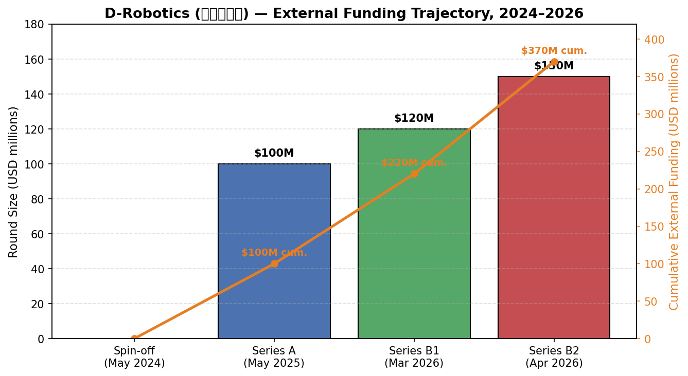
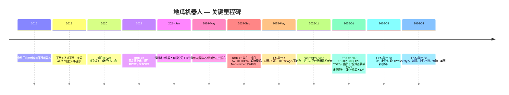
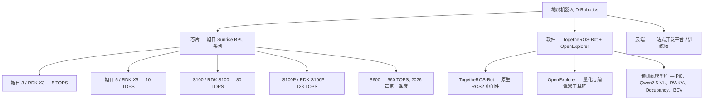
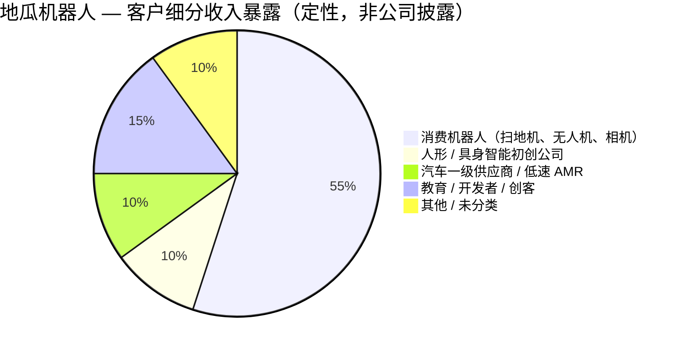
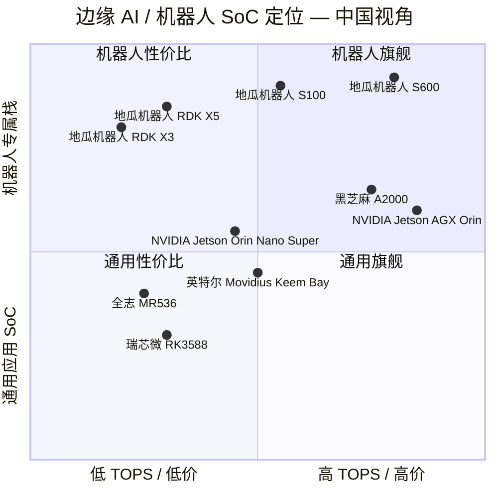
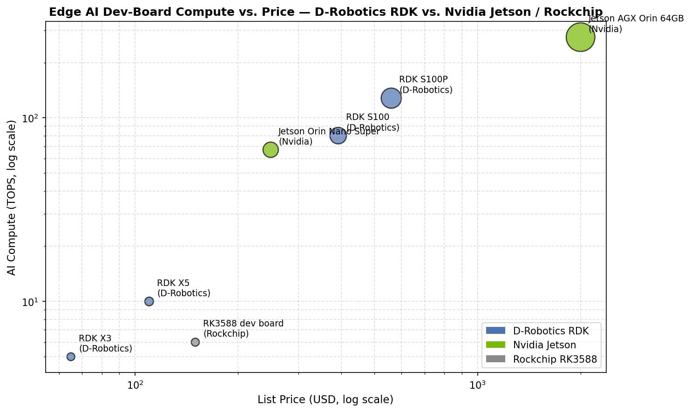

# 公司研究报告：地瓜机器人 D-Robotics

**日期：** 2026-05-19
**状态：** 非上市公司 — 地平线机器人 Horizon Robotics（HKEX:9660）控股分拆
**总部：** 中国深圳（注册主体 深圳地瓜机器人有限公司）；另设北京、杭州办公室
**创始人 / CEO：** 王丛
**母公司：** 地平线机器人 Horizon Robotics, Inc.（HKEX:9660）— 持股 52.23% / 表决权 71.45%

> **更新 — 不到四周完成 B 轮累计 2.7 亿美元融资（2026-04-08）：** 地瓜机器人于 2026 年 4 月完成 1.5 亿美元 B2 轮融资，叠加 2026 年 3 月中旬披露的 1.2 亿美元 B1 轮，B 轮累计融资额达到 2.7 亿美元。B2 轮在原有股东 高瓴 Hillhouse / GL Ventures、五源资本 5Y Capital、线性资本 Linear Venture、Hermitage Capital 及 淡马锡 Temasek 旗下祥峰成长基金 Vertex Growth 之外，新引入沙特背景的 Prosperity7 Ventures、九阳家族办公室、北汽产投 BAIC Capital、滴滴和美团龙珠等战略资本。叠加 2025 年 5 月的 1 亿美元 A 轮融资，地瓜机器人在脱离地平线资产负债表 12 个月内累计外部融资约 3.7 亿美元。管理层表示，募集资金将用于 S100/S100P 量产爬坡、2026 年第一季度 560 TOPS 的 S600 平台上市发布以及在 20 多个国家的海外扩张。资料来源：[Caproasia，"Horizon Robotics 3-Year-Old Spinoff D-Robotics Raised USD 150M in Series B2 Funding"，2026-04-12](https://www.caproasia.com/2026/04/12/china-13-4-billion-autonomous-driving-tech-company-horizon-robotics-3-year-old-spinoff-2024-robotic-computing-chips-company-d-robotics-raised-150-million-in-series-b2-funding-total-270-million/)；[Caixin Global，"D-Robotics Raises $120 Million as Investor Appetite for Embodied AI Grows"，2026-03-16](https://www.caixinglobal.com/2026-03-16/d-robotics-raises-120-million-as-investor-appetite-for-embodied-ai-grows-102423516.html)。

---

## 目录
1. 公司概览
2. 公司历史 — 含地平线机器人分拆逻辑
3. 管理团队
4. 产品与服务 — RDK X3 / X5 / S100 / S100P / S600 + 软件栈
5. 客户与市场推广
6. 行业概览 — 中国具身智能 / 边缘 AI SoC 市场
7. 竞争格局 — 英伟达 NVIDIA Jetson、黑芝麻智能、瑞芯微 Rockchip、全志 Allwinner、英特尔 Intel Movidius
8. 市场机会（TAM）
9. 风险评估
10. 参考文献

======================================

## 1. 公司概览

地瓜机器人（注册主体 深圳地瓜机器人有限公司；品牌名 "地瓜机器人" / "Digua Robotics"）是一家非上市、由 地平线机器人 Horizon Robotics 控股的 fabless（无晶圆厂）半导体兼开发者平台公司，专注于设计机器人级系统级芯片（SoC）、量产级开发套件（RDK = "Robot Development Kit"，机器人开发套件），以及覆盖模型训练、部署到端侧推理的一体化软件工具链，服务于公司所称的 **"具身智能"（embodied AI）** — 即将感知、大模型推理与实时运动控制整合于同一设备的机器人工作负载。公司自我定位为目前中国唯一一家面向机器人市场提供 **软件与芯片垂直整合的"通用底座"** 的厂商，明确对标 PC 时代的 "Wintel" 双寡头格局（[Z Potentials × 王丛专访，"从地平线起航，地瓜机器人如何成为'机器人版Wintel'"，2025-05](https://news.qq.com/rain/a/20250523A041W200)）。

**销售构成。** 三条相互交织的收入条线：

1. **SoC 芯片** — 源自地平线的 旭日（Sunrise）系列机器人应用处理器，集成 Arm CPU 核心、自研 BPU（Brain Processing Unit）以及专用 MCU / 安全岛核心。当前在售芯片家族包括 旭日 3（8 位精度下 5 TOPS）、旭日 5（10 TOPS）以及全新的机器人级 S100/S100P（80 / 128 TOPS）（[CNX Software，"D-Robotics RDK X5 development board features Sunrise X5 octa-core SoC with 10 TOPS BPU"，2025-06-30](https://www.cnx-software.com/2025/06/30/d-robotics-rdk-x5-development-board-features-sunrise-x5-octa-core-soc-with-10-tops-bpu-for-ros-projects/)；[Electromaker，"D-Robotics Introduces the RDK S100 AI Robotics Development Board at Embedded World 2026"，2026-03](https://www.electromaker.io/blog/article/d-robotics-introduces-the-rdk-s100-ai-robotics-development-board-at-embedded-world-2026)）。
2. **开发套件 / 参考板（RDK 系列）** — 集芯片与 IO 于一体的交钥匙载板（RDK X3、RDK X5、RDK S100、RDK S100P 以及已发布的 S600 模组），出厂搭载完整的 ROS2 / TogetheROS-Bot 中间件。售价区间从面向创客的 RDK X3 2 GB 约 65 美元到 RDK S100 机器人套件 RMB 2,799（约 392 美元）（[Hubtronics RDK X5 产品页](https://www.hubtronics.in/rdk-x5)；[DFRobot RDK X3 4GB 商店页](https://www.dfrobot.com/product-2869.html)；[Pistiz，"Horizon Robotics Unveils Industry's First Single-SoC Computation-Control Integrated Robot Development Kit RDK S100"](https://www.pistiz.com/horizon-robotics-launched-robot-development-kit-rdk-s100/)）。
3. **软件 / 云平台** — TogetheROS-Bot（兼容 ROS2 的操作系统）、OpenExplorer（从地平线继承的编译器 / 量化 / 硬件感知部署工具链），以及新发布的"一站式云开发平台"，整合数据闭环系统、具身智能训练场以及云边协同部署的 Agent 开发服务（[量子位，"具身智能大算力开发平台S600重磅亮相"，2025-11-21](https://www.qbitai.com/2025/11/355297.html)）。

**盈利方式。** 硬件收入主要来自向一级机器人 OEM（扫地机器人厂商、无人机厂商、人形机器人集成商、汽车一级供应商座舱 / AMR 系统集成商）销售 SoC，并由 RDK 开发板向教育、爱好者、研究和原型设计的长尾用户进行补充。云 / 软件层目前为生态投入 — 用于扩大模型厂商和集成商漏斗，最终促使旭日芯片被设计进入量产产品。具体收入拆分 **未披露**，因公司未上市。

**经营地理。** 总部法人主体为深圳地瓜机器人有限公司（注册日期 2024-01-16）（[企查猫，深圳地瓜机器人有限公司](https://www.qichamao.com/orgcompany/searchitemdtl/6fad1e3a4bb62fa74d6855dc988b0b36.html)）；研发团队主要来自地平线北京、杭州两地办公室，与母公司地理布局一致。截至 2025 年 11 月开发者大会，开发者社区覆盖亚太、欧洲和北美 20 余个国家（[地瓜机器人开发者大会综述，量子位，2025-11-21](https://www.qbitai.com/2025/11/355297.html)）。

**规模指标。** 公开披露显示，地瓜机器人在以下维度的数据为：
- 截至 A 轮宣布时，旭日系列 SoC 累计出货 **逾 500 万颗**，并以"每年数百万颗"的节奏增长（[TechNode 动点科技，"地平线机器人旗下地瓜机器人完成 1 亿美元 A 轮融资"，2025-05-28](https://cn.technode.com/post/2025-05-28/d-robotics-a/)；[观察者网，"做机器人时代的Wintel，地瓜机器人完成1亿美元融资"，2025-05-28](https://www.guancha.cn/economy/2025_05_28_777511.shtml)）。
- 在 A 轮前的一年内，开发板出货量 **同比 +180%**，注册客户数 **同比 +200%**（[极客公园，"刚获得一亿美元融资的地瓜机器人，挑战让智能机器人变得更便宜"，2025-05-28](https://www.geekpark.net/news/350410)）。
- 全球开发者突破 **10 万人**，"地心引力"加速计划已服务 500+ 早期机器人团队，并帮助 200+ 团队推出明星产品（[量子位，2025-11-21](https://www.qbitai.com/2025/11/355297.html)）。

员工人数未公开披露；分拆时的媒体报道显示，从地平线 AIoT / 机器人事业部继承了数百名工程师规模的团队（[Geekpark 王丛专访，"对话地瓜机器人CEO王丛：我们不造机器人，但要让造机器人这事变得更爽"，2024-09](https://www.geekpark.net/news/341005)）。

### 估值快照 — 非上市公司，最新一轮融资

由于地瓜机器人未上市且无经审计收入数据公开，标准 P/E / P/S 框架不适用。估值参考点如下：

- **A 轮（2025-05）：** 募集 1 亿美元；媒体报道投后估值约 **5 亿美元** 区间（评论中引述为"估测"投后 — 系媒体表述，并非公司披露）（[Ainvest，"D-Robotics' $100M Funding Ignites Robotics Revolution"，2025-05](https://www.ainvest.com/news/robotics-100m-funding-ignites-robotics-revolution-golden-opportunity-horizon-ecosystem-play-2505/)；[Caproasia，"D-Robotics Raised $100 Million in Series A Funding"，2025-05-29](https://www.caproasia.com/2025/05/29/china-12-5-billion-autonomous-driving-tech-company-horizon-robotics-1-year-old-spinoff-2024-robotic-computing-chips-company-d-robotics-raised-100-million-in-series-a-funding-investors-include-hil/)）。*具体投后估值未经核实 — 已标注。*
- **B1 轮（2026-03）：** 募集 1.2 亿美元；投后估值未公开披露（[Caixin Global，2026-03-16](https://www.caixinglobal.com/2026-03-16/d-robotics-raises-120-million-as-investor-appetite-for-embodied-ai-grows-102423516.html)）。
- **B2 轮（2026-04）：** 募集 1.5 亿美元；投后估值未公开披露；12 个月内累计外部融资约 3.7 亿美元（[Caproasia，2026-04-12](https://www.caproasia.com/2026/04/12/china-13-4-billion-autonomous-driving-tech-company-horizon-robotics-3-year-old-spinoff-2024-robotic-computing-chips-company-d-robotics-raised-150-million-in-series-b2-funding-total-270-million/)；[The AI Insider，"China's D-Robotics Raises USD $150M in New Funding With Series B Total of USD $270M"，2026-04-08](https://theaiinsider.tech/2026/04/08/chinas-d-robotics-raises-usd-150m-in-new-funding-with-series-b-total-of-usd-270m/)）。

**隐含倍数：** 由于收入未披露，隐含 P/S 无法清晰测算。作为参照，母公司 **地平线机器人 Horizon Robotics（HKEX:9660）** 在 B2 轮宣布时市值约 134 亿美元（[Caproasia，2026-04-12](https://www.caproasia.com/2026/04/12/china-13-4-billion-autonomous-driving-tech-company-horizon-robotics-3-year-old-spinoff-2024-robotic-computing-chips-company-d-robotics-raised-150-million-in-series-b2-funding-total-270-million/)），按其 2024 财年披露的汽车 AI 收入计算，公开的汽车 AI 母公司 P/S 估值处于十几倍至二十倍出头区间。可比上市公司 **黑芝麻智能 Black Sesame（HKEX:2533）** 仍处亏损状态，同样按 P/S 而非 P/E 估值（[Alpha Spread，黑芝麻智能营收页](https://www.alphaspread.com/security/hkex/2533/financials/income-statement/revenue)）。**全志科技 Allwinner（SZSE:300458）** 与 **瑞芯微 Rockchip（SSE:603893）** — 两家盈利的大众市场应用 SoC 厂商 — P/S 较低但 P/E 极高，受益于机器人题材的估值重估（[华创证券 全志科技 2025年报点评](https://www.fxbaogao.com/detail/5328994)）。

**为何一级市场估值偏高。** 具身智能芯片是当前中国硬科技 VC 最热门的题材：公司是 NVIDIA Jetson 在机器人边缘端唯一有意义的国产替代选项，背靠从地平线继承的 500 万颗装机量基础，母公司港股上市为投资人提供了可信的 IPO 退出路径。推动可比上市公司黑芝麻智能在 2025–26 年市值升至 40–50 亿美元的同一逻辑（[Alpha Spread，HKEX:2533](https://www.alphaspread.com/security/hkex/2533/summary)），也为地瓜机器人激进的一级估值提供了支撑。

*资料来源：融资金额整理自 [Caproasia（A 轮，2025-05-29）](https://www.caproasia.com/2025/05/29/china-12-5-billion-autonomous-driving-tech-company-horizon-robotics-1-year-old-spinoff-2024-robotic-computing-chips-company-d-robotics-raised-100-million-in-series-a-funding-investors-include-hil/)、[Caixin Global（B1 轮，2026-03-16）](https://www.caixinglobal.com/2026-03-16/d-robotics-raises-120-million-as-investor-appetite-for-embodied-ai-grows-102423516.html) 及 [Caproasia（B2 轮，2026-04-12）](https://www.caproasia.com/2026/04/12/china-13-4-billion-autonomous-driving-tech-company-horizon-robotics-3-year-old-spinoff-2024-robotic-computing-chips-company-d-robotics-raised-150-million-in-series-b2-funding-total-270-million/)。分拆日期参见 [企查猫工商注册](https://www.qichamao.com/orgcompany/searchitemdtl/6fad1e3a4bb62fa74d6855dc988b0b36.html)。*

---

## 2. 公司历史

地瓜机器人的成长路径不同寻常：公司是"出生即规模化"的分拆，而非车库创业。团队、IP 骨干、客户关系以及 500 万颗装机量都在地平线机器人内部的 **AIoT / 机器人事业部** 自 2018 年起逐步搭建，直至 2024 年初被外化为独立法人主体。

**前史（2018–2023）于地平线内部。** 地平线由原百度 IDL 院长余凯于 2015 年在北京创立，是一家瞄准两大市场的 AI 芯片公司：自动驾驶（征程 / Journey SoC 系列）与更广义的边缘 AI（旭日 / Sunrise SoC 系列）。两条产品线共享同一套贝叶斯精度 BPU NPU 架构，但面向截然不同的市场。王丛 2018 年加入地平线，主导 AIoT 产品线，随后接管整个机器人业务 — 端到端负责研发、市场、销售与开发者生态（[极客公园，王丛专访，2024-09](https://www.geekpark.net/news/341005)；[机器人大讲堂，"地平线机器人不做机器人?"，2024-09](https://leaderobot.com/news/4763)）。到 2023 年，机器人事业部已悄然成长为国内扫地机器人 OEM 的领先供应商（"隐形冠军"细分市场），并围绕 RDK X3 培育出强大的教育 / 创客社区。

**2024 年分拆逻辑。** **2024 年 1 月**，地平线完成深圳地瓜机器人有限公司的工商注册（[企查猫](https://www.qichamao.com/orgcompany/searchitemdtl/6fad1e3a4bb62fa74d6855dc988b0b36.html)），并在第一至第二季度完成机器人相关 IP、员工与客户合同的转移。分拆于 2024 年年中正式对外公布，公司品牌定为"地瓜机器人 / D-Robotics" — 名称刻意与较为严肃的"地平线机器人"母品牌形成俏皮对比。王丛被确认为创始人兼 CEO（[新浪财经，"对话地瓜机器人CEO王丛：我们不造机器人，但要让造机器人这事变得更爽"，2024-09](https://finance.sina.com.cn/roll/2024-09-21/doc-incpwqxy9241449.shtml)）。

王丛在多次专访中阐述的战略逻辑可归纳为三层：

1. **客户基因不同。** 地平线的汽车客户是一级 / OEM，多年期前装、ASIL-D 安全要求、千万颗 / 年的量级。机器人客户则极度碎片化 — 扫地机 OEM、无人机厂商、数百家人形和 AMR 初创公司，再加上庞大的研究者与创客长尾。销售路径、定价、路线图均不同。耦合在一起反而稀释了两边（[Z Potentials × 王丛，2025-05](https://news.qq.com/rain/a/20250523A041W200)）。
2. **资本效率。** 聚焦的机器人 SoC 厂商可以从机器人主题投资人（高瓴 Hillhouse、五源 5Y、祥峰成长 Vertex Growth、Prosperity7）以更高的隐含倍数募集专项股权，远超同样收入留在汽车 AI 母公司内部的估值。2025 年 5 月 A 轮（法定分拆 12 个月后）以及 2026 年 3–4 月快速完成的 B 轮，验证了这一逻辑（[TechNode，2025-05-28](https://cn.technode.com/post/2025-05-28/d-robotics-a/)；[Caproasia，2026-04-12](https://www.caproasia.com/2026/04/12/china-13-4-billion-autonomous-driving-tech-company-horizon-robotics-3-year-old-spinoff-2024-robotic-computing-chips-company-d-robotics-raised-150-million-in-series-b2-funding-total-270-million/)）。
3. **生态可信度。** 作为独立公司，地瓜机器人可名正言顺地向与地平线汽车端任何合作伙伴形成竞争关系的机器人 OEM 出货 — 同时也可以接受汽车 OEM（如 B2 轮中的 **北汽产投 BAIC Capital**）和出行平台（**滴滴**、**美团龙珠**）的投资，而这些投资人不必担心在为其车端 AI 竞争对手输血（[Caproasia，2026-04-12](https://www.caproasia.com/2026/04/12/china-13-4-billion-autonomous-driving-tech-company-horizon-robotics-3-year-old-spinoff-2024-robotic-computing-chips-company-d-robotics-raised-150-million-in-series-b2-funding-total-270-million/)）。

**与地平线的股权 / IP 关系。** 根据地平线机器人 2025 年 8 月于港交所发布的持续关联交易公告，**地平线以 52.23% 已发行股本、71.45% 表决权以及多数董事提名权控制地瓜机器人**（[地平线机器人港交所公告，"Continuing Connected Transactions"，2025-08-27](https://www.hkexnews.hk/listedco/listconews/sehk/2025/0827/2025082701291.pdf)）。因此地瓜机器人在会计上仍为 HKEX:9660 的合并子公司。IP 骨干 — 最关键的是旭日所用的 BPU 架构以及 OpenExplorer 工具链 — 系自地平线许可 / 转让，但具体细则未公开列示；港交所的披露框架将集团内持续采购与许可作为关联交易处理，需按年度上限披露。

*时间线资料来源：分拆与母公司历史参见 [新浪财经 / 王丛专访，2024](https://finance.sina.com.cn/roll/2024-09-21/doc-incpwqxy9241449.shtml)；RDK 产品发布参见 [CNX Software，RDK X5，2025-06-30](https://www.cnx-software.com/2025/06/30/d-robotics-rdk-x5-development-board-features-sunrise-x5-octa-core-soc-with-10-tops-bpu-for-ros-projects/) 及 [Electromaker，RDK S100，2026-03](https://www.electromaker.io/blog/article/d-robotics-introduces-the-rdk-s100-ai-robotics-development-board-at-embedded-world-2026)；S600 参见 [量子位，2025-11-21](https://www.qbitai.com/2025/11/355297.html)；融资轮次参见 [TechNode，2025-05-28](https://cn.technode.com/post/2025-05-28/d-robotics-a/)、[Caixin Global，2026-03-16](https://www.caixinglobal.com/2026-03-16/d-robotics-raises-120-million-as-investor-appetite-for-embodied-ai-grows-102423516.html) 及 [Caproasia，2026-04-12](https://www.caproasia.com/2026/04/12/china-13-4-billion-autonomous-driving-tech-company-horizon-robotics-3-year-old-spinoff-2024-robotic-computing-chips-company-d-robotics-raised-150-million-in-series-b2-funding-total-270-million/)。*

**近 12 个月动态。** 三件事最重要。第一，2026 年 3–4 月连续完成的 B1/B2 轮在不到四周内将公司外部资本翻倍，并引入了汽车（北汽）、中东主权背景资本（Prosperity7，沙特阿美 Aramco 关联 VC）、大型互联网平台（滴滴、美团）以及家电家族办公室（九阳）等战略投资人（[每日经济新闻，"不到一个月累计融资2.7亿美元"，2026-04-08](https://www.nbd.com.cn/articles/2026-04-08/4330374.html)）。第二，**S100 系列于 2026 年 1 月开始出货**，标志公司从 10 TOPS X5 跨入 80 / 128 TOPS 机器人级平台（[Kr Asia，"As robots get smarter, D-Robotics ships an SoC kit to close the loop"](https://kr-asia.com/as-robots-get-smarter-d-robotics-ships-an-soc-kit-to-close-the-loop)）。第三，2025 年 11 月发布的 **560 TOPS S600 平台** 加上"一站式云开发平台"，意味着下一阶段产品 — 不再是扫地机的"脑袋"，而是人形机器人的"脑袋"— 已进入路线图，并公布 2026 年第一季度商业化上市的计划（[量子位，2025-11-21](https://www.qbitai.com/2025/11/355297.html)；[InfoQ，"地瓜机器人发布 S600 大算力开发平台"，2025-11-22](https://www.infoq.cn/article/cx5awf1gwa6jxbqkgtvf)）。

---

## 3. 管理团队

### 王丛 — 创始人兼 CEO

王丛是公司"机器人版 Wintel"主张的提出者，也是地瓜机器人最具决定性的关键人物。英文媒体对其名字有"Wang Cong"与偶尔的"Wang Congqing"两种写法；深圳注册主体的法定代表人登记为 王丛（[企查猫，深圳地瓜机器人有限公司](https://www.qichamao.com/orgcompany/searchitemdtl/6fad1e3a4bb62fa74d6855dc988b0b36.html)）— 本报告全文据此沿用"王丛"。*（具体出生年份与教育背景在我们查阅的资料中未公开披露 — 已标注。）*

他 **2018 年加入地平线机器人**，被指派负责 AIoT 产品线；到 2020 年已主管地平线全部机器人业务，端到端负责产品研发、市场、销售服务与开发者社区。他在地平线内部将旭日 SoC 家族打造为消费机器人 OEM 的领先国产供应商，并主导了 2023 年 RDK X3 开发套件的发布 — 后者成为地瓜机器人后续全球社区的种子。据其本人接受 Geekpark 专访时所言，他"在地平线内部搭建了机器人业务的整套研发、销售、市场与社区组织"（[极客公园，"对话地瓜机器人CEO王丛"，2024-09](https://www.geekpark.net/news/341005)；[搜狐 / Z Potentials，"从地平线起航，地瓜机器人如何成为'机器人版Wintel'"，2025-05](https://www.sohu.com/a/897966414_122063396)）。

在公开发言中，王丛对三个塑造地瓜机器人战略的立场表态异常直率。第一，他认为人形机器人达到真正通用（"通用具身智能"）的可用性至少还要五年 — 他反复对中国媒体表示当前的人形浪潮"处于 ChatGPT 时刻之前"，正确的产品策略应当是 **向所有形态卖铲子（芯片与工具）**，而不是押注哪一种机器人形态会胜出（[南方都市报，"对话地瓜机器人CEO王丛：人形机器人大规模落地仍有待时日"，2024-09](https://m.mp.oeeee.com/a/BAAFRD0000202409241002961.html)；[新浪财经，"对话地瓜机器人CEO王丛：行业'淘汰赛'还没开始"，2025-06-17](https://finance.sina.com.cn/cj/2025-06-17/doc-infakyex9669096.shtml)）。第二，他将公司使命定位为成本下降：拉低"机器人大脑"的价格 — 他用 RDK X3 价格约 RMB 500 这一"500 元机器人心脏"既作为营销卖点，也作为切实的 BoM 降本目标（[极客公园，"500元的机器人'心脏'，是怎么炼成的?"，2024-09](https://www.geekpark.net/news/341005)）。第三，他明确表示地瓜机器人 **不会** 自己造整机 — 公司是平台型企业，对标英特尔与微软在 PC 时代的双寡头（[观察者网，"做机器人时代的Wintel，地瓜机器人完成1亿美元融资"，2025-05-28](https://www.guancha.cn/economy/2025_05_28_777511.shtml)；[Z Potentials 专访，2025-05](https://news.qq.com/rain/a/20250523A041W200)）。

持股比例未公开披露；鉴于地平线持有 52.23% 控制权及多轮 VC 融资，王丛的创始人剩余股权估计在高个位数到十几个百分点区间 — *已标注为未经核实*。他出任地瓜机器人董事；按港交所披露，董事会多数席位由地平线委派。

### 其他高管与创始团队

CFO、COO 与 CTO 的详细简历在我们查阅的媒体资料中 **未公开披露**；地瓜机器人尚未发布招股书或正式治理文件。可见的组织保留了来自地平线机器人事业部的资深研发负责人 — 覆盖 BPU 芯片设计、编译器 / 量化（OpenExplorer）、感知算法以及开发者社区管理 — 但具体姓名与任职年限无法从我们参考的资料中确认。*（简历标注为未披露。）*

我们可以确信的有：
- **来自地平线的技术深度。** 地瓜机器人继承了约 6 年累积的 BPU 芯片工程能力、多轮量产芯片流片（旭日 3 → 旭日 5 → S100），以及已在数百万颗消费机器人产品上经受过考验的工具链（OpenExplorer）。初创阶段同行少有具备此基础（[Z Potentials × 王丛，2025-05](https://news.qq.com/rain/a/20250523A041W200)）。
- **继承的商业实力。** 扫地机与无人机的客户关系 — 包括广泛报道的 科沃斯 Ecovacs、云鲸 CloudAI、影石 Insta360、维他动力 Vitower 等合作 — 早于分拆即已建立，并随分拆一并迁移（[极客公园，2025-05](https://www.geekpark.net/news/350410)）。
- **深厚的机构资本背书。** 高瓴 Hillhouse（通过 GL Ventures）、五源资本 5Y Capital、线性资本 Linear Venture、Hermitage Capital、祥峰成长 Vertex Growth（淡马锡）、Prosperity7（阿美关联）、北汽产投、九阳家族办公室、滴滴及美团龙珠均在股东名册 — 即便单一董事席位不可见，这种战略资本广度本身也是有意义的治理 / 网络资产（[Caproasia，2026-04-12](https://www.caproasia.com/2026/04/12/china-13-4-billion-autonomous-driving-tech-company-horizon-robotics-3-year-old-spinoff-2024-robotic-computing-chips-company-d-robotics-raised-150-million-in-series-b2-funding-total-270-million/)）。

### 治理结构

- **董事会控制：** 地平线机器人持有多数董事会席位与 71.45% 表决权（[港交所公告，2025-08-27](https://www.hkexnews.hk/listedco/listconews/sehk/2025/0827/2025082701291.pdf)）。
- **关联方制度：** 所有集团内交易（地平线 → 地瓜机器人的共享 IP / 研发；地瓜机器人 → 地平线的任何芯片供应；双向服务交换）均受港交所持续关联交易规则约束，包括年度上限以及超过规模阈值时需独立股东批准。
- **股权结构：** 多层级股权架构未公开确认，但与典型 PRC 风投轮次一致；地平线 52.23% 经济权益 / 71.45% 表决权之间的差距暗示外部投资人享有优先股经济利益。*已标注为推测，未经证实。*
- **战略投资人集中度：** B2 轮在 A 轮老股东跟投之外，新增了五家财务 / 战略投资人 — 这是有意为之的多元化股东结构，避免任何单一 LP 拥有过大影响力（[Caproasia，2026-04-12](https://www.caproasia.com/2026/04/12/china-13-4-billion-autonomous-driving-tech-company-horizon-robotics-3-year-old-spinoff-2024-robotic-computing-chips-company-d-robotics-raised-150-million-in-series-b2-funding-total-270-million/)）。

### 管理层执行履历综述

团队履历显著优于典型的 Pre-A 阶段初创公司。王丛在地平线内部已积累 6 年机器人芯片有收入执行经验，包括实际在售产品线和实际装机量；BPU 芯片团队拥有多次量产流片经验；母公司提供隐性的"不容失败"治理覆盖。最明显的短板是 **CFO / 公开市场能力** — 地瓜机器人尚未聘请或披露具有 IPO 经验的 CFO，而通常这一岗位需要在 IPO 流程启动前 18–24 个月就位。*已标注。*

---

## 4. 产品与服务

地瓜机器人的产品矩阵最好理解为一条 **芯片阶梯**（旭日 3 → 旭日 5 → S100 → S600），每一档与一款 RDK 开发板配套，再叠加一套贯穿全产品线的 **横向软件栈**（TogetheROS-Bot + OpenExplorer + 云开发平台）。

### 4.1 RDK X3 — 入门级（5 TOPS，约 65–75 美元）

RDK X3 是产品线的长尾 / 教育锚点。硬件规格：旭日 X3 四核 Arm Cortex-A53 @ 1.5 GHz；双核"伯努利"BPU，边缘推理算力 **5 TOPS**；2 GB 或 4 GB LPDDR4；microSD 存储；与 Raspberry Pi 4B 周边引脚兼容的 40 针 GPIO 排针；支持 4K@60 fps 的 H.264 / H.265 编解码（[CNX Software，"D-Robotics RDK X3 Development Board features Sunrise X3 quad-core Arm Cortex-A53 SoC with a 5TOPS 'Bernoulli' BPU"，2024-09-24](https://www.cnx-software.com/2024/09/24/d-robotics-rdk-x3-development-board-features-sunrise-x3-quad-core-arm-cortex-a53-soc-with-a-5tops-bernoulli-bpu/)；[DFRobot RDK X3 产品页](https://www.dfrobot.com/product-2869.html)）。AliExpress 上 2 GB / 4 GB SKU 标价分别约 62 美元 / 72 美元，Amazon 标价分别为 65 / 75 美元（[Electronics-Lab，"D-Robotics RDK X3 dev board features Sunrise X3 quad-core SoC and 5TOPS NPU"](https://www.electronics-lab.com/d-robotics-rdk-x3-dev-board-features-sunrise-x3-quad-core-soc-and-5tops-npu/)）。目标客户：创客、大学机器人实验室、ROS2 原型开发、纯视觉扫地机及入门级服务机器人。

**竞争优势评估：部分。** 护城河类型为 **低端价格 / 生态** — 售价 65 美元、原生 ROS2，对于任何不需要 >5 TOPS 算力的任务，X3 都比 Jetson Orin Nano Super（249 美元、67 TOPS）便宜，与 Raspberry Pi 4B 价格相当但带有实质性 NPU。最接近的对标产品是高端的 **NVIDIA 英伟达 Jetson Orin Nano Super**（249 美元，算力高得多）以及同算力档位的 **瑞芯微 Rockchip RK3588 开发板**（6 TOPS NPU，约 150 美元）（[NVIDIA Jetson Orin Nano Super 页面](https://www.nvidia.com/en-us/autonomous-machines/embedded-systems/jetson-orin/nano-super-developer-kit/)；[Tinycomputers.io，"Rockchip RK3588 NPU Deep Dive"](https://tinycomputers.io/posts/rockchip-rk3588-npu-benchmarks.html)）。相对 Jetson 的判断：单板 AI 算力 **落后**，单板价格与中文机器人专属文档 **领先**；相对瑞芯微 Rockchip：在机器人专属 ROS2 中间件和 BPU 工具链成熟度上 **领先**。

### 4.2 RDK X5 — 机器人主力（10 TOPS，约 110 美元）

2024 年 9 月发布的 RDK X5 将算力翻倍，并对 2024–2026 机器人时代关键模型架构提供一流支持。硬件规格：旭日 5 八核 Arm Cortex-A55；专用 BPU 至少 **10 TOPS**；4 GB 或 8 GB LPDDR4；丰富 IO（HDMI、USB 3.0、千兆以太网、MIPI 摄像头输入、CAN、UART）；40 针 GPIO 排针（[CNX Software，"D-Robotics RDK X5 development board features Sunrise X5 octa-core SoC"，2025-06-30](https://www.cnx-software.com/2025/06/30/d-robotics-rdk-x5-development-board-features-sunrise-x5-octa-core-soc-with-10-tops-bpu-for-ros-projects/)；[Waveshare RDK X5 产品页](https://www.waveshare.com/rdk-x5.htm)；[Hubtronics RDK X5 页](https://www.hubtronics.in/rdk-x5)）。软件通过 OpenExplorer 工具链开箱支持 **Transformer、RWKV、Occupancy 网络、BEV（鸟瞰图）感知和立体视觉感知**（[Hackster.io，"D-Robotics Launches the 10 TOPS Edge AI RDK X5 — and Teases the 96 TOPS RDK Ultra"](https://www.hackster.io/news/d-robotics-launches-the-10-tops-edge-ai-rdk-x5-and-teases-the-96-tops-rdk-ultra-c88714dab9d5)）。目标客户：扫地机器人、无人机、割草机器人、服务 / 陪伴机器人量产部署，以及大部分开发者社区。

**竞争优势评估：是。** 护城河类型为 **芯片 + ROS2 + Transformer 量化工具链的捆绑**，相对 Jetson Orin 家族具备成本领先。最接近的对标产品：**Jetson Orin Nano Super**（249 美元 / 67 TOPS）— 算力是 X5 的 6.7 倍但价格约 2.3 倍；对于 10 TOPS 即可承载的模型，X5 在 TCO 上胜出；面对 7B 级 LLM 头部空间不足。差异化证据：X5 已被主要扫地机器人 OEM 采用，并成为数百所高校机器人课程的参考平台。相对 Jetson 的判断：5–10 TOPS 机器人控制档位 **持平**，30+ TOPS 感知档位落后，国产供应链和中文社区影响力 **领先**。

### 4.3 RDK S100 / S100P — 机器人级旗舰（80 / 128 TOPS，RMB 2,799 / 约 392 美元起）

S100 是地瓜机器人的首款 **单 SoC 计算控制一体化** 机器人平台，于 2026 年初发布。架构上的代际进步在于单颗芯片集成了 **CPU（六核 Arm Cortex-A78AE）、BPU（专用 AI 推理引擎）及 MCU / 安全岛** — 取消了传统应用处理器跑感知 + 独立 MCU 跑运动控制的双 SoC 拆分方案。地瓜机器人将其定位为行业首款此类集成方案（[Pistiz，"Horizon Robotics Unveils Industry's First Single-SoC Computation-Control Integrated Robot Development Kit RDK S100"](https://www.pistiz.com/horizon-robotics-launched-robot-development-kit-rdk-s100/)；[Electromaker，Embedded World 2026 RDK S100](https://www.electromaker.io/blog/article/d-robotics-introduces-the-rdk-s100-ai-robotics-development-board-at-embedded-world-2026)）。

SKU 配置：
- **RDK S100** — 80 TOPS NPU + 12 GB LPDDR5 — RMB 2,799（约 392 美元）（[Waveshare RDK S100 产品页](https://www.waveshare.com/rdk-s100.htm)；[ThinkRobotics RDK S100 产品页](https://thinkrobotics.com/products/d-robotics-rdk-s100-series-robot-development-kit)）。
- **RDK S100P** — 128 TOPS NPU + 24 GB LPDDR5 — AI 吞吐较 S100 高约 60%（[Yahboom RDK S100P 商品页](https://category.yahboom.net/collections/rdk-series/products/rdk-s100-s100p)；[Kr Asia，"As robots get smarter, D-Robotics ships an SoC kit to close the loop"](https://kr-asia.com/as-robots-get-smarter-d-robotics-ships-an-soc-kit-to-close-the-loop)）。

IO 同样重要：双 MIPI 摄像头输入（用于立体 / 深度）、四个 USB 3.0、两条 PCIe 3.0。软件支持 Transformer、BEV 多流检测以及端到端大模型机器人工作负载。目标客户：人形机器人开发者、AMR / 工业机器人 OEM、低速无人车。

**竞争优势评估：是。** 护城河类型为 **技术 / 架构（计算-控制一体化）+ 通过 TogetheROS-Bot 与 OpenExplorer 的生态锁定**。最接近的对标产品：**Jetson AGX Orin 64GB**（约 1,999 美元，最高 275 TOPS）— NVIDIA 在原始算力和 CUDA 生态上胜出，地瓜机器人在每 TOPS 价格（S100P 以约 28% 的价格提供 128 TOPS）以及集成运动控制 / MCU 芯片上胜出 — Jetson AGX Orin 仍需独立 ECU 处理实时控制。相对 Jetson AGX Orin 的判断：每 TOPS 价格与集成度 **领先**，绝对峰值算力、CUDA 软件生态以及大基础模型头部空间 **落后**。最接近的对标中国产品：**黑芝麻智能 A2000**（原本面向 L3-L4 自动驾驶，现转为人形感知用途）— A2000 在汽车安全认证上领先，地瓜机器人 S100 在非汽车机器人开发体验上领先（[Futubull，"黑芝麻智能(2533.HK)：出海与机器人业务双线突破 A2000芯片方案开发验证顺利"](https://news.futunn.com/en/post/61435687/heizhima-intelligent-2533-hk-dual-breakthroughs-in-overseas-expansion-and)）。

### 4.4 S600 — 下一步棋（560 TOPS，2026 年第一季度发布）

在 2025 年 11 月开发者大会上发布的 S600 平台相较 S100P 实现 4 倍算力跃升，专为人形机器人上的 VLA（Vision-Language-Action）、VLM、LLM 与 Locomotion 模型而设计。架构：**18 核 Arm Cortex-A78AE CPU 作"大脑"**、新一代 **BPU "Nash"** 负责 AI 推理，以及 **6 核 Arm Cortex-R52+ MCU 作"小脑"** 实时控制回路。官方公布 INT8 总 AI 算力为 **560 TOPS**。公司发布的性能基准显示，**Pi0** 在 S600 上运行速度比主流具身智能大脑平台快 2.3 倍，**Qwen2.5-VL-7B** 快 2.2 倍（[量子位，"具身智能大算力开发平台S600重磅亮相"，2025-11-21](https://www.qbitai.com/2025/11/355297.html)；[InfoQ，2025-11-22](https://www.infoq.cn/article/cx5awf1gwa6jxbqkgtvf)；[科技行者，"地瓜机器人算力翻四倍的S600"，2025-11](https://www.techwalker.com/2025/1121/3174243.shtml)）。已公布的战略客户：**傅利叶 Fourier**、**加速进化 Acceleration Evolution**、**自变量机器人 Self-variable Robotics**、**星动纪元 Starry Era**，以及汽车一级供应商合作伙伴 **知行科技 iMotion**、**天准星智** 和 **华勤技术 Huaqin**（[知乎，"地瓜机器人揭晓具身智能机器人大算力开发平台S600"](https://zhuanlan.zhihu.com/p/1976249352700838797)）。

**竞争优势评估：部分（待量产验证）。** 在 S600 实现量产之前，护城河仍停留在纸面；若性能基准能被独立客户验证，将缩小与 NVIDIA 更高端的 Thor 级机器人 SoC 之间的差距。最接近对标产品：**NVIDIA Jetson Thor**（规划 2,000 TOPS 机器人 SoC，定价高端）、**黑芝麻 A2000 + C1200** 人形机器人组合方案。

### 4.5 软件与云栈

- **TogetheROS-Bot** — 地瓜机器人兼容 ROS2 的操作系统，针对旭日 BPU 进行优化，预先集成了运动规划、感知与 Agent 运行时层。是"机器人版 Wintel"中"ROS"那条腿。
- **OpenExplorer** — 自地平线继承的模型编译 / 量化 / 硬件感知部署工具链。支持 PyTorch 与 ONNX 作为输入，生成面向旭日全家族硬件优化的二进制。该工具链使 Transformer / RWKV / Occupancy / BEV / VLA 模型能够在算力相对较低的芯片上以量产级延迟运行。
- **一站式云开发平台** — 2025 年 11 月发布；包括 (i) 用于采集、标注与回放机器人部署数据的 **数据闭环系统**；(ii) 用于云端模型训练与 Sim-to-Real 验证的 **具身智能训练场**；(iii) 用于云端 LLM-Agent 与设备端机器人控制集成的 **Agent 开发服务**（[量子位，2025-11-21](https://www.qbitai.com/2025/11/355297.html)；[InfoQ，2025-11-22](https://www.infoq.cn/article/cx5awf1gwa6jxbqkgtvf)）。

**路线图与近 12 个月发布动态：**
- 2025-Q3：RDK X5 通过 Waveshare、DFRobot、Hubtronics、Yahboom 等全球分销商实现广泛商业化。
- 2025-11：S600 平台与一站式云平台发布；"地瓜机器人一站式开发平台"亮相。
- 2026-01：RDK S100 / S100P 开始出货。
- 2026-Q1（公告）：S600 商业化上市。
- 传闻 / 提前预热：**RDK Ultra**，96 TOPS — 2024 年预热（[Hackster.io](https://www.hackster.io/news/d-robotics-launches-the-10-tops-edge-ai-rdk-x5-and-teases-the-96-tops-rdk-ultra-c88714dab9d5)）— 似乎已被 S100 系列取代；2025/2026 产品新闻中未见 Ultra 品牌的商业化跟进。*已标注为被取代；未经地瓜机器人直接确认。*

**旗舰与长尾构成：** 当前商业收入由 **RDK X5**（扫地机器人、无人机、服务机器人）和 **RDK X3** 长尾（教育与原型）主导。**S100 系列** 是 2026 年的拐点产品 — 推动公司从"边缘 AI 模组供应商"升级为"人形机器人大脑供应商"。S600 量产后，将成为 2027 年人形浪潮的旗舰产品。

---

## 5. 客户与市场推广

### 客户细分

地瓜机器人广义上服务于四类客户：

1. **消费机器人 OEM（当前现金牛）。** 扫地机器人、割草机、无人机、运动相机、家庭陪伴机器人。已公布的集成客户包括 **科沃斯 Ecovacs**、**云鲸 CloudAI**、**影石 Insta360**、**维他动力 Vitower**（[极客公园，"刚获得一亿美元融资的地瓜机器人"，2025-05-28](https://www.geekpark.net/news/350410)；[新浪财经，"地瓜机器人完成1亿美元A轮融资"，2025-05](https://finance.sina.com.cn/wm/2026-04-08/doc-inhtucsa2836367.shtml)）。这类客户通常高量级（百万颗以上）、对价格高度敏感，且受多年期设计周期锁定 — 地瓜机器人当前旭日 3 / 旭日 5 SoC 主要营收来自这里。
2. **人形 / 具身智能初创公司。** **S600** 的战略首发客户包括 **傅利叶 Fourier**、**加速进化 Acceleration Evolution**、**自变量机器人 Self-variable Robotics** 和 **星动纪元 Starry Era**（[知乎，2025-11](https://zhuanlan.zhihu.com/p/1976249352700838797)）。这类客户当下量级有限，但代表着 2027–2030 年的高价值人形浪潮。
3. **汽车一级供应商 / 座舱 / 低速 AMR。** S600 已公布的生态合作伙伴包括 **知行科技 iMotion**、**天准星智** 和 **华勤技术 Huaqin** — 涵盖车内 AI、低速配送机器人和泊车机器人的一级 / ODM（[知乎，2025-11](https://zhuanlan.zhihu.com/p/1976249352700838797)）。
4. **教育 / 研究 / 创客（开发者社区）。** 全球开发者突破 10 万，覆盖 200+ 高校；"地心引力"加速计划服务 500+ 小型团队（[量子位，2025-11-21](https://www.qbitai.com/2025/11/355297.html)）。此为驱动 1–3 类客户的漏斗。

### 客户集中度

**地瓜机器人未上市且不披露客户集中度。** 在我们查阅的公开记录中，没有任何 Top-1 或 Top-5 客户收入占比数据。*已标注：客户集中度未披露，我们未进行估算。* 定性方面可以判断的有：
- 超过 500 万颗的旭日累计装机量绝大多数集中在扫地机、运动相机和无人机 OEM — 在这些细分中一两家一级客户即可轻易占到 >30% 的出货量。
- 全行业看，**科沃斯 Ecovacs 是扫地机龙头品牌**，中国市场份额约 40%（行业报告），地瓜机器人也已被公开确认为其芯片合作伙伴。叠加云鲸、影石、维他动力，Top-5 很可能占据相当比例的收入 — 但精确数字 **未披露**。*已标注。*
- 地瓜机器人有意同时为 20+ 家人形机器人初创公司导入 S600，而非押注单一"赢家"客户，本身就是降低集中度的策略。

*注：以上比例为分析师基于 [TechNode，2025-05-28](https://cn.technode.com/post/2025-05-28/d-robotics-a/)、[Geekpark，2025-05](https://www.geekpark.net/news/350410) 和 [量子位开发者大会综述，2025-11-21](https://www.qbitai.com/2025/11/355297.html) 报道中定性收入语言比例的判断。地瓜机器人未公布客户细分收入结构，上述数字不应被引用为公司披露数据。*

### 分销渠道

地瓜机器人采用混合模式：

- **直接企业销售** 面向一级 OEM（消费机器人、人形初创、汽车一级）。多年期前装、典型为定制 SoC SKU + 多季度 NRE 合作。
- **渠道分销** 通过国际电子分销商销售 RDK 开发板：**DFRobot**、**Waveshare**、**Hubtronics**、**Youyeetoo**、**Spotpear**、**Yahboom**、**OpenELAB**、**ThinkRobotics**，以及在 AliExpress 与 Amazon 直销。这一长尾渠道是开发者社区漏斗的核心，也是 20+ 国家国际化布局的基础。
- **云平台** 作为直接的 SaaS 形态开发者服务，入门档免费，训练场算力与 Agent 运行时按付费档计费 *（具体定价未公开披露）*。

### 销售周期

- **消费机器人 OEM 前装设计：** 从技术评估到首笔 PO 通常 6–12 个月，量产时点在 12–24 个月之后。
- **人形机器人初创合作：** 周期短得多 — 初创希望在下一版机器人上立刻有一颗可用的大脑，因此地瓜机器人采取先送开发板，再在下一形态中转产 SoC 的方式。
- **教育 / 创客：** 即时开通；渠道分销板卡在全球分销商处常备库存。

### 关键合作

- **母公司地平线机器人** — 提供 IP 许可（BPU 架构、OpenExplorer 工具链）、共享研发、制造规模与港股上市公司级的治理。
- **晶圆代工与供应链** — 地瓜机器人未公开披露其代工伙伴，但地平线家族的旭日 SoC 此前在台积电 TSMC 和中芯国际 SMIC 不同节点之间流片；旭日 5 一代目标为先进的中国 / 两岸节点 *（具体节点未在公开资料中确认 — 已标注）*。
- **汽车一级供应商生态** — 知行科技、天准星智、华勤技术（已公布的 S600 合作伙伴）构成进入汽车 / 低速 AMR 的一级系统集成桥梁（[知乎，2025-11](https://zhuanlan.zhihu.com/p/1976249352700838797)）。
- **高校 / 科研网络** — "地心引力"加速计划与 200+ 高校合作（[量子位，2025-11-21](https://www.qbitai.com/2025/11/355297.html)）。

### 标杆案例（已公开赢单）

- **扫地机器人：** 地瓜机器人的旭日 SoC 驱动 **科沃斯 Ecovacs** 和 **云鲸 CloudAI** 扫地机的感知与决策模块 — 这些是全球出货量最高的机器人品类（[新浪财经，2025-05](https://finance.sina.com.cn/wm/2026-04-08/doc-inhtucsa2836367.shtml)；[极客公园，2025-05](https://www.geekpark.net/news/350410)）。
- **运动相机 / 无人机：** 旭日已集成于 **影石 Insta360** 消费相机及无人机平台。
- **人形大脑：** S600 战略首发客户 — **傅利叶 Fourier**、**加速进化 Acceleration Evolution**、**自变量机器人 Self-variable Robotics**、**星动纪元 Starry Era**（[知乎，2025-11](https://zhuanlan.zhihu.com/p/1976249352700838797)）。
- **高校课程：** 报道援引 >200 所高校将 RDK 纳入机器人课程（[瑞财经，"地瓜机器人获1亿美元A轮融资：高瓴资本参投，合作高校超200家"，2025-05](https://m.rccaijing.com/news-7333394698172298565.html)）。

---

## 6. 行业概览

地瓜机器人处于三条轨迹各异的产业交汇处：成熟的 **边缘 AI 应用 SoC 行业**（数十年历史，正在碎片化）、仍在定义中的 **具身智能 / 机器人大脑 SoC 行业**（约 2023 年诞生）以及 **中国消费机器人 OEM 行业**（扫地机器人成熟、人形机器人爆发）。

### 行业定义

地瓜机器人可寻址行业最狭义的定义为 **机器人级应用 SoC** — 即 AI 算力在 5 至 600+ TOPS、面向机器人本体部署（而非数据中心或手机）的芯片。它处于更广义的 **边缘 AI 加速器 / SoC** 范畴内（NAICS 334413，应用处理器半导体制造）。邻近行业：**自动驾驶 SoC**（其母公司地平线及黑芝麻智能所在）、**手机 SoC**（高通 Qualcomm、联发科 MediaTek）、**PC GPU**（NVIDIA、AMD、Intel），以及国内的 **专用 AI 加速芯片**（寒武纪、海光）。

### 市场规模与增速 — 中国具身智能

中国具身智能市场 — 广义定义涵盖机器人硬件、软件、服务与支撑芯片 — 2024 年估计为 **RMB 8,634 亿（约 1,189.6 亿美元）**，预计 2025 年达到 **RMB 9,731 亿（约 1,341 亿美元）**（[China Briefing，"The Chinese Humanoid Robot AI Market"，2025](https://www.china-briefing.com/news/chinese-humanoid-robot-market-opportunities/)）。机器人级 SoC 芯片在其中占比小但增速快 — 大部分价值仍在机器人 OEM ASP（平均售价）上。

摩根士丹利的机器人 TAM 框架（用于交叉验证）测算：中国全机器人 TAM 将自 **2024 年 470 亿美元翻倍至 2028 年 1,080 亿美元**，其中协作机器人 CAGR 约 46%、移动机器人约 35%、服务机器人约 25%、无人机约 20%（[Premia Partners，"Embodied AI – China as the global powerhouse for industrial and humanoid robotics"，2025](https://www.premia-partners.com/insight/embodied-ai-china-as-the-global-powerhouse-for-industrial-and-humanoid-robotics)）。具体到人形机器人，**中国市场预计 2029 年达到 RMB 750 亿，约占全球人形机器人市场 33%**（[China Briefing，2025](https://www.china-briefing.com/news/chinese-humanoid-robot-market-opportunities/)）。摩根士丹利长期视角：2050 年全球人形机器人市场 5 万亿美元，CAGR 88%（[Morgan Stanley，"Humanoid Robot Market Expected to Reach $5 Trillion by 2050"](https://www.morganstanley.com/insights/articles/humanoid-robot-market-5-trillion-by-2050)）。

虽然人形子赛道当前并非主要收入来源，但它是地瓜机器人估值叙事的核心驱动。**全球人形机器人市场预计 2025 年至 2030 年自 29.2 亿美元增至 152.6 亿美元，CAGR 39.2%**（[MarketsandMarkets，"Humanoid Robot Market Report 2025–2030"](https://www.marketsandmarkets.com/Market-Reports/humanoid-robot-market-99567653.html)）。

### 关键增长驱动

1. **"大脑"瓶颈。** 在许多方面，机器人硬件（电机、关节、传感器）比驱动它们的 AI 更加成熟。瓶颈在于能在机器人控制周期延迟内运行大型多模态模型的设备端大脑 — 这正是地瓜机器人 S100 / S600 的目标。正如宇树科技 CEO 王兴兴公开所言，"当前机器人硬件已足够，具身智能仍不充分，类似于 ChatGPT 出现之前的阶段"（[Geopolitechs / 宇树 CEO 专访，2025-08](https://www.geopolitechs.org/p/current-robots-embodied-ai-remain)）。
2. **国家政策红利。** 具身智能被列入中国"十五五"规划（2026–2030）重点未来产业，与 AI、6G、量子并列为经济增长引擎（[Global Times，"2025 World Internet Conference Wuzhen Summit concludes, with Chinese firms' Embodied AI taking center stage"](https://www.globaltimes.cn/page/202511/1347771.shtml)；[Carnegie Endowment，"Embodied AI: China's Big Bet on Smart Robots"，2025-11](https://carnegieendowment.org/research/2025/11/embodied-ai-china-smart-robots)）。
3. **基础模型成熟。** Pi0 等 VLA（vision-language-action）模型问世，加上 Qwen2.5-VL、Llama-VLM 等高效多模态 LLM 的快速演进，首次让"机器人大脑"在单颗 SoC 上成为可能。地瓜机器人 S600 的基准测试正是针对这类模型（[量子位，2025-11-21](https://www.qbitai.com/2025/11/355297.html)）。
4. **芯片供应本土化。** 美国对先进 AI 加速器的出口管制为中国 OEM 设计国产芯片提供了强力激励 — 一方面出于供应安全，另一方面工信部 / 发改委对国产采购也有政策倾斜。
5. **消费机器人基本盘。** 扫地机、无人机、运动相机、割草机器人 — 这些品类既在销量增长，单机 AI 算力需求也在不断提升。这是地瓜机器人当下的现金牛业务。

### 行业动态

- **竞争格局碎片化。** 与数据中心 GPU（NVIDIA）或手机 SoC（高通 / 联发科 / 苹果）不同，机器人 SoC 市场没有现成垄断者。NVIDIA Jetson 是全球默认选项，但在中国消费机器人市场远未一家独大 — 旭日、瑞芯微 RK3588、全志 MR 系列、联发科 Genio、英特尔 Movidius 等多家共存。
- **买方议价权中等。** 扫地机器人 Top-3 OEM 占据约 70% 份额，人形机器人 OEM 选定大脑即意味着多年期承诺 — 两种情况均赋予买方对价格与路线图较强的议价权。
- **供方议价权高（晶圆代工）。** 与所有 fabless 厂商一样，地瓜机器人受先进节点产能（台积电、中芯国际）制约。美国对 EDA 工具与先进节点（≤7 nm）针对中国指定实体的出口管制带来真实的供应链尾部风险。
- **替代品。** 现成 x86 工控机、NVIDIA Jetson、瑞芯微 RK3588 参考设计，以及大型 OEM 自研 FPGA 方案（如科沃斯曾自研）。联发科 Genio 平台也在向同类边缘 AI 工作负载延伸。
- **监管：** 机器人专属认证（ISO 13482 功能安全、低速 AMR 的汽车 ASIL）正在成为护城河。地瓜机器人 S100 / S600 集成的 MCU / 安全岛正是为简化此类认证路径而设。

### 子行业概览表

| 子赛道 | 中国 2025 规模 | 至 2028 CAGR | 与地瓜机器人相关性 |
|---|---|---|---|
| 扫地机 / 家用机器人 | 大众市场，数十亿美元 | 约 15–20% | 当前主营（旭日 3 / 5） |
| 无人机 / 运动相机 | 数十亿美元 | 约 20% | 当前主营（旭日 5） |
| 服务 / 陪伴机器人 | 成长中 | 25% | 邻接 — RDK X5 |
| 工业 / 协作机器人 | 成长中 | 46% | 邻接 — S100 / S600 |
| AMR / 物流机器人 | 成长中 | 35% | 直接对接 — S100 |
| 人形机器人 | 极小 → 2029 年 RMB 750 亿 | 60%+ | 未来叙事 — S600 |

资料来源：[Premia Partners，2025](https://www.premia-partners.com/insight/embodied-ai-china-as-the-global-powerhouse-for-industrial-and-humanoid-robotics)；[China Briefing，2025](https://www.china-briefing.com/news/chinese-humanoid-robot-market-opportunities/)；[Morgan Stanley，2025](https://www.morganstanley.com/insights/articles/humanoid-robot-market-5-trillion-by-2050)。

---

## 7. 竞争格局

地瓜机器人的竞争对手集合异常多元化，因为公司所处市场仍在自我定义。最有效的分析框架是按竞争"部落"分类。

### 7.1 全球龙头 — NVIDIA Jetson

**在中国以外的默认龙头。** Jetson 家族从低端 Orin Nano Super（249 美元，67 TOPS），到 Orin NX、Orin AGX 32GB/64GB（最高 275 TOPS，约 1,999 美元），再到面向下一代人形机器人的 Jetson Thor（[NVIDIA Jetson Orin Nano Super 页面](https://www.nvidia.com/en-us/autonomous-machines/embedded-systems/jetson-orin/nano-super-developer-kit/)；[NVIDIA blog，"Robots' Holiday Wishes Come True: NVIDIA Jetson Platform Offers High-Performance Edge AI at Festive Prices"，2025-12](https://blogs.nvidia.com/blog/jetson-edge-ai-holiday-2025/)）。Jetson 的护城河是 CUDA — 每一个在数据中心 NVIDIA 训练好的模型都可以无需移植直接部署到 Jetson。

**与地瓜机器人对比：** Jetson 在绝对算力、软件生态及开发者熟悉度上胜出。地瓜机器人在中国市场的每 TOPS 价格上胜出，在集成的运动控制 / MCU 芯片上胜出（Jetson 仍需独立 ECU），并且在中国 OEM 面对美国出口管制不确定性时的供应链信心上越发占优。具体到中国市场，2022 年后的出口管制制度实质性提高了客户设计 Jetson 的运营风险；这是地瓜机器人份额增长最重要的单一顺风因素。

### 7.2 中国直接竞争对手 — 黑芝麻智能 Black Sesame Technologies（HKEX:2533）

2016 年创立，2024 年港股上市。与地瓜机器人最直接的对标 — "汽车级 AI SoC 向机器人转型"路线。黑芝麻旗舰 A1000 系列为汽车级 SoC，新一代 **A2000**（最高约 250 TOPS）正在被 OEM 验证用于城市 NOA 自动驾驶与人形机器人感知，并搭配用于人形场景的 **C1200 运动控制 SoC**。营收：**2024 年 RMB 8.22 亿，同比 +73.4%**，2025 年上半年 RMB 2.53 亿（同比 +40.4%）— 仍处亏损（[Futubull，"黑芝麻智能(2533.HK)：出海与机器人业务双线突破 A2000芯片方案开发验证顺利"](https://news.futunn.com/en/post/61435687/heizhima-intelligent-2533-hk-dual-breakthroughs-in-overseas-expansion-and)；[Alpha Spread，HKEX:2533 营收](https://www.alphaspread.com/security/hkex/2533/financials/income-statement/revenue)）。

**与地瓜机器人对比：** 黑芝麻的芯片源自汽车基因 — 在功能安全认证与 OEM 级 BSP 成熟度上领先，创客 / 开发者 / 社区端落后。地瓜机器人 S100 / S600 单 SoC 计算控制一体化架构对人形场景而言或许是比 A2000 + C1200 双 SoC 方案更优雅的解。两家将在 2026–2028 年人形机器人大脑前装上展开最直接的竞争。

### 7.3 大众市场应用 SoC 竞争对手 — 瑞芯微 Rockchip（SSE:603893）

**RK3588**（8 nm 旗舰，6 TOPS NPU，8 核 Cortex-A76/A55）已成为中国部署最广的边缘 AI / 机器人应用 SoC，集成于 **智元 ZhiYuan LingXi X2、众擎动力 LimX Oli 以及高擎 Pi/Pi+** 等公开人形机器人型号（[36Kr，"What Processor Is Used in Domestic Humanoid Robots?"](https://eu.36kr.com/en/p/3473485924538759)；[TinyComputers，"Rockchip RK3588 NPU Deep Dive"](https://tinycomputers.io/posts/rockchip-rk3588-npu-benchmarks.html)）。瑞芯微盈利且在上交所上市；按分析师测算营收处于 RMB 210–340 亿区间（[Futubull，"瑞芯微(603893)：2023全年营收增长 AIOT前景可期"](https://news.futunn.com/en/post/37132756/rockchip-603893-revenue-growth-for-the-full-year-of-2023)）。

**与地瓜机器人对比：** 瑞芯微 RK3588 是搭载 NPU 的通用应用 SoC；地瓜机器人旭日 / S100 系列从底层就是为机器人而生，BPU 架构显著优化 Transformer / VLA 工作负载。RK3588 在 5–6 TOPS 档位的成本以及现成 BSP 覆盖广度上胜出；地瓜机器人在机器人专属工具链（TogetheROS-Bot、OpenExplorer）以及 >30 TOPS 每美元性能上胜出。在人形机器人大脑上，RK3588 是 S100 系列量产前的"够用"过渡方案。

### 7.4 邻接应用 SoC 竞争对手 — 全志科技 Allwinner（SZSE:300458）

总部位于珠海的 fabless SoC 厂商。2025 年营收：**RMB 283.8 亿，同比 +24.0%**；上半年营收 **RMB 133.7 亿，同比 +25.8%**；FY2025 净利润 **RMB 26.2 亿，同比 +57.2%**（[Futubull，"全志科技(300458)：多款新品进入市场 端侧应用营收较快增长"](https://news.futunn.com/en/post/61382962/allwinner-technology-300458-multiple-new-products-enter-the-market-with)；[华创证券 全志科技 2025年报点评](https://www.fxbaogao.com/detail/5328994)）。机器人专属产品包括已在多家扫地机 OEM 量产的 **MR536 AI 机器人芯片**，以及面向入门级服务机器人的新品 **MR153 控制机器人芯片**（[华创证券，全志科技 2025年报点评](https://www.fxbaogao.com/detail/5328994)）。

**与地瓜机器人对比：** 全志当前在公司体量上显著大于地瓜机器人，并在扫地机赛道获得成功。MR536 定位偏向传统扫地机的感知。地瓜机器人的 AI 算力密度（以及 BPU NPU 架构）在高端感知（基于 Transformer 的场景解析、BEV）和向人形机器人升档时具备优势。

### 7.5 全球老牌 — 英特尔 Intel Movidius 等

**英特尔 Intel Movidius（Myriad / Keem Bay）家族** 是低功耗视觉加速器领域的历史龙头（Movidius Myriad X、Keem Bay），至今仍驱动全球大量无人机、AR / VR 头显与嵌入式视觉系统。英特尔近期对边缘 AI 业务的剥离 / 重组削弱了 Movidius 路线图，2024–2026 年新的中国 OEM 设计中极少选择 Movidius。其他邻接玩家：**高通 Qualcomm Robotics RB5 / RB6**（基于骁龙的机器人平台，定价高端，中国市场牵引有限）；**联发科 MediaTek Genio**（Genio 1200 / 700，瞄准包括机器人在内的 AIoT）；**德州仪器 Texas Instruments Sitara / Jacinto**（工业向，非 AI 主导）。

### 7.6 内部芯片竞争 — 大型 OEM 自研

中国大型消费机器人 OEM（科沃斯、石头）曾经自研感知 SoC；大型人形机器人 OEM（小米、优必选 UBTech、智元 AgiBot）可能跟随特斯拉模式自研大脑芯片。这是地瓜机器人 Tier-1 OEM 收入的长期真实威胁，但开发一颗可用的机器人 SoC 起点成本在几亿美元量级。*已标注。*

### 定位框架

*资料来源：地瓜机器人 RDK 产品页详见正文引用；Jetson Orin Nano Super 与 AGX Orin 定价参见 [NVIDIA Jetson 开发套件市场页](https://marketplace.nvidia.com/en-us/enterprise/robotics-edge/jetson-developer-kits/)；RDK S100 定价参见 [Pistiz](https://www.pistiz.com/horizon-robotics-launched-robot-development-kit-rdk-s100/) 与 [Waveshare RDK S100 页](https://www.waveshare.com/rdk-s100.htm)。坐标轴采用对数对数刻度以压缩较宽的算力 / 价格范围。*

### 竞争优势

- **软件-芯片垂直整合**，对标 NVIDIA 在 GPU 上的 CUDA 与微软在 Intel 上的 Windows — 明确的"机器人版 Wintel"主张。
- **500 万颗装机量基础**（继承自地平线）— 对软件反馈闭环及一级客户参考案例都有实质意义。
- **母公司背书** — 地平线 52.23% 控股提供治理纪律、港股上市公司的融资退出通道，以及共享的研发 / 供应链杠杆。
- **国产供应可信度** — 在美国出口管制制度下尤为珍贵。

### 竞争劣势

- **NVIDIA CUDA 生态** 仍然是全球机器人软件的引力中心；在中国以外，Jetson 几乎赢得所有新设计前装。
- **纯软件栈成熟度仍逊于 ROS2 主线 / NVIDIA Isaac**。
- **缺乏与黑芝麻可比的汽车安全资质**，难以支撑低速 AMR / 汽车邻接前装。
- **客户集中于扫地机寡头** — 少数 OEM 流失即可对营收造成实质冲击 *（公开数据无法量化 — 已标注）*。

---

## 8. 市场机会（TAM）

### TAM 定义

地瓜机器人可寻址市场为 **非汽车机器人内部的芯片与软件大脑**：扫地机、割草机、无人机、服务机器人、AMR、工业协作机器人以及新兴人形机器人。地瓜机器人核心 TAM 不包含：汽车 ADAS（母公司地平线领地）、手机 SoC 与数据中心 GPU。

### TAM、SAM、SOM

**TAM（自上而下）。** 沿用摩根士丹利框架，中国全机器人 TAM 自 **2024 年 470 亿美元翻倍至 2028 年 1,080 亿美元**（[Premia Partners，"Embodied AI – China as the global powerhouse for industrial and humanoid robotics"](https://www.premia-partners.com/insight/embodied-ai-china-as-the-global-powerhouse-for-industrial-and-humanoid-robotics)）。若机器人 ASP 中约 5–10% 由本体 AI 芯片与软件栈捕获，则 **地瓜机器人在中国可寻址的芯片+软件 TAM 到 2028 年约为 50–100 亿美元**，CAGR 在 20% 后段至 30% 出头。全球范围内，芯片+软件大脑 TAM 约为中国的 2–3 倍。*注：5–10% 的芯片占 ASP 比例为分析师判断，非公司披露。*

**SAM（地瓜机器人具体可触达的细分）。** 扫地机与无人机（500 万颗装机量所在）加上人形机器人与 AMR（正在赢取首发前装）。量级上：**到 2028 年中国 20–40 亿美元** — 鉴于当前收入大概在低数亿 RMB 区间，这是一个可信目标 *（收入未公开披露 — 已标注）*。

**SOM（3 年可实现份额）。** 凭借在 20+ 人形 OEM 的首发前装以及扫地机持续强势，20–30% 的 SAM 份额意味着到 2028 年可实现低十亿美元营收。这将支撑 30–50 亿美元的 IPO 估值（按 mid-teens P/S 计），与传闻 A 轮 5 亿美元投后估值重估至 B 轮多十亿隐含估值基本一致。

### 增长预测（分项视角）

- **人形机器人市场**：全球 2025 年 29.2 亿美元 → 2030 年 152.6 亿美元，**CAGR 39.2%**（[MarketsandMarkets，"Humanoid Robot Market Report 2025–2030"](https://www.marketsandmarkets.com/Market-Reports/humanoid-robot-market-99567653.html)）。
- **中国人形市场**：2029 年 RMB 750 亿（约 100 亿美元），**约占全球 33%**（[China Briefing，2025](https://www.china-briefing.com/news/chinese-humanoid-robot-market-opportunities/)）。
- **协作机器人**：中国 2025–28 CAGR 46%；**移动机器人**：35%；**服务机器人**：25%；**无人机**：20%（[Premia Partners，2025](https://www.premia-partners.com/insight/embodied-ai-china-as-the-global-powerhouse-for-industrial-and-humanoid-robotics)）。

### 渗透策略

地瓜机器人的策略是 (i) 守住并放大既有的大规模消费机器人 OEM 客户关系（提供为下一阶段芯片路线图融资的现金流），以及 (ii) 同时撒种 20+ 家人形机器人初创，期望其中 2–3 家成长为人形时代的 Apple / Samsung 级龙头 — 而无论谁胜出，其大脑都是地瓜机器人的芯片。坚定不做整机机器人，叠加 B2 轮覆盖多个垂直行业的广泛战略投资人（滴滴、美团、北汽），是上述对冲策略的制度化体现。

---

## 9. 风险评估

### 公司层面风险

**1. S100 → S600 芯片代际跨越的执行风险。** 地瓜机器人将在 24 个月内从 10 TOPS 的旭日 5 跃迁至号称 560 TOPS 的 S600 平台 — 算力跃升 56 倍。这种复杂度的实际流片在业界普遍延期 6–12 个月，且发布的 S600 性能基准为公司自测数据。S600 量产延期将推迟人形机器人大脑收入叙事，而该叙事正是 B 轮估值的核心支撑。缓解因素：母公司地平线的芯片设计履历优秀；多家已公布的战略客户形成商业压力推动按时出货。

**2. 客户集中度（估算，未披露）。** 地瓜机器人不披露客户集中度数据，但 500 万颗旭日装机量绝大多数集中于扫地机、无人机和运动相机 OEM。行业经验显示，Top-1 客户份额很可能 ≥20%，Top-5 ≥50% — 按本报告标准属于重大水平。任何一家一级扫地机 OEM 因自研或转向全志 / 瑞芯微而流失，都会即刻反映在营收上。**严重性：重大。** 缓解因素：向人形与 AMR 扩张；S600 有意撒种 20+ 首发客户。*披露缺口已标注。*

**3. 关键人物依赖（王丛）。** 王丛是"机器人版 Wintel"主张的设计师、公司的公开形象代表，也是基于分拆叙事拥有与地平线及客户最深关系的创始 CEO。公司作为独立实体不过两年，其余高管尚不公开可见。王丛的离任或突发情况会造成高度扰动。缓解因素：地平线母公司治理覆盖；机构 VC 阵容深厚。

**4. 产品 / 技术过时 — NVIDIA Thor。** NVIDIA 已公布的 **Jetson Thor** 人形机器人 SoC 计划提供约 2,000 TOPS、定价高端。若全球人形机器人龙头标准化于 Thor，地瓜机器人 S600 在中国以外可能受阻。缓解因素：地瓜机器人集成的运动控制芯片与中国市场本土化仍构成差异化；出口管制制度限制 Thor 在中国的覆盖。

**5. 母子公司利益冲突 / 关联交易风险。** 地平线 52.23% 经济权益 / 71.45% 表决权固有地带来 IP 许可条款、研发资源分配和 IPO 时点上的利益冲突风险。港交所持续关联交易制度对大额交易要求披露和独立股东批准，但利益对齐结构性并不完美。缓解因素：港交所治理制度严苛；母子公司均从分拆成功中受益。

**6. 供应商集中度 — 晶圆代工与 EDA。** 地瓜机器人为 fabless 模式。先进节点芯片依赖台积电与 / 或中芯国际产能配额；EDA 工艺依赖目前受限于部分中国指定实体的美国工具。任何针对"机器人 SoC"先进节点准入的进一步收紧都将形成冲击。缓解因素：母公司地平线既有代工关系；机器人 SoC 用途目前的政治敏感度低于数据中心 AI 加速器。

### 行业 / 市场风险

**7. 中国 AI 芯片竞争烈度。** 黑芝麻、瑞芯微、全志、联发科 Genio，以及不断涌入机器人赛道的汽车 SoC 厂商。5–10 TOPS 档位价格压力已经显现，并将随更多玩家出货向上蔓延到 80–128 TOPS 档位。缓解因素：地瓜机器人的软件栈护城河（TogetheROS-Bot、OpenExplorer）比芯片本身更难商品化。

**8. 人形机器人落地不及预期。** 地瓜机器人多十亿美元估值叙事依赖 2026–2030 年人形浪潮兑现。王丛本人也承认通用具身智能"至少还要 5 年"（[新浪财经 王丛专访，2025-06-17](https://finance.sina.com.cn/cj/2025-06-17/doc-infakyex9669096.shtml)）。若人形落地不及预期，S600 的商业回报将延迟。缓解因素：扫地机与无人机营收基础真实并在增长；S100 还能服务于不依赖人形落地的 AMR / 协作机器人 / 低速 AMR 市场。

**9. 基础模型架构变迁带来的技术颠覆。** 当前芯片针对 Transformer、RWKV、BEV 和 Occupancy 负载优化。若 3–5 年内出现根本不同的模型架构（state-space 模型、神经形态、混合模拟），可能造成芯片过时风险。缓解因素：BPU 本质上是通用 NPU；OpenExplorer 工具链可跨架构升级。

**10. 监管 — 美国对中国 AI 芯片出口管制。** 若美国将机器人级芯片（或特别指地瓜机器人）纳入实体清单限制，先进节点准入可能被切断；反之，中国国产采购倾向是顺风。净方向不确定。缓解因素：地瓜机器人未上市且并非美方政策主要目标；母公司地平线已应对过类似制度。

### 财务风险

**11. 盈利时间表 / 现金消耗。** 地瓜机器人不公开披露财务，但 (i) 研发密集的芯片路线图（2026 年 S100 量产；2026 年 S600；2027–28 年下一代），(ii) 云平台投入和 (iii) 国际化扩张，意味着每年数亿 RMB 量级的烧钱速率。累计募集的 3.7 亿美元在合理情境下可支撑 2–3 年。**2027–28 年仍需要进一步私募融资或 IPO**。缓解因素：母公司港股上市提供天然 IPO 路径。

**12. 估值 / 倍数压缩风险。** B 轮投后估值未公开，但隐含的多十亿美元一级估值取决于人形机器人叙事持续火热。整体板块大幅杀估值（类似 2022 年 SaaS 杀估值）— 例如可比上市公司黑芝麻智能股价显著回撤 — 将在下一轮融资或 IPO 时触发 down-round 风险。*已标注。* 缓解因素：股东名册中战略投资人广度降低了被动出售风险。

### 宏观风险

**13. 中国宏观放缓影响消费机器人 ASP。** 扫地机、无人机和家庭机器人属于可选消费品。2024–25 年指标已显现的持续消费放缓会压制地瓜机器人最大客户类目。缓解因素：通过 20+ 国家开发板分销实现国际化扩张；人形 / 工业机器人增长更多由 capex 驱动而非消费。

**14. 地缘政治 — 中美科技脱钩。** 在出口管制（已覆盖）之外，更广义的脱钩可能限制地瓜机器人 (i) 获取先进节点产能，(ii) 向美国阵营客户出货，(iii) 招募全球分布式工程人才。缓解因素：地瓜机器人主要市场与开发者社区以中国为核心；海外布局为补充。

---

## 10. 参考文献

### 主要资料 — 地平线机器人港交所披露（母公司 / 股权控制）

- [地平线机器人 — 持续关联交易公告，港交所，2025-08-27](https://www.hkexnews.hk/listedco/listconews/sehk/2025/0827/2025082701291.pdf) — 确立地平线对地瓜机器人 52.23% 股权 / 71.45% 表决权 / 多数董事的控制。
- [地平线机器人 — 上市招股书，港交所，2024-10-16](https://www1.hkexnews.hk/listedco/listconews/sehk/2024/1016/2024101600017.pdf) — 母公司 IPO 招股书，含机器人事业部分拆披露。

### 主要资料 — 地瓜机器人公司 / 王丛专访

- [企查猫，深圳地瓜机器人有限公司](https://www.qichamao.com/orgcompany/searchitemdtl/6fad1e3a4bb62fa74d6855dc988b0b36.html) — 工商注册记录显示主体注册日期 2024-01-16，王丛为法定代表人。
- [极客公园，"对话地瓜机器人CEO王丛：500元的机器人'心脏'，是怎么炼成的?"，2024-09](https://www.geekpark.net/news/341005)
- [新浪财经，"对话地瓜机器人CEO王丛：我们不造机器人，但要让造机器人这事变得更爽"，2024-09-21](https://finance.sina.com.cn/roll/2024-09-21/doc-incpwqxy9241449.shtml)
- [南方都市报，"对话地瓜机器人CEO王丛：人形机器人大规模落地仍有待时日"，2024-09](https://m.mp.oeeee.com/a/BAAFRD0000202409241002961.html)
- [品玩 PingWest，"对话地瓜机器人CEO王丛：我们不造机器人"，2024-09](https://www.pingwest.com/a/298538)
- [搜狐 / Z Potentials，"从地平线起航，地瓜机器人如何成为'机器人版Wintel'"，2025-05](https://www.sohu.com/a/897966414_122063396) 及 [腾讯新闻镜像](https://news.qq.com/rain/a/20250523A041W200)
- [新浪财经，"对话地瓜机器人CEO王丛：行业'淘汰赛'还没开始，距离通用具身智能至少5年"，2025-06-17](https://finance.sina.com.cn/cj/2025-06-17/doc-infakyex9669096.shtml)
- [机器人大讲堂，"地平线机器人不做机器人?"，2024-09](https://leaderobot.com/news/4763)
- [极客公园，"刚获得一亿美元融资的地瓜机器人，挑战让智能机器人变得更便宜"，2025-05-28](https://www.geekpark.net/news/350410)
- [瑞财经，"地瓜机器人获1亿美元A轮融资：高瓴资本参投，合作高校超200家"，2025-05](https://m.rccaijing.com/news-7333394698172298565.html)
- [量子位，"具身智能大算力开发平台S600重磅亮相"，2025-11-21](https://www.qbitai.com/2025/11/355297.html)
- [InfoQ，"地瓜机器人发布 S600 大算力开发平台"，2025-11-22](https://www.infoq.cn/article/cx5awf1gwa6jxbqkgtvf)
- [知乎，"地瓜机器人揭晓具身智能机器人大算力开发平台S600"，2025-11](https://zhuanlan.zhihu.com/p/1976249352700838797)
- [科技行者，"地瓜机器人算力翻四倍的S600"，2025-11-21](https://www.techwalker.com/2025/1121/3174243.shtml)

### 融资轮次报道

- [TechNode 动点科技，"地平线机器人旗下地瓜机器人完成 1 亿美元 A 轮融资"，2025-05-28](https://cn.technode.com/post/2025-05-28/d-robotics-a/)
- [观察者网，"做机器人时代的Wintel，地瓜机器人完成1亿美元融资"，2025-05-28](https://www.guancha.cn/economy/2025_05_28_777511.shtml)
- [Caproasia，"Horizon Robotics 1-Year-Old Spinoff D-Robotics Raised $100M Series A"，2025-05-29](https://www.caproasia.com/2025/05/29/china-12-5-billion-autonomous-driving-tech-company-horizon-robotics-1-year-old-spinoff-2024-robotic-computing-chips-company-d-robotics-raised-100-million-in-series-a-funding-investors-include-hil/)
- [Ainvest，"D-Robotics' $100M Funding Ignites Robotics Revolution"，2025-05](https://www.ainvest.com/news/robotics-100m-funding-ignites-robotics-revolution-golden-opportunity-horizon-ecosystem-play-2505/)
- [Caixin Global，"D-Robotics Raises $120 Million as Investor Appetite for Embodied AI Grows"，2026-03-16](https://www.caixinglobal.com/2026-03-16/d-robotics-raises-120-million-as-investor-appetite-for-embodied-ai-grows-102423516.html)
- [Caproasia，"Horizon Robotics 3-Year-Old Spinoff D-Robotics Raised $150M Series B2"，2026-04-12](https://www.caproasia.com/2026/04/12/china-13-4-billion-autonomous-driving-tech-company-horizon-robotics-3-year-old-spinoff-2024-robotic-computing-chips-company-d-robotics-raised-150-million-in-series-b2-funding-total-270-million/)
- [Caproasia，"Horizon Robotics 2-Year-Old Spinoff D-Robotics Raised $120M Series B1"，2026-03-17](https://www.caproasia.com/2026/03/17/china-13-9-billion-autonomous-driving-tech-company-horizon-robotics-2-year-old-spinoff-2024-robotic-computing-chips-company-d-robotics-raised-120-million-in-series-b1-funding-investors-include-gl/)
- [The AI Insider，"China's D-Robotics Raises USD $150M in New Funding"，2026-04-08](https://theaiinsider.tech/2026/04/08/chinas-d-robotics-raises-usd-150m-in-new-funding-with-series-b-total-of-usd-270m/)
- [每日经济新闻，"不到一个月累计融资2.7亿美元！地瓜机器人'一脑多形'加速全球化"，2026-04-08](https://www.nbd.com.cn/articles/2026-04-08/4330374.html)
- [新浪财经 / 澎湃，"地瓜机器人一个月内融资18亿"，2026-04-08](https://finance.sina.com.cn/wm/2026-04-08/doc-inhtucsa2836367.shtml)

### 产品 / 技术报道

- [地瓜机器人 RDK X5 产品页（开发者门户）](https://developer.d-robotics.cc/en/rdkx5)
- [地瓜机器人 RDK X3 产品页（开发者门户）](https://developer.d-robotics.cc/en/rdkx3)
- [地瓜机器人 RDK S100 产品页（英文 IR）](https://en.d-robotics.cc/rdks100)
- [CNX Software，"D-Robotics RDK X5 development board features Sunrise X5 octa-core SoC with 10 TOPS BPU"，2025-06-30](https://www.cnx-software.com/2025/06/30/d-robotics-rdk-x5-development-board-features-sunrise-x5-octa-core-soc-with-10-tops-bpu-for-ros-projects/)
- [CNX Software，"D-Robotics RDK X3 features Sunrise X3 quad-core Arm Cortex-A53 SoC with 5TOPS Bernoulli BPU"，2024-09-24](https://www.cnx-software.com/2024/09/24/d-robotics-rdk-x3-development-board-features-sunrise-x3-quad-core-arm-cortex-a53-soc-with-a-5tops-bernoulli-bpu/)
- [Hackster.io，"D-Robotics Launches the 10 TOPS Edge AI RDK X5 — and Teases the 96 TOPS RDK Ultra"](https://www.hackster.io/news/d-robotics-launches-the-10-tops-edge-ai-rdk-x5-and-teases-the-96-tops-rdk-ultra-c88714dab9d5)
- [Pistiz，"Horizon Robotics Unveils Industry's First Single-SoC Computation-Control Integrated Robot Development Kit RDK S100"](https://www.pistiz.com/horizon-robotics-launched-robot-development-kit-rdk-s100/)
- [Electromaker，"D-Robotics Introduces the RDK S100 AI Robotics Development Board at Embedded World 2026"](https://www.electromaker.io/blog/article/d-robotics-introduces-the-rdk-s100-ai-robotics-development-board-at-embedded-world-2026)
- [Kr Asia，"As robots get smarter, D-Robotics ships an SoC kit to close the loop"](https://kr-asia.com/as-robots-get-smarter-d-robotics-ships-an-soc-kit-to-close-the-loop)
- [Waveshare RDK S100 产品页](https://www.waveshare.com/rdk-s100.htm)
- [Waveshare RDK X5 产品页](https://www.waveshare.com/rdk-x5.htm)
- [Hubtronics RDK X5 产品页](https://www.hubtronics.in/rdk-x5)
- [DFRobot RDK X3 4GB 产品页](https://www.dfrobot.com/product-2869.html)
- [ThinkRobotics RDK S100 产品页](https://thinkrobotics.com/products/d-robotics-rdk-s100-series-robot-development-kit)
- [Yahboom RDK S100 / S100P 商品页](https://category.yahboom.net/collections/rdk-series/products/rdk-s100-s100p)
- [Electronics-Lab，"D-Robotics RDK X3 dev board features Sunrise X3 quad-core SoC and 5TOPS NPU"](https://www.electronics-lab.com/d-robotics-rdk-x3-dev-board-features-sunrise-x3-quad-core-soc-and-5tops-npu/)

### 行业 / TAM 资料

- [Premia Partners，"Embodied AI — China as the global powerhouse for industrial and humanoid robotics"，2025](https://www.premia-partners.com/insight/embodied-ai-china-as-the-global-powerhouse-for-industrial-and-humanoid-robotics)
- [Morgan Stanley，"Humanoid Robot Market Expected to Reach $5 Trillion by 2050"](https://www.morganstanley.com/insights/articles/humanoid-robot-market-5-trillion-by-2050)
- [MarketsandMarkets，"Humanoid Robot Market Report 2025–2030"](https://www.marketsandmarkets.com/Market-Reports/humanoid-robot-market-99567653.html)
- [China Briefing，"The Chinese Humanoid Robot AI Market"，2025](https://www.china-briefing.com/news/chinese-humanoid-robot-market-opportunities/)
- [Global Times，"2025 World Internet Conference Wuzhen Summit — Embodied AI"，2025-11](https://www.globaltimes.cn/page/202511/1347771.shtml)
- [Carnegie Endowment，"Embodied AI: China's Big Bet on Smart Robots"，2025-11](https://carnegieendowment.org/research/2025/11/embodied-ai-china-smart-robots)
- [Geopolitechs / 宇树 CEO 专访，"Current Robot's Embodied AI Remain Inadequate"，2025-08](https://www.geopolitechs.org/p/current-robots-embodied-ai-remain)

### 竞争对手 / 同业资料

- [NVIDIA Jetson Orin Nano Super 开发套件页面](https://www.nvidia.com/en-us/autonomous-machines/embedded-systems/jetson-orin/nano-super-developer-kit/)
- [NVIDIA Jetson 开发套件市场页](https://marketplace.nvidia.com/en-us/enterprise/robotics-edge/jetson-developer-kits/)
- [NVIDIA blog，"Robots' Holiday Wishes Come True: NVIDIA Jetson Platform"，2025-12](https://blogs.nvidia.com/blog/jetson-edge-ai-holiday-2025/)
- [ThinkRobotics，"NVIDIA Jetson Orin Nano Super Developer Kit Review: Is It the Best Edge AI Board in 2025?"](https://thinkrobotics.com/blogs/product-reviews-buying-guides/nvidia-jetson-orin-nano-super-developer-kit-review-is-it-the-best-edge-ai-board-in-2025)
- [Futubull，"黑芝麻智能(2533.HK)：出海与机器人业务双线突破 A2000芯片方案开发验证顺利"](https://news.futunn.com/en/post/61435687/heizhima-intelligent-2533-hk-dual-breakthroughs-in-overseas-expansion-and)
- [Futubull，"深度*公司*黑芝麻智能(02533.HK)：高阶智驾和具身智能 双引擎业务驱动成长"](https://news.futunn.com/en/post/71314482/in-depth-company-black-sesame-technologies-02533-hk-dual-growth)
- [Alpha Spread，Black Sesame International Holding Ltd HKEX:2533](https://www.alphaspread.com/security/hkex/2533/summary)
- [Alpha Spread，黑芝麻营收页](https://www.alphaspread.com/security/hkex/2533/financials/income-statement/revenue)
- [Tinycomputers.io，"Rockchip RK3588 NPU Deep Dive: Real-World AI Performance Across Multiple Platforms"](https://tinycomputers.io/posts/rockchip-rk3588-npu-benchmarks.html)
- [36Kr，"What Processor Is Used in Domestic Humanoid Robots?"](https://eu.36kr.com/en/p/3473485924538759)
- [Futubull，"瑞芯微(603893)：2023全年营收增长 AIOT前景可期"](https://news.futunn.com/en/post/37132756/rockchip-603893-revenue-growth-for-the-full-year-of-2023)
- [Futubull，"全志科技(300458)：多款新品进入市场 端侧应用营收较快增长"](https://news.futunn.com/en/post/61382962/allwinner-technology-300458-multiple-new-products-enter-the-market-with)
- [发现报告，"全志科技(300458) 2025年报点评 — 华创证券"](https://www.fxbaogao.com/detail/5328994)

### 其他报道

- [南方+，"打造机器人'母生态'，地瓜发布具身智能大算力开发平台"](https://www.nfnews.com/content/J3WYgdnpoz.html)
- [中国日报，"具身智能大算力开发平台S600亮相 加速机器人应用开发"](http://sz.chinadaily.com.cn/a/202511/22/WS69215a98a310942cc4992cfe.html)
- [科技日报，"具身智能大算力开发平台S600在深圳亮相"](https://www.stdaily.com/web/gdxw/2025-11/21/content_435861.html)

### 未经核实 / 已标注论断汇总

以下报告论断已标注为未经核实、推断或来自未通过主要资料核验的资料：

1. **A 轮 5 亿美元投后估值** — 见于第三方评论（[Ainvest，2025-05](https://www.ainvest.com/news/robotics-100m-funding-ignites-robotics-revolution-golden-opportunity-horizon-ecosystem-play-2505/)），但地瓜机器人未正式披露；媒体表述为"估测"而非确认。
2. **B1 与 B2 轮投后估值** — 我们查阅的任何资料中均未公开披露。
3. **王丛的具体出生年份、本科院校及确切持股比例** — 在我们查阅的资料中未披露。
4. **CFO、CTO、COO 姓名与简历** — 地瓜机器人作为非上市公司尚未正式披露管理层。
5. **旭日 5 / S100 / S600 的代工合作伙伴** — 未公开披露。
6. **客户集中度（Top-1 %、Top-5 %）** — 非上市公司，无集中度披露；本报告作定性表述但未量化。
7. **客户分部收入结构（扫地机 vs. 无人机 vs. 人形）** — 分析师判断；非公司披露。
8. **"RDK Ultra"品牌** — 2024 年预热但似已被 S100 系列取代，未在"Ultra"品牌下正式发布产品。状态已标注。
9. **员工人数** — 未公开披露。

以上标注遵循 company-research 技能的原则：遗漏与"未找到披露"始终优先于编造细节。
