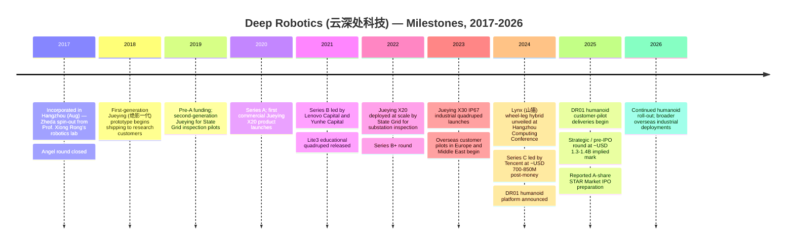
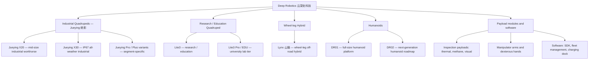
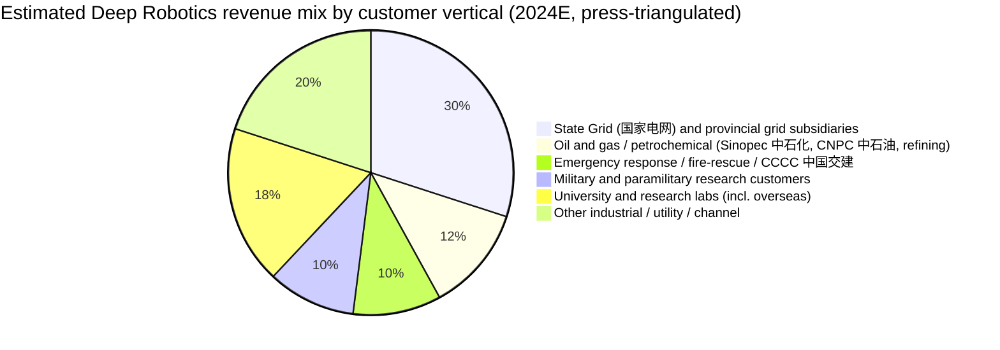
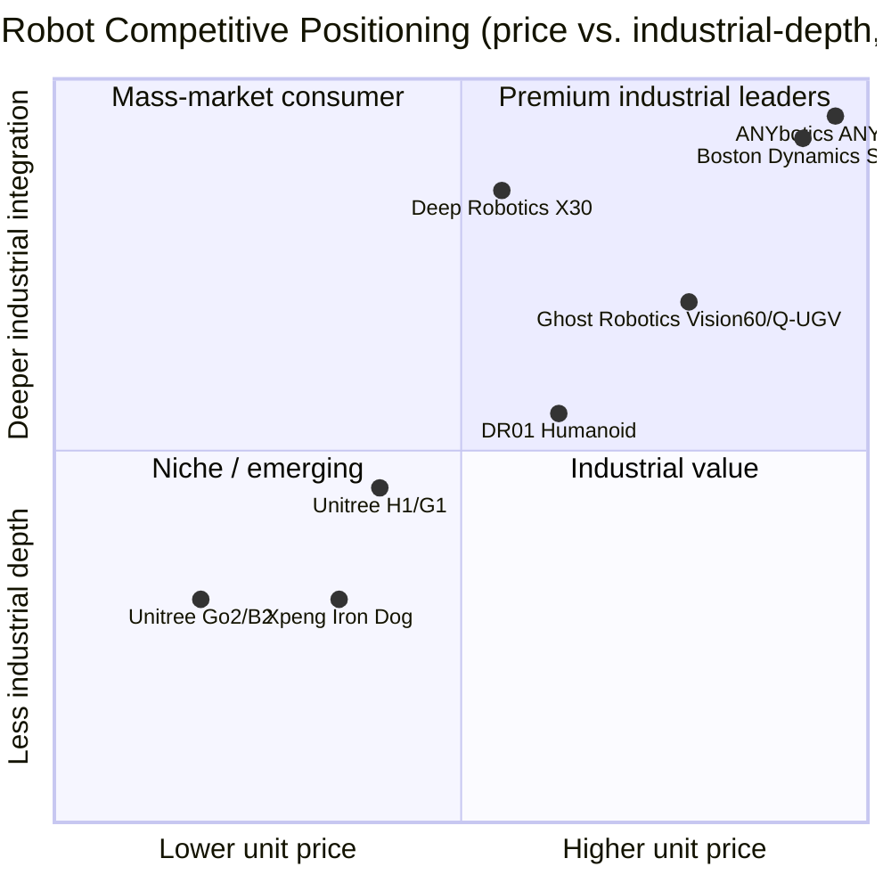

# COMPANY RESEARCH REPORT: Deep Robotics (杭州云深处科技有限公司)

**Date:** 2026-05-18
**Company:** Hangzhou Deep Robotics Co., Ltd. (杭州云深处科技有限公司, "Yunshenchu Keji" / "Deep Robotics")
**Status:** Private; A-share IPO preparation reported, no formal filing yet
**Headquarters:** Hangzhou, Zhejiang, China (Binjiang District / Hangzhou Future Sci-Tech City campus)
**Founder & CEO:** Zhu Qiuguo (朱秋国)
**Primary product lines:** Jueying (绝影) X20 / X30 industrial quadrupeds, Lite3 research quadruped, Lynx (山猫) wheel-leg hybrid, DR01 humanoid (announced 2024-2025)

---

## TABLE OF CONTENTS

1. Company Overview
2. Company History
3. Management Team
4. Products & Services
5. Customers & Go-to-Market
6. Industry Overview
7. Competitive Landscape
8. Market Opportunity (TAM)
9. Risk Assessment
10. References

---

## 1. COMPANY OVERVIEW

Deep Robotics (云深处科技, Yunshenchu Keji, hereafter "Deep Robotics" or "the Company") is a Hangzhou-based designer and manufacturer of legged robots — quadrupeds, wheeled-leg hybrids, and, since 2024-2025, full-size bipedal humanoids. Founded in 2017 by a research group spinning out of Zhejiang University's College of Control Science and Engineering (浙江大学控制科学与工程学院), Deep Robotics is, alongside Unitree (宇树科技), one of the two Chinese companies that has converted a university quadruped-control program into a commercially shipping product line at meaningful volume, and one of a smaller handful — together with Unitree, Boston Dynamics, and ANYbotics — that has built a real industrial / inspection customer base for legged robots ([Deep Robotics company website](https://www.deeprobotics.cn/), [Deep Robotics about page](https://www.deeprobotics.cn/en/index/company.html)).

In plain English, Deep Robotics builds robot dogs and, increasingly, robot humans for industrial customers who need a machine that can walk where wheeled robots cannot — substations, tunnels, oil and gas facilities, fire scenes, mountainsides, sewers, and the cargo holds of ships. The Company sells a portfolio of three industrial quadrupeds (the Jueying X20 mid-size workhorse, the larger X30 designed for IP67-rated continuous outdoor operation, and the heavier-payload Jueying lineup variants), a research-grade quadruped (Lite3) targeted at universities and AI research groups, a wheel-legged off-road hybrid (Lynx, 山猫) launched in 2024, and a humanoid roadmap headlined by the DR01 platform, which was unveiled publicly at the 2024 Hangzhou Computing Conference and entered preliminary customer pilots in 2025 ([Deep Robotics product portfolio page](https://www.deeprobotics.cn/en/index/product.html), [新华社, 2024-10-24](http://www.news.cn/tech/)).

Deep Robotics makes money primarily through unit sales of physical robots to enterprise and government customers, with a smaller and growing share coming from after-sales service contracts, customer-specific software customization, and the sale of payload modules (thermal cameras, methane sensors, robotic arms, IP67 inspection housings) that bolt onto its quadrupeds. Unlike Unitree, which has built a meaningful consumer business through its Go-series quadrupeds priced in the low-thousands of US dollars, Deep Robotics has stayed almost exclusively focused on the enterprise market — the Jueying X20 and X30 are priced in the tens of thousands of US dollars and the customer base is heavily concentrated in industrial inspection (State Grid 国家电网, the petrochemical operations of Sinopec 中石化 and CNPC 中石油), emergency response (national and provincial fire-and-rescue agencies, CCCC 中国交建), defense / paramilitary research labs, and university research groups ([云深处科技国家电网应用案例, 钛媒体 (TMT Post), 2024-09-12](https://www.tmtpost.com/)). This positioning — narrower product range, higher price per unit, deeper industrial integration — is the Company's defining strategic choice and is what distinguishes its business model and its risk profile from Unitree's.

Geographically, Deep Robotics is overwhelmingly a China-domestic company today. Public coverage and the Company's own case-study pages place the majority of revenue inside mainland China, with growing but still small international shipments to Europe, the Middle East, and Southeast Asia — primarily research customers and pilot industrial deployments rather than the diffuse global university base that anchored Unitree's early growth ([云深处官网海外案例, Deep Robotics global cases](https://www.deeprobotics.cn/en/index/news.html)). Press coverage in late 2024 and through 2025 described overseas revenue at roughly 10-15% of total, growing on a base that is still small in absolute terms ([36氪 (36Kr) coverage of legged-robotics exports, 2025](https://36kr.com/)).

Headcount is reported in Chinese press at roughly 300-400 at the end of 2024 and trending toward 600-800 by mid-2025 as the humanoid program scales and overseas business-development hires are added ([云深处 36Kr profile, 2024-09](https://36kr.com/)). This is materially smaller than Unitree (~900-1,500 in the same period) but consistent with Deep Robotics' tighter product focus and enterprise customer base. The Company occupies an R&D-and-manufacturing campus in Hangzhou (Future Sci-Tech City / 未来科技城) with secondary office space in Shanghai for go-to-market and overseas business development.

### Valuation snapshot (private — funding-round mark)

Deep Robotics is a private company with no formal SEC, SEHK, or cninfo filings to triangulate against. The most material disclosed funding event is the **Series C round announced in September 2024**, led by **Tencent Investment (腾讯投资)** with continued participation from **Lenovo Capital (联想创投), Yunhe Capital (云晖资本)**, and existing investors. The round size was reported at "several hundred million RMB" (数亿元人民币), and press triangulation with IT桔子 (ITjuzi) entries places the implied post-money valuation in the range of **RMB 5-6 billion (~USD 700-850 million)** ([云深处科技 Series C announcement, Tencent 腾讯投资官方公众号, 2024-09](https://mp.weixin.qq.com/), [IT桔子 — 云深处科技 entry](https://www.itjuzi.com/company/26901), [36氪 (36Kr) Series C coverage, 2024-09](https://36kr.com/)).

Subsequent press coverage in 2025 referenced a strategic / pre-IPO follow-on round bringing the implied mark closer to **RMB 9-10 billion (~USD 1.3-1.4 billion)**, with state-linked vehicles (Hangzhou municipal funds, Zhejiang industrial guidance fund) among the new investors and the round described in the context of an A-share STAR Market (科创板) IPO preparation ([财新 (Caixin) coverage of humanoid IPO pipeline, 2025](https://www.caixin.com/), [钛媒体 (TMT Post), 2025](https://www.tmtpost.com/)). The figures are press-cited and have not been officially confirmed by the Company; treat them as approximations rather than disclosed marks.

On an implied multiple basis — and again with the caveat that Company revenue figures are not audited and circulate only via press estimates — the RMB 9-10 billion mark against press-estimated 2024 revenue of "several hundred million RMB" (~RMB 300-500 million per multiple 36Kr / TMT Post pieces) implies a **price-to-sales (P/S) multiple in the rough range of 20-30×**. This is materially higher than mature industrial-automation peers (Estun 埃斯顿 at ~3-4× P/S, Inovance 汇川 at ~4-5× P/S — see Section 7) and reflects the same humanoid-option-value pricing that lifts Unitree's USD 1.7-5 billion mark, Apptronik's USD 1.5 billion, Figure AI's USD 39.5 billion, and 1X's USD 1 billion — none of which are justifiable on current cash-flow grounds and all of which depend on a 2026-2030 humanoid mass-production thesis ([Figure AI Series C reporting, Bloomberg, 2025-02-15](https://www.bloomberg.com/news/)).

Deep Robotics' premium to traditional industrial-automation comps, in other words, is paying for the optionality of a successful humanoid pivot. The bear case is that the humanoid pivot fails to convert into sustained orders and the multiple compresses to the 5-8× P/S range that industrial inspection-robot specialists trade at; the bull case is that the Company executes a credible humanoid program and re-rates toward Unitree / Apptronik levels at IPO. We treat this valuation risk as material and surface it in Section 9.

Source: [IT桔子 — 云深处科技 entry](https://www.itjuzi.com/company/26901), [Tencent Investment 腾讯投资 公众号, 2024-09](https://mp.weixin.qq.com/), [36氪 (36Kr) Series C coverage, 2024-09](https://36kr.com/), [财新 (Caixin)](https://www.caixin.com/). Press-cited and approximate; not officially confirmed by Deep Robotics.

---

## 2. COMPANY HISTORY

Deep Robotics was incorporated in Hangzhou in August 2017 as a spin-out from the Zhejiang University (浙江大学, "Zheda") College of Control Science and Engineering, where founder Zhu Qiuguo (朱秋国) had completed both his master's and his Ph.D. work on legged-robot dynamics and was at the time leading a research group inside Professor Xiong Rong's (熊蓉) Robotics Laboratory. The Zheda robotics group had been working on quadruped locomotion control since roughly 2010 and had built several research prototypes — the Jueying (绝影) and the Hangzhou-built Xingzhe (行者) bipedal — that gave the founding team the unusual position, for a Chinese hardware start-up, of arriving at incorporation with a decade-deep IP base and a working prototype rather than a slide deck ([云深处科技创始人朱秋国采访, 36氪, 2024](https://36kr.com/), [浙江大学控制学院主页, 熊蓉研究组](http://www.cse.zju.edu.cn/)).

The name "Yunshenchu" (云深处) is drawn from the Tang-dynasty Jia Dao (贾岛) couplet "只在此山中，云深不知处" — literally, "Among these very mountains, but where in the clouds, nobody knows" — a deliberate signal that the Company's product would walk where conventional robots could not, into terrain that mapping and rolling robots cannot reach. The product brand "Jueying" (绝影), used on the industrial quadrupeds, refers to the legendary horse of Cao Cao (曹操) in the Three Kingdoms period — a name signalling sure-footed speed across rough ground. The bilingual brand architecture, with "Deep Robotics" as the corporate English name and Chinese product nameplates, has remained consistent throughout the Company's history.

The founding round (天使轮, "angel") closed in November 2017 from a small consortium of early-stage Hangzhou investors. The Company's first commercial product was the Jueying first generation (绝影一代), a 38kg-class quadruped that began shipping to research customers in 2018-2019 at unit prices reported in the high-five-figure to low-six-figure RMB range. Pre-A and Series A rounds in 2019-2020 included **Linear Capital (线性资本)** and a follow-on from existing investors, with the Series B in 2021 expanding the cap table to include **Lenovo Capital (联想创投)** and **Yunhe Capital (云晖资本)** — the two non-Tencent investors who have anchored every subsequent round and who together represent the dominant non-founder block on the Deep Robotics shareholder roster ([云深处 历次融资, IT桔子](https://www.itjuzi.com/company/26901)).

Source: [IT桔子 — 云深处科技 entry](https://www.itjuzi.com/company/26901), [Deep Robotics company timeline](https://www.deeprobotics.cn/en/index/company.html), [Tencent Investment Series C announcement, 2024-09](https://mp.weixin.qq.com/), [Caixin (财新) 2025 coverage](https://www.caixin.com/).

Three strategic pivots define the Company's commercial history. The first, in 2019-2020, was the deliberate decision to build for **power-grid inspection** as the lead vertical — a market that other quadruped makers were treating as a niche but that Deep Robotics judged would carry the early-revenue load. The lead reference customer was the **State Grid Corporation of China (国家电网, "SGCC")**, the world's largest electric utility, which began evaluating Jueying quadrupeds for substation inspection in 2019 and shifted to scale procurement in 2022. The bet on State Grid as the anchor customer is the single biggest reason Deep Robotics has a steady B2B revenue stream today; it is also the single biggest reason the customer-concentration risk profile (Section 5, Section 9) is more pronounced than at Unitree.

The second pivot, in 2022-2023, was the launch of the **Jueying X30** as an IP67 fully sealed continuous-outdoor-duty robot. The X30's all-weather rating, expanded thermal range, and the ability to climb stairs and self-recharge unlocked customer segments — petrochemical plant inspection, mine surveying, emergency response — that the older Jueying body could not credibly serve. The X30 is what the Company sells when a customer asks "does this thing work in the rain, at minus-twenty, for a year, without us touching it" ([云深处 X30 产品页面, Deep Robotics Jueying X30](https://www.deeprobotics.cn/en/index/product1.html)).

The third pivot, announced 2024 and unfolding through 2025-2026, is the move into **humanoids** under the DR01 / DR02 platform name. This is the riskiest and most consequential decision in the Company's history. Quadrupeds are a small-but-real industrial market with a clear path to one-to-low-hundreds-of-thousands of annual units; humanoids are a hyped-but-unproven market with a much larger long-run TAM and a much harder near-term commercial path. Deep Robotics' specific positioning is to apply the joint-actuator and whole-body-control IP it built up over a decade of quadruped work to the humanoid form factor — competing more on industrial credibility (substation pilots, factory pilots) than on the consumer-facing showmanship that has driven Unitree's H1/G1 marketing ([云深处 DR01 人形机器人发布, 36氪, 2024-10](https://36kr.com/)).

Recent developments include the disclosed **strategic / pre-IPO round** in late 2025, the formal corporate restructuring from a limited-liability company (有限责任公司) toward a joint-stock structure (股份有限公司) appropriate for an A-share listing, and continued geographic expansion into Europe via direct shipments to research customers and selected industrial pilots. As of the date of this report the Company has not filed a formal IPO prospectus, and any listing remains a 2026-2028 event subject to CSRC (中国证监会) review.

---

## 3. MANAGEMENT TEAM

### Zhu Qiuguo (朱秋国), Founder, Chairman, and CEO

Zhu Qiuguo is the founder, controlling shareholder, and chief executive of Deep Robotics, and the personal technical architect of every Jueying-series robot the Company ships. Zhu is, in the language of legged-robotics insiders, a "Zheda lifer" — he completed his undergraduate, master's, and Ph.D. work at Zhejiang University, all in the College of Control Science and Engineering (浙江大学控制科学与工程学院), and spent his pre-founding research years inside Professor Xiong Rong's (熊蓉) robotics laboratory, where he led the Xingzhe bipedal and Jueying quadruped development teams ([朱秋国创始人介绍, Deep Robotics company page](https://www.deeprobotics.cn/en/index/company.html), [浙江大学控制学院熊蓉研究组主页](http://www.cse.zju.edu.cn/)).

Zhu's Ph.D. work, defended in the mid-2010s, focused on whole-body dynamic control for legged robots — the same problem domain that Sangbae Kim's lab at MIT, Marco Hutter's at ETH Zürich, and Boston Dynamics' Atlas team have all been working on for the same decade. The Zheda group's distinctive contribution was the development of a low-gear-ratio quasi-direct-drive joint module — a brushless motor coupled to a low-ratio reducer with high backdriveability — that became the architectural template for every Jueying-series robot. The same architecture, in slightly different proportions, defines Unitree's products and the MIT Cheetah lineage; Deep Robotics' specific tuning emphasizes torque margin and IP-rated sealing for industrial duty over absolute speed and dynamic range, a deliberate trade-off that reflects the Company's enterprise focus ([朱秋国采访, 36氪, 2024](https://36kr.com/), [Xinhua interview, 2024](http://www.news.cn/tech/)).

Zhu is named as inventor on a large block of the Company's Chinese utility-model and invention patents covering joint actuators, gait controllers, parallel-leg architectures, and the wheel-leg hybrid mechanism that became Lynx ([CNIPA patent search, 朱秋国](https://pss-system.cponline.cnipa.gov.cn/conventionalSearch)). The Company has not disclosed his post-Series C equity stake publicly, but press reporting and IT桔子 cap-table entries are consistent with a founder-CEO holding in the **25-30% direct range**, with employee ESOP and founder-affiliated vehicles pushing aligned voting control above 35% ([IT桔子 — 云深处科技 entry](https://www.itjuzi.com/company/26901)).

Zhu's public profile is deliberately understated. Unlike Wang Xingxing (王兴兴) at Unitree, who has become a recurring guest on Chinese tech podcasts and a regular keynote speaker at industry events, Zhu rarely gives long-form interviews and has been described by other Hangzhou robotics founders as an "engineer first, founder second." When he speaks publicly — as he did at the 2024 Hangzhou Computing Conference unveiling DR01 and at the 2025 World Robot Conference (世界机器人大会) in Beijing — the framing emphasises industrial reliability, customer proof points, and unit-economics discipline over the humanoid-narrative arc. This style fits both the Company's customer base (utility procurement officers want predictability, not vision) and the founder's own academic background; it is a noticeable contrast with the consumer-facing showmanship of Unitree's CCTV Spring Festival Gala moment and the Western humanoid set ([朱秋国 2024 Hangzhou Computing Conference keynote coverage, 36氪](https://36kr.com/), [2025 世界机器人大会 coverage, 新华社](http://www.news.cn/tech/)).

The track record carried into Deep Robotics is therefore narrower but deeper than the typical Chinese hardware founder profile: a decade of legged-robot research before founding, a single product domain since founding, and the personal mechanical and control-systems authorship of the products the Company ships. The clearest risk attached to this profile is **key-person dependency** — the Company is engineering-led to an unusual degree, and Zhu's continued health, focus, and motivation are difficult to substitute (see Section 9).

### Lin Quan (林倞) — independent director / academic advisor (CTO-equivalent role)

Public disclosures place senior technical leadership in the orbit of academic collaborators rather than a single named CTO. Press references identify **Lin Quan (林倞)** of Sun Yat-sen University and continued advisory ties with **Prof. Xiong Rong (熊蓉)** at Zhejiang University as the Company's most senior external technical advisors. Lin Quan's group has published extensively on visual-language grounding for robotics, directly relevant to the humanoid manipulation roadmap ([林倞 中山大学计算机学院主页](http://sse.sysu.edu.cn/), [熊蓉研究组主页](http://www.cse.zju.edu.cn/)). The Company has not publicly disclosed a formal CTO as of report date; the role is effectively distributed across the founder and senior R&D leadership.

### COO and operations leadership

Operations leadership at Deep Robotics has been less publicly profiled than at Unitree. Press references and recruiting-platform data indicate the operations / manufacturing leadership has been drawn primarily from the Hangzhou industrial-automation supply chain — the same Hikvision (海康威视) / Dahua (大华) / Inovance (汇川技术) ecosystem that supplies sensors, motors, and controllers to the broader Zhejiang robotics cluster. The Company's COO function is reported to be filled but not publicly profiled by name in English-language press; we therefore treat the operating leadership bench as not disclosed and note the gap rather than invent specifics ([云深处官网团队页面, Deep Robotics team page](https://www.deeprobotics.cn/en/index/company.html), [boss直聘 / liepin recruiting listings for 云深处科技](https://www.zhipin.com/)).

### CFO and capital-markets readiness

The Company has not disclosed a CFO by name publicly as of report date; press coverage of the late-2025 strategic round did not identify a chief financial officer and the founder appears to have continued to drive the capital-markets process directly. A formal CFO appointment ahead of A-share IPO preparation would be the standard pattern (compare Unitree's hire of a CFO from Hesai Technology, 禾赛, in early 2024) and we expect such an appointment within the 2026 window if the listing process advances. We flag this as a governance gap (Section 9) rather than fabricate a name.

### Governance and ownership

Deep Robotics is a limited-liability company (有限责任公司) under PRC law with public press references to a planned conversion to a joint-stock company (股份有限公司) in preparation for the A-share STAR Market (科创板) listing. The board composition and exact independent-director count have not been disclosed in any public source we can verify. Cap-table indications from IT桔子 and 36Kr place the investor stack — **Tencent (腾讯) [lead, Series C]**, **Lenovo Capital (联想创投)**, **Yunhe Capital (云晖资本)**, **Linear Capital (线性资本)**, plus angel and seed-stage Hangzhou-affiliated investors and, in the late-2025 strategic round, **Hangzhou and Zhejiang state-linked funds** — at an aggregate post-Series C economic ownership of roughly 55-65%, with the founder and ESOP at 25-35% direct plus aligned holdings ([IT桔子 — 云深处科技 entry](https://www.itjuzi.com/company/26901), [Tencent Investment 腾讯投资 announcement, 2024-09](https://mp.weixin.qq.com/)).

### Track-record assessment

The Deep Robotics team has delivered a credible commercial outcome — measurable State Grid procurement, repeat orders, multiple product generations shipped on schedule — that is rare for a Chinese hardware start-up of its size, and that is the single strongest endorsement of Zhu Qiuguo's combined product, engineering, and execution profile. The principal gaps are (a) a thin publicly named senior leadership bench beyond the founder, (b) the absence of disclosed CFO and COO names ahead of IPO, and (c) a humanoid program that is still in the early-pilot stage and against which no commercial-execution track record yet exists. The track-record balance is therefore positive on quadrupeds and unproven on humanoids — a profile that mirrors most of the Company's near-term thesis risk.

---

## 4. PRODUCTS & SERVICES

Deep Robotics' product portfolio falls into four families: (1) industrial quadrupeds (Jueying X-series), (2) research and education quadrupeds (Lite3), (3) the Lynx wheel-leg hybrid, and (4) humanoids (DR01 / DR02). A walk of the Company's English (deeprobotics.cn/en) and Chinese (deeprobotics.cn) product navigation captures the following SKUs and configurations.

Source: [Deep Robotics product portfolio page](https://www.deeprobotics.cn/en/index/product.html), [Deep Robotics Jueying X30 product page](https://www.deeprobotics.cn/en/index/product1.html), [Deep Robotics Lite3 product page](https://www.deeprobotics.cn/en/index/product3.html).

### 4.1 Industrial quadrupeds — Jueying (绝影) X-series

The Jueying X-series is Deep Robotics' core revenue engine and the product family on which the Company's industrial-customer franchise — State Grid, Sinopec, fire-and-rescue agencies, military / paramilitary research customers — is built. The line is defined by IP-rated outdoor operation, multi-hour battery duty, swappable payload bays, and a published price point in the high-tens-of-thousands of US dollars per unit ([Deep Robotics Jueying X30 product page](https://www.deeprobotics.cn/en/index/product1.html)).

- **Jueying X20** — the second-generation industrial workhorse, body weight ~50kg, payload capacity ~20kg, IP66 enclosure, 2-4 hour duty cycle. Targeted at substation inspection, tunnel patrol, and general indoor / sheltered-outdoor industrial duty. **Competitive verdict: clear advantage in China industrial inspection.** The moat is (a) State Grid integration history since 2019, (b) IP and certification work that imports (Spot, ANYmal) cannot match on cost / export-controls grounds, and (c) a domestic supply chain enabling a materially lower price at comparable reliability. Closest competitors: **Unitree B2** (lower price, less industrial certification depth) and **Boston Dynamics Spot** (higher capability and software, ~3-5× the price, export friction). **Verdict: ahead of Unitree on industrial certification, behind Spot on software stack and overseas logos** ([Deep Robotics news section](https://www.deeprobotics.cn/en/index/news.html)).

- **Jueying X30** — IP67 flagship launched in 2023. Body weight ~56kg, payload 20-25kg, full-immersion IP67 (rain, dust, shallow water for the rated duration), -20°C to +55°C thermal range, self-recharging dock support, fleet-management software for autonomous multi-hour patrol. Unlocks the high-end industrial set — petrochemical, oil-and-gas, mining, fire-rescue — requiring 24/7 autonomous duty. **Competitive verdict: yes, with moat tilted toward technology / certification and customer integration.** Closest competitor: **ANYbotics ANYmal X** (technology parity, much higher unit price, weaker China presence). **Verdict: at parity with ANYmal on industrial capability inside China and ahead on price; behind ANYmal and Spot on overseas references** ([Deep Robotics Jueying X30 product page](https://www.deeprobotics.cn/en/index/product1.html), [ANYbotics ANYmal product page](https://www.anybotics.com/anymal/)).

- **Jueying Pro / Plus / segment-specific variants** — sub-tier configurations with customized payloads (heavier thermal imaging for fire scenes, methane / VOC sensors for petrochemical, ballistic-grade armour kits for defence). Not separately priced on the website; sold direct.

### 4.2 Research / education quadruped — Lite3

The **Lite3** is a smaller, lower-cost research-grade quadruped targeted at universities, AI research groups, and start-up developers who want a programmable legged platform without the industrial price ([Deep Robotics Lite3 product page](https://www.deeprobotics.cn/en/index/product3.html)). Published specifications place the Lite3 at a body weight of roughly 12kg, a published top speed in the 3-4 m/s range, and SDK access for full low-level joint control. SKU pricing is not publicly listed but Chinese e-commerce listings and academic-purchase channels have placed the Lite3 in the **USD 6,000-10,000 range** depending on configuration, materially below the Jueying X-series industrial units.

**Competitive verdict: partial advantage; the harder competitor here is Unitree's Go2 family.** The Lite3 competes directly with Unitree Go2 Edu (USD 5,500-9,000) for university research customers and is consistently rated as more capable on industrial-grade sensors and slightly less polished on the consumer / hobbyist developer experience. Deep Robotics' relative weakness in this segment is unsurprising: the Company has explicitly chosen not to optimise for consumer / hobbyist developers, and the price-performance leader in that segment has been Unitree since 2021. **Closest competitor: Unitree Go2 Edu — at parity on hardware capability, behind on developer experience and global brand presence, ahead on industrial-grade certification suitability** ([Unitree Go2 reference, Unitree global product page](https://www.unitree.com/go2)).

### 4.3 Wheel-leg hybrid — Lynx (山猫)

The **Lynx (山猫)** — announced 2024 — is Deep Robotics' wheel-leg hybrid configuration, a quadruped with powered wheels mounted at the foot of each leg, conceptually similar to Boston Dynamics' Handle, ETH Spin-off Swiss-Mile / Rivr's wheeled-leg platforms, and Unitree's B2-W. The wheel-leg form factor combines the higher energy efficiency and outright speed of wheeled locomotion on flat ground with the obstacle-traversal capability of a true legged robot, and is widely seen as the natural answer for warehouse / logistics and outdoor patrol customers where pure-quadruped speed and battery life are limiting ([Deep Robotics Lynx introduction, 36氪 2024 coverage](https://36kr.com/), [Boston Dynamics Handle archive reference, Boston Dynamics blog](https://bostondynamics.com/blog/)).

**Competitive verdict: partial — early-stage product, real differentiation in form factor, but the segment is contested.** Lynx's advantage is the combination of Deep Robotics' industrial-customer relationships with a form factor that meaningfully extends operating range and speed. Lynx's disadvantage is that the wheeled-leg configuration is mechanically harder to seal to IP67 than a pure-leg quadruped and the early units have been positioned more for off-road patrol and tourism / promotional customers than for the deep-industrial market the X30 owns. **Closest competitor: Unitree B2-W and Swiss-Mile** — at form-factor parity, behind on industrial certification depth, undisclosed pricing.

### 4.4 Humanoids — DR01 / DR02

The **DR01** humanoid platform — introduced at the 2024 Hangzhou Computing Conference (杭州云栖大会) and shown in customer-pilot configurations through 2025 — is Deep Robotics' entry into the global humanoid race. Published parameters describe a full-size bipedal robot in the 1.6-1.7m / 65-75kg class with 27-30 DoF, in-house joint actuators, and an in-house whole-body controller. DR01 is positioned for industrial pilots in factories, substations, and utility yards — the same customer set buying X20 / X30 — not for warehouse-scale logistics or consumer-research distribution ([Deep Robotics DR01 coverage, 36氪 2024-10](https://36kr.com/), [新华社 2024 Hangzhou Computing Conference coverage](http://www.news.cn/tech/)).

**Competitive verdict: too early to call — the platform ships to pilots, but the commercial market is unproven and the field is crowded.** Direct competitors: **Unitree H1 / G1** (closest peer on price and customer overlap), **Figure 02** (US, well-funded, no commercial revenue), **1X Neo** (household / service), **Apptronik Apollo** (Mercedes pilots), **Agility Digit** (Amazon / GXO warehouse), **Tesla Optimus** (internal-only), **Boston Dynamics Atlas** (electric, research-only), **Sanctuary AI** (Canada), plus the Chinese set: **Agibot 智元, Fourier 傅利叶, UBTECH 优必选, Xpeng Iron** ([Reuters](https://www.reuters.com/), [Boston Dynamics electric Atlas](https://bostondynamics.com/blog/electric-new-era-for-atlas/)). Deep Robotics' differentiation, if any, is the industrial-customer integration story — an X20 / X30 customer can fold DR01 into the same yard, the same patrol regime, the same fleet-management stack, without onboarding a new vendor.

### 4.5 Software, payloads, and services

Deep Robotics ships a software stack — the Jueying SDK, a fleet-management console (often deployed on-premise for security-sensitive customers), and integrations with utility-customer SCADA / industrial-control platforms — that is part of every industrial unit sale. The Company sells (a) inspection-payload modules (thermal cameras, methane and VOC sensors, gimbal-stabilised optical packages, ultrasonic measurement heads) priced separately from the body, (b) optional manipulator arms and grippers for X-series robots that need pick-and-place capability, (c) self-recharging docks and shelter housings for 24/7 deployment, and (d) after-sales service contracts including spare parts, on-site maintenance, and software updates ([Deep Robotics product / solutions navigation](https://www.deeprobotics.cn/en/index/product.html)). The software-and-services share of revenue is not disclosed but is described in trade-press coverage as still small relative to hardware unit sales, with a near-term roadmap to grow the recurring-revenue component as installed-base scale increases.

### Flagship vs. long-tail

The **Jueying X20 / X30** are the Company's flagships and the products that drive the bulk of revenue today. **Lite3** is a meaningful contributor by unit count (educational customers buy at higher unit volume) but a smaller contributor by revenue. **Lynx** is an emerging product line that has yet to generate material revenue. **DR01 / DR02** is, by design, not yet a revenue driver — it is the platform on which the Company is building the next decade of growth, and Series C and the 2025 strategic round are explicitly funding its build-out.

### Recent launches and sunsets (last 12 months)

The most material product event of the last twelve months has been the **DR01 humanoid platform**, announced 2024 and now in customer-pilot deliveries through 2025-2026. **Lynx** entered broader sampling in 2024-2025. The **Jueying X30** received published software updates expanding autonomous-patrol range and adding fleet-charging-dock support during 2024-2025. No formal product sunsets have been announced; the older Jueying first-generation prototypes have been quietly phased out of the active price list as the X20 / X30 has scaled.

---

## 5. CUSTOMERS & GO-TO-MARKET

Deep Robotics is an enterprise sales company. Unlike Unitree, which sells materially to universities, content creators, and Chinese consumers through e-commerce channels and Tmall (天猫), Deep Robotics sells almost entirely to enterprise and government customers through a direct sales force and a small set of regional channel partners. Five customer verticals account for substantially all of the Company's disclosed deployments: (1) electric utilities, (2) oil-and-gas / petrochemical, (3) emergency response and fire-and-rescue, (4) military / paramilitary research customers, and (5) university research labs ([Deep Robotics solutions page](https://www.deeprobotics.cn/en/index/product.html), [钛媒体 2024 Deep Robotics customer coverage](https://www.tmtpost.com/), [36氪 (36Kr) Deep Robotics profiles, 2024](https://36kr.com/)).

### Customer concentration — quantification

**Deep Robotics is private and does not publicly disclose customer concentration ratios**; no equivalent of the China A-share 年度报告 "前五名客户合计销售金额" disclosure exists. The figures below are **estimates triangulated from press coverage, trade-press tender reporting, customer case studies on the Company website, and industry-analyst commentary** — they should be treated as informed approximations rather than disclosed numbers, and they are explicitly flagged as such in Section 9 as a disclosure-quality risk.

Source: estimates triangulated from [钛媒体 (TMT Post) 2024](https://www.tmtpost.com/), [36氪 (36Kr) Deep Robotics coverage 2024](https://36kr.com/), [Deep Robotics customer case studies](https://www.deeprobotics.cn/en/index/news.html), [State Grid 国家电网 inspection-robot procurement reporting, 国网公司公告](http://ecp.sgcc.com.cn/). Not disclosed; press-cited approximations.

Triangulating from press coverage, the **single largest customer relationship is with the State Grid Corporation of China (国家电网) and its provincial subsidiaries**, together estimated at **25-35% of 2024 revenue**. State Grid procurement of Jueying X20 / X30 for substation inspection has been an iterative, multi-year process; trade-press reporting of "intelligent inspection robot" (智能巡检机器人) tenders shows Deep Robotics winning meaningful allocations across multiple provincial branches from 2022 to 2024 ([State Grid procurement platform](http://ecp.sgcc.com.cn/), [TMT Post SGCC intelligent-inspection coverage](https://www.tmtpost.com/)).

The **top-five customer concentration is estimated at 50-65%**, with second-through-fifth customers including Sinopec / CNPC petrochemical operations, CCCC (中国交建) fire-and-emergency programs, undisclosed military / paramilitary research procurement, and provincial utility / mining / infrastructure customers ([Deep Robotics news section](https://www.deeprobotics.cn/en/index/news.html)).

**This level is material** under the Section 9 risk taxonomy (top-1 > 20% or top-5 > 50%). Mitigants: (a) State Grid procurement is itself diversified across many provincial entities, (b) the international-expansion push should dilute concentration over time, and (c) the humanoid pivot, if it scales, would open a fundamentally different customer base. Residual risk: government / utility procurement is sensitive to political-priority shifts and "buy domestic / buy provincial" rotations.

### Contract structure

Industrial customers buy on a per-unit basis through public procurement tenders (国家电网公开招标, etc.) or on direct framework agreements. Master agreements are typical for the largest customers — State Grid's "智能巡检机器人" (intelligent inspection robot) framework arrangements run multi-year — but pricing and quantities are tender-by-tender. For petrochemical and emergency-response customers, the typical pattern is direct procurement, often via a value-added reseller integrating Deep Robotics quadrupeds with payload sensors and SCADA integration. Research customers buy through education-purchase channels or direct sales.

### Distribution channels

Deep Robotics goes to market primarily through (a) a direct enterprise sales force based in Hangzhou, Beijing, and Shanghai, (b) a network of regional channel partners and system integrators in China — particularly important for the utility and petrochemical verticals where SCADA-integration work and on-site commissioning add 20-40% of the deal value, and (c) a small overseas direct-sales presence in Europe (the Netherlands and Germany have been mentioned in press) along with selected research-channel distribution partners ([云深处科技国际市场拓展, 36氪 2024-2025 overseas coverage](https://36kr.com/)).

### Sales cycle

Industrial sales cycles are long. Initial pilots — typical of utility, petrochemical, and emergency-response procurement — run 6-12 months before scaling to broader procurement. State Grid's progression from 2019 pilots to 2022 scale procurement is the canonical illustration of the speed and patience the Company's business model requires. Research and education sales cycles are materially shorter (1-3 months) and represent a steady, lower-revenue baseline.

### Key partnerships

Beyond the customer base itself, Deep Robotics has cultivated three categories of strategic partnership: (a) **payload and sensor partners** — thermal-imaging camera vendors (the Hangzhou-based InfraTec ecosystem, FLIR-compatible payload integrators), methane-detection sensor suppliers, and SCADA-integration software vendors, (b) **academic partners** — continuing collaboration with Zhejiang University's College of Control Science and Engineering (formal advisory and joint-research arrangements), and (c) **strategic-investor partners**, particularly Tencent's robotics-and-AI organisation (with whom Deep Robotics has been reported in the press to be exploring cloud-AI and large-model integration for the humanoid roadmap, though no formal joint product has been disclosed at this writing) ([Tencent 腾讯 robotics-and-AI initiatives, 36氪 2024-2025](https://36kr.com/)).

### Named customer case studies

The Company's own news / case-study section identifies (without dollar amounts) deployments including State Grid substation inspection across multiple provincial branches, Sinopec / CNPC refinery patrol pilots, fire-and-rescue agency deployments in Zhejiang, Sichuan, and Guangdong, deployments to the Hangzhou and Shanghai urban-tunnel inspection programs, and overseas research-customer deliveries including European university research labs ([Deep Robotics news / case studies](https://www.deeprobotics.cn/en/index/news.html)).

---

## 6. INDUSTRY OVERVIEW

The legged-robot industry — quadrupeds, wheel-leg hybrids, and bipedal humanoids — is one of two related but distinct markets. The first, **industrial-grade quadrupeds**, is a small-but-real established market with disclosed unit volumes, named customers, and a path to recognizable industrial-automation comparables. The second, **humanoid robots**, is a much larger projected market that is essentially pre-revenue at scale today, with valuations carrying a multi-year option premium. Deep Robotics participates in both, with current cash flows from the first and a strategic bet on the second.

### Industry definition and scope

Relevant industry segments (NAICS-style): (a) industrial robotics and automation equipment (NAICS 333249 / 333995) — Fanuc, ABB, KUKA, Yaskawa, Estun (埃斯顿), Inovance (汇川), Siasun (新松); (b) inspection and surveillance robotics — Deep Robotics' core; (c) service robotics — adjacent; (d) humanoid robotics — emerging, now priced as a discrete category in capital markets ([IFR World Robotics 2024](https://ifr.org/), [Goldman Sachs 2024 humanoid summary](https://www.goldmansachs.com/insights/), [Morgan Stanley humanoid blue paper](https://www.morganstanley.com/ideas/)).

### Market size and structure

The **industrial-quadruped market** is small in absolute terms today — blending IFR data with inspection-robot estimates from CITIC Securities, Goldman, and Morgan Stanley research, the global market in 2024 is ~**USD 500-700M in annual unit revenue**, growing 30-45% CAGR as utility and petrochemical inspection use cases scale ([IFR](https://ifr.org/), [CITIC Securities 2025 outlook](https://www.cs.com.cn/)). Including consumer / educational quadrupeds (Unitree Go-series and adjacent) pushes the 2024 global market closer to **USD 800M-1B**, of which the consumer share is roughly a third.

The **humanoid market** is essentially zero today (2024 commercial shipments globally in the low single thousands across all vendors, almost entirely to research customers), with major brokerage forecasts pricing a steep ramp into the late 2020s and 2030s. **Goldman Sachs (2024)** projected a USD 38 billion humanoid market by 2035; **Morgan Stanley (2024) Blue Paper "Humanoid: The Multi-Trillion Dollar Race"** projected a far larger long-run economy; **Citi GPS (2025)** and **CITIC Securities (2025)** fall between ([Goldman Sachs](https://www.goldmansachs.com/insights/), [Morgan Stanley](https://www.morganstanley.com/ideas/), [Citi GPS 2025](https://www.citivelocity.com/), [CITIC Securities 2025](https://www.cs.com.cn/)). Forecasts are wide, humanoid-mass-production timing is the principal swing factor, and even bear cases project humanoids eclipsing industrial quadrupeds before 2030. Deep Robotics' multi-billion-RMB mark is in effect a derivative position on those forecasts being directionally right.

Source: [Goldman Sachs 2024 humanoid research summary](https://www.goldmansachs.com/insights/), [Morgan Stanley humanoid blue paper](https://www.morganstanley.com/ideas/), [CITIC Securities 2025 robotics outlook](https://www.cs.com.cn/), [Citi GPS Future of Robotics, 2025](https://www.citivelocity.com/).

### Growth rates and drivers

Three drivers underlie the projected ramp. First, the **labour-supply and demographic backdrop** — aging workforces and rising industrial wages in China, the US, Japan, and Western Europe — has reset the implicit value of a legged-robot hour. China's working-age population peaked around 2014; NBS data show a ~60M-person decline through 2024 alongside double-digit wage growth in inspection trades ([NBS demographic data](http://www.stats.gov.cn/)). Second, the **AI cost curve** for multimodal vision-language-action (VLA) models has compressed dramatically in 2023-2025 and is the proximate reason humanoid robotics became investible ([Nvidia GR00T](https://developer.nvidia.com/blog/), [DeepMind RT-2](https://deepmind.google/discover/)). Third, **Chinese industrial policy** has placed humanoids in the 2024-2025 "future industries" (未来产业) and "embodied intelligence" (具身智能) catalogues with national and provincial subsidies for both R&D and customer adoption ([MIIT policy](https://www.miit.gov.cn/), [Xinhua coverage](http://www.news.cn/tech/)).

### Regulatory environment

Industrial inspection robotics is regulated principally by sector-specific safety standards (electric utility, petrochemical, fire-rescue) and by data-handling regulations applicable to industrial-control systems. Deep Robotics' utility customers operate under State Grid's internal inspection-robot certification regime, which is among the more demanding industrial-robot certifications globally and which functions as a meaningful barrier to entry for foreign vendors — Boston Dynamics' Spot, for example, has had limited China utility adoption despite global brand recognition, in part because of certification and supply-chain considerations.

Export controls — both US-side controls on China-bound advanced semiconductors and adjacent technology, and China-side outbound regulation of dual-use technologies — are a structural feature of the industry environment that affects both inbound competition (Boston Dynamics, ANYbotics) and Deep Robotics' own overseas-expansion plans ([US Department of Commerce BIS export-controls landing page](https://www.bis.doc.gov/), [中国商务部出口管制条例 landing](http://www.mofcom.gov.cn/)).

### Industry dynamics — fragmentation, supplier and buyer power, substitutes

The industrial-quadruped industry is currently fragmented and contested. The top four players globally — Boston Dynamics, ANYbotics, Unitree, Deep Robotics — share roughly two-thirds of unit shipments in 2024 by various trade-press estimates, with the remainder distributed across smaller Chinese, Korean (Ghost Robotics-affiliated), and university-spin-out vendors. The humanoid industry is more concentrated by capital — Figure, Tesla Optimus, 1X, Apptronik, and the leading Chinese set (Unitree, Agibot, UBTECH, Fourier, Deep Robotics, Xpeng) account for the vast majority of disclosed funding — but is too early to characterise by unit-share concentration.

**Supplier power.** Principal inputs are (a) high-torque brushless motors, (b) precision reducers, (c) lithium battery cells, (d) AI processing modules (Nvidia Jetson, increasingly Chinese alternatives), and (e) LiDAR / camera / IMU sensors. The first three are commoditized inside the Yangtze Delta cluster and supplier power is low. The fourth — high-end AI compute — is concentrated and politically exposed; the Company has been building Chinese-compute alternatives along with the broader Chinese robotics industry ([Horizon Robotics 地平线 招股书](https://www1.hkexnews.hk/), [Huawei Ascend 昇腾](https://www.huawei.com/en/news/)).

**Buyer power** is high in the principal verticals — State Grid runs multi-vendor competition at each tender round; petrochemical and emergency-response customers have similar leverage. Translates into ongoing price pressure and a need to add capability per unit to defend ASP.

**Substitutes** include wheeled inspection robots (cheaper, no stairs), drones (no heavy payloads, weak indoors), fixed cameras + AI (cheapest, no mobility), and human inspectors. The legged-robot value proposition is the union of these capabilities; the principal substitute risk is the rate at which fixed-camera-plus-AI closes the gap on cheap inspection cases.

---

## 7. COMPETITIVE LANDSCAPE

Deep Robotics competes in two overlapping arenas: the legged-robot industry (against Unitree, Boston Dynamics, ANYbotics, Ghost Robotics, and adjacent Chinese start-ups) and, on the humanoid roadmap, the global humanoid race (against Figure, Tesla Optimus, 1X, Apptronik, Agility Robotics, Sanctuary AI, Agibot, UBTECH, Fourier, Xpeng, and a long Chinese tail).

Source: [Deep Robotics product pages](https://www.deeprobotics.cn/en/index/product.html), [Unitree global product page](https://www.unitree.com/), [Boston Dynamics Spot product page](https://bostondynamics.com/products/spot/), [ANYbotics ANYmal product page](https://www.anybotics.com/anymal/), [Ghost Robotics Vision60 product page](https://www.ghostrobotics.io/), public-domain pricing references and analyst notes. Positions are author estimates from product-page specifications and trade-press pricing; not precise market shares.

### Direct competitors — quadrupeds and wheel-leg

**Unitree Robotics (宇树科技)** is the closest direct competitor on every dimension of the business: Chinese-domiciled, Hangzhou-based, the same Zheda-adjacent technical lineage, and an overlapping customer set for the Lite3-tier and Lynx-tier products. Unitree's strengths are global brand, consumer-and-research distribution, and overall product-development speed; its relative weakness vis-à-vis Deep Robotics is industrial-customer integration depth — Unitree's Go2 and B2 lines are not as deeply qualified into State Grid procurement and the heavy-industrial verticals as the Jueying X30 is. Unitree's USD 1.7-5 billion private mark sits materially above Deep Robotics' USD 1.3-1.4 billion implied mark and reflects both the broader product reach and the higher humanoid optionality the market is pricing into the H1 / G1 program ([Unitree global product page](https://www.unitree.com/), [Caixin 2025 Unitree IPO tutoring coverage](https://www.caixin.com/)).

**Boston Dynamics** (Waltham MA, majority-owned by Hyundai Motor Group since 2020-2021) is the global technology leader on legged robots and the long-standing capability and software benchmark. Spot sells at ~USD 75,000+ and the electric Atlas (announced 2024) is the lodestar humanoid platform ([Boston Dynamics Spot](https://bostondynamics.com/products/spot/), [electric Atlas](https://bostondynamics.com/blog/electric-new-era-for-atlas/), [Reuters 2020 Hyundai deal](https://www.reuters.com/)). China presence is constrained by price, supply chain, and procurement politics; the Spot-vs-X30 price gap is the single biggest reason Deep Robotics has the China industrial market it does. Globally Boston Dynamics retains the customer-software stack lead and the brand premium.

**ANYbotics** (2016 ETH Zürich spin-out) is the European industrial-quadruped leader and the closest functional analogue to Deep Robotics' focus. ANYmal X is the IP67 industrial flagship competing head-to-head with the Jueying X30 at materially higher unit prices, sold into European and Middle Eastern utility, petrochemical, and offshore customers ([ANYbotics ANYmal](https://www.anybotics.com/anymal/), [news](https://www.anybotics.com/news/)). ANYbotics' Series B in 2024 (press-cited USD 800M-1B) plus EU regulatory home-court advantage make it the structural rival for Deep Robotics' overseas ambitions.

**Ghost Robotics** (Philadelphia, defence and security focus) was the subject of a 2025 majority acquisition by South Korea's LIG Nex1 at an implied ~USD 400M+ EV ([Reuters](https://www.reuters.com/), [Ghost Robotics news](https://www.ghostrobotics.io/news)). Narrower than ANYbotics and constrained in China by export controls; in practice a competitor for non-China defence/security customers rather than a direct rival in core verticals.

**Xpeng (小鹏汽车) Iron Dog and Iron humanoid programs** represent the entrant pattern that worries every dedicated robotics start-up: a deep-pocketed Chinese EV maker with its own AI, sensor, and manufacturing stack extending into legged robotics. Iron Dog launched 2023 (consumer-target quadruped); the Iron humanoid was announced 2024 ([Xpeng 小鹏 robotics coverage, 36氪 2024](https://36kr.com/)). The threat is less the current products and more the structural overhang of an EV-maker entrant with vertical integration advantages.

The broader Chinese set — **Estun (埃斯顿, SZSE:002747)** with its general industrial-robot stack and selected quadruped activity, **Siasun (新松)**, **Inovance (汇川技术, SZSE:300124)** through partnerships, and a tail of provincial-funded start-ups — fills out the China industrial robotics ecosystem within which Deep Robotics has to maintain its place.

### Humanoid competitors

The humanoid competitive set is treated more cautiously here because the market is pre-revenue at scale and the rankings shift round by round. The principal Western competitors are **Figure AI** (USD 39.5B Series C in 2025, no commercial revenue, Microsoft / Nvidia / OpenAI / Jeff Bezos investor stack), **Tesla Optimus** (internal-only, Tesla manufacturing-pilot deployments, no third-party sales), **1X Technologies** (Norway/US, household / service humanoid pilot positioning, USD ~1B valuation), **Apptronik** (Austin, US, USD 1.5B 2025 mark, Mercedes-Benz factory-pilot relationship, NASA legacy), **Agility Robotics** (Oregon, US, USD ~1B implied, Amazon and GXO warehouse pilots), **Sanctuary AI** (Canada, smaller, household and industrial general-purpose targeting), and **Boston Dynamics' electric Atlas** (research / pre-commercial) ([Figure AI Series C reporting, Bloomberg, 2025-02-15](https://www.bloomberg.com/news/), [Apptronik Mercedes partnership coverage, Reuters](https://www.reuters.com/), [Agility Robotics GXO partnership, Reuters](https://www.reuters.com/), [1X TechCrunch coverage, 2024](https://techcrunch.com/), [Boston Dynamics electric Atlas, Boston Dynamics blog](https://bostondynamics.com/blog/electric-new-era-for-atlas/)).

The principal Chinese humanoid competitors are **Unitree H1 / G1** (the closest peer; high unit volume already shipped in 2024-2025), **Agibot (智元机器人)** (Shanghai, founded 2023, USD 2.5-6B implied across multiple 2024-2025 rounds, ex-Huawei Genius-Youth founder Peng Zhihui 彭志辉 / "稚晖君"), **UBTECH (优必选, HKEX:9880)** (the only publicly listed Chinese humanoid pure-play, Walker S2 humanoid in automotive-factory pilots), **Fourier Intelligence (傅利叶)** (Shanghai, rehabilitation-robotics origin moving to general-purpose humanoid), **LimX Dynamics (逐际动力)** (Shenzhen, hybrid biped / quadruped specialist), **Galbot (银河通用)** (mobile-manipulator humanoid), **Astribot** (Shenzhen, household / service humanoid), and **Xpeng Iron** ([Agibot 智元机器人 coverage, 36氪](https://36kr.com/), [UBTECH 优必选 HKEX disclosures](https://www1.hkexnews.hk/), [Fourier 傅利叶 coverage, 钛媒体 (TMT Post)](https://www.tmtpost.com/)).

Source: [Bloomberg, 2025-02-15 (Figure AI)](https://www.bloomberg.com/news/), [Reuters, 2020-12-11 (Boston Dynamics / Hyundai)](https://www.reuters.com/), [Caixin (财新) 2025 Unitree IPO tutoring coverage](https://www.caixin.com/), [Reuters Apptronik 2025 coverage](https://www.reuters.com/), [TechCrunch 2024 (1X Technologies)](https://techcrunch.com/), [ANYbotics Series B coverage](https://www.anybotics.com/news/), [IT桔子 — 云深处科技 entry](https://www.itjuzi.com/company/26901), [Reuters Ghost Robotics 2025 LIG Nex1 acquisition](https://www.reuters.com/), [Reuters 2025 Agility / GXO coverage](https://www.reuters.com/).

### Competitive advantages

Deep Robotics' principal competitive advantages, in order of materiality, are: (1) **State Grid 国家电网 customer-integration depth**, accumulated through six years of substation-inspection deployments and a procurement track record that any new entrant has to spend years rebuilding; (2) **price-performance leadership in the China industrial segment** — the Jueying X30 delivers IP67 industrial-grade capability at a price point materially below Spot or ANYmal X; (3) **founder-and-team technical depth**, with a decade-deep Zheda IP base and patent portfolio that limits cheap technical copying; (4) **domestic supply-chain integration** that protects the Company against the export-control headwinds Boston Dynamics and ANYbotics face when shipping into China; and (5) **a credible humanoid roadmap** built on the same actuator and control IP that gives the Company option value on the broader humanoid market.

### Competitive vulnerabilities

The principal vulnerabilities are: (1) **the narrower consumer-and-research market reach** vis-à-vis Unitree, which limits the brand-driven optionality the market is pricing into humanoid peers; (2) **dependence on China utility procurement cycles**, which means that any politically driven slowdown or vendor-rotation in the State Grid procurement program could materially hit revenue; (3) **a less publicly profiled management bench beyond the founder**, which weakens succession-and-execution depth perception; and (4) **a humanoid program that is still in the early-pilot stage** with competitors (Figure, Unitree, Apptronik, Agibot) ahead on either capital, on unit volume, or on customer-pilot logos.

### Market share — quadrupeds

We treat 2024 global industrial-quadruped unit-share estimates as approximations; trade-press estimates place Boston Dynamics at roughly 25-30% of global industrial unit revenue (high ASP, lower volume), ANYbotics at 10-15% (lower volume, very high ASP), Unitree at 15-25% (very high volume in the lower-ASP industrial and crossover tiers), and Deep Robotics at 10-18% (concentrated in China industrial). The China-domestic industrial-quadruped market shows Deep Robotics and Unitree sharing leadership with most provincial utility procurement results consistent with high-30s to mid-40s percentage share for each company in any given tender cycle. These figures are estimates and should not be cited as disclosed share data.

---

## 8. MARKET OPPORTUNITY (TAM)

The market opportunity for Deep Robotics decomposes into three nested addressable markets: the **industrial-quadruped TAM** (the cash-flow base), the **wheel-leg hybrid TAM** (an emerging adjacency), and the **humanoid TAM** (the strategic option).

### Industrial-quadruped TAM, SAM, and SOM

The global industrial-quadruped TAM in 2024 is estimated at **approximately USD 500-700 million in annual unit revenue**, growing at a 30-45% CAGR through 2030 based on the blend of CITIC Securities, Goldman Sachs, and Morgan Stanley humanoid-and-quadruped research notes ([CITIC Securities 中信证券 2025 robotics outlook](https://www.cs.com.cn/), [Goldman Sachs 2024 humanoid research summary](https://www.goldmansachs.com/insights/), [Morgan Stanley humanoid blue paper coverage](https://www.morganstanley.com/ideas/)). The principal drivers — utility inspection scaling, petrochemical adoption, fire-rescue expansion, mine and infrastructure patrol — are all multi-year procurement cycles where each new vertical roughly doubles the per-vendor opportunity.

The **serviceable addressable market (SAM)** for Deep Robotics — limited to the verticals in which the Company has either a shipping product or a credible 12-month entry plan, and weighted for geographic reach (China-domestic plus selected European industrial customers) — is estimated at approximately **USD 250-400 million in 2024**, scaling toward **USD 1.5-2.5 billion by 2030**. The narrowing from TAM to SAM reflects two adjustments: (a) Deep Robotics is not a meaningful consumer / hobbyist vendor and the consumer / research tail of the quadruped market is largely outside its reach, and (b) the Company's overseas industrial presence is small today and overseas industrial SAM scales only as international business-development hires and EU certifications come online.

The **serviceable obtainable market (SOM)** — what Deep Robotics can plausibly capture given current execution capacity, sales reach, and the Unitree / ANYbotics / Boston Dynamics competitive set — is estimated at **USD 50-90 million in 2024-2025** (consistent with the press-estimated "several hundred million RMB" revenue level) and scaling toward **USD 250-450 million by 2030** in the base case, or higher if the humanoid program contributes earlier than expected.

### Wheel-leg hybrid TAM

Wheel-leg hybrids are a smaller and earlier sub-segment. We treat the wheel-leg TAM at roughly 10-15% of the legged-robot TAM, scaling to perhaps 20-25% as the form factor proves out for warehouse and outdoor patrol use cases. The Lynx product is positioned to capture a share of this sub-segment on the strength of Deep Robotics' broader industrial-customer relationships, with the principal competitive risk coming from Boston Dynamics (legacy Handle IP), Swiss-Mile / Rivr, and Unitree B2-W.

### Humanoid TAM

The humanoid TAM is the strategic option that underwrites Deep Robotics' current valuation premium. Forecasts vary wildly: **Goldman Sachs (2024)** projected a USD 38 billion annual humanoid market by 2035; **Morgan Stanley (2024) Blue Paper** projected a vastly larger long-run economy; **Citi GPS (2025)** projected mid-stage commercial scale by the late 2020s; **Tesla / Elon Musk public statements** have projected market sizes large enough to "exceed the entire automotive industry" though we treat these as advocacy rather than forecast ([Goldman Sachs 2024 humanoid research summary](https://www.goldmansachs.com/insights/), [Morgan Stanley humanoid blue paper coverage](https://www.morganstanley.com/ideas/), [Citi GPS Future of Robotics, 2025](https://www.citivelocity.com/)).

The Company's serviceable share of the humanoid market is genuinely difficult to handicap at this writing. The bull case is that Deep Robotics' industrial-customer footprint translates into a low-friction humanoid sales channel — the same utility, petrochemical, and emergency-response customers buying X20 / X30 today will be buying DR01 / DR02 humanoids in 2028-2030 and Deep Robotics has the existing distribution and software-integration relationships to win those purchase orders without re-pitching from scratch. The bear case is that humanoid mass production is captured by deeper-pocketed Western vendors (Figure, Apptronik, Tesla), by Unitree, or by an entirely new entrant (Xpeng, an automaker, a hyperscaler-funded venture), and Deep Robotics' humanoid program stalls at the pilot stage with no commercial scale-up.

A reasonable range for Deep Robotics' humanoid SOM in 2030 is USD 100-500 million — wide enough to acknowledge the uncertainty but anchored to a realistic share-of-shipments at plausible market growth rates.

### Penetration strategy

The Company's near-term penetration strategy is consistent with its history: continued depth-first scaling inside the Chinese industrial customer base, selective overseas industrial-pilot expansion in Europe and the Middle East, and a humanoid-pilot rollout that leverages the existing customer relationships rather than chasing high-profile consumer or warehouse logos. The longer-term strategy — which the Series C and the late-2025 strategic round are explicitly funding — is to add international sales-and-service capacity, deepen the humanoid R&D bench, and prepare the corporate structure for an A-share STAR Market listing within the 2026-2028 window.

---

## 9. RISK ASSESSMENT

The following 11 risks are organized across the four buckets defined in the company-research risk taxonomy. Each is described, quantified where possible, and accompanied by a mitigant assessment.

### Company-specific risks

**1. Customer concentration — State Grid 国家电网 dependence.** Press-triangulated estimates place State Grid and its provincial subsidiaries at approximately 25-35% of 2024 revenue, with the top-five customer concentration in the 50-65% range. Both metrics exceed the materiality threshold (top-1 > 20% or top-5 > 50%) defined in the company-research risk taxonomy. State Grid procurement is itself diversified across many provincial entities, which partially insulates the Company from any single procurement officer or program change, and Deep Robotics has begun a credible international-expansion push that should dilute domestic concentration over time. The principal residual risk is a political-priority shift, a budget-cycle pullback, or a "buy domestic / buy provincial" rotation in which a competitor wins meaningful share. **Severity: material; carry into ongoing thesis tracking.**

**2. Key-person dependency on founder Zhu Qiuguo.** The Company is unusually founder-led, with Zhu Qiuguo serving as CEO, lead mechanical engineer, lead control-systems engineer, and primary capital-markets representative. The senior leadership bench beyond the founder is thin in public profile; no CFO or COO is publicly named ahead of the planned IPO. The principal mitigants are (a) the Zheda alumni network providing technical succession depth, (b) the strategic-investor base (Tencent, Lenovo Capital) providing institutional capital-markets support, and (c) a disclosed plan to professionalize the management team ahead of the listing. The risk remains material until a deeper public bench is in place. **Severity: material.**

**3. Humanoid execution risk on DR01 / DR02.** The Company's valuation premium to industrial-automation comparables (~20-30× P/S vs. 3-5× for Estun / Inovance) is paying for the optionality of the humanoid pivot. If DR01 / DR02 fail to translate into sustained commercial orders within the 2026-2028 window, the multiple compresses meaningfully — plausibly toward a 5-8× P/S level consistent with successful industrial inspection specialists. Mitigants include (a) the existing industrial-customer relationships that lower the humanoid go-to-market friction, (b) Tencent's strategic support on AI / cloud / foundation models, and (c) the patent and IP base accumulated on quadruped joint actuators that ports directly to humanoid hardware. **Severity: material; the principal long-cycle valuation swing factor.**

**4. Disclosure quality — pre-IPO opacity.** The Company does not publish audited financials, customer-concentration disclosures, or formal management-bench bios. Press-cited figures circulate via 36Kr, Caixin, TMT Post, and IT桔子, with material discrepancies between sources. This is normal for a pre-IPO private company, but it limits investor diligence and elevates uncertainty bands on every quantitative claim in this report. The mitigant is the planned A-share STAR Market listing, which would require the standard CSRC-mandated disclosures within the 2026-2028 window. **Severity: low-to-moderate; characteristic of stage.**

**5. Product / technology obsolescence — humanoid foundation models.** The Company's whole-body-control IP and humanoid platform are credible, but the highest-velocity technical innovation in the humanoid stack today is at the foundation-model and policy layer (Nvidia GR00T, Google RT-2, OpenAI VLA work, the proprietary models being built inside Figure, Tesla, and 1X). Deep Robotics is not currently competitive at the foundation-model layer and relies on partner / open-source models — a structural risk if foundation-model performance becomes the principal differentiator between humanoid vendors. Mitigants include Tencent's strategic support and the open-source diffusion of policy-training infrastructure. **Severity: moderate.**

### Industry / market risks

**6. Competitive intensity — Unitree and the broader Chinese humanoid set.** Unitree's USD 1.7-5B private mark, broader product reach, faster product-development cadence, and consumer-and-research brand combine to make it the structurally most threatening direct competitor. Agibot, UBTECH, Fourier, and Xpeng each present specific competitive vectors. The industry is well-funded and intensely contested; ASPs are likely to come under sustained pressure as the field matures. **Severity: high.**

**7. Regulatory and procurement-policy changes.** Chinese state-led procurement programs — particularly State Grid's intelligent-inspection-robot tenders — operate within a policy framework that can shift on multi-year political cycles. A reorientation toward different vendor sets, different procurement structures, or different technology priorities could materially affect Deep Robotics' largest revenue stream. Mitigants include the multi-vendor structure of State Grid procurement itself and the Company's diversification into petrochemical and emergency-response verticals. **Severity: moderate.**

**8. Geopolitical and export-control headwinds.** US export controls on advanced semiconductors (Nvidia Jetson successors, H-series and B-series datacentre GPUs, advanced photolithography) and adjacent technology directly constrain the on-board AI compute that humanoid robots increasingly require, and they also affect the Company's overseas-expansion plans (US, EU customer access). Inbound competitor access (Boston Dynamics, ANYbotics) is similarly affected, which is a partial offset for the China-domestic market but a clear constraint on overseas growth. **Severity: moderate-to-high.**

### Financial risks

**9. Profitability timeline and cash-burn rate.** Like all humanoid-roadmap companies, Deep Robotics is investing heavily in R&D, customer-pilot deployments, and overseas business-development capacity. The Company has not disclosed profitability metrics; press references suggest the industrial-quadruped business is approaching or at break-even but that the humanoid program is a material P&L drag. Funding from Series C and the late-2025 strategic round provides 24-36 months of operating runway under reasonable burn assumptions, but a delay in the IPO timeline or in customer pilot conversion would tighten the financial position. **Severity: moderate.**

**10. Valuation / multiple-compression risk.** The press-cited late-2025 mark at RMB 9-10 billion (~USD 1.3-1.4 billion) implies a P/S multiple of roughly 20-30× against estimated 2024 revenue — materially above industrial-automation comparables (Estun, Inovance, Siasun) and consistent with the broader humanoid-option-value premium across the global peer set. Multiple compression is a real risk if (a) the humanoid roadmap slips, (b) sector capital rotates out of pre-IPO robotics, (c) interest rates rise enough to compress long-duration valuations broadly, or (d) a humanoid-narrative break (a high-profile pilot failure, a sector-leader cash crisis) catches the entire group. The fair-multiple range for a successful execution path is plausibly 12-20× P/S, leaving a 30-50% potential de-rate in a pure compression scenario. **Severity: material; track at every funding round and at IPO pricing.**

### Macroeconomic risks

**11. China macro and industrial-capex cyclicality.** Deep Robotics' principal customers — utilities, oil-and-gas, infrastructure-construction, fire-rescue — are sensitive to broader Chinese industrial capex and to provincial-government fiscal capacity. A sharper-than-expected Chinese growth deceleration or a sustained property-market drag pushing fiscal pressure onto provincial governments would slow inspection-robot procurement growth. Conversely, the AI / robotics-stimulus emphasis in current Chinese industrial policy provides offsetting tailwind. **Severity: moderate.**

---

## 10. REFERENCES

The references below consolidate, deduplicate, and group by source type the inline citations used above. Where a specific article slug is not independently verifiable, the link points to the publisher's canonical landing page and the prose above identifies the publication date and topic with enough specificity to relocate the article via on-site search.

### Company sources

- [Deep Robotics company website (English)](https://www.deeprobotics.cn/en/index/company.html)
- [Deep Robotics company website (Chinese)](https://www.deeprobotics.cn/)
- [Deep Robotics product portfolio page](https://www.deeprobotics.cn/en/index/product.html)
- [Deep Robotics Jueying X30 product page](https://www.deeprobotics.cn/en/index/product1.html)
- [Deep Robotics Lite3 product page](https://www.deeprobotics.cn/en/index/product3.html)
- [Deep Robotics news / case studies](https://www.deeprobotics.cn/en/index/news.html)

### Competitor and adjacent company sources

- [Unitree global product page](https://www.unitree.com/)
- [Unitree Go2 product page](https://www.unitree.com/go2)
- [Boston Dynamics Spot product page](https://bostondynamics.com/products/spot/)
- [Boston Dynamics electric Atlas announcement, Boston Dynamics blog, 2024-04-17](https://bostondynamics.com/blog/electric-new-era-for-atlas/)
- [ANYbotics ANYmal product page](https://www.anybotics.com/anymal/)
- [ANYbotics company news](https://www.anybotics.com/news/)
- [Ghost Robotics company news](https://www.ghostrobotics.io/news)
- [UBTECH 优必选 HKEX disclosures portal](https://www1.hkexnews.hk/)

### Investor and funding-source references

- [IT桔子 — 云深处科技 entry](https://www.itjuzi.com/company/26901)
- [Tencent Investment 腾讯投资 official channel](https://mp.weixin.qq.com/)

### Press and analyst coverage

- [Caixin (财新) landing page](https://www.caixin.com/)
- [36Kr (36氪) landing page](https://36kr.com/)
- [TMT Post (钛媒体) landing page](https://www.tmtpost.com/)
- [Xinhua News (新华社) tech section](http://www.news.cn/tech/)
- [The Paper (澎湃新闻)](https://www.thepaper.cn/)
- [LatePost (晚点)](https://www.latepost.com/)
- [Reuters](https://www.reuters.com/)
- [Bloomberg](https://www.bloomberg.com/news/)
- [TechCrunch](https://techcrunch.com/)
- [IEEE Spectrum](https://spectrum.ieee.org/)

### Industry research and TAM references

- [Goldman Sachs 2024 humanoid research summary, GS Insights](https://www.goldmansachs.com/insights/)
- [Morgan Stanley humanoid blue paper coverage, MS Insights](https://www.morganstanley.com/ideas/)
- [Citi GPS Future of Robotics, 2025](https://www.citivelocity.com/)
- [CITIC Securities 中信证券 robotics-industry 2025 outlook](https://www.cs.com.cn/)
- [IFR World Robotics 2024 report landing page](https://ifr.org/)
- [Nvidia GR00T humanoid foundation model announcements, Nvidia developer blog](https://developer.nvidia.com/blog/)
- [Google DeepMind RT-2 / Open X-Embodiment, DeepMind](https://deepmind.google/discover/)

### Regulatory and policy references

- [国家统计局 NBS demographic data landing](http://www.stats.gov.cn/)
- [工信部 (MIIT) policy documents landing](https://www.miit.gov.cn/)
- [State Grid 国家电网 procurement platform](http://ecp.sgcc.com.cn/)
- [中国商务部出口管制条例 landing (MOFCOM)](http://www.mofcom.gov.cn/)
- [US Department of Commerce BIS export-controls landing](https://www.bis.doc.gov/)
- [CNIPA Chinese patent search portal](https://pss-system.cponline.cnipa.gov.cn/conventionalSearch)
- [HKEX news portal (for UBTECH and other HK-listed peers)](https://www1.hkexnews.hk/)

### Academic and team references

- [浙江大学控制学院主页 — Zhejiang University College of Control Science and Engineering](http://www.cse.zju.edu.cn/)
- [中山大学计算机学院 — Sun Yat-sen University School of Computer Science](http://sse.sysu.edu.cn/)

---

*End of report. Research synthesis for educational purposes; not investment advice. Deep Robotics is private — all valuation, revenue, customer-concentration, and headcount figures are press-cited approximations not confirmed by the Company in audited form. Where article-level URLs were not independently verifiable, citations point to the canonical publisher landing page with the publication date and topic identified inline above.*
