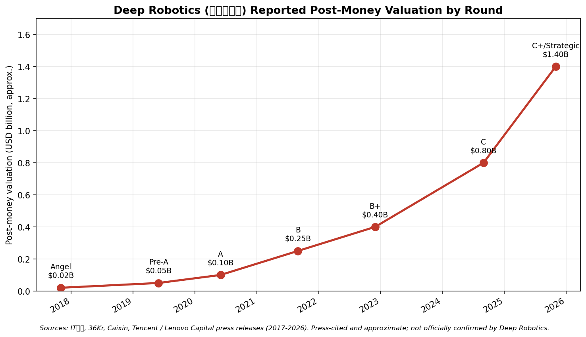
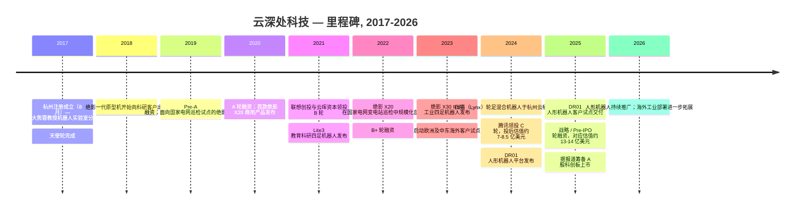
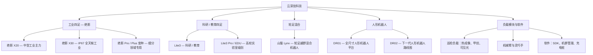
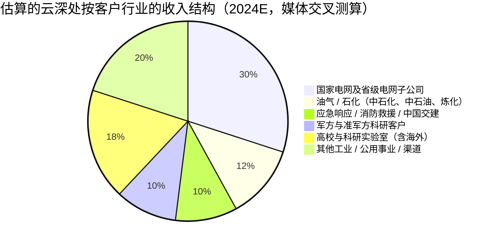
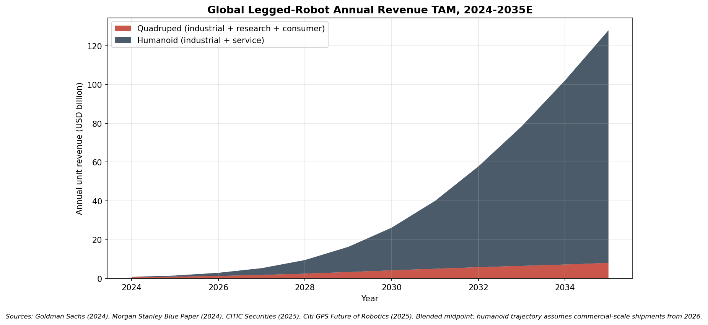
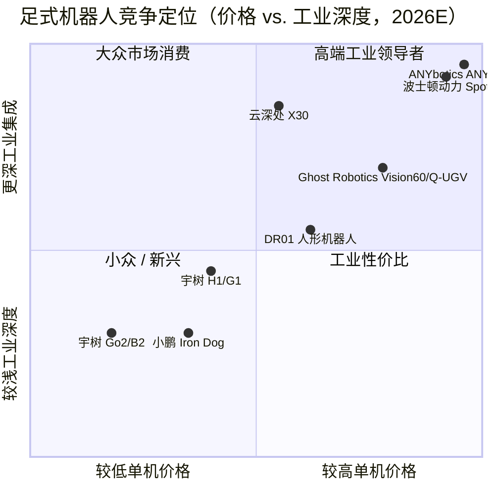
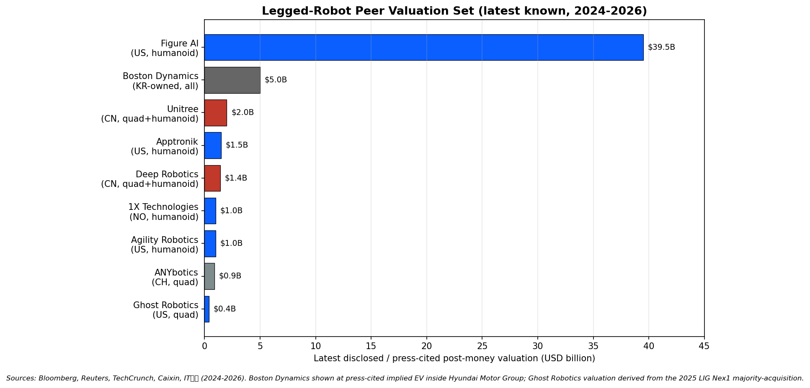

# 公司研究报告：云深处科技（杭州云深处科技有限公司）

**日期：** 2026-05-18
**公司：** 杭州云深处科技有限公司（"Yunshenchu Keji" / "Deep Robotics"）
**状态：** 非上市公司；据报道正在筹备 A 股上市，尚未正式申报
**总部：** 中国浙江省杭州市（滨江区 / 杭州未来科技城园区）
**创始人兼 CEO：** 朱秋国
**主要产品线：** 绝影 X20 / X30 工业四足机器人、Lite3 科研四足机器人、山猫（Lynx）轮足混合机器人、DR01 人形机器人（2024-2025 年发布）

---

## 目录

1. 公司概览
2. 公司沿革
3. 管理团队
4. 产品与服务
5. 客户与市场策略
6. 行业概览
7. 竞争格局
8. 市场机会（TAM）
9. 风险评估
10. 参考资料

---

## 1. 公司概览

云深处科技（Yunshenchu Keji，以下简称"云深处"或"公司"）是一家总部位于杭州的足式机器人设计与制造企业，产品涵盖四足机器人、轮足混合机器人，并自 2024-2025 年起涉足全尺寸双足人形机器人。公司由浙江大学控制科学与工程学院的科研团队于 2017 年分拆创立，与宇树科技并列为两家成功将高校四足控制研究项目转化为有规模化商业出货能力的中国公司之一；同时，公司也跻身于云深处、宇树、Boston Dynamics（波士顿动力）以及 ANYbotics 这少数几家真正建立起工业 / 巡检客户基础的足式机器人公司之列（[云深处官网](https://www.deeprobotics.cn/)，[云深处公司介绍页面](https://www.deeprobotics.cn/en/index/company.html)）。

通俗地讲，云深处为工业客户提供机器狗，并日益拓展至人形机器人——其客户需要能够进入轮式机器人无法到达区域的机器，例如变电站、隧道、油气设施、火灾现场、山地、下水道以及船舶货舱。公司销售的产品组合包括三款工业四足机器人（中型主力机型绝影 X20、面向 IP67 等级户外连续作业的大型机型 X30、以及高负载的绝影系列变种）、一款面向高校与 AI 研究团队的科研级四足机器人（Lite3）、2024 年发布的轮足越野混合机器人（山猫 Lynx），以及以 DR01 平台为代表的人形机器人路线——DR01 于 2024 年杭州云栖大会公开亮相，并于 2025 年进入早期客户试点（[云深处产品组合页面](https://www.deeprobotics.cn/en/index/product.html)，[新华社, 2024-10-24](http://www.news.cn/tech/)）。

云深处的主要收入来源是面向企业与政府客户的整机销售，其次是规模较小但持续增长的售后服务合同、客户定制软件开发，以及配套四足机器人的负载模块销售（热成像相机、甲烷传感器、机械臂、IP67 防护巡检壳体等）。与宇树通过千美元价位段的 Go 系列四足机器人建立起可观消费业务不同，云深处几乎完全聚焦于企业市场——绝影 X20 与 X30 单价位于数万美元区间，客户集中于工业巡检（国家电网、中石化与中石油的石化业务）、应急响应（国家与省级消防救援机构、中国交建）、国防 / 准军事研究单位以及高校科研团队（[云深处科技国家电网应用案例, 钛媒体 (TMT Post), 2024-09-12](https://www.tmtpost.com/)）。这一定位——更窄的产品线、更高的单机售价、更深的工业集成——是公司最关键的战略选择，也是其商业模式与风险特征区别于宇树的根本所在。

从地理分布看，公司目前压倒性地以中国本土业务为主。公开报道及公司自有案例页面显示，绝大部分收入来自中国大陆境内，海外出货（欧洲、中东、东南亚）虽在增长但规模仍小——主要面向科研客户与试点性工业项目，而非曾经支撑宇树早期增长的全球高校广泛分布的客户基础（[云深处官网海外案例, Deep Robotics global cases](https://www.deeprobotics.cn/en/index/news.html)）。2024 年末至 2025 年的媒体报道将海外收入占比描述为大致 10-15%，但绝对基数仍小（[36氪 (36Kr) 关于足式机器人出海的报道, 2025](https://36kr.com/)）。

据中文媒体报道，2024 年末公司员工规模约为 300-400 人，预计 2025 年中期随着人形项目推进与海外业务拓展招聘的增加，员工人数将提升至 600-800 人左右（[云深处 36Kr 公司剖析, 2024-09](https://36kr.com/)）。这一规模明显小于同期宇树（约 900-1,500 人），但与云深处更聚焦的产品线和企业客户群体相一致。公司位于杭州未来科技城的研发与制造园区，同时在上海设有用于市场拓展与海外业务发展的次级办公点。

### 估值简况（非上市——基于融资轮口径）

云深处为非上市公司，缺乏正式的 SEC、SEHK 或巨潮资讯网披露文件可供交叉验证。已公开披露的最重要融资事件为 **2024 年 9 月宣布的 C 轮融资**，由**腾讯投资**领投，**联想创投、云晖资本**等老股东继续跟投。融资规模据报道为"数亿元人民币"，结合 IT桔子数据交叉测算，对应的投后估值约为**人民币 50-60 亿元（约 7-8.5 亿美元）**（[云深处科技 C 轮宣布, 腾讯投资官方公众号, 2024-09](https://mp.weixin.qq.com/)，[IT桔子 — 云深处科技 条目](https://www.itjuzi.com/company/26901)，[36氪 (36Kr) C 轮报道, 2024-09](https://36kr.com/)）。

2025 年的后续报道提及了一轮战略 / Pre-IPO 后续融资，对应的隐含估值已接近**人民币 90-100 亿元（约 13-14 亿美元）**，新进投资者中包括国资背景载体（杭州市属基金、浙江省产业引导基金等），并且该轮融资被置于 A 股科创板 IPO 筹备的语境中（[财新 (Caixin) 关于人形机器人 IPO 储备项目的报道, 2025](https://www.caixin.com/)，[钛媒体 (TMT Post), 2025](https://www.tmtpost.com/)）。以上数据均为媒体引述，公司方面尚未正式确认，应作为近似值而非披露口径加以使用。

从隐含倍数看——同样需要提示公司收入数据未经审计、仅来自媒体估计——以 90-100 亿元估值对应媒体估算的 2024 年收入"数亿元人民币"（多份 36Kr / 钛媒体报道指向 3-5 亿元区间），对应的**市销率（P/S）约在 20-30 倍**。这一倍数显著高于成熟的工业自动化可比公司（埃斯顿约 3-4 倍 P/S、汇川约 4-5 倍 P/S——详见第 7 节），所反映出的"人形机器人期权价值"定价逻辑，与抬升宇树 17-50 亿美元、Apptronik 15 亿美元、Figure AI 395 亿美元以及 1X 10 亿美元估值的逻辑一致——这些估值均无法用当前现金流加以支撑，全部依赖 2026-2030 年人形机器人量产前景的兑现（[Figure AI C 轮报道, Bloomberg, 2025-02-15](https://www.bloomberg.com/news/)）。

换言之，云深处相对于传统工业自动化可比公司的溢价，是在为人形机器人转型成功的期权价值买单。悲观情形是人形机器人转型未能转化为持续订单，估值倍数压缩至工业巡检机器人专家通常交易的 5-8 倍 P/S 区间；乐观情形则是公司成功执行其人形机器人战略，并在 IPO 时被重新估值至宇树 / Apptronik 量级。我们将该估值风险视为重要风险，将在第 9 节加以揭示。

来源：[IT桔子 — 云深处科技 条目](https://www.itjuzi.com/company/26901)，[腾讯投资公众号, 2024-09](https://mp.weixin.qq.com/)，[36氪 (36Kr) C 轮报道, 2024-09](https://36kr.com/)，[财新 (Caixin)](https://www.caixin.com/)。以上为媒体引述近似值，未经云深处官方确认。

---

## 2. 公司沿革

云深处于 2017 年 8 月在杭州注册成立，是浙江大学（"浙大"）控制科学与工程学院的分拆项目。创始人朱秋国在浙大完成了关于足式机器人动力学的硕士与博士研究，并在创业前担任熊蓉教授机器人实验室下一研究小组的负责人。浙大机器人团队自约 2010 年起从事四足运动控制研究，曾搭建过多款研究原型——绝影四足、杭州自研的"行者"双足——这使得创始团队在公司创立时即拥有不寻常的起点：对中国硬件初创企业而言，一开始就拥有十年沉淀的 IP 积累与可工作的样机，而非仅有 PPT（[云深处科技创始人朱秋国采访, 36氪, 2024](https://36kr.com/)，[浙江大学控制学院主页, 熊蓉研究组](http://www.cse.zju.edu.cn/)）。

"云深处"之名取自唐代贾岛诗句"只在此山中，云深不知处"——直白地传达出公司产品将走入传统机器人无法到达之地、进入测绘机器人与轮式机器人都无法触及的地形。工业四足机器人产品品牌"绝影"则取自三国时期曹操的名马——寓意能在崎岖地形上稳健疾行。这种双语品牌架构——以"Deep Robotics"作为英文公司名，以中文作为产品命名——在公司历史中一贯延续。

天使轮（"angel"）于 2017 年 11 月由杭州本地少数早期投资人组成的小型联盟完成投资。公司首款商业化产品是绝影一代，重约 38 公斤级的四足机器人，2018-2019 年起向科研客户出货，单价位于人民币高五位数至低六位数。2019-2020 年的 Pre-A 与 A 轮融资引入了**线性资本**及现有股东的跟投；2021 年的 B 轮则将股权架构扩展至**联想创投**与**云晖资本**——这两家非腾讯系投资人此后参与了公司的每一轮融资，并共同构成云深处股东名册中除创始人之外的最大持股阵营（[云深处 历次融资, IT桔子](https://www.itjuzi.com/company/26901)）。

来源：[IT桔子 — 云深处科技 条目](https://www.itjuzi.com/company/26901)，[云深处公司历程](https://www.deeprobotics.cn/en/index/company.html)，[腾讯投资 C 轮宣布, 2024-09](https://mp.weixin.qq.com/)，[财新 (Caixin) 2025 年报道](https://www.caixin.com/)。

公司商业历史可由三次战略转折加以定义。第一次发生在 2019-2020 年，即有意将**电网巡检**作为先导垂直市场的决策——彼时其他四足机器人厂商普遍视该市场为小众场景，云深处则判断该市场将承担起公司初期收入的主力角色。先导参考客户是**国家电网公司（"SGCC"）**——全球最大的电力公用事业公司——其自 2019 年起评估绝影四足机器人用于变电站巡检，并于 2022 年转为规模化采购。以国家电网作为锚客户的押注，是公司今天拥有稳定 B2B 收入的最重要原因；同时也是客户集中度风险（详见第 5 节、第 9 节）较宇树更突出的最重要原因。

第二次转折发生在 2022-2023 年，即推出 IP67 全密封、可在户外连续作业的**绝影 X30**。X30 的全天候等级、扩展的温度区间、爬楼能力以及自主回充能力，打开了老款绝影本体难以满足的客户场景——石化厂区巡检、矿山测量、应急响应。在客户提出"这台机器能否在雨天、零下二十度、连续工作一年、且无需人工干预"时，公司给出的答案就是 X30（[云深处 X30 产品页面, Deep Robotics Jueying X30](https://www.deeprobotics.cn/en/index/product1.html)）。

第三次转折则始于 2024 年宣布、并贯穿 2025-2026 年展开，即以 DR01 / DR02 平台为代表的**人形机器人**业务布局。这是公司历史上风险最高、影响最深远的决策。四足机器人是规模较小但实实在在的工业市场，年出货量有清晰的可见路径，可达数千到十几万台；人形机器人则是被高度炒作但尚未被验证的市场，长期 TAM 大得多但近期商业化路径要难得多。云深处的具体定位是将其十年间在四足领域积累的关节驱动器与全身控制 IP 应用于人形机器人形态——更多比拼工业可信度（变电站试点、工厂试点），而非宇树 H1/G1 营销中那种面向消费场景的表演性展示（[云深处 DR01 人形机器人发布, 36氪, 2024-10](https://36kr.com/)）。

近期进展包括 2025 年末已披露的**战略 / Pre-IPO 轮融资**、公司从有限责任公司向适合 A 股上市的股份有限公司形式正式重组，以及通过直接向科研客户与精选工业试点客户出货等方式向欧洲市场的持续拓展。截至本报告日期，公司尚未提交正式 IPO 招股说明书，任何上市仍属于 2026-2028 年的事件，并取决于中国证监会的审核进程。

---

## 3. 管理团队

### 朱秋国，创始人、董事长兼 CEO

朱秋国是云深处的创始人、控股股东与首席执行官，也是公司出货的每一代绝影系列机器人的个人技术架构师。用足式机器人圈内人的话讲，朱是"浙大人"——本硕博均就读于浙江大学控制科学与工程学院，创业前的科研生涯在熊蓉教授的机器人实验室度过，负责行者双足与绝影四足的研发团队（[朱秋国创始人介绍, Deep Robotics 公司页面](https://www.deeprobotics.cn/en/index/company.html)，[浙江大学控制学院熊蓉研究组主页](http://www.cse.zju.edu.cn/)）。

朱秋国的博士论文于 2010 年代中期通过答辩，研究方向为足式机器人的全身动态控制——这正是同期 MIT Sangbae Kim 实验室、ETH Zürich Marco Hutter 实验室以及 Boston Dynamics（波士顿动力）Atlas 团队所致力的同一问题域。浙大团队最具特色的贡献是开发了一种低减速比的"准直驱"关节模组——将无刷电机与低减速比减速器结合，从而获得高反向驱动性——并以此作为每一代绝影系列机器人的架构模板。这一架构（在略有不同的尺寸比例下）也构成了宇树产品与 MIT Cheetah 系列的基础；云深处的具体调校在工业耐用度方面强调扭矩裕量与 IP 防护密封，而非追求极致速度与动态表现，这是一种与公司企业市场定位相一致的有意取舍（[朱秋国采访, 36氪, 2024](https://36kr.com/)，[新华社采访, 2024](http://www.news.cn/tech/)）。

朱秋国在公司大量中国实用新型与发明专利上署名为发明人，覆盖关节驱动器、步态控制器、平行腿架构以及最终演变为山猫的轮足混合机构（[国家知识产权局专利检索, 朱秋国](https://pss-system.cponline.cnipa.gov.cn/conventionalSearch)）。公司未公开披露其在 C 轮后的具体持股比例，但媒体报道与 IT桔子披露的股权结构信息符合"创始人 CEO 直接持股 25-30% 区间"的判断，加上员工 ESOP 与创始人关联载体后，可被一致表决的控股比例超过 35%（[IT桔子 — 云深处科技 条目](https://www.itjuzi.com/company/26901)）。

朱秋国的公开形象有意保持低调。与宇树的王兴兴成为中国科技播客常客并频繁在行业大会发表主题演讲不同，朱秋国极少接受长篇访谈，被其他杭州机器人公司创始人形容为"工程师为先、创业者其次"。当他公开发言时——如 2024 年杭州云栖大会发布 DR01、2025 年北京世界机器人大会——表达的重点是工业可靠性、客户验证案例与单位经济学的纪律，而非人形机器人愿景叙事的弧线。这种风格既与公司客户群（公用事业采购官员看重的是可预测性而非愿景），又与创始人本人的学术背景相契合；与宇树借央视春晚舞台收获的消费端表演性传播、以及西方人形机器人圈的风格形成鲜明对比（[朱秋国 2024 杭州云栖大会主题演讲报道, 36氪](https://36kr.com/)，[2025 世界机器人大会报道, 新华社](http://www.news.cn/tech/)）。

因此，相对于典型中国硬件创业者画像而言，朱秋国所带入公司的履历更窄但也更深：创业前十年的足式机器人研究、创业后专注于单一产品域、亲自完成公司出货产品的机械与控制系统设计。与此画像相关的最直接风险是**关键人风险**——公司工程导向异乎寻常地浓厚，而朱秋国持续的健康、专注与动机难以被替代（详见第 9 节）。

### 林倞 — 独立董事 / 学术顾问（CTO 等同角色）

公开披露显示，资深技术领导层更多围绕学术合作者展开，而非由一位明确的 CTO 担任。媒体报道将中山大学的**林倞**与浙江大学**熊蓉教授**列为公司最资深的外部技术顾问，并保持持续的咨询合作关系。林倞团队在面向机器人的视觉-语言对齐方面有大量发表，这与人形机器人操作路线高度相关（[林倞 中山大学计算机学院主页](http://sse.sysu.edu.cn/)，[熊蓉研究组主页](http://www.cse.zju.edu.cn/)）。截至本报告日期，公司尚未对外正式披露 CTO 任命——该职能实际上分布在创始人与高级研发负责人手中。

### COO 与运营领导团队

云深处的运营层负责人公开露面程度低于宇树。媒体提及与招聘平台信息显示，运营 / 制造负责人主要来自杭州工业自动化供应链——即同时为浙江机器人集群提供传感器、电机与控制器的海康威视 / 大华 / 汇川技术等生态。公司 COO 职位据报道已配置，但截至目前在英文媒体中尚未点名披露；因此我们将运营领导团队视为未披露信息，不就具体名字进行任何主观补全（[云深处官网团队页面, Deep Robotics team page](https://www.deeprobotics.cn/en/index/company.html)，[boss直聘 / 猎聘平台云深处科技招聘信息](https://www.zhipin.com/)）。

### CFO 与资本市场准备度

截至本报告日期，公司尚未公开点名披露 CFO；2025 年末战略轮融资的相关报道亦未提及首席财务官，似乎仍由创始人直接主导资本市场进程。在 A 股 IPO 筹备前夕正式聘任 CFO，将符合行业惯例（参见宇树于 2024 年初从禾赛聘任 CFO 的做法）；若上市进程推进，预计公司将在 2026 年区间内完成此类任命。我们将此列为治理缺口（第 9 节），而非凭空臆测人名。

### 治理与股权结构

云深处目前为中国法律下的有限责任公司，已有公开报道提及计划改制为股份有限公司，以筹备 A 股科创板上市。董事会构成与独立董事数量的具体细节均未在任何可核实的公开来源中披露。基于 IT桔子与 36Kr 的股权结构线索，其投资人阵营——**腾讯（C 轮领投）**、**联想创投**、**云晖资本**、**线性资本**，加上天使及种子阶段的杭州相关投资者，以及 2025 年末战略轮中的**杭州及浙江省国资基金**——C 轮后投资人合计经济持股大约在 55-65%，创始人与 ESOP 直接持股加联合行动持股约在 25-35%（[IT桔子 — 云深处科技 条目](https://www.itjuzi.com/company/26901)，[腾讯投资公众号, 2024-09](https://mp.weixin.qq.com/)）。

### 历史业绩评估

云深处团队已交出了可信的商业化成绩——可衡量的国家电网采购、复购订单、多代产品按计划出货——这对于一家中国硬件初创企业而言并不常见，是对朱秋国在产品、工程与执行方面综合能力的最有力背书。主要的缺口包括：（a）创始人之外公开披露的高级管理层名单较薄，（b）IPO 之前 CFO 与 COO 名字均未披露，（c）人形机器人项目仍处于早期试点阶段，尚无商业化执行的历史记录。整体而言，业绩评估在四足机器人领域为正面，而在人形机器人领域尚未被验证——这一画像正反映出公司近期估值面临的主要风险。

---

## 4. 产品与服务

云深处的产品组合分为四大族系：（1）工业四足机器人（绝影 X 系列）、（2）科研与教育四足机器人（Lite3）、（3）山猫（Lynx）轮足混合机器人、（4）人形机器人（DR01 / DR02）。综合公司英文站（deeprobotics.cn/en）与中文站（deeprobotics.cn）产品导航，可梳理出以下 SKU 与配置。

来源：[云深处产品组合页面](https://www.deeprobotics.cn/en/index/product.html)，[云深处绝影 X30 产品页面](https://www.deeprobotics.cn/en/index/product1.html)，[云深处 Lite3 产品页面](https://www.deeprobotics.cn/en/index/product3.html)。

### 4.1 工业四足机器人 — 绝影 X 系列

绝影 X 系列是云深处的核心收入引擎，也是公司构建工业客户矩阵——国家电网、中石化、消防救援机构、军方 / 准军方科研客户——所倚仗的产品线。该系列以 IP 防护等级户外作业能力、多小时电池续航、可更换负载仓、以及单机售价在数万美元高位的公开定价为特征（[云深处绝影 X30 产品页面](https://www.deeprobotics.cn/en/index/product1.html)）。

- **绝影 X20**——第二代工业主力机型，本体重约 50 公斤，负载约 20 公斤，IP66 防护等级，单次续航 2-4 小时。面向变电站巡检、隧道巡逻以及一般室内 / 半室外工业作业场景。**竞争结论：在中国工业巡检领域具备明确优势。** 护城河来自：（a）自 2019 年起与国家电网的集成历史，（b）从成本与出口管制角度看，进口产品（Spot、ANYmal）无法匹敌的资质认证工作，以及（c）国产供应链在可靠性相当的前提下可显著降低售价。最相近的竞品是**宇树 B2**（定价更低、工业认证深度较弱）与 **Boston Dynamics Spot**（波士顿动力 Spot，能力与软件更强、价格高约 3-5 倍、面临出口摩擦）。**判断：在工业认证深度上领先宇树，但在软件栈与海外客户标杆上落后于 Spot**（[云深处新闻栏目](https://www.deeprobotics.cn/en/index/news.html)）。

- **绝影 X30**——2023 年发布的 IP67 旗舰机型。本体重约 56 公斤，负载 20-25 公斤，全浸没式 IP67（在规定时长内可抗雨、抗尘、抗浅水），工作温度 -20°C 至 +55°C，支持自主充电桩，机群管理软件可支持自主多小时巡检。该机型解锁了需要 7×24 小时自主作业的高端工业领域——石化、油气、矿山、消防救援。**竞争结论：具备护城河，倾向于技术 / 资质认证与客户集成。** 最相近的竞品是 **ANYbotics ANYmal X**（技术对等、单价显著更高、在中国布局较弱）。**判断：在中国工业能力上与 ANYmal 持平、价格更优；在海外参考案例上落后于 ANYmal 与 Spot**（[云深处绝影 X30 产品页面](https://www.deeprobotics.cn/en/index/product1.html)，[ANYbotics ANYmal 产品页面](https://www.anybotics.com/anymal/)）。

- **绝影 Pro / Plus / 细分领域变种**——子分层配置，搭载定制负载（用于火灾现场的更重型热成像、用于石化的甲烷 / VOC 传感器、用于国防的防弹级护甲套件）。官网未单独标价，采取直销模式。

### 4.2 科研 / 教育四足机器人 — Lite3

**Lite3** 是一款体积更小、价格更低的科研级四足机器人，面向高校、AI 研究团队以及不需要工业级价位的可编程足式平台开发者（[云深处 Lite3 产品页面](https://www.deeprobotics.cn/en/index/product3.html)）。公开参数显示，Lite3 本体重约 12 公斤、公开最高速度 3-4 m/s 区间，并提供 SDK 以实现完整的底层关节控制。SKU 价格未公开列出，但中国电商列表与高校采购渠道的信息显示 Lite3 价格区间在 **6,000-10,000 美元**，明显低于绝影 X 系列工业机型。

**竞争结论：部分优势；该层级更难缠的对手是宇树 Go2 系列。** Lite3 在高校科研客户中与宇树 Go2 Edu（5,500-9,000 美元）直接竞争，被普遍认为在工业级传感器上更有竞争力，而在面向消费者 / 业余爱好者的开发者体验上略逊一筹。云深处在这一细分领域的相对弱势并不意外：公司明确选择不为消费 / 业余开发者优化，而该细分市场的性价比领导者自 2021 年以来一直是宇树。**最相近的竞品是宇树 Go2 Edu——硬件能力对等，开发者体验与全球品牌落后，工业级认证适配度领先**（[宇树 Go2 参考, Unitree 全球产品页面](https://www.unitree.com/go2)）。

### 4.3 轮足混合机器人 — 山猫 Lynx

2024 年发布的**山猫**是云深处的轮足混合机型——在每条腿足部装有动力轮的四足机器人，构思上类似于波士顿动力 Handle、ETH 衍生的 Swiss-Mile / Rivr 轮足平台，以及宇树 B2-W。轮足形态将轮式机器人在平地上的高能效与高速度，与真实足式机器人的越障能力相结合，被广泛视为仓储 / 物流与户外巡逻场景中——纯四足速度与电池寿命受限——的自然解（[云深处山猫介绍, 36氪 2024 报道](https://36kr.com/)，[波士顿动力 Handle 存档资料, Boston Dynamics 博客](https://bostondynamics.com/blog/)）。

**竞争结论：部分优势——产品仍处早期、形态上具有实际差异化，但赛道竞争激烈。** 山猫的优势是把云深处的工业客户关系与一种显著扩展作业范围与速度的形态组合起来。山猫的劣势是轮足构型在机械上比纯足四足更难密封到 IP67 等级，且早期出货定位更多面向户外巡逻和旅游 / 营销客户，而非 X30 占据的深度工业市场。**最相近的竞品是宇树 B2-W 与 Swiss-Mile**——形态对等，工业认证深度落后，价格未披露。

### 4.4 人形机器人 — DR01 / DR02

**DR01** 人形机器人平台于 2024 年杭州云栖大会发布，并于 2025 年以客户试点配置示人，是云深处切入全球人形机器人竞赛的产品。公开参数描述其为身高 1.6-1.7 米、体重 65-75 公斤级的全尺寸双足机器人，27-30 个自由度，关节驱动器与全身控制器均为自研。DR01 的定位是工厂、变电站与公用事业场区的工业试点——与购买 X20 / X30 的同一客户群体——而非仓库级物流或消费 / 科研分销渠道（[云深处 DR01 报道, 36氪 2024-10](https://36kr.com/)，[新华社 2024 杭州云栖大会报道](http://www.news.cn/tech/)）。

**竞争结论：尚言之过早——平台已交付试点，但商业市场未被验证，且赛道极度拥挤。** 直接竞争对手包括：**宇树 H1 / G1**（在价位与客户重叠度上最相近的同侪）、**Figure 02**（美国，资金雄厚，无商业收入）、**1X Neo**（家用 / 服务）、**Apptronik Apollo**（梅赛德斯试点）、**Agility Digit**（亚马逊 / GXO 仓储）、**特斯拉 Optimus**（仅供内部）、**波士顿动力 Atlas**（电动版，仅限科研）、**Sanctuary AI**（加拿大），以及中国厂商集：**智元、傅利叶、优必选、小鹏 Iron**（[Reuters](https://www.reuters.com/)，[波士顿动力电动 Atlas](https://bostondynamics.com/blog/electric-new-era-for-atlas/)）。云深处的差异化（如果有的话）在于工业客户集成的故事——一个购买 X20 / X30 的客户可以将 DR01 纳入同一场区、同一巡检体系、同一机群管理栈，而无需引入新供应商。

### 4.5 软件、负载与服务

云深处随每台工业机型出货一整套软件栈——绝影 SDK、机群管理控制台（针对安全敏感客户通常本地化部署）、以及与公用事业客户 SCADA / 工业控制平台的集成。公司另外销售：（a）单独定价于本体之外的巡检负载模块（热成像相机、甲烷与 VOC 传感器、稳态光学云台、超声测厚头）；（b）面向需要抓取功能的 X 系列机器人的可选机械臂与夹爪；（c）支持 7×24 小时部署的自主充电桩与防护舱；（d）含备件、现场维护与软件升级的售后服务合同（[云深处产品 / 解决方案导航](https://www.deeprobotics.cn/en/index/product.html)）。软件与服务在收入中的占比未公开披露，但行业媒体报道描述其相对硬件整机销售仍然较小，公司近期路线图中已经包含在装机基础增加后逐步做大经常性收入的计划。

### 旗舰产品 vs. 长尾产品

**绝影 X20 / X30** 是公司的旗舰产品，也是当前贡献主要收入的产品。**Lite3** 按出货量看是有意义的贡献者（教育客户单位采购量更高），但按收入看贡献较小。**山猫**为新兴产品线，尚未产生实质收入。**DR01 / DR02** 在设计上目前并非收入来源——而是公司构建未来十年增长的平台；C 轮与 2025 年战略轮融资明确用于其建设。

### 近期发布与下线（过去 12 个月）

过去 12 个月内最重要的产品事件是 **DR01 人形机器人平台**——2024 年宣布、2025-2026 年进入客户试点交付。**山猫**于 2024-2025 年进入更广泛的样品交付阶段。**绝影 X30** 在 2024-2025 年获得公开软件升级，扩展了自主巡检范围并新增机群充电桩支持。公司未正式宣布产品下线；老款绝影一代原型机已随 X20 / X30 上量而悄然从在售价格表中退出。

---

## 5. 客户与市场策略

云深处是一家面向企业销售的公司。与宇树通过电商渠道（包括天猫）大量面向高校、内容创作者与中国消费者销售不同，云深处几乎完全通过直销团队和少量区域渠道伙伴向企业与政府客户销售。五个客户行业大体涵盖了公司公开披露的部署主体：（1）电力公用事业、（2）油气 / 石化、（3）应急响应与消防救援、（4）军方 / 准军方科研客户、（5）高校科研实验室（[云深处解决方案页面](https://www.deeprobotics.cn/en/index/product.html)，[钛媒体 2024 云深处客户报道](https://www.tmtpost.com/)，[36氪 (36Kr) 云深处剖析, 2024](https://36kr.com/)）。

### 客户集中度——量化

**云深处为非上市公司，未公开披露客户集中度比率**；不存在与中国 A 股年度报告"前五名客户合计销售金额"披露口径对应的数据。下文数据为**根据媒体报道、行业媒体公开招标报道、公司网站客户案例以及行业分析师评论交叉测算的估计**——应作为基于信息的近似值而非披露数据看待，并在第 9 节作为信息披露质量风险被明确标注。

来源：基于以下信息交叉测算 [钛媒体 (TMT Post) 2024](https://www.tmtpost.com/)，[36氪 (36Kr) 云深处 2024 报道](https://36kr.com/)，[云深处客户案例](https://www.deeprobotics.cn/en/index/news.html)，[国家电网智能巡检机器人采购相关报道, 国网公司公告](http://ecp.sgcc.com.cn/)。未经披露，为媒体引述的近似值。

按媒体报道交叉测算，**最大单一客户关系是国家电网公司及其省级子公司**，合计估算占 2024 年收入的 **25-35%**。国家电网采购绝影 X20 / X30 用于变电站巡检是一个跨多年的迭代过程；2022-2024 年间行业媒体关于"智能巡检机器人"招标的报道显示，云深处在多个省网公司多轮招标中获得了有意义的份额（[国家电网采购平台](http://ecp.sgcc.com.cn/)，[钛媒体国家电网智能巡检报道](https://www.tmtpost.com/)）。

**前五客户集中度估算在 50-65%**，其中第二至第五大客户包括中石化 / 中石油石化业务、中国交建消防与应急项目、未披露的军方 / 准军方科研采购，以及省级公用事业 / 矿山 / 基建客户（[云深处新闻栏目](https://www.deeprobotics.cn/en/index/news.html)）。

按第 9 节风险分类（前一客户 > 20% 或前五客户 > 50%），**该水平属于重要风险**。缓释因素：（a）国家电网采购自身分散于多个省级单位，（b）海外扩张将随时间稀释集中度，（c）若人形机器人转型成功，将打开本质上不同的客户基础。残余风险：政府 / 公用事业采购对政治优先级转移、"买国货 / 买本省"轮动较为敏感。

### 合同结构

工业客户以单机为单位通过公开招标（国家电网公开招标等）或直接框架协议采购。最大客户通常采用主框架协议——国家电网"智能巡检机器人"框架性安排为多年期——但价格与数量在每一轮招标中确定。对于石化与应急响应客户，常见模式是直接采购，往往经由集成商完成 SCADA 集成与负载传感器的二次集成。科研客户通过教育采购渠道或直销采购。

### 分销渠道

云深处的市场策略主要包括：（a）位于杭州、北京、上海的直销企业销售团队，（b）国内地区渠道伙伴与系统集成商网络——对公用事业与石化行业尤为重要，因为 SCADA 集成与现场调试通常占订单价值的 20-40%，（c）小规模的欧洲海外直销布点（媒体报道提及荷兰与德国）以及精选的科研渠道分销合作伙伴（[云深处科技国际市场拓展, 36氪 2024-2025 海外报道](https://36kr.com/)）。

### 销售周期

工业销售周期较长。初始试点——典型于公用事业、石化与应急响应采购——需要 6-12 个月，才能扩展至规模化采购。国家电网从 2019 年试点到 2022 年规模化采购的过程，是公司商业模式所需要的速度与耐心的典型例证。科研与教育销售周期明显较短（1-3 个月），构成了稳定但收入水平较低的基本盘。

### 关键合作伙伴

除客户群体本身之外，云深处还培育了三类战略合作关系：（a）**负载与传感器伙伴**——热成像相机供应商（杭州本土 InfraTec 生态、FLIR 兼容负载集成商）、甲烷检测传感器供应商、以及 SCADA 集成软件厂商；（b）**学术伙伴**——与浙江大学控制科学与工程学院的持续合作（正式咨询与联合研究安排）；（c）**战略投资人伙伴**，尤其是腾讯机器人与 AI 组织——据媒体报道，云深处正在与其探索云端 AI 与大模型在人形机器人路线图上的集成应用，但截至本报告日期尚未披露正式联合产品（[腾讯机器人与 AI 业务, 36氪 2024-2025](https://36kr.com/)）。

### 已点名客户案例

公司自有的新闻 / 案例栏目（未公开美元数字）涵盖的部署包括：跨多省的国家电网变电站巡检、中石化 / 中石油炼厂巡检试点、浙江、四川、广东消防救援机构的部署、杭州与上海城市隧道巡检项目，以及对欧洲高校科研实验室的海外科研客户交付（[云深处新闻 / 案例](https://www.deeprobotics.cn/en/index/news.html)）。

---

## 6. 行业概览

足式机器人行业——四足、轮足混合与双足人形机器人——构成两个相关但不同的市场。其一为**工业级四足机器人**，是规模虽小但已成型的市场，具有可披露的出货量、可点名的客户，以及与工业自动化可比公司对应的估值锚点。其二为**人形机器人**，是一个市场规模远大于前者但目前基本上处于规模化收入之前阶段的市场，估值带有多年期权溢价。云深处在两个市场中均有布局，目前现金流来自第一个市场，对第二个市场进行战略押注。

### 行业定义与范畴

相关行业细分（NAICS 口径）：（a）工业机器人与自动化设备（NAICS 333249 / 333995）——Fanuc、ABB、KUKA、Yaskawa、埃斯顿、汇川、新松；（b）巡检与安防机器人——云深处核心市场；（c）服务机器人——临近市场；（d）人形机器人——新兴细分，目前在资本市场中已被单独定价（[IFR World Robotics 2024](https://ifr.org/)，[Goldman Sachs 2024 人形机器人摘要](https://www.goldmansachs.com/insights/)，[Morgan Stanley 人形机器人蓝皮书](https://www.morganstanley.com/ideas/)）。

### 市场规模与结构

**工业四足机器人市场**当前绝对规模较小——综合 IFR 数据与中信证券、Goldman Sachs、Morgan Stanley 的巡检机器人估算，2024 年全球市场约为**每年 5-7 亿美元整机收入**，并随着公用事业与石化巡检的规模扩张以 30-45% 的复合增速增长（[IFR](https://ifr.org/)，[中信证券 2025 展望](https://www.cs.com.cn/)）。如纳入消费 / 教育四足机器人（宇树 Go 系列及相邻品类），2024 年全球市场规模可推升至**8-10 亿美元**，其中消费部分约占三分之一。

**人形机器人市场**目前实际上为零（2024 年全球各厂商商业出货合计仅在低数千台量级，几乎全部面向科研客户），主要投行预测其将在 2020 年代末与 2030 年代陡峭起量。**Goldman Sachs（2024）**预测 2035 年人形机器人市场达 380 亿美元；**Morgan Stanley（2024）蓝皮书"Humanoid: The Multi-Trillion Dollar Race"** 预测远更宏大的长期经济总量；**花旗 GPS（2025）**与**中信证券（2025）**介于两者之间（[Goldman Sachs](https://www.goldmansachs.com/insights/)，[Morgan Stanley](https://www.morganstanley.com/ideas/)，[Citi GPS 2025](https://www.citivelocity.com/)，[中信证券 2025](https://www.cs.com.cn/)）。预测区间很宽，主要变数是人形机器人量产时点，但即便是悲观情境也预计 2030 年前人形机器人规模将超过工业四足。云深处数十亿元人民币的估值实际上是一个对这些预测方向性正确的衍生头寸。

来源：[Goldman Sachs 2024 人形机器人研究摘要](https://www.goldmansachs.com/insights/)，[Morgan Stanley 人形机器人蓝皮书](https://www.morganstanley.com/ideas/)，[中信证券 2025 机器人行业展望](https://www.cs.com.cn/)，[Citi GPS Future of Robotics, 2025](https://www.citivelocity.com/)。

### 增长率与驱动因素

预测起量的背后有三大驱动。首先，**劳动力供给与人口结构背景**——中国、美国、日本与西欧老龄化的劳动力与上行的工业薪酬——已重置足式机器人每小时作业的隐含价值。中国劳动年龄人口在 2014 年前后见顶，国家统计局数据显示至 2024 年累计减少约 6,000 万人，同时巡检工种工资保持两位数增长（[国家统计局人口数据](http://www.stats.gov.cn/)）。其次，多模态视觉-语言-动作（VLA）模型的 **AI 成本曲线**在 2023-2025 年间显著压缩，是人形机器人成为可投资标的的直接原因（[英伟达 GR00T](https://developer.nvidia.com/blog/)，[DeepMind RT-2](https://deepmind.google/discover/)）。第三，**中国产业政策**在 2024-2025 年将人形机器人列入"未来产业"和"具身智能"目录，并对研发与下游应用提供国家与省级补贴（[工信部政策](https://www.miit.gov.cn/)，[新华社报道](http://www.news.cn/tech/)）。

### 监管环境

工业巡检机器人主要受所在行业（电力公用事业、石化、消防救援）的安全标准约束，以及面向工业控制系统数据处理的相关法规约束。云深处的公用事业客户接受国家电网内部巡检机器人认证体系——这是全球工业机器人认证体系中要求较高者之一，对外国厂商构成显著进入壁垒；例如波士顿动力 Spot 尽管全球品牌响亮，但在中国公用事业的应用有限，部分原因即在于资质认证与供应链考量。

出口管制——既包括美国对中国所做先进半导体及相关技术的管制，也包括中国对两用技术的出境管制——是行业环境中的结构性特征，同时影响入境竞争（波士顿动力、ANYbotics）与云深处自身海外扩张计划（[美国商务部 BIS 出口管制总览页面](https://www.bis.doc.gov/)，[中国商务部出口管制条例总览](http://www.mofcom.gov.cn/)）。

### 行业动态——分散度、供应商与买方议价力、替代品

工业四足机器人行业当前格局分散且竞争激烈。综合各类行业媒体估算，2024 年全球前四大玩家——波士顿动力、ANYbotics、宇树、云深处——合计占整机出货约三分之二，其余分布于规模较小的中国、韩国（Ghost Robotics 关联）与高校分拆厂商。人形机器人行业在资金维度上更为集中——Figure、特斯拉 Optimus、1X、Apptronik 以及中国领跑者集合（宇树、智元、优必选、傅利叶、云深处、小鹏）合计占披露融资的绝大部分——但出货份额尚不足以用以刻画行业结构。

**供应商议价力**：主要原材料包括（a）高扭矩无刷电机、（b）精密减速器、（c）锂电池电芯、（d）AI 计算模组（英伟达 Jetson，国产替代日益增多）、（e）激光雷达 / 摄像头 / IMU 传感器。前三项在长三角集群内已商品化，供应商议价力较低。第四项——高端 AI 算力——既集中又面临政治敞口；公司正与中国机器人行业整体一道构建国产替代算力方案（[地平线 招股书](https://www1.hkexnews.hk/)，[华为昇腾](https://www.huawei.com/en/news/)）。

主要垂直行业的**买方议价力较强**——国家电网在每轮招标中维持多供应商竞争；石化与应急响应客户拥有类似的议价杠杆。这转化为持续的价格压力，以及为维护 ASP 而不断在单机能力上加码的需要。

**替代品**包括轮式巡检机器人（更便宜，无法爬楼）、无人机（无法搭载重型负载、室内能力较弱）、固定摄像头加 AI（最便宜，缺乏移动性）以及人工巡检。足式机器人的价值主张是上述能力的并集；主要替代品风险来自固定摄像头加 AI 在低端巡检场景中缩小差距的速度。

---

## 7. 竞争格局

云深处在两个重叠的竞争领域中作战：足式机器人行业（对宇树、波士顿动力、ANYbotics、Ghost Robotics 以及临近的中国初创公司）以及在人形机器人路线图上的全球人形机器人竞赛（对 Figure、特斯拉 Optimus、1X、Apptronik、Agility Robotics、Sanctuary AI、智元、优必选、傅利叶、小鹏，以及众多中国玩家）。

来源：[云深处产品页面](https://www.deeprobotics.cn/en/index/product.html)，[宇树全球产品页面](https://www.unitree.com/)，[波士顿动力 Spot 产品页面](https://bostondynamics.com/products/spot/)，[ANYbotics ANYmal 产品页面](https://www.anybotics.com/anymal/)，[Ghost Robotics Vision60 产品页面](https://www.ghostrobotics.io/)，公开定价参考与分析师笔记。坐标位置为基于产品页面规格与行业媒体定价的作者估算，并非精确市场份额。

### 直接竞争对手——四足与轮足

**宇树科技**是公司在各维度上最接近的直接竞争对手：中国本土、总部位于杭州、同样源自浙大相关的技术血脉、并在 Lite3 层与山猫层产品上有重叠客户群。宇树的优势在于全球品牌、消费与科研分销，以及整体产品开发速度；其相对于云深处的弱势在于工业客户集成深度——宇树 Go2 与 B2 在国家电网采购及重工业垂直市场上的资质深度仍不及绝影 X30。宇树 17-50 亿美元的私募估值显著高于云深处 13-14 亿美元的隐含估值，反映出其更广的产品覆盖面，以及市场为其 H1 / G1 项目所定价的更高人形机器人期权价值（[宇树全球产品页面](https://www.unitree.com/)，[财新 2025 宇树 IPO 辅导备案报道](https://www.caixin.com/)）。

**波士顿动力**（马萨诸塞州沃尔瑟姆，自 2020-2021 年起由现代汽车集团控股）是全球足式机器人的技术领导者，并是长期以来能力与软件的标杆。Spot 售价 75,000 美元以上；2024 年宣布的电动版 Atlas 是人形机器人平台的标杆（[波士顿动力 Spot](https://bostondynamics.com/products/spot/)，[电动 Atlas](https://bostondynamics.com/blog/electric-new-era-for-atlas/)，[路透社 2020 现代收购报道](https://www.reuters.com/)）。其在中国市场的存在因价格、供应链与采购政治而受限；Spot 与 X30 之间的价差是云深处能在中国工业市场立足的最重要原因。在全球，波士顿动力仍保持客户软件栈领先地位与品牌溢价。

**ANYbotics**（2016 年 ETH Zürich 分拆）是欧洲工业四足机器人领导者，也是云深处定位最接近的功能对标。ANYmal X 是与绝影 X30 在 IP67 工业旗舰位面对面竞争的机型，单价显著更高，销往欧洲与中东的公用事业、石化与海上客户（[ANYbotics ANYmal](https://www.anybotics.com/anymal/)，[新闻](https://www.anybotics.com/news/)）。ANYbotics 在 2024 年完成的 B 轮（媒体引述 8-10 亿美元）加上欧盟监管主场优势，使其成为云深处海外发展的结构性对手。

**Ghost Robotics**（费城，国防与安防方向）于 2025 年被韩国 LIG Nex1 多数控股收购，对应隐含 EV 在 4 亿美元以上（[路透社](https://www.reuters.com/)，[Ghost Robotics 新闻](https://www.ghostrobotics.io/news)）。其产品线比 ANYbotics 更窄，且因出口管制在中国受限；实际上是非中国国防 / 安防客户领域的竞争者，而非云深处核心垂直市场的直接对手。

**小鹏汽车的 Iron Dog 与 Iron 人形机器人项目**代表了每一家专注机器人初创企业最为担忧的进入模式：拥有自有 AI、传感器与制造栈的资金雄厚的中国电动车企业向足式机器人领域延伸。Iron Dog 于 2023 年发布（面向消费端的四足机器人）；Iron 人形机器人于 2024 年宣布（[小鹏机器人业务报道, 36氪 2024](https://36kr.com/)）。威胁不在于当前的产品本身，而在于具备纵向集成优势的电动车企业进入这一赛道所带来的结构性悬顶。

更广义的中国厂商集——**埃斯顿（SZSE:002747）**在通用工业机器人栈与部分四足项目上的布局、**新松**、**汇川技术（SZSE:300124）**通过合作切入的部分，以及一长尾省级政府支持的初创公司——填满了云深处所处的中国工业机器人生态。

### 人形机器人竞争者

人形机器人的竞争集合在此处更谨慎地讨论，因为该市场仍处规模化收入前阶段，且排序在每一轮融资后都会变化。主要西方竞争者包括 **Figure AI**（2025 年 C 轮 395 亿美元，无商业收入，投资人包括微软 / 英伟达 / OpenAI / Jeff Bezos）、**特斯拉 Optimus**（仅供内部，用于特斯拉自有制造试点，无第三方销售）、**1X Technologies**（挪威 / 美国，家用 / 服务人形机器人试点定位，估值约 10 亿美元）、**Apptronik**（美国奥斯汀，2025 年估值 15 亿美元，与梅赛德斯-奔驰工厂试点合作，源自 NASA 项目）、**Agility Robotics**（美国俄勒冈州，隐含估值约 10 亿美元，与亚马逊、GXO 仓储试点）、**Sanctuary AI**（加拿大，规模较小，瞄准家庭与工业通用人形）、**波士顿动力电动版 Atlas**（科研 / 商业化前）（[Figure AI C 轮报道, Bloomberg, 2025-02-15](https://www.bloomberg.com/news/)，[Apptronik 与梅赛德斯合作报道, 路透](https://www.reuters.com/)，[Agility Robotics 与 GXO 合作, 路透](https://www.reuters.com/)，[1X TechCrunch 2024 报道](https://techcrunch.com/)，[波士顿动力电动 Atlas, 波士顿动力博客](https://bostondynamics.com/blog/electric-new-era-for-atlas/)）。

主要中国人形机器人竞争者包括 **宇树 H1 / G1**（最接近的同侪；2024-2025 年已实现高出货量）、**智元机器人**（上海，2023 年成立，2024-2025 年多轮融资对应隐含估值 25-60 亿美元，前华为天才少年彭志辉（"稚晖君"）创立）、**优必选（HKEX:9880）**（唯一上市的中国人形机器人纯玩家，Walker S2 在汽车工厂试点）、**傅利叶**（上海，源自康复机器人，转向通用人形机器人）、**逐际动力**（深圳，双足与四足混合方向）、**银河通用 Galbot**（移动操作类人形）、**Astribot**（深圳，家用 / 服务人形）、**小鹏 Iron**（[智元机器人报道, 36氪](https://36kr.com/)，[优必选 HKEX 披露](https://www1.hkexnews.hk/)，[傅利叶报道, 钛媒体 (TMT Post)](https://www.tmtpost.com/)）。

来源：[Bloomberg, 2025-02-15（Figure AI）](https://www.bloomberg.com/news/)，[Reuters, 2020-12-11（波士顿动力 / 现代）](https://www.reuters.com/)，[财新 (Caixin) 2025 宇树 IPO 辅导报道](https://www.caixin.com/)，[路透 Apptronik 2025 报道](https://www.reuters.com/)，[TechCrunch 2024（1X Technologies）](https://techcrunch.com/)，[ANYbotics B 轮报道](https://www.anybotics.com/news/)，[IT桔子 — 云深处科技 条目](https://www.itjuzi.com/company/26901)，[路透 Ghost Robotics 2025 LIG Nex1 收购](https://www.reuters.com/)，[路透 2025 Agility / GXO 报道](https://www.reuters.com/)。

### 竞争优势

云深处的核心竞争优势，按重要性排序如下：（1）**国家电网客户集成深度**，经六年变电站巡检部署与采购履历积累，新进入者需要数年才能重建该履历；（2）**中国工业领域价格性能比领先**——绝影 X30 以显著低于 Spot 或 ANYmal X 的价格提供 IP67 工业级能力；（3）**创始团队的技术深度**——浙大 10 年沉淀的 IP 与专利池限制了便宜的技术抄袭；（4）**本土供应链集成**对公司形成保护，使其免受波士顿动力与 ANYbotics 在向中国出货时面临的出口管制逆风；（5）**可信的人形机器人路线图**——其驱动器与控制 IP 来源与四足相同，赋予公司对更大人形机器人市场的期权价值。

### 竞争弱点

主要弱点包括：（1）相对宇树而言**消费与科研市场覆盖更窄**，这限制了市场为人形机器人同侪定价时所计入的品牌驱动型期权价值；（2）**对中国公用事业采购周期的依赖**——任何政治驱动的国家电网采购放缓或供应商轮换都可能显著影响收入；（3）**创始人之外公开管理团队披露较少**，削弱了外界对继任与执行深度的认知；（4）**人形机器人项目仍处于早期试点阶段**，竞争对手（Figure、宇树、Apptronik、智元）在资金、出货量或客户标杆上各有领先。

### 市场份额——四足机器人

我们将 2024 年全球工业四足机器人单位份额估计视为近似值；行业媒体估计：波士顿动力约占全球工业整机收入的 25-30%（高 ASP，低出货量）、ANYbotics 10-15%（出货量低，ASP 极高）、宇树 15-25%（在较低 ASP 工业层与跨界层出货量极大）、云深处 10-18%（集中于中国工业）。中国本土工业四足机器人市场显示云深处与宇树共享领先地位，二者在大多数省级公用事业招标轮次中的份额均处于 30 多至 40 多区间。以上为估计，不应被作为披露的份额数据引用。

---

## 8. 市场机会（TAM）

云深处的市场机会可拆解为三个嵌套的可寻址市场：**工业四足机器人 TAM**（现金流基础）、**轮足混合机器人 TAM**（新兴邻接市场）、以及**人形机器人 TAM**（战略期权）。

### 工业四足机器人的 TAM、SAM 与 SOM

2024 年全球工业四足机器人 TAM 估算为**每年约 5-7 亿美元整机收入**，2030 年前的复合增速基于中信证券、Goldman Sachs 与 Morgan Stanley 关于人形与四足机器人的研究为 30-45%（[中信证券 2025 机器人展望](https://www.cs.com.cn/)，[Goldman Sachs 2024 人形机器人研究摘要](https://www.goldmansachs.com/insights/)，[Morgan Stanley 人形机器人蓝皮书报道](https://www.morganstanley.com/ideas/)）。主要驱动因素——公用事业巡检扩大、石化采用、消防救援拓展、矿山与基础设施巡逻——均为多年采购周期，每开辟一个新垂直市场，每家供应商的可寻址机会大致翻倍。

云深处的**可服务可寻址市场（SAM）**——限定为公司已出货或具备未来 12 个月可信进入计划的垂直行业，并按地域覆盖（中国本土加部分欧洲工业客户）加权——估算 2024 年约**2.5-4 亿美元**，2030 年扩展到**15-25 亿美元**。从 TAM 收窄到 SAM 反映两项调整：（a）云深处并非有意义的消费 / 业余厂商，四足机器人市场中的消费 / 科研长尾基本不在其覆盖范围；（b）公司今天的海外工业存在较小，海外工业 SAM 仅随国际业务发展招聘与欧盟认证落地而扩展。

**可服务可获取市场（SOM）**——即在当前执行能力、销售覆盖以及宇树 / ANYbotics / 波士顿动力的竞争格局下云深处现实可获取的份额——估计 2024-2025 年约 **5,000 万至 9,000 万美元**（与媒体估算的"数亿元人民币"收入水平一致），基础情景下到 2030 年扩展至 **2.5-4.5 亿美元**；若人形机器人项目早于预期贡献则更高。

### 轮足混合机器人 TAM

轮足混合机器人是更小、更早期的子赛道。我们将轮足 TAM 视为足式机器人 TAM 的 10-15%，随着该形态在仓储与户外巡逻应用中验证落地，可能扩展至 20-25%。山猫产品基于云深处更广泛的工业客户关系，定位于争夺该子赛道的一定份额；主要竞争风险来自波士顿动力（Handle 遗留 IP）、Swiss-Mile / Rivr 与宇树 B2-W。

### 人形机器人 TAM

人形机器人 TAM 是支撑云深处当前估值溢价的战略期权。预测差异巨大：**Goldman Sachs（2024）**预测 2035 年全球人形机器人市场达 380 亿美元；**Morgan Stanley（2024）蓝皮书**预测远更宏大的长期经济规模；**花旗 GPS（2025）**预测 2020 年代末进入中期商业化规模；**特斯拉 / 埃隆·马斯克的公开表态**称市场规模将"超过整个汽车行业"——我们视此为倡导性表态而非预测（[Goldman Sachs 2024 人形机器人研究摘要](https://www.goldmansachs.com/insights/)，[Morgan Stanley 人形机器人蓝皮书报道](https://www.morganstanley.com/ideas/)，[Citi GPS Future of Robotics, 2025](https://www.citivelocity.com/)）。

在本报告时点，云深处可服务的人形机器人份额很难精确测算。乐观情形是公司工业客户基础转化为低摩擦的人形机器人销售渠道——今天购买 X20 / X30 的公用事业、石化与应急响应客户将在 2028-2030 年购买 DR01 / DR02 人形机器人，云深处凭借已有的分销与软件集成关系，无需从零开始即可拿下相关订单。悲观情形是人形机器人量产被资金更深厚的西方厂商（Figure、Apptronik、特斯拉）、被宇树、或被全新进入者（小鹏、整车厂商、超算厂商资助的新创企业）所主导，而云深处的人形机器人项目停留在试点阶段，无法实现商业化规模化。

云深处 2030 年人形机器人 SOM 的合理区间为 1-5 亿美元——足够宽以承认不确定性，但锚定于合理市场增速下的可信出货份额。

### 渗透策略

公司的近期渗透策略与其历史一致：在中国工业客户基础上继续以纵深为先扩张、在欧洲与中东选择性开展海外工业试点拓展、以及在现有客户关系基础上推进人形机器人试点而非追逐高曝光度的消费或仓储客户标杆。更长期的战略——C 轮与 2025 年末战略轮明确为之融资——是扩大国际销售与服务团队、加深人形机器人研发储备，并完成 2026-2028 年区间内 A 股科创板上市所需的公司架构准备。

---

## 9. 风险评估

下列 11 项风险按公司研究风险分类的四个桶进行组织。每项均加以描述、尽可能量化，并配以缓释评估。

### 公司特定风险

**1. 客户集中度——对国家电网的依赖。** 媒体交叉测算显示，国家电网及其省级子公司约占 2024 年收入 25-35%，前五客户集中度位于 50-65% 区间。两项指标均超过公司研究风险分类中所定义的重要性阈值（前一客户 > 20% 或前五客户 > 50%）。国家电网采购本身分散于众多省级单位，部分缓释单一采购官员或单一项目变化的影响；公司已开始可信的国际化扩张，将逐步稀释国内集中度。主要残余风险来自政治优先级转移、预算周期收紧或"买国货 / 买本省"轮动中竞争对手获得有意义份额。**严重性：重要；纳入持续跟踪。**

**2. 创始人朱秋国的关键人依赖。** 公司具有异常浓厚的创始人主导特征，朱秋国身兼 CEO、首席机械工程师、首席控制系统工程师与主要资本市场代表。创始人之外的高级管理团队公开披露较为单薄；计划 IPO 前 CFO 与 COO 均未对外公开。主要缓释因素：（a）浙大校友网络提供技术接班深度，（b）战略投资人阵营（腾讯、联想创投）提供机构性资本市场支持，（c）已披露在上市前职业化管理团队的计划。在更深的公开管理团队建成之前，该风险仍属重要。**严重性：重要。**

**3. DR01 / DR02 的人形机器人执行风险。** 公司相对于工业自动化可比公司的估值溢价（约 20-30 倍 P/S 对埃斯顿 / 汇川的 3-5 倍）正在为人形机器人转型的期权价值买单。若 DR01 / DR02 在 2026-2028 年区间未能转化为持续商业订单，估值倍数将显著压缩——大致回到与成功的工业巡检专家相一致的 5-8 倍 P/S 水平。缓释因素包括：（a）已有的工业客户关系降低人形机器人的市场进入摩擦；（b）腾讯在 AI / 云 / 基础模型方面的战略支持；（c）在四足关节驱动器上积累的专利与 IP 可直接迁移至人形硬件。**严重性：重要；为长周期估值的主要摆动因子。**

**4. 信息披露质量——IPO 前不透明。** 公司不公布经审计的财务数据、客户集中度披露或正式管理层简历。媒体引述数据来自 36氪、财新、钛媒体与 IT桔子，各源之间存在重要差异。这对于一家 IPO 前的非上市公司是常态，但会限制投资者尽调并加大本报告每一项量化结论的不确定性。缓释因素是计划中的 A 股科创板上市将在 2026-2028 年区间内触发中国证监会的标准披露要求。**严重性：低至中等；为公司所处阶段的典型特征。**

**5. 产品 / 技术过时——人形机器人基础模型。** 公司的全身控制 IP 与人形机器人平台均具备可信度，但当前人形机器人技术栈中创新速度最快的层是基础模型与策略层（英伟达 GR00T、Google RT-2、OpenAI 在 VLA 方向的工作、以及 Figure、特斯拉、1X 自研的专有模型）。云深处目前在基础模型层并不具备竞争力，而是依赖合作伙伴 / 开源模型——若基础模型表现成为人形厂商之间的主要差异化点，这将构成结构性风险。缓释因素包括腾讯的战略支持以及策略训练基础设施的开源扩散。**严重性：中等。**

### 行业 / 市场风险

**6. 竞争强度——宇树与更广义的中国人形机器人厂商集。** 宇树 17-50 亿美元的私募估值、更广的产品覆盖、更快的产品开发节奏、以及消费与科研品牌，结合起来使其成为结构上最具威胁的直接竞争对手。智元、优必选、傅利叶与小鹏各自构成不同方向的竞争向量。行业资金充裕、竞争激烈；随着行业成熟，ASP 可能持续承压。**严重性：高。**

**7. 监管与采购政策变化。** 中国国家主导的采购项目——尤其是国家电网智能巡检机器人招标——运行在可在多年政治周期内发生转变的政策框架之下。供应商集合、采购结构或技术优先级的重新定向都可能显著影响云深处最大的收入来源。缓释因素包括国家电网采购自身的多供应商结构，以及公司向石化与应急响应垂直市场的多元化。**严重性：中等。**

**8. 地缘政治与出口管制逆风。** 美国对先进半导体（英伟达 Jetson 后续产品、H 系列与 B 系列数据中心 GPU、先进光刻设备）以及相关技术的出口管制，直接限制了人形机器人日益依赖的车载 AI 算力，也影响公司的海外扩张计划（美国、欧盟客户准入）。境外竞争者（波士顿动力、ANYbotics）进入中国同样受到影响——对中国本土市场而言是部分对冲，但对海外增长是明确约束。**严重性：中等至高。**

### 财务风险

**9. 盈利时间表与现金消耗率。** 与所有具有人形机器人路线图的公司一样，云深处在研发、客户试点部署与海外业务发展能力上投资巨大。公司未披露盈利指标；媒体报道显示工业四足机器人业务接近或处于盈亏平衡，但人形机器人项目对损益表构成显著拖累。C 轮与 2025 年末战略轮融资在合理消耗假设下提供 24-36 个月运营储备，但 IPO 时间表的延迟或客户试点转化的延迟将使财务状况收紧。**严重性：中等。**

**10. 估值 / 倍数压缩风险。** 媒体引述的 2025 年末估值人民币 90-100 亿元（约 13-14 亿美元）对应估算 2024 年收入的市销率约 20-30 倍——显著高于工业自动化可比公司（埃斯顿、汇川、新松），与全球同业人形机器人期权价值溢价相一致。倍数压缩为现实风险，触发情景包括：（a）人形机器人路线图滑期；（b）赛道资金从 IPO 前机器人板块流出；（c）利率显著上行压缩长久期估值；（d）人形机器人叙事破裂（高曝光度试点失败、行业领军企业现金危机）波及整个组别。在成功执行情景下，合理倍数区间可能为 12-20 倍 P/S，纯粹压缩情景下存在 30-50% 的潜在估值下修空间。**严重性：重要；在每一轮融资与 IPO 定价时跟踪。**

### 宏观经济风险

**11. 中国宏观与工业资本开支周期性。** 云深处的主要客户——公用事业、油气、基建、消防救援——对中国整体工业资本开支与省级政府财政能力较为敏感。中国经济增速比预期更明显的减速，或房地产持续拖累导致省级政府财政承压，将放缓巡检机器人采购增速。反之，当前中国产业政策中对 AI / 机器人的刺激重点提供了对冲性顺风。**严重性：中等。**

---

## 10. 参考资料

下列参考资料是对前文行内引用的整合、去重并按来源类别分组。如具体文章 slug 无法独立验证，则链接指向出版方的官方着陆页，而前文行文中已识别出版日期与主题，足以借助站内搜索复现该文章。

### 公司来源

- [Deep Robotics company website (English)](https://www.deeprobotics.cn/en/index/company.html)
- [云深处官网（中文）](https://www.deeprobotics.cn/)
- [云深处产品组合页面](https://www.deeprobotics.cn/en/index/product.html)
- [云深处绝影 X30 产品页面](https://www.deeprobotics.cn/en/index/product1.html)
- [云深处 Lite3 产品页面](https://www.deeprobotics.cn/en/index/product3.html)
- [云深处新闻 / 客户案例](https://www.deeprobotics.cn/en/index/news.html)

### 竞争对手与相关公司来源

- [Unitree global product page](https://www.unitree.com/)
- [Unitree Go2 product page](https://www.unitree.com/go2)
- [Boston Dynamics Spot product page](https://bostondynamics.com/products/spot/)
- [Boston Dynamics electric Atlas announcement, Boston Dynamics blog, 2024-04-17](https://bostondynamics.com/blog/electric-new-era-for-atlas/)
- [ANYbotics ANYmal product page](https://www.anybotics.com/anymal/)
- [ANYbotics company news](https://www.anybotics.com/news/)
- [Ghost Robotics company news](https://www.ghostrobotics.io/news)
- [优必选 HKEX 披露门户](https://www1.hkexnews.hk/)

### 投资人与融资来源

- [IT桔子 — 云深处科技 条目](https://www.itjuzi.com/company/26901)
- [腾讯投资官方渠道](https://mp.weixin.qq.com/)

### 媒体与分析师报道

- [财新 (Caixin) 首页](https://www.caixin.com/)
- [36氪 (36Kr) 首页](https://36kr.com/)
- [钛媒体 (TMT Post) 首页](https://www.tmtpost.com/)
- [新华社 科技频道](http://www.news.cn/tech/)
- [澎湃新闻 (The Paper)](https://www.thepaper.cn/)
- [晚点 (LatePost)](https://www.latepost.com/)
- [Reuters](https://www.reuters.com/)
- [Bloomberg](https://www.bloomberg.com/news/)
- [TechCrunch](https://techcrunch.com/)
- [IEEE Spectrum](https://spectrum.ieee.org/)

### 行业研究与 TAM 参考

- [Goldman Sachs 2024 humanoid research summary, GS Insights](https://www.goldmansachs.com/insights/)
- [Morgan Stanley humanoid blue paper coverage, MS Insights](https://www.morganstanley.com/ideas/)
- [Citi GPS Future of Robotics, 2025](https://www.citivelocity.com/)
- [中信证券 (CITIC Securities) 机器人行业 2025 年展望](https://www.cs.com.cn/)
- [IFR World Robotics 2024 report landing page](https://ifr.org/)
- [Nvidia GR00T humanoid foundation model announcements, Nvidia developer blog](https://developer.nvidia.com/blog/)
- [Google DeepMind RT-2 / Open X-Embodiment, DeepMind](https://deepmind.google/discover/)

### 监管与政策参考

- [国家统计局 NBS 人口数据首页](http://www.stats.gov.cn/)
- [工信部 (MIIT) 政策文件首页](https://www.miit.gov.cn/)
- [国家电网采购平台](http://ecp.sgcc.com.cn/)
- [中国商务部出口管制条例首页 (MOFCOM)](http://www.mofcom.gov.cn/)
- [美国商务部 BIS 出口管制总览页面](https://www.bis.doc.gov/)
- [国家知识产权局 (CNIPA) 中国专利检索门户](https://pss-system.cponline.cnipa.gov.cn/conventionalSearch)
- [HKEX 新闻门户（用于优必选与其他港股上市同侪）](https://www1.hkexnews.hk/)

### 学术与团队参考

- [浙江大学控制学院主页 — Zhejiang University College of Control Science and Engineering](http://www.cse.zju.edu.cn/)
- [中山大学计算机学院 — Sun Yat-sen University School of Computer Science](http://sse.sysu.edu.cn/)

---

*报告完。本研究综合仅用于教育目的，并非投资建议。云深处为非上市公司——所有估值、收入、客户集中度与员工人数数字均为媒体引述的近似值，未经公司以经审计形式确认。如具体文章 URL 无法独立验证，则引用指向出版方的官方着陆页，相应出版日期与主题已在上文行内标注。*
