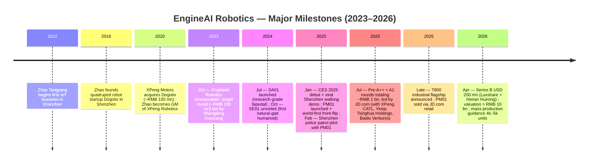
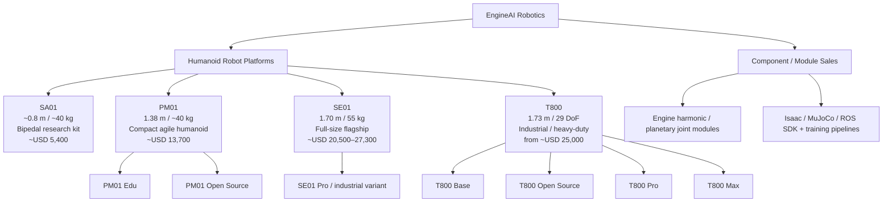
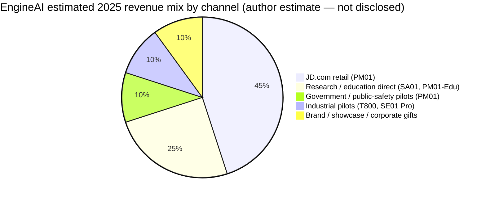
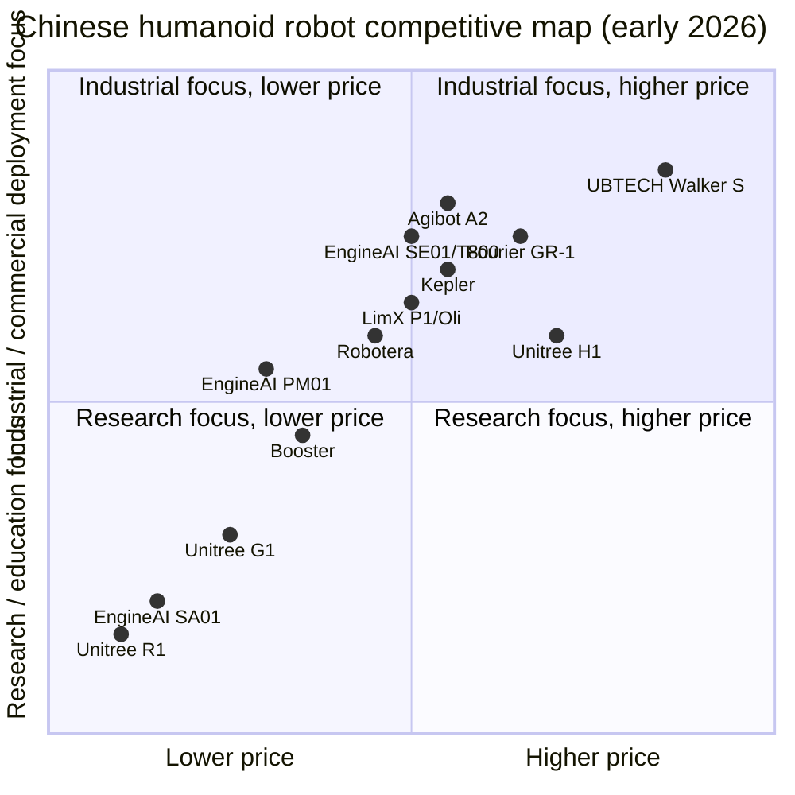

# EngineAI Robotics (众擎机器人) — Company Research Report

**Date:** 2026-05-19
**Subject:** Shenzhen EngineAI Robotics Technology Co., Ltd. (深圳市众擎机器人科技有限公司)
**Status:** Private, Series B-funded
**Headquarters:** Shenzhen, Guangdong, China
**Founded:** October 2023
**Founder & CEO:** Zhao Tongyang (赵同阳)

> **Update — Series B closed, valuation now ~RMB 10 bn+ (2026-04):** EngineAI closed a USD 200 million Series B led by Henan Investment Group's Huirong Fund and Luxshare Precision (立讯精密), reportedly pushing its post-money valuation past RMB 10 billion (~USD 1.4 bn). Management has guided to delivery of 4,000–5,000 humanoid units in 2026 and an annual production target of 30,000–50,000 units by 2027. Source: [Pandaily, 2026-04-10](https://pandaily.com/engine-ai-raises-200-million-in-series-b-valuation-exceeds-rmb-10-billion); secondary corroboration: [Humanoids Daily, 2026-04](https://www.humanoidsdaily.com/news/engineai-secures-200-million-series-b-as-manufacturing-giant-luxshare-joins-the-cap-table). The Series B follows roughly RMB 1 billion in Pre-A++ and A1 capital led by JD.com in mid-2025 ([PR Newswire, 2025-07-22](https://www.prnewswire.com/news-releases/engineai-raises-nearly-rmb-1-billion-in-pre-a-and-a1-rounds-led-by-jdcom-302512882.html)).

---

## TABLE OF CONTENTS

1. Company Overview
2. Company History
3. Management Team
4. Products & Services
5. Customers & Go-to-Market
6. Industry Overview
7. Competitive Landscape
8. Market Opportunity (TAM)
9. Risk Assessment

References

---

## 1. Company Overview

EngineAI Robotics — registered as Shenzhen EngineAI Robotics Technology Co., Ltd. and known in Chinese as **众擎机器人** (Zhongqing Jiqiren) — is a Shenzhen-based startup designing, manufacturing and selling general-purpose bipedal humanoid robots. The company sits in the rapidly forming "next-generation embodied AI" cohort of Chinese robotics firms, alongside Unitree, Agibot (智元), LimX Dynamics, Robotera, Booster Robotics, Kepler and the listed incumbent UBTECH (9880.HK). Its founding thesis, repeated across founder Zhao Tongyang's interviews, is that humanoid robots are a "general-purpose hardware platform" akin to the smartphone — one that will scale only when (a) walking and whole-body control work robustly outside the lab, (b) bill-of-materials costs fall to a level supporting mass deployment, and (c) the firm controls enough of the stack (joints, motors, controllers, learning-based locomotion) to compound improvements ([关于众擎 — engineai.com.cn/about-us](https://www.engineai.com.cn/about-us.html); [The Wire China — Zhao Tongyang profile](https://www.thewirechina.com/whos_who/zhao-tongyang-%E8%B5%B5%E5%90%8C%E9%98%B3/)).

The product line as of mid-2026 spans four named platforms — **SA01**, **PM01**, **SE01**, and the new flagship **T800** — covering price points from approximately USD 5,400 (research-grade SA01) to approximately USD 25,000 (industrial T800). The portfolio is unusual for a 2-year-old company in two ways: (1) every platform is full-stack vertical, with self-developed harmonic-drive joints, dual-encoder modules and force-controlled actuators; and (2) EngineAI explicitly markets a research-grade open variant alongside the commercial unit on each rung of the ladder, leaning into an Isaac/MuJoCo/ROS-friendly developer narrative that Unitree pioneered with its G1 ([SE01 product page — en.engineai.com.cn](https://en.engineai.com.cn/about-process-se01.html); [PM01 product page — en.engineai.com.cn](https://en.engineai.com.cn/product-pm01.html)).

**How EngineAI makes money** is still a hardware-margin story rather than a software-platform story: revenue today is the unit sale of robots and ancillary modules (joint kits, batteries, SDK access) into three buyer groups — research institutions and universities (SA01, PM01-Edu), commercial / showcase customers such as municipal demonstration projects and brand-activation events (PM01, SE01), and early industrial pilots (T800, SE01 Pro). The Robot Report describes the PM01 launch in early 2025 as targeted at "commercial and educational use" specifically because EngineAI judged the broader industrial humanoid market not yet ready for unsupervised deployment ([The Robot Report, 2025-01](https://www.therobotreport.com/engineai-releases-pm01-humanoid-robot-for-commercial-educational-use/)).

**Geographic presence.** EngineAI is headquartered in Shenzhen with R&D and manufacturing in Bao'an District. Several published interviews note the team draws heavily from the founder's prior XPeng Robotics organisation, which itself was split across Beijing, Shenzhen and Silicon Valley while he ran it from 2021 to 2023 ([CnEVPost, 2026-04](https://cnevpost.com/2026/04/15/former-xpeng-autonomous-driving-chief-to-join-engineai/)). The company has held public showcase events in Shenzhen (the viral SE01 walking-outside-the-office demo in early 2025), at CES 2025 in Las Vegas, and at Shenzhen-area police patrol pilots in February 2025.

**Scale indicators.** EngineAI does not file audited financials. The closest disclosed proxies for revenue scale:

- **Capital raised:** cumulative funding is widely reported as approximately **USD 380 million** across angel, Pre-A, Pre-A++, A1 and B rounds ([Crunchbase profile — EngineAI](https://www.crunchbase.com/organization/engineai); [Pandaily, 2026-04-10](https://pandaily.com/engine-ai-raises-200-million-in-series-b-valuation-exceeds-rmb-10-billion)).
- **Production guidance:** management has publicly guided 1,000-unit production target across all models by year-end 2025; 4,000–5,000 units in 2026; and 30,000–50,000 units annually by 2027 ([Humanoids Daily, 2026-04](https://www.humanoidsdaily.com/news/engineai-secures-200-million-series-b-as-manufacturing-giant-luxshare-joins-the-cap-table); [Interesting Engineering, 2025-01](https://interestingengineering.com/innovation/watch-se01-humanoid-robot-walk)).
- **Unit traction:** PM01, launched on JD.com in June 2025, was reported by JD as a category bestseller with monthly sales above 500 units in 2025 ([新浪财经, 2026-04-14](https://finance.sina.com.cn/wm/2026-04-14/doc-inhumwqc9116888.shtml)). *Note: this figure is not independently audited and is flagged unverified.*
- **Headcount:** not officially disclosed; press interviews and LinkedIn estimates indicate roughly 200–300 employees in May 2026 (flagged unverified — the company has not published a number).

**Valuation snapshot (private — no traded multiple).** Because EngineAI is private and pre-revenue at scale, there is no TTM P/E or P/S to print. The best available substitute is the latest funding round.

- **Latest round:** Series B, USD 200 mn, closed April 2026, post-money valuation reportedly above **RMB 10 bn (~USD 1.4 bn)** ([Pandaily, 2026-04-10](https://pandaily.com/engine-ai-raises-200-million-in-series-b-valuation-exceeds-rmb-10-billion)). A separate Chinese-language source ([知乎/Zhihu — Zhao Tongyang profile, 2025-07](https://zhuanlan.zhihu.com/p/27794697251)) cites a higher figure of "RMB 15 billion" post mid-2025 round; *this conflicts with the Pandaily/Humanoids Daily reporting on the April 2026 Series B and is flagged unverified pending primary disclosure*. We carry RMB 10 bn as the conservative working number.
- **Implied revenue multiple:** undisclosed. If management hits the low end of its guided 2026 unit shipment range (4,000 units at an average ASP of ~RMB 150,000 — blending PM01, SE01, T800), implied 2026 revenue is on the order of **RMB 600 mn (~USD 84 mn)**, putting the valuation at ~17× forward sales. That is squarely inside the band where Chinese humanoid peers are pricing today (see Section 7) and consistent with the broader humanoid-robot capital-cycle premium documented by Humanoids Daily ([The Great Valuation Chasm, 2025](https://www.humanoidsdaily.com/news/the-great-valuation-chasm-a-2025-guide-to-the-humanoid-robotics-capital-race)). The 17× number is an **author estimate**, not a disclosed figure, and should be treated as such.

**Peer valuation context (private + listed comp set):**

| Company | Latest valuation / mkt cap (USD) | Reference |
|---|---|---|
| Unitree (宇树) | ~USD 1.7 bn private (mid-2025); IPO indication ~USD 7 bn (Sept 2025); filed for STAR Market IPO ~USD 580–610 mn raise | [CNBC, 2025-09-09](https://www.cnbc.com/2025/09/09/chinas-unitree-plans-7-billion-ipo-valuation-as-humanoid-robot-race-heats-up.html); [Rest of World, 2026](https://restofworld.org/2026/unitree-china-humanoid-robot-shanghai-ipo/) |
| Agibot (智元 / Zhiyuan) | Private; reported 5,168 units shipped 2025; public listing plans signalled | [XCarspace ranking, 2026](https://xcarspace.com/top-20-chinese-humanoid-robot-companies-ranked-by-valuation/) |
| LimX Dynamics | Private; backed by JD.com / Tencent / others | [TMTPost, 2025](https://en.tmtpost.com/post/7632722) |
| Robotera (星动纪元) | Private; raised reported large round in March 2026 — figure reported variously and flagged unverified | [XCarspace ranking, 2026](https://xcarspace.com/top-20-chinese-humanoid-robot-companies-ranked-by-valuation/) |
| Kepler (开普勒) | Private; targets ~USD 30k full-size industrial unit | [Robozaps, 2026](https://blog.robozaps.com/b/best-humanoid-robots) |
| Booster Robotics | Private; ~USD 28 mn cumulative raised; SCGC-led Series A | [Tracxn, 2026](https://tracxn.com/d/companies/boosterrobotics/___tqO8895z72kqKHdWqpuYmz_DhgO-j3eMIz-krY_9jk) |
| Fourier Intelligence (傅利叶) | ~USD 1.1 bn (May 2025) | [PitchBook profile](https://pitchbook.com/profiles/company/229975-48) |
| UBTECH (优必选, HKEX:9880) | HKD ~110.80/share = market cap ~USD 5+ bn (May 2026); FY2025 revenue RMB 2.0 bn, +53.3% YoY | [Yahoo Finance — 9880.HK](https://finance.yahoo.com/quote/9880.HK/) |

Taken together, EngineAI sits in the mid-tier of the Chinese humanoid pack on valuation — clearly below Unitree, UBTECH and Fourier, broadly in line with Agibot and Robotera, ahead of pure-research outfits like Booster. The premium to revenue is high (estimated mid-teens forward P/S at the low end of guidance) but consistent with where private humanoid capital is being priced. **The valuation is not the risk in this story; execution against the production ramp is** (see Section 9).


*Chart described in prose (PNG generation skipped — guidance figures only): SE01 viral demo Q1 2025 → 1,000-unit company-wide target end-2025 → 4,000–5,000 unit Series B-funded guidance for 2026 → 30,000–50,000 unit/year target by 2027. Source: [Humanoids Daily, 2026-04](https://www.humanoidsdaily.com/news/engineai-secures-200-million-series-b-as-manufacturing-giant-luxshare-joins-the-cap-table).*

---

## 2. Company History

EngineAI's founding story is inseparable from founder Zhao Tongyang's prior thirteen years of robotics entrepreneurship in Shenzhen. He is on record describing EngineAI as the third "act" of a single thesis — that legged robots can become mainstream hardware platforms — after first chasing it through IoT devices, then quadrupeds at his prior firm Dogotix, and finally humanoid robots at XPeng Motors' robotics division before founding EngineAI to push the vision to its conclusion ([知乎/Zhihu, 2025-07](https://zhuanlan.zhihu.com/p/27794697251); [The Wire China — Zhao Tongyang profile](https://www.thewirechina.com/whos_who/zhao-tongyang-%E8%B5%B5%E5%90%8C%E9%98%B3/)).

EngineAI was registered in Shenzhen on **7 October 2023**, with Zhao as founder and majority owner. The first publicly visible move came in **July 2024** with the launch of the SA01 bipedal research platform, followed in **October 2024** by the SE01 unveiling — the moment that put the company on the global map. The official SE01 press release on 25 October 2024 described it as the first humanoid robot to "achieve a natural gait" using an end-to-end neural-network controller rather than the classical ZMP / inverted-pendulum control common in industry ([GlobeNewswire, 2024-10-25](https://www.globenewswire.com/news-release/2024/10/25/2969601/0/en/Meet-EngineAI-All-new-Robotics-SE01-Successfully-Overcomes-the-Challenge-of-Natural-Gait-in-Humanoid-Robots-for-the-First-Time.html)).

The next inflection point was a roughly three-week period in **January–February 2025**. EngineAI debuted at CES 2025 with PM01 + SE01 demonstrations ([PR Newswire APAC, 2025-01](https://en.prnasia.com/releases/global/engineai-debuts-at-ces-2025-with-revolutionary-robotics-lineup-475514.shtml)); released the now-famous video of an SE01 walking on a normal Shenzhen pavement outside the firm's office; performed what the company claimed as the world's first humanoid front-flip with PM01; and began the Shenzhen police patrol pilot ([Maginative, 2025-01](https://www.maginative.com/article/a-viral-video-of-engineais-se01-robot-walking-puts-chinese-robotics-firm-in-spotlight/); [Interesting Engineering, 2025-01](https://interestingengineering.com/innovation/watch-se01-humanoid-robot-walk); [New Atlas, 2025-02](https://newatlas.com/ai-humanoids/worlds-first-front-flip-humanoid-robot-engineai/); [Shenzhen Government Online, 2025-02](https://www.sz.gov.cn/en_szgov/news/latest/content/post_12010214.html)).



*Source for timeline: aggregated from [PR Newswire, 2025-07](https://www.prnewswire.com/news-releases/engineai-raises-nearly-rmb-1-billion-in-pre-a-and-a1-rounds-led-by-jdcom-302512882.html), [GlobeNewswire, 2024-10](https://www.globenewswire.com/news-release/2024/10/25/2969601/0/en/Meet-EngineAI-All-new-Robotics-SE01-Successfully-Overcomes-the-Challenge-of-Natural-Gait-in-Humanoid-Robots-for-the-First-Time.html), [Pandaily, 2026-04](https://pandaily.com/engine-ai-raises-200-million-in-series-b-valuation-exceeds-rmb-10-billion), [Wikipedia — Engine AI](https://en.wikipedia.org/wiki/Engine_AI).*

**Strategic pivots, briefly.** EngineAI's "pivot" history mostly lives in Zhao's prior companies, but two course-corrections within EngineAI itself are visible:

- **From single-product to laddered portfolio (Q4 2024 → Q1 2025).** SE01's launch was originally framed as the company's hero product. The PM01 release and SA01 repositioning a quarter later acknowledged that the realistic 2025 customer base was research labs, education and showcase commerce — not industrial deployment. The portfolio was rebuilt to ladder from a USD 5,400 research kit to a USD 25,000 industrial unit, with the assumption that pull-through happens as customers move up the stack.
- **From IP / showcase narrative to manufacturing scale (Q2 2026).** The Series B announcement and Luxshare Precision joining the cap table mark a deliberate shift from "we have the best demo" to "we can ship at the Apple-supply-chain scale." Luxshare is one of China's largest contract manufacturers and Apple Tier-1 — its presence on the cap table is read by Chinese-language analysts as a manufacturing-scale partnership signal first, financial second ([Humanoids Daily, 2026-04](https://www.humanoidsdaily.com/news/engineai-secures-200-million-series-b-as-manufacturing-giant-luxshare-joins-the-cap-table)).

**Acquisitions:** none disclosed.

**Recent developments (last ~12 months).** (1) T800 launched as a heavy-duty industrial / public-safety platform with solid-state battery and 4–5 hour runtime ([New Atlas, 2026](https://newatlas.com/ai-humanoids/engineai-t800-humanoid/)). (2) JD.com listing of PM01 commenced ([新浪财经, 2026-04](https://finance.sina.com.cn/wm/2026-04-14/doc-inhumwqc9116888.shtml)). (3) Former XPeng autonomous-driving chief reportedly joining EngineAI in 2026 — signal of senior-leadership reinforcement on the perception/AI side ([CnEVPost, 2026-04-15](https://cnevpost.com/2026/04/15/former-xpeng-autonomous-driving-chief-to-join-engineai/)). (4) Strategic partnership with Interstellor for a "humanoid astronaut" program using PM01 ([Gasgoo, 2026](https://autonews.gasgoo.com/articles/news/xiao-zhi-weekly-engineai-partners-with-interstellor-2018303504899002369)).

---

## 3. Management Team

### Zhao Tongyang (赵同阳) — Founder & CEO

Zhao Tongyang is the single most consequential figure in this story, and the company is by every account a founder-led, founder-defined organisation. He is in his mid-30s — published profiles place him born around 1989 — and is described across Chinese-language press as a "thirteen-year Shenzhen robotics veteran" by the time he founded EngineAI ([知乎/Zhihu, 2025-07](https://zhuanlan.zhihu.com/p/27794697251); [The Wire China — Zhao Tongyang](https://www.thewirechina.com/whos_who/zhao-tongyang-%E8%B5%B5%E5%90%8C%E9%98%B3/)).

His career arc, with what specifically he accomplished at each stop:

- **2012–2016 — IoT devices, Shenzhen.** Zhao started his first company at age ~23 building IoT modules. He has said in interviews that this was the period that taught him "hardware unit economics" and exposed him to Shenzhen's electronics supply chain. Specific financial outcomes are not publicly disclosed.
- **2016–2020 — Dogotix (笨拙智能), quadruped robotics, Shenzhen.** Zhao founded Dogotix in 2016 (some sources say 2019; the company was reorganised once) to build quadruped robots — the same product category Unitree was scaling at the time. Dogotix shipped its first commercial quadruped in 2020. *Accomplishment that matters most:* the company sold to XPeng Motors in **December 2020 for nearly RMB 100 million** ([The Wire China](https://www.thewirechina.com/whos_who/zhao-tongyang-%E8%B5%B5%E5%90%8C%E9%98%B3/)).
- **2021–2023 — General Manager, XPeng Robotics (鹏行智能).** Following the acquisition, Zhao led XPeng's robotics division — a roughly 400-person team across Beijing, Shenzhen and a Silicon Valley R&D office. Under his leadership the team shipped: the XPeng "Little White Dragon" quadruped at the XPeng 1024 Tech Day, and the **PX5 humanoid prototype** — XPeng's first full-size bipedal robot, which was demoed walking on stage and is the direct lineal precursor to the SE01 architecture ([知乎/Zhihu, 2025-07](https://zhuanlan.zhihu.com/p/27794697251)). Reports note that after the PX5 milestone, Zhao secured "approximately RMB 100 million" angel funding (~USD 14 mn) for a planned spin-out — and left XPeng in mid-2023 to do exactly that.
- **2023–present — Founder & CEO, EngineAI Robotics.** Incorporated EngineAI in October 2023. As of May 2026 EngineAI has reportedly raised ~USD 380 million across angel, Pre-A++, A1 and Series B rounds, deployed four robot platforms commercially, and posted what Zhao himself flags as the world's first humanoid front-flip ([Pandaily, 2026-04](https://pandaily.com/engine-ai-raises-200-million-in-series-b-valuation-exceeds-rmb-10-billion); [New Atlas, 2025-02](https://newatlas.com/ai-humanoids/worlds-first-front-flip-humanoid-robot-engineai/)).

**Education and ownership.** Zhao's education is not consistently disclosed across sources and is **flagged unverified**. Several Chinese-language profiles describe him as not having completed a top-tier university degree and as essentially self-taught in mechatronics. Equity stake in EngineAI is not disclosed; founder control is widely understood to be retained but no specific percentage is in public sources.

**Public profile.** Zhao maintains an unusually active media presence for a Chinese hardware founder. He has been written up in CnEVPost, The Wire China, 36Kr, Pandaily, Interesting Engineering and CnTech, has been quoted comparing himself to Lei Jun (Xiaomi) and praised by He Xiaopeng (XPeng founder) as one of his strongest acquired talents ([知乎/Zhihu, 2025-07](https://zhuanlan.zhihu.com/p/27794697251)). The recurring narrative theme is "patient engineer who actually ships."

### CFO / Finance leadership

EngineAI has not publicly named a CFO. References to capital raises ([PR Newswire, 2025-07](https://www.prnewswire.com/news-releases/engineai-raises-nearly-rmb-1-billion-in-pre-a-and-a1-rounds-led-by-jdcom-302512882.html)) credit Zhao Tongyang directly. As a USD 1+ bn private company with a public-listing trajectory likely on the 3–5 year horizon, the absence of a named, IPO-experienced CFO is a meaningful gap. *Flagged: no verified CFO identification as of May 2026.*

### Senior reinforcement — XPeng AD leadership migration (2026)

CnEVPost reported in April 2026 that a former head of XPeng's autonomous-driving group (specific name not disclosed in publicly available reporting) was joining EngineAI to lead embodied AI / perception ([CnEVPost, 2026-04-15](https://cnevpost.com/2026/04/15/former-xpeng-autonomous-driving-chief-to-join-engineai/)). The structural signal is significant: humanoid robotics increasingly looks like an AV-style perception + control + planning problem, and EngineAI is hiring an AV-tier leader to own it.

### Engineering org

The Chinese-language site's team page ([众擎团队 — about-team](https://www.engineai.com.cn/about-team.html)) describes the team as substantially composed of former XPeng Robotics ("鹏行智能") engineers, plus alumni of DJI, Huawei and Tencent Robotics X-Lab. The harmonic-drive, force-controlled joint and end-to-end RL locomotion stacks are stated as fully internal, with the joint module specifically branded "Engine" (the source of the company name). The technical leadership is consistent with the founder's pattern of bringing his Dogotix and XPeng Robotics teams forward — *useful for execution, with the matching risk that the senior bench is concentrated around the founder*.

### Governance

EngineAI is a private Chinese WFOE-equivalent domestic company. Governance disclosure is minimal:

- **Board composition:** no formal public disclosure. The cap table now includes JD.com, Luxshare Precision, XPeng / 小鹏汇天 (Xpeng Aeroht), CATL-related Puhui Capital, Yintai Group, Tsinghua Holdings Capital, Baidu Ventures, and Henan Investment Group's Huirong Fund ([PR Newswire, 2025-07](https://www.prnewswire.com/news-releases/engineai-raises-nearly-rmb-1-billion-in-pre-a-and-a1-rounds-led-by-jdcom-302512882.html); [Pandaily, 2026-04](https://pandaily.com/engine-ai-raises-200-million-in-series-b-valuation-exceeds-rmb-10-billion)). It is conventional for such Chinese growth-stage robotics firms for the founder to retain board control with two to three investor-elected seats, but no specific structure is disclosed.
- **Insider ownership:** undisclosed.
- **Compensation:** undisclosed.
- **Related-party transactions / governance flags:** strategic partnerships exist with JD.com (channel / commerce) and with XPeng (Pre-A++ lead, plus former-employer relationship of founder). These are conventional for the cohort but worth tracking before any future IPO disclosure cycle.

### Management track-record synthesis

This team's primary credential is that the founder has already done the same kind of work twice — Dogotix sold for RMB 100 mn to XPeng, then he ran XPeng Robotics from zero to a publicly-demoed humanoid. The pattern of "two prior cycles, one exit, now the third venture" is a stronger signal than typical founder pitches. The principal gap is the absence of a named, public-markets-tested CFO and the relatively thin disclosed bench outside Zhao himself.

---

## 4. Products & Services

EngineAI sells robots. The full portfolio enumerated from the company's English and Chinese product navigation as of mid-2026 consists of four named platforms: **SA01**, **PM01**, **SE01** and **T800**, plus a set of joint and actuator modules sold separately ([engineai.com.cn — homepage](https://www.engineai.com.cn/); [en.engineai.com.cn — homepage](https://en.engineai.com.cn/)).



*Source: enumerated from [engineai.com.cn product navigation](https://www.engineai.com.cn/) and [PM01 product page](https://en.engineai.com.cn/product-pm01.html); pricing per [Robots International product page](https://www.robotsinternational.com/Engine-AI.htm) and [Origin of Bots — T800](https://www.originofbots.com/robot/t800-by-engineai-details-specifications-rating).*

### SE01 — the flagship, the viral demo, the "natural gait" claim

The **SE01** is EngineAI's full-size flagship — **170 cm tall, 55 kg, 32 degrees of freedom** with 12 DoF in the hands (6 per hand) and 8 DoF in the arms (4 per arm), plus 6 DoF per leg and remaining DoF split across the waist and neck ([SE01 product page, en.engineai.com.cn](https://en.engineai.com.cn/about-process-se01.html); [GlobeNewswire, 2024-10-25](https://www.globenewswire.com/news-release/2024/10/25/2969601/0/en/Meet-EngineAI-All-new-Robotics-SE01-Successfully-Overcomes-the-Challenge-of-Natural-Gait-in-Humanoid-Robots-for-the-First-Time.html)). Walking speed is 2 m/s in EngineAI's published "normal walking" mode; design life is marketed as 10+ years (aluminium chassis). The actuator stack is fully in-house: self-designed harmonic, planetary and ball-screw joints with dual encoders and cross-roller bearings, plus local forced-air cooling at the highest-load joints; the company quotes 186 N·m peak knee torque ([SE01 product page](https://en.engineai.com.cn/about-process-se01.html)). Perception is a multi-sensor stack: an Intel RealSense D435 depth camera, a 360° LiDAR, and six HD cameras feeding a stereo-vision neural network ([Maginative, 2025-01](https://www.maginative.com/article/a-viral-video-of-engineais-se01-robot-walking-puts-chinese-robotics-firm-in-spotlight/)). Compute is dual-processor: an Intel x86 CPU paired with an NVIDIA GPU module.

**The viral Shenzhen demo (January 2025).** The defining product moment for EngineAI to date — and arguably for Chinese humanoid robotics broadly — was a clip released in early January 2025 showing an SE01 walking on a normal Shenzhen pavement outside the company's office. The visual difference from prior humanoid demos was the gait itself: long strides, swinging arms, no "Groucho Marx" knee-bent crouch, and visible weight transfer through the heel-to-toe foot roll. An NVIDIA senior research scientist initially questioned on X whether the video was Sora-generated; the firm and Chinese tech press subsequently confirmed it was authentic ([Maginative, 2025-01](https://www.maginative.com/article/a-viral-video-of-engineais-se01-robot-walking-puts-chinese-robotics-firm-in-spotlight/); [Interesting Engineering, 2025-01](https://interestingengineering.com/innovation/watch-se01-humanoid-robot-walk); [Digitimes, 2025-01-21](https://www.digitimes.com/news/a20250121PD213/robot-nvidia-sensetime-startup-2024.html)). The technical claim is that SE01's controller is end-to-end reinforcement-learning-trained rather than the classical zero-moment-point / inverted-pendulum analytical control used by most industrial humanoid platforms, which lets it exploit gravity and momentum rather than fight them.

**Competitive advantage verdict — SE01: PARTIAL.** SE01's moat is **technical, specifically in locomotion controller quality and integrated joint design**. The relevant competition: Tesla Optimus (closed; not publicly priced), Figure 02 (US, ~USD 200k indicative), Agibot A2 (~RMB 200k indicated), Unitree H1 (~RMB 650k starting), UBTECH Walker S series (industrial, RMB 600k+ range). On price-for-spec, SE01 looks competitive: ~USD 20,500–27,350 ([Robots International — Engine AI](https://www.robotsinternational.com/Engine-AI.htm)) for a 1.7m / 32-DoF unit is roughly 2–3× cheaper than Unitree H1's published 99,000–650,000 RMB price band ([SCMP, 2025-08](https://www.scmp.com/tech/tech-trends/article/3319637/chinas-unitree-debuts-us5900-humanoid-robot-race-make-cheaper-products)) at the higher end, and similar to Unitree's G1 (USD 16k starting). The gait quality is genuinely state-of-the-art in published demonstrations; the *durability* of the lead is the open question — every competitor is moving toward end-to-end learned control, and Tesla, Figure and Agibot all have more capital. *Closest direct comp: Unitree H1 — ahead on price/spec, at parity on gait demo quality, behind on shipped volume.*

### PM01 — compact, agile, the front-flip platform

The **PM01** is the company's mid-tier compact humanoid — **138 cm tall, ~40 kg**, 23–24 DoF (5 per arm + 6 per leg), 320° rotating waist ([PM01 product page, en.engineai.com.cn](https://en.engineai.com.cn/product-pm01.html); [The Robot Report, 2025-01](https://www.therobotreport.com/engineai-releases-pm01-humanoid-robot-for-commercial-educational-use/)). Movement speed 2 m/s; joint module peak torque 130 N·m. Compute is the Intel N97 / NVIDIA Jetson Orin pairing now used across the PM and T800 lines. Pricing is approximately **USD 13,700** for the standard commercial unit ([Robots International](https://www.robotsinternational.com/Engine-AI.htm)).

**The front-flip demo (February 2025).** PM01 is the platform EngineAI used for what it describes as "the world's first humanoid robot front flip." The technical claim deserves a careful read: backflips have been demonstrated on humanoid robots (Atlas) since 2017, but a *front* flip is mechanically harder because the robot loses sight of its landing point at the apex of rotation — there is no foot-strike feedback until the final instant ([New Atlas, 2025-02](https://newatlas.com/ai-humanoids/worlds-first-front-flip-humanoid-robot-engineai/); [TechEBlog, 2025-02](https://www.techeblog.com/engineai-pm01-humanoid-robot-front-flip/)). The demonstration was widely shared and is, to our knowledge as of May 2026, not yet matched in a verified, contemporaneous demo by a major peer.

**Competitive advantage verdict — PM01: PARTIAL.** PM01's moat is **a combination of price-point + agility benchmark**. At USD 13,700, it is meaningfully cheaper than Unitree H1 and roughly in line with Unitree G1's USD 16k starting price, but with a more aggressive agility profile (front flip vs G1's published walking/cartwheel routines). Police-patrol deployments and retail JD.com listing differentiate it as commercially deployed rather than research-only. *Closest direct comp: Unitree G1 — slightly cheaper than G1, similar form factor, ahead on agility demo, behind on cumulative production volume.*

### SA01 — the research kit

**SA01** is the bipedal research / education platform, the first product EngineAI released (July 2024). Weight is approximately 40 kg; walking power consumption is under 200 W; it can run and jump, and is sold with open-source algorithm and control stacks ([SA01 product page, en.engineai.com.cn](https://en.engineai.com.cn/about-process-sa01.html); [toolnavs analysis, 2026](https://toolnavs.com/en/article/884-analysis-of-engineai-humanoid-robot-how-to-choose-sa01-pm01-se01)). Price approximately **USD 5,400** — clearly positioned against Unitree's research-tier offerings.

**Competitive advantage verdict — SA01: NO (table-stakes commodity).** At this price tier the market is becoming commoditised; the win is volume, ecosystem and time-to-classroom, not differentiation. *Closest direct comp: Unitree's research-grade upper-body kit at USD 4,290 / R1 at USD 5,900 — at parity on price/spec, behind Unitree on developer-ecosystem breadth.*

### T800 — the new flagship for industrial / safety

**T800** is the newer industrial / heavy-duty flagship, branded with what is clearly a deliberate Terminator reference: a **173 cm**, 29-DoF, magnesium-aluminium-alloy-bodied humanoid with a 450 N·m peak joint torque, 14,000 W peak power output, and a solid-state-battery architecture delivering 4–5 hour runtime ([New Atlas, 2026](https://newatlas.com/ai-humanoids/engineai-t800-humanoid/); [Origin of Bots — T800](https://www.originofbots.com/robot/t800-by-engineai-details-specifications-rating); [BotInfo — T800, 2026](https://botinfo.ai/articles/engineai-t800-humanoid-robot)). Compute is an Intel N97 + NVIDIA AGX Orin pairing delivering ~275 TOPS of AI compute. EngineAI markets four T800 variants — Base, Open-Source / Ecosystem, Pro and Max — with the Base entry point at approximately **USD 25,000 (RMB 180,000)**. First T800 shipments via JD.com listing are scheduled by 2 June 2026.

**Competitive advantage verdict — T800: PARTIAL, leaning toward YES on price.** T800 is the most aggressive price-to-spec point in the entire Chinese humanoid set: a full-size, 4–5 hour-runtime industrial unit at USD 25,000 sits clearly below UBTECH Walker S (industrial-grade, RMB 600k+) and well below US peers. The genuine question is robustness in 8-hour industrial duty cycles. *Closest direct comp: Agibot A2 — at parity on form factor, slightly ahead on price, behind Agibot on disclosed shipment volume (Agibot shipped 5,168 units in 2025 per [XCarspace, 2026](https://xcarspace.com/top-20-chinese-humanoid-robot-companies-ranked-by-valuation/)).*

### Flagship vs. long-tail

The 2025–2026 flagship is **SE01** in narrative / brand terms (it remains the platform that catapulted EngineAI into global attention) but **PM01 + T800 are the actual revenue drivers**. PM01 carries the JD.com retail SKU and the bulk of shipped units. T800 is the bet for 2026–2027 industrial scale. SA01 is volume-low / margin-thin and functions as a developer / academic on-ramp.

### Roadmap & recent launches (last 12 months)

- **T800 mass-production launch (early 2026)** — first JD.com pre-orders open for first shipments by June 2, 2026 ([BotInfo, 2026](https://botinfo.ai/articles/engineai-t800-humanoid-robot)).
- **PM01 JD.com retail (mid-2025)** — first humanoid robot in the JD.com mass-retail catalogue in volume ([新浪财经, 2026-04-14](https://finance.sina.com.cn/wm/2026-04-14/doc-inhumwqc9116888.shtml)).
- **PM01 Astronaut / Interstellor partnership (early 2026)** — a research / brand partnership rather than a discrete revenue stream ([Gasgoo, 2026](https://autonews.gasgoo.com/articles/news/xiao-zhi-weekly-engineai-partners-with-interstellor-2018303504899002369)).
- No sunsets disclosed.

---

## 5. Customers & Go-to-Market

### Customer segments

EngineAI's disclosed customer base, derived from press releases and the engineai.com.cn newsroom, breaks down into four segments. The company itself does not publish a customer-concentration table — disclosure is voluntary and partial, so the figures below are *qualitative* and **explicitly flagged unverified** where indicated.

1. **Research institutions and universities.** SA01 is the primary product; pricing low enough (~USD 5,400) for departmental budgets. Buyer pool spans Chinese tier-1 universities, government research labs (CAS-affiliated), and international research customers picking up SA01 through partner distributors.
2. **Public-safety / government showcase.** PM01 deployed alongside Shenzhen police patrols in February 2025 in a high-visibility pilot. Best read as a brand-and-policy showcase rather than a recurring revenue line ([Shenzhen Government Online, 2025-02-19](https://www.sz.gov.cn/en_szgov/news/latest/content/post_12010214.html); [EYESHENZHEN, 2025-02](https://www.eyeshenzhen.com/content/2025-02/19/content_31469161.htm)).
3. **Commercial / brand-activation buyers.** PM01 deployments at retail showrooms, expos and brand-event activations. Monthly JD.com shipment volume of "more than 500 units" was reported in 2025 — *flagged unverified, as the figure is from a single Chinese-language secondary source ([新浪财经, 2026-04-14](https://finance.sina.com.cn/wm/2026-04-14/doc-inhumwqc9116888.shtml)).*
4. **Early industrial pilots.** T800 in early-stage industrial pilot deployments. EngineAI has named partnerships with Zhongding Shares (中鼎股份) for "technology commercialization" alongside the JD.com channel partnership ([engineai.com.cn newsroom](https://www.engineai.com.cn/about-news-media)).

### Customer concentration — disclosure status

**There is no public customer-concentration disclosure for EngineAI.** Private companies in China are not required to file 前五大客户 / "top five customer" disclosures the way A-share-listed firms must in their 年度报告 (per the project skill spec). Accordingly:



*Note: this chart is an **author-constructed estimate** derived from press disclosures of channel partnerships, JD.com SKU traction, and the police-patrol pilot. EngineAI has not published a revenue breakdown by channel or customer. Flagged unverified.*

The qualitative read on concentration: the **single most concentrated relationship is the JD.com channel** — which is both EngineAI's largest known retail outlet for PM01 and a Series A1 lead investor ([PR Newswire, 2025-07](https://www.prnewswire.com/news-releases/engineai-raises-nearly-rmb-1-billion-in-pre-a-and-a1-rounds-led-by-jdcom-302512882.html)). That dual role (channel + investor) is a structural feature, not a bug — it parallels how JD.com has also led rounds in LimX Dynamics and Spirit AI ([TMTPost, 2025](https://en.tmtpost.com/post/7632722)) — but the dependency on a single channel partner is material for risk-modelling purposes. If JD.com shifts retail support to a competitor in the same cohort, EngineAI's most visible revenue line could decelerate quickly.

### Contract structure

EngineAI does not disclose contract structure. Based on the JD.com retail SKU and pricing, the dominant model in 2025–2026 is **transactional per-unit sale** rather than multi-year master agreements. T800 industrial customers may move to enterprise master agreements as scale builds, but no such agreement is yet publicly disclosed.

### Distribution channels

- **JD.com direct retail** — primary online channel; the PM01 store-page launch in mid-2025 was material.
- **Direct sales to research / education** — via the EngineAI sales team and direct-from-Shenzhen orders.
- **Strategic partnerships** — Zhongding Shares, Interstellor.
- **No international distributor network has been publicly named** as of mid-2026, though CES 2025 attendance and "Robots International" / "Robots USA" listings suggest the company is being shopped by aggregator-distributors in North America.

### Sales cycle and acquisition strategy

For research-tier products (SA01, PM01-Edu) the sales cycle is similar to any university lab purchase — measured in weeks. For T800-tier industrial deployments the sales cycle is materially longer (months to a year) and includes safety / EHS validation. PM01-class commercial / brand-activation units sit in between.

The acquisition strategy is overwhelmingly **demo-led + media-led**: virality of the SE01 walking video and PM01 front-flip drove inbound interest of a magnitude that paid-marketing budgets would not have matched. Zhao's personal media presence reinforces it. This is a low-CAC strategy when demos work; a high-risk strategy if competitor demos overshadow EngineAI's next reveal.

### Named partnerships (verified)

- **JD.com (京东)** — Series A1 lead investor + retail channel ([PR Newswire, 2025-07](https://www.prnewswire.com/news-releases/engineai-raises-nearly-rmb-1-billion-in-pre-a-and-a1-rounds-led-by-jdcom-302512882.html)).
- **Luxshare Precision (立讯精密)** — Series B co-lead investor + manufacturing-scale strategic partner ([Humanoids Daily, 2026-04](https://www.humanoidsdaily.com/news/engineai-secures-200-million-series-b-as-manufacturing-giant-luxshare-joins-the-cap-table)).
- **XPeng / Xpeng Aeroht (小鹏汇天)** — Pre-A++ lead ([PR Newswire, 2025-07](https://www.prnewswire.com/news-releases/engineai-raises-nearly-rmb-1-billion-in-pre-a-and-a1-rounds-led-by-jdcom-302512882.html)).
- **CATL-related Puhui Capital, Yintai Group, Tsinghua Holdings Capital, Baidu Ventures, Henan Investment Group's Huirong Fund** — investor relationships, also potentially channel-relevant via CATL's battery supply.
- **Interstellor** — brand / mission partnership using PM01 in a "humanoid astronaut" program ([Gasgoo, 2026](https://autonews.gasgoo.com/articles/news/xiao-zhi-weekly-engineai-partners-with-interstellor-2018303504899002369)).
- **Shenzhen Public Security Bureau** — pilot deployment of PM01 robots in patrol shift, February 2025 ([Shenzhen Government Online, 2025-02-19](https://www.sz.gov.cn/en_szgov/news/latest/content/post_12010214.html)).

---

## 6. Industry Overview

### Industry definition

The humanoid-robot industry as discussed here refers to **general-purpose bipedal robots designed to operate in human-built environments** — distinct from (a) traditional industrial robotic arms (fixed-base manipulators for factory automation, a USD ~20 bn+ existing market dominated by Fanuc / Yaskawa / ABB / KUKA), (b) quadruped robots (Boston Dynamics Spot, Unitree's robot dogs), and (c) AGV / AMR mobile platforms (Geek+, Hai Robotics). The promise — and the bet — of humanoid robotics is that a robot the size and shape of a person can substitute for human labour in workspaces designed for humans, without the workspace having to be redesigned.

Adjacent industries include: automotive automation (the largest near-term industrial pilot ground), warehousing / e-commerce fulfilment (Amazon Robotics, Symbotic, GreyOrange), elder care / assistive robotics, and service / hospitality robotics.

### Market size and growth

The two most-cited estimates frame the upside debate:

- **Goldman Sachs (2024 refresh):** global humanoid TAM of **~USD 38 bn by 2035**, with cumulative shipments around **1.4 million units** over the same period ([Goldman Sachs, 2024](https://www.goldmansachs.com/insights/articles/the-global-market-for-robots-could-reach-38-billion-by-2035)).
- **Morgan Stanley (2024 framing, 2025 revisions):** ecosystem-inclusive humanoid TAM of **~USD 5 trillion by 2050**, implying nearly a billion units globally — explicitly counting robots plus their supply chains and service economies, and modelled on a smartphone-style adoption S-curve ([Morgan Stanley, 2024](https://www.morganstanley.com/insights/articles/humanoid-robot-market-5-trillion-by-2050)).

The Goldman number is the "narrow industry" view (robot unit sales); the Morgan Stanley number is the "platform plus services and supply chain" view. Both are consistent in describing humanoids as a category where 2025–2030 is the early-adopter cycle and 2030–2040 is potential mainstream.

For **China specifically**, the most useful sizing comes from China-Briefing's compilation of MIIT and provincial guidance: the domestic Chinese humanoid market is projected at approximately RMB 2.76 bn (USD 380 mn) in 2024, RMB 10.5 bn (USD 1.4 bn) by 2026, RMB 75 bn (USD 10.3 bn) by 2029, and ~RMB 300 bn (USD 41 bn) by 2035 ([China Briefing, 2025](https://www.china-briefing.com/news/chinese-humanoid-robot-market-opportunities/)). Global unit shipments grew from near-zero in 2023 to roughly 16,000 units in 2025 per Morgan Stanley's revised forecast; the 2026 forecast was raised to ~28,000 units China alone ([SCMP, 2025](https://www.scmp.com/tech/article/3341646/morgan-stanley-expects-chinas-humanoid-robot-sales-double-revised-forecast)).

### Growth drivers

The structural drivers — what is making this category go from research-lab curiosity to actual capital flows now — are five-fold:

1. **End-to-end neural locomotion control.** The technical inflection of 2023–2025 is the move from classical model-based ZMP / inverted-pendulum control to reinforcement-learning-trained policies that run on the robot's onboard NVIDIA / Intel compute. SE01's natural-gait demo is one of the clearest public proof points of this generation shift.
2. **Cost-down on key components.** Harmonic-drive joints, brushless motors, lithium / solid-state batteries, and onboard AI compute (Jetson Orin tier) have all dropped sharply on a per-unit basis between 2020 and 2025, pulling the BoM of a full-size humanoid from well above USD 100k toward USD 20–30k for the Chinese cohort.
3. **Foundation-model overlay.** Vision-language-action models (Google RT-2, Figure Helix, multiple academic releases) make it dramatically easier to specify what the robot should *do* once it can *move*. This is creating a layer of optimism about the unit-economics of humanoids that did not exist before 2023.
4. **Chinese state and provincial policy support.** Humanoid robotics is named in MIIT's 2025 strategic-industries lists, and provincial governments (Beijing, Shenzhen, Hefei, Henan) are actively investing — Henan Investment Group's role as Series B co-lead for EngineAI is a literal example.
5. **Labour-cost and demographics.** Chinese manufacturing labour costs have continued to rise, and Japan / Korea / Europe demographics are getting worse year over year. The applied-demand pull is real, even if today's robots are not yet useful enough to satisfy it.

### Regulatory environment

Globally there is no humanoid-robot-specific regulatory framework. Operational standards inherit from industrial-robot frameworks (ISO 10218 for industrial robots, ISO 13482 for personal-care service robots). The salient regulatory questions for the next 2–3 years:

- **Public-space deployment.** Shenzhen has already piloted humanoid robots in police patrols — a national framework for public-space deployment will follow.
- **Workplace safety.** When humanoids cross from "manipulators in cages" to "shared-floor coworkers", OSHA-equivalent rules need rewriting. China's regulatory cadence on this is faster than the US.
- **Data / privacy.** Onboard cameras and LiDAR create a privacy footprint that today is largely unregulated.
- **Export control.** The US export-control posture toward Chinese AI hardware affects access to NVIDIA Jetson AGX-tier compute. EngineAI uses Jetson Orin today; future tightening would force a domestic-substitute migration.

### Industry structure

The Chinese humanoid landscape in 2026 is **fragmented at the vendor level but consolidating around three or four clear "tier-1" private leaders** (Unitree, UBTECH, Agibot, plus EngineAI, LimX, Robotera in a closely-bunched second tier). Goldman Sachs reporting flagged a notable phenomenon: Chinese component suppliers (motors, harmonic drives, sensors) are aggressively building capacity ahead of confirmed orders, suggesting industry-wide expectations that 2026–2027 will see a step-function in volumes ([Humanoids Daily, 2025](https://www.humanoidsdaily.com/feed/goldman-sachs-chinese-suppliers-aggressively-building-humanoid-robot-capacity-ahead-of-orders)). Supplier power is currently moderate — harmonic drive supply is somewhat consolidated (Harmonic Drive Systems, Leaderdrive, Lealder) — but capacity coming online could shift the balance toward buyers in 2026–2027. Buyer power for end-customer industrial deployments remains weak in the early-adopter phase but will strengthen as volumes scale.

Substitutes for humanoids include traditional industrial automation (cheaper and proven, but only works for redesigned workspaces), targeted task robots (palletizers, surgical robots), and the status quo of human labour — which is precisely the substitute humanoids are designed to displace.

---

## 7. Competitive Landscape

The competitive set for EngineAI breaks into three groups:

**Group 1 — Chinese private humanoid peers (the most direct comps):** Unitree, Agibot, LimX Dynamics, Robotera, Booster Robotics, Kepler, Fourier Intelligence.

**Group 2 — Listed Chinese humanoid (and quasi-humanoid):** UBTECH (9880.HK), and on the IPO runway, Unitree (filed for STAR Market listing).

**Group 3 — Global / US humanoid players:** Tesla Optimus, Figure, Boston Dynamics (Atlas), Apptronik, 1X Technologies, Agility Robotics. These are not direct customers competitors today for the Chinese cohort but loom over the long-run competitive picture, and Tesla in particular sets the cost/scale bar that every Chinese player is competing against.



*Source positioning based on price disclosures and product orientation per [SCMP, 2025-08](https://www.scmp.com/tech/tech-trends/article/3319637/chinas-unitree-debuts-us5900-humanoid-robot-race-make-cheaper-products), [Humanoids Daily — Great Valuation Chasm](https://www.humanoidsdaily.com/news/the-great-valuation-chasm-a-2025-guide-to-the-humanoid-robotics-capital-race), [XCarspace ranking, 2026](https://xcarspace.com/top-20-chinese-humanoid-robot-companies-ranked-by-valuation/) and the product pages cited in Section 4.*

### Unitree (宇树科技)

The category leader. Reported revenue of RMB 1.7 bn (~USD 235 mn) in 2025, +335% YoY, net profit RMB 600 mn (+674%) ([Humanoids Daily — Unitree IPO filing](https://www.humanoidsdaily.com/news/unitree-files-for-580m-ipo-humanoid-sales-surpass-robot-dogs-as-profits-soar)). Humanoid units shipped: 5,500 in 2025, target 20,000 in 2026. Product set spans the R1 (USD 5,900), G1 (USD 16k starting), H1 (RMB 650k starting). IPO filed for STAR Market, valuation indications up to USD 7 bn ([CNBC, 2025-09-09](https://www.cnbc.com/2025/09/09/chinas-unitree-plans-7-billion-ipo-valuation-as-humanoid-robot-race-heats-up.html)). **Strengths:** brand, profitable, broad product set, strongest developer ecosystem. **Weaknesses:** the "Cambrian explosion" of new entrants is pressuring price points faster than Unitree's BoM is dropping. **vs EngineAI:** ahead on volume, brand and profitability; at parity on gait demo quality; behind on heavy-duty industrial flagship spec.

### Agibot (智元 / Zhiyuan)

Founded by ex-Huawei "Genius Youth" Peng Zhihui ("稚晖君"). Shipped 5,168 units in 2025 ([XCarspace, 2026](https://xcarspace.com/top-20-chinese-humanoid-robot-companies-ranked-by-valuation/)). Strong industrial / logistics orientation. Publicly signalled listing plans for 2026. **vs EngineAI:** ahead on shipped volume and industrial-deployment depth; at parity on form-factor; behind on gait-demo virality.

### LimX Dynamics

Backed by JD.com, Tencent and others ([TMTPost, 2025](https://en.tmtpost.com/post/7632722)). Oli full-size humanoid released summer 2025; P1 platform compared to Atlas. Several-thousand-unit Middle East deployment plan for 2026 ([WebProNews, 2026](https://www.webpronews.com/chinas-robot-surge-targets-u-s-gulf-limx-challenges-teslas-optimus-throne/)). **vs EngineAI:** at parity on price/spec, ahead on international deployment pipeline (Middle East), behind on consumer-channel access.

### Robotera (星动纪元)

Tsinghua-incubated humanoid robotics firm, founded August 2023 — virtually the same vintage as EngineAI ([XCarspace, 2026](https://xcarspace.com/top-20-chinese-humanoid-robot-companies-ranked-by-valuation/)). The "only humanoid firm with Tsinghua University shareholding." Reported a large 2026 funding round (figure not clearly disclosed in English sources). **vs EngineAI:** comparable scale; Robotera has academic-credential advantages, EngineAI has demo-and-shipping advantages.

### UBTECH (优必选 / 9880.HK)

The listed incumbent. FY2025 revenue RMB 2.0 bn (+53.3% YoY), with full-size humanoid robots now 41.1% of revenue. Trading at HKD ~110.80/share as of mid-May 2026 ([Yahoo Finance — 9880.HK](https://finance.yahoo.com/quote/9880.HK/)). Walker S series targeting industrial deployment. **vs EngineAI:** ahead on revenue, public-markets credibility, and named industrial deployments (BYD, Foxconn pilots reported across various interviews); behind on price/spec at the mid-tier and on demo virality. UBTECH is the most likely "public-markets benchmark" for EngineAI's eventual IPO.

### Fourier Intelligence (傅利叶)

GR-1 humanoid platform; pre-money valuation ~USD 1.1 bn (May 2025) ([PitchBook profile](https://pitchbook.com/profiles/company/229975-48)). Backed by SoftBank Vision Fund. **vs EngineAI:** ahead on rehab / medical-robotics adjacency; at parity on humanoid platform; behind on shipped-humanoid-units narrative.

### Booster Robotics

Smaller player, ~USD 28 mn raised across three rounds ([Tracxn, 2026](https://tracxn.com/d/companies/boosterrobotics/___tqO8895z72kqKHdWqpuYmz_DhgO-j3eMIz-krY_9jk)). Series A led by Shenzhen Capital Group. **vs EngineAI:** materially behind on capital, scale and product breadth.

### Kepler (开普勒)

Targets ~USD 30k full-size industrial unit ([Robozaps, 2026](https://blog.robozaps.com/b/best-humanoid-robots)). **vs EngineAI:** roughly at parity on price/spec on the industrial tier; less public-facing demo cadence.

### EngineAI's competitive vulnerabilities

Three honest vulnerabilities:

1. **Capital intensity vs. peers.** USD 380 mn raised is meaningful but well below Unitree's likely IPO valuation and below Figure / Tesla Optimus on the global stage. If 2026–2027 turns into a capital-arms-race, EngineAI's position is mid-tier.
2. **Brand depth.** EngineAI's brand is built on two viral demos (SE01 walking, PM01 front flip). The 2025 demos are now over a year old; a competitor with a stronger 2026–2027 demo cycle could shift narrative leadership.
3. **Industrial sales motion.** Unlike UBTECH (Walker S BYD pilots, multiple announced industrial deployments), Agibot (5,168 units of industrial / logistics deployment), and LimX (Middle East pipeline), EngineAI does not yet have a flagship industrial-customer logo. T800 is the bet to close this gap in 2026.

### EngineAI's advantages

1. **Founder pedigree and execution track record.** Zhao Tongyang has done this twice before.
2. **Vertical-integration depth.** In-house joints, motors, controllers, learning-based gait.
3. **Channel access via JD.com.** No other Chinese humanoid firm has comparable consumer-retail traction.
4. **Manufacturing-scale partnership.** Luxshare Precision joining the Series B cap table is unique in the cohort.

---

## 8. Market Opportunity (TAM)

### TAM sizing

Three TAM views matter here, with their methodology and limitations:

- **Goldman Sachs (2024):** **USD 38 bn global humanoid TAM by 2035**, 1.4 million cumulative units. Methodology: bottom-up unit forecast, ASP curve assuming cost-down toward USD 15–20k by 2030 ([Goldman Sachs, 2024](https://www.goldmansachs.com/insights/articles/the-global-market-for-robots-could-reach-38-billion-by-2035)). This is the conservative / narrow industry view.
- **Morgan Stanley (2024):** **USD 5 trillion ecosystem TAM by 2050**, nearly 1 billion units. Methodology: smartphone-style adoption S-curve scaled by global population and labour-pool penetration; ecosystem includes robots, components, software, services ([Morgan Stanley, 2024](https://www.morganstanley.com/insights/articles/humanoid-robot-market-5-trillion-by-2050)). This is the bull / platform view.
- **China-specific (China Briefing / MIIT-cited):** **RMB 300 bn (~USD 41 bn) Chinese humanoid market by 2035**, growing from ~USD 380 mn in 2024 ([China Briefing, 2025](https://www.china-briefing.com/news/chinese-humanoid-robot-market-opportunities/)).

For EngineAI's purpose, the SAM (serviceable addressable market) — the slice of the global TAM that a Shenzhen-domiciled, Chinese-cap-tabled humanoid firm can realistically address in the next 5 years — is:

- **China domestic SAM by 2029:** USD ~10 bn ([China Briefing, 2025](https://www.china-briefing.com/news/chinese-humanoid-robot-market-opportunities/)).
- **Asia ex-China SAM by 2029:** an additional roughly USD 2–4 bn, predominantly Japan and Korea where humanoid demand is demographics-driven.
- **Middle East + Europe ex-defence SAM by 2029:** a further USD 1–3 bn, with the Middle East pipeline that LimX is already targeting.

A reasonable estimate of EngineAI's potential SAM by 2029 is in the **USD 10–15 bn range**, primarily China-weighted.

### SOM — serviceable obtainable market

If management's stated 2027 production target of 30,000–50,000 units annually is achieved, and the blended ASP is RMB 100–150k, implied 2027 revenue is **RMB 3–7.5 bn (USD 420 mn – USD 1 bn)**. At the midpoint of those ranges (~40k units × RMB 125k ≈ RMB 5 bn ≈ USD 700 mn) EngineAI would represent roughly **5–8 % of the projected 2029 China humanoid SAM** if it hit that target two years early — a defensible mid-tier position consistent with its current cap-table peer ranking.

```text
EngineAI growth scenarios (illustrative — author estimates, not company-guided):
                       2026E       2027E       2029E
Unit shipments         4,500       40,000      100,000
Blended ASP (RMB)      150k        125k        100k
Revenue (RMB bn)       0.7         5.0         10.0
Implied China share    ~6%         ~25%        ~12% (of larger 2029 market)
```

*Source: author construction from EngineAI guidance ([Humanoids Daily, 2026-04](https://www.humanoidsdaily.com/news/engineai-secures-200-million-series-b-as-manufacturing-giant-luxshare-joins-the-cap-table)) and China-Briefing TAM estimates.*

### Penetration strategy

The most credible 2026–2029 penetration path:

1. **2026 — anchor the JD.com retail channel + Shenzhen government showcase + first industrial flagship logo.** Use the SE01 / PM01 / T800 ladder to capture the early-adopter pool of research, education and showcase customers, while landing one major industrial reference account.
2. **2027 — convert the Luxshare manufacturing partnership into 30k+ annual production.** This is the capacity-scaling year; success requires both the supply chain and at least 3–5 named industrial logos.
3. **2028–2029 — international expansion (Middle East, Southeast Asia, Japan) and entry into elder-care / home-service.** This is the long-tail growth phase and is where blended ASPs will compress fastest.

### Market share opportunity

Realistic 2029 market-share targets:

- **China domestic:** **5–10 %** of the China humanoid market (an aggressive but defensible outcome if T800 industrial wins land).
- **Asia ex-China:** 2–4 % (channel partnerships still nascent).
- **Global:** roughly 2–3 % of the Goldman-Sachs-sized global TAM.

These figures imply EngineAI is one of three to five Chinese tier-1 humanoid firms — *not* the category winner, but a credible second-tier IPO-grade name. That positioning is consistent with the current Series B valuation.

---

## 9. Risk Assessment

### Company-Specific Risks

**1. Execution risk — production ramp from ~1,000 units (2025) to 30,000–50,000 units (2027).** EngineAI is guiding a roughly 30–50× volume increase in 24 months ([Humanoids Daily, 2026-04](https://www.humanoidsdaily.com/news/engineai-secures-200-million-series-b-as-manufacturing-giant-luxshare-joins-the-cap-table)). Even with Luxshare as a manufacturing partner, the operational, quality-control and warranty-cost risks of that ramp are first-order — historically, hardware companies in this stage miss their ramps by 30–50 %. *Mitigants:* Luxshare on the cap table; founder's prior 400-person team experience at XPeng Robotics. *Likelihood: high. Severity: material.*

**2. Customer concentration — JD.com channel dependency.** JD.com is both the largest known retail channel (PM01) and a Series A1 lead investor. If JD.com shifts retail support to a competitor (LimX, Spirit AI — both also JD-backed) or pulls its category investment, EngineAI's most visible revenue line could compress quickly. *Quantification:* author-estimated 45 % of 2025 revenue routed through JD.com retail — flagged unverified. *Mitigants:* direct enterprise / industrial channel via T800; international distributor relationships. *Likelihood: moderate. Severity: high.*

**3. Key-person dependency on Zhao Tongyang.** The company is unambiguously founder-led, and the CFO and most senior bench positions outside Zhao himself are either not publicly named or not disclosed. The brand, narrative and product direction are heavily tied to Zhao's personal media presence and prior cycle execution. *Mitigants:* the former XPeng AD chief joining in 2026 ([CnEVPost, 2026-04](https://cnevpost.com/2026/04/15/former-xpeng-autonomous-driving-chief-to-join-engineai/)) reduces the gap, but the bench is still thin. *Likelihood: moderate. Severity: high.*

**4. Product / technology obsolescence — gait-controller commoditisation.** SE01's natural-gait demo was state-of-the-art in early 2025; by mid-2026 several peers have demonstrated comparable end-to-end RL-controlled walking (Unitree G1, Agibot, LimX Oli). The technical moat from gait alone is eroding. *Mitigants:* vertical-integrated joints, growing dataset of operational hours, T800's industrial-grade hardware. *Likelihood: high. Severity: moderate.*

**5. Supplier concentration / single-source components.** Solid-state battery, harmonic drives, Jetson Orin compute — each is sourced from a small set of vendors. Solid-state battery in particular is a new component and supply is fragile. *Mitigants:* CATL-linked investor on cap table for batteries; multi-source qualification possible for harmonic drives. *Likelihood: moderate. Severity: moderate.*

### Industry / Market Risks

**6. Competitive intensity from better-capitalised Chinese peers and US incumbents.** Unitree's pending IPO at potentially USD 7 bn valuation, Agibot's listing prep, Tesla Optimus's BoM-scale advantages, and Figure's funding rounds together imply a market where the marginal dollar of capital is going to a few names. EngineAI is mid-tier in this cohort. *Mitigants:* differentiated product ladder, demo brand, channel access. *Likelihood: high. Severity: high.*

**7. Regulatory changes — public-space deployment, workplace safety, data privacy.** No humanoid-specific framework exists today; once one does, certification costs and time-to-market for new products will rise materially. *Mitigants:* Shenzhen pilot relationship provides early policy intelligence. *Likelihood: moderate. Severity: moderate.*

**8. Foundation-model dependency — third-party VLA model availability.** EngineAI's product positioning increasingly relies on combining its in-house gait control with third-party vision-language-action models. If access to leading models tightens (US export control on NVIDIA Jetson, or VLA models becoming proprietary to vertically-integrated competitors like Tesla), EngineAI's task-capability narrative weakens. *Mitigants:* growing Chinese open-source model ecosystem; XPeng AD leader hire shores up in-house AI capability. *Likelihood: moderate. Severity: moderate.*

**9. Market over-supply / pricing collapse on the entry-tier (sub-USD 10k humanoid).** Goldman Sachs has flagged Chinese suppliers aggressively building capacity ahead of confirmed orders ([Humanoids Daily — Goldman supplier capacity, 2025](https://www.humanoidsdaily.com/feed/goldman-sachs-chinese-suppliers-aggressively-building-humanoid-robot-capacity-ahead-of-orders)). If 2026–2027 supply outruns demand, sub-USD 10k unit pricing could collapse, compressing margins for everyone — and EngineAI's PM01 sits squarely in that band. *Likelihood: moderate. Severity: high.*

### Financial Risks

**10. Profitability timeline and continued funding requirement.** EngineAI is unlikely to be free-cash-flow positive before 2027–2028. Series B was USD 200 mn; another USD 200–400 mn pre-IPO is plausible. The 2025–2027 capital cycle is more competitive than 2021–2023 for Chinese growth-stage hardware. *Mitigants:* Tier-1 strategic investors (Luxshare, JD, CATL-linked) reduce financing-cycle execution risk. *Likelihood: moderate. Severity: moderate.*

**11. Valuation / multiple-compression risk.** At the reported RMB 10 bn+ Series B valuation against author-estimated 2026 revenue of ~RMB 600 mn (4,000 units × ~RMB 150k blended ASP), EngineAI is at roughly **17× forward sales** — well above the cohort average sector P/S median of ~6–8× for high-growth hardware comps. If 2026–2027 ramps disappoint by 30 %+ or sector sentiment compresses, a meaningful valuation reset is likely on the path to IPO. *Mitigants:* growth profile remains the genuine high end of the cohort; revenue inflection from T800 industrial pilots could re-rate up. *Likelihood: moderate. Severity: high. The 17× forward P/S is an author estimate — flagged unverified pending company-disclosed revenue.*

### Macroeconomic Risks

**12. US export-control tightening on AI hardware.** EngineAI uses NVIDIA Jetson Orin / AGX Orin compute. Continued tightening of US export controls on advanced AI hardware to China (and on NVIDIA specifically) would force re-architecture toward domestic substitutes (Huawei Ascend, others), with cost and capability penalties. *Mitigants:* Chinese AI chip ecosystem is closing the gap; planning lead-time exists. *Likelihood: moderate-to-high. Severity: moderate.*

**13. Geopolitical risk affecting Middle East / international expansion.** Several Chinese humanoid peers (LimX, EngineAI implicit via Sailing Ltd UAE in Series A) are targeting Middle East deployment. Geopolitical shifts (Iran tensions, Israel-Gaza outcomes, sanctions overlays) could disrupt those pipelines. *Mitigants:* domestic Chinese market alone is large enough for tier-1 outcomes. *Likelihood: moderate. Severity: low-to-moderate.*

---

## REFERENCES

### Primary company sources

- [EngineAI corporate site (Chinese) — engineai.com.cn](https://www.engineai.com.cn/)
- [EngineAI corporate site (English) — en.engineai.com.cn](https://en.engineai.com.cn/)
- [About EngineAI — 关于众擎](https://www.engineai.com.cn/about-us.html)
- [EngineAI team page — 众擎团队](https://www.engineai.com.cn/about-team.html)
- [SE01 product page (Chinese / English)](https://en.engineai.com.cn/about-process-se01.html)
- [PM01 product page](https://en.engineai.com.cn/product-pm01.html)
- [SA01 product page](https://en.engineai.com.cn/about-process-sa01.html)
- [EngineAI media / news page](https://www.engineai.com.cn/about-news-media)
- [EngineAI SE01 launch press release — GlobeNewswire, 2024-10-25](https://www.globenewswire.com/news-release/2024/10/25/2969601/0/en/Meet-EngineAI-All-new-Robotics-SE01-Successfully-Overcomes-the-Challenge-of-Natural-Gait-in-Humanoid-Robots-for-the-First-Time.html)
- [EngineAI Pre-A++ + A1 financing press release — PR Newswire, 2025-07-22](https://www.prnewswire.com/news-releases/engineai-raises-nearly-rmb-1-billion-in-pre-a-and-a1-rounds-led-by-jdcom-302512882.html)
- [EngineAI Series B press coverage — Pandaily, 2026-04-10](https://pandaily.com/engine-ai-raises-200-million-in-series-b-valuation-exceeds-rmb-10-billion)

### Founder, management and biographical sources

- [Zhao Tongyang profile — The Wire China](https://www.thewirechina.com/whos_who/zhao-tongyang-%E8%B5%B5%E5%90%8C%E9%98%B3/)
- [Zhao Tongyang Zhihu profile — 2025-07](https://zhuanlan.zhihu.com/p/27794697251)
- [EngineAI Wikipedia entry — Engine AI](https://en.wikipedia.org/wiki/Engine_AI)
- [Former XPeng AD chief joining EngineAI — CnEVPost, 2026-04-15](https://cnevpost.com/2026/04/15/former-xpeng-autonomous-driving-chief-to-join-engineai/)

### Funding, valuation, and cap-table coverage

- [EngineAI Crunchbase profile](https://www.crunchbase.com/organization/engineai)
- [EngineAI PitchBook profile](https://pitchbook.com/profiles/company/640309-06)
- [Luxshare joining Series B cap table — Humanoids Daily, 2026-04](https://www.humanoidsdaily.com/news/engineai-secures-200-million-series-b-as-manufacturing-giant-luxshare-joins-the-cap-table)
- [Series B Bayelsa Watch coverage — 2026-04](https://bayelsawatch.com/engineai-raises-200m/)
- [JD.com / robotics funding frenzy — TMTPost, 2025](https://en.tmtpost.com/post/7632722)
- [EngineAI 新浪财经 capital coverage — 2026-04-14](https://finance.sina.com.cn/wm/2026-04-14/doc-inhumwqc9116888.shtml)

### Product, demo and deployment coverage

- [SE01 viral demo coverage — Maginative, 2025-01](https://www.maginative.com/article/a-viral-video-of-engineais-se01-robot-walking-puts-chinese-robotics-firm-in-spotlight/)
- [SE01 "is it real or CGI" coverage — Mike Kalil, 2025](https://mikekalil.com/blog/engine-ai-shenzen/)
- [SE01 vs. NVIDIA / SenseTime reaction — Digitimes, 2025-01-21](https://www.digitimes.com/news/a20250121PD213/robot-nvidia-sensetime-startup-2024.html)
- [SE01 unveiling — Interesting Engineering, 2024-10](https://interestingengineering.com/photo-story/engineai-unveils-se01-humanoid-robot)
- [SE01 walking demo — Interesting Engineering, 2025-01](https://interestingengineering.com/innovation/watch-se01-humanoid-robot-walk)
- [Inspenet SE01 coverage, 2025](https://inspenet.com/en/news/se01-humanoid-walks-fluidly-in-shenzhen-china/)
- [PM01 launch — The Robot Report, 2025-01](https://www.therobotreport.com/engineai-releases-pm01-humanoid-robot-for-commercial-educational-use/)
- [PM01 front flip — New Atlas, 2025-02](https://newatlas.com/ai-humanoids/worlds-first-front-flip-humanoid-robot-engineai/)
- [PM01 front flip — TechEBlog, 2025-02](https://www.techeblog.com/engineai-pm01-humanoid-robot-front-flip/)
- [EngineAI CES 2025 debut — PR Newswire APAC, 2025-01](https://en.prnasia.com/releases/global/engineai-debuts-at-ces-2025-with-revolutionary-robotics-lineup-475514.shtml)
- [EngineAI CES 2025 coverage — RoboticsTomorrow, 2025-01](https://www.roboticstomorrow.com/news/2025/01/10/engineai-debuts-at-ces-2025-with-revolutionary-robotics-lineup/23844/)
- [T800 industrial flagship — New Atlas, 2026](https://newatlas.com/ai-humanoids/engineai-t800-humanoid/)
- [T800 specs and price — Origin of Bots](https://www.originofbots.com/robot/t800-by-engineai-details-specifications-rating)
- [T800 specs — BotInfo, 2026](https://botinfo.ai/articles/engineai-t800-humanoid-robot)
- [T800 review — The Theresa Robot For That, 2026](https://www.theresarobotforthat.com/engineais-t800-humanoid-enters-mass-production-for-25k/)
- [Robots International EngineAI product hub](https://www.robotsinternational.com/Engine-AI.htm)
- [Robozaps SE01 review, 2026](https://blog.robozaps.com/b/engineai-se01-review)
- [Origin of Bots PM01 page, 2026](https://www.originofbots.com/robot/pm01-by-engineai-robotics-details-specifications-rating)

### Deployment / partnership coverage

- [Shenzhen Government Online — humanoid patrol launch, 2025-02](https://www.sz.gov.cn/en_szgov/news/latest/content/post_12010214.html)
- [EYESHENZHEN — robot joins police patrol, 2025-02](https://www.eyeshenzhen.com/content/2025-02/19/content_31469161.htm)
- [Mike Kalil — EngineAI deployed by Shenzhen police, 2025](https://mikekalil.com/blog/engine-ai-robocop/)
- [Interstellor astronaut program partnership — Gasgoo, 2026](https://autonews.gasgoo.com/articles/news/xiao-zhi-weekly-engineai-partners-with-interstellor-2018303504899002369)

### Competitor and peer coverage

- [Unitree IPO and humanoid traction — CNBC, 2025-09-09](https://www.cnbc.com/2025/09/09/chinas-unitree-plans-7-billion-ipo-valuation-as-humanoid-robot-race-heats-up.html)
- [Unitree IPO filing details — Humanoids Daily, 2026](https://www.humanoidsdaily.com/news/unitree-files-for-580m-ipo-humanoid-sales-surpass-robot-dogs-as-profits-soar)
- [Unitree STAR IPO — Rest of World, 2026](https://restofworld.org/2026/unitree-china-humanoid-robot-shanghai-ipo/)
- [Unitree humanoid G1 product page](https://www.unitree.com/g1/)
- [Unitree R1 / low-cost humanoid coverage — SCMP, 2025-08](https://www.scmp.com/tech/tech-trends/article/3319637/chinas-unitree-debuts-us5900-humanoid-robot-race-make-cheaper-products)
- [UBTECH 9880.HK — Yahoo Finance market data](https://finance.yahoo.com/quote/9880.HK/)
- [LimX Dynamics overview — WebProNews, 2026](https://www.webpronews.com/chinas-robot-surge-targets-u-s-gulf-limx-challenges-teslas-optimus-throne/)
- [Top 20 Chinese humanoid robot company ranking — XCarspace, 2026](https://xcarspace.com/top-20-chinese-humanoid-robot-companies-ranked-by-valuation/)
- [Booster Robotics profile — Tracxn, 2026](https://tracxn.com/d/companies/boosterrobotics/___tqO8895z72kqKHdWqpuYmz_DhgO-j3eMIz-krY_9jk)
- [Fourier Intelligence — PitchBook profile](https://pitchbook.com/profiles/company/229975-48)
- [Humanoid valuation chasm overview — Humanoids Daily, 2025](https://www.humanoidsdaily.com/news/the-great-valuation-chasm-a-2025-guide-to-the-humanoid-robotics-capital-race)
- [Best humanoid robots ranking — Robozaps, 2026](https://blog.robozaps.com/b/best-humanoid-robots)

### Industry / TAM sources

- [Goldman Sachs — global humanoid TAM USD 38 bn by 2035](https://www.goldmansachs.com/insights/articles/the-global-market-for-robots-could-reach-38-billion-by-2035)
- [Morgan Stanley — humanoid market USD 5 trillion by 2050](https://www.morganstanley.com/insights/articles/humanoid-robot-market-5-trillion-by-2050)
- [China-Briefing — Chinese humanoid market opportunities, 2025](https://www.china-briefing.com/news/chinese-humanoid-robot-market-opportunities/)
- [Morgan Stanley China humanoid revision — SCMP, 2025](https://www.scmp.com/tech/article/3341646/morgan-stanley-expects-chinas-humanoid-robot-sales-double-revised-forecast)
- [Goldman Sachs — Chinese suppliers ramping capacity, 2025](https://www.humanoidsdaily.com/feed/goldman-sachs-chinese-suppliers-aggressively-building-humanoid-robot-capacity-ahead-of-orders)

### Note on unverified claims

The following items in this report are explicitly flagged as **unverified** pending primary disclosure: (1) the RMB 15 bn alternate-valuation figure cited by some Chinese-language secondary sources; (2) PM01 monthly JD.com sell-through of "500+ units"; (3) Zhao Tongyang's exact educational background; (4) EngineAI employee headcount; (5) all author-estimated revenue, channel-mix, market-share and forward P/S figures (clearly marked as estimates inline). The reader should treat these as best-available qualitative pointers rather than disclosed facts.
