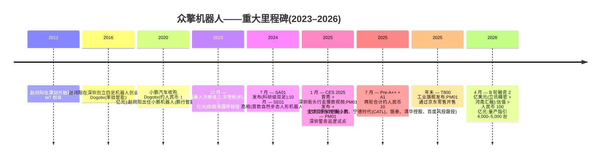
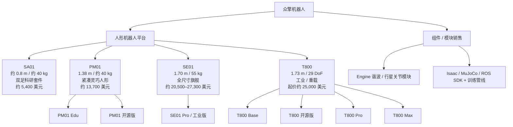
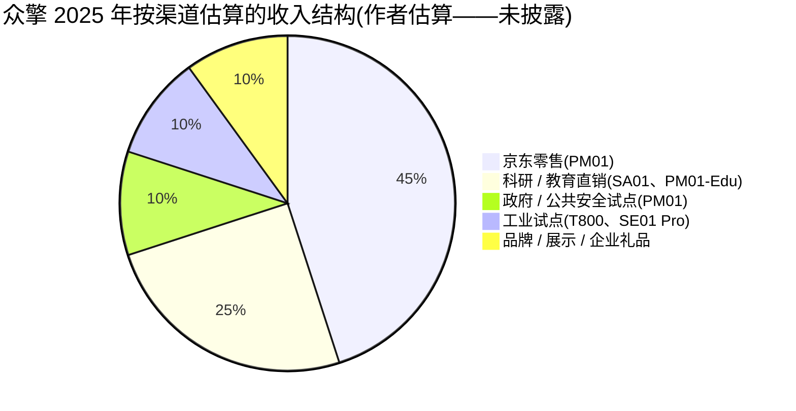
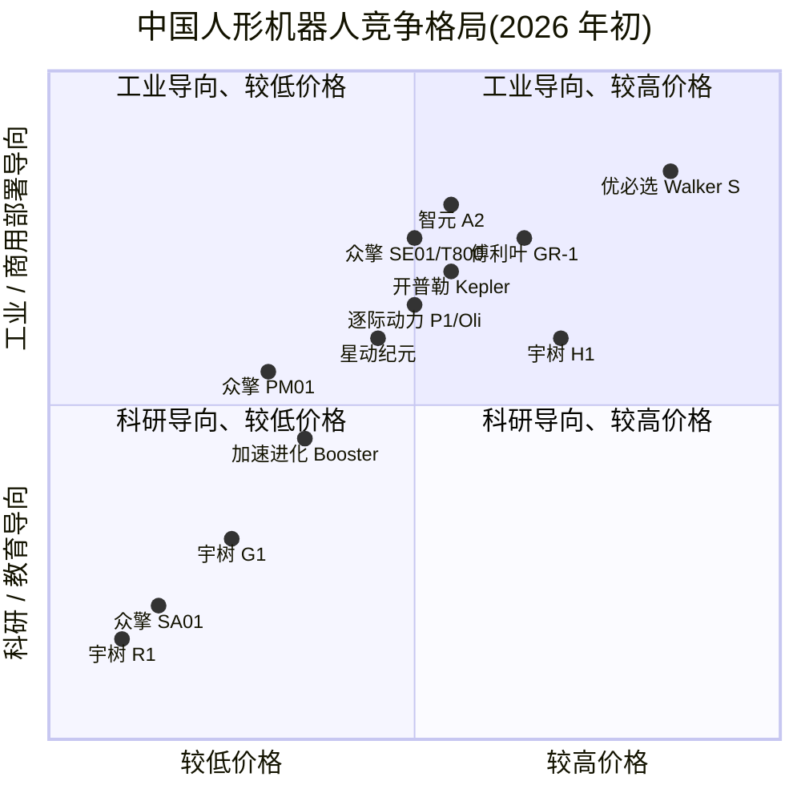

# 众擎机器人(EngineAI Robotics)——公司研究报告

**日期:** 2026-05-19
**主体:** 深圳市众擎机器人科技有限公司(Shenzhen EngineAI Robotics Technology Co., Ltd.)
**状态:** 私营企业,已完成 B 轮融资
**总部:** 中国广东深圳
**成立时间:** 2023 年 10 月
**创始人兼 CEO:** 赵同阳

> **更新——B 轮已完成,估值升至约人民币 100 亿元以上(2026-04):** 众擎完成 2 亿美元 B 轮融资,由河南省豫资投资集团旗下汇融基金与立讯精密(Luxshare Precision)联合领投,据报道投后估值已突破人民币 100 亿元(约合 14 亿美元)。管理层指引 2026 年人形机器人交付量达到 4,000–5,000 台,并将 2027 年年产能目标设定为 30,000–50,000 台。来源:[Pandaily, 2026-04-10](https://pandaily.com/engine-ai-raises-200-million-in-series-b-valuation-exceeds-rmb-10-billion);旁证:[Humanoids Daily, 2026-04](https://www.humanoidsdaily.com/news/engineai-secures-200-million-series-b-as-manufacturing-giant-luxshare-joins-the-cap-table)。此次 B 轮之前,公司已于 2025 年年中由京东(JD.com)领投 Pre-A++ 和 A1 两轮合计约人民币 10 亿元的融资([PR Newswire, 2025-07-22](https://www.prnewswire.com/news-releases/engineai-raises-nearly-rmb-1-billion-in-pre-a-and-a1-rounds-led-by-jdcom-302512882.html))。

---

## 目录

1. 公司概览
2. 公司沿革
3. 管理团队
4. 产品与服务
5. 客户与市场拓展
6. 行业概览
7. 竞争格局
8. 市场机会(TAM)
9. 风险评估

参考文献

---

## 1. 公司概览

众擎机器人——注册名称为深圳市众擎机器人科技有限公司,中文俗称**众擎机器人**(Zhongqing Jiqiren)——是一家总部位于深圳的初创企业,设计、制造并销售通用型双足人形机器人。公司位列中国机器人企业中迅速崛起的"下一代具身智能(embodied AI)"集团之中,同时在列的还有宇树(Unitree)、智元(Agibot)、逐际动力(LimX Dynamics)、星动纪元(Robotera)、加速进化(Booster Robotics)、开普勒(Kepler),以及已上市的优必选(UBTECH,9880.HK)。其创业逻辑在创始人赵同阳的多次访谈中反复出现:人形机器人是一种类似智能手机的"通用硬件平台",其大规模放量需要满足三个条件:(a) 行走和全身控制能在实验室之外稳定工作;(b) 物料成本(BoM)下降到支持大规模部署的水平;(c) 公司对核心环节(关节、电机、控制器、基于学习的运动控制)拥有足够强的自研能力,以形成持续叠加的改进飞轮([关于众擎 — engineai.com.cn/about-us](https://www.engineai.com.cn/about-us.html);[The Wire China — Zhao Tongyang profile](https://www.thewirechina.com/whos_who/zhao-tongyang-%E8%B5%B5%E5%90%8C%E9%98%B3/))。

截至 2026 年年中,公司的产品线涵盖四大命名平台——**SA01**、**PM01**、**SE01** 以及全新旗舰**T800**——价格带从约 5,400 美元(科研级 SA01)延伸至约 25,000 美元(工业级 T800)。对于一家成立仅两年的公司而言,这一产品矩阵在两个方面颇为特别:(1) 每一款平台均为全栈自研,采用自研的谐波减速关节、双编码器模块与力控执行器;(2) 公司在每一个产品阶梯上都明确推出一款面向研究/开发的开放版本,与商用版本并行销售,延续了宇树以 G1 为代表的、对 Isaac/MuJoCo/ROS 友好的开发者生态叙事([SE01 product page — en.engineai.com.cn](https://en.engineai.com.cn/about-process-se01.html);[PM01 product page — en.engineai.com.cn](https://en.engineai.com.cn/product-pm01.html))。

**众擎的盈利模式**目前仍以硬件毛利为主,而非软件平台:当前收入来自机器人本体以及配套模块(关节套件、电池、SDK 授权)的单台销售,买方主要分为三类——科研机构与高校(SA01、PM01-Edu)、商用/展示客户(如各地市政展示项目和品牌活动)以及早期工业试点客户(T800、SE01 Pro)。The Robot Report 在报道 PM01 于 2025 年初的发布时指出,这款产品明确针对"商用与教育用途",原因是众擎判断更广义的工业人形机器人市场尚未做好无人化部署的准备([The Robot Report, 2025-01](https://www.therobotreport.com/engineai-releases-pm01-humanoid-robot-for-commercial-educational-use/))。

**地域布局。** 公司总部位于深圳,研发与制造主要落地于宝安区。多次公开访谈指出,团队骨干大量来自创始人此前在小鹏机器人(XPeng Robotics)的旧部,而后者在他 2021–2023 年掌舵期间分布在北京、深圳与硅谷([CnEVPost, 2026-04](https://cnevpost.com/2026/04/15/former-xpeng-autonomous-driving-chief-to-join-engineai/))。公司曾在深圳举办公开展示活动(2025 年初 SE01 在公司门口街道行走的爆款视频)、参加拉斯维加斯 CES 2025,并于 2025 年 2 月开展深圳警务巡逻试点。

**规模指标。** 众擎并未发布经审计的财务报表。最接近收入规模的可披露代理指标如下:

- **累计融资额:** 据多方报道,从天使轮到 B 轮累计融资约 **3.8 亿美元**([Crunchbase profile — EngineAI](https://www.crunchbase.com/organization/engineai);[Pandaily, 2026-04-10](https://pandaily.com/engine-ai-raises-200-million-in-series-b-valuation-exceeds-rmb-10-billion))。
- **产能指引:** 管理层公开指引为:2025 年年底各型号合计产量目标 1,000 台;2026 年产量 4,000–5,000 台;2027 年年产能目标 30,000–50,000 台([Humanoids Daily, 2026-04](https://www.humanoidsdaily.com/news/engineai-secures-200-million-series-b-as-manufacturing-giant-luxshare-joins-the-cap-table);[Interesting Engineering, 2025-01](https://interestingengineering.com/innovation/watch-se01-humanoid-robot-walk))。
- **单品销售情况:** PM01 于 2025 年 6 月在京东上线,据京东披露在 2025 年成为品类爆款,月销量在 500 台以上([新浪财经, 2026-04-14](https://finance.sina.com.cn/wm/2026-04-14/doc-inhumwqc9116888.shtml))。*注:该数据未经独立审计,标注为未核实。*
- **员工人数:** 未官方披露;媒体访谈和 LinkedIn 估算显示 2026 年 5 月员工规模约为 200–300 人(标注为未核实——公司未公开数字)。

**估值快照(私营,无公开交易倍数)。** 由于众擎是私营公司且尚未规模化产生收入,无 TTM P/E 或 P/S 可用。最接近的替代锚点是最近一轮融资。

- **最近一轮:** B 轮融资,金额 2 亿美元,2026 年 4 月完成,投后估值据报道超过 **人民币 100 亿元(约合 14 亿美元)**([Pandaily, 2026-04-10](https://pandaily.com/engine-ai-raises-200-million-in-series-b-valuation-exceeds-rmb-10-billion))。另有中文来源([知乎 — 赵同阳 profile, 2025-07](https://zhuanlan.zhihu.com/p/27794697251))援引 2025 年年中融资轮后估值"人民币 150 亿元"的更高数字;*该数字与 Pandaily/Humanoids Daily 关于 2026 年 4 月 B 轮的报道相冲突,在缺乏一级披露前标注为未核实*。我们以人民币 100 亿元作为保守工作口径。
- **隐含收入倍数:** 未披露。如果管理层完成其 2026 年产销指引区间下限(4,000 台,综合售价(ASP)约人民币 15 万元——融合 PM01、SE01 与 T800 的口径),则 2026 年隐含收入约 **人民币 6 亿元(约合 8,400 万美元)**,对应估值约为 17 倍远期销售收入(forward P/S)。该倍数落在当前中国人形机器人同业的定价区间内(见第 7 节),亦符合 Humanoids Daily 所记录的更广义的人形机器人资本周期溢价水平([The Great Valuation Chasm, 2025](https://www.humanoidsdaily.com/news/the-great-valuation-chasm-a-2025-guide-to-the-humanoid-robotics-capital-race))。17 倍这一数字为**作者估算**,非披露数据,使用时应当谨慎。

**同业估值参照(私营 + 上市可比公司):**

| 公司 | 最新估值 / 市值(美元) | 参考 |
|---|---|---|
| 宇树(Unitree) | 约 17 亿美元私募估值(2025 年年中);IPO 指引约 70 亿美元(2025 年 9 月);已申报科创板(STAR Market)IPO,拟募资约 5.8–6.1 亿美元 | [CNBC, 2025-09-09](https://www.cnbc.com/2025/09/09/chinas-unitree-plans-7-billion-ipo-valuation-as-humanoid-robot-race-heats-up.html);[Rest of World, 2026](https://restofworld.org/2026/unitree-china-humanoid-robot-shanghai-ipo/) |
| 智元(Agibot / Zhiyuan) | 私营;2025 年报告出货 5,168 台;已释放上市规划信号 | [XCarspace ranking, 2026](https://xcarspace.com/top-20-chinese-humanoid-robot-companies-ranked-by-valuation/) |
| 逐际动力(LimX Dynamics) | 私营;京东、腾讯等支持 | [TMTPost, 2025](https://en.tmtpost.com/post/7632722) |
| 星动纪元(Robotera) | 私营;2026 年 3 月据报道完成大额融资,但具体金额各家报道不一,标注为未核实 | [XCarspace ranking, 2026](https://xcarspace.com/top-20-chinese-humanoid-robot-companies-ranked-by-valuation/) |
| 开普勒(Kepler) | 私营;主推约 3 万美元的全尺寸工业机型 | [Robozaps, 2026](https://blog.robozaps.com/b/best-humanoid-robots) |
| 加速进化(Booster Robotics) | 私营;累计融资约 2,800 万美元;深创投(SCGC)领投 A 轮 | [Tracxn, 2026](https://tracxn.com/d/companies/boosterrobotics/___tqO8895z72kqKHdWqpuYmz_DhgO-j3eMIz-krY_9jk) |
| 傅利叶智能(Fourier Intelligence) | 约 11 亿美元(2025 年 5 月) | [PitchBook profile](https://pitchbook.com/profiles/company/229975-48) |
| 优必选(UBTECH,HKEX:9880) | 港币约 110.80/股 = 市值约 50 亿美元+(2026 年 5 月);2025 财年收入人民币 20 亿元,同比 +53.3% | [Yahoo Finance — 9880.HK](https://finance.yahoo.com/quote/9880.HK/) |

综合来看,众擎在中国人形机器人阵营的估值处于**中段**——明显低于宇树、优必选和傅利叶,大致与智元、星动纪元持平,领先于纯科研型选手如加速进化。其相对收入的溢价较高(指引下限对应估算的十几倍远期 P/S),但与当前私募人形机器人资本的定价区间相符。**此故事中的风险并不在估值本身,而在能否如期完成产能爬坡**(见第 9 节)。


*图表以文字描述呈现(因仅有指引数据,未生成 PNG):2025 年第一季度 SE01 爆款演示 → 2025 年底公司层面 1,000 台目标 → B 轮融资后 2026 年 4,000–5,000 台指引 → 2027 年 30,000–50,000 台/年目标。来源:[Humanoids Daily, 2026-04](https://www.humanoidsdaily.com/news/engineai-secures-200-million-series-b-as-manufacturing-giant-luxshare-joins-the-cap-table)。*

---

## 2. 公司沿革

众擎的创立故事与创始人赵同阳此前在深圳从事机器人创业的 13 年密不可分。他公开将众擎描述为同一逻辑的"第三幕"——即认为足式机器人能成为主流硬件平台:第一幕是 IoT 设备,第二幕是其前一家公司 Dogotix(笨拙智能)的四足机器人,第三幕是他在小鹏汽车机器人部门期间研究的人形机器人,直至他离开小鹏创办众擎,把这一愿景推向终局([知乎, 2025-07](https://zhuanlan.zhihu.com/p/27794697251);[The Wire China — Zhao Tongyang profile](https://www.thewirechina.com/whos_who/zhao-tongyang-%E8%B5%B5%E5%90%8C%E9%98%B3/))。

众擎于 **2023 年 10 月 7 日**在深圳注册成立,赵同阳为创始人兼主要股东。首次公开亮相是 **2024 年 7 月**发布双足科研平台 SA01,随后是 **2024 年 10 月**发布 SE01——这一时刻将公司推向全球视野。2024 年 10 月 25 日的官方 SE01 新闻稿将其描述为首款使用端到端神经网络控制器(而非业界常见的经典 ZMP / 倒立摆控制)实现"自然步态"的人形机器人([GlobeNewswire, 2024-10-25](https://www.globenewswire.com/news-release/2024/10/25/2969601/0/en/Meet-EngineAI-All-new-Robotics-SE01-Successfully-Overcomes-the-Challenge-of-Natural-Gait-in-Humanoid-Robots-for-the-First-Time.html))。

下一个关键节点是 **2025 年 1–2 月**的约三周时间。众擎在 CES 2025 上展示了 PM01 + SE01([PR Newswire APAC, 2025-01](https://en.prnasia.com/releases/global/engineai-debuts-at-ces-2025-with-revolutionary-robotics-lineup-475514.shtml));发布了如今广为流传的 SE01 在深圳办公室门外普通人行道行走的视频;以 PM01 完成公司声称的全球首例人形机器人前空翻(front-flip);并启动深圳警务巡逻试点([Maginative, 2025-01](https://www.maginative.com/article/a-viral-video-of-engineais-se01-robot-walking-puts-chinese-robotics-firm-in-spotlight/);[Interesting Engineering, 2025-01](https://interestingengineering.com/innovation/watch-se01-humanoid-robot-walk);[New Atlas, 2025-02](https://newatlas.com/ai-humanoids/worlds-first-front-flip-humanoid-robot-engineai/);[Shenzhen Government Online, 2025-02](https://www.sz.gov.cn/en_szgov/news/latest/content/post_12010214.html))。



*时间线来源:综合自 [PR Newswire, 2025-07](https://www.prnewswire.com/news-releases/engineai-raises-nearly-rmb-1-billion-in-pre-a-and-a1-rounds-led-by-jdcom-302512882.html)、[GlobeNewswire, 2024-10](https://www.globenewswire.com/news-release/2024/10/25/2969601/0/en/Meet-EngineAI-All-new-Robotics-SE01-Successfully-Overcomes-the-Challenge-of-Natural-Gait-in-Humanoid-Robots-for-the-First-Time.html)、[Pandaily, 2026-04](https://pandaily.com/engine-ai-raises-200-million-in-series-b-valuation-exceeds-rmb-10-billion)、[Wikipedia — Engine AI](https://en.wikipedia.org/wiki/Engine_AI)。*

**战略转向(简述)。** 众擎自身的"转向"历史相对有限,但有两次明显的航向修正:

- **从单品到阶梯式产品组合(2024 年第四季度 → 2025 年第一季度)。** SE01 最初被设定为公司的旗舰产品。一个季度后 PM01 的发布与 SA01 的重新定位,反映出公司承认 2025 年现实的客户群是科研、教育与展示商用,而非工业部署。产品矩阵被重塑为从 5,400 美元的科研套件到 25,000 美元的工业机型的阶梯,假设客户会沿阶梯向上迁移并带动销售。
- **从知识产权/展示叙事转向制造放量(2026 年第二季度)。** B 轮融资公告及立讯精密进入股东名册,标志着公司主动从"我们有最好的演示"转向"我们能以苹果供应链级别的规模出货"。立讯是中国最大的合同制造商之一,也是苹果一级供应商——中文分析将其进入股东名册更多解读为制造端的战略合作信号,其次才是财务信号([Humanoids Daily, 2026-04](https://www.humanoidsdaily.com/news/engineai-secures-200-million-series-b-as-manufacturing-giant-luxshare-joins-the-cap-table))。

**并购:** 未披露。

**近期进展(近 12 个月)。** (1) T800 作为重型工业/公共安全平台发布,采用固态电池架构,续航 4–5 小时([New Atlas, 2026](https://newatlas.com/ai-humanoids/engineai-t800-humanoid/));(2) PM01 在京东上架销售([新浪财经, 2026-04](https://finance.sina.com.cn/wm/2026-04-14/doc-inhumwqc9116888.shtml));(3) 据报道前小鹏自动驾驶负责人于 2026 年加入众擎,体现感知/AI 方向高管补强([CnEVPost, 2026-04-15](https://cnevpost.com/2026/04/15/former-xpeng-autonomous-driving-chief-to-join-engineai/));(4) 与星际无垠(Interstellor)就 PM01 启动"人形宇航员"项目战略合作([Gasgoo, 2026](https://autonews.gasgoo.com/articles/news/xiao-zhi-weekly-engineai-partners-with-interstellor-2018303504899002369))。

---

## 3. 管理团队

### 赵同阳——创始人兼 CEO

赵同阳是本故事中最为关键的人物,公司无论从哪个角度都是创始人主导、由创始人定义的组织。他目前处于 30 多岁——公开档案显示约出生于 1989 年——在中文媒体的描述中,他在创立众擎时已是一位"在深圳深耕机器人 13 年的老兵"([知乎, 2025-07](https://zhuanlan.zhihu.com/p/27794697251);[The Wire China — Zhao Tongyang](https://www.thewirechina.com/whos_who/zhao-tongyang-%E8%B5%B5%E5%90%8C%E9%98%B3/))。

他的职业轨迹与每段经历中的关键成就如下:

- **2012–2016 — IoT 设备,深圳。** 赵在约 23 岁创立首家公司,做 IoT 模组。他在访谈中表示,这一阶段教会了他"硬件单台经济性",也让他熟悉了深圳电子供应链。具体财务结果未公开披露。
- **2016–2020 — Dogotix(笨拙智能),四足机器人,深圳。** 赵于 2016 年创立 Dogotix(部分来源记为 2019 年,期间公司重组过一次),主攻四足机器人,与彼时正放量的宇树同处一个品类。Dogotix 于 2020 年交付首台商用四足机器人。*最关键的成就:* 公司于 **2020 年 12 月以近人民币 1 亿元**被小鹏汽车收购([The Wire China](https://www.thewirechina.com/whos_who/zhao-tongyang-%E8%B5%B5%E5%90%8C%E9%98%B3/))。
- **2021–2023 — 小鹏机器人(鹏行智能)总经理。** 收购完成后,赵掌舵小鹏机器人部门——团队规模约 400 人,分布于北京、深圳与硅谷研发中心。其领导期间团队交付了:小鹏 1024 科技日上亮相的"小白龙"四足机器人,以及 **PX5 人形机器人原型**——小鹏首款全尺寸双足机器人,曾在舞台上现场行走,是 SE01 架构的直接前身([知乎, 2025-07](https://zhuanlan.zhihu.com/p/27794697251))。据报道,PX5 里程碑达成后,赵获得了约"人民币 1 亿元"(约合 1,400 万美元)的天使轮意向,用于其计划中的独立创业——他随即于 2023 年年中离开小鹏,开启第三次创业。
- **2023 年至今 — 众擎机器人创始人兼 CEO。** 2023 年 10 月注册成立众擎。截至 2026 年 5 月,众擎据报道在天使、Pre-A++、A1 与 B 轮中累计融资约 3.8 亿美元,商业化推出四款机器人平台,并完成赵本人所宣称的全球首例人形机器人前空翻([Pandaily, 2026-04](https://pandaily.com/engine-ai-raises-200-million-in-series-b-valuation-exceeds-rmb-10-billion);[New Atlas, 2025-02](https://newatlas.com/ai-humanoids/worlds-first-front-flip-humanoid-robot-engineai/))。

**教育背景与持股情况。** 赵的教育背景在各类来源中口径不一,**标注为未核实**。多份中文档案描述他未完成顶尖大学学位,机电一体化基本自学。其在众擎的具体持股比例未披露,业界普遍认为创始人保留控制权,但具体股权数字未公开。

**公众形象。** 作为一名中国硬件创业者,赵的媒体露出度异常活跃。他曾接受 CnEVPost、The Wire China、36 氪、Pandaily、Interesting Engineering 和 CnTech 等媒体报道,曾被引述将自己与雷军(小米)作比,小鹏汽车创始人何小鹏也曾公开称其为其引进过的最优秀人才之一([知乎, 2025-07](https://zhuanlan.zhihu.com/p/27794697251))。反复出现的叙事主题是"会真正交付产品的耐心工程师"。

### CFO / 财务负责人

众擎尚未公开任命 CFO。涉及融资的公开信息([PR Newswire, 2025-07](https://www.prnewswire.com/news-releases/engineai-raises-nearly-rmb-1-billion-in-pre-a-and-a1-rounds-led-by-jdcom-302512882.html))直接归功于赵同阳。作为一家估值已超过 10 亿美元、在 3–5 年内大概率有上市路径的私营公司,目前缺少一名公开露面、具备 IPO 经验的 CFO 是一项明显的短板。*标注:截至 2026 年 5 月,无可核实的 CFO 任命信息。*

### 高管补强——小鹏自动驾驶团队人才转入(2026 年)

CnEVPost 于 2026 年 4 月报道,小鹏自动驾驶部门前负责人(具体姓名在公开报道中未披露)将加入众擎,负责具身智能 / 感知方向([CnEVPost, 2026-04-15](https://cnevpost.com/2026/04/15/former-xpeng-autonomous-driving-chief-to-join-engineai/))。这一结构性信号十分重要:人形机器人正越来越像一个自动驾驶式的感知 + 控制 + 规划问题,而众擎正在引入一位自动驾驶级别的负责人来掌舵这一方向。

### 工程团队组织

公司中文官网团队页([众擎团队 — about-team](https://www.engineai.com.cn/about-team.html))描述团队主体来自小鹏机器人(鹏行智能)前员工,同时还有大疆(DJI)、华为以及腾讯机器人 X 实验室(Tencent Robotics X-Lab)的资深成员。谐波减速、力控关节模块与端到端强化学习运动控制栈被声明为完全自研,其中关节模块特别命名为"Engine"(也是公司名称的来源)。技术领导层的构成与创始人将其 Dogotix 与小鹏机器人旧部一并带过来的人才方式保持一致——*有利于执行,但也带来对应的风险:高管板凳过于集中在创始人周边。*

### 公司治理

众擎是一家中国境内私营公司(等同于内资 WFOE 之外的有限责任公司),治理信息披露较少:

- **董事会构成:** 无正式公开披露。当前股东名册包括京东、立讯精密、小鹏 / 小鹏汇天(Xpeng Aeroht)、宁德时代关联的普慧资本(Puhui Capital)、银泰集团、清华控股资本、百度风投以及河南豫资投资集团旗下汇融基金([PR Newswire, 2025-07](https://www.prnewswire.com/news-releases/engineai-raises-nearly-rmb-1-billion-in-pre-a-and-a1-rounds-led-by-jdcom-302512882.html);[Pandaily, 2026-04](https://pandaily.com/engine-ai-raises-200-million-in-series-b-valuation-exceeds-rmb-10-billion))。对于中国成长期机器人公司而言,创始人保留董事会控制权、机构投资者拥有两到三个董事席位是常见结构,但具体安排未披露。
- **内部持股:** 未披露。
- **薪酬:** 未披露。
- **关联交易 / 治理关注点:** 与京东(渠道 / 商业)以及与小鹏(Pre-A++ 领投方,亦是创始人前雇主)存在战略合作。这些在同业中较为常见,但在未来 IPO 信息披露周期之前值得持续追踪。

### 管理层履历综合评价

这支团队最核心的资质是创始人已经以非常类似的方式做过两次——Dogotix 以人民币 1 亿元出售给小鹏,随后他将小鹏机器人从零做到公开演示的人形机器人。"两轮在前、一次退出、第三次创业"的模式比一般创始人项目所传递的信号都要强。最大的缺口在于缺少公开的、经过资本市场检验的 CFO,以及在赵本人之外披露相对薄弱的高管板凳。

---

## 4. 产品与服务

众擎卖机器人。截至 2026 年年中,根据公司中英文官网产品导航所列,产品组合由四大命名平台构成:**SA01**、**PM01**、**SE01** 和 **T800**,以及一组单独销售的关节与执行器模块([engineai.com.cn — 首页](https://www.engineai.com.cn/);[en.engineai.com.cn — 首页](https://en.engineai.com.cn/))。



*来源:基于 [engineai.com.cn 产品导航](https://www.engineai.com.cn/) 与 [PM01 product page](https://en.engineai.com.cn/product-pm01.html) 整理;定价参考 [Robots International product page](https://www.robotsinternational.com/Engine-AI.htm) 与 [Origin of Bots — T800](https://www.originofbots.com/robot/t800-by-engineai-details-specifications-rating)。*

### SE01——旗舰、爆款演示和"自然步态"标签

**SE01** 是众擎的全尺寸旗舰——**身高 170 厘米、体重 55 kg、自由度 32**,其中双手 12 DoF(每手 6 DoF)、双臂 8 DoF(每臂 4 DoF),加上每腿 6 DoF,其余 DoF 分布于腰部和颈部([SE01 product page, en.engineai.com.cn](https://en.engineai.com.cn/about-process-se01.html);[GlobeNewswire, 2024-10-25](https://www.globenewswire.com/news-release/2024/10/25/2969601/0/en/Meet-EngineAI-All-new-Robotics-SE01-Successfully-Overcomes-the-Challenge-of-Natural-Gait-in-Humanoid-Robots-for-the-First-Time.html))。在众擎公布的"正常行走"模式下行走速度为 2 m/s;设计寿命对外宣称 10 年以上(铝合金机身)。执行器栈完全自研:自研谐波、行星与滚珠丝杠关节,采用双编码器和交叉滚子轴承,并在高负载关节处配备局部强制风冷;公司披露的膝部峰值扭矩为 186 N·m([SE01 product page](https://en.engineai.com.cn/about-process-se01.html))。感知栈为多传感器架构:Intel RealSense D435 深度相机、360° 激光雷达,以及 6 路高清相机接入立体视觉神经网络([Maginative, 2025-01](https://www.maginative.com/article/a-viral-video-of-engineais-se01-robot-walking-puts-chinese-robotics-firm-in-spotlight/))。计算单元为双处理器:Intel x86 CPU 搭配 NVIDIA GPU 模块。

**深圳爆款演示(2025 年 1 月)。** 迄今为止众擎最具决定意义的产品时刻——也可以说是整个中国人形机器人行业的标志性时刻——是 2025 年 1 月初公开的一段视频,展示 SE01 在公司门口的普通深圳人行道上行走。与此前的人形机器人演示相比,差别就在步态本身:大步幅、自然摆臂、没有"格劳乔·马克斯"(Groucho Marx)式的弯腿蹲伏姿态,并且可见明显的脚跟到脚尖的滚动重心转移。NVIDIA 一位资深研究科学家最初在 X 上质疑该视频是否由 Sora 生成;公司及中国科技媒体随后确认视频真实([Maginative, 2025-01](https://www.maginative.com/article/a-viral-video-of-engineais-se01-robot-walking-puts-chinese-robotics-firm-in-spotlight/);[Interesting Engineering, 2025-01](https://interestingengineering.com/innovation/watch-se01-humanoid-robot-walk);[Digitimes, 2025-01-21](https://www.digitimes.com/news/a20250121PD213/robot-nvidia-sensetime-startup-2024.html))。其技术诉求是 SE01 的控制器为端到端强化学习训练所得,而非大多数工业人形平台所使用的经典 ZMP / 倒立摆解析控制,这使其能够利用重力和惯性,而非与之对抗。

**竞争力判定——SE01:部分形成。** SE01 的护城河是**技术性的,具体表现在运动控制器质量与一体化关节设计上**。相关竞争对手:特斯拉 Optimus(封闭,未公开定价)、Figure 02(美国,指导价约 20 万美元)、智元 A2(标价约人民币 20 万元)、宇树 H1(起价人民币 65 万元)、优必选 Walker S 系列(工业级,人民币 60 万元起)。在性价比维度,SE01 看起来颇具竞争力:1.7 米 / 32 DoF 的机型定价约 20,500–27,350 美元([Robots International — Engine AI](https://www.robotsinternational.com/Engine-AI.htm)),在宇树 H1 公开的 99,000–650,000 人民币价格带的高端区间内,价格大致便宜 2–3 倍([SCMP, 2025-08](https://www.scmp.com/tech/tech-trends/article/3319637/chinas-unitree-debuts-us5900-humanoid-robot-race-make-cheaper-products)),与宇树 G1 起价 16,000 美元相近。在已公开演示中,其步态质量确实处于业界领先水平;领先优势的*持久性*则是开放性问题——所有竞争对手都在向端到端学习式控制靠拢,而特斯拉、Figure 与智元的可用资本均多于众擎。*最直接可比标的:宇树 H1——在性价比上领先,在步态演示质量上持平,在累计出货量上落后。*

### PM01——紧凑、灵巧的前空翻平台

**PM01** 是公司的中端紧凑型人形——**身高 138 厘米、体重约 40 kg**,自由度 23–24(每臂 5 DoF + 每腿 6 DoF),腰部可旋转 320°([PM01 product page, en.engineai.com.cn](https://en.engineai.com.cn/product-pm01.html);[The Robot Report, 2025-01](https://www.therobotreport.com/engineai-releases-pm01-humanoid-robot-for-commercial-educational-use/))。运动速度 2 m/s;关节模块峰值扭矩 130 N·m。计算单元为如今 PM 与 T800 产品线通用的 Intel N97 + NVIDIA Jetson Orin 组合。标准商用版定价约 **13,700 美元**([Robots International](https://www.robotsinternational.com/Engine-AI.htm))。

**前空翻演示(2025 年 2 月)。** PM01 是众擎用于实现其所谓"全球首例人形机器人前空翻"的平台。这一技术宣称需要谨慎理解:后空翻在波士顿动力 Atlas 上自 2017 年起已被多次演示,但*前*空翻在机械上更难,因为机器人在旋转顶点会失去对落脚点的视线——直到最后一刻之前都没有触地反馈([New Atlas, 2025-02](https://newatlas.com/ai-humanoids/worlds-first-front-flip-humanoid-robot-engineai/);[TechEBlog, 2025-02](https://www.techeblog.com/engineai-pm01-humanoid-robot-front-flip/))。该演示传播极广,据我们截至 2026 年 5 月的认知,尚未被任何主要同业以可验证、同期的演示所匹敌。

**竞争力判定——PM01:部分形成。** PM01 的护城河是**价格点 + 灵敏性基准的组合**。13,700 美元明显低于宇树 H1,与宇树 G1 起价 16,000 美元大致持平,但其敏捷性档位更激进(前空翻 vs G1 公布的行走 / 侧手翻动作)。警务巡逻部署与京东零售上架使其作为**已商业化部署**而非纯科研产品具有差异化。*最直接可比标的:宇树 G1——略便宜于 G1,体型相近,敏捷性演示领先,累计产量落后。*

### SA01——科研套件

**SA01** 是双足科研 / 教育平台,也是众擎发布的首款产品(2024 年 7 月)。重量约 40 kg;行走功耗低于 200 W;可跑可跳,随附开源算法和控制栈([SA01 product page, en.engineai.com.cn](https://en.engineai.com.cn/about-process-sa01.html);[toolnavs analysis, 2026](https://toolnavs.com/en/article/884-analysis-of-engineai-humanoid-robot-how-to-choose-sa01-pm01-se01))。定价约 **5,400 美元**——显然定位在与宇树科研级产品对标。

**竞争力判定——SA01:无(行业入门级商品化)。** 在该价格带,市场正在加速商品化;胜负点是销量、生态和"进入课堂的速度",而非差异化。*最直接可比标的:宇树科研级上肢套件 4,290 美元 / R1 售价 5,900 美元——性价比基本持平,在开发者生态广度上落后于宇树。*

### T800——面向工业 / 公共安全的新旗舰

**T800** 是更新的工业 / 重载旗舰,品牌定位显然有意致敬"终结者(Terminator)":**身高 173 厘米**、29 DoF、镁铝合金机身,关节峰值扭矩 450 N·m、峰值功率输出 14,000 W,采用固态电池架构,续航 4–5 小时([New Atlas, 2026](https://newatlas.com/ai-humanoids/engineai-t800-humanoid/);[Origin of Bots — T800](https://www.originofbots.com/robot/t800-by-engineai-details-specifications-rating);[BotInfo — T800, 2026](https://botinfo.ai/articles/engineai-t800-humanoid-robot))。计算单元为 Intel N97 + NVIDIA AGX Orin 组合,AI 算力约 275 TOPS。众擎推出 T800 的四个版本——Base、开源 / 生态版、Pro 和 Max——Base 起价约 **25,000 美元(人民币 18 万元)**。京东渠道下首批 T800 出货预计于 2026 年 6 月 2 日前完成。

**竞争力判定——T800:部分形成,在价格维度倾向于"是"。** T800 是整个中国人形机器人产品集合中最激进的性价比点:一台全尺寸、续航 4–5 小时的工业机型只需 25,000 美元,明显低于优必选 Walker S(工业级,人民币 60 万元+),也远低于美国同业。真正的问题是其在 8 小时工业占空比下的可靠性。*最直接可比标的:智元 A2——体型持平,价格略领先,但智元披露的出货量更高(2025 年智元出货 5,168 台,参见 [XCarspace, 2026](https://xcarspace.com/top-20-chinese-humanoid-robot-companies-ranked-by-valuation/))。*

### 旗舰与长尾

2025–2026 年的旗舰在叙事和品牌上是 **SE01**(它仍是把众擎送上全球聚光灯的产品),但**PM01 + T800 才是真正的收入主力**。PM01 承担京东零售 SKU 与大部分出货量。T800 是 2026–2027 年押注工业放量的关键。SA01 销量与毛利均较薄,定位为面向开发者 / 学术界的入门通道。

### 产品路线图与近期发布(近 12 个月)

- **T800 量产发布(2026 年初)**——京东首批预售开启,首批出货定于 2026 年 6 月 2 日前([BotInfo, 2026](https://botinfo.ai/articles/engineai-t800-humanoid-robot))。
- **PM01 京东零售(2025 年年中)**——首款进入京东大众零售目录并实现规模化销售的人形机器人([新浪财经, 2026-04-14](https://finance.sina.com.cn/wm/2026-04-14/doc-inhumwqc9116888.shtml))。
- **PM01 宇航员 / 星际无垠合作(2026 年初)**——属于科研 / 品牌合作,而非单独的收入来源([Gasgoo, 2026](https://autonews.gasgoo.com/articles/news/xiao-zhi-weekly-engineai-partners-with-interstellor-2018303504899002369))。
- 无产品停产披露。

---

## 5. 客户与市场拓展

### 客户分层

众擎已披露的客户群(根据新闻稿和 engineai.com.cn 新闻中心整理)分为四类。公司本身并未发布客户集中度表格——披露是自愿且不完整的,因此以下数据为*定性*结论,并在相关之处**明确标注为未核实**。

1. **科研机构与高校。** SA01 为主力产品;价格(约 5,400 美元)低到能够进入院系预算范围。买方群体涵盖中国一线高校、政府研究实验室(中科院系),以及通过分销商采购 SA01 的海外科研客户。
2. **公共安全 / 政府展示。** PM01 于 2025 年 2 月在深圳警务巡逻中以高曝光度试点。最好理解为品牌与政策层面的展示,而非可持续收入([Shenzhen Government Online, 2025-02-19](https://www.sz.gov.cn/en_szgov/news/latest/content/post_12010214.html);[EYESHENZHEN, 2025-02](https://www.eyeshenzhen.com/content/2025-02/19/content_31469161.htm))。
3. **商用 / 品牌活动客户。** PM01 部署于零售门店、展会和品牌活动现场。2025 年京东渠道月销"500+ 台"——*标注未核实,因数据仅来源于单一中文二级来源([新浪财经, 2026-04-14](https://finance.sina.com.cn/wm/2026-04-14/doc-inhumwqc9116888.shtml))。*
4. **早期工业试点。** T800 处于早期工业试点部署阶段。除京东渠道合作外,众擎还披露了与中鼎股份就"技术商业化"达成的合作([engineai.com.cn 新闻中心](https://www.engineai.com.cn/about-news-media))。

### 客户集中度——披露情况

**众擎不存在公开的客户集中度披露。** 中国私营公司无需像 A 股上市公司那样在年度报告中披露"前五大客户"信息(按本项目技能规范)。因此:



*备注:此图为**作者构建的估算**,基于已披露的渠道合作信息、京东 SKU 销售情况以及警务巡逻试点。众擎并未公开按渠道或客户的收入结构。标注为未核实。*

集中度的定性判断:**最集中的单一关系是京东渠道**——既是众擎已知最大的 PM01 零售渠道,也是 A1 轮的领投方([PR Newswire, 2025-07](https://www.prnewswire.com/news-releases/engineai-raises-nearly-rmb-1-billion-in-pre-a-and-a1-rounds-led-by-jdcom-302512882.html))。这种"既是渠道又是股东"的双重角色是结构性特征而非缺陷——这一模式与京东同样领投了逐际动力(LimX Dynamics)与 Spirit AI 的做法一致([TMTPost, 2025](https://en.tmtpost.com/post/7632722))——但对单一渠道伙伴的依赖度,在风险建模视角下仍属实质性事项。如果京东将零售支持转向同集团内的竞争对手,众擎最显性的收入线可能迅速降速。

### 合同结构

众擎不披露合同结构。基于京东零售 SKU 与价格信息,2025–2026 年的主流模式仍是**逐台交易销售**,而非多年期主框架协议。T800 工业客户在规模扩大后可能进入企业主框架协议,但目前没有此类协议被公开披露。

### 分销渠道

- **京东直销零售**——主力线上渠道;PM01 在 2025 年年中的店铺页上线具有标志意义。
- **面向科研 / 教育的直销**——通过众擎销售团队及深圳总部直销。
- **战略合作**——中鼎股份、星际无垠。
- **截至 2026 年年中,公司未公开任命国际分销商**,但 CES 2025 参展以及"Robots International" / "Robots USA" 上架显示公司已在北美由聚合型分销商进行推广。

### 销售周期与获客策略

科研级产品(SA01、PM01-Edu)的销售周期类似任何高校实验室采购,以周为单位。T800 工业级部署的销售周期则要长得多(数月至一年以上),包含安全 / EHS 验证环节。PM01 类商用 / 品牌活动产品介于两者之间。

获客策略以**演示驱动 + 媒体驱动**为绝对主导:SE01 行走视频和 PM01 前空翻的病毒级传播带来的入站需求,其量级是付费营销预算难以达到的。赵同阳本人的媒体活跃度进一步强化了这一点。在演示成功时,这是低 CAC 策略;但如果竞争对手的演示盖过众擎下一次发布,则是高风险策略。

### 已披露合作伙伴(已核实)

- **京东(JD.com)**——A1 轮领投方 + 零售渠道([PR Newswire, 2025-07](https://www.prnewswire.com/news-releases/engineai-raises-nearly-rmb-1-billion-in-pre-a-and-a1-rounds-led-by-jdcom-302512882.html))。
- **立讯精密(Luxshare Precision)**——B 轮联合领投方 + 制造层面战略合作伙伴([Humanoids Daily, 2026-04](https://www.humanoidsdaily.com/news/engineai-secures-200-million-series-b-as-manufacturing-giant-luxshare-joins-the-cap-table))。
- **小鹏 / 小鹏汇天(Xpeng Aeroht)**——Pre-A++ 领投([PR Newswire, 2025-07](https://www.prnewswire.com/news-releases/engineai-raises-nearly-rmb-1-billion-in-pre-a-and-a1-rounds-led-by-jdcom-302512882.html))。
- **宁德时代关联的普慧资本、银泰集团、清华控股资本、百度风投、河南豫资投资集团旗下汇融基金**——投资人关系,也可能通过宁德时代电池供应带来潜在渠道价值。
- **星际无垠(Interstellor)**——基于 PM01 的"人形宇航员"项目品牌 / 任务合作([Gasgoo, 2026](https://autonews.gasgoo.com/articles/news/xiao-zhi-weekly-engineai-partners-with-interstellor-2018303504899002369))。
- **深圳市公安局**——2025 年 2 月 PM01 进入巡逻班次的试点部署([Shenzhen Government Online, 2025-02-19](https://www.sz.gov.cn/en_szgov/news/latest/content/post_12010214.html))。

---

## 6. 行业概览

### 行业界定

本报告所讨论的人形机器人行业,指**面向人类生活与工作环境设计的通用型双足机器人**——其与以下几类有明显区别:(a) 传统工业机械臂(为工厂自动化设计的固定底座机械臂,现有市场规模约 200 亿美元以上,由发那科 / 安川 / ABB / 库卡主导);(b) 四足机器人(波士顿动力 Spot、宇树机器狗);(c) AGV / AMR 移动平台(极智嘉、海柔创新)。人形机器人的承诺——也是其押注——在于一台与人类大小相仿的机器可在为人类设计的工作空间中替代人类劳动,而无需对工作空间进行重新改造。

毗邻行业包括:汽车制造自动化(短期最大的工业试点场景)、仓储 / 电商履约(亚马逊机器人、Symbotic、GreyOrange)、养老 / 助行机器人,以及服务 / 酒店机器人。

### 市场规模与增长

被引用最多的两个口径界定了上行空间的讨论:

- **高盛(Goldman Sachs,2024 年更新):** 至 2035 年全球人形机器人 TAM 约 **380 亿美元**,同期累计出货量约 **140 万台**([Goldman Sachs, 2024](https://www.goldmansachs.com/insights/articles/the-global-market-for-robots-could-reach-38-billion-by-2035))。
- **摩根士丹利(Morgan Stanley,2024 年框架,2025 年修订):** 至 2050 年含生态的人形机器人 TAM 约 **5 万亿美元**,对应全球约 10 亿台 ——明确包含机器人本体、上游供应链与服务经济,并采用智能手机式 S 形采纳曲线建模([Morgan Stanley, 2024](https://www.morganstanley.com/insights/articles/humanoid-robot-market-5-trillion-by-2050))。

高盛口径为"狭义行业"(机器人单台销售);摩根士丹利口径为"平台 + 服务与供应链"。两者共同的判断是:2025–2030 年为人形机器人早期采纳周期,2030–2040 年具备进入主流的潜力。

具体到**中国市场**,China-Briefing 整理的工信部(MIIT)与省级政策口径最为可参考:中国国内人形机器人市场预计 2024 年约人民币 27.6 亿元(3.8 亿美元),2026 年达人民币 105 亿元(14 亿美元),2029 年达人民币 750 亿元(103 亿美元),2035 年约人民币 3,000 亿元(410 亿美元)([China Briefing, 2025](https://www.china-briefing.com/news/chinese-humanoid-robot-market-opportunities/))。摩根士丹利修订后的预测显示,全球人形机器人单台出货量从 2023 年接近零增至 2025 年约 16,000 台;2026 年中国单年预测被上调至约 28,000 台([SCMP, 2025](https://www.scmp.com/tech/article/3341646/morgan-stanley-expects-chinas-humanoid-robot-sales-double-revised-forecast))。

### 增长驱动因素

驱动这一品类从实验室好奇心走向真实资本流入的结构性因素主要有五个:

1. **端到端神经运动控制。** 2023–2025 年的技术拐点是从经典基于模型的 ZMP / 倒立摆控制转向在机器人板载 NVIDIA / Intel 算力上运行的强化学习训练策略。SE01 自然步态演示是这一代际跃迁最清晰的公开证据之一。
2. **关键零部件成本下降。** 谐波减速关节、无刷电机、锂电池 / 固态电池,以及板载 AI 算力(Jetson Orin 档)在 2020 至 2025 年间单台成本大幅下降,使全尺寸人形机器人的物料成本从远高于 10 万美元,降至中国阵营的 2 万–3 万美元区间。
3. **基础模型层叠加。** 视觉-语言-动作(VLA)模型(谷歌 RT-2、Figure Helix、多项学术发布)使得在机器人能够"动"之后,*指定其要做什么*变得显著容易。这创造了一种 2023 年前并不存在的、围绕人形机器人单位经济性的乐观情绪层。
4. **中国国家和省级政策支持。** 人形机器人被列入工信部 2025 年战略产业目录,北京、深圳、合肥、河南等省市政府积极注资——河南豫资旗下汇融基金作为众擎 B 轮联合领投方就是直接例证。
5. **劳动力成本与人口结构。** 中国制造业人工成本持续上升,日本 / 韩国 / 欧洲的人口结构则逐年恶化。应用端的需求拉力是真实存在的,即便今天的机器人尚不足以满足这种拉力。

### 监管环境

全球范围内尚无人形机器人专属监管框架。运行标准沿袭工业机器人体系(工业机器人 ISO 10218、个人护理服务机器人 ISO 13482)。未来 2–3 年监管层的核心问题:

- **公共空间部署。** 深圳已经试点人形机器人警务巡逻——国家层面的公共空间部署框架将随之出台。
- **职场安全。** 当人形机器人从"笼内操作机械臂"走向"与人共享作业区的同事",OSHA 同等的规则需要重写。中国在这方面的监管节奏快于美国。
- **数据 / 隐私。** 板载摄像头与激光雷达带来的隐私足迹目前在很大程度上仍属未受监管状态。
- **出口管制。** 美国对中国 AI 硬件的出口管制立场会影响中国厂商获取 NVIDIA Jetson AGX 档算力的渠道。众擎目前使用 Jetson Orin,未来的进一步收紧将迫使其向国产替代品迁移。

### 行业结构

2026 年中国人形机器人格局**在厂商层面仍较分散,但正在围绕三到四家清晰的"一线"民营龙头收敛**(宇树、优必选、智元,以及紧随其后的众擎、逐际动力、星动纪元)。高盛的报道指出一个值得关注的现象:中国零部件供应商(电机、谐波减速器、传感器)正在订单确认之前激进扩产,显示行业普遍预期 2026–2027 年将出现量级的跃迁([Humanoids Daily, 2025](https://www.humanoidsdaily.com/feed/goldman-sachs-chinese-suppliers-aggressively-building-humanoid-robot-capacity-ahead-of-orders))。供应商议价能力当前处于中等水平——谐波减速器供应较为集中(Harmonic Drive Systems、绿的谐波(Leaderdrive)、来福谐波(Lealder))——但 2026–2027 年新增产能上线后,议价天平可能向买方倾斜。终端工业部署客户的议价能力在早期采纳阶段仍较弱,但随放量将逐步增强。

人形机器人的替代品包括传统工业自动化(更便宜且成熟,但仅适用于经过改造的作业环境)、专用任务机器人(码垛机、手术机器人),以及人类劳动这一现状本身——而人形机器人的设计目标正是替代后者。

---

## 7. 竞争格局

众擎面临的竞争集合可分为三类:

**第 1 组——中国民营人形机器人同业(最直接可比):** 宇树、智元、逐际动力、星动纪元、加速进化、开普勒、傅利叶智能。

**第 2 组——中国上市的人形(及类人形)企业:** 优必选(9880.HK),以及处于 IPO 通道的宇树(已申报科创板)。

**第 3 组——全球 / 美国人形机器人厂商:** 特斯拉 Optimus、Figure、波士顿动力(Atlas)、Apptronik、1X Technologies、Agility Robotics。这些今天对中国阵营尚不构成直接客户竞争,但在长期竞争格局中是重要变量——特别是特斯拉,设定了所有中国厂商必须对标的成本 / 规模标杆。



*定位依据为各家披露的价格信息与产品定位,参考 [SCMP, 2025-08](https://www.scmp.com/tech/tech-trends/article/3319637/chinas-unitree-debuts-us5900-humanoid-robot-race-make-cheaper-products)、[Humanoids Daily — Great Valuation Chasm](https://www.humanoidsdaily.com/news/the-great-valuation-chasm-a-2025-guide-to-the-humanoid-robotics-capital-race)、[XCarspace ranking, 2026](https://xcarspace.com/top-20-chinese-humanoid-robot-companies-ranked-by-valuation/),以及第 4 节所引用的产品页面。*

### 宇树(Unitree)

品类龙头。2025 年报告收入人民币 17 亿元(约合 2.35 亿美元),同比 +335%,净利润人民币 6 亿元(+674%)([Humanoids Daily — Unitree IPO filing](https://www.humanoidsdaily.com/news/unitree-files-for-580m-ipo-humanoid-sales-surpass-robot-dogs-as-profits-soar))。人形机器人出货:2025 年 5,500 台,2026 年目标 20,000 台。产品矩阵涵盖 R1(5,900 美元)、G1(起价 16,000 美元)、H1(起价人民币 65 万元)。已申报科创板 IPO,估值指引高达 70 亿美元([CNBC, 2025-09-09](https://www.cnbc.com/2025/09/09/chinas-unitree-plans-7-billion-ipo-valuation-as-humanoid-robot-race-heats-up.html))。**优势:** 品牌、盈利能力、产品矩阵宽广、开发者生态最强。**劣势:** 新进入者的"寒武纪大爆发"对价格的压制速度超过其物料成本下降速度。**vs 众擎:** 销量、品牌、盈利能力领先;步态演示质量持平;在重型工业旗舰规格上落后。

### 智元(Agibot / Zhiyuan)

由前华为"天才少年"彭志辉("稚晖君")创立。2025 年出货 5,168 台([XCarspace, 2026](https://xcarspace.com/top-20-chinese-humanoid-robot-companies-ranked-by-valuation/))。工业 / 物流定位明确。已公开释放 2026 年上市计划信号。**vs 众擎:** 出货量与工业部署深度领先;形态体型持平;在步态演示的传播性上落后。

### 逐际动力(LimX Dynamics)

由京东、腾讯等支持([TMTPost, 2025](https://en.tmtpost.com/post/7632722))。2025 年夏发布全尺寸人形 Oli;P1 平台对标 Atlas。2026 年披露面向中东的数千台部署计划([WebProNews, 2026](https://www.webpronews.com/chinas-robot-surge-targets-u-s-gulf-limx-challenges-teslas-optimus-throne/))。**vs 众擎:** 性价比持平;国际部署管线(中东)领先;消费渠道接入落后。

### 星动纪元(Robotera)

清华孵化的人形机器人公司,2023 年 8 月成立——与众擎几乎同期([XCarspace, 2026](https://xcarspace.com/top-20-chinese-humanoid-robot-companies-ranked-by-valuation/))。"唯一具备清华大学持股的人形机器人公司"。据报道完成 2026 年大额融资轮(具体金额英文来源披露不清)。**vs 众擎:** 体量相近;星动纪元在学术背书上具有优势,众擎在演示与出货上具有优势。

### 优必选(UBTECH / 9880.HK)

已上市的传统龙头。2025 财年收入人民币 20 亿元(同比 +53.3%),全尺寸人形机器人占总收入 41.1%。截至 2026 年 5 月中旬股价约港币 110.80/股([Yahoo Finance — 9880.HK](https://finance.yahoo.com/quote/9880.HK/))。Walker S 系列瞄准工业部署。**vs 众擎:** 在收入、公开市场可信度、已披露的工业部署(比亚迪、富士康试点等访谈中提及)上领先;在中端价格性价比与演示传播性上落后。优必选是众擎未来 IPO 最可能对标的"公开市场基准"。

### 傅利叶智能(Fourier Intelligence)

GR-1 人形机器人平台;约 11 亿美元投前估值(2025 年 5 月)([PitchBook profile](https://pitchbook.com/profiles/company/229975-48))。软银愿景基金投资。**vs 众擎:** 在康复 / 医疗机器人的毗邻领域领先;在人形机器人平台上持平;在已出货人形机器人单台叙事上落后。

### 加速进化(Booster Robotics)

体量较小,累计融资约 2,800 万美元,共三轮([Tracxn, 2026](https://tracxn.com/d/companies/boosterrobotics/___tqO8895z72kqKHdWqpuYmz_DhgO-j3eMIz-krY_9jk))。A 轮由深创投(SCGC)领投。**vs 众擎:** 在融资、规模与产品广度上明显落后。

### 开普勒(Kepler)

主推约 3 万美元的全尺寸工业机型([Robozaps, 2026](https://blog.robozaps.com/b/best-humanoid-robots))。**vs 众擎:** 在工业级别的性价比上大致持平;公开演示节奏较少。

### 众擎的竞争脆弱性

三项需要直面的脆弱性:

1. **相对同业的资本厚度。** 累计融资 3.8 亿美元已属可观,但低于宇树未来 IPO 的预期估值,以及全球范围内的 Figure / 特斯拉 Optimus。如果 2026–2027 年演变为资本军备竞赛,众擎处于中段位置。
2. **品牌深度。** 众擎的品牌建立在两次爆款演示上(SE01 行走、PM01 前空翻)。2025 年的演示如今已经过去一年多;如果竞争对手在 2026–2027 年掌握更强的演示节奏,叙事主导权可能转移。
3. **工业销售路径。** 与优必选(Walker S 比亚迪试点、多项工业部署公告)、智元(2025 年 5,168 台工业 / 物流部署)以及逐际动力(中东管线)相比,众擎尚无旗舰级工业客户徽章。T800 是 2026 年补齐这一空缺的关键押注。

### 众擎的优势

1. **创始人履历与执行力背书。** 赵同阳已经做过两次类似的事。
2. **垂直整合深度。** 关节、电机、控制器、基于学习的步态控制全部自研。
3. **京东渠道通路。** 中国其他人形机器人公司没有可比的消费零售牵引力。
4. **制造端规模合作。** 立讯精密进入 B 轮股东名册在同业中是独有的。

---

## 8. 市场机会(TAM)

### TAM 测算

以下三个 TAM 视角各有方法论与适用边界:

- **高盛(Goldman Sachs,2024):** 至 2035 年全球人形机器人 TAM **380 亿美元**,累计 140 万台。方法论:自下而上的单台预测,ASP 曲线假设至 2030 年降至 1.5 万–2 万美元区间([Goldman Sachs, 2024](https://www.goldmansachs.com/insights/articles/the-global-market-for-robots-could-reach-38-billion-by-2035))。这是保守 / 狭义口径。
- **摩根士丹利(Morgan Stanley,2024):** 至 2050 年生态 TAM **5 万亿美元**,接近 10 亿台。方法论:智能手机式 S 形采纳曲线,按全球人口与劳动力池渗透率缩放;生态包括机器人本体、零部件、软件与服务([Morgan Stanley, 2024](https://www.morganstanley.com/insights/articles/humanoid-robot-market-5-trillion-by-2050))。这是乐观 / 平台口径。
- **中国本土(China Briefing / 工信部口径):** 至 2035 年中国人形机器人市场 **人民币 3,000 亿元(约合 410 亿美元)**,2024 年起点约 3.8 亿美元([China Briefing, 2025](https://www.china-briefing.com/news/chinese-humanoid-robot-market-opportunities/))。

对众擎而言,SAM(可服务市场)——即一家深圳注册、中国资本主导的人形机器人公司在未来 5 年现实可触达的全球 TAM 切片——为:

- **2029 年中国国内 SAM:** 约 100 亿美元([China Briefing, 2025](https://www.china-briefing.com/news/chinese-humanoid-robot-market-opportunities/))。
- **2029 年亚洲(中国除外)SAM:** 额外约 20–40 亿美元,主要在日本和韩国,需求由人口结构驱动。
- **2029 年中东 + 欧洲(不含国防)SAM:** 再加 10–30 亿美元,其中中东管线已被逐际动力锁定。

合理估计众擎到 2029 年的潜在 SAM 在 **100–150 亿美元区间**,以中国权重为主。

### SOM——可获取市场

如果管理层 2027 年 30,000–50,000 台 / 年的产能目标得以实现,综合 ASP 在人民币 10 万–15 万元区间,则 2027 年隐含收入为 **人民币 30–75 亿元(4.2–10 亿美元)**。以区间中位数测算(约 4 万台 × 人民币 12.5 万元 ≈ 50 亿元 ≈ 7 亿美元),众擎大约能占据 2029 年中国人形机器人 SAM 预测值的 **5–8%**,前提是它能比原定路线提前两年达成该目标——这是与其当前股东名册中可比公司排名一致的、有底气的中段位置。

```text
众擎成长情景(示意——作者估算,非公司指引):
                       2026E       2027E       2029E
单台出货量             4,500       40,000      100,000
综合 ASP(人民币)     15 万元     12.5 万元   10 万元
营收(人民币亿元)    7           50          100
隐含中国份额          ~6%         ~25%        ~12%(基于更大的 2029 年市场)
```

*来源:作者基于众擎指引([Humanoids Daily, 2026-04](https://www.humanoidsdaily.com/news/engineai-secures-200-million-series-b-as-manufacturing-giant-luxshare-joins-the-cap-table))与 China-Briefing TAM 数据自行构建。*

### 渗透策略

最具可信度的 2026–2029 年渗透路径:

1. **2026 — 锚定京东零售渠道 + 深圳政府展示 + 首个工业旗舰客户徽章。** 利用 SE01 / PM01 / T800 的阶梯捕获科研、教育与展示客户的早期采纳池,同时拿下一家关键工业参考客户。
2. **2027 — 将立讯精密制造合作转化为 30,000 台以上的年产能。** 这是产能爬坡的关键年份;成败既取决于供应链,也取决于至少 3–5 个工业客户徽章的落地。
3. **2028–2029 — 国际扩张(中东、东南亚、日本)并进入养老 / 家庭服务。** 这是长尾增长阶段,也是综合 ASP 压缩最快的阶段。

### 市场份额机会

现实的 2029 年市占目标:

- **中国国内:** 中国人形机器人市场的 **5–10%**(若 T800 工业客户突破成功,属于激进但可达的目标)。
- **亚洲(中国除外):** 2–4%(渠道合作仍处早期)。
- **全球:** 高盛口径全球 TAM 的约 2–3%。

这些数字意味着众擎是中国 3–5 家一线人形机器人公司之一——*并非*品类冠军,但是一个具备 IPO 级别可信度的二线名字。这一定位与当前 B 轮估值水平一致。

---

## 9. 风险评估

### 公司层面风险

**1. 执行风险——从约 1,000 台(2025)产能到 30,000–50,000 台(2027)产能的爬坡。** 众擎正在指引一个 24 个月内约 30–50 倍的销量跃升([Humanoids Daily, 2026-04](https://www.humanoidsdaily.com/news/engineai-secures-200-million-series-b-as-manufacturing-giant-luxshare-joins-the-cap-table))。即便有立讯精密作为制造合作伙伴,这一爬坡所伴随的运营、质量与保修成本风险均属首要风险——历史上,处于该阶段的硬件公司爬坡延误幅度普遍在 30–50%。*缓释:* 立讯精密进入股东名册;创始人此前在小鹏机器人有 400 人团队经验。*可能性:高。严重性:重大。*

**2. 客户集中度——京东渠道依赖度。** 京东既是已知最大的零售渠道(PM01),也是 A1 轮领投方。如果京东把零售支持转向竞争对手(逐际动力、Spirit AI——均为京东投资标的)或撤回品类投资,众擎最显性的收入线可能迅速压缩。*定量:* 作者估算 2025 年约 45% 收入经京东零售实现——标注未核实。*缓释:* 通过 T800 直销企业 / 工业渠道;海外分销关系。*可能性:中。严重性:高。*

**3. 关键人物依赖于赵同阳。** 公司毫无疑义地是创始人主导,赵之外的 CFO 与多数高管职位要么未公开,要么未披露。品牌、叙事与产品方向均高度系于赵的个人媒体存在与此前两轮执行业绩。*缓释:* 2026 年小鹏自动驾驶前负责人加盟([CnEVPost, 2026-04](https://cnevpost.com/2026/04/15/former-xpeng-autonomous-driving-chief-to-join-engineai/))缩小了这一缺口,但板凳仍薄。*可能性:中。严重性:高。*

**4. 产品 / 技术过时——步态控制器商品化。** SE01 自然步态演示在 2025 年初处于业界领先;至 2026 年年中,多家同业(宇树 G1、智元、逐际动力 Oli)均已展示出可比的端到端 RL 控制行走。仅靠步态形成的技术护城河正在变薄。*缓释:* 垂直整合的关节、运行小时数据集积累、T800 工业级硬件。*可能性:高。严重性:中。*

**5. 供应商集中度 / 单一来源零部件。** 固态电池、谐波减速器、Jetson Orin 计算单元——每一项的供应商均较少。固态电池尤其是新部件,供应链脆弱。*缓释:* 股东名册中有宁德时代关联方为电池背书;谐波减速器可多源认证。*可能性:中。严重性:中。*

### 行业 / 市场风险

**6. 来自资本更厚的中国同业与美国龙头的竞争强度。** 宇树以约 70 亿美元估值上市预期、智元的上市筹备、特斯拉 Optimus 的物料规模优势、Figure 的融资节奏共同表明,这是一个资本边际美元向少数几个名字集中的市场。众擎处于该阵营的中段。*缓释:* 差异化的产品阶梯、演示品牌、渠道接入。*可能性:高。严重性:高。*

**7. 监管变化——公共空间部署、职场安全、数据隐私。** 当前不存在人形机器人专属框架;框架出现后,新产品的认证成本与上市周期将显著上升。*缓释:* 深圳试点关系提供早期政策情报。*可能性:中。严重性:中。*

**8. 基础模型依赖——第三方 VLA 模型可用性。** 众擎的产品定位日益依赖将自研步态控制与第三方视觉-语言-动作(VLA)模型组合。如果一线模型可用性收紧(美国对 NVIDIA Jetson 出口管制,或者 VLA 模型被特斯拉等垂直整合厂商独占),众擎的任务能力叙事将被削弱。*缓释:* 中国开源大模型生态正在壮大;小鹏自动驾驶负责人加盟夯实自研 AI 能力。*可能性:中。严重性:中。*

**9. 入门级(单价 1 万美元以下)市场供过于求 / 价格崩塌。** 高盛指出中国零部件供应商正在订单确认前激进扩产([Humanoids Daily — Goldman supplier capacity, 2025](https://www.humanoidsdaily.com/feed/goldman-sachs-chinese-suppliers-aggressively-building-humanoid-robot-capacity-ahead-of-orders))。如果 2026–2027 年供给跑过需求,1 万美元以下整机定价可能崩塌,行业整体毛利率压缩——众擎 PM01 正好落在这一价格带。*可能性:中。严重性:高。*

### 财务风险

**10. 盈利时间表与持续融资需求。** 众擎 2027–2028 年之前实现自由现金流为正的可能性较低。B 轮募集 2 亿美元;IPO 前再融 2 亿–4 亿美元属合理假设。2025–2027 年的资本周期较 2021–2023 年对中国成长期硬件公司更为竞争。*缓释:* 一线战略投资人(立讯、京东、宁德时代关联方)降低了融资周期执行风险。*可能性:中。严重性:中。*

**11. 估值 / 倍数压缩风险。** 在报道的 B 轮人民币 100 亿元以上估值下,对应作者估算的 2026 年收入约人民币 6 亿元(4,000 台 × 综合 ASP 约人民币 15 万元),众擎大约对应 **17 倍远期销售收入**——明显高于高成长硬件可比公司行业 P/S 中位数 6–8 倍。如果 2026–2027 年产能爬坡令人失望 30% 以上,或行业情绪压缩,通往 IPO 的路上极有可能出现一次明显的估值回归。*缓释:* 增长曲线在同业中确属高端;T800 工业试点带来的收入拐点可能驱动估值上修。*可能性:中。严重性:高。17 倍远期 P/S 为作者估算——在公司披露收入数据之前标注为未核实。*

### 宏观风险

**12. 美国对 AI 硬件的出口管制加严。** 众擎当前使用 NVIDIA Jetson Orin / AGX Orin 算力。美国对中国(尤其是针对 NVIDIA)先进 AI 硬件出口管制的持续收紧,将迫使其向国产替代(华为昇腾等)迁移,带来成本与性能损失。*缓释:* 中国 AI 芯片生态正在补齐能力差距;时间窗口可控。*可能性:中至高。严重性:中。*

**13. 中东 / 国际扩张的地缘政治风险。** 多家中国人形机器人同业(逐际动力,以及众擎 A 轮中通过 Sailing Ltd UAE 间接体现)瞄准中东部署。地缘政治变化(伊朗紧张、以色列-加沙局势、制裁层叠)可能扰乱这些管线。*缓释:* 仅靠中国本土市场规模即足以支撑一线公司体量。*可能性:中。严重性:低至中。*

---

## 参考文献

### 公司一级来源

- [众擎官网(中文)— engineai.com.cn](https://www.engineai.com.cn/)
- [众擎官网(英文)— en.engineai.com.cn](https://en.engineai.com.cn/)
- [关于众擎 — 关于我们](https://www.engineai.com.cn/about-us.html)
- [众擎团队页](https://www.engineai.com.cn/about-team.html)
- [SE01 产品页(中文 / 英文)](https://en.engineai.com.cn/about-process-se01.html)
- [PM01 产品页](https://en.engineai.com.cn/product-pm01.html)
- [SA01 产品页](https://en.engineai.com.cn/about-process-sa01.html)
- [众擎媒体 / 新闻页](https://www.engineai.com.cn/about-news-media)
- [众擎 SE01 发布新闻稿 — GlobeNewswire, 2024-10-25](https://www.globenewswire.com/news-release/2024/10/25/2969601/0/en/Meet-EngineAI-All-new-Robotics-SE01-Successfully-Overcomes-the-Challenge-of-Natural-Gait-in-Humanoid-Robots-for-the-First-Time.html)
- [众擎 Pre-A++ + A1 融资新闻稿 — PR Newswire, 2025-07-22](https://www.prnewswire.com/news-releases/engineai-raises-nearly-rmb-1-billion-in-pre-a-and-a1-rounds-led-by-jdcom-302512882.html)
- [众擎 B 轮报道 — Pandaily, 2026-04-10](https://pandaily.com/engine-ai-raises-200-million-in-series-b-valuation-exceeds-rmb-10-billion)

### 创始人、管理层与人物背景资料

- [赵同阳人物简介 — The Wire China](https://www.thewirechina.com/whos_who/zhao-tongyang-%E8%B5%B5%E5%90%8C%E9%98%B3/)
- [赵同阳人物简介 — 知乎, 2025-07](https://zhuanlan.zhihu.com/p/27794697251)
- [众擎维基百科条目 — Engine AI](https://en.wikipedia.org/wiki/Engine_AI)
- [前小鹏自动驾驶负责人加盟众擎 — CnEVPost, 2026-04-15](https://cnevpost.com/2026/04/15/former-xpeng-autonomous-driving-chief-to-join-engineai/)

### 融资、估值与股东名册报道

- [众擎 Crunchbase profile](https://www.crunchbase.com/organization/engineai)
- [众擎 PitchBook profile](https://pitchbook.com/profiles/company/640309-06)
- [立讯精密进入 B 轮股东名册 — Humanoids Daily, 2026-04](https://www.humanoidsdaily.com/news/engineai-secures-200-million-series-b-as-manufacturing-giant-luxshare-joins-the-cap-table)
- [B 轮 Bayelsa Watch 报道 — 2026-04](https://bayelsawatch.com/engineai-raises-200m/)
- [京东 / 机器人融资潮 — TMTPost, 2025](https://en.tmtpost.com/post/7632722)
- [众擎 新浪财经 资本报道 — 2026-04-14](https://finance.sina.com.cn/wm/2026-04-14/doc-inhumwqc9116888.shtml)

### 产品、演示与部署报道

- [SE01 爆款演示报道 — Maginative, 2025-01](https://www.maginative.com/article/a-viral-video-of-engineais-se01-robot-walking-puts-chinese-robotics-firm-in-spotlight/)
- [SE01"真实还是 CGI"报道 — Mike Kalil, 2025](https://mikekalil.com/blog/engine-ai-shenzen/)
- [SE01 与 NVIDIA / 商汤反应 — Digitimes, 2025-01-21](https://www.digitimes.com/news/a20250121PD213/robot-nvidia-sensetime-startup-2024.html)
- [SE01 亮相报道 — Interesting Engineering, 2024-10](https://interestingengineering.com/photo-story/engineai-unveils-se01-humanoid-robot)
- [SE01 行走演示 — Interesting Engineering, 2025-01](https://interestingengineering.com/innovation/watch-se01-humanoid-robot-walk)
- [Inspenet SE01 报道, 2025](https://inspenet.com/en/news/se01-humanoid-walks-fluidly-in-shenzhen-china/)
- [PM01 发布 — The Robot Report, 2025-01](https://www.therobotreport.com/engineai-releases-pm01-humanoid-robot-for-commercial-educational-use/)
- [PM01 前空翻 — New Atlas, 2025-02](https://newatlas.com/ai-humanoids/worlds-first-front-flip-humanoid-robot-engineai/)
- [PM01 前空翻 — TechEBlog, 2025-02](https://www.techeblog.com/engineai-pm01-humanoid-robot-front-flip/)
- [众擎 CES 2025 首秀 — PR Newswire APAC, 2025-01](https://en.prnasia.com/releases/global/engineai-debuts-at-ces-2025-with-revolutionary-robotics-lineup-475514.shtml)
- [众擎 CES 2025 报道 — RoboticsTomorrow, 2025-01](https://www.roboticstomorrow.com/news/2025/01/10/engineai-debuts-at-ces-2025-with-revolutionary-robotics-lineup/23844/)
- [T800 工业旗舰 — New Atlas, 2026](https://newatlas.com/ai-humanoids/engineai-t800-humanoid/)
- [T800 规格与定价 — Origin of Bots](https://www.originofbots.com/robot/t800-by-engineai-details-specifications-rating)
- [T800 规格 — BotInfo, 2026](https://botinfo.ai/articles/engineai-t800-humanoid-robot)
- [T800 评测 — The Theresa Robot For That, 2026](https://www.theresarobotforthat.com/engineais-t800-humanoid-enters-mass-production-for-25k/)
- [Robots International 众擎产品中心](https://www.robotsinternational.com/Engine-AI.htm)
- [Robozaps SE01 评测, 2026](https://blog.robozaps.com/b/engineai-se01-review)
- [Origin of Bots PM01 页面, 2026](https://www.originofbots.com/robot/pm01-by-engineai-robotics-details-specifications-rating)

### 部署 / 合作报道

- [深圳市政府在线 — 人形巡逻启动, 2025-02](https://www.sz.gov.cn/en_szgov/news/latest/content/post_12010214.html)
- [EYESHENZHEN — 机器人加入警务巡逻, 2025-02](https://www.eyeshenzhen.com/content/2025-02/19/content_31469161.htm)
- [Mike Kalil — 众擎被深圳警方部署, 2025](https://mikekalil.com/blog/engine-ai-robocop/)
- [星际无垠宇航员项目合作 — Gasgoo, 2026](https://autonews.gasgoo.com/articles/news/xiao-zhi-weekly-engineai-partners-with-interstellor-2018303504899002369)

### 竞争对手与同业报道

- [宇树 IPO 与人形机器人放量 — CNBC, 2025-09-09](https://www.cnbc.com/2025/09/09/chinas-unitree-plans-7-billion-ipo-valuation-as-humanoid-robot-race-heats-up.html)
- [宇树 IPO 申报细节 — Humanoids Daily, 2026](https://www.humanoidsdaily.com/news/unitree-files-for-580m-ipo-humanoid-sales-surpass-robot-dogs-as-profits-soar)
- [宇树科创板 IPO — Rest of World, 2026](https://restofworld.org/2026/unitree-china-humanoid-robot-shanghai-ipo/)
- [宇树 G1 产品页](https://www.unitree.com/g1/)
- [宇树 R1 / 低成本人形报道 — SCMP, 2025-08](https://www.scmp.com/tech/tech-trends/article/3319637/chinas-unitree-debuts-us5900-humanoid-robot-race-make-cheaper-products)
- [优必选 9880.HK — Yahoo Finance 行情数据](https://finance.yahoo.com/quote/9880.HK/)
- [逐际动力综述 — WebProNews, 2026](https://www.webpronews.com/chinas-robot-surge-targets-u-s-gulf-limx-challenges-teslas-optimus-throne/)
- [中国人形机器人公司 TOP 20 估值排名 — XCarspace, 2026](https://xcarspace.com/top-20-chinese-humanoid-robot-companies-ranked-by-valuation/)
- [加速进化 Booster 公司档案 — Tracxn, 2026](https://tracxn.com/d/companies/boosterrobotics/___tqO8895z72kqKHdWqpuYmz_DhgO-j3eMIz-krY_9jk)
- [傅利叶智能 — PitchBook profile](https://pitchbook.com/profiles/company/229975-48)
- [人形估值鸿沟概述 — Humanoids Daily, 2025](https://www.humanoidsdaily.com/news/the-great-valuation-chasm-a-2025-guide-to-the-humanoid-robotics-capital-race)
- [最佳人形机器人排行榜 — Robozaps, 2026](https://blog.robozaps.com/b/best-humanoid-robots)

### 行业 / TAM 来源

- [高盛 — 2035 年全球人形 TAM 380 亿美元](https://www.goldmansachs.com/insights/articles/the-global-market-for-robots-could-reach-38-billion-by-2035)
- [摩根士丹利 — 2050 年人形机器人市场 5 万亿美元](https://www.morganstanley.com/insights/articles/humanoid-robot-market-5-trillion-by-2050)
- [China-Briefing — 中国人形机器人市场机会, 2025](https://www.china-briefing.com/news/chinese-humanoid-robot-market-opportunities/)
- [摩根士丹利中国人形机器人预测修订 — SCMP, 2025](https://www.scmp.com/tech/article/3341646/morgan-stanley-expects-chinas-humanoid-robot-sales-double-revised-forecast)
- [高盛 — 中国供应商激进扩产, 2025](https://www.humanoidsdaily.com/feed/goldman-sachs-chinese-suppliers-aggressively-building-humanoid-robot-capacity-ahead-of-orders)

### 未核实条目说明

本报告中明确标注为**未核实**、有待一级披露确认的条目包括:(1) 部分中文二级来源援引的人民币 150 亿元替代估值;(2) PM01 京东月销"500+ 台";(3) 赵同阳确切的教育背景;(4) 众擎员工人数;(5) 所有作者估算的收入、渠道结构、市占率与远期 P/S 数字(行文中均已标注)。读者应将其视为目前可获得的最优定性指引,而非已披露事实。
