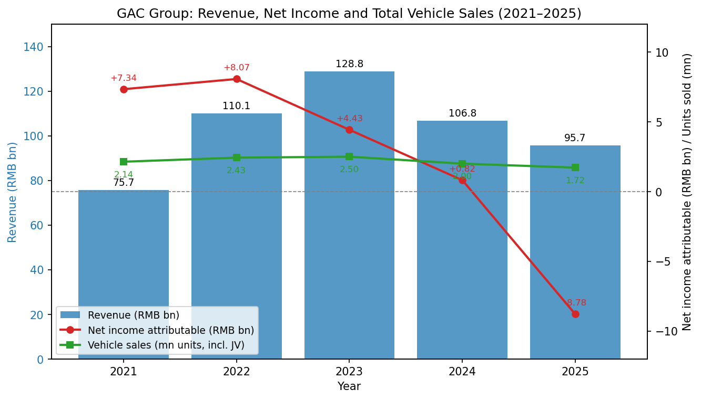
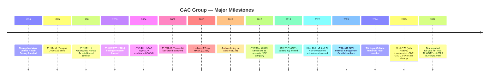
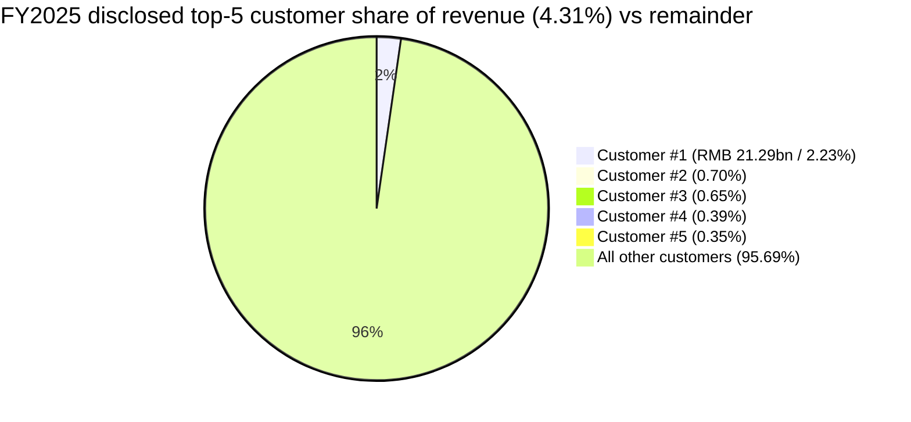
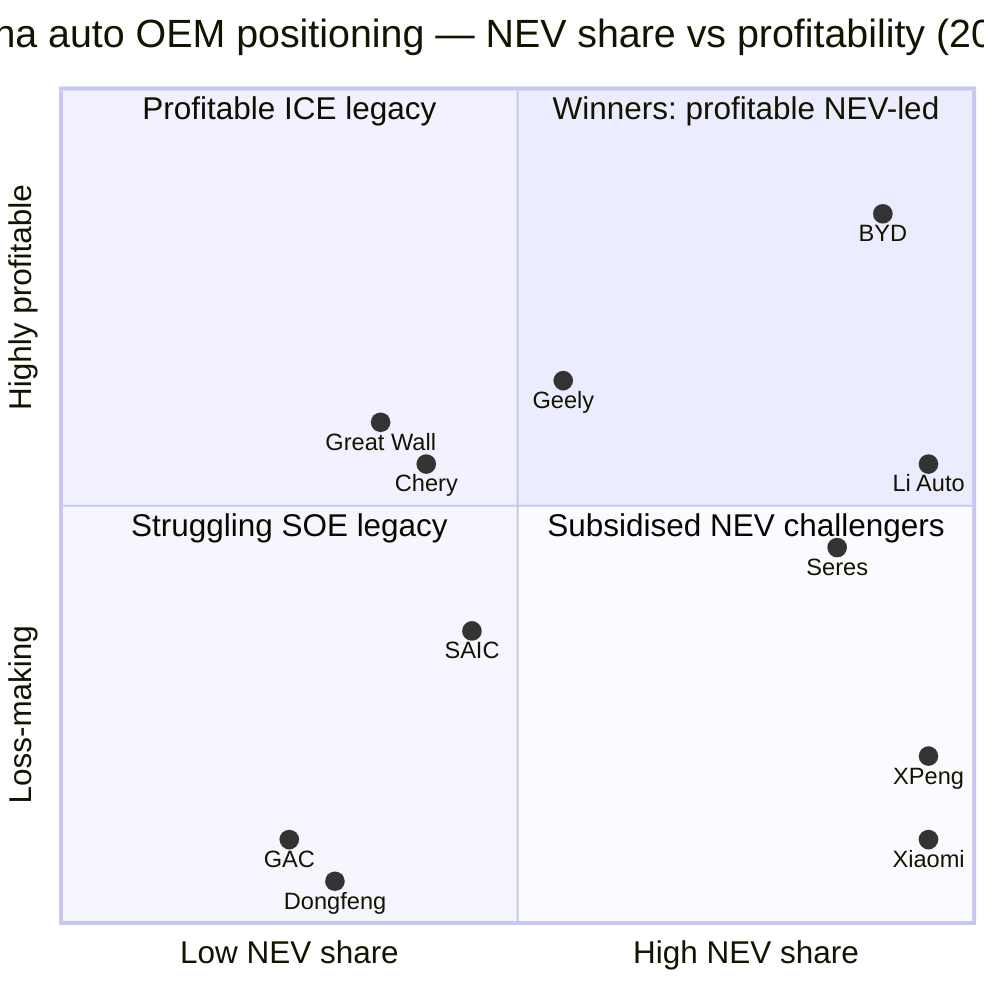
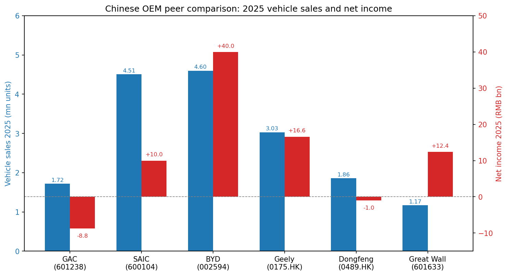
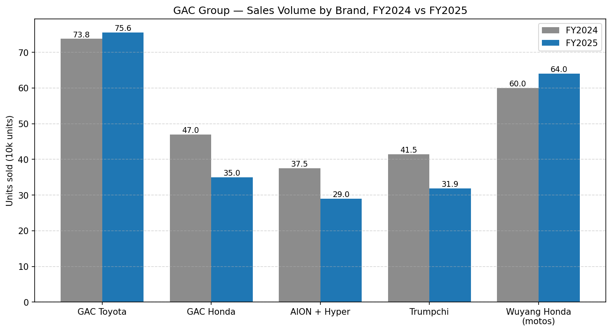

# GAC Group (广汽集团) — Equity Research Report
**Ticker:** SSE:601238 / HKEX:2238 · **Report date:** 2026-05-19 · **Language:** English (Chinese filings cited in 原文)

> **Update — FY2025 results: first reported net loss since IPO (2026-03-27):** GAC posted a FY2025 consolidated net loss attributable to shareholders of **RMB -8.78 bn** (vs FY2024 net profit of +0.82 bn; FY2023 +4.43 bn) on revenue of **RMB 95.66 bn** (-10.43% YoY). Group-wide vehicle sales fell to **172.15 万 units (-14.06% YoY)**; self-brands (Trumpchi + AION/Hyper) collapsed -22.83% to 60.92 万, while GAC Toyota grew +2.44% to 75.6 万. The board waived the FY2025 dividend. Drivers, in management's own words: "汽车行业竞争激烈、产业生态快速重构…销量未达预期…加大了销售投入…对无形资产和存货的资产减值计提较上年同期有所增加；同时广汽本田加快推进新能源转型，对产线调整优化计提减值以及对人员进行优化".
> Source: [广汽集团 2025 年年度报告, 2026-03-27, p. 8/p. 25–26](http://www.cninfo.com.cn/new/disclosure/stock?stockCode=601238); [广汽集团 2025 年年度报告摘要, 2026-03-27](http://www.cninfo.com.cn/new/disclosure/stock?stockCode=601238).

---

## Table of Contents
1. Company Overview
2. Company History
3. Management Team
4. Products & Services
5. Customers & Go-to-Market
6. Industry Overview
7. Competitive Landscape
8. Market Opportunity (TAM)
9. Risk Assessment

References

---

## 1. Company Overview

GAC Group (Guangzhou Automobile Group, 广州汽车集团股份有限公司) is one of China's six largest auto state-owned enterprise (SOE) groups, controlled 54.02% by 广州汽车工业集团有限公司 — itself wholly owned by the Guangzhou municipal government's SASAC (广州市国资委) — and dual-listed in Shanghai (601238.SS, A-share) since March 2012 and Hong Kong (02238.HK, H-share) since 2010 ([广汽集团 2025 年年度报告, 第 86–87 页](http://www.cninfo.com.cn/new/disclosure/stock?stockCode=601238); [HKEX 2238 disclosure list](https://www1.hkexnews.hk/listedco/listconews/sehk/stocklist/c2238.htm)). It is the listed flagship of the city of Guangzhou's auto industrial complex and historically the most profitable Chinese auto SOE, thanks to its 50/50 Japanese JVs.

**What GAC does.** GAC produces and sells passenger vehicles, commercial vehicles, motorcycles, parts, after-sales services, mobility, EV-energy infrastructure and auto finance/insurance. The corporate structure is bifurcated:

- **Consolidated subsidiaries** (i.e. revenue + profit on the income statement): self-brand passenger car arms **广汽传祺** (Trumpchi, wholly-owned, est. 2008) and **广汽埃安 / Hyper / 昊铂** (AION/Hyper, controlled subsidiary, est. 2017); plus parts (广汽部件), trading (广汽商贸), commercial vehicles (广汽领程, the former GAC Hino), energy (优湃能源, 因湃电池, 广汽能源), finance (广汽财务公司, 广汽资本, 众诚保险) and overseas sales (广汽国际) ([广汽集团 2025 年年度报告, 第 5–6 页](http://www.cninfo.com.cn/new/disclosure/stock?stockCode=601238)).
- **Equity-accounted JVs** (results appear only as "投资收益 / share of profits of associates and joint ventures"): **广汽丰田** (GAC Toyota, 50/50 with Toyota Motor Corp., est. 2004) and **广汽本田** (GAC Honda, 50/50 with Honda Motor, est. 1998), plus 五羊本田 motorcycles, 广汽汇理汽金 (auto finance JV with Crédit Agricole), 广丰发动机 (GAC-Toyota Engine), and the lithium-battery JV 时代广汽 with CATL ([广汽集团 2025 年年度报告, 第 39 页 主要控股参股公司](http://www.cninfo.com.cn/new/disclosure/stock?stockCode=601238)).

This is a critical structural point for analysis: roughly **two-thirds of GAC's total group-level vehicle volume sits inside the two Japanese JVs**, which do not contribute revenue (they appear only as equity income), while ~one-third sits in the self-brands that consolidate. In FY2025 GAC's reported revenue of RMB 95.66 bn captures only the consolidated 60.92 万 self-brand units plus parts/trading; meanwhile the JVs together sold ~110+ 万 units, generating an additional RMB ~160 bn+ of off-balance-sheet revenue inside the equity-method entities ([广汽集团 2025 年年度报告, 第 39 页](http://www.cninfo.com.cn/new/disclosure/stock?stockCode=601238)).

**How GAC makes money.** Historically, three streams: (1) self-brand vehicle gross profit (Trumpchi/AION sales × ASP minus material/manufacturing cost), (2) "投资收益" — equity-method earnings from the Toyota and Honda JVs (where GAC's 50% share for years contributed 80–100% of group net profit), and (3) a small but stable contribution from parts and auto finance (广汽汇理汽金, 广汽财务公司). In FY2025, all three legs cracked simultaneously: self-brand consolidated gross margin went negative (整车制造业 gross margin -7.35%, down 9.53 pp YoY — [年度报告, 第 27 页](http://www.cninfo.com.cn/new/disclosure/stock?stockCode=601238)); 投资收益 fell from RMB 73.19 bn in FY2024 to RMB 32.67 bn in FY2025 (-55.36%, reflecting GAC Honda restructuring impairments and 如祺出行 listing premium no longer recurring); and 经营活动现金流 went from +RMB 109.19 bn FY2024 to **-RMB 150.26 bn FY2025**, a swing of more than 250 bn.

**Geographic presence.** Manufacturing is anchored in Guangzhou (Panyu, Conghua, Huangpu, Nansha) plus a Yichang (Hubei) Trumpchi plant and a Changsha (Hunan) AION plant. Overseas, GAC operates 5 KD assembly plants (Thailand-Rayong AION smart factory operational since 2024; Indonesia smart factory operational; AION V mass-produced in Austria from 2025; Brazil plant under build) and a sales/service network of 630 outlets across 87 countries — self-brand overseas terminal sales reached ~12.5 万 units in 2025 (+~48% YoY), with management targeting **25 万 in 2026** ([广汽集团 2025 年年度报告, 第 7 页 董事长致辞](http://www.cninfo.com.cn/new/disclosure/stock?stockCode=601238)).

**Scale.** Total employees including JV/associate consolidation: **82,067** as of 2025-12-31 (subsidiaries 81,733 + parent 334), with 49,454 production workers, 14,350 technical and 7,982 R&D staff (R&D share 21.96%) ([年度报告, 第 30 页 / 第 58 页](http://www.cninfo.com.cn/new/disclosure/stock?stockCode=601238)). FY2025 R&D investment was **RMB 77.07 bn cumulative — i.e. 77.07 亿元** (8.0% of revenue), of which 85.05% was capitalized ([年度报告, 第 30 页](http://www.cninfo.com.cn/new/disclosure/stock?stockCode=601238)). Cumulative patent applications exceeded 24,000 by year-end 2025.

**Valuation snapshot (REQUIRED).** As of mid-May 2026, GAC's A-share (601238.SS) trades around **RMB 7.2** with a market cap of approximately **RMB 73 bn**; the H-share (2238.HK) trades at ~HKD 3.4 ([Eastmoney 601238 quote](https://quote.eastmoney.com/sh601238.html); [companiesmarketcap GAC P/E history](https://companiesmarketcap.com/gac-guangzhou-automobile-group/pe-ratio/)). With FY2025 EPS at **-0.85** the **TTM P/E is negative and not meaningful**; on FY2024 basic EPS of +0.08 it was an inflated ~90×. Other multiples:

- **TTM P/S ≈ 0.76×** (mkt cap 73 bn / consolidated revenue 95.66 bn) — but note this understates "look-through" sales because JV revenues are off-balance-sheet equity-method.
- **P/B ≈ 0.66–0.70×** (mkt cap / book equity 105.23 bn) ([理杏仁 601238 valuation page](https://www.lixinger.com/equity/company/detail/sh/601238/601238/fundamental/valuation/pb); [亿牛网 601238 PE history](https://eniu.com/gu/sh601238)).
- 3-yr range: P/B has oscillated between ~0.55× (mid-2024 trough) and ~1.35× (early-2023 peak with EV-sector euphoria) ([亿牛网 PB history page](https://eniu.com/gu/sh601238)). Current 0.66× sits at the ~13th percentile of its own 5-yr distribution.

**Peer comps (TTM, May 2026; approximate):**

| Company | Ticker | Mkt Cap (RMB bn) | TTM P/E | P/B | P/S | FY2025 net (RMB bn) |
|---|---|---|---|---|---|---|
| GAC Group | 601238.SS | ~73 | n.m. (loss) | 0.66 | 0.76 | -8.78 |
| SAIC Motor | 600104.SS | ~170 | ~15–18× (forward) | 0.78 | 0.36 | ~10 (est.) |
| BYD | 002594.SZ | ~970 | ~20× | ~5.1 | 0.95 | ~40 |
| Geely Auto | 0175.HK | ~170 | ~12× | ~2.0 | ~1.05 | ~16.6 |
| Dongfeng | 0489.HK | ~30 | n.m. (loss) | 0.50 | 0.30 | ~ -1 (est.) |
| Great Wall | 601633.SS | ~190 | ~16× | ~2.55 | ~1.30 | ~12.4 |

Sources: [SAIC 600104 Morningstar quote](https://www.morningstar.com/stocks/xshg/600104/quote), [BYD 002594 SimplyWall.st](https://simplywall.st/stocks/hk/automobiles/hkg-1211/byd-shares), [Forward P/E BYD valueinvesting.io](https://valueinvesting.io/002594.SZ/metric/forward-pe), [companiesmarketcap GAC](https://companiesmarketcap.com/gac-guangzhou-automobile-group/), and Chinese auto peer note [CMBI 2026 Outlook PDF, 2025-12](https://www.cmbi.com.hk/upload/202512/20251205451735.pdf).

*Source: GAC consolidated [年度报告 FY2021–FY2025](http://www.cninfo.com.cn/new/disclosure/stock?stockCode=601238); JV unit volumes from same.*

**Interpretation.** Negative TTM P/E is driven by a **cyclical/structural earnings collapse**, not a one-off charge. The collapse has three concurrent causes, all visible in the FY2025 filing:

1. **Self-brand operating losses widening** — consolidated 整车制造业 (vehicle manufacturing) gross margin -7.35% (i.e. selling each car below cost on average), a deterioration of -9.53 pp YoY ([年度报告, 第 27 页](http://www.cninfo.com.cn/new/disclosure/stock?stockCode=601238)). Trumpchi -23% volume, AION -22.6% volume in the worst NEV price war year.
2. **JV profit pool eroding** — investment income (mostly JV equity earnings) fell -55% YoY as GAC Honda took restructuring/impairment charges to convert ICE lines to NEV and "对人员进行优化" (workforce reductions) ([年度报告, 第 26 页](http://www.cninfo.com.cn/new/disclosure/stock?stockCode=601238)).
3. **No more "如祺出行" non-recurring gain** — FY2024 had benefited from RMB 4.0 bn of disposal/valuation gains tied to ride-hail subsidiary 如祺出行 ([Onon Mobility]) HK IPO and 巨湾技研 stake sale ([年度报告, 第 12 页 非经常性损益](http://www.cninfo.com.cn/new/disclosure/stock?stockCode=601238)); these did not repeat.

P/B at 0.66× is at the 13th percentile of GAC's own 5-yr range and at a discount to all peers except Dongfeng (also loss-making). This signals the market is pricing GAC as a **structurally challenged Japanese-JV-dependent SOE in declining-margin businesses** — closer to Dongfeng (also a Japan-JV-heavy SOE with similar issues) than to product-led peers Geely / BYD / Great Wall. The valuation/multiple-compression risk runs *both* ways: cheap on book value, but with no clear earnings catalyst.

---

## 2. Company History

GAC's roots trace to 1954 — the **Guangzhou Motor Vehicle Repair Factory (广州汽车修理厂)**, which later evolved into Guangzhou Automobile Manufacturing. The modern group is rooted in the **1985 Peugeot JV (广州标致)** and its 1997 collapse, after which Guangzhou municipality invited Honda — which had been looking for a Chinese partner — to take over the abandoned Peugeot plant. **广州本田 (Guangzhou Honda, now 广汽本田)** was incorporated **May 1998** and became one of China's most successful Sino-foreign JVs ([年度报告, 第 5 页 释义](http://www.cninfo.com.cn/new/disclosure/stock?stockCode=601238)).

The **广州汽车工业集团 (GAC Industrial Group)** holding entity was formed October 2000; the **listed company Guangzhou Automobile Group Co., Ltd.** was incorporated 2005, IPO'd in Hong Kong (02238.HK) in 2010 and uplisted in Shanghai (601238) in March 2012. The 2004 launch of **广汽丰田 (GAC Toyota)** added the second pillar JV. Trumpchi (传祺) was launched in 2008 as GAC's first self-brand. AION (埃安) was carved out as a separate company in July 2017 to focus exclusively on BEV/EREV.

Source: [广汽集团 2025 年年度报告, 第 5–8 页 释义 / 董事长致辞](http://www.cninfo.com.cn/new/disclosure/stock?stockCode=601238); [广汽集团官网 — 公司简介](http://www.gac.com.cn/cn/aboutus); [HKEX 02238 issuer page](https://www1.hkexnews.hk/listedco/listconews/sehk/stocklist/c2238.htm).

**Strategic pivots.**

- **2017–2019 — separation of AION from Trumpchi.** Recognising that EV economics and customer profiles differ fundamentally from ICE, GAC carved AION out into its own corporate vehicle with its own factory (Nansha), brand and dealer channel. This positioned GAC to compete in the BEV segment while Trumpchi remained an ICE/PHEV-led marque. AION reached the top-3 of China's domestic BEV brand rankings in 2022–2023.
- **2022–2024 — vertical integration in NEV supply chain.** GAC stood up 因湃电池 (PHISIO Battery, 2022) for in-house cells/packs, 锐湃动力 (Ruipai Power, 2022) for e-motors, 立昇科技 (with Luxshare, 2023) for thermal/NEV components, and the 时代广汞 JV with CATL — explicitly to reduce dependence on external suppliers and recapture margin. Combined NEV battery output exceeded 15 万台套 in 2025 ([年度报告, 第 23 页](http://www.cninfo.com.cn/new/disclosure/stock?stockCode=601238)).
- **2025 — "战时状态" reset under chairman 冯兴亚.** Following the founder-era chairman 曾庆洪's retirement in March 2025, 冯兴亚 became chairman and launched a wholesale management overhaul: import of Huawei's IPD / IPMS / DSTE management methodologies; creation of a self-brand "Shared Centre" (共享中心) integrating R&D / production / supply / sales / finance across Trumpchi + AION; new BU (business-unit) pilots for 传祺BU and 昊铂埃安BU; an "AI+" digital-Guangzhou-Auto plan; and a stated target of **15% cost-of-purchasing reduction in 2026** ([年度报告, 第 7–9 页 董事长致辞](http://www.cninfo.com.cn/new/disclosure/stock?stockCode=601238)).
- **2025 — 启境 (AISTALAND) tie-up with Huawei.** A new joint subsidiary, 启境智能汽车科技 (71.43% GAC, 28.57% AION), was registered March 2025 — the brand name "启境" was personally chosen by Huawei founder 任正非 ([网易 / 163, 2026-03-18 — 启境品牌发布](https://www.163.com/dy/article/KO9ONCJN0527DF84.html)). The first model 启境GT7 — a Huawei-嵌入 "HI Plus" SUV/coupe with 896-line LiDAR, HarmonySpace 5 and ADS 4.0 — debuted at Beijing 2026 Auto Show and is scheduled to launch mid-2026 ([新华网 — 启境GT7 北京车展, 2026-04-25](https://www.news.cn/auto/20260425/cfc2fd76c4454370a74a9ae9ac71c5a3/c.html)).

**Key acquisitions / corporate changes.** (1) 广汽长丰 (formerly Changfeng Motor) acquired 2009 — a vestigial wholly-owned subsidiary today; (2) 广汽日野 商用车 — restructured Sep 2024 into 广汽领程 (a controlling stake, no longer an equity-method JV with Hino), giving GAC its own commercial-truck arm; (3) 广汽三菱 — wound down 2023 (the Mitsubishi JV exited China); (4) 巨湾技研 (battery R&D) — partial divestment 2024 contributed to non-recurring gains; (5) 如祺出行 — listed in HK June 2024 (ride-hailing).

**Recent developments (2024–2026).** Beyond the strategic resets above: AION launched a "可充可换" battery-swap strategy in partnership with CATL chocolate-swap stations in 2025; GAC obtained China's first L3 conditional-autonomous-driving test permit at 120 km/h speed (Guangzhou municipality, 2025); and GAC entered Robotaxi delivery with 滴滴自动驾驶 — the new-gen GAC-Didi Robotaxi formally delivered in late 2025 ([年度报告, 第 7 页](http://www.cninfo.com.cn/new/disclosure/stock?stockCode=601238)). Total Robotaxi safety mileage on 如祺出行's platform exceeded 600 万 km cumulatively by end-2025.

---

## 3. Management Team

### 冯兴亚 (Feng Xingya) — Chairman & Party Secretary (board chair since March 2025)

Feng Xingya, born ~1968, holds an MBA. He joined GAC in **December 2004** and has been deeply embedded in the operating businesses ever since. His career arc inside GAC: VP / EVP / director of GAC Toyota's Sales Department (2004–2008); VP of the listed parent 2008–2016; director of the listed parent since March 2015; **President / 总经理 of GAC Group November 2016 to November 2025**; and Chairman / 董事长 since March 2025 (taking over from 曾庆洪 on retirement) ([广汽集团 2025 年年度报告, 第 50 页 主要工作经历](http://www.cninfo.com.cn/new/disclosure/stock?stockCode=601238)). He is concurrently Chairman of the parent SOE 广汽工业集团 since March 2025 and President of 广东省汽车行业协会 (Guangdong auto-industry association) since September 2020. He is a delegate to the 14th National People's Congress and the 16th Guangzhou Municipal People's Congress.

What did Feng specifically accomplish? Two things stand out. First, during his GAC Toyota sales tenure (2004–2008), he built the dealer-network and customer-handover playbook that turned 凯美瑞 (Camry) and 汉兰达 (Highlander) into top-three sellers in their respective domestic premium segments — a foundation that, two decades later, still makes GAC Toyota's gross margin uniquely defensible vs the rest of the JV cohort. Second, as President 2016–2025 he was the executive sponsor of: (a) the carve-out of AION in 2017, (b) the vertical-integration push (因湃, 锐湃, 立昇), and (c) GAC's overseas push via 广汽国际. The flip side: the FY2025 self-brand share collapse and group net loss happened entirely under his presidency, and Feng accepted the chairmanship at exactly the moment the playbook stopped working. His public framing in the FY2025 letter — "战时状态…刀刃向内…二次创业" — explicitly references a need to rebuild rather than incrementally optimise. His compensation in FY2025 was disclosed inside the aggregate 1,338.35 万元 ("RMB 13.38 m") paid to all directors and senior executives combined, with 15–30% deferred and subject to clawback under the Guangzhou SASAC's performance-review framework ([年度报告, 第 50–53 页](http://www.cninfo.com.cn/new/disclosure/stock?stockCode=601238)). He owns no material insider stake — pay is salary + performance bonus, not equity, typical for an SOE professional manager.

### 閤先庆 (He Xianqing) — Director & President (CEO equivalent, appointed late 2025)

Undergraduate degree. Appointed Director and President in late 2025 to backfill Feng's previous CEO role, and concurrently Chairman of GAC Toyota, AION and 启境汽车 — i.e. the three operating businesses that matter most. Prior roles: VP of GAC parent; Head of Strategy Department; Chairman / President of 广汽商贸; VP and Head of Sales at GAC Honda; and director of 五羊本田 ([年度报告, 第 50 页](http://www.cninfo.com.cn/new/disclosure/stock?stockCode=601238)). Like Feng, He's career is an internal-promotion track with deep Japanese-JV roots — relevant because the two largest profit centers remain the Japanese JVs.

### 王丹 (Wang Dan) — CFO / 总会计师 / Financial Officer

EMBA, senior accountant, non-practising CPA. Joined GAC in March 1999 and has served as **Financial Officer and Head of Finance Department since 2005** — a 20-year tenure, exceptionally long even by Chinese SOE standards ([年度报告, 第 51 页](http://www.cninfo.com.cn/new/disclosure/stock?stockCode=601238)). Prior roles at GAC: Deputy Head of Audit at GAC Holdings (predecessor entity), Supervisory Board chair of Trumpchi and of AION, Chairman of 广悦资产 and 智诚实业 (asset-mgmt subsidiaries), and Chairman of the 广汽汇理汽金 auto-finance JV. Wang oversaw the 2010 HK IPO, the 2012 A-share listing, AION's 2022 Series A raise (post-money RMB ~107 bn / "千亿估值"), and the H-share buyback-and-cancellation of 118.4m shares completed February 2025. The fact that the FY2025 loss came under such a long-tenured CFO argues for an operating-pressure interpretation (not financial-control failure).

### 高锐 (Gao Rui) — Executive VP / 战略发展与合作本部本部长 — and Chairman of GAC Honda

EMBA. Concurrently chairs **GAC Honda**, 五羊本田, 优湃能源, 广汽能源, and the 宸祺出行 / Robotaxi subsidiary ([年度报告, 第 51 页](http://www.cninfo.com.cn/new/disclosure/stock?stockCode=601238)). Prior: Head of Asset Management at GAC parent; Chairman / GM of 中隆投资 (the Hong Kong subsidiary); Chairman of GAC Group (HK) Ltd. Gao is the key executive responsible for managing GAC Honda's NEV transition — exactly the unit currently restructuring lines and "optimising" personnel, with associated impairment charges that drove FY2025 investment income lower.

### 陈家才 (Chen Jiacai) — Vice President & Chairman of 广汽国际 (overseas business)

MBA. Joined as VP in 2025. Prior: Head of Overseas BU at 赛力斯 (Seres / AITO) and member of its EMT; GM of 奇瑞 Jetour International; GM of 奇瑞商用车 International ([年度报告, 第 51 页](http://www.cninfo.com.cn/new/disclosure/stock?stockCode=601238)). This is an unusually consequential external hire — both Seres (which won the AITO/Huawei tie-up) and Chery (which is the runaway #1 in Chinese auto exports) are direct competitors GAC needs to learn from. The chairmanship of 广汽国际 sits at the centre of the **25 万 overseas units 2026 target** versus the 12.5 万 base.

### Governance

- **Board composition:** 12 directors, of which 4 are independent (赵福全 from Tsinghua, 肖胜方 lawyer-legislator, 王克勤 former Deloitte China audit partner, 宋铁波 from South China University of Technology) — independents constitute exactly 33%, the SSE minimum. Independents' term expires May 2026; a re-nomination cycle is in progress ([年度报告, 第 50 页 / 第 53 页 任职情况](http://www.cninfo.com.cn/new/disclosure/stock?stockCode=601238)).
- **Insider ownership:** Insiders own ~zero material stake. The free float is dominated by Guangzhou municipal SASAC chain (54.02% via 广州汽车工业集团) and Hong Kong CCASS nominees (27.56%) — a classic Chinese SOE cap table with limited insider alignment.
- **Compensation structure:** SOE rule-set under 广州市国资委 — base salary monthly, performance bonus determined by Board Compensation Committee after audited results, with **15–30% deferred** until end of contract term and subject to clawback for operating risk events / personal misconduct / under-performance ([年度报告, 第 53–54 页](http://www.cninfo.com.cn/new/disclosure/stock?stockCode=601238)). Aggregate 2025 director + senior exec compensation actually paid: **RMB 1,338.35 万** — none of the 2025 performance-year bonuses had been disbursed at the time the annual report was filed.
- **Board churn 2025:** Chairman 曾庆洪 retired; 丁宏祥 / 管大源 / 郁俊 retired in turn; 周开荃 (Sinomach president), 洪素丽 (广州工控 CIO), 陈家才 (VP) joined.
- **Related-party transactions:** Material related-party transactions exist with the Toyota / Honda parents (vehicle imports / royalty / engineering services), with 广州汽车工业集团 (treasury / cash-management), with 广汽汇理 (finance JV) and with downstream dealer financing through 广汽财务公司 — all disclosed.
- **Governance flag:** SOE controller with municipal-government strategic objectives that can diverge from minority-shareholder interests; on the other hand, no significant minority-shareholder litigation and a clean audit (信永中和 PRC; KPMG HK — unqualified opinion).

### Track record synthesis

The team has delivered before — Feng and 閤先庆 built the GAC Toyota franchise from a standing start, AION reached top-3 BEV in 2022–2023, and Wang Dan ran a clean 20-year financial-officer tenure. But the team has not yet shown it can compete in a price-war-driven, software-led NEV market against Chinese-founder-led OEMs (BYD, Geely, Li Auto, XPeng, Xiaomi). The 2025 chairmanship reset and Huawei tie-up are the team explicitly acknowledging the playbook needs to change.

---

## 4. Products & Services

GAC sells across six product categories: passenger vehicles (the bulk of revenue and 100% of self-brand and JV income); commercial vehicles; motorcycles; auto parts; mobility & trading services; and energy/finance. Below we enumerate by brand using the company's own product taxonomy from the FY2025 filing ([年度报告摘要, 第 4–5 页](http://www.cninfo.com.cn/new/disclosure/stock?stockCode=601238)).

```mermaid
graph TD
    GAC[GAC Group]
    GAC --> SELF[Self-brand passenger]
    GAC --> JV[JV passenger]
    GAC --> CV[Commercial vehicles]
    GAC --> MOTO[Motorcycles 五羊本田]
    GAC --> PARTS[Parts 广汽部件 / 锐湃 / 立昇]
    GAC --> ENERGY[Energy 因湃电池 / 时代广汽 / 优湃 / 广汽能源]
    GAC --> SERVICES[Services 商贸 / 如祺出行 / 广汽资本 / 广汽财务]

    SELF --> Trumpchi[广汽传祺 Trumpchi]
    Trumpchi --> M8[传祺 M8 / 向往 M8 乾崑]
    Trumpchi --> M6[传祺 M6]
    Trumpchi --> E8[传祺 E8]
    Trumpchi --> GS3[传祺 GS3 / GS8]
    Trumpchi --> S7[传祺向往 S7 / S9]

    SELF --> AION[广汽埃安 AION]
    AION --> SPlus[AION S Plus]
    AION --> YPlus[AION Y Plus]
    AION --> RT[AION RT]
    AION --> UT[AION UT / UT super]
    AION --> V2[第二代 AION V]
    AION --> i60[AION i60]
    AION --> LX[AION LX Plus]

    SELF --> Hyper[广汽昊铂 Hyper]
    Hyper --> SSR[昊铂 SSR]
    Hyper --> GT[昊铂 GT]
    Hyper --> HT[昊铂 HT]
    Hyper --> HL[昊铂 HL]

    SELF --> AISTALAND[启境 AISTALAND with Huawei]
    AISTALAND --> GT7[启境 GT7 2026年中]

    JV --> GACToyota[广汽丰田]
    GACToyota --> Camry[凯美瑞]
    GACToyota --> Sienna[赛那]
    GACToyota --> Highlander[汉兰达 / 威兰达 / 锋兰达]
    GACToyota --> Bz3X[铂智 3X / 铂智 7]

    JV --> GACHonda[广汽本田]
    GACHonda --> Accord[雅阁]
    GACHonda --> Civic[型格]
    GACHonda --> CRV[皓影 / 冠道]
    GACHonda --> Odyssey[奥德赛]
    GACHonda --> P7[P7 / 极湃2]
```

Source: [广汽集团 2025 年年度报告摘要, 第 4–5 页 产品](http://www.cninfo.com.cn/new/disclosure/stock?stockCode=601238).

### Self-brand: 广汽传祺 (Trumpchi)

Trumpchi is GAC's wholly-owned ICE/PHEV-led mass-market brand. FY2025 sales: **31.92 万 units, -23.02% YoF** ([年度报告, 第 27 页](http://www.cninfo.com.cn/new/disclosure/stock?stockCode=601238)). NEV models exceeded 15 万 units within Trumpchi for the first time. Key 2025 launches:

- **传祺向往 M8 乾崑** — large MPV, the first model in the "Trumpchi-Huawei Co-innovation" line, 5,251 mm long, ZL-class with Huawei 乾崑 ADS, HarmonyOS cockpit, 192-line LiDAR + 4D mm-wave radar, WLTC range 1,177 km. Launched May 2025.
- **传祺向往 S7** — mid-large family SUV, Qualcomm 8295P chip, dual PHEV/EREV powertrain, CLTC 1,150 km. Launched March 2025.
- **传祺向往 S9 乾崑** — family-flagship SUV with Huawei ADS 4.0, HarmonySpace 5, CATL 44.5 kWh battery, CLTC pure-electric 252 km / combined >1,200 km, 3C super-fast charging. Launched September 2025.
- **Legacy ICE:** 传祺 M8 (full-size MPV), M6, GS8, GS3, E8 (PHEV sedan).

**Competitive verdict — partial.** The Huawei-嵌入 向往 series is genuinely differentiated on smart-cockpit / ADAS dimensions (Huawei is the consensus #1 Chinese ADAS supplier in 2025–2026), but cycle-against-cycle Trumpchi M8 has lost share to 理想 (Li Auto) L-series and 问界 M7/M9. Moat type: **partial smart-cockpit moat via Huawei**, weak brand moat. Closest competitor: Li Auto L7/L8/L9, AITO/问界 (the Huawei tier-1 partner). Verdict: **at parity on tech (because Huawei is the supplier in both cases) but behind on brand and on user-touchpoint operations**.

### Self-brand: 广汽埃安 + 昊铂 (AION + Hyper)

AION/Hyper is GAC's BEV/EREV pure-play subsidiary. FY2025 sales: **29.01 万 units, -22.62% YoY** ([年度报告, 第 27 页](http://www.cninfo.com.cn/new/disclosure/stock?stockCode=601238)). AION reached "global fastest to 1 million units" in 2024, but lost momentum to BYD, Geely Galaxy/极氪, Wuling, and Xiaomi SU7 in 2025. Key 2025 launches:

- **AION UT** — A0-segment hatchback EV (Feb 2025), 2,750 mm wheelbase, 100 kW Quark motor, dual 14.6"+8.8" screens.
- **AION i60** — A-class SUV (Nov 2025), EREV + BEV, range 1,240 km (EREV) / 210 km pure-EV, 5.5 L/100 km fuel.
- **第二代 AION V** — already in Austria production (mass-produced from 2025).
- **昊铂 HL** — premium family SUV (Apr 2025), 5,126 mm long, 5/6-seater, BEV / EREV dual powertrain, CLTC 1,369 km combined / 750 km pure-EV, 800V 5C charging, Snapdragon 8295P, LiDAR.
- **昊铂 GT 攀登版** — first car in China with 100% domestically-designed chips end-to-end ([年度报告, 第 8 页](http://www.cninfo.com.cn/new/disclosure/stock?stockCode=601238)).

**Competitive verdict — partial.** AION's strength is industrial scale and a WEF-recognised "Lighthouse Factory" in Nansha (smart-manufacturing showcase); its weakness is brand premium and software/智能化. Hyper is the upmarket badge but volumes remain small. Moat type: **manufacturing scale + battery in-house (因湃 + CATL JV)**; weak software moat. Closest competitor: 比亚迪 王朝 / 海洋 / 腾势 (BYD), 小鹏 G6/G9 (XPeng), 极氪 (Zeekr/Geely), 小米 SU7 / YU7 (Xiaomi). Verdict: **behind on software and brand vs the leading Chinese EV-native challengers; ahead of legacy SOEs on manufacturing flexibility**.

### 启境 (AISTALAND) — the Huawei-嵌入 high-end brand

Joint subsidiary registered March 2025 (GAC 71.43%, AION 28.57%) ([年度报告, 第 5 页 释义](http://www.cninfo.com.cn/new/disclosure/stock?stockCode=601238)). First model **启境 GT7** is a "smart shooting-brake" / 猎装轿跑 with **Huawei's new 896-line LiDAR (highest line-count of any production LiDAR globally)**, ADS 4.0 L3-grade ADAS, HarmonySpace cockpit. **Launch scheduled mid-2026** (盲订 already open) ([新华网, 2026-04-25 — 启境GT7 北京车展](https://www.news.cn/auto/20260425/cfc2fd76c4454370a74a9ae9ac71c5a3/c.html)). The "HI Plus" model — Huawei has an 800-person team co-located with GAC in Guangzhou — is the same template that made 问界 / 智界 / 享界 (AITO / LUXEED / STELATO) successful for Seres, BAIC and Chery. **Competitive verdict — premium/upmarket optionality, unproven**. Moat type, if it works: Huawei brand halo + tech stack. Closest competitor: 问界 (AITO M5/M7/M9), 智界, 享界 — all also using Huawei HI / HIMA. Verdict: **on tech parity within the Huawei family; depends on whether 启境 design / interior / channel can differentiate**.

### JV: 广汽丰田 (GAC Toyota) — 主要利润源

FY2025 sales: **75.6 万 units, +2.44% YoY** — the only major brand in growth ([年度报告, 第 22 页](http://www.cninfo.com.cn/new/disclosure/stock?stockCode=601238)). Total assets RMB 59.03 bn, net assets 15.32 bn, revenue **110.69 bn**, with NEV/HEV mix at 62.2% of volume (47 万 units, +27.27%) ([年度报告, 第 39 页 主要控股参股公司](http://www.cninfo.com.cn/new/disclosure/stock?stockCode=601238)). The first locally-developed BEV **铂智 3X (bZ3X)** exceeded 80,000 units in 2025 — the best-selling JV BEV nationwide — and was the first locally-developed model to be exported into Toyota's global sales system. **铂智 7** (next BEV) shown at Guangzhou 2025 auto show. Key models: Camry / 凯美瑞, Sienna / 赛那, Highlander / 汉兰达 (large SUV), 威兰达 / Wildlander, 锋兰达 / Frontlander, plus Lexus-imported. **Competitive verdict — yes.** Moat: Toyota brand, ICE+HEV reliability reputation, dealer scale, top-three position in the family-MPV / mid-large SUV / D-segment-sedan combo. This is GAC's true durable profit pool. Closest competitor: 上汽大众 (SAIC VW), 一汽丰田 (FAW Toyota — same Toyota parent, different Chinese JV partner, slightly larger), 东风日产 (Dongfeng Nissan). Verdict: **at parity to slight lead vs FAW Toyota; ahead of FAW VW / SGMW on profitability**.

### JV: 广汽本田 (GAC Honda) — 转型阵痛

FY2025 sales: **~35 万 units, -25% YoY** (a continuation of the decline from FY2024). Total assets RMB 30.52 bn, net assets 10.01 bn, revenue **51.14 bn** ([年度报告, 第 39 页](http://www.cninfo.com.cn/new/disclosure/stock?stockCode=601238)). Honda parent has been the slowest of the three Japanese JV partners to pivot to NEV in China; GAC Honda took restructuring / line-conversion / personnel-optimisation impairments in FY2025 ([年度报告, 第 26 页 投资收益变动原因说明](http://www.cninfo.com.cn/new/disclosure/stock?stockCode=601238)). New launches: **广汽本田 P7** (Apr 2025, BEV on Honda 云驰 W-architecture, Honda SENSING 360+) and **极湃 2** (battery-electric). Honda has partnered with **Momenta** for smart-driving software. **Competitive verdict — partial / weakening.** Moat: Honda brand and Civic / Accord / CR-V franchise; vulnerabilities: late NEV pivot, declining brand premium, share losses to all Chinese-native NEV brands. Closest competitor: 东风本田 (the other Honda JV in China — same fate); 一汽丰田; 一汽-大众. Verdict: **behind GAC Toyota on transition execution; behind self-brand NEV peers on product portfolio**.

### Motorcycles: 五羊本田

FY2025 sales: **~64 万 units**, of which **15 万 exports** ([年度报告, 第 22 页](http://www.cninfo.com.cn/new/disclosure/stock?stockCode=601238)). Steady-state cash cow with Honda partnership.

### Commercial vehicles: 广汽领程

FY2025 sales: **4,321 units, +3× YoY** off a tiny base. New BEV tractor T9 launched ([年度报告, 第 24 页](http://www.cninfo.com.cn/new/disclosure/stock?stockCode=601238)). Immaterial today but a real-options leg.

### GoMate — third-generation embodied-intelligence humanoid robot

Unveiled Dec 26 2024 at the China Robot Network Annual Conference ([21经济 — GoMate视频报道, 2024-12-26](https://www.21jingji.com/article/20241226/herald/b2c139440f1500425e941cce116227b9.html); [GAC official news — GoMate正式发布](https://www.gacgroup.com/cn/news/detail?baseid=18961)). Specifications: industry-first **variable wheel-legged (轮足)** mobility architecture (intelligently switches between 4-leg / 2-leg modes); **38 degrees of freedom**; in 4-leg posture ~1.4 m tall, in 2-leg standing posture ~1.75 m; ~6 hr battery life enabled by GAC's solid-state battery tech; **>80% energy savings** vs comparable products; uses GAC's in-house pure-vision autonomous-driving algorithms (transferred from car) plus an FIGS-SLAM stack; cloud-multimodal LLM for voice command response in milliseconds.

Roadmap: **2025 — pilot deployment in AION and GAC Honda factories** for in-plant logistics + automotive after-market services; **2026 — small-scale batch production**; gradually expand into security, eldercare, after-market vehicle service, logistics and education applications ([新浪财经, 2025-01-06 — 广汽集团发布第三代人形机器人GoMate](https://finance.sina.com.cn/stock/relnews/hk/2025-01-06/doc-inecznxz8906795.shtml); [DoNews — 计划2026年大规模量产](https://www.donews.com/news/detail/4/4659451.html)). **Competitive verdict — early-stage; unproven**. Moat type, if it works: cross-pollination of EV-platform technology (solid-state battery, vision algorithms, electric drives) into humanoid robotics. Closest competitor: 优必选 / Unitree / 小鹏 / Tesla Optimus / Figure / 智元 / Agibot. Verdict: **far behind specialist Chinese humanoid leaders Unitree and Agibot today; will need 2–3 years to demonstrate commercial deployment**. The robotics line item is essentially a real-option that gives GAC narrative association with embodied AI — analogous to Xpeng's Iron robot — without yet contributing material revenue.

### Energy / battery ecosystem

- **因湃电池** (battery cells, controlled subsidiary): 15+ 万台套 NEV battery output FY2025 ([年度报告, 第 23 页](http://www.cninfo.com.cn/new/disclosure/stock?stockCode=601238)).
- **时代广汽** (CATL JV, 49% equity-accounted): supplies AION/Trumpchi.
- **广汽能源** + **优湃能源**: 1,900+ charging stations, 23,000+ charging endpoints by end-2025; "万桩计划" rollout; selected as a national V2G pilot in Guangzhou.

### Flagship vs long-tail

Within consolidated revenue (RMB 95.66 bn): vehicle manufacturing 690.10 bn (71.5%), 商贸/trading 186.70 bn (19.3%), parts 38.01 bn (3.9%), finance 50.61 bn (5.2%) ([年度报告, 第 27 页](http://www.cninfo.com.cn/new/disclosure/stock?stockCode=601238)). Self-brand passenger vehicles drive the bulk of cash burn; trading + finance are smaller stable contributors. Looking at group-level economic interest including JV equity income: GAC Toyota is the dominant earnings driver (estimated 60–70% of normalized JV equity income), followed by 五羊本田 (steady motorcycles), with GAC Honda and the self-brands currently dilutive.

---

## 5. Customers & Go-to-Market

### Customer concentration — explicitly low

GAC's FY2025 top-5 customers represented **only 4.31% of total revenue (RMB 41.23 亿)**, with the largest single customer at **RMB 21.29 亿 / 2.23%** of revenue ([年度报告, 第 29 页 主要销售客户](http://www.cninfo.com.cn/new/disclosure/stock?stockCode=601238)). Of those top-5 sales, RMB 37.92 亿 (3.96% of total) went to joint-venture / associate companies — i.e. GAC Toyota and GAC Honda sourcing parts from GAC parts subsidiaries. The third and fourth-largest customers were new entrants, replacing two FY2024 names that fell out. **There is no single-customer dependence and no customer above the 10% MD&A threshold.** This is a structural feature of the auto OEM business: revenue is fragmented across millions of B2C buyers through ~2,100 4S dealerships, plus B2B fleet, B2B inter-company parts sales, and exports.

Source: [广汽集团 2025 年年度报告, 第 29 页 — 前五名客户](http://www.cninfo.com.cn/new/disclosure/stock?stockCode=601238).

### Customer segments

- **Mass-market retail (~90% of self-brand units):** A0/A-class buyers for AION UT / i60 / 传祺 GS3 / 影豹; family A+/B-class for 传祺 M6/M8 / 向往 SUV series; first-tier-NEV-buyer for 昊铂 GT / HT / HL.
- **Fleet / B2B / Robotaxi:** 如祺出行 (GAC-affiliated ride-hailing app, A/Z merger with Cao Cao 曹操 dimension) absorbs AION fleet; 滴滴自动驾驶 takes Robotaxi-spec vehicles.
- **JV "external" customers:** GAC Toyota and GAC Honda each sell through their own dealer networks — these are not GAC consolidated customers (they're equity-method) but they drive the parts inter-company demand inside GAC Group.
- **Government / institutional:** Modest government fleet sales but not a meaningful concentration.
- **Exports / overseas:** **170.22 亿 of FY2025 revenue (17.6% of total) came from outside mainland China, +44.99% YoY** ([年度报告, 第 27 页](http://www.cninfo.com.cn/new/disclosure/stock?stockCode=601238)) — terminal sales 12.5 万 units across 87 countries.

### Distribution & go-to-market

- **4S dealerships:** ~2,100 outlets across 31 provinces (GAC + JV combined) ([年度报告摘要, 第 5 页](http://www.cninfo.com.cn/new/disclosure/stock?stockCode=601238)).
- **Self-brand overseas:** 630 sales/service outlets in 87 countries; 5 KD plants (Thailand / Indonesia / Austria / others).
- **Sales / agency mix:** FY2025 saw 整车制造业 sold under "代理商销售模式 / agency model" at 690.1 亿 (71.5% of consolidated revenue) — a shift from traditional wholesale to direct-to-consumer with dealers acting as agents on commission. This shift, common to Chinese NEV brands, was implemented during 2024–2025 ([年度报告, 第 28 页](http://www.cninfo.com.cn/new/disclosure/stock?stockCode=601238)).
- **Digital / e-commerce channels:** Partnership with 京东 (JD.com) for online sales of the AION UT super; multi-brand integration ("multi-brand融合+轻量化代理") to drive lower-tier-city penetration. Plan to build 600 GAC integrated sales-service centres in 1H2026 ([年度报告, 第 8 页](http://www.cninfo.com.cn/new/disclosure/stock?stockCode=601238)).
- **Sales cycle:** Retail — same-day to weeks. Fleet — quarter-to-quarter ordering. Robotaxi — multi-year master agreements with 滴滴 / 如祺出行.

### Key partnerships

- **Huawei (华为):** "HI Plus" deep-integration model — Huawei team of 800 co-located in Guangzhou — for both 启境 brand (71.43% GAC) and the 传祺向往 series ([新华网, 2026-04-25](https://www.news.cn/auto/20260425/cfc2fd76c4454370a74a9ae9ac71c5a3/c.html)).
- **CATL (宁德时代):** equity JV 时代广汽 for batteries; chocolate-swap station "全生态合作车企" for AION UT super.
- **Momenta:** ADAS supplier to GAC Honda.
- **京东 (JD):** e-commerce sales channel.
- **滴滴自动驾驶:** Robotaxi production partner.
- **Toyota Motor Corp / Honda Motor:** the two JV partners.
- **Crédit Agricole:** auto-finance JV partner via 广汽汇理汽金.

### Customer case studies (FY2025 named wins)

- 铂智 3X (GAC Toyota BEV) — Toyota's first locally-developed Chinese-market BEV exported into Toyota's global sales system.
- AION V (BEV) — mass production at Austria plant from 2025, first GAC self-brand model assembled in Europe.
- 滴滴 × GAC Robotaxi delivery (late 2025) — first GAC commercial Robotaxi production vehicle delivered.
- 如祺出行 — annual orders >2 亿 (+86% YoY); Robotaxi cumulative safe mileage ~600 万 km ([年度报告, 第 23 页](http://www.cninfo.com.cn/new/disclosure/stock?stockCode=601238)).
- 因湃电池 + CATL — chocolate-swap "国民好车" AION UT super with CATL + JD.

---

## 6. Industry Overview

### China auto industry in 2025 — record year, NEV inflection, fierce price war

China produced **3,453.1 万 vehicles and sold 3,440 万** in 2025, +10.4% / +9.4% YoY — the **17th consecutive year as the world's largest auto market and the 3rd straight year above 3,000 万 units** ([中汽协 via GAC 年度报告摘要, 第 3 页](http://www.cninfo.com.cn/new/disclosure/stock?stockCode=601238)). Domestic sales 2,730.2 万 (+6.7%); **exports 709.8 万 (+21.1%)** — China is now the world's largest auto exporter by a wide margin.

Passenger-car output 3,027 万, sales 3,010.3 万 (+10.2%/+9.2%). **Chinese-brand passenger-car volume reached 2,093.6 万 (+16.5% YoY) and ~70% of all PV sales**, +4.3 pp vs 2024 — the steepest single-year share gain by Chinese OEMs in the modern era.

NEV production 1,662.6 万 and sales 1,649 万 in 2025, +29% / +28.2% YoY. **NEV penetration reached 47.9% of all new vehicles sold (>50% of domestic)** — China surpassed the half-mark inflection in 2025 ([年度报告摘要, 第 3 页](http://www.cninfo.com.cn/new/disclosure/stock?stockCode=601238)).

### Industry structure

- **Concentration:** Top-10 OEMs hold ~70% share. The top 4 — BYD (~13.4%), SAIC (~12.8%), Geely (~9%), Chery (~8%) — control nearly half. Compared to 2018, when JV brands held the top spots, the 2025 ranking is dominated by Chinese-native OEMs ([globalchinaev.com — Geely dethrones BYD Jan 2026](https://www.globalchinaev.com/post/geely-dethroned-byd-in-january-sales-as-nev-penetration-craters-to-44-in-chin)).
- **Supplier power:** CATL (battery, ~37% global share), Huawei (智能化 / ADAS / smart-cockpit, dominant Tier-1 in Chinese OEMs), Nvidia / Horizon Robotics (compute), 大疆车载 (BEV ADAS), and 地平线 — supplier power is concentrating around a handful of "tech-Tier-1" players.
- **Buyer power:** Highly fragmented retail; dealers in transition to direct-agency.
- **Substitutes:** Public transit, ride-hailing (which GAC itself participates in via 如祺出行).
- **Regulatory:** "双积分" (CAFC + NEV credits) mandates push toward NEV. CCC certification, GB safety standards. Carbon-pricing in pilot. NEV purchase-tax exemption extended through 2025, partial exemption 2026–2027.
- **Trade-war / geopolitical:** EU CBAM and BEV anti-subsidy tariffs (~38.1% provisional on Chinese BEVs from Oct 2024, varying by automaker) — material restraint on European exports. US 100% tariff on Chinese EVs (May 2024).

### Industry growth dynamics

- Volume growth in China is mostly NEV-substitution (29% YoY NEV vs 9% total — meaning ICE/HEV is shrinking absolutely).
- Price competition is brutal — average ASP of a Chinese-brand BEV has dropped from ~RMB 200k in 2022 to ~RMB 130k in 2025, with most OEMs cutting prices 3–5 times per year. Gross margins of self-brand pure-EV makers have compressed industry-wide; only BYD (scale) and Li Auto (premium positioning) reliably earn double-digit auto gross margins.
- Export momentum is the swing factor — Chinese OEMs collectively exported 709.8 万 in 2025 and have collectively targeted >5 million for 2026 ([CMBI 2026 Outlook PDF](https://www.cmbi.com.hk/upload/202512/20251205451735.pdf)).
- Embodied AI / humanoid robotics emerging as adjacent industry — every major Chinese OEM (Xpeng with Iron, Xiaomi with CyberOne 2, Tesla Optimus, GAC GoMate, Chery, Li Auto) now has an in-house humanoid programme.

---

## 7. Competitive Landscape

GAC competes simultaneously in three distinct sub-markets, each with different competitors:

**A. Japan-JV legacy ICE/HEV (GAC Toyota / GAC Honda)** — competing against the other Japanese JVs and Volkswagen JVs.

**B. Chinese-brand mass-market NEV (AION / Trumpchi / 启境)** — competing against the rest of the Chinese NEV ecosystem.

**C. Premium / smart-NEV (启境 / 昊铂)** — competing against AITO / 问界, Li Auto, 极氪.

### Competitor table

| Company | Ticker / domicile | 2025 PV+CV sales (mn) | 2025 net (RMB bn, est.) | Key positioning |
|---|---|---|---|---|
| **BYD** (比亚迪) | 002594.SZ / 1211.HK | ~4.6 | ~40 | Self-brand vertical integration, top NEV by volume globally; full-stack from cells to chips |
| **SAIC** (上汽集团) | 600104.SS | ~4.5 | ~10 (recovering) | VW + GM JVs + Roewe / MG / IM; trying to recover from 2024–2025 trough |
| **Geely + Volvo group** (吉利) | 0175.HK | ~3.0 | ~16.6 | Galaxy / 极氪 / 领克 brand stack; January 2026 became #1 PV brand in China |
| **GAC Group** | 601238.SS / 2238.HK | ~1.72 | -8.78 | Toyota/Honda JVs + AION/Trumpchi + Huawei tie-up |
| **Dongfeng** (东风集团) | 0489.HK | ~1.86 | est. ~-1 | Nissan + Honda JVs + 岚图 / M-Hero / 风行 self-brands; similar SOE-JV profile to GAC |
| **Great Wall** (长城汽车) | 601633.SS / 2333.HK | ~1.17 | ~12.4 | Tank/Wey/Haval/Ora; SUV + pickup focus; profitable exports leader |
| **Chery** (奇瑞) | private (IPO filed) | ~2.6 | ~14 (est.) | Export champion (#1 Chinese OEM export by volume); strong fuel-vehicle franchise |
| **Li Auto** (理想) | LI / 2015.HK | ~0.50 | ~8 | EREV / smart-NEV pure-play; family SUV focus; profitable |
| **XPeng** (小鹏) | 9868.HK / XPEV | ~0.42 | est. flat-to-positive | Smart-NEV with self-developed ADAS; G6/G9/X9/Mona |
| **Xiaomi Auto** (小米汽车) | 1810.HK (parent) | ~0.30 (full year of SU7 + YU7) | dilutive to group | New entrant; SU7 / YU7; ecosystem play |
| **Seres / Cyrus** (赛力斯) | 601127.SS | ~0.50 | ~7 | AITO / 问界 Huawei partnership template |

Source: aggregated from Chinese-OEM 2025 disclosures and ([CMBI 2026 Outlook PDF, 2025-12](https://www.cmbi.com.hk/upload/202512/20251205451735.pdf)).

*Source: 2025 自报 disclosures of each issuer; GAC from [广汽集团 2025 年年度报告](http://www.cninfo.com.cn/new/disclosure/stock?stockCode=601238).*

*Source: [广汽集团 2025 年年度报告, 第 22 页](http://www.cninfo.com.cn/new/disclosure/stock?stockCode=601238); 五羊本田 and Honda volumes from 公司公告.*

### GAC's competitive advantages

1. **GAC Toyota franchise** — a durable, profitable, brand-anchored, dealer-network-backed business that grew +2.4% in 2025 while almost everyone else in the SOE-JV cohort fell. Camry, Highlander, Sienna remain top-three in their segments. Toyota's HEV technology is a proven moat in the years of NEV-price-war fatigue.
2. **Manufacturing scale and WEF "Lighthouse Factory" recognition** — AION's Nansha plant is one of the few Chinese auto plants on the WEF Lighthouse list.
3. **Vertical integration in NEV inputs** — 因湃 cells + 时代广汽 CATL JV + 锐湃 motors + 立昇 thermal. Most of the comparable SOE cohort is less integrated.
4. **Huawei tie-up via 启境** — the "HI Plus" model has been the most successful Chinese smart-NEV growth template (AITO / 智界 / 享界).
5. **Guangzhou municipal SASAC backing** — patient capital, ability to take impairment charges and restructuring losses without solvency risk.

### GAC's competitive vulnerabilities

1. **GAC Honda decline** — Honda's slow NEV pivot in China is structurally damaging the second JV pillar; FY2025 restructuring impairments are not yet finished.
2. **Self-brand share collapse** — Trumpchi -23% and AION -22.6% in 2025 is far worse than the industry average; this is a thesis-defining problem.
3. **Negative gross margin in vehicle manufacturing** — selling cars below cost at -7.35% gross margin is unsustainable without restructuring.
4. **Weak brand premium / software** — neither Trumpchi nor AION has the brand pricing power of Li Auto or the software stack of XPeng / Xiaomi.
5. **SOE governance + cap structure** — limited insider alignment, limited equity-comp pool to recruit star founders.

---

## 8. Market Opportunity (TAM)

### Total addressable market

- **Global light-vehicle sales 2025:** ~89 million units (IHS/S&P), of which China 3,010 万 / 33%. Global auto industry revenue ~USD 3.0 trillion.
- **Chinese passenger-vehicle market:** RMB ~5.0–5.5 trillion in 2025 retail value at ~3,010 万 units × average ASP ~RMB 170k.
- **Chinese NEV market:** 1,649 万 × ASP ~RMB 160k → RMB ~2.6 trillion in 2025, projected to grow to ~RMB 3.5 trillion by 2027 at +20% CAGR.
- **Chinese auto export market:** 709.8 万 in 2025 × ASP ~RMB 130k → RMB ~920 bn; collective Chinese OEM 2026 export targets exceed 9 million ([CMBI 2026 Outlook](https://www.cmbi.com.hk/upload/202512/20251205451735.pdf)).
- **Adjacent — humanoid robotics:** ~USD 5–7 bn TAM globally in 2025, projected by multiple sell-side and consultancy forecasts to grow to USD 30–40 bn by 2030 (Tesla, Bank of America Securities, Citi base cases all converge in that range).

### GAC's SAM

- **Self-brand passenger:** ~1.5–1.8 trillion RMB SAM (Chinese-brand PV market ex-top-3 BYD/Geely/Chery dominance) — GAC's combined Trumpchi + AION + Hyper + 启境 sells 60.92 万 / ~2% share in 2025.
- **Japanese-JV passenger:** ~600–700 bn RMB SAM (Japanese-brand share of China PV ~15% and falling fast) — GAC Toyota + Honda combined ~110 万 / ~37% of the Japanese-brand pool / ~3.5% of all China PV.
- **Exports:** GAC self-brand 12.5 万 in 2025; target 25 万 in 2026 = ~3.5% of Chinese auto exports.
- **Commercial vehicles:** GAC 领程 currently negligible (<5,000 units) in a 429.6 万 unit CV market.

### Penetration and SOM

- GAC's group-level total market share in China (incl. JV volume) fell from ~8% in 2018 to **~5.6% in 2025** (172.15 万 / 3,010 万 domestic PV).
- Reasonable mid-term share floor — assuming GAC Toyota stabilises and self-brand recovers — is ~5–6%. Upside case to ~7–8% depends on the 启境/Huawei product programme and overseas execution.
- Overseas SOM: GAC has set itself a public 2026 target of **25 万 overseas units** vs 12.5 万 in 2025 — i.e. a doubling. The industry-collective Chinese OEM export target is +27% YoY to ~9 mn, so GAC's +100% target requires above-industry share gains. Plausible but a stretch.

### Penetration strategy

- **NEV transition of JVs** — 铂智 3X / 7 (GAC Toyota) and P7 / 极湃 (GAC Honda) are the JV NEV roadmap; if these reach ~30% of JV volume by 2027 it could stem the JV erosion.
- **启境 / Huawei** — premium-NEV optionality. If 启境 GT7 sells at ~5,000 units/month from end-2026 it could contribute RMB 15–20 bn revenue annualised.
- **Overseas KD plants** — Thailand / Indonesia / Brazil / Austria already in production; "ONE GAC 2.0" strategy targets 25 万 overseas in 2026.
- **Humanoid robotics (GoMate)** — small-scale 2026 production; potentially 5–10 万 units/year addressable market by 2027–2028 if execution succeeds.
- **Cost programme** — management has committed publicly to **15% external-procurement cost reduction in 2026**, which on a ~RMB 700 bn cost base inside the JVs and self-brand combined would be material to JV equity income.

---

## 9. Risk Assessment

### Company-Specific Risks

**1. Self-brand structural deterioration (HIGH).** Trumpchi -23% and AION -22.6% volume in FY2025, with integrated 整车 gross margin -7.35% (selling below cost), suggest the self-brand operation is sub-scale relative to fixed costs. The "战时状态" reset under chairman Feng is the right management response but execution is not yet evidenced — 2026 will tell whether new product (向往 series, AION i60, 启境 GT7) can recover ASP and unit economics. Quantification: if self-brand stays at FY2025 run-rate, additional impairment of inventory and intangibles plausible — FY2025 already had elevated impairment per management. Mitigant: Huawei tie-up via 启境, vertical integration in NEV inputs, "shared centre" reorganisation.

**2. GAC Honda decline (HIGH).** GAC Honda sales -25% in 2025; revenue RMB 51.14 bn; restructuring impairments hit FY2025 投资收益 (down -55%). Honda's global NEV strategy is behind Toyota's, and the next 12–24 months will likely see further line-conversion costs. Mitigant: P7 / 极湃 BEV launches, Momenta ADAS, line-conversion intended to position for NEV. Severity: high — GAC Honda is GAC's second-largest historical profit centre.

**3. Negative operating cash flow (MATERIAL).** FY2025 operating cash flow of **-RMB 150.26 bn** (vs +RMB 109.19 bn in FY2024) — a >250 bn swing — required financing inflows of +55.15 bn and a draw on cash reserves (321.51 bn end-2025 vs 472.84 bn end-2024) ([年度报告, 第 31 页](http://www.cninfo.com.cn/new/disclosure/stock?stockCode=601238)). The cash buffer remains material but cannot sustain a second year of similar burn. Mitigant: financing access via state-owned banks, debt issuance (the RMB 2 bn green sci-tech-innovation MTN issued Dec 2025 at 1.8% — [年度报告摘要, 第 9 页](http://www.cninfo.com.cn/new/disclosure/stock?stockCode=601238)), and cost-cutting programme.

**4. Customer concentration (LOW).** Top-5 customers = 4.31% of revenue, top-1 = 2.23% — not a material risk. Note still tracked because of the customer-concentration evaluation rule.

**5. Key-person dependency (LOW–MEDIUM).** New Chairman Feng + new President 閤先庆 are both deep insiders. The Huawei tie-up depends on continued Huawei commitment to the 启境 brand specifically (Huawei has multiple OEM partners and could deprioritise).

**6. NEV inventory + impairment (MEDIUM).** FY2025 ending finished-vehicle inventory rose +50.62% YoY ([年度报告, 第 28 页 产销量表](http://www.cninfo.com.cn/new/disclosure/stock?stockCode=601238)) — a meaningful destocking lag indicator that may require additional FY2026 markdowns.

### Industry / Market Risks

**7. NEV price war intensifying (HIGH).** Industry NEV ASP has declined ~30% in three years; FY2026 is expected to see further competition with Geely, BYD, Xiaomi targeting share gains. Mitigant: GAC's vertical integration in cells and motors recaptures some margin, but pricing power remains weak.

**8. Trade-war / export tariff escalation (MEDIUM).** EU provisional ~38% anti-subsidy duties on Chinese BEVs from October 2024; US 100% tariff; Mexico tariff actions; Turkey duties — collectively constrain the export TAM. Mitigant: GAC's KD-plant footprint (Thailand, Indonesia, Austria, Brazil) provides local-content circumvention.

**9. Substitution by smart-NEV peers (HIGH).** Li Auto, AITO, Xiaomi, XPeng, Geely 银河/极氪 are all gaining share in segments GAC competes in. AITO/问界 alone outsold all of AION+Hyper in 2025 in several months. Mitigant: 启境 with Huawei is the catch-up vehicle.

**10. Regulatory / NEV-credit changes (MEDIUM).** Phase-out of NEV purchase-tax exemption (currently extended through 2025; partial 2026–2027). Carbon-credit pricing mechanism revisions.

### Financial Risks

**11. Profitability timeline uncertainty (HIGH).** FY2025 reported the first loss; the consensus path back to GAAP profitability requires (a) JV stabilisation, (b) self-brand gross margin returning to positive, and (c) overseas scale. Management has not provided FY2026 guidance. Path could be 2027 at earliest in a constructive case.

**12. Valuation / multiple-compression risk (LOW–MEDIUM).** GAC P/B 0.66× sits at the 13th percentile of its own 5-yr range; P/S 0.76× and the negative TTM P/E reflect the loss. **The risk runs in both directions:** the market is already pricing significant pessimism, so further multiple compression has limited room — but a recovery to mid-cycle profitability of RMB 3–5 bn annual net income would only re-rate to a 15–25× P/E (~RMB 75–125 bn cap, similar to current). Mitigant: low base means low downside on de-rate; catalyst: 启境 GT7 launch in mid-2026, cost-out execution.

**13. Debt and asset-liability ratio (LOW–MEDIUM).** Asset-liability ratio rose to 48.97% at end-2025 (from 47.61%) — still moderate. Interest-coverage ratio negative at -10.60×; EBITDA/total-debt ratio -0.02 ([年度报告摘要, 第 10 页](http://www.cninfo.com.cn/new/disclosure/stock?stockCode=601238)). State-owned banking access mitigates.

### Macroeconomic Risks

**14. China consumption / cyclical demand (HIGH).** Auto is highly cyclical; weakening macro, real-estate destocking, or youth-employment concerns suppress passenger-car demand. Mitigant: NEV subsidies, "trade-in" stimulus already in place.

**15. FX exposure (MEDIUM).** Increasing exports create RMB / USD / EUR / IDR / THB FX exposure; FY2025 financial expense of -RMB 2.73 bn included FX gains (-RMB 4.40 bn delta vs FY2024 from FX) — recurring volatility likely ([年度报告, 第 26 页](http://www.cninfo.com.cn/new/disclosure/stock?stockCode=601238)).

**16. Geopolitical — Japan / Sino-Japan relations (MEDIUM).** The two JV pillars depend on stable Sino-Japan trade and investment relations; a deterioration could constrain technology transfer, brand licensing or future capacity decisions. Mitigant: long-standing JV relationships and Toyota / Honda continued public commitment to China.

---

## References

### Primary filings — GAC Group (cninfo / HKEX)

- [广汽集团 2025 年年度报告 (2026-03-27, 271 pages)](http://www.cninfo.com.cn/new/disclosure/stock?stockCode=601238)
- [广汽集团 2025 年年度报告摘要 (2026-03-27)](http://www.cninfo.com.cn/new/disclosure/stock?stockCode=601238)
- [广汽集团 2025 年第三季度报告 (2025-10-24)](http://www.cninfo.com.cn/new/disclosure/stock?stockCode=601238)
- [广汽集团 2024 年年度报告 (2025-03-28)](http://www.cninfo.com.cn/new/disclosure/stock?stockCode=601238)
- [广汽集团 2023 年年度报告 (2024-03-28)](http://www.cninfo.com.cn/new/disclosure/stock?stockCode=601238)
- [HKEX 02238 issuer disclosure list](https://www1.hkexnews.hk/listedco/listconews/sehk/stocklist/c2238.htm)

### Company website / IR

- [广汽集团官网 — 公司简介](http://www.gac.com.cn/cn/aboutus)
- [GAC official news — 第三代具身智能人形机器人GoMate正式发布](https://www.gacgroup.com/cn/news/detail?baseid=18961)

### Market data / valuation

- [Eastmoney 601238 quote](https://quote.eastmoney.com/sh601238.html)
- [companiesmarketcap — GAC Group P/E ratio history](https://companiesmarketcap.com/gac-guangzhou-automobile-group/pe-ratio/)
- [companiesmarketcap — GAC stock price history](https://companiesmarketcap.com/gac-guangzhou-automobile-group/stock-price-history/)
- [理杏仁 — 广汽集团 valuation page](https://www.lixinger.com/equity/company/detail/sh/601238/601238/fundamental/valuation/pb)
- [亿牛网 — 601238 PE / PB history](https://eniu.com/gu/sh601238)
- [Yahoo Finance — 601238.SS](https://finance.yahoo.com/quote/601238.SS/)
- [Longbridge — 601238.SH](https://longbridge.com/en/quote/601238.SH)
- [TradingView — SSE:601238](https://www.tradingview.com/symbols/SSE-601238/)

### Peer / industry sources

- [CMBI — Auto 2026 Outlook: Second half of the NEV match (2025-12)](https://www.cmbi.com.hk/upload/202512/20251205451735.pdf)
- [SimplyWall.st — BYD 1211.HK analysis](https://simplywall.st/stocks/hk/automobiles/hkg-1211/byd-shares)
- [valueinvesting.io — BYD 002594.SZ forward P/E](https://valueinvesting.io/002594.SZ/metric/forward-pe)
- [Morningstar — SAIC 600104](https://www.morningstar.com/stocks/xshg/600104/quote)
- [Investing.com — SAIC 600104 quote / consensus](https://www.investing.com/equities/saic-motor)
- [globalchinaev.com — Geely dethroned BYD Jan 2026](https://www.globalchinaev.com/post/geely-dethroned-byd-in-january-sales-as-nev-penetration-craters-to-44-in-chin)

### News / coverage

- [新华网 — 启境GT7 北京车展 (2026-04-25)](https://www.news.cn/auto/20260425/cfc2fd76c4454370a74a9ae9ac71c5a3/c.html)
- [新华网 — 启境AISTALAND 品牌发布 (2026-03-18)](https://www.news.cn/auto/20260318/70dd85d4cdc74faa8611f44185c105d8/c.html)
- [网易 — 启境品牌正式发布 (2026-03)](https://www.163.com/dy/article/KO9ONCJN0527DF84.html)
- [新浪财经 — 广汽集团2025年第三季度报告 (2025-10-27)](https://finance.sina.com.cn/jjxw/2025-10-30/doc-infvscvr9573630.shtml)
- [新浪财经 — 广汽集团10月销量 (2025-11-09)](https://finance.sina.com.cn/jjxw/2025-11-09/doc-infwvpzk8344687.shtml)
- [证券时报 — 广汽集团前三季度营收669.29亿元 (2025-10)](http://www.stcn.com/article/detail/3405588.html)
- [21经济网 — 广汽集团10月销量 (2025-11-07)](https://www.21jingji.com/article/20251107/herald/f7226fc395081a028fbb615dc6758330.html)
- [新浪财经 — GoMate 2026年实现小规模量产 (2025-01-06)](https://finance.sina.com.cn/stock/relnews/hk/2025-01-06/doc-inecznxz8906795.shtml)
- [21经济网 — 广汽集团发布第三代人形机器人, 2024-12-26](https://www.21jingji.com/article/20241226/herald/b2c139440f1500425e941cce116227b9.html)
- [DoNews — GoMate 计划2026年大规模量产](https://www.donews.com/news/detail/4/4659451.html)
- [新浪 — 广汽埃安2025年3月销量 (2025-04-01)](https://finance.sina.com.cn/stock/relnews/cn/2025-04-01/doc-inerscvq0220892.shtml)
- [财新 — 广汽埃安增程新车 (2025-11-17)](https://m.caixin.com/m/2025-11-17/102383905.html)

### Industry data sources

- [中汽协 (CAAM) statistics, via GAC 2025 年度报告摘要 第 3 页](http://www.cninfo.com.cn/new/disclosure/stock?stockCode=601238)
- [新浪 — 广汽集团2025年销量分析](https://www.sina.cn/news/detail/5252947342787358.html)
