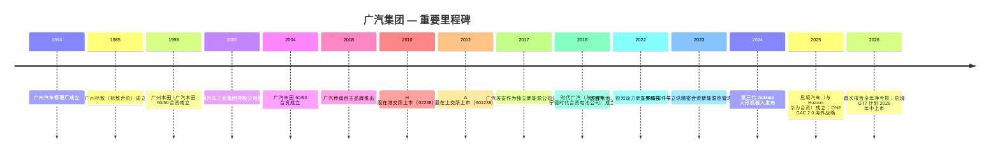
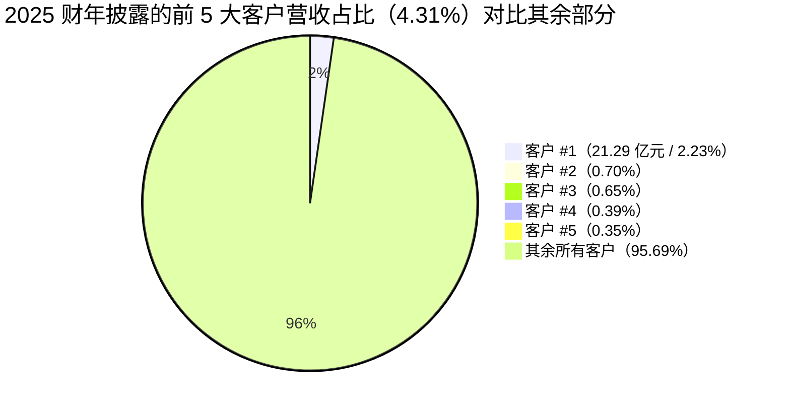
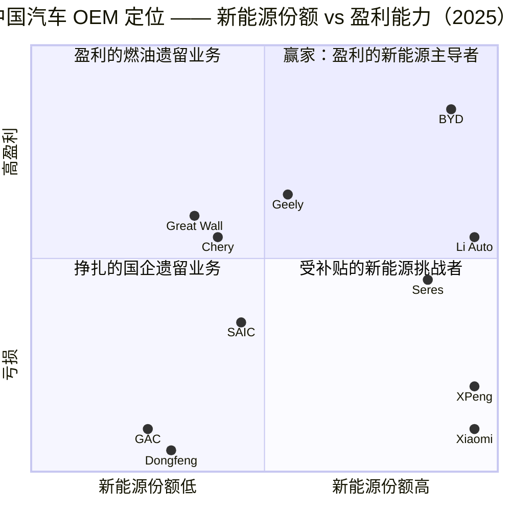

# 广汽集团 — 股票研究报告
**股票代码：** SSE:601238 / HKEX:2238 · **报告日期：** 2026-05-19 · **语言：** 中文（引用中文披露文件原文）

> **更新 — 2025 财年业绩：上市以来首次报告净亏损（2026-03-27）：** 广汽集团 2025 财年实现归属于股东的合并净亏损 **人民币 -87.8 亿元**（2024 财年净利润 +8.2 亿元；2023 财年 +44.3 亿元），营业收入 **人民币 956.6 亿元**（同比 -10.43%）。集团整体汽车销量降至 **172.15 万辆（同比 -14.06%）**；自主品牌（传祺 + 埃安/昊铂）同比骤降 22.83% 至 60.92 万辆，而广汽丰田同比增长 2.44% 至 75.6 万辆。董事会决定 2025 财年不派发股息。管理层原话归因如下："汽车行业竞争激烈、产业生态快速重构…销量未达预期…加大了销售投入…对无形资产和存货的资产减值计提较上年同期有所增加；同时广汽本田加快推进新能源转型，对产线调整优化计提减值以及对人员进行优化"。
> 资料来源：[广汽集团 2025 年年度报告，2026-03-27，第 8 页 / 第 25–26 页](http://www.cninfo.com.cn/new/disclosure/stock?stockCode=601238)；[广汽集团 2025 年年度报告摘要，2026-03-27](http://www.cninfo.com.cn/new/disclosure/stock?stockCode=601238)。

---

## 目录
1. 公司概览
2. 公司历史
3. 管理团队
4. 产品与服务
5. 客户与市场策略
6. 行业概览
7. 竞争格局
8. 市场机会（TAM）
9. 风险评估

参考资料

---

## 1. 公司概览

广汽集团（Guangzhou Automobile Group，广州汽车集团股份有限公司）是中国六大汽车国有企业集团之一，由广州汽车工业集团有限公司持股 54.02%，后者由广州市国资委 100% 持有，公司同时在上海（601238.SS，A 股，2012 年 3 月上市）与香港（02238.HK，H 股，2010 年上市）双重上市（[广汽集团 2025 年年度报告，第 86–87 页](http://www.cninfo.com.cn/new/disclosure/stock?stockCode=601238)；[HKEX 2238 披露列表](https://www1.hkexnews.hk/listedco/listconews/sehk/stocklist/c2238.htm)）。公司是广州市汽车产业集群的上市旗舰，凭借 50/50 日资合资企业，历史上一直是中国盈利能力最强的汽车国企。

**广汽业务范畴。** 公司经营乘用车、商用车、摩托车、零部件、售后服务、出行、新能源能源基础设施及汽车金融/保险业务。集团架构呈现明显的二元结构：

- **合并报表子公司**（即纳入利润表收入与利润）：自主品牌乘用车业务 **广汽传祺**（Trumpchi，全资，2008 年成立）与 **广汽埃安 / 昊铂**（AION/Hyper，控股子公司，2017 年成立）；此外还有零部件（广汽部件）、贸易（广汽商贸）、商用车（广汽领程，原广汽日野）、能源（优湃能源、因湃电池、广汽能源）、金融（广汽财务公司、广汽资本、众诚保险）以及海外销售（广汽国际）（[广汽集团 2025 年年度报告，第 5–6 页](http://www.cninfo.com.cn/new/disclosure/stock?stockCode=601238)）。
- **按权益法核算的合资公司**（业绩仅以"投资收益"形式体现）：**广汽丰田**（GAC Toyota，与 Toyota 丰田汽车公司各持 50%，2004 年成立）与 **广汽本田**（GAC Honda，与 Honda 本田汽车各持 50%，1998 年成立）；此外还有五羊本田摩托车、广汽汇理汽金（与 Crédit Agricole 法国农业信贷银行的汽车金融合资公司）、广丰发动机（广汽-丰田发动机），以及与 CATL 宁德时代合资的锂电池公司时代广汽（[广汽集团 2025 年年度报告，第 39 页 主要控股参股公司](http://www.cninfo.com.cn/new/disclosure/stock?stockCode=601238)）。

这是分析中的关键结构性要点：广汽集团整体汽车销量中大约 **三分之二来自两家日资合资公司**，它们对营收无贡献（仅作为投资收益体现），而约三分之一来自纳入合并报表的自主品牌。2025 财年广汽报告的 956.6 亿元营收仅包含合并范围内的 60.92 万辆自主品牌销量以及零部件/贸易；与此同时，两家合资公司合计销售超 110 万辆，在权益法实体内部产生了额外约 1,600 亿元以上的表外营收（[广汽集团 2025 年年度报告，第 39 页](http://www.cninfo.com.cn/new/disclosure/stock?stockCode=601238)）。

**广汽如何盈利。** 历史上有三条主线：(1) 自主品牌整车毛利（传祺/埃安销量 × ASP 减去材料/制造成本）；(2) "投资收益" —— 来自丰田、本田合资公司的权益法收益（多年中广汽 50% 的份额贡献了集团净利润的 80–100%）；(3) 来自零部件与汽车金融（广汽汇理汽金、广汽财务公司）的小额但稳定的贡献。2025 财年，三条腿同时折断：自主品牌合并整车制造业毛利率转负（整车制造业毛利率 -7.35%，同比下降 9.53 个百分点 —— [年度报告，第 27 页](http://www.cninfo.com.cn/new/disclosure/stock?stockCode=601238)）；投资收益从 2024 财年的 73.19 亿元降至 2025 财年的 32.67 亿元（同比 -55.36%，反映广汽本田重组减值以及如祺出行上市溢价的非经常性收益不再重现）；经营活动现金流从 2024 财年的 +109.19 亿元转为 **-150.26 亿元**，波动幅度超过 250 亿元。

**地域布局。** 制造基地以广州为核心（番禺、从化、黄埔、南沙），加上湖北宜昌的传祺工厂以及湖南长沙的埃安工厂。海外方面，广汽运营 5 家 KD 组装工厂（泰国罗勇府埃安智慧工厂 2024 年投产；印度尼西亚智慧工厂已投产；AION V 自 2025 年起在奥地利量产；巴西工厂在建），以及覆盖 87 个国家、630 个销售/服务网点 —— 2025 年自主品牌海外终端销量达到约 12.5 万辆（同比 +约 48%），管理层目标 **2026 年达到 25 万辆**（[广汽集团 2025 年年度报告，第 7 页 董事长致辞](http://www.cninfo.com.cn/new/disclosure/stock?stockCode=601238)）。

**规模。** 包括合资/联营公司合并范围在内，截至 2025-12-31 共有员工 **82,067 人**（子公司 81,733 人 + 母公司 334 人），其中生产人员 49,454 人、技术人员 14,350 人、研发人员 7,982 人（研发占比 21.96%）（[年度报告，第 30 页 / 第 58 页](http://www.cninfo.com.cn/new/disclosure/stock?stockCode=601238)）。2025 财年研发投入 **累计 77.07 亿元 — 即 RMB 77.07 亿元**（占营收 8.0%），其中 85.05% 资本化（[年度报告，第 30 页](http://www.cninfo.com.cn/new/disclosure/stock?stockCode=601238)）。截至 2025 年末累计专利申请超过 24,000 件。

**估值快照（必备）。** 截至 2026 年 5 月中旬，广汽 A 股（601238.SS）价格约 **人民币 7.2 元**，市值约 **人民币 730 亿元**；H 股（2238.HK）报价约 3.4 港元（[东方财富 601238 行情](https://quote.eastmoney.com/sh601238.html)；[companiesmarketcap GAC P/E 历史](https://companiesmarketcap.com/gac-guangzhou-automobile-group/pe-ratio/)）。2025 财年 EPS 为 **-0.85**，**TTM P/E 为负值，无意义**；若按 2024 财年基本 EPS +0.08 计，估值膨胀至约 90 倍。其他倍数指标：

- **TTM P/S ≈ 0.76 倍**（市值 730 亿 / 合并营收 956.6 亿）—— 但需注意此项低估了"穿透"销售口径，因为合资公司收入在权益法下表外列示。
- **P/B ≈ 0.66–0.70 倍**（市值 / 账面权益 1,052.3 亿元）（[理杏仁 601238 估值页](https://www.lixinger.com/equity/company/detail/sh/601238/601238/fundamental/valuation/pb)；[亿牛网 601238 PE 历史](https://eniu.com/gu/sh601238)）。
- 三年区间：P/B 在 ~0.55 倍（2024 年年中低点）至 ~1.35 倍（2023 年初新能源板块狂热高点）之间波动（[亿牛网 PB 历史页](https://eniu.com/gu/sh601238)）。当前 0.66 倍位于其自身 5 年分布的约 13 分位。

**同业对比（TTM，2026 年 5 月；约略值）：**

| 公司 | 代码 | 市值（人民币 亿元） | TTM P/E | P/B | P/S | 2025 财年净利润（人民币 亿元） |
|---|---|---|---|---|---|---|
| 广汽集团 | 601238.SS | ~730 | 不适用（亏损） | 0.66 | 0.76 | -87.8 |
| 上汽集团 SAIC Motor | 600104.SS | ~1,700 | ~15–18 倍（前瞻） | 0.78 | 0.36 | ~100（估计） |
| 比亚迪 BYD | 002594.SZ | ~9,700 | ~20 倍 | ~5.1 | 0.95 | ~400 |
| 吉利汽车 Geely Auto | 0175.HK | ~1,700 | ~12 倍 | ~2.0 | ~1.05 | ~166 |
| 东风集团 Dongfeng | 0489.HK | ~300 | 不适用（亏损） | 0.50 | 0.30 | ~ -10（估计） |
| 长城汽车 Great Wall | 601633.SS | ~1,900 | ~16 倍 | ~2.55 | ~1.30 | ~124 |

资料来源：[上汽 600104 Morningstar 行情](https://www.morningstar.com/stocks/xshg/600104/quote)，[比亚迪 002594 SimplyWall.st](https://simplywall.st/stocks/hk/automobiles/hkg-1211/byd-shares)，[前瞻 P/E 比亚迪 valueinvesting.io](https://valueinvesting.io/002594.SZ/metric/forward-pe)，[companiesmarketcap GAC](https://companiesmarketcap.com/gac-guangzhou-automobile-group/)，以及中国汽车同业研究 [招银国际 2026 年展望 PDF，2025-12](https://www.cmbi.com.hk/upload/202512/20251205451735.pdf)。

*资料来源：广汽合并 [2021 财年–2025 财年年度报告](http://www.cninfo.com.cn/new/disclosure/stock?stockCode=601238)；合资公司销量数据来自同一来源。*

**解读。** 负值 TTM P/E 源于 **周期性/结构性盈利崩塌**，而非一次性减值。崩塌有三大并发原因，均可在 2025 财年报告中得到印证：

1. **自主品牌经营亏损扩大** —— 合并整车制造业毛利率 -7.35%（即平均每辆车以低于成本价销售），同比恶化 9.53 个百分点（[年度报告，第 27 页](http://www.cninfo.com.cn/new/disclosure/stock?stockCode=601238)）。在新能源价格战最惨烈的一年，传祺销量 -23%，埃安销量 -22.6%。
2. **合资公司利润池侵蚀** —— 投资收益（主要为合资公司权益收益）同比下降 -55%，原因是广汽本田计提了重组/减值费用以将燃油车产线转换为新能源，并"对人员进行优化"（裁员）（[年度报告，第 26 页](http://www.cninfo.com.cn/new/disclosure/stock?stockCode=601238)）。
3. **"如祺出行"非经常性收益消失** —— 2024 财年曾受益于 40.0 亿元处置/估值收益，与网约车子公司如祺出行（[Onon Mobility]）香港 IPO 及巨湾技研股权出售相关（[年度报告，第 12 页 非经常性损益](http://www.cninfo.com.cn/new/disclosure/stock?stockCode=601238)）；该等收益不再重现。

P/B 0.66 倍处于广汽自身 5 年区间的 13 分位，相对所有同业（除东风之外，后者亦处于亏损）均存在折让。这表明市场将广汽定价为 **结构性承压、依赖日资合资、处于利润率下滑业务的国企** —— 更接近东风（同样是高度依赖日资合资的国企，面临类似问题）而非以产品驱动的同业吉利 / 比亚迪 / 长城。估值/倍数压缩风险 *双向* 存在：基于账面价值便宜，但缺乏明确的盈利催化剂。

---

## 2. 公司历史

广汽根植于 1954 年成立的 **广州汽车修理厂**，后来演化为广州汽车制造厂。现代集团的雏形可追溯至 **1985 年的标致合资项目（广州标致）**，该项目于 1997 年解体后，广州市政府邀请正寻找中国合作伙伴的本田接管被弃置的标致工厂。**广州本田**（现为广汽本田）于 **1998 年 5 月** 成立，成为中国最成功的中外合资企业之一（[年度报告，第 5 页 释义](http://www.cninfo.com.cn/new/disclosure/stock?stockCode=601238)）。

**广州汽车工业集团**（控股实体）于 2000 年 10 月成立；上市公司广州汽车集团股份有限公司于 2005 年组建，2010 年在香港 IPO（02238.HK），2012 年 3 月回 A 股上海上市（601238）。2004 年 **广汽丰田** 的成立增加了第二大支柱合资公司。传祺于 2008 年作为广汽首个自主品牌推出。埃安（AION）于 2017 年 7 月分拆为独立公司，专注于纯电/增程业务。

资料来源：[广汽集团 2025 年年度报告，第 5–8 页 释义 / 董事长致辞](http://www.cninfo.com.cn/new/disclosure/stock?stockCode=601238)；[广汽集团官网 — 公司简介](http://www.gac.com.cn/cn/aboutus)；[HKEX 02238 发行人主页](https://www1.hkexnews.hk/listedco/listconews/sehk/stocklist/c2238.htm)。

**战略转型。**

- **2017–2019 年 —— 埃安从传祺分拆。** 认识到电动车经济性与客户画像与燃油车存在根本差异，广汽将埃安独立分拆为单独公司，拥有自己的工厂（南沙）、品牌与经销商渠道。这一布局使广汽得以在纯电领域竞争，同时让传祺继续作为燃油/插混驱动的品牌。埃安在 2022–2023 年跻身中国本土纯电品牌排名前三。
- **2022–2024 年 —— 新能源供应链垂直整合。** 广汽成立了因湃电池（PHISIO Battery，2022 年）用于自研电芯/电池包、锐湃动力（Ruipai Power，2022 年）用于电机、立昇科技（与立讯精密，2023 年）用于热管理/新能源零部件，以及与 CATL 宁德时代的合资公司时代广汽 —— 明确旨在降低对外部供应商依赖、收回利润空间。2025 年新能源电池合计产量超过 15 万台套（[年度报告，第 23 页](http://www.cninfo.com.cn/new/disclosure/stock?stockCode=601238)）。
- **2025 年 —— 冯兴亚主导的"战时状态"重置。** 2025 年 3 月创始人时代的董事长曾庆洪退休后，冯兴亚出任董事长并发起全面管理改革：引入 Huawei 华为的 IPD / IPMS / DSTE 管理方法论；成立涵盖传祺 + 埃安的研发/生产/供应/销售/财务的自主品牌"共享中心"；试点设立传祺 BU 与昊铂埃安 BU 等新事业部；推出"AI+"数智广汽计划；并明确提出 **2026 年外购成本下降 15%** 的目标（[年度报告，第 7–9 页 董事长致辞](http://www.cninfo.com.cn/new/disclosure/stock?stockCode=601238)）。
- **2025 年 —— 启境（AISTALAND）与 Huawei 华为联手。** 新合资子公司启境智能汽车科技于 2025 年 3 月注册（广汽 71.43%，埃安 28.57%）—— 品牌名"启境"由 Huawei 华为创始人任正非亲自选定（[网易 / 163，2026-03-18 — 启境品牌发布](https://www.163.com/dy/article/KO9ONCJN0527DF84.html)）。首款车型启境 GT7 —— 一款搭载 Huawei 华为"HI Plus"嵌入式方案的 SUV/轿跑，配备 896 线 LiDAR 激光雷达、HarmonySpace 5 与 ADS 4.0 —— 于 2026 年北京车展首发，计划 2026 年年中上市（[新华网 — 启境 GT7 北京车展，2026-04-25](https://www.news.cn/auto/20260425/cfc2fd76c4454370a74a9ae9ac71c5a3/c.html)）。

**重大收购 / 公司变动。** (1) 广汽长丰（原长丰汽车）2009 年收购 —— 如今为遗留的全资子公司；(2) 广汽日野商用车 —— 2024 年 9 月重组为广汽领程（控股，不再是与日野 Hino 的权益法合资公司），使广汽获得自有商用车业务；(3) 广汽三菱 —— 2023 年关停（三菱合资公司退出中国）；(4) 巨湾技研（电池研发）—— 2024 年部分股权出售贡献了非经常性收益；(5) 如祺出行 —— 2024 年 6 月在港上市（网约车）。

**近期进展（2024–2026 年）。** 除上述战略重置之外：埃安于 2025 年与 CATL 宁德时代巧克力换电站合作推出"可充可换"换电战略；广汽在 2025 年获得中国首张 120 km/h 速度的 L3 有条件自动驾驶测试牌照（广州市）；广汽与滴滴自动驾驶联手进入 Robotaxi 交付领域 —— 新一代广汽-滴滴 Robotaxi 于 2025 年底正式交付（[年度报告，第 7 页](http://www.cninfo.com.cn/new/disclosure/stock?stockCode=601238)）。截至 2025 年底，如祺出行平台上的 Robotaxi 累计安全里程超过 600 万公里。

---

## 3. 管理团队

### 冯兴亚 — 董事长兼党委书记（2025 年 3 月起任董事会主席）

冯兴亚，约 1968 年生，MBA 学历。**2004 年 12 月** 加入广汽，此后深度扎根于经营业务。在广汽的职业轨迹：广汽丰田销售部副部长/执行副部长/部长（2004–2008）；上市公司副总经理 2008–2016；自 2015 年 3 月起任上市公司董事；**2016 年 11 月至 2025 年 11 月任广汽集团总经理**；2025 年 3 月起任董事长（接替退休的曾庆洪）（[广汽集团 2025 年年度报告，第 50 页 主要工作经历](http://www.cninfo.com.cn/new/disclosure/stock?stockCode=601238)）。他同时自 2025 年 3 月起任母公司国企广汽工业集团董事长，自 2020 年 9 月起任广东省汽车行业协会会长。他是第十四届全国人民代表大会代表及第十六届广州市人民代表大会代表。

冯具体取得了哪些成就？两点尤为突出。首先，在他担任广汽丰田销售职务期间（2004–2008），他构建的经销商网络与客户交付体系令凯美瑞（Camry）与汉兰达（Highlander）成为各自国内高端细分市场前三的畅销车型 —— 二十年后，这一基础仍使广汽丰田的毛利率相对其他合资公司显得格外稳固。其次，作为 2016–2025 年的总经理，他是以下举措的执行发起人：(a) 2017 年埃安分拆；(b) 垂直整合推进（因湃、锐湃、立昇）；(c) 借助广汽国际推动的海外扩张。另一面：2025 财年自主品牌份额崩塌与集团净亏损完全发生在其总经理任内，而冯恰是在这套打法失效的时点接任董事长。他在 2025 财年致辞中的公开定调 —— "战时状态…刀刃向内…二次创业" —— 明确指向需要重建而非渐进优化。其 2025 财年薪酬披露在合计支付给全体董事与高管的 1,338.35 万元中，其中 15–30% 递延，并受广州市国资委绩效考核框架的追索条款约束（[年度报告，第 50–53 页](http://www.cninfo.com.cn/new/disclosure/stock?stockCode=601238)）。他不持有重大内部股权 —— 薪酬为基本工资 + 绩效奖金，无股权激励，这是国企职业经理人的典型结构。

### 閤先庆 — 董事兼总经理（CEO 等同，2025 年末任命）

本科学历。2025 年末任命为董事和总经理，接替冯之前的 CEO 职务，同时担任广汽丰田、埃安以及启境汽车的董事长 —— 即三家最关键的经营业务。此前职务：广汽集团副总经理；战略部部长；广汽商贸董事长/总经理；广汽本田副总经理兼销售部部长；五羊本田董事（[年度报告，第 50 页](http://www.cninfo.com.cn/new/disclosure/stock?stockCode=601238)）。与冯类似，閤的职业生涯属于内部晋升轨迹，且具有深厚的日资合资公司根基 —— 这一点很重要，因为两大利润中心仍是日资合资公司。

### 王丹 — CFO / 总会计师 / 财务负责人

EMBA 学历，高级会计师，非执业注册会计师。1999 年 3 月加入广汽，**自 2005 年起担任财务负责人和财务部部长** —— 任期长达 20 年，即便以中国国企标准衡量也极为罕见（[年度报告，第 51 页](http://www.cninfo.com.cn/new/disclosure/stock?stockCode=601238)）。她在广汽的此前职务：广汽控股（前身实体）审计部副部长，传祺与埃安的监事会主席，广悦资产与智诚实业（资产管理子公司）董事长，以及广汽汇理汽金（汽车金融合资公司）董事长。王丹主导了 2010 年香港 IPO、2012 年 A 股上市、2022 年埃安 A 轮融资（投后估值约 1,070 亿元 / "千亿估值"），以及 2025 年 2 月完成的 1.184 亿股 H 股回购注销。如此长期任职的 CFO 任内出现 2025 财年亏损，更倾向于支持经营层面承压的解读（而非财务管控失误）。

### 高锐 — 执行副总裁 / 战略发展与合作本部本部长 —— 兼广汽本田董事长

EMBA 学历。同时担任 **广汽本田**、五羊本田、优湃能源、广汽能源以及宸祺出行 / Robotaxi 子公司的董事长（[年度报告，第 51 页](http://www.cninfo.com.cn/new/disclosure/stock?stockCode=601238)）。此前：广汽集团资产管理部部长；中隆投资（香港子公司）董事长/总经理；广汽集团（香港）有限公司董事长。高是负责管理广汽本田新能源转型的关键高管 —— 正是这一业务单元目前正在改造产线并"对人员进行优化"，相关减值费用拉低了 2025 财年投资收益。

### 陈家才 — 副总裁兼广汽国际（海外业务）董事长

MBA 学历。2025 年作为副总裁加入。此前：赛力斯（Seres / 问界）海外事业部部长兼 EMT 成员；奇瑞捷途国际总经理；奇瑞商用车国际总经理（[年度报告，第 51 页](http://www.cninfo.com.cn/new/disclosure/stock?stockCode=601238)）。这是一次格外重要的外部聘任 —— 赛力斯（拿下问界/华为合作）与奇瑞（中国汽车出口的绝对第一）都是广汽需要学习的直接对手。广汽国际董事长职位正处于 **2026 年 25 万辆海外销量目标** 对比 12.5 万辆基数的核心位置。

### 治理

- **董事会构成：** 12 名董事，其中 4 名独立董事（清华大学赵福全、律师立法委员肖胜方、原德勤 Deloitte 中国审计合伙人王克勤、华南理工大学宋铁波）—— 独立董事占比恰为 33%，达到上交所最低要求。独立董事任期将于 2026 年 5 月届满，正在进行换届提名程序（[年度报告，第 50 页 / 第 53 页 任职情况](http://www.cninfo.com.cn/new/disclosure/stock?stockCode=601238)）。
- **内部持股：** 内部人士基本没有重要持股。流通股以广州市国资委体系（54.02% 通过广州汽车工业集团）和香港 CCASS 名义持有人（27.56%）为主 —— 典型的中国国企股权结构，内部利益绑定有限。
- **薪酬结构：** 国企体系下由广州市国资委监管 —— 月度基本工资，年度审计后由董事会薪酬委员会确定绩效奖金，**15–30% 递延** 至合同期末，并就经营风险事件 / 个人不当行为 / 业绩不达标设有追索机制（[年度报告，第 53–54 页](http://www.cninfo.com.cn/new/disclosure/stock?stockCode=601238)）。2025 年董事 + 高管已支付薪酬合计 **人民币 1,338.35 万元** —— 截至年报披露时，2025 绩效年度的奖金尚未发放。
- **2025 年董事会变动：** 董事长曾庆洪退休；丁宏祥 / 管大源 / 郁俊 相继退休；周开荃（国机集团总裁）、洪素丽（广州工控 CIO）、陈家才（副总裁）加入。
- **关联方交易：** 与丰田 / 本田母公司（整车进口 / 特许使用费 / 工程服务）、与广州汽车工业集团（资金 / 现金管理）、与广汽汇理（金融合资公司）、以及通过广汽财务公司的下游经销商融资，存在重大关联交易 —— 均已披露。
- **治理风险标识：** 国企实际控制人，市政府战略目标可能与少数股东利益存在分歧；另一面，无重大少数股东诉讼，审计意见清洁（信永中和中国境内；KPMG 毕马威香港 —— 无保留意见）。

### 业绩纪录综合

该团队此前曾交付成绩 —— 冯兴亚与閤先庆从零开始打造了广汽丰田业务，埃安 2022–2023 年跻身纯电前三，王丹保持了 20 年的清洁财务负责人任期。但该团队尚未证明能在价格战驱动、软件主导的新能源市场中战胜中国民营创始人主导的车企（比亚迪、吉利、理想、小鹏、小米）。2025 年董事长换届以及与 Huawei 华为联手，是该团队明确承认打法需要改变。

---

## 4. 产品与服务

广汽在六大产品类别销售：乘用车（营收大头，自主品牌与合资公司收入的全部来源）；商用车；摩托车；汽车零部件；出行与贸易服务；以及能源/金融。下面按品牌使用 2025 财年报告中公司自有的产品分类（[年度报告摘要，第 4–5 页](http://www.cninfo.com.cn/new/disclosure/stock?stockCode=601238)）。

```mermaid
graph TD
    GAC[广汽集团]
    GAC --> SELF[自主品牌乘用车]
    GAC --> JV[合资品牌乘用车]
    GAC --> CV[商用车]
    GAC --> MOTO[摩托车 五羊本田]
    GAC --> PARTS[零部件 广汽部件 / 锐湃 / 立昇]
    GAC --> ENERGY[能源 因湃电池 / 时代广汽 / 优湃 / 广汽能源]
    GAC --> SERVICES[服务 商贸 / 如祺出行 / 广汽资本 / 广汽财务]

    SELF --> Trumpchi[广汽传祺 Trumpchi]
    Trumpchi --> M8[传祺 M8 / 向往 M8 乾崑]
    Trumpchi --> M6[传祺 M6]
    Trumpchi --> E8[传祺 E8]
    Trumpchi --> GS3[传祺 GS3 / GS8]
    Trumpchi --> S7[传祺向往 S7 / S9]

    SELF --> AION[广汽埃安 AION]
    AION --> SPlus[AION S Plus]
    AION --> YPlus[AION Y Plus]
    AION --> RT[AION RT]
    AION --> UT[AION UT / UT super]
    AION --> V2[第二代 AION V]
    AION --> i60[AION i60]
    AION --> LX[AION LX Plus]

    SELF --> Hyper[广汽昊铂 Hyper]
    Hyper --> SSR[昊铂 SSR]
    Hyper --> GT[昊铂 GT]
    Hyper --> HT[昊铂 HT]
    Hyper --> HL[昊铂 HL]

    SELF --> AISTALAND[启境 AISTALAND 与华为]
    AISTALAND --> GT7[启境 GT7 2026年中]

    JV --> GACToyota[广汽丰田]
    GACToyota --> Camry[凯美瑞]
    GACToyota --> Sienna[赛那]
    GACToyota --> Highlander[汉兰达 / 威兰达 / 锋兰达]
    GACToyota --> Bz3X[铂智 3X / 铂智 7]

    JV --> GACHonda[广汽本田]
    GACHonda --> Accord[雅阁]
    GACHonda --> Civic[型格]
    GACHonda --> CRV[皓影 / 冠道]
    GACHonda --> Odyssey[奥德赛]
    GACHonda --> P7[P7 / 极湃2]
```

资料来源：[广汽集团 2025 年年度报告摘要，第 4–5 页 产品](http://www.cninfo.com.cn/new/disclosure/stock?stockCode=601238)。

### 自主品牌：广汽传祺

传祺是广汽全资的燃油/插混驱动的大众市场品牌。2025 财年销量：**31.92 万辆，同比 -23.02%**（[年度报告，第 27 页](http://www.cninfo.com.cn/new/disclosure/stock?stockCode=601238)）。传祺内部新能源车型首次突破 15 万辆。2025 年重要发布：

- **传祺向往 M8 乾崑** —— 大型 MPV，"传祺-华为联合创新"系列首款车型，长 5,251 mm，Z 级车型搭载 Huawei 华为乾崑 ADS、HarmonyOS 鸿蒙座舱、192 线 LiDAR 激光雷达 + 4D 毫米波雷达，WLTC 续航 1,177 km。2025 年 5 月上市。
- **传祺向往 S7** —— 中大型家用 SUV，Qualcomm 高通 8295P 芯片，插混/增程双动力，CLTC 1,150 km。2025 年 3 月上市。
- **传祺向往 S9 乾崑** —— 家庭旗舰 SUV，搭载 Huawei 华为 ADS 4.0、HarmonySpace 5、CATL 宁德时代 44.5 kWh 电池，CLTC 纯电 252 km / 综合 >1,200 km，3C 超快充。2025 年 9 月上市。
- **燃油老款：** 传祺 M8（全尺寸 MPV）、M6、GS8、GS3、E8（插混轿车）。

**竞争结论 — 部分领先。** Huawei 华为嵌入的向往系列在智能座舱/ADAS 维度具有真正差异化（Huawei 华为是 2025–2026 年公认的中国 ADAS 第一供应商），但周期同比看，传祺 M8 已向理想 L 系列与问界 M7/M9 让出份额。护城河类型：**通过 Huawei 华为获得的部分智能座舱护城河**，品牌护城河较弱。最近竞争对手：理想 L7/L8/L9、问界（Huawei 华为一级合作伙伴）。结论：**技术上持平（因为 Huawei 华为同时是两家的供应商），但在品牌与用户触点运营上落后**。

### 自主品牌：广汽埃安 + 昊铂（AION + Hyper）

埃安/昊铂是广汽纯电/增程纯粹业务的子公司。2025 财年销量：**29.01 万辆，同比 -22.62%**（[年度报告，第 27 页](http://www.cninfo.com.cn/new/disclosure/stock?stockCode=601238)）。埃安 2024 年达到"全球最快达成 100 万辆"的成绩，但在 2025 年向比亚迪、吉利银河/极氪、五菱以及小米 SU7 让出势头。2025 年重要发布：

- **AION UT** —— A0 级两厢电动车（2025 年 2 月），轴距 2,750 mm，100 kW 夸克电机，14.6"+8.8" 双屏。
- **AION i60** —— A 级 SUV（2025 年 11 月），增程 + 纯电，续航 1,240 km（增程）/ 210 km 纯电，油耗 5.5 L/100 km。
- **第二代 AION V** —— 已在奥地利投产（2025 年起量产）。
- **昊铂 HL** —— 高端家用 SUV（2025 年 4 月），长 5,126 mm，5/6 座，纯电 / 增程双动力，CLTC 综合 1,369 km / 纯电 750 km，800V 5C 充电，Snapdragon 骁龙 8295P，LiDAR 激光雷达。
- **昊铂 GT 攀登版** —— 中国首款实现 100% 国产芯片端到端设计的车型（[年度报告，第 8 页](http://www.cninfo.com.cn/new/disclosure/stock?stockCode=601238)）。

**竞争结论 — 部分领先。** 埃安的优势在于工业规模和南沙的世界经济论坛 WEF 认定的"灯塔工厂"（智能制造典范）；其弱点在于品牌溢价以及软件/智能化。昊铂是高端徽标，但销量仍较小。护城河类型：**制造规模 + 自有电池（因湃 + CATL 宁德时代合资）**；软件护城河较弱。最近竞争对手：比亚迪 王朝 / 海洋 / 腾势、小鹏 G6/G9、极氪（吉利）、小米 SU7 / YU7。结论：**在软件和品牌上落后于领先的中国新能源原生挑战者；在制造灵活性上领先于其他国企**。

### 启境（AISTALAND）—— Huawei 华为嵌入的高端品牌

合资子公司于 2025 年 3 月注册（广汽 71.43%，埃安 28.57%）（[年度报告，第 5 页 释义](http://www.cninfo.com.cn/new/disclosure/stock?stockCode=601238)）。首款车型 **启境 GT7** 是一款"智能猎装"轿跑，搭载 **Huawei 华为新款 896 线 LiDAR 激光雷达（全球量产 LiDAR 中线数最高）**、ADS 4.0 L3 级 ADAS、HarmonySpace 鸿蒙座舱。**计划 2026 年年中上市**（盲订已开启）（[新华网，2026-04-25 — 启境 GT7 北京车展](https://www.news.cn/auto/20260425/cfc2fd76c4454370a74a9ae9ac71c5a3/c.html)）。"HI Plus"模式 —— Huawei 华为派遣 800 人团队驻广州与广汽联合办公 —— 与赛力斯、北汽和奇瑞做成问界 / 智界 / 享界（AITO / LUXEED / STELATO）成功的模板相同。**竞争结论 —— 高端/向上市场可选项，未经验证**。如果成功，护城河类型：Huawei 华为品牌光环 + 技术栈。最近竞争对手：问界 M5/M7/M9、智界、享界 —— 均使用 Huawei 华为 HI / HIMA 方案。结论：**在 Huawei 华为家族内部技术持平；取决于启境的设计 / 内饰 / 渠道能否实现差异化**。

### 合资公司：广汽丰田 —— 主要利润源

2025 财年销量：**75.6 万辆，同比 +2.44%** —— 主要品牌中唯一实现增长（[年度报告，第 22 页](http://www.cninfo.com.cn/new/disclosure/stock?stockCode=601238)）。总资产 590.3 亿元，净资产 153.2 亿元，营收 **1,106.9 亿元**，新能源/混动占销量比 62.2%（47 万辆，同比 +27.27%）（[年度报告，第 39 页 主要控股参股公司](http://www.cninfo.com.cn/new/disclosure/stock?stockCode=601238)）。首款本地开发的纯电车型 **铂智 3X（bZ3X）** 2025 年销量超过 8 万辆 —— 国内合资品牌纯电销量最高 —— 并成为首款进入丰田全球销售体系出口的本土化开发车型。**铂智 7**（下一款纯电）已在 2025 年广州车展亮相。主要车型：凯美瑞 Camry、赛那 Sienna、汉兰达 Highlander（大型 SUV）、威兰达 Wildlander、锋兰达 Frontlander，以及进口雷克萨斯 Lexus。**竞争结论 — 是。** 护城河：丰田品牌、燃油 + 混动可靠性口碑、经销商规模，以及在家用 MPV / 中大型 SUV / D 级轿车三角组合中的前三地位。这是广汽真正持久的利润池。最近竞争对手：上汽大众 SAIC VW、一汽丰田（同样为丰田母公司，不同的中国合资伙伴，规模略大）、东风日产。结论：**对一汽丰田持平至略胜；盈利性领先于一汽-大众 / 上汽通用五菱**。

### 合资公司：广汽本田 —— 转型阵痛

2025 财年销量：**约 35 万辆，同比 -25%**（延续自 2024 财年的下滑）。总资产 305.2 亿元，净资产 100.1 亿元，营收 **511.4 亿元**（[年度报告，第 39 页](http://www.cninfo.com.cn/new/disclosure/stock?stockCode=601238)）。本田母公司是三家日资合资伙伴中向中国新能源转型最慢的；广汽本田在 2025 财年计提了重组 / 产线转型 / 人员优化减值（[年度报告，第 26 页 投资收益变动原因说明](http://www.cninfo.com.cn/new/disclosure/stock?stockCode=601238)）。新发布：**广汽本田 P7**（2025 年 4 月，基于本田云驰 W 架构的纯电，本田 SENSING 360+）和 **极湃 2**（纯电）。本田与 **Momenta** 在智能驾驶软件方面合作。**竞争结论 — 部分领先 / 走弱。** 护城河：本田品牌以及思域 Civic / 雅阁 Accord / CR-V 三大系列；脆弱点：新能源转型迟缓、品牌溢价下降、向所有中国原生新能源品牌让出份额。最近竞争对手：东风本田（中国另一家本田合资公司 —— 命运类似）；一汽丰田；一汽-大众。结论：**转型执行落后于广汽丰田；产品布局落后于自主品牌新能源同业**。

### 摩托车：五羊本田

2025 财年销量：**约 64 万辆**，其中 **15 万辆出口**（[年度报告，第 22 页](http://www.cninfo.com.cn/new/disclosure/stock?stockCode=601238)）。在本田合作下的稳态现金牛业务。

### 商用车：广汽领程

2025 财年销量：**4,321 辆，同比 +3 倍**（基数较小）。新款纯电牵引车 T9 已上市（[年度报告，第 24 页](http://www.cninfo.com.cn/new/disclosure/stock?stockCode=601238)）。当前规模有限但属于实物期权业务。

### GoMate —— 第三代具身智能人形机器人

2024 年 12 月 26 日在中国机器人网络年会上发布（[21 经济 — GoMate 视频报道，2024-12-26](https://www.21jingji.com/article/20241226/herald/b2c139440f1500425e941cce116227b9.html)；[广汽官方新闻 — GoMate 正式发布](https://www.gacgroup.com/cn/news/detail?baseid=18961)）。规格：行业首创 **可变轮足** 移动架构（智能切换 4 足 / 2 足模式）；**38 自由度**；4 足姿态时约 1.4 m 高，2 足直立姿态时约 1.75 m；约 6 小时续航，得益于广汽固态电池技术；相对同类产品 **节能 >80%**；采用广汽自研纯视觉自动驾驶算法（从车端迁移而来），并叠加 FIGS-SLAM 栈；云端多模态大模型实现毫秒级语音指令响应。

发展路线图：**2025 年 —— 在埃安与广汽本田工厂试点部署**，用于厂内物流 + 售后服务；**2026 年 —— 小规模量产**；逐步拓展至安防、养老、售后车辆服务、物流与教育应用（[新浪财经，2025-01-06 — 广汽集团发布第三代人形机器人 GoMate](https://finance.sina.com.cn/stock/relnews/hk/2025-01-06/doc-inecznxz8906795.shtml)；[DoNews — 计划 2026 年大规模量产](https://www.donews.com/news/detail/4/4659451.html)）。**竞争结论 — 初期阶段，未经验证**。如果成功，护城河类型：电动车平台技术（固态电池、视觉算法、电驱动）向人形机器人的跨域迁移。最近竞争对手：优必选 / 宇树 Unitree / 小鹏 / Tesla 特斯拉 Optimus / Figure / 智元 Agibot。结论：**今天远远落后于中国人形机器人专业领先者宇树 Unitree 与智元 Agibot；需要 2–3 年才能展示商业化部署**。机器人产品线本质上是一项实物期权 —— 为广汽提供与具身 AI 相关的叙事关联（类似于小鹏的 Iron 机器人）—— 而尚未带来重大营收贡献。

### 能源 / 电池生态

- **因湃电池**（电池电芯，控股子公司）：2025 财年新能源电池产量 15 万台套以上（[年度报告，第 23 页](http://www.cninfo.com.cn/new/disclosure/stock?stockCode=601238)）。
- **时代广汽**（CATL 宁德时代合资，权益法 49%）：供应埃安/传祺。
- **广汽能源** + **优湃能源**：截至 2025 年末有 1,900+ 充电站，23,000+ 充电桩端口；"万桩计划"推进中；入选广州市国家级 V2G 试点。

### 旗舰产品对长尾产品

合并营收（956.6 亿元）中：整车制造业 690.1 亿元（71.5%），商贸/贸易 186.7 亿元（19.3%），零部件 38.01 亿元（3.9%），金融 50.61 亿元（5.2%）（[年度报告，第 27 页](http://www.cninfo.com.cn/new/disclosure/stock?stockCode=601238)）。自主品牌乘用车贡献大部分现金消耗；贸易 + 金融是较小但稳定的贡献来源。从包括合资公司投资收益在内的集团层面经济利益看：广汽丰田是主要的盈利驱动来源（估计占常态化合资投资收益的 60–70%），其次是五羊本田（稳定的摩托车业务），目前广汽本田和自主品牌呈稀释作用。

---

## 5. 客户与市场策略

### 客户集中度 —— 明确低

广汽 2025 财年前 5 大客户合计 **仅占营收的 4.31%（41.23 亿元）**，最大单一客户为 **21.29 亿元 / 占营收 2.23%**（[年度报告，第 29 页 主要销售客户](http://www.cninfo.com.cn/new/disclosure/stock?stockCode=601238)）。前 5 大销售中，37.92 亿元（占总营收 3.96%）流向合资/联营公司 —— 即广汽丰田与广汽本田从广汽零部件子公司采购。第三和第四大客户为新入围名单，替代了 2024 财年的两家。**不存在单一客户依赖，亦无客户超过 10% 的 MD&A 披露门槛**。这是汽车 OEM 业务的结构性特征：营收分散于通过约 2,100 家 4S 经销商触达的数百万 B2C 买家，外加 B2B 车队、B2B 公司间零部件销售以及出口。

资料来源：[广汽集团 2025 年年度报告，第 29 页 — 前五名客户](http://www.cninfo.com.cn/new/disclosure/stock?stockCode=601238)。

### 客户细分

- **大众零售（约占自主品牌销量的 90%）：** A0/A 级买家购买 AION UT / i60 / 传祺 GS3 / 影豹；家用 A+/B 级购买传祺 M6/M8 / 向往 SUV 系列；一线新能源买家购买昊铂 GT / HT / HL。
- **车队 / B2B / Robotaxi：** 如祺出行（广汽关联的网约车 App，与曹操 Cao Cao 在维度上 A/Z 合并）消化埃安车队；滴滴自动驾驶承接 Robotaxi 规格车辆。
- **合资公司"外部"客户：** 广汽丰田与广汽本田各自通过自有经销商网络销售 —— 它们不是广汽合并客户（属于权益法），但驱动了广汽集团内部零部件公司间的需求。
- **政府 / 机构：** 政府公务车销量适中，并非重要集中度。
- **出口 / 海外：** **2025 财年来自中国大陆以外的营收为 170.22 亿元（占总营收 17.6%），同比 +44.99%**（[年度报告，第 27 页](http://www.cninfo.com.cn/new/disclosure/stock?stockCode=601238)）—— 终端销量 12.5 万辆，遍及 87 个国家。

### 分销与市场策略

- **4S 经销商：** 全国 31 省合计约 2,100 个网点（广汽 + 合资合计）（[年度报告摘要，第 5 页](http://www.cninfo.com.cn/new/disclosure/stock?stockCode=601238)）。
- **自主品牌海外：** 在 87 个国家拥有 630 个销售/服务网点；5 家 KD 工厂（泰国 / 印度尼西亚 / 奥地利 / 其他）。
- **销售 / 代理模式：** 2025 财年整车制造业以"代理商销售模式"实现 690.1 亿元（占合并营收 71.5%）—— 由传统批发转向直营，经销商以佣金代理身份运营。这一转型在 2024–2025 年实施，与中国新能源品牌的普遍做法一致（[年度报告，第 28 页](http://www.cninfo.com.cn/new/disclosure/stock?stockCode=601238)）。
- **数字 / 电商渠道：** 与京东（JD.com）合作开展 AION UT super 的线上销售；多品牌融合（"多品牌融合+轻量化代理"）以推动低线城市渗透。计划 2026 年上半年建设 600 家广汽综合销服中心（[年度报告，第 8 页](http://www.cninfo.com.cn/new/disclosure/stock?stockCode=601238)）。
- **销售周期：** 零售 —— 当日至数周。车队 —— 季度订货。Robotaxi —— 与滴滴 / 如祺出行的多年主框架协议。

### 关键合作伙伴

- **Huawei 华为：** "HI Plus"深度集成模式 —— Huawei 华为 800 人团队驻广州联合办公 —— 涵盖启境品牌（广汽持股 71.43%）和传祺向往系列（[新华网，2026-04-25](https://www.news.cn/auto/20260425/cfc2fd76c4454370a74a9ae9ac71c5a3/c.html)）。
- **CATL 宁德时代：** 通过时代广汽合资公司提供电池；AION UT super 的巧克力换电站"全生态合作车企"。
- **Momenta：** 向广汽本田提供 ADAS。
- **京东 JD：** 电商销售渠道。
- **滴滴自动驾驶：** Robotaxi 量产合作伙伴。
- **Toyota Motor Corp 丰田 / Honda Motor 本田：** 两大合资伙伴。
- **Crédit Agricole 法国农业信贷银行：** 通过广汽汇理汽金的汽车金融合资伙伴。

### 客户案例（2025 财年标志性赢单）

- 铂智 3X（广汽丰田纯电）—— 丰田首款本土开发并进入丰田全球销售体系出口的中国市场纯电车。
- AION V（纯电）—— 2025 年起在奥地利工厂量产，广汽首款在欧洲组装的自主品牌车型。
- 滴滴 × 广汽 Robotaxi 交付（2025 年末）—— 广汽首款商业化 Robotaxi 量产车交付。
- 如祺出行 —— 年度订单超 2 亿（同比 +86%）；Robotaxi 累计安全里程约 600 万 km（[年度报告，第 23 页](http://www.cninfo.com.cn/new/disclosure/stock?stockCode=601238)）。
- 因湃电池 + CATL 宁德时代 —— 巧克力换电"国民好车" AION UT super，与 CATL 宁德时代和京东合作。

---

## 6. 行业概览

### 2025 年中国汽车行业 —— 创纪录之年、新能源拐点、激烈价格战

2025 年中国汽车产量 **3,453.1 万辆，销量 3,440 万辆**，同比 +10.4% / +9.4% —— **连续 17 年蝉联全球最大汽车市场，连续 3 年突破 3,000 万辆**（[中汽协，经广汽 2025 年年度报告摘要援引，第 3 页](http://www.cninfo.com.cn/new/disclosure/stock?stockCode=601238)）。国内销量 2,730.2 万辆（+6.7%）；**出口 709.8 万辆（+21.1%）** —— 中国已大幅领先成为全球最大汽车出口国。

乘用车产量 3,027 万辆，销量 3,010.3 万辆（+10.2%/+9.2%）。**中国品牌乘用车销量达到 2,093.6 万辆（同比 +16.5%），占乘用车总销量约 70%**，相对 2024 年提升 4.3 个百分点 —— 这是现代历史上中国 OEM 单年份额提升最快的一年。

2025 年新能源汽车产量 1,662.6 万辆、销量 1,649 万辆，同比 +29% / +28.2%。**新能源渗透率达到新车销售的 47.9%（国内销量 >50%）** —— 中国在 2025 年突破了过半拐点（[年度报告摘要，第 3 页](http://www.cninfo.com.cn/new/disclosure/stock?stockCode=601238)）。

### 行业结构

- **集中度：** 前 10 家 OEM 持有约 70% 份额。前 4 家 —— 比亚迪（约 13.4%）、上汽（约 12.8%）、吉利（约 9%）、奇瑞（约 8%）—— 控制接近一半。相比 2018 年合资品牌占据榜首，2025 年的排名主导者是中国原生 OEM（[globalchinaev.com — 吉利于 2026 年 1 月夺得比亚迪冠军](https://www.globalchinaev.com/post/geely-dethroned-byd-in-january-sales-as-nev-penetration-craters-to-44-in-chin)）。
- **供应商议价权：** CATL 宁德时代（电池，全球份额约 37%）、Huawei 华为（智能化 / ADAS / 智能座舱，中国 OEM 中主导 Tier-1）、英伟达 Nvidia / 地平线 Horizon Robotics（计算）、大疆车载（纯电 ADAS）以及地平线 —— 供应商议价权正在向少数"科技 Tier-1"集中。
- **买方议价权：** 零售高度分散；经销商正向直销代理模式过渡。
- **替代品：** 公共交通、网约车（广汽自身亦通过如祺出行参与）。
- **监管：** "双积分"（CAFC + 新能源积分）推动新能源转型。CCC 认证、GB 安全标准。碳定价处于试点。新能源购置税免征政策延长至 2025 年，2026–2027 年部分免征。
- **贸易战 / 地缘政治：** 欧盟 CBAM 与对华纯电反补贴关税（自 2024 年 10 月起对中国纯电预征约 38.1%，因车企而异）—— 对欧洲出口构成重大约束。美国对中国电动车征收 100% 关税（2024 年 5 月）。

### 行业增长动力

- 中国销量增长主要源于新能源替代（NEV 同比 29% vs 整体 9% —— 意味着燃油/混动绝对值在收缩）。
- 价格竞争异常激烈 —— 中国品牌纯电平均售价从 2022 年的约 20 万元降至 2025 年的约 13 万元，大多数 OEM 每年降价 3–5 次。自主品牌纯电制造商毛利率在全行业范围内被压缩；只有比亚迪（规模）与理想（高端定位）能可靠地实现两位数的整车毛利率。
- 出口动能是关键变量 —— 中国 OEM 在 2025 年合计出口 709.8 万辆，并合计将 2026 年目标定在超过 500 万辆（[招银国际 2026 年展望 PDF](https://www.cmbi.com.hk/upload/202512/20251205451735.pdf)）。
- 具身 AI / 人形机器人作为相邻行业崛起 —— 每家主要中国 OEM（小鹏的 Iron、小米的 CyberOne 2、Tesla 特斯拉 Optimus、广汽 GoMate、奇瑞、理想）目前都有自研人形机器人项目。

---

## 7. 竞争格局

广汽同时在三个不同的子市场竞争，每个市场的竞争对手不同：

**A. 日资合资燃油/混动遗留业务（广汽丰田 / 广汽本田）** —— 与其他日资合资公司和大众合资公司竞争。

**B. 中国品牌大众市场新能源（埃安 / 传祺 / 启境）** —— 与中国新能源生态的其余阵营竞争。

**C. 高端 / 智能新能源（启境 / 昊铂）** —— 与问界、理想、极氪竞争。

### 竞争对手表

| 公司 | 代码 / 注册地 | 2025 乘用车+商用车销量（百万辆） | 2025 净利润（人民币 亿元，估计） | 关键定位 |
|---|---|---|---|---|
| **比亚迪 BYD** | 002594.SZ / 1211.HK | ~4.6 | ~400 | 自主品牌垂直整合，全球新能源销量第一；从电芯到芯片的全栈 |
| **上汽 SAIC** | 600104.SS | ~4.5 | ~100（复苏中） | 大众 VW + 通用 GM 合资 + 荣威 Roewe / 名爵 MG / 智己 IM；正从 2024–2025 低谷恢复 |
| **吉利 + Volvo 集团 Geely** | 0175.HK | ~3.0 | ~166 | 银河 / 极氪 / 领克品牌矩阵；2026 年 1 月成为中国乘用车第一品牌 |
| **广汽集团 GAC Group** | 601238.SS / 2238.HK | ~1.72 | -87.8 | 丰田/本田合资 + 埃安/传祺 + Huawei 华为联手 |
| **东风集团 Dongfeng** | 0489.HK | ~1.86 | 估计 ~-10 | 日产 + 本田合资 + 岚图 / 猛士 M-Hero / 风行自主品牌；与广汽相似的国企合资结构 |
| **长城汽车 Great Wall** | 601633.SS / 2333.HK | ~1.17 | ~124 | 坦克/魏/哈弗/欧拉；SUV + 皮卡聚焦；盈利出口领导者 |
| **奇瑞 Chery** | 非上市（已申报 IPO） | ~2.6 | ~140（估计） | 出口冠军（中国 OEM 出口量第一）；燃油车业务强势 |
| **理想汽车 Li Auto** | LI / 2015.HK | ~0.50 | ~80 | 增程 / 智能新能源纯粹业务；家用 SUV 聚焦；盈利 |
| **小鹏 XPeng** | 9868.HK / XPEV | ~0.42 | 估计接近持平至正 | 智能新能源、自研 ADAS；G6/G9/X9/Mona |
| **小米汽车 Xiaomi Auto** | 1810.HK（母公司） | ~0.30（SU7 + YU7 全年） | 对集团稀释 | 新入局者；SU7 / YU7；生态打法 |
| **赛力斯 Seres / Cyrus** | 601127.SS | ~0.50 | ~70 | 问界 / AITO Huawei 华为合作模板 |

资料来源：综合各中国 OEM 2025 年披露及 [招银国际 2026 年展望 PDF，2025-12](https://www.cmbi.com.hk/upload/202512/20251205451735.pdf)。

*资料来源：各发行人 2025 年自报披露；广汽数据来自 [广汽集团 2025 年年度报告](http://www.cninfo.com.cn/new/disclosure/stock?stockCode=601238)。*

*资料来源：[广汽集团 2025 年年度报告，第 22 页](http://www.cninfo.com.cn/new/disclosure/stock?stockCode=601238)；五羊本田与本田销量来自公司公告。*

### 广汽的竞争优势

1. **广汽丰田业务** —— 持久、盈利、品牌驱动、由经销商网络支撑的业务，2025 年增长 +2.4%，而国企合资阵营中几乎所有其他公司都在下滑。凯美瑞、汉兰达、赛那仍处各自细分市场前三。在新能源价格战疲劳期，丰田混动技术是经验证的护城河。
2. **制造规模与世界经济论坛 WEF "灯塔工厂"认证** —— 埃安南沙工厂是为数不多入选 WEF 灯塔工厂的中国汽车工厂之一。
3. **新能源投入垂直整合** —— 因湃电芯 + 时代广汽 CATL 宁德时代合资 + 锐湃电机 + 立昇热管理。可比国企阵营中大多数整合度较低。
4. **借助启境与 Huawei 华为联手** —— "HI Plus"模式是中国智能新能源最成功的增长模板（问界 / 智界 / 享界）。
5. **广州市国资委支持** —— 耐心资本，具备在不引发偿付能力风险的情况下承担减值与重组损失的能力。

### 广汽的竞争脆弱性

1. **广汽本田下滑** —— 本田在中国新能源转型缓慢，对第二大合资支柱造成结构性损害；2025 财年重组减值尚未结束。
2. **自主品牌份额崩塌** —— 2025 年传祺 -23% 与埃安 -22.6% 远差于行业平均；这是决定论点的关键问题。
3. **整车制造业毛利率为负** —— 以 -7.35% 毛利率低于成本销售汽车在没有重组的情况下不可持续。
4. **品牌溢价 / 软件能力弱** —— 传祺与埃安均不具有理想的品牌定价能力，亦无小鹏 / 小米的软件栈。
5. **国企治理 + 股权结构** —— 内部利益绑定有限，难以靠有限股权激励池招募明星创始人。

---

## 8. 市场机会（TAM）

### 总体可触达市场

- **2025 年全球轻型车销量：** 约 8,900 万辆（IHS/S&P），其中中国 3,010 万辆 / 33%。全球汽车行业营收约 3.0 万亿美元。
- **中国乘用车市场：** 2025 年零售价值约 5.0–5.5 万亿元，按 3,010 万辆 × 平均售价约 17 万元计算。
- **中国新能源市场：** 1,649 万辆 × ASP 约 16 万元 → 2025 年约 2.6 万亿元，预计至 2027 年以约 +20% 复合增长率增至约 3.5 万亿元。
- **中国汽车出口市场：** 2025 年 709.8 万辆 × ASP 约 13 万元 → 约 9,200 亿元；中国 OEM 2026 年合计出口目标超过 900 万辆（[招银国际 2026 年展望](https://www.cmbi.com.hk/upload/202512/20251205451735.pdf)）。
- **相邻 —— 人形机器人：** 2025 年全球 TAM 约 50–70 亿美元，多家卖方研究与咨询机构预测到 2030 年增至 300–400 亿美元（Tesla 特斯拉、Bank of America Securities 美银证券、Citi 花旗基准情景均收敛于该区间）。

### 广汽的可服务市场（SAM）

- **自主品牌乘用车：** 约 1.5–1.8 万亿元 SAM（中国品牌乘用车市场扣除比亚迪/吉利/奇瑞前三主导部分）—— 广汽合并的传祺 + 埃安 + 昊铂 + 启境 2025 年销售 60.92 万辆 / 约 2% 份额。
- **日资合资乘用车：** 约 6,000–7,000 亿元 SAM（日资品牌占中国乘用车份额约 15% 且快速下滑）—— 广汽丰田 + 本田合计约 110 万辆 / 占日资品牌池约 37% / 占中国乘用车整体约 3.5%。
- **出口：** 广汽自主品牌 2025 年 12.5 万辆；2026 年目标 25 万辆 = 中国汽车出口的约 3.5%。
- **商用车：** 广汽领程当前可忽略（<5,000 辆），处于 429.6 万辆的商用车市场。

### 渗透率与 SOM

- 广汽集团层面在中国总市场份额（含合资销量）从 2018 年约 8% 降至 **2025 年约 5.6%**（172.15 万辆 / 3,010 万辆国内乘用车）。
- 合理的中期份额底线 —— 假设广汽丰田稳定且自主品牌恢复 —— 约 5–6%。上行至约 7–8% 的情景取决于启境/Huawei 华为产品项目以及海外执行。
- 海外 SOM：广汽公开设定的 2026 年海外目标为 **25 万辆**，2025 年基数为 12.5 万辆 —— 即翻倍。行业合计中国 OEM 出口目标同比 +27% 至约 900 万辆，因此广汽 +100% 的目标要求高于行业平均的份额提升。可行但有挑战。

### 渗透策略

- **合资公司新能源转型** —— 铂智 3X / 7（广汽丰田）和 P7 / 极湃（广汽本田）是合资公司的新能源路线图；若 2027 年达到合资销量的约 30%，可阻止合资侵蚀。
- **启境 / Huawei 华为** —— 高端新能源可选项。若启境 GT7 自 2026 年底起以约 5,000 辆/月销售，可贡献年化营收 150–200 亿元。
- **海外 KD 工厂** —— 泰国 / 印度尼西亚 / 巴西 / 奥地利已在生产；"ONE GAC 2.0"战略目标 2026 年海外 25 万辆。
- **人形机器人（GoMate）** —— 2026 年小规模量产；如执行成功，2027–2028 年可触达市场可能为每年 5–10 万台。
- **成本计划** —— 管理层公开承诺 **2026 年外购成本下降 15%**，按合资与自主品牌合计约 7,000 亿元成本基数计算，对合资投资收益将产生重大影响。

---

## 9. 风险评估

### 公司特定风险

**1. 自主品牌结构性恶化（高）。** 2025 财年传祺 -23%、埃安 -22.6% 销量，整车合并毛利率 -7.35%（低于成本销售），表明自主品牌业务相对固定成本规模不足。冯董事长主导的"战时状态"重置是正确的管理回应，但执行尚未得到验证 —— 2026 年将判断新产品（向往系列、AION i60、启境 GT7）能否恢复 ASP 与单车经济性。量化：若自主品牌维持 2025 财年运行率，可能进一步计提存货与无形资产减值 —— 2025 财年已按管理层口径计提了较高减值。缓释因素：通过启境与 Huawei 华为联手、新能源投入垂直整合、"共享中心"重组。

**2. 广汽本田下滑（高）。** 广汽本田 2025 年销量 -25%；营收 511.4 亿元；重组减值打击 2025 财年投资收益（-55%）。本田全球新能源战略落后于丰田，未来 12–24 个月可能继续承担产线转型成本。缓释因素：P7 / 极湃纯电上市，Momenta ADAS，产线转型旨在为新能源做好准备。严重性：高 —— 广汽本田历史上是广汽第二大利润中心。

**3. 经营活动现金流为负（重大）。** 2025 财年经营活动现金流为 **-150.26 亿元**（vs 2024 财年 +109.19 亿元）—— 波动超过 250 亿元 —— 需要 +55.15 亿元的融资流入并动用现金储备（2025 年末 3,215.1 亿元 vs 2024 年末 4,728.4 亿元）（[年度报告，第 31 页](http://www.cninfo.com.cn/new/disclosure/stock?stockCode=601238)）。现金缓冲仍属充裕，但无法支撑第二年类似消耗。缓释因素：国有银行融资渠道、债务发行（2025 年 12 月发行的 20 亿元绿色科技创新中票，票面利率 1.8% —— [年度报告摘要，第 9 页](http://www.cninfo.com.cn/new/disclosure/stock?stockCode=601238)）以及成本削减计划。

**4. 客户集中度（低）。** 前 5 大客户占营收 4.31%，第一大客户 2.23% —— 不构成重大风险。仍按客户集中度评估规则跟踪。

**5. 关键人物依赖（低–中）。** 新任董事长冯 + 新任总经理閤先庆均为深度内部人士。Huawei 华为联手取决于 Huawei 华为对启境品牌的持续承诺（Huawei 华为有多个 OEM 合作伙伴，可能降低优先级）。

**6. 新能源库存 + 减值（中）。** 2025 财年期末整车库存同比 +50.62%（[年度报告，第 28 页 产销量表](http://www.cninfo.com.cn/new/disclosure/stock?stockCode=601238)）—— 显著的去库存滞后指标，2026 财年可能需要进一步降价。

### 行业 / 市场风险

**7. 新能源价格战加剧（高）。** 行业新能源 ASP 三年内下降约 30%；2026 财年预计吉利、比亚迪、小米将进一步竞争抢占份额。缓释因素：广汽在电芯与电机的垂直整合可回收部分利润，但定价能力仍弱。

**8. 贸易战 / 出口关税升级（中）。** 欧盟自 2024 年 10 月起对中国纯电预征约 38% 反补贴关税；美国 100% 关税；墨西哥关税动作；土耳其税收 —— 共同限制出口 TAM。缓释因素：广汽的 KD 工厂布局（泰国、印度尼西亚、奥地利、巴西）提供本地化内容规避路径。

**9. 智能新能源同业替代（高）。** 理想、问界、小米、小鹏、吉利银河/极氪都在广汽所参与的细分市场抢占份额。2025 年若干月份中，问界单独销量就超过埃安+昊铂之和。缓释因素：与 Huawei 华为合作的启境是追赶载体。

**10. 监管 / 新能源积分变化（中）。** 新能源购置税免征逐步退出（目前延长至 2025 年；2026–2027 年部分）。碳积分定价机制修订。

### 财务风险

**11. 盈利时间表不确定性（高）。** 2025 财年首次报告亏损；恢复至 GAAP 盈利的共识路径要求 (a) 合资公司稳定、(b) 自主品牌毛利率回正、(c) 海外规模扩大。管理层未提供 2026 财年指引。乐观情景下最早 2027 年路径可见。

**12. 估值 / 倍数压缩风险（低–中）。** 广汽 P/B 0.66 倍处于其 5 年区间的 13 分位；P/S 0.76 倍和负 TTM P/E 反映亏损。**风险双向运行：** 市场已计入显著悲观，进一步多重压缩空间有限 —— 但恢复至中周期盈利人民币 30–50 亿元仅相当于 15–25 倍 P/E 重估（市值约 750–1,250 亿元，与当前相似）。缓释因素：低基数意味着下调空间有限；催化剂：2026 年中启境 GT7 上市、成本削减执行。

**13. 债务与资产负债率（低–中）。** 2025 年末资产负债率升至 48.97%（从 47.61%）—— 仍属适中。利息覆盖倍数为负 -10.60 倍；EBITDA/总债务比 -0.02（[年度报告摘要，第 10 页](http://www.cninfo.com.cn/new/disclosure/stock?stockCode=601238)）。国有银行融资渠道是缓释因素。

### 宏观经济风险

**14. 中国消费 / 周期性需求（高）。** 汽车具有高度周期性；宏观走弱、房地产去库存或青年就业担忧将抑制乘用车需求。缓释因素：新能源补贴、"以旧换新"刺激已就位。

**15. 外汇敞口（中）。** 出口增加产生人民币 / 美元 / 欧元 / 印尼盾 / 泰铢汇率敞口；2025 财年财务费用 -27.3 亿元中包含汇兑收益（同比 2024 财年增加 -44.0 亿元的汇兑影响）—— 持续波动可能（[年度报告，第 26 页](http://www.cninfo.com.cn/new/disclosure/stock?stockCode=601238)）。

**16. 地缘政治 —— 日中关系（中）。** 两大合资支柱依赖稳定的日中贸易与投资关系；关系恶化可能限制技术转让、品牌许可或未来产能决策。缓释因素：长期合资关系，丰田 / 本田对中国市场的持续公开承诺。

---

## 参考资料

### 主要披露文件 — 广汽集团（巨潮资讯 / 港交所）

- [广汽集团 2025 年年度报告（2026-03-27，271 页）](http://www.cninfo.com.cn/new/disclosure/stock?stockCode=601238)
- [广汽集团 2025 年年度报告摘要（2026-03-27）](http://www.cninfo.com.cn/new/disclosure/stock?stockCode=601238)
- [广汽集团 2025 年第三季度报告（2025-10-24）](http://www.cninfo.com.cn/new/disclosure/stock?stockCode=601238)
- [广汽集团 2024 年年度报告（2025-03-28）](http://www.cninfo.com.cn/new/disclosure/stock?stockCode=601238)
- [广汽集团 2023 年年度报告（2024-03-28）](http://www.cninfo.com.cn/new/disclosure/stock?stockCode=601238)
- [HKEX 02238 发行人披露清单](https://www1.hkexnews.hk/listedco/listconews/sehk/stocklist/c2238.htm)

### 公司网站 / 投资者关系

- [广汽集团官网 — 公司简介](http://www.gac.com.cn/cn/aboutus)
- [广汽官方新闻 — 第三代具身智能人形机器人 GoMate 正式发布](https://www.gacgroup.com/cn/news/detail?baseid=18961)

### 市场数据 / 估值

- [东方财富 601238 行情](https://quote.eastmoney.com/sh601238.html)
- [companiesmarketcap — 广汽集团 P/E 历史](https://companiesmarketcap.com/gac-guangzhou-automobile-group/pe-ratio/)
- [companiesmarketcap — 广汽股价历史](https://companiesmarketcap.com/gac-guangzhou-automobile-group/stock-price-history/)
- [理杏仁 — 广汽集团估值页](https://www.lixinger.com/equity/company/detail/sh/601238/601238/fundamental/valuation/pb)
- [亿牛网 — 601238 PE / PB 历史](https://eniu.com/gu/sh601238)
- [Yahoo Finance — 601238.SS](https://finance.yahoo.com/quote/601238.SS/)
- [Longbridge — 601238.SH](https://longbridge.com/en/quote/601238.SH)
- [TradingView — SSE:601238](https://www.tradingview.com/symbols/SSE-601238/)

### 同业 / 行业资料

- [招银国际 — 汽车 2026 年展望：新能源比赛下半场（2025-12）](https://www.cmbi.com.hk/upload/202512/20251205451735.pdf)
- [SimplyWall.st — 比亚迪 1211.HK 分析](https://simplywall.st/stocks/hk/automobiles/hkg-1211/byd-shares)
- [valueinvesting.io — 比亚迪 002594.SZ 前瞻 P/E](https://valueinvesting.io/002594.SZ/metric/forward-pe)
- [Morningstar — 上汽 600104](https://www.morningstar.com/stocks/xshg/600104/quote)
- [Investing.com — 上汽 600104 行情 / 共识](https://www.investing.com/equities/saic-motor)
- [globalchinaev.com — 吉利于 2026 年 1 月夺得比亚迪冠军](https://www.globalchinaev.com/post/geely-dethroned-byd-in-january-sales-as-nev-penetration-craters-to-44-in-chin)

### 新闻 / 报道

- [新华网 — 启境 GT7 北京车展（2026-04-25）](https://www.news.cn/auto/20260425/cfc2fd76c4454370a74a9ae9ac71c5a3/c.html)
- [新华网 — 启境 AISTALAND 品牌发布（2026-03-18）](https://www.news.cn/auto/20260318/70dd85d4cdc74faa8611f44185c105d8/c.html)
- [网易 — 启境品牌正式发布（2026-03）](https://www.163.com/dy/article/KO9ONCJN0527DF84.html)
- [新浪财经 — 广汽集团 2025 年第三季度报告（2025-10-27）](https://finance.sina.com.cn/jjxw/2025-10-30/doc-infvscvr9573630.shtml)
- [新浪财经 — 广汽集团 10 月销量（2025-11-09）](https://finance.sina.com.cn/jjxw/2025-11-09/doc-infwvpzk8344687.shtml)
- [证券时报 — 广汽集团前三季度营收 669.29 亿元（2025-10）](http://www.stcn.com/article/detail/3405588.html)
- [21 经济网 — 广汽集团 10 月销量（2025-11-07）](https://www.21jingji.com/article/20251107/herald/f7226fc395081a028fbb615dc6758330.html)
- [新浪财经 — GoMate 2026 年实现小规模量产（2025-01-06）](https://finance.sina.com.cn/stock/relnews/hk/2025-01-06/doc-inecznxz8906795.shtml)
- [21 经济网 — 广汽集团发布第三代人形机器人，2024-12-26](https://www.21jingji.com/article/20241226/herald/b2c139440f1500425e941cce116227b9.html)
- [DoNews — GoMate 计划 2026 年大规模量产](https://www.donews.com/news/detail/4/4659451.html)
- [新浪 — 广汽埃安 2025 年 3 月销量（2025-04-01）](https://finance.sina.com.cn/stock/relnews/cn/2025-04-01/doc-inerscvq0220892.shtml)
- [财新 — 广汽埃安增程新车（2025-11-17）](https://m.caixin.com/m/2025-11-17/102383905.html)

### 行业数据来源

- [中汽协（CAAM）统计，经广汽 2025 年年度报告摘要第 3 页援引](http://www.cninfo.com.cn/new/disclosure/stock?stockCode=601238)
- [新浪 — 广汽集团 2025 年销量分析](https://www.sina.cn/news/detail/5252947342787358.html)
