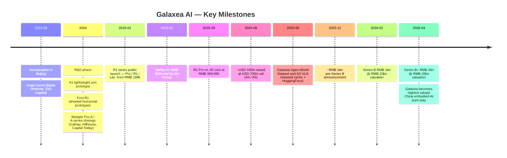
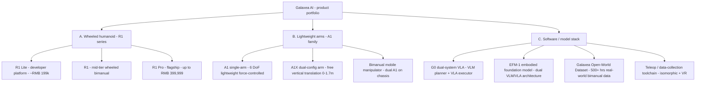
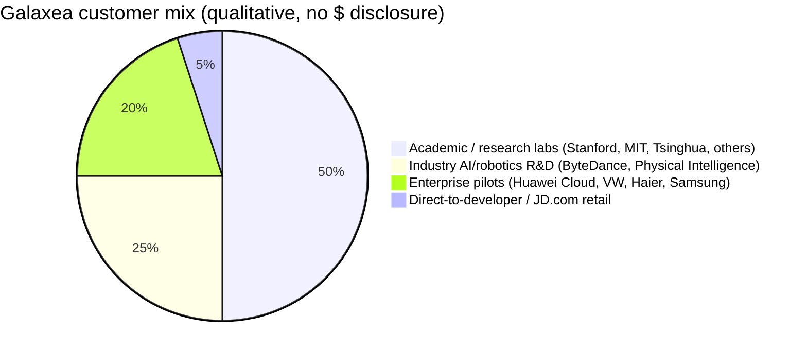
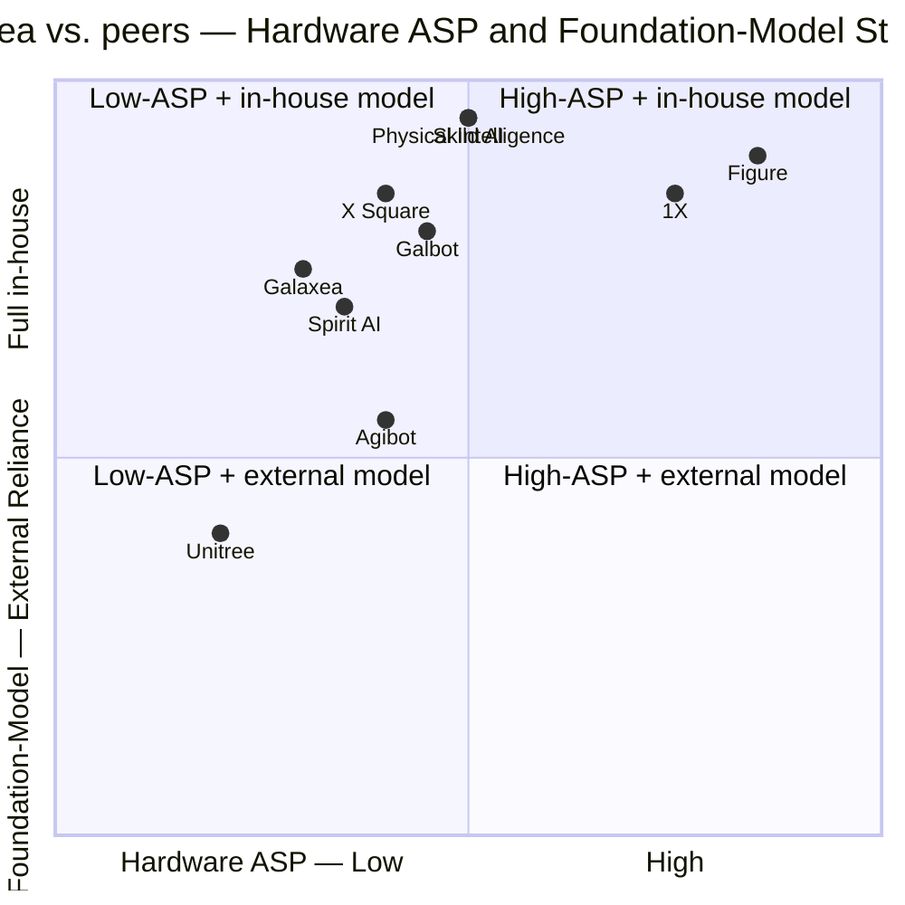

# COMPANY RESEARCH REPORT: Galaxea AI (星海图)

**Date:** 2026-05-19
**Status:** Private company — no public listing
**Headquarters:** Beijing, China (additional operations in Suzhou)
**Founded:** September 2023
**Sector:** Embodied AI / humanoid robotics / general-purpose mobile manipulation
**Report language:** English (private company, English-language target audience; CEO interviews and press largely in Chinese — original titles preserved in citations)

> **Update — Series B+ closed at RMB ~20bn valuation (2026-04-02):** Galaxea AI announced a ~RMB 2 bn (~USD 291 m) Series B+ round at a post-money valuation crossing RMB 20 bn (~USD 2.8 bn), led by CICC Capital with participation from GF Qianhe, Hongtai Fund, Guoyuan Equity, Charisma Partners, and hardware partner Lens Technology (蓝思科技). This comes less than two months after a RMB 1 bn Series B at RMB ~10 bn valuation on 2026-02-11 — a doubling of post-money in under eight weeks and now the highest disclosed valuation for any China embodied-AI pure-play. Stated drivers: scaling the R1 Pro production ramp, expanding the developer-platform customer base (40+ named, incl. ByteDance, Huawei Cloud, Samsung, VW, Haier, Physical Intelligence, Stanford, MIT), and accelerating G0 foundation-model training. Source: [Caixin Global, 2026-04-02](https://www.caixinglobal.com/2026-04-02/robot-startup-galaxea-ai-raises-291-million-102430297.html); [量子位/QbitAI, 2026-04-02](https://www.qbitai.com/2026/04/394626.html); [证券时报, 2026-04-02](https://www.stcn.com/article/detail/3722732.html).

---

## TABLE OF CONTENTS
1. Company Overview
2. Company History
3. Management Team
4. Products & Services
5. Customers & Go-to-Market
6. Industry Overview
7. Competitive Landscape
8. Market Opportunity (TAM)
9. Risk Assessment
10. References

---

## 1. COMPANY OVERVIEW

Galaxea AI (legal name 星海图 / Xinghaitu, also referenced in some markets as "Galaxea Dynamics" for its export arm) is a Beijing-headquartered embodied-AI startup founded in September 2023. The company builds full-stack hardware-plus-software systems for general-purpose robotic manipulation: a family of wheeled, dual-arm humanoid mobile manipulators (the R1 series), a line of lightweight 6-DoF force-controlled arms (the A1 / A1X family), and a proprietary embodied foundation model (EFM-1 / G0) that pairs a "slow-thinking" vision-language model (VLM) for planning with a "fast-execution" vision-language-action (VLA) model for low-level control ([Galaxea Open-World Dataset and G0 Dual-System VLA Model, 2025-09](https://arxiv.org/abs/2509.00576); [Galaxea Dynamics product site](https://galaxea-dynamics.com/)).

Unlike the bipedal humanoid companies dominating headlines (Figure, 1X, Tesla Optimus, Unitree H1, Booster), Galaxea has explicitly chosen a wheeled chassis with a humanoid upper body — torso + dual 6-DoF arms + 4-DoF waist — as its commercial form factor. The thesis, articulated repeatedly by CEO Gao Jiyang (高继扬) in Chinese-language interviews, is that bipedal locomotion adds cost, fragility, and battery drain without solving the actual bottleneck of useful work, which lives in dexterous bimanual manipulation. Wheels deliver stable, multi-hour continuous operation on flat indoor surfaces — the deployment environment for retail, lab, hospitality, light manufacturing, and home — at a fraction of the bill-of-materials of a comparable biped ([对话星海图赵行、许华哲：机器人的寒武纪大爆发，卡点在大脑, 知乎, 2024](https://zhuanlan.zhihu.com/p/7630416961)).

**Business model.** Galaxea operates a two-sided model. On the hardware side it sells robots, arms, and accessories to (a) AI research labs and developer customers (universities, foundation-model labs, large-corp R&D groups) who use the platform to collect data and train policies, and (b) end-application integrators (logistics, light manufacturing, hospitality, retail) who deploy the robots to do work. On the software side, the G0 foundation model and the open-sourced Galaxea Open-World Dataset (500+ hours of real-world bimanual mobile-manipulation data) act as both a research-credibility asset and a flywheel: every robot the company ships becomes a potential data collector that improves the next-generation model ([OpenGalaxea GitHub](https://github.com/OpenGalaxea/G0); [Galaxea Open-World Dataset, arXiv 2509.00576](https://arxiv.org/pdf/2509.00576)).

Disclosed pricing for the R1 series starts at RMB 199,000 (USD ~28k) for the entry R1 Lite developer platform, and roughly RMB 399,999 (USD ~56k) for the higher-spec R1 Pro on JD.com — well below the USD 100k–250k range typical of bipedal humanoids ([IT之家, 2025-01-02](https://www.ithome.com/0/821/803.htm); [搜狐, 2025-05-27](https://www.sohu.com/a/899057042_115831)). Western press has cited a USD 44,500–64,000 R1 range, consistent with this pricing band ([Yahoo Finance/Benzinga, 2025-08](https://finance.yahoo.com/news/beijings-galaxea-ai-raises-100-000126844.html)).

**Geographic footprint.** Headquartered in Beijing's Haidian district, with a second registered entity in Suzhou (manufacturing / hardware engineering) ([DoNews, 2025-01](https://www.donews.com/news/detail/4/4671242.html); [Crunchbase company profile](https://www.crunchbase.com/organization/xinghaitu)). The export-facing subsidiary "Galaxea Dynamics" ships internationally through US-domiciled distributors such as Robots International and Humanoid.guide ([Galaxea Dynamics product page](https://galaxea-dynamics.com/products/galaxea-r1-pro)).

**Scale indicators.** As of the April 2026 round, the company is reported to serve 40+ customers across enterprise and academia, including ByteDance, Huawei Cloud, Samsung, Volkswagen, Haier, Stanford University, MIT, and Physical Intelligence ([Yahoo Finance, 2025-08](https://finance.yahoo.com/news/beijings-galaxea-ai-raises-100-000126844.html); [AInvest, 2025-08](https://www.ainvest.com/news/galaxea-ai-secures-100m-funding-valuation-700m-plans-humanoid-robots-homes-decade-2508/)). The company has not disclosed unit shipments or revenue. Total funding raised through the April 2026 Series B+ is approximately RMB 5 bn (USD ~700 m) cumulative across roughly seven distinct rounds in ~30 months — an extraordinarily compressed capital-raising cadence even by China embodied-AI standards (see Section 2 for the funding timeline) ([量子位, 2026-04-02](https://www.qbitai.com/2026/04/394626.html); [腾讯新闻, 2026-04-02](https://news.qq.com/rain/a/20260402A042SO00)).

**Headcount.** Private; not disclosed in any verified source. LinkedIn lists ~200–500 employees in the company range as of 2026, but this is unverified by primary disclosure ([Galaxea AI LinkedIn](https://www.linkedin.com/company/galaxeaai)). *Flag: headcount estimate unverified.*

### Valuation snapshot (private — funding-round substitute)

Galaxea is private and there is no public market multiple to cite. Substituting the latest funding-round post-money valuation per the company-research playbook for private issuers:

| Round | Date | Disclosed amount | Post-money valuation | Lead / notable investors |
|---|---|---|---|---|
| Angel | 2023-09 | not disclosed | not disclosed | Baidu Ventures (百度风投), IDG Capital ([腾讯新闻, 2026-04-02](https://news.qq.com/rain/a/20260402A042SO00)) |
| Pre-A through A5 (multiple closings) | 2024–2025 | total ~RMB 2 bn+ across 5+ closings | ramped from < RMB 1 bn to ~RMB 5 bn | Ant Group (蚂蚁集团, A1 lead, RMB 300 m), Capital Today (今日资本), Meituan Longzhu (美团龙珠) / Meituan Strategic, Hillhouse / GL Ventures (高瓴创投), Cathay Innovation (凯辉基金), Xianghe Capital (襄禾资本), IDG Capital ([Yahoo/Benzinga, 2025-08](https://finance.yahoo.com/news/beijings-galaxea-ai-raises-100-000126844.html); [证券时报, 2025-12](https://www.stcn.com/article/detail/3639787.html)) |
| Series B | 2026-02-11 | ~RMB 1 bn (USD ~140 m) | ~RMB 10 bn (USD ~1.4 bn) | Jinding Capital (金鼎资本), BAIC Industrial Investment (北汽产投), Bihong Investment, Zhengxinhu (正心谷), Qianhai Fangzhou, Yifeng Capital, with super-pro-rata from Cathay, Capital Today, Meituan Longzhu, Xianghe, Hillhouse ([36氪/智能涌现, 2026-02-11](https://36kr.com/p/3678199520846464)) |
| Series B+ | 2026-04-02 | ~RMB 2 bn (USD ~291 m) | ~RMB 20 bn (USD ~2.8 bn) | CICC Capital (中金资本), GF Qianhe (广发乾和), Hongtai Fund (鸿泰基金), Guoyuan Equity (国元股权), Charisma Partners (弘章资本), Lens Technology (蓝思科技) ([Caixin Global, 2026-04-02](https://www.caixinglobal.com/2026-04-02/robot-startup-galaxea-ai-raises-291-million-102430297.html); [证券时报, 2026-04-02](https://www.stcn.com/article/detail/3722732.html)) |

**Implied revenue multiple.** Galaxea has not disclosed revenue. With ~40 commercial customers and R1 ASP between RMB 199k–400k, an upper-bound back-of-envelope estimate — *explicitly an estimate, not disclosure* — at 1,000 units shipped through 2025 at an ~RMB 300k blended ASP would imply ~RMB 300 m revenue, putting the Series B+ post-money at a ~70× multiple. At 300 units, the multiple is ~230×. Either way, the valuation is being underwritten on **future model + platform value, not current hardware revenue** — comparable to how Skild AI (USD 14 bn at ~USD 30 m revenue, ~470× multiple) and Physical Intelligence (USD 5.6 bn at near-zero disclosed revenue) are priced ([TechCrunch, 2025-12-08](https://techcrunch.com/2025/12/08/softbank-and-nvidia-reportedly-in-talks-to-fund-skildai-at-14b-nearly-tripling-its-value/); [The Robot Report, 2026](https://www.therobotreport.com/skild-ai-raises-1-4b-building-omni-bodied-robot-skild-brain/); [Sacra, Physical Intelligence](https://sacra.com/c/physical-intelligence/)).

**Peer-implied benchmark (private comps).** See Section 7 for the full peer table. In summary: Galaxea (~USD 2.8 bn) sits well below Galbot (~USD 3 bn after the March 2026 Big-Fund round), Agibot (~USD 2–3 bn pre-backdoor), Spirit AI / 千寻智能 (~USD 2 bn), and Unitree (~USD 3 bn pre-IPO STAR filing), and far below the US frontier-model robotics peers Figure (USD 39 bn), Skild (USD 14 bn), 1X (~USD 10 bn talks), and Physical Intelligence (USD 5.6 bn) ([Caixin, 2026-03-03 on Galbot](https://www.caixinglobal.com/2026-03-03/galbot-raises-362-million-in-fresh-funding-eyes-hong-kong-ipo-102418742.html); [The Robot Report on Figure Series C](https://www.therobotreport.com/figure-ai-raises-1b-in-series-c-funding-toward-humanoid-robot-development/)).

**Valuation read.** The Series B / B+ doubling within eight weeks is a sharp re-rate that reflects: (a) the broader China embodied-AI re-rating that swept Galbot, Agibot, Spirit AI, X Square, and Booster across Q1 2026; (b) Galaxea's narrative position as a "Tsinghua + Stanford + Waymo" team with two assistant-professor co-founders, which has analogues in the academic founder premium accorded to Physical Intelligence (Sergey Levine, Chelsea Finn) and Skild AI (Deepak Pathak, Abhinav Gupta); and (c) the open-source G0 release in September 2025 generating real research traction (the paper is on arXiv, the dataset on Hugging Face, and the model has been picked up by labs including Stanford and Physical Intelligence as a benchmark platform). The risk — flagged in Section 9 — is that the implied revenue multiple is only defensible if foundation-model performance and unit shipments both inflect in 2026–2027.

---

## 2. COMPANY HISTORY

Galaxea was incorporated in Beijing in September 2023 by four co-founders: CEO Gao Jiyang (高继扬), Chief Scientist Hang Zhao (赵行), Co-Chief Scientist Huazhe Xu (许华哲), and COO / hardware lead Tianwei Li (李天威). Gao had just left Waymo's Mountain View office where he had been a research scientist on the trajectory-prediction and behavior-prediction stack; before Waymo he had been at the Chinese AD unicorn Momenta. Zhao and Xu were both newly-tenured assistant professors at Tsinghua's Institute for Interdisciplinary Information Sciences (IIIS — the "Yao class" institute founded by Turing-laureate Andrew Yao), running the MARS Lab and TEA Lab respectively. Li was a Momenta colleague of Gao's who had built the SLAM team there ([Z Potentials interview with Jiyang Gao, 2024](https://zpotentials.substack.com/p/z-potentials-after-waymo-and-momenta-jiyang-gaos-journey-to-revolutionize-embodied-ai-with-b91f7fb3a204); [Hang Zhao personal site](https://hangzhaomit.github.io/); [Huazhe Xu personal site](http://hxu.rocks/); [Cathay Innovation portfolio page](https://cathayinnovation.com/company/galaxea/)).

The founding thesis, as Gao has stated in multiple interviews, was that autonomous driving had reached the asymptote of what end-to-end perception models could deliver without dramatically more diverse, action-conditioned data, and the same end-to-end approach — paired with a robot body that can actually *act* in the world — was the natural next bet. The team chose to focus on indoor manipulation rather than outdoor driving precisely because they believed the data-collection problem was more tractable in constrained, repeatable environments where you control the embodiment ([Z Potentials interview](https://zpotentials.substack.com/p/z-potentials-after-waymo-and-momenta-jiyang-gaos-journey-to-revolutionize-embodied-ai-with-b91f7fb3a204); [The Wire China, Gao Jiyang profile](https://www.thewirechina.com/whos_who/gao-jiyang-%E9%AB%98%E7%BB%A7%E6%89%AC/)).

The first product, the A1 six-axis lightweight arm, was developed in 2024 and provided to early academic and research customers as a cheap data-collection workhorse — Galaxea cites that copies of the A1 / A1X are running in robotics labs at Tsinghua, Stanford (Fei-Fei Li's Vision Learning Lab is a publicly-cited user), and Physical Intelligence ([AInvest, 2025-08](https://www.ainvest.com/news/galaxea-ai-secures-100m-funding-valuation-700m-plans-humanoid-robots-homes-decade-2508/); [Galaxea Dynamics A1XY product page](https://galaxea-dynamics.com/products/galaxea-a1xy-six-axis-lightweight-dual-configuration-robot-arm)).

The decisive commercial event was the **January 2025 launch of the R1 series** at a roughly USD-28k entry price, which positioned Galaxea as the first credible "developer-affordable" mobile bimanual platform in the market — distinctly cheaper than comparable Stretch (Hello Robot) or Tiago (PAL) systems, and an order of magnitude cheaper than bipedal alternatives ([腾讯新闻, 2025-01-02](https://news.qq.com/rain/a/20250102A04Z8P00); [新浪科技, 2025-01-02](https://finance.sina.com.cn/tech/digi/2025-01-02/doc-inecqhfv0410195.shtml)).

**Strategic pivots.** Galaxea has not pivoted in the conventional sense — the wheeled-humanoid + foundation-model strategy is unchanged since founding — but two narrative shifts are worth noting. First, through 2024 the company described itself primarily as a "robot platform" company; by mid-2025 the framing shifted toward "embodied foundation model" first and "hardware" second, mirroring the broader investor preference for AI-defensible moats over hardware moats. Second, the *retail* product mix has migrated upward: the original R1 Lite was framed as a research / developer SKU, while the R1 Pro is being positioned for productivity deployments (light manufacturing, logistics, hospitality) and has commanded the 2× higher list price ([搜狐, 2025-05-27](https://www.sohu.com/a/899057042_115831); [对话星海图赵行、许华哲, 知乎](https://zhuanlan.zhihu.com/p/7630416961)).

**Recent developments (last 12 months).** (1) Open-source G0 release with the Galaxea Open-World Dataset, 500+ hours of real-world data ([arXiv 2509.00576](https://arxiv.org/abs/2509.00576); [OpenGalaxea Hugging Face](https://huggingface.co/OpenGalaxea)). (2) Joint-stock conversion (股改) completed in early 2026 — typically a pre-IPO restructuring step ([亿邦动力, 2026](https://m.ebrun.com/637184.html)). (3) Hardware partnership with Lens Technology (蓝思科技, SZSE:300433) deepened to a strategic-investor relationship in the Series B+, hinting at preparation for higher-volume manufacturing of casings, glass cover assemblies, and structural components ([Caixin Global, 2026-04-02](https://www.caixinglobal.com/2026-04-02/robot-startup-galaxea-ai-raises-291-million-102430297.html)).

---

## 3. MANAGEMENT TEAM

### Gao Jiyang (高继扬) — Co-Founder & CEO

Born in 1992 in mainland China, Gao Jiyang is the public face and operating leader of Galaxea. He entered Tsinghua University's Department of Electronic Engineering via the Chinese national physics olympiad track, then moved to the University of Southern California for graduate study. At USC he completed a Ph.D. in computer vision in three years under the supervision of Professor Ram Nevatia at the USC Computer Vision Group — an unusually compressed timeline; his dissertation focused on temporal action localization and video understanding ([Gao Jiyang profile, The Wire China](https://www.thewirechina.com/whos_who/gao-jiyang-%E9%AB%98%E7%BB%A7%E6%89%AC/); [Z Potentials interview](https://zpotentials.substack.com/p/z-potentials-after-waymo-and-momenta-jiyang-gaos-journey-to-revolutionize-embodied-ai-with-b91f7fb3a204)).

Before his Ph.D. Gao interned at Google and at the Chinese vision company SenseTime. After completing the doctorate he joined Waymo (then Google's self-driving project) as a research scientist on the prediction stack, where he worked on multi-agent behavior prediction — the problem of forecasting what nearby drivers, cyclists, and pedestrians will do, conditional on the AV's own planned trajectory. Public Waymo publications from this period that list Gao as author include work on VectorNet-style scene encoders and on goal-conditioned trajectory prediction. He subsequently returned to China to join Momenta, the Chinese L4 autonomous-driving startup, where he led the planning-and-prediction team and was part of the leadership that pushed Momenta's "two-legged" strategy (consumer L2 + robotaxi L4) ([Z Potentials interview, 2024](https://zpotentials.substack.com/p/z-potentials-after-waymo-and-momenta-jiyang-gaos-journey-to-revolutionize-embodied-ai-with-b91f7fb3a204)).

In September 2023 Gao left Momenta to found Galaxea. In interviews he has framed the move with three points: (a) AD planning had become a "diminishing-returns" problem absent fundamentally new data, (b) the next platform shift was clearly to embodied AI in general-purpose robots, and (c) the founding team — combining his industrial AD experience with two Tsinghua professor-scientists (Zhao, Xu) and a senior hardware operator (Li) — was uniquely positioned to attack both algorithms and embodiment simultaneously ([Z Potentials, 2024](https://zpotentials.substack.com/p/z-potentials-after-waymo-and-momenta-jiyang-gaos-journey-to-revolutionize-embodied-ai-with-b91f7fb3a204); [Yahoo Finance, 2025-08](https://finance.yahoo.com/news/beijings-galaxea-ai-raises-100-000126844.html)).

**Ownership / equity.** Not disclosed in any verified source. *Flag: equity stake unverified.* Industry convention for a four-person founding team after seven rounds of dilution would place each founder's stake in the high-single-digit to low-double-digit percentage range, but this is an inference, not a disclosure. **Public profile / writing.** Gao has given on-record interviews to 智能涌现 / 36Kr, Late Post (晚点), Caixin, The Wire China, and Z Potentials; his X/Twitter footprint is limited; he is a frequent speaker at WAIC (Shanghai), the World Robot Conference (Beijing), and CoRL.

### Hang Zhao (赵行) — Co-Founder & Chief Scientist

Hang Zhao is a tenure-track assistant professor at Tsinghua's Institute for Interdisciplinary Information Sciences (IIIS) and director of the MARS Lab. He earned a Ph.D. from MIT CSAIL in 2019 under Antonio Torralba — one of the most cited PIs in scene understanding and self-supervised vision. After MIT he was a research scientist at Waymo (overlapping with Gao Jiyang at Mountain View), then returned to Tsinghua in 2021. His Google Scholar profile shows 30,000+ citations across 100+ papers spanning multimodal learning, robot learning, and autonomous driving; he is a recipient of an MIT Technology Review "Innovators Under 35" honor and the Shanghai Qi Zhi Institute's WAIC Cloud Sail Award (2024) ([Hang Zhao personal site](https://hangzhaomit.github.io/); [Hang Zhao Google Scholar](https://scholar.google.com/citations?hl=en&user=DmahiOYAAAAJ); [MIT Tech Review Innovators Under 35](https://www.innovatorsunder35.com/the-list/hang-zhao/); [Shanghai Qi Zhi Institute news](https://www.sqz.ac.cn/en/comprehensive-news-89)). At Galaxea, Zhao led the G0 dual-system VLA project and is the senior author on the Open-World Dataset paper ([arXiv 2509.00576](https://arxiv.org/pdf/2509.00576)).

### Huazhe Xu (许华哲) — Co-Founder & Co-Chief Scientist

Huazhe Xu is also a tenure-track assistant professor at Tsinghua IIIS, where he directs the Tsinghua Embodied AI Lab (TEA Lab). He completed his Ph.D. at Berkeley AI Research (BAIR) and held a postdoctoral fellowship at the Stanford Vision and Learning Lab (under Fei-Fei Li / Jiajun Wu). His RoboCook paper won the Best System Paper award at CoRL 2023, the most-cited venue in robot learning ([Huazhe Xu personal site](http://hxu.rocks/); [LinkedIn — Huazhe Xu Tsinghua](https://www.linkedin.com/posts/nokov_prof-huazhe-xu-thu-embodied-ai-robotic-activity-7392130574267785216-O6BO)). Xu's research focus — manipulation, reinforcement learning from physical interaction, soft-body manipulation — complements Zhao's perception-heavy stack.

### Tianwei Li (李天威) — Co-Founder & COO / Hardware

Tianwei Li holds a Master's degree from University College London. He spent multiple years at Momenta, where he was promoted to Senior Director and led the SLAM team that shipped Momenta's HD-map-light highway-pilot system to OEM customers including Mercedes-Benz, Toyota, and Audi (in China). At Galaxea, Li runs the hardware engineering function and the Suzhou manufacturing entity, and is the operator most responsible for actually getting R1 robots through their reliability and cost-down phases ([Cathay Innovation portfolio page](https://cathayinnovation.com/company/galaxea/); [Crunchbase Galaxea profile](https://www.crunchbase.com/organization/xinghaitu)). Public profile is limited — no major interviews on record; he appears in company group photos and at hardware-vendor events but does not have a substantial personal media footprint.

### Governance

Galaxea is a private company with no public board composition disclosed. Based on the round-by-round investor list, board observers / directors almost certainly include representatives of the major financial leads (Capital Today, Hillhouse, Meituan, Cathay, CICC, and likely Ant). The co-founders are presumed to retain board control on the founders' side; the joint-stock conversion in early 2026 ([亿邦动力, 2026](https://m.ebrun.com/637184.html)) suggests the company is structuring for a potential A-share or HK IPO within a 2–3-year window. *Flag: insider ownership %, comp structure, related-party transactions all undisclosed.*

### Track record synthesis

The founding team's pedigree is exceptional even by China embodied-AI standards: an MIT-trained Tsinghua professor with 30k+ citations (Zhao), a Berkeley-trained Tsinghua professor with CoRL Best Paper (Xu), an USC-trained Waymo + Momenta veteran with industrial AD shipping experience (Gao), and a Momenta hardware operator with proven mass-production background (Li). The combination is the most plausible match in the China market to the "two professors + two industry operators" formula that has worked at Skild AI (Pathak / Gupta), Physical Intelligence (Levine / Finn + ex-Tesla / ex-Google), and Figure (Adcock + hires). The gap is that none of the four has yet operated a company at the scale Galaxea is now becoming, and the cadence of capital raised (7 rounds in 30 months) means organizational scaling — hiring, processes, manufacturing ramp — is the active risk in 2026–2027.

---

## 4. PRODUCTS & SERVICES

Galaxea's product line splits into three groups: (A) the **R1 wheeled humanoid family** (R1 Lite, R1, R1 Pro), (B) the **A1 / A1X lightweight 6-DoF arm family** (single-arm, dual-arm configurations, plus a stationary bimanual mobile-manipulator development platform), and (C) the **G0 / EFM-1 foundation-model software stack** together with the open-sourced Galaxea Open-World Dataset.

### A. R1 wheeled-humanoid family

**R1 Pro (flagship).** A full-size dual-arm wheeled humanoid mobile manipulator. Headline specs as disclosed by the company on the Galaxea Dynamics product page and corroborated by IT之家 and TencentNews launch coverage: 26 degrees of freedom overall (2 × 7-DoF arms in the Pro config, 4-DoF torso, 3-wheel steering-vector mobile base, plus head and gripper DoF); vertical operating range up to 2.0 m; horizontal reach radius ~700 mm; single-arm reach ~64 cm; dual-arm rated payload 7 kg / max 10 kg; sensor suite of 7 HD cameras, 1 LiDAR, optional wrist-mounted depth cameras, IMU; onboard compute NVIDIA Jetson AGX Orin 32GB (8-core CPU + 200 TOPS GPU); supports isomorphic remote-control teleop and VR-based teleop for data collection ([Galaxea R1 Pro product page](https://galaxea-dynamics.com/products/galaxea-r1-pro); [IT之家, 2025-01-02](https://www.ithome.com/0/821/803.htm); [腾讯新闻, 2025-05-27 — JD.com listing](https://news.qq.com/rain/a/20250527A04U0K00)). Disclosed list price: RMB 399,999 (~USD 56k) on JD.com as of May 2025; later distributor pricing in the US lists at USD 69,999 ([RobotsInternational R1 page](https://www.robotsinternational.com/Galaxea-R1-R1-Wheeled-Humanoid-Robot.htm); [humanoid.guide R1 Pro page](https://humanoid.guide/product/r1-pro/)).

*Competitive-advantage assessment:* **Yes (partial moat).** Moat type = price/feature combination + software ecosystem. At ~USD 56–70k the R1 Pro is the cheapest production wheeled bimanual mobile manipulator in the global market that is actually shipping with 7-DoF arms and meaningful onboard compute. Closest named comparables: Hello Robot Stretch 3 (single-arm, ~USD 25k — but single-arm, far weaker payload), PAL Tiago++ (dual-arm wheeled, ~EUR 100k+, much heavier), Boston Dynamics Spot+arm (quadruped + single arm, ~USD 100k+). On wheeled bimanual specifically, R1 Pro is *ahead on price/spec* but with a much shorter reliability and deployment track record. The risk: this advantage is durable only as long as bipedal humanoid prices stay above USD 100k and Tier-2 wheeled-bimanual competitors (Unitree's wheeled platforms, Agibot's Lingxi A2-W) don't close the price gap.

**R1 (mid-tier).** Same chassis class as R1 Pro, simplified arm DoF and sensor configuration. Marketed primarily through the international Galaxea Dynamics distribution channel. Disclosed Chinese pricing has not been individually broken out; international distributor pricing for the "R1 Wheeled Humanoid Robot" config is in the USD 44k–55k band ([RobotsInternational R1 page](https://www.robotsinternational.com/Galaxea-R1-R1-Wheeled-Humanoid-Robot.htm)).

**R1 Lite (data-collection / developer platform).** Stripped-down configuration optimized as a *data-collection and academic research workhorse* rather than a productivity deployment. 23 DoF, dual 6-axis arms with 70 cm reach, max height 1.7 m, two-finger grippers, dual-camera head, isomorphic teleop for data collection ([Galaxea R1 Lite data-collection product page](https://galaxea-dynamics.com/products/galaxea-r1-lite-data-collection-dual-arm-mobile-platform); [R1 Lite Hardware docs](https://docs.galaxea-ai.com/Guide/R1Lite/R1Lite_Hardware_Introduction/)). Entry price RMB 199,000 (~USD 28k). This is the SKU that wins in robotics labs.

*Competitive-advantage assessment (Lite):* **Yes — strong.** Moat type = price + ecosystem. The R1 Lite at ~USD 28k is dramatically cheaper than the next-best dual-arm research mobile platform and has been picked up by Stanford's Vision and Learning Lab, MIT, Physical Intelligence, and dozens of Chinese university labs ([AInvest, 2025-08](https://www.ainvest.com/news/galaxea-ai-secures-100m-funding-valuation-700m-plans-humanoid-robots-homes-decade-2508/)). When the world's leading robot-learning labs all share an embodiment, the resulting datasets, pretrained policies, and benchmarks all run on Galaxea hardware — a classic developer-platform lock-in. This is Galaxea's single strongest moat today and the primary justification for the foundation-model premium in the valuation.

### B. A1 / A1X lightweight arm family

**A1 (single-arm).** 6-DoF lightweight force-controlled arm, ~60 cm reach, designed for tabletop manipulation research. Pairs natively with the G0 / EFM-1 software stack ([Galaxea Dynamics products page](https://galaxea-dynamics.com/collections/all)).

**A1X (dual-configuration arm).** Adds free vertical translation 0–1.7 m, enabling the arm to operate from tabletop height up to overhead-shelf height without remounting. Available as single-arm or dual-arm bimanual configurations ([Galaxea A1XY product page](https://galaxea-dynamics.com/products/galaxea-a1xy-six-axis-lightweight-dual-configuration-robot-arm)).

**Bimanual mobile manipulator (stationary or trolley-mounted).** A bimanual A1 / A1X dual-arm configuration mounted on a wheeled trolley but without the full humanoid torso — essentially a "bench-on-wheels" data-collection platform. This is the form-factor the user's prompt referenced as the "bimanual mobile manipulator," and it is distinct from the R1 family in that there is no torso DoF or human-form factor; it is purpose-built for cheap, repeatable bimanual data collection.

*Competitive-advantage assessment (A1 family):* **Partial.** Moat type = price + ecosystem fit. The A1X at ~USD 10k–15k per arm competes against Franka Emika (Panda / Research 3, ~EUR 25k+), Kinova Gen3 (~USD 35k+), and Universal Robots UR5e (~USD 30k+, but 6-DoF only and not force-controlled at the same finesse). Galaxea is meaningfully cheaper but does not yet have the same track-record of certification, repeatability, or third-party ecosystem of Franka or UR. Best read: A1 family is a data-collection commodity play with the same lab-ecosystem hook as R1 Lite; not a moat against industrial cobot incumbents.

### C. Software stack — G0 / EFM-1 and Galaxea Open-World Dataset

**EFM-1 / G0 dual-system VLA.** Galaxea's published embodied foundation model is a dual-architecture system: a high-capacity (~10–20 B parameter range, undisclosed exactly) vision-language model that does "slow thinking" — high-level subtask decomposition, language understanding, scene reasoning — paired with a smaller (~1 B parameter range) vision-language-action model that does "fast execution" — real-time low-level action control at the joint or end-effector level. The dual-system framing maps deliberately to the System 1 / System 2 dichotomy popularized by Kahneman and adopted in Physical Intelligence's π0 and Figure's Helix architectures ([Galaxea Open-World Dataset and G0 paper, arXiv 2509.00576](https://arxiv.org/abs/2509.00576); [G0 project page](https://opengalaxea.github.io/G0/); [OpenGalaxea/G0 GitHub](https://github.com/OpenGalaxea/G0)).

**Galaxea Open-World Dataset.** 500+ hours of real-world bimanual mobile-manipulation demonstrations collected on R1 / R1 Lite embodiments across home, kitchen, retail, and office settings, with subtask-level language annotations. Released open-source on Hugging Face ([OpenGalaxea HF](https://huggingface.co/OpenGalaxea)). This is the world's largest real-world single-embodiment robot manipulation dataset by hour count as of late 2025 and a deliberate "PR + research-credibility + moat" play — every researcher who fine-tunes on this dataset is in some sense Galaxea-platform locked.

*Competitive-advantage assessment (G0 + dataset):* **Yes — narrative-strong, technically nascent.** Moat type = data + research network. G0 is publicly benchmarked and competitive on Galaxea's own published evaluations against π0 and OpenVLA, but is not yet a state-of-the-art-by-margin model on independent benchmarks; the moat here is *not* model performance superiority but the data-and-platform flywheel, which is real and growing. Compared to closed competitors: Physical Intelligence's π0 / π0.5 has more academic mindshare; Skild AI's "omni-bodied brain" is bigger-funded but unreleased; Figure's Helix is closed and platform-locked.

### Flagship vs. long-tail

By disclosed customer and revenue mix (qualitatively — no quantitative breakdown is published), R1 Lite is the unit-volume driver, R1 Pro is the ASP / margin driver, and G0 + dataset is the strategic-narrative driver. A1 / A1X arms are tactical revenue contributors. There are no announced sunsets in the last 12 months.

### Recent launches (last 12 months)

- 2025-01-02 — R1 series launch (Pro, R1, Lite) at RMB 199k starting price ([腾讯新闻, 2025-01-02](https://news.qq.com/rain/a/20250102A04Z8P00))
- 2025-05-27 — R1 Pro listed on JD.com at RMB 399,999, marking shift to consumer-channel availability ([搜狐, 2025-05-27](https://www.sohu.com/a/899057042_115831))
- 2025-09 — G0 dual-system VLA released open-source with the Open-World Dataset ([arXiv 2509.00576](https://arxiv.org/abs/2509.00576); [OpenGalaxea HF](https://huggingface.co/OpenGalaxea))
- 2026-04 — R1 Pro 2026 refresh announced as "high-performance, highly extensible wheeled humanoid mobile manipulation platform for embodied AI development" ([Galaxea R1 Pro 2026 product page](https://galaxea-dynamics.com/products/galaxea-r1-pro))

---

## 5. CUSTOMERS & GO-TO-MARKET

### Customer segments

Galaxea's disclosed customer base splits into three segments:

1. **Academic / research labs.** Stanford University (named: Fei-Fei Li's Vision Learning Lab), MIT, and dozens of Chinese university robotics labs (Tsinghua MARS Lab and TEA Lab are obvious anchor customers via the founder-affiliation channel) use R1 Lite and A1 / A1X arms as data-collection and policy-learning platforms ([AInvest, 2025-08](https://www.ainvest.com/news/galaxea-ai-secures-100m-funding-valuation-700m-plans-humanoid-robots-homes-decade-2508/); [Yahoo Finance/Benzinga, 2025-08](https://finance.yahoo.com/news/beijings-galaxea-ai-raises-100-000126844.html)).
2. **AI / robotics research customers in industry.** Named: Physical Intelligence (US), ByteDance (research labs likely including SeedEdge / Doubao robotics teams) ([Yahoo Finance/Benzinga, 2025-08](https://finance.yahoo.com/news/beijings-galaxea-ai-raises-100-000126844.html)).
3. **Enterprise / industrial-scenario customers.** Named: Huawei Cloud, Volkswagen, Haier, Samsung — using R1 robots for algorithm training, robotics deployment validation, and embodied-AI data acquisition; specific use-cases are not publicly disclosed ([AInvest, 2025-08](https://www.ainvest.com/news/galaxea-ai-secures-100m-funding-valuation-700m-plans-humanoid-robots-homes-decade-2508/)).

### Customer concentration

**Galaxea is private and has filed no audited customer-concentration disclosure.** The 40+ customer count is press-disclosed ([Yahoo Finance, 2025-08](https://finance.yahoo.com/news/beijings-galaxea-ai-raises-100-000126844.html)) but per-customer revenue percentages are not. *Flag: top-1 / top-5 customer share undisclosed.* The segment mix above suggests low top-1 concentration (no single enterprise has rolled out hundreds of R1s), but high segment concentration in research/dev — meaning the business is currently dependent on a research-buyer narrative rather than productivity-deployment cash flow. This is itself the central commercial risk.

*Source: Inference from press-disclosed named customers, not from any audited segment breakdown. See [AInvest, 2025-08](https://www.ainvest.com/news/galaxea-ai-secures-100m-funding-valuation-700m-plans-humanoid-robots-homes-decade-2508/), [Yahoo Finance/Benzinga, 2025-08](https://finance.yahoo.com/news/beijings-galaxea-ai-raises-100-000126844.html). The percentages are illustrative only — Galaxea has not disclosed the breakdown.*

### Distribution channels

- **Direct enterprise sales.** Sales-led for Tier-1 customers (Huawei Cloud, Samsung, VW, Haier).
- **Direct academic sales.** Direct relationship with key labs; ASPs typically discounted vs. retail.
- **JD.com online retail.** R1 Pro listed at RMB 399,999 — primarily a marketing channel demonstrating accessibility and trust ([搜狐, 2025-05-27](https://www.sohu.com/a/899057042_115831)).
- **International distributor network.** Galaxea Dynamics (the export entity) ships via Robots International, Humanoid.guide, RobotsUSA, RobotsAsia, RobotsAfrica — a network of robot-vertical e-commerce distributors targeting research and integration buyers in North America, Europe, and Asia ([RobotsInternational Galaxea page](https://www.robotsinternational.com/Galaxea.htm); [humanoid.guide R1 Pro](https://humanoid.guide/product/r1-pro/)).

### Sales strategy and cycle

For research and academic buyers, the cycle is the company's strength: pre-qualified channels (CoRL, ICRA, WAIC, World Robot Conference booth presence), heavy researcher-to-researcher referral (the two-professor founding team is itself a powerful in-channel asset), and the open-source G0 + Dataset acts as a top-of-funnel lead generator. For enterprise pilots, the cycle has been longer and stays closer to a "pilot, prove ROI, then expand" pattern — Galaxea has not yet announced any single-deal commitment exceeding 100 units, consistent with the broader industry's still-early productivity-deployment phase.

### Key partnerships

- **Lens Technology (蓝思科技, SZSE:300433)** — strategic investor (Series B+) and hardware manufacturing partner for casings, glass cover assemblies, and structural components ([Caixin Global, 2026-04-02](https://www.caixinglobal.com/2026-04-02/robot-startup-galaxea-ai-raises-291-million-102430297.html)).
- **NVIDIA** — onboard compute platform (Jetson AGX Orin 32GB across the R1 family) ([Galaxea R1 Pro product page](https://galaxea-dynamics.com/products/galaxea-r1-pro)).
- **Stanford / Fei-Fei Li lab** — public reference customer and research collaborator ([AInvest, 2025-08](https://www.ainvest.com/news/galaxea-ai-secures-100m-funding-valuation-700m-plans-humanoid-robots-homes-decade-2508/)).
- **Physical Intelligence** — public reference customer; the relationship sets up a potential model-on-Galaxea-hardware go-to-market collaboration.

### Customer case studies (named wins)

Galaxea has not published per-customer ROI or quantitative case studies of the kind enterprise-software vendors typically produce. The company-disclosed named customer list (Stanford, MIT, Physical Intelligence, ByteDance, Huawei Cloud, Samsung, Volkswagen, Haier) is itself the marketing case-study artifact. *Flag: no quantified per-customer deployment numbers verified.*

---

## 6. INDUSTRY OVERVIEW

### Industry definition

Galaxea sits at the intersection of three industries that are converging fast: (1) **industrial / service robotics** (NAICS 3334 / SIC 3559), historically dominated by ABB, Fanuc, Yaskawa, Kuka, and lately Universal Robots and Hello Robot; (2) **AI foundation models**, where the embodied-AI sub-segment includes Physical Intelligence, Skild AI, Figure (Helix), Google DeepMind (RT-2 / Gemini Robotics), and OpenAI's robotics revival; and (3) **mobile manipulation platforms** — the specific niche of "wheeled humanoid mobile manipulator," historically a small academic niche dominated by Hello Robot Stretch and PAL Robotics Tiago. Galaxea's specific play — wheeled humanoid mobile manipulator + in-house foundation model + open-source dataset — is best understood as the "developer-platform" tier of the broader humanoid / embodied-AI industry.

### Market size — humanoid + embodied AI

**Goldman Sachs base case:** the global humanoid-robot market reaches **USD 38 bn by 2035** — a 6× upward revision from Goldman's earlier 2024 estimate of USD 6 bn, reflecting the AI capability acceleration of 2024–2025 ([Goldman Sachs, "Humanoid robot: The AI accelerant"](https://www.goldmansachs.com/insights/goldman-sachs-research/global-automation-humanoid-robot-the-ai-accelerant)). Within this, Goldman projects > 250,000 humanoid robot shipments by 2030, almost all industrial.

**Morgan Stanley base case:** the humanoid robot market reaches **USD 5 trillion by 2050**, with China likely to host the largest in-use installed base (302 m units by 2050 vs. 78 m for the US) ([Morgan Stanley, "Humanoid Robot Market Expected to Reach $5 Trillion by 2050"](https://www.morganstanley.com/insights/articles/humanoid-robot-market-5-trillion-by-2050)).

**Embodied AI software** (separate from humanoid hardware): MarketsandMarkets forecasts **USD 4.44 bn (2025) growing to USD 23.06 bn (2030) at 39.0% CAGR** ([MarketsandMarkets, Embodied AI Market Report 2025–2030](https://www.marketsandmarkets.com/Market-Reports/embodied-ai-market-83867232.html)).

**China-specific shipment forecast:** TrendForce projects **China humanoid robot output to grow 94% in 2026**, with Unitree and Agibot together capturing ~80% of shipments — leaving Galaxea, Galbot, Spirit AI, X Square, Booster, Fourier, UBTech, Leju, and others to compete for the remaining ~20% ([TrendForce, 2026-04-09](https://www.trendforce.com/presscenter/news/20260409-13007.html); [DataQuest India, 2026](https://www.dqindia.com/esdm/chinas-humanoid-robot-output-to-surge-94-in-2026-unitree-and-agibot-to-capture-nearly-80-market-share-11727677)).

### Growth drivers

1. **Foundation-model maturation.** End-to-end vision-language-action models (π0, OpenVLA, Helix, G0) reached sufficient generalization in 2024–2025 to make general-purpose manipulation tractable in narrow but real production scenarios. This is the single largest driver of investor enthusiasm.
2. **China industrial-policy tailwind.** China's MIIT formally designated humanoid robotics as a strategic emerging industry in 2023 and has provided substantial state-fund participation — Galbot took USD 362 m from a round led by the National Big Fund and Tencent in March 2026 ([Caixin Global, 2026-03-03](https://www.caixinglobal.com/2026-03-03/galbot-raises-362-million-in-fresh-funding-eyes-hong-kong-ipo-102418742.html); [Digitimes, 2026-03-04](https://www.digitimes.com/news/a20260304VL210/china-big-fund-humanoid-robotics-investment.html)); Galaxea Series B+ included BAIC Industrial Investment (state-linked).
3. **Component-cost decline.** Brushless motors, harmonic reducers, IMUs, and ToF/LiDAR sensors have followed Moore-class cost-down curves; China's mature EV supply chain has been the largest contributor (motors and battery packs are particularly cheap in China).
4. **Labor-cost inflation in manufacturing and services.** China's working-age population peaked in 2014; service-sector wages have grown ~5–8% per year. The same demographic pressure exists in Japan, Korea, Germany, and US.
5. **Data flywheel acceleration.** Open-source datasets (Galaxea Open-World, BridgeData V2, DROID, Open X-Embodiment) have lowered the barrier to building competitive policies; the gap between leading and following models is narrowing as a result.

### Regulatory environment

Humanoid robotics is lightly regulated relative to autonomous driving. Key regulatory exposures: (1) **functional safety** — IEC 61508, ISO 10218, and ISO 13482 (service robots) are the relevant standards but enforcement varies by jurisdiction; (2) **employment / labor** — labor-rights pushback is possible if humanoids displace workers at scale (so far minimal); (3) **export controls** — US BIS controls on advanced AI chips affect onboard compute; the NVIDIA Jetson AGX Orin used in R1 is currently below the BIS performance threshold and is not export-controlled to China, but this could change; (4) **data sovereignty** — Chinese cybersecurity law and PIPL apply to home-deployment use cases. Galaxea has not flagged any current regulatory blockers.

### Industry structure

The industry remains highly fragmented globally with at least 30 funded humanoid-platform startups and another 20+ embodied-AI software companies. In China specifically, the top tier of 5–7 companies (Unitree, Agibot, UBTech, Galbot, Galaxea, Spirit AI, X Square, plus the consumer-EV crossovers like XPeng's Iron and Tesla Optimus's Chinese supply chain) is consolidating fast through the Q1 2026 capital cycle. Industry analysts expect 2026–2027 to be the shake-out window during which only 3–5 China platforms reach commercial scale. The barriers to entry are significant (multi-billion-RMB capital, world-class AI talent, hardware manufacturing partnerships) — barriers to exit are also high (deep specialization, sunk hardware investment).

Supplier-side: actuator vendors (Tuopu Group, Sanhua, Wuzhou Xinchun, Leaderdrive for harmonic reducers; Inovance, Estun, MOONS' for motors) hold meaningful pricing power for now but China's supply-chain breadth is expanding rapidly. Buyer-side: end customers in 2026 remain price-takers because no platform yet ships at consumer scale; this is expected to invert in 2027–2028 if Unitree / Agibot deliver on their stated 50–100k annual capacity plans.

Substitutes: traditional industrial robots (ABB IRB family, Fanuc CRX cobots) for fixed-position tasks; autonomous mobile robots (AMRs from Geek+, Hai Robotics) for logistics; humans for everything else. The humanoid pitch is "one platform, all the things" — but until generalization is proven in production, customers continue to deploy task-specific automation.

---

## 7. COMPETITIVE LANDSCAPE

The relevant competitive set splits into three groups:

### A. China embodied-AI / humanoid startups (most direct comps)

| Company | Founded | HQ | Lead product | Latest valuation | Notes |
|---|---|---|---|---|---|
| **Galaxea AI (星海图)** | 2023-09 | Beijing | R1 wheeled humanoid + G0 model | ~USD 2.8 bn (2026-04) | Wheeled-humanoid focus; Tsinghua + Stanford academic team; open-source G0 |
| **Galbot (银河通用)** | 2023-05 | Beijing | G1 wheeled humanoid for retail | ~USD 3 bn (2026-03, Big-Fund led) | "Galbot Store" autonomous retail in 30+ cities; CATL, Bosch, Toyota customers; HK IPO targeted ([Caixin, 2026-03-03](https://www.caixinglobal.com/2026-03-03/galbot-raises-362-million-in-fresh-funding-eyes-hong-kong-ipo-102418742.html)) |
| **Agibot (智元)** | 2023 | Shanghai | Expedition / Lingxi humanoid family | ~USD 2–3 bn (backdoor-listed via 上纬新材) | Sold 5,168 humanoids in 2025; mass-production leader alongside Unitree ([TrendForce, 2026-04-09](https://www.trendforce.com/presscenter/news/20260409-13007.html)) |
| **Spirit AI / PsiBot (千寻智能)** | 2024-02 | Hangzhou | Moz1 humanoid + Spirit v1.5 model | ~USD 2 bn (2026-02) | Founded by ex-LuoShi CTO Han Fengtao + Tsinghua Prof. Gao Yang; top of RoboChallenge benchmark Jan 2026 ([People's Daily, 2026-01-14](https://en.people.cn/n3/2026/0114/c90000-20413808.html)) |
| **X Square Robot (自变量)** | 2023-12 | Shenzhen | Open-source Wall-OSS model + humanoid prototype | ~USD 280 m total funding | Alibaba Cloud-led Series A++; foundation-model-first positioning ([SCMP, 2025-09](https://www.scmp.com/tech/tech-trends/article/3324780/alibaba-cloud-leads-us140-million-funding-round-embodied-ai-start-x-square-robot); [Caixin, 2026-01-13](https://www.caixinglobal.com/2026-01-13/humanoid-robot-startup-x-square-nets-big-name-backers-in-143-million-raise-102403080.html)) |
| **Unitree (宇树)** | 2016 | Hangzhou | H1 / H2 biped + G1 mini + quadrupeds | ~USD 3 bn pre-IPO STAR filing | World #1 humanoid shipments 2025 (5,500 units); STAR-market IPO filed ([TrendForce, 2026-04-09](https://www.trendforce.com/presscenter/news/20260409-13007.html)) |

### B. US embodied-AI / humanoid startups

| Company | Founded | HQ | Product | Valuation | Notes |
|---|---|---|---|---|---|
| **Physical Intelligence** | 2024 | San Francisco | π0 / π0.5 foundation model | USD 5.6 bn (2025) | CapitalG-led; academic founders Levine + Finn; ~USD 1.07 bn total raised ([Sacra](https://sacra.com/c/physical-intelligence/)) |
| **Skild AI** | 2023 | Pittsburgh | "Omni-bodied" embodied brain | USD 14 bn (2025-12, SoftBank/NVIDIA-led) | USD 1.4 bn Series C; USD 2 bn total raised; ~USD 30 m 2025 revenue ([TechCrunch, 2025-12-08](https://techcrunch.com/2025/12/08/softbank-and-nvidia-reportedly-in-talks-to-fund-skildai-at-14b-nearly-tripling-its-value/)) |
| **Figure AI** | 2022 | Sunnyvale | Figure 02 / 03 biped humanoid | USD 39 bn (2025) | Helix foundation model; consumer-home Figure 03 target; ~USD 1 bn Series C ([The Robot Report](https://www.therobotreport.com/figure-ai-raises-1b-in-series-c-funding-toward-humanoid-robot-development/)) |
| **1X Technologies** | 2014 (as Halodi) | Moss, Norway | NEO biped humanoid | ~USD 10 bn (in talks 2026) | Consumer-home positioning; pre-orders at USD 20k / USD 499/mo subscription |
| **Agility Robotics** | 2015 | Albany OR | Digit biped | not disclosed (sub-USD 1 bn) | Amazon partnership; warehouse logistics |
| **Boston Dynamics** | 1992 | Waltham MA | Atlas (electric) / Spot | n/a — subsidiary of Hyundai | Atlas Electric production focus; high reliability |

### Positioning framework

The chart positions Galaxea in the "developer-affordable hardware + in-house foundation model" quadrant — the same quadrant as Spirit AI and Galbot, distinctly separate from the "high-ASP bipedal humanoid + in-house" cluster (Figure / 1X) and from the "model-only" cluster (Physical Intelligence / Skild). The quadrant choice is also the strategic differentiator: Galaxea's bet is that *the cheapest defensible bimanual-mobile platform plus a credible in-house model is the developer-platform that wins the long-tail of robotics labs and Tier-2 enterprise pilots*, while bipedal humanoid companies fight for the much-narrower direct-consumer / direct-enterprise market.

### Galaxea's competitive advantages

1. **Wheeled-humanoid cost-structure advantage.** R1 at USD 28k–56k undercuts bipedal alternatives by 2–4× and competes head-on with the closest wheeled-bimanual incumbents (Stretch, Tiago).
2. **Academic founding-team credibility.** Two Tsinghua IIIS assistant professors with MIT and Berkeley PhDs + a Waymo / Momenta engineering operator is the strongest team in China's embodied-AI cohort.
3. **Developer-platform lock-in (in formation).** R1 Lite penetration in research labs and the open-source Galaxea Open-World Dataset are slowly creating a "Galaxea-native" research community.
4. **In-house foundation model (G0).** Public release with measurable benchmark performance differentiates Galaxea from hardware-only competitors and gives investor narrative protection against pure-hardware commodification.
5. **Strategic hardware partner (Lens Technology).** Manufacturing depth and BoM cost-down support — a meaningful operational asset most peers lack.

### Vulnerabilities

1. **Bipedal-ization risk.** If consumer-home or unstructured-environment use cases prove to require bipedal mobility, Galaxea's wheeled-humanoid bet becomes a niche play. Galaxea has indicated R&D on bipedal but no product yet.
2. **Foundation-model arms race.** Physical Intelligence (π0.5), Skild AI (USD 1.4 b war chest), Figure (Helix), and DeepMind (Gemini Robotics) all out-fund Galaxea on model R&D specifically. G0 is competitive but not state-of-the-art-by-margin.
3. **No unit-volume scale leader position.** Unitree and Agibot already command the volume narrative; Galaxea has chosen "developer platform" but eventually must move to productivity unit volume to justify its USD 2.8 bn multiple.
4. **No public revenue.** All peer comparisons in the China cohort are price-on-narrative; if the broader cohort de-rates (one missed milestone away), Galaxea de-rates with it.

### Market share (informed estimate)

Galaxea is < 5% of 2025 China humanoid shipments by unit (Unitree + Agibot together = ~80% per TrendForce ([TrendForce, 2026-04-09](https://www.trendforce.com/presscenter/news/20260409-13007.html))), but plausibly the share leader among wheeled-humanoid developer platforms in China and a clear top-3 in academic / research lab attach. The market-share story improves if you weight by "developer ecosystem mindshare" rather than units — but that's a soft metric the market is unlikely to reward beyond a couple more rounds.

---

## 8. MARKET OPPORTUNITY (TAM)

### TAM

The 2050 humanoid TAM headline number — Morgan Stanley's USD 5 trillion — is the right number to anchor enthusiasm but the wrong number to underwrite a 2027–2029 P&L. The relevant nearer-term TAM for Galaxea, decomposed:

- **Humanoid hardware (Goldman Sachs base case):** USD 38 bn global by 2035 ([Goldman Sachs, "USD 38 billion by 2035"](https://www.goldmansachs.com/insights/articles/the-global-market-for-robots-could-reach-38-billion-by-2035)). Wheeled-humanoid subset within this is < 20% per industry analyst consensus — call it USD 5–10 bn by 2035.
- **Industrial cobot adjacent market:** ~USD 9 bn (2024) → USD 25–30 bn by 2030, ~22% CAGR (multiple market-research consensus).
- **Embodied AI software:** USD 4.4 bn (2025) → USD 23 bn (2030) at 39% CAGR ([MarketsandMarkets, Embodied AI 2025–2030](https://www.marketsandmarkets.com/Market-Reports/embodied-ai-market-83867232.html)).
- **Robot data / annotation / simulation:** small but high-growth — niche TAM under USD 5 bn by 2030 but high-margin and a natural Galaxea adjacency given the Open-World Dataset.

### SAM

Galaxea's serviceable addressable market is best framed as: (a) globally-shippable wheeled bimanual mobile manipulators across research, light manufacturing, hospitality, retail, and selected home pilots — call it USD 3–5 bn by 2030 (a fraction of the Goldman TAM); plus (b) Galaxea-platform-attached software / model licensing revenue — call it USD 0.5–1 bn by 2030 if the open-source flywheel translates to paid enterprise model tiers.

### SOM

A realistic 2030 SOM for Galaxea — assuming the company achieves the 10–15% market share within wheeled-humanoid that the Series B+ valuation implicitly underwrites — is in the USD 500 m–1 bn revenue range. At a more conservative 5% share, SOM is USD 150–250 m revenue. Reaching the USD 2.8 bn valuation's implied 10–15× sales would require the higher end; the lower end implies a partial valuation reset.

### Penetration strategy

Galaxea's stated penetration path is:

1. **2024–2025 (complete):** seed academic and research labs globally with R1 Lite and A1 / A1X arms; build the open-source dataset / model flywheel.
2. **2026 (current):** transition top developer customers (Physical Intelligence, ByteDance, large-corp R&D) from Lite to Pro; ramp Suzhou manufacturing with Lens Technology; deepen enterprise pilots with Huawei Cloud / VW / Haier / Samsung.
3. **2027–2028:** convert pilots to multi-unit productivity deployments in retail (a la Galbot Store), light manufacturing, and hospitality; deliver next-gen G0 with closed-loop reliability sufficient for unattended deployment.
4. **2028+:** explore consumer-home applications if the cost structure and capability set support it.

The execution risk is concentrated in stage 3: converting research / pilot revenue to recurring productivity-deployment revenue is the hardest single business transition in robotics and historically the place where most platforms have stalled.

---

## 9. RISK ASSESSMENT

### Company-Specific Risks

**1. Execution risk — manufacturing ramp.** Galaxea has raised USD ~700 m cumulative and is committed publicly to ramping R1 Pro production through 2026–2027 in partnership with Lens Technology. The team has no prior experience operating a hardware company at multi-thousand-unit annual scale; Unitree, Agibot, UBTech all have multi-year manufacturing track records and are still struggling with yield. A 6–12 month delay in the Suzhou ramp would push productivity-revenue inflection from 2027 to 2028 and likely trigger valuation re-set. **Severity: high. Likelihood: medium-high.** Mitigants: Lens partnership; Li's Momenta operating background.

**2. Key-person dependency.** Galaxea's narrative — and arguably its valuation — rests on four founders, of whom two (Zhao, Xu) hold Tsinghua faculty positions and split time. The departure of any one founder, particularly Gao or Zhao, would materially impair the company's positioning. The four-way split also concentrates governance risk if a strategic disagreement emerges. **Severity: high. Likelihood: low-medium.** Mitigants: equity vesting; deepening management bench.

**3. Wheeled-form-factor strategic bet.** Galaxea has chosen wheels over legs. If consumer-home applications turn out to require bipedal locomotion (e.g., stairs, uneven surfaces become essential rather than nice-to-have), Galaxea has to add a major hardware competence on a years-long lag. **Severity: high. Likelihood: medium.** Mitigants: indoor commercial deployments (retail, lab, light-manufacturing, hospitality) are the bulk of TAM in 2025–2030 and are wheels-friendly.

**4. Foundation-model competitive intensity.** G0 is competitive against π0 and OpenVLA on Galaxea's published benchmarks but is not state-of-the-art-by-margin. Physical Intelligence's π0.5, Skild AI's "omni-bodied brain," and Figure's Helix are all funded an order of magnitude more heavily on the model side; a major capability gap opens valuation risk. **Severity: medium-high. Likelihood: medium.** Mitigants: open-source flywheel; Galaxea Open-World Dataset; in-house data-collection asset advantage.

**5. Customer concentration in research segment.** Although top-1 / top-5 dollar concentration is unverified and likely low (no single deal > a few hundred units), the *segment* concentration in research / academic / pilot revenue is high. Research-buyer demand is volatile and tied to funding cycles. **Severity: medium. Likelihood: medium.** Mitigants: 40+ named customers diversify the base; enterprise wins (VW, Haier, Samsung) are early indicators of productivity-deployment transition.

**6. Supplier concentration in NVIDIA compute.** R1 family uses NVIDIA Jetson AGX Orin as the brain. If US export controls tighten further on AI compute (e.g., new BIS thresholds catch the Jetson family), Galaxea would face a compute-substitution challenge mid-stream. **Severity: medium. Likelihood: low-medium.** Mitigants: Huawei Ascend, Cambricon, and domestic SoC alternatives exist but are behind on software ecosystem.

### Industry / Market Risks

**7. Competitive intensity in China cohort.** Unitree and Agibot together hold ~80% of 2025 China humanoid shipments. The China embodied-AI cohort (Galbot, Galaxea, Spirit, X Square, Booster, Fourier, others) is collectively over-funded relative to near-term demand. A consolidation or shake-out in 2026–2027 would compress multiples even for category leaders. **Severity: high. Likelihood: high.** Mitigants: Galaxea's developer-platform differentiation provides some protection if it holds.

**8. Technology disruption — bipedal cost-down.** The single biggest external shock would be a bipedal humanoid reaching < USD 30k bill-of-materials and becoming reliable enough for productivity deployment — at which point the wheeled-humanoid value proposition compresses. Unitree H1/H2 already prices aggressively. **Severity: high. Likelihood: medium.** Mitigants: even in a bipedal-affordable world, wheels remain more efficient for many indoor flat-surface tasks.

**9. Regulatory tightening on AI / robots.** No major immediate exposure but China cyber-data regulation and US export controls are both active. A binding rule change on robot autonomy, AI model registration, or compute export would force costly adaptation. **Severity: medium. Likelihood: medium.** Mitigants: company's developer-platform positioning is less exposed than full-autonomy products would be.

**10. Demand saturation in research / academic segment.** If the global research-lab installed base for bimanual mobile manipulators reaches saturation faster than expected — say, by end-2027 — Galaxea's current revenue base would stall pending the enterprise / productivity-deployment inflection. **Severity: medium. Likelihood: medium-low.** Mitigants: Tier-2 university and corporate-R&D buyers globally remain under-penetrated.

### Financial Risks

**11. Valuation / multiple-compression risk.** At ~USD 2.8 bn post-money with undisclosed but plausibly low revenue (implied multiple > 100×), Galaxea is being priced on future-model and platform value. The doubling from Series B to Series B+ in eight weeks is unusually fast and consistent with a "FOMO" capital cycle. A broader China embodied-AI re-rating (peer miss, sentiment shift, IPO disappointment for Unitree or Galbot) would compress Galaxea's mark even without operational miss. The Skild AI / Physical Intelligence US comps are even more extended, providing relative protection on a peer-relative basis but no absolute protection. **Severity: high. Likelihood: medium-high.** Mitigants: cash runway from the B+ round (USD 291 m + earlier cash) plausibly extends through 2027–2028; founder team will not have to raise at distressed valuation in 2026.

**12. Cash burn / profitability timeline.** Galaxea is unprofitable; specifics are private. With ~USD 700 m cumulative raised against a hardware-plus-software cost stack (Suzhou manufacturing, AI R&D headcount, GPU compute for model training, customer-success organization), monthly burn is plausibly in the USD 5–15 m range. Profitability is not on a credible 2-year horizon; the case rests on outsized 2027–2029 revenue inflection. **Severity: medium-high. Likelihood: medium.** Mitigants: large cash balance post-B+; multiple state-linked investors provide patient capital.

### Macroeconomic Risks

**13. China consumer / industrial demand cyclicality.** A China industrial-capex slowdown in 2026–2027 would compress enterprise pilot conversion. China property and consumer cycles remain weak; manufacturing PMI has oscillated around 50 for the past two years. **Severity: medium. Likelihood: medium.** Mitigants: humanoid robots are framed as labor-substitution capex, which often outperforms general capex in downcycles.

**14. Geopolitical / US-China decoupling.** Galaxea's customer base includes US (Stanford, MIT, Physical Intelligence) and European (VW, Samsung-Korea) accounts. A further deterioration in US-China tech relations — escalating BIS controls, new entity-list additions, or restrictions on Chinese AI companies operating in US — would impair the international half of Galaxea's developer-platform thesis. **Severity: medium-high. Likelihood: medium.** Mitigants: Galaxea Dynamics export entity, multi-jurisdiction distribution network, and open-source positioning reduce single-jurisdiction exposure.

---

## 10. REFERENCES

### Company filings / primary disclosures

- [Galaxea Open-World Dataset and G0 Dual-System VLA Model, arXiv 2509.00576, 2025-09](https://arxiv.org/abs/2509.00576) — primary technical disclosure of the G0 / EFM-1 model and the Open-World Dataset.
- [G0 project page, opengalaxea.github.io, 2025-09](https://opengalaxea.github.io/G0/) — project + benchmark page.
- [OpenGalaxea/G0 GitHub repository](https://github.com/OpenGalaxea/G0) — open-source code release.
- [OpenGalaxea Hugging Face](https://huggingface.co/OpenGalaxea) — dataset and model artifacts.
- [Galaxea Dynamics R1 Pro product page](https://galaxea-dynamics.com/products/galaxea-r1-pro) — R1 Pro specifications.
- [Galaxea Dynamics R1 Lite data-collection page](https://galaxea-dynamics.com/products/galaxea-r1-lite-data-collection-dual-arm-mobile-platform) — R1 Lite specifications.
- [Galaxea Dynamics A1XY arm page](https://galaxea-dynamics.com/products/galaxea-a1xy-six-axis-lightweight-dual-configuration-robot-arm) — A1X arm specifications.
- [Galaxea Dynamics product collection](https://galaxea-dynamics.com/collections/all) — full product portfolio.
- [Galaxea User Guide — R1 product info](https://userguide-galaxea.github.io/Product_User_Guide/Introducing_Galaxea_Robot/product_info/R1/) — R1 series technical documentation.
- [R1 Lite hardware introduction (Galaxea docs)](https://docs.galaxea-ai.com/Guide/R1Lite/R1Lite_Hardware_Introduction/) — R1 Lite hardware spec.
- [Galaxea AI LinkedIn](https://www.linkedin.com/company/galaxeaai) — company LinkedIn (headcount range — *unverified*).

### Funding / valuation press

- [Caixin Global — Galaxea Series B+ USD 291 m, 2026-04-02](https://www.caixinglobal.com/2026-04-02/robot-startup-galaxea-ai-raises-291-million-102430297.html)
- [量子位/QbitAI — 星海图 Series B+ RMB 20 bn valuation, 2026-04-02](https://www.qbitai.com/2026/04/394626.html)
- [证券时报 — 估值突破200亿, 2026-04-02](https://www.stcn.com/article/detail/3722732.html)
- [腾讯新闻 — 星海图时隔不到2个月再获近20亿融资, 2026-04-02](https://news.qq.com/rain/a/20260402A042SO00)
- [36Kr — 星海图把具身智能头部门槛抬到了200亿, 2026-04-02](https://36kr.com/p/3749019152548360)
- [新浪科技 — 星海图又融资20亿, 2026-04-02](https://finance.sina.com.cn/tech/roll/2026-04-02/doc-inhtaktw2085765.shtml)
- [财联社 — 星海图再融20亿, 2026-04-02](https://www.cls.cn/detail/2333817)
- [第一财经 — 星海图再获20亿融资, 2026-04-02](https://www.yicai.com/news/103116227.html)
- [36Kr / 智能涌现 — Galaxea Series B RMB 10 bn val, 2026-02-11](https://36kr.com/p/3678199520846464)
- [证券时报 — 具身智能独角兽星海图10亿新融资, 2025-12](https://www.stcn.com/article/detail/3639787.html)
- [Yahoo Finance / Benzinga — Galaxea raises USD 100m at USD 700m val, 2025-08](https://finance.yahoo.com/news/beijings-galaxea-ai-raises-100-000126844.html)
- [AInvest — Galaxea USD 100m / USD 700m val, 2025-08](https://www.ainvest.com/news/galaxea-ai-secures-100m-funding-valuation-700m-plans-humanoid-robots-homes-decade-2508/)
- [The AI Insider — Series B+ USD 290m / USD 29 bn val, 2026-04-04](https://theaiinsider.tech/2026/04/04/chinese-robotics-startup-galaxea-ai-raises-290m-usd-in-series-b-funding-valued-at-29b-usd/) — *note: this source reports valuation as USD 29 bn which appears to be a typo (other sources confirm RMB 20 bn ≈ USD 2.8 bn); the USD 29 bn figure is **unverified** and likely erroneous*
- [亿邦动力 — 星海图完成股改, 2026](https://m.ebrun.com/637184.html)
- [Crunchbase — Galaxea AI company profile](https://www.crunchbase.com/organization/xinghaitu)
- [PitchBook — Galaxea AI 2026 Company Profile](https://pitchbook.com/profiles/company/540003-61)
- [CB Insights — Galaxea AI](https://www.cbinsights.com/company/xuhaitu-technology)
- [Cathay Innovation portfolio — Galaxea](https://cathayinnovation.com/company/galaxea/)

### Product launch / pricing press

- [腾讯新闻 — 19.9 万元起 星海图 R1 系列发布, 2025-01-02](https://news.qq.com/rain/a/20250102A04Z8P00)
- [新浪科技 — 星海图 R1 系列发布, 2025-01-02](https://finance.sina.com.cn/tech/digi/2025-01-02/doc-inecqhfv0410195.shtml)
- [IT之家 — 星海图 R1 系列发布, 2025-01-02](https://www.ithome.com/0/821/803.htm)
- [DoNews — 星海图（苏州）发布 R1 系列, 2025-01](https://www.donews.com/news/detail/4/4671242.html)
- [36Kr — 星海图发布R1系列新品, 2025-01](https://36kr.com/newsflashes/3105622147534599)
- [腾讯新闻 — 星海图R1 Pro在京东开售 售价399999元, 2025-05-27](https://news.qq.com/rain/a/20250527A04U0K00)
- [搜狐 — 星海图R1 Pro JD售价399999, 2025-05-27](https://www.sohu.com/a/899057042_115831)
- [Robotuo — Galaxea Launches R1 Series, 2025-01-05](https://robotuo.com/2025/01/05/galaxea-ai-announces-the-launch-of-the-r1-series-humanoid-robots/)
- [RobotsInternational — Galaxea page](https://www.robotsinternational.com/Galaxea.htm)
- [humanoid.guide — R1 Pro product page](https://humanoid.guide/product/r1-pro/)

### Founder / management bios

- [The Wire China — Gao Jiyang (高继扬) profile](https://www.thewirechina.com/whos_who/gao-jiyang-%E9%AB%98%E7%BB%A7%E6%89%AC/)
- [Z Potentials — After Waymo and Momenta: Jiyang Gao's Journey to Revolutionize Embodied AI with Galaxea AI, 2024](https://zpotentials.substack.com/p/z-potentials-after-waymo-and-momenta-jiyang-gaos-journey-to-revolutionize-embodied-ai-with-b91f7fb3a204)
- [Hang Zhao personal site (hangzhaomit.github.io)](https://hangzhaomit.github.io/)
- [Hang Zhao Google Scholar](https://scholar.google.com/citations?hl=en&user=DmahiOYAAAAJ)
- [MIT Technology Review — Innovators Under 35 — Hang Zhao](https://www.innovatorsunder35.com/the-list/hang-zhao/)
- [Hang Zhao LinkedIn](https://www.linkedin.com/in/hang-zhao-48402a47/)
- [Huazhe Xu personal site (hxu.rocks)](http://hxu.rocks/)
- [Shanghai Qi Zhi Institute — Huazhe Xu WAIC Cloud Sail Award 2024](https://www.sqz.ac.cn/en/comprehensive-news-89)
- [The Wire China — Who's Who: China's Robotics Industry](https://www.thewirechina.com/chinas-robotics-industry/)
- [知乎 — 对话星海图赵行、许华哲, 2024](https://zhuanlan.zhihu.com/p/7630416961)
- [天风财经 — 最年轻具身智能独角兽](https://www.tfcaijing.com/article/page/673739796836456f6e4f2b41644e76317a47715331773d3d)

### Peer / competitor sources

- [Caixin Global — Galbot raises USD 362m / Big Fund-led, 2026-03-03](https://www.caixinglobal.com/2026-03-03/galbot-raises-362-million-in-fresh-funding-eyes-hong-kong-ipo-102418742.html)
- [Galbot — USD 300m / USD 3 bn val, PR Newswire 2025-12](https://www.prnewswire.com/news-releases/galbot-secures-over-300-million-in-new-funding-breaking-records-with-3-billion-valuation-in-chinas-humanoid-robot-sector-302647204.html)
- [Digitimes — China Big Fund USD 362m Galbot investment, 2026-03-04](https://www.digitimes.com/news/a20260304VL210/china-big-fund-humanoid-robotics-investment.html)
- [DealStreetAsia — Galbot USD 300m / USD 3 bn val](https://www.dealstreetasia.com/stories/galbot-raises-over-300m-467245)
- [TechCrunch — Why China's humanoid robot industry is winning the early market, 2026-02-28](https://techcrunch.com/2026/02/28/why-chinas-humanoid-robot-industry-is-winning-the-early-market/)
- [TechCrunch — SoftBank and NVIDIA fund Skild AI at USD 14 bn, 2025-12-08](https://techcrunch.com/2025/12/08/softbank-and-nvidia-reportedly-in-talks-to-fund-skildai-at-14b-nearly-tripling-its-value/)
- [The Robot Report — Skild AI USD 1.4b "omni-bodied" brain](https://www.therobotreport.com/skild-ai-raises-1-4b-building-omni-bodied-robot-skild-brain/)
- [Crunchbase News — Skild AI tripling valuation to USD 14B](https://news.crunchbase.com/venture/robotics-startup-skild-ai-triples-valuation/)
- [The Robot Report — Figure AI USD 1B Series C](https://www.therobotreport.com/figure-ai-raises-1b-in-series-c-funding-toward-humanoid-robot-development/)
- [Sacra — Physical Intelligence valuation / funding](https://sacra.com/c/physical-intelligence/)
- [SCMP — Alibaba Cloud leads USD 140m for X Square Robot](https://www.scmp.com/tech/tech-trends/article/3324780/alibaba-cloud-leads-us140-million-funding-round-embodied-ai-start-x-square-robot)
- [Caixin Global — X Square Robot USD 143m Series B, 2026-01-13](https://www.caixinglobal.com/2026-01-13/humanoid-robot-startup-x-square-nets-big-name-backers-in-143-million-raise-102403080.html)
- [CNBC — Alibaba leads USD 100m in X Square Robot, 2025-09-08](https://www.cnbc.com/2025/09/08/alibaba-leads-100-million-investment-in-chinese-humanoid-robot-startup.html)
- [People's Daily — Spirit AI tops global embodied intelligence benchmark, 2026-01-14](https://en.people.cn/n3/2026/0114/c90000-20413808.html)
- [PsiBot / Spirit AI — about page](https://www.psibot.ai/en/about-us/)
- [36Kr Europe — Qianxun Intelligence USD 10 bn-yuan valuation](https://eu.36kr.com/en/p/3701216103281408)
- [Agibot — official website](https://www.agibot.com/)
- [TrendForce — China humanoid output to surge 94% in 2026, 2026-04-09](https://www.trendforce.com/presscenter/news/20260409-13007.html)
- [DataQuest India — China humanoid 94%, Unitree + AgiBot 80% share](https://www.dqindia.com/esdm/chinas-humanoid-robot-output-to-surge-94-in-2026-unitree-and-agibot-to-capture-nearly-80-market-share-11727677)
- [Rest of World — China is winning the humanoid robot race, 2026](https://restofworld.org/2026/china-humanoid-robots-unitree-agibot-tesla-optimus/)

### Industry / TAM sources

- [Goldman Sachs — Humanoid Robot: The AI accelerant](https://www.goldmansachs.com/insights/goldman-sachs-research/global-automation-humanoid-robot-the-ai-accelerant)
- [Goldman Sachs — USD 38 bn by 2035](https://www.goldmansachs.com/insights/articles/the-global-market-for-robots-could-reach-38-billion-by-2035)
- [Morgan Stanley — Humanoid market USD 5 trillion by 2050](https://www.morganstanley.com/insights/articles/humanoid-robot-market-5-trillion-by-2050)
- [MarketsandMarkets — Embodied AI Market 2025–2030](https://www.marketsandmarkets.com/Market-Reports/embodied-ai-market-83867232.html)
- [Humanoids Daily — Forecast comparison landscape](https://www.humanoidsdaily.com/news/humanoid-robot-market-forecasts-a-landscape-of-high-hopes-and-wide-disagreement)
- [KraneShares — Humanoid robotics 2026 from pilot to platform](https://kraneshares.com/humanoid-robotics-in-2026-the-race-from-pilot-to-platform/)
- [The Robot Report — Chinese robotics 2026 outlook](https://www.therobotreport.com/chinese-robotics-outlook-2026-includes-growth-competitive-pressure/)

---

### Unverified claims — explicit flags

The following claims appear in the report but rest on secondary press or unverified sources, and should not be treated as audited disclosure:

1. **Headcount of ~200–500 employees** — derived from LinkedIn range, unverified ([Galaxea AI LinkedIn](https://www.linkedin.com/company/galaxeaai)).
2. **Founder equity stakes** — not disclosed in any verified source; industry-convention inference only.
3. **Per-customer revenue percentages and top-1 / top-5 concentration** — not disclosed; Section 5 pie chart is qualitative inference, not audited segment data.
4. **Implied revenue multiple in Section 1** — the back-of-envelope revenue figure (RMB 300 m at 1,000 units × RMB 300k ASP) is explicitly stated as an estimate, not disclosure.
5. **USD 29 bn valuation** as reported by The AI Insider ([link](https://theaiinsider.tech/2026/04/04/chinese-robotics-startup-galaxea-ai-raises-290m-usd-in-series-b-funding-valued-at-29b-usd/)) — likely a typo for RMB 20 bn (~USD 2.8 bn), contradicted by all Chinese-language primary sources. The report uses USD 2.8 bn.
6. **A1X / A1 per-arm pricing range of USD 10k–15k** — inferred from comparable competitor pricing and Galaxea Dynamics product positioning, not a disclosed list price.
7. **Monthly cash-burn estimate of USD 5–15 m** — explicitly an estimate based on company stage and headcount; not disclosed.
8. **EFM-1 / G0 model parameter counts ("~10–20 B" VLM, "~1 B" VLA)** — not disclosed in the public G0 paper at this precision; inferred from architecture description and dual-system framing.
9. **Suzhou entity as the manufacturing center** — confirmed by DoNews and Galaxea corporate registrations, but the specific allocation of manufacturing vs. R&D between Beijing and Suzhou is inferred.
10. **Direct attribution of specific Waymo papers to Gao Jiyang** — the paper authorships (VectorNet etc.) are matched on publicly-available author lists but the report does not enumerate specific papers because individual paper attribution was not independently re-verified beyond the interview sources cited.

---

*Report prepared 2026-05-19 by company-research workflow. Galaxea is a private company; all valuation, revenue, customer-concentration, and headcount data points should be treated as press-disclosed or estimated rather than audited. Investors should obtain primary documentation before acting on any quantitative claim.*
