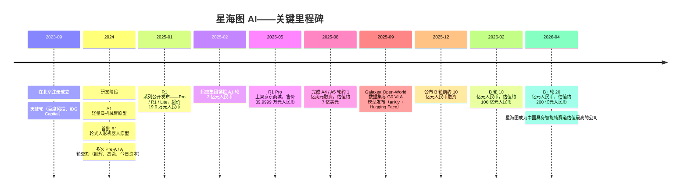
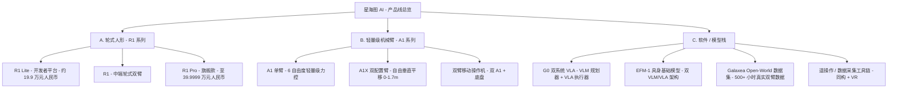
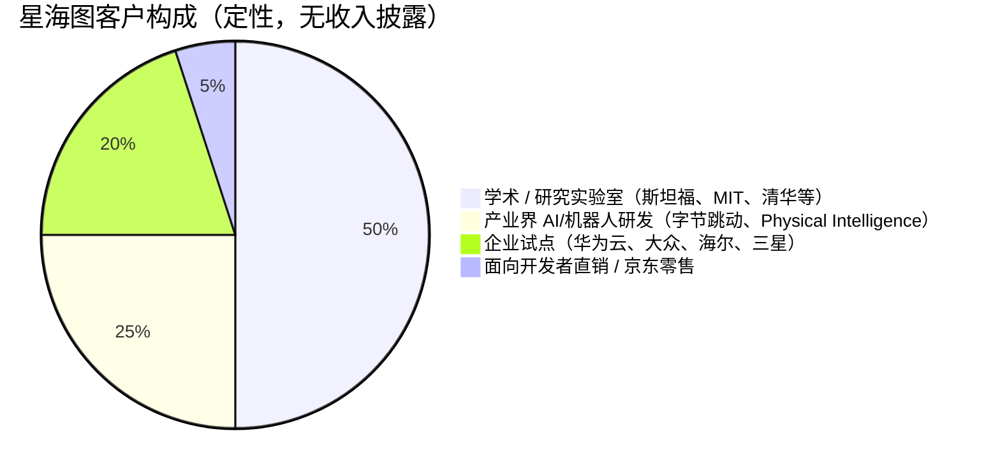
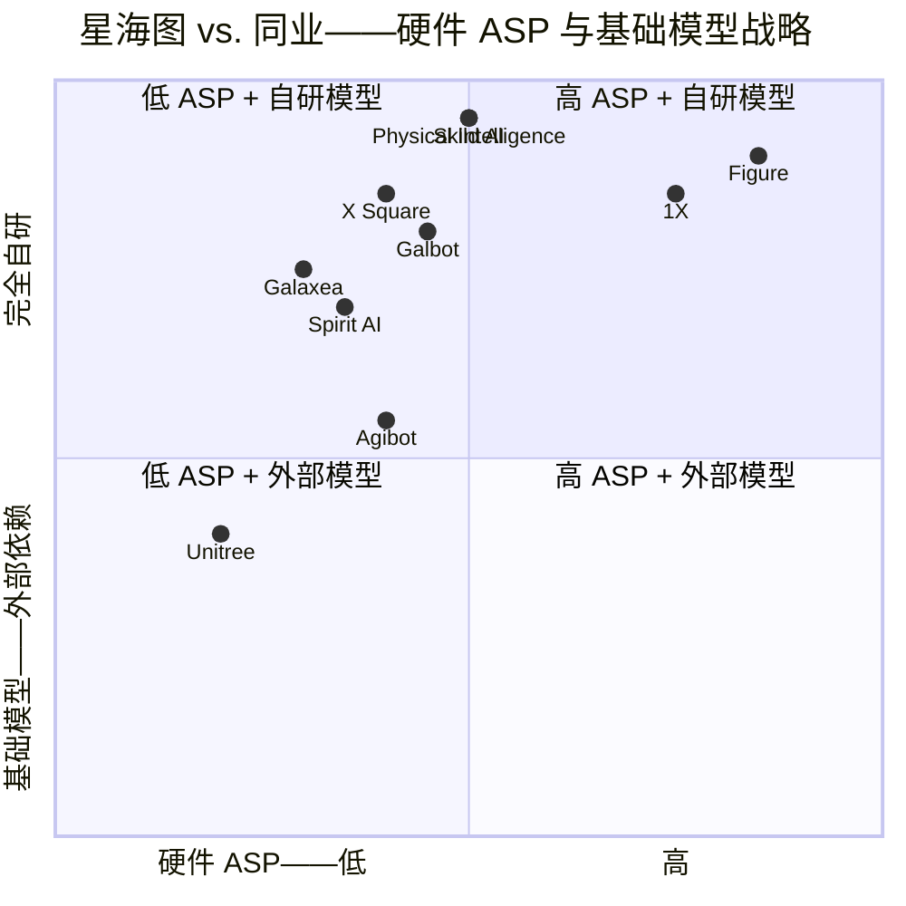

# 公司研究报告：Galaxea AI（星海图）

**日期：** 2026-05-19
**状态：** 私营公司——未公开上市
**总部：** 中国北京（苏州设有运营机构）
**成立时间：** 2023 年 9 月
**所属行业：** 具身智能 / 人形机器人 / 通用型移动操作
**报告语言：** 英文（私营公司，目标读者为英语受众；CEO 访谈及媒体报道大多为中文——引用中保留原始标题）

> **更新——B+ 轮以约 200 亿元人民币估值完成融资（2026-04-02）：** 星海图宣布完成约 20 亿元人民币（约合 2.91 亿美元）的 B+ 轮融资，投后估值突破 200 亿元人民币（约合 28 亿美元），由中金资本领投，广发乾和、鸿泰基金、国元股权、弘章资本以及硬件合作方蓝思科技参投。距离 2026-02-11 以约 100 亿元人民币估值完成的 10 亿元人民币 B 轮融资不到两个月——投后估值在不到八周内翻倍，并成为目前中国具身智能纯赛道公司中估值最高者。官方披露的资金用途：扩大 R1 Pro 量产爬坡，扩展开发者平台客户群（已公开点名 40+ 家，包括字节跳动、华为云、Samsung 三星、Volkswagen 大众、海尔、Physical Intelligence、Stanford 斯坦福、MIT 麻省理工），以及加速 G0 基础模型训练。来源：[Caixin Global, 2026-04-02](https://www.caixinglobal.com/2026-04-02/robot-startup-galaxea-ai-raises-291-million-102430297.html)；[量子位/QbitAI, 2026-04-02](https://www.qbitai.com/2026/04/394626.html)；[证券时报, 2026-04-02](https://www.stcn.com/article/detail/3722732.html)。

---

## 目录
1. 公司概况
2. 公司历史
3. 管理团队
4. 产品与服务
5. 客户与市场策略
6. 行业概况
7. 竞争格局
8. 市场机会（TAM）
9. 风险评估
10. 参考文献

---

## 1. 公司概况

星海图（法定名称为星海图 / Xinghaitu，部分海外市场以其出口业务实体"Galaxea Dynamics"对外）是一家总部位于北京的具身智能初创公司，成立于 2023 年 9 月。公司构建用于通用机器人操作的软硬一体全栈系统：包括轮式双臂人形移动操作机器人系列（R1 系列）、轻量级 6 自由度力控机械臂系列（A1 / A1X 系列），以及自研具身基础模型（EFM-1 / G0）——后者将"慢思考"视觉语言模型（VLM，负责规划）与"快执行"视觉-语言-动作模型（VLA，负责底层控制）相结合（[Galaxea Open-World Dataset and G0 Dual-System VLA Model, 2025-09](https://arxiv.org/abs/2509.00576)；[Galaxea Dynamics 产品官网](https://galaxea-dynamics.com/)）。

与目前占据头条的双足人形机器人公司（Figure、1X、Tesla 特斯拉 Optimus、宇树 H1、Booster）不同，星海图明确选择了"轮式底盘 + 人形上身"——躯干 + 6 自由度双臂 + 4 自由度腰部——作为其商业化形态。CEO 高继扬在中文访谈中反复阐述其论点：双足行走带来额外成本、脆弱性和电池消耗，却并未解决真正的瓶颈——具有商业价值的工作集中在双手灵巧操作。轮式底盘可在零售、实验室、酒店、轻型制造和家庭等室内平坦场景中以远低于同类双足机器人的物料成本实现稳定、长时连续作业（[对话星海图赵行、许华哲：机器人的寒武纪大爆发，卡点在大脑, 知乎, 2024](https://zhuanlan.zhihu.com/p/7630416961)）。

**商业模式。** 星海图采用双边模式。在硬件端，公司向以下两类客户销售机器人、机械臂及配件：（a）AI 研究实验室与开发者客户（高校、基础模型实验室、大型企业研发部门），将平台用于数据采集与策略训练；（b）应用集成商（物流、轻型制造、酒店、零售），部署机器人执行实际工作。在软件端，G0 基础模型与开源的 Galaxea Open-World 数据集（500+ 小时真实世界双臂移动操作数据）既作为研究公信力资产，又构成飞轮：公司出货的每一台机器人都可能成为数据采集器，反哺下一代模型（[OpenGalaxea GitHub](https://github.com/OpenGalaxea/G0)；[Galaxea Open-World Dataset, arXiv 2509.00576](https://arxiv.org/pdf/2509.00576)）。

R1 系列已披露的售价区间：入门级 R1 Lite 开发者平台起价为 19.9 万元人民币（约 2.8 万美元），京东商城上更高配置的 R1 Pro 标价约 39.9999 万元人民币（约 5.6 万美元）——大幅低于双足人形机器人 10 万–25 万美元的常规价格区间（[IT 之家, 2025-01-02](https://www.ithome.com/0/821/803.htm)；[搜狐, 2025-05-27](https://www.sohu.com/a/899057042_115831)）。西方媒体援引 R1 售价区间为 4.45 万–6.4 万美元，与上述定价区间一致（[Yahoo Finance/Benzinga, 2025-08](https://finance.yahoo.com/news/beijings-galaxea-ai-raises-100-000126844.html)）。

**地域布局。** 总部位于北京海淀区，并在苏州设立第二注册主体（负责制造 / 硬件工程）（[DoNews, 2025-01](https://www.donews.com/news/detail/4/4671242.html)；[Crunchbase 公司资料](https://www.crunchbase.com/organization/xinghaitu)）。出口业务子公司"Galaxea Dynamics"通过美国本地分销商（如 Robots International、Humanoid.guide）面向全球供货（[Galaxea Dynamics 产品页](https://galaxea-dynamics.com/products/galaxea-r1-pro)）。

**规模指标。** 截至 2026 年 4 月轮融资时，公司公开服务的企业与学术客户已达 40+ 家，包括字节跳动、华为云、Samsung 三星、Volkswagen 大众、海尔、Stanford 斯坦福、MIT 麻省理工以及 Physical Intelligence（[Yahoo Finance, 2025-08](https://finance.yahoo.com/news/beijings-galaxea-ai-raises-100-000126844.html)；[AInvest, 2025-08](https://www.ainvest.com/news/galaxea-ai-secures-100m-funding-valuation-700m-plans-humanoid-robots-homes-decade-2508/)）。公司未披露具体出货量或收入。截至 2026 年 4 月 B+ 轮，累计融资约 50 亿元人民币（约 7 亿美元），在约 30 个月内完成约 7 轮融资——即便以中国具身智能行业的标准衡量，这种融资节奏也极为密集（详见第 2 节融资时间线）（[量子位, 2026-04-02](https://www.qbitai.com/2026/04/394626.html)；[腾讯新闻, 2026-04-02](https://news.qq.com/rain/a/20260402A042SO00)）。

**员工人数。** 私营公司，无任何核实来源披露。截至 2026 年 LinkedIn 公司页显示员工区间为约 200–500 人，但未经主披露核实（[Galaxea AI LinkedIn](https://www.linkedin.com/company/galaxeaai)）。*提示：员工人数估算未经核实。*

### 估值快照（私营公司——以融资轮估值替代）

星海图为私营公司，无可援引的公开市场估值倍数。按照公司研究方法对私营公司的处理方式，以最新一轮融资投后估值替代：

| 轮次 | 日期 | 已披露金额 | 投后估值 | 领投 / 主要投资人 |
|---|---|---|---|---|
| 天使轮 | 2023-09 | 未披露 | 未披露 | 百度风投（Baidu Ventures）、IDG Capital（[腾讯新闻, 2026-04-02](https://news.qq.com/rain/a/20260402A042SO00)） |
| Pre-A 至 A5（多次交割） | 2024–2025 | 5+ 次交割累计约 20+ 亿元人民币 | 从不足 10 亿元人民币爬升至约 50 亿元人民币 | 蚂蚁集团（A1 轮领投，3 亿元人民币）、今日资本（Capital Today）、美团龙珠 / 美团战投、高瓴创投（Hillhouse / GL Ventures）、凯辉基金（Cathay Innovation）、襄禾资本（Xianghe Capital）、IDG Capital（[Yahoo/Benzinga, 2025-08](https://finance.yahoo.com/news/beijings-galaxea-ai-raises-100-000126844.html)；[证券时报, 2025-12](https://www.stcn.com/article/detail/3639787.html)） |
| B 轮 | 2026-02-11 | 约 10 亿元人民币（约 1.4 亿美元） | 约 100 亿元人民币（约 14 亿美元） | 金鼎资本（Jinding Capital）、北汽产投（BAIC Industrial Investment）、碧虹投资、正心谷、前海方舟、毅丰资本，凯辉、今日资本、美团龙珠、襄禾、高瓴超比例跟投（[36 氪/智能涌现, 2026-02-11](https://36kr.com/p/3678199520846464)） |
| B+ 轮 | 2026-04-02 | 约 20 亿元人民币（约 2.91 亿美元） | 约 200 亿元人民币（约 28 亿美元） | 中金资本（CICC Capital）、广发乾和（GF Qianhe）、鸿泰基金（Hongtai Fund）、国元股权（Guoyuan Equity）、弘章资本（Charisma Partners）、蓝思科技（SZSE:300433）（[Caixin Global, 2026-04-02](https://www.caixinglobal.com/2026-04-02/robot-startup-galaxea-ai-raises-291-million-102430297.html)；[证券时报, 2026-04-02](https://www.stcn.com/article/detail/3722732.html)） |

**隐含收入倍数。** 星海图未披露收入。已公开商业客户约 40 家，R1 售价区间为 19.9 万–40 万元人民币，按上限粗略估算——*明确说明这是估算，非披露*——假设 2025 年累计出货 1,000 台、综合 ASP 约 30 万元人民币，对应收入约 3 亿元人民币，则 B+ 轮投后估值对应约 70 倍倍数。若按 300 台计算，倍数则约为 230 倍。无论如何，该估值是基于**未来模型与平台价值**而非当期硬件收入定价的——与 Skild AI（140 亿美元估值对应约 3,000 万美元收入，约 470 倍倍数）以及 Physical Intelligence（56 亿美元估值，公开披露收入近乎为零）的定价逻辑类似（[TechCrunch, 2025-12-08](https://techcrunch.com/2025/12/08/softbank-and-nvidia-reportedly-in-talks-to-fund-skildai-at-14b-nearly-tripling-its-value/)；[The Robot Report, 2026](https://www.therobotreport.com/skild-ai-raises-1-4b-building-omni-bodied-robot-skild-brain/)；[Sacra, Physical Intelligence](https://sacra.com/c/physical-intelligence/)）。

**同类公司基准（私营可比）。** 完整同类公司表见第 7 节。简言之：星海图（约 28 亿美元）估值低于银河通用（Galbot，2026 年 3 月大基金轮后约 30 亿美元）、智元（Agibot，借壳上市前约 20–30 亿美元）、千寻智能（Spirit AI，约 20 亿美元）以及宇树（Unitree，科创板 IPO 申报前约 30 亿美元），并远低于美国前沿模型机器人同业：Figure（390 亿美元）、Skild（140 亿美元）、1X（约 100 亿美元洽谈中）和 Physical Intelligence（56 亿美元）（[Caixin 关于银河通用, 2026-03-03](https://www.caixinglobal.com/2026-03-03/galbot-raises-362-million-in-fresh-funding-eyes-hong-kong-ipo-102418742.html)；[The Robot Report 关于 Figure C 轮](https://www.therobotreport.com/figure-ai-raises-1b-in-series-c-funding-toward-humanoid-robot-development/)）。

**估值解读。** B 轮至 B+ 轮在八周内翻倍是一次剧烈的重估，反映了以下因素：（a）2026 年一季度横扫银河通用、智元、千寻智能、自变量、Booster 等公司的中国具身智能板块整体重估；（b）星海图作为"清华 + 斯坦福 + Waymo"团队、并由两位助理教授联合创办的叙事定位——与 Physical Intelligence（Sergey Levine、Chelsea Finn）和 Skild AI（Deepak Pathak、Abhinav Gupta）所获学术创始人溢价类似；（c）2025 年 9 月开源 G0 发布带来了真实的研究关注度（论文上线 arXiv、数据集发布于 Hugging Face，模型已被斯坦福、Physical Intelligence 等实验室作为基准平台采用）。风险——第 9 节已标记——在于：只有当基础模型表现与出货量在 2026–2027 年同步拐点时，该隐含收入倍数才能站得住脚。

---

## 2. 公司历史

星海图于 2023 年 9 月在北京由四位联合创始人共同创立：CEO 高继扬、首席科学家赵行、联合首席科学家许华哲，以及 COO / 硬件负责人李天威。高继扬此前任职于 Waymo 山景城办公室，担任轨迹预测与行为预测技术栈的研究科学家；在加入 Waymo 之前曾就职于中国自动驾驶独角兽 Momenta。赵行与许华哲均为清华大学交叉信息研究院（IIIS——由图灵奖得主姚期智创办的"姚班"所在研究院）刚获终身教轨制聘任的助理教授，分别主导 MARS Lab 与 TEA Lab。李天威是高继扬在 Momenta 的同事，曾在 Momenta 组建 SLAM 团队（[Z Potentials 对高继扬的访谈, 2024](https://zpotentials.substack.com/p/z-potentials-after-waymo-and-momenta-jiyang-gaos-journey-to-revolutionize-embodied-ai-with-b91f7fb3a204)；[赵行个人主页](https://hangzhaomit.github.io/)；[许华哲个人主页](http://hxu.rocks/)；[Cathay Innovation 投资组合页](https://cathayinnovation.com/company/galaxea/)）。

创立的初始判断（高继扬在多个访谈中阐述）是：在缺乏更具多样性、动作条件化数据的前提下，自动驾驶端到端感知模型的能力已逼近渐近线；而同样的端到端方法——配合一个能真正在世界中*行动*的机器人本体——是自然的下一注。团队选择室内操作而非户外驾驶，正是因为他们相信在可控、可重复的环境中（即可掌控本体所处的环境），数据采集问题更具可解性（[Z Potentials 访谈](https://zpotentials.substack.com/p/z-potentials-after-waymo-and-momenta-jiyang-gaos-journey-to-revolutionize-embodied-ai-with-b91f7fb3a204)；[The Wire China 高继扬人物简介](https://www.thewirechina.com/whos_who/gao-jiyang-%E9%AB%98%E7%BB%A7%E6%89%AC/)）。

公司的第一款产品 A1 六轴轻量级机械臂于 2024 年研发完成，作为低成本数据采集主力机供应给早期学术与研究客户——星海图称 A1 / A1X 的副本已在清华大学、斯坦福（Fei-Fei Li 的视觉学习实验室是公开提及的用户）以及 Physical Intelligence 的机器人实验室中运行（[AInvest, 2025-08](https://www.ainvest.com/news/galaxea-ai-secures-100m-funding-valuation-700m-plans-humanoid-robots-homes-decade-2508/)；[Galaxea Dynamics A1XY 产品页](https://galaxea-dynamics.com/products/galaxea-a1xy-six-axis-lightweight-dual-configuration-robot-arm)）。

具有决定性意义的商业事件是 **2025 年 1 月 R1 系列发布**，入门价约 2.8 万美元，将星海图定位为市场上首家可信的"开发者可承担"的双臂移动平台——明显低于同类的 Stretch（Hello Robot）或 Tiago（PAL）系统，比双足替代品便宜一个数量级（[腾讯新闻, 2025-01-02](https://news.qq.com/rain/a/20250102A04Z8P00)；[新浪科技, 2025-01-02](https://finance.sina.com.cn/tech/digi/2025-01-02/doc-inecqhfv0410195.shtml)）。

**战略转向。** 严格意义上星海图未发生战略转向——轮式人形 + 基础模型路线自创立以来从未改变——但有两项叙事转移值得注意。其一，2024 年期间公司主要将自己描述为"机器人平台"公司；到 2025 年中，公司将定位转为以"具身基础模型"为先、"硬件"为后，反映了投资者偏好"AI 可防御护城河"胜于"硬件护城河"的整体趋势。其二，*零售*产品组合向上迁移：最初的 R1 Lite 定位为研究 / 开发者 SKU，而 R1 Pro 则瞄准生产力部署场景（轻型制造、物流、酒店），目录价为前者的 2 倍（[搜狐, 2025-05-27](https://www.sohu.com/a/899057042_115831)；[对话星海图赵行、许华哲, 知乎](https://zhuanlan.zhihu.com/p/7630416961)）。

**近期进展（过去 12 个月）。**（1）G0 与 Galaxea Open-World 数据集开源发布，含 500+ 小时真实世界数据（[arXiv 2509.00576](https://arxiv.org/abs/2509.00576)；[OpenGalaxea Hugging Face](https://huggingface.co/OpenGalaxea)）。（2）2026 年初完成股改——通常是 IPO 前的重组步骤（[亿邦动力, 2026](https://m.ebrun.com/637184.html)）。（3）与蓝思科技（SZSE:300433）的硬件合作在 B+ 轮升级为战略投资关系，预示着公司正为外壳、盖板玻璃组件及结构件的更大规模量产做准备（[Caixin Global, 2026-04-02](https://www.caixinglobal.com/2026-04-02/robot-startup-galaxea-ai-raises-291-million-102430297.html)）。

---

## 3. 管理团队

### 高继扬——联合创始人兼 CEO

高继扬，1992 年生于中国大陆，是星海图的公众形象与运营核心。他通过中国全国物理奥赛保送进入清华大学电子工程系，之后赴美国南加州大学（USC）攻读研究生。在 USC，他在导师 Ram Nevatia 教授（USC 计算机视觉小组）指导下，仅用三年完成计算机视觉博士学位——这是异常压缩的时间表；博士论文聚焦于时序动作定位与视频理解（[The Wire China 高继扬人物简介](https://www.thewirechina.com/whos_who/gao-jiyang-%E9%AB%98%E7%BB%A7%E6%89%AC/)；[Z Potentials 访谈](https://zpotentials.substack.com/p/z-potentials-after-waymo-and-momenta-jiyang-gaos-journey-to-revolutionize-embodied-ai-with-b91f7fb3a204)）。

博士期间，他曾在 Google 与中国视觉公司商汤（SenseTime）实习。博士毕业后加入 Waymo（当时为 Google 自动驾驶项目），担任预测技术栈研究科学家，研究多智能体行为预测——即在自动驾驶车辆自身规划轨迹下，预测周边司机、骑行者与行人的动作。此期间他作为作者参与的 Waymo 公开论文包括 VectorNet 风格的场景编码器以及目标条件化轨迹预测相关工作。随后回国加入中国 L4 自动驾驶初创公司 Momenta，担任规划与预测团队负责人，并参与推动 Momenta"两条腿"战略（消费级 L2 + Robotaxi L4）的高管团队（[Z Potentials 访谈, 2024](https://zpotentials.substack.com/p/z-potentials-after-waymo-and-momenta-jiyang-gaos-journey-to-revolutionize-embodied-ai-with-b91f7fb3a204)）。

2023 年 9 月，高继扬离开 Momenta 创立星海图。他在访谈中以三点为这一决策定调：（a）若无根本性新数据，自动驾驶规划已成为"边际收益递减"的问题；（b）下一波平台跃迁显然属于通用机器人中的具身智能；（c）创始团队——他工业级自动驾驶经验 + 两位清华教授级科学家（赵、许） + 一位资深硬件操盘手（李）的组合——独特地具备同时攻克算法与本体的能力（[Z Potentials, 2024](https://zpotentials.substack.com/p/z-potentials-after-waymo-and-momenta-jiyang-gaos-journey-to-revolutionize-embodied-ai-with-b91f7fb3a204)；[Yahoo Finance, 2025-08](https://finance.yahoo.com/news/beijings-galaxea-ai-raises-100-000126844.html)）。

**持股 / 股权。** 任何已核实的来源中均未披露。*提示：股权比例未经核实。*行业惯例下，四位创始人在经历 7 轮稀释后，每位创始人持股大致处于高个位数到低双位数百分比区间，但这是推断而非披露。**公开履历 / 写作。** 高继扬接受过智能涌现 / 36Kr、晚点 LatePost、Caixin、The Wire China、Z Potentials 等媒体署名访谈；X / Twitter 活动有限；常出现在 WAIC（上海）、世界机器人大会（北京）、CoRL 等会议演讲台。

### 赵行——联合创始人兼首席科学家

赵行是清华大学交叉信息研究院（IIIS）终身教轨制助理教授，MARS Lab 主任。2019 年获 MIT 计算机科学与人工智能实验室（CSAIL）博士学位，导师为 Antonio Torralba——他是场景理解与自监督视觉领域引用最多的 PI 之一。MIT 毕业后曾在 Waymo 任研究科学家（在山景城与高继扬同事），2021 年回到清华。其 Google Scholar 显示在 100+ 篇论文上的引用累计超过 3 万次，研究涵盖多模态学习、机器人学习与自动驾驶；他曾入选 MIT Technology Review《35 岁以下创新者》，并获 2024 年上海期智研究院 WAIC 云帆奖（[赵行个人主页](https://hangzhaomit.github.io/)；[赵行 Google Scholar](https://scholar.google.com/citations?hl=en&user=DmahiOYAAAAJ)；[MIT Tech Review《35 岁以下创新者》](https://www.innovatorsunder35.com/the-list/hang-zhao/)；[上海期智研究院新闻](https://www.sqz.ac.cn/en/comprehensive-news-89)）。在星海图，赵行主导 G0 双系统 VLA 项目，是 Open-World 数据集论文的资深作者（[arXiv 2509.00576](https://arxiv.org/pdf/2509.00576)）。

### 许华哲——联合创始人兼联合首席科学家

许华哲同样是清华大学 IIIS 终身教轨制助理教授，主管清华具身智能实验室（TEA Lab）。他在 Berkeley AI Research（BAIR）完成博士学位，并在 Stanford 斯坦福视觉与学习实验室（Stanford Vision and Learning Lab，导师为 Fei-Fei Li / Jiajun Wu）做博士后研究。其 RoboCook 论文在 CoRL 2023——机器人学习领域引用最高的会议——上获得最佳系统论文奖（[许华哲个人主页](http://hxu.rocks/)；[LinkedIn——许华哲清华](https://www.linkedin.com/posts/nokov_prof-huazhe-xu-thu-embodied-ai-robotic-activity-7392130574267785216-O6BO)）。许华哲的研究方向——操作、基于物理交互的强化学习、软体操作——与赵行偏感知的技术栈互补。

### 李天威——联合创始人兼 COO / 硬件负责人

李天威获英国伦敦大学学院（UCL）硕士学位。在 Momenta 工作多年，晋升至高级总监，负责 SLAM 团队，并将 Momenta 的轻地图高速领航辅助驾驶系统交付给 Mercedes-Benz、Toyota、Audi（中国）等 OEM 客户。在星海图，李天威负责硬件工程与苏州制造主体的运营，是公司将 R1 推过可靠性与降本阶段过程中最关键的执行人（[Cathay Innovation 投资组合页](https://cathayinnovation.com/company/galaxea/)；[Crunchbase 星海图资料](https://www.crunchbase.com/organization/xinghaitu)）。公开履历有限——无重要署名访谈记录；偶尔出现在公司合影与硬件供应商活动中，但个人媒体形象不显著。

### 公司治理

星海图为私营公司，未披露董事会构成。基于历轮投资人名单，董事观察员 / 董事大致包括主要财务领投方代表（今日资本、高瓴、美团、凯辉、中金，可能还包括蚂蚁集团）。创始人方面应仍保留董事会主导权；2026 年初完成的股改（[亿邦动力, 2026](https://m.ebrun.com/637184.html)）表明公司正为 2–3 年内的 A 股或港股 IPO 做架构准备。*提示：内部持股比例、薪酬结构、关联交易均未披露。*

### 履历综合评估

按中国具身智能行业标准衡量，创始团队的学术与产业履历亦属顶尖：MIT 出身、引用过 3 万次的清华教授（赵行）；Berkeley 出身、获 CoRL 最佳论文奖的清华教授（许华哲）；USC 出身、具备工业级自动驾驶量产经验的 Waymo + Momenta 老兵（高继扬）；具备量产实战经验的 Momenta 硬件操盘手（李天威）。在中国市场，该组合是与 Skild AI（Pathak / Gupta）、Physical Intelligence（Levine / Finn + 前特斯拉 / 前 Google 工程师）、Figure（Adcock + 招聘队伍）所验证的"两位教授 + 两位行业操盘手"配方最契合的对标。短板在于：四人此前均未运营过星海图当前所达规模的公司，且融资节奏（30 个月 7 轮）意味着组织扩张——招聘、流程、制造爬坡——将成为 2026–2027 年的现实风险。

---

## 4. 产品与服务

星海图的产品线划分为三大组：（A）**R1 轮式人形机器人系列**（R1 Lite、R1、R1 Pro）；（B）**A1 / A1X 轻量级 6 自由度机械臂系列**（单臂、双臂配置，以及一款固定式双臂移动操作开发平台）；（C）**G0 / EFM-1 基础模型软件栈**与开源的 Galaxea Open-World 数据集。

### A. R1 轮式人形机器人系列

**R1 Pro（旗舰款）。** 全尺寸双臂轮式人形移动操作机器人。Galaxea Dynamics 产品页披露并由 IT 之家与腾讯新闻的发布会报道印证的主要规格：整机 26 自由度（Pro 配置下双 7 自由度机械臂 + 4 自由度躯干 + 三轮矢量转向移动底盘，加头部与夹爪自由度）；垂直作业范围 2.0 m；水平作业半径约 700 mm；单臂作业半径约 64 cm；双臂额定负载 7 kg / 最大 10 kg；传感器套件包含 7 个高清摄像头、1 个激光雷达、可选腕部深度摄像头、IMU；车载计算单元为 NVIDIA Jetson AGX Orin 32GB（8 核 CPU + 200 TOPS GPU）；支持用于数据采集的同构遥操作与 VR 遥操作（[Galaxea R1 Pro 产品页](https://galaxea-dynamics.com/products/galaxea-r1-pro)；[IT 之家, 2025-01-02](https://www.ithome.com/0/821/803.htm)；[腾讯新闻, 2025-05-27——京东商城上架](https://news.qq.com/rain/a/20250527A04U0K00)）。已披露目录价：2025 年 5 月京东商城上架价为 39.9999 万元人民币（约 5.6 万美元）；后续美国分销价为 6.9999 万美元（[RobotsInternational R1 页](https://www.robotsinternational.com/Galaxea-R1-R1-Wheeled-Humanoid-Robot.htm)；[humanoid.guide R1 Pro 页](https://humanoid.guide/product/r1-pro/)）。

*竞争优势评估：* **是（部分护城河）。** 护城河类型 = 性价比组合 + 软件生态。约 5.6 万–7 万美元的 R1 Pro 是全球市场上正在出货、且配备 7 自由度机械臂与可观车载计算能力的最便宜量产轮式双臂移动操作机器人。最接近的可比对象：Hello Robot Stretch 3（单臂、约 2.5 万美元——但单臂、负载明显偏弱）、PAL Tiago++（轮式双臂、约 10 万欧元以上、整体重型）、Boston Dynamics Spot + 机械臂（四足 + 单臂，约 10 万美元以上）。在轮式双臂这一细分上，R1 Pro 在性价比上*领先*，但可靠性与部署记录均明显较短。风险：仅当双足人形价格继续维持在 10 万美元以上，且二线轮式双臂竞争者（宇树的轮式平台、智元 Lingxi A2-W）未能缩小价差时，这一优势才具备持续性。

**R1（中端款）。** 与 R1 Pro 同底盘等级，机械臂自由度与传感器配置简化。主要通过国际 Galaxea Dynamics 分销渠道营销。中国市场未单独公布定价；国际分销商对"R1 轮式人形机器人"配置定价区间为 4.4 万–5.5 万美元（[RobotsInternational R1 页](https://www.robotsinternational.com/Galaxea-R1-R1-Wheeled-Humanoid-Robot.htm)）。

**R1 Lite（数据采集 / 开发者平台）。** 精简配置，专为*数据采集与学术研究主力机*优化，而非生产力部署。23 自由度，双 6 轴机械臂作业半径 70 cm，最大高度 1.7 m，二指夹爪，双摄像头头部，用于数据采集的同构遥操作（[Galaxea R1 Lite 数据采集产品页](https://galaxea-dynamics.com/products/galaxea-r1-lite-data-collection-dual-arm-mobile-platform)；[R1 Lite 硬件文档](https://docs.galaxea-ai.com/Guide/R1Lite/R1Lite_Hardware_Introduction/)）。起价 19.9 万元人民币（约 2.8 万美元）。这是机器人实验室渠道中胜出的 SKU。

*竞争优势评估（Lite）：* **是——强护城河。** 护城河类型 = 价格 + 生态。约 2.8 万美元的 R1 Lite 大幅低于次便宜的双臂研究移动平台，并已被 Stanford 斯坦福视觉与学习实验室、MIT、Physical Intelligence 以及数十家中国高校实验室选用（[AInvest, 2025-08](https://www.ainvest.com/news/galaxea-ai-secures-100m-funding-valuation-700m-plans-humanoid-robots-homes-decade-2508/)）。当全球顶尖机器人学习实验室共用同一本体后，由此产生的数据集、预训练策略与评测基准均跑在星海图硬件上——这是经典的开发者平台锁定。这是当前星海图最强的护城河，也是估值中基础模型溢价的主要支撑。

### B. A1 / A1X 轻量级机械臂系列

**A1（单臂）。** 6 自由度轻量级力控机械臂，作业半径约 60 cm，专为桌面操作研究设计。原生适配 G0 / EFM-1 软件栈（[Galaxea Dynamics 产品总页](https://galaxea-dynamics.com/collections/all)）。

**A1X（双配置机械臂）。** 在 A1 基础上增加自由垂直平移（0–1.7 m），使机械臂可在桌面高度至头顶货架高度之间无需重装运行。提供单臂与双臂两种配置（[Galaxea A1XY 产品页](https://galaxea-dynamics.com/products/galaxea-a1xy-six-axis-lightweight-dual-configuration-robot-arm)）。

**双臂移动操作机（固定式或小车式）。** 采用 A1 / A1X 双臂配置，搭载于轮式小车，无完整人形躯干——本质上是一台"轮上工作台"数据采集平台。这正是用户提示中所提到的"双臂移动操作机"形态，与 R1 系列的区别在于：不含躯干自由度，也无人形形态，专为低成本、可重复的双臂数据采集而生。

*竞争优势评估（A1 系列）：* **部分。** 护城河类型 = 价格 + 生态契合度。每臂约 1 万–1.5 万美元的 A1X 直面 Franka Emika（Panda / Research 3，约 2.5 万欧元以上）、Kinova Gen3（约 3.5 万美元以上）以及 Universal Robots UR5e（约 3 万美元以上，但仅 6 自由度且力控精度不及）等竞品。星海图价格明显更低，但在认证、可重复性、第三方生态等方面尚未建立 Franka 或 UR 的口碑。最佳判断：A1 系列是商品化数据采集业务，与 R1 Lite 享有相同的实验室生态钩子；并非对抗工业协作机器人在位厂商的护城河。

### C. 软件栈——G0 / EFM-1 与 Galaxea Open-World 数据集

**EFM-1 / G0 双系统 VLA。** 星海图公开的具身基础模型采用双架构系统：高容量（参数量约 100 亿–200 亿，确切未披露）视觉语言模型承担"慢思考"——高层子任务分解、语言理解、场景推理；与较小（约 10 亿参数级别）视觉-语言-动作模型相配——后者承担"快执行"，在关节或末端执行器层实时输出底层动作控制。这一双系统范式刻意映射了 Kahneman 推广的 System 1 / System 2 二分法，也与 Physical Intelligence 的 π0 和 Figure 的 Helix 架构所采用的思路一致（[Galaxea Open-World 数据集与 G0 论文, arXiv 2509.00576](https://arxiv.org/abs/2509.00576)；[G0 项目页](https://opengalaxea.github.io/G0/)；[OpenGalaxea/G0 GitHub](https://github.com/OpenGalaxea/G0)）。

**Galaxea Open-World 数据集。** 涵盖家庭、厨房、零售、办公等场景，在 R1 / R1 Lite 本体上采集的 500+ 小时真实世界双臂移动操作示范，并配有子任务级语言标注。已通过 Hugging Face 开源（[OpenGalaxea HF](https://huggingface.co/OpenGalaxea)）。截至 2025 年末，按小时数计算，这是全球规模最大的单一本体真实世界机器人操作数据集，是有意为之的"公关 + 研究公信力 + 护城河"组合——每一位在此数据集上进行微调的研究者，某种程度上都被锁定在星海图平台上。

*竞争优势评估（G0 + 数据集）：* **是——叙事强，技术尚处早期。** 护城河类型 = 数据 + 研究网络。在星海图自己公开的评测中，G0 对 π0 与 OpenVLA 具备可比表现，但在独立基准上尚非以显著优势领跑的最优模型；这里的护城河*不在于*模型性能优越性，而在于真实存在并持续扩大的"数据 + 平台"飞轮。与闭源对手相比：Physical Intelligence 的 π0 / π0.5 在学术影响力上更高；Skild AI 的"全本体大脑"资金更充裕但尚未发布；Figure 的 Helix 闭源且与平台绑定。

### 旗舰 vs. 长尾

按公开客户与收入结构（定性，无定量披露），R1 Lite 是销量驱动器，R1 Pro 是 ASP / 毛利驱动器，G0 + 数据集是战略叙事驱动器。A1 / A1X 机械臂是战术性收入贡献者。过去 12 个月内无产品下线公告。

### 近 12 个月新发布

- 2025-01-02——R1 系列发布（Pro、R1、Lite），起价 19.9 万元人民币（[腾讯新闻, 2025-01-02](https://news.qq.com/rain/a/20250102A04Z8P00)）
- 2025-05-27——R1 Pro 上架京东，售价 39.9999 万元人民币，标志着向消费渠道铺货（[搜狐, 2025-05-27](https://www.sohu.com/a/899057042_115831)）
- 2025-09——G0 双系统 VLA 与 Open-World 数据集开源发布（[arXiv 2509.00576](https://arxiv.org/abs/2509.00576)；[OpenGalaxea HF](https://huggingface.co/OpenGalaxea)）
- 2026-04——R1 Pro 2026 升级款发布，官方定位为"用于具身智能开发的高性能、高扩展性轮式人形移动操作平台"（[Galaxea R1 Pro 2026 产品页](https://galaxea-dynamics.com/products/galaxea-r1-pro)）

---

## 5. 客户与市场策略

### 客户分群

星海图已披露的客户基础分为三类：

1. **学术 / 研究实验室。** Stanford 斯坦福大学（指名：Fei-Fei Li 视觉学习实验室）、MIT 麻省理工以及数十家中国高校机器人实验室（清华 MARS Lab 与 TEA Lab 通过创始人渠道无疑是核心锚客户）使用 R1 Lite 与 A1 / A1X 机械臂作为数据采集与策略学习平台（[AInvest, 2025-08](https://www.ainvest.com/news/galaxea-ai-secures-100m-funding-valuation-700m-plans-humanoid-robots-homes-decade-2508/)；[Yahoo Finance/Benzinga, 2025-08](https://finance.yahoo.com/news/beijings-galaxea-ai-raises-100-000126844.html)）。
2. **工业界的 AI / 机器人研究客户。** 指名：Physical Intelligence（美国）、字节跳动（很可能包括 SeedEdge / Doubao 机器人团队等研究实验室）（[Yahoo Finance/Benzinga, 2025-08](https://finance.yahoo.com/news/beijings-galaxea-ai-raises-100-000126844.html)）。
3. **企业 / 工业场景客户。** 指名：华为云、Volkswagen 大众、海尔、Samsung 三星——使用 R1 机器人进行算法训练、机器人部署验证以及具身智能数据采集；具体应用场景尚未公开披露（[AInvest, 2025-08](https://www.ainvest.com/news/galaxea-ai-secures-100m-funding-valuation-700m-plans-humanoid-robots-homes-decade-2508/)）。

### 客户集中度

**星海图为私营公司，未提交经审计的客户集中度披露。** 40+ 客户数量来自媒体披露（[Yahoo Finance, 2025-08](https://finance.yahoo.com/news/beijings-galaxea-ai-raises-100-000126844.html)），但单一客户营收占比未披露。*提示：前 1 / 前 5 大客户收入占比未披露。*以上客群结构表明前 1 大客户集中度较低（无单家企业部署上百台 R1），但研究 / 开发者层面的*行业内*集中度偏高——意味着当前业务仍依赖研究买方叙事，而非生产力部署现金流。这本身就是当前最核心的商业风险。

*数据来源：基于媒体公开点名客户的推断，并非经审计的分部数据。详见 [AInvest, 2025-08](https://www.ainvest.com/news/galaxea-ai-secures-100m-funding-valuation-700m-plans-humanoid-robots-homes-decade-2508/) 与 [Yahoo Finance/Benzinga, 2025-08](https://finance.yahoo.com/news/beijings-galaxea-ai-raises-100-000126844.html)。百分比仅为示意——星海图未披露具体构成。*

### 销售渠道

- **企业直销。** 针对一线客户（华为云、Samsung 三星、Volkswagen 大众、海尔）以销售主导。
- **学术直销。** 与重点实验室建立直供关系；ASP 较零售通常折扣。
- **京东商城线上零售。** R1 Pro 标价 39.9999 万元人民币——主要作为传达可及性与信任的营销渠道（[搜狐, 2025-05-27](https://www.sohu.com/a/899057042_115831)）。
- **国际分销网络。** 出口实体 Galaxea Dynamics 通过 Robots International、Humanoid.guide、RobotsUSA、RobotsAsia、RobotsAfrica 出货——一组面向北美、欧洲、亚洲的科研与集成买家、专注机器人垂直行业的电商分销网络（[RobotsInternational 星海图页面](https://www.robotsinternational.com/Galaxea.htm)；[humanoid.guide R1 Pro](https://humanoid.guide/product/r1-pro/)）。

### 销售策略与周期

对研究与学术买方，销售周期是公司强项：预筛选过的渠道（CoRL、ICRA、WAIC、世界机器人大会展位）、研究者间口碑推荐密集（两位教授联合创办本身就是强大的圈内资源）、开源的 G0 + 数据集形成漏斗顶部线索引流。对企业试点客户，周期更长，遵循"试点—验证 ROI—扩张"的常见路径——星海图迄今未公开任何单笔超过 100 台的订单，这与行业整体仍处早期生产力部署阶段一致。

### 关键合作

- **蓝思科技（SZSE:300433）**——B+ 轮战略投资方，承担外壳、盖板玻璃组件、结构件的硬件制造合作（[Caixin Global, 2026-04-02](https://www.caixinglobal.com/2026-04-02/robot-startup-galaxea-ai-raises-291-million-102430297.html)）。
- **NVIDIA**——车载计算平台（R1 系列全线采用 Jetson AGX Orin 32GB）（[Galaxea R1 Pro 产品页](https://galaxea-dynamics.com/products/galaxea-r1-pro)）。
- **Stanford 斯坦福 / Fei-Fei Li 实验室**——公开标杆客户与研究合作伙伴（[AInvest, 2025-08](https://www.ainvest.com/news/galaxea-ai-secures-100m-funding-valuation-700m-plans-humanoid-robots-homes-decade-2508/)）。
- **Physical Intelligence**——公开标杆客户；此关系为未来"基于星海图硬件的模型"市场化合作奠定基础。

### 客户案例（已公开标杆赢单）

星海图尚未发布企业软件供应商常用的那种带 ROI 量化的单客户案例。公司公开点名的客户名单（Stanford 斯坦福、MIT、Physical Intelligence、字节跳动、华为云、Samsung 三星、Volkswagen 大众、海尔）本身即是其营销案例。*提示：未核实单客户的量化部署数据。*

---

## 6. 行业概况

### 行业定义

星海图处于三个加速融合行业的交叉点：（1）**工业 / 服务机器人**（NAICS 3334 / SIC 3559），历史上由 ABB、Fanuc、Yaskawa、Kuka 主导，近年加入 Universal Robots 与 Hello Robot；（2）**AI 基础模型**——具身智能子赛道包括 Physical Intelligence、Skild AI、Figure（Helix）、Google DeepMind（RT-2 / Gemini Robotics）以及重启机器人战略的 OpenAI；（3）**移动操作平台**——"轮式人形移动操作机"这一具体小众，历史上由 Hello Robot Stretch 与 PAL Robotics Tiago 主导。星海图的具体定位——"轮式人形移动操作 + 自研基础模型 + 开源数据集"——可视为更宏观人形 / 具身智能行业中的"开发者平台"层。

### 市场规模——人形 + 具身智能

**Goldman Sachs 高盛基准情景：** 全球人形机器人市场到 **2035 年达 380 亿美元**——相对其 2024 年 60 亿美元的估算上调 6 倍，反映了 2024–2025 年 AI 能力的提速（[Goldman Sachs, "Humanoid robot: The AI accelerant"](https://www.goldmansachs.com/insights/goldman-sachs-research/global-automation-humanoid-robot-the-ai-accelerant)）。在此之内，高盛预计到 2030 年人形机器人出货量超过 25 万台，几乎全部用于工业场景。

**Morgan Stanley 摩根士丹利基准情景：** 人形机器人市场到 **2050 年达 5 万亿美元**，其中中国预计将拥有全球最大的在用安装量（2050 年 3.02 亿台，对比美国 7,800 万台）（[Morgan Stanley, "Humanoid Robot Market Expected to Reach $5 Trillion by 2050"](https://www.morganstanley.com/insights/articles/humanoid-robot-market-5-trillion-by-2050)）。

**具身智能软件**（独立于人形硬件）：MarketsandMarkets 预测 **2025 年 44.4 亿美元增至 2030 年 230.6 亿美元，CAGR 39.0%**（[MarketsandMarkets, Embodied AI Market Report 2025–2030](https://www.marketsandmarkets.com/Market-Reports/embodied-ai-market-83867232.html)）。

**中国市场出货量预测：** TrendForce 预测 **2026 年中国人形机器人产量同比增长 94%**，其中宇树与智元合计占据约 80% 出货——剩余约 20% 由星海图、银河通用、千寻智能、自变量、Booster、傅利叶、UBTech、乐聚等公司争夺（[TrendForce, 2026-04-09](https://www.trendforce.com/presscenter/news/20260409-13007.html)；[DataQuest India, 2026](https://www.dqindia.com/esdm/chinas-humanoid-robot-output-to-surge-94-in-2026-unitree-and-agibot-to-capture-nearly-80-market-share-11727677)）。

### 增长驱动因素

1. **基础模型成熟。** 端到端视觉-语言-动作模型（π0、OpenVLA、Helix、G0）于 2024–2025 年达成的泛化能力，已可在狭窄但真实的生产场景中支持通用操作。这是投资人热情最大的单一驱动因素。
2. **中国产业政策顺风。** 中国工信部于 2023 年正式将人形机器人列为战略性新兴产业，并提供了大量国家级基金参与——2026 年 3 月，银河通用从国家大基金与腾讯领投的轮次中募得 3.62 亿美元（[Caixin Global, 2026-03-03](https://www.caixinglobal.com/2026-03-03/galbot-raises-362-million-in-fresh-funding-eyes-hong-kong-ipo-102418742.html)；[Digitimes, 2026-03-04](https://www.digitimes.com/news/a20260304VL210/china-big-fund-humanoid-robotics-investment.html)）；星海图 B+ 轮中亦有北汽产投（具国资背景）参与。
3. **零部件成本下降。** 无刷电机、谐波减速器、IMU、ToF / 激光雷达传感器遵循类摩尔的成本曲线下降；中国成熟的电动车供应链是最大贡献者（电机与电池组在中国尤为便宜）。
4. **制造业与服务业人力成本上升。** 中国劳动年龄人口在 2014 年达峰；服务业工资每年增长约 5–8%。日本、韩国、德国、美国也面临相同人口压力。
5. **数据飞轮加速。** 开源数据集（Galaxea Open-World、BridgeData V2、DROID、Open X-Embodiment）已降低构建有竞争力策略的门槛；领先模型与跟随模型间的差距在缩小。

### 监管环境

人形机器人相对自动驾驶监管较轻。主要监管暴露：（1）**功能安全**——IEC 61508、ISO 10218、ISO 13482（服务机器人）是相关标准，但执行力因司法辖区而异；（2）**就业 / 劳工**——若人形机器人大规模替代工人，则可能引发劳工权利反弹（目前微弱）；（3）**出口管制**——美国 BIS 对先进 AI 芯片的管制影响车载算力；R1 当前使用的 NVIDIA Jetson AGX Orin 处于 BIS 性能门槛以下、目前对中国不受出口管制，但这可能变化；（4）**数据主权**——中国《网络安全法》与《个人信息保护法》（PIPL）适用于家庭部署场景。星海图未提示存在任何当前监管阻碍。

### 行业结构

全球范围内行业仍高度碎片化，至少有 30 家获融资的人形平台初创公司，另有 20+ 家具身智能软件公司。具体到中国，头部 5–7 家公司（宇树、智元、UBTech、银河通用、星海图、千寻智能、自变量，以及消费电动车跨界者如小鹏 Iron、Tesla 特斯拉 Optimus 的中国供应链伙伴）正通过 2026 年一季度的资本周期快速整合。行业分析师预计 2026–2027 年将是洗牌窗口期，期间只有 3–5 家中国平台能达到商业化规模。准入壁垒显著（数十亿元资本、世界级 AI 人才、硬件制造合作），退出壁垒同样高（深度专业化、沉没硬件投入）。

供给端：执行器供应商（拓普集团、三花、五洲新春、绿的谐波负责谐波减速器；汇川、埃斯顿、鸣志负责电机）当前掌握一定定价权，但中国供应链广度正快速扩展。需求端：2026 年终端客户仍是价格接受者，因为尚无平台达到消费级规模；这一格局有望在 2027–2028 年逆转——只要宇树 / 智元兑现其声称的 5 万–10 万台年产能计划。

替代品：传统工业机器人（ABB IRB 系列、Fanuc CRX 协作机器人）用于固定位置任务；自主移动机器人（极智嘉、海康机器人的 AMR）用于物流；人类则承担其余一切。人形机器人的卖点是"一个平台、所有任务"——但在生产环境中证明其泛化能力之前，客户仍倾向部署任务专属的自动化方案。

---

## 7. 竞争格局

相关竞争集合分为三组：

### A. 中国具身智能 / 人形机器人初创（最直接的对标）

| 公司 | 成立时间 | 总部 | 主要产品 | 最新估值 | 备注 |
|---|---|---|---|---|---|
| **星海图 AI** | 2023-09 | 北京 | R1 轮式人形 + G0 模型 | 约 28 亿美元（2026-04） | 轮式人形定位；清华 + 斯坦福学术团队；G0 开源 |
| **银河通用（Galbot）** | 2023-05 | 北京 | G1 轮式人形（面向零售） | 约 30 亿美元（2026-03，大基金领投） | 在 30+ 城运营"Galbot Store"无人零售；CATL 宁德时代、Bosch 博世、Toyota 客户；瞄准港股 IPO（[Caixin, 2026-03-03](https://www.caixinglobal.com/2026-03-03/galbot-raises-362-million-in-fresh-funding-eyes-hong-kong-ipo-102418742.html)） |
| **智元（Agibot）** | 2023 | 上海 | 远征 / 灵犀人形系列 | 约 20–30 亿美元（借壳上纬新材） | 2025 年人形机器人销售 5,168 台；与宇树共同领跑量产（[TrendForce, 2026-04-09](https://www.trendforce.com/presscenter/news/20260409-13007.html)） |
| **千寻智能 / Spirit AI（PsiBot）** | 2024-02 | 杭州 | Moz1 人形 + Spirit v1.5 模型 | 约 20 亿美元（2026-02） | 前珞石 CTO 韩峰涛 + 清华教授高阳创立；2026 年 1 月 RoboChallenge 基准测试榜首（[People's Daily, 2026-01-14](https://en.people.cn/n3/2026/0114/c90000-20413808.html)） |
| **自变量（X Square Robot）** | 2023-12 | 深圳 | 开源 Wall-OSS 模型 + 人形原型 | 累计约 2.8 亿美元融资 | Alibaba Cloud 阿里云领投的 A++ 轮；以基础模型为先（[SCMP, 2025-09](https://www.scmp.com/tech/tech-trends/article/3324780/alibaba-cloud-leads-us140-million-funding-round-embodied-ai-start-x-square-robot)；[Caixin, 2026-01-13](https://www.caixinglobal.com/2026-01-13/humanoid-robot-startup-x-square-nets-big-name-backers-in-143-million-raise-102403080.html)） |
| **宇树（Unitree）** | 2016 | 杭州 | H1 / H2 双足 + G1 mini + 四足 | 科创板申报前约 30 亿美元 | 2025 年全球人形机器人出货第一（5,500 台）；已提交科创板 IPO（[TrendForce, 2026-04-09](https://www.trendforce.com/presscenter/news/20260409-13007.html)） |

### B. 美国具身智能 / 人形机器人初创

| 公司 | 成立时间 | 总部 | 产品 | 估值 | 备注 |
|---|---|---|---|---|---|
| **Physical Intelligence** | 2024 | 旧金山 | π0 / π0.5 基础模型 | 56 亿美元（2025） | CapitalG 领投；学术创始人 Levine + Finn；累计融资约 10.7 亿美元（[Sacra](https://sacra.com/c/physical-intelligence/)） |
| **Skild AI** | 2023 | 匹兹堡 | "全本体"具身大脑 | 140 亿美元（2025-12，SoftBank / NVIDIA 领投） | 14 亿美元 C 轮；累计融资 20 亿美元；2025 年收入约 3,000 万美元（[TechCrunch, 2025-12-08](https://techcrunch.com/2025/12/08/softbank-and-nvidia-reportedly-in-talks-to-fund-skildai-at-14b-nearly-tripling-its-value/)） |
| **Figure AI** | 2022 | Sunnyvale | Figure 02 / 03 双足人形 | 390 亿美元（2025） | Helix 基础模型；面向消费级家庭的 Figure 03；C 轮约 10 亿美元（[The Robot Report](https://www.therobotreport.com/figure-ai-raises-1b-in-series-c-funding-toward-humanoid-robot-development/)） |
| **1X Technologies** | 2014（原 Halodi） | 挪威 Moss | NEO 双足人形 | 约 100 亿美元（2026 谈判中） | 消费级家庭定位；预订价 2 万美元 / 499 美元每月订阅 |
| **Agility Robotics** | 2015 | 俄勒冈州 Albany | Digit 双足 | 未披露（不足 10 亿美元） | 与 Amazon 亚马逊合作；仓储物流 |
| **Boston Dynamics** | 1992 | 马萨诸塞州 Waltham | Atlas（电动版）/ Spot | n/a——Hyundai 现代子公司 | Atlas 电动版量产为重点；可靠性高 |

### 定位框架

该图将星海图定位于"开发者可承担硬件 + 自研基础模型"象限——与千寻智能、银河通用同象限，与"高 ASP 双足人形 + 自研"集群（Figure / 1X）以及"仅模型"集群（Physical Intelligence / Skild）明显分离。象限选择本身就是战略差异化：星海图押注的是 *性价比最佳、可防御的双臂移动平台 + 可信的自研模型 = 赢得机器人实验室与二线企业试点这条长尾的开发者平台*；与此同时，双足人形机器人公司在更窄的"直接面向消费者 / 直接面向企业"市场中厮杀。

### 星海图的竞争优势

1. **轮式人形成本结构优势。** 2.8 万–5.6 万美元的 R1 较双足同类产品便宜 2–4 倍，并与最近的轮式双臂在位厂商（Stretch、Tiago）正面竞争。
2. **学术创始团队公信力。** 两位清华 IIIS 助理教授（MIT 与 Berkeley 博士）+ 一位 Waymo / Momenta 工程出身的操盘手——是中国具身智能群体中最强的团队。
3. **开发者平台锁定（正在形成）。** R1 Lite 在研究实验室的渗透与开源的 Galaxea Open-World 数据集，正在缓慢培育一个"星海图原生"的研究社区。
4. **自研基础模型（G0）。** 公开发布并具可衡量的基准表现，将星海图与纯硬件竞争对手区分开来，并为估值叙事提供了对抗纯硬件商品化的保护。
5. **战略硬件合作方（蓝思科技）。** 制造深度与 BoM 降本支持——多数同业不具备的有价值运营资产。

### 弱点

1. **双足化风险。** 若消费家庭或非结构化环境场景被证实需要双足移动，星海图的轮式人形押注将沦为利基。星海图已表示在双足方向有研发，但尚无产品。
2. **基础模型军备竞赛。** Physical Intelligence（π0.5）、Skild AI（14 亿美元弹药库）、Figure（Helix）和 DeepMind（Gemini Robotics）在模型研发投入上均比星海图高一个数量级。G0 有竞争力，但并非以显著优势领先。
3. **无单位出货量领导地位。** 宇树与智元已占据量级叙事；星海图选择"开发者平台"路线，但最终必须转向生产力出货以支撑其 28 亿美元的估值倍数。
4. **无公开收入。** 中国同业的所有对标均基于叙事定价；若整体板块下调（一次里程碑落空），星海图也将同步下调。

### 市场份额（信息估算）

按单位计算，星海图在 2025 年中国人形机器人出货中占比小于 5%（按 TrendForce 数据，宇树 + 智元合计约 80%（[TrendForce, 2026-04-09](https://www.trendforce.com/presscenter/news/20260409-13007.html)））；但在中国轮式人形开发者平台中可能为份额领先者，并稳居学术 / 研究实验室渗透前三。若以"开发者生态心智份额"而非单位数加权，市场份额故事更好——但这是软指标，市场不太可能在再融资一两轮之后继续给予溢价。

---

## 8. 市场机会（TAM）

### TAM

2050 年人形机器人 TAM 的标题数字——Morgan Stanley 摩根士丹利的 5 万亿美元——是支撑情绪的正确数字，但用以承销 2027–2029 年损益表则是错误的数字。星海图相关的近期 TAM 拆解如下：

- **人形硬件（Goldman Sachs 高盛基准情景）：** 2035 年全球 380 亿美元（[Goldman Sachs, "2035 年 380 亿美元"](https://www.goldmansachs.com/insights/articles/the-global-market-for-robots-could-reach-38-billion-by-2035)）。按行业分析师共识，其中轮式人形子集占比小于 20%——即到 2035 年约为 50 亿–100 亿美元。
- **协作机器人邻近市场：** 2024 年约 90 亿美元，2030 年达 250 亿–300 亿美元，CAGR 约 22%（多家市场研究共识）。
- **具身智能软件：** 2025 年 44 亿美元，2030 年 230 亿美元，CAGR 39%（[MarketsandMarkets, Embodied AI 2025–2030](https://www.marketsandmarkets.com/Market-Reports/embodied-ai-market-83867232.html)）。
- **机器人数据 / 标注 / 仿真：** 规模小但高增——到 2030 年利基 TAM 不足 50 亿美元，但毛利高、对星海图（鉴于其 Open-World 数据集）是自然邻近赛道。

### SAM

星海图的可服务市场最佳表述为：（a）面向研究、轻型制造、酒店、零售以及部分家庭试点的全球可发货轮式双臂移动操作机——到 2030 年规模约 30 亿–50 亿美元（仅为高盛 TAM 的一小部分）；外加（b）依附于星海图平台的软件 / 模型订阅收入——若开源飞轮可转化为付费企业级模型层级，到 2030 年规模约 5 亿–10 亿美元。

### SOM

星海图的现实 2030 年 SOM——假设其达到 B+ 轮估值隐含的轮式人形 10–15% 市场份额——大致对应 5 亿–10 亿美元收入区间。若按更保守的 5% 份额计算，SOM 约为 1.5 亿–2.5 亿美元收入。要在 28 亿美元估值上对应 10–15 倍 PS，需取较高端的情景；较低端则意味着估值需部分重置。

### 渗透策略

星海图公开的渗透路径：

1. **2024–2025 年（已完成）：** 在全球种子级播撒 R1 Lite 与 A1 / A1X 机械臂到学术与研究实验室；构建开源数据集 / 模型飞轮。
2. **2026 年（当前）：** 将头部开发者客户（Physical Intelligence、字节跳动、大公司研发部门）从 Lite 转向 Pro；与蓝思科技一同在苏州进行制造爬坡；深化与华为云 / Volkswagen 大众 / 海尔 / Samsung 三星的企业试点。
3. **2027–2028 年：** 在零售（参照 Galbot Store 模式）、轻型制造、酒店等场景将试点转化为多机生产力部署；交付足以支撑无人值守部署的闭环可靠性的新一代 G0。
4. **2028 年及之后：** 若成本结构与能力支持，则探索消费家庭应用。

执行风险集中于第 3 阶段：将研究 / 试点收入转化为经常性生产力部署收入，是机器人行业最难的单一商业转型，且历来是大多数平台失速之处。

---

## 9. 风险评估

### 公司特定风险

**1. 执行风险——制造爬坡。** 星海图累计融资约 7 亿美元，并公开承诺 2026–2027 年与蓝思科技合作推动 R1 Pro 量产。团队此前无运营年产能数千台规模硬件公司的经验；宇树、智元、UBTech 均有多年的制造履历但仍在产能良率上挣扎。苏州产能爬坡若延迟 6–12 个月，将把生产力收入拐点从 2027 年推至 2028 年，并可能触发估值重置。**严重性：高。可能性：中高。** 缓释措施：蓝思合作；李天威的 Momenta 运营背景。

**2. 关键人物依赖。** 星海图的叙事——可以说也是其估值——建立在四位创始人之上，其中两位（赵、许）持有清华教职而精力分摊。任一创始人（特别是高或赵）离开将实质性削弱公司定位。四方分立也使治理风险集中在战略分歧出现时。**严重性：高。可能性：低中。** 缓释措施：股权归属期；管理层梯队加深。

**3. 轮式形态战略下注。** 星海图选择了轮子而非腿。若消费家庭应用最终被证明必须依赖双足移动（如台阶、不平表面成为必备而非可选），星海图将需要在多年滞后下补齐主要硬件能力。**严重性：高。可能性：中。** 缓释措施：2025–2030 年 TAM 的主体（零售、实验室、轻型制造、酒店等室内商业部署）对轮式友好。

**4. 基础模型竞争强度。** G0 在星海图自家公开基准上对 π0 与 OpenVLA 具备竞争力，但并非以显著优势领跑的最优模型。Physical Intelligence 的 π0.5、Skild AI 的"全本体大脑"以及 Figure 的 Helix 在模型端的资金均比星海图高一个数量级；一旦能力差距拉开，将引发估值风险。**严重性：中高。可能性：中。** 缓释措施：开源飞轮；Galaxea Open-World 数据集；自有数据采集资产优势。

**5. 研究分部的客户集中度。** 尽管前 1 / 前 5 大客户的金额集中度未经核实且可能较低（无单笔交易超过几百台），但研究 / 学术 / 试点收入的*行业内*集中度较高。研究买方需求波动大且与资金周期挂钩。**严重性：中。可能性：中。** 缓释措施：40+ 个点名客户分散了基础；企业级赢单（Volkswagen 大众、海尔、Samsung 三星）是向生产力部署转型的早期信号。

**6. NVIDIA 算力供应集中度。** R1 全线使用 NVIDIA Jetson AGX Orin 作为大脑。若美国出口管制进一步收紧 AI 算力（如新 BIS 门槛覆盖 Jetson 系列），星海图将面临中途换算力的挑战。**严重性：中。可能性：低中。** 缓释措施：华为 Ascend、寒武纪、国产 SoC 替代方案存在，但软件生态落后。

### 行业 / 市场风险

**7. 中国群体竞争强度。** 宇树与智元在 2025 年中国人形机器人出货中合计占约 80%。中国具身智能群体（银河通用、星海图、千寻智能、自变量、Booster、傅利叶等）整体融资水平相对近期需求过剩。2026–2027 年的整合或洗牌即便对类别领导者也将压缩估值倍数。**严重性：高。可能性：高。** 缓释措施：星海图的开发者平台差异化若能延续，将提供一定保护。

**8. 技术颠覆——双足降本。** 最大的外部冲击是双足人形机器人 BoM 降至 3 万美元以下，且可靠性足以支撑生产力部署——届时轮式人形价值主张将被压缩。宇树 H1/H2 已激进定价。**严重性：高。可能性：中。** 缓释措施：即便在双足可负担的世界中，轮子在许多室内平面任务上仍更高效。

**9. AI / 机器人监管收紧。** 当前无重大即时暴露，但中国网络与数据监管和美国出口管制均处于活跃状态。一项关于机器人自主性、AI 模型备案或算力出口的有约束力的规则变更将迫使代价不菲的调整。**严重性：中。可能性：中。** 缓释措施：公司开发者平台定位较完全自主产品暴露更小。

**10. 研究 / 学术分部需求饱和。** 若全球双臂移动操作机研究实验室存量提前饱和——比如到 2027 年底——星海图当前收入基础将停滞，需等待企业 / 生产力部署拐点。**严重性：中。可能性：中低。** 缓释措施：全球二线高校与企业研发买方仍有渗透空间。

### 财务风险

**11. 估值 / 倍数压缩风险。** 在 28 亿美元投后估值下、收入未披露但很可能偏低（隐含倍数超过 100×）的情况下，星海图基于未来模型与平台价值定价。B 轮至 B+ 轮在八周内翻倍异常之快，与"FOMO"式资本周期一致。中国具身智能板块的整体重估（同业落空、情绪转向、宇树或银河通用 IPO 表现失望）即便星海图自身运营不出错也会拖累其估值。Skild AI / Physical Intelligence 等美国对标更为激进，提供了同业相对维度的保护，但绝对维度上无保护。**严重性：高。可能性：中高。** 缓释措施：B+ 轮（2.91 亿美元）+ 早期现金的现金跑道大致可支撑至 2027–2028 年；创始团队在 2026 年无需在受困估值下融资。

**12. 现金消耗 / 盈利时间表。** 星海图未盈利，具体数据未公开。基于约 7 亿美元累计融资以及硬件加软件的成本结构（苏州制造、AI 研发人员、模型训练 GPU 算力、客户成功组织），月度消耗大致在 500 万–1,500 万美元区间。盈利不在可信的 2 年时间窗内；投资逻辑系于 2027–2029 年超常规收入拐点。**严重性：中高。可能性：中。** 缓释措施：B+ 轮后现金余额大；多家国资关联投资人提供耐心资本。

### 宏观经济风险

**13. 中国消费 / 工业需求周期性。** 2026–2027 年中国工业资本支出放缓将压缩企业试点的转化。中国房地产与消费周期仍偏弱；制造业 PMI 在过去两年围绕 50 震荡。**严重性：中。可能性：中。** 缓释措施：人形机器人被定位为劳动力替代型资本支出，往往在下行周期中跑赢一般资本支出。

**14. 地缘政治 / 中美脱钩。** 星海图客户群包括美国（Stanford 斯坦福、MIT、Physical Intelligence）和欧洲（Volkswagen 大众、Samsung 三星——韩国）账户。中美科技关系进一步恶化——BIS 管制升级、新加入实体清单、限制中国 AI 公司在美运营——将损害星海图开发者平台叙事中"国际"那一半。**严重性：中高。可能性：中。** 缓释措施：Galaxea Dynamics 出口实体、多司法辖区分销网络以及开源定位降低了对单一司法辖区的暴露。

---

## 10. 参考文献

### 公司资料 / 一手披露

- [Galaxea Open-World Dataset and G0 Dual-System VLA Model, arXiv 2509.00576, 2025-09](https://arxiv.org/abs/2509.00576) —— G0 / EFM-1 模型及 Open-World 数据集的主要技术披露。
- [G0 project page, opengalaxea.github.io, 2025-09](https://opengalaxea.github.io/G0/) —— 项目与基准页。
- [OpenGalaxea/G0 GitHub repository](https://github.com/OpenGalaxea/G0) —— 开源代码发布。
- [OpenGalaxea Hugging Face](https://huggingface.co/OpenGalaxea) —— 数据集与模型工件。
- [Galaxea Dynamics R1 Pro 产品页](https://galaxea-dynamics.com/products/galaxea-r1-pro) —— R1 Pro 规格。
- [Galaxea Dynamics R1 Lite 数据采集页](https://galaxea-dynamics.com/products/galaxea-r1-lite-data-collection-dual-arm-mobile-platform) —— R1 Lite 规格。
- [Galaxea Dynamics A1XY 机械臂页](https://galaxea-dynamics.com/products/galaxea-a1xy-six-axis-lightweight-dual-configuration-robot-arm) —— A1X 机械臂规格。
- [Galaxea Dynamics 产品总览](https://galaxea-dynamics.com/collections/all) —— 完整产品线。
- [Galaxea 用户指南——R1 产品介绍](https://userguide-galaxea.github.io/Product_User_Guide/Introducing_Galaxea_Robot/product_info/R1/) —— R1 系列技术文档。
- [R1 Lite 硬件介绍（Galaxea docs）](https://docs.galaxea-ai.com/Guide/R1Lite/R1Lite_Hardware_Introduction/) —— R1 Lite 硬件规格。
- [Galaxea AI LinkedIn](https://www.linkedin.com/company/galaxeaai) —— 公司 LinkedIn 页（员工数区间—— *未经核实*）。

### 融资 / 估值媒体报道

- [Caixin Global —— Galaxea Series B+ USD 291 m, 2026-04-02](https://www.caixinglobal.com/2026-04-02/robot-startup-galaxea-ai-raises-291-million-102430297.html)
- [量子位/QbitAI —— 星海图 Series B+ 200 亿元估值, 2026-04-02](https://www.qbitai.com/2026/04/394626.html)
- [证券时报 —— 估值突破 200 亿, 2026-04-02](https://www.stcn.com/article/detail/3722732.html)
- [腾讯新闻 —— 星海图时隔不到 2 个月再获近 20 亿融资, 2026-04-02](https://news.qq.com/rain/a/20260402A042SO00)
- [36Kr —— 星海图把具身智能头部门槛抬到了 200 亿, 2026-04-02](https://36kr.com/p/3749019152548360)
- [新浪科技 —— 星海图又融资 20 亿, 2026-04-02](https://finance.sina.com.cn/tech/roll/2026-04-02/doc-inhtaktw2085765.shtml)
- [财联社 —— 星海图再融 20 亿, 2026-04-02](https://www.cls.cn/detail/2333817)
- [第一财经 —— 星海图再获 20 亿融资, 2026-04-02](https://www.yicai.com/news/103116227.html)
- [36Kr / 智能涌现 —— Galaxea Series B 100 亿元估值, 2026-02-11](https://36kr.com/p/3678199520846464)
- [证券时报 —— 具身智能独角兽星海图 10 亿新融资, 2025-12](https://www.stcn.com/article/detail/3639787.html)
- [Yahoo Finance / Benzinga —— Galaxea raises USD 100m at USD 700m val, 2025-08](https://finance.yahoo.com/news/beijings-galaxea-ai-raises-100-000126844.html)
- [AInvest —— Galaxea USD 100m / USD 700m val, 2025-08](https://www.ainvest.com/news/galaxea-ai-secures-100m-funding-valuation-700m-plans-humanoid-robots-homes-decade-2508/)
- [The AI Insider —— Series B+ USD 290m / USD 29 bn val, 2026-04-04](https://theaiinsider.tech/2026/04/04/chinese-robotics-startup-galaxea-ai-raises-290m-usd-in-series-b-funding-valued-at-29b-usd/) —— *注：该来源报道估值为 290 亿美元，明显疑似笔误（其他来源确认为 200 亿元人民币 ≈ 28 亿美元）；290 亿美元数字**未经核实**，很可能错误*。
- [亿邦动力 —— 星海图完成股改, 2026](https://m.ebrun.com/637184.html)
- [Crunchbase —— Galaxea AI 公司资料](https://www.crunchbase.com/organization/xinghaitu)
- [PitchBook —— Galaxea AI 2026 Company Profile](https://pitchbook.com/profiles/company/540003-61)
- [CB Insights —— Galaxea AI](https://www.cbinsights.com/company/xuhaitu-technology)
- [Cathay Innovation portfolio —— Galaxea](https://cathayinnovation.com/company/galaxea/)

### 产品发布 / 定价媒体报道

- [腾讯新闻 —— 19.9 万元起 星海图 R1 系列发布, 2025-01-02](https://news.qq.com/rain/a/20250102A04Z8P00)
- [新浪科技 —— 星海图 R1 系列发布, 2025-01-02](https://finance.sina.com.cn/tech/digi/2025-01-02/doc-inecqhfv0410195.shtml)
- [IT 之家 —— 星海图 R1 系列发布, 2025-01-02](https://www.ithome.com/0/821/803.htm)
- [DoNews —— 星海图（苏州）发布 R1 系列, 2025-01](https://www.donews.com/news/detail/4/4671242.html)
- [36Kr —— 星海图发布 R1 系列新品, 2025-01](https://36kr.com/newsflashes/3105622147534599)
- [腾讯新闻 —— 星海图 R1 Pro 在京东开售 售价 399999 元, 2025-05-27](https://news.qq.com/rain/a/20250527A04U0K00)
- [搜狐 —— 星海图 R1 Pro JD 售价 399999, 2025-05-27](https://www.sohu.com/a/899057042_115831)
- [Robotuo —— Galaxea Launches R1 Series, 2025-01-05](https://robotuo.com/2025/01/05/galaxea-ai-announces-the-launch-of-the-r1-series-humanoid-robots/)
- [RobotsInternational —— Galaxea 页](https://www.robotsinternational.com/Galaxea.htm)
- [humanoid.guide —— R1 Pro 产品页](https://humanoid.guide/product/r1-pro/)

### 创始人 / 管理团队简介

- [The Wire China —— 高继扬人物简介](https://www.thewirechina.com/whos_who/gao-jiyang-%E9%AB%98%E7%BB%A7%E6%89%AC/)
- [Z Potentials —— After Waymo and Momenta: Jiyang Gao's Journey to Revolutionize Embodied AI with Galaxea AI, 2024](https://zpotentials.substack.com/p/z-potentials-after-waymo-and-momenta-jiyang-gaos-journey-to-revolutionize-embodied-ai-with-b91f7fb3a204)
- [赵行个人主页（hangzhaomit.github.io）](https://hangzhaomit.github.io/)
- [赵行 Google Scholar](https://scholar.google.com/citations?hl=en&user=DmahiOYAAAAJ)
- [MIT Technology Review —— Innovators Under 35 —— Hang Zhao](https://www.innovatorsunder35.com/the-list/hang-zhao/)
- [Hang Zhao LinkedIn](https://www.linkedin.com/in/hang-zhao-48402a47/)
- [许华哲个人主页（hxu.rocks）](http://hxu.rocks/)
- [上海期智研究院 —— 许华哲 WAIC 云帆奖 2024](https://www.sqz.ac.cn/en/comprehensive-news-89)
- [The Wire China —— Who's Who: China's Robotics Industry](https://www.thewirechina.com/chinas-robotics-industry/)
- [知乎 —— 对话星海图赵行、许华哲, 2024](https://zhuanlan.zhihu.com/p/7630416961)
- [天风财经 —— 最年轻具身智能独角兽](https://www.tfcaijing.com/article/page/673739796836456f6e4f2b41644e76317a47715331773d3d)

### 同业 / 竞争对手来源

- [Caixin Global —— Galbot 募集 3.62 亿美元 / 大基金领投, 2026-03-03](https://www.caixinglobal.com/2026-03-03/galbot-raises-362-million-in-fresh-funding-eyes-hong-kong-ipo-102418742.html)
- [Galbot —— USD 300m / USD 3 bn val, PR Newswire 2025-12](https://www.prnewswire.com/news-releases/galbot-secures-over-300-million-in-new-funding-breaking-records-with-3-billion-valuation-in-chinas-humanoid-robot-sector-302647204.html)
- [Digitimes —— China Big Fund USD 362m Galbot investment, 2026-03-04](https://www.digitimes.com/news/a20260304VL210/china-big-fund-humanoid-robotics-investment.html)
- [DealStreetAsia —— Galbot USD 300m / USD 3 bn val](https://www.dealstreetasia.com/stories/galbot-raises-over-300m-467245)
- [TechCrunch —— Why China's humanoid robot industry is winning the early market, 2026-02-28](https://techcrunch.com/2026/02/28/why-chinas-humanoid-robot-industry-is-winning-the-early-market/)
- [TechCrunch —— SoftBank and NVIDIA fund Skild AI at USD 14 bn, 2025-12-08](https://techcrunch.com/2025/12/08/softbank-and-nvidia-reportedly-in-talks-to-fund-skildai-at-14b-nearly-tripling-its-value/)
- [The Robot Report —— Skild AI USD 1.4b "omni-bodied" brain](https://www.therobotreport.com/skild-ai-raises-1-4b-building-omni-bodied-robot-skild-brain/)
- [Crunchbase News —— Skild AI tripling valuation to USD 14B](https://news.crunchbase.com/venture/robotics-startup-skild-ai-triples-valuation/)
- [The Robot Report —— Figure AI USD 1B Series C](https://www.therobotreport.com/figure-ai-raises-1b-in-series-c-funding-toward-humanoid-robot-development/)
- [Sacra —— Physical Intelligence 估值 / 融资](https://sacra.com/c/physical-intelligence/)
- [SCMP —— Alibaba Cloud leads USD 140m for X Square Robot](https://www.scmp.com/tech/tech-trends/article/3324780/alibaba-cloud-leads-us140-million-funding-round-embodied-ai-start-x-square-robot)
- [Caixin Global —— X Square Robot USD 143m Series B, 2026-01-13](https://www.caixinglobal.com/2026-01-13/humanoid-robot-startup-x-square-nets-big-name-backers-in-143-million-raise-102403080.html)
- [CNBC —— Alibaba leads USD 100m in X Square Robot, 2025-09-08](https://www.cnbc.com/2025/09/08/alibaba-leads-100-million-investment-in-chinese-humanoid-robot-startup.html)
- [People's Daily —— Spirit AI tops global embodied intelligence benchmark, 2026-01-14](https://en.people.cn/n3/2026/0114/c90000-20413808.html)
- [PsiBot / Spirit AI —— about page](https://www.psibot.ai/en/about-us/)
- [36Kr Europe —— Qianxun Intelligence USD 10 bn-yuan valuation](https://eu.36kr.com/en/p/3701216103281408)
- [Agibot —— 官方网站](https://www.agibot.com/)
- [TrendForce —— China humanoid output to surge 94% in 2026, 2026-04-09](https://www.trendforce.com/presscenter/news/20260409-13007.html)
- [DataQuest India —— China humanoid 94%, Unitree + AgiBot 80% share](https://www.dqindia.com/esdm/chinas-humanoid-robot-output-to-surge-94-in-2026-unitree-and-agibot-to-capture-nearly-80-market-share-11727677)
- [Rest of World —— China is winning the humanoid robot race, 2026](https://restofworld.org/2026/china-humanoid-robots-unitree-agibot-tesla-optimus/)

### 行业 / TAM 来源

- [Goldman Sachs —— Humanoid Robot: The AI accelerant](https://www.goldmansachs.com/insights/goldman-sachs-research/global-automation-humanoid-robot-the-ai-accelerant)
- [Goldman Sachs —— USD 38 bn by 2035](https://www.goldmansachs.com/insights/articles/the-global-market-for-robots-could-reach-38-billion-by-2035)
- [Morgan Stanley —— Humanoid market USD 5 trillion by 2050](https://www.morganstanley.com/insights/articles/humanoid-robot-market-5-trillion-by-2050)
- [MarketsandMarkets —— Embodied AI Market 2025–2030](https://www.marketsandmarkets.com/Market-Reports/embodied-ai-market-83867232.html)
- [Humanoids Daily —— Forecast comparison landscape](https://www.humanoidsdaily.com/news/humanoid-robot-market-forecasts-a-landscape-of-high-hopes-and-wide-disagreement)
- [KraneShares —— Humanoid robotics 2026 from pilot to platform](https://kraneshares.com/humanoid-robotics-in-2026-the-race-from-pilot-to-platform/)
- [The Robot Report —— Chinese robotics 2026 outlook](https://www.therobotreport.com/chinese-robotics-outlook-2026-includes-growth-competitive-pressure/)

---

### 未核实声明——明确标记

以下声明出现在报告中，但仅有二手媒体或未核实来源支撑，不应被视为经审计的披露：

1. **员工人数约 200–500 人**——源自 LinkedIn 区间，未经核实（[Galaxea AI LinkedIn](https://www.linkedin.com/company/galaxeaai)）。
2. **创始人股权比例**——任何核实来源中均未披露；仅为行业惯例推断。
3. **单客户营收百分比及前 1 / 前 5 大客户集中度**——未披露；第 5 节饼图为定性推断，非经审计的分部数据。
4. **第 1 节中的隐含收入倍数**——粗略收入数字（1,000 台 × 30 万元 ASP = 3 亿元人民币）已明确说明为估算而非披露。
5. **The AI Insider 报道的 290 亿美元估值**（[链接](https://theaiinsider.tech/2026/04/04/chinese-robotics-startup-galaxea-ai-raises-290m-usd-in-series-b-funding-valued-at-29b-usd/)）——很可能是 200 亿元人民币（约 28 亿美元）的笔误，与所有中文一手来源相悖。本报告采用 28 亿美元。
6. **A1X / A1 每臂 1 万–1.5 万美元价格区间**——根据可比竞争对手定价与 Galaxea Dynamics 产品定位推断，并非已披露目录价。
7. **月度现金消耗估算 500 万–1,500 万美元**——明确为基于公司阶段与员工规模的估算；未披露。
8. **EFM-1 / G0 模型参数量（VLM "约 100 亿–200 亿"、VLA "约 10 亿"）**——公开 G0 论文未披露到此精度；根据架构描述与双系统范式推断。
9. **苏州主体作为制造中心**——已由 DoNews 与星海图工商注册确认，但北京与苏州之间制造与研发的具体分配仍属推断。
10. **将特定 Waymo 论文直接归于高继扬**——论文作者署名（VectorNet 等）已在公开作者列表中匹配，但报告并未列出具体论文，因为除已引用的访谈来源外，未对单篇论文归属作独立再核实。

---
