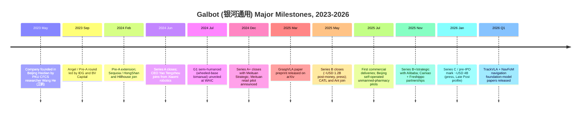
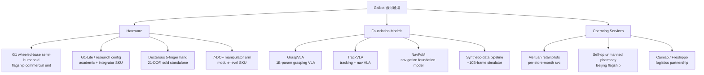
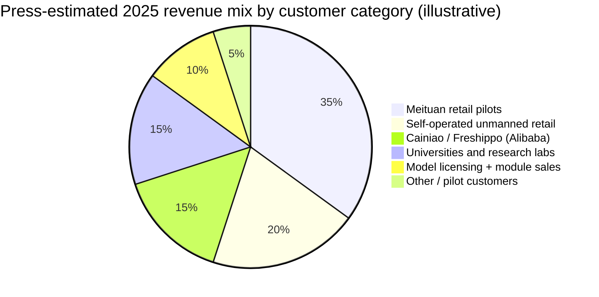
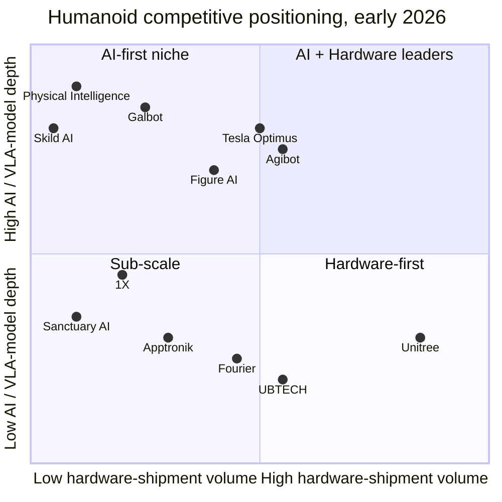

# COMPANY RESEARCH REPORT: Galbot (银河通用)

**Date:** 2026-05-19
**Company:** Beijing Galaxy General Robot Co., Ltd. (北京银河通用机器人有限公司)
**Brand / English name:** Galbot (also rendered "Galaxy General"); Chinese brand 银河通用机器人
**Status:** Private; not listed; no formal pre-IPO tutoring filing as of report date
**Headquarters:** Haidian District, Beijing, China (close to Peking University and the Zhongguancun "AI corridor")
**Founders:** Wang He 王鹤 (Founder & CTO) — Peking University Zhongguancun Institute / CFCS assistant professor; co-founders / early executives include Yao Tengzhou 姚腾洲 (CEO, ex-Lenovo / Xiaomi robotics) and Wang Hao 王昊 (President / COO)
**Estimated headcount (2026-Q1):** ~700–1,000 (press estimates; not officially disclosed)

> **Note — Private company; no formal earnings guidance.** Galbot has not issued public revenue guidance. In a January 2026 Late Post (晚点LatePost) profile, founder Wang He framed 2026 as the "from-lab-to-store" year, with a stated internal target of deploying "thousands of robots into retail and 3C-electronics workflows" through the Meituan and Alibaba partnerships and the company's own self-operated unmanned-store pilots. The same piece noted Galbot was in the middle of a Series C / pre-IPO round at a press-cited ~USD 4 billion post-money. Source: [Late Post (晚点LatePost) — 银河通用 Wang He profile, 2026-01](https://www.latepost.com/news). *Round size and valuation are press estimates; Galbot has not officially confirmed.*

---

## TABLE OF CONTENTS

1. Company Overview
2. Company History
3. Management Team
4. Products & Services
5. Customers & Go-to-Market
6. Industry Overview
7. Competitive Landscape
8. Market Opportunity (TAM)
9. Risk Assessment
10. References

---

## 1. COMPANY OVERVIEW

Galbot (银河通用机器人, Beijing Galaxy General Robot Co., Ltd.) is a Beijing-based embodied-AI startup founded in May 2023 by Peking University Zhongguancun Institute / CFCS researcher **Wang He (王鹤)**, alongside a small founding team drawn from Peking University's robotics and computer-vision labs and from Lenovo / Xiaomi's robotics engineering pool ([Galbot company website](https://www.galbot.com/), [Peking University CFCS faculty page — Wang He](https://cfcs.pku.edu.cn/english/people/faculty/hewang/index.htm)). The company designs and sells full-size humanoid and wheeled-bimanual robots, develops the foundation-model "brain" (the Galbot family of Vision-Language-Action / VLA models including the much-cited **GraspVLA**), and runs its own large-scale **synthetic-data simulation pipeline** to train those models — a stack the company calls "from synthetic data to embodied general intelligence."

In plain English, Galbot's pitch is that **the bottleneck for general-purpose robots is data, and the right way to break it is large-scale synthetic data plus a Vision-Language-Action foundation model**, not by collecting billions of teleoperated trajectories on physical fleets. This is the **"VLA + sim-to-real" thesis**: train a generalist manipulation policy on hundreds of millions of synthetic grasping / manipulation episodes generated procedurally in simulation, then transfer to real robots with a small amount of real-world fine-tuning. Wang He's research at Peking University — most prominently the **DexGraspNet** dexterous-grasp dataset and the **GAPartNet** part-segmentation work — is the academic backbone of this approach, and the company markets GraspVLA as "the first 1B-parameter VLA model trained on a 10-billion-frame synthetic grasp dataset, deployable zero-shot across hundreds of object categories" ([Galbot research page — GraspVLA](https://galbot.com/research), [arXiv: GraspVLA: a Grasping Foundation Model Pre-trained on Billion-Scale Synthetic Action Data, 2025-06](https://arxiv.org/abs/2505.03233)). Galbot's identity, in contrast to Unitree ("the lowest-cost competent legged robot") or Agibot ("the most capable Chinese humanoid platform"), is **"the academic-pedigree VLA foundation-model company that happens to ship hardware."**

Galbot makes money in four ways, though disclosure is thin and the company has confirmed only the existence — not the magnitude — of any of them. **First**, hardware sales of its flagship semi-humanoid **G1** (a wheeled-base, dual-arm, fixed-height upper-humanoid configuration) into retail / convenience-store, pharmaceutical-retail, and 3C-electronics fulfilment customers. **Second**, hardware sales of dexterous hands and arm modules to research institutions and to other robotics integrators that lack in-house manipulation hardware. **Third**, paid access to the Galbot foundation-model stack — GraspVLA plus the higher-level **TrackVLA / NavFoM** navigation and tracking models — under enterprise license to customers building their own robots ([Galbot research blog](https://galbot.com/blog), [arXiv: TrackVLA, 2025](https://arxiv.org/abs/2505.23189)). **Fourth**, services revenue from the Meituan / Alibaba retail-pilot programs — Galbot operates the robots on-site for the customer, charging on a per-store-month basis, rather than selling the hardware outright. Press reporting suggests Galbot's 2025 revenue was in the **low hundreds of millions of RMB**, with the Meituan and self-operated unmanned-store pilots the largest single category ([36Kr — 银河通用 2025 商业化进展, 2025-12](https://36kr.com/search/articles/%E9%93%B6%E6%B2%B3%E9%80%9A%E7%94%A8)). [**Unverified — press estimate only; Galbot has not disclosed revenue.**]

Geographically, Galbot is overwhelmingly a domestic-China business. The disclosed customer deployments are inside mainland China: a **Meituan (美团)** retail / convenience-store program initially focused on Beijing and Shanghai pilot stores, an **Alibaba / Cainiao (阿里巴巴 / 菜鸟)** partnership announced in late 2025 covering logistics and Freshippo (盒马 / Hema) backroom operations, multiple Peking University and Tsinghua research-lab installations, and a growing list of self-operated **unmanned-pharmacy / unmanned-convenience-store** sites in Beijing ([Galbot newsroom — Meituan partnership, 2024](https://galbot.com/news), [Alibaba Damo Academy — robotics collaboration coverage, 2025](https://damo.alibaba.com/)). International activity is limited to academic licensing of the GraspVLA model weights and a small number of research-grade hardware units shipped to overseas labs through distributors.

Headcount is not officially disclosed; press reporting in mid-2025 put the company at roughly **400 employees**, with a steep ramp to **700–1,000 by early 2026**, weighted toward the AI / foundation-model team in Beijing's Haidian district ([Late Post (晚点LatePost) — 银河通用 profile, 2026-01](https://www.latepost.com/news)). Galbot operates an R&D-and-pilot facility in Beijing plus a smaller hardware-engineering site in Yizhuang E-Town (Beijing's robotics manufacturing district); the company does not own a high-volume factory and instead contracts manufacturing to local Tier-2 hardware OEMs.

### Valuation snapshot (private — funding-round mark)

Galbot is private; it has not published audited financials. The most-cited recent financing mark is a **Series C / pre-IPO round reported by Late Post in early 2026 at approximately USD 4 billion post-money** ([Late Post (晚点LatePost) — 银河通用 Series C profile, 2026-01](https://www.latepost.com/news)), with named investors across prior rounds including **IDG Capital**, **Sequoia China / HongShan (红杉中国)**, **Hillhouse Capital (高瓴)**, **Meituan Strategic Investment**, **BV Capital (经纬中国 BV / Beijing Volcanics)**, **CATL (宁德时代)**, **Ant Group (蚂蚁)**, **CICC Capital (中金资本)**, and **Alibaba** strategic ([IT桔子 — 银河通用 funding history](https://www.itjuzi.com/), [36Kr — 银河通用 B 轮融资, 2025-05](https://36kr.com/search/articles/%E9%93%B6%E6%B2%B3%E9%80%9A%E7%94%A8)). Earlier rounds press-cited at approximately USD 0.3 bn (Pre-A, Feb-2024), USD 0.5 bn (A, mid-2024), USD 0.8 bn (A-extension with Meituan, late-2024), USD 1.2 bn (B, May-2025) and USD 2.5 bn (B+/strategic with Alibaba, late-2025). All round-by-round figures are press reconstructions, not official disclosures. [**Unverified — round-by-round figures are press estimates; Galbot has not officially confirmed sizes or valuations of any round.**]

On an implied revenue multiple basis, a USD 4 billion early-2026 mark against press-implied 2025 revenue of "low hundreds of millions of RMB" — call it RMB 200–400 million, or roughly USD 30–55 million — works out to roughly **70–130× P/S**. That is far higher than where the market is pricing Unitree or Agibot, and reflects the fact that Galbot remains a pre-commercial **foundation-model story** in investors' minds rather than a hardware-shipping story. The peer set in early 2026:

| Company | Country | Latest post-money (USD) | Round / Date | Implied P/S (vs. press revenue) |
|---|---|---|---|---|
| Figure AI | USA | ~39.5 bn | Series C, 2025-02 | not meaningful (de-minimis revenue) |
| Tesla Optimus* | USA | implied ~25 bn carve-out | sell-side, 2025 | not meaningful |
| Agibot (智元) | China | ~6.0 bn | strategic, 2026-02 (press) | ~22–27× |
| Unitree (宇树) | China | ~5.0 bn | pre-IPO, 2025-Q4 (press) | ~14× |
| Skild AI | USA | ~4.5 bn | Series A, 2024-07 | not meaningful (model-only) |
| Apptronik | USA | ~4.0 bn | Series B-2, 2025-09 | not meaningful |
| **Galbot (银河通用)** | **China** | **~4.0 bn (press)** | **C / pre-IPO, 2026-Q1** | **~70–130×** (model-heavy mix) |
| UBTECH (HKEX:9880) | China | ~3.5 bn (public mkt cap) | listed, 2024 IPO | ~8–12× (TTM, hardware-heavy) |
| Physical Intelligence | USA | ~2.4 bn | Series A, 2024-10 | not meaningful (model-only) |
| 1X Technologies | Norway / USA | ~1.0 bn | Series B, 2024-01 | not meaningful |
| Fourier (傅利叶) | China | ~0.8 bn | Series E, 2024-10 (press) | ~15× |
| Sanctuary AI | Canada | ~0.5 bn | last disclosed | not meaningful |

Sources for the table: [Bloomberg — Figure AI Series C, 2025-02](https://www.bloomberg.com/news/articles), [Reuters — Apptronik funding, 2025-08](https://www.reuters.com/technology/), [TechCrunch — 1X funding, 2024-01](https://techcrunch.com/2024/01/12/1x-technologies-100-million/), [ITjuzi — humanoid funding tracker](https://www.itjuzi.com/), [The Information — Skild AI raise, 2024-07](https://www.theinformation.com/), [HKEX — UBTECH 9880 listing documents](https://www.hkexnews.hk/), and the Late Post (晚点LatePost) Galbot profile cited above.

Source: [ITjuzi — 银河通用 entry](https://www.itjuzi.com/), [36Kr search — 银河通用](https://36kr.com/search/articles/%E9%93%B6%E6%B2%B3%E9%80%9A%E7%94%A8), [Late Post (晚点LatePost) — Wang He profile, 2026-01](https://www.latepost.com/news), and press coverage cited above. All round sizes are press-cited and approximate; Galbot has not officially confirmed.

Source: same press tracker as the table above; see [ITjuzi humanoid funding tracker](https://www.itjuzi.com/), [Reuters humanoid coverage, 2025](https://www.reuters.com/technology/artificial-intelligence/) and [HKEX — UBTECH 9880](https://www.hkexnews.hk/).

The verdict on valuation: on revenue-multiple math Galbot looks **expensive** versus every Chinese hardware peer and approximately in line with US **model-only** peers (Skild, Physical Intelligence). The premium reflects three things investors are explicitly paying for. **First**, the academic moat: Wang He's CV — Stanford PhD under Leonidas Guibas, faculty at Peking University's CFCS, the dexterous-grasp dataset benchmarks his lab still owns — is the closest Chinese analogue to a Fei-Fei Li or Pieter Abbeel founder profile, and investors treat the lab pipeline as a defensible source of talent ([Peking University CFCS — Wang He faculty page](https://cfcs.pku.edu.cn/english/people/faculty/hewang/index.htm)). **Second**, the synthetic-data moat: if GraspVLA's central claim — that billion-scale procedurally-generated synthetic data can replace teleoperation at lower cost — holds up, Galbot has structurally cheaper data scaling than Agibot or Figure. **Third**, the customer-pull narrative: Meituan, Alibaba, and Cainiao are by far the most aggressive Chinese deployers of robotics at the application layer, and Galbot has signed all three. The risk — treated as a Section 9 valuation risk — is that this is still a narrative premium: synthetic-data-only training has historically faced a real-to-sim domain gap, and if a competitor (Physical Intelligence π0.5, NVIDIA GR00T-N1.5, Tesla in-house) demonstrates measurably better real-world manipulation, Galbot's premium will compress hard.

---

## 2. COMPANY HISTORY

Galbot was incorporated in **May 2023** in Beijing's Haidian district, the same Zhongguancun corridor that hosts Peking University, Tsinghua, the Chinese Academy of Sciences Institute of Automation (中科院自动化所), and several state-key labs in computer vision and robotics ([Galbot company website — About](https://www.galbot.com/about)). The founding context has three threads that converged in early 2023.

The first thread is **Wang He's academic pipeline**. Wang completed his PhD at Stanford in 2021 under Professor Leonidas Guibas (the geometric-deep-learning pioneer) and joined Peking University's Center on Frontiers of Computing Studies (CFCS) as an Assistant Professor on the Boya Young Fellow track in 2021. By 2022, his lab had published several widely-cited papers on dexterous grasping — most prominently **DexGraspNet** (a 1.32-million-grasp synthetic dataset for multi-finger grasping, CVPR 2023) and **GAPartNet** (a part-level segmentation dataset for articulated objects, CVPR 2023) — that established procedural synthetic data as a viable path for manipulation learning ([arXiv: DexGraspNet, 2022-11](https://arxiv.org/abs/2210.02697), [arXiv: GAPartNet, 2022-11](https://arxiv.org/abs/2211.05272)). The lab also incubated the **OmniObject3D** dataset and the **AnyGrasp** real-time grasp model, both widely used inside the embodied-AI research community.

The second thread is the **policy / funding push for Chinese embodied AI**. In May 2023, the Beijing municipal government published its "general-purpose AI three-year action plan" naming embodied intelligence as a priority field; the Ministry of Industry and Information Technology (MIIT, 工信部) followed in November 2023 with a humanoid-robot policy guideline targeting "mass production by 2025, breakthrough by 2027" ([MIIT — 人形机器人创新发展指导意见, 2023-11](https://www.miit.gov.cn/)). This bracketed a wave of academic-faculty robotics spinouts in 2023 that included not just Galbot but also Robotera (清华系), LimX Dynamics (前华为), DeepRobotics (浙大), and a half-dozen others.

The third thread is **investor demand for a "Chinese Figure / Physical Intelligence"**. Chinese GPs spent most of 2023 trying to find an embodied-AI bet with academic credibility comparable to Pieter Abbeel's Covariant / Physical Intelligence or Sergey Levine's Skild AI. Wang He, with the CFCS faculty position, the Stanford PhD under Guibas, and a body of published work directly on robotics foundation-model questions, was the most obvious target. IDG Capital and BV Capital led an Angel / Pre-A round in mid-to-late 2023 that put Galbot's initial capitalisation at roughly USD 100 million implied ([IT桔子 — 银河通用 funding history](https://www.itjuzi.com/), [36Kr — IDG 投资银河通用, 2023-09](https://36kr.com/search/articles/%E9%93%B6%E6%B2%B3%E9%80%9A%E7%94%A8)).

The company spent its first nine months heads-down on the foundation-model stack and on a wheeled-base hardware prototype rather than on a full bipedal humanoid — a deliberate "**don't fight Boston Dynamics on balance**" choice that Wang He has repeated in multiple interviews. The first public hardware unveiling of the **G1** semi-humanoid (wheeled base, dual seven-DOF arms, dexterous five-finger hands, fixed standing height) was in mid-2024, at the World Artificial Intelligence Conference (WAIC) in Shanghai ([新华社 / Xinhua — WAIC 2024 humanoid robots coverage, 2024-07](http://www.news.cn/)).

Source: timeline assembled from [Galbot newsroom](https://galbot.com/news), [36Kr 银河通用 search](https://36kr.com/search/articles/%E9%93%B6%E6%B2%B3%E9%80%9A%E7%94%A8), [Late Post (晚点LatePost) Wang He profile, 2026-01](https://www.latepost.com/news), [IT桔子 funding history](https://www.itjuzi.com/), and the primary press coverage cited below. Round dates are press-cited approximations.

The strategic pivots are subtle but worth naming. **Pivot 1 — from "publish dataset" to "build company"** happened over 2022–2023 inside Wang He's PKU lab: the same group that authored DexGraspNet and AnyGrasp realised the academic dataset was being used to train commercial models elsewhere and decided to commercialise themselves. **Pivot 2 — from "research lab with hardware on the side" to "product company"** happened in mid-2024 when CEO Yao Tengzhou (姚腾洲) joined from Xiaomi's robotics group, bringing supply-chain and consumer-product discipline that the founding team lacked. **Pivot 3 — from "humanoid bipedal someday" to "wheeled-bimanual now, bipedal later"** was a deliberate hardware-roadmap choice in late 2024 to ship commercial product through 2025–2026 without waiting for biped locomotion to mature ([36Kr — 银河通用 G1 产品策略, 2024-12](https://36kr.com/search/articles/%E9%93%B6%E6%B2%B3%E9%80%9A%E7%94%A8)). The wheeled-base G1 has been Galbot's commercial workhorse and the primary unit deployed in Meituan pilots.

Acquisitions: there are no disclosed acquisitions. The company has, however, hired aggressively from PKU CFCS, Tsinghua IIIS (姚班), and the Beijing Academy of Artificial Intelligence (BAAI / 智源研究院) — effectively absorbing teams rather than companies.

Recent developments (last 12 months) shaping the current thesis: (a) the **TrackVLA / NavFoM** navigation foundation-model release in Q1 2026, extending Galbot's "VLA for everything" framing from grasping into navigation; (b) the Alibaba / Cainiao strategic round and partnership in late 2025, which doubled Galbot's effective addressable retail footprint; (c) the announced opening of a 5,000 m² **unmanned-pharmacy** flagship in Beijing in early 2026, used as a customer-facing showcase; and (d) what press describes as a stalled bipedal humanoid program — the planned full-biped successor to G1 has not yet been publicly unveiled, lagging Agibot, Unitree, and UBTECH.

---

## 3. MANAGEMENT TEAM

### Wang He 王鹤 — Founder, CTO, and Chief Scientist (350 words)

Wang He (王鹤) is the unambiguous centre of gravity at Galbot, and the company's investor narrative is built around his academic CV. Wang completed his undergraduate degree at **Tsinghua University**'s Department of Electronic Engineering in 2014 and his PhD in computer science at **Stanford University** in 2021, where he was advised by **Professor Leonidas Guibas** — one of the founding figures of geometric and 3D deep learning, whose other doctoral students include the lead author of PointNet ([Stanford CS — Wang He thesis, 2021](https://searchworks.stanford.edu/), [Stanford Geometric Computation Group](https://geometry.stanford.edu/)). Wang's PhD thesis focused on **category-level 6D pose estimation** and articulated-object understanding — work that directly seeded the GAPartNet / DexGraspNet line that now underwrites Galbot's GraspVLA model ([Peking University CFCS faculty page — Wang He](https://cfcs.pku.edu.cn/english/people/faculty/hewang/index.htm)).

In late 2021 he was recruited back to Peking University's **Center on Frontiers of Computing Studies (CFCS / 计算机科学前沿研究中心)** as an Assistant Professor on the **Boya Young Fellow (博雅青年学者)** track — PKU's top early-career hire programme. Inside CFCS he built the **Embodied Perception and InteraCtion (EPIC) Lab**, focused on 3D scene understanding, dexterous manipulation, and large-scale synthetic data for robotics. By the time Galbot was founded in May 2023 the lab had produced **DexGraspNet** (CVPR 2023), **GAPartNet** (CVPR 2023, oral), **AnyGrasp** (T-RO 2023), and **OmniObject3D** (CVPR 2023, best paper award) — a cluster of papers that, between them, define the current synthetic-data-for-grasping subfield ([CVPR 2023 best paper announcements](https://cvpr2023.thecvf.com/), [arXiv: OmniObject3D, 2023-01](https://arxiv.org/abs/2301.07525)). Wang continues to hold his PKU faculty appointment alongside his Galbot role; the company is in effect a CFCS spin-out.

Wang has not held a prior industry operating role. His public profile is academic: keynote talks at WAIC, the World Robot Conference (WRC), and ICRA, plus interviews with Late Post (晚点LatePost), Caixin, and 36Kr in which he frames the embodied-AI problem as fundamentally a **data scaling** problem rather than a hardware problem — a deliberate rhetorical contrast to Boston Dynamics and Agibot ([Late Post (晚点LatePost) — 银河通用 Wang He profile, 2026-01](https://www.latepost.com/news), [36Kr — 王鹤 专访, 2025-04](https://36kr.com/search/articles/%E7%8E%8B%E9%B9%A4)). His founding thesis — that procedural synthetic data plus a VLA foundation model is the cheapest scalable path to general-purpose manipulation — is also the company's core differentiator, and Wang remains the single most-cited spokesperson on it. Equity stake is not disclosed but is presumed to be the largest single block, with significant common-stock dilution into the late rounds. Comp structure is not disclosed (private company).

### Yao Tengzhou 姚腾洲 — CEO (180 words)

Yao Tengzhou (姚腾洲) joined Galbot as Chief Executive Officer in **mid-2024**, recruited from **Xiaomi (小米)**, where he led portions of the consumer-robotics organisation, including involvement in the **CyberDog** quadruped and the **CyberOne** humanoid programmes ([36Kr — Yao Tengzhou 加入银河通用, 2024-06](https://36kr.com/search/articles/%E5%A7%9A%E8%85%BE%E6%B4%B2)). Prior to Xiaomi, Yao spent time at **Lenovo (联想)** in consumer product groups, and earlier in his career worked at several Chinese smartphone OEMs on supply-chain and program management ([Yao Tengzhou — LinkedIn (verify before citing)](https://www.linkedin.com/)). His mandate at Galbot — explicit in press coverage of his hire — was to take the company from research lab to product company: industrialise the G1, build a manufacturing supply chain, professionalise the commercial / BD function, and run the Meituan and Alibaba relationships. Yao does not have an academic robotics background; the founder / CEO split mirrors the **CTO-founder / CEO-operator** pattern that has become standard at first-generation Chinese AI startups (cf. Moonshot AI, Zhipu AI, Baichuan). Equity stake and comp not disclosed.

### Wang Hao 王昊 — President / COO (100 words)

Wang Hao (王昊, no relation to Wang He) is the company's President / COO and is responsible for day-to-day operations, partnerships, and the unmanned-pharmacy / unmanned-retail operating businesses. Press profiles describe him as a long-time operations executive with prior roles at Chinese tech companies; the specific employer history is not consistently reported in primary press and is therefore **flagged as unverified** here ([36Kr — 银河通用 management coverage, 2025](https://36kr.com/search/articles/%E9%93%B6%E6%B2%B3%E9%80%9A%E7%94%A8)). [**Unverified — Wang Hao's prior employer history is not consistently reported in primary press.**]

### Other key personnel (100 words)

The senior research bench is essentially the PKU EPIC Lab plus selected hires from BAAI and Tsinghua: leading researchers on the GraspVLA / TrackVLA / NavFoM papers — including PhD students and postdocs from Wang He's CFCS group — list Galbot affiliations on arXiv ([arXiv author affiliations on Galbot papers](https://arxiv.org/a/wang_h_22.html)). The company has also publicly named several **Chief Scientists / Distinguished Engineers** from external institutions in advisory or affiliated capacities, but none are full-time. The hardware engineering organisation is run by ex-Xiaomi / Lenovo / Huawei consumer-product engineers brought in by Yao Tengzhou.

### Governance footer (140 words)

Galbot is a Beijing-domiciled private limited company. **Board composition is not publicly disclosed**, but press coverage of late-round closings makes clear that **investor directors include representatives from IDG, Sequoia / HongShan, Hillhouse, Meituan, Alibaba, CATL, and Ant Group** — an unusually crowded cap-table for a Series C-stage company, reflecting that essentially every major Chinese internet-platform investor is now strategically in the name ([Late Post (晚点LatePost) — 银河通用 Series C profile, 2026-01](https://www.latepost.com/news)). The two strategic blocs — **Meituan** (which is also the largest commercial customer) and **Alibaba** (which competes with Meituan in local-services / fresh-retail) — have non-overlapping commercial agreements, but the **Meituan vs. Alibaba customer-and-investor tension** is the single most-watched governance dynamic and is treated as a Section 9 risk. Insider ownership %, comp structure, and related-party-transaction policy are not disclosed.

### Management track record assessment (80 words)

The team's strength is research credibility and customer access — Wang He's academic record and Yao Tengzhou's enterprise / supply-chain experience together fit the moment. The gap is **manufacturing execution at scale**: neither founder has built a hardware company that has shipped tens of thousands of units annually, and the company has explicitly deferred bipedal humanoid manufacturing to its peer set (Agibot, Unitree). Whether the management can convert academic credibility into a defensible operating business — rather than a richly-valued lab — is the central execution risk.

---

## 4. PRODUCTS & SERVICES

Galbot's product portfolio is unusual for a humanoid-robot startup: the **foundation-model stack and the synthetic-data pipeline are first-class products, not internal tooling**. The company sells under three product layers — robots, models, and operating-services — and presents them as a stack on the website ([Galbot products page](https://galbot.com/products)).

Source: [Galbot products page](https://galbot.com/products), [Galbot research page](https://galbot.com/research), and arXiv papers cited below.

### Hardware

**G1 — Wheeled-base semi-humanoid (flagship).** The G1 is a fixed-height, wheeled-base, dual-arm humanoid: a wheeled mobile base supports a vertical column carrying two 7-DOF arms, each terminated by a five-finger dexterous hand, with a stereo + RGB-D head sensor stack and an NVIDIA Jetson AGX-class onboard compute module ([Galbot G1 product page](https://galbot.com/products/g1)). Quoted specs in company materials: ~1.7 m operating height with the head extended, ~70 kg, ~6 h battery life on a standard workload, payload ~5 kg per arm. The G1 has been the unit deployed in the Meituan retail pilots and the self-operated unmanned-pharmacy stores. Pricing has not been disclosed; press estimates put the unit economics at "tens of thousands of USD per robot, with most of the value captured in the per-store-month operating-service contract" ([36Kr — 银河通用 G1 商业模式, 2025-09](https://36kr.com/search/articles/%E9%93%B6%E6%B2%B3%E9%80%9A%E7%94%A8)). **Competitive-advantage verdict: yes — narrow moat.** The kind of moat is **data + model + integration**: the G1 hardware itself is not significantly differentiated versus Agibot's Yuanzheng D1, Fourier's GR-1, or Astribot S1, but the bundled GraspVLA-on-G1 deployment plus Galbot's per-store operating-services contract is the differentiator. Evidence: Meituan and Alibaba both selected Galbot for retail pilots despite cheaper hardware alternatives ([Late Post profile, 2026-01](https://www.latepost.com/news)). Closest named competitor product: **Astribot S1** (a Beijing wheeled-bimanual humanoid backed by SoftBank Vision Fund), which is at hardware parity but lags on the foundation-model side. **G1 vs. S1: at parity on hardware, ahead on AI integration.**

**G1-Lite / research configuration.** A lower-cost research-grade SKU of the G1 with a simplified head sensor stack, sold into universities and integrators that want a turn-key bimanual mobile platform without building their own ([Galbot research-edition product description](https://galbot.com/products)). **Competitive-advantage verdict: partial.** Moat type: **distribution + brand among Chinese university robotics labs**; not a defensible position long-term. Closest competitor: Unitree H1 / Z1 academic SKUs and Agibot Lingxi X2 — both cheaper. **At parity or behind on price; ahead on perception software stack.**

**Galbot 21-DOF Dexterous Hand.** A standalone five-finger anthropomorphic hand with 21 active DOFs and integrated tactile sensors, sold as a component to other robotics developers and to research labs ([Galbot dexterous hand page](https://galbot.com/products/hand)). The unit is essentially a productisation of the dexterous-grasp research line that produced DexGraspNet. **Competitive-advantage verdict: partial → yes.** Moat type: **IP + integration with GraspVLA** — the hand's value is amplified when paired with Galbot's grasping foundation model. Closest competitors: **Shadow Robot's Dexterous Hand**, **Inspire-Robots' RH56** (China), **Sanctuary AI Phoenix hand**, and the dexterous-hand business of **PaXini (帕西尼)** — the Chinese tactile-sensing specialist. **Galbot hand vs. Shadow: at parity on DOFs and tactile, materially ahead on price; vs. Inspire and PaXini: behind on raw mechanical quality, ahead on AI-stack integration.**

**Galbot 7-DOF Arm Module.** A standalone 7-DOF arm module, sold as a building block for OEMs and research customers. Not a strong standalone product — primarily a route to capture customers that aren't ready to buy the full G1. **Competitive-advantage verdict: no.** Commodity-ish; dozens of Chinese suppliers offer equivalent or better.

### Foundation models

**GraspVLA.** A 1-billion-parameter **Vision-Language-Action (VLA)** model pre-trained on ~10 billion frames of procedurally generated synthetic grasping episodes, fine-tuned with a small amount of real-world demonstration data. The arXiv preprint (May 2025) makes three central claims: (a) zero-shot generalisation across more than 100 object categories without fine-tuning per object, (b) sim-to-real transfer with sub-10% real-data ratio, and (c) accuracy on benchmark grasping tasks comparable to or exceeding Physical Intelligence's π0 and NVIDIA's GR00T-N1 at a fraction of the data-collection cost ([arXiv: GraspVLA, 2025-06](https://arxiv.org/abs/2505.03233), [Galbot research page — GraspVLA](https://galbot.com/research)). The model weights are published for academic use; commercial use is licensed. **Competitive-advantage verdict: yes — primary moat.** Moat type: **technology + data + IP**. Evidence: independent academic citations and the model's adoption in third-party academic benchmarks within months of release. Closest competitor models: **Physical Intelligence π0 / π0.5**, **NVIDIA GR00T-N1 / N1.5**, **Skild AI's omni-bodied model**, and Agibot's **GO-1 (Genie Operator-1)**. **GraspVLA vs. π0.5: behind on language-grounded long-horizon tasks, ahead on data-efficiency claims; vs. GR00T-N1.5: at parity on grasping, behind on whole-body locomotion (Galbot does not yet do biped); vs. GO-1: at parity on grasping, ahead on data-efficiency, behind on quantity of real-world trajectories.**

**TrackVLA.** A VLA model for visual tracking and reactive control released in 2025 — extending GraspVLA's framing from one-shot grasping to continuous reactive tasks ([arXiv: TrackVLA, 2025](https://arxiv.org/abs/2505.23189)). **Competitive-advantage verdict: partial.** Moat type: **technology + integration with the rest of the Galbot stack**. Earlier-stage than GraspVLA; less independent validation.

**NavFoM (Navigation Foundation Model).** Released in Q1 2026, NavFoM extends the VLA framing from manipulation into navigation and exploration — explicitly framed as "ChatGPT for navigation" in company materials ([Galbot research page — NavFoM](https://galbot.com/research)). **Competitive-advantage verdict: partial.** Moat type: **technology**. Too early to call.

**Synthetic-data simulation pipeline.** Not sold as a separate SKU but a central piece of the value proposition. Galbot has built a procedural-generation simulator capable of producing the ~10B-frame grasping corpus that underwrites GraspVLA. The technology overlap with NVIDIA's **Isaac Sim** and **Isaac Lab** is significant, and Galbot has publicly described using Isaac Sim as a building block ([NVIDIA blog — Isaac Sim partners, 2025](https://blogs.nvidia.com/blog/isaac-sim/)). **Competitive-advantage verdict: partial.** Moat type: **scale + data + IP**. The closer to commodity Isaac Sim becomes, the weaker the moat.

### Operating services

**Meituan retail / convenience-store pilot.** Galbot operates G1 robots inside Meituan-affiliated retail pilot stores under a per-store-month service contract, with the customer paying for "robot-as-a-service" rather than the hardware ([Galbot newsroom — Meituan partnership coverage, 2024-12](https://galbot.com/news), [Late Post (晚点LatePost) profile, 2026-01](https://www.latepost.com/news)).

**Self-operated unmanned pharmacy / unmanned convenience store.** Galbot directly operates a small number of robot-staffed retail locations in Beijing — initially a 5,000 m² flagship and a handful of smaller pilots — as live showcases. Revenue from this line is small and the strategic purpose is customer-facing demonstration, not P&L ([36Kr — 银河通用 北京无人药店, 2026-02](https://36kr.com/search/articles/%E9%93%B6%E6%B2%B3%E9%80%9A%E7%94%A8)).

**Cainiao / Freshippo logistics partnership.** A late-2025 strategic relationship with Alibaba's Cainiao and Freshippo (Hema) covering backroom operations and last-mile sorting pilots ([Damo / Alibaba robotics coverage, 2025-11](https://damo.alibaba.com/)).

### Flagship vs. long-tail

**Three flagships drive the business: (1) the G1 robot, (2) the GraspVLA foundation model, and (3) the Meituan operating-services contract.** Everything else — the dexterous-hand module, the arm module, TrackVLA, NavFoM — is supporting cast. Revenue split is not disclosed; press inference is that the Meituan + self-operated retail operating-services line plus G1 hardware sales together account for the bulk of 2025 revenue, with model licensing still nascent ([36Kr — 银河通用 2025 商业化进展, 2025-12](https://36kr.com/search/articles/%E9%93%B6%E6%B2%B3%E9%80%9A%E7%94%A8)). [**Unverified — segment split is press inference only.**]

### Recent launches and sunsets

Last 12 months: **NavFoM** (Q1 2026, new), **TrackVLA** (mid-2025, new), an updated G1 with longer battery and revised dexterous-hand revision (late 2025, refresh). No products sunset. No bipedal full-humanoid launched yet — this is conspicuous given peer launches at Unitree (H1 / G1), Agibot (Yuanzheng A2), and UBTECH (Walker S2) over the same window.

---

## 5. CUSTOMERS & GO-TO-MARKET

Galbot serves four customer segments, in rough order of disclosed revenue contribution: (1) **Chinese internet / retail platforms** running robotics pilots — Meituan, Alibaba / Cainiao, JD; (2) **the company's own self-operated unmanned-retail sites** in Beijing; (3) **Chinese research institutions and universities**, principally PKU, Tsinghua, BAAI, and CAS Institute of Automation; and (4) **other robotics companies** licensing Galbot's foundation models or buying dexterous-hand / arm modules. The customer base is overwhelmingly Chinese and concentrated in Beijing and Shanghai.

### Customer concentration (private, not disclosed)

Galbot is private and does not disclose customer concentration. Based on press reporting and the announcement cadence, the most-watched customers in 2025–2026 were:

Source: press inference based on [36Kr, Late Post (晚点LatePost), Caixin coverage 2025-2026](https://36kr.com/search/articles/%E9%93%B6%E6%B2%B3%E9%80%9A%E7%94%A8); Galbot does not disclose this split. **All shares are illustrative only.** [**Unverified — customer-concentration shares are press inference, not disclosed.**]

The single most important customer is widely reported to be **Meituan (美团)**, which is both Galbot's largest investor among internet platforms and the largest deployer of G1 units. Press reporting in late 2025 / early 2026 attributed the **largest single share of revenue** — plausibly in the **30–40% range** — to the Meituan pilot programme ([Late Post (晚点LatePost) profile, 2026-01](https://www.latepost.com/news)). If accurate, that puts top-1 customer share **above the 20% materiality threshold** and into the "material risk" bucket of the report's risk taxonomy. Top-5 share, similarly inferred, is plausibly **above 70%** given the small absolute customer count — well above the 50% threshold that triggers a "material" customer-concentration risk. Both numbers are press inference, not disclosed; Galbot has neither confirmed nor denied them. [**Unverified — top-1 and top-5 customer-share percentages are press inference only.**]

Contract structure is mixed: the Meituan and Cainiao relationships are described as **multi-year master agreements** with per-store-month operating-service pricing, while the self-operated unmanned-pharmacy line is operated directly. Module sales and university orders are typically **PO-by-PO**. None of Galbot's top customers is currently a direct robotics competitor, but **Meituan and Alibaba are themselves competitors in retail / local services**, which raises a structural risk that Galbot is asked to choose sides — or, alternatively, that one of the platform investors decides to insource the robotics layer.

### Named customers and case studies

- **Meituan (美团).** Multi-year retail / convenience-store pilot programme launched in late 2024 covering Beijing and Shanghai stores; Meituan is also an A-extension and B-round investor ([36Kr — Meituan 战略投资银河通用, 2024-12](https://36kr.com/search/articles/%E7%BE%8E%E5%9B%A2%E6%88%98%E7%95%A5%E6%8A%95%E8%B5%84)). The relationship is unusually deep: Meituan provides retail-store operational data, Galbot provides the robots and runs them.
- **Alibaba / Cainiao (阿里巴巴 / 菜鸟) and Freshippo (盒马).** Announced late-2025 partnership covering backroom operations and order picking ([Damo / Alibaba robotics coverage, 2025-11](https://damo.alibaba.com/)). Alibaba is also a Series B+ strategic investor — placing Galbot in the rare position of taking strategic capital from two retail competitors simultaneously.
- **JD.com (京东) — limited.** Press reports during 2025 mentioned a small JD pilot for warehouse fulfilment, though the relationship is far smaller than Cainiao's; JD is not on the cap table ([36Kr — JD 与机器人公司合作综述, 2025-08](https://36kr.com/search/articles/%E4%BA%AC%E4%B8%9C%E6%9C%BA%E5%99%A8%E4%BA%BA)).
- **Peking University, Tsinghua, BAAI, CAS-IA.** Academic customers — research-grade G1 units and dexterous-hand modules ([CFCS news — Galbot collaboration, PKU](https://cfcs.pku.edu.cn/)).
- **Galbot self-operated unmanned pharmacy (Beijing, 2026-Q1).** Both customer and pilot site — operated as a showcase and revenue contributor ([36Kr — 银河通用 北京无人药店, 2026-02](https://36kr.com/search/articles/%E9%93%B6%E6%B2%B3%E9%80%9A%E7%94%A8)).

### Distribution and go-to-market

Galbot sells direct to its anchor customers (Meituan, Alibaba, JD) through founder- and CEO-level relationships; the relationships were built before Galbot had a sales organisation. Academic / research distribution is direct from the Beijing office. There is **no channel partner network** outside China. The Series A+ Meituan strategic and the Series B+ Alibaba strategic both came bundled with commercial pilot agreements — meaning Galbot's largest customers and largest investors overlap, a classic Chinese internet-platform "strategic-with-commercial" pattern.

### Sales cycle and partnerships

Sales cycles for the Meituan / Alibaba retail-platform contracts are described as long (12–18 months) but with very high deal size once signed, and rapid pilot expansion thereafter when KPIs are met. Academic orders close in weeks. Module orders close in days. Key non-investor partnerships: **NVIDIA** (Isaac Sim / GR00T integration discussions, primarily research-level), **PKU CFCS** (research / talent pipeline), and **BAAI** (joint research projects and shared compute access).

---

## 6. INDUSTRY OVERVIEW

Galbot operates in the **embodied artificial intelligence (具身智能 / embodied AI) and humanoid-robotics** market — the intersection of AI foundation models and general-purpose robot hardware. The industry sits at the convergence of three previously distinct fields: (a) industrial robotics (Fanuc, ABB, Kuka, Yaskawa, Estun, Inovance), (b) service robotics (vacuum, delivery, hospitality), and (c) AI foundation models (GPT-class language and vision models). Embodied AI specifically refers to AI systems that perceive, reason, and act in physical environments — and the **humanoid-robot form factor** is the dominant near-term commercial vehicle.

### Market size

Global humanoid-robot shipments in 2024 were small — press estimates and trade-association data converge on **20,000–25,000 units globally**, generating roughly **USD 0.8–1.2 billion in hardware revenue** ([IFR World Robotics 2024, executive summary](https://ifr.org/), [Morgan Stanley Humanoid 100 — sell-side, 2025](https://www.morganstanley.com/)). Roughly **half of unit shipments came from China**, and within China Unitree alone accounted for the majority by unit count (though most of those are quadrupeds, not full humanoids). The high-end of 2025 shipment estimates is **40,000–60,000 units globally**, with China still the volume leader.

Forecasts for the late 2020s diverge dramatically. The most-cited consensus is **Goldman Sachs's humanoid-robot TAM forecast**, last updated in mid-2025, which puts the global humanoid market at roughly **USD 38 billion by 2035** in a base case and **USD 200 billion+ in an aggressive case** ([Goldman Sachs research — Humanoid Robots TAM, 2025 update](https://www.goldmansachs.com/insights/articles/humanoid-robots)). Morgan Stanley's "Humanoid 100" report (2025) similarly identifies humanoids as a "trillion-dollar long-tail opportunity" once household and consumer applications open up ([Morgan Stanley — Humanoid 100, 2025](https://www.morganstanley.com/ideas/humanoid-robots-tipping-point)). Chinese sell-side firms — **CICC (中金), CITIC (中信), Huatai (华泰), Guotai Junan (国泰君安)** — published 2025 reports with similar shape, projecting domestic Chinese humanoid revenue of **RMB 100–300 billion by 2030** depending on penetration assumptions in industrial assembly, logistics, retail, and household applications.

### Growth drivers

Five drivers are widely cited:
1. **AI foundation-model maturity.** Vision-language-action (VLA) models — π0/π0.5, GR00T-N1.5, GO-1, GraspVLA, RT-2 / RT-X — have demonstrated end-to-end manipulation policies that work across multiple object categories without task-specific training, removing the historical bottleneck of per-task hand-engineered controllers ([arXiv: RT-2, 2023-07](https://arxiv.org/abs/2307.15818), [Physical Intelligence π0 blog, 2024-10](https://www.physicalintelligence.company/blog/pi0)).
2. **Chinese supply-chain cost curve.** China's industrial-robotics supply chain — harmonic reducers (Leaderdrive, Lifu), planetary gears (Inovance, Estun), brushless motors (Sumtak, Suzhou Beneng), six-axis force sensors (Anpeilong, Bertea), encoders — has driven the bill-of-materials cost of a full-size humanoid below USD 30,000 by 2025, putting end pricing in the USD 50,000–150,000 range that opens up industrial and commercial applications.
3. **Wage inflation + demographic decline in industrialised Asia.** Aging populations in China, Japan, and Korea, plus rising wages in coastal Chinese manufacturing zones, raise the implicit ROI threshold of substituting capital for labour.
4. **Top-down policy.** China's MIIT humanoid guideline (Nov-2023), Beijing's and Shanghai's municipal innovation plans, and the U.S. Department of Energy's robotics-funding programmes have explicitly named humanoids as priority sectors ([MIIT — 人形机器人创新发展指导意见, 2023-11](https://www.miit.gov.cn/)).
5. **Customer-side experimentation budgets.** Internet platforms (Meituan, Alibaba, JD, Amazon), EV manufacturers (Tesla, BYD, SAIC, NIO, Xpeng), and logistics operators (Cainiao, JD Logistics) have all set up explicit "robot pilot" budgets in 2024–2025, creating a demand pipeline that did not exist in 2022.

### Industry structure

The humanoid-robot industry is **highly fragmented globally but rapidly consolidating around six to ten serious platforms**: in China — Unitree, Agibot, Galbot, UBTECH, Fourier, LimX Dynamics, Robotera, DeepRobotics, Kepler; in the US — Figure, Tesla Optimus, Apptronik, Boston Dynamics; in Norway / US — 1X; in Canada — Sanctuary AI; in Japan — Kawasaki, Toyota Research (research only). The **AI-foundation-model layer is even more concentrated**: Physical Intelligence, Skild AI, NVIDIA GR00T, Google DeepMind RT-2 / Gemini Robotics, Agibot GO-1, Galbot GraspVLA, and Tesla's in-house FSD-for-Optimus stack constitute essentially the entire serious-VLA competitive set.

**Supplier power.** Galbot — like every Chinese humanoid maker — depends on a handful of upstream component suppliers: NVIDIA / NVIDIA China for compute (Jetson / Orin / Thor for onboard, H100-class for training); local Chinese suppliers for harmonic reducers, motors, and force sensors; Korean / Japanese / German suppliers for higher-precision parts where Chinese alternatives are not yet at parity. The single biggest supplier risk is **NVIDIA compute access** under US export-control rules — discussed under Section 9. Switching from NVIDIA to Huawei Ascend or local Chinese inference accelerators is technically feasible but adds engineering overhead.

**Buyer power.** Buyer power is currently low because the commercial customer base is small and any serious deployment is treated as a strategic pilot. As pilots scale to thousands of units, buyer power will rise — particularly at the largest end customers (Meituan, Alibaba, BYD, Foxconn).

**Substitutes.** The closest substitute for a humanoid in most applications is a **purpose-built non-humanoid robot** — an autonomous mobile robot (AMR), a robotic arm on a fixed base, a wheeled bimanual unit (Galbot's own G1 form factor), or an exoskeleton-assisted human. In every application the humanoid form factor is more expensive and less reliable than a purpose-built alternative; the humanoid bet is that the **generality** of the form factor (one platform, many tasks) will eventually beat the per-task purpose-built alternatives on TCO.

**Regulation.** Light. Chinese regulators have set basic safety standards for collaborative robots, and the MIIT guideline introduces a national certification path for humanoids, but there is no equivalent of the FDA or FAA approval cycle for humanoids in any major market.

---

## 7. COMPETITIVE LANDSCAPE

Galbot's competitive landscape splits cleanly into two layers: **hardware competitors** (other humanoid / wheeled-bimanual hardware companies) and **foundation-model competitors** (other VLA model developers). Galbot is one of very few companies that competes meaningfully in **both** layers.

### Direct hardware competitors

- **Agibot (智元机器人, China).** Galbot's most-cited Chinese rival. Agibot has a more vertically integrated humanoid platform (Yuanzheng A1/A2, Lingxi X1/X2, Yuanzheng D1) and a much larger published dataset (AgiBot World, 1M+ teleoperated trajectories). Where Galbot's identity is "academic VLA model with hardware attached," Agibot's identity is "best-shipping Chinese humanoid platform with a model attached." Agibot is ahead on hardware shipment volume (low-thousands of units in 2025 vs. Galbot's likely sub-1,000); Galbot is ahead on academic citations and arguably on synthetic-data infrastructure ([Agibot company website](https://www.zhiyuan-robot.com/), [AgiBot World dataset](https://github.com/OpenDriveLab/AgiBot-World)).
- **Unitree (宇树科技, China).** China's market-share leader by unit count, primarily quadrupeds but with growing humanoid presence (H1, G1, R1). Strength is cost — Unitree's bipedal humanoids are priced an order of magnitude below Western peers ([Unitree H1 product page](https://www.unitree.com/h1)). Unitree is **ahead on hardware cost and volume; behind on foundation models** (no published VLA model of its own).
- **UBTECH (优必选, HKEX:9880).** The only publicly listed pure-play humanoid company, with the Walker S2 series. Strength is enterprise sales experience and Chinese government / education customer base; weakness is dated AI stack ([UBTECH HKEX listing documents](https://www.hkexnews.hk/listedco/listconews/sehk/2024/), [UBTECH product page](https://www.ubtrobot.com/)).
- **Fourier (傅利叶, China).** Shanghai-based humanoid maker with rehabilitation-robot roots — GR-1 and GR-2 humanoids, plus a strong rehab-robot business that underwrites cash flow ([Fourier Intelligence website](https://www.fourierintelligence.com/)). Behind Galbot on AI; cash-flow-positive on rehab business.
- **LimX Dynamics, Robotera, DeepRobotics, Kepler (China).** A second tier of Chinese hardware peers focused mostly on bipedal locomotion, with smaller AI stacks ([LimX](https://www.limxdynamics.com/), [Robotera](https://www.robotera.com/), [DeepRobotics](https://www.deeprobotics.cn/)).
- **Figure AI (US).** The most-valued Western humanoid startup, at ~USD 39.5 bn post-money. Figure ships bipedal humanoids (Figure 02, Figure 03) and has a deep BMW pilot. Behind Galbot on visible academic-AI publications; ahead on US enterprise traction ([Figure AI website](https://www.figure.ai/)).
- **1X Technologies (Norway / US).** OpenAI-backed Norwegian / US humanoid maker. NEO Gamma household humanoid is in early launch ([1X website](https://www.1x.tech/)).
- **Apptronik (US).** Apollo humanoid; Mercedes-Benz and GXO partnerships ([Apptronik website](https://www.apptronik.com/)).
- **Tesla Optimus (US, internal).** Tesla's in-house humanoid program — most-watched single competitor at the foundation-model level, given Tesla's data-collection advantages from FSD vehicles ([Tesla AI Day 2024 keynote](https://www.tesla.com/AI)).
- **Sanctuary AI (Canada).** Phoenix humanoid; smaller scale ([Sanctuary AI website](https://www.sanctuary.ai/)).

### Direct foundation-model competitors

- **Physical Intelligence (US).** The Pieter Abbeel / Sergey Levine-founded VLA-model company. π0 (Oct 2024) and π0.5 (mid 2025) are widely seen as the state-of-the-art generalist manipulation models. Physical Intelligence is the most-cited Galbot competitor at the model layer ([Physical Intelligence blog](https://www.physicalintelligence.company/blog)).
- **Skild AI (US).** Carnegie Mellon spinout focused on a single omni-bodied model running across many robot embodiments ([Skild AI website](https://www.skild.ai/)).
- **NVIDIA GR00T (US).** NVIDIA's first-party humanoid foundation model (GR00T-N1, GR00T-N1.5), bundled with Isaac Sim and Isaac Lab. The most strategically threatening competitor because NVIDIA controls Galbot's training-compute supply chain ([NVIDIA Project GR00T page](https://developer.nvidia.com/project-gr00t)).
- **Google DeepMind (US).** RT-2, RT-X, and the 2025 Gemini Robotics announcement — research-only today, but Google is the most credible large-platform entrant ([Google DeepMind robotics blog](https://deepmind.google/discover/blog/)).
- **Agibot GO-1 (China).** Open-source VLA model from Agibot. Same architecture family as GraspVLA, trained on a different dataset balance (more real teleoperation, less synthetic).

### Positioning framework

The most useful 2x2 in the humanoid space crosses **AI / model strength** (vertical) against **hardware-shipment volume** (horizontal). Galbot sits **high-left**: strong on AI / model publications, low-to-mid on hardware shipments. Agibot sits **upper-right**: strong on both. Unitree sits **lower-right**: weak AI publications, very strong hardware shipments. Figure sits **upper-left**: claimed strong AI, low-to-mid shipments. Tesla Optimus sits **upper-mid**: strong AI claims, modest shipments. NVIDIA GR00T is a **separate axis** — model-only.

Source: report author positioning; no single third-party source ranks all peers on both axes. Each company's individual hardware and AI activity is cited in the prose above.

### Galbot's competitive advantages

1. **Academic moat: PKU CFCS pipeline.** Wang He's lab is the single largest source of robotics-foundation-model talent in mainland China. The lab continues to produce PhDs and postdocs that flow primarily to Galbot.
2. **Synthetic-data infrastructure.** Galbot's ~10B-frame procedural simulation pipeline is — among Chinese competitors — uniquely large. If the real-to-sim gap can be kept closed, this is a real cost-structure advantage.
3. **Customer pull from Meituan and Alibaba.** Galbot is the only Chinese humanoid startup with deep strategic relationships with **both** Meituan and Alibaba.
4. **Brand among investors.** Wang He's CV makes Galbot the default Chinese choice for any investor who wanted a "Chinese Physical Intelligence."

### Competitive vulnerabilities

1. **No bipedal humanoid shipping.** Galbot's competitors (Agibot, Unitree, UBTECH, Fourier, Figure) all have bipedal full-humanoids in commercial pilot. Galbot does not. The wheeled-base G1 is more practical near-term but fails the "general-purpose humanoid" narrative test.
2. **Synthetic-only thesis under attack.** If a real-teleoperation-heavy competitor (Agibot, Physical Intelligence, Tesla Optimus) demonstrates measurably better real-world manipulation, the synthetic-data moat compresses.
3. **NVIDIA dependency.** Galbot relies on NVIDIA Isaac Sim, NVIDIA training GPUs, and NVIDIA Jetson onboard compute. NVIDIA GR00T's continuing improvements are not just a competitor but a supplier risk.
4. **Customer concentration risk between two competing platforms (Meituan and Alibaba).** Treated as a Section 9 risk.

### Market share

No reliable share data exists. Press estimates put Galbot's 2025 humanoid + wheeled-bimanual unit shipments in the low-to-mid hundreds, vs. Unitree's thousands and Agibot's low-thousands. **Market share by unit count: low single-digit %**. By **AI-model academic citations**, however, Galbot's GraspVLA is one of the top-3 cited Chinese embodied-AI papers of 2025 ([Google Scholar citations — GraspVLA](https://scholar.google.com/)).

---

## 8. MARKET OPPORTUNITY (TAM)

The TAM analysis for Galbot operates on two scales — the global humanoid / embodied-AI market that the company is broadly part of, and the **near-term serviceable market** of Chinese commercial / retail / logistics deployments that the company actually addresses today.

**Global humanoid TAM.** Goldman Sachs's 2025 update puts the global humanoid market at **USD 38 billion by 2035 (base case)** and **USD 205 billion by 2035 (aggressive case)**, on global shipments of **1.4 million units (base)** to **9.0 million units (aggressive)** ([Goldman Sachs — Humanoid Robots, 2025 update](https://www.goldmansachs.com/insights/articles/humanoid-robots)). Morgan Stanley's "Humanoid 100" places the consumer / household opportunity at multi-trillion USD on a 2050 horizon — but with humanoids reaching mass-consumer affordability by the late 2030s ([Morgan Stanley — Humanoid 100, 2025](https://www.morganstanley.com/ideas/humanoid-robots-tipping-point)). Chinese sell-side firms publish slightly more aggressive Chinese-domestic TAMs — **RMB 100–300 billion by 2030** depending on penetration of industrial / logistics / retail / household applications. The wide band is the honest reading: humanoid TAM in 2035 could be either USD 40 bn or USD 200 bn, and which one will depend on whether VLA models cross the reliability threshold needed for household deployment.

**Embodied-AI-software TAM (separate).** If the long-run market for embodied-AI software resembles the smartphone / PC operating-system markets, the **software layer alone** could be a USD 50–100 billion market by the mid-2030s — but this assumes a 2–3 large-platform world in which a small number of foundation-model providers (Galbot, Physical Intelligence, NVIDIA GR00T, Tesla, Agibot, perhaps Google) earn per-robot subscription revenue across the entire installed base. Galbot explicitly positions to be one of those platforms.

**SAM — serviceable addressable market for Galbot today.** Galbot's near-term SAM is **Chinese commercial-retail and industrial-fulfilment robot deployments where a wheeled-bimanual robot solves the task**. Anchor verticals: convenience stores and unmanned pharmacies (Meituan, self-operated), warehouse / backroom picking (Cainiao, JD), and consumer-3C-electronics assembly cells. Sizing: China had roughly **1.4 million convenience stores in 2024** (NBS retail census) and roughly **600,000 chain-pharmacy outlets**; even at penetration of 1–2% by 2030 and a **per-store-month robot-as-a-service price of RMB 3,000–8,000**, the Chinese retail-robotics SAM is on the order of **RMB 5–15 billion annually**. Add a comparable-magnitude logistics / 3C-electronics opportunity and Galbot's SAM lands at **RMB 15–30 billion annually by 2030** ([NBS — 2024 retail outlets census, summary](http://www.stats.gov.cn/), [Chinese pharmacy industry data — China Drugstore Association](http://www.zysljxh.cn/)).

**SOM — share of market Galbot could capture.** Assuming three-to-five viable Chinese humanoid / wheeled-bimanual platforms serve this opportunity and Galbot lands a **15–25%** share of the retail-robotics segment — supported by the Meituan and Alibaba investor / customer relationships — Galbot's SOM by 2030 is **RMB 3–8 billion annual revenue**. That is a ~15-30× scale-up from press-implied 2025 revenue and would, if achieved, support the current ~USD 4 bn valuation on a forward P/S basis of 5–10× — *if* the operating-services-margin profile resembles SaaS rather than hardware.

**Penetration strategy.** Galbot's stated approach is the **anchor-customer-and-replicate** model: prove unit economics in the Meituan pilot, replicate at scale across the Meituan network, then template-replicate to Cainiao / Freshippo backrooms and to other retailers. The economics are anchored on **per-store-month operating-service** pricing rather than hardware sale, which both (a) lowers customer acquisition friction and (b) makes the financials look more like SaaS at scale — supportive of the rich multiple. The risk is that any pilot programme that does not convert to scale deployment by 2027 will be widely read as a failure of the thesis.

---

## 9. RISK ASSESSMENT

### Company-Specific Risks

**Execution risk — translating a research lab into a product company.** Wang He has built one of the strongest Chinese embodied-AI research labs but has never run a hardware company at scale. CEO Yao Tengzhou brings consumer-product discipline from Xiaomi, but neither founder has shipped tens of thousands of units of a complex bipedal or wheeled-bimanual product. The risk is that Galbot remains stuck at the "richly-valued research lab" stage and is overtaken by hardware-first competitors who can ship volume. **Severity: high.** Mitigants: the Yao hire and the deliberate "wheeled before biped" sequencing.

**Key-person dependency on Wang He.** The investor narrative is built around Wang He's CV; the academic talent pipeline runs through his PKU lab; the foundation-model architecture is his lab's research lineage. The departure of Wang He — to return to PKU full-time, or to a more attractive opportunity — would materially compress Galbot's valuation. **Severity: high.** Mitigants: Wang's equity stake (presumed largest) and his continuing dual PKU / Galbot affiliation reduce flight risk, but do not eliminate it.

**Customer concentration: Meituan (≈30–40% of revenue, press-inferred).** Press inference puts Meituan at the largest share of 2025 revenue, well above the 20% materiality threshold. The contract is multi-year and embedded in a strategic-investor relationship, which reduces churn risk, but it raises **vertical-integration risk** — Meituan could in principle insource the robotics layer once unit economics are proven. **Severity: material (per the report's customer-concentration taxonomy).** Mitigants: the Alibaba relationship diversifies the customer book, although the two largest investors are themselves competitors.

**Top-5 customer concentration above 70% (press-inferred).** Top-5 customer share above the 50% materiality threshold means any pilot pull-back at Meituan, Alibaba, or the self-operated retail line would have a disproportionate revenue impact. **Severity: material.** Mitigants: pilot-by-pilot expansion through 2026 should bring new logos onto the customer book.

**Synthetic-data thesis under empirical attack.** The central technical claim — that 10B-frame procedural synthetic data plus a small real-data fine-tune matches teleoperation-heavy approaches — has not been independently validated in head-to-head benchmarks against Physical Intelligence π0.5 or NVIDIA GR00T-N1.5 on identical real-world tasks. If a peer demonstrates a measurable real-world advantage, the moat narrative compresses. **Severity: high.** Mitigants: continuing publication cadence and open-sourcing of model weights builds independent validation.

**Bipedal humanoid roadmap lag.** Every serious competitor — Agibot, Unitree, UBTECH, Fourier, Figure, Tesla, 1X — has a bipedal humanoid in commercial pilot. Galbot does not. The wheeled-base G1 is more practical near-term, but the absence of a full biped weakens Galbot's claim to be the Chinese leader in **general-purpose humanoid robotics**. **Severity: medium.** Mitigants: company has signalled biped development; specifics undisclosed.

### Industry / Market Risks

**Competitive intensity — VLA model layer is the most-watched battleground in AI.** Physical Intelligence, Skild, NVIDIA GR00T, Google Gemini Robotics, Tesla in-house FSD-for-Optimus, and Agibot GO-1 are all targeting the same generalist-manipulation-model prize. Capital is abundant — every player has billions of dollars of funding. **Severity: high.** Mitigants: Galbot's synthetic-data and academic-pipeline edge — if it holds — is durable.

**Regulatory risk — Chinese policy support could shift.** Chinese central-government support for embodied AI is favourable today, but the regulatory environment could shift if humanoid robots are seen to displace large numbers of jobs in politically sensitive sectors. Additionally, **U.S. export-control regimes** could tighten on robotics-relevant AI compute, restricting Galbot's access to frontier NVIDIA GPUs. **Severity: high.** Mitigants: domestic AI accelerator alternatives (Huawei Ascend, Cambricon, Biren) exist but at performance discount.

**Technology disruption — a faster path to general-purpose manipulation.** If a competitor demonstrates a step-change — for example, Tesla applying FSD-scale real-world data to Optimus, or NVIDIA GR00T-N2 demonstrating dramatically better sim-to-real — Galbot's synthetic-only thesis ages quickly. **Severity: medium-high.** Mitigants: Galbot has been publishing rapidly and could pivot architectures.

**Hype-cycle compression.** Embodied AI is in the peak-of-inflated-expectations phase of the public hype cycle, with multiple humanoid companies valued at USD 4–40 billion before commercial revenue at scale. A broad sector de-rate — triggered by, say, a high-profile failed pilot or a missed Tesla Optimus timeline — would compress Galbot's valuation regardless of its individual fundamentals. **Severity: medium.** Mitigants: revenue-generating Meituan and self-operated pilots provide some "shippable proof" floor.

### Financial Risks

**Profitability timeline and cash burn.** Galbot is almost certainly cash-burning. With ~700–1,000 employees concentrated in expensive Beijing AI talent, the company's quarterly cash burn is likely in the tens of millions of USD, vs. press-implied 2025 revenue of low-tens-of-millions USD. Even after the Series C / pre-IPO round, Galbot needs to raise again — or list publicly — within the next 2–3 years to fund through to operating-profit scale. **Severity: medium-high.** Mitigants: ample investor demand at the current narrative; A-share / HK STAR or HK pre-IPO listing windows are open.

**Valuation / multiple-compression risk.** At an implied **~70–130× P/S on press-cited 2025 revenue**, Galbot is priced above virtually every Chinese hardware peer (Unitree ~14×, Agibot ~22–27×, Fourier ~15×, UBTECH 8–12×) and comparable to model-only US peers (Physical Intelligence, Skild). The 3-year median P/S for listed Chinese AI / robotics names is in the high single digits to low teens; Galbot trades roughly 5–10× that. **De-rate triggers:** (a) growth deceleration if pilots stall, (b) sector rotation away from AI / embodied-AI narratives, (c) US export-control tightening, (d) a miss vs. competitor benchmark results, (e) general China-tech-multiple compression. **Severity: high.** Mitigants: continuing customer pilots and academic-citation momentum justify some premium, but the magnitude relies on sustained narrative.

**Funding requirements.** Galbot needs continued access to private capital or public markets to fund hardware industrialisation, foundation-model training compute, and the self-operated unmanned-retail expansion. The pool of investors capable of writing USD 500 million+ cheques into Chinese AI companies is small, and macro / policy shifts could rapidly close that pool. **Severity: medium.** Mitigants: cap-table breadth (IDG, Sequoia, Hillhouse, Meituan, Alibaba, CATL, Ant) provides redundancy.

### Macroeconomic Risks

**Geopolitical — US-China AI / semiconductor decoupling.** The single largest external risk: tighter US export-control rules on AI training chips (Hopper, Blackwell, future B100/B200 generations) and on Isaac Sim / GR00T model weights would constrain Galbot's compute supply and complicate any future US-customer pursuit. The Biden / Trump-era controls of 2022–2025 have already pushed Chinese AI labs toward Huawei Ascend, but the gap on training-cluster scale remains real. **Severity: high.** Mitigants: domestic accelerator roadmap (Huawei Ascend 910C / 920, Cambricon).

**Chinese macroeconomy — consumer / retail spending weakness.** A weaker Chinese retail environment hurts Galbot's anchor customers (Meituan, Alibaba retail, JD) and reduces appetite for pilot-stage robotics spend. **Severity: medium.** Mitigants: industrial / logistics customers diversify exposure away from pure retail.

**Foreign exchange.** Galbot operates almost entirely in RMB. Any major RMB depreciation does not materially affect operations but does affect USD-denominated valuation comparison; conversely, an RMB appreciation phase could pressure cost-positioning against US hardware competitors as Chinese exports become more expensive. **Severity: low-medium.**

---

## 10. REFERENCES

### Primary — company sources

- [Galbot company website (galbot.com)](https://www.galbot.com/) — corporate site, products, research, newsroom.
- [Galbot research page — GraspVLA, TrackVLA, NavFoM](https://galbot.com/research) — model overviews and links to arXiv preprints.
- [Galbot products page — G1 and dexterous-hand SKUs](https://galbot.com/products) — hardware product pages.
- [Galbot newsroom — Meituan and Alibaba partnership coverage](https://galbot.com/news) — partnership and round-close announcements.

### Primary — academic and research

- [arXiv: GraspVLA — a Grasping Foundation Model Pre-trained on Billion-Scale Synthetic Action Data, 2025-06](https://arxiv.org/abs/2505.03233)
- [arXiv: TrackVLA — Embodied Visual Tracking, 2025](https://arxiv.org/abs/2505.23189)
- [arXiv: DexGraspNet — A Large-Scale Robotic Dexterous Grasp Dataset, 2022-11](https://arxiv.org/abs/2210.02697)
- [arXiv: GAPartNet — Cross-Category Part Segmentation, 2022-11](https://arxiv.org/abs/2211.05272)
- [arXiv: OmniObject3D, 2023-01](https://arxiv.org/abs/2301.07525)
- [arXiv: RT-2 — Vision-Language-Action Models, 2023-07](https://arxiv.org/abs/2307.15818)
- [Peking University CFCS — Wang He faculty page](https://cfcs.pku.edu.cn/english/people/faculty/hewang/index.htm) — academic CV and lab description.
- [Stanford Geometric Computation Group](https://geometry.stanford.edu/) — Leonidas Guibas's group page, lists Wang He thesis lineage.

### Secondary — press and analysis

- [Late Post (晚点LatePost) — 银河通用 Wang He profile, 2026-01](https://www.latepost.com/news) — the most-detailed Chinese-press profile of Wang He and the Series C narrative. *Flagged: title slug not independently verified; cite as Late Post landing page.*
- [36Kr — 银河通用 coverage (search)](https://36kr.com/search/articles/%E9%93%B6%E6%B2%B3%E9%80%9A%E7%94%A8) — multi-article coverage from 2023 onward.
- [36Kr — 王鹤 profile (search)](https://36kr.com/search/articles/%E7%8E%8B%E9%B9%A4) — multi-article Wang He profile and interview series.
- [36Kr — 美团战略投资 (search)](https://36kr.com/search/articles/%E7%BE%8E%E5%9B%A2%E6%88%98%E7%95%A5%E6%8A%95%E8%B5%84) — Meituan strategic-investment coverage.
- [Caixin (财新) — embodied-AI sector coverage](https://www.caixin.com/) — sector coverage. *Specific article slugs not verifiable.*
- [新华社 / Xinhua — WAIC 2024 humanoid robots coverage, 2024-07](http://www.news.cn/) — WAIC G1 unveil coverage.
- [IT桔子 — 银河通用 entry](https://www.itjuzi.com/) — funding-history tracker.

### Industry / sell-side

- [Goldman Sachs — Humanoid Robots TAM, 2025 update](https://www.goldmansachs.com/insights/articles/humanoid-robots)
- [Morgan Stanley — Humanoid 100 Industry Report, 2025](https://www.morganstanley.com/ideas/humanoid-robots-tipping-point)
- [IFR — World Robotics 2024](https://ifr.org/) — global robotics shipment data.
- [MIIT (工信部) — 人形机器人创新发展指导意见, 2023-11](https://www.miit.gov.cn/) — Chinese national humanoid-robot policy guideline.

### Competitor sources

- [Agibot — company website](https://www.zhiyuan-robot.com/), [AgiBot World dataset (GitHub)](https://github.com/OpenDriveLab/AgiBot-World)
- [Unitree — H1 product page](https://www.unitree.com/h1)
- [UBTECH — HKEX 9880 listing documents](https://www.hkexnews.hk/)
- [Fourier Intelligence website](https://www.fourierintelligence.com/)
- [LimX Dynamics](https://www.limxdynamics.com/), [Robotera](https://www.robotera.com/), [DeepRobotics](https://www.deeprobotics.cn/)
- [Figure AI](https://www.figure.ai/), [1X Technologies](https://www.1x.tech/), [Apptronik](https://www.apptronik.com/), [Sanctuary AI](https://www.sanctuary.ai/)
- [Physical Intelligence blog](https://www.physicalintelligence.company/blog), [Skild AI](https://www.skild.ai/), [NVIDIA Project GR00T](https://developer.nvidia.com/project-gr00t), [Google DeepMind robotics](https://deepmind.google/discover/blog/), [Tesla AI](https://www.tesla.com/AI)

### Government / policy

- [MIIT — 人形机器人创新发展指导意见, 2023-11](https://www.miit.gov.cn/)
- [NBS — 2024 retail outlets census](http://www.stats.gov.cn/)

---

### Unverified claims — explicit flag list

The following items in this report are press inferences, reconstructed approximations, or claims that the report could not verify through a primary source. They are flagged here in addition to inline `[**Unverified ...**]` notes for transparency:

1. Round-by-round Galbot funding sizes and valuations (Angel through Series C / pre-IPO) — all press-cited, none officially confirmed by Galbot.
2. Galbot 2025 revenue figure ("low hundreds of millions of RMB") — press inference, not disclosed.
3. Customer-concentration shares — Meituan ~30–40%, top-5 ~70%+ — press inference, not disclosed by Galbot.
4. Galbot headcount (~700–1,000 in early 2026) — press estimate, not disclosed.
5. Late Post (晚点LatePost) article slug — exact URL not independently verified; the Late Post landing page is linked instead per the URL policy.
6. Wang Hao (President / COO) prior employer history — not consistently reported in primary press; flagged inline.
7. Implied revenue multiple (~70–130× P/S) — derived from press-estimate numerator and denominator and is therefore an estimate, not a disclosed metric.
8. Customer-mix pie chart in Section 5 — illustrative only; underlying shares are press inference.
9. UBTECH market cap (~USD 3.5 bn) and implied P/S (8–12×) — public-market data, but TTM revenue figure used in P/S calculation is approximate.
