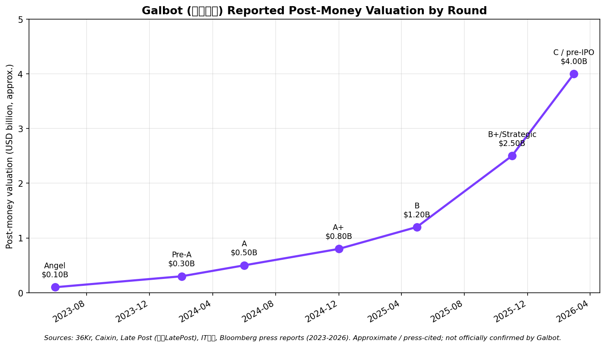
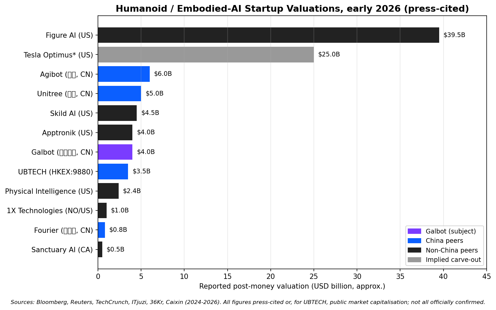
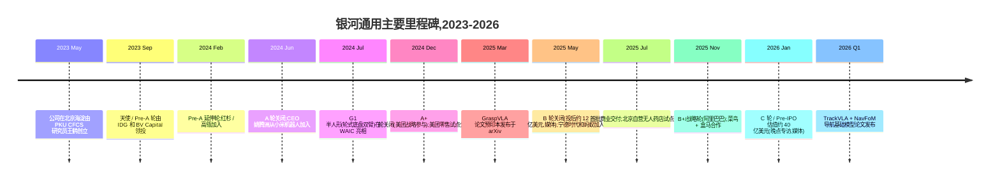
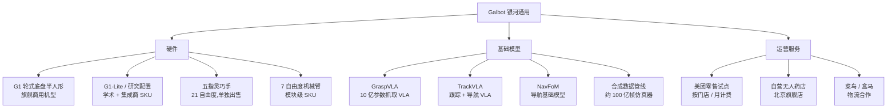
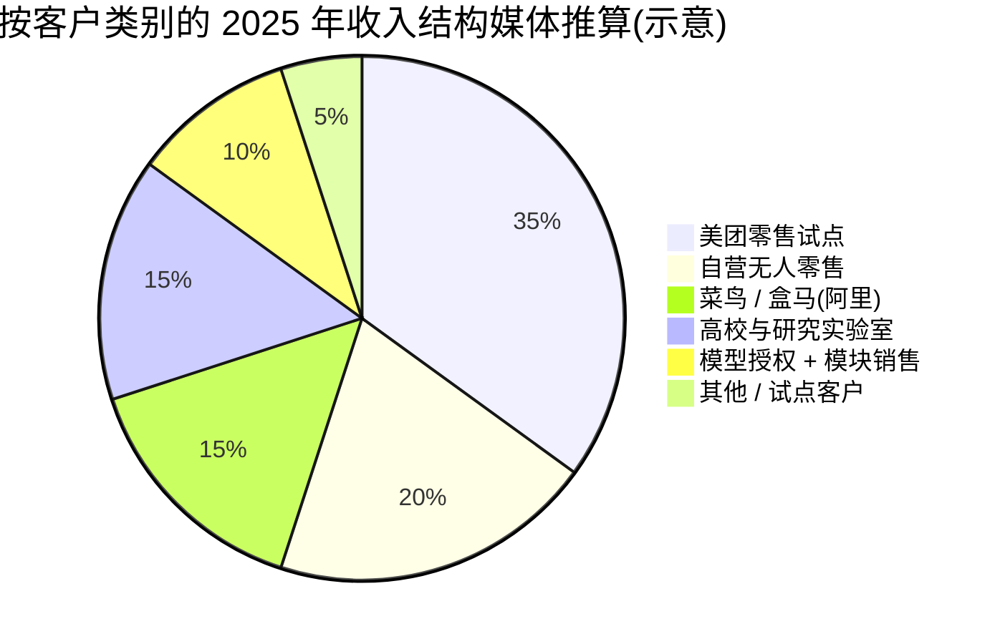
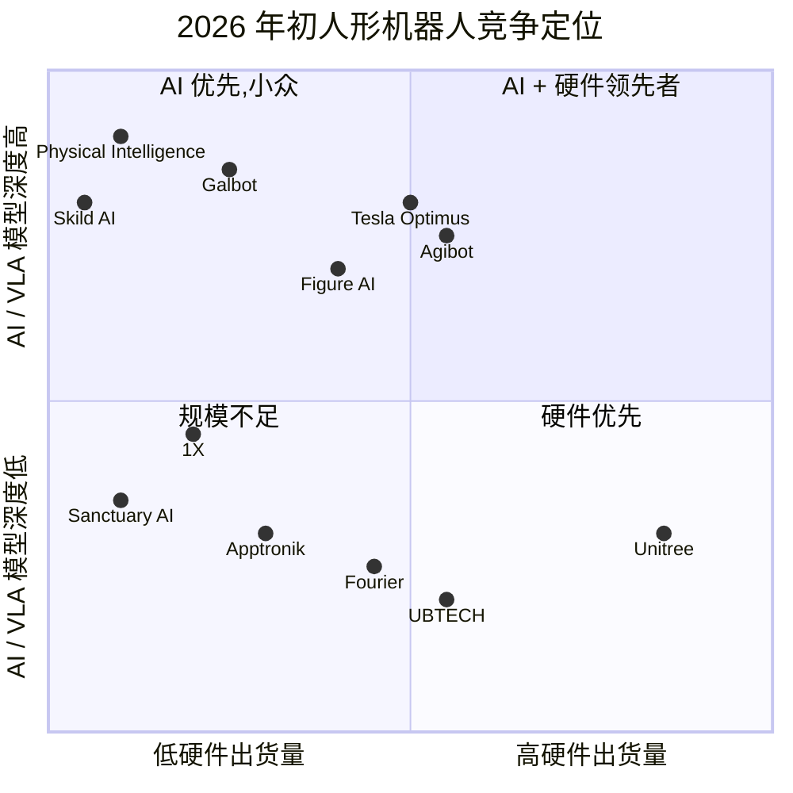

# 公司研究报告:Galbot(银河通用)

**日期:** 2026-05-19
**公司:** 北京银河通用机器人有限公司(Beijing Galaxy General Robot Co., Ltd.)
**品牌 / 英文名:** Galbot(亦译作"Galaxy General");中文品牌 银河通用机器人
**状态:** 未上市;无公开 IPO 辅导备案(截至本报告日)
**总部:** 中国北京海淀区(毗邻北京大学与中关村"AI 走廊")
**创始人:** 王鹤(创始人兼 CTO)—— 北京大学中关村学院 / CFCS 助理教授;联合创始人 / 早期高管包括姚腾洲(CEO,前联想 / 小米机器人)和王昊(总裁 / COO)
**估计员工人数(2026-Q1):** 约 700–1,000 人(媒体推算,未经官方披露)

> **提示 —— 私人公司,无正式业绩指引。** 银河通用未发布任何公开收入指引。在 2026 年 1 月的晚点 LatePost 专访中,创始人王鹤将 2026 年定位为"从实验室走向门店"的一年,内部目标是通过与美团、阿里巴巴的合作及自营无人门店试点,部署"数千台机器人进入零售和 3C 电子行业工作流"。同篇报道指出,银河通用正处于 C 轮 / Pre-IPO 融资过程中,媒体援引的投后估值约为 40 亿美元。来源:[晚点 LatePost —— 银河通用王鹤专访,2026-01](https://www.latepost.com/news)。*融资规模与估值均为媒体推算,银河通用未官方确认。*

---

## 目录

1. 公司概览
2. 公司沿革
3. 管理团队
4. 产品与服务
5. 客户与市场策略
6. 行业概览
7. 竞争格局
8. 市场机会(TAM)
9. 风险评估
10. 参考资料

---

## 1. 公司概览

银河通用机器人(Beijing Galaxy General Robot Co., Ltd.)是一家总部位于北京的具身智能(embodied AI)创业公司,由北京大学中关村学院 / CFCS 研究员 **王鹤** 与一支以北大机器人 / 计算机视觉实验室成员、以及联想 / 小米机器人工程团队为主的小型创始团队于 2023 年 5 月共同创立([Galbot 公司官网](https://www.galbot.com/)、[北京大学 CFCS 王鹤教师主页](https://cfcs.pku.edu.cn/english/people/faculty/hewang/index.htm))。公司设计并销售全尺寸人形与轮式双臂机器人,自主研发被命名为 Galbot 系列的视觉-语言-动作(Vision-Language-Action / VLA)基础模型"大脑"(其中以广受引用的 **GraspVLA** 为代表),并运营大规模 **合成数据仿真管线** 用于训练这些模型 —— 公司将这一整套栈称为"从合成数据到具身通用智能"。

用平实的话说,银河通用的核心论点是:**通用机器人面临的瓶颈是数据,正确的破局方式是大规模合成数据加视觉-语言-动作基础模型**,而不是在物理机器人车队上采集数十亿次遥操作轨迹。这就是 **"VLA + sim-to-real"论** —— 在仿真中程序化地生成数亿条合成抓取 / 操作轨迹,训练一个通用操作策略,然后用少量真实世界微调迁移到实体机器人。王鹤在北大的研究成果 —— 最具代表性的 **DexGraspNet** 灵巧抓取数据集与 **GAPartNet** 部件分割工作 —— 是该路径的学术根基,公司将 GraspVLA 宣传为"首个在 100 亿帧合成抓取数据上训练、可零样本部署至数百类物体的 10 亿参数级 VLA 模型"([Galbot 研究页面 —— GraspVLA](https://galbot.com/research)、[arXiv: GraspVLA: a Grasping Foundation Model Pre-trained on Billion-Scale Synthetic Action Data, 2025-06](https://arxiv.org/abs/2505.03233))。与宇树("最低成本但有竞争力的足式机器人")或智元("能力最强的中国人形平台")相比,银河通用的身份是 **"恰好出货硬件的、具有学术血统的 VLA 基础模型公司"**。

银河通用通过四种方式赚钱,但披露非常有限,公司仅确认这些业务的存在 —— 未披露规模。**第一**,旗舰半人形机器人 **G1**(轮式底盘、双臂、固定身高的上半身人形配置)的硬件销售,客户主要为零售 / 便利店、医药零售、3C 电子履约场景。**第二**,向研究机构以及缺乏自有操作硬件能力的其它机器人集成商销售灵巧手与机械臂模块。**第三**,以企业许可方式向自建机器人的客户提供 Galbot 基础模型栈(GraspVLA 加上更高层级的 **TrackVLA / NavFoM** 导航与跟踪模型)的付费访问([Galbot 研究博客](https://galbot.com/blog)、[arXiv: TrackVLA, 2025](https://arxiv.org/abs/2505.23189))。**第四**,美团 / 阿里巴巴零售试点项目的服务收入 —— 银河通用在客户现场运营这些机器人,按门店 / 月计费,而非直接出售硬件。媒体报道显示,银河通用 2025 年收入处于 **数亿元人民币低位**,其中美团合作与自营无人门店试点为最大单一类别([36Kr —— 银河通用 2025 商业化进展,2025-12](https://36kr.com/search/articles/%E9%93%B6%E6%B2%B3%E9%80%9A%E7%94%A8))。【未经证实 —— 仅为媒体估算;银河通用未披露收入。】

地域上,银河通用绝大部分业务在中国境内。已披露的客户部署都在中国大陆:与 **美团** 合作、以北京和上海试点门店为起步的零售 / 便利店项目;2025 年末宣布的与 **阿里巴巴 / 菜鸟** 的合作,覆盖物流与盒马(Freshippo / Hema)后场作业;多个北京大学和清华大学研究实验室的部署;以及在北京日益增多的 **自营无人药店 / 无人便利店** 现场([Galbot 新闻 —— 美团合作,2024](https://galbot.com/news)、[阿里巴巴达摩院 —— 机器人合作报道,2025](https://damo.alibaba.com/))。国际业务仅限于 GraspVLA 模型权重的学术授权,以及通过分销商向海外实验室发运少量研究级硬件。

员工人数未经官方披露;2025 年中期媒体报道称约 **400 人**,到 2026 年初快速扩张到 **700–1,000 人**,其中以北京海淀的 AI / 基础模型团队为主([晚点 LatePost —— 银河通用专访,2026-01](https://www.latepost.com/news))。银河通用在北京设有研发与试点基地,在北京亦庄(机器人制造区)有一个较小的硬件工程站点;公司未自建大批量工厂,而是将制造外包给本地二线硬件 OEM。

### 估值快照(私募 —— 融资轮次定价)

银河通用未上市,亦未发布经审计的财务报表。最近最常被引用的融资定价是 **晚点 LatePost 在 2026 年初报道的 C 轮 / Pre-IPO 融资,投后估值约为 40 亿美元**([晚点 LatePost —— 银河通用 C 轮专访,2026-01](https://www.latepost.com/news))。历轮投资方包括 **IDG 资本**、**红杉中国**、**高瓴资本**、**美团战略投资**、**经纬中国 BV(BV Capital)**、**宁德时代(CATL)**、**蚂蚁集团**、**中金资本**,以及 **阿里巴巴** 战略投资([IT 桔子 —— 银河通用融资历程](https://www.itjuzi.com/)、[36Kr —— 银河通用 B 轮融资,2025-05](https://36kr.com/search/articles/%E9%93%B6%E6%B2%B3%E9%80%9A%E7%94%A8))。媒体披露的早期估值大致为:Pre-A 约 3 亿美元(2024 年 2 月)、A 轮约 5 亿美元(2024 年中)、A 轮延伸(美团参与)约 8 亿美元(2024 年末)、B 轮约 12 亿美元(2025 年 5 月)、B+轮 / 战略轮(阿里巴巴参与)约 25 亿美元(2025 年末)。所有逐轮数字都属媒体复盘,而非官方披露。【未经证实 —— 逐轮数字属媒体推算;银河通用未官方确认任何一轮规模或估值。】

按隐含市销率计算,40 亿美元的 2026 年初估值,对应媒体推算的 2025 年收入"数亿元人民币低位" —— 即 2–4 亿元人民币,约合 3,000–5,500 万美元 —— 对应市销率大致为 **70–130 倍**。这一水平远高于市场对宇树或智元的定价,反映出投资者眼中的银河通用仍是一家 **尚未实现商业化规模的基础模型公司**,而不是硬件出货公司。2026 年初的可比同业为:

| 公司 | 国家 | 最新投后估值(美元) | 轮次 / 时间 | 隐含市销率(对照媒体收入数字) |
|---|---|---|---|---|
| Figure AI | 美国 | 约 395 亿 | C 轮,2025-02 | 不具意义(收入微乎其微) |
| Tesla Optimus* | 美国 | 卖方隐含分拆 ~250 亿 | 卖方 ,2025 | 不具意义 |
| 智元(Agibot) | 中国 | 约 60 亿 | 战略轮,2026-02(媒体) | 约 22–27 倍 |
| 宇树(Unitree) | 中国 | 约 50 亿 | Pre-IPO,2025-Q4(媒体) | 约 14 倍 |
| Skild AI | 美国 | 约 45 亿 | A 轮,2024-07 | 不具意义(仅模型) |
| Apptronik | 美国 | 约 40 亿 | B-2 轮,2025-09 | 不具意义 |
| **银河通用(Galbot)** | **中国** | **约 40 亿(媒体)** | **C 轮 / Pre-IPO,2026-Q1** | **约 70–130 倍**(模型为重的组合) |
| 优必选(HKEX:9880) | 中国 | 约 35 亿(公开市值) | 已上市,2024 IPO | 约 8–12 倍(TTM,以硬件为主) |
| Physical Intelligence | 美国 | 约 24 亿 | A 轮,2024-10 | 不具意义(仅模型) |
| 1X Technologies | 挪威 / 美国 | 约 10 亿 | B 轮,2024-01 | 不具意义 |
| 傅利叶(Fourier) | 中国 | 约 8 亿 | E 轮,2024-10(媒体) | 约 15 倍 |
| Sanctuary AI | 加拿大 | 约 5 亿 | 最新披露 | 不具意义 |

表格来源:[Bloomberg —— Figure AI C 轮,2025-02](https://www.bloomberg.com/news/articles)、[Reuters —— Apptronik 融资,2025-08](https://www.reuters.com/technology/)、[TechCrunch —— 1X 融资,2024-01](https://techcrunch.com/2024/01/12/1x-technologies-100-million/)、[IT 桔子 —— 人形机器人融资追踪](https://www.itjuzi.com/)、[The Information —— Skild AI 融资,2024-07](https://www.theinformation.com/)、[港交所 —— 优必选 9880 上市文件](https://www.hkexnews.hk/),以及上文引用的晚点 LatePost 银河通用专访。

来源:[IT 桔子 —— 银河通用条目](https://www.itjuzi.com/)、[36Kr 搜索 —— 银河通用](https://36kr.com/search/articles/%E9%93%B6%E6%B2%B3%E9%80%9A%E7%94%A8)、[晚点 LatePost —— 王鹤专访,2026-01](https://www.latepost.com/news),以及上文引述的媒体报道。所有轮次数字均为媒体援引的近似值;银河通用未官方确认。

来源:与上表相同的媒体追踪;见 [IT 桔子人形机器人融资追踪](https://www.itjuzi.com/)、[Reuters 人形机器人报道,2025](https://www.reuters.com/technology/artificial-intelligence/)、[港交所 —— 优必选 9880](https://www.hkexnews.hk/)。

估值判断:从市销率角度看,银河通用相对于任何一家中国硬件同业都显得 **昂贵**,大致与美国 **仅模型** 类公司(Skild、Physical Intelligence)持平。这一溢价反映了投资者明确愿意为之付费的三件事。**其一**,学术护城河:王鹤的简历 —— Stanford(斯坦福)在 Leonidas Guibas(吉巴斯)指导下取得博士学位、北京大学 CFCS 教职、其实验室至今主导的灵巧抓取数据集基准 —— 是中国最接近 Fei-Fei Li(李飞飞)或 Pieter Abbeel(阿贝尔)创始人特质的标的,投资者将该实验室人才管线视为护城河([北京大学 CFCS —— 王鹤教师主页](https://cfcs.pku.edu.cn/english/people/faculty/hewang/index.htm))。**其二**,合成数据护城河:如果 GraspVLA 的核心主张 —— 程序化生成的十亿级合成数据可以以更低成本替代遥操作 —— 站得住脚,银河通用的数据扩展成本结构将根本上低于智元或 Figure。**其三**,客户拉动叙事:美团、阿里巴巴和菜鸟是中国在应用层最积极部署机器人的三家公司,银河通用同时签下了这三家。风险点(详见第 9 节估值风险)在于这仍属于叙事溢价:纯合成数据训练历来面临实到仿真域差异(real-to-sim domain gap),如果某个竞争对手(Physical Intelligence π0.5、NVIDIA GR00T-N1.5、Tesla 自研)能展示明显更好的真实世界操作能力,银河通用的溢价将大幅收缩。

---

## 2. 公司沿革

银河通用于 **2023 年 5 月** 在北京海淀注册成立,这里正是聚集了北京大学、清华大学、中国科学院自动化研究所、若干计算机视觉和机器人国家重点实验室的中关村走廊([Galbot 公司官网 —— 关于我们](https://www.galbot.com/about))。其创立背景由三条在 2023 年初汇合的脉络构成。

第一条脉络是 **王鹤的学术管线**。王鹤于 2021 年在 Stanford(斯坦福)Leonidas Guibas(吉巴斯) 教授(几何深度学习的先驱)指导下取得博士学位,2021 年回到北京大学计算机科学前沿研究中心(CFCS),在博雅青年学者轨道上担任助理教授。到 2022 年,他的实验室已发表多篇被广泛引用的灵巧抓取论文 —— 其中最具代表性的是 **DexGraspNet**(包含 132 万次抓取的多指抓取合成数据集,CVPR 2023)和 **GAPartNet**(关节物体部件级分割数据集,CVPR 2023)—— 确立了程序化合成数据作为操作学习可行路径的地位([arXiv: DexGraspNet, 2022-11](https://arxiv.org/abs/2210.02697)、[arXiv: GAPartNet, 2022-11](https://arxiv.org/abs/2211.05272))。该实验室还孵化了 **OmniObject3D** 数据集与 **AnyGrasp** 实时抓取模型,这些成果在具身智能研究社区中被广泛使用。

第二条脉络是 **中国具身智能的政策 / 资金推动**。2023 年 5 月,北京市政府发布"通用人工智能三年行动计划",将具身智能列为重点领域;工业和信息化部(MIIT)随后于 2023 年 11 月发布人形机器人政策指导意见,目标是"2025 年规模量产、2027 年取得突破"([MIIT —— 人形机器人创新发展指导意见,2023-11](https://www.miit.gov.cn/))。在这一政策窗口下,2023 年涌现了一波学术教师创办的机器人创业公司,除银河通用外还包括星海图(清华系)、LimX Dynamics(前华为)、云深处(浙大),以及其他若干家。

第三条脉络是 **投资人对"中国版 Figure / Physical Intelligence"的需求**。2023 年大部分时间里,中国 GP 都在寻找一个学术信誉可与 Pieter Abbeel 的 Covariant / Physical Intelligence 或 Sergey Levine 的 Skild AI 比肩的具身智能标的。王鹤兼具 CFCS 教职、Guibas(吉巴斯)指导下的 Stanford 博士学位,以及直接针对机器人基础模型问题的学术发表 —— 是最为明显的目标。IDG 资本与经纬中国 BV(BV Capital)在 2023 年中后期领投了天使 / Pre-A 轮,使银河通用的初始隐含估值约为 1 亿美元([IT 桔子 —— 银河通用融资历程](https://www.itjuzi.com/)、[36Kr —— IDG 投资银河通用,2023-09](https://36kr.com/search/articles/%E9%93%B6%E6%B2%B3%E9%80%9A%E7%94%A8))。

公司前九个月专注于基础模型栈和轮式底盘硬件原型,而非完整的双足人形 —— 这是一个王鹤在多次访谈中重申的"**不在平衡能力上与 Boston Dynamics 硬拼**"的刻意选择。**G1** 半人形(轮式底盘、双 7 自由度机械臂、五指灵巧手、固定立姿身高)的首次公开亮相,是 2024 年中在上海举办的世界人工智能大会(WAIC)上([新华社 —— WAIC 2024 人形机器人报道,2024-07](http://www.news.cn/))。

来源:时间线综合自 [Galbot 新闻](https://galbot.com/news)、[36Kr 银河通用搜索](https://36kr.com/search/articles/%E9%93%B6%E6%B2%B3%E9%80%9A%E7%94%A8)、[晚点 LatePost 王鹤专访,2026-01](https://www.latepost.com/news)、[IT 桔子融资历程](https://www.itjuzi.com/),以及下方引述的主要报道。各轮日期为媒体援引的近似时点。

战略性的转折虽然不显眼,但值得点明。**转折 1 —— 从"发布数据集"到"创办公司"** 发生在王鹤北大实验室 2022–2023 年内部:同一支撰写了 DexGraspNet 与 AnyGrasp 的团队意识到学术数据集正被其它机构用来训练商业模型,于是决定自己将其商业化。**转折 2 —— 从"附带硬件的研究实验室"到"产品公司"** 发生于 2024 年中,CEO 姚腾洲从小米机器人加入,带来了创始团队所欠缺的供应链与消费品纪律。**转折 3 —— 从"将来某天做双足人形"到"先做轮式双臂、后做双足"** 是 2024 年末刻意做出的硬件路线选择,目的是在 2025–2026 年实现商业出货,而不必等待双足运动技术成熟([36Kr —— 银河通用 G1 产品策略,2024-12](https://36kr.com/search/articles/%E9%93%B6%E6%B2%B3%E9%80%9A%E7%94%A8))。轮式底盘 G1 至今仍是银河通用商业上的主力,也是部署在美团试点中的主要机型。

收购方面:无任何已披露的收购。但公司积极地从 PKU CFCS、清华 IIIS(姚班)和北京智源人工智能研究院(BAAI)挖人 —— 实际上是吸收团队,而不是公司。

最近 12 个月塑造当前论点的事件包括:(a)2026 年 Q1 发布的 **TrackVLA / NavFoM** 导航基础模型,将公司"用 VLA 解决一切"的框架从抓取扩展到导航;(b)2025 年末与阿里巴巴 / 菜鸟的战略融资与合作,使银河通用的有效零售可触达面积翻倍;(c)2026 年初宣布在北京开设的 5,000 平方米 **无人药店** 旗舰店,作为面向客户的展示窗口;(d)媒体描述为停滞的双足人形项目 —— 计划接替 G1 的完整双足后继机型尚未公开亮相,落后于智元、宇树和优必选。

---

## 3. 管理团队

### 王鹤 —— 创始人、CTO 兼首席科学家(350 字)

王鹤是银河通用毫无疑问的重心,公司的投资人叙事就是围绕他的学术简历构建的。王鹤 2014 年毕业于 **清华大学** 电子工程系本科,2021 年在 **Stanford(斯坦福)大学** 取得计算机科学博士学位,导师是 **Leonidas Guibas(吉巴斯)教授** —— 几何与三维深度学习的奠基人之一,他指导过的博士还包括 PointNet 的第一作者([Stanford CS —— 王鹤博士论文,2021](https://searchworks.stanford.edu/)、[Stanford Geometric Computation Group](https://geometry.stanford.edu/))。王鹤的博士论文聚焦于 **类别级 6 自由度位姿估计** 与关节物体理解 —— 这一研究方向直接孕育了今天支撑银河通用 GraspVLA 模型的 GAPartNet / DexGraspNet 研究脉络([北京大学 CFCS 王鹤教师主页](https://cfcs.pku.edu.cn/english/people/faculty/hewang/index.htm))。

2021 年末他被北京大学 **计算机科学前沿研究中心(CFCS)** 通过 **博雅青年学者** 计划(北大顶尖青年人才引进项目)聘为助理教授。他在 CFCS 内部组建了 **具身感知与交互实验室(EPIC Lab)**,聚焦三维场景理解、灵巧操作和大规模机器人合成数据。到 2023 年 5 月银河通用成立时,实验室已经产出 **DexGraspNet**(CVPR 2023)、**GAPartNet**(CVPR 2023,口头报告)、**AnyGrasp**(T-RO 2023)和 **OmniObject3D**(CVPR 2023 最佳论文奖)—— 这些论文共同定义了当前的合成数据抓取学习子领域([CVPR 2023 最佳论文公告](https://cvpr2023.thecvf.com/)、[arXiv: OmniObject3D, 2023-01](https://arxiv.org/abs/2301.07525))。王鹤同时保留 PKU 教职和 Galbot 职务;公司实际上是 CFCS 的衍生。

王鹤此前没有任何工业界经营经历。其公开形象完全是学术性的:在 WAIC、世界机器人大会(WRC)、ICRA 等会议担任主旨发言人,接受晚点 LatePost、财新和 36Kr 的专访,反复将具身智能问题界定为 **数据规模** 问题,而非硬件问题 —— 这是与 Boston Dynamics 和智元的有意修辞对照([晚点 LatePost —— 银河通用王鹤专访,2026-01](https://www.latepost.com/news)、[36Kr —— 王鹤专访,2025-04](https://36kr.com/search/articles/%E7%8E%8B%E9%B9%A4))。他的创立论点 —— 程序化合成数据加 VLA 基础模型是通用操作能力最低成本的可扩展路径 —— 也是公司的核心差异化,王鹤至今仍是这一论点最权威的发言人。其股权比例未披露,推定为单一最大持股块,在后期轮次中有显著的普通股稀释。薪酬结构未披露(非上市公司)。

### 姚腾洲 —— CEO(180 字)

姚腾洲于 **2024 年中** 加入银河通用担任首席执行官,从 **小米** 引进。他此前在小米领导消费机器人组织的部分业务,参与了 **CyberDog** 四足机器人和 **CyberOne** 人形机器人项目([36Kr —— 姚腾洲加入银河通用,2024-06](https://36kr.com/search/articles/%E5%A7%9A%E8%85%BE%E6%B4%B2))。加入小米之前,姚腾洲曾在 **联想** 消费产品部门工作,职业生涯早期任职于若干家中国智能手机 OEM,负责供应链和项目管理([姚腾洲 —— LinkedIn(引用前请核实)](https://www.linkedin.com/))。媒体报道明确指出,他在银河通用的任务是将公司从研究实验室转为产品公司:将 G1 工业化、搭建制造供应链、专业化商业 / BD 职能,以及主理美团和阿里的客户关系。姚腾洲并无机器人学术背景;这种创始人 / CEO 分工镜像了第一代中国 AI 初创公司中已成定式的 **CTO 创始人 / CEO 运营者** 模式(参见月之暗面、智谱 AI、百川)。股权比例与薪酬未披露。

### 王昊 —— 总裁 / COO(100 字)

王昊(与王鹤无亲属关系)是公司的总裁 / COO,负责日常运营、合作伙伴关系以及无人药店 / 无人零售运营业务。媒体描述他为长期任职于中国科技公司的运营高管;具体的雇主履历在主流媒体中并不一致,因此 **此处标注为未经证实**([36Kr —— 银河通用管理层报道,2025](https://36kr.com/search/articles/%E9%93%B6%E6%B2%B3%E9%80%9A%E7%94%A8))。【未经证实 —— 王昊此前雇主履历在主流媒体中并不一致。】

### 其他关键人员(100 字)

资深研究骨干基本就是 PKU EPIC Lab 加上来自 BAAI 和清华的若干引进:在 GraspVLA / TrackVLA / NavFoM 论文上担纲的主要研究者 —— 包括王鹤 CFCS 团队的博士生和博士后 —— 在 arXiv 上标注的所属单位均为银河通用([Galbot 论文 arXiv 作者机构](https://arxiv.org/a/wang_h_22.html))。公司也公开提及了若干来自外部机构、以顾问或附属身份参与的 **首席科学家 / 杰出工程师**,但均非全职。硬件工程组织由姚腾洲引进的小米 / 联想 / 华为消费产品工程师领衔。

### 治理小结(140 字)

银河通用是注册于北京的私人有限公司。**董事会构成未公开披露**,但最新一轮关闭的媒体报道清晰指出,**投资人董事包括来自 IDG、红杉 / HongShan、高瓴、美团、阿里巴巴、宁德时代、蚂蚁集团的代表** —— 对一家 C 轮阶段的公司而言这是一张异常拥挤的股东名册,反映出基本上每一家主要中国互联网平台投资机构现在都战略性地进入了这个标的([晚点 LatePost —— 银河通用 C 轮专访,2026-01](https://www.latepost.com/news))。两大战略股东 —— **美团**(同时也是最大的商业客户)和 **阿里巴巴**(在本地生活 / 生鲜零售领域与美团竞争)—— 拥有彼此不重叠的商业协议,但 **美团与阿里巴巴客户兼投资人的张力** 是单一最受关注的治理动态,被列入第 9 节风险。内部持股比例、薪酬结构以及关联方交易政策均未披露。

### 管理层执行记录评估(80 字)

团队的优势是研究信誉和客户接触能力 —— 王鹤的学术成果与姚腾洲的企业 / 供应链经验在当前阶段是契合的。短板在于 **规模化制造能力**:两位创始人都没有领导过年出货数万台的硬件公司,公司也明确将双足人形的制造推迟,让位于同业(智元、宇树)。管理层能否将学术信誉转化为可防御的经营业务 —— 而不仅仅是一座估值很高的实验室 —— 是核心执行风险。

---

## 4. 产品与服务

银河通用的产品组合在人形机器人创业公司中并不常见:**基础模型栈与合成数据管线本身就是一流产品,而不是内部工具**。公司在网站上将其分为三个产品层级 —— 机器人、模型、运营服务 —— 并将其呈现为一个完整栈([Galbot 产品页](https://galbot.com/products))。

来源:[Galbot 产品页](https://galbot.com/products)、[Galbot 研究页](https://galbot.com/research),以及下文引述的 arXiv 论文。

### 硬件

**G1 —— 轮式底盘半人形(旗舰)。** G1 是固定身高、轮式底盘、双臂的人形机器人:轮式移动底盘上承载一根垂直立柱,搭载两条 7 自由度机械臂,末端各装一只五指灵巧手,头部有立体相机 + RGB-D 传感套件,机载 NVIDIA Jetson AGX 级别的算力模块([Galbot G1 产品页](https://galbot.com/products/g1))。公司材料中披露的规格:头部伸出时操作高度约 1.7 米,自重约 70 公斤,标准工况下电池续航约 6 小时,单臂负载约 5 公斤。G1 是部署在美团零售试点和自营无人药店中的机型。售价未披露;媒体推算单机经济性大致为"每台数万美元,大部分价值由按门店 / 月计费的运营服务合同捕获"([36Kr —— 银河通用 G1 商业模式,2025-09](https://36kr.com/search/articles/%E9%93%B6%E6%B2%B3%E9%80%9A%E7%94%A8))。**竞争优势判断:是 —— 窄护城河。** 护城河类型为 **数据 + 模型 + 集成**:G1 硬件本身相对智元远征 D1、傅利叶 GR-1 或 Astribot S1 没有显著差异化,真正的差异化在于 GraspVLA-on-G1 的捆绑部署以及按门店 / 月计费的运营服务合同。佐证:美团和阿里都选择银河通用做零售试点,尽管市场上有更便宜的硬件替代品([晚点 LatePost 专访,2026-01](https://www.latepost.com/news))。最贴近的同类产品:**Astribot S1**(北京一家轮式双臂人形公司,由 SoftBank Vision Fund 投资),硬件水平相当,但在基础模型侧落后。**G1 对 S1:硬件持平,AI 集成领先。**

**G1-Lite / 研究配置。** G1 的更低成本研究级 SKU,头部传感套件简化,出售给希望直接获得双臂移动平台、不愿自建硬件的高校和集成商([Galbot 研究版产品描述](https://galbot.com/products))。**竞争优势判断:部分。** 护城河类型:**在中国高校机器人实验室中的分销 + 品牌**;长期不构成可防御位置。最贴近的竞品:宇树 H1 / Z1 学术 SKU 以及智元灵犀 X2 —— 二者更便宜。**价格上持平或落后,感知软件栈上领先。**

**Galbot 21 自由度灵巧手。** 独立销售的五指拟人手,21 个主动自由度并集成触觉传感器,以零部件形式销售给其它机器人开发商和研究实验室([Galbot 灵巧手产品页](https://galbot.com/products/hand))。这一产品本质上是 DexGraspNet 灵巧抓取研究路线的产品化。**竞争优势判断:部分 → 是。** 护城河类型:**IP + 与 GraspVLA 的集成** —— 当灵巧手与公司的抓取基础模型配套时价值才会被放大。主要竞品:**Shadow Robot 灵巧手**、**因时机器人 RH56**(中国)、**Sanctuary AI Phoenix 手**,以及 **帕西尼(PaXini)** —— 一家专注触觉传感的中国厂商 —— 的灵巧手业务。**银河通用手对 Shadow:自由度和触觉持平,价格显著领先;对因时和帕西尼:机械工艺上落后,AI 栈集成上领先。**

**Galbot 7 自由度机械臂模块。** 独立销售的 7 自由度机械臂模块,作为 OEM 和研究客户的构建块出售。并非强势独立产品 —— 主要功能是吸引尚未准备好购买完整 G1 的客户。**竞争优势判断:否。** 接近大宗商品;中国数十家供应商提供等同或更好的产品。

### 基础模型

**GraspVLA。** 一个 10 亿参数级 **视觉-语言-动作(VLA)** 模型,在约 100 亿帧程序化生成的合成抓取轨迹上预训练,并用少量真实世界示范数据微调。arXiv 预印本(2025 年 5 月)提出三个核心主张:(a)零样本泛化至 100 多类物体,无需逐物体微调;(b)用不足 10% 的真实数据比例实现 sim-to-real 迁移;(c)在基准抓取任务上的准确率与 Physical Intelligence 的 π0 和 NVIDIA 的 GR00T-N1 相当或更优,而数据采集成本只是它们的零头([arXiv: GraspVLA, 2025-06](https://arxiv.org/abs/2505.03233)、[Galbot 研究页 —— GraspVLA](https://galbot.com/research))。模型权重已对学术开放,商业使用需授权。**竞争优势判断:是 —— 主要护城河。** 护城河类型:**技术 + 数据 + IP**。佐证:独立学术引用以及该模型在发布数月内即被第三方学术基准采纳。最贴近的竞品模型:**Physical Intelligence π0 / π0.5**、**NVIDIA GR00T-N1 / N1.5**、**Skild AI 通用具身模型**,以及智元的 **GO-1(Genie Operator-1)**。**GraspVLA 对 π0.5:在语言对齐的长程任务上落后,在数据效率主张上领先;对 GR00T-N1.5:抓取持平,在全身运动上落后(银河通用尚未做双足);对 GO-1:抓取持平,数据效率领先,真实世界轨迹数量上落后。**

**TrackVLA。** 2025 年发布的视觉跟踪与反应式控制 VLA 模型 —— 将 GraspVLA 的框架从一次性抓取扩展到持续反应任务([arXiv: TrackVLA, 2025](https://arxiv.org/abs/2505.23189))。**竞争优势判断:部分。** 护城河类型:**技术 + 与 Galbot 其余栈的集成**。比 GraspVLA 更早期,独立验证较少。

**NavFoM(导航基础模型)。** 2026 年 Q1 发布,NavFoM 将 VLA 框架从操作扩展到导航与探索 —— 公司材料将其明确定位为"导航领域的 ChatGPT"([Galbot 研究页 —— NavFoM](https://galbot.com/research))。**竞争优势判断:部分。** 护城河类型:**技术**。尚早,难以定论。

**合成数据仿真管线。** 不作为单独 SKU 出售,但是价值主张的核心组件。银河通用建立了能够生成支撑 GraspVLA 训练的约 100 亿帧抓取语料的程序化生成仿真器。其技术与 NVIDIA 的 **Isaac Sim** 和 **Isaac Lab** 有显著重叠,公司也公开表示使用 Isaac Sim 作为构建模块([NVIDIA 博客 —— Isaac Sim 合作伙伴,2025](https://blogs.nvidia.com/blog/isaac-sim/))。**竞争优势判断:部分。** 护城河类型:**规模 + 数据 + IP**。Isaac Sim 越接近大宗商品,这一护城河越弱。

### 运营服务

**美团零售 / 便利店试点。** 银河通用按门店 / 月的服务合同在美团关联零售试点门店内运营 G1 机器人,客户购买的是"机器人即服务",而非硬件本身([Galbot 新闻 —— 美团合作报道,2024-12](https://galbot.com/news)、[晚点 LatePost 专访,2026-01](https://www.latepost.com/news))。

**自营无人药店 / 无人便利店。** 银河通用在北京直接运营少量机器人值守的零售门店 —— 起步是一个 5,000 平方米的旗舰店,加上几个较小的试点 —— 作为现场展示。这条业务线的收入很小,战略目的是面向客户的演示,不是盈利([36Kr —— 银河通用北京无人药店,2026-02](https://36kr.com/search/articles/%E9%93%B6%E6%B2%B3%E9%80%9A%E7%94%A8))。

**菜鸟 / 盒马物流合作。** 2025 年末与阿里旗下菜鸟和盒马达成的战略关系,覆盖后场操作和末端分拣试点([达摩院 / 阿里巴巴机器人报道,2025-11](https://damo.alibaba.com/))。

### 旗舰产品与长尾

**三大旗舰驱动业务:(1)G1 机器人;(2)GraspVLA 基础模型;(3)美团运营服务合同。** 其它一切 —— 灵巧手模块、机械臂模块、TrackVLA、NavFoM —— 都是配角。收入结构未披露;媒体推断美团 + 自营零售运营服务线加上 G1 硬件销售合计贡献 2025 年收入的大部分,而模型授权仍处萌芽阶段([36Kr —— 银河通用 2025 商业化进展,2025-12](https://36kr.com/search/articles/%E9%93%B6%E6%B2%B3%E9%80%9A%E7%94%A8))。【未经证实 —— 业务线分摊为媒体推算。】

### 近期发布与停产

最近 12 个月:**NavFoM**(2026 Q1,新);**TrackVLA**(2025 年中,新);带更长续航和升级版灵巧手的 G1 更新版(2025 年末,刷新)。无停产产品。无双足全人形发布 —— 鉴于同期宇树(H1 / G1)、智元(远征 A2)、优必选(Walker S2)都有相应发布,这一缺位相当突出。

---

## 5. 客户与市场策略

银河通用服务四类客户,按已披露的收入贡献粗略排序:(1)开展机器人试点的 **中国互联网 / 零售平台** —— 美团、阿里巴巴 / 菜鸟、京东;(2)**公司自营的无人零售门店**,集中在北京;(3)**中国研究机构和高校**,主要是北大、清华、智源、中科院自动化所;(4)向银河通用授权基础模型或购买灵巧手 / 机械臂模块的 **其它机器人公司**。客户群体几乎全部为中国客户,集中在北京和上海。

### 客户集中度(私人公司,未披露)

银河通用未披露客户集中度。基于媒体报道和宣发节奏,2025–2026 年最受关注的客户为:

来源:基于 [36Kr、晚点 LatePost、财新 2025–2026 报道](https://36kr.com/search/articles/%E9%93%B6%E6%B2%B3%E9%80%9A%E7%94%A8) 的媒体推算;银河通用未披露该分摊。**所有占比仅为示意。** 【未经证实 —— 客户集中度比例为媒体推算,未经披露。】

最为关键的单一客户被广泛认为是 **美团**,它既是银河通用在互联网平台投资人中的最大单一投资人,也是 G1 部署量最大的客户。2025 年末 / 2026 年初的媒体报道将 **最大单一收入贡献份额** 归于美团合作项目,可能在 **30–40% 区间**([晚点 LatePost 专访,2026-01](https://www.latepost.com/news))。如属实,则单一最大客户份额 **超过 20% 重大性门槛**,落入本报告风险分类中的"重大风险"区间。同样推算的前 5 大客户份额可能 **超过 70%**,鉴于客户绝对数量较小 —— 远高于触发"重大"客户集中度风险的 50% 阈值。这两个数字都属媒体推算,未经披露;银河通用既未确认也未否认。【未经证实 —— 单一最大及前 5 大客户份额比例为媒体推算。】

合同结构上情况各异:与美团和菜鸟的关系被描述为带按门店 / 月运营服务定价的 **多年期主合同**;自营无人药店线由公司自行运营;模块销售和高校订单通常为 **逐 PO 出货**。银河通用的前列客户中目前没有任何一家是直接机器人竞争对手,但 **美团和阿里巴巴本身在零售 / 本地生活领域是竞争对手**,这意味着结构性风险 —— 银河通用可能被要求选边站,或者其中某个平台投资人决定自建机器人层。

### 已点名客户与案例

- **美团。** 2024 年末启动的多年期零售 / 便利店试点项目,覆盖北京和上海门店;美团同时是 A+ 轮和 B 轮投资人([36Kr —— 美团战略投资银河通用,2024-12](https://36kr.com/search/articles/%E7%BE%8E%E5%9B%A2%E6%88%98%E7%95%A5%E6%8A%95%E8%B5%84))。这一关系深度不寻常:美团提供门店运营数据,银河通用提供机器人并运营。
- **阿里巴巴 / 菜鸟与盒马。** 2025 年末宣布的合作,覆盖后场作业和订单拣选([达摩院 / 阿里巴巴机器人报道,2025-11](https://damo.alibaba.com/))。阿里巴巴同时是 B+ 战略投资人 —— 这使得银河通用处于罕见的同时从两家零售竞争对手手中获得战略资本的位置。
- **京东 —— 有限。** 2025 年媒体报道提及京东仓储履约方面的小规模试点,但关系规模远小于菜鸟;京东未进入股东名册([36Kr —— 京东与机器人公司合作综述,2025-08](https://36kr.com/search/articles/%E4%BA%AC%E4%B8%9C%E6%9C%BA%E5%99%A8%E4%BA%BA))。
- **北京大学、清华大学、智源、中科院自动化所。** 学术客户 —— 采购研究级 G1 单元和灵巧手模块([CFCS 新闻 —— Galbot 合作,PKU](https://cfcs.pku.edu.cn/))。
- **银河通用自营无人药店(北京,2026 Q1)。** 既是客户又是试点站点 —— 既作为展示窗口也贡献收入([36Kr —— 银河通用北京无人药店,2026-02](https://36kr.com/search/articles/%E9%93%B6%E6%B2%B3%E9%80%9A%E7%94%A8))。

### 分销与市场策略

银河通用通过创始人和 CEO 级别的关系直销给锚定客户(美团、阿里、京东);这些关系是在公司还没有销售组织之前建立的。学术 / 研究分销由北京办公室直销。中国境外 **无渠道伙伴网络**。A+ 轮(美团战略)和 B+ 轮(阿里战略)都伴随着商业试点协议 —— 这意味着银河通用最大的客户与最大的投资人之间相互重叠,正是中国互联网平台典型的"战略 + 商业"双重模式。

### 销售周期与合作

美团 / 阿里零售平台合同的销售周期被描述为漫长(12–18 个月),但一旦签约就是高价订单,且在 KPI 达标后试点扩张迅速。学术订单可在数周内成交,模块订单可在数日内成交。关键的非投资人合作伙伴包括:**NVIDIA**(以研究层面为主的 Isaac Sim / GR00T 集成讨论)、**PKU CFCS**(研究 / 人才输送),以及 **BAAI(智源)**(联合研究项目和算力共享)。

---

## 6. 行业概览

银河通用所处的市场是 **具身人工智能(具身智能 / embodied AI)与人形机器人** —— AI 基础模型与通用机器人硬件的交叉点。这一行业位于此前三个原本独立的领域的汇合处:(a)工业机器人(发那科、ABB、库卡、安川、埃斯顿、汇川);(b)服务机器人(扫地、配送、酒店);(c)AI 基础模型(GPT 级语言和视觉模型)。具身智能特指能够在物理环境中感知、推理和行动的 AI 系统 —— 而 **人形机器人形态** 是当下最主要的近期商业载体。

### 市场规模

2024 年全球人形机器人出货量很小 —— 媒体估计和行业协会数据集中在 **全球 2 万–2.5 万台** 之间,对应的硬件收入约为 **8–12 亿美元**([IFR World Robotics 2024 执行摘要](https://ifr.org/)、[Morgan Stanley Humanoid 100 卖方报告,2025](https://www.morganstanley.com/))。**全球出货量的大约一半来自中国**,而在中国境内,仅宇树就贡献了大部分台数(尽管其中大部分是四足,而非完整人形)。2025 年出货量估计的高位是 **全球 4 万–6 万台**,中国仍是出货量领头羊。

对 20 年代后期的预测分歧巨大。最被广泛引用的共识是 **高盛人形机器人 TAM 预测**(2025 年中更新版),其将 2035 年全球人形机器人市场预测设定在 **基准情形约 380 亿美元**、**激进情形 2,000 亿美元以上**([Goldman Sachs research —— Humanoid Robots TAM, 2025 update](https://www.goldmansachs.com/insights/articles/humanoid-robots))。摩根士丹利的"Humanoid 100"报告(2025)同样将人形定义为"一旦家庭和消费应用打开就是万亿级长尾机会"([Morgan Stanley —— Humanoid 100, 2025](https://www.morganstanley.com/ideas/humanoid-robots-tipping-point))。中国卖方 —— **中金、中信、华泰、国泰君安** —— 2025 年发布的报告形状相似,预测到 2030 年中国国内人形机器人收入为 **1,000 亿至 3,000 亿人民币**,具体数字取决于在工业装配、物流、零售和家庭应用中的渗透率假设。

### 增长驱动

普遍引用的五个驱动因素:
1. **AI 基础模型成熟度。** 视觉-语言-动作(VLA)模型 —— π0/π0.5、GR00T-N1.5、GO-1、GraspVLA、RT-2 / RT-X —— 已证明可实现跨多类物体且无需逐任务训练的端到端操作策略,解除了长期以来"每个任务都要手写控制器"的瓶颈([arXiv: RT-2, 2023-07](https://arxiv.org/abs/2307.15818)、[Physical Intelligence π0 博客,2024-10](https://www.physicalintelligence.company/blog/pi0))。
2. **中国供应链成本曲线。** 中国工业机器人供应链 —— 谐波减速器(绿的、来福)、行星齿轮(汇川、埃斯顿)、无刷电机(三通、苏州贝能)、六维力传感器(安培龙、Bertea)、编码器 —— 在 2025 年已将全尺寸人形的物料清单成本压到 3 万美元以下,使最终售价进入打开工业和商业应用的 5–15 万美元区间。
3. **工业化亚洲的工资上涨与人口下降。** 中国、日本、韩国人口老龄化,加上中国沿海制造区工资上涨,提高了用资本替代劳动的隐含 ROI 门槛。
4. **自上而下的政策。** 工信部 2023 年 11 月发布的人形机器人指导意见,北京和上海的市级创新规划,以及美国能源部的机器人资助计划,均明确将人形列入重点领域([MIIT —— 人形机器人创新发展指导意见,2023-11](https://www.miit.gov.cn/))。
5. **客户侧的实验预算。** 互联网平台(美团、阿里、京东、亚马逊)、EV 厂商(特斯拉、比亚迪、上汽、蔚来、小鹏)和物流运营商(菜鸟、京东物流)都在 2024–2025 年设立了明确的"机器人试点"预算,创造了 2022 年还不存在的需求管线。

### 行业结构

人形机器人行业在全球高度分散,但正在围绕 **6–10 家严肃平台** 快速整合:中国境内 —— 宇树、智元、银河通用、优必选、傅利叶、LimX Dynamics、星海图、云深处、Kepler;美国 —— Figure、Tesla Optimus、Apptronik、Boston Dynamics;挪威 / 美国 —— 1X;加拿大 —— Sanctuary AI;日本 —— 川崎、丰田研究所(仅研究)。**AI 基础模型层的集中度更高**:Physical Intelligence、Skild AI、NVIDIA GR00T、Google DeepMind RT-2 / Gemini Robotics、智元 GO-1、银河通用 GraspVLA,以及特斯拉自研的 FSD-for-Optimus 栈,基本构成了严肃 VLA 的全部竞争集合。

**供应商议价能力。** 银河通用 —— 与任何中国人形厂商一样 —— 依赖少数几家上游元器件供应商:NVIDIA / NVIDIA 中国提供算力(机载用 Jetson / Orin / Thor、训练用 H100 级);本地中国供应商提供谐波减速器、电机、力传感器;在中国替代品尚未达到平价的更高精度部件上,则依赖韩国 / 日本 / 德国供应商。最大的单一供应商风险是 **美国出口管制下的 NVIDIA 算力获取** —— 见第 9 节。从 NVIDIA 切换到华为昇腾或本地中国推理加速器在技术上是可行的,但会增加工程开销。

**买方议价能力。** 当前买方议价能力较低,因为商业客户基数小,任何认真部署都被当作战略试点。一旦试点扩张到数千台,买方议价能力会上升 —— 尤其是在最大的终端客户(美团、阿里、比亚迪、富士康)处。

**替代品。** 大多数应用中,人形最接近的替代品是 **专用非人形机器人** —— 自主移动机器人(AMR)、固定底座机械臂、轮式双臂机型(银河通用自身 G1 的形态),或者由外骨骼辅助的人工。在任何单一应用中,人形形态都比专用替代品更昂贵、更不可靠;人形赌注押的是,**形态的通用性**(一种平台,多种任务)终将在 TCO 上击败每种任务各自打造的专用方案。

**监管。** 监管程度较轻。中国监管部门已为协作机器人制定基本安全标准,工信部指导意见引入了人形国家认证路径,但任何主要市场都尚不存在类似 FDA 或 FAA 那样的人形审批周期。

---

## 7. 竞争格局

银河通用的竞争格局明确分为两层:**硬件竞争对手**(其它人形 / 轮式双臂硬件公司)和 **基础模型竞争对手**(其它 VLA 模型开发者)。能在两层都具备实质性竞争力的公司极少,银河通用是其中之一。

### 直接的硬件竞争对手

- **智元机器人(中国)。** 银河通用最常被对标的中国竞争对手。智元拥有更垂直整合的人形平台(远征 A1/A2、灵犀 X1/X2、远征 D1)以及一个规模更大的已发布数据集(AgiBot World,超过 100 万条遥操作轨迹)。如果说银河通用的身份是"附带硬件的学术 VLA 模型公司",智元的身份则是"附带模型的中国最佳出货人形平台"。在硬件出货量上智元领先(2025 年低千台,而银河通用可能在千台以下);银河通用在学术引用上领先,且可以说在合成数据基础设施上领先([智元公司官网](https://www.zhiyuan-robot.com/)、[AgiBot World 数据集](https://github.com/OpenDriveLab/AgiBot-World))。
- **宇树科技(中国)。** 按台数计中国市场份额领头羊,主力是四足但人形(H1、G1、R1)份额日益增大。强项是成本 —— 宇树双足人形的售价比西方同业低一个数量级([宇树 H1 产品页](https://www.unitree.com/h1))。宇树 **在硬件成本和出货量上领先;在基础模型上落后**(无自有 VLA 模型)。
- **优必选(HKEX:9880)。** 唯一一家纯人形上市公司,旗下有 Walker S2 系列。强项是企业销售经验和中国政府 / 教育客户基础;短板是 AI 栈陈旧([优必选港交所上市文件](https://www.hkexnews.hk/listedco/listconews/sehk/2024/)、[优必选产品页](https://www.ubtrobot.com/))。
- **傅利叶(中国)。** 上海的人形厂商,源自康复机器人 —— GR-1 和 GR-2 人形,加上贡献现金流的康复机器人主业([傅利叶智能官网](https://www.fourierintelligence.com/))。在 AI 上落后于银河通用;康复主业现金流为正。
- **LimX Dynamics、星海图(Robotera)、云深处(DeepRobotics)、Kepler(中国)。** 第二梯队中国硬件同业,主要专注双足运动,AI 栈较小([LimX](https://www.limxdynamics.com/)、[星海图](https://www.robotera.com/)、[云深处](https://www.deeprobotics.cn/))。
- **Figure AI(美国)。** 西方估值最高的人形创业公司,投后估值约 395 亿美元。Figure 出货双足人形(Figure 02、Figure 03),并有深度的 BMW 试点。在公开学术 AI 出版上落后于银河通用;在美国企业渗透上领先([Figure AI 官网](https://www.figure.ai/))。
- **1X Technologies(挪威 / 美国)。** OpenAI 投资的挪威 / 美国人形厂商。NEO Gamma 家用人形处于早期发布阶段([1X 官网](https://www.1x.tech/))。
- **Apptronik(美国)。** Apollo 人形;与 Mercedes-Benz 和 GXO 合作([Apptronik 官网](https://www.apptronik.com/))。
- **Tesla Optimus(美国,内部)。** 特斯拉自研人形项目 —— 鉴于特斯拉源自 FSD 车辆的数据采集优势,这是基础模型层面最受关注的单一竞争对手([Tesla AI Day 2024 keynote](https://www.tesla.com/AI))。
- **Sanctuary AI(加拿大)。** Phoenix 人形;规模较小([Sanctuary AI 官网](https://www.sanctuary.ai/))。

### 直接的基础模型竞争对手

- **Physical Intelligence(美国)。** Pieter Abbeel(阿贝尔)与 Sergey Levine 创办的 VLA 模型公司。π0(2024 年 10 月)和 π0.5(2025 年中)被广泛视为通用操作模型的 SOTA。Physical Intelligence 是银河通用在模型层最被频繁引用的竞争对手([Physical Intelligence 博客](https://www.physicalintelligence.company/blog))。
- **Skild AI(美国)。** 卡内基梅隆大学衍生公司,专注于跨多种机器人形态运行的单一通用具身模型([Skild AI 官网](https://www.skild.ai/))。
- **NVIDIA GR00T(美国)。** NVIDIA 自家的人形基础模型(GR00T-N1、GR00T-N1.5),与 Isaac Sim 和 Isaac Lab 一起打包。最具战略威胁的竞争对手,因为 NVIDIA 控制着银河通用的训练算力供应链([NVIDIA Project GR00T 页面](https://developer.nvidia.com/project-gr00t))。
- **Google DeepMind(美国)。** RT-2、RT-X 和 2025 年宣布的 Gemini Robotics —— 今天仍属研究阶段,但 Google 是最可信的大型平台级潜在入局者([Google DeepMind 机器人博客](https://deepmind.google/discover/blog/))。
- **智元 GO-1(中国)。** 智元开源的 VLA 模型。架构家族与 GraspVLA 相同,数据组合不同(更多真实遥操作,更少合成)。

### 定位框架

人形空间最实用的 2x2 是将 **AI / 模型实力**(纵轴)与 **硬件出货量**(横轴)交叉。银河通用位于 **左上**:AI / 模型出版强,硬件出货中低。智元位于 **右上**:两侧都强。宇树位于 **右下**:AI 出版弱,硬件出货很强。Figure 位于 **左上**:声称强 AI,出货中低。Tesla Optimus 位于 **上中**:声称强 AI,出货中等。NVIDIA GR00T 处于 **另一根独立轴线** —— 仅模型。

来源:本报告作者的定位评估;没有任何单一第三方信源同时在两个维度上排名了全部同业。每家公司各自的硬件和 AI 活动均在上文正文中引用。

### 银河通用的竞争优势

1. **学术护城河:PKU CFCS 人才管线。** 王鹤实验室是中国大陆机器人基础模型人才的最大单一来源。该实验室持续培养博士和博士后,主要流向银河通用。
2. **合成数据基础设施。** 银河通用约 100 亿帧的程序化仿真管线 —— 在中国竞争对手中是独一无二的规模。如果实到仿真差距能够保持收敛,这是一项真正的成本结构优势。
3. **美团与阿里巴巴的客户拉动。** 银河通用是唯一一家与 **美团和阿里巴巴** 都有深度战略关系的中国人形创业公司。
4. **投资人眼中的品牌。** 王鹤的简历令银河通用成为任何希望投资"中国版 Physical Intelligence"的投资人的默认选择。

### 竞争脆弱性

1. **没有出货的双足人形。** 银河通用的竞争对手(智元、宇树、优必选、傅利叶、Figure)都有双足完整人形进入商业试点。银河通用没有。轮式底盘 G1 在近期更实用,但难以通过"通用人形"叙事检验。
2. **纯合成的论点正遭遇挑战。** 如果以真实遥操作为重的竞争对手(智元、Physical Intelligence、Tesla Optimus)展示出可衡量的真实世界操作优势,合成数据护城河将被压缩。
3. **NVIDIA 依赖。** 银河通用依赖 NVIDIA Isaac Sim、NVIDIA 训练 GPU 和 NVIDIA Jetson 机载算力。NVIDIA GR00T 的持续改进既是竞争对手也是供应商风险。
4. **两个相互竞争平台之间的客户集中风险(美团与阿里巴巴)。** 见第 9 节风险讨论。

### 市场份额

无可靠份额数据。媒体估算银河通用 2025 年人形 + 轮式双臂出货量在百台到几百台之间,而宇树是数千台、智元是低千台。**按台数计市场份额:个位数百分比的低位。** 但按 **AI 模型学术引用** 计,GraspVLA 是 2025 年中国具身智能论文中被引用最多的前三名([Google Scholar —— GraspVLA 引用](https://scholar.google.com/))。

---

## 8. 市场机会(TAM)

银河通用的 TAM 分析运作在两个尺度上:公司广义上所在的全球人形 / 具身智能市场,以及公司今天实际可触达的 **中国商业 / 零售 / 物流部署的近期可服务市场**。

**全球人形 TAM。** 高盛 2025 年更新版将全球人形市场设定在 **2035 年基准情形 380 亿美元** 与 **2035 年激进情形 2,050 亿美元**,对应全球出货量 **140 万台(基准)** 至 **900 万台(激进)**([Goldman Sachs —— Humanoid Robots, 2025 update](https://www.goldmansachs.com/insights/articles/humanoid-robots))。摩根士丹利的"Humanoid 100"将消费 / 家庭机会放在 2050 年视野下的数万亿美元 —— 但前提是人形要到 30 年代后期才达到大众消费者的可负担性([Morgan Stanley —— Humanoid 100, 2025](https://www.morganstanley.com/ideas/humanoid-robots-tipping-point))。中国卖方机构发布的中国国内 TAM 数字略为激进 —— 取决于工业 / 物流 / 零售 / 家庭应用的渗透率,**到 2030 年为 1,000 亿至 3,000 亿人民币**。这一区间之广才是诚实读法:2035 年人形 TAM 既可能是 400 亿美元,也可能是 2,000 亿美元,取决于 VLA 模型是否跨越家庭部署所需的可靠性阈值。

**具身 AI 软件 TAM(独立计算)。** 如果具身 AI 软件的长期市场看起来像智能手机 / PC 操作系统市场,那么 **仅软件层** 在 30 年代中期可能达到 500–1,000 亿美元 —— 但这假设最终是 2–3 家大型平台的世界,其中少数几家基础模型供应商(银河通用、Physical Intelligence、NVIDIA GR00T、特斯拉、智元,或许还有 Google)从整个安装基数中按机器人订阅收费。银河通用明确定位为其中之一。

**SAM —— 银河通用今天可服务的市场。** 银河通用近期的 SAM 是 **中国商业零售和工业履约场景中、轮式双臂机器人能解决任务的部署**。锚定垂直:便利店和无人药店(美团、自营)、仓储 / 后场拣选(菜鸟、京东)、消费 3C 电子装配工位。规模:2024 年中国约有 **140 万家便利店**(国家统计局零售普查),约 **60 万家连锁药店门店**;即便 2030 年的渗透率仅为 1–2%、**每店每月机器人即服务定价为人民币 3,000–8,000 元**,中国零售机器人 SAM 也在 **每年 50–150 亿人民币** 的量级。再加上规模相当的物流 / 3C 电子机会,银河通用的 SAM 到 2030 年达到 **每年 150–300 亿人民币**([国家统计局 —— 2024 零售网点普查摘要](http://www.stats.gov.cn/)、[中国药店业数据 —— 中国连锁药店协会](http://www.zysljxh.cn/))。

**SOM —— 银河通用能拿下的份额。** 假设有三到五家可行的中国人形 / 轮式双臂平台服务这一机会,银河通用拿下零售机器人板块的 **15–25%** 份额 —— 由美团和阿里的投资人 / 客户关系所支撑 —— 则到 2030 年的 SOM 为 **30–80 亿人民币年收入**。这相对媒体推算的 2025 年收入要放大约 15–30 倍,*若* 达成,以前瞻市销率 5–10 倍计算,可以支撑当前约 40 亿美元的估值 —— *前提* 是运营服务利润结构更像 SaaS,而非硬件。

**渗透策略。** 银河通用的公开打法是 **锚定客户后复制** 模型:在美团试点中跑通单店经济性,然后在美团网络中规模化复制,再模板化复制到菜鸟 / 盒马后场及其它零售商。经济上是锚定 **按门店 / 月运营服务定价**,而不是硬件销售,这既(a)降低了客户获取阻力,又(b)使得财务在规模化后看起来更像 SaaS —— 支撑较高估值倍数。风险在于任何到 2027 年仍未能转化为规模部署的试点项目都会被广泛解读为论点的失败。

---

## 9. 风险评估

### 公司特定风险

**执行风险 —— 把研究实验室变成产品公司。** 王鹤建立了中国最强的具身智能研究实验室之一,但从未规模化地运营过硬件公司。CEO 姚腾洲带来了小米的消费品纪律,但两位创始人都没有在复杂双足或轮式双臂产品上交付过数万台。风险在于银河通用停留在"估值很高的研究实验室"阶段,被能够规模化出货的硬件优先竞争对手超越。**严重性:高。** 缓释因素:姚腾洲的加入和"先做轮式、再做双足"的刻意排序。

**对王鹤的关键人物依赖。** 投资人叙事围绕王鹤的简历;学术人才管线流经他的 PKU 实验室;基础模型架构出自他实验室的研究血统。如果王鹤离开 —— 回到 PKU 全职、或转往更吸引人的机会 —— 银河通用的估值将受到实质压缩。**严重性:高。** 缓释因素:王鹤推定为最大持股人,以及保留 PKU 与 Galbot 双重身份降低了离职风险,但并未消除。

**客户集中度:美团(媒体推算 ≈30–40% 收入)。** 媒体推算把美团放在 2025 年最大单一收入贡献份额上,远超 20% 重大性门槛。合同为多年期且嵌入战略投资关系,降低了流失风险,但提高了 **垂直整合风险** —— 美团原则上可能在单店经济性证实后自建机器人层。**严重性:重大(按本报告客户集中度分类)。** 缓释因素:阿里关系分散了客户簿,虽然两位最大投资人之间彼此竞争。

**前 5 大客户集中度超过 70%(媒体推算)。** 前 5 大客户份额超过 50% 重大性门槛,意味着任何来自美团、阿里或自营零售线的试点收缩都会产生不成比例的收入冲击。**严重性:重大。** 缓释因素:2026 年逐试点扩张应能带来新客户。

**合成数据论点遭遇实证攻击。** 核心技术主张 —— 100 亿帧程序化合成数据加少量真实数据微调可与遥操作为重的方法持平 —— 尚未在完全相同的真实任务上,与 Physical Intelligence π0.5 或 NVIDIA GR00T-N1.5 进行独立的头对头基准验证。如果同业展示可衡量的真实世界优势,护城河叙事将收缩。**严重性:高。** 缓释因素:持续的论文发布节奏和模型权重开源构建了独立验证。

**双足人形路线图滞后。** 每个认真的竞争对手 —— 智元、宇树、优必选、傅利叶、Figure、特斯拉、1X —— 都有双足人形进入商业试点。银河通用没有。轮式底盘 G1 在近期更实用,但缺少完整双足削弱了银河通用作为 **通用人形领头羊** 的叙事可信度。**严重性:中等。** 缓释因素:公司已暗示在研发双足,具体未披露。

### 行业 / 市场风险

**竞争强度 —— VLA 模型层是 AI 中最受关注的战场。** Physical Intelligence、Skild、NVIDIA GR00T、Google Gemini Robotics、特斯拉自研 FSD-for-Optimus、智元 GO-1 都在瞄准同一项通用操作模型奖项。资金充裕 —— 每位玩家都有数十亿美元融资。**严重性:高。** 缓释因素:银河通用的合成数据和学术管线优势 —— 若能保持 —— 是耐久的。

**监管风险 —— 中国政策支持可能转向。** 中国中央政府目前对具身智能的支持是有利的,但若人形机器人被视为在政治敏感领域大量替代就业,监管环境可能转向。此外,**美国出口管制制度** 可能加强,限制银河通用获取前沿 NVIDIA GPU。**严重性:高。** 缓释因素:存在国产 AI 加速器替代品(华为昇腾、寒武纪、壁仞),但有性能折扣。

**技术颠覆 —— 通用操作的更快路径。** 如果竞争对手展示阶跃式进步 —— 例如特斯拉将 FSD 规模的真实世界数据应用于 Optimus,或 NVIDIA GR00T-N2 在 sim-to-real 上展示显著更优表现 —— 银河通用的纯合成论点会迅速过时。**严重性:中高。** 缓释因素:银河通用一直在快速发表论文,可以转向新架构。

**炒作周期收缩。** 具身 AI 正处于公开炒作周期的"期望膨胀峰值"阶段,多家人形公司在规模商业化收入之前估值已达 40–400 亿美元区间。任何由高曝光度的失败试点或特斯拉 Optimus 时间表错失触发的板块全面重定价,都会压缩银河通用估值,无论其个体基本面如何。**严重性:中等。** 缓释因素:产生收入的美团试点和自营试点提供一些"可见出货"的下限。

### 财务风险

**盈利时间线与现金消耗。** 银河通用几乎肯定处于现金消耗中。约 700–1,000 名员工集中在北京昂贵的 AI 人才上,公司季度现金消耗可能在几千万美元量级,而媒体推算的 2025 年收入为低十亿美元的几十分之一。即便 C 轮 / Pre-IPO 之后,银河通用仍需在未来 2–3 年内再次募资 —— 或公开上市 —— 以撑过运营盈利规模。**严重性:中高。** 缓释因素:目前叙事下投资人需求充足;A 股 / 港股科创板或港股 Pre-IPO 上市窗口都开放。

**估值 / 倍数压缩风险。** 按媒体引述的 2025 年收入计算的 **隐含约 70–130 倍市销率** 下,银河通用的定价高于几乎任何一家中国硬件同业(宇树约 14 倍、智元约 22–27 倍、傅利叶约 15 倍、优必选 8–12 倍),与美国仅模型类同业(Physical Intelligence、Skild)相当。中国上市 AI / 机器人公司 3 年市销率中位数在高个位数到低双位数;银河通用大约是该水平的 5–10 倍。**重定价触发器:**(a)试点停滞导致增长减速;(b)板块从 AI / 具身 AI 叙事中轮动出去;(c)美国出口管制加强;(d)对照同业基准结果不及;(e)中国科技整体估值倍数压缩。**严重性:高。** 缓释因素:持续的客户试点和学术引用动力支撑一定溢价,但溢价幅度依赖叙事的持续。

**融资需求。** 银河通用需要持续获得私募或公开市场资金以支撑硬件工业化、基础模型训练算力以及自营无人零售扩张。能够向中国 AI 公司单笔写出 5 亿美元以上支票的投资人池子很小,宏观 / 政策变化可能迅速关闭这一资金池。**严重性:中等。** 缓释因素:股东名册广度(IDG、红杉、高瓴、美团、阿里、宁德时代、蚂蚁)提供冗余。

### 宏观经济风险

**地缘政治 —— 中美 AI / 半导体脱钩。** 最大的单一外部风险:美国对 AI 训练芯片(Hopper、Blackwell、未来 B100/B200 系列)以及 Isaac Sim / GR00T 模型权重的出口管制规则进一步收紧,将限制银河通用的算力供应并使任何未来美国客户开拓复杂化。2022–2025 年拜登 / 特朗普时期的管制已迫使中国 AI 实验室转向华为昇腾,但在训练集群规模上的差距依然真实存在。**严重性:高。** 缓释因素:国内加速器路线图(华为昇腾 910C / 920、寒武纪)。

**中国宏观 —— 消费 / 零售支出疲软。** 中国零售环境疲软会影响银河通用的锚定客户(美团、阿里零售、京东),并降低对试点阶段机器人支出的胃口。**严重性:中等。** 缓释因素:工业 / 物流客户分散对纯零售敞口的暴露。

**外汇。** 银河通用业务几乎全部以人民币计。任何重大人民币贬值不会实质影响运营,但会影响以美元计的估值对比;反之,人民币升值阶段在中国出口品变贵时会对相对美国硬件竞争对手的成本定位产生压力。**严重性:低-中等。**

---

## 10. 参考资料

### 一手 —— 公司来源

- [Galbot 公司官网(galbot.com)](https://www.galbot.com/) —— 公司站点、产品、研究、新闻。
- [Galbot 研究页 —— GraspVLA、TrackVLA、NavFoM](https://galbot.com/research) —— 模型概述与 arXiv 预印本链接。
- [Galbot 产品页 —— G1 与灵巧手 SKU](https://galbot.com/products) —— 硬件产品页。
- [Galbot 新闻 —— 美团与阿里合作报道](https://galbot.com/news) —— 合作与轮次披露。

### 一手 —— 学术与研究

- [arXiv: GraspVLA —— a Grasping Foundation Model Pre-trained on Billion-Scale Synthetic Action Data, 2025-06](https://arxiv.org/abs/2505.03233)
- [arXiv: TrackVLA —— Embodied Visual Tracking, 2025](https://arxiv.org/abs/2505.23189)
- [arXiv: DexGraspNet —— A Large-Scale Robotic Dexterous Grasp Dataset, 2022-11](https://arxiv.org/abs/2210.02697)
- [arXiv: GAPartNet —— Cross-Category Part Segmentation, 2022-11](https://arxiv.org/abs/2211.05272)
- [arXiv: OmniObject3D, 2023-01](https://arxiv.org/abs/2301.07525)
- [arXiv: RT-2 —— Vision-Language-Action Models, 2023-07](https://arxiv.org/abs/2307.15818)
- [北京大学 CFCS —— 王鹤教师主页](https://cfcs.pku.edu.cn/english/people/faculty/hewang/index.htm) —— 学术简历与实验室介绍。
- [Stanford Geometric Computation Group](https://geometry.stanford.edu/) —— Leonidas Guibas(吉巴斯)的研究组主页,列出王鹤的论文出处。

### 二手 —— 媒体与分析

- [晚点 LatePost —— 银河通用王鹤专访,2026-01](https://www.latepost.com/news) —— 最详细的中文媒体王鹤专访及 C 轮叙事报道。*提醒:具体文章 slug 未独立核实;按 URL 政策仅链接到晚点首页。*
- [36Kr —— 银河通用报道(搜索)](https://36kr.com/search/articles/%E9%93%B6%E6%B2%B3%E9%80%9A%E7%94%A8) —— 自 2023 年起的多篇报道。
- [36Kr —— 王鹤专访(搜索)](https://36kr.com/search/articles/%E7%8E%8B%E9%B9%A4) —— 多篇王鹤专访与人物报道。
- [36Kr —— 美团战略投资(搜索)](https://36kr.com/search/articles/%E7%BE%8E%E5%9B%A2%E6%88%98%E7%95%A5%E6%8A%95%E8%B5%84) —— 美团战略投资报道。
- [财新 —— 具身 AI 板块报道](https://www.caixin.com/) —— 板块报道。*具体文章 slug 不可核实。*
- [新华社 —— WAIC 2024 人形机器人报道,2024-07](http://www.news.cn/) —— WAIC 上 G1 亮相报道。
- [IT 桔子 —— 银河通用条目](https://www.itjuzi.com/) —— 融资历程追踪器。

### 行业 / 卖方

- [Goldman Sachs —— Humanoid Robots TAM, 2025 update](https://www.goldmansachs.com/insights/articles/humanoid-robots)
- [Morgan Stanley —— Humanoid 100 Industry Report, 2025](https://www.morganstanley.com/ideas/humanoid-robots-tipping-point)
- [IFR —— World Robotics 2024](https://ifr.org/) —— 全球机器人出货数据。
- [MIIT(工信部)—— 人形机器人创新发展指导意见,2023-11](https://www.miit.gov.cn/) —— 中国国家级人形机器人政策指导意见。

### 竞争对手来源

- [智元 —— 公司官网](https://www.zhiyuan-robot.com/)、[AgiBot World 数据集(GitHub)](https://github.com/OpenDriveLab/AgiBot-World)
- [宇树 —— H1 产品页](https://www.unitree.com/h1)
- [优必选 —— 港交所 9880 上市文件](https://www.hkexnews.hk/)
- [傅利叶智能官网](https://www.fourierintelligence.com/)
- [LimX Dynamics](https://www.limxdynamics.com/)、[星海图](https://www.robotera.com/)、[云深处](https://www.deeprobotics.cn/)
- [Figure AI](https://www.figure.ai/)、[1X Technologies](https://www.1x.tech/)、[Apptronik](https://www.apptronik.com/)、[Sanctuary AI](https://www.sanctuary.ai/)
- [Physical Intelligence 博客](https://www.physicalintelligence.company/blog)、[Skild AI](https://www.skild.ai/)、[NVIDIA Project GR00T](https://developer.nvidia.com/project-gr00t)、[Google DeepMind 机器人](https://deepmind.google/discover/blog/)、[Tesla AI](https://www.tesla.com/AI)

### 政府 / 政策

- [MIIT —— 人形机器人创新发展指导意见,2023-11](https://www.miit.gov.cn/)
- [国家统计局 —— 2024 零售网点普查](http://www.stats.gov.cn/)

---

### 未经证实条目 —— 明确标记清单

本报告中以下事项为媒体推算、重构近似值,或本报告无法通过一手来源核实的主张。为透明计,除正文中的 `[**Unverified ...**]` 行内标注外,此处再次集中列出:

1. 银河通用各轮融资规模与估值(天使至 C 轮 / Pre-IPO)—— 均为媒体援引,无任何一轮经过 Galbot 官方确认。
2. 银河通用 2025 年收入数字("数亿元人民币低位")—— 媒体推算,未经披露。
3. 客户集中度比例 —— 美团约 30–40%、前 5 大约 70%+ —— 媒体推算,未经 Galbot 披露。
4. Galbot 员工人数(2026 年初约 700–1,000 人)—— 媒体估算,未经披露。
5. 晚点 LatePost 文章 slug —— 具体 URL 未独立核实;按 URL 政策链接到晚点首页。
6. 王昊(总裁 / COO)此前雇主履历 —— 主流媒体中报道不一致;已在正文标注。
7. 隐含市销率(约 70–130 倍)—— 由媒体推算的分子和分母推导得出,因此是估算值,非披露指标。
8. 第 5 节客户结构饼图 —— 仅为示意;底层比例为媒体推算。
9. 优必选市值(约 35 亿美元)和隐含市销率(8–12 倍)—— 公开市场数据,但市销率计算用的 TTM 收入数字为近似值。
