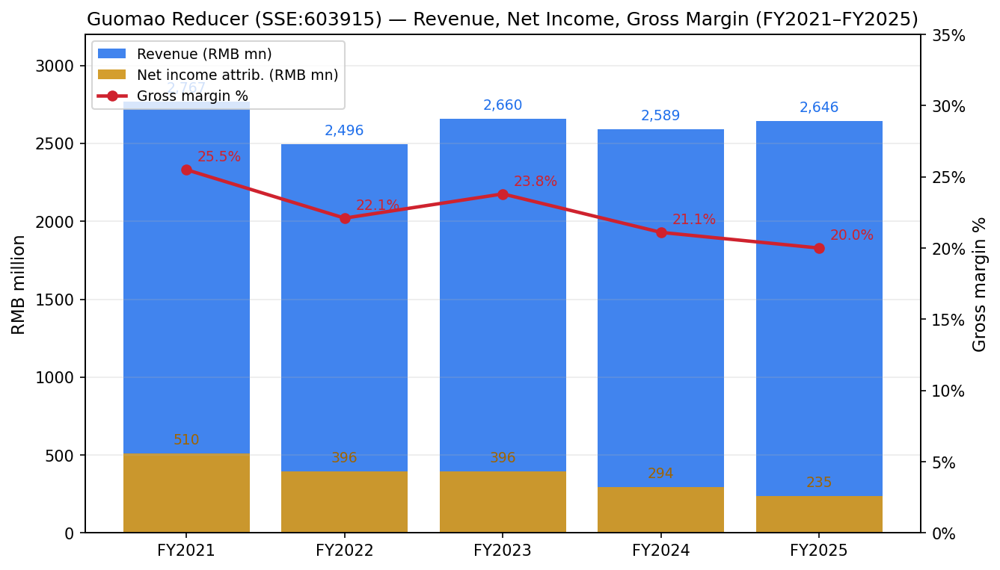
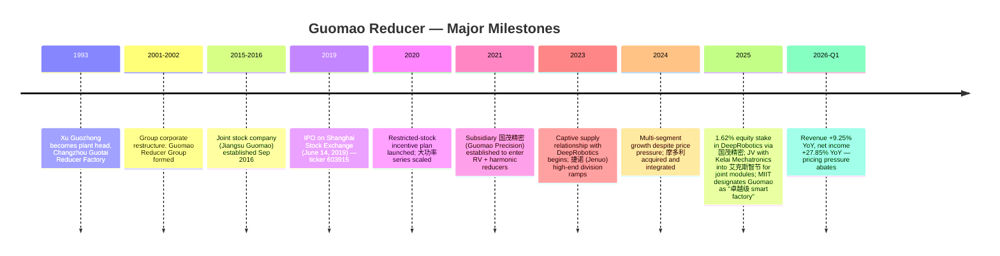
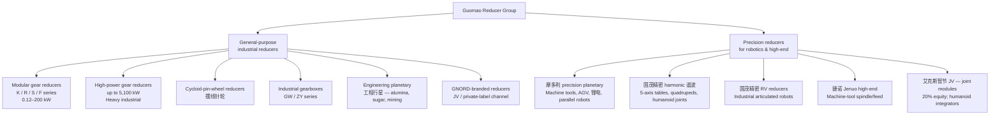
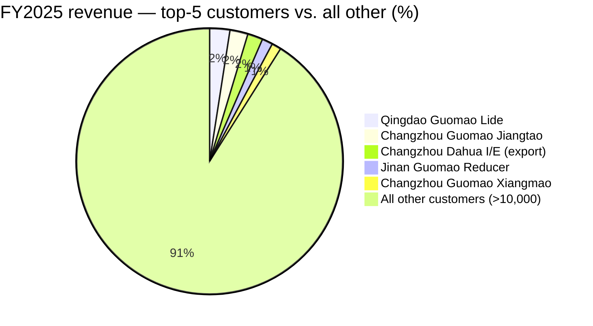
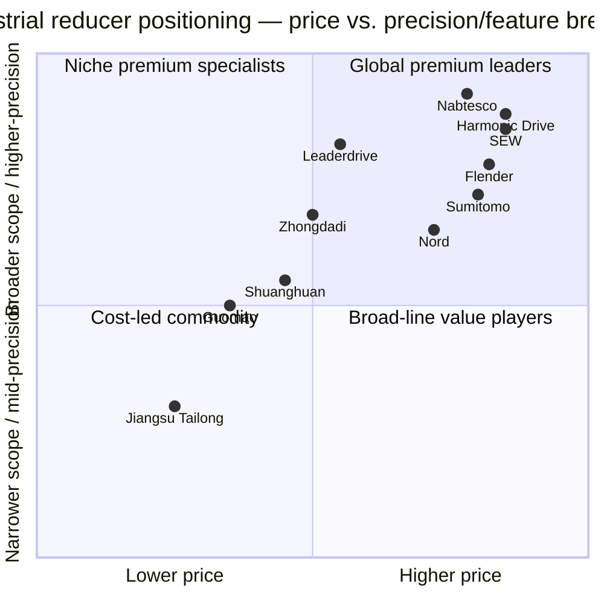
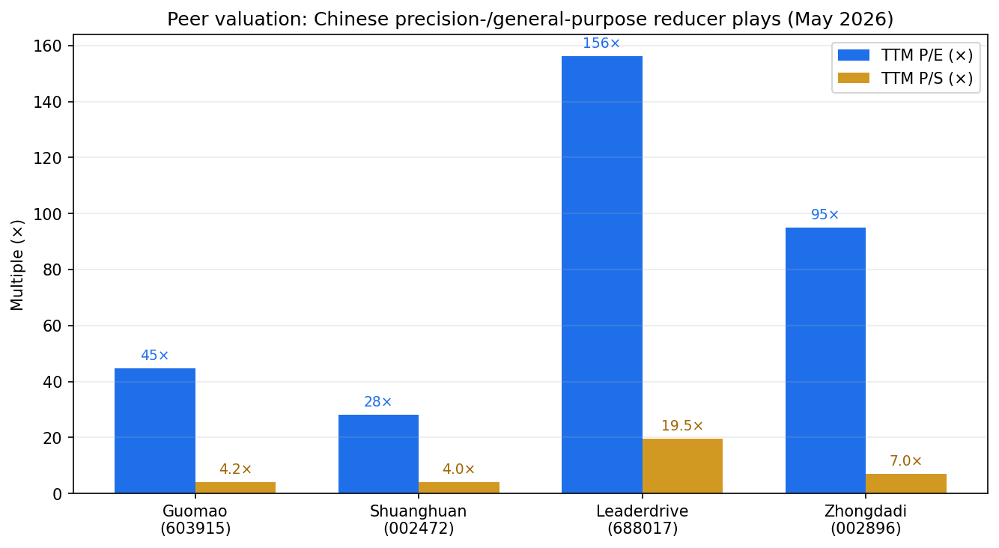

# COMPANY RESEARCH REPORT: Jiangsu Guomao Reducer Co., Ltd. (国茂股份, SSE:603915)

**Date:** 2026-05-18
**Listing:** Shanghai Stock Exchange Main Board, ticker 603915
**Sector / Industry:** General-purpose industrial gear reducers; emerging precision (harmonic + planetary) reducer franchise for robotics

---

## TABLE OF CONTENTS
1. Company Overview
2. Company History
3. Management Team
4. Products & Services
5. Customers & Go-to-Market
6. Industry Overview
7. Competitive Landscape
8. Market Opportunity (TAM)
9. Risk Assessment
References

---

## 1. COMPANY OVERVIEW

Jiangsu Guomao Reducer Co., Ltd. (江苏国茂减速机股份有限公司, hereafter "Guomao" / 国茂股份, SSE:603915) is the largest domestic Chinese manufacturer of general-purpose industrial gear reducers (通用减速机 / general-purpose reducers) — the gearing units that sit between an electric motor and a driven load to reduce shaft speed and increase torque. Reducers are required by virtually every torque-driven industrial machine: conveyors, mixers, crushers, hoists, rolling mills, presses, extruders, packaging lines, marine winches, and now humanoid- and quadruped-robot joints. Guomao's reducers ship into more than thirty downstream industries, including 冶金 (metals), 矿山 (mining), 起重运输 (cranes & hoisting), 橡塑 (rubber and plastics), 水泥 (cement), 建材, 港口船舶 (ports and marine), 化工 (chemicals), 食品制药 (food & pharma), 风电盘车 (wind-turbine barring gears), 锂电 (lithium-battery equipment), 机床 (machine tools), and 机器人 (robotics) per the company's own segmentation in the 2025 annual report ([国茂股份 2025 年年度报告, 第 8–13 页](http://www.cninfo.com.cn/new/disclosure/stock?stockCode=603915)).

The business model is straightforward and capital-light by industrial standards: design and assemble reducers in-house at a Changzhou-headquartered "5G smart factory" (国茂智能工厂), source castings, forgings, bearings and motors from external Tier-2 suppliers, and sell through a dual-channel mix of 89 A-class master distributors plus a direct sales team that targets large industrial OEMs and EPC contractors. Pricing is the classic "specified-by-engineer, sold-by-distributor" pattern of industrial components — most orders are 一对一 (configure-to-order); the company produced ~120,000 distinct SKU variants in 2025 ([国茂股份 2025 年年度报告, 第 13 页](http://www.cninfo.com.cn/new/disclosure/stock?stockCode=603915)).

**Scale (FY2025).** Revenue of RMB 2,645.8 mn (+2.18% YoY), net income attributable to shareholders of RMB 235.0 mn (-19.93% YoY), non-GAAP net income of RMB 181.4 mn (-12.15% YoY). The decline in earnings reflects pricing competition in the core gear-reducer category, a 0.46-ppt erosion of gross margin to 20.00% on the main business line, and ~10% growth in administrative expense as the precision-reducer subsidiaries scaled (per the same filing). Total assets at year-end were RMB 5.41 bn; equity attributable to shareholders RMB 3.74 bn — a near-zero-debt balance sheet, with RMB 1.43 bn of trading financial assets and receivables financing earning a 公允价值 (fair-value) tailwind of RMB 46 mn in 2025. Headcount: 2,665 across parent + main subsidiaries (1,914 production, 307 R&D, 168 sales, 220 admin, 56 finance), R&D headcount 390 representing 14.6% of total ([国茂股份 2025 年年度报告, 第 18, 36 页](http://www.cninfo.com.cn/new/disclosure/stock?stockCode=603915)).

The company is the sector leader for general-purpose reducers in China by both unit volume and revenue, although it competes principally in the middle and middle-to-high market segments where German SEW-Eurodrive, Flender (Siemens), and Japanese Sumitomo dominate the high-precision / extreme-duty top-end. By 2025 industry data, the global general-purpose reducer market was approximately USD 13.8 bn, and the Chinese reducer industry (broad definition including precision sub-segment) is projected to reach ~RMB 1,595 bn (~USD 220 bn) in 2025 with low-double-digit growth ([2025年中国减速器行业产业链图谱、市场规模、重点企业及未来前景分析, 2025-03-25](https://finance.sina.com.cn/stock/relnews/hk/2025-03-25/doc-ineqvrau5990651.shtml); [格隆汇: 2025年全球通用减速器市场规模将达138.84亿美元](https://m.gelonghui.com/p/3202027)). Guomao is also the only reducer-and-gearbox maker in the Ministry of Industry and Information Technology's first batch of "卓越级智能工厂" (excellence-grade smart factories) designations released in 2025 ([国茂股份 2025 年年度报告, 第 13 页](http://www.cninfo.com.cn/new/disclosure/stock?stockCode=603915)).

**Valuation snapshot (mid-May 2026).** As of May 11, 2026 the stock traded at RMB 17.72, on 656.6 million shares outstanding for a market capitalization of roughly RMB 11.6 bn ([股票行情快报：国茂股份 5月11日, 2026-05-11](https://stock.stockstar.com/RB2026051100030602.shtml)). At the May 6 close of RMB 15.94, market cap was RMB 10.47 bn ([搜狐财经, 2026-05-06](https://www.sohu.com/a/1019001512_115377)). Trailing-12-month metrics published by aggregators put TTM P/E ≈ 44.7×, P/B ≈ 3.0×, and P/S ≈ 4.2× on cap RMB ~11.0 bn ([搜狐财经, 2026-05-06](https://www.sohu.com/a/1019001512_115377)), versus the company's own FY2025 net income of RMB 235 mn (implying P/E ≈ 47–49× on the May 11 price). 3-year P/E range for Guomao has spanned roughly 18–55× since the 2024 humanoid-robot rally began, having traded at 18–25× before the robotics tailwind. Peer multiples:

| Peer | Market Cap | TTM / fwd P/E | Comment |
|---|---|---|---|
| Guomao (SSE:603915) | RMB 11.6 bn | ~45× TTM | General-purpose leader; nascent precision |
| Shuanghuan Driveline 双环传动 (SZSE:002472) | RMB 34.5 bn | 28× TTM | RV reducer scale leader via 环动科技; gear-set giant |
| Leaderdrive 绿的谐波 (SSE:688017) | RMB 35.7 bn | ~104× FY26E / 156× FY25E | Domestic harmonic-drive pure-play; Tesla-Optimus and Unitree exposure |
| Zhongdadi 中大力德 (SZSE:002896) | RMB 13.8 bn | high-50×–90× est. | Harmonic + RV + motor integrator |
| SEW-Eurodrive (German private) | not disclosed | n/a | Global #1 modular reducer; ~EUR 4.3 bn revenue 2024 |
| Nord Drivesystems (German private) | not disclosed | n/a | Global top-5; ~EUR 1.0 bn revenue 2024 |

Sources: [双环传动 002472 - 雪球, 2026-03](https://xueqiu.com/S/SZ002472); [绿的谐波 688017 - 雪球 / 九方智投, 2026-03](https://xueqiu.com/S/SH688017); [中大力德 002896, 2026-03](https://stcn.com/quotes/index/sz002896.html).

**Interpretation.** At ~45× TTM, Guomao trades at roughly **2.0× the typical pre-thematic multiple of 18–25×** for a Chinese specialty-industrial cap-goods name, and at a meaningful premium to the more relevant general-purpose comp (Shuanghuan's 28×), but at a deep discount to the harmonic-drive specialists (Leaderdrive 100–150×, Zhongdadi high-50s to 90s). The market is pricing two distinct stories simultaneously:
1. The core general-purpose reducer business — a low-growth, GDP+ industrial-cycle name worth ~15–25× through a cycle, and
2. A call option on the precision / robotics joint-reducer subsidiaries (摩多利 + 国茂精密) becoming a credible second-source supplier to humanoid OEMs, justifying the multiple expansion since 2024.

The driver is documented: Guomao has been named the **exclusive supplier of joint planetary reducers for Hangzhou DeepRobotics (云深处科技)**, one of the so-called "Hangzhou Six Little Dragons" (杭州六小龙), since 2023, and has taken a 1.62% equity stake in DeepRobotics via subsidiary 国茂精密 ahead of DeepRobotics's planned IPO ([东方财富: 国茂股份是云深处科技正式供货的核心供应商, 2025-02-21](https://caifuhao.eastmoney.com/news/20250221094741939366530); [东方财富: 杭州云深处股改完成对国茂股份股价影响, 2025-11-04](https://caifuhao.eastmoney.com/news/20251104033401914549730)). The valuation overshoot risk if humanoid timelines slip is real and is treated as a discrete risk in Section 9.

*Source: [国茂股份 2025 年年度报告, 第 5–14 页](http://www.cninfo.com.cn/new/disclosure/stock?stockCode=603915); FY2021 figures from [国茂股份 2021 年年度报告](http://www.cninfo.com.cn/new/disclosure/stock?stockCode=603915).*

---

## 2. COMPANY HISTORY

The Guomao lineage begins in 1993, when **Xu Guozhong (徐国忠)** — today's chairman — became plant head of Changzhou Guotai Reducer Factory (常州市国泰减速机厂), one of dozens of small reducer workshops that emerged around Changzhou's Wujin district. The Wujin/Changzhou belt has been a Chinese reducer-making cluster since the late 1980s, anchored by access to nearby Wuxi/Suzhou casting and forging supply. In 2001, Xu took ownership of the workshop, converting it to a limited company; the corporate predecessor 国茂减速机集团 (Guomao Reducer Group, the current 50.83% controlling shareholder) was formed in 2002 under Xu's chairmanship ([国茂股份 2025 年年度报告, 第 29, 58 页](http://www.cninfo.com.cn/new/disclosure/stock?stockCode=603915)).

The genesis thesis was simple: German modular reducer designs (SEW's K/R/S/F families) were the global standard but were sold into China at premium prices with long lead times. Guomao reverse-engineered, then re-engineered, the modular concept to produce a 国产 (domestic) equivalent at lower cost and faster delivery for Chinese mid-market industrial customers. That positioning — "good-enough specs, faster delivery, broader sales network, half the price" — has remained the playbook for two decades.

*Sources: [国茂股份 2025 年年度报告, 第 11–13, 29 页](http://www.cninfo.com.cn/new/disclosure/stock?stockCode=603915); [国茂股份 2026 年第一季度报告](http://www.cninfo.com.cn/new/disclosure/stock?stockCode=603915); [东方财富: 国茂股份与云深处, 2025-02-21](https://caifuhao.eastmoney.com/news/20250221094741939366530).*

**Strategic pivots.**

1. **2019 IPO — capital for scale.** The Shanghai listing brought RMB ~1.0 bn of fresh capital, funding the Wujin smart factory build-out. Within four years (2019–2022) Guomao roughly doubled installed capacity and consolidated its market-share lead in general-purpose reducers. The IPO also gave the company a currency to start considering M&A in adjacent precision categories.
2. **2021–2024 precision / robotics push.** Recognizing that traditional industrial reducers are a 个位数 mid-single-digit % growth category tied to fixed-asset investment, management spun up two acquisition/JV vehicles: **国茂精密传动 (Guomao Precision)** to develop harmonic and 高扭 (high-torque) variants for robotics, and **摩多利智能传动 (Modolly Intelligent Transmission)** to handle precision-planetary reducers for machine tools and AGV / e-mobility. By 2024 Modolly was contributing RMB 97 mn in revenue; by 2025 it had grown +39.3% YoY to RMB 135.4 mn at a 31.4% gross margin — well above the corporate average ([国茂股份 2025 年年度报告, 第 15 页](http://www.cninfo.com.cn/new/disclosure/stock?stockCode=603915)).
3. **2025 ecosystem JV — joint-module ambitions.** In July 2025 Guomao took a 20% stake (RMB 4.0 mn upfront) in **艾克斯智节 (Xinjie Robotics, Hangzhou)** alongside Shanghai Kelai Mechatronics (克来机电) and Hangzhou Sanxiang Technology, explicitly to develop integrated robot **joint modules** (关节模组) — the next layer up from the reducer alone ([国茂股份 2025 年年度报告, 第 12 页](http://www.cninfo.com.cn/new/disclosure/stock?stockCode=603915); [时代周报: 艾克斯关节模组新品投产发布, 2025-11-28](https://time-weekly.com/post/325758)). The signal: Guomao no longer intends to be a passive component vendor at the bottom of the robotics BOM — it wants to participate in module-level integration economics.

**Acquisitions and consolidations.**
- 2015: Changzhou Guotai Lide (前身) reorganized into shareable form
- 2021: 国茂精密 acquired part of 安徽聚隆 reducer business (per 9fzt sell-side note)
- 2023–2024: 摩多利智能传动 integrated; 摩多利自动化 (Nantong) added downstream
- 2024: Stake in **捷诺传动 (Jenuo Transmission)** — the high-end ZY-series machine-tool / 氧化铝 (alumina) equipment line — consolidated under direct subsidiary

Recent developments (last 12 months) are covered in detail in Sections 4 and 7; the headline is that Q1 2026 revenue rose 9.25% YoY and net income rose 27.85% YoY ([国茂股份 2026 年第一季度报告](http://www.cninfo.com.cn/new/disclosure/stock?stockCode=603915)), suggesting the worst of the 2023–2024 pricing-pressure phase has passed.

---

## 3. MANAGEMENT TEAM

Guomao is family-controlled and founder-led. Chairman Xu Guozhong and his son, President Xu Bin (徐彬), together control roughly 11.9% of shares directly plus their joint control of the 50.83% controlling vehicle Guomao Reducer Group — a textbook A-share founder dynasty structure with an experienced operating bench beneath them.

### Xu Guozhong (徐国忠), Chairman of the Board (董事长)

Age 63. Founder of the modern Guomao lineage. After heading the Changzhou Guotai Reducer Factory from 1993 to 2001, Xu took ownership of the asset and incorporated the group entity (Guomao Reducer Group Co., Ltd.) in January 2002, where he has served as chairman and general manager continuously for more than 23 years. He has chaired the listed Jiangsu Guomao subsidiary since September 2016 and was reappointed through September 2028 ([国茂股份 2025 年年度报告, 第 28–29 页](http://www.cninfo.com.cn/new/disclosure/stock?stockCode=603915)).

Direct ownership: 34,293,900 shares (5.22%) held personally at year-end 2025, having reduced his personal stake by 11.35 million shares during 2025 via on-market sales (per 二级市场卖出 disclosure on p. 28). Indirect ownership via Guomao Reducer Group (where he holds 47% of group equity) is materially larger; combined with his son Xu Bin's 45% interest in the group plus son's direct 6.68% stake and daughter Xu Ling's 1.56% concert-party stake, the family bloc controls well over 60% of Jiangsu Guomao. Xu Guozhong draws **zero salary** from the listed company (he is compensated at the controlling-shareholder Group level), but is the legal representative ([国茂股份 2025 年年度报告, 第 28 页](http://www.cninfo.com.cn/new/disclosure/stock?stockCode=603915)).

What he has actually delivered: a 30+ year compounding from a single small-town reducer workshop into the domestic-brand market-share leader in Chinese general-purpose reducers — a category historically owned by German OEMs. Under his chairmanship the company has been named a "national-level intellectual-property advantageous enterprise" (国家知识产权优势企业 / 示范企业), a "Manufacturing Single Champion" (制造业单项冠军, 6th batch, MIIT 2021), and most recently the **only reducer maker** in MIIT's inaugural "excellence-grade smart factory" cohort in 2025 ([国茂股份 2025 年年度报告, 第 11, 13 页](http://www.cninfo.com.cn/new/disclosure/stock?stockCode=603915)). Public profile is low; he is rarely interviewed and has no significant social-media presence, in the mould of most A-share industrial founders. The succession dynamic — son Xu Bin already runs the listed entity as President at age 37 — is unusually well telegraphed for an A-share name and is a constructive governance signal for long-run continuity.

### Xu Bin (徐彬), President (总裁) and Heir Apparent

Age 37. Son of the chairman. Joined Guomao Reducer Group at the board level in March 2010 (age 22), held executive director / GM roles at the operating subsidiary 常州市国茂立德传动设备 from 2013, and has been President of the listed company since September 2016. He concurrently runs three of the strategic growth subsidiaries — 捷诺传动 (high-end machine-tool reducers), 国茂精密 (RV / harmonic for robotics), and 摩多利传动 (precision planetary) — and is on the board of partly-owned 中重科技 (天津) ([国茂股份 2025 年年度报告, 第 32 页](http://www.cninfo.com.cn/new/disclosure/stock?stockCode=603915)). Personal stake: 43.83 million shares (6.68%) after a 8.35 mn share secondary-market reduction in 2025. 2025 cash compensation RMB 1.41 mn — including the performance bonus tied to running the 捷诺 and industrial-gearbox 事业部 (division), whose former heads departed in mid-year. Crucially, Xu Bin is the architect of the precision-reducer pivot; the JV in 艾克斯智节 and the 国茂精密 + 摩多利 acquisitions all happened on his watch. For investors, the thesis on Guomao is meaningfully a thesis on Xu Bin's execution.

### Lu Yipin (陆一品), Director, VP, CFO, Board Secretary

Age 45. With Guomao Group since 2011 — first as investment director at the parent's 常州市国茂投资有限公司, then financial controller at the listed-entity predecessor from October 2015, and director / CFO / board secretary of Jiangsu Guomao since September 2016. He has overseen the 2019 IPO process, the 2020 restricted-stock incentive plan, and the buyback/dividend cadence (FY2025 cash dividend of RMB 0.10/share plus interim dividend totalling RMB 144.5 mn, a 61.46% payout ratio). 2025 comp RMB 590,500 ([国茂股份 2025 年年度报告, 第 2, 28 页](http://www.cninfo.com.cn/new/disclosure/stock?stockCode=603915)). No prior public-company CFO experience outside the Guomao group; the accountancy work is conventional A-share — auditor is Lixin (立信会计师事务所), standard unqualified opinion.

### Wang Xiaoguang (王晓光), VP — Head of Domestic Sales

Age 46. Sales career, joined Guomao Group as deputy sales manager in 2003 (age 23) and rose through national-distribution roles. Director and VP of the listed entity since 2016. His ownership of the 89-A-class distributor network is the operational backbone of the company's domestic 长尾 (long-tail) coverage — and a non-trivial intangible asset, since dealer relationships built over two decades are hard for competitors (foreign or domestic) to replicate in 3–5 years ([国茂股份 2025 年年度报告, 第 13, 29 页](http://www.cninfo.com.cn/new/disclosure/stock?stockCode=603915)).

### Kong Donghua (孔东华), VP

Age 47. Joined Guomao Group in 2011 from Kingdee software consulting; ran 总经理助理 office and was elevated to VP in April 2023. Likely responsible for the digital-transformation initiative (the "GOS" operations system spanning MES / WMS / APS / CRM / SRM / ERP that underpinned the 2025 smart-factory designation).

### Governance footer

- **Board composition:** 8 directors — 4 internal (Xu Guozhong, Xu Bin, Lu Yipin, Wang Xiaoguang), 4 independent (Wang Jianhua, Zou Chengxiao, Chen Wenhua appointed 2025-09, plus Lu Yunfeng on the supervisory board). Independents have legal/academic/CPA backgrounds and ~RMB 60–88k annual cash; no equity. Independence ratio 50% — standard for an A-share family-controlled name ([国茂股份 2025 年年度报告, 第 28–34 页](http://www.cninfo.com.cn/new/disclosure/stock?stockCode=603915)).
- **Insider / controlling-bloc ownership:** Guomao Reducer Group 50.83%; Xu Bin 6.68%; Xu Guozhong 5.22%; Xu Ling (daughter, concert party) 1.56% — family bloc ≈ 64.3%. **Government / institutional float is thin and dominated by passive index ETFs**: HuaXia / E Fund / Tianhong robotics-themed ETFs collectively hold ~3.1%; Hong Kong Stock Connect 1.27%; JPM PLC 1.07%.
- **Comp structure:** entirely cash-based for most execs; a 2020 restricted-stock incentive plan was the only equity vehicle and 限售股 lots were partially repurchased and cancelled during 2025 (per p. 28). Total board + management cash comp RMB 4.72 mn — small relative to the size of the business and consistent with non-bubbly founder culture.
- **Related-party items:** the company explicitly states no non-operational fund occupation by controlling shareholder, no improper external guarantees, and no half-or-more director objection to the report (p. 2). Customer concentration is low, but the top-5 customer list contains three entities with "国茂" in the name (Qingdao Guomao Lide, Changzhou Guomao Jiangtao, Jinan Guomao Reducer — all distributors), which formally are 直销 (direct sales) customers but read as captive distributor arrangements — worth a careful look (covered in Section 5).

### Management track record synthesis

A founder-CEO who built the domestic-brand market-share leader from a single workshop, succeeded by a son who has already executed the M&A and JV moves required to extend into precision reducers and joint modules. The 2025 earnings drawdown (-19.9% net income) tested the bench and the response — productivity initiative (production +7.6%, headcount roughly flat), reaffirmed dividend, accelerated precision investment, and a Q1 2026 rebound — suggests the team is operationally credible. Gaps: limited public-markets and capital-allocation experience at the CFO level, and only modest equity skin-in-the-game outside the family bloc.

---

## 4. PRODUCTS & SERVICES

Guomao's product matrix follows the company's two-by-two segmentation: **gear reducers vs. cycloid reducers** on one axis, **general-purpose vs. precision** on the other. The 2025 annual report ([国茂股份 2025 年年度报告, 第 8–10 页](http://www.cninfo.com.cn/new/disclosure/stock?stockCode=603915)) groups offerings as below:

### Segment-level FY2025 revenue breakdown

| Product line | FY2025 revenue (RMB mn) | YoY % | Gross margin |
|---|---|---|---|
| Gear reducers (modular + heavy + industrial GB + engineering planetary) | 1,986.0 | +1.81% | 17.95% |
| Cycloid-pin-wheel reducers (摆线针轮) | 331.7 | -6.83% | 25.55% |
| GNORD reducers | 110.3 | +24.38% | 12.78% |
| 摩多利 precision planetary | 135.4 | +39.31% | 31.43% |
| Accessories / other | 51.4 | -20.75% | 48.82% |
| **Total main business** | **2,614.8** | **+2.24%** | **20.00%** |

Source: [国茂股份 2025 年年度报告, 第 14–15 页](http://www.cninfo.com.cn/new/disclosure/stock?stockCode=603915).

### 4.1 General-purpose modular reducers (K / R / S / F series)

The cash-cow segment. Modular reducers cover the 0.12–200 kW power band and follow the SEW K/R/S/F mounting taxonomy (K = right-angle helical-bevel; R = inline helical; S = helical-worm; F = parallel-shaft helical). Guomao's modular line includes a built-in fast quick-mount motor interface, fine speed-ratio gradation, and unrestricted mounting orientation, which together address the long-tail of small-and-medium industrial conveyor / mixer / extruder applications ([国茂股份 2025 年年度报告, 第 9 页](http://www.cninfo.com.cn/new/disclosure/stock?stockCode=603915)). Volume grew double-digits in 2025 according to the MD&A, the ZY-series 整体箱 (one-piece housing) launch improved seal reliability, and a series of 双螺杆锥双 (twin-screw bevel-double) configurations was added.

- **Competitive advantage: Yes — scale + distribution + brand.** Guomao is the domestic-brand category leader. Moat type: cost-leadership (lower labor + casting cost vs. SEW), scale (single largest Chinese factory of its kind), and a 30-year sales network of 89 A-class master distributors plus countless smaller dealers covering 大部分省份 (most provinces) ([国茂股份 2025 年年度报告, 第 13 页](http://www.cninfo.com.cn/new/disclosure/stock?stockCode=603915)). Brand: "国茂" trademark designated 中国驰名商标 (China Well-known Trademark).
- **Closest competing products:** SEW K/R/S/F series; Flender (Siemens) — Guomao at parity on basic spec, behind on extreme-precision and quietness; ahead on price (typically 30–50% below) and lead-time (1–4 weeks vs. 8–16). Domestic competitor 国茂股份's only true peer-scale Chinese gear-reducer maker is **江苏泰隆 (Jiangsu Tailong)** and 浙江通力 — both private; smaller than Guomao.

### 4.2 Heavy industrial reducers (大功率 + 工业齿轮箱)

Power band up to 5,100 kW for steel mills, mining, cement, sugar, alumina, marine/port hoisting, and increasingly **wind-turbine 盘车 (barring gear)**. The 工程行星 (engineering planetary) sub-line scored a notable 2025 win — China's first **超大型 (jumbo) 回转驱动系统 (slewing-drive system)** for sugar-processing equipment with total output torque of 23 million N·m, replacing an imported brand. The 重载 (heavy-load) division delivered a 500-ton hot-rolling-mill drivetrain in 2025 and a horizontal ring-rolling-mill system to a Japanese OEM at EU CE noise standards ([国茂股份 2025 年年度报告, 第 12 页](http://www.cninfo.com.cn/new/disclosure/stock?stockCode=603915)).

- **Competitive advantage: Partial.** Guomao is credible at the middle-high end and is grinding upward into the historical SEW / Flender / Sumitomo turf. The Japanese OEM ring-mill order is a meaningful certification. Moat type: cost + delivery + emerging certification; brand parity with foreign peers is **not yet there** in the top quartile of demanding heavy-industrial users.
- **Closest competing products:** Flender / SEW / Sumitomo / Hansen — typically ahead on top-end metallurgical and marine applications; Guomao at parity on cement and conveying.

### 4.3 Cycloid-pin-wheel reducers (摆线针轮)

A mature, compact, high-ratio variant — characteristic 25.55% gross margin (3rd-highest by line). Volume contracted ~5.8% in 2025 as customers migrated to gear-modular alternatives; revenue down 6.83% YoY. **Margin held**, suggesting Guomao is letting price-sensitive low-end volume go and harvesting the installed base. Long-tail product; not strategic.

### 4.4 GNORD reducers

A separate brand/channel — likely a private-label / OEM arrangement, +24.4% in 2025 but at a lower 12.8% gross margin (channel rebate burden visible). Small absolute size (RMB 110 mn).

### 4.5 摩多利 (Modolly) precision planetary reducers — the first robotics leg

Acquired and consolidated through 2023–2024. Modolly focuses on **precision planetary reducers** for high-end machine tools, AGVs (automated guided vehicles), lithium-battery production equipment, parallel-arm (并联) robots, aluminum-extrusion equipment, and articulated robots. Material wins in 2025: the MAFTB series for parallel robots was refined, and customized SKUs were launched for intelligent logistics OEMs ([国茂股份 2025 年年度报告, 第 12 页](http://www.cninfo.com.cn/new/disclosure/stock?stockCode=603915)).

- **Competitive advantage: Yes — at the lower-precision end.** Modolly competes with **Newstart (新剑机器人)**, **Lide (利德传动)**, **Neugart (German)** and **Wittenstein**. Domestic peers tend to dominate sub-arc-min repeatability segments at 30–40% price discount to Germans; Modolly is in that bucket.
- The 31.4% gross margin is well above corporate average and is the single best evidence that the precision segment, even today, is incrementally accretive to corporate profitability.

### 4.6 国茂精密 (Guomao Precision) — the humanoid-robotics call option

Established 2021 as wholly-owned subsidiary in Changzhou, explicit purpose: develop **harmonic reducers (谐波减速器)** and **RV reducers** for the embodied-intelligence (具身智能) wave. Capacity as of early 2025 stood at approximately 2,500 harmonic units / month ([腾讯新闻: 减速器江湖, 2025-05-27](https://news.qq.com/rain/a/20250527A06ZL800)), with the production base recently migrated from out-of-province to the Changzhou HQ and supplemented with imported hobbing machines, high-precision wire-EDM machines, and surface-treatment equipment. Notable 2025 developments:

- Custom planetary reducers for **DeepRobotics (云深处)** quadruped robots — Guomao is **named the exclusive joint-planetary supplier** by the robot OEM ([东方财富: 国茂股份是云深处科技正式供货的核心供应商, 2025-02-21](https://caifuhao.eastmoney.com/news/20250221094741939366530); the 2025 half-year report explicitly confirms the relationship per [韭研公社: 国茂股份半年报证实](https://www.jiuyangongshe.com/a/gdfxg5yq7a)).
- Co-developed a **"hyperbolic-cam + harmonic reducer" five-axis rotary table** with a customer (likely a high-end machine-tool OEM — name undisclosed in the filing).
- Engaged with **major humanoid robot OEMs** ("主机厂") on commercial discussions, sample fabrication, and bench-testing per the 2025 annual report — *no Tier-1 commercial humanoid contract has been publicly announced as of May 2026*; investors should treat humanoid-OEM revenue as essentially zero today.
- Sample order with **Yifei Technology 翼菲科技** delivered ([网易: 国产化精密减速器, 2025-02](https://c.m.163.com/news/a/IL2BCSEU055633OJ.html); [OFweek, 2025-02-08](https://m.ofweek.com/ai/2025-02/ART-201712-8120-30656570.html)).
- A 1.62% equity stake in DeepRobotics held via 国茂精密 — gives Guomao financial upside in DeepRobotics's potential 2026–2027 IPO on top of its supplier economics ([东方财富, 2025-11-04](https://caifuhao.eastmoney.com/news/20251104033401914549730); [新浪: 云深处科技IPO供应商解析](https://www.sina.cn/news/detail/5294274981924791.html)).

- **Competitive advantage: Partial / building.** In harmonic reducers, the global leaders are **Harmonic Drive (Japan)** at ~25% global share and **Leaderdrive 绿的谐波** as the leading Chinese pure-play; in RV reducers, **Nabtesco (Japan)** controls ~60% globally, with **Shuanghuan / 环动科技** as the leading Chinese share-taker. Guomao Precision is one of multiple second-tier domestic challengers (alongside **Zhongdadi**, **Newstart**, **Laifuel 来福谐波**, **Hengfengtai**, **HBR**). It is not the technology leader; its angle is to leverage the parent's brand, distribution, and engineering culture to grow share in the domestic 中端 (mid-tier) humanoid-joint market as Chinese humanoid OEMs prioritise cost and supply security over Japanese-OEM specs. *Honest assessment: it is too early to call a moat here.*

### 4.7 捷诺 (Jenuo Transmission) — high-end specialty

Subsidiary positioned as the "high-end strategic engine" per management language. Sales orders grew rapidly in 2025; products now ship into **high-precision machine tools** and **alumina-processing equipment**, both historically dominated by foreign suppliers ([国茂股份 2025 年年度报告, 第 11–12 页](http://www.cninfo.com.cn/new/disclosure/stock?stockCode=603915)).

### Flagship vs. long-tail — what drives the P&L

- **Flagship (~75% of revenue):** Gear-modular + heavy-industrial reducer lines (the K/R/S/F families and the high-power/heavy-industrial series). These drive the cycle, the cash flow, the distribution-network economics, and the brand.
- **Strategic engines (~10% of revenue, growing):** 摩多利 (RMB 135 mn, +39%) + 国茂精密 (still small, included in 配件其他 or gear depending on form factor) + 捷诺 high-end machine-tool products + GNORD branding. These drive the multiple.
- **Long-tail / harvest (~15% of revenue):** Cycloid 摆线 reducers, accessories — declining volume, margin discipline.

### Recent launches and sunsets (12 months)

Launched: ZY-series one-piece housing (improved sealing); ultra-large slewing drive for sugar industry (industry first); MAFTB-series parallel-robot reducer refresh; high-torque harmonic variant for humanoid prototyping; co-developed hyperbolic-cam + harmonic 5-axis table. No major sunsets announced.

---

## 5. CUSTOMERS & GO-TO-MARKET

Customer concentration is the headline data point — **and it is unusually low.**

### Top-5 customer share, 3-year trend

| Year | Top-5 customer revenue (RMB mn) | % of total revenue |
|---|---|---|
| FY2023 | 265.8 | 9.99% |
| FY2024 | 250.7 | 9.68% |
| FY2025 | 236.6 | 8.94% |

Sources: [国茂股份 2025 年年度报告, 第 17 页](http://www.cninfo.com.cn/new/disclosure/stock?stockCode=603915); [国茂股份 2024 年年度报告, 第 17 页](http://www.cninfo.com.cn/new/disclosure/stock?stockCode=603915); [国茂股份 2023 年年度报告, 第 19 页](http://www.cninfo.com.cn/new/disclosure/stock?stockCode=603915).

**Top-5 customers in FY2025** ([国茂股份 2025 年年度报告, 第 17 页](http://www.cninfo.com.cn/new/disclosure/stock?stockCode=603915)):

| # | Customer | Revenue (RMB mn) | % of total |
|---|---|---|---|
| 1 | 青岛国茂立德传动设备有限公司 (Qingdao Guomao Lide) — affiliated distributor | 64.83 | 2.45% |
| 2 | 常州国茂江涛减速机有限公司 (Changzhou Guomao Jiangtao) — affiliated distributor | 57.88 | 2.19% |
| 3 | 常州大华进出口（集团）有限公司 (Changzhou Dahua I/E) — export trading house | 48.95 | 1.85% |
| 4 | 济南国茂减速机有限公司 (Jinan Guomao) — affiliated distributor | 34.52 | 1.30% |
| 5 | 常州国茂湘茂传动科技有限公司 (Changzhou Guomao Xiangmao) — affiliated distributor | 30.42 | 1.15% |

**Interpretation:** the largest single customer is only 2.45% of revenue, and **four of the top-five are A-class distributors carrying the "Guomao" name** — these are the master distributors covering Qingdao / Changzhou / Jinan respectively. The 2025 filing explicitly classifies them as 直销 (direct sales) on the basis that Guomao sells to them under master-distribution agreements rather than 代销 (consignment). Even if you treat all five as a single "captive distributor channel," combined exposure is only 8.94% — among the **lowest customer-concentration profiles of any A-share industrial component maker we have analyzed**, reflecting genuinely fragmented end demand (>10,000 named end customers across 30+ industries).

*Source: [国茂股份 2025 年年度报告, 第 17 页](http://www.cninfo.com.cn/new/disclosure/stock?stockCode=603915).*

### Customer segments and go-to-market

- **Domestic distributors (经销):** 89 A-class plus a long tail of B-class and ordinary dealers. A-class dealers are typically multi-year exclusive contracts, regional, and serve the SME / engineering-contractor long tail.
- **Direct sales (直销):** large industrial OEMs (steelmakers, cement, port-machinery, alumina equipment, wind-turbine, lithium-battery equipment, AGV makers) handled by an in-house enterprise sales team. Notable 2025 wins: **鞍山紫竹集团** (Anshan Zizhu) 600-shaped steel project; **韩通高端海工装备制造基地** (Hantong High-end Marine Equipment) project; multiple **cooling-tower** retrofits replacing imported brands; **风电盘车 (wind barring-gear)** market leadership ([国茂股份 2025 年年度报告, 第 12 页](http://www.cninfo.com.cn/new/disclosure/stock?stockCode=603915)).
- **Robotics OEMs (direct / strategic):** **DeepRobotics (云深处)** — *named exclusive* supplier for quadruped joint planetary reducers; 1.62% equity stake. **Yifei Technology (翼菲科技)** — sample / trial orders. Multiple unnamed humanoid OEMs in commercial discussion / bench-test stage ([东方财富, 2025-02-21](https://caifuhao.eastmoney.com/news/20250221094741939366530); [国茂股份 2025 年年度报告, 第 11 页](http://www.cninfo.com.cn/new/disclosure/stock?stockCode=603915)).
- **International (出口):** RMB 23.7 mn in 2025 (+6.4% YoY), only 0.9% of revenue but with 38.6% gross margin — far above the 19.8% domestic margin. Growth markets disclosed for 2025: Indonesia (Sinar Mas / 金光集团 smart-factory upgrade), India (metallurgy & rubber-plastics), Russia (steel + mining majors), with new footholds in Belgium, Poland, and Colombia. The Modolly subsidiary additionally handles export channels for precision planetary reducers.

### Distribution channels — the real moat

The **89 A-class distributor network** is the single most valuable intangible asset. Building from scratch a same-grade national reducer distribution and after-sales network would take a competitor 5–10 years and meaningful capital. Many A-class dealers carry "国茂" in their own corporate names (Qingdao Guomao Lide, Jinan Guomao Reducer, Changzhou Guomao Jiangtao, etc.) — a strong indication of long-tenured partnerships and switching-cost lock-in for the dealer side ([国茂股份 2025 年年度报告, 第 13 页](http://www.cninfo.com.cn/new/disclosure/stock?stockCode=603915)).

### Sales strategy and cycle

Industrial reducer sales are project-specified; cycle from design-spec to shipment is typically 4–16 weeks for stock SKUs and 8–24 weeks for engineering / heavy-duty custom orders. Guomao runs a hybrid build-to-stock at the component level and build-to-order at assembly, supported by the GOS (APS / MES / WMS / CRM / SRM / ERP) digital backbone. Average order size is small (most orders < RMB 100k), supporting the low concentration metric.

### Key partnerships

- **DeepRobotics (云深处科技)** — exclusive joint-planetary supply + 1.62% equity stake; the highest-profile robotics relationship.
- **Shanghai Kelai Mechatronics (克来机电) + Hangzhou Sanxiang Technology + Hangzhou Ellis** — JV in **艾克斯智节 (杭州) 科技** for joint-module integration; Guomao 20%, RMB 4.0 mn investment ([国茂股份 2025 年年度报告, 第 12 页](http://www.cninfo.com.cn/new/disclosure/stock?stockCode=603915); [时代周报, 2025-11-28](https://time-weekly.com/post/325758)).
- **安徽智鸥驱动科技** — board-level relationship via CFO Lu Yipin's directorship ([国茂股份 2025 年年度报告, 第 32 页](http://www.cninfo.com.cn/new/disclosure/stock?stockCode=603915)).
- **Acorn Industrial Corporation, 中重科技** — equity/operational links per the report's 释义 (definitions) section.

### Customer concentration verdict

Top-1 = 2.45%; top-5 = 8.94%; 3-yr trend declining. **Concentration risk is essentially absent.** This is one of the strongest aspects of the Guomao thesis — the company is a true platform-component supplier to a fragmented industrial economy, not a captive supplier to one or two large OEMs.

---

## 6. INDUSTRY OVERVIEW

### Definition and scope

The Chinese reducer industry covers all gear / cycloid / planetary / harmonic / RV motion-transmission components that step down speed and step up torque between a motor and a driven mechanism. By regulatory classification it sits within the **通用设备制造业 (general equipment manufacturing)** vertical, NAICS-equivalent 3331x. The industry encompasses several distinct sub-segments:

1. **General-purpose gear reducers (通用减速机):** the largest by volume — modular K/R/S/F variants, helical-bevel, helical-worm, parallel-shaft, cycloid-pin-wheel. End markets: every industry. Players: Guomao (domestic #1), 江苏泰隆, 浙江通力, 中国高速传动 (Hansen), SEW, Flender, Sumitomo, Nord. Annual cycle: tied to fixed-asset and manufacturing investment.
2. **Heavy industrial gearboxes (重载齿轮箱):** large-torque mill drives, marine, mining, alumina. Players: SEW, Flender, Hansen, Maag, Sumitomo, Guomao (mid-tier), 大连华锐.
3. **Precision planetary (精密行星):** servomotor drivetrains for machine tools, AGV, lithium-equipment, light robotics. Players: Neugart, Wittenstein, Apex, Shimpo, 摩多利, 新剑机器人, 利德传动. Growth: high-single to low-double-digit.
4. **Harmonic reducers (谐波减速器):** ultra-thin, high-ratio, near-zero-backlash drives used in robot joints and 5-axis machine-tool turn-tables. Global leader: Harmonic Drive (Japan). Chinese leader: Leaderdrive (绿的谐波). Other Chinese players: Laifuel 来福, 国茂精密, 中大力德, 双环传动, 大族传动, 同川. Growth driver: humanoid robots — projected CAGR 42% 2025–2031 per [Valuates Reports, 2025](https://reports.valuates.com/market-reports/QYRE-Auto-4V12992/global-harmonic-reducer-for-humanoid-robot).
5. **RV reducers (RV 减速器):** hollow-shaft cycloid + planetary compound drives — the workhorse joint reducer for industrial articulated robots. Global leader: Nabtesco (~60% share). Chinese leaders: 双环传动 / 环动科技, Nantong Zhenkang, 中大力德, 国茂精密.

### Market size and growth

- **Global general-purpose reducer market (2025E):** USD 13.88 bn ([格隆汇, 2025](https://m.gelonghui.com/p/3202027)).
- **China reducer market (broad definition, 2025E):** ~RMB 1,595 bn / USD 220 bn, +10% YoY ([新浪财经, 2025-03-25](https://finance.sina.com.cn/stock/relnews/hk/2025-03-25/doc-ineqvrau5990651.shtml)). Earlier 前瞻产业研究院 forecast had RMB 1,500 bn for 2025.
- **Global humanoid-robot harmonic-reducer market:** USD 276 mn (2024) projected to USD 3,131 mn (2031) — 42.1% CAGR ([Valuates Reports, 2025](https://reports.valuates.com/market-reports/QYRE-Auto-4V12992/global-harmonic-reducer-for-humanoid-robot)).
- **Global miniature RV reducer for humanoid robots:** still nascent — early commercial volumes 2025–2026 ([Intel Market Research, 2025](https://www.intelmarketresearch.com/miniature-rv-reducer-for-humanoid-robots-market-6266)).

The general-purpose category is a GDP-plus story (perhaps 4–7% steady-state); the precision sub-category is the high-growth wedge.

### Key trends and drivers (last 12 months)

1. **"具身智能" elevated to national strategy (March 2025).** China's Government Work Report for the first time named **embodied intelligence (具身智能)** as a "future industry" priority, signalling state-level support for the humanoid-robot supply chain — a direct tailwind for precision reducers as core joint components ([国茂股份 2025 年年度报告, 第 10 页](http://www.cninfo.com.cn/new/disclosure/stock?stockCode=603915)).
2. **Equipment-replacement and "two-new" policies (August 2025).** MIIT + 8 ministries jointly issued the **Mechanical Industry Digital Transformation Implementation Plan**, explicitly mandating retrofit of aging high-energy-consumption equipment with smart sensing/control/actuation — reducers being a core actuation component ([国茂股份 2025 年年度报告, 第 10–11 页](http://www.cninfo.com.cn/new/disclosure/stock?stockCode=603915)).
3. **Mechanical-industry Stable-Growth Plan (September 2025).** MIIT and five ministries jointly published the 2025–2026 work plan for the mechanical industry, with explicit endorsement of industrial-robot and intelligent-manufacturing-equipment deployment ([国茂股份 2025 年年度报告, 第 11 页](http://www.cninfo.com.cn/new/disclosure/stock?stockCode=603915)).
4. **国产替代 (domestic substitution) entering "deep water."** German and Japanese share in middle-and-high-end industrial reducers has been ceding by 1–2 ppt/year to Chinese domestic brands. The dynamic is driven by reduced quality gap, faster delivery, and 30–50% price advantage. SEW + Flender combined held ~11% of China share in 2019 ([前瞻产业研究院, 2022](https://bg.qianzhan.com/trends/detail/506/220616-a9ee0c87.html)); informally that has eroded since.
5. **Margin compression in the general-purpose middle-band, 2023–2024.** Domestic competitive intensity rose as more domestic players added capacity into a flat-to-slightly-growing market. Guomao's gross margin fell from 25.5% (FY2021) to 20.0% (FY2025). Q1 2026 improvement (+9.25% revenue, +27.85% net income) suggests the worst of this is past ([国茂股份 2026 年第一季度报告](http://www.cninfo.com.cn/new/disclosure/stock?stockCode=603915)).
6. **Industry consolidation.** Per the 2025 annual report MD&A (p. 11), the competition basis has shifted from "scale expansion" to "comprehensive capability comparison" — meaning small/mid players are being squeezed out, and head players (Guomao, Shuanghuan, Leaderdrive in their respective sub-niches) gain share.

### Regulatory environment

The Chinese reducer industry is lightly regulated at the product-safety level but is increasingly the subject of *industrial-policy* attention. Key relevant rules and standards:
- **MIIT Smart Factory grading (2025).** Guomao's "卓越级" designation is the highest tier — confers preferred-vendor status for state-owned-enterprise procurement.
- **Manufacturing Single-Champion program.** Guomao was among the 6th batch (MIIT 2021).
- **Industry technical standards:** Guomao is a 主起草单位 (lead drafter) for two industry/group standards — *Modular Electric Reducer General Technical Requirements* and *HR-Series Gear Reducer General Specifications* — and a participant in the national standard *Smart Manufacturing Application Interconnection* ([国茂股份 2025 年年度报告, 第 14 页](http://www.cninfo.com.cn/new/disclosure/stock?stockCode=603915)).

### Industry structure

- **Fragmentation:** the Chinese general-purpose reducer market remains fragmented — top-3 (Guomao + 江苏泰隆 + 浙江通力) probably hold ~25% combined share, with German and Japanese players plus the long tail of small-scale workshops covering the rest. The harmonic and RV sub-segments are more concentrated (top-2 in each accounting for >50%).
- **Supplier power:** medium. Bearings (SKF, Schaeffler, NSK, NTN, domestic), motors (徐州大元, 常州南方, 曲阜金升 — Guomao's top-3 suppliers), castings/forgings (regional Wujin/Changzhou cluster). No single supplier exceeds 3.5% of Guomao's procurement, and the top-5 supplier share is 15.12% ([国茂股份 2025 年年度报告, 第 17 页](http://www.cninfo.com.cn/new/disclosure/stock?stockCode=603915)) — well-diversified.
- **Buyer power:** low for the general-purpose segment (atomized customer base, technical-specification-driven), higher for the precision/robotics segment (handful of large OEMs).
- **Substitutes:** direct-drive servomotors and linear actuators substitute at the margin in some lighter-load applications, but the fundamental need for torque amplification doesn't disappear.
- **Barriers to entry:** medium-high. Modular precision (sub-arc-min repeatability) and ultra-high-power heavy industrials each take a decade to build. Distribution network buildout for general-purpose is similarly hard.

---

## 7. COMPETITIVE LANDSCAPE

The competitive set differs sharply between general-purpose, heavy-industrial, and precision sub-segments. Guomao competes across all three, but the competitive *intensity* and dominant players are different in each.

### Direct competitors (5–10)

| Competitor | Listing | FY2024 / 2025 revenue | Position | Where they beat Guomao | Where Guomao beats them |
|---|---|---|---|---|---|
| **Shuanghuan Driveline 双环传动 (SZSE:002472)** | Public, ~RMB 34.5 bn cap | RMB 11+ bn FY2024 | Largest Chinese reducer/gear-set play; RV via 环动科技 | Scale; auto/EV gear OEM relationships; RV-reducer #1 domestically | Pure-play general-purpose distribution; lower OEM-dependence; cleaner balance sheet |
| **Leaderdrive 绿的谐波 (SSE:688017)** | Public, ~RMB 35.7 bn cap | RMB ~0.5–0.6 bn FY2024 | Domestic #1 in harmonic reducers; humanoid pure-play | Harmonic technology depth; market share; Tesla / Unitree relationships | Diversified revenue base; profitability; lower valuation risk |
| **Zhongdadi 中大力德 (SZSE:002896)** | Public, ~RMB 13.8 bn cap | RMB ~1+ bn FY2024 | Harmonic + RV + motor integrator | Motor integration capability; full-stack drive | Larger general-purpose base; bigger distribution |
| **SEW-Eurodrive (Germany)** | Private | EUR ~4.3 bn FY2024 | Global #1 modular reducer | Brand, top-end quality, global service network | Price (30–50%), lead-time (1–4 wks vs 8–16), local-distribution density |
| **Flender / Siemens (Germany)** | Subsidiary of Siemens | EUR ~2+ bn | Heavy industrial leader | Cement, marine, wind-turbine gearbox heritage | Price, mid-market reach |
| **Sumitomo Heavy Industries (Japan)** | Public (TYO) | Reducer segment ~JPY 100+ bn | Cycloid-pin-wheel global #1; heavy industrial | Cycloid IP, marine, hoisting | Price; modular gear-reducer reach |
| **Nord Drivesystems (Germany)** | Private | EUR ~1.0 bn FY2024 | Global top-5 modular | Brand, global reach | Price, China-specific distribution |
| **Nabtesco (Japan)** | Public (TYO) | RV-reducer segment ~JPY 70+ bn | Global #1 RV reducer (~60%) | RV technology dominance; Fanuc/ABB/Kuka captives | Not a direct general-purpose competitor; Guomao differentiated |
| **Harmonic Drive (Japan)** | Public (TYO) | ~JPY 30 bn | Global #1 harmonic (~25%) | Harmonic technology heritage | Not a direct general-purpose competitor |
| **江苏泰隆 (private)** | Private | RMB ~1+ bn est. | Domestic general-purpose #2-3 | Regional dealer relationships | National network, brand, smart-factory scale |
| **浙江通力 (private)** | Private | RMB ~0.5 bn est. | Domestic general-purpose challenger | Niche pricing | Scale, IP, brand |

Sources: company filings; [新浪科技: 国际巨头“霸榜”减速器市场, 2025-04-23](https://finance.sina.com.cn/tech/roll/2025-04-23/doc-ineucyit9922589.shtml); [前瞻产业研究院, 2022](https://bg.qianzhan.com/trends/detail/506/220616-a9ee0c87.html); peer market-cap snapshots from [雪球 SZ002472](https://xueqiu.com/S/SZ002472), [雪球 SH688017](https://xueqiu.com/S/SH688017), [STCN SZ002896](https://stcn.com/quotes/index/sz002896.html).

### Positioning framework

### Guomao's competitive advantages

1. **Scale and brand in domestic general-purpose:** the only Chinese brand at SEW-equivalent breadth, with the largest single modular reducer factory in China and a sales network covering nearly every province ([国茂股份 2025 年年度报告, 第 13 页](http://www.cninfo.com.cn/new/disclosure/stock?stockCode=603915)).
2. **89 A-class distributor network:** the long-built distribution moat. Hard to replicate in 5 years.
3. **Product matrix breadth:** ~120,000 SKU variants per year — sustains the one-stop-shop value proposition for industrial buyers.
4. **Smart-factory leadership:** MIIT "excellence-grade" smart factory designation, only reducer maker so designated. Gives a procurement advantage with state-owned-enterprise customers.
5. **Balance sheet:** essentially debt-free, RMB 1.4 bn of liquid financial assets, 61.5% dividend payout maintained in a down-earnings year — Tiger-1 quality balance sheet among A-share industrials.
6. **Optionality:** the precision-reducer leg + 艾克斯智节 joint-module JV + DeepRobotics equity stake form a stacked call option on the humanoid wave without bet-the-company exposure.

### Competitive vulnerabilities

1. **Not the technology leader in any precision niche.** Leaderdrive in harmonic, Shuanghuan / 环动科技 in RV are ahead. Guomao is a fast-follower trying to convert distribution + brand into precision-segment share.
2. **General-purpose price competition is structural.** As Chinese mid-tier capacity has expanded, mid-band pricing has fallen 5–10% in 2023–2024. Guomao's modular gear gross margin fell from 18.93% (FY2024) to 17.95% (FY2025).
3. **Export footprint is small.** RMB 23.7 mn FY2025 exports (~0.9% of revenue) means there is no geographic diversification cushion if China industrial-capex slows.
4. **Family-controlled, low management-equity beyond the family.** Reasonable governance for an A-share, but limits the speed of professional-management upgrades.

### Market share

In **Chinese general-purpose modular reducers**, Guomao is widely cited as the **domestic-brand #1**, with mid-to-high single-digit %share of the broad Chinese reducer market and likely 15–25%+ share among Chinese-brand-only modular reducers (precise figure not publicly disclosed; estimates from [前瞻产业研究院](https://bg.qianzhan.com/trends/detail/506/220616-a9ee0c87.html) and [华西证券 F10](https://m.hx168.com.cn/stock/F10/688017.html)). In harmonic + RV, Guomao Precision share is sub-1% globally — clearly an emerging entrant. In machine-tool precision planetary via Modolly, Guomao is a credible domestic challenger but still small.

*Source: [雪球: 双环传动 002472](https://xueqiu.com/S/SZ002472); [雪球: 绿的谐波 688017](https://xueqiu.com/S/SH688017); [STCN: 中大力德 002896](https://stcn.com/quotes/index/sz002896.html); [搜狐财经: 国茂股份 2026-05-06](https://www.sohu.com/a/1019001512_115377).*

---

## 8. MARKET OPPORTUNITY (TAM)

### TAM, SAM, SOM construction

**TAM (Total Addressable Market).** Combine four sub-markets where Guomao competes today or has explicit plans to compete:

1. **Global general-purpose reducers:** USD 13.88 bn 2025E ([格隆汇, 2025](https://m.gelonghui.com/p/3202027)), of which China is the largest single market at roughly 35–40%, or USD 5.0–5.5 bn.
2. **China-broader reducer industry (all types):** RMB 1,595 bn / USD 220 bn 2025E ([新浪财经, 2025-03-25](https://finance.sina.com.cn/stock/relnews/hk/2025-03-25/doc-ineqvrau5990651.shtml)) — note this is an inclusive figure spanning industrial gear units, large-equipment gearboxes, marine, wind, mining and precision.
3. **Global harmonic reducers for humanoid robots:** USD 276 mn 2024 → USD 3,131 mn 2031 at 42.1% CAGR ([Valuates Reports, 2025](https://reports.valuates.com/market-reports/QYRE-Auto-4V12992/global-harmonic-reducer-for-humanoid-robot)).
4. **Global precision reducer market:** approaching RMB 1 trillion / USD 140 bn long-term industry-talking-point per Chinese sell-side notes ([东方财富, 2026-02-06](https://caifuhao.eastmoney.com/news/20260206132009323616740)).

**TAM aggregate:** the addressable market across all sub-segments Guomao can reach in 5 years comfortably exceeds **USD 30–40 bn annual run-rate by 2030**, dominated by general-purpose reducers but with the precision/humanoid wedge growing fastest.

**SAM (Serviceable Addressable Market).** Sub-set Guomao can realistically address with current product/distribution/IP capability:
- Chinese general-purpose modular reducers — Guomao can credibly serve essentially all of it. China general-purpose modular is approximately RMB 30–40 bn / USD 4–6 bn in 2025.
- Chinese heavy-industrial reducers (mid-high end) — Guomao is moving into this; SAM perhaps RMB 20–25 bn but with foreign competitors holding most of the top end.
- Chinese precision planetary (Modolly's franchise) — SAM RMB 5–8 bn growing fast.
- Chinese humanoid-robot harmonic + RV (Guomao Precision's franchise) — SAM in 2026 only ~RMB 1–3 bn but doubling per year through 2030.
- Combined Guomao **SAM ~ RMB 70–90 bn (~USD 10–13 bn)** in 2025–2026, growing toward RMB 150 bn+ by 2030 if humanoid takes off.

**SOM (Serviceable Obtainable Market).** Realistically obtainable share over 3–5 years:
- General-purpose: Guomao can plausibly hold or modestly increase a roughly 5% Chinese-market share (RMB 2.5–3.5 bn) — consistent with current FY2025 revenue.
- Heavy industrial: 1–2 percentage points of share gain feasible over 3 years.
- Precision planetary (Modolly): RMB 200–400 mn revenue achievable by FY2028.
- Humanoid joint reducers: This is the swing factor. If Guomao Precision converts even one Tier-1 humanoid OEM relationship (e.g., a Chinese 主机厂 ramping to 50,000–100,000 units/year of humanoids) at 20–40 joint reducers per unit at ~RMB 200–500 per harmonic reducer, that is RMB 200 mn – RMB 2 bn of revenue. The DeepRobotics relationship (quadruped) is smaller (DeepRobotics targets industrial customers; gross deployments are in the thousands of units, not tens of thousands).

**Combined SOM, 3-year:** revenue could plausibly reach RMB 3.5–4.5 bn (vs. RMB 2.65 bn in 2025) if precision-reducer leg gets traction and general-purpose returns to mid-single-digit growth.

### Penetration strategy

- **General-purpose:** continue eroding the SEW/Flender/Sumitomo middle band through pricing + delivery + smart-factory credibility; harvest Chinese fixed-asset and equipment-replacement cycles.
- **Heavy industrial:** the 23 million N·m sugar-industry slewing drive, the 500-ton hot-rolling-mill order, and the Japanese-OEM ring-rolling-mill order point to a deliberate certification ladder.
- **Precision planetary (Modolly):** double down on machine-tool, AGV, lithium-equipment, and parallel-robot OEMs.
- **Harmonic / humanoid (Guomao Precision):** convert DeepRobotics relationship into a reference for further humanoid wins; invest in the 艾克斯智节 JV to participate in joint-module integration economics.
- **Geographic:** push exports via Indonesia, India, Russia, then Europe (Belgium/Poland) and Americas (Colombia).

### Market growth projections

- **China general-purpose reducer industry:** ~5–8% CAGR through 2030 (low-end industrial GDP+ pace) per industry reports.
- **Humanoid robot harmonic reducer (global):** 42% CAGR 2025–2031 ([Valuates Reports, 2025](https://reports.valuates.com/market-reports/QYRE-Auto-4V12992/global-harmonic-reducer-for-humanoid-robot)).
- **Embodied intelligence (Chinese policy framework):** explicit national priority from March 2025 ([国茂股份 2025 年年度报告, 第 10 页](http://www.cninfo.com.cn/new/disclosure/stock?stockCode=603915)).

---

## 9. RISK ASSESSMENT

### Company-specific risks

1. **Precision-reducer ramp is unproven at scale.** Today the precision/humanoid franchise (Modolly + Guomao Precision) generates roughly RMB 150–200 mn of revenue. The stock's premium valuation (P/E ~45×) assumes this scales by 5–10× in the next 3 years. If Guomao Precision fails to win a Tier-1 humanoid OEM contract, the multiple is likely to re-rate back toward the 18–25× general-purpose comp range — a 40–60% downside on multiple compression alone. Mitigant: the DeepRobotics relationship (named exclusive) is real; 国茂精密 capacity (~2,500 units/month) is small enough that early wins are achievable, and the 艾克斯智节 JV gives an additional integration shot.

2. **Family control and succession.** ~64% family-bloc ownership concentrates governance risk on one bloodline. Founder Xu Guozhong is 63 and has materially reduced his on-market stake (-11.35 mn shares in 2025); his son Xu Bin (37) is the operational heir. If Xu Bin's strategic bet on precision reducers misfires, minority shareholders have limited recourse. Mitigant: documented operating track record; near-zero leverage; independent-director rotation completed in 2025.

3. **R&D intensity insufficient for top-tier precision.** R&D was 4.67% of revenue in 2025 (RMB 123.6 mn), down from 4.77% in 2023. Leaderdrive and Harmonic Drive both run double-digit R&D-to-sales ratios. To win the harmonic-reducer wars Guomao Precision likely needs sharper R&D scaling — and the parent's overall mid-single-digit R&D ratio constrains it ([国茂股份 2025 年年度报告, 第 18 页](http://www.cninfo.com.cn/new/disclosure/stock?stockCode=603915)).

4. **Captive-distributor opacity in top-5 customer list.** Four of the top-5 customers carry the "Guomao" name and appear to be A-class master distributors. Although classified as 直销 customers, the substance is closer to long-term distributor arrangements. This is benign in normal cycles but can mask channel inventory build-up. Mitigant: top-5 concentration only 8.94%, individual distributor exposure ≤2.45%.

5. **Modolly + Guomao Precision execution.** Both subsidiaries are recent additions. M&A integration risk is non-trivial — operational silos, IP commingling, key-talent retention are all live concerns. Mitigant: subsidiary leaderships report directly to President Xu Bin.

### Industry / market risks

6. **General-purpose reducer pricing pressure persists.** Domestic capacity additions across the mid-tier have eroded gross margins by ~500 bp in five years. Q1 2026 net-income recovery is encouraging but not a structural cure. Each 100 bp of further gross-margin loss subtracts ~RMB 26 mn of GP — meaningful at current EPS levels.

7. **Humanoid-robot timeline disappointment.** If 2026–2027 humanoid commercialization slips (volumes lower or later than Wall Street/Chinese sell-side has modelled), the entire precision-reducer space could re-rate down 30–50%. Guomao's correlation to this narrative is high given its mid-2024+ multiple expansion. Mitigant: Guomao's general-purpose business provides a floor at 18–22× P/E if humanoid optimism evaporates.

8. **Chinese fixed-asset investment slowdown.** General-purpose reducer demand is tied to manufacturing-investment growth. In 2025 fixed-asset investment fell 0.5% nationally; manufacturing investment grew only 0.6% ([国茂股份 2025 年年度报告, 第 10 页](http://www.cninfo.com.cn/new/disclosure/stock?stockCode=603915)). A deeper or longer slowdown would directly compress core-business revenue.

9. **Foreign-brand response.** SEW, Flender, Sumitomo can re-engage on price if Chinese share gains accelerate. Their gross margins (>35%) leave room for tactical reductions — though the historical pattern is one of orderly retreat rather than price wars.

### Financial risks

10. **Earnings reliance on financial-asset gains.** RMB 46.2 mn of FY2025 non-GAAP earnings came from 公允价值变动 (fair-value changes) on the company's trading financial assets — almost 20% of net income. In a year of equity-market drawdown this contribution would reverse. Mitigant: the underlying holdings are mostly money-market and short-duration; balance-sheet exposure is RMB 0.8 bn in trading financial assets and RMB 0.6 bn in receivables financing ([国茂股份 2025 年年度报告, 第 8 页](http://www.cninfo.com.cn/new/disclosure/stock?stockCode=603915)).

11. **High payout ratio in a down year.** FY2025 dividend payout was 61.5% on declining earnings. If earnings continue to decline in 2026 (against the Q1 trend), dividend sustainability could be questioned, though balance-sheet cash easily covers multiple years.

### Macroeconomic risks

12. **Tariff / export-control escalation.** China-US trade frictions affect Guomao indirectly via downstream customers (steel, port-equipment, machine-tools). Direct exposure is tiny (exports <1% of revenue), but Chinese industrial customers' export pressures translate to lower capex. Mitigant: 99% of revenue is domestic and largely insulated from US tariffs.

13. **Industrial-investment cycle.** General-purpose reducers are a classic mid-cycle indicator. A deeper Chinese cyclical downturn — particularly in metals, mining, port-machinery — would compress 2026–2027 results.

### Valuation snapshot risk

At ~45× TTM, Guomao trades at a robotics-optionality premium. If the humanoid storyline cools and the stock re-rates to a normal industrial 20× multiple on RMB 235 mn earnings, the implied share price is RMB ~7 — vs. the current RMB ~17.7, a 60%+ drawdown. Conversely, if Guomao Precision wins a credible humanoid Tier-1 contract and the precision segment scales to RMB 500 mn+ revenue at 30%+ gross margin, the stock can sustain or expand its multiple. The asymmetry is real and is the central investor-positioning question for the name.

---

## REFERENCES

### Primary filings (国茂股份 / cninfo)

- [国茂股份 2025 年年度报告, 2026-04-27](http://www.cninfo.com.cn/new/disclosure/stock?stockCode=603915) — primary data source for FY2025 revenue, margins, customer/supplier concentration, management bios, shareholding, R&D, headcount.
- [国茂股份 2024 年年度报告, 2025-04-28](http://www.cninfo.com.cn/new/disclosure/stock?stockCode=603915) — FY2024 customer concentration (9.68%), FY2024 segment revenue, gross margin context.
- [国茂股份 2023 年年度报告, 2024-04-26](http://www.cninfo.com.cn/new/disclosure/stock?stockCode=603915) — FY2023 customer concentration (9.99%), FY2023 segment context.
- [国茂股份 2026 年第一季度报告, 2026-04-27](http://www.cninfo.com.cn/new/disclosure/stock?stockCode=603915) — Q1 2026 revenue +9.25%, net income +27.85%.
- [国茂股份 2025 年半年度报告, 2025-08-28](http://www.cninfo.com.cn/new/disclosure/stock?stockCode=603915) — confirms DeepRobotics relationship.

### Market data / valuation

- [搜狐财经: 国茂股份股价及估值, 2026-05-06](https://www.sohu.com/a/1019001512_115377)
- [证券之星: 国茂股份股价快报, 2026-05-11](https://stock.stockstar.com/RB2026051100030602.shtml)
- [雪球: 双环传动 002472](https://xueqiu.com/S/SZ002472)
- [雪球: 绿的谐波 688017](https://xueqiu.com/S/SH688017)
- [STCN: 中大力德 002896](https://stcn.com/quotes/index/sz002896.html)
- [Investing.com: 国茂股份 PE LTM](https://cn.investing.com/pro/SHSE:603915/explorer/pe_ltm)

### Industry / market sizing

- [Valuates Reports: Harmonic Reducer for Humanoid Robot Market, 2025](https://reports.valuates.com/market-reports/QYRE-Auto-4V12992/global-harmonic-reducer-for-humanoid-robot) — USD 276 mn (2024) → USD 3,131 mn (2031), 42.1% CAGR.
- [Intel Market Research: Miniature RV Reducer for Humanoid Robots, 2025](https://www.intelmarketresearch.com/miniature-rv-reducer-for-humanoid-robots-market-6266)
- [新浪财经: 2025 年中国减速器行业分析, 2025-03-25](https://finance.sina.com.cn/stock/relnews/hk/2025-03-25/doc-ineqvrau5990651.shtml) — China reducer industry RMB 1,595 bn 2025E.
- [格隆汇: 2025 年全球通用减速器市场规模将达 138.84 亿美元](https://m.gelonghui.com/p/3202027)
- [前瞻产业研究院: 2022 年中国减速机行业竞争格局, 2022-06-16](https://bg.qianzhan.com/trends/detail/506/220616-a9ee0c87.html) — historical share data.
- [新浪科技: 国际巨头“霸榜”减速器市场, 2025-04-23](https://finance.sina.com.cn/tech/roll/2025-04-23/doc-ineucyit9922589.shtml)
- [中国重型机械工业协会: 国茂股份调研报告](http://www.chmia.org/detail.html?id=47&contentId=3302)

### Robotics / humanoid news flow

- [东方财富: 国茂股份是云深处科技正式供货的核心供应商, 2025-02-21](https://caifuhao.eastmoney.com/news/20250221094741939366530)
- [东方财富: 杭州六小龙之一云深处人形机器人减速器供应商, 2025-03-20](https://caifuhao.eastmoney.com/news/20250320125323229219770)
- [东方财富: 杭州云深处股改完成对国茂股份股价影响, 2025-11-04](https://caifuhao.eastmoney.com/news/20251104033401914549730)
- [新浪新闻: 云深处科技 IPO 供应商解析](https://www.sina.cn/news/detail/5294274981924791.html)
- [韭研公社: 国茂股份半年报证实为云深处科技机器狗提供减速器](https://www.jiuyangongshe.com/a/gdfxg5yq7a)
- [时代周报: 艾克斯关节模组新品投产发布, 2025-11-28](https://time-weekly.com/post/325758)
- [网易: 精密减速器：人形机器人孕育下的蓝海市场, 2025-02](https://c.m.163.com/news/a/IL2BCSEU055633OJ.html)
- [腾讯新闻: 减速器江湖, 谁才是 2024 年盈利"王者"？, 2025-05-27](https://news.qq.com/rain/a/20250527A06ZL800)
- [OFweek: 人形机器人减速器，谁是盈利最强企业？, 2025-02-08](https://m.ofweek.com/ai/2025-02/ART-201712-8120-30656570.html)
- [搜狐: 国茂股份披露 2026 年限制性股票激励计划首次授予公告, 2026-05-06](https://www.sohu.com/a/1019001512_115377)

### Sell-side / analyst commentary

- [新浪财经: 国茂股份 2025 年报 & 2026 一季报点评, 2026-04-29](https://finance.sina.com.cn/roll/2026-04-29/doc-inhwesky6679003.shtml)
- [东吴证券: 国茂股份点评报告](https://pdf.dfcfw.com/pdf/H3_AP202504291664532200_1.pdf)
- [九方智投: 国茂股份 减速器优质企业, 积极布局机器人赛道](https://www.9fzt.com/detail/sh_603915_3_799414260499.html)
- [九方智投: 国茂股份 业绩短期承压, 关注机器人等新兴领域发展机遇](https://www.9fzt.com/detail/sh_603915_10_800128133621.html)
- [华西证券 F10: 绿的谐波](https://m.hx168.com.cn/stock/F10/688017.html)

### Industry standards / certifications

- MIIT 2021 第六批 制造业单项冠军 — Guomao designation
- MIIT 2025 首批 "卓越级" 智能工厂 — Guomao only reducer maker designated (per 2025 annual report MD&A, p. 13)

---

*Disclaimer. This report compiles publicly disclosed information for research and educational purposes only. It is not investment advice. All quantitative claims are sourced inline to the corresponding primary filing or third-party publication; readers should verify before acting. Valuation multiples and market caps move daily — figures cited as "current" reflect data as of mid-May 2026.*
