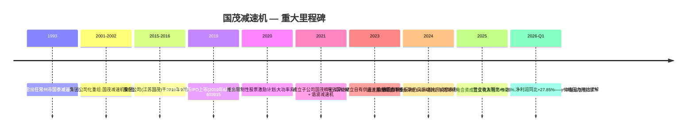
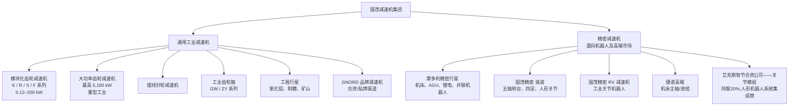
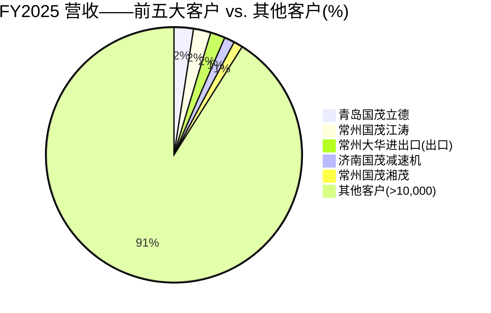
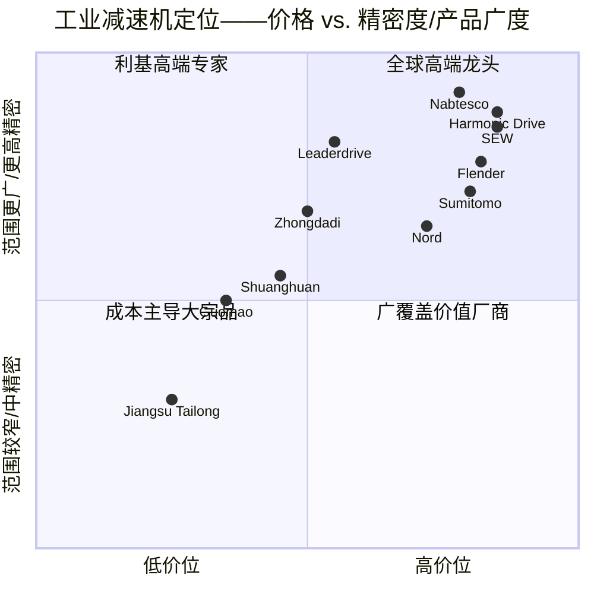

# 公司研究报告：江苏国茂减速机股份有限公司（国茂股份，SSE:603915）

**日期：** 2026-05-18
**上市信息：** 上海证券交易所主板，股票代码 603915
**板块/行业：** 通用工业齿轮减速机；面向机器人应用的新兴精密减速机（谐波 + 行星）业务

---

## 目录
1. 公司概览
2. 公司发展历史
3. 管理团队
4. 产品与服务
5. 客户与销售渠道
6. 行业概览
7. 竞争格局
8. 市场机遇（TAM）
9. 风险评估
参考文献

---

## 1. 公司概览

江苏国茂减速机股份有限公司（以下简称"国茂"/国茂股份，SSE:603915）是中国本土最大的通用工业齿轮减速机（通用减速机）制造商——减速机是位于电机与被驱动负载之间、用于降低轴速并放大扭矩的传动单元。几乎所有依靠扭矩驱动的工业机械都需要减速机，包括传送带、搅拌机、破碎机、起重机、轧机、压力机、挤出机、包装线、船用绞车，以及当下兴起的人形机器人和四足机器人的关节模组。根据公司2025年年度报告（[国茂股份 2025 年年度报告, 第 8–13 页](http://www.cninfo.com.cn/new/disclosure/stock?stockCode=603915)）的自主分类口径，国茂的减速机产品供应至冶金、矿山、起重运输、橡塑、水泥、建材、港口船舶、化工、食品制药、风电盘车、锂电、机床、机器人等三十多个下游行业。

公司商业模式简单清晰,按工业标准属于轻资产模式：在常州总部的"5G智能工厂"(国茂智能工厂)自主设计与组装减速机,铸件、锻件、轴承及电机等外购自二级供应商,通过89家A类总经销商加直销团队的双渠道组合销售,直销面向大型工业OEM及EPC总包商。定价采取工业零部件经典的"工程师指定、经销商出货"模式——绝大多数订单为一对一(按订单配置);公司在2025年生产了约12万个不同SKU变体([国茂股份 2025 年年度报告, 第 13 页](http://www.cninfo.com.cn/new/disclosure/stock?stockCode=603915))。

**经营规模(FY2025)。** 营业收入26.458亿元人民币(同比+2.18%),归母净利润2.350亿元人民币(同比-19.93%),扣非净利润1.814亿元人民币(同比-12.15%)。利润下滑反映了核心齿轮减速机品类的价格竞争、主营业务毛利率下滑0.46个百分点至20.00%,以及精密减速机子公司放量推动管理费用增长约10%(出处同上)。年末总资产54.1亿元;归属母公司股东权益37.4亿元——几乎零负债的资产负债表,持有14.3亿元的交易性金融资产和应收款项融资,2025年录得公允价值正贡献4,600万元。员工人数:母公司加主要子公司合计2,665人(生产1,914人、研发307人、销售168人、行政220人、财务56人),研发人员390人,占总员工14.6%([国茂股份 2025 年年度报告, 第 18, 36 页](http://www.cninfo.com.cn/new/disclosure/stock?stockCode=603915))。

按销量与收入计,国茂均是中国通用减速机行业的龙头,主要参与中端及中高端市场竞争,而高精度/极端工况的顶端市场仍由德国SEW-Eurodrive(赛威传动)、Flender(西门子弗兰德)以及日本住友(Sumitomo)主导。根据2025年行业数据,全球通用减速机市场规模约138.8亿美元,中国减速机行业(广义口径,含精密减速机子板块)2025年规模预计达到约15,950亿元人民币(约2,200亿美元),增速为低双位数([2025年中国减速器行业产业链图谱、市场规模、重点企业及未来前景分析, 2025-03-25](https://finance.sina.com.cn/stock/relnews/hk/2025-03-25/doc-ineqvrau5990651.shtml);[格隆汇: 2025年全球通用减速器市场规模将达138.84亿美元](https://m.gelonghui.com/p/3202027))。国茂也是2025年工信部首批"卓越级智能工厂"中唯一的减速机及齿轮箱制造企业([国茂股份 2025 年年度报告, 第 13 页](http://www.cninfo.com.cn/new/disclosure/stock?stockCode=603915))。

**估值快照(2026年5月中旬)。** 截至2026年5月11日,股价为17.72元人民币,流通股本6.566亿股,对应市值约116亿元人民币([股票行情快报:国茂股份 5月11日, 2026-05-11](https://stock.stockstar.com/RB2026051100030602.shtml))。2026年5月6日收盘价为15.94元人民币,对应市值104.7亿元人民币([搜狐财经, 2026-05-06](https://www.sohu.com/a/1019001512_115377))。第三方数据提供商汇总的滚动12个月指标显示,TTM市盈率约44.7倍,市净率约3.0倍,市销率约4.2倍(对应市值约110亿元人民币口径)([搜狐财经, 2026-05-06](https://www.sohu.com/a/1019001512_115377));而以公司2025财年净利润2.35亿元人民币计(对应5月11日股价的市盈率约47–49倍)。自2024年人形机器人主题行情启动以来,国茂的3年市盈率区间大约在18–55倍,机器人主题催化前的估值水平为18–25倍。同业可比公司估值对比:

| 同业公司 | 市值 | TTM/前瞻市盈率 | 备注 |
|---|---|---|---|
| 国茂股份 (SSE:603915) | 116亿元人民币 | TTM约45倍 | 通用减速机龙头;精密减速机业务起步阶段 |
| 双环传动 (SZSE:002472) | 345亿元人民币 | TTM 28倍 | 通过环动科技切入RV减速机赛道的规模龙头;齿轮组巨头 |
| 绿的谐波 (SSE:688017) | 357亿元人民币 | FY26E约104倍 / FY25E约156倍 | 国产谐波减速机纯正标的;深度绑定特斯拉Optimus和宇树科技 |
| 中大力德 (SZSE:002896) | 138亿元人民币 | 预估高50–90倍 | 谐波 + RV + 电机一体化集成 |
| SEW-Eurodrive(赛威传动,德国非上市) | 未披露 | n/a | 全球模块化减速机第一;2024年收入约43亿欧元 |
| Nord Drivesystems(诺德传动,德国非上市) | 未披露 | n/a | 全球前五;2024年收入约10亿欧元 |

资料来源:[双环传动 002472 - 雪球, 2026-03](https://xueqiu.com/S/SZ002472);[绿的谐波 688017 - 雪球 / 九方智投, 2026-03](https://xueqiu.com/S/SH688017);[中大力德 002896, 2026-03](https://stcn.com/quotes/index/sz002896.html)。

**估值解读。** 在TTM约45倍的水平,国茂的估值大致相当于**主题催化前中国专用工业资本品同类公司18–25倍典型估值的约2.0倍**,较与其更可比的通用减速机标的(双环传动28倍)存在显著溢价,但相对谐波减速机专门标的而言又有大幅折价(绿的谐波100–150倍,中大力德高50倍至90倍)。市场在同时定价两条完全不同的故事线:
1. 核心通用减速机业务——低增长、GDP+ 工业周期型业务,完整周期下合理估值约15–25倍;
2. 精密/机器人关节减速机子公司(摩多利 + 国茂精密)成为人形机器人OEM可信第二供应商的看涨期权,该期权价值支撑了2024年以来的估值扩张。

驱动逻辑有公开依据:自2023年起,国茂已被指定为**杭州云深处科技的关节行星减速机独家供应商**——云深处是被誉为"杭州六小龙"之一的科技公司——并通过子公司国茂精密在云深处计划IPO前持有其1.62%股权([东方财富: 国茂股份是云深处科技正式供货的核心供应商, 2025-02-21](https://caifuhao.eastmoney.com/news/20250221094741939366530);[东方财富: 杭州云深处股改完成对国茂股份股价影响, 2025-11-04](https://caifuhao.eastmoney.com/news/20251104033401914549730))。一旦人形机器人时间表延后,估值回调风险显著存在,本报告在第9节将其作为一项独立风险加以讨论。

*资料来源:[国茂股份 2025 年年度报告, 第 5–14 页](http://www.cninfo.com.cn/new/disclosure/stock?stockCode=603915);FY2021数据来自[国茂股份 2021 年年度报告](http://www.cninfo.com.cn/new/disclosure/stock?stockCode=603915)。*

---

## 2. 公司发展历史

国茂的起源可追溯至1993年,**徐国忠**——现任董事长——担任常州市国泰减速机厂厂长之时;国泰厂是常州武进区一带众多小型减速机作坊之一。武进/常州一带自1980年代末就是中国的减速机制造产业带,依托邻近的无锡/苏州铸造和锻造产业链供应。2001年,徐国忠承包国泰厂并将其改制为有限公司;企业法人前身国茂减速机集团(目前持股50.83%的控股股东)于2002年在徐国忠任董事长期间成立([国茂股份 2025 年年度报告, 第 29, 58 页](http://www.cninfo.com.cn/new/disclosure/stock?stockCode=603915))。

公司起源的逻辑非常清晰:德国模块化减速机设计(SEW的K/R/S/F系列)是全球行业标杆,但在中国销售价格高昂、交期较长。国茂对模块化设计进行逆向工程、再设计,为中国中端工业客户提供国产化、低成本、短交期的同等产品。这一"规格够用、交期更快、销售网络更广、价格低一半"的定位,二十年来始终未变。

*资料来源:[国茂股份 2025 年年度报告, 第 11–13, 29 页](http://www.cninfo.com.cn/new/disclosure/stock?stockCode=603915);[国茂股份 2026 年第一季度报告](http://www.cninfo.com.cn/new/disclosure/stock?stockCode=603915);[东方财富: 国茂股份与云深处, 2025-02-21](https://caifuhao.eastmoney.com/news/20250221094741939366530)。*

**战略转折点。**

1. **2019年IPO——以资本换规模。** 上海主板上市为公司带来约10亿元人民币的新增资本,用于武进智能工厂建设。在四年内(2019–2022),国茂将装机产能近乎翻倍,并巩固了在通用减速机领域的市场份额龙头地位。IPO也为公司在邻近精密减速机品类开展并购提供了资本货币。
2. **2021–2024年精密/机器人战略推进。** 管理层意识到传统工业减速机是与固定资产投资挂钩的个位数中段增速品类,故启动两个并购/合资载体:**国茂精密传动(国茂精密)**专注于面向机器人应用的谐波及高扭变种;**摩多利智能传动(摩多利)**负责机床、AGV和电动出行用精密行星减速机。2024年摩多利贡献收入9,700万元人民币;2025年增至1.354亿元(同比+39.3%),毛利率31.4%,远高于公司整体水平([国茂股份 2025 年年度报告, 第 15 页](http://www.cninfo.com.cn/new/disclosure/stock?stockCode=603915))。
3. **2025年生态合资公司——关节模组的雄心。** 2025年7月,国茂以400万元人民币首期出资取得**艾克斯智节(杭州)科技**20%股权,合资伙伴包括上海克来机电(克来机电)和杭州三象科技,明确目标是开发集成化的机器人**关节模组**(关节模组)——即从单一减速机往上层叠的下一个层级([国茂股份 2025 年年度报告, 第 12 页](http://www.cninfo.com.cn/new/disclosure/stock?stockCode=603915);[时代周报: 艾克斯关节模组新品投产发布, 2025-11-28](https://time-weekly.com/post/325758))。这一信号意味着,国茂不再满足于只在机器人BOM的最底层做被动零部件供应商,而是希望参与到模组级整合的经济价值之中。

**并购与整合动作。**
- 2015:常州国泰立德(前身)完成股份制改造
- 2021:国茂精密收购安徽聚隆减速机业务的部分资产(据九方智投卖方研究报告)
- 2023–2024:摩多利智能传动完成整合;新增南通摩多利自动化作为下游延伸
- 2024:对**捷诺传动**(高端ZY系列机床/氧化铝设备线)的持股并入直接子公司体系

近12个月的重要动态详见第4节和第7节;最关键的亮点是2026年一季度营业收入同比+9.25%、净利润同比+27.85%([国茂股份 2026 年第一季度报告](http://www.cninfo.com.cn/new/disclosure/stock?stockCode=603915)),表明2023–2024年最严重的价格压力期已经过去。

---

## 3. 管理团队

国茂为家族控股、创始人主导的公司。董事长徐国忠及其子总裁徐彬合计直接持股约11.9%,加上二人共同控制持股50.83%的控股载体国茂减速机集团——是A股典型的创始人家族架构,且下设一支经验丰富的运营团队。

### 徐国忠,董事长

63岁。现代国茂体系的创始人。自1993年至2001年担任常州市国泰减速机厂厂长后,徐国忠承包了该资产并于2002年1月组建集团法人主体(国茂减速机集团有限公司),并连续担任董事长兼总经理超过23年。自2016年9月起担任上市公司江苏国茂的董事长,任期已续聘至2028年9月([国茂股份 2025 年年度报告, 第 28–29 页](http://www.cninfo.com.cn/new/disclosure/stock?stockCode=603915))。

直接持股:截至2025年末个人持股34,293,900股(占比5.22%),2025年间通过二级市场卖出减持1,135万股(详见年报第28页二级市场卖出披露)。通过国茂减速机集团(其在集团层面持股47%)间接持股规模显著更大;加上其子徐彬持有集团45%权益、直接持有上市公司6.68%股份,以及其女徐凌(一致行动人)1.56%的持股,家族整体对江苏国茂的控制权远超60%。徐国忠**在上市公司未领取任何薪酬**(其薪酬在控股股东集团层面发放),但担任法定代表人([国茂股份 2025 年年度报告, 第 28 页](http://www.cninfo.com.cn/new/disclosure/stock?stockCode=603915))。

其实际业绩:用30余年时间,将一家小镇上的减速机作坊打造成中国通用减速机国产品牌的市场龙头——而这是一个历史上由德国OEM占据的品类。在徐国忠的董事长任期内,公司先后被授予"国家知识产权优势/示范企业"、"制造业单项冠军"(工信部2021年第六批),以及2025年工信部首批"卓越级智能工厂"中**唯一**的减速机企业([国茂股份 2025 年年度报告, 第 11, 13 页](http://www.cninfo.com.cn/new/disclosure/stock?stockCode=603915))。徐国忠公开露面较少,鲜有接受采访,亦无重要的社交媒体动态,符合多数A股工业类创始人的低调风格。接班人格局方面——其子徐彬,37岁,已担任上市公司总裁——在A股公司中属于明确传承信号,从长期治理连续性看,这是积极的治理信号。

### 徐彬,总裁、明确接班人

37岁。董事长之子。2010年3月(22岁)进入国茂减速机集团董事会层面任职;2013年起在运营子公司常州市国茂立德传动设备担任执行董事/总经理;2016年9月起担任上市公司总裁。目前同时负责三家战略增长子公司——捷诺传动(高端机床用减速机)、国茂精密(机器人用RV/谐波)、摩多利传动(精密行星)——并在参股公司中重科技(天津)兼任董事([国茂股份 2025 年年度报告, 第 32 页](http://www.cninfo.com.cn/new/disclosure/stock?stockCode=603915))。个人持股:2025年二级市场减持835万股后,持股43.83百万股(占6.68%)。2025年现金薪酬141万元人民币——含与捷诺及工业齿轮箱事业部(其前任负责人在2025年年中先后离任)业绩挂钩的奖金部分。关键在于,徐彬是精密减速机战略转型的总设计师;艾克斯智节合资公司、国茂精密及摩多利的并购,皆在其任期完成。对于投资者而言,国茂股份的核心叙事,本质上是徐彬执行力的叙事。

### 陆一品,董事、副总裁、CFO兼董事会秘书

45岁。2011年加入国茂集团——先后任母公司常州市国茂投资有限公司投资总监,2015年10月起任上市公司前身的财务总监,2016年9月起任江苏国茂董事/CFO兼董事会秘书。其负责主导2019年IPO、2020年限制性股票激励计划,以及回购/分红节奏(FY2025每股现金分红0.10元加中期分红合计1.445亿元,股利支付率61.46%)。2025年薪酬590,500元人民币([国茂股份 2025 年年度报告, 第 2, 28 页](http://www.cninfo.com.cn/new/disclosure/stock?stockCode=603915))。在国茂集团体系之外无其他上市公司CFO经验;会计处理属常规A股口径——审计机构为立信会计师事务所,出具标准无保留意见。

### 王晓光,副总裁、内贸销售总负责人

46岁。销售出身,2003年(23岁)加入国茂集团任副销售经理,逐步晋升至全国销售总监级别。2016年起任上市公司董事兼副总裁。其掌管的89家A类经销商网络是公司全国长尾覆盖的运营支柱,也是非常珍贵的无形资产——因二十年沉淀的经销商关系,无论外资还是国内同行,都难以在3–5年内复制出来([国茂股份 2025 年年度报告, 第 13, 29 页](http://www.cninfo.com.cn/new/disclosure/stock?stockCode=603915))。

### 孔东华,副总裁

47岁。2011年从金蝶软件咨询业务加入国茂集团;曾任总经理助理办公室主任,2023年4月升任副总裁。预计主要负责数字化转型项目(贯通MES/WMS/APS/CRM/SRM/ERP的"GOS"运营系统,该系统是2025年获评智能工厂的核心支撑)。

### 治理结构补充

- **董事会构成:** 共8名董事——4名内部董事(徐国忠、徐彬、陆一品、王晓光),4名独立董事(王建华、邹承晓、陈文华于2025年9月新增任,另加监事会陆云峰)。独立董事来自法学/学术/注册会计师背景,年薪约6.0–8.8万元现金,无股权激励。独立董事占比50%——属于A股家族控股公司的标准水平([国茂股份 2025 年年度报告, 第 28–34 页](http://www.cninfo.com.cn/new/disclosure/stock?stockCode=603915))。
- **内部人/控股股东持股:** 国茂减速机集团50.83%;徐彬6.68%;徐国忠5.22%;徐凌(女儿、一致行动人)1.56%——家族合计持股约64.3%。**政府/机构流通股比例较低,且以被动指数ETF为主**:华夏/易方达/天弘机器人主题ETF合计持股约3.1%;香港联交所(沪深港通)1.27%;摩根大通PLC 1.07%。
- **薪酬结构:** 绝大部分高管薪酬以现金为主;2020年限制性股票激励计划是唯一的股权激励工具,部分限售股份额在2025年被回购注销(详见年报第28页)。董事会和管理层现金薪酬合计472万元人民币——相对公司规模而言较为克制,与非泡沫化的创始人企业文化一致。
- **关联交易事项:** 公司明确披露不存在控股股东非经营性资金占用、不存在违规对外担保、不存在过半数董事对年报内容持异议的情况(年报第2页)。客户集中度低,但前五大客户名单中有三家公司名称中带"国茂"二字(青岛国茂立德、常州国茂江涛、济南国茂减速机——均为经销商),形式上属直销客户但实质更接近自有渠道经销商安排——值得重点关注(详见第5节)。

### 管理团队履历综评

创始人型董事长从一家小作坊起步,打造了国产品牌的市场龙头;其子已经完成了向精密减速机和关节模组延伸所需的并购和合资动作。2025年的盈利回撤(-19.9%净利润)对管理团队的执行力构成了考验,其应对——生产效率提升项目(生产人数同比增长7.6%,总员工基本持平)、维持分红、加大精密减速机投入,以及2026年一季度的业绩反弹——表明团队具备运营层面的可信度。短板:CFO层面的资本市场及资本配置经验相对有限,家族圈外的核心高管股权激励仍较为薄弱。

---

## 4. 产品与服务

国茂的产品矩阵遵循公司的二乘二分类:横轴为**齿轮减速机 vs. 摆线针轮减速机**,纵轴为**通用 vs. 精密**。2025年年度报告([国茂股份 2025 年年度报告, 第 8–10 页](http://www.cninfo.com.cn/new/disclosure/stock?stockCode=603915))的产品分类如下:

### 各业务板块FY2025收入拆分

| 产品线 | FY2025 收入(百万元人民币) | 同比 % | 毛利率 |
|---|---|---|---|
| 齿轮减速机(模块化 + 重载 + 工业齿轮箱 + 工程行星) | 1,986.0 | +1.81% | 17.95% |
| 摆线针轮减速机 | 331.7 | -6.83% | 25.55% |
| GNORD 减速机 | 110.3 | +24.38% | 12.78% |
| 摩多利精密行星 | 135.4 | +39.31% | 31.43% |
| 配件/其他 | 51.4 | -20.75% | 48.82% |
| **主营业务合计** | **2,614.8** | **+2.24%** | **20.00%** |

资料来源:[国茂股份 2025 年年度报告, 第 14–15 页](http://www.cninfo.com.cn/new/disclosure/stock?stockCode=603915)。

### 4.1 通用模块化减速机(K / R / S / F 系列)

公司的现金牛业务。模块化减速机覆盖0.12–200 kW功率段,产品代号沿用SEW的K/R/S/F安装分类(K=直角型螺旋伞齿轮;R=同轴螺旋齿轮;S=斜齿蜗轮;F=平行轴螺旋齿轮)。国茂的模块化产品具备一体快装电机接口、传动比细分等级丰富、安装方位无限制等特点,共同满足中小型工业传送带/搅拌机/挤出机等长尾应用需求([国茂股份 2025 年年度报告, 第 9 页](http://www.cninfo.com.cn/new/disclosure/stock?stockCode=603915))。根据管理层讨论分析,该业务2025年销量实现双位数增长,ZY系列整体箱(单体壳体)推出后改善了密封可靠性,并新增了一系列双螺杆锥双结构。

- **竞争优势:有——规模 + 渠道 + 品牌。** 国茂是该品类的国产品牌龙头。护城河类型:成本领先(对比SEW具有更低的人工和铸件成本)、规模优势(同类中国国内最大的单一工厂)、近30年的销售网络覆盖89家A类总经销商及更多小型经销商,基本覆盖**大部分省份**([国茂股份 2025 年年度报告, 第 13 页](http://www.cninfo.com.cn/new/disclosure/stock?stockCode=603915))。品牌:"国茂"商标被认定为**中国驰名商标**。
- **最直接竞品:** SEW K/R/S/F 系列;Flender(西门子弗兰德)——国茂在基本规格上能与之持平,在极致精密性和静音方面落后;在价格(通常低30–50%)和交期(1–4周 vs. 8–16周)方面领先。国内同行中,与国茂规模最接近的真正同行是**江苏泰隆**与浙江通力——均为非上市民营企业,规模均小于国茂。

### 4.2 重型工业减速机(大功率 + 工业齿轮箱)

功率段最高至5,100 kW,服务于钢厂、矿山、水泥、制糖、氧化铝、船用/港口起重设备,以及日益重要的**风电盘车**领域。工程行星子线在2025年取得了一个重要的标志性突破——为制糖设备研发出中国首套**超大型回转驱动系统**,总输出扭矩达2,300万牛米,实现了进口品牌替代。重载事业部在2025年交付了一台500吨热轧机驱动系统,以及一套出口给日本OEM的水平环轧机系统,达到欧盟CE噪音标准([国茂股份 2025 年年度报告, 第 12 页](http://www.cninfo.com.cn/new/disclosure/stock?stockCode=603915))。

- **竞争优势:部分具备。** 国茂在中高端业务可信,正向SEW/Flender/Sumitomo历史腹地缓慢推进。日本OEM的环轧机订单是一个重要的认证背书。护城河类型:成本 + 交付 + 萌芽期的认证体系;在最顶端高要求重型工业用户中,品牌力与外资同行**尚未对等**。
- **最直接竞品:** Flender / SEW / Sumitomo / Hansen(汉森)——在顶端冶金及船用应用上一般领先;在水泥和输送应用上,国茂可与之持平。

### 4.3 摆线针轮减速机

成熟品类,结构紧凑、传动比高;具备25.55%的毛利率(第三高的产品线毛利率)。2025年销量收缩约5.8%,反映客户向齿轮模块化产品的迁移;收入同比下滑6.83%。**毛利保持稳定**,表明国茂主动放弃价格敏感的低端走量订单,转而收割存量市场。属于长尾产品;非战略性业务。

### 4.4 GNORD 减速机

独立的品牌/渠道——可能为贴牌/OEM安排,2025年同比+24.4%,但毛利率仅12.8%(渠道返点压力明显)。规模较小(收入1.10亿元)。

### 4.5 摩多利精密行星减速机——机器人业务的第一支柱

2023–2024年完成收购和整合。摩多利专注于面向**高端机床、AGV(自动导引运输车)、锂电池生产设备、并联机器人、铝挤压设备、关节机器人**等领域的**精密行星减速机**。2025年的主要进展:MAFTB系列并联机器人产品完成优化,并面向智能物流OEM推出定制化SKU([国茂股份 2025 年年度报告, 第 12 页](http://www.cninfo.com.cn/new/disclosure/stock?stockCode=603915))。

- **竞争优势:有——但集中在中低精密细分。** 摩多利的竞争对手包括**新剑机器人**、**利德传动**、**Neugart(德国纽卡特)**、**Wittenstein(威腾斯坦)**。国产同行通常以较德系产品低30–40%的价格主导亚弧分级重复定位精度细分,摩多利就在这一档位。
- 31.4%的毛利率远高于公司整体水平,这是目前最有力的证据,证明精密板块即便在当下也对整体利润率具有边际增厚效应。

### 4.6 国茂精密——人形机器人业务的看涨期权

2021年于常州设立的全资子公司,设立目的明确:开发面向具身智能浪潮的**谐波减速器**和**RV减速器**。截至2025年初,谐波减速器产能约2,500台/月([腾讯新闻: 减速器江湖, 2025-05-27](https://news.qq.com/rain/a/20250527A06ZL800)),生产基地刚从外省迁回常州总部,并新增进口滚齿机、高精度线切割机和表面处理设备等。2025年主要进展:

- 为**云深处科技**四足机器人定制行星减速机——国茂被机器人OEM**指定为关节行星减速机独家供应商**([东方财富: 国茂股份是云深处科技正式供货的核心供应商, 2025-02-21](https://caifuhao.eastmoney.com/news/20250221094741939366530);2025年半年报已明确证实该关系,见[韭研公社: 国茂股份半年报证实](https://www.jiuyangongshe.com/a/gdfxg5yq7a))。
- 与客户(可能为某高端机床OEM——年报中未披露名称)联合研发**"双曲面凸轮 + 谐波减速器"五轴回转工作台**。
- 根据2025年年度报告,正与**人形机器人主机厂**就商务洽谈、样件试制和台架测试展开沟通——*截至2026年5月,尚未有任何一线人形机器人订单正式对外披露*;投资者应将人形机器人主机厂的收入贡献近似视为零。
- 已向**翼菲科技**完成样件订单交付([网易: 国产化精密减速器, 2025-02](https://c.m.163.com/news/a/IL2BCSEU055633OJ.html);[OFweek, 2025-02-08](https://m.ofweek.com/ai/2025-02/ART-201712-8120-30656570.html))。
- 通过国茂精密持有云深处1.62%股权——一旦云深处在2026–2027年完成IPO,国茂将在供应商盈利之外额外受益于股权增值([东方财富, 2025-11-04](https://caifuhao.eastmoney.com/news/20251104033401914549730);[新浪: 云深处科技IPO供应商解析](https://www.sina.cn/news/detail/5294274981924791.html))。

- **竞争优势:部分/构建中。** 谐波减速器领域,全球龙头为**Harmonic Drive(日本哈默纳科)**,全球份额约25%;国内绿的谐波为领先的纯正国产标的;RV减速器领域,**Nabtesco(日本纳博特斯克)**全球份额约60%,**双环传动 / 环动科技**为国内份额提升最快的标的。国茂精密属于二线本土挑战者之一(并列**中大力德**、**新剑机器人**、**来福谐波**、**恒丰泰**、**HBR**)。它并非技术领先者;其切入角度是利用母公司品牌、渠道和工程文化,在中国人形OEM将成本和供应安全优先于日系规格的情况下,逐步抢占中端人形机器人关节市场。*坦率评估:目前尚不能下结论说存在护城河。*

### 4.7 捷诺传动——高端专用业务

按管理层语境,该子公司被定位为"高端战略引擎"。2025年订单快速增长;产品已切入**高精密机床**和**氧化铝处理设备**——两个历史上由外资垄断的领域([国茂股份 2025 年年度报告, 第 11–12 页](http://www.cninfo.com.cn/new/disclosure/stock?stockCode=603915))。

### 旗舰产品 vs. 长尾产品——损益表的真实驱动来源

- **旗舰产品(约75%营收):** 齿轮模块化 + 重型工业减速机产品线(K/R/S/F系列 + 大功率/重型工业系列)。这是周期驱动力、现金流贡献来源、渠道网络运行经济效益以及品牌的基石。
- **战略引擎(约10%营收,持续增长):** 摩多利(1.354亿元,+39%) + 国茂精密(规模仍小,根据产品形态可能计入"配件其他"或"齿轮减速机") + 捷诺高端机床产品 + GNORD品牌。这些是估值溢价的驱动来源。
- **长尾/收割业务(约15%营收):** 摆线针轮减速机、配件——销量下滑、毛利克制。

### 近12个月推出与停产

新品发布:ZY系列整体箱(改善密封);制糖行业超大型回转驱动(行业首台);MAFTB系列并联机器人减速机产品迭代;面向人形机器人样件研发的高扭谐波变种;联合开发的双曲面凸轮 + 谐波五轴转台。无重大停产产品披露。

---

## 5. 客户与销售渠道

客户集中度是最值得关注的数据点——**且异常低**。

### 前五大客户营收占比近3年趋势

| 年份 | 前五大客户营收(百万元人民币) | 占总营收比例 |
|---|---|---|
| FY2023 | 265.8 | 9.99% |
| FY2024 | 250.7 | 9.68% |
| FY2025 | 236.6 | 8.94% |

资料来源:[国茂股份 2025 年年度报告, 第 17 页](http://www.cninfo.com.cn/new/disclosure/stock?stockCode=603915);[国茂股份 2024 年年度报告, 第 17 页](http://www.cninfo.com.cn/new/disclosure/stock?stockCode=603915);[国茂股份 2023 年年度报告, 第 19 页](http://www.cninfo.com.cn/new/disclosure/stock?stockCode=603915)。

**FY2025前五大客户**([国茂股份 2025 年年度报告, 第 17 页](http://www.cninfo.com.cn/new/disclosure/stock?stockCode=603915)):

| 序号 | 客户 | 营收(百万元人民币) | 占总营收比例 |
|---|---|---|---|
| 1 | 青岛国茂立德传动设备有限公司——关联经销商 | 64.83 | 2.45% |
| 2 | 常州国茂江涛减速机有限公司——关联经销商 | 57.88 | 2.19% |
| 3 | 常州大华进出口(集团)有限公司——出口贸易商 | 48.95 | 1.85% |
| 4 | 济南国茂减速机有限公司——关联经销商 | 34.52 | 1.30% |
| 5 | 常州国茂湘茂传动科技有限公司——关联经销商 | 30.42 | 1.15% |

**解读:** 最大单一客户营收占比仅2.45%,且**前五大客户中有四家在公司名称中带"国茂"二字**——是覆盖青岛/常州/济南区域的总经销商。2025年年报明确将这些客户分类为直销,理由是国茂以总经销协议形式向其销售而非代销关系。即使将这五家全部视为同一"自有渠道经销商"渠道,合计敞口也仅为8.94%——属于我们分析过的**A股工业零部件公司中最低的客户集中度水平**之一,反映出真正分散的终端需求(超过10,000家终端用户、覆盖30多个行业)。

*资料来源:[国茂股份 2025 年年度报告, 第 17 页](http://www.cninfo.com.cn/new/disclosure/stock?stockCode=603915)。*

### 客户分群及销售渠道

- **国内经销:** 89家A类经销商加上大量B类及普通经销商。A类经销商通常签订多年独家协议、按区域划分,服务于中小企业/工程总包商等长尾客户。
- **直销:** 大型工业OEM(钢厂、水泥、港口机械、氧化铝设备、风电、锂电设备、AGV制造商)由公司内部企业销售团队负责。2025年的标志性中标:**鞍山紫竹集团**600型钢项目;**韩通高端海工装备制造基地**项目;多个**冷却塔**改造替换进口品牌;**风电盘车**市场龙头地位([国茂股份 2025 年年度报告, 第 12 页](http://www.cninfo.com.cn/new/disclosure/stock?stockCode=603915))。
- **机器人OEM(直销/战略):** **云深处** —— *指定独家*四足机器人关节行星减速机供应商;持有1.62%股权。**翼菲科技** —— 样件/试用订单。多家未具名的人形机器人OEM处于商务洽谈/台架测试阶段([东方财富, 2025-02-21](https://caifuhao.eastmoney.com/news/20250221094741939366530);[国茂股份 2025 年年度报告, 第 11 页](http://www.cninfo.com.cn/new/disclosure/stock?stockCode=603915))。
- **国际出口:** 2025年出口收入2,370万元人民币(同比+6.4%),占总营收仅0.9%,但毛利率高达38.6%——远高于国内19.8%的毛利率。2025年披露的增长市场:印度尼西亚(金光集团智能工厂升级)、印度(冶金及橡塑)、俄罗斯(钢铁与矿山龙头),同时在比利时、波兰和哥伦比亚开辟新据点。摩多利子公司还独立运营精密行星减速机的出口渠道。

### 销售渠道——真正的护城河

**89家A类经销商网络**是公司最有价值的无形资产。从零搭建同等级别的国家级减速机销售及售后网络,对竞争对手而言需要5–10年时间和可观的资本投入。许多A类经销商的公司名称中带有"国茂"二字(青岛国茂立德、济南国茂减速机、常州国茂江涛等)——这是合作年限悠久与渠道侧锁定效应的有力佐证([国茂股份 2025 年年度报告, 第 13 页](http://www.cninfo.com.cn/new/disclosure/stock?stockCode=603915))。

### 销售策略及周期

工业减速机销售按项目指定型号;从设计选型到出厂的周期,对标准SKU通常为4–16周,对工程/重载定制订单通常为8–24周。国茂采用零部件级按库存生产 + 整机装配按订单组装的混合模式,辅以GOS(APS/MES/WMS/CRM/SRM/ERP一体)数字化中台支撑。订单均值较小(大多数订单<10万元),这也支撑了低客户集中度的指标。

### 主要合作伙伴

- **云深处科技** —— 关节行星减速机独家供货 + 1.62%股权;最高声量的机器人合作关系。
- **上海克来机电 + 杭州三象科技 + 杭州艾利森** —— 联合投资**艾克斯智节(杭州)科技**布局关节模组集成业务;国茂出资400万元持股20%([国茂股份 2025 年年度报告, 第 12 页](http://www.cninfo.com.cn/new/disclosure/stock?stockCode=603915);[时代周报, 2025-11-28](https://time-weekly.com/post/325758))。
- **安徽智鸥驱动科技** —— 通过CFO陆一品的董事任职建立董事会层面的关系([国茂股份 2025 年年度报告, 第 32 页](http://www.cninfo.com.cn/new/disclosure/stock?stockCode=603915))。
- **Acorn Industrial Corporation(阿康工业)、中重科技** —— 根据年报释义部分,与国茂存在股权/运营层面的关系。

### 客户集中度结论

第一大客户2.45%;前五大8.94%;近3年趋势下行。**客户集中度风险基本不存在。** 这是国茂逻辑中最坚实的优势之一——公司是真正面向碎片化工业经济的平台式零部件供应商,而非依赖一两家大型OEM的自有渠道供应商。

---

## 6. 行业概览

### 行业定义与范围

中国减速机行业涵盖电机与被驱动机构之间所有用于减速、增大扭矩的齿轮/摆线/行星/谐波/RV运动传动零部件。按监管分类,属于**通用设备制造业**(等同NAICS 3331x)。该行业涵盖数个明显不同的子板块:

1. **通用齿轮减速机:** 销量最大——模块化K/R/S/F系列、螺旋伞齿、螺旋蜗杆、平行轴、摆线针轮等。下游市场:覆盖所有行业。代表企业:国茂(国内第一)、江苏泰隆、浙江通力、中国高速传动(汉森)、SEW、Flender、Sumitomo、Nord。周期性:与固定资产投资及制造业投资挂钩。
2. **重载工业齿轮箱:** 大扭矩磨机驱动、船用、矿山、氧化铝。代表企业:SEW、Flender、Hansen、Maag、Sumitomo、国茂(中端层级)、大连华锐。
3. **精密行星减速机:** 用于机床、AGV、锂电设备、轻型机器人等的伺服电机传动系。代表企业:Neugart、Wittenstein、Apex、Shimpo(新宝)、摩多利、新剑机器人、利德传动。增速:中高个位数到低双位数。
4. **谐波减速器:** 用于机器人关节及五轴机床转台,超薄、高减速比、近零回差。全球龙头:Harmonic Drive(哈默纳科,日本)。中国龙头:绿的谐波。其他中国厂商:来福谐波、国茂精密、中大力德、双环传动、大族传动、同川。增长驱动:人形机器人——2025–2031年CAGR预计42%,见[Valuates Reports, 2025](https://reports.valuates.com/market-reports/QYRE-Auto-4V12992/global-harmonic-reducer-for-humanoid-robot)。
5. **RV减速器:** 空心轴摆线 + 行星复合式传动——工业关节机器人核心关节减速器。全球龙头:Nabtesco(纳博特斯克,约60%份额)。中国龙头:双环传动 / 环动科技、南通振康、中大力德、国茂精密。

### 市场规模与增速

- **全球通用减速机市场(2025E):** 138.8亿美元([格隆汇, 2025](https://m.gelonghui.com/p/3202027))。
- **中国减速机市场(广义,2025E):** 约15,950亿元人民币 / 2,200亿美元,同比+10%([新浪财经, 2025-03-25](https://finance.sina.com.cn/stock/relnews/hk/2025-03-25/doc-ineqvrau5990651.shtml))。早期前瞻产业研究院的预测为2025年15,000亿元人民币。
- **全球人形机器人谐波减速器市场:** 2024年为2.76亿美元,预计2031年达31.31亿美元——42.1% CAGR([Valuates Reports, 2025](https://reports.valuates.com/market-reports/QYRE-Auto-4V12992/global-harmonic-reducer-for-humanoid-robot))。
- **全球人形机器人微型RV减速器:** 仍处于起步期——2025–2026年开始具备早期商用规模([Intel Market Research, 2025](https://www.intelmarketresearch.com/miniature-rv-reducer-for-humanoid-robots-market-6266))。

通用品类基本上是GDP+的故事(约4–7%稳态增速);精密细分品类则是高增长的边际拉动力。

### 主要趋势与驱动因素(近12个月)

1. **"具身智能"被提升至国家战略高度(2025年3月)。** 中国政府工作报告首次将**具身智能**列为"未来产业"优先方向,从国家层面对人形机器人产业链给出明确支持信号——精密减速机作为关节核心零部件直接受益([国茂股份 2025 年年度报告, 第 10 页](http://www.cninfo.com.cn/new/disclosure/stock?stockCode=603915))。
2. **设备更新与"两新"政策(2025年8月)。** 工信部联合八部委印发**机械工业数字化转型实施方案**,明确要求对老旧高耗能设备开展智能感知/控制/执行系统升级——减速机正是核心执行部件之一([国茂股份 2025 年年度报告, 第 10–11 页](http://www.cninfo.com.cn/new/disclosure/stock?stockCode=603915))。
3. **机械工业稳增长行动方案(2025年9月)。** 工信部联合五部委发布2025–2026年机械工业稳增长工作方案,明确支持工业机器人和智能制造装备规模化部署([国茂股份 2025 年年度报告, 第 11 页](http://www.cninfo.com.cn/new/disclosure/stock?stockCode=603915))。
4. **国产替代进入"深水区"。** 中高端工业减速机的德/日品牌份额每年以1–2个百分点的速度让给国产品牌。驱动逻辑包括质量差距缩窄、交期更快、价格优势30–50%。SEW + Flender 2019年合计市场份额约11%([前瞻产业研究院, 2022](https://bg.qianzhan.com/trends/detail/506/220616-a9ee0c87.html));非正式数据显示自此呈现持续侵蚀。
5. **2023–2024年中端通用减速机毛利承压。** 国内同行扩产进入持平或微增长的市场,导致行业竞争加剧。国茂的毛利率从25.5%(FY2021)降至20.0%(FY2025)。2026年一季度业绩改善(收入+9.25%、净利润+27.85%)说明最艰难阶段可能已经过去([国茂股份 2026 年第一季度报告](http://www.cninfo.com.cn/new/disclosure/stock?stockCode=603915))。
6. **行业整合提速。** 根据2025年年度报告管理层讨论(第11页),竞争基础已从"规模扩张"转向"综合能力比拼"——即中小厂商加速出清,头部企业(在各自细分中的国茂、双环传动、绿的谐波)持续获得份额。

### 监管环境

中国减速机行业在产品安全层面监管较轻,但行业政策关注度日益提升。主要相关规则与标准:
- **工信部智能工厂分级体系(2025年)。** 国茂的"卓越级"认定为最高等级,在国有企业采购中获优先供应商地位。
- **制造业单项冠军项目。** 国茂入选第六批(工信部2021年)。
- **行业技术标准:** 国茂是**模块化电机减速机通用技术要求**和**HR系列齿轮减速机通用规范**两项行业/团体标准的主起草单位,同时参与国家标准**智能制造应用互联互通**的制定([国茂股份 2025 年年度报告, 第 14 页](http://www.cninfo.com.cn/new/disclosure/stock?stockCode=603915))。

### 行业结构

- **分散度:** 中国通用减速机市场仍较为分散——前三名(国茂 + 江苏泰隆 + 浙江通力)合计份额可能约25%,其余由德/日厂商加大量小型作坊覆盖。谐波和RV子板块集中度更高(各自前两名合计份额超50%)。
- **供应商议价能力:** 中等。轴承(SKF、Schaeffler、NSK、NTN、本土厂商),电机(徐州大元、常州南方、曲阜金升——国茂前三大供应商),铸锻件(武进/常州区域产业带)。任何单一供应商占国茂采购份额均不超过3.5%,前五大供应商合计占15.12%([国茂股份 2025 年年度报告, 第 17 页](http://www.cninfo.com.cn/new/disclosure/stock?stockCode=603915))——分散度良好。
- **客户议价能力:** 通用业务板块为低(客户高度原子化、技术规格主导),精密/机器人业务板块为较高(少数几家大型OEM)。
- **替代品:** 在部分轻载场景中,直驱伺服电机和线性执行器在边际上构成替代,但扭矩放大的本质需求并不会消失。
- **进入壁垒:** 中高。模块化精密(亚弧分级重复定位精度)和超大功率重型工业均需十年以上沉淀。通用产品的渠道网络建设同样困难。

---

## 7. 竞争格局

各子板块(通用、重型工业、精密)的竞争对手集合差异明显。国茂在这三个领域均有布局,但每个细分的竞争**强度**和主导玩家完全不同。

### 直接竞争对手(5–10家)

| 竞争对手 | 上市状态 | FY2024/2025 收入 | 行业地位 | 相对国茂的优势 | 国茂相对其优势 |
|---|---|---|---|---|---|
| **双环传动 (SZSE:002472)** | 上市,市值约345亿元 | FY2024 110亿元+ | 中国最大减速机/齿轮组玩家;通过环动科技涉足RV | 规模;汽车/电动车齿轮OEM关系;国内RV减速机第一 | 通用业务渠道纯正;OEM依赖度较低;资产负债表更干净 |
| **绿的谐波 (SSE:688017)** | 上市,市值约357亿元 | FY2024 约5–6亿元 | 国内谐波减速器第一;人形机器人纯正标的 | 谐波技术深度;市场份额;特斯拉/宇树关系 | 收入结构更分散;盈利能力;估值风险更低 |
| **中大力德 (SZSE:002896)** | 上市,市值约138亿元 | FY2024 约10亿元+ | 谐波 + RV + 电机集成 | 电机一体化能力;全栈式驱动方案 | 通用业务底盘更大;渠道更广 |
| **SEW-Eurodrive(赛威传动,德国)** | 非上市 | FY2024 约43亿欧元 | 全球模块化减速机第一 | 品牌、顶端品质、全球服务网络 | 价格(低30–50%)、交期(1–4周 vs. 8–16周)、本地经销密度 |
| **Flender / 西门子弗兰德(德国)** | 西门子下属 | 约20亿欧元+ | 重型工业领导者 | 水泥、船用、风电齿轮箱传统优势 | 价格、中端市场覆盖 |
| **Sumitomo Heavy Industries(住友重机,日本)** | 上市(东京证券交易所) | 减速机分部约1,000亿日元+ | 全球摆线针轮第一;重型工业 | 摆线针轮知识产权、船用、起重 | 价格;模块化齿轮减速机覆盖 |
| **Nord Drivesystems(诺德传动,德国)** | 非上市 | FY2024 约10亿欧元 | 全球模块化前五 | 品牌、全球覆盖 | 价格、中国本土经销 |
| **Nabtesco(纳博特斯克,日本)** | 上市(东京证券交易所) | RV减速器分部约700亿日元+ | 全球RV减速器第一(约60%) | RV技术统治力;法那科/ABB/库卡自有体系 | 非通用业务直接竞品;国茂业务结构差异化 |
| **Harmonic Drive(哈默纳科,日本)** | 上市(东京证券交易所) | 约300亿日元 | 全球谐波第一(约25%) | 谐波技术传承 | 非通用业务直接竞品 |
| **江苏泰隆(民营)** | 非上市 | 估计约10亿元+ | 国内通用减速机第二/三 | 区域经销关系 | 全国网络、品牌、智能工厂规模 |
| **浙江通力(民营)** | 非上市 | 估计约5亿元 | 国内通用减速机挑战者 | 细分价格 | 规模、知识产权、品牌 |

资料来源:公司公告;[新浪科技: 国际巨头"霸榜"减速器市场, 2025-04-23](https://finance.sina.com.cn/tech/roll/2025-04-23/doc-ineucyit9922589.shtml);[前瞻产业研究院, 2022](https://bg.qianzhan.com/trends/detail/506/220616-a9ee0c87.html);同业市值快照来自[雪球 SZ002472](https://xueqiu.com/S/SZ002472)、[雪球 SH688017](https://xueqiu.com/S/SH688017)、[STCN SZ002896](https://stcn.com/quotes/index/sz002896.html)。

### 定位框架

### 国茂的竞争优势

1. **国内通用减速机的规模与品牌:** 国内唯一与SEW产品广度相当的中国品牌,拥有中国最大的单一模块化减速机工厂,以及覆盖几乎所有省份的销售网络([国茂股份 2025 年年度报告, 第 13 页](http://www.cninfo.com.cn/new/disclosure/stock?stockCode=603915))。
2. **89家A类经销商网络:** 长期积累的渠道护城河。5年内极难被复制。
3. **产品矩阵广度:** 每年约12万个SKU变体——支撑工业买家"一站式购齐"的价值主张。
4. **智能工厂领先地位:** 工信部"卓越级"智能工厂认定,行业唯一获此荣誉的减速机企业。在国有企业客户采购中具备优势。
5. **资产负债表:** 基本零负债,持有14亿元流动金融资产,在盈利下滑年度仍维持61.5%的股利支付率——A股工业类公司中属于一档资产负债表质量。
6. **可选性:** 精密减速机布局 + 艾克斯智节关节模组合资公司 + 云深处股权——共同构成对人形机器人浪潮的叠加看涨期权,且不构成对全公司的孤注一掷敞口。

### 竞争劣势

1. **精密细分领域中均非技术领先者。** 谐波领域绿的谐波领先,RV领域双环传动/环动科技领先。国茂属于"快速跟随者",试图将渠道+品牌优势转化为精密细分的市场份额。
2. **通用减速机价格竞争具有结构性。** 中国中端产能扩张推动2023–2024年中端价格下降5–10%。国茂模块化齿轮减速机毛利率从18.93%(FY2024)降至17.95%(FY2025)。
3. **出口规模较小。** FY2025出口收入2,370万元人民币(约占总营收0.9%),意味着一旦中国工业资本开支放缓,缺乏地域分散度作为缓冲。
4. **家族控股,家族之外的管理层股权激励较薄。** 对A股而言治理结构合理,但会限制专业化管理团队升级的速度。

### 市场份额

在**中国通用模块化减速机**市场,国茂被广泛视为**国产品牌第一**,在中国减速机整体市场中份额为中高个位数,在国产品牌模块化减速机内部份额可能达到15–25%以上(具体数据未公开披露;估计源自[前瞻产业研究院](https://bg.qianzhan.com/trends/detail/506/220616-a9ee0c87.html)和[华西证券 F10](https://m.hx168.com.cn/stock/F10/688017.html))。在谐波 + RV领域,国茂精密全球份额低于1%——属明显新进者。在机床精密行星(通过摩多利)中,国茂是有竞争力的国产挑战者但规模仍小。

*资料来源:[雪球: 双环传动 002472](https://xueqiu.com/S/SZ002472);[雪球: 绿的谐波 688017](https://xueqiu.com/S/SH688017);[STCN: 中大力德 002896](https://stcn.com/quotes/index/sz002896.html);[搜狐财经: 国茂股份 2026-05-06](https://www.sohu.com/a/1019001512_115377)。*

---

## 8. 市场机遇(TAM)

### TAM、SAM、SOM 构建

**TAM(可寻址市场总规模)。** 将国茂当前已涉足或已明确进军计划的四个子市场合并计算:

1. **全球通用减速机:** 2025E 138.8亿美元([格隆汇, 2025](https://m.gelonghui.com/p/3202027)),其中中国是全球最大单一市场,占比约35–40%,即50–55亿美元。
2. **中国减速机行业(广义,全品类):** 2025E 15,950亿元人民币 / 2,200亿美元([新浪财经, 2025-03-25](https://finance.sina.com.cn/stock/relnews/hk/2025-03-25/doc-ineqvrau5990651.shtml))——注意这是包含工业齿轮单元、大型设备齿轮箱、船用、风电、矿山及精密产品的综合数据。
3. **全球人形机器人谐波减速器:** 2024年2.76亿美元 → 2031年31.31亿美元,42.1% CAGR([Valuates Reports, 2025](https://reports.valuates.com/market-reports/QYRE-Auto-4V12992/global-harmonic-reducer-for-humanoid-robot))。
4. **全球精密减速机市场:** 中国卖方研究中长期产业话题对应规模接近1万亿元人民币 / 1,400亿美元([东方财富, 2026-02-06](https://caifuhao.eastmoney.com/news/20260206132009323616740))。

**TAM合计:** 国茂在5年内可触达的全部子板块加总后,到2030年年度运行规模轻松超过**300–400亿美元**,通用减速机占主体,但精密/人形机器人楔形增长最快。

**SAM(可服务市场)。** 国茂凭借当前产品/渠道/知识产权能力可现实切入的子集:
- 中国通用模块化减速机——国茂基本可服务全部。中国通用模块化2025年规模约300–400亿元人民币 / 40–60亿美元。
- 中国重型工业减速机(中高端) —— 国茂正在打入;SAM 约200–250亿元人民币,但顶端仍由外资占据。
- 中国精密行星减速机(摩多利领域) —— SAM 50–80亿元人民币,增长较快。
- 中国人形机器人谐波 + RV(国茂精密领域) —— 2026年SAM仅约10–30亿元人民币,但到2030年前每年翻倍增长。
- 国茂合计**SAM在2025–2026年约700–900亿元人民币(约100–130亿美元)**,若人形机器人启动,到2030年向1,500亿元+扩张。

**SOM(可获得市场)。** 3–5年内可现实取得的份额:
- 通用业务:国茂大概率可维持或小幅提升5%左右的中国市场份额(对应25–35亿元人民币营收)——与当前FY2025收入相符。
- 重型工业:3年内可实现1–2个百分点的份额提升。
- 精密行星(摩多利):FY2028前实现2–4亿元人民币收入是可达目标。
- 人形机器人关节减速机:这是关键摆动因素。如果国茂精密能转化至少一家一线人形机器人OEM客户关系(例如某中国主机厂年产能5–10万台人形机器人,每台需要20–40个关节减速机,谐波减速机单价200–500元人民币),则对应营收2亿至20亿元人民币。云深处关系(四足机器人)规模较小(云深处定位工业客户;部署量级以千台计而非数万台)。

**合并SOM,3年期:** 如果精密减速机业务取得突破且通用减速机回到中等个位数增长,营收可现实达到35–45亿元人民币(对应2025年的26.5亿元)。

### 渗透策略

- **通用减速机:** 继续以价格 + 交期 + 智能工厂可信度蚕食SEW/Flender/Sumitomo的中端腰部;收割中国固定资产投资和设备更新周期。
- **重型工业:** 2,300万牛米制糖回转驱动、500吨热轧机订单及日本OEM环轧机订单,均指向一条有意识铺设的认证阶梯。
- **精密行星(摩多利):** 在机床、AGV、锂电设备、并联机器人等OEM客户上加注。
- **谐波 / 人形机器人(国茂精密):** 将云深处合作打造为标杆,推动其他人形机器人客户拿单;通过艾克斯智节合资公司,参与关节模组级集成的经济价值。
- **地域扩展:** 优先推进印度尼西亚、印度、俄罗斯出口,其次为欧洲(比利时/波兰)和美洲(哥伦比亚)。

### 市场增长预期

- **中国通用减速机行业:** 按行业研报,2030年前CAGR约5–8%(低端是工业GDP+水平)。
- **人形机器人谐波减速器(全球):** 2025–2031年CAGR 42%([Valuates Reports, 2025](https://reports.valuates.com/market-reports/QYRE-Auto-4V12992/global-harmonic-reducer-for-humanoid-robot))。
- **具身智能(中国政策框架):** 自2025年3月起被明确列为国家级优先方向([国茂股份 2025 年年度报告, 第 10 页](http://www.cninfo.com.cn/new/disclosure/stock?stockCode=603915))。

---

## 9. 风险评估

### 公司层面风险

1. **精密减速机规模化尚未得到验证。** 目前精密/人形机器人业务(摩多利 + 国茂精密)合计营收约1.5–2亿元人民币。当前股票溢价估值(市盈率约45倍)隐含该业务未来3年实现5–10倍规模扩张。一旦国茂精密未能拿下一线人形机器人OEM订单,估值倍数大概率回调至18–25倍的通用业务可比水平——仅估值压缩部分,下行空间即可达40–60%。缓解因素:云深处独家关系真实存在;国茂精密产能(约2,500台/月)规模有限,早期订单可实现可能性较高;艾克斯智节合资公司亦提供另一条整合路径。

2. **家族控制与传承风险。** 约64%的家族持股集中度,使治理风险集中在一脉之上。创始人徐国忠63岁,2025年已主动减持(-1,135万股);其子徐彬(37岁)为运营接班人。一旦徐彬在精密减速机上的战略押注偏差,中小股东追索手段有限。缓解因素:有据可查的运营业绩;近零杠杆;2025年完成独立董事换届。

3. **研发投入强度不足以支撑顶级精密业务。** 2025年研发占比4.67%(1.236亿元人民币),低于2023年的4.77%。绿的谐波与Harmonic Drive(哈默纳科)的研发/营收比均为双位数。要在谐波减速器赛道脱颖而出,国茂精密很可能需要更高强度的研发投入——但母公司整体中等个位数的研发占比对其构成约束([国茂股份 2025 年年度报告, 第 18 页](http://www.cninfo.com.cn/new/disclosure/stock?stockCode=603915))。

4. **前五大客户名单中关联经销商的透明度问题。** 前五大客户中有四家公司名称带"国茂"字样,实质上为A类总经销商。尽管被分类为直销客户,但实质更接近长期经销商安排。在正常周期下无虞,但可能掩盖渠道库存累积。缓解因素:前五大客户集中度仅8.94%,单一经销商敞口不超过2.45%。

5. **摩多利 + 国茂精密的整合执行风险。** 两个子公司均为近期加入。并购整合风险不可忽视——业务孤岛、知识产权混淆、关键人才留存等问题均为现实挑战。缓解因素:子公司管理直接汇报总裁徐彬。

### 行业/市场风险

6. **通用减速机价格压力持续。** 国内中端产能扩张已使近5年毛利率压缩约500基点。2026年一季度净利润复苏值得肯定但并非结构性治愈。每丧失100基点毛利率即影响约2,600万元毛利——在当前EPS水平下属于实质性冲击。

7. **人形机器人时间表低于预期。** 一旦2026–2027年人形机器人商用进度低于华尔街/中国卖方建模(量级更小或时间推迟),整个精密减速机板块可能整体回调30–50%。考虑到国茂自2024年中以来的估值扩张幅度,其与该叙事的相关性高。缓解因素:一旦人形机器人乐观情绪消退,通用业务可提供市盈率18–22倍的估值底部支撑。

8. **中国固定资产投资放缓。** 通用减速机需求与制造业投资增长挂钩。2025年全国固定资产投资同比-0.5%;制造业投资仅增长0.6%([国茂股份 2025 年年度报告, 第 10 页](http://www.cninfo.com.cn/new/disclosure/stock?stockCode=603915))。一旦下行更深或周期更长,核心业务营收将直接受压。

9. **外资品牌反击。** 一旦中国份额提升加速,SEW、Flender、Sumitomo可能在价格端发起反击。其毛利率高达35%以上,具备一定的策略性让价空间——尽管历史上其反应更多是有序撤退而非价格战。

### 财务层面风险

10. **业绩对金融资产收益的依赖。** 2025年扣非净利润中4,620万元人民币来自交易性金融资产的公允价值变动——接近净利润的20%。在权益市场回撤年度,该贡献可能反向。缓解因素:底层持仓多为货币基金和短久期产品;资产负债表上交易性金融资产敞口约8亿元,应收款项融资约6亿元([国茂股份 2025 年年度报告, 第 8 页](http://www.cninfo.com.cn/new/disclosure/stock?stockCode=603915))。

11. **盈利下行年度的高股利支付率。** FY2025在净利润下滑情况下,股利支付率仍为61.5%。如果2026年盈利继续下行(与一季度走势相反),分红可持续性可能受到质疑;不过资产负债表现金可轻松支持数年分红。

### 宏观层面风险

12. **关税/出口管制升级。** 中美贸易摩擦通过国茂下游客户(钢铁、港口装备、机床)间接影响国茂。直接敞口很小(出口占总营收<1%),但中国工业客户的出口压力会传导为资本开支收缩。缓解因素:99%营收为国内,基本不受美方关税影响。

13. **工业投资周期。** 通用减速机是典型的中周期指标。一旦中国进入更深的周期性下行——特别是冶金、矿山、港口机械等领域——将影响2026–2027年业绩。

### 估值风险快照

在TTM约45倍水平,国茂估值含有显著的机器人期权溢价。如果人形机器人叙事降温,股价回归正常工业类20倍市盈率,以2.35亿元净利润计,对应股价约7元人民币——相对当前约17.7元,跌幅超过60%。反之,如果国茂精密能拿下一线人形机器人订单且精密业务规模化至5亿元营收以上(毛利率30%以上),股票估值倍数可维持或继续扩张。该非对称性是真实存在的,也是该标的核心的投资定位问题。

---

## 参考文献

### 主要披露文件(国茂股份 / 巨潮资讯网)

- [国茂股份 2025 年年度报告, 2026-04-27](http://www.cninfo.com.cn/new/disclosure/stock?stockCode=603915) —— FY2025收入、毛利率、客户/供应商集中度、管理层信息、股权结构、研发、员工等主要数据来源。
- [国茂股份 2024 年年度报告, 2025-04-28](http://www.cninfo.com.cn/new/disclosure/stock?stockCode=603915) —— FY2024 客户集中度(9.68%)、FY2024分部营收、毛利率背景数据。
- [国茂股份 2023 年年度报告, 2024-04-26](http://www.cninfo.com.cn/new/disclosure/stock?stockCode=603915) —— FY2023 客户集中度(9.99%)、FY2023分部背景数据。
- [国茂股份 2026 年第一季度报告, 2026-04-27](http://www.cninfo.com.cn/new/disclosure/stock?stockCode=603915) —— 2026Q1营业收入+9.25%、净利润+27.85%。
- [国茂股份 2025 年半年度报告, 2025-08-28](http://www.cninfo.com.cn/new/disclosure/stock?stockCode=603915) —— 确认与云深处的合作关系。

### 市场行情/估值数据

- [搜狐财经: 国茂股份股价及估值, 2026-05-06](https://www.sohu.com/a/1019001512_115377)
- [证券之星: 国茂股份股价快报, 2026-05-11](https://stock.stockstar.com/RB2026051100030602.shtml)
- [雪球: 双环传动 002472](https://xueqiu.com/S/SZ002472)
- [雪球: 绿的谐波 688017](https://xueqiu.com/S/SH688017)
- [STCN: 中大力德 002896](https://stcn.com/quotes/index/sz002896.html)
- [Investing.com: 国茂股份 PE LTM](https://cn.investing.com/pro/SHSE:603915/explorer/pe_ltm)

### 行业/市场规模数据

- [Valuates Reports: Harmonic Reducer for Humanoid Robot Market, 2025](https://reports.valuates.com/market-reports/QYRE-Auto-4V12992/global-harmonic-reducer-for-humanoid-robot) —— 2024年2.76亿美元 → 2031年31.31亿美元,42.1% CAGR。
- [Intel Market Research: Miniature RV Reducer for Humanoid Robots, 2025](https://www.intelmarketresearch.com/miniature-rv-reducer-for-humanoid-robots-market-6266)
- [新浪财经: 2025 年中国减速器行业分析, 2025-03-25](https://finance.sina.com.cn/stock/relnews/hk/2025-03-25/doc-ineqvrau5990651.shtml) —— 2025E 中国减速机行业规模15,950亿元人民币。
- [格隆汇: 2025 年全球通用减速器市场规模将达 138.84 亿美元](https://m.gelonghui.com/p/3202027)
- [前瞻产业研究院: 2022 年中国减速机行业竞争格局, 2022-06-16](https://bg.qianzhan.com/trends/detail/506/220616-a9ee0c87.html) —— 历史份额数据。
- [新浪科技: 国际巨头"霸榜"减速器市场, 2025-04-23](https://finance.sina.com.cn/tech/roll/2025-04-23/doc-ineucyit9922589.shtml)
- [中国重型机械工业协会: 国茂股份调研报告](http://www.chmia.org/detail.html?id=47&contentId=3302)

### 机器人/人形机器人产业动态

- [东方财富: 国茂股份是云深处科技正式供货的核心供应商, 2025-02-21](https://caifuhao.eastmoney.com/news/20250221094741939366530)
- [东方财富: 杭州六小龙之一云深处人形机器人减速器供应商, 2025-03-20](https://caifuhao.eastmoney.com/news/20250320125323229219770)
- [东方财富: 杭州云深处股改完成对国茂股份股价影响, 2025-11-04](https://caifuhao.eastmoney.com/news/20251104033401914549730)
- [新浪新闻: 云深处科技 IPO 供应商解析](https://www.sina.cn/news/detail/5294274981924791.html)
- [韭研公社: 国茂股份半年报证实为云深处科技机器狗提供减速器](https://www.jiuyangongshe.com/a/gdfxg5yq7a)
- [时代周报: 艾克斯关节模组新品投产发布, 2025-11-28](https://time-weekly.com/post/325758)
- [网易: 精密减速器:人形机器人孕育下的蓝海市场, 2025-02](https://c.m.163.com/news/a/IL2BCSEU055633OJ.html)
- [腾讯新闻: 减速器江湖, 谁才是 2024 年盈利"王者"?, 2025-05-27](https://news.qq.com/rain/a/20250527A06ZL800)
- [OFweek: 人形机器人减速器,谁是盈利最强企业?, 2025-02-08](https://m.ofweek.com/ai/2025-02/ART-201712-8120-30656570.html)
- [搜狐: 国茂股份披露 2026 年限制性股票激励计划首次授予公告, 2026-05-06](https://www.sohu.com/a/1019001512_115377)

### 卖方/分析师评论

- [新浪财经: 国茂股份 2025 年报 & 2026 一季报点评, 2026-04-29](https://finance.sina.com.cn/roll/2026-04-29/doc-inhwesky6679003.shtml)
- [东吴证券: 国茂股份点评报告](https://pdf.dfcfw.com/pdf/H3_AP202504291664532200_1.pdf)
- [九方智投: 国茂股份 减速器优质企业, 积极布局机器人赛道](https://www.9fzt.com/detail/sh_603915_3_799414260499.html)
- [九方智投: 国茂股份 业绩短期承压, 关注机器人等新兴领域发展机遇](https://www.9fzt.com/detail/sh_603915_10_800128133621.html)
- [华西证券 F10: 绿的谐波](https://m.hx168.com.cn/stock/F10/688017.html)

### 行业标准 / 资质认证

- 工信部 2021 第六批 制造业单项冠军 —— 国茂入选
- 工信部 2025 首批"卓越级"智能工厂 —— 国茂为唯一获评的减速机企业(详见2025年年度报告管理层讨论第13页)

---

*免责声明。本报告仅基于已公开披露信息进行整理,出于研究与教育目的撰写,不构成投资建议。所有定量结论均在文中标注了对应的原始披露文件或第三方公开来源;读者在决策前应自行核查。估值倍数与市值数据每日变动——文中标注为"当前"的数据均反映2026年5月中旬的口径。*
