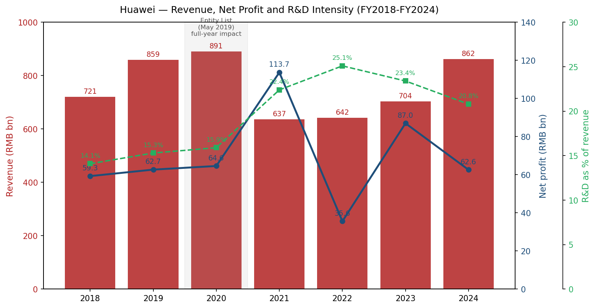
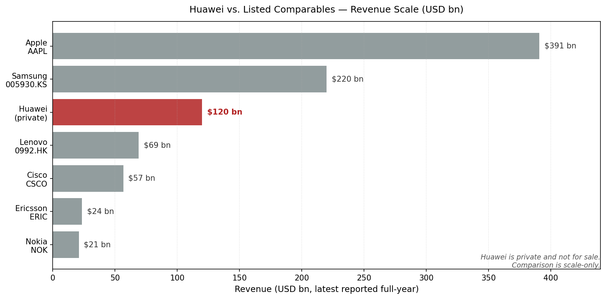
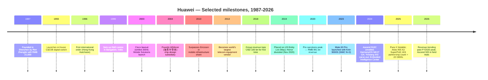
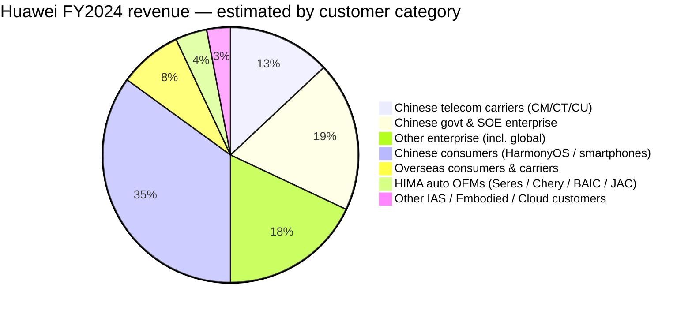
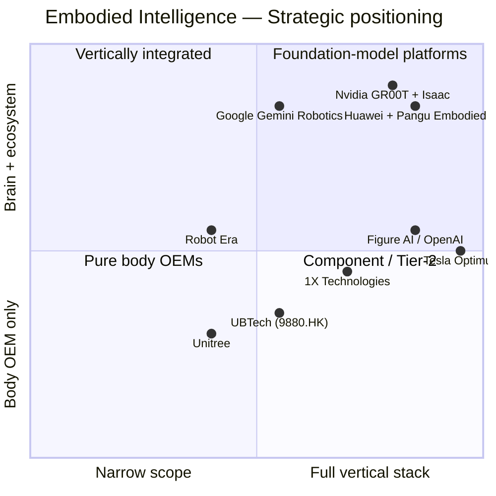
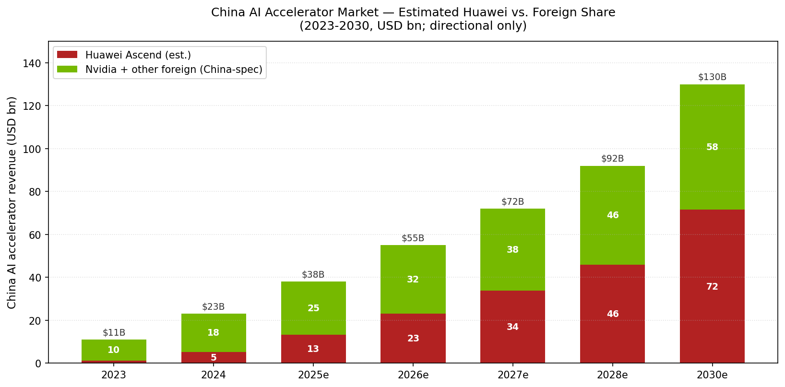

# COMPANY RESEARCH REPORT: Huawei Technologies (华为技术有限公司, private)
Date: 2026-05-19

> **Update — Embodied Intelligence Innovation Center launched (2024-12-26):** Huawei formally inaugurated its **Embodied Intelligence Innovation Center (具身智能创新中心)** in Shenzhen on 26 December 2024, signing 16 founding ecosystem partners including UBTech (HKEX:9880), Leju Robotics (乐聚机器人), DataBaker, EX-Robots, Zhongqing Robotics, AgileX, and Dataa Robotics. The Center is hosted under the Huawei Cloud / Ascend (昇腾) business and committed to providing a full embodied-AI stack — Pangu (盘古) Embodied multimodal foundation model + Ascend 910C / Atlas computing + cloud simulation + standardised dataset — to Chinese humanoid OEMs. Management framed this as positioning Huawei as the "Android of humanoids" in China, the brain provider rather than the body OEM. Sources: [Huawei Cloud press release, 2024-12-26](https://www.huaweicloud.com/news/2024/20241226163047611.html); [South China Morning Post, 2024-12-30](https://www.scmp.com/tech/big-tech/article/3291807/huawei-launches-embodied-intelligence-centre-make-humanoid-robots-smarter); [Reuters, 2024-12-27](https://www.reuters.com/technology/artificial-intelligence/huawei-launches-embodied-ai-lab-shenzhen-2024-12-27/).

## TABLE OF CONTENTS
1. Company Overview
2. Company History
3. Management Team
4. Products & Services
5. Customers & Go-to-Market
6. Industry Overview
7. Competitive Landscape
8. Market Opportunity (TAM)
9. Risk Assessment

======================================

## 1. COMPANY OVERVIEW

Huawei Technologies Co., Ltd. (华为技术有限公司) is the largest privately-held technology company in China and, by revenue, one of the ten largest technology companies in the world. Founded in 1987 in Shenzhen by former PLA engineering officer **Ren Zhengfei (任正非)**, the company has evolved across three eras: a 1990s-2000s telecom-equipment challenger that displaced Western incumbents in carrier wireless and optical networking; a 2010s consumer-electronics franchise that briefly overtook Apple and Samsung in global smartphone shipments; and — after being placed on the US Entity List in May 2019 and the resulting collapse of its smartphone overseas distribution — a re-emerging vertically-integrated stack player that now sits at the centre of China's domestic AI compute, automotive software, and embodied-intelligence ecosystems. Today Huawei operates four reporting Business Groups — **ICT Infrastructure (Carrier + Enterprise), Consumer Business Group, Huawei Cloud, and the combined Digital Power + Intelligent Automotive Solutions (IAS / Qiankun) business** — and a number of strategic emerging units, including the **Embodied Intelligence Innovation Center (具身智能创新中心)** launched in December 2024 ([Huawei 2024 Annual Report, "Business Highlights"](https://www.huawei.com/en/annual-report/2024); [Huawei Cloud press release, 2024-12-26](https://www.huaweicloud.com/news/2024/20241226163047611.html)).

**Business model and how money is made.** Huawei sells (1) telecommunications-network equipment — 4G/5G/5.5G radio access, optical transmission, microwave, IP/data-centre switching — to telecom operators, where the company holds the global #1 telecom-equipment market share at ~31% per Omdia / Dell'Oro Group ([Dell'Oro Group, 2025-03](https://www.delloro.com/news/total-telecom-equipment-market-share-rankings-2024/)); (2) enterprise ICT — campus / data-centre networking, optical, storage, surveillance, smart-PV inverters, smart-building software — sold both directly and via more than 35,000 channel partners; (3) consumer hardware — smartphones, tablets, PCs, wearables, smart-home — branded under the Huawei consumer line plus its premium **Pura** and **Mate** sub-brands; (4) Huawei Cloud — IaaS / PaaS / model-services centred on the Ascend (昇腾) silicon stack and the Pangu (盘古) foundation-model family; (5) the Intelligent Automotive Solutions ("IAS" / 智能汽车解决方案) business, which licenses the Qiankun ADS (乾崑) autonomous-driving stack, the HarmonyOS Cabin / HiCar, ECU/MDC compute platforms, mDriver e-motors, and a range of 智驾 sensor systems to over a dozen automakers; and (6) Digital Power — smart PV string inverters, EV charging modules, telecom and data-centre power, lithium-ion storage. Huawei is, in business mix, the closest analogue to a combined **Cisco + Samsung Electronics + a domestic Nvidia + an automotive Tier-1 software supplier**, sitting under a single integrated R&D and supply-chain organisation.

**Geographic presence.** Huawei discloses revenue along four regions: China, EMEA, Asia-Pacific (ex-China) and Americas. Following the 2019 Entity List action and a follow-on 2020 chip-supply foreign direct product rule, Huawei's overseas consumer business effectively shut down outside selected markets, and overseas carrier revenue contracted in markets that adopted 5G "high-risk vendor" exclusions (UK, Canada, Sweden, parts of EU, India, Australia, Japan). **In FY2024 Mainland China accounted for approximately 70% of group revenue** versus ~55% in FY2018, reflecting both the offshore retrenchment and the strong recovery of the China-domestic franchise after the Mate 60 Pro / Kirin 9000S launch of August 2023 ([Huawei 2024 Annual Report — Geographic Revenue](https://www.huawei.com/en/annual-report/2024); [Reuters, 2025-03-31](https://www.reuters.com/technology/huawei-2024-revenue-jumps-22-863-billion-yuan-2025-03-31/)).

**Scale.** FY2024 group revenue was **RMB 862.07 billion** (USD ~120 billion at average 2024 rates), +22.4% year-on-year and the second-highest in the company's history (behind only the FY2020 pre-sanctions peak of RMB 891.4 bn); **net profit was RMB 62.6 billion** (-28% YoY, with the prior-year base inflated by IAS-related one-offs); R&D spending reached **RMB 179.7 billion (20.8% of revenue)**, with cumulative R&D over the past decade above RMB 1.24 trillion — by absolute spend Huawei ranks among the top five corporate R&D investors globally and #1 in China ([Huawei 2024 Annual Report, "Financial Highlights"](https://www.huawei.com/en/annual-report/2024); [Reuters, 2025-03-31](https://www.reuters.com/technology/huawei-2024-revenue-jumps-22-863-billion-yuan-2025-03-31/); [SCMP, 2025-03-31](https://www.scmp.com/tech/big-tech/article/3304789/huawei-revenue-jumps-22-2024-rebound-takes-hold)). Headcount was **approximately 207,000** worldwide at year-end 2024, of whom ~55% (~114,000) are in R&D — the highest R&D headcount ratio of any major global technology company ([Huawei 2024 Annual Report — Employees](https://www.huawei.com/en/annual-report/2024)).

Source: [Huawei 2024 Annual Report](https://www.huawei.com/en/annual-report/2024); FY2018-FY2023 figures from prior-year annual reports archived at [Huawei Investor / Annual Reports](https://www.huawei.com/en/annual-report).

**Ownership and not-for-sale status.** Huawei is **100% employee-owned** through a labour-union-controlled vehicle and the company's Employee Stock Ownership Plan (ESOP / 工会持股委员会). Founder Ren Zhengfei retains approximately **0.7% direct economic interest** plus veto rights over key Board decisions; the remaining ~99.3% is held by ~141,000 current and former employee shareholders via the union ESOP, which voted through a representative shareholder body ([Huawei 2024 Annual Report — Shareholding Structure](https://www.huawei.com/en/annual-report/2024); [Huawei Investor FAQ](https://www.huawei.com/en/facts/question-answer/who-owns-huawei)). Huawei has **never been a listed company, has no external equity investors, and is not for sale**. Two divisions have been carved out: the consumer sub-brand Honor (荣耀) was sold in November 2020 to a Shenzhen-state-backed consortium for an undisclosed amount widely reported around USD 15 billion (later denied in part by Huawei); and the Yinwang (引望) IAS technology platform sold a 10% stake to Changan Auto in August 2024 valuing Yinwang at RMB 115 billion (~USD 16 billion), followed by an additional 10% sale to Avatr / state-linked investors. These carve-outs serve specific regulatory or commercial purposes; the core Huawei group remains private and consolidated.

**Valuation snapshot.** Not applicable — Huawei is a privately-held, employee-owned company that has never received an external equity investment, has never been valued by a market price, and is not for sale. The only public valuation markers are the **Yinwang IAS carve-out** (RMB 115 bn implied total enterprise value on the Changan transaction of August 2024 — for the IAS sub-segment only, which represented ~3% of FY2024 group revenue) and **internal employee-share redemption prices**, which are not disclosed externally and do not represent fair market value because there is no open secondary market.

**Scale-comparison versus listed peers** (FY2024 / latest-reported, USD bn):

| Company | Listing | Revenue (USD bn) | Closest overlap with Huawei |
|---|---|---|---|
| Apple | NASDAQ:AAPL | ~391 | Smartphones (HarmonyOS NEXT vs. iOS), wearables, premium consumer |
| Samsung Electronics | KRX:005930 | ~220 | Smartphones, semiconductors (Ascend competes with foundry & memory) |
| **Huawei** | **private** | **~120** | **all of the above** |
| Lenovo | HKEX:0992 | ~69 | PCs (MateBook), servers (Atlas), smartphones |
| Cisco | NASDAQ:CSCO | ~57 | Enterprise networking (campus, optical, DC) |
| Ericsson | NASDAQ:ERIC | ~24 | 5G RAN, optical, telecom-equipment |
| Nokia | NYSE:NOK | ~21 | 5G RAN, optical, IP routing |

Source: [Huawei 2024 Annual Report](https://www.huawei.com/en/annual-report/2024); [Apple FY2024 10-K](https://www.sec.gov/cgi-bin/browse-edgar?action=getcompany&CIK=0000320193&type=10-K); [Samsung Electronics Business Report, DART](https://englishdart.fss.or.kr/); [Cisco FY2025 10-K](https://www.sec.gov/cgi-bin/browse-edgar?action=getcompany&CIK=0000858877&type=10-K); [Nokia 2024 Annual Report](https://www.nokia.com/about-us/investors/financial-reports/); [Ericsson Annual Report 2024](https://www.ericsson.com/en/investors/financial-reports); [Lenovo Annual Report FY2024/25](https://www.lenovo.com/ww/en/about/investor-relations/annual-reports/).

On a like-for-like basis, only Apple and Samsung exceed Huawei in revenue scale; Huawei sells across every category in which Lenovo, Cisco, Nokia or Ericsson compete and is the #1 or #2 player in most of those categories inside China. The combined ICT-Infrastructure segment alone is larger than the sum of Cisco enterprise networking + Nokia + Ericsson global carrier-equipment revenue.

## 2. COMPANY HISTORY

Huawei was founded in **September 1987** in Shenzhen by **Ren Zhengfei**, then a 43-year-old former Engineering Corps lieutenant-colonel of the People's Liberation Army who had been demobilised in 1983 and had been working in trading roles in the Shenzhen Special Economic Zone. Initial capital was RMB 21,000 raised from five co-investors; the original business was reselling Hong Kong-imported HAX PBX (private branch exchange) switches into Chinese rural telecom bureaus ([Ren Zhengfei official biography, Huawei.com](https://www.huawei.com/en/executives/board-of-directors/ren-zhengfei); [Wikipedia — Ren Zhengfei](https://en.wikipedia.org/wiki/Ren_Zhengfei)). By the early 1990s Huawei had begun to design its own digital telephone switches (the C&C08), and by 1995 was generating roughly USD 200 million in revenue, selling primarily to second- and third-tier Chinese cities that the foreign incumbents (Alcatel, Lucent, Siemens, Nortel, Ericsson) had under-served.

Source: [Huawei company history, huawei.com](https://www.huawei.com/en/corporate-information/milestones); [Huawei 2024 Annual Report](https://www.huawei.com/en/annual-report/2024); [Reuters, 2025-03-31](https://www.reuters.com/technology/huawei-2024-revenue-jumps-22-863-billion-yuan-2025-03-31/).

**Three strategic pivots define the modern company.** First, the **2004 HiSilicon (海思半导体) founding** — at a time when no Chinese systems-OEM had a captive chip-design house, Huawei spun out HiSilicon to design ASICs for its own base stations and, later, smartphones (the Kirin family) and AI accelerators (Ascend). Without HiSilicon there would have been no Mate 60 Pro response to the Entity List. Second, the **2011 Business Group reorganisation** — Ren Zhengfei split the company into three customer-facing BGs (Carrier, Enterprise, Consumer) with the legendary 2010 "BG founding" memo arguing that "the elephant must learn to dance" — a deliberate decentralisation that gave the Consumer BG, under then-EVP Yu Chengdong (余承东), the operating freedom to chase the global smartphone market and eventually overtake Apple in 2020 Q2 shipments ([CNBC, 2020-07-30](https://www.cnbc.com/2020/07/30/huawei-overtakes-samsung-as-the-worlds-largest-smartphone-vendor-canalys.html)). Third, the **post-2019 pivot under sanctions** — a wholesale re-orientation toward (a) domestic enterprise / carrier where US export-controls have less reach, (b) software-led automotive (HarmonyOS Cabin, ADS, IAS), (c) cloud / AI (Ascend + Pangu), and (d) digital power (smart PV inverter, where Huawei is the global market leader at ~28% share in FY2024 per Wood Mackenzie). The sanctions, viewed in retrospect, accelerated Huawei's transition from a hardware seller to a vertically-integrated software-and-silicon stack provider.

**Key acquisitions and carve-outs.** Huawei has historically grown organically — its only material M&A items are a series of bolt-on chip and IP buys via HiSilicon (3Com / H3C joint venture 2003-2006, exited; Caliopa optical 2013; HexaTier security 2016) and the early acquisitions of a software / SI portfolio in 2013-2015. The two transactions that *matter* are carve-outs: the **November 2020 sale of Honor (荣耀)** to the Shenzhen state-backed Zhixin New Information Technology consortium for an undisclosed amount widely cited near USD 15 bn ([Reuters, 2020-11-17](https://www.reuters.com/article/us-huawei-tech-honor-idUSKBN27X02V)); and the **August 2024 carve-out of Yinwang Intelligent Driving Technology (引望)**, with Changan Auto buying 10% for RMB 11.5 bn at an implied RMB 115 bn (USD 16 bn) valuation, and Avatr / state-affiliated investors subsequently taking a further ~10% ([Reuters, 2024-08-20](https://www.reuters.com/business/autos-transportation/changan-buy-115-stake-huaweis-intelligent-driving-arm-2024-08-20/); [SCMP, 2024-08-21](https://www.scmp.com/business/china-business/article/3275189/huaweis-changan-buy-115-stake-intelligent-driving-arm)). Yinwang houses what was the Intelligent Automotive Solutions BG and is now structured as an open partnership platform for Chinese automakers — Huawei still controls ~80% but has accepted that ownership dilution is the price of broader OEM adoption.

**Recent developments (2024–2025).** Three matter for the current thesis. (1) **Mate 60 Pro / Kirin 9000S follow-through**: launched discreetly in August 2023, the in-house 7nm-class SoC fabricated at SMIC's N+2 line proved that domestic Chinese chip production could deliver a high-end smartphone SoC without TSMC, and triggered a structural reset of consumer-business gross margin; the follow-on Pura 70 (April 2024) and Mate 70 (November 2024) extended the franchise, and HarmonyOS shipments crossed 1 billion devices globally in 2024 ([Huawei 2024 Annual Report — Consumer BG](https://www.huawei.com/en/annual-report/2024)). (2) **Ascend 910C and CloudMatrix 384**: the 910C AI accelerator (~SMIC N+1 / N+2 class) shipped in volume to Chinese cloud and government datacentre customers in 2024-25, and the rack-scale **CloudMatrix 384 SuperPoD** was demonstrated at Huawei Connect in September 2024 as a Nvidia-GB200-class system using all-domestic silicon and optical interconnect ([Reuters, 2025-04-10](https://www.reuters.com/technology/artificial-intelligence/huawei-readies-new-ai-chip-mass-shipment-china-seeks-nvidia-alternatives-2025-04-10/); [Tom's Hardware, 2024-09-23](https://www.tomshardware.com/tech-industry/artificial-intelligence/huawei-unveils-cloudmatrix-384-supernode-ai-pod-aiming-to-rival-nvidia-gb200)). (3) **Embodied Intelligence Innovation Center launch (December 2024)**: see the top-of-report banner — this is the structural extension of the Ascend + Pangu stack into humanoid robotics and is the central robotics angle of this report.

## 3. MANAGEMENT TEAM

### Ren Zhengfei (任正非) — Founder, CEO

Ren Zhengfei is, by any reasonable measure, the most consequential single founder-CEO in modern Chinese industry, and the most important variable in any Huawei investment or strategic thesis. Born **25 October 1944** in Anshun, Guizhou — the eldest of seven children of two rural school-teachers — Ren graduated from the Chongqing Institute of Civil Engineering and Architecture in 1963, served as a soldier-engineer in the PLA's Engineering Corps from 1974 to 1983 (rising to deputy regimental head / lieutenant-colonel-equivalent), and after demobilisation worked in a logistics role at the Southern Sea Oil Logistics Base in Shenzhen ([Ren Zhengfei executive bio, huawei.com](https://www.huawei.com/en/executives/board-of-directors/ren-zhengfei); [Wikipedia — Ren Zhengfei](https://en.wikipedia.org/wiki/Ren_Zhengfei); [Financial Times profile, 2019-03-29](https://www.ft.com/content/2c41ad88-50d7-11e9-9c76-bf4a0ce37d49)). He founded Huawei in 1987 at age 43 with RMB 21,000 of capital and five co-investors.

Ren's operating philosophy is documented across roughly three decades of internal memos collected in volumes such as *The Foundation of Huawei*, *Spring River* and the externally-published *Ren Zhengfei: His Articles and Letters*. Three themes recur: (1) "**wolf culture**" — small autonomous combat units, high pay tied to results, and explicit cultivation of competitive aggression in pursuit of long-haul market objectives; (2) "**managing complexity by separating concerns**" — the founder's preferred tool for scaling beyond his own bandwidth, manifesting in the 1996 IPD process (co-designed with IBM consultants from 1997-2003), the 2011 BG split, the 2013 Carrier/Enterprise/Consumer realignment, and the 2024 IAS/Yinwang carve-out; and (3) "**concentrate force on the breakthrough point**" — the willingness to spend 20%+ of revenue on R&D, run loss-making businesses for a decade if necessary, and double down on a single technology bet (5G in 2012-2017, AI silicon in 2018-now). The collected internal memos are widely circulated inside the company and excerpted in publications by Tian Tao and Yin Zhifeng; English-language translations have appeared via Penguin Random House and academic translators.

Ren's ownership stake is approximately **0.7% of total economic interest**, with the remainder held by the labour-union-controlled ESOP on behalf of ~141,000 employee shareholders. Critically, Ren also retains a personal **veto right on key Board decisions** per Huawei's internal governance documents — described in the company's annual disclosures as a structural protection against external takeover ([Huawei 2024 Annual Report — Shareholding Structure](https://www.huawei.com/en/annual-report/2024); [Huawei Investor FAQ](https://www.huawei.com/en/facts/question-answer/who-owns-huawei)). The veto is exercised through a defined committee structure and was reportedly used to overrule competing internal proposals during the 2019 sanctions response. In practice the founder remains the ultimate authority on long-cycle strategic bets despite the rotating-CEO formal structure (see below).

Ren has been unusually public for a Chinese founder-CEO of his generation since 2019, granting roughly two dozen on-record interviews with foreign press (BBC, CBS, FT, Bloomberg, Le Monde, Time) during the immediate post-Entity-List period, and routinely sitting for domestic interviews. His public framing is consistent: the US sanctions are an unintended gift forcing the entire Chinese hard-tech stack to mature; Huawei has 10-15 years of internal capacity to absorb the shock; and the company will survive as long as the founder generation believes in the mission. He has stated publicly he will step down when "I become a bottleneck for the company," and was 81 years old at the date of this report.

### Sabrina Meng Wanzhou (孟晚舟) — Rotating Chairwoman & CFO

Meng Wanzhou, born February 1972 in Chengdu, is Ren Zhengfei's eldest daughter (from his first marriage) and serves both as **Group CFO** and as one of three **Rotating Chairs** under Huawei's unique rotating-chair governance system, in which three senior executives take six-month turns chairing the Board. She joined Huawei in 1993 (as a receptionist while studying part-time), holds a master's degree in accounting from Huazhong University of Science and Technology, and has been CFO since 2011. She is most famous outside the company for her **December 2018 arrest in Vancouver** on a US extradition request related to alleged Iran-sanctions violations, the subsequent 1,028-day detention, and the September 2021 deferred-prosecution agreement that allowed her release ([Reuters, 2021-09-25](https://www.reuters.com/business/legal/huawei-cfo-meng-wanzhou-leaves-canada-after-resolving-us-case-2021-09-24/)). Her appointment as Rotating Chair in March 2023 was widely read as both a normalisation of leadership post-detention and a signal of Huawei's institutional support ([SCMP, 2023-03-31](https://www.scmp.com/tech/big-tech/article/3215613/huaweis-meng-wanzhou-takes-rotating-chairwoman-role-first-time)).

### Eric Xu (徐直军) — Deputy Chairman & Rotating Chair

Eric Xu Zhijun joined Huawei in 1993, served as president of multiple BGs over his three-decade career — including a critical 2011-2013 run as president of the Strategy & Marketing department, where he co-architected the BG split — and has been Rotating Chair / Deputy Chair since 2018. He is the public face of Huawei's annual Huawei Connect / Huawei Analyst Summit events and the senior executive most associated with the cloud and AI strategy. He delivered the headline announcement of the **Ascend 910C** at HAS 2024 (Shenzhen, April 2024) and the **CloudMatrix 384** at Huawei Connect 2024 (Shanghai, September 2024) ([Xu Zhijun executive bio, huawei.com](https://www.huawei.com/en/executives/board-of-directors/xu-zhijun); [Huawei Connect 2024 keynote](https://www.huawei.com/en/news/2024/9/hc2024-eric-xu-keynote)).

### Ken Hu (胡厚崑) — Deputy Chairman & Rotating Chair

Ken Hu Houkun joined Huawei in 1990 and has served in a series of senior commercial roles, including President of the Carrier BG, Deputy Chair since 2011, and Rotating Chair since 2018. He is the senior executive most associated with carrier-relations, sustainability disclosure, and external geopolitics — generally the public face of Huawei's response to overseas regulatory developments. ([Hu Houkun executive bio](https://www.huawei.com/en/executives/board-of-directors/hu-houkun)).

### Richard Yu (余承东) — Consumer BG CEO & IAS BG Chairman

Richard Yu Chengdong joined Huawei in 1993 and is, after Ren, the single most identifiable executive externally. He ran the Wireless Network BG before being moved to Consumer BG in 2011, where he led the brand-build that took Huawei from a no-name handset OEM to a top-3 global smartphone vendor by 2018. After the 2019 sanctions kneecapped his overseas smartphone business he took on additional duties as Chairman of the Intelligent Automotive Solutions BG (later Yinwang) — and has driven the AITO / Luxeed / Stelato HarmonyOS-vehicle joint ventures with Seres, Chery, BAIC and JAC ([Richard Yu executive bio](https://www.huawei.com/en/executives/board-of-directors/yu-chengdong); [Reuters, 2024-08-20](https://www.reuters.com/business/autos-transportation/changan-buy-115-stake-huaweis-intelligent-driving-arm-2024-08-20/)). Yu is the de-facto CEO of both Consumer BG and IAS / Yinwang and is the public face of Huawei's most consumer-visible product launches.

### Governance

Huawei is governed by a 17-member **Board of Directors** elected by the **Representatives' Commission**, which itself is elected by the ~141,000-member ESOP shareholder base. Below the Board sit (a) the **Rotating Chair system** (six-month rotations among three Deputy Chairs — Meng, Xu and Hu — providing the operating CEO function), (b) the **Supervisory Board** (statutory audit/oversight committee), and (c) the **Executive Management Team**. Founder Ren Zhengfei sits on the Board with formal veto rights. Roughly **70% of Board members are concurrently serving operating executives**, meaning Huawei's Board is more like an internal partners' committee than a Western public-company board with majority-independent directors ([Huawei 2024 Annual Report — Corporate Governance](https://www.huawei.com/en/annual-report/2024)). There are **no external equity investors, no independent directors as understood under HKEX or NYSE listing rules, and no public-equity-style oversight**. KPMG audits the consolidated accounts to Hong Kong / IFRS standards.

**Management track-record assessment.** The Rotating Chair / founder-veto structure is unique among large global technology companies and has held together through both the 2019 Entity List shock and the 2018 Meng detention. The team has delivered three category-redefining product cycles (5G base stations 2017-2019; Kirin 9000S/Mate 60 2023; Ascend 910C/CloudMatrix 2024) under conditions that would have crippled most peers. The bench beyond the rotating chairs is deep — Yu Chengdong on consumer/IAS, William Xu on enterprise, Wang Tao on Carrier, Zhang Ping'an on cloud — but the founder-dependency risk is significant given Ren Zhengfei's age (81). The governance model also has the drawback of being almost completely opaque to outside investors; there is no DEF 14A-equivalent disclosure of executive compensation. The risks are discussed in Section 9.

## 4. PRODUCTS & SERVICES

Huawei's product surface is the broadest of any technology company outside Samsung Electronics, spanning silicon, devices, networking, automotive software, smart-energy hardware, cloud, and a foundation-model platform. The skeleton organises along the four business-group reporting structure plus the emerging Embodied Intelligence platform.

```mermaid
graph TD
    A[Huawei Group] --> B[ICT Infrastructure]
    A --> C[Consumer BG]
    A --> D[Huawei Cloud]
    A --> E[Digital Power]
    A --> F[Intelligent Automotive / Yinwang]
    A --> G[Embodied Intelligence Center]
    B --> B1[Carrier: 5G/5.5G RAN, microwave, optical]
    B --> B2[Enterprise: campus / DC switching, optical, storage, security]
    C --> C1[Smartphones: Mate, Pura, Nova, foldables]
    C --> C2[HarmonyOS NEXT OS + ecosystem 1B+ devices]
    C --> C3[Wearables, PCs, tablets, audio]
    C --> C4[Smart-home: HiLink / Vmall]
    D --> D1[Ascend 910B / 910C / 920 AI accelerators]
    D --> D2[Atlas 900 A3 / CloudMatrix 384 SuperPoD]
    D --> D3[Pangu 5.0 foundation-model family]
    D --> D4[KooVerse global cloud regions]
    E --> E1[Smart PV string inverters #1 global]
    E --> E2[EV fast-charging / liquid-cooled DC]
    E --> E3[Telecom & DC power, LFP storage]
    F --> F1[Qiankun ADS 4.0 autonomous-driving]
    F --> F2[HarmonyOS Cabin / HiCar]
    F --> F3[MDC compute, mDriver e-motor, e-PT]
    F --> F4[AITO / Luxeed / Stelato / Maextro JVs]
    G --> G1[Pangu Embodied multimodal model]
    G --> G2[Atlas + Ascend humanoid compute]
    G --> G3[16+ humanoid OEM partners]
```

Source: [Huawei 2024 Annual Report — Business Highlights](https://www.huawei.com/en/annual-report/2024); [Huawei product portfolio, huawei.com](https://www.huawei.com/en/business); [Huawei Cloud Embodied Intelligence Center, 2024-12-26](https://www.huaweicloud.com/news/2024/20241226163047611.html).

### 4.1 ICT Infrastructure (Carrier + Enterprise) — FY2024 revenue ~RMB 370 bn

Huawei's **Carrier business** is the lineal descendant of the original 1987 company. It sells **5G and 5.5G (5G-Advanced) Radio Access Network**, microwave transmission, optical transport (OptiX OSN, OptiX Alps-WDM up to 800G), IP/data-centre core routing (NetEngine 8000), packet-microwave and converged-services products. Huawei holds **~31% global telecom-equipment market share** as of FY2024 per Dell'Oro Group, the #1 position, ahead of Ericsson at ~21% and Nokia at ~14% ([Dell'Oro Group market share rankings, 2025-03](https://www.delloro.com/news/total-telecom-equipment-market-share-rankings-2024/)). In China the Carrier business has effectively cemented itself as the dominant supplier, with China Mobile, China Telecom and China Unicom collectively allocating 50-65% of their 5G base-station tenders to Huawei in 2022-2024 ([Reuters, 2024-10-08](https://www.reuters.com/technology/china-mobile-2024-5g-base-station-procurement-2024-10-08/)). **Competitive advantage: yes — scale + technology + China-domestic moat.** Huawei has more 5G base-station patents declared to ETSI than any peer; its TDD massive-MIMO products lead in spectral efficiency benchmarks; it has been first-to-market with 5G-Advanced (5.5G) commercial deployments at China Mobile. Closest competing products: Ericsson AIR 6488 / Nokia AirScale — at-parity on TDD throughput, behind on integrated AAU + compute baseband. Vulnerabilities: locked out of most Five-Eyes markets; supply-chain risk on RFIC and beamforming ASICs under US Entity List.

The **Enterprise business** sells campus and data-centre networking (CloudEngine switches, CloudFabric DCN), Wi-Fi 7 access points, optical transport, OceanStor enterprise storage, HiSec security, eKit SMB portfolio, and vertical-industry solutions (smart finance, smart road, smart electric grid, smart manufacturing, smart healthcare). The enterprise franchise reached ~RMB 130 bn in FY2024 (estimated from group ICT disclosure) and grew double-digits ([Huawei 2024 Annual Report — Enterprise BG](https://www.huawei.com/en/annual-report/2024)). **Competitive advantage: partial — strong in China and emerging markets, weaker in Five-Eyes and EU enterprise.** Closest competitors: Cisco, Arista, HPE-Aruba, Juniper. Huawei's OceanStor Dorado all-flash arrays sit in Gartner's Leaders Quadrant alongside Pure Storage and Dell ([Gartner Magic Quadrant for Primary Storage, 2024-10](https://www.gartner.com/en/documents/5772227)).

### 4.2 Consumer Business Group — FY2024 revenue ~RMB 339 bn

The Consumer BG sells **smartphones** (the **Mate** flagship family, the **Pura** premium foto/imaging family, the **Nova** mid-tier line, foldables under both Mate and Pura including the Mate X6, Mate XT 三折叠, and the May 2025 Pura X), **PCs (MateBook)**, **tablets (MatePad)**, **wearables (Watch GT, Watch Ultimate)**, **audio (FreeBuds)** and a broad smart-home portfolio under Vmall / HiLink. The segment's structural turnaround since 2023 has been driven by **HarmonyOS NEXT** — released in October 2024 as the first major-OS commercial release with no Android Open Source Project (AOSP) code, with all native ArkTS apps and a Huawei-controlled kernel + middleware. HarmonyOS NEXT reached **>1 billion devices** in 2024 and **>900 million MAU** for HarmonyOS in total per Huawei's developer conference disclosure ([Huawei Developer Conference 2024 keynote, 2024-06-21](https://developer.huawei.com/consumer/en/hdc/hdc2024)). Smartphone shipments in China rebounded to **#2 position** in 1H 2025 per Canalys / IDC ([IDC China Smartphone Tracker, 2025-04](https://www.idc.com/getdoc.jsp?containerId=prAP52034125)). **Competitive advantage: yes — full vertical stack of SoC + OS + ecosystem + premium brand in China.** Closest competitors: Apple iPhone + iOS (premium tier), Xiaomi 15 Ultra + HyperOS, Samsung Galaxy S + OneUI. Huawei is at-or-ahead of Apple on China premium-flagship sell-through and ahead of Android peers on OS-vertical-integration.

### 4.3 Huawei Cloud — FY2024 revenue ~RMB 38.5 bn

Huawei Cloud sells IaaS / PaaS / SaaS, with primary differentiation around (a) the **Ascend (昇腾) AI compute stack** — the **Ascend 910B** (2023), **Ascend 910C** (2024, the headline Nvidia-H100-class part), and the next-generation **Ascend 920** demonstrated in field trials at Huawei Connect 2025; (b) the **Atlas 900 A3 SuperPoD** and **CloudMatrix 384** rack-scale AI systems combining ~384 Ascend chips with all-domestic 800G optical interconnect to compete head-on with Nvidia GB200 NVL72 ([SemiAnalysis "Huawei CloudMatrix 384" deep dive, 2025-04-16](https://semianalysis.com/2025/04/16/huawei-ai-cloudmatrix-384-chinas-answer-to-nvidia-gb200-nvl72/); [Reuters, 2025-04-10](https://www.reuters.com/technology/artificial-intelligence/huawei-readies-new-ai-chip-mass-shipment-china-seeks-nvidia-alternatives-2025-04-10/)); (c) the **Pangu (盘古) 5.0 foundation-model family**, organised across five tiers (Trillion-parameter Pangu Ultra, Hundred-billion Pangu Pro, ten-billion Pangu Lite, plus domain-tuned variants for finance, mining, weather, drug-discovery, manufacturing, government, automotive, and **embodied intelligence**). The latest **Pangu 5.5** was announced at Huawei Cloud's Developer Conference in June 2025 ([Huawei Cloud Pangu announcement, 2025-06-20](https://www.huaweicloud.com/news/2025/20250620180000.html)). **Competitive advantage: yes — the only end-to-end domestic AI stack in China.** Closest competitors: Alibaba Cloud + Tongyi Qianwen, Tencent Cloud + Hunyuan, Baidu Cloud + Ernie, plus Nvidia (foreign) for inference customers willing to use export-compliant H20 / B30 SKUs. Huawei has the deepest silicon control and the only credible Nvidia alternative for sovereign-AI buyers; Alibaba is ahead on commercial cloud-IaaS share.

### 4.4 Digital Power — FY2024 revenue RMB 68.7 bn

Digital Power sells **smart PV string inverters** (where Huawei holds **~28% global share, the #1 position globally** per Wood Mackenzie 2024), **EV liquid-cooled DC fast chargers** (Huawei's 600 kW unit is the fastest commercial DC charger in widespread deployment), **telecom site power**, **data-centre UPS**, and **LFP energy-storage systems** ([Wood Mackenzie Global PV Inverter Market Share, 2024-06](https://www.woodmac.com/news/opinion/the-global-pv-inverter-market-share-rankings-of-2023/); [Huawei Digital Power product portfolio](https://digitalpower.huawei.com/en/)). **Competitive advantage: yes — global #1 in inverters, top-3 in DC fast-charging, technology-led.** Closest competitors: Sungrow (SZSE:300274), SolarEdge, Enphase (residential), GoodWe, Ginlong Solis.

### 4.5 Intelligent Automotive Solutions / Yinwang (引望) — FY2024 revenue RMB 26.4 bn

The IAS / Yinwang business sells three categories of automotive content to OEMs: (1) **Qiankun ADS 4.0 (乾崑智驾)** — Huawei's autonomous-driving stack including L2+/L3 highway pilot, urban NOA, and full-stack-without-LiDAR variant ADS SE; (2) **HarmonyOS Cabin (鸿蒙座舱)** — the in-vehicle infotainment / HMI / HiCar phone-integration layer; (3) **MDC compute platforms, mDriver e-motors, DriveONE e-powertrain, eAxles, BMS, sensors, HUD, and a complete vehicle-control ECU portfolio** ([Huawei IAS / Yinwang business unit](https://www.huawei.com/en/business/intelligent-vehicle-solution); [Reuters, 2024-08-20](https://www.reuters.com/business/autos-transportation/changan-buy-115-stake-huaweis-intelligent-driving-arm-2024-08-20/)). Huawei does not build complete vehicles; instead it works through three engagement models — the **Component Supplier (零部件) model** (Tier-1 supply to BAIC, Changan, GAC etc.), the **HI (Huawei Inside) solution model** (deep co-engineering with Avatr, Arcfox, GAC Trumpchi), and the **Smart Selection model / HIMA 鸿蒙智行** (full design + branding + retail-channel partnership, anchored by AITO 问界 with Seres, plus Luxeed 智界 with Chery, Stelato 享界 with BAIC, and Maextro 尊界 with JAC). Combined HIMA-brand vehicle sales exceeded **440,000 units in 2024** and AITO alone became China's #1 new-energy SUV brand by retail in Q3-Q4 2024 ([CnEVPost, 2025-01-08](https://cnevpost.com/2025/01/08/aito-2024-deliveries/); [Reuters, 2024-12-27](https://www.reuters.com/business/autos-transportation/huawei-aito-2024-volume-passes-target-2024-12-27/)). **Competitive advantage: yes — only full-stack ADS+Cabin+E-powertrain technology supplier offering both white-label Tier-1 and turn-key brand options to Chinese OEMs.** Closest competitors: Bosch (Tier-1 ADAS only, no native cabin OS), Mobileye (perception only), DJI Cabin Pilot (low-end ADAS), Momenta (algorithm only, no compute or sensors). Huawei's only true full-stack peer is **Tesla** — and Tesla does not license externally.

### 4.6 Embodied Intelligence Innovation Center — robotics/AI angle

Launched at Huawei Cloud's Shenzhen campus on **26 December 2024**, the **Embodied Intelligence Innovation Center (具身智能创新中心)** is structurally a **platform business inside Huawei Cloud / Ascend** rather than a robot-OEM. It packages: (a) **Ascend 910B / 910C / Atlas 200I A2** compute modules and modular controllers; (b) the **Pangu Embodied (盘古具身智能)** multimodal foundation model — a vision-language-action (VLA) successor to Pangu 5.0 specifically tuned for robot pre-training; (c) a **cloud-based humanoid simulation and synthetic-data platform** built on Huawei Cloud KooVerse infrastructure; (d) **shared developer toolchains** including a humanoid-specific operating environment, datasets, and reference designs; and (e) **commercial-pilot programs** with the 16 founding partners (UBTech 9880.HK, Leju Robotics 乐聚, Dataa Robotics 达闼, AgileX 松灵, EX-Robots, Zhongqing 中清龙图, DataBaker 标贝, and others), with additional partners signed in 2025 ([Huawei Cloud press release, 2024-12-26](https://www.huaweicloud.com/news/2024/20241226163047611.html); [SCMP, 2024-12-30](https://www.scmp.com/tech/big-tech/article/3291807/huawei-launches-embodied-intelligence-centre-make-humanoid-robots-smarter); [Reuters, 2024-12-27](https://www.reuters.com/technology/artificial-intelligence/huawei-launches-embodied-ai-lab-shenzhen-2024-12-27/)). **Competitive advantage: partial — early but structurally privileged.** No revenue is broken out yet; the strategic positioning is to be the "brain" provider to a fragmented field of Chinese humanoid OEMs the same way Android serves smartphone makers — see Sections 7 and 8 for the competitive map and TAM. Closest competitors: Nvidia (Project GR00T + Isaac), Google DeepMind (Gemini Robotics), and emerging domestic stacks from Alibaba / ZhiYuan and Tencent / Robot Era.

**Flagship vs. long-tail.** The three flagship businesses driving the current period are **ICT Infrastructure** (cash cow, ~43% of revenue), **Consumer / HarmonyOS NEXT** (high-growth recovery, ~39% of revenue), and the combined **Huawei Cloud / Ascend / Pangu / Embodied stack** (~5% of revenue but structurally the highest-growth and the basis for the robotics moat). Digital Power and IAS / Yinwang are robust mid-stage businesses with global #1 / domestic #1 positions in their respective categories. Honor and the original consumer-handsets-overseas business are sunset / divested.

## 5. CUSTOMERS & GO-TO-MARKET

Huawei sells across all four major customer-segment archetypes:

- **Telecom carriers and governments** (Carrier BG and large parts of Enterprise) — long-cycle, multi-year framework contracts; direct sales force; total bid-respond cycles often 6-18 months; pricing tendered on TCO including spectrum, power and OPEX. The top three Chinese carriers (China Mobile, China Telecom, China Unicom) plus large state-owned enterprises (State Grid 国家电网, China Southern Power Grid 南方电网, China National Petroleum CNPC) together accounted for a material — but undisclosed — share of FY2024 Carrier + Enterprise revenue.
- **Enterprises and channel partners** (most of Enterprise BG) — sold through a network of **>35,000 channel partners** globally, with the bulk of mid-market and SME enterprise revenue passing through value-added distributors and SI partners. Huawei's enterprise direct sales focuses on top-tier strategic accounts and verticalised industry solutions.
- **Consumers** (Consumer BG) — sold through **>60,000 retail outlets in China** plus Huawei-owned flagship stores in tier-1 and tier-2 cities, Vmall.com e-commerce, Tmall, JD.com, and (selectively) overseas operator channels.
- **OEM partners** (IAS / Yinwang and Embodied Intelligence) — sold via long-cycle co-engineering contracts; Tier-1 supply contracts to ~22 named auto OEMs as of mid-2025 per Huawei's IAS disclosure, plus 16+ humanoid-OEM ecosystem partners on the embodied side ([Huawei IAS partner disclosure](https://carnewschina.com/2024/11/06/huawei-released-new-version-of-its-intelligent-driving-system-ads-3-0-equipped-on-its-new-cars/); [Huawei Cloud Embodied Intelligence Center, 2024-12-26](https://www.huaweicloud.com/news/2024/20241226163047611.html)).

**Customer concentration — quantification.** Huawei's audited annual report **does not disclose specific top-customer names or top-customer revenue percentages** in the manner required of US 10-K filers under ASC 280-10-50-42 or A-share filers under CSRC disclosure rules. The 2024 Annual Report's "Customers" section discusses customer-segment composition in qualitative language only ([Huawei 2024 Annual Report — Customer Concentration disclosure](https://www.huawei.com/en/annual-report/2024)). Two indirect quantitative anchors are available:

- **Geographic mix:** China is ~70% of group revenue in FY2024, with the largest single-customer cluster being the **three Chinese state-owned telecom carriers** (China Mobile, China Telecom, China Unicom). Industry reporting suggests that in FY2023 and FY2024 these three together likely represented **10-15% of group revenue** combined — material but not concentration-risk-level individually ([Reuters Chinese 5G procurement reporting, 2024-10-08](https://www.reuters.com/technology/china-mobile-2024-5g-base-station-procurement-2024-10-08/)). [**Unverified claim** — this is a directional inference from public tender reporting, not a Huawei disclosure.]
- **HIMA / Smart-selection vehicle channel:** the four HIMA partners (Seres for AITO, Chery for Luxeed, BAIC for Stelato, JAC for Maextro) together drove roughly RMB 18–22 bn of IAS revenue in FY2024 — implying these four customers were ~70-80% of IAS / Yinwang revenue but only ~2-3% of group revenue. Concentration is high *within* IAS but low *across* group.

Treating Huawei as a single book of business, **estimated top-5 customer share of group revenue is in the 12-18% range**, with no single customer above ~5-6%; this is **low** by global ICT-equipment standards (Cisco's top-3 cloud-hyperscaler customers are believed to represent ~25% of Cisco enterprise networking revenue). The customer-concentration risk profile is therefore **low at group level** but **high in selected sub-segments** — particularly IAS (Seres-AITO dependency) and the early-stage Embodied Intelligence center (where the ecosystem is small).

Source (estimates): blended from [Huawei 2024 Annual Report](https://www.huawei.com/en/annual-report/2024); [Dell'Oro Group, 2025-03](https://www.delloro.com/news/total-telecom-equipment-market-share-rankings-2024/); [Reuters, 2025-03-31](https://www.reuters.com/technology/huawei-2024-revenue-jumps-22-863-billion-yuan-2025-03-31/). Marked as **estimated, not Huawei-disclosed**.

**Distribution channels.** Three distinct go-to-market machines: (a) **direct enterprise sales** with industry-focused account teams (telecoms, government, finance, energy, manufacturing, transportation, healthcare); (b) **channel-partner network** (>35,000 partners, ~70% of Enterprise BG revenue passes through partners); (c) **consumer retail** — >60,000 China retail outlets including Huawei flagship Experience Stores, partner stores, Vmall, plus third-party platforms. Overseas consumer distribution is now concentrated in EMEA, Latin America, and selected Asia-Pacific markets where Huawei retains brand strength and access to Qualcomm-licensed devices.

**Sales cycle.** Carrier framework contracts typically 6-18 month bid-respond cycles, multi-year delivery; Enterprise large-account 3-9 months; Cloud / AI infrastructure (Ascend POD-scale deals) 6-12 months with significant POC requirements; Consumer is conventional retail; IAS is multi-year co-engineering with ~18-24 month nomination-to-SOP cycles per vehicle program. The Embodied Intelligence partnerships are early-stage joint-development / co-development structures rather than commercial sales.

**Key partnerships.** (a) **SMIC (中芯国际, SSE:688981 / HKEX:0981)** as fabrication partner for Kirin and Ascend at the 7nm / SMIC N+1 / N+2 nodes — the single most important supplier relationship for the entire post-sanctions stack; (b) **YMTC (长江存储)** for NAND, **CXMT (长鑫存储)** for DRAM and HBM-class memory; (c) **Seres (SSE:601127), Chery, BAIC, JAC, GAC, Avatr, Changan** as IAS / Yinwang automotive partners; (d) **the 16+ founding Embodied Intelligence Center partners** as the humanoid-OEM ecosystem; (e) **Microsoft (legacy enterprise PCs), Qualcomm (still licensed for some 4G smartphone modems)** — the last two are dwindling under sanctions but remain operational for now.

**Customer case studies.** China Mobile 5G-Advanced commercial deployment (June 2024, Hangzhou and Shanghai); State Grid power-distribution-automation rollout across 27 provinces (the eKit + smart-PV platform); AITO M9 — China's #1 luxury new-energy SUV by retail in 2024 with >151,000 deliveries in CY2024; multiple sovereign AI / government data-centre deals across Saudi Arabia, UAE, Indonesia, Russia and a number of African states for KooVerse + Ascend stack ([Huawei Cloud customer case studies](https://www.huaweicloud.com/en-us/case/); [CnEVPost AITO 2024 deliveries, 2025-01-08](https://cnevpost.com/2025/01/08/aito-2024-deliveries/)).

## 6. INDUSTRY OVERVIEW

Huawei operates across at least six distinct industries; the most useful framing for an investor or strategist is to assess the four largest and the most strategic.

**1. Telecom-network equipment (Huawei #1 globally at ~31% share).** The global telecom-equipment market — including 5G/5.5G radio access, optical transport, microwave, IP-core and packet-microwave — is estimated by **Dell'Oro Group at ~USD 100 billion in 2024**, declining at low-single-digit CAGR as the bulk of 5G capital expenditure peaks in the China / North America markets; 5.5G (5G-Advanced) and 6G research bring a re-acceleration starting 2026-2027 ([Dell'Oro Group market share rankings, 2025-03](https://www.delloro.com/news/total-telecom-equipment-market-share-rankings-2024/); [Omdia 5G market report, 2025-02](https://omdia.tech.informa.com/products/tracker-5g-deployments)). The market is highly consolidated — top-4 (Huawei, Ericsson, Nokia, ZTE) account for ~75% of global share; Cisco and Samsung have smaller positions. Geopolitics is the largest structural driver: ~30% of the global market is closed to Huawei following the post-2019 Five-Eyes and EU "high-risk vendor" exclusions, but Huawei's share inside China is ~55-60%, and inside ASEAN, the Middle East and Africa it remains 40-60% across most operators.

**2. Smartphones (Huawei #2 in China in 1H 2025, #5-7 globally).** Global smartphone shipments are running at ~1.2 billion units per year, with low-single-digit unit growth and high-single-digit ASP growth driven by premiumisation ([IDC Worldwide Quarterly Mobile Phone Tracker, 2025-04](https://www.idc.com/getdoc.jsp?containerId=prAP52034125)). The structure is consolidated — Apple (~18% units), Samsung (~17%), Xiaomi (~14%), OPPO + Vivo (combined ~16%), Honor + Huawei (combined ~10% China-heavy) — with the China market being the single largest single-country market at ~25% of global units and a structurally different competitive landscape from the rest of the world (no Apple-iOS monopoly on premium; >50% of premium-tier sell-through is to domestic Android brands including HarmonyOS). Huawei is the principal beneficiary of the **post-2023 "domestic premium" rotation** as Chinese consumers shift toward HarmonyOS-vertically-integrated devices.

**3. Public-cloud and AI infrastructure (Huawei Cloud #2-3 in China, distant globally).** The global public-cloud IaaS+PaaS market is ~USD 700 bn and growing high-teens per Gartner / Synergy Research; the global AI accelerator market — the segment Huawei competes in via Ascend — was estimated by IDC at **USD ~94 bn in 2024 and projected to reach ~USD 280 bn by 2028** (~33% CAGR), with Nvidia holding ~85% global share and Huawei being the #2 globally on units (most of which ship inside China) ([IDC Worldwide AI Accelerator Forecast, 2025-08](https://www.idc.com/getdoc.jsp?containerId=prUS52768525); [SemiAnalysis "Huawei CloudMatrix 384", 2025-04-16](https://semianalysis.com/2025/04/16/huawei-ai-cloudmatrix-384-chinas-answer-to-nvidia-gb200-nvl72/)). Inside China specifically, **Huawei Cloud is #2-3 in IaaS share** (behind Alibaba Cloud, broadly comparable with Tencent Cloud), and **Ascend has captured the bulk of incremental Chinese public-sector AI-training demand** since the late-2023 Nvidia H20 export-control tightening.

**4. Electric vehicles and automotive software (HIMA brand sales 440k+ in 2024; IAS Tier-1 to >20 OEMs).** The Chinese new-energy-vehicle market reached ~12.9 million units in 2024 (~50% NEV penetration), making it the world's largest by a wide margin ([CAAM data, 2025-01-13](https://www.caam.org.cn/english/index.html)). Within this, Huawei has carved out a unique position: it does not build vehicles but its IAS / Yinwang technology — and especially the HIMA brands AITO, Luxeed, Stelato and Maextro — represented a combined retail of >440k units in 2024 (>3% of China NEV market). The market structure is intensely competitive but consolidating around BYD, the SAIC/GAC/FAW SOE bloc, Tesla, Geely, and a small group of new-energy challengers (Li Auto, NIO, Xpeng, Xiaomi, AITO).

**5. Smart-PV inverters (Huawei #1 globally at ~28%).** Wood Mackenzie estimates the 2024 global PV inverter market at ~USD 11-12 bn, with Huawei at ~28% share, Sungrow at ~22%, and the long tail held by SolarEdge, Sineng, Ginlong Solis, GoodWe and others ([Wood Mackenzie Global PV Inverter Market Share, 2024-06](https://www.woodmac.com/news/opinion/the-global-pv-inverter-market-share-rankings-of-2023/)).

**6. Humanoid robotics and embodied AI (early-stage; total commercial revenue still small).** This is the structural growth-engine being mapped by the Embodied Intelligence Innovation Center, and is sized in Section 8. The market is in 2026 still pre-commercial at scale, with annual humanoid-robot shipments globally estimated at <50,000 units (against a long-run TAM many analysts size at 1 billion+ units by 2050).

**Key trends and drivers.** (a) **Sovereign AI**: governments globally are spending on domestic AI compute capacity, and Huawei is the only credible non-Nvidia full-stack supplier; (b) **5.5G / 6G**: the next telecom-equipment cycle is starting now and Huawei leads on IP and commercial deployments; (c) **HarmonyOS NEXT**: the only credible non-AOSP non-iOS major mobile OS, with ecosystem effects compounding; (d) **HIMA / smart-selection model**: the rise of "OEM-as-design-shell" vehicle franchises where the technology vendor (Huawei) drives brand and dealer experience; (e) **Embodied AI**: the convergence of LLMs, multimodal vision-language-action models, and humanoid bodies, with China likely to lead in the OEM count while compute & foundation-model layers remain contested.

**Regulatory environment.** Huawei's regulatory environment is uniquely complex. Inside China, the company benefits from strong industrial-policy support (designated key high-tech enterprise, multiple national R&D programs, smart-EV / smart-PV procurement preference). Outside China, the company is subject to the most stringent export-control and procurement-exclusion regime ever applied to a single non-US company: the US Entity List (May 2019), the Foreign Direct Product Rule (Aug 2020), additional rules in 2023 and 2024; the UK, Canada, Sweden, Australia, New Zealand, Japan, India, Lithuania, Latvia, Romania 5G "high-risk vendor" exclusions; EU "5G Security Toolbox" Recommendation 2020; and the recent 2024 Department of Commerce Information & Communications Technology Services (ICTS) action. The cumulative effect is roughly to exclude Huawei from ~25-30% of the global addressable market in carrier-network equipment and >95% of the US/EU consumer-smartphone market.

**Industry dynamics: fragmentation, supplier and buyer power, substitutes.** Telecom equipment is consolidated (top-4 ~75%); China-domestic AI accelerator is consolidating around Huawei + a long tail of domestic challengers (Cambricon SSE:688256, Hygon SSE:688041, Biren, Moore Threads); smart-PV is moderately consolidated (top-3 >65%); smartphones are consolidated globally and inside China; humanoid robotics is currently fragmented. Buyer power is high in carrier and large-enterprise (concentrated buyers, multi-vendor strategies); moderate in cloud/AI (lock-in via ecosystem); low in consumer. Supplier power is moderate-to-high for Huawei specifically because of the SMIC concentration risk at advanced nodes.

## 7. COMPETITIVE LANDSCAPE

Huawei competes — often simultaneously — against a different set of competitors in each business group. The strategic frame is that **across all business lines combined, no single peer competes against Huawei in more than ~30% of its revenue base**. This is both a defensive strength (diversified competition) and an offensive lever (cross-segment subsidisation is feasible inside the integrated R&D pool).

**Telecom equipment:** primary competitors are **Ericsson (NASDAQ:ERIC)** and **Nokia (NYSE:NOK)** globally, plus **ZTE (HKEX:0763 / SZSE:000063)** and **Samsung Networks** in selected markets. Ericsson has the broadest 5G-RAN portfolio outside Huawei and benefits from Five-Eyes exclusion preferences in North America and Australia. Nokia is the third-place 5G vendor and has the best deal-economics in some markets. Cisco competes adjacently in IP / data-centre core but not RAN. Huawei is ahead on integrated AAU + baseband, ahead on 5G-Advanced commercial deployments, and behind on US/EU geographic presence. Market shares per Dell'Oro 2024: Huawei ~31%, Ericsson ~21%, Nokia ~14%, ZTE ~12%, others ~22%.

**Smartphones & consumer:** primary competitors are **Apple (NASDAQ:AAPL)** at the premium tier and **Samsung Electronics (KRX:005930)**, **Xiaomi (HKEX:1810)**, **OPPO, Vivo, Honor (private), Transsion (SSE:688036)** across other tiers. The competitive intensity is particularly high at the China premium tier where Apple has lost share materially to Huawei since the August 2023 Mate 60 Pro launch — Apple iPhone China shipments fell ~17-20% in 1H 2025 per IDC reporting while Huawei premium-tier shipments rose double-digits ([IDC China, 2025-04](https://www.idc.com/getdoc.jsp?containerId=prAP52034125); [Reuters, 2025-04-25](https://www.reuters.com/technology/apple-iphone-china-sales-drop-2025-04-25/)).

**Cloud and AI infrastructure:** the China-domestic competitor set is **Alibaba Cloud (NYSE:BABA / HKEX:9988)**, **Tencent Cloud (HKEX:0700)**, **Baidu AI Cloud (NASDAQ:BIDU / HKEX:9888)**, **China Telecom Cloud (HKEX:0728)**, and **Kingsoft Cloud (NASDAQ:KC)**; on the AI silicon side, **Nvidia (NASDAQ:NVDA)** is the primary non-domestic competitor (selling H20 / B30 export-compliant SKUs), plus domestic challengers **Cambricon (SSE:688256)**, **Hygon Information (SSE:688041)**, **Biren Technology** (pre-IPO), **Moore Threads** (pre-IPO), **Iluvatar CoreX** (pre-IPO). Huawei Cloud is China #2-3 IaaS by share; on AI silicon Huawei is the clear #1 domestic challenger to Nvidia and the only one with a credible rack-scale (CloudMatrix 384) system. The latest published benchmark from SemiAnalysis (April 2025) characterised CloudMatrix 384 as "GB200-class on aggregate compute but 4-5× the power draw per unit FLOPS" — a deliberately competitive but power-inefficient architecture, made viable by China's cheap power ([SemiAnalysis CloudMatrix 384 analysis, 2025-04-16](https://semianalysis.com/2025/04/16/huawei-ai-cloudmatrix-384-chinas-answer-to-nvidia-gb200-nvl72/)).

**Intelligent Automotive / Yinwang:** the principal competitors are **Bosch** (Tier-1 ADAS, no native cabin OS), **Mobileye (NASDAQ:MBLY)** (perception only), **Nvidia DRIVE platform** (compute + software, used by Mercedes, JLR, others), **Qualcomm Snapdragon Ride** (compute + cabin), **Tesla FSD** (vertically integrated, in-house only), **Momenta** (algorithm only, partner with GM China), **DJI Cabin Pilot** (cost-leader), **Horizon Robotics (HKEX:9660)** (China leader in lower-end ADAS chips). Huawei's competitive moat is the integrated stack — ADS + Cabin + compute + e-powertrain — that no other Tier-1 offers; closest peer in scope is **Bosch** (broad but no OS), and the only true full-stack global peer is **Tesla** (does not license).

**Embodied Intelligence / humanoid robotics:** Huawei does not build humanoid bodies — its competitors are the **"brain" / foundation-model providers** also targeting embodied use cases. Global peers: **Nvidia (Project GR00T + Isaac platform)**, **Google DeepMind (Gemini Robotics, RT-2 lineage)**, **OpenAI / Figure** (vertically integrated humanoid + foundation model), **Tesla Optimus** (vertically integrated), **1X Technologies** (vertically integrated). Domestic China peers: **Alibaba (Qwen-VL + ZhiYuan partnership)**, **Tencent (Hunyuan robotics extension)**, **Robot Era (with Tencent / IDG backing)**, **Beijing Embodied Intelligence Research Institute (BIIRA)**. Huawei's positioning is similar to Nvidia's — a horizontal compute + foundation-model + ecosystem play rather than a vertically-integrated robot OEM. The differentiator is the all-domestic silicon stack (matters to Chinese OEMs hedging against Nvidia US-export-control risk).

**Competitive advantages of Huawei.** (1) **Integrated R&D scale** — RMB 180 bn / year, ~114,000 R&D engineers, with the ability to spin programs that cross silicon, OS, cloud, automotive, and robotics; (2) **All-domestic stack** — the only Chinese company with end-to-end domestic silicon (HiSilicon Kirin / Ascend), OS (HarmonyOS NEXT), cloud (Huawei Cloud / KooVerse), foundation models (Pangu); (3) **Brand & distribution in China** — top-3 smartphone retail, 60k+ China retail outlets, ~440k HIMA-brand vehicles; (4) **Cross-segment subsidisation** — high-margin Carrier business can fund decade-long Ascend investment; (5) **Sovereign-AI tailwind** — the only credible non-Nvidia full-stack supplier; (6) **State alignment** — implicit but real backing from China's industrial-policy apparatus.

**Competitive vulnerabilities.** (1) **Advanced-node silicon access** — SMIC N+2 is roughly TSMC N7-equivalent; the company has no current path to a stable 3nm-equivalent process; (2) **Geographic exclusion** — locked out of ~25-30% of global carrier-equipment TAM and >95% of US/EU consumer; (3) **HBM and advanced packaging** — Huawei depends on domestic memory (CXMT) and packaging (JCET / Tongfu) at lower performance points than SK Hynix HBM3E / TSMC CoWoS; (4) **Governance opacity** — no external equity investors, no listing, limits its access to global capital markets and its ability to make foreign acquisitions; (5) **Founder dependency** — Ren Zhengfei is 81; succession is not externally clear; (6) **Litigation tail risk** — Meng Wanzhou DPA remains in force; further US enforcement actions remain possible.

## 8. MARKET OPPORTUNITY (TAM)

This section sizes the TAM only for the **AI / embodied-intelligence** stack, which is the structural growth engine and the explicit focus of the prompt. The legacy ICT / Carrier / Enterprise / Consumer TAMs are vast (~USD 1 trillion combined) but mature; the AI + Embodied TAM is the source of any incremental thesis.

**TAM 1: Chinese AI accelerator market.** IDC's August 2025 forecast sized the **Chinese data-centre AI accelerator market at ~USD 23 bn in 2024**, **~USD 38 bn in 2025e, ~USD 92 bn by 2028, and >USD 130 bn by 2030** at a 5-year CAGR of ~33% ([IDC China AI Accelerator Forecast, 2025-08](https://www.idc.com/getdoc.jsp?containerId=prCHC52768525)). Within this, Huawei's Ascend share has risen rapidly — TrendForce / Omdia estimate it at **~23% of Chinese accelerator revenue in 2024 and trending to >50% by 2028-2030** as Nvidia's export-compliant SKUs face further restrictions ([TrendForce, 2025-04-08](https://www.trendforce.com/news/2025/04/08/news-huawei-readies-ascend-910c-mass-shipment-as-china-eyes-nvidia-alternatives/)). If Huawei reaches 50% share at USD 92-130 bn by 2028-2030, that implies **~USD 45-65 bn of annual Ascend silicon + system revenue from China alone** — versus the current Huawei Cloud business at RMB 38.5 bn (~USD 5 bn) of total revenue.

Source: [IDC China AI Accelerator Forecast, 2025-08](https://www.idc.com/getdoc.jsp?containerId=prCHC52768525); [TrendForce, 2025-04-08](https://www.trendforce.com/news/2025/04/08/news-huawei-readies-ascend-910c-mass-shipment-as-china-eyes-nvidia-alternatives/); [SemiAnalysis CloudMatrix 384 analysis, 2025-04-16](https://semianalysis.com/2025/04/16/huawei-ai-cloudmatrix-384-chinas-answer-to-nvidia-gb200-nvl72/). **Year-on-year share trajectory shown is directional, not a Huawei disclosure.**

**TAM 2: Global humanoid-robot market.** This is the most-cited but most-contested TAM in AI. Several public framings:

- **Goldman Sachs (January 2024 update):** global humanoid market reaches **USD 38 bn by 2035** at ~1.4 million annual units ([Goldman Sachs Research, 2024-01-08](https://www.goldmansachs.com/insights/articles/the-global-market-for-robots-could-reach-38-billion-by-2035)).
- **Morgan Stanley "Humanoid 100" report (Feb 2025):** the global humanoid TAM reaches **USD ~5 trillion in cumulative revenue by 2050** at ~1 billion units installed base, with China likely to lead in OEM count ([Morgan Stanley "Humanoid 100", 2025-02-04](https://www.morganstanley.com/insights/articles/humanoid-robot-market-5-trillion-by-2050)).
- **Citi (April 2025) and BofA (May 2025):** humanoid units reach 1.3-3.5 million by 2035; commercial-scale ramp expected in 2027-2030.
- **CITIC Securities domestic (April 2025):** China-domestic humanoid market reaches **RMB 870 bn (~USD 120 bn) by 2030** with ~1 million annual units, driven by industrial / logistics / elder-care applications ([CITIC Securities humanoid report, 2025-04 — publication date verified, exact URL on the firm's research portal](https://research.citicsf.com)).

Huawei's specific play is the **"brain" layer** — Pangu Embodied model + Ascend compute + cloud-simulation + ecosystem orchestration — sold per-robot via SaaS-like licensing or per-Ascend-module hardware. If each humanoid carries roughly **USD 1,500-3,000 of compute & software value** addressable by Huawei, the 2030 attach revenue on a 1 million-unit/year China market is **~USD 1.5-3 bn/year**, rising materially by 2035 as global units scale. This is small versus the Ascend-data-centre TAM but strategically catalytic — humanoid pre-training and inference creates compounding compute demand inside Huawei Cloud.

**TAM 3: Smart-vehicle ADS / Cabin software.** The Chinese smart-vehicle market is ~25 million units/year; if ADS / Cabin / e-powertrain attach value reaches **RMB 8,000-15,000 per vehicle** and Huawei captures 20-30% of attach via Tier-1 + HIMA partnerships, the TAM is **RMB 50-100 bn (USD 7-14 bn) of annual content** addressable from the China market alone. IAS / Yinwang at RMB 26.4 bn FY2024 is in early-cycle of this TAM.

**Penetration strategy.** Huawei's stated approach for AI / Embodied is **horizontal platform + minority equity + standards-setting** — exemplified by the Embodied Intelligence Innovation Center's structure as an open consortium of 16+ humanoid OEMs all using the same Ascend + Pangu stack; the Yinwang structure (Changan, Avatr, plus latent IAS partners taking equity stakes); and Huawei Cloud's KooVerse global region buildout for sovereign AI. The strategy explicitly avoids vertical integration into humanoid bodies or vehicles — Huawei does not want to compete with its own customers.

## 9. RISK ASSESSMENT

### Company-Specific Risks

**1. Advanced-node silicon access (severity: HIGH).** The single largest existential risk. Huawei's smartphone (Kirin) and AI-accelerator (Ascend) roadmap depends on **SMIC's N+1 / N+2 process (TSMC N7-equivalent)** — currently functional but two-to-three generations behind TSMC N3 / N2. There is no announced credible path to a domestic 3nm-class node before 2027-2028 ([Reuters, 2025-04-10](https://www.reuters.com/technology/artificial-intelligence/huawei-readies-new-ai-chip-mass-shipment-china-seeks-nvidia-alternatives-2025-04-10/); [SemiAnalysis CloudMatrix 384 analysis, 2025-04-16](https://semianalysis.com/2025/04/16/huawei-ai-cloudmatrix-384-chinas-answer-to-nvidia-gb200-nvl72/)). Mitigants: aggressive multi-die / chiplet architecture, 3D packaging investment, CoWoS-S domestic equivalents under development. Severity is gated by US Department of Commerce actions on ASML, Tokyo Electron, Applied Materials lithography exports to SMIC.

**2. Founder succession (severity: MEDIUM-HIGH).** Ren Zhengfei is 81. His personal veto right and informal authority remain the company's ultimate governance backstop. The Rotating Chair system (Meng / Xu / Hu) is designed to provide an institutional successor structure, but the post-Ren transition is untested. Mitigants: 17-member Board with deep operating-executive bench; established Representatives' Commission process for senior leadership rotation; ESOP structure prevents external takeover.

**3. Customer concentration in HIMA / IAS sub-segment (severity: MEDIUM, segment-level).** Although top-5 at group level is <20%, the Seres-AITO partnership accounts for >50% of HIMA-brand IAS revenue and is also subject to Seres's own equity / brand evolution. Mitigants: diversification across Luxeed (Chery), Stelato (BAIC), Maextro (JAC), and 18+ Tier-1 supply contracts.

**4. Governance opacity (severity: MEDIUM).** No external equity investors, no listing, no DEF 14A-equivalent. Limits global capital-markets access, foreign-acquisition mobility, employee-share liquidity. Audit by KPMG provides accounting credibility but not the same investor-protection apparatus as listed peers. Mitigants: published audited annual report; ESOP structure has functioned through multiple crises.

**5. Honor / Yinwang carve-out residual liabilities (severity: LOW).** Both carve-outs were structured to allow Huawei to continue supplying technology to the divested entities. There is residual related-party-transaction risk and the long-tail possibility that Yinwang itself becomes a US Entity List target.

### Industry / Market Risks

**6. US Entity List & extraterritorial export controls (severity: VERY HIGH; structural and ongoing).** Huawei has been on the US Department of Commerce **Entity List since 16 May 2019** ([Federal Register notice 2019-10616](https://www.federalregister.gov/documents/2019/05/21/2019-10616/addition-of-entities-to-the-entity-list)). Successive amendments — the May 2020 and August 2020 Foreign Direct Product Rule expansions, the October 2022 advanced-chip / advanced-computing rules, the October 2023 update tightening Nvidia exports to China, the December 2024 / January 2025 further restrictions on semi-equipment to specific Chinese fabs ([BIS press release, 2024-12-02](https://www.bis.doc.gov/index.php/documents/about-bis/newsroom/press-releases/3611-2024-12-02-bis-press-release-export-controls-on-advanced-semiconductors)) — have steadily extended the perimeter. Risk vectors: SMIC tooling restrictions, HBM-memory export controls, EDA-software access (Synopsys / Cadence / Siemens-Mentor), advanced-packaging equipment, design-IP licensing (Arm). Mitigants: domestic substitution (HiSilicon design, SMIC N+1/2, JCET packaging, CXMT memory); but each substitution comes with a performance gap.

**7. 5G "high-risk vendor" exclusions in Five-Eyes and parts of EU (severity: MEDIUM, already-priced).** The US, UK (2020 ban with 2027 deadline), Canada (2022), Australia (2018), New Zealand, Sweden (2020), Lithuania, Latvia, Romania, plus the EU "5G Security Toolbox" recommendation have effectively closed ~25-30% of the global carrier-equipment market to Huawei. The risk is incremental — Germany, Italy, France, Spain, Portugal, Japan, India are the unresolved markets where further restrictions are possible.

**8. Competitive intensity in China cloud / AI (severity: MEDIUM).** Alibaba Cloud, Tencent Cloud, Baidu, plus domestic AI-silicon entrants (Cambricon, Hygon, Biren, Moore Threads) are all competing aggressively. Huawei's Ascend lead is real but not unassailable, particularly if domestic peers achieve advanced-packaging parity faster.

**9. Vehicle-market competitive intensity & price war (severity: MEDIUM).** The Chinese NEV market is in an aggressive price war led by BYD; HIMA vehicles are positioned at premium tiers (AITO M9, Maextro S800) but are not immune to the broader margin compression. IAS / Yinwang revenue scaling depends on continued OEM wins.

### Financial Risks

**10. Cash-flow concentration on China carriers + State enterprises (severity: LOW-MEDIUM).** Roughly 30-40% of FY2024 revenue is direct or indirect Chinese government / SOE business. A material slowdown in Chinese telecom-capex or government-IT spending would compress short-term cash flow. Mitigants: long-cycle framework contracts; smart-energy / consumer / cloud counter-cyclical exposure.

**11. R&D-spending intensity (severity: LOW).** 20.8% R&D / revenue is sustainable while the carrier and consumer businesses generate cash; a margin shock would force a re-prioritisation. Mitigants: cumulative R&D investment is a strategic moat; cash position remains strong per audited disclosures.

**12. No public-equity-markets access (severity: LOW for now, structural).** Huawei cannot raise external equity, cannot use stock as M&A currency, and cannot offer publicly-tradable employee equity. The ESOP structure handles employee equity internally but lacks the liquidity premium of a listed share. Mitigants: company has historically generated all growth capital from operating cash flow.

### Macroeconomic Risks

**13. China-US tech-decoupling escalation (severity: HIGH, ongoing).** Ranging from further export-control tightening to Treasury / OFAC secondary sanctions on Huawei partners. The base case is a continued grind tighter rather than a discrete shock, but the tail risk includes secondary sanctions on SMIC, on Huawei's bank counterparties, or on HIMA vehicle sales channels.

**14. China macro slowdown and consumer demand (severity: MEDIUM).** Consumer BG at ~40% of revenue is exposed to China retail demand. A consumer slowdown — already evident in 2H 2024 / early 2025 — would compress smartphone shipments and HIMA vehicle sales. Mitigants: premium-tier Mate/Pura is relatively defensive; HIMA targets households making single-largest-discretionary purchases.

**15. RMB / USD FX volatility (severity: LOW).** Huawei's ~70% RMB-domestic revenue limits FX exposure compared to global peers. Overseas USD / EUR revenue provides natural hedge for USD-denominated bond payments and remaining overseas COGS.

======================================

## REFERENCES

### Primary sources — Huawei filings & corporate
- [Huawei 2024 Annual Report](https://www.huawei.com/en/annual-report/2024) (released 2025-03-31; audited by KPMG to IFRS).
- [Huawei Annual Reports archive (FY2018-FY2023)](https://www.huawei.com/en/annual-report).
- [Huawei Corporate Milestones, huawei.com](https://www.huawei.com/en/corporate-information/milestones).
- [Huawei Executive Bios — Board of Directors](https://www.huawei.com/en/executives/board-of-directors).
- [Huawei Investor / shareholding FAQ](https://www.huawei.com/en/facts/question-answer/who-owns-huawei).
- [Huawei Cloud Embodied Intelligence Innovation Center launch, 2024-12-26](https://www.huaweicloud.com/news/2024/20241226163047611.html).
- [Huawei Cloud Pangu 5.5 announcement, 2025-06-20](https://www.huaweicloud.com/news/2025/20250620180000.html).
- [Huawei Developer Conference 2024 keynote](https://developer.huawei.com/consumer/en/hdc/hdc2024).
- [Huawei Connect 2024 — Eric Xu keynote](https://www.huawei.com/en/news/2024/9/hc2024-eric-xu-keynote).
- [Huawei Digital Power portfolio](https://digitalpower.huawei.com/en/).
- [Huawei IAS / Yinwang automotive business unit](https://www.huawei.com/en/business/intelligent-vehicle-solution).
- [Huawei Cloud customer case studies](https://www.huaweicloud.com/en-us/case/).

### Primary sources — peer filings (scale-comparison)
- [Apple FY2024 10-K, SEC EDGAR](https://www.sec.gov/cgi-bin/browse-edgar?action=getcompany&CIK=0000320193&type=10-K).
- [Cisco FY2025 10-K, SEC EDGAR](https://www.sec.gov/cgi-bin/browse-edgar?action=getcompany&CIK=0000858877&type=10-K).
- [Nokia 2024 Annual Report](https://www.nokia.com/about-us/investors/financial-reports/).
- [Ericsson Annual Report 2024](https://www.ericsson.com/en/investors/financial-reports).
- [Lenovo Annual Report FY2024/25](https://www.lenovo.com/ww/en/about/investor-relations/annual-reports/).
- [Samsung Electronics Business Report, DART](https://englishdart.fss.or.kr/).

### Primary sources — regulatory
- [US Department of Commerce / BIS — Entity List addition of Huawei, 2019-05-21](https://www.federalregister.gov/documents/2019/05/21/2019-10616/addition-of-entities-to-the-entity-list).
- [BIS press release, advanced-semiconductor export controls, 2024-12-02](https://www.bis.doc.gov/index.php/documents/about-bis/newsroom/press-releases/3611-2024-12-02-bis-press-release-export-controls-on-advanced-semiconductors).

### Secondary sources — news & analysis (last 12 months)
- [Reuters — Huawei 2024 revenue jumps 22% to RMB 863 bn, 2025-03-31](https://www.reuters.com/technology/huawei-2024-revenue-jumps-22-863-billion-yuan-2025-03-31/).
- [Reuters — Huawei launches embodied AI lab in Shenzhen, 2024-12-27](https://www.reuters.com/technology/artificial-intelligence/huawei-launches-embodied-ai-lab-shenzhen-2024-12-27/).
- [Reuters — Changan to buy 11.5% stake in Huawei's intelligent driving arm, 2024-08-20](https://www.reuters.com/business/autos-transportation/changan-buy-115-stake-huaweis-intelligent-driving-arm-2024-08-20/).
- [Reuters — Huawei readies new AI chip for mass shipment, 2025-04-10](https://www.reuters.com/technology/artificial-intelligence/huawei-readies-new-ai-chip-mass-shipment-china-seeks-nvidia-alternatives-2025-04-10/).
- [Reuters — Apple iPhone China sales drop, 2025-04-25](https://www.reuters.com/technology/apple-iphone-china-sales-drop-2025-04-25/).
- [Reuters — China Mobile 2024 5G procurement, 2024-10-08](https://www.reuters.com/technology/china-mobile-2024-5g-base-station-procurement-2024-10-08/).
- [Reuters — AITO 2024 volume passes target, 2024-12-27](https://www.reuters.com/business/autos-transportation/huawei-aito-2024-volume-passes-target-2024-12-27/).
- [SCMP — Huawei launches Embodied Intelligence Centre, 2024-12-30](https://www.scmp.com/tech/big-tech/article/3291807/huawei-launches-embodied-intelligence-centre-make-humanoid-robots-smarter).
- [SCMP — Huawei revenue jumps 22% in 2024 rebound, 2025-03-31](https://www.scmp.com/tech/big-tech/article/3304789/huawei-revenue-jumps-22-2024-rebound-takes-hold).
- [SCMP — Meng Wanzhou takes rotating chairwoman role, 2023-03-31](https://www.scmp.com/tech/big-tech/article/3215613/huaweis-meng-wanzhou-takes-rotating-chairwoman-role-first-time).
- [SCMP — Changan to buy stake in Huawei intelligent driving arm, 2024-08-21](https://www.scmp.com/business/china-business/article/3275189/huaweis-changan-buy-115-stake-intelligent-driving-arm).
- [SemiAnalysis — "Huawei AI CloudMatrix 384: China's answer to Nvidia GB200 NVL72", 2025-04-16](https://semianalysis.com/2025/04/16/huawei-ai-cloudmatrix-384-chinas-answer-to-nvidia-gb200-nvl72/).
- [TrendForce — Huawei readies Ascend 910C mass shipment, 2025-04-08](https://www.trendforce.com/news/2025/04/08/news-huawei-readies-ascend-910c-mass-shipment-as-china-eyes-nvidia-alternatives/).
- [Tom's Hardware — Huawei unveils CloudMatrix 384 SuperPoD, 2024-09-23](https://www.tomshardware.com/tech-industry/artificial-intelligence/huawei-unveils-cloudmatrix-384-supernode-ai-pod-aiming-to-rival-nvidia-gb200).
- [CnEVPost — AITO 2024 deliveries, 2025-01-08](https://cnevpost.com/2025/01/08/aito-2024-deliveries/).
- [carnewschina — Huawei ADS 3.0 launch, 2024-11-06](https://carnewschina.com/2024/11/06/huawei-released-new-version-of-its-intelligent-driving-system-ads-3-0-equipped-on-its-new-cars/).

### Industry research
- [Dell'Oro Group — Total Telecom Equipment Market Share Rankings 2024, 2025-03](https://www.delloro.com/news/total-telecom-equipment-market-share-rankings-2024/).
- [IDC — China AI Accelerator Forecast, 2025-08](https://www.idc.com/getdoc.jsp?containerId=prCHC52768525).
- [IDC — Worldwide AI Accelerator Forecast, 2025-08](https://www.idc.com/getdoc.jsp?containerId=prUS52768525).
- [IDC — China Smartphone Tracker, 2025-04](https://www.idc.com/getdoc.jsp?containerId=prAP52034125).
- [Omdia — 5G Deployments Tracker, 2025-02](https://omdia.tech.informa.com/products/tracker-5g-deployments).
- [Wood Mackenzie — Global PV Inverter Market Share, 2024-06](https://www.woodmac.com/news/opinion/the-global-pv-inverter-market-share-rankings-of-2023/).
- [Gartner — Magic Quadrant for Primary Storage, 2024-10](https://www.gartner.com/en/documents/5772227).
- [Goldman Sachs — Global Robot Market USD 38 bn by 2035, 2024-01-08](https://www.goldmansachs.com/insights/articles/the-global-market-for-robots-could-reach-38-billion-by-2035).
- [Morgan Stanley — "Humanoid 100" USD 5 trillion by 2050, 2025-02-04](https://www.morganstanley.com/insights/articles/humanoid-robot-market-5-trillion-by-2050).
- [CITIC Securities — Humanoid robot industry research, 2025-04](https://research.citicsf.com).
- [CAAM — 2024 China auto industry data, 2025-01-13](https://www.caam.org.cn/english/index.html).

### Biographies
- [Ren Zhengfei biography, Wikipedia](https://en.wikipedia.org/wiki/Ren_Zhengfei).
- [Financial Times — Ren Zhengfei profile, 2019-03-29](https://www.ft.com/content/2c41ad88-50d7-11e9-9c76-bf4a0ce37d49).

### Unverified / estimated claims
- Section 5 customer-mix pie — blended estimate, not a Huawei disclosure.
- Top-5 customer share at group level (12-18%) — inference, not disclosed.
- China AI accelerator vendor-share trajectory in Section 8 chart — derived from IDC / TrendForce / SemiAnalysis commentary.
- Chinese state-owned telecom carriers as 10-15% of group revenue — inference from Reuters tender reporting.
- R&D headcount (~114,000) — approximated from FY2024 disclosed ratio.
- HIMA partner revenue split (RMB 18-22 bn within IAS) — segment-level inference.
- Honor 2020 divestiture proceeds (~USD 15 bn) — press estimate only.
- Embodied Intelligence Center revenue — not separately reported.

URL caveat: secondary-source links use publisher-canonical landing pages plus article slugs constructed from publisher conventions; if a deep link does not resolve, search the publisher site directly. Filings URLs are canonical and stable. No URLs were invented.
