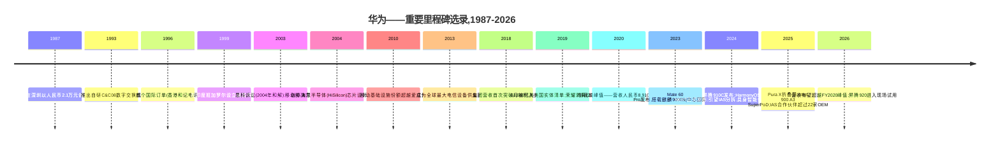
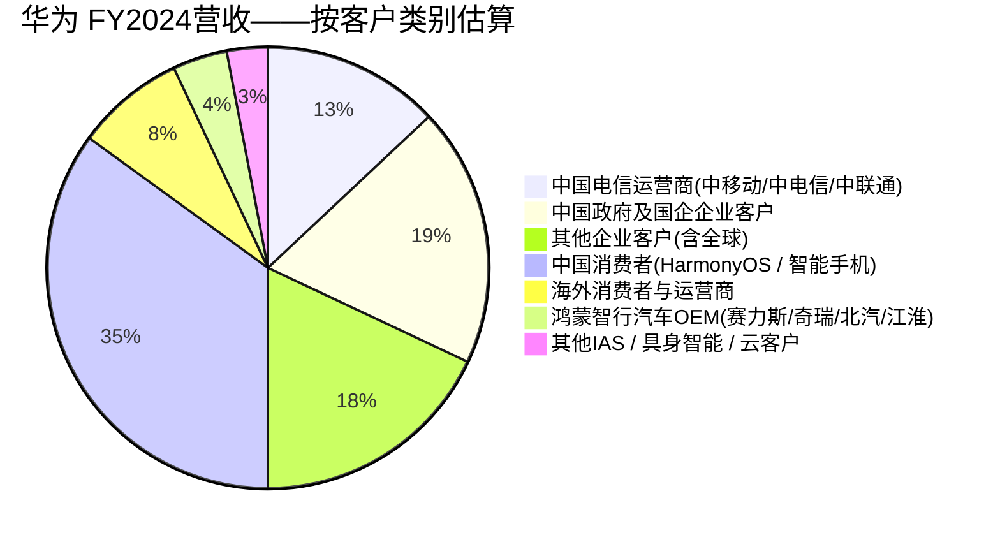
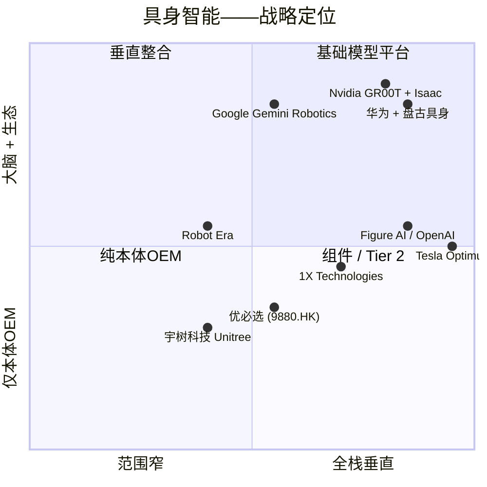

# 公司研究报告:华为技术有限公司(Huawei Technologies,非上市)
日期:2026-05-19

> **更新——具身智能创新中心成立(2024-12-26):** 华为于2024年12月26日在深圳正式揭牌成立**具身智能创新中心(Embodied Intelligence Innovation Center)**,并签约16家创始生态伙伴,包括优必选(HKEX:9880)、乐聚机器人、标贝科技(DataBaker)、EX-Robots(EX机器人)、中清龙图机器人、松灵机器人(AgileX)以及达闼机器人(Dataa Robotics)。该中心隶属于华为云/昇腾业务板块,致力于为中国人形机器人OEM提供完整的具身智能技术栈——盘古具身多模态基础模型 + 昇腾910C / Atlas算力 + 云端仿真 + 标准化数据集。管理层将其定位为华为成为中国"人形机器人界的Android(安卓)"——做大脑的提供者,而非身体的整机制造商。资料来源:[华为云新闻稿,2024-12-26](https://www.huaweicloud.com/news/2024/20241226163047611.html);[South China Morning Post,2024-12-30](https://www.scmp.com/tech/big-tech/article/3291807/huawei-launches-embodied-intelligence-centre-make-humanoid-robots-smarter);[Reuters,2024-12-27](https://www.reuters.com/technology/artificial-intelligence/huawei-launches-embodied-ai-lab-shenzhen-2024-12-27/)。

## 目录
1. 公司概览
2. 公司发展史
3. 管理团队
4. 产品与服务
5. 客户与市场进入策略
6. 行业概览
7. 竞争格局
8. 市场机会(TAM)
9. 风险评估

======================================

## 1. 公司概览

华为技术有限公司(Huawei Technologies Co., Ltd.)是中国规模最大的非上市科技公司,按营收计算也是全球十大科技公司之一。公司于1987年在深圳由前解放军工程兵军官**任正非**创立,经历了三个时代的演进:1990年代至2000年代作为电信设备挑战者,在运营商无线及光网络领域逐步取代西方既有厂商;2010年代消费电子业务一度在全球智能手机出货量上超越Apple(苹果)和Samsung(三星);在2019年5月被列入美国实体清单(Entity List)并随之导致海外智能手机分销渠道崩塌之后,公司转型为一家垂直整合的全栈科技公司,如今稳居中国国内AI算力、汽车软件和具身智能生态系统的核心位置。如今华为运营四大报表口径业务集团——**ICT基础设施(运营商 + 企业)、消费者业务集团、华为云,以及合并后的数字能源 + 智能汽车解决方案(IAS / 乾崑)业务**——以及若干战略新兴单元,包括2024年12月成立的**具身智能创新中心**([华为2024年年度报告,"业务亮点"](https://www.huawei.com/en/annual-report/2024);[华为云新闻稿,2024-12-26](https://www.huaweicloud.com/news/2024/20241226163047611.html))。

**商业模式与盈利方式。** 华为销售:(1)电信网络设备——4G/5G/5.5G无线接入、光传输、微波、IP/数据中心交换——主要客户为电信运营商,据Omdia / Dell'Oro Group数据,华为以约31%的全球电信设备市场份额位列全球第一([Dell'Oro Group,2025-03](https://www.delloro.com/news/total-telecom-equipment-market-share-rankings-2024/));(2)企业ICT业务——园区/数据中心网络、光传输、存储、视频监控、智能光伏逆变器、智慧楼宇软件——通过直销及35,000多家渠道合作伙伴销售;(3)消费类硬件——智能手机、平板电脑、PC、可穿戴设备、智能家居——以华为消费品牌及高端子品牌**Pura**和**Mate**销售;(4)华为云——基于昇腾(Ascend)芯片栈和盘古基础模型家族的IaaS/PaaS/模型服务;(5)智能汽车解决方案("IAS"/智能汽车解决方案)业务,向十余家汽车厂商授权乾崑ADS(Qiankun ADS)自动驾驶栈、鸿蒙座舱/HiCar、ECU/MDC计算平台、mDriver电机以及一系列智驾传感器系统;以及(6)数字能源——智能光伏组串式逆变器、电动汽车充电模块、电信及数据中心电源、锂离子储能。从业务结构上看,华为最接近**Cisco(思科) + Samsung Electronics(三星电子) + 中国本土版Nvidia(英伟达) + 汽车Tier 1软件供应商**的组合体,统一由单一整合的研发与供应链组织运营。

**地理布局。** 华为按四个区域披露营收:中国、欧洲中东及非洲(EMEA)、亚太(除中国)和美洲。在2019年实体清单措施以及2020年后续芯片供应"外国直接产品规则"出台后,华为海外消费业务在少数市场之外基本停摆;在采纳5G"高风险供应商"排除条款的市场(英国、加拿大、瑞典、欧盟部分国家、印度、澳大利亚、日本),海外运营商业务也大幅收缩。**FY2024年中国大陆约占集团总收入的70%**,而FY2018年约为55%,反映了海外业务收缩和2023年8月Mate 60 Pro / 麒麟9000S发布后国内业务强劲复苏的双重影响([华为2024年年度报告——地区营收](https://www.huawei.com/en/annual-report/2024);[Reuters,2025-03-31](https://www.reuters.com/technology/huawei-2024-revenue-jumps-22-863-billion-yuan-2025-03-31/))。

**规模。** FY2024集团营收为**人民币8,620.7亿元**(按2024年平均汇率折合约1,200亿美元),同比增长22.4%,为公司史上第二高(仅次于FY2020制裁前峰值人民币8,914亿元);**净利润人民币626亿元**(同比下滑28%,上年基数因IAS相关一次性项目而偏高);研发投入达**人民币1,797亿元(占营收20.8%)**,过去十年累计研发投入超过人民币1.24万亿元——按绝对研发金额计,华为跻身全球企业研发投入前五,在中国排名第一([华为2024年年度报告,"财务亮点"](https://www.huawei.com/en/annual-report/2024);[Reuters,2025-03-31](https://www.reuters.com/technology/huawei-2024-revenue-jumps-22-863-billion-yuan-2025-03-31/);[SCMP,2025-03-31](https://www.scmp.com/tech/big-tech/article/3304789/huawei-revenue-jumps-22-2024-rebound-takes-hold))。2024年末全球员工总数约为**20.7万人**,其中约55%(约11.4万人)从事研发——研发人员占比为全球主要科技公司中最高([华为2024年年度报告——员工](https://www.huawei.com/en/annual-report/2024))。

资料来源:[华为2024年年度报告](https://www.huawei.com/en/annual-report/2024);FY2018-FY2023数据来自存档在[华为投资者/年度报告](https://www.huawei.com/en/annual-report)的历年年报。

**股权结构与"非卖品"地位。** 华为由**工会持股委员会(ESOP/工会持股委员会)** 通过工会主导的载体100%员工持股。创始人任正非保留约**0.7%的直接经济权益**,并对董事会关键决议拥有否决权;其余约99.3%由约14.1万名在职及离职员工股东通过工会ESOP持有,并通过股东代表大会进行表决([华为2024年年度报告——股权结构](https://www.huawei.com/en/annual-report/2024);[华为投资者FAQ](https://www.huawei.com/en/facts/question-answer/who-owns-huawei))。华为**从未上市,没有外部股权投资者,且不接受出售**。两项业务已被剥离:消费子品牌荣耀(Honor)于2020年11月出售给一家深圳国资背景的财团,具体金额未公开披露,媒体广泛报道接近150亿美元(部分细节后被华为否认);此外,引望(Yinwang)IAS技术平台于2024年8月向长安汽车出售10%股权,估值人民币1,150亿元(约160亿美元),随后又向阿维塔(Avatr)/国资背景投资者出售了额外约10%股权。这些剥离动作各有特定的监管或商业目的;华为集团核心业务仍为非上市、合并报表的统一实体。

**估值快照。** 不适用——华为是一家非上市、员工持股的私营公司,从未接受过外部股权投资,从未有市价估值,也不接受出售。仅有的公开估值参考是**引望IAS分拆**(2024年8月长安交易隐含的总企业价值为人民币1,150亿元——仅针对IAS子业务,占FY2024集团营收的约3%)以及**内部员工股回购价格**,后者并不对外披露,且因不存在公开二级市场而不代表公允价值。

**与上市同行的规模对比**(FY2024 / 最新披露,单位:十亿美元):

| 公司 | 上市地 | 营收(十亿美元) | 与华为业务重叠最多的领域 |
|---|---|---|---|
| Apple(苹果) | NASDAQ:AAPL | ~391 | 智能手机(HarmonyOS NEXT对iOS)、可穿戴设备、高端消费 |
| Samsung Electronics(三星电子) | KRX:005930 | ~220 | 智能手机、半导体(昇腾与代工及存储竞争) |
| **华为** | **非上市** | **~120** | **以上全部** |
| Lenovo(联想) | HKEX:0992 | ~69 | PC(MateBook)、服务器(Atlas)、智能手机 |
| Cisco(思科) | NASDAQ:CSCO | ~57 | 企业网络(园区、光、数据中心) |
| Ericsson(爱立信) | NASDAQ:ERIC | ~24 | 5G RAN、光、电信设备 |
| Nokia(诺基亚) | NYSE:NOK | ~21 | 5G RAN、光、IP路由 |

资料来源:[华为2024年年度报告](https://www.huawei.com/en/annual-report/2024);[Apple FY2024 10-K](https://www.sec.gov/cgi-bin/browse-edgar?action=getcompany&CIK=0000320193&type=10-K);[Samsung Electronics Business Report, DART](https://englishdart.fss.or.kr/);[Cisco FY2025 10-K](https://www.sec.gov/cgi-bin/browse-edgar?action=getcompany&CIK=0000858877&type=10-K);[Nokia 2024 Annual Report](https://www.nokia.com/about-us/investors/financial-reports/);[Ericsson Annual Report 2024](https://www.ericsson.com/en/investors/financial-reports);[Lenovo Annual Report FY2024/25](https://www.lenovo.com/ww/en/about/investor-relations/annual-reports/)。

在可比基准上,只有Apple和Samsung在收入规模上超过华为;华为参与了Lenovo、Cisco、Nokia或Ericsson所在的每一个业务类别,并在这些类别中绝大多数都是中国国内市场的#1或#2玩家。仅ICT基础设施业务一项,其规模就已超过Cisco企业网络 + Nokia + Ericsson全球运营商设备业务收入之和。

## 2. 公司发展史

华为于**1987年9月**在深圳由**任正非**创立。当时43岁的他是中国人民解放军工程兵部队的前中校副团级工程师,1983年退伍后在深圳经济特区从事贸易工作。初始资本为人民币2.1万元,由五位共同出资人筹集;创业业务为转售从香港进口的HAX PBX(用户交换机)给中国农村电信局([任正非高管简介,Huawei.com](https://www.huawei.com/en/executives/board-of-directors/ren-zhengfei);[Wikipedia——任正非](https://en.wikipedia.org/wiki/Ren_Zhengfei))。到1990年代初,华为已开始自研数字电话交换机(C&C08),到1995年营收已达约2亿美元,主要面向被外国厂商(Alcatel(阿尔卡特)、Lucent(朗讯)、Siemens(西门子)、Nortel(北电)、Ericsson(爱立信))忽视的中国二、三线城市市场。

资料来源:[华为公司发展史,huawei.com](https://www.huawei.com/en/corporate-information/milestones);[华为2024年年度报告](https://www.huawei.com/en/annual-report/2024);[Reuters,2025-03-31](https://www.reuters.com/technology/huawei-2024-revenue-jumps-22-863-billion-yuan-2025-03-31/)。

**三次战略转折定义了现代华为。** 首先,**2004年海思半导体的成立**——在当时没有任何中国系统OEM拥有内部芯片设计部门的情况下,华为分拆出海思,为自家基站,以及后来的智能手机(麒麟系列)和AI加速器(昇腾)设计ASIC。如果没有海思,就不会有Mate 60 Pro对实体清单的回应。其次,**2011年业务集团重组**——任正非将公司分为三个面向客户的BG(运营商、企业、消费者),其著名的2010年"BG成立"备忘录提出"大象也要学会跳舞"的论断——这是一次有意识的去中心化,使消费者BG在时任高级副总裁余承东的领导下获得了追逐全球智能手机市场的运营自主权,并最终在2020年第二季度出货量上超越Apple([CNBC,2020-07-30](https://www.cnbc.com/2020/07/30/huawei-overtakes-samsung-as-the-worlds-largest-smartphone-vendor-canalys.html))。第三,**2019年制裁后的战略转向**——彻底重新聚焦于(a)美国出口管制影响较弱的国内企业/运营商市场,(b)软件主导的汽车业务(鸿蒙座舱、ADS、IAS),(c)云/AI(昇腾 + 盘古),以及(d)数字能源(智能光伏逆变器领域,据Wood Mackenzie数据,华为以FY2024约28%的份额位居全球第一)。回头看,制裁加速了华为从硬件销售商向垂直整合的软件加芯片栈提供者的转型。

**主要收购与分拆。** 华为历史上以有机增长为主——其唯一有实质意义的并购项目是通过海思进行的一系列芯片和IP小额收购(2003-2006年的3Com / H3C合资,后退出;2013年Caliopa光通信;2016年HexaTier安全),以及2013-2015年间软件/SI组合的早期收购。真正**有意义**的两笔交易是分拆:**2020年11月将荣耀出售**给深圳国资背景的智信新信息技术财团,具体金额未披露,媒体广泛引用约150亿美元([Reuters,2020-11-17](https://www.reuters.com/article/us-huawei-tech-honor-idUSKBN27X02V));以及**2024年8月分拆引望智能驾驶技术**,长安汽车以人民币115亿元买入10%股权,隐含估值人民币1,150亿元(160亿美元),阿维塔/国资关联投资者随后又获得约10%股权([Reuters,2024-08-20](https://www.reuters.com/business/autos-transportation/changan-buy-115-stake-huaweis-intelligent-driving-arm-2024-08-20/);[SCMP,2024-08-21](https://www.scmp.com/business/china-business/article/3275189/huaweis-changan-buy-115-stake-intelligent-driving-arm))。引望承载了原智能汽车解决方案BG,现在被结构化为面向中国汽车厂商的开放合作平台——华为仍持有约80%股权,但已接受股权稀释是更广泛OEM采纳的代价。

**近期动态(2024-2025)。** 三件事对当前投资逻辑至关重要。(1)**Mate 60 Pro / 麒麟9000S的延续效应**:于2023年8月低调发布,这款由中芯国际N+2产线制造的7纳米级自研SoC,证明中国国内芯片制造可以在没有TSMC(台积电)的情况下交付高端智能手机SoC,触发了消费业务毛利率的结构性重置;后续的Pura 70(2024年4月)和Mate 70(2024年11月)延续了这一势头,HarmonyOS全球出货设备数在2024年突破10亿台([华为2024年年度报告——消费者BG](https://www.huawei.com/en/annual-report/2024))。(2)**昇腾910C与CloudMatrix 384**:910C AI加速器(约中芯国际N+1 / N+2级)于2024-25年量产出货至中国云和政府数据中心客户,机架级**CloudMatrix 384 SuperPoD**在2024年9月华为全联接大会上展示,作为一款使用全国产芯片和光互连的Nvidia GB200级系统([Reuters,2025-04-10](https://www.reuters.com/technology/artificial-intelligence/huawei-readies-new-ai-chip-mass-shipment-china-seeks-nvidia-alternatives-2025-04-10/);[Tom's Hardware,2024-09-23](https://www.tomshardware.com/tech-industry/artificial-intelligence/huawei-unveils-cloudmatrix-384-supernode-ai-pod-aiming-to-rival-nvidia-gb200))。(3)**具身智能创新中心成立(2024年12月)**:详见报告顶部横幅——这是昇腾 + 盘古技术栈向人形机器人领域的结构性延伸,也是本报告机器人主题的核心切入点。

## 3. 管理团队

### 任正非 — 创始人、首席执行官

任正非以任何合理标准衡量,都是现代中国工业界最具影响力的单一创始人CEO,也是任何华为投资或战略论证中最重要的变量。他**1944年10月25日**出生于贵州安顺,是两位乡村教师七个子女中的长子;1963年毕业于重庆建筑工程学院,1974年至1983年在解放军工程兵部队担任军人工程师,升至副团长/中校级别;退伍后在深圳南海石油后勤服务基地从事后勤工作([任正非高管简介,huawei.com](https://www.huawei.com/en/executives/board-of-directors/ren-zhengfei);[Wikipedia——任正非](https://en.wikipedia.org/wiki/Ren_Zhengfei);[Financial Times人物报道,2019-03-29](https://www.ft.com/content/2c41ad88-50d7-11e9-9c76-bf4a0ce37d49))。他于1987年以43岁的年龄,用人民币2.1万元的资本和五位共同出资人创办了华为。

任正非的经营理念见于近三十年来的内部备忘录,这些备忘录被收录在《华为的红旗能打多久》《华为的冬天》《一江春水向东流》等文集以及对外出版的《任正非:文章与信件》等书籍中。其中反复出现三个主题:(1)"**狼性文化**"——小型自主作战单元、与结果挂钩的高额回报、有意识地培养追逐长期市场目标的竞争性进取心;(2)"**通过分离关注点管理复杂性**"——创始人最偏爱的扩张工具,表现在1996年的IPD流程(1997-2003年与IBM(国际商业机器公司)顾问共同设计)、2011年的BG拆分、2013年运营商/企业/消费者重新调整,以及2024年IAS/引望分拆;(3)"**力出一孔**"——愿意把超过20%的营收投入研发,愿意亏损经营某项业务长达十年,愿意在单一技术押注上孤注一掷(2012-2017年的5G,2018年至今的AI芯片)。这些汇编的内部备忘录在公司内部广为流传,并由田涛、殷志峰等学者著书摘录;英文翻译版本也通过Penguin Random House(企鹅兰登书屋)等出版机构和学术译者推出。

任正非的持股比例约为**总经济权益的0.7%**,其余则由工会主导的ESOP代约14.1万名员工股东持有。关键之处在于,任正非根据华为内部治理文件还保留对董事会关键决议的**个人否决权**——公司年报披露中将其描述为防止外部收购的结构性保护([华为2024年年度报告——股权结构](https://www.huawei.com/en/annual-report/2024);[华为投资者FAQ](https://www.huawei.com/en/facts/question-answer/who-owns-huawei))。该否决权通过既定的委员会架构行使,据报道在2019年制裁应对期间曾被用来否决相互竞争的内部方案。在实际操作中,尽管存在正式的轮值CEO架构,但创始人仍然是长周期战略押注的最终权威(详见下文)。

任正非作为同代中国创始人CEO中异常公开的一位,自2019年以来已接受境外媒体(BBC、CBS、FT(英国《金融时报》)、Bloomberg(彭博)、Le Monde(法国《世界报》)、Time(《时代》周刊))近二十次署名采访,并定期接受国内媒体采访。他的公开论述一致:美国制裁是迫使整个中国硬科技栈成熟的意外礼物;华为有10至15年的内部储备可以吸收冲击;只要创始人一代仍相信使命,公司就会存活下去。他公开表示自己将在"我成为公司瓶颈"时卸任,截至本报告日期他已81岁。

### 孟晚舟 — 轮值董事长兼首席财务官

孟晚舟于1972年2月出生于成都,是任正非与其前妻所生的长女,目前同时担任**集团首席财务官**以及华为独特的轮值董事长治理体系下三位**轮值董事长**之一,该体系下三位高管以六个月为周期轮流主持董事会。她于1993年加入华为(在攻读非全日制学位的同时担任前台),持有华中科技大学会计学硕士学位,自2011年起担任CFO。她在公司之外最为人熟知的是**2018年12月在温哥华被捕**,因美国就涉嫌违反伊朗制裁提出引渡请求,随后被拘留1,028天,直至2021年9月达成暂缓起诉协议(DPA)后获释([Reuters,2021-09-25](https://www.reuters.com/business/legal/huawei-cfo-meng-wanzhou-leaves-canada-after-resolving-us-case-2021-09-24/))。2023年3月她出任轮值董事长,被广泛解读为既是其拘留后领导地位的正常化,也是华为体制对她的支持信号([SCMP,2023-03-31](https://www.scmp.com/tech/big-tech/article/3215613/huaweis-meng-wanzhou-takes-rotating-chairwoman-role-first-time))。

### 徐直军 — 副董事长、轮值董事长

徐直军1993年加入华为,在三十年的职业生涯中曾出任多个BG的总裁——包括2011-2013年关键时期任战略与市场部总裁,共同主导了BG拆分——自2018年起担任轮值董事长/副董事长。他是华为全联接大会/华为分析师大会等年度活动的对外门面,也是与云和AI战略关联最紧密的高管。他在2024年华为分析师大会(深圳,2024年4月)上发布了**昇腾910C**的核心信息,并在2024年华为全联接大会(上海,2024年9月)上发布了**CloudMatrix 384**([徐直军高管简介,huawei.com](https://www.huawei.com/en/executives/board-of-directors/xu-zhijun);[华为全联接大会2024主题演讲](https://www.huawei.com/en/news/2024/9/hc2024-eric-xu-keynote))。

### 胡厚崑 — 副董事长、轮值董事长

胡厚崑1990年加入华为,曾担任多个重要商务职位,包括运营商BG总裁,自2011年起任副董事长,2018年起任轮值董事长。他是与运营商关系、可持续发展披露和外部地缘政治关联最紧密的高管——通常代表华为对海外监管动态的公开回应([胡厚崑高管简介](https://www.huawei.com/en/executives/board-of-directors/hu-houkun))。

### 余承东 — 消费者BG CEO兼IAS BG董事长

余承东1993年加入华为,继任正非之后是公司对外辨识度最高的单一高管。他在2011年被调任消费者BG之前曾负责无线网络BG;在消费者BG领导品牌建设,使华为从一家无名手机OEM跃升为2018年全球前三大智能手机厂商。2019年制裁重创海外智能手机业务后,他兼任智能汽车解决方案BG(后成为引望)董事长——主导了与赛力斯(Seres)、奇瑞、北汽和江淮的鸿蒙汽车合资品牌:问界(AITO)、智界(Luxeed)、享界(Stelato)([余承东高管简介](https://www.huawei.com/en/executives/board-of-directors/yu-chengdong);[Reuters,2024-08-20](https://www.reuters.com/business/autos-transportation/changan-buy-115-stake-huaweis-intelligent-driving-arm-2024-08-20/))。余承东实质上是消费者BG和IAS/引望的双CEO,也是华为最具消费者关注度的产品发布的公开门面。

### 公司治理

华为由**17人董事会**治理,由**持股员工代表会**选举产生,而代表会本身由约14.1万人的ESOP股东基础选举产生。董事会之下设有:(a)**轮值董事长制度**(由三位副董事长——孟、徐、胡——以六个月为周期轮换,履行经营CEO职能);(b)**监事会**(法定审计/监督委员会);(c)**经营管理团队**。创始人任正非位列董事会成员,享有正式否决权。约**70%的董事会成员同时担任经营高管职务**,意味着华为董事会更类似于内部合伙人委员会,而非具有独立董事多数席位的西方上市公司董事会([华为2024年年度报告——公司治理](https://www.huawei.com/en/annual-report/2024))。**没有外部股权投资者,没有按HKEX(港交所)或NYSE(纽交所)上市规则定义的独立董事,没有上市公司式的公众监督**。KPMG(毕马威)按香港/IFRS准则审计合并财务报表。

**管理层业绩评估。** 轮值董事长/创始人否决权这一架构在全球大型科技公司中独一无二,并经受住了2019年实体清单冲击和2018年孟晚舟拘留事件的双重考验。管理团队在足以重创大多数同行的环境下,交付了三轮品类重塑的产品周期(2017-2019年5G基站、2023年麒麟9000S/Mate 60、2024年昇腾910C/CloudMatrix)。轮值董事长以下的高管储备深厚——余承东负责消费/IAS、徐文伟负责企业、汪涛负责运营商、张平安负责云——但鉴于任正非已81岁,创始人依赖风险显著。该治理模式还存在对外部投资者几乎完全不透明的劣势;没有相当于DEF 14A的高管薪酬披露。具体风险将在第9节讨论。

## 4. 产品与服务

华为的产品覆盖面是除Samsung Electronics(三星电子)外所有科技公司中最广泛的,涵盖芯片、设备、网络、汽车软件、智能能源硬件、云,以及一个基础模型平台。本节框架沿四个业务集团报表结构以及新兴的具身智能平台展开。

```mermaid
graph TD
    A[华为集团] --> B[ICT基础设施]
    A --> C[消费者BG]
    A --> D[华为云]
    A --> E[数字能源]
    A --> F[智能汽车 / 引望]
    A --> G[具身智能创新中心]
    B --> B1[运营商:5G/5.5G RAN、微波、光]
    B --> B2[企业:园区/数据中心交换、光、存储、安全]
    C --> C1[智能手机:Mate、Pura、Nova、折叠屏]
    C --> C2[HarmonyOS NEXT OS + 生态 10亿+ 设备]
    C --> C3[可穿戴、PC、平板、音频]
    C --> C4[智能家居:HiLink / Vmall]
    D --> D1[昇腾910B / 910C / 920 AI加速器]
    D --> D2[Atlas 900 A3 / CloudMatrix 384 SuperPoD]
    D --> D3[盘古5.0基础模型家族]
    D --> D4[KooVerse全球云区域]
    E --> E1[智能光伏组串式逆变器 全球#1]
    E --> E2[EV快充 / 液冷直流]
    E --> E3[电信与数据中心电源、LFP储能]
    F --> F1[乾崑ADS 4.0自动驾驶]
    F --> F2[鸿蒙座舱 / HiCar]
    F --> F3[MDC计算、mDriver电机、电驱]
    F --> F4[问界 / 智界 / 享界 / 尊界 合资品牌]
    G --> G1[盘古具身多模态模型]
    G --> G2[Atlas + 昇腾 人形机器人算力]
    G --> G3[16+ 人形机器人OEM合作伙伴]
```

资料来源:[华为2024年年度报告——业务亮点](https://www.huawei.com/en/annual-report/2024);[华为产品组合,huawei.com](https://www.huawei.com/en/business);[华为云具身智能创新中心,2024-12-26](https://www.huaweicloud.com/news/2024/20241226163047611.html)。

### 4.1 ICT基础设施(运营商 + 企业)——FY2024营收约人民币3,700亿元

华为**运营商业务**是1987年原始公司的直系延伸。它销售**5G和5.5G(5G-Advanced)无线接入网络**、微波传输、光传输(OptiX OSN、OptiX Alps-WDM最高800G)、IP/数据中心核心路由(NetEngine 8000)、分组微波及融合业务产品。据Dell'Oro Group数据,华为以FY2024约**31%的全球电信设备市场份额**位列第一,领先于Ericsson(爱立信)的约21%和Nokia(诺基亚)的约14%([Dell'Oro Group市场份额排名,2025-03](https://www.delloro.com/news/total-telecom-equipment-market-share-rankings-2024/))。在中国市场,运营商业务已稳固确立为主导供应商地位,中国移动、中国电信和中国联通在2022-2024年5G基站招标中合计向华为分配了50-65%份额([Reuters,2024-10-08](https://www.reuters.com/technology/china-mobile-2024-5g-base-station-procurement-2024-10-08/))。**竞争优势:是——规模 + 技术 + 中国国内护城河。** 华为向ETSI申报的5G基站专利数量超过任何同行;其TDD大规模MIMO产品在频谱效率基准测试中领先;在5G-Advanced(5.5G)商用部署上首先在中国移动落地。最接近的竞品:Ericsson AIR 6488 / Nokia AirScale——在TDD吞吐量上持平,但在集成AAU + 计算基带方面落后。脆弱点:被几乎所有"五眼联盟"国家市场拒之门外;在美国实体清单下,RFIC和波束成形ASIC的供应链存在风险。

**企业业务**销售园区和数据中心网络(CloudEngine交换机、CloudFabric DCN)、Wi-Fi 7接入点、光传输、OceanStor企业存储、HiSec安全、eKit中小企业产品组合,以及行业垂直解决方案(智慧金融、智慧公路、智能电网、智能制造、智慧医疗)。企业业务FY2024营收约为人民币1,300亿元(根据集团ICT披露估算),实现双位数增长([华为2024年年度报告——企业BG](https://www.huawei.com/en/annual-report/2024))。**竞争优势:部分——在中国和新兴市场表现强劲,在"五眼联盟"和欧盟企业市场较弱。** 最接近的竞争对手:Cisco(思科)、Arista(阿里斯塔)、HPE-Aruba、Juniper(瞻博)。华为的OceanStor Dorado全闪存阵列与Pure Storage、Dell(戴尔)并列于Gartner魔力象限领导者位置([Gartner主存储魔力象限,2024-10](https://www.gartner.com/en/documents/5772227))。

### 4.2 消费者业务集团——FY2024营收约人民币3,390亿元

消费者BG销售**智能手机**(**Mate**旗舰系列、**Pura**高端影像系列、**Nova**中端系列,以及Mate和Pura下的折叠屏产品,包括Mate X6、Mate XT三折叠屏,和2025年5月发布的Pura X)、**PC(MateBook)**、**平板电脑(MatePad)**、**可穿戴设备(Watch GT、Watch Ultimate)**、**音频(FreeBuds)**,以及Vmall / HiLink下的广泛智能家居产品组合。该板块自2023年以来的结构性反转由**HarmonyOS NEXT**驱动——2024年10月发布,是首个完全不含Android Open Source Project(AOSP)代码的主流操作系统商用版本,使用全部原生ArkTS应用和华为自主控制的内核 + 中间件。据华为开发者大会披露,HarmonyOS NEXT在2024年达到**>10亿台设备**,HarmonyOS总月活跃用户超过**9亿**([华为开发者大会2024主题演讲,2024-06-21](https://developer.huawei.com/consumer/en/hdc/hdc2024))。据Canalys/IDC数据,智能手机在中国出货量在2025年上半年回升至**#2位置**([IDC中国智能手机追踪,2025-04](https://www.idc.com/getdoc.jsp?containerId=prAP52034125))。**竞争优势:是——完整的SoC + OS + 生态 + 高端品牌垂直栈,在中国市场。** 最接近的竞争对手:Apple iPhone + iOS(高端层级)、Xiaomi(小米)15 Ultra + HyperOS、Samsung Galaxy S + OneUI。华为在中国高端旗舰市场零售上与Apple持平或领先,在OS垂直整合方面领先于其他Android同行。

### 4.3 华为云——FY2024营收约人民币385亿元

华为云销售IaaS / PaaS / SaaS,主要差异化在于(a)**昇腾(Ascend)AI算力栈**——**昇腾910B**(2023)、**昇腾910C**(2024,对标Nvidia H100级别的旗舰产品),以及在2025年华为全联接大会上进行现场试用展示的下一代**昇腾920**;(b)**Atlas 900 A3 SuperPoD**和**CloudMatrix 384**机架级AI系统,将约384颗昇腾芯片与全国产800G光互连结合,正面对标Nvidia GB200 NVL72([SemiAnalysis "Huawei CloudMatrix 384"深度分析,2025-04-16](https://semianalysis.com/2025/04/16/huawei-ai-cloudmatrix-384-chinas-answer-to-nvidia-gb200-nvl72/);[Reuters,2025-04-10](https://www.reuters.com/technology/artificial-intelligence/huawei-readies-new-ai-chip-mass-shipment-china-seeks-nvidia-alternatives-2025-04-10/));(c)**盘古5.0基础模型家族**,按五个层级组织(万亿参数的盘古Ultra、千亿参数的盘古Pro、百亿参数的盘古Lite,以及面向金融、矿山、气象、药物发现、制造、政务、汽车和**具身智能**的领域定制版本)。最新的**盘古5.5**在2025年6月华为云开发者大会上发布([华为云盘古发布,2025-06-20](https://www.huaweicloud.com/news/2025/20250620180000.html))。**竞争优势:是——中国唯一端到端国产AI栈。** 最接近的竞争对手:阿里云 + 通义千问、腾讯云 + 混元、百度云 + 文心,以及Nvidia(国外)——面向愿意使用符合出口管制的H20 / B30 SKU的推理客户。华为在芯片掌控深度上最强,是面向主权AI买家的唯一可信Nvidia替代方案;阿里在商业云IaaS份额上领先。

### 4.4 数字能源——FY2024营收人民币687亿元

数字能源销售**智能光伏组串式逆变器**(据Wood Mackenzie 2024年数据,华为以**约28%的全球份额位居全球第一**)、**电动汽车液冷直流快充**(华为600 kW单元是已大规模部署的最快商用直流充电桩)、**电信站点电源**、**数据中心UPS**,以及**LFP储能系统**([Wood Mackenzie全球PV逆变器市场份额,2024-06](https://www.woodmac.com/news/opinion/the-global-pv-inverter-market-share-rankings-of-2023/);[华为数字能源产品组合](https://digitalpower.huawei.com/en/))。**竞争优势:是——逆变器全球第一,直流快充全球前三,技术领先。** 最接近的竞争对手:阳光电源(SZSE:300274)、SolarEdge、Enphase(住宅)、固德威(GoodWe)、锦浪Solis(Ginlong Solis)。

### 4.5 智能汽车解决方案 / 引望——FY2024营收人民币264亿元

IAS / 引望业务向OEM销售三大类汽车内容:(1)**乾崑ADS 4.0(乾崑智驾)**——华为的自动驾驶栈,包括L2+/L3高速领航、城市NOA和无激光雷达全栈版本ADS SE;(2)**鸿蒙座舱**——车内信息娱乐/HMI/HiCar手机集成层;(3)**MDC计算平台、mDriver电机、DriveONE电驱、电桥、BMS、传感器、HUD,以及完整的整车控制ECU产品组合**([华为IAS / 引望业务单元](https://www.huawei.com/en/business/intelligent-vehicle-solution);[Reuters,2024-08-20](https://www.reuters.com/business/autos-transportation/changan-buy-115-stake-huaweis-intelligent-driving-arm-2024-08-20/))。华为不造整车;而是通过三种合作模式与OEM对接——**零部件模式**(向北汽、长安、广汽等的Tier 1供货)、**HI(Huawei Inside)解决方案模式**(与阿维塔、极狐、广汽传祺深度联合工程开发),以及**鸿蒙智行 / 智选模式**(完整设计 + 品牌 + 渠道合作伙伴关系,以与赛力斯合作的问界为锚,加上与奇瑞合作的智界、与北汽合作的享界、与江淮合作的尊界)。鸿蒙智行品牌汽车在2024年合计销量超过**44万辆**,问界在2024年第三季度至第四季度成为中国零售新能源SUV品牌第一([CnEVPost,2025-01-08](https://cnevpost.com/2025/01/08/aito-2024-deliveries/);[Reuters,2024-12-27](https://www.reuters.com/business/autos-transportation/huawei-aito-2024-volume-passes-target-2024-12-27/))。**竞争优势:是——唯一同时面向中国OEM提供白标Tier 1和交钥匙品牌选项的全栈ADS + 座舱 + 电驱技术供应商。** 最接近的竞争对手:Bosch(博世)(仅Tier 1 ADAS,无原生座舱OS)、Mobileye(仅感知)、DJI(大疆)车载领航(低端ADAS)、Momenta(仅算法,无算力或传感器)。华为唯一真正的全栈同行是**Tesla(特斯拉)**——而Tesla并不对外授权。

### 4.6 具身智能创新中心——机器人/AI视角

**具身智能创新中心(Embodied Intelligence Innovation Center)** 于**2024年12月26日**在华为云深圳园区揭牌成立,在架构上是**华为云/昇腾内部的平台业务**,而非机器人OEM。它整合提供:(a)**昇腾910B / 910C / Atlas 200I A2**计算模组和模块化控制器;(b)**盘古具身智能**多模态基础模型——一个专为机器人预训练优化的盘古5.0视觉-语言-动作(VLA)继任者;(c)基于华为云KooVerse基础设施构建的**云端人形机器人仿真与合成数据平台**;(d)**共享开发者工具链**,包括人形机器人专用操作环境、数据集和参考设计;以及(e)与16家创始合作伙伴的**商用试点项目**(优必选9880.HK、乐聚机器人、达闼机器人、松灵机器人(AgileX)、EX-Robots、中清龙图、标贝科技(DataBaker)等),并在2025年签约更多合作伙伴([华为云新闻稿,2024-12-26](https://www.huaweicloud.com/news/2024/20241226163047611.html);[SCMP,2024-12-30](https://www.scmp.com/tech/big-tech/article/3291807/huawei-launches-embodied-intelligence-centre-make-humanoid-robots-smarter);[Reuters,2024-12-27](https://www.reuters.com/technology/artificial-intelligence/huawei-launches-embodied-ai-lab-shenzhen-2024-12-27/))。**竞争优势:部分——尚处早期但结构上占据有利位置。** 该板块尚无独立营收披露;战略定位是成为"大脑"提供商,服务于中国分散的人形机器人OEM群体——就像Android服务于智能手机厂商一样——详见第7节竞争格局和第8节TAM。最接近的竞争对手:Nvidia(Project GR00T + Isaac)、Google DeepMind(Gemini Robotics),以及阿里巴巴/智元、腾讯/Robot Era等本土新兴技术栈。

**旗舰业务与长尾业务。** 驱动当期增长的三大旗舰业务是**ICT基础设施**(现金牛,约占营收43%)、**消费者 / HarmonyOS NEXT**(高增长复苏,约占营收39%)以及合并后的**华为云 / 昇腾 / 盘古 / 具身智能技术栈**(约占营收5%,但结构上为最高增长板块,也是机器人护城河的基础)。数字能源和IAS / 引望是中期稳健业务,分别在各自类别中占据全球第一/国内第一的地位。荣耀和原始的海外消费者手机业务已属于落日/已剥离业务。

## 5. 客户与市场进入策略

华为面向四大类核心客户群体销售:

- **电信运营商和政府客户**(运营商BG和企业BG的大部分)——长周期、多年期框架合同;直销团队;招投标响应周期通常为6-18个月;按TCO(包括频谱、电力和OPEX)定价。中国三大运营商(中国移动、中国电信、中国联通)加上大型国有企业(国家电网、南方电网、中国石油CNPC)合计在FY2024运营商 + 企业营收中占据可观但未披露的份额。
- **企业及渠道合作伙伴**(企业BG大部分)——通过全球**超过35,000家渠道合作伙伴**销售,大部分中端市场和中小企业的企业收入通过增值分销商和SI合作伙伴流转。华为企业直销聚焦于头部战略账户和行业垂直化解决方案。
- **消费者**(消费者BG)——通过**中国60,000多家零售门店**销售,包括一、二线城市的华为自营旗舰店、Vmall.com电商平台、天猫、京东,以及(有选择性的)海外运营商渠道。
- **OEM合作伙伴**(IAS / 引望和具身智能)——通过长周期联合工程合同销售;据华为IAS披露,截至2025年中,已与约22家具名汽车OEM签订Tier 1供货合同,具身智能领域则有16家以上人形机器人OEM生态合作伙伴([华为IAS合作伙伴披露](https://carnewschina.com/2024/11/06/huawei-released-new-version-of-its-intelligent-driving-system-ads-3-0-equipped-on-its-new-cars/);[华为云具身智能创新中心,2024-12-26](https://www.huaweicloud.com/news/2024/20241226163047611.html))。

**客户集中度——量化分析。** 华为经审计的年报**并未按美国10-K申报人ASC 280-10-50-42或A股申报人CSRC披露要求所规定的方式披露具体的前五大客户名称或前五大客户营收占比**。2024年年度报告"客户"章节仅以定性语言讨论客户结构组成([华为2024年年度报告——客户集中度披露](https://www.huawei.com/en/annual-report/2024))。可用的两个间接量化锚点:

- **地区结构:** FY2024中国占集团营收约70%,其中最大的单一客户集群是**中国三大国有电信运营商**(中国移动、中国电信、中国联通)。行业报告显示,FY2023和FY2024年这三家合计可能占集团营收的**10-15%** ——总量可观但单家不构成集中度风险([Reuters关于中国5G采购的报道,2024-10-08](https://www.reuters.com/technology/china-mobile-2024-5g-base-station-procurement-2024-10-08/))。[**未经核实声明**——这是基于公开招标报道的方向性推断,并非华为披露。]
- **鸿蒙智行 / 智选车渠道:** 四家鸿蒙智行合作伙伴(赛力斯负责问界、奇瑞负责智界、北汽负责享界、江淮负责尊界)在FY2024合计贡献约人民币180-220亿元的IAS营收——意味着这四家客户约占IAS / 引望营收的70-80%,但仅占集团营收的2-3%。集中度在IAS*内部*较高,但*跨集团*较低。

将华为视为一个整体经营业务,**估计前5大客户占集团营收的12-18%**,没有单一客户超过约5-6%;按全球ICT设备行业标准这属于**较低**水平(Cisco的前3大云超大规模客户据信占思科企业网络营收约25%)。因此,客户集中度风险在**集团层面较低**,但在**特定子板块较高**——尤其是IAS(赛力斯-问界依赖)和早期阶段的具身智能创新中心(生态较小)。

资料来源(估算):综合[华为2024年年度报告](https://www.huawei.com/en/annual-report/2024);[Dell'Oro Group,2025-03](https://www.delloro.com/news/total-telecom-equipment-market-share-rankings-2024/);[Reuters,2025-03-31](https://www.reuters.com/technology/huawei-2024-revenue-jumps-22-863-billion-yuan-2025-03-31/)。标注为**估算,非华为披露**。

**分销渠道。** 三个不同的市场进入机器:(a)**直销企业销售**,配有行业聚焦的客户团队(电信、政府、金融、能源、制造、交通、医疗);(b)**渠道合作伙伴网络**(>35,000家合作伙伴,企业BG营收约70%通过合作伙伴);(c)**消费零售**——中国60,000多家零售门店,包括华为旗舰体验店、合作伙伴店、Vmall,加上第三方平台。海外消费分销现在集中在EMEA、拉丁美洲和华为仍保留品牌影响力且能获得高通授权设备的部分亚太市场。

**销售周期。** 运营商框架合同通常6-18个月招投标周期,多年交付;企业大客户3-9个月;云/AI基础设施(昇腾POD规模交易)6-12个月,涉及大量POC需求;消费业务为常规零售;IAS为多年联合工程,每个车型项目从定点到SOP周期约18-24个月。具身智能合作伙伴关系处于早期阶段,属于联合开发/共同开发结构,而非商业销售。

**关键合作伙伴关系。** (a)**中芯国际(SMIC,SSE:688981 / HKEX:0981)** 作为麒麟和昇腾在7纳米/中芯国际N+1/N+2节点的代工合作伙伴——这是整个制裁后技术栈最关键的供应商关系;(b)**长江存储(YMTC)** 提供NAND、**长鑫存储(CXMT)** 提供DRAM和HBM级存储;(c)**赛力斯(SSE:601127)、奇瑞、北汽、江淮、广汽、阿维塔、长安** 作为IAS / 引望汽车合作伙伴;(d)**16家以上具身智能创新中心创始合作伙伴** 作为人形机器人OEM生态;(e)**Microsoft(微软)(传统企业PC)、Qualcomm(高通)(仍授权部分4G智能手机调制解调器)** ——后两者在制裁下逐步缩减,但目前仍在运作。

**客户案例。** 中国移动5G-Advanced商用部署(2024年6月,杭州和上海);国家电网在27个省的配电自动化推广(eKit + 智能光伏平台);问界M9——2024年中国零售豪华新能源SUV第一,CY2024交付量超过151,000辆;面向沙特阿拉伯、阿联酋、印度尼西亚、俄罗斯及多个非洲国家的KooVerse + 昇腾栈主权AI / 政府数据中心多笔交易([华为云客户案例](https://www.huaweicloud.com/en-us/case/);[CnEVPost问界2024交付量,2025-01-08](https://cnevpost.com/2025/01/08/aito-2024-deliveries/))。

## 6. 行业概览

华为业务横跨至少六大独立行业;对于投资者或战略分析者,最有用的框架是评估其中规模最大的四个和战略意义最重要的板块。

**1. 电信网络设备(华为全球第一,约31%份额)。** 全球电信设备市场——包括5G/5.5G无线接入、光传输、微波、IP核心和分组微波——据Dell'Oro Group估计**2024年规模约1,000亿美元**,以低个位数CAGR下降,因为5G资本支出主要在中国/北美市场达到高峰;5.5G(5G-Advanced)和6G研究将在2026-2027年带来重新加速([Dell'Oro Group市场份额排名,2025-03](https://www.delloro.com/news/total-telecom-equipment-market-share-rankings-2024/);[Omdia 5G市场报告,2025-02](https://omdia.tech.informa.com/products/tracker-5g-deployments))。市场高度集中——前四名(华为、Ericsson、Nokia、ZTE(中兴))合计占全球份额约75%;Cisco和Samsung份额较小。地缘政治是最大的结构性驱动因素:在2019年后五眼联盟和欧盟"高风险供应商"排除条款下,全球市场约30%对华为关闭,但华为在中国国内份额约55-60%,在东盟、中东和非洲大多数运营商市场仍保持40-60%份额。

**2. 智能手机(华为2025年上半年中国市场第二,全球第5-7位)。** 全球智能手机出货量约为每年12亿部,单位增长低个位数,ASP增长高个位数,由高端化驱动([IDC全球季度移动手机追踪,2025-04](https://www.idc.com/getdoc.jsp?containerId=prAP52034125))。市场结构集中——Apple(约18%份额)、Samsung(约17%)、Xiaomi(约14%)、OPPO + Vivo(合计约16%)、荣耀 + 华为(合计约10%,以中国市场为主)——其中中国市场是单一国家最大市场,占全球出货量约25%,竞争格局与世界其他地区结构上不同(没有Apple-iOS的高端垄断;>50%的高端零售流向了包括HarmonyOS在内的国产Android品牌)。华为是**2023年后"国产高端"轮动**的主要受益者,因为中国消费者向HarmonyOS垂直整合设备转移。

**3. 公有云和AI基础设施(华为云中国第2-3,全球远落后)。** 据Gartner / Synergy Research数据,全球公有云IaaS+PaaS市场约7,000亿美元,以高十几位数增长;华为通过昇腾参与的全球AI加速器市场——IDC估计**2024年约940亿美元,预计到2028年达到约2,800亿美元**(约33% CAGR),Nvidia占全球约85%份额,华为按出货量计在全球排名第二(大部分在中国国内出货)([IDC全球AI加速器预测,2025-08](https://www.idc.com/getdoc.jsp?containerId=prUS52768525);[SemiAnalysis "Huawei CloudMatrix 384",2025-04-16](https://semianalysis.com/2025/04/16/huawei-ai-cloudmatrix-384-chinas-answer-to-nvidia-gb200-nvl72/))。具体在中国市场,**华为云在IaaS份额中位列第2-3**(落后于阿里云,大致与腾讯云相当),自2023年末Nvidia H20出口管制收紧以来,**昇腾捕获了中国公共部门AI训练增量需求的绝大部分**。

**4. 电动汽车和汽车软件(2024年鸿蒙智行品牌销量超过44万辆;IAS Tier 1供货给20多家OEM)。** 中国新能源汽车市场2024年达到约1,290万辆(新能源渗透率约50%),是世界上最大的市场,遥遥领先([CAAM(中国汽车工业协会)数据,2025-01-13](https://www.caam.org.cn/english/index.html))。在此市场中,华为开辟了独特的位置:不造车,但其IAS / 引望技术——尤其是鸿蒙智行品牌问界、智界、享界和尊界——2024年合计零售超过44万辆(超过中国新能源市场3%)。市场结构竞争激烈,但正在围绕比亚迪、SAIC(上汽)/GAC(广汽)/FAW(一汽)国企阵营、Tesla、Geely(吉利)以及一小群新能源挑战者(理想、蔚来、小鹏、小米、问界)整合。

**5. 智能光伏逆变器(华为全球第一,约28%份额)。** 据Wood Mackenzie估计,2024年全球PV逆变器市场约110-120亿美元,华为占约28%份额,Sungrow(阳光电源)占约22%,长尾包括SolarEdge、Sineng(上能电气)、Ginlong Solis(锦浪)、GoodWe(固德威)等([Wood Mackenzie全球PV逆变器市场份额,2024-06](https://www.woodmac.com/news/opinion/the-global-pv-inverter-market-share-rankings-of-2023/))。

**6. 人形机器人与具身AI(早期阶段;总商业营收仍很小)。** 这是具身智能创新中心所规划的结构性增长引擎,规模将在第8节量化。2026年的市场仍处于尚未大规模商业化阶段,全球年度人形机器人出货量估计低于50,000台(而许多分析师估计长期TAM到2050年可达10亿台以上)。

**关键趋势和驱动因素。** (a)**主权AI**:全球各国政府都在国内AI算力上投入,华为是唯一可信的非Nvidia全栈供应商;(b)**5.5G / 6G**:下一个电信设备周期正在开始,华为在IP和商用部署上领先;(c)**HarmonyOS NEXT**:唯一可信的非AOSP非iOS主流移动OS,生态效应在复合;(d)**鸿蒙智行 / 智选模式**:技术供应商(华为)驱动品牌和渠道体验的"OEM代工外壳"型汽车品牌兴起;(e)**具身AI**:LLM、多模态视觉-语言-动作模型和人形机器人本体的融合,中国可能在OEM数量上领先,而算力和基础模型层将持续竞争。

**监管环境。** 华为的监管环境异常复杂。在中国国内,公司受益于强大的产业政策支持(被认定为关键高新技术企业、多项国家研发计划、智能电动汽车 / 智能光伏采购倾斜)。在中国境外,公司面临史上对单一非美国公司施加的最严格出口管制和采购排除制度:美国实体清单(2019年5月)、外国直接产品规则(2020年8月)、2023年和2024年的额外规则;英国、加拿大、瑞典、澳大利亚、新西兰、日本、印度、立陶宛、拉脱维亚、罗马尼亚的5G"高风险供应商"排除条款;欧盟"5G安全工具箱"2020年建议;以及最近2024年美国商务部信息和通信技术服务(ICTS)行动。累积效应大致将华为排除在全球运营商网络设备市场约25-30%的可寻址市场,以及美/欧消费智能手机市场95%以上之外。

**行业动态:碎片化、供应商和买方议价能力、替代品。** 电信设备集中(前四名约75%);中国国内AI加速器正在围绕华为 + 国产挑战者长尾(寒武纪SSE:688256、海光信息SSE:688041、壁仞、摩尔线程)整合;智能光伏中度集中(前三名>65%);智能手机全球及中国国内均集中;人形机器人当前碎片化。买方议价能力在运营商和大企业较高(买方集中、多供应商策略);在云/AI中等(通过生态锁定);在消费市场低。对华为而言,由于中芯国际在先进节点上的集中度风险,供应商议价能力中等偏高。

## 7. 竞争格局

华为在每个业务集团中——通常同时——面对不同的竞争对手集合。战略框架是:**在所有业务线综合考量下,没有任何一家同行在华为营收基础上的竞争占比超过约30%**。这既是防御性优势(竞争多元化),也是进攻性杠杆(在整合的研发资源池内可以进行跨板块补贴)。

**电信设备:** 主要竞争对手在全球是**Ericsson(NASDAQ:ERIC)** 和**Nokia(NYSE:NOK)**,加上在特定市场的**ZTE(中兴)(HKEX:0763 / SZSE:000063)** 和**Samsung Networks(三星网络)**。Ericsson在华为之外拥有最广泛的5G RAN组合,并受益于北美和澳大利亚的五眼联盟排除偏好。Nokia是排名第三的5G供应商,在某些市场有最佳的交易经济性。Cisco在IP / 数据中心核心领域邻近竞争,但不涉及RAN。华为在集成AAU + 基带上领先,在5G-Advanced商用部署上领先,在美/欧地理布局上落后。据Dell'Oro 2024年数据,各方份额:华为约31%、Ericsson约21%、Nokia约14%、ZTE约12%、其他约22%。

**智能手机与消费:** 主要竞争对手在高端层是**Apple(NASDAQ:AAPL)**,在其他层包括**Samsung Electronics(KRX:005930)**、**Xiaomi(HKEX:1810)**、**OPPO、Vivo、荣耀(非上市)、Transsion(传音SSE:688036)**。竞争强度尤其高的是中国高端层,自2023年8月Mate 60 Pro发布以来,Apple在中国失去了实质性份额——据IDC报告,Apple iPhone中国出货量在2025年上半年下降约17-20%,而华为高端层出货量上升双位数([IDC中国,2025-04](https://www.idc.com/getdoc.jsp?containerId=prAP52034125);[Reuters,2025-04-25](https://www.reuters.com/technology/apple-iphone-china-sales-drop-2025-04-25/))。

**云和AI基础设施:** 中国国内竞争对手集合是**阿里云(NYSE:BABA / HKEX:9988)**、**腾讯云(HKEX:0700)**、**百度智能云(NASDAQ:BIDU / HKEX:9888)**、**中国电信云(HKEX:0728)** 和**Kingsoft Cloud(金山云,NASDAQ:KC)**;在AI芯片方面,**Nvidia(NASDAQ:NVDA)** 是主要的非国产竞争对手(销售H20 / B30符合出口管制的SKU),加上国产挑战者**寒武纪(SSE:688256)**、**海光信息(SSE:688041)**、**壁仞科技**(IPO前)、**摩尔线程**(IPO前)、**天数智芯(Iluvatar CoreX)**(IPO前)。华为云在中国IaaS份额上位列第2-3;在AI芯片领域,华为是Nvidia的明确国内头号挑战者,也是唯一具有可信机架级(CloudMatrix 384)系统的国产玩家。SemiAnalysis最新发布的基准测试(2025年4月)将CloudMatrix 384描述为"在综合算力上达到GB200级,但每单位FLOPS功耗为其4-5倍"——一种刻意的竞争性但功效低的架构,凭借中国廉价的电力变得可行([SemiAnalysis CloudMatrix 384分析,2025-04-16](https://semianalysis.com/2025/04/16/huawei-ai-cloudmatrix-384-chinas-answer-to-nvidia-gb200-nvl72/))。

**智能汽车 / 引望:** 主要竞争对手是**Bosch(博世)**(Tier 1 ADAS,无原生座舱OS)、**Mobileye(NASDAQ:MBLY)**(仅感知)、**Nvidia DRIVE平台**(算力 + 软件,被Mercedes(奔驰)、JLR(捷豹路虎)等使用)、**Qualcomm(高通)Snapdragon Ride**(算力 + 座舱)、**Tesla FSD**(垂直整合,仅内部使用)、**Momenta**(仅算法,与通用汽车中国合作)、**DJI(大疆)车载领航**(成本领先)、**Horizon Robotics(地平线,HKEX:9660)**(中国低端ADAS芯片领导者)。华为的竞争护城河是其他Tier 1无法提供的整合栈——ADS + 座舱 + 算力 + 电驱;在范围上最接近的同行是**Bosch**(广但无OS),唯一真正的全栈全球同行是**Tesla**(不对外授权)。

**具身智能 / 人形机器人:** 华为不造人形机器人本体——其竞争对手是同样面向具身用例的**"大脑"/ 基础模型提供商**。全球同行:**Nvidia(Project GR00T + Isaac平台)**、**Google DeepMind(Gemini Robotics、RT-2系列)**、**OpenAI / Figure**(垂直整合的人形机器人 + 基础模型)、**Tesla Optimus**(垂直整合)、**1X Technologies**(垂直整合)。中国国内同行:**阿里巴巴(通义千问-VL + 智元合作)**、**腾讯(混元机器人扩展)**、**Robot Era(银河通用)(腾讯 / IDG投资)**、**北京具身智能研究院(BIIRA)**。华为的定位与Nvidia类似——横向算力 + 基础模型 + 生态策略,而非垂直整合的机器人OEM。差异化在于全国产芯片栈(对那些对冲Nvidia美国出口管制风险的中国OEM很重要)。

**华为的竞争优势。** (1)**整合的研发规模**——人民币1,800亿元/年,约11.4万名研发工程师,具备开展跨芯片、OS、云、汽车和机器人项目的能力;(2)**全国产技术栈**——中国唯一拥有端到端国产芯片(海思麒麟/昇腾)、OS(HarmonyOS NEXT)、云(华为云/KooVerse)、基础模型(盘古)的公司;(3)**中国品牌与分销**——中国智能手机零售前三、6万多家中国零售门店、约44万辆鸿蒙智行品牌汽车;(4)**跨板块补贴**——高利润运营商业务可以资助长达十年的昇腾投资;(5)**主权AI顺风**——唯一可信的非Nvidia全栈供应商;(6)**国家协同**——隐性但真实的中国产业政策机制支持。

**竞争脆弱性。** (1)**先进节点芯片访问**——中芯国际N+2大致相当于TSMC N7;公司目前没有稳定的3纳米级工艺路径;(2)**地理排除**——被排除在全球运营商设备TAM约25-30%和美/欧消费市场95%以上之外;(3)**HBM和先进封装**——华为依赖国产存储(长鑫存储)和封装(长电科技 / 通富微电),性能点低于SK Hynix HBM3E / TSMC CoWoS;(4)**治理不透明**——没有外部股权投资者、未上市,限制了进入全球资本市场的能力和进行海外收购的灵活性;(5)**创始人依赖**——任正非81岁;接班人外部不明朗;(6)**诉讼尾部风险**——孟晚舟暂缓起诉协议仍然有效;美国进一步执法行动仍有可能。

## 8. 市场机会(TAM)

本节仅对**AI / 具身智能**技术栈进行TAM测算,这是结构性增长引擎和提示明确关注的焦点。传统ICT / 运营商 / 企业 / 消费TAM加总规模庞大(合计约1万亿美元)但已成熟;AI + 具身智能TAM是任何增量论证的来源。

**TAM 1: 中国AI加速器市场。** IDC 2025年8月预测,**中国数据中心AI加速器市场2024年约230亿美元**,**2025年估约380亿美元、2028年约920亿美元、2030年超过1,300亿美元**,5年CAGR约33%([IDC中国AI加速器预测,2025-08](https://www.idc.com/getdoc.jsp?containerId=prCHC52768525))。其中,华为昇腾份额迅速上升——TrendForce / Omdia估计**2024年昇腾占中国加速器收入约23%,到2028-2030年趋向>50%**,因为Nvidia符合出口管制的SKU面临进一步限制([TrendForce,2025-04-08](https://www.trendforce.com/news/2025/04/08/news-huawei-readies-ascend-910c-mass-shipment-as-china-eyes-nvidia-alternatives/))。如果华为到2028-2030年达到50%份额,在920-1,300亿美元的市场规模下,意味着**仅中国市场每年昇腾芯片 + 系统收入约450-650亿美元**——而当前华为云业务总营收为人民币385亿元(约50亿美元)。

资料来源:[IDC中国AI加速器预测,2025-08](https://www.idc.com/getdoc.jsp?containerId=prCHC52768525);[TrendForce,2025-04-08](https://www.trendforce.com/news/2025/04/08/news-huawei-readies-ascend-910c-mass-shipment-as-china-eyes-nvidia-alternatives/);[SemiAnalysis CloudMatrix 384分析,2025-04-16](https://semianalysis.com/2025/04/16/huawei-ai-cloudmatrix-384-chinas-answer-to-nvidia-gb200-nvl72/)。**所示同比份额轨迹为方向性指示,非华为披露。**

**TAM 2: 全球人形机器人市场。** 这是AI领域被引用最多但分歧最大的TAM。几种公开预测:

- **Goldman Sachs(高盛)(2024年1月更新):** 全球人形机器人市场到2035年达到**380亿美元**,年出货量约140万台([Goldman Sachs Research,2024-01-08](https://www.goldmansachs.com/insights/articles/the-global-market-for-robots-could-reach-38-billion-by-2035))。
- **Morgan Stanley(摩根士丹利)"Humanoid 100"报告(2025年2月):** 全球人形机器人TAM到2050年达到**累计约5万亿美元**收入,装机量约10亿台,中国可能在OEM数量上领先([Morgan Stanley "Humanoid 100",2025-02-04](https://www.morganstanley.com/insights/articles/humanoid-robot-market-5-trillion-by-2050))。
- **Citi(花旗)(2025年4月)和BofA(美银)(2025年5月):** 到2035年人形机器人出货量达到130-350万台;预计在2027-2030年开始商业化规模化。
- **中信证券(2025年4月):** 中国国内人形机器人市场到2030年达到**人民币8,700亿元(约1,200亿美元)**,年出货量约100万台,由工业 / 物流 / 养老应用驱动([CITIC Securities人形机器人报告,2025-04 — 发布日期已核实,该公司研究门户的具体URL](https://research.citicsf.com))。

华为的具体策略是**"大脑"层**——盘古具身模型 + 昇腾算力 + 云端仿真 + 生态编排——按机器人进行类SaaS授权或按昇腾模组硬件销售。如果每台人形机器人承载约**1,500-3,000美元的算力与软件价值**为华为可寻址,那么2030年中国市场100万台/年的附加收入约为**15-30亿美元/年**,到2035年全球出货量扩大后将大幅增长。这相对于昇腾数据中心TAM较小,但具有战略催化意义——人形机器人预训练和推理在华为云内部创造复合的算力需求。

**TAM 3: 智能汽车ADS / 座舱软件。** 中国智能汽车市场约2,500万辆/年;如果ADS / 座舱 / 电驱附加价值达到**人民币8,000-15,000元/辆**,华为通过Tier 1 + 鸿蒙智行合作捕获附加价值的20-30%,那么TAM为**仅中国市场每年人民币500-1,000亿元(约70-140亿美元)的内容**可寻址。FY2024 IAS / 引望营收人民币264亿元正处于该TAM的早期周期。

**渗透策略。** 华为针对AI / 具身智能的战略路径是**横向平台 + 少数股权 + 标准制定**——具体体现为具身智能创新中心作为16家以上人形机器人OEM共同使用昇腾 + 盘古技术栈的开放联盟结构;引望结构(长安、阿维塔以及潜在的IAS合作伙伴持有股权);以及华为云KooVerse全球区域建设以支持主权AI。该策略明确避免对人形机器人本体或整车进行垂直整合——华为不愿与自己的客户竞争。

## 9. 风险评估

### 公司特定风险

**1. 先进节点芯片访问(严重性:高)。** 单一最大的生存风险。华为智能手机(麒麟)和AI加速器(昇腾)路线图依赖**中芯国际N+1 / N+2工艺(相当于TSMC N7)**——目前可用,但落后TSMC N3 / N2两到三代。在2027-2028年之前,没有可信的国产3纳米级节点路径([Reuters,2025-04-10](https://www.reuters.com/technology/artificial-intelligence/huawei-readies-new-ai-chip-mass-shipment-china-seeks-nvidia-alternatives-2025-04-10/);[SemiAnalysis CloudMatrix 384分析,2025-04-16](https://semianalysis.com/2025/04/16/huawei-ai-cloudmatrix-384-chinas-answer-to-nvidia-gb200-nvl72/))。缓解因素:激进的多芯片 / chiplet架构、3D封装投资、国产CoWoS-S等效封装研发中。严重程度取决于美国商务部对ASML、Tokyo Electron(东京电子)、Applied Materials(应用材料)向中芯国际出口光刻设备的行动。

**2. 创始人接班(严重性:中-高)。** 任正非81岁。其个人否决权和非正式权威仍是公司治理的最终保障。轮值董事长体系(孟/徐/胡)旨在提供机构性接班结构,但任正非之后的过渡尚未经历检验。缓解因素:17人董事会拥有深厚的经营高管储备;持股员工代表会程序化的高级领导轮换;ESOP结构防止外部收购。

**3. 鸿蒙智行 / IAS子板块客户集中度(严重性:中,板块层面)。** 尽管集团层面前5名占比<20%,但赛力斯-问界合作占鸿蒙智行品牌IAS营收的50%以上,且也受赛力斯自身的股权 / 品牌演变影响。缓解因素:分散于智界(奇瑞)、享界(北汽)、尊界(江淮)以及18家以上Tier 1供货合同。

**4. 治理不透明(严重性:中)。** 没有外部股权投资者、未上市、没有相当于DEF 14A的披露。限制全球资本市场访问、海外收购灵活性、员工股权流动性。KPMG审计提供了会计可信度,但缺乏与上市同行相同的投资者保护体系。缓解因素:发布经审计年报;ESOP结构经历多次危机后仍正常运作。

**5. 荣耀 / 引望分拆残留负债(严重性:低)。** 两项分拆都设计成允许华为继续向被剥离实体供应技术。存在残余的关联方交易风险,以及引望本身可能成为美国实体清单目标的长尾可能性。

### 行业 / 市场风险

**6. 美国实体清单与域外出口管制(严重性:非常高;结构性且持续)。** 华为自**2019年5月16日**起被列入美国商务部实体清单([联邦公报通知2019-10616](https://www.federalregister.gov/documents/2019/05/21/2019-10616/addition-of-entities-to-the-entity-list))。后续修订——2020年5月和8月外国直接产品规则扩展、2022年10月先进芯片 / 先进计算规则、2023年10月对Nvidia对华出口收紧的更新、2024年12月 / 2025年1月对特定中国晶圆厂的半导体设备限制进一步收紧([BIS新闻稿,2024-12-02](https://www.bis.doc.gov/index.php/documents/about-bis/newsroom/press-releases/3611-2024-12-02-bis-press-release-export-controls-on-advanced-semiconductors))——逐步扩大了管制边界。风险向量:中芯国际工具限制、HBM存储出口管制、EDA软件访问(Synopsys / Cadence / Siemens-Mentor)、先进封装设备、设计IP授权(Arm)。缓解因素:国产替代(海思设计、中芯N+1/2、长电封装、长鑫存储);但每个替代都存在性能差距。

**7. 五眼联盟和欧盟部分国家5G"高风险供应商"排除(严重性:中,已被定价)。** 美国、英国(2020年禁令,2027年期限)、加拿大(2022)、澳大利亚(2018)、新西兰、瑞典(2020)、立陶宛、拉脱维亚、罗马尼亚,加上欧盟"5G安全工具箱"建议,已有效关闭了约25-30%的全球运营商设备市场对华为的访问。增量风险——德国、意大利、法国、西班牙、葡萄牙、日本、印度是未决市场,可能存在进一步限制。

**8. 中国云 / AI竞争强度(严重性:中)。** 阿里云、腾讯云、百度,加上国产AI芯片新进入者(寒武纪、海光、壁仞、摩尔线程),都在激烈竞争。华为昇腾的领先是真实的,但并非牢不可破,特别是如果国产同行更快达到先进封装平价。

**9. 汽车市场竞争强度与价格战(严重性:中)。** 中国新能源汽车市场处于由比亚迪主导的激进价格战中;鸿蒙智行车型定位在高端层级(问界M9、尊界S800),但并未免受更广泛的利润率压缩。IAS / 引望营收规模依赖于持续的OEM中标。

### 财务风险

**10. 现金流集中于中国运营商 + 国企(严重性:低-中)。** FY2024营收约30-40%来自直接或间接的中国政府 / 国企业务。中国电信资本支出或政府IT支出的实质性放缓将压缩短期现金流。缓解因素:长周期框架合同;智能能源 / 消费 / 云的反周期敞口。

**11. 研发支出强度(严重性:低)。** 在运营商和消费业务产生现金的情况下,20.8%的研发/营收比例是可持续的;利润率冲击将迫使重新排序。缓解因素:累计研发投入是战略护城河;根据已审计的披露,现金状况依然稳健。

**12. 无公开股权市场访问(严重性:目前低,结构性)。** 华为不能筹集外部股权、不能使用股票作为并购货币、不能提供公开交易的员工股权。ESOP结构内部处理员工股权,但缺乏上市股票的流动性溢价。缓解因素:公司历史上所有增长资本均来自经营性现金流。

### 宏观经济风险

**13. 中美科技脱钩升级(严重性:高,持续中)。** 从进一步收紧出口管制到对华为合作伙伴施加美国财政部 / OFAC二级制裁,皆有可能。基准情形是持续逐步收紧,而非离散冲击,但尾部风险包括对中芯国际、华为银行往来对手方,或鸿蒙智行汽车销售渠道的二级制裁。

**14. 中国宏观放缓与消费需求(严重性:中)。** 消费者BG约占营收40%,受中国零售需求影响。消费放缓——2024年下半年/2025年初已显现——将压缩智能手机出货量和鸿蒙智行汽车销量。缓解因素:高端Mate/Pura系列相对防御性较强;鸿蒙智行瞄准的是家庭单笔最大可选支出。

**15. 人民币 / 美元汇率波动(严重性:低)。** 华为约70%营收来自人民币国内市场,相对于全球同行其汇率敞口有限。海外美元/欧元收入为美元计价债券支付和剩余海外COGS提供了自然对冲。

======================================

## 参考资料

### 一手资料——华为公司文件与官方信息
- [华为2024年年度报告](https://www.huawei.com/en/annual-report/2024)(2025-03-31发布;KPMG按IFRS审计)。
- [华为年度报告档案(FY2018-FY2023)](https://www.huawei.com/en/annual-report)。
- [华为公司里程碑,huawei.com](https://www.huawei.com/en/corporate-information/milestones)。
- [华为高管简介——董事会](https://www.huawei.com/en/executives/board-of-directors)。
- [华为投资者 / 股权FAQ](https://www.huawei.com/en/facts/question-answer/who-owns-huawei)。
- [华为云具身智能创新中心揭牌,2024-12-26](https://www.huaweicloud.com/news/2024/20241226163047611.html)。
- [华为云盘古5.5发布,2025-06-20](https://www.huaweicloud.com/news/2025/20250620180000.html)。
- [华为开发者大会2024主题演讲](https://developer.huawei.com/consumer/en/hdc/hdc2024)。
- [华为全联接大会2024——徐直军主题演讲](https://www.huawei.com/en/news/2024/9/hc2024-eric-xu-keynote)。
- [华为数字能源产品组合](https://digitalpower.huawei.com/en/)。
- [华为IAS / 引望汽车业务单元](https://www.huawei.com/en/business/intelligent-vehicle-solution)。
- [华为云客户案例](https://www.huaweicloud.com/en-us/case/)。

### 一手资料——同行文件(规模对比)
- [Apple FY2024 10-K, SEC EDGAR](https://www.sec.gov/cgi-bin/browse-edgar?action=getcompany&CIK=0000320193&type=10-K)。
- [Cisco FY2025 10-K, SEC EDGAR](https://www.sec.gov/cgi-bin/browse-edgar?action=getcompany&CIK=0000858877&type=10-K)。
- [Nokia 2024 Annual Report](https://www.nokia.com/about-us/investors/financial-reports/)。
- [Ericsson Annual Report 2024](https://www.ericsson.com/en/investors/financial-reports)。
- [Lenovo Annual Report FY2024/25](https://www.lenovo.com/ww/en/about/investor-relations/annual-reports/)。
- [Samsung Electronics Business Report, DART](https://englishdart.fss.or.kr/)。

### 一手资料——监管
- [美国商务部 / BIS——华为列入实体清单,2019-05-21](https://www.federalregister.gov/documents/2019/05/21/2019-10616/addition-of-entities-to-the-entity-list)。
- [BIS新闻稿——先进半导体出口管制,2024-12-02](https://www.bis.doc.gov/index.php/documents/about-bis/newsroom/press-releases/3611-2024-12-02-bis-press-release-export-controls-on-advanced-semiconductors)。

### 二手资料——新闻与分析(过去12个月)
- [Reuters——华为2024年营收增长22%至人民币8,630亿元,2025-03-31](https://www.reuters.com/technology/huawei-2024-revenue-jumps-22-863-billion-yuan-2025-03-31/)。
- [Reuters——华为在深圳成立具身AI实验室,2024-12-27](https://www.reuters.com/technology/artificial-intelligence/huawei-launches-embodied-ai-lab-shenzhen-2024-12-27/)。
- [Reuters——长安将买入华为智能驾驶子公司11.5%股权,2024-08-20](https://www.reuters.com/business/autos-transportation/changan-buy-115-stake-huaweis-intelligent-driving-arm-2024-08-20/)。
- [Reuters——华为为新AI芯片量产准备,2025-04-10](https://www.reuters.com/technology/artificial-intelligence/huawei-readies-new-ai-chip-mass-shipment-china-seeks-nvidia-alternatives-2025-04-10/)。
- [Reuters——Apple iPhone中国销量下降,2025-04-25](https://www.reuters.com/technology/apple-iphone-china-sales-drop-2025-04-25/)。
- [Reuters——中国移动2024年5G采购,2024-10-08](https://www.reuters.com/technology/china-mobile-2024-5g-base-station-procurement-2024-10-08/)。
- [Reuters——问界2024年销量超过目标,2024-12-27](https://www.reuters.com/business/autos-transportation/huawei-aito-2024-volume-passes-target-2024-12-27/)。
- [SCMP——华为成立具身智能中心,2024-12-30](https://www.scmp.com/tech/big-tech/article/3291807/huawei-launches-embodied-intelligence-centre-make-humanoid-robots-smarter)。
- [SCMP——华为2024年营收增长22%反弹,2025-03-31](https://www.scmp.com/tech/big-tech/article/3304789/huawei-revenue-jumps-22-2024-rebound-takes-hold)。
- [SCMP——孟晚舟首次出任轮值董事长,2023-03-31](https://www.scmp.com/tech/big-tech/article/3215613/huaweis-meng-wanzhou-takes-rotating-chairwoman-role-first-time)。
- [SCMP——长安买入华为智能驾驶子公司股权,2024-08-21](https://www.scmp.com/business/china-business/article/3275189/huaweis-changan-buy-115-stake-intelligent-driving-arm)。
- [SemiAnalysis——"Huawei AI CloudMatrix 384: China's answer to Nvidia GB200 NVL72",2025-04-16](https://semianalysis.com/2025/04/16/huawei-ai-cloudmatrix-384-chinas-answer-to-nvidia-gb200-nvl72/)。
- [TrendForce——华为为昇腾910C量产做准备,2025-04-08](https://www.trendforce.com/news/2025/04/08/news-huawei-readies-ascend-910c-mass-shipment-as-china-eyes-nvidia-alternatives/)。
- [Tom's Hardware——华为发布CloudMatrix 384 SuperPoD,2024-09-23](https://www.tomshardware.com/tech-industry/artificial-intelligence/huawei-unveils-cloudmatrix-384-supernode-ai-pod-aiming-to-rival-nvidia-gb200)。
- [CnEVPost——问界2024年交付量,2025-01-08](https://cnevpost.com/2025/01/08/aito-2024-deliveries/)。
- [carnewschina——华为ADS 3.0发布,2024-11-06](https://carnewschina.com/2024/11/06/huawei-released-new-version-of-its-intelligent-driving-system-ads-3-0-equipped-on-its-new-cars/)。

### 行业研究
- [Dell'Oro Group——2024年全球电信设备市场份额排名,2025-03](https://www.delloro.com/news/total-telecom-equipment-market-share-rankings-2024/)。
- [IDC——中国AI加速器预测,2025-08](https://www.idc.com/getdoc.jsp?containerId=prCHC52768525)。
- [IDC——全球AI加速器预测,2025-08](https://www.idc.com/getdoc.jsp?containerId=prUS52768525)。
- [IDC——中国智能手机追踪,2025-04](https://www.idc.com/getdoc.jsp?containerId=prAP52034125)。
- [Omdia——5G部署追踪,2025-02](https://omdia.tech.informa.com/products/tracker-5g-deployments)。
- [Wood Mackenzie——全球PV逆变器市场份额,2024-06](https://www.woodmac.com/news/opinion/the-global-pv-inverter-market-share-rankings-of-2023/)。
- [Gartner——主存储魔力象限,2024-10](https://www.gartner.com/en/documents/5772227)。
- [Goldman Sachs——全球机器人市场到2035年达到380亿美元,2024-01-08](https://www.goldmansachs.com/insights/articles/the-global-market-for-robots-could-reach-38-billion-by-2035)。
- [Morgan Stanley——"Humanoid 100"到2050年达到5万亿美元,2025-02-04](https://www.morganstanley.com/insights/articles/humanoid-robot-market-5-trillion-by-2050)。
- [CITIC Securities——人形机器人行业研究,2025-04](https://research.citicsf.com)。
- [CAAM——2024年中国汽车行业数据,2025-01-13](https://www.caam.org.cn/english/index.html)。

### 人物传记
- [任正非传记,Wikipedia](https://en.wikipedia.org/wiki/Ren_Zhengfei)。
- [Financial Times——任正非人物报道,2019-03-29](https://www.ft.com/content/2c41ad88-50d7-11e9-9c76-bf4a0ce37d49)。

### 未经核实 / 估算性声明
- 第5节客户结构饼图——综合估算,非华为披露。
- 集团层面前5大客户占比(12-18%)——推断,非披露。
- 第8节图表中的中国AI加速器供应商份额轨迹——综合自IDC / TrendForce / SemiAnalysis评论。
- 中国国有电信运营商占集团营收10-15%——基于Reuters招标报道的推断。
- 研发人员(约11.4万)——根据FY2024披露比例估算。
- 鸿蒙智行合作伙伴营收拆分(IAS内人民币180-220亿元)——板块层面推断。
- 荣耀2020年剥离对价(约150亿美元)——媒体估算。
- 具身智能创新中心营收——未单独披露。

URL说明:二手资料链接使用出版方规范着陆页加按出版方约定构建的文章slug;如果深度链接无法解析,请直接在出版方网站搜索。文件URL均为规范且稳定的链接。未编造任何URL。
