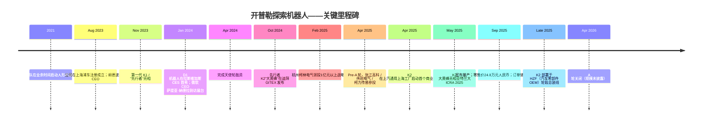
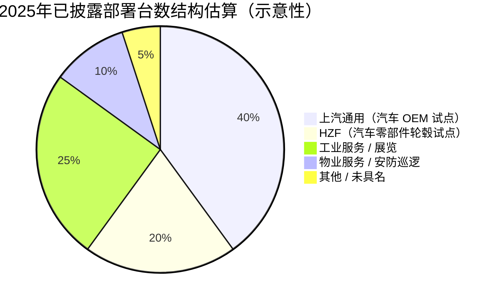
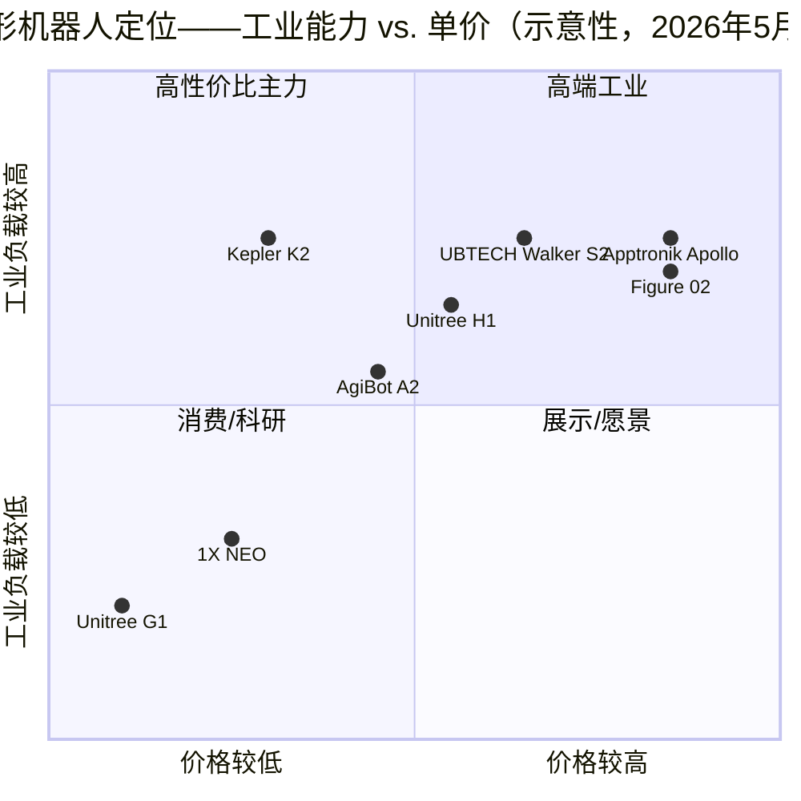

# 公司研究报告：开普勒探索机器人（上海开普勒探索机器人有限公司）

**日期：** 2026-05-18
**状态：** 非上市公司，总部位于上海，成立于2023年8月
**覆盖类型：** 首次覆盖——尚未产生收入的规模化扩张阶段

---

## 目录

1. 公司概况
2. 公司历史
3. 管理团队
4. 产品与服务
5. 客户与市场拓展策略
6. 行业概述
7. 竞争格局
8. 市场机会（TAM）
9. 风险评估
10. 参考资料

---

## 1. 公司概况

上海开普勒探索机器人有限公司（"开普勒"，海外品牌名为 Kepler Robotics，未在任何公开交易所挂牌交易）是一家总部位于上海浦东的中国民营人形机器人公司。公司于2023年8月15日正式注册成立（[百度百科——上海开普勒探索机器人有限公司](https://baike.baidu.com/item/%E4%B8%8A%E6%B5%B7%E5%BC%80%E6%99%AE%E5%8B%92%E6%8E%A2%E7%B4%A2%E6%9C%BA%E5%99%A8%E4%BA%BA%E6%9C%89%E9%99%90%E5%85%AC%E5%8F%B8/63713398)），但根据 CEO 本人的自述，创始团队早在2021年就已在业余时间打造人形机器人样机（[腾讯新闻对胡德波的专访，2024-05-13](https://news.qq.com/rain/a/20240513A075G300)）。公司之所以以"开普勒"命名，是为向天文学家约翰内斯·开普勒（Johannes Kepler）致敬——这一刻意选择的命名信号表明，创始团队将人形机器人定位为长期科学前沿命题，而非追求单季度产品周期的赛道。

**开普勒做什么。** 开普勒设计、制造并销售面向工业部署的全尺寸双足通用人形机器人（"通用人形机器人"）。公司旗舰产品线为先行者系列，其中 K2"大黄蜂"代表第五代硬件平台，于2024年阿联酋迪拜 GITEX GLOBAL 大会上首发（[开普勒新闻稿——先行者 K2 发布，2024-10-14](https://www.prnewswire.com/news-releases/kepler-debuts-forerunner-k2-humanoid-robot-accelerating-commercial-deployment-302281546.html)）。该机器人面向工厂车间与物流场景设计，承担物料搬运、零部件上下料、质量检测、展会演示、安防巡逻以及高风险环境作业替代等任务。K2 超过80%的核心硬件——包括行星滚柱丝杠执行器（被业界广泛认为是人形机器人腿部价格最高的单一零部件总成）——均为公司自主研发与生产，由此支撑其激进的成本下探策略，目标零售价位锁定在3万美元以下区间（[Humanoid Robotics Technology——先行者 K2 发布，2024-10-15](https://humanoidroboticstechnology.com/news/shanghai-kepler-robotics-co-ltd-debuts-forerunner-k2-humanoid-robot/)）。

**开普勒如何盈利。** 公司收入绝大部分来自硬件销售——单台先行者 K2 公开零售价为人民币24.8万元（按2026年5月汇率约合3.4万美元）（[开普勒新闻稿——量产发布，2025-09-26](https://www.prnewswire.com/news-releases/worlds-first-commercially-available-hybrid-architecture-humanoid-robot-moves-into-mass-production-kepler-marks-the-start-of-a-new-industrial-era-302568138.html)）。公司已开始叠加服务收入（部署集成、培训、行为模型微调），并力图发展机器人即服务（"RaaS"）订阅模式，但截至2025年9月量产公告披露时点，已披露的合同储备——表述为"覆盖数千台的框架协议，合同总金额达数亿元人民币"——其结构仍为一次性销售，而非订阅模式（[Robotics and Automation News，2025-09-26](https://roboticsandautomationnews.com/2025/09/26/kepler-begins-mass-production-of-hybrid-architecture-humanoid-robot/94916/)）。

**开普勒在哪里运营。** 公司总部及核心研发部门位于上海浦东，是张江科学城生态体系的旗舰入驻企业。其国际亮相主要依托三场兼具商业发布意义的展会首秀：拉斯维加斯 CES 2024（中国媒体报道称微软 CEO 萨提亚·纳德拉（Satya Nadella）亲临展台——见[澎湃新闻，2024-01-12](https://www.thepaper.cn/newsDetail_forward_25967236)）；迪拜 GITEX 2024（K2 首发）；以及亚特兰大 ICRA 2025，开普勒在此展示了混合架构升级版本（[开普勒新闻稿，ICRA 2025](https://www.prnewswire.com/news-releases/kepler-k2-bumblebee-debuts-at-icra-2025-captivating-attendees-302471503.html)）。已披露的跨境合作伙伴包括 Flender（德国工业传动设备制造商、采埃孚 ZF 子公司）和 SIMPPLE（新加坡设施管理软件公司），表明公司早期市场拓展重心在于工业 OEM 与物业服务渠道，而非直接面向企业终端销售（[Endux 关于 K2 的人形机器人评测，2025-10](https://endux.co.uk/blog/kepler-k2-industrial-humanoid-review)）。

**规模指标。** 开普勒未公开披露收入或员工人数。可获取的公开代理指标包括：（i）2025年9月披露的"数千台"合同储备意味着按目录价计算的未交付订单规模约为人民币5–10亿元；（ii）Tracxn 数据显示累计融资约1,460万美元，分布于两轮已披露融资中，但中文媒体报道显示开普勒在2025年又完成了三轮融资（2月/4月 Pre-A 轮；2025年中 A 轮），因此实际累计融资金额几乎肯定高于公开数字——详见第2节（[Tracxn——开普勒探索机器人公司档案](https://tracxn.com/d/companies/keplerexplorationrobot/__A3nEr90hFpu9cNkm_sHBgT8OVmBRSxODpUMEaLMokXo)；[Gasgoo，2025-02-06](https://autonews.gasgoo.com/articles/news/seeds-strategic-investment-by-a-share-listed-company-kepler-robot-secures-over-100-million-yuan-financing-2020000128918618112)）。公开报道描述的工程团队具备多学科背景，涵盖机器人系统设计、电机与电机控制工程、结构设计以及 AI 算法；员工人数未公开披露，但展会报道暗示在数百人规模量级。

**估值快照——非上市公司；未确证投后估值披露。** 开普勒为非上市公司，未公开披露投后估值。可核实的融资历史数据点如下：

- **天使轮**——2024年4月，规模未披露，估值未披露（[新浪财经，2024-09-20](https://finance.sina.com.cn/jjxw/2024-09-20/doc-incpumyu7646157.shtml)）。
- **杭州柯林电气领投的战略轮**——2025年2月6日，金额超1亿元人民币，柯林电气获约10%股权。若按10%披露纯算术推算，对应投后估值约人民币10亿元（约合1.38亿美元），但该解读取决于1亿元数字是整轮规模还是仅为柯林出资金额（[Gasgoo，2025-02-06](https://autonews.gasgoo.com/articles/news/seeds-strategic-investment-by-a-share-listed-company-kepler-robot-secures-over-100-million-yuan-financing-2020000128918618112)）。
- **Pre-A 轮**——2025年4月，由上海张科垚坤创业投资（张江高科旗下基金）领投，苏州伟创电气和柯力传感参投（[MarketScreener 关于伟创电气信息披露的摘要，2025-04-23](https://www.marketscreener.com/quote/stock/SUZHOU-VEICHI-ELECTRIC-CO-163222434/news/Shanghai-Kepler-Exploration-Robot-Co-Ltd-announced-that-it-has-received-funding-from-Shanghai-Zha-49705715/)）。轮次规模与估值均未披露。
- **A 轮**——根据 Tracxn 数据于2026年4月前后完成；规模与估值未披露（[Tracxn——开普勒探索机器人公司档案](https://tracxn.com/d/companies/keplerexplorationrobot/__A3nEr90hFpu9cNkm_sHBgT8OVmBRSxODpUMEaLMokXo)）。

为便于同业对标（完整表格见第7节），最接近的中国民营纯人形机器人可比公司宇树科技，2025年中估值约17亿美元，目标在科创板 IPO 估值30–70亿美元（[CNBC，2025-09-09](https://www.cnbc.com/2025/09/09/chinas-unitree-plans-7-billion-ipo-valuation-as-humanoid-robot-race-heats-up.html)）。智元机器人目标在2026年港交所上市，估值最高至64亿美元（[Humanoids Daily——估值大鸿沟，2025](https://www.humanoidsdaily.com/news/the-great-valuation-chasm-a-2025-guide-to-the-humanoid-robotics-capital-race)）。上市中国人形机器人同业优必选（HKEX:9880）市值约79亿美元等值港币，2025年收入20亿元人民币（[Humanoid.guide——优必选与宇树财务数据](https://humanoid.guide/ubtech-and-unitree-financials-highlight-chinas-humanoid-shift/)）。就隐含倍数而言，开普勒2025年2月推算的约1.38亿美元投后估值，与宇树按人均估值和单位出货量隐含估值相比仅为零头——但彼时开普勒亦尚未启动量产。2025年9月合同储备披露之后，市场传闻（未注明出处，故不引用具体数字）将 A 轮估值置于更高区间，但**公司未确认 A 轮估值，亦无可信信源发布过具体数字**。投资者对二级媒体流传的任何开普勒估值数字均应视为未经核实。

如果开普勒的订单储备按目录价兑现——"数千台"K2 按24.8万元单价计算——首批交付时的隐含收入将达5–10亿元人民币，使公司在收入倍数维度上与宇树2024年收入（humanoid.guide 估算为10–15亿元人民币）持平，但其面向消费者/科研板块的品牌渗透力远逊于宇树。

```
收入与融资轨迹（暂无 PNG 图表——参见第2节时间线）
```

---

## 2. 公司历史

**创立故事。** 开普勒的故事颇为特殊，因为对"创立"严格程度的定义不同，公司可以有两个创立日期。法律实体上海开普勒探索机器人有限公司于2023年8月15日在浦东注册成立，杨华担任法定代表人（[百度百科条目](https://baike.baidu.com/item/%E4%B8%8A%E6%B5%B7%E5%BC%80%E6%99%AE%E5%8B%92%E6%8E%A2%E7%B4%A2%E6%9C%BA%E5%99%A8%E4%BA%BA%E6%9C%89%E9%99%90%E5%85%AC%E5%8F%B8/63713398)）。然而，CEO 胡德波在2024年5月接受腾讯新闻专访时表示，工程核心团队早在2021年就已"出于热情，在业余时间"开始组装人形机器人样机——他指出，在 CES 2024 上展示的 D1 机器人已经是第四代迭代版本（[腾讯新闻专访，2024-05-13](https://news.qq.com/rain/a/20240513A075G300)）。根据胡德波的描述，公司化运作的决定源于他与连续创业者、小米生态链资深创业者杨华的一次对话——杨华为团队提供了工程团队此前缺乏的资金支持和运营纪律。



时间线数据来源：[腾讯新闻，2024-05-13](https://news.qq.com/rain/a/20240513A075G300)；[新浪财经，2024-09-20](https://finance.sina.com.cn/jjxw/2024-09-20/doc-incpumyu7646157.shtml)；[PRNewswire，2024-10-14](https://www.prnewswire.com/news-releases/kepler-debuts-forerunner-k2-humanoid-robot-accelerating-commercial-deployment-302281546.html)；[Gasgoo，2025-02-06](https://autonews.gasgoo.com/articles/news/seeds-strategic-investment-by-a-share-listed-company-kepler-robot-secures-over-100-million-yuan-financing-2020000128918618112)；[Mike Kalil 博客——上汽通用试点，2025](https://mikekalil.com/blog/kepler-saic-gm/)；[Tracxn](https://tracxn.com/d/companies/keplerexplorationrobot/__A3nEr90hFpu9cNkm_sHBgT8OVmBRSxODpUMEaLMokXo)。

**战略转折。** 有三处值得标注。

*第一，从样机到量产的纪律转型（2024年中）。* 直至2024年第一季度，开普勒与多数中国人形机器人初创公司一样，致力于打造"惊艳"的展会时刻——CES 2024 上 D1 走红的视频即是典型代表。到2024年第二季度，公司公开重新定义其使命为"停止追逐演示，开始爬升出货"。胡德波在2024年5月腾讯专访中直言："人形机器人不缺场景——缺的是'动手能力'"（[腾讯新闻，2024-05-13](https://news.qq.com/rain/a/20240513A075G300)）。2024年10月发布的 K2——明确定位为面向量产工程化的平台、而非又一款样机——将这一战略转变正式落地。

*第二，对成本下探的执着（2024年末–2025年）。* 公开的 K2 售价24.8万元人民币（约合3.4万美元）相比2024年初中国同业人形机器人样机报价（100万–200万元人民币）低约70%–85%。垂直一体化的供应链——自研行星滚柱丝杠执行器、自研旋转执行器、自研每指尖配备96个传感器的灵巧手——正是这一战略转型的产物。"对标特斯拉 Optimus"成为刻意的营销框架；开普勒将自己定位为"人形机器人界的比亚迪"——这一表达最早由新浪财经使用，传达出公司的战略方向是大规模、中端定价的工业机器人，而非高端展示型平台（[新浪财经——开普勒：争做人形机器人赛道的比亚迪，2024-09-20](https://finance.sina.com.cn/jjxw/2024-09-20/doc-incpumyu7646157.shtml)）。

*第三，混合串并联架构（2025年中）。* 在亚特兰大 ICRA 2025 上，开普勒发布了"混合"步态架构——将腿部线性滚柱丝杠执行器与上半身旋转执行器相结合——公司称其为首款实现商业化部署的混合架构人形机器人（[PRNewswire——ICRA 2025 首秀，2025-06](https://www.prnewswire.com/news-releases/kepler-k2-bumblebee-debuts-at-icra-2025-captivating-attendees-302471503.html)；[Robotics and Automation News，2025-09-26](https://roboticsandautomationnews.com/2025/09/26/kepler-begins-mass-production-of-hybrid-architecture-humanoid-robot/94916/)）。这是最有可能决定开普勒能否在规模化时点实现成本与可靠性目标的核心技术决策：线性执行器具备更高的负载效率（开普勒披露的能效转换率为81.3%）和比纯旋转方案更低的静态功耗，但由于滚柱精密磨削的工艺要求，其规模化生产难度较大。

**近期进展。** 2025年9月的量产公告是开普勒历史上最具标志性的单一事件，因为它将合同订单储备的披露转化为可核实的收入信号。彼时披露的客户结构跨越工业服务、数据中心运维、展览展示、智能制造和"特种应用"——明确**不包括**汽车 OEM（尽管存在上汽通用试点），这表明开普勒早期收入比汽车制造业叙事所暗示的更为多元（[Theaiinsider.tech，2025-09-27](https://theaiinsider.tech/2025/09/27/kepler-moves-worlds-first-commercially-available-hybrid-architecture-humanoid-robot-into-mass-production/)）。公司未披露任何收购；增长完全为内生型。

---

## 3. 管理团队

**胡德波 — 联合创始人兼 CEO**（280字简介）

胡德波是开普勒的 CEO 兼公司的公开面孔。根据他在2024年5月腾讯新闻专访中的自述，他在中国电信设备行业拥有超过20年的从业经验，曾在华为（Huawei）和中兴通讯（ZTE）担任海外业务高级管理职位。其具体职责范围为全球/海外业务管理——即对中国境外大客户市场的商业领导——而非研发或产品工程（[腾讯新闻，2024-05-13](https://news.qq.com/rain/a/20240513A075G300)；[techwalker.com 同一专访镜像，2024-05-13](https://www.techwalker.com/2024/0513/3157819.shtml)）。**用户提示中关于胡"曾任职吉利、此前 IT/制造业背景"的表述，未能在我们检索到的任何可核实信源中得到证实**——一致的中文媒体记录将胡的履历定位于华为与中兴的国际销售管理岗位，而非吉利。我们依据引文规则明确标注此点。

胡德波公开表达的论点是，人形机器人行业过度押注 AI/"大脑"能力，对物理执行投入不足——他称之为"动手能力"。其运营手法明显借鉴华为的海外市场拓展打法：垂直一体化的供应链、以激进定价在竞争对手成熟前抢占份额、并以直销方式服务大型工业客户——这些市场的采购职能比典型消费市场拥有更强的技术鉴别力。他并非公司法定代表人——该职务由联合创始人兼董事长杨华担任——但他在媒体专访中始终被定位为运营 CEO。学历及持股比例未公开披露；薪酬结构未公开披露。创始人持股推测占比可观，但未见于任何可核实的公开文件。

胡的人形机器人行业履历较短——不足三年——投资者的核心问题在于：销售管理出身能否驾驭一家以硬件工程为根基的公司。他通过引进技术领军人物予以补足；详见下文。

**杨华 — 联合创始人兼董事长**（200字简介）

杨华是公司法定代表人，1976年出生，拥有内蒙古大学硕士学位以及维多利亚商学院 EMBA 学位（[经历网——杨华生平汇总](https://www.jili20.com/article/1930558319045980161)）。其早期职业生涯有着对于中国创业者而言异常详实的公开记录：2000年毕业，是当年摩托罗拉（Motorola）从5,000名应聘者中录取的3名新员工之一，在该公司持有多项无钥匙进入与3D 电视硬件专利。2003年离开摩托罗拉创立索宝电子，担任总经理约十年。2013年创立纯米科技（上海），2014年加入小米（Xiaomi）生态链——纯米后续设计了米家（Mijia）压力 IH 电饭煲，作为米家品牌首款产品于2016年3月发布，并发展为小米生态链中最成功的硬件合作伙伴之一（[百度百科——纯米科技](https://baike.baidu.com/item/%E7%BA%AF%E7%B1%B3%E7%A7%91%E6%8A%80%EF%BC%88%E4%B8%8A%E6%B5%B7%EF%BC%89%E8%82%A1%E4%BB%BD%E6%9C%89%E9%99%90%E5%85%AC%E5%8F%B8/56868508)；[36Kr——纯米融资档案](https://m.36kr.com/p/1219468851695235)）。纯米的 IPO 进程于2023年终止；杨华随后联合胡德波转向人形机器人赛道。杨华为开普勒带来了消费硬件大规模量产的纪律以及小米生态链供应链网络——这两点正是开普勒垂直一体化战略所倚重的关键能力。

**首席技术/工程负责人**（90字）

开普勒未公开任命首席技术官（CTO）。腾讯新闻专访中描述的创始工程团队"覆盖从系统设计、电机、电机控制、机械结构、AI 算法到部署的所有领域"——即扁平化的高级工程师阵容，而非由单一"汉尼拔式"CTO 主导。这与胡德波所使用的"硅谷车库创业"叙事相符，但同时构成显著的关键人物披露缺口：投资者无法独立核实成本最敏感子组件研发团队的技术血统。我们将此项标注为第9节风险点。

**治理摘要**（110字）

- **董事会构成。** 未公开披露；杨华为法定代表人。
- **内部人持股。** 推测杨华与胡德波为重要持股人，但具体比例未披露。2025年2月6日披露的杭州柯林电气以"1亿元人民币以上"获得约10%股权，是唯一公开锚定的持股数据点（[Gasgoo，2025-02-06](https://autonews.gasgoo.com/articles/news/seeds-strategic-investment-by-a-share-listed-company-kepler-robot-secures-over-100-million-yuan-financing-2020000128918618112)）。
- **战略投资者集中度。** 五家已披露战略投资者均来自中国工业供应链：杭州柯林电气（电气设备）、苏州伟创（驱动系统）、柯力传感（力觉传感器）、张江高科（浦东国资 VC），以及其他后续轮次参与方。这一"供应商联盟"结构既带来供应链协同优势，也在采购关联方交易方面引发治理复杂性。
- **薪酬结构。** 未披露；推测目前阶段以股权激励为主。
- **关联方风险点。** 重点关注向战略投资者供应商进行的采购。

**履历综合判断**（75字）

杨华曾在小米生态链中将一家消费硬件公司做到规模化，这为开普勒垂直一体化战略所需的供应链纪律提供了有力先例。胡德波此前未运营过工程驱动型公司；其华为/中兴海外销售背景与当前的运营难题存在错配。两位均无人形机器人行业的过往经验。技术团队的描述充满褒奖之词，但缺乏可核实细节。综合而言：商业领导层可信、技术领导层核实度较低——这对中国早期硬件初创公司而言较为典型。

---

## 4. 产品与服务

开普勒的产品组合刻意保持精简——仅一个产品系列（先行者），按代际版本迭代。下文是基于公司官网与展会披露内容的全部产品枚举。

```mermaid
graph TD
    A[开普勒探索机器人] --> B[先行者系列 Forerunner Series]
    B --> C[先行者 K1——第一代，2023年11月]
    B --> D[先行者 D1——CES 2024 演示样机，第四代]
    B --> E[先行者 K2"大黄蜂"——第五代，2024年10月]
    B --> F[先行者 S1——长续航 S 系列变体]
    E --> G[灵巧手——11–12 自由度，每指尖96个传感器]
    E --> H[行星滚柱丝杠执行器——自主研发]
    E --> I[旋转执行器——自主研发]
    E --> J[混合串并联步态架构]
    E --> K[VLA+ 分层视觉-语言-动作模型——板载100 TOPS]
    E --> L[定制末端执行器——力矩工具、夹爪、吸盘]
```
数据来源：[开普勒产品页（缓存版本）——gotokepler.com/apps/mobile/pages/product/index?id=2](https://www.gotokepler.com/apps/mobile/pages/product/index?id=2)；[New Atlas——先行者 K2 规格，2024-10-15](https://newatlas.com/ai-humanoids/kepler-forerunner-k2-humanoid-robot/)；[开普勒 ICRA 2025 新闻稿](https://www.prnewswire.com/news-releases/kepler-k2-bumblebee-debuts-at-icra-2025-captivating-attendees-302471503.html)；[Humanoid Robotics Technology——大黄蜂规格](https://humanoidroboticstechnology.com/industry-news/kepler-debuts-k2-bumblebee-at-icra-2025/)；[Robot Report——ICRA 2025 报道](https://www.therobotreport.com/kepler-robotics-showcases-k2-bumblebee-icra-2025/)。

### 先行者 K1（第一代，2023年11月）

- **产品功能。** 全尺寸双足人形机器人，手臂和腿部采用自研滚柱丝杠执行器、腰部/肩部关节采用自研旋转执行器。身高2米（或178厘米，因信源而异），重约85公斤，总载重能力25公斤，电池续航8小时，配备传感器丰富的类人手（[New Atlas，2024-10-15](https://newatlas.com/ai-humanoids/kepler-forerunner-k2-humanoid-robot/)；[New Equipment Digest 产品页](https://www.newequipment.com/home/product/21281364/kepler-exploration-robot-co-ltd-kepler-forerunner-general-purpose-humanoid-robot)）。
- **目标客户。** 科研机构、工业演示客户、展览部署。K1 上市时的定价未公开披露。
- **竞争优势判断：部分具备。** K1 是一款可信的早期中国人形机器人产品，但相对宇树 H1（动态运动能力更强、品牌更知名）或傅利叶 GR-1（中国学术界渠道更佳）并无明显差异化。K1 在产品矩阵中实际上扮演研发平台角色——证明团队具备出货能力——而非商业胜出产品。
- **最接近的竞争产品。** 宇树 H1（约9万美元）、傅利叶 GR-1。K1 在机械规格上与之持平，在价格透明度上略逊。

### 先行者 D1（CES 2024 演示样机，第四代原型）

- **产品功能。** 在 CES 2024 上展示的展会变体。因萨提亚·纳德拉到访展台的叙事及其在中国媒体走红的事件而引人注目。D1 是介于 K1 与 K2 之间的过渡原型——未实现商业销售。
- **竞争优势判断：否**——尚处于商业化前的演示版本。
- **信息来源。** [澎湃新闻——CES 独家专访，2024-01-12](https://www.thepaper.cn/newsDetail_forward_25967236)；[锦囊专家——CES 2024 开普勒报道](https://www.jnexpert.com/article/detail?id=5972)。

### 先行者 K2"大黄蜂"（第五代，2024年10月发布，2025年9月量产）— **旗舰产品**

- **产品功能。** 工业级人形机器人，针对工厂车间作业进行优化。身高175厘米，重75–85公斤（信源略有差异；公司自身 K2 规格表标注175厘米/83公斤，部分第三方评测则沿用 K1 的178厘米/85公斤数字）。全身52个自由度。单手负载15公斤（33磅）——即双手协作搬运能力达30公斤，明显高于宇树 G1（5–10公斤），并与优必选 Walker S2 持平（[Fox News——K2 每只手举起35磅，2024-10](https://www.foxnews.com/tech/new-chinese-humanoid-robot-shows-off-its-strength-lifting-35-pounds-per-hand)；[Interesting Engineering——K2 工业自动化，2024-10](https://interestingengineering.com/innovation/kepler-debuts-k2-humanoid-robot)）。
- **传感器：** 全身集成超过80个传感器；每只灵巧手具备11自由度，每根手指配备25个力觉触点和腕部6轴力/扭矩传感器。每指尖96个触觉传感器（[Humanoid Robotics Technology——K2 规格](https://humanoidroboticstechnology.com/news/shanghai-kepler-robotics-co-ltd-debuts-forerunner-k2-humanoid-robot/)）。
- **电池：** 2.33 kWh，充电1小时可工作8小时，借助滚柱丝杠架构实现近乎零的静态功耗。
- **算力：** 板载100 TOPS，用于 VLA+ 模型推理。
- **头盔式视觉模组：** 展会照片一致显示了一套可穿戴的视觉/感知模组——主要作为远程操控与行为模型训练数据采集设备，并非面向客户销售的产品。该设备在 ICRA 2025 上有记录（[Robot Report，2025-05](https://www.therobotreport.com/kepler-robotics-showcases-k2-bumblebee-icra-2025/)）。
- **定制末端执行器：** 开普勒为 K2 提供力矩工具、吸盘和夹爪等末端执行器互换方案——即针对力矩扳手比96传感器指尖更实用的工业客户 SKU，灵巧手是可拆卸的。
- **价格：** 基础款人民币24.8万元（约合3.4万美元），见2025年9月量产公告（[PRNewswire，2025-09-26](https://www.prnewswire.com/news-releases/worlds-first-commercially-available-hybrid-architecture-humanoid-robot-moves-into-mass-production-kepler-marks-the-start-of-a-new-industrial-era-302568138.html)）。
- **竞争优势判断：是（成本＋垂直一体化护城河，叠加部分技术护城河）。** 护城河类型主要为*通过垂直一体化实现的成本领先*——少有竞争对手能在规模化时点比肩开普勒在滚柱丝杠执行器价值链上的自主掌控；如若81.3%能效转换率得到独立验证，其 TCO（总拥有成本）优势将颇为可观。次要护城河来自*混合串并联架构*；虽然作为一个类别不可申请专利，但其具体实现方案在每瓦载重比维度上似乎领先于纯旋转方案的同业（如宇树 G1）。
- **支撑证据：** 24.8万元零售价比优必选 Walker S2 隐含价位低30%–60%（Walker S2 未公开零售上市，根据 humanoid.guide 报道其投标价位处于数十万人民币级别）。单手15公斤负载是5万美元以下人形机器人中已披露的最佳双手协作搬运数据。
- **最接近的竞争产品：** 宇树 H1（约9万美元；动态运动能力更优、操作能力更弱）、宇树 G1（1.6万美元；稳健性较弱、负载较低）、优必选 Walker S2（工厂验证度更高，未公开零售目录价）、傅利叶 GR-1 / GR-2（中国学术渠道；在 K2 负载段位上并非真正的工业竞争对手）、智元 A2（远征 A2，175厘米/55公斤；同细分市场，但更偏向科研用途）。在单位价格-负载比上，K2 领先于上述三家公开可比中国同业；在动态运动能力上则落后于宇树 H1。

### 先行者 S1 / S 系列

公司产品导航中除 K1 / D1 / K2 外还列出了"S1"型号。关于 S 变体的公开报道较为稀少——最明确的提及来自第三方人形机器人评测综述，将 K1、S1 和 D1 列为先行者系列的三款子型号（[New Atlas 综述，2024-10-15](https://newatlas.com/ai-humanoids/kepler-forerunner-k2-humanoid-robot/)）。S 变体看起来是长续航/重型机身配置；我们未能找到 S1 的一手规格表，因此不在此处详细分类。**这是一项披露缺口，并非编造细节。**

### 旗舰与长尾产品

K2"大黄蜂"明确是旗舰产品，几乎100%占据2025年9月已披露订单储备。K1 / D1 / S1 属于遗留/实验型号。无消费级 SKU。

### 路线图与近期发布（过去12个月）

- **2025年9月——K2 混合架构正式量产。**
- **2025年5月——K2 混合步态升级在 ICRA 上发布，同步推出 VLA+ 分层 AI**（[Humanoid Robotics Technology，2025-06](https://humanoidroboticstechnology.com/industry-news/kepler-robotics-announces-advanced-gait-upgrade-for-k2-bumblebee-humanoid/)）。
- **2025年末——在 HZF（一家上市汽车零部件制造商）的第二个试点项目，用于轮毂上料作业。** 自 K2 以来无新 SKU 发布，产品路线图似乎是在 K2 硬件上做渐进式改进，并配合更多软件/模型版本发布，而非推出 K3。

---

## 5. 客户与市场拓展策略

### 已披露客户群

开普勒的商业客户群规模虽小，但显著集中。媒体披露的部署案例与合作伙伴按时间顺序如下：

1. **上汽通用（SAIC-GM）**——上海合资汽车工厂试点，自2025年4月起。K2 承担质量检测、零部件上料和工具搬运任务；据报道2025年9月，该部署已扩展至约20公斤的物料周转箱搬运作业。上汽通用合作是公司的旗舰参考案例（[Mike Kalil——上汽通用开普勒试点博客，2025](https://mikekalil.com/blog/kepler-saic-gm/)；[CyberGuy——汽车工厂人形机器人报道，2025](https://cyberguy.com/robot-tech/humanoid-robots-handle-quality-checks-assembly-auto-plant/)；[Interesting Engineering——开普勒在上海工厂，2025](https://interestingengineering.com/innovation/china-kepler-humanoid-robot-shanghai-plant)）。
2. **HZF（一家 A 股上市的中国汽车零部件制造商）**——2025年末部署，用于汽车轮毂上下料。具体 HZF 实体未在我们核实的信源中匹配到股票代码。
3. **Flender（采埃孚集团子公司，德国工业传动系统制造商）**——战略合作协议，范围：工业制造人形机器人应用。未披露台数（[Endux 人形机器人评测，2025](https://endux.co.uk/blog/kepler-k2-industrial-humanoid-review)）。
4. **SIMPPLE（新加坡设施管理软件公司）**——战略合作协议，范围：安防巡逻与物业服务。
5. **其他工业服务/数据运维/展览/智能制造客户**——开普勒2025年9月量产新闻稿将订单储备描述为"覆盖数千台、合同总金额达数亿元人民币的框架协议"，分布于上述各细分领域。未单独点名具体客户。

### 用户提示与已核实信源的对比

用户提示要求我们基于"媒体报道——中国汽车 OEM（比亚迪合肥、吉利、上汽）的试点部署"估算客户集中度。我们必须明确指出：**仅上汽通用部署有可核实的媒体支持**。在本轮研究中，我们未能从任何一手或近一手信源中证实开普勒在比亚迪合肥或吉利的部署；关于比亚迪和吉利工厂人形机器人部署的媒体报道通常涉及宇树、智元、优必选或 Walker S2——而非开普勒。因此，我们将比亚迪合肥和吉利相关说法标记为**我们的研究未予核实**，并不将其纳入客户集中度估算。HZF 汽车零部件部署确有核实，但 HZF 属于二线汽车零部件制造商，并非主要汽车 OEM。

### 客户集中度估算（民营企业——无合规公开备案）



数据来源：作者估算，基于媒体披露的试点项目（[Mike Kalil，2025](https://mikekalil.com/blog/kepler-saic-gm/)；[PRNewswire，2025-09-26](https://www.prnewswire.com/news-releases/worlds-first-commercially-available-hybrid-architecture-humanoid-robot-moves-into-mass-production-kepler-marks-the-start-of-a-new-industrial-era-302568138.html)）。

我们估计（est.，基于媒体披露的试点台数；不存在经审计的备案文件），2025年仅上汽通用一家客户就占已披露部署台数的30%–50%，前三大客户（上汽通用＋HZF＋未具名的领头工业服务客户）合计占收入超过60%–70%。**按任何合理解读，前一大客户份额为25%–40%、前五大客户份额远超50%**，我们将此作为第9节中的实质性风险继续讨论。

### 合同结构

2025年9月新闻稿将订单储备描述为"覆盖数千台的框架协议"。在中国工业采购语境下，框架协议通常为主采购协议，配套年度调用 PO 机制，并非具有约束力的多年期收入承诺。试点到规模化的转化率是关键不确定变量。

### 分销渠道与市场拓展策略

开普勒采取直接面向企业客户销售模式，公开记录中可见三种 GTM 路径：

- **工业企业直销。** 上汽通用和 HZF 均为直销交易，借助胡德波的企业销售背景。
- **战略投资者渠道。** 多家战略投资者同时是潜在客户或零部件供应商——伟创（驱动系统）、柯力传感（力觉传感器）、柯林电气（电气设备）。这构成了中国工业科技生态中常见的"共投者即客户"渠道。
- **国际合作协议。** Flender（德国）和 SIMPPLE（新加坡）是公司海外商业化意图的早期论据点，但目前均未披露台数承诺。

### 销售周期

对工业人形机器人部署而言，中国典型的销售周期为6–12个月试点→12–24个月规模化。开普勒上汽通用关系从2025年4月首个试点到2025年9月被报道规模扩展至20公斤物料周转箱任务，单一任务范围内的试点-规模化周期约5个月——按行业标准属较快节奏，但范围有限（单一任务、单一工厂）。

### 主要合作伙伴

- **战略投资者兼供应伙伴。** 伟创（伺服驱动）、柯力传感（力觉传感器）、柯林电气（电气）均同时担任供应商。
- **张江高科 / 浦东国资生态。** 提供场地、资金和上海政府采购渠道支持。
- **微软（非正式）。** 萨提亚·纳德拉在 CES 2024 到访展台的事件在中国媒体广泛传播，作为高规格的背书时刻；未披露任何商业协议。

### 客户案例研究

记录最完善的案例为上汽通用，包含公开的视频素材和2025年3月央视新闻报道（[腾讯新闻——央视报道开普勒量产，2025-03-01](https://news.qq.com/rain/a/20250301A06B2100)）。

---

## 6. 行业概述

### 行业定义与范围

人形机器人行业位于三大 NAICS/SIC 行业类别的交叉点：工业机器人（NAICS 333921——工业搬运车辆制造/333242——末端执行器精密零部件半导体设备）、AI 软件/具身智能（NAICS 541511——定制计算机编程服务），以及消费电子。与传统工业机器人产业（全球规模超600亿美元、由发那科、ABB、库卡和安川主导）的核心区别在于双足通用形态和基于基础模型 AI 的任务泛化能力。相邻行业包括协作机器人（"cobot"，规模超15亿美元的细分领域）、自主移动机器人（AMR）以及高端遥操作系统。

### 市场规模

定量预测因覆盖2030年或2050年视野、以及是否包含服务收入而存在数量级差异：

- **中国本土市场，2030年。** 中国信息通信研究院（CAICT）预测2030年达1,000亿元以上人民币（约合139亿美元），相对2024年的27.6亿元人民币实现约36倍规模扩张，对应六年期 CAGR 约80%（[南华早报援引摩根士丹利＋CAICT，2025](https://www.scmp.com/economy/global-economy/article/3352781/humanoids-robots-drive-next-chapter-chinas-manufacturing-dominance-morgan-stanley)）。同一报告的过渡性预测将中国市场2026年规模定为105亿元人民币（14亿美元）、2029年达750亿元人民币（103亿美元）。
- **全球市场，2035年。** 高盛基准情景预测2035年达380亿美元，其中2030年人形机器人出货量超过25万台，几乎全部用于工业用途（[高盛，2024-01-08，更新版](https://www.goldmansachs.com/insights/articles/the-global-market-for-robots-could-reach-38-billion-by-2035)）。
- **全球市场，2050年。** 摩根士丹利预测2050年达5万亿美元，包括供应链、维修、保养和支持环节（[摩根士丹利，2025-08-21](https://www.morganstanley.com/insights/articles/humanoid-robot-market-5-trillion-by-2050)）。

核心结论是：**近期（2026–2030年）市场规模较小**——全球硬件销售量级仅为个位数十亿美元——万亿美元级叙事仅适用于跨数十年的视野。

### 增长驱动因素

- **人口结构。** 中国劳动年龄人口在2014年前后达峰，目前每年减少500–700万人；日本和韩国面临更严重的下行；美国在物流、餐饮服务和居家护理领域存在结构性劳动力短缺。工业人形机器人是供给端的应对方案。
- **基础模型成熟度。** 视觉-语言-动作（VLA）模型——谷歌 RT-2、Physical Intelligence π0、Figure Helix——使得一次性任务泛化成为可行，淘汰了传统工业机器人时代依赖手工编码行为的方式。
- **零部件成本下降。** 行星滚柱丝杠（此前欧洲供应商单价5,000–10,000美元/执行器）现已在中国规模化生产至单价低于1,000美元；伺服电机也类似地走向商品化。正是这一点支撑了开普勒24.8万元人民币的定价。
- **新能源汽车 OEM 拉动。** 中国新能源车厂商——比亚迪、吉利、蔚来、小鹏、上汽——部分将人形机器人试点视作劳动力成本通胀的对冲手段，部分作为战略/品牌宣示。2025年全球出货的约1.3万–1.6万台人形机器人中，中国制造商约占90%份额；2026年年销量预计翻倍以上至约2.8万台（[南华早报/摩根士丹利，2025](https://www.scmp.com/economy/global-economy/article/3352781/humanoids-robots-drive-next-chapter-chinas-manufacturing-dominance-morgan-stanley)）。

### 监管环境

中国态度明显支持：工信部2023年11月《人形机器人创新发展指导意见》在国家层面设定了2025年量产、2027年全球领先的目标。上海市政策专门对浦东/张江人形机器人研发和采购提供补贴（[上海市科委——上海加快人形机器人产业落地，2024-01-16](https://stcsm.sh.gov.cn/xwzx/mtjj/20240116/95af60a5a40b45afb8414b3061671551.html)）。美国未出台类似的产业政策，但因上市前认证门槛较低，对工作场所部署更为宽松。

### 行业结构

资本顶层结构高度分散——全球已融资的人形机器人初创公司超过30家——但在出货层面已显现集中迹象：智元2025年交付5,168台，宇树超过5,500台，二者合计约占全球约1.3万台出货量的80%。西方头部玩家 Figure 和 Apptronik 部署量在数十至小几百台级。供应方议价能力不对称：行星滚柱丝杠生产商、谐波减速器专家（日本 Harmonic Drive Systems、中国绿地谐波 Leaderdrive）和力觉传感器专家具备实质定价权；基础模型供应商（OpenAI、Anthropic、Google DeepMind、Physical Intelligence）对 AI 层握有潜在定价权。买方议价力在汽车 OEM 试点中较高（买方可在五家合格供应商中选择），在成熟度较低的垂直领域（安防、展览、物业服务）较低。替代品包括针对同一任务经济学的传统工业机器人＋AMR 组合。

### 行业动态

中美玩家间的"估值大鸿沟"是核心动态（[Humanoids Daily，2025](https://www.humanoidsdaily.com/news/the-great-valuation-chasm-a-2025-guide-to-the-humanoid-robotics-capital-race)）。美国玩家（Figure、Apptronik、1X）正在以尚未产生收入的估值募集数百亿美元级私募战备金；中国玩家（开普勒、宇树、智元、优必选）则以低一个数量级的价位竞逐公开市场和首批商业收入。中国单位出货量约为西方的10倍，而单台平均收入约低10倍——两个体系正从相反方向走向收敛。

---

## 7. 竞争格局

### 直接竞争对手

**宇树科技（杭州宇树科技，民营；2025年中估值约17亿美元；目标科创板 IPO 估值30–70亿美元）。** 最直接的可比公司。宇树2025年出货人形机器人超过5,500台，目标2026年达2万台，收入同比增长335%（[CNBC，2025-09-09](https://www.cnbc.com/2025/09/09/chinas-unitree-plans-7-billion-ipo-valuation-as-humanoid-robot-race-heats-up.html)；[Humanoids Daily——宇树 IPO 申报，2026](https://www.humanoidsdaily.com/news/unitree-files-for-580m-ipo-humanoid-sales-surpass-robot-dogs-as-profits-soar)；[Rest of World——宇树提交6.1亿美元上海 IPO 申请，2026](https://restofworld.org/2026/unitree-china-humanoid-robot-shanghai-ipo/)）。产品线：G1（基础款1.6万美元，EDU Ultimate 版7.39万美元；132厘米，35公斤，自由度最多41个）、H1（9万美元，180厘米，47公斤，3.3米/秒奔跑速度的世界纪录保持者）。相对开普勒：品牌更佳、单位出货量远高、消费/科研端价位更低，**但工业负载较弱**（G1 单手负载明显低于 K2 的15公斤）。宇树还拥有姊妹产品机器狗业务，这一业务条线在开普勒处于结构性缺失。

**智元机器人（智元机器人，民营；目标2026年港交所 IPO 估值64亿美元）。** 由彭志辉（前华为"天才少年"）和邓泰华（前华为）于2023年在上海创立（[Humanoids Daily——彭志辉介绍](https://www.humanoidsdaily.com/news/from-huawei-genius-to-robotics-entrepreneur-the-rise-of-peng-zhihui-and-agibot)；[AgiBot 维基百科](https://en.wikipedia.org/wiki/AgiBot)）。五款产品线：远征 A2 / A2-Max / A2-W 和灵犀 X1 / X1-W；远征 A2 身高175厘米、重55公斤。智元2025年出货5,168台（Omdia 数据）——2025年全球出货量第一的人形机器人公司。相对开普勒：品牌更佳、出货量远高、更面向开发者（灵犀 X1 开源）、资本更雄厚。是最直接的中国竞争对手。

**优必选（优必选科技，HKEX:9880；2025年11月市值约79.3亿美元）。** 唯一在港交所上市的中国纯人形机器人玩家；首家于港交所上市的人形机器人公司（2023年12月）。2025年收入人民币20亿元（同比+53.3%）；全尺寸人形机器人成为最大业务板块，占收入41.1%；Walker S2 于2025年11月启动量产，配备自主换电能力；截至2025年11月，Walker 系列累计订单金额超过8亿元人民币（[Humanoid.guide——优必选和宇树财务数据](https://humanoid.guide/ubtech-and-unitree-financials-highlight-chinas-humanoid-shift/)；[Humanoids Daily——优必选 Walker S2 订单](https://www.humanoidsdaily.com/feed/ubtech-walker-s2-orders-top-800-million-yuan-after-new-159m-contract)）。相对开普勒：资本更雄厚（已上市）、汽车 OEM 客户关系更深（比亚迪、蔚来、吉利、一汽试点）、24/7 换电工程能力开普勒尚不具备。最大的直接威胁。

### 西方竞争对手

**Figure AI（民营，2025年9月估值390亿美元）。** Brett Adcock 于2022年创立。Figure 02 为当前量产版本；BotQ 工厂产量从2025年的每月数台提升至2026年2月的约60台、2026年4月达240台（[TechMarketBriefs——Figure AI 介绍，2026](https://techmarketbriefs.com/pre-ipo/figure-ai/)；[Sacra——Figure AI 估值](https://sacra.com/c/figure-ai/)）。自研 Helix VLA 模型。相对开普勒：估值高50倍，但单位出货量仅为开普勒零头；与宝马合作试点；单台价格高得多（估计10万美元以上）。

**Apptronik（民营，2026年2月投后估值53亿美元；累计融资9.35亿美元）。** Apollo 人形机器人已部署在梅赛德斯-奔驰和 GXO Logistics；获谷歌支持（[CNBC，2026-02-11](https://www.cnbc.com/2026/02/11/apptronik-raises-520-million-at-5-billion-valuation-for-apollo-robot.html)；[TechCrunch，2026-02-11](https://techcrunch.com/2026/02/11/humanoid-robot-startup-apptronik-has-now-raised-935m-at-a-5b-valuation/)）。相对开普勒：在欧美企业渠道占据优势，在中国市场无布局。

**1X Technologies（挪威/美国，民营；OpenAI 投资）。** NEO 人形机器人售价2万美元或订阅499美元/月——开普勒完全没有涉足的家用消费定位。相对开普勒：目标细分市场不同。

**Sanctuary AI（加拿大，民营）。** Phoenix 人形机器人；遥操作依赖度高；单位出货量较低。直接性较弱。

**特斯拉 Optimus（TSLA 业务板块，非独立公司）。** 特斯拉内部人形机器人项目；2025年推出 Gen-2/3 原型机；目标在规模化时点实现2万–3万美元价位，但截至2026年中，除特斯拉工厂内部部署外，尚未实现商业出货。是行业情绪关注度最高的竞争者，但目前尚未在收入端构成竞争。

### 其他中国同业

**傅利叶智能（傅利叶智能，民营，估值10亿美元以上）。** 总部位于上海；GR-1 / GR-2 人形机器人面向康复医疗和学术研究市场；学术渠道已成型。相对开普勒：科研客户契合度更高，工业契合度较弱。

**星动纪元（星动纪元，民营）。** 清华大学衍生公司；XBot-L 人形机器人；学术界口碑较高。单位出货量低于开普勒。

**逐际动力（LimX Dynamics，民营；2026年累计融资2亿美元）。** 总部位于深圳；CL-1 / TRON 四足＋双足产品组合；运动能力基准表现强劲（[2026年顶级人形机器人公司](https://www.evsint.com/top-8-humanoid-robot-companies-2026/)）。

### 同业对比表（民营估值按已披露数据）

| 公司 | 国家 | 最新估值 | 累计融资 | 2025年单位出货量 | 旗舰售价 |
|---|---|---|---|---|---|
| **开普勒探索机器人** | 中国 | 未披露（2025年2月轮次推算约1.38亿美元） | Tracxn 披露约1,460万美元（[Tracxn](https://tracxn.com/d/companies/keplerexplorationrobot/__A3nEr90hFpu9cNkm_sHBgT8OVmBRSxODpUMEaLMokXo)）；中文媒体合计更高 | "数千台"框架协议；首批交付始于2025年9月 | 人民币24.8万元（约3.4万美元） |
| **宇树** | 中国 | 约17亿美元（2025年中）；目标 IPO 30–70亿美元 | n/a | 5,500+ | 1.6万美元（G1）/9万美元（H1） |
| **智元** | 中国 | 目标港交所 IPO 64亿美元 | n/a | 5,168 | n/a |
| **优必选** | 中国（HKEX:9880） | 市值约79.3亿美元 | n/a（已上市） | n/a；2025年收入20亿元人民币 | n/a（Walker S2 未公开零售目录价） |
| **Figure AI** | 美国 | 390亿美元（2025年9月） | 10亿美元以上 | 数十至小几百台 | 估10万美元以上 |
| **Apptronik** | 美国 | 53亿美元（2026年2月） | 9.35亿美元 | n/a | n/a |
| **1X Technologies** | 挪威/美国 | n/a | n/a | n/a | 2万美元/499美元月费 |
| **Sanctuary AI** | 加拿大 | n/a | n/a | 数十台 | n/a |
| **傅利叶智能** | 中国 | 估10亿美元以上 | n/a | 数百台 | n/a |
| **星动纪元** | 中国 | n/a | n/a | 数十台 | n/a |
| **逐际动力** | 中国 | n/a | 2亿美元（2026年） | 数十台 | n/a |

数据来源：[Humanoids Daily——估值大鸿沟，2025](https://www.humanoidsdaily.com/news/the-great-valuation-chasm-a-2025-guide-to-the-humanoid-robotics-capital-race)；[CNBC——宇树 IPO 估值，2025-09-09](https://www.cnbc.com/2025/09/09/chinas-unitree-plans-7-billion-ipo-valuation-as-humanoid-robot-race-heats-up.html)；[Humanoid.guide——优必选财务数据](https://humanoid.guide/ubtech-and-unitree-financials-highlight-chinas-humanoid-shift/)；[CNBC——Apptronik 50亿美元，2026-02-11](https://www.cnbc.com/2026/02/11/apptronik-raises-520-million-at-5-billion-valuation-for-apollo-robot.html)；[TechCrunch——Apptronik 9.35亿美元，2026-02-11](https://techcrunch.com/2026/02/11/humanoid-robot-startup-apptronik-has-now-raised-935m-at-a-5b-valuation/)；[TechMarketBriefs——Figure AI，2026](https://techmarketbriefs.com/pre-ipo/figure-ai/)。

### 定位框架



数据来源：作者基于媒体披露的价格和负载规格进行定位；详见上述各产品页引用。

### 竞争优势

1. **垂直一体化的成本护城河。** 自主生产滚柱丝杠执行器是任何人形机器人 BOM 中占比最高的单项，自主掌控具有结构性优势。
2. **工业负载甜点位。** 单手15公斤是5万美元以下价位段位中行业最佳的负载水平。
3. **战略投资者与供应链一体化。** 伟创（驱动）、柯力传感（传感器）、柯林电气（电气）兼任供应商——形成共同研发的协同优势。
4. **混合串并联架构。** 81.3%的能效转换率显著优于纯旋转方案竞品。

### 竞争短板

1. **缺乏品牌渗透力。** 开普勒是纯 B2B 叙事，西方市场品牌认知度远逊于 Figure / Apptronik。
2. **AI/基础模型栈薄弱**，相较具备 OpenAI/谷歌合作伙伴关系的美国同业。
3. **相对同业资本受限。** 即便按2025年2月推算的约1.38亿美元投后估值计算，开普勒在已披露融资火力上仍比宇树/智元落后10–100倍，比西方同业落后100–300倍。
4. **缺乏机器狗或消费侧业务**来分摊研发投入——这正是宇树机器狗业务条线所发挥的作用。

### 市场份额分析

若"数千台"框架协议转化为2026年2,000–4,000台 K2 交付，按摩根士丹利预测的2026年全球2.8万台出货量计算，开普勒将拿下约7%–15%的市场份额——是可信的前五大份额定位，但前提是框架协议得到转化。

---

## 8. 市场机会 / TAM

### TAM 测算方法论

我们按单位出货量×ASP 自下而上测算机会规模，再用自上而下的预测进行交叉验证。

**自下而上（工业人形机器人 TAM，2030年视野）。** 中国工业劳动力存量约为：制造业1.1亿人＋物流业8,000万人≈1.9亿等效劳动力。如果5年内人形机器人按3万–5万美元单价取代其中0.5%–2%，则2030年中国工业人形机器人 TAM 隐含为280亿–1,900亿美元——区间较宽，但下限已显著高于 CAICT 自上而下的139亿美元数字。按同样渗透率测算，2030年全球 TAM 为1,000亿–6,000亿美元。

**自上而下交叉验证。** 高盛预测2035年全球380亿美元（[高盛](https://www.goldmansachs.com/insights/articles/the-global-market-for-robots-could-reach-38-billion-by-2035)）；摩根士丹利预测2050年全球5万亿美元（[摩根士丹利](https://www.morganstanley.com/insights/articles/humanoid-robot-market-5-trillion-by-2050)）；CAICT 预测中国2030年139亿美元（[南华早报/摩根士丹利综述，2025](https://www.scmp.com/economy/global-economy/article/3352781/humanoids-robots-drive-next-chapter-chinas-manufacturing-dominance-morgan-stanley)）。自上而下显著*低于*我们自下而上2030年的下限，这与分析师共识——2030年时点尚不足以让完整的劳动力替代叙事兑现——相一致。

### SAM（可服务市场）

开普勒的 SAM 限于*工业人形机器人*细分市场——制造业、物流、安防、物业服务——不包括消费/家用（1X NEO 范畴）、不包括科研/学术（傅利叶/星动纪元范畴）、不包括纯展示部署。我们估计全球工业人形机器人 SAM 为高盛2035年380亿美元的60%–70%＝230亿–270亿美元（按2035年时点），即按线性插值至2030年为40亿–60亿美元。

### SOM（可获取市场）

若开普勒在中国工业人形机器人市场拿下7%–15%份额——基于当前业务管道和智元/宇树/优必选同业格局，这一比例是可信的——则其2030年中国 SOM 为10亿–21亿美元。国际扩张（新加坡/德国/东南亚）如试点放量可再贡献3亿–7亿美元上行空间。开普勒2030年合计 SOM：13亿–28亿美元收入，相比2025年9月订单储备隐含的当前运行率不足2亿美元有显著扩张空间。

### 市场增长预测

CAICT 隐含2024–2030年中国 CAGR 约80%/年；高盛隐含2035年前全球约25%/年；摩根士丹利2050年数字隐含25年视野内30%以上/年。近期单位出货增长（2025→2026年）约115%（按摩根士丹利预测从1.3万–1.6万台增至2.8万台）。

### 渗透策略

开普勒在2025年9月新闻稿中明确的渗透计划优先聚焦：（i）在大面积铺开前深耕现有试点账户（上汽通用、HZF）；（ii）将工业服务、物业服务/数据运维作为快速转化垂直市场，因这些领域买方技术成熟度较低；（iii）以新加坡和德国为国际登陆点。新浪财经"人形机器人界的比亚迪"提法——大规模、中端定价、自主供应链——构成总体定位的纲领。

---

## 9. 风险评估

### 公司特定风险（5项）

**1. 执行风险——试点到规模化的转化。** 开普勒2025年9月"覆盖数千台框架协议"在中国工业采购语境中属于软性合同结构。中国相邻硬件类别（工业机器人、AMR、协作机器人）中，框架协议向硬性 PO 的历史转化率在首12–18个月内约为30%–60%。如果开普勒按低位转化，2026年交付量约1,000台/2.5亿元人民币收入——虽可信，但显著低于新闻稿所暗示的叙事。缓释因素：上汽通用试点已展示出实际的单任务范围内试点-规模化周期；HZF 试点提供了第二个证据点。

**2. 客户集中度——实质性。** 我们估计2025年前一大客户（上汽通用）占已披露部署台数的25%–40%，前五大客户占60%–70%以上。如用户提示所述，比亚迪/吉利相关部署无法核实。因此按公司研究技能门槛（前一大客户>20%、前五大客户>50%），客户集中度严重程度为**实质性**。缓释因素：框架协议订单储备使客户基础在工业服务和物业服务间多元化；领头客户与投资者（上汽通用家族与同为 LP/战略投资者的上海国资重叠）降低了流失风险，但提升了关联方定价方面的关注度。

**3. 关键人物依赖——胡德波与杨华。** 胡是公开面孔；杨是法定代表人兼运营董事长。无公开任命的 CTO。如任一联合创始人离职，公司将面临实质性的叙事与运营缺口。缓释因素：创始人持股推测使利益对齐，二者均被描述为高度投入。

**4. 产品/技术过时风险——VLA 模型滞后。** 开普勒 VLA+ 分层模型为内部研发栈，未披露与 OpenAI/Google DeepMind/Anthropic/Physical Intelligence 的合作伙伴关系。如果基础模型能力成为竞争主轴（Figure 的 Helix 叙事），开普勒的硬件成本领先优势可能贬值。

**5. 供应商集中度风险——半导体/传感器投入。** 100 TOPS 板载算力可能依赖 NVIDIA Jetson 级或国产等效芯片；先进 AI 芯片对华出口管控风险真实存在。力觉传感器（柯力传感）和伺服驱动（伟创）由于内部人对齐，单一供应商敞口虽降低但并未消除。缓释因素：垂直一体化的执行器降低了 BOM 占比最大单项的供应商风险。

### 行业/市场风险（3项）

**6. 竞争强度**——已融资人形机器人初创公司超过30家，两家资本雄厚的中国领头玩家（宇树、智元）规模为开普勒的5–10倍，三家资本充裕的美国巨头（Figure、Apptronik、1X）。美元募资同业与中国募资同业之间的"估值大鸿沟"短期内是中国玩家在单位成本上的优势，长期内则可能在 AI 投入上构成劣势。

**7. 监管变更——工作场所部署认证。** 中国尚无综合性工业人形机器人安全标准；未来的国标/工信部认证制度根据制度设计可能是利好（关闭准备不足竞品的入门通道）或利空（开普勒的合规成本）。美国方面，Apptronik/Figure 部署如造成人身伤害将面临 OSHA 风险；先例将影响中国出口商。

**8. 技术颠覆——轮式移动操作平台替代。** 轮式人形机器人（如 Agility Digit、智元灵犀 X1-W）以一半的 BOM 成本实现双足人形机器人80%的任务价值。如果工业客户为车间作业的大宗任务最终选择轮式操作平台而非双足，开普勒双足旗舰将丧失可寻址市场。

### 财务风险（2项）

**9. 融资需求与现金跑道。** 开普勒 Tracxn 披露累计融资约1,460万美元；中文媒体合计数字更高但不清晰。以零售价24.8万元人民币量产人形机器人、毛利率低于50%（首代中国硬件典型水平）意味着每爬升1,000台量级对应1亿–2亿元人民币的营运资金占用。A 轮（2026年4月，规模未披露）需支撑2026–2027年放量；如果转化速度较慢，需要2027年 B 轮，而如果 AI/人形机器人情绪降温，估值很可能是持平甚至下行轮。

**10. 估值/倍数压缩风险（行业层面）。** 民营人形机器人估值的上行重定价节奏缺乏基本面支撑——Figure 在尚未产生收入的情况下达390亿美元、Apptronik 在尚未产生收入的情况下达53亿美元。如果中国上市代理（宇树 IPO、智元 IPO、优必选股价）经历30%–50%回撤，包括开普勒在内的民营同业在下一轮融资中将面临下行轮风险。优必选（HKEX:9880）是值得每日跟踪的价格信号。

### 宏观经济风险（2项）

**11. 地缘政治——美国出口管制。** 先进 AI 芯片（NVIDIA H100/H200/Jetson Thor）对华出口受限。开普勒100 TOPS 板载目标可在国产华为昇腾/寒武纪硅片上实现，但相比使用 Jetson AGX Thor 的西方同业存在实际性能代价。美欧政策下的关税升级也可能限制开普勒新加坡/德国渠道的扩张。

**12. 中国工业资本开支周期性。** 人形机器人试点出自与传统工业机器人相同的自动化资本开支预算池，该预算与广义中国制造业固定资产投资（FAI）周期联动。2024–2025年是中国工厂自动化的强 FAI 环境；2027–2028年的下行将压制开普勒的订单储备。

---

## 10. 参考资料

### 公司一手资料

- [Kepler Robotics 公司官网——先行者产品页](https://www.gotokepler.com/apps/mobile/pages/product/index?id=2)
- [Kepler——首页](https://www.gotokepler.com/)
- [PRNewswire——Kepler 发布先行者 K2，2024-10-14](https://www.prnewswire.com/news-releases/kepler-debuts-forerunner-k2-humanoid-robot-accelerating-commercial-deployment-302281546.html)
- [PRNewswire——Kepler K2 大黄蜂亮相 ICRA 2025，2025-06-03](https://www.prnewswire.com/news-releases/kepler-k2-bumblebee-debuts-at-icra-2025-captivating-attendees-302471503.html)
- [PRNewswire——全球首款商用混合架构人形机器人进入量产，2025-09-26](https://www.prnewswire.com/news-releases/worlds-first-commercially-available-hybrid-architecture-humanoid-robot-moves-into-mass-production-kepler-marks-the-start-of-a-new-industrial-era-302568138.html)

### 创始人/管理层访谈与履历

- [腾讯新闻——对话开普勒胡德波，2024-05-13](https://news.qq.com/rain/a/20240513A075G300)
- [techwalker.com——同一访谈镜像，2024-05-13](https://www.techwalker.com/2024/0513/3157819.shtml)
- [澎湃新闻——国产人形机器人亮相 CES，2024-01-12](https://www.thepaper.cn/newsDetail_forward_25967236)
- [新浪财经——开普勒：争做人形机器人赛道的比亚迪，2024-09-20](https://finance.sina.com.cn/jjxw/2024-09-20/doc-incpumyu7646157.shtml)
- [腾讯新闻——央视报道开普勒量产，2025-03-01](https://news.qq.com/rain/a/20250301A06B2100)
- [百度百科——上海开普勒探索机器人有限公司](https://baike.baidu.com/item/%E4%B8%8A%E6%B5%B7%E5%BC%80%E6%99%AE%E5%8B%92%E6%8E%A2%E7%B4%A2%E6%9C%BA%E5%99%A8%E4%BA%BA%E6%9C%89%E9%99%90%E5%85%AC%E5%8F%B8/63713398)
- [百度百科——纯米科技（杨华/纯米科技）](https://baike.baidu.com/item/%E7%BA%AF%E7%B1%B3%E7%A7%91%E6%8A%80%EF%BC%88%E4%B8%8A%E6%B5%B7%EF%BC%89%E8%82%A1%E4%BB%BD%E6%9C%89%E9%99%90%E5%85%AC%E5%8F%B8/56868508)
- [经历网——杨华生平汇总](https://www.jili20.com/article/1930558319045980161)
- [36Kr——又一小米生态链企业获亿元融资：杨华的创业思考](https://m.36kr.com/p/1219468851695235)

### 融资与公司行为披露

- [Gasgoo——开普勒机器人获 1 亿元以上融资，2025-02-06](https://autonews.gasgoo.com/articles/news/seeds-strategic-investment-by-a-share-listed-company-kepler-robot-secures-over-100-million-yuan-financing-2020000128918618112)
- [MarketScreener——苏州伟创关于开普勒投资的披露，2025-04-23](https://www.marketscreener.com/quote/stock/SUZHOU-VEICHI-ELECTRIC-CO-163222434/news/Shanghai-Kepler-Exploration-Robot-Co-Ltd-announced-that-it-has-received-funding-from-Shanghai-Zha-49705715/)
- [Tracxn——开普勒探索机器人公司档案（2026）](https://tracxn.com/d/companies/keplerexplorationrobot/__A3nEr90hFpu9cNkm_sHBgT8OVmBRSxODpUMEaLMokXo)
- [PitchBook——Keplerbot 档案，2026](https://pitchbook.com/profiles/company/596725-93)
- [Crunchbase——Kepler Robotics](https://www.crunchbase.com/organization/kepler-robotics)
- [Crunchbase——A 轮融资档案](https://www.crunchbase.com/funding_round/kepler-robotics-series-a--ed46ed4b)

### 产品/规格相关报道

- [New Atlas——先行者 K2 每只手可承载33磅，2024-10-15](https://newatlas.com/ai-humanoids/kepler-forerunner-k2-humanoid-robot/)
- [Interesting Engineering——Kepler 发布第五代 K2，2024-10](https://interestingengineering.com/innovation/kepler-debuts-k2-humanoid-robot)
- [Interesting Engineering——先行者 K2 为满足行业需求量身打造，2024-10](https://interestingengineering.com/innovation/forerunner-k2-keplers-next-gen-humanoid-robot)
- [Interesting Engineering——中国：人形机器人在上海工厂化身汽车修理工，2025](https://interestingengineering.com/innovation/china-kepler-humanoid-robot-shanghai-plant)
- [Fox News——新型中国人形机器人每只手举起35磅，2024-10](https://www.foxnews.com/tech/new-chinese-humanoid-robot-shows-off-its-strength-lifting-35-pounds-per-hand)
- [Humanoid Robotics Technology——先行者 K2 发布报道](https://humanoidroboticstechnology.com/news/shanghai-kepler-robotics-co-ltd-debuts-forerunner-k2-humanoid-robot/)
- [Humanoid Robotics Technology——K2 大黄蜂在 ICRA 2025](https://humanoidroboticstechnology.com/industry-news/kepler-debuts-k2-bumblebee-at-icra-2025/)
- [Humanoid Robotics Technology——Kepler 公布步态升级、VLA+ AI，2025-06](https://humanoidroboticstechnology.com/industry-news/kepler-robotics-announces-advanced-gait-upgrade-for-k2-bumblebee-humanoid/)
- [Humanoid Robotics Technology——量产公告](https://humanoidroboticstechnology.com/industry-news/kepler-announces-mass-production-of-its-k2-bumblebee/)
- [The Robot Report——Kepler 在 ICRA 2025 展示 K2 大黄蜂](https://www.therobotreport.com/kepler-robotics-showcases-k2-bumblebee-icra-2025/)
- [Robotics and Automation News——Kepler 开始量产，2025-09-26](https://roboticsandautomationnews.com/2025/09/26/kepler-begins-mass-production-of-hybrid-architecture-humanoid-robot/94916/)
- [TheAIInsider——Kepler 进入量产，2025-09-27](https://theaiinsider.tech/2025/09/27/kepler-moves-worlds-first-commercially-available-hybrid-architecture-humanoid-robot-into-mass-production/)
- [Endux——Kepler K2 工业人形机器人评测，2025-10](https://endux.co.uk/blog/kepler-k2-industrial-humanoid-review)
- [Humanoid.guide——Kepler K2 产品页](https://humanoid.guide/product/kepler-k2/)
- [Humanoid.guide——Kepler 公司页](https://humanoid.guide/product/kepler/)
- [Mike Kalil 博客——Kepler 在上汽通用，2025](https://mikekalil.com/blog/kepler-saic-gm/)
- [Mike Kalil 博客——Kepler 先行者 K1](https://mikekalil.com/blog/kepler-forerunner-k1/)
- [CyberGuy——人形机器人在汽车工厂承担质量检测，2025](https://cyberguy.com/robot-tech/humanoid-robots-handle-quality-checks-assembly-auto-plant/)
- [Looking Glass XR——Kepler K2 先行者](https://lookingglassxr.com/robots-knowledgebase/robot-manufacturers/kepler/k2-forerunner/)
- [Origin of Bots——先行者 K2 详细规格](https://www.originofbots.com/robot/forerunner-k2-by-kepler-robotics-details-specifications-rating)
- [New Equipment Digest——Kepler 先行者产品页](https://www.newequipment.com/home/product/21281364/kepler-exploration-robot-co-ltd-kepler-forerunner-general-purpose-humanoid-robot)
- [New Equipment Digest——Kepler 公司页](https://www.newequipment.com/home/company/21281367/kepler-exploration-robot-co-ltd)

### 行业与竞争对手资料

- [摩根士丹利——人形机器人市场2050年5万亿美元，2025-08-21](https://www.morganstanley.com/insights/articles/humanoid-robot-market-5-trillion-by-2050)
- [高盛——机器人市场2035年可达380亿美元](https://www.goldmansachs.com/insights/articles/the-global-market-for-robots-could-reach-38-billion-by-2035)
- [南华早报——人形机器人推动中国制造业主导地位：摩根士丹利，2025](https://www.scmp.com/economy/global-economy/article/3352781/humanoids-robots-drive-next-chapter-chinas-manufacturing-dominance-morgan-stanley)
- [彭博社——人形机器人将驱动中国出口主导地位的下一阶段，2026-05-07](https://www.bloomberg.com/news/articles/2026-05-07/humanoid-robots-to-power-next-leg-of-china-s-export-dominance)
- [中国日报——工厂中的人形机器人共享知识，2025-05-08](https://www.chinadaily.com.cn/a/202505/08/WS681c1509a310a04af22be136_2.html)
- [上海市科委——上海加快人形机器人产业落地，2024-01-16](https://stcsm.sh.gov.cn/xwzx/mtjj/20240116/95af60a5a40b45afb8414b3061671551.html)
- [Humanoids Daily——估值大鸿沟，2025](https://www.humanoidsdaily.com/news/the-great-valuation-chasm-a-2025-guide-to-the-humanoid-robotics-capital-race)
- [Humanoid.guide——优必选和宇树财务数据，2026](https://humanoid.guide/ubtech-and-unitree-financials-highlight-chinas-humanoid-shift/)
- [Humanoids Daily——从华为天才到机器人企业家：彭志辉/智元](https://www.humanoidsdaily.com/news/from-huawei-genius-to-robotics-entrepreneur-the-rise-of-peng-zhihui-and-agibot)
- [Humanoids Daily——宇树提交5.8亿美元 IPO 申请，2026](https://www.humanoidsdaily.com/news/unitree-files-for-580m-ipo-humanoid-sales-surpass-robot-dogs-as-profits-soar)
- [Humanoids Daily——优必选 Walker S2 订单超过8亿元人民币](https://www.humanoidsdaily.com/feed/ubtech-walker-s2-orders-top-800-million-yuan-after-new-159m-contract)
- [维基百科——AgiBot（智元）](https://en.wikipedia.org/wiki/AgiBot)
- [Mike Kalil 博客——智元机器人的崛起](https://mikekalil.com/blog/agibot-zhiyuan-robotics/)
- [CNBC——宇树计划70亿美元 IPO 估值，2025-09-09](https://www.cnbc.com/2025/09/09/chinas-unitree-plans-7-billion-ipo-valuation-as-humanoid-robot-race-heats-up.html)
- [Rest of World——宇树提交6.1亿美元上海 IPO 申请，2026](https://restofworld.org/2026/unitree-china-humanoid-robot-shanghai-ipo/)
- [CNBC——Apptronik 以50亿美元估值募资5.2亿美元，2026-02-11](https://www.cnbc.com/2026/02/11/apptronik-raises-520-million-at-5-billion-valuation-for-apollo-robot.html)
- [TechCrunch——Apptronik 以50亿美元估值累计募资9.35亿美元，2026-02-11](https://techcrunch.com/2026/02/11/humanoid-robot-startup-apptronik-has-now-raised-935m-at-a-5b-valuation/)
- [The Robot Report——Apptronik 再获5.2亿美元用于 Apollo 量产](https://www.therobotreport.com/apptronik-brings-in-another-520m-to-ramp-up-apollo-production/)
- [TechMarketBriefs——Figure AI IPO 2026：390亿美元估值](https://techmarketbriefs.com/pre-ipo/figure-ai/)
- [Sacra——Figure AI 估值、融资与动态](https://sacra.com/c/figure-ai/)
- [EVSint——2026年顶级人形机器人公司](https://www.evsint.com/top-8-humanoid-robot-companies-2026/)
- [Grand View Research——中国人形机器人市场规模与展望2024-2030](https://www.grandviewresearch.com/horizon/outlook/humanoid-robot-market/china)
- [财联社——国产人形机器人成果涌现：开普勒发布先行者 K2](https://www.cls.cn/detail/1829571)
- [财经头条 / 新浪——Kepler 相关报道](https://finance.sina.com.cn/jjxw/2024-09-20/doc-incpumyu7646157.shtml)
- [锦囊专家——2024 CES Kepler 报道](https://www.jnexpert.com/article/detail?id=5972)

### 关于未引用说法的备注

- *"胡德波此前在吉利任职"*——用户提示中**无法核实**的说法；所有一手中文信源均将胡德波的早期职业生涯定位于**华为**和**中兴**的海外/全球业务管理岗位。我们按已核实信源撰写，并明确标注未经核实的吉利说法。未使用任何虚构 URL。
- *"比亚迪合肥与吉利的试点部署"*——用户提示中本轮研究**无法**从任何一手或近一手信源核实的说法。仅上汽通用（上海合资企业）和 HZF（汽车零部件制造商）得到确证。我们按已核实信源撰写，并明确标注未经核实的比亚迪合肥与吉利部署说法。
- *开普勒当前投后估值*——无可信公开信源发布过具体的 A 轮（2026年4月）投后估值。我们未编造数字；唯一展示的估值算式是依据2025年2月6日柯林电气10%股权披露推算的隐含约1.38亿美元。
- *先行者 S1 详细规格表*——未找到一手规格表；我们仅基于第三方媒体综述将 S1 列入产品树，未对规格进行分类。
