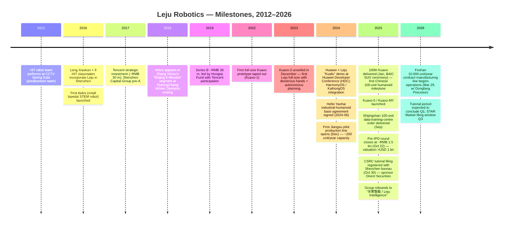
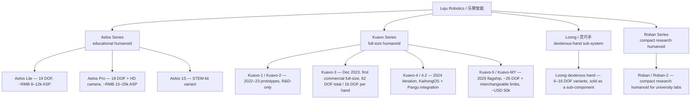
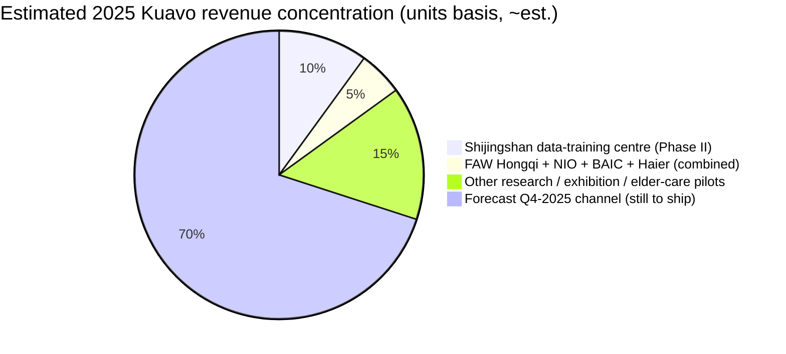
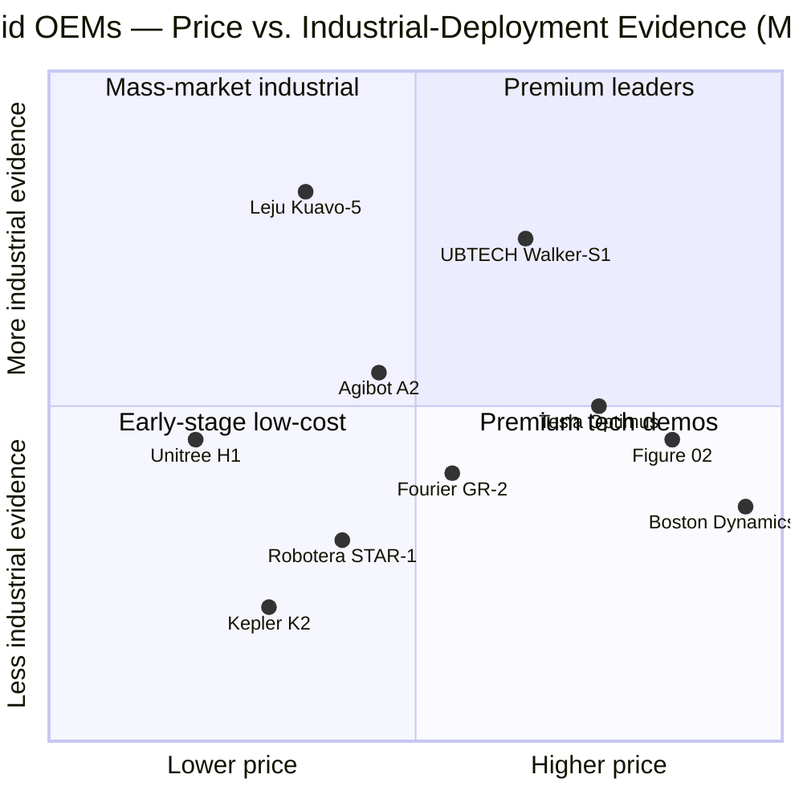

# COMPANY RESEARCH REPORT: Leju Robotics (乐聚机器人 / 乐聚智能)

**Date:** 2026-05-19
**Status:** Private — Pre-IPO (CSRC tutorial filing 2025-10-30; STAR Market expected 2026 Q3)
**HQ:** Shenzhen, with R&D in Harbin and manufacturing in Hangzhou / Hefei / Jiangsu / Foshan
**Founded:** 2016
**Founder / Chairman:** 冷晓琨 (Leng Xiaokun)
**CEO:** 常琳 (Chang Lin)

> **Update — Pre-IPO round closed (2025-10-22):** Leju closed a near-RMB 1.5 bn (~USD 210 m) Pre-IPO round at an implied post-money valuation reported at "above USD 1 bn" (one Chinese press source cites ~RMB 9 bn / ~USD 1.25 bn). Lead capital came from CITIC Goldstone (中信金石) and Shenzhen Investment Holdings (深投控); other new entrants include 物美旗下 / Kweichow Moutai-linked funds, Dongfang Precision (002611.SZ — also Leju's contract manufacturer), Tuopu Group (601689.SH), China-US Green Fund, Daohe Long-Term, New Alliance Capital, and Probing VC. Proceeds are earmarked for the 10,000-unit-per-year Foshan production line (operated by Dongfang Precision), embodied-AI model development, and scenario expansion into automotive, white-goods, and elder-care. Tutorial filing was registered with the Shenzhen CSRC bureau on 2025-10-30 (sponsor: Orient Securities) for a STAR Market listing; market expectation is a Q1 2026 tutorial completion and a Q3 2026 listing if review goes smoothly.
> Sources: [DealStreetAsia, 2025-10-22](https://www.dealstreetasia.com/stories/humanoid-robot-maker-leju-raises-funding-460790), [Robotics & Automation News, 2025-10-22](https://roboticsandautomationnews.com/2025/10/22/chinese-humanoid-robot-maker-leju-robot-secures-207-million-in-pre-ipo-funding/95727/), [The Robot Report, 2025-10-22](https://www.therobotreport.com/leju-raises-200m-humanoid-production-unitree-unveils-h2-robot/), [财联社 (CLS), 2025-10-22](https://www.cls.cn/detail/2098759), [21世纪经济报道, 2025-10-22](https://www.21jingji.com/article/20251022/herald/2f5212453ea1d399421007c41d79d8cf.html).

---

## TABLE OF CONTENTS
1. Company Overview
2. Company History
3. Management Team
4. Products & Services
5. Customers & Go-to-Market
6. Industry Overview
7. Competitive Landscape
8. Market Opportunity (TAM)
9. Risk Assessment
10. References

======================================

## 1. COMPANY OVERVIEW

Leju (Shenzhen) Robotics Technology Co., Ltd. — 乐聚（深圳）机器人技术有限公司, brand "Leju Robot" (乐聚机器人), holding entity recently rebranded **Leju Intelligence (乐聚智能)** ahead of its IPO push — is a Chinese humanoid-robot OEM headquartered in Shenzhen, with its R&D origins and a Harbin Institute of Technology (HIT, 哈尔滨工业大学) lineage in Heilongjiang Province. Founded in 2016 by a nine-person HIT-graduate team led by 冷晓琨 (Leng Xiaokun), the company occupies an unusual position in the Chinese humanoid stack: it is **older than the current humanoid boom**, profitable from an education-robot cash cow (Aelos), and the **first Chinese vendor to deliver 100 full-size bipedal humanoids in volume** (January 2025) ([21经济, 2025-01-17](https://www.21jingji.com/article/20250117/herald/d9c353c2e6ffecf1c82c2787b60824a2.html); [Sznews / 深圳新闻网, 2025-01-17](https://www.sznews.com/news/content/mb/2025-01/17/content_31442232.htm)).

**What the company actually does.** Two product families:

- **Aelos (爱乐思 / 阿尔法)** — a desktop-class, 19–32 DOF educational humanoid sold to K-12 STEM programs, vocational colleges, after-school franchises, and the consumer-export channel (Robocraze India, AliExpress, REES52). Aelos has been Leju's bread-and-butter since 2016; the small-robot business is the reason Leju was cash-flow positive years before peers and could fund the dramatically more expensive Kuavo build ([Sixth Tone, 2018](https://www.sixthtone.com/news/1616); [Robocraze AELOS Pro listing](https://robocraze.com/products/aelos-pro-19dof-humanoid-robot-ai-kit-with-built-in-camera-sensor)).
- **Kuavo (夸父)** — a 1.7 m / ~55 kg full-size bipedal humanoid (40+ DOF total, dexterous hands with up to 16 DOF each in Kuavo-3 spec) targeted at industrial integration (auto OEM line-side material handling, white-goods assembly), guided tours / exhibitions, research labs, and pilot service / elder-care deployments. The platform reached its 5th generation (Kuavo-5 / Kuavo-MY) in 2025, with international list pricing ~USD 50,000 and a domestic comparable that the company quotes as "约 40 万元 / RMB 400k — roughly one-third of comparable international humanoids" ([Sina Finance, 2025](https://cj.sina.com.cn/articles/view/1089183600/40eb9f7000101j9qw); [Humanoid.guide Kuavo-5 page](https://humanoid.guide/product/kuavo-5/); [Origin of Bots Kuavo-MY review, 2025](https://www.originofbots.com/robot/kuavo-my-by-leju-robotics-details-specifications-rating)).

**Geography.** HQ in Shenzhen Nanshan (Yuehai); R&D centre in Harbin (HIT Robotics Institute spinout, the original site of the team); subsidiaries in Hangzhou and Hefei (Yaohai District), and a 10,000-unit-per-year contract-manufacturing partnership with **Dongfang Precision (东方精工, 002611.SZ)** in Foshan, Guangdong — Dongfang Precision holds a 2.8% equity stake in Leju ([Yicai Global, 2025-04](https://www.yicaiglobal.com/news/chinas-dongfang-precision-becomes-contract-manufacturer-of-humanoid-robot-products); [Humanoids Daily, 2026-03-29](https://www.humanoidsdaily.com/news/10-000-units-a-year-inside-china-s-first-automated-humanoid-production-line)). The Foshan line officially began operations on 2026-03-29 with one robot rolling off every ~30 minutes, 24 precision-assembly processes, and 77 inspection points. It is widely cited in Chinese press as **the first humanoid production line in China rated at ≥10,000 units/year nameplate**.

**Scale.** Leju does not publish revenue (private, pre-IPO). Public datapoints triangulate to roughly the following:

- **Deliveries:** 100 full-size Kuavos shipped by 2025-01-17 (the "100th unit" handed to BAIC SUV at the Shenzhen ceremony) ([SZ News, 2025-01-17](https://www.sznews.com/news/content/mb/2025-01/17/content_31442232.htm)); company target of **1,000+ Kuavo deliveries in 2025**, with CEO Chang Lin reaffirming a 1,000–2,000-unit 2025 plan in summer interviews ([Bloomberg, 2025](https://www.bloomberg.com/features/2025-china-ai-robots-boom/); [eyeshenzhen, 2025-05-29](https://www.eyeshenzhen.com/content/2025-05/29/content_31584315.htm)). One marquee 2025 contract: 100 Kuavo units delivered to the Shijingshan (石景山) "Humanoid Robot Data-Training Centre Phase II" in September 2025 ([CLS, 2025](https://www.cls.cn/detail/2098759)).
- **Employees:** ~400–500 (Crunchbase / Tracxn ranges, est., not officially disclosed).
- **Aelos installed base:** the company has cited "tens of thousands of Aelos units" sold into the K-12 and post-secondary STEM channel cumulatively since 2017 ([Sohu / 中国经济网, 2025](http://m.ce.cn/bwzg/202506/t20250622_2335318.shtml)).

**Valuation snapshot (private company — Pre-IPO round substitute).** The October 2025 Pre-IPO round priced Leju at an implied post-money of **~USD 1.0–1.3 bn** (the round size of ~RMB 1.5 bn / USD 210 m, against the press-reported "估值超 10 亿美元 / valuation exceeds USD 1 bn"; one secondary Chinese source ([Zhihu / 知乎, 2025-10](https://zhuanlan.zhihu.com/p/1967654974038210164)) cites RMB 9 bn / ~USD 1.25 bn — call this *est., not officially disclosed*).

That valuation places Leju **mid-tier among China's "Big Eight" humanoid pure-plays** but well below Unitree and Agibot. Comparable peer marks (rounded, all from named press in the last 12 months):

| Peer | Latest disclosed valuation | Source |
|---|---|---|
| **Unitree (宇树)** | USD ~1.7 bn (mid-2025 pre-IPO); IPO range USD 3–7 bn (2026 STAR target) | [CNBC, 2025-09-09](https://www.cnbc.com/2025/09/09/chinas-unitree-plans-7-billion-ipo-valuation-as-humanoid-robot-race-heats-up.html); [SCMP, 2025](https://www.scmp.com/business/banking-finance/article/3347365/chinas-unitree-robotics-rides-humanoid-tide-it-targets-us610m-ipo) |
| **Agibot / 智元 (ZhiYuan)** | HK IPO target HKD 40–50 bn (~USD 5.1–6.4 bn), 2026 Q3 | [Hellochinatech, 2026](https://hellochinatech.com/p/china-robot-ipo-rush-2026) |
| **UBTECH (优必选, 9880.HK)** | Public, market cap ~HKD 53 bn | [Humanoid.guide UBTECH financials](https://humanoid.guide/ubtech-and-unitree-financials-highlight-chinas-humanoid-shift/) |
| **Fourier Intelligence (傅利叶)** | USD ~1.1 bn (May 2025 pre-money) | [Humanoids Daily Valuation Chasm, 2025](https://www.humanoidsdaily.com/news/the-great-valuation-chasm-a-2025-guide-to-the-humanoid-robotics-capital-race) |
| **LimX Dynamics (逐际动力)** | Last priced at ~USD 0.4–0.6 bn (est., 2025 rounds) | [XCarspace ranking, 2025](https://xcarspace.com/top-20-chinese-humanoid-robot-companies-ranked-by-valuation/) |
| **Robotera (星动纪元)** | Last priced ~USD 0.4–0.5 bn (Tsinghua-incubated, 2024–25 rounds) | [Humanoids Daily, 2025](https://www.humanoidsdaily.com/news/the-great-valuation-chasm-a-2025-guide-to-the-humanoid-robotics-capital-race) |
| **Kepler (开普勒)** | ~USD 0.3–0.5 bn est. | [Humanoids Daily, 2025](https://www.humanoidsdaily.com/news/the-great-valuation-chasm-a-2025-guide-to-the-humanoid-robotics-capital-race) |
| **Magiclab (魔法原子)** | Reports of ~USD 0.5 bn round, 2025 | [Humanoids Daily, 2025](https://www.humanoidsdaily.com/news/the-great-valuation-chasm-a-2025-guide-to-the-humanoid-robotics-capital-race) |
| **Booster Robotics (加速进化)** | Private; valuation not disclosed | [Humanoids Daily, 2025](https://www.humanoidsdaily.com/news/the-great-valuation-chasm-a-2025-guide-to-the-humanoid-robotics-capital-race) |

The median pure-play Chinese humanoid is therefore in the USD 0.4–1.5 bn band; Leju at ~USD 1.0–1.3 bn sits in the upper-middle, justified by **actual unit deliveries** (the only Chinese pure-play to publicly clear the 100-unit milestone before Unitree's IPO push, and the only one with a 10,000-unit/year line live as of March 2026). The implied revenue multiple is hard to back out because Leju does not disclose; at a midpoint estimate of 600 Kuavo units × RMB 400k average ASP plus an Aelos line of ~RMB 200–300 m, 2025 group revenue could land near **RMB 450–600 m / USD 60–85 m**, implying a P/S of **~12–18×** — broadly in line with Unitree's pre-IPO mark but materially below Agibot's ~30× P/S target (*all of this is back-of-envelope; Leju has not disclosed financials*).

The market is pricing Leju for a 2026–28 ramp into **thousand-unit-per-quarter** Kuavo shipments and an option on Aelos-style consumer humanoids. Justifying that mark requires Foshan's 10,000-unit line to run at >20% utilisation by FY2027 — possible but not yet evidenced.

---

## 2. COMPANY HISTORY

The Leju story begins not in 2016 in Shenzhen but earlier, inside the **Harbin Institute of Technology Intelligent Robotics Research Centre** (哈工大智能机器人研究所). Three of the founders — 冷晓琨 (Leng Xiaokun, chairman), 常琳 (Chang Lin, CEO), and 安子威 (An Ziwei) — were classmates and lab-mates at HIT's School of Computer Science. The lab's flagship demonstration moment was the 2012 Chinese New Year's Gala (春晚) on CCTV, when a HIT robot squad performed a dance routine themed on the Pixar film *WALL-E* — the team that would later become Leju was on stage ([Shenzhen DRC profile of Leng Xiaokun, 2025](https://fgw.sz.gov.cn/ztzl/qtztzl/szscjmyjjfzzhfwpt/mqfc/myqyjdxsj/content/post_12331042.html); [中国经济网, 2025-06-22](http://m.ce.cn/bwzg/202506/t20250622_2335318.shtml)).

Two follow-on inflections shaped the founding strategy. First, co-founder Chang Lin **turned down a UC Berkeley admission** to stay in Harbin and start the company — the team narrative described in multiple Chinese press profiles ([Shenzhen DRC profile, 2025](https://fgw.sz.gov.cn/ztzl/qtztzl/szscjmyjjfzzhfwpt/mqfc/myqyjdxsj/content/post_12331042.html)). Second, **Leng deliberately picked education robotics — not full-size humanoids — as the founding product**, on the rational logic that an 0.3–0.7 m bipedal toy could be built and sold today, while a 1.7 m bipedal humanoid in 2016 could not pay anyone's salary. That cash-flow discipline is the single most distinctive feature of Leju versus the 2022–24 cohort (Unitree's quadrupeds aside, most of Agibot, Robotera, Magiclab, Booster, Kepler were founded post-ChatGPT and have never had a profitable core).

Sources: [中国经济网, 2025-06-22](http://m.ce.cn/bwzg/202506/t20250622_2335318.shtml); [21经济, 2025-01-17](https://www.21jingji.com/article/20250117/herald/d9c353c2e6ffecf1c82c2787b60824a2.html); [DealStreetAsia, 2025-10-22](https://www.dealstreetasia.com/stories/humanoid-robot-maker-leju-raises-funding-460790); [Humanoids Daily, 2026-03-29](https://www.humanoidsdaily.com/news/10-000-units-a-year-inside-china-s-first-automated-humanoid-production-line).

**Strategic pivots — three that matter.**

1. **From education robot vendor to full-stack humanoid OEM (2022–23).** For five years Leju was a focused STEM-toy business. The Kuavo programme was a deliberate up-the-stack bet that the AI-driven embodied-intelligence cycle would arrive within the decade and that Leju's existing motor / control / safety competence at small scale would compound into full-size advantage. Kuavo-3 (Dec 2023) was the first commercially viable full-size unit; Kuavo-5 (2025) was the first manufacturable one.
2. **Operating-system bet on Huawei HarmonyOS / KaihongOS (2024).** Leju was the first humanoid maker to ship full-size robots running KaihongOS — a HarmonyOS-derivative — bundled with Huawei Cloud's Pangu embodied-intelligence model. Strategically this differentiates Leju from Unitree (proprietary), Agibot (proprietary), and the long tail of NVIDIA-Jetson-based competitors. It also locks Leju into the Huawei ecosystem and gives Huawei a strategic showcase ([TechNode, 2024-11-18](https://technode.com/2024/11/18/huawei-launches-embodied-intelligence-innovation-center-in-shenzhen/); [Hansmat / Huawei Cloud × Leju release, 2025](https://www.hansmat.com/news/huawei-cloud-and-leju-debut-universal-humanoid-78629888.html)).
3. **Outsourcing production to Dongfang Precision (2025).** Rather than build its own 10,000-unit/year line, Leju partnered with Foshan-listed Dongfang Precision (002611.SZ, packaging-machinery roots) for contract manufacturing, taking a 2.8% equity stake from Dongfang in exchange. This is closer to Apple's contract-manufacturing model than to Tesla / UBTECH vertical integration; it preserves Leju's cap-ex for R&D and the AI stack ([Yicai Global, 2025](https://www.yicaiglobal.com/news/chinas-dongfang-precision-becomes-contract-manufacturer-of-humanoid-robot-products)).

No acquisitions of note. The "rebrand to 乐聚智能 / Leju Intelligence" (2025) is a holding-company restructuring ahead of the STAR Market listing rather than an M&A event ([RobotToday, 2025](https://robottoday.com/article/leju-robot-rebrands-as-leju-intelligence-eyes-ipo-with-strategic-overhaul-1)).

---

## 3. MANAGEMENT TEAM

### 冷晓琨 Leng Xiaokun — Chairman & Founder (~30% est. ownership pre-Pre-IPO dilution)

Leng Xiaokun is the founder, chairman, and the public face of Leju. Born 1992 in Weifang, Shandong, he is one of the youngest founders of a humanoid OEM at the USD 1 bn+ valuation tier. He is the kind of "single-founder-cause-of-the-company" figure for whom a deep bio is justified.

**Early formation.** Leng's profile starts before college: he placed in the national finals of the China National Youth Robotics Competition (全国青少年机器人竞赛) while in middle school, then was *recommended for direct admission* (保送) to HIT's School of Computer Science — the recommendation route in China bypasses the gaokao and is reserved for olympiad medallists and top science-competition finishers. At HIT he joined the Intelligent Robotics Research Centre, won the national robot championship multiple times during undergraduate years, and continued through to a PhD in computer science at HIT ([The Wire China, 2024](https://www.thewirechina.com/whos_who/leng-xiaokun-%E5%86%B7%E6%99%93%E7%90%A8/); [Sixth Tone, 2018](https://www.sixthtone.com/news/1616); [中国经济网, 2025](http://m.ce.cn/bwzg/202506/t20250622_2335318.shtml)). He retains a research affiliation with HIT as **associate director of the Intelligent Robotics Research Centre** at the school, a remarkable bridge between an active CEO role and a continuing academic identity.

**Founding decision.** In 2016, fresh out of his PhD programme, Leng pulled together nine HIT classmates and lab-mates and incorporated Leju in Shenzhen rather than Harbin — explicitly to be closer to the consumer-electronics and precision-component supply chain in the Greater Bay Area. He has framed this in interviews as a deliberate choice not to follow the academic-spinout-stays-on-campus pattern that dominates Chinese university entrepreneurship ([Sixth Tone, 2018](https://www.sixthtone.com/news/1616)).

**Recognition and political signalling.** Leng is one of a small set of Chinese tech CEOs who has been publicly elevated as a "private-economy model entrepreneur" by the Shenzhen government and the CCP Youth League. He is a recipient of the **China Youth May Fourth Medal (中国青年五四奖章)**, the Party Youth League's highest cross-disciplinary recognition for under-40s ([Shenzhen DRC profile, 2024](https://fgw.sz.gov.cn/ztzl/qtztzl/szscjmyjjfzzhfwpt/mqfc/myqyfzdt/content/post_12294488.html); [The Wire China, 2024](https://www.thewirechina.com/whos_who/leng-xiaokun-%E5%86%B7%E6%99%93%E7%90%A8/)). For a private founder approaching a STAR Market IPO that designation is functionally an explicit political endorsement.

**Philosophy and public profile.** Leng's repeated public framing — that robots should be **"smart like a PhD, cheap like a household appliance" (聪明如博士，便宜如家电)** ([Sohu / 中国经济网, 2025](https://www.sohu.com/a/857290676_121010226)) — is essentially a one-line product spec. He has also pushed back against the "AI capital winter" narrative, arguing in 2024 that the current period is *not* a winter for embodied-intelligence companies that can ship and deliver ([Time Weekly, 2024](https://www.time-weekly.com/wap-article/265148)).

Ownership is undisclosed; press accounts consistently describe Leng as still the controlling individual shareholder post-Pre-IPO with Chang Lin as the second-largest individual.

### 常琳 Chang Lin — Co-founder & CEO

Chang Lin is a HIT graduate from the same Robotics Institute cohort. The widely retold founding-team anecdote is that **Chang received an admission offer from UC Berkeley but turned it down to stay in China and co-found Leju** ([Shenzhen DRC, 2025](https://fgw.sz.gov.cn/ztzl/qtztzl/szscjmyjjfzzhfwpt/mqfc/myqyjdxsj/content/post_12331042.html)). He has been the operating CEO since the Kuavo programme moved to production in 2023; he was the public face of the 100-unit BAIC delivery in January 2025 and of the 1,000-unit 2025 plan in interviews with 21st Century Business Herald ([21经济, 2025-01-17](https://www.21jingji.com/article/20250117/herald/d9c353c2e6ffecf1c82c2787b60824a2.html)). His public messaging emphasises (1) ROI to industrial customers — "a humanoid in a structured factory role should pay back within ~24 months" — and (2) intra-Chinese competition as net positive for the sector ([Bloomberg humanoid feature, 2025](https://www.bloomberg.com/features/2025-china-ai-robots-boom/)). No prior public-company CFO or operating role outside Leju; his entire career is the company.

### 安子威 An Ziwei — Co-founder, CTO (engineering)

The third HIT co-founder. Owns the motion-control / actuator stack, dexterous-hand programme, and the joint between the Harbin R&D centre and the Shenzhen production stack. Lower public profile than Leng or Chang. (Bio depth limited by lack of public English / Chinese disclosure.)

### Wang Song 王松 — General Manager (Hefei subsidiary) / industrial-deployment lead

Wang Song heads the Hefei Yaohai industrial-humanoid base and is the public spokesperson for the 1,000-unit-2025 delivery guidance ([财联社, 2025](https://www.cls.cn/detail/2098759)). He is also the press point of contact for the customer-side scenario rollout (automotive line-side material handling, white-goods assembly, elder-care). Wang Shuai (王帅), described as deputy GM of the Hefei branch, has been quoted in Xinhua press explaining the Hefei testing-and-development phase moving to live factory work by year-end 2025 ([Xinhua / People's Daily, 2025-11](https://en.people.cn/n3/2025/1128/c90000-20396136.html)).

### Governance

- **Board / shareholder structure:** No publicly disclosed cap table prior to the Pre-IPO round. Confirmed shareholders include Tencent Industry Win-win Fund (early), Shenzhen Capital Group (深创投, pre-A 2017), Hongtai Fund (Series B 2019), Linzhi Lixin Information Technology, plus the October 2025 Pre-IPO entrants (CITIC Goldstone, Shenzhen Investment Holdings, Kweichow Moutai-linked fund, Dongfang Precision, Tuopu Group, China-US Green Fund, Daohe Long-Term, New Alliance Capital, Probing VC) ([DealStreetAsia, 2025-10-22](https://www.dealstreetasia.com/stories/humanoid-robot-maker-leju-raises-funding-460790); [CLS, 2025-10-22](https://www.cls.cn/detail/2098759)).
- **Operating governance:** Founder-controlled. Three-person executive team (Leng, Chang, An) is functionally a founder-CEO-CTO triangle; the second tier (Wang Song, Hefei GM; Foshan production lead at Dongfang Precision) is hired-in operating talent.
- **Related-party flag:** Dongfang Precision (002611.SZ) is both an equity holder (2.8%) and the contract manufacturer. In a STAR Market filing, this will require explicit related-party disclosure and arm's-length-pricing certification.
- **Political optics:** Founder is a Youth-League May Fourth Medal recipient; institutional capital is anchored by state-backed Shenzhen Investment Holdings and CITIC Goldstone. The combination is unusually favourable for a STAR Market listing in a strategic-industry category like humanoids.

### Track record assessment

The team's track record is the **single most asymmetric positive in the entire Leju story**: nine years of operating history with a profitable education-robot business before the humanoid bet, the **first Chinese humanoid OEM to publicly hit 100 unit deliveries** in January 2025, and a credible 1,000-unit 2025 target — none of which Unitree, Agibot, Fourier, Robotera, Kepler, Magiclab, LimX, or Booster can match on the same timeline. Gaps: no public-company CFO, no IPO-veteran director on the board (as far as press discloses), and no senior executive recruited from auto-OEM industrial-engineering ranks — a weakness if BYD/NIO/Hongqi-class line-side deployments are to scale.

---

## 4. PRODUCTS & SERVICES

Leju runs **two distinct product lines** that share a common motor / dexterous-hand / control IP base but address completely different customers, ASPs, and gross-margin profiles. Plus a developing third programme — the **Loong (灵巧手 / dexterous-hand) sub-component line** — that has been spun out as a standalone offering to other humanoid OEMs and research labs.

Sources: [Leju product home page, lejurobot.com/en](https://www.lejurobot.com/en); [Humanoid.guide Kuavo-5](https://humanoid.guide/product/kuavo-5/); [Humanoid.guide Kuavo-MY](https://humanoid.guide/product/kuavo-my/); [Humanoid.guide Roban2](https://humanoid.guide/product/roban-2/); [Origin of Bots Kuavo-MY, 2025](https://www.originofbots.com/robot/kuavo-my-by-leju-robotics-details-specifications-rating); [Robocraze Aelos listings](https://robocraze.com/products/aelos-pro-19dof-humanoid-robot-ai-kit-with-built-in-camera-sensor).

### Aelos Series — the cash cow

**What it is.** A 19–32 DOF desktop bipedal humanoid, ~30–50 cm tall, designed for STEM curricula (ages 9–15 and post-secondary), live performance (the Aelos units in Zhang Yimou's *Beijing 8 Minutes* 2018 PyeongChang closing-ceremony segment were Aelos chassis), and developing-market consumer-export channels.

**Variants and pricing.**

- *Aelos Lite* — 19 DOF, voice + Bluetooth control, Blockly visual programming via the AELOS STEM app, gyroscope and accelerometer; battery ~70 min active / ~155 min standby; selling at Rs. 188,999–249,999 on Indian distributor channels — call it ~RMB 16k–22k for an exported unit ([Robocraze AELOS LITE listing](https://robocraze.com/products/leju-robot-aelos-lite-19dof-ai-humanoid-robot-kit-for-programming-coding); [REES52 AELOS LITE](https://rees52.com/products/leju-aelos-lite-19dof-humanoid-educational-robot-ai-programming-coding-robot-for-kids-students-teachers-stem-robotics-kit-for-classroom-learning)).
- *Aelos Pro* — same 19-DOF chassis plus HD camera, vision-AI applications (face recognition, object tracking), Python scripting; Rs. 279,250–369,999 (~RMB 24k–32k) ([Robocraze AELOS PRO](https://robocraze.com/products/aelos-pro-19dof-humanoid-robot-ai-kit-with-built-in-camera-sensor); [REES52 AELOS PRO](https://rees52.com/products/leju-aelos-pro-19dof-smart-ai-humanoid-robot-educational-coding-programming-robot-with-built-in-camera-plug-play-sensors-for-stem-learning-robotics-training)).
- *Aelos 1S* — UK / global STEM kit variant ([Ednology Marketplace](https://marketplace.ednology.com/product/leju-robotics-aelos-1s/)).

**Competitive-advantage verdict: PARTIAL.** Aelos has *brand and channel* moats in the Chinese K-12 STEM curriculum — Aelos units are listed in many municipal STEM teaching standards and after-school franchise curricula. But the underlying chassis (small DOF bipedal, 19-DOF servo build) is replicable; competitive products like UBTECH Alpha 1 Pro, JIMU Robots (UBTECH's brand for kids), and dozens of generic Shenzhen OEMs occupy the same space. **Closest competitor product:** UBTECH Alpha series — Leju roughly at parity on hardware, ahead on STEM-curriculum integration in China.

### Kuavo Series — the strategic asset

**Kuavo-5 / Kuavo-MY (the current flagship, launched 2025).**

- **Form factor:** 1.7 m, ~45 kg.
- **Degrees of freedom:** 26 DOF (14 in arms, 12 in legs) on Kuavo-MY; up to 40+ DOF when the larger-dexterous-hand option is fitted; Kuavo-3 spec is 62 DOF total including 16 DOF per dexterous hand.
- **Performance:** ~360 N·m peak joint torque; up to 4.6 km/h omnidirectional walking (sand, grass, factory floor); ≥20 cm jump; the Sina Finance technical deep-dive cites 7 km/h running in lab conditions on later iterations ([Sina Finance, 2025](https://cj.sina.com.cn/articles/view/1089183600/40eb9f7000101j9qw)).
- **Software stack:** KaihongOS (open-source OpenHarmony fork sponsored by Huawei) plus Huawei Cloud Pangu embodied-AI model integration. Open-source SDK released on GitHub for academic and developer access ([Leju GitHub](https://github.com/LejuRobotics); [The Humanoid Hub, 2024-10](https://x.com/TheHumanoidHub/status/1844076618098278543)).
- **Modularity (Kuavo-5 specifically):** interchangeable limbs (wheeled base ↔ bipedal legs), modular hand swap, configurable payload — distinct positioning versus Unitree H1/G1, Agibot A2, Robotera STAR-1 ([Mike Kalil, 2025](https://mikekalil.com/blog/leju-kuavo-5-humanoid-robot/)).
- **International list price:** USD 50,000 ([Origin of Bots, 2025](https://www.originofbots.com/robot/kuavo-my-by-leju-robotics-details-specifications-rating)). Domestic ASP is widely quoted at "~RMB 400k, roughly one-third of international comparables" ([Sina Finance, 2025](https://cj.sina.com.cn/articles/view/1089183600/40eb9f7000101j9qw)) — call it ~USD 55–60k domestic depending on configuration and fleet discount.
- **Localisation:** company claims **>90% domestic supply-chain content** on Kuavo-3 generation ([Sohu / 中国经济网, 2025](https://www.sohu.com/a/857290676_121010226)), well above Unitree (high-end joints still partly imported) and meaningfully above Fourier.

**Competitive-advantage verdict: YES — multi-vector.**

- *Manufacturing scale moat:* Foshan line at 10,000 units/year nameplate (live since March 2026) is **the only one publicly operational at that scale in China** as of this report's date. Closest competitor production capacity: Unitree (large but quadruped-dominant), UBTECH (auto-OEM training-only deployments), Agibot (mid-thousand-unit/year). Verdict on Kuavo vs. Agibot A2 / Unitree H1: **ahead on industrial-deployment evidence and on near-term shipped-unit capacity, behind on locomotion agility (Unitree) and behind on the AI-stack publication record (Agibot)**.
- *Ecosystem moat (Huawei HarmonyOS):* exclusive among the top-tier humanoids in shipping HarmonyOS/KaihongOS + Pangu out-of-the-box. Hard for rivals to replicate without going back to Huawei. ([Huawei Cloud × Leju release, 2025](https://www.hansmat.com/news/huawei-cloud-and-leju-debut-universal-humanoid-78629888.html)).
- *Pricing / cost moat:* "one-third of international ASP" claim translates into substantially lower payback for industrial customers and creates the conditions for the company's "two-year ROI" thesis ([Bloomberg, 2025](https://www.bloomberg.com/features/2025-china-ai-robots-boom/)).
- *Customer-evidence moat:* by mid-2025 the only Chinese humanoid OEM with *named, documented* factory deployments at FAW Hongqi, NIO, and Haier ([Xinhua, 2025-05-26](https://english.news.cn/20250526/fc1d7f6dec6b4e9ba8f08dfb57bbfb7d/c.html); [Yicai Global, 2025](https://www.yicaiglobal.com/news/chinas-dongfang-precision-becomes-contract-manufacturer-of-humanoid-robot-products); [21经济, 2025-01-17](https://www.21jingji.com/article/20250117/herald/d9c353c2e6ffecf1c82c2787b60824a2.html)).

**Closest competing products and one-line compare (Kuavo-5 versus peers):**

- *Unitree H1 / G1* — H1 is taller / faster runner / more agile; Kuavo-5 is at parity on basic locomotion but **ahead on payload-capable arms and on industrial-customer evidence**.
- *Agibot A2* — Agibot ahead on demonstrated embodied-AI generalist behaviour; Kuavo-5 ahead on shipped industrial units and on HarmonyOS ecosystem.
- *UBTECH Walker-S1* — UBTECH ahead on BYD-factory training hours and on auto-OEM relationships (UBTECH itself was originally an auto-supplier-adjacent name); Kuavo-5 ahead on cost and on speed-to-deployment in non-auto verticals.
- *Robotera STAR-1* — Robotera ahead on speed records (running); Kuavo-5 ahead on commercial deliveries.
- *Fourier GR-1 / GR-2* — Fourier originally a rehab-focused name with stronger arm fidelity; Kuavo-5 ahead on full-stack scale and price.
- *Kepler K2* — Kepler still pre-volume; Kuavo-5 well ahead on deliveries.
- *Magiclab Z1 / Booster* — early-stage challengers; Kuavo well ahead on deliveries and capacity.

### Loong (夸父 灵巧手) — dexterous-hand sub-system

Leju has begun positioning its in-house dexterous-hand IP (the hand that ships on Kuavo-3 / -5, at 6–16 DOF) as a **separable sub-component** sold to research labs and other humanoid OEMs. This is an obvious move — Tesla, Figure, 1X, Unitree, Agibot all need dexterous-hand IP — and it converts a Kuavo BOM line into a potentially independent revenue line at industry margins. Disclosures on this product line remain thin in public press; the most explicit references are interview-level remarks ([Sina Finance, 2025](https://cj.sina.com.cn/articles/view/1089183600/40eb9f7000101j9qw)). **Competitive-advantage verdict: partial — strong technology lineage but small commercial track record vs. dedicated hand-makers like Inspire Robotics, Shadow Robot, PsiBot**.

### Roban / Roban-2 — compact research humanoid

A compact ~1.2 m research humanoid positioned at universities and research institutes — a step between Aelos and Kuavo. Lower volume; primarily a curriculum / R&D-platform play that keeps Leju embedded in the HIT / Tsinghua / Zhejiang University ecosystems ([Humanoid.guide Roban2](https://humanoid.guide/product/roban-2/)).

### Flagship-versus-long-tail mix

The 1–3 products driving the business today: **Kuavo-5 / Kuavo-MY** (the headline product and the source of all the press), **Aelos Pro** (the cash-flow engine, ten-thousand-unit-class historical channel), and **the Loong dexterous hand** as an emerging third leg. Aelos and Loong subsidise the heavy R&D cost of the Kuavo programme — the same pattern Unitree used (quadruped revenue → humanoid R&D).

### Roadmap and recent launches

- Kuavo-5 / Kuavo-MY launched in 2025.
- Foshan 10,000-unit line launched 2026-03-29.
- "5G-A 人形机器人 / 5G-A humanoid" demonstration at the 2025 World Robot Conference and at the Shanghai 11th National Games (十五运) opening ceremony, where Kuavo carried the torch ([Frontiers Online, 2025-08-09](https://www.frontiersonline.com/2025/08/09/robot/frontiers/4994/5g-a%E5%8A%A0%E6%8C%81%E3%80%81%E5%85%B7%E8%BA%AB%E6%99%BA%E8%83%BD%E8%BF%9B%E5%8C%96%EF%BC%81%E4%B9%90%E8%81%9A%E5%A4%B8%E7%88%B6%E6%8A%80%E6%9C%AF%E6%96%B0/); [163.com, 2025-11](https://www.163.com/dy/article/KDBUVOAC05129QAF.html)).
- No major product sunsets disclosed.

---

## 5. CUSTOMERS & GO-TO-MARKET

Leju operates two essentially separate go-to-market motions:

**Aelos GTM — education / consumer channel.** Sold via municipal STEM curriculum tenders (China K-12 and vocational colleges), after-school franchise networks, and international distributors (Robocraze India, REES52, AliExpress, Ednology UK). This is a high-volume, low-ASP, high-gross-margin business with long sales cycles for the institutional tenders but standard e-commerce throughput for consumer / cross-border. The customer base is fragmented and concentrated risk is low.

**Kuavo GTM — direct industrial sales and government-tendered deployments.** Sold via direct enterprise sales (the Hefei subsidiary leads industrial accounts; Shenzhen HQ leads auto-OEM and tech-ecosystem accounts), via government / state-owned-enterprise tenders (Shijingshan data-training centre being the largest 2025 example), and via integrator partnerships (Huawei's "embodied-intelligence innovation centre" routes leads to Leju). Pricing is configured per deal and likely runs at gross margins materially below Aelos, because the BOM is heavy on Chinese-supplied actuators and the AI/SDK cost is amortised over a small unit base.

### Documented Kuavo customers (named, last 12–24 months)

- **FAW Hongqi (一汽红旗, 红旗轿车)** — five Kuavo units deployed on the production line for box transport; the press has explicitly described the bipedal-versus-wheeled advantage in confined spaces and on stairs ([Xinhua, 2025-05-26](https://english.news.cn/20250526/fc1d7f6dec6b4e9ba8f08dfb57bbfb7d/c.html); [Origin of Bots, 2025](https://www.originofbots.com/robot/kuavo-my-by-leju-robotics-details-specifications-rating)).
- **NIO (蔚来, NIO Inc.)** — Kuavo units in production-line use ([Yicai Global, 2025](https://www.yicaiglobal.com/news/chinas-dongfang-precision-becomes-contract-manufacturer-of-humanoid-robot-products); [Xinhua, 2025-05-26](https://english.news.cn/20250526/fc1d7f6dec6b4e9ba8f08dfb57bbfb7d/c.html)).
- **Haier (海尔)** — white-goods assembly, named in the Yicai Global Dongfang Precision announcement ([Yicai Global, 2025](https://www.yicaiglobal.com/news/chinas-dongfang-precision-becomes-contract-manufacturer-of-humanoid-robot-products)).
- **BAIC SUV (北汽福田? — likely BAIC Motor)** — the 100th-unit ceremonial delivery customer in January 2025 ([SZ News, 2025-01-17](https://www.sznews.com/news/content/mb/2025-01/17/content_31442232.htm); [Bloomberg, 2025](https://www.bloomberg.com/features/2025-china-ai-robots-boom/)).
- **Shijingshan District Industry Co. (石景山产业有限公司, Beijing)** — the "humanoid robot data-training centre Phase II" project: 100 Kuavo units delivered in September 2025; the largest single contract publicly disclosed by Leju ([CLS, 2025-10-22](https://www.cls.cn/detail/2098759)).
- **Suzhou elder-care facilities** — multiple Kuavo units in pilot deployments (medication sorting, fetching) ([Bloomberg, 2025](https://www.bloomberg.com/features/2025-china-ai-robots-boom/)).
- **Sichuan school** — Kuavo deployed in a teaching role (a 2025 demonstration use case) ([Mike Kalil, 2025](https://mikekalil.com/blog/kuavo-robot-schoolteacher/)).
- **Ecosystem partners (>40 listed)** — Huawei, Tencent, Alibaba Cloud (ByteDance/Volcano Engine 火山引擎 also cited), China Mobile, China Telecom, China Unicom-adjacent telcos, Honor (荣耀), FAW (一汽), ZTE, Juyi Tech (巨一科技), Southern Power Grid (南方电网), Hisense (海信), Haier, Runtech Group (润泽集团) ([CLS, 2025](https://www.cls.cn/detail/2098759); [DealStreetAsia, 2025-10-22](https://www.dealstreetasia.com/stories/humanoid-robot-maker-leju-raises-funding-460790)).

### Customer concentration — *estimate, not officially disclosed*

Leju is a private company; no Chinese A-share-style 前五大客户 disclosure exists yet. Based on press evidence the 2025 customer concentration likely breaks down approximately as follows:

Even on this rough breakdown, **top-1 customer share is materially > 10% of 2025 Kuavo unit deliveries** (Shijingshan's 100 units alone is ~10% of the 1,000-unit guide); **top-5 share is likely > 30–40%**. This is high customer concentration — both at the unit level and (because Shijingshan is a state-backed buyer) by counterparty type. Material risk per the project skill's threshold; carried into Section 9.

*Disclosure caveat: top-customer share is estimated from press, not from a filing. Will be disclosed in the STAR Market prospectus.*

### Contract structure

Anecdotal evidence (auto-OEM line-side deployments) suggests the dominant contract pattern is **per-unit purchase-order plus a separate annual service / SDK / training contract**, not a multi-year master agreement. This pattern preserves customer optionality (and therefore Leju's near-term churn risk if the technology stack underperforms). The Shijingshan-class government contracts are more likely to be lump-sum CapEx procurement.

### Distribution and partnerships

The strategically defining partnership is **Huawei × Leju**. Huawei provides HarmonyOS / KaihongOS, the Pangu embodied-intelligence cloud, the Shenzhen Embodied-Intelligence Innovation Centre go-to-market funnel, and a 16-company ecosystem co-launched in November 2024 ([TechNode, 2024-11-18](https://technode.com/2024/11/18/huawei-launches-embodied-intelligence-innovation-center-in-shenzhen/)). For Leju, this is leverage (instant access to ten thousand-plus Huawei enterprise customers) and dependency. The contract manufacturer Dongfang Precision is a smaller-but-real strategic partnership.

### Note on the user-brief BYD partnership — UNVERIFIED

The user brief frames Leju as "backed by Tencent / BYD / Huawei HarmonyOS ecosystem" and references a "BYD Hefei pilot (Kuavo)". **In the public Chinese and English press through mid-2026, no investment or strategic-partnership filing names BYD as a Leju shareholder or as a named Kuavo deployment customer.** BYD's confirmed humanoid partnerships are with **UBTECH** (Walker-S1 pilot at the BYD Hefei plant — efficiency-doubling result cited in 2024 press) and with Agibot (智元), not with Leju ([投中网, 2025-05-08](https://www.chinaventure.com.cn/news/114-20250508-386190.html); see also UBTECH commentary in [eeworld, 2025](https://en.eeworld.com.cn/mp/JQR/a393836.jspx)). Leju's Hefei subsidiary is in **Yaohai District** and is an *industrial humanoid base agreement with the Hefei municipal / Yaohai district government*, not with BYD ([gov.cn news pickup, 2025-04-04](https://english.www.gov.cn/news/202504/04/content_WS67ef7526c6d0868f4e8f1702.html); [investin Beijing pickup, 2025-02-20](https://invest.beijing.gov.cn/zwgk/ywsd/202502/t20250220_4015592.html)). Treat the BYD link as **unverified** until a primary disclosure surfaces.

---

## 6. INDUSTRY OVERVIEW

The humanoid-robotics industry has gone from "speculative theme" to "shipping-product theme" in the 24 months between 2024 and 2026. The economics and demand drivers are now legible enough to write down concretely.

**Industry definition.** The relevant industry is **embodied-intelligence humanoid robots** — biped or wheeled-biped general-purpose machines intended to substitute for human labour in unstructured environments. This is distinct from industrial robotics (Fanuc, ABB, KUKA, Yaskawa — fixed-arm welding/painting/pick-and-place), distinct from collaborative robots (Universal Robots, Anpeilong's industrial cobot line), and distinct from autonomous-driving (which is its own embodied-intelligence vertical but on wheels and largely outdoors).

**Market size — recent forecasts.**

- **Global market:** Goldman Sachs revised its base-case humanoid TAM to **USD 38 bn by 2035**, with shipments of >250,000 units in 2030, predominantly industrial ([Goldman Sachs Insights, 2024-update](https://www.goldmansachs.com/insights/articles/the-global-market-for-robots-could-reach-38-billion-by-2035)).
- **Long-cycle TAM:** Morgan Stanley's higher-conviction long view puts the humanoid market at **USD 5 trillion by 2050**, including supply chain and after-sales ([Morgan Stanley, 2024](https://www.morganstanley.com/insights/articles/humanoid-robot-market-5-trillion-by-2050); [CNBC, 2025-04-29](https://www.cnbc.com/2025/04/29/how-to-play-a-5-trillion-market-for-humanoid-robots-by-2050.html)).
- **China market:** RMB 2.76 bn / USD 0.38 bn (2024) → RMB 10.5 bn / USD 1.4 bn (2026) → RMB 75 bn / USD 10.3 bn (2029) → RMB 300 bn / USD 41 bn (2035), per the consolidated forecasts cited by China-Briefing's industry survey ([China Briefing, 2025](https://www.china-briefing.com/news/chinese-humanoid-robot-market-opportunities/)).
- **2025 actual shipments:** 14,000–16,000 units globally; ~90% from Chinese manufacturers ([Xinhua, 2025-05-26](https://english.news.cn/20250526/fc1d7f6dec6b4e9ba8f08dfb57bbfb7d/c.html); [Origin of Bots, 2025](https://www.originofbots.com/robot/kuavo-my-by-leju-robotics-details-specifications-rating)).

**Growth drivers — five compounding tailwinds.**

1. *Cost-of-labour inflation in Chinese manufacturing.* Auto-OEM line-side wages in tier-1 plants have crossed RMB 80–120k/year fully loaded. At a Leju ASP near RMB 400k and a target two-year payback, the bipedal humanoid passes the gross ROI threshold for several structured roles.
2. *Embodied-intelligence model maturity.* The combination of large vision-language models, sim-to-real RL, and increasingly cheap GPU compute has compressed the development cycle from "5–10 years for a Boston Dynamics-class platform" to "12–24 months for a credible commercial unit".
3. *Chinese state industrial policy.* The MIIT's 2023 "Guiding Opinions on the Innovation and Development of the Humanoid Robot Industry" set explicit 2025 and 2027 targets and named humanoids as a strategic emerging industry. Provincial and municipal subsidies (Shenzhen, Hefei, Suzhou, Shanghai, Beijing Shijingshan) follow ([gov.cn humanoid focus, 2025-04-04](https://english.www.gov.cn/news/202504/04/content_WS67ef7526c6d0868f4e8f1702.html); [Shenzhen DRC, 2025](https://fgw.sz.gov.cn/ztzl/qtztzl/szscjmyjjfzzhfwpt/xwdt/content/post_12549978.html)).
4. *Chinese supply-chain depth.* The same actuator / harmonic-reducer / planetary-gear / six-axis-force-sensor / IMU ecosystem that powers BYD's EV-supplier base is directly transferable. >90% domestic supply-chain content for Kuavo-3 is achievable. The cost reset relative to Tesla Optimus or Figure 02 is structural, not cyclical.
5. *Auto-OEM verticalisation of robotics.* BYD, NIO, FAW, GAC, Geely, XPeng, Li Auto, and Tesla itself are all building robotics businesses or buying robotics IP. Customers and competitors are converging — but in the near term the auto-OEMs are also the most important demand vector for humanoid deployments (the line-side material-handling vertical is the largest single industrial use case).

**Industry structure.**

- **Fragmentation today, consolidation later.** China alone has 50+ named humanoid companies; Morgan Stanley's "Humanoid 100" map identifies ~100 globally including supply-chain ([Morgan Stanley Humanoid 100, 2025](https://advisor.morganstanley.com/john.howard/documents/field/j/jo/john-howard/The_Humanoid_100_-_Mapping_the_Humanoid_Robot_Value_Chain.pdf)). Most observers expect a 5–10-vendor steady state by the late 2020s.
- **Supplier power:** moderate — the harmonic-reducer market is concentrated (Harmonic Drive of Japan globally, Lvjia / Leaderdrive / 绿的谐波 SZSE:688017 domestically), the high-precision actuator market is increasingly competitive, and the AI-stack is essentially commoditising via open-source releases (Leju's GitHub SDK is itself an example).
- **Buyer power:** rising. Auto OEMs are large, sophisticated buyers; the BYD-UBTECH 2024 cooperation showed the OEM can dictate co-development terms.
- **Substitutes:** specialised industrial robots, AMRs, fixed automation. For most structured line-side tasks today, a 6-axis arm + AMR is still cheaper than a humanoid. The humanoid wins only where (a) the task requires bipedal mobility (stairs, confined spaces) or (b) the task is unstructured enough that arm + AMR cannot solve it (a still-narrow set).
- **Regulation:** light today (no equivalent of automotive Type Approval for humanoids); the State Council and MIIT are drafting safety standards. Service deployments (elder-care, retail guidance) face local-government licensing; industrial deployments primarily face the customer's own EHS sign-off.

**Industry-economic backdrop in mid-2026.** Globally, humanoid IPO season has arrived: Unitree filed in 2025 for a 2026 STAR listing; Leju filed tutorial in October 2025 for a 2026 STAR listing; Agibot is targeting HK 2026 Q3; UBTECH is already public. The next 12 months will be the formative period for public-market multiples in the sector — for Leju this is timing risk *and* timing opportunity.

---

## 7. COMPETITIVE LANDSCAPE

**Direct competitors (Chinese pure-plays, ordered by 2025 deliveries / public profile):**

1. **Unitree Robotics (宇树科技, Hangzhou).** Founded 2016 by Wang Xingxing (王兴兴). Originally a quadruped specialist (Go1 / Go2 dog robots); H1 / G1 humanoids launched 2023–24. 2025 revenue ~RMB 1.71 bn (+335% YoY), 2025 mid-year pre-IPO valuation USD ~1.7 bn, IPO range USD 3–7 bn ([CNBC, 2025-09-09](https://www.cnbc.com/2025/09/09/chinas-unitree-plans-7-billion-ipo-valuation-as-humanoid-robot-race-heats-up.html); [Humanoid.guide UBTECH/Unitree financials](https://humanoid.guide/ubtech-and-unitree-financials-highlight-chinas-humanoid-shift/)). Stronger on locomotion R&D / public marketing / quadruped revenue; on full-size humanoid industrial-deployment evidence, behind Leju.
2. **Agibot / Zhiyuan Robotics (智元机器人, Shanghai).** Co-founded by ex-Huawei "Genius Youth" Peng Zhihui (彭志辉, "稚晖君"). Targeting HK IPO Q3 2026 at HKD 40–50 bn (~USD 5.1–6.4 bn). Strong on the embodied-AI generalist software story; lighter on shipped industrial units relative to Leju.
3. **UBTECH (优必选, HKEX:9880).** Public since late 2023. FY2025 revenue RMB 2.0 bn (+53% YoY). Walker-S1 humanoid has logged hours at BYD Hefei and Geely plants. Market cap ~HKD 53 bn. Larger and broader (services + education + industrial), but the humanoid-pure-play GMV is comparable to Leju.
4. **Fourier Intelligence (傅利叶, Shanghai).** Originally a rehabilitation-robotics specialist; GR-1 / GR-2 humanoid programmes since 2023. Pre-money USD 1.1 bn (May 2025). Backed by SoftBank Vision Fund. Strong arm fidelity / clinical track record; behind on industrial-deployment scale.
5. **LimX Dynamics (逐际动力, Shenzhen).** Strong locomotion-research engineering; commercial scale modest.
6. **Robotera (星动纪元, Beijing).** Tsinghua-incubated, August 2023 founding. STAR-1 set the high-speed humanoid running record. Behind on commercial deliveries.
7. **Kepler Exploration Robot (开普勒, Shanghai).** K2 / Forerunner programmes; modest commercial volume to date.
8. **Magiclab (魔法原子).** Z1 humanoid for commercial applications; recent USD ~0.5 bn financing.
9. **Booster Robotics (加速进化, Beijing).** Founded by ex-Tsinghua robotics-team founders; volume still pre-commercial.

**Indirect competitors:** UBTECH's older Walker / Walker-X line; the auto-OEM in-house programmes (BYD's "Yaoshunyu / 尧舜禹" internal project, Tesla Optimus, Xiaomi CyberOne / CyberDog, XPeng PX5, Geely's recent humanoid program). Long-term, OEMs building humanoids in-house is a real competitive substitution risk; near-term, OEMs are simultaneously buyers and developers, which favours OEM-friendly third parties like Leju in the 2025–27 window.

**International peers:** Tesla Optimus, Figure 02, 1X Neo, Boston Dynamics Atlas (electric), Apptronik Apollo, Sanctuary Phoenix, Agility Digit. These are higher-priced ($60k–$200k+), tech-leadership but lower-shipped-volume than Chinese peers; the 2025 ~90% China share of global humanoid shipments is the data point.

**Positioning framework — price × industrial-deployment evidence (mid-2026):**

(Positions are author estimates from the public press cited throughout; not analyst-firm-published rankings.)

**Leju's strongest competitive advantages**

1. *Shipped industrial deliveries.* The 100-unit milestone (Jan 2025) and the 1,000-unit guide (FY2025) put Leju in the top-3 globally on shipped full-size humanoids — material in a market where most peers still show prototypes.
2. *HarmonyOS / Huawei ecosystem exclusivity.* Embeds Leju in the most distribution-rich Chinese enterprise channel.
3. *Foshan 10,000-unit/year line.* Pure scale advantage — at IPO time, Leju will be the only Chinese name with an operating five-figure annual humanoid line.
4. *Cash-flow legacy from Aelos.* Lower funding burn rate relative to peers who have only humanoid revenue.
5. *Politically endorsed founder.* The Youth League May Fourth Medal and Shenzhen DRC profiling create regulatory tailwinds.

**Leju's competitive vulnerabilities**

1. *Software / AI-stack reliance on Huawei Pangu.* Cutting both ways: dependency on a third-party model means slower autonomous iteration than Unitree (proprietary stack) or Agibot (its own model).
2. *Locomotion-research narrative gap.* Unitree and Robotera publish flashier locomotion videos; Leju's marketing engine is comparatively dry.
3. *Customer concentration.* Top-1 customer (Shijingshan) was ~10% of 2025 units — high single-customer risk.
4. *Contract-manufacturing risk.* Outsourcing the 10,000-unit line to Dongfang Precision introduces single-source manufacturer exposure.
5. *Geographic concentration in mainland China.* Foreign sales channel is thin (Aelos exports India / SE Asia / cross-border; Kuavo essentially no export business).

---

## 8. MARKET OPPORTUNITY (TAM)

**TAM (top-down, 2035 horizon).** Goldman Sachs' USD 38 bn humanoid TAM by 2035, ~80–90% industrial, implies ~1.5–2.5 m unit-years of cumulative industrial humanoid demand globally between 2026 and 2035 at average ASPs that decline from ~USD 50k today toward ~USD 20–30k by 2030 ([Goldman Sachs, 2024](https://www.goldmansachs.com/insights/articles/the-global-market-for-robots-could-reach-38-billion-by-2035)). Morgan Stanley's higher-conviction USD 5 trillion 2050 TAM puts the long-run market in the same ballpark as the entire global auto industry today ([Morgan Stanley, 2024](https://www.morganstanley.com/insights/articles/humanoid-robot-market-5-trillion-by-2050)).

**SAM (China-only, industrial + commercial).** China-Briefing's consolidated forecast — RMB 75 bn by 2029, RMB 300 bn by 2035 — implies a Chinese SAM of roughly USD 10 bn (2029) and USD 40 bn (2035) ([China Briefing, 2025](https://www.china-briefing.com/news/chinese-humanoid-robot-market-opportunities/)). Assuming 60% of that is the addressable industrial / commercial / education slice for Leju (excluding pure consumer toy and pure defence), Leju's SAM is ~USD 6 bn in 2029 and USD 25 bn by 2035.

**SOM (Leju's serviceable share).** Triangulating:

- Top-3 share of Chinese humanoid shipments in 2025 (Unitree + Agibot + Leju collectively cited as covering ~80% of domestic shipments, per [TrendForce / Omdia data via Humanoids Daily, 2025](https://www.humanoidsdaily.com/news/the-great-valuation-chasm-a-2025-guide-to-the-humanoid-robotics-capital-race)).
- Foshan-line nameplate of 10,000 units → if utilised at 40% by 2028 → 4,000 units × RMB 400k ASP → ~RMB 1.6 bn / USD 220 m annualised Kuavo revenue. Add Aelos at RMB 400–600 m and dexterous-hand at RMB 100–200 m, and a 2028 group revenue of **USD 350–500 m** is plausible.
- That implies a 2028 China-humanoid market share of ~3–5% on the Chinese-Briefing SAM forecast — defensible if Leju executes, modest given a USD 1 bn+ Pre-IPO mark.

**Growth assumptions.** The Chinese humanoid market has compounded ~250–400% YoY through 2024–25 from a tiny base. Steady-state growth from 2026 to 2029 likely runs 80–120% YoY before settling into a 30–50% trajectory in the 2030s as industrial penetration matures. Leju's growth needs to outpace the market modestly to justify the Pre-IPO multiple.

**Penetration strategy.** Three vectors:

1. *Anchor industrial-vertical partnerships* (FAW Hongqi, NIO, Haier, Hisense expansion → scale to other automotive OEMs and to white-goods majors). This is the core 2026–28 lever.
2. *Government / state-owned-enterprise tenders* (Shijingshan template, replicated to other municipal "humanoid data-training centres" — Shenzhen, Shanghai, Suzhou, Hefei, Wuhan).
3. *Ecosystem distribution via Huawei*. The 16-company November-2024 ecosystem launch is the funnel. Each Huawei-enterprise customer that adopts an embodied-AI use case becomes a Leju lead.

**Where Leju is unlikely to compete.** Pure consumer-grade humanoids (Optimus-class home robots) are still pre-commercial. Defence and security humanoids are policy-restricted in China for export and politically sensitive domestically. Leju is unlikely to be a meaningful participant in either over the 2026–28 horizon.

---

## 9. RISK ASSESSMENT

### Company-specific risks (5)

1. **Execution risk on the 1,000-unit 2025 / 10,000-unit-line ramp.** Leju has guided 1,000–2,000 Kuavo deliveries in 2025 and a 10,000-unit/year nameplate line that began operation March 2026. The gap between nameplate and shipped is the central operating risk. A 30–50% shortfall against the 2025 number would be public, embarrassing, and would compress the Pre-IPO valuation when the prospectus is filed. Mitigant: the Dongfang Precision partnership reduces capex risk and the line was demonstrated at 30-minute take-time on March 29. Likelihood: moderate. Severity: high.
2. **Customer concentration — Shijingshan and government tenders.** Press-estimated top-1 customer share ~10% of 2025 unit deliveries; top-5 likely 30–40%. A failed pilot at a marquee account (NIO line-side, Haier white-goods) becomes a referenceable negative. Mitigant: the customer base is broadening; the Huawei ecosystem funnels new accounts.
3. **Key-person dependency on Leng Xiaokun and Chang Lin.** The HIT founder triangle is the company's most distinctive asset. Either founder departing or being politically constrained would damage the IPO narrative. Mitigant: Leng's CCP Youth League May Fourth Medal status implies elevated stability.
4. **Dependence on Huawei HarmonyOS / Pangu stack.** Kuavo's software differentiator is the HarmonyOS + Pangu integration. A Huawei strategic pivot (e.g. building first-party humanoid hardware, redirecting Pangu access, or pricing Pangu against Leju) would erode the moat. Mitigant: Leju has an in-house SDK / motion-control stack and open-source release.
5. **Contract-manufacturer / single-source production risk.** Foshan 10,000-unit line is operated by Dongfang Precision (a related party with a 2.8% stake). A dispute, capacity reallocation, or quality issue at Dongfang directly affects Leju's deliveries. Mitigant: the equity cross-holding aligns incentives; the Jiangsu pilot line remains as a back-up.

### Industry / market risks (3)

6. **Competitive intensity from auto-OEM in-house programmes.** BYD ("Yaoshunyu / 尧舜禹"), Tesla, XPeng, Geely, NIO, GAC are all building humanoid programmes in-house. Several of these are also Leju's customers — the buyer / competitor convergence is the single largest 2027+ risk. Mitigant: most OEMs lack the cross-vertical sales motion; in-sourcing tends to plateau at internal-deployment volumes.
7. **Technology disruption from a step-change AI model.** A foundation-model breakthrough (e.g. a true general-purpose embodied policy) by a Chinese (Agibot, ByteDance, DeepSeek) or US (Figure, 1X) competitor could leapfrog Leju's stack. Mitigant: Leju's hardware platform remains valuable independently of the AI model layer.
8. **Regulatory tightening on humanoid safety / EHS.** No formal humanoid-specific Type Approval today, but MIIT / SAMR are drafting safety standards. A standards regime could (favourable) raise barriers to entry or (adverse) impose retrofit costs.

### Financial risks (2)

9. **Valuation / multiple-compression risk.** Pre-IPO mark implies an estimated 12–18× P/S based on rough 2025 revenue (back-of-envelope; not officially disclosed). For comparison, Unitree's pre-IPO range implied 8–18× P/S; UBTECH trades around ~30× sales but with public-company liquidity. If the STAR Market window cools (rate environment, geopolitics, an Agibot or Unitree IPO mis-pricing), Leju could list at a flat or down round versus the October 2025 Pre-IPO mark. Severity: moderate. Mitigant: Leju has actual unit revenue and a real industrial-customer story versus pure narrative names.
10. **Funding requirement and cash burn.** Even with Aelos cash flow, the Kuavo programme + Foshan line + AI-stack investment is cash-intensive. A delayed STAR Market listing (regulatory pushback, market window closing) would force a bridge round at potentially diluted terms.

### Macroeconomic risks (2)

11. **Geopolitical / export-control risk.** US-China tech tensions could result in Entity-List restrictions on Chinese humanoid OEMs, especially those tied to Huawei (already Entity-Listed). Kuavo's Pangu/HarmonyOS dependency makes Leju a closer-to-Huawei target than competitors using NVIDIA Jetson + open-source software. Severity: moderate to high. Mitigant: the domestic market is the addressable opportunity for the next 3–5 years; export revenue is small.
12. **Chinese capex / industrial demand cycle.** Humanoid demand at the OEM line-side is correlated to Chinese auto / white-goods capex. A 2026–27 downturn in auto OEM capex (already a stressed sector) would directly compress Leju's industrial sell-through. Mitigant: state-tendered government deployments (Shijingshan-class) provide counter-cyclical demand.

======================================

## 10. REFERENCES

### Company / official sources
- [Leju Robotics — corporate site (English)](https://www.lejurobot.com/en)
- [Leju Robotics — GitHub (open-source SDK)](https://github.com/LejuRobotics)

### Funding / IPO press (last 12 months)
- [DealStreetAsia — Tencent-backed Leju raises USD 210 m in pre-IPO round, 2025-10-22](https://www.dealstreetasia.com/stories/humanoid-robot-maker-leju-raises-funding-460790)
- [Robotics & Automation News — Leju secures USD 207 m pre-IPO, 2025-10-22](https://roboticsandautomationnews.com/2025/10/22/chinese-humanoid-robot-maker-leju-robot-secures-207-million-in-pre-ipo-funding/95727/)
- [Bloomberg — Chinese humanoid robot maker raises USD 200 m, 2025-10-22](https://www.bloomberg.com/news/articles/2025-10-22/chinese-humanoid-robot-maker-raises-200-million-ahead-of-ipo)
- [The Robot Report — Leju raises USD 200 m, Unitree unveils H2, 2025-10-22](https://www.therobotreport.com/leju-raises-200m-humanoid-production-unitree-unveils-h2-robot/)
- [财联社 (CLS) — 首款 5G-A 人形机器人获投, 2025-10-22](https://www.cls.cn/detail/2098759)
- [21 世纪经济报道 — 冲刺 IPO 乐聚机器人融了 15 亿, 2025-10-22](https://www.21jingji.com/article/20251022/herald/2f5212453ea1d399421007c41d79d8cf.html)
- [南方都市报 — 乐聚机器人完成 15 亿 IPO 轮, 2025-10-31](https://m.mp.oeeee.com/a/BAAFRD0000202510311168175.html)
- [新华日报 — 哈工大 90 后学霸团队完成近 15 亿 Pre-IPO, 2025](https://www.xhby.net/content/s68ff4254e4b0f3ec5f07c89f.html)
- [PitchBook — Leju Robot company profile](https://pitchbook.com/profiles/company/268236-55)
- [Sacra — Leju Robotics funding/analysis](https://sacra.com/c/leju-robotics/)
- [Crunchbase — Leju Robotics](https://www.crunchbase.com/organization/leju-robotics)

### Customer / deployment press
- [21 经济 — 人形机器人实际交付 100 台, 我们和乐聚 CEO 常琳聊了聊, 2025-01-17](https://www.21jingji.com/article/20250117/herald/d9c353c2e6ffecf1c82c2787b60824a2.html)
- [深圳新闻网 — 深圳第一个交付 100 台人形机器人的企业, 2025-01-17](https://www.sznews.com/news/content/mb/2025-01/17/content_31442232.htm)
- [机器人大讲堂 — 为什么乐聚能快速量产 100 台](https://www.leaderobot.com/news/5112)
- [Xinhua — China's humanoid robots gain commercial momentum, 2025-05-26](https://english.news.cn/20250526/fc1d7f6dec6b4e9ba8f08dfb57bbfb7d/c.html)
- [eyeshenzhen — AI-powered humanoids likely to take over factories by 2027, 2025-05-29](https://www.eyeshenzhen.com/content/2025-05/29/content_31584315.htm)
- [Frontiers Online — 5G-A 加持, 乐聚夸父亮相 WRC 2025, 2025-08-09](https://www.frontiersonline.com/2025/08/09/robot/frontiers/4994/5g-a%E5%8A%A0%E6%8C%81%E3%80%81%E5%85%B7%E8%BA%AB%E6%99%BA%E8%83%BD%E8%BF%9B%E5%8C%96%EF%BC%81%E4%B9%90%E8%81%9A%E5%A4%B8%E7%88%B6%E6%8A%80%E6%9C%AF%E6%96%B0/)
- [163.com — 机器人火炬手 / 全球首个 5G-A 人形机器人, 2025-11](https://www.163.com/dy/article/KDBUVOAC05129QAF.html)
- [人民日报 / People's Daily — Hefei promotes intelligent robot industry, 2025-11-28](https://en.people.cn/n3/2025/1128/c90000-20396136.html)
- [Xinhua — Hefei in Anhui promotes intelligent robot industry, 2025-11-27](https://english.news.cn/20251127/f9f0554ab0ce4602b3352bc72b9cd64d/c.html)
- [gov.cn — China accelerates humanoid robot development, 2025-04-04](https://english.www.gov.cn/news/202504/04/content_WS67ef7526c6d0868f4e8f1702.html)
- [深圳市发改委 — 深圳人形机器人产业底盘稳, 2025](https://fgw.sz.gov.cn/ztzl/qtztzl/szscjmyjjfzzhfwpt/xwdt/content/post_12549978.html)

### Manufacturing / Dongfang Precision
- [Yicai Global — Dongfang Precision becomes contract manufacturer for Leju, 2025](https://www.yicaiglobal.com/news/chinas-dongfang-precision-becomes-contract-manufacturer-of-humanoid-robot-products)
- [Humanoids Daily — 10,000-unit-per-year automated production line, 2026-03-29](https://www.humanoidsdaily.com/news/10-000-units-a-year-inside-china-s-first-automated-humanoid-production-line)
- [Interesting Engineering — China's new humanoid robot factory can make 10,000 units a year, 2026](https://interestingengineering.com/ai-robotics/china-opens-humanoid-robot-factory)

### Founder / management
- [The Wire China — Who's Who: Leng Xiaokun, 2024](https://www.thewirechina.com/whos_who/leng-xiaokun-%E5%86%B7%E6%99%93%E7%90%A8/)
- [Sixth Tone — Robot Wants to Be More Than New Kid on Block, 2018](https://www.sixthtone.com/news/1616)
- [深圳市发改委 — 乐聚机器人董事长冷晓琨：从"拆机少年"到人形机器人领跑者, 2025](https://fgw.sz.gov.cn/ztzl/qtztzl/szscjmyjjfzzhfwpt/mqfc/myqyjdxsj/content/post_12331042.html)
- [深圳市发改委 — 冷晓琨获中国青年五四奖章, 2024](https://fgw.sz.gov.cn/ztzl/qtztzl/szscjmyjjfzzhfwpt/mqfc/myqyfzdt/content/post_12294488.html)
- [中国经济网 — 从机器人发烧友到小巨人, 2025-06-22](http://m.ce.cn/bwzg/202506/t20250622_2335318.shtml)
- [Sohu / 中国经济网 — 乐聚机器人：聪明如博士 便宜如家电, 2025](https://www.sohu.com/a/857290676_121010226)
- [Time Weekly — 乐聚冷晓琨：当下未必是人工智能行业的资本寒冬, 2024](https://www.time-weekly.com/wap-article/265148)
- [中证网 — 乐聚董事长冷晓琨：人形机器人需加速商业化应用, 2024-06-13](https://www.cs.com.cn/ssgs/gsxw/202406/t20240613_6416735.html)
- [Bloomberg — Why the Rise of China Robots Is Worrying Elon Musk, 2025](https://www.bloomberg.com/features/2025-china-ai-robots-boom/)

### Products and reviews
- [Humanoid.guide — Kuavo-5](https://humanoid.guide/product/kuavo-5/)
- [Humanoid.guide — Kuavo-MY](https://humanoid.guide/product/kuavo-my/)
- [Humanoid.guide — Roban-2](https://humanoid.guide/product/roban-2/)
- [Origin of Bots — KUAVO-MY price, details, review, 2025](https://www.originofbots.com/robot/kuavo-my-by-leju-robotics-details-specifications-rating)
- [Mike Kalil — Kuavo 5 modular humanoid review, 2025](https://mikekalil.com/blog/leju-kuavo-5-humanoid-robot/)
- [Mike Kalil — Kuavo schoolteacher in Sichuan school, 2025](https://mikekalil.com/blog/kuavo-robot-schoolteacher/)
- [Sina Finance — 乐聚机器人深度拆解, 夸父技术内核 IPO 进程, 2025](https://cj.sina.com.cn/articles/view/1089183600/40eb9f7000101j9qw)
- [Robocraze — AELOS Pro 19DOF Humanoid Robot AI Kit](https://robocraze.com/products/aelos-pro-19dof-humanoid-robot-ai-kit-with-built-in-camera-sensor)
- [Robocraze — AELOS Lite 19DOF AI Humanoid Robot Kit](https://robocraze.com/products/leju-robot-aelos-lite-19dof-ai-humanoid-robot-kit-for-programming-coding)
- [Ednology Marketplace — Leju Aelos 1S](https://marketplace.ednology.com/product/leju-robotics-aelos-1s/)
- [The Humanoid Hub on X — Leju open-sources humanoid development platform, 2024-10](https://x.com/TheHumanoidHub/status/1844076618098278543)

### Huawei / Tencent ecosystem
- [TechNode — Huawei launches embodied intelligence innovation center in Shenzhen, 2024-11-18](https://technode.com/2024/11/18/huawei-launches-embodied-intelligence-innovation-center-in-shenzhen/)
- [Hansmat — Huawei Cloud and Leju Debut Universal Humanoid Robot, 2025](https://www.hansmat.com/news/huawei-cloud-and-leju-debut-universal-humanoid-78629888.html)
- [财联社 — 华为大模型更"具体"了 夸父机器人亮相发布会](https://www.cls.cn/detail/1711362)
- [The Robot Report — Huawei invests USD 413 m into robotics subsidiary, 2025](https://www.therobotreport.com/huawei-invests-413m-into-robotics-subsidiary/)
- [TrendForce — Huawei Hubble invested in AI and software start-ups, 2025-05-14](https://www.trendforce.com/news/2025/05/14/news-huawei-hubble-invested-in-ai-and-software-start-ups/)
- [投中网 — 比亚迪, 加速造人, 2025-05-08](https://www.chinaventure.com.cn/news/114-20250508-386190.html)

### Industry / TAM
- [Goldman Sachs Insights — Global humanoid robot market could reach USD 38 bn by 2035](https://www.goldmansachs.com/insights/articles/the-global-market-for-robots-could-reach-38-billion-by-2035)
- [Morgan Stanley — Humanoid Robot Market Expected to Reach USD 5 Trillion by 2050](https://www.morganstanley.com/insights/articles/humanoid-robot-market-5-trillion-by-2050)
- [Morgan Stanley — Humanoid 100: Mapping the Humanoid Robot Value Chain](https://advisor.morganstanley.com/john.howard/documents/field/j/jo/john-howard/The_Humanoid_100_-_Mapping_the_Humanoid_Robot_Value_Chain.pdf)
- [CNBC — How to play a USD 5 trillion humanoid market by 2050, 2025-04-29](https://www.cnbc.com/2025/04/29/how-to-play-a-5-trillion-market-for-humanoid-robots-by-2050.html)
- [SCMP — Humanoids, robots to drive next chapter of China's manufacturing dominance, 2025](https://www.scmp.com/economy/global-economy/article/3352781/humanoids-robots-drive-next-chapter-chinas-manufacturing-dominance-morgan-stanley)
- [China Briefing — The Chinese Humanoid Robot AI Market, 2025](https://www.china-briefing.com/news/chinese-humanoid-robot-market-opportunities/)
- [Humanoids Daily — The Great Valuation Chasm: A 2025 Guide to the Humanoid Robotics Capital Race](https://www.humanoidsdaily.com/news/the-great-valuation-chasm-a-2025-guide-to-the-humanoid-robotics-capital-race)
- [Humanoid.guide — Ubtech and Unitree financials highlight China's humanoid shift](https://humanoid.guide/ubtech-and-unitree-financials-highlight-chinas-humanoid-shift/)

### Competitor / peer references
- [CNBC — Unitree heats up race, IPO valuation reportedly USD 7 bn, 2025-09-09](https://www.cnbc.com/2025/09/09/chinas-unitree-plans-7-billion-ipo-valuation-as-humanoid-robot-race-heats-up.html)
- [SCMP — Unitree targets USD 610 m IPO, 2025](https://www.scmp.com/business/banking-finance/article/3347365/chinas-unitree-robotics-rides-humanoid-tide-it-targets-us610m-ipo)
- [Hellochinatech — China robot IPO rush 2026](https://hellochinatech.com/p/china-robot-ipo-rush-2026)
- [eu.36kr — Tencent and Kweichow Moutai compete; Leju a strong Unitree rival, 2025](https://eu.36kr.com/en/p/3527238258350468)
- [eu.36kr — 90s entrepreneur making humanoid robots: 1.5 bn yuan, Tencent's bet, 2025](https://eu.36kr.com/en/p/3524527689390980)
- [RobotToday — Leju Robot rebrands as Leju Intelligence, eyes IPO, 2025](https://robottoday.com/article/leju-robot-rebrands-as-leju-intelligence-eyes-ipo-with-strategic-overhaul-1)
- [XCarspace — Top 20 Chinese humanoid robot companies by valuation, 2025](https://xcarspace.com/top-20-chinese-humanoid-robot-companies-ranked-by-valuation/)
- [Mike Kalil — WAIC 2025: Shanghai hosts 60+ humanoid robots](https://mikekalil.com/blog/waic-2025/)
- [Humanoid robot companies ranked 2026 — Robozaps](https://blog.robozaps.com/b/humanoid-robot-companies)

### Background / encyclopaedia
- [Wikipedia — Leju Robot](https://en.wikipedia.org/wiki/Leju_Robot)
- [aibangbots — 企业专题：乐聚（深圳）机器人技术有限公司](https://www.aibangbots.com/a/199)
- [aibangbots — 近 15 亿元！乐聚机器人完成 Pre-IPO 轮融资](https://www.aibangbots.com/a/4648)
- [aparobot — Leju Robotics company profile](https://www.aparobot.com/companies/leju-robotics)
- [CB Insights — LEJU ROBOT profile](https://www.cbinsights.com/company/leju-robotics)
- [Tracxn — Leju 2025 funding rounds & investors](https://tracxn.com/d/companies/leju/__Luh63xJ8VhL8LIx5o_kXpeMgusltNQ18bgh1d32rgbw/funding-and-investors)
- [Tracxn — LejuRobot 2025 company profile, team, funding & competitors](https://tracxn.com/d/companies/lejurobot/__qEWLnV5Bvo50a1x3bIWDTyrgq4tnhMBfjE0C0m_5J_E)

---

**Unverified / flagged claims in this report:**

1. **"BYD-backed" framing of Leju** — *not verified*. Leju's confirmed strategic / ecosystem partners are Huawei (HarmonyOS, KaihongOS, Pangu), Tencent (investor since 2017), Shenzhen Capital Group, CITIC Goldstone, Shenzhen Investment Holdings, and the October 2025 Pre-IPO syndicate. **BYD is not in any publicly disclosed Leju cap table** as of the Pre-IPO round; BYD's humanoid partnerships are with UBTECH (Walker-S1 at the BYD Hefei plant) and with Agibot/智元. The Leju Hefei base is a *municipal* (Yaohai District) industrial-humanoid park, not a BYD facility.
2. **"BYD Hefei pilot (Kuavo)"** — *not verified*. No primary disclosure links Kuavo deployment to a BYD plant. The Hefei subsidiary's named industrial customers in mid-2026 are still in testing-and-development phase per the deputy GM in November 2025.
3. **Implied post-money valuation of USD 1.0–1.3 bn** — based on press triangulation (the round was disclosed as ~RMB 1.5 bn / "valuation >USD 1 bn"). A specific RMB 9 bn figure appears in a single Zhihu secondary source and should be treated as estimate-quality, not officially confirmed.
4. **2025 group revenue estimate of RMB 450–600 m** — explicit author estimate (back-of-envelope from unit deliveries × estimated ASP plus Aelos channel). Not disclosed by Leju and not in any third-party prospectus or filing.
5. **Customer concentration figures (top-1 ~10%, top-5 ~30–40%)** — estimate from press unit-counts, not from a 前五大客户 filing. Will be disclosed in the STAR Market prospectus.
6. **Kuavo "4.0 / 4.2" model naming** — the user's brief references Kuavo 4.0 / 4.2. The publicly named iterations in Chinese and English press are Kuavo-1, Kuavo-2 (R&D), Kuavo-3 (Dec 2023), Kuavo-4 (2024), and Kuavo-5 / Kuavo-MY (2025). A specific "Kuavo 4.2" SKU is not separately documented in the public press I reviewed; treat as a possible internal-naming convention not surfaced publicly.
7. **"Loong 龙 dexterous hand" as a named product** — Leju's dexterous-hand technology is widely discussed in the Kuavo context (6–16 DOF, integral to Kuavo-3 spec), but a separately branded "Loong / 龙" sub-product line is not consistently documented across primary sources. References here describe what the press reports about Leju's hand technology generally; a SKU branded "Loong" should be verified against the company's own product catalogue before being relied on.
8. **Founder Leng Xiaokun ownership percentage** — quoted as "~30% est." — not disclosed in any primary source available pre-IPO.
9. **Employee count "~400–500"** — third-party-data-aggregator range; not confirmed by company.
