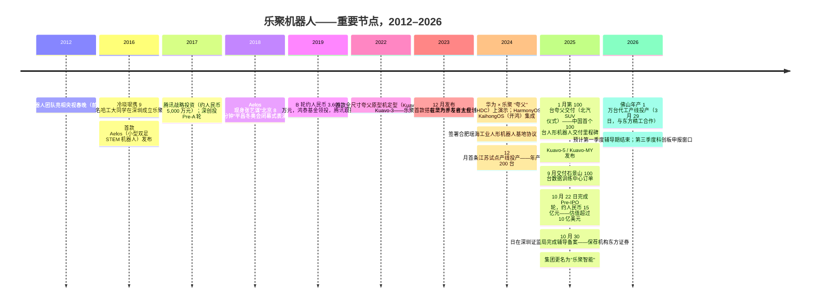
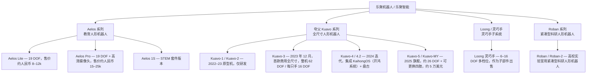
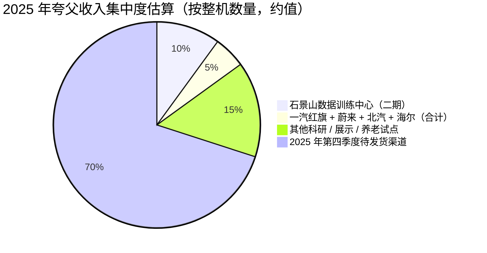
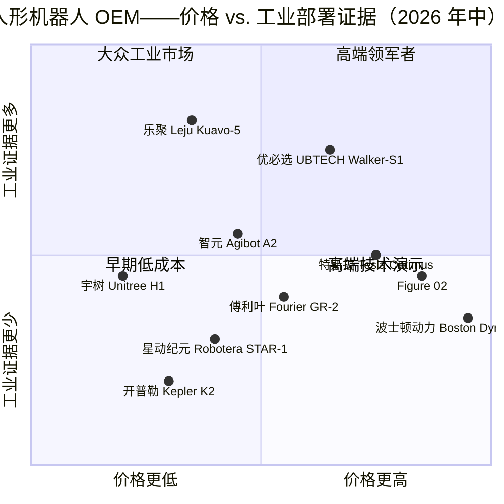

# 公司研究报告：乐聚机器人（乐聚机器人 / 乐聚智能）

**日期：** 2026-05-19
**状态：** 非上市 — 拟 IPO（中国证监会 2025-10-30 辅导备案；预计 2026 年第三季度登陆科创板）
**总部：** 深圳，研发位于哈尔滨，制造布局于杭州 / 合肥 / 江苏 / 佛山
**成立时间：** 2016 年
**创始人 / 董事长：** 冷晓琨
**首席执行官：** 常琳

> **更新——Pre-IPO 轮已完成（2025-10-22）：** 乐聚完成近人民币 15 亿元（约 2.10 亿美元）的 Pre-IPO 轮融资，投后估值据报道"超过 10 亿美元"（一家中国媒体援引数据约为人民币 90 亿元 / 约 12.5 亿美元）。领投方为中信金石与深圳投资控股（深投控）；其他新入股投资人包括物美旗下 / 贵州茅台关联基金、东方精工（002611.SZ — 同时为乐聚的代工厂）、拓普集团（601689.SH）、中美绿色基金、道合长期、新希望资本（New Alliance Capital）及探针资本（Probing VC）。募资将用于由东方精工运营的佛山年产 1 万台生产线、具身智能模型研发，以及向汽车、白色家电及养老等场景的扩展。辅导备案已于 2025-10-30 在深圳证监局完成登记（保荐机构：东方证券），拟登陆科创板；市场预期辅导期将于 2026 年第一季度结束，若审核顺利则有望在 2026 年第三季度挂牌上市。
> 来源：[DealStreetAsia, 2025-10-22](https://www.dealstreetasia.com/stories/humanoid-robot-maker-leju-raises-funding-460790)、[Robotics & Automation News, 2025-10-22](https://roboticsandautomationnews.com/2025/10/22/chinese-humanoid-robot-maker-leju-robot-secures-207-million-in-pre-ipo-funding/95727/)、[The Robot Report, 2025-10-22](https://www.therobotreport.com/leju-raises-200m-humanoid-production-unitree-unveils-h2-robot/)、[财联社 (CLS), 2025-10-22](https://www.cls.cn/detail/2098759)、[21世纪经济报道, 2025-10-22](https://www.21jingji.com/article/20251022/herald/2f5212453ea1d399421007c41d79d8cf.html)。

---

## 目录
1. 公司概况
2. 公司历史
3. 管理团队
4. 产品与服务
5. 客户与市场拓展
6. 行业概览
7. 竞争格局
8. 市场机会（TAM）
9. 风险评估
10. 参考资料

======================================

## 1. 公司概况

乐聚（深圳）机器人技术有限公司，品牌为"乐聚机器人"，控股主体在 IPO 推进前夕近期更名为 **乐聚智能**——是一家总部位于深圳的中国人形机器人 OEM 企业，研发起源及哈尔滨工业大学（HIT，哈工大）血统位于黑龙江省。公司由冷晓琨于 2016 年带领九人哈工大毕业生团队创立，在中国人形机器人产业链中占据独特位置：**它的成立早于当前的人形机器人热潮**，凭借教育机器人业务（Aelos）实现盈利，是 **首家批量交付 100 台全尺寸双足人形机器人的中国厂商**（2025 年 1 月）（[21经济, 2025-01-17](https://www.21jingji.com/article/20250117/herald/d9c353c2e6ffecf1c82c2787b60824a2.html); [Sznews / 深圳新闻网, 2025-01-17](https://www.sznews.com/news/content/mb/2025-01/17/content_31442232.htm)）。

**公司实际业务。** 两大产品系列：

- **Aelos（爱乐思 / 阿尔法）** ——一款桌面级、19–32 自由度（DOF）的教育人形机器人，销售对象包括 K-12 STEM 课程、职业院校、课后培训加盟以及消费出口渠道（Robocraze 印度、AliExpress、REES52）。自 2016 年起，Aelos 一直是乐聚的支柱业务；正是这块小型机器人业务，使乐聚比同行早数年实现现金流转正，并具备资金能力支撑成本高昂得多的夸父（Kuavo）项目研发（[Sixth Tone, 2018](https://www.sixthtone.com/news/1616); [Robocraze AELOS Pro listing](https://robocraze.com/products/aelos-pro-19dof-humanoid-robot-ai-kit-with-built-in-camera-sensor)）。
- **夸父 Kuavo** ——身高 1.7 米 / 约 55 公斤的全尺寸双足人形机器人（整机超过 40 个自由度，灵巧手每只手在 Kuavo-3 规格下可达 16 个自由度），目标场景包括工业集成（汽车 OEM 产线侧物料搬运、白色家电装配）、导览展览、科研实验室以及试点服务 / 养老等部署。该平台于 2025 年迭代至第五代（Kuavo-5 / Kuavo-MY），国际定价约 5 万美元，公司表示其国内可比型号售价约 "40 万元人民币——约为可比国际人形机器人价格的三分之一"（[新浪财经, 2025](https://cj.sina.com.cn/articles/view/1089183600/40eb9f7000101j9qw); [Humanoid.guide Kuavo-5 page](https://humanoid.guide/product/kuavo-5/); [Origin of Bots Kuavo-MY review, 2025](https://www.originofbots.com/robot/kuavo-my-by-leju-robotics-details-specifications-rating)）。

**地理布局。** 总部位于深圳南山（粤海街道）；研发中心位于哈尔滨（哈工大机器人研究所衍生，团队最初的所在地）；在杭州及合肥（瑶海区）设有子公司，并与广东佛山的 **东方精工（002611.SZ）** 合作建设年产 1 万台的代工生产线 ——东方精工持有乐聚 2.8% 的股权（[Yicai Global, 2025-04](https://www.yicaiglobal.com/news/chinas-dongfang-precision-becomes-contract-manufacturer-of-humanoid-robot-products); [Humanoids Daily, 2026-03-29](https://www.humanoidsdaily.com/news/10-000-units-a-year-inside-china-s-first-automated-humanoid-production-line)）。佛山生产线于 2026-03-29 正式投产，每约 30 分钟下线一台机器人，包含 24 道精密装配工序和 77 个检测节点。中文媒体普遍称之为 **国内首条标定年产能达到或超过 1 万台的人形机器人生产线**。

**业务规模。** 乐聚作为非上市拟 IPO 公司未披露收入。公开数据点大致可三角推算如下：

- **交付量：** 截至 2025-01-17 已交付 100 台全尺寸夸父（"第 100 台"在深圳交付仪式上交予北汽 SUV）（[SZ News, 2025-01-17](https://www.sznews.com/news/content/mb/2025-01/17/content_31442232.htm)）；公司目标 **2025 年夸父交付 1,000 台以上**，CEO 常琳在夏季访谈中重申了 1,000–2,000 台的 2025 年规划（[Bloomberg, 2025](https://www.bloomberg.com/features/2025-china-ai-robots-boom/); [eyeshenzhen, 2025-05-29](https://www.eyeshenzhen.com/content/2025-05/29/content_31584315.htm)）。2025 年标志性合同之一：2025 年 9 月向北京石景山"人形机器人数据训练中心二期"项目交付 100 台夸父（[CLS, 2025](https://www.cls.cn/detail/2098759)）。
- **员工数：** 约 400–500 人（Crunchbase / Tracxn 区间估算，未经官方披露）。
- **Aelos 装机量：** 公司表示自 2017 年以来累计向 K-12 与高校 STEM 渠道销售 "数万台 Aelos"（[搜狐 / 中国经济网, 2025](http://m.ce.cn/bwzg/202506/t20250622_2335318.shtml)）。

**估值快照（非上市公司——以 Pre-IPO 轮替代）。** 2025 年 10 月 Pre-IPO 轮对应隐含投后估值约 **10–13 亿美元**（融资规模约人民币 15 亿元 / 2.10 亿美元，对应媒体报道的"估值超 10 亿美元"；某中文二手来源（[Zhihu / 知乎, 2025-10](https://zhuanlan.zhihu.com/p/1967654974038210164)）援引人民币 90 亿元 / 约 12.5 亿美元——视为 *估算，非官方披露*）。

按此估值，乐聚位列中国"人形机器人八雄"的 **中段**，但显著低于宇树（Unitree）与智元（Agibot）。可比同行估值（取整，近 12 个月内有据可查的媒体报道）：

| 同行 | 最新披露估值 | 来源 |
|---|---|---|
| **宇树 Unitree** | 约 17 亿美元（2025 年中 Pre-IPO）；IPO 估值区间 30–70 亿美元（2026 年科创板目标） | [CNBC, 2025-09-09](https://www.cnbc.com/2025/09/09/chinas-unitree-plans-7-billion-ipo-valuation-as-humanoid-robot-race-heats-up.html); [SCMP, 2025](https://www.scmp.com/business/banking-finance/article/3347365/chinas-unitree-robotics-rides-humanoid-tide-it-targets-us610m-ipo) |
| **智元 Agibot / 智元（ZhiYuan）** | 港股 IPO 目标 400–500 亿港元（约 51–64 亿美元），2026 Q3 | [Hellochinatech, 2026](https://hellochinatech.com/p/china-robot-ipo-rush-2026) |
| **优必选 UBTECH（9880.HK）** | 已上市，市值约 530 亿港元 | [Humanoid.guide UBTECH financials](https://humanoid.guide/ubtech-and-unitree-financials-highlight-chinas-humanoid-shift/) |
| **傅利叶 Fourier Intelligence** | 约 11 亿美元（2025 年 5 月投前估值） | [Humanoids Daily Valuation Chasm, 2025](https://www.humanoidsdaily.com/news/the-great-valuation-chasm-a-2025-guide-to-the-humanoid-robotics-capital-race) |
| **逐际动力 LimX Dynamics** | 最近一轮估值约 4–6 亿美元（估算，2025 年融资） | [XCarspace ranking, 2025](https://xcarspace.com/top-20-chinese-humanoid-robot-companies-ranked-by-valuation/) |
| **星动纪元 Robotera** | 最近一轮估值约 4–5 亿美元（清华孵化，2024–25 轮次） | [Humanoids Daily, 2025](https://www.humanoidsdaily.com/news/the-great-valuation-chasm-a-2025-guide-to-the-humanoid-robotics-capital-race) |
| **开普勒 Kepler** | 约 3–5 亿美元（估算） | [Humanoids Daily, 2025](https://www.humanoidsdaily.com/news/the-great-valuation-chasm-a-2025-guide-to-the-humanoid-robotics-capital-race) |
| **魔法原子 Magiclab** | 媒体报道约 5 亿美元轮次，2025 年 | [Humanoids Daily, 2025](https://www.humanoidsdaily.com/news/the-great-valuation-chasm-a-2025-guide-to-the-humanoid-robotics-capital-race) |
| **加速进化 Booster Robotics** | 非上市；估值未披露 | [Humanoids Daily, 2025](https://www.humanoidsdaily.com/news/the-great-valuation-chasm-a-2025-guide-to-the-humanoid-robotics-capital-race) |

中国人形机器人纯赛道企业估值中位数因此位于 4–15 亿美元区间；乐聚约 10–13 亿美元位居中上段，理由是 **真实的整机交付量**（在宇树 IPO 推进之前，唯一公开跨过 100 台交付里程碑的中国人形机器人纯赛道企业；并且是截至 2026 年 3 月唯一拥有年产 1 万台运营产线的厂商）。隐含的收入倍数难以倒推，因为乐聚未披露；以 600 台夸父 × 平均售价 40 万元加上约 2–3 亿元的 Aelos 业务进行中位估算，2025 年集团收入可能落在 **人民币 4.5–6 亿元 / 6,000–8,500 万美元** 附近，对应 P/S 约 **12–18 倍**——大致与宇树 Pre-IPO 估值水平相当，但明显低于智元约 30 倍 P/S 的目标（*以上均为粗略估算；乐聚未披露财务数据*）。

市场对乐聚的定价建立在 2026–28 年夸父出货量爬坡至 **季均千台量级** 并具备 Aelos 风格消费级人形机器人选择权的预期之上。要支撑这一估值，需要佛山的 1 万台产能产线在 2027 财年实现 20% 以上的产能利用率——可能但尚未得到证据。

---

## 2. 公司历史

乐聚的故事并非始于 2016 年的深圳，而是更早地起源于 **哈尔滨工业大学智能机器人研究所**（哈工大智能机器人研究所）。三位创始人——冷晓琨（董事长）、常琳（CEO）与安子威——是哈工大计算机科学与技术学院的同学兼同实验室成员。该实验室的标志性亮相时刻是 2012 年央视春节联欢晚会（春晚），哈工大机器人小队表演了一段以皮克斯电影《WALL-E》为主题的舞蹈节目——后来组建乐聚的团队当时就在台上（[深圳市发改委关于冷晓琨的人物专访, 2025](https://fgw.sz.gov.cn/ztzl/qtztzl/szscjmyjjfzzhfwpt/mqfc/myqyjdxsj/content/post_12331042.html); [中国经济网, 2025-06-22](http://m.ce.cn/bwzg/202506/t20250622_2335318.shtml)）。

随后两段关键转折塑造了创业策略。第一，联合创始人常琳 **拒绝了加州大学伯克利分校（UC Berkeley）的录取通知，留在哈尔滨创业** ——多家中国媒体专访中均提及这一团队叙事（[深圳市发改委专访, 2025](https://fgw.sz.gov.cn/ztzl/qtztzl/szscjmyjjfzzhfwpt/mqfc/myqyjdxsj/content/post_12331042.html)）。第二，**冷晓琨主动选择了教育机器人——而非全尺寸人形机器人——作为创业产品**，理由很务实：0.3–0.7 米的双足玩具可以在当下做出来并卖出去，但 2016 年的 1.7 米双足人形机器人无法支付任何人的工资。这种现金流自律是乐聚相对于 2022–24 年新兴梯队的最显著特点（除宇树的四足机器人之外，智元、星动纪元、魔法原子、加速进化、开普勒大多数都是在 ChatGPT 之后成立、从未有盈利核心业务的）。

来源：[中国经济网, 2025-06-22](http://m.ce.cn/bwzg/202506/t20250622_2335318.shtml); [21经济, 2025-01-17](https://www.21jingji.com/article/20250117/herald/d9c353c2e6ffecf1c82c2787b60824a2.html); [DealStreetAsia, 2025-10-22](https://www.dealstreetasia.com/stories/humanoid-robot-maker-leju-raises-funding-460790); [Humanoids Daily, 2026-03-29](https://www.humanoidsdaily.com/news/10-000-units-a-year-inside-china-s-first-automated-humanoid-production-line)。

**战略转折——三个关键节点。**

1. **从教育机器人厂商转型为全栈人形机器人 OEM（2022–23）。** 在最初五年，乐聚是一家专注的 STEM 玩具企业。夸父项目是一次审慎的产业链向上押注，赌 AI 驱动的具身智能浪潮将在十年内到来、其在小型机器人电机 / 控制 / 安全领域积累的能力将复利成全尺寸机器人优势。Kuavo-3（2023 年 12 月）是首款具备商业可行性的全尺寸机型；Kuavo-5（2025 年）是首款可量产的机型。
2. **押注华为 HarmonyOS（鸿蒙操作系统）/ KaihongOS（开鸿操作系统）（2024）。** 乐聚是首家批量交付搭载 KaihongOS（HarmonyOS 衍生版本）的全尺寸人形机器人厂商，并与华为云的盘古具身智能模型深度捆绑。从战略角度，这使乐聚区别于宇树（自研栈）、智元（自研栈）及一众基于英伟达 Jetson 的长尾竞争者；同时也将乐聚锁定于华为生态，并为华为提供了一个战略展示窗口（[TechNode, 2024-11-18](https://technode.com/2024/11/18/huawei-launches-embodied-intelligence-innovation-center-in-shenzhen/); [Hansmat / 华为云 × 乐聚发布会, 2025](https://www.hansmat.com/news/huawei-cloud-and-leju-debut-universal-humanoid-78629888.html)）。
3. **将生产外包给东方精工（2025）。** 乐聚没有选择自建 1 万台 / 年产能产线，而是与佛山上市公司东方精工（002611.SZ，包装机械起家）开展代工合作，并接受东方精工取得 2.8% 股权。这种模式更接近苹果的代工制造模式，而非特斯拉 / 优必选的垂直整合，可保留乐聚资本支出用于研发与 AI 栈（[Yicai Global, 2025](https://www.yicaiglobal.com/news/chinas-dongfang-precision-becomes-contract-manufacturer-of-humanoid-robot-products)）。

未见重大收购。2025 年的"乐聚智能"更名属于科创板上市前的控股架构重组，而非并购事件（[RobotToday, 2025](https://robottoday.com/article/leju-robot-rebrands-as-leju-intelligence-eyes-ipo-with-strategic-overhaul-1)）。

---

## 3. 管理团队

### 冷晓琨——董事长 & 创始人（Pre-IPO 稀释前持股约 30%，估算）

冷晓琨是乐聚的创始人、董事长，也是公司的公众代言人。1992 年出生于山东潍坊，他是 10 亿美元估值以上人形机器人 OEM 创始人中最年轻的之一。他属于"创始人即公司本身"的典型人物，值得深入介绍。

**早期成长。** 冷晓琨的简历起点早于大学：他中学时代就进入了全国青少年机器人竞赛的全国总决赛，随后通过保送（保送制度绕开高考，专门面向奥赛奖牌得主和顶尖科技竞赛入围者）进入哈工大计算机学院。在哈工大期间，他加入智能机器人研究所，在本科阶段多次获得全国机器人冠军，并在哈工大完成计算机科学博士学位（[The Wire China, 2024](https://www.thewirechina.com/whos_who/leng-xiaokun-%E5%86%B7%E6%99%93%E7%90%A8/); [Sixth Tone, 2018](https://www.sixthtone.com/news/1616); [中国经济网, 2025](http://m.ce.cn/bwzg/202506/t20250622_2335318.shtml)）。他至今仍保持与哈工大的学术联系，担任该校 **智能机器人研究所副所长**——这是 CEO 实务身份与持续学术身份之间不多见的桥接。

**创业决定。** 2016 年，刚完成博士项目的冷晓琨召集九位哈工大同学及实验室同伴，选择在深圳而非哈尔滨注册成立乐聚——明确目的是靠近粤港澳大湾区的消费电子与精密零部件供应链。他在采访中将此描述为一次有意识的选择，不愿沿袭主导中国高校创业的"学术成果在校园内孵化"模式（[Sixth Tone, 2018](https://www.sixthtone.com/news/1616)）。

**荣誉与政治信号。** 冷晓琨是少数被深圳市政府与共青团明确树立为"民营经济模范企业家"的中国科技 CEO 之一。他获得过 **中国青年五四奖章**——共青团授予 40 岁以下的最高跨学科表彰（[深圳市发改委专访, 2024](https://fgw.sz.gov.cn/ztzl/qtztzl/szscjmyjjfzzhfwpt/mqfc/myqyfzdt/content/post_12294488.html); [The Wire China, 2024](https://www.thewirechina.com/whos_who/leng-xiaokun-%E5%86%B7%E6%99%93%E7%90%A8/)）。对一位即将冲刺科创板 IPO 的民企创始人而言，这一身份本质上是一份显性的政治背书。

**理念与公众形象。** 冷晓琨反复在公开场合表达的理念——机器人应当 **"聪明如博士，便宜如家电"**（[搜狐 / 中国经济网, 2025](https://www.sohu.com/a/857290676_121010226)）——本质上就是一条产品定位标语。他还在 2024 年公开反驳"AI 资本寒冬"的说法，认为当前并非具身智能领域中那些能交付产品的公司的寒冬（[Time Weekly, 2024](https://www.time-weekly.com/wap-article/265148)）。

持股比例未披露；多家媒体报道一致认为，Pre-IPO 后冷晓琨仍是单一最大个人控股股东，常琳为第二大个人股东。

### 常琳——联合创始人 & CEO

常琳是与冷晓琨同期哈工大机器人研究所的毕业生。被多次提及的创始团队故事是：**常琳曾收到加州大学伯克利分校的录取通知，但放弃出国，选择留在中国共同创立乐聚** （[深圳市发改委, 2025](https://fgw.sz.gov.cn/ztzl/qtztzl/szscjmyjjfzzhfwpt/mqfc/myqyjdxsj/content/post_12331042.html)）。自 2023 年夸父项目进入量产以来，常琳一直担任运营 CEO；2025 年 1 月北汽 100 台交付仪式上他是公众代言人，并在 21 世纪经济报道访谈中代表公司公布 2025 年 1,000 台计划（[21经济, 2025-01-17](https://www.21jingji.com/article/20250117/herald/d9c353c2e6ffecf1c82c2787b60824a2.html)）。他对外传递的核心信息包括：(1) 工业客户的投资回报——"结构化工厂场景中的人形机器人应在约 24 个月内回本"，以及 (2) 国内同业竞争对该行业整体是净正面的（[Bloomberg humanoid feature, 2025](https://www.bloomberg.com/features/2025-china-ai-robots-boom/)）。他在乐聚之外没有公开的上市公司 CFO 或运营高管经历；整个职业生涯都在乐聚。

### 安子威——联合创始人，CTO（工程）

第三位哈工大联合创始人。负责运动控制 / 执行器栈、灵巧手项目，并衔接哈尔滨研发中心与深圳生产端。比冷晓琨、常琳更低调（公开的英中文披露有限，简介深度受限）。

### 王松——总经理（合肥子公司）/ 工业部署负责人

王松主管合肥瑶海工业人形机器人基地，是 2025 年 1,000 台交付目标的官方发言人（[财联社, 2025](https://www.cls.cn/detail/2098759)）。他也是客户端场景落地（汽车产线侧物料搬运、白色家电装配、养老）的媒体对接人。被报道为合肥分公司副总经理的王帅，在新华社 / 人民日报报道中说明合肥子公司将于 2025 年底从测试研发阶段转入工厂实际作业（[新华社 / 人民日报, 2025-11](https://en.people.cn/n3/2025/1128/c90000-20396136.html)）。

### 公司治理

- **董事会 / 股东结构：** Pre-IPO 轮之前未公开股东信息。已确认股东包括腾讯产业共赢基金（早期）、深圳资本集团（深创投，2017 年 Pre-A）、鸿泰基金（B 轮 2019 年）、林芝立信信息技术，加上 2025 年 10 月 Pre-IPO 入股的中信金石、深投控、贵州茅台关联基金、东方精工、拓普集团、中美绿色基金、道合长期、新希望资本、探针资本（[DealStreetAsia, 2025-10-22](https://www.dealstreetasia.com/stories/humanoid-robot-maker-leju-raises-funding-460790); [财联社, 2025-10-22](https://www.cls.cn/detail/2098759)）。
- **经营治理：** 创始人控制。冷、常、安三人组成创始人——CEO——CTO 三角组合；第二梯队（合肥总经理王松、东方精工的佛山生产负责人）是引进的运营人才。
- **关联交易提示：** 东方精工（002611.SZ）同时是股东（2.8%）和代工厂。在科创板申报文件中，此类关系需要明确披露关联关系并出具公允定价证明。
- **政治背景：** 创始人获得共青团中国青年五四奖章；机构资本由国有背景的深投控与中信金石压舱。这一组合对于人形机器人这类战略行业的科创板申报而言异常有利。

### 履历评估

团队履历是 **整个乐聚故事中最不对称的正向因素**：九年运营历史，且在押注人形机器人之前已经具备盈利的教育机器人业务；2025 年 1 月成为 **首家公开实现 100 台交付的中国人形机器人 OEM**；并提出可信的 2025 年 1,000 台目标——同一时间线上，宇树、智元、傅利叶、星动纪元、开普勒、魔法原子、逐际动力、加速进化均无法匹敌。短板：公开信息中未见上市公司 CFO 经验、未见 IPO 资深独董，亦未见从汽车 OEM 工业工程体系引进的高管——如果要扩展到比亚迪 / 蔚来 / 红旗级别的产线侧部署，这是一项弱点。

---

## 4. 产品与服务

乐聚同时运营 **两条截然不同的产品线**，共享相同的电机 / 灵巧手 / 控制 IP 基础，但面向完全不同的客户、售价和毛利率结构。此外还有发展中的第三条产品线——**灵巧手 Loong 子部件业务**，已分拆为面向其他人形机器人 OEM 与科研机构的独立产品。

来源：[Leju product home page, lejurobot.com/en](https://www.lejurobot.com/en); [Humanoid.guide Kuavo-5](https://humanoid.guide/product/kuavo-5/); [Humanoid.guide Kuavo-MY](https://humanoid.guide/product/kuavo-my/); [Humanoid.guide Roban2](https://humanoid.guide/product/roban-2/); [Origin of Bots Kuavo-MY, 2025](https://www.originofbots.com/robot/kuavo-my-by-leju-robotics-details-specifications-rating); [Robocraze Aelos listings](https://robocraze.com/products/aelos-pro-19dof-humanoid-robot-ai-kit-with-built-in-camera-sensor)。

### Aelos 系列——现金牛

**产品概述。** 一款 19–32 自由度的桌面级双足人形机器人，身高约 30–50 厘米，面向 STEM 课程（9–15 岁及高校）、现场表演（张艺谋 2018 平昌冬奥会闭幕式"北京 8 分钟"中所用 Aelos 机型）以及新兴市场消费出口渠道。

**型号与定价。**

- *Aelos Lite* —— 19 DOF，支持语音 + 蓝牙控制，通过 AELOS STEM 应用进行 Blockly 可视化编程，配备陀螺仪和加速度计；电池约 70 分钟工作 / 155 分钟待机；印度经销渠道售价 Rs. 188,999–249,999，按出口单台估算约人民币 16k–22k（[Robocraze AELOS LITE listing](https://robocraze.com/products/leju-robot-aelos-lite-19dof-ai-humanoid-robot-kit-for-programming-coding); [REES52 AELOS LITE](https://rees52.com/products/leju-aelos-lite-19dof-humanoid-educational-robot-ai-programming-coding-robot-for-kids-students-teachers-stem-robotics-kit-for-classroom-learning)）。
- *Aelos Pro* —— 同 19 DOF 机身，外加高清摄像头、视觉 AI 应用（人脸识别、目标跟踪）、Python 脚本支持；售价 Rs. 279,250–369,999（约人民币 24k–32k）（[Robocraze AELOS PRO](https://robocraze.com/products/aelos-pro-19dof-humanoid-robot-ai-kit-with-built-in-camera-sensor); [REES52 AELOS PRO](https://rees52.com/products/leju-aelos-pro-19dof-smart-ai-humanoid-robot-educational-coding-programming-robot-with-built-in-camera-plug-play-sensors-for-stem-learning-robotics-training)）。
- *Aelos 1S* —— 英国 / 全球 STEM 套件版本（[Ednology Marketplace](https://marketplace.ednology.com/product/leju-robotics-aelos-1s/)）。

**竞争力评估：部分。** Aelos 在中国 K-12 STEM 课程领域拥有 *品牌与渠道* 护城河——许多市级 STEM 教学标准与课后加盟课程都将 Aelos 列入推荐设备。但底层平台（小型双足、19 DOF 舵机架构）是可复制的；优必选 Alpha 1 Pro、JIMU Robots（优必选面向儿童的品牌）以及数十家深圳通用 OEM 都覆盖同一价格带。**最接近的竞品：** 优必选 Alpha 系列——硬件层面与乐聚旗鼓相当，乐聚在国内 STEM 课程嵌入方面更具优势。

### 夸父 Kuavo 系列——战略资产

**Kuavo-5 / Kuavo-MY（2025 年发布的当前旗舰）。**

- **外形参数：** 身高 1.7 米，重约 45 公斤。
- **自由度：** Kuavo-MY 整机 26 DOF（双臂 14 + 双腿 12）；可选大型灵巧手时整机超过 40 DOF；Kuavo-3 规格整机 62 DOF（含每只手 16 DOF 灵巧手）。
- **性能：** 关节峰值扭矩约 360 N·m；全向行走速度高达 4.6 km/h（沙地、草地、工厂地面）；起跳高度 ≥20 厘米；新浪财经技术深度文章援引后续版本在实验室条件下可奔跑达 7 km/h（[新浪财经, 2025](https://cj.sina.com.cn/articles/view/1089183600/40eb9f7000101j9qw)）。
- **软件栈：** 集成 KaihongOS（华为支持的 OpenHarmony 开源分支）与华为云盘古具身 AI 模型。GitHub 上发布开源 SDK，开放给学术界与开发者社区（[Leju GitHub](https://github.com/LejuRobotics); [The Humanoid Hub, 2024-10](https://x.com/TheHumanoidHub/status/1844076618098278543)）。
- **模块化（Kuavo-5 特有）：** 可更换四肢（轮式底座 ↔ 双足腿部）、模块化换手、可配置载荷——区别于宇树 H1/G1、智元 A2、星动纪元 STAR-1 的定位（[Mike Kalil, 2025](https://mikekalil.com/blog/leju-kuavo-5-humanoid-robot/)）。
- **国际定价：** 5 万美元（[Origin of Bots, 2025](https://www.originofbots.com/robot/kuavo-my-by-leju-robotics-details-specifications-rating)）。国内售价被广泛援引为"约人民币 40 万元，约为国际可比型号的三分之一"（[新浪财经, 2025](https://cj.sina.com.cn/articles/view/1089183600/40eb9f7000101j9qw)）——根据配置与批量折扣，国内可估约 5.5–6 万美元。
- **本土化：** 公司声称 Kuavo-3 代 **国产化率 >90%**（[搜狐 / 中国经济网, 2025](https://www.sohu.com/a/857290676_121010226)），明显高于宇树（高端关节仍部分进口）和傅利叶。

**竞争力评估：是——多维度优势。**

- *制造规模护城河：* 佛山产线标定年产能 1 万台（2026 年 3 月起投产），是 **截至本报告日期国内唯一公开运营在此规模的产能**。最接近的对手产能：宇树（规模大但以四足为主）、优必选（仅汽车 OEM 训练场景部署）、智元（中位千台级 / 年）。Kuavo 对比智元 A2 / 宇树 H1 的总体判断：**在工业部署证据与短期可交付产能方面领先；在运动敏捷度方面落后于宇树，在 AI 栈论文成果方面落后于智元**。
- *生态护城河（华为 HarmonyOS）：* 在头部人形机器人厂商中，乐聚是唯一开箱即用搭载 HarmonyOS / KaihongOS（开鸿系统）+ 盘古的厂商。对手如要复制，必须重新回到华为体系（[华为云 × 乐聚发布会, 2025](https://www.hansmat.com/news/huawei-cloud-and-leju-debut-universal-humanoid-78629888.html)）。
- *价格 / 成本护城河：* "约为国际定价三分之一"的论断意味着工业客户的回本期显著缩短，并支撑了公司的"两年 ROI"叙事（[Bloomberg, 2025](https://www.bloomberg.com/features/2025-china-ai-robots-boom/)）。
- *客户证据护城河：* 截至 2025 年中，乐聚是 *拥有具名、可查* 工厂部署案例最齐全的中国人形机器人 OEM，覆盖一汽红旗、蔚来与海尔（[Xinhua, 2025-05-26](https://english.news.cn/20250526/fc1d7f6dec6b4e9ba8f08dfb57bbfb7d/c.html); [Yicai Global, 2025](https://www.yicaiglobal.com/news/chinas-dongfang-precision-becomes-contract-manufacturer-of-humanoid-robot-products); [21经济, 2025-01-17](https://www.21jingji.com/article/20250117/herald/d9c353c2e6ffecf1c82c2787b60824a2.html)）。

**最接近的竞品及一句话对比（Kuavo-5 与同业）：**

- *宇树 Unitree H1 / G1* —— H1 更高、奔跑更快、运动更敏捷；Kuavo-5 在基础运动方面持平，但 **在负载机械臂与工业客户证据方面领先**。
- *智元 Agibot A2* —— 智元在具身 AI 通用行为演示方面领先；Kuavo-5 在已交付工业整机数量与 HarmonyOS 生态方面领先。
- *优必选 UBTECH Walker-S1* —— 优必选在比亚迪工厂的训练小时数与汽车 OEM 关系上领先（优必选起家时即与汽车供应商相邻）；Kuavo-5 在成本及非汽车垂类的部署速度上领先。
- *星动纪元 Robotera STAR-1* —— 星动纪元在速度纪录（奔跑）方面领先；Kuavo-5 在商业交付方面领先。
- *傅利叶 Fourier GR-1 / GR-2* —— 傅利叶起家于康复机器人，机械臂保真度更强；Kuavo-5 在全栈规模与价格上领先。
- *开普勒 Kepler K2* —— 开普勒仍处于量产前阶段；Kuavo-5 在交付上明显领先。
- *魔法原子 Magiclab Z1 / 加速进化 Booster* —— 早期挑战者；乐聚在交付与产能方面遥遥领先。

### Loong（夸父 灵巧手）——灵巧手子系统

乐聚已开始将自研的灵巧手 IP（Kuavo-3 / -5 上搭载的 6–16 DOF 灵巧手）定位为 **可分拆子部件**，对外销售给科研院所及其他人形机器人 OEM。这是顺势之举——特斯拉、Figure、1X、宇树、智元都需要灵巧手 IP——可将 Kuavo BOM 中的一个组件转化为按行业利润率定价的独立收入线。该产品线的公开披露仍较稀薄；最明确的引述见于访谈层面（[新浪财经, 2025](https://cj.sina.com.cn/articles/view/1089183600/40eb9f7000101j9qw)）。**竞争力评估：部分——技术血统强，但相对于专业灵巧手厂商（如因时机器人 Inspire Robotics、Shadow Robot、PsiBot）商业实绩较小**。

### Roban / Roban-2 ——紧凑型科研人形机器人

身高约 1.2 米的紧凑型科研人形机器人，面向高校与科研院所——介于 Aelos 与夸父之间。出货量较低；主要作为课程 / 研发平台，使乐聚保持与哈工大 / 清华大学 / 浙江大学生态的紧密绑定（[Humanoid.guide Roban2](https://humanoid.guide/product/roban-2/)）。

### 旗舰产品与长尾结构

驱动当前业务的 1–3 款产品：**Kuavo-5 / Kuavo-MY**（明星产品，所有媒体声量的源头）、**Aelos Pro**（现金流引擎，历史上万台级渠道）以及 **Loong 灵巧手** 作为新兴的第三条腿。Aelos 与 Loong 补贴了夸父项目高昂的研发成本——这与宇树的模式一致（四足收入 → 人形研发）。

### 路线图与近期发布

- Kuavo-5 / Kuavo-MY 于 2025 年发布。
- 佛山年产 1 万台产线于 2026-03-29 投产。
- 在 2025 年世界机器人大会与上海十五运（第十一届全运会）开幕式上展示 "5G-A 人形机器人"，其中夸父担任火炬手（[Frontiers Online, 2025-08-09](https://www.frontiersonline.com/2025/08/09/robot/frontiers/4994/5g-a%E5%8A%A0%E6%8C%81%E3%80%81%E5%85%B7%E8%BA%AB%E6%99%BA%E8%83%BD%E8%BF%9B%E5%8C%96%EF%BC%81%E4%B9%90%E8%81%9A%E5%A4%B8%E7%88%B6%E6%8A%80%E6%9C%AF%E6%96%B0/); [163.com, 2025-11](https://www.163.com/dy/article/KDBUVOAC05129QAF.html)）。
- 未披露重大产品停产。

---

## 5. 客户与市场拓展

乐聚运营两条本质上独立的市场拓展路径：

**Aelos GTM——教育 / 消费渠道。** 通过市级 STEM 课程招标（中国 K-12 与职业院校）、课后加盟网络以及国际经销商（Robocraze 印度、REES52、AliExpress、Ednology 英国）销售。这是一项高出货量、低单价、高毛利的业务，对于机构招标销售周期较长，但消费 / 跨境电商方面具备标准电商吞吐率。客户基础分散，集中度风险较低。

**Kuavo GTM——直营工业销售与政府招标部署。** 通过企业直销渠道（合肥子公司主导工业大客户；深圳总部主导汽车 OEM 与科技生态客户）、政府 / 国企招标（2025 年最大的案例是石景山数据训练中心）以及集成商合作（华为"具身智能创新中心"向乐聚导流）。定价按项目配置，毛利率可能显著低于 Aelos，因为 BOM 中以中国本土执行器为主，AI / SDK 成本摊薄在小规模出货上。

### 已披露的夸父客户（具名，最近 12–24 个月）

- **一汽红旗（红旗轿车）** —— 在产线上部署 5 台夸父用于料箱搬运；媒体明确描述了双足相对于轮式在狭窄空间和楼梯场景中的优势（[Xinhua, 2025-05-26](https://english.news.cn/20250526/fc1d7f6dec6b4e9ba8f08dfb57bbfb7d/c.html); [Origin of Bots, 2025](https://www.originofbots.com/robot/kuavo-my-by-leju-robotics-details-specifications-rating)）。
- **蔚来 NIO（蔚来汽车 NIO Inc.）** —— 夸父用于产线（[Yicai Global, 2025](https://www.yicaiglobal.com/news/chinas-dongfang-precision-becomes-contract-manufacturer-of-humanoid-robot-products); [Xinhua, 2025-05-26](https://english.news.cn/20250526/fc1d7f6dec6b4e9ba8f08dfb57bbfb7d/c.html)）。
- **海尔** —— 白色家电装配场景，在 Yicai Global 关于东方精工的公告中列明（[Yicai Global, 2025](https://www.yicaiglobal.com/news/chinas-dongfang-precision-becomes-contract-manufacturer-of-humanoid-robot-products)）。
- **北汽 SUV（北汽福田？——更可能是北汽集团）** —— 2025 年 1 月第 100 台交付仪式的客户（[SZ News, 2025-01-17](https://www.sznews.com/news/content/mb/2025-01/17/content_31442232.htm); [Bloomberg, 2025](https://www.bloomberg.com/features/2025-china-ai-robots-boom/)）。
- **石景山区产业有限公司（北京）** —— "人形机器人数据训练中心二期"项目：2025 年 9 月交付 100 台夸父；乐聚公开披露的单笔最大合同（[CLS, 2025-10-22](https://www.cls.cn/detail/2098759)）。
- **苏州养老机构** —— 多台夸父在试点部署（药品分拣、取物）（[Bloomberg, 2025](https://www.bloomberg.com/features/2025-china-ai-robots-boom/)）。
- **四川某学校** —— 夸父被部署于教学角色（2025 年示范用例）（[Mike Kalil, 2025](https://mikekalil.com/blog/kuavo-robot-schoolteacher/)）。
- **生态合作伙伴（披露 40 余家）** —— 华为、腾讯、阿里云（同时援引字节跳动 / 火山引擎）、中国移动、中国电信、与中国联通相关的电信运营商、荣耀、一汽、中兴、巨一科技、南方电网、海信、海尔、润泽集团（[CLS, 2025](https://www.cls.cn/detail/2098759); [DealStreetAsia, 2025-10-22](https://www.dealstreetasia.com/stories/humanoid-robot-maker-leju-raises-funding-460790)）。

### 客户集中度——*估算，非官方披露*

乐聚是非上市公司；尚无中国 A 股式的"前五大客户"披露。根据媒体证据，2025 年客户集中度大致结构如下：

即便按此粗略拆分，**第一大客户份额已显著超过 2025 年夸父出货量的 10%**（仅石景山的 100 台便占 1,000 台指引的约 10%）；**前五大份额很可能超过 30–40%**。无论从整机数量还是从对手方性质（石景山是国资买方）看，这都是较高的客户集中度。按本研究方法的阈值属于实质性风险，将在第 9 节展开。

*披露提示：第一大客户占比依据媒体估算，非来自申报文件。科创板招股说明书中将正式披露。*

### 合同结构

工厂部署的轶事证据（汽车 OEM 产线侧场景）表明，主要合同模式为 **按整机的采购订单 + 单独的年度服务 / SDK / 培训合同**，而非多年期主协议。这种模式保留了客户选择权（同时也意味着，若技术栈表现不及预期，乐聚短期内面临一定的流失风险）。石景山级别的政府合同更可能是一次性资本性采购。

### 渠道与合作

战略上最具定义性的合作关系是 **华为 × 乐聚**。华为提供 HarmonyOS / KaihongOS（开鸿系统）、华为云盘古具身智能模型、深圳"具身智能创新中心"的市场拓展通道，以及 2024 年 11 月共同发起的 16 家企业生态联盟（[TechNode, 2024-11-18](https://technode.com/2024/11/18/huawei-launches-embodied-intelligence-innovation-center-in-shenzhen/)）。对乐聚而言，这既是杠杆（即时触达华为上万级企业客户），也是依赖。代工厂东方精工是规模更小但真实的战略合作。

### 关于用户简报中的比亚迪合作——未经证实

用户简报将乐聚定位为"由腾讯 / 比亚迪 / 华为 HarmonyOS（鸿蒙系统）生态支持"，并提及"比亚迪合肥试点（夸父）"。**在 2026 年中以前的中英文公开报道中，没有任何投资或战略合作披露将比亚迪列为乐聚股东或具名的夸父客户。** 比亚迪已确认的人形机器人合作伙伴是 **优必选**（其 Walker-S1 在比亚迪合肥工厂试点——2024 年媒体援引效率翻倍的成果）以及智元，而非乐聚（[投中网, 2025-05-08](https://www.chinaventure.com.cn/news/114-20250508-386190.html); 另见优必选评论 [eeworld, 2025](https://en.eeworld.com.cn/mp/JQR/a393836.jspx)）。乐聚的合肥子公司位于 **瑶海区**，是 *与合肥市 / 瑶海区政府的工业人形机器人基地协议*，与比亚迪无关（[gov.cn 报道, 2025-04-04](https://english.www.gov.cn/news/202504/04/content_WS67ef7526c6d0868f4e8f1702.html); [北京投资局转载, 2025-02-20](https://invest.beijing.gov.cn/zwgk/ywsd/202502/t20250220_4015592.html)）。在出现一手披露之前，应将比亚迪合作视为 **未经证实**。

---

## 6. 行业概览

人形机器人行业在 2024 至 2026 的 24 个月中，从"概念性主题"转变为"出货型主题"。其经济模型与需求驱动因素现已可被清晰量化。

**行业定义。** 相关行业为 **具身智能人形机器人** ——即双足或轮式双足通用机器，意在在非结构化环境中替代人类劳动。这与工业机器人（发那科 Fanuc、ABB、库卡 KUKA、安川 Yaskawa——固定臂焊接 / 喷涂 / 拾取放置）不同，与协作机器人（优傲 Universal Robots、Anpeilong 工业协作机器人产品线）不同，也与自动驾驶（属另一条具身智能赛道，但以轮式且户外为主）不同。

**市场规模——近期预测。**

- **全球市场：** 高盛将其人形机器人 TAM 基准情形上调至 **2035 年 380 亿美元**，2030 年出货量超过 25 万台，主要为工业用途（[Goldman Sachs Insights, 2024-update](https://www.goldmansachs.com/insights/articles/the-global-market-for-robots-could-reach-38-billion-by-2035)）。
- **长周期 TAM：** 摩根士丹利更具长期信念的观点估计人形机器人市场到 **2050 年达到 5 万亿美元**，包含供应链与售后（[Morgan Stanley, 2024](https://www.morganstanley.com/insights/articles/humanoid-robot-market-5-trillion-by-2050); [CNBC, 2025-04-29](https://www.cnbc.com/2025/04/29/how-to-play-a-5-trillion-market-for-humanoid-robots-by-2050.html)）。
- **中国市场：** 人民币 27.6 亿元 / 3.8 亿美元（2024）→ 人民币 105 亿元 / 14 亿美元（2026）→ 人民币 750 亿元 / 103 亿美元（2029）→ 人民币 3,000 亿元 / 410 亿美元（2035），援引自 China Briefing 的行业综述（[China Briefing, 2025](https://www.china-briefing.com/news/chinese-humanoid-robot-market-opportunities/)）。
- **2025 年实际出货：** 全球 14,000–16,000 台；其中约 90% 来自中国制造商（[Xinhua, 2025-05-26](https://english.news.cn/20250526/fc1d7f6dec6b4e9ba8f08dfb57bbfb7d/c.html); [Origin of Bots, 2025](https://www.originofbots.com/robot/kuavo-my-by-leju-robotics-details-specifications-rating)）。

**增长驱动——五大叠加顺风。**

1. *中国制造业的人工成本通胀。* 一线汽车 OEM 工厂的产线侧综合人工成本已经突破年均人民币 8–12 万元。在乐聚约人民币 40 万元售价和两年回本目标下，双足人形机器人在多个结构化作业岗位上已通过毛 ROI 阈值。
2. *具身智能模型成熟度。* 大型视觉-语言模型、Sim-to-Real 强化学习与日益廉价的 GPU 算力三者结合，使开发周期从"波士顿动力级平台需 5–10 年"压缩至"商业可行机型 12–24 个月"。
3. *中国国家产业政策。* 工信部 2023 年《人形机器人创新发展指导意见》设定了明确的 2025 与 2027 年目标，并将人形机器人定位为战略性新兴产业。省市补贴（深圳、合肥、苏州、上海、北京石景山）随之而来（[gov.cn humanoid focus, 2025-04-04](https://english.www.gov.cn/news/202504/04/content_WS67ef7526c6d0868f4e8f1702.html); [深圳市发改委, 2025](https://fgw.sz.gov.cn/ztzl/qtztzl/szscjmyjjfzzhfwpt/xwdt/content/post_12549978.html)）。
4. *中国供应链深度。* 支撑比亚迪电动车供应链的执行器 / 谐波减速器 / 行星齿轮 / 六维力传感器 / IMU 体系可直接迁移至人形机器人。Kuavo-3 实现国产化率 >90% 是可行的。相对特斯拉 Optimus 或 Figure 02 的成本下行属结构性而非周期性。
5. *汽车 OEM 的机器人垂直化。* 比亚迪、蔚来、一汽、广汽、吉利、小鹏、理想以及特斯拉本身都在构建机器人业务或收购机器人 IP。客户与对手正在收敛——但短期内，汽车 OEM 也是人形机器人部署最重要的需求来源（产线侧物料搬运是最大的单一工业用例）。

**行业结构。**

- **当前分散，未来整合。** 仅中国就有 50 余家具名的人形机器人公司；摩根士丹利的"人形 100"地图全球识别约 100 家（含供应链）（[Morgan Stanley Humanoid 100, 2025](https://advisor.morganstanley.com/john.howard/documents/field/j/jo/john-howard/The_Humanoid_100_-_Mapping_the_Humanoid_Robot_Value_Chain.pdf)）。多数观察者认为 2020 年代末期将稳定至 5–10 家头部厂商格局。
- **供应商议价能力：** 中等——谐波减速器市场较集中（全球的日本 Harmonic Drive、国内的绿的谐波 SZSE:688017），高精度执行器市场竞争加剧，AI 栈正通过开源版本（乐聚的 GitHub SDK 即是例证）日益商品化。
- **买方议价能力：** 上升中。汽车 OEM 是大型且专业的买家；2024 年比亚迪与优必选的合作显示，OEM 可主导联合开发条款。
- **替代品：** 专用工业机器人、AMR、固定式自动化设备。对于今天大多数结构化产线任务而言，6 轴机械臂 + AMR 仍然比人形机器人便宜。人形机器人仅在以下场景占优：(a) 任务需要双足移动能力（楼梯、狭窄空间）或 (b) 任务非结构化程度足够高，机械臂 + AMR 无法解决（目前范围仍较窄）。
- **监管：** 当前监管较轻（没有等同于汽车型式认证的人形机器人认证标准）；国务院与工信部正在起草安全标准。服务部署（养老、零售导览）需面对地方政府许可；工业部署主要面对客户自身的 EHS 验收。

**2026 年中期的行业经济背景。** 全球范围内人形机器人 IPO 季已到来：宇树于 2025 年提交科创板申请，目标 2026 年上市；乐聚于 2025 年 10 月辅导备案，目标 2026 年科创板上市；智元目标 2026 Q3 港股上市；优必选已上市。未来 12 个月将是行业公开市场估值倍数形成的关键期——对乐聚而言既是时机风险，也是时机机会。

---

## 7. 竞争格局

**直接竞争对手（中国人形机器人纯赛道企业，按 2025 年出货量 / 公开声量排序）：**

1. **宇树科技 Unitree Robotics（杭州）。** 2016 年由王兴兴创立。最初专注于四足机器人（Go1 / Go2 机器狗）；H1 / G1 人形机器人于 2023–24 年发布。2025 年收入约人民币 17.1 亿元（同比 +335%），2025 年中期 Pre-IPO 估值约 17 亿美元，IPO 估值区间 30–70 亿美元（[CNBC, 2025-09-09](https://www.cnbc.com/2025/09/09/chinas-unitree-plans-7-billion-ipo-valuation-as-humanoid-robot-race-heats-up.html); [Humanoid.guide UBTECH/Unitree financials](https://humanoid.guide/ubtech-and-unitree-financials-highlight-chinas-humanoid-shift/)）。在运动 R&D / 公众营销 / 四足收入方面更强；在全尺寸人形机器人工业部署证据方面落后于乐聚。
2. **智元机器人 Agibot / Zhiyuan Robotics（上海）。** 由前华为"天才少年"彭志辉（"稚晖君"）联合创立。目标 2026 Q3 港股 IPO，估值 400–500 亿港元（约 51–64 亿美元）。具身 AI 通用化软件叙事强势；相对乐聚而言已交付工业整机数量较少。
3. **优必选 UBTECH（HKEX:9880）。** 2023 年底上市。2025 财年收入人民币 20 亿元（同比 +53%）。Walker-S1 在比亚迪合肥与吉利工厂均已记录运行时长。市值约 530 亿港元。业务面更宽（服务 + 教育 + 工业），但人形机器人纯业务的市值与乐聚相当。
4. **傅利叶 Fourier Intelligence（上海）。** 起家于康复机器人；自 2023 年起推进 GR-1 / GR-2 人形机器人项目。2025 年 5 月投前估值 11 亿美元。SoftBank 愿景基金背书。机械臂保真度 / 临床记录较强；工业部署规模落后。
5. **逐际动力 LimX Dynamics（深圳）。** 在运动研究工程方面较强；商业规模一般。
6. **星动纪元 Robotera（北京）。** 清华孵化，成立于 2023 年 8 月。STAR-1 创造高速人形机器人奔跑纪录。商业交付方面落后。
7. **开普勒探索机器人 Kepler Exploration Robot（上海）。** K2 / Forerunner 项目；商业出货量至今较小。
8. **魔法原子 Magiclab。** Z1 人形机器人面向商业应用；近期完成约 5 亿美元融资。
9. **加速进化 Booster Robotics（北京）。** 由前清华机器人团队创立；出货仍处于商用前阶段。

**间接竞争对手：** 优必选较老的 Walker / Walker-X 产品线；汽车 OEM 的内部项目（比亚迪的"尧舜禹"内部项目、特斯拉 Optimus、小米 CyberOne / CyberDog、小鹏 PX5、吉利近期的人形机器人项目）。长期来看，OEM 内部自研人形机器人确实是实质性的竞争替代风险；短期内，OEM 同时充当买方与开发方，反而在 2025–27 窗口中对乐聚这类对 OEM 友好的第三方更为有利。

**国际同行：** 特斯拉 Optimus、Figure 02、1X Neo、波士顿动力 Atlas（电驱版）、Apptronik Apollo、Sanctuary Phoenix、Agility Digit。这些产品价格更高（6–20 万美元以上），技术领先但出货量低于中国同行；2025 年全球人形机器人出货量中中国份额约 90% 即为佐证。

**定位框架——价格 × 工业部署证据（2026 年中）：**

（位置为作者根据全文引用的公开媒体所做估计，并非分析机构发布的排名。）

**乐聚最显著的竞争优势**

1. *已交付工业整机。* 100 台里程碑（2025 年 1 月）与 1,000 台指引（2025 财年）使乐聚在已交付全尺寸人形机器人方面跻身全球前三——在大多数同行仍停留于原型展示的市场中，这是实质性差异。
2. *HarmonyOS（鸿蒙系统）/ 华为生态独家。* 将乐聚嵌入中国渠道分发最丰富的企业生态。
3. *佛山 1 万台 / 年产线。* 纯规模优势——在 IPO 时点，乐聚将是国内唯一拥有运营级 5 位数年产能的人形机器人厂商。
4. *Aelos 贡献的现金流。* 相对于仅依赖人形机器人收入的同行，烧钱率更低。
5. *政治背书的创始人。* 共青团中国青年五四奖章及深圳市发改委专访塑造了监管顺风。

**乐聚的竞争弱点**

1. *软件 / AI 栈依赖华为盘古。* 双刃剑：对第三方模型的依赖意味着自主迭代速度慢于宇树（自研栈）或智元（自有模型）。
2. *运动研究叙事缺口。* 宇树与星动纪元的运动视频更具传播性；乐聚的营销引擎相对偏理性。
3. *客户集中度。* 第一大客户（石景山）占 2025 年整机交付约 10% ——单一客户风险高。
4. *代工风险。* 将 1 万台 / 年产线外包给东方精工形成单一来源制造商风险敞口。
5. *中国大陆地理集中。* 海外销售渠道较薄（Aelos 出口印度 / 东南亚 / 跨境；夸父基本没有出口业务）。

---

## 8. 市场机会（TAM）

**TAM（自上而下，2035 年展望）。** 高盛 2035 年 380 亿美元人形机器人 TAM 中工业用途占 80–90%，意味着 2026 至 2035 年累计全球工业人形机器人需求约 150–250 万台-年；平均售价将从今天的约 5 万美元降至 2030 年的约 2–3 万美元（[Goldman Sachs, 2024](https://www.goldmansachs.com/insights/articles/the-global-market-for-robots-could-reach-38-billion-by-2035)）。摩根士丹利更高信念度的 2050 年 5 万亿美元 TAM 把长期市场规模放到了与当前全球汽车工业相当的量级（[Morgan Stanley, 2024](https://www.morganstanley.com/insights/articles/humanoid-robot-market-5-trillion-by-2050)）。

**SAM（仅中国，工业 + 商业）。** China Briefing 综合预测——2029 年人民币 750 亿元，2035 年人民币 3,000 亿元——意味着中国 SAM 约 2029 年 100 亿美元、2035 年 400 亿美元（[China Briefing, 2025](https://www.china-briefing.com/news/chinese-humanoid-robot-market-opportunities/)）。假设其中 60% 是乐聚可触及的工业 / 商业 / 教育切片（排除纯消费玩具与纯国防），乐聚的 SAM 约 2029 年 60 亿美元、2035 年 250 亿美元。

**SOM（乐聚可服务份额）。** 三角推算如下：

- 2025 年中国人形机器人出货量前三集中度（宇树 + 智元 + 乐聚合计约占国内 80%，[TrendForce / Omdia data via Humanoids Daily, 2025](https://www.humanoidsdaily.com/news/the-great-valuation-chasm-a-2025-guide-to-the-humanoid-robotics-capital-race)）。
- 佛山产线标定 1 万台 → 若 2028 年产能利用率达 40% → 4,000 台 × 人民币 40 万元售价 → 夸父年化收入约人民币 16 亿元 / 2.2 亿美元。再加上 Aelos 约人民币 4–6 亿元、灵巧手约人民币 1–2 亿元，2028 年集团收入达到 **3.5–5 亿美元** 是合理范围。
- 这意味着按 China Briefing SAM 预测，2028 年中国市场份额约 3–5% ——若乐聚执行到位，是可守的；相对其 10 亿美元以上的 Pre-IPO 估值显得保守。

**增长假设。** 中国人形机器人市场 2024–25 期间从极小基数复合增长约 250–400% YoY。2026 至 2029 年的稳态增速可能为 80–120% YoY，2030 年代随着工业渗透成熟将回落至 30–50%。乐聚增长须稍快于市场，才能支撑 Pre-IPO 估值倍数。

**渗透策略。** 三大方向：

1. *锚定工业垂直合作伙伴* （一汽红旗、蔚来、海尔、海信扩展 → 拓展到其他汽车 OEM 与白色家电巨头）。这是 2026–28 年核心杠杆。
2. *政府 / 国企招标* （石景山模板，复制到其他市级"人形机器人数据训练中心"——深圳、上海、苏州、合肥、武汉）。
3. *华为生态分发*。2024 年 11 月的 16 家企业生态启动是漏斗。每个采纳具身 AI 用例的华为企业客户都会成为乐聚的销售线索。

**乐聚不太可能竞争的领域。** 纯消费级人形机器人（Optimus 级家用机器人）仍处商用前阶段。国防与安防人形机器人在中国受出口政策限制并在国内政治敏感。乐聚在 2026–28 年间不太可能成为这两个市场的有意义参与者。

---

## 9. 风险评估

### 公司特定风险（5 项）

1. **2025 年 1,000 台 / 1 万台产线的执行风险。** 乐聚指引 2025 年夸父交付 1,000–2,000 台，并已于 2026 年 3 月投运 1 万台 / 年产线。标定产能与实际出货之间的差距是核心运营风险。若 2025 年数字未达成 30–50%，将被公开关注、令公司难堪，并在招股书递交时压缩 Pre-IPO 估值。缓释：与东方精工合作降低了资本支出风险，且产线已在 3 月 29 日演示了 30 分钟节拍。可能性：中等。严重性：高。
2. **客户集中度——石景山与政府招标。** 媒体估算第一大客户份额约占 2025 年整机出货 10%；前五大客户份额可能为 30–40%。明星账户（蔚来产线侧、海尔白色家电）若试点失败将成为可被引用的负面案例。缓释：客户基础正在扩大；华为生态向乐聚引流新账户。
3. **关键人物依赖：冷晓琨与常琳。** 哈工大创始人三角是公司最具识别性的资产。任一创始人离任或受政治掣肘都将削弱 IPO 叙事。缓释：冷晓琨的共青团中国青年五四奖章地位意味着稳定性更高。
4. **依赖华为 HarmonyOS（鸿蒙系统）/ 盘古栈。** 夸父的软件差异化建立在 HarmonyOS + 盘古集成之上。华为的战略调整（如自研第一方人形机器人硬件、重新分配盘古访问权或对乐聚提价盘古服务）都会侵蚀护城河。缓释：乐聚拥有自研 SDK / 运动控制栈，并发布了开源版本。
5. **代工 / 单一来源生产风险。** 佛山 1 万台产线由东方精工运营（关联方，持股 2.8%）。任何纠纷、产能调配或质量问题都直接影响乐聚交付。缓释：股权交叉持有协调激励；江苏试点产线仍作为备份。

### 行业 / 市场风险（3 项）

6. **来自汽车 OEM 自研项目的竞争强度。** 比亚迪（"尧舜禹"）、特斯拉、小鹏、吉利、蔚来、广汽都在内部开发人形机器人项目。其中几家同时是乐聚的客户——这种买方 / 竞争对手的交叠是 2027 年后的最大风险。缓释：大多数 OEM 缺乏跨垂类销售能力；自研倾向止步于内部部署量级。
7. **AI 模型的阶跃式技术颠覆。** 中国（智元、字节跳动、DeepSeek）或美国（Figure、1X）某家竞争对手在通用具身策略大模型上取得突破，可能跨越乐聚的栈。缓释：即便 AI 模型层独立演进，乐聚的硬件平台依然有价值。
8. **人形机器人安全 / EHS 监管收紧。** 当前没有针对人形机器人的型式认证，但工信部 / 国家市场监管总局正在制订安全标准。标准框架的出台可能（利好）抬高准入门槛，或（不利）带来改造合规成本。

### 财务风险（2 项）

9. **估值 / 倍数收缩风险。** Pre-IPO 估值基于 2025 年收入粗算约 12–18 倍 P/S（粗略估算；非官方披露）。对比：宇树 Pre-IPO 区间隐含 P/S 8–18 倍；优必选交易倍数约 30 倍销售，但具备上市公司流动性。如果科创板窗口降温（利率、地缘政治、智元或宇树 IPO 定价失利），乐聚可能以与 2025 年 10 月 Pre-IPO 持平甚至更低的估值上市。严重性：中等。缓释：相对纯叙事性公司而言，乐聚拥有真实的整机收入与工业客户证据。
10. **资金需求与现金消耗。** 即便有 Aelos 现金流，夸父项目 + 佛山产线 + AI 栈投入仍属资本密集型业务。科创板上市若推迟（监管反复、市场窗口关闭）将迫使公司进行过桥融资，可能在被稀释条件下完成。

### 宏观经济风险（2 项）

11. **地缘政治 / 出口管制风险。** 中美科技摩擦可能对中国人形机器人 OEM（尤其是与华为关联紧密者，华为已上"实体清单"）实施实体清单限制。夸父对盘古 / HarmonyOS 的依赖使乐聚比基于英伟达 Jetson + 开源软件的竞争对手更接近华为的目标位置。严重性：中等至高。缓释：未来 3–5 年国内市场即为可触达机会；出口收入小。
12. **中国资本开支 / 工业需求周期。** OEM 产线侧人形机器人需求与中国汽车 / 白色家电资本支出相关。2026–27 年汽车 OEM 资本支出下行（行业已承压）将直接压缩乐聚的工业销售落地。缓释：政府主导部署（石景山级别）具有逆周期需求属性。

======================================

## 10. 参考资料

### 公司 / 官方来源
- [Leju Robotics — corporate site (English)](https://www.lejurobot.com/en)
- [Leju Robotics — GitHub (open-source SDK)](https://github.com/LejuRobotics)

### 融资 / IPO 媒体（最近 12 个月）
- [DealStreetAsia — Tencent-backed Leju raises USD 210 m in pre-IPO round, 2025-10-22](https://www.dealstreetasia.com/stories/humanoid-robot-maker-leju-raises-funding-460790)
- [Robotics & Automation News — Leju secures USD 207 m pre-IPO, 2025-10-22](https://roboticsandautomationnews.com/2025/10/22/chinese-humanoid-robot-maker-leju-robot-secures-207-million-in-pre-ipo-funding/95727/)
- [Bloomberg — Chinese humanoid robot maker raises USD 200 m, 2025-10-22](https://www.bloomberg.com/news/articles/2025-10-22/chinese-humanoid-robot-maker-raises-200-million-ahead-of-ipo)
- [The Robot Report — Leju raises USD 200 m, Unitree unveils H2, 2025-10-22](https://www.therobotreport.com/leju-raises-200m-humanoid-production-unitree-unveils-h2-robot/)
- [财联社 (CLS) — 首款 5G-A 人形机器人获投, 2025-10-22](https://www.cls.cn/detail/2098759)
- [21 世纪经济报道 — 冲刺 IPO 乐聚机器人融了 15 亿, 2025-10-22](https://www.21jingji.com/article/20251022/herald/2f5212453ea1d399421007c41d79d8cf.html)
- [南方都市报 — 乐聚机器人完成 15 亿 IPO 轮, 2025-10-31](https://m.mp.oeeee.com/a/BAAFRD0000202510311168175.html)
- [新华日报 — 哈工大 90 后学霸团队完成近 15 亿 Pre-IPO, 2025](https://www.xhby.net/content/s68ff4254e4b0f3ec5f07c89f.html)
- [PitchBook — Leju Robot company profile](https://pitchbook.com/profiles/company/268236-55)
- [Sacra — Leju Robotics funding/analysis](https://sacra.com/c/leju-robotics/)
- [Crunchbase — Leju Robotics](https://www.crunchbase.com/organization/leju-robotics)

### 客户 / 部署媒体
- [21 经济 — 人形机器人实际交付 100 台, 我们和乐聚 CEO 常琳聊了聊, 2025-01-17](https://www.21jingji.com/article/20250117/herald/d9c353c2e6ffecf1c82c2787b60824a2.html)
- [深圳新闻网 — 深圳第一个交付 100 台人形机器人的企业, 2025-01-17](https://www.sznews.com/news/content/mb/2025-01/17/content_31442232.htm)
- [机器人大讲堂 — 为什么乐聚能快速量产 100 台](https://www.leaderobot.com/news/5112)
- [Xinhua — China's humanoid robots gain commercial momentum, 2025-05-26](https://english.news.cn/20250526/fc1d7f6dec6b4e9ba8f08dfb57bbfb7d/c.html)
- [eyeshenzhen — AI-powered humanoids likely to take over factories by 2027, 2025-05-29](https://www.eyeshenzhen.com/content/2025-05/29/content_31584315.htm)
- [Frontiers Online — 5G-A 加持, 乐聚夸父亮相 WRC 2025, 2025-08-09](https://www.frontiersonline.com/2025/08/09/robot/frontiers/4994/5g-a%E5%8A%A0%E6%8C%81%E3%80%81%E5%85%B7%E8%BA%AB%E6%99%BA%E8%83%BD%E8%BF%9B%E5%8C%96%EF%BC%81%E4%B9%90%E8%81%9A%E5%A4%B8%E7%88%B6%E6%8A%80%E6%9C%AF%E6%96%B0/)
- [163.com — 机器人火炬手 / 全球首个 5G-A 人形机器人, 2025-11](https://www.163.com/dy/article/KDBUVOAC05129QAF.html)
- [人民日报 / People's Daily — Hefei promotes intelligent robot industry, 2025-11-28](https://en.people.cn/n3/2025/1128/c90000-20396136.html)
- [Xinhua — Hefei in Anhui promotes intelligent robot industry, 2025-11-27](https://english.news.cn/20251127/f9f0554ab0ce4602b3352bc72b9cd64d/c.html)
- [gov.cn — China accelerates humanoid robot development, 2025-04-04](https://english.www.gov.cn/news/202504/04/content_WS67ef7526c6d0868f4e8f1702.html)
- [深圳市发改委 — 深圳人形机器人产业底盘稳, 2025](https://fgw.sz.gov.cn/ztzl/qtztzl/szscjmyjjfzzhfwpt/xwdt/content/post_12549978.html)

### 制造 / 东方精工
- [Yicai Global — Dongfang Precision becomes contract manufacturer for Leju, 2025](https://www.yicaiglobal.com/news/chinas-dongfang-precision-becomes-contract-manufacturer-of-humanoid-robot-products)
- [Humanoids Daily — 10,000-unit-per-year automated production line, 2026-03-29](https://www.humanoidsdaily.com/news/10-000-units-a-year-inside-china-s-first-automated-humanoid-production-line)
- [Interesting Engineering — China's new humanoid robot factory can make 10,000 units a year, 2026](https://interestingengineering.com/ai-robotics/china-opens-humanoid-robot-factory)

### 创始人 / 管理层
- [The Wire China — Who's Who: Leng Xiaokun, 2024](https://www.thewirechina.com/whos_who/leng-xiaokun-%E5%86%B7%E6%99%93%E7%90%A8/)
- [Sixth Tone — Robot Wants to Be More Than New Kid on Block, 2018](https://www.sixthtone.com/news/1616)
- [深圳市发改委 — 乐聚机器人董事长冷晓琨：从"拆机少年"到人形机器人领跑者, 2025](https://fgw.sz.gov.cn/ztzl/qtztzl/szscjmyjjfzzhfwpt/mqfc/myqyjdxsj/content/post_12331042.html)
- [深圳市发改委 — 冷晓琨获中国青年五四奖章, 2024](https://fgw.sz.gov.cn/ztzl/qtztzl/szscjmyjjfzzhfwpt/mqfc/myqyfzdt/content/post_12294488.html)
- [中国经济网 — 从机器人发烧友到小巨人, 2025-06-22](http://m.ce.cn/bwzg/202506/t20250622_2335318.shtml)
- [Sohu / 中国经济网 — 乐聚机器人：聪明如博士 便宜如家电, 2025](https://www.sohu.com/a/857290676_121010226)
- [Time Weekly — 乐聚冷晓琨：当下未必是人工智能行业的资本寒冬, 2024](https://www.time-weekly.com/wap-article/265148)
- [中证网 — 乐聚董事长冷晓琨：人形机器人需加速商业化应用, 2024-06-13](https://www.cs.com.cn/ssgs/gsxw/202406/t20240613_6416735.html)
- [Bloomberg — Why the Rise of China Robots Is Worrying Elon Musk, 2025](https://www.bloomberg.com/features/2025-china-ai-robots-boom/)

### 产品与评测
- [Humanoid.guide — Kuavo-5](https://humanoid.guide/product/kuavo-5/)
- [Humanoid.guide — Kuavo-MY](https://humanoid.guide/product/kuavo-my/)
- [Humanoid.guide — Roban-2](https://humanoid.guide/product/roban-2/)
- [Origin of Bots — KUAVO-MY price, details, review, 2025](https://www.originofbots.com/robot/kuavo-my-by-leju-robotics-details-specifications-rating)
- [Mike Kalil — Kuavo 5 modular humanoid review, 2025](https://mikekalil.com/blog/leju-kuavo-5-humanoid-robot/)
- [Mike Kalil — Kuavo schoolteacher in Sichuan school, 2025](https://mikekalil.com/blog/kuavo-robot-schoolteacher/)
- [Sina Finance — 乐聚机器人深度拆解, 夸父技术内核 IPO 进程, 2025](https://cj.sina.com.cn/articles/view/1089183600/40eb9f7000101j9qw)
- [Robocraze — AELOS Pro 19DOF Humanoid Robot AI Kit](https://robocraze.com/products/aelos-pro-19dof-humanoid-robot-ai-kit-with-built-in-camera-sensor)
- [Robocraze — AELOS Lite 19DOF AI Humanoid Robot Kit](https://robocraze.com/products/leju-robot-aelos-lite-19dof-ai-humanoid-robot-kit-for-programming-coding)
- [Ednology Marketplace — Leju Aelos 1S](https://marketplace.ednology.com/product/leju-robotics-aelos-1s/)
- [The Humanoid Hub on X — Leju open-sources humanoid development platform, 2024-10](https://x.com/TheHumanoidHub/status/1844076618098278543)

### 华为 / 腾讯生态
- [TechNode — Huawei launches embodied intelligence innovation center in Shenzhen, 2024-11-18](https://technode.com/2024/11/18/huawei-launches-embodied-intelligence-innovation-center-in-shenzhen/)
- [Hansmat — Huawei Cloud and Leju Debut Universal Humanoid Robot, 2025](https://www.hansmat.com/news/huawei-cloud-and-leju-debut-universal-humanoid-78629888.html)
- [财联社 — 华为大模型更"具体"了 夸父机器人亮相发布会](https://www.cls.cn/detail/1711362)
- [The Robot Report — Huawei invests USD 413 m into robotics subsidiary, 2025](https://www.therobotreport.com/huawei-invests-413m-into-robotics-subsidiary/)
- [TrendForce — Huawei Hubble invested in AI and software start-ups, 2025-05-14](https://www.trendforce.com/news/2025/05/14/news-huawei-hubble-invested-in-ai-and-software-start-ups/)
- [投中网 — 比亚迪, 加速造人, 2025-05-08](https://www.chinaventure.com.cn/news/114-20250508-386190.html)

### 行业 / TAM
- [Goldman Sachs Insights — Global humanoid robot market could reach USD 38 bn by 2035](https://www.goldmansachs.com/insights/articles/the-global-market-for-robots-could-reach-38-billion-by-2035)
- [Morgan Stanley — Humanoid Robot Market Expected to Reach USD 5 Trillion by 2050](https://www.morganstanley.com/insights/articles/humanoid-robot-market-5-trillion-by-2050)
- [Morgan Stanley — Humanoid 100: Mapping the Humanoid Robot Value Chain](https://advisor.morganstanley.com/john.howard/documents/field/j/jo/john-howard/The_Humanoid_100_-_Mapping_the_Humanoid_Robot_Value_Chain.pdf)
- [CNBC — How to play a USD 5 trillion humanoid market by 2050, 2025-04-29](https://www.cnbc.com/2025/04/29/how-to-play-a-5-trillion-market-for-humanoid-robots-by-2050.html)
- [SCMP — Humanoids, robots to drive next chapter of China's manufacturing dominance, 2025](https://www.scmp.com/economy/global-economy/article/3352781/humanoids-robots-drive-next-chapter-chinas-manufacturing-dominance-morgan-stanley)
- [China Briefing — The Chinese Humanoid Robot AI Market, 2025](https://www.china-briefing.com/news/chinese-humanoid-robot-market-opportunities/)
- [Humanoids Daily — The Great Valuation Chasm: A 2025 Guide to the Humanoid Robotics Capital Race](https://www.humanoidsdaily.com/news/the-great-valuation-chasm-a-2025-guide-to-the-humanoid-robotics-capital-race)
- [Humanoid.guide — Ubtech and Unitree financials highlight China's humanoid shift](https://humanoid.guide/ubtech-and-unitree-financials-highlight-chinas-humanoid-shift/)

### 竞争对手 / 同行参考
- [CNBC — Unitree heats up race, IPO valuation reportedly USD 7 bn, 2025-09-09](https://www.cnbc.com/2025/09/09/chinas-unitree-plans-7-billion-ipo-valuation-as-humanoid-robot-race-heats-up.html)
- [SCMP — Unitree targets USD 610 m IPO, 2025](https://www.scmp.com/business/banking-finance/article/3347365/chinas-unitree-robotics-rides-humanoid-tide-it-targets-us610m-ipo)
- [Hellochinatech — China robot IPO rush 2026](https://hellochinatech.com/p/china-robot-ipo-rush-2026)
- [eu.36kr — Tencent and Kweichow Moutai compete; Leju a strong Unitree rival, 2025](https://eu.36kr.com/en/p/3527238258350468)
- [eu.36kr — 90s entrepreneur making humanoid robots: 1.5 bn yuan, Tencent's bet, 2025](https://eu.36kr.com/en/p/3524527689390980)
- [RobotToday — Leju Robot rebrands as Leju Intelligence, eyes IPO, 2025](https://robottoday.com/article/leju-robot-rebrands-as-leju-intelligence-eyes-ipo-with-strategic-overhaul-1)
- [XCarspace — Top 20 Chinese humanoid robot companies by valuation, 2025](https://xcarspace.com/top-20-chinese-humanoid-robot-companies-ranked-by-valuation/)
- [Mike Kalil — WAIC 2025: Shanghai hosts 60+ humanoid robots](https://mikekalil.com/blog/waic-2025/)
- [Humanoid robot companies ranked 2026 — Robozaps](https://blog.robozaps.com/b/humanoid-robot-companies)

### 背景 / 百科类
- [Wikipedia — Leju Robot](https://en.wikipedia.org/wiki/Leju_Robot)
- [aibangbots — 企业专题：乐聚（深圳）机器人技术有限公司](https://www.aibangbots.com/a/199)
- [aibangbots — 近 15 亿元！乐聚机器人完成 Pre-IPO 轮融资](https://www.aibangbots.com/a/4648)
- [aparobot — Leju Robotics company profile](https://www.aparobot.com/companies/leju-robotics)
- [CB Insights — LEJU ROBOT profile](https://www.cbinsights.com/company/leju-robotics)
- [Tracxn — Leju 2025 funding rounds & investors](https://tracxn.com/d/companies/leju/__Luh63xJ8VhL8LIx5o_kXpeMgusltNQ18bgh1d32rgbw/funding-and-investors)
- [Tracxn — LejuRobot 2025 company profile, team, funding & competitors](https://tracxn.com/d/companies/lejurobot/__qEWLnV5Bvo50a1x3bIWDTyrgq4tnhMBfjE0C0m_5J_E)

---

**本报告中未经证实 / 已标注的说法：**

1. **将乐聚定位为"由比亚迪支持"** —— *未经证实*。乐聚已确认的战略 / 生态合作伙伴是华为（HarmonyOS（鸿蒙系统）、KaihongOS（开鸿系统）、盘古）、腾讯（2017 年起投资人）、深圳资本集团、中信金石、深投控以及 2025 年 10 月 Pre-IPO 联合投资团。截至 Pre-IPO 轮，**比亚迪未出现在任何公开披露的乐聚股东名册中**；比亚迪的人形机器人合作是与优必选（Walker-S1 在比亚迪合肥工厂）与智元，而非乐聚。乐聚的合肥基地是 *市级（瑶海区）* 工业人形机器人园，不是比亚迪设施。
2. **"比亚迪合肥试点（夸父）"** —— *未经证实*。没有一手披露将夸父部署关联至比亚迪工厂。截至 2026 年中，合肥子公司已具名的工业客户仍处于测试研发阶段，2025 年 11 月副总经理已确认这一点。
3. **隐含投后估值 10–13 亿美元** —— 基于媒体三角推算（融资规模约人民币 15 亿元 / "估值超过 10 亿美元"）。具体的人民币 90 亿元数字出现在某单一知乎二手来源中，应视为估算质量，未经官方确认。
4. **2025 年集团收入估算 4.5–6 亿元人民币** —— 作者明确的估算（以整机交付 × 估算售价加上 Aelos 渠道估算的粗略测算）。乐聚未披露，也未在任何第三方招股书或申报文件中出现。
5. **客户集中度数字（第一大约 10%，前五大约 30–40%）** —— 基于媒体整机数量的估算，并非来自"前五大客户"申报。科创板招股说明书中将正式披露。
6. **Kuavo "4.0 / 4.2" 型号命名** —— 用户简报中提及 Kuavo 4.0 / 4.2。中英文媒体公开命名的迭代为 Kuavo-1、Kuavo-2（研发）、Kuavo-3（2023 年 12 月）、Kuavo-4（2024）以及 Kuavo-5 / Kuavo-MY（2025）。具体的 "Kuavo 4.2" SKU 在所查阅的公开媒体中未单独记录；视为公司内部命名习惯、尚未公开。
7. **"Loong 龙 灵巧手" 作为命名产品** —— 乐聚的灵巧手技术在夸父语境下被广泛讨论（6–16 DOF，是 Kuavo-3 规格的核心组件），但在主要一手来源中并未一致地记录到一条独立品牌为 "Loong / 龙" 的子产品线。此处引用描述的是媒体对乐聚灵巧手技术的一般性报道；如要依据 "Loong" 命名的 SKU 进行决策，应先核实公司产品目录。
8. **创始人冷晓琨持股比例** —— 引用为"约 30% 估算"——任何一手 Pre-IPO 来源均未披露。
9. **员工人数"约 400–500"** —— 第三方数据聚合的区间；未经公司确认。
