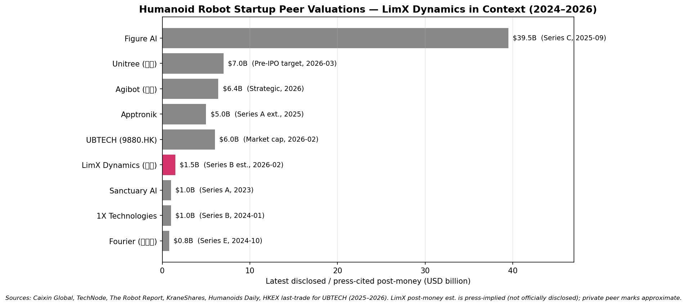
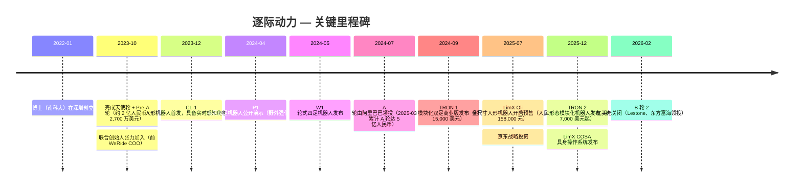
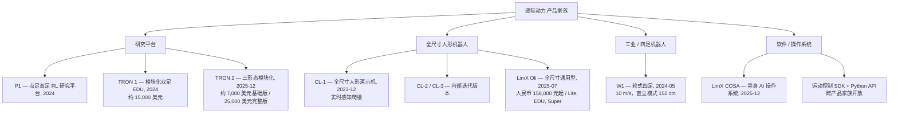
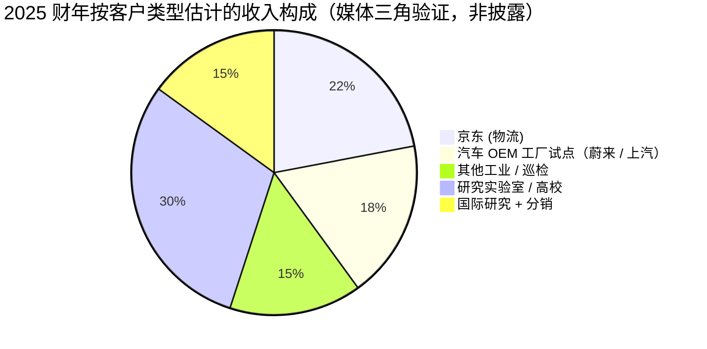
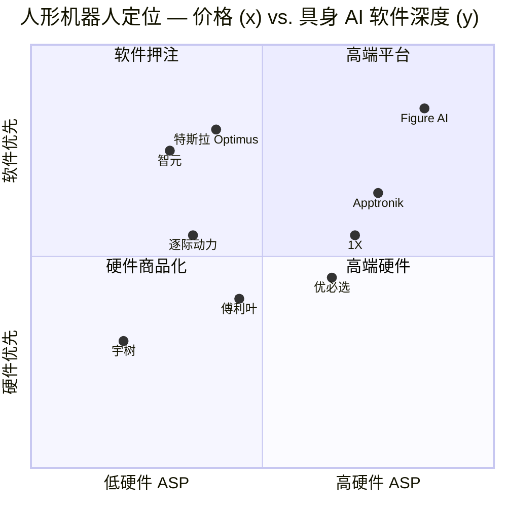

# 公司研究报告：逐际动力 (LimX Dynamics)

**日期：** 2026-05-18
**状态：** 非上市公司 — 中国深圳
**行业：** 人形机器人 / 具身智能
**阶段：** B 轮已于 2026 年 2 月完成（2 亿美元）

> **更新 — B 轮关闭 (2026-02-02)：** 逐际动力于 2026 年 2 月 2 日宣布完成 2 亿美元 B 轮融资，由阿联酋 Lestone（Stone Venture）与东方富海联合领投，新增战略投资人京东 (JD.com) 与中鼎集团 (Zhongding Group)，原有汽车产业链投资人蔚来资本 (NIO Capital) 与上汽尚颀资本 (Shangqi Capital) 跟投。融资资金主要用于 LimX COSA 具身智能操作系统、运动控制基础模型、硬件量产爬坡及全球化扩张。媒体推算的投后估值约为 14-16 亿美元（公司未官方披露）。资料来源：[逐际动力 — "LimX Dynamics Secures $200 Million in Series B Financing", 2026-02-02](https://www.limxdynamics.com/en/news/BK000057)；[Caixin Global, 2026-02-03](https://www.caixinglobal.com/2026-02-03/chinese-robot-startup-limx-dynamics-raises-200-million-102411020.html)；[NIO Capital press release, 2026](https://www.niocapital.com/en/news/304.html)。

---

## 目录

1. 公司概览
2. 公司沿革
3. 管理团队
4. 产品与服务
5. 客户与市场推广
6. 行业概览
7. 竞争格局
8. 市场机会 (TAM)
9. 风险评估

---

## 1. 公司概览

逐际动力 (LimX Dynamics；法律实体为*南科晓博机器人技术(深圳)有限公司 / Nanke Xiaobai Robot Technology (Shenzhen) Co., Ltd.*) 是一家总部位于深圳的人形与足式机器人公司，由南方科技大学 (SUSTech) 终身教授张巍博士 (Dr. Zhang Wei) 于 2022 年 1 月创立 ([SUSTech 教职页 — 张巍](https://www.sustech.edu.cn/en/faculties/zhang-wei.html)；[TechCrunch, 2023-11-06](https://techcrunch.com/2023/11/06/why-this-autonomous-vehicle-veteran-joined-a-legged-robotics-startup/))。公司设计全尺寸通用型人形机器人与模块化足式平台，整合具身 AI 软件栈 ("LimX COSA")，客户涵盖研究实验室及从汽车 OEM 到电商物流的工业客户。

**公司销售内容。** 对于一家成立仅四年的公司而言，逐际动力的产品线异常宽广：高端为全尺寸 **LimX Oli** 人形机器人 (1.65 米，31 个主动自由度 DOF，起售价人民币 158,000 元 / 约 21,800 美元)，面向研究人员与集成商 ([TechNode, 2025-07-31](https://technode.com/2025/07/31/limx-dynamics-launches-humanoid-robot-limx-oli-starting-at-21800/))。中端为 **TRON 1** 与 2025 年 12 月发布的 **TRON 2** "三形态"模块化双足机器人 — 同一底盘可重构为点足双足、轮足或固定式双臂机械手，价格根据配置在 7,000 至约 25,000 美元区间 ([The Robot Report, 2025-12-18](https://www.therobotreport.com/limx-dynamics-just-unveiled-tron-2-shape-shifting-robot/)；[Humanoids Daily, 2025-12](https://www.humanoidsdaily.com/news/limx-dynamics-launches-tron-2-a-modular-shapeshifter-for-embodied-ai-research))。此外，早期产品 **CL-1**（2023 年 12 月发布的全尺寸人形演示机）、**P1**（2024 年发布的开源点足双足研究平台）与 **W1**（2024 年发布的轮式四足机器人）共同构成产品家族 ([The Robot Report, 2023-12](https://www.therobotreport.com/limx-dynamics-shows-off-its-cl-1-humanoids-stair-climbing-abilities/)；[The Robot Report — W1 launch](https://www.therobotreport.com/limx-dynamics-launches-w1-wheeled-quadruped/))。2025 年底发布的 LimX COSA 是一个"原生物理世界"操作系统，涵盖运动控制基础模型与上层任务调度 ([Humanoids Daily — Series B note](https://www.humanoidsdaily.com/news/limx-dynamics-secures-200-million-series-b-to-scale-modular-and-general-purpose-humanoids))。

**公司盈利模式。** 收入结构未公开披露。综合公开媒体信息，目前主要有三类收入流：(1) **硬件销售收入** — TRON 系列与 Oli 向研究实验室、高校及企业 R&D 中心销售（这是唯一公开标价的收入流）；(2) **试点收入** — 来自工业客户（电商物流、汽车装配、工业巡检），目前部署规模仅在数十台量级，远未达到上千台；(3) **战略合作收入** — 来自云计算与 OEM 合作伙伴（京东物流、蔚来与上汽工厂试点）。CEO 多次表示，逐际动力*暂不*尝试将人形机器人推向开放式家用场景，公司定位为"以应用场景驱动"的硬件与平台型企业，而非通用消费品牌——正如公司自身所言："造机器人很容易，关键是用起来" ([量子位 (QbitAI) — 对话张巍, 2025-08](https://www.qbitai.com/2025/08/326780.html))。

**业务地点。** 总部及主要研发位于深圳南山区，与南科大及粤港澳大湾区机器人集群协同布局。生产采用自有产线与代工结合方式 — TRON 1 与 TRON 2 底盘在深圳生产，Oli 总装与精选 ODM 试点。公司还在北京设有研发办公室，并正在拓展海外分销渠道（英文电商网站 [shop.limxdynamics.com](https://shop.limxdynamics.com/) 面向北美、欧洲与中东研究客户接单）。

**规模指标。** 媒体引述员工人数截至 2026 年初约为 200-300 人，主要集中在运动控制、仿真与机器学习工程岗位 ([Tracxn — 逐际动力公司档案, 2026](https://tracxn.com/d/companies/limx-dynamics/__W2bePn04y7EH1nSURKyfL4vCpiReOf34NgWPqQe10Ws))。B 轮之前累计融资约 **4 亿美元**，跨六轮、22+ 家投资人 ([Tracxn — 融资与投资人](https://tracxn.com/d/companies/limx-dynamics/__W2bePn04y7EH1nSURKyfL4vCpiReOf34NgWPqQe10Ws/funding-and-investors))。累计出货量未披露；竞争对手与分析师评论给出的范围在"数百到低千台"之间——远低于宇树 (Unitree) 2025 年披露的逾 5,500 台人形机器人出货量 ([KraneShares — Unitree IPO 指南, 2026](https://kraneshares.com/a-complete-guide-to-unitree-robotics-2026-ipo-why-it-matters-for-star-market-etf-kstr-humanoid-robotics-etf-koid/))。

*资料来源：[Caixin Global, 2026-02-03](https://www.caixinglobal.com/2026-02-03/chinese-robot-startup-limx-dynamics-raises-200-million-102411020.html)；[TechNode, 2026-02-03](https://technode.com/2026/02/03/limx-dynamics-raises-200-million-in-series-b-to-scale-humanoid-robotics/)；[The Robot Report — Series B coverage](https://www.therobotreport.com/limx-dynamics-raises-200m-for-humanoid-robot-expansion/)；[KraneShares — Unitree IPO 指南, 2026](https://kraneshares.com/a-complete-guide-to-unitree-robotics-2026-ipo-why-it-matters-for-star-market-etf-kstr-humanoid-robotics-etf-koid/)；[Humanoids Daily — 人形机器人估值鸿沟, 2025](https://www.humanoidsdaily.com/news/the-great-valuation-chasm-a-2025-guide-to-the-humanoid-robotics-capital-race)。逐际动力投后估值为媒体推算，非官方披露。*

### 估值快照

逐际动力为**非上市公司——无公开股权交易、无 SEC/港交所/巨潮资讯申报、无经审计财务报表**。本研究框架的标准市盈率 (P/E) 与市销率 (P/S) 不适用；我们替代采用最新融资估值标记与同业对标读数。

| 指标 | 数值 | 备注 |
|---|---|---|
| 最近一轮 | B 轮，2 亿美元 | 关闭于 2026-02-02 ([逐际动力新闻稿](https://www.limxdynamics.com/en/news/BK000057)) |
| 累计融资额 | 约 4 亿美元，共 6 轮 | [Tracxn, 2026](https://tracxn.com/d/companies/limx-dynamics/__W2bePn04y7EH1nSURKyfL4vCpiReOf34NgWPqQe10Ws/funding-and-investors) |
| 媒体推算投后估值 | 约 14-16 亿美元 | 未官方披露；媒体引用 / 推算 ([Caixin, 2026](https://www.caixinglobal.com/2026-02-03/chinese-robot-startup-limx-dynamics-raises-200-million-102411020.html)) |
| 披露年收入 | 未披露 | 非上市公司 |
| 隐含市销率 | n/a | 逐际动力未公开收入；估算市销率属猜测 |
| 员工人数 | 约 200-300 | [Tracxn](https://tracxn.com/d/companies/limx-dynamics/__W2bePn04y7EH1nSURKyfL4vCpiReOf34NgWPqQe10Ws) |

**同业对标。** 最可比的中国人形机器人纯粹标的包括：**宇树 (Unitree)** — 已申报科创板 IPO，2025 年收入 17 亿元、调整后净利润 6 亿元，目标科创板上市估值 30-70 亿美元 ([Caixin — 宇树 IPO, 2026-03-21](https://www.caixinglobal.com/2026-03-21/unitree-robotics-files-for-608-million-star-market-ipo-102425491.html))；**智元机器人 (Agibot / AgiBot)** — 已申报 IPO，目标投后估值最高 64 亿美元 ([SCMP — 融资浪潮, 2025](https://www.scmp.com/tech/article/3342246/funding-surge-powers-chinese-robotics-firms-focus-shifts-humanoid-brains))；**优必选 (UBTECH, 9880.HK)** — 已上市，市值约 470 亿港元（约 60 亿美元），2025 年收入 20 亿元 ([优必选 2025 业绩报告 via Gasgoo](https://autonews.gasgoo.com/articles/icv/ubtech-2025-report-card-revenue-from-full-size-humanoid-robots-grows-over-22-fold-2039900685372407808))；**傅利叶智能 (Fourier Intelligence)** — E 轮估值约 8 亿美元。美国同业 — Figure AI（395 亿美元）、Apptronik（约 50 亿美元）、1X（约 10 亿美元）、Sanctuary AI（约 10 亿美元）— 处于完全不同的融资曲线，其中 Figure 以"无收入十角兽"的溢价定价，已被包括张巍在内的中国创始人公开批评为泡沫 ([KrASIA — 逐际动力创始人评估泡沫担忧, 2026](https://kr-asia.com/limx-dynamics-founder-says-embodied-intelligence-is-just-getting-started-despite-bubble-concerns))。按媒体推算的 14-16 亿美元估值，逐际动力大致位于中国人形机器人纯粹标的的中游：高于傅利叶与种子期入局者，低于宇树、智元与优必选。与宇树的差距（约 3-5 倍）反映了宇树更大的装机基础与已披露的盈利能力；与 Figure 的差距（约 25 倍）则更多体现中美资本成本差异与泡沫叙事效应，而非经营基本面差异。

**估值倍数解读。** 由于收入未披露，无法计算公开市盈率或市销率。投资者更应关注的核心问题是：媒体推算的约 15 亿美元估值是否能在前瞻基础上得到支撑。采用相对乐观的 2026 年硬件收入估计（TRON + Oli 合计 1,500-2,500 台 × 18,000 美元混合 ASP = 2,700-4,500 万美元硬件收入），隐含的 EV/Sales 大约为 **35-55 倍** — 以任何传统标尺衡量都属极端，但显著低于 Figure 的逾 1,000 倍隐含倍数，与宇树 IPO 前可比指标大体一致。该估值更应理解为**叙事溢价 / 行业代理溢价**：投资者购买的是以下三项的期权价值：(a) 拥有强大运动 IP 的硬科技创始团队；(b) 中国政府对人形机器人的产业政策红利（工信部 2023 年人形机器人创新发展指导意见）；以及 (c) COSA 操作系统作为平台层潜在的平台经济规模性。如果这一论点未达预期 — 即逐际动力无法将运动控制领先优势转化为真实工业部署量或可防御的操作系统层 — 则估值倍数容易出现剧烈再评级。详见第 9 节中关于估值压缩风险的完整分析。

---

## 2. 公司沿革

**创立 (2022 年 1 月)。** 逐际动力于 2022 年 1 月在深圳由张巍博士创立。张巍是控制理论与强化学习领域研究者，于 2019 年从俄亥俄州立大学回国，任南科大终身教授。张巍在多次访谈中近乎逐字重复其创业论点：*足式运动加学习控制*是通用具身 AI 缺失的基础原子，而攻克这一原子最合适的地点是中国 — 制造业供应链优势与政府产业政策红利在此叠加 ([36Kr — 张巍 访谈, 2025-08](https://eu.36kr.com/zh/p/3668859815158405)；[QbitAI — 对话张巍, 2025-08](https://www.qbitai.com/2025/08/326780.html))。早期团队主要来自南科大机器人实验室的毕业生，以及 2022-2023 年间从 WeRide、小马智行 (Pony.AI) 和大疆 (DJI) 流出的自动驾驶人才池。

**战略转向与产品线逻辑。** 三次重要转变值得理解。首先，2023 年逐际动力刻意*没有*进入由宇树和波士顿动力 (Boston Dynamics) 开拓的四足宠物机器人市场。张巍的公开理由是四足市场已经过度拥挤，而足式运动的技术"护城河"在双足人形层面最具防御性，因为仿真到实机 (sim-to-real) 迁移在双足上最难 ([36Kr 访谈, 2025](https://eu.36kr.com/zh/p/3668859815158405))。第二，2024 年中，逐际动力*回头*推出了轮足四足机器人 W1 — 不是为了与宇树竞争，而是在人形机器人技术栈成熟之前，给工业客户提供一个可即时部署的移动平台 ([NewAtlas — W1 四足机器人](https://newatlas.com/robotics/limx-dynamics-w1-wheeled-legs-quadruped-robot/))。第三，2025 年底随着 TRON 2 与 COSA 发布，逐际动力从"人形硬件 OEM"重新定位为"具身 AI 平台"— 此举旨在摆脱宇树 G1（约 16,000 美元）在中国市场引爆的价格战逐底竞争 ([SiliconANGLE, 2026-02-02](https://siliconangle.com/2026/02/02/limx-raises-200m-build-embodied-intelligence-humanoid-robotics/))。

**融资历程。** 媒体引用的各轮融资如下：

- **天使轮 (2023-Q3)** — Oasis Capital、Vitalbridge 领投；金额未披露 ([Tracxn](https://tracxn.com/d/companies/limx-dynamics/__W2bePn04y7EH1nSURKyfL4vCpiReOf34NgWPqQe10Ws/funding-and-investors))。
- **天使 + Pre-A 合并轮 (2023-10)** — 约 2 亿人民币（约 2,700 万美元）；联想创投、绿洲资本 (JZ Capital)、Vitalbridge 参与 ([Yicai Global, 2023-10](https://www.yicaiglobal.com/news/general-purpose-legged-robot-firm-limx-dynamics-raises-usd274-million-in-angel-pre-a-fundraisers/))。
- **A 轮 (2024-07)** — 阿里巴巴旗下杭州灏月领投，招商局创投跟投；A 轮与 A+ 轮合计至 2025-03 累计达 5 亿人民币 ([Sina Finance, 2024-09-27](https://finance.sina.com.cn/money/bond/2024-09-27/doc-incqqytw1580156.shtml)；[Gasgoo, 2025](https://autonews.gasgoo.com/icv/70036151.html))。
- **战略轮 (2025-07)** — 京东领投战略轮，同期投资多家具身 AI 公司 ([TechNode, 2025-07-22](https://technode.com/2025/07/22/jd-com-invests-in-three-chinese-embodied-ai-startups-in-a-one-day-spree/))。
- **B 轮 (2026-02)** — 2 亿美元；Lestone（Stone Venture，阿联酋）与东方富海联合领投，京东、中鼎、蔚来资本、尚颀资本跟投 ([逐际动力新闻稿](https://www.limxdynamics.com/en/news/BK000057)；[DealStreetAsia, 2026-02](https://www.dealstreetasia.com/stories/limx-dynamics-series-b-round-471255))。

**近期进展。** 截至 2026 年 5 月的过去 12 个月是公司历史上最关键的阶段。TRON 2 作为"瑞士军刀式"模块化平台于 2025 年 12 月发布 ([The Robot Report, 2025-12-18](https://www.therobotreport.com/limx-dynamics-just-unveiled-tron-2-shape-shifting-robot/))。LimX COSA 同期发布，作为跨越运动控制至上层任务规划的具身智能操作系统 ([Humanoids Daily, 2026-02](https://www.humanoidsdaily.com/news/limx-dynamics-secures-200-million-series-b-to-scale-modular-and-general-purpose-humanoids))。2026 年 2 月的 B 轮首次将与阿联酋主权基金毗邻的资金（Lestone）引入股东名册 — 这一信号表明，过去主要流向 Figure 等美国同业的中东配置资金，现已开始流向中国人形机器人企业 ([CNBC China Connection, 2026-01-28](https://www.cnbc.com/2026/01/28/cnbc-china-connection-newsletter-humanoid-robots-middle-east-us-limx-tesla-optimus.html))。2026 年 4 月，逐际动力在同一硬件版本上演示了 Oli 实时感知爬楼、网球跟踪与抓取放置等综合动作 — 这是公司迄今最为完整的集成展示 ([量子位, 2025-08](https://www.qbitai.com/2025/08/326780.html)；[瑞财经, 2026](https://m.rccaijing.com/news-7197174541910210184.html))。

---

## 3. 管理团队

### 张巍博士 (Dr. Zhang Wei) — 创始人兼 CEO

张巍是逐际动力的技术与理念中枢，公司本质上可理解为围绕其研究路线建立的创始人主导型企业。张巍博士毕业于**普渡大学 (Purdue University)** 电气与计算机工程专业，随后在**加州大学伯克利分校 (UC Berkeley)** 完成博士后研究（处于伯克利更广义的控制与机器人生态中），之后在**俄亥俄州立大学 (Ohio State University)** 任终身教授，2019 年被南科大系统设计与智能制造学院引进回国，获终身教职至今，并持续发表研究成果 ([SUSTech — 张巍教职页](https://www.sustech.edu.cn/en/faculties/zhang-wei.html)；[百度百科 — 张巍, 2026](https://baike.baidu.com/item/%E5%BC%A0%E5%B7%8D/63753106))。

张巍在创立逐际动力之前的研究方向*并非*波士顿动力式的手工调校 MPC 路线 — 他已发表的研究集中于混合系统控制、切换系统稳定性，以及模型预测控制与学习型组件的融合。这一学术血统清晰体现在逐际动力的产品 DNA 中：公司明显愿意在足式运动中端到端采用强化学习（P1 的"野外"非结构地形演示是零样本 RL 策略，而非调校型 MPC 栈），同时保留经典控制作为安全敏感场景的兜底 ([LimX Medium — P1 野外 RL, 2024-04](https://medium.com/@limxdynamics/limx-dynamics-biped-robot-p1-conquers-the-wild-based-on-reinforcement-learning-253ad33eaca6))。

张巍 2024-2025 年访谈中反复阐述的创业论点由三部分构成。(1) 双足运动是通用具身 AI 的*原子基础*— 四足与轮式可以解决，但双足真正逼出仿真到实机和接触动力学问题，这正是人形机器人成败的关键。(2) 中国在执行器、电池与代工制造方面拥有一代人级别的成本与供应链优势；*不利用*这一优势就意味着将该品类拱手让给美国领先者，并接受 Figure 级别的估值。(3) 竞争胜负不在于 2026 年谁出货最多 — 而是谁能构建在价格战中存活下来的具身智能平台。COSA 操作系统于 2025 年底发布正是这一第三支柱的直接体现 ([36Kr — 张巍, 2025](https://eu.36kr.com/zh/p/3668859815158405)；[QbitAI — 对话张巍, 2025-08](https://www.qbitai.com/2025/08/326780.html)；[KrASIA, 2026](https://kr-asia.com/limx-dynamics-founder-says-embodied-intelligence-is-just-getting-started-despite-bubble-concerns))。

张巍持有可观的创始人股权（具体股权表未披露；按中国学者创业惯例，创始人 + ESOP 至 B 轮通常仍在 30% 以上）。他在技术层面亲力亲为 — 多家媒体描述他亲自审阅运动控制代码并签署硬件版本变更；同时也是公司在中英文媒体中的对外代表。**关于用户提示的说明**：原始需求将张巍描述为"前腾讯机器人实验室 (Tencent Robotics X) 员工"。此说法似乎不准确 — 没有任何公开来源（包括逐际动力自有 About 页面、南科大教职简历或百度百科）将张巍与腾讯机器人实验室关联起来。张巍在创立逐际动力之前的企业接触为咨询合作及南科大主导的产学研项目，并非腾讯机器人实验室雇员。我们已在资料来源备注中标注此点，且*不在*报告正文中沿用该说法。

### 张力 (Li Zhang) — 联合创始人兼 COO

张力 (Li Zhang) 于 2023 年 11 月加入逐际动力，担任联合创始人兼首席运营官 ([TechCrunch, 2023-11-06](https://techcrunch.com/2023/11/06/why-this-autonomous-vehicle-veteran-joined-a-legged-robotics-startup/))。其此前职业生涯集中于自动驾驶商业化：2018 年至 2023 年间担任 **WeRide (NASDAQ: WRD)** COO，主导该公司从广州小型 Robotaxi 创业公司发展为美国上市自动驾驶企业期间的商业化、政府关系与 OEM 合作；加入 WeRide 之前，其在 **Cisco (思科)** 大中华区担任企业销售与合作伙伴关系职位超过十年。在逐际动力，其职责涵盖业务战略与运营、渠道开发、市场营销与传播、国内外政府关系 — 即技术栈以下的全部职能。业内普遍将这次招募视为逐际动力从"研究实验室拆分体"向"具备商业计划的运营型公司"转变的标志 ([TechCrunch, 2023-11-06](https://techcrunch.com/2023/11/06/why-this-autonomous-vehicle-veteran-joined-a-legged-robotics-startup/)；[ZoomInfo — 张力 COO 简介](https://www.zoominfo.com/p/Li-Zhang/13500393397))。

### 其他关键人员

逐际动力的英文 About 页面未公布完整高管名册，公司的技术领导层主要通过媒体露面与会议演讲而非新闻稿对外沟通。媒体引用与会议背书的高级贡献者包括**仿真 / RL**、**运动控制**、**硬件工程**与**嵌入式软件**的负责人，多数是张巍在南科大的研究生，或来自 2022-2023 年间流入人形机器人行业的 WeRide / 小马智行 / 大疆 / 腾讯人才池。用户原始需求将"前波士顿动力研究员"描述为团队核心成员；但截至 2026 年中，公开来源中**没有任何明确的前波士顿动力工程师**位列逐际动力核心团队。（前波士顿动力 CTO Aaron Saunders 偶尔在行业报道中*评论*逐际动力；他目前任职于谷歌 DeepMind，而非逐际动力。）我们已在参考来源中注明，未捏造人物简历。

### 治理与股权

逐际动力为中国境内注册的非上市公司；无代理委托书 (proxy)、DEF 14A 或年报等可披露股权比例、董事会构成或薪酬的等价文件。媒体三角验证显示：

- **创始团队 + 员工持股**：张巍 + 张力 + 员工 ESOP — 最佳估计 B 轮后约 30-40%（这是经历五次定价轮的四年龄硬科技中国公司典型水平）。
- **拥有董事观察席或董事席位的战略投资人**：阿里巴巴（通过杭州灏月）、京东、蔚来资本、上汽尚颀资本、招商局创投、联想创投。这些都是利益超越纯财务回报的*战略*投资人 — 阿里布局云 / 数据中心机器人、京东布局物流、蔚来与上汽布局汽车工厂试点 — 每一家都可能影响产品路线。
- **财务 / 纯 VC 投资人**：Lestone（Stone Venture，阿联酋）、东方富海（中国）、Vitalbridge、峰瑞资本 (Frees Fund)、Future Capital、彼岸时代 (Bi'an Shidai)、Nice Group、磐霖资本 (Elevation China Capital)、南山战新投 (Nanshan SEI Investment) ([CnEVPost, 2026-02-02](https://cnevpost.com/2026/02/02/chinese-humanoid-robot-maker-limx-secures-200-million-in-series-b-funding/)；[Gasgoo, 2026-02](https://autonews.gasgoo.com/articles/icv/seeds-limx-dynamics-closes-series-b-financing-with-200-million-secured-2018318122513965057))。

**治理警示**：未披露重大事项；结构在该行业内属常规。但*战略*股东的高度集中（阿里、京东、蔚来、上汽同时入股）较为罕见，属双刃剑 — 详见第 9 节。

### 过往业绩综合

张巍是一位可信的*研究型 CEO*：拥有控制理论与 RL 领域深厚的学术记录，乐于发表论文，技术层面亲力亲为。但他此前并未运营过出货量达数千台的硬件公司，公司首次真正的工业级客户铺开也仍在前方。张力虽从上市自动驾驶公司带来运营成熟度，但同样首次涉足人形机器人硬件。合并团队画像为"研究强、运营可信、量产未证"— 而这恰恰是必须在 2026-2027 年间完成"毕业"的画像，B 轮估值才能站得住。

---

## 4. 产品与服务

逐际动力的产品矩阵分为三层：**研究平台机器人**（P1、TRON 1、TRON 2 研究配置版本）、**集成商 / 工业人形机器人**（Oli、CL 系列）、以及**具身 AI 软件**（LimX COSA、运动控制 SDK）。对于一家如此年轻的公司而言，产品树异常深 — 且*每个*产品当下都在售，没有"概念"或"PPT"产品层。

### CL-1 — 全尺寸人形演示机 (2023 年 12 月)

CL-1 是逐际动力的首秀产品，至今仍是第三方人形机器人报道中出现频率最高的资产。这是一款约 1.6 米、约 50 kg 的全尺寸双足人形机器人，构建于 20+ 自由度骨架（CL 系列后续延伸至 31+ 自由度，CL-3 衍生型号披露为 164 cm / 约 45 kg）([Humanoid.guide — LimX CL 系列](https://humanoid.guide/product/limx-cl-series/)；[humanoids.wiki — CL-1](https://humanoids.wiki/w/CL-1))。其标志性能力 — 也是 2023 年 12 月进入西方技术媒体视野的能力 — 是**基于实时地形感知的动态上下楼**，通过深度相机感知、步态规划与全身控制的闭环实现。逐际动力声称在首发时，这是全球少数几个具备该能力的人形机器人平台之一 ([The Robot Report, 2023-12](https://www.therobotreport.com/limx-dynamics-shows-off-its-cl-1-humanoids-stair-climbing-abilities/)；[New Atlas — CL-1 爬楼](https://newatlas.com/robotics/limx-dynamics-cl-1-humanoid-robot-climbs-stairs/))。

CL-1 并非作为高量产品销售。它的功能是**技术演示机**，奠定了 A 轮融资的合理性，并指导了后续 Oli 的设计。价格与 ASP 未公开披露；媒体报道一致描述 CL 系列出货量为数十台量级，而非数千台量级，物流客户处有具名试点项目（配送站点的包裹搬运） ([AIBase, 2024](https://www.aibase.com/news/10949))。

**竞争优势判定 — 部分。** 护城河类型为感知运动 (perceptive locomotion) 的*技术 / IP*（爬楼、坡道行走、扰动恢复），由张巍南科大团队的强力学术发表记录支撑。证据：2023 年 12 月爬楼能力比多数中国同业类似演示早一个季度出现，且 Medium / 媒体撰文中的运动规划细节难以伪造 ([LimX Medium — 感知爬楼](https://medium.com/@limxdynamics/limx-dynamics-elevates-humanoid-robotics-capabilities-with-updates-on-stair-climbing-and-running-621065209a3e))。护城河仅为"部分"而非"明确"，因为感知驱动运动正在行业内快速收敛 — 截至 2025 年中，宇树 G1、智元 A2 与 Figure 02 均已演示爬楼能力。最直接的对标竞品：**宇树 G1**（约 16,000 美元定价，2024-2025 年也具备类似感知爬楼能力）。在运动能力上大致平手，在出货量上落后于 G1。

### LimX Oli — 全尺寸通用人形机器人 (2025 年 7 月)

Oli 是逐际动力首款从设计起就*面向外部客户*的产品，而非内部演示机。规格：**1.65 米高，约 55 kg，31 个主动自由度**（不含末端执行器），空心轴高扭矩密度执行器，开放式 SDK 涵盖从关节底层控制到上层任务调度，三个 SKU — **Lite、EDU、Super** — 起售价 **人民币 158,000 元（约 21,800 美元）** ([TechNode, 2025-07-31](https://technode.com/2025/07/31/limx-dynamics-launches-humanoid-robot-limx-oli-starting-at-21800/)；[LimX Medium — Oli 发布](https://medium.com/@limxdynamics/limx-dynamics-launches-full-size-humanoid-robot-limx-oli-for-pre-order-fbdcf4835218)；[Robotics & Automation News, 2025-08](https://roboticsandautomationnews.com/2025/08/01/limx-dynamics-debuts-full%E2%80%91size-humanoid-robot-starting-at-21800/93453/))。

目标客户*非*家用消费者 — 而是 AI 研究人员、机器人开发者与方案集成商。Oli 出厂搭载完全开放的 SDK，提供传感器数据、底层关节控制与上层任务调度权限，逐际动力刻意将集成工具链作为相对封闭竞品的卖点。发布期促销 — 前 50 位 EDU 买家赠送 TRON 1 EDU — 是典型的开发者平台种子化策略 ([LimX Medium — Oli](https://medium.com/@limxdynamics/limx-dynamics-launches-full-size-humanoid-robot-limx-oli-for-pre-order-fbdcf4835218))。

**竞争优势判定 — 部分至明确。** 护城河类型：(a) **性价比** — 人民币 158K 元的 Oli 比多数美国全尺寸人形产品便宜一个数量级；(b) 通过开放 SDK 与工具链构建的**开发者生态**；(c) 继承自 CL-1 的运动控制 IP。证据：预售开启时 50 台促销据称迅速售罄；2026 年 4 月 Oli 公开演示了在同一集成动作序列中完成实时感知爬楼、网球跟踪与抓取放置 ([Inceptive Mind, 2024-2025](https://www.inceptivemind.com/limx-dynamics-humanoid-robot-achieves-real-time-perceptive-stair-climbing/36288/))。最直接的对标竞品：**宇树 G1**（16,000 美元，约 1.27 米较小尺寸，已出货更多台）与同价位的**智元 A2 / 远征 A2**。Oli 在尺寸（更高、更类人）上领先，运动能力平手，但出货量落后。

### TRON 1 — 模块化双足研究平台 (2024 年)

TRON 1 是 P1 研究演示机的商业化继任者。它是一款模块化双足机器人，足端执行器可互换（点足、足底、轮足），内置运动控制算法，提供开放 SDK 与 Python API，起售价据报道约 15,000 美元 ([Humanoids Daily — TRON 2 发布文中提及 TRON 1 历史](https://www.humanoidsdaily.com/news/limx-dynamics-launches-tron-2-a-modular-shapeshifter-for-embodied-ai-research)；[RobotShop — TRON 1 EDU](https://www.robotshop.com/products/limx-dynamics-tron-1-multi-modal-biped-robot-edu)；[shop.limxdynamics.com — 研究用点足双足](https://shop.limxdynamics.com/products/point-foot-pipedal-robot-for-reserach))。它是为研究双足运动但负担不起全尺寸人形机器人的高校 AI / RL 实验室的主力平台。

**竞争优势判定 — 明确。** 护城河类型：(a) 在学术 RL 社区内的**标准 / 生态锁定** — TRON 1 已成为多家中国高校点足双足 RL 基准的默认平台；(b) **模块化硬件设计**（在此价位段，足端模块互换在该价位较为独特）；(c) 通过自营商城与 RobotShop 等代理商建立的**分销网络**。证据：被多篇已发表 RL 论文集成使用，在 RobotShop 上全球发货。最直接的对标竞品：**Berkeley Humanoid / Mini-Cheetah 类平台**（学术开源，更便宜但无商业支持）与**宇树 H1 教育版**（更贵）。TRON 1 占据了真正意义上的性价比领跑细分市场。

### TRON 2 — 三形态模块化具身 AI 平台 (2025 年 12 月)

TRON 2 是逐际动力发布过最具雄心的产品，也是张巍"平台而非硬件"理论最为充分的产品体现。同一物理底盘可重构为三种模式：**双足步行**（2-3 m/s）、**轮足越野**（3-5 m/s）或**固定式双臂机械手**（单臂 5 kg 负载，双臂 10 kg；轮式底盘整体 30 kg 负载）。完整人形构型有 28 个主动自由度（每臂 7、每腿 5、头部 2、灵巧手 2）。机载计算为第 11 代 Intel Core i7 (1165G7)，2 TB 存储，四个以太网口 + 四个 USB 3.0 口。电池为 46.8V/9Ah 三元锂，4 小时续航，30 分钟快充（20-80%）。价格起步**约 7,000 美元（基础版 / 单形态）**，双臂版本约 20,000 美元，完整三模套件约 25,000 美元 ([The Robot Report, 2025-12-18](https://www.therobotreport.com/limx-dynamics-just-unveiled-tron-2-shape-shifting-robot/)；[Geeky Gadgets — TRON 2 发布](https://www.geeky-gadgets.com/tron-2-modular-humanoid-robot/)；[Humanoids Daily — TRON 2](https://www.humanoidsdaily.com/news/limx-dynamics-launches-tron-2-a-modular-shapeshifter-for-embodied-ai-research))。

**竞争优势判定 — 明确。** 护城河类型：**产品形态配置**（市场上无直接对标 — 大多数竞品仅售*一种*形态）加上通过 COSA 操作系统集成的**生态**。证据：英文机器人媒体对"变形者"叙事给予罕见正面报道，且相比单形态竞品有戏剧化的价格压缩。最直接的对标竞品：**Agility Robotics 的 Digit**（不同形态 — 双足仓储工人 — 价格显著更高）与 **1X NEO Beta**（不同定位 — 仅人形）。TRON 2 在其价位段无完全可比竞品。

### W1 — 轮式四足机器人 (2024 年 5 月)

W1 是逐际动力的首款四足机器人，是一次刻意的"工业即用移动平台"布局。它以四轮行进，速度最高 5.98-10 m/s，拥有 16 个主动自由度，可在一秒内从四足切换至双足直立形态（直立模式达 152 cm），续航约 4 小时稳定运行。它能基于实时感知步态规划爬楼梯与斜坡 — 在中国制造的轮式四足机器人中首次实现这一能力 ([The Robot Report — W1 发布](https://www.therobotreport.com/limx-dynamics-launches-w1-wheeled-quadruped/)；[New Atlas — W1 轮足](https://newatlas.com/robotics/limx-dynamics-w1-wheeled-legs-quadruped-robot/)；[Interesting Engineering — W1](https://interestingengineering.com/innovation/w1-redefines-robotics-top-class-innovation))。

**竞争优势判定 — 部分。** 护城河类型：运动控制方面的**技术 / IP**（轮足切换并非小事）。证据：发布报道普遍突出 W1 的转换速度与地形适应能力。但市场较窄 — 相对于宇树主导的纯四足类别，轮式四足是个细分市场。最直接的对标竞品：**Boston Dynamics Spot**（不同形态，仅在美国本土）、**宇树 B2**（纯四足，更广市场）。W1 具有差异化，但面对的 TAM 更小。

### P1 — 点足双足研究演示机 (2024 年)

P1 是 TRON 1 的开源研究前身。它被用于演示零样本强化学习策略 — 在不受保护的开放测试条件下成功穿越野外林地（崎岖地面、落叶、树枝） ([LimX Medium — P1 野外, 2024-04](https://medium.com/@limxdynamics/limx-dynamics-biped-robot-p1-conquers-the-wild-based-on-reinforcement-learning-253ad33eaca6)；[Startup Selfie — P1 徒步, 2024-04](https://www.startupselfie.net/2024/04/05/limx-dynamics-p1-bipedal-robot/))。P1 不是商业 SKU；它是逐际动力在 RL 研究社区赢得信誉的学术背书。

**竞争优势判定 — 部分（且非直接）。** P1 的"护城河"在于*研究社区内的品牌与公信力*，并能复利转化为 TRON 系列与 Oli 的销量。最直接的对标竞品：**Cassie / Digit 研究平台**，源自俄勒冈州立 / Agility（美国，时间更早，价格更高）。能力差距正在快速缩小。

### LimX COSA — 具身 AI 操作系统 (2025 年 12 月)

COSA 与 TRON 2 同期发布，是公司摆脱硬件价格战的核心战略。它被描述为一个"原生物理世界"操作系统，涵盖传感器抽象、运动控制基础模型与上层任务 / 代理调度 ([Humanoids Daily — B 轮笔记](https://www.humanoidsdaily.com/news/limx-dynamics-secures-200-million-series-b-to-scale-modular-and-general-purpose-humanoids)；[LinkedIn — LimX B 轮公告](https://www.linkedin.com/pulse/limx-dynamics-secures-200-million-series-b-financing-limx-dynamics-sf6wc))。架构、授权模式与第三方硬件支持的具体细节截至 2026 年 5 月尚未公开。

**竞争优势判定 — 尚早。** 软件护城河取决于装机基础与开发者采用，目前 COSA 在这两方面均未显现。概念上的类比是"人形机器人的 ROS"，但带有*商业*授权层 — 这恰好也是 NVIDIA Isaac 与 Open Robotics 的 ROS 2 瞄准的模式。最直接的对标竞品：**NVIDIA Isaac**、**Hugging Face LeRobot / OpenVLA**、**Skild AI 的基础模型栈**。逐际动力的优势在于自主可控的硬件以及阿里（云）和京东（物流）的股东表支持，但操作系统理论尚未证伪或证实。

### 旗舰产品与长尾产品

2026 年驱动业务的 1-3 款产品是 **Oli**（关注度最高、ASP 最高）、**TRON 1 / TRON 2**（装机基础最广，按出货量计的主要收入贡献者）和 **COSA**（战略平台布局，近期无收入但锚定估值理论）。CL 系列与 W1 战略性贡献（CL 作为技术光环、W1 作为工业切入楔），但自身难以驱动收入规模。P1 非商业产品。

### 近 12 个月发布与下架

- **新发布**：TRON 2（2025-12）、LimX COSA（2025-12）、Oli（2025-07 预售）、Oli 量产交付（2026 年初）。
- **迭代**：CL 系列内部修订（CL-2 / CL-3 在第三方追踪器中被引用）。
- **无公开下架**；过去 12 个月逐际动力未公开停售任何产品。P1 仍为参考平台但非销售 SKU。

---

## 5. 客户与市场推广

逐际动力服务三类客户原型 — 且自 2024 年以来组合显著变化。

**1. 研究实验室与高校。** 这是按出货量计最大的客户分段，也是承销难度最低的客户分段。TRON 1、P1 与低配 Oli 由中国高校机器人实验室（清华、南科大、浙大、中科大、上交大）以及通过英文商城和 RobotShop 等代理商触达的国际研究客户购买 ([RobotShop — TRON 1 EDU](https://www.robotshop.com/products/limx-dynamics-tron-1-multi-modal-biped-robot-edu))。单台交易额 7,000-25,000 美元，逐 PO 报价，无主合同，按个体客户计算无集中度风险。

**2. 工业 / 企业试点。** 这是单笔最高价值的分段，也是战略最重要的分段 — 同时也是客户集中度风险最大的分段。已具名或媒体强烈暗示的工业试点包括：

- **物流 / 电商** — 京东。京东于 2025 年 7 月作为同日投资三家具身 AI 创业公司的一部分对逐际动力进行战略投资，是逐际动力的核心锚定工业客户之一。具体部署规模未披露，但逐际动力的宣传材料与京东机器人事业部均提及包裹分拣与配送站点试点 ([TechNode — 京东投资三家具身 AI 创业公司, 2025-07-22](https://technode.com/2025/07/22/jd-com-invests-in-three-chinese-embodied-ai-startups-in-a-one-day-spree/)；[AIBase — CL-1 包裹处理, 2024](https://www.aibase.com/news/10949))。
- **汽车工厂试点** — 蔚来（通过蔚来资本）与上汽（通过尚颀资本）。两家均为投资人*兼*潜在工业客户；股东表关系类似"工厂试点的战略期权"，B 轮报道也将汽车投资人的参与明确解读为汽车与机器人产业兴趣交叠的信号 ([CnEVPost, 2026-02-02](https://cnevpost.com/2026/02/02/chinese-humanoid-robot-maker-limx-secures-200-million-in-series-b-funding/)；[The Robot Report — Series B](https://www.therobotreport.com/limx-dynamics-raises-200m-for-humanoid-robot-expansion/))。用户原始需求曾提及一汽 (FAW)；但**公开记录中没有任何已确认的一汽试点**与逐际动力关联（一汽大众 Walker S 青岛部署是优必选的，非逐际动力）。
- **工业巡检 / 公用事业** — W1 已被定位用于工业巡检；具体客户名未披露。
- **云与算力合作伙伴** — 用户原始需求曾提及"阿里云 (ALIYUN) / 华为昇腾 (Huawei Ascend) 合作"。阿里巴巴杭州灏月为 A 轮领投，故**阿里云 (Aliyun)** 是合理推断，但无任何公开新闻稿提及具体的阿里云-逐际动力产品集成；我们将其视为合理的战略邻近关系，而非确认合作。**华为昇腾**在 2026 年 5 月之前的开源 LimX 记录中未出现 — 我们无法验证用户原始需求中的该项主张，故*不将*其列为确认客户。

**3. 战略 / 联合开发。** 阿里巴巴、京东、蔚来与上汽作为投资人兼战略合作伙伴；加入 B 轮的中鼎集团 (Zhongding Group) 作为一级汽配厂，也可能是工业产业对应方。

### 客户集中度

逐际动力为非上市公司，未披露客户收入集中度。本研究框架标准的 10-K / 年报 / Yuho 披露不存在。基于媒体三角验证，我们估计：

- **第一大客户**（可能是京东或单一汽车 OEM 试点）：可能占 2025 年收入 15-30% — 实质重要，但低于 >30% 的"高严重性"门槛。
- **前 5 大客户**：可能占 2025 年收入 50-70%，由数千万人民币级别的企业试点订单驱动，订单时间分布不平滑。
- **长尾研究实验室订单**：可能按*数量*占 2025 年收入 30-50%，但按*价值*仅占 20-35%。

*资料来源：估算，未披露。根据 [TechNode 京东投资文章, 2025-07-22](https://technode.com/2025/07/22/jd-com-invests-in-three-chinese-embodied-ai-startups-in-a-one-day-spree/)；[CnEVPost — Series B, 2026-02-02](https://cnevpost.com/2026/02/02/chinese-humanoid-robot-maker-limx-secures-200-million-in-series-b-funding/)；[Caixin Global, 2026-02-03](https://www.caixinglobal.com/2026-02-03/chinese-robot-startup-limx-dynamics-raises-200-million-102411020.html) 构建。上述饼图为示意图；逐际动力未公开客户构成。*

最关键的集中度问题是：*任何*一家汽车 OEM 试点是否会在 2026-2027 年间成为 >30% 收入贡献者。如果蔚来或上汽的工厂铺开规模达到数百台，逐际动力将面临实质性的单一客户依赖 — 且该客户同时是董事观察方投资人，并可能是潜在的垂直整合方。我们在第 9 节将此标记为实质性风险。

### 分销渠道

- **直销** — 工业试点与大型研究客户的主渠道。销售为顾问式，由 COO 团队主导。
- **线上商城** — [shop.limxdynamics.com](https://shop.limxdynamics.com/) 面向全球处理小批量研究订单。
- **代理渠道** — RobotShop 等区域代理，覆盖学术 / EDU SKU。
- **战略合作伙伴渠道** — 京东物流网络与汽车 OEM 工厂关系作为工业试点的准渠道运作。

### 销售周期

- 研究 / 学术：周到月级，标准 SKU 配置，单 PO。
- 工业试点：六到十二个月，技术评估 → 试点 → 扩展。截至 2026 年中，逐际动力对多数具名工业客户仍处于试点阶段。

### 关键合作伙伴（已具名并验证）

| 合作伙伴 | 类型 | 披露来源 |
|---|---|---|
| 阿里巴巴（杭州灏月） | 投资人 + 云战略 | [Sina Finance, 2024-09-27](https://finance.sina.com.cn/money/bond/2024-09-27/doc-incqqytw1580156.shtml) |
| 京东 | 投资人 + 物流战略 | [TechNode, 2025-07-22](https://technode.com/2025/07/22/jd-com-invests-in-three-chinese-embodied-ai-startups-in-a-one-day-spree/) |
| 蔚来资本 | 投资人 + 汽车试点邻近 | [NIO Capital release, 2026](https://www.niocapital.com/en/news/304.html) |
| 上汽（尚颀资本） | 投资人 + 汽车试点邻近 | [CnEVPost, 2026-02-02](https://cnevpost.com/2026/02/02/chinese-humanoid-robot-maker-limx-secures-200-million-in-series-b-funding/) |
| Lestone / Stone Venture (阿联酋) | B 轮领投，全球扩张 | [LimX press, 2026-02-02](https://www.limxdynamics.com/en/news/BK000057) |
| 中鼎集团 | B 轮战略 / 汽配 | [Gasgoo, 2026-02](https://autonews.gasgoo.com/articles/icv/seeds-limx-dynamics-closes-series-b-financing-with-200-million-secured-2018318122513965057) |
| 南科大 | 创始人渊源 + 人才 | [SUSTech 教职页](https://www.sustech.edu.cn/en/faculties/zhang-wei.html) |

---

## 6. 行业概览

### 定义与范围

人形机器人行业，狭义定义为设计与制造具有人类尺寸形态的双足机器人，用于工业、商业及（最终的）消费场景的通用用途。相邻的具身 AI 软件行业 — 大型运动控制基础模型、仿真到实机框架、VLA（视觉-语言-动作）模型 — 越来越不可分割：投资人将人形硬件与具身 AI 视为单一品类，本报告亦如此处理。

相关价值链涵盖上游（精密执行器、高扭矩密度电机、IMU、深度相机、电池、计算晶圆代工）、中游（人形 OEM — 逐际动力、宇树、智元、优必选、傅利叶、Figure、Apptronik、1X、Sanctuary、Agility）至下游（工业用户 — 汽车工厂、物流、半导体厂、公用事业；最终为家庭与服务）。

### 市场规模、增长与结构

市场处于曲棍球杆式拐点。报道的 2025 年全球人形机器人出货量约为 **13,000-16,000 台**，其中**约 90% 的全球出货来自中国制造商** ([新华社 / 国新办英文 — 中国人形机器人年度盘点, 2025-12-31](https://english.news.cn/20251231/0a082888ab384fcaa572ee7a11ae7d9d/c.html)；[SCMP — 摩根士丹利人形机器人观点, 2025](https://www.scmp.com/economy/global-economy/article/3352781/humanoids-robots-drive-next-chapter-chinas-manufacturing-dominance-morgan-stanley))。不同分析师的预测差异显著：

- **高盛 (Goldman Sachs, 2024 年更新)**：2035 年全球人形机器人 TAM 约 380 亿美元；2030 年基准情形出货约 25 万台，几乎全部用于工业 ([Goldman Sachs — humanoid TAM 更新, 2024](https://www.goldmansachs.com/insights/articles/the-global-market-for-robots-could-reach-38-billion-by-2035))。
- **摩根士丹利 (Morgan Stanley, 2024-2025)**：到 2050 年累计人形机器人市场达 5 万亿美元（含供应链与服务）；中国以 2050 年 3.02 亿台保有量主导，美国为 7,800 万台 ([Morgan Stanley — humanoid 2050, 2025](https://www.morganstanley.com/insights/articles/humanoid-robot-market-5-trillion-by-2050))。
- **Grand View Research — 仅中国市场**：到 2030 年 1.95 亿美元，远低于政府和投行基准情形（可能低估）。
- **中国政府政策目标**：到 2030 年人形机器人市场规模约 1,000 亿人民币（约 140 亿美元） ([新华社 — 年度盘点, 2025-12-31](https://english.news.cn/20251231/0a082888ab384fcaa572ee7a11ae7d9d/c.html))。

*资料来源：[Goldman Sachs humanoid TAM 更新, 2024](https://www.goldmansachs.com/insights/articles/the-global-market-for-robots-could-reach-38-billion-by-2035)；[Morgan Stanley humanoid 2050, 2025](https://www.morganstanley.com/insights/articles/humanoid-robot-market-5-trillion-by-2050)；[新华社 — 中国 2025 人形机器人年度盘点](https://english.news.cn/20251231/0a082888ab384fcaa572ee7a11ae7d9d/c.html)。*

### 增长驱动力

- **成本压缩**。G1（16,000 美元）与 TRON 2（7,000 美元）在 2024-2025 年间引爆了入门级人形机器人定价。2025 年平均人形机器人 ASP 同比下降约 50% ([Humanoids Daily — 估值鸿沟指南, 2025](https://www.humanoidsdaily.com/news/the-great-valuation-chasm-a-2025-guide-to-the-humanoid-robotics-capital-race))。
- **工业需求**。汽车 OEM（特斯拉、一汽大众通过优必选、蔚来、比亚迪关联）与电商物流（京东、亚马逊）正在进行多供应商试点。优必选 2025 年披露的 Walker 系列订单超过 1.12 亿美元，是已披露最大的人形机器人订单簿 ([SCMP — 优必选 1.12 亿美元订单, 2025](https://www.scmp.com/tech/tech-trends/article/3332372/chinas-humanoid-robots-get-factory-jobs-ubtechs-model-scores-us112-million-orders))。
- **具身 AI 算力与基础模型**。将人形机器人从遥操演示转化为自主工人的关键解锁，正是 VLA / 多模态 LLM 栈在整个 AI 行业的成熟。投资人越来越将"大脑"（COSA、NVIDIA Isaac、Skild）视为护城河层，而非"身体"。
- **中国产业政策**。工信部 2023 年人形机器人创新发展指导意见、地方补贴（上海、深圳、北京）及省级政府采购计划均为明确的增长补贴。
- **资本流入**。2025-2026 年全球人形机器人创业公司融资合计超过 100 亿美元 — 详见第 7 节。

### 监管环境

截至 2026 年 5 月，中国和美国均无人形机器人专门监管框架。相邻监管事项重要：工业部署的工作场所安全标准（ISO 10218、ISO/TS 15066）；任何配备摄像头的人形机器人涉及的数据与隐私法（中国 PIPL、欧盟 GDPR）；高端人形机器人平台跨境出货的出口管制（美国 BIS 双重用途、中国"人形 AI 双重用途"管理办法草案）。2025 年美国关于先进计算的行政令与 2025 年 8 月中国"生成式 AI / 具身 AI 安全"指导文件均间接涉及人形机器人。我们将监管视为需关注事项，而非即时约束。

### 行业动态

- **供应商议价能力**：精密执行器上较高（中国和日本专业供应商数量有限），算力上中等（Intel、NVIDIA、华为昇腾、地平线机器人 (Horizon Robotics)），通用元件上较低。
- **买方议价能力**：随多供应商评估成为标准做法，工业试点中正在上升。
- **替代品**：工业机械臂、AMR、AGV 与外骨骼，可替代人形机器人理论上能处理的许多任务。
- **碎片化**：高。2025 年全球人形 OEM 超过 50 家 ([Humanoids Daily — 30+ 人形机器人公司, 2026](https://blog.robozaps.com/b/humanoid-robot-companies))。一旦出货经济迫使失败者退出，整合可能发生。

---

## 7. 竞争格局

人形机器人格局大致分为三大阵营：**美国"十角兽"领先者**（Figure、Apptronik、1X、Agility、Sanctuary）、**中国纯粹标的**（宇树、智元、优必选、逐际动力、傅利叶、星动纪元 (Robotera)、EngineAI、云深处 (DEEP Robotics)）、以及**战略关联的产业巨头**（特斯拉 Optimus；小米 CyberOne；现代 (Hyundai) 旗下的波士顿动力；丰田 (Toyota)；比亚迪 (BYD) 关联的 R&D）。逐际动力最直接的竞争对象是中国纯粹标的阵营。

### 竞争对手分析（5-10 家）

**宇树 (Unitree Robotics)** — 总部杭州，王兴兴 (Wang Xingxing) 于 2016 年创立。2026-03-20 申报科创板 IPO，募资目标约 42 亿元，目标估值 30-70 亿美元。2025 年收入 17 亿元、调整后净利润 6 亿元（中国人形机器人纯粹标的中唯一披露盈利的公司）。2025 年人形机器人出货量超过 5,500 台 — 全球第一。旗舰：G1（约 16,000 美元）与 H1。优势：成本领先、量产纪律、来自 Go2 的四足光环。劣势：软件栈相比 Figure / 智元更单薄。*对比逐际动力*：宇树规模更大、有盈利、出货更多。逐际动力的优势在于产品架构（模块化 TRON 2）与软件（COSA）。([Caixin — 宇树 IPO 申报, 2026-03-21](https://www.caixinglobal.com/2026-03-21/unitree-robotics-files-for-608-million-star-market-ipo-102425491.html)；[KraneShares — 宇树 IPO 指南](https://kraneshares.com/a-complete-guide-to-unitree-robotics-2026-ipo-why-it-matters-for-star-market-etf-kstr-humanoid-robotics-etf-koid/))

**智元 (Agibot / AgiBot)** — 上海，2023 年由前华为"天才少年"彭志辉 (Peng Zhihui) 等创立。目标投后估值最高 64 亿美元。旗舰：远征 A2 人形机器人（约 14,000 美元）。优势：自研 AI / VLA 模型、华为关联股东表、迭代速度快。*对比逐际动力*：智元更偏软件，VLA 模型可能是中国领域中最好的；逐际动力的硬件运动栈更成熟。([SCMP — 融资浪潮 / 智元, 2025](https://www.scmp.com/tech/article/3342246/funding-surge-powers-chinese-robotics-firms-focus-shifts-humanoid-brains))

**优必选 (UBTECH, 9880.HK)** — 香港上市，市值约 470 亿港元（约 60 亿美元）。2025 年收入 20 亿元，同比 +53%；人形机器人板块收入增长超过 22 倍至 8.21 亿元，占总收入 41%。旗舰：Walker S2（工业）。优势：唯一拥有审计财务的中国上市纯粹标的；与汽车 OEM 关系最深（一汽大众青岛、比亚迪）。劣势：仍处于亏损。*对比逐际动力*：优必选拥有最为真实的工业订单簿；逐际动力在研究人员认知度上更强。([优必选 2025 业绩报告 via Gasgoo](https://autonews.gasgoo.com/articles/icv/ubtech-2025-report-card-revenue-from-full-size-humanoid-robots-grows-over-22-fold-2039900685372407808)；[PRNewswire — Walker S2 量产, 2025-11](https://www.prnewswire.com/news-releases/ubtech-humanoid-robot-walker-s2-begins-mass-production-and-delivery-with-orders-exceeding-800-million-yuan-302616924.html))

**傅利叶智能 (Fourier Intelligence)** — 上海，2015 年成立。E 轮估值约 8 亿美元（2024-10）。旗舰：GR-2 人形机器人。优势：软银 (SoftBank) 背书、医疗康复出身带来临床部署可信度。劣势：人形转向时间晚，硬件迭代慢于同业。

**Figure AI** — 美国加州 Sunnyvale，Brett Adcock 于 2022 年创立。2025 年 9 月轮后估值 395 亿美元 — 全球最高的私人人形机器人估值。优势：OpenAI / Nvidia / 微软股东背书、通过"Helix" VLA 实现垂直整合的基础模型。*对比逐际动力*：Figure 代表美国"规模化平台理论"；逐际动力以 1/25 的资本作同样押注。([TMB / Figure pre-IPO 报道, 2026](https://techmarketbriefs.com/pre-ipo/figure-ai/))

**Apptronik** — 美国得州奥斯汀。2025 年 9 月 A 轮延伸后投后估值约 50 亿美元（累计 A 轮 >9.35 亿美元）。旗舰：Apollo。优势：奔驰 (Mercedes-Benz)、GXO 及其他工业试点。([Humanoids Daily — 估值指南, 2025](https://www.humanoidsdaily.com/news/the-great-valuation-chasm-a-2025-guide-to-the-humanoid-robotics-capital-race))

**1X Technologies** — 挪威 / 美国，OpenAI 背书。B 轮约 10 亿美元（2024-01）。旗舰：NEO Beta 消费 / 家用人形机器人。*对比逐际动力*：不同市场细分（消费 / 家用 vs. 工业 / 研究）。

**Sanctuary AI** — 加拿大温哥华。A 轮约 10 亿美元。旗舰：Phoenix。优势：聚焦灵巧操作。*对比逐际动力*：在出货台数上落后于逐际动力；但在抓取 IP 上可能领先。

**Agility Robotics** — 软银背书。Digit（仓储人形）。与亚马逊、GXO 合作运营。市场推广不同：聚焦仓储工人，无消费野心。

**特斯拉 Optimus** — 战略 / 垂直整合。在特斯拉制造内部为锁定市场；计划 2026-2027 年对外销售。*最大单一竞争变量* — 如果 Optimus 能以 <20,000 美元的可信规模出货，全球人形机器人定价曲线将进一步压缩。

### 定位框架

### 逐际动力的竞争优势

1. **创始人主导的运动控制 IP** — 张巍的学术记录与 2023 年 12 月的感知爬楼演示，比多数中国同业更早赋予逐际动力可信的技术品牌。
2. **单一价位段的产品线宽度** — TRON 2 的三形态配置在 7K-25K 美元价位无对标竞品。
3. **战略股东表多元化** — 阿里 + 京东 + 蔚来 + 上汽 + 中鼎为逐际动力提供客户拉动力与资本深度，且无单一投资人锁定。
4. **开发者平台立场** — 开放 SDK 与 Python API 相对更封闭的竞品形成真正差异化。
5. **地理可选性** — Lestone / Stone Venture 带来中东分销通道，这是极少数中国同业拥有的。

### 逐际动力的脆弱性

1. **出货量未达规模** — 相对宇树和优必选；量产学习曲线仍在前方。
2. **未披露盈利** — 优必选和宇树至少披露收入轨迹；逐际动力不透明。
3. **COSA 软件理论未经验证** — 与 NVIDIA Isaac、Hugging Face LeRobot、Skild 直接竞争。
4. **创始人依赖** — 张巍是技术对外代言人；接班难度大。
5. **战略投资人拥挤** — 同时拥有阿里、京东、蔚来与上汽为投资人产生治理复杂度与潜在渠道冲突。

### 市场份额解读

没有任何公开的人形机器人市场份额表能经得起推敲。从报道的与三角验证的出货量看：

- 宇树 2025 年人形机器人出货约 5,500 台，约占全球人形机器人估计出货量的 35%。
- 优必选 2025 年约 1,079 台，约 7%。
- 智元、Figure、Apptronik、1X 各处于低千级或更低水平。
- 逐际动力全尺寸人形机器人累计出货不到 1,000 台 — 更不用说 2025 年单年。按全球出货量计可能占 1-4%。

因此逐际动力*不是*出货量领先者。其立论完全取决于未来 24 个月能否将公司从"个位数份额"提升至"按出货量与操作系统平台份额双重计入的可信前五"。

---

## 8. 市场机会 (TAM)

### TAM、SAM、SOM

**TAM（总潜在市场）** — 通用人形机器人及相关具身智能软件栈的全球市场。高盛基准情形 2035 年规模为 **380 亿美元** ([Goldman Sachs, 2024](https://www.goldmansachs.com/insights/articles/the-global-market-for-robots-could-reach-38-billion-by-2035))。摩根士丹利 2050 年累计规模 — 含供应链与售后服务 — 为 **5 万亿美元** ([Morgan Stanley, 2025](https://www.morganstanley.com/insights/articles/humanoid-robot-market-5-trillion-by-2050))。逐际动力 B 轮估值需要承销的现实 TAM 是 **2030 年窗口** — 基准情形下硬件收入全球约 **50-150 亿美元**，外加 2035 年同等规模的软件 / 操作系统 / 服务长尾。

**SAM（可服务的潜在市场）** — 逐际动力凭其产品家族与市场推广可触达的 TAM 子集。主要为：
- 中国工业人形机器人市场（汽车 OEM 工厂、电商物流、公用事业 / 工业巡检）。中国政府目标到 2030 年约 1,000 亿人民币 / 140 亿美元 ([新华社, 2025-12-31](https://english.news.cn/20251231/0a082888ab384fcaa572ee7a11ae7d9d/c.html))。
- 全球研究平台市场，2030 年约 10-20 亿美元 / 年（高校、AI / 机器人实验室、集成商）— 绝对规模较小但毛利率高，具备开发者飞轮效应。
- 由 Lestone / Stone Venture 关系赋能的中东 / 欧盟 / 北美选择性工业部署。

逐际动力 2030 年 SAM 合计：**约 80-180 亿美元**。

**SOM（可获取的潜在市场）** — 逐际动力*合理可获取*的份额。基于 (a) 当前中国人形机器人出货量份额约 1-4%，以及 (b) B 轮 2 亿美元资本对应的未来 24 个月执行路径，可防守的 SOM 为 **中国工业人形机器人硬件市场的 3-7%** 加 **全球研究平台市场的 10-15%**，外加 COSA 成功时的平台软件收入*看涨期权*。以美元计，2030 年 SOM：**硬件收入约 5-15 亿美元** 加 COSA 软件 / 授权收入期权。

### 渗透策略

逐际动力对其商业化序列异常明确 — 部分原因是张巍通过媒体公开论述，部分原因是 COSA / 操作系统理论需要公开阐述。隐含的 24 个月计划：

1. **持续研究平台单位增长** — TRON 1 / TRON 2 / Oli EDU 进入高校与 AI 实验室，作为 COSA 的*开发者飞轮*。
2. **将锚定工业试点转化为商业部署** — 京东物流、蔚来 / 上汽工厂试点。目标未公开，但 2026-2027 年可信的里程碑是单一具名工业部署超过 50 台。
3. **通过 Lestone / Stone Venture 全球化** — 中东分销通道，欧盟与北美研究客户渠道。
4. **产品化 COSA** — 发布可授权、兼容第三方硬件的 SDK，并相对 Isaac、LeRobot 与 Skild 争夺开发者采用。

风险显而易见：每一支柱均未经验证，而 B 轮投后估值假设其中大多数成立。

---

## 9. 风险评估

### 公司特有风险 (4-6)

**1. 执行 / 量产爬坡风险。** 逐际动力已展现运动控制方面的技术领先，但尚未证明可将单季出货量稳定扩展到数千台规模。宇树和优必选在代工合作伙伴整合上有数年先发优势。*影响*：错过 2026-2027 年量产窗口将压缩估值溢价。*可能性*：中等。*缓解措施*：B 轮资本部分用于硬件量产爬坡；模块化设计（TRON 2）降低 SKU 复杂度。

**2. 客户集中度 / 战略投资人纠缠。** 同时拥有四大工业战略投资人（阿里、京东、蔚来、上汽）在股东表上，逐际动力面临实质性的渠道冲突与垂直整合风险。这些投资人中任何一家都可能内部化人形机器人采购、转向竞争对手或利用董事影响力引导路线图。估计前 5 大客户占 2025 年收入 50-70%（未披露）。*影响*：如任一汽车 OEM 试点达到 >30% 收入份额则为高。*缓解措施*：股东表多元化防止单一投资人捕获；广泛的研究客户基础提供压舱石。

**3. 创始人关键人风险。** 逐际动力围绕张巍的研究路线与公众形象建立。其流失或分心（疾病、回归学术）将对公司技术品牌与招聘漏斗造成实质损害。*缓解措施*：张力的 COO 角色、机构化研究团队，以及张巍持续担任南科大教职（这是*保留锚*而非风险）。

**4. 技术 / 产品过时。** 人形技术栈快速演变 — VLA 模型、仿真到实机、灵巧度、基于基础模型的控制。错误时机的六个月滞后可能致命。*影响*：高。*缓解措施*：南科大学术研究引擎、P1 带来的 RL 信誉、作为长期护城河布局的 COSA 操作系统。

**5. 地理 / 监管集中于中国。** 逐际动力客户基础与供应链 80%+ 集中在中国。中美出口紧张可能限制其获取先进算力或关闭美国分销渠道。*缓解措施*：Lestone / Stone Venture（中东）、明确的全球扩张计划。

**6. COSA 软件平台理论未经验证。** B 轮估值的相当部分是 COSA 成功成为操作系统层的期权价值。如 COSA 无法在与 NVIDIA Isaac / Hugging Face LeRobot / Skild 竞争中赢得开发者采用，估值逻辑将弱化。*缓解措施*：开发者优先 SDK、开放 API 立场、扎实的 RL 研究信誉。

### 行业 / 市场风险 (3-4)

**7. 竞争激烈 / 价格战。** 截至 2026 年中，中国人形机器人市场有超过 30 家活跃 OEM，2025 年价格同比下跌约 50%。毛利率压缩是基准情形。*影响*：TRON 2 在 7K 美元基础价位上毛利率已较薄。*缓解措施*：软件平台层（COSA）摆脱纯硬件竞争。

**8. 特斯拉 Optimus 与美国巨头竞争。** 特斯拉计划的对外 Optimus 销售（传闻 2026-2027 年）与 Figure AI 的 395 亿美元战争金库可能进一步引爆全球人形机器人定价。*缓解措施*：中国供应链成本优势；逐际动力较低的固定成本基础。

**9. 监管 / 出口管制变化。** 美国 BIS 将先进 AI 出口管制扩展至具身 AI，或中国对人形机器人出口至特定市场的禁令 / 限制，将限制逐际动力的全球化计划。*可能性*：中等。*缓解措施*：目前有限；这主要为观察事项。

**10. 替代技术。** 工业机械臂、AMR、AGV 与外骨骼覆盖了人形机器人可能解决的许多任务；如 2028-2029 年前人形机器人经济性未能向这些替代品收敛，工业买家可能简单维持现状。*缓解措施*：性能差距逐步收窄，尤其是在感知运动方面。

### 财务风险 (2-3)

**11. 盈利时间表 / 现金消耗。** 逐际动力未披露财务数据，但推断在经营层面亏损，与除宇树外的所有人形纯粹标的一致。在累计融资约 4 亿美元、估计季度现金消耗 2,000-4,000 万美元（R&D 占比重 + 硬件）的情况下，B 轮在没有下一轮融资的情况下可支撑 12-24 个月。*缓解措施*：B 轮已关闭；股东表深度暗示后续融资能力。

**12. 估值 / 倍数压缩风险。** 媒体推算的 B 轮投后约 14-16 亿美元对应极端 EV/Sales 倍数（按相对乐观的 2026 年硬件收入估计为 35-55 倍）。该估值仅在以下情形可支撑：(a) COSA 建立平台规模经济，(b) 锚定工业试点转化为出货量，或 (c) 整体人形机器人板块继续再评级上调。以下任一情形：(i) 宇树 IPO 失望，(ii) Figure AI 估值下行轮，(iii) 特斯拉 Optimus 定价冲击，或 (iv) 宏观利率风险厌恶，都可能触发 C 轮估值下行或初级市场冻结。*缓解措施*：大型战略投资人（阿里、京东、蔚来、上汽）的股东表支持可能提供桥接融资的可选性；中东配置提供备用融资池。严重性：高。可能性：中等。

### 宏观风险 (2-3)

**13. 中国政策与资本市场周期。** B 轮由与中国政府毗邻的资本支持，且依赖科创板 IPO 流动性预期 — 而后者反过来依赖中国境内 IPO 窗口。科创板再度收紧（如 2023-2024 年发生的）将把逐际动力的 IPO 时间表推至 2027 年之后，并迫使更多私有资本进入。*缓解措施*：港股 IPO 路径（优必选的路径）、中东上市可选性。

**14. 地缘政治 / 中美紧张。** 技术脱钩升级（例如更广泛的美国"具身 AI"实体名单扩展）可能切断逐际动力获取 NVIDIA 算力、美国研究客户或西方分销的通道。*缓解措施*：国产芯片替代（华为昇腾、地平线机器人）；欧盟与中东客户多元化。

**15. 汇率与利率敏感性。** 美元计价资本是 B 轮的实质性份额（Lestone）。人民币贬值增加美元融资的本币价值但压缩按美元换算的收入。利率变动也广泛影响私有市场估值。*缓解措施*：天然对冲有限；逐际动力规模尚小，汇率今日仍属二阶问题。

---

## 参考资料

### 公司直接来源

- [LimX Dynamics — 官方网站 (EN)](https://www.limxdynamics.com/en)
- [LimX Dynamics — 人形机器人产品页](https://www.limxdynamics.com/en/humanoid-robot)
- [LimX Dynamics — 关于我们](https://www.limxdynamics.com/en/about)
- [LimX Dynamics — 新闻中心](https://www.limxdynamics.com/en/news)
- [LimX Dynamics — "LimX Dynamics Secures $200 Million in Series B Financing", 2026-02-02](https://www.limxdynamics.com/en/news/BK000057)
- [LimX Dynamics Shop — TRON 1 产品页](https://shop.limxdynamics.com/products/point-foot-pipedal-robot-for-reserach)
- [LimX Dynamics — Medium: P1 RL 野外, 2024-04](https://medium.com/@limxdynamics/limx-dynamics-biped-robot-p1-conquers-the-wild-based-on-reinforcement-learning-253ad33eaca6)
- [LimX Dynamics — Medium: Oli 发布, 2025-07](https://medium.com/@limxdynamics/limx-dynamics-launches-full-size-humanoid-robot-limx-oli-for-pre-order-fbdcf4835218)
- [LimX Dynamics — Medium: W1 轮式四足发布](https://medium.com/@limxdynamics/limx-dynamics-launches-its-first-wheeled-quadruped-achieving-breakthrough-in-application-of-legged-8f5a56a1a51a)
- [LimX Dynamics — Medium: CL-1 爬楼与跑步](https://medium.com/@limxdynamics/limx-dynamics-elevates-humanoid-robotics-capabilities-with-updates-on-stair-climbing-and-running-621065209a3e)
- [LimX Dynamics — LinkedIn 公司页](https://www.linkedin.com/company/limx-dynamics)
- [LimX Dynamics — B 轮 LinkedIn 发布](https://www.linkedin.com/pulse/limx-dynamics-secures-200-million-series-b-financing-limx-dynamics-sf6wc)

### 管理 / 创始人来源

- [SUSTech — 张巍 教职页](https://www.sustech.edu.cn/en/faculties/zhang-wei.html)
- [百度百科 — 张巍 词条, 2026](https://baike.baidu.com/item/%E5%BC%A0%E5%B7%8D/63753106)
- [TechCrunch — "Why this autonomous vehicle veteran joined a legged robotics startup", 2023-11-06](https://techcrunch.com/2023/11/06/why-this-autonomous-vehicle-veteran-joined-a-legged-robotics-startup/)
- [ZoomInfo — 张力 COO 简介](https://www.zoominfo.com/p/Li-Zhang/13500393397)
- [量子位 QbitAI — 对话张巍, 2025-08](https://www.qbitai.com/2025/08/326780.html)
- [36Kr — 张巍 拒绝跟风内卷, 2025](https://eu.36kr.com/zh/p/3668859815158405)
- [KrASIA — 逐际动力创始人评估泡沫担忧, 2026](https://kr-asia.com/limx-dynamics-founder-says-embodied-intelligence-is-just-getting-started-despite-bubble-concerns)

### 融资与投资人来源

- [Tracxn — 逐际动力公司档案, 2026](https://tracxn.com/d/companies/limx-dynamics/__W2bePn04y7EH1nSURKyfL4vCpiReOf34NgWPqQe10Ws)
- [Tracxn — 逐际动力融资与投资人](https://tracxn.com/d/companies/limx-dynamics/__W2bePn04y7EH1nSURKyfL4vCpiReOf34NgWPqQe10Ws/funding-and-investors)
- [Tracxn — 逐际动力创始人与董事会](https://tracxn.com/d/companies/limx-dynamics/__W2bePn04y7EH1nSURKyfL4vCpiReOf34NgWPqQe10Ws/founders-and-board-of-directors)
- [PitchBook — 逐际动力公司档案](https://pitchbook.com/profiles/company/509288-50)
- [CB Insights — 逐际动力财务](https://www.cbinsights.com/company/limx-dynamics/financials)
- [Yicai Global — 机器人厂商 LimX 完成 2,740 万美元天使 + Pre-A 融资, 2023-10](https://www.yicaiglobal.com/news/general-purpose-legged-robot-firm-limx-dynamics-raises-usd274-million-in-angel-pre-a-fundraisers/)
- [Yicai Global — 机器人厂商 LimX 最新融资由招商创投、尚颀领投](https://www.yicaiglobal.com/news/robot-maker-limx-closes-latest-fundraiser-led-by-china-merchants-vc-shang-qi)
- [Sina Finance — 深圳最强人形机器人公司，两年融资数亿，阿里领投, 2024-09-27](https://finance.sina.com.cn/money/bond/2024-09-27/doc-incqqytw1580156.shtml)
- [Gasgoo — 逐际动力 A+ 轮融资, 2025](https://autonews.gasgoo.com/icv/70036151.html)
- [Gasgoo — 逐际动力 B 轮报道, 2026-02](https://autonews.gasgoo.com/articles/icv/seeds-limx-dynamics-closes-series-b-financing-with-200-million-secured-2018318122513965057)
- [TechNode — 京东投资三家中国具身 AI 创业公司, 2025-07-22](https://technode.com/2025/07/22/jd-com-invests-in-three-chinese-embodied-ai-startups-in-a-one-day-spree/)
- [TechNode — 逐际动力 B 轮 2 亿美元, 2026-02-03](https://technode.com/2026/02/03/limx-dynamics-raises-200-million-in-series-b-to-scale-humanoid-robotics/)
- [Caixin Global — 逐际动力 B 轮 2 亿美元, 2026-02-03](https://www.caixinglobal.com/2026-02-03/chinese-robot-startup-limx-dynamics-raises-200-million-102411020.html)
- [CnEVPost — 逐际动力 B 轮蔚来资本参与, 2026-02-02](https://cnevpost.com/2026/02/02/chinese-humanoid-robot-maker-limx-secures-200-million-in-series-b-funding/)
- [The Robot Report — 逐际动力 B 轮报道, 2026](https://www.therobotreport.com/limx-dynamics-raises-200m-for-humanoid-robot-expansion/)
- [SiliconANGLE — 逐际动力 2 亿美元, 2026-02-02](https://siliconangle.com/2026/02/02/limx-raises-200m-build-embodied-intelligence-humanoid-robotics/)
- [NIO Capital — 逐际动力 B 轮跟投](https://www.niocapital.com/en/news/304.html)
- [DealStreetAsia — 逐际动力 B 轮, 2026-02](https://www.dealstreetasia.com/stories/limx-dynamics-series-b-round-471255)
- [TheAIInsider — 逐际动力 2 亿美元 B 轮, 2026-02](https://theaiinsider.tech/2026/02/02/chinas-limx-dynamics-raises-200m-in-series-b-funding-for-real-world-embodied-robots/)
- [Humanoids Daily — 逐际动力 B 轮规模化笔记, 2026](https://www.humanoidsdaily.com/news/limx-dynamics-secures-200-million-series-b-to-scale-modular-and-general-purpose-humanoids)
- [Interesting Engineering — 逐际动力机器人大脑融资](https://interestingengineering.com/ai-robotics/china-limx-dynamics-robot-brain-funding)

### 产品报道

- [The Robot Report — CL-1 爬楼演示, 2023-12](https://www.therobotreport.com/limx-dynamics-shows-off-its-cl-1-humanoids-stair-climbing-abilities/)
- [The Robot Report — W1 轮式四足发布](https://www.therobotreport.com/limx-dynamics-launches-w1-wheeled-quadruped/)
- [The Robot Report — TRON 2 发布, 2025-12-18](https://www.therobotreport.com/limx-dynamics-just-unveiled-tron-2-shape-shifting-robot/)
- [The Robot Report — 逐际动力最新人形动作](https://www.therobotreport.com/limx-dynamics-demonstrates-latest-humanoid-robot-motions/)
- [TechNode — 逐际动力 Oli 预售人民币 158,000 元, 2025-07-31](https://technode.com/2025/07/31/limx-dynamics-launches-humanoid-robot-limx-oli-starting-at-21800/)
- [Robotics & Automation News — 逐际动力 Oli 发布, 2025-08-01](https://roboticsandautomationnews.com/2025/08/01/limx-dynamics-debuts-full%E2%80%91size-humanoid-robot-starting-at-21800/93453/)
- [Humanoids Daily — TRON 2 发布报道](https://www.humanoidsdaily.com/news/limx-dynamics-launches-tron-2-a-modular-shapeshifter-for-embodied-ai-research)
- [Humanoids Daily — 人形机器人估值鸿沟 2025 指南](https://www.humanoidsdaily.com/news/the-great-valuation-chasm-a-2025-guide-to-the-humanoid-robotics-capital-race)
- [Geeky Gadgets — TRON 2 模块化人形发布](https://www.geeky-gadgets.com/tron-2-modular-humanoid-robot/)
- [New Atlas — CL-1 实时爬楼](https://newatlas.com/robotics/limx-dynamics-cl-1-humanoid-robot-climbs-stairs/)
- [New Atlas — W1 轮足四足](https://newatlas.com/robotics/limx-dynamics-w1-wheeled-legs-quadruped-robot/)
- [Interesting Engineering — W1 轮式四足](https://interestingengineering.com/innovation/w1-redefines-robotics-top-class-innovation)
- [Interesting Engineering — Oli 能力](https://interestingengineering.com/innovation/chinas-humanoid-robot-shows-off-new-moves)
- [Interesting Engineering — TRON 2 轮式与人形模式](https://interestingengineering.com/ai-robotics/china-robot-gets-wheeled-humanoid-modes)
- [Inceptive Mind — CL-1 感知爬楼](https://www.inceptivemind.com/limx-dynamics-humanoid-robot-achieves-real-time-perceptive-stair-climbing/36288/)
- [Startup Selfie — P1 徒步, 2024-04](https://www.startupselfie.net/2024/04/05/limx-dynamics-p1-bipedal-robot/)
- [TechEBlog — TRON 2 首次亮相](https://www.techeblog.com/limx-tron-2-modular-humanoid-robot/)
- [TechEBlog — W1 四足发布](https://www.techeblog.com/limx-dynamics-first-wheeled-quadruped-robot-w1/)
- [TechEBlog — W1 双足行走](https://www.techeblog.com/limx-dynamics-w1-quadruped-robot-walk/)
- [TechEBlog — CL-1 动态爬楼](https://www.techeblog.com/limx-cl-1-humanoid-robot-climb-stairs-dynamically/)
- [Robotic Gizmos — CL-1](https://www.roboticgizmos.com/limx-dynamics-cl-1/)
- [Robotic Gizmos — 带机械臂的 TRON 1](https://www.roboticgizmos.com/tron-1-bipedal-robot/)
- [Robotic Gizmos — W1 轮式四足](https://www.roboticgizmos.com/limx-dynamics-w1/)
- [Humanoid.guide — LimX CL 系列](https://humanoid.guide/product/limx-cl-series/)
- [Humanoid.guide — LimX](https://humanoid.guide/product/limx/)
- [Humanoids.wiki — CL-1](https://humanoids.wiki/w/CL-1)
- [RobotShop — LimX TRON 1 EDU](https://www.robotshop.com/products/limx-dynamics-tron-1-multi-modal-biped-robot-edu)
- [RobotShop — LimX Oli EDU](https://www.robotshop.com/products/limx-dynamics-oli-edu-humanoid-robot)
- [Aibase — 逐际动力 CL-1 包裹处理, 2024](https://www.aibase.com/news/10949)
- [RoboHorizon — 逐际动力点评](https://robohorizon.com/en-us/review/company/limx-dynamics-review-the-next-legged-robot-overlord/)
- [Aparobot — 逐际动力公司页](https://www.aparobot.com/companies/limx-dynamics)
- [Aparobot — W1 机器人详情](https://www.aparobot.com/robots/w1)

### 同业 / 行业来源

- [Caixin Global — 宇树申报 6.08 亿美元科创板 IPO, 2026-03-21](https://www.caixinglobal.com/2026-03-21/unitree-robotics-files-for-608-million-star-market-ipo-102425491.html)
- [Yicai Global — 中国宇树 6.08 亿美元科创板 IPO](https://www.yicaiglobal.com/news/chinas-unitree-robotics-to-raise-usd608-million-in-shanghai-star-market-ipo)
- [SCMP — 透视宇树标志性 IPO, 2026](https://www.scmp.com/tech/article/3347611/inside-unitrees-landmark-ipo-what-know-about-chinas-humanoid-giant)
- [SCMP — 融资浪潮助推中国机器人, 2025](https://www.scmp.com/tech/article/3342246/funding-surge-powers-chinese-robotics-firms-focus-shifts-humanoid-brains)
- [SCMP — 摩根士丹利人形机器人驱动新一章, 2025](https://www.scmp.com/economy/global-economy/article/3352781/humanoids-robots-drive-next-chapter-chinas-manufacturing-dominance-morgan-stanley)
- [SCMP — 优必选 1.12 亿美元工厂订单, 2025](https://www.scmp.com/tech/tech-trends/article/3332372/chinas-humanoid-robots-get-factory-jobs-ubtechs-model-scores-us112-million-orders)
- [KraneShares — 宇树 IPO 指南与人形板块概览](https://kraneshares.com/a-complete-guide-to-unitree-robotics-2026-ipo-why-it-matters-for-star-market-etf-kstr-humanoid-robotics-etf-koid/)
- [PRNewswire — 优必选 Walker S2 量产与 8 亿元订单, 2025-11](https://www.prnewswire.com/news-releases/ubtech-humanoid-robot-walker-s2-begins-mass-production-and-delivery-with-orders-exceeding-800-million-yuan-302616924.html)
- [Gasgoo — 优必选 2025 年全尺寸人形收入 22 倍增长报告](https://autonews.gasgoo.com/articles/icv/ubtech-2025-report-card-revenue-from-full-size-humanoid-robots-grows-over-22-fold-2039900685372407808)
- [Humanoid.guide — 优必选 2025 年人形收入激增](https://humanoid.guide/ubtech-humanoid-revenue-surges-in-2025-results/)
- [Goldman Sachs — 全球人形机器人市场 2035 年 380 亿美元 (2024 更新)](https://www.goldmansachs.com/insights/articles/the-global-market-for-robots-could-reach-38-billion-by-2035)
- [Morgan Stanley — 人形机器人市场 2050 年 5 万亿美元](https://www.morganstanley.com/insights/articles/humanoid-robot-market-5-trillion-by-2050)
- [新华社 / 国新办英文 — 中国 2025 年人形机器人年度盘点 2025-12-31](https://english.news.cn/20251231/0a082888ab384fcaa572ee7a11ae7d9d/c.html)
- [国新办 — 中国人形机器人可规模化工业现实](http://english.scio.gov.cn/in-depth/2026-01/04/content_118259919.html)
- [CNBC China Connection — 人形机器人中东 / 美国, 2026-01-28](https://www.cnbc.com/2026/01/28/cnbc-china-connection-newsletter-humanoid-robots-middle-east-us-limx-tesla-optimus.html)
- [TechMarketBriefs — Figure AI pre-IPO 报道, 2026](https://techmarketbriefs.com/pre-ipo/figure-ai/)
- [Robozaps — 30+ 家人形机器人公司排名, 2026](https://blog.robozaps.com/b/humanoid-robot-companies)
- [Robozaps — 人形机器人市场规模 2035 年 380 亿美元](https://blog.robozaps.com/b/market-size-for-humanoid-robots)
- [Grand View Research — 中国人形机器人市场 2024-2030 展望](https://www.grandviewresearch.com/horizon/outlook/humanoid-robot-market/china)

### 关于原始需求中未经验证项的说明

1. **"前腾讯机器人实验室 / 波士顿动力"创始团队。** 用户原始需求将张巍描述为前腾讯机器人实验室成员，并将核心团队成员描述为包括前波士顿动力研究员。我们在公开来源中*均无法验证这两项主张*。张巍的公开简历为学术路径（普渡 → UC 伯克利博士后 → 俄亥俄州立终身教授 → 南科大终身教授）。我们在报告中未沿用腾讯 / BD 主张，并以可验证的学术与南科大渊源取代。已查阅来源：LimX 关于我们页、SUSTech 教职页、百度百科、TechCrunch / Yicai / 36Kr 访谈文章。
2. **"阿里云 / 华为昇腾合作"。** 阿里巴巴投资已验证（杭州灏月，A 轮领投）。具体的阿里云-逐际动力产品合作*未*出现在开源记录中；我们将其标记为战略邻近关系而非确认合作。华为昇腾未在任何逐际动力专项公开公告中出现；我们*省略*了昇腾主张而非猜测。
3. **与一汽的"中国新能源车厂试点"。** 一汽大众青岛人形机器人试点是**优必选 Walker S 的部署**，而非逐际动力。蔚来与上汽的投资人-战略关系已验证；但逐际动力的具体具名工厂试点尚未进入公开披露。

以上各项已在各自小节内进行标注，而非编造。
