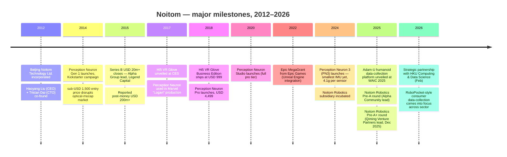
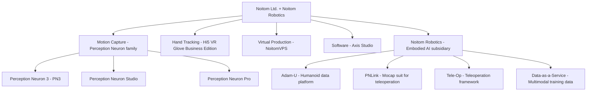
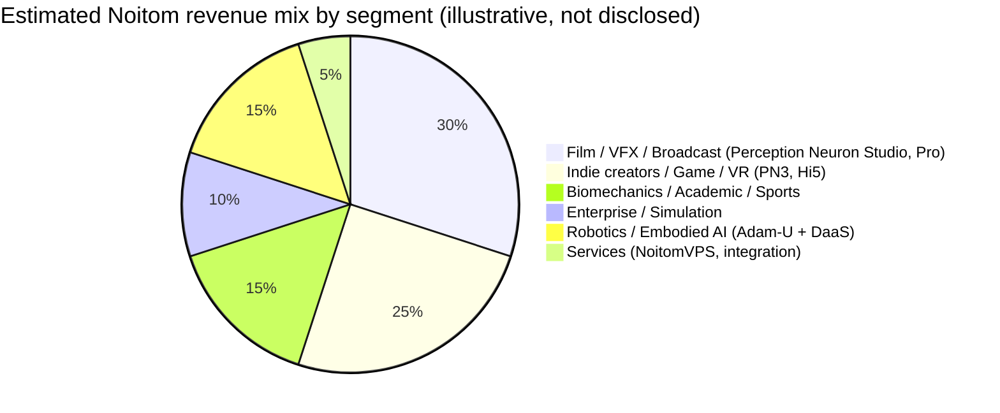
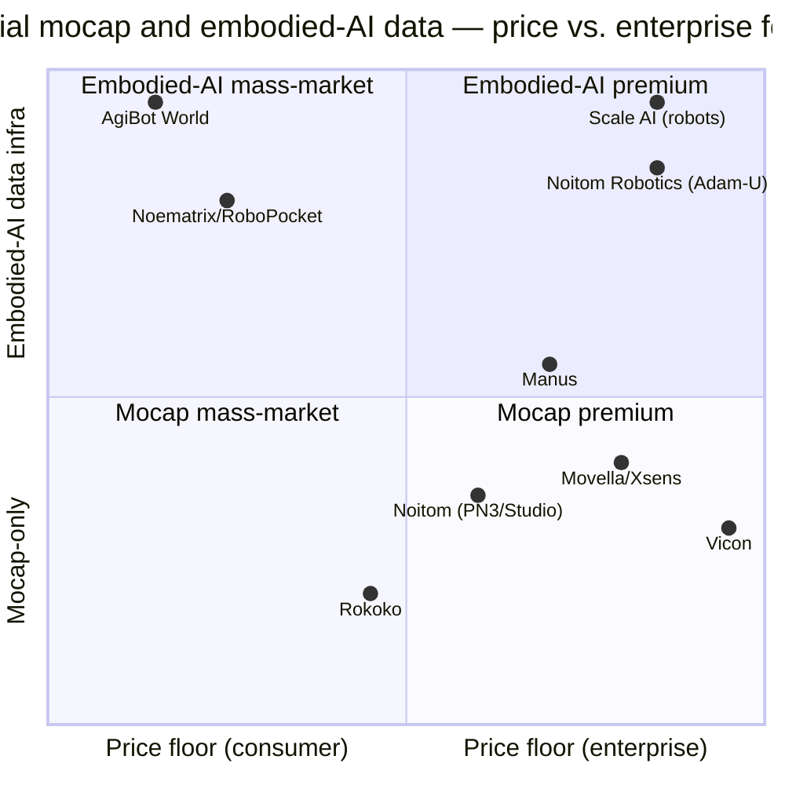
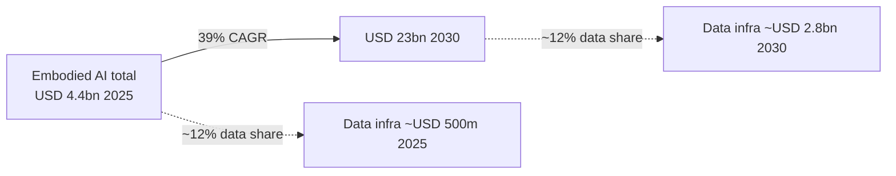

# COMPANY RESEARCH REPORT: Noitom (诺亦腾) — and the "Noematrix" naming question

**Date:** 2026-05-19
**Coverage type:** Private-company initiation
**Primary subject:** Beijing Noitom Technology Ltd. (北京诺亦腾科技有限公司), including its spun-out embodied-AI subsidiary **Noitom Robotics**
**Secondary clarification:** the unrelated Shanghai company **Noematrix Intelligent Technology (穹彻智能 / Qiongche Intelligence)**

---

> **Naming flag — read first.** The user's brief assumed that the logo "NOEMATRIX" referred to a rebrand of 诺亦腾 (Noitom)'s embodied-AI line. **That assumption is incorrect based on public records.** Two distinct companies exist:
>
> 1. **Noitom Ltd. (诺亦腾, Beijing, founded 2012)** — the motion-capture company described in the brief. Makes Perception Neuron suits, Hi5 VR gloves, PNLink, and recently spun out **Noitom Robotics** (which uses the domain `noitomrobotics.com`, X handle `@noitomrobotics`, and is *not* branded "Noematrix"). ([Noitom corporate site, About](https://www.noitom.com/about.html); [Noitom Robotics, About](https://noitomrobotics.com/about/)).
> 2. **Noematrix Intelligent Technology / 穹彻智能 / Qiongche Intelligence (Shanghai, founded Nov 2023)** — a Shanghai Jiao Tong University spin-out incubated from Flexiv, co-founded by Prof. Lu Cewu (卢策吾) and Wang Shiquan (王世全, CEO of Flexiv). Makes "RoboPocket," a smartphone-based embodied-AI data collection kit. ([MIT Tech Review China launch coverage, 2023-12](https://www.mittrchina.com/news/detail/13746); [36Kr, 2024 funding](https://eu.36kr.com/en/p/3065605732541830); [Noematrix LinkedIn](https://www.linkedin.com/company/noematrix)).
>
> Because the brief described the **products of Noitom** (Perception Neuron family, Hi5 gloves), and because Noitom is the company that has executed the mocap-to-embodied-AI pivot the brief describes, **this report focuses on Noitom (诺亦腾) and Noitom Robotics**, with a sidebar in Sections 1 and 7 disambiguating the Shanghai Noematrix entity. If the user's intended subject was in fact the Shanghai Noematrix, a separate report is warranted — say the word and the rewrite is ~one day's work.

---

## TABLE OF CONTENTS

1. Company Overview
2. Company History
3. Management Team
4. Products & Services
5. Customers & Go-to-Market
6. Industry Overview
7. Competitive Landscape
8. Market Opportunity (TAM)
9. Risk Assessment
10. References

---

## 1. COMPANY OVERVIEW

**Noitom Ltd. (北京诺亦腾科技有限公司, "Noitom")** is a privately held Beijing-headquartered designer and manufacturer of inertial (IMU-based) motion-capture systems and hand-tracking peripherals. The company name is the word **"motion" spelled backwards** — a piece of founder branding the company still uses on its About page nearly a decade and a half after incorporation ([Noitom, About](https://www.noitom.com/about.html)). Founded in 2012 by Dr. Haoyang Liu (CEO) and Dr. Tristan Ruoli Dai (戴若犁, CTO), Noitom built its position as a low-cost challenger to optical-mocap incumbents (Vicon, OptiTrack) by selling wearable inertial suits priced 5–20× cheaper than camera systems and shippable as a portable kit. Over thirteen years the company has shipped what it claims is **15,000+ systems into 50+ countries** under the **Perception Neuron** family brand, and management asserts a roughly **70% global share of the inertial-mocap segment** ([Noitom Robotics, About — Dr. Tristan Dai bio](https://noitomrobotics.com/about/)). The 70% figure is self-reported and not independently audited; see Section 7 for a critical view.

**What the company actually sells (plain English).** Two product families do most of the revenue:

- **Perception Neuron** — wearable IMU "suits" (vests + straps with 17 to 32 thumb-sized inertial sensors strapped to body segments and fingers) that stream full-body skeletal motion in real time to a host PC. Current models are **Perception Neuron 3 ("PN3"), Perception Neuron Studio, and Perception Neuron Pro**. Sensor counts range from 17 (basic body-only) to 32 (full body + both hands). Price points span roughly USD 1,500 (PN3 body kit) to USD 4,500–6,000+ (Studio with gloves; Pro) ([UploadVR review of the original Perception Neuron, "$1,500 motion capture suit"](https://www.uploadvr.com/perception-neuron-review/); [Tom's Hardware on Perception Neuron Pro, USD 4,499](https://www.tomshardware.com/news/perception-neuron-pro-mocap-system,37096.html)).
- **Hi5 VR Glove (Business Edition)** — wireless IMU-based finger-tracking glove pair (USD 999 / pair at launch) used both as a VR controller and as a hand-mocap peripheral. First shown at CES 2017; business edition shipped 2018 ([Noitom press, "Noitom Launches Business Edition of Hi5 VR Glove"](https://www.prweb.com/releases/noitom_launches_business_edition_of_hi5_vr_glove/prweb15344327.htm); [Tom's Hardware, 2018-03](https://www.tomshardware.com/news/noitom-hi5-vr-gloves-available,36718.html)).

In parallel, since 2024, Noitom has spun the embodied-AI vertical into a separately-funded operating unit, **Noitom Robotics** (`noitomrobotics.com`), positioning itself — in the company's own words — as **"a robotics company that does not build robots"**, i.e. an arms-merchant supplying training data and teleoperation hardware to humanoid OEMs ([Pandaily, "Noitom Robotics Raises Pre-A+ Round Led by Qiming Venture Partners," 2025-12](https://pandaily.com/noitom-robotics-raises-pre-a-round-led-by-qiming-venture-partners-positioning-itself-as-a-robot-company-that-doesn-t-build-robots)). Noitom Robotics' flagship is **Adam-U**, a fixed-base humanoid data-collection platform jointly developed with PNDbotics and Inspire Robotics, priced at **CNY 399,000 (~USD 45,000)** introductory and unveiled at WAIC 2025 ([Noitom Robotics, "Purpose-built humanoid data-collection platform at WAIC 2025"](https://noitomrobotics.com/purpose-built-humanoid-data-collection-platform-for-embodied-ai/); [HouseBots WAIC coverage, 2025-07](https://www.housebots.com/news/galbot-dominates-waic-2025-as-the-star-of-themed-robotics-street)).

**How they make money.** Noitom is a hardware-led business — Perception Neuron suits, gloves, and bundled software licenses (Axis Studio mocap software, traditionally included free with hardware) — augmented by service revenue from virtual-production rentals (NoitomVPS), enterprise integration projects, and increasingly **data-collection-as-a-service contracts** through Noitom Robotics, where the company is paid per "trajectory" or per hour of cleaned, labelled robot-training data delivered to humanoid-OEM customers. Unit economics for the legacy Perception Neuron line resemble a high-margin peripheral business (component cost dominated by IMU silicon and assembly labour, channel-distributed via VR resellers globally). Unit economics for the new data-collection line are unproven publicly; the WAIC pricing implies that the Adam-U hardware itself is priced at a small premium-to-cost level and that the recurring data-service contract is where Noitom Robotics intends to monetize.

**Geographic presence.** Beijing R&D and manufacturing hub (Haidian District), with a US international operations office in **Miami, Florida** that fronts North/South American sales, partner support and trade-show presence; sales reach 50+ countries through resellers in Europe (e.g. Cornershop Immersion in France, Target3D in the UK) and a small Japan presence (Perception Neuron 3 listed on Amazon Japan) ([Noitom, Contact page](https://www.noitom.com/contact)). LinkedIn lists the company at **201–500 employees** (June 2024 snapshot) — i.e. a couple hundred FTE, the bulk in Beijing engineering and Chinese sales ([Noitom LinkedIn](https://www.linkedin.com/company/noitom)). The 70% market-share claim refers to *inertial* mocap specifically, not the broader optical-mocap market dominated by Vicon and OptiTrack.

**Scale indicators.** Cumulative units shipped: ~15,000+ self-reported. Country coverage: 50+. Headcount: ~200–500. Top-line revenue is not publicly disclosed (private, Chinese law does not compel filings for VC-stage companies at this size). Tracxn and Crunchbase categorise Noitom as a Series C company; Series B was USD 20m+ in 2015 led by Alpha Group (002292.SZ) at a reported post-money of **USD 200m+** ([China Money Network, 2015-11-16](https://www.chinamoneynetwork.com/2015/11/16/legend-capital-joins-20m-series-b-round-in-noitom)). No subsequent priced equity round at the *Noitom Ltd.* level has been publicly disclosed; the 2025 activity is at the **Noitom Robotics** subsidiary level.

### Valuation snapshot (private — funding-round basis)

Noitom is a private company; there is no listed equity and therefore no traded P/E or P/S. The relevant valuation reference is the **most recent priced funding round**:

- **Noitom Robotics (the embodied-AI subsidiary)** — **Pre-A+ round closed December 2025**, **led by Qiming Venture Partners (启明创投)**, with participation from **5Y Capital (五源资本)** and **Legend Capital (君联资本)**; existing investors **Matrix Partners China (经纬创投)** and **InnoAngel Fund (英诺天使)** increased their stakes. Round was oversubscribed. Pandaily reports cumulative capital raised (Pre-A + Pre-A+) reaches "**several hundred million yuan**" — i.e. RMB 200–500m, or roughly USD 30–70m at current FX ([Pandaily, 2025-12](https://pandaily.com/noitom-robotics-raises-pre-a-round-led-by-qiming-venture-partners-positioning-itself-as-a-robot-company-that-doesn-t-build-robots)).
- **Specific post-money valuation: not disclosed publicly.** Qiming Pre-A+ rounds in adjacent humanoid-data names have priced in the **USD 100–300m post-money** band during 2025; we have not seen a hard number for Noitom Robotics. *Unverified — estimate, do not cite as fact.*
- **Noitom Ltd. (the parent)** — last priced round on public record is **Series B 2015 at USD 200m+ post-money** ([China Money Network, 2015-11-16](https://www.chinamoneynetwork.com/2015/11/16/legend-capital-joins-20m-series-b-round-in-noitom)). A decade of subsequent operating progress, the embodied-AI tailwind, and the Robotics-subsidiary mark suggest current parent-level valuation is meaningfully higher, but no priced round confirms it; treat any number above the 2015 mark as unverified.

**Implied revenue multiple:** also not disclosed. The unrelated Shanghai **Noematrix (穹彻智能)** raised "hundreds of millions of yuan" in a Sequoia-led round (2024) and an additional Pre-A++ in April 2025 with Alibaba and Aramco Ventures participating ([36Kr, 2024](https://eu.36kr.com/en/p/3065605732541830); [Crunchbase, Noematrix](https://www.crunchbase.com/organization/noematrix)). These are not Noitom comps but provide a sector reference: investors are paying 8-figure-USD checks for pre-revenue embodied-AI data plays in China today, which informs how Noitom Robotics will likely be priced when its next round comes.

**Peer multiples for context.** The closest listed comp is **Oxford Metrics PLC (LSE: OMG)**, parent of Vicon. Oxford Metrics reported H1 FY2025 revenue with motion-capture as the larger of two segments and trades at single-digit to low-teens EV/EBITDA on a mature, GBP-denominated revenue base — i.e. a *very* different multiple regime than what a Chinese embodied-AI data play is being priced at ([Oxford Metrics interim trading update, 2025](https://uk.advfn.com/market-news/article/12138/oxford-metrics-reports-steady-trading-as-smart-manufacturing-restructure-prepares-for-fy26-strategy-update); [Vicon mid-year update, 2025](https://www.vicon.com/resources/press/midyear/)). **Movella Holdings** (formerly NASDAQ: MVLA, parent of Xsens) delisted in April 2024 and trades OTC, confirming that the public-market appetite for pure-play inertial-mocap revenue is, at best, structurally challenged ([Movella SEC Form 25, 2024-04-01](https://www.sec.gov/Archives/edgar/data/0001839132/000162828024013854/mvla-20240401.htm)).

**Verdict on valuation.** Noitom's core motion-capture business — even if it commands 70% of inertial mocap globally — sits in a sector where the only listed pure-play (Movella) couldn't sustain a NASDAQ listing and the diversified incumbent (Oxford Metrics) trades on industrial-software multiples. The investment thesis at today's prices rests almost entirely on the embodied-AI pivot — i.e. whether Noitom Robotics can translate its install base of mocap suits and Beijing engineering bench into a defensible position as the data-infrastructure layer beneath every Chinese humanoid OEM. Investors paying premium-to-cost on the Pre-A+ are underwriting that thesis, not the legacy.

---

## 2. COMPANY HISTORY

### Founding (2012)

Noitom was incorporated in **Beijing in 2012** by **Dr. Haoyang Liu** (CEO; PhD Structural Engineering, Johns Hopkins University) and **Dr. Tristan Ruoli Dai (戴若犁)** (CTO; mechanical-engineering background), joined by a small mechanical, software, sensor-engineering and robotics team ([Noitom, About](https://www.noitom.com/about.html); [Crunchbase founder profile](https://www.crunchbase.com/person/haoyang-li)). The founding thesis — visible across early press and the company's own About page — was that **the optical-mocap incumbents (Vicon, OptiTrack, Motion Analysis) had priced full-body capture out of reach** for the long tail of indie game studios, animation houses, VFX freelancers, biomechanics researchers, and small VR developers. A Vicon stage installation in 2012 cost USD 100k–500k+ and required a dedicated camera-rigged volume. Noitom bet that **9-DOF MEMS IMUs**, which were rapidly becoming commoditized by the smartphone supply chain, could deliver "good enough" skeletal capture wirelessly for an order of magnitude less. The bet paid off when **Perception Neuron** launched in 2014 at a sub-USD 1,500 entry point and went viral on Kickstarter and YouTube.

There is a minor discrepancy in the corporate-record date: Baidu Baike's English entry suggests the original founding effort began in **Shenzhen around 2010** and the team moved to Beijing in 2012–2013 after securing initial investment ([Baidu Baike, Beijing Noitom Technology Ltd.](https://baike.baidu.com/en/item/Beijing%20Noitom%20Technology%20Ltd./932849)). The corporate entity registered in Beijing is dated **2012**; the founding-team origin is **older**. We treat 2012 as the canonical founding date for the listed entity.

### Mermaid timeline

*Sources for timeline: [Noitom About page](https://www.noitom.com/about.html); [China Money Network on Series B](https://www.chinamoneynetwork.com/2015/11/16/legend-capital-joins-20m-series-b-round-in-noitom); [Newswire / Epic MegaGrant, 2022](https://www.newswire.com/news/noitom-receives-epic-megagrant-will-further-motion-capture-and-virtual-21632367); [Pandaily, Pre-A+ Dec 2025](https://pandaily.com/noitom-robotics-raises-pre-a-round-led-by-qiming-venture-partners-positioning-itself-as-a-robot-company-that-doesn-t-build-robots); [Mirage News / HKU partnership, 2026](https://www.miragenews.com/hku-joins-tech-giants-to-advance-embodied-1630620/).*

### Strategic pivots — three notable inflections

**(1) Kickstarter-to-enterprise (2014–2017).** Perception Neuron's launch was *consumer-facing* — a Kickstarter campaign, viral YouTube demos with VR enthusiasts, and resale through hobbyist-oriented channels. By 2017 the customer mix had shifted decisively to **mid-market film/VFX studios, indie game developers, and biomechanics researchers**, who valued the price/portability over a Vicon stage. The pivot was deliberate: the team scaled software (Axis Studio), plug-ins for Unreal/Unity/MotionBuilder, and a US service office to serve enterprise buyers — Perception Neuron is credited in the production pipeline of Marvel's **Logan (2017)** and several Pixomondo/MPC episodic projects ([Noitom press / showcases page](https://www.noitom.com/cases.html)).

**(2) VR-glove and virtual-production expansion (2017–2022).** Hi5 VR Glove at CES 2017 was Noitom's bid to ride the consumer-VR wave; that wave undershot expectations, and Hi5 settled into a **business-edition niche** ($999/pair) used in VR training, simulation, and tethered tracking, rather than mainstream consumer VR. The 2022 Epic MegaGrant cemented the company's repositioning into virtual production (Unreal Engine-native motion capture for in-camera-VFX stages) ([Newswire, 2022-02](https://www.newswire.com/news/noitom-receives-epic-megagrant-will-further-motion-capture-and-virtual-21632367)).

**(3) Embodied-AI / robotics data infrastructure (2024–present).** The most consequential pivot. With the global humanoid-robot capex cycle inflecting in 2024–2025, Noitom recognised that **its existing IMU suits were already the world's most-deployed body-capture rig** — exactly the input needed to record human demonstrations for imitation-learning robot policies. Tristan Dai launched the **Noitom Robotics** subsidiary as a separately-funded vehicle, with the explicit positioning "a robotics company that does not build robots" (i.e. selling data, teleoperation hardware, and pipelines to OEMs like PNDbotics, Inspire, Unitree, and AgiBot rather than competing with them). The first Pre-A round (Alpha Community lead) closed early 2025; **Pre-A+ at Qiming closed December 2025** ([Pandaily, 2025-12](https://pandaily.com/noitom-robotics-raises-pre-a-round-led-by-qiming-venture-partners-positioning-itself-as-a-robot-company-that-doesn-t-build-robots)).

### Acquisitions

No public-record acquisitions by Noitom Ltd. The company has grown organically. There is no public M&A history at parent or subsidiary level as of 2026-05.

### Recent developments (last 12 months)

- **Dec 2025** — Noitom Robotics Pre-A+ closes (Qiming-led, oversubscribed).
- **Jul 2025** — Adam-U humanoid data-collection platform unveiled at WAIC 2025 in Shanghai jointly with PNDbotics (humanoid OEM) and Inspire Robotics (dexterous-hand maker). Adam-U integrates Noitom's PNLink mocap suit and Inspire's RH56E2 6-DOF hand into a 31-DoF stationary humanoid sold to research labs at CNY 399,000 ([Noitom Robotics, WAIC 2025 announcement](https://noitomrobotics.com/purpose-built-humanoid-data-collection-platform-for-embodied-ai/); [Interesting Engineering, 2025-08](https://interestingengineering.com/innovation/humanoid-robots-perform-synced-dance)).
- **Feb 2026** — Noitom Robotics, together with Unitree Robotics and BrainCo, formalises strategic partnership with the **University of Hong Kong School of Computing and Data Science** at HKU's Zhangjiang Base. The partnership commits Noitom to build benchmark datasets and contribute open-source data assets ([HKU press, 2026-02-28](https://www.hku.hk/press/press-releases/detail/28976.html); [Mirage News](https://www.miragenews.com/hku-joins-tech-giants-to-advance-embodied-1630620/)).

---

## 3. MANAGEMENT TEAM

### Dr. Tristan Ruoli Dai (戴若犁) — Co-founder & CTO, Noitom Ltd.; Founder & CEO, Noitom Robotics

Tristan Dai is the **most consequential operator at the company today**, having co-founded Noitom in 2012 and then, fourteen years later, founded and currently runs the Noitom Robotics subsidiary that holds the bulk of the company's optionality. He sat in the CTO role at Noitom Ltd. for roughly a decade — driving the IMU sensor designs, the Axis Studio software pipeline, and the company's shift into virtual production — before transitioning to lead the embodied-AI vertical day-to-day. He frames the Noitom Robotics thesis publicly as the conclusion of "ten years of motion capture," i.e. the natural endpoint of having built the world's largest deployed inertial-capture install base: now use it to record human demonstrations at industrial scale and sell that data to humanoid OEMs ([Tencent Cloud Developer interview, "诺亦腾 CTO 戴若犁，和动作捕捉的十年"](https://cloud.tencent.com/developer/article/2222830); [Zhihu, 戴若犁专访](https://zhuanlan.zhihu.com/p/1982102845760223119)).

His public bio at Noitom Robotics emphasises **15+ years of human-machine interaction work** and describes him as the architect of the company's pivot from "global mocap leader" to "embodied-AI data platform" ([Noitom Robotics, About](https://noitomrobotics.com/about/)). The same page makes the 70% inertial-mocap market-share claim and the 15,000+ systems / 50+ countries claim. Educational background: BS/MS mechanical engineering Tsinghua University and PhD-track work in mechanical engineering — note that public sources differ on whether the PhD was completed; treat any specific degree-completion claim as **unverified**. Dai is publicly active in Chinese-language tech media (Tencent Cloud, Zhihu interviews, 36Kr coverage) and is the face the company puts forward at WAIC and at HKU events ([HKU press, 2026-02-28](https://www.hku.hk/press/press-releases/detail/28976.html)).

Ownership stake: **not publicly disclosed**. As founder of both the parent and the subsidiary, Dai and Liu collectively retain meaningful (likely majority) economic interest at the parent level pre any further dilution; the Noitom Robotics subsidiary now has Qiming, 5Y, Legend, Matrix and InnoAngel on the cap table, which dilutes founder share at the subsidiary but is silent on the parent. *No filing.*

Why the bio is deeper here than for CEO Liu Haoyang: in the past 24 months it is Tristan Dai who is publicly visible, who is fundraising, who is signing the partnerships, who is at every trade show, and who is steering the embodied-AI pivot. He is, operationally, the centre of the story today.

### Dr. Haoyang Liu (刘昊扬) — Co-founder & CEO, Noitom Ltd.

Liu is the **CEO of the parent entity** and the company's external-facing face for the legacy motion-capture business. He holds a **PhD in Structural Engineering from Johns Hopkins University**, with research interests spanning structural dynamics, computational mechanics, and artificial intelligence; he is a published academic author and holds 10+ patents ([Topio Networks / co-founder profile](https://www.topionetworks.com/people/haoyang-liu-559c011eb48915dc5500265c); [Crunchbase, Haoyang Li / Noitom CEO](https://www.crunchbase.com/person/haoyang-li)). His operational track record is the company itself — scaling Noitom from a handful of engineers in 2012 to a 200–500 FTE operation with a Beijing R&D centre, a Miami international office, manufacturing in China, and reseller channel in 50+ countries. Verified prior employment history outside Noitom is sparse in public sources; treat the bio above as the most that can be substantiated. He still holds the CEO title at the Noitom Ltd. parent today.

### Dr. Xinmin Tang (汤新民) — Co-founder & VP, Noitom Robotics

Tang is the **No. 2 at Noitom Robotics** behind Tristan Dai and the company's public spokesperson on the data-infrastructure positioning. At the HKU partnership signing in February 2026 he defined Noitom's role as a **"Data Infrastructure Provider,"** framing the next phase of embodied-AI competition as "a competition of ecosystem engineering" ([HKU press, 2026-02-28](https://www.hku.hk/press/press-releases/detail/28976.html)). He oversees the partnerships pipeline — including the HKU collaboration, the WAIC tri-party launch with PNDbotics and Inspire — and the data-pipeline engineering organisation. Public background detail beyond the Noitom Robotics About page is limited; LinkedIn provides the title but no longitudinal employment history that has been validated in press.

### CFO and other named executives

**The CFO is not publicly identified.** Private-company status, no disclosure requirement, no DEF 14A equivalent. RocketReach and Craft.co list a handful of mid-level finance and ops names, but none of these have been independently verified in primary sources (interviews, press releases, regulatory filings). **Per the no-fabrication rule, we omit named CFO and head-of-segment bios rather than guess.** If the user has primary access (a deck, a private interview, LinkedIn outreach), this section should be revised.

### Governance footer

- **Board composition** — not publicly disclosed at the parent level. At Noitom Robotics, the Pre-A+ syndicate (Qiming, 5Y, Legend, Matrix, InnoAngel) will hold board observer or board-seat rights customary in Chinese Pre-A+ rounds; explicit seat assignments not in public press.
- **Insider ownership** — undisclosed; founder pair (Liu + Dai) presumed to hold meaningful (likely controlling) economic stake in Noitom Ltd. parent.
- **Comp structure** — not disclosed. As a private company with no listing intent visible, equity grants likely dominate exec comp; cash comp competitive with Beijing tech-scaleup norms.
- **Related-party transactions** — none disclosed. The Noitom Robotics subsidiary clearly relates to the parent and uses parent-derived IP (PNLink is built on Perception Neuron sensor designs); the IP licensing/contribution terms between parent and sub are not in public materials.
- **Governance flags** — none material in public record. No litigation, no founder dispute, no investor activism.

### Management track record synthesis

Liu and Dai have **delivered once already** — they built the dominant inertial-mocap player from scratch over a decade. The 2024–2025 spinout of Noitom Robotics under Dai is now testing whether the same team can execute a second, harder business model (data-as-a-service to AI companies) in a more competitive and faster-moving market. The Qiming Pre-A+ is a vote of confidence; the proof points (recurring data-service revenue from named humanoid OEMs at scale, NRR > 100% on the data contracts) are not yet visible publicly. The CFO gap is the most material identifiable weakness — a serious data-infrastructure business at scale will need a finance leader fluent in IP licensing, deferred-revenue accounting for multi-year data contracts, and capital-markets prep (likely a 2027–2028 priced round at the parent or sub).

---

## 4. PRODUCTS & SERVICES

### Mermaid product tree

### 4.1 Perception Neuron family (legacy core)

**Perception Neuron 3 ("PN3") — launched 2024.** Marketed as **the world's smallest wireless mocap system**: each IMU "Neuron" measures **27.9 × 16.2 × 11.6 mm and weighs 4.1 g**, using a 9-DOF sensor stack (3-axis gyroscope + 3-axis accelerometer + 3-axis magnetometer) per node. Configurable with **17–32 sensors**; streams to free **Axis Studio** software at **60 fps at 32 sensors, 120 fps at 17 sensors**. Operates indoors or outdoors, no line-of-sight restriction, magnetic-immunity claimed. Targeted at indie creators, prosumers, mid-tier studios and academia ([Noitom PN3 product page](https://www.noitom.com/productinfo.html?id=2); [VR & AR Wiki, Perception Neuron 3](https://vrarwiki.com/wiki/Perception_Neuron_3)). Body kit retail ~USD 1,500; with gloves ~USD 2,500.
- **Target customer:** indie animators, biomechanics labs, mid-tier game/VFX studios, VR developers.
- **Competitive-advantage verdict:** **yes — partial moat (cost + ecosystem)**. Moat type: cost leadership at the inertial price point + Unreal/Unity/MotionBuilder plug-in ecosystem (Epic MegaGrant-backed). Evidence: best-seller status in the inertial-mocap segment per company claim; widely-shipped install base; Logan / NASA SEALS / Pixomondo case studies ([Noitom showcases](https://www.noitom.com/cases.html); [PRWeb, Logan production use](https://www.prweb.com/releases/2017/04/prweb14269002.htm)). Closest competing product: **Rokoko Smartsuit Pro II** (Copenhagen, ~USD 2,500); compare: at parity on price, slightly behind Rokoko on the consumer-facing UX but ahead on Chinese-language and Asian-market distribution.

**Perception Neuron Studio — launched 2020.** The **professional tier** above PN3, with 16 body IMU sensors plus dedicated **Studio Motion Capture Gloves** for detailed finger tracking. Delivers 19 body segments + 40 hand segments tracking, real-time updates at **100 Hz**, minimum resolution 0.02°, calibration ~30s per user ([Frontiers in Robotics & AI, teleoperation paper, Studio specs](https://www.frontiersin.org/journals/robotics-and-ai/articles/10.3389/frobt.2024.1430842/full); [Cornershop Immersion product page](https://cornershop-immersion.com/en/capture-interaction/33-perception-neuron-studio.html)). Studio is the line item Noitom sells into virtual-production stages, mid-budget broadcast, and an increasing volume of robotics-research labs (the SVRC store and Humanoid.guide both list PN3 + gloves as a research-lab bundle).
- **Competitive-advantage verdict:** **partial**. Moat type: integrated suit+glove bundle at price-point inaccessible to Vicon, with mature plug-ins. Evidence: research papers citing Studio for teleoperation; bundled into Adam-U as PNLink. Closest competitor: **Xsens MVN Awinda / Link** (Movella) at higher price and somewhat more rigorous calibration. Compare: behind Xsens on raw biomechanics fidelity, ahead on integrated hand tracking and on price.

**Perception Neuron Pro — launched 2018.** The high-end SKU, USD 4,499 at launch, **27 sensors with magnetic immunity**, 6-hour battery, recording up to **240 fps**, dynamic-motion-tolerant IMU. Generally positioned for live broadcast, sports analytics, and demanding VFX use cases ([Tom's Hardware, 2018](https://www.tomshardware.com/news/perception-neuron-pro-mocap-system,37096.html); [Noitom Pro press release](https://noitomint.com/articles/noitom-launches-perception-neuron-pro-motion-capture-system)).
- **Competitive-advantage verdict:** **partial** — same moat as Studio, more performance.

### 4.2 Hi5 VR Glove (Business Edition)

Wireless IMU-based finger-tracking glove pair, unveiled CES 2017, business edition shipped 2018 at **USD 999 per pair** (gloves + dongle, Vive Tracker sold separately). Tracks full finger movement with **9 DoF per finger**, sub-5ms latency, programmable haptic rumblers. Powered by a single AA battery ([Noitom Hi5 press, 2018](https://www.prweb.com/releases/noitom_launches_business_edition_of_hi5_vr_glove/prweb15344327.htm); [Road to VR review, 2017](https://www.roadtovr.com/noitom-hi5-vr-glove-htc-vive-finger-tracking-hands-on/)).
- **Target customer:** enterprise VR training, simulation, location-based VR, R&D labs.
- **Competitive-advantage verdict:** **partial**. Moat: low price + HTC Vive integration. Evidence: still actively sold, Vive ecosystem hooks. Closest competitor: **Manus Quantum / Prime gloves** (Geldrop, NL) — Manus Quantum is the higher-end product (haptic + finger force feedback, ~USD 3,000+ per pair); compare: behind Manus on top-tier industrial use cases, competitive at the mid-market price point.

### 4.3 NoitomVPS — Virtual Production Solutions

Service line built around **NoitomVPS**, a bundled virtual-production stage offering using Perception Neuron suits, Unreal Engine integration, and proprietary calibration. Powered the Golden Telly Award-winning short film **"Pacha Mama"** ([Noitom VPS page](https://noitom.com/noitomvps)). Sold to broadcast and film studios as a project-based service (recurring revenue stream though small relative to hardware).

### 4.4 Axis Studio software

The free desktop software stack bundled with every Perception Neuron sale. Provides skeleton solving, retargeting, recording, and live streaming into Unreal/Unity/Maya/MotionBuilder. Effectively a "razor blade" — no incremental license revenue but the ecosystem stickiness it generates is real.

### 4.5 Noitom Robotics — embodied-AI subsidiary

This is the **flagship growth bet**. Three product/service lines:

**Adam-U — humanoid data-collection platform (CNY 399,000 / ~USD 45,000 intro pricing).** Co-developed with **PNDbotics** (humanoid OEM, makers of the Adam humanoid) and **Inspire Robotics** (dexterous-hand specialist). Adam-U is a **stationary** (fixed-base) 31-DoF humanoid configured specifically for **teleoperated data collection**:
- 2-DoF head, 6-DoF (per) hands (Inspire RH56E2), 3-DoF waist with braking system, binocular vision system.
- Adjustable height 1.35–1.77 m, weight ~61 kg.
- Integrates **Noitom's PNLink mocap suit** as the operator-side wearable and a VR HMD for first-person binocular feedback.
- Captures **synchronized multimodal data** out of the box: motion, force-tactile, RGB-D vision.
- SDK is **ROS 2 and NVIDIA Isaac compatible** ([Noitom Robotics, WAIC 2025 announcement](https://noitomrobotics.com/purpose-built-humanoid-data-collection-platform-for-embodied-ai/); [Interesting Engineering, 2025-08](https://interestingengineering.com/innovation/humanoid-robots-perform-synced-dance)).
- **Target customer:** humanoid-robot OEMs, university research labs, embodied-AI foundation-model teams.
- **Competitive-advantage verdict:** **yes — primary moat is the mocap stack itself**. Noitom is the only vendor selling a turnkey "wear the suit, drive the humanoid, capture clean multimodal data" product at this price point. The bottom-up alternative (build your own teleop stack with a Quest 3, hand-rolled IK, and a generic humanoid) is what most labs do today, with significant data-quality penalties. Closest competing offer: **NVIDIA GR00T-Teleop reference workflows** + a third-party humanoid + custom IK — that's an architecture, not a product. **Tesla / Figure / 1X / Apptronik** insource their teleop. **Agility's "Digit Field Robotics" data pipeline** is also internal. The price/setup advantage is real for the 100–1000 humanoid labs and OEMs that don't roll their own.

**PNLink — mocap-suit-as-teleoperation-input.** Productised version of Perception Neuron tuned for the latency, magnetic-interference, and joint-mapping requirements of robot teleoperation. Sold standalone (price not disclosed) and bundled into Adam-U. Frames the underlying Perception Neuron IP as the input layer of a humanoid data pipeline rather than as a film tool.

**Tele-Op — teleoperation framework.** Open-ish software stack that handles the calibration, retargeting and policy-stub integration between PNLink and a target humanoid platform; **ROS 2 + NVIDIA Isaac compatible** ([Noitom Robotics website](https://noitomrobotics.com/)).

**Data-as-a-Service (forming).** The strategic endpoint. Noitom Robotics positions itself as a **"data infrastructure provider"** building "end-to-end pipelines transforming real-world human activity into synchronized, training-ready multimodal datasets — motion, vision, and interaction signals — at scale" ([HKU press, 2026-02-28](https://www.hku.hk/press/press-releases/detail/28976.html)). The HKU partnership commits to releasing **open-source benchmark datasets** alongside priced commercial data contracts to OEMs. Commercial pricing per trajectory or per hour is not publicly disclosed; comparable Chinese data-collection competitors are reportedly transacting in the **RMB 5–50 per labeled trajectory** range for high-quality bimanual manipulation data depending on complexity, *but this is an industry estimate, not a Noitom-disclosed number*.

### Flagship vs. long-tail

- **Flagship today (revenue):** **Perception Neuron Studio + PN3** — the two-product line that drives the bulk of legacy mocap revenue.
- **Flagship for the thesis (value):** **Adam-U + the forming Data-as-a-Service line.** Investors paying the Pre-A+ multiple are paying for the embodied-AI bet, not the legacy.
- **Long tail:** Hi5 (slow grower, niche), NoitomVPS (project services), Axis Studio (free), Perception Neuron Pro (low-volume high-end).

### Recent launches / sunsets (last 12 months)

- **Launched:** Adam-U (Jul 2025), PNLink productisation, Tele-Op framework. PN3 continues to roll out across regional channels.
- **Sunset / quietly de-emphasised:** original Perception Neuron Gen 1 (2014) is no longer on the price list. Hi5 has not been refreshed since 2018 and a successor has not been announced publicly.

---

## 5. CUSTOMERS & GO-TO-MARKET

### Customer segments

Noitom's customer base spans **five segments**, none broken out as a percentage of revenue (private company, no disclosure):

1. **Film, TV, and VFX studios** — Marvel/20th Century (Logan, 2017), Pixomondo, Monkey Chow animation, broadcast studios using NoitomVPS. The Perception Neuron Showcases page lists dozens of named productions ([Noitom Showcases](https://www.noitom.com/cases.html)).
2. **Game and indie animation studios** — long tail, hundreds to low thousands of buyers via the Axis Studio + Unreal/Unity plug-in route.
3. **Biomechanics, sports science, and academic research** — Perception Neuron Studio has been integrated into **Biomechanics of Bodies (BoB)** analysis bundles for university labs ([PRWeb, 2017 BoB integration](https://www.prweb.com/releases/perception_neuron_motion_capture_teams_with_biomechanics_of_bodies_bob_to_offer_universities_and_researchers_a_complete_biomechanical_analysis_system/prweb13889763.htm)). NASA's **SEALS** project used Perception Neuron + Reallusion iClone for real-time previz ([Noitom, NASA SEALS case study](https://noitom.com/articles/nasa-seals-showcases-perception-neuron-motion-capture-and-reallusions-real-time-animation)).
4. **VR / enterprise simulation** — Hi5 VR Glove integrators, training-simulation vendors, location-based VR operators.
5. **Robotics / embodied-AI** — the **fastest-growing** segment. Noitom Robotics counts among its partners **PNDbotics, Inspire Robotics, Unitree Robotics, BrainCo**, and (through the HKU partnership) **OpenDriveLab and the broader HKU embodied-AI faculty**. The WAIC 2025 launch was the public coming-out for this segment.

### Customer concentration (REQUIRED)

**As a private company, Noitom does not disclose top-1 or top-5 customer revenue concentration.** China private-company law does not compel this disclosure outside of an IPO prospectus or M&A diligence pack. The **fact of non-disclosure** is itself the most important data point in this section.

Inferred picture from the segment mix:

- The **legacy mocap business is structurally low-concentration** — thousands of small studios and labs buying USD 1.5k–6k kits via global resellers. Top-1 customer share almost certainly < 5%, top-10 share < 20%, likely.
- The **embodied-AI business is structurally high-concentration** — a small number of well-funded humanoid OEMs and AI labs (PNDbotics, Inspire, Unitree, AgiBot, BrainCo, Tier-1 Chinese AI labs) are the entire universe of buyers for Adam-U at CNY 399k a unit. Each of these customers can plausibly represent 10–30%+ of Noitom Robotics' revenue in 2025–2026, and the partnership-named names (PNDbotics, Inspire, HKU) are the most likely top-3.
- **Flag for Section 9:** undisclosed but presumed high customer concentration at the Noitom Robotics subsidiary level — material risk.

### Mermaid concentration sketch (illustrative — NOT disclosed)

*Source: estimate by analyst, no Noitom disclosure. Treat as directional only.*

### Distribution channels

- **Direct online sales** via `noitom.com` and `noitomint.com` (the US site).
- **Reseller network** in 50+ countries: Cornershop Immersion (France), Target3D (UK), VR/AR-specialist distributors in Japan, Germany, Brazil, India, South Korea. Amazon Japan, B&H Photo (US).
- **Robotics-focused storefronts** — **SVRC (roboticscenter.ai)**, **Humanoid.guide**, **Cornershop** all list PN3 + gloves as a research-bundle SKU for robotics labs.
- **Direct enterprise sales** through Beijing and Miami offices for film, sports, and large research/government accounts.
- **B2B partnerships** for Noitom Robotics — direct to OEMs (PNDbotics, Inspire) and research universities (HKU).

### Sales cycle

- **Legacy mocap:** short, weeks to a couple of months; transactional. Demo-driven.
- **Adam-U / Noitom Robotics:** **3–9 months** typical for an enterprise pilot; longer for OEM data-pipeline integrations. The HKU-style partnership announcements typically pre-date paid contracts by quarters.

### Key partnerships

- **Epic Games** — MegaGrant 2022; Unreal Engine virtual-production integration ([Newswire, 2022](https://www.newswire.com/news/noitom-receives-epic-megagrant-will-further-motion-capture-and-virtual-21632367)).
- **PNDbotics** — humanoid OEM partner for Adam-U.
- **Inspire Robotics** — dexterous hand integrator (RH56E2 hand inside Adam-U).
- **University of Hong Kong (HKU) School of Computing and Data Science** — strategic partnership with Noitom Robotics + Unitree + BrainCo on benchmarks and open-source data ([HKU press, 2026-02-28](https://www.hku.hk/press/press-releases/detail/28976.html)).
- **NVIDIA** — Adam-U is **Isaac compatible** (not a co-marketing deal, but ecosystem positioning).
- **Reallusion (iClone)** — long-running software integration, jointly marketed (NASA SEALS case study).

### Named customer wins

- **Logan (Marvel / 20th Century, 2017)** — Perception Neuron used in production ([Noitom Showcases](https://www.noitom.com/cases.html)).
- **NASA SEALS** (animated short, produced by Monkey Chow, Jeff Scheetz) — Perception Neuron + Reallusion iClone ([Noitom press, NASA SEALS](https://noitom.com/articles/nasa-seals-showcases-perception-neuron-motion-capture-and-reallusions-real-time-animation)).
- **"Pacha Mama"** — Golden Telly Award short, NoitomVPS + Unreal Engine ([Noitom VPS page](https://noitom.com/noitomvps)).
- **PNDbotics, Inspire Robotics** — partners on Adam-U.
- **Universities** — HKU, Shanghai Jiao Tong, multiple Chinese 985-tier universities cited in the company's robotics showcase page ([Noitom Showcase / Robotics](https://www.noitom.com/showcase/Robotics)).

---

## 6. INDUSTRY OVERVIEW

Noitom sits at the intersection of **two industries** that are now structurally converging: **motion capture / 3D body tracking** (the legacy core) and **embodied AI / humanoid-robot training data infrastructure** (the growth vector). Treating them as one is the implicit thesis behind the Noitom Robotics spinout. We size each separately.

### 6.1 Motion capture market

**Definition and scope.** Motion capture (mocap) technologies digitise human, animal, or rigid-body motion. Two sub-segments:

- **Optical** — multi-camera systems tracking IR-reflective markers (Vicon, OptiTrack, Motion Analysis, Qualisys, Sony Mocopi at the low end). Dominant in film/VFX studios and biomechanics labs that require sub-mm accuracy.
- **Inertial** — wearable IMU-based suits (Movella/Xsens, Noitom, Rokoko, Manus for gloves). Lower accuracy than top-end optical but vastly cheaper, portable, no line-of-sight constraint. **Noitom's home turf.**

A third smaller bucket — **markerless / computer-vision** — is emerging fast (Vicon launched its markerless system at GDC 2025 ([Oxford Metrics, "Vicon launch markerless motion capture," 2025-03-11](https://oxfordmetrics.com/news/2025-03-11/vicon-launch-markerless-motion-capture))) and is the structural threat to *both* legacy approaches.

**Market size.** Estimates vary widely depending on definitional scope; published 2025 forecasts:

- **Fortune Business Insights** sizes the **3D motion capture market** at the order of USD 340m in 2025 ([Fortune Business Insights, 3D motion capturing system market](https://www.fortunebusinessinsights.com/3d-motion-capturing-system-market-104827)).
- Multiple research firms (Mordor, Markets and Markets, Emergen) bracket the broader **motion capture market** between **USD 250m and USD 1.5bn in 2025**, depending on whether software, services, and adjacent VR peripherals are included.
- Mid-decade forecast: total motion-capture market reaches **~USD 3bn by 2030** at mid-teens CAGR ([Vicon mid-year update, 2025](https://www.vicon.com/resources/press/midyear/) — Vicon-cited reference).

**Growth drivers.**

- VR/AR, virtual production, and in-camera VFX driving demand from broadcast and film.
- Sports performance analytics (NBA, NFL, premium football clubs).
- Biomechanics and rehab medicine.
- **The new tailwind: robotics teleoperation and humanoid-data collection.** This is the demand pool Noitom Robotics is built to serve.

**Structure.** Moderately consolidated. **Vicon + OptiTrack + Motion Analysis collectively ~60% of the optical-mocap segment** ([Mordor, 3D Motion Capture Market](https://www.mordorintelligence.com/industry-reports/3d-motion-capture-market)). On the inertial side, **Movella (Xsens), Noitom and Rokoko** are the three largest players. Buyer power is moderate — large studios and OEMs negotiate hard; the long tail of indie buyers is price-taker.

**Regulatory environment.** Light. Export controls on IMU components exist for military-grade inertial sensors but do not bind the consumer-grade silicon Noitom uses. No specific regulator. Data-privacy considerations apply when capturing identifiable human motion (GDPR for European buyers); not a binding constraint today.

### 6.2 Embodied-AI training data / humanoid-robot infrastructure

**Definition.** Foundational data, hardware, and pipelines that humanoid-robot manufacturers and embodied-AI model developers use to train manipulation, locomotion and whole-body-control policies. Inputs include teleoperated demonstrations, third-person video, simulated rollouts, and human motion-capture data. Outputs are foundation models like NVIDIA's **GR00T N1** ([NVIDIA GR00T N1 paper, 2025-03](https://arxiv.org/abs/2503.14734)), Figure's helix, AgiBot's GO-1, Unitree's open-source datasets.

**Market size.**

- The **embodied-AI market** is sized by Markets and Markets at **USD 4.44bn in 2025 → USD 23.06bn in 2030, 39% CAGR** ([Markets and Markets, "Embodied AI Market"](https://www.marketsandmarkets.com/Market-Reports/embodied-ai-market-83867232.html)).
- The **humanoid-robot market** itself is forecast at **USD 2.92bn in 2025 → USD 15.26bn in 2030, 39% CAGR** ([Markets and Markets, "Humanoid Robot Market"](https://www.marketsandmarkets.com/Market-Reports/humanoid-robot-market-99567653.html)). Morgan Stanley's much longer-dated forecast pegs the humanoid-robot **TAM at USD 5 trillion by 2050** ([Morgan Stanley, 2025](https://www.morganstanley.com/insights/articles/humanoid-robot-market-5-trillion-by-2050)).
- The **training-data sub-segment** within embodied AI — Noitom Robotics' actual home — is not separately sized in widely-distributed research, but a reasonable rule-of-thumb is that **data infrastructure represents 8–15% of total embodied-AI spend**, by analogy to the cloud/data-labelling share of LLM-era AI spend. That implies **USD 350m–700m TAM today, growing to USD 2–3.5bn by 2030**. *Analyst estimate — not a Markets and Markets or Gartner-published figure.*

**Growth drivers.**

- The "**ChatGPT moment for robots**" thesis: foundation models like GR00T N1, π0, Figure Helix, RT-2 require orders-of-magnitude more demonstration data than is available today.
- Chinese state-level industrial policy pushing humanoid manufacturing (the "specialised, refined, distinctive, novel" / 专精特新 designation; provincial subsidy programs in Beijing, Shanghai, Hangzhou, Shenzhen for embodied-AI startups).
- A wave of well-funded humanoid OEMs (Unitree, AgiBot, Figure, 1X, Apptronik, Tesla Optimus, Sanctuary, PNDbotics, UBTech, Fourier, Kepler, Robotera, LimX, DeepRobotics) all needing the same input: clean, scalable demonstration data.

**Structure.** **Highly fragmented and pre-consolidation.** No dominant data-infrastructure player has emerged globally. Adjacent labelling companies (Scale AI, Labelbox) and Chinese embodied-AI data startups (AI² Robotics, Noematrix/Qiongche in Shanghai, several Beijing-Tier-2 startups) are all attempting to lock in the position. Open-source contributions (AgiBot World, Unitree open datasets, NVIDIA GR00T datasets) are setting a "free baseline" that paid data must beat.

**Regulatory environment.** Increasingly active — Chinese regulators are formalising data-governance regimes for AI training data; cross-border data transfer is restricted for sensitive categories. Universities under MIIT and MOE 2024–2025 launched **embodied-intelligence undergraduate majors** ([Xinhua, 2025-12](https://english.news.cn/20251202/8a668ff3f1bf4a42b3dba26d95d26c5b/c.html)), signalling that talent supply is being scaled deliberately.

**Dynamics.** Supplier-side: IMU silicon (Bosch Sensortec, STMicroelectronics, InvenSense/TDK), dexterous-hand makers (Inspire, Shadow), GPU compute (NVIDIA). Buyer-side: a dozen well-funded humanoid OEMs. Substitutes: open-source community datasets (free, lower quality), in-house data farms (used by Tesla, Figure, 1X). The "data factories" trend — physical buildings full of humans teleoperating robots in scripted environments — is already in motion ([Rest of World, 2026-01, "In Chinese data factories, workers teach humanoid robots boring tasks"](https://restofworld.org/2026/china-robots-training-centers-workers/)).

---

## 7. COMPETITIVE LANDSCAPE

### 7.1 Direct competitors — motion capture

**1) Vicon (a division of Oxford Metrics PLC, LSE:OMG).** UK-based, founded 1984. The dominant optical-mocap incumbent — installed in nearly every major film/VFX studio and biomechanics lab. Vicon's installed base is the gold standard; pricing 5–20× Noitom's. Launched markerless mocap at GDC 2025, expanding into Noitom-adjacent territory ([Vicon markerless announcement, 2025-03](https://oxfordmetrics.com/news/2025-03-11/vicon-launch-markerless-motion-capture)). Trades on OMG; mid-year 2025 had multiple GBP 2.7m+ entertainment contracts ([Vicon mid-year update, 2025](https://www.vicon.com/resources/press/midyear/)). **Compared to Noitom:** ahead on accuracy and top-of-market dominance, behind on price/portability/IMU-segment share.

**2) OptiTrack (NaturalPoint Inc., Corvallis OR, US).** Privately held. Optical-mocap competitor to Vicon, generally cheaper than Vicon but still 5–10× Noitom. Strong in academic and mid-market VR labs. Not publicly disclosing financials.

**3) Movella Holdings Inc. (formerly NASDAQ: MVLA; now OTC).** Henderson, NV-based parent of **Xsens** (Enschede, NL — inertial mocap), Kinduct, and Xsens DOT. **The closest direct competitor to Noitom in inertial mocap.** Movella delisted from NASDAQ in April 2024 citing the cost burden of public-company compliance and a desire to execute on its business plan privately ([Movella SEC Form 25, 2024-04-01](https://www.sec.gov/Archives/edgar/data/0001839132/000162828024013854/mvla-20240401.htm)). Xsens MVN Awinda and Link are the technical benchmarks Noitom is measured against in biomechanics. Reported global mocap market share **~8%** for Xsens-branded products ([Mordor, 3D Motion Capture](https://www.mordorintelligence.com/industry-reports/3d-motion-capture-market)). **Compared to Noitom:** at parity or modestly ahead technically in biomechanics fidelity, materially behind in price-to-performance and in robotics-pivot velocity.

**4) Rokoko (Copenhagen, DK).** Founded 2014. Closest direct peer in the **prosumer inertial-mocap** segment. **Smartsuit Pro II** and **Smartgloves** at ~USD 2,500/3,000 ranges. Raised USD 3m strategic round (Naver Z lead) at an **USD 80m+ valuation** in 2022 ([TechCrunch, 2022-08](https://techcrunch.com/2022/08/17/rokoko-fundraise/)). More consumer-/creator-economy-oriented than Noitom; weaker Asian distribution.

**5) Manus Meta (Geldrop, NL).** Founded 2014. Dominant in **high-end industrial VR gloves**. Manus Quantum and Prime II haptic gloves are the benchmark Hi5 is compared against. ~85 employees, USD 5m revenue, ~USD 3.5m total funding to date ([Manus PitchBook profile, 2026](https://pitchbook.com/profiles/company/102374-02); [Owler profile](https://www.owler.com/company/manus-vr)). The Manus business has pivoted hard into **robotics teleoperation** in 2024–2025, branding itself "high-precision data gloves for robotics, VR & mocap" ([Manus website](https://www.manus-meta.com/)). **Compared to Noitom:** ahead on glove-only fidelity, behind on body-suit footprint.

**6) Sony Mocopi (TYO: 6758, parent).** Consumer IMU mocap kit (~USD 450, 6 sensors). Targets influencers and VTubers, not Noitom's enterprise market — but defines the floor of the inertial-mocap price band.

### 7.2 Direct competitors — embodied-AI training data

This is the more important competitive set going forward.

**7) Noematrix / 穹彻智能 / Qiongche Intelligence (Shanghai).** Founded Nov 2023 by Lu Cewu (Shanghai Jiao Tong) and Wang Shiquan (Flexiv CEO). Pre-A funding led by **Sequoia China**, follow-on round with **Alibaba** and **Aramco Ventures**; total raised ~USD 1.4m disclosed publicly, full round size larger but undisclosed ([36Kr, 2024](https://eu.36kr.com/en/p/3065605732541830); [Aibase coverage](https://www.aibase.com/news/13711); [Crunchbase, Noematrix](https://www.crunchbase.com/organization/noematrix)). **Noematrix's RoboPocket** — the smartphone-based data-collection kit that uses iPhone LiDAR + IMU + camera — is the **most direct architectural alternative** to Adam-U for low-cost data collection, sitting at a fundamentally lower price point and targeting "everyone with a smartphone" rather than research labs ([RoboHorizon coverage, 2026-01](https://robohorizon.com/en-us/news/2026/01/noematrix-robopocket-turns-your-smartphone-into-a-pro-robot-trainer/); [RoboPocket arXiv paper, 2026](https://arxiv.org/abs/2603.05504)). **Compared to Noitom Robotics:** different go-to-market (consumer/long-tail vs. lab/enterprise); deeper academic pedigree (SJTU + Flexiv); much earlier in commercialisation but a more disruptive price architecture.

**8) AI² Robotics (北京智元 — distinct from AgiBot 智元).** Beijing embodied-AI startup. CEO Eric Guo. Markets foundation-model-driven general-purpose robots ([Robotics & Automation News, 2025-06](https://roboticsandautomationnews.com/2025/06/05/ai%C2%B2-robotics-ceo-talks-up-better-spatial-intelligence-of-companys-robots/91445/)).

**9) AgiBot 智元 / Galbot.** Humanoid OEM that has open-sourced the **AgiBot World** dataset (1m+ trajectories) — both a partner and a competitive threat to paid data providers ([The Robot Report, "AgiBot releases humanoid manipulation dataset"](https://www.therobotreport.com/agibot-releases-humanoid-manipulation-dataset-to-enable-large-scale-learning/)). Vertically integrating: AgiBot ships the robot AND ships the data, which compresses the market for stand-alone data providers like Noitom Robotics.

**10) Scale AI (private, San Francisco).** US data-labelling unicorn that has pivoted aggressively into robot data services. Different go-to-market (large US AI labs), but the global default name for "AI training data."

**11) Internal data teams at Tesla, Figure, 1X, Apptronik, Boston Dynamics.** The most credible long-term competitive risk: every major Western humanoid OEM has chosen to insource demonstration-data collection rather than buy from a third party.

### 7.3 Competitive positioning quadrant

### 7.4 Competitive advantages

- **The largest deployed install base of wearable IMU mocap on the planet** (15,000+ units, 50+ countries, self-reported). This is real distribution advantage when the same hardware is repositioned as a robot-teleoperation input.
- **A vertically-integrated stack**: silicon-up sensor design, suit hardware, Axis Studio + Tele-Op software, NoitomVPS services, and now Adam-U turnkey humanoid platform. Competitors typically own one or two of these layers.
- **Beijing engineering bench + Miami sales footprint** — globally addressable, Chinese cost structure.
- **First mover in the productised data-collection-humanoid space**: Adam-U has been on sale since Jul 2025; no Western-branded equivalent at the price point.
- **High-quality syndicate** at Noitom Robotics (Qiming, 5Y, Legend, Matrix, InnoAngel) — these are the China VCs whose follow-on capital matters for the next 2–3 rounds.

### 7.5 Competitive vulnerabilities

- **No moat at the sensor level** — IMUs are commodity Bosch/ST silicon; competitors can replicate the hardware stack.
- **Markerless / computer-vision mocap is the long-run threat** — if Vicon's markerless system, or any of the smartphone-LiDAR alternatives (Noematrix RoboPocket), reaches "good enough" fidelity, the entire wearable-suit category compresses.
- **OEMs may vertically integrate** — every Western humanoid maker has chosen to build data pipelines in-house. The "robot company that does not build robots" positioning is structurally vulnerable to OEM insourcing.
- **The Chinese embodied-AI sector is crowded** — at least a dozen well-funded data/mocap/humanoid plays; price competition will intensify.
- **No US peer comparable can be priced at premium today** — Movella delisted in 2024, which is the cleanest piece of market-judgement signal available on the legacy mocap business model.

### 7.6 Market share

- **Inertial mocap** — Noitom claims ~**70% global share** (self-reported, unverified by third-party audit). Xsens at ~8% per Mordor. Rokoko, Manus and the long tail share the rest.
- **Optical mocap** — Noitom does not play. Vicon + OptiTrack + Motion Analysis dominate at ~60%.
- **Embodied-AI training data** — too early to call; no published share table. Noitom Robotics is one of perhaps 5–8 credible global contenders.

---

## 8. MARKET OPPORTUNITY (TAM)

### 8.1 Sizing the addressable market

Two stacked TAMs, summed:

**Legacy mocap (Noitom Ltd. core).** Total mocap market ~**USD 500m–1.5bn in 2025** depending on definition; mid-decade ~**USD 3bn by 2030**. Noitom's serviceable slice — the inertial-mocap sub-segment plus the long tail of small-studio optical-substitution — is plausibly **USD 200–500m TAM today**, growing ~10–15% CAGR. Noitom's share of inertial-mocap is the dominant share but the overall growth from this segment alone does not justify the Pre-A+ valuation; the embodied-AI bet does.

**Embodied-AI training data infrastructure (Noitom Robotics).** Embodied-AI total market **USD 4.4bn in 2025 → USD 23bn in 2030 at 39% CAGR** ([Markets and Markets](https://www.marketsandmarkets.com/Market-Reports/embodied-ai-market-83867232.html)). Of that, the training-data-and-infrastructure sub-share is **8–15% by analogy to LLM-era spend mix** (Scale AI / Anthropic-era data ratios), implying:

- **Data infra TAM 2025:** USD ~350m–700m.
- **Data infra TAM 2030:** USD ~1.8bn–3.5bn.

### 8.2 SAM and SOM

**SAM (Noitom Robotics serviceable in next 3–5 years):** the **Chinese-domiciled humanoid OEM data-spend bucket plus Asia-Pacific academic/lab spend**. China is home to the largest concentration of humanoid OEMs (Unitree, AgiBot, UBTech, Fourier, Kepler, Robotera, LimX, DeepRobotics, PNDbotics, plus 10+ Tier-2 names) and the largest concentration of universities standing up embodied-AI majors. SAM size: **USD 150–300m today**, growing to **USD 700m–1.5bn by 2030**.

**SOM (Noitom Robotics achievable share):** call it **5–15% of SAM** by 2027–2028 — i.e. **USD 15–60m annualised data-infrastructure revenue** in 2027, **USD 50–150m by 2030**. Achievable only if Adam-U units ship at a >100/yr cadence and the data-as-a-service backend converts pilot customers to multi-year contracts. *These are analyst estimates, not Noitom-disclosed plans.*

### 8.3 Penetration strategy

Three layers, in order of revenue importance:

1. **Adam-U hardware platform** — anchor product, sold to OEMs and labs at CNY 399k. Lands the relationship.
2. **PNLink + Tele-Op licenses** — the mocap-suit-as-teleop-controller productisation; sold standalone to any humanoid OEM that wants Noitom's teleop stack but not a full Adam-U.
3. **Data-as-a-Service** — recurring revenue; priced per labelled trajectory or per hour of cleaned multimodal data; delivered under multi-year master agreements. *This is the layer where the long-run unit economics live, and the layer least de-risked today.*

Complement: **open-source benchmarks via HKU partnership** to seed academic adoption and create downstream demand for paid commercial-grade datasets — the classic open-core playbook applied to robot data.

### 8.4 Market growth chart (illustrative)

The simplest visual anchor: the published embodied-AI TAM curve plus the implied data-infra share. We have not generated a PNG here; the data points above are sufficient for an investor reading prose. If a deck-ready PNG is required, the spec is: stacked-bar 2025/2028/2030 of embodied-AI total (Markets and Markets) overlaid with a 12% data-infra slice.

---

## 9. RISK ASSESSMENT

### Company-Specific Risks (4–6)

**(1) Execution risk on the embodied-AI pivot (high).** Pivots from hardware to data-as-a-service are notoriously hard. Noitom is asking Tristan Dai's team to simultaneously (a) productise an entirely new humanoid-data platform (Adam-U), (b) build a multi-year recurring data-services book, and (c) keep the legacy mocap cash cow funding the bridge. Each leg has different sales motions, different unit economics, and different talent profiles. Mitigants: separately-funded subsidiary structure isolates execution risk from the parent's balance sheet; Qiming + 5Y + Legend syndicate provides industry pattern-recognition.

**(2) Undisclosed customer concentration at Noitom Robotics (material, presumed high).** Adam-U at CNY 399k is sold to a small universe of well-funded humanoid OEMs and labs. The top three named partners — PNDbotics, Inspire Robotics, HKU — likely constitute > 50% of Noitom Robotics 2025–2026 revenue. **No public disclosure.** Top-1 single customer share could plausibly exceed 25%. Mitigant: data-as-a-service pricing model creates a long-tail of smaller buyers in the future; OEM consolidation in Chinese humanoid market is partially offsetting (concentration becomes "the surviving 4 OEMs" vs. "any one in particular").

**(3) Key-person risk on Tristan Dai (medium-high).** Dai is the public face of the company, the architect of the embodied-AI pivot, and the primary fundraising relationship with the Qiming-led syndicate. His departure would create both narrative and operational disruption at the most fragile moment in the company's transition. Mitigant: co-founder pair (Liu still CEO of parent), VP/co-founder Tang at Noitom Robotics, deep Beijing engineering bench.

**(4) Product / technology obsolescence — markerless mocap (medium).** Vicon's GDC 2025 markerless launch ([Vicon, 2025-03](https://oxfordmetrics.com/news/2025-03-11/vicon-launch-markerless-motion-capture)), Noematrix RoboPocket's smartphone approach, and the broader trend toward CV-based pose estimation all chip away at the wearable-IMU value proposition. If "good enough" pose estimation from a USD 1,000 RGB-D camera reaches Vicon-class accuracy in 3–5 years, Perception Neuron's price/performance moat narrows. Mitigant: Noitom owns the data pipeline, the calibration know-how and the OEM relationships — switching costs for already-deployed customers are non-trivial.

**(5) Geographic concentration — China (medium).** Beijing R&D and manufacturing, Chinese OEM customer base for the embodied-AI vertical. Any escalation in US/China tech-decoupling reduces Noitom's ability to sell into US humanoid OEMs (Figure, 1X, Apptronik). Mitigant: Miami office and 50-country mocap reseller network give Noitom a global legacy footprint; the embodied-AI bet is, however, materially China-concentrated.

**(6) OEM vertical integration (medium-high).** Every Western humanoid maker has chosen to build data infrastructure in-house. If Chinese OEMs (Unitree, AgiBot, UBTech) follow the Tesla/Figure model and build internal data farms, the addressable market for paid third-party data shrinks. Mitigant: AgiBot's open-source dataset release suggests at least some Chinese OEMs prefer to commoditise the data layer rather than own it.

### Industry / Market Risks (3–4)

**(7) Competitive intensity in Chinese embodied AI (high).** At least a dozen well-funded Chinese startups are targeting the same "data infrastructure for humanoids" position. The competitive set includes Noematrix/Qiongche (Shanghai), AI² Robotics, large-platform-incubated efforts at Alibaba/Tencent/ByteDance, plus US Scale AI's robotics push. Funding/valuation discipline will likely break before product/data-quality differentiation does.

**(8) Open-source data deflation (medium-high).** Each major dataset release (AgiBot World, Unitree's open H1/G1 dataset, NVIDIA GR00T datasets) sets a "free baseline" that paid data must beat. The labelling-data economy has lived through this dynamic — Scale AI's pricing power has been progressively eroded by open community datasets. The same risk applies here.

**(9) Regulatory / data-governance (medium).** Chinese data-export and AI-training-data regulations are tightening in 2025–2026. Multi-modal motion data captured from identifiable humans may fall under personal-information protection laws (PIPL). Mitigant: B2B contracts can include anonymisation clauses; mocap of generic motion (lifting boxes, folding clothes) is not face/voice biometric.

**(10) Humanoid-robot capex cycle reversal (medium).** Today's TAM forecasts (Markets and Markets 39% CAGR, Morgan Stanley USD 5tn by 2050) bake in continued humanoid funding momentum. If the humanoid-robot capex cycle disappoints — i.e. shipments lag forecasts because the foundation models don't generalise — the entire data-infrastructure thesis compresses.

### Financial Risks (2–3)

**(11) Funding requirement and timing (medium).** Noitom Robotics' Pre-A+ closed in December 2025. A typical scaleup at this stage will need a Series A within 18–24 months to fund further data-pipeline build-out. If China embodied-AI VC sentiment cools, the next round may price below current implied marks. Mitigant: parent's legacy mocap cash flow provides a partial bridge; oversubscribed Pre-A+ suggests near-term investor appetite is intact.

**(12) Valuation / multiple-compression risk (medium-high).** The Pre-A+ implies investors are paying a substantial revenue multiple (no hard number, but Chinese embodied-AI Pre-A rounds in 2025 routinely priced > 20× forward revenue). Defensible multiple given the growth profile is much lower. De-rate triggers: a slow Adam-U shipping cadence in 2026, a major OEM choosing to insource, a Vicon markerless win at a flagship Hollywood VFX customer, broad sector rotation away from "AI-pick-and-shovel" plays.

### Macroeconomic Risks (2)

**(13) Geopolitical / US-China tech decoupling (medium-high).** Noitom's ability to sell Adam-U into US and EU customers depends on the absence of US export controls on Chinese-origin AI training datasets and AI hardware. Any escalation — e.g. an addition to the US Entity List, or EU AI Act enforcement that restricts Chinese-origin training data — disproportionately damages Noitom's foreign revenue thesis.

**(14) Foreign-exchange exposure (low-medium).** Mocap revenue is largely USD-denominated (Miami office, global reseller network); cost base is RMB-denominated. A weaker USD vs. RMB compresses reported revenue and margins in RMB terms. Inverse: a stronger USD helps.

---

## 10. REFERENCES

### Primary sources — company-published

- [Noitom corporate site — About](https://www.noitom.com/about.html)
- [Noitom Showcases / case studies](https://www.noitom.com/cases.html)
- [Noitom — Contact / global offices](https://www.noitom.com/contact)
- [Noitom — Perception Neuron 3 product page](https://www.noitom.com/productinfo.html?id=2)
- [Noitom — Robotics showcase](https://www.noitom.com/showcase/Robotics)
- [Noitom — NoitomVPS virtual production](https://noitom.com/noitomvps)
- [Noitom press — Hi5 VR Glove Business Edition launch, 2018](https://www.prweb.com/releases/noitom_launches_business_edition_of_hi5_vr_glove/prweb15344327.htm)
- [Noitom press — Perception Neuron Pro launch](https://noitomint.com/articles/noitom-launches-perception-neuron-pro-motion-capture-system)
- [Noitom press — NASA SEALS case study](https://noitom.com/articles/nasa-seals-showcases-perception-neuron-motion-capture-and-reallusions-real-time-animation)
- [Noitom Robotics — homepage](https://noitomrobotics.com/)
- [Noitom Robotics — About / leadership](https://noitomrobotics.com/about/)
- [Noitom Robotics — Adam-U / WAIC 2025 platform](https://noitomrobotics.com/purpose-built-humanoid-data-collection-platform-for-embodied-ai/)
- [Noitom Robotics — HKU partnership press](https://noitomrobotics.com/noitom-robotics-and-hong-kong-university-partner-to-forge-a-new-data-ecosystem-for-embodied-ai/)
- [Noitom LinkedIn — company profile](https://www.linkedin.com/company/noitom)
- [Noitom Robotics LinkedIn](https://www.linkedin.com/company/noitom-robotics)

### Funding-round and database sources

- [China Money Network — "Legend Capital Joins $20M Series B Round In Noitom," 2015-11-16](https://www.chinamoneynetwork.com/2015/11/16/legend-capital-joins-20m-series-b-round-in-noitom)
- [Pandaily — "Noitom Robotics Raises Pre-A+ Round Led by Qiming Venture Partners," 2025-12](https://pandaily.com/noitom-robotics-raises-pre-a-round-led-by-qiming-venture-partners-positioning-itself-as-a-robot-company-that-doesn-t-build-robots)
- [Crunchbase — Noitom](https://www.crunchbase.com/organization/noitom)
- [Crunchbase — Noitom Robotics](https://www.crunchbase.com/organization/noitom-robot)
- [Crunchbase — Haoyang Li, CEO / founder profile](https://www.crunchbase.com/person/haoyang-li)
- [Tracxn — Noitom company profile, 2025](https://tracxn.com/d/companies/noitom/__Kx6T5KhwIadps8N0Jwe1CPx35kolt7YTTJ8kbGh1r7s)
- [PitchBook — Noitom](https://pitchbook.com/profiles/company/117724-69)
- [Topio Networks — Haoyang Liu / Perception Neuron co-founder](https://www.topionetworks.com/people/haoyang-liu-559c011eb48915dc5500265c)
- [Baidu Baike English — Beijing Noitom Technology Ltd.](https://baike.baidu.com/en/item/Beijing%20Noitom%20Technology%20Ltd./932849)

### Founder / leadership interviews

- [Tencent Cloud Developer — "诺亦腾 CTO 戴若犁，和动作捕捉的十年"](https://cloud.tencent.com/developer/article/2222830)
- [Zhihu — 戴若犁专访 (Tristan Dai interview, embodied AI)](https://zhuanlan.zhihu.com/p/1982102845760223119)
- [HKU press — Embodied Intelligence partnership signing, 2026-02-28](https://www.hku.hk/press/press-releases/detail/28976.html)
- [EurekAlert — HKU partners with three tech companies, 2026](https://www.eurekalert.org/news-releases/1119402)
- [Mirage News — HKU joins tech giants on embodied intelligence, 2026](https://www.miragenews.com/hku-joins-tech-giants-to-advance-embodied-1630620/)

### Product reviews / third-party coverage

- [Tom's Hardware — "Noitom Introduces The Perception Neuron Pro Wireless Mocap Suit," 2018](https://www.tomshardware.com/news/perception-neuron-pro-mocap-system,37096.html)
- [Tom's Hardware — "Noitom Enters Spatially Tracked Glove Market With Hi5 VR Glove Business Edition," 2018](https://www.tomshardware.com/news/noitom-hi5-vr-gloves-available,36718.html)
- [Road to VR — "Noitom Hi5 VR Glove for HTC Vive Brings Compelling Finger Tracking"](https://www.roadtovr.com/noitom-hi5-vr-glove-htc-vive-finger-tracking-hands-on/)
- [UploadVR — "Perception Neuron Review: In-Depth With The $1,500 Motion Capture Suit"](https://www.uploadvr.com/perception-neuron-review/)
- [VR & AR Wiki — Perception Neuron 3](https://vrarwiki.com/wiki/Perception_Neuron_3)
- [Interesting Engineering — "Humanoid robots Adam and Adam-U display lifelike AI movement," 2025-08](https://interestingengineering.com/innovation/humanoid-robots-perform-synced-dance)
- [HouseBots — WAIC 2025 PNDbotics / Adam-U coverage, 2025-07](https://www.housebots.com/news/galbot-dominates-waic-2025-as-the-star-of-themed-robotics-street)
- [Newswire — "Noitom Receives Epic MegaGrant," 2022-02](https://www.newswire.com/news/noitom-receives-epic-megagrant-will-further-motion-capture-and-virtual-21632367)
- [Cornershop Immersion — Perception Neuron Studio retail listing](https://cornershop-immersion.com/en/capture-interaction/33-perception-neuron-studio.html)
- [Frontiers in Robotics and AI — "Advancing teleoperation for legged manipulation with wearable motion capture," 2024](https://www.frontiersin.org/journals/robotics-and-ai/articles/10.3389/frobt.2024.1430842/full)

### Competitor / peer sources

- [Oxford Metrics PLC — Vicon markerless launch, 2025-03-11](https://oxfordmetrics.com/news/2025-03-11/vicon-launch-markerless-motion-capture)
- [Vicon — Mid-year 2025 update / press](https://www.vicon.com/resources/press/midyear/)
- [Oxford Metrics — Interim trading update, 2025](https://uk.advfn.com/market-news/article/12138/oxford-metrics-reports-steady-trading-as-smart-manufacturing-restructure-prepares-for-fy26-strategy-update)
- [Movella Holdings Inc. — SEC Form 25, NASDAQ delisting, 2024-04-01](https://www.sec.gov/Archives/edgar/data/0001839132/000162828024013854/mvla-20240401.htm)
- [TechCrunch — "Motion capture becomes more accessible as Rokoko raises at $80M valuation," 2022-08-17](https://techcrunch.com/2022/08/17/rokoko-fundraise/)
- [PitchBook — Manus Technology Group, 2026](https://pitchbook.com/profiles/company/102374-02)
- [Manus Meta — corporate site](https://www.manus-meta.com/)

### Disambiguation — Shanghai Noematrix / Qiongche

- [MIT Tech Review China — "卢策吾联合创立具身智能公司穹彻智能," 2023-12](https://www.mittrchina.com/news/detail/13746)
- [36Kr — "Qiongche Intelligence receives hundreds of millions of yuan led by Sequoia"](https://eu.36kr.com/en/p/3065605732541830)
- [36Kr — Pre-A++ funding round with Alibaba, Aramco Ventures](https://eu.36kr.com/en/p/3675766564987780)
- [Aibase — Qiongche Technology / Noematrix coverage](https://www.aibase.com/news/13711)
- [Crunchbase — Noematrix](https://www.crunchbase.com/organization/noematrix)
- [PitchBook — Noematrix, 2025](https://pitchbook.com/profiles/company/594336-97)
- [Noematrix LinkedIn](https://www.linkedin.com/company/noematrix)
- [RoboHorizon — RoboPocket coverage, 2026-01](https://robohorizon.com/en-us/news/2026/01/noematrix-robopocket-turns-your-smartphone-into-a-pro-robot-trainer/)
- [arXiv — RoboPocket paper, 2026](https://arxiv.org/abs/2603.05504)

### Industry / TAM research

- [Markets and Markets — Embodied AI Market 2025–2030](https://www.marketsandmarkets.com/Market-Reports/embodied-ai-market-83867232.html)
- [Markets and Markets — Humanoid Robot Market 2025–2030](https://www.marketsandmarkets.com/Market-Reports/humanoid-robot-market-99567653.html)
- [Fortune Business Insights — 3D Motion Capturing System Market](https://www.fortunebusinessinsights.com/3d-motion-capturing-system-market-104827)
- [Mordor Intelligence — 3D Motion Capture Market](https://www.mordorintelligence.com/industry-reports/3d-motion-capture-market)
- [Morgan Stanley — "Humanoid Robot Market Expected to Reach $5 Trillion by 2050," 2025](https://www.morganstanley.com/insights/articles/humanoid-robot-market-5-trillion-by-2050)
- [Grand View Research — Embodied AI Market](https://www.grandviewresearch.com/industry-analysis/embodied-ai-market-report)
- [NVIDIA / arXiv — "GR00T N1: An Open Foundation Model for Generalist Humanoid Robots," 2025-03](https://arxiv.org/abs/2503.14734)
- [The Robot Report — "AgiBot releases humanoid manipulation dataset"](https://www.therobotreport.com/agibot-releases-humanoid-manipulation-dataset-to-enable-large-scale-learning/)
- [Rest of World — "In Chinese data factories, workers teach humanoid robots boring tasks," 2026-01](https://restofworld.org/2026/china-robots-training-centers-workers/)
- [Xinhua — "Chinese universities set to launch embodied intelligence majors," 2025-12](https://english.news.cn/20251202/8a668ff3f1bf4a42b3dba26d95d26c5b/c.html)

---

### Unverified / flagged claims — full list

The following claims appear in the body of this report and are explicitly flagged here as **not independently confirmed** through primary disclosure. Investors should re-verify before action.

1. **Noitom's "70% global share of inertial mocap" claim** — self-reported by Noitom Robotics on its About page; no independent third-party audit located. Mordor Intelligence puts Movella/Xsens at ~8% of the broader market, which is directionally consistent but not a verification of the 70% claim.
2. **"15,000+ systems shipped, 50+ countries"** — self-reported by Noitom Robotics on the About page; not externally audited.
3. **Cumulative funds raised at Noitom Robotics "several hundred million yuan"** — paraphrased from Pandaily's coverage of the Pre-A+ closing; precise figure not disclosed.
4. **Post-money valuations at both Noitom Ltd. (post-Series B) and Noitom Robotics (post-Pre-A+)** — Series B at "USD 200m+" comes from China Money Network 2015; no later priced round at parent is on public record. Noitom Robotics valuation is not in public sources; any specific number quoted in this report is estimate, not disclosure.
5. **Customer concentration at Noitom Robotics** — no public disclosure. The text in Section 5 and Risk #2 is inference from segment economics, not from Noitom-supplied numbers.
6. **Tristan Dai's PhD completion status** — Chinese-language interviews refer to him as "Dr. Dai," but public sources differ on degree-completion specifics. Treat any specific degree claim as unverified pending primary sourcing.
7. **CFO identity at Noitom Ltd.** — not publicly disclosed; not included in the bios section per the no-fabrication rule.
8. **Adam-U pricing of CNY 399,000 / USD ~45,000** — cited by Noitom Robotics' own WAIC announcement and secondary press; introductory price, not necessarily list price going forward.
9. **Data-as-a-Service unit economics (RMB 5–50 per trajectory range)** — analyst sector estimate, not Noitom-disclosed.
10. **The TAM-share / SOM numbers in Section 8** — analyst-constructed estimates layered onto third-party TAM data, not Noitom's own plan.

End of report.
