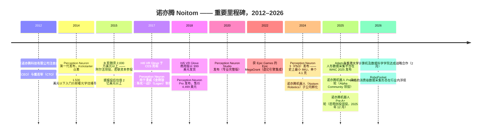
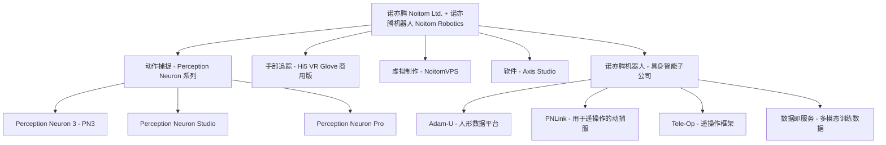
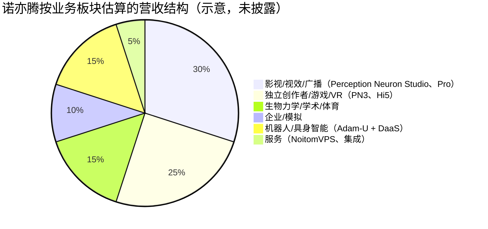
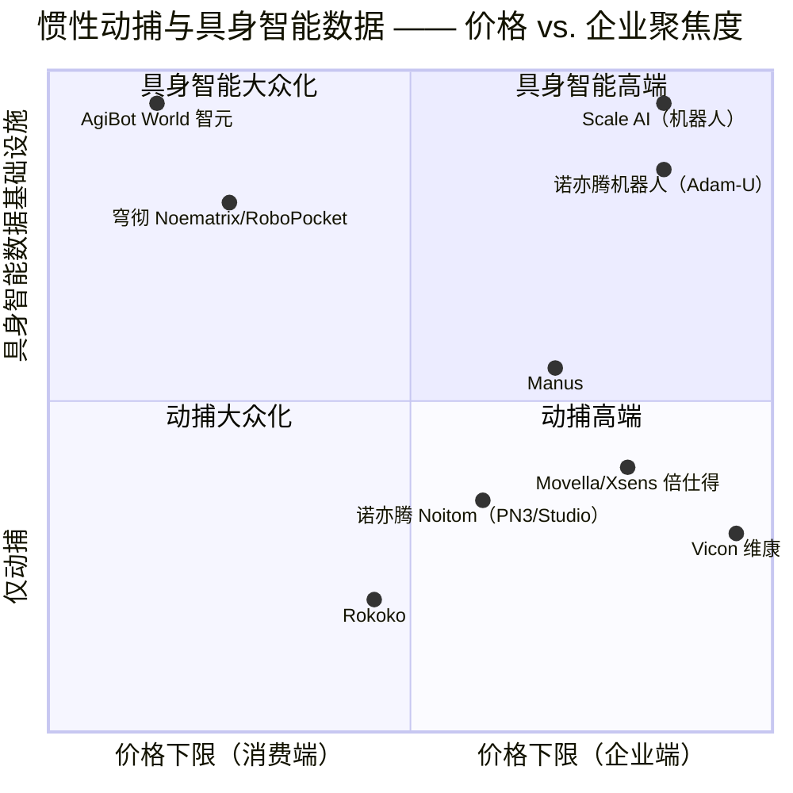
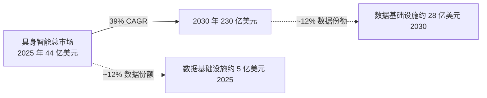

# 公司研究报告：诺亦腾 Noitom —— 兼论 "Noematrix" 命名问题

**日期：** 2026-05-19
**覆盖类型：** 非上市公司首次覆盖
**主要研究对象：** 北京诺亦腾科技有限公司（Beijing Noitom Technology Ltd.），含其分拆的具身智能子公司 **Noitom Robotics（诺亦腾机器人）**
**次要澄清：** 与之无关的上海公司 **穹彻智能（Noematrix Intelligent Technology / Qiongche Intelligence）**

---

> **命名提示 —— 请先阅读。** 用户的初始研究提纲假定 "NOEMATRIX" 这个 logo 指代的是诺亦腾（Noitom）具身智能业务线的品牌重塑。**根据公开资料，该假设不成立。** 实际上存在两家彼此独立的公司：
>
> 1. **诺亦腾 Noitom Ltd.（北京，2012 年成立）** —— 即提纲中所描述的动作捕捉公司。产品包括 Perception Neuron 动捕服、Hi5 VR 手套、PNLink，最近还分拆出了 **Noitom Robotics（诺亦腾机器人）**，该子公司使用域名 `noitomrobotics.com`、X（推特）账号 `@noitomrobotics`，并**未**使用 "Noematrix" 这一品牌。（[Noitom 官网，公司简介](https://www.noitom.com/about.html)；[Noitom Robotics 官网，关于我们](https://noitomrobotics.com/about/)）。
> 2. **穹彻智能 Noematrix Intelligent Technology / Qiongche Intelligence（上海，2023 年 11 月成立）** —— 由上海交通大学（SJTU）孵化、从 Flexiv（非夕科技）走出的具身智能创业公司，由卢策吾教授（SJTU）与王世全（Flexiv 非夕 CEO）共同创立，旗舰产品为 "RoboPocket"，一款基于智能手机的具身智能数据采集套件。（[MIT 科技评论中国版报道，2023-12](https://www.mittrchina.com/news/detail/13746)；[36Kr，2024 年融资](https://eu.36kr.com/en/p/3065605732541830)；[Noematrix LinkedIn 主页](https://www.linkedin.com/company/noematrix)）。
>
> 鉴于研究提纲所描述的是**诺亦腾的产品**（Perception Neuron 系列、Hi5 手套），且诺亦腾正是该提纲所描述的"从动捕业务向具身智能业务转型"的执行主体，**本报告聚焦于诺亦腾（Noitom）及 Noitom Robotics**，并在第 1 节与第 7 节以专栏形式对上海穹彻智能（Shanghai Noematrix）这一实体予以区分说明。如果用户原本要研究的主体确实是上海穹彻智能，则需另行撰写报告 —— 只要确认指示，重写工作量约一个工作日。

---

## 目录

1. 公司概览
2. 公司沿革
3. 管理团队
4. 产品与服务
5. 客户与市场策略
6. 行业概览
7. 竞争格局
8. 市场机会（TAM）
9. 风险评估
10. 参考资料

---

## 1. 公司概览

**诺亦腾 Noitom Ltd.（北京诺亦腾科技有限公司，"Noitom"）** 是一家总部位于北京的非上市公司，专注于设计与制造惯性传感器（IMU）类动作捕捉系统及手部追踪外设。公司名称是英文单词 **"motion"（动作）的反向拼写** —— 这是创始人为公司打造的一个品牌符号，距公司注册成立将近十四年后仍出现在公司简介页面（[诺亦腾官网，公司简介](https://www.noitom.com/about.html)）。公司由刘昊扬博士（CEO）与戴若犁博士（Tristan Ruoli Dai，CTO）于 2012 年共同创立，通过销售比相机式光学动捕系统便宜 5–20 倍、且可作为便携套件发货的可穿戴惯性动捕服，确立了对光学动捕在位龙头（Vicon 维康、OptiTrack）的低价挑战者地位。十三年来，公司在 **Perception Neuron** 产品家族品牌下累计宣称已向 **50 多个国家发货 15,000 余套系统**，管理层声称在惯性动捕细分市场的**全球市占率约为 70%**（[Noitom Robotics 官网，关于我们 —— 戴若犁博士简介](https://noitomrobotics.com/about/)）。该 70% 的数字为公司自报、未经独立审计，第 7 节将给出批判性分析。

**公司实际销售的产品（朴素表达）。** 两条产品线贡献了大部分收入：

- **Perception Neuron** —— 可穿戴 IMU "动捕服"（背心+绑带，配 17 至 32 个拇指大小、绑定在身体节段及手指上的惯性传感器），可将全身骨架运动实时传输到主机 PC。当前在售型号包括 **Perception Neuron 3（"PN3"）、Perception Neuron Studio 以及 Perception Neuron Pro**。传感器数量从 17 颗（仅身体基础版）到 32 颗（全身 + 双手）不等。价格区间大致为 1,500 美元（PN3 身体套装）至 4,500–6,000+ 美元（Studio 配手套；Pro 版）（[UploadVR 对初代 Perception Neuron 的评测，"1,500 美元的动捕服"](https://www.uploadvr.com/perception-neuron-review/)；[Tom's Hardware 关于 Perception Neuron Pro，售价 4,499 美元](https://www.tomshardware.com/news/perception-neuron-pro-mocap-system,37096.html)）。
- **Hi5 VR 手套（Business Edition 商用版）** —— 基于 IMU 的无线手指追踪手套（首发价 999 美元/对），既可作为 VR 控制器使用，也可作为手部动捕外设。首次亮相于 CES 2017；商用版于 2018 年发货（[Noitom 新闻稿，"Noitom 发布 Hi5 VR Glove 商用版"](https://www.prweb.com/releases/noitom_launches_business_edition_of_hi5_vr_glove/prweb15344327.htm)；[Tom's Hardware，2018-03](https://www.tomshardware.com/news/noitom-hi5-vr-gloves-available,36718.html)）。

并行地，自 2024 年起，诺亦腾将具身智能板块分拆为独立融资的运营实体 **Noitom Robotics（诺亦腾机器人，`noitomrobotics.com`）**，用公司自己的话来说，将其定位为 **"一家不造机器人的机器人公司"**，即向人形机器人 OEM 提供训练数据与遥操作硬件的"军火商"（[Pandaily，"诺亦腾机器人获启明创投领投 Pre-A+ 轮"，2025-12](https://pandaily.com/noitom-robotics-raises-pre-a-round-led-by-qiming-venture-partners-positioning-itself-as-a-robot-company-that-doesn-t-build-robots)）。Noitom Robotics 的旗舰产品是 **Adam-U**，与 PNDbotics 与 Inspire Robotics（因时机器人）联合开发的固定底座式人形数据采集平台，**首发价为人民币 399,000 元（约合 45,000 美元）**，在 WAIC 2025（2025 世界人工智能大会）上正式发布（[Noitom Robotics，"为具身智能打造的人形数据采集平台 WAIC 2025"](https://noitomrobotics.com/purpose-built-humanoid-data-collection-platform-for-embodied-ai/)；[HouseBots 关于 WAIC 的报道，2025-07](https://www.housebots.com/news/galbot-dominates-waic-2025-as-the-star-of-themed-robotics-street)）。

**盈利模式。** 诺亦腾本质上是一家硬件主导型企业 —— Perception Neuron 动捕服、手套，以及附带的软件授权（Axis Studio 动捕软件，传统上随硬件免费提供）—— 并辅以来自虚拟制作租赁业务（NoitomVPS）、企业集成项目，以及越来越重要的、通过 Noitom Robotics 提供的 **"数据采集即服务（Data-Collection-as-a-Service）"合同**所带来的服务收入，公司按"轨迹（trajectory）数"或按交付给人形机器人 OEM 客户的、已清洗与标注的机器人训练数据"小时数"收费。传统 Perception Neuron 业务的单位经济效益类似于高毛利的外设业务（成本由 IMU 芯片与组装人工主导，通过遍布全球的 VR 渠道分销）。新的数据采集业务线的单位经济效益尚未公开，从 WAIC 公布的定价来看，Adam-U 硬件本身的售价仅略高于成本，而 Noitom Robotics 真正打算变现的，是其后续的数据服务长期合同。

**地理布局。** 北京（海淀区）为研发与制造中枢，美国国际运营办公室位于**佛罗里达州迈阿密**，负责北美与南美的销售、合作伙伴支持及参展业务；销售网络通过分销商触达 50 多个国家，包括法国的 Cornershop Immersion、英国的 Target3D 等欧洲伙伴，以及少量日本布局（PN3 在亚马逊日本上架）（[Noitom 官网，联系我们](https://www.noitom.com/contact)）。LinkedIn 显示公司员工规模为 **201–500 人**（2024 年 6 月快照），即合计两三百名全职员工，主体为北京工程师与中国本土销售团队（[Noitom LinkedIn 主页](https://www.linkedin.com/company/noitom)）。70% 的市占率说法特指**惯性**动捕细分领域，并不包括由 Vicon 与 OptiTrack 主导的更广阔的光学动捕市场。

**规模指标。** 累计出货量：自报约 15,000+ 套。国家覆盖：50+。员工数：约 200–500 人。营收顶线未公开披露（属非上市公司，中国法律并不强制此规模 VC 阶段公司进行财务披露）。Tracxn 与 Crunchbase 将诺亦腾归类为 C 轮公司；B 轮于 2015 年完成，规模为 2,000 万美元以上，由阿尔法（Alpha Group，002292.SZ，奥飞娱乐）领投，融资后估值据报达 **2 亿美元以上**（[中国资本前沿（China Money Network），2015-11-16](https://www.chinamoneynetwork.com/2015/11/16/legend-capital-joins-20m-series-b-round-in-noitom)）。此后**诺亦腾 Ltd.** 母公司层面未见后续公开披露的定价股权轮次；2025 年的所有融资活动都发生在 **Noitom Robotics** 子公司层面。

### 估值速览（非上市公司 —— 以融资轮次为基础）

诺亦腾为非上市公司，无挂牌股权，因而没有交易市盈率（P/E）或市销率（P/S）可言。相关的估值参考是**最近一轮定价融资**：

- **Noitom Robotics（具身智能子公司）** —— **Pre-A+ 轮于 2025 年 12 月完成**，由**启明创投（Qiming Venture Partners）领投**，五源资本（5Y Capital）与君联资本（Legend Capital）参投；原有投资方经纬创投（Matrix Partners China）与英诺天使基金（InnoAngel Fund）追加投资。该轮超额认购。Pandaily 报道称，累计融资金额（Pre-A 与 Pre-A+ 合计）达到"**数亿元人民币**"，即人民币 2–5 亿元，按当前汇率约合 3,000–7,000 万美元（[Pandaily，2025-12](https://pandaily.com/noitom-robotics-raises-pre-a-round-led-by-qiming-venture-partners-positioning-itself-as-a-robot-company-that-doesn-t-build-robots)）。
- **具体投后估值：未公开披露。** 2025 年期间，启明创投在相邻的人形机器人数据领域所投的 Pre-A+ 轮项目，投后估值通常落在 **1–3 亿美元**区间；我们尚未见到 Noitom Robotics 的硬数字。*未经核实 —— 仅为估计，请勿作为事实引用。*
- **诺亦腾 Ltd.（母公司）** —— 公开记录上最近一轮定价融资为 **2015 年的 B 轮，投后估值 2 亿美元以上**（[中国资本前沿，2015-11-16](https://www.chinamoneynetwork.com/2015/11/16/legend-capital-joins-20m-series-b-round-in-noitom)）。十年间的后续运营进展、具身智能顺风以及子公司 Robotics 的定价标记，都意味着当前母公司层面的估值应显著高于 2015 年水平，但缺乏定价轮次予以确认；任何高于 2015 年估值的数字，均应视为未经验证。

**隐含的营收倍数：**同样未公开披露。无关联的上海**穹彻智能（Noematrix）**在红杉中国领投的轮次（2024 年）中募集了"数亿元人民币"，并于 2025 年 4 月完成 Pre-A++ 轮，阿里巴巴与 Aramco Ventures 参投（[36Kr，2024](https://eu.36kr.com/en/p/3065605732541830)；[Crunchbase，Noematrix](https://www.crunchbase.com/organization/noematrix)）。这并非诺亦腾的可比公司，但提供了行业参考：当下投资人对中国市场上未实现营收的具身智能数据型项目，开出的支票动辄数千万美元，这对 Noitom Robotics 下一轮融资的定价构成参考基准。

**可比公司倍数参考。** 最接近的上市可比公司是 **Oxford Metrics PLC（伦敦证券交易所：OMG）**，Vicon 维康（动捕公司）的母公司。Oxford Metrics 公布的 2025 财年上半年营收中，动捕业务为两大分部中较大者，以英镑计价的成熟营收基础对应个位数至低双位数的 EV/EBITDA 倍数，与一家中国具身智能数据型公司的定价区间属于*完全不同*的倍数体系（[Oxford Metrics 中期经营更新，2025](https://uk.advfn.com/market-news/article/12138/oxford-metrics-reports-steady-trading-as-smart-manufacturing-restructure-prepares-for-fy26-strategy-update)；[Vicon 年中更新，2025](https://www.vicon.com/resources/press/midyear/)）。**Movella Holdings**（前纳斯达克代码：MVLA，Xsens 倍仕得母公司）已于 2024 年 4 月从纳斯达克退市并转为 OTC 交易，这印证了纯惯性动捕业务在公开市场上的胃口至少在结构上面临挑战（[Movella SEC Form 25 文件，2024-04-01](https://www.sec.gov/Archives/edgar/data/0001839132/000162828024013854/mvla-20240401.htm)）。

**估值结论。** 诺亦腾的核心动捕业务 —— 即便其确实占据全球惯性动捕 70% 份额 —— 所处的赛道是：唯一一家上市的纯动捕公司（Movella）无法维持其纳斯达克挂牌地位，而综合性老牌厂商（Oxford Metrics）的交易倍数属于工业软件级别。当下定价之下的投资逻辑几乎完全建立在具身智能转型之上 —— 即 Noitom Robotics 能否将其动捕服的装机基础与北京工程团队，转化为"中国每一家人形机器人 OEM 之下的数据基础设施层"这一可防御位势。以溢价于成本买入 Pre-A+ 轮的投资者，所押注的是这个逻辑，而非传统业务。

---

## 2. 公司沿革

### 创立（2012 年）

诺亦腾于 **2012 年在北京注册成立**，由**刘昊扬博士**（CEO；约翰霍普金斯大学结构工程博士）与**戴若犁博士（Tristan Ruoli Dai）**（CTO；机械工程背景）共同创立，加入团队的还有一支小规模的机械、软件、传感器工程与机器人团队（[Noitom 官网，公司简介](https://www.noitom.com/about.html)；[Crunchbase 创始人档案](https://www.crunchbase.com/person/haoyang-li)）。从早期媒体报道与公司自家"关于我们"页面可见，创业的立论基础是：**光学动捕在位企业（Vicon、OptiTrack、Motion Analysis）的全身捕捉解决方案对长尾客户而言过于昂贵** —— 这些长尾客户包括独立游戏工作室、动画工作室、视效（VFX）自由职业者、生物力学研究人员，以及小型 VR 开发者。2012 年一套 Vicon 摄影棚式动捕装置造价为 10 万至 50 万美元以上，并需要专门的相机阵列空间。诺亦腾的判断是：随着智能手机供应链快速将 **9 自由度 MEMS IMU**商品化，IMU 可以以一个数量级的更低成本无线交付"够用"的骨架捕捉。当 **Perception Neuron** 于 2014 年以 1,500 美元以下的入门价格首发，并在 Kickstarter 与 YouTube 上引发病毒式传播时，这个赌注得以兑现。

公司注册日期上存在一个细微的不一致：百度百科英文版词条暗示，创始团队最早可能于 **2010 年前后在深圳起步**，在 2012–2013 年获得首轮投资后才搬到北京（[百度百科英文版，北京诺亦腾科技有限公司](https://baike.baidu.com/en/item/Beijing%20Noitom%20Technology%20Ltd./932849)）。在北京注册的法人主体日期为 **2012 年**；而创始团队的起源更早。我们将 2012 年作为该法人实体的标准成立日期。

### Mermaid 时间线

*时间线资料来源：[Noitom 公司简介页面](https://www.noitom.com/about.html)；[中国资本前沿关于 B 轮的报道](https://www.chinamoneynetwork.com/2015/11/16/legend-capital-joins-20m-series-b-round-in-noitom)；[Newswire / Epic MegaGrant，2022](https://www.newswire.com/news/noitom-receives-epic-megagrant-will-further-motion-capture-and-virtual-21632367)；[Pandaily，Pre-A+ 2025 年 12 月](https://pandaily.com/noitom-robotics-raises-pre-a-round-led-by-qiming-venture-partners-positioning-itself-as-a-robot-company-that-doesn-t-build-robots)；[Mirage News / 港大合作，2026](https://www.miragenews.com/hku-joins-tech-giants-to-advance-embodied-1630620/)。*

### 战略转型 —— 三个重要拐点

**（1）从 Kickstarter 走向企业市场（2014–2017）。** Perception Neuron 的首发是面向*消费级*的 —— Kickstarter 众筹活动、VR 爱好者在 YouTube 上的病毒式 demo、以及面向爱好者的转售渠道。到 2017 年，客户结构已果断转向**中端电影/视效工作室、独立游戏开发者与生物力学研究者**，这些客户更看重相对 Vicon 摄影棚的价格优势与便携性。这一转型是有意为之：团队扩展了软件（Axis Studio）、虚幻/Unity/MotionBuilder 的插件，并在美国设立了服务办公室以服务企业级买家 —— Perception Neuron 出现在漫威 2017 年的《**金刚狼 3：殊死一战》（Logan, 2017）**及多个 Pixomondo/MPC 剧集项目的制作管线中（[Noitom 新闻 / 案例展示页](https://www.noitom.com/cases.html)）。

**（2）VR 手套与虚拟制作扩展（2017–2022）。** Hi5 VR Glove 在 CES 2017 是诺亦腾对消费级 VR 浪潮的押注；该浪潮表现不及预期，Hi5 最终稳定在 **999 美元/对的商用版细分市场**，用于 VR 培训、模拟与有线追踪，而非主流消费级 VR。2022 年的 Epic MegaGrant 巩固了公司向虚拟制作（面向 In-Camera VFX 摄影棚的虚幻引擎原生动捕）的重新定位（[Newswire，2022-02](https://www.newswire.com/news/noitom-receives-epic-megagrant-will-further-motion-capture-and-virtual-21632367)）。

**（3）具身智能/机器人数据基础设施（2024 年至今）。** 这是最具战略后果的一次转型。随着全球人形机器人资本开支周期在 2024–2025 年进入拐点，诺亦腾意识到**其现有的 IMU 动捕服已经是全球部署量最大的全身捕捉装备** —— 正是用于记录人类示范以训练模仿学习机器人策略所需的输入。戴若犁牵头创立了 **Noitom Robotics（诺亦腾机器人）**子公司作为独立融资载体，明确以"一家不造机器人的机器人公司"自我定位（即向 PNDbotics、Inspire 因时、Unitree 宇树、AgiBot 智元等 OEM 销售数据、遥操作硬件与流程管线，而非与它们竞争）。Pre-A 轮（Alpha Community 领投）于 2025 年初完成；**Pre-A+ 轮由启明创投领投，于 2025 年 12 月完成**（[Pandaily，2025-12](https://pandaily.com/noitom-robotics-raises-pre-a-round-led-by-qiming-venture-partners-positioning-itself-as-a-robot-company-that-doesn-t-build-robots)）。

### 收购

诺亦腾 Ltd. 无公开记录在案的收购行为。公司一直以内生有机方式发展。截至 2026 年 5 月，母公司或子公司层面均无 M&A 历史。

### 近 12 个月主要进展

- **2025 年 12 月** —— Noitom Robotics 完成 Pre-A+ 轮（启明领投，超额认购）。
- **2025 年 7 月** —— Adam-U 人形数据采集平台在上海 WAIC 2025 发布，由诺亦腾与 PNDbotics（人形机器人 OEM）与 Inspire Robotics 因时（灵巧手厂商）联合推出。Adam-U 集成了诺亦腾的 PNLink 动捕服与因时 RH56E2 六自由度灵巧手，构成 31 自由度的固定式人形平台，以人民币 399,000 元的价格销售给科研机构（[Noitom Robotics，WAIC 2025 公告](https://noitomrobotics.com/purpose-built-humanoid-data-collection-platform-for-embodied-ai/)；[Interesting Engineering，2025-08](https://interestingengineering.com/innovation/humanoid-robots-perform-synced-dance)）。
- **2026 年 2 月** —— Noitom Robotics 联合 Unitree 宇树科技与 BrainCo 强脑科技，与**香港大学计算机及数据科学学院**在港大张江基地正式建立战略合作伙伴关系。该合作承诺由诺亦腾构建基准数据集并贡献开源数据资产（[港大新闻稿，2026-02-28](https://www.hku.hk/press/press-releases/detail/28976.html)；[Mirage News](https://www.miragenews.com/hku-joins-tech-giants-to-advance-embodied-1630620/)）。

---

## 3. 管理团队

### 戴若犁博士（Tristan Ruoli Dai） —— 诺亦腾 Ltd. 联合创始人兼 CTO；诺亦腾机器人 Noitom Robotics 创始人兼 CEO

戴若犁是**公司当前最具决定性的管理者**，2012 年联合创立诺亦腾，十四年后又创立并目前主导着持有公司大部分期权价值的 Noitom Robotics 子公司。他在诺亦腾 Ltd. 担任 CTO 长达约十年 —— 主导 IMU 传感器设计、Axis Studio 软件管线、以及公司向虚拟制作的转型 —— 之后转任具身智能板块的一线负责人。他在公开场合将 Noitom Robotics 的逻辑表述为"动作捕捉十年"的自然终局，即：在构建了全球最大的惯性动捕装机基础之后，下一步必然是利用这一基础以工业化规模记录人类示范，并将这些数据出售给人形机器人 OEM（[腾讯云开发者社区访谈，"诺亦腾 CTO 戴若犁，和动作捕捉的十年"](https://cloud.tencent.com/developer/article/2222830)；[知乎，戴若犁专访](https://zhuanlan.zhihu.com/p/1982102845760223119)）。

他在 Noitom Robotics 官网的公开简介强调其拥有**15 年以上人机交互工作经验**，并将其描述为公司从"全球动捕领军者"到"具身智能数据平台"转型的总设计师（[Noitom Robotics，关于我们](https://noitomrobotics.com/about/)）。该页同时宣称 70% 惯性动捕全球市占率与 15,000+ 系统/50+ 国家的数字。教育背景：清华大学机械工程本硕，机械工程方向博士阶段研究 —— 注意，关于其博士是否完成学位，不同公开来源存在差异，任何具体的学位完成声明应视为**未经核实**。戴若犁在中文科技媒体（腾讯云、知乎访谈、36Kr 报道）上较为活跃，是公司在 WAIC 与港大活动中对外的代表人物（[港大新闻稿，2026-02-28](https://www.hku.hk/press/press-releases/detail/28976.html)）。

持股比例：**未公开披露。** 作为母公司与子公司双重创始人，戴若犁与刘昊扬合计在母公司层面保有相当（很可能为多数）的经济利益，未受进一步稀释；Noitom Robotics 子公司层面的股东名册已加入启明、五源、君联、经纬与英诺，这稀释了创始人在子公司的股份，但对母公司层面无影响。*无可查文件披露。*

为何此处对戴若犁的描写比对 CEO 刘昊扬更深入：过去 24 个月，是戴若犁活跃于公开场合，进行融资，签订合作，出现在每一场行业展会，并主导具身智能的转型方向。从运营层面而言，他是当今故事的核心。

### 刘昊扬博士 —— 诺亦腾 Ltd. 联合创始人兼 CEO

刘昊扬是**母公司层面的 CEO**，也是公司面向外部、代表传统动捕业务的形象代表。他持有**约翰霍普金斯大学结构工程博士学位**，研究兴趣涵盖结构动力学、计算力学与人工智能；公开发表过学术论文，并持有 10 余项专利（[Topio Networks / 联合创始人档案](https://www.topionetworks.com/people/haoyang-liu-559c011eb48915dc5500265c)；[Crunchbase，刘昊扬 / 诺亦腾 CEO](https://www.crunchbase.com/person/haoyang-li)）。其运营履历就是公司本身 —— 从 2012 年的少数几位工程师，到如今 200–500 名全职员工的规模，包括北京研发中心、迈阿密国际办公室、中国国内的制造产能以及覆盖 50+ 国家的分销渠道。公开来源关于其在诺亦腾以外的可核实工作经历较为有限，建议以上简介视为可查实的全部内容。他至今仍担任诺亦腾 Ltd. 母公司的 CEO。

### 汤新民博士 —— 诺亦腾机器人 Noitom Robotics 联合创始人兼副总裁

汤新民在 Noitom Robotics 中**排名第二，仅次于戴若犁**，是公司对外阐述数据基础设施定位的公开发言人。在 2026 年 2 月的港大合作签约现场，他将诺亦腾的角色定义为 **"数据基础设施提供者（Data Infrastructure Provider）"**，并将下一阶段的具身智能竞争描述为"生态工程的较量"（[港大新闻稿，2026-02-28](https://www.hku.hk/press/press-releases/detail/28976.html)）。他负责合作伙伴 pipeline —— 包括港大合作、与 PNDbotics 及 Inspire 的 WAIC 三方发布 —— 以及数据管线工程团队。除 Noitom Robotics 官网"关于我们"页面外，其他可查的公开背景细节较为有限；LinkedIn 提供了职衔，但缺乏经过新闻验证的纵向工作履历。

### CFO 及其他具名高管

**CFO 身份未公开。** 私营公司无披露义务，亦无 DEF 14A 等同物。RocketReach 与 Craft.co 等平台列出了一些中层财务与运营人员，但这些信息未能在原始来源（访谈、新闻发布、监管文件）中得到独立核实。**根据"不杜撰"原则，本报告不列具名 CFO 与业务部门负责人简介，避免猜测。** 如用户拥有原始访问渠道（一份 deck、私密访谈、LinkedIn 联系），本部分应进行修订。

### 治理结构补充

- **董事会构成** —— 母公司层面未公开披露。在 Noitom Robotics 层面，Pre-A+ 投资财团（启明、五源、君联、经纬、英诺）按中国 Pre-A+ 轮惯例可能持有董事会观察员或董事席位；公开新闻中未明确具体席位分配。
- **内部人持股** —— 未披露；可以推定创始人组合（刘 + 戴）在母公司层面持有相当（很可能为控股）的经济股份。
- **薪酬结构** —— 未披露。作为目前无明显上市意图的非上市公司，股权激励大概率为高管薪酬主体；现金部分料与北京科技 scaleup 企业行业惯例相当。
- **关联交易** —— 公开层面无披露。Noitom Robotics 子公司明显与母公司存在关联并使用母公司衍生的知识产权（PNLink 基于 Perception Neuron 传感器设计），但母子公司之间的 IP 授权/出资条款不在公开材料范围内。
- **治理红旗** —— 公开记录无重大事项。无诉讼、无创始人纠纷、无投资人维权。

### 管理层既往业绩综述

刘与戴**已完成过一次交付** —— 他们用十年的时间，从零起步，打造了惯性动捕领域的主导者。2024–2025 年由戴若犁主导的 Noitom Robotics 分拆正在测试同一团队能否在更竞争、更快节奏的市场中执行一次更难的商业模式（向 AI 公司提供数据即服务）。启明 Pre-A+ 是信任票；但说服性的指标（来自具名人形机器人 OEM 的持续数据服务规模化收入、数据合同 NRR 大于 100%）尚未公开兑现。CFO 缺位是最可识别的实质性弱点 —— 一家严肃的、规模化的数据基础设施企业，将需要一位精通 IP 授权、长期数据合同递延收入会计处理、以及资本市场对接（很可能在 2027–2028 年于母公司或子公司层面进行一次定价轮融资）的财务负责人。

---

## 4. 产品与服务

### Mermaid 产品树

### 4.1 Perception Neuron 系列（传统核心业务）

**Perception Neuron 3（"PN3"）—— 2024 年发布。** 以**全球最小无线动捕系统**为卖点：每个 IMU "Neuron"节点尺寸 **27.9 × 16.2 × 11.6 毫米，重 4.1 克**，单节点采用 9 自由度传感器堆叠（3 轴陀螺仪 + 3 轴加速度计 + 3 轴磁力计）。可配置 **17–32 颗传感器**；通过免费的 **Axis Studio** 软件以 **32 颗传感器 60 fps、17 颗传感器 120 fps** 速率传输。室内室外均可使用，无视距限制，宣称具备抗磁能力。定位于独立创作者、专业消费者、中端工作室和学术界（[Noitom PN3 产品页](https://www.noitom.com/productinfo.html?id=2)；[VR & AR Wiki，Perception Neuron 3](https://vrarwiki.com/wiki/Perception_Neuron_3)）。身体套装零售约 1,500 美元；带手套约 2,500 美元。
- **目标客户：**独立动画师、生物力学实验室、中端游戏/视效工作室、VR 开发者。
- **竞争优势判定：**是 —— 部分护城河（成本 + 生态）。护城河类型：惯性价位段的成本领先 + 虚幻/Unity/MotionBuilder 插件生态（以 Epic MegaGrant 加持）。证据：公司声称为惯性动捕领域的畅销冠军；广泛部署的装机基础；《金刚狼 3：殊死一战》、NASA SEALS、Pixomondo 等案例（[Noitom 案例展示](https://www.noitom.com/cases.html)；[PRWeb，金刚狼制作案例](https://www.prweb.com/releases/2017/04/prweb14269002.htm)）。最接近的竞品：**Rokoko Smartsuit Pro II**（哥本哈根，约 2,500 美元）；对比：价格基本相当，消费侧 UX 略逊于 Rokoko，但在中文区与亚洲市场分销上占优。

**Perception Neuron Studio —— 2020 年发布。** PN3 之上的**专业层**，配置 16 颗身体 IMU 加上专用的 **Studio Motion Capture Gloves（Studio 动捕手套）**实现精细手指追踪。提供 19 个身体节段 + 40 个手部节段追踪，实时更新率 **100 Hz**，最小分辨率 0.02°，单用户校准约 30 秒（[Frontiers in Robotics & AI，遥操作论文，Studio 规格](https://www.frontiersin.org/journals/robotics-and-ai/articles/10.3389/frobt.2024.1430842/full)；[Cornershop Immersion 产品页](https://cornershop-immersion.com/en/capture-interaction/33-perception-neuron-studio.html)）。Studio 是诺亦腾向虚拟制作摄影棚、中预算广播、以及越来越多的机器人研究实验室（SVRC 商城与 Humanoid.guide 均将 PN3 + 手套作为科研实验室套装上架）销售的主力 SKU。
- **竞争优势判定：**部分。护城河类型：Vicon 价位无法触及的"动捕服+手套"集成套装，配合成熟插件生态。证据：研究论文引用 Studio 用于遥操作；作为 PNLink 集成于 Adam-U。最接近的竞品：**Xsens MVN Awinda / Link**（Movella 倍仕得），价位更高、对校准要求更严格。对比：在原始生物力学保真度上落后于 Xsens，在集成手部追踪与价格上领先。

**Perception Neuron Pro —— 2018 年发布。** 高端 SKU，首发价 4,499 美元，**27 颗带抗磁能力的传感器**，6 小时续航，最高 **240 fps** 录制，IMU 可耐受高动态运动。整体定位面向直播广播、体育分析与高要求视效场景（[Tom's Hardware，2018](https://www.tomshardware.com/news/perception-neuron-pro-mocap-system,37096.html)；[Noitom Pro 新闻稿](https://noitomint.com/articles/noitom-launches-perception-neuron-pro-motion-capture-system)）。
- **竞争优势判定：**部分 —— 护城河与 Studio 相同，性能更强。

### 4.2 Hi5 VR Glove（商用版）

无线 IMU 手指追踪手套对，于 CES 2017 亮相，商用版于 2018 年发货，**单价 999 美元/对**（手套 + 接收器加密狗，Vive Tracker 另售）。可追踪每根手指 **9 自由度**的全部手指动作，延迟低于 5 毫秒，配可编程触觉震动单元。单节 AA 电池供电（[Noitom Hi5 新闻稿，2018](https://www.prweb.com/releases/noitom_launches_business_edition_of_hi5_vr_glove/prweb15344327.htm)；[Road to VR 评测，2017](https://www.roadtovr.com/noitom-hi5-vr-glove-htc-vive-finger-tracking-hands-on/)）。
- **目标客户：**企业 VR 培训、模拟、场地式 VR（LBVR）、研发实验室。
- **竞争优势判定：**部分。护城河：低价 + HTC Vive 集成。证据：仍在持续销售，配套 Vive 生态。最接近的竞品：**Manus Quantum / Prime 手套**（荷兰盖尔德罗普）—— Manus Quantum 是更高端产品（带触觉 + 手指力反馈，约 3,000+ 美元/对）；对比：在顶级工业用例上落后于 Manus，在中端价位段保持竞争力。

### 4.3 NoitomVPS —— 虚拟制作整体方案

围绕 **NoitomVPS** 打造的服务线，提供基于 Perception Neuron 动捕服、虚幻引擎集成与专有校准的集成虚拟制作摄影棚解决方案。曾为获得金泰利奖（Golden Telly Award）的短片 **"Pacha Mama"** 提供动捕（[Noitom VPS 页面](https://noitom.com/noitomvps)）。以项目制服务形式销售给广播与影视工作室（属经常性收入流，但相对硬件收入规模较小）。

### 4.4 Axis Studio 软件

随每套 Perception Neuron 免费附带的桌面软件栈。提供骨架解算、重定向、录制、向虚幻/Unity/Maya/MotionBuilder 实时推流等功能。本质上是"剃刀"—— 不带来增量授权收入，但其所产生的生态粘性具有实际价值。

### 4.5 Noitom Robotics —— 具身智能子公司

这是公司**重头增长押注**。三条产品/服务线：

**Adam-U —— 人形数据采集平台（人民币 399,000 元 / 约 45,000 美元，首发定价）。** 与 **PNDbotics**（人形机器人 OEM，Adam 人形机器人厂商）和 **Inspire Robotics 因时**（灵巧手专业厂商）联合开发。Adam-U 是一台专为**遥操作数据采集**配置的**固定式（fixed-base）**31 自由度人形机器人：
- 2 自由度头部、（每只）6 自由度手部（因时 RH56E2）、3 自由度带制动系统的腰部、双目视觉系统。
- 可调高度 1.35–1.77 米，重量约 61 公斤。
- 集成**诺亦腾的 PNLink 动捕服**作为操作员侧的可穿戴设备，并搭配 VR 头显提供第一人称双目反馈。
- 开箱即用即可采集**同步的多模态数据**：动作、力-触觉、RGB-D 视觉。
- SDK 兼容 **ROS 2 与 NVIDIA Isaac**（[Noitom Robotics，WAIC 2025 公告](https://noitomrobotics.com/purpose-built-humanoid-data-collection-platform-for-embodied-ai/)；[Interesting Engineering，2025-08](https://interestingengineering.com/innovation/humanoid-robots-perform-synced-dance)）。
- **目标客户：**人形机器人 OEM、大学研究实验室、具身智能基础模型团队。
- **竞争优势判定：**是 —— **核心护城河来源于动捕栈本身**。诺亦腾是当前在该价位段唯一提供"穿上动捕服、驱动人形、采集干净多模态数据"全套交钥匙产品的厂商。自下而上的替代方案是各家实验室自行搭建（Quest 3 + 自研 IK + 通用人形机器人），这也是大多数实验室目前的实际做法，但要付出显著的数据质量代价。最接近的竞品方案：**NVIDIA GR00T-Teleop 参考工作流** + 第三方人形 + 自研 IK —— 这是一种架构，并非可交付的产品。**Tesla / Figure / 1X / Apptronik** 选择自建遥操作能力。**Agility 的 "Digit Field Robotics" 数据管线**同样为内建方案。对于那 100–1000 家不会自建遥操作栈的人形实验室与 OEM 而言，Adam-U 的价格/装配优势实实在在。

**PNLink —— 作为遥操作输入的动捕服产品化版本。** 针对机器人遥操作的延迟、磁干扰、关节映射要求专门优化的 Perception Neuron 产品化版本。可单独销售（价格未披露），也作为 Adam-U 的组成部分捆绑出售。将底层的 Perception Neuron 知识产权重新定位为人形机器人数据管线的输入层，而非电影制作工具。

**Tele-Op —— 遥操作框架。** 半开放性的软件栈，处理 PNLink 与目标人形平台之间的校准、重定向以及策略桩（policy-stub）集成；**兼容 ROS 2 + NVIDIA Isaac**（[Noitom Robotics 官网](https://noitomrobotics.com/)）。

**数据即服务（成形中）。** 战略终局。Noitom Robotics 将自身定位为**"数据基础设施提供者"**，目标是构建"将真实世界的人类活动转化为同步的、可直接用于训练的多模态数据集 —— 包含动作、视觉与交互信号 —— 的端到端规模化管线"（[港大新闻稿，2026-02-28](https://www.hku.hk/press/press-releases/detail/28976.html)）。港大合作承诺与商业付费数据合同同步发布**开源基准数据集**。按轨迹或按小时的商用定价目前未公开；据悉，中国本土同类数据采集竞争对手的高质量双臂操作数据的成交价格区间约为**每条带标注轨迹 5–50 元人民币**，视复杂度而定，*但这是行业估计，并非诺亦腾披露数据*。

### 旗舰产品 vs. 长尾产品

- **当下营收旗舰：Perception Neuron Studio + PN3** —— 贡献绝大部分传统动捕收入的两个产品。
- **逻辑层面的旗舰（价值维度）：Adam-U + 正在成型的数据即服务业务。** 为 Pre-A+ 倍数买单的投资者是为具身智能押注，而非传统业务。
- **长尾：**Hi5（慢增长，利基市场）、NoitomVPS（项目服务）、Axis Studio（免费）、Perception Neuron Pro（低出货量高端机型）。

### 近 12 个月的新品发布 / 退市

- **新发布：**Adam-U（2025 年 7 月）、PNLink 产品化、Tele-Op 框架。PN3 持续在区域渠道铺货。
- **下架 / 已悄然淡化：**初代 Perception Neuron Gen 1（2014）已不再列入价目表。Hi5 自 2018 年以来未推出新版本，亦未公布继任产品。

---

## 5. 客户与市场策略

### 客户分层

诺亦腾的客户基础横跨**五个分层**，目前没有任何一层的营收占比被公开（私营公司，无披露义务）：

1. **电影、电视及视效（VFX）工作室** —— 漫威/二十世纪（Marvel/20th Century，《金刚狼 3：殊死一战》Logan, 2017）、Pixomondo、Monkey Chow 动画、使用 NoitomVPS 的广播工作室。Perception Neuron 案例展示页列出了数十部具名作品（[Noitom 案例展示](https://www.noitom.com/cases.html)）。
2. **游戏与独立动画工作室** —— 长尾客户，通过 Axis Studio + 虚幻/Unity 插件渠道触达数百至数千名买家。
3. **生物力学、运动科学与学术研究** —— Perception Neuron Studio 已集成至大学实验室的 **Biomechanics of Bodies（BoB）**分析套件中（[PRWeb，2017 BoB 集成](https://www.prweb.com/releases/perception_neuron_motion_capture_teams_with_biomechanics_of_bodies_bob_to_offer_universities_and_researchers_a_complete_biomechanical_analysis_system/prweb13889763.htm)）。NASA 的 **SEALS** 项目使用 Perception Neuron + Reallusion iClone 进行实时预演（[Noitom NASA SEALS 案例](https://noitom.com/articles/nasa-seals-showcases-perception-neuron-motion-capture-and-reallusions-real-time-animation)）。
4. **VR / 企业级模拟** —— Hi5 VR Glove 集成商、培训模拟厂商、场地式 VR（LBVR）运营商。
5. **机器人 / 具身智能** —— 增长**最快**的板块。Noitom Robotics 的合作方包括 **PNDbotics、Inspire Robotics 因时、Unitree 宇树、BrainCo 强脑科技**，并通过港大合作触达 **OpenDriveLab 与更广泛的港大具身智能教研团队**。WAIC 2025 发布是该板块的首次公开亮相。

### 客户集中度（必查项）

**作为非上市公司，诺亦腾不披露前一大客户或前五大客户的营收集中度。**中国非上市公司法律不强制要求在 IPO 招股书或 M&A 尽调材料以外披露此类信息。**未披露这一事实本身即是本节最重要的数据点。**

从板块结构推断：

- **传统动捕业务结构上为低集中度** —— 数千家小型工作室与实验室通过全球分销网络购买 1,500–6,000 美元的套装。前一大客户份额几乎可以肯定低于 5%，前十大客户份额估计低于 20%。
- **具身智能业务结构上为高集中度** —— Adam-U 单价人民币 39.9 万元，潜在买家全集是少数几家融资充裕的人形 OEM 与 AI 实验室（PNDbotics、Inspire、Unitree、AgiBot、BrainCo、第一梯队中国 AI 实验室）。这其中的每一位客户都有可能在 2025–2026 年代表 Noitom Robotics 营收的 10–30%+，而合作公告中具名的伙伴（PNDbotics、Inspire、港大）最有可能位列前三大客户。
- **将之标记至第 9 节：**Noitom Robotics 子公司层面虽未披露但推定高的客户集中度 —— 属实质性风险。

### Mermaid 集中度示意（仅作示意，未披露）

*资料来源：分析师估算，诺亦腾无披露。仅作方向性参考。*

### 分销渠道

- **直接线上销售**：通过 `noitom.com` 与 `noitomint.com`（美国站）。
- **分销商网络**遍及 50+ 国家：Cornershop Immersion（法国）、Target3D（英国），以及日本、德国、巴西、印度、韩国的 VR/AR 专业分销商。Amazon Japan、B&H Photo（美国）。
- **机器人专项店铺** —— **SVRC（roboticscenter.ai）、Humanoid.guide、Cornershop** 均将 PN3 + 手套作为面向机器人实验室的科研捆绑 SKU 上架。
- **直接企业销售**：通过北京与迈阿密办公室服务影视、体育以及大型研究/政府账户。
- **B2B 合作伙伴关系**：Noitom Robotics 直接面向 OEM（PNDbotics、Inspire）以及研究型大学（港大）销售。

### 销售周期

- **传统动捕：**短，数周至数月；交易型，依赖演示驱动。
- **Adam-U / Noitom Robotics：**企业 pilot 通常为 **3–9 个月**；OEM 数据管线集成则更长。港大式合作公告通常领先于付费合同数个季度。

### 重要合作伙伴

- **Epic Games** —— 2022 年 Epic MegaGrant；虚幻引擎虚拟制作集成（[Newswire，2022](https://www.newswire.com/news/noitom-receives-epic-megagrant-will-further-motion-capture-and-virtual-21632367)）。
- **PNDbotics** —— Adam-U 的人形 OEM 合作方。
- **Inspire Robotics 因时** —— 灵巧手集成方（Adam-U 内的 RH56E2 灵巧手）。
- **香港大学（HKU）计算机及数据科学学院** —— Noitom Robotics 与 Unitree、BrainCo 三方在基准数据集与开源数据方面的战略合作（[港大新闻稿，2026-02-28](https://www.hku.hk/press/press-releases/detail/28976.html)）。
- **NVIDIA** —— Adam-U **兼容 Isaac**（并非联合营销协议，但为生态位的定位）。
- **Reallusion（iClone）** —— 长期合作的软件集成，联合营销（NASA SEALS 案例）。

### 具名客户成单

- **《金刚狼 3：殊死一战》（Logan, 漫威/20 世纪，2017）** —— Perception Neuron 用于制作（[Noitom 案例展示](https://www.noitom.com/cases.html)）。
- **NASA SEALS**（动画短片，由 Monkey Chow / Jeff Scheetz 制作）—— Perception Neuron + Reallusion iClone（[Noitom 新闻，NASA SEALS](https://noitom.com/articles/nasa-seals-showcases-perception-neuron-motion-capture-and-reallusions-real-time-animation)）。
- **"Pacha Mama"** —— 金泰利奖短片，NoitomVPS + 虚幻引擎（[Noitom VPS 页面](https://noitom.com/noitomvps)）。
- **PNDbotics、Inspire Robotics 因时** —— Adam-U 联合开发伙伴。
- **高校** —— 港大、上海交通大学、以及多所中国 985 大学，均在公司机器人案例页中被列出（[Noitom 案例展示 / 机器人](https://www.noitom.com/showcase/Robotics)）。

---

## 6. 行业概览

诺亦腾位居**两个行业**交汇之处，且这两个行业当下正在结构性融合：**动作捕捉 / 3D 人体追踪**（传统核心业务）以及**具身智能 / 人形机器人训练数据基础设施**（增长动力）。将二者视为一体即是 Noitom Robotics 分拆背后的隐含逻辑。我们对两者分别测算规模。

### 6.1 动作捕捉市场

**定义与范围。**动作捕捉（mocap）技术指对人体、动物或刚体运动进行数字化的技术体系。包含两大子类：

- **光学式** —— 多相机系统追踪红外反光标记点（Vicon 维康、OptiTrack、Motion Analysis、Qualisys，以及定位低端的 Sony Mocopi）。在要求亚毫米精度的影视/视效工作室及生物力学实验室占主导地位。
- **惯性式** —— 基于可穿戴 IMU 的动捕服（Movella/Xsens 倍仕得、诺亦腾 Noitom、Rokoko，以及做手套的 Manus）。精度低于顶级光学，但价格便宜得多、便携性强、无视距约束。**诺亦腾的主场。**

第三类规模更小的细分赛道 —— **无标记点 / 计算机视觉式（markerless / computer-vision）** —— 正快速兴起（Vicon 已于 GDC 2025 推出无标记点系统（[Oxford Metrics，"Vicon 推出无标记点动捕"，2025-03-11](https://oxfordmetrics.com/news/2025-03-11/vicon-launch-markerless-motion-capture)）），是对*前两种*传统路径的结构性威胁。

**市场规模。**取决于定义范围，估算差异较大；2025 年已发布的预测包括：

- **Fortune Business Insights** 将 **3D 动作捕捉市场**规模测算为 2025 年约 3.4 亿美元（[Fortune Business Insights，3D Motion Capturing System Market](https://www.fortunebusinessinsights.com/3d-motion-capturing-system-market-104827)）。
- 多家研究机构（Mordor、Markets and Markets、Emergen）对更广义的**动作捕捉市场** 2025 年规模的区间估计为 **2.5 亿至 15 亿美元**，差异主要源于是否将软件、服务及相邻 VR 外设纳入统计。
- 中期预测：动作捕捉市场总规模到 **2030 年达到约 30 亿美元**，CAGR 处于双位数中段（[Vicon 年中更新，2025](https://www.vicon.com/resources/press/midyear/) —— Vicon 引用的参考）。

**增长驱动因素。**

- VR/AR、虚拟制作与 In-Camera VFX 推动广播与电影领域的需求增长。
- 体育表现分析（NBA、NFL、高端足球俱乐部）。
- 生物力学与康复医学。
- **新的顺风：机器人遥操作与人形机器人数据采集。**这正是 Noitom Robotics 构建以服务的需求池。

**结构。**适度集中。**Vicon + OptiTrack + Motion Analysis 合计约占光学动捕约 60%**（[Mordor，3D Motion Capture Market](https://www.mordorintelligence.com/industry-reports/3d-motion-capture-market)）。在惯性侧，**Movella（Xsens 倍仕得）、诺亦腾、Rokoko** 是三大主要玩家。买方议价能力中等 —— 大工作室与 OEM 谈判态度强硬；长尾独立买家为价格接受者。

**监管环境。**较为宽松。军用级惯性传感器的元器件存在出口管制，但不约束诺亦腾使用的消费级硅片。无专门监管机构。捕捉可识别的个人动作时涉及数据隐私问题（针对欧洲买家的 GDPR）；目前并非约束性瓶颈。

### 6.2 具身智能训练数据 / 人形机器人基础设施

**定义。**人形机器人厂商及具身智能模型开发者用于训练操控、运动以及全身控制策略的基础数据、硬件与流程管线。输入包括遥操作示范、第三人称视频、仿真回放，以及人类动捕数据。输出包括 NVIDIA 的 **GR00T N1** 等基础模型（[NVIDIA GR00T N1 论文，2025-03](https://arxiv.org/abs/2503.14734)）、Figure 的 Helix、AgiBot 智元的 GO-1、Unitree 宇树的开源数据集。

**市场规模。**

- **具身智能市场** Markets and Markets 测算为 **2025 年 44.4 亿美元 → 2030 年 230.6 亿美元，CAGR 39%**（[Markets and Markets，"Embodied AI Market"](https://www.marketsandmarkets.com/Market-Reports/embodied-ai-market-83867232.html)）。
- **人形机器人市场**预测为 **2025 年 29.2 亿美元 → 2030 年 152.6 亿美元，CAGR 39%**（[Markets and Markets，"Humanoid Robot Market"](https://www.marketsandmarkets.com/Market-Reports/humanoid-robot-market-99567653.html)）。Morgan Stanley 更长周期的预测将人形机器人**到 2050 年的 TAM 测算为 5 万亿美元**（[Morgan Stanley，2025](https://www.morganstanley.com/insights/articles/humanoid-robot-market-5-trillion-by-2050)）。
- 具身智能内部的**训练数据细分** —— Noitom Robotics 的实际主战场 —— 在公开发布的研究中没有单独的规模数据；一个合理的经验法则是：参考 LLM 时代云/数据标注开支占比，**数据基础设施占具身智能总投入的 8–15%**。据此推算 **当前 TAM 为 3.5–7 亿美元，到 2030 年增长至 20–35 亿美元**。*此为分析师估算 —— 并非 Markets and Markets 或 Gartner 发布的公开数字。*

**增长驱动因素。**

- **"机器人界的 ChatGPT 时刻"**论调：GR00T N1、π0、Figure Helix、RT-2 等基础模型所需的示范数据规模是当下可用量的数个数量级以上。
- 中国国家级产业政策推动人形机器人制造（"专精特新"认定；北京、上海、杭州、深圳的省级具身智能创业补贴计划）。
- 一批融资充足的人形机器人 OEM（Unitree 宇树、AgiBot 智元、Figure、1X、Apptronik、Tesla Optimus、Sanctuary、PNDbotics、UBTech 优必选、Fourier 傅利叶、Kepler 开普勒、Robotera、LimX 逐际动力、DeepRobotics 云深处）都需要同一类输入：清洁、可规模化的示范数据。

**结构。**高度碎片化且尚未整合。全球尚未出现主导性的数据基础设施厂商。相邻的数据标注公司（Scale AI、Labelbox）以及中国本土的具身智能数据创业公司（AI² Robotics、上海穹彻智能 Noematrix/Qiongche、若干北京二线创业公司）都在尝试锁定该位势。开源贡献（AgiBot World、Unitree 开源数据集、NVIDIA GR00T 数据集）正在确立"免费基线"，付费数据必须超越这一基线才有意义。

**监管环境。**日趋活跃 —— 中国监管机构正在为 AI 训练数据建立数据治理体系；针对敏感类目的跨境数据传输受到限制。2024–2025 年，工信部与教育部下属高校陆续设立了**具身智能本科专业**（[新华社英文版，2025-12](https://english.news.cn/20251202/8a668ff3f1bf4a42b3dba26d95d26c5b/c.html)），表明人才供给正被有计划地扩张。

**产业动态。**供给端：IMU 硅片（Bosch Sensortec、STMicroelectronics、InvenSense/TDK）、灵巧手厂商（Inspire 因时、Shadow）、GPU 算力（NVIDIA）。需求端：十余家融资充足的人形机器人 OEM。替代品：开源社区数据集（免费但质量较低）、内部数据农场（被 Tesla、Figure、1X 等采用）。"数据工厂"趋势 —— 由人类在脚本化环境中操控机器人的实体厂房 —— 已经成型（[Rest of World，2026-01，"在中国数据工厂里，工人教人形机器人做无聊的活"](https://restofworld.org/2026/china-robots-training-centers-workers/)）。

---

## 7. 竞争格局

### 7.1 直接竞争对手 —— 动作捕捉

**1）Vicon 维康（Oxford Metrics PLC 旗下，伦敦证券交易所：OMG）。** 英国公司，成立于 1984 年。光学动捕的在位主导者 —— 几乎覆盖所有主要影视/视效工作室与生物力学实验室。Vicon 的装机基础是行业金标准；定价为诺亦腾的 5–20 倍。已于 GDC 2025 推出无标记点动捕，向诺亦腾的相邻领域扩张（[Vicon 无标记点公告，2025-03](https://oxfordmetrics.com/news/2025-03-11/vicon-launch-markerless-motion-capture)）。母公司在 OMG 上市；2025 年年中已签下数笔 270 万英镑以上的娱乐合同（[Vicon 年中更新，2025](https://www.vicon.com/resources/press/midyear/)）。**与诺亦腾对比：**在精度与顶端市场支配力上领先，在价格/便携性/惯性细分份额上落后。

**2）OptiTrack（NaturalPoint Inc.，美国俄勒冈州科瓦利斯）。**非上市公司。光学动捕的 Vicon 竞争者，整体上比 Vicon 便宜，但仍是诺亦腾的 5–10 倍。在学术与中端 VR 实验室具有较强影响力。财务数据未公开。

**3）Movella Holdings Inc.（前纳斯达克：MVLA；现 OTC 交易）。**总部位于美国内华达州亨德森，旗下品牌包括 **Xsens 倍仕得**（荷兰恩斯赫德 —— 惯性动捕）、Kinduct、Xsens DOT。**惯性动捕领域诺亦腾最直接的竞争对手。**Movella 于 2024 年 4 月从纳斯达克退市，公司理由包括上市公司合规成本负担过重以及希望在私营状态下执行其商业计划（[Movella SEC Form 25 文件，2024-04-01](https://www.sec.gov/Archives/edgar/data/0001839132/000162828024013854/mvla-20240401.htm)）。Xsens MVN Awinda 与 Link 是生物力学领域诺亦腾被对标的技术基准。据 Mordor 报告，Xsens 品牌在全球动捕市场中市占率约为 **8%**（[Mordor，3D Motion Capture](https://www.mordorintelligence.com/industry-reports/3d-motion-capture-market)）。**与诺亦腾对比：**在生物力学保真度方面持平或略领先，在价格-性能比与机器人转型速度上明显落后。

**4）Rokoko（丹麦哥本哈根）。**成立于 2014 年。是**消费向惯性动捕（prosumer）**细分中最直接的同业对手。**Smartsuit Pro II** 与 **Smartgloves** 价位约为 2,500/3,000 美元区间。2022 年完成由 Naver Z 领投的 300 万美元战略轮，估值 **8,000 万美元以上**（[TechCrunch，2022-08](https://techcrunch.com/2022/08/17/rokoko-fundraise/)）。比诺亦腾更偏消费/创作者经济导向；亚洲分销较弱。

**5）Manus Meta（荷兰盖尔德罗普，Manus VR）。**成立于 2014 年。在**高端工业 VR 手套**领域占主导地位。Manus Quantum 与 Prime II 触觉手套是 Hi5 的对标基准。约 85 名员工，约 500 万美元营收，迄今总融资约 350 万美元（[Manus PitchBook 档案，2026](https://pitchbook.com/profiles/company/102374-02)；[Owler 档案](https://www.owler.com/company/manus-vr)）。Manus 业务在 2024–2025 年大力转向**机器人遥操作**，将自身重新定义为"用于机器人、VR 与动捕的高精度数据手套"（[Manus 官网](https://www.manus-meta.com/)）。**与诺亦腾对比：**手套保真度领先，身体动捕覆盖落后。

**6）Sony Mocopi（东京证券交易所：6758，母公司）。**消费级 IMU 动捕套件（约 450 美元，6 颗传感器）。面向网红与 VTuber，并非诺亦腾的企业市场 —— 但定义了惯性动捕价位带的最低限。

### 7.2 直接竞争对手 —— 具身智能训练数据

这是面向未来更重要的竞争集。

**7）穹彻智能 Noematrix / Qiongche Intelligence（上海）。**2023 年 11 月由卢策吾（上海交通大学）与王世全（Flexiv 非夕 CEO）共同创立。Pre-A 轮由**红杉中国（Sequoia China）**领投，后续轮由**阿里巴巴**与 **Aramco Ventures** 参投；公开披露的累计融资约 140 万美元，实际轮次规模更大但未披露（[36Kr，2024](https://eu.36kr.com/en/p/3065605732541830)；[Aibase 报道](https://www.aibase.com/news/13711)；[Crunchbase，Noematrix](https://www.crunchbase.com/organization/noematrix)）。**穹彻的 RoboPocket** —— 基于 iPhone LiDAR + IMU + 摄像头的智能手机数据采集套件 —— 是低成本数据采集层面上**对 Adam-U 最直接的架构性替代**，所处价位段更低，目标客户从科研实验室转向"任何拥有智能手机的人"（[RoboHorizon 报道，2026-01](https://robohorizon.com/en-us/news/2026/01/noematrix-robopocket-turns-your-smartphone-into-a-pro-robot-trainer/)；[RoboPocket arXiv 论文，2026](https://arxiv.org/abs/2603.05504)）。**与 Noitom Robotics 对比：**进入市场方式不同（消费/长尾 vs. 实验室/企业）；学术血统更深（SJTU + Flexiv）；商业化阶段更早，但价格架构更具颠覆性。

**8）AI² Robotics（北京智元 —— 与 AgiBot 智元为两家不同公司）。**北京具身智能创业公司。CEO 为 Eric Guo。主推基础模型驱动的通用机器人（[Robotics & Automation News，2025-06](https://roboticsandautomationnews.com/2025/06/05/ai%C2%B2-robotics-ceo-talks-up-better-spatial-intelligence-of-companys-robots/91445/)）。

**9）AgiBot 智元 / Galbot。**已开源 **AgiBot World** 数据集（100 万+ 轨迹）的人形机器人 OEM —— 对付费数据提供商而言既是合作伙伴、也是竞争威胁（[The Robot Report，"智元发布人形操控数据集"](https://www.therobotreport.com/agibot-releases-humanoid-manipulation-dataset-to-enable-large-scale-learning/)）。垂直整合：智元既卖机器人也供数据，压缩了 Noitom Robotics 这类独立数据提供商的市场空间。

**10）Scale AI（非上市，旧金山）。**美国的数据标注独角兽，已积极转向机器人数据服务。市场进入方式不同（面向美国大型 AI 实验室），但其作为"AI 训练数据"的全球默认品牌不容忽视。

**11）Tesla、Figure、1X、Apptronik、Boston Dynamics 等内部数据团队。**最具长期可信度的竞争风险：每家主要西方人形 OEM 都选择内部自建示范数据采集，而非向第三方采购。

### 7.3 竞争定位象限图

### 7.4 竞争优势

- **拥有全球部署量最大的可穿戴 IMU 动捕装机基础**（15,000+ 套，50+ 国家，自报）。当同一套硬件被重新定位为机器人遥操作的输入层，这便构成实质性的分销优势。
- **垂直整合的技术栈**：从芯片级传感器设计、动捕服硬件、Axis Studio + Tele-Op 软件、NoitomVPS 服务，到如今的 Adam-U 交钥匙人形平台。竞争对手通常仅拥有其中一两层。
- **北京工程团队 + 迈阿密销售布局** —— 全球可达，中国成本结构。
- **数据采集人形领域的产品化先发优势：**Adam-U 自 2025 年 7 月起在售；在该价位段尚无西方品牌的对标产品。
- **Noitom Robotics 的优质投资财团**（启明、五源、君联、经纬、英诺）—— 这些中国 VC 在未来 2–3 轮的接力资本上至关重要。

### 7.5 竞争脆弱性

- **传感器层无护城河** —— IMU 是博世/ST 的大宗硅片；竞争对手可复制硬件栈。
- **无标记点 / 计算机视觉式动捕是长期威胁** —— 一旦 Vicon 的无标记点系统、或任何智能手机 LiDAR 替代方案（如穹彻 RoboPocket）实现"够用"的保真度，整个可穿戴动捕服类别都会被压缩。
- **OEM 可能选择垂直整合** —— 每家西方人形机器人厂商都选择在内部构建数据管线。"一家不造机器人的机器人公司"的定位在结构上极易受到 OEM 自建数据能力的冲击。
- **中国具身智能赛道拥挤** —— 至少有十余家融资充足的数据/动捕/人形创业公司；价格战将加剧。
- **当前没有可被给予溢价的美股可比公司** —— Movella 已于 2024 年退市，这是关于传统动捕业务模式所能获得的最干净的市场判断信号。

### 7.6 市占率

- **惯性动捕** —— 诺亦腾自称占全球**约 70% 份额**（自报，未经第三方审计）。Mordor 报告显示 Xsens 倍仕得约 8%。Rokoko、Manus 与长尾共享其余份额。
- **光学动捕** —— 诺亦腾不参与。Vicon + OptiTrack + Motion Analysis 合计约 60%。
- **具身智能训练数据** —— 现在判定份额为时过早；尚无已发布的份额表。Noitom Robotics 是全球可能的 5–8 家可信角逐者之一。

---

## 8. 市场机会（TAM）

### 8.1 可寻址市场测算

两个 TAM 叠加：

**传统动捕业务（诺亦腾 Ltd. 核心）。**动捕总市场 2025 年约**5–15 亿美元**（取决于定义），中期到 2030 年约**30 亿美元**。诺亦腾的可服务部分 —— 惯性动捕子细分加上对小型工作室光学替代的长尾 —— 合理估计 **TAM 2025 年为 2–5 亿美元**，CAGR 约 10–15%。诺亦腾在惯性动捕中拥有主导份额，但仅凭这一板块的整体增长不足以支撑 Pre-A+ 估值；具身智能押注才是关键。

**具身智能训练数据基础设施（Noitom Robotics）。**具身智能整体市场 **2025 年 44 亿美元 → 2030 年 230 亿美元，CAGR 39%**（[Markets and Markets](https://www.marketsandmarkets.com/Market-Reports/embodied-ai-market-83867232.html)）。其中训练数据与基础设施细分占比按 LLM 时代支出结构推算应为 **8–15%**（参考 Scale AI / Anthropic 时代的数据比例），由此推断：

- **2025 年数据基础设施 TAM：**约 3.5–7 亿美元。
- **2030 年数据基础设施 TAM：**约 18–35 亿美元。

### 8.2 SAM 与 SOM

**SAM（Noitom Robotics 未来 3–5 年可服务市场）：**中国境内的人形机器人 OEM 数据支出，加上亚太学术/实验室支出。中国汇集了全球最大规模的人形 OEM 群体（Unitree 宇树、AgiBot 智元、UBTech 优必选、Fourier 傅利叶、Kepler、Robotera、LimX 逐际动力、DeepRobotics 云深处、PNDbotics，外加 10+ 家第二梯队厂商），以及最多设立具身智能专业的大学群体。SAM 规模：**当前 1.5–3 亿美元**，到 2030 年增长至 **7–15 亿美元**。

**SOM（Noitom Robotics 可达份额）：**估计为 SAM 的 **5–15%**（到 2027–2028 年），即 **2027 年年化数据基础设施营收为 1,500 万至 6,000 万美元，2030 年达到 5,000 万至 1.5 亿美元**。前提是 Adam-U 出货以 >100 台/年节奏推进，且数据即服务后端能将 pilot 客户转化为多年期合同。*以上为分析师估算，并非诺亦腾披露的规划。*

### 8.3 渗透策略

三层渐进，按收入重要性排序：

1. **Adam-U 硬件平台** —— 旗舰产品，以人民币 39.9 万元卖给 OEM 与实验室。用以锁定客户关系。
2. **PNLink + Tele-Op 授权** —— 动捕服作为遥操作控制器的产品化形态；可单独售卖给任何想要诺亦腾遥操作栈但不需要全套 Adam-U 的人形 OEM。
3. **数据即服务（DaaS）** —— 经常性收入；按带标注轨迹或按清洗多模态数据小时计价；以多年期主协议形式交付。*这是长期单位经济效益所在的层级，也是当下风险尚未被排除的层级。*

补充：**通过港大合作发布开源基准**以播种学术界采纳并下游催生对付费商用级数据集的需求 —— 即"开放-核心"模式在机器人数据领域的应用。

### 8.4 市场增长图表（示意）

最简单的视觉锚点是：发布的具身智能 TAM 曲线，加上隐含的数据基础设施占比。本报告未生成 PNG 图，文中所列数据点对于阅读散文的投资人已足够使用。若需 deck 级 PNG，规范为：以 2025/2028/2030 为横轴的堆叠柱状图，主体为具身智能整体（Markets and Markets），叠加 12% 的数据基础设施切片。

---

## 9. 风险评估

### 公司层面风险（4–6）

**（1）具身智能转型的执行风险（高）。**从硬件向数据即服务的转型出名地艰难。诺亦腾要求戴若犁的团队同时完成：（a）将一个全新的人形数据平台（Adam-U）产品化，（b）建立多年期的可持续数据服务收入簿，（c）保留传统动捕现金牛业务为过渡期供血。每一条线的销售动作、单位经济效益与人才画像皆不相同。缓解措施：子公司独立融资结构使执行风险与母公司资产负债表隔离；启明 + 五源 + 君联的投资财团提供产业模式识别经验。

**（2）Noitom Robotics 未披露但推定高的客户集中度（实质性风险）。**Adam-U 单价 39.9 万元人民币，面向少数融资充足的人形 OEM 与实验室。前三大具名伙伴 —— PNDbotics、Inspire 因时、港大 —— 很可能合计占 Noitom Robotics 2025–2026 营收的 50% 以上。**无公开披露。**第一大单一客户份额可能合理超过 25%。缓解措施：未来数据即服务定价模式将逐步形成更小买家的长尾；中国人形机器人市场的 OEM 整合在一定程度上抵消（集中度变为"幸存的四家 OEM 整体" vs."某一家具体的 OEM"）。

**（3）戴若犁个人关键风险（中高）。**戴若犁是公司的对外形象、具身智能转型的总设计师，也是与启明领投投资财团的主要融资关系人。其离开将在公司转型最脆弱的时点制造叙事与运营层面的双重冲击。缓解措施：联合创始人组合（刘仍为母公司 CEO）、Noitom Robotics 副总裁/联合创始人汤新民、深厚的北京工程团队。

**（4）产品/技术过时 —— 无标记点动捕（中）。**Vicon 在 GDC 2025 发布无标记点动捕（[Vicon，2025-03](https://oxfordmetrics.com/news/2025-03-11/vicon-launch-markerless-motion-capture)）、穹彻 RoboPocket 的智能手机方案、以及更广泛的基于 CV 的姿态估计趋势，都在蚕食可穿戴 IMU 的价值主张。如果 3–5 年内"够用"的姿态估计能从一台 1,000 美元的 RGB-D 相机中获得 Vicon 级精度，Perception Neuron 的价格-性能护城河将变窄。缓解措施：诺亦腾掌握数据管线、校准 know-how 与 OEM 关系 —— 已部署客户的切换成本不可忽视。

**（5）地理集中度 —— 中国（中）。**北京研发与制造、中国 OEM 客户群体是具身智能板块的核心。任何美中科技脱钩升级都会削弱诺亦腾向美国人形 OEM（Figure、1X、Apptronik）销售的能力。缓解措施：迈阿密办公室与 50 国分销网络为诺亦腾保有全球性传统业务足迹；然而具身智能押注在地理上确实高度集中于中国。

**（6）OEM 垂直整合（中高）。**每家西方人形 OEM 均选择内部自建数据基础设施。一旦中国 OEM（Unitree、AgiBot、UBTech 优必选）效仿 Tesla/Figure 模式构建内部数据农场，付费第三方数据可寻址市场将缩水。缓解措施：智元开源其数据集表明，至少部分中国 OEM 倾向于将数据层商品化而非自有。

### 行业 / 市场风险（3–4）

**（7）中国具身智能赛道竞争烈度（高）。**至少有十余家融资充足的中国本土创业公司在争夺同一"人形机器人数据基础设施"位势。竞争集合包括穹彻 Noematrix/Qiongche（上海）、AI² Robotics、阿里/腾讯/字节跳动等大平台孵化项目，以及美国 Scale AI 的机器人扩张。融资/估值纪律的崩塌将先于产品/数据质量的差异化破裂。

**（8）开源数据带来的通缩压力（中高）。**每一次重要数据集发布（AgiBot World、Unitree 宇树 H1/G1 开源、NVIDIA GR00T 数据集）都设立了付费数据必须超越的"免费基线"。数据标注行业经历过同样的动力学 —— Scale AI 的定价权已被开源社区数据集逐步侵蚀。同样的风险将适用于此处。

**（9）监管 / 数据治理（中）。**中国数据出口与 AI 训练数据监管在 2025–2026 年趋紧。从可识别个人捕获的多模态运动数据可能受个人信息保护法（PIPL）约束。缓解措施：B2B 合同可加入匿名化条款；非面部/非语音的通用动作数据（搬箱、叠衣）不属于生物特征数据。

**（10）人形机器人资本开支周期反转（中）。**今天的 TAM 预测（Markets and Markets 39% CAGR、Morgan Stanley 2050 年 5 万亿美元）已内嵌人形机器人持续融资动能假设。若人形机器人资本开支周期未达预期 —— 即出货量因基础模型泛化能力不足而落后于预测 —— 整套数据基础设施逻辑都将受压缩。

### 财务风险（2–3）

**（11）融资需求与时机（中）。**Noitom Robotics 的 Pre-A+ 已于 2025 年 12 月完成。该阶段的典型 scaleup 公司将在 18–24 个月内需要 A 轮以支持进一步的数据管线建设。若中国具身智能 VC 情绪降温，下一轮可能以低于当前隐含估值定价。缓解措施：母公司传统动捕现金流可提供部分桥接资金；Pre-A+ 超额认购表明短期投资者胃口仍在。

**（12）估值 / 倍数压缩风险（中高）。**Pre-A+ 隐含投资者支付了相当高的营收倍数（无硬数字披露，但 2025 年中国具身智能 Pre-A 轮普遍超过远期营收 20 倍）。基于增长曲线可防御的合理倍数远低于此。降低估值的触发因素：2026 年 Adam-U 出货节奏迟缓；某家重要 OEM 选择内部自建；Vicon 无标记点在好莱坞旗舰视效客户处取得胜利；以及更广泛的"AI 卖铲子"板块轮动退潮。

### 宏观风险（2）

**（13）地缘政治 / 美中科技脱钩（中高）。**诺亦腾向美国及欧洲客户销售 Adam-U 的能力取决于美方对中国来源 AI 训练数据集及 AI 硬件是否实施出口管制。任何升级 —— 例如新增至美国实体清单，或欧盟 AI 法案对中国来源训练数据的执法收紧 —— 都将对诺亦腾的境外营收逻辑造成不成比例的损害。

**（14）汇率风险（低-中）。**动捕业务收入主要以美元计价（迈阿密办公室、全球分销网络）；成本基础以人民币计价。美元相对人民币贬值会压缩按人民币计的营收与毛利。反之，美元走强对其有利。

---

## 10. 参考资料

### 一手资料 —— 公司发布

- [Noitom 公司官网 —— 公司简介](https://www.noitom.com/about.html)
- [Noitom 案例展示 / 客户案例](https://www.noitom.com/cases.html)
- [Noitom —— 联系我们 / 全球办事处](https://www.noitom.com/contact)
- [Noitom —— Perception Neuron 3 产品页](https://www.noitom.com/productinfo.html?id=2)
- [Noitom —— 机器人案例展示](https://www.noitom.com/showcase/Robotics)
- [Noitom —— NoitomVPS 虚拟制作](https://noitom.com/noitomvps)
- [Noitom 新闻稿 —— Hi5 VR Glove 商用版发布，2018](https://www.prweb.com/releases/noitom_launches_business_edition_of_hi5_vr_glove/prweb15344327.htm)
- [Noitom 新闻稿 —— Perception Neuron Pro 发布](https://noitomint.com/articles/noitom-launches-perception-neuron-pro-motion-capture-system)
- [Noitom 新闻稿 —— NASA SEALS 案例](https://noitom.com/articles/nasa-seals-showcases-perception-neuron-motion-capture-and-reallusions-real-time-animation)
- [Noitom Robotics —— 首页](https://noitomrobotics.com/)
- [Noitom Robotics —— 关于 / 团队](https://noitomrobotics.com/about/)
- [Noitom Robotics —— Adam-U / WAIC 2025 平台](https://noitomrobotics.com/purpose-built-humanoid-data-collection-platform-for-embodied-ai/)
- [Noitom Robotics —— 港大合作新闻稿](https://noitomrobotics.com/noitom-robotics-and-hong-kong-university-partner-to-forge-a-new-data-ecosystem-for-embodied-ai/)
- [Noitom LinkedIn —— 公司主页](https://www.linkedin.com/company/noitom)
- [Noitom Robotics LinkedIn](https://www.linkedin.com/company/noitom-robotics)

### 融资轮次与数据库来源

- [中国资本前沿 China Money Network —— "君联资本加入诺亦腾 2,000 万美元 B 轮"，2015-11-16](https://www.chinamoneynetwork.com/2015/11/16/legend-capital-joins-20m-series-b-round-in-noitom)
- [Pandaily —— "诺亦腾机器人获启明创投领投 Pre-A+ 轮"，2025-12](https://pandaily.com/noitom-robotics-raises-pre-a-round-led-by-qiming-venture-partners-positioning-itself-as-a-robot-company-that-doesn-t-build-robots)
- [Crunchbase —— Noitom](https://www.crunchbase.com/organization/noitom)
- [Crunchbase —— Noitom Robotics](https://www.crunchbase.com/organization/noitom-robot)
- [Crunchbase —— 刘昊扬，CEO / 创始人档案](https://www.crunchbase.com/person/haoyang-li)
- [Tracxn —— 诺亦腾公司档案，2025](https://tracxn.com/d/companies/noitom/__Kx6T5KhwIadps8N0Jwe1CPx35kolt7YTTJ8kbGh1r7s)
- [PitchBook —— Noitom](https://pitchbook.com/profiles/company/117724-69)
- [Topio Networks —— 刘昊扬 / Perception Neuron 联合创始人](https://www.topionetworks.com/people/haoyang-liu-559c011eb48915dc5500265c)
- [百度百科英文版 —— 北京诺亦腾科技有限公司](https://baike.baidu.com/en/item/Beijing%20Noitom%20Technology%20Ltd./932849)

### 创始人 / 团队访谈

- [腾讯云开发者社区 —— "诺亦腾 CTO 戴若犁，和动作捕捉的十年"](https://cloud.tencent.com/developer/article/2222830)
- [知乎 —— 戴若犁专访（具身智能）](https://zhuanlan.zhihu.com/p/1982102845760223119)
- [港大新闻稿 —— 具身智能合作签约，2026-02-28](https://www.hku.hk/press/press-releases/detail/28976.html)
- [EurekAlert —— 港大与三家科技公司合作，2026](https://www.eurekalert.org/news-releases/1119402)
- [Mirage News —— 港大携手科技巨头推进具身智能，2026](https://www.miragenews.com/hku-joins-tech-giants-to-advance-embodied-1630620/)

### 产品评测 / 第三方报道

- [Tom's Hardware —— "Noitom 推出 Perception Neuron Pro 无线动捕服"，2018](https://www.tomshardware.com/news/perception-neuron-pro-mocap-system,37096.html)
- [Tom's Hardware —— "Noitom 借 Hi5 VR Glove 商用版进入空间追踪手套市场"，2018](https://www.tomshardware.com/news/noitom-hi5-vr-gloves-available,36718.html)
- [Road to VR —— "Noitom Hi5 VR Glove for HTC Vive 带来引人注目的手指追踪"](https://www.roadtovr.com/noitom-hi5-vr-glove-htc-vive-finger-tracking-hands-on/)
- [UploadVR —— "Perception Neuron 评测：1,500 美元动捕服深度体验"](https://www.uploadvr.com/perception-neuron-review/)
- [VR & AR Wiki —— Perception Neuron 3](https://vrarwiki.com/wiki/Perception_Neuron_3)
- [Interesting Engineering —— "人形机器人 Adam 与 Adam-U 展示拟真 AI 运动"，2025-08](https://interestingengineering.com/innovation/humanoid-robots-perform-synced-dance)
- [HouseBots —— WAIC 2025 PNDbotics / Adam-U 报道，2025-07](https://www.housebots.com/news/galbot-dominates-waic-2025-as-the-star-of-themed-robotics-street)
- [Newswire —— "Noitom 获得 Epic MegaGrant"，2022-02](https://www.newswire.com/news/noitom-receives-epic-megagrant-will-further-motion-capture-and-virtual-21632367)
- [Cornershop Immersion —— Perception Neuron Studio 零售页](https://cornershop-immersion.com/en/capture-interaction/33-perception-neuron-studio.html)
- [Frontiers in Robotics and AI —— "可穿戴动捕推进足式操作遥操作"，2024](https://www.frontiersin.org/journals/robotics-and-ai/articles/10.3389/frobt.2024.1430842/full)

### 竞品 / 同行资料

- [Oxford Metrics PLC —— Vicon 无标记点发布，2025-03-11](https://oxfordmetrics.com/news/2025-03-11/vicon-launch-markerless-motion-capture)
- [Vicon —— 2025 年中期更新 / 新闻](https://www.vicon.com/resources/press/midyear/)
- [Oxford Metrics —— 中期经营更新，2025](https://uk.advfn.com/market-news/article/12138/oxford-metrics-reports-steady-trading-as-smart-manufacturing-restructure-prepares-for-fy26-strategy-update)
- [Movella Holdings Inc. —— SEC Form 25 文件，纳斯达克退市，2024-04-01](https://www.sec.gov/Archives/edgar/data/0001839132/000162828024013854/mvla-20240401.htm)
- [TechCrunch —— "动捕民主化，Rokoko 在 8,000 万美元估值上完成新融资"，2022-08-17](https://techcrunch.com/2022/08/17/rokoko-fundraise/)
- [PitchBook —— Manus Technology Group，2026](https://pitchbook.com/profiles/company/102374-02)
- [Manus Meta —— 公司官网](https://www.manus-meta.com/)

### 区分说明 —— 上海穹彻 Noematrix / Qiongche

- [MIT 科技评论中国 —— "卢策吾联合创立具身智能公司穹彻智能"，2023-12](https://www.mittrchina.com/news/detail/13746)
- [36Kr —— "穹彻智能获红杉中国领投数亿元人民币融资"](https://eu.36kr.com/en/p/3065605732541830)
- [36Kr —— 阿里巴巴、Aramco Ventures 参投的 Pre-A++ 轮](https://eu.36kr.com/en/p/3675766564987780)
- [Aibase —— 穹彻科技 / Noematrix 报道](https://www.aibase.com/news/13711)
- [Crunchbase —— Noematrix](https://www.crunchbase.com/organization/noematrix)
- [PitchBook —— Noematrix，2025](https://pitchbook.com/profiles/company/594336-97)
- [Noematrix LinkedIn](https://www.linkedin.com/company/noematrix)
- [RoboHorizon —— RoboPocket 报道，2026-01](https://robohorizon.com/en-us/news/2026/01/noematrix-robopocket-turns-your-smartphone-into-a-pro-robot-trainer/)
- [arXiv —— RoboPocket 论文，2026](https://arxiv.org/abs/2603.05504)

### 行业 / TAM 研究

- [Markets and Markets —— Embodied AI Market 2025–2030](https://www.marketsandmarkets.com/Market-Reports/embodied-ai-market-83867232.html)
- [Markets and Markets —— Humanoid Robot Market 2025–2030](https://www.marketsandmarkets.com/Market-Reports/humanoid-robot-market-99567653.html)
- [Fortune Business Insights —— 3D Motion Capturing System Market](https://www.fortunebusinessinsights.com/3d-motion-capturing-system-market-104827)
- [Mordor Intelligence —— 3D Motion Capture Market](https://www.mordorintelligence.com/industry-reports/3d-motion-capture-market)
- [Morgan Stanley —— "人形机器人市场到 2050 年预计达 5 万亿美元"，2025](https://www.morganstanley.com/insights/articles/humanoid-robot-market-5-trillion-by-2050)
- [Grand View Research —— Embodied AI Market](https://www.grandviewresearch.com/industry-analysis/embodied-ai-market-report)
- [NVIDIA / arXiv —— "GR00T N1: An Open Foundation Model for Generalist Humanoid Robots"，2025-03](https://arxiv.org/abs/2503.14734)
- [The Robot Report —— "智元发布人形操控数据集"](https://www.therobotreport.com/agibot-releases-humanoid-manipulation-dataset-to-enable-large-scale-learning/)
- [Rest of World —— "在中国的数据工厂里，工人教人形机器人做无聊的任务"，2026-01](https://restofworld.org/2026/china-robots-training-centers-workers/)
- [新华社 —— "中国高校将开设具身智能本科专业"，2025-12](https://english.news.cn/20251202/8a668ff3f1bf4a42b3dba26d95d26c5b/c.html)

---

### 未核实 / 待标注的声明 —— 完整清单

以下声明出现于本报告正文中，在此明确标注为**未经一手披露独立确认**。投资者在采取行动前应再次核实。

1. **诺亦腾"全球惯性动捕 70% 份额"声明** —— 由 Noitom Robotics 在其官网"关于我们"页面自报；未找到独立的第三方审计。Mordor Intelligence 将 Movella/Xsens 测算在更广义市场的约 8%，在方向上与之吻合，但并不构成对 70% 声明的验证。
2. **"15,000+ 套出货、覆盖 50+ 国家"** —— Noitom Robotics 官网"关于我们"页面自报；未经外部审计。
3. **Noitom Robotics 累计募资"数亿元人民币"** —— 引自 Pandaily 关于 Pre-A+ 完成的报道；精确数字未披露。
4. **诺亦腾 Ltd.（B 轮后）以及 Noitom Robotics（Pre-A+ 后）的投后估值** —— B 轮"2 亿美元以上"来自 2015 年中国资本前沿的报道；母公司层面其后无公开的定价轮次。Noitom Robotics 估值在公开资料中并不存在；本报告中给出的任何具体数字均为估算，并非披露。
5. **Noitom Robotics 客户集中度** —— 无公开披露。第 5 节与风险（2）中的文字基于业务板块经济结构推断，并非来自诺亦腾提供的数字。
6. **戴若犁的博士学位完成情况** —— 中文访谈称其为"戴博士"，但公开资料对学位完成的具体情况存在差异。任何具体学位声明应视为未经验证，待一手来源核实。
7. **诺亦腾 Ltd. 的 CFO 身份** —— 未公开披露；按"不杜撰"原则未列入团队简介章节。
8. **Adam-U 定价人民币 399,000 元 / 约 45,000 美元** —— 引自 Noitom Robotics 自家 WAIC 公告及次级报道；为首发定价，未必为长期销售价。
9. **数据即服务单位经济效益（每条轨迹 5–50 元人民币区间）** —— 分析师行业估算，并非诺亦腾披露。
10. **第 8 节中 TAM-share / SOM 数字** —— 在第三方 TAM 数据之上分析师层层构建的估算，并非诺亦腾自身规划。

报告完。
