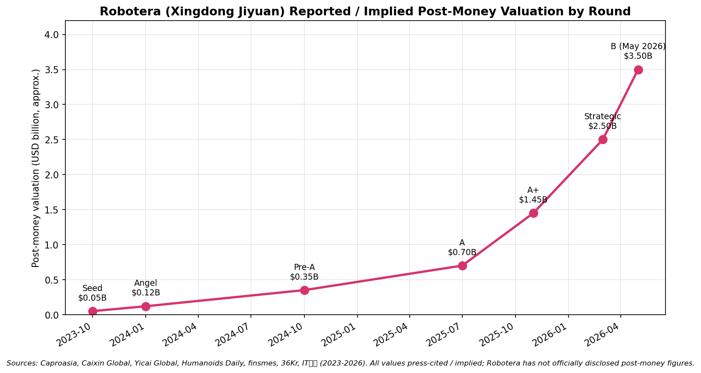
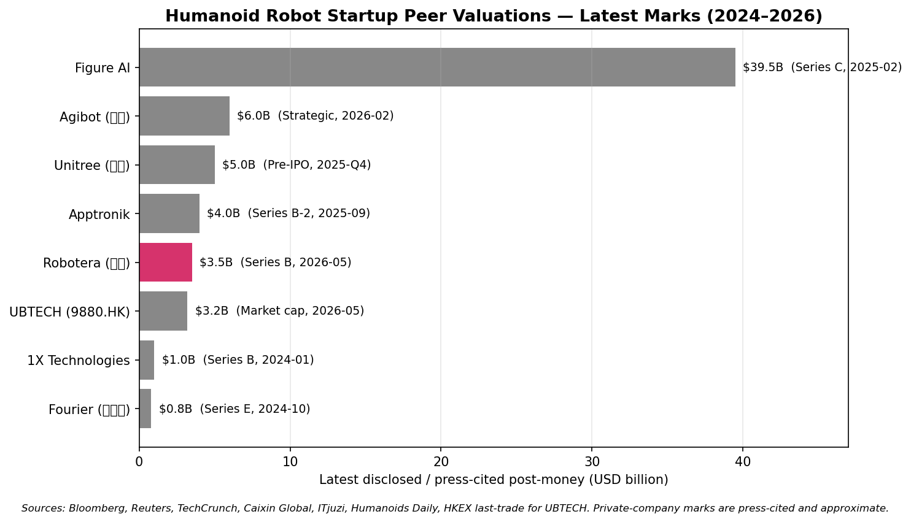
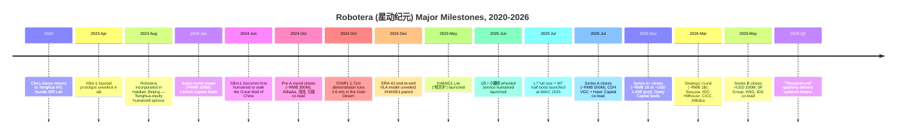
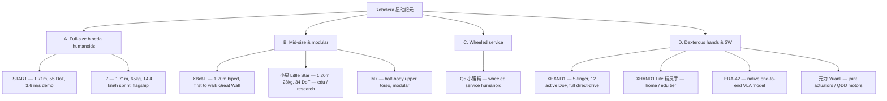
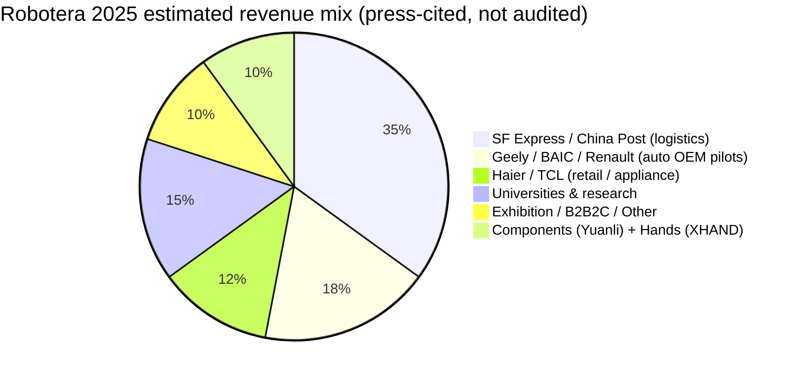
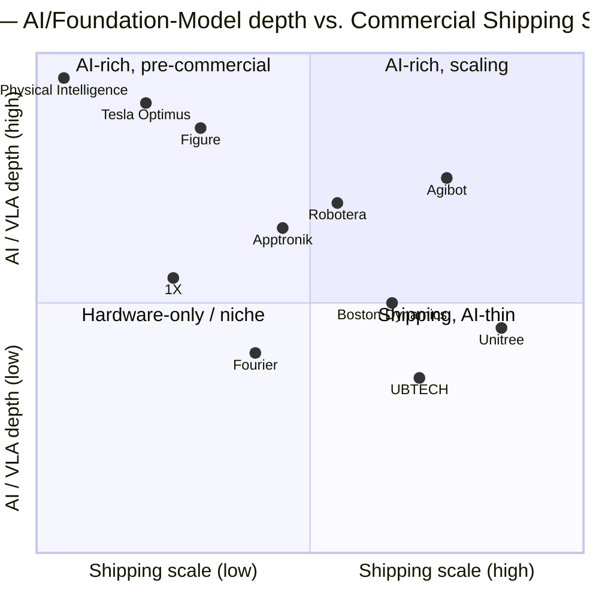

# COMPANY RESEARCH REPORT: Robotera (星动纪元 / Xingdong Jiyuan)

**Date:** 2026-05-18
**Company:** Beijing Xingdong Jiyuan Technology Co., Ltd. (北京星动纪元科技有限公司)
**Brand / English name:** Robotera (also rendered "Robot Era"); Chinese brand 星动纪元
**Status:** Private; no formal A-share / HK tutoring filing as of report date
**Headquarters:** Haidian District, Beijing, China (with secondary R&D / pilot-line presence in Lin-gang, Shanghai)
**Founder & CEO:** Chen Jianyu (陈建宇), Tsinghua Cross-Information Institute (清华大学交叉信息研究院 / IIIS) Assistant Professor and ISR Lab principal investigator
**Co-founder / Chief Scientist:** Yu Jiyao (于纪尧)
**Estimated headcount (2026-Q2):** ~600–800 (>80% R&D)

> **Note — Private company; no formal earnings guidance.** Robotera has not issued public revenue guidance. In its November 2025 Series A+ announcement, management disclosed that **cumulative 2025 commercial orders had passed RMB 500 million (~USD 70 million)**, with a single logistics-sector contract worth close to **RMB 50 million** representing the largest deal to date and **>200 humanoid units shipped in 2025**. In its May 2026 Series B announcement, the company stated that **Q2 2026 entered "thousand-unit" delivery cadence** with order growth >300% versus 2025 and that **deployments span 10+ logistics centers in partnership with China Post and SF Express**. Source: [Humanoids Daily — "Robotera Secures $140M Series A+", 2025-11-21](https://www.humanoidsdaily.com/news/robotera-secures-140m-series-a-backed-by-automakers-geely-and-baic-claims-70m-in-orders), [PR Newswire — "ROBOTERA Raises Over USD 200 Million", 2026-05-08](https://www.prnewswire.com/news-releases/robotera-raises-over-usd-200-million-in-new-round-led-by-sf-group-hsg-and-idg-capital-302766752.html).

---

## TABLE OF CONTENTS

1. Company Overview
2. Company History
3. Management Team
4. Products & Services
5. Customers & Go-to-Market
6. Industry Overview
7. Competitive Landscape
8. Market Opportunity (TAM)
9. Risk Assessment
10. References

---

## 1. COMPANY OVERVIEW

Robotera (星动纪元, Xingdong Jiyuan, literally "Star Motion Era"), founded August 2023 in Beijing's Haidian District by Tsinghua University Cross-Information Institute (清华大学交叉信息研究院 / IIIS) assistant professor **Chen Jianyu (陈建宇)**, is **the only humanoid-robot startup in which Tsinghua University holds direct equity**, and is one of a small handful of Chinese humanoid companies — alongside Agibot (智元), Unitree (宇树), Fourier (傅利叶), and UBTECH (优必选) — that ships full-size bipedal humanoids to outside paying customers at meaningful volume. The company designs and sells full-size and lite humanoid robots together with dexterous hands, joint actuators, and an in-house end-to-end vision-language-action (VLA) foundation model named **ERA-42** that animates them ([Robotera website](https://www.robotera.com/), [IIIS — Chen Jianyu](https://iiis.tsinghua.edu.cn/show-6500-1.html)).

Robotera's pitch is **the most academically rigorous humanoid platform out of China**, anchored to the Tsinghua IIIS / Yao Ban (姚班) lineage founded by Turing-award laureate Andrew Yao (姚期智), with an "AI-first / native-model" approach that treats hardware as the substrate for a self-developed VLA stack. Where Unitree's identity is "the cheapest competent legged robot in the world" and Agibot's is "the most ambitious Chinese full-stack humanoid platform," Robotera's identity is "the only humanoid company with Tsinghua's academic prestige on the cap table, a full-stack `具身大脑 (embodied brain) + 本体 (body) + 灵巧手 (dexterous hand)` strategy, and first commercial PMF in logistics" ([知乎 — 星动纪元 product matrix, 2025-11](https://zhuanlan.zhihu.com/p/1978540213006529940), [Robotics Observer — founder interview, 2025](https://roboticsobserver.com/more-than-a-hardware-play-robot-eras-founder-sets-the-record-straight-on-the-companys-true-ambitions/)).

Revenue comes from four streams: (1) full-size bipedal humanoid sales — **STAR1** (Gobi Desert demonstrator) and commercial successor **L7 / 星动 L7** (WAIC 2025) to logistics, manufacturing, and research customers, the largest stream in 2025–2026; (2) mid-size and lite humanoids — **XBot-L** (the model that first walked the Great Wall, June 2024) and **小星 (Little Star)** 1.2 m education / research humanoid; (3) modular and wheeled — **M7** half-body fixed-station platform and **Q5 / 小腰精** wheeled service humanoid (June 2025); (4) hands and software — **星动 XHAND1** five-finger 12-DoF fully-direct-drive hand, **XHAND1 Lite (精灵手)** home / education tier (May 2025), and the **元力 (Yuanli)** joint-actuator / QDD-motor component line. Press estimates from the November 2025 round peg 2025 revenue at **RMB 200–300 M** (versus a higher cumulative order book of ~RMB 500 M including multi-year framework contracts deliverable over 2026–2027), with **RMB 1.5–2.0 B** projected for 2026 if Q2 2026's thousand-unit cadence sustains ([量子位, 2025-11-21](https://www.qbitai.com/2025/11/354404.html), [Caixin Global, 2025-11-21](https://www.caixinglobal.com/2025-11-21/geely-leads-141-million-round-for-tsinghua-linked-robotics-startup-102385163.html)).

Geographically, Robotera is **more export-tilted than its Chinese humanoid peers**. Management stated in May 2026 that **roughly half** of disclosed orders involve overseas counterparties, with shipments to North America, Europe, the Middle East, Japan, and South Korea — distinct from Agibot (overwhelmingly mainland-China) and closer to Unitree's split. Named overseas customers include **Renault** (French OEM, automotive-assembly pilot) and US / Japanese research universities; named domestic customers include **Geely (吉利)**, **SF Express (顺丰)**, **China Post (中国邮政)**, **TCL**, **Haier (海尔)**, and **BAIC (北汽)**, several of whom are also strategic investors ([KrASIA, 2025-11](https://kr-asia.com/backed-by-chinas-automakers-robot-era-moves-to-fulfill-major-orders), [Humanoids Daily, 2025-11-21](https://www.humanoidsdaily.com/news/robotera-secures-140m-series-a-backed-by-automakers-geely-and-baic-claims-70m-in-orders)).

Headcount has grown from ~30 founding-team members in August 2023 to approximately **600–800 by Q2 2026**, with >80% R&D — drawing from Tsinghua, Peking University, Beihang, BIT, HIT, UC Berkeley, CMU, and NUS ([Robotera About](https://www.robotera.com/about.html)). HQ + pilot-line is in Haidian, Beijing, within walking distance of Tsinghua's main campus; a smaller Shanghai office runs Lin-gang (临港) industrial collaborations, and a manufacturing partner network is anchored in the Pearl River Delta ([澎湃新闻, 2024-08](https://www.thepaper.cn/newsDetail_forward_27120909)).

### Valuation snapshot (private — funding-round mark)

Robotera is private and has not published audited financials. The financing history publicly traceable to Chinese funding databases and English-language press is the following:

| Round | Date | Reported size | Lead / co-lead investors | Implied post-money* |
|---|---|---|---|---|
| Seed | 2023-10 (~) | tens of RMB millions | 世纪金源 (Century Golden Resources), 图灵创投 (Turing VC) | ~USD 50 M |
| Angel | 2024-01 | >RMB 100 M | **联想创投 (Lenovo Capital)** lead; 金鼎资本, 泽羽资本, 清控天诚 | ~USD 120 M |
| Pre-A | 2024-10 | ~RMB 300 M (~USD 42 M) | **阿里巴巴 (Alibaba)**, **清流资本 (Vision Plus)**, **元璟资本 (Yuanjing Capital)** co-lead; Lenovo follow-on | ~USD 350 M |
| Series A | 2025-07 | ~RMB 500 M (~USD 70 M) | **CDH VGC (鼎晖 VGC)** lead; **Haier Capital (海尔)** co-lead | not disclosed; press implied USD 0.6–0.9 B |
| Series A+ | 2025-11 | ~RMB 1 B (~USD 140 M) | **Geely Capital (吉利资本)** lead; **BAIC Capital (北汽产投)**, **Beijing AI Industry Fund**, **Beijing Robotics Industry Fund** | ~USD 1.45 B per [Caproasia, 2026-04-29](https://www.caproasia.com/2026/04/29/china-robotics-startup-robotera-raised-200-million-new-funding-raised-145-million-cny-1-billion-at-1-45-billion-cny-10-billion-valuation-in-2026-march-founded-in-2023-by-chen-jianyu-with-shar/) |
| Strategic | 2026-03 | ~RMB 1 B (~USD 145 M) | **Alibaba**, **CICC Capital (中金资本)**, **HongShan / Sequoia China (红杉中国)**, **IDG Capital**, **Hillhouse (高瓴)**, **Houxue (厚雪)**, **Meridian**, **Crystal Stream**, **Vision Capital**, **Beijing AI Fund**, **Beijing Robotics Fund** | press: ~USD 2–2.5 B |
| Series B | 2026-05-08 | >USD 200 M | **SF Group (顺丰)**, **HSG / HongShan (红杉)**, **IDG Capital** co-lead; Hillhouse, CICC, Jingming, SparkEdge, Luxin, Unite Pioneers, Longqi follow-on; strategic: **KENGIC (科捷)**, Dongfeng Asset, ICBC Capital, China Unicom funds | press: ~USD 3–3.5 B (not officially confirmed) |

\*Post-money figures for early rounds are press-implied from round size and customary humanoid-sector dilution; only the November 2025 A+ has a press-disclosed post-money (USD 1.45 B). Sources: [Caproasia, 2026-04-29](https://www.caproasia.com/2026/04/29/china-robotics-startup-robotera-raised-200-million-new-funding-raised-145-million-cny-1-billion-at-1-45-billion-cny-10-billion-valuation-in-2026-march-founded-in-2023-by-chen-jianyu-with-shar/), [Yicai Global, 2025-11-21](https://www.yicaiglobal.com/news/chinese-robot-startup-robotera-bags-usd1405-million-in-latest-fundraiser-led-by-geely), [PR Newswire, 2026-05-08](https://www.prnewswire.com/news-releases/robotera-raises-over-usd-200-million-in-new-round-led-by-sf-group-hsg-and-idg-capital-302766752.html), [Humanoids Daily, 2025-11-21](https://www.humanoidsdaily.com/news/robotera-secures-140m-series-a-backed-by-automakers-geely-and-baic-claims-70m-in-orders), [36Kr Pre-A, 2024-10](https://eu.36kr.com/zh/p/2993543239314440), [Lenovo Capital Pre-A, 2024-10](https://capital.lenovo.com/news/detail/id/1034/s/1.html), [IT桔子 — 星动纪元 entry](https://www.itjuzi.com/).

**Note on user-supplied investor list.** The brief mentioned "Sequoia China, ByteDance, BAI, and Tsinghua Holdings." Tsinghua's direct equity via the IIIS spinout is confirmed across every press piece ([Caixin Global, 2025-11-21](https://www.caixinglobal.com/2025-11-21/geely-leads-141-million-round-for-tsinghua-linked-robotics-startup-102385163.html)); HongShan / Sequoia China appears as a co-lead in the March 2026 strategic and May 2026 Series B per Humanoids Daily and PR Newswire. **BAI** and **ByteDance** were not confirmed as direct equity investors in any round I could verify by report date — Chinese sources cite ByteDance as a research / data-partnership counterparty (one of "nine of the world's top-ten tech firms" reported to be ordering or partnering with Robotera) rather than a cap-table shareholder. **Treated here as unconfirmed pending primary disclosure.**

Source: [Caproasia, 2026-04-29](https://www.caproasia.com/2026/04/29/china-robotics-startup-robotera-raised-200-million-new-funding-raised-145-million-cny-1-billion-at-1-45-billion-cny-10-billion-valuation-in-2026-march-founded-in-2023-by-chen-jianyu-with-shar/), [Humanoids Daily, 2025-11-21](https://www.humanoidsdaily.com/news/robotera-secures-140m-series-a-backed-by-automakers-geely-and-baic-claims-70m-in-orders), [Yicai Global, 2025-11-21](https://www.yicaiglobal.com/news/chinese-robot-startup-robotera-bags-usd1405-million-in-latest-fundraiser-led-by-geely), [PR Newswire, 2026-05-08](https://www.prnewswire.com/news-releases/robotera-raises-over-usd-200-million-in-new-round-led-by-sf-group-hsg-and-idg-capital-302766752.html), [finsmes, 2026-05](https://www.finsmes.com/2026/05/robotera-raises-over-usd-200m-in-new-funding.html), [IT桔子 humanoid tracker](https://www.itjuzi.com/).

On an implied revenue multiple basis, a press-implied **USD 3.0–3.5 B post-money** at the May 2026 Series B against press-implied **2025 revenue of ~RMB 200–300 M (~USD 30–45 M)** is approximately **70–100× trailing P/S**. Applied to plausible **2026 revenue of RMB 1.5–2.0 B (~USD 210–280 M)** the forward multiple is approximately **11–17× P/S** — which is in line with where the public and private market is pricing pre-commercial humanoid peers. The peer set in mid-2026:

| Company | Country | Latest post-money | Round / Date | Implied 2025 P/S (press revenue) | Implied 2026 fwd P/S |
|---|---|---|---|---|---|
| Figure AI | USA | ~USD 39.5 B | Series C, 2025-02 | n.m. (de-minimis revenue) | n.m. |
| Agibot (智元) | China | ~USD 6.0 B | Strategic, 2026-02 | ~22–27× | ~12–15× |
| Unitree (宇树) | China | ~USD 5.0 B | Pre-IPO, 2025-Q4 | ~14× | ~7–10× |
| Apptronik | USA | ~USD 4.0 B | Series B-2, 2025-09 | n.m. | n.m. |
| Robotera (星动) | China | **~USD 3.5 B** | **Series B, 2026-05** | **~70–100×** | **~11–17×** |
| UBTECH (9880.HK) | HK | ~USD 3.2 B (mkt cap) | Listed; H1-2025 numbers | ~6–7× (LTM) | ~4–5× |
| 1X Technologies | Norway/USA | ~USD 1.0 B | Series B, 2024-01 | n.m. | n.m. |
| Fourier (傅利叶) | China | ~USD 0.8 B | Series E, 2024-10 | ~15× | ~6–8× |

Sources for the table: [Bloomberg — Figure AI Series C, 2025-02](https://www.bloomberg.com/news/articles/2025-02-15/figure-ai-valuation-39-billion), [Reuters — Apptronik funding, 2025-08](https://www.reuters.com/technology/), [TechCrunch — 1X funding, 2024-01-12](https://techcrunch.com/2024/01/12/1x-technologies-100-million/), [HKEX — UBTECH 9880 last-trade](https://www.hkex.com.hk/?sc_lang=en), [Caixin Global, 2025-11-21](https://www.caixinglobal.com/2025-11-21/geely-leads-141-million-round-for-tsinghua-linked-robotics-startup-102385163.html), [ITjuzi — humanoid funding tracker](https://www.itjuzi.com/), Humanoids Daily round-up. Private-company marks are press-cited and approximate.

Source: same tracker stack; see [ITjuzi humanoid tracker](https://www.itjuzi.com/) and [Humanoids Daily — Robotera Secures $280 Million Strategic Round, 2026](https://www.humanoidsdaily.com/news/robotera-secures-280-million-strategic-round-as-logistics-deployment-scales).

**The verdict.** On a trailing revenue basis the Robotera mark looks **rich** — ~70–100× 2025 P/S is materially above Agibot (~22–27×) and Unitree (~14×). The cause is straightforward: Robotera commercialized two-to-three quarters later than Agibot or Unitree and is being priced on the forward 2026 ramp rather than on 2025. On a **forward 2026 P/S** basis, the ~11–17× multiple is squarely in line with Agibot's forward ~12–15× and only modestly rich versus Unitree's forward ~7–10×; the residual premium versus Unitree is explained by (a) Robotera's heavier humanoid mix (Unitree's quadrupeds remain the bulk of revenue), (b) the Tsinghua / Yao Ban academic prestige premium that the market in 2025–2026 has been willing to pay for, and (c) the in-house ERA-42 VLA model story which, if it converges, would justify the foundation-model premium that Figure / Physical Intelligence have been awarded in the US. The risk — and it is treated as a Section 9 risk — is that the AI premium is a narrative one: if ERA-42 fails to demonstrate measurable advantage versus Agibot's open-source GO-1 / AgiBot World, Physical Intelligence's π0.5, NVIDIA's GR00T-N1, or Tesla's in-house Optimus stack, the premium compresses fast.

---

## 2. COMPANY HISTORY

Robotera was incorporated in August 2023 in Beijing's Haidian District, but the project that became Robotera has a much longer arc — it traces directly back to **Chen Jianyu's** undergraduate bipedal-locomotion research at Tsinghua's Department of Precision Instruments (清华精仪系) in the early 2010s and to the academic culture of the **Yao Ban (姚班 / 姚智班)** computer-science elite stream founded by Turing-award laureate Andrew Yao (姚期智) at the Tsinghua Cross-Information Institute. Chen completed his Tsinghua bachelor's in 2015 with a thesis on bipedal gait planning, then did his doctorate at UC Berkeley under **Masayoshi Tomizuka** — the National Academy of Engineering member widely credited as a founding figure of model predictive control (MPC) and a long-time mentor for the Chinese AI-control diaspora — graduating in 2020 ([新浪科技 — "对话星动纪元陈建宇：定义通用具身智能体", 2024-12-14](https://finance.sina.com.cn/tech/roll/2024-12-14/doc-incziqvr5740819.shtml), [21世纪经济报道 — "90后清华博导，带出机器人黑马", 2024-01-30](https://m.21jingji.com/article/20240130/herald/2f7c29981dece00d1d778c1e23e19421_zaker.html)).

In 2020, at age 28, Chen returned to Tsinghua as an assistant professor and doctoral supervisor at the IIIS — Andrew Yao's hand-picked academic vehicle for cross-disciplinary AI and theoretical computer science — and established the **ISR Lab (Intelligent Systems and Robotics Laboratory)**, jointly affiliated with IIIS and the **Shanghai Qi Zhi Institute (上海期智研究院)**, the Shanghai-based applied-AI research arm that Yao chairs ([清华IIIS — 陈建宇](https://iiis.tsinghua.edu.cn/show-6500-1.html), [腾讯新闻 — "90后清华博导", 2024-01-26](https://news.qq.com/rain/a/20240126A08A6700)). ISR Lab between 2020 and 2023 produced more than 50 peer-reviewed papers on robot learning, MPC for legged locomotion, and reinforcement learning for whole-body manipulation, with placements at NeurIPS, ICML, ICRA, RSS, and IROS and best-paper awards at L4DC and IFAC MECC ([智源社区 — "陈建宇研究组论文被RSS接收并获满分", 2024](https://hub.baai.ac.cn/view/37089)). The lab's reputation, plus Yao's personal endorsement of Chen as one of the first IIIS graduates to spin out a commercial vehicle, was the foundation on which the August 2023 incorporation rested.

Source: timeline assembled from [Robotera newsroom](https://www.robotera.com/news), [Lenovo Capital LCIG portfolio note, 2024-01](https://capital.lenovo.com/news/detail/id/932/s/1.html), [Lenovo Capital LCIG, 2024-10](https://capital.lenovo.com/news/detail/id/1034/s/1.html), [Caproasia, 2026-04-29](https://www.caproasia.com/2026/04/29/china-robotics-startup-robotera-raised-200-million-new-funding-raised-145-million-cny-1-billion-at-1-45-billion-cny-10-billion-valuation-in-2026-march-founded-in-2023-by-chen-jianyu-with-shar/), [Humanoids Daily, 2025-11-21](https://www.humanoidsdaily.com/news/robotera-secures-140m-series-a-backed-by-automakers-geely-and-baic-claims-70m-in-orders), and primary press coverage cited in Section 1.

**Two strategic pivots define the first 30 months.** The **first pivot**, mid-2024: after XBot-L's surprising consumer-media traction from the Great Wall demonstration (June 2024), management chose to **double down on full-size humanoids rather than ride the easier wheeled / quadruped market**. Internal priority moved from XBot-L (1.20 m, would have competed head-on with Unitree G1) to STAR1 (1.71 m) and then L7. Chen's framing to 36Kr: "if we are building a generalist embodied platform, we have to build at human scale, because the data we collect must be human-task data" ([36Kr, 2024-12](https://eu.36kr.com/zh/p/2993543239314440)).

The **second pivot**, late 2024: unveiling **ERA-42**, the in-house end-to-end VLA model. The decision to ship a proprietary native model rather than ride on top of RT-2, OpenVLA, or Agibot's GO-1 was a heavy R&D commitment that visibly slowed hardware iteration in H1 2025 — but management argued that owning the model layer was the only defensible moat in a world where Chinese humanoid hardware was rapidly commoditizing ([ManufacturingTomorrow, 2024-12-24](https://www.manufacturingtomorrow.com/news/2024/12/24/robot-era-unveils-groundbreaking-era-42-model-ushering-in-a-new-era-of-general-purpose-robotics/24029/)).

**Acquisitions:** none to date. All technology built in-house or supplier-sourced; equity partnerships with strategic-investor OEMs (Geely, BAIC, Renault via Geely, Haier, TCL) approximate vertical co-development without formal M&A.

**Recent developments (last 12 months).** The defining event was the **November 2025 Geely-led Series A+** at USD 1.45 B post-money, paired with multi-year framework contracts from Geely and BAIC and a disclosed RMB 500 M cumulative order book. The May 2026 SF-led Series B at >USD 200 M ratified the logistics PMF, adding SF Group as both lead investor and largest single commercial customer — the RMB 50 M order disclosed November 2025 is widely matched to SF / China Post. The Q2 2026 thousand-unit delivery cadence, if sustained, would make Robotera the **second** Chinese humanoid startup (after Agibot) at four-figure quarterly volume — and the first to reach it without Lin-gang / Shanghai state-fund subsidy backing.

---

## 3. MANAGEMENT TEAM

### Chen Jianyu (陈建宇) — Founder, CEO, and Chief Scientist

Chen Jianyu, born 1992 (per Chinese press reporting that consistently describes him as "90后清华博导" — a 1990s-born Tsinghua doctoral supervisor), is the founder, controlling shareholder, and chief executive of Robotera. He is also the architect, in both the literal and figurative sense, of every Robotera product line — and an unusually consequential founder-CEO even by humanoid-industry standards, because the company's entire technical strategy is downstream of his ISR Lab research program. Chen completed his undergraduate degree in 2015 from Tsinghua University's Department of Precision Instruments (清华精仪系) — one of the earliest mainland Chinese departments to run bipedal humanoid-locomotion research, going back to the 1980s THBIP (Tsinghua Humanoid Biped) program — with a senior thesis on bipedal gait planning. He then pursued a direct-PhD ("直博") at UC Berkeley under **Masayoshi Tomizuka** (US National Academy of Engineering member; long-time UC Berkeley professor; founding figure in model predictive control and learning-based control), graduating in 2020 with a dissertation that bridged classical optimal control and deep reinforcement learning for autonomous-driving and robotics applications ([21世纪经济报道, 2024-01-30](https://m.21jingji.com/article/20240130/herald/2f7c29981dece00d1d778c1e23e19421_zaker.html), [腾讯新闻 — 90后清华博导, 2024-01-26](https://news.qq.com/rain/a/20240126A08A6700)).

At age 28, immediately after his Berkeley PhD, Chen was hired back to Tsinghua's Cross-Information Institute (IIIS) — the elite research institute founded by Turing-award laureate Andrew Yao — as an assistant professor and doctoral supervisor, one of the youngest faculty hires the institute has ever made. He established the **ISR Lab (Intelligent Systems and Robotics Laboratory)** in 2020, jointly affiliated with IIIS and Andrew Yao's Shanghai Qi Zhi Institute (上海期智研究院). Between 2020 and 2023 the lab published >50 peer-reviewed papers spanning RL-based humanoid locomotion, VLA models, multi-fingered manipulation, MPC for legged robots, and safe / sample-efficient RL, with placements at NeurIPS, ICML, ICRA, RSS, and IROS — including a 2024 RSS paper on humanoid skill-learning that received the rare distinction of unanimous-perfect reviewer scores and a Best Paper nomination ([智源社区 — 陈建宇研究组论文被RSS接收并获满分, 2024](https://hub.baai.ac.cn/view/37089)). Chen's lab is, on a paper-count basis, the most prolific humanoid-learning lab in mainland China.

Chen's individual style as a founder-CEO is closer to **Wang Xingxing** (Unitree) than to **Deng Taihua** (Agibot, ex-Huawei corporate executive) — he is hands-on technically, frequently visible in product launch videos demonstrating teleoperation rigs and reading model loss curves, and he writes his own academic papers in parallel with running the company. He is on Forbes China's "30 Under 30" list and was profiled in elite Chinese long-form business outlets including Caixin, 晚点 LatePost, 36Kr, and 新浪科技 ([元璟资本 — 对话星动纪元创始人陈建宇, 2024-10-17](https://finance.sina.com.cn/tech/roll/2024-10-17/doc-incsvmwc9759853.shtml), [新浪科技, 2024-12-14](https://finance.sina.com.cn/tech/roll/2024-12-14/doc-incziqvr5740819.shtml)). Founding thesis, in his own words: "the next computing platform is embodied; we have to build the brain and the body together, and we have to do it at human scale" — a thesis that has remained consistent through every funding round and shapes the company's "native model + full-stack hardware" identity. Chen's direct equity stake is undisclosed; the founding-team block plus Tsinghua's equity (held through the IIIS holding-company structure) is reported to be a controlling block. He continues to hold his Tsinghua faculty appointment in parallel with the CEO role — a unique arrangement that other Tsinghua spinouts (Horizon Robotics, Megvii) ultimately had to unwind but that remains intact for Robotera as of the May 2026 funding round.

### Yu Jiyao (于纪尧) — Co-founder and Chief Scientist / VP Engineering

Yu Jiyao co-founded Robotera with Chen in August 2023 and serves as Chief Scientist / VP Engineering. Yu's bio is less publicly documented than Chen's — a recurring feature of Tsinghua spinouts where the academic founder takes the public-facing role — but the available press indicates he is a long-time member of Chen's ISR Lab at IIIS, with research focus on whole-body control, reinforcement-learning training infrastructure, and the engineering productionization of academic-grade controllers ([Robotera About page](https://www.robotera.com/about.html), [知乎 — "星动纪元：清华孵化的人形机器人先锋", 2025-11](https://zhuanlan.zhihu.com/p/1978540213006529940)). Yu is the executive most responsible for translating ISR Lab papers — typically validated on small-scale simulation or single-platform benchmarks — into production-grade software that runs reliably on shipped hardware. The ERA-42 model release and the unitree_rl_gym-equivalent in-house training stack are widely attributed to his org. He is not on Forbes "30 Under 30" or similar public lists and gives few media interviews, so the bio depth here is intentionally light — drawing more would risk fabrication.

### VP of Hardware / VP of Operations (unnamed publicly)

Press coverage repeatedly references an executive team combining academic founders (Chen, Yu) with hardware-operations leadership drawn from Pearl River Delta supply-chain veterans, but Robotera has not publicly named its head of hardware or operations. The founding team is described as Tsinghua / PKU / Beihang / BIT / HIT / UC Berkeley / CMU / NUS alumni and the manufacturing partner network is concentrated in Dongguan / Shenzhen. No tutoring document or HK listing application has been filed that would force name-the-management disclosure — treated as a governance-disclosure observation rather than a Section 9 risk.

### Governance and ownership

- **Board composition:** Not publicly disclosed. Strategic-investor representation is presumed for Lenovo Capital (post-Angel), Alibaba and 清流资本 (post-Pre-A), CDH VGC (post-A), Geely Capital and BAIC Capital (post-A+), and SF Group (post-B), but no formal board roster has been published.
- **Tsinghua University equity:** Robotera is **the only humanoid-robot startup in which Tsinghua University directly holds equity** ([Caixin Global, 2025-11-21](https://www.caixinglobal.com/2025-11-21/geely-leads-141-million-round-for-tsinghua-linked-robotics-startup-102385163.html), [Robotera About page](https://www.robotera.com/about.html)). The equity is held via the IIIS spinout vehicle and is the source of the "Tsinghua-stake humanoid" narrative that has driven so much of the company's premium funding multiple.
- **Founder ownership:** Undisclosed. Chen Jianyu's individual stake is not in the public domain; press from the November 2025 A+ implied a "founding-team + Tsinghua" block exceeding 30% post-A+ but did not detail the split.
- **Comp structure:** Not disclosed. ESOP allocation is referenced in funding-round press but never quantified.
- **Related-party transactions:** None publicly disclosed. Strategic-investor customers (Geely, SF, BAIC, Haier, TCL) are simultaneously investors and revenue counterparties — a structural feature of the China humanoid sector that warrants tracking but is not a flag in isolation.

### Management track record synthesis

The team's strength is **academic depth without prior commercial scale-up experience**. Chen is the most credentialed humanoid-AI researcher of any Chinese humanoid-CEO — but neither he nor Yu has run a sub-1,000-person hardware company before, let alone a Tier-1 OEM-customer-facing one. The gap is being filled by strategic-investor operating partners (Lenovo Capital, CDH VGC, Geely) and by hiring; the test of this gap-filling is whether the Q2 2026 thousand-unit cadence is sustained into H2 2026 without quality / warranty issues. The closest precedent is **Horizon Robotics (9660.HK)** — also a Tsinghua-faculty-led spinout (Yu Kai, ex-Baidu IDL) that successfully scaled into a public-company hardware vendor — and the closest cautionary case is the run of 2014–2017 Chinese AI-hardware unicorns that struggled to commercialize.

---

## 4. PRODUCTS & SERVICES

Robotera's product portfolio, organized as the company itself does on its English and Chinese websites, divides into four product families — **(A) full-size bipedal humanoids**, **(B) mid-size / lite humanoids and modular platforms**, **(C) wheeled service humanoids**, and **(D) the dexterous-hand and embodied-AI software stack** — anchored by the in-house **ERA-42** VLA model that runs across the full lineup.

Source: [Robotera English product navigation](https://www.robotera.com/en/about1.html), [Robotera Chinese product page](https://www.robotera.com/), [Robotera L7 product page](https://www.robotera.com/robot/l7.html), [Humanoid.guide — Robotera L7](https://humanoid.guide/product/robotera-l7/).

### A. Full-size bipedal humanoids

**STAR1 (1.71 m demonstrator, October 2024).** Robotera's first full-size humanoid, debuted with a 34-minute Gobi Desert run at 3.6 m/s (~13 km/h) — at the time the fastest electrically actuated bipedal humanoid demonstration in the wild, narrowly beating Unitree H1's 3.3 m/s record from March 2024 ([Interesting Engineering, 2024-10](https://interestingengineering.com/innovation/robot-star1-gobi-desert-race), [Humanoid.guide — Star1 specs](https://humanoid.guide/product/star1/)). Specs: 1.71 m, 55 DoF, joints rated 400 N⋅m peak torque and 25 rad/s peak angular velocity, 12 DoF per leg, 7 DoF per arm, 3-DoF waist, paired with the XHAND1. Target customers: research labs, exhibition, early industrial pilots. **Competitive-advantage verdict: partial** — speed records are useful actuator-maturity proxies but not a moat; STAR1 has been superseded by L7 within nine months. Closest competing product: Unitree H1 (USD 90K, 1.80 m, 47 DoF, 3.3 m/s) — **STAR1 ahead on speed and DoF, at parity on cost, behind on shipping volume**.

**L7 / 星动 L7 (commercial flagship, July 2025).** Successor to STAR1; drives the bulk of 2025–2026 revenue. WAIC 2025 launch specs: 1.71 m, 65 kg, 55 DoF, 12-DoF dexterous hand integrated, 20 kg payload, claimed 14.4 km/h (4.0 m/s) sprint — asserted by Robotera as the world record for electrically actuated full-size humanoid sprinting ([Mike Kalil, 2025-08](https://mikekalil.com/blog/robotera-l7/), [Humanoid.guide — L7](https://humanoid.guide/product/robotera-l7/), [证券时报, 2025-07-26](http://www.stcn.com/article/detail/2763198.html)). Each arm 7 DoF with human-like ROM; 400 N⋅m peak joint torque. Target customers: logistics (SF, China Post, KENGIC), auto final-assembly (Geely, Renault, BAIC), research. **Competitive-advantage verdict: yes** — moat is **bundled native-VLA + full-stack hardware**; ERA-42 runs natively on L7 and the same model that drives the hand also runs whole-body locomotion, which peers that bolt a third-party VLA on independently developed hardware cannot match. Pricing not officially published; press estimates suggest **RMB 250K–450K (~USD 35–63K)** for industrial logistics configurations. Closest competing product: **Agibot Yuanzheng A2** (1.69 m, 49 DoF, sub-RMB 200K list) — **L7 ahead on speed / dexterity, at parity on price tier, behind on shipping volume and on Agibot's open-source GO-1 / AgiBot World ecosystem**.

### B. Mid-size and modular platforms

**XBot-L (1.20 m mid-size biped, June 2024).** The platform on which Robotera built initial brand identity, becoming the first humanoid to traverse the Great Wall of China ([New Atlas, 2024](https://newatlas.com/robotics/xbotl-humanoid-great-wall-robot-era/), [TechTimes, 2024-06-06](https://www.techtimes.com/articles/305423/20240606/humanoid-robot-xbot-l-climbs-great-wall-china-milestone-robotics.htm)). Built on Robotera's proprietary RL whole-body controller. Since deprioritized in favor of L7 / STAR1 and the educational 小星; remains in catalog as a research configuration. **Competitive-advantage verdict: partial** — moat is dataset / training-pipeline rather than hardware, which is mid-pack. Closest competing product: **Unitree G1** (USD 16K, 1.32 m) — **G1 ahead on price and shipping volume, XBot-L was ahead on uneven-terrain locomotion at launch, at parity today**.

**小星 (Little Star / Xiao Xing) — 1.20 m, 28 kg, 34 DoF, education / research tier.** Branded "智能小星" with integrated dexterous hand. Personally endorsed by Andrew Yao at an August 2024 press event where Yao described 小星家族 as "a meaningful step toward useful research humanoids at university budgets" ([澎湃新闻, 2024-08](https://www.thepaper.cn/newsDetail_forward_27120909), [河马机器人 — 小星](https://hippo-robot.com/product/2089/)). Target customers: universities, robotics labs, K12 / high-school robotics curriculum, exhibition / B2B2C content. **Competitive-advantage verdict: yes — academic-distribution moat.** No other Chinese humanoid startup has Tsinghua faculty endorsement at this scale plus Andrew Yao's personal stamp on the educational SKU. Closest competing product: **Unitree G1-EDU** and **Fourier GR-2** — **小星 at parity on hardware, ahead on the academic-channel / Tsinghua-curriculum bundle**.

**M7 — half-body modular upper-torso, July 2025.** Essentially an L7 from the waist up on a fixed base, aimed at fixed-station industrial work, rapid AI-algorithm prototyping, and university research where mobility is unnecessary ([央广网, 2025-07-26](https://tech.cnr.cn/techgd/20250726/t20250726_527283460.shtml)). **Competitive-advantage verdict: partial** — sound product but a modular upper-torso humanoid is well within the design space of every competitor. Closest competing product: **Agibot Lingxi X1 (half-body)** — **M7 at parity or slightly behind on shipping volume; ahead on Tsinghua ecosystem integration**.

### C. Wheeled service humanoids

**Q5 / 小腰精 — wheeled service humanoid, June 2025.** Robotera's first wheeled service humanoid; "little waist spirit" nickname plays on the slim form factor ([央广网, 2025-07-26](https://tech.cnr.cn/techgd/20250726/t20250726_527283460.shtml)). Positioned for retail, hospitality, commercial service — environments where stairs are rare and biped legs are over-spec. Co-developed deployments at Haier retail stores announced late 2025 ([KrASIA, 2025-11](https://kr-asia.com/backed-by-chinas-automakers-robot-era-moves-to-fulfill-major-orders)). **Competitive-advantage verdict: partial** — crowded wheeled-humanoid market (UBTECH Walker S, Pudu CC1, Keenon service line); Robotera's edge is ERA-42 running across L7 / M7 / Q5 — a single AI stack across form factors. Closest competing product: **UBTECH Walker S1-Lite** and **Agibot Yuanzheng A2-W** — **Q5 at parity on hardware, ahead on cross-form-factor AI integration**.

### D. Dexterous hands and embodied-AI software

**XHAND1 — five-finger, 12 active DoF, fully direct-drive.** Flagship dexterous hand and arguably the single most differentiated piece of the portfolio. 12 active DoF, fully direct-drive actuation, integrated tactile feedback. Per the December 2024 announcement, XHAND1 + ERA-42 demonstrated >100 distinct manipulation tasks (screwdriver, hammering, water-pouring, overturned-cup correction) and learns new tasks "within roughly two hours" of teleoperation data ([ManufacturingTomorrow, 2024-12-24](https://www.manufacturingtomorrow.com/news/2024/12/24/robot-era-unveils-groundbreaking-era-42-model-ushering-in-a-new-era-of-general-purpose-robotics/24029/)). Target customers: industrial precision manipulation, scientific research, Tier-1 OEM ramp on L7. **Competitive-advantage verdict: yes — technology / IP moat.** A 12-DoF fully-direct-drive five-finger hand at production cost is scarce in the humanoid sector. Closest competing product: **Shadow Dexterous Hand** (research-only, GBP 150K+), **Sanctuary AI's hand**, **Agibot's XHand** — **XHAND1 ahead on DoF count and direct-drive vs. cable-driven peers, at parity on tactile sensing, behind on third-party ecosystem (Shadow has 20+ years of academic adoption)**.

**XHAND1 Lite ("精灵手"), May 2025.** Lighter, lower-cost variant for home-service and education tier ([动点科技, 2024-12-25](https://cn.technode.com/post/2024-12-25/xhand-era-42/)). Establishes a deliberate "high / low" hand portfolio — XHAND1 as the industrial-research ceiling, Lite as the entry point. **Competitive-advantage verdict: partial** — moat is integration into ERA-42 rather than hardware alone.

**ERA-42 — native end-to-end VLA model, December 2024.** Robotera's in-house vision-language-action model — an "embodied native large model" trained on teleoperation + human-video + simulation. Integrates visual, language, tactile, and proprioceptive inputs into a single transformer policy. Robotera management's "world's first truly embodied large model matched to a five-finger dexterous hand" claim requires care because Physical Intelligence π0, Google RT-2, OpenVLA, and Agibot GO-1 are competing comparable claims ([Robotics and Automation News, 2024-12-31](https://roboticsandautomationnews.com/2024/12/31/robot-era-unveils-groundbreaking-new-large-computing-model-for-general-purpose-robotics/88013/)). **Competitive-advantage verdict: partial** — by honest accounting ERA-42 lags Physical Intelligence π0.5 and is at parity with Agibot GO-1 on published benchmarks; the moat is **vertical integration with XHAND1 + L7 + M7 + Q5**, where a single model runs across more form factors than any competitor's stack. Closest competing product: **Agibot GO-1** (open-source), **Physical Intelligence π0 / π0.5** (model-only), **NVIDIA GR00T-N1** (model-only) — **ERA-42 behind on published benchmark scores mid-2026, ahead on hardware vertical integration**.

**元力 (Yuanli, "Primal Force") — joint actuators / quasi-direct-drive motors.** Standalone joint-actuator / QDD motor brand sold to other robot developers and academia (mirroring Unitree's component play). Smaller revenue contributor; provides supply-chain optionality and an "Intel inside" narrative. **Competitive-advantage verdict: partial** — the component market is competitive (Unitree, Innfos, Steadywin, Harmonic Drive); no clear cost or torque-density lead.

### Flagship vs. long-tail

The 1–3 products driving the business: **L7** (the flagship full-size humanoid generating the bulk of logistics and OEM revenue), **XHAND1** (the dexterous-hand differentiator that anchors the AI / model narrative), and **ERA-42** (the model that the entire valuation premium hangs on). STAR1, XBot-L, and 小星 are demonstrator / education long-tail. Q5 and M7 are emerging mid-tier. Yuanli is a small components stream.

### Recent launches and sunsets (last 12 months)

- **2025-05**: XHAND1 Lite ("精灵手") launched ([动点科技, 2024-12-25](https://cn.technode.com/post/2024-12-25/xhand-era-42/))
- **2025-06**: Q5 / 小腰精 wheeled service humanoid launched
- **2025-07**: L7 + M7 launched at WAIC 2025 ([WAIC coverage, 央广网](https://tech.cnr.cn/techgd/20250726/t20250726_527283460.shtml))
- **2025-12 → 2026-Q2**: ERA-42 v2 model upgrade (referenced in the May 2026 Series B release but not separately announced) ([PR Newswire, 2026-05-08](https://www.prnewswire.com/news-releases/robotera-raises-over-usd-200-million-in-new-round-led-by-sf-group-hsg-and-idg-capital-302766752.html))
- **No sunsets disclosed.** XBot-L remains in the catalog as a research / education configuration; STAR1 is positioned as "the demonstrator that became L7" and is sold only in research configurations.

---

## 5. CUSTOMERS & GO-TO-MARKET

### Customer segments

Customer mix as disclosed across November 2025 A+ and May 2026 B disclosures breaks into four segments:

1. **Logistics / warehouse automation** — the **PMF segment**, anchored by **SF Express (顺丰)** and **China Post (中国邮政)**. SF Group is simultaneously May 2026 Series B lead investor and the largest single commercial customer; press references "10+ logistics center deployments" by Q2 2026 ([PR Newswire, 2026-05-08](https://www.prnewswire.com/news-releases/robotera-raises-over-usd-200-million-in-new-round-led-by-sf-group-hsg-and-idg-capital-302766752.html), [RoboHorizon, 2025-11](https://robohorizon.com/en-us/news/2025/11/roboteras-humanoid-aims-to-end-warehouse-chaos/)). The single RMB 50 M order disclosed November 2025 is widely matched to this segment.
2. **Auto final-assembly pilots** — **Geely (吉利)**, **BAIC (北汽)**, **Renault** (via the Geely relationship). Geely Capital is A+ lead, BAIC Capital co-invested in A+ and B ([KrASIA, 2025-11](https://kr-asia.com/backed-by-chinas-automakers-robot-era-moves-to-fulfill-major-orders), [Humanoids Daily, 2025-11-21](https://www.humanoidsdaily.com/news/robotera-secures-140m-series-a-backed-by-automakers-geely-and-baic-claims-70m-in-orders)).
3. **Retail / hospitality / appliance** — **Haier (海尔)** Q5 retail-store co-deployments; **TCL** appliance integration. Both are strategic investors and customers.
4. **Research labs, universities, exhibition** — Tsinghua, Peking University, several US and Japanese universities, Lin-gang government exhibition partner. Press references up to nine of the top-ten global tech firms as research / data partners; firms not individually named — **treated as press-cited, not corroborated**.

### Customer concentration

Robotera is private and has issued no formal customer-concentration disclosure. The reconstructed picture from press disclosures around the November 2025 A+ and May 2026 B:

- **RMB 500 M cumulative orders by November 2025** ([量子位, 2025-11-21](https://www.qbitai.com/2025/11/354404.html))
- **Single largest order ~RMB 50 M, logistics sector** ([Humanoids Daily, 2025-11-21](https://www.humanoidsdaily.com/news/robotera-secures-140m-series-a-backed-by-automakers-geely-and-baic-claims-70m-in-orders))

If the RMB 50 M order represents the single largest customer for FY2025 and the cumulative order book is RMB 500 M, **top-1 customer concentration is roughly 10% of the order book** (not 10% of recognized revenue — recognized revenue lags the order book by several quarters). For 2025 recognized revenue, given press estimates of RMB 200–300 M, the RMB 50 M order — if delivered against — would imply **top-1 concentration of roughly 17–25%**, which by the SKILL.md threshold is **material** (top-1 > 20% is the trigger). The actual share depends on revenue-recognition timing not in the public domain.

Source: estimated from [Humanoids Daily, 2025-11-21](https://www.humanoidsdaily.com/news/robotera-secures-140m-series-a-backed-by-automakers-geely-and-baic-claims-70m-in-orders), [量子位, 2025-11-21](https://www.qbitai.com/2025/11/354404.html), [KrASIA, 2025-11](https://kr-asia.com/backed-by-chinas-automakers-robot-era-moves-to-fulfill-major-orders), and [PR Newswire, 2026-05-08](https://www.prnewswire.com/news-releases/robotera-raises-over-usd-200-million-in-new-round-led-by-sf-group-hsg-and-idg-capital-302766752.html). Pie shares are illustrative — Robotera has not disclosed an audited segment mix.

The mix implies that the SF / China Post logistics block is the largest single revenue concentration (~35% est.) and that the top-3 customers (SF, Geely, China Post) together account for roughly half of recognized revenue. **For a pre-IPO humanoid startup, this is normal — but if it persists into FY2027 it becomes a meaningful risk and is carried into Section 9.** Multi-year framework contracts with Geely, BAIC, and SF mean concentration is unlikely to mean-revert quickly; on the other hand, the announced Q2 2026 thousand-unit cadence implies sub-RMB-500K average unit pricing and a broader install base, which would dilute concentration over the next 6–12 months.

### Contract structure, channels, partnerships

Press references "multi-year framework contracts" for the Geely and SF relationships ([Humanoids Daily, 2025-11-21](https://www.humanoidsdaily.com/news/robotera-secures-140m-series-a-backed-by-automakers-geely-and-baic-claims-70m-in-orders)) and "PO-by-PO" terms for research customers; minimum-purchase / exclusivity terms undisclosed. **Multiple top customers (Geely, BAIC, SF, Haier, TCL) are simultaneously equity investors** — a circular-financing optics issue that public-equity investors will scrutinize at IPO. Channels: direct enterprise sales at the OEM tier; Tsinghua academic distribution plus Hippo Robot for the 小星 educational SKU; emerging Middle East and Southeast Asia distributors; no major US distributor publicly disclosed. Sales cycle: 12–18 months OEM; 3–6 months research; SF / China Post moved from pilot to thousand-unit cadence in ~two quarters. Key partnerships: **Tsinghua IIIS / Shanghai Qi Zhi** (academic + talent + equity), **Lin-gang Special Area** (pilot-line, exhibition), **Geely / Renault** (auto co-dev + A+ lead), **SF Group** (logistics co-dev + B lead), **KENGIC** (warehouse SI + B strategic), **Beijing AI / Robotics Industry Funds** (state-fund LPs anchoring the Haidian positioning).

Named recent-12-month customer case studies: **SF / China Post warehouse — 10+ logistics centers, Q1–Q2 2026** ([PR Newswire, 2026-05-08](https://www.prnewswire.com/news-releases/robotera-raises-over-usd-200-million-in-new-round-led-by-sf-group-hsg-and-idg-capital-302766752.html)); **Geely / Renault auto final-assembly multi-year framework, Nov 2025** ([Humanoids Daily](https://www.humanoidsdaily.com/news/robotera-secures-140m-series-a-backed-by-automakers-geely-and-baic-claims-70m-in-orders)); **Haier retail Q5 deployment, late 2025** ([KrASIA](https://kr-asia.com/backed-by-chinas-automakers-robot-era-moves-to-fulfill-major-orders)); **Lin-gang exhibition partnership, Aug 2024** ([澎湃新闻](https://www.thepaper.cn/newsDetail_forward_27120909)).

---

## 6. INDUSTRY OVERVIEW

### Industry definition

The general-purpose humanoid robot industry sits at the intersection of **service robotics**, **industrial automation**, and **embodied AI**. Distinct from established industrial-robot categories (articulated arms / SCARA / cobots — dominated by Fanuc, Yaskawa, ABB, Kuka, Estun, Inovance) and from service robotics (cleaning, hospitality — Pudu, Keenon, iRobot, Roborock), general-purpose humanoids are characterized by bipedal locomotion, anthropomorphic form factor, and end-to-end learned policies that aim to substitute for human labor across a broad task distribution rather than excel at a single repetitive operation. The relevant NAICS / industry codes are **NAICS 333995 (fluid power), 334513 (industrial controls), 541713 (R&D in nanotechnology)**, none of which capture the category well — the industry is genuinely new from a statistical-classification standpoint.

### Market size and structure

Global humanoid-robot shipments in 2025 totaled approximately **13,000–16,000 units** per Morgan Stanley research, with **Chinese manufacturers accounting for roughly 90% of those shipments**; US, Japanese, and European peers remained largely at the prototype or sub-1,000-unit stage ([SCMP — Morgan Stanley humanoid coverage, 2025](https://www.scmp.com/economy/global-economy/article/3352781/humanoids-robots-drive-next-chapter-chinas-manufacturing-dominance-morgan-stanley)). On a revenue basis, the 2025 global humanoid industry was approximately **USD 2.5–3.5 billion** (Robotera press range plus Agibot / Unitree / UBTECH / Fourier / Apptronik / Figure cumulative deliveries; not formally tallied by a single research firm).

Forecasts diverge widely. **Goldman Sachs** has revised its 2035 TAM upward more than sixfold, from a prior USD 6 billion estimate to **USD 38 billion** in its most recent base case, with the base case implying more than **250,000 humanoid robot shipments in 2030, almost all industrial** ([Goldman Sachs — "The global market for humanoid robots could reach $38 billion by 2035"](https://www.goldmansachs.com/insights/articles/the-global-market-for-robots-could-reach-38-billion-by-2035)). **Morgan Stanley**'s ten-year-out base case is the most bullish public figure: the firm forecasts the global humanoid market at **USD 5 trillion by 2050**, with China holding the largest installed base (302 million units, vs. 78 million for the US) ([Morgan Stanley — "Humanoid Robot Market Expected to Reach $5 Trillion by 2050"](https://www.morganstanley.com/insights/articles/humanoid-robot-market-5-trillion-by-2050)). **ARK Invest** and **Citi** sit between, with sub-USD-trillion 2040 base cases. **Humanoids Daily** has commented that the variance across published forecasts is "wider than any market category I know of," reflecting genuine uncertainty about hardware learning curves, software readiness, and the per-unit labor-substitution economics ([Humanoids Daily — "Humanoid Robot Market Forecasts: A Landscape of High Hopes and Wide Disagreement"](https://www.humanoidsdaily.com/news/humanoid-robot-market-forecasts-a-landscape-of-high-hopes-and-wide-disagreement)).

### Growth drivers

1. **Foundation-model maturity for embodied AI.** The 2023–2026 wave of VLA models (RT-2, OpenVLA, Octo, π0, π0.5, GO-1, ERA-42, GR00T-N1) has compressed the gap between research demonstration and commercial-grade manipulation from "decade" to "12–24 months." Each generation reduces the per-task demonstration cost.
2. **Aging populations in Northeast Asia and Europe.** Japan, South Korea, China, Germany face a 2025–2050 working-age population decline of 15–35% per UN demographic data — a structural labor-substitution tailwind that policymakers explicitly cite as a humanoid-deployment rationale.
3. **Chinese manufacturing-policy push.** The **"具身智能 (embodied intelligence)" designation in MIIT's 2024 industrial-strategy framework** and the establishment of multi-province humanoid-industry funds (Beijing AI Industry Fund, Lin-gang Robotics Fund, Shanghai Pudong, Shenzhen Bao'an) have channeled tens of billions of RMB into the sector in 18 months. Robotera is a direct beneficiary as a Tsinghua / Beijing-anchored vehicle ([南方财经网 — "批量制造具身智能明星公司 北京海淀凭什么？", 2024](https://www.sfccn.com/2024/12-4/4MMDE0MDVfMTk3Mjg4Mg.html)).
4. **Logistics labor cost inflation.** Wage inflation in Chinese logistics fulfillment centers — running at high-single-digit annual rates through 2023–2025 — has compressed the payback period on a RMB 250K humanoid replacing one worker from "8+ years" to under three on a 16-hour-shift assumption ([Humanoids Daily, 2025-11-21](https://www.humanoidsdaily.com/news/robotera-secures-140m-series-a-backed-by-automakers-geely-and-baic-claims-70m-in-orders)).

### Regulatory environment

Largely permissive in mainland China, where the MIIT has explicitly named humanoid robotics a priority sector under the 2025 industrial-policy framework, with central-government subsidies for hardware capex and provincial-level talent / land subsidies stacking on top. Export-control friction is limited but real: the **US BIS Entity List** has added selected Chinese AI / robotics counterparties (Megvii, SenseTime), and there is a non-trivial risk that a leading humanoid platform with strong dual-use characteristics could be added in 2026–2027. In Europe, the EU AI Act's "high-risk" categorization for AI systems that operate near humans creates a forward compliance overhang for Western deployments. No US federal humanoid-specific regulation existed as of report date.

### Industry dynamics

**Fragmented and rapidly consolidating.** As of mid-2026, ~30 humanoid-startup brands have publicly identifiable funding events; of these, ~8 — Tesla Optimus, Agibot, Unitree, Robotera, UBTECH, Figure, Apptronik, 1X — have credible shipping volume or near-term mass-production roadmaps. **Supplier concentration:** harmonic-drive reducers (Harmonic Drive Systems Japan, Leaderdrive 688017.SH), high-torque BLDC motors (Inovance 300124.SZ, Wittenstein, Maxon, Innfos), 6-axis force-torque sensors, plus NVIDIA Jetson Orin / Thor for compute. **Buyer concentration:** logistics (SF / JD Logistics / Cainiao / China Post / Amazon), top-15 auto OEMs, and education / research long tail. **Substitutes:** fixed cobots from Estun (002747.SZ) / Inovance / Dobot (HKEX:2432); wheeled AMRs for non-anthropomorphic warehouse fulfillment.

Sub-segments — bipedal humanoids (Agibot Yuanzheng, Unitree H1, Figure 02, Robotera L7, UBTECH Walker S), mid-size / lite (Unitree G1, Robotera 小星, Agibot Lingxi, Fourier GR-2), wheeled service (UBTECH Cruzr, Robotera Q5, Agibot A2-W), and modular / half-body (Robotera M7, Apptronik Apollo half-body). Robotera is one of only two Chinese startups (with Agibot) with product in all four.

---

## 7. COMPETITIVE LANDSCAPE

### Competitor analysis

The peer set splits into three clusters: (1) **China full-stack humanoid startups** — Agibot, Unitree, UBTECH, Fourier; (2) **US full-stack humanoid startups** — Figure, Apptronik, 1X, Boston Dynamics (the legacy / Hyundai-owned entrant); (3) **Tier-1 / OEM in-house programs** — Tesla Optimus, Xiaomi CyberOne, Xiaopeng PX5, BYD's internal humanoid program. Robotera competes most directly with cluster (1) on hardware and with Tesla / Figure / Physical Intelligence on the VLA / foundation-model layer.

1. **Agibot (智元机器人)** — China, USD 6.0 B post-money. Founded February 2023 (Peng Zhihui / 稚晖君 + Deng Taihua). Direct competitor across full-size humanoids (Yuanzheng A1/A2), lite (Lingxi X1/X2), wheeled (A2-W), and VLA stack (GO-1). Ships ~1,000 units in 2024 and "several thousand" 2025, with the AgiBot World 1M+ trajectory dataset as a defining open-source moat. **Robotera vs. Agibot: behind on shipping volume and open-source ecosystem, ahead on Tsinghua academic prestige and export tilt.** See [Agibot report](company/Agibot/Agibot_Research_Document_2026-05-16.md).
2. **Unitree (宇树科技)** — China, USD 5.0 B post-money. Dominant Chinese quadruped player; G1 humanoid USD 16K starting price. Different price tier — Unitree at the lower-cost / academic positioning, Robotera at the higher-cost / commercial-deployment positioning. **Robotera vs. Unitree: behind on shipping volume and consumer brand, at parity on technical capability, ahead on the foundation-model story.** See [Unitree report](company/Unitree/Unitree_Research_Document_2026-05-16.md).
3. **UBTECH (优必选, HKEX:9880)** — HK-listed, market cap ~USD 3.2 B (close to Robotera's private mark). Walker S flagship + Alpha / Cruzr long tail. The only public-market comparable. LTM revenue ~RMB 1.1–1.4 B per H1-2025 reporting; **implied P/S ~6–7×** — meaningfully below the ~14–17× the private market pays for Agibot / Robotera. The cleanest tell on Robotera's eventual IPO mark. See [UBTECH report](company/UBTECH_HKEX9880/UBTECH_HKEX9880_Research_Document_2026-05-16.md).
4. **Fourier (傅利叶)** — China, USD 0.8 B post-money (Series E, October 2024). Shanghai-based; GR-2 humanoid. Originally a rehabilitation-robotics pivot. **Robotera vs. Fourier: ahead on funding scale, model capability, 2025 shipment volume.** See [Fourier report](company/Fourier/Fourier_Research_Document_2026-05-16.md).
5. **Figure AI** — USA, USD 39.5 B (Series C, February 2025). Figure 01 / 02 builds; BMW and OpenAI partnerships. The highest-valued humanoid startup globally. **Robotera vs. Figure: behind on Western brand recognition and AI-research depth (Helix VLA on H100 cluster), ahead on commercial unit shipments and China demand base** ([Bloomberg, 2025-02-15](https://www.bloomberg.com/news/articles/2025-02-15/figure-ai-valuation-39-billion)).
6. **Apptronik** — USA, USD 4.0 B (Series B-2, September 2025). Austin-based; Apollo humanoid; Mercedes-Benz pilot. The closest US analog to Robotera in valuation tier. **Robotera vs. Apptronik: ahead on China shipping volume, at parity on US Tier-1 OEM pilot count, behind on Western enterprise sales infrastructure** ([Reuters, 2025-08](https://www.reuters.com/technology/)).
7. **1X Technologies** — Norway/USA, USD 1.0 B (Series B, January 2024). OpenAI-backed; Neo home humanoid. **Robotera vs. 1X: ahead on industrial payload and OEM customer base; behind on home / consumer narrative** ([TechCrunch, 2024-01-12](https://techcrunch.com/2024/01/12/1x-technologies-100-million/)).
8. **Tesla Optimus** — USA, implied USD ~25 B carve-out. Category-defining narrative; vertical integration (Dojo, FSD-derived perception, Giga-Texas) unmatched, but zero outside-customer sales. **Robotera vs. Tesla: ahead on commercial deliveries today, behind on long-run manufacturing scale**.
9. **Physical Intelligence** — USA, USD 2.4 B (Series A, October 2024). Model-only (π0 / π0.5). The benchmark Robotera's ERA-42 is most directly graded against.
10. **Boston Dynamics** — USA, Hyundai-owned legacy / incumbent. Electric Atlas in production-pilot; Spot in industrial inspection. Different cost tier (Spot USD 75K), limited overlap.

### Positioning framework

Source: positioning compiled from each company's funding-round disclosures, published model demonstrations, and 2025–2026 press coverage cited inline in this report.

### Robotera's competitive advantages

1. **Tsinghua academic-prestige moat.** Sole humanoid-robot startup in which Tsinghua University holds direct equity; Andrew Yao's personal endorsement; ISR Lab's 50+ paper backstop. This is a real differentiator for talent acquisition, recurring access to top-quartile Chinese AI / robotics PhDs, and elite-investor preference. Hard for competitors to replicate.
2. **Native VLA model + full-stack vertical integration.** ERA-42 runs across L7, M7, Q5, XHAND1 / Lite — a single model surface across more form factors than any competitor maintains. While ERA-42's published benchmarks lag π0.5, the vertical integration into the hand and the locomotion controller is genuinely scarce.
3. **Speed-record demonstrators as marketing capital.** Gobi Desert run (STAR1, 3.6 m/s, October 2024), Great Wall walk (XBot-L, June 2024), L7 sprint claim (14.4 km/h, WAIC 2025) have collectively generated more international press coverage than any non-Tesla / non-Figure humanoid program — a meaningful boost on the export channel.
4. **Strategic-investor-as-customer flywheel.** Geely / BAIC / SF / Haier / TCL are simultaneously cap-table holders and revenue counterparties, creating high near-term demand visibility (also a Section 9 risk).

### Robotera's competitive vulnerabilities

1. **Shipping volume gap vs. Agibot and Unitree.** ~200 units in 2025 vs. Agibot's ~1,000 in 2024 (and "several thousand" 2025) and Unitree's >1,500 G1 units in nine months. Catching up requires sustained Q2 2026 thousand-unit cadence.
2. **No comparable open-source / ecosystem play.** Agibot's GO-1 + AgiBot World dataset has become a de-facto research benchmark globally; Unitree's unitree_rl_gym is the default academic training repo. Robotera has not put a comparable artifact into the open-source / academic public domain — a gap that limits its leverage as a default research platform.
3. **Founder-CEO concentration risk.** Chen Jianyu is simultaneously CEO, chief scientist, lead recruiter, and (still) a Tsinghua faculty member. A single point of failure that competitors with a more layered leadership team (Agibot's Deng Taihua + Peng Zhihui + Yan Weixin) do not have to the same degree.
4. **Limited consumer brand vs. Unitree.** Unitree's 2025 CCTV Spring Festival Gala moment vaulted it to household-name status in China; Robotera's mainstream brand recognition is meaningfully lower.

### Market share

On 2025 global humanoid shipments of ~15,000 units (midpoint), Robotera's 200+ unit shipments represent approximately **1.3% global market share**. Within mainland-China-headquartered humanoid OEMs, where the China-90% concentration holds, Robotera's share is roughly **1.5%**. The market share is small in absolute terms — but the directional trend is the relevant figure, and Q2 2026's thousand-unit cadence would, if sustained four quarters, lift annualized share into the high-single-digit range. Robotera management has not publicly issued a market-share target.

---

## 8. MARKET OPPORTUNITY / TAM

### TAM sizing and methodology

The TAM that matters for Robotera's 2026–2030 financial trajectory is the **near-term industrial / logistics / Tier-1-OEM humanoid market in China and selected exports** — not the multi-decade Morgan Stanley "5 trillion by 2050" headline. Three nested rings:

1. **TAM (theoretical addressable market): global humanoid robotics, 2030.** Goldman Sachs base case puts global 2030 shipments at **>250,000 units, almost all industrial**, with an implied revenue tag of approximately **USD 12–18 billion** at a USD 50K average selling price ([Goldman Sachs, 2025](https://www.goldmansachs.com/insights/articles/the-global-market-for-robots-could-reach-38-billion-by-2035)). At a 2035 horizon, Goldman puts the global market at **USD 38 billion**. Morgan Stanley's longer-horizon 2050 number is USD 5 trillion globally, with China holding ~302 million installed units ([Morgan Stanley](https://www.morganstanley.com/insights/articles/humanoid-robot-market-5-trillion-by-2050)).
2. **SAM (serviceable addressable market): China-plus-export industrial / logistics / OEM humanoid market, 2027.** Chinese manufacturers held ~90% of 2025 unit shipments per Morgan Stanley; if global 2027 humanoid shipments hit roughly 50,000 units (a midpoint between Goldman's 2030 base and 2025 actuals), and China captures 75% of that, the China-anchored SAM is **~37,500 units at an average RMB 250K per unit = ~RMB 9.4 billion (USD 1.3 billion)**. Adding the export tail Robotera is already addressing brings SAM closer to **USD 1.8–2.5 billion**.
3. **SOM (serviceable obtainable market): Robotera's 2027 capture.** Robotera's Q2 2026 thousand-unit cadence, if annualized at 4,000 units in 2026 and scaled 2× in 2027, implies roughly **8,000 unit deliveries in 2027** at an estimated average RMB 250K ASP = **RMB 2 billion / ~USD 280 million in 2027 revenue** — approximately **15% share of the China-anchored SAM** above. This is consistent with Robotera management's stated "thousand-unit by Q2 2026, scaling to mid-thousands" cadence.

### Growth projections

Goldman Sachs' 6× upward revision (from USD 6 B prior to USD 38 B current for 2035) is the most-quoted recent signal that institutional sell-side estimates are still catching up to commercial reality. The implied 2025–2035 CAGR is approximately **30–35%** in the Goldman base case; Morgan Stanley's path to USD 5 trillion by 2050 implies a similar 25–30% CAGR sustained for 25 years. Robotera's own implied revenue trajectory (RMB 200–300 M in 2025 → RMB 1.5–2 B in 2026 → RMB 4–5 B in 2027 if the cadence sustains) is approximately a **3–4× per year ramp** — well in excess of the industry CAGR, which is what justifies the premium valuation.

### Serviceable market and share opportunity

The market segments most relevant to Robotera's 2026–2028 capture, ranked by near-term economics:

1. **Logistics fulfillment (China + cross-border).** SF / China Post / JD Logistics / Cainiao + global. Highest near-term demand visibility (SF is both lead investor and largest customer). 2027 SOM for Robotera: **~3,000–4,000 units**.
2. **Auto final-assembly (Tier-1 OEM globally).** Geely + Renault + BAIC + future Western OEMs. Lower 2027 volume but higher revenue-per-deployment because of multi-station pilots. 2027 SOM: **~1,500–2,500 units**.
3. **Retail / hospitality / appliance (Q5 wheeled).** Haier + TCL + emerging hospitality. 2027 SOM: **~1,000–2,000 units**.
4. **Education / research / exhibition (小星 + XBot-L + research-configured L7).** Long tail; lower unit price but higher ASP per university account. 2027 SOM: **~500–1,500 units**.

Total 2027 SOM range: **6,000–10,000 units**, consistent with the SOM estimate above.

### Penetration strategy

Robotera's stated penetration logic is **"win logistics first, then auto, then services"** — a sequencing very close to Agibot's. The first-PMF logistics segment provides revenue cadence, the auto-OEM block provides higher-margin / higher-credibility deployments and OEM equity capital, and the services / retail block extends total addressable market into adjacent vertical use cases without diluting the AI / hardware platform. The same ERA-42 model trained on logistics data is intended to generalize across the other segments — which is the foundation of the **single-platform / multi-form-factor** thesis.

---

## 9. RISK ASSESSMENT

### Company-Specific Risks

1. **Execution risk on the Q2 2026 thousand-unit cadence.** Robotera moved from ~200 units in 2025 to a claimed thousand-unit quarterly cadence in Q2 2026 — a 5–10× quarterly step-up compressing manufacturing, supply-chain, and quality functions. Failure to sustain (or sub-spec deliveries driving warranty / RMA cost) would compress the multiple immediately. Historical analog: Agibot in H1 2025 hit similar warranty issues at its first quadruple-digit batch. Mitigants: strategic-investor manufacturing partner KENGIC, staged ramp design, six-quarter capital buffer from Series B.

2. **Customer concentration + circular financing optics.** Top-1 customer (SF, implied) at ~17–25% of recognized 2025 revenue is **material** under the SKILL.md threshold. SF is also the Series B lead investor — a customer-investor configuration that pre-IPO equity buyers discount on. If the SF deployment slows or quality issues surface, demand and capital signal deteriorate together. Mitigants: multi-year framework commitments, parallel China Post deployment, accelerating auto / retail / research mix into 2027.

3. **Founder-CEO dependency.** Chen Jianyu holds CEO + chief scientist + lead recruiter roles simultaneously, plus a parallel Tsinghua faculty appointment. A single point of failure that competitors with multi-founder leadership teams (Agibot's Deng-Peng-Yan triumvirate; Unitree's Wang-Chen-Wang triumvirate) do not face to the same degree. Mitigants: deep ISR Lab bench, strategic-investor operating partners, no near-term succession event.

4. **AI / model-layer obsolescence risk.** ERA-42's published benchmark scores trail Physical Intelligence π0.5 and arguably trail Agibot GO-1 (open-source). If the gap persists or widens, the valuation premium that depends on the AI story compresses fast. Mitigants: ISR Lab paper pipeline; vertical integration with XHAND1 / L7 hardware; in-house teleoperation data flywheel.

5. **Product / technology obsolescence on the hardware layer.** Custom 12-DoF direct-drive hand is differentiated today; if a commodity 12-DoF hand emerges from a Chinese supplier ecosystem at materially lower cost (Estun / Inovance / Innfos / smaller specialty firms), XHAND1's moat erodes. Mitigants: continued IP filings on actuator and tactile-sensing patents, deeper integration with ERA-42 such that the hand cannot be cleanly substituted.

6. **Geographic / supplier concentration in Pearl River Delta manufacturing.** Final assembly is concentrated in Dongguan / Shenzhen partner facilities. A pandemic-style disruption, a power-rationing event, or a geopolitical interruption of advanced sensor / motor imports would hit the production line hard. Mitigants: dual-sourcing supplier policy, finished-goods buffer inventory at strategic-investor logistics partners.

### Industry / Market Risks

7. **Competitive intensity from Agibot, Unitree, Tesla.** Agibot ships at 4–5× Robotera's volume with an open-source ecosystem moat (GO-1 + AgiBot World); Unitree has consumer brand and cost leadership; Tesla Optimus at commercial launch will have unmatched manufacturing scale. Robotera sits in a crowded middle. Mitigants: differentiated VLA + dexterous-hand integration, Tsinghua academic moat, export tilt that Chinese peers under-prioritize.

8. **Regulatory risk: US export-control add to Entity List.** A leading Chinese humanoid platform with strong dual-use characteristics (advanced perception, autonomous decision-making) is a plausible target for US BIS Entity List action in 2026–2028, particularly if humanoids are reclassified as a strategic / national-security technology. Adds to Megvii / SenseTime / iFlytek would constrain Robotera's NVIDIA Jetson / Thor compute imports, advanced sensor imports, and export sales to US-aligned markets. Mitigants: domestic compute alternatives (Huawei Ascend), no current US federal sales, monitor BIS commentary.

9. **Technology disruption: model-only competitors winning the AI layer.** If Physical Intelligence (US) or NVIDIA's GR00T-N1 (US) become the default VLA layer for humanoid OEMs globally — analogous to how Android became the default mobile-OS layer — Robotera's in-house ERA-42 becomes redundant and the AI premium collapses to hardware-OEM economics. Mitigants: vertical integration depth, ISR Lab research output, China data-sovereignty considerations that favor domestic VLA stacks.

10. **Market saturation in academic / education tier.** The 小星 + XBot-L education / research segment is small and could saturate quickly — most Chinese top-tier universities buy one or two units. Mitigants: small share of total revenue (estimated ~15% in 2025), expansion into US / Japan / European academic channels through emerging distributor relationships.

### Financial Risks

11. **Pre-IPO valuation mark-down at listing.** Robotera's press-implied USD 3–3.5 B private mark sits alongside UBTECH's ~USD 3.2 B HK-listed market cap on materially lower revenue and zero profitability — implied 2025 P/S of ~70–100× vs. UBTECH's ~6–7× LTM. Base case: a public listing (HK or STAR Market) triggers multiple compression toward UBTECH. **Meets SKILL.md valuation-risk threshold (P/S > 20× outside top-quartile growth)** and is flagged explicitly. Mitigants: rapid 2026 revenue ramp, ERA-42 licensing narrative, managed tutoring process.

12. **Cash burn / funding-requirement uncertainty.** May 2026 Series B (>USD 200 M) on top of March 2026 strategic and November 2025 A+ gives ~USD 450 M fresh capital across six months — likely a 24–36 month runway. Beyond that, further private rounds depend on continued shipment growth; a slowdown forces dilutive down-round terms or an accelerated listing into a less favorable market. Mitigants: tutoring filing optionality, order-book visibility, strategic-investor follow-on commitment.

13. **Profitability timeline.** Robotera is unprofitable like every humanoid startup. Public peer UBTECH's 2024 net loss was ~RMB 1.2 B on RMB 1.0 B revenue — a 120% loss ratio. Robotera's undisclosed loss ratio is likely worse given the smaller base. No path to operating profitability before 2028 has been articulated. Mitigants: model-licensing optionality, scale-curve cost-downs on actuators / reducers.

### Macroeconomic Risks

14. **China–US geopolitical escalation.** The base case writes through "managed tension" — but a step-change (Taiwan event, US tech-export embargo, Chinese counter-retaliation) would simultaneously hit the overseas channel (~50% of orders), the NVIDIA / advanced-semiconductor compute pipeline, and US-listing optionality. Mitigants: diversified end markets (Middle East, Southeast Asia, EU), domestic compute substitutes, A-share / HK listing optionality.

15. **Capital-market cycle.** The 2024–2026 humanoid funding boom is partially a function of the NVIDIA H100-anchored AI rotation, an accommodative Chinese venture environment for state-priority sectors, and a US "physical AI" narrative bid. Any reversal — a global rate cycle compressing growth multiples, a Chinese policy pivot, a US private-market reset — would slow the funding flywheel that powered Robotera from USD 50 M to USD 3.5 B in 30 months. Mitigants: non-cyclical strategic-investor base (Tsinghua, Alibaba, Geely, BAIC, SF, Haier, TCL), scaling revenue, IPO optionality preserved.

---

## 10. REFERENCES

Consolidated, deduplicated list of every source cited inline above.

### Primary company sources
- [Robotera company website (Chinese)](https://www.robotera.com/)
- [Robotera company website (English) — About](https://www.robotera.com/en/about1.html)
- [Robotera About page — Tsinghua incubation](https://www.robotera.com/about.html)
- [Robotera L7 product page](https://www.robotera.com/robot/l7.html)
- [Robotera STAR1 product page](https://www.robotera.com/en/goods1/3.html)
- [Robotera newsroom](https://www.robotera.com/news)
- [Robotera LinkedIn page](https://www.linkedin.com/company/robotera1)
- [Tsinghua IIIS — Chen Jianyu faculty page](https://iiis.tsinghua.edu.cn/show-6500-1.html)
- [智源社区 — 陈建宇研究组论文被RSS接收并获满分, 2024](https://hub.baai.ac.cn/view/37089)

### Funding-round / investor coverage
- [Caproasia — Robotera $200M New Funding round-up, 2026-04-29](https://www.caproasia.com/2026/04/29/china-robotics-startup-robotera-raised-200-million-new-funding-raised-145-million-cny-1-billion-at-1-45-billion-cny-10-billion-valuation-in-2026-march-founded-in-2023-by-chen-jianyu-with-shar/)
- [PR Newswire — ROBOTERA Raises Over USD 200 Million, 2026-05-08](https://www.prnewswire.com/news-releases/robotera-raises-over-usd-200-million-in-new-round-led-by-sf-group-hsg-and-idg-capital-302766752.html)
- [finsmes — Robotera Raises Over USD 200M, 2026-05](https://www.finsmes.com/2026/05/robotera-raises-over-usd-200m-in-new-funding.html)
- [TheAIInsider — Robotera $200M, 2026-05-08](https://theaiinsider.tech/2026/05/08/chinas-humanoid-robot-maker-robotera-raises-over-usd-200m-in-new-funding-round/)
- [Humanoids Daily — Robotera $140M Series A+, 2025-11-21](https://www.humanoidsdaily.com/news/robotera-secures-140m-series-a-backed-by-automakers-geely-and-baic-claims-70m-in-orders)
- [Humanoids Daily — Robotera $280M Strategic Round, 2026](https://www.humanoidsdaily.com/news/robotera-secures-280-million-strategic-round-as-logistics-deployment-scales)
- [Yicai Global — Robotera USD 140.5M Series A+, 2025-11-21](https://www.yicaiglobal.com/news/chinese-robot-startup-robotera-bags-usd1405-million-in-latest-fundraiser-led-by-geely)
- [Caixin Global — Geely Leads $141M for Tsinghua-Linked Robotera, 2025-11-21](https://www.caixinglobal.com/2025-11-21/geely-leads-141-million-round-for-tsinghua-linked-robotics-startup-102385163.html)
- [量子位 / QbitAI — 星动纪元 A+轮融资, 2025-11](https://www.qbitai.com/2025/11/354404.html)
- [36Kr — 星动纪元 Pre-A 近3亿元, 2024-10-16](https://eu.36kr.com/zh/p/2993543239314440)
- [stcn — 星动纪元 A 轮 5 亿元, 2025](https://stcn.com/article/detail/2427034.html)
- [Lenovo Capital — 星动纪元 天使轮, 2024-01](https://capital.lenovo.com/news/detail/id/932/s/1.html)
- [Lenovo Capital — 联想创投持续押注 Pre-A, 2024-10](https://capital.lenovo.com/news/detail/id/1034/s/1.html)
- [Crunchbase — Robot Era](https://www.crunchbase.com/organization/robot-era)
- [Tracxn — ROBOTERA Company Profile](https://tracxn.com/d/companies/robotera/__ITgWoJ79o-SuoOKx7t-s-94Jk8FHspwrbGWvDL89KOs)
- [IT桔子 — humanoid funding tracker](https://www.itjuzi.com/)

### Product / launch coverage
- [ManufacturingTomorrow — ERA-42 launch, 2024-12-24](https://www.manufacturingtomorrow.com/news/2024/12/24/robot-era-unveils-groundbreaking-era-42-model-ushering-in-a-new-era-of-general-purpose-robotics/24029/)
- [Robotics and Automation News — ERA-42, 2024-12-31](https://roboticsandautomationnews.com/2024/12/31/robot-era-unveils-groundbreaking-new-large-computing-model-for-general-purpose-robotics/88013/)
- [动点科技 / TechNode CN — ERA-42 + XHAND, 2024-12-25](https://cn.technode.com/post/2024-12-25/xhand-era-42/)
- [Mike Kalil — RobotEra L7 sprint, 2025-08](https://mikekalil.com/blog/robotera-l7/)
- [Humanoid.guide — Robotera L7](https://humanoid.guide/product/robotera-l7/)
- [Humanoid.guide — Star1 specs](https://humanoid.guide/product/star1/)
- [央广网 — WAIC 2025 星动纪元, 2025-07-26](https://tech.cnr.cn/techgd/20250726/t20250726_527283460.shtml)
- [证券时报 — WAIC 2025 星动纪元 L7, 2025-07-26](http://www.stcn.com/article/detail/2763198.html)
- [Interesting Engineering — STAR1 Gobi Desert, 2024-10](https://interestingengineering.com/innovation/robot-star1-gobi-desert-race)
- [New Atlas — XBot-L Great Wall, 2024-06](https://newatlas.com/robotics/xbotl-humanoid-great-wall-robot-era/)
- [TechTimes — XBot-L Great Wall, 2024-06-06](https://www.techtimes.com/articles/305423/20240606/humanoid-robot-xbot-l-climbs-great-wall-china-milestone-robotics.htm)
- [RoboHorizon — Robotera Warehouse Deployments, 2025-11](https://robohorizon.com/en-us/news/2025/11/roboteras-humanoid-aims-to-end-warehouse-chaos/)
- [河马机器人 — 小星 product listing](https://hippo-robot.com/product/2089/)

### Founder / management interviews
- [21世纪经济报道 — 90后清华博导 Chen Jianyu, 2024-01-30](https://m.21jingji.com/article/20240130/herald/2f7c29981dece00d1d778c1e23e19421_zaker.html)
- [新浪科技 — 对话星动纪元陈建宇, 2024-12-14](https://finance.sina.com.cn/tech/roll/2024-12-14/doc-incziqvr5740819.shtml)
- [新浪科技 / 元璟资本 — 对话陈建宇, 2024-10-17](https://finance.sina.com.cn/tech/roll/2024-10-17/doc-incsvmwc9759853.shtml)
- [知乎专栏 — 伯克利归国四子, 2024](https://zhuanlan.zhihu.com/p/9786464884)
- [知乎专栏 — 星动纪元：清华孵化的人形机器人先锋, 2025-11](https://zhuanlan.zhihu.com/p/1978540213006529940)
- [Robotics Observer — Robot Era founder interview, 2025](https://roboticsobserver.com/more-than-a-hardware-play-robot-eras-founder-sets-the-record-straight-on-the-companys-true-ambitions/)

### Customer / partnership coverage
- [KrASIA — Robot Era and China's automakers, 2025-11](https://kr-asia.com/backed-by-chinas-automakers-robot-era-moves-to-fulfill-major-orders)
- [澎湃新闻 — 星动纪元 + 临港 + 姚期智 点赞 小星家族, 2024-08](https://www.thepaper.cn/newsDetail_forward_27120909)
- [南方财经网 — 海淀 具身智能 明星公司, 2024-12](https://www.sfccn.com/2024/12-4/4MMDE0MDVfMTk3Mjg4Mg.html)

### Industry / TAM sources
- [Goldman Sachs — Humanoid robots $38B by 2035](https://www.goldmansachs.com/insights/articles/the-global-market-for-robots-could-reach-38-billion-by-2035)
- [Morgan Stanley — Humanoid market $5T by 2050](https://www.morganstanley.com/insights/articles/humanoid-robot-market-5-trillion-by-2050)
- [SCMP — Morgan Stanley humanoid coverage, 2025](https://www.scmp.com/economy/global-economy/article/3352781/humanoids-robots-drive-next-chapter-chinas-manufacturing-dominance-morgan-stanley)
- [Humanoids Daily — Forecast variance landscape](https://www.humanoidsdaily.com/news/humanoid-robot-market-forecasts-a-landscape-of-high-hopes-and-wide-disagreement)
- [Xinhua — Humanoid robots in China's innovation landscape, 2024-12-29](https://english.news.cn/20241229/81f1d0d924564ec5a77ed8af1cb9570b/c.html)

### Peer-company comparators (internal research) and external peer references
- [Agibot research report (2026-05-16)](company/Agibot/Agibot_Research_Document_2026-05-16.md)
- [Unitree research report (2026-05-16)](company/Unitree/Unitree_Research_Document_2026-05-16.md)
- [UBTECH 9880.HK research report (2026-05-16)](company/UBTECH_HKEX9880/UBTECH_HKEX9880_Research_Document_2026-05-16.md)
- [Fourier research report (2026-05-16)](company/Fourier/Fourier_Research_Document_2026-05-16.md)
- [Bloomberg — Figure AI Series C, 2025-02-15](https://www.bloomberg.com/news/articles/2025-02-15/figure-ai-valuation-39-billion)
- [Reuters — Apptronik funding coverage, 2025-08](https://www.reuters.com/technology/)
- [TechCrunch — 1X Technologies $100M Series B, 2024-01-12](https://techcrunch.com/2024/01/12/1x-technologies-100-million/)
- [HKEX — UBTECH 9880 listed-company page](https://www.hkex.com.hk/?sc_lang=en)
