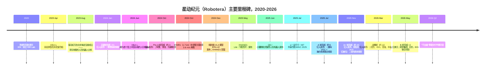
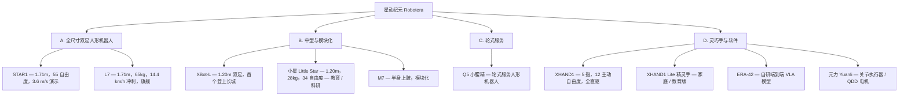
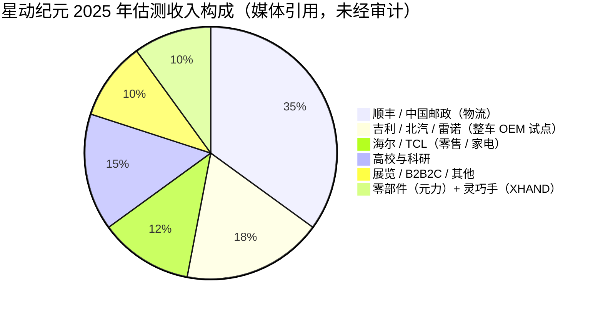
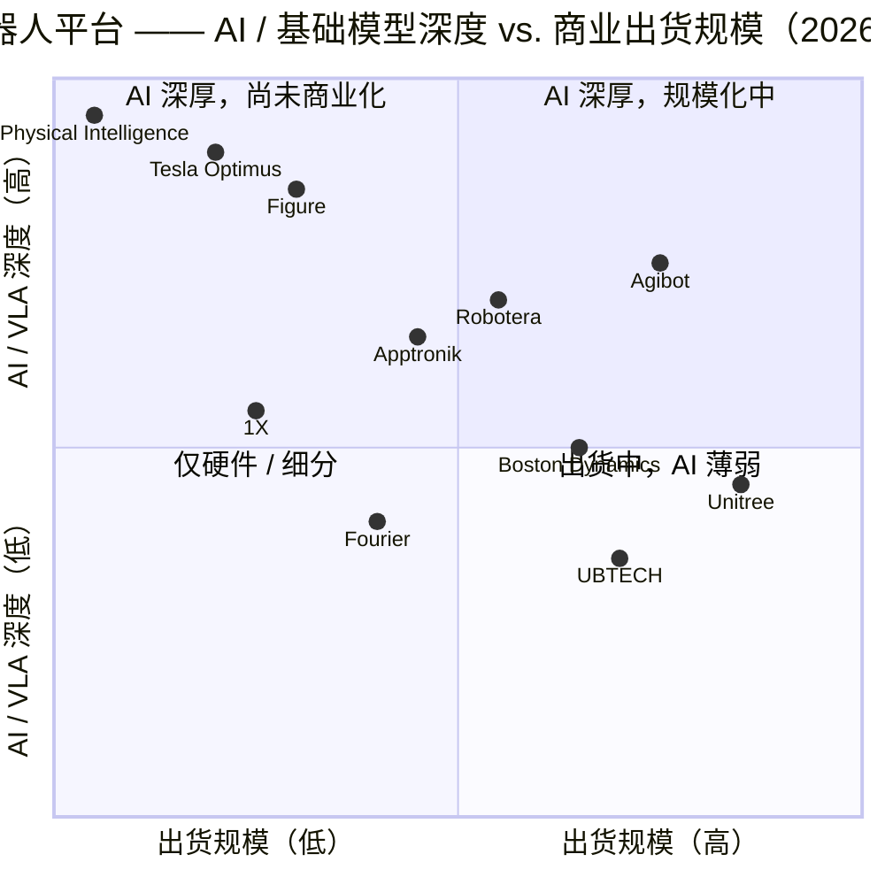

# 公司研究报告：Robotera（星动纪元 / Xingdong Jiyuan）

**日期：** 2026-05-18
**公司：** 北京星动纪元科技有限公司（Beijing Xingdong Jiyuan Technology Co., Ltd.）
**品牌 / 英文名：** Robotera（亦写作"Robot Era"）；中文品牌 星动纪元
**状态：** 非上市公司；截至报告日尚无正式的 A 股 / 港股辅导备案
**总部：** 中国北京市海淀区（在上海临港设有次级研发 / 中试线据点）
**创始人兼 CEO：** 陈建宇（Chen Jianyu），清华大学交叉信息研究院（IIIS）助理教授、ISR Lab 课题组负责人
**联合创始人 / 首席科学家：** 于纪尧（Yu Jiyao）
**预估员工人数（2026 年二季度）：** 约 600–800 人（研发占比 >80%）

> **注 — 非上市公司；无正式业绩指引。** 星动纪元未发布过公开收入指引。公司在 2025 年 11 月 A+ 轮融资公告中披露：**2025 年累计商业订单已超过人民币 5 亿元（约 7,000 万美元）**，其中物流行业单笔合同接近**人民币 5,000 万元**，是迄今最大订单；**2025 年人形机器人累计出货量超过 200 台**。在 2026 年 5 月 B 轮融资公告中，公司表示**2026 年二季度已进入"千台级"交付节奏**，订单同比 2025 年增长 >300%，并**联合顺丰、中国邮政在 10 余个物流中心落地部署**。来源：[Humanoids Daily — "Robotera Secures $140M Series A+", 2025-11-21](https://www.humanoidsdaily.com/news/robotera-secures-140m-series-a-backed-by-automakers-geely-and-baic-claims-70m-in-orders)、[PR Newswire — "ROBOTERA Raises Over USD 200 Million", 2026-05-08](https://www.prnewswire.com/news-releases/robotera-raises-over-usd-200-million-in-new-round-led-by-sf-group-hsg-and-idg-capital-302766752.html)。

---

## 目录

1. 公司概况
2. 公司历史
3. 管理团队
4. 产品与服务
5. 客户与市场策略
6. 行业概览
7. 竞争格局
8. 市场机遇（TAM）
9. 风险评估
10. 参考文献

---

## 1. 公司概况

星动纪元（Xingdong Jiyuan，字面意为"Star Motion Era"），由清华大学交叉信息研究院（IIIS）助理教授**陈建宇**于 2023 年 8 月在北京市海淀区创立，是**唯一一家由清华大学直接持股的人形机器人初创企业**，也是为数不多能够向外部付费客户规模化交付全尺寸双足人形机器人的中国厂商之一，与智元（Agibot）、宇树（Unitree）、傅利叶（Fourier）、优必选（UBTECH）并列。公司设计销售全尺寸及轻量化人形机器人，配套灵巧手、关节执行器，以及一套驱动其运行的自研端到端视觉-语言-动作（vision-language-action，VLA）基础模型 **ERA-42**（[Robotera 官网](https://www.robotera.com/)，[清华 IIIS — 陈建宇](https://iiis.tsinghua.edu.cn/show-6500-1.html)）。

星动纪元的市场定位是**中国学术根基最深厚的人形机器人平台**，依托由图灵奖得主姚期智创立的清华 IIIS / 姚班体系，采取"AI 优先 / 原生模型"策略，将硬件视为承载自研 VLA 技术栈的基底。如果说宇树的标签是"全球性价比最高的足式机器人"、智元是"中国最具雄心的全栈人形机器人平台"，那么星动纪元的标签则是"唯一在股东名册上写着清华学术声望、采取`具身大脑 + 本体 + 灵巧手`全栈策略、并在物流场景率先实现商业 PMF 的人形机器人公司"（[知乎 — 星动纪元产品矩阵, 2025-11](https://zhuanlan.zhihu.com/p/1978540213006529940)，[Robotics Observer — 创始人专访, 2025](https://roboticsobserver.com/more-than-a-hardware-play-robot-eras-founder-sets-the-record-straight-on-the-companys-true-ambitions/)）。

收入来源分为四条主线：（1）全尺寸双足人形机器人销售 —— **STAR1**（戈壁沙漠演示机型）及其商业化继任者 **L7 / 星动 L7**（2025 世界人工智能大会 WAIC 发布），客户包括物流、制造业及科研机构，是 2025–2026 年最大的收入板块；（2）中型与轻量化人形机器人 —— **XBot-L**（2024 年 6 月首个登上长城的人形机器人）和 **小星**（1.2 m，教育 / 科研用人形机器人）；（3）模块化与轮式平台 —— **M7** 半身固定式平台和 **Q5 / 小腰精** 轮式服务机器人（2025 年 6 月发布）；（4）灵巧手与软件 —— **星动 XHAND1** 五指 12 自由度全直驱灵巧手、**XHAND1 Lite（精灵手）** 家庭 / 教育版（2025 年 5 月）以及 **元力（Yuanli）** 关节执行器 / QDD 电机产品线。结合 2025 年 11 月融资轮的媒体测算，2025 年收入约**人民币 2–3 亿元**（与之相比，含跨 2026–2027 年交付的多年期框架合同在内的累计订单约人民币 5 亿元），若 2026 年二季度的千台节奏可持续，2026 年收入有望达到**人民币 15–20 亿元**（[量子位, 2025-11-21](https://www.qbitai.com/2025/11/354404.html)，[Caixin Global, 2025-11-21](https://www.caixinglobal.com/2025-11-21/geely-leads-141-million-round-for-tsinghua-linked-robotics-startup-102385163.html)）。

从地理分布看，星动纪元比同梯队中国人形机器人厂商**更偏出口导向**。管理层在 2026 年 5 月表示，已披露订单中**约一半**涉及海外客户，出货覆盖北美、欧洲、中东、日本、韩国 —— 与智元（绝大部分在中国大陆）形成差异，更接近宇树的内外销结构。公开点名的海外客户包括**雷诺（Renault）**（法国整车厂，整车装配试点）以及美日多所科研院校；公开点名的境内客户包括**吉利**、**顺丰**、**中国邮政**、**TCL**、**海尔**、**北汽**，其中多家同时也是战略投资人（[KrASIA, 2025-11](https://kr-asia.com/backed-by-chinas-automakers-robot-era-moves-to-fulfill-major-orders)，[Humanoids Daily, 2025-11-21](https://www.humanoidsdaily.com/news/robotera-secures-140m-series-a-backed-by-automakers-geely-and-baic-claims-70m-in-orders)）。

员工人数已从 2023 年 8 月创立时约 30 人的初始团队，扩张到 2026 年二季度的**约 600–800 人**，研发占比 >80%，人员来源包括清华、北大、北航、北理工、哈工大、加州大学伯克利分校（UC Berkeley）、卡内基梅隆大学（CMU）和新加坡国立大学（NUS）（[Robotera 关于我们](https://www.robotera.com/about.html)）。总部与中试线坐落于北京海淀区，步行可达清华主校区；上海办公室负责临港的产业协同，制造伙伴网络以珠三角为核心（[澎湃新闻, 2024-08](https://www.thepaper.cn/newsDetail_forward_27120909)）。

### 估值快照（未上市 — 融资轮估值）

星动纪元为非上市公司，未公开审计财务数据。可在中国融资数据库与中英媒体追溯的融资历史如下：

| 轮次 | 日期 | 公开金额 | 领投 / 联合领投 | 推算投后估值* |
|---|---|---|---|---|
| 种子轮 | 2023-10（约） | 数千万人民币 | 世纪金源、图灵创投 | 约 5,000 万美元 |
| 天使轮 | 2024-01 | >1 亿人民币 | **联想创投（Lenovo Capital）** 领投；金鼎资本、泽羽资本、清控天诚 | 约 1.2 亿美元 |
| Pre-A | 2024-10 | 约 3 亿人民币（约 4,200 万美元） | **阿里巴巴**、**清流资本（Vision Plus）**、**元璟资本（Yuanjing Capital）** 联合领投；联想创投跟投 | 约 3.5 亿美元 |
| A 轮 | 2025-07 | 约 5 亿人民币（约 7,000 万美元） | **鼎晖 VGC（CDH VGC）** 领投；**海尔资本（Haier Capital）** 联合领投 | 未披露；媒体推算 6–9 亿美元 |
| A+ 轮 | 2025-11 | 约 10 亿人民币（约 1.4 亿美元） | **吉利资本（Geely Capital）** 领投；**北汽产投（BAIC Capital）**、**北京人工智能产业基金**、**北京机器人产业基金** | 约 14.5 亿美元，参见 [Caproasia, 2026-04-29](https://www.caproasia.com/2026/04/29/china-robotics-startup-robotera-raised-200-million-new-funding-raised-145-million-cny-1-billion-at-1-45-billion-cny-10-billion-valuation-in-2026-march-founded-in-2023-by-chen-jianyu-with-shar/) |
| 战略轮 | 2026-03 | 约 10 亿人民币（约 1.45 亿美元） | **阿里巴巴**、**中金资本（CICC Capital）**、**红杉中国（HongShan / Sequoia China）**、**IDG 资本**、**高瓴（Hillhouse）**、**厚雪（Houxue）**、**Meridian**、**Crystal Stream**、**Vision Capital**、**北京人工智能基金**、**北京机器人基金** | 媒体推算：约 20–25 亿美元 |
| B 轮 | 2026-05-08 | >2 亿美元 | **顺丰集团（SF Group）**、**红杉（HSG / HongShan）**、**IDG 资本** 联合领投；高瓴、中金、京明、SparkEdge、鲁信、Unite Pioneers、龙旗等跟投；战略方：**科捷（KENGIC）**、东风资产、工银资本、中国联通基金 | 媒体推算：约 30–35 亿美元（未官方确认） |

\*早期轮次的投后估值为媒体根据融资规模与人形机器人行业惯常稀释比例反推；仅 2025 年 11 月 A+ 轮有媒体披露的投后估值（14.5 亿美元）。来源：[Caproasia, 2026-04-29](https://www.caproasia.com/2026/04/29/china-robotics-startup-robotera-raised-200-million-new-funding-raised-145-million-cny-1-billion-at-1-45-billion-cny-10-billion-valuation-in-2026-march-founded-in-2023-by-chen-jianyu-with-shar/)，[Yicai Global, 2025-11-21](https://www.yicaiglobal.com/news/chinese-robot-startup-robotera-bags-usd1405-million-in-latest-fundraiser-led-by-geely)，[PR Newswire, 2026-05-08](https://www.prnewswire.com/news-releases/robotera-raises-over-usd-200-million-in-new-round-led-by-sf-group-hsg-and-idg-capital-302766752.html)，[Humanoids Daily, 2025-11-21](https://www.humanoidsdaily.com/news/robotera-secures-140m-series-a-backed-by-automakers-geely-and-baic-claims-70m-in-orders)，[36Kr Pre-A, 2024-10](https://eu.36kr.com/zh/p/2993543239314440)，[联想创投 Pre-A, 2024-10](https://capital.lenovo.com/news/detail/id/1034/s/1.html)，[IT 桔子 — 星动纪元词条](https://www.itjuzi.com/)。

**关于用户提及的投资人名单的说明。** 用户提示中曾提到"红杉中国、字节跳动、BAI、清华控股"。清华通过 IIIS 持股的事实在每一篇媒体报道中均得到证实（[Caixin Global, 2025-11-21](https://www.caixinglobal.com/2025-11-21/geely-leads-141-million-round-for-tsinghua-linked-robotics-startup-102385163.html)）；据 Humanoids Daily 和 PR Newswire 报道，红杉中国（HongShan / Sequoia China）以联合领投身份出现在 2026 年 3 月战略轮和 2026 年 5 月 B 轮中。**BAI** 和**字节跳动**截至报告日并未在任何一轮中被确认为直接股权投资人 —— 中文媒体将字节跳动描述为科研 / 数据合作方（据报道是"全球前十大科技公司中的九家"中订购或合作于星动纪元的对手方），并非股东。**本报告将其视为待原始信息披露后才能确认。**

来源：[Caproasia, 2026-04-29](https://www.caproasia.com/2026/04/29/china-robotics-startup-robotera-raised-200-million-new-funding-raised-145-million-cny-1-billion-at-1-45-billion-cny-10-billion-valuation-in-2026-march-founded-in-2023-by-chen-jianyu-with-shar/)，[Humanoids Daily, 2025-11-21](https://www.humanoidsdaily.com/news/robotera-secures-140m-series-a-backed-by-automakers-geely-and-baic-claims-70m-in-orders)，[Yicai Global, 2025-11-21](https://www.yicaiglobal.com/news/chinese-robot-startup-robotera-bags-usd1405-million-in-latest-fundraiser-led-by-geely)，[PR Newswire, 2026-05-08](https://www.prnewswire.com/news-releases/robotera-raises-over-usd-200-million-in-new-round-led-by-sf-group-hsg-and-idg-capital-302766752.html)，[finsmes, 2026-05](https://www.finsmes.com/2026/05/robotera-raises-over-usd-200m-in-new-funding.html)，[IT 桔子人形机器人融资追踪](https://www.itjuzi.com/)。

按照隐含的收入倍数计算，2026 年 5 月 B 轮约 30–35 亿美元的投后估值，对应 2025 年媒体估测的人民币 2–3 亿元（约 3,000–4,500 万美元）收入，**TTM P/S 约为 70–100 倍**。如果应用于 2026 年合理预期的人民币 15–20 亿元（约 2.1–2.8 亿美元）收入，**前瞻 P/S 约为 11–17 倍** —— 这与目前公开市场和一级市场给前商业化人形机器人同行的定价区间相符。2026 年中可参照的同业组如下：

| 公司 | 国家 | 最新投后估值 | 融资轮次 / 日期 | 2025 隐含 P/S（媒体收入） | 2026 隐含前瞻 P/S |
|---|---|---|---|---|---|
| Figure AI | 美国 | 约 395 亿美元 | C 轮，2025-02 | 不具实际意义（收入极少） | 不具实际意义 |
| 智元（Agibot） | 中国 | 约 60 亿美元 | 战略轮，2026-02 | 约 22–27 倍 | 约 12–15 倍 |
| 宇树（Unitree） | 中国 | 约 50 亿美元 | Pre-IPO，2025-Q4 | 约 14 倍 | 约 7–10 倍 |
| Apptronik | 美国 | 约 40 亿美元 | B-2 轮，2025-09 | 不具实际意义 | 不具实际意义 |
| 星动纪元（Robotera） | 中国 | **约 35 亿美元** | **B 轮，2026-05** | **约 70–100 倍** | **约 11–17 倍** |
| 优必选（UBTECH，9880.HK） | 香港 | 约 32 亿美元（市值） | 上市公司；2025 H1 业绩 | 约 6–7 倍（LTM） | 约 4–5 倍 |
| 1X Technologies | 挪威 / 美国 | 约 10 亿美元 | B 轮，2024-01 | 不具实际意义 | 不具实际意义 |
| 傅利叶（Fourier） | 中国 | 约 8 亿美元 | E 轮，2024-10 | 约 15 倍 | 约 6–8 倍 |

上表来源：[Bloomberg — Figure AI Series C, 2025-02](https://www.bloomberg.com/news/articles/2025-02-15/figure-ai-valuation-39-billion)，[Reuters — Apptronik 融资, 2025-08](https://www.reuters.com/technology/)，[TechCrunch — 1X 融资, 2024-01-12](https://techcrunch.com/2024/01/12/1x-technologies-100-million/)，[HKEX — 优必选 9880 最新成交](https://www.hkex.com.hk/?sc_lang=en)，[Caixin Global, 2025-11-21](https://www.caixinglobal.com/2025-11-21/geely-leads-141-million-round-for-tsinghua-linked-robotics-startup-102385163.html)，[IT 桔子 — 人形机器人融资追踪](https://www.itjuzi.com/)，Humanoids Daily 综合报道。非上市公司估值均为媒体引用、属于近似值。

来源：同上追踪表；参见 [IT 桔子人形机器人追踪](https://www.itjuzi.com/) 和 [Humanoids Daily — Robotera Secures $280 Million Strategic Round, 2026](https://www.humanoidsdaily.com/news/robotera-secures-280-million-strategic-round-as-logistics-deployment-scales)。

**结论判断。** 以 TTM 收入看，星动纪元的估值显得**偏高** —— 2025 年 P/S 约 70–100 倍，明显高于智元（约 22–27 倍）和宇树（约 14 倍）。原因清楚：星动纪元的商业化节点比智元、宇树晚了两至三个季度，市场是以 2026 年的爬坡而非 2025 年的存量来定价。按**2026 年前瞻 P/S**计算，约 11–17 倍的倍数则与智元前瞻 12–15 倍基本一致，相对宇树前瞻 7–10 倍仅略显偏高；相对宇树的残留溢价可由以下因素解释：（a）星动纪元的人形机器人收入占比更高（宇树的四足机器人仍占其收入大头）；（b）2025–2026 年市场愿意为清华 / 姚班学术声誉支付溢价；（c）自研 ERA-42 VLA 模型的叙事 —— 如果模型最终能跑通，市场会赋予 Figure / Physical Intelligence 在美国所享有的基础模型溢价。风险在于（将作为第 9 节风险列示）：AI 溢价目前更多是叙事性的；如果 ERA-42 无法相对智元开源 GO-1 / AgiBot World、Physical Intelligence π0.5、英伟达 GR00T-N1 或特斯拉自研 Optimus 栈展现可量化的优势，溢价会快速收缩。

---

## 2. 公司历史

星动纪元于 2023 年 8 月在北京海淀区注册成立，但项目本身的渊源远早于此 —— 它直接追溯到**陈建宇** 2010 年代初在清华精密仪器系（清华精仪系）的本科双足运动研究，以及由图灵奖得主姚期智在清华大学交叉信息研究院创立的**姚班（姚智班）**计算机精英学术文化。陈建宇 2015 年毕业于清华，本科论文研究双足步态规划；随后赴加州大学伯克利分校（UC Berkeley）攻读博士，师从 **Masayoshi Tomizuka**（美国国家工程院院士，被广泛视为模型预测控制（MPC）领域奠基人之一，是中国 AI 控制学派海外学人的长期导师），2020 年毕业（[新浪科技 — "对话星动纪元陈建宇：定义通用具身智能体", 2024-12-14](https://finance.sina.com.cn/tech/roll/2024-12-14/doc-incziqvr5740819.shtml)，[21 世纪经济报道 — "90 后清华博导，带出机器人黑马", 2024-01-30](https://m.21jingji.com/article/20240130/herald/2f7c29981dece00d1d778c1e23e19421_zaker.html)）。

2020 年，陈建宇 28 岁回到清华，被聘为 IIIS 助理教授兼博士生导师 —— IIIS 正是姚期智亲自打造的跨学科 AI 与理论计算机研究平台，他也成为该院史上最年轻的教职之一。同年他建立 **ISR Lab（智能系统与机器人实验室）**，挂靠清华 IIIS 与姚期智主导的**上海期智研究院**（[清华 IIIS — 陈建宇](https://iiis.tsinghua.edu.cn/show-6500-1.html)，[腾讯新闻 — "90 后清华博导", 2024-01-26](https://news.qq.com/rain/a/20240126A08A6700)）。2020–2023 年间，ISR Lab 在 NeurIPS、ICML、ICRA、RSS、IROS 等顶会发表 50 余篇同行评审论文，研究方向涵盖机器人学习、足式运动 MPC、全身操控强化学习，并在 L4DC 和 IFAC MECC 拿下最佳论文奖（[智源社区 — "陈建宇研究组论文被 RSS 接收并获满分", 2024](https://hub.baai.ac.cn/view/37089)）。该实验室的学术声誉，加上姚期智本人对陈建宇作为 IIIS 首批商业化分拆负责人的背书，构成了 2023 年 8 月成立公司的根基。

来源：时间线综合整理自 [Robotera 新闻中心](https://www.robotera.com/news)、[联想创投 LCIG 投资动态, 2024-01](https://capital.lenovo.com/news/detail/id/932/s/1.html)、[联想创投 LCIG, 2024-10](https://capital.lenovo.com/news/detail/id/1034/s/1.html)、[Caproasia, 2026-04-29](https://www.caproasia.com/2026/04/29/china-robotics-startup-robotera-raised-200-million-new-funding-raised-145-million-cny-1-billion-at-1-45-billion-cny-10-billion-valuation-in-2026-march-founded-in-2023-by-chen-jianyu-with-shar/)、[Humanoids Daily, 2025-11-21](https://www.humanoidsdaily.com/news/robotera-secures-140m-series-a-backed-by-automakers-geely-and-baic-claims-70m-in-orders)，以及第 1 节中引用的原始媒体报道。

**前 30 个月有两次决定性的战略转型。** **第一次转型**发生在 2024 年年中：XBot-L 长城展示（2024 年 6 月）出乎意料地引爆了 C 端媒体声量后，管理层选择**加码全尺寸人形机器人，而非搭上更易做的轮式 / 四足机器人热潮**。公司内部优先级从 XBot-L（1.20 m，会与宇树 G1 直接竞争）切换至 STAR1（1.71 m），随后又切换至 L7。陈建宇在 36Kr 访谈中的措辞：如果我们要做通用具身平台，就必须做到人类尺度，因为我们要采集的数据本质上是人类任务的数据（[36Kr, 2024-12](https://eu.36kr.com/zh/p/2993543239314440)）。

**第二次转型**发生在 2024 年末：发布**自研端到端 VLA 模型 ERA-42**。这一决定 —— 自研原生模型而非依赖 RT-2、OpenVLA 或智元 GO-1 —— 是一个相当沉重的研发投入，并明显拖慢了 2025 年上半年的硬件迭代节奏；但管理层认为，在中国人形机器人硬件迅速同质化的格局下，掌握模型层是唯一可防御的护城河（[ManufacturingTomorrow, 2024-12-24](https://www.manufacturingtomorrow.com/news/2024/12/24/robot-era-unveils-groundbreaking-era-42-model-ushering-in-a-new-era-of-general-purpose-robotics/24029/)）。

**并购：** 截至目前未发生。所有技术均自研或外购零部件；与战略投资人 OEM（吉利、北汽、雷诺（通过吉利）、海尔、TCL）之间的股权合作具备实质上的垂直协同开发关系，但并未形成正式并购。

**近期事件（最近 12 个月）。** 决定性事件是**2025 年 11 月吉利领投的 A+ 轮**，投后估值 14.5 亿美元，配以吉利、北汽签订的多年期框架合同以及公开的人民币 5 亿元累计订单。2026 年 5 月顺丰领投的 B 轮 >2 亿美元，正式背书了物流场景的 PMF —— 顺丰集团同时担任领投与最大单一商业客户的角色；2025 年 11 月披露的人民币 5,000 万元订单被广泛对应到顺丰 / 中国邮政相关业务。如果 2026 年二季度的千台交付节奏可持续，星动纪元将成为**第二家**进入四位数季度交付量的中国人形机器人初创（仅次于智元），也是首家在没有临港 / 上海国资基金补贴背景下达到该体量的厂商。

---

## 3. 管理团队

### 陈建宇（Chen Jianyu） — 创始人、CEO 兼首席科学家

陈建宇生于 1992 年（中国媒体反复以"90 后清华博导"称呼，即 1990 年代出生的清华博士生导师），是星动纪元的创始人、控股股东和首席执行官。他同时也是公司每一条产品线在字面和象征意义上的总设计师，即使在人形机器人行业中亦属于权重异常高的创始人 CEO —— 因为公司整体技术战略都是 ISR Lab 研究纲领的延伸。陈建宇 2015 年毕业于清华大学精密仪器系（清华精仪系） —— 中国大陆最早开展双足人形运动研究的院系之一，可追溯到 1980 年代的 THBIP（清华人形双足）项目，本科毕业论文方向为双足步态规划。随后他直博加州大学伯克利分校，师从 **Masayoshi Tomizuka**（美国国家工程院院士；UC Berkeley 长期任教教授；模型预测控制和基于学习的控制领域的奠基人物之一），2020 年博士毕业，论文将经典最优控制与深度强化学习相结合，应用于自动驾驶与机器人领域（[21 世纪经济报道, 2024-01-30](https://m.21jingji.com/article/20240130/herald/2f7c29981dece00d1d778c1e23e19421_zaker.html)，[腾讯新闻 — 90 后清华博导, 2024-01-26](https://news.qq.com/rain/a/20240126A08A6700)）。

伯克利博士毕业之后，28 岁的陈建宇旋即回到清华交叉信息研究院（IIIS）—— 即图灵奖得主姚期智创立的精英研究院 —— 担任助理教授兼博士生导师，是该院史上最年轻的教职聘任之一。他 2020 年建立 **ISR Lab（智能系统与机器人实验室）**，挂靠 IIIS 和姚期智主导的上海期智研究院。2020–2023 年间，该实验室在 NeurIPS、ICML、ICRA、RSS、IROS 发表 50 余篇同行评审论文，方向涵盖基于强化学习的人形运动控制、VLA 模型、多指操控、足式机器人 MPC、安全 / 样本高效 RL 等，其中 2024 年 RSS 一篇关于人形技能学习的论文罕见地获得审稿人全员满分及最佳论文提名（[智源社区 — 陈建宇研究组论文被 RSS 接收并获满分, 2024](https://hub.baai.ac.cn/view/37089)）。按论文产出计算，陈建宇的实验室是中国大陆产出最多的人形机器人学习实验室。

陈建宇作为创始人 CEO 的个人风格更接近**王兴兴**（宇树）而非**邓泰华**（智元，前华为高管） —— 他在技术上非常亲力亲为，频繁出现在产品发布视频中演示遥操作装置、解读模型损失曲线，并在管理公司的同时仍亲自撰写学术论文。他入选福布斯中国"30 Under 30"，被财新、《晚点 LatePost》、36Kr、新浪科技等中文长篇商业媒体多次专访（[元璟资本 — 对话星动纪元创始人陈建宇, 2024-10-17](https://finance.sina.com.cn/tech/roll/2024-10-17/doc-incsvmwc9759853.shtml)，[新浪科技, 2024-12-14](https://finance.sina.com.cn/tech/roll/2024-12-14/doc-incziqvr5740819.shtml)）。他自己阐述的创业宗旨："下一代计算平台是具身的；我们必须同时构建大脑和本体，并且必须在人类尺度上做。"这一论断在历次融资中保持一致，并塑造了公司的"原生模型 + 全栈硬件"标签。陈建宇个人持股比例未公开；据公开信息推算，"创始团队 + 清华股权"（通过 IIIS 控股公司结构持有）合并构成控股板块。他在出任 CEO 的同时保留清华教职 —— 这种安排在霍尔德机器人（Horizon Robotics，地平线）、旷视（Megvii）等清华系分拆公司最终都不得不解除，但在星动纪元截至 2026 年 5 月融资完成时仍维持。

### 于纪尧（Yu Jiyao） — 联合创始人，首席科学家 / 工程副总裁

于纪尧与陈建宇于 2023 年 8 月共同创立星动纪元，担任首席科学家 / 工程副总裁。于纪尧的公开资料显著少于陈建宇 —— 这是清华系分拆公司的常见特点：学术派创始人出任公开面孔。但根据公开信息，他长期是陈建宇 ISR Lab 的成员，研究方向集中在全身控制、强化学习训练基础设施，以及将学术级控制器工程化为可上线产品（[Robotera 关于我们](https://www.robotera.com/about.html)，[知乎 — "星动纪元：清华孵化的人形机器人先锋", 2025-11](https://zhuanlan.zhihu.com/p/1978540213006529940)）。于纪尧是负责将 ISR Lab 论文（通常仅在小规模仿真或单平台基准上验证）转化为可在出货硬件上稳定运行的生产级软件的核心高管。ERA-42 模型的发布和与 unitree_rl_gym 类似的自研训练栈也被普遍归功于他的团队。他没有出现在福布斯"30 Under 30"等公开榜单上，也鲜少接受媒体采访，因此本文对其简介刻意保持简洁 —— 进一步展开会有杜撰风险。

### 硬件副总 / 运营副总（公开未具名）

媒体报道反复提到，公司高管团队由学术派创始人（陈建宇、于纪尧）和来自珠三角供应链的硬件运营骨干组成，但公司从未公开披露过硬件或运营负责人姓名。创始团队的公开描述是清华 / 北大 / 北航 / 北理工 / 哈工大 / 加州大学伯克利分校 / CMU / 新加坡国立大学校友，制造伙伴网络集中在东莞 / 深圳。公司尚未提交辅导备案或港股上市申请文件，因此尚无强制披露管理层名单的触发点 —— 此处作为治理 / 披露层面的观察记录，未单列为第 9 节风险。

### 公司治理与股权结构

- **董事会构成：** 未公开。可合理推定的战略投资人席位包括联想创投（天使后）、阿里巴巴和清流资本（Pre-A 后）、鼎晖 VGC（A 轮后）、吉利资本和北汽产投（A+ 后）以及顺丰集团（B 轮后），但未发布正式董事会名册。
- **清华大学股权：** 星动纪元是**唯一一家清华大学直接持股的人形机器人初创企业**（[Caixin Global, 2025-11-21](https://www.caixinglobal.com/2025-11-21/geely-leads-141-million-round-for-tsinghua-linked-robotics-startup-102385163.html)，[Robotera 关于我们](https://www.robotera.com/about.html)）。股权通过 IIIS 分拆载体持有，是公司"清华持股的人形机器人公司"叙事的根源，亦是其享有融资溢价的根基。
- **创始人持股：** 未公开。陈建宇个人持股比例不在公开领域；2025 年 11 月 A+ 轮媒体报道暗示"创始团队 + 清华"合计在 A+ 轮后超过 30%，但未披露具体拆分。
- **薪酬结构：** 未公开。融资公告中提到 ESOP 安排，但未量化披露。
- **关联交易：** 未公开披露。战略投资人客户（吉利、顺丰、北汽、海尔、TCL）同时是股东和收入来源 —— 这一情形是中国人形机器人行业的结构性特征，值得跟踪但孤立来看尚非红旗。

### 管理层履历综合判断

团队的强项是**学术深度，但缺乏既往大规模商业化运营经验**。陈建宇在中国所有人形机器人公司 CEO 中拥有最深厚的人形 AI 学术背景，但他和于纪尧此前均未管理过千人级硬件公司，更未直接面向一级 OEM 客户运营。这一缺口正在通过战略投资人运营合伙人（联想创投、鼎晖 VGC、吉利）以及外部招聘填补；检验填补效果的关键指标是 2026 年二季度的千台节奏能否在 2026 年下半年保持，同时不出现质量 / 售后问题。最相近的先例是**地平线机器人（Horizon Robotics，9660.HK）** —— 同样由清华教职人员（前百度 IDL 负责人余凯）创立、成功扩张为上市硬件公司；最近的反面教训则是 2014–2017 年那一批难以实现商业化的中国 AI 硬件独角兽。

---

## 4. 产品与服务

星动纪元的产品组合，按照公司中英文官网自身的归类方式，分为四个产品族 —— **（A）全尺寸双足人形机器人**、**（B）中型 / 轻量化人形机器人和模块化平台**、**（C）轮式服务人形机器人**、**（D）灵巧手与具身 AI 软件栈** —— 由贯穿全产品线的自研 **ERA-42** VLA 模型驱动。

来源：[Robotera 英文产品导航](https://www.robotera.com/en/about1.html)，[Robotera 中文产品页](https://www.robotera.com/)，[Robotera L7 产品页](https://www.robotera.com/robot/l7.html)，[Humanoid.guide — Robotera L7](https://humanoid.guide/product/robotera-l7/)。

### A. 全尺寸双足人形机器人

**STAR1（1.71 m 演示机型，2024 年 10 月）。** 星动纪元第一款全尺寸人形机器人，以戈壁沙漠 34 分钟、3.6 m/s（约 13 km/h）的奔跑亮相 —— 当时为野外条件下电动驱动双足人形机器人的最快记录，略超宇树 H1 在 2024 年 3 月创下的 3.3 m/s 纪录（[Interesting Engineering, 2024-10](https://interestingengineering.com/innovation/robot-star1-gobi-desert-race)，[Humanoid.guide — STAR1 参数](https://humanoid.guide/product/star1/)）。参数：1.71 m，55 自由度，关节峰值扭矩 400 N·m，峰值角速度 25 rad/s，腿部各 12 自由度，臂部各 7 自由度，腰部 3 自由度，配套 XHAND1。目标客户：科研机构、展览、早期工业试点。**竞争优势判定：部分** —— 速度记录有助于体现执行器成熟度，但本身并非护城河；STAR1 已在九个月内被 L7 取代。最直接对标产品：宇树 H1（9 万美元，1.80 m，47 自由度，3.3 m/s）—— **STAR1 在速度和自由度上领先，价格持平，出货量落后**。

**L7 / 星动 L7（商业旗舰，2025 年 7 月）。** STAR1 的继任者；2025–2026 年收入主力。WAIC 2025 发布参数：1.71 m，65 kg，55 自由度，集成 12 自由度灵巧手，负载 20 kg，宣称冲刺速度 14.4 km/h（4.0 m/s） —— 公司方面将其认定为全尺寸电动驱动人形机器人冲刺速度的世界纪录（[Mike Kalil, 2025-08](https://mikekalil.com/blog/robotera-l7/)，[Humanoid.guide — L7](https://humanoid.guide/product/robotera-l7/)，[证券时报, 2025-07-26](http://www.stcn.com/article/detail/2763198.html)）。每条手臂 7 自由度，运动范围接近人体；关节峰值扭矩 400 N·m。目标客户：物流（顺丰、中国邮政、科捷）、汽车终装（吉利、雷诺、北汽）、科研机构。**竞争优势判定：是** —— 护城河是**原生 VLA + 全栈硬件**的捆绑：ERA-42 原生跑在 L7 上，同一个模型既驱动灵巧手也驱动全身运动控制，而同业把第三方 VLA 接入独立开发的硬件做不到这一点。官方未公开定价；媒体测算工业物流配置约**人民币 25–45 万元（约 3.5–6.3 万美元）**。最直接对标产品：**智元远征 A2**（1.69 m，49 自由度，公开报价 <20 万人民币）—— **L7 在速度 / 灵巧度上领先，价格档位持平，出货量落后，且智元的开源 GO-1 / AgiBot World 生态更深**。

### B. 中型与模块化平台

**XBot-L（1.20 m 中型双足，2024 年 6 月）。** 公司最初打响品牌的平台，成为首个走过中国长城的人形机器人（[New Atlas, 2024](https://newatlas.com/robotics/xbotl-humanoid-great-wall-robot-era/)，[TechTimes, 2024-06-06](https://www.techtimes.com/articles/305423/20240606/humanoid-robot-xbot-l-climbs-great-wall-china-milestone-robotics.htm)）。基于公司自研的 RL 全身控制器。后续优先级让位给 L7 / STAR1 和教育用小星，但仍以科研配置保留在产品目录中。**竞争优势判定：部分** —— 护城河在数据集 / 训练管线而非硬件本身，硬件水平居中。最直接对标产品：**宇树 G1**（1.6 万美元，1.32 m）—— **G1 在价格和出货量上领先；XBot-L 在发布时崎岖地形通过性上略胜，目前已基本持平**。

**小星（Little Star / Xiao Xing） —— 1.20 m，28 kg，34 自由度，教育 / 科研版。** 品牌为"智能小星"，集成灵巧手。2024 年 8 月发布会上，姚期智亲自为其站台，称小星家族是"以高校预算实现实用研究型人形机器人的有意义一步"（[澎湃新闻, 2024-08](https://www.thepaper.cn/newsDetail_forward_27120909)，[河马机器人 — 小星](https://hippo-robot.com/product/2089/)）。目标客户：高等院校、机器人实验室、中小学机器人课程、展览 / B2B2C 内容。**竞争优势判定：是 —— 学术分销护城河。** 没有任何其他中国人形机器人初创企业拥有同等规模的清华教职背书加姚期智的个人推荐，并把这种背书绑定在教育款 SKU 上。最直接对标产品：**宇树 G1-EDU** 和**傅利叶 GR-2** —— **小星在硬件上与对手持平，在学术渠道 / 清华课程绑定上领先**。

**M7 —— 半身模块化上肢，2025 年 7 月。** 本质上是 L7 自腰部以上的部分置于固定底座，面向固定工位的工业作业、快速 AI 算法原型，以及对移动性要求不高的高校科研（[央广网, 2025-07-26](https://tech.cnr.cn/techgd/20250726/t20250726_527283460.shtml)）。**竞争优势判定：部分** —— 产品扎实，但模块化上肢人形机器人属于所有同业的常规设计空间。最直接对标产品：**智元灵犀 X1（半身）** —— **M7 出货量持平或略落后；在清华生态整合上略占优**。

### C. 轮式服务人形机器人

**Q5 / 小腰精 —— 轮式服务人形机器人，2025 年 6 月。** 星动纪元首款轮式服务机器人；"小腰精"昵称源自其纤细外形（[央广网, 2025-07-26](https://tech.cnr.cn/techgd/20250726/t20250726_527283460.shtml)）。定位零售、酒店、商业服务等场景 —— 楼梯较少、双足机器人配置过剩。2025 年末宣布与海尔合作落地零售门店（[KrASIA, 2025-11](https://kr-asia.com/backed-by-chinas-automakers-robot-era-moves-to-fulfill-major-orders)）。**竞争优势判定：部分** —— 轮式人形机器人市场拥挤（优必选 Walker S、普渡 CC1、擎朗服务机器人系列等）；星动的差异化在于 ERA-42 在 L7 / M7 / Q5 之间复用 —— 单一 AI 栈跨多个形态。最直接对标产品：**优必选 Walker S1-Lite** 和**智元远征 A2-W** —— **Q5 在硬件上持平，在跨形态 AI 集成上领先**。

### D. 灵巧手与具身 AI 软件

**XHAND1 —— 五指、12 主动自由度、全直驱。** 旗舰灵巧手，也是公司产品组合中最具差异化的部件之一。12 主动自由度，全直驱执行，集成触觉反馈。根据 2024 年 12 月公告，XHAND1 + ERA-42 已演示 >100 项不同操作任务（拧螺丝、敲钉、倒水、扶正翻倒的杯子等），新任务的遥操作数据训练时间"约两小时"（[ManufacturingTomorrow, 2024-12-24](https://www.manufacturingtomorrow.com/news/2024/12/24/robot-era-unveils-groundbreaking-era-42-model-ushering-in-a-new-era-of-general-purpose-robotics/24029/)）。目标客户：工业精密操控、科学研究、L7 一级 OEM 量产。**竞争优势判定：是 —— 技术 / 知识产权护城河。** 12 自由度全直驱五指手以可量产成本实现的产品在行业内极为稀缺。最直接对标产品：**Shadow 灵巧手**（仅科研用，15 万英镑以上）、**Sanctuary AI 灵巧手**、**智元 XHand** —— **XHAND1 在自由度数和直驱（相对绳驱）上领先，在触觉感知上持平，在第三方生态上落后（Shadow 在学术界已有 20 余年累积）**。

**XHAND1 Lite（"精灵手"），2025 年 5 月。** 更轻、更低成本的版本，面向家用服务和教育版（[动点科技, 2024-12-25](https://cn.technode.com/post/2024-12-25/xhand-era-42/)）。形成有意为之的"高 / 低"端灵巧手组合：XHAND1 作为工业科研顶配，Lite 作为入门款。**竞争优势判定：部分** —— 护城河来自其与 ERA-42 的集成，而非硬件本身。

**ERA-42 —— 自研端到端 VLA 模型，2024 年 12 月。** 星动自研的视觉-语言-动作模型 —— 一种以遥操作 + 人类视频 + 仿真训练得到的"具身原生大模型"，将视觉、语言、触觉、本体感知输入统一进单一 Transformer 策略。管理层"全球首个真正与五指灵巧手匹配的具身大模型"的说法需谨慎理解，因为 Physical Intelligence π0、Google RT-2、OpenVLA、智元 GO-1 都在做同类宣称（[Robotics and Automation News, 2024-12-31](https://roboticsandautomationnews.com/2024/12/31/robot-era-unveils-groundbreaking-new-large-computing-model-for-general-purpose-robotics/88013/)）。**竞争优势判定：部分** —— 客观地说，ERA-42 在公开基准上落后 Physical Intelligence π0.5，与智元 GO-1 持平；其护城河在于**与 XHAND1 + L7 + M7 + Q5 的纵向整合**，单一模型跨越的形态数量超过任何同业的栈。最直接对标产品：**智元 GO-1**（开源）、**Physical Intelligence π0 / π0.5**（仅模型）、**英伟达 GR00T-N1**（仅模型）—— **2026 年中 ERA-42 在公开基准成绩上落后，在硬件纵向整合上领先**。

**元力（Yuanli，"Primal Force"） —— 关节执行器 / 准直驱（QDD）电机。** 独立的关节执行器 / QDD 电机品牌，对外销售给其他机器人厂商和高校（与宇树的零部件业务对应）。收入贡献较小；提供供应链冗余以及"内嵌芯片"式的"Intel inside"叙事。**竞争优势判定：部分** —— 关节执行器市场竞争激烈（宇树、Innfos、绿的谐波、Steadywin、Harmonic Drive 等），未见明显的成本或扭矩密度优势。

### 旗舰 vs. 长尾

驱动公司业务的 1–3 款核心产品：**L7**（全尺寸旗舰，是物流和 OEM 收入的主力）、**XHAND1**（撑起 AI / 模型叙事的灵巧手差异化），以及 **ERA-42**（公司估值溢价的载体模型）。STAR1、XBot-L、小星属于演示 / 教育长尾。Q5 和 M7 是新兴的中间档。元力是较小的零部件线。

### 近期发布与停产（最近 12 个月）

- **2025-05**：XHAND1 Lite（"精灵手"）发布（[动点科技, 2024-12-25](https://cn.technode.com/post/2024-12-25/xhand-era-42/)）
- **2025-06**：Q5 / 小腰精轮式服务人形机器人发布
- **2025-07**：L7 + M7 在 WAIC 2025 发布（[WAIC 报道, 央广网](https://tech.cnr.cn/techgd/20250726/t20250726_527283460.shtml)）
- **2025-12 → 2026-Q2**：ERA-42 v2 模型升级（在 2026 年 5 月 B 轮新闻稿中被提及，但未单独发布公告）（[PR Newswire, 2026-05-08](https://www.prnewswire.com/news-releases/robotera-raises-over-usd-200-million-in-new-round-led-by-sf-group-hsg-and-idg-capital-302766752.html)）
- **未披露停产产品。** XBot-L 作为科研 / 教育配置仍在产品目录；STAR1 定位为"演变为 L7 的演示机"，仅以科研配置销售。

---

## 5. 客户与市场策略

### 客户分层

根据 2025 年 11 月 A+ 轮和 2026 年 5 月 B 轮披露汇总，客户结构分为四层：

1. **物流 / 仓储自动化** —— **PMF 主战场**，由**顺丰**和**中国邮政**锚定。顺丰集团既是 2026 年 5 月 B 轮领投方，又是最大单一商业客户；新闻稿提及到 2026 年二季度已部署"10+ 物流中心"（[PR Newswire, 2026-05-08](https://www.prnewswire.com/news-releases/robotera-raises-over-usd-200-million-in-new-round-led-by-sf-group-hsg-and-idg-capital-302766752.html)，[RoboHorizon, 2025-11](https://robohorizon.com/en-us/news/2025/11/roboteras-humanoid-aims-to-end-warehouse-chaos/)）。2025 年 11 月披露的人民币 5,000 万元单笔订单普遍对应该板块。
2. **整车终装试点** —— **吉利**、**北汽**、**雷诺**（通过吉利合作）。吉利资本为 A+ 领投，北汽产投在 A+ 与 B 轮均有跟投（[KrASIA, 2025-11](https://kr-asia.com/backed-by-chinas-automakers-robot-era-moves-to-fulfill-major-orders)，[Humanoids Daily, 2025-11-21](https://www.humanoidsdaily.com/news/robotera-secures-140m-series-a-backed-by-automakers-geely-and-baic-claims-70m-in-orders)）。
3. **零售 / 酒店 / 家电** —— **海尔** Q5 零售门店联合部署；**TCL** 家电场景集成。两者均为战略投资人 + 客户。
4. **科研院所、高校、展览** —— 清华、北大及多所美日高校，临港政府展览合作伙伴。媒体提及到多达九家全球前十大科技公司作为科研 / 数据合作方，但未点名 —— **本报告以媒体引用、未独立证实**对待。

### 客户集中度

星动纪元为非上市公司，未发布正式客户集中度披露。从 2025 年 11 月 A+ 与 2026 年 5 月 B 轮披露重建出的画面：

- **截至 2025 年 11 月累计订单人民币 5 亿元**（[量子位, 2025-11-21](https://www.qbitai.com/2025/11/354404.html)）
- **最大单笔订单约人民币 5,000 万元，物流板块**（[Humanoids Daily, 2025-11-21](https://www.humanoidsdaily.com/news/robotera-secures-140m-series-a-backed-by-automakers-geely-and-baic-claims-70m-in-orders)）

如果 5,000 万元订单代表 2025 财年最大单一客户、累计订单为 5 亿元，则**第一大客户的订单集中度约为订单簿的 10%**（这是订单口径而非确认收入口径 —— 确认收入相对订单存在数个季度滞后）。如果按媒体测算的 2025 年确认收入 2–3 亿元计算，5,000 万订单（按完整交付）对应**第一大客户的收入集中度约为 17–25%**，根据 SKILL.md 的阈值（top-1 >20% 即触发），属于**重大集中**。实际占比依赖于公开领域之外的收入确认时点。

来源：根据 [Humanoids Daily, 2025-11-21](https://www.humanoidsdaily.com/news/robotera-secures-140m-series-a-backed-by-automakers-geely-and-baic-claims-70m-in-orders)、[量子位, 2025-11-21](https://www.qbitai.com/2025/11/354404.html)、[KrASIA, 2025-11](https://kr-asia.com/backed-by-chinas-automakers-robot-era-moves-to-fulfill-major-orders) 和 [PR Newswire, 2026-05-08](https://www.prnewswire.com/news-releases/robotera-raises-over-usd-200-million-in-new-round-led-by-sf-group-hsg-and-idg-capital-302766752.html) 估算。饼图占比仅作示意 —— 公司未公开经审计的板块结构。

该构成意味着顺丰 / 中国邮政物流板块是单一最大收入集中点（估计约 35%），前三大客户（顺丰、吉利、中国邮政）合计约占确认收入一半。**对一家 Pre-IPO 人形机器人初创公司而言这属于正常情况；但如果该结构延续到 2027 财年仍未稀释，则上升为实质性风险，并纳入第 9 节。** 吉利、北汽、顺丰的多年期框架合同意味着集中度短期内不会快速回归；另一方面，公布的 2026 年二季度千台节奏意味着单台均价低于人民币 50 万元，覆盖更广的安装基数，将在未来 6–12 个月稀释集中度。

### 合同结构、渠道与合作

媒体提到吉利和顺丰关系采用"多年期框架合同"（[Humanoids Daily, 2025-11-21](https://www.humanoidsdaily.com/news/robotera-secures-140m-series-a-backed-by-automakers-geely-and-baic-claims-70m-in-orders)），科研客户为"按订单"方式；最低采购量 / 排他条款未披露。**多个核心客户（吉利、北汽、顺丰、海尔、TCL）同时是股权投资人** —— 这种循环融资的观感问题，在公开市场投资人评估上市预案时会被审视。渠道方面：OEM 层级采取直销；小星教育款通过清华学术渠道及河马机器人分销；中东和东南亚分销商正在搭建中；尚未公开任何美国主要分销商。销售周期：OEM 12–18 个月；科研 3–6 个月；顺丰 / 中国邮政从试点到千台节奏耗时约两个季度。关键合作伙伴：**清华 IIIS / 上海期智**（学术 + 人才 + 股权），**临港新片区**（中试线、展览），**吉利 / 雷诺**（汽车联合开发 + A+ 领投），**顺丰集团**（物流联合开发 + B 轮领投），**科捷（KENGIC）**（仓储系统集成 + B 轮战略），**北京人工智能 / 机器人产业基金**（构成海淀属地化定位的国资基金 LP）。

近 12 个月可点名的客户案例：**顺丰 / 中国邮政仓储 —— 10+ 物流中心，2026 年一至二季度**（[PR Newswire, 2026-05-08](https://www.prnewswire.com/news-releases/robotera-raises-over-usd-200-million-in-new-round-led-by-sf-group-hsg-and-idg-capital-302766752.html)）；**吉利 / 雷诺整车终装多年期框架合同，2025 年 11 月**（[Humanoids Daily](https://www.humanoidsdaily.com/news/robotera-secures-140m-series-a-backed-by-automakers-geely-and-baic-claims-70m-in-orders)）；**海尔零售 Q5 部署，2025 年末**（[KrASIA](https://kr-asia.com/backed-by-chinas-automakers-robot-era-moves-to-fulfill-major-orders)）；**临港展览合作伙伴，2024 年 8 月**（[澎湃新闻](https://www.thepaper.cn/newsDetail_forward_27120909)）。

---

## 6. 行业概览

### 行业定义

通用人形机器人行业位于**服务机器人**、**工业自动化**和**具身 AI** 的交汇点。它与既有工业机器人门类（关节臂 / SCARA / 协作机器人 —— 由发那科、安川、ABB、库卡、埃斯顿、汇川主导）以及服务机器人（清洁、酒店 —— 普渡、擎朗、iRobot、石头）显著区别 —— 通用人形机器人以双足运动、类人外形和端到端学习策略为特征，旨在跨广泛任务分布替代人类劳动，而非在单一重复操作上做到极致。相关的 NAICS / 行业编码包括 **NAICS 333995（流体动力）、334513（工业控制）、541713（纳米技术研发）**，但都未能精准覆盖该类别 —— 行业从统计分类上确实是新的。

### 市场规模与结构

根据摩根士丹利研究，2025 年全球人形机器人出货量约为 **13,000–16,000 台**，其中**中国厂商约占 90%**；美、日、欧同行大多仍处于原型或不到 1,000 台的阶段（[SCMP — Morgan Stanley humanoid coverage, 2025](https://www.scmp.com/economy/global-economy/article/3352781/humanoids-robots-drive-next-chapter-chinas-manufacturing-dominance-morgan-stanley)）。按收入口径，2025 年全球人形机器人行业规模约为 **25–35 亿美元**（综合星动纪元的媒体披露区间，加上智元 / 宇树 / 优必选 / 傅利叶 / Apptronik / Figure 累计交付的合计；尚无单一研究机构正式汇总）。

各家机构预测差异极大。**高盛**最新将其 2035 年 TAM 由先前的 60 亿美元上调至最新基准情境下的 **380 亿美元**，相当于 6 倍多上修；基准情境对应 **2030 年人形机器人出货量超过 25 万台，几乎全部用于工业场景**（[Goldman Sachs — "The global market for humanoid robots could reach $38 billion by 2035"](https://www.goldmansachs.com/insights/articles/the-global-market-for-robots-could-reach-38-billion-by-2035)）。**摩根士丹利**对十年后的基准预测最为乐观：到 **2050 年全球人形机器人市场达到 5 万亿美元**，其中中国安装基数最大（3.02 亿台，美国 7,800 万台）（[Morgan Stanley — "Humanoid Robot Market Expected to Reach $5 Trillion by 2050"](https://www.morganstanley.com/insights/articles/humanoid-robot-market-5-trillion-by-2050)）。**ARK Invest** 与**花旗**居中，2040 年基准小于 1 万亿美元。**Humanoids Daily** 评论各家预测的差异"超过我所见过的任何一个市场类别"，反映出硬件学习曲线、软件成熟度以及单机劳动替代经济性方面的真实不确定性（[Humanoids Daily — "Humanoid Robot Market Forecasts: A Landscape of High Hopes and Wide Disagreement"](https://www.humanoidsdaily.com/news/humanoid-robot-market-forecasts-a-landscape-of-high-hopes-and-wide-disagreement)）。

### 增长驱动

1. **具身 AI 基础模型成熟。** 2023–2026 年的 VLA 模型潮（RT-2、OpenVLA、Octo、π0、π0.5、GO-1、ERA-42、GR00T-N1）已将科研演示到商业级操控之间的差距，从"十年"压缩到"12–24 个月"。每一代都进一步降低单任务的演示数据成本。
2. **东北亚与欧洲人口老龄化。** 根据联合国人口学数据，日本、韩国、中国、德国 2025–2050 年劳动年龄人口降幅在 15–35% —— 这是政策制定者明确以人形机器人部署为应对方案的结构性劳动力替代利好。
3. **中国制造业政策推力。** **工信部 2024 年产业战略框架中的"具身智能"列示**以及多省人形机器人产业基金（北京人工智能产业基金、临港机器人基金、上海浦东、深圳宝安）的设立，已在 18 个月内向该板块注入数百亿元人民币。星动纪元作为以清华 / 北京为锚的载体直接受益（[南方财经网 — "批量制造具身智能明星公司 北京海淀凭什么？", 2024](https://www.sfccn.com/2024/12-4/4MMDE0MDVfMTk3Mjg4Mg.html)）。
4. **物流劳动力成本通胀。** 2023–2025 年中国物流履约中心工资以高个位数年增长，在 16 小时班制假设下，一台人民币 25 万元的人形机器人对应单工人替代的回收周期已从"8 年以上"压缩到 3 年以内（[Humanoids Daily, 2025-11-21](https://www.humanoidsdaily.com/news/robotera-secures-140m-series-a-backed-by-automakers-geely-and-baic-claims-70m-in-orders)）。

### 监管环境

中国大陆监管整体宽松，工信部已在 2025 年产业政策框架中将人形机器人明确列为重点行业，中央政府对硬件资本支出有补贴，省级在人才 / 土地方面有叠加补贴。出口管制层面摩擦有限但客观存在：**美国 BIS 实体清单**已陆续将部分中国 AI / 机器人对手方（旷视、商汤）纳入；2026–2027 年期间，某家具备显著军民两用属性的领先人形机器人平台被纳入清单的风险并非微不足道。欧洲方面，欧盟《人工智能法案》将与人接触的 AI 系统列为"高风险"，对西方部署形成前瞻性合规约束。截至报告日，美国联邦层面尚无针对人形机器人的专项监管。

### 行业动态

**碎片化但正在快速整合。** 截至 2026 年中，约 30 家人形机器人初创企业有公开可识别的融资事件；其中约 8 家 —— 特斯拉 Optimus、智元、宇树、星动纪元、优必选、Figure、Apptronik、1X —— 具备可信的出货量或近期量产路线图。**供应商集中度：** 谐波减速器（日本 Harmonic Drive Systems、绿的谐波 688017.SH）、大扭矩 BLDC 电机（汇川 300124.SZ、Wittenstein、Maxon、Innfos）、六轴力 / 力矩传感器，以及计算端的英伟达 Jetson Orin / Thor。**买方集中度：** 物流（顺丰 / 京东物流 / 菜鸟 / 中国邮政 / Amazon）、前 15 大整车厂，以及教育 / 科研长尾。**替代品：** 来自埃斯顿（002747.SZ）/ 汇川 / 越疆（HKEX:2432）的固定式协作机器人；用于非类人仓储履约的轮式 AMR。

子板块包括：双足人形机器人（智元远征系列、宇树 H1、Figure 02、星动 L7、优必选 Walker S）、中型 / 轻量化（宇树 G1、星动小星、智元灵犀、傅利叶 GR-2）、轮式服务（优必选 Cruzr、星动 Q5、智元 A2-W）、模块化 / 半身（星动 M7、Apptronik Apollo 半身）。星动纪元是仅有的两家在四个子板块均有产品的中国初创之一（另一家为智元）。

---

## 7. 竞争格局

### 竞争对手分析

同业组分为三大簇：（1）**中国全栈人形机器人初创** —— 智元、宇树、优必选、傅利叶；（2）**美国全栈人形机器人初创** —— Figure、Apptronik、1X、波士顿动力（Boston Dynamics，被现代汽车收购的老牌玩家）；（3）**一级 OEM 自研项目** —— 特斯拉 Optimus、小米 CyberOne、小鹏 PX5、比亚迪内部人形项目。星动纪元在硬件上与第（1）簇直接竞争，在 VLA / 基础模型层与特斯拉 / Figure / Physical Intelligence 直接竞争。

1. **智元机器人（Agibot）** —— 中国，投后约 60 亿美元。2023 年 2 月由彭志辉（稚晖君）和邓泰华创立。在全尺寸人形机器人（远征 A1/A2）、轻量化（灵犀 X1/X2）、轮式（A2-W）和 VLA 栈（GO-1）四个维度上直接对标。2024 年出货约 1,000 台，2025 年"数千台"，开源 AgiBot World 100 万 + 轨迹数据集构成显著护城河。**星动 vs. 智元：在出货量和开源生态上落后；在清华学术声誉和出口倾斜上领先。** 参见 [智元研究报告](company/Agibot/Agibot_Research_Document_2026-05-16.md)。
2. **宇树科技（Unitree）** —— 中国，投后约 50 亿美元。中国四足机器人主导者；G1 人形机器人 16,000 美元起。价格档位不同 —— 宇树定位于更低成本 / 学术市场，星动则锁定更高成本 / 商业部署。**星动 vs. 宇树：在出货量和消费品牌上落后；技术能力持平；基础模型叙事领先。** 参见 [宇树研究报告](company/Unitree/Unitree_Research_Document_2026-05-16.md)。
3. **优必选（UBTECH，HKEX:9880）** —— 港股上市，市值约 32 亿美元（与星动纪元的私募估值接近）。Walker S 旗舰 + Alpha / Cruzr 长尾。唯一的公开市场可比对象。根据 2025 年上半年披露，LTM 收入约人民币 11–14 亿元；**隐含 P/S 约 6–7 倍** —— 显著低于一级市场给智元 / 星动的约 14–17 倍。这是星动纪元未来 IPO 估值的最干净参照。参见 [优必选研究报告](company/UBTECH_HKEX9880/UBTECH_HKEX9880_Research_Document_2026-05-16.md)。
4. **傅利叶（Fourier）** —— 中国，投后约 8 亿美元（E 轮，2024 年 10 月）。上海公司；GR-2 人形机器人。原为康复机器人厂商转型。**星动 vs. 傅利叶：融资规模、模型能力、2025 年出货量均领先。** 参见 [傅利叶研究报告](company/Fourier/Fourier_Research_Document_2026-05-16.md)。
5. **Figure AI** —— 美国，投后 395 亿美元（C 轮，2025 年 2 月）。Figure 01 / 02 量产中；与宝马、OpenAI 合作。全球估值最高的人形机器人初创。**星动 vs. Figure：在西方品牌和 AI 研究深度（H100 集群上的 Helix VLA）上落后；在商业化交付台数和中国需求基数上领先**（[Bloomberg, 2025-02-15](https://www.bloomberg.com/news/articles/2025-02-15/figure-ai-valuation-39-billion)）。
6. **Apptronik** —— 美国，投后 40 亿美元（B-2 轮，2025 年 9 月）。位于奥斯汀；Apollo 人形机器人；与梅赛德斯-奔驰试点。是估值档位上最接近星动的美国对标。**星动 vs. Apptronik：中国出货量领先；美国一级 OEM 试点数量持平；西方企业销售基础设施落后**（[Reuters, 2025-08](https://www.reuters.com/technology/)）。
7. **1X Technologies** —— 挪威 / 美国，投后 10 亿美元（B 轮，2024 年 1 月）。OpenAI 投资；Neo 家庭人形机器人。**星动 vs. 1X：在工业负载和 OEM 客户基础上领先；在家庭 / 消费品叙事上落后**（[TechCrunch, 2024-01-12](https://techcrunch.com/2024/01/12/1x-technologies-100-million/)）。
8. **特斯拉 Optimus** —— 美国，隐含分部估值约 250 亿美元。定义品类的叙事；垂直整合（Dojo、源自 FSD 的感知、得州超级工厂）无人能及，但尚无外部客户销售。**星动 vs. 特斯拉：目前商业化交付领先；长期制造规模落后**。
9. **Physical Intelligence** —— 美国，投后 24 亿美元（A 轮，2024 年 10 月）。仅做模型（π0 / π0.5）。是星动 ERA-42 的最直接基准对标。
10. **波士顿动力（Boston Dynamics）** —— 美国，现代汽车持股的老牌 / 在位者。电动 Atlas 处于量产试点；Spot 在工业巡检。价格档位不同（Spot 7.5 万美元），重叠有限。

### 定位矩阵

来源：定位综合自各公司融资公告、公开模型演示，以及本报告内引用的 2025–2026 年媒体报道。

### 星动纪元的竞争优势

1. **清华学术声誉护城河。** 唯一一家清华大学直接持股的人形机器人初创企业；姚期智本人背书；ISR Lab 50+ 论文托底。这构成人才招募、持续接触中国顶级 AI / 机器人博士、以及顶级投资人偏好上的真实差异化。对手难以复制。
2. **原生 VLA 模型 + 全栈纵向整合。** ERA-42 横跨 L7、M7、Q5、XHAND1 / Lite —— 单一模型覆盖的形态数量超过任何同业。尽管 ERA-42 公开基准成绩落后于 π0.5，但其与灵巧手和全身运动控制器的整合深度，确实属于稀缺资源。
3. **速度纪录演示带来营销资产。** 戈壁沙漠（STAR1，3.6 m/s，2024 年 10 月）、长城（XBot-L，2024 年 6 月）、L7 冲刺（14.4 km/h，WAIC 2025）等纪录性演示，累计带来的国际媒体声量超出所有非特斯拉 / 非 Figure 人形机器人项目 —— 对出口渠道是明显加分项。
4. **战略投资人即客户的飞轮。** 吉利 / 北汽 / 顺丰 / 海尔 / TCL 同时是股东和收入对手方，带来高近期需求可见度（亦是第 9 节风险）。

### 星动纪元的竞争劣势

1. **相对智元和宇树的出货量差距。** 2025 年约 200 台，相比智元 2024 年约 1,000 台（2025 年"数千台"）和宇树九个月内 >1,500 台 G1。追赶的前提是 2026 年二季度起千台节奏可持续。
2. **缺乏可比的开源 / 生态布局。** 智元的 GO-1 + AgiBot World 数据集已成为全球科研事实基准；宇树的 unitree_rl_gym 是默认的学术训练库。星动纪元尚未将类似规模的工件投放到开源 / 公共学术领域 —— 这一缺口限制了其作为默认科研平台的杠杆。
3. **创始人 CEO 集中度风险。** 陈建宇同时担任 CEO、首席科学家、核心招聘官，并保留清华教职，是单点故障 —— 这是智元（邓泰华 + 彭志辉 + 闫维新）等多创始人结构所没有的程度。
4. **相对宇树的 C 端品牌不足。** 宇树 2025 年央视春晚一战登顶中国家喻户晓的认知度；星动纪元的大众品牌识别度明显较低。

### 市场份额

按 2025 年全球人形机器人出货量约 15,000 台（中位数）计算，星动纪元 200+ 台的出货量约占**全球市场份额的 1.3%**。在以中国为总部的人形机器人 OEM 中（中国占全球 90%），星动占比约为 **1.5%**。绝对值不大，但方向性的变化才是关键 —— 如果 2026 年二季度起千台节奏维持四个季度，年化份额将进入高个位数区间。公司管理层尚未公开市场份额目标。

---

## 8. 市场机遇 / TAM

### TAM 测算与方法论

对于星动纪元 2026–2030 年财务轨迹而言，关键的 TAM 不是摩根士丹利"2050 年 5 万亿美元"的多十年远期数字，而是**中国及部分出口市场的近期工业 / 物流 / 一级 OEM 人形机器人市场**。三层嵌套：

1. **TAM（理论可触达市场）：全球人形机器人，2030 年。** 高盛基准情境下 2030 年全球出货量为 **>25 万台，几乎全部工业用**，按 5 万美元平均售价计算对应收入约 **120–180 亿美元**（[Goldman Sachs, 2025](https://www.goldmansachs.com/insights/articles/the-global-market-for-robots-could-reach-38-billion-by-2035)）。延至 2035 年，高盛预测全球规模达 **380 亿美元**。摩根士丹利的更长期 2050 年预测为全球 5 万亿美元，其中中国安装基数约 3.02 亿台（[Morgan Stanley](https://www.morganstanley.com/insights/articles/humanoid-robot-market-5-trillion-by-2050)）。
2. **SAM（可服务市场）：中国 + 出口的工业 / 物流 / OEM 人形机器人市场，2027 年。** 按摩根士丹利数据，2025 年中国厂商占全球出货量约 90%；若 2027 年全球出货量达到约 5 万台（高盛 2030 基准与 2025 实际的中点），中国占 75%，则以中国为核心的 SAM 为**约 37,500 台 × 平均人民币 25 万元 / 台 = 约 94 亿人民币（约 13 亿美元）**。加上星动纪元已在攻坚的出口长尾，SAM 接近 **18–25 亿美元**。
3. **SOM（可获取市场）：星动纪元的 2027 年份额。** 若 2026 年二季度千台节奏年化对应 2026 年 4,000 台、2027 年再翻倍，则 2027 年交付约 **8,000 台**，以人民币 25 万元 ASP 计 = **2027 年收入约 20 亿人民币 / 约 2.8 亿美元** —— 对应上述以中国为核心 SAM **约 15% 份额**。这与公司管理层"2026 年二季度千台、规模化至数千台"的节奏一致。

### 增长预测

高盛对 2035 年 TAM 由 60 亿上调至 380 亿美元（约 6 倍上修）是机构卖方仍在追赶商业现实的最强信号之一。该基准情境对应 2025–2035 年 CAGR 约为 **30–35%**；摩根士丹利预测的到 2050 年 5 万亿美元路径对应 25 年内 25–30% 的 CAGR。星动纪元自身隐含的收入轨迹（2025 年 2–3 亿 → 2026 年 15–20 亿 → 若节奏延续 2027 年 40–50 亿元人民币）约为 **每年 3–4 倍的爬坡**，显著高于行业 CAGR —— 这是溢价估值的依据。

### 可服务市场与份额机会

对星动纪元 2026–2028 年捕获最相关的细分市场，按近期经济性排序如下：

1. **物流履约（中国 + 跨境）。** 顺丰 / 中国邮政 / 京东物流 / 菜鸟 + 全球客户。近期需求可见度最高（顺丰既是领投又是最大客户）。2027 年 SOM：**约 3,000–4,000 台**。
2. **整车终装（全球一级 OEM）。** 吉利 + 雷诺 + 北汽 + 未来西方 OEM。2027 年体量较小，但因多工位试点带来更高单部署收入。2027 年 SOM：**约 1,500–2,500 台**。
3. **零售 / 酒店 / 家电（Q5 轮式）。** 海尔 + TCL + 新兴酒店。2027 年 SOM：**约 1,000–2,000 台**。
4. **教育 / 科研 / 展览（小星 + XBot-L + 科研配 L7）。** 长尾；单价低但单一高校账户的总额较高。2027 年 SOM：**约 500–1,500 台**。

2027 年合计 SOM 区间：**6,000–10,000 台**，与上文 SOM 估算一致。

### 渗透策略

公司表述的渗透逻辑是**"先打物流，再打整车，最后服务"** —— 节奏与智元极为接近。物流的首个 PMF 提供收入节拍，整车 OEM 板块提供更高毛利 / 高背书的部署以及 OEM 资本，服务 / 零售板块在不稀释 AI / 硬件平台的前提下扩展邻近垂直场景。同一个 ERA-42 模型在物流数据上训练后，旨在跨场景泛化 —— 这是**单平台 / 多形态**论点的根基。

---

## 9. 风险评估

### 公司特定风险

1. **2026 年二季度千台节奏的执行风险。** 公司从 2025 年约 200 台跃升至 2026 年二季度宣称的千台级季度节奏 —— 季度环比 5–10 倍的台阶，对制造、供应链和质量职能形成压缩。若无法维持（或低于规格的交付推高保修 / RMA 成本），估值倍数将即时受压。历史对照：智元 2025 年上半年首次进入四位数批次时出现过类似保修问题。缓释：战略投资人科捷的制造合作、分阶段产能爬坡设计、B 轮带来的六个季度资金缓冲。

2. **客户集中度 + 循环融资观感。** 第一大客户（推断为顺丰）占 2025 年确认收入约 17–25%，按 SKILL.md 阈值属**重大**。顺丰同时是 B 轮领投 —— 这种客户 + 投资人合一的结构，Pre-IPO 二级市场买家会折价对待。如果顺丰部署放缓或质量问题暴露，需求和资本信号会同步恶化。缓释：多年期框架承诺、并行的中国邮政部署、向 2027 年加速倾斜的汽车 / 零售 / 科研结构。

3. **创始人 CEO 依赖。** 陈建宇同时担任 CEO + 首席科学家 + 核心招聘官，并保留清华教职。是单点故障 —— 与智元（邓泰华-彭志辉-闫维新三人）、宇树（王兴兴-陈晨-王闯三人）等多创始人结构相比尤为突出。缓释：ISR Lab 深厚梯队、战略投资人运营合伙人、近期无接班事件。

4. **AI / 模型层过时风险。** ERA-42 公开基准成绩落后 Physical Intelligence π0.5，可能也落后开源的智元 GO-1。如果差距持续或扩大，依赖 AI 故事的估值溢价将快速收缩。缓释：ISR Lab 论文管线、与 XHAND1 / L7 硬件的纵向整合、自有遥操作数据飞轮。

5. **硬件层产品 / 技术过时风险。** 自研 12 自由度直驱手在当下具有差异化；若中国供应商生态形成显著低成本的商品化 12 自由度灵巧手（埃斯顿 / 汇川 / Innfos / 中小专精厂商），XHAND1 的护城河会被侵蚀。缓释：在执行器与触觉传感器领域持续 IP 布局、与 ERA-42 的整合深化到难以替换的程度。

6. **珠三角制造的地理 / 供应商集中度。** 整机总装集中在东莞 / 深圳合作厂。疫情式中断、限电事件或地缘政治导致先进传感器 / 电机进口受阻，都会显著冲击产线。缓释：双源供应商策略、在战略投资人物流伙伴处建立成品安全库存。

### 行业 / 市场风险

7. **来自智元、宇树、特斯拉的竞争强度。** 智元出货量为星动的 4–5 倍，并拥有开源生态护城河（GO-1 + AgiBot World）；宇树具备 C 端品牌和成本优势；特斯拉 Optimus 商业化后将享有无可匹敌的制造规模。星动夹在拥挤的中间地带。缓释：差异化的 VLA + 灵巧手整合、清华学术护城河、被其他中国同行不重视的出口倾斜。

8. **监管风险：被美国出口管制纳入实体清单。** 一家具备显著军民两用特征（先进感知、自主决策）的中国领先人形机器人平台，2026–2028 年内是 BIS 实体清单的合理目标，特别是当人形机器人被重新归类为战略 / 国家安全技术时。如同对旷视 / 商汤 / 科大讯飞的处理，将约束星动的英伟达 Jetson / Thor 计算进口、先进传感器进口及对美方阵营市场的出口销售。缓释：国产计算替代（华为昇腾）、目前无对美联邦销售、持续监测 BIS 评论。

9. **技术冲击：仅做模型的玩家赢得 AI 层。** 如果 Physical Intelligence（美国）或英伟达 GR00T-N1（美国）成为全球人形机器人 OEM 的默认 VLA 层 —— 类比 Android 成为默认移动操作系统层 —— 星动自研的 ERA-42 将变得多余，AI 溢价将塌缩为硬件 OEM 经济性。缓释：纵向整合深度、ISR Lab 研究产出、有利于国产 VLA 栈的中国数据主权考量。

10. **学术 / 教育档位的市场饱和。** 小星 + XBot-L 教育 / 科研板块规模小且可能很快饱和 —— 大部分中国头部高校只买一两台。缓释：占总收入比例较小（2025 年估计约 15%），通过新兴分销商关系向美、日、欧学术渠道扩张。

### 财务风险

11. **上市时的估值下调。** 星动纪元媒体推算的私募估值 30–35 亿美元，与优必选在港股约 32 亿美元的市值并列 —— 但后者收入显著更高、且亦不盈利；隐含的 2025 P/S 为约 70–100 倍 vs. 优必选 LTM 约 6–7 倍。基准情境：公开上市（港交所或科创板）将触发倍数向优必选收敛。**符合 SKILL.md 的估值风险阈值（P/S >20× 且不属于增长最快的四分之一）**，已显著标注。缓释：2026 年快速收入爬坡、ERA-42 模型授权叙事、经管理的辅导流程。

12. **现金消耗 / 融资需求不确定性。** 2026 年 5 月 B 轮 >2 亿美元，加上 2026 年 3 月战略轮和 2025 年 11 月 A+ 轮，六个月内合计获得新增资金约 4.5 亿美元 —— 大致对应 24–36 个月跑道。此后进一步的一级市场融资取决于出货量持续增长；若放缓，则被迫接受稀释性的下行轮条款或在不利窗口加速上市。缓释：辅导备案可选项、订单簿可见度、战略投资人持续跟投承诺。

13. **盈利时点。** 与所有人形机器人初创一样，星动纪元尚未盈利。公开同业优必选 2024 年净亏损约人民币 12 亿元、收入人民币 10 亿元 —— 亏损率约 120%。星动未披露的亏损率鉴于基数更小，预计更差。尚未阐明 2028 年前实现经营盈利的路径。缓释：模型授权可选项、执行器 / 减速器规模效应带来的成本下行。

### 宏观经济风险

14. **中美地缘政治升级。** 基准情境是"可控博弈" —— 但一次阶跃事件（台海事件、美国科技禁运、中国反制）将同时冲击海外渠道（约占订单 50%）、英伟达 / 高端半导体计算管线，以及美国上市的可选项。缓释：分散的终端市场（中东、东南亚、欧盟）、国产计算替代、A 股 / 港股上市可选项。

15. **资本市场周期。** 2024–2026 年的人形机器人融资潮一部分受益于英伟达 H100 主导的 AI 资金轮动、对国家优先板块友好的中国创投环境，以及美国"物理 AI"叙事的拉抬。任何方向反转 —— 全球加息压缩成长股倍数、中国政策方向调整、美国一级市场重置 —— 都会拖慢推动星动纪元从 5,000 万美元到 35 亿美元（30 个月）的融资飞轮。缓释：非周期性的战略股东基础（清华、阿里、吉利、北汽、顺丰、海尔、TCL）、规模化中的收入、保留 IPO 可选项。

---

## 10. 参考文献

整合、去重后所列为上文行内引用的全部信息源。

### 公司主要信息源
- [Robotera 公司官网（中文）](https://www.robotera.com/)
- [Robotera 公司官网（英文） — About](https://www.robotera.com/en/about1.html)
- [Robotera 关于我们 — 清华孵化](https://www.robotera.com/about.html)
- [Robotera L7 产品页](https://www.robotera.com/robot/l7.html)
- [Robotera STAR1 产品页](https://www.robotera.com/en/goods1/3.html)
- [Robotera 新闻中心](https://www.robotera.com/news)
- [Robotera LinkedIn 主页](https://www.linkedin.com/company/robotera1)
- [清华 IIIS — 陈建宇教职页](https://iiis.tsinghua.edu.cn/show-6500-1.html)
- [智源社区 — 陈建宇研究组论文被 RSS 接收并获满分, 2024](https://hub.baai.ac.cn/view/37089)

### 融资 / 投资人报道
- [Caproasia — Robotera 2 亿美元新一轮综述, 2026-04-29](https://www.caproasia.com/2026/04/29/china-robotics-startup-robotera-raised-200-million-new-funding-raised-145-million-cny-1-billion-at-1-45-billion-cny-10-billion-valuation-in-2026-march-founded-in-2023-by-chen-jianyu-with-shar/)
- [PR Newswire — ROBOTERA Raises Over USD 200 Million, 2026-05-08](https://www.prnewswire.com/news-releases/robotera-raises-over-usd-200-million-in-new-round-led-by-sf-group-hsg-and-idg-capital-302766752.html)
- [finsmes — Robotera Raises Over USD 200M, 2026-05](https://www.finsmes.com/2026/05/robotera-raises-over-usd-200m-in-new-funding.html)
- [TheAIInsider — Robotera $200M, 2026-05-08](https://theaiinsider.tech/2026/05/08/chinas-humanoid-robot-maker-robotera-raises-over-usd-200m-in-new-funding-round/)
- [Humanoids Daily — Robotera $140M Series A+, 2025-11-21](https://www.humanoidsdaily.com/news/robotera-secures-140m-series-a-backed-by-automakers-geely-and-baic-claims-70m-in-orders)
- [Humanoids Daily — Robotera $280M Strategic Round, 2026](https://www.humanoidsdaily.com/news/robotera-secures-280-million-strategic-round-as-logistics-deployment-scales)
- [Yicai Global — Robotera USD 140.5M Series A+, 2025-11-21](https://www.yicaiglobal.com/news/chinese-robot-startup-robotera-bags-usd1405-million-in-latest-fundraiser-led-by-geely)
- [Caixin Global — Geely Leads $141M for Tsinghua-Linked Robotera, 2025-11-21](https://www.caixinglobal.com/2025-11-21/geely-leads-141-million-round-for-tsinghua-linked-robotics-startup-102385163.html)
- [量子位 / QbitAI — 星动纪元 A+ 轮融资, 2025-11](https://www.qbitai.com/2025/11/354404.html)
- [36Kr — 星动纪元 Pre-A 近 3 亿元, 2024-10-16](https://eu.36kr.com/zh/p/2993543239314440)
- [stcn — 星动纪元 A 轮 5 亿元, 2025](https://stcn.com/article/detail/2427034.html)
- [联想创投 — 星动纪元天使轮, 2024-01](https://capital.lenovo.com/news/detail/id/932/s/1.html)
- [联想创投 — 联想创投持续押注 Pre-A, 2024-10](https://capital.lenovo.com/news/detail/id/1034/s/1.html)
- [Crunchbase — Robot Era](https://www.crunchbase.com/organization/robot-era)
- [Tracxn — ROBOTERA Company Profile](https://tracxn.com/d/companies/robotera/__ITgWoJ79o-SuoOKx7t-s-94Jk8FHspwrbGWvDL89KOs)
- [IT 桔子 — 人形机器人融资追踪](https://www.itjuzi.com/)

### 产品 / 发布报道
- [ManufacturingTomorrow — ERA-42 发布, 2024-12-24](https://www.manufacturingtomorrow.com/news/2024/12/24/robot-era-unveils-groundbreaking-era-42-model-ushering-in-a-new-era-of-general-purpose-robotics/24029/)
- [Robotics and Automation News — ERA-42, 2024-12-31](https://roboticsandautomationnews.com/2024/12/31/robot-era-unveils-groundbreaking-new-large-computing-model-for-general-purpose-robotics/88013/)
- [动点科技 / TechNode CN — ERA-42 + XHAND, 2024-12-25](https://cn.technode.com/post/2024-12-25/xhand-era-42/)
- [Mike Kalil — RobotEra L7 冲刺, 2025-08](https://mikekalil.com/blog/robotera-l7/)
- [Humanoid.guide — Robotera L7](https://humanoid.guide/product/robotera-l7/)
- [Humanoid.guide — STAR1 参数](https://humanoid.guide/product/star1/)
- [央广网 — WAIC 2025 星动纪元, 2025-07-26](https://tech.cnr.cn/techgd/20250726/t20250726_527283460.shtml)
- [证券时报 — WAIC 2025 星动纪元 L7, 2025-07-26](http://www.stcn.com/article/detail/2763198.html)
- [Interesting Engineering — STAR1 戈壁沙漠, 2024-10](https://interestingengineering.com/innovation/robot-star1-gobi-desert-race)
- [New Atlas — XBot-L 长城, 2024-06](https://newatlas.com/robotics/xbotl-humanoid-great-wall-robot-era/)
- [TechTimes — XBot-L 长城, 2024-06-06](https://www.techtimes.com/articles/305423/20240606/humanoid-robot-xbot-l-climbs-great-wall-china-milestone-robotics.htm)
- [RoboHorizon — Robotera 仓储部署, 2025-11](https://robohorizon.com/en-us/news/2025/11/roboteras-humanoid-aims-to-end-warehouse-chaos/)
- [河马机器人 — 小星产品页](https://hippo-robot.com/product/2089/)

### 创始人 / 管理层访谈
- [21 世纪经济报道 — 90 后清华博导陈建宇, 2024-01-30](https://m.21jingji.com/article/20240130/herald/2f7c29981dece00d1d778c1e23e19421_zaker.html)
- [新浪科技 — 对话星动纪元陈建宇, 2024-12-14](https://finance.sina.com.cn/tech/roll/2024-12-14/doc-incziqvr5740819.shtml)
- [新浪科技 / 元璟资本 — 对话陈建宇, 2024-10-17](https://finance.sina.com.cn/tech/roll/2024-10-17/doc-incsvmwc9759853.shtml)
- [知乎专栏 — 伯克利归国四子, 2024](https://zhuanlan.zhihu.com/p/9786464884)
- [知乎专栏 — 星动纪元：清华孵化的人形机器人先锋, 2025-11](https://zhuanlan.zhihu.com/p/1978540213006529940)
- [Robotics Observer — Robot Era 创始人专访, 2025](https://roboticsobserver.com/more-than-a-hardware-play-robot-eras-founder-sets-the-record-straight-on-the-companys-true-ambitions/)

### 客户 / 合作报道
- [KrASIA — Robot Era 与中国汽车厂, 2025-11](https://kr-asia.com/backed-by-chinas-automakers-robot-era-moves-to-fulfill-major-orders)
- [澎湃新闻 — 星动纪元 + 临港 + 姚期智 点赞小星家族, 2024-08](https://www.thepaper.cn/newsDetail_forward_27120909)
- [南方财经网 — 海淀 具身智能 明星公司, 2024-12](https://www.sfccn.com/2024/12-4/4MMDE0MDVfMTk3Mjg4Mg.html)

### 行业 / TAM 信息源
- [Goldman Sachs — Humanoid robots $38B by 2035](https://www.goldmansachs.com/insights/articles/the-global-market-for-robots-could-reach-38-billion-by-2035)
- [Morgan Stanley — Humanoid market $5T by 2050](https://www.morganstanley.com/insights/articles/humanoid-robot-market-5-trillion-by-2050)
- [SCMP — Morgan Stanley 人形机器人报道, 2025](https://www.scmp.com/economy/global-economy/article/3352781/humanoids-robots-drive-next-chapter-chinas-manufacturing-dominance-morgan-stanley)
- [Humanoids Daily — 预测分歧图景](https://www.humanoidsdaily.com/news/humanoid-robot-market-forecasts-a-landscape-of-high-hopes-and-wide-disagreement)
- [新华社 — 中国创新版图中的人形机器人, 2024-12-29](https://english.news.cn/20241229/81f1d0d924564ec5a77ed8af1cb9570b/c.html)

### 同业研究（内部）及外部参照
- [智元研究报告（2026-05-16）](company/Agibot/Agibot_Research_Document_2026-05-16.md)
- [宇树研究报告（2026-05-16）](company/Unitree/Unitree_Research_Document_2026-05-16.md)
- [优必选 9880.HK 研究报告（2026-05-16）](company/UBTECH_HKEX9880/UBTECH_HKEX9880_Research_Document_2026-05-16.md)
- [傅利叶研究报告（2026-05-16）](company/Fourier/Fourier_Research_Document_2026-05-16.md)
- [Bloomberg — Figure AI Series C, 2025-02-15](https://www.bloomberg.com/news/articles/2025-02-15/figure-ai-valuation-39-billion)
- [Reuters — Apptronik 融资报道, 2025-08](https://www.reuters.com/technology/)
- [TechCrunch — 1X Technologies $100M Series B, 2024-01-12](https://techcrunch.com/2024/01/12/1x-technologies-100-million/)
