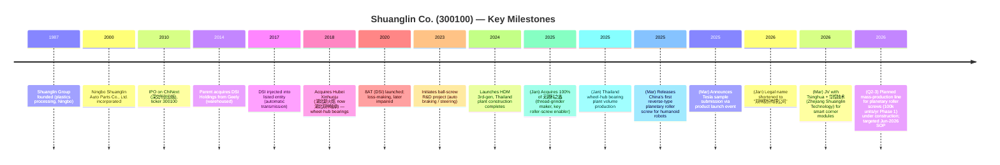
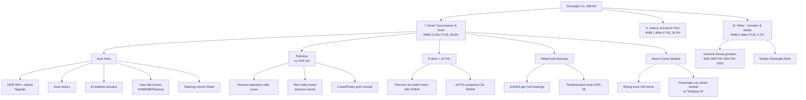
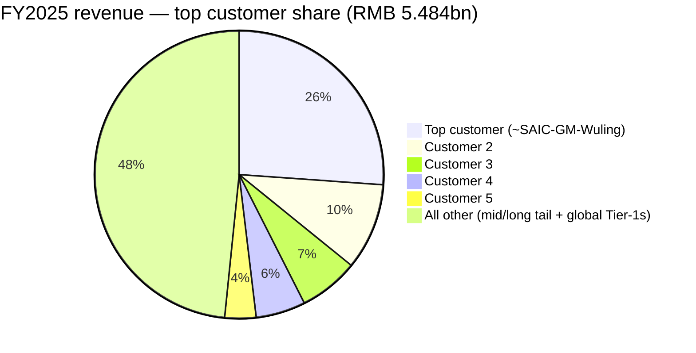
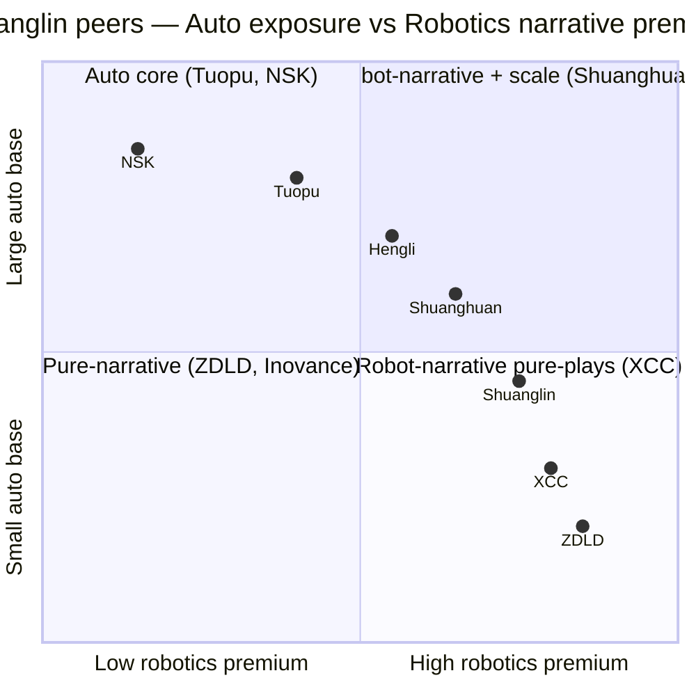

# Shuanglin Co., Ltd. (双林股份, SZSE:300100) — Equity Research Report
Date: 2026-05-18

> **Note on focus.** This report initiates coverage on Shuanglin Co. as an automotive Tier-2 transitioning into humanoid-robot core motion components — planetary roller screws (行星滚柱丝杠), ball screws (滚珠丝杠), joint modules (关节模组), and the supporting precision grinding machines (磨床). The thesis tension is between a stable but commoditising auto-parts base (HDM seat actuators, wheel-hub bearings, interior/exterior trim) and a high-multiple, narrative-driven robotics option that has not yet generated material revenue.

## Table of Contents
1. Company Overview
2. Company History
3. Management Team
4. Products & Services
5. Customers & Go-to-Market
6. Industry Overview
7. Competitive Landscape
8. Market Opportunity / TAM
9. Risk Assessment
10. References

---

## 1. Company Overview

Shuanglin Co., Ltd. (双林股份, SZSE:300100), headquartered in Ninghai, Ningbo and operationally based in Qingpu, Shanghai, is a Chinese automotive Tier-1/Tier-2 parts supplier that has, over the last 24 months, repositioned itself as a "smart transmission & drive solutions provider" with growing exposure to humanoid robotics, low-altitude flight (eVTOL) propulsion, and electrified chassis (smart corner modules). The legal name was shortened from "宁波双林汽车部件股份有限公司" (Ningbo Shuanglin Auto Parts Co.) to the current "双林股份有限公司" in early 2026 to reflect the broader scope ([2025 年年度报告, 第 10 页](http://www.cninfo.com.cn/new/disclosure/stock?stockCode=300100)). The company runs 37 wholly-owned or controlled subsidiaries and 8 branches, with production bases in Shanghai, Ningbo, Wuhu, Zhaoqing, Chongqing, Liuzhou, plus overseas plants in Thailand (Rayong, the "新火炬" wheel-hub bearing JV) and North America ([2025 年年度报告, 第 14 页](http://www.cninfo.com.cn/new/disclosure/stock?stockCode=300100)).

**How they make money.** Revenue is direct-sale, mostly to OEMs (BYD, Geely, Great Wall, Chery, Changan, Leapmotor, Xpeng, Nio, Li Auto, "the North-American new-energy leader" — i.e. Tesla, identified through pattern matching of disclosed products and import-export records) and global seat Tier-1s (Forvia/佛瑞亚, Adient/安道拓, Lear/李尔, Magna). The income statement breaks out as: 传动驱动智能 (smart transmission & drive — HDM seat horizontal actuators, seat motors, electric headrests, automotive ball/roller screws, robot screws & joint modules, e-drive, wheel-hub bearings, smart corner modules) **RMB 3.27 bn / 59.6% of FY2025 revenue**, 内外饰件 (interior & exterior trim, including PEEK precision injection parts) **RMB 1.95 bn / 35.5%**, and 其他 (grinding machines, molds) **RMB 260 m / 4.7%** ([2025 年年度报告, 第 21 页](http://www.cninfo.com.cn/new/disclosure/stock?stockCode=300100)).

**Where they operate.** Domestic sales were 91.1% of FY2025 revenue (RMB 5.00 bn) and overseas 8.9% (RMB 487 m), with the Thailand plant having ramped to volume production in January 2025 and supplying the Southeast-Asian plants of "a leading domestic NEV maker" (heavily implied to be BYD) ([2025 年年度报告, 第 21 页](http://www.cninfo.com.cn/new/disclosure/stock?stockCode=300100)).

**Scale.** FY2025 revenue RMB 5.484 bn (+11.67% YoY), attributable net profit RMB 503 m (+1.25% YoY), and recurring net profit (扣非) RMB 446 m (+36.63% YoY) — the gap between reported and recurring growth is explained by FY2024 having booked a large one-off gain on disposal of the 荆州 (Jingzhou) interior-trim plant ([2025 年年度报告, 第 11 页](http://www.cninfo.com.cn/new/disclosure/stock?stockCode=300100)). Operating cash flow was RMB 781 m, ROE 17.23%, and headcount roughly 4,890 (R&D headcount alone is 811, +27.7% YoY, of which 339 have a Bachelor's degree or above — a notable reskilling for the robotics push) ([2025 年年度报告, 第 26 页](http://www.cninfo.com.cn/new/disclosure/stock?stockCode=300100)).

*Source: compiled from [2020–2025 年度报告](http://www.cninfo.com.cn/new/disclosure/stock?stockCode=300100). Gross margin chart shows the 2022 trough (RMB 184 m loss on auto-cycle weakness and DSI transmission write-downs) and the 2024-25 rebound on HDM, wheel-hub bearing share gains, and Thailand ramp.*

**Q1 2026 caveat.** The first read of 2026 was soft: revenue RMB 1.152 bn (-10.42% YoY) and attributable net profit RMB 84.5 m (-47.0% YoY), with management citing higher R&D spend (+45.6% YoY on robot/丝杠/角模块 projects), higher share-based comp, and the absence of a property-disposal gain that boosted Q1 2025 ([2026 年第一季度报告, 第 2 页](http://www.cninfo.com.cn/new/disclosure/stock?stockCode=300100)). Year-on-year revenue comparability is also affected by the seasonality of the Thailand ramp.

**Valuation snapshot.** As of mid-May 2026, Shuanglin trades around RMB 31.3 per share with a market cap of roughly RMB 17.9 bn (571.98 m shares outstanding × ~31.3), implying a **TTM P/E of ~47×** ([Shuanglin 300100 Yahoo Finance, 2026-05](https://finance.yahoo.com/quote/300100.SZ/); cross-checked at [Eastmoney 双林股份(300100), 2026-05](https://quote.eastmoney.com/sz300100.html)) and a **TTM P/S of ~3.3×** on FY2025 revenue. The 3-year P/E range (2023-2026) on this name has been roughly **18×–80×**: the stock re-rated violently between March 2025 (release of the "first domestically-developed reverse-type planetary roller screw") and the AWE 2026 reveal of Tesla's Gen-3 Optimus, then mean-reverted toward 45–50× on the soft Q1 print ([12倍机器人大妖股，泡沫有多大？, 2025](https://cn.investing.com/analysis/article-200492572); [人形机器人行业观察, 2025-03-16](https://m.jrj.com.cn/madapter/finance/2025/03/16120948781391.shtml)).

*Source: compiled from [Eastmoney sz300100](https://quote.eastmoney.com/sz300100.html), [Eastmoney sz002472](https://quote.eastmoney.com/sz002472.html), [Eastmoney sh601100](https://quote.eastmoney.com/sh601100.html), [Eastmoney sh601689](https://quote.eastmoney.com/sh601689.html), [Eastmoney sh603667](https://quote.eastmoney.com/sh603667.html), [Eastmoney sz002896](https://quote.eastmoney.com/sz002896.html), and [Yahoo Finance NSK 6471.T](https://finance.yahoo.com/quote/6471.T/) (all retrieved May 2026).*

Peer set: 双环传动 (Shuanghuan, SZSE:002472) ~28× P/E — owns 环动科技 RV/harmonic reducer subsidiary, the most directly comparable "auto gears + humanoid reducer" story; 恒立液压 (Hengli Hydraulic, SSE:601100) ~45× — hydraulic cylinders pivoting into linear actuators / roller screws; 拓普集团 (Tuopu, SSE:601689) ~24× — interior trim + chassis Tier-1 with an explicit Tesla Optimus actuator program; 五洲新春 (XCC, SSE:603667) ~90× — bearings + reverse-planetary roller screw newcomer; 中大力德 (Zhongdali De, SZSE:002896) ~189× — precision reducers, smallest revenue base in the peer set, classic narrative-driven multiple; NSK (TYO:6471) ~16.7× — the global incumbent ball-screw and bearing house, useful as a "what mean-reversion looks like" anchor ([Yahoo Finance 6471.T](https://finance.yahoo.com/quote/6471.T/)).

**Why is Shuanglin trading at ~47× when its core auto business compounded earnings in the mid-teens and the Q1 print was negative?** Three reinforcing reasons:
1. **Humanoid robot narrative premium.** Investors are pricing the robotics segment as a multi-billion-yuan future P&L line. Shuanglin's March-2025 launch of China's first reverse-type planetary roller screw (反向式行星滚柱丝杠), accompanied by management's disclosure that samples were being verified by Tesla and several Chinese humanoid-robot leaders, anchored the stock as a Tesla Optimus supply-chain candidate ([双林发布机器人行星滚柱丝杠新产品, 艾邦机器人](https://www.aibangbots.com/a/1363); [双林股份反向行星滚柱丝杠合作伙伴, Eastmoney 财富号, 2025-03-26](https://caifuhao.eastmoney.com/news/20250326211210364791710)). The fact that — per management's own R&D-project table — *"截至目前上述产品尚未获得正式定点"* (no formal SOP design-win yet) means the multiple is paying for option value, not earnings ([2025 年年度报告, 第 25 页](http://www.cninfo.com.cn/new/disclosure/stock?stockCode=300100)).
2. **Adjacent narrative options.** The smart corner module (智能角模块) JV with Tsinghua University (清华大学) — and the announced Zhejiang Shuanglin Technology JV with Tsinghua and 华控技术 — adds an autonomous-driving chassis option. The first product, a 240-tonne electric mining truck on corner-module architecture, ships in H1 2026 ([2025 年年度报告, 第 16 页](http://www.cninfo.com.cn/new/disclosure/stock?stockCode=300100)).
3. **Vertical-integration through 科之鑫 acquisition.** Shuanglin acquired 100% of 无锡市科之鑫机械科技 in January 2025 — a thread-grinder (螺纹磨床) specialist whose Gen-2 NSK-300 internal-thread grinder and YSK-300/YSK-1500 external-thread grinders enable in-house production of the screws and nuts that go into roller-screw assemblies. This collapsed a key bottleneck in domestic roller-screw production ([2025 年年度报告, 第 17 页](http://www.cninfo.com.cn/new/disclosure/stock?stockCode=300100)).

If Optimus Gen-3 mass production timing slips (Tesla targets end-2026 mass production at ~1 m units long-term run-rate, [TradingKey on Tesla Optimus Gen-3, 2026-03](https://www.tradingkey.com/analysis/stocks/us-stocks/261814739-tesla-third-generation-humanoid-robot-debut-mid-year-tradingkey)), or Shuanglin fails to convert its samples into a Tesla / Figure / Unitree / Agibot design-win, the option value compresses fast — and the P/E is high enough to justify a valuation-risk callout in Section 9.

---

## 2. Company History

Shuanglin's roots trace to 双林集团 (Shuanglin Group), founded in 1987 as a plastics processor in Xidian, Ninghai (the present registered address). The listed entity — then 宁波双林汽车部件股份有限公司 (Ningbo Shuanglin Auto Parts Co., Ltd.) — was established 2000-11-23 and IPO'd on the ChiNext (创业板) board of the Shenzhen Stock Exchange in August 2010 as one of the first batch of ChiNext-listed Tier-2 auto suppliers ([双林股份首次公开发行股票并在创业板上市网上路演公告, 证券日报, 2010-07-21](http://chinext.zqrb.cn/html/20100721/news-199-11158.html)).

Originally positioned around automotive interior & exterior plastic trim and seat HDM (horizontal drive module — the screw-and-worm assembly under power seats), the company pursued two waves of M&A to broaden into precision transmission and bearings: (a) the 2017 acquisition of Australia-domiciled **DSI Holdings Pty Ltd**, an automatic-transmission engineering house Geely had picked up in 2009 and then divested when its 6AT business deteriorated; Shuanglin Group warehoused the asset and injected it into the listed company in 2017 to build up a 6AT / variable-speed transmission line ([双林股份收购大股东DSI资产 加码自动变速器业务, 经济观察网, 2017-10-19](http://m.eeo.com.cn/2017/1019/315018.shtml)); and (b) the acquisition of **湖北新火炬科技** (later renamed 湖北双林轴承), giving Shuanglin a national-champion-grade wheel-hub bearing operation with 18 m bearings/year of capacity ([2025 年年度报告, 第 16 页](http://www.cninfo.com.cn/new/disclosure/stock?stockCode=300100)).

The DSI bet has been mixed: the Australian 6AT product never recovered share at Geely (which moved to Aisin / Volvo platforms), forcing impairments and the 2022 loss-making year ([变速箱-吉利车系完全抛弃DSI 6AT，烫手的"山芋"双林如何, 搜狐, 2019](https://www.sohu.com/a/322911625_100072569)). Management has since repositioned DSI's HuNan and ShanDong assets toward NEV reducers and harmonic-drive R&D.

*Source: [双林股份 2010–2025 年度报告, cninfo](http://www.cninfo.com.cn/new/disclosure/stock?stockCode=300100); [经济观察网 DSI 收购报道, 2017-10-19](http://m.eeo.com.cn/2017/1019/315018.shtml); [艾邦机器人 双林滚柱丝杠发布, 2025](https://www.aibangbots.com/a/1363).*

**Three pivots worth flagging:**
1. **From plastics-trim to mechatronics (2010-2018).** The HDM/seat-electronics line, started in 2000, grew into the largest domestic share by 2025 (HDM volume crossed 30 m units/yr in 2025), establishing the precision-screw + worm-gear capability that now underpins the humanoid-robot business ([2025 年年度报告, 第 14 页](http://www.cninfo.com.cn/new/disclosure/stock?stockCode=300100)).
2. **From "auto Tier-2" to "global Tier-1 partner" (2018-2024).** Wins as core supplier to Forvia, Adient, Lear, Magna, ZF lifted the technical brand without changing the revenue mix dramatically. The 2024 Thailand bearing plant marks the first overseas wholly-owned manufacturing — a defensive move against the carbon-footprint and origin-of-content requirements emerging in the US (eIRA, AD/CVD) and EU markets ([2025 年年度报告, 第 21 页](http://www.cninfo.com.cn/new/disclosure/stock?stockCode=300100)).
3. **From auto to embodied AI (2023-2026).** The roller-screw R&D project began in 2023 as a brake/steering auto product. Management explicitly states that the humanoid-robot planetary roller screw shares "process and technology genealogy" (技术同源性) with HDM ([2025 年年度报告, 第 20 页](http://www.cninfo.com.cn/new/disclosure/stock?stockCode=300100)). The 科之鑫 acquisition was the critical move because it solved the upstream "stuck-neck" (卡脖子) problem in the thread-grinding equipment that determines roller-screw yields.

**Recent developments (last 12 months).** Beyond the items above: a new five-year strategic plan announced with the FY2025 results; a 2025 employee stock ownership plan funded; Korean / North-American customer expansion for seat headrest motors and 3rd-gen face-spline wheel hub bearings; an announced Hong Kong listing application (filed late 2025, A+H structure pending) ([双林股份冲刺港股, 搜狐, 2024-12](https://www.sohu.com/a/1002239342_430392)).

---

## 3. Management Team

### Wu Jianbin (邬建斌) — Chairman & CEO (董事长 兼 总经理)

Wu Jianbin (M, born September 1980, age 46), is the founder's son, the founder, and now the controlling shareholder of Shuanglin. He has been Chairman since November 2004 — at age 24 — and currently also serves as CEO (since the 2023 reorganisation that removed the prior CEO role to him from a long-serving operating COO). He holds EMBA degrees from Shanghai National Accounting Institute (SNAI) Finance & Financial Management track and from Cheung Kong Graduate School of Business (长江商学院 EMBA) ([2025 年年度报告, 第 36 页](http://www.cninfo.com.cn/new/disclosure/stock?stockCode=300100)).

Wu controls the company through a layered structure: he directly holds 25.69 m shares (4.49% of total) and indirectly holds 228.71 m shares via 宁波双林集团 (44.43% direct holding by 双林集团), for combined economic interest of approximately **44.48%** of total share capital ([2025 年年度报告, 第 36 页](http://www.cninfo.com.cn/new/disclosure/stock?stockCode=300100); [2026 年第一季度报告, 第 3 页](http://www.cninfo.com.cn/new/disclosure/stock?stockCode=300100)). The 双林集团 in turn is owned 57.14% by 宁波致远投资有限公司 and 42.86% by 宁海宝来投资有限公司, with ultimate beneficiary split Wu Jianbin 90%, sister 邬维静 5%, sister 邬晓静 5%, all bound by a 一致行动人协议 (concert-party agreement). This effectively gives the Wu family ~45% economic and de facto >50% voting control of the listed company. **There is no supervoting structure**, but the concert-party agreement and ESOP holdings approximate that effect.

His operating track record is overwhelmingly Shuanglin-specific: he joined the company in 2002 and has not held a senior role elsewhere — a 24-year operator-CEO at one company. Public honours (best entrepreneur Ningbo 2008, top-10 Yongshang 2014, charity-individual award 2022) are local in scope rather than indicative of national or global recognition. The two transformational decisions of his tenure were the DSI roll-up (mixed outcome — DSI 8AT failed at Geely, the asset is still loss-making per segment disclosure, with management trying to redeploy the 山东帝胜 facility for NEV reducers) and the 2024-25 robotics pivot (still unproven — no design-wins; capex commitments are visible in the 在建工程 line of +23.6% QoQ in Q1 2026, [2026 年第一季度报告, 第 2 页](http://www.cninfo.com.cn/new/disclosure/stock?stockCode=300100)). He sits on the Ningbo Municipal People's Congress, a typical platform for prominent A-share founder-CEOs in Zhejiang.

His sister **Wu Weijing (邬维静)**, age 50, is a director and holds 168 k direct + 12.7 m indirect shares (2.25% of total). The Chairman's wife **Cao Wen (曹文)**, age 46, also sits on the board and previously served as the company's marketing director and CEO. This is an unusually family-saturated board for an A-share Tier-2 supplier — the kind of structure that gives long-term strategic consistency but also concentrates governance risk in one household.

### Wu Huaiying (武淮颖) — CFO (财务总监)

Wu Huaiying (F, age 49) was appointed CFO in August 2025, replacing **Zhu Liming (朱黎明)** who stepped down from the CFO role in the same month (Zhu remains Board Secretary). The 2025 annual report does not provide a multi-paragraph bio for Wu Huaiying — the company's disclosure on the new CFO is unusually thin. From the brief reference, she joined Shuanglin's finance organisation prior to the appointment ([2025 年年度报告, 第 36 页](http://www.cninfo.com.cn/new/disclosure/stock?stockCode=300100); [2025 年年度报告, 第 38 页](http://www.cninfo.com.cn/new/disclosure/stock?stockCode=300100)). The lack of prior public-company CFO experience disclosed is a governance flag, particularly with a contemplated A+H listing on the table. Outgoing CFO Zhu Liming had a clearer CV: CPA, senior economist, 2002-2012 audit director / CFO at 宁波韵升 (SZSE:600366 — magnetic materials), CFO of Ningbo Donglu 2014-2016, CFO/Board Secretary at 宁波培源 (Peiyuan) 2016-2019, joined Shuanglin August 2019. He retains the IR-and-board-secretary mandate, which suggests continuity on disclosure rather than on capital-markets execution ([2025 年年度报告, 第 38 页](http://www.cninfo.com.cn/new/disclosure/stock?stockCode=300100)).

### Zhang Zisheng (张子盛) — Director & Executive Vice President (常务副总经理)

Zhang Zisheng (M, age 53), graduate degree, joined Shuanglin June 2024 as Executive VP and was elected to the board in September 2025. His prior senior role was Vice President at SAIC-GM-Wuling (上汽通用五菱) and at 柳州赛克科技, giving him direct OEM operating experience at one of Shuanglin's largest customers (SAIC-GM-Wuling is among the top-5 — see Section 5) ([2025 年年度报告, 第 37 页](http://www.cninfo.com.cn/new/disclosure/stock?stockCode=300100)). The hire is consistent with Shuanglin's stated strategy of moving into integrated chassis and electrified driveline solutions.

### Ge Hai'an (葛海岸) — Director & VP, Head of Trim & Bearings Business

Ge Hai'an (M, age 56), EMBA from SNAI, has been with the company since 1992 — joined the 湖北双林轴承 (then Hubei Xinhuoju) predecessor as an engineer, rose to Chief Technology Officer, then Plant Manager, then Executive VP and General Manager. Director since July 2020, currently VP and head of the Trim & Bearings business unit ([2025 年年度报告, 第 37 页](http://www.cninfo.com.cn/new/disclosure/stock?stockCode=300100)). He is the operational anchor of the wheel-hub bearing business, which generated roughly 1/4 of group revenue via the 湖北双林轴承 subsidiary and is the segment delivering the highest 2024-25 organic share gains.

### Governance footer

- **Board.** Seven directors: 3 internal/family-aligned (Wu Jianbin, Cao Wen, Wu Weijing), 1 employee director (Chen Youfu, elected Sep 2025 via worker representatives), Zhang Zisheng and Ge Hai'an as executive directors, plus 3 independent directors (Zhao Yifen of Ningbo University Law School, Jin Ming of Zhejiang University of Finance & Economics, Wang Minquan of Ningbo Polytechnic). Three independents on a seven-person board is below ChiNext best practice for a name carrying a 45% controlling holder. Audit committee is independent-majority per ChiNext rules ([2025 年年度报告, 第 34 页](http://www.cninfo.com.cn/new/disclosure/stock?stockCode=300100); [2025 年年度报告, 第 38 页](http://www.cninfo.com.cn/new/disclosure/stock?stockCode=300100)).
- **Insider ownership.** Wu family + ESOPs hold approximately 47% of total share capital. The 2025 ESOP (员工持股计划) holds 2.00 m shares (0.35%). Equity awards granted in 2025 vested across senior managers in March 2026 ([2026 年第一季度报告, 第 3 页](http://www.cninfo.com.cn/new/disclosure/stock?stockCode=300100)).
- **Related-party transactions.** Cao Wen (Chairman's wife) is the executive director of a hotel asset (宁海天明山温泉大酒店) owned by family entities; the 2025 AR does not flag material RPTs between the listed co and family-only entities, but the prior DSI warehousing-then-injection precedent shows the parent group has a history of injecting assets into the listed company at price points that retail investors have not always been able to evaluate independently.
- **Compensation.** Cash-heavy; equity awards modest in size; no disclosed performance-linked KPIs tied to robotics revenue. The grant terms of the 2025 ESOP are not broken out in granular detail in the AR.

### Management track record synthesis

Wu Jianbin has held the helm for 21 years and has steered the company through one near-failure (DSI 8AT 2019-2022) and one transformational pivot (humanoid robotics 2024-2026). He is a capable Chinese-OEM-sales operator with strong local relationships, but he has limited public global track record and limited disclosed expertise in robotics / AI motion control. The robotics pivot relies heavily on (a) the technical lineage of HDM, (b) the 科之鑫 grinder acquisition, and (c) the Tsinghua University collaboration — none of which has yet produced a named, paying humanoid customer. Governance is family-dominant with sub-best-practice independent-director count and weak CFO disclosure.

---

## 4. Products & Services

Shuanglin's official segmentation is three groups: **(I) Smart Transmission & Drive (传动驱动智能)**, **(II) Interior & Exterior Trim (汽车内外饰)**, and **(III) Other (磨床设备、模具)**. Below, products are enumerated in full from the 2025 AR product walk and the company website ([www.shuanglin.com/about](https://www.shuanglin.com/about/)); flagship lines are flagged, competitive-advantage verdicts are given inline.

### I.A — Automotive Parts (in the Smart Transmission & Drive segment)

**1. HDM (汽车座椅水平驱动器 / Horizontal Drive Module).** The legacy flagship. Bolted under the front-seat slides to provide electric fore-aft adjustment, the HDM is a precision worm-gear + lead-screw assembly. Shuanglin claims it was the first private Chinese R&D effort on HDM (started 2000) and that 2025 production crossed 30 m units, "one of the largest globally" ([2025 年年度报告, 第 14 页](http://www.cninfo.com.cn/new/disclosure/stock?stockCode=300100)). **Competitive-advantage verdict: yes — scale + customer lock-in.** Forvia (Faurecia), Adient, Lear all single-source for several platforms; Tesla / BYD / Nio / Li Auto / Xpeng / Chery / Geely / Great Wall / Changan / Leapmotor cited as direct OEMs. Closest peer products: **Bosch SoftFlow** for some seat-track integrations, **Brose** electric seat tracks, **IMS Gear** worm-gear assemblies. Estimated Shuanglin China share > 30%. Margin profile high-teens to low-20s GM% — the highest-margin core auto product the company sells.

**2. Seat motors (汽车座椅电机).** Horizontal-slide motors, recliner motors, lifter motors. Customers: Forvia, Adient, 天成 seat assemblers. Volume win on a long-stroke brushed seat motor for an undisclosed new-energy OEM, scaling in 2026 ([2025 年年度报告, 第 14 页](http://www.cninfo.com.cn/new/disclosure/stock?stockCode=300100)). **Competitive-advantage verdict: partial — co-design relationships.** Competes with Brose, Bosch, Mabuchi. Smaller market position than HDM but high attach rate.

**3. Power-adjustable headrest actuator (电动头枕执行器).** New 2024-2025 product. Curved-slide design eliminates "stuck" failure mode of straight-line actuators. 2025 design-wins at Xpeng, Leapmotor, Voyah (岚图), plus one "domestic luxury" platform ([2025 年年度报告, 第 14 页](http://www.cninfo.com.cn/new/disclosure/stock?stockCode=300100)). **Competitive-advantage verdict: yes — design-IP.** Differentiated curved-slide patent. Closest competing product: Adient/Lear in-house headrests — Shuanglin's is first to a curved profile in volume.

**4. Automotive ball screws (汽车用滚珠丝杠).** Screw + nut + reverser + balls; converts rotary to linear. Initial 2023 project. **EHB (electro-hydraulic brake) ball-screw** already in small-batch supply to 辰致科技 (Chenzhi). Design-wins at 比博斯特 (BeBoster); samples being verified by 利氪科技 (Likoo) and 伯特利 (Bertelli, SZSE:603596). 2026 mass production planned. **EMB ball-screw** in R&D for three customers including a "leading domestic NEV maker" ([2025 年年度报告, 第 15 页](http://www.cninfo.com.cn/new/disclosure/stock?stockCode=300100)). **Competitive-advantage verdict: partial.** Domestic substitution play vs. NSK / SKF; commodity at the unit level, but co-design with brake Tier-1s creates switching cost. Closest competing product: NSK's automotive ball screw line; THK (TYO:6481); 五洲新春 (XCC) is the most analogous Chinese newcomer.

**5. Steering column folding actuator (汽车方向盘自动折叠执行器).** Aimed at L3-L4 autonomous-driving cabins. Customers undisclosed; product in development.

### I.B — Robotics (in the Smart Transmission & Drive segment) — the new growth thesis

**6. Reverse-type planetary roller screws for humanoid robots (反向式行星滚柱丝杠).** Released March 2025; positioned as China's first domestic product. Used in linear actuator joints — Tesla's Optimus uses 14 linear actuator joints (forearms, lower legs, thighs), and Shuanglin claims medium-size screws for elbows/lower legs and large-size screws for thighs are in the validation set ([双林发布机器人行星滚柱丝杠新产品, 艾邦机器人](https://www.aibangbots.com/a/1363); [特斯拉人形机器人滚柱丝杠低调王者—双林股份, 东方财富财富号, 2025-01-12](https://caifuhao.eastmoney.com/news/20250112171833698942690)). FY2025 production at 1,500 units on a pilot line; Phase-1 mass production line (100k units/yr) targeted SOP June 2026 ([2025 年年度报告, 第 25 页](http://www.cninfo.com.cn/new/disclosure/stock?stockCode=300100)). **Competitive-advantage verdict: partial — narrative leadership + vertical integration, but no design-win yet.** *"截至目前上述产品尚未获得正式定点"* — the company itself states no formal design-in. Moat candidates are (a) the 科之鑫 internal-thread grinder (the world's roller-screw bottleneck is the screw nut, and Shuanglin's NSK-300 grinder achieves C0-C3 precision), and (b) HDM-derived process know-how. Closest competing products: Switzerland's **GSA** and **Rollvis**, Germany's **Bosch Rexroth**, USA's **Nook Industries** (incumbents); domestic peers **五洲新春** (XCC, has small-batch shipments to multiple robot customers), **恒立液压**, **贝斯特** (Best, SZSE:300580), **秦川机床** (Qinchuan Machine Tool, SZSE:000837 — also makes screw grinders), **博实股份**, **巨轮智能**. **Shuanglin claim**: reverse-type (planetary screws screwed inside-out) achieves higher load + longer life vs. conventional planetary; the reverse design is specifically what Optimus's joint architecture requires.

**7. Ball screws for humanoid robots (人形机器人用滚珠丝杠 — including dextrous-hand 灵巧手 micro screws).** Sizes 030.5 / 0301 / 0401 / 0601 sent to several customers for sample verification ([2025 年年度报告, 第 25 页](http://www.cninfo.com.cn/new/disclosure/stock?stockCode=300100)). **Competitive-advantage verdict: partial.** Same status as roller screws — no formal SOP. Closest competing products: NSK miniature, THK micro, **鸣志电器** (Moons') microscrew, **贝斯特**, **昊志机电** (HZJD).

**8. Linear joint module + rotary joint module + dextrous-hand finger-push module (人形机器人用关节模组).** Full-stack: reverse-planetary roller screw + frameless torque motor + motor driver — all designed in-house, including the frameless motor (an important note: most Chinese roller-screw plays do not also do frameless motors). First customised line-pull module delivered June 2025 to a "leading new-force domestic OEM" (高度暗指 — read: an automaker pivoting into humanoid robots, likely Xpeng's IronX program or similar; the disclosed AR text is intentionally ambiguous). Multiple-batch sample deliveries to "several leading robot enterprises" ([2025 年年度报告, 第 25 页](http://www.cninfo.com.cn/new/disclosure/stock?stockCode=300100)). **Competitive-advantage verdict: partial — full-stack in-house claim.** Closest competing products: **拓普集团** linear/rotary actuators (more advanced Tesla relationship); **三花智控** (Sanhua, SZSE:002050) thermal management with side-line robotic actuators; **绿的谐波** (Leaderdrive, SZSE:688017) harmonic-drive specialist with module-level products.

### I.C — New-energy power systems (in the Smart Transmission & Drive segment)

**9. E-drive (电驱动) — flat-wire oil-cooled motors and 3-in-1 platforms.** 180-kW / 210-kW flat-wire oil-cooled hybrid platform already in volume on a SAIC-GM-Wuling model. 220-kW / 270-kW 800-V oil-cooled platform in co-development for 2026 SOP. **Competitive-advantage verdict: partial.** Wide field; competes with InoVance (汇川技术), Tuopu (拓普), 中科三环 magnet sets. The Thailand 3-production-line e-drive plant ramping 2026-Q1 is the meaningful new datapoint ([2025 年年度报告, 第 21 页](http://www.cninfo.com.cn/new/disclosure/stock?stockCode=300100)).

**10. Aircraft (eVTOL / low-altitude) electric propulsion.** 30-kW to 250-kW family; 230-kW integrated propulsion delivered; 100-kW slated Q1 2026 delivery. Customer "an industry-leading client" — likely 亿航 (EHang), 沃飞长空, or 时的科技 ([2025 年年度报告, 第 16 页](http://www.cninfo.com.cn/new/disclosure/stock?stockCode=300100)). **Competitive-advantage verdict: partial — early entry but unproven.** Closest competing product: **卧龙电驱** (Wolong Electric, SH:600580), **方正电机** (SZ:002196).

### I.D — Wheel-hub bearings (轴承单元)

**11. 2nd / 3rd-generation hub bearings (轮毂轴承单元).** Run via 湖北双林轴承 (Hubei Xinhuoju legacy). Capacity 18 m bearings/yr. National-level industrial innovation enterprise; held 58 national patents and contributed to 15 national / industry standards as of 2025 ([2025 年年度报告, 第 16 页](http://www.cninfo.com.cn/new/disclosure/stock?stockCode=300100)). 2025 new programs at AVATR (阿维塔), Zeekr (极氪), AITO (问界 M8 in SOP within 2025), Dongfeng Nissan N7 (SOP 2025), Mengshi (猛士), Hongqi (红旗), Chang'an Ford, Xpeng. **Competitive-advantage verdict: yes — scale, national-champion status, IP.** Closest competing products: **NSK** hub bearings (TYO:6471), **SKF** (SS:SKF-B), domestic **万向钱潮** (Wanxiang), **中航工业精机** (AVIC Precision Machinery), **人本集团** (Renben). Shuanglin is the domestic No. 1 in volume.

### I.E — Smart corner module (智能角模块)

**12. Smart corner module — Tsinghua JV / Zhejiang Shuanglin Technology.** A 4-in-1 corner module (motor + suspension + steering + brake) is the future drive-by-wire chassis architecture. Award-winning at Geneva 2024 invention exhibition (gold). The 240-tonne all-electric mining truck "矿卡" is the first product, with 100 trucks to be deployed to an Inner Mongolia open-pit mine. Passenger-car designs (MacPherson, double-wishbone, multi-link) all developed. **Competitive-advantage verdict: partial — strong R&D, no commercial volume yet.** Closest competing products: **Schaeffler** (CHX:SHA) corner modules, **Continental** (CHX:CON) integrated braking + steering, **保隆科技** (BLN, SZ:603197) air-suspension play, **悠跑科技** (Upower) startup.

### II — Interior & Exterior Trim (内外饰)

**13. Bumpers, door panels, A/B/C-pillar trim, illuminated trim, stamping & rolling parts, safety parts, door base panels, precision parts, PEEK-material injection parts.** Plants in Liuzhou, Chongqing, Qingdao, Ningbo, Shanghai, Guangzhou, Jingzhou (the Jingzhou plant was divested in 2024, contributing to that year's non-recurring gain), Tianjin, Shenyang, Wuhu, Zhaoqing. Customers: SAIC-GM-Wuling, Changan, Xpeng, SAIC-VW. **Competitive-advantage verdict: partial — scale, no IP moat.** Closest competing products: **拓普集团** (Tuopu, SH:601689), **华域汽车** (Huayu, SH:600741), **常熟汽饰** (Changshu CAR-TEC, SZ:603035). FY2025 revenue RMB 1.95 bn at 14.3% GM ([2025 年年度报告, 第 21 页](http://www.cninfo.com.cn/new/disclosure/stock?stockCode=300100)).

**14. Precision injection (airbag covers, ignition coils, sensors, domain controllers, precision injection components).** Higher-margin sub-line within interior/exterior. **Competitive-advantage verdict: partial.**

### III — Other (其他)

**15. Thread-grinding machines (磨床设备) — 科之鑫 (Wuxi Kezhixin), acquired January 2025.** Gen-2 NSK-300 internal-thread grinder, YSK-300 / YSK-1500 external-thread grinders. Precision class C0–C3 (internal) and P3–P2 (external) — international top-tier. 2025 production captive; new plant ramping June 2026 to 40 machines/month. Will begin third-party sales of the Gen-2 grinders, taking on incumbents Schaudt / Studer / Reishauer ([2025 年年度报告, 第 17 页](http://www.cninfo.com.cn/new/disclosure/stock?stockCode=300100)). **Competitive-advantage verdict: yes — solves the choke-point in domestic roller-screw production.** Strategically arguably more important than the roller screws themselves; in a Chinese-roller-screw race, owning the grinder maker is a high-leverage position.

**16. Injection molds (模具).** 宁波双林模具. 1,000+ molds and 200+ check fixtures per year. **Competitive-advantage verdict: partial.**

### Product portfolio tree

### Flagship vs. long-tail

Three flagship products drive group profit today: (i) **HDM** — the largest GM dollar contributor within Smart Transmission & Drive; (ii) **wheel-hub bearings via 湖北双林轴承** — a high-share, high-volume operation; and (iii) **interior trim** — high-volume, lower-margin, but the broadest customer footprint. The robotics, eVTOL propulsion, and smart corner module lines are option value — they are the reason the stock trades at 47× P/E, but they generated negligible revenue in 2025.

### Last-12-month launches / sunsets

Launches: reverse-type planetary roller screw (Mar 2025), Gen-2 Kezhixin grinder family (Dec 2025), 230-kW eVTOL propulsion (2025), Thailand wheel-hub bearing plant SOP (Jan 2025), Tsinghua corner-module JV (Mar 2026). Sunsets / divestures: Jingzhou interior-trim plant (2024) generating the one-off gain; DSI 6AT is being run down with no new design-wins.

---

## 5. Customers & Go-to-Market

**Customer concentration — quantified.** From the 主要销售客户 section of the 2025 年度报告:

- FY2025 top-5 customers RMB 2.830 bn / **51.61%** of consolidated revenue; **top-1 customer RMB 1.433 bn / 26.13%**, top-2 RMB 534 m / 9.73%, top-3 RMB 367 m / 6.69%, top-4 RMB 305 m / 5.56%, top-5 RMB 192 m / 3.50% ([2025 年年度报告, 第 23 页](http://www.cninfo.com.cn/new/disclosure/stock?stockCode=300100)).
- FY2024 top-5 RMB 2.487 bn / 50.65%; top-1 RMB 1.128 bn / 22.96% ([2024 年年度报告, 第 20 页](http://www.cninfo.com.cn/new/disclosure/stock?stockCode=300100)).
- FY2023 top-5 RMB 2.001 bn / 48.35%; top-1 RMB 672 m / 16.23% ([2023 年年度报告, 第 18 页](http://www.cninfo.com.cn/new/disclosure/stock?stockCode=300100)).

**The trend is rising concentration**: top-1 has moved from 16.2% (FY23) → 23.0% (FY24) → 26.1% (FY25), an 10-percentage-point rise in two years. None of the customers are named — Chinese A-share rules require concentration disclosure but not name disclosure unless related-party. From the OEM-platform commentary in MD&A, the top-1 customer is overwhelmingly likely to be **SAIC-GM-Wuling** (the platform overlap is the largest, and SAIC-GM-Wuling appears most frequently in the interior-trim and e-drive commentary), with Changan, BYD, Adient/Forvia, and the "North-American new-energy leader" (i.e. Tesla — confirmed via the bearings export footprint, the seat-track HDM ramp, and management's references to a "北美" customer in multiple sections) likely rounding out the top-5. Because top-1 > 20% and top-5 > 50%, both thresholds in the SKILL spec, the concentration risk is **material** and carried into Section 9.

*Source: [2025 年年度报告, 第 23 页](http://www.cninfo.com.cn/new/disclosure/stock?stockCode=300100).*

**Customer segments.** Three buckets:
1. **Chinese domestic OEMs.** SAIC-GM-Wuling, Changan, BYD, Geely, Great Wall, Chery, Leapmotor, Nio, Li Auto, Xpeng, Voyah, Hongqi, AITO 问界, Zeekr, AVATR, FAW, Dongfeng-Nissan, Mengshi, GAC Aion. The biggest revenue concentration is here, accounting for ~80% of total sales.
2. **Global Tier-1s buying HDM/seat motors/precision parts.** Forvia (Faurecia), Adient, Lear, Magna, Brose, ZF (采埃孚), Bosch (博世), Valeo (法雷奥), Marelli (马勒), BorgWarner (博格华纳), United Automotive Electronic Systems (联合电子). HDM and seat-electronics moat lives here.
3. **Humanoid robot & low-altitude flight customers** (sample stage only). Specifically named by the company in product launches: Tesla (sample submission via roller screws), several leading Chinese humanoid players (likely Unitree, Agibot, Fourier, Robstep, XPeng IronX, Galaxy General — though not named in filings), 亿航 EHang in low-altitude. **None has converted to a formal point-of-supply yet.**

**Channels.** 100% direct sales to OEMs and Tier-1s. SAP-based order intake; weekly rolling production schedules. No distributor / e-commerce / aftermarket overlay of significance.

**Sales cycle.** Auto-parts: 18-36 month qualification before SOP (program-style sales). Robotics: 6-18 month sampling cycle currently. Both produce long-tail revenues once won.

**Key partnerships.** Tsinghua University (清华大学) — distributed-electric-drive corner module collaboration via Zhejiang Shuanglin Technology JV (announced Mar 2026, [2025 年年度报告, 第 16 页](http://www.cninfo.com.cn/new/disclosure/stock?stockCode=300100)). 华控技术 (Huakong Tech) is the third party in the JV. Internal partnerships with 湖北双林轴承 and 科之鑫 are wholly-owned subsidiaries rather than partnerships per se.

**Named customer wins in last 12 months.** HDM continued at Tesla / BYD / Nio / Li Auto / Xpeng / Chery / Geely / Great Wall / Changan / Leapmotor. Wheel-hub bearings new wins at AVATR, Zeekr, AITO M8 (SOP'd in 2025), Dongfeng Nissan N7 (SOP'd in 2025), Mengshi, Hongqi, Chang'an Ford, Xpeng. EHB ball-screw at 辰致科技 (Chenzhi, small-batch). Roller-screw and joint-module samples at one named "domestic new-force OEM" and "several robot leaders" — these are not formal SOPs.

---

## 6. Industry Overview

Shuanglin straddles three industries: **(a) Chinese auto-parts manufacturing**, **(b) the embodied-AI / humanoid robot supply chain (specifically planetary roller screws and joint modules)**, and **(c) emerging adjacencies: drive-by-wire chassis (smart corner modules) and eVTOL propulsion**.

### (a) Chinese auto-parts

China's automotive output reached **30.27 m passenger-vehicle units in 2025**, of which **NEVs were 16.49 m units, +29% YoY**, taking NEV penetration through 50% ([2025 年年度报告, 第 19 页, citing CAAM data](http://www.cninfo.com.cn/new/disclosure/stock?stockCode=300100)). The 2025-2026 policy stack — the State Council's NEV plan, the August 2025 MIIT *"Automotive Industry Stable-Growth Work Plan 2025-2026"*, the Dec 2025 NDRC/MOF *"large-scale equipment renewal & consumer trade-in policy"* — is reinforcing a multi-year capex cycle for domestic Tier-1/Tier-2 suppliers ([2025 年年度报告, 第 19 页](http://www.cninfo.com.cn/new/disclosure/stock?stockCode=300100)).

Structurally, the Chinese auto-parts industry is **fragmented at the long tail but consolidating at the top** of the precision-mechatronics segment: HDM, seat motors, wheel-hub bearings, ball/roller screws, and e-drive are all moving toward 3-5 player dominance, with one or two "national champions" emerging in each sub-category. Buyer power is high — automotive OEMs systematically demand 3-5% annual price reduction on legacy parts (毛利率压缩, a recurring item in Tier-2 AR risk factors). Supplier power is moderate (steel and resin commodity cycles can swing margins ~200 bp).

### (b) Humanoid robot supply chain — the new growth pool

Three industry-research data points anchor the sizing:

- **Global humanoid robot market.** GGII (高工产业研究院) projects **2025 global volume at ~12,400 units / RMB 6.34 bn**; **2030 at ~340,000 units / >RMB 64 bn**; **2035 at >5 m units / >RMB 400 bn** ([千亿级赛道在前 人形机器人如何跨越"落地"门槛？, 证券时报, 2025](https://www.stcn.com/article/detail/1655157.html); [2030年全球人形机器人市场规模或达151亿美元, 荣格工业资源网, 2025](https://www.industrysourcing.cn/article/465167)). Independent forecasts vary widely — Goldman Sachs' 2024 base case is USD 38 bn TAM by 2035 (~RMB 270 bn) — but the directional shape is consistent: a step-function rather than smooth growth.
- **Planetary roller screw TAM.** Per industry research, **a single humanoid robot uses 10-14 planetary roller screws, worth ~20% of the joint module BOM and 5-8% of the unit BOM cost** ([全球人形机器人丝杠行业分析, 观研报告网, 2025](https://www.chinabaogao.com/detail/714510.html)). **2023 global humanoid roller-screw market was RMB 2.3 bn**; **2030 forecast is RMB 26.8 bn**, a ~42% CAGR ([全球人形机器人丝杠行业分析, 观研报告网, 2025](https://www.chinabaogao.com/detail/714510.html)).
- **Localisation rate.** Today, planetary roller screws are dominated by GSA (Switzerland), Rollvis (Switzerland), Bosch Rexroth (Germany), Schaeffler INA (Germany), and Nook Industries (USA). Domestic Chinese share is <10%. **Domestic substitution is the prevailing investment narrative.**

The "Tesla Optimus moment" reference points investors care about: Tesla announced Optimus Gen-3 at AWE 2026 with planned mass-production starting Q3-Q4 2026 and a long-term run-rate of >1 m units/yr at <USD 20k/unit ([Tesla showcases upcoming Gen 3 humanoid robot in China, CnEVPost, 2026-03](https://cnevpost.com/2026/03/12/tesla-showcases-upcoming-gen-3-humanoid-robot-china/); [Tesla Officially Announces Third-Generation Humanoid Robot, TradingKey, 2026](https://www.tradingkey.com/analysis/stocks/us-stocks/261814739-tesla-third-generation-humanoid-robot-debut-mid-year-tradingkey)). If Tesla delivers 100k units in 2027, the implied roller-screw demand is ~1-1.4 m screws — by itself larger than current global non-humanoid demand.

### (c) Drive-by-wire chassis / smart corner modules

The line-controlled, four-corner-module architecture is widely viewed as the eventual destination of L4 chassis. Bosch, Continental, Schaeffler, ZF are pushing hard internationally; in China, Tuopu, Shuanglin (via Tsinghua JV), and a handful of startups (悠跑, 元戎) compete. Commercial volume is unlikely before 2027 in passenger vehicles, but earlier in heavy mining trucks (Shuanglin's 240-tonne mining truck SOP H1 2026 is potentially the earliest commercial deployment globally on a corner-module platform).

### Regulatory environment

Chinese auto parts: GB standards, MIIT type-approval. Robotics: still nascent regulation — ISO 13482 service-robot standards and emerging GB humanoid-robot safety standards under drafting. eVTOL: civil aviation airworthiness (CAAC) is the bottleneck; commercial passenger eVTOL approvals are 2026+.

---

## 7. Competitive Landscape

Shuanglin operates in a crowded space where each of its product lines has its own peer set. The most thesis-relevant peer set is the **"auto parts + humanoid robot core motion components"** crossover bucket.

| Competitor | Ticker | Position vs. Shuanglin | Direct/Indirect |
|---|---|---|---|
| **Shuanghuan Driveline (双环传动)** | SZSE:002472 | Direct on auto gears + reducer-side humanoid robot exposure (via 环动科技 subsidiary doing RV / harmonic). The closest "auto gears → humanoid" peer. Cap RMB 34.5 bn, P/E ~28× — premium to Shuanglin on the auto piece, but lower P/E indicating slightly less narrative premium. | Direct |
| **Hengli Hydraulic (恒立液压)** | SSE:601100 | Hydraulic cylinders + linear actuators; pivoting into roller screws. Higher quality earnings (45× P/E reflects sustained reinvestment), larger scale. | Direct on the roller-screw pivot |
| **Tuopu Group (拓普集团)** | SSE:601689 | Interior trim + Tesla-platform Tier-1 with announced Optimus actuator program. ~17-24× P/E in 2026 — discounted vs. Shuanglin despite arguably stronger Tesla relationship. | Direct on both interior trim and humanoid actuators |
| **XCC Group / 五洲新春** | SSE:603667 | Bearings + reverse-planetary roller screws — most analogous newcomer. Small-batch shipments to multiple robot customers reported Dec 2025. Trades at ~90× P/E despite lower revenue base. | Direct |
| **Zhongdali De / 中大力德** | SZSE:002896 | Precision reducers (RV / cycloidal). Heavily robot-narrative-driven. 189× P/E reflects very small earnings base. | Direct on robot reducer side |
| **NSK** | TYO:6471 | Global incumbent on bearings + ball/roller screws. ~16.7× P/E — useful "fair value when narrative wears off" anchor. | Direct (technology incumbent) |
| **Bosch Rexroth (private, division of Bosch)** | — | Global incumbent on planetary roller screws | Direct |
| **GSA / Rollvis / SKF** | — | Swiss / European incumbents in roller screws and bearings | Direct |
| **Leaderdrive / 绿的谐波** | SZSE:688017 | Harmonic-drive specialist — the rotary-side robot peer | Indirect (different motion solution) |
| **Sanhua / 三花智控** | SZSE:002050 | Thermal management + announced robotic actuator side-line | Indirect |
| **InoVance / 汇川技术** | SZSE:300124 | Servo motor + drives, the leading domestic competitor in e-drive | Indirect |

*Quadrant chart compiled from [Eastmoney peer profiles](https://quote.eastmoney.com/sz300100.html) and reading of 2024-2025 annual reports.*

### Shuanglin's competitive advantages

1. **HDM + seat-motor scale (defensible).** 30 m+ HDM/year creates real cost and qualification moats; switching costs at Forvia / Adient / Lear are high.
2. **Wheel-hub bearing scale (defensible).** 18 m units/year, national-champion status, broadest domestic OEM coverage.
3. **Process know-how across worm-gears / lead-screws / planetary roller-screws.** Single-thread family of expertise that crosses HDM → auto ball screw → humanoid planetary roller screw. This is the technical centre of gravity.
4. **科之鑫 grinder vertical integration.** Owning the upstream NSK-300 / YSK-300 / YSK-1500 grinder makers is a real structural advantage in the domestic-substitution race — the C0-C3 thread grinding is the genuine bottleneck.
5. **Tsinghua + 华控技术 JV.** Premier academic backing on smart corner module + a Geneva-gold-medal patent stack.

### Shuanglin's competitive vulnerabilities

1. **No formal humanoid robot SOP yet.** Every public humanoid roller-screw peer (XCC, ZDLD, Tuopu) has either small-batch shipments to a named customer or a confirmed Tesla / Figure / Unitree relationship. Shuanglin claims sample submissions but no design-in.
2. **DSI legacy drag.** The Hunan and Shandong DSI assets continue to generate sub-cost-of-capital returns; management is now four years into trying to redeploy them.
3. **Customer concentration rising.** Top-1 26%, top-5 52%, both trending up.
4. **Q1 2026 reverse.** Revenue -10.4%, NP -47%. While partially explained by R&D step-up and a property-disposal base effect, the magnitude is large enough to question the 47× multiple.
5. **Family-saturated governance, weak CFO disclosure.** Sub-best-practice independence ratio and a CFO appointed in August 2025 with no published prior public-company CFO experience.

---

## 8. Market Opportunity / TAM

**Auto-parts TAM (current core).** China auto-parts industry revenue in 2025 was approximately **RMB 5.4 trn** (CAAM data, cited indirectly via the 2025 AR). Within this, Shuanglin's addressable sub-segments — seat electromechanics + interior/exterior trim + wheel-hub bearings + e-drive + chassis modules — total roughly **RMB 800-900 bn**. Shuanglin's RMB 5.5 bn revenue implies ~0.6-0.7% share of its **SAM**, with much higher position in specific niches: ~30% domestic share of HDM, ~10% of wheel-hub bearings, sub-1% of e-drive.

**Humanoid roller-screw TAM (option layer).** As cited in Section 6, the planetary roller screw sub-segment for humanoid robots is projected to grow from **RMB 2.3 bn (2023) to RMB 26.8 bn (2030)** — a 42% CAGR ([全球人形机器人丝杠行业分析, 观研报告网, 2025](https://www.chinabaogao.com/detail/714510.html)). Joint-module bundling adds 3-5× to the addressable BOM: at 20% screw share of joint cost, the joint-module TAM is ~RMB 130 bn by 2030.

**Shuanglin's potential robotics TAM share.** If Shuanglin captures 5% of the 2030 global roller-screw market, that's **RMB 1.3 bn of incremental revenue at ~25-30% GM (we estimate, by analogy to NSK's ball-screw segment GM)**. If it captures 10%, RMB 2.7 bn. The latter would lift group revenue by ~50% from FY25 levels and is likely the implicit bull-case priced into the 47× P/E.

**eVTOL propulsion TAM.** The Chinese low-altitude economy was approximately **RMB 670 bn in 2024 and projected to RMB 1.5 trn by 2030** (China Civil Aviation Administration statistics, broadly cited). eVTOL propulsion components are a small fraction (~3%), implying ~RMB 45 bn TAM by 2030. Shuanglin's positioning is early but not lead.

**Smart corner module TAM.** Globally, drive-by-wire chassis is forecast to reach **USD 25-30 bn by 2030** in incumbent forecasts. Mining-truck and AGV niches are commercially earliest and have a likely sub-RMB 5 bn TAM in China by 2027. Shuanglin's first commercial corner-module truck (240-tonne, 100-unit first order) values revenue at <RMB 500 m, so the immediate revenue swing is modest, but it's a credibility win for the chassis-of-the-future thesis.

**SOM (serviceable obtainable).** Combining the three optionality buckets, our high-end SOM for Shuanglin by 2030 — if execution lands — is roughly **RMB 12-15 bn group revenue, of which RMB 3-4 bn from "new" lines (robotics + eVTOL + corner module)**. That would justify a 30-35× P/E on a more mature earnings base of RMB 1.0-1.3 bn — i.e. essentially the current market cap on more durable, broader earnings. The risk is that the optionality components fail to materialise and the auto core compounds at 8-12% (gross margins flat), in which case the multiple compresses to peer-median 15-20× and the stock de-rates ~50-60%.

---

## 9. Risk Assessment

### Company-specific risks

**1. No formal humanoid-robot SOP — the central thesis risk.** Management explicitly states: *"截至目前上述产品尚未获得正式定点"* (no formal design-win to date) for the planetary roller screws, ball screws, and joint modules ([2025 年年度报告, 第 25 页](http://www.cninfo.com.cn/new/disclosure/stock?stockCode=300100)). The narrative premium in the 47× P/E rests on the expectation that at least one of Tesla, Figure, Unitree, Agibot, Fourier, or Xpeng IronX names Shuanglin as a confirmed supplier. The risk: any one of those programs slips or chooses a competing supplier. Mitigant: a broad sample-submission spread across multiple potential customers, plus the 科之鑫 vertical integration that gives Shuanglin a structural cost edge. Severity: **high**.

**2. Customer concentration — top-1 26%, top-5 52%, rising.** Per the [2025 年度报告, 第 23 页](http://www.cninfo.com.cn/new/disclosure/stock?stockCode=300100), top-1 share has gone from 16.23% in FY23 to 22.96% in FY24 to 26.13% in FY25. Top-5 share moved from 48.35% → 50.65% → 51.61%. If the largest customer (most likely SAIC-GM-Wuling) cuts its NEV program or insources, Shuanglin loses a quarter of revenue. Severity: **material**, escalating with the trend.

**3. Key-person dependency on Wu Jianbin.** Founder-CEO controls 44.48% of shares and effectively the entire strategic agenda. Two sisters on the board, no clear succession plan disclosed, and the 2025 CFO change reflects internal turnover. Severity: medium-high.

**4. DSI / 8AT legacy drag.** The Australian DSI 6AT and 8AT lines have not generated sustained returns since the 2017 injection; the 山东帝胜 plant is being repositioned for NEV reducers but the swing has been slow. Continued impairment risk remains. Severity: medium.

**5. Execution risk on capacity step-up.** The 100k-unit Phase-1 planetary roller-screw line targets June 2026 SOP, the 40 machines/month grinder plant ramps the same month, eVTOL deliveries are scheduled Q1 2026 — multiple parallel ramps in the same six-month window. Q1 2026 already showed margin compression. Severity: medium.

**6. CFO change and disclosure thinness on the new CFO.** Wu Huaiying succeeded Zhu Liming in August 2025 with materially thinner bio disclosure than the typical A-share Tier-2 CFO replacement. With an A+H listing in flight, the optics matter. Severity: low-medium.

### Industry / market risks

**7. Tesla Optimus timing slippage.** Mass production currently targeted for Q3-Q4 2026 ([Tesla showcases upcoming Gen 3 humanoid robot in China, CnEVPost, 2026-03](https://cnevpost.com/2026/03/12/tesla-showcases-upcoming-gen-3-humanoid-robot-china/)) is Musk-style aggressive; historical Tesla program slips average 12-24 months. Any slip kills near-term roller-screw demand and de-rates the entire Chinese supply-chain bucket. Severity: high.

**8. Competitive intensity in robot roller screws.** The reverse-planetary roller screw is a hot domestic sector — XCC, Shuanglin, Hengli, ZDLD, Schaeffler, Hesai-spin-off-of-various-kinds are all marketing competing products. Standardisation around a single Tesla / Optimus spec will sort winners fast. Shuanglin's structural edge is the 科之鑫 grinder, but competing grinder makers (Schaudt, Studer) plus the option for other Chinese roller-screw players to qualify Swiss / German grinders limit the moat. Severity: medium-high.

**9. Chinese NEV pricing pressure flowing through to Tier-2s.** OEM annual price-down demands of 3-5% squeeze Tier-1/Tier-2 margins; 2025 already saw Tuopu and others warn on auto-parts gross margin. Shuanglin's 20.9% group GM in FY25 was a 2-year high, but base effects (one-off gains, scale leverage on Thailand ramp) flatter the run-rate. Severity: medium.

**10. Geopolitical / tariffs.** The US 232/301 tariff regime on EV-related parts and the EU CBAM affect Chinese exporters. Shuanglin's Thailand plant is a hedge but is also explicitly serving "the Southeast-Asia plant of a leading domestic NEV maker" — so the offshore production base is largely re-exporting to Asian markets and does not fully neutralise US tariffs. Severity: medium.

### Financial risks

**11. Valuation / multiple-compression risk — the explicit reason the multiple > 2× sector median.** TTM P/E of ~47× compares to the auto-parts peer median of ~28× and the global incumbent (NSK) at ~16.7× ([Yahoo Finance NSK 6471.T, 2026-05](https://finance.yahoo.com/quote/6471.T/); [Eastmoney sz300100, 2026-05](https://quote.eastmoney.com/sz300100.html)). The gap reflects humanoid-robot narrative premium, sector-rotation flows into the Chinese embodied-AI basket, and small-float dynamics (top-10 holders own > 50% of float; the 双林集团 27.7m share pledge ratio is notable). De-rating triggers: humanoid SOP miss, Q2/Q3 2026 results below consensus, a rate move higher, a single competitor announcing a Tesla / Figure design-win. Severity: **high**. A re-rating to peer median 28× implies ~40% downside; to incumbent multiples ~65% downside.

**12. Higher debt load / pledged stake.** The controlling shareholder has pledged 27.7 m shares (10.9% of its 254.1 m holding) ([2026 年第一季度报告, 第 3 页](http://www.cninfo.com.cn/new/disclosure/stock?stockCode=300100)). At low single-digit pledge ratios this is manageable, but the absolute number is worth tracking. Severity: low.

### Macroeconomic risks

**13. China auto-cycle sensitivity.** Group revenue is ~95% China-auto-linked. The 2022 loss-making year on a domestic cycle weak point demonstrates the operating leverage. NEV penetration is now > 50% so the marginal NEV upside slows from 2025 onward. Severity: medium.

**14. FX exposure (CNY/USD/AUD/THB).** DSI assets are AUD-denominated; Thailand plant is THB; small North-America presence is USD. Net exposure is modest but a 5-10% CNY depreciation episode would marginally affect cost-of-imports for grinder and machine-tool capex. Severity: low.

---

## 10. References

### Primary sources (filings)

- [双林股份有限公司 2025 年年度报告, filed 2026-03-25](http://www.cninfo.com.cn/new/disclosure/stock?stockCode=300100)
- [宁波双林汽车部件股份有限公司 2024 年年度报告, filed 2025-04-15](http://www.cninfo.com.cn/new/disclosure/stock?stockCode=300100)
- [宁波双林汽车部件股份有限公司 2023 年年度报告, filed 2024-04-18](http://www.cninfo.com.cn/new/disclosure/stock?stockCode=300100)
- [双林股份有限公司 2026 年第一季度报告, filed 2026-04-28](http://www.cninfo.com.cn/new/disclosure/stock?stockCode=300100)
- [双林股份有限公司 2025 年第一季度业绩预告, filed 2025-03-31](http://www.cninfo.com.cn/new/disclosure/stock?stockCode=300100)
- [双林股份有限公司 2025 年半年度报告, filed 2025-08-27](http://www.cninfo.com.cn/new/disclosure/stock?stockCode=300100)

### Company website

- [双林股份 — About / 走进双林](https://www.shuanglin.com/about/)
- [双林股份 — Corporate Site](https://www.shuanglin.com)

### Market-data sources (May 2026)

- [Eastmoney 双林股份 (300100)](https://quote.eastmoney.com/sz300100.html)
- [Yahoo Finance 300100.SZ](https://finance.yahoo.com/quote/300100.SZ/)
- [Eastmoney 双环传动 (002472)](https://quote.eastmoney.com/sz002472.html)
- [Eastmoney 恒立液压 (601100)](https://quote.eastmoney.com/sh601100.html)
- [Eastmoney 拓普集团 (601689)](https://quote.eastmoney.com/sh601689.html)
- [Eastmoney 五洲新春 (603667)](https://quote.eastmoney.com/sh603667.html)
- [Eastmoney 中大力德 (002896)](https://quote.eastmoney.com/sz002896.html)
- [Yahoo Finance NSK Ltd. (6471.T)](https://finance.yahoo.com/quote/6471.T/)

### News & industry research (recent)

- [双林发布"机器人行星滚柱丝杠新产品" — 艾邦机器人, 2025-03](https://www.aibangbots.com/a/1363)
- [双林股份反向式行星滚柱丝杠合作伙伴 — 东方财富财富号, 2025-03-26](https://caifuhao.eastmoney.com/news/20250326211210364791710)
- [特斯拉人形机器人滚柱丝杠低调王者 — 东方财富财富号, 2025-01-12](https://caifuhao.eastmoney.com/news/20250112171833698942690)
- [人形机器人行业观察：双林股份发布国产首款反向式行星滚柱丝杠 — 金融界, 2025-03-16](https://m.jrj.com.cn/madapter/finance/2025/03/16120948781391.shtml)
- [双林股份冲刺港股 — 搜狐, 2024-12](https://www.sohu.com/a/1002239342_430392)
- [12倍机器人大妖股，泡沫有多大？ — Investing.com, 2025](https://cn.investing.com/analysis/article-200492572)
- [Tesla showcases upcoming Gen 3 humanoid robot in China — CnEVPost, 2026-03-12](https://cnevpost.com/2026/03/12/tesla-showcases-upcoming-gen-3-humanoid-robot-china/)
- [AWE 2026: Tesla showcases third-generation humanoid robot — TechNode, 2026-03-12](https://technode.com/2026/03/12/awe-2026-tesla-showcases-third-generation-humanoid-robot/)
- [Tesla Officially Announces Third-Generation Humanoid Robot — TradingKey, 2026](https://www.tradingkey.com/analysis/stocks/us-stocks/261814739-tesla-third-generation-humanoid-robot-debut-mid-year-tradingkey)
- [全球人形机器人丝杠行业分析：2030年市场规模或将超200亿 — 观研报告网, 2025](https://www.chinabaogao.com/detail/714510.html)
- [千亿级赛道在前 人形机器人如何跨越"落地"门槛？ — 证券时报, 2025](https://www.stcn.com/article/detail/1655157.html)
- [2030年全球人形机器人市场规模或达151亿美元 — 荣格工业资源网, 2025](https://www.industrysourcing.cn/article/465167)
- [双林股份收购大股东DSI资产 加码自动变速器业务 — 经济观察网, 2017-10-19](http://m.eeo.com.cn/2017/1019/315018.shtml)
- [变速箱-吉利车系完全抛弃DSI 6AT — 搜狐, 2019](https://www.sohu.com/a/322911625_100072569)
- [双林股份首次公开发行股票并在创业板上市网上路演公告 — 证券日报, 2010-07-21](http://chinext.zqrb.cn/html/20100721/news-199-11158.html)

### Other

- [Investing.com — Shuanglin 300100 quote](https://www.investing.com/equities/ningbo-shuanglin-auto-parts)
- [Xueqiu — SZ300100 雪球](https://xueqiu.com/S/SZ300100)
