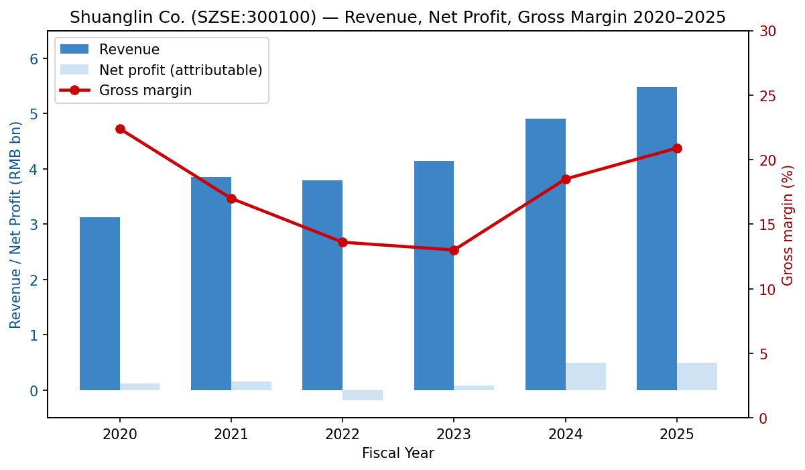
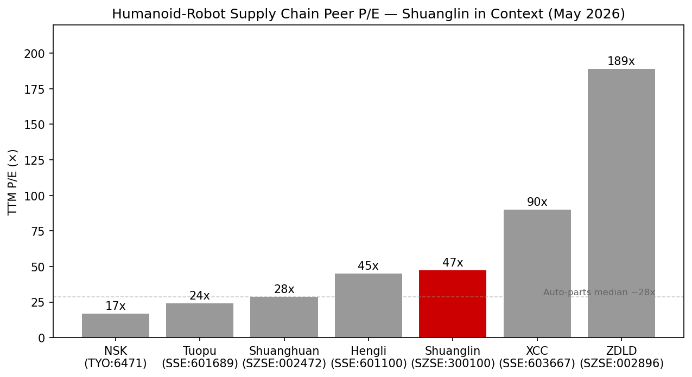
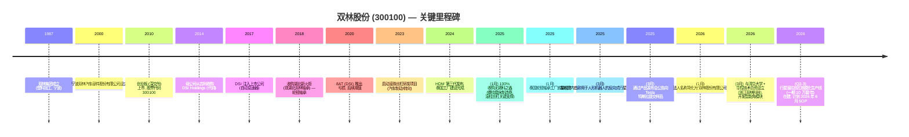
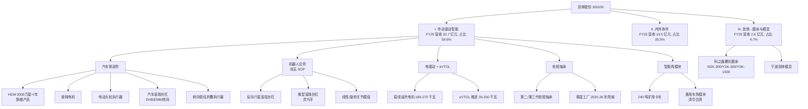
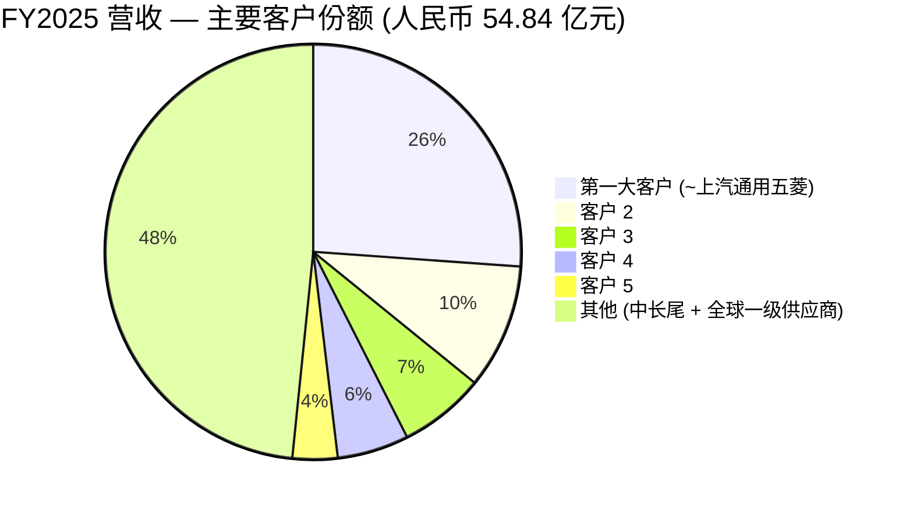
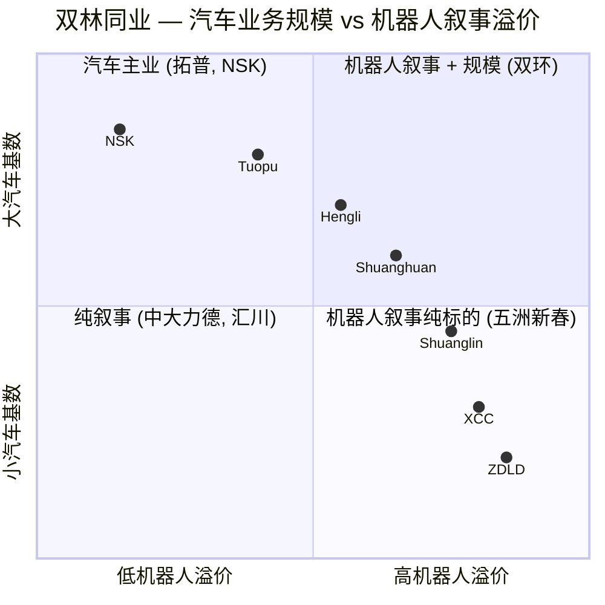

# 双林股份有限公司 (双林股份, SZSE:300100) — 股票研究报告
日期: 2026-05-18

> **关于研究重点的说明。** 本报告首次覆盖双林股份,公司定位为正由汽车二级供应商向人形机器人核心运动部件——行星滚柱丝杠、滚珠丝杠、关节模组以及配套精密磨床——转型的标的。论点的核心张力,在于稳定但日趋商品化的汽车零部件基础业务(HDM 座椅执行器、轮毂轴承、内外饰件)与尚未产生实质性收入、却由叙事驱动、给予高估值的机器人业务期权价值之间的对比。

## 目录
1. 公司概览
2. 公司历史
3. 管理团队
4. 产品与服务
5. 客户与市场策略
6. 行业概览
7. 竞争格局
8. 市场机会 / TAM
9. 风险评估
10. 参考资料

---

## 1. 公司概览

双林股份有限公司 (双林股份, SZSE:300100) 注册地位于宁波宁海,运营基地设在上海青浦,是一家中国汽车一级/二级零部件供应商。过去 24 个月内,公司重新定位为"智能传动与驱动解决方案提供商",在人形机器人、低空飞行 (eVTOL) 推进以及电动化底盘 (智能角模块) 领域的曝光度持续提升。公司法律名称已于 2026 年初由"宁波双林汽车部件股份有限公司"简化为现今的"双林股份有限公司",以反映更广阔的业务范畴 ([2025 年年度报告, 第 10 页](http://www.cninfo.com.cn/new/disclosure/stock?stockCode=300100))。公司运营 37 家全资或控股子公司及 8 家分公司,生产基地位于上海、宁波、芜湖、肇庆、重庆、柳州,海外则有泰国 (罗勇,"新火炬"轮毂轴承合资公司) 和北美工厂 ([2025 年年度报告, 第 14 页](http://www.cninfo.com.cn/new/disclosure/stock?stockCode=300100))。

**盈利模式。** 公司以直销为主,主要客户为整车厂 (比亚迪、吉利、长城、奇瑞、长安、零跑、小鹏、蔚来、理想,以及"北美新能源龙头"——即 Tesla 特斯拉,通过披露产品及进出口记录的特征匹配确认) 以及全球座椅一级供应商 (Forvia 佛瑞亚、Adient 安道拓、Lear 李尔、Magna 麦格纳)。利润表分项为:传动驱动智能 (含 HDM 座椅水平驱动器、座椅电机、电动头枕、汽车滚珠/滚柱丝杠、机器人丝杠及关节模组、电驱动、轮毂轴承、智能角模块) **人民币 32.7 亿元 / 占 FY2025 营收 59.6%**,内外饰件 (含 PEEK 精密注塑件) **人民币 19.5 亿元 / 占 35.5%**,以及其他 (磨床、模具) **人民币 2.60 亿元 / 占 4.7%** ([2025 年年度报告, 第 21 页](http://www.cninfo.com.cn/new/disclosure/stock?stockCode=300100))。

**经营区域。** FY2025 国内销售占总营收 91.1% (人民币 50.0 亿元),海外占 8.9% (人民币 4.87 亿元),其中泰国工厂已于 2025 年 1 月放量投产,供应"国内某新能源汽车龙头"(高度暗指比亚迪) 的东南亚工厂 ([2025 年年度报告, 第 21 页](http://www.cninfo.com.cn/new/disclosure/stock?stockCode=300100))。

**经营规模。** FY2025 营收人民币 54.84 亿元 (同比 +11.67%),归母净利润人民币 5.03 亿元 (同比 +1.25%),扣非净利润人民币 4.46 亿元 (同比 +36.63%) ——账面增速与扣非增速差异较大,主要因 FY2024 计入了荆州内饰工厂处置的一次性大额收益 ([2025 年年度报告, 第 11 页](http://www.cninfo.com.cn/new/disclosure/stock?stockCode=300100))。经营性现金流人民币 7.81 亿元,ROE 17.23%,员工总数约 4,890 人 (其中研发人员 811 人,同比 +27.7%,本科及以上学历 339 人——为机器人业务推进而进行的显著人员结构升级) ([2025 年年度报告, 第 26 页](http://www.cninfo.com.cn/new/disclosure/stock?stockCode=300100))。

*资料来源: 根据 [2020–2025 年度报告](http://www.cninfo.com.cn/new/disclosure/stock?stockCode=300100) 整理。毛利率图表显示 2022 年的低谷 (受汽车周期低迷及 DSI 变速箱减值影响,亏损 1.84 亿元) 以及 2024–25 年依托 HDM、轮毂轴承份额提升、泰国工厂放量带动的反弹。*

**2026 年一季度提示。** 2026 年首份业绩表现疲软: 营收人民币 11.52 亿元 (同比 -10.42%),归母净利润人民币 8,450 万元 (同比 -47.0%),管理层将此归因于研发支出大幅增加 (机器人/丝杠/角模块项目研发投入同比 +45.6%)、股权激励费用增加以及上年同期资产处置收益的缺失 ([2026 年第一季度报告, 第 2 页](http://www.cninfo.com.cn/new/disclosure/stock?stockCode=300100))。同比营收的可比性还受泰国工厂爬坡季节性的影响。

**估值快照。** 截至 2026 年 5 月中旬,双林股份股价约为人民币 31.3 元/股,总市值约人民币 179 亿元 (流通股 5.7198 亿股 × 约 31.3 元),对应 **滚动市盈率约 47 倍** ([Shuanglin 300100 Yahoo Finance, 2026-05](https://finance.yahoo.com/quote/300100.SZ/);并经 [东方财富 双林股份(300100), 2026-05](https://quote.eastmoney.com/sz300100.html) 交叉核对) 及基于 FY2025 营收的 **滚动市销率约 3.3 倍**。该股近三年 (2023–2026) 市盈率区间约 **18 倍–80 倍**: 股价在 2025 年 3 月 (发布"国内首款反向式行星滚柱丝杠") 至 2026 年 AWE 上特斯拉第三代 Optimus 公开亮相之间剧烈重估,随后因一季度业绩疲软而向 45–50 倍均值回归 ([12倍机器人大妖股,泡沫有多大?, 2025](https://cn.investing.com/analysis/article-200492572); [人形机器人行业观察, 2025-03-16](https://m.jrj.com.cn/madapter/finance/2025/03/16120948781391.shtml))。

*资料来源: 根据 [东方财富 sz300100](https://quote.eastmoney.com/sz300100.html)、[东方财富 sz002472](https://quote.eastmoney.com/sz002472.html)、[东方财富 sh601100](https://quote.eastmoney.com/sh601100.html)、[东方财富 sh601689](https://quote.eastmoney.com/sh601689.html)、[东方财富 sh603667](https://quote.eastmoney.com/sh603667.html)、[东方财富 sz002896](https://quote.eastmoney.com/sz002896.html) 以及 [Yahoo Finance NSK 6471.T](https://finance.yahoo.com/quote/6471.T/) 整理 (均为 2026 年 5 月取数)。*

可比公司组合: 双环传动 (SZSE:002472) 市盈率约 28 倍——旗下持有 RV/谐波减速器子公司环动科技,是最直接可比的"汽车齿轮 + 人形减速器"标的;恒立液压 (SSE:601100) 市盈率约 45 倍——液压油缸业务向线性执行器 / 滚柱丝杠转型;拓普集团 (SSE:601689) 市盈率约 24 倍——内饰件 + 底盘一级供应商,已公开披露 Tesla 特斯拉 Optimus 执行器项目;五洲新春 (XCC, SSE:603667) 市盈率约 90 倍——轴承 + 反向行星滚柱丝杠新进入者;中大力德 (SZSE:002896) 市盈率约 189 倍——精密减速器,可比公司中收入基数最小,典型的叙事驱动估值;NSK (TYO:6471) 市盈率约 16.7 倍——全球滚珠丝杠及轴承龙头,可作为"均值回归后估值锚"参考 ([Yahoo Finance 6471.T](https://finance.yahoo.com/quote/6471.T/))。

**为何在核心汽车业务利润仅以中等个位数复合、且一季度业绩为负的情况下,双林股份仍交易在约 47 倍市盈率?** 三个相互强化的原因:
1. **人形机器人叙事溢价。** 投资者按未来数十亿元的损益贡献为机器人业务定价。2025 年 3 月双林发布国内首款反向式行星滚柱丝杠,管理层同时披露样品正接受 Tesla 特斯拉及多家中国人形机器人龙头的验证,把公司锚定为 Tesla 特斯拉 Optimus 供应链候选标的 ([双林发布机器人行星滚柱丝杠新产品, 艾邦机器人](https://www.aibangbots.com/a/1363); [双林股份反向行星滚柱丝杠合作伙伴, Eastmoney 财富号, 2025-03-26](https://caifuhao.eastmoney.com/news/20250326211210364791710))。然而,管理层在自家研发项目表中明确指出 *"截至目前上述产品尚未获得正式定点"* ——意味着市场为之支付的是期权价值,而非已实现的盈利 ([2025 年年度报告, 第 25 页](http://www.cninfo.com.cn/new/disclosure/stock?stockCode=300100))。
2. **相邻业务的叙事期权。** 与清华大学合作的智能角模块合资公司——以及与清华大学、华控技术共同宣布的浙江双林科技合资公司——为公司增加了自动驾驶底盘期权。首款产品为基于角模块架构的 240 吨电动矿用卡车,计划于 2026 年上半年交付 ([2025 年年度报告, 第 16 页](http://www.cninfo.com.cn/new/disclosure/stock?stockCode=300100))。
3. **通过收购科之鑫实现纵向一体化。** 双林股份于 2025 年 1 月 100% 收购无锡市科之鑫机械科技——一家螺纹磨床专业厂商,其第二代 NSK-300 内螺纹磨床及 YSK-300/YSK-1500 外螺纹磨床,使滚柱丝杠总成所需的丝杠与螺母得以自产。这一步打通了国内滚柱丝杠生产的关键瓶颈 ([2025 年年度报告, 第 17 页](http://www.cninfo.com.cn/new/disclosure/stock?stockCode=300100))。

如果 Optimus 第三代量产时点延后 (Tesla 特斯拉目标为 2026 年底量产,长期年化产能约 100 万台, [TradingKey 关于 Tesla Optimus Gen-3, 2026-03](https://www.tradingkey.com/analysis/stocks/us-stocks/261814739-tesla-third-generation-humanoid-robot-debut-mid-year-tradingkey)),或者双林未能将样品转化为来自 Tesla 特斯拉 / Figure / 宇树 (Unitree) / 智元 (Agibot) 的定点,则期权价值将快速压缩——其市盈率水平已足以构成第 9 节的估值风险警示。

---

## 2. 公司历史

双林股份的源头可追溯至 1987 年成立的双林集团,最初是宁海西店的塑料加工企业 (现注册地)。上市主体——彼时名为"宁波双林汽车部件股份有限公司"——于 2000 年 11 月 23 日设立,2010 年 8 月作为首批二级汽车零部件创业板上市公司之一在深圳证券交易所创业板挂牌 ([双林股份首次公开发行股票并在创业板上市网上路演公告, 证券日报, 2010-07-21](http://chinext.zqrb.cn/html/20100721/news-199-11158.html))。

公司最早围绕汽车内外饰塑料件及座椅 HDM (水平驱动模组——电动座椅下方的丝杠-蜗轮总成) 业务展开,后通过两次并购浪潮向精密传动及轴承领域拓展: (a) 2017 年收购澳大利亚籍的 **DSI Holdings Pty Ltd** ——一家自动变速器工程公司,吉利曾于 2009 年收购,后因 6AT 业务恶化而剥离;双林集团先将该资产代持,2017 年注入上市公司,以打造 6AT / 变速器产品线 ([双林股份收购大股东DSI资产 加码自动变速器业务, 经济观察网, 2017-10-19](http://m.eeo.com.cn/2017/1019/315018.shtml));以及 (b) 收购 **湖北新火炬科技** (后更名湖北双林轴承),使双林获得国家级的轮毂轴承业务,年产能 1,800 万套 ([2025 年年度报告, 第 16 页](http://www.cninfo.com.cn/new/disclosure/stock?stockCode=300100))。

DSI 的下注结果好坏参半: 澳洲 6AT 产品始终未能在吉利体系内夺回份额 (吉利已转向爱信 / 沃尔沃平台),导致计提减值并造成 2022 年亏损 ([变速箱-吉利车系完全抛弃DSI 6AT, 烫手的"山芋"双林如何, 搜狐, 2019](https://www.sohu.com/a/322911625_100072569))。管理层此后将 DSI 在湖南、山东的资产转向新能源减速器及谐波驱动研发。

*资料来源: [双林股份 2010–2025 年度报告, 巨潮资讯网](http://www.cninfo.com.cn/new/disclosure/stock?stockCode=300100);[经济观察网 DSI 收购报道, 2017-10-19](http://m.eeo.com.cn/2017/1019/315018.shtml);[艾邦机器人 双林滚柱丝杠发布, 2025](https://www.aibangbots.com/a/1363).*

**三次值得标注的战略转折:**
1. **从塑料饰件转向机电一体化 (2010–2018)。** 自 2000 年启动的 HDM / 座椅电子产品线,到 2025 年已成为国内份额最大的玩家 (HDM 出货量在 2025 年突破 3,000 万套/年),奠定了如今支撑人形机器人业务的精密丝杠 + 蜗轮齿轮能力 ([2025 年年度报告, 第 14 页](http://www.cninfo.com.cn/new/disclosure/stock?stockCode=300100))。
2. **从"汽车二级供应商"升级为"全球一级供应商合作伙伴"(2018–2024)。** 进入 Forvia 佛瑞亚、Adient 安道拓、Lear 李尔、Magna 麦格纳、ZF 采埃孚等核心供应商体系,使技术品牌得到大幅提升,而收入结构未出现剧烈调整。2024 年泰国轴承工厂为公司首个海外全资制造基地——是针对美国 (eIRA, 反倾销/反补贴) 与欧盟市场新兴的碳足迹与原产地内容要求所采取的防御性举措 ([2025 年年度报告, 第 21 页](http://www.cninfo.com.cn/new/disclosure/stock?stockCode=300100))。
3. **从汽车进入具身智能 (2023–2026)。** 滚柱丝杠研发项目最初于 2023 年作为汽车制动/转向产品立项。管理层明确表示,人形机器人的行星滚柱丝杠与 HDM 之间具有"工艺与技术同源性"(技术同源性) ([2025 年年度报告, 第 20 页](http://www.cninfo.com.cn/new/disclosure/stock?stockCode=300100))。科之鑫的并购是其中关键一步——解决了上游决定滚柱丝杠良率的螺纹磨床"卡脖子"问题。

**最近 12 个月的发展。** 除以上事项外: 公司在 FY2025 业绩中公布了新的五年战略规划;2025 年员工持股计划已完成募集;座椅头枕电机及第三代面齿轮轮毂轴承在韩国及北美客户群扩张;2025 年末已申报港股上市,A+H 架构待批 ([双林股份冲刺港股, 搜狐, 2024-12](https://www.sohu.com/a/1002239342_430392))。

---

## 3. 管理团队

### 邬建斌 — 董事长兼总经理

邬建斌 (男, 1980 年 9 月生, 46 岁),系创始人之子,亦为现今的公司创始人及控股股东。自 2004 年 11 月起担任董事长——时年 24 岁——并于 2023 年组织调整 (将原 CEO 职位由长期任职的运营 COO 转交给他) 后兼任总经理。他持有上海国家会计学院 (SNAI) 财务与金融管理方向 EMBA 学位及长江商学院 EMBA 学位 ([2025 年年度报告, 第 36 页](http://www.cninfo.com.cn/new/disclosure/stock?stockCode=300100))。

邬建斌通过分层结构控制公司: 直接持股 2,569 万股 (占总股本 4.49%),通过宁波双林集团间接持股 22,871 万股 (双林集团直接持股比例 44.43%),合计经济权益约占总股本 **44.48%** ([2025 年年度报告, 第 36 页](http://www.cninfo.com.cn/new/disclosure/stock?stockCode=300100); [2026 年第一季度报告, 第 3 页](http://www.cninfo.com.cn/new/disclosure/stock?stockCode=300100))。双林集团由宁波致远投资有限公司持股 57.14%、宁海宝来投资有限公司持股 42.86%,最终受益分配为邬建斌 90%、姐妹邬维静 5%、邬晓静 5%,三人签订一致行动人协议。这使得邬家在上市公司层面拥有约 45% 的经济权益及事实上超过 50% 的投票控制权。**公司并未设置同股不同权架构**,但一致行动人协议加上员工持股计划的合计影响接近同等效果。

其经营履历几乎完全聚焦于双林: 2002 年加入公司,未在其他企业担任高管——在同一家公司从业 24 年的运营型 CEO。公开荣誉 (2008 年宁波最佳企业家、2014 年甬商十大、2022 年慈善个人奖) 均属地方性嘉奖,而非全国或全球范围的认可。其任内两项变革性决策分别是: DSI 资产整合 (结果好坏参半——DSI 8AT 在吉利体系折戟,资产在分部披露中仍处于亏损,管理层正尝试将山东帝胜基地转型为新能源减速器生产) 以及 2024–25 年的机器人转型 (尚未得到验证——无定点项目;Q1 2026 在建工程环比 +23.6% 的数据可见资本开支已实质性投入, [2026 年第一季度报告, 第 2 页](http://www.cninfo.com.cn/new/disclosure/stock?stockCode=300100))。他担任宁波市人大代表,这是浙江地区显赫的 A 股创始人 CEO 的典型公共角色。

其姐姐 **邬维静** (50 岁) 任公司董事,直接持股 16.8 万股 + 间接持股 1,270 万股 (占总股本 2.25%)。董事长配偶 **曹文** (46 岁) 亦在董事会任职,曾担任公司营销总监及总经理。对于一家 A 股二级供应商而言,这种家族成员高度集中的董事会结构并不常见——它在战略上提供了长期一致性,但同时令公司治理风险高度集中于一个家庭。

### 武淮颖 — 财务总监

武淮颖 (女, 49 岁) 于 2025 年 8 月被任命为财务总监,接替同月卸任的 **朱黎明** (朱黎明继续担任董事会秘书)。2025 年年报并未对武淮颖给出多段式履历——披露异常简略。仅有的简短描述显示她在被任命前已任职于双林的财务体系 ([2025 年年度报告, 第 36 页](http://www.cninfo.com.cn/new/disclosure/stock?stockCode=300100); [2025 年年度报告, 第 38 页](http://www.cninfo.com.cn/new/disclosure/stock?stockCode=300100))。考虑到 A+H 上市正在推进,缺乏过往上市公司 CFO 经验的披露,是治理层面的一个警示信号。前任 CFO 朱黎明履历更为清晰: CPA、高级经济师,2002–2012 年在宁波韵升 (SZSE:600366,磁性材料) 担任审计总监 / 财务总监,2014–2016 年任宁波东睦 CFO,2016–2019 年任宁波培源 CFO 兼董事会秘书,2019 年 8 月加入双林。他继续兼任董秘和投资者关系工作,意味着信息披露层面的延续性优于资本市场执行层面 ([2025 年年度报告, 第 38 页](http://www.cninfo.com.cn/new/disclosure/stock?stockCode=300100))。

### 张子盛 — 董事兼常务副总经理

张子盛 (男, 53 岁),硕士研究生,2024 年 6 月加入双林任常务副总经理,2025 年 9 月当选董事。此前历任上汽通用五菱及柳州赛克科技副总裁,拥有双林最大客户之一 (上汽通用五菱位列前五大客户——详见第 5 节) 的整车厂直接运营经验 ([2025 年年度报告, 第 37 页](http://www.cninfo.com.cn/new/disclosure/stock?stockCode=300100))。该项任命与公司向集成式底盘与电动化驱动总成战略推进的方向一致。

### 葛海岸 — 董事兼副总经理, 内外饰与轴承业务负责人

葛海岸 (男, 56 岁),SNAI EMBA 学位,自 1992 年起服务于公司——加入彼时的湖北双林轴承前身湖北新火炬,由工程师起步,历任技术总监、厂长、常务副总经理及总经理。2020 年 7 月起担任董事,现任副总经理及内外饰与轴承业务负责人 ([2025 年年度报告, 第 37 页](http://www.cninfo.com.cn/new/disclosure/stock?stockCode=300100))。他是轮毂轴承业务的运营核心,该业务通过湖北双林轴承子公司贡献了集团约 1/4 的营收,并是 2024–25 年内生份额提升最显著的业务板块。

### 治理小结

- **董事会。** 七名董事: 3 名内部 / 家族关联 (邬建斌、曹文、邬维静),1 名职工董事 (陈友福,2025 年 9 月由职工代表选举产生),张子盛与葛海岸为执行董事,另有 3 名独立董事 (宁波大学法学院赵亦芬、浙江财经大学金鸣、宁波职业技术学院王民全)。在持有 45% 控股权的上市公司中,七人董事会仅 3 名独立董事低于创业板最佳实践。审计委员会按创业板规则由独立董事多数构成 ([2025 年年度报告, 第 34 页](http://www.cninfo.com.cn/new/disclosure/stock?stockCode=300100); [2025 年年度报告, 第 38 页](http://www.cninfo.com.cn/new/disclosure/stock?stockCode=300100))。
- **内部人持股。** 邬氏家族 + 员工持股计划合计持股约占总股本 47%。2025 年员工持股计划 (员工持股计划) 持有 200 万股 (0.35%)。2025 年授予的股权激励于 2026 年 3 月在高管层级解锁 ([2026 年第一季度报告, 第 3 页](http://www.cninfo.com.cn/new/disclosure/stock?stockCode=300100))。
- **关联方交易。** 曹文 (董事长配偶) 担任由家族实体持有的酒店资产 (宁海天明山温泉大酒店) 的执行董事;2025 年报并未提示上市公司与纯家族实体之间存在重大关联交易,但 DSI 先代持再注入的先例,表明母公司具有以散户投资者难以独立评估的价格将资产注入上市公司的历史。
- **薪酬。** 以现金为主;股权激励规模有限;未披露与机器人收入挂钩的业绩 KPI。2025 年员工持股计划授予条款在年报中未做细化披露。

### 管理层履历综述

邬建斌掌舵已 21 年,带领公司经历了一次几近失败的危机 (2019–2022 年的 DSI 8AT) 与一次转型性枢纽 (2024–2026 年人形机器人)。他是一位精于中国整车厂销售的运营者,在本地客户关系上扎实,但全球公开业绩有限,在机器人 / AI 运动控制方面的披露专业背景亦有限。机器人转型在很大程度上依赖于: (a) HDM 的技术血缘;(b) 科之鑫磨床并购;(c) 与清华大学的合作——但这些尚未带来已具名、已付费的人形机器人客户。治理方面家族色彩浓厚,独立董事比例低于最佳实践,且 CFO 信息披露偏薄。

---

## 4. 产品与服务

双林股份的官方分项为三大业务: **(I) 传动驱动智能 (Smart Transmission & Drive)**、**(II) 汽车内外饰 (Interior & Exterior Trim)** 和 **(III) 其他 (磨床设备、模具)**。下文依据 2025 年报产品演变及公司官网 ([www.shuanglin.com/about](https://www.shuanglin.com/about/)) 逐项列出;主要产品线已加以标注,并对竞争优势给出直接判断。

### I.A — 汽车零部件 (传动驱动智能板块内)

**1. HDM (汽车座椅水平驱动器 / Horizontal Drive Module)。** 传统旗舰产品。安装在前排座椅滑轨下方,实现电动前后调节的精密蜗轮 + 丝杠总成。双林声称是国内首家私营企业开展 HDM 研发 (始于 2000 年),且 2025 年产量超过 3,000 万套,"全球最大之一"([2025 年年度报告, 第 14 页](http://www.cninfo.com.cn/new/disclosure/stock?stockCode=300100))。**竞争优势判定: 具备——规模 + 客户黏性。** Forvia 佛瑞亚 (Faurecia)、Adient 安道拓、Lear 李尔均在多个平台上对其单一定点;直接客户涵盖 Tesla 特斯拉、比亚迪、蔚来、理想、小鹏、奇瑞、吉利、长城、长安、零跑等整车厂。最接近的可比产品: 部分座椅滑轨集成方案采用 **Bosch SoftFlow** (博世)、**Brose** (博泽) 电动座椅滑轨、**IMS Gear** 蜗轮总成。估计双林在中国市场份额超过 30%。毛利率结构处于高十几至低二十几个百分点——在公司销售的核心汽车产品中毛利率最高。

**2. 座椅电机 (汽车座椅电机)。** 包括水平滑轨电机、靠背调节电机、升降电机。客户: Forvia 佛瑞亚、Adient 安道拓、天成等座椅总成商。2025 年获得某未披露新能源整车厂的长行程有刷座椅电机大额订单,2026 年规模上量 ([2025 年年度报告, 第 14 页](http://www.cninfo.com.cn/new/disclosure/stock?stockCode=300100))。**竞争优势判定: 部分——基于联合设计关系。** 与 Brose 博泽、Bosch 博世、Mabuchi 万宝至竞争。市场地位小于 HDM,但配套率较高。

**3. 电动头枕执行器 (电动头枕执行器)。** 2024–2025 年的新产品。弧形滑轨设计消除了直线式执行器的卡顿失效模式。2025 年获小鹏、零跑、岚图 (Voyah) 及一家"国产豪华"平台定点 ([2025 年年度报告, 第 14 页](http://www.cninfo.com.cn/new/disclosure/stock?stockCode=300100))。**竞争优势判定: 具备——设计 IP。** 差异化的弧形滑轨专利。最接近的竞品: Adient 安道拓 / Lear 李尔自制头枕——双林是首个在量产中实现弧形结构的厂商。

**4. 汽车滚珠丝杠 (汽车用滚珠丝杠)。** 丝杠 + 螺母 + 反向器 + 滚珠;将旋转运动转换为线性运动。立项于 2023 年。**EHB (电控液压制动) 滚珠丝杠** 已小批量供应辰致科技;在比博斯特 (BeBoster) 获得定点;样品正在利氪科技 (Likoo) 及伯特利 (SZSE:603596) 验证中。2026 年计划量产。**EMB 滚珠丝杠** 正在面向 3 家客户研发,其中包括一家"国内新能源龙头"([2025 年年度报告, 第 15 页](http://www.cninfo.com.cn/new/disclosure/stock?stockCode=300100))。**竞争优势判定: 部分。** 是对 NSK / SKF 的国产替代;在单件层面属商品化产品,但与制动系统一级供应商的联合设计创造了切换成本。最接近的竞品: NSK 汽车滚珠丝杠产品线;THK (TYO:6481);五洲新春 (XCC) 是最相似的国内新进入者。

**5. 转向管柱自动折叠执行器 (汽车方向盘自动折叠执行器)。** 面向 L3-L4 自动驾驶座舱。客户未披露;产品处于研发阶段。

### I.B — 机器人业务 (传动驱动智能板块内) — 新的增长论点

**6. 用于人形机器人的反向式行星滚柱丝杠 (反向式行星滚柱丝杠)。** 2025 年 3 月发布,定位为"国内首款"。用于线性执行器关节——Tesla 特斯拉 Optimus 使用 14 个线性执行器关节 (位于前臂、小腿、大腿),双林宣称中型丝杠 (肘部 / 小腿) 与大型丝杠 (大腿) 均处于验证组中 ([双林发布机器人行星滚柱丝杠新产品, 艾邦机器人](https://www.aibangbots.com/a/1363); [特斯拉人形机器人滚柱丝杠低调王者—双林股份, 东方财富财富号, 2025-01-12](https://caifuhao.eastmoney.com/news/20250112171833698942690))。FY2025 试制线生产 1,500 套;一期规模化生产线 (10 万套/年) 计划 2026 年 6 月 SOP ([2025 年年度报告, 第 25 页](http://www.cninfo.com.cn/new/disclosure/stock?stockCode=300100))。**竞争优势判定: 部分——叙事领先 + 纵向一体化,但尚无定点。** *"截至目前上述产品尚未获得正式定点"* ——公司自述无正式定点。护城河来源在于: (a) 科之鑫内螺纹磨床 (全球滚柱丝杠的瓶颈在于丝杠螺母,双林的 NSK-300 磨床精度达 C0-C3);(b) 源自 HDM 的工艺 Know-how。最接近的竞品: 瑞士的 **GSA** 和 **Rollvis**、德国的 **Bosch Rexroth** (博世力士乐)、美国的 **Nook Industries** (传统行业龙头);国内同业有 **五洲新春** (XCC, 已向多家机器人客户小批量交付)、**恒立液压**、**贝斯特** (SZSE:300580)、**秦川机床** (SZSE:000837,亦生产丝杠磨床)、**博实股份**、**巨轮智能**。**双林的核心主张**: 反向式 (滚柱式丝杠以"反向"方式螺旋穿入) 相较常规行星结构可实现更高负载和更长寿命;而反向设计恰是 Optimus 关节架构所需的形态。

**7. 用于人形机器人的滚珠丝杠 (人形机器人用滚珠丝杠 — 含灵巧手微型丝杠)。** 030.5 / 0301 / 0401 / 0601 等规格已向多家客户送样验证 ([2025 年年度报告, 第 25 页](http://www.cninfo.com.cn/new/disclosure/stock?stockCode=300100))。**竞争优势判定: 部分。** 状态与滚柱丝杠相同——尚无正式 SOP。最接近的竞品: NSK 微型丝杠、THK 微型丝杠、**鸣志电器** (Moons') 微型丝杠、**贝斯特**、**昊志机电** (HZJD)。

**8. 线性关节模组 + 旋转关节模组 + 灵巧手手指推动模组 (人形机器人用关节模组)。** 全栈式: 反向行星滚柱丝杠 + 无框力矩电机 + 电机驱动器——均为内部设计,包括无框电机 (重要的一点是: 国内多数滚柱丝杠厂商并不同时具备无框电机能力)。首款定制化线拉模组于 2025 年 6 月交付给一家"国内造车新势力龙头"(高度暗指 — 即从汽车跨界进入人形机器人的整车厂,可能为小鹏的 IronX 项目或类似公司;年报披露文本刻意模糊)。多批次样品已交付"多家头部机器人企业"([2025 年年度报告, 第 25 页](http://www.cninfo.com.cn/new/disclosure/stock?stockCode=300100))。**竞争优势判定: 部分——全栈自研的差异化定位。** 最接近的竞品: **拓普集团** 线性 / 旋转执行器 (与 Tesla 特斯拉关系更为成熟);**三花智控** (SZSE:002050,热管理 + 机器人执行器周边业务);**绿的谐波** (SZSE:688017,谐波减速器专家,已有模组层级产品)。

### I.C — 新能源动力系统 (传动驱动智能板块内)

**9. 电驱动 (电驱动) — 扁线油冷电机及三合一平台。** 180 千瓦 / 210 千瓦扁线油冷混动平台已在上汽通用五菱某车型上规模量产。220 千瓦 / 270 千瓦 800V 油冷平台正联合开发,目标 2026 年 SOP。**竞争优势判定: 部分。** 赛道宽广;与汇川技术、拓普、中科三环磁体套件等竞争。意义最显著的新增量数据点是泰国 3 条产线的电驱动工厂将于 2026 年一季度爬坡 ([2025 年年度报告, 第 21 页](http://www.cninfo.com.cn/new/disclosure/stock?stockCode=300100))。

**10. 飞行器 (eVTOL / 低空) 电推进。** 30 千瓦至 250 千瓦产品系列;230 千瓦集成式推进系统已交付;100 千瓦计划于 2026 年一季度交付。客户为"某行业龙头客户"——可能为亿航 (EHang)、沃飞长空或时的科技 ([2025 年年度报告, 第 16 页](http://www.cninfo.com.cn/new/disclosure/stock?stockCode=300100))。**竞争优势判定: 部分——较早入局但尚未验证。** 最接近的竞品: **卧龙电驱** (SH:600580)、**方正电机** (SZ:002196)。

### I.D — 轮毂轴承 (轴承单元)

**11. 第二代 / 第三代轮毂轴承 (轮毂轴承单元)。** 通过湖北双林轴承 (前身湖北新火炬) 运营。产能 1,800 万套/年。国家级工业创新企业;截至 2025 年持有 58 项国家专利,参与 15 项国家 / 行业标准制定 ([2025 年年度报告, 第 16 页](http://www.cninfo.com.cn/new/disclosure/stock?stockCode=300100))。2025 年新增定点客户: 阿维塔 (AVATR)、极氪 (Zeekr)、问界 (AITO M8 于 2025 年内 SOP)、东风日产 N7 (2025 年 SOP)、猛士 (Mengshi)、红旗 (Hongqi)、长安福特 (Chang'an Ford)、小鹏 (Xpeng)。**竞争优势判定: 具备——规模、国家级地位、知识产权。** 最接近的竞品: **NSK** 轮毂轴承 (TYO:6471)、**SKF** (SS:SKF-B)、国内 **万向钱潮** (Wanxiang)、**中航工业精机** (AVIC Precision Machinery)、**人本集团** (Renben)。双林为国内出货量第一。

### I.E — 智能角模块 (智能角模块)

**12. 智能角模块 — 清华大学合资公司 / 浙江双林科技。** 四合一角模块 (电机 + 悬架 + 转向 + 制动) 是线控底盘的未来架构形态。在 2024 年日内瓦发明展上获金奖。240 吨纯电矿用卡车 (矿卡) 是其首款产品,首批 100 辆将部署到内蒙古某露天矿。乘用车架构 (麦弗逊、双横臂、多连杆) 均已研发。**竞争优势判定: 部分——研发实力强,但无商业化销量。** 最接近的竞品: **Schaeffler 舍弗勒** (CHX:SHA) 角模块、**Continental 大陆** (CHX:CON) 制动 + 转向集成产品、**保隆科技** (SZ:603197) 空气悬架业务、**悠跑科技** (Upower) 初创公司。

### II — 内外饰件 (内外饰)

**13. 保险杠、车门内板、A/B/C 柱饰板、发光饰条、冲压及辊压件、安全件、车门基板、精密件、PEEK 材料注塑件。** 工厂分布于柳州、重庆、青岛、宁波、上海、广州、荆州 (荆州工厂已于 2024 年剥离,贡献了当年的非经常性收益)、天津、沈阳、芜湖、肇庆。客户: 上汽通用五菱、长安、小鹏、上汽大众。**竞争优势判定: 部分——规模优势,但缺乏 IP 护城河。** 最接近的竞品: **拓普集团** (SH:601689)、**华域汽车** (SH:600741)、**常熟汽饰** (SZ:603035)。FY2025 营收人民币 19.5 亿元,毛利率 14.3% ([2025 年年度报告, 第 21 页](http://www.cninfo.com.cn/new/disclosure/stock?stockCode=300100))。

**14. 精密注塑 (安全气囊盖板、点火线圈、传感器、域控制器、精密注塑件)。** 内外饰板块中毛利率较高的子线条。**竞争优势判定: 部分。**

### III — 其他

**15. 螺纹磨床设备 (磨床设备) — 科之鑫 (无锡科之鑫), 2025 年 1 月并购。** 第二代 NSK-300 内螺纹磨床、YSK-300 / YSK-1500 外螺纹磨床。精度等级 C0–C3 (内螺纹) 与 P3–P2 (外螺纹) ——国际顶级水平。2025 年生产以自用为主;新工厂将于 2026 年 6 月爬坡至 40 台/月。届时将开始对第三方销售第二代磨床,正面挑战传统厂商 Schaudt / Studer / Reishauer ([2025 年年度报告, 第 17 页](http://www.cninfo.com.cn/new/disclosure/stock?stockCode=300100))。**竞争优势判定: 具备——解决国内滚柱丝杠生产中的瓶颈节点。** 战略上甚至比滚柱丝杠本身更为重要;在国内滚柱丝杠竞赛中,持有磨床制造商是一个杠杆度极高的位置。

**16. 注塑模具 (模具)。** 宁波双林模具。年产能 1,000 余套模具及 200 余套检具。**竞争优势判定: 部分。**

### 产品组合树

### 旗舰产品与长尾业务

当前推动集团利润的三大旗舰产品为: (i) **HDM** ——传动驱动智能板块内毛利美元贡献最大的产品;(ii) **湖北双林轴承的轮毂轴承** ——高份额、高出货量业务;(iii) **内外饰件** ——出货量大、毛利率较低,但客户覆盖面最广。机器人、eVTOL 推进、智能角模块属于期权价值——这是支撑公司估值 47 倍市盈率的原因,但 2025 年贡献的收入可忽略。

### 过去 12 个月内的产品发布 / 退出

发布: 反向式行星滚柱丝杠 (2025 年 3 月)、第二代科之鑫磨床系列 (2025 年 12 月)、230 千瓦 eVTOL 推进 (2025 年)、泰国轮毂轴承工厂 SOP (2025 年 1 月)、清华角模块合资公司 (2026 年 3 月)。退出 / 剥离: 荆州内饰工厂 (2024 年) 贡献了一次性收益;DSI 6AT 处于收缩中,新定点项目缺位。

---

## 5. 客户与市场策略

**客户集中度——量化数据。** 摘自 2025 年度报告"主要销售客户"章节:

- FY2025 前五大客户合计营收人民币 28.30 亿元 / 占合并营收 **51.61%**;**第一大客户人民币 14.33 亿元 / 占 26.13%**,第二大客户人民币 5.34 亿元 / 占 9.73%,第三大客户人民币 3.67 亿元 / 占 6.69%,第四大客户人民币 3.05 亿元 / 占 5.56%,第五大客户人民币 1.92 亿元 / 占 3.50% ([2025 年年度报告, 第 23 页](http://www.cninfo.com.cn/new/disclosure/stock?stockCode=300100))。
- FY2024 前五大合计人民币 24.87 亿元 / 占 50.65%;第一大人民币 11.28 亿元 / 占 22.96% ([2024 年年度报告, 第 20 页](http://www.cninfo.com.cn/new/disclosure/stock?stockCode=300100))。
- FY2023 前五大合计人民币 20.01 亿元 / 占 48.35%;第一大人民币 6.72 亿元 / 占 16.23% ([2023 年年度报告, 第 18 页](http://www.cninfo.com.cn/new/disclosure/stock?stockCode=300100))。

**总体趋势是集中度上升**: 第一大客户从 16.2% (FY23) 升至 23.0% (FY24) 再到 26.1% (FY25),两年内提升约 10 个百分点。客户均未具名披露——中国 A 股规则要求披露集中度但不强制披露名称,除非属关联方。从年报管理层讨论与分析中关于整车厂平台的描述来看,第一大客户极有可能是 **上汽通用五菱** (平台重叠面最大,在内外饰件及电驱动相关文字中出现频次最高),长安、比亚迪、Adient 安道拓 / Forvia 佛瑞亚以及"北美新能源龙头"(即 Tesla 特斯拉——已通过轴承出口数据、座椅 HDM 爬坡进度以及管理层多次提及的"北美"客户加以印证) 大致构成前五。由于第一大客户超过 20%,前五大超过 50%——两项均突破 SKILL 规范的阈值,客户集中度风险属 **重大**,并已纳入第 9 节。

*资料来源: [2025 年年度报告, 第 23 页](http://www.cninfo.com.cn/new/disclosure/stock?stockCode=300100).*

**客户分层。** 三类:
1. **国内整车厂。** 上汽通用五菱、长安、比亚迪、吉利、长城、奇瑞、零跑、蔚来、理想、小鹏、岚图、红旗、问界 AITO、极氪、阿维塔、一汽、东风日产、猛士、广汽埃安。营收集中度主要在此,占总销售约 80%。
2. **采购 HDM / 座椅电机 / 精密件的全球一级供应商。** Forvia 佛瑞亚 (Faurecia)、Adient 安道拓、Lear 李尔、Magna 麦格纳、Brose 博泽、ZF 采埃孚、Bosch 博世、Valeo 法雷奥、Marelli 马瑞利、BorgWarner 博格华纳、联合电子 (United Automotive Electronic Systems)。HDM 与座椅电子的护城河存在于这一层。
3. **人形机器人与低空飞行客户** (仅样品阶段)。公司在产品发布会中点名的对象: Tesla 特斯拉 (通过滚柱丝杠送样)、多家国内人形机器人头部企业 (可能包括 Unitree 宇树、Agibot 智元、Fourier 傅利叶、Robstep、小鹏 XPeng IronX、Galaxy General 银河通用——但年报中未具名)、低空领域的亿航 EHang。**任何一家均尚未转化为正式定点。**

**渠道。** 100% 直接面向整车厂与一级供应商销售。订单受理基于 SAP 系统;按周滚动排产。无意义层面的经销 / 电商 / 售后市场体系。

**销售周期。** 汽车零部件: 18–36 个月的资格认证期方可 SOP (项目制销售);机器人: 当前 6–18 个月的样品验证周期。两者一旦获得定点便产生长尾收入。

**关键合作伙伴。** 清华大学 (清华大学) ——通过 2026 年 3 月宣布成立的浙江双林科技合资公司开展分布式电驱动角模块合作 ([2025 年年度报告, 第 16 页](http://www.cninfo.com.cn/new/disclosure/stock?stockCode=300100))。华控技术 (Huakong Tech) 为合资公司第三方股东。与湖北双林轴承、科之鑫为全资子公司关系而非合作伙伴关系。

**过去 12 个月披露的客户定点。** HDM 在 Tesla 特斯拉、比亚迪、蔚来、理想、小鹏、奇瑞、吉利、长城、长安、零跑等持续供货。轮毂轴承新增定点: 阿维塔、极氪、问界 M8 (2025 年 SOP)、东风日产 N7 (2025 年 SOP)、猛士、红旗、长安福特、小鹏。EHB 滚珠丝杠定点于辰致科技 (小批量)。滚柱丝杠及关节模组样品交付给一家具名的"国内造车新势力"以及"多家机器人龙头"——这些尚未构成正式 SOP。

---

## 6. 行业概览

双林股份横跨三大行业: **(a) 中国汽车零部件制造**、**(b) 具身智能 / 人形机器人供应链 (尤其行星滚柱丝杠与关节模组)**,以及 **(c) 新兴邻近赛道: 线控底盘 (智能角模块) 与 eVTOL 推进**。

### (a) 中国汽车零部件

中国 2025 年乘用车产量达 **3,027 万辆**,其中 **新能源汽车 1,649 万辆,同比 +29%**,新能源渗透率突破 50% ([2025 年年度报告, 第 19 页, 引中汽协数据](http://www.cninfo.com.cn/new/disclosure/stock?stockCode=300100))。2025–2026 年的政策组合——国务院新能源汽车规划、2025 年 8 月工信部《汽车行业稳增长工作方案 2025-2026》、2025 年 12 月国家发改委 / 财政部《大规模设备更新及消费品以旧换新政策》——正在持续强化国内一级 / 二级供应商的多年期资本开支周期 ([2025 年年度报告, 第 19 页](http://www.cninfo.com.cn/new/disclosure/stock?stockCode=300100))。

从结构上看,中国汽车零部件行业**在长尾端碎片化,但在高端精密机电一体化环节正在加速集中**: HDM、座椅电机、轮毂轴承、滚珠 / 滚柱丝杠、电驱动均向 3–5 家头部厂商整合,每个子领域都正在出现一到两家"国家级冠军企业"。买方议价能力强——汽车整车厂体系性地要求传统部件每年 3–5% 的降价 (毛利率压缩,这一项在二级供应商的年报风险因素中反复出现)。供应商议价能力中等 (钢材与树脂等大宗商品周期可推动毛利率波动约 200 个基点)。

### (b) 人形机器人供应链 — 新的增长池

三项行业研究数据为市场规模锚定:

- **全球人形机器人市场。** GGII (高工产业研究院) 预测 **2025 年全球出货量约 12,400 台 / 人民币 63.4 亿元**;**2030 年约 340,000 台 / 超人民币 640 亿元**;**2035 年超 500 万台 / 超人民币 4,000 亿元** ([千亿级赛道在前 人形机器人如何跨越"落地"门槛?, 证券时报, 2025](https://www.stcn.com/article/detail/1655157.html); [2030年全球人形机器人市场规模或达151亿美元, 荣格工业资源网, 2025](https://www.industrysourcing.cn/article/465167))。各家独立预测差异较大——高盛 (Goldman Sachs) 2024 年的基准情形为 2035 年 TAM 380 亿美元 (约人民币 2,700 亿元) ——但方向性一致: 一种阶梯式增长,而非平滑曲线。
- **行星滚柱丝杠 TAM。** 据行业研究,**一台人形机器人使用 10–14 套行星滚柱丝杠,价值约为关节模组 BOM 的 20%,整机 BOM 成本的 5–8%** ([全球人形机器人丝杠行业分析, 观研报告网, 2025](https://www.chinabaogao.com/detail/714510.html))。**2023 年全球人形机器人滚柱丝杠市场为人民币 23 亿元**;**2030 年预测为人民币 268 亿元**,复合增速约 42% ([全球人形机器人丝杠行业分析, 观研报告网, 2025](https://www.chinabaogao.com/detail/714510.html))。
- **国产化率。** 目前,行星滚柱丝杠由 GSA (瑞士)、Rollvis (瑞士)、Bosch Rexroth (德国博世力士乐)、Schaeffler INA (德国舍弗勒) 及 Nook Industries (美国) 主导。国内中国份额不足 10%。**国产替代是当前的核心投资叙事。**

投资者关注的"Tesla 特斯拉 Optimus 时刻"参照点: Tesla 特斯拉在 2026 年 AWE 公开 Optimus 第三代,计划于 2026 年三、四季度启动量产,长期目标年化产能超过 100 万台 / 单台售价低于 2 万美元 ([Tesla showcases upcoming Gen 3 humanoid robot in China, CnEVPost, 2026-03](https://cnevpost.com/2026/03/12/tesla-showcases-upcoming-gen-3-humanoid-robot-china/); [Tesla Officially Announces Third-Generation Humanoid Robot, TradingKey, 2026](https://www.tradingkey.com/analysis/stocks/us-stocks/261814739-tesla-third-generation-humanoid-robot-debut-mid-year-tradingkey))。如果 Tesla 特斯拉 2027 年交付 10 万台,对应的滚柱丝杠需求约 100 万–140 万套——单这一家便超过当前非人形机器人滚柱丝杠的全球总需求。

### (c) 线控底盘 / 智能角模块

线控、四角模块化架构被普遍视为 L4 底盘的最终形态。Bosch 博世、Continental 大陆、Schaeffler 舍弗勒、ZF 采埃孚等海外厂商正在大力推进;在中国,拓普、双林 (通过清华合资公司) 与若干初创企业 (悠跑、元戎) 同场竞争。乘用车的商业化放量在 2027 年前不太可能出现,但在重型矿用卡车与 AGV 等细分领域可以更早落地 (双林 2026 年上半年的 240 吨矿用卡车 SOP,可能成为全球最早进入商业化部署的角模块平台之一)。

### 监管环境

中国汽车零部件: 适用 GB 国标,工信部型式核准。机器人: 监管仍处萌芽——ISO 13482 服务机器人标准与 GB 人形机器人安全国家标准正在起草。eVTOL: 民航适航 (CAAC) 是瓶颈;商用载人 eVTOL 适航许可在 2026 年之后。

---

## 7. 竞争格局

双林股份所处赛道竞争激烈,各产品线均有各自的可比公司。与论点最直接相关的可比公司组合为 **"汽车零部件 + 人形机器人核心运动部件"** 跨界类别。

| 竞争对手 | 股票代码 | 相对双林的定位 | 直接 / 间接 |
|---|---|---|---|
| **双环传动** | SZSE:002472 | 在汽车齿轮 + 减速器侧人形机器人曝光 (经由环动科技子公司开展 RV / 谐波业务) 上构成直接竞争。是最接近的"汽车齿轮 → 人形机器人"标的。市值人民币 345 亿元,市盈率约 28 倍——汽车基础业务估值高于双林,但市盈率较低反映出叙事溢价略弱。 | 直接 |
| **恒立液压** | SSE:601100 | 液压油缸 + 线性执行器;转向滚柱丝杠。盈利质量较高 (45 倍市盈率反映持续高强度再投资),规模更大。 | 在滚柱丝杠转型上构成直接竞争 |
| **拓普集团** | SSE:601689 | 内外饰件 + Tesla 特斯拉平台一级供应商,已宣布 Optimus 执行器项目。2026 年市盈率约 17–24 倍——尽管与 Tesla 特斯拉关系可能更强,但估值低于双林。 | 在内外饰及人形机器人执行器上均构成直接竞争 |
| **五洲新春 / XCC** | SSE:603667 | 轴承 + 反向行星滚柱丝杠——最相似的新进入者。2025 年 12 月有报道称已向多家机器人客户小批量交付。营收基数较低,但市盈率约 90 倍。 | 直接 |
| **中大力德** | SZSE:002896 | 精密减速器 (RV / 摆线针轮)。受机器人叙事驱动尤为明显。189 倍市盈率反映极小的盈利基数。 | 在机器人减速器侧构成直接竞争 |
| **NSK** | TYO:6471 | 全球轴承 + 滚珠 / 滚柱丝杠龙头。市盈率约 16.7 倍——可作为"叙事退潮后的合理估值"锚。 | 直接 (技术行业龙头) |
| **Bosch Rexroth 博世力士乐 (非上市, Bosch 博世旗下事业部)** | — | 行星滚柱丝杠全球龙头 | 直接 |
| **GSA / Rollvis / SKF** | — | 滚柱丝杠与轴承领域的瑞士 / 欧洲传统行业龙头 | 直接 |
| **绿的谐波** | SZSE:688017 | 谐波减速器专家——旋转侧的机器人同业 | 间接 (不同运动方案) |
| **三花智控** | SZSE:002050 | 热管理 + 已公开的机器人执行器周边业务 | 间接 |
| **汇川技术** | SZSE:300124 | 伺服电机 + 驱动,电驱动领域的国内核心同业 | 间接 |

*象限图根据 [东方财富 可比公司资料](https://quote.eastmoney.com/sz300100.html) 及 2024–2025 年报阅读整理。*

### 双林的竞争优势

1. **HDM + 座椅电机的规模优势 (可防御)。** 年产 3,000 万套以上的 HDM 创造了真实的成本与认证护城河;Forvia 佛瑞亚 / Adient 安道拓 / Lear 李尔的切换成本较高。
2. **轮毂轴承的规模优势 (可防御)。** 年产 1,800 万套,国家级冠军地位,国内整车厂客户覆盖最广。
3. **跨蜗轮 / 丝杠 / 行星滚柱丝杠的工艺 Know-how。** 单一技术血缘贯穿 HDM → 汽车滚珠丝杠 → 人形机器人行星滚柱丝杠。这是公司技术重心。
4. **科之鑫磨床的纵向一体化。** 在国产替代竞赛中,持有上游 NSK-300 / YSK-300 / YSK-1500 磨床制造商是真实的结构性优势——C0-C3 螺纹磨削是真正的瓶颈。
5. **清华大学 + 华控技术合资公司。** 在智能角模块上拥有顶尖学术背书及一项日内瓦金奖专利组合。

### 双林的竞争弱点

1. **尚无人形机器人正式 SOP。** 几乎每一家公开的人形机器人滚柱丝杠同业 (五洲新春、中大力德、拓普) 都已有面向具名客户的小批量交付,或与 Tesla 特斯拉 / Figure / 宇树 (Unitree) 等的确认关系。双林声称已送样,但尚未获得定点。
2. **DSI 历史遗留拖累。** 湖南、山东的 DSI 资产仍在产生低于资本成本的回报;管理层在尝试重新部署这两项资产已逾 4 年。
3. **客户集中度持续上升。** 第一大 26%,前五 52%,均呈上升趋势。
4. **2026 年一季度反转。** 营收 -10.4%,净利润 -47%。虽部分由研发开支抬升及不动产处置基数效应解释,但其幅度足以让人质疑 47 倍估值的合理性。
5. **家族色彩浓厚的治理,CFO 披露薄弱。** 独立董事比例低于最佳实践,2025 年 8 月新任 CFO 缺乏公开的上市公司 CFO 经验。

---

## 8. 市场机会 / TAM

**汽车零部件 TAM (当前核心)。** 2025 年中国汽车零部件行业营收约 **人民币 5.4 万亿元** (中汽协数据,2025 年报间接引用)。在此之内,双林可进入的细分市场——座椅机电 + 内外饰 + 轮毂轴承 + 电驱动 + 底盘模组——合计约 **人民币 8,000–9,000 亿元**。双林 55 亿元营收对应其 **SAM** 中 ~0.6–0.7% 的份额,但在具体细分市场中份额显著更高: HDM 国内约 30%,轮毂轴承约 10%,电驱动不足 1%。

**人形机器人滚柱丝杠 TAM (期权层)。** 如第 6 节所述,人形机器人行星滚柱丝杠细分市场预计从 **2023 年人民币 23 亿元增长至 2030 年人民币 268 亿元** ——复合增速 42% ([全球人形机器人丝杠行业分析, 观研报告网, 2025](https://www.chinabaogao.com/detail/714510.html))。关节模组捆绑则在可寻址 BOM 上叠加 3–5 倍: 按丝杠占关节成本 20% 计算,2030 年关节模组 TAM 约人民币 1,300 亿元。

**双林潜在的机器人 TAM 份额。** 若双林占据 2030 年全球滚柱丝杠市场 5%,对应 **人民币 13 亿元增量收入,毛利率约 25–30% (我们参照 NSK 滚珠丝杠分部估算)**。若占据 10%,则为人民币 27 亿元。后一情形将使集团营收较 FY25 提升约 50%,这大致就是 47 倍市盈率隐含的牛市定价。

**eVTOL 推进 TAM。** 2024 年中国低空经济规模约 **人民币 6,700 亿元,预计 2030 年达人民币 1.5 万亿元** (中国民航局统计数据,广泛引用)。eVTOL 推进部件仅占很小比例 (约 3%),对应 2030 年约人民币 450 亿元的 TAM。双林的卡位较早,但并非领头羊。

**智能角模块 TAM。** 全球层面,行业龙头预测线控底盘 2030 年规模将达 **250–300 亿美元**。矿用卡车与 AGV 等细分市场会率先实现商业化,2027 年前国内 TAM 可能低于人民币 50 亿元。双林首款角模块卡车 (240 吨,首批 100 辆) 对应收入低于人民币 5 亿元——短期收入弹性有限,但对未来底盘叙事的可信度构成关键支撑。

**SOM (可获取份额)。** 综合三大期权板块,若执行落地,我们对双林 2030 年的高端 SOM 估算为 **集团营收人民币 120–150 亿元,其中"新业务"(机器人 + eVTOL + 角模块) 30–40 亿元**。这将在人民币 10–13 亿元的较稳健盈利基础上对应 30–35 倍市盈率——即在更具持续性、更具广度的盈利基础上对应当前市值。风险在于,若期权部分未能兑现,而汽车主业按 8–12% 复合增长 (毛利率持平),估值将向同业中位数 15–20 倍压缩,股价回调约 50–60%。

---

## 9. 风险评估

### 公司层面风险

**1. 尚无人形机器人正式 SOP——核心论点风险。** 管理层明确表示: *"截至目前上述产品尚未获得正式定点"* ——意指行星滚柱丝杠、滚珠丝杠及关节模组均无正式定点 ([2025 年年度报告, 第 25 页](http://www.cninfo.com.cn/new/disclosure/stock?stockCode=300100))。47 倍市盈率中包含的叙事溢价取决于 Tesla 特斯拉、Figure、Unitree 宇树、Agibot 智元、Fourier 傅利叶或小鹏 IronX 中至少有一家将双林指定为确认供应商。风险: 任何一个项目滑期或选择其他竞品。缓解因素: 样品在多个潜在客户间广泛分发,同时科之鑫纵向一体化带来结构性成本优势。严重程度: **高**。

**2. 客户集中度——第一大客户 26%,前五 52%,且持续走高。** 据 [2025 年度报告, 第 23 页](http://www.cninfo.com.cn/new/disclosure/stock?stockCode=300100),第一大客户份额从 FY23 的 16.23% 升至 FY24 的 22.96% 再升至 FY25 的 26.13%。前五大份额则从 48.35% → 50.65% → 51.61%。如果最大客户 (最可能是上汽通用五菱) 削减其新能源项目或转向自制,双林将损失约 1/4 的营收。严重程度: **重大**,且趋势恶化。

**3. 对邬建斌的关键人物依赖。** 创始人 CEO 控股 44.48%,实际掌控所有战略议程。两个姐妹在董事会内,未披露明确接班方案,且 2025 年 CFO 变更反映出内部人员流动。严重程度: 中-高。

**4. DSI / 8AT 历史遗留拖累。** 2017 年注入以来,澳籍 DSI 6AT 与 8AT 业务线持续未能产生可持续回报;山东帝胜工厂正向新能源减速器转型,但进度缓慢。继续存在减值风险。严重程度: 中等。

**5. 产能阶梯爬坡的执行风险。** 一期 10 万套行星滚柱丝杠产线目标 2026 年 6 月 SOP,40 台/月磨床工厂在同月爬坡,eVTOL 交付计划在 2026 年一季度——多条平行爬坡集中在同一个六个月窗口内。2026 年一季度已出现毛利率压缩。严重程度: 中等。

**6. CFO 变更及对新任 CFO 的披露不足。** 武淮颖于 2025 年 8 月接替朱黎明,披露内容显著薄于 A 股二级供应商 CFO 变更的常规水平。在 A+H 上市筹划中,公司治理形象有其重要性。严重程度: 中低。

### 行业 / 市场风险

**7. Tesla 特斯拉 Optimus 时点滑移。** 目前量产时点定在 2026 年三、四季度 ([Tesla showcases upcoming Gen 3 humanoid robot in China, CnEVPost, 2026-03](https://cnevpost.com/2026/03/12/tesla-showcases-upcoming-gen-3-humanoid-robot-china/)) 属马斯克典型的激进路线;Tesla 特斯拉历史项目平均滑期 12–24 个月。任何滑期都会冲击近期滚柱丝杠需求,并使整个中国供应链板块估值下行。严重程度: 高。

**8. 机器人滚柱丝杠的竞争烈度。** 反向行星滚柱丝杠是国内热门赛道——五洲新春、双林、恒立、中大力德、Schaeffler 舍弗勒、各类禾赛 (Hesai) 分拆等都在推广竞品。围绕单一 Tesla 特斯拉 / Optimus 规格的标准化会快速分出胜负。双林的结构性优势在于科之鑫磨床,但竞争性磨床制造商 (Schaudt、Studer) 及其他国内滚柱丝杠玩家可能采购瑞士 / 德国磨床,从而限制护城河。严重程度: 中-高。

**9. 中国新能源价格压力向二级供应商传导。** 整车厂年度降价 3–5% 的需求挤压一级 / 二级供应商毛利率;2025 年拓普等公司已发出汽车零部件毛利率预警。双林 FY25 集团毛利率 20.9% 为两年高点,但基数效应 (一次性收益、泰国爬坡的规模效应) 美化了运行水平。严重程度: 中等。

**10. 地缘政治 / 关税。** 美国 232/301 涉及新能源车零部件的关税体系及欧盟 CBAM 影响中国出口商。双林泰国工厂是对冲手段,但其角色也明确为服务"国内某新能源汽车龙头的东南亚工厂"——海外生产基地基本上是再出口到亚洲市场,无法完全规避美国关税。严重程度: 中等。

### 财务风险

**11. 估值 / 估值压缩风险——估值超出板块中位数 2 倍以上的显性原因。** 滚动市盈率约 47 倍,而汽车零部件可比公司中位数约 28 倍,全球龙头 NSK 仅 16.7 倍 ([Yahoo Finance NSK 6471.T, 2026-05](https://finance.yahoo.com/quote/6471.T/); [Eastmoney sz300100, 2026-05](https://quote.eastmoney.com/sz300100.html))。差距来自人形机器人叙事溢价、板块轮动资金涌入中国具身智能篮子,以及小流通盘动态 (前十大股东持有超过 50% 流通股;双林集团 2,770 万股质押比例值得关注)。估值下行触发因素: 人形 SOP 落空、2026 年二、三季度业绩低于预期、利率走高、单一竞争对手宣布拿下 Tesla 特斯拉 / Figure 定点。严重程度: **高**。回归到同业中位数 28 倍约对应 40% 下行;回归到行业龙头估值则约 65% 下行。

**12. 较高的债务负担 / 控股股东质押。** 控股股东已质押 2,770 万股 (占其持仓 2.541 亿股的 10.9%) ([2026 年第一季度报告, 第 3 页](http://www.cninfo.com.cn/new/disclosure/stock?stockCode=300100))。在较低个位数质押比例下尚属可控,但绝对数仍值得追踪。严重程度: 低。

### 宏观经济风险

**13. 中国汽车周期敏感性。** 集团营收约 95% 与中国汽车业相关。2022 年因国内汽车周期低谷出现的亏损年份,体现了经营杠杆。新能源渗透率已超过 50%,2025 年后边际新能源向上空间放缓。严重程度: 中等。

**14. 汇率敞口 (人民币 / 美元 / 澳元 / 泰铢)。** DSI 资产以澳元计价;泰国工厂以泰铢计价;小规模北美业务以美元计价。净敞口适中,但若出现人民币 5–10% 贬值情形,将对磨床与机床设备的进口资本开支成本产生边际影响。严重程度: 低。

---

## 10. 参考资料

### 一手资料 (公司文件)

- [双林股份有限公司 2025 年年度报告, 披露于 2026-03-25](http://www.cninfo.com.cn/new/disclosure/stock?stockCode=300100)
- [宁波双林汽车部件股份有限公司 2024 年年度报告, 披露于 2025-04-15](http://www.cninfo.com.cn/new/disclosure/stock?stockCode=300100)
- [宁波双林汽车部件股份有限公司 2023 年年度报告, 披露于 2024-04-18](http://www.cninfo.com.cn/new/disclosure/stock?stockCode=300100)
- [双林股份有限公司 2026 年第一季度报告, 披露于 2026-04-28](http://www.cninfo.com.cn/new/disclosure/stock?stockCode=300100)
- [双林股份有限公司 2025 年第一季度业绩预告, 披露于 2025-03-31](http://www.cninfo.com.cn/new/disclosure/stock?stockCode=300100)
- [双林股份有限公司 2025 年半年度报告, 披露于 2025-08-27](http://www.cninfo.com.cn/new/disclosure/stock?stockCode=300100)

### 公司网站

- [双林股份 — 关于我们 / 走进双林](https://www.shuanglin.com/about/)
- [双林股份 — 公司官网](https://www.shuanglin.com)

### 市场数据来源 (2026 年 5 月)

- [东方财富 双林股份 (300100)](https://quote.eastmoney.com/sz300100.html)
- [Yahoo Finance 300100.SZ](https://finance.yahoo.com/quote/300100.SZ/)
- [东方财富 双环传动 (002472)](https://quote.eastmoney.com/sz002472.html)
- [东方财富 恒立液压 (601100)](https://quote.eastmoney.com/sh601100.html)
- [东方财富 拓普集团 (601689)](https://quote.eastmoney.com/sh601689.html)
- [东方财富 五洲新春 (603667)](https://quote.eastmoney.com/sh603667.html)
- [东方财富 中大力德 (002896)](https://quote.eastmoney.com/sz002896.html)
- [Yahoo Finance NSK Ltd. (6471.T)](https://finance.yahoo.com/quote/6471.T/)

### 新闻与行业研究 (近期)

- [双林发布"机器人行星滚柱丝杠新产品" — 艾邦机器人, 2025-03](https://www.aibangbots.com/a/1363)
- [双林股份反向式行星滚柱丝杠合作伙伴 — 东方财富财富号, 2025-03-26](https://caifuhao.eastmoney.com/news/20250326211210364791710)
- [特斯拉人形机器人滚柱丝杠低调王者 — 东方财富财富号, 2025-01-12](https://caifuhao.eastmoney.com/news/20250112171833698942690)
- [人形机器人行业观察: 双林股份发布国产首款反向式行星滚柱丝杠 — 金融界, 2025-03-16](https://m.jrj.com.cn/madapter/finance/2025/03/16120948781391.shtml)
- [双林股份冲刺港股 — 搜狐, 2024-12](https://www.sohu.com/a/1002239342_430392)
- [12倍机器人大妖股,泡沫有多大? — Investing.com, 2025](https://cn.investing.com/analysis/article-200492572)
- [Tesla showcases upcoming Gen 3 humanoid robot in China — CnEVPost, 2026-03-12](https://cnevpost.com/2026/03/12/tesla-showcases-upcoming-gen-3-humanoid-robot-china/)
- [AWE 2026: Tesla showcases third-generation humanoid robot — TechNode, 2026-03-12](https://technode.com/2026/03/12/awe-2026-tesla-showcases-third-generation-humanoid-robot/)
- [Tesla Officially Announces Third-Generation Humanoid Robot — TradingKey, 2026](https://www.tradingkey.com/analysis/stocks/us-stocks/261814739-tesla-third-generation-humanoid-robot-debut-mid-year-tradingkey)
- [全球人形机器人丝杠行业分析: 2030年市场规模或将超200亿 — 观研报告网, 2025](https://www.chinabaogao.com/detail/714510.html)
- [千亿级赛道在前 人形机器人如何跨越"落地"门槛? — 证券时报, 2025](https://www.stcn.com/article/detail/1655157.html)
- [2030年全球人形机器人市场规模或达151亿美元 — 荣格工业资源网, 2025](https://www.industrysourcing.cn/article/465167)
- [双林股份收购大股东DSI资产 加码自动变速器业务 — 经济观察网, 2017-10-19](http://m.eeo.com.cn/2017/1019/315018.shtml)
- [变速箱-吉利车系完全抛弃DSI 6AT — 搜狐, 2019](https://www.sohu.com/a/322911625_100072569)
- [双林股份首次公开发行股票并在创业板上市网上路演公告 — 证券日报, 2010-07-21](http://chinext.zqrb.cn/html/20100721/news-199-11158.html)

### 其他

- [Investing.com — Shuanglin 300100 quote](https://www.investing.com/equities/ningbo-shuanglin-auto-parts)
- [雪球 — SZ300100](https://xueqiu.com/S/SZ300100)
