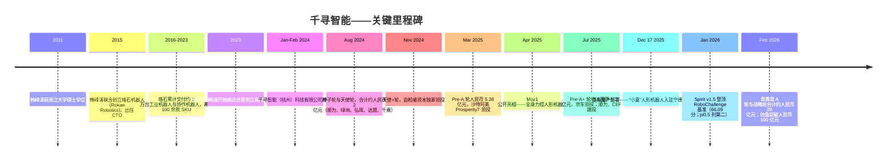
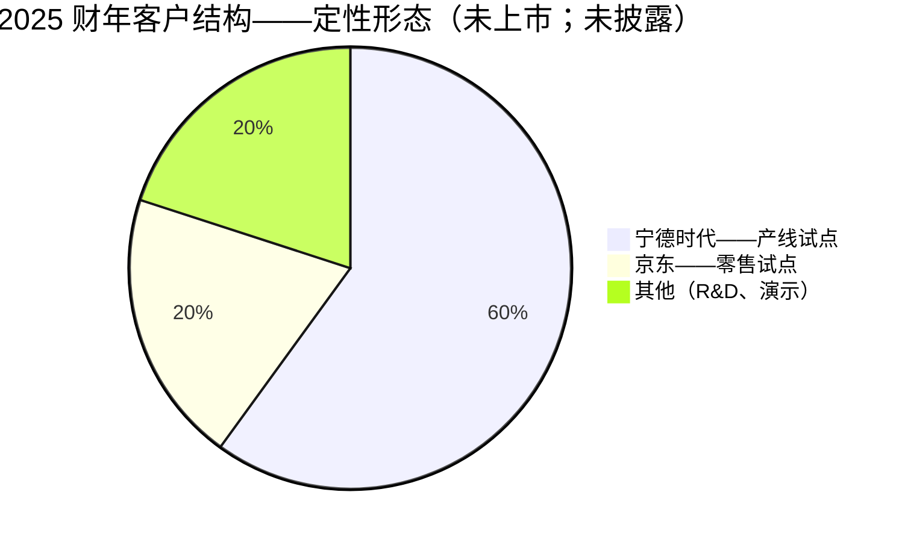
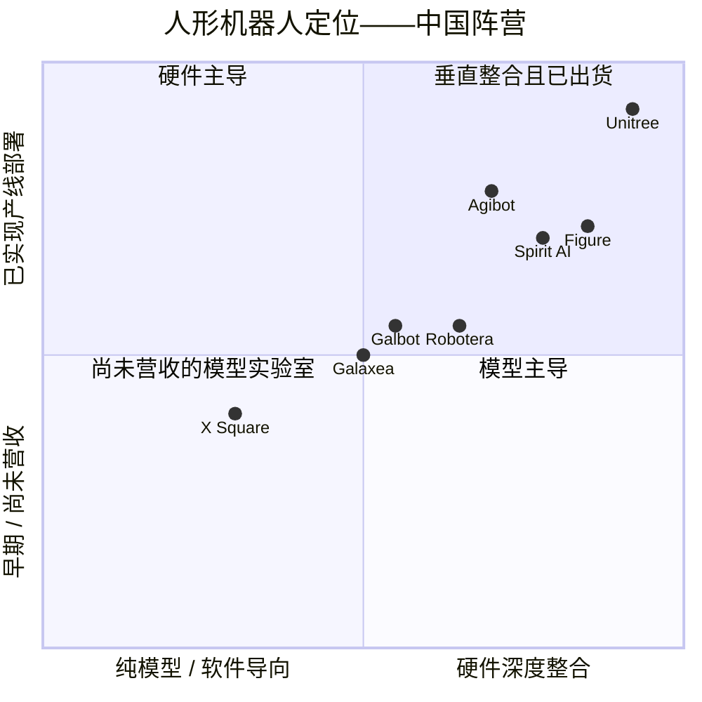

# 公司研究报告：千寻智能 (Spirit AI)

**日期：** 2026-05-19
**状态：** 未上市公司——无公开交易代码
**注册地：** 中国浙江省杭州市
**行业：** 具身智能 / 通用人形机器人
**成立时间：** 2024 年 1 月 / 2 月（不同来源说法不一，均落在 2024 年第一季度）

> **更新——融资轮次与估值里程碑（2026-02-24）：** 千寻智能于 2026 年 1 月底至 2 月连续披露背靠背融资，合计近 **人民币 20 亿元（约 2.80–2.90 亿美元）**，投后估值跃升至 **人民币 100 亿元以上（约 14 亿美元）**，正式跻身人形机器人独角兽行列。新晋投资人包括云锋基金、混沌投资（葛卫东）、红杉中国、明荟投资（汇川技术董事长朱兴明家族办公室）、TCL 创投及 360 基金；老股东顺为资本（雷军系）、Prosperity7（沙特阿美）、京东、达晨财智、弘晖、柏睿及华泰紫金亦跟投。资料来源：[Gasgoo, 2026-02-24](https://autonews.gasgoo.com/articles/news/spirit-ai-secures-nearly-2-billion-yuan-in-back-to-back-funding-rounds-as-embodied-intelligence-race-heats-up-2026146686038994944)、[TheAIinsider, 2026-02-24](https://theaiinsider.tech/2026/02/24/chinese-robotics-company-spirit-ai-raises-290m-in-back-to-back-funding-rounds/)、[量子位 (QbitAI), 2026-02](https://www.qbitai.com/2026/02/381766.html)、[Caixin Substack, 2026-02](https://caixinchinawatch.substack.com/p/free-to-read-chinas-spirit-ai-valued)。

---

## 目录

1. 公司概览
2. 公司历史
3. 管理团队
4. 产品与服务
5. 客户与市场进入
6. 行业概览
7. 竞争格局
8. 市场机会（TAM）
9. 风险评估
10. 参考资料

---

## 1. 公司概览

千寻智能（英文名 Spirit AI；法定主体为千寻智能（杭州）科技有限公司）是一家位于杭州的具身智能初创企业，业务覆盖通用人形机器人本体的设计与制造，以及驱动机器人的视觉-语言-动作（Vision-Language-Action，VLA）基础模型研发。公司由韩峰涛于 2024 年第一季度创立——韩峰涛此前是中国早期协作机器人代表企业之一珞石机器人（Rokae Robotics）的联合创始人兼 CTO——并与清华大学交叉信息研究院（IIIS）助理教授、UC Berkeley 博士、师从 Trevor Darrell（特雷弗·达雷尔）的高阳共同创办，高阳出任首席科学家（[Stanford Robotics Center 讲座简介, 2025](https://src.stanford.edu/src-events/bot4nbr3a8ykux3lkkyvea47c9dmt0)；[KrAsia 高阳访谈, 2025](https://kr-asia.com/entrepreneurship-is-like-playing-a-game-says-spirit-ai-co-founder-gao-yang)）。

公司在一个平台下集中销售三条紧密耦合的产品线：(1) **Moz1**，于 2025 年 4 月公开亮相的全身力控双足人形机器人；(2) **Spirit v1 / Spirit v1.5**，作为 Moz1 大脑的自研 VLA 基础模型（公司表示未来亦将搭载于其他第三方机器人平台）；以及 (3) **集成式力控关节及灵巧手**，公司将其作为核心零部件研发，认为这是让 VLA 模型在真实世界落地不可或缺的部分。在媒体报道与韩峰涛的访谈中反复出现的内部口号是"**AI + 全身力控**"——千寻智能将自身定位为国内极少数同时自研模型与高性能硬件的具身智能公司，硬件性能足以将模型输出精确执行至工业级操作场景（[搜狐转发千寻智能发布稿, 2025-04](https://www.sohu.com/a/912746789_120960869)；[千寻智能产品发布公告, 2025-04](https://www.spirit-ai.com/en/news/13)）。

**商业模式。** 截至本报告撰写时，千寻智能主要以"硬件+软件"打包的方式向工业及商业试点客户供货。韩峰涛在多次访谈中表示，公司于 2025 年第四季度启动商业出货，2025 年全年营收处于"数千万元人民币"量级，2026 年内部目标是 **营收突破人民币 1 亿元、出货量达到数百台（Moz1 人形机器人）**（[21 经济网韩峰涛访谈, 2025-08-12](https://www.21jingji.com/article/20250812/herald/8c1094c3797912c83cf6b518b52ba6a9.html)；[新浪财经, 2026-02](https://finance.sina.com.cn/stock/t/2026-03-02/doc-inhpqvan8248575.shtml)）。售价尚未正式披露；二级媒体报道称 Moz1 单台价格在"数十万元人民币"区间，与 Unitree H1（99,900 美元）相近，低于西方全尺寸人形机器人——*此为未经核实数据*；spirit-ai.com 上未公开 SKU 价格清单。

**业务区域。** 总部及主研发中心位于杭州（余杭区）（[爱企查工商登记记录](https://www.aiqicha.com/company_detail_50159868914060)；[百度百科主体记录](https://baike.baidu.com/item/%E5%8D%83%E5%AF%BB%E6%99%BA%E8%83%BD%EF%BC%88%E6%9D%AD%E5%B7%9E%EF%BC%89%E7%A7%91%E6%8A%80%E6%9C%89%E9%99%90%E5%85%AC%E5%8F%B8/65099257)）。媒体报道提及公司在北京设有与高阳清华 IIIS 实验室相关的模型与研究分部，并在上海/深圳设有客户服务团队，但千寻智能尚未正式公告设立分支机构。目前已披露的试点部署均在国内：宁德时代（CATL）位于中州的电池生产基地，以及京东（JD.com）的零售展示场景，是两家公开点名的客户（[Asia Tech Daily, 2026-02-25](https://asiatechdaily.com/spirit-ai-raises-280m-to-scale-dirty-data-robotics-is-china-betting-big-on-embodied-ai/)；[ION Analytics / Mergermarket 关于 Vitalbridge 的报道, 2026-02](https://ionanalytics.com/insights/mergermarket/vitalbridge-sees-spirit-ais-up-round-as-vindication-of-china-early-stage-ai-pivot/)）。

**规模。** 公司成立两年，员工人数相对估值偏小。公开渠道未提供经审计的员工数；韩峰涛在 2025 年初的访谈中提及"超过 100"名工程师，在 2026 年 36Kr"30 天 30 亿"专访中提及"200+"员工——*该具体人数未经核实，仅作方向性参考*（[36Kr，《Meet Generalist at the Peak》, 2026-02](https://eu.36kr.com/en/p/3756066027209477)）。根据公司自述并由媒体转述，团队成员背景覆盖 UC Berkeley、CMU、清华、北大、浙大等高校，并具备字节跳动、华为、腾讯、小米等企业的运营经验（[量子位 (QbitAI), 2026-02](https://www.qbitai.com/2026/02/381766.html)）。

**估值快照——未上市；无公开市场倍数可参照。**

| 指标 | 数值 | 来源 |
|---|---|---|
| 投后估值（2026 年 2 月） | **> 人民币 100 亿元（约 14 亿美元）** | [36Kr, 2026-02](https://eu.36kr.com/en/p/3729693985390208) |
| 累计融资金额 | **约人民币 28 亿元（约 4 亿美元）**，自成立以来累计 | [Gasgoo, 2026-02-24](https://autonews.gasgoo.com/articles/news/spirit-ai-secures-nearly-2-billion-yuan-in-back-to-back-funding-rounds-as-embodied-intelligence-race-heats-up-2026146686038994944) |
| 2025 财年披露营收 | "数千万元人民币"（即低两位数百万元级） | [21 经济网, 2025-08-12](https://www.21jingji.com/article/20250812/herald/8c1094c3797912c83cf6b518b52ba6a9.html) |
| 2026 财年营收目标（内部） | **> 人民币 1 亿元** | [新浪 / Sina, 2026-02](https://finance.sina.com.cn/stock/t/2026-03-02/doc-inhpqvan8248575.shtml) |
| 隐含 2025 年市销率 | ≳ 200×（人民币 100 亿元 / 约 5,000 万元营收） | 推算；方法见下文 |
| 隐含 2026 年前瞻市销率 | 约 100×（人民币 100 亿元 / 1 亿元营收） | 推算 |

隐含的市销率——**投后估值约相当于 2026 年前瞻营收的 100 倍**——按任何常规标准衡量都极为高企。这只有从 **主题/赛道溢价** 的角度才能解释：投资人为以下因素买单：(a) 韩峰涛在珞石机器人长达十年的硬件工程履历建立的可信度；(b) 高阳的 VLA 模型领导力（Spirit v1.5 于 2026 年 1 月在 RoboChallenge 公开榜单中拔得头筹，超越 Physical Intelligence（PI 公司）的 pi0.5，参见 [People's Daily Online, 2026-01-14](https://en.people.cn/n3/2026/0114/c90000-20413808.html)）；以及 (c) 同期中国人形机器人板块整体重估——同业 Galbot（银河通用）、Galaxea（星海图）、Agibot（智元）、AI² Robotics 及 Robotera（星动纪元）均在过去半年内迈过人民币 100 亿元估值门槛。与上述同业相比，千寻智能的市销率 **与板块持平**，并未显著拉伸（[财新, 2026-03-03 关于 Galbot 的报道](https://www.caixinglobal.com/2026-03-03/galbot-raises-362-million-in-fresh-funding-eyes-hong-kong-ipo-102418742.html)；[财新, 2026-02-12 关于 Galaxea 的报道](https://www.caixinglobal.com/2026-02-12/galaxea-ai-raises-144-million-as-chinas-robot-investment-frenzy-mounts-102413767.html)）。

由此产生的风险是双向对称的：若 VLA 缩放定律论点（韩峰涛的投资逻辑核心——见第 6 节）或工业产线落地未能在 2026–2027 年实现复利增长，则整个中国具身智能板块将集体重估，千寻智能的估值压缩可能较当前水平回撤 50–70%。本风险将在第 9 节作为财务风险讨论。

---

## 2. 公司历史

千寻智能成立时间过短，尚不具备传统意义上的"历史"——撰写本报告时仅成立 **24 个月**——但创始人韩峰涛此前在珞石机器人十年的积累，加上联合创始人高阳的学术血脉，共同解释了公司为何能在创立之初便获得资深资本加持。



时间线资料来源：[新浪财经, 2026-02](https://finance.sina.cn/stock/jdts/2026-02-23/detail-inhnvqch6595031.d.html?vt=4)、[财联社 (cls.cn) 关于 Pre-A 轮的报道, 2025](https://www.cls.cn/detail/1991934)、[新浪关于 Pre-A+ 轮的报道, 2025-07-21](https://finance.sina.com.cn/tech/csj/2025-07-21/doc-infhfrrm3239621.shtml)、[阿里云创业资讯关于"四个月两轮融资", 2024](https://startup.aliyun.com/info/1087030.html)、[36Kr Pre-A 独家报道, 2025-03](https://eu.36kr.com/en/p/3224908715539591)、[千寻智能新闻 8, 2025](https://spirit-ai.com/news/8)。

**创立故事。** 据韩峰涛在 2025 年 8 月接受 21 经济网采访及 2026 年 2 月与 LatePost / 36Kr 的对谈所述，公司的创立论点是 **机器人产业的瓶颈已结构性地从硬件转向智能**（[21 经济网, 2025-08-12](https://www.21jingji.com/article/20250812/herald/8c1094c3797912c83cf6b518b52ba6a9.html)；[m.aitntnews 对 LatePost 采访的转载, 2026-02](https://m.aitntnews.com/newDetail.html?newId=22603)）。韩峰涛在 2015 年至 2023 年的珞石生涯中主要解决硬件问题——关节控制器、力觉传感、运动规划——并由此得出结论：*工业机器人若没有学习型模型，永远无法成为通用机器人*；反之，*VLA 模型若缺乏高质量数据与高保真执行能力，也无法真正落地创造价值*。基于此，他于 2023 年底离开珞石，与高阳合作创立公司，由后者带来自 2021 年起在清华课题组持续发表的机器人学习研究——目标是建立一家同时掌握模型与硬件两端的公司。

**战略转向。** 尽管公司尚处早期，仍有两次值得关注的战略调整：

- **从"先做基础模型，再做硬件"转向"硬件与模型一开始就同步研发"（2024 年中）。** 早期天使轮报道将千寻智能描述为以模型为主的公司；至 2025 年 4 月 Moz1 发布时，叙事已发生反转：硬件被推至前台，公司管理层的解释是"没有自研执行器，就无法生成 VLA 模型能够真正学习的力控操作数据"——这一"脏数据"(dirty data) 论点后来在公司 PR Newswire 新闻稿中成为头条（[PR Newswire, 2026-02-25](https://www.prnewswire.com/news-releases/spirit-ai-lands-280m-to-scale-embodied-ai-through-dirty-data-302697085.html)）。

- **从科研演示转向工业产线（2025 年末）。** 2024 年至 2025 年上半年的大部分时间内，千寻智能的公开演示集中于家庭/办公任务（叠衣、整理桌面）。2025 年 12 月公司明确转向 **工业落地**，公告宁德时代中州基地"全球首条人形机器人动力电池产线"（[Gasgoo, 2026-02-24](https://autonews.gasgoo.com/articles/news/spirit-ai-secures-nearly-2-billion-yuan-in-back-to-back-funding-rounds-as-embodied-intelligence-race-heats-up-2026146686038994944)）。韩峰涛在与 LatePost 的访谈中将这一转向解释为顺应数据规律：工厂场景能够提供集中、可重复、高技能密度的任务，相较分散的消费者场景能更快累积模型改进的复利。

**并购情况。** 暂无披露。

**过去 12 个月的最新动态。**（i）第 1 节详述的 2026 年 2 月背靠背两轮融资。（ii）Spirit v1.5 于 2026 年 1 月在 RoboChallenge 公开榜单中夺冠，系中国具身智能模型首次在全球公认的真实世界操作基准上拔得头筹（[CGTN, 2026-01-14](https://news.cgtn.com/news/2026-01-14/Chinese-AI-startup-tops-global-embodied-intelligence-benchmark-1JV32RBb7QQ/index.html)；[People's Daily, 2026-01-14](https://en.people.cn/n3/2026/0114/c90000-20413808.html)）。（iii）报道显示 2025 年 9 月的增资轮中引入中国互联网投资基金（国家背景基金）作为股东，同时京东数科亦同步进场，标志着公司获得了国家资本背书（[新浪财经, 2025-09-08](https://finance.sina.com.cn/chanjing/gsnews/2025-09-08/doc-infpuftk9735591.shtml)）。

---

## 3. 管理团队

### 韩峰涛 — 联合创始人、董事长兼 CEO

**简介（约 330 字）。** 韩峰涛是千寻智能的运营灵魂；据 2026 年融资报道中多位投资人的评价，他也是公司成立两年便能获得独角兽估值的最核心原因。韩峰涛于 2011 年在浙江大学获得机械/机器人工程硕士学位，师从中国资深机器人学家、中科院院士丁汉（[新浪财经, 2026-02](https://finance.sina.cn/stock/jdts/2026-02-23/detail-inhnvqch6595031.d.html?vt=4)）。

毕业后他在产业界工作四年，2015 年联合创立 **珞石机器人 (Rokae Robotics)** 并出任 CTO。珞石后来成为中国知名的协作机器人企业之一，先后获得中金、愉悦资本、源码资本等机构投资。截至韩峰涛离任时，珞石累计出货量接近 2 万台，覆盖工业六轴机械臂与轻型协作臂等约 100 款 SKU（[新浪财经, 2026-02-23](https://finance.sina.cn/stock/jdts/2026-02-23/detail-inhnvqch6595031.d.html?vt=4)）。韩峰涛在珞石的具体贡献在于 **运动控制栈与算法团队** ——这段经验让千寻智能的关节控制器具备来自真实量产场景的直接传承。早期报道中提及的"汇川技术 (Inovance) 背景"实际上是间接的：珞石的控制工程师及其个人人脉与汇川存在大量交集，而汇川董事长朱兴明的家族办公室明荟投资现已成为千寻智能的战略投资人（[投中网, 2026-02-25](https://www.chinaventure.com.cn/news/80-20260225-390228.html)）。

韩峰涛于 2023 年末离开珞石——按其本人陈述，是因为他认为协作机器人若无学习型智能加持已触及天花板——并于 2024 年第一季度创立千寻智能。他持有创始人股权中的最大单一份额（具体比例 *未披露*；按典型 A 轮稀释后的中国科技公司创始人 CEO 的水平推断，他可能保留 20–35% 普通股，但需视为未经核实）。其公众形象几乎全部建立在长篇中文科技媒体访谈之上（LatePost、36Kr、21 经济报道、量子位），他在访谈中对公司数据管线宏图、财务目标与竞争格局表述得相当具体。采访者将其形容为直白、数字导向、工程师本色，更接近王兴或王传福，而非"PPT 型创始人"。

### 高阳 — 联合创始人兼首席科学家

**简介（约 190 字）。** 高阳是创始组合中负责模型与研究的一端。他在清华大学计算机科学系完成本科学业，跟随朱军教授研究贝叶斯推断，随后在 UC Berkeley 攻读博士，师从 Trevor Darrell，并在 Darrell 与 Pieter Abbeel（皮特·阿贝尔）门下进行博士后研究——这条学术血脉直接承袭了现代深度强化学习与机器人学习两位奠基性人物的衣钵（[Google Scholar 主页](https://scholar.google.com/citations?user=bo0P2qYAAAAJ&hl=en)；[Stanford Robotics Center 讲座简介](https://src.stanford.edu/src-events/bot4nbr3a8ykux3lkkyvea47c9dmt0)）。

高阳回国后任清华大学交叉信息研究院（IIIS，姚期智院士创办，亦是多位知名中国 AI 创业者的学术摇篮）助理教授。他在中文科技媒体中常被归入"**伯克利归国四子**"行列，这一群体亦包括其他几位 UC Berkeley 出身的华人 AI 学者-创业者（[财联社 (cls.cn), 2025](https://www.cls.cn/detail/1991934)）。其代表性外部技术成果为 Spirit v1.5 模型：在 2026 年 1 月的 RoboChallenge 公开真实世界操作基准中斩获第一，总分 66.09，任务成功率 50.33%，领先 Physical Intelligence（PI 公司）的 pi0.5（[People's Daily, 2026-01-14](https://en.people.cn/n3/2026/0114/c90000-20413808.html)）。

### CFO ——尚未公开任命

截至 2026 年 5 月，千寻智能尚未公开任命首席财务官。这在同阶段的中国硬件初创企业中属正常现象，但仍是一项真实的空缺：公司累计募资接近人民币 28 亿元，且 2026 年量产规模化目标明确，缺少具备资本市场履历的公开 CFO 是一个需持续追踪的事项。*列为未经核实——千寻智能可能已有内部 CFO，只是尚未对外亮相。*

### 其他披露的高管

千寻智能尚未在英文媒体中披露完整的 C 级高管名单；通过二级镜像访问 spirit-ai.com 领导团队页面时，仅列出韩峰涛与高阳。媒体报道中提及一位硬件工程负责人与一位模型研发负责人，但均未公开姓名。在韩峰涛与高阳之外，公司的管理层梯队应被视为 **已知的未知**，并构成显著的执行风险（详见第 9 节）。

### 治理结构

- **董事会：** 由创始人与领投方代表主导。具体席位未披露。
- **内部持股：** 创始人合计持股未确认；与 Pre-A+ 后的股权结构相符，创始团队是单一最大持股方但不构成多数控股。
- **已披露的投资人股权结构：** 云锋基金、混沌投资（葛卫东）、红杉中国、顺为资本（雷军系）、京东数科（刘强东系）、中国互联网投资基金（国资）、Prosperity7（沙特阿美）、明荟投资（汇川技术董事长家族办公室）、TCL 创投、360 基金（周鸿祎系）、重庆产业母基金、杭州金投，以及种子/天使阶段股东绿洲、弘晖、达晨财智、千乘、柏睿（[投中网, 2026-02-25](https://www.chinaventure.com.cn/news/80-20260225-390228.html)；[新浪, 2025-07-21](https://finance.sina.com.cn/tech/csj/2025-07-21/doc-infhfrrm3239621.shtml)；[阿里云创业资讯, 2024](https://startup.aliyun.com/info/1087030.html)）。
- **薪酬：** 未披露；适用未上市公司常规惯例。
- **关联方交易：** 暂无披露。

### 履历综评

CEO 在创业之前曾在产业界主导工业机器人的批量化交付，时间长达近十年，这是相对其他 2023–2024 年成立、创始人多为学者或消费互联网背景的中国人形机器人公司 CEO 的最大差异化优势。首席科学家则拥有中国具身智能初创可达到的最高层级学术血统。短板在于 **二级管理团队**：未公开 CFO、未公开 COO 或运营副总裁、未公开商务发展负责人——所有这些角色都将在公司未来 12 个月内从"低两位数百万元营收"迈向"中三位数百万元"的过程中至关重要。

---

## 4. 产品与服务

千寻智能的产品组合在当前阶段刻意保持精炼——完全围绕 Moz1 人形机器人及其驱动 VLA 模型展开。

```mermaid
graph TD
    A[千寻智能 Spirit AI] --> B[机器人平台]
    A --> C[AI / 模型]
    A --> D[零部件 / 知识产权]
    B --> B1[Moz1 — 全身力控人形机器人<br/>本体 26 自由度，1:1 负载自重比]
    B --> B2[Moz1 "小寞" 变体 — 宁德时代部署型号, 2025-12]
    C --> C1[Spirit v1 — 初代 VLA 基础模型, 2025]
    C --> C2[Spirit v1.5 — 当前 VLA 模型<br/>RoboChallenge 榜首, 2026-01]
    C --> C3[Isaac Sim 仿真栈 — docs.spirit-ai.com]
    D --> D1[集成式力控关节<br/>自称"全球功率密度最高"]
    D --> D2[灵巧手 — 未单独 SKU 销售]
    D --> D3[多模态遥操作数据采集装置]
```

资料来源：[humanoid.guide 上的 Moz1 页面](https://humanoid.guide/product/moz1/)；[Aparobot Moz1 页面](https://www.aparobot.com/robots/moz1)；[千寻智能产品发布公告, 2025-04](https://www.spirit-ai.com/en/news/13)；[千寻智能开发文档](https://docs.spirit-ai.com/simulation/issac.html)。

### 4.1 Moz1 — 人形机器人（旗舰产品）

**产品定义。** 全身双足人形机器人，本体（公司口径不含灵巧手自由度）具备 **26 个自由度**，搭载 **自研集成式力控关节**。千寻智能强调的核心差异化是 **全身力控** ——即能够在全部 26 个关节上连续调节关节扭矩——按公司说法，这使 Moz1 能够完成接触丰富的操作任务，例如装配连接器、穿线束、折叠柔性织物等，且不会因过载而损坏被操作物（[搜狐转发千寻智能发布稿, 2025-04](https://www.sohu.com/a/912746789_120960869)；[humanoid.guide 上的 Moz1 页面](https://humanoid.guide/product/moz1/)）。

**已公开披露的规格：**
- **自由度：** 全身 26 个（不含手部）（[humanoid.guide](https://humanoid.guide/product/moz1/)）。
- **负载自重比：** 1:1——即 Moz1 可携带与自身体重相当的负载（公司声称）（[Aparobot](https://www.aparobot.com/robots/moz1)）。
- **关节功率密度：** "全球最高"——公司自述，无独立第三方基准（*未经核实*）。
- **遥操作：** 通过千寻智能自研的多模态数据采集装置实现零时延全身遥操作（[搜狐 / 千寻智能发布稿, 2025-04](https://www.sohu.com/a/912746789_120960869)）。
- **身高 / 整机质量 / 续航时长 / 最大行走速度 / 最大负载（kg）：** **所审查的一手资料中均未正式披露** ——*明确标注*。对比 Unitree H1（约 180 cm、47 kg、3.3 m/s、约 99,900 美元）与 Unitree G1（约 130 cm、35 kg、2 m/s、21,600 美元）（[Unitree H1 页面](https://www.unitree.com/h1/)；[Unitree G1 页面](https://www.unitree.com/g1/)）。

**定价。** 未披露。结合韩峰涛言论与 2026 年营收/出货量（约数百台对应人民币 1 亿元营收）数学反推，单台 ASP 约在 **数十万元人民币低至中段** 区间。*视为推算值，而非披露值。*

**目标客户。** 工业产线（以宁德时代为标杆客户）；其次为商业/零售（京东）；再次以 Isaac Sim 仿真产品为渠道服务 R&D 与高校实验室客户。明确选择以工业落地为先而非消费场景是公司的战略定位特征。

**竞争优势判断：** **部分护城河。** 集成式力控关节与灵巧手属于真正的专有知识产权——韩峰涛的珞石血统让执行器能力的可信度高于多数同行。但硬件可被复制；Unitree、智元（Agibot）与星动纪元（Robotera）均能交付类似形态机器人，特斯拉 Optimus 与 Figure 02 在人形规模、机载 ML 算力、品牌等部分维度上反而占优。更深层的优势在于 **垂直整合栈** ：自研关节意味着掌握接触丰富的数据，而正是这类数据让 Spirit v1.5 与纯靠网络视频训练的 VLA 拉开差距。

**最接近的竞品：** Unitree H1（99,900 美元，约 180 cm）。判断：**移动能力大体持平；千寻智能在操作力控方面领先，但在已交付出货量与品牌方面落后**。

### 4.2 Spirit v1.5 — VLA 基础模型

**产品定义。** 一个统一的视觉-语言-动作基础模型——单一端到端网络，输入 RGB-D 视觉、自然语言指令与本体状态感知信息，输出关节级动作指令。Spirit v1.5 是公司第二代 VLA 模型，承接 Spirit v1。

**能力外部证据。** 2026 年 1 月，Spirit v1.5 在 RoboChallenge 真实世界机器人操作基准上 **位列第一**，总分 **66.09**，任务成功率 **50.33%**，领先 Physical Intelligence 的 pi0.5（[People's Daily, 2026-01-14](https://en.people.cn/n3/2026/0114/c90000-20413808.html)；[CGTN, 2026-01-14](https://news.cgtn.com/news/2026-01-14/Chinese-AI-startup-tops-global-embodied-intelligence-benchmark-1JV32RBb7QQ/index.html)；[ecns.cn, 2026-01-14](http://www.ecns.cn/news/economy/2026-01-14/detail-iheywhna5921726.shtml)）。这是关于千寻智能模型能力最具说服力的第三方数据点，但 RoboChallenge 本身仍是新设基准，尚未达到 LMArena / MMLU 级的全行业认可度。

**定价模式。** 目前不单独商用化，与 Moz1 捆绑销售。

**竞争优势判断：** **存在部分护城河，但证据较新且范围有限。** 基准夺冠是真实的证明点，但与第二名模型的差距足够小，Physical Intelligence、Galbot、Agibot、Galaxea、X Square 或 Skild AI 任何一家都可能在一个发布周期内反超。可持续的问题在于 **数据飞轮** ——千寻智能能否以快于同行的速度生成专有的接触丰富的操作数据？宁德时代的部署正是对这一问题的押注。

### 4.3 集成式力控关节与灵巧手

目前作为 Moz1 整机的一部分销售，并非独立 SKU，但管理层（在 LatePost 访谈中）已暗示未来可能将关节作为零部件单独卖给其他机器人 OEM，作为一条独立营收线。*未公开披露零部件营收；标记为前瞻性管理层评论，不属于当前产品。*

### 4.4 产品路线图与近期发布

- **2025 年 4 月：** Moz1 公开发布。
- **2025 年第四季度：** 开始商业出货；"小寞"（Moz1 变体型号）于 2025-12-17 入驻宁德时代。
- **2026 年 1 月：** Spirit v1.5 登顶 RoboChallenge。
- **2026 年内部目标：** 出货"数百台"Moz1；营收人民币 1 亿元以上。

无 SKU **退役**。

---

## 5. 客户与市场进入

### 客户细分

- **工业 / OEM 制造** ——主要的近期目标市场。宁德时代是标杆客户。媒体提及但未确认的潜在客户包括整车 OEM——韩峰涛在 KrAsia 采访中谈及汽车工厂的拓展抱负，参见 [KrAsia,《Inside Spirit AI's quest…》](https://kr-asia.com/inside-spirit-ais-quest-to-deploy-humanoid-robots-in-automotive-factories)。宁德时代的部署具体处理 **柔性线束装配** ——这是传统刚性机械臂工业机器人难以攻克的任务，因为线缆形态高度不可预测。
- **零售 / 商业服务** ——京东试点已用 Moz1 进行面向客户的演示与轻量级零售搬运。*视为营销/试点，不构成结构性营收来源。*
- **科研与高校** ——通过千寻智能发布的 Isaac Sim 仿真教程可间接推断（[docs.spirit-ai.com](https://docs.spirit-ai.com/simulation/issac.html)），但未公布高校客户名单。

### 客户集中度

作为商业出货仅两个季度的未上市公司，千寻智能未披露客户集中度，管理层亦未正式量化前 1 大或前 5 大客户营收占比。基于公开部署清单可推断，**宁德时代很可能占 2025 财年已披露营收的多数** ——*这是推论，并非披露数据；标记为未经核实*。京东则是第二家公开客户。



若宁德时代的占比大致正确，那么它 **已超过前 1 大客户 50% 的重大风险阈值**（参见第 9 节）。对早期商用人形机器人公司而言这并不罕见；Figure（其 BMW 客户）与智元（智元自身子公司部署与若干 OEM 合作）也存在类似集中度。然而，这仍是 2026 年第 5 节中最重要的需跟踪数字。

### 分销渠道

直销/工程对接模式。没有公开经销商渠道，无电商定价页面（与 Unitree 在 unitree.com 通过 Shopify 风格店面销售 G1 形成对比），亦无英文定价层级。这与"高接触、少量大型战略账户"的打法相符。

### 销售周期

宁德时代部署项目自公开接触到产线投运历时约六个月（[Asia Tech Daily, 2026-02-25](https://asiatechdaily.com/spirit-ai-raises-280m-to-scale-dirty-data-robotics-is-china-betting-big-on-embodied-ai/)）——对该类客户而言较快，但仍属试点而非多线推广。韩峰涛对 LatePost 表示，2026 年的优先事项是将宁德时代的试点转化为多产线、多任务部署，而非签更多新试点客户。

### 关键合作伙伴

- **宁德时代 (CATL)：** 战略部署伙伴；已公开点名。
- **京东 (JD.com)：** 战略投资人（Pre-A+ 领投）与试点客户。
- **中国互联网投资基金：** 2025 年 9 月新增的国资股东——意味着公司与国家机器人产业政策（工信部 2023 年 11 月发布的《人形机器人创新发展指导意见》）在政治取向上相一致。
- **截至 2026 年 5 月尚无正式的整车 OEM 合作公告**（尽管 KrAsia 等媒体报道提及该方向的抱负）。
- **清华大学交叉信息研究院 (IIIS)：** 通过高阳形成的学术锚点。

### 已公开的客户合作案例

最具实质性的单一案例为 **2025 年 12 月 17 日的宁德时代中州"小寞"人形机器人产线**，被定位为全球首条人形机器人动力电池产线（[Gasgoo, 2026-02-24](https://autonews.gasgoo.com/articles/news/spirit-ai-secures-nearly-2-billion-yuan-in-back-to-back-funding-rounds-as-embodied-intelligence-race-heats-up-2026146686038994944)）。任务——即电动汽车电池包柔性线束装配——之所以是优秀的营销示范，正因为它属于接触丰富、需视触觉融合的任务，传统工业自动化从未真正完美解决过。

---

## 6. 行业概览

### 行业定义

千寻智能所处的行业是 **通用人形机器人** ——机器人产业中的一个细分赛道，其特征包括：(i) 双足行走，(ii) 人尺度仿人形态、双臂（通常带灵巧手）；(iii) 基于基础模型的"大脑"，具备跨任务泛化能力，区别于传统工业机器人单任务编程方式。中国行业分类将其归入"智能机器人"，更具体地划入"具身智能"子类（[MERICS,《Embodied AI: China's ambitious path…》](https://merics.org/en/report/embodied-ai-chinas-ambitious-path-transform-its-robotics-industry)）。

相邻行业包括：(i) 传统工业机器人（KUKA、Fanuc、ABB、安川等海外巨头，以及埃斯顿、汇川、新松等中国领先企业）；(ii) 协作机器人 / 协作臂（Universal Robots、珞石、节卡、遨博）；(iii) 四足机器人（Boston Dynamics、Unitree、DEEP Robotics）；(iv) 自动导引车 / 自主移动机器人（极智嘉、海柔创新）。千寻智能的定位是：人形 + VLA 将最终吞噬上述 (ii) 与 (iii) 的大部分市场，以及 (i) 中常规任务的相当份额。

### 市场规模与增长

中国人形机器人市场当前规模小，但在低基数上快速增长：

- **2026 年中国人形机器人市场预期：** 据 2024 年《人形机器人产业研究报告》约为 **人民币 105 亿元（约 14 亿美元）**；据中国电子信息产业发展研究院 2026 年更新约为 **人民币 200 亿元（约 28 亿美元）**（[China Briefing](https://www.china-briefing.com/news/chinese-humanoid-robot-market-opportunities/)；[Premia Partners](https://www.premia-partners.com/insight/embodied-ai-china-as-the-global-powerhouse-for-industrial-and-humanoid-robotics)）。
- **中国整体具身智能市场（包含自动驾驶、移动机器人）：** 2025 年约 **人民币 9,730 亿元（约 1,340 亿美元）**（[China Briefing](https://www.china-briefing.com/news/chinese-humanoid-robot-market-opportunities/)）。
- **全球人形 TAM（摩根士丹利测算）：** 到 2050 年 **5 万亿美元**，其中中国机器人 TAM 总量将从 2024 年的 **470 亿美元增长至 2028 年的 1,080 亿美元**（[Morgan Stanley, 2025](https://www.morganstanley.com/insights/articles/humanoid-robot-market-5-trillion-by-2050)）。

上述 TAM 数据均来自所述机构预测；2025 年中国人形机器人实际综合营收预计约为 **低个位数十亿元人民币**（基于头部同业披露——Unitree 约 15 亿元、智元累计约 5,000 台出货量爬坡中、Galbot 仍主要处于 pre-revenue 阶段——的数量级估算）——*标记为估算，并非行业级披露数据*。

### 增长驱动

- **VLA 缩放定律** ——韩峰涛的核心论点，引自其 LatePost 访谈："和大语言模型 (LLM) 一样，具身智能也遵循缩放定律；模型能力主要是数据质量与数量的函数"（[m.aitntnews 对 LatePost 访谈的转载, 2026-02](https://m.aitntnews.com/newDetail.html?newId=22603)）。若该缩放定律成立——即将质量加权训练数据量翻倍持续推动任务成功率改进——则 2026 年将是相当于 LLM 2023 年的拐点之年。
- **中国政府政策。** 工业和信息化部于 2023 年 11 月发布的人形机器人指导意见，加上"十四五"与"十五五"规划，均将人形机器人列为战略性新兴产业。北京、上海、深圳、杭州、重庆等地方政府均已设立专属人形机器人产业园及国资配套基金（[MERICS 报告](https://merics.org/en/report/embodied-ai-chinas-ambitious-path-transform-its-robotics-industry)；[China Briefing](https://www.china-briefing.com/news/chinese-humanoid-robot-market-opportunities/)）。
- **制造业人口结构变化。** 沿海制造大省的人口老龄化与劳动力成本上涨产生了真实且不断扩大的替代需求；广东、浙江、江苏地区人工装配的边际时薪如今已贵到一定程度——即便是一台人民币 20 万元的人形机器人，按五年摊销，在部分任务结构上已具备竞争力。
- **电动汽车供应链。** 以宁德时代为代表的中国电动汽车电池产业是全球密度最高、节奏最快、规模最大的制造环境，是天然的早期采纳者——千寻智能在宁德时代的部署因此并非偶然。

### 监管环境

- **工信部 2023 年 11 月人形机器人指导意见。** 设定政策方向；并非 FDA / EMA 意义上的强制性法规。
- **国家标准** （GB 11291.1-2011 及后续标准）覆盖工业机器人安全；人形机器人专用标准仍处于草案阶段。
- **出口管制。** 美国商务部工业与安全局（BIS）已收紧对中国 AI 芯片及部分 ML 模型出口的管控；反向——即中国对人形机器人的出口管制——尚未生效但已在研究中。
- **数据 / 隐私。** 机器人在环境中采集密集数据，包括周边人员的生物特征信息。中国《个人信息保护法》（PIPL）适用；针对人形机器人的具体执法尚未实战检验。

### 行业结构

- **顶部分散。** 国内具备可信人形硬件与 AI 栈的玩家约 10 家：千寻智能、Galbot（北京）、智元 Agibot（上海）、Galaxea / 星海图（北京）、AI² Robotics、星动纪元 Robotera（清华系）、Unitree 宇树（杭州）、X Square Robot / 自变量（北京）、Fourier Intelligence 傅利叶、EX Robotics，再加上互联网大厂内部团队（小米 CyberOne、腾讯 Robotics X、字节跳动、小鹏 IronX 等）。
- **供应商集中度高** ：谐波减速器（绿的谐波、Sumitomo 住友）、电机（汇川、Maxon、NIDEC 日本电产）、六轴力/扭矩传感器、触觉皮肤等关键零部件的全球供应商基础狭窄。
- **买方议价能力：** 目前较低（早期采纳客户更看重技术）；将随行业成熟而上升。
- **替代品：** 在刚性与重复性高于泛化需求的任务上，传统工业机器人仍是替代品。

---

## 7. 竞争格局

竞争集合分为三组：(A) 同代次的中国"人形 + VLA"纯玩家；(B) 西方人形领军企业；(C) 中国互联网巨头内部人形团队及相邻的四足/协作机器人在位者。

### A. 中国"人形 + VLA"纯玩家（千寻智能的直接对标群）

| 对标公司 | 总部 | 成立时间 | 最新估值 | 备注 |
|---|---|---|---|---|
| **千寻智能 (Spirit AI)** | 杭州 | 2024 | **> 人民币 100 亿元（2026-02）** | 全身力控硬件 + VLA；RoboChallenge 第一 |
| **银河通用 (Galbot)** | 北京 | 2023 | **> 人民币 200 亿元（2026-03）** | 估值最高；港股 IPO 有传闻（[财新 2026-03-03](https://www.caixinglobal.com/2026-03-03/galbot-raises-362-million-in-fresh-funding-eyes-hong-kong-ipo-102418742.html)） |
| **智元机器人 (Agibot)** | 上海 | 2023 | **> 人民币 100 亿元** | 累计出货量 5,000+ 台，据 [HelloChinaTech, 2026](https://hellochinatech.com/p/two-unicorns-28000-robots) |
| **星海图 (Galaxea AI)** | 北京 | 2023 | **约人民币 100 亿元（2026-02）** | B 轮 1.44 亿美元、达独角兽标准（[财新 2026-02-12](https://www.caixinglobal.com/2026-02-12/galaxea-ai-raises-144-million-as-chinas-robot-investment-frenzy-mounts-102413767.html)） |
| **AI² Robotics（自变量？）** | 北京 | 2023 | > 人民币 100 亿元 | 据 [Global Neighbours, 2026](https://www.globalneighbours.org/en/articles/china-s-ai-robotics-raises-fresh-funds-at-over-10-billion-yuan-valuation) |
| **星动纪元 (Robotera)** | 北京 | 2023 | > 人民币 100 亿元 | 清华 IIIS 孵化；通过高阳实验室与千寻智能存在近亲学术关系 |
| **X Square Robot 自变量** | 北京 | 2023 | 累计融资 2.8 亿美元 | 2026 年 1 月 A++ 轮，字节跳动、红杉跟投（[Pandaily, 2026](https://pro.pandaily.com/p/x-square-robots-wang-qian-robots)） |
| **宇树科技 (Unitree)** | 杭州 | 2016 | 拟 IPO；港股递表中 | 已确立出货量领先地位——H1 / G1 / H2 / R1 完整产品矩阵 |

### B. 西方人形领军企业

| 对标公司 | 总部 | 最新估值 | 备注 |
|---|---|---|---|
| **Figure AI** | 加州 Sunnyvale | 2024 年 2 月达 26 亿美元；后续轮次有报道但本表未汇总 | 部署于 BMW Spartanburg 工厂；OpenAI、英伟达、微软等投资 |
| **1X Technologies** | 奥斯陆 / 帕罗奥图 | 私募估值数十亿美元 | NEO 消费级人形机器人零售价 2 万美元 |
| **Tesla Optimus 特斯拉擎天柱** | 德州 | 未单独披露（TSLA 内部） | 内部制造，供特斯拉工厂自用 |
| **Boston Dynamics 波士顿动力 (Atlas)** | 马萨诸塞州 Waltham | 在现代汽车集团内部 | 工业试点；成本/售价非零售 |
| **Apptronik** | 奥斯汀 | A 轮融资 | Apollo 人形机器人；奔驰试点 |
| **Sanctuary AI** | 温哥华 | 未上市 | Phoenix 人形机器人；专注认知架构 |
| **Physical Intelligence (PI)** | 旧金山 | 2024 年完成 4 亿美元融资 | pi0.5 模型——VLA 直接对手；2026 年 1 月 RoboChallenge 上被 Spirit v1.5 反超 |



*象限定位为定性判断，依据各公司公开披露的部署里程碑及产品/模型平衡度；坐标系作者主观判断，非测量值。*

### 千寻智能的竞争优势

1. **创始人硬件可信度。** 韩峰涛的珞石血统在中国人形机器人阵营中独树一帜——Galbot、智元、星海图、X Square 的创始人皆为 ML 学者或产品经理，未有"交付 2 万台工业机器人"的运营履历。最接近的同类是 Unitree 的王兴兴，但其出身在四足机器人。这一点的意义有二：(i) 让其在宁德时代等工业客户中具备可信度；(ii) 能够实际设计集成式力控关节。
2. **模型与执行器的垂直整合。** "脏数据"论点——只有能完全掌控执行器的机器人才能生成高质量接触数据——不只是营销话术，它决定了数据飞轮的形态。
3. **Spirit v1.5 基准结果。** RoboChallenge 第一是真实、可被第三方验证的证明点，表明该模型在 2026 年 1 月处于全球前沿。
4. **顶级战略投资人组合。** 云锋（马云系）、顺为（雷军系）、京东（刘强东系）、360（周鸿祎系）、Prosperity7（沙特阿美）、中国互联网投资基金（国资）——投资人组合属于阵营内最强之一。

### 千寻智能的竞争弱点

1. **估值落后于 Galbot、累计出货量落后于智元。** Galbot 估值约为千寻智能 2 倍；智元累计出货量约 10 倍。千寻智能处于正确轨道，但在任一维度上均非阵营领跑者。
2. **尚无整车 OEM 客户。** Figure 拿下 BMW；Apptronik 拿下奔驰；Unitree 有多个汽车合作。千寻智能的宁德时代部署位于电池工厂，邻近但并非等同。
3. **单一客户集中度。** 参见第 5 节。
4. **管理梯队深度不足。** 无公开 CFO；二线管理层薄弱。
5. **价格未公开。** 影响竞争情报与客户信号传递。

### 市场份额

在 **中国"人形 + VLA"纯玩家独角兽阵营** 内，千寻智能估值居中（7 家中排第 4），累计出货量居中。同阵营 2025 年合计出货量约 28,000 台（Unitree、智元等总计，据 [HelloChinaTech, 2026](https://hellochinatech.com/p/two-unicorns-28000-robots)），千寻智能按台数份额低于 1%，但鉴于其工业定位，按单台营收口径份额可能显著更高。*单台份额数据作量级估算处理。*

---

## 8. 市场机会 (TAM)

### TAM 构建——全球人形机器人

引用最新发布的卖方与产业研究中的全球人形机器人 TAM 区间：

- **摩根士丹利 (Morgan Stanley)：** 到 2050 年全球 **5 万亿美元**；到 2028 年中国机器人 **1,080 亿美元**（[Morgan Stanley, 2025](https://www.morganstanley.com/insights/articles/humanoid-robot-market-5-trillion-by-2050)）。
- **Fortune Business Insights：** 人形机器人市场 **2025 年 24 亿美元，2034 年 664 亿美元**，CAGR 约 44%（[Fortune Business Insights, 2025](https://www.fortunebusinessinsights.com/humanoid-robots-market-110188)）。
- **Omdia（通用具身智能机器人）：** 参见 [Omdia Market Radar, 2026](https://omdia.tech.informa.com/om143809/omdia-market-radar-generalpurpose-embodied-intelligent-robots-2026)；覆盖含千寻智能在内的约 10–15 家中国玩家。

### SAM——千寻智能可服务市场

千寻智能近期可服务市场范围更窄：

- **2026 年中国工业人形机器人部署预期：** 约人民币 100 亿元（[China Briefing](https://www.china-briefing.com/news/chinese-humanoid-robot-market-opportunities/)）。
- **电动汽车电池 + 整车装配子集：** 主攻垂直领域，预计到 2027 年占工业人形需求的 20–30%——*作者估算，非第三方披露数据*。
- **跨应用劳动力替代 TAM（中国）：** 中国制造业工资总盘约人民币 4 万亿元/年；即便替代 1% 也对应 4,000 亿元——属于数量级校核，并非建模结果。

### SOM——千寻智能 2026–2028 实际可获取份额

- **2026 披露目标：** 营收人民币 1 亿元以上，"数百台"出货量。隐含按营收或台数计约占中国人形机器人市场 1%。
- **2027 作者情景（估算）：** 营收人民币 4–8 亿元，出货量约 1,500–3,000 台——假设宁德时代产线扩张 + 新增 1–2 家工业客户 + 单位经济成熟。
- **2028 作者情景（估算）：** 营收人民币 20–40 亿元，出货量 6,000–10,000 台——假设拿下一家大型整车 OEM + 宁德时代多产线部署。

上述区间为示例性范围，基于韩峰涛披露的轨迹与同业基准（智元 2025 年累计约 5,000 台、Unitree 2025 年累计四足 + 人形约 36,000 台）；未经管理层背书。

### 渗透策略

- **以单一锚定客户为起点，扩展至多产线** ——宁德时代中州先行，再拓展至宁德时代其他产线，再到其他电池整厂，进而其他电池 OEM。
- **将工业部署作为数据引擎** ——每一台出货机器都能改进 Spirit v1.5——并按数据价值进取性定价。
- **暂缓消费 / 家用人形** ，直至工业单位经济跑通。这与 1X "NEO 消费级 2 万美元"的押注路径相反。

---

## 9. 风险评估

### 公司特有风险

**1. 执行风险——12 个月内将营收规模从"数千万元人民币"扩展至 1 亿元以上。** 韩峰涛此前的珞石经验降低但未消除该风险。具体瓶颈包括：(i) 未对外公告 CFO 与运营层；(ii) Moz1 产线尚未达到汽车级量产；(iii) 公司从未在 2026 年所隐含的台数规模上量产交付过人形机器人产品。**严重性：高。可能性：中等。** 缓释因素：红杉、云锋、顺为、京东等一流投资人提供运营支持；宁德时代部署是强力背书。

**2. 客户集中度风险——宁德时代很可能占营收 50% 以上。** 前 1 大客户营收占比未披露，但公开部署叙事暗示宁德时代占主导。按风险阈值口径（前 1 大客户 > 20% 即为重大；> 30% 为高），该风险归类为 **高** 。严重性因策略依赖性进一步放大：宁德时代试点亦是支撑估值的核心证明点。**严重性：高。可能性：高（按推论）。** 缓释因素：2026 年规划新增工业客户；京东关系部分多元化；未披露任何单一供应方合同。

**3. 关键人物依赖——两位创始人均为业务关键。** 韩峰涛承担硬件可信度与运营领导；高阳承担模型领导与学术招募。任一缺位都将实质削弱公司。**严重性：高。可能性：低**（两人与公司深度绑定，创始人持股可观）。

**4. 管理梯队深度不足。** 未公开 CFO、COO 或运营副总裁。当公司规模化至年产数百台时，缺乏资深运营领导是显著的执行风险。**严重性：中等。可能性：中等。** 缓释因素：假设招聘正在进行；投资人可派遣人才。

**5. 技术过时 / 模型周期风险。** Spirit v1.5 在 RoboChallenge 中的领先优势微薄，且基准本身仍在迭代。Physical Intelligence、Galbot、Galaxea，或美方实验室之一（Skild、DeepMind、特斯拉）的突破都可能让 Spirit v1.5 在一个发布周期内被超越。**严重性：高。可能性：中等。** 缓释因素：垂直硬件整合形成数据护城河；研发投入持续。

**6. 供应商集中——谐波减速器与力/扭矩传感器。** 关键零部件来自有限的全球供应商基础（绿的谐波、Sumitomo 住友、NIDEC 日本电产、汇川），任一单一来源在量产爬坡期间断货都可能干扰整机生产。**严重性：中等。可能性：中等。** 缓释因素：通过汇川董事长家族办公室投资形成的股东关系。

### 行业 / 市场风险

**7. 竞争烈度——阵营整体过度融资。** 中国人形机器人阵营 2025–2026 年累计募资超过人民币 300 亿元，将在约 24 个月内消耗，导致供给过剩、价格压力以及不可避免的洗牌。韩峰涛本人在 LatePost 访谈中也提及："*2026 年的具身智能将与 2023 年的大模型非常相似* "——明显暗指 LLM 行业的"百模大战"出清。**严重性：高。可能性：高。** 缓释因素：千寻智能拥有一流投资人提供的资本深度。

**8. 互联网大厂 / OEM 入局——小米、小鹏、华为、特斯拉、比亚迪。** 韩峰涛明确表示："*我们真正的未来竞争对手是这些大公司* "。小米 CyberOne、小鹏 IronX、特斯拉擎天柱代表了具备内部需求的垂直整合对手。**严重性：高。可能性：24–36 个月内中等。**

**9. 监管 / 安全事故风险。** 一旦在工业场景发生高曝光度的人形机器人故障（工人受伤），将触发整个行业的监管收紧。**严重性：中到高。可能性：低到中等。** 缓释因素：全身力控本身降低了碰撞伤害的严重性。

### 财务风险

**10. 估值 / 倍数压缩风险。** 隐含市销率约 100×（2026 年前瞻）和约 25×（2028 年作者情景）。按 SKILL.md 风险分类阈值（P/S > 20× 且非顶四分位增长视为重大），该风险归为 **高** 。重估触发因素包括：(i) 整个中国人形机器人阵营的融资窗口关闭；(ii) Spirit v1.5 基准失利；(iii) 宁德时代试点停滞；(iv) 下文 #12 的任何宏观叠加因素。**严重性：高。可能性：12–18 个月内中等。** 缓释因素：2026 年 2 月融资后多年现金跑道。

**11. 现金消耗 / 盈利时间表。** 硬件 + AI 人才成本均高；Moz1 单位毛利在规模化后仍待验证。按 2026 年数百台出货量计划，预计公司将消耗人民币 3–6 亿元——*作者估算*。**严重性：中等。可能性：高（消耗高发生概率）/ 中等（若跑道足够长则严重性可控）。** 缓释因素：2026 年 2 月融资按多数合理消耗节奏可提供约 24 个月跑道。

### 宏观经济风险

**12. 地缘 / 出口管制风险。** 美国对中国 AI 芯片、ML 模型权重与高端执行器零部件的出口管制可能限制千寻智能的零部件供给或限制其触达西方客户的能力。中方对等反制可能限制西方部署。**严重性：高。可能性：中等。** 缓释因素：在人形机器人领域，国产零部件替代路径比高端半导体更为成熟。

**13. 中国宏观 / CapEx 周期。** 宁德时代等工业客户按自身 CapEx 周期推进人形机器人采纳。中国制造业下行或电动汽车需求疲软可能将部署延后 6–12 个月。**严重性：中等。可能性：中等。**

---

## 10. 参考资料

### 主要公司来源
- [千寻智能官网——新闻第 8 条（中文）](https://spirit-ai.com/news/8)
- [千寻智能——Moz1 产品发布公告（英文）](https://www.spirit-ai.com/en/news/13)
- [千寻智能开发者文档——Isaac Sim 仿真教程](https://docs.spirit-ai.com/simulation/issac.html)
- [爱企查——千寻智能（杭州）科技有限公司工商登记记录](https://www.aiqicha.com/company_detail_50159868914060)
- [百度百科——千寻智能（杭州）科技有限公司](https://baike.baidu.com/item/%E5%8D%83%E5%AF%BB%E6%99%BA%E8%83%BD%EF%BC%88%E6%9D%AD%E5%B7%9E%EF%BC%89%E7%A7%91%E6%8A%80%E6%9C%89%E9%99%90%E5%85%AC%E5%8F%B8/65099257)
- [百度百科英文镜像——Spirit AI](https://baike.baidu.com/en/item/Spirit%20AI%20(Hangzhou)%20Technology%20Co.,%20Ltd./33601)

### 媒体——创始人访谈
- [21 经济网——千寻智能创始人韩峰涛：具身智能估值泡沫只是浪花, 2025-08-12](https://www.21jingji.com/article/20250812/herald/8c1094c3797912c83cf6b518b52ba6a9.html)
- [新浪财经——独家专访千寻创始人：20 亿新融资、具身模型淘汰赛、落地非共识, 2026-02-23](https://finance.sina.cn/stock/jdts/2026-02-23/detail-inhnvqch6595031.d.html?vt=4)
- [m.aitntnews——LatePost 访谈转载, 2026-02](https://m.aitntnews.com/newDetail.html?newId=22603)
- [KrAsia——《Entrepreneurship is like 'playing a game,' says Spirit AI co-founder Gao Yang》](https://kr-asia.com/entrepreneurship-is-like-playing-a-game-says-spirit-ai-co-founder-gao-yang)
- [KrAsia——《Inside Spirit AI's quest to deploy humanoid robots in automotive factories》](https://kr-asia.com/inside-spirit-ais-quest-to-deploy-humanoid-robots-in-automotive-factories)
- [KrAsia——《This startup thinks large models will finally make robots useful》](https://kr-asia.com/this-startup-thinks-large-models-will-finally-make-robots-useful)
- [KrAsia——《Bubble or breakthrough? China's humanoid robotics race…》](https://kr-asia.com/bubble-or-breakthrough-chinas-humanoid-robotics-race-faces-reality-check)

### 媒体——融资轮次与估值
- [36Kr (EU)——Pre-A 轮人民币 5.28 亿元, 2025-03](https://eu.36kr.com/en/p/3224908715539591)
- [36Kr (EU)——《Four Industry Leaders' Capital Joins Forces to Create a Tens-Billion-Worth Unicorn》, 2026-02](https://eu.36kr.com/en/p/3698397830164098)
- [36Kr (EU)——《Qianxun Intelligence's Valuation Exceeds 10 Billion Yuan…》, 2026-02](https://eu.36kr.com/en/p/3701216103281408)
- [36Kr (EU)——《The Cost of 10 Billion Lies in the 'Brains' of the Robots》](https://eu.36kr.com/en/p/3707037092623104)
- [36Kr (EU)——《Hundred-billion Unicorn: Taking a Chance on Humanoid Robots》](https://eu.36kr.com/en/p/3729693985390208)
- [36Kr (EU)——《Meet Generalist at the Peak: How Did Qianxun Intelligence Secure $3 Billion in Just 30 Days?》, 2026-02](https://eu.36kr.com/en/p/3756066027209477)
- [36Kr Pitchhub——千寻智能项目页](https://pitchhub.36kr.com/project/3051237195749764)
- [新浪——Pre-A+ 轮，京东领投人民币 6 亿元, 2025-07-21](https://finance.sina.com.cn/tech/csj/2025-07-21/doc-infhfrrm3239621.shtml)
- [新浪——京东 Pre-A+ 轮二次报道, 2025-07-21](https://finance.sina.com.cn/roll/2025-07-21/doc-infheytw3226840.shtml)
- [新浪——成立 2 年人民币 100 亿元估值, 2026-02](https://finance.sina.com.cn/stock/t/2026-03-02/doc-inhpqvan8248575.shtml)
- [新浪财经——京东股东进场, 2025-09-08](https://finance.sina.com.cn/chanjing/gsnews/2025-09-08/doc-infpuftk9735591.shtml)
- [财联社 (cls.cn)——Pre-A 轮收官，Prosperity7 领投, 2025](https://www.cls.cn/detail/1991934)
- [阿里云创业资讯——4 个月 2 轮融资, 2024](https://startup.aliyun.com/info/1087030.html)
- [量子位 (QbitAI)——20 亿融资百亿估值, 2026-02](https://www.qbitai.com/2026/02/381766.html)
- [投中网 (ChinaVenture)——四位大佬背后资本联手, 2026-02-25](https://www.chinaventure.com.cn/news/80-20260225-390228.html)
- [Caixin Substack——Spirit AI 估值突破人民币 100 亿元](https://caixinchinawatch.substack.com/p/free-to-read-chinas-spirit-ai-valued)
- [iKanchai——30 天融资 30 亿, 2026-02](https://m.ikanchai.com/article/161113)
- [Gasgoo——Spirit AI 获得近 20 亿元融资, 2026-02-24](https://autonews.gasgoo.com/articles/news/spirit-ai-secures-nearly-2-billion-yuan-in-back-to-back-funding-rounds-as-embodied-intelligence-race-heats-up-2026146686038994944)
- [TheAIInsider——2.9 亿美元背靠背融资, 2026-02-24](https://theaiinsider.tech/2026/02/24/chinese-robotics-company-spirit-ai-raises-290m-in-back-to-back-funding-rounds/)
- [DealStreetAsia——独角兽 2.905 亿美元融资](https://www.dealstreetasia.com/stories/spirit-ai-unicorn-value-473964)
- [Asia Tech Daily——2.8 亿美元与"脏数据"论点, 2026-02-25](https://asiatechdaily.com/spirit-ai-raises-280m-to-scale-dirty-data-robotics-is-china-betting-big-on-embodied-ai/)
- [ION Analytics / Mergermarket——Vitalbridge 对 Spirit AI 上调估值的评价, 2026-02](https://ionanalytics.com/insights/mergermarket/vitalbridge-sees-spirit-ais-up-round-as-vindication-of-china-early-stage-ai-pivot/)
- [PR Newswire——Spirit AI 通过"脏数据"获 2.8 亿美元扩张具身智能, 2026-02-25](https://www.prnewswire.com/news-releases/spirit-ai-lands-280m-to-scale-embodied-ai-through-dirty-data-302697085.html)
- [Crunchbase——Spirit AI 公司主页](https://www.crunchbase.com/organization/spirit-embodiedai)

### 媒体——Moz1、RoboChallenge 与部署
- [People's Daily——中国 AI 初创登顶全球具身智能基准, 2026-01-14](https://en.people.cn/n3/2026/0114/c90000-20413808.html)
- [CGTN——Spirit v1.5 RoboChallenge 第一, 2026-01-14](https://news.cgtn.com/news/2026-01-14/Chinese-AI-startup-tops-global-embodied-intelligence-benchmark-1JV32RBb7QQ/index.html)
- [ECNS——RoboChallenge 基准报道, 2026-01-14](http://www.ecns.cn/news/economy/2026-01-14/detail-iheywhna5921726.shtml)
- [China.org.cn——中国 AI 初创登顶具身智能基准, 2026-01](http://www.china.org.cn/2026-01/14/content_118278256.shtml)
- [搜狐——Moz1 发布转载, 2025-04](https://www.sohu.com/a/912746789_120960869)
- [Humanoid.guide——Moz1 产品页](https://humanoid.guide/product/moz1/)
- [Aparobot——Moz1 机器人页](https://www.aparobot.com/robots/moz1)
- [Aparobot——Spirit AI 公司页](https://www.aparobot.com/companies/spirit-ai)
- [AI Wiki——Spirit AI 词条](https://aiwiki.ai/wiki/spirit_ai)
- [AIBase——Pre-A+ 约 6 亿元报道](https://www.aibase.com/news/19806)
- [YouTube——Spirit AI Moz1 发布会](https://www.youtube.com/watch?v=NmJWLwSj_mU)

### 管理层简历
- [Stanford Robotics Center——高阳教授讲座简介](https://src.stanford.edu/src-events/bot4nbr3a8ykux3lkkyvea47c9dmt0)
- [Google Scholar——高阳](https://scholar.google.com/citations?user=bo0P2qYAAAAJ&hl=en)

### 行业 / TAM 参考
- [Morgan Stanley——人形机器人市场 2050 年 5 万亿美元, 2025](https://www.morganstanley.com/insights/articles/humanoid-robot-market-5-trillion-by-2050)
- [Fortune Business Insights——人形机器人市场规模, 2025](https://www.fortunebusinessinsights.com/humanoid-robots-market-110188)
- [Premia Partners——具身智能中国, 2025](https://www.premia-partners.com/insight/embodied-ai-china-as-the-global-powerhouse-for-industrial-and-humanoid-robotics)
- [China Briefing——中国人形机器人市场机会, 2026](https://www.china-briefing.com/news/chinese-humanoid-robot-market-opportunities/)
- [MERICS——具身智能：中国的宏大路径](https://merics.org/en/report/embodied-ai-chinas-ambitious-path-transform-its-robotics-industry)
- [International Banker——中国对人形机器人市场主导地位的推进](https://internationalbanker.com/technology/china-makes-a-strong-push-for-humanoid-robot-market-dominance/)
- [Omdia Market Radar——通用具身智能机器人, 2026](https://omdia.tech.informa.com/om143809/omdia-market-radar-generalpurpose-embodied-intelligent-robots-2026)
- [TechCrunch——中国人形机器人产业在早期市场胜出的原因, 2026-02-28](https://techcrunch.com/2026/02/28/why-chinas-humanoid-robot-industry-is-winning-the-early-market/)
- [RAISE Summit——2026 年值得关注的 20 家物理 AI 公司](https://www.raisesummit.com/post/20-physical-ai-companies-to-watch-in-2026)
- [HelloChinaTech——48 小时内诞生两家 14 亿美元机器人独角兽, 2026](https://hellochinatech.com/p/two-unicorns-28000-robots)

### 同业参考
- [Caixin——Galbot 获 3.62 亿美元融资，瞄准港股 IPO, 2026-03-03](https://www.caixinglobal.com/2026-03-03/galbot-raises-362-million-in-fresh-funding-eyes-hong-kong-ipo-102418742.html)
- [Caixin——星海图 (Galaxea) 获 1.44 亿美元融资, 2026-02-12](https://www.caixinglobal.com/2026-02-12/galaxea-ai-raises-144-million-as-chinas-robot-investment-frenzy-mounts-102413767.html)
- [Yicai Global——星海图 (Galaxea) 估值](https://www.yicaiglobal.com/news/chinese-embodied-ai-startup-galaxea-raises-usd2904-million-to-boost-basic-model-development-global-layout)
- [Global Neighbours——AI² Robotics 估值人民币 100 亿元](https://www.globalneighbours.org/en/articles/china-s-ai-robotics-raises-fresh-funds-at-over-10-billion-yuan-valuation)
- [Gasgoo——具身机器人洗牌, 2026](https://autonews.gasgoo.com/articles/news/its-getting-harder-to-stay-in-the-game-of-embodied-robotics-2030921623400464385)
- [Pandaily——X Square Robot 王潜](https://pro.pandaily.com/p/x-square-robots-wang-qian-robots)
- [Galbot 官网](https://www.galbot.com/)
- [Unitree——H1 人形机器人](https://www.unitree.com/h1/)
- [Unitree——G1 人形机器人](https://www.unitree.com/g1/)

---

### 未经核实 / 标记声明汇总

按照 SKILL.md "存疑即标"的原则，本报告中明确标记为推断、推导或未经独立核实的具体声明如下：

1. **Moz1 ASP（数十万元人民币低至中段）** ——由出货量/营收目标反推，并非千寻智能披露。
2. **员工数 ("200+")** ——36Kr 报道提及，但并非千寻智能一手披露。
3. **创始人股权（韩峰涛约 20–35%）** ——典型范围，非披露数据。
4. **宁德时代占 2025 财年营收份额（约 60%）** ——根据公开部署叙事推断；千寻智能未披露前 1 大客户份额。
5. **2026 现金消耗（人民币 3–6 亿元）** ——基于公开量产规模的作者估算。
6. **2027 / 2028 营收情景** ——作者情景，非管理层指引。
7. **关节"全球功率密度最高"主张** ——公司自述；无独立第三方基准核实。
8. **Moz1 身高、质量、行走速度、续航** ——所审查一手资料中均未披露。
9. **韩峰涛的"汇川背景"** ——一种解读；更准确的表述是其通过珞石形成与汇川的产业网络邻近性，并非直接的早期任职；但其珞石之前职业经历的一手记述在公开资料中并不完整。
10. **行业层面 2025 年中国人形机器人营收"低个位数十亿元人民币"** ——基于阵营披露交叉印证的作者数量级估算。

---

*报告完*。
