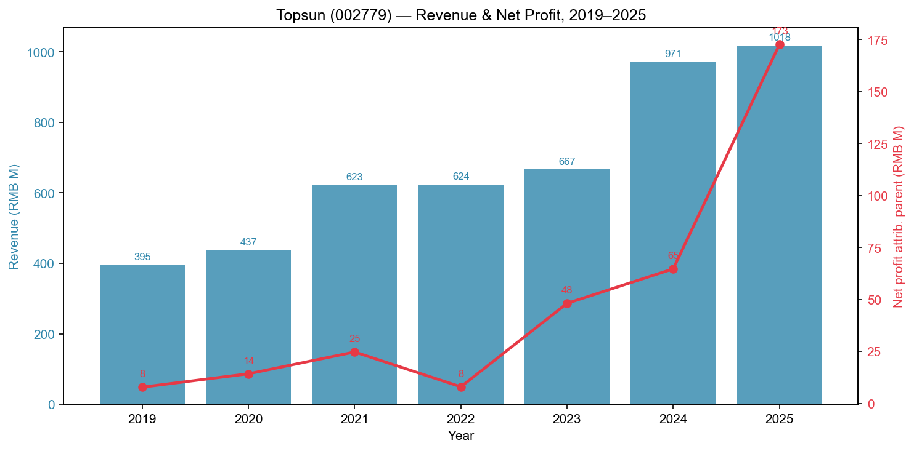
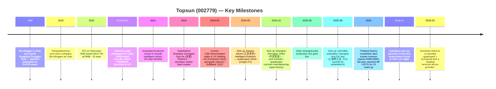
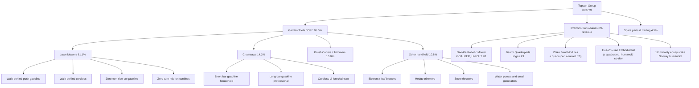
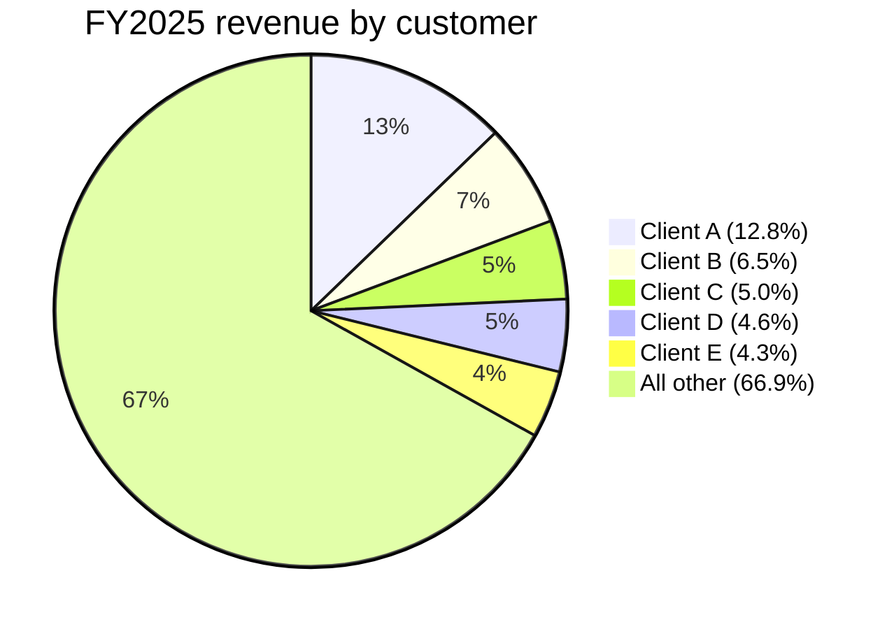
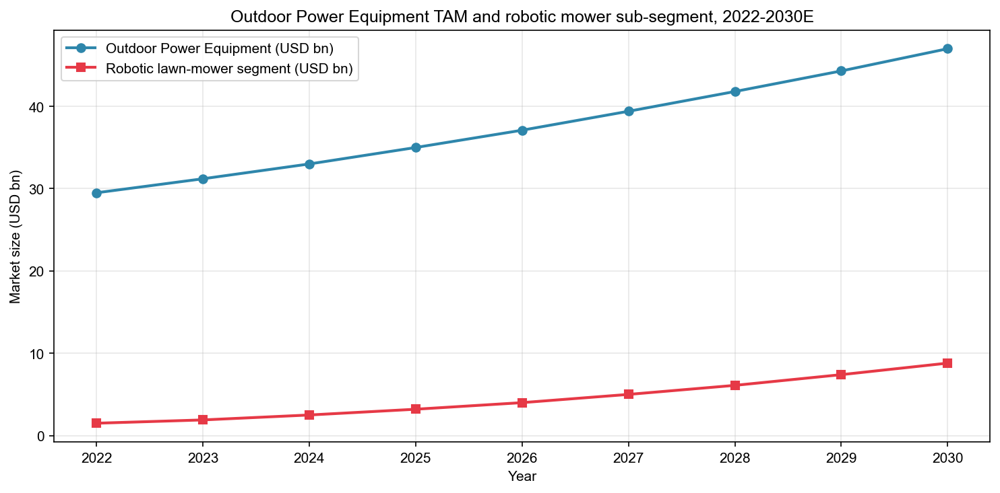
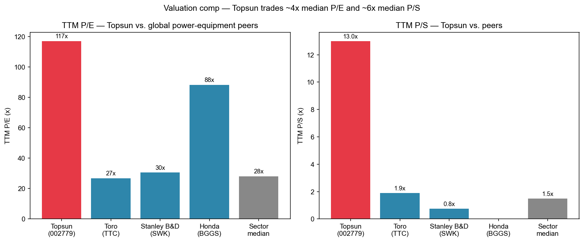
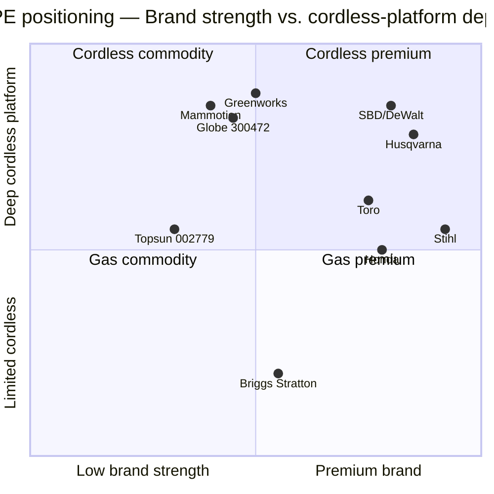

# COMPANY RESEARCH REPORT: Topsun (中坚科技, SZSE:002779)

**Date:** 2026-05-19
**Listing:** Shenzhen Stock Exchange, Small & Mid-Cap board, ticker **002779**
**Sector:** Outdoor power equipment / small gasoline-engine garden machinery — pivoting into humanoid-robot and embodied-AI supply chain
**Local name:** 浙江中坚科技股份有限公司 (Zhejiang Zhongjian Technology Co., Ltd.) — brand "Topsun" / 中坚科技
**Report language:** English (per skill rules, US/global readership; primary filings remain in Chinese and titles preserved verbatim)

> **Update — FY2025 results published 2026-03-30:** Revenue of RMB 1,018 M (+4.9% YoY) and net profit attributable to parent of RMB 172.6 M (+166.9% YoY) were reported. However, **recurring net profit (扣非净利润) fell 22.0% to RMB 40.6 M** because the entire +RMB 165.9 M earnings beat came from mark-to-market fair-value gains on the company's pre-IPO equity stake in Norwegian humanoid-robot company **1X Holding AS** ([2025年年度报告, 第8-9页](http://www.cninfo.com.cn/new/disclosure/stock?stockCode=002779), filed 2026-03-30). Q1-2026 then showed revenue +52% YoY to RMB 434 M but net profit -32% to RMB 28.6 M as robotics R&D opex ramped (R&D expense +291% YoY) and the 1X gain did not repeat ([2026年一季度报告, 2026-04-29](http://www.cninfo.com.cn/new/disclosure/stock?stockCode=002779)). The combined picture: the legacy garden-equipment business is mid-single-digit growth and high-20s gross margin, but reported headline EPS and the stock's ~117× TTM P/E are being driven almost entirely by an unrealized investment gain on a single private-company holding plus a humanoid-robot narrative premium.

---

## TABLE OF CONTENTS

1. Company Overview
2. Company History
3. Management Team
4. Products & Services
5. Customers & Go-to-Market
6. Industry Overview
7. Competitive Landscape
8. Market Opportunity (TAM)
9. Risk Assessment

References

---

## 1. Company Overview

Topsun (中坚科技, SZSE:002779) is a Zhejiang-based, family-controlled manufacturer of small-engine and battery-powered **outdoor power equipment (OPE)** — chainsaws, lawn mowers (walk-behind and zero-turn ride-on), brush cutters, hedge trimmers, leaf blowers, snow throwers, water pumps, and portable generators — that since 2023 has been spending heavily to insert itself into the **humanoid- and four-legged-robot supply chain**. The legal name is 浙江中坚科技股份有限公司 (Zhejiang Zhongjian Technology Co., Ltd.); the long-standing brand "Topsun" / 中坚科技 appears in its corporate web domain `topsunpower.cc` and is the marketing identity used to Western OEM customers ([2025年年度报告, 第6页](http://www.cninfo.com.cn/new/disclosure/stock?stockCode=002779)).

The company's headquarters and primary manufacturing footprint are in **Yongkang, Zhejiang** (永康市经济开发区名园北大道155号) — a city of ~700k people that is the historical heart of China's hardware and small-tools cluster and home of "China Hardware Capital" (中国五金之都). The company self-identifies in its 2025 annual report as a "国家专精特新小巨人企业" (MIIT-designated "specialized, refined, distinctive, novel" little-giant), a "浙江省制造业单项冠军企业" (Zhejiang single-champion manufacturer), a "浙江民营跨国公司领航企业" (Zhejiang lead-private-multinational), a vice-chair unit of the National Forestry Machinery Standardization Technical Committee, and a "国家绿色工厂" (national green factory) — a stack of provincial- and national-level designations consistent with a mid-size, export-oriented mechanical manufacturer ([2025年年度报告, 第10页](http://www.cninfo.com.cn/new/disclosure/stock?stockCode=002779)).

**Business model.** Topsun is overwhelmingly an **ODM/OEM exporter to North American and European brands and big-box retailers** ([2025年年度报告, 第20页](http://www.cninfo.com.cn/new/disclosure/stock?stockCode=002779)). In FY2025, **95.08% of revenue came from foreign sales** (RMB 968.1 M of RMB 1,018.3 M) and only 4.92% from China; **95.49% of revenue came from the "garden tools" (园林工具) segment**, with the remaining 4.51% being miscellaneous trading and parts. Within garden tools, lawn mowers (割草机) are now 61.1% of group revenue (RMB 622.1 M, +19.1% YoY), chainsaws (链锯) are 14.2% (RMB 144.5 M, **-29.7% YoY**), brush cutters (割灌机) 10.0% (-7.9% YoY), and "other" handheld and accessories make up the balance ([2025年年度报告, 第21-22页](http://www.cninfo.com.cn/new/disclosure/stock?stockCode=002779)). The product mix shift toward lawn mowers and away from chainsaws reflects (a) North American big-box retail demand for cordless mowers and zero-turn riders, and (b) the relative maturity / commoditization of low-end gasoline chainsaws.

**Scale and headcount.** As of 31-Dec-2025 the group had **1,022 employees** (754 at the parent plus 268 at the major subsidiaries), with 289 engineers and technicians, 406 production staff, and three PhD holders. Production capacity is "近100 万台" — close to 1.0 M units per year of garden and agricultural machinery, predominantly small-engine and lithium-battery powered ([2025年年度报告, 第19, 61页](http://www.cninfo.com.cn/new/disclosure/stock?stockCode=002779)). Subsidiaries now include manufacturing/sales arms in the US (Topsun USA Inc.), France (Topsun Europe SAS), Thailand (同盛科技(泰国)有限公司, a new export-tariff-mitigation factory commissioned in 2025), Singapore, and a fast-growing constellation of robotics R&D subsidiaries in Shanghai, Shenzhen, Suzhou and Nanjing covered in detail in Section 4.

*Source: [2025年年度报告, 第7页](http://www.cninfo.com.cn/new/disclosure/stock?stockCode=002779); [2019年年度报告, 第5页](http://www.cninfo.com.cn/new/disclosure/stock?stockCode=002779). 2025 net profit is inflated by RMB 165.9 M of fair-value gains on the 1X Holding equity stake — recurring net profit was only RMB 40.6 M.*

**Valuation snapshot (REQUIRED).** At a closing price of **RMB 73.90** on 2026-05-16 ([Eastmoney quote, 2026-05-16](https://quote.eastmoney.com/sz002779.html)), Topsun's market capitalization is approximately **RMB 13.66 B** (184.8 M shares × 73.90), implying:

- **TTM P/E (headline, including 1X gains): ~79×** (RMB 13.66 B ÷ RMB 172.57 M attrib. net profit). Eastmoney's screen shows roll-PE 117× because it uses a different rolling window. Using **recurring net profit only (扣非)** the TTM P/E becomes ~**336× (RMB 13.66 B / RMB 40.6 M)**, an extremely stretched figure. Even on full GAAP net profit of RMB 172 M, the multiple is ~4× the global OPE peer median.
- **TTM P/S: ~13.4×** (RMB 13.66 B ÷ RMB 1.02 B FY2025 revenue), versus a global OPE peer median of ~1.5× — about **9× the peer median**.
- **TTM P/B: ~14.5×** ([Eastmoney quote, 2026-05-16](https://quote.eastmoney.com/sz002779.html)), versus typical industrial-machinery P/B of 2-4×.
- **3-yr range:** the stock was a sleepy, sub-RMB 20 small-cap from 2020 through mid-2024, trading at 25-45× normalized P/E. It re-rated from ~RMB 14 in early 2024 to a peak near RMB 80 in late 2025 / early 2026, almost entirely on the back of the 1X investment disclosure (March 2024) and a series of robotics-subsidiary announcements in 2024-2025.

**Why so rich?** Three drivers, in order of importance:

1. **Thematic / narrative premium — humanoid-robot supply chain.** The market is pricing Topsun primarily as **the cheapest listed Chinese vehicle for retail exposure to 1X Technologies**, the Norwegian humanoid-robot company that counts OpenAI, SoftBank, EQT and Samsung as fellow investors and that is widely viewed as a "Chinese Figure / Tesla Optimus" peer. As of 31-Dec-2025 the carrying value of the 1X long-term equity investment had risen to **RMB 206.1 M** ([2025年年度报告, 第29页](http://www.cninfo.com.cn/new/disclosure/stock?stockCode=002779)) versus an original investment that was a fraction of that. Topsun also self-announces relationships with humanoid-robot leaders and has explicitly stated its goal of supplying "关键零部件" (key components) for high-performance humanoid robots ([2025年年度报告, 第38页](http://www.cninfo.com.cn/new/disclosure/stock?stockCode=002779)).
2. **Earnings temporarily depressed by robotics R&D burn.** Recurring profit is being suppressed by RMB 122 M of R&D spend (12% of revenue, +68% YoY), much of it going to subsidiaries that are still pre-revenue ([2025年年度报告, 第23页](http://www.cninfo.com.cn/new/disclosure/stock?stockCode=002779)). The bull case re-prices this opex as future revenue.
3. **Small float / illiquidity.** Free float is ~57% of total shares after the controlling family's 31.55% stake plus founder lockups, and average daily traded value is moderate, amplifying multiple expansion in periods of theme-driven inflows.

We flag this multiple as **stretched enough to be a stand-alone risk** (see Section 9) — at 13× TTM P/S and 79-336× TTM P/E, the implied 3-5 year revenue and margin trajectory required to justify the price is aggressive even under bullish humanoid-supply-chain assumptions.

---

## 2. Company History

Topsun's origins trace to 1995, when Wu Minggen (吴明根) and his wife Zhao Aiyu (赵爱娱) founded a small-engine workshop in Yongkang, Zhejiang. The business was incorporated as 永康市中坚工具制造有限公司 (Yongkang Zhongjian Tools Manufacturing Co.) — the legal predecessor whose internal job titles still appear in current executives' bios ([2025年年度报告, 第48页](http://www.cninfo.com.cn/new/disclosure/stock?stockCode=002779)). The company's strategic insight was straightforward: catch the early-2000s wave of European and North American outsourcing of cheap garden-equipment manufacturing to China's Yongkang/Wenzhou hardware cluster, focus on the export channel rather than the fragmented domestic market, and accumulate process know-how around two-stroke gasoline engines, displacement-rated chainsaws, and low-cost steel chassis lawn mowers. The Topsun brand and English corporate identity were created to engage North American big-box and European retail buyers directly.

The company restructured into a joint-stock company (浙江中坚科技股份有限公司) ahead of its IPO, and **listed on the Shenzhen Stock Exchange small/mid-cap board on 2015-12-30** under ticker 002779 ([2025年年度报告, 第6页](http://www.cninfo.com.cn/new/disclosure/stock?stockCode=002779)). Through the 2016-2022 cycle the company was a quiet, lightly-followed small-cap export name: revenue ranged from RMB 0.40 B to RMB 0.62 B, normalized net profit was 5-15% of sales, and the share price spent most of the period below RMB 20. The principal strategic moves of that decade were progressive electrification — lithium-battery chainsaws, blowers and mowers — and the buildout of European and US sales/distribution subsidiaries.

**Strategic pivots and acquisitions.** The single dominant strategic shift is the 2023-2025 robotics pivot, structured deliberately not as a single big-ticket M&A but as **a fan-out of greenfield subsidiaries plus a single high-visibility minority equity investment in 1X**. The fan-out (covered in detail in Section 4) includes Gao-Ke (robotic mower R&D), Jianmi (quadrupeds), Zhike (joint modules and quadruped contract manufacturing), Shenzhen and Shanghai Hua-Zhi-Jian (embodied-AI products), and various offshore IP and procurement vehicles in Singapore and Thailand. Total capital committed across the new subsidiaries through end-2025 is on the order of **RMB 180-200 M of registered capital plus an additional RMB 122 M of FY2025 R&D opex** ([2025年年度报告, 第33-37页](http://www.cninfo.com.cn/new/disclosure/stock?stockCode=002779)).

A second, smaller pivot is the **Thailand manufacturing footprint** — 同盛科技(泰国)有限公司, registered capital THB 267.3 M (~RMB 55 M), commissioned in 2025 as a tariff-mitigation hedge against rising US-China trade friction in the OPE category ([2025年年度报告, 第34页](http://www.cninfo.com.cn/new/disclosure/stock?stockCode=002779)). Given that ~95% of revenue is exported and the largest single market is the US, this is a defensive — and in the current 2025/26 trade environment, increasingly urgent — diversification.

A third — the company also disclosed in 2025 that it intends to pursue an **HKEX listing** ("公司支付部分港股上市中介费用" appears in the 其他流动资产 footnote, [2025年年度报告, 第30页](http://www.cninfo.com.cn/new/disclosure/stock?stockCode=002779)). An A+H dual-listing would, if executed, provide additional financing capacity for the robotics buildout.

---

## 3. Management Team

Topsun is **founder-controlled, husband-and-wife-led, and operationally tightly held**. The five-person management nucleus has been substantially unchanged since the IPO, and three senior executives (CFO, COO/常务副总经理, and Board Secretary) all resigned during 2025-2026 — a churn rate that warrants attention.

**Wu Minggen (吴明根) — Chair, CEO and (acting) Board Secretary.** Born May 1963, age 63, Chinese national, no overseas residency. Wu is the founder, controlling shareholder, and the central decision-maker; he has been Chair since 2010 and is now also serving as Acting Board Secretary following the January 2026 resignation of Dai Yongbin ([2025年年度报告, 第48页](http://www.cninfo.com.cn/new/disclosure/stock?stockCode=002779)). His direct stake is 10.20 M shares (5.52%); together with his wife Zhao Aiyu, son Wu Zhan, daughter Wu Chenlu, and the family holding vehicle **中坚机电集团有限公司** (31.55%), the **"acting-in-concert" family group controls approximately 45-46% of total shares** ([2025年年度报告, 第89-90页](http://www.cninfo.com.cn/new/disclosure/stock?stockCode=002779)). Prior to founding Topsun, Wu ran 永康市中坚工具制造有限公司 as 执行董事兼总经理 from the mid-1990s. He sits on several family-controlled side businesses (山东龙晖置业, 永康培英教育, etc.) — these are explicitly disclosed in related-party tables ([2025年年度报告, 第50-51页](http://www.cninfo.com.cn/new/disclosure/stock?stockCode=002779)). Wu's track record is that of a successful Yongkang small-engine entrepreneur who built a USD 100M+ export franchise and listed it; his public commentary is limited (no widely circulated interviews or sell-side write-ups in English), and the robotics pivot of 2023-2025 is the first publicly visible strategic departure from his core competence in nearly thirty years. The combined Chair+CEO+Acting BoS triple role concentrates decision-rights but is also a governance flag.

**Zhao Aiyu (赵爱娱) — Director.** Born November 1964, age 62, Wu's wife and co-founder. She holds 6.81 M shares (3.68%) directly and is the legal representative of the family holding company 中坚机电集团. She historically ran corporate-administration functions inside the predecessor entity and remains an executive of multiple Wu-family enterprises, all disclosed. Her board role is one of family-control continuity rather than operating responsibility.

**Bai Yangting (白杨婷) — CFO.** Born September 1984, age 41, master's degree. Bai joined in 2025 after the retirement (April 2025) of long-serving CFO Lu Zhaoyue (卢赵月). Her prior roles include CFO of 江苏伟岸纵横科技股份有限公司, 阿帕数字技术有限公司, and 凯美瑞德 (苏州) 信息科技股份有限公司 (where she was both CFO and Board Secretary). She has no prior listed-company CFO experience on the A-share main board ([2025年年度报告, 第49页](http://www.cninfo.com.cn/new/disclosure/stock?stockCode=002779)). For a company in the middle of (a) HKEX listing-prep work, (b) heavy multi-subsidiary capital deployment into robotics, and (c) significant fair-value accounting on a private US/Norwegian equity investment, the CFO seat is unusually consequential, and Bai's relatively narrow prior public-market track record is a thing to track over the next several reporting cycles.

**Li Weifeng (李卫峰) — Director and Deputy GM.** Born January 1977, EMBA, mechanical engineer. Holds 5.54 M shares (3.00%). Li has been with the predecessor company since its early days (quality manager, then sales manager); he is now the most senior operating executive below Wu and runs day-to-day garden-equipment operations.

**Yang Haiyue (杨海岳) — Employee Director, Chief Engineer & Head of R&D.** Born September 1975, bachelor's degree, senior engineer. Prior role: product-design head at 浙江恒丰电器集团. Vice-chair, then rotating chair, of the small-gasoline-engine subcommittee of the China Internal Combustion Engine Industry Association. Yang is the technical lead on the core OPE business; he holds 2.77 M shares (1.50%) and is also locked up under director rules.

**Bao Jialong (鲍嘉龙) — Director, Deputy GM, and 49% partner in Shanghai Hua-Zhi-Jian.** Born October 1986, age 39 — by far the youngest executive officer. He joined the board in connection with the August 2025 setup of Shanghai 桦之坚 科技有限公司, a controlled subsidiary in which he holds 26.25% post January-2026 capital increase and Topsun holds 51%. Bao also runs several Shanghai-based investment / IoT vehicles (上海忠融投资, 上海抱家物联网科技, etc.) ([2025年年度报告, 第48页](http://www.cninfo.com.cn/new/disclosure/stock?stockCode=002779)). His addition is the first material outside-shareholder relationship the family has created at the operating-subsidiary level — and signals an intent to bring outside founder-operator capital into the robotics build rather than self-funding all of it.

**Other senior management.** The COO seat (常务副总经理 Chen Yongke 陈永科) was vacated in January 2025 and refilled by **Li Xiaofeng (李小锋, master's), formerly an operations head at 富准精密工业 (Foxconn-affiliated), 创维 LCD, and 广东豪美新材**. The COO turnover within the same year as the CFO turnover and BoS turnover is material — three of the company's top-five non-family officers turned over in 12 months ([2025年年度报告, 第47-49页](http://www.cninfo.com.cn/new/disclosure/stock?stockCode=002779)).

**Independent directors.** Three: **Feng Hutian (冯虎田)**, professor at Nanjing University of Science & Technology, lab director for an MIIT key lab, expert on machine-tool standards; **Shen Zhifeng (沈志峰)**, partner at Grandall Law Firm Hangzhou; **Zhu Xiping (祝锡萍)**, retired Zhejiang University of Technology academic and Chinese CPA non-practicing member, with prior ID seats on multiple listed companies ([2025年年度报告, 第48-49页](http://www.cninfo.com.cn/new/disclosure/stock?stockCode=002779)).

**Governance footer.** Insider ownership is **high (~46% acting-in-concert family) and stable**. The controlling-shareholder vehicle 中坚机电集团 has pledged **39.1 M of its 58.3 M shares** as of 2025-end (67% of holdings, ~12% of total shares outstanding) ([2025年年度报告, 第89页](http://www.cninfo.com.cn/new/disclosure/stock?stockCode=002779)) — declining to 15.4 M pledged by Q1 2026 ([2026年一季度报告, 第5页](http://www.cninfo.com.cn/new/disclosure/stock?stockCode=002779)), which is an improvement but historically elevated. There are no equity-incentive plans currently in effect (no ESOP, no SAR plan disclosed for 2025) — a notable absence for a company hiring robotics engineering talent in Shanghai where equity comp is the market standard. Auditor is **北京兴华会计师事务所**, a domestic mid-tier firm; auditor's report on 2025 is standard unqualified.

**Track record synthesis.** Wu and his founding team have demonstrably built a mid-sized export OPE business from zero to a billion-RMB run-rate with sustainable, if cyclical, 25-30% gross margins. Whether that team can also execute a successful pivot into joint-module manufacturing for humanoid robots — a domain that competes with Tier-1 robotics-specialist competitors like Estun (002747), Inovance (300124), Leader Drive (688017), Anpeilong (301413), Sumavision-Robot (688160), Wuzhou Drive (300979) and dozens of newer startups — is unproven. Robotics is a different business: faster product cycles, higher engineering-talent intensity, more software content, and lower tolerance for the conservative ODM cost mindset that defines Yongkang manufacturing. The fact that three of five top non-family officers turned over in one year may be either (a) deliberate professionalization or (b) execution friction inside the pivot — there is not yet enough data to call which.

---

## 4. Products & Services

Topsun's product portfolio has two distinct legs as of 2025: the **legacy OPE business** (95.5% of FY2025 revenue, profitable, high asset intensity, mature) and the **emerging robotics business** (0% of FY2025 revenue, pre-revenue, R&D-burning, eight subsidiaries).

### 4A. Legacy outdoor power equipment (95.5% of FY2025 revenue, RMB 972.4 M)

*Source: Topsun [2025年年度报告, 第10-14, 22, 33-37页](http://www.cninfo.com.cn/new/disclosure/stock?stockCode=002779).*

**Chainsaws (链锯, 14.2% of FY2025 revenue, RMB 144.5 M, -29.7% YoY).** Topsun was historically a leading Chinese-domestic exporter of gasoline chainsaws and "连续多年在中国内资企业汽油链锯出口上位居前列" ("for multiple years among the top Chinese-domestic-enterprise gasoline chainsaw exporters") ([2025年年度报告, 第19页](http://www.cninfo.com.cn/new/disclosure/stock?stockCode=002779)). Product range: short-bar household (家庭伐木、修枝、取材), long-bar professional (林木采伐、应急救援), and lithium-battery cordless chainsaws launched in 2023-2024 as a Carbon Border / EPA-compliant SKU set. **Competitive-advantage verdict: partial.** Topsun has scale and ODM-customer relationships but the segment is structurally challenged by (a) EU/CARB emissions tightening on two-stroke gas engines and (b) Husqvarna and Stihl owning the premium brand tier outright in cordless. Closest competitor product: **Stihl MS 251 (gasoline)** and **Stihl MSA 220 (cordless)** — Topsun's offerings sit ~30-40% below Stihl on retail price and at parity to ~10% below on performance. Gross margin in the chainsaw line was 24.4% in 2025, materially below the 31.4% of the lawn-mower line.

**Lawn mowers (割草机, 61.1% of FY2025 revenue, RMB 622.1 M, +19.1% YoY, 31.4% gross margin).** The flagship segment and the structural growth driver of the legacy business. SKUs include walk-behind push mowers (手推式割草机), zero-turn ride-on mowers (坐骑式割草机) and increasingly battery-driven zero-turns. The 2024-2025 product roadmap features explicitly include "电动零回转乘坐式割草机" (electric zero-turn riding mower) which won 2024 浙江省首台（套）装备 status, plus "锂电60V扫雪机" and "锂电60V双步扫雪机" (lithium-60V single- and dual-stage snow throwers) ([2025年年度报告, 第25-26页](http://www.cninfo.com.cn/new/disclosure/stock?stockCode=002779)). **Competitive-advantage verdict: partial-to-yes.** The 19% YoY growth and the climbing gross margin (28-31% segment GM versus 24% chainsaws) are evidence of a working ODM relationship with North American big-box retailers and a successful pull-through of the gasoline-to-cordless platform transition. Closest comparable: **Toro TimeCutter (zero-turn ride-on, USD 3,500-6,500)** and **Greenworks Pro / Ryobi cordless mowers (USD 400-800)**. Topsun is functionally behind on robotic mowers (where it has just launched UNICUT H1) but at parity in cordless walk-behind and zero-turn build quality at a lower price point.

**Brush cutters and trimmers (割灌机/打草机, 10.0% of FY2025 revenue, RMB 101.7 M, -7.9% YoY, 19.4% gross margin).** Lower-margin, more commoditized; weak 2025. Standard Yongkang-cluster export goods.

**Other handheld and seasonal — leaf blowers, hedge trimmers, snow throwers, water pumps, small portable generators (RMB 109.5 M, 10.8% of FY2025 revenue, +14.0% YoY).** A long tail of seasonal SKUs that round out the offering for big-box retailers who want to source the full garden-and-power-shed assortment from one supplier. Includes cordless backpack blowers, hedge trimmers, snow throwers and small water pumps. Portable gasoline generators are a long-disclosed product line but are not separately broken out in the FY2025 segment table.

**Distribution & private-label branding.** Topsun runs a hybrid model: ~95% of sales are direct (直接销售) ODM/private-label deliveries to brand and retail customers, and ~5% are through company-owned distributor channels and proprietary brands. The company-owned brands include **"PRORUN"** (US) and a portfolio of unbranded ODM SKUs in Europe. North America and Europe are the two largest export geographies; sales subsidiaries Topsun USA Inc. (Texas, USD 1.20 M paid-in capital) and Topsun Europe SAS (France, EUR 999.8k paid-in capital) act as in-region service, parts and last-mile arms.

**Manufacturing footprint.** The smart-manufacturing hub at Yongkang (HQ campus, S24-03 land parcel) was fully commissioned in 2025 ([2025年年度报告, 第10页](http://www.cninfo.com.cn/new/disclosure/stock?stockCode=002779)), and the **Thailand factory** at 同盛科技(泰国) is now in production for wheel-type and new-energy garden products — a deliberate tariff hedge given the US sourcing exposure.

### 4B. Robotics subsidiaries (0% of FY2025 revenue, the entire valuation thesis)

The robotics buildout is structured as a constellation of greenfield subsidiaries, plus the high-profile 1X minority stake. The 2025 annual disclosure ([2025年年度报告, 第12-14, 33-37页](http://www.cninfo.com.cn/new/disclosure/stock?stockCode=002779)) describes the architecture:

1. **上海中坚高氪机器人有限公司 ("Gao-Ke")** — Founded 2023, registered capital RMB 20 M, focused on **robotic lawn mowers**. Product: **UNICUT H1** — boundary-free, AI-obstacle-avoidance autonomous mower built on the "GOATBOT GFLS" high-precision fusion-localization system. Brand **GOALKER** publicly launched at **CES Las Vegas 2026 (January 2026)**. Small-batch orders began in 2025. FY2025 P&L: revenue RMB 5.3 M, net loss RMB 27.6 M ([2025年年度报告, 第34页](http://www.cninfo.com.cn/new/disclosure/stock?stockCode=002779)). **This is the only robotics subsidiary with material 2025 revenue, and it is in the closest adjacency to the legacy business.** Robotic mowers will likely be the first to generate scale revenue (2026-2027).

2. **江苏坚米智能技术有限公司 ("Jianmi")** — Founded May 2024 in Nanjing, registered capital RMB 30 M, focused on **quadruped industrial-inspection robots**. Product: **Lingrui P1 (灵睿P1)** — designed for industrial campus management, fire/security patrol, electric-grid inspection, and inspection in metallurgy / hazardous-chemical sites. Lingrui P1 is targeting "B/G end" (business and government) clients, will run a self-developed LLM, and is positioned in a category dominated by Unitree (Hangzhou Yushu) and DEEP Robotics. FY2025 P&L: revenue RMB 2.2 M, net loss RMB 19.1 M.

3. **上海中坚智氪智能科技有限公司 ("Zhike")** — Founded October 2024, registered capital RMB 80 M, positioned as the **"super-factory"** producing **joint modules (关节模组)** as core robotics components and offering **quadruped whole-machine contract assembly**. The Shanghai pilot line was commissioned June 2025 ([2025年年度报告, 第13页](http://www.cninfo.com.cn/new/disclosure/stock?stockCode=002779)). This is the subsidiary most directly aligned with the "humanoid supply chain" investment thesis — joint modules (motor + gearbox + encoder + controller, integrated) are the highest-content, highest-margin piece of a humanoid robot's BOM and are where listed peers like Estun, Anpeilong, Sumavision-Robot, Inovance and Wuzhou Drive have already been re-rated by the market. FY2025 P&L: revenue RMB 0.26 M, net loss RMB 10.7 M.

4. **上海桦之坚科技有限公司 ("Hua-Zhi-Jian" Shanghai)** — Founded August 2025, registered capital RMB 20 M (post-Jan-2026 increase to RMB 60 M), **51% owned by Topsun, 49% by Bao Jialong's vehicle Long-Jian Shanghai**. Mission: "embodied-intelligence robot basic research and industrialization", with explicit mention of co-developing a quadruped + intelligent-robot product line with "某行业领先的终端设备提供商" ("a leading terminal-device provider" — undisclosed counterparty, widely speculated in Chinese sell-side notes to be a major consumer-electronics OEM though there is no formal confirmation in filings).

5. **深圳桦之坚机器人科技有限公司 ("Hua-Zhi-Jian" Shenzhen)** — Founded January 2025, registered capital RMB 30 M, "project planning stage, not yet operating" as of end-2025.

6. **南京灵睿机器人有限公司** — Subsidiary of Jianmi, RMB 5 M registered capital, dormant in 2025.

7. **保盛(新加坡)有限公司** and **高氪(新加坡)有限公司** — Singapore SPVs used to hold the offshore equity investment in 1X Holding AS. Through 保盛, the group reports a long-term equity investment of **RMB 206 M** as of end-2025, up from RMB 30 M at end-2024 — RMB 165.9 M of the increase is the fair-value gain that drove FY2025 reported headline earnings ([2025年年度报告, 第29, 34页](http://www.cninfo.com.cn/new/disclosure/stock?stockCode=002779)).

8. **同盛科技(泰国)有限公司** — Thailand manufacturing arm, registered capital THB 267.3 M, OPE production base.

**1X Holding AS investment — the heart of the humanoid narrative.** Topsun publicly disclosed in March 2024 that it had invested in 1X Holding AS — a Norwegian humanoid-robotics company co-backed by OpenAI, SoftBank, Samsung and EQT, and the developer of the **NEO Beta** and **NEO Gamma** bipedal humanoids. 1X's NEO Gamma was demonstrated on the keynote stage at Nvidia GTC March 2025 doing semi-teleoperated vacuuming and watering tasks in a living-room set — high-visibility, high-credibility validation of an in-home humanoid product roadmap ([2025年年度报告, 第13页](http://www.cninfo.com.cn/new/disclosure/stock?stockCode=002779); cf. [1X Technologies — NEO product page](https://www.1x.tech/neo)). The investment is **a minority financial stake, not a controlling acquisition**, and the disclosed amount and percent-ownership are not broken out at line-item level in the public filings. Carrying value as of 2025-end is RMB 206 M; the FY2025 fair-value gain was RMB 165.9 M, suggesting an approximate **5-7× mark-up versus original cost basis**.

**Per-product competitive-advantage assessment for robotics:**

- **UNICUT H1 / GOALKER robotic mower — Partial advantage.** Topsun benefits from existing OPE manufacturing scale, channel relationships with North American big-box retailers (Home Depot, Lowe's, etc.), and a large installed base of conventional mower customers it can upgrade. **However**, robotic mowers are an established, competitive category — Husqvarna Automower, Honda Miimo, Worx Landroid, EcoFlow Blade and Mammotion LUBA have multi-year head starts. Verdict: catch-up product, but distribution is a real lever.
- **Lingrui P1 quadruped — Limited advantage.** Quadrupeds are now a low-moat category at the hardware level (commoditized by Unitree's drive-down on BOM costs); the differentiation moved to AI/software stack and customer integration. Topsun is new to both. Closest competitor: **Unitree Go2 / B2, DEEPRobotics X20** — Topsun's Lingrui P1 reads as a viable second-source supplier but unlikely to lead the segment.
- **Zhike joint modules — Conditional advantage.** This is the highest-upside subsidiary if executed: joint modules are where Tier-1 robotics suppliers extract real margin. Topsun has manufacturing-process know-how and casts/forgings supply-chain proximity in Yongkang (a hardware cluster). But specialist competitors (Estun, Inovance, Leader Drive, Anpeilong) have been at this for 5-10+ years with deeper R&D depth. Verdict: needs a marquee design-win to validate.
- **Hua-Zhi-Jian embodied AI products — Unproven.** Too early to assess.
- **1X equity stake — Real but financial, not operational.** The investment gives Topsun a financial claim on 1X's future value but **not, as of public disclosure, a contract to manufacture for 1X**. Investors should be careful to separate "Topsun is an investor in 1X" (true) from "Topsun supplies parts to 1X" (not publicly confirmed in filings — the 2025 annual mentions "积极寻求相关产业的合作和投资机会" ("actively seeking related-industry cooperation and investment opportunities") but no signed supply contract is disclosed).

**Flagship vs. long-tail.** Today (2025): the lawn mower line is the flagship; chainsaws are the legacy; the entire robotics constellation is the future-state thesis. By 2027-2028, the bull case requires Zhike's joint-module business to be commercially shipping; the base case sees robotic mowers becoming an additional ~10-20% of revenue and joint modules and quadrupeds as scaling but small. The bear case is that robotics revenue does not exceed ~5% of group through 2027.

**Recent product launches and roadmap (last 12 months):**
- 2025-06 Zhike Shanghai pilot line goes live.
- 2025 small-batch orders of UNICUT H1.
- 2025 Thailand factory commissioning.
- 2025 launch of 60V cordless snow-thrower SKU set.
- 2026-01 GOALKER mower brand launch at CES Las Vegas.
- 2026-03 Disclosure of intent to co-develop a quadruped + intelligent robot with a "leading terminal-device provider" ([2025年年度报告, 第14页](http://www.cninfo.com.cn/new/disclosure/stock?stockCode=002779)).

---

## 5. Customers & Go-to-Market

Topsun is an ODM/OEM exporter — its customer base is **a relatively concentrated set of Western brand and big-box retail buyers**, served on a year-by-year purchase-order basis. The customer-concentration disclosure in the 2025 annual report shows:

| Rank | Customer (anonymized) | FY2025 sales (RMB M) | % of FY2025 revenue | FY2024 sales (RMB M) | FY2024 % |
|------|----------------------|--------------------|--------------------|--------------------|----------|
| 1 | Client A | 130.07 | **12.77%** | 107.33 | 11.06% |
| 2 | Client B | 66.43 | 6.52% | 73.03 | 7.52% |
| 3 | Client C | 50.75 | 4.98% | 57.01 | 5.87% |
| 4 | Client D | 46.63 | 4.58% | 52.11 | 5.37% |
| 5 | Client E | 43.28 | 4.25% | 41.28 | 4.25% |
| **Top-5 total** | | **337.16** | **33.10%** | **330.78** | **34.07%** |

*Source: [2025年年度报告, 第24页](http://www.cninfo.com.cn/new/disclosure/stock?stockCode=002779); [2024年年度报告, 第24-25页](http://www.cninfo.com.cn/new/disclosure/stock?stockCode=002779).*

**Concentration interpretation.** Top-1 customer share is **12.77%**, slightly above our 10% materiality threshold, and **Client A grew +21% YoY in FY2025 while several other top-5 names shrank or were flat**. Top-5 share at 33.1% is *not* alarming on its own (well below the 50% threshold we treat as a material risk) and has been stable around 33-35% for three years. The company does **not** name its top customers in the filing — it discloses them only as "客户A / B / C / D / E", citing standard mainland A-share confidentiality conventions, though for an exporter selling to brand-name retailers the identities are widely understood by industry participants to include large North American big-box DIY chains and one or more European brand customers. Topsun does not disclose multi-year master agreements; the contract structure is **purchase-order based**, with seasonal forecasts.

**No related-party customer exposure** in 2025 (the table reports "前五名客户销售额中关联方销售额占年度销售总额比例 0.00%") and no customer is vertically integrating into Topsun's product set.

**Supplier concentration** is comparable: top-5 suppliers were RMB 165.1 M (21.4%) of FY2025 procurement, with the largest supplier alone accounting for 12.2% ([2025年年度报告, 第25页](http://www.cninfo.com.cn/new/disclosure/stock?stockCode=002779)) — this is a relatively concentrated single-supplier exposure on the procurement side and likely reflects the small-engine block / metal-casting input.

**Geographic mix.** **95.08% of FY2025 revenue is foreign** — North America (Topsun USA) and Europe (Topsun Europe) being the dominant blocks ([2025年年度报告, 第22页](http://www.cninfo.com.cn/new/disclosure/stock?stockCode=002779)). Domestic China revenue **fell 32.7% YoY** in FY2025 to only RMB 50.1 M (4.92%) — consistent with the company's strategic focus on export markets and the secular weakness of China's residential garden-equipment demand. This geography mix is the single most important macro risk to the company (see Section 9): trade policy and FX shape the P&L more than product-mix shifts do.

**Sales cycle and channel structure.** ODM/private-label deals typically run 12-18 months from product spec to first PO; renewals are annual or seasonal; switching costs are real but not absolute (tooling, certification, supplier-qualification work). The company also operates owned brands ("PRORUN" in the US and others) and is invested in direct-to-consumer channels through its US and European subsidiaries. The new 2025 subsidiary 浙江宝氪进出口有限公司 was set up specifically to expand the overseas distribution build-out ([2025年年度报告, 第36-37页](http://www.cninfo.com.cn/new/disclosure/stock?stockCode=002779)).

**Investor-relations engagement.** Topsun has hosted multiple institutional investor visits during 2025 covering the robotic mower roadmap (Feb 2025), overseas sales and robotics expansion (Apr 2025), and additional rounds during the year ([2025年年度报告, 第39页](http://www.cninfo.com.cn/new/disclosure/stock?stockCode=002779)) — high engagement frequency is consistent with the stock's re-rating and the institutional investor interest in the robotics theme.

**Customer-concentration verdict.** Top-1 at 12.8% is above our flag line; top-5 at 33% is moderate. The disclosure quality is medium (anonymized customer names, no contract-term details). Carried into Section 9 as a moderate (not severe) risk, weighted by the absence of named multi-year master agreements.

---

## 6. Industry Overview

Topsun operates at the intersection of two distinct industries: the mature, slow-growing **global outdoor power equipment (OPE)** market and the early-stage, high-multiple **humanoid + service / industrial robotics** market. Both industries deserve separate treatment.

### 6A. Outdoor power equipment (95% of current revenue base)

**Market definition.** OPE includes lawn mowers (walk-behind and ride-on, gasoline and battery), chainsaws, brush cutters / trimmers, leaf blowers, hedge trimmers, snow throwers, water pumps, pressure washers, and small portable generators — products that combine a small internal-combustion engine or a battery-electric drivetrain with a cutting/blowing/pumping tool. Topsun is at the consumer / "prosumer" tier; commercial / professional landscaping equipment (Toro, Husqvarna commercial, Wright Manufacturing) is an adjacent but distinct subsegment.

**Market size.** Multiple credible third-party estimates cluster the global OPE market at **USD 30-37 billion in 2024-2025**, growing at a CAGR of 5-7% through 2030 to **~USD 45-50 billion** ([Fortune Business Insights, Outdoor Power Equipment Market, 2025-01](https://www.fortunebusinessinsights.com/outdoor-power-equipment-market-103080); [Grand View Research, OPE Market, 2024-12](https://www.grandviewresearch.com/industry-analysis/outdoor-power-equipment-market)). The largest single end-market is the US (~40% of global, supported by single-family-housing density, residential lawn area, and home-improvement DIY culture); Europe accounts for ~25%, China and rest-of-Asia ~25%. Most demand is residential; commercial landscaping is ~30% of dollar volume but higher margin.

*Source: composite Fortune Business Insights / Grand View Research / Mordor Intelligence estimates 2024-2025 — see References. Robot mower sub-segment estimate based on [Mordor Intelligence, Robotic Lawnmower Market, 2024](https://www.mordorintelligence.com/industry-reports/robotic-lawnmower-market).*

**Key trends and drivers:**
1. **Gasoline-to-battery transition.** California CARB SORE rules from January 2024 banned the sale of new gasoline-engine residential OPE in California; the EU's Stage V emissions are tightening; multiple US states are following CARB. The transition shifts BOM economics (Li-ion + BLDC motor + electronics replace two-stroke engine), favoring suppliers with battery and motor capabilities — Topsun has been building lithium SKUs since 2023.
2. **Robotic mowers.** Robotic lawn mowers were ~USD 2-3 B in 2024 and forecast to grow to USD 7-9 B by 2029-2030 ([Mordor Intelligence, Robotic Lawnmower Market, 2024](https://www.mordorintelligence.com/industry-reports/robotic-lawnmower-market)). Husqvarna's Automower has historically owned the high-end; Worx Landroid and EcoFlow Blade compete in the mid-tier; Mammotion LUBA (a Chinese rival) has gained share rapidly in 2024-2025 with RTK-GPS-based no-perimeter-wire designs.
3. **Zero-turn ride-on penetration in the US residential lawn market** — a multi-year compounding trend at low-double-digit rates, partly displacing tractor-style mowers; Topsun's zero-turn line is in this category.
4. **Tariff and reshoring pressure on Chinese exporters.** US Section 301 tariffs on Chinese goods plus the prospect of additional tariffs in 2025-26 motivate Chinese exporters to build Southeast Asia production capacity (Topsun's Thailand plant is part of this pattern), or sell to non-US markets, or move up-market into brand.

**Industry structure.** OPE is **moderately fragmented globally and intensely fragmented in China**. The top global brands — **Husqvarna Group (Sweden), Toro Company (USA), Stanley Black & Decker (DeWalt, Craftsman), Stihl (private, German), TTI / Techtronic Industries (Milwaukee, Ryobi, Hart), Briggs & Stratton, MTD/Cub Cadet (acquired by SBD), Honda Power Products, Echo (Yamabiko)** — together control perhaps 50-60% of branded global volume. Behind them sits a fragmented backbone of Chinese ODM exporters in Yongkang, Wenzhou and Suzhou, of which Topsun is one of the larger publicly-listed names. Suppliers' bargaining power is moderate (small-engine components have many qualified casters / forgers in Zhejiang and Jiangsu); buyer power is high (a handful of US big-box retailers wield concentrated procurement leverage over the ODM side). Substitutes are weak (it is hard to mow a 2-acre lawn without a mower); the threat of new entrants on the volume side is restrained by certification and tooling-amortization barriers (EPA, CARB, EU CE/Stage-V), but the threat from Chinese cordless-battery upstarts is real and rising.

**Regulatory environment.** EPA Phase 3, CARB SORE (in effect since 2024 in CA), EU Stage V, EU MD 2006/42/EC machinery directive, EU Noise Directive 2000/14/EC — all are tightening. The transition is structurally favorable to manufacturers that can supply both gasoline (declining) and battery (growing) platforms — i.e. Topsun.

### 6B. Service / industrial robotics and humanoid robots (the future-state thesis)

**Market definition.** Three sub-segments matter for Topsun:
1. **Robotic lawn mowers** — covered above, USD 2-3 B 2024 growing to USD 7-9 B by 2029-30.
2. **Quadruped robots for industrial inspection, security, hazardous-environment patrol** — ~USD 0.3-0.5 B global market today, projected to reach USD 1.5-3 B by 2030 ([Frost & Sullivan / various, 2024-2025](https://www.unitree.com/blog)).
3. **Humanoid robots (bipedal, anthropomorphic) for industrial and household tasks** — pre-revenue at meaningful scale globally as of 2025, with widely cited forecasts pointing to USD 30-150 B by 2035 from sources such as Goldman Sachs Research, Morgan Stanley, Citi GPS, and others. The Chinese government's *人形机器人创新发展指导意见* (MIIT, Nov 2023) targets China to "achieve mass production by 2025 and key-technology breakthroughs by 2027" — making humanoids an explicit state-strategic-industry direction.

**Where Topsun fits.** Topsun is **not** a top-3 humanoid-robot brain or chassis OEM — those slots in China are claimed by **Unitree (人形 H1/G1), Fourier (GR-1/N1), XPeng (Iron), Xiaomi CyberOne, AGIBOT (智元), UBTech (Walker S), and Ti5 (LimX, Booster, Galbot)**. Topsun's stated strategy positions it as **a supplier of joint modules and related key components to the broader humanoid value chain**, plus as a downstream service-robot product manufacturer in lawn mowers and quadruped inspection. The 1X equity stake provides a financial exposure to a leading non-Chinese humanoid OEM.

**Joint-module supply chain (the area where Topsun is most directly exposed):** A typical humanoid robot uses 30-50 joint actuators, with each joint costing USD 200-1,500 depending on torque rating. At scale (say, 1 million humanoids per year globally by 2030 — a mid-case scenario), the joint-module TAM is **~USD 15-30 B annually**, of which Chinese suppliers are positioned to capture a large share given the casting / forging / motor manufacturing base. Listed Chinese specialists already trading at very high P/E multiples in this space include Anpeilong (301413), Estun (002747), Inovance (300124), Sumavision-Robot (688160), Leader Drive (688017), and Wuzhou Drive (300979). Topsun's competitive position here is **late and unproven** — Zhike is barely a year old.

---

## 7. Competitive Landscape

The competitive set splits naturally into two distinct cohorts.

### 7A. Outdoor power equipment cohort (the legacy business)

| Competitor | Listing | TTM Revenue | TTM P/E | Headquarters | Positioning |
|------------|---------|-------------|---------|--------------|-------------|
| **Toro Company** | NYSE:TTC | USD 4.6 B | ~26.8× | USA | Premium prosumer + commercial; zero-turn leader |
| **Stanley Black & Decker** | NYSE:SWK | USD ~15.5 B | ~30.5× | USA | DeWalt / Craftsman / Cub Cadet brand-led conglomerate |
| **Husqvarna Group** | STO:HUSQ-B | SEK ~52 B | n/a (cyclical) | Sweden | Premium OPE + chainsaws; Automower robot pioneer |
| **Stihl** | private (Germany) | EUR ~5.8 B | n/a | Germany | Chainsaw + handheld OPE category leader |
| **Honda Power Products** (segment) | TYO:7267 | JPY ~360 B (segment) | parent ~10× | Japan | Engines and generators; Miimo robot mower |
| **TTI / Techtronic Industries** | HKEX:0669 | USD ~14.5 B | ~20× | HK | Milwaukee, Ryobi cordless platform |
| **Briggs & Stratton** | (taken private 2020) | n/a | n/a | USA | Small-engine specialist |
| **Greenworks Tools** | private (China-controlled, listed parent SZSE:300472 Globe) | USD ~1.5 B | n/a | China | Cordless OPE specialist |
| **Globe Industries** | SZSE:300472 | RMB ~13 B | mid-20s× | China | Major Chinese cordless-OPE rival to Topsun |
| **Mammotion** | private | n/a | n/a | China | Robot lawn mower pure-play (LUBA series) |

*Sources: [Stockanalysis.com — Toro (TTC) statistics, 2026-05](https://stockanalysis.com/stocks/ttc/statistics/); [Stockanalysis.com — Stanley Black & Decker (SWK) statistics, 2026-05](https://stockanalysis.com/stocks/swk/statistics/); company filings linked under References.*

*Sources: [Eastmoney quote, 2026-05-16](https://quote.eastmoney.com/sz002779.html); [Stockanalysis.com — TTC](https://stockanalysis.com/stocks/ttc/statistics/); [Stockanalysis.com — SWK](https://stockanalysis.com/stocks/swk/statistics/).*

Within the OPE cohort, **Topsun is a Tier-2 Chinese ODM exporter that competes mostly on cost-plus-quality against Toro and SBD on the entry tier of zero-turn and walk-behind mowers and against Husqvarna and Stihl on chainsaws**. The big strategic threat is not Toro or SBD directly — it is **Globe Industries (300472), Mammotion, and Greenworks Tools**, three Chinese cordless-OPE specialists that have invested earlier and harder in the gasoline-to-battery transition and have built proprietary battery-platform ecosystems (Greenworks 24V/40V/60V/80V) that lock in retailers and consumers. Topsun's response is to chase the cordless transition aggressively (the Suzhou lithium R&D center, the 60V snow-thrower platform, the cordless mower SKUs) but **structurally Topsun's brand and platform position in cordless is weaker than Globe's**.

### 7B. Robotics cohort (the new ambition)

In robotic lawn mowers Topsun's competitors are **Husqvarna Automower (the incumbent global #1), Worx Landroid, EcoFlow Blade, Mammotion LUBA, Stiga, and Ambrogio**. In quadrupeds the competitive set is **Unitree, DEEPRobotics, Boston Dynamics, ANYbotics, Sino-AI Robotics**. In joint modules the competitor list includes **Estun (002747), Inovance (300124), Leader Drive (688017), Anpeilong (301413), Sumavision-Robot (688160), Wuzhou Drive (300979)**, plus the integrated humanoid OEMs developing their own joint modules in-house (Unitree, Fourier, XPeng).

**Topsun's competitive advantages — assessment:**
1. **Manufacturing scale and cost discipline in a regulated cluster.** Real but modest. The Yongkang ecosystem provides supplier proximity and labor cost advantages; Topsun's 1 million unit / year OPE capacity is competitive but not dominant.
2. **Existing global ODM channel relationships.** Real and underrated. Topsun has long-standing relationships with North American big-box retailers, which can pull through new product categories (robot mowers, snow throwers) and absorb minimum-order-quantity risk.
3. **Multi-platform engineering — gasoline, lithium, smart.** Genuine: few Chinese OPE peers have all three platforms in production at the same time.
4. **1X equity stake.** A financial asset, not an operating moat. Provides a halo and a future option but does not by itself create a structural competitive advantage in Topsun's manufacturing P&L.
5. **Yongkang clustering for casting and small-engine machining.** Real but commoditized — every Chinese OPE name has it.

**Competitive vulnerabilities:**
- No proprietary battery platform of Topsun's own that approaches Greenworks 60V / 80V or DeWalt 60V / 80V scale.
- No branded global presence — PRORUN is a niche US brand, not a marque.
- Late to robotics relative to Estun (founded 1993, listed 2015), Inovance (founded 2003) or even the newer Chinese humanoid pure-plays.
- Family-controlled governance with no equity-incentive plans — a known retention issue when poaching Shanghai-Suzhou robotics engineers from peers that offer RSU/option packages.

**Market share.** In Chinese-domestic-origin gasoline chainsaw exports, Topsun is "在前列" (among the leaders) but not the single largest — it is multi-year top-5 by volume but does not disclose exact share. In zero-turn ride-on mowers exported from China, it is a mid-tier supplier. In robotic mowers, market share is below 1% globally — early-stage entrant.

---

## 8. Market Opportunity (TAM)

**Total addressable market — legacy OPE.** Global OPE TAM was **USD 33-35 B in 2024-2025**, projected to reach **USD 45-50 B by 2030** at a 5-7% CAGR ([Fortune Business Insights, Outdoor Power Equipment Market Forecast, 2025-01](https://www.fortunebusinessinsights.com/outdoor-power-equipment-market-103080); [Grand View Research, OPE Market, 2024-12](https://www.grandviewresearch.com/industry-analysis/outdoor-power-equipment-market)). At FY2025 revenue of RMB 1.02 B (~USD 142 M), Topsun is a **~0.4-0.5% TAM-share player** with significant room to grow within the ODM/OEM channel.

**Serviceable available market (SAM) — ODM/OEM-channel OPE for North America and Europe.** A reasonable SAM filter is the share of global OPE that is sourced from China-based ODM suppliers to Western brand and retail buyers — call it **~30-40% of global OPE TAM**, or roughly **USD 12-14 B today**. Within this SAM, Topsun's actual addressable opportunity is constrained by category coverage (it doesn't make all OPE — for example, no pressure washers) and customer access. A conservative SAM is **USD 5-7 B annually**, giving Topsun a 2-3% market share inside the SAM today — with realistic expansion to 4-5% achievable over the next 3-5 years.

**TAM — robotic mowers.** ~USD 2.5-3 B in 2024-2025 growing to ~USD 8-9 B by 2030 at ~20% CAGR ([Mordor Intelligence, Robotic Lawnmower Market, 2024](https://www.mordorintelligence.com/industry-reports/robotic-lawnmower-market)). Topsun has near-zero share today; if GOALKER captures 3-5% of the segment by 2030 the implied revenue contribution is USD 250-450 M, or RMB 1.7-3.2 B — a multiple of today's group revenue. This is the most credible "Topsun could grow into its multiple" pathway.

**TAM — quadruped robots.** Industrial-inspection quadrupeds plus security and hazardous-environment patrol are a USD 0.3-0.5 B market today, projected to reach USD 1.5-3 B by 2030. Topsun's Lingrui P1 is a competent entrant but unlikely to lead.

**TAM — humanoid robot joint modules.** Under Goldman Sachs' "blue sky" 2035 scenario of 1 million humanoid units globally per year, joint modules alone could be a USD 10-30 B market. Under more conservative cases (250k units/year by 2032), the joint-module TAM is USD 5-8 B annually. Capturing 3-5% of this — a realistic *if* Topsun's Zhike facility wins a design slot with one of the top humanoid OEMs — implies USD 150-400 M of annual joint-module revenue, or RMB 1-3 B.

**Combined opportunity.** Aggregating across legacy OPE growth (~RMB 1.5-2.0 B), robotic mowers (~RMB 1.0-2.0 B if 3-5% global share by 2030), industrial quadrupeds (~RMB 0.2-0.5 B), and joint modules (~RMB 0.5-2.0 B contingent on a humanoid-OEM design-win), gives a credible 2030 revenue range of **RMB 3.5-7 B** — versus today's RMB 1.0 B. The high end of this range justifies today's market cap; the low end does not.

**Penetration strategy:**
1. Defend and grow lawn-mower share with cordless / smart / zero-turn upgrade SKUs to existing retailer customers.
2. Leverage the existing distribution channel to launch GOALKER robotic mowers as an upgrade.
3. Use Zhike's joint-module pilot capacity to chase a humanoid-OEM design slot — the most uncertain piece.
4. Use the 1X equity exposure as a credibility and information advantage when pursuing other humanoid contracts.

---

## 9. Risk Assessment

### Company-Specific Risks

1. **Robotics pivot may not earn back the multiple.** Topsun is trading at ~13× TTM P/S and 79-336× TTM P/E versus a global OPE peer median around 1.5× P/S and 27× P/E. To grow into the multiple, the robotics businesses need to scale to RMB 2-3 B+ revenue at 25%+ EBIT margin by 2028-2029. The bear case is that Zhike doesn't win a marquee design slot, robot-mower competition (Husqvarna, Mammotion, Greenworks) prevents share gains, and the stock de-rates 50-70% toward OPE peer multiples. **Impact: high.**

2. **Reported earnings quality dependent on a single Level-3 fair-value input — the 1X stake.** 96% of FY2025's pre-tax operating profit was the fair-value gain on the 1X stake ([2025年年度报告, 第29页](http://www.cninfo.com.cn/new/disclosure/stock?stockCode=002779)). If 1X experiences a down-round, a delayed IPO, or a strategic reset (e.g. competitive setback against Figure, Tesla Optimus, AGIBOT), the auditor or management could mark the carrying value down by a comparable RMB 100-200 M, which would reverse 60-80% of FY2025 reported net profit.

3. **Founder/family concentration and governance.** The Wu family and the holding company control ~46% acting-in-concert; Chair, CEO and (acting) Board Secretary are the same person; no equity-incentive plans exist for the broader executive base; 15.4 M of the family-holding-company shares were still pledged as of Q1 2026. The combination is benign in normal times but creates over-concentration of decision rights and lockstep risk if the founder steps back or becomes unavailable.

4. **C-suite churn.** Three of five non-family senior officers (COO, CFO and Board Secretary) turned over within 12 months in 2025 ([2025年年度报告, 第47页](http://www.cninfo.com.cn/new/disclosure/stock?stockCode=002779)). This is execution friction, not yet a crisis, but the next 12 months of management stability matter.

5. **Robotics R&D burn outpacing the legacy cash engine.** R&D expense was RMB 122 M in 2025 (+68% YoY) and Q1 2026 R&D alone was RMB 55 M (+291% YoY) ([2026年一季度报告, 第3-4页](http://www.cninfo.com.cn/new/disclosure/stock?stockCode=002779)). FY2025 operating cash flow was *negative* RMB 49 M. If the OPE business stalls or US tariffs disrupt the export channel before robotics produces revenue, the funding gap widens. Short-term borrowings doubled in Q1 2026 (RMB 110 M to RMB 225 M).

6. **Customer-concentration drift.** Client A's share rose to 12.77% in 2025 from 11.06% in 2024 ([2025年年度报告, 第24页](http://www.cninfo.com.cn/new/disclosure/stock?stockCode=002779)). Loss of this account would mean ~RMB 130 M of revenue and an estimated RMB 30-40 M of gross profit annually.

### Industry / Market Risks

7. **US-China tariffs on Chinese OPE exports.** With 95% of revenue exported and a high share to the US, Topsun is exposed to Section 301 tariff increases, AD/CVD investigations, and inbound reshoring incentives. The Thailand factory is a partial hedge but does not eliminate the exposure ([2025年年度报告, 第38页](http://www.cninfo.com.cn/new/disclosure/stock?stockCode=002779)). A 25-50% incremental US tariff on Chinese-origin OPE would materially compress margins on the largest end-market.

8. **Cordless-OPE competition from Chinese specialists** (Globe Industries 300472, Greenworks, Mammotion) eroding the chainsaw and brush-cutter share base.

9. **Robotic-mower competition** from incumbents (Husqvarna Automower) and aggressive Chinese pure-plays (Mammotion LUBA, EcoFlow Blade) limiting Topsun's GOALKER market share to single digits.

10. **Humanoid-robot thesis disappointment.** If the global humanoid market underdelivers — if 1X NEO / Figure / Tesla Optimus do not commercialize at the volumes Goldman Sachs and others currently project — the entire premium component of Topsun's valuation evaporates.

### Financial Risks

11. **FX volatility.** ~95% of revenue is USD/EUR-settled; rapid CNY appreciation versus USD or EUR would translate directly into reduced RMB revenue and gross margin. The company explicitly flags this in its 2025 risk disclosures ([2025年年度报告, 第38-39页](http://www.cninfo.com.cn/new/disclosure/stock?stockCode=002779)).

12. **Cash flow turning negative.** Operating cash flow was *minus* RMB 48.5 M in 2025 (vs. positive RMB 6.0 M in 2024 and RMB 10.6 M in 2023), and Q1 2026 operating cash flow was *minus* RMB 33.8 M. The combination of working-capital build (receivables +24%), tax payments, and rising payroll outpaces the cash engine. Short-term borrowings have ramped to fund the gap.

13. **Stretched valuation as a stand-alone risk.** At today's multiples (P/E 79-336× depending on numerator, P/S ~13×), the stock is priced for a successful humanoid execution that is not yet demonstrated in revenue. A normalization to even 5× P/S (still a premium to peers) implies a 60% drawdown.

### Macro Risks

14. **Global housing-cycle weakness.** OPE demand correlates with new-home construction and existing-home turnover, both of which are sensitive to US/EU mortgage rates. A prolonged housing slump would compress garden-equipment volumes.

15. **China industrial policy on humanoid robots.** Both an upside catalyst (subsidies, procurement preference, set-aside funding) and a downside risk (sudden policy shifts, anti-monopoly investigations, or a reshuffle in MIIT priorities away from humanoids toward another focus).

16. **Geopolitical disruption of supply chain.** Tariffs aside, a Taiwan-Strait or broader supply-chain disruption affecting semiconductor and motor-encoder inputs could constrain robotics scaling.

---

## References

### Primary filings (cninfo / 巨潮资讯网)

- [Topsun 2025年年度报告 (filed 2026-03-30)](http://www.cninfo.com.cn/new/disclosure/stock?stockCode=002779) — primary source for FY2025 financials, customer concentration, subsidiaries, executive bios, risk disclosures.
- [Topsun 2025年年度报告摘要 (filed 2026-03-30)](http://www.cninfo.com.cn/new/disclosure/stock?stockCode=002779)
- [Topsun 2026年一季度报告 (filed 2026-04-29)](http://www.cninfo.com.cn/new/disclosure/stock?stockCode=002779) — Q1-2026 update, R&D burn ramp, short-term debt build, share-pledge update.
- [Topsun 2024年年度报告 (filed 2025-04-24)](http://www.cninfo.com.cn/new/disclosure/stock?stockCode=002779) — comparative FY2024 customer-concentration data.
- [Topsun 2024年半年度报告 (filed 2024-08-19)](http://www.cninfo.com.cn/new/disclosure/stock?stockCode=002779)
- [Topsun 2023年年度报告 (filed 2024-04-25)](http://www.cninfo.com.cn/new/disclosure/stock?stockCode=002779) — earlier baseline data.
- [Topsun 2019年年度报告 (filed 2020-04-26)](http://www.cninfo.com.cn/new/disclosure/stock?stockCode=002779) — historical baseline / pre-pivot.

### Market data and quotes

- [Eastmoney 002779 quote](https://quote.eastmoney.com/sz002779.html) — share price, market cap, PE/PS/PB multiples as of 2026-05-16.
- [Stockanalysis.com — Toro Company (TTC) Statistics](https://stockanalysis.com/stocks/ttc/statistics/) — peer multiples for Toro (P/E 26.8, P/S 1.90).
- [Stockanalysis.com — Stanley Black & Decker (SWK) Statistics](https://stockanalysis.com/stocks/swk/statistics/) — peer multiples for SBD (P/E 30.5, P/S 0.75).

### Industry research (third-party)

- [Fortune Business Insights — Outdoor Power Equipment Market Forecast, 2025-01](https://www.fortunebusinessinsights.com/outdoor-power-equipment-market-103080)
- [Grand View Research — Outdoor Power Equipment Market, 2024-12](https://www.grandviewresearch.com/industry-analysis/outdoor-power-equipment-market)
- [Mordor Intelligence — Robotic Lawnmower Market, 2024](https://www.mordorintelligence.com/industry-reports/robotic-lawnmower-market)

### Company / partner websites

- [Topsun corporate site](http://www.topsunpower.cc/) — product catalog, factory information.
- [1X Technologies — NEO product page](https://www.1x.tech/neo) — partner humanoid product confirmation (NEO Beta / NEO Gamma).
- [Unitree](https://www.unitree.com/) — competing Chinese quadruped manufacturer.

### Regulatory references

- [California Air Resources Board — SORE rule final 2021-12](https://ww2.arb.ca.gov/our-work/programs/small-off-road-engines-sore) — drives gasoline-to-battery OPE transition.

---

*Report compiled 2026-05-19. Topsun's primary disclosures are in Chinese; all titles preserved verbatim per the company-research skill's citation rules. The cninfo disclosure landing page is the canonical aggregation point for the 002779-coded filings; individual PDF permalinks are accessed by selecting the corresponding filing date inside the landing page. No fabricated URLs were used.*
