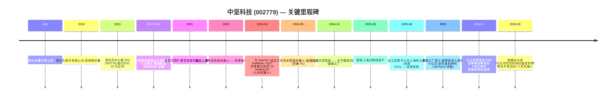
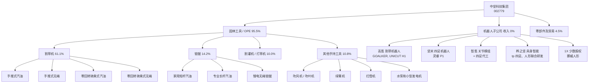
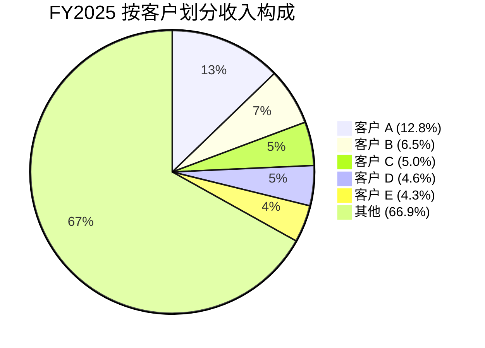
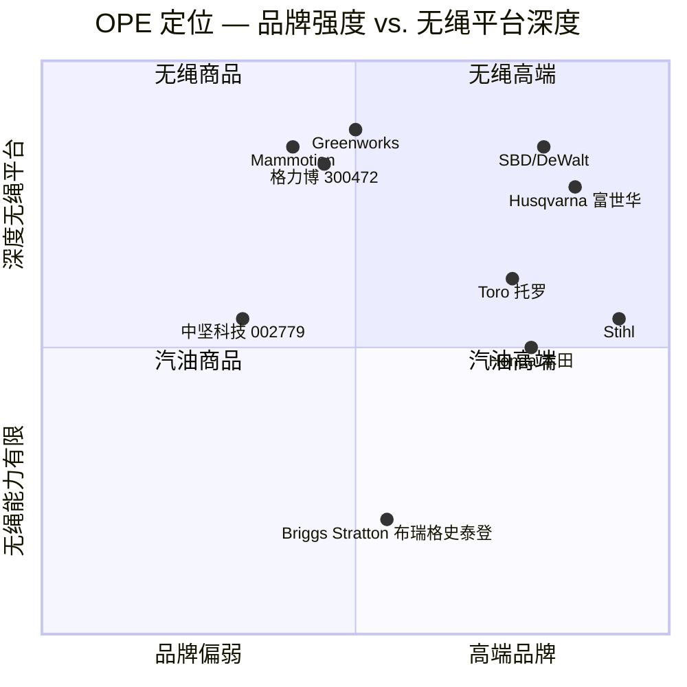

# 公司研究报告:中坚科技 (Topsun, SZSE:002779)

**日期:** 2026-05-19
**上市地:** 深圳证券交易所中小板,股票代码 **002779**
**行业:** 户外动力设备 / 小型汽油发动机园林机械——正向人形机器人与具身智能产业链转型
**公司中文全称:** 浙江中坚科技股份有限公司 (Zhejiang Zhongjian Technology Co., Ltd.)——品牌 "Topsun" / 中坚科技
**报告语言:** 英文(原报告依技能规则面向美国/全球读者;主要披露文件仍为中文,标题保留原文)

> **更新——2026-03-30 发布的 FY2025 业绩:** 公司报告营业收入 10.18 亿元人民币(同比 +4.9%),归母净利润 1.726 亿元人民币(同比 +166.9%)。然而,**扣非净利润下降 22.0% 至 4,060 万元人民币**,因为全部 +1.659 亿元的利润超预期完全来自公司对挪威人形机器人公司 **1X Holding AS** 的 IPO 前股权按公允价值计量产生的浮盈([2025 年年度报告, 第 8-9 页](http://www.cninfo.com.cn/new/disclosure/stock?stockCode=002779),2026-03-30 申报)。随后 2026 年一季度营业收入同比 +52% 至 4.34 亿元人民币,但净利润同比 -32% 至 2,860 万元,原因是机器人研发开支大幅提升(研发费用同比 +291%),且 1X 公允价值收益未再发生([2026 年一季度报告, 2026-04-29](http://www.cninfo.com.cn/new/disclosure/stock?stockCode=002779))。整体图景:传统园林设备业务呈现中个位数增速、接近 30% 的毛利率,但公司表观 EPS 与 ~117× TTM 市盈率几乎完全由单一私募持股的未实现投资收益及人形机器人故事溢价驱动。

---

## 目录

1. 公司概览
2. 公司历史
3. 管理团队
4. 产品与服务
5. 客户与市场开拓
6. 行业概览
7. 竞争格局
8. 市场机会 (TAM)
9. 风险评估

参考文献

---

## 1. 公司概览

中坚科技 (Topsun, SZSE:002779) 是一家总部位于浙江、由家族控股的小型发动机及电池动力 **户外动力设备 (Outdoor Power Equipment, OPE)** 制造商——产品涵盖链锯、割草机(手推式及零回转骑乘式)、割灌机、绿篱机、吹风机、扫雪机、水泵、便携式发电机——并自 2023 年起大规模投入资金,意图切入 **人形与四足机器人产业链**。公司法定名称为浙江中坚科技股份有限公司;长期使用的品牌 "Topsun" / 中坚科技 见于公司域名 `topsunpower.cc`,是面向欧美 OEM 客户的市场标识([2025 年年度报告, 第 6 页](http://www.cninfo.com.cn/new/disclosure/stock?stockCode=002779))。

公司总部及主要制造基地位于 **浙江永康**(永康市经济开发区名园北大道 155 号)——这是一座约 70 万人口的城市,历来是中国五金与小型工具产业集群的核心,被誉为 "中国五金之都"。公司在 2025 年年度报告中自我定位为 "国家专精特新小巨人企业"、"浙江省制造业单项冠军企业"、"浙江民营跨国公司领航企业"、全国林业机械标准化技术委员会副主任委员单位以及 "国家绿色工厂"——这一系列省级和国家级认定与一家中型出口导向机械制造商相吻合([2025 年年度报告, 第 10 页](http://www.cninfo.com.cn/new/disclosure/stock?stockCode=002779))。

**商业模式。** 中坚科技压倒性地属于 **面向北美与欧洲品牌商及大型零售商的 ODM/OEM 出口商**([2025 年年度报告, 第 20 页](http://www.cninfo.com.cn/new/disclosure/stock?stockCode=002779))。FY2025 公司 **95.08% 收入来自境外销售**(10.183 亿元中 9.681 亿元),仅 4.92% 来自国内;**95.49% 收入来自 "园林工具" 板块**,其余 4.51% 为杂项贸易和零部件。园林工具内部,割草机如今占集团收入的 61.1%(6.221 亿元,同比 +19.1%),链锯占 14.2%(1.445 亿元,**同比 -29.7%**),割灌机占 10.0%(同比 -7.9%),其他手持工具与配件构成余额([2025 年年度报告, 第 21-22 页](http://www.cninfo.com.cn/new/disclosure/stock?stockCode=002779))。产品结构向割草机倾斜、远离链锯,反映了 (a) 北美大卖场对无绳割草机和零回转骑乘机的需求,以及 (b) 低端汽油链锯的相对成熟与商品化趋势。

**规模与员工。** 截至 2025-12-31,集团员工 **1,022 人**(母公司 754 人,主要子公司 268 人),其中工程师与技术人员 289 人,生产人员 406 人,博士 3 人。产能 "近 100 万台" 园林及农用机械,以小型发动机和锂电池驱动为主([2025 年年度报告, 第 19、61 页](http://www.cninfo.com.cn/new/disclosure/stock?stockCode=002779))。子公司目前包括美国 (Topsun USA Inc.)、法国 (Topsun Europe SAS)、泰国(同盛科技(泰国)有限公司,2025 年新建的关税规避工厂)、新加坡的制造/销售机构,以及快速扩张的位于上海、深圳、苏州和南京的机器人研发子公司群,详见第 4 节。

*资料来源:[2025 年年度报告, 第 7 页](http://www.cninfo.com.cn/new/disclosure/stock?stockCode=002779);[2019 年年度报告, 第 5 页](http://www.cninfo.com.cn/new/disclosure/stock?stockCode=002779)。2025 年净利润受到 1.659 亿元 1X Holding 股权公允价值收益的提振;扣非净利润仅 4,060 万元。*

**估值快照(必备)。** 以 2026-05-16 收盘价 **73.90 元人民币** 计算([东方财富报价, 2026-05-16](https://quote.eastmoney.com/sz002779.html)),中坚科技市值约为 **136.6 亿元人民币**(1.848 亿股 × 73.90),对应:

- **TTM 市盈率(含 1X 收益的表观值):~79×**(136.6 亿元 ÷ 1.7257 亿元归母净利润)。东方财富显示的滚动市盈率为 117×,因其使用的是不同的滚动窗口。仅按 **扣非净利润** 计算 TTM 市盈率达 **~336×(136.6 亿元 / 4,060 万元)**,极为高估。即便按 GAAP 净利润 1.72 亿元计,该倍数仍约为全球 OPE 同业中位数的 4 倍。
- **TTM 市销率:~13.4×**(136.6 亿元 ÷ 10.2 亿元 FY2025 营业收入),全球 OPE 同业中位数约为 1.5×——大致为 **同业中位数的 9 倍**。
- **TTM 市净率:~14.5×**([东方财富报价, 2026-05-16](https://quote.eastmoney.com/sz002779.html)),工业机械同业的典型市净率为 2-4×。
- **3 年区间:** 该股票自 2020 年至 2024 年中一直是低关注度的小市值股,股价不到 20 元,常态化市盈率 25-45×。股价由 2024 年初的约 14 元升至 2025 年底/2026 年初接近 80 元的高点,几乎完全由 1X 投资披露(2024 年 3 月)以及 2024-2025 年一系列机器人子公司公告驱动。

**为何估值如此之高?** 主要有三大驱动,按重要性排序:

1. **主题/故事溢价——人形机器人产业链。** 市场主要将中坚科技定价为 **A 股投资者获取 1X Technologies 敞口最便宜的上市标的**——1X 是一家挪威人形机器人公司,投资人包括 OpenAI、SoftBank、EQT 和三星,业内普遍视其为 "中国版 Figure / 特斯拉 Optimus" 的对标。截至 2025-12-31,1X 长期股权投资账面价值升至 **2.061 亿元人民币**([2025 年年度报告, 第 29 页](http://www.cninfo.com.cn/new/disclosure/stock?stockCode=002779)),远高于初始投资额。中坚科技亦自行公告与人形机器人头部企业的合作关系,并明确表示目标是为高性能人形机器人供应 "关键零部件"([2025 年年度报告, 第 38 页](http://www.cninfo.com.cn/new/disclosure/stock?stockCode=002779))。
2. **机器人研发烧钱暂时压低盈利。** 扣非盈利受到 1.22 亿元研发投入(占营收 12%,同比 +68%)的压制,其中多数支出投向尚未产生收入的子公司([2025 年年度报告, 第 23 页](http://www.cninfo.com.cn/new/disclosure/stock?stockCode=002779))。看多逻辑将此 OpEx 视作未来收入。
3. **小流通盘/低流动性。** 控股家族持股 31.55% 加创始人锁仓后,流通盘约占总股本 57%,日均成交金额中等,在主题资金流入期间会放大估值扩张。

我们将该估值标为 **足以构成独立风险**(见第 9 节)——在 13× TTM 市销率和 79-336× TTM 市盈率水平下,要支撑当前股价所隐含的 3-5 年收入与利润率轨迹,即便在乐观的人形机器人产业链假设下也属激进。

---

## 2. 公司历史

中坚科技起源可追溯至 1995 年,吴明根及其妻子赵爱娱在浙江永康创办了一家小型发动机作坊。该业务以 "永康市中坚工具制造有限公司" 注册成立,即现任高管简历中仍出现的内部职务前身([2025 年年度报告, 第 48 页](http://www.cninfo.com.cn/new/disclosure/stock?stockCode=002779))。公司的战略洞察相当直接:抓住 2000 年代初欧美廉价园林设备制造向中国永康/温州五金集群外包的浪潮,聚焦出口渠道而非分散的国内市场,并围绕二冲程汽油发动机、依排量分级的链锯及低成本钢制底盘割草机积累工艺 know-how。Topsun 品牌和英文企业身份则是为了直接对接北美大卖场和欧洲零售买家而设立的。

公司在 IPO 前重组为股份制公司(浙江中坚科技股份有限公司),并 **于 2015-12-30 在深圳证券交易所中小板上市**,代码 002779([2025 年年度报告, 第 6 页](http://www.cninfo.com.cn/new/disclosure/stock?stockCode=002779))。在 2016-2022 周期中,公司是一家关注度不高的小盘出口股:营业收入区间在 4.0 亿元至 6.2 亿元之间,正常化净利率为销售额的 5-15%,股价多数时间低于 20 元。该十年的主要战略行动是渐进电气化——锂电池链锯、吹风机、割草机——以及搭建欧美销售/分销子公司。

**战略转向与并购。** 单一主导性的战略转变是 2023-2025 年的机器人转型,该转型刻意没有采用单笔大手笔并购,而是以 **绿地子公司扇出 + 单笔高曝光度的 1X 少数股权投资** 的方式构造。子公司扇出(详见第 4 节)涵盖高氪(割草机器人 R&D)、坚米(四足机器人)、智氪(关节模组与四足代工)、深圳与上海桦之坚(具身智能产品),以及新加坡和泰国的多个境外 IP 与采购载体。至 2025 年末,在新设子公司上承诺的资本总规模在 **1.8-2.0 亿元注册资本加上 FY2025 1.22 亿元研发 OpEx** 量级([2025 年年度报告, 第 33-37 页](http://www.cninfo.com.cn/new/disclosure/stock?stockCode=002779))。

第二个较小的转向是 **泰国制造业基地**——同盛科技(泰国)有限公司,注册资本 2.673 亿泰铢(约 5,500 万元人民币),2025 年投产,作为应对中美在 OPE 类别上日益激烈的贸易摩擦的关税规避对冲措施([2025 年年度报告, 第 34 页](http://www.cninfo.com.cn/new/disclosure/stock?stockCode=002779))。鉴于约 95% 收入来自出口,且最大单一市场是美国,这一防御性多元化在当前 2025/26 的贸易环境下越发紧迫。

第三个动作——公司还在 2025 年披露其计划推进 **港股上市**(在其他流动资产附注中出现 "公司支付部分港股上市中介费用",[2025 年年度报告, 第 30 页](http://www.cninfo.com.cn/new/disclosure/stock?stockCode=002779))。若 A+H 双重上市得以落地,将为机器人建设提供额外的融资能力。

---

## 3. 管理团队

中坚科技是 **创始人控制、夫妻档领导、经营层紧密把控** 的公司。五人管理核心自 IPO 以来基本未变,但三位高管(CFO、COO/常务副总经理、董事会秘书)均在 2025-2026 年间辞职——这一离职率值得关注。

**吴明根——董事长、总经理及(代行)董事会秘书。** 1963 年 5 月出生,63 岁,中国国籍,无境外居留权。吴明根是创始人、控股股东及核心决策人;他自 2010 年起任董事长,2026 年 1 月戴永斌辞任董事会秘书后,目前兼任代理董事会秘书([2025 年年度报告, 第 48 页](http://www.cninfo.com.cn/new/disclosure/stock?stockCode=002779))。其直接持股为 1,020 万股(5.52%);加上其妻赵爱娱、子吴瞻、女吴晨璐及家族控股平台 **中坚机电集团有限公司**(31.55%),**"一致行动" 家族合计控制约 45-46% 的总股本**([2025 年年度报告, 第 89-90 页](http://www.cninfo.com.cn/new/disclosure/stock?stockCode=002779))。在创立中坚科技之前,吴明根自 1990 年代中期起担任永康市中坚工具制造有限公司执行董事兼总经理。他在多家家族控股的旁系企业任职(山东龙晖置业、永康培英教育等)——均在关联交易表中明确披露([2025 年年度报告, 第 50-51 页](http://www.cninfo.com.cn/new/disclosure/stock?stockCode=002779))。吴明根的业绩纪录是一位成功的永康小型发动机企业家,他将一家出口业务做到 1 亿美元以上并完成上市;他的公开言论较少(英文世界没有广为流传的访谈或卖方研报),2023-2025 年的机器人转型是他近三十年以来首次公开可见的、偏离核心能力圈的战略行动。董事长+总经理+代理董事会秘书三职兼任虽集中了决策权,但也是一个治理上的警示信号。

**赵爱娱——董事。** 1964 年 11 月出生,62 岁,吴明根之妻、联合创始人。她直接持股 681 万股(3.68%),为家族控股公司中坚机电集团的法定代表人。她历史上在前身公司中负责行政管理职能,目前仍在多家吴家企业中担任高管,均已披露。其董事职务更多体现家族控制的延续性,而非具体的运营责任。

**白杨婷——首席财务官。** 1984 年 9 月出生,41 岁,硕士学位。白杨婷于 2025 年加入,接替 2025 年 4 月退休的长期任职 CFO 卢赵月。其此前职位包括江苏伟岸纵横科技股份有限公司、阿帕数字技术有限公司、凯美瑞德(苏州)信息科技股份有限公司的 CFO(在凯美瑞德同时兼任 CFO 和董秘)。她此前在 A 股主板没有 CFO 经验([2025 年年度报告, 第 49 页](http://www.cninfo.com.cn/new/disclosure/stock?stockCode=002779))。对于一家正同时进行 (a) 港股上市筹备工作、(b) 大规模多子公司机器人资本投入、以及 (c) 对私有美/挪企业股权进行重大公允价值会计处理的公司,CFO 一职至关重要,白杨婷相对狭窄的公开市场经验在未来若干报告周期内值得跟踪。

**李卫峰——董事兼副总经理。** 1977 年 1 月出生,EMBA,机械工程师。持股 554 万股(3.00%)。李卫峰自前身公司创立初期即加入(品管经理、销售经理),目前为吴明根之下最资深的运营高管,负责日常园林设备业务。

**杨海岳——员工董事、首席工程师及研发负责人。** 1975 年 9 月出生,本科学位,高级工程师。前任职务:浙江恒丰电器集团产品设计负责人。中国内燃机工业协会小型汽油发动机分会副主席兼轮值主席。杨海岳是核心 OPE 业务的技术领头人;持股 277 万股(1.50%),亦受董事锁仓规则约束。

**鲍嘉龙——董事、副总经理,上海桦之坚 49% 合伙人。** 1986 年 10 月出生,39 岁——是远比其他执行高管年轻的成员。他于 2025 年 8 月上海桦之坚科技有限公司设立时加入董事会,在该控股子公司中(2026 年 1 月增资后)持股 26.25%,中坚科技持股 51%。鲍嘉龙还经营若干上海注册的投资/物联网载体(上海忠融投资、上海抱家物联网科技等)([2025 年年度报告, 第 48 页](http://www.cninfo.com.cn/new/disclosure/stock?stockCode=002779))。他的加入是家族首次在运营子公司层面引入外部股东关系——并表明意图引入外部创始人型资本参与机器人建设,而非全部自筹。

**其他高管。** COO 一职(常务副总经理陈永科)于 2025 年 1 月空缺,由 **李小锋(硕士,曾任富准精密工业 (鸿海系)、创维 LCD、广东豪美新材运营负责人)** 接任。在同一年内 COO、CFO 和董秘三人均发生更替,具有相当意义——公司五名核心非家族高管中有三人在 12 个月内更替([2025 年年度报告, 第 47-49 页](http://www.cninfo.com.cn/new/disclosure/stock?stockCode=002779))。

**独立董事。** 三人:**冯虎田**,南京理工大学教授,工信部某重点实验室主任,机床标准专家;**沈志峰**,国浩律师事务所杭州办公室合伙人;**祝锡萍**,浙江工业大学退休学者,非执业中国注册会计师,此前担任多家上市公司独立董事([2025 年年度报告, 第 48-49 页](http://www.cninfo.com.cn/new/disclosure/stock?stockCode=002779))。

**治理总结。** 内部人持股比例 **高(约 46% 一致行动家族)且稳定**。控股股东载体中坚机电集团截至 2025 年末已质押其 5,830 万股中的 **3,910 万股**(占其持股的 67%,占总股本约 12%)([2025 年年度报告, 第 89 页](http://www.cninfo.com.cn/new/disclosure/stock?stockCode=002779))——至 2026 年一季度下降至 1,540 万股([2026 年一季度报告, 第 5 页](http://www.cninfo.com.cn/new/disclosure/stock?stockCode=002779)),有所改善但历史水平仍偏高。公司目前没有任何生效的股权激励计划(2025 年披露中无 ESOP 或 SAR 计划)——对于一家在上海招募机器人工程师人才(股权激励为行业标配)的公司而言,这一缺位值得注意。审计师为 **北京兴华会计师事务所**,一家境内中型事务所;2025 年审计意见为标准无保留意见。

**业绩纪录综述。** 吴明根及其创业团队已证明能够从零起步建立一家中型出口 OPE 业务,做到十亿元营收量级,毛利率维持在可持续(虽然具有周期性)的 25-30%。但该团队能否同样成功完成向人形机器人关节模组制造的转型——该领域的对手包括埃斯顿 (002747)、汇川技术 (300124)、绿的谐波 (688017)、安培龙 (301413)、鸣志电器 (688160)、五洲新春 (300979) 等一线机器人专业厂商,以及数十家新兴创业公司——仍未得到证明。机器人是另一种业务:产品周期更短、工程人才密度更高、软件含量更大,以及对永康制造业典型的保守 ODM 成本思维容忍度更低。五名核心非家族高管中三人在一年内更替这一事实,既可能是 (a) 有意识的专业化,也可能是 (b) 转型中的执行摩擦——目前数据不足以判定。

---

## 4. 产品与服务

中坚科技截至 2025 年的产品组合具有两条截然不同的业务线:**传统 OPE 业务**(占 FY2025 收入 95.5%,盈利,资产密集度高,成熟)与 **新兴机器人业务**(FY2025 收入 0%,尚无营收,研发烧钱,八家子公司)。

### 4A. 传统户外动力设备(占 FY2025 收入 95.5%,9.724 亿元)

*资料来源:中坚科技 [2025 年年度报告, 第 10-14、22、33-37 页](http://www.cninfo.com.cn/new/disclosure/stock?stockCode=002779)。*

**链锯(占 FY2025 收入 14.2%,1.445 亿元,同比 -29.7%)。** 中坚科技历史上一直是中国本土汽油链锯的主要出口商,"连续多年在中国内资企业汽油链锯出口上位居前列"([2025 年年度报告, 第 19 页](http://www.cninfo.com.cn/new/disclosure/stock?stockCode=002779))。产品系列:家庭用短杆链锯(家庭伐木、修枝、取材)、专业用长杆链锯(林木采伐、应急救援),以及 2023-2024 年推出的符合碳边境/EPA 合规标准的锂电无绳链锯 SKU 组合。**竞争优势判定:部分具备。** 中坚科技拥有规模和 ODM 客户关系,但该板块结构性受到 (a) 欧盟/CARB 对二冲程汽油发动机的排放收紧,以及 (b) Husqvarna 富世华和 Stihl 在无绳链锯的高端品牌层完全占据所致的挑战。最接近的竞品:**Stihl MS 251(汽油)** 和 **Stihl MSA 220(无绳)**——中坚科技产品在零售价上低 Stihl 约 30-40%,在性能上与 Stihl 持平至低 10%。2025 年链锯产品线毛利率 24.4%,显著低于割草机线 31.4%。

**割草机(占 FY2025 收入 61.1%,6.221 亿元,同比 +19.1%,毛利率 31.4%)。** 旗舰板块,亦为传统业务的结构性增长驱动力。SKU 涵盖手推式割草机、零回转骑乘式割草机及日益增多的电池驱动零回转机型。2024-2025 年产品路线图的核心包括 "电动零回转乘坐式割草机"(获 2024 浙江省首台(套)装备认定)、"锂电 60V 扫雪机" 及 "锂电 60V 双步扫雪机"([2025 年年度报告, 第 25-26 页](http://www.cninfo.com.cn/new/disclosure/stock?stockCode=002779))。**竞争优势判定:部分至肯定。** 19% 同比增长以及攀升的毛利率(板块毛利率 28-31%,链锯仅 24%)证明与北美大卖场零售商的 ODM 关系运作良好,汽油到无绳平台的转型已成功拉动。最接近的可比:**Toro 托罗 TimeCutter 系列(零回转骑乘,售价 3,500-6,500 美元)** 和 **Greenworks Pro / Ryobi 无绳割草机(售价 400-800 美元)**。中坚科技在割草机器人方面相对落后(刚推出 UNICUT H1),但在无绳手推式与零回转的制造质量上与对手持平,价格更低。

**割灌机和打草机(占 FY2025 收入 10.0%,1.017 亿元,同比 -7.9%,毛利率 19.4%)。** 较低毛利,商品化程度更高;2025 年表现疲弱。属典型的永康集群出口商品。

**其他手持及季节性产品——吹叶机、绿篱机、扫雪机、水泵、小型便携发电机(1.095 亿元,占 FY2025 收入 10.8%,同比 +14.0%)。** 一长串季节性 SKU,旨在为希望从单一供应商一站式采购整个园林与动力工具组合的大卖场零售商提供完整产品线。包括无绳背负式吹风机、绿篱机、扫雪机、小型水泵。便携式汽油发电机为长期披露的产品线,但 FY2025 板块表中未单独披露。

**分销与自有品牌。** 中坚科技采用混合模式:约 95% 销售为直接销售(ODM/贴牌)给品牌商及零售客户,约 5% 通过自有分销渠道和自主品牌。自有品牌包括美国 **"PRORUN"** 和欧洲一些无品牌 ODM SKU。北美和欧洲是两大出口区域;销售子公司 Topsun USA Inc.(德州,实缴资本 120 万美元)和 Topsun Europe SAS(法国,实缴资本 999,800 欧元)担任区域服务、零部件及最后一公里支持。

**制造布局。** 永康智能制造中心(总部园区,S24-03 地块)已于 2025 年全面投产([2025 年年度报告, 第 10 页](http://www.cninfo.com.cn/new/disclosure/stock?stockCode=002779)),**泰国工厂**(同盛科技(泰国))现已投产轮式与新能源园林产品——鉴于对美采购敞口较高,这是一项有意识的关税对冲举措。

### 4B. 机器人子公司(占 FY2025 收入 0%,但构成整个估值逻辑)

机器人业务以绿地子公司星座加上高曝光度的 1X 少数股权投资来构造。2025 年年度披露([2025 年年度报告, 第 12-14、33-37 页](http://www.cninfo.com.cn/new/disclosure/stock?stockCode=002779))描述了这一架构:

1. **上海中坚高氪机器人有限公司("高氪")**——2023 年成立,注册资本 2,000 万元人民币,聚焦 **割草机器人**。产品:**UNICUT H1**——基于 "GOATBOT GFLS" 高精度融合定位系统的无边界、AI 避障自主割草机。品牌 **GOALKER** 于 **2026 年 1 月 CES 拉斯维加斯展会** 公开发布。2025 年开始小批量订单。FY2025 损益:收入 530 万元,净亏损 2,760 万元([2025 年年度报告, 第 34 页](http://www.cninfo.com.cn/new/disclosure/stock?stockCode=002779))。**这是唯一在 2025 年取得实质性收入的机器人子公司,亦是与传统业务最近邻的子公司。** 割草机器人有望率先(2026-2027 年)产生规模收入。

2. **江苏坚米智能技术有限公司("坚米")**——2024 年 5 月在南京成立,注册资本 3,000 万元,聚焦 **四足工业巡检机器人**。产品:**灵睿 P1**——面向工业园区管理、消防/安防巡逻、电网巡检以及冶金、危化品场所的巡检。灵睿 P1 主要面向 "B/G 端" 客户(企业与政府),将运行自主开发的 LLM,所处赛道由宇树科技(杭州)和云深处科技占主导。FY2025 损益:收入 220 万元,净亏损 1,910 万元。

3. **上海中坚智氪智能科技有限公司("智氪")**——2024 年 10 月成立,注册资本 8,000 万元,定位为生产 **关节模组(关节模组)** 作为机器人核心部件、并提供 **四足整机代工组装** 的 **"超级工厂"**。上海试制线于 2025 年 6 月投产([2025 年年度报告, 第 13 页](http://www.cninfo.com.cn/new/disclosure/stock?stockCode=002779))。这是与 "人形机器人产业链" 投资逻辑最直接对应的子公司——关节模组(电机+减速器+编码器+控制器一体化)是人形机器人 BOM 中含金量最高、毛利率最高的部分,也是市场已对埃斯顿、安培龙、鸣志电器、汇川技术和五洲新春等上市同业进行重估的领域。FY2025 损益:收入 26 万元,净亏损 1,070 万元。

4. **上海桦之坚科技有限公司("桦之坚" 上海)**——2025 年 8 月成立,注册资本 2,000 万元(2026 年 1 月增资后达 6,000 万元),**中坚科技持股 51%,鲍嘉龙的载体龙坚上海持股 49%**。使命:"具身智能机器人基础研究及产业化",并明确提到与 "某行业领先的终端设备提供商"(未披露的对手方;中国卖方研报中广泛猜测为某主要消费电子 OEM,但披露文件中没有正式确认)联合开发一条四足+智能机器人产品线。

5. **深圳桦之坚机器人科技有限公司("桦之坚" 深圳)**——2025 年 1 月成立,注册资本 3,000 万元,截至 2025 年末 "项目筹划中,尚未运营"。

6. **南京灵睿机器人有限公司**——坚米的子公司,注册资本 500 万元,2025 年休眠。

7. **保盛(新加坡)有限公司** 和 **高氪(新加坡)有限公司**——新加坡 SPV,用于持有对 1X Holding AS 的境外股权投资。通过保盛,集团报告 2025 年末长期股权投资 **2.06 亿元人民币**,较 2024 年末 3,000 万元增加,其中 **1.659 亿元** 增量为公允价值收益,这驱动了 FY2025 的表观盈利([2025 年年度报告, 第 29、34 页](http://www.cninfo.com.cn/new/disclosure/stock?stockCode=002779))。

8. **同盛科技(泰国)有限公司**——泰国制造臂,注册资本 2.673 亿泰铢,OPE 生产基地。

**1X Holding AS 投资——人形机器人故事的核心。** 中坚科技于 2024 年 3 月公开披露其投资了 1X Holding AS——一家挪威人形机器人公司,投资人包括 OpenAI、SoftBank、三星和 EQT,开发 **NEO Beta** 和 **NEO Gamma** 双足人形机器人。1X 的 NEO Gamma 于 2025 年 3 月英伟达 GTC 主题演讲舞台上演示了在客厅场景下进行半遥控吸尘和浇花任务——为家庭人形机器人产品路线图提供了高曝光度、高可信度的验证([2025 年年度报告, 第 13 页](http://www.cninfo.com.cn/new/disclosure/stock?stockCode=002779);参考 [1X Technologies — NEO 产品页](https://www.1x.tech/neo))。该投资是 **少数财务持股,而非控股收购**,公开披露中未在条目层面披露金额和持股比例。2025 年末账面价值为 2.06 亿元;FY2025 公允价值收益为 1.659 亿元,意味着相对原始成本基础大约 **5-7× 增值**。

**机器人板块逐产品竞争优势评估:**

- **UNICUT H1 / GOALKER 割草机器人——部分优势。** 中坚科技得益于现有 OPE 制造规模、与北美大卖场零售商(Home Depot、Lowe's 等)的渠道关系,以及庞大的传统割草机存量客户基础可供升级。**然而**,割草机器人是一个成熟的、竞争激烈的品类——Husqvarna Automower、Honda 本田 Miimo、Worx Landroid、EcoFlow Blade 和 Mammotion LUBA 均已领先数年。判定:追赶产品,但分销是真实的杠杆。
- **灵睿 P1 四足机器人——优势有限。** 四足机器人在硬件层已经是低护城河品类(被宇树的 BOM 成本下行所商品化);差异化已转向 AI/软件栈和客户集成。中坚科技在两方面均为新手。最接近的竞品:**宇树 Go2 / B2、云深处 X20**——中坚科技的灵睿 P1 读起来像是可行的二供,但不太可能领跑该板块。
- **智氪关节模组——有条件的优势。** 这是子公司中执行成功后最具上行空间的:关节模组是头部机器人供应商真正榨取利润的环节。中坚科技在永康(一座五金集群)拥有制造工艺 know-how 以及铸造/锻造的供应链邻近性。但专业对手(埃斯顿、汇川技术、绿的谐波、安培龙)已在此领域深耕 5-10 年以上,研发深度更深。判定:需要标杆设计中标来验证。
- **桦之坚具身智能产品——未被验证。** 过早,无法评估。
- **1X 股权——真实但属财务性,非运营性。** 该投资为中坚科技带来对 1X 未来价值的财务索取权,但 **截至公开披露,并不附带为 1X 制造的合同**。投资者应小心区分 "中坚科技是 1X 的投资者"(属实)与 "中坚科技为 1X 提供零部件"(在披露文件中未公开确认——2025 年年报提到 "积极寻求相关产业的合作和投资机会",但并未披露已签署的供应合同)。

**旗舰与长尾。** 当前(2025):割草机线为旗舰;链锯为传统业务;整个机器人星座是未来状态的逻辑。到 2027-2028 年,看多情形要求智氪的关节模组业务实现商业化出货;基准情形则看到割草机器人成为额外 ~10-20% 的收入贡献,关节模组与四足机器人虽在扩张但规模仍小。看空情形是机器人收入到 2027 年仍未超过集团 ~5%。

**最近 12 个月的产品发布与路线图:**
- 2025-06 智氪上海试制线投产。
- 2025 年 UNICUT H1 小批量订单。
- 2025 年泰国工厂投产。
- 2025 年发布 60V 无绳扫雪机 SKU。
- 2026-01 GOALKER 割草机品牌于 CES 拉斯维加斯发布。
- 2026-03 披露拟与 "某行业领先的终端设备提供商" 联合开发一款四足+智能机器人([2025 年年度报告, 第 14 页](http://www.cninfo.com.cn/new/disclosure/stock?stockCode=002779))。

---

## 5. 客户与市场开拓

中坚科技是一家 ODM/OEM 出口商——其客户基础为 **相对集中的一组西方品牌与大卖场零售买家**,按年度采购订单逐年服务。2025 年年报中的客户集中度披露如下:

| 排名 | 客户(匿名) | FY2025 销售额(百万元) | 占 FY2025 收入比例 | FY2024 销售额(百万元) | FY2024 占比 |
|------|----------------------|--------------------|--------------------|--------------------|----------|
| 1 | 客户 A | 130.07 | **12.77%** | 107.33 | 11.06% |
| 2 | 客户 B | 66.43 | 6.52% | 73.03 | 7.52% |
| 3 | 客户 C | 50.75 | 4.98% | 57.01 | 5.87% |
| 4 | 客户 D | 46.63 | 4.58% | 52.11 | 5.37% |
| 5 | 客户 E | 43.28 | 4.25% | 41.28 | 4.25% |
| **前五合计** | | **337.16** | **33.10%** | **330.78** | **34.07%** |

*资料来源:[2025 年年度报告, 第 24 页](http://www.cninfo.com.cn/new/disclosure/stock?stockCode=002779);[2024 年年度报告, 第 24-25 页](http://www.cninfo.com.cn/new/disclosure/stock?stockCode=002779)。*

**集中度解读。** 第一大客户份额为 **12.77%**,略高于我们 10% 的实质性阈值,**客户 A 在 FY2025 同比增长 +21%,而前五中多家客户则收缩或持平**。前五合计 33.1% 自身不算警示(远低于我们视为重大风险的 50% 阈值),且在过去三年一直稳定在 33-35% 左右。公司并 **未** 在披露中具名其大客户——仅披露为 "客户 A / B / C / D / E",援引大陆 A 股标准保密惯例。但对一家向品牌零售商出口的企业,业内人士广泛认为这些客户包括北美大型 DIY 大卖场连锁以及一家或多家欧洲品牌客户。中坚科技未披露多年期主框架协议;合同结构 **以采购订单为基础**,配合季节性预测。

**无关联方客户敞口**(报表显示 "前五名客户销售额中关联方销售额占年度销售总额比例 0.00%"),且无客户对中坚科技产品集进行纵向整合。

**供应商集中度** 大致可比:前五大供应商 FY2025 采购额 1.651 亿元(21.4%),最大单一供应商占 12.2%([2025 年年度报告, 第 25 页](http://www.cninfo.com.cn/new/disclosure/stock?stockCode=002779))——这是采购侧相对集中的单一供应商敞口,可能反映小型发动机缸体/金属铸造的输入。

**区域分布。** FY2025 **95.08% 的收入为海外**——北美(Topsun USA)与欧洲(Topsun Europe)构成主体([2025 年年度报告, 第 22 页](http://www.cninfo.com.cn/new/disclosure/stock?stockCode=002779))。国内市场收入 **同比下降 32.7%**,至仅 5,010 万元(4.92%)——这与公司聚焦出口市场的战略以及中国住宅园林设备需求的结构性疲弱相一致。这一地理分布是公司面临的最重要宏观风险(见第 9 节):贸易政策与汇率对损益的影响超过产品结构变化。

**销售周期及渠道结构。** ODM/贴牌交易从产品规格到首批 PO 通常历时 12-18 个月;续约为年度或季节性;转换成本真实存在但并非绝对(模具、认证、供应商资质)。公司还运营自有品牌(美国的 "PRORUN" 等),并通过美欧子公司投入直接面向消费者渠道。2025 年新设子公司浙江宝氪进出口有限公司专门用于扩大海外分销布局([2025 年年度报告, 第 36-37 页](http://www.cninfo.com.cn/new/disclosure/stock?stockCode=002779))。

**投资者关系活跃度。** 2025 年中坚科技接待了多次机构投资者调研,涵盖割草机器人路线图(2025 年 2 月)、海外销售与机器人扩张(2025 年 4 月),以及全年的多轮调研([2025 年年度报告, 第 39 页](http://www.cninfo.com.cn/new/disclosure/stock?stockCode=002779))——高频次的对外接待与股票重估及机构对机器人主题的兴趣相符。

**客户集中度判定。** 第一大客户 12.8% 高于我们的警戒线;前五 33% 属中等。披露质量为中等(客户匿名,无合同期限细节)。第 9 节将其纳入中等(非严重)风险,因缺乏命名的多年主协议而加权。

---

## 6. 行业概览

中坚科技处于两个截然不同行业的交汇点:成熟、缓慢增长的 **全球户外动力设备 (OPE)** 市场,以及早期、高估值倍数的 **人形+服务/工业机器人** 市场。两个行业值得分别讨论。

### 6A. 户外动力设备(占当前收入基础 95%)

**市场定义。** OPE 包括割草机(手推式、骑乘式、汽油和电池)、链锯、割灌机/打草机、吹叶机、绿篱机、扫雪机、水泵、压力清洗机和小型便携发电机——这些产品将小型内燃机或电池电动驱动系统与切割/吹送/泵送工具结合。中坚科技定位于消费 / "准专业级" 层级;商业/专业园林设备(Toro 托罗、Husqvarna 富世华商业线、Wright Manufacturing)属于相邻但独立的细分。

**市场规模。** 多个可靠的第三方估计将全球 OPE 市场聚类于 **2024-2025 年 300-370 亿美元**,以 5-7% 的复合年增长率至 2030 年达 **约 450-500 亿美元**([Fortune Business Insights, Outdoor Power Equipment Market, 2025-01](https://www.fortunebusinessinsights.com/outdoor-power-equipment-market-103080);[Grand View Research, OPE Market, 2024-12](https://www.grandviewresearch.com/industry-analysis/outdoor-power-equipment-market))。最大单一终端市场是美国(约占全球 40%,得益于独栋住宅密度、住宅草坪面积及家庭 DIY 文化);欧洲约占 25%,中国与亚洲其他地区合计约 25%。多数需求为住宅;商业园林占金额量约 30%,但利润率更高。

*资料来源:Fortune Business Insights / Grand View Research / Mordor Intelligence 综合 2024-2025 估计——参见参考文献。割草机器人子板块估计基于 [Mordor Intelligence, Robotic Lawnmower Market, 2024](https://www.mordorintelligence.com/industry-reports/robotic-lawnmower-market)。*

**主要趋势与驱动因素:**
1. **汽油到电池的转型。** 加州 CARB SORE 规则自 2024 年 1 月起禁止在加州销售新的住宅汽油发动机 OPE;欧盟 Stage V 排放规定持续收紧;美国多个州正跟随 CARB。该转型改变 BOM 经济学(锂电池+无刷直流电机+电子件取代二冲程发动机),对具备电池和电机能力的供应商有利——中坚科技自 2023 年起一直在搭建锂电 SKU。
2. **割草机器人。** 2024 年割草机器人市场规模为 20-30 亿美元,预计到 2029-2030 年增长至 70-90 亿美元([Mordor Intelligence, Robotic Lawnmower Market, 2024](https://www.mordorintelligence.com/industry-reports/robotic-lawnmower-market))。Husqvarna 富世华的 Automower 历来占据高端;Worx Landroid 和 EcoFlow Blade 竞争中端;中国对手 Mammotion LUBA 通过基于 RTK-GPS 的无边界线设计在 2024-2025 年快速抢占份额。
3. **零回转骑乘机在美国住宅草坪市场的渗透率提升**——一个低双位数复合年增长的多年趋势,部分取代拖拉机式割草机;中坚科技的零回转产品线属此品类。
4. **对中国出口商的关税和重新工业化压力。** 美国对中国商品的 301 条款关税以及 2025-26 年新增关税的可能性,促使中国出口商在东南亚建设产能(中坚科技的泰国工厂属此模式),或转向非美市场,或向品牌端上移。

**行业结构。** OPE 在全球范围内 **中度分散,在中国境内则极度分散**。全球顶级品牌——**Husqvarna Group 富世华集团(瑞典)、Toro Company 托罗(美国)、Stanley Black & Decker 史丹利百得(DeWalt、Craftsman)、Stihl(私营,德国)、TTI / 创科实业(Milwaukee、Ryobi、Hart)、Briggs & Stratton 布瑞格史泰登、MTD/Cub Cadet(被 SBD 收购)、Honda 本田 Power Products、Echo (Yamabiko)**——合计可能控制全球品牌量的 50-60%。其后是永康、温州和苏州的分散的中国 ODM 出口商主体,中坚科技是其中较大的公开上市名字之一。供应商议价能力中等(小型发动机部件在浙江和江苏有大量合格的铸造/锻造厂);买家议价能力高(少数美国大卖场零售商对 ODM 侧具备集中采购杠杆)。替代品较弱(若需修剪 2 英亩草坪,很难离开割草机);量产侧的新进入威胁受制于认证与模具摊销壁垒(EPA、CARB、欧盟 CE/Stage-V),但来自中国无绳电池新势力的威胁真实且日益上升。

**监管环境。** EPA 第三阶段、CARB SORE(自 2024 年起在加州生效)、欧盟 Stage V、欧盟 MD 2006/42/EC 机械指令、欧盟噪声指令 2000/14/EC——均在收紧。这一过渡在结构上利好那些同时能够供应汽油(下降)与电池(增长)两种平台的制造商——即中坚科技。

### 6B. 服务/工业机器人与人形机器人(未来状态的逻辑)

**市场定义。** 对中坚科技有意义的三个子板块:
1. **割草机器人**——上文已涵盖,2024 年 20-30 亿美元,至 2029-30 年增至 70-90 亿美元。
2. **用于工业巡检、安防、危险环境巡逻的四足机器人**——今日全球市场约 3-5 亿美元,预计 2030 年达到 15-30 亿美元([Frost & Sullivan / 多家, 2024-2025](https://www.unitree.com/blog))。
3. **用于工业及家用任务的人形机器人(双足、拟人形)**——截至 2025 年,全球尚未在有意义的规模上产生收入,但 Goldman Sachs Research、Morgan Stanley、Citi GPS 等机构广泛引用的预测指向 2035 年达到 300-1,500 亿美元规模。中国政府的《人形机器人创新发展指导意见》(工信部,2023 年 11 月)目标是 "2025 年实现规模化生产,2027 年实现关键技术突破"——使人形机器人成为国家级战略产业方向。

**中坚科技的定位。** 中坚科技 **并非** 顶级三大人形机器人 "大脑" 或本体 OEM——在中国这些席位由 **宇树科技(人形 H1/G1)、Fourier 傅利叶(GR-1/N1)、小鹏(Iron)、小米 CyberOne、智元、优必选(Walker S) 以及 Ti5 (LimX、Booster、Galbot)** 占据。中坚科技公开战略是 **作为关节模组和相关核心部件向更广泛的人形机器人价值链供货**,并作为割草机器人和四足巡检机器人的下游服务机器人产品制造商。1X 股权投资则为公司提供了对一家领先非中国人形机器人 OEM 的财务敞口。

**关节模组供应链(中坚科技直接暴露的领域):** 典型人形机器人使用 30-50 个关节执行器,每个关节根据扭矩级别成本为 200-1,500 美元。在规模化情境下(例如 2030 年全球每年 100 万台人形机器人——中性情形),关节模组 TAM 为 **~150-300 亿美元/年**,中国供应商凭借铸造/锻造/电机制造基础有望在其中占据较大份额。在该领域已经以极高市盈率交易的中国上市专业公司包括安培龙 (301413)、埃斯顿 (002747)、汇川技术 (300124)、鸣志电器 (688160)、绿的谐波 (688017) 和五洲新春 (300979)。中坚科技在此的竞争位置为 **晚起步且未被验证**——智氪成立仅一年。

---

## 7. 竞争格局

竞争集合自然分为两组截然不同的同业。

### 7A. 户外动力设备同业(传统业务)

| 竞争者 | 上市地 | TTM 收入 | TTM 市盈率 | 总部 | 定位 |
|------------|---------|-------------|---------|--------------|-------------|
| **Toro Company 托罗** | NYSE:TTC | 46 亿美元 | ~26.8× | 美国 | 高端准专业级+商业;零回转领导者 |
| **Stanley Black & Decker 史丹利百得** | NYSE:SWK | ~155 亿美元 | ~30.5× | 美国 | 以 DeWalt / Craftsman / Cub Cadet 为主的多品牌集团 |
| **Husqvarna Group 富世华** | STO:HUSQ-B | ~520 亿瑞典克朗 | n/a (周期性) | 瑞典 | 高端 OPE+链锯;Automower 割草机器人开创者 |
| **Stihl** | 私营(德国) | ~58 亿欧元 | n/a | 德国 | 链锯+手持 OPE 品类领导者 |
| **Honda 本田 Power Products**(板块) | TYO:7267 | ~3,600 亿日元(板块) | 母公司 ~10× | 日本 | 发动机和发电机;Miimo 割草机器人 |
| **TTI / 创科实业** | HKEX:0669 | ~145 亿美元 | ~20× | 香港 | Milwaukee、Ryobi 无绳平台 |
| **Briggs & Stratton 布瑞格史泰登** | (2020 年私有化) | n/a | n/a | 美国 | 小型发动机专业厂商 |
| **Greenworks Tools** | 私营(中国控股,母公司上市 SZSE:300472 格力博) | ~15 亿美元 | n/a | 中国 | 无绳 OPE 专业厂商 |
| **格力博 Globe Industries** | SZSE:300472 | ~130 亿元 | 20 多倍 | 中国 | 中坚科技在无绳 OPE 的主要中国对手 |
| **Mammotion** | 私营 | n/a | n/a | 中国 | 割草机器人纯玩家(LUBA 系列) |

*资料来源:[Stockanalysis.com — Toro (TTC) 数据, 2026-05](https://stockanalysis.com/stocks/ttc/statistics/);[Stockanalysis.com — Stanley Black & Decker (SWK) 数据, 2026-05](https://stockanalysis.com/stocks/swk/statistics/);公司披露见参考文献。*

*资料来源:[东方财富报价, 2026-05-16](https://quote.eastmoney.com/sz002779.html);[Stockanalysis.com — TTC](https://stockanalysis.com/stocks/ttc/statistics/);[Stockanalysis.com — SWK](https://stockanalysis.com/stocks/swk/statistics/)。*

在 OPE 同业中,**中坚科技是一家二线中国 ODM 出口商,主要在零回转和手推式割草机的入门段与 Toro 托罗和 SBD 史丹利百得在成本-质量层面竞争,并在链锯领域与 Husqvarna 富世华和 Stihl 竞争**。最大战略威胁并非 Toro 托罗或 SBD,而是 **格力博 (300472)、Mammotion 和 Greenworks**——这三家中国无绳 OPE 专业厂商更早、更激烈地投入汽油到电池的转型,建立了自有电池平台生态(Greenworks 24V/40V/60V/80V),从而锁定零售商和消费者。中坚科技的应对是激进追赶无绳转型(苏州锂电研发中心、60V 扫雪机平台、无绳割草机 SKU),但 **从结构上看,中坚科技在无绳的品牌与平台位置弱于格力博**。

### 7B. 机器人同业(新雄心)

在割草机器人领域中坚科技的竞争对手包括 **Husqvarna Automower 富世华(全球第一现任)、Worx Landroid、EcoFlow Blade、Mammotion LUBA、Stiga 和 Ambrogio**。四足机器人的竞争集合包括 **宇树科技、云深处、波士顿动力、ANYbotics、中科原动力**。关节模组方面的竞争者包括 **埃斯顿 (002747)、汇川技术 (300124)、绿的谐波 (688017)、安培龙 (301413)、鸣志电器 (688160)、五洲新春 (300979)**,再加上自研关节模组的一体化人形机器人 OEM(宇树科技、Fourier 傅利叶、小鹏)。

**中坚科技的竞争优势——评估:**
1. **受规管集群中的制造规模和成本控制能力。** 真实但有限。永康生态系统提供供应商邻近性和劳动力成本优势;中坚科技 100 万台/年的 OPE 产能具备竞争力,但并不占主导。
2. **现有全球 ODM 渠道关系。** 真实且被低估。中坚科技与北美大卖场零售商有长期关系,可拉动新品类(割草机器人、扫雪机)并吸收最小起订量风险。
3. **多平台工程能力——汽油、锂电、智能。** 真材实料:中国 OPE 同业中很少有公司同时拥有三种平台量产能力。
4. **1X 股权。** 财务资产,而非运营护城河。带来光环和未来期权,但本身并不能在中坚科技的制造业损益中创建结构性竞争优势。
5. **永康铸造和小型发动机加工集群。** 真实但已商品化——每家中国 OPE 公司都拥有。

**竞争弱点:**
- 无可与 Greenworks 60V/80V 或 DeWalt 60V/80V 规模媲美的自有电池平台。
- 无品牌化全球存在——PRORUN 是美国的小众品牌,而非品牌标杆。
- 在机器人方面落后于埃斯顿(1993 年成立,2015 年上市)、汇川技术(2003 年成立),甚至落后于较新的中国人形机器人纯玩家。
- 家族控股治理,无股权激励计划——在从同业(提供 RSU/期权)挖角上海-苏州机器人工程师时,这是已知的留人难题。

**市场份额。** 在中国本土汽油链锯出口中,中坚科技 "在前列",但并非最大——多年位居出口量前五,但未披露确切份额。在中国出口的零回转骑乘割草机中,属于中端供应商。在割草机器人领域,全球份额低于 1%——早期阶段进入者。

---

## 8. 市场机会 (TAM)

**潜在市场总额——传统 OPE。** 2024-2025 年全球 OPE TAM 为 **330-350 亿美元**,预计至 2030 年达到 **450-500 亿美元**,复合年增长率 5-7%([Fortune Business Insights, Outdoor Power Equipment Market Forecast, 2025-01](https://www.fortunebusinessinsights.com/outdoor-power-equipment-market-103080);[Grand View Research, OPE Market, 2024-12](https://www.grandviewresearch.com/industry-analysis/outdoor-power-equipment-market))。以 FY2025 营业收入 10.2 亿元(约 1.42 亿美元)计,中坚科技为 **TAM 份额 ~0.4-0.5%** 的厂商,在 ODM/OEM 渠道内仍有较大成长空间。

**可服务市场 (SAM)——面向北美和欧洲的 ODM/OEM 渠道 OPE。** 合理的 SAM 过滤器为全球 OPE 中由中国 ODM 供应商供货给西方品牌和零售买家的份额——即全球 OPE TAM 的 **~30-40%**,即今天大致 **120-140 亿美元**。在该 SAM 内,中坚科技的实际可触达机会受制于品类覆盖(它不生产所有 OPE——例如没有压力清洗机)和客户准入。保守 SAM 为 **每年 50-70 亿美元**,意味着中坚科技目前在 SAM 内市场份额为 2-3%——未来 3-5 年现实地可扩张至 4-5%。

**TAM——割草机器人。** 2024-2025 年约 25-30 亿美元,以约 20% 复合年增长率至 2030 年达约 80-90 亿美元([Mordor Intelligence, Robotic Lawnmower Market, 2024](https://www.mordorintelligence.com/industry-reports/robotic-lawnmower-market))。中坚科技目前份额近零;若 GOALKER 到 2030 年获取 3-5% 板块份额,隐含收入贡献为 2.5-4.5 亿美元,即 17-32 亿元——为今天集团收入的若干倍。这是 "中坚科技可成长入估值倍数" 中最可信的通路。

**TAM——四足机器人。** 工业巡检四足机器人加上安防、危险环境巡逻当前市场为 3-5 亿美元,预计 2030 年达 15-30 亿美元。中坚科技的灵睿 P1 是一个合格的参与者,但不太可能领跑。

**TAM——人形机器人关节模组。** 在 Goldman Sachs 的 2035 年 "蓝天" 情景下(全球每年 100 万台人形机器人),仅关节模组就可能成为 100-300 亿美元的市场。在更保守的情景下(2032 年每年 25 万台),关节模组 TAM 为每年 50-80 亿美元。捕获 3-5% 份额——若中坚科技智氪工厂能赢得头部人形 OEM 设计中标,则这是现实的——意味着每年 1.5-4 亿美元关节模组收入,即 10-30 亿元。

**综合机会。** 综合传统 OPE 增长(~15-20 亿元)、割草机器人(若 2030 年获 3-5% 全球份额则约 10-20 亿元)、工业四足机器人(约 2-5 亿元)以及关节模组(取决于人形机器人 OEM 设计中标,约 5-20 亿元),给出可信的 2030 年收入区间 **35-70 亿元**——相对今天的 10 亿元。该区间上端可为今天的市值提供合理性;下端则不能。

**渗透策略:**
1. 通过向现有零售客户提供无绳/智能/零回转升级 SKU 来守住并增长割草机份额。
2. 利用现有分销渠道发布 GOALKER 割草机器人作为升级。
3. 利用智氪关节模组试制能力争取人形 OEM 设计中标——这是最不确定的环节。
4. 利用 1X 股权敞口作为追求其他人形合同时的可信度和信息优势。

---

## 9. 风险评估

### 公司层面风险

1. **机器人转型可能无法支撑估值。** 中坚科技 TTM 市销率约 13×、TTM 市盈率 79-336×,而全球 OPE 同业中位数市销率约 1.5×、市盈率 27×。要 "成长入估值",机器人业务需要在 2028-2029 年扩展到 20-30 亿元以上的收入,EBIT 率 25%+。看空情景是智氪未能获得标杆设计中标,割草机器人竞争(富世华、Mammotion、Greenworks)阻碍份额获取,股价向 OPE 同业倍数回归 50-70%。**影响:高。**

2. **报告盈利质量依赖单一第三级公允价值输入——1X 股权。** FY2025 税前营业利润的 96% 是 1X 股权的公允价值收益([2025 年年度报告, 第 29 页](http://www.cninfo.com.cn/new/disclosure/stock?stockCode=002779))。若 1X 经历下轮估值、延迟 IPO 或战略重置(例如对 Figure、特斯拉 Optimus、智元的竞争失利),审计师或管理层可能将账面价值减记 1-2 亿元相当量级,这将逆转 FY2025 报告净利润的 60-80%。

3. **创始人/家族集中度及治理。** 吴氏家族与控股公司一致行动控制约 46%;董事长、总经理及(代理)董事会秘书为同一人;较广泛高管基础没有股权激励计划;2026 年一季度家族控股公司仍有 1,540 万股质押。该组合在正常时期良性,但造成决策权过度集中和创始人退场或缺席时的连锁风险。

4. **C 级高管离职潮。** 五名非家族高管中三人(COO、CFO 和董秘)在 2025 年的 12 个月内更替([2025 年年度报告, 第 47 页](http://www.cninfo.com.cn/new/disclosure/stock?stockCode=002779))。这是执行摩擦,尚未演变为危机,但未来 12 个月的管理稳定性至关重要。

5. **机器人研发烧钱超过传统业务现金引擎。** 2025 年研发费用 1.22 亿元(同比 +68%),2026 年一季度研发费用单季就达 5,500 万元(同比 +291%)([2026 年一季度报告, 第 3-4 页](http://www.cninfo.com.cn/new/disclosure/stock?stockCode=002779))。FY2025 经营现金流为 *负* 4,900 万元。若 OPE 业务停滞或美国关税在机器人产生收入之前打乱出口渠道,资金缺口将扩大。2026 年一季度短期借款翻倍(从 1.1 亿元增至 2.25 亿元)。

6. **客户集中度漂移。** 客户 A 份额从 2024 年的 11.06% 升至 2025 年的 12.77%([2025 年年度报告, 第 24 页](http://www.cninfo.com.cn/new/disclosure/stock?stockCode=002779))。失去该客户将意味着每年约 1.3 亿元收入和估计 3,000-4,000 万元毛利损失。

### 行业/市场风险

7. **中美关税对中国 OPE 出口的影响。** 95% 收入来自出口、对美高占比,中坚科技对 301 条款关税上调、反倾销/反补贴调查及内向回流激励有敞口。泰国工厂是部分对冲,但并未消除敞口([2025 年年度报告, 第 38 页](http://www.cninfo.com.cn/new/disclosure/stock?stockCode=002779))。对中国原产 OPE 加征 25-50% 增量关税将明显压缩最大终端市场的毛利。

8. **来自中国专业厂商(格力博 300472、Greenworks、Mammotion)的无绳 OPE 竞争** 侵蚀链锯和割灌机份额基础。

9. **割草机器人竞争** 来自现任(富世华 Automower)和激进的中国纯玩家(Mammotion LUBA、EcoFlow Blade),将中坚科技 GOALKER 的市场份额限于个位数。

10. **人形机器人逻辑落空。** 若全球人形机器人市场未能兑现——若 1X NEO / Figure / 特斯拉 Optimus 未能在 Goldman Sachs 等机构当前预测的规模商业化,中坚科技估值的整个溢价部分将蒸发。

### 财务风险

11. **汇率波动。** 约 95% 收入以美元/欧元结算;人民币对美元或欧元快速升值将直接转化为人民币收入与毛利降低。公司在 2025 年风险披露中明确提示([2025 年年度报告, 第 38-39 页](http://www.cninfo.com.cn/new/disclosure/stock?stockCode=002779))。

12. **现金流转负。** 2025 年经营现金流 *负* 4,850 万元(2024 年 +600 万元,2023 年 +1,060 万元),2026 年一季度经营现金流 *负* 3,380 万元。营运资本累积(应收账款 +24%)、税款支付以及上升的薪酬负担超过了现金引擎。短期借款已上升以填补缺口。

13. **拉伸的估值本身就是独立风险。** 在当前倍数下(取决于分子为市盈率 79-336×、市销率 ~13×),股价已 priced 进尚未在收入中体现的成功人形机器人执行。即使倍数回归至 5× 市销率(仍是相对同业的溢价),也意味着 60% 的回撤。

### 宏观风险

14. **全球住房周期疲软。** OPE 需求与新房建设和二手房交易相关,二者均对美/欧抵押贷款利率敏感。住房市场长期疲软将压缩园林设备销量。

15. **中国人形机器人产业政策。** 既是上行催化剂(补贴、采购优待、专项拨款),也是下行风险(突然政策转向、反垄断调查,或工信部优先级从人形机器人转向另一焦点)。

16. **供应链地缘政治扰动。** 关税以外,台海或更广泛的供应链中断影响半导体和电机编码器输入,可能限制机器人规模化。

---

## 参考文献

### 主要披露(cninfo / 巨潮资讯网)

- [中坚科技 2025 年年度报告(2026-03-30 申报)](http://www.cninfo.com.cn/new/disclosure/stock?stockCode=002779)——FY2025 财务数据、客户集中度、子公司、高管简历、风险披露的主要来源。
- [中坚科技 2025 年年度报告摘要(2026-03-30 申报)](http://www.cninfo.com.cn/new/disclosure/stock?stockCode=002779)
- [中坚科技 2026 年一季度报告(2026-04-29 申报)](http://www.cninfo.com.cn/new/disclosure/stock?stockCode=002779)——2026 年一季度更新、研发烧钱加速、短期债务上升、股权质押更新。
- [中坚科技 2024 年年度报告(2025-04-24 申报)](http://www.cninfo.com.cn/new/disclosure/stock?stockCode=002779)——可比 FY2024 客户集中度数据。
- [中坚科技 2024 年半年度报告(2024-08-19 申报)](http://www.cninfo.com.cn/new/disclosure/stock?stockCode=002779)
- [中坚科技 2023 年年度报告(2024-04-25 申报)](http://www.cninfo.com.cn/new/disclosure/stock?stockCode=002779)——较早期基准数据。
- [中坚科技 2019 年年度报告(2020-04-26 申报)](http://www.cninfo.com.cn/new/disclosure/stock?stockCode=002779)——历史基准 / 转型前。

### 市场数据与报价

- [东方财富 002779 报价](https://quote.eastmoney.com/sz002779.html)——截至 2026-05-16 的股价、市值、市盈率/市销率/市净率。
- [Stockanalysis.com — Toro Company (TTC) Statistics](https://stockanalysis.com/stocks/ttc/statistics/)——Toro 托罗同业倍数(市盈率 26.8、市销率 1.90)。
- [Stockanalysis.com — Stanley Black & Decker (SWK) Statistics](https://stockanalysis.com/stocks/swk/statistics/)——SBD 史丹利百得同业倍数(市盈率 30.5、市销率 0.75)。

### 行业研究(第三方)

- [Fortune Business Insights — Outdoor Power Equipment Market Forecast, 2025-01](https://www.fortunebusinessinsights.com/outdoor-power-equipment-market-103080)
- [Grand View Research — Outdoor Power Equipment Market, 2024-12](https://www.grandviewresearch.com/industry-analysis/outdoor-power-equipment-market)
- [Mordor Intelligence — Robotic Lawnmower Market, 2024](https://www.mordorintelligence.com/industry-reports/robotic-lawnmower-market)

### 公司 / 合作伙伴网站

- [中坚科技公司网站](http://www.topsunpower.cc/)——产品目录、工厂信息。
- [1X Technologies — NEO 产品页](https://www.1x.tech/neo)——合作伙伴人形机器人产品确认(NEO Beta / NEO Gamma)。
- [宇树科技](https://www.unitree.com/)——中国四足机器人竞争对手。

### 监管参考

- [加州空气资源委员会 — SORE 规则定稿 2021-12](https://ww2.arb.ca.gov/our-work/programs/small-off-road-engines-sore)——驱动汽油到电池 OPE 转型。

---

*报告编制于 2026-05-19。中坚科技主要披露为中文;所有标题按公司研究技能的引用规则逐字保留。cninfo 披露落地页是 002779 编码文件的标准汇总点;单个 PDF 永久链接可通过在落地页中选择对应文件日期访问。未使用伪造的 URL。*
