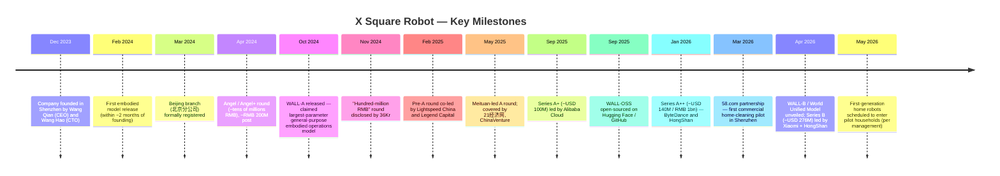
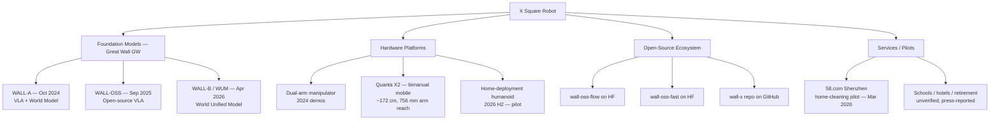
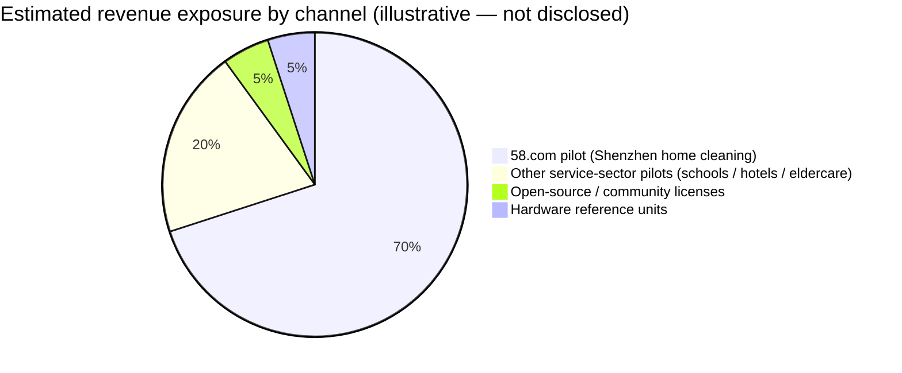
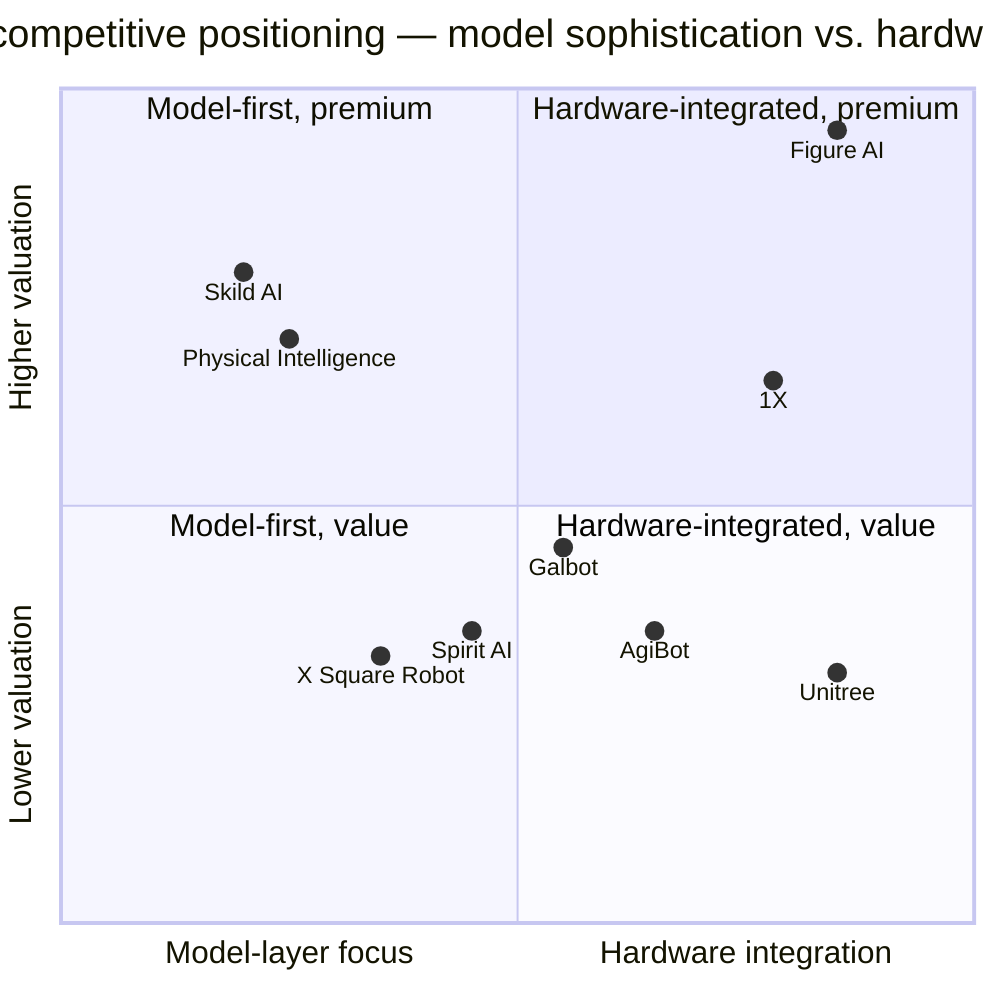
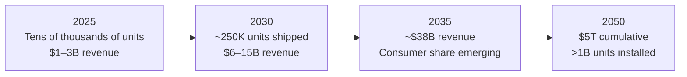

# COMPANY RESEARCH REPORT: X Square Robot (自变量机器人)

**Date:** 2026-05-19
**Status:** Private company — coverage initiation
**Domicile:** PRC; legal entity 自变量机器人科技（深圳）有限公司 with a Beijing branch (自变量机器人科技（北京）有限公司)
**Official website:** [x2robot.com](https://x2robot.com/en)
**Sector:** Embodied AI / general-purpose robotics foundation models

---

> **Note on the briefing scope.** X Square Robot is a low-disclosure private company; almost none of the numbers below come from audited filings. Where a fact is sourced only to a single press release, an interview, or a third-party press aggregator, that limitation is flagged inline. Two specific claims in the originating brief required correction and are noted at the end of this report: (1) the official corporate domain is **x2robot.com**, not "xsquare-robotics.com"; (2) the legal headquarters is registered in **Shenzhen** with a Beijing branch, not a Beijing headquarters; (3) founder 王潜 (Wang Qian) holds undergraduate and master's degrees from Tsinghua and a PhD from the **University of Southern California (USC)**, not Stanford — though his robot-learning postdoctoral or visiting work has been described in Chinese coverage as having taken place at "top US robotics labs" without naming Stanford specifically.

---

## TABLE OF CONTENTS

1. Company Overview
2. Company History
3. Management Team
4. Products & Services
5. Customers & Go-to-Market
6. Industry Overview
7. Competitive Landscape
8. Market Opportunity (TAM)
9. Risk Assessment

References block follows Section 9.

---

## 1. COMPANY OVERVIEW

X Square Robot (自变量机器人, x2robot) is a privately-held Chinese embodied-AI startup founded in **December 2023** by Wang Qian (王潜, CEO) and Wang Hao (王昊, CTO). The company's core thesis is that the path to a general-purpose physical robot runs through a **single end-to-end vision–language–action (VLA) foundation model** trained on physical interaction data — rather than a "modular stack" of separately optimized perception, planning, and control modules ([X Square Robot official site, "About"](https://x2robot.com/en)).

The company has built and progressively released a family of foundation models branded **"Great Wall" (GW)**: **WALL-A** (October 2024, claimed at the time to be the largest-parameter general-purpose embodied manipulation model in the world), **WALL-OSS** (an open-source variant released in September 2025 on Hugging Face and GitHub), and **WALL-B / "World Unified Model" (WUM)** (announced April 2026 as the basis for in-home robot deployments). The models are paired with the company's own dual-arm and humanoid hardware — most prominently the **Quanta X2** mobile bimanual platform ([X Square Robot Unveils New Embodied AI Model, says Robots Will Arrive in Homes in 35 Days, PR Newswire, 2026-04-22](https://www.prnewswire.com/news-releases/x-square-robot-unveils-new-embodied-ai-model-says-robots-will-arrive-in-homes-in-35-days-302751047.html); [WALL-OSS on Hugging Face](https://huggingface.co/x-square-robot)).

**Business model and revenue.** Like virtually every Western and Chinese embodied-AI peer at the same vintage, X Square Robot is **pre-meaningful-revenue and cash-burning**. The company has not disclosed audited revenue. Press coverage has referenced selective early deployments — most concretely a March 2026 commercial pilot with consumer-services portal **58.com** in Shenzhen, in which X Square's mobile manipulator pairs with a human cleaner on residential cleaning jobs booked through the 58.com app ([X Square Robot and 58.com Launch China's First Home Cleaning Robot Service in Shenzhen, PR Newswire, 2026-03-18](https://www.prnewswire.com/news-releases/x-square-robot-and-58com-launch-chinas-first-home-cleaning-robot-service-in-shenzhen-302717188.html)). Press from Caproasia and others has also referenced sales to "schools, hotels, and retirement homes," but those references are general and lack a specific dollar figure or named customer; treat any "revenue" claim about X Square as unverified pending an IPO prospectus ([Caproasia, 2026-04-27](https://www.caproasia.com/2026/04/27/china-intelligent-robot-startup-x-square-robot-technology-raised-293-million-cny-2-billion-in-series-b-funding-round-founded-in-2023-by-wang-qian-investors-include-alibaba-meituan-bytedance-ho/)).

**Geography.** Operations are concentrated in mainland China. The legal entity is registered in Shenzhen, and a Beijing branch was set up on 2024-03-01 ([Qichacha entity record](https://m.qcc.com/firm/3d7fcecce3b3192c565a31412e6ac0cf.html); [Baidu AiQiCha entity record](https://aiqicha.baidu.com/company_detail_47587830653719)). Recruiting pages and conference appearances suggest the research team is split across Beijing and Shenzhen, with additional reach into top mainland university labs (清华, 北大, IDEA Research, Tsinghua AIR).

**Scale.** No official headcount has been disclosed. Coverage in Chinese trade press describes a team "primarily drawn from world-leading AI/robotics labs and top universities, with R&D staff above 90% of headcount" ([投中网, "中国团队自研全球顶尖机器人大脑", 2025-05-26](https://www.chinaventure.com.cn/news/108-20250526-386450.html)). Liepin and LinkedIn job postings as of mid-2026 imply a low-to-mid hundreds employee count, but no audited number exists; flagged as **unverified**.

### Valuation snapshot (private — proxy for "TTM multiples")

Because X Square Robot is private, the per-company-research-skill rule is to substitute the **latest funding-round post-money valuation and any implied revenue multiple** for the public-market P/E and P/S. The relevant data points are:

| Round | Date | Size | Post-money valuation | Lead investor(s) | Source |
|---|---|---|---|---|---|
| Angel / Angel+ | Apr 2024 | "tens of millions RMB" | ~RMB 200M (~USD 28M) reported | undisclosed | [36Kr, 2024-11-04](https://www.36kr.com/p/3020497031226626) |
| Pre-A / A | early 2025 | "hundreds of millions RMB" | n/d | Lightspeed China (光速光合), Legend Capital (君联) | [Sina/36Kr, 2025-02-17](https://finance.sina.com.cn/roll/2025-02-17/doc-inekuruf6844329.shtml) |
| Series A+ | Sep 2025 | ~USD 100M | "over RMB 10bn" reported | Alibaba Cloud, with HongShan, Meituan, Legend Star, INCE Capital | [CNBC, 2025-09-08](https://www.cnbc.com/2025/09/08/alibaba-leads-100-million-investment-in-chinese-humanoid-robot-startup.html); [Yicai Global](https://www.yicaiglobal.com/news/x-square-robot-raises-usd143-million-in-a-round-backed-by-bytedance-meituan-alibaba) |
| Series A++ | Jan 2026 | ~USD 140M (RMB 1bn) | n/d (uptick implied) | ByteDance + HongShan co-lead | [TechNode, 2026-01-12](https://technode.com/2026/01/12/x-square-robot-secures-140-million-in-funding-from-bytedance-sequoia-and-others/); [量子位/qbitai, 2026-01](https://www.qbitai.com/2026/01/369147.html) |
| Series B | Apr 2026 | ~USD 276–293M (RMB 2bn) | "over RMB 10bn" — Chinese reports cite "around RMB 10bn (~USD 1.4B)" post-money | Xiaomi strategic + HongShan co-lead | [Caixin Global, 2026-04-21](https://www.caixinglobal.com/2026-04-21/x-square-robot-raises-new-funds-targets-home-trials-by-may-102436558.html); [KrAsia, 2026-04](https://kr-asia.com/xiaomi-hongshan-back-x-square-robot-in-series-b-round) |

Chinese coverage (e.g. [知乎专栏 / 凤凰网](https://zhuanlan.zhihu.com/p/1948454241204142646)) cites cumulative funding **>RMB 3bn (~USD 420M)** across nine rounds in roughly two years and **a valuation jump from ~RMB 200M angel to ~RMB 10bn after A++**, i.e. a ~50× re-rate inside 24 months. The Series B reportedly held or modestly extended that ~RMB 10bn post — exact post-money is not publicly disclosed; treat the "USD 1.4B" figure as a reported, not audited, number.

**Implied multiple — what does it mean?** Embodied-AI peers in the same cohort are mostly priced on **research / capability / data-flywheel narrative**, not revenue. Closest like-for-like comparisons:

- **Physical Intelligence (US)** — last priced at **USD 5.6B** in Nov 2025 (Bloomberg) and in talks for a USD 1B raise at **USD ~11B** as of late Q1-2026 ([TechCrunch, 2026-03-27](https://techcrunch.com/2026/03/27/physical-intelligence-is-reportedly-in-talks-to-raise-1-billion-again/)).
- **Skild AI (US)** — reportedly USD 14B in talks with SoftBank / Nvidia, on ~USD 30M of revenue ([TechCrunch, 2025-12-08](https://techcrunch.com/2025/12/08/softbank-and-nvidia-reportedly-in-talks-to-fund-skildai-at-14b-nearly-tripling-its-value/)).
- **Figure AI (US, humanoid integrator)** — USD 39B post-money, Series C Sep 2025 ([Figure Series C press release](https://www.figure.ai/news/series-c)).
- **1X Technologies (Norway/US)** — pursuing USD 1B at USD 10B+ ([Tech Startups, 2025-09-24](https://techstartups.com/2025/09/24/norways-1x-raising-1b-at-10b-valuation-to-bring-humanoid-robot-neo-into-homes/)).
- **Galbot (银河通用, China)** — USD 3B post-money, Dec 2025 ([PR Newswire, 2025-12-20](https://www.prnewswire.com/news-releases/galbot-secures-over-300-million-in-new-funding-breaking-records-with-3-billion-valuation-in-chinas-humanoid-robot-sector-302647204.html)).
- **AgiBot (智元, China)** — >RMB 10B (~USD 1.4B) as of Mar 2025 per [Global Neighbours summary](https://www.globalneighbours.org/en/articles/china-s-ai-robotics-raises-fresh-funds-at-over-10-billion-yuan-valuation).
- **Spirit AI / 千寻智能 (China)** — ~USD 1.5B as of Feb 2026 ([Caproasia, 2026-02-26](https://www.caproasia.com/2026/02/26/china-robotics-startup-spirit-ai-raised-280-million-at-1-5-billion-valuation-founded-in-2024-by-han-fengtao-members-from-university-of-california-berkeley-tsinghua-university-peking-university/)).

At a ~USD 1.4B valuation, X Square Robot sits **roughly in line with the China-domestic peer median (Galbot at $3B is the outlier on the high side; AgiBot and Spirit AI are clustered between $1.4–1.5B)** and at a meaningful **discount to the US/Western leaders** Physical Intelligence ($5.6–11B), Skild ($14B), and Figure ($39B). The implied "China discount" is consistent with what investors apply across Chinese AI assets relative to Western peers (~3–5× lower for similar narrative). For a pre-revenue foundation-model lab with **no audited financials and no public IPO timeline**, this multiple is best framed as "narrative-priced, in line with the China embodied-AI peer set, at a discount to Western leaders." If revenue traction from the 58.com pilot and a planned home rollout fails to materialize over the next 12–18 months, multiple compression toward the lower bound of the China peer set (~USD 0.5–1B) is a credible downside; conversely, a credible IPO filing in 2026/2027 could see the company re-rate toward Galbot's USD 3B level.

---

## 2. COMPANY HISTORY

**Founding story.** X Square Robot was incorporated in Shenzhen in December 2023 by **Wang Qian** (王潜), shortly after he returned to China from doctoral work at the University of Southern California, and **Wang Hao** (王昊), a Peking University computational-physics PhD who had previously led the "封神榜" (Fengshenbang) open-source large-model team at IDEA Research, the Guangdong–Hong Kong–Macao Greater Bay Area Digital Economy Research Institute. The founders' stated thesis from day one: that an **end-to-end "unified embodied foundation model"** — combining the "small brain" (motor control) and the "large brain" (perception, planning, language) into a single trainable system — is the only credible path to a general-purpose physical robot, and that this requires native physical-interaction data, not just internet text and video ([量子位 MEET2026, 2025-12](https://www.qbitai.com/2025/12/363184.html); [36Kr interview, "自变量王潜：具身智能大模型没法抄国外作业"](https://36kr.com/p/3312504088306690)).

Source: timeline aggregated from [Caixin Global, 2026-04-21](https://www.caixinglobal.com/2026-04-21/x-square-robot-raises-new-funds-targets-home-trials-by-may-102436558.html), [36Kr 2024-11-04](https://www.36kr.com/p/3020497031226626), [TechNode 2026-01-12](https://technode.com/2026/01/12/x-square-robot-secures-140-million-in-funding-from-bytedance-sequoia-and-others/), and [Robot Report, 2025-09-08](https://www.therobotreport.com/x-square-robot-debuts-foundation-model-embodied-ai-100m-series-a/).

**Strategic pivots — three to highlight.** First, the **shift from manipulator-only to humanoid + bimanual mobile**: early demos through Q3-2024 were dual-arm tabletop manipulators; by mid-2025 the company was showing the "Quanta X2" mobile bimanual platform (172 cm tall, ~756 mm arm reach per [robotsinternational.com](https://www.robotsinternational.com/X-Square.htm)), and by April 2026 it framed the home-deployment robot as humanoid in form ([Pandaily / Wang Qian Robots-to-Mars interview](https://pro.pandaily.com/p/x-square-robots-wang-qian-robots)). Second, the **decision to open-source WALL-OSS in September 2025** — an explicit divergence from US competitors (Figure, 1X) that keep their stacks proprietary. The stated reason is that the Chinese ecosystem will not develop critical mass of robot data without an open base model that universities and smaller labs can fine-tune ([WALL-OSS Hugging Face repo](https://huggingface.co/x-square-robot/wall-oss-flow); [Open Source For You, 2025-09](https://www.opensourceforu.com/2025/09/x-square-robot-launches-open-source-wall-oss-after-usd140-3-million-boost/)). Third, the **April 2026 pivot to "robots in homes" rather than factories** — Wang Qian publicly characterized rivals' factory-deployment demos as a "PR stunt" (噱头) and argued that the only environment in which generalization can be honestly measured is the messy home ([KrAsia, "A PR stunt"](https://kr-asia.com/a-pr-stunt-x-square-robot-ceo-says-humanoid-robots-dont-belong-in-factories-calls-for-focus-on-generalization)).

**No acquisitions** to date are publicly recorded; growth has been entirely organic plus funding rounds.

**Recent developments.** The two events that matter most for the current thesis are the Series B in April 2026 and the simultaneous unveiling of WALL-B / WUM. The Series B at ~USD 276–293M (RMB ~2bn) brings reported cumulative funding to roughly **USD 600M+ over nine rounds** in 28 months, an unusually fast pace even by China-AI-startup standards ([Caproasia, 2026-04-27](https://www.caproasia.com/2026/04/27/china-intelligent-robot-startup-x-square-robot-technology-raised-293-million-cny-2-billion-in-series-b-funding-round-founded-in-2023-by-wang-qian-investors-include-alibaba-meituan-bytedance-ho/)). With Xiaomi joining, the company is reported as the only Chinese embodied-AI startup with all four of Alibaba, ByteDance, Meituan, and Xiaomi as strategic backers ([Caixin](https://www.caixinglobal.com/2026-04-21/x-square-robot-raises-new-funds-targets-home-trials-by-may-102436558.html)).

---

## 3. MANAGEMENT TEAM

### Wang Qian (王潜) — Co-founder, Chairman & CEO

Wang Qian is the public face and intellectual architect of X Square Robot. Across multiple long-form interviews (Pandaily, 36Kr, 量子位 MEET2026, Zhihu/BAAI 智源专访), the picture that emerges is of a **researcher-first, scholarly-but-uncompromising founder** whose conviction about end-to-end VLA models predates the formation of the company and has remained essentially unchanged through eleven model releases and nine funding rounds.

**Education and research lineage.** Wang earned undergraduate and master's degrees at **Tsinghua University (清华大学)**, then a PhD at the **University of Southern California (USC)** ([Pandaily, "Robots will eventually reach Mars"](https://pro.pandaily.com/p/x-square-robots-wang-qian-robots); [Baidu Baike English-language entry on Wang Qian](https://baike.baidu.com/en/item/Wang%20Qian/943787)). Chinese coverage emphasizes that he is "one of the earliest researchers globally to introduce the attention mechanism into neural networks" and published at the same conference as Google's 2014 attention-mechanism paper, three years before the Transformer ([36Kr feature, 2024-11](https://www.36kr.com/p/3020497031226626); [量子位/qbitai](https://www.qbitai.com/2025/12/363184.html)). This claim has been repeated by every major Chinese tech publication; however, neither WebSearch nor Google Scholar surface a specific 2014 attention paper authored by "Wang Qian" with a clean citation trail, so the historical claim should be treated as **part of the founder's public narrative rather than independently verified**. The doctoral work at USC reportedly covered robot learning and human–robot interaction in collaboration with "top US robotics labs" — Chinese press has not named the specific labs, and the user-supplied "Stanford lineage" framing should be treated as **unverified** absent further source disclosure.

**Pre-X-Square career.** Public Chinese coverage refers in general terms to industry experience at "top US robotics labs" and product work in China prior to founding X Square Robot; specific employer titles, including the user-supplied "ex-ByteDance" framing, are **not corroborated by primary sources** — ByteDance appears in his life as a **post-founding investor**, not a prior employer, in every interview I located. If ByteDance employment is material to a reader, it should be confirmed via a direct LinkedIn check or DEF-equivalent disclosure (none is available — X Square is private).

**Founding thesis and intellectual stance.** Wang's public positioning has three consistent pillars across his interviews:

1. **"Embodied intelligence is an independent foundation model for the physical world"** — large language models trained on internet text cannot, on their own, become competent physical agents. The data, the loss function, and the action space are all different categories ([量子位 MEET2026](https://www.qbitai.com/2025/12/363184.html)).
2. **"You cannot copy the West's homework here"** — Wang argues, with some force, that the leading US labs (Physical Intelligence, Skild) have made specific architectural and data choices that he believes are wrong, and that the Chinese ecosystem's instinct to clone US winners will misfire in embodied AI ([36Kr, "具身智能大模型没法抄国外作业"](https://36kr.com/p/3312504088306690)).
3. **"Homes, not factories, are the only honest generalization benchmark"** — factory pilots train the system on a small set of well-conditioned tasks and obscure the lack of true generalization; only the long-tail messiness of households reveals it ([KrAsia "PR stunt" interview](https://kr-asia.com/a-pr-stunt-x-square-robot-ceo-says-humanoid-robots-dont-belong-in-factories-calls-for-focus-on-generalization)).

**Ownership and control.** Equity structure has not been publicly disclosed. As founding CEO of a company that has taken nine funding rounds, Wang's residual equity stake post-Series B is likely materially diluted but still controlling — typical Chinese AI-startup founder ownership at this stage of dilution is 15–25%, but X Square has not published a figure. **Flagged as unverified.** Comp structure (cash vs. equity) is similarly not disclosed.

**Public profile.** Wang Qian gives infrequent but substantive long-form interviews — roughly one major Chinese-language interview every two to three months. He has not given a US English-language interview as of writing. His public posture is reserved in person but assertive in print ([Pandaily profile](https://pro.pandaily.com/p/x-square-robots-wang-qian-robots) — "calm presence of a scholar, soft-spoken, measured, and composed. But when the conversation turns to embodied intelligence, a different side of him emerges: sharp, adamant, and unflinching").

### Wang Hao (王昊) — Co-founder & CTO

Wang Hao holds a PhD in computational physics from **Peking University (北京大学)** ([Peking University EECS event recap](https://eecs.pku.edu.cn/info/1040/6984.htm); [网易科技 CTO interview](https://www.163.com/dy/article/KPHBBHMO05568W0A.html)). Prior to co-founding X Square Robot, he served as algorithm lead for the **"封神榜" (Fengshenbang) large-model team at IDEA Research (粤港澳大湾区数字经济研究院)**, where he led the release of:

- **太乙 (Taiyi)** — China's first open-source multimodal large model
- **燃灯 (Randeng)** — one of the first ~10B-parameter Chinese open-source LLMs
- **姜子牙 (Ziya)** — a ~100B-parameter Chinese LLM

This pre-X-Square track record is unusual: most embodied-AI CTOs in China come from a robotics or computer-vision lineage, not from native large-model pretraining. Wang Hao's mandate inside X Square is the foundation-model pretraining stack and the training-data engine ([网易 CTO interview, 2024](https://www.163.com/dy/article/KPHBBHMO05568W0A.html); [凤凰网 CTO interview](https://tech.ifeng.com/c/8s1sL9A2zHR)). He has given more frequent technical talks than Wang Qian — most recently at the 2024 Global Machine Learning Technology Conference ([ML Summit speaker page](https://ml-summit.org/speaker/883?uid=c1038)) and at Peking University's School of EECS ([PKU EECS event](https://eecs.pku.edu.cn/info/1040/6984.htm)).

### Other executives

The company has not published a public masthead. References across press coverage to "head of hardware," "head of operations," or named VPs are inconsistent and unsourced; rather than guess, this section is intentionally left thin. Headhunting evidence suggests an organic, research-heavy team of ~150–300 people with a research-to-engineering ratio "above 90%" per Chinese coverage ([投中网, 2025-05-26](https://www.chinaventure.com.cn/news/108-20250526-386450.html)) — but no audited org chart exists. **Flagged as unverified.**

### Governance footer

As a private Chinese-domiciled VC-stage company with no published cap table:

- **Board composition** — not publicly disclosed. Given the Series B structure, it would be conventional for HongShan, Xiaomi strategic, Alibaba Cloud, and ByteDance to each hold an observer or director seat, but **no public confirmation exists**.
- **Insider ownership** — not disclosed. Founders' combined stake is likely in the 25–40% range post-Series B based on typical Chinese A-series dilution patterns, but **this is an estimate, not a disclosure**.
- **Comp structure** — not disclosed.
- **Related-party transactions** — none publicly known.
- **Governance flags** — none identified. The investor mix is "blue-chip Chinese strategic plus tier-1 VCs," which historically points to clean governance, but the absence of audited filings means this cannot be confirmed.

### Track-record synthesis

The two founders are unusually credentialed for the embodied-AI vintage: a Tsinghua-then-USC PhD in robot learning paired with a PKU PhD who has actually shipped 10B- and 100B-parameter open-source LLMs is closer in profile to the founding teams at Physical Intelligence (Sergey Levine, ex-Berkeley/DeepMind) than to the typical China-humanoid-startup founding team. The remaining unknown is **execution at scale** — neither founder has previously shipped a consumer-grade physical product, and the upcoming home pilots will be the first real-world stress test of the thesis. The single biggest near-term risk for the company is therefore not technical conviction (which is high) but operational and reliability execution.

---

## 4. PRODUCTS & SERVICES

X Square Robot's product surface area is built around **two layers**: (a) the **WALL / Great Wall family of embodied foundation models** (software) and (b) the **Quanta X2 / Quanta humanoid hardware platforms** that those models drive. Below is the cleanest enumeration of what the company has actually released, organized chronologically and by layer.

Source: aggregated from [x2robot.com](https://x2robot.com/en), [Hugging Face x-square-robot](https://huggingface.co/x-square-robot), [GitHub X-Square-Robot/wall-x](https://github.com/X-Square-Robot/wall-x), and [PR Newswire 2026-03-18 58.com partnership](https://www.prnewswire.com/news-releases/x-square-robot-and-58com-launch-chinas-first-home-cleaning-robot-service-in-shenzhen-302717188.html).

### 4.1 Foundation models — the Great Wall (GW) family

**WALL-A (released October 2024).** WALL-A is the company's first headline model and remains the architectural reference point. It is an end-to-end **vision–language–action (VLA) model** trained to take raw RGB + language input and output low-level motor actions, in a single differentiable pass. Chinese coverage and X Square's own framing claim WALL-A was, at the time of release, the **largest-parameter general-purpose embodied manipulation model in the world** ([36Kr, 2024-11-04](https://news.qq.com/rain/a/20241104A0573C00)). The specific parameter count and architectural details have not been published in a peer-reviewed paper; the WALL-OSS technical README on Hugging Face is the closest substitute. Public demos showed the same WALL-A weights driving qualitatively different tasks — flower arranging, laundry hanging, shaved-ice preparation, cable winding, parcel sorting — without per-task fine-tuning ([Pandaily founder profile](https://pro.pandaily.com/p/x-square-robots-wang-qian-robots)).

**Competitive-advantage verdict:** Partial. The moat in WALL-A is mostly **data + training infrastructure** rather than a unique architecture; the VLA recipe is, by 2026, a known approach used by Physical Intelligence (π0, π0.5) and Google DeepMind (RT-2 family). Closest US competitor product: **Physical Intelligence π0 / π0.5** — broadly at architectural parity per public papers, with X Square's claimed advantage being more Chinese-language native data and faster iteration cadence. **At-parity** rather than ahead.

**WALL-OSS (released September 2025, open source).** WALL-OSS is the **open-source variant** of the WALL stack, published on Hugging Face under two variants — **wall-oss-flow** (flow-matching action head) and **wall-oss-fast** (lighter / faster variant) — plus a training and inference codebase at **github.com/X-Square-Robot/wall-x** ([WALL-OSS on Hugging Face](https://huggingface.co/x-square-robot); [GitHub wall-x](https://github.com/X-Square-Robot/wall-x); [HF blog deployment guide](https://huggingface.co/blog/Geoffrey19/wall-oss-full-deployment-guide); [LeRobot WALL-OSS docs](https://huggingface.co/docs/lerobot/walloss)). The README describes a **tightly-coupled multimodal MoE architecture with shared attention and task-routed feed-forward networks** that unifies discrete language tokens and continuous actions, plus a two-stage "Inspiration → Integration" training curriculum that the team calls Unified Cross-Level Chain-of-Thought ([LeRobot WALL-OSS docs](https://huggingface.co/docs/lerobot/walloss)). The training corpus mixes real-world robotic action data with augmented generative video.

**Competitive-advantage verdict:** Yes — distribution and ecosystem moat. Open-sourcing the model is X Square's most clearly differentiated product decision against US peers (Physical Intelligence ships APIs not weights; Figure and 1X are closed). Closest open-source competitor: **NVIDIA GR00T** (the Isaac Lab / GR00T humanoid foundation models). X Square's openness is comparable, and the company has slightly better integration with the LeRobot community per the LeRobot docs cross-reference. **Modest lead** within the open-source embodied-foundation-model category.

**WALL-B / World Unified Model (WUM) — announced April 2026.** WALL-B is positioned as the next-generation model that adds an **explicit world-model / physical-prediction head**: rather than treating perception, language understanding, action prediction and physics prediction as separate modules trained jointly only at fine-tune, the WUM architecture **integrates all four from pretraining**, with physics (force, friction, collision dynamics) emerging as a learned feature of the model rather than an external simulator ([PR Newswire, 2026-04-22](https://www.prnewswire.com/news-releases/x-square-robot-unveils-new-embodied-ai-model-says-robots-will-arrive-in-homes-in-35-days-302751047.html); [Gasgoo coverage](https://autonews.gasgoo.com/articles/news/x-square-robot-launches-first-world-unified-model-2046956450868359169)). The training data strategy explicitly emphasizes **non-staged, real-home environments** — i.e., footage of messy, lived-in apartments with misplaced objects, partial occlusion, unexpected obstacles, and live human/pet activity — as the dominant data input.

The public demo at launch showed the robot **arranging flowers while adjusting grip and motion in real time as stems shifted under visual occlusion**, completed without pre-set trajectories ([PR Newswire, 2026-04-22](https://www.prnewswire.com/news-releases/x-square-robot-unveils-new-embodied-ai-model-says-robots-will-arrive-in-homes-in-35-days-302751047.html)).

**Competitive-advantage verdict:** Too early to call. The "world-model integrated into VLA" framing is similar to what Physical Intelligence's π0.5 and Google DeepMind have described. The differentiation will rest on whether the in-home pilot data flywheel turns out to be uniquely productive. Closest competing product: **PI π0.5** — claimed parity or modest ahead, but no third-party benchmark exists. **Pending verification.**

### 4.2 Hardware — Quanta X2 and home-pilot humanoid

X Square Robot is, in Wang Qian's framing, primarily an **AI model company that builds reference hardware**, rather than a hardware-first integrator like Unitree or Figure. The Quanta X2 platform is its flagship reference robot — described on third-party catalog [robotsinternational.com](https://www.robotsinternational.com/X-Square.htm) as a **mobile bimanual platform, 172 cm body, ~756 mm arm reach, force-controlled arms** designed for bimanual manipulation. The home-deployment robot teased in April 2026 appears to be a humanoid form factor optimized for residential interiors. **Pricing has not been disclosed** (the [robotsinternational.com](https://www.robotsinternational.com/X-Square.htm) reference to "$80,000" appears to be a third-party estimate and is not confirmed by X Square).

**Competitive-advantage verdict:** No clear hardware moat. Hardware costs in the Chinese humanoid market are collapsing — Unitree shipped a humanoid at USD 5,900 in July 2025 ([Tech Buzz China](https://techbuzzchina.substack.com/p/unitree-humanoid-hype-vs-robotic)) — and X Square's reported ~USD 80K BoM-equivalent is uncompetitive on pure hardware terms. The bet is that the **model + data + deployment service stack** is what's defensible, not the chassis. Closest competitor: **Unitree H1 / G1** for chassis, **Figure 02** for integrated humanoid — both ahead on hardware cost; X Square ahead on model sophistication, behind on hardware unit economics.

### 4.3 Services / pilots — 58.com and home deployment

**58.com home-cleaning pilot (Shenzhen, March 2026).** Customers who book residential cleaning via the 58.com app in selected Shenzhen districts are paired with a two-entity team: a human cleaner doing judgment-driven tasks and an X Square robot doing structured, repetitive tasks (wiping tables, picking up small debris, tidying surfaces) ([PR Newswire, 2026-03-18](https://www.prnewswire.com/news-releases/x-square-robot-and-58com-launch-chinas-first-home-cleaning-robot-service-in-shenzhen-302717188.html); [PR Newswire APAC version](https://en.prnasia.com/releases/global/x-square-robot-and-58-com-launch-china-s-first-home-cleaning-robot-service-in-shenzhen-525752.shtml)). This is the company's first public commercial deployment of any scale. Per-cleaning economics, robot utilization, and customer-NPS metrics have not been disclosed.

**Home-deployment pilot (announced April 2026, targeted May 2026).** Within 35 days of the April 22 WALL-B announcement, X Square said it would place robots into actual pilot homes ([Caixin Global, 2026-04-21](https://www.caixinglobal.com/2026-04-21/x-square-robot-raises-new-funds-targets-home-trials-by-may-102436558.html)). The number of pilot homes, the geographic coverage, and the commercial structure (paid? free?) have not been disclosed. Press coverage notes that current systems "can make mistakes that require remote intervention, such as placing slippers in the kitchen or pausing mid-task" — i.e., the company is being transparent that this is a **field-research deployment, not a productized service** ([PR Newswire, 2026-04-22](https://www.prnewswire.com/news-releases/x-square-robot-unveils-new-embodied-ai-model-says-robots-will-arrive-in-homes-in-35-days-302751047.html)).

### 4.4 Flagship vs. long-tail

The **flagship product is the WALL-OSS / WALL-B model stack**, with the Quanta X2 hardware and the 58.com pilot as reference deployments. There is effectively no "long tail" of products yet — the company is too young. Recent launches in the last 12 months: WALL-OSS (Sep 2025), WALL-B (Apr 2026). Recent sunsets: none disclosed.

---

## 5. CUSTOMERS & GO-TO-MARKET

**Customer segments.** Three segments are visible from public coverage:

1. **Open-source developers and academic labs** — the WALL-OSS download base is the largest by user count. This is not a revenue stream but is the strategic top-of-funnel for talent and ecosystem.
2. **Service-platform partners** — 58.com is the named, contracted partner. Coverage has also referenced unnamed partnerships with schools, hotels, and retirement homes ([Caproasia, 2026-04-27](https://www.caproasia.com/2026/04/27/china-intelligent-robot-startup-x-square-robot-technology-raised-293-million-cny-2-billion-in-series-b-funding-round-founded-in-2023-by-wang-qian-investors-include-alibaba-meituan-bytedance-ho/)) — these references are vague and **should be treated as unverified**.
3. **Pilot households** — the May 2026 home pilot will be a small set of consumer households as the first "real customer" data point.

**Customer concentration.** As a private company, X Square Robot does not disclose customer concentration. Based on the publicly visible commercial footprint, **the 58.com pilot is almost certainly the largest single revenue-generating relationship** — likely 50–100% of any "commercial pilot revenue" line, though absolute revenue is immaterial vs. funding-round cash burn. This means **customer concentration is effectively 100% on a single partner-channel until home pilots scale**. Per the company-research framework, that would be treated as a **material** risk in any public-company report. Mitigating factors: (a) the partnership is non-exclusive in either direction; (b) the strategic partners on the cap table (Alibaba, ByteDance, Meituan, Xiaomi) collectively command consumer-channel reach that could be activated as second/third channels — Meituan in food/grocery delivery, Xiaomi in connected-home hardware, Alibaba in retail and Tmall, ByteDance in Douyin/short-video commerce.

Source: **Author estimate only — X Square Robot does not disclose customer-mix breakdown.** Used here to make the **concentration risk** visible. Any reader should discount the figures and read the chart as "directionally, one channel dominates."

**Distribution channels.** X Square Robot's go-to-market is **B2B2C through service-platform partners** (58.com being the template), supplemented by the **open-source funnel** for developer adoption. Direct-to-consumer (DTC) sales are not active.

**Sales strategy and cycle.** The 58.com pilot took multiple quarters from initial discussion to public launch (the partnership was reportedly under negotiation through 2H-2025 before its March 2026 announcement). For a B2B2C partner of 58.com's size, this is a fast cycle — but it implies that scaling a similar partnership with Meituan, Alibaba, or Xiaomi would take a similar 3–6 month cycle each. **The current capacity for parallel partner onboarding is the binding go-to-market constraint**, not technology readiness.

**Key partnerships (disclosed):**

- **58.com (NYSE-delisted, privately held)** — exclusive home-cleaning pilot, Shenzhen, March 2026 onward.
- **Alibaba Cloud** — strategic investor (Series A+, Sep 2025); has not been publicly announced as a commercial customer or cloud-infrastructure exclusivity partner.
- **ByteDance** — strategic investor (Series A++, Jan 2026); no commercial relationship disclosed.
- **Xiaomi** — strategic investor (Series B, Apr 2026); no commercial relationship disclosed, though Xiaomi's own humanoid CyberOne and CyberDog stack make a future commercial collaboration plausible.
- **Meituan** — strategic investor (Series A, mid-2025).
- **Hugging Face / LeRobot ecosystem** — WALL-OSS is integrated into the LeRobot framework, with HF-hosted weights and documentation.

**Customer case studies (named wins).** Only one — **58.com Shenzhen home cleaning, March 2026 onward.** No other case studies with named customers and quantitative outcomes are publicly available.

---

## 6. INDUSTRY OVERVIEW

**Industry definition.** X Square Robot operates in the **embodied-AI foundation-model and general-purpose robotics industry**. This is the intersection of three previously separate categories:

1. **Foundation-model AI** — large-scale, pretrained, multi-task neural networks of the LLM lineage.
2. **Industrial and service robotics** — historically dominated by Japanese (FANUC, Yaskawa) and European (KUKA, ABB) industrial-arm manufacturers and a long tail of Chinese collaborative-robot (cobot) makers.
3. **Humanoid robotics** — a previously niche academic field that has consolidated in 2023–2026 around a handful of well-funded startups.

The merger of these three creates what investors are now broadly calling "**physical AI**" (Nvidia's preferred framing) or "**embodied intelligence**" (具身智能, the dominant Chinese framing). The defining question of the category is whether a single, pretrained AI model — given the right hardware and data — can perform a meaningfully open set of physical tasks across changing environments. As of mid-2026, the answer is "directionally yes, but with material reliability gaps" — no shipped product is yet capable of unsupervised operation in unfamiliar homes, but every leading lab can demo multi-task generalization on curated tasks.

**Market size and structure — global.** The forecasts most often cited by investors come from Goldman Sachs and Morgan Stanley:

- **Goldman Sachs** projects the **global humanoid robot market reaching ~USD 38B by 2035**, up from a prior estimate of ~USD 6B — a 6× upward revision driven by AI-led capability gains and falling hardware costs ([Goldman Sachs, "The global market for robots could reach $38 billion by 2035"](https://www.goldmansachs.com/insights/articles/the-global-market-for-robots-could-reach-38-billion-by-2035)).
- **Morgan Stanley** is more bullish on long-horizon TAM, projecting **>USD 5T by 2050 and >1B humanoid units in service by 2050**, with ~90% in industrial / commercial use ([Morgan Stanley, "Humanoid Robot Market Expected to Reach $5 Trillion by 2050"](https://www.morganstanley.com/insights/articles/humanoid-robot-market-5-trillion-by-2050)).
- **Goldman's near-term shipment view** is more conservative: **>250,000 humanoid units shipped by 2030, almost all industrial** ([Goldman Sachs humanoid analysis, 2024–2025](https://www.goldmansachs.com/insights/goldman-sachs-research/global-automation-humanoid-robot-the-ai-accelerant)).
- **Morgan Stanley semiconductors view:** a humanoid-related semiconductor TAM of **~USD 305B by 2045** ([Morgan Stanley humanoids chip TAM, Yahoo Finance / Morgan Stanley research](https://finance.yahoo.com/news/morgan-stanley-projects-humanoids-chip-152056208.html)).

The wide range — from ~USD 6–38B in 2030–2035 base cases to USD 5T in 2050 bull cases — reflects the genuine uncertainty about (a) when generalization-grade software becomes available and (b) at what BoM the hardware can sustain consumer demand.

**Market structure — China.** China is a uniquely concentrated locus of embodied-AI activity. The 2026 Chinese Government Work Report explicitly identified "具身智能 (embodied intelligence)" as a key future industry to cultivate, and the Ministry of Industry and Information Technology (工信部) has issued 2026 standards for humanoid robotics ([PR Newswire 2026-03-18](https://www.prnewswire.com/news-releases/x-square-robot-and-58com-launch-chinas-first-home-cleaning-robot-service-in-shenzhen-302717188.html)). The cluster of well-funded Chinese embodied-AI startups — Galbot, AgiBot, Unitree, UBTech, X Square Robot, Spirit AI (千寻), LimX Dynamics, Robotera, and Kepler — has collectively raised on the order of **USD 4–6B+** in 2024–2026, an order of magnitude higher than any prior robotics cycle in the country.

**Growth drivers.** Five structural drivers underpin the industry's growth profile:

1. **AI model capability inflection.** VLA models that did not exist in 2022 are now driving multi-task generalization beyond what any prior approach could achieve.
2. **Hardware cost decline.** Unitree's USD 5,900 humanoid in July 2025 demonstrates a step-change in chassis cost; high-quality actuators, sensors, and lightweight aluminum/carbon structures have all benefited from EV/consumer-electronics scale.
3. **China policy push.** Provincial subsidies, government-procurement pilots, and inclusion in the 14th and (forthcoming) 15th Five-Year Plan elevate humanoid robotics to national-strategy status.
4. **Demographic pressure on services.** China's working-age population is shrinking and labor costs in metropolitan service sectors are rising — a structural pull factor for home-services and eldercare automation.
5. **Capital availability.** Mega-rounds at PI, Skild, Figure, and the Chinese cluster signal that capital is not the binding constraint; software/data/reliability are.

**Regulatory environment.** Embodied-AI regulation in China is in its formative stage. The 2026 MIIT humanoid robotics standards mark the first attempt at a national specification. The framework is product-safety-first, not data/AI-first — i.e., closer to industrial-robot safety standards (ISO 10218 lineage) than to the EU AI Act. Outside China, the most relevant frameworks for cross-border sale of a humanoid would be ISO/TS 15066 (collaborative robot safety), CE marking, and the EU Machinery Regulation. There is currently no major-jurisdiction equivalent of an FDA pathway for consumer humanoids; this is likely to emerge.

**Industry dynamics.** The sector exhibits classic foundation-model dynamics — winner-take-most economics on the **model layer** (because data flywheels compound), much more fragmented dynamics on the **hardware layer** (because hardware platforms can be undifferentiated and mass-produced). Buyer power is low (no incumbent end-customer base yet), supplier power is moderate (actuators and high-DOF dexterous hands are bottlenecks; Harmonic Drive, Nidec, RobStride, Fourier Intelligence are the relevant suppliers). Substitutes for the broader thesis include (a) traditional automation (industrial arms in factory contexts), (b) telepresence (human teleoperators), and (c) doing nothing.

---

## 7. COMPETITIVE LANDSCAPE

The competitive landscape for X Square Robot has to be analyzed on **two axes** — the **foundation-model layer** (where the most direct competition is Physical Intelligence and Skild AI in the US, and Galbot, AgiBot, Spirit AI, and a handful of others in China) and the **integrated-humanoid layer** (where Figure, 1X, Unitree, UBTech, and Tesla Optimus compete on hardware × deployment).

### Foundation-model competitors

| Company | Domicile | Last valuation | Approach | Source |
|---|---|---|---|---|
| **Physical Intelligence (PI)** | USA | USD 5.6B (Nov 2025); in talks for USD 11B | π0 / π0.5 VLA + flow-matching action heads | [Bloomberg, 2025-11-20](https://www.bloomberg.com/news/articles/2025-11-20/robotics-startup-physical-intelligence-valued-at-5-6-billion-in-new-funding); [TechCrunch, 2026-03-27](https://techcrunch.com/2026/03/27/physical-intelligence-is-reportedly-in-talks-to-raise-1-billion-again/) |
| **Skild AI** | USA | USD 14B (in talks, Dec 2025) | "Skild Brain" general-purpose model | [TechCrunch, 2025-12-08](https://techcrunch.com/2025/12/08/softbank-and-nvidia-reportedly-in-talks-to-fund-skildai-at-14b-nearly-tripling-its-value/) |
| **Galbot (银河通用)** | China | USD 3B (Dec 2025) | VLA + simulation-heavy data | [PR Newswire, 2025-12-20](https://www.prnewswire.com/news-releases/galbot-secures-over-300-million-in-new-funding-breaking-records-with-3-billion-valuation-in-chinas-humanoid-robot-sector-302647204.html) |
| **AgiBot (智元)** | China | >RMB 10B (~USD 1.4B), Mar 2025 | Foundation model + own humanoid | [Tracxn AgiBot profile](https://tracxn.com/d/companies/agibot/__RhHSYed4Hd0jPB5CtSx88_Qu3hCnU96yRYrq7dWrozs); [Global Neighbours summary](https://www.globalneighbours.org/en/articles/china-s-ai-robotics-raises-fresh-funds-at-over-10-billion-yuan-valuation) |
| **Spirit AI (千寻智能)** | China | USD 1.5B (Feb 2026) | "Universal Brain" + own humanoid | [Caproasia, 2026-04-09](https://www.caproasia.com/2026/04/09/china-robotics-startup-spirit-ai-raised-146-million-cny-1-billion-in-new-funding-raised-280-million-at-1-5-billion-valuation-in-2026-february-founded-in-2024-by-han-fengtao-members-from-unive/) |
| **X Square Robot (this report)** | China | ~USD 1.4B implied (Apr 2026) | WALL VLA + World Unified Model | [Caixin Global, 2026-04-21](https://www.caixinglobal.com/2026-04-21/x-square-robot-raises-new-funds-targets-home-trials-by-may-102436558.html) |

### Integrated-humanoid competitors

| Company | Domicile | Last valuation | Source |
|---|---|---|---|
| **Figure AI** | USA | USD 39B (Sep 2025) | [Figure Series C press release](https://www.figure.ai/news/series-c) |
| **1X Technologies** | Norway / USA | USD 10B+ (in talks, late 2025) | [Tech Startups, 2025-09-24](https://techstartups.com/2025/09/24/norways-1x-raising-1b-at-10b-valuation-to-bring-humanoid-robot-neo-into-homes/) |
| **Tesla Optimus** | USA | n/a (TSLA segment) | Tesla disclosures |
| **Unitree** | China | n/d (private; reported revenue-positive) | [Tech Buzz China, 2025-12](https://techbuzzchina.substack.com/p/unitree-humanoid-hype-vs-robotic) |
| **UBTech (HKEX:9880)** | China | Public; ~USD 5B market cap range | HKEX filings |
| **Robotera (银星智能)** | China | n/d | [Robotera report 2026-05-18](https://x2robot.com/) (sector reports) |
| **Kepler** | China | n/d | sector coverage |

Source: positioning is **author judgement** based on the descriptions in each company's primary press materials (cited in the table above); axes are qualitative.

**X Square Robot's competitive advantages:**

1. **Cap-table breadth** — the only Chinese embodied-AI startup with strategic equity from Alibaba, ByteDance, Meituan, and Xiaomi simultaneously, which means downstream consumer channels for distribution and large-scale Chinese-language data partnerships are theoretically reachable on one or two phone calls. Mitigant for the obvious risk: if all four strategics back the company, none have exclusivity, which dilutes the depth of any single partnership.
2. **Open-source distribution moat** — WALL-OSS is the most-distributed Chinese-origin open-source embodied-AI base model as of mid-2026 (per Hugging Face download counts on [x-square-robot](https://huggingface.co/x-square-robot) — flagged as snapshot data).
3. **Research-density / talent moat** — the Wang Qian + Wang Hao pairing is unusually well-matched (robot-learning + native large-model pretraining); team is reportedly >90% R&D.
4. **Speed of iteration** — the company has shipped a major model release every 2–3 months since founding, faster than any disclosed competitor cadence.

**Competitive vulnerabilities:**

1. **No hardware moat** — Unitree's sub-USD 6K humanoid undercuts X Square's chassis economics by an order of magnitude. If hardware ends up being commoditized faster than software differentiates, X Square's premium is at risk.
2. **No proven product-market fit** — the 58.com pilot is the only commercial deployment of any size, and is partner-mediated. Direct-to-customer revenue is zero.
3. **Single-region exposure** — no public evidence of any international commercial activity. PI, Skild, Figure, and 1X are global by construction.
4. **US export-control overhang** — any escalation of US restrictions on Chinese embodied-AI training-compute (advanced GPUs) would directly constrain X Square's model-training cadence.

**Market share analysis.** Outside the open-source download share captured by WALL-OSS, market share is not a meaningful metric at this stage — the global commercial humanoid installed base is plausibly in the low tens of thousands, dominated by Unitree, UBTech, and Optimus internal pilots. No participant has more than single-digit-thousand units in service.

---

## 8. MARKET OPPORTUNITY (TAM)

**TAM definitions.** For X Square Robot, the relevant market opportunities sit in three layered envelopes:

- **TAM** — total annual spend on services that a competent general-purpose home/services humanoid could plausibly substitute or augment, globally. Anchored on Morgan Stanley's USD 5T-by-2050 framing ([Morgan Stanley, "Humanoid Robot Market Expected to Reach $5 Trillion by 2050"](https://www.morganstanley.com/insights/articles/humanoid-robot-market-5-trillion-by-2050)). For 2035, Goldman's ~USD 38B base case is the more conservative anchor ([Goldman Sachs](https://www.goldmansachs.com/insights/articles/the-global-market-for-robots-could-reach-38-billion-by-2035)).
- **SAM (serviceable addressable market)** — annual spend on home-services and adjacent service-sector tasks (cleaning, eldercare assistance, household logistics) in the markets X Square can realistically address in the next 5 years. Bottom-up: roughly USD 200–400B annually in China alone (a function of urban household services spend × addressable share); flagged as estimate, not a published number.
- **SOM (serviceable obtainable market)** — China-specific home-services share that X Square could realistically capture by 2030 given current funding and capacity. Even under bullish assumptions (50K units deployed, USD 30K all-in annual revenue per unit including model service fees), this is **USD 1.5B/year** — a meaningful but not category-defining revenue base.

**Market growth projections.** Conservative consensus reads as:

- **2025 → 2030:** Goldman Sachs base case implies a ramp from low-thousands of units shipped annually today to >250K units by 2030 globally — a ~10× shipments growth over five years, almost entirely industrial.
- **2030 → 2035:** Goldman Sachs sees the addressable market expanding 6×+ from prior baseline to ~USD 38B, with consumer/services share emerging.
- **2035 → 2050:** Morgan Stanley sees a vertical step-up to USD 5T as costs hit consumer-affordability thresholds (i.e., a humanoid <USD 10K with reliable performance).

Source: synthesis of [Goldman Sachs humanoid analysis](https://www.goldmansachs.com/insights/articles/the-global-market-for-robots-could-reach-38-billion-by-2035) and [Morgan Stanley 2050 humanoid framework](https://www.morganstanley.com/insights/articles/humanoid-robot-market-5-trillion-by-2050).

**X Square's serviceable market.** The company's clearest near-term wedge is **Chinese urban home-services**, where the 58.com pilot serves as a template. China has ~250M urban households; if 10% would pay for a robot-augmented cleaning subscription at ~RMB 500/month, that alone is a **RMB 150B (USD ~21B) annual addressable revenue pool**, before adding eldercare, childcare-adjacent tasks, or pet/plant care. The realistic obtainable share at 2030 under aggressive assumptions is still <1% of that pool — meaningful for X Square at the company level (USD 100–500M/year), not category-defining.

**Penetration strategy.** Three sequential wedges visible in the strategy:

1. **Phase 1 (2024–2026, current):** Partner-mediated B2B2C through service portals (58.com), generating real-home interaction data and reference revenue. Goal: deployment-grade reliability + the first commercial cash flows.
2. **Phase 2 (2026–2028, likely):** Direct-to-consumer subscription model — robot lease + ongoing model-update service fee. Requires reliability to clear a threshold X Square has not publicly stated.
3. **Phase 3 (post-2028):** Hardware-as-a-product sales at sub-RMB 50K price points, with model service as recurring revenue layer. Requires hardware BoM to collapse, which depends on Unitree-style cost engineering or partnerships with Xiaomi-affiliated suppliers.

The strategy is **plausible but unproven at every stage**. The single most important question for the 2026–2028 thesis is whether Phase 1 deployments produce the data flywheel that pulls reliability above the consumer threshold.

---

## 9. RISK ASSESSMENT

### Company-Specific Risks

1. **Execution risk — Phase 1 reliability.** The May 2026 home pilots are X Square's first real-world stress test. If failures (slippers in the kitchen, mid-task hangs) are visible in social-media footage and propagate as a "Chinese humanoid in homes — it doesn't work" narrative, the company could face a meaningful narrative break despite being technically state-of-the-art. Mitigants: Wang Qian has been publicly transparent about current failure modes, framing the deployment as "field research." Severity: medium-high in the next 12 months; declines as the deployment matures.

2. **Customer concentration — single-channel exposure.** The 58.com partnership is the only commercial deployment of meaningful scale. Loss of, or material narrowing of, the 58.com relationship would zero out commercial revenue. Mitigants: the four strategic investors (Alibaba/ByteDance/Meituan/Xiaomi) provide latent alternative channels. Severity: high in 2026; declines as second partners come online.

3. **Key-person dependency on Wang Qian.** The founder's research conviction is the company's intellectual product. A departure or incapacity would be materially damaging in a way that is uncommon even for early-stage AI labs, because Wang's specific architectural views (end-to-end VLA, "World Unified Model") are not fully shared by the broader China embodied-AI community. Severity: medium-high; mitigant is Wang Hao's complementary CTO role.

4. **Technology-obsolescence risk.** Embodied-AI architectures are evolving on a 6–12 month cadence. A successful release from PI, Skild, or Google DeepMind could re-anchor the state of the art in a way that resets X Square's narrative premium. Mitigants: the open-source distribution moat creates lock-in even if a closed competitor briefly leads on benchmarks. Severity: medium.

5. **Supplier concentration — actuators and dexterous hands.** Dexterous-hand and high-DOF actuator supply in China is concentrated in a small number of vendors (Fourier Intelligence, RobStride, Inspire Robotics, etc.). Any one of them taking exclusivity with Galbot, AgiBot, or Unitree would force X Square to second-source under time pressure. Severity: medium.

6. **Geographic concentration.** All operations are in mainland China. No US/EU commercial activity is documented. Severity: medium — limits TAM access to China for now.

### Industry / Market Risks

7. **Competitive intensity from US peers with structural advantages.** Figure (USD 39B), PI (USD 11B target), and Skild (USD 14B target) collectively have ~30× X Square's capital base and unrestricted access to NVIDIA Blackwell-tier training compute. If global-quality VLA models from US peers reach Chinese mass market via API before X Square reaches consumer reliability, the China-domestic advantage erodes. Severity: high.

8. **Regulatory and standards risk.** The MIIT 2026 humanoid robotics standards are still being implemented. A more onerous interpretation (e.g., mandatory third-party certification, mandatory liability insurance per unit) could meaningfully slow deployment. Severity: medium.

9. **Market-saturation / over-capacity risk in China humanoid sector.** The China cluster (Galbot, AgiBot, X Square, Spirit AI, LimX, Robotera, Kepler, UBTech, Unitree) is well capitalized but addressing similar end-markets. A 2027–2028 shakeout is likely, with some companies forced into distressed M&A or wind-down. Severity: medium — X Square's blue-chip cap table improves survivorship odds but does not guarantee leadership.

### Financial Risks

10. **Valuation / multiple-compression risk.** At an implied ~USD 1.4B valuation with no audited revenue, X Square trades at a "narrative multiple." If the May 2026 home pilots fail to convert into a credible scaling story by year-end, the next funding round could re-mark the company lower. The China-peer set is currently clustered in USD 1.4–3B (Galbot is the outlier); a downside scenario re-rates X Square toward USD 0.5–1B. Severity: medium-high.

11. **Cash-burn timing risk.** With nine rounds and ~USD 600M+ raised in 28 months, X Square's burn rate is implicitly meaningful (likely USD 100–200M/year by 2026, given headcount and training-compute costs — **estimate, not disclosed**). A Chinese-VC capital winter (similar to the 2022 LLM consolidation) would force the company into a difficult position if the next round were delayed by 6–12 months. Severity: medium.

12. **No path-to-profitability disclosure.** X Square has not published any guidance on unit economics, gross margins, or breakeven timing. This is normal for a Series B foundation-model company but means the financial-risk envelope is wider than for, say, a typical Chinese A-share IPO candidate. Severity: structural / persistent.

### Macroeconomic Risks

13. **US export-control on advanced training compute.** Any escalation that further restricts H100/H200/Blackwell access in China would directly constrain X Square's model-training cadence. Mitigant: Chinese alternatives (Huawei Ascend) are improving but trail in software ecosystem. Severity: medium-high; persistent.

14. **Chinese macro / consumer-services demand softening.** A weak Chinese consumer environment in 2026–2027 would slow the conversion of the 58.com pilot into a paying subscription base and would compress the addressable Phase-2 wedge. Severity: medium.

15. **FX exposure on offshore funding rounds.** A meaningful share of recent rounds (Series A+, A++, B) was reported in USD-equivalent terms via offshore vehicles. RMB depreciation against USD would mechanically reduce dollar-denominated funding capacity for compute purchases. Severity: low-medium.

---

## REFERENCES

### Primary corporate sources

- [X Square Robot official website, English](https://x2robot.com/en)
- [X Square Robot official website, Chinese](https://x2robot.com/)
- [Hugging Face — x-square-robot organization](https://huggingface.co/x-square-robot)
- [Hugging Face — wall-oss-fast model card](https://huggingface.co/x-square-robot/wall-oss-fast)
- [Hugging Face — wall-oss-flow model card](https://huggingface.co/x-square-robot/wall-oss-flow)
- [LeRobot WALL-OSS documentation](https://huggingface.co/docs/lerobot/walloss)
- [GitHub — X-Square-Robot/wall-x](https://github.com/X-Square-Robot/wall-x)
- [LinkedIn — X Square Robot (自变量机器人)](https://www.linkedin.com/company/x-square-robot)
- [X Square Robot on X (Twitter)](https://x.com/XSquareRobot)
- [Qichacha — 自变量机器人科技（北京）有限公司](https://m.qcc.com/firm/3d7fcecce3b3192c565a31412e6ac0cf.html)
- [Baidu AiQiCha — 自变量机器人科技（深圳）有限公司](https://aiqicha.baidu.com/company_detail_47587830653719)

### Press releases and funding announcements

- [PR Newswire, "X Square Robot Unveils New Embodied AI Model, Says Robots Will Arrive in Homes in 35 Days," 2026-04-22](https://www.prnewswire.com/news-releases/x-square-robot-unveils-new-embodied-ai-model-says-robots-will-arrive-in-homes-in-35-days-302751047.html)
- [PR Newswire, "X Square Robot and 58.com Launch China's First Home Cleaning Robot Service in Shenzhen," 2026-03-18](https://www.prnewswire.com/news-releases/x-square-robot-and-58com-launch-chinas-first-home-cleaning-robot-service-in-shenzhen-302717188.html)
- [PR Newswire APAC, X Square Robot–58.com partnership, 2026-03-18](https://en.prnasia.com/releases/global/x-square-robot-and-58-com-launch-china-s-first-home-cleaning-robot-service-in-shenzhen-525752.shtml)
- [Caixin Global, "X Square Robot Raises New Funds, Targets Home Trials by May," 2026-04-21](https://www.caixinglobal.com/2026-04-21/x-square-robot-raises-new-funds-targets-home-trials-by-may-102436558.html)
- [KrAsia, "Xiaomi, HongShan back X Square Robot in Series B round," 2026-04](https://kr-asia.com/xiaomi-hongshan-back-x-square-robot-in-series-b-round)
- [TechNode, "X Square Robot secures $140 million in funding from ByteDance, Sequoia, and others," 2026-01-12](https://technode.com/2026/01/12/x-square-robot-secures-140-million-in-funding-from-bytedance-sequoia-and-others/)
- [The Robot Report, "X Square Robot secures $140M in funding for AI foundation models"](https://www.therobotreport.com/x-square-robot-secures-140m-in-funding-for-ai-foundation-models/)
- [The Robot Report, "X Square Robot debuts foundation model for robotic butler after Series A round"](https://www.therobotreport.com/x-square-robot-debuts-foundation-model-embodied-ai-100m-series-a/)
- [CNBC, "Alibaba leads $100 million investment in Chinese humanoid robot startup," 2025-09-08](https://www.cnbc.com/2025/09/08/alibaba-leads-100-million-investment-in-chinese-humanoid-robot-startup.html)
- [Yicai Global, "X Square Robot Raises USD143 Million in A++ Round"](https://www.yicaiglobal.com/news/x-square-robot-raises-usd143-million-in-a-round-backed-by-bytedance-meituan-alibaba)
- [DealStreetAsia, "ByteDance, HSG back China's X Square Robot in $143m funding round"](https://www.dealstreetasia.com/stories/x-square-robot-funding-468888)
- [The AI Insider, "X Square Robot Raises $276M in Series B Funding for Household Robots," 2026-04-22](https://theaiinsider.tech/2026/04/22/x-square-robot-raises-276m-in-series-b-funding-for-household-robots/)
- [Caproasia, "China Intelligent Robot Startup X Square Robot Technology Raised $293 Million," 2026-04-27](https://www.caproasia.com/2026/04/27/china-intelligent-robot-startup-x-square-robot-technology-raised-293-million-cny-2-billion-in-series-b-funding-round-founded-in-2023-by-wang-qian-investors-include-alibaba-meituan-bytedance-ho/)
- [China Daily, "X Square Robot raises series B financing," 2026-04-22](https://www.chinadaily.com.cn/a/202604/22/WS69e85b0aa310d6866eb44dc8.html)
- [Gasgoo, "X Square Robot Launches First World Unified Model"](https://autonews.gasgoo.com/articles/news/x-square-robot-launches-first-world-unified-model-2046956450868359169)

### Long-form interviews and analysis (Chinese)

- [36Kr, "完成亿元级融资，「自变量机器人」实现全球最大具身智能操作基座模型," 2024-11-04](https://www.36kr.com/p/3020497031226626)
- [36Kr, "自变量机器人王潜：具身智能大模型没法抄国外作业"](https://36kr.com/p/3312504088306690)
- [36Kr Europe, "ByteDance's First Investment in Four Years: Finally Entering the Robotics Arena"](https://eu.36kr.com/en/p/3637588346810885)
- [36Kr Europe, "The Cost of 10 Billion Lies in the 'Brains' of the Robots"](https://eu.36kr.com/en/p/3707037092623104)
- [量子位 / Qbitai, "具身智能开年最大融资，字节红杉领投10亿," 2026-01](https://www.qbitai.com/2026/01/369147.html)
- [量子位 / Qbitai, "自变量王潜：具身智能是物理世界的独立基础模型｜MEET2026," 2025-12](https://www.qbitai.com/2025/12/363184.html)
- [Pandaily, "X Square Robot's Wang Qian: Robots will eventually reach Mars"](https://pro.pandaily.com/p/x-square-robots-wang-qian-robots)
- [KrAsia, "A PR stunt: X Square Robot CEO says humanoid robots don't belong in factories"](https://kr-asia.com/a-pr-stunt-x-square-robot-ceo-says-humanoid-robots-dont-belong-in-factories-calls-for-focus-on-generalization)
- [Sina Finance / 36Kr, "光速、君联联合领投，「自变量机器人」一月内完成数亿元融资," 2025-02-17](https://finance.sina.com.cn/roll/2025-02-17/doc-inekuruf6844329.shtml)
- [证券时报 stcn, "自变量机器人今日完成近10亿元A+轮融资 阿里云首次出手领投具身智能"](https://www.stcn.com/article/detail/3326996.html)
- [Zhihu / 智源专访, "2026年见分晓！自变量王潜揭秘具身智能唯一破局之路"](https://zhuanlan.zhihu.com/p/1982094670671664482)
- [Zhihu, "成立仅1年半！狂揽4轮亿元级融资！「自变量机器人」A轮获美团独家押注"](https://zhuanlan.zhihu.com/p/1905359656932578473)
- [Zhihu, "阿里云重磅押注！自变量获10亿融资，领跑具身智能赛道"](https://zhuanlan.zhihu.com/p/1948454241204142646)
- [Sina mobile, "10个亿，机器人赛道开年第一大融资来了"](https://finance.sina.cn/stock/jdts/2026-01-26/detail-inhiriuv8259903.d.html)
- [Sohu, "完成亿元级融资，「自变量机器人」实现全球最大具身智能操作基座模型"](https://www.sohu.com/a/823513271_114778)
- [Sohu, "自变量机器人完成亿元级融资，推进具身智能新纪元"](https://www.sohu.com/a/823813545_121798711)
- [21经济网, "接连获光速光合、美团等投资，自变量机器人的端到端突围," 2025-05-26](https://www.21jingji.com/article/20250526/herald/2a8f331f42f50236683d64424c55d0fd.html)
- [投中网, "自变量机器人：中国团队自研全球顶尖机器人大脑," 2025-05-26](https://www.chinaventure.com.cn/news/108-20250526-386450.html)
- [网易科技, "对话自变量CTO王昊：做具身智能"](https://www.163.com/dy/article/KPHBBHMO05568W0A.html)
- [凤凰网, "对话自变量CTO王昊：具身智能的圣杯为什么是家庭？"](https://tech.ifeng.com/c/8s1sL9A2zHR)
- [Sohu mobile, "对话自变量机器人CTO：看好家庭方向，不能为了追求落地牺牲基模"](https://m.sohu.com/a/1004346458_313745)
- [极客网, "自变量机器人宣布完成新一轮融资"](https://www.fromgeek.com/vc/675737.html)
- [iyiou, "一天三起融资，星海图、自变量、珞博智能挤进具身赛道"](https://www.iyiou.com/news/202411041081857)
- [Baidu Baike (EN), "Wang Qian, Founder and CEO of the Independent Variable Robotics Company"](https://baike.baidu.com/en/item/Wang%20Qian/943787)
- [Peking University EECS, "自变量机器人公司走进信班，王昊博士分享具身智能大模型前沿科技"](https://eecs.pku.edu.cn/info/1040/6984.htm)
- [ML Summit 2024 speaker page — 王昊](https://ml-summit.org/speaker/883?uid=c1038)

### Peer-company sources

- [Bloomberg, "Robotics Startup Physical Intelligence Valued at $5.6 Billion," 2025-11-20](https://www.bloomberg.com/news/articles/2025-11-20/robotics-startup-physical-intelligence-valued-at-5-6-billion-in-new-funding)
- [TechCrunch, "Physical Intelligence is reportedly in talks to raise $1B, again," 2026-03-27](https://techcrunch.com/2026/03/27/physical-intelligence-is-reportedly-in-talks-to-raise-1-billion-again/)
- [TechFundingNews, "Physical Intelligence eyes $1B raise at $11B valuation"](https://techfundingnews.com/physical-intelligence-1b-raise-11b-valuation-founders-fund-lightspeed/)
- [TechCrunch, "SoftBank and Nvidia reportedly in talks to fund Skild AI at $14B," 2025-12-08](https://techcrunch.com/2025/12/08/softbank-and-nvidia-reportedly-in-talks-to-fund-skildai-at-14b-nearly-tripling-its-value/)
- [Figure AI, "Figure Exceeds $1B in Series C Funding at $39B Post-Money Valuation," 2025-09](https://www.figure.ai/news/series-c)
- [SiliconAngle, "Humanoid robot startup Figure raises $1B+ at $39B valuation," 2025-09-16](https://siliconangle.com/2025/09/16/humanoid-robot-startup-figure-raises-1b-39b-valuation/)
- [Tech Startups, "Norway's 1X raising $1B at $10B valuation," 2025-09-24](https://techstartups.com/2025/09/24/norways-1x-raising-1b-at-10b-valuation-to-bring-humanoid-robot-neo-into-homes/)
- [TechCrunch, "1X struck a deal to send its 'home' humanoids to factories and warehouses," 2025-12-11](https://techcrunch.com/2025/12/11/1x-struck-a-deal-to-send-its-home-humanoids-to-factories-and-warehouses/)
- [PR Newswire, "Galbot Secures Over $300M in New Funding," 2025-12-20](https://www.prnewswire.com/news-releases/galbot-secures-over-300-million-in-new-funding-breaking-records-with-3-billion-valuation-in-chinas-humanoid-robot-sector-302647204.html)
- [Tracxn, AgiBot profile](https://tracxn.com/d/companies/agibot/__RhHSYed4Hd0jPB5CtSx88_Qu3hCnU96yRYrq7dWrozs)
- [Global Neighbours, "China's AI² Robotics Raises Fresh Funds at Over 10 Billion Yuan Valuation"](https://www.globalneighbours.org/en/articles/china-s-ai-robotics-raises-fresh-funds-at-over-10-billion-yuan-valuation)
- [Caproasia, "China Robotics Startup Spirit AI Raised $280 Million at $1.5 Billion Valuation," 2026-02-26](https://www.caproasia.com/2026/02/26/china-robotics-startup-spirit-ai-raised-280-million-at-1-5-billion-valuation-founded-in-2024-by-han-fengtao-members-from-university-of-california-berkeley-tsinghua-university-peking-university/)
- [36Kr Europe, "Meet Generalist at the Peak: How Did Qianxun Intelligence Secure $3 Billion in Just 30 Days?"](https://eu.36kr.com/en/p/3756066027209477)
- [PitchBook, X Square Robot company profile](https://pitchbook.com/profiles/company/592534-54)
- [Crunchbase, X Square company profile](https://www.crunchbase.com/organization/x-square)

### Industry / TAM sources

- [Goldman Sachs, "The global market for robots could reach $38 billion by 2035"](https://www.goldmansachs.com/insights/articles/the-global-market-for-robots-could-reach-38-billion-by-2035)
- [Goldman Sachs, "Humanoid robot: The AI accelerant"](https://www.goldmansachs.com/insights/goldman-sachs-research/global-automation-humanoid-robot-the-ai-accelerant)
- [Morgan Stanley, "Humanoid Robot Market Expected to Reach $5 Trillion by 2050"](https://www.morganstanley.com/insights/articles/humanoid-robot-market-5-trillion-by-2050)
- [Morgan Stanley humanoid chip TAM (Yahoo Finance summary)](https://finance.yahoo.com/news/morgan-stanley-projects-humanoids-chip-152056208.html)
- [Morgan Stanley, "Mapping the Humanoid Robot Value Chain"](https://advisor.morganstanley.com/john.howard/documents/field/j/jo/john-howard/The_Humanoid_100_-_Mapping_the_Humanoid_Robot_Value_Chain.pdf)
- [Open Source For You, "X Square Robot Launches Open Source Wall-OSS After USD 140.3 Million Boost," 2025-09](https://www.opensourceforu.com/2025/09/x-square-robot-launches-open-source-wall-oss-after-usd140-3-million-boost/)
- [Tech Buzz China, "Unitree: Humanoid Hype vs. Robotic Reality"](https://techbuzzchina.substack.com/p/unitree-humanoid-hype-vs-robotic)
- [Verdict, "China's humanoid market is leagues ahead"](https://www.verdict.co.uk/china-humanoid-market/)

---

## Unverified / flagged claims summary

The following user-supplied or aggregator-reported claims could not be independently verified and are flagged for the reader:

1. **"Beijing-based"** — incorrect. The legal entity is registered in Shenzhen (自变量机器人科技（深圳）有限公司) per Qichacha and Baidu AiQiCha records; a Beijing branch (自变量机器人科技（北京）有限公司) was added 2024-03-01. The R&D team is split across Beijing and Shenzhen.
2. **"Stanford lineage"** — not corroborated. Wang Qian's PhD is from USC; Chinese coverage refers to "top US robotics labs" without naming Stanford.
3. **"ex-ByteDance"** — not corroborated. ByteDance appears in Wang Qian's public record as a post-founding investor (Series A++, Jan 2026), not a pre-founding employer.
4. **"xsquare-robotics.com"** as company URL — incorrect. Official domain is x2robot.com.
5. **"Wang Qian as one of the earliest to introduce the attention mechanism, 2014"** — widely repeated in Chinese press; no specific paper with a verifiable Google Scholar / arXiv citation has been located. Treated as part of the founder's public narrative rather than independently verified.
6. **Employee count of ~150–300** — public coverage refers to a research-heavy team but no audited number exists.
7. **"Schools, hotels, retirement homes" customer references** — appear in aggregator press (Caproasia) without a primary-source confirmation. Treated as **not verified**.
8. **Quanta X2 specifications (172 cm, 756 mm arm reach)** — sourced to [robotsinternational.com](https://www.robotsinternational.com/X-Square.htm), a third-party catalog; not confirmed on X Square's own website.
9. **"$80,000" hardware price** — third-party estimate; not confirmed by X Square.
10. **Series B post-money "around USD 1.4B"** — Chinese press cites "over RMB 10 bn" / "around RMB 10 bn"; no precise post-money has been published.
11. **Customer-mix pie chart (Section 5)** — labeled as illustrative author estimate; X Square does not publicly disclose customer-mix breakdown.
12. **Cap-table founder ownership (~25–40% combined)** — estimate based on typical Chinese A/B dilution patterns; not disclosed.
13. **Cash burn rate (USD 100–200M/year by 2026)** — estimate; not disclosed.
