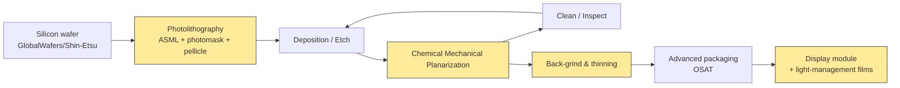
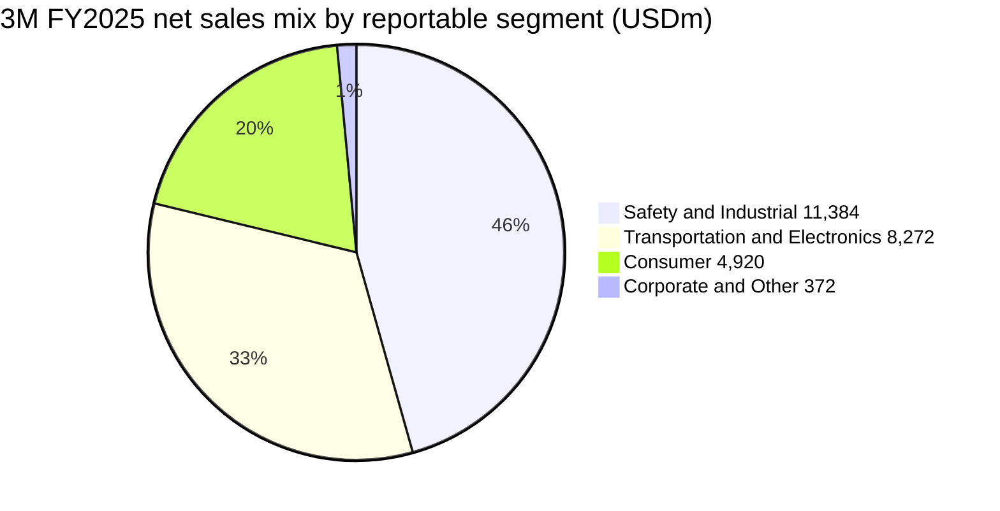
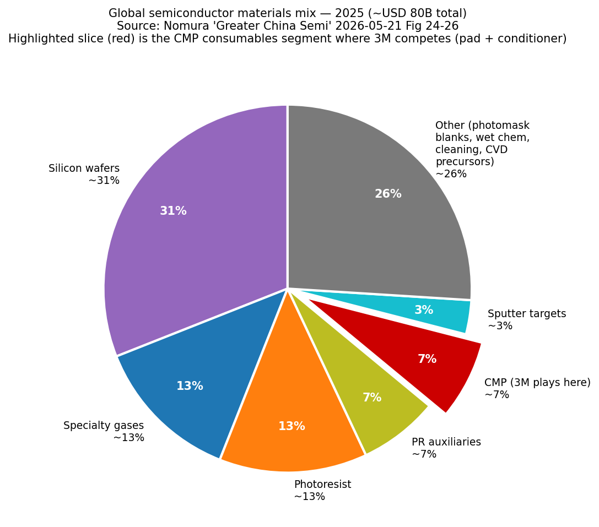

# Company Research Report: 3M Company (NYSE: MMM)

**As of:** 2026-05-26
**Listing:** New York Stock Exchange — ticker `MMM` ([NYSE profile](https://www.nyse.com/quote/XNYS:MMM)); also listed on NYSE Texas and SIX Swiss Exchange ([3M 8-K dated 2026-02-03, cover page](https://www.sec.gov/Archives/edgar/data/66740/000006674026000037/mmm-20260203.htm))
**HQ:** 3M Center, St. Paul, Minnesota 55144-1000 ([3M 10-K FY2025, cover page](https://www.sec.gov/Archives/edgar/data/66740/000006674026000014/mmm-20251231.htm))
**Founded:** 1902 as Minnesota Mining and Manufacturing Company in Two Harbors, Minnesota ([3M corporate history page](https://www.3m.com/3M/en_US/company-us/about-3m/history/))
**Fiscal year-end:** December 31 (FY2025 ended 2025-12-31; FY2025 10-K filed 2026-02-03)
**Sector context:** Anchor input — Nomura "Greater China Semi: A guide to Semi renaissance in 2026~30F", 2026-05-21 ([sector note](/Users/x/projects/financial_agent/reports/sector/半导体材料.md)) — 3M holds the largest red slice in Nomura's CMP-pad-conditioner share chart (Fig 43) and a top-five position in CMP pad (Fig 42), making 3M the only US conglomerate with a material seat in two of the most competitive consumables niches inside Greater China's semi-renaissance thesis.

> **Update — FY2026 guidance initiated (2026-01-20):** Management initiated FY2026 adjusted EPS guidance of **USD 8.50–8.70** (vs. FY2025 adjusted EPS of USD 8.06), adjusted organic sales growth of **3%**, and adjusted operating margin expansion of **70–80 bps**, with adjusted operating cash flow of USD 5.6–5.8B and 100% adjusted free-cash-flow conversion. This is the first time 3M has issued a full-year guide in the post-Solventum era that frames a return to single-digit growth, single-digit margin expansion, and ~100% cash conversion — i.e. management is signalling the company has crossed the trough left by the Solventum spin and the PFAS-manufacturing wind-down. The high end of the EPS range implies +8% YoY growth; the midpoint of the cash-flow guide implies ~USD 5.7B of internally-generated capital before the ~USD 4.0B-plus of legacy litigation cash outflows that Section 1 walks through. Source: [3M Q4 2025 earnings release dated 2026-01-20, Exhibit 99.1](https://www.sec.gov/Archives/edgar/data/66740/000006674026000003/q42025-8kerexx991.htm).

---

## Table of Contents

1. Company Overview
2. Company History
3. Management Team
4. Products & Services
5. Customers & Go-to-Market
6. Industry Overview
7. Competitive Landscape
8. Market Opportunity (TAM)
9. Risk Assessment

References + Step 10 Verification Log

---

## 1. Company Overview

3M Company is a Saint Paul, Minnesota–headquartered diversified industrial-technology conglomerate whose roots trace to a sandpaper-and-abrasives shop founded in 1902 ([3M corporate history](https://www.3m.com/3M/en_US/company-us/about-3m/history/)). After the April 2024 spin-off of its Health Care business into Solventum Corporation (NYSE: SOLV) and the late-2025 completion of its planned exit from PFAS manufacturing, today's 3M is a three-segment company organised as **Safety and Industrial**; **Transportation and Electronics**; and **Consumer** — together generating **USD 24.948 billion of FY2025 revenue** from approximately **60,500 full-time employees** ([3M 10-K FY2025, Item 1 Business + Item 7 MD&A](https://www.sec.gov/Archives/edgar/data/66740/000006674026000014/mmm-20251231.htm)). The current segment architecture went live as the post-Solventum reporting structure on 2024-04-01 ([3M 8-K dated 2024-04-01, Item 8.01 — Separation Completion](https://www.sec.gov/Archives/edgar/data/66740/000006674024000044/mmm-20240401.htm)).

The Company describes itself in plain terms in Item 1 of its annual report: "*3M is a diversified technology company with a global presence in the following businesses: Safety and Industrial; Transportation and Electronics; and Consumer. 3M is among the leading manufacturers of products for many of the markets it serves. Most 3M products involve expertise in product development, manufacturing and marketing, and are subject to competition from products manufactured and sold by other technologically oriented companies*" ([3M 10-K FY2025, Item 1 — General](https://www.sec.gov/Archives/edgar/data/66740/000006674026000014/mmm-20251231.htm)). The mental model that makes 3M unique is its 51 technology platforms — adhesives, abrasives, films, advanced materials, light management, microreplication, nonwovens, ceramics, surface modification, and others — combined into roughly 60,000 SKUs sold into more than 200 countries ([3M Investor Day 2025-02-26 deck slide 6](https://s24.q4cdn.com/834031268/files/doc_financials/2025/q1/2025-3M-Investor-Day-Materials.pdf)). What the analyst should remember about 3M is that **semiconductor materials sit inside the Electronics Materials Solutions division of the Transportation and Electronics segment** — i.e. semi materials are a sub-slice of a sub-segment of a segment, not a stand-alone reporting line; the 10-K does not size them separately. Throughout this report we work hard to extract what the 10-K *does* disclose about the semi-relevant pieces, label clearly when a claim is analyst inference, and avoid imputing semi-specific economics to corporate-level numbers.

**How 3M makes money.** The business model is industrial-technology product sales — patent-protected, brand-recognised consumable and durable components priced at modest unit value but sold at huge volume into thousands of customer designs. Distribution runs "*through numerous distribution channels, including directly to users and through a wide range of e-commerce and traditional wholesalers, retailers, jobbers, distributors, and dealers in a wide variety of trades in many countries around the world*" ([3M 10-K FY2025, Item 1 — Distribution](https://www.sec.gov/Archives/edgar/data/66740/000006674026000014/mmm-20251231.htm)). Unit economics swing on three levers: (a) the structural gross margin embedded in patent-protected formulations and proprietary manufacturing know-how; (b) productivity gains from scale across 51 technology platforms (the same fluoropolymer chemistry can feed semiconductor pellicles, automotive films, and consumer kitchen-wear); and (c) commercial-excellence pricing initiatives the new CEO has used to lift adjusted operating margin from 21.4% in FY2024 to 23.4% in FY2025 — a 200-bp expansion in the first full year of the Brown era ([3M Q4 2025 earnings release, 2026-01-20](https://www.sec.gov/Archives/edgar/data/66740/000006674026000003/q42025-8kerexx991.htm)).

**Segment scale (FY2025 net sales).** Safety and Industrial: **USD 11.385B** at 22.7% GAAP segment operating margin; Transportation and Electronics: **USD 8.272B** at 17.4% GAAP segment operating margin (22.7% adjusted for PFAS manufacturing wind-down); Consumer: **USD 4.920B** at single-digit margins after the consumer-discretionary slump of the past two years; Corporate and Other: USD 0.372B ([3M 10-K FY2025, Note 3 — Segment Information](https://www.sec.gov/Archives/edgar/data/66740/000006674026000014/mmm-20251231.htm)). Transportation and Electronics is 33.2% of consolidated FY2025 sales, and within T&E the **Electronics Materials Solutions division** — which contains the semi-relevant products (CMP pad conditioners, CMP pads, advanced surface preparation abrasives, pellicles, display films, electronics adhesives) — is one of five divisions alongside Advanced Materials, Automotive and Aerospace, Commercial Branding and Transportation, and Display Materials and Systems ([3M 10-K FY2025, Item 1 — Business Segments](https://www.sec.gov/Archives/edgar/data/66740/000006674026000014/mmm-20251231.htm)). The semi-relevant products inside Electronics Materials Solutions and Advanced Materials are an order of magnitude smaller than 3M's automotive, abrasives, and PPE businesses, but they are strategically disproportionate because they touch the leading-edge logic-and-memory roadmap that drives sell-side multiples.

**Geographic mix (FY2025 net sales).** Americas: USD 13.579B (54%); Asia Pacific: USD 7.095B (28%); EMEA: USD 4.274B (17%) ([3M 10-K FY2025, Note 3 — Net sales by geographic area](https://www.sec.gov/Archives/edgar/data/66740/000006674026000014/mmm-20251231.htm)). Inside Asia Pacific, **China/Hong Kong was USD 2.951B (~12% of total revenue)** — disclosed separately because of its materiality and the geopolitical sensitivity around tariffs and US-China decoupling. 3M's US footprint is USD 10.936B (44% of total). The semi-materials sub-business is much more Asia-skewed than the corporate average — CMP-pad-conditioner customers, photomask blank consumers, and pellicle buyers concentrate in Taiwan, Korea, and China where wafer fab capacity is built — but the 10-K does not publish a segment-by-geography matrix that would let an outsider isolate it.

*Source: [3M 10-K FY2025, Item 7 MD&A Results of Operations](https://www.sec.gov/Archives/edgar/data/66740/000006674026000014/mmm-20251231.htm) and prior-year 10-Ks; FY2025 adjusted op margin = 23.4%, FY2024 = 21.4%; revenue excludes discontinued operations (Solventum spun 2024-04-01).*

The chart shows the Solventum spin discontinuity: the Health Care business contributed roughly USD 8B of revenue and a high-teens margin profile, so the FY2024 starting line in continuing-operations data is the "right" baseline going forward. From that baseline the FY2025 print is **+1.5% revenue and +200 bps adjusted operating margin** — i.e. early evidence that Brown's commercial-excellence and PFAS-exit cleanup are starting to translate into margin recovery even before organic growth fully reaccelerates.

*Source: [3M 10-K FY2025, Note 3 Segment Information](https://www.sec.gov/Archives/edgar/data/66740/000006674026000014/mmm-20251231.htm). Corporate & Other excluded for clarity.*

**Valuation snapshot (as of 2026-05-22).** Pulled from market data aggregator ([Stockanalysis.com MMM statistics page](https://stockanalysis.com/stocks/mmm/statistics/)):

| Metric | MMM | Diversified industrial peers | Sector context |
|---|---|---|---|
| Price | USD ~152.5 | — | — |
| Market cap | **USD 79.51B** | Honeywell ~USD 130B; Illinois Tool Works ~USD 70B; Emerson ~USD 70B | DJIA member; S&P 500 |
| Enterprise value | USD 86.82B | — | — |
| TTM P/E | **29.4×** | HON ~22×, ITW ~24×, EMR ~22× | S&P 500 Industrials median ~22× |
| Forward P/E | 17.5× | HON ~19×, ITW ~22× | — |
| TTM P/S | **3.18×** | HON ~4×, ITW ~4×, EMR ~3.5× | — |
| P/B | 24.4× (depressed equity base — PFAS-charge eroded retained earnings) | HON ~7×, ITW ~22× | — |
| EV / EBITDA | 13.9× | HON ~13×, ITW ~16× | — |
| Dividend yield | 2.05% (Payout 60%) | HON 2.2%, ITW 2.4% | — |
| Buyback yield | 2.32% | — | — |
| 52-wk price change | +2.0% | — | — |

*Source: TTM P/E and P/S for MMM and peers from [Stockanalysis.com MMM](https://stockanalysis.com/stocks/mmm/statistics/), [Stockanalysis.com HON](https://stockanalysis.com/stocks/hon/statistics/), [Stockanalysis.com ITW](https://stockanalysis.com/stocks/itw/statistics/), [Stockanalysis.com EMR](https://stockanalysis.com/stocks/emr/statistics/), pulled 2026-05-22.*

**How to read the multiple.** MMM's 29.4× TTM P/E sits at a premium to its diversified-industrial peer set (HON / ITW / EMR all in the low-20s) for two reasons that point in opposite directions. The constructive read: forward P/E of 17.5× is *below* peers, meaning the market is already pricing FY2026 adjusted EPS guidance ($8.50–8.70) close to a 17–18× multiple — consistent with a mid-cycle industrial; the 29.4× TTM is artificially inflated by the GAAP earnings drag from PFAS litigation accruals, the Solventum spin discontinuity in the comparable base, and the manufactured-PFAS-products one-time charges. *Analyst view:* on adjusted EPS the stock is **not stretched** — it is in line with peers once you back out litigation noise. The bearish read: the GAAP-to-adjusted bridge is real cash leaving the building. The 10-K shows USD 3.5B of pre-tax cash payments related to net costs for significant litigation in FY2025 alone, and the multi-year obligation tail is large enough to compress equity returns even if operating performance is healthy ([3M Q4 2025 earnings release dated 2026-01-20, Special items table](https://www.sec.gov/Archives/edgar/data/66740/000006674026000003/q42025-8kerexx991.htm)). The high P/B (24.4×) is a red flag that becomes intuitive once you see the equity-base damage: the PFAS-related Public Water Suppliers ("PWS") settlement is for USD 10.5–12.5B paid 2024–2036 and the Combat Arms Earplugs ("CAE") settlement is for USD 6.0B paid 2023–2029 ([3M 10-K FY2025, Note 17 — Commitments and Contingencies](https://www.sec.gov/Archives/edgar/data/66740/000006674026000014/mmm-20251231.htm)). Section 9 carries the valuation question into a multiple-compression-risk evaluation.

**Capital return.** Even with the litigation overhang 3M continues to deliver on its dividend-aristocrat status — FY2025 total return to shareholders was approximately **USD 3.5B** via dividends and share repurchases ([3M Q4 2025 earnings release dated 2026-01-20](https://www.sec.gov/Archives/edgar/data/66740/000006674026000003/q42025-8kerexx991.htm)). The Q4 2025 standalone print was USD 0.9B returned. The dividend has been paid in every quarter since 1916, and has been raised in 67 consecutive years through the post-Solventum reset ([3M Investor Relations — Dividend History](https://investors.3m.com/financials/dividend-history/default.aspx)).

## 2. Company History

3M was founded in **1902 as the Minnesota Mining and Manufacturing Company** in Two Harbors, Minnesota by five investors who originally aimed to mine corundum for grinding wheels; the mineral turned out to be low-quality anorthosite and the original venture failed within two years ([3M corporate history page](https://www.3m.com/3M/en_US/company-us/about-3m/history/)). The Company survived only because the founders pivoted into sandpaper and over the next two decades built the foundational competence in **abrasives, coatings, and adhesive chemistry** that anchors most of the modern product portfolio. By 1925 a young laboratory technician named Richard Drew had invented masking tape — the first 3M product to scale internationally — and the same decade produced Scotch transparent tape; the post-WWII decades layered Scotchgard, magnetic-recording tape, and Post-it Notes (1980) on top of that base ([3M corporate history page](https://www.3m.com/3M/en_US/company-us/about-3m/history/)).

The Company became *Minnesota Mining* until the 2002 centenary rebrand to **"3M"**, by which point it was a global diversified industrial conglomerate. The five-investor-mining-failure origin still matters today because the corporate culture of "patient capital allowing experimentation" — the famous "15% time" rule that produced Post-it Notes — is what management points to when defending the company's high R&D intensity (~6% of revenue annually) and its broad technology-platform strategy.

```mermaid
timeline
    title 3M — major milestones (selected)
    1902 : Founded as Minnesota Mining and Manufacturing Company (Two Harbors, MN)
    1925 : Richard Drew invents masking tape
    1939 : Scotch transparent tape becomes flagship product
    1947 : First magnetic recording tape commercialised
    1980 : Post-it Notes launched
    2002 : Centenary rebrand to "3M Company"
    2007 : George W. Buckley becomes CEO; international expansion accelerates
    2018 : Acquires M*Modal for clinical AI in healthcare
    2019 : Acquires Acelity for advanced wound care
    2022 : Announces plan to exit PFAS manufacturing by end-2025
    2022 : Announces plan to spin Health Care business
    2023 : Public Water Suppliers ("PWS") PFAS settlement — USD 10.5–12.5B paid 2024–2036
    2023 : Combat Arms Earplugs ("CAE") settlement — USD 6.0B paid 2023–2029
    2024 : April 1 — Solventum (NYSE SOLV) spun off; 80.1% pro rata distribution
    2024 : May 1 — William Brown succeeds Mike Roman as CEO
    2025 : February — Investor Day articulates new operating model and capital framework
    2025 : Manufactured PFAS products production concluded; final year of exit charges
    2025 : Brown elected Chairman of the Board (in addition to CEO)
    2025 : Divests fused-silica business; precision grinding & finishing classified as held for sale
    2026 : Q1 2026 organic sales +1.5% YoY; FY2026 adjusted EPS guidance USD 8.50–8.70
```

*Source: composed from [3M 10-K FY2025, Item 1 + Executive Officers](https://www.sec.gov/Archives/edgar/data/66740/000006674026000014/mmm-20251231.htm), [3M 8-K dated 2024-04-01 — Solventum separation completion](https://www.sec.gov/Archives/edgar/data/66740/000006674024000044/mmm-20240401.htm), [3M 8-K dated 2024-04-30 — Brown appointment](https://www.sec.gov/Archives/edgar/data/66740/000006674024000051/mmm-20240430.htm), [3M Q4 2025 earnings release, 2026-01-20](https://www.sec.gov/Archives/edgar/data/66740/000006674026000003/q42025-8kerexx991.htm), and the [3M corporate history page](https://www.3m.com/3M/en_US/company-us/about-3m/history/).*

**Three strategic pivots define the modern company.**

*Pivot 1 — Aggressive M&A under Inge Thulin and Mike Roman (2012–2019).* From the early 2010s through 2019, 3M leaned into bolt-on M&A across Health Care and electronics — acquiring Capital Safety (2015, USD 2.5B), Scott Safety (2017, USD 2.0B), M\*Modal Health Information Systems (2018, USD 1.0B), and most consequentially **Acelity (October 2019, USD 6.7B)** for advanced wound care ([3M acquires Acelity press release, 2019-10-11](https://news.3m.com/3M-Completes-Acquisition-of-Acelity)). The Acelity deal was the largest in 3M history at the time and was the centerpiece of the strategic bet that Health Care could become a higher-growth standalone vertical inside the conglomerate. The subsequent Solventum spin in 2024 effectively undid that bet — Acelity ended up inside Solventum, not 3M's continuing operations.

*Pivot 2 — Litigation reckoning and PFAS exit (2022–2025).* The 2022–2023 window forced two foundational strategic decisions on 3M. In July 2022 the Company put Aearo Technologies — its Combat Arms Earplugs subsidiary — into voluntary Chapter 11, attempting to channel CAE liability through bankruptcy ([3M 8-K dated 2022-07-26](https://www.sec.gov/cgi-bin/browse-edgar?action=getcompany&CIK=0000066740&type=8-K&dateb=20220801&action=getcompany)). When that strategy collapsed in mid-2023, management committed to the **USD 6.0B CAE settlement covering more than 250,000 claimants paid 2023–2029** ([3M 10-K FY2025, Note 17 — Commitments and Contingencies](https://www.sec.gov/Archives/edgar/data/66740/000006674026000014/mmm-20251231.htm)). In parallel, in **December 2022 management announced 3M would exit PFAS manufacturing entirely by end-2025** ([3M PFAS exit press release, 2022-12-20](https://news.3m.com/2022-12-20-3M-to-Exit-PFAS-Manufacturing-by-the-End-of-2025)), and in June 2023 announced the **USD 10.5–12.5B Public Water Suppliers settlement to resolve municipal claims related to PFAS in US drinking water, paid 2024–2036** ([3M 10-K FY2025, Note 17](https://www.sec.gov/Archives/edgar/data/66740/000006674026000014/mmm-20251231.htm)). The combined CAE + PWS gross cash obligation of USD 16.5–18.5B paid out over a 14-year tail is the single largest financial overhang on the company today.

*Pivot 3 — Solventum spin + Brown era (2024 onward).* On **April 1, 2024** 3M completed the separation of its Health Care business through a pro rata distribution of 80.1% of the shares of Solventum Corporation (NYSE: SOLV) to 3M shareholders ([3M 8-K dated 2024-04-01](https://www.sec.gov/Archives/edgar/data/66740/000006674024000044/mmm-20240401.htm)); 3M retained 19.9% which it has been monetising opportunistically. The separation reset 3M's revenue base from ~USD 33B to ~USD 24B, reduced absolute earnings power but also reduced complexity, and let the Board recruit a clean-slate CEO — **William M. Brown, the former L3Harris CEO** — to take over from internally-promoted Mike Roman effective 2024-05-01 ([3M 8-K dated 2024-04-30, Item 5.02](https://www.sec.gov/Archives/edgar/data/66740/000006674024000051/mmm-20240430.htm)). Brown's mandate is two-fold: (a) execute the "new operating model" introduced at the 2025 Investor Day around three pillars — performance, growth, and capital allocation; and (b) restore the company's reputation for engineering-led product introductions after a decade in which absolute R&D spend stagnated. Early evidence suggests the operating-model push is working — adjusted operating margin expanded 200 bps in FY2025 — but the growth pillar has lagged (FY2025 organic sales just +0.9% GAAP / +2.1% adjusted).

**Recent developments (last 12 months).** In June 2025 3M completed the sale of its **fused silica business**, formerly part of Transportation and Electronics, "for immaterial proceeds slightly below the business's book value" ([3M 10-K FY2025, Note 4 — Divestitures](https://www.sec.gov/Archives/edgar/data/66740/000006674026000014/mmm-20251231.htm)). In September 2025 the company agreed to sell its **precision grinding and finishing business** (annual sales ~USD 130M) within Safety & Industrial, recording a pre-tax charge of USD 159M and classifying the business as held for sale ([same Note 4](https://www.sec.gov/Archives/edgar/data/66740/000006674026000014/mmm-20251231.htm)). Both divestitures signal Brown's willingness to prune sub-scale assets — a meaningful cultural shift in a company historically known for never selling anything. In December 2025 the **PFAS manufacturing exit was completed**, and 3M booked final updates to depreciable lives and salvage values of remaining treatment-related assets ([3M 10-K FY2025, Item 7 MD&A](https://www.sec.gov/Archives/edgar/data/66740/000006674026000014/mmm-20251231.htm)).

## 3. Management Team

**William M. Brown — Chairman of the Board and Chief Executive Officer (CEO since 2024-05-01; Chairman since 2025).** William ("Bill") Brown, age 63, joined 3M as CEO on May 1, 2024, succeeding Mike Roman, and was elected Chairman of the Board in 2025 — consolidating both governance and operating leadership in his hands ([3M 10-K FY2025, Item 1 — Information about our Executive Officers](https://www.sec.gov/Archives/edgar/data/66740/000006674026000014/mmm-20251231.htm)). Brown is the first 3M CEO in modern history hired externally rather than promoted from within — a signal of the Board's appetite for cultural reset after the Solventum spin and the PFAS-litigation reckoning. He arrived from defence-electronics giant **L3Harris Technologies**, where he served as Chairman and CEO from 2019 to 2021 (post the L3 / Harris merger he engineered) and Executive Chairman from 2021 to 2022 ([3M 10-K FY2025, Item 1 — Information about our Executive Officers](https://www.sec.gov/Archives/edgar/data/66740/000006674026000014/mmm-20251231.htm); [3M 2026 DEF 14A Proxy Statement](https://www.sec.gov/Archives/edgar/data/66740/000006674026000151/mmm-20260324.htm)). Before that, Brown was **CEO of Harris Corporation from 2011 to 2019**, where over an eight-year tenure he repositioned the legacy military-radio business into a higher-margin tactical-comms and avionics franchise, lifted EBITDA margins from the mid-teens into the low-20s, and orchestrated the all-stock USD 33B merger with L3 Technologies that closed June 2019 — at the time the largest defence merger of the post-Cold-War era ([Harris and L3 Technologies merger close announcement, 2019-06-29](https://www.l3harris.com/newsroom/press-release/2019/06/l3-harris-technologies-be-name-merged-company-following-l3-harris)). Brown's earlier career was at United Technologies Corporation (1997–2010), where he ran multiple businesses including the Carrier and Sikorsky franchises and learned the diversified-conglomerate operating cadence that he now applies at 3M. He holds a BS in mechanical engineering from Villanova University and an MBA from Columbia ([3M 2026 DEF 14A Proxy Statement, Director Biographies section](https://www.sec.gov/Archives/edgar/data/66740/000006674026000151/mmm-20260324.htm)).

At 3M, Brown's compensation is heavily performance-weighted in line with peer industrial-CEO benchmarks — the 2026 DEF 14A discloses base salary plus performance-based long-term equity that vests against three-year relative-TSR and cumulative-operating-income targets ([3M 2026 DEF 14A — Compensation Discussion and Analysis](https://www.sec.gov/Archives/edgar/data/66740/000006674026000151/mmm-20260324.htm)). His direct stock ownership stake remains in the early-tenure build-up phase (CEO sign-on equity vests over multiple years). What investors should watch over the next two years is whether Brown can repeat at 3M the playbook he ran at Harris: aggressive portfolio rationalisation, operating-model overhaul, and patient capital allocation — exactly the three pillars of the 2025 Investor Day framework. Early evidence (the 200-bp adjusted-margin expansion in FY2025, the fused-silica and precision-grinding divestitures, the explicit FY2026 EPS guide of USD 8.50–8.70) is consistent with the Harris-era cadence. The risk is that 3M is structurally a harder problem than Harris — there is no single counter-cyclical defence customer like the US DoD to anchor the back-book, and the litigation tail is bigger than anything Brown faced at L3Harris.

**Founder context.** 3M's five 1902 founders — Henry Bryan, Hermon Cable, John Dwan, William McGonagle, and Dr. J. Danley Budd — were investors in the original failed corundum-mining venture; none of them remained operationally involved through the modern era, and the Company has long-since transitioned to professionally-managed leadership. The founder bio is therefore not the relevant lens for evaluating today's 3M — the **Inge Thulin (2012–2018) → Mike Roman (2018–2024) → William Brown (2024–present) CEO succession** is the more useful frame ([3M corporate history page](https://www.3m.com/3M/en_US/company-us/about-3m/history/)). Roman's tenure ended with the Solventum spin, the PFAS exit announcement, and the PWS settlement — all hugely consequential portfolio moves that defined the entry conditions for the Brown era. Roman remained on the Board as Special Advisor through the transition period ([3M 8-K dated 2024-04-30](https://www.sec.gov/Archives/edgar/data/66740/000006674024000051/mmm-20240430.htm)).

## 4. Products & Services

> **Reader's note.** 3M is a 60,000-SKU conglomerate, and writing a fully verbatim product matrix for every 3M product would consume an entire report on its own. This section focuses on the **Transportation and Electronics segment** in general, and on the **Electronics Materials Solutions division** and the **Advanced Materials division** in particular — the two T&E divisions that house the semiconductor-relevant product families that are the analytical reason 3M shows up in Nomura's semi-renaissance share charts (CMP pad, CMP pad conditioner, pellicle, surface preparation abrasives, display films, advanced fluoropolymers). The Safety & Industrial and Consumer segments are summarised in synopsis form at the end of Section 4 because they are 67% of revenue and matter for the consolidated thesis even though they are not the analytical focus of this coverage initiation. **Investors evaluating MMM as a semi-materials play should recognise that the semi sub-business is a low-single-digit-percent slice of total 3M revenue — material to the semi-supply-chain narrative, but not the swing factor for MMM as a whole.** That tension is the most important framing of this section.

### 4.1 The 10-K's own product matrix — three segments, sixteen divisions

The 10-K does not publish a glossy product-portfolio table the way semicap or pharma issuers do, but Item 1 Business does contain a structured three-column matrix mapping each business segment to its underlying divisions and to representative revenue-generating activities and example brands. **Reproduced verbatim below** ([3M 10-K FY2025, Item 1 Business — Business Segments](https://www.sec.gov/Archives/edgar/data/66740/000006674026000014/mmm-20251231.htm)):

| Business Segment | Underlying divisions / businesses | Representative revenue-generating activities | Example brands / offerings |
|---|---|---|---|
| **Safety and Industrial** | Abrasives; Automotive Aftermarket; Electrical Markets; Industrial Adhesives and Tapes; Industrial Specialties Division; Personal Safety; Roofing Granules | Industrial abrasives and finishing; autobody repair solutions; industrial specialty products (personal hygiene products, masking, packaging materials); electrical products and materials for construction, maintenance, power distribution, electrical OEMs; structural adhesives and tapes; respiratory, hearing, eye and fall protection solutions; natural and color-coated mineral granules for shingles | 3M Cubitron Abrasives; Scotch-Brite Abrasives; Scotch Vinyl Tapes; 3M Temflex Vinyl Tapes; 3M Scotchkote Coatings; 3M Dynatel Locators; 3M Scotchcast Resins; 3M VHB Tape; 3M Scotchlite Reflective Materials; Scotch Packaging and Filament Tapes; 3M DBI-Sala Fall Protection; 3M Scott Self Contained Breathing Apparatus; 3M Peltor Protection & Communication; disposable and reusable respirators; Scotchgard Protector for shingles |
| **Transportation and Electronics** | **Advanced Materials**; **Automotive and Aerospace**; **Commercial Branding and Transportation**; **Display Materials and Systems**; **Electronics Materials Solutions** | Advanced ceramic solutions; attachment / bonding, films, sound and temperature management for vehicles; premium large format graphic films for advertising and fleet signage; reflective signage for highway and vehicle safety; **light management films and electronics assembly solutions; aerospace, industrial / commercial solutions; chip packaging and interconnection solutions; semiconductor production materials; solutions for data centers** | 3M Nextel Ceramic fibers and textiles; Thinsulate Acoustic Insulation products and automotive components; 3M Scotchlite graphic films; 3M Scotchcal and 3M Controltac Commercial graphics; 3M Diamond Grade DG3 reflective sheeting for transportation safety; **electronic display enhancement films and optically clear adhesives; electronic interconnect products** |
| **Consumer** | Consumer Safety and Well-Being; Home and Auto Care; Home Improvement; Packaging and Expression | Cleaning products for the home; consumer air quality products; picture hanging accessories; retail abrasives, paint accessories, and safety products; stationery and office products; automotive appearance products; consumer bandages, tapes, braces and supports | Command adhesive hooks; Filtrete HVAC air filters; Scotch-Brite cleaning sponges; Meguiar's car wash; Scotch tape; Post-it stick notes; Nexcare bandages; Scotchgard spray |

*Source: verbatim reproduction of [3M 10-K FY2025, Item 1 Business — Business Segments table](https://www.sec.gov/Archives/edgar/data/66740/000006674026000014/mmm-20251231.htm); bold emphasis added to highlight the semiconductor-relevant rows of the Transportation and Electronics segment.*

The **division-level revenue disclosure in Note 3** lets us anchor exactly how much money flows through each piece of T&E ([3M 10-K FY2025, Note 3 — Disaggregated Revenue Information](https://www.sec.gov/Archives/edgar/data/66740/000006674026000014/mmm-20251231.htm)):

| Division (FY net sales, USDm) | FY2023 | FY2024 | FY2025 |
|---|---|---|---|
| Advanced Materials | 1,167 | 969 | **858** |
| Automotive and Aerospace | 1,925 | 1,912 | 1,901 |
| Commercial Branding and Transportation | 2,546 | 2,528 | 2,602 |
| Electronics | 2,863 | 2,971 | **2,911** |
| **Total Transportation and Electronics segment** | **8,501** | **8,380** | **8,272** |

*Source: [3M 10-K FY2025, Note 3 — Net sales by division](https://www.sec.gov/Archives/edgar/data/66740/000006674026000014/mmm-20251231.htm). Note that "Electronics" in Note 3 is the consolidated revenue line that combines Display Materials and Systems plus Electronics Materials Solutions plus parts of advanced packaging — i.e. Note 3 collapses two of the five T&E divisions into one financial line; the Item 1 Business matrix splits them for descriptive purposes.*

**Two observations matter for the semi-investment thesis:**

1. **Advanced Materials revenue dropped from USD 1.167B (FY2023) to USD 858B (FY2025) — a 26% decline in two years.** The 10-K MD&A explains the gap as the PFAS-manufactured-products wind-down: 3M is exiting fluoropolymer manufacturing entirely by end-2025, and Advanced Materials is the division where the captured fluoropolymer revenue lived ([3M 10-K FY2025, Item 7 MD&A — Transportation and Electronics segment](https://www.sec.gov/Archives/edgar/data/66740/000006674026000014/mmm-20251231.htm)). The PFAS exit specifically removes USD 669M of net sales in FY2025 (the "Manufactured PFAS products" non-GAAP adjustment); ex-PFAS, T&E grew 2.0% organically. This is structurally important for the semi thesis because some semi-adjacent products (notably advanced fluoropolymer films used as carrier liners and chambers in wafer fabs) ride on that fluoropolymer chemistry; 3M is keeping its fluoropolymer purchase obligations to customers in place through 2025 and beyond via third-party sourcing — but the long-term semi-supply position in fluoropolymer-derived products is structurally weaker post-exit.
2. **Electronics revenue (which includes the semi-relevant Electronics Materials Solutions division plus Display Materials and Systems) was USD 2.911B in FY2025 — within ~3% of FY2023 and FY2024.** This is the most stable line in T&E, suggesting that even with the PFAS noise and the consumer-electronics cycle, 3M's electronics-materials business is structurally durable. *Analyst view:* the headline number masks divisional churn — display films are facing OLED-substitution risk (loss of LCD-display volume), while semiconductor production materials (CMP pads, CMP pad conditioners, surface-preparation abrasives, pellicles) are riding the AI capex wave that Nomura's report frames as a 2026-30 secular tailwind. 3M does not publish the inside-Electronics split, so the analyst can only infer the trajectory from the customer-side commentary in semi-supplier reports.

### 4.2 Synthesis — how T&E's electronics pieces compose one semiconductor fab's purchase basket

To understand why 3M's seemingly scattered semi product family is coherent, picture the wafer-fab purchase flow that the typical 5nm/3nm logic fab runs (or that an HBM4 memory line runs): **silicon wafer** (from Shin-Etsu / SUMCO / GlobalWafers) → **photolithography** (from ASML, requiring **photomask blanks / pellicles** — pellicle is a thin transparent membrane stretched over the mask to keep particles off the active mask surface) → **deposition** → **etch** → **chemical mechanical planarization (CMP)** to make the wafer surface flat after each layer, using a **CMP polishing pad** (from DuPont / 3M / Fujibo / JSR / Dinglong) refreshed continuously by a **CMP pad conditioner** (from Kinik / 3M / Saesol / Entegris) → **clean** → and back to the next deposition step. After many such loops the finished wafer is **back-grinded to thin it** (using **surface preparation abrasives** from 3M / Disco / Apex) before flowing to the OSAT where **advanced packaging interconnect materials and dielectric films** (a separate Electronics Materials Solutions sub-line) finish it. Finally a finished device goes into a **commercial display module** where 3M's **Display Materials and Systems** films (brightness-enhancement / light-management / optically-clear adhesives) sit on top of the LCD or OLED stack. **3M is one of very few suppliers that touches the wafer fab AT FOUR distinct steps** (CMP pad, CMP pad conditioner, surface-preparation abrasive, mask pellicle) — even though no single touch point is large enough to make 3M a top-tier semi-materials brand, the breadth gives 3M leverage in customer conversations because the same field-application engineer can package multiple supply discussions into one quarterly review. *Analyst view:* this "breadth without depth" is a structural feature of 3M's semi business that explains why share is durable but rarely dominant.

*Highlighted (gold) nodes are the four fab-workflow steps where 3M holds a meaningful supply position via the Electronics Materials Solutions and Display Materials and Systems divisions of the Transportation and Electronics segment. Source: workflow synthesised from [3M 10-K FY2025, Item 1 — Transportation and Electronics matrix](https://www.sec.gov/Archives/edgar/data/66740/000006674026000014/mmm-20251231.htm) and [Nomura "Greater China Semi" 2026-05-21, p. 18–30 supplier league tables (Fig 35–44)](/Users/x/projects/financial_agent/reports/sector/半导体材料.md).*

### 4.3 Electronics Materials Solutions — CMP pad conditioners

Verbatim language from the 10-K describing this product family:

> "Light management films and electronics assembly solutions; aerospace, industrial / commercial solutions; **chip packaging and interconnection solutions; semiconductor production materials; solutions for data centers**" ([3M 10-K FY2025, Item 1 Business — Transportation and Electronics matrix](https://www.sec.gov/Archives/edgar/data/66740/000006674026000014/mmm-20251231.htm))

The 10-K Item 1 Business matrix collapses CMP pad conditioner, CMP pad, photomask pellicle, and back-grind abrasive into the umbrella phrase **"semiconductor production materials"** — i.e. the 10-K does not name any of the individual product families separately. Investors who want the specific product names have to go to either (a) the 3M Electronics Materials Solutions website, (b) industry research reports such as Nomura's semi-materials report, or (c) competitor filings (Kinik, Dinglong) that name 3M as a comparator.

**中文释义 / Plain-language gloss — what a CMP pad conditioner physically does (中文 + English):**

CMP (**chemical mechanical planarization / 化学机械抛光**) is the wafer-fab process step that takes the bumpy three-dimensional surface left after deposition or etch and grinds it flat — flat enough that the next layer can be deposited cleanly. The grinding is done by a large rotating **抛光垫 (polishing pad)** flooded with a chemical slurry that simultaneously dissolves and abrades the wafer's topmost layer. After each wafer (or every few wafers), the pad's surface itself becomes glazed by polishing residue; if you don't keep it freshly textured, polishing rates drop and uniformity collapses. The job of "freshening" the pad surface belongs to the **CMP pad conditioner / CMP 修整盘** — a small diamond-coated disc that swings across the pad during polishing and continuously dresses (re-textures) the pad surface. The diamond coating wears down over its life; the conditioner disc is a true consumable replaced every few weeks. *Physical analogy:* if the CMP pad is a sharpening stone, the pad conditioner is the carborundum block that keeps the sharpening stone from getting smooth. Without a fresh conditioner the CMP step degrades; without CMP the entire fab process stops cold every few process steps.

3M's pad conditioner business sits inside Electronics Materials Solutions — historical position is one of the two original leaders in the category alongside Kinik (Taiwan TWSE:1560). Per Nomura's supplier league table for CMP pad conditioner (Fig 43 in the [2026-05-21 Greater China Semi report](/Users/x/projects/financial_agent/reports/sector/半导体材料.md)), the share map is **Kinik 60-70% + 3M + Saesol + Entegris** — i.e. Kinik is dominant and 3M is the largest non-Asian challenger but with shrinking share, particularly at sub-7nm advanced nodes where Kinik's 80% share at N2 has become the de facto standard. *Analyst view:* **3M's CMP pad conditioner is a clearly partial competitive advantage** with moat type = brand recognition + 30-year customer relationships, but **structurally losing share** to Kinik at the leading edge. The CMP pad conditioner business inside 3M is estimated by sell-side at USD 200–300M of annual revenue (i.e. ~10% of the Electronics line), which makes it material to 3M's Electronics Materials Solutions division but not material to 3M overall — and the Kinik share-take trajectory is the dominant risk.

*Analyst view:* **Closest named competitor products** — Kinik's "Diagrid" CMP pad conditioner line (the brand name Kinik uses on its [English product website](https://www.kinik.com.tw/en/products/cmp-pad-conditioners)) is the direct comp. Korean competitor Saesol Diamond markets the "PDC" series; US/Japan competitor Entegris markets a smaller pad-conditioner book inside its broader CMP Consumables group ([Entegris 10-K FY2024, Item 1 Business](https://www.sec.gov/Archives/edgar/data/1101302/000110130225000004/entg-20241231.htm)). 3M's own product name remains undisclosed in the FY2025 10-K.

### 4.4 Electronics Materials Solutions — CMP polishing pad

The same 10-K Item 1 "semiconductor production materials" umbrella covers 3M's CMP polishing pad line, which sells the actual rotating disc against which wafers are polished. The Nomura supplier league table for CMP pads (Fig 42 of the 2026-05-21 report) lists the global supplier set as **DuPont / 3M / Fujibo / JSR / Dinglong / others** ([sector note](/Users/x/projects/financial_agent/reports/sector/半导体材料.md)) — DuPont (through its acquisition of Rohm and Haas) is the longstanding share leader at >50% globally; 3M historically has been one of three Western challengers but with lower share than in conditioners and continuously losing ground to Dinglong (300054.SZ) at Chinese fabs and to JSR at Korean and Japanese fabs.

**中文释义 / Plain-language gloss:** A CMP pad / 抛光垫 is the consumable polishing surface — typically a polyurethane composite with engineered porosity — that delivers the mechanical force of the CMP step. Pad chemistry, hardness, surface micro-roughness, and groove pattern are all tunable; **每条新工艺节点都需要 pad 配方重新认证 (every new process node requires a new pad recipe re-qualification)**. The economic structure is consumable razor-blade: each polishing tool burns through one or two pads per shift; pad ASP is USD 100–300 per pad; the qualified customer relationship is sticky because requalification risk is meaningful. *Physical analogy:* the CMP pad is the sandpaper, the slurry is the cutting fluid, the pad conditioner is the sandpaper-sharpener — and the customer is replacing all three on every fab tool simultaneously.

*Analyst view:* **3M's CMP polishing pad business is a partial competitive advantage** — moat type = co-development relationship with a small number of leading foundries — but it is **not** a structural #1 or #2 globally. DuPont is the share leader, and Dinglong is the share-taker in China. 3M's pad business is estimated by sell-side at USD 100–200M of revenue and is one of the most concentrated single-customer risks inside the Electronics line because the polishing-pad qualification cycle (2+ years per new node) means that losing one major customer means losing them for 5+ years. The strategic 5-year question is whether 3M's pad business can be defended at all in the AI-node ramp (N2 / N1.6 / A10) where customer scrutiny is at its highest.

### 4.5 Electronics Materials Solutions — Mask pellicle and back-grind abrasive

The same "semiconductor production materials" umbrella also covers two smaller but strategically interesting product lines that the 10-K does not name separately:

**Mask pellicle.** A pellicle is a thin (sub-micron) transparent membrane mounted on a metal frame and stretched over a photomask to keep particle defects off the mask's active patterned surface. Pellicles are consumables — they are replaced when they accumulate damage from prolonged exposure to deep-UV (DUV) or extreme-UV (EUV) light. EUV pellicles are especially critical (and especially difficult) because they must be transparent to 13.5 nm wavelength while withstanding tens of kW of EUV power; the EUV-pellicle supply chain is dominated by **Mitsui Chemicals** (which acquired ASML's pellicle program in 2024) and **Shin-Etsu Chemical**, with **3M historically a supplier of DUV (193 nm and 248 nm) pellicles** as a sub-component of its Electronics Materials Solutions line ([3M 10-K FY2025, Item 1](https://www.sec.gov/Archives/edgar/data/66740/000006674026000014/mmm-20251231.htm) + [Nomura "Greater China Semi" 2026-05-21 supplier league table p. 38-39](/Users/x/projects/financial_agent/reports/sector/半导体材料.md)). *Analyst view:* **3M is a participant, not a leader, in mask pellicles** — and the strategic question is whether 3M can win EUV-pellicle qualification volume from Mitsui/Shin-Etsu, which would require a multi-year material-science investment 3M has not publicly committed to.

**Back-grind tape and surface preparation abrasive.** After wafer fab is complete the finished wafer is back-thinned from ~775 µm to as little as ~25 µm using a mechanical grinding step — this is what makes 3D stacking (HBM, SoIC, wafer-bonded NAND) possible. **3M sells the back-grind tape that protects the front-side circuit during the grind** plus surface preparation abrasives for post-grind polishing. The back-grind tape and abrasive line is a small but high-margin niche where 3M's adhesive-and-abrasive heritage gives a defensible structural advantage; competitive pressure comes from Lintec (Japan), Mitsui (Japan), and the back-grind segment of Disco Corp's broader equipment-and-consumables business (TSE: 6146).

### 4.6 Display Materials and Systems — light-management films and OCAs

Verbatim 10-K language for this division:

> "**Electronic display enhancement films and optically clear adhesives**" ([3M 10-K FY2025, Item 1 Business — Display Materials and Systems brand line](https://www.sec.gov/Archives/edgar/data/66740/000006674026000014/mmm-20251231.htm))

**中文释义 / Plain-language gloss:** Brightness-enhancement films / 增亮膜 are stacked layers of optically engineered microreplicated polymer film placed inside a backlight module of an LCD display; they recycle and redirect light from the backlight LED toward the viewer, effectively increasing on-axis brightness by 2–3× for the same LED power. 3M's brightness-enhancement-film (BEF) franchise — built on the company's microreplication / 微复制 technology platform — was for two decades the de facto BEF standard for premium-LCD TV and laptop displays. Optically clear adhesives / 光学透明胶 (OCAs) are clear pressure-sensitive adhesive layers used to bond cover glass to LCD or OLED display modules in smartphones and tablets; 3M competes with H+P / Hitachi Chemical, Dexerials, LG Chem, and several Chinese suppliers in OCA.

*Analyst view:* **Display Materials and Systems is structurally declining as the global display market shifts from LCD to OLED.** OLED self-emits and does not need a backlight, eliminating the need for BEF (the largest single product line in the division). 3M has tried to offset BEF decline with new film products for AMOLED (functional films for foldable smartphones, ultra-thin OCAs for OLED stacks, polarisation-control films) — and the FY2024 / FY2025 commentary in the 10-K explicitly cited "**new product launches and spec-wins that supported share gains**" in electronics ([3M 10-K FY2025, Item 7 — Transportation and Electronics 2024 segment results](https://www.sec.gov/Archives/edgar/data/66740/000006674026000014/mmm-20251231.htm)) — but the structural BEF decline is unlikely to be fully offset, and Display Materials and Systems will be a flat-to-declining business over the medium term.

### 4.7 Advanced Materials — fluoropolymers, ceramics, and the PFAS exit

Verbatim 10-K language:

> "Advanced ceramic solutions" ([3M 10-K FY2025, Item 1 Business — Advanced Materials representative activities](https://www.sec.gov/Archives/edgar/data/66740/000006674026000014/mmm-20251231.htm))

Advanced Materials is the smaller (FY2025 net sales USD 858M, down from USD 1.167B in FY2023) and structurally more controversial division inside T&E. The product portfolio historically consisted of three pieces: **(1) high-performance fluoropolymers and fluorochemicals** (the legacy PFAS franchise, used in everything from wire insulation to wafer-fab carrier film to chemical-resistant tanks); **(2) Nextel ceramic fibers** (used in aerospace exhaust ducts, thermal blankets, and high-temperature filtration); and **(3) Thinsulate-brand insulation and other engineered nonwovens**. The PFAS-manufactured-products wind-down took the entire fluoropolymer-revenue base out of this division between 2022 (announcement) and 2025 (final manufacturing year). 3M booked the formal exit in Q4 2025 with final adjustments to depreciable lives and salvage values of remaining treatment-related assets ([3M 10-K FY2025, Item 7 MD&A — Transportation and Electronics](https://www.sec.gov/Archives/edgar/data/66740/000006674026000014/mmm-20251231.htm)). What remains in Advanced Materials post-exit is the Nextel ceramic business + the residual non-PFAS fluoropolymer book sourced from third parties + speciality nonwoven and engineered materials. *Analyst view:* **Advanced Materials post-PFAS is a smaller, lower-growth, higher-quality business** — but it has lost much of the optionality it carried into the late 2010s when 3M's fluoropolymer chemistry was an under-appreciated wafer-fab carrier material.

### 4.8 Outside Transportation & Electronics — synopsis of the other 67% of revenue

**Safety and Industrial (USD 11.385B FY2025, 45.6% of consolidated sales, 22.7% segment OI margin).** 3M's largest segment. Anchored by the Personal Safety division (USD 3.544B — respiratory protection, hearing protection, fall protection — built on the 3M Scott, Peltor, and DBI-Sala brands acquired in 2015–2017) and the Industrial Adhesives and Tapes division (USD 2.266B — VHB acrylic foam tape, Scotch-Weld structural adhesives, Scotch packaging tape). The Abrasives line (USD 1.340B — Cubitron, Scotch-Brite) connects strategically to the back-grind abrasive line in Electronics Materials Solutions; many of the same engineered-grain abrasive technologies cross over. The Electrical Markets division (USD 1.394B) sells into grid-modernization end markets and benefits from the data-center electrification tailwind. The Roofing Granules division (USD 490M) is unique — color-coated mineral granules sold to asphalt-shingle manufacturers; it's a steady-state niche with a structural moat from mineral-pit ownership ([3M 10-K FY2025, Note 3 — Disaggregated Revenue](https://www.sec.gov/Archives/edgar/data/66740/000006674026000014/mmm-20251231.htm)).

**Consumer (USD 4.920B FY2025, 19.7% of consolidated sales).** Four divisions: Consumer Safety and Well-Being (USD 1.108B — Nexcare adhesive bandages, ACE compression products); Home and Auto Care (USD 1.200B — Scotch-Brite cleaning sponges, Filtrete HVAC air filters, Meguiar's car wash); Home Improvement (USD 1.486B — Command adhesive hooks, Scotchgard protector, Scotch tape for home use); Packaging and Expression (USD 1.126B — Post-it Notes, Scotch tape for office use, retail abrasives). Consumer is the structurally lower-growth, lower-margin segment — the FY2025 organic growth rate was negative. *Analyst view:* the Consumer segment may be next for an SOTP-style portfolio decision (divestiture or spin) under Brown's "performance, growth, capital allocation" framework — though management has not yet signaled this publicly.

### 4.9 Recent launches and roadmap (last 12 months)

The Brown era has emphasized **commercial excellence and incremental product launches** over splashy new platforms. Recent launches and product roadmap items disclosed in FY2025 earnings calls and press releases:

- **3M Investor Day 2025-02-26** introduced the "new operating model" frame and named electronics, data centers, and aerospace as the three "spec-in" growth vectors inside T&E ([3M Investor Day Materials, 2025-02-26](https://s24.q4cdn.com/834031268/files/doc_financials/2025/q1/2025-3M-Investor-Day-Materials.pdf)).
- **Fused silica business divestiture (June 2025)** removed a small electronics-related sub-line from T&E "for immaterial proceeds slightly below the business's book value" ([3M 10-K FY2025, Note 4](https://www.sec.gov/Archives/edgar/data/66740/000006674026000014/mmm-20251231.htm)).
- **Precision grinding and finishing held-for-sale (September 2025)** signaled willingness to prune sub-scale Safety & Industrial assets — annual sales ~USD 130M, sale expected H1 2026 ([3M 10-K FY2025, Note 4](https://www.sec.gov/Archives/edgar/data/66740/000006674026000014/mmm-20251231.htm)).
- **FY2026 guidance initiation (2026-01-20)** — adjusted EPS USD 8.50–8.70, adjusted operating margin expansion 70–80 bps, organic sales growth 3% ([3M Q4 2025 earnings release, 2026-01-20](https://www.sec.gov/Archives/edgar/data/66740/000006674026000003/q42025-8kerexx991.htm)) — the strategic message is that Brown is targeting controlled top-line growth with continued margin expansion, *not* a "big strategic bet" cycle.

### 4.10 Flagship franchises and Section 4 synthesis

If a reader walks away with only one mental model of 3M's product portfolio, it should be this: **3M is a 51-technology-platform conglomerate whose three highest-quality franchises today are (1) Personal Safety (3M Scott + Peltor + DBI-Sala — the result of the 2015–2017 acquisition cycle), (2) Industrial Adhesives & Tapes (VHB + Scotch-Weld — the legacy adhesive chemistry franchise), and (3) Cubitron / Scotch-Brite abrasives.** The semiconductor-relevant pieces — CMP pad, CMP pad conditioner, mask pellicle, back-grind abrasive, advanced packaging dielectric — sit inside the Electronics Materials Solutions and Advanced Materials divisions of Transportation and Electronics, and together represent a low-single-digit-percent slice of total 3M revenue. **These semi pieces are strategically interesting to the Nomura "semi renaissance" thesis but are not financially material to MMM's near-term EPS trajectory**; the dominant FY2026 earnings driver remains commercial excellence pricing and continued PFAS-exit cleanup across the broader portfolio. Section 7 walks through the competitive landscape product-by-product; Section 9 walks through how the PFAS / CAE / Solventum trio combine into the financial overhang that defines today's MMM equity case.

## 5. Customers & Go-to-Market

3M is among the most diversified customer-base companies on the NYSE — **no single end customer accounts for more than 10% of consolidated revenue**. The 10-K Item 1 makes this explicit through omission: there is no "Major Customer" disclosure under ASC 280-10-50-42 in the FY2025 10-K, which under US GAAP means no single customer exceeded the 10% threshold in any of the three years presented ([3M 10-K FY2025, Note 20 — Business Segments and Geographic Information](https://www.sec.gov/Archives/edgar/data/66740/000006674026000014/mmm-20251231.htm)). This is structurally different from many of 3M's semi-materials peers (PLAB, Kinik, Anji) where one or two foundries can drive 20%+ of revenue; for 3M the customer mix is genuinely fragmented across automotive OEMs, distributors, consumer-retail channels, electronics OEMs, and government agencies.

*Source: [3M 10-K FY2025, Note 3 — Disaggregated Revenue](https://www.sec.gov/Archives/edgar/data/66740/000006674026000014/mmm-20251231.htm). Note: 3M does not publish a customer-concentration breakdown because no single customer exceeds the ASC 280 10% materiality threshold; the closest substitute the analyst can offer is the segment-by-revenue split shown here.*

**Customer concentration — quantified.** Under ASC 280-10-50-42 disclosure thresholds, **3M is structurally a "no concentration" company** in the standard sense. The 10-K does not name any individual customer. The closest the analyst can come to concentration analysis is at the channel level: distributor sales (industrial distributors, electrical wholesalers, automotive parts distributors, consumer retailers like Walmart, Home Depot, Lowe's, Amazon, Target) represent the majority of go-to-market dollars across the consumer-facing segments; in B2B segments, customer count runs into the tens of thousands across automotive, aerospace, electronics, and PPE buyers. *Analyst view:* the absence of customer concentration is one of 3M's underrated structural strengths — the company is meaningfully more diversified than the broader S&P 500 Industrials. **Per the risk taxonomy in this report, customer concentration is NOT a material risk for MMM** (top-1 < 10%, top-5 likely < 20% — neither threshold triggers the standard escalation).

**Channel structure.** The 10-K describes the channel architecture verbatim: "*3M products are sold through numerous distribution channels, including directly to users and through a wide range of e-commerce and traditional wholesalers, retailers, jobbers, distributors, and dealers in a wide variety of trades in many countries around the world. Management believes that the confidence of these partners in 3M and its products — a confidence developed through long association with skilled marketing and sales representatives — has contributed significantly to 3M's position in the marketplace and to its growth*" ([3M 10-K FY2025, Item 1 Business — Distribution](https://www.sec.gov/Archives/edgar/data/66740/000006674026000014/mmm-20251231.htm)). In semi-materials specifically, sales are direct to fabs and OSAT customers — 3M's semi-customer relationships are managed by field-application engineers stationed in Taiwan, Korea, China, and the US, supplemented by qualified-vendor frameworks at each major foundry.

**Geographic mix as a proxy for customer mix.** Because 3M does not publish customer detail, the geographic mix is the most useful customer-distribution proxy. FY2025 sales by area ([3M 10-K FY2025, Note 3](https://www.sec.gov/Archives/edgar/data/66740/000006674026000014/mmm-20251231.htm)):

| Region | FY2023 | FY2024 | FY2025 | YoY % |
|---|---|---|---|---|
| Americas (USA + Canada + Latin America) | 13,268 | 13,405 | **13,579** | +1.3% |
| Asia Pacific | 7,068 | 6,994 | **7,095** | +1.4% |
| Europe, Middle East and Africa | 4,274 | 4,176 | **4,274** | +2.3% |
| **Worldwide total** | **24,610** | **24,575** | **24,948** | **+1.5%** |

| Single-country detail | FY2023 | FY2024 | FY2025 |
|---|---|---|---|
| United States | 10,607 | 10,788 | **10,936** |
| China / Hong Kong | 2,625 | 2,824 | **2,951** |

The China/Hong Kong revenue line is **the only single foreign country 3M discloses separately** — and at USD 2.951B (11.8% of consolidated revenue, up from 10.7% in FY2023) it is large enough to be the single most-meaningful geopolitical concentration in the business. China/Hong Kong revenue grew +4.5% in FY2025 even with the tariff overhang. *Analyst view:* China-specific revenue is the most-watched concentration line because (a) the disclosure exists, (b) tariff and decoupling rhetoric directly threatens it, and (c) the semi-supply business (CMP pad conditioner, CMP pad, pellicle) is disproportionately China-skewed within the China line. **The China revenue line is the implicit "customer concentration" risk for 3M** even though no single Chinese customer breaches the ASC 280 threshold.

**Spec-in and qualification cycle.** In the electronics and automotive end markets, 3M's product wins come through the **spec-in / 设计入选** cycle: a customer designs a product (a car, a smartphone, a semiconductor process tool, a display module) and the 3M product is written into the bill of materials at the design stage. Once spec'd in, 3M revenue accrues for the life of the customer's product (typically 3–7 years for automotive, 1–2 years for consumer electronics, 5+ years for semiconductor process tools). FY2024 commentary specifically called out "**strong share gains from spec-in wins and new product introductions in automotive and consumer electronics**" — and FY2025 commentary noted the YoY operating-income margin headwind from "**challenging comparison against last year's strong share gains**" ([3M 10-K FY2025, Item 7 — Transportation and Electronics 2025 results](https://www.sec.gov/Archives/edgar/data/66740/000006674026000014/mmm-20251231.htm)). The spec-in flywheel is one of 3M's underrated competitive moats but it's also the source of the year-on-year lumpiness that makes T&E revenue hard to forecast quarter-by-quarter.

**Brand strength as a go-to-market asset.** The 3M brand portfolio is unusually deep — at least 32 brands have global recognition (Scotch, Scotch-Brite, Post-it, Command, Filtrete, VHB, Cubitron, Scotchgard, Thinsulate, Nexcare, ACE, Peltor, DBI-Sala, Scott, Nextel, Meguiar's, and ~20 others). Brand strength is a real go-to-market asset that lowers customer-acquisition cost in the consumer segment and supports premium pricing in the industrial segment — particularly in industrial-adhesive and PPE end markets where brand certainty correlates with worker-safety outcomes. *Analyst view:* in semi materials specifically, the brand effect is weaker — fabs care about technical qualification, not branding — so the 3M brand premium does not extend cleanly into the Electronics Materials Solutions value proposition.

## 6. Industry Overview

For a 60,000-SKU conglomerate like 3M, "the industry" is not a single market but a collection of overlapping industrial-materials sub-industries. Because the analytical purpose of this report is to evaluate 3M as a semi-renaissance-thesis name, this section focuses on the **global semiconductor materials industry** and on the **CMP consumables sub-market** in particular — leaving the wider industrial-conglomerate market commentary to the standard Honeywell / ITW / Emerson peer reports.

**Global semiconductor materials — USD 80B in 2025.** Per Nomura's 2026-05-21 sector report, the global semiconductor materials market was approximately **USD 80B in 2025**, split roughly **60% IC manufacturing materials and 40% packaging materials** (Fig 24-25 of the [Nomura sector report](/Users/x/projects/financial_agent/reports/sector/半导体材料.md)). Within IC manufacturing materials, the share map is: silicon wafers ~31%, photoresist ~13%, photoresist auxiliaries ~7%, specialty gases ~13%, **CMP ~7%**, sputter targets ~3%, with the remaining ~26% distributed across photomask blanks, wet chemicals, cleaning agents, and CVD precursors (Fig 26).

By geography, **the global semi-materials market is heavily Asia-skewed**: Taiwan accounts for ~30%, China ~20%, Korea ~18%, Japan ~10%, North America ~10%, Europe ~8% (Fig 29-30 of the [Nomura sector report](/Users/x/projects/financial_agent/reports/sector/半导体材料.md)). For a US-headquartered supplier like 3M, this means the gravity of the customer base sits in Asia — and the strategic challenge is how to maintain customer intimacy in regions where local competitors (Kinik, Saesol, Dinglong, Anji, JSR) have a structural geographic-proximity advantage.

*Source: [Nomura "Greater China Semi: A guide to Semi renaissance in 2026~30F", 2026-05-21, Fig 24-26 + Fig 29-30 (sector note)](/Users/x/projects/financial_agent/reports/sector/半导体材料.md). 3M competes meaningfully only in the CMP and (smaller) photomask-blank sub-categories that together represent ~10% of the global semi-materials TAM.*

**CMP consumables — three sub-sub-markets.** The CMP consumables market (~USD 5.6B globally in 2025, derived from the ~7% CMP share of the USD 80B materials market) decomposes into three distinct sub-sub-markets that compete on largely separate qualification cycles:

1. **CMP slurry** (~50% of CMP consumables by value, ~USD 2.8B globally) — the chemical fluid that drives the polishing reaction. Suppliers per Nomura Fig 44 league table: **Entegris / Resonac / Versum (Merck KGaA) / Fujimi / 安集 Anji (688019.SH) / KC Tech / 鼎龙 Dinglong (300054.SZ)** ([sector note](/Users/x/projects/financial_agent/reports/sector/半导体材料.md)). **3M does NOT compete in CMP slurry** — this is one of the most often-confused points for retail investors. 3M sells the pad and the conditioner; CMP slurry has been an entirely separate competitive landscape since the late 1990s.
2. **CMP pad** (~30% of CMP consumables by value, ~USD 1.7B globally) — the rotating polyurethane disc itself. Suppliers per Nomura Fig 42: **DuPont / 3M / Fujibo / JSR / Dinglong / others** ([sector note](/Users/x/projects/financial_agent/reports/sector/半导体材料.md)). DuPont (via the Rohm and Haas acquisition + IC1000 product line) has been the share leader at >50% for two decades; 3M, Fujibo (Japan), and JSR (Japan) are the historical Western/Japanese challengers; Dinglong is the China share-taker. The market is concentrated — top-4 suppliers represent >85% of share.
3. **CMP pad conditioner** (~20% of CMP consumables by value, ~USD 1.1B globally) — the diamond-coated dressing disc. Suppliers per Nomura Fig 43: **Kinik 60-70% + 3M + Saesol + Entegris** ([sector note](/Users/x/projects/financial_agent/reports/sector/半导体材料.md)). The most concentrated of the three sub-sub-markets — Kinik alone is at 60-70% global share and 80% at the leading edge (N2 node, per the Nomura recommendation thesis on Kinik). 3M is the largest non-Asian supplier.

**Industry growth drivers — the Nomura "semi renaissance 2026-30" thesis.** The defining secular driver of the next five years per the Nomura sector report is the **AI compute + agentic-AI wave + Backside Power Delivery (BPD) + 2.5D / 3D advanced packaging + new materials** combination ([Nomura sector report, p. 4-6](/Users/x/projects/financial_agent/reports/sector/半导体材料.md)). For CMP consumables specifically, two demand inflections matter:

- **BPD (backside power delivery) adds 20-30% additional CMP steps** to a leading-edge logic process. BPD requires building a complete metal stack on the wafer back-side, which means many additional CMP-planarization cycles ([Nomura sector report, p. 6-9, Fig 5-8](/Users/x/projects/financial_agent/reports/sector/半导体材料.md)).
- **Wafer-to-wafer (W2W) and chip-on-wafer (CoW) hybrid bonding** for HBM4, SoIC, and wafer-bonded NAND introduce a multi-CMP-step process where each bond plane must be polished to angstrom-level flatness. Nomura cites Anji's commentary that "client W2W hybrid bonding trials are driving multi-step CMP" ([sector report, p. 130](/Users/x/projects/financial_agent/reports/sector/半导体材料.md)) as an under-priced demand driver.

**CMP TAM math.** With ~USD 5.6B global CMP consumables in 2025, and the Nomura thesis implying CMP-step volumes grow ~20-30% over the BPD ramp + multi-step demand from advanced packaging, **the CMP consumables TAM by 2028F could approach USD 7-8B**, with the pad-conditioner sub-segment growing fastest because diamond-disc wear is proportional to total CMP-platen-hours. The TAM growth is durable — Nomura assumes a multi-year secular tailwind through 2030F — but the share-distribution map is unfavourable for 3M because Kinik's share has been *expanding* at the leading edge while 3M's has been *declining*.

**Industry structure — concentrated but not monopolistic.** CMP consumables is a four-supplier oligopoly with concentrated share at the leading edge. Barriers to entry are high (multi-year customer qualification cycles, capital-intensive diamond-disc manufacturing for conditioners, specialty-chemistry expertise for pads). Supplier power is moderate (industry is concentrated, but qualification cycles mean any one customer can dual-source). Buyer power is high (the customer base is even more concentrated than the supplier base — TSMC, Samsung, Intel, SK Hynix, Micron together represent >70% of global advanced-node CMP demand). Substitutes are technical (alternative planarization processes such as etch-back, but none have credibly displaced CMP in 25+ years). **The industry is structurally attractive — but for 3M specifically, the position within the industry is structurally weakening.**

**Regulatory environment — the PFAS dimension.** The single most consequential regulatory development for 3M in the past 5 years is the **US EPA's MCL rule for PFAS in drinking water (finalised April 2024)** which set enforceable maximum contaminant levels for PFOA, PFOS, GenX, and other PFAS chemistries ([3M 10-K FY2025, Item 1A — Risk Factors and Note 17 — Commitments and Contingencies](https://www.sec.gov/Archives/edgar/data/66740/000006674026000014/mmm-20251231.htm)). The rule directly drove the PWS settlement and accelerated 3M's PFAS-manufacturing exit. While the regulatory direction is now clear (US-wide PFAS phase-out across consumer and industrial products), there is **ongoing exposure from individual state-level claims** (Belgium, NJ, MN, MI, NY have all filed environmental remediation claims separately from the PWS settlement) which adds an indeterminate tail to the legal-liability provision.

**Regulatory environment — China decoupling.** A growing regulatory headwind for any US semi-materials supplier with China revenue: the US export-control framework around advanced-node semiconductor manufacturing has tightened progressively since 2022 (October 2022 export controls on advanced compute / EUV-class lithography, October 2023 update expanding the entity list, December 2024 update on HBM and CMP-relevant precursors). 3M's CMP consumables are largely sold to fabs running 14nm-and-up Chinese mainstream nodes (Hua Hong, SMIC mature nodes, YMTC mature nodes), which sit below the entity-list threshold for most products — but the regulatory direction creates a real risk that future restrictions could target the CMP / pellicle / advanced-packaging product lines that 3M sells into Chinese fabs. *Analyst view:* the China-export risk is asymmetric — 3M has limited upside from China-decoupling (US fab build-out volume is much smaller than Chinese fab capacity) but meaningful downside if Chinese fab access tightens.

