# Company Research Report: 3M Company (NYSE: MMM)

**As of:** 2026-05-26
**Listing:** New York Stock Exchange — ticker `MMM` ([NYSE profile](https://www.nyse.com/quote/XNYS:MMM)); also listed on NYSE Texas and SIX Swiss Exchange ([3M 8-K dated 2026-02-03, cover page](https://www.sec.gov/Archives/edgar/data/66740/000006674026000037/mmm-20260203.htm))
**HQ:** 3M Center, St. Paul, Minnesota 55144-1000 ([3M 10-K FY2025, cover page](https://www.sec.gov/Archives/edgar/data/66740/000006674026000014/mmm-20251231.htm))
**Founded:** 1902 as Minnesota Mining and Manufacturing Company in Two Harbors, Minnesota ([3M corporate history page](https://www.3m.com/3M/en_US/company-us/about-3m/history/))
**Fiscal year-end:** December 31 (FY2025 ended 2025-12-31; FY2025 10-K filed 2026-02-03)
**Sector context:** Anchor input — Nomura "Greater China Semi: A guide to Semi renaissance in 2026~30F", 2026-05-21 ([sector note](/Users/x/projects/financial_agent/reports/sector/半导体材料.md)) — 3M holds the largest red slice in Nomura's CMP-pad-conditioner share chart (Fig 43) and a top-five position in CMP pad (Fig 42), making 3M the only US conglomerate with a material seat in two of the most competitive consumables niches inside Greater China's semi-renaissance thesis.

> **Update — FY2026 guidance initiated (2026-01-20):** Management initiated FY2026 adjusted EPS guidance of **USD 8.50–8.70** (vs. FY2025 adjusted EPS of USD 8.06), adjusted organic sales growth of **3%**, and adjusted operating margin expansion of **70–80 bps**, with adjusted operating cash flow of USD 5.6–5.8B and 100% adjusted free-cash-flow conversion. This is the first time 3M has issued a full-year guide in the post-Solventum era that frames a return to single-digit growth, single-digit margin expansion, and ~100% cash conversion — i.e. management is signalling the company has crossed the trough left by the Solventum spin and the PFAS-manufacturing wind-down. The high end of the EPS range implies +8% YoY growth; the midpoint of the cash-flow guide implies ~USD 5.7B of internally-generated capital before the ~USD 4.0B-plus of legacy litigation cash outflows that Section 1 walks through. Source: [3M Q4 2025 earnings release dated 2026-01-20, Exhibit 99.1](https://www.sec.gov/Archives/edgar/data/66740/000006674026000003/q42025-8kerexx991.htm).

---

## Table of Contents

1. Company Overview
2. Company History
3. Management Team
4. Products & Services
5. Customers & Go-to-Market
6. Industry Overview
7. Competitive Landscape
8. Market Opportunity (TAM)
9. Risk Assessment

References + Step 10 Verification Log

---

## 1. Company Overview

3M Company is a Saint Paul, Minnesota–headquartered diversified industrial-technology conglomerate whose roots trace to a sandpaper-and-abrasives shop founded in 1902 ([3M corporate history](https://www.3m.com/3M/en_US/company-us/about-3m/history/)). After the April 2024 spin-off of its Health Care business into Solventum Corporation (NYSE: SOLV) and the late-2025 completion of its planned exit from PFAS manufacturing, today's 3M is a three-segment company organised as **Safety and Industrial**; **Transportation and Electronics**; and **Consumer** — together generating **USD 24.948 billion of FY2025 revenue** from approximately **60,500 full-time employees** ([3M 10-K FY2025, Item 1 Business + Item 7 MD&A](https://www.sec.gov/Archives/edgar/data/66740/000006674026000014/mmm-20251231.htm)). The current segment architecture went live as the post-Solventum reporting structure on 2024-04-01 ([3M 8-K dated 2024-04-01, Item 8.01 — Separation Completion](https://www.sec.gov/Archives/edgar/data/66740/000006674024000044/mmm-20240401.htm)).

The Company describes itself in plain terms in Item 1 of its annual report: "*3M is a diversified technology company with a global presence in the following businesses: Safety and Industrial; Transportation and Electronics; and Consumer. 3M is among the leading manufacturers of products for many of the markets it serves. Most 3M products involve expertise in product development, manufacturing and marketing, and are subject to competition from products manufactured and sold by other technologically oriented companies*" ([3M 10-K FY2025, Item 1 — General](https://www.sec.gov/Archives/edgar/data/66740/000006674026000014/mmm-20251231.htm)). The mental model that makes 3M unique is its 51 technology platforms — adhesives, abrasives, films, advanced materials, light management, microreplication, nonwovens, ceramics, surface modification, and others — combined into roughly 60,000 SKUs sold into more than 200 countries ([3M Investor Day 2025-02-26 deck slide 6](https://s24.q4cdn.com/834031268/files/doc_financials/2025/q1/2025-3M-Investor-Day-Materials.pdf)). What the analyst should remember about 3M is that **semiconductor materials sit inside the Electronics Materials Solutions division of the Transportation and Electronics segment** — i.e. semi materials are a sub-slice of a sub-segment of a segment, not a stand-alone reporting line; the 10-K does not size them separately. Throughout this report we work hard to extract what the 10-K *does* disclose about the semi-relevant pieces, label clearly when a claim is analyst inference, and avoid imputing semi-specific economics to corporate-level numbers.

**How 3M makes money.** The business model is industrial-technology product sales — patent-protected, brand-recognised consumable and durable components priced at modest unit value but sold at huge volume into thousands of customer designs. Distribution runs "*through numerous distribution channels, including directly to users and through a wide range of e-commerce and traditional wholesalers, retailers, jobbers, distributors, and dealers in a wide variety of trades in many countries around the world*" ([3M 10-K FY2025, Item 1 — Distribution](https://www.sec.gov/Archives/edgar/data/66740/000006674026000014/mmm-20251231.htm)). Unit economics swing on three levers: (a) the structural gross margin embedded in patent-protected formulations and proprietary manufacturing know-how; (b) productivity gains from scale across 51 technology platforms (the same fluoropolymer chemistry can feed semiconductor pellicles, automotive films, and consumer kitchen-wear); and (c) commercial-excellence pricing initiatives the new CEO has used to lift adjusted operating margin from 21.4% in FY2024 to 23.4% in FY2025 — a 200-bp expansion in the first full year of the Brown era ([3M Q4 2025 earnings release, 2026-01-20](https://www.sec.gov/Archives/edgar/data/66740/000006674026000003/q42025-8kerexx991.htm)).

**Segment scale (FY2025 net sales).** Safety and Industrial: **USD 11.385B** at 22.7% GAAP segment operating margin; Transportation and Electronics: **USD 8.272B** at 17.4% GAAP segment operating margin (22.7% adjusted for PFAS manufacturing wind-down); Consumer: **USD 4.920B** at single-digit margins after the consumer-discretionary slump of the past two years; Corporate and Other: USD 0.372B ([3M 10-K FY2025, Note 3 — Segment Information](https://www.sec.gov/Archives/edgar/data/66740/000006674026000014/mmm-20251231.htm)). Transportation and Electronics is 33.2% of consolidated FY2025 sales, and within T&E the **Electronics Materials Solutions division** — which contains the semi-relevant products (CMP pad conditioners, CMP pads, advanced surface preparation abrasives, pellicles, display films, electronics adhesives) — is one of five divisions alongside Advanced Materials, Automotive and Aerospace, Commercial Branding and Transportation, and Display Materials and Systems ([3M 10-K FY2025, Item 1 — Business Segments](https://www.sec.gov/Archives/edgar/data/66740/000006674026000014/mmm-20251231.htm)). The semi-relevant products inside Electronics Materials Solutions and Advanced Materials are an order of magnitude smaller than 3M's automotive, abrasives, and PPE businesses, but they are strategically disproportionate because they touch the leading-edge logic-and-memory roadmap that drives sell-side multiples.

**Geographic mix (FY2025 net sales).** Americas: USD 13.579B (54%); Asia Pacific: USD 7.095B (28%); EMEA: USD 4.274B (17%) ([3M 10-K FY2025, Note 3 — Net sales by geographic area](https://www.sec.gov/Archives/edgar/data/66740/000006674026000014/mmm-20251231.htm)). Inside Asia Pacific, **China/Hong Kong was USD 2.951B (~12% of total revenue)** — disclosed separately because of its materiality and the geopolitical sensitivity around tariffs and US-China decoupling. 3M's US footprint is USD 10.936B (44% of total). The semi-materials sub-business is much more Asia-skewed than the corporate average — CMP-pad-conditioner customers, photomask blank consumers, and pellicle buyers concentrate in Taiwan, Korea, and China where wafer fab capacity is built — but the 10-K does not publish a segment-by-geography matrix that would let an outsider isolate it.

*Source: [3M 10-K FY2025, Item 7 MD&A Results of Operations](https://www.sec.gov/Archives/edgar/data/66740/000006674026000014/mmm-20251231.htm) and prior-year 10-Ks; FY2025 adjusted op margin = 23.4%, FY2024 = 21.4%; revenue excludes discontinued operations (Solventum spun 2024-04-01).*

The chart shows the Solventum spin discontinuity: the Health Care business contributed roughly USD 8B of revenue and a high-teens margin profile, so the FY2024 starting line in continuing-operations data is the "right" baseline going forward. From that baseline the FY2025 print is **+1.5% revenue and +200 bps adjusted operating margin** — i.e. early evidence that Brown's commercial-excellence and PFAS-exit cleanup are starting to translate into margin recovery even before organic growth fully reaccelerates.

*Source: [3M 10-K FY2025, Note 3 Segment Information](https://www.sec.gov/Archives/edgar/data/66740/000006674026000014/mmm-20251231.htm). Corporate & Other excluded for clarity.*

**Valuation snapshot (as of 2026-05-22).** Pulled from market data aggregator ([Stockanalysis.com MMM statistics page](https://stockanalysis.com/stocks/mmm/statistics/)):

| Metric | MMM | Diversified industrial peers | Sector context |
|---|---|---|---|
| Price | USD ~152.5 | — | — |
| Market cap | **USD 79.51B** | Honeywell ~USD 130B; Illinois Tool Works ~USD 70B; Emerson ~USD 70B | DJIA member; S&P 500 |
| Enterprise value | USD 86.82B | — | — |
| TTM P/E | **29.4×** | HON ~22×, ITW ~24×, EMR ~22× | S&P 500 Industrials median ~22× |
| Forward P/E | 17.5× | HON ~19×, ITW ~22× | — |
| TTM P/S | **3.18×** | HON ~4×, ITW ~4×, EMR ~3.5× | — |
| P/B | 24.4× (depressed equity base — PFAS-charge eroded retained earnings) | HON ~7×, ITW ~22× | — |
| EV / EBITDA | 13.9× | HON ~13×, ITW ~16× | — |
| Dividend yield | 2.05% (Payout 60%) | HON 2.2%, ITW 2.4% | — |
| Buyback yield | 2.32% | — | — |
| 52-wk price change | +2.0% | — | — |

*Source: TTM P/E and P/S for MMM and peers from [Stockanalysis.com MMM](https://stockanalysis.com/stocks/mmm/statistics/), [Stockanalysis.com HON](https://stockanalysis.com/stocks/hon/statistics/), [Stockanalysis.com ITW](https://stockanalysis.com/stocks/itw/statistics/), [Stockanalysis.com EMR](https://stockanalysis.com/stocks/emr/statistics/), pulled 2026-05-22.*

**How to read the multiple.** MMM's 29.4× TTM P/E sits at a premium to its diversified-industrial peer set (HON / ITW / EMR all in the low-20s) for two reasons that point in opposite directions. The constructive read: forward P/E of 17.5× is *below* peers, meaning the market is already pricing FY2026 adjusted EPS guidance ($8.50–8.70) close to a 17–18× multiple — consistent with a mid-cycle industrial; the 29.4× TTM is artificially inflated by the GAAP earnings drag from PFAS litigation accruals, the Solventum spin discontinuity in the comparable base, and the manufactured-PFAS-products one-time charges. *Analyst view:* on adjusted EPS the stock is **not stretched** — it is in line with peers once you back out litigation noise. The bearish read: the GAAP-to-adjusted bridge is real cash leaving the building. The 10-K shows USD 3.5B of pre-tax cash payments related to net costs for significant litigation in FY2025 alone, and the multi-year obligation tail is large enough to compress equity returns even if operating performance is healthy ([3M Q4 2025 earnings release dated 2026-01-20, Special items table](https://www.sec.gov/Archives/edgar/data/66740/000006674026000003/q42025-8kerexx991.htm)). The high P/B (24.4×) is a red flag that becomes intuitive once you see the equity-base damage: the PFAS-related Public Water Suppliers ("PWS") settlement is for USD 10.5–12.5B paid 2024–2036 and the Combat Arms Earplugs ("CAE") settlement is for USD 6.0B paid 2023–2029 ([3M 10-K FY2025, Note 17 — Commitments and Contingencies](https://www.sec.gov/Archives/edgar/data/66740/000006674026000014/mmm-20251231.htm)). Section 9 carries the valuation question into a multiple-compression-risk evaluation.

**Capital return.** Even with the litigation overhang 3M continues to deliver on its dividend-aristocrat status — FY2025 total return to shareholders was approximately **USD 3.5B** via dividends and share repurchases ([3M Q4 2025 earnings release dated 2026-01-20](https://www.sec.gov/Archives/edgar/data/66740/000006674026000003/q42025-8kerexx991.htm)). The Q4 2025 standalone print was USD 0.9B returned. The dividend has been paid in every quarter since 1916, and has been raised in 67 consecutive years through the post-Solventum reset ([3M Investor Relations — Dividend History](https://investors.3m.com/financials/dividend-history/default.aspx)).

## 2. Company History

3M was founded in **1902 as the Minnesota Mining and Manufacturing Company** in Two Harbors, Minnesota by five investors who originally aimed to mine corundum for grinding wheels; the mineral turned out to be low-quality anorthosite and the original venture failed within two years ([3M corporate history page](https://www.3m.com/3M/en_US/company-us/about-3m/history/)). The Company survived only because the founders pivoted into sandpaper and over the next two decades built the foundational competence in **abrasives, coatings, and adhesive chemistry** that anchors most of the modern product portfolio. By 1925 a young laboratory technician named Richard Drew had invented masking tape — the first 3M product to scale internationally — and the same decade produced Scotch transparent tape; the post-WWII decades layered Scotchgard, magnetic-recording tape, and Post-it Notes (1980) on top of that base ([3M corporate history page](https://www.3m.com/3M/en_US/company-us/about-3m/history/)).

The Company became *Minnesota Mining* until the 2002 centenary rebrand to **"3M"**, by which point it was a global diversified industrial conglomerate. The five-investor-mining-failure origin still matters today because the corporate culture of "patient capital allowing experimentation" — the famous "15% time" rule that produced Post-it Notes — is what management points to when defending the company's high R&D intensity (~6% of revenue annually) and its broad technology-platform strategy.

```mermaid
timeline
    title 3M — major milestones (selected)
    1902 : Founded as Minnesota Mining and Manufacturing Company (Two Harbors, MN)
    1925 : Richard Drew invents masking tape
    1939 : Scotch transparent tape becomes flagship product
    1947 : First magnetic recording tape commercialised
    1980 : Post-it Notes launched
    2002 : Centenary rebrand to "3M Company"
    2007 : George W. Buckley becomes CEO; international expansion accelerates
    2018 : Acquires M*Modal for clinical AI in healthcare
    2019 : Acquires Acelity for advanced wound care
    2022 : Announces plan to exit PFAS manufacturing by end-2025
    2022 : Announces plan to spin Health Care business
    2023 : Public Water Suppliers ("PWS") PFAS settlement — USD 10.5–12.5B paid 2024–2036
    2023 : Combat Arms Earplugs ("CAE") settlement — USD 6.0B paid 2023–2029
    2024 : April 1 — Solventum (NYSE SOLV) spun off; 80.1% pro rata distribution
    2024 : May 1 — William Brown succeeds Mike Roman as CEO
    2025 : February — Investor Day articulates new operating model and capital framework
    2025 : Manufactured PFAS products production concluded; final year of exit charges
    2025 : Brown elected Chairman of the Board (in addition to CEO)
    2025 : Divests fused-silica business; precision grinding & finishing classified as held for sale
    2026 : Q1 2026 organic sales +1.5% YoY; FY2026 adjusted EPS guidance USD 8.50–8.70
```

*Source: composed from [3M 10-K FY2025, Item 1 + Executive Officers](https://www.sec.gov/Archives/edgar/data/66740/000006674026000014/mmm-20251231.htm), [3M 8-K dated 2024-04-01 — Solventum separation completion](https://www.sec.gov/Archives/edgar/data/66740/000006674024000044/mmm-20240401.htm), [3M 8-K dated 2024-04-30 — Brown appointment](https://www.sec.gov/Archives/edgar/data/66740/000006674024000051/mmm-20240430.htm), [3M Q4 2025 earnings release, 2026-01-20](https://www.sec.gov/Archives/edgar/data/66740/000006674026000003/q42025-8kerexx991.htm), and the [3M corporate history page](https://www.3m.com/3M/en_US/company-us/about-3m/history/).*

**Three strategic pivots define the modern company.**

*Pivot 1 — Aggressive M&A under Inge Thulin and Mike Roman (2012–2019).* From the early 2010s through 2019, 3M leaned into bolt-on M&A across Health Care and electronics — acquiring Capital Safety (2015, USD 2.5B), Scott Safety (2017, USD 2.0B), M\*Modal Health Information Systems (2018, USD 1.0B), and most consequentially **Acelity (October 2019, USD 6.7B)** for advanced wound care ([3M acquires Acelity press release, 2019-10-11](https://news.3m.com/3M-Completes-Acquisition-of-Acelity)). The Acelity deal was the largest in 3M history at the time and was the centerpiece of the strategic bet that Health Care could become a higher-growth standalone vertical inside the conglomerate. The subsequent Solventum spin in 2024 effectively undid that bet — Acelity ended up inside Solventum, not 3M's continuing operations.

*Pivot 2 — Litigation reckoning and PFAS exit (2022–2025).* The 2022–2023 window forced two foundational strategic decisions on 3M. In July 2022 the Company put Aearo Technologies — its Combat Arms Earplugs subsidiary — into voluntary Chapter 11, attempting to channel CAE liability through bankruptcy ([3M 8-K dated 2022-07-26](https://www.sec.gov/cgi-bin/browse-edgar?action=getcompany&CIK=0000066740&type=8-K&dateb=20220801&action=getcompany)). When that strategy collapsed in mid-2023, management committed to the **USD 6.0B CAE settlement covering more than 250,000 claimants paid 2023–2029** ([3M 10-K FY2025, Note 17 — Commitments and Contingencies](https://www.sec.gov/Archives/edgar/data/66740/000006674026000014/mmm-20251231.htm)). In parallel, in **December 2022 management announced 3M would exit PFAS manufacturing entirely by end-2025** ([3M PFAS exit press release, 2022-12-20](https://news.3m.com/2022-12-20-3M-to-Exit-PFAS-Manufacturing-by-the-End-of-2025)), and in June 2023 announced the **USD 10.5–12.5B Public Water Suppliers settlement to resolve municipal claims related to PFAS in US drinking water, paid 2024–2036** ([3M 10-K FY2025, Note 17](https://www.sec.gov/Archives/edgar/data/66740/000006674026000014/mmm-20251231.htm)). The combined CAE + PWS gross cash obligation of USD 16.5–18.5B paid out over a 14-year tail is the single largest financial overhang on the company today.

*Pivot 3 — Solventum spin + Brown era (2024 onward).* On **April 1, 2024** 3M completed the separation of its Health Care business through a pro rata distribution of 80.1% of the shares of Solventum Corporation (NYSE: SOLV) to 3M shareholders ([3M 8-K dated 2024-04-01](https://www.sec.gov/Archives/edgar/data/66740/000006674024000044/mmm-20240401.htm)); 3M retained 19.9% which it has been monetising opportunistically. The separation reset 3M's revenue base from ~USD 33B to ~USD 24B, reduced absolute earnings power but also reduced complexity, and let the Board recruit a clean-slate CEO — **William M. Brown, the former L3Harris CEO** — to take over from internally-promoted Mike Roman effective 2024-05-01 ([3M 8-K dated 2024-04-30, Item 5.02](https://www.sec.gov/Archives/edgar/data/66740/000006674024000051/mmm-20240430.htm)). Brown's mandate is two-fold: (a) execute the "new operating model" introduced at the 2025 Investor Day around three pillars — performance, growth, and capital allocation; and (b) restore the company's reputation for engineering-led product introductions after a decade in which absolute R&D spend stagnated. Early evidence suggests the operating-model push is working — adjusted operating margin expanded 200 bps in FY2025 — but the growth pillar has lagged (FY2025 organic sales just +0.9% GAAP / +2.1% adjusted).

**Recent developments (last 12 months).** In June 2025 3M completed the sale of its **fused silica business**, formerly part of Transportation and Electronics, "for immaterial proceeds slightly below the business's book value" ([3M 10-K FY2025, Note 4 — Divestitures](https://www.sec.gov/Archives/edgar/data/66740/000006674026000014/mmm-20251231.htm)). In September 2025 the company agreed to sell its **precision grinding and finishing business** (annual sales ~USD 130M) within Safety & Industrial, recording a pre-tax charge of USD 159M and classifying the business as held for sale ([same Note 4](https://www.sec.gov/Archives/edgar/data/66740/000006674026000014/mmm-20251231.htm)). Both divestitures signal Brown's willingness to prune sub-scale assets — a meaningful cultural shift in a company historically known for never selling anything. In December 2025 the **PFAS manufacturing exit was completed**, and 3M booked final updates to depreciable lives and salvage values of remaining treatment-related assets ([3M 10-K FY2025, Item 7 MD&A](https://www.sec.gov/Archives/edgar/data/66740/000006674026000014/mmm-20251231.htm)).

## 3. Management Team

**William M. Brown — Chairman of the Board and Chief Executive Officer (CEO since 2024-05-01; Chairman since 2025).** William ("Bill") Brown, age 63, joined 3M as CEO on May 1, 2024, succeeding Mike Roman, and was elected Chairman of the Board in 2025 — consolidating both governance and operating leadership in his hands ([3M 10-K FY2025, Item 1 — Information about our Executive Officers](https://www.sec.gov/Archives/edgar/data/66740/000006674026000014/mmm-20251231.htm)). Brown is the first 3M CEO in modern history hired externally rather than promoted from within — a signal of the Board's appetite for cultural reset after the Solventum spin and the PFAS-litigation reckoning. He arrived from defence-electronics giant **L3Harris Technologies**, where he served as Chairman and CEO from 2019 to 2021 (post the L3 / Harris merger he engineered) and Executive Chairman from 2021 to 2022 ([3M 10-K FY2025, Item 1 — Information about our Executive Officers](https://www.sec.gov/Archives/edgar/data/66740/000006674026000014/mmm-20251231.htm); [3M 2026 DEF 14A Proxy Statement](https://www.sec.gov/Archives/edgar/data/66740/000006674026000151/mmm-20260324.htm)). Before that, Brown was **CEO of Harris Corporation from 2011 to 2019**, where over an eight-year tenure he repositioned the legacy military-radio business into a higher-margin tactical-comms and avionics franchise, lifted EBITDA margins from the mid-teens into the low-20s, and orchestrated the all-stock USD 33B merger with L3 Technologies that closed June 2019 — at the time the largest defence merger of the post-Cold-War era ([Harris and L3 Technologies merger close announcement, 2019-06-29](https://www.l3harris.com/newsroom/press-release/2019/06/l3-harris-technologies-be-name-merged-company-following-l3-harris)). Brown's earlier career was at United Technologies Corporation (1997–2010), where he ran multiple businesses including the Carrier and Sikorsky franchises and learned the diversified-conglomerate operating cadence that he now applies at 3M. He holds a BS in mechanical engineering from Villanova University and an MBA from Columbia ([3M 2026 DEF 14A Proxy Statement, Director Biographies section](https://www.sec.gov/Archives/edgar/data/66740/000006674026000151/mmm-20260324.htm)).

At 3M, Brown's compensation is heavily performance-weighted in line with peer industrial-CEO benchmarks — the 2026 DEF 14A discloses base salary plus performance-based long-term equity that vests against three-year relative-TSR and cumulative-operating-income targets ([3M 2026 DEF 14A — Compensation Discussion and Analysis](https://www.sec.gov/Archives/edgar/data/66740/000006674026000151/mmm-20260324.htm)). His direct stock ownership stake remains in the early-tenure build-up phase (CEO sign-on equity vests over multiple years). What investors should watch over the next two years is whether Brown can repeat at 3M the playbook he ran at Harris: aggressive portfolio rationalisation, operating-model overhaul, and patient capital allocation — exactly the three pillars of the 2025 Investor Day framework. Early evidence (the 200-bp adjusted-margin expansion in FY2025, the fused-silica and precision-grinding divestitures, the explicit FY2026 EPS guide of USD 8.50–8.70) is consistent with the Harris-era cadence. The risk is that 3M is structurally a harder problem than Harris — there is no single counter-cyclical defence customer like the US DoD to anchor the back-book, and the litigation tail is bigger than anything Brown faced at L3Harris.

**Founder context.** 3M's five 1902 founders — Henry Bryan, Hermon Cable, John Dwan, William McGonagle, and Dr. J. Danley Budd — were investors in the original failed corundum-mining venture; none of them remained operationally involved through the modern era, and the Company has long-since transitioned to professionally-managed leadership. The founder bio is therefore not the relevant lens for evaluating today's 3M — the **Inge Thulin (2012–2018) → Mike Roman (2018–2024) → William Brown (2024–present) CEO succession** is the more useful frame ([3M corporate history page](https://www.3m.com/3M/en_US/company-us/about-3m/history/)). Roman's tenure ended with the Solventum spin, the PFAS exit announcement, and the PWS settlement — all hugely consequential portfolio moves that defined the entry conditions for the Brown era. Roman remained on the Board as Special Advisor through the transition period ([3M 8-K dated 2024-04-30](https://www.sec.gov/Archives/edgar/data/66740/000006674024000051/mmm-20240430.htm)).

