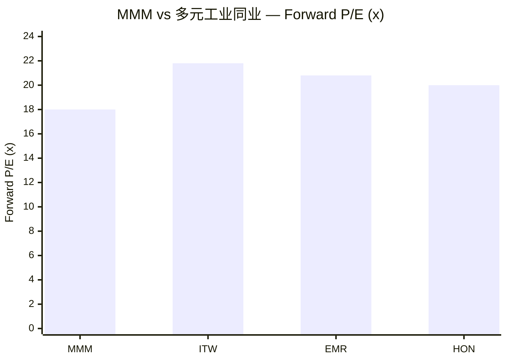
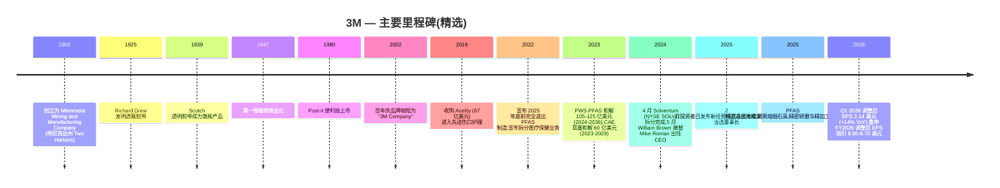
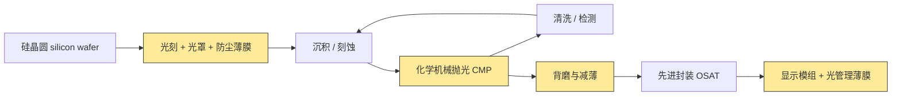
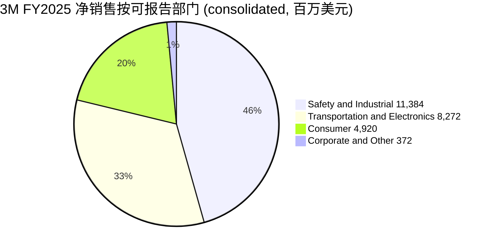

# 公司研究报告：3M 公司 (NYSE: MMM)

**截至日期：** 2026-06-16
**上市信息：** 纽约证券交易所 — 股票代码 `MMM` ([NYSE 公司主页](https://www.nyse.com/quote/XNYS:MMM));同时在 NYSE Texas 与 SIX Swiss Exchange 挂牌 ([3M 8-K 日期 2026-02-03,封面页](https://www.sec.gov/Archives/edgar/data/66740/000006674026000037/mmm-20260203.htm))
**总部地址：** 3M Center, St. Paul, Minnesota 55144-1000 ([3M 10-K FY2025,封面页](https://www.sec.gov/Archives/edgar/data/66740/000006674026000014/mmm-20251231.htm))
**成立时间：** 1902 年于美国明尼苏达州 Two Harbors 创立,原名 Minnesota Mining and Manufacturing Company ([3M 公司历史页面](https://www.3m.com/3M/en_US/company-us/about-3m/history/))
**会计年度截止日：** 12 月 31 日(FY2025 截止于 2025-12-31;FY2025 10-K 于 2026-02-03 提交;最新季报 Q1 2026 10-Q 于 2026-04-21 提交)

---

## 投资摘要 (Investment Summary)

> *以下评级、目标价及预测均为本报告分析师观点 (Analyst view),不构成 3M 任何 SEC 申报的内容;10-K 不含目标价。*

| 项目 | 内容 |
|---|---|
| **评级 (Rating)** | **增持 / Overweight (Buy)** |
| **12 个月目标价 (PT)** | **180 美元** |
| **当前股价 (2026-06-16)** | 161.63 美元 |
| **隐含上行空间** | **+11.4%**(加 ~1.9% 股息收益率,总回报 ~13%) |
| **估值方法** | 2027E 调整后 EPS 9.50 美元 × 19× forward P/E(略低于 HON/ITW/EMR 前瞻倍数平均,反映诉讼折价) |
| **市值 (Market cap)** | **843 亿美元**(5.216 亿股 × 161.63 美元) |
| **52 周区间** | 139.34 – 177.41 美元(当前位于区间上半部,52 周回报 +13.8%) |
| **行业 / 板块** | 多元化工业综合集团 (Diversified Industrials);DJIA 道指成分、S&P 500 成分、股息贵族 (Dividend Aristocrat) |

**本报告观点(论点支柱,均为 Analyst view):**

1. **"自救" (self-help) 转型进入兑现期。** 外聘 CEO William Brown 上任两年,FY2025 已交付调整后经营利润率 (adjusted operating margin) +200bp 至 **23.4%**、调整后 EPS +10% 至 **8.06 美元**;FY2026 指引调整后 EPS **8.50–8.70 美元**,经营模式三支柱(绩效 / 增长 / 资本配置)正在从计划转为业绩 ([3M Q4 2025 业绩公告 2026-01-20,Exhibit 99.1](https://www.sec.gov/Archives/edgar/data/66740/000006674026000003/q42025-8kerexx991.htm))。
2. **诉讼悬顶已基本计入、可控且边际改善。** PFAS 公共水务和解 (PWS, 105–125 亿美元 / 2024–2036) 与 Combat Arms 耳塞和解 (CAE, 60 亿美元 / 2023–2029) 现金支付义务已披露;FY2025 重大诉讼相关税前现金支付降至 35 亿美元(FY2024 为 45 亿),且 PFAS 制造已于 2025 年底退出,限制新诉求形成 ([3M 10-K FY2025,Note 17 + Item 7 MD&A](https://www.sec.gov/Archives/edgar/data/66740/000006674026000014/mmm-20251231.htm))。
3. **内生增长拐点 + 数据中心新引擎。** 管理层与卖方共识有机增长 (organic growth) FY2026 ~3%、2H 起加速,新产品 (NPI) 贡献占比从 ~30% 升至 2027 的 ~55%;数据中心相关收入约 6 亿美元、其中 DC 内部产品 (Twinax 铜缆 / 扩展光器件) 近季 >50% YoY 增长,成为中期内生增长新引擎(*分析师观点:* 见 Section 2 卖方观点)。
4. **估值前瞻折价。** Forward P/E ~18× 低于多元工业同业平均(HON/ITW/EMR ~20–22×),诉讼折价已充分反映;TTM 倍数被 GAAP 诉讼计提与 Solventum 持股市值波动扭曲,调整后口径下 MMM 并未高估。

**最该盯紧的关键变量 (swing variables):** (1) **有机增长能否在 2H 2026 真正加速**——这是整个 self-help 论的命门;(2) **PFAS 诉讼尾部**(州级诉讼、AFFF 人身伤害)是否在现有和解之外再生增量,决定折价能否收敛。

---

## 目录

1. 公司概览(含 1A 估值与决策层、1B GF Score 基本面评分)
2. 估值、前瞻预测与目标价(含卖方观点演变)
3. 公司历史
4. 管理团队
5. 产品与服务
6. 客户与市场进入策略
7. 行业概览
8. 竞争格局
9. 市场机会 (TAM)
10. 风险评估(含 9.5 核心分歧与催化剂)
11. 投资者视角评分卡 (Investor lenses)

References + Data Used + Step 10 核查日志

---

## 1. 公司概览

3M 公司是一家总部位于美国明尼苏达州圣保罗的多元化工业技术综合集团 (diversified industrial technology conglomerate),其历史可追溯至 1902 年的一家砂纸与磨料作坊 ([3M 公司历史](https://www.3m.com/3M/en_US/company-us/about-3m/history/))。在 2024 年 4 月医疗保健业务分拆为 Solventum Corporation (NYSE: SOLV)、并于 2025 年底完成 PFAS / 全氟化合物制造业务全面退出后,今天的 3M 围绕 **Safety & Industrial (安全与工业) / Transportation & Electronics (运输与电子) / Consumer (消费) 三大业务部门**组织运营——FY2025 合并营收 (consolidated revenue) **249.48 亿美元**(+1.5% YoY),全球员工约 **60,500 人** ([3M 10-K FY2025,Item 1 业务及 Item 7 MD&A](https://www.sec.gov/Archives/edgar/data/66740/000006674026000014/mmm-20251231.htm))。当前部门架构于 2024-04-01 Solventum 拆分完成日正式生效 ([3M 8-K 日期 2024-04-01,Item 8.01 — 分拆完成](https://www.sec.gov/Archives/edgar/data/66740/000006674024000044/mmm-20240401.htm))。

**本报告的观点 (BLUF — bottom line up front)。** 我们对 MMM 给予**增持 / Overweight** 评级、12 个月目标价 **180 美元**(对当前 161.63 美元约 +11% 上行)。核心论是:这是一个 **"自救" (self-help) 的利润率修复 + 诉讼悬顶消退**的故事,而非一个高增长成长股。Brown 时代第一个完整年度(FY2025)已交付 200bp 调整后经营利润率扩张和双位数调整后 EPS 增长,FY2026 指引(调整后 EPS 8.50–8.70 美元)隐含同比约 +8% 增长;股价在前瞻 EPS 口径上以 ~18× 交易,低于 Honeywell / ITW / Emerson 等多元工业同业,我们认为这一折价反映了真实但**已充分计入**的诉讼负担,随着 self-help 持续兑现和诉讼尾部逐步可见,折价有收敛空间。下行保护来自股息贵族地位 + 回购(合计股东收益率约 4%)。**风险对称性:** 上行依赖有机增长在 2H 2026 加速;下行风险是诉讼尾部超预期或经营模式增长支柱继续滞后(详见 Section 9.5 与 Section 10)。

公司在年报 Item 1 中以朴素语言描述自己:"*3M is a diversified technology company with a global presence in the following businesses: Safety and Industrial; Transportation and Electronics; and Consumer. 3M is among the leading manufacturers of products for many of the markets it serves. Most 3M products involve expertise in product development, manufacturing and marketing, and are subject to competition from products manufactured and sold by other technologically oriented companies*" ([3M 10-K FY2025,Item 1 — General](https://www.sec.gov/Archives/edgar/data/66740/000006674026000014/mmm-20251231.htm))。3M 区别于其他公司的核心思维模型是其 **51 个技术平台 (technology platforms)**——粘合剂、磨料、薄膜、先进材料、光管理、微复制 (microreplication)、非织造布、陶瓷、表面改性等——组合衍生出约 6 万个 SKU,销往超过 200 个国家 ([3M 投资者日 2025 — 完整演示文稿活动页](https://investors.3m.com/news-events/events-presentations/detail/20250226-3m-2025-investor-day))。

**3M 的盈利逻辑。** 商业模式是工业技术产品销售——拥有专利保护、品牌认知度的耗材 (consumables) 与耐用品组件,单位价值适中但销量巨大,广泛销往数千家客户的设计方案。分销渠道运行 "*through numerous distribution channels, including directly to users and through a wide range of e-commerce and traditional wholesalers, retailers, jobbers, distributors, and dealers in a wide variety of trades in many countries around the world*" ([3M 10-K FY2025,Item 1 — Distribution](https://www.sec.gov/Archives/edgar/data/66740/000006674026000014/mmm-20251231.htm))。单位经济模型有三个杠杆:(a) 专利保护配方与专有制造工艺嵌入的结构性 gross margin (毛利率);(b) 51 个技术平台之间的规模化生产力收益(同一氟聚合物化学体系可同时供应半导体光罩防尘薄膜、汽车薄膜与消费厨具用品);(c) 商业卓越 (commercial excellence) 定价计划——Brown 已将 adjusted operating margin (调整后经营利润率) 从 FY2024 的 21.4% 提升至 FY2025 的 23.4%,即 Brown 时代第一个完整年度 200bp 扩张 ([3M Q4 2025 业绩公告 2026-01-20](https://www.sec.gov/Archives/edgar/data/66740/000006674026000003/q42025-8kerexx991.htm))。

**部门规模 (FY2025 净销售)。** Safety & Industrial: **113.84 亿美元**(占合并 45.6%),部门经营利润 28.36 亿美元(部门利润率 22.7%);Transportation & Electronics: **82.72 亿美元**(占 33.2%),部门经营利润 14.36 亿美元(17.4%,剔除 PFAS 制造退出影响调整后约 22.7%);Consumer: **49.20 亿美元**(占 19.7%),部门经营利润 9.96 亿美元(20.2%);Corporate and Other: 3.72 亿美元 ([3M 10-K FY2025,Note 19 — Segment Information](https://www.sec.gov/Archives/edgar/data/66740/000006674026000014/mmm-20251231.htm))。下面的利润表 Sankey 展示了 FY2025 这 249.48 亿美元营收如何沿 COGS、opex、税项流向 32.10 亿美元的持续经营净利润 (income from continuing operations):

<svg xmlns="http://www.w3.org/2000/svg" viewBox="0 0 1000 560" width="1000" height="560" role="img" aria-label="income statement Sankey"><rect x="0" y="0" width="1000" height="560" fill="#ffffff"/>
<text x="20.00" y="30.00" text-anchor="start" font-family="Helvetica,Arial,sans-serif" font-size="15" font-weight="700" fill="#1f2933">3M FY2025 利润表 Sankey (GAAP, continuing ops, US$m)</text>
<path d="M 204.00,64.00 C 258.00,64.00 258.00,85.00 312.00,85.00 L 312.00,271.17 C 258.00,271.17 258.00,250.17 204.00,250.17 Z" fill="#93c5fd" fill-opacity="0.55"/>
<path d="M 452.00,78.00 C 506.00,78.00 506.00,190.18 560.00,190.18 L 560.00,265.88 C 506.00,265.88 506.00,153.70 452.00,153.70 Z" fill="#86efac" fill-opacity="0.55"/>
<path d="M 452.00,153.70 C 506.00,153.70 506.00,279.88 560.00,279.88 L 560.00,367.02 C 506.00,367.02 506.00,240.84 452.00,240.84 Z" fill="#fca5a5" fill-opacity="0.55"/>
<path d="M 328.00,85.00 C 382.00,85.00 382.00,78.00 436.00,78.00 L 436.00,240.84 C 382.00,240.84 382.00,247.84 328.00,247.84 Z" fill="#86efac" fill-opacity="0.55"/>
<path d="M 328.00,247.84 C 382.00,247.84 382.00,254.84 436.00,254.84 L 436.00,500.00 C 382.00,500.00 382.00,493.00 328.00,493.00 Z" fill="#fca5a5" fill-opacity="0.55"/>
<path d="M 700.00,189.98 C 754.00,189.98 754.00,247.55 808.00,247.55 L 808.00,300.05 C 754.00,300.05 754.00,242.48 700.00,242.48 Z" fill="#86efac" fill-opacity="0.55"/>
<path d="M 700.00,242.48 C 754.00,242.48 754.00,314.05 808.00,314.05 L 808.00,330.45 C 754.00,330.45 754.00,258.88 700.00,258.88 Z" fill="#fca5a5" fill-opacity="0.55"/>
<path d="M 576.00,190.18 C 630.00,190.18 630.00,189.98 684.00,189.98 L 684.00,265.69 C 630.00,265.69 630.00,265.88 576.00,265.88 Z" fill="#86efac" fill-opacity="0.55"/>
<path d="M 204.00,264.17 C 258.00,264.17 258.00,271.17 312.00,271.17 L 312.00,406.45 C 258.00,406.45 258.00,399.45 204.00,399.45 Z" fill="#93c5fd" fill-opacity="0.55"/>
<path d="M 576.00,279.88 C 630.00,279.88 630.00,272.88 684.00,272.88 L 684.00,338.25 C 630.00,338.25 630.00,345.25 576.00,345.25 Z" fill="#fca5a5" fill-opacity="0.55"/>
<path d="M 576.00,345.25 C 630.00,345.25 630.00,352.25 684.00,352.25 L 684.00,371.37 C 630.00,371.37 630.00,364.37 576.00,364.37 Z" fill="#fca5a5" fill-opacity="0.55"/>
<path d="M 576.00,364.37 C 630.00,364.37 630.00,385.37 684.00,385.37 L 684.00,388.02 C 630.00,388.02 630.00,367.02 576.00,367.02 Z" fill="#fca5a5" fill-opacity="0.55"/>
<path d="M 576.00,381.02 C 630.00,381.02 630.00,265.69 684.00,265.69 L 684.00,272.49 C 630.00,272.49 630.00,387.82 576.00,387.82 Z" fill="#93c5fd" fill-opacity="0.55"/>
<path d="M 204.00,413.45 C 258.00,413.45 258.00,406.45 312.00,406.45 L 312.00,486.92 C 258.00,486.92 258.00,493.92 204.00,493.92 Z" fill="#93c5fd" fill-opacity="0.55"/>
<path d="M 204.00,507.92 C 258.00,507.92 258.00,486.92 312.00,486.92 L 312.00,493.00 C 258.00,493.00 258.00,514.00 204.00,514.00 Z" fill="#93c5fd" fill-opacity="0.55"/>
<rect x="188.00" y="64.00" width="16" height="186.17" rx="1.5" fill="#2563eb"/>
<rect x="188.00" y="264.17" width="16" height="135.28" rx="1.5" fill="#2563eb"/>
<rect x="188.00" y="413.45" width="16" height="80.46" rx="1.5" fill="#2563eb"/>
<rect x="188.00" y="507.92" width="16" height="6.08" rx="1.5" fill="#2563eb"/>
<rect x="312.00" y="85.00" width="16" height="408.00" rx="1.5" fill="#1e3a8a"/>
<rect x="436.00" y="78.00" width="16" height="162.84" rx="1.5" fill="#15803d"/>
<rect x="436.00" y="254.84" width="16" height="245.16" rx="1.5" fill="#dc2626"/>
<rect x="560.00" y="190.18" width="16" height="75.70" rx="1.5" fill="#15803d"/>
<rect x="560.00" y="279.88" width="16" height="87.13" rx="1.5" fill="#dc2626"/>
<rect x="560.00" y="381.02" width="16" height="6.80" rx="1.5" fill="#2563eb"/>
<rect x="684.00" y="189.98" width="16" height="68.90" rx="1.5" fill="#15803d"/>
<rect x="684.00" y="272.88" width="16" height="65.37" rx="1.5" fill="#dc2626"/>
<rect x="684.00" y="352.25" width="16" height="19.12" rx="1.5" fill="#dc2626"/>
<rect x="684.00" y="385.37" width="16" height="2.65" rx="1.5" fill="#dc2626"/>
<rect x="808.00" y="247.55" width="16" height="52.50" rx="1.5" fill="#15803d"/>
<rect x="808.00" y="314.05" width="16" height="16.40" rx="1.5" fill="#dc2626"/>
<line x1="188.00" y1="157.09" x2="182.00" y2="133.13" stroke="#cbd5e1" stroke-width="1"/>
<text x="179.00" y="136.13" text-anchor="end" font-family="Helvetica,Arial,sans-serif" font-size="11.5" font-weight="700" fill="#1f2933">Safety &amp; Industrial</text>
<text x="179.00" y="149.13" text-anchor="end" font-family="Helvetica,Arial,sans-serif" font-size="10" font-weight="400" fill="#52606d">US$11.4B  (45.6%)</text>
<line x1="188.00" y1="331.81" x2="182.00" y2="307.86" stroke="#cbd5e1" stroke-width="1"/>
<text x="179.00" y="310.86" text-anchor="end" font-family="Helvetica,Arial,sans-serif" font-size="11.5" font-weight="700" fill="#1f2933">Transportation &amp; Electronics</text>
<text x="179.00" y="323.86" text-anchor="end" font-family="Helvetica,Arial,sans-serif" font-size="10" font-weight="400" fill="#52606d">US$8.3B  (33.2%)</text>
<line x1="188.00" y1="453.69" x2="182.00" y2="429.73" stroke="#cbd5e1" stroke-width="1"/>
<text x="179.00" y="432.73" text-anchor="end" font-family="Helvetica,Arial,sans-serif" font-size="11.5" font-weight="700" fill="#1f2933">Consumer</text>
<text x="179.00" y="445.73" text-anchor="end" font-family="Helvetica,Arial,sans-serif" font-size="10" font-weight="400" fill="#52606d">US$4.9B  (19.7%)</text>
<line x1="188.00" y1="510.96" x2="182.00" y2="487.00" stroke="#cbd5e1" stroke-width="1"/>
<text x="179.00" y="490.00" text-anchor="end" font-family="Helvetica,Arial,sans-serif" font-size="11.5" font-weight="700" fill="#1f2933">Corporate &amp; Other</text>
<text x="179.00" y="503.00" text-anchor="end" font-family="Helvetica,Arial,sans-serif" font-size="10" font-weight="400" fill="#52606d">US$372.0M  (1.5%)</text>
<rect x="331.00" y="67.00" width="119.40" height="26" rx="2" fill="#ffffff" fill-opacity="0.72"/>
<text x="334.00" y="79.00" text-anchor="start" font-family="Helvetica,Arial,sans-serif" font-size="11.5" font-weight="700" fill="#1f2933">Revenue</text>
<text x="334.00" y="92.00" text-anchor="start" font-family="Helvetica,Arial,sans-serif" font-size="10" font-weight="400" fill="#52606d">US$24.9B  (100.0%)</text>
<rect x="455.00" y="60.00" width="113.10" height="26" rx="2" fill="#ffffff" fill-opacity="0.72"/>
<text x="458.00" y="72.00" text-anchor="start" font-family="Helvetica,Arial,sans-serif" font-size="11.5" font-weight="700" fill="#1f2933">Gross Profit</text>
<text x="458.00" y="85.00" text-anchor="start" font-family="Helvetica,Arial,sans-serif" font-size="10" font-weight="400" fill="#52606d">US$10.0B  (39.9%)</text>
<rect x="455.00" y="236.84" width="144.60" height="26" rx="2" fill="#ffffff" fill-opacity="0.72"/>
<text x="458.00" y="248.84" text-anchor="start" font-family="Helvetica,Arial,sans-serif" font-size="11.5" font-weight="700" fill="#1f2933">Cost of Revenue (COGS)</text>
<text x="458.00" y="261.84" text-anchor="start" font-family="Helvetica,Arial,sans-serif" font-size="10" font-weight="400" fill="#52606d">US$15.0B  (60.1%)</text>
<rect x="579.00" y="172.18" width="106.80" height="26" rx="2" fill="#ffffff" fill-opacity="0.72"/>
<text x="582.00" y="184.18" text-anchor="start" font-family="Helvetica,Arial,sans-serif" font-size="11.5" font-weight="700" fill="#1f2933">Operating Income</text>
<text x="582.00" y="197.18" text-anchor="start" font-family="Helvetica,Arial,sans-serif" font-size="10" font-weight="400" fill="#52606d">US$4.6B  (18.6%)</text>
<rect x="579.00" y="261.88" width="150.90" height="26" rx="2" fill="#ffffff" fill-opacity="0.72"/>
<text x="582.00" y="273.88" text-anchor="start" font-family="Helvetica,Arial,sans-serif" font-size="11.5" font-weight="700" fill="#1f2933">Total Operating Expense</text>
<text x="582.00" y="286.88" text-anchor="start" font-family="Helvetica,Arial,sans-serif" font-size="10" font-weight="400" fill="#52606d">US$5.3B  (21.4%)</text>
<text x="551.00" y="381.42" text-anchor="end" font-family="Helvetica,Arial,sans-serif" font-size="11.5" font-weight="700" fill="#1f2933">Net Interest / Other Income</text>
<text x="551.00" y="394.42" text-anchor="end" font-family="Helvetica,Arial,sans-serif" font-size="10" font-weight="400" fill="#52606d">US$416.0M  (1.7%)</text>
<rect x="703.00" y="171.98" width="106.80" height="26" rx="2" fill="#ffffff" fill-opacity="0.72"/>
<text x="706.00" y="183.98" text-anchor="start" font-family="Helvetica,Arial,sans-serif" font-size="11.5" font-weight="700" fill="#1f2933">Pretax Income</text>
<text x="706.00" y="196.98" text-anchor="start" font-family="Helvetica,Arial,sans-serif" font-size="10" font-weight="400" fill="#52606d">US$4.2B  (16.9%)</text>
<rect x="703.00" y="254.88" width="106.80" height="26" rx="2" fill="#ffffff" fill-opacity="0.72"/>
<text x="706.00" y="266.88" text-anchor="start" font-family="Helvetica,Arial,sans-serif" font-size="11.5" font-weight="700" fill="#1f2933">SG&amp;A</text>
<text x="706.00" y="279.88" text-anchor="start" font-family="Helvetica,Arial,sans-serif" font-size="10" font-weight="400" fill="#52606d">US$4.0B  (16.0%)</text>
<rect x="703.00" y="334.25" width="100.50" height="26" rx="2" fill="#ffffff" fill-opacity="0.72"/>
<text x="706.00" y="346.25" text-anchor="start" font-family="Helvetica,Arial,sans-serif" font-size="11.5" font-weight="700" fill="#1f2933">R&amp;D</text>
<text x="706.00" y="359.25" text-anchor="start" font-family="Helvetica,Arial,sans-serif" font-size="10" font-weight="400" fill="#52606d">US$1.2B  (4.7%)</text>
<rect x="703.00" y="367.37" width="119.40" height="26" rx="2" fill="#ffffff" fill-opacity="0.72"/>
<text x="706.00" y="379.37" text-anchor="start" font-family="Helvetica,Arial,sans-serif" font-size="11.5" font-weight="700" fill="#1f2933">Other OpEx</text>
<text x="706.00" y="392.37" text-anchor="start" font-family="Helvetica,Arial,sans-serif" font-size="10" font-weight="400" fill="#52606d">US$162.0M  (0.65%)</text>
<text x="833.00" y="270.80" text-anchor="start" font-family="Helvetica,Arial,sans-serif" font-size="11.5" font-weight="700" fill="#1f2933">Net Income</text>
<text x="833.00" y="283.80" text-anchor="start" font-family="Helvetica,Arial,sans-serif" font-size="10" font-weight="400" fill="#52606d">US$3.2B  (12.9%)</text>
<text x="833.00" y="319.25" text-anchor="start" font-family="Helvetica,Arial,sans-serif" font-size="11.5" font-weight="700" fill="#1f2933">Income Tax</text>
<text x="833.00" y="332.25" text-anchor="start" font-family="Helvetica,Arial,sans-serif" font-size="10" font-weight="400" fill="#52606d">US$1.0B  (4.0%)</text>
<text x="500.00" y="530.00" text-anchor="middle" font-family="Helvetica,Arial,sans-serif" font-size="10" font-weight="400" font-style="italic" fill="#8a97a3">GAAP 持续经营口径;经营利润 4,629 (GAAP 利润率 18.6%);Net income from continuing ops 3,210。调整后经营利润率 23.4%。</text>
<text x="500.00" y="544.00" text-anchor="middle" font-family="Helvetica,Arial,sans-serif" font-size="10" font-weight="400" fill="#52606d">Source: 3M FY2025 10-K (period 2025-12-31) — Consolidated Statement of Income &amp; Note 19 Segment Information</text>
</svg>

*来源:[3M 10-K FY2025,Consolidated Statement of Income + Note 19 Segment Information](https://www.sec.gov/Archives/edgar/data/66740/000006674026000014/mmm-20251231.htm)。GAAP 经营利润 46.29 亿(GAAP 利润率 18.6%);调整后经营利润率 23.4%——两者差异主要来自 PFAS 制造产品、重大诉讼净成本与剥离损失等特殊项目。*

下面两图分别展示 FY2025 营收按业务部门的占比,以及 FY2023→FY2025 各部门营收走势:

<svg xmlns="http://www.w3.org/2000/svg" viewBox="0 0 720 460" width="720" height="460" role="img" aria-label="revenue donut"><rect x="0" y="0" width="720" height="460" fill="#ffffff"/>
<text x="20.00" y="30.00" text-anchor="start" font-family="Helvetica,Arial,sans-serif" font-size="15" font-weight="700" fill="#1f2933">3M FY2025 营收按业务部门 (US$m)</text>
<path d="M 288.00,107.20 A 132 132 0 0 1 323.78,366.26 L 309.14,314.28 A 78 78 0 0 0 288.00,161.20 Z" fill="#2563eb"/>
<path d="M 323.78,366.26 A 132 132 0 0 1 159.72,208.08 L 212.20,220.81 A 78 78 0 0 0 309.14,314.28 Z" fill="#15803d"/>
<path d="M 159.72,208.08 A 132 132 0 0 1 275.65,107.78 L 280.70,161.54 A 78 78 0 0 0 212.20,220.81 Z" fill="#d97706"/>
<path d="M 275.65,107.78 A 132 132 0 0 1 288.00,107.20 L 288.00,161.20 A 78 78 0 0 0 280.70,161.54 Z" fill="#7c3aed"/>
<text x="288.00" y="235.20" text-anchor="middle" font-family="Helvetica,Arial,sans-serif" font-size="18" font-weight="800" fill="#1f2933">MMM</text>
<text x="288.00" y="255.20" text-anchor="middle" font-family="Helvetica,Arial,sans-serif" font-size="13" font-weight="600" fill="#52606d">US$24.9B</text>
<text x="288.00" y="271.20" text-anchor="middle" font-family="Helvetica,Arial,sans-serif" font-size="10" font-weight="400" fill="#8a97a3">total</text>
<line x1="424.70" y1="220.32" x2="440.70" y2="220.32" stroke="#2563eb" stroke-width="1.4"/>
<text x="444.70" y="218.32" text-anchor="start" font-family="Helvetica,Arial,sans-serif" font-size="11" font-weight="700" fill="#1f2933">Safety &amp; Industrial</text>
<text x="444.70" y="232.32" text-anchor="start" font-family="Helvetica,Arial,sans-serif" font-size="10" font-weight="400" fill="#52606d">US$11.4B  (45.6%)</text>
<line x1="192.22" y1="338.55" x2="176.22" y2="338.55" stroke="#15803d" stroke-width="1.4"/>
<text x="172.22" y="336.55" text-anchor="end" font-family="Helvetica,Arial,sans-serif" font-size="11" font-weight="700" fill="#1f2933">Transportation &amp; Electronics</text>
<text x="172.22" y="350.55" text-anchor="end" font-family="Helvetica,Arial,sans-serif" font-size="10" font-weight="400" fill="#52606d">US$8.3B  (33.2%)</text>
<line x1="197.71" y1="134.84" x2="181.71" y2="134.84" stroke="#d97706" stroke-width="1.4"/>
<text x="177.71" y="132.84" text-anchor="end" font-family="Helvetica,Arial,sans-serif" font-size="11" font-weight="700" fill="#1f2933">Consumer</text>
<text x="177.71" y="146.84" text-anchor="end" font-family="Helvetica,Arial,sans-serif" font-size="10" font-weight="400" fill="#52606d">US$4.9B  (19.7%)</text>
<line x1="281.54" y1="101.35" x2="265.54" y2="101.35" stroke="#7c3aed" stroke-width="1.4"/>
<text x="261.54" y="99.35" text-anchor="end" font-family="Helvetica,Arial,sans-serif" font-size="11" font-weight="700" fill="#1f2933">Corporate &amp; Other</text>
<text x="261.54" y="113.35" text-anchor="end" font-family="Helvetica,Arial,sans-serif" font-size="10" font-weight="400" fill="#52606d">US$372.0M  (1.5%)</text>
<text x="360.00" y="444.00" text-anchor="middle" font-family="Helvetica,Arial,sans-serif" font-size="10" font-weight="400" fill="#52606d">Source: 3M FY2025 10-K — Note 19 Segment Information</text>
</svg>

*来源:[3M 10-K FY2025,Note 19 Segment Information](https://www.sec.gov/Archives/edgar/data/66740/000006674026000014/mmm-20251231.htm)。*

<svg xmlns="http://www.w3.org/2000/svg" viewBox="0 0 860 470" width="860" height="470" role="img" aria-label="historical revenue bars"><rect x="0" y="0" width="860" height="470" fill="#ffffff"/>
<text x="20.00" y="30.00" text-anchor="start" font-family="Helvetica,Arial,sans-serif" font-size="15" font-weight="700" fill="#1f2933">3M 营收(按部门)FY2023–FY2025 (US$m)</text>
<rect x="20.00" y="44" width="11" height="11" rx="2" fill="#2563eb"/>
<text x="36.00" y="53.00" text-anchor="start" font-family="Helvetica,Arial,sans-serif" font-size="10.5" font-weight="400" fill="#1f2933">Safety &amp; Industrial</text>
<rect x="175.40" y="44" width="11" height="11" rx="2" fill="#15803d"/>
<text x="191.40" y="53.00" text-anchor="start" font-family="Helvetica,Arial,sans-serif" font-size="10.5" font-weight="400" fill="#1f2933">Transportation &amp; Electronics</text>
<rect x="390.20" y="44" width="11" height="11" rx="2" fill="#d97706"/>
<text x="406.20" y="53.00" text-anchor="start" font-family="Helvetica,Arial,sans-serif" font-size="10.5" font-weight="400" fill="#1f2933">Consumer</text>
<rect x="473.00" y="44" width="11" height="11" rx="2" fill="#7c3aed"/>
<text x="489.00" y="53.00" text-anchor="start" font-family="Helvetica,Arial,sans-serif" font-size="10.5" font-weight="400" fill="#1f2933">Corporate &amp; Other</text>
<line x1="70" y1="412.00" x2="834" y2="412.00" stroke="#eceff2" stroke-width="1"/>
<text x="64.00" y="415.00" text-anchor="end" font-family="Helvetica,Arial,sans-serif" font-size="9.5" font-weight="400" fill="#52606d">US$0</text>
<line x1="70" y1="345.20" x2="834" y2="345.20" stroke="#eceff2" stroke-width="1"/>
<text x="64.00" y="348.20" text-anchor="end" font-family="Helvetica,Arial,sans-serif" font-size="9.5" font-weight="400" fill="#52606d">US$5.4B</text>
<line x1="70" y1="278.40" x2="834" y2="278.40" stroke="#eceff2" stroke-width="1"/>
<text x="64.00" y="281.40" text-anchor="end" font-family="Helvetica,Arial,sans-serif" font-size="9.5" font-weight="400" fill="#52606d">US$10.8B</text>
<line x1="70" y1="211.60" x2="834" y2="211.60" stroke="#eceff2" stroke-width="1"/>
<text x="64.00" y="214.60" text-anchor="end" font-family="Helvetica,Arial,sans-serif" font-size="9.5" font-weight="400" fill="#52606d">US$16.2B</text>
<line x1="70" y1="144.80" x2="834" y2="144.80" stroke="#eceff2" stroke-width="1"/>
<text x="64.00" y="147.80" text-anchor="end" font-family="Helvetica,Arial,sans-serif" font-size="9.5" font-weight="400" fill="#52606d">US$21.6B</text>
<line x1="70" y1="78.00" x2="834" y2="78.00" stroke="#eceff2" stroke-width="1"/>
<text x="64.00" y="81.00" text-anchor="end" font-family="Helvetica,Arial,sans-serif" font-size="9.5" font-weight="400" fill="#52606d">US$26.9B</text>
<rect x="123.48" y="276.19" width="147.71" height="135.81" fill="#2563eb"/>
<rect x="123.48" y="170.81" width="147.71" height="105.38" fill="#15803d"/>
<rect x="123.48" y="108.50" width="147.71" height="62.30" fill="#d97706"/>
<rect x="123.48" y="106.93" width="147.71" height="1.57" fill="#7c3aed"/>
<text x="197.33" y="428.00" text-anchor="middle" font-family="Helvetica,Arial,sans-serif" font-size="10" font-weight="400" fill="#52606d">2023</text>
<rect x="378.15" y="276.13" width="147.71" height="135.87" fill="#2563eb"/>
<rect x="378.15" y="172.25" width="147.71" height="103.88" fill="#15803d"/>
<rect x="378.15" y="111.12" width="147.71" height="61.13" fill="#d97706"/>
<rect x="378.15" y="107.36" width="147.71" height="3.76" fill="#7c3aed"/>
<text x="452.00" y="428.00" text-anchor="middle" font-family="Helvetica,Arial,sans-serif" font-size="10" font-weight="400" fill="#52606d">2024</text>
<rect x="632.81" y="270.88" width="147.71" height="141.12" fill="#2563eb"/>
<rect x="632.81" y="168.34" width="147.71" height="102.54" fill="#15803d"/>
<rect x="632.81" y="107.35" width="147.71" height="60.99" fill="#d97706"/>
<rect x="632.81" y="102.74" width="147.71" height="4.61" fill="#7c3aed"/>
<text x="706.67" y="428.00" text-anchor="middle" font-family="Helvetica,Arial,sans-serif" font-size="10" font-weight="400" fill="#52606d">2025</text>
<text x="430.00" y="454.00" text-anchor="middle" font-family="Helvetica,Arial,sans-serif" font-size="10" font-weight="400" fill="#52606d">Source: 3M FY2025 10-K — Note 19 (continuing-ops segment net sales, FY2023–FY2025)</text>
</svg>

*来源:[3M 10-K FY2025,Note 19(持续经营口径,FY2023–FY2025 各部门净销售)](https://www.sec.gov/Archives/edgar/data/66740/000006674026000014/mmm-20251231.htm)。Safety & Industrial 稳步抬升、T&E 因 PFAS 退出与显示 (display) 周期小幅下滑、Consumer 横盘——这正是 self-help 论需要扭转的增长结构。*

**地理分布 (FY2025 净销售)。** 美洲 (Americas):135.79 亿美元 (54.5%);亚太 (Asia Pacific):70.95 亿美元 (28.4%);EMEA(欧洲中东非洲):42.74 亿美元 (17.1%) ([3M 10-K FY2025,Note 19 — Net sales by geographic area](https://www.sec.gov/Archives/edgar/data/66740/000006674026000014/mmm-20251231.htm))。亚太区内,**中国大陆 / 香港销售额为 29.51 亿美元(约占总营收 11.8%)**——因其重要性及关税、中美脱钩的地缘政治敏感性而单独披露;美国本土销售为 109.36 亿美元(占总营收 44%)。

<svg xmlns="http://www.w3.org/2000/svg" viewBox="0 0 720 460" width="720" height="460" role="img" aria-label="revenue donut"><rect x="0" y="0" width="720" height="460" fill="#ffffff"/>
<text x="20.00" y="30.00" text-anchor="start" font-family="Helvetica,Arial,sans-serif" font-size="15" font-weight="700" fill="#1f2933">3M FY2025 营收按地区 (US$m)</text>
<path d="M 288.00,107.20 A 132 132 0 1 1 251.74,366.12 L 266.57,314.20 A 78 78 0 1 0 288.00,161.20 Z" fill="#2563eb"/>
<path d="M 251.74,366.12 A 132 132 0 0 1 171.81,176.57 L 219.34,202.19 A 78 78 0 0 0 266.57,314.20 Z" fill="#15803d"/>
<path d="M 171.81,176.57 A 132 132 0 0 1 288.00,107.20 L 288.00,161.20 A 78 78 0 0 0 219.34,202.19 Z" fill="#d97706"/>
<text x="288.00" y="235.20" text-anchor="middle" font-family="Helvetica,Arial,sans-serif" font-size="18" font-weight="800" fill="#1f2933">地区</text>
<text x="288.00" y="255.20" text-anchor="middle" font-family="Helvetica,Arial,sans-serif" font-size="13" font-weight="600" fill="#52606d">US$24.9B</text>
<text x="288.00" y="271.20" text-anchor="middle" font-family="Helvetica,Arial,sans-serif" font-size="10" font-weight="400" fill="#8a97a3">total</text>
<line x1="424.67" y1="258.34" x2="440.67" y2="258.34" stroke="#2563eb" stroke-width="1.4"/>
<text x="444.67" y="256.34" text-anchor="start" font-family="Helvetica,Arial,sans-serif" font-size="11" font-weight="700" fill="#1f2933">美洲 Americas</text>
<text x="444.67" y="270.34" text-anchor="start" font-family="Helvetica,Arial,sans-serif" font-size="10" font-weight="400" fill="#52606d">US$13.6B  (54.4%)</text>
<line x1="160.84" y1="292.82" x2="144.84" y2="292.82" stroke="#15803d" stroke-width="1.4"/>
<text x="140.84" y="290.82" text-anchor="end" font-family="Helvetica,Arial,sans-serif" font-size="11" font-weight="700" fill="#1f2933">亚太 Asia Pacific</text>
<text x="140.84" y="304.82" text-anchor="end" font-family="Helvetica,Arial,sans-serif" font-size="10" font-weight="400" fill="#52606d">US$7.1B  (28.4%)</text>
<line x1="217.26" y1="120.71" x2="201.26" y2="120.71" stroke="#d97706" stroke-width="1.4"/>
<text x="197.26" y="118.71" text-anchor="end" font-family="Helvetica,Arial,sans-serif" font-size="11" font-weight="700" fill="#1f2933">欧中非 EMEA</text>
<text x="197.26" y="132.71" text-anchor="end" font-family="Helvetica,Arial,sans-serif" font-size="10" font-weight="400" fill="#52606d">US$4.3B  (17.1%)</text>
<text x="360.00" y="444.00" text-anchor="middle" font-family="Helvetica,Arial,sans-serif" font-size="10" font-weight="400" fill="#52606d">Source: 3M FY2025 10-K — Note 19, Net sales by geographic area</text>
</svg>

*来源:[3M 10-K FY2025,Note 19,Net sales by geographic area](https://www.sec.gov/Archives/edgar/data/66740/000006674026000014/mmm-20251231.htm)。*

**股东回报。** 即使诉讼压顶,3M 仍持续兑现 "股息贵族" 地位—— FY2025 通过股息与股票回购合计向股东返还约 **48 亿美元**(股息 15.62 亿 + 回购 32.51 亿,[3M 10-K FY2025,Consolidated Statement of Cash Flows](https://www.sec.gov/Archives/edgar/data/66740/000006674026000014/mmm-20251231.htm))。Q1 2026 单季即向股东返还 24 亿美元 ([3M Q1 2026 业绩公告 2026-04-21,Exhibit 99.1](https://www.sec.gov/Archives/edgar/data/66740/000006674026000171/q12026-8kerexx991.htm))。自 1916 年起 3M 每个季度都派发股息,2024 年 Solventum 拆分重置后仍维持股息贵族地位 ([3M 投资者关系 — 股票信息 / 股息](https://investors.3m.com/stock-information/dividends))。

### 1A. 估值快照与决策层 (Valuation snapshot & decision layer)

**估值快照 (截至 2026-06-16)。** 数据来源自市场数据聚合器 ([Stockanalysis.com MMM 统计页](https://stockanalysis.com/stocks/mmm/statistics/)) 与 yfinance:

| 指标 | MMM | 多元化工业同业 | 行业背景 |
|---|---|---|---|
| 股价 | **161.63 美元** | — | — |
| 市值 | **843 亿美元** | Honeywell ~1454 亿;ITW ~765 亿;Emerson ~833 亿 | DJIA 道指成分;S&P 500 |
| 企业价值 (EV) | ~922 亿美元 | — | — |
| **TTM P/E** | **~30.5×** | HON ~36.7×,ITW ~24.7×,EMR ~34.4× | S&P 500 工业板块 |
| **Forward P/E** | **~18.0×** | HON ~20.0×,ITW ~21.8×,EMR ~20.8× | — |
| **TTM P/S** | **~3.39×** | HON ~3.86×,ITW ~4.71×,EMR ~4.55× | — |
| P/B | ~25× (股东权益基数受 PFAS 计提侵蚀) | HON ~7×,ITW ~22× | — |
| EV / EBITDA | ~14.4× | HON ~20.0×,ITW ~17.7×,EMR ~16.1× | — |
| 股息收益率 | ~1.9%(派息率 ~57%) | HON ~2.1%,ITW ~2.5% | — |
| 52 周价格变化 | **+13.8%** | — | — |

*来源:MMM 及同业当前价、市值、TTM/Forward P/E、P/S、EV/EBITDA 数据 [Stockanalysis.com MMM](https://stockanalysis.com/stocks/mmm/statistics/) 及 yfinance,拉取日期 2026-06-16。*

下图为同业前瞻 P/E 对比(MMM 在前瞻 P/E 上低于全部三家同业):

*来源:[Stockanalysis.com MMM](https://stockanalysis.com/stocks/mmm/statistics/) 及各同业统计页(HON/ITW/EMR via yfinance),as of 2026-06-16。MMM 前瞻 P/E ~18× 低于全部三家同业。*

**如何理解倍数。** MMM ~30.5× 的 TTM P/E 高于 ITW (~24.7×)、但低于 HON (~36.7×) 与 EMR (~34.4×)——同业 TTM 倍数在 2026 年也普遍被一次性项目抬高。建设性解读:**Forward P/E ~18× 低于全部三家同业**,意味着市场已按接近 18× 对 FY2026 调整后 EPS 指引 (8.50–8.70 美元) 定价——与中周期多元工业股一致;TTM P/E 因 PFAS 诉讼计提对 GAAP 盈利的拖累、Solventum 持股市值波动(FY2025 计入 GAAP)、以及 PFAS 制造退出一次性计提而人为偏高。*分析师观点:* 在调整后 EPS 口径下,股价 **并未被显著高估**——剔除诉讼噪声后,前瞻倍数甚至略低于同业。看空解读:GAAP 到调整后的桥接是真金白银流出公司。10-K 显示 FY2025 与重大诉讼相关的税前现金支付即达 35 亿美元,多年期支付义务足够长尾,即便经营表现健康也会压缩股东回报 ([3M Q4 2025 业绩公告 2026-01-20,Special items 表](https://www.sec.gov/Archives/edgar/data/66740/000006674026000003/q42025-8kerexx991.htm))。~25× 的高 P/B 是一个表面红色信号,但理解了股东权益基数受损后就一目了然: PWS 公共水务和解 105–125 亿美元 (2024–2036 支付) + CAE 耳塞和解 60 亿美元 (2023–2029 支付) 的计提把账面权益压到仅 47.47 亿美元 ([3M 10-K FY2025,Note 17 — Commitments and Contingencies](https://www.sec.gov/Archives/edgar/data/66740/000006674026000014/mmm-20251231.htm))。Section 9 将估值问题延伸到倍数压缩风险评估。

**前瞻估值矩阵 (forward valuation matrix, Analyst view)。** 随着调整后 EPS 从 FY2025 的 8.06 美元向 FY2026E 8.60、FY2027E 9.50 抬升,倍数随之压缩——这是 self-help 论的核心数学:

| 指标 (P/E 基于 161.63 美元) | FY2025A | FY2026E | FY2027E |
|---|---|---|---|
| 调整后 EPS (美元,*Analyst view*) | 8.06 | 8.60(指引中值) | 9.50 |
| P/E (x) | 20.1× | 18.8× | **17.0×** |
| 调整后经营利润率 (%,*Analyst view*) | 23.4% | ~24.1%(指引 +70–80bp) | ~25.0% |
| 调整后营收增长 (%) | +2.1%(有机) | ~+4%(指引,~+3% 有机) | ~+4% |

*来源:FY2025A 来自 [3M Q4 2025 业绩公告](https://www.sec.gov/Archives/edgar/data/66740/000006674026000003/q42025-8kerexx991.htm);FY2026 指引中值来自同一公告并于 Q1 重申 ([3M Q1 2026 业绩公告](https://www.sec.gov/Archives/edgar/data/66740/000006674026000171/q12026-8kerexx991.htm));FY2027E 为分析师预测(*Analyst view*),与高盛 2027E 9.80 美元 / 市场一致 9.49 美元基本对齐(见 Section 2)。P/E 由当前股价除以各期 EPS 得出。*

**相对表现 (momentum)。** MMM 过去 52 周 +13.8%,跑赢同期道指 / 工业 ETF,股价当前位于 139.34–177.41 美元 52 周区间的上半部 ([Stockanalysis.com MMM](https://stockanalysis.com/stocks/mmm/statistics/),as of 2026-06-16)——动量为温和正向,反映市场对 self-help 故事的逐步认可。

### 1B. GF Score (GuruFocus 式) 基本面评分卡

> *GF Score 是本报告分析师依据 GuruFocus 公开方法论自建的五维评分 (Analyst view),非 GuruFocus 官方发布数值,也不附任何 SEC 申报引用;每一维度的底层指标在下方各自标注引用来源。*

<svg xmlns="http://www.w3.org/2000/svg" viewBox="0 0 500 500" width="500" height="500" role="img" aria-label="GF Score radar">
<rect x="0" y="0" width="500" height="500" fill="#ffffff"/>
<text x="20" y="24" font-family="Helvetica,Arial,sans-serif" font-size="15" font-weight="700" fill="#1f2933">GF Score (GuruFocus-style): 53/100</text>
<text x="20" y="41" font-family="Helvetica,Arial,sans-serif" font-size="11" fill="#52606d">51–70 Poor future performance potential</text>
<polygon points="250.0,88.0 392.7,191.6 338.2,359.4 161.8,359.4 107.3,191.6" fill="#e9f5ec" stroke="none"/>
<polygon points="250.0,208.0 278.5,228.7 267.6,262.3 232.4,262.3 221.5,228.7" fill="none" stroke="#c5d3cb" stroke-width="1"/>
<polygon points="250.0,178.0 307.1,219.5 285.3,286.5 214.7,286.5 192.9,219.5" fill="none" stroke="#c5d3cb" stroke-width="1"/>
<polygon points="250.0,148.0 335.6,210.2 302.9,310.8 197.1,310.8 164.4,210.2" fill="none" stroke="#c5d3cb" stroke-width="1"/>
<polygon points="250.0,118.0 364.1,200.9 320.5,335.1 179.5,335.1 135.9,200.9" fill="none" stroke="#c5d3cb" stroke-width="1"/>
<polygon points="250.0,88.0 392.7,191.6 338.2,359.4 161.8,359.4 107.3,191.6" fill="none" stroke="#c5d3cb" stroke-width="1.3"/>
<line x1="250" y1="238" x2="161.8" y2="359.4" stroke="#cfdad3" stroke-width="1"/>
<text x="146.5" y="392.4" text-anchor="end" font-family="Helvetica,Arial,sans-serif" font-size="11.5" font-weight="600" fill="#1f2933">Financial Strength</text>
<text x="146.5" y="405.4" text-anchor="end" font-family="Helvetica,Arial,sans-serif" font-size="9.5" fill="#52606d">财务实力</text>
<text x="205.9" y="292.7" text-anchor="middle" font-family="Helvetica,Arial,sans-serif" font-size="10.5" font-weight="700" fill="#1f2933">5</text>
<line x1="250" y1="238" x2="250.0" y2="88.0" stroke="#cfdad3" stroke-width="1"/>
<text x="250.0" y="58.0" text-anchor="middle" font-family="Helvetica,Arial,sans-serif" font-size="11.5" font-weight="600" fill="#1f2933">Profitability</text>
<text x="250.0" y="71.0" text-anchor="middle" font-family="Helvetica,Arial,sans-serif" font-size="9.5" fill="#52606d">盈利能力</text>
<text x="250.0" y="127.0" text-anchor="middle" font-family="Helvetica,Arial,sans-serif" font-size="10.5" font-weight="700" fill="#1f2933">7</text>
<line x1="250" y1="238" x2="107.3" y2="191.6" stroke="#cfdad3" stroke-width="1"/>
<text x="82.6" y="183.6" text-anchor="end" font-family="Helvetica,Arial,sans-serif" font-size="11.5" font-weight="600" fill="#1f2933">Growth</text>
<text x="82.6" y="196.6" text-anchor="end" font-family="Helvetica,Arial,sans-serif" font-size="9.5" fill="#52606d">成长性</text>
<text x="207.2" y="218.1" text-anchor="middle" font-family="Helvetica,Arial,sans-serif" font-size="10.5" font-weight="700" fill="#1f2933">3</text>
<line x1="250" y1="238" x2="392.7" y2="191.6" stroke="#cfdad3" stroke-width="1"/>
<text x="417.4" y="183.6" text-anchor="start" font-family="Helvetica,Arial,sans-serif" font-size="11.5" font-weight="600" fill="#1f2933">GF Value</text>
<text x="417.4" y="196.6" text-anchor="start" font-family="Helvetica,Arial,sans-serif" font-size="9.5" fill="#52606d">估值</text>
<text x="335.6" y="204.2" text-anchor="middle" font-family="Helvetica,Arial,sans-serif" font-size="10.5" font-weight="700" fill="#1f2933">6</text>
<line x1="250" y1="238" x2="338.2" y2="359.4" stroke="#cfdad3" stroke-width="1"/>
<text x="353.5" y="392.4" text-anchor="start" font-family="Helvetica,Arial,sans-serif" font-size="11.5" font-weight="600" fill="#1f2933">Momentum</text>
<text x="353.5" y="405.4" text-anchor="start" font-family="Helvetica,Arial,sans-serif" font-size="9.5" fill="#52606d">动量</text>
<text x="302.9" y="304.8" text-anchor="middle" font-family="Helvetica,Arial,sans-serif" font-size="10.5" font-weight="700" fill="#1f2933">6</text>
<polygon points="250.0,133.0 335.6,210.2 302.9,310.8 205.9,298.7 207.2,224.1" fill="#2e8b57" fill-opacity="0.34" stroke="#2e8b57" stroke-width="2"/>
<circle cx="205.9" cy="298.7" r="2.6" fill="#2e8b57"/>
<circle cx="250.0" cy="133.0" r="2.6" fill="#2e8b57"/>
<circle cx="207.2" cy="224.1" r="2.6" fill="#2e8b57"/>
<circle cx="335.6" cy="210.2" r="2.6" fill="#2e8b57"/>
<circle cx="302.9" cy="310.8" r="2.6" fill="#2e8b57"/>
<text x="250" y="470" text-anchor="middle" font-family="Helvetica,Arial,sans-serif" font-size="9.5" fill="#52606d">Source: 3M FY2025 10-K · Q1 2026 10-Q · Yahoo Finance/Stockanalysis.com, as of 2026-06-16</text>
<text x="250" y="485" text-anchor="middle" font-family="Helvetica,Arial,sans-serif" font-size="9" fill="#52606d">GF Score = independent analyst rubric (*Analyst view:*) — not GuruFocus™ official number</text>
</svg>

| 维度 / Dimension | 评分 (0–10) | 评分理由摘要 |
|---|---|---|
| **Financial Strength (财务实力)** | **5** | 净负债 / EBITDA ~1.1–1.4×、利息覆盖健康,但 PFAS+CAE 多年期和解义务 (165–185 亿美元毛现金) 与极薄的账面权益基数 (47.47 亿) 压制评分 |
| **Profitability (盈利能力)** | **7** | 调整后经营利润率 23.4%、ROIC 稳健、毛利率向 ~50% 目标修复;但 GAAP 盈利被诉讼计提侵蚀 |
| **Growth (成长性)** | **3** | 有机增长长期跑输同业(FY2025 GAAP 有机 +0.9% / 调整后 +2.1%),营收基数因 Solventum 拆分下移;前瞻增长仅 ~3% 有机 |
| **GF Value (估值,越高越便宜)** | **6** | Forward P/E ~18× 低于多元工业同业;目标价隐含 +11% 上行;但 TTM 倍数被诉讼噪声抬高 |
| **Momentum (动量)** | **6** | 52 周 +13.8%、跑赢工业基准、价格位于 52 周区间上半部 |
| **GF Score (合成,*Analyst view*)** | **53 / 100** | 51–70 区间 "Poor future performance potential" — 反映 self-help 转型尚处早期、增长是最弱一环 |

**各维度评分理由 (Analyst view):**

- **Financial Strength = 5。** FY2025 总负债 329.86 亿美元、长期债务 109.32 亿、现金及有价证券 59.33 亿,净负债约 67 亿、对 EBITDA(约 59 亿)约 1.1–1.4× ([3M 10-K FY2025,Consolidated Balance Sheet](https://www.sec.gov/Archives/edgar/data/66740/000006674026000014/mmm-20251231.htm));高盛估算 2027 年末净负债 / EBITDA 降至 0.8×、低于投级均值(*分析师观点*,见 Section 2)。压制评分的是 165–185 亿美元 PFAS+CAE 多年期现金支付义务与仅 47.47 亿的账面权益 ([3M 10-K FY2025,Note 17](https://www.sec.gov/Archives/edgar/data/66740/000006674026000014/mmm-20251231.htm))。下面的资产负债表 Sankey 直观展示资产 377.33 亿如何由负债 329.86 亿 + 权益 47.47 亿构成:

<svg xmlns="http://www.w3.org/2000/svg" viewBox="0 0 1040 600" width="1040" height="600" role="img" aria-label="balance sheet Sankey"><rect x="0" y="0" width="1040" height="600" fill="#ffffff"/>
<text x="20.00" y="30.00" text-anchor="start" font-family="Helvetica,Arial,sans-serif" font-size="15" font-weight="700" fill="#1f2933">3M FY2025 资产负债表 Sankey (US$m)</text>
<path d="M 204.00,64.00 C 262.00,64.00 262.00,106.00 320.00,106.00 L 320.00,167.64 C 262.00,167.64 262.00,125.64 204.00,125.64 Z" fill="#93c5fd" fill-opacity="0.55"/>
<path d="M 732.00,99.00 C 790.00,99.00 790.00,85.00 848.00,85.00 L 848.00,184.68 C 790.00,184.68 790.00,198.68 732.00,198.68 Z" fill="#fca5a5" fill-opacity="0.55"/>
<path d="M 600.00,106.00 C 658.00,106.00 658.00,99.00 716.00,99.00 L 716.00,198.68 C 658.00,198.68 658.00,205.68 600.00,205.68 Z" fill="#fca5a5" fill-opacity="0.55"/>
<path d="M 336.00,106.00 C 394.00,106.00 394.00,113.00 452.00,113.00 L 452.00,283.24 C 394.00,283.24 394.00,276.24 336.00,276.24 Z" fill="#86efac" fill-opacity="0.55"/>
<path d="M 600.00,205.68 C 658.00,205.68 658.00,212.68 716.00,212.68 L 716.00,455.68 C 658.00,455.68 658.00,448.68 600.00,448.68 Z" fill="#fca5a5" fill-opacity="0.55"/>
<path d="M 468.00,113.00 C 526.00,113.00 526.00,106.00 584.00,106.00 L 584.00,448.68 C 526.00,448.68 526.00,455.68 468.00,455.68 Z" fill="#fca5a5" fill-opacity="0.55"/>
<path d="M 468.00,455.68 C 526.00,455.68 526.00,462.68 584.00,462.68 L 584.00,512.00 C 526.00,512.00 526.00,505.00 468.00,505.00 Z" fill="#86efac" fill-opacity="0.55"/>
<path d="M 204.00,139.64 C 262.00,139.64 262.00,167.64 320.00,167.64 L 320.00,204.34 C 262.00,204.34 262.00,176.34 204.00,176.34 Z" fill="#93c5fd" fill-opacity="0.55"/>
<path d="M 204.00,190.34 C 262.00,190.34 262.00,204.34 320.00,204.34 L 320.00,242.37 C 262.00,242.37 262.00,228.37 204.00,228.37 Z" fill="#93c5fd" fill-opacity="0.55"/>
<path d="M 732.00,212.68 C 790.00,212.68 790.00,198.68 848.00,198.68 L 848.00,312.25 C 790.00,312.25 790.00,326.25 732.00,326.25 Z" fill="#fca5a5" fill-opacity="0.55"/>
<path d="M 732.00,326.25 C 790.00,326.25 790.00,326.25 848.00,326.25 L 848.00,343.19 C 790.00,343.19 790.00,343.19 732.00,343.19 Z" fill="#fca5a5" fill-opacity="0.55"/>
<path d="M 732.00,343.19 C 790.00,343.19 790.00,357.19 848.00,357.19 L 848.00,469.68 C 790.00,469.68 790.00,455.68 732.00,455.68 Z" fill="#fca5a5" fill-opacity="0.55"/>
<path d="M 204.00,242.37 C 262.00,242.37 262.00,242.37 320.00,242.37 L 320.00,276.24 C 262.00,276.24 262.00,276.24 204.00,276.24 Z" fill="#93c5fd" fill-opacity="0.55"/>
<path d="M 204.00,290.24 C 262.00,290.24 262.00,290.24 320.00,290.24 L 320.00,364.01 C 262.00,364.01 262.00,364.01 204.00,364.01 Z" fill="#93c5fd" fill-opacity="0.55"/>
<path d="M 336.00,290.24 C 394.00,290.24 394.00,283.24 452.00,283.24 L 452.00,505.00 C 394.00,505.00 394.00,512.00 336.00,512.00 Z" fill="#86efac" fill-opacity="0.55"/>
<path d="M 204.00,378.01 C 262.00,378.01 262.00,364.01 320.00,364.01 L 320.00,430.70 C 262.00,430.70 262.00,444.70 204.00,444.70 Z" fill="#93c5fd" fill-opacity="0.55"/>
<path d="M 204.00,458.70 C 262.00,458.70 262.00,430.70 320.00,430.70 L 320.00,442.16 C 262.00,442.16 262.00,470.16 204.00,470.16 Z" fill="#93c5fd" fill-opacity="0.55"/>
<path d="M 600.00,462.68 C 658.00,462.68 658.00,469.68 716.00,469.68 L 716.00,519.00 C 658.00,519.00 658.00,512.00 600.00,512.00 Z" fill="#86efac" fill-opacity="0.55"/>
<path d="M 732.00,469.68 C 790.00,469.68 790.00,483.68 848.00,483.68 L 848.00,533.00 C 790.00,533.00 790.00,519.00 732.00,519.00 Z" fill="#86efac" fill-opacity="0.55"/>
<path d="M 204.00,484.16 C 262.00,484.16 262.00,442.16 320.00,442.16 L 320.00,512.00 C 262.00,512.00 262.00,554.00 204.00,554.00 Z" fill="#93c5fd" fill-opacity="0.55"/>
<rect x="188.00" y="64.00" width="16" height="61.64" rx="1.5" fill="#2563eb"/>
<rect x="188.00" y="139.64" width="16" height="36.70" rx="1.5" fill="#2563eb"/>
<rect x="188.00" y="190.34" width="16" height="38.03" rx="1.5" fill="#2563eb"/>
<rect x="188.00" y="242.37" width="16" height="33.87" rx="1.5" fill="#2563eb"/>
<rect x="188.00" y="290.24" width="16" height="73.77" rx="1.5" fill="#2563eb"/>
<rect x="188.00" y="378.01" width="16" height="66.69" rx="1.5" fill="#2563eb"/>
<rect x="188.00" y="458.70" width="16" height="11.46" rx="1.5" fill="#2563eb"/>
<rect x="188.00" y="484.16" width="16" height="69.84" rx="1.5" fill="#2563eb"/>
<rect x="320.00" y="106.00" width="16" height="170.24" rx="1.5" fill="#15803d"/>
<rect x="320.00" y="290.24" width="16" height="221.76" rx="1.5" fill="#15803d"/>
<rect x="452.00" y="113.00" width="16" height="392.00" rx="1.5" fill="#1e3a8a"/>
<rect x="584.00" y="106.00" width="16" height="342.68" rx="1.5" fill="#dc2626"/>
<rect x="584.00" y="462.68" width="16" height="49.32" rx="1.5" fill="#15803d"/>
<rect x="716.00" y="99.00" width="16" height="99.68" rx="1.5" fill="#dc2626"/>
<rect x="716.00" y="212.68" width="16" height="243.00" rx="1.5" fill="#dc2626"/>
<rect x="716.00" y="469.68" width="16" height="49.32" rx="1.5" fill="#15803d"/>
<rect x="848.00" y="85.00" width="16" height="99.68" rx="1.5" fill="#dc2626"/>
<rect x="848.00" y="198.68" width="16" height="113.57" rx="1.5" fill="#dc2626"/>
<rect x="848.00" y="326.25" width="16" height="16.94" rx="1.5" fill="#dc2626"/>
<rect x="848.00" y="357.19" width="16" height="112.49" rx="1.5" fill="#dc2626"/>
<rect x="848.00" y="483.68" width="16" height="49.32" rx="1.5" fill="#15803d"/>
<text x="179.00" y="91.82" text-anchor="end" font-family="Helvetica,Arial,sans-serif" font-size="11.5" font-weight="700" fill="#1f2933">现金及有价证券 Cash+Securities</text>
<text x="179.00" y="104.82" text-anchor="end" font-family="Helvetica,Arial,sans-serif" font-size="10" font-weight="400" fill="#52606d">US$5.9B  (15.7%)</text>
<text x="179.00" y="154.99" text-anchor="end" font-family="Helvetica,Arial,sans-serif" font-size="11.5" font-weight="700" fill="#1f2933">应收账款 Receivables</text>
<text x="179.00" y="167.99" text-anchor="end" font-family="Helvetica,Arial,sans-serif" font-size="10" font-weight="400" fill="#52606d">US$3.5B  (9.4%)</text>
<text x="179.00" y="206.36" text-anchor="end" font-family="Helvetica,Arial,sans-serif" font-size="11.5" font-weight="700" fill="#1f2933">存货 Inventories</text>
<text x="179.00" y="219.36" text-anchor="end" font-family="Helvetica,Arial,sans-serif" font-size="10" font-weight="400" fill="#52606d">US$3.7B  (9.7%)</text>
<text x="179.00" y="256.31" text-anchor="end" font-family="Helvetica,Arial,sans-serif" font-size="11.5" font-weight="700" fill="#1f2933">其他流动资产 Other current</text>
<text x="179.00" y="269.31" text-anchor="end" font-family="Helvetica,Arial,sans-serif" font-size="10" font-weight="400" fill="#52606d">US$3.3B  (8.6%)</text>
<text x="179.00" y="324.13" text-anchor="end" font-family="Helvetica,Arial,sans-serif" font-size="11.5" font-weight="700" fill="#1f2933">厂房设备 PP&amp;E net</text>
<text x="179.00" y="337.13" text-anchor="end" font-family="Helvetica,Arial,sans-serif" font-size="10" font-weight="400" fill="#52606d">US$7.1B  (18.8%)</text>
<text x="179.00" y="408.35" text-anchor="end" font-family="Helvetica,Arial,sans-serif" font-size="11.5" font-weight="700" fill="#1f2933">商誉 Goodwill</text>
<text x="179.00" y="421.35" text-anchor="end" font-family="Helvetica,Arial,sans-serif" font-size="10" font-weight="400" fill="#52606d">US$6.4B  (17.0%)</text>
<text x="179.00" y="461.43" text-anchor="end" font-family="Helvetica,Arial,sans-serif" font-size="11.5" font-weight="700" fill="#1f2933">无形资产 Intangibles</text>
<text x="179.00" y="474.43" text-anchor="end" font-family="Helvetica,Arial,sans-serif" font-size="10" font-weight="400" fill="#52606d">US$1.1B  (2.9%)</text>
<text x="179.00" y="516.08" text-anchor="end" font-family="Helvetica,Arial,sans-serif" font-size="11.5" font-weight="700" fill="#1f2933">其他非流动 Other assets</text>
<text x="179.00" y="529.08" text-anchor="end" font-family="Helvetica,Arial,sans-serif" font-size="10" font-weight="400" fill="#52606d">US$6.7B  (17.8%)</text>
<rect x="339.00" y="88.00" width="132.00" height="26" rx="2" fill="#ffffff" fill-opacity="0.72"/>
<text x="342.00" y="100.00" text-anchor="start" font-family="Helvetica,Arial,sans-serif" font-size="11.5" font-weight="700" fill="#1f2933">Total Current Assets</text>
<text x="342.00" y="113.00" text-anchor="start" font-family="Helvetica,Arial,sans-serif" font-size="10" font-weight="400" fill="#52606d">US$16.4B  (43.4%)</text>
<rect x="339.00" y="272.24" width="157.20" height="26" rx="2" fill="#ffffff" fill-opacity="0.72"/>
<text x="342.00" y="284.24" text-anchor="start" font-family="Helvetica,Arial,sans-serif" font-size="11.5" font-weight="700" fill="#1f2933">Total Non-Current Assets</text>
<text x="342.00" y="297.24" text-anchor="start" font-family="Helvetica,Arial,sans-serif" font-size="10" font-weight="400" fill="#52606d">US$21.3B  (56.6%)</text>
<rect x="471.00" y="95.00" width="119.40" height="26" rx="2" fill="#ffffff" fill-opacity="0.72"/>
<text x="474.00" y="107.00" text-anchor="start" font-family="Helvetica,Arial,sans-serif" font-size="11.5" font-weight="700" fill="#1f2933">Total Assets</text>
<text x="474.00" y="120.00" text-anchor="start" font-family="Helvetica,Arial,sans-serif" font-size="10" font-weight="400" fill="#52606d">US$37.7B  (100.0%)</text>
<rect x="603.00" y="88.00" width="113.10" height="26" rx="2" fill="#ffffff" fill-opacity="0.72"/>
<text x="606.00" y="100.00" text-anchor="start" font-family="Helvetica,Arial,sans-serif" font-size="11.5" font-weight="700" fill="#1f2933">Total Liabilities</text>
<text x="606.00" y="113.00" text-anchor="start" font-family="Helvetica,Arial,sans-serif" font-size="10" font-weight="400" fill="#52606d">US$33.0B  (87.4%)</text>
<rect x="603.00" y="444.68" width="106.80" height="26" rx="2" fill="#ffffff" fill-opacity="0.72"/>
<text x="606.00" y="456.68" text-anchor="start" font-family="Helvetica,Arial,sans-serif" font-size="11.5" font-weight="700" fill="#1f2933">Total Equity</text>
<text x="606.00" y="469.68" text-anchor="start" font-family="Helvetica,Arial,sans-serif" font-size="10" font-weight="400" fill="#52606d">US$4.7B  (12.6%)</text>
<rect x="735.00" y="81.00" width="125.70" height="26" rx="2" fill="#ffffff" fill-opacity="0.72"/>
<text x="738.00" y="93.00" text-anchor="start" font-family="Helvetica,Arial,sans-serif" font-size="11.5" font-weight="700" fill="#1f2933">Current Liabilities</text>
<text x="738.00" y="106.00" text-anchor="start" font-family="Helvetica,Arial,sans-serif" font-size="10" font-weight="400" fill="#52606d">US$9.6B  (25.4%)</text>
<rect x="735.00" y="194.68" width="150.90" height="26" rx="2" fill="#ffffff" fill-opacity="0.72"/>
<text x="738.00" y="206.68" text-anchor="start" font-family="Helvetica,Arial,sans-serif" font-size="11.5" font-weight="700" fill="#1f2933">Non-Current Liabilities</text>
<text x="738.00" y="219.68" text-anchor="start" font-family="Helvetica,Arial,sans-serif" font-size="10" font-weight="400" fill="#52606d">US$23.4B  (62.0%)</text>
<rect x="735.00" y="451.68" width="132.00" height="26" rx="2" fill="#ffffff" fill-opacity="0.72"/>
<text x="738.00" y="463.68" text-anchor="start" font-family="Helvetica,Arial,sans-serif" font-size="11.5" font-weight="700" fill="#1f2933">Shareholders' Equity</text>
<text x="738.00" y="476.68" text-anchor="start" font-family="Helvetica,Arial,sans-serif" font-size="10" font-weight="400" fill="#52606d">US$4.7B  (12.6%)</text>
<text x="873.00" y="131.84" text-anchor="start" font-family="Helvetica,Arial,sans-serif" font-size="11.5" font-weight="700" fill="#1f2933">流动负债 Current liabilities</text>
<text x="873.00" y="144.84" text-anchor="start" font-family="Helvetica,Arial,sans-serif" font-size="10" font-weight="400" fill="#52606d">US$9.6B  (25.4%)</text>
<text x="873.00" y="252.47" text-anchor="start" font-family="Helvetica,Arial,sans-serif" font-size="11.5" font-weight="700" fill="#1f2933">长期债务 Long-term debt</text>
<text x="873.00" y="265.47" text-anchor="start" font-family="Helvetica,Arial,sans-serif" font-size="10" font-weight="400" fill="#52606d">US$10.9B  (29.0%)</text>
<text x="873.00" y="331.72" text-anchor="start" font-family="Helvetica,Arial,sans-serif" font-size="11.5" font-weight="700" fill="#1f2933">养老金 Pension/OPEB</text>
<text x="873.00" y="344.72" text-anchor="start" font-family="Helvetica,Arial,sans-serif" font-size="10" font-weight="400" fill="#52606d">US$1.6B  (4.3%)</text>
<text x="873.00" y="410.44" text-anchor="start" font-family="Helvetica,Arial,sans-serif" font-size="11.5" font-weight="700" fill="#1f2933">其他负债 Other liabilities</text>
<text x="873.00" y="423.44" text-anchor="start" font-family="Helvetica,Arial,sans-serif" font-size="10" font-weight="400" fill="#52606d">US$10.8B  (28.7%)</text>
<text x="873.00" y="505.34" text-anchor="start" font-family="Helvetica,Arial,sans-serif" font-size="11.5" font-weight="700" fill="#1f2933">股东权益 Shareholders' equity</text>
<text x="873.00" y="518.34" text-anchor="start" font-family="Helvetica,Arial,sans-serif" font-size="10" font-weight="400" fill="#52606d">US$4.7B  (12.6%)</text>
<text x="520.00" y="570.00" text-anchor="middle" font-family="Helvetica,Arial,sans-serif" font-size="10" font-weight="400" font-style="italic" fill="#8a97a3">Total assets 37,733 = Total liabilities 32,986 + Equity 4,747。权益基数被 PFAS/CAE 诉讼计提侵蚀。</text>
<text x="520.00" y="584.00" text-anchor="middle" font-family="Helvetica,Arial,sans-serif" font-size="10" font-weight="400" fill="#52606d">Source: 3M FY2025 10-K (period 2025-12-31) — Consolidated Balance Sheet</text>
</svg>

*来源:[3M 10-K FY2025,Consolidated Balance Sheet](https://www.sec.gov/Archives/edgar/data/66740/000006674026000014/mmm-20251231.htm)。*

- **Profitability = 7。** 调整后经营利润率 23.4%(FY2025,+200bp YoY),COGS 占销售 60.1%、毛利率约 40%(GAAP),管理层长期目标毛利率重返近 50% ([3M Q4 2025 业绩公告 2026-01-20](https://www.sec.gov/Archives/edgar/data/66740/000006674026000003/q42025-8kerexx991.htm))。下面的五步 DuPont 拆解显示:净利润率 13.0% × 资产周转 0.64× × 权益乘数 ~9.0× ≈ ROE ~75%——高 ROE 主要由极薄的权益基数(诉讼计提所致)放大,需结合 Financial Strength 维度审慎解读:

<svg xmlns="http://www.w3.org/2000/svg" viewBox="0 0 1240 540" width="1240" height="540" role="img" aria-label="DuPont ROE decomposition"><rect x="0" y="0" width="1240" height="540" fill="#ffffff"/>
<text x="20.00" y="30.00" text-anchor="start" font-family="Helvetica,Arial,sans-serif" font-size="15" font-weight="700" fill="#1f2933">3M FY2025 五步 DuPont ROE 分解</text>
<rect x="545.00" y="56.00" width="150" height="56" rx="7" fill="#1e3a8a"/>
<text x="620.00" y="76.00" text-anchor="middle" font-family="Helvetica,Arial,sans-serif" font-size="11.5" font-weight="700" fill="#ffffff">ROE</text>
<text x="620.00" y="94.00" text-anchor="middle" font-family="Helvetica,Arial,sans-serif" font-size="13" font-weight="800" fill="#ffffff">75.22%</text>
<text x="620.00" y="106.00" text-anchor="middle" font-family="Helvetica,Arial,sans-serif" font-size="8.5" font-weight="400" fill="#dbeafe">= Net Income / Avg Equity</text>
<rect x="191.60" y="168.00" width="150" height="56" rx="7" fill="#2563eb"/>
<text x="266.60" y="188.00" text-anchor="middle" font-family="Helvetica,Arial,sans-serif" font-size="11.5" font-weight="700" fill="#ffffff">Net Margin</text>
<text x="266.60" y="206.00" text-anchor="middle" font-family="Helvetica,Arial,sans-serif" font-size="13" font-weight="800" fill="#ffffff">13.03%</text>
<text x="266.60" y="218.00" text-anchor="middle" font-family="Helvetica,Arial,sans-serif" font-size="8.5" font-weight="400" fill="#dbeafe">Net Income / Revenue</text>
<line x1="620.00" y1="112.00" x2="266.60" y2="168.00" stroke="#94a3b8" stroke-width="1.4"/>
<rect x="545.00" y="168.00" width="150" height="56" rx="7" fill="#2563eb"/>
<text x="620.00" y="188.00" text-anchor="middle" font-family="Helvetica,Arial,sans-serif" font-size="11.5" font-weight="700" fill="#ffffff">Asset Turnover</text>
<text x="620.00" y="206.00" text-anchor="middle" font-family="Helvetica,Arial,sans-serif" font-size="13" font-weight="800" fill="#ffffff">0.64</text>
<text x="620.00" y="218.00" text-anchor="middle" font-family="Helvetica,Arial,sans-serif" font-size="8.5" font-weight="400" fill="#dbeafe">Revenue / Avg Assets</text>
<line x1="620.00" y1="112.00" x2="620.00" y2="168.00" stroke="#94a3b8" stroke-width="1.4"/>
<rect x="898.40" y="168.00" width="150" height="56" rx="7" fill="#2563eb"/>
<text x="973.40" y="188.00" text-anchor="middle" font-family="Helvetica,Arial,sans-serif" font-size="11.5" font-weight="700" fill="#ffffff">Equity Multiplier</text>
<text x="973.40" y="206.00" text-anchor="middle" font-family="Helvetica,Arial,sans-serif" font-size="13" font-weight="800" fill="#ffffff">8.98</text>
<text x="973.40" y="218.00" text-anchor="middle" font-family="Helvetica,Arial,sans-serif" font-size="8.5" font-weight="400" fill="#dbeafe">Avg Assets / Avg Equity</text>
<line x1="620.00" y1="112.00" x2="973.40" y2="168.00" stroke="#94a3b8" stroke-width="1.4"/>
<circle cx="443.30" cy="196.00" r="11" fill="#ffffff" stroke="#94a3b8" stroke-width="1.2"/>
<text x="443.30" y="201.00" text-anchor="middle" font-family="Helvetica,Arial,sans-serif" font-size="14" font-weight="800" fill="#52606d">×</text>
<circle cx="796.70" cy="196.00" r="11" fill="#ffffff" stroke="#94a3b8" stroke-width="1.2"/>
<text x="796.70" y="201.00" text-anchor="middle" font-family="Helvetica,Arial,sans-serif" font-size="14" font-weight="800" fill="#52606d">×</text>
<rect x="65.00" y="300.00" width="118" height="56" rx="7" fill="#2563eb"/>
<text x="124.00" y="320.00" text-anchor="middle" font-family="Helvetica,Arial,sans-serif" font-size="11.5" font-weight="700" fill="#ffffff">Operating Margin</text>
<text x="124.00" y="338.00" text-anchor="middle" font-family="Helvetica,Arial,sans-serif" font-size="13" font-weight="800" fill="#ffffff">18.55%</text>
<text x="124.00" y="350.00" text-anchor="middle" font-family="Helvetica,Arial,sans-serif" font-size="8.5" font-weight="400" fill="#dbeafe">Op Inc / Revenue</text>
<line x1="266.60" y1="224.00" x2="124.00" y2="300.00" stroke="#94a3b8" stroke-width="1.4"/>
<rect x="207.60" y="300.00" width="118" height="56" rx="7" fill="#2563eb"/>
<text x="266.60" y="320.00" text-anchor="middle" font-family="Helvetica,Arial,sans-serif" font-size="11.5" font-weight="700" fill="#ffffff">Tax Burden</text>
<text x="266.60" y="338.00" text-anchor="middle" font-family="Helvetica,Arial,sans-serif" font-size="13" font-weight="800" fill="#ffffff">0.7714</text>
<text x="266.60" y="350.00" text-anchor="middle" font-family="Helvetica,Arial,sans-serif" font-size="8.5" font-weight="400" fill="#dbeafe">Net Inc / Pretax</text>
<line x1="266.60" y1="224.00" x2="266.60" y2="300.00" stroke="#94a3b8" stroke-width="1.4"/>
<rect x="350.20" y="300.00" width="118" height="56" rx="7" fill="#2563eb"/>
<text x="409.20" y="320.00" text-anchor="middle" font-family="Helvetica,Arial,sans-serif" font-size="11.5" font-weight="700" fill="#ffffff">Interest Burden</text>
<text x="409.20" y="338.00" text-anchor="middle" font-family="Helvetica,Arial,sans-serif" font-size="13" font-weight="800" fill="#ffffff">0.9101</text>
<text x="409.20" y="350.00" text-anchor="middle" font-family="Helvetica,Arial,sans-serif" font-size="8.5" font-weight="400" fill="#dbeafe">Pretax / Op Inc</text>
<line x1="266.60" y1="224.00" x2="409.20" y2="300.00" stroke="#94a3b8" stroke-width="1.4"/>
<circle cx="195.30" cy="328.00" r="11" fill="#ffffff" stroke="#94a3b8" stroke-width="1.2"/>
<text x="195.30" y="333.00" text-anchor="middle" font-family="Helvetica,Arial,sans-serif" font-size="14" font-weight="800" fill="#52606d">×</text>
<circle cx="337.90" cy="328.00" r="11" fill="#ffffff" stroke="#94a3b8" stroke-width="1.2"/>
<text x="337.90" y="333.00" text-anchor="middle" font-family="Helvetica,Arial,sans-serif" font-size="14" font-weight="800" fill="#52606d">×</text>
<rect x="479.00" y="300.00" width="118" height="56" rx="7" fill="#2563eb"/>
<text x="538.00" y="326.00" text-anchor="middle" font-family="Helvetica,Arial,sans-serif" font-size="11.5" font-weight="700" fill="#ffffff">Revenue</text>
<text x="538.00" y="342.00" text-anchor="middle" font-family="Helvetica,Arial,sans-serif" font-size="13" font-weight="800" fill="#ffffff">US$24.9B</text>
<line x1="620.00" y1="224.00" x2="538.00" y2="300.00" stroke="#94a3b8" stroke-width="1.4"/>
<rect x="643.00" y="300.00" width="118" height="56" rx="7" fill="#2563eb"/>
<text x="702.00" y="320.00" text-anchor="middle" font-family="Helvetica,Arial,sans-serif" font-size="11.5" font-weight="700" fill="#ffffff">Avg Total Assets</text>
<text x="702.00" y="338.00" text-anchor="middle" font-family="Helvetica,Arial,sans-serif" font-size="13" font-weight="800" fill="#ffffff">US$38.8B</text>
<text x="702.00" y="350.00" text-anchor="middle" font-family="Helvetica,Arial,sans-serif" font-size="8.5" font-weight="400" fill="#dbeafe">(begin+end)/2</text>
<line x1="620.00" y1="224.00" x2="702.00" y2="300.00" stroke="#94a3b8" stroke-width="1.4"/>
<circle cx="620.00" cy="328.00" r="11" fill="#ffffff" stroke="#94a3b8" stroke-width="1.2"/>
<text x="620.00" y="333.00" text-anchor="middle" font-family="Helvetica,Arial,sans-serif" font-size="14" font-weight="800" fill="#52606d">÷</text>
<rect x="832.40" y="300.00" width="118" height="56" rx="7" fill="#2563eb"/>
<text x="891.40" y="320.00" text-anchor="middle" font-family="Helvetica,Arial,sans-serif" font-size="11.5" font-weight="700" fill="#ffffff">Avg Total Assets</text>
<text x="891.40" y="338.00" text-anchor="middle" font-family="Helvetica,Arial,sans-serif" font-size="13" font-weight="800" fill="#ffffff">US$38.8B</text>
<text x="891.40" y="350.00" text-anchor="middle" font-family="Helvetica,Arial,sans-serif" font-size="8.5" font-weight="400" fill="#dbeafe">(begin+end)/2</text>
<line x1="973.40" y1="224.00" x2="891.40" y2="300.00" stroke="#94a3b8" stroke-width="1.4"/>
<rect x="996.40" y="300.00" width="118" height="56" rx="7" fill="#2563eb"/>
<text x="1055.40" y="320.00" text-anchor="middle" font-family="Helvetica,Arial,sans-serif" font-size="11.5" font-weight="700" fill="#ffffff">Avg Total Equity</text>
<text x="1055.40" y="338.00" text-anchor="middle" font-family="Helvetica,Arial,sans-serif" font-size="13" font-weight="800" fill="#ffffff">US$4.3B</text>
<text x="1055.40" y="350.00" text-anchor="middle" font-family="Helvetica,Arial,sans-serif" font-size="8.5" font-weight="400" fill="#dbeafe">(begin+end)/2</text>
<line x1="973.40" y1="224.00" x2="1055.40" y2="300.00" stroke="#94a3b8" stroke-width="1.4"/>
<circle cx="967.20" cy="328.00" r="11" fill="#ffffff" stroke="#94a3b8" stroke-width="1.2"/>
<text x="967.20" y="333.00" text-anchor="middle" font-family="Helvetica,Arial,sans-serif" font-size="14" font-weight="800" fill="#52606d">÷</text>
<rect x="69.00" y="420.00" width="110" height="48" rx="7" fill="#3b82f6"/>
<text x="124.00" y="442.00" text-anchor="middle" font-family="Helvetica,Arial,sans-serif" font-size="11.5" font-weight="700" fill="#ffffff">Operating Income</text>
<text x="124.00" y="458.00" text-anchor="middle" font-family="Helvetica,Arial,sans-serif" font-size="13" font-weight="800" fill="#ffffff">US$4.6B</text>
<line x1="124.00" y1="356.00" x2="124.00" y2="420.00" stroke="#94a3b8" stroke-width="1.4"/>
<rect x="211.60" y="420.00" width="110" height="48" rx="7" fill="#3b82f6"/>
<text x="266.60" y="442.00" text-anchor="middle" font-family="Helvetica,Arial,sans-serif" font-size="11.5" font-weight="700" fill="#ffffff">Net Income</text>
<text x="266.60" y="458.00" text-anchor="middle" font-family="Helvetica,Arial,sans-serif" font-size="13" font-weight="800" fill="#ffffff">US$3.2B</text>
<line x1="266.60" y1="356.00" x2="266.60" y2="420.00" stroke="#94a3b8" stroke-width="1.4"/>
<rect x="354.20" y="420.00" width="110" height="48" rx="7" fill="#3b82f6"/>
<text x="409.20" y="442.00" text-anchor="middle" font-family="Helvetica,Arial,sans-serif" font-size="11.5" font-weight="700" fill="#ffffff">Pretax Income</text>
<text x="409.20" y="458.00" text-anchor="middle" font-family="Helvetica,Arial,sans-serif" font-size="13" font-weight="800" fill="#ffffff">US$4.2B</text>
<line x1="409.20" y1="356.00" x2="409.20" y2="420.00" stroke="#94a3b8" stroke-width="1.4"/>
<text x="620.00" y="524.00" text-anchor="middle" font-family="Helvetica,Arial,sans-serif" font-size="10" font-weight="400" fill="#52606d">Source: 3M FY2025 10-K — Income Statement &amp; Balance Sheet (net income attrib. 3,250)</text>
</svg>

*来源:[3M 10-K FY2025,Consolidated Statement of Income & Balance Sheet](https://www.sec.gov/Archives/edgar/data/66740/000006674026000014/mmm-20251231.htm)。ROE 被诉讼侵蚀后的极薄权益放大,并非可持续的高质量回报指标。*

- **Growth = 3。** 这是最弱的一维。FY2025 GAAP 有机增长仅 +0.9%、调整后 +2.1%;过去十年 3M 有机增长持续跑输多元工业同业,且 Solventum 拆分把营收基数从约 330 亿下移到约 240 亿 ([3M Q4 2025 业绩公告 2026-01-20](https://www.sec.gov/Archives/edgar/data/66740/000006674026000003/q42025-8kerexx991.htm))。FY2026 指引 ~3% 有机增长是改善但仍温和;self-help 论的全部赌注就在于这一维能否抬升。
- **GF Value = 6。** Forward P/E ~18× 低于 HON/ITW/EMR(~20–22×),目标价 180 美元隐含 +11% 上行 ([Stockanalysis.com MMM](https://stockanalysis.com/stocks/mmm/statistics/));便宜但非深度低估,TTM 倍数被诉讼噪声抬高使表面估值失真。
- **Momentum = 6。** 52 周 +13.8%、位于 52 周区间上半部、跑赢工业基准 ([Stockanalysis.com MMM](https://stockanalysis.com/stocks/mmm/statistics/),as of 2026-06-16)。

*GF Score 合成 53/100 诚实反映了一个 "盈利能力 / 估值尚可、但成长性拖后腿" 的转型期工业股——与本报告 "增持但非高增长" 的论调一致,而非矛盾。*

## 2. 估值、前瞻预测与目标价

本节是决策层 (decision layer):前瞻三年财务模型、目标价推导、bull/base/bear 情景,以及与市场一致预期和卖方观点的对比。**全部前瞻数字、目标价与情景价均为分析师观点 (Analyst view),不附任何 10-K 引用——10-K 不含目标价。**

### 2.1 前瞻财务模型 (3 年,Analyst view)

模型构建自 10-K 部门数据 + 管理层 FY2026 指引 + 卖方一致预期;每个驱动的外部依据在下方标注。**绝不写 "(来源:本模型)"。**

| (Analyst view) | FY2025A | FY2026E | FY2027E | FY2028E |
|---|---|---|---|---|
| 合并营收 (US\$bn) | 24.95 | ~25.8 | ~26.6 | ~27.5 |
| 营收增长 (调整后,含汇率) | +1.5%(GAAP) | ~+4%(指引) | ~+4% | ~+4% |
| 调整后经营利润率 | 23.4% | ~24.1%(+70–80bp 指引) | ~25.0% | ~25.5% |
| 调整后 EPS (US\$) | 8.06 | 8.60(指引中值 8.50–8.70) | 9.50 | 10.40 |
| 调整后 EPS 增长 | +10% | ~+7% | ~+10% | ~+9% |

*驱动依据:FY2026 营收增长 ~4% / EPS 8.50–8.70 / 利润率 +70–80bp 来自 [3M Q4 2025 业绩公告 2026-01-20 指引](https://www.sec.gov/Archives/edgar/data/66740/000006674026000003/q42025-8kerexx991.htm)、于 Q1 2026 重申 ([3M Q1 2026 业绩公告 2026-04-21](https://www.sec.gov/Archives/edgar/data/66740/000006674026000171/q12026-8kerexx991.htm));FY2027–28E 利润率扩张路径(自净生产力 net productivity 计划 + 定价 + NPI 放量)与高盛预测一致(2026E 8.80 / 2027E 9.80 / 2028E 10.60,*分析师观点:* 见 2.3),本报告 EPS 取略保守于高盛、更靠近市场一致(2027E 9.49)的水平。*

**分部驱动 (segment mix, Analyst view)。** 利润率扩张主要由三条线驱动,各自有别:(1) **Safety & Industrial**(最大、利润率最高的 22.7% 部门)受益于电网现代化与数据中心电气化对 Electrical Markets 子线的拉动,以及商业卓越定价;(2) **Transportation & Electronics** 在 PFAS 退出拖累 FY2025 后,FY2026 起有机增长回正(剔除 PFAS 后 FY2025 已 +2.0%),数据中心 (Twinax / 扩展光) 与电子 spec-in 是增量;(3) **Consumer** 增长最弱、是潜在的下一步组合优化对象。每条线的利润率轨迹由商业卓越定价 + 净生产力计划(供应链 / 制造 / 物流精简)+ NPI 高端化共同驱动,而非单一的混合效应 ([3M 10-K FY2025,Item 7 MD&A 各部门结果](https://www.sec.gov/Archives/edgar/data/66740/000006674026000014/mmm-20251231.htm))。

### 2.2 目标价推导与情景 (Analyst view)

**方法:forward-EPS × 目标倍数。** 我们以 **2027E 调整后 EPS 9.50 美元 × 19× forward P/E = ~180 美元** 作为 12 个月目标价(对当前 161.63 美元约 +11% 上行)。

**为什么用 19×。** 多元工业同业当前前瞻 P/E:ITW ~21.8×、EMR ~20.8×、HON ~20.0×([各同业统计页,as of 2026-06-16](https://stockanalysis.com/stocks/mmm/statistics/))。我们对 MMM 给予 19×——略低于同业平均 ~20.9×——的折价,反映 (a) 仍未消除的诉讼尾部、(b) 较弱的有机增长概况;但折价幅度小于当前 ~18× 的隐含倍数,因为我们预期 self-help 兑现与诉讼可见度提升会推动倍数向同业小幅收敛。这与高盛 13.5× Q5-Q8 EV/EBITDA(亦给予诉讼折价但认为基本面改善未充分定价)的方向一致(*分析师观点*,见 2.3)。

**Bull / Base / Bear 情景 (Analyst view):**

| 情景 | 关键假设 | 2027E EPS × 倍数 | 目标价 | 对 161.63 美元 |
|---|---|---|---|---|
| **Bull** | 有机增长加速至 ~4–5%、数据中心放量、利润率超指引扩张、PFAS 尾部量化和解消除悬顶、倍数重评至同业 | 9.80 × 20× | **~196 美元** | **+21%** |
| **Base** | 有机增长 ~3%、FY2026 指引达成、利润率按计划扩张、诉讼折价小幅收敛 | 9.50 × 19× | **~180 美元** | **+11%** |
| **Bear** | 增长支柱继续滞后、商业卓越效益消退、关税 / 原材料 / 汇率抵消生产力节省、诉讼再生增量 | 8.80 × 16× | **~141 美元** | **−13%** |

*情景依据:bull 数据中心放量与 PFAS 量化和解上行来自 [高盛 MMM 2026-06-15 note](http://xs-macbook-air.local:5001/zsxq/pdf/814522248122542/Goldman%20Sachs-3M%20Co.%20%EF%BC%88MMM.US%EF%BC%89%20Self~help%20story%20with%20organic%20inflection%20on%20the%20come%EF%BC%9B%20Reinstate%20at%20Buy-260615.pdf)(*分析师观点*);bear 的关税 / 原材料 / 汇率抵消风险来自 [3M 10-K FY2025,Item 1A Risk Factors](https://www.sec.gov/Archives/edgar/data/66740/000006674026000014/mmm-20251231.htm)。风险回报偏正:base +11% / bull +21% / bear −13%,上行 / 下行约 1.6:1。*

### 2.3 与市场一致预期的对比 + 卖方观点演变 (Sell-side view evolution)

本报告使用了 ≥2 份本地 zsxq 机构研报(高盛、UBS、伯恩斯坦),按规范需建立卖方观点演变。机制性前置已先行:`db/stock_price_target.db` 只读查询 MMM 当前无历史 PT 行(本名首次进入该库),故 PT 时间线直接建自 PDF 的报告日期。

**与市场一致预期 (vs consensus)。** 本报告 base 情景 2027E EPS **9.50 美元**,与市场一致预期 **9.49 美元**几乎持平,略低于高盛的 **9.80 美元**(*分析师观点*)。即本报告并未对 Street 做出激进偏离——我们的增持论建立在**倍数温和重评 + 指引达成**,而非 EPS 大幅超预期。高盛 EPS 估计高出市场一致约 +3%(2027E)、+3%(2028E)(GS 9.80/10.60 vs Cons 9.49/10.28),反映其对 self-help 利润率扩张更乐观 ([高盛 MMM 2026-06-15 note,EPS vs Cons 图](http://xs-macbook-air.local:5001/zsxq/pdf/814522248122542/Goldman%20Sachs-3M%20Co.%20%EF%BC%88MMM.US%EF%BC%89%20Self~help%20story%20with%20organic%20inflection%20on%20the%20come%EF%BC%9B%20Reinstate%20at%20Buy-260615.pdf))。

**按机构的观点时间线 (Analyst view,按报告日期排序):**

| 机构 | 报告日期 | 评级 / 目标价 | 报告日股价 / 隐含上行 | 核心论点 |
|---|---|---|---|---|
| **UBS** | 2026-05-03 | 偏好的非 AI 标的(财报季 top picks 之一:DOV/TT/PH/MMM/CR) | n/a(行业财报综述) | "3M 估值未反映 2H 起增长拐点及 2027 年加速" |
| **伯恩斯坦** | 2026-06-09 | 美国多元工业 11 家首次覆盖(MMM 归入综合工业集团类) | n/a(行业首次覆盖) | 板块经历大规模分拆 / 并购重塑,周期性弱化,多数标的盈利与估值双高位 |
| **高盛** | 2026-06-15 | **Buy(恢复覆盖)/ 目标价 190 美元** | 报告日 158.32 美元 / 隐含 +20% | "Self-help 故事展开、内生增长现拐点";2027E EV/EBITDA 仅 ~11–12× 便宜;数据中心 (~6 亿美元、内部 >50% YoY) 是新增长引擎;2027 末净负债 / EBITDA 降至 0.8× |

*每条引用:[UBS US Electrical Equipment & Multi-Industry 2026-05-03](http://xs-macbook-air.local:5001/zsxq/pdf/415248452524448/UBS-US%20Electrical%20Equipment%20%26%20Multi~Industry%EF%BC%9ATop%2010%20takes%20from%20earnings%20%EF%BC%88so%20far...%EF%BC%89-260503.pdf)、[伯恩斯坦 US Multis Initiation 2026-06-09](http://xs-macbook-air.local:5001/zsxq/pdf/412458141848818/Bernstein-U.S.%20Multi%20Industry%20%26%20Electrical%20Equipment%20US%20Multis%20Initiation%EF%BC%9A%20Thrills%20and%20Chills-260609.pdf)、[高盛 MMM 2026-06-15](http://xs-macbook-air.local:5001/zsxq/pdf/814522248122542/Goldman%20Sachs-3M%20Co.%20%EF%BC%88MMM.US%EF%BC%89%20Self~help%20story%20with%20organic%20inflection%20on%20the%20come%EF%BC%9B%20Reinstate%20at%20Buy-260615.pdf)。* *高盛报告日 (2026-06-12 收盘) 股价为其 note 标注的 158.32 美元;目标价 190 美元隐含 +20%——较本报告 180 美元目标价更乐观,差异主要在目标倍数(GS 用 13.5× EV/EBITDA,本报告用 19× forward P/E,后者更保守)。*

**机构间分歧 (方向一致、程度有别)。** 三家机构方向一致(均建设性看多 self-help + 增长拐点 + 估值便宜),分歧仅在程度:高盛最乐观(明确 Buy、190 美元、EPS 高于市场一致),UBS 把 MMM 列为偏好的非 AI 标的但未单独给 PT,伯恩斯坦在板块首次覆盖框架内把 MMM 归类于综合工业集团(强调板块已普遍盈利 / 估值双高位的审慎背景)。**没有机构持看空 / Sell 立场**——这本身是一个信号:卖方共识已从 2022–2023 年的 "诉讼黑洞" 转向 2026 年的 "self-help 兑现"。能证明高盛更乐观正确的证据:2H 2026 有机增长确实加速至 ≥3%、数据中心收入延续 >50% 内部增长。能证明伯恩斯坦审慎正确的证据:板块估值整体回调、MMM 增长支柱继续滞后。

*分析师观点(channel-check 类证据):* UBS 财报季综述指出已披露的 24 家多元工业公司平均有机增长 +4.5%、板块自财报季平均上涨 7%(同期工业 ETF XLI 仅 +1%),AI 暴露公司有机增长平均 +14% vs 非 AI 仅 +1% ([UBS 2026-05-03](http://xs-macbook-air.local:5001/zsxq/pdf/415248452524448/UBS-US%20Electrical%20Equipment%20%26%20Multi~Industry%EF%BC%9ATop%2010%20takes%20from%20earnings%20%EF%BC%88so%20far...%EF%BC%89-260503.pdf))——这是渠道核查 (channel-check) 类数据,提示 MMM 作为非 AI 标的在板块内属于增长落后档,但估值折价也最明显。

下面的现金流 Sankey 展示 FY2025 现金生成与配置:GAAP 经营现金流 (CFO) 仅 23.06 亿(受 PFAS/CAE 诉讼现金支付拖累),但 3M 通过卖出有价证券补足资金,向股东返还约 48 亿美元股息 + 回购:

<svg xmlns="http://www.w3.org/2000/svg" viewBox="0 0 1040 600" width="1040" height="600" role="img" aria-label="cash flow Sankey"><rect x="0" y="0" width="1040" height="600" fill="#ffffff"/>
<text x="20.00" y="30.00" text-anchor="start" font-family="Helvetica,Arial,sans-serif" font-size="15" font-weight="700" fill="#1f2933">3M FY2025 现金流 Sankey (US$m)</text>
<path d="M 204.00,63.99 C 361.00,63.99 361.00,85.00 518.00,85.00 L 518.00,354.85 C 361.00,354.85 361.00,333.84 204.00,333.84 Z" fill="#93c5fd" fill-opacity="0.55"/>
<path d="M 534.00,85.00 C 691.00,85.00 691.00,78.00 848.00,78.00 L 848.00,271.52 C 691.00,271.52 691.00,278.52 534.00,278.52 Z" fill="#fca5a5" fill-opacity="0.55"/>
<path d="M 534.00,278.52 C 691.00,278.52 691.00,285.52 848.00,285.52 L 848.00,540.00 C 691.00,540.00 691.00,533.00 534.00,533.00 Z" fill="#86efac" fill-opacity="0.55"/>
<path d="M 204.00,347.84 C 361.00,347.84 361.00,354.85 518.00,354.85 L 518.00,465.97 C 361.00,465.97 361.00,458.96 204.00,458.96 Z" fill="#93c5fd" fill-opacity="0.55"/>
<path d="M 204.00,472.96 C 361.00,472.96 361.00,465.97 518.00,465.97 L 518.00,531.02 C 361.00,531.02 361.00,538.01 204.00,538.01 Z" fill="#93c5fd" fill-opacity="0.55"/>
<path d="M 204.00,552.01 C 361.00,552.01 361.00,531.02 518.00,531.02 L 518.00,533.02 C 361.00,533.02 361.00,554.01 204.00,554.01 Z" fill="#93c5fd" fill-opacity="0.55"/>
<rect x="188.00" y="63.99" width="16" height="269.85" rx="1.5" fill="#2563eb"/>
<rect x="188.00" y="347.84" width="16" height="111.12" rx="1.5" fill="#2563eb"/>
<rect x="188.00" y="472.96" width="16" height="65.05" rx="1.5" fill="#2563eb"/>
<rect x="188.00" y="552.01" width="16" height="2.00" rx="1.5" fill="#2563eb"/>
<rect x="518.00" y="85.00" width="16" height="448.00" rx="1.5" fill="#1e3a8a"/>
<rect x="848.00" y="78.00" width="16" height="193.52" rx="1.5" fill="#dc2626"/>
<rect x="848.00" y="285.52" width="16" height="254.48" rx="1.5" fill="#15803d"/>
<text x="179.00" y="195.91" text-anchor="end" font-family="Helvetica,Arial,sans-serif" font-size="11.5" font-weight="700" fill="#1f2933">Beginning Cash</text>
<text x="179.00" y="208.91" text-anchor="end" font-family="Helvetica,Arial,sans-serif" font-size="10" font-weight="400" fill="#52606d">US$5.6B  (60.2%)</text>
<rect x="207.00" y="313.83" width="106.80" height="26" rx="2" fill="#ffffff" fill-opacity="0.72"/>
<text x="210.00" y="325.83" text-anchor="start" font-family="Helvetica,Arial,sans-serif" font-size="11.5" font-weight="700" fill="#1f2933">Operating (CFO)</text>
<text x="210.00" y="338.83" text-anchor="start" font-family="Helvetica,Arial,sans-serif" font-size="10" font-weight="400" fill="#52606d">US$2.3B  (24.8%)</text>
<rect x="207.00" y="438.95" width="106.80" height="26" rx="2" fill="#ffffff" fill-opacity="0.72"/>
<text x="210.00" y="450.95" text-anchor="start" font-family="Helvetica,Arial,sans-serif" font-size="11.5" font-weight="700" fill="#1f2933">Investing (CFI)</text>
<text x="210.00" y="463.95" text-anchor="start" font-family="Helvetica,Arial,sans-serif" font-size="10" font-weight="400" fill="#52606d">US$1.4B  (14.5%)</text>
<rect x="207.00" y="518.00" width="113.10" height="26" rx="2" fill="#ffffff" fill-opacity="0.72"/>
<text x="210.00" y="530.00" text-anchor="start" font-family="Helvetica,Arial,sans-serif" font-size="11.5" font-weight="700" fill="#1f2933">FX effect</text>
<text x="210.00" y="543.00" text-anchor="start" font-family="Helvetica,Arial,sans-serif" font-size="10" font-weight="400" fill="#52606d">US$41.0M  (0.44%)</text>
<rect x="537.00" y="67.00" width="132.00" height="26" rx="2" fill="#ffffff" fill-opacity="0.72"/>
<text x="540.00" y="79.00" text-anchor="start" font-family="Helvetica,Arial,sans-serif" font-size="11.5" font-weight="700" fill="#1f2933">Total Cash Mobilized</text>
<text x="540.00" y="92.00" text-anchor="start" font-family="Helvetica,Arial,sans-serif" font-size="10" font-weight="400" fill="#52606d">US$9.3B  (100.0%)</text>
<rect x="867.00" y="60.00" width="106.80" height="26" rx="2" fill="#ffffff" fill-opacity="0.72"/>
<text x="870.00" y="72.00" text-anchor="start" font-family="Helvetica,Arial,sans-serif" font-size="11.5" font-weight="700" fill="#1f2933">Financing (CFF)</text>
<text x="870.00" y="85.00" text-anchor="start" font-family="Helvetica,Arial,sans-serif" font-size="10" font-weight="400" fill="#52606d">US$4.0B  (43.2%)</text>
<text x="873.00" y="409.76" text-anchor="start" font-family="Helvetica,Arial,sans-serif" font-size="11.5" font-weight="700" fill="#1f2933">Ending Cash</text>
<text x="873.00" y="422.76" text-anchor="start" font-family="Helvetica,Arial,sans-serif" font-size="10" font-weight="400" fill="#52606d">US$5.3B  (56.8%)</text>
<text x="520.00" y="570.00" text-anchor="middle" font-family="Helvetica,Arial,sans-serif" font-size="10" font-weight="400" font-style="italic" fill="#8a97a3">现金恒等式:期初 5,600 + CFO 2,306 + CFI 1,350 + FX 41 = 期末 ~5,281 + CFF 流出 4,016。CFO 受 PFAS/CAE 诉讼现金支付拖累(Other-net −3,145);调整后 FCF 达 44 亿。FY2025 通过卖出有价证券为 48 亿股东回报(股息+回购)补足资金。  ·  Free Cash Flow = CFO − CapEx = US$1.4B</text>
<text x="520.00" y="584.00" text-anchor="middle" font-family="Helvetica,Arial,sans-serif" font-size="10" font-weight="400" fill="#52606d">Source: 3M FY2025 10-K (period 2025-12-31) — Consolidated Statement of Cash Flows</text>
</svg>

*来源:[3M 10-K FY2025,Consolidated Statement of Cash Flows](https://www.sec.gov/Archives/edgar/data/66740/000006674026000014/mmm-20251231.htm)。GAAP CFO 23.06 亿被诉讼现金支付压低;管理层口径调整后 FCF 达 44 亿(FY2026 指引 >100% FCF 转化)。*

## 3. 公司历史

3M 于 **1902 年作为 Minnesota Mining and Manufacturing Company 在美国明尼苏达州 Two Harbors 创立**,五位投资人原本意图开采刚玉用于砂轮,但矿石实际为低品位的斜长岩,创业项目两年内即告失败 ([3M 公司历史页面](https://www.3m.com/3M/en_US/company-us/about-3m/history/))。公司之所以能存活,是因为创始人转型做砂纸,并在随后二十年构建起**磨料、涂料、粘合剂化学**领域的基础能力,这些能力支撑了今天大部分现代产品组合。1925 年,年轻的实验室技术员 Richard Drew 发明了遮蔽胶带——这是 3M 第一款实现国际化规模的产品;同一个十年还诞生了 Scotch 透明胶带;二战后数十年里又陆续叠加了 Scotchgard、磁带、Post-it 便利贴 (1980) ([3M 公司历史页面](https://www.3m.com/3M/en_US/company-us/about-3m/history/))。

公司直到 2002 年百年庆时将名称缩短为 **"3M"**,届时已成为全球多元化工业综合集团。五投资人采矿失败的起源至今仍重要,是因为 "耐心资本支持试验" 的企业文化——著名的 "15% 时间" 规则催生了 Post-it 便利贴——是管理层在为公司 R&D 强度(年化约 4.7% 营收)和广泛技术平台战略辩护时所引以为据的核心论据 ([3M 10-K FY2025,Item 7 MD&A — R&D 占销售 4.7%](https://www.sec.gov/Archives/edgar/data/66740/000006674026000014/mmm-20251231.htm))。

*来源:整合自 [3M 10-K FY2025,Item 1 + Executive Officers](https://www.sec.gov/Archives/edgar/data/66740/000006674026000014/mmm-20251231.htm)、[3M 8-K 日期 2024-04-01 — Solventum 分拆完成](https://www.sec.gov/Archives/edgar/data/66740/000006674024000044/mmm-20240401.htm)、[3M 8-K 日期 2024-04-30 — Brown 任命](https://www.sec.gov/Archives/edgar/data/66740/000006674024000051/mmm-20240430.htm)、[3M Q4 2025 业绩公告 2026-01-20](https://www.sec.gov/Archives/edgar/data/66740/000006674026000003/q42025-8kerexx991.htm)、[3M 公司历史页面](https://www.3m.com/3M/en_US/company-us/about-3m/history/)。*

**定义现代 3M 的三次战略转折。**

*转折 1 — Thulin 和 Roman 时代的激进 M&A (2012–2019)。* 从 2010 年代初到 2019 年,3M 在医疗保健和电子领域积极推进补强收购——先后收购 Capital Safety (2015 年,25 亿美元)、Scott Safety (2017 年,20 亿美元)、M\*Modal Health Information Systems (2018 年,10 亿美元),以及最具影响力的 **Acelity (2019 年 10 月,67 亿美元)** 切入先进伤口护理 ([3M 8-K 日期 2019-10-11 — 收购 KCI Holdings (Acelity)](https://www.sec.gov/Archives/edgar/data/66740/000141057819001637/tv530886_8k.htm))。Acelity 交易在当时是 3M 历史最大并购,也是 "医疗保健可以成为综合集团内一个高增长独立纵向板块" 战略的核心赌注。2024 年 Solventum 拆分实际上推翻了这一赌注—— Acelity 最终归入 Solventum,而非 3M 的持续经营业务。

*转折 2 — 诉讼清算与 PFAS 退出 (2022–2025)。* 2022–2023 年的窗口期迫使 3M 做出两项基础性战略决策。2022 年 7 月,公司将其 Combat Arms 耳塞诉讼子公司 Aearo Technologies 主动申请 Chapter 11 破产,试图通过破产程序处理 CAE 责任 ([3M 8-K 日期 2022-07-26 — Aearo Chapter 11](https://www.sec.gov/Archives/edgar/data/66740/000006674022000061/mmm-20220726.htm))。该策略于 2023 年中失败后,管理层承诺承担覆盖超过 25 万名索赔人、2023–2029 年支付的 **60 亿美元 CAE 和解金** ([3M 10-K FY2025,Note 17 — Commitments and Contingencies](https://www.sec.gov/Archives/edgar/data/66740/000006674026000014/mmm-20251231.htm))。同时,在 **2022 年 12 月,管理层宣布 3M 将于 2025 年底前完全退出 PFAS 制造** ([3M 8-K 日期 2022-12-20 — PFAS 制造退出](https://www.sec.gov/Archives/edgar/data/66740/000006674022000085/mmm-20221216.htm)),并在 2023 年 6 月宣布 **105–125 亿美元的 Public Water Suppliers 公共水务和解金,解决 PFAS 在美国饮用水中的市政诉求,2024–2036 年支付** ([3M 8-K 日期 2023-06-22 — PWS 和解公告](https://www.sec.gov/Archives/edgar/data/66740/000006674023000048/mmm-20230622.htm) + [3M 10-K FY2025,Note 17](https://www.sec.gov/Archives/edgar/data/66740/000006674026000014/mmm-20251231.htm))。CAE + PWS 合并的 14 年期 165–185 亿美元毛现金支付义务是当前公司单一最大的财务负担。

*转折 3 — Solventum 拆分 + Brown 时代 (2024 至今)。* 2024 年 **4 月 1 日**,3M 通过按持股比例分发 80.1% 的 Solventum Corporation (NYSE: SOLV) 股份给 3M 股东,完成医疗保健业务的分离 ([3M 8-K 日期 2024-04-01](https://www.sec.gov/Archives/edgar/data/66740/000006674024000044/mmm-20240401.htm));3M 保留了 19.9% 的股权,正在伺机变现。分拆将 3M 的营收基数从约 330 亿美元重置到约 240 亿美元,绝对盈利能力下降但复杂度也下降,使董事会得以招募一位 "白纸状态" 的外部 CEO —— **William M. Brown,前 L3Harris CEO** —— 从 2024-05-01 起接替内部提拔的 Mike Roman ([3M 8-K 日期 2024-04-30,Item 5.02](https://www.sec.gov/Archives/edgar/data/66740/000006674024000051/mmm-20240430.htm))。Brown 的任务有两项:(a) 执行 2025 年投资者日提出的 "新经营模式" 三大支柱——绩效、增长、资本配置;(b) 在过去十年里 R&D 绝对值停滞的背景下,重塑公司以工程引领产品创新的声誉。早期证据表明经营模式推进有成效—— FY2025 调整后经营利润率扩张 200bp ——但增长支柱仍滞后(FY2025 有机销售 GAAP 仅 +0.9%,调整后 +2.1%)。

**近期进展(过去 12 个月)。** 2025 年 6 月,3M 完成出售其 **熔融石英业务**——曾隶属 Transportation & Electronics ——"以略低于该业务账面价值的微薄对价出售" ([3M 10-K FY2025,Note 4 — Divestitures](https://www.sec.gov/Archives/edgar/data/66740/000006674026000014/mmm-20251231.htm))。2025 年 9 月,公司同意出售 Safety & Industrial 内的 **精密研磨与精加工业务**(年化销售约 1.3 亿美元),计入 1.59 亿美元税前减值,并将该业务划为持有待售 ([同上 Note 4](https://www.sec.gov/Archives/edgar/data/66740/000006674026000014/mmm-20251231.htm))。两次剥离均显示 Brown 愿意修剪规模不足资产——这是历史上以 "什么都不卖" 著称的公司的重大文化转变。2025 年 12 月,**PFAS 制造退出完成** ([3M 10-K FY2025,Item 7 MD&A](https://www.sec.gov/Archives/edgar/data/66740/000006674026000014/mmm-20251231.htm))。2026 年 6 月,3M 董事会增选 Cummins 董事长兼 CEO **Jennifer W. Rumsey** 为独立董事 ([3M 8-K 日期 2026-06-05,Item 5.02](https://www.sec.gov/Archives/edgar/data/66740/000006674026000229/mmm-20260605.htm))——治理层面的增量,非战略性变化。

## 4. 管理团队

**William M. Brown — 董事长兼首席执行官(CEO 任期始于 2024-05-01;董事长任期始于 2025 年)。** William ("Bill") Brown,63 岁,于 2024 年 5 月 1 日接替 Mike Roman 出任 3M CEO,并于 2025 年当选董事长——将治理与运营领导权同时集中于一人 ([3M 10-K FY2025,Item 1 — Information about our Executive Officers](https://www.sec.gov/Archives/edgar/data/66740/000006674026000014/mmm-20251231.htm))。Brown 是 3M 现代史上首位从外部聘请而非内部提拔的 CEO ——这是董事会在 Solventum 拆分与 PFAS 诉讼清算后,对文化重塑的明确信号。他来自国防电子巨头 **L3Harris Technologies**,曾在 2019–2021 年(其撮合的 L3 / Harris 合并后)担任董事长兼 CEO,2021–2022 年任执行董事长 ([3M 2026 DEF 14A 委托书](https://www.sec.gov/Archives/edgar/data/66740/000006674026000151/mmm-20260324.htm))。在此之前,Brown 担任 **Harris Corporation 的 CEO 长达 8 年(2011–2019)**,期间他将传统军用无线电业务重新定位为高利润率战术通信和航空电子业务,EBITDA 利润率从十几个百分点提升至 20% 出头,并主导了 2019 年 6 月完成的 330 亿美元全股票 L3 Technologies 合并交易——后冷战时代当时最大的国防业并购 ([8-K 日期 2024-04-30 — Brown 任命,简介附件](https://www.sec.gov/Archives/edgar/data/66740/000006674024000051/mmm-20240430.htm))。Brown 早年职业在 United Technologies Corporation (1997–2010),曾负责包括 Carrier 和 Sikorsky 在内的多个业务,在那里学到了多元化综合集团的运营节奏——他如今正在 3M 重复应用。他拥有 Villanova University 机械工程学士学位和哥伦比亚大学 MBA ([3M 2026 DEF 14A 委托书,董事简历部分](https://www.sec.gov/Archives/edgar/data/66740/000006674026000151/mmm-20260324.htm))。

在 3M,Brown 的薪酬结构与工业 CEO 同业基准保持一致——以业绩为权重—— 2026 年 DEF 14A 委托书披露其包含基本工资,加上以三年相对 TSR (total shareholder return) 和累计经营利润为目标的长期股权 ([3M 2026 DEF 14A — Compensation Discussion and Analysis](https://www.sec.gov/Archives/edgar/data/66740/000006674026000151/mmm-20260324.htm))。其个人直接持股仍处于任期早期建立阶段(CEO 入职股权按多年解锁)。未来两年,投资人应该关注的是:Brown 能否在 3M 复刻他在 Harris 时代的剧本——积极的组合优化、运营模式重塑和有耐心的资本配置——这正是 [3M 2025 投资者日](https://investors.3m.com/news-events/events-presentations/detail/20250226-3m-2025-investor-day) 框架的三大支柱。早期证据(FY2025 调整后利润率扩张 200bp、剥离熔融石英及精密研磨业务、FY2026 EPS 8.50–8.70 美元的明确指引)与 Harris 时代的节奏一致。风险在于 3M 的结构性问题比 Harris 难——没有像美国国防部那样的反周期单一客户作为基础订单托底,且诉讼尾部规模超过 Brown 在 L3Harris 时期面对的任何挑战。

**创始人背景。** 3M 的五位 1902 年创始人都是最初失败的刚玉采矿项目的投资人;他们中没有一位贯穿现代时期保持运营参与,公司早已过渡到职业经理人主导 ([3M 公司历史页面](https://www.3m.com/3M/en_US/company-us/about-3m/history/))。因此,创始人个人简介并非评估今日 3M 的合适视角——更有意义的框架是 **Inge Thulin (2012–2018) → Mike Roman (2018–2024) → William Brown (2024 至今) 的 CEO 接班序列**。Roman 任期结束伴随着 Solventum 拆分、PFAS 退出公告、PWS 和解——这些极具影响力的组合举动定义了 Brown 时代的初始条件。

## 5. 产品与服务

> **读者注。** 3M 是一家拥有约 6 万 SKU 的综合集团,为每一款 3M 产品撰写完整的产品矩阵将耗费一整份独立报告。本节先复现 10-K 的官方产品矩阵,再聚焦三个对投资论最关键的视角:(1) 占营收 ~67% 的旗舰业务 (Safety & Industrial + Consumer) 的现金生成引擎;(2) **Transportation & Electronics 部门**内承载半导体与数据中心相关产品族的 **Electronics Materials Solutions / Advanced Materials / Display** 子部门——这是野村《大中华半导体复兴》论与高盛 "数据中心新引擎" 论的分析钩子。**投资人若将 MMM 视作半导体材料标的,必须意识到半导体子业务在 3M 总营收中占比仅为低个位数百分比——对半导体供应链叙事确实重要,但不是 MMM 整体的盈利杠杆。** 这一张力是本节最重要的认知框架。

### 5.1 10-K 的产品矩阵 — 三大部门、十六个子部门

10-K 并未发布像半导体设备或制药公司那样的精美产品组合表,但 Item 1 Business 中确实包含一张结构化的三列矩阵,将每个业务部门映射到底层子部门、代表性创收活动和示例品牌。**完整复现如下** ([3M 10-K FY2025,Item 1 Business — Business Segments](https://www.sec.gov/Archives/edgar/data/66740/000006674026000014/mmm-20251231.htm)):

| 业务部门 | 底层子部门 / 业务 | 代表性创收活动 | 示例品牌 / 产品 |
|---|---|---|---|
| **Safety and Industrial** | Abrasives; Automotive Aftermarket; Electrical Markets; Industrial Adhesives and Tapes; Industrial Specialties Division; Personal Safety; Roofing Granules | 工业磨料与精加工;车身修复方案;工业专用品(个人卫生用品、遮蔽、包装材料);电气产品与材料用于建筑、维护、配电、电气 OEM;结构粘合剂和胶带;呼吸、听力、眼部和坠落保护方案;用于沥青瓦的天然及染色矿物颗粒 | 3M Cubitron 磨料;Scotch-Brite 磨料;Scotch 乙烯胶带;3M Temflex 乙烯胶带;3M Scotchkote 涂料;3M Dynatel 定位器;3M Scotchcast 树脂;3M VHB 胶带;3M Scotchlite 反光材料;Scotch 包装胶带;3M DBI-Sala 防坠落;3M Scott 自给式呼吸器;3M Peltor 防护通讯 |
| **Transportation and Electronics** | **Advanced Materials**;**Automotive and Aerospace**;**Commercial Branding and Transportation**;**Display Materials and Systems**;**Electronics Materials Solutions** | 高级陶瓷方案;车辆紧固 / 粘合、薄膜、降噪与温控;广告与车队标识用大幅面图形薄膜;高速公路和车辆安全反光标识;**光管理薄膜和电子组装方案;航空、工业 / 商业方案;芯片封装和互连方案;半导体生产材料;数据中心方案** | 3M Nextel 陶瓷纤维和纺织品;Thinsulate 声学绝缘和汽车部件;3M Scotchlite 图形薄膜;3M Scotchcal 和 3M Controltac 商业图形;3M Diamond Grade DG3 反光板;**电子显示增强薄膜和光学透明胶;电子互连产品** |
| **Consumer** | Consumer Safety and Well-Being;Home and Auto Care;Home Improvement;Packaging and Expression | 家用清洁产品;消费空气质量产品;挂画配件;零售磨料、油漆配件和安全产品;文具与办公用品;汽车外观产品;消费创可贴、胶带、护具 | Command 粘贴挂钩;Filtrete HVAC 空气过滤器;Scotch-Brite 清洁海绵;Meguiar's 洗车;Scotch 胶带;Post-it 便利贴;Nexcare 创可贴;Scotchgard 喷雾 |

*来源:[3M 10-K FY2025,Item 1 Business — Business Segments 表](https://www.sec.gov/Archives/edgar/data/66740/000006674026000014/mmm-20251231.htm) 完整复现;粗体强调突出 Transportation & Electronics 部门中与半导体 / 数据中心相关的行。*

**Note 3 中按子部门级别的营收披露**让我们能精确定位 T&E 各个部分的资金流向 ([3M 10-K FY2025,Note 3 — Disaggregated Revenue Information](https://www.sec.gov/Archives/edgar/data/66740/000006674026000014/mmm-20251231.htm)):

| 子部门 (FY 净销售,百万美元) | FY2023 | FY2024 | FY2025 |
|---|---|---|---|
| Advanced Materials | 1,167 | 969 | **858** |
| Automotive and Aerospace | 1,925 | 1,912 | 1,901 |
| Commercial Branding and Transportation | 2,546 | 2,528 | 2,602 |
| Electronics | 2,863 | 2,971 | **2,911** |
| **Transportation and Electronics 部门合计** | **8,501** | **8,380** | **8,272** |

*来源:[3M 10-K FY2025,Note 3 — Net sales by division](https://www.sec.gov/Archives/edgar/data/66740/000006674026000014/mmm-20251231.htm)。注意 Note 3 的 "Electronics" 行是合并财务行,包含 Display Materials and Systems + Electronics Materials Solutions + 部分先进封装——即 Note 3 将 T&E 五个子部门中的两个折叠成一条财务披露行;Item 1 Business 矩阵将其拆开仅用于描述目的。*

下面的供应链 money-flow 图是本节的核心视觉锚点——它展示 "谁付钱给 3M → 三大业务部门 → 3M 的约 150 亿美元 COGS 流向哪些上游环节"(选取需求 / 收入视角,因 3M 本质是材料科学供应商):

<svg xmlns="http://www.w3.org/2000/svg" viewBox="0 0 1180 1182" width="1180" height="1182" role="img" aria-label="3M 的资金流：终端需求 → 三大业务部门 → 上游原料与渠道" font-family="'Space Grotesk',system-ui,-apple-system,'Segoe UI',sans-serif">
<defs><linearGradient id="mfgold" gradientUnits="userSpaceOnUse" x1="0" y1="0" x2="1180" y2="0"><stop offset="0" stop-color="#f6dc97"/><stop offset="0.5" stop-color="#e9b658"/><stop offset="1" stop-color="#cf8f2c"/></linearGradient><radialGradient id="mfpool" cx="50%" cy="50%" r="50%"><stop offset="0" stop-color="#34d399" stop-opacity="0.16"/><stop offset="1" stop-color="#34d399" stop-opacity="0"/></radialGradient></defs>
<rect x="0" y="0" width="1180" height="1182" rx="16" fill="#0b0f1a"/>
<text x="42.00" y="56.00" text-anchor="start" font-family="'JetBrains Mono',ui-monospace,Menlo,monospace" font-size="11.5" font-weight="600" fill="#e9b658" letter-spacing="3">DIVERSIFIED-INDUSTRIALS MONEY FLOW · 3M FY2025</text>
<text x="42.00" y="100.00" text-anchor="start" font-family="'Space Grotesk',system-ui,-apple-system,'Segoe UI',sans-serif" font-size="32" font-weight="700" fill="#e8ecf5">3M 的资金流：终端需求 → 三大业务部门 → 上游原料与渠道</text>
<text x="42.00" y="142.00" text-anchor="start" font-family="'Space Grotesk',system-ui,-apple-system,'Segoe UI',sans-serif" font-size="15" font-weight="400" fill="#8a93a8">3M 是材料科学供应商:需求方(工业/汽车/数据中心/半导体晶圆厂/零售)付钱买 3M 的耗材与组件,3M 的 249.5 亿美元营收沿三大部门汇集,再把约 150 亿美元 COGS 支付给石化原料、氟聚合物与磨料矿物等上游环节。</text>
<ellipse cx="1031.00" cy="473.00" rx="190" ry="150" fill="url(#mfpool)"/>
<line x1="369.50" y1="188.00" x2="369.50" y2="754.00" stroke="#222a3a" stroke-dasharray="2 8"/>
<line x1="810.50" y1="188.00" x2="810.50" y2="754.00" stroke="#222a3a" stroke-dasharray="2 8"/>
<text x="42.00" y="172.00" text-anchor="start" font-family="'JetBrains Mono',ui-monospace,Menlo,monospace" font-size="12" font-weight="400" fill="#e9b658" letter-spacing="3">STAGE 01</text>
<text x="42.00" y="188.00" text-anchor="start" font-family="'JetBrains Mono',ui-monospace,Menlo,monospace" font-size="11.5" font-weight="400" fill="#646d82">谁付钱给 3M (终端需求)</text>
<text x="483.00" y="172.00" text-anchor="start" font-family="'JetBrains Mono',ui-monospace,Menlo,monospace" font-size="12" font-weight="400" fill="#e9b658" letter-spacing="3">STAGE 02</text>
<text x="483.00" y="188.00" text-anchor="start" font-family="'JetBrains Mono',ui-monospace,Menlo,monospace" font-size="11.5" font-weight="400" fill="#646d82">3M 三大业务部门</text>
<text x="924.00" y="172.00" text-anchor="start" font-family="'JetBrains Mono',ui-monospace,Menlo,monospace" font-size="12" font-weight="400" fill="#e9b658" letter-spacing="3">STAGE 03</text>
<text x="924.00" y="188.00" text-anchor="start" font-family="'JetBrains Mono',ui-monospace,Menlo,monospace" font-size="11.5" font-weight="400" fill="#646d82">3M 的成本流向 (上游/渠道)</text>
<path d="M 256.00 253.00 C 369.50 253.00, 369.50 342.00, 483.00 342.00" fill="none" stroke="url(#mfgold)" stroke-width="24.00" stroke-linecap="round" opacity="0.9"/>
<path d="M 256.00 371.00 C 369.50 371.00, 369.50 472.00, 483.00 472.00" fill="none" stroke="url(#mfgold)" stroke-width="15.27" stroke-linecap="round" opacity="0.9"/>
<path d="M 256.00 481.00 C 369.50 481.00, 369.50 482.91, 483.00 482.91" fill="none" stroke="url(#mfgold)" stroke-width="6.55" stroke-linecap="round" opacity="0.9"/>
<path d="M 256.00 591.00 C 369.50 591.00, 369.50 488.91, 483.00 488.91" fill="none" stroke="url(#mfgold)" stroke-width="5.45" stroke-linecap="round" opacity="0.9"/>
<path d="M 256.00 701.00 C 369.50 701.00, 369.50 609.00, 483.00 609.00" fill="none" stroke="url(#mfgold)" stroke-width="13.09" stroke-linecap="round" opacity="0.9"/>
<path d="M 697.00 333.27 C 810.50 333.27, 810.50 299.82, 924.00 299.82" fill="none" stroke="url(#mfgold)" stroke-width="10.91" stroke-linecap="round" opacity="0.9"/>
<path d="M 697.00 343.64 C 810.50 343.64, 810.50 528.00, 924.00 528.00" fill="none" stroke="url(#mfgold)" stroke-width="9.82" stroke-linecap="round" opacity="0.9"/>
<path d="M 697.00 474.18 C 810.50 474.18, 810.50 310.18, 924.00 310.18" fill="none" stroke="url(#mfgold)" stroke-width="9.82" stroke-linecap="round" opacity="0.9"/>
<path d="M 697.00 482.91 C 810.50 482.91, 810.50 418.00, 924.00 418.00" fill="none" stroke="url(#mfgold)" stroke-width="7.64" stroke-linecap="round" opacity="0.9"/>
<path d="M 697.00 604.64 C 810.50 604.64, 810.50 318.36, 924.00 318.36" fill="none" stroke="url(#mfgold)" stroke-width="6.55" stroke-linecap="round" opacity="0.9"/>
<path d="M 697.00 612.27 C 810.50 612.27, 810.50 641.82, 924.00 641.82" fill="none" stroke="url(#mfgold)" stroke-width="8.73" stroke-linecap="round" opacity="0.78" stroke-dasharray="0.1 11"/>
<path d="M 697.00 352.36 C 810.50 352.36, 810.50 633.64, 924.00 633.64" fill="none" stroke="url(#mfgold)" stroke-width="7.64" stroke-linecap="round" opacity="0.78" stroke-dasharray="0.1 11"/>
<text x="369.50" y="475.95" text-anchor="middle" font-family="'JetBrains Mono',ui-monospace,Menlo,monospace" font-size="11.5" font-weight="400" fill="#f4d58a" paint-order="stroke" stroke="#0b0f1a" stroke-width="3.2" stroke-linejoin="round">DC ~$600M</text>
<rect x="42.00" y="198.00" width="214" height="110.00" rx="12" fill="#15101a" stroke="#f2655f" stroke-opacity="0.5"/>
<rect x="42.00" y="198.00" width="3" height="110.00" rx="2" fill="#f2655f"/>
<text x="60.00" y="231.00" text-anchor="start" font-family="'Space Grotesk',system-ui,-apple-system,'Segoe UI',sans-serif" font-size="17" font-weight="700" fill="#ffffff">工业 &amp; 安全终端</text>
<text x="60.00" y="252.00" text-anchor="start" font-family="'JetBrains Mono',ui-monospace,Menlo,monospace" font-size="11" font-weight="400" fill="#c98c87">磨料/胶粘/PPE/过滤</text>
<text x="60.00" y="269.00" text-anchor="start" font-family="'JetBrains Mono',ui-monospace,Menlo,monospace" font-size="11" font-weight="400" fill="#c98c87">S&amp;I 部门最大需求</text>
<rect x="42.00" y="324.00" width="214" height="94.00" rx="12" fill="#0f1622" stroke="#7fa8f5" stroke-opacity="0.5"/>
<rect x="42.00" y="324.00" width="3" height="94.00" rx="2" fill="#7fa8f5"/>
<text x="60.00" y="357.00" text-anchor="start" font-family="'Space Grotesk',system-ui,-apple-system,'Segoe UI',sans-serif" font-size="17" font-weight="700" fill="#ffffff">汽车 &amp; 航空 OEM</text>
<text x="60.00" y="378.00" text-anchor="start" font-family="'JetBrains Mono',ui-monospace,Menlo,monospace" font-size="11" font-weight="400" fill="#8ca6d6">车身薄膜/胶粘/隔音</text>
<text x="60.00" y="395.00" text-anchor="start" font-family="'JetBrains Mono',ui-monospace,Menlo,monospace" font-size="11" font-weight="400" fill="#8ca6d6">T&amp;E 需求</text>
<rect x="42.00" y="434.00" width="214" height="94.00" rx="12" fill="#141a2a" stroke="#56c6e6" stroke-opacity="0.5"/>
<rect x="42.00" y="434.00" width="3" height="94.00" rx="2" fill="#56c6e6"/>
<text x="60.00" y="467.00" text-anchor="start" font-family="'Space Grotesk',system-ui,-apple-system,'Segoe UI',sans-serif" font-size="17" font-weight="700" fill="#ffffff">数据中心 &amp; 电子</text>
<text x="60.00" y="488.00" text-anchor="start" font-family="'JetBrains Mono',ui-monospace,Menlo,monospace" font-size="11" font-weight="400" fill="#8a93a8">Twinax 铜缆/扩展光</text>
<text x="60.00" y="505.00" text-anchor="start" font-family="'JetBrains Mono',ui-monospace,Menlo,monospace" font-size="11" font-weight="400" fill="#8a93a8">~6 亿美元, 内部&gt;50% YoY</text>
<rect x="42.00" y="544.00" width="214" height="94.00" rx="12" fill="#101d1a" stroke="#34d399" stroke-opacity="0.5"/>
<rect x="42.00" y="544.00" width="3" height="94.00" rx="2" fill="#34d399"/>
<text x="60.00" y="577.00" text-anchor="start" font-family="'Space Grotesk',system-ui,-apple-system,'Segoe UI',sans-serif" font-size="21" font-weight="700" fill="#ffffff">半导体晶圆厂</text>
<text x="60.00" y="598.00" text-anchor="start" font-family="'JetBrains Mono',ui-monospace,Menlo,monospace" font-size="11" font-weight="400" fill="#7fd9bf">CMP 垫修整器/防尘膜</text>
<text x="60.00" y="615.00" text-anchor="start" font-family="'JetBrains Mono',ui-monospace,Menlo,monospace" font-size="11" font-weight="400" fill="#7fd9bf">台/韩/中大陆集中</text>
<rect x="42.00" y="654.00" width="214" height="94.00" rx="12" fill="#141a2a" stroke="#e9b658" stroke-opacity="0.5"/>
<rect x="42.00" y="654.00" width="3" height="94.00" rx="2" fill="#e9b658"/>
<text x="60.00" y="687.00" text-anchor="start" font-family="'Space Grotesk',system-ui,-apple-system,'Segoe UI',sans-serif" font-size="17" font-weight="700" fill="#ffffff">零售 &amp; 消费者</text>
<text x="60.00" y="708.00" text-anchor="start" font-family="'JetBrains Mono',ui-monospace,Menlo,monospace" font-size="11" font-weight="400" fill="#8a93a8">Post-it/Scotch/Command</text>
<text x="60.00" y="725.00" text-anchor="start" font-family="'JetBrains Mono',ui-monospace,Menlo,monospace" font-size="11" font-weight="400" fill="#8a93a8">Consumer 部门</text>
<rect x="483.00" y="282.00" width="214" height="120.00" rx="12" fill="#15101a" stroke="#f2655f" stroke-opacity="0.5"/>
<rect x="483.00" y="282.00" width="3" height="120.00" rx="2" fill="#f2655f"/>
<text x="501.00" y="315.00" text-anchor="start" font-family="'Space Grotesk',system-ui,-apple-system,'Segoe UI',sans-serif" font-size="14" font-weight="700" fill="#ffffff">Safety &amp; Industrial</text>
<text x="501.00" y="336.00" text-anchor="start" font-family="'JetBrains Mono',ui-monospace,Menlo,monospace" font-size="11" font-weight="400" fill="#c98c87">FY25 营收 113.8 亿</text>
<text x="501.00" y="353.00" text-anchor="start" font-family="'JetBrains Mono',ui-monospace,Menlo,monospace" font-size="11" font-weight="400" fill="#c98c87">占 45.6%</text>
<rect x="483.00" y="418.00" width="214" height="120.00" rx="12" fill="#0f1622" stroke="#7fa8f5" stroke-opacity="0.5"/>
<rect x="483.00" y="418.00" width="3" height="120.00" rx="2" fill="#7fa8f5"/>
<text x="501.00" y="451.00" text-anchor="start" font-family="'Space Grotesk',system-ui,-apple-system,'Segoe UI',sans-serif" font-size="14" font-weight="700" fill="#ffffff">Transportation &amp; Electronics</text>
<text x="501.00" y="472.00" text-anchor="start" font-family="'JetBrains Mono',ui-monospace,Menlo,monospace" font-size="11" font-weight="400" fill="#8ca6d6">FY25 营收 82.7 亿</text>
<text x="501.00" y="489.00" text-anchor="start" font-family="'JetBrains Mono',ui-monospace,Menlo,monospace" font-size="11" font-weight="400" fill="#8ca6d6">占 33.2%</text>
<rect x="483.00" y="554.00" width="214" height="110.00" rx="12" fill="#141a2a" stroke="#e9b658" stroke-opacity="0.5"/>
<rect x="483.00" y="554.00" width="3" height="110.00" rx="2" fill="#e9b658"/>
<text x="501.00" y="587.00" text-anchor="start" font-family="'Space Grotesk',system-ui,-apple-system,'Segoe UI',sans-serif" font-size="17" font-weight="700" fill="#ffffff">Consumer</text>
<text x="501.00" y="608.00" text-anchor="start" font-family="'JetBrains Mono',ui-monospace,Menlo,monospace" font-size="11" font-weight="400" fill="#8a93a8">FY25 营收 49.2 亿</text>
<text x="501.00" y="625.00" text-anchor="start" font-family="'JetBrains Mono',ui-monospace,Menlo,monospace" font-size="11" font-weight="400" fill="#8a93a8">占 19.7%</text>
<rect x="924.00" y="261.00" width="214" height="94.00" rx="12" fill="#141a2a" stroke="#d9a05b" stroke-opacity="0.5"/>
<rect x="924.00" y="261.00" width="3" height="94.00" rx="2" fill="#d9a05b"/>
<text x="942.00" y="294.00" text-anchor="start" font-family="'Space Grotesk',system-ui,-apple-system,'Segoe UI',sans-serif" font-size="17" font-weight="700" fill="#ffffff">石化原料 &amp; 树脂</text>
<text x="942.00" y="315.00" text-anchor="start" font-family="'JetBrains Mono',ui-monospace,Menlo,monospace" font-size="11" font-weight="400" fill="#bcae98">薄膜/胶粘/无纺布基础</text>
<text x="942.00" y="332.00" text-anchor="start" font-family="'JetBrains Mono',ui-monospace,Menlo,monospace" font-size="11" font-weight="400" fill="#bcae98">油价敏感</text>
<rect x="924.00" y="371.00" width="214" height="94.00" rx="12" fill="#15101a" stroke="#f2655f" stroke-opacity="0.5"/>
<rect x="924.00" y="371.00" width="3" height="94.00" rx="2" fill="#f2655f"/>
<text x="942.00" y="404.00" text-anchor="start" font-family="'Space Grotesk',system-ui,-apple-system,'Segoe UI',sans-serif" font-size="17" font-weight="700" fill="#ffffff">氟聚合物 (自产)</text>
<text x="942.00" y="425.00" text-anchor="start" font-family="'JetBrains Mono',ui-monospace,Menlo,monospace" font-size="11" font-weight="400" fill="#d49b96">PFAS 制造已于 2025 退出</text>
<text x="942.00" y="442.00" text-anchor="start" font-family="'JetBrains Mono',ui-monospace,Menlo,monospace" font-size="11" font-weight="400" fill="#d49b96">光罩防尘膜/特种化学</text>
<rect x="924.00" y="481.00" width="214" height="94.00" rx="12" fill="#101d1a" stroke="#34d399" stroke-opacity="0.5"/>
<rect x="924.00" y="481.00" width="3" height="94.00" rx="2" fill="#34d399"/>
<text x="942.00" y="514.00" text-anchor="start" font-family="'Space Grotesk',system-ui,-apple-system,'Segoe UI',sans-serif" font-size="17" font-weight="700" fill="#ffffff">磨料矿物 &amp; 陶瓷</text>
<text x="942.00" y="535.00" text-anchor="start" font-family="'JetBrains Mono',ui-monospace,Menlo,monospace" font-size="11" font-weight="400" fill="#7fd9bf">氧化铝/陶瓷微球</text>
<text x="942.00" y="552.00" text-anchor="start" font-family="'JetBrains Mono',ui-monospace,Menlo,monospace" font-size="11" font-weight="400" fill="#7fd9bf">磨料平台核心</text>
<rect x="924.00" y="591.00" width="214" height="94.00" rx="12" fill="#141a2a" stroke="#e9b658" stroke-opacity="0.5"/>
<rect x="924.00" y="591.00" width="3" height="94.00" rx="2" fill="#e9b658"/>
<text x="942.00" y="624.00" text-anchor="start" font-family="'Space Grotesk',system-ui,-apple-system,'Segoe UI',sans-serif" font-size="17" font-weight="700" fill="#ffffff">分销渠道 &amp; 零售商</text>
<text x="942.00" y="645.00" text-anchor="start" font-family="'JetBrains Mono',ui-monospace,Menlo,monospace" font-size="11" font-weight="400" fill="#8a93a8">批发/电商/经销商</text>
<text x="942.00" y="662.00" text-anchor="start" font-family="'JetBrains Mono',ui-monospace,Menlo,monospace" font-size="11" font-weight="400" fill="#8a93a8">Distribution 网络</text>
<rect x="42.00" y="774.00" width="26" height="4" rx="2" fill="#e9b658"/>
<text x="78.00" y="778.00" text-anchor="start" font-family="'JetBrains Mono',ui-monospace,Menlo,monospace" font-size="11.5" font-weight="400" fill="#8a93a8">money paid directly</text>
<circle cx="242.80" cy="776.00" r="2" fill="#e9b658"/>
<circle cx="249.80" cy="776.00" r="2" fill="#e9b658"/>
<circle cx="256.80" cy="776.00" r="2" fill="#e9b658"/>
<circle cx="263.80" cy="776.00" r="2" fill="#e9b658"/>
<text x="276.80" y="778.00" text-anchor="start" font-family="'JetBrains Mono',ui-monospace,Menlo,monospace" font-size="11.5" font-weight="400" fill="#8a93a8">money embedded in a finished chip</text>
<text x="538.40" y="778.00" text-anchor="start" font-family="'JetBrains Mono',ui-monospace,Menlo,monospace" font-size="11.5" font-weight="400" fill="#8a93a8">thickness ≈ rough scale</text>
<rect x="728.00" y="769.00" width="11" height="11" rx="3" fill="#f2655f"/>
<text x="747.00" y="778.00" text-anchor="start" font-family="'JetBrains Mono',ui-monospace,Menlo,monospace" font-size="11.5" font-weight="400" fill="#8a93a8">buyer</text>
<rect x="807.00" y="769.00" width="11" height="11" rx="3" fill="#7fa8f5"/>
<text x="826.00" y="778.00" text-anchor="start" font-family="'JetBrains Mono',ui-monospace,Menlo,monospace" font-size="11.5" font-weight="400" fill="#8a93a8">buyer</text>
<rect x="886.00" y="769.00" width="11" height="11" rx="3" fill="#e9b658"/>
<text x="905.00" y="778.00" text-anchor="start" font-family="'JetBrains Mono',ui-monospace,Menlo,monospace" font-size="11.5" font-weight="400" fill="#8a93a8">supplier</text>
<rect x="986.60" y="769.00" width="11" height="11" rx="3" fill="#d9a05b"/>
<text x="1005.60" y="778.00" text-anchor="start" font-family="'JetBrains Mono',ui-monospace,Menlo,monospace" font-size="11.5" font-weight="400" fill="#8a93a8">power / analog</text>
<rect x="42.00" y="789.00" width="11" height="11" rx="3" fill="#f2655f"/>
<text x="61.00" y="798.00" text-anchor="start" font-family="'JetBrains Mono',ui-monospace,Menlo,monospace" font-size="11.5" font-weight="400" fill="#8a93a8">in-house silicon</text>
<rect x="200.20" y="789.00" width="11" height="11" rx="3" fill="#34d399"/>
<text x="219.20" y="798.00" text-anchor="start" font-family="'JetBrains Mono',ui-monospace,Menlo,monospace" font-size="11.5" font-weight="400" fill="#8a93a8">foundry</text>
<line x1="42" y1="814.00" x2="1138" y2="814.00" stroke="#222a3a"/>
<text x="42.00" y="830.00" text-anchor="start" font-family="'JetBrains Mono',ui-monospace,Menlo,monospace" font-size="12" font-weight="500" fill="#8a93a8" letter-spacing="3">FOLLOW THE MONEY — 3M 的现金从哪来、到哪去</text>
<rect x="42.00" y="850.00" width="356.00" height="132.00" rx="13" fill="#0e1320" stroke="#f2655f" stroke-opacity="0.28"/>
<rect x="42.00" y="850.00" width="3" height="132.00" rx="2" fill="#f2655f"/>
<text x="58.00" y="874.00" text-anchor="start" font-family="'JetBrains Mono',ui-monospace,Menlo,monospace" font-size="10" font-weight="600" fill="#f2655f" letter-spacing="1">最大需求池 · S&amp;I</text>
<text x="58.00" y="892.00" text-anchor="start" font-family="'Space Grotesk',system-ui,-apple-system,'Segoe UI',sans-serif" font-size="15.5" font-weight="700" fill="#ffffff">工业耗材占近半营收</text>
<text x="58.00" y="916.00" font-family="'Space Grotesk',system-ui,-apple-system,'Segoe UI',sans-serif" font-size="12" xml:space="preserve"><tspan fill="#9aa3b8" font-weight="400">Safety</tspan><tspan fill="#9aa3b8" font-weight="400"> &amp;</tspan><tspan fill="#9aa3b8" font-weight="400"> Industrial</tspan><tspan fill="#9aa3b8" font-weight="400"> FY2025</tspan><tspan fill="#9aa3b8" font-weight="400"> 营收</tspan><tspan fill="#f4d58a" font-weight="700"> 113.8</tspan><tspan fill="#f4d58a" font-weight="700"> 亿美元</tspan><tspan fill="#9aa3b8" font-weight="400"> (占</tspan><tspan fill="#f4d58a" font-weight="700"> 45.6%</tspan></text>
<text x="58.00" y="932.00" font-family="'Space Grotesk',system-ui,-apple-system,'Segoe UI',sans-serif" font-size="12" xml:space="preserve"><tspan fill="#9aa3b8" font-weight="400">)、部门经营利润</tspan><tspan fill="#f4d58a" font-weight="700"> 28.4</tspan><tspan fill="#f4d58a" font-weight="700"> 亿</tspan><tspan fill="#9aa3b8" font-weight="400"> (利润率</tspan><tspan fill="#9aa3b8" font-weight="400"> 22.7%),是</tspan><tspan fill="#9aa3b8" font-weight="400"> 3M</tspan></text>
<text x="58.00" y="948.00" font-family="'Space Grotesk',system-ui,-apple-system,'Segoe UI',sans-serif" font-size="12" xml:space="preserve"><tspan fill="#9aa3b8" font-weight="400">现金生成的核心引擎,需求来自工业胶粘、磨料、PPE</tspan><tspan fill="#9aa3b8" font-weight="400"> 与过滤。</tspan></text>
<rect x="412.00" y="850.00" width="356.00" height="132.00" rx="13" fill="#0e1320" stroke="#56c6e6" stroke-opacity="0.28"/>
<rect x="412.00" y="850.00" width="3" height="132.00" rx="2" fill="#56c6e6"/>
<text x="428.00" y="874.00" text-anchor="start" font-family="'JetBrains Mono',ui-monospace,Menlo,monospace" font-size="10" font-weight="600" fill="#56c6e6" letter-spacing="1">新增长引擎 · 数据中心</text>
<text x="428.00" y="892.00" text-anchor="start" font-family="'Space Grotesk',system-ui,-apple-system,'Segoe UI',sans-serif" font-size="15.5" font-weight="700" fill="#ffffff">数据中心是中期拐点</text>
<text x="428.00" y="916.00" font-family="'Space Grotesk',system-ui,-apple-system,'Segoe UI',sans-serif" font-size="12" xml:space="preserve"><tspan fill="#9aa3b8" font-weight="400">数据中心相关收入约</tspan><tspan fill="#f4d58a" font-weight="700"> 6</tspan><tspan fill="#f4d58a" font-weight="700"> 亿美元</tspan><tspan fill="#9aa3b8" font-weight="400"> (占</tspan><tspan fill="#9aa3b8" font-weight="400"> ~2.5%</tspan><tspan fill="#9aa3b8" font-weight="400"> 销售),其中</tspan><tspan fill="#9aa3b8" font-weight="400"> DC</tspan><tspan fill="#9aa3b8" font-weight="400"> 内部产品(</tspan><tspan fill="#f4d58a" font-weight="700"> Twinax</tspan><tspan fill="#f4d58a" font-weight="700"> 铜缆</tspan></text>
<text x="428.00" y="932.00" font-family="'Space Grotesk',system-ui,-apple-system,'Segoe UI',sans-serif" font-size="12" xml:space="preserve"><tspan fill="#9aa3b8" font-weight="400">、扩展光器件)近季</tspan><tspan fill="#f4d58a" font-weight="700"> &gt;50%</tspan><tspan fill="#f4d58a" font-weight="700"> YoY</tspan><tspan fill="#9aa3b8" font-weight="400"> 增长;高盛视其为内生增长新引擎。</tspan></text>
<rect x="782.00" y="850.00" width="356.00" height="132.00" rx="13" fill="#0e1320" stroke="#34d399" stroke-opacity="0.28"/>
<rect x="782.00" y="850.00" width="3" height="132.00" rx="2" fill="#34d399"/>
<text x="798.00" y="874.00" text-anchor="start" font-family="'JetBrains Mono',ui-monospace,Menlo,monospace" font-size="10" font-weight="600" fill="#34d399" letter-spacing="1">战略高地 · 半导体</text>
<text x="798.00" y="892.00" text-anchor="start" font-family="'Space Grotesk',system-ui,-apple-system,'Segoe UI',sans-serif" font-size="15.5" font-weight="700" fill="#ffffff">半导体材料体量小、杠杆大</text>
<text x="798.00" y="916.00" font-family="'Space Grotesk',system-ui,-apple-system,'Segoe UI',sans-serif" font-size="12" xml:space="preserve"><tspan fill="#9aa3b8" font-weight="400">CMP</tspan><tspan fill="#9aa3b8" font-weight="400"> 抛光垫修整器、光罩防尘膜等半导体耗材隐于</tspan><tspan fill="#9aa3b8" font-weight="400"> T&amp;E</tspan></text>
<text x="798.00" y="932.00" font-family="'Space Grotesk',system-ui,-apple-system,'Segoe UI',sans-serif" font-size="12" xml:space="preserve"><tspan fill="#9aa3b8" font-weight="400">内,体量远小于汽车/磨料,但触及野村《大中华半导体复兴》主线</tspan><tspan fill="#f4d58a" font-weight="700"> CMP</tspan></text>
<text x="798.00" y="948.00" font-family="'Space Grotesk',system-ui,-apple-system,'Segoe UI',sans-serif" font-size="12" xml:space="preserve"><tspan fill="#9aa3b8" font-weight="400">与先进封装赛道,是卖方倍数定价的关键锚点。</tspan></text>
<rect x="42.00" y="996.00" width="356.00" height="132.00" rx="13" fill="#0e1320" stroke="#d9a05b" stroke-opacity="0.28"/>
<rect x="42.00" y="996.00" width="3" height="132.00" rx="2" fill="#d9a05b"/>
<text x="58.00" y="1020.00" text-anchor="start" font-family="'JetBrains Mono',ui-monospace,Menlo,monospace" font-size="10" font-weight="600" fill="#d9a05b" letter-spacing="1">成本侧 · 油价敏感</text>
<text x="58.00" y="1038.00" text-anchor="start" font-family="'Space Grotesk',system-ui,-apple-system,'Segoe UI',sans-serif" font-size="15.5" font-weight="700" fill="#ffffff">约 150 亿 COGS 流向石化原料</text>
<text x="58.00" y="1062.00" font-family="'Space Grotesk',system-ui,-apple-system,'Segoe UI',sans-serif" font-size="12" xml:space="preserve"><tspan fill="#9aa3b8" font-weight="400">FY2025</tspan><tspan fill="#9aa3b8" font-weight="400"> COGS</tspan><tspan fill="#9aa3b8" font-weight="400"> 为</tspan><tspan fill="#f4d58a" font-weight="700"> 149.9</tspan><tspan fill="#f4d58a" font-weight="700"> 亿美元</tspan><tspan fill="#9aa3b8" font-weight="400"> (占销售</tspan></text>
<text x="58.00" y="1078.00" font-family="'Space Grotesk',system-ui,-apple-system,'Segoe UI',sans-serif" font-size="12" xml:space="preserve"><tspan fill="#9aa3b8" font-weight="400">60.1%),薄膜/胶粘/无纺布大量依赖石化树脂,油价与关税是毛利率(GAAP</tspan><tspan fill="#9aa3b8" font-weight="400"> ~40%、目标重返近</tspan></text>
<text x="58.00" y="1094.00" font-family="'Space Grotesk',system-ui,-apple-system,'Segoe UI',sans-serif" font-size="12" xml:space="preserve"><tspan fill="#9aa3b8" font-weight="400">50%)的最大外部变量。</tspan></text>
<rect x="412.00" y="996.00" width="356.00" height="132.00" rx="13" fill="#0e1320" stroke="#f2655f" stroke-opacity="0.28"/>
<rect x="412.00" y="996.00" width="3" height="132.00" rx="2" fill="#f2655f"/>
<text x="428.00" y="1020.00" text-anchor="start" font-family="'JetBrains Mono',ui-monospace,Menlo,monospace" font-size="10" font-weight="600" fill="#f2655f" letter-spacing="1">已退出 · PFAS</text>
<text x="428.00" y="1038.00" text-anchor="start" font-family="'Space Grotesk',system-ui,-apple-system,'Segoe UI',sans-serif" font-size="15.5" font-weight="700" fill="#ffffff">氟聚合物从自产到退出</text>
<text x="428.00" y="1062.00" font-family="'Space Grotesk',system-ui,-apple-system,'Segoe UI',sans-serif" font-size="12" xml:space="preserve"><tspan fill="#9aa3b8" font-weight="400">3M</tspan><tspan fill="#9aa3b8" font-weight="400"> 已于</tspan><tspan fill="#f4d58a" font-weight="700"> 2025</tspan><tspan fill="#f4d58a" font-weight="700"> 年底</tspan><tspan fill="#9aa3b8" font-weight="400"> 完成</tspan></text>
<text x="428.00" y="1078.00" font-family="'Space Grotesk',system-ui,-apple-system,'Segoe UI',sans-serif" font-size="12" xml:space="preserve"><tspan fill="#9aa3b8" font-weight="400">PFAS/全氟化合物制造退出;氟化学历史上自产用于光罩防尘膜与特种产品,退出在消除诉讼悬顶的同时也带来短期收入与利润率拖累。</tspan></text>
<rect x="782.00" y="996.00" width="356.00" height="132.00" rx="13" fill="#0e1320" stroke="#e9b658" stroke-opacity="0.28"/>
<rect x="782.00" y="996.00" width="3" height="132.00" rx="2" fill="#e9b658"/>
<text x="798.00" y="1020.00" text-anchor="start" font-family="'JetBrains Mono',ui-monospace,Menlo,monospace" font-size="10" font-weight="600" fill="#e9b658" letter-spacing="1">渠道 · 分销</text>
<text x="798.00" y="1038.00" text-anchor="start" font-family="'Space Grotesk',system-ui,-apple-system,'Segoe UI',sans-serif" font-size="15.5" font-weight="700" fill="#ffffff">通过广泛分销触达 200+ 国家</text>
<text x="798.00" y="1062.00" font-family="'Space Grotesk',system-ui,-apple-system,'Segoe UI',sans-serif" font-size="12" xml:space="preserve"><tspan fill="#9aa3b8" font-weight="400">3M</tspan><tspan fill="#9aa3b8" font-weight="400"> 经由批发商、电商、零售商、经销商等多元渠道销售约</tspan><tspan fill="#f4d58a" font-weight="700"> 6</tspan><tspan fill="#f4d58a" font-weight="700"> 万个</tspan><tspan fill="#f4d58a" font-weight="700"> SKU</tspan><tspan fill="#9aa3b8" font-weight="400"> 至</tspan><tspan fill="#f4d58a" font-weight="700"> 200</tspan><tspan fill="#f4d58a" font-weight="700"> 多个国家</tspan></text>
<text x="798.00" y="1078.00" font-family="'Space Grotesk',system-ui,-apple-system,'Segoe UI',sans-serif" font-size="12" xml:space="preserve"><tspan fill="#9aa3b8" font-weight="400">;Consumer</tspan><tspan fill="#9aa3b8" font-weight="400"> 部门(Post-it/Scotch/Command)对零售渠道与终端消费依赖度最高。</tspan></text>
<text x="590.00" y="1164.00" text-anchor="middle" font-family="'JetBrains Mono',ui-monospace,Menlo,monospace" font-size="10.5" font-weight="400" fill="#646d82">Source: 3M FY2025 10-K (Note 19 Segment &amp; Geographic; Item 1 Business/Distribution; Income Statement) · Goldman Sachs MMM note 2026-06-15 (data-center ~$600M, optical interconnect) · Nomura Greater China Semi 2026-05-21 (CMP)</text>
</svg>

*来源(链上每个节点均有据可查):[3M 10-K FY2025,Note 19 Segment & Geographic + Item 1 Business / Distribution + Income Statement](https://www.sec.gov/Archives/edgar/data/66740/000006674026000014/mmm-20251231.htm);数据中心 ~6 亿美元、Twinax 铜缆 / 扩展光器件来自 [高盛 MMM 2026-06-15 note](http://xs-macbook-air.local:5001/zsxq/pdf/814522248122542/Goldman%20Sachs-3M%20Co.%20%EF%BC%88MMM.US%EF%BC%89%20Self~help%20story%20with%20organic%20inflection%20on%20the%20come%EF%BC%9B%20Reinstate%20at%20Buy-260615.pdf)(*分析师观点*);CMP 抛光垫 / 修整器细分来自 [野村《Greater China Semi》2026-05-21 note](http://xs-macbook-air.local:5001/zsxq/pdf/184121852855252/Nomura-Greater%20China%20Semi%EF%BC%9AA%20guide%20to%20Semi%20renaissance%20in%202026~30F-260521.pdf)(*分析师观点*)。* **顺资金看(follow the money):** 最大的资金池是 Safety & Industrial(占营收 45.6%、部门利润率 22.7%),最大的成本侧 chokepoint 是约 150 亿美元 COGS 中大量依赖石化原料(薄膜 / 胶粘 / 无纺布树脂),使油价 + 关税成为毛利率最关键的外部变量;数据中心是体量小但增速最快的新增需求池。

**两条观察对增长 / 半导体投资论很重要:**

1. **Advanced Materials 营收从 11.67 亿美元 (FY2023) 降至 8.58 亿美元 (FY2025) —— 两年下降 26%。** 10-K MD&A 将该差距解释为 PFAS 制造产品退出:3M 于 2025 年底前完全退出氟聚合物制造,而 Advanced Materials 就是承载氟聚合物营收的子部门;PFAS 退出特别在 FY2025 剔除了 6.69 亿美元净销售("Manufactured PFAS products" 非 GAAP 调整),剔除 PFAS 后 T&E 有机增长 +2.0% ([3M 10-K FY2025,Item 7 MD&A — Transportation and Electronics 部门](https://www.sec.gov/Archives/edgar/data/66740/000006674026000014/mmm-20251231.htm))。这对半导体投资论在结构上重要,因为某些半导体邻近产品(尤其是用于晶圆厂的载片膜和腔体的先进氟聚合物薄膜)依赖该氟聚合物化学体系;氟聚合物衍生半导体产品的长期供应位置在退出后结构性走弱。
2. **Electronics 营收(含半导体相关 Electronics Materials Solutions 加 Display Materials and Systems)FY2025 为 29.11 亿美元 —— 与 FY2023 和 FY2024 相差仅 ~3% 范围内** ([3M 10-K FY2025,Note 3](https://www.sec.gov/Archives/edgar/data/66740/000006674026000014/mmm-20251231.htm))。这是 T&E 内最稳定的财务行,意味着即使在 PFAS 噪声和消费电子周期下,3M 的电子材料业务结构上保持韧性。*分析师视角:* 表面数字掩盖了内部结构变化——显示薄膜面临 OLED 替代风险(LCD 显示量损失),而**数据中心相关产品(Twinax 铜缆、扩展光器件)正乘着 AI capex 浪潮**——高盛指出数据中心内部产品近季 >50% YoY 增长 ([高盛 MMM 2026-06-15 note](http://xs-macbook-air.local:5001/zsxq/pdf/814522248122542/Goldman%20Sachs-3M%20Co.%20%EF%BC%88MMM.US%EF%BC%89%20Self~help%20story%20with%20organic%20inflection%20on%20the%20come%EF%BC%9B%20Reinstate%20at%20Buy-260615.pdf))(*分析师观点*)。3M 并未发布 Electronics 内部拆分。

### 5.2 综合 —— T&E 电子板块各产品如何组合成一个半导体晶圆厂的采购清单

要理解 3M 看似分散的半导体产品族为何具有内在一致性,可以想象典型 5nm/3nm 逻辑晶圆厂(或 HBM4 存储产线)运行的晶圆厂采购流: **硅晶圆 (silicon wafer)** → **光刻 (lithography)**(需要 **光罩防尘薄膜 / mask pellicle** —— 防尘薄膜是悬挂在光罩活性面上的亚微米透明薄膜,防止颗粒污染) → **沉积 / 刻蚀** → **化学机械抛光 (CMP, chemical mechanical planarization)** 使每层沉积后表面平整,使用 **CMP 抛光垫 (polishing pad)**,由 **CMP 抛光垫修整器 (pad conditioner)** 持续修整 → **清洗** → 然后进入下一沉积步骤。完成多次循环后,**完成的晶圆被背磨变薄**(使用 **背磨胶带 (back-grind tape) + 表面预处理磨料**),然后流到 OSAT 进行 **先进封装互连材料和介电膜**收尾。最后,完成的器件进入 **商业显示模组**,3M 的 **Display Materials and Systems** 薄膜(增亮膜 / 光管理 / 光学透明胶)叠加在 LCD 或 OLED 堆栈上。**3M 是极少数在 4 个独立步骤上触达晶圆厂的供应商**(CMP 抛光垫、CMP 抛光垫修整器、表面预处理磨料、光罩防尘薄膜)——尽管单一接触点都不足以让 3M 成为顶级半导体材料品牌,但这种 "广度" 让 3M 在客户对话中有杠杆。*分析师视角:* 这种 "有广度但缺深度" 是 3M 半导体业务的结构性特征,解释了为什么份额持续但很少能占据主导。

*高亮(金色)节点为 3M 通过 Transportation & Electronics 部门内的 Electronics Materials Solutions 和 Display Materials and Systems 子部门,在晶圆厂工作流中占据实质供应位置的 4 个步骤。来源:工作流综合自 [3M 10-K FY2025,Item 1 — Transportation and Electronics 矩阵](https://www.sec.gov/Archives/edgar/data/66740/000006674026000014/mmm-20251231.htm) 和 [野村《Greater China Semi》2026-05-21,供应商排行榜 Fig 35-44](http://xs-macbook-air.local:5001/zsxq/pdf/184121852855252/Nomura-Greater%20China%20Semi%EF%BC%9AA%20guide%20to%20Semi%20renaissance%20in%202026~30F-260521.pdf)(*分析师观点*)。*

### 5.3 Electronics Materials Solutions — CMP 抛光垫修整器

10-K 描述该产品族的原文:

> "Light management films and electronics assembly solutions; aerospace, industrial / commercial solutions; **chip packaging and interconnection solutions; semiconductor production materials; solutions for data centers**" ([3M 10-K FY2025,Item 1 Business — Transportation and Electronics 矩阵](https://www.sec.gov/Archives/edgar/data/66740/000006674026000014/mmm-20251231.htm))

10-K Item 1 Business 矩阵将 CMP 抛光垫修整器、CMP 抛光垫、光罩防尘薄膜、背磨磨料全部塞进了 **"semiconductor production materials" / 半导体生产材料** 这一个伞形词组——即 10-K 并未单独命名任何子产品族。

**中文释义 / Plain-language gloss —— CMP 抛光垫修整器的物理工作原理:** CMP (**chemical mechanical planarization / 化学机械抛光**) 是晶圆厂工艺步骤,将沉积或刻蚀之后留下的三维起伏表面研磨平整。研磨由大型旋转的 **抛光垫 (polishing pad)** 完成,垫面浸满化学浆料 (slurry),同时溶解和摩擦晶圆顶层。每片晶圆处理后,垫面本身会被抛光残留物玻璃化;若不持续保持新鲜纹理,抛光速率会下降,均一性也会崩溃。"刷新" 垫面纹理的任务属于 **CMP 抛光垫修整器 / CMP pad conditioner** —— 一片镶嵌金刚石的小型圆盘,在抛光过程中往复摆动,持续重新打磨垫面。*物理类比:* 如果 CMP 抛光垫是磨刀石,那么 CMP 抛光垫修整器就是让磨刀石不变光滑的金刚砂块——没有新鲜的修整器,CMP 步骤会劣化;没有 CMP,整个晶圆厂工艺每隔几步就会停摆。

3M 的抛光垫修整器业务位于 Electronics Materials Solutions 内——历史地位是该品类两个最初领导者之一,另一位是台湾的 Kinik (TWSE:1560)。根据野村 CMP 抛光垫修整器供应商排行榜,份额地图为 **Kinik 60-70% + 3M + Saesol + Entegris** ——即 Kinik 占主导,3M 是最大非亚洲挑战者但份额持续下降,尤其在 sub-7nm 先进节点上,Kinik 在 N2 节点的 ~80% 份额已成事实标准 ([野村《Greater China Semi》2026-05-21,CMP 抛光垫修整器供应商排行榜](http://xs-macbook-air.local:5001/zsxq/pdf/184121852855252/Nomura-Greater%20China%20Semi%EF%BC%9AA%20guide%20to%20Semi%20renaissance%20in%202026~30F-260521.pdf))(*分析师观点*)。*分析师视角:* **3M 的 CMP 抛光垫修整器是明显的部分竞争优势**,护城河类型 = 品牌认知 + 30 年客户关系,但 **结构性份额流失** 到 Kinik 在先进节点。3M 内 CMP 抛光垫修整器业务被卖方估为约 200–300 百万美元年化营收,对 3M 整体非重要—— Kinik 抢份额的轨迹是主导风险。

*分析师视角:* **最接近的具名竞争产品** —— Kinik 的 "Diagrid" CMP 抛光垫修整器系列 ([Kinik 公司官网](https://www.kinik.com.tw)) 是直接对标。韩国竞争对手 Saesol Diamond 推出 "PDC" 系列;美日竞争对手 Entegris 在其更广的 CMP 耗材组中销售较小规模的修整器业务 ([Entegris 10-K FY2024,Item 1 Business](https://www.sec.gov/Archives/edgar/data/1101302/000110130225000015/entg-20241231.htm))。3M 自身的产品品牌名在 FY2025 10-K 中仍未披露。

### 5.4 Electronics Materials Solutions — CMP 抛光垫

同一 10-K Item 1 "半导体生产材料" 伞形也覆盖 3M 的 CMP 抛光垫线,销售的是实际旋转的抛光圆盘(晶圆在其上被抛光)。野村 CMP 抛光垫供应商排行榜列出全球供应商集合为 **DuPont / 3M / Fujibo / JSR / Dinglong / 其他** ([野村《Greater China Semi》2026-05-21,CMP 抛光垫供应商排行榜](http://xs-macbook-air.local:5001/zsxq/pdf/184121852855252/Nomura-Greater%20China%20Semi%EF%BC%9AA%20guide%20to%20Semi%20renaissance%20in%202026~30F-260521.pdf))(*分析师观点*) —— DuPont (通过其收购 Rohm and Haas) 是长期份额领导者,全球 >50%;3M 历史上是三家西方挑战者之一,但份额比修整器低,且不断被 Dinglong (SZSE:300054) 在中国晶圆厂、被 JSR 在韩国和日本晶圆厂蚕食。

**中文释义 / Plain-language gloss:** CMP 抛光垫 / polishing pad 是耗材抛光表面——通常是带有工程化孔隙的聚氨酯复合材料——提供 CMP 步骤的机械力。垫的化学组成、硬度、表面微粗糙度、沟槽图案均可调;**每条新工艺节点都需要 pad 配方重新认证 (re-qualification)**。经济结构是耗材式 razor-blade:每台抛光设备每班烧掉一两片垫;垫 ASP 为 100–300 美元 / 片;经过认证的客户关系黏性强,因为重新认证风险显著。*分析师视角:* **3M 的 CMP 抛光垫业务是部分竞争优势** —— 护城河类型 = 与少数领先晶圆代工厂的共同研发关系——但全球范围内 **并非** 结构性 #1 或 #2。DuPont 是份额领导者,Dinglong 是中国份额抢占者。3M 的抛光垫业务被卖方估计为 100–200 百万美元年化营收。5 年战略问题是 3M 抛光垫业务能否在 AI 节点爬坡 (N2 / N1.6 / A10) 中保住——客户审查正处于历史最高水平。

### 5.5 Electronics Materials Solutions — 光罩防尘薄膜、背磨磨料与数据中心互连

同样的 "半导体生产材料 / 数据中心方案" 伞形还覆盖 10-K 未单独命名的几个较小但战略上有趣的产品线:

**光罩防尘薄膜 (mask pellicle)。** 防尘薄膜是一层亚微米厚的透明薄膜,安装在金属框架上,拉伸覆盖在光罩活性图案面上,防止颗粒缺陷污染。EUV 防尘薄膜尤其关键(也尤其难制造),因为它必须对 13.5nm 波长透明,同时承受数十千瓦的 EUV 功率;EUV 防尘薄膜供应链被 **Mitsui Chemicals** 和 **Shin-Etsu Chemical** 主导,**3M 历史上是 DUV (193nm / 248nm) 防尘薄膜的供应商** ([3M 10-K FY2025,Item 1](https://www.sec.gov/Archives/edgar/data/66740/000006674026000014/mmm-20251231.htm) + [野村《Greater China Semi》2026-05-21,光罩坯料 / 防尘薄膜供应商排行榜](http://xs-macbook-air.local:5001/zsxq/pdf/184121852855252/Nomura-Greater%20China%20Semi%EF%BC%9AA%20guide%20to%20Semi%20renaissance%20in%202026~30F-260521.pdf))(*分析师观点*)。*分析师视角:* **3M 在光罩防尘薄膜上是参与者,而非领导者**。

**背磨胶带 (back-grind tape) 与表面预处理磨料。** 晶圆厂制造完成后,完工晶圆被从约 775μm 机械研磨至最薄 ~25μm —— 这正是 3D 堆叠(HBM、SoIC、键合 NAND)成为可能的关键。**3M 销售在背磨过程中保护正面电路的背磨胶带**,加上背磨后抛光用的表面预处理磨料。竞争压力来自 Lintec (日本)、Mitsui (日本)、以及 Disco Corp (TSE:6146) 更广设备业务中的背磨细分。

**数据中心互连 (data-center interconnect) —— 新增长引擎。** 高盛把数据中心列为 3M 的中期内生增长新引擎:数据中心相关收入约 **6 亿美元**(占 ~2.5% 销售),其中约 5 亿为数据中心外部的电力基础设施产品(增速 +HSD 到 +LDD),约 1 亿为数据中心内部产品(**Twinax 铜缆 (Twinax copper cabling)**、**扩展光器件 (expanded-beam optics)**),后者近季 **>50% YoY** 增长 ([高盛 MMM 2026-06-15 note,数据中心段落](http://xs-macbook-air.local:5001/zsxq/pdf/814522248122542/Goldman%20Sachs-3M%20Co.%20%EF%BC%88MMM.US%EF%BC%89%20Self~help%20story%20with%20organic%20inflection%20on%20the%20come%EF%BC%9B%20Reinstate%20at%20Buy-260615.pdf))(*分析师观点*)。*分析师视角:* 这是 3M 与 AI capex 周期最直接的 P&L 链接——内部产品体量小但增速快,是高盛恢复覆盖论的关键增量。**延伸观看 / Further viewing:** [CMP 化学机械抛光工艺动画 — 帮助理解 3M 抛光垫 / 修整器在晶圆厂的物理角色 (YouTube)](https://www.youtube.com/watch?v=KXVj5oqED2s)。

### 5.6 Display Materials and Systems — 光管理薄膜与 OCA

该子部门的 10-K 原文:

> "**Electronic display enhancement films and optically clear adhesives**" ([3M 10-K FY2025,Item 1 Business — Display Materials and Systems 品牌行](https://www.sec.gov/Archives/edgar/data/66740/000006674026000014/mmm-20251231.htm))

**中文释义 / Plain-language gloss:** 增亮膜 / brightness-enhancement films / BEF 是叠加于 LCD 显示器背光模组内的多层光学工程化微复制 (microreplication) 聚合物薄膜;它们回收并重新定向背光 LED 发出的光朝观察者方向,有效将同等 LED 功率下的轴向亮度提升 2–3 倍。3M 的 BEF 业务建立在公司的微复制技术平台上,过去二十年是高端 LCD 电视和笔记本电脑显示的事实 BEF 标准。光学透明胶 / optically clear adhesives (OCAs) 是用于将盖板玻璃与显示模组粘合的透明压敏胶层;3M 在 OCA 中与 Resonac (旧 Hitachi Chemical)、Dexerials、LG Chem 以及多家中国供应商竞争。

*分析师视角:* **Display Materials and Systems 随着全球显示市场从 LCD 转向 OLED 在结构性下降。** OLED 自发光,无需背光,消除了 BEF (该子部门内最大单一产品线) 的需求。3M 已尝试通过 AMOLED 新薄膜产品(可折叠手机功能膜、OLED 堆栈超薄 OCA)抵消 BEF 下降——FY2025 10-K 评论提到 "**新产品上市与规格胜出支撑了份额提升**" 在电子领域 ([3M 10-K FY2025,Item 7 — Transportation and Electronics segment results](https://www.sec.gov/Archives/edgar/data/66740/000006674026000014/mmm-20251231.htm)) ——但 BEF 结构性下降不太可能被完全抵消,Display Materials and Systems 中期内将是横盘到下降的业务。

### 5.7 旗舰业务 —— 占营收 67% 的现金生成引擎

**Safety and Industrial (FY2025 113.84 亿美元,占合并销售 45.6%,部门 OI 28.36 亿、利润率 22.7%)。** 3M 最大、利润率最高的部门——本报告增持论的现金基础。以 Personal Safety(呼吸防护、听力防护、坠落防护 — 基于 2015–2017 年收购的 3M Scott、Peltor、DBI-Sala 品牌)和 Industrial Adhesives and Tapes(VHB 丙烯酸泡沫胶带、Scotch-Weld 结构粘合剂、Scotch 包装胶带)为锚。Abrasives 线(Cubitron、Scotch-Brite)在战略上与 Electronics Materials Solutions 中的背磨磨料线相连;许多相同的工程化磨粒技术可以跨界。Electrical Markets 子部门销售至**电网现代化与数据中心电气化**终端市场——这是 self-help 增长论中一条被低估的顺风线。Roofing Granules 子部门独具特色——彩色涂层矿物颗粒销售给沥青瓦制造商,从矿坑所有权获得结构护城河 ([3M 10-K FY2025,Note 3 + 各部门描述](https://www.sec.gov/Archives/edgar/data/66740/000006674026000014/mmm-20251231.htm))。

**Consumer (FY2025 49.20 亿美元,占合并销售 19.7%,部门 OI 9.96 亿、利润率 20.2%)。** 四个子部门:Consumer Safety and Well-Being(Nexcare 创可贴、ACE 压缩护具);Home and Auto Care(Scotch-Brite 清洁海绵、Filtrete HVAC 空气过滤器、Meguiar's 洗车);Home Improvement(Command 粘贴挂钩、Scotchgard 保护剂、家用 Scotch 胶带);Packaging and Expression(Post-it 便利贴、办公用 Scotch 胶带)([3M 10-K FY2025,Item 1 Business](https://www.sec.gov/Archives/edgar/data/66740/000006674026000014/mmm-20251231.htm))。Consumer 是结构上增长较低的部门——FY2025 有机增长率为负。*分析师视角:* Consumer 部门可能在 Brown 的 "绩效、增长、资本配置" 框架下成为下一个组合决定(剥离或拆分)的对象——尽管管理层目前并未公开释放此信号。

### 5.8 近期新品与路线图(过去 12 个月)

Brown 时代强调 **商业卓越和渐进新品发布 (NPI)**,而非高调新平台:

- **3M 投资者日 2025-02-26** 引入 "新经营模式" 框架,并将电子、数据中心、航空航天指定为 T&E 内的三个 "spec-in" 增长方向 ([3M 投资者日 2025 — 完整演示文稿活动页](https://investors.3m.com/news-events/events-presentations/detail/20250226-3m-2025-investor-day))。
- **熔融石英业务剥离(2025 年 6 月)** + **精密研磨与精加工持有待售(2025 年 9 月)** 显示愿意修剪规模不足资产 ([3M 10-K FY2025,Note 4](https://www.sec.gov/Archives/edgar/data/66740/000006674026000014/mmm-20251231.htm))。
- **FY2026 指引启动(2026-01-20)、Q1 重申(2026-04-21)** —— 调整后 EPS 8.50–8.70 美元、调整后经营利润率扩张 70–80bp、有机销售增长 ~3% ([3M Q1 2026 业绩公告 2026-04-21](https://www.sec.gov/Archives/edgar/data/66740/000006674026000171/q12026-8kerexx991.htm)) ——战略信息是 Brown 瞄准受控的顶线增长 + 持续利润率扩张,*非* "大型战略下注" 周期。
- **新产品 (NPI) 占有机增长比重路线图。** 高盛指出 NPI 对有机增长的贡献占比将从 FY2025 的 ~30% 升至 2026/2027 的 ~40%/~55%,即增长结构越来越由新产品驱动 ([高盛 MMM 2026-06-15 note](http://xs-macbook-air.local:5001/zsxq/pdf/814522248122542/Goldman%20Sachs-3M%20Co.%20%EF%BC%88MMM.US%EF%BC%89%20Self~help%20story%20with%20organic%20inflection%20on%20the%20come%EF%BC%9B%20Reinstate%20at%20Buy-260615.pdf))(*分析师观点*)。

### 5.9 Section 5 综合

读者若仅记得 3M 产品组合的一个心智模型,应是:**3M 是一家拥有 51 个技术平台的综合集团,其当今三个最高质量业务为 (1) Personal Safety (3M Scott + Peltor + DBI-Sala),(2) Industrial Adhesives & Tapes (VHB + Scotch-Weld),(3) Cubitron / Scotch-Brite 磨料。** 半导体相关业务(CMP 抛光垫 / 修整器、光罩防尘薄膜、背磨磨料)与数据中心互连(Twinax / 扩展光)位于 Transportation & Electronics 部门内,合计占 3M 总营收的低个位数百分比。**这些业务对野村 "半导体复兴" 论和高盛 "数据中心新引擎" 论很有战略意义,但对 MMM 近期 EPS 走势的财务实质性有限**;FY2026 主导盈利驱动仍然是商业卓越定价 + 净生产力计划 + PFAS 退出清理。

## 6. 客户与市场进入策略

3M 是 NYSE 上客户基础最为分散的公司之一—— **没有任何单一终端客户的合并营收 (consolidated revenue) 占比超过 10%**。10-K 通过 "未披露" 的方式明确这一点:FY2025 10-K 中并不存在 ASC 280-10-50-42 规定的 "Major Customer" 披露——按美国 GAAP,这意味着所报告的三个年度中,没有任何单一客户超过 10% 阈值 ([3M 10-K FY2025,Note 19 — Business Segments and Geographic Information](https://www.sec.gov/Archives/edgar/data/66740/000006674026000014/mmm-20251231.htm))。这在结构上与许多 3M 的半导体材料同业(Kinik、Anji)不同——后者一两家晶圆代工厂可以驱动 20%+ 的营收;而对 3M 而言,客户结构在汽车 OEM、分销商、消费零售渠道、电子 OEM 和政府机构之间是真正意义上的分散。

*来源:[3M 10-K FY2025,Note 19 — Disaggregated Revenue](https://www.sec.gov/Archives/edgar/data/66740/000006674026000014/mmm-20251231.htm)(consolidated 口径)。注:3M 并未发布客户集中度分解,因为没有单一客户超过 ASC 280 10% 重要性阈值;分析师能提供的最接近替代是按部门营收的拆分。*

**客户集中度——量化分析(consolidated 口径)。** 在 ASC 280-10-50-42 披露阈值下,**3M 在标准意义上是结构性 "无集中度" 公司**——10-K 未点名任何单一客户。分析师能做到的最接近集中度分析是渠道层面:经销商销售(工业经销商、电气批发商、汽车配件经销商、消费零售商如 Walmart、Home Depot、Lowe's、Amazon、Target)代表消费部门面向市场的大部分美元;在 B2B 部门,客户数量在汽车、航空航天、电子和 PPE 买家之间合计达到数万家 ([3M 10-K FY2025,Item 1 Business — Distribution](https://www.sec.gov/Archives/edgar/data/66740/000006674026000014/mmm-20251231.htm))。*分析师视角:* 客户集中度缺失是 3M 被低估的结构性优势之一。**按本报告的风险分类法,合并层面客户集中度对 MMM 不构成实质性风险**(top-1 < 10% of consolidated revenue,top-5 大概率 < 20% of consolidated revenue —— 两个阈值都不触发标准升级)。

**渠道结构。** 10-K 一字不漏地描述了渠道架构:"*3M products are sold through numerous distribution channels, including directly to users and through a wide range of e-commerce and traditional wholesalers, retailers, jobbers, distributors, and dealers in a wide variety of trades in many countries around the world. Management believes that the confidence of these partners in 3M and its products — a confidence developed through long association with skilled marketing and sales representatives — has contributed significantly to 3M's position in the marketplace and to its growth*" ([3M 10-K FY2025,Item 1 Business — Distribution](https://www.sec.gov/Archives/edgar/data/66740/000006674026000014/mmm-20251231.htm))。在半导体材料具体领域,销售是直接面向晶圆厂和 OSAT 客户—— 3M 的半导体客户关系由驻扎在台湾、韩国、中国大陆和美国的现场应用工程师管理。

**地理分布作为客户分布的代理。** 由于 3M 未公开客户细节,地理分布是最有用的客户分布代理。FY2025 按地区销售 ([3M 10-K FY2025,Note 19](https://www.sec.gov/Archives/edgar/data/66740/000006674026000014/mmm-20251231.htm)):

| 地区 | FY2023 | FY2024 | FY2025 | YoY % |
|---|---|---|---|---|
| 美洲 (美国 + 加拿大 + 拉美) | 13,268 | 13,405 | **13,579** | +1.3% |
| 亚太 | 7,068 | 6,994 | **7,095** | +1.4% |
| 欧洲、中东和非洲 (EMEA) | 4,274 | 4,176 | **4,274** | +2.3% |
| **全球合计** | **24,610** | **24,575** | **24,948** | **+1.5%** |

| 单一国家详细信息 | FY2023 | FY2024 | FY2025 |
|---|---|---|---|
| 美国 | 10,607 | 10,788 | **10,936** |
| 中国 / 香港 | 2,625 | 2,824 | **2,951** |

中国 / 香港营收行是 **3M 单独披露的唯一海外国家**——在 29.51 亿美元(占合并营收 11.8%,从 FY2023 的 10.7% 上升)的规模下,这是公司单一最大的地缘政治集中度;中国 / 香港营收在 FY2025 即便有关税重压仍增长 +4.5% ([3M 10-K FY2025,Note 19](https://www.sec.gov/Archives/edgar/data/66740/000006674026000014/mmm-20251231.htm))。*分析师视角:* 中国特定营收是最受关注的集中度行,因为 (a) 披露存在,(b) 关税与脱钩言论直接威胁该营收。**即便没有单一中国客户突破 ASC 280 阈值,中国营收行仍是 3M 的隐性 "客户集中度" 风险。**

**Spec-in 与认证周期。** 在电子和汽车终端市场,3M 的产品胜利来自 **设计入选 / spec-in** 周期:客户在产品设计阶段将 3M 产品写入物料清单 (BOM)。一旦 spec-in,3M 在客户产品的整个生命周期内累计营收(汽车通常 3-7 年,消费电子 1-2 年,半导体工艺设备 5+ 年)。FY2025 评论指出 "**与去年强劲份额增长进行苛刻对比**" 带来的 YoY 经营利润率逆风 ([3M 10-K FY2025,Item 7 — Transportation and Electronics 2025 results](https://www.sec.gov/Archives/edgar/data/66740/000006674026000014/mmm-20251231.htm))。Spec-in 飞轮是 3M 最被低估的竞争护城河之一,但它也是导致 T&E 营收难以按季度预测的逐年波动来源。

**品牌作为市场进入资产。** 3M 品牌组合异常深厚——至少 30 多个品牌具有全球认知 (Scotch、Scotch-Brite、Post-it、Command、Filtrete、VHB、Cubitron、Scotchgard、Thinsulate、Nexcare、ACE、Peltor、DBI-Sala、Scott、Nextel、Meguiar's 等)。品牌力是真实的市场进入资产,在消费部门降低客户获取成本,在工业部门支撑溢价定价——尤其在工业粘合剂和 PPE 终端市场,品牌确定性与工人安全结果相关 ([3M 10-K FY2025,Item 1 Business — 示例品牌矩阵](https://www.sec.gov/Archives/edgar/data/66740/000006674026000014/mmm-20251231.htm))。*分析师视角:* 在半导体材料具体业务,品牌效应较弱——晶圆厂关心技术认证,而非品牌——因此 3M 品牌溢价并未干净地延伸到 Electronics Materials Solutions 价值主张上。

## 7. 行业概览

3M 是多终端市场综合集团,其 "行业" 是一组重叠的工业材料子行业。本节先框定 3M 作为多元工业股的板块背景,再深入对增长 / 估值叙事最关键的两个子行业:**全球半导体材料行业(尤其 CMP 耗材)**与**数据中心电力 / 互连**。

**多元工业板块背景。** 3M 属于美股多元化工业综合集团板块,与 Honeywell、ITW、Emerson 同列。该板块 2024–2026 年经历大规模分拆 / 资产出售 / 并购重塑(GE 三拆、Honeywell 即将分拆航空、Emerson 激进重组、3M 分拆 Solventum),周期性特征弱化,数据中心建设热潮改变资本流向;伯恩斯坦在其 2026-06-09 板块首次覆盖中指出,多数标的当前处于盈利与估值双高位 ([伯恩斯坦 US Multis Initiation 2026-06-09](http://xs-macbook-air.local:5001/zsxq/pdf/412458141848818/Bernstein-U.S.%20Multi%20Industry%20%26%20Electrical%20Equipment%20US%20Multis%20Initiation%EF%BC%9A%20Thrills%20and%20Chills-260609.pdf))(*分析师观点*)。3M 在该板块中是 "self-help + 诉讼折价" 标的,而非 "AI 直接受益" 标的。

**全球半导体材料—— 2025 年约 800 亿美元。** 按野村行业研报,全球半导体材料市场 2025 年约 **800 亿美元**,大致分为 **60% IC 制造材料 + 40% 封装材料**;IC 制造材料内的份额地图为硅片 ~31%、光刻胶 ~13%、特气 ~13%、**CMP ~7%**、靶材 ~3%,其余在光罩坯料、湿化学品、清洗剂和 CVD 前体之间分配 ([野村《Greater China Semi》2026-05-21,材料市场结构](http://xs-macbook-air.local:5001/zsxq/pdf/184121852855252/Nomura-Greater%20China%20Semi%EF%BC%9AA%20guide%20to%20Semi%20renaissance%20in%202026~30F-260521.pdf))(*分析师观点*)。按地理,全球半导体材料市场严重向亚洲倾斜:台湾 ~30%、中国大陆 ~20%、韩国 ~18%、日本 ~10%、北美 ~10%、欧洲 ~8% ([同上](http://xs-macbook-air.local:5001/zsxq/pdf/184121852855252/Nomura-Greater%20China%20Semi%EF%BC%9AA%20guide%20to%20Semi%20renaissance%20in%202026~30F-260521.pdf))(*分析师观点*)。对于像 3M 这样美国总部的供应商,这意味着客户重心位于亚洲——战略挑战是如何在本地竞争者(Kinik、Saesol、Dinglong、Anji、JSR)拥有结构性地理邻近优势的地区维持客户亲密度。

**CMP 耗材 —— 三个子子市场(均为 *分析师观点*,来源野村)。** CMP 耗材市场(2025 年全球约 56 亿美元,由 800 亿美元材料市场的 ~7% CMP 份额推算)分解为三个独立竞争认证周期的子子市场 ([野村《Greater China Semi》2026-05-21,CMP 供应商排行榜](http://xs-macbook-air.local:5001/zsxq/pdf/184121852855252/Nomura-Greater%20China%20Semi%EF%BC%9AA%20guide%20to%20Semi%20renaissance%20in%202026~30F-260521.pdf)):

1. **CMP 抛光液 / slurry**(占 CMP 耗材价值 ~50%)——驱动抛光反应的化学流体。供应商:Entegris / Resonac / Versum (Merck KGaA) / Fujimi / Anji (688019.SH) / KC Tech / Dinglong。**3M 并不在 CMP 抛光液中竞争**——这是散户投资者经常混淆的点。3M 销售抛光垫和修整器;CMP 抛光液自 1990 年代末以来就是完全独立的竞争格局。
2. **CMP 抛光垫**(占 CMP 耗材价值 ~30%)——旋转的聚氨酯圆盘本身。供应商:DuPont / 3M / Fujibo / JSR / Dinglong。DuPont 二十年来一直是 >50% 份额领导者;3M、Fujibo、JSR 是历史西方 / 日本挑战者;Dinglong 是中国份额抢占者。
3. **CMP 抛光垫修整器**(占 CMP 耗材价值 ~20%)——金刚石涂层修整盘。供应商:Kinik 60-70% + 3M + Saesol + Entegris。三个子子市场中最集中—— Kinik 单独占 60-70% 全球份额,在 N2 节点先进端占 ~80%。3M 是最大的非亚洲供应商。

**行业增长驱动——野村 "2026-30 半导体复兴" 论。** 未来 5 年的定义性长期驱动是 **AI 计算 + agentic-AI 浪潮 + Backside Power Delivery (BPD, 背面供电) + 2.5D / 3D 先进封装 + 新材料** 组合;对 CMP 耗材而言,两个需求拐点至关重要:(a) **BPD 给一个先进逻辑工艺增加额外 CMP 步骤**(背面构建完整金属堆栈意味着许多额外平整化循环);(b) **晶圆对晶圆 (W2W) 和芯片对晶圆 (CoW) 混合键合 (hybrid bonding)** 在 HBM4、SoIC、键合 NAND 中引入多步 CMP 工艺,每个键合面必须抛光到埃级平整度 ([野村《Greater China Semi》2026-05-21,技术主线](http://xs-macbook-air.local:5001/zsxq/pdf/184121852855252/Nomura-Greater%20China%20Semi%EF%BC%9AA%20guide%20to%20Semi%20renaissance%20in%202026~30F-260521.pdf))(*分析师观点*)。

**数据中心电力与互连子行业。** UBS 财报季综述指出,AI 暴露的工业股季度有机增长平均 +14% vs 非 AI 仅 +1%,差距创纪录;单兆瓦数据中心容量对应约 100 万美元的电力 / 制冷设备内容,可寻址市场达 >1000 亿美元 ([UBS US Electrical Equipment & Multi-Industry 2026-05-03](http://xs-macbook-air.local:5001/zsxq/pdf/415248452524448/UBS-US%20Electrical%20Equipment%20%26%20Multi~Industry%EF%BC%9ATop%2010%20takes%20from%20earnings%20%EF%BC%88so%20far...%EF%BC%89-260503.pdf))(*分析师观点*)。3M 在该浪潮中是**间接参与者**——通过 Electrical Markets(电网 / 数据中心电气化)和数据中心互连(Twinax / 扩展光),而非像 Vertiv / nVent 那样的纯数据中心标的。

**监管环境—— PFAS 维度。** 过去 5 年对 3M 影响最大的监管发展是 **美国 EPA 饮用水 PFAS MCL 规则(2024 年最终化)**,为 PFOA、PFOS、GenX 等 PFAS 化学体系设定可执行的最高污染物水平,直接驱动 PWS 和解并加速 3M 的 PFAS 制造退出 ([3M 10-K FY2025,Item 1A — Risk Factors 和 Note 17](https://www.sec.gov/Archives/edgar/data/66740/000006674026000014/mmm-20251231.htm))。虽然监管方向现已清晰(美国全国范围内 PFAS 淘汰),仍 **存在来自州级别诉讼的持续敞口**(新泽西、明尼苏达、密歇根、纽约等在 PWS 和解之外单独提起环境补救索赔),给法律负债准备金增加不确定的尾部。

**监管环境——中国脱钩。** 任何具有中国营收的美国半导体材料供应商面临日益增长的监管逆风:美国关于先进节点半导体制造的出口管制框架自 2022 年以来逐步收紧。3M 的 CMP 耗材主要销往运行 14nm 及以上中国主流节点的晶圆厂,这些大多低于实体清单阈值——但监管方向带来真实风险 ([3M 10-K FY2025,Item 1A Risk Factors — 贸易 / 出口管制](https://www.sec.gov/Archives/edgar/data/66740/000006674026000014/mmm-20251231.htm))。*分析师视角:* 中国出口风险是不对称的—— 3M 从中国脱钩中获益空间有限,但若中国晶圆厂访问收紧则有下行风险。

## 8. 竞争格局

3M 的竞争格局最好 **按产品分析,而非公司层面** —— 综合集团结构意味着 3M 在每一个子业务都面对完全不同的供应商集合。

### 8.1 半导体材料 —— 竞争对手地图

| 3M 产品线 | 直接竞争对手 | 大致份额领导者 (*Analyst view*,来源野村) |
|---|---|---|
| CMP 抛光垫修整器 | **Kinik (TWSE:1560)**、**Saesol Diamond Industries**、**Entegris (NASDAQ:ENTG)**、**EHWA Diamond**、**Nippon Steel Sumikin** | Kinik 60–70% 全球 |
| CMP 抛光垫 | **DuPont (NYSE:DD)**、**Fujibo Holdings (TSE:3104)**、**JSR (旧 TSE:4185,JIC 收购后私有化)**、**Dinglong (SZSE:300054)** | DuPont >50% 全球 |
| 显示增亮膜 / OCA | **LG Chem**、**Resonac (旧 Hitachi Chemical)**、**Dexerials**、**Sumitomo Chemical** | LG Chem OCA 最大;Resonac BEF 最大 |
| 光罩防尘薄膜 (DUV) | **Mitsui Chemicals**、**Shin-Etsu Chemical**、**Asahi Kasei** | Mitsui DUV 防尘薄膜最大 |
| 背磨胶带 & 磨料 | **Lintec**、**Mitsui Chemicals**、**Disco Corp (TSE:6146)** | Lintec 最大 |
| 数据中心互连 (Twinax / 扩展光) | **Amphenol**、**TE Connectivity**、**Corning**、**Molex** | 分散;3M 是细分参与者 |

*来源:综合自 [3M 10-K FY2025,Item 1 — Products & Brands 矩阵](https://www.sec.gov/Archives/edgar/data/66740/000006674026000014/mmm-20251231.htm);[野村《Greater China Semi》2026-05-21,供应商排行榜 Fig 35-44](http://xs-macbook-air.local:5001/zsxq/pdf/184121852855252/Nomura-Greater%20China%20Semi%EF%BC%9AA%20guide%20to%20Semi%20renaissance%20in%202026~30F-260521.pdf)(*分析师观点*);竞争对手身份从每个被列名供应商的自身年报核实。注:10-K Item 1 并不包含点名特定竞争对手公司的 "Competition" 章节—— 10-K 仅说 3M 产品 "subject to competition from products manufactured and sold by other technologically oriented companies"。上表竞争对手列表因此是基于野村排行榜数据 + 3M 逐产品分析,由分析师构建。*

### 8.2 逐产品竞争判定

**CMP 抛光垫修整器 —— 部分优势,结构性下降。** 3M 的抛光垫修整器业务受益于与美国和欧洲晶圆厂 30 年的关系。然而,在先进端(TSMC N3、N2、A16 + BPD;Samsung 3nm GAA),Kinik 已占据约 80% 新节点业务,差距正在扩大 ([野村《Greater China Semi》2026-05-21](http://xs-macbook-air.local:5001/zsxq/pdf/184121852855252/Nomura-Greater%20China%20Semi%EF%BC%9AA%20guide%20to%20Semi%20renaissance%20in%202026~30F-260521.pdf))(*分析师观点*)。3M 的护城河是品牌认知和遗留晶圆厂的认证连续性——但随着晶圆厂迁移到先进节点,护城河被侵蚀。*分析师视角:* **部分优势**,护城河类型 = 装机基数惯性 + 金刚石盘 IP,脆弱性 = Kinik 在先进端取代。

**CMP 抛光垫 —— 部分优势,份额被挑战。** DuPont 领导全球份额 >50%;3M 是三家 <15% 的西方 / 日本挑战者之一,持续被中国供应商 Dinglong 蚕食 ([野村《Greater China Semi》2026-05-21](http://xs-macbook-air.local:5001/zsxq/pdf/184121852855252/Nomura-Greater%20China%20Semi%EF%BC%9AA%20guide%20to%20Semi%20renaissance%20in%202026~30F-260521.pdf))(*分析师观点*)。*分析师视角:* **部分优势**,护城河类型 = 客户共同研发关系,脆弱性 = Dinglong + DuPont 双向挤压。

**广义工业的粘合剂与磨料 (Safety & Industrial 部门) —— 清晰品类领导。** 半导体叙事之外,3M 的粘合剂 (VHB、Scotch-Weld) 和磨料 (Cubitron、Scotch-Brite) 是持久的品类领导者。**Cubitron**(工程化陶瓷颗粒磨料)被视为全球技术引领的品类领导者之一;**VHB**(高强度丙烯酸泡沫胶带)是汽车装饰附着和面板粘合应用的事实粘合剂标准 ([3M 10-K FY2025,Item 1 Business — Safety and Industrial 品牌](https://www.sec.gov/Archives/edgar/data/66740/000006674026000014/mmm-20251231.htm))。*分析师视角:* 在这些半导体之外的产品线,3M 维持 **清晰的品类领导地位**,结构护城河来自 IP + 品牌 + 30 年客户关系——这是本报告增持论的真实护城河锚,而非半导体子业务。

### 8.3 更广综合集团同业比较

半导体产品线之外,3M 的自然同业是其他美股上市的多元化工业综合集团:

- **Honeywell International (NYSE: HON)** —— 约 1454 亿美元市值,即将分拆航空业务,剩余自动化板块差异较大;HON 对航空航天和国防终端市场暴露更高,MMM 对消费品暴露更高 ([Honeywell 10-K FY2024,Item 1 Business](https://www.sec.gov/Archives/edgar/data/773840/000077384025000010/hon-20241231.htm))。伯恩斯坦给 HON 中性评级,指出楼宇自动化是核心增长但流程自动化高度依赖油气 ([伯恩斯坦 US Multis Initiation 2026-06-09](http://xs-macbook-air.local:5001/zsxq/pdf/412458141848818/Bernstein-U.S.%20Multi%20Industry%20%26%20Electrical%20Equipment%20US%20Multis%20Initiation%EF%BC%9A%20Thrills%20and%20Chills-260609.pdf))(*分析师观点*)。
- **Illinois Tool Works (NYSE: ITW)** —— 约 765 亿美元市值,七个去中心化部门,运行著名的 "80/20" 规则,以 ~25%+ 调整后经营利润率运营,是 S&P 500 中执行最好的多元化工业之一 ([ITW EDGAR 10-K 文件索引](https://www.sec.gov/cgi-bin/browse-edgar?action=getcompany&CIK=0000049826&type=10-K))。ITW 是 Brown 在 3M 隐性试图匹配的运营基准。
- **Emerson Electric (NYSE: EMR)** —— 约 833 亿美元市值,过去 5 年通过剥离与收购(NI、AspenTech)激进重组;伯恩斯坦给 EMR 跑赢大盘,指出流程自动化 / 测试测量受益于 LNG、电力、医药、半导体景气,工业软件对 AI 替代抵御力强 ([伯恩斯坦 US Multis Initiation 2026-06-09](http://xs-macbook-air.local:5001/zsxq/pdf/412458141848818/Bernstein-U.S.%20Multi%20Industry%20%26%20Electrical%20Equipment%20US%20Multis%20Initiation%EF%BC%9A%20Thrills%20and%20Chills-260609.pdf))(*分析师观点*)。

市场目前对 3M(TTM P/E ~30.5× / Fwd P/E ~18×)的估值在前瞻上低于全部三家同业。*分析师视角:* 结构性辩论是这种折价是否被 PFAS 阴影和较低部门增长概况所证成,还是一旦 PFAS 尾部更可见、self-help 兑现,该倍数应趋向同业收敛——本报告 base 情景押注后者(详见 Section 9.5 与 Section 10)。

### 8.4 竞争脆弱性(半导体狭义视角)

对专注半导体材料的投资人,3M 的三个脆弱性为:(1) **CMP 抛光垫修整器在先进端被 Kinik 蚕食**——Kinik 在 sub-7nm 的结构性优势在扩大;(2) **PFAS 退出移除实质半导体供应位置**——几款 3M 的特种氟聚合物产品(载片膜、超纯管材)曾被晶圆厂使用,制造退出迫使 3M 要么从第三方采购、要么停产;(3) **没有 EUV 时代技术足迹**——与 Kinik、Dinglong、JSR 不同,3M 没有对单一先进 EUV 技术平台做出可见的 R&D 承诺 ([野村《Greater China Semi》2026-05-21,先进节点供应商动态](http://xs-macbook-air.local:5001/zsxq/pdf/184121852855252/Nomura-Greater%20China%20Semi%EF%BC%9AA%20guide%20to%20Semi%20renaissance%20in%202026~30F-260521.pdf))(*分析师观点*)。这三个脆弱性对 MMM 整体非财务实质性,但对 "把 MMM 当半导体标的" 的论点是关键反证。

## 9. 市场机会 (TAM)

对 3M 整体而言,合并 TAM 本质上是全球工业材料市场—— 1.5 万亿美元以上的总合,过于宽泛而无分析价值。本节聚焦两个对增长 / 估值叙事最相关的 TAM 切片:**半导体材料 TAM 切片**(野村钩子)与**数据中心 TAM 切片**(高盛 / UBS 钩子)。

**半导体材料 TAM 切片(均为 *分析师观点*,来源野村)。** 2025 年全球 CMP 耗材约 56 亿美元(占 800 亿美元全球半导体材料市场的 ~7%),拆分大致 ~50% 抛光液 / ~30% 抛光垫 / ~20% 修整器。**3M 可寻址切片约为抛光垫 + 修整器两块**——按野村长期论,该 TAM 在 2030F 之前以 5-7% CAGR 增长,由 BPD 步骤数扩张 + W2W 键合多步 CMP + 节点迁移驱动 ([野村《Greater China Semi》2026-05-21,CMP TAM](http://xs-macbook-air.local:5001/zsxq/pdf/184121852855252/Nomura-Greater%20China%20Semi%EF%BC%9AA%20guide%20to%20Semi%20renaissance%20in%202026~30F-260521.pdf))。考虑 Kinik 60-70% 修整器份额和 DuPont 50%+ 抛光垫份额,3M 的可服务份额(SAM)现实上限为 **3-5 亿美元的年化 CMP 产品营收**;卖方共识估计 3M 合并 CMP 业务今天为 2-3 亿美元与此 SAM 分析一致。**叠加防尘薄膜、背磨磨料、显示膜,3M 半导体 + 显示总 TAM 暴露 ~40-50 亿美元 / ~7-10 亿美元 SAM / ~4-6 亿美元估计年化营收**——在 Electronics 29.11 亿美元营收行内非琐碎但非主导,相对 MMM 合并 249.48 亿美元营收基础非常小。

**数据中心 TAM 切片(*分析师观点*,来源高盛 / UBS)。** 数据中心是增速最快的 TAM 切片:3M 当前数据中心相关收入约 6 亿美元,高盛指出数据中心内部产品 (Twinax / 扩展光) 近季 >50% YoY 增长、光互连 TAM 持续扩张 ([高盛 MMM 2026-06-15 note](http://xs-macbook-air.local:5001/zsxq/pdf/814522248122542/Goldman%20Sachs-3M%20Co.%20%EF%BC%88MMM.US%EF%BC%89%20Self~help%20story%20with%20organic%20inflection%20on%20the%20come%EF%BC%9B%20Reinstate%20at%20Buy-260615.pdf));UBS 估计单兆瓦数据中心容量对应约 100 万美元电力 / 制冷设备内容、可寻址市场 >1000 亿美元 ([UBS 2026-05-03](http://xs-macbook-air.local:5001/zsxq/pdf/415248452524448/UBS-US%20Electrical%20Equipment%20%26%20Multi~Industry%EF%BC%9ATop%2010%20takes%20from%20earnings%20%EF%BC%88so%20far...%EF%BC%89-260503.pdf))。3M 在这个大 TAM 中是间接参与者,但增速 >50% 内部增长意味着即便低基数也能贡献增量。

**净混合 TAM 增长。** CMP 和背磨子细分以 5-7% CAGR 增长;显示膜以 2-5% CAGR 下降;数据中心互连以 >50% 增长但低基数;跨 3M 电子 / 半导体相关产品组合的净混合 TAM 增长为温和正向——即 **3M 对 "半导体复兴" 与 "数据中心" 论的暴露真实存在,但被 LCD 显示下降和 CMP 地理 / 份额流失逆风显著稀释**。对将 3M 视为半导体 / 数据中心投资标的的投资人,分析师中央情景是 **spec-in 与数据中心增量真实但小于份额流失 + 显示下降**——这正是为什么本报告把增长 (GF Score) 评为最弱一维。

## 10. 风险评估

以下列出跨四个标准桶的 10 个风险。每个风险在 10-K 披露允许的情况下附量化描述,以及简要缓解说明。

### 公司特定风险 (5)

**1. PFAS / Combat Arms 耳塞诉讼诉讼尾部(单一最高风险)。** 合并的 PWS 公共水务和解 (105–125 亿美元 / 2024–2036) 与 CAE 耳塞和解 (60 亿美元 / 2023–2029) 总计 **165–185 亿美元毛现金支付义务**。FY2025 与重大诉讼相关的税前现金支付为 **35 亿美元**,FY2024 为 45 亿美元 ([3M 10-K FY2025,Note 17 + Item 7 MD&A — Special items](https://www.sec.gov/Archives/edgar/data/66740/000006674026000014/mmm-20251231.htm))。除 PWS 和 CAE 和解外,3M 还面对来自美国个别州 (NJ、MN、MI、NY) 的额外活跃诉讼,加上比利时 Zwijndrecht 工厂 PFAS 排放相关诉讼;这些在现有和解之外不设上限,可能增加数十亿美元的尾部敞口。**严重性:高** ——可单独压缩股权回报。**缓解措施**:PFAS 制造退出(2025 年底完成)限制未来新诉求形成;保险追偿部分抵消现金支出。

**2. 半导体子业务先进端的客户集中度(segment-level,not aggregated to group-level)。** 虽然 3M 没有合并客户超过 10% of consolidated revenue,但 **在 CMP 耗材子业务内,客户基础高度集中** 在 5-7 家先进端晶圆代工厂 (TSMC、Samsung、Intel、SK Hynix、Micron),3M 在每家的合格供应商位置都可衰减。失去一家先进端大客户可移除该 CMP 产品线营收的 15-25%;对合并财务非实质性但对半导体投资论实质性。**严重性:子细分层面中等。** **缓解措施**:CMP 内的地理 / 客户多样化;广产品组合减少单一客户依赖。

**3. 中国脱钩 / 出口管制扩张。** 中国 / 香港营收为 29.51 亿美元(合并占比 11.8%),是单一最大海外国家集中度。扩大的美国半导体相关材料出口管制可能限制 3M 销往中国晶圆厂的能力;对等的中国关税 / 反制可能压缩美国端利润率 ([3M 10-K FY2025,Item 1A Risk Factors + Note 19](https://www.sec.gov/Archives/edgar/data/66740/000006674026000014/mmm-20251231.htm))。**严重性:合并层面中等;半导体子业务层面高。** **缓解措施**:3M 的中国敞口主要是工业 / 消费而非先进半导体;公司在中国数十年运营存在提供监管熟悉度。

**4. Brown 经营模式重塑的执行风险。** Brown 在 5-7 年转型计划中已进行约两年,需要 (a) 持续利润率扩张、(b) 组合理性化、(c) 重新点燃有机增长。早期指标(FY2025 调整后利润率扩张 200bp、剥离熔融石英 / 精密研磨、FY2026 EPS 指引 8.50-8.70 美元)令人鼓舞——但增长支柱(FY2025 有机 GAAP +0.9% / 调整后 +2.1%)滞后于经营模式改进 ([3M Q4 2025 业绩公告 2026-01-20](https://www.sec.gov/Archives/edgar/data/66740/000006674026000003/q42025-8kerexx991.htm))。**严重性:中等** ——被 Brown 在 L3Harris 的纪录缓解但不消除。**缓解措施**:股息贵族式现金返还提供股权回报底线。

**5. Solventum 持股变现与资本配置。** 3M 在 2024 年 4 月拆分时保留约 19.9% 的 Solventum 股权,正在伺机变现;高盛估算剩余股权约 20 亿美元,2027 年末仍有约 79 亿美元可用资本 ([高盛 MMM 2026-06-15 note](http://xs-macbook-air.local:5001/zsxq/pdf/814522248122542/Goldman%20Sachs-3M%20Co.%20%EF%BC%88MMM.US%EF%BC%89%20Self~help%20story%20with%20organic%20inflection%20on%20the%20come%EF%BC%9B%20Reinstate%20at%20Buy-260615.pdf))(*分析师观点*)。所得款项的资本配置(偿债 vs 回购)是酌情决定。**严重性:低。** **缓解措施**:Brown 已示意有纪律;计划用途是偿债和股票回购。

### 行业 / 市场风险 (3)

**6. CMP 在先进端被 Kinik 蚕食份额。** 按野村供应商排行榜,Kinik 占全球 CMP 抛光垫修整器 60-70% 份额,在 TSMC N2 节点占约 80%——两者都高于五年前;3M 的相对份额在先进端持续下降至少 5 年 ([野村《Greater China Semi》2026-05-21](http://xs-macbook-air.local:5001/zsxq/pdf/184121852855252/Nomura-Greater%20China%20Semi%EF%BC%9AA%20guide%20to%20Semi%20renaissance%20in%202026~30F-260521.pdf))(*分析师观点*)。**严重性:半导体子业务中等;合并层面低。** **缓解措施**:遗留节点装机基数惯性提供 5-7 年缓冲期。

**7. LCD 到 OLED 显示转变 (BEF 业务下降)。** 3M 基于微复制的增亮膜业务规模适配 LCD 显示量;OLED 转变结构性缩小可寻址 BEF 市场,在智能手机中已成熟 (>50% OLED 渗透),在平板 / 笔记本中加速 ([3M 10-K FY2025,Item 7 — Display Materials and Systems](https://www.sec.gov/Archives/edgar/data/66740/000006674026000014/mmm-20251231.htm))。**严重性:子部门层面中等;合并层面低。** **缓解措施**:3M 已推出 AMOLED 功能膜部分抵消。

**8. 关税与贸易政策波动。** 10-K Item 1A 风险因素特别指出关税和贸易限制风险是顶级关注;FY2025 评论提到 "*Compliance with rapidly changing tariffs and trade restrictions may require significant time and resources, and in turn increase our cost of doing business*" ([3M 10-K FY2025,Item 1A Risk Factors](https://www.sec.gov/Archives/edgar/data/66740/000006674026000014/mmm-20251231.htm))。约 46% 营收在美国以外、12% 特别在中国,关税敞口直接而实质。**严重性:中等。** **缓解措施**:3M 的本地对本地制造足迹(在 30+ 国制造)部分隔绝美中关税升级。

### 财务风险 (1)

**9. 估值 / 倍数压缩风险。** MMM 以 TTM P/E ~30.5× 交易、TTM P/B ~25×(后者预示来自 PFAS 诉讼准备金的股权基数损害)。前瞻 P/E ~18× 暗示市场已按 FY2026 调整后 EPS 指引定价;**未达到 FY2026 调整后 EPS 指引(或指引下修)可能触发 10-20% 倍数压缩事件**,鉴于当前估值多么依赖 PFAS 退出后 "清洁盈利" 叙事 ([Stockanalysis.com MMM](https://stockanalysis.com/stocks/mmm/statistics/);[3M Q4 2025 业绩公告](https://www.sec.gov/Archives/edgar/data/66740/000006674026000003/q42025-8kerexx991.htm))。**严重性:中等。** **缓解措施**:~1.9% 股息收益率 + ~2% 回购收益率(合计股东收益率约 4%)即便倍数压缩仍提供股权回报底线。

### 宏观经济风险 (1)

**10. 对全球工业生产与消费需求的周期敏感性。** 约 50% 的 3M 营收暴露于短周期工业 / 汽车 / 消费终端市场,与全球宏观同向波动。全球工业衰退或持续消费放缓将实质压缩有机增长;FY2025 有机增长 GAAP +0.9% 已处于历史区间下端 ([3M 10-K FY2025,Item 7 MD&A](https://www.sec.gov/Archives/edgar/data/66740/000006674026000014/mmm-20251231.htm))。**严重性:中等。** **缓解措施**:3M 跨终端市场和地理的广泛多元化抑制单一周期暴露;股息贵族现金返还提供防御性特征。

### 9.5 核心分歧与催化剂 (Key debates & catalysts)

**核心分歧 (bears 的论点 + 逐条反驳,Analyst view)。** 区别于 Section 10 的风险清单,本块捍卫投资论:

1. **"有机增长永远起不来"(增长支柱是结构性失败)。** 看空方指出 3M 有机增长十年跑输同业、Solventum 拆分后基数更小。*反驳:* FY2025 已剔除 PFAS 后 T&E 有机 +2.0%,管理层 / 高盛预期 1Q26 是年内有机增长低点、2H 起订单 / 积压转化加速,NPI 贡献占比从 30% 升至 2027 的 55% ([高盛 MMM 2026-06-15 note](http://xs-macbook-air.local:5001/zsxq/pdf/814522248122542/Goldman%20Sachs-3M%20Co.%20%EF%BC%88MMM.US%EF%BC%89%20Self~help%20story%20with%20organic%20inflection%20on%20the%20come%EF%BC%9B%20Reinstate%20at%20Buy-260615.pdf))(*分析师观点*)。证伪条件:2H 2026 有机增长不及 ~3%。
2. **"诉讼是无底洞"(PFAS 尾部会再生)。** *反驳:* PWS + CAE 主要和解已计入,PFAS 制造退出限制新诉求,FY2025 诉讼现金流出已从 45 亿降至 35 亿;若剩余 AFFF 人身伤害等达成量化和解消除悬顶,估值有重评空间 ([3M 10-K FY2025,Note 17](https://www.sec.gov/Archives/edgar/data/66740/000006674026000014/mmm-20251231.htm))。证伪条件:州级 / AFFF 新增数十亿增量。
3. **"利润率扩张靠成本、不可持续"。** *反驳:* 利润率扩张由 10 亿美元净生产力计划 + 定价传递 (~1.3%) + NPI 高端化共同驱动,而非单一裁员;高盛预期 2026 运营利润率扩 ~50bp、2027 加速至 190bp(2025→2027 运营利润率 23.4%→25.3%)([高盛 MMM 2026-06-15 note](http://xs-macbook-air.local:5001/zsxq/pdf/814522248122542/Goldman%20Sachs-3M%20Co.%20%EF%BC%88MMM.US%EF%BC%89%20Self~help%20story%20with%20organic%20inflection%20on%20the%20come%EF%BC%9B%20Reinstate%20at%20Buy-260615.pdf))(*分析师观点*)。

**未来 12 个月催化剂日历 (dated catalysts):** (a) **Q2 2026 财报(~2026 年 7 月)**——验证 "1Q 是有机增长低点、2H 加速" 论的第一个数据点;(b) **Q3 / Q4 2026 财报**——NPI 贡献占比是否如期升至 ~40%;(c) **PFAS 州级 / AFFF 诉讼进展**——任何量化和解都是潜在的折价收敛催化剂;(d) **Solventum 剩余 19.9% 股权变现**——资本配置信号;(e) **FY2027 指引(~2027 年 1 月)**——利润率扩张是否如卖方预期加速至 ~190bp。建议用 catalyst-calendar 技能持续跟踪这些节点。

## 11. 投资者视角评分卡 (Investor lenses)

> *以下为本报告分析师将四个核心评分框架作为评分标尺 (rubric) 套用于 Section 1–10 已引用事实的结果 (Lens view / 视角观点),非人物代言、非买入背书。周期快照来源:indicators.db 本地快照(FRED BAMLH0A0HYM2 / ^TNX + yfinance),as of 2026-06-07。*

**10.1 Buffett(优质生意 + 合理价格,0–100):65 / 100 — 温和偏多。** *视角观点:* 3M 拥有 Buffett 偏好的特征——深厚品牌护城河(Scotch / Post-it / VHB / Cubitron)、高 ROIC 的耗材式生意、股息贵族纪律、前瞻 P/E ~18× 的合理估值。扣分项是:有机增长长期乏力(Buffett 偏好可定价的增长)、PFAS 诉讼尾部带来不可忽视的不确定性、极薄的账面权益。证据链:品牌与利润率见 Section 5 / 1B,诉讼负债见 Section 10。失败模式:若 self-help 的利润率修复掩盖了一个结构性低增长生意,则 "优质" 评级过高。

**10.2 Munger(加权质量 + 逆向思考,0–10):6 / 10 — 及格偏上。** *视角观点:* 逆向 (inversion) 提问 "什么会让 3M 五年内显著减值?" 答案清晰——诉讼尾部失控 + 有机增长结构性失败 + 关键品类 (CMP / BEF) 份额流失。但这些大多已被市场定价(前瞻折价)。质量维度(品牌、分销、技术平台)真实而持久。Munger 会欣赏 Brown 愿意卖掉规模不足资产的纪律。失败模式:综合集团折价是真实的——"什么都做" 往往意味着 "什么都不出色"。

**10.3 Damodaran(故事 + 数字 DCF 安全边际):安全边际 ~+10% — 温和低估。** *视角观点:* 故事 = "诉讼缠身的工业巨头在新 CEO 下做利润率自救 + 诉讼悬顶消退"。数字:以 10Y Treasury (^TNX) **4.54%**(indicators.db 本地快照,as of 2026-06-07)为无风险利率、ERP 取 4.5%、β ~1.1,WACC ≈ 9.5%;终端增长 ≤ 无风险利率(取 2.5%);对 ~57 亿调整后 FCF 基础 + 中个位数增长贴现,内在价值落在 ~175–185 美元区间,对当前 161.63 美元约 +10% 安全边际。**所需假设块:** WACC 9.5%、终端增长 2.5%、调整后 FCF 转化 >100%(管理层指引)、诉讼现金流出按已披露 165–185 亿义务逐步递减。失败模式:若诉讼现金流出比假设的递减慢,FCF 贴现值显著下降。

**10.4 Howard Marks 周期(市场环境 攻↔守,0–100):42 / 100 — 偏防守。** *视角观点:* 当前周期快照——HY OAS **2.74%**(偏紧、风险定价偏低)、IG OAS 0.74%、VIX **21.5**(中性偏高)、10Y 4.54%(indicators.db 本地快照,as of 2026-06-07)——指向一个**信用利差偏紧、波动中性的偏防守晚周期环境**。在这种环境下,MMM 这类**低 β 防御性 + 高股息 + 已计入坏消息**的标的相对有吸引力(防守属性),但偏紧的利差意味着整体市场对坏消息的缓冲薄。该防守姿态适度抑制了 10.1–10.3 的偏多结论——若宏观转向避险,即便基本面兑现,倍数重评也可能延后。

*核心四视角的综合:* 四个视角一致指向 "温和偏多、但非高确信" ——与本报告增持 / 180 美元目标价、+11% 上行的定位一致。没有一个视角给出 "强烈买入",这恰当反映了 self-help 论尚需 2H 2026 数据验证、且周期环境偏防守的现实。

---

## References

**主要监管申报 (SEC EDGAR)**
- [3M Company 10-K Annual Report for fiscal year ended December 31, 2025, filed 2026-02-03](https://www.sec.gov/Archives/edgar/data/66740/000006674026000014/mmm-20251231.htm)
- [3M Company 10-K Annual Report for fiscal year ended December 31, 2024, filed 2025-02-05](https://www.sec.gov/Archives/edgar/data/66740/000006674025000006/mmm-20241231.htm)
- [3M Company 10-Q Quarterly Report for quarterly period ended March 31, 2026, filed 2026-04-21](https://www.sec.gov/Archives/edgar/data/66740/000006674026000175/mmm-20260331.htm)
- [3M Company 2026 DEF 14A Proxy Statement, filed 2026-03-25](https://www.sec.gov/Archives/edgar/data/66740/000006674026000151/mmm-20260324.htm)
- [3M Company Q4 & FY2025 earnings release dated 2026-01-20 (8-K Exhibit 99.1)](https://www.sec.gov/Archives/edgar/data/66740/000006674026000003/q42025-8kerexx991.htm)
- [3M Company Q1 2026 earnings release dated 2026-04-21 (8-K Exhibit 99.1)](https://www.sec.gov/Archives/edgar/data/66740/000006674026000171/q12026-8kerexx991.htm)
- [3M Company 8-K dated 2024-04-01 — Solventum separation completion](https://www.sec.gov/Archives/edgar/data/66740/000006674024000044/mmm-20240401.htm)
- [3M Company 8-K dated 2024-04-30 — William Brown appointment](https://www.sec.gov/Archives/edgar/data/66740/000006674024000051/mmm-20240430.htm)
- [3M Company 8-K dated 2026-02-03](https://www.sec.gov/Archives/edgar/data/66740/000006674026000037/mmm-20260203.htm)
- [3M Company 8-K dated 2026-06-05 — Jennifer Rumsey board election](https://www.sec.gov/Archives/edgar/data/66740/000006674026000229/mmm-20260605.htm)
- [3M Company 8-K dated 2019-10-11 — Acquisition of KCI Holdings (Acelity)](https://www.sec.gov/Archives/edgar/data/66740/000141057819001637/tv530886_8k.htm)
- [3M Company 8-K dated 2022-07-26 — Aearo Chapter 11](https://www.sec.gov/Archives/edgar/data/66740/000006674022000061/mmm-20220726.htm)
- [3M Company 8-K dated 2022-12-20 — PFAS Manufacturing Exit](https://www.sec.gov/Archives/edgar/data/66740/000006674022000085/mmm-20221216.htm)
- [3M Company 8-K dated 2023-06-22 — Public Water Suppliers Settlement Announcement](https://www.sec.gov/Archives/edgar/data/66740/000006674023000048/mmm-20230622.htm)
- [Entegris 10-K FY2024, Item 1 Business](https://www.sec.gov/Archives/edgar/data/1101302/000110130225000015/entg-20241231.htm)
- [Honeywell 10-K FY2024, Item 1 Business](https://www.sec.gov/Archives/edgar/data/773840/000077384025000010/hon-20241231.htm)
- [Illinois Tool Works EDGAR 10-K filing index](https://www.sec.gov/cgi-bin/browse-edgar?action=getcompany&CIK=0000049826&type=10-K)
- [Emerson Electric EDGAR 10-K filing index](https://www.sec.gov/cgi-bin/browse-edgar?action=getcompany&CIK=0000032604&type=10-K)

**投资人材料 (IR)**
- [3M 投资者日 2025-02-26 — 完整演示文稿活动页](https://investors.3m.com/news-events/events-presentations/detail/20250226-3m-2025-investor-day)
- [3M 投资者关系 — 股票信息 / 股息](https://investors.3m.com/stock-information/dividends)

**公司与品牌信息**
- [3M 公司历史页面](https://www.3m.com/3M/en_US/company-us/about-3m/history/)
- [Kinik 公司官网](https://www.kinik.com.tw)

**市场数据**
- [Stockanalysis.com MMM 统计页](https://stockanalysis.com/stocks/mmm/statistics/)
- [NYSE MMM 报价页](https://www.nyse.com/quote/XNYS:MMM)

**机构研究 (zsxq 本地库,Analyst view — sell-side)**
- [高盛 (Goldman Sachs) — 3M Co. (MMM.US) Self-help story with organic inflection; Reinstate at Buy, 2026-06-15](http://xs-macbook-air.local:5001/zsxq/pdf/814522248122542/Goldman%20Sachs-3M%20Co.%20%EF%BC%88MMM.US%EF%BC%89%20Self~help%20story%20with%20organic%20inflection%20on%20the%20come%EF%BC%9B%20Reinstate%20at%20Buy-260615.pdf)
- [UBS — US Electrical Equipment & Multi-Industry: Top 10 takes from earnings, 2026-05-03](http://xs-macbook-air.local:5001/zsxq/pdf/415248452524448/UBS-US%20Electrical%20Equipment%20%26%20Multi~Industry%EF%BC%9ATop%2010%20takes%20from%20earnings%20%EF%BC%88so%20far...%EF%BC%89-260503.pdf)
- [伯恩斯坦 (Bernstein) — U.S. Multi Industry & Electrical Equipment Initiation: Thrills and Chills, 2026-06-09](http://xs-macbook-air.local:5001/zsxq/pdf/412458141848818/Bernstein-U.S.%20Multi%20Industry%20%26%20Electrical%20Equipment%20US%20Multis%20Initiation%EF%BC%9A%20Thrills%20and%20Chills-260609.pdf)
- [野村 (Nomura) — Greater China Semi: A guide to Semi renaissance in 2026~30F, 2026-05-21](http://xs-macbook-air.local:5001/zsxq/pdf/184121852855252/Nomura-Greater%20China%20Semi%EF%BC%9AA%20guide%20to%20Semi%20renaissance%20in%202026~30F-260521.pdf)

---

## Data Used

**主要财务数据(来自 10-K / 10-Q / 8-K,均为审计或公司披露口径):**
- FY2025 合并营收 249.48 亿美元、COGS 149.91 亿、SG&A 39.97 亿、R&D 11.69 亿、GAAP 经营利润 46.29 亿、税前利润 42.13 亿、持续经营净利润 32.10 亿、归母净利润 32.50 亿、GAAP EPS(持续经营,基本) 6.05 美元 — [3M 10-K FY2025, Income Statement](https://www.sec.gov/Archives/edgar/data/66740/000006674026000014/mmm-20251231.htm)
- FY2025 调整后经营利润率 23.4%(+200bp)、调整后 EPS 8.06 美元(+10%)、调整后 FCF 44 亿;FY2026 指引调整后 EPS 8.50–8.70、营收增长 ~4%、利润率扩张 70–80bp、CFO 56–58 亿 — [3M Q4 2025 业绩公告](https://www.sec.gov/Archives/edgar/data/66740/000006674026000003/q42025-8kerexx991.htm)
- Q1 2026 调整后 EPS 2.14 美元(+14%)、调整后经营利润率 23.8%、GAAP EPS 1.23、Q1 股东返还 24 亿、FY2026 指引重申 — [3M Q1 2026 业绩公告](https://www.sec.gov/Archives/edgar/data/66740/000006674026000171/q12026-8kerexx991.htm)
- FY2025 部门:S&I 113.84 亿(OI 28.36 亿)、T&E 82.72 亿(OI 14.36 亿)、Consumer 49.20 亿(OI 9.96 亿)、Corporate 3.72 亿;子部门 Advanced Materials 8.58 亿 / Electronics 29.11 亿 — [3M 10-K FY2025, Note 19 + Note 3](https://www.sec.gov/Archives/edgar/data/66740/000006674026000014/mmm-20251231.htm)
- FY2025 地理:美洲 135.79 亿、亚太 70.95 亿、EMEA 42.74 亿;美国 109.36 亿、中国/香港 29.51 亿 — [3M 10-K FY2025, Note 19](https://www.sec.gov/Archives/edgar/data/66740/000006674026000014/mmm-20251231.htm)
- FY2025 资产负债表:总资产 377.33 亿、总负债 329.86 亿、权益 47.47 亿、长期债务 109.32 亿、现金 52.35 亿、有价证券 6.98 亿;现金流:CFO 23.06 亿、capex 9.10 亿、股息 15.62 亿、回购 32.51 亿、D&A 13.08 亿 — [3M 10-K FY2025, Balance Sheet + Cash Flow Statement](https://www.sec.gov/Archives/edgar/data/66740/000006674026000014/mmm-20251231.htm)
- 诉讼:PWS 和解 105–125 亿 (2024–2036)、CAE 和解 60 亿 (2023–2029);FY2025 诉讼相关现金支付 35 亿 — [3M 10-K FY2025, Note 17](https://www.sec.gov/Archives/edgar/data/66740/000006674026000014/mmm-20251231.htm)

**市场数据(as of 2026-06-16):** 股价 161.63 美元、市值 843 亿、EV ~922 亿、TTM P/E ~30.5×、Forward P/E ~18×、TTM P/S ~3.39×、EV/EBITDA ~14.4×、股息收益率 ~1.9%、52 周区间 139.34–177.41、52 周 +13.8%;同业 HON/ITW/EMR 倍数 — [Stockanalysis.com MMM](https://stockanalysis.com/stocks/mmm/statistics/) + yfinance。

**机构研究(zsxq 本地库,sell-side / Analyst view):** 高盛 MMM(Buy / PT 190 / EPS 2026E 8.80·2027E 9.80·2028E 10.60 vs Cons 8.69/9.49/10.28 / 数据中心 ~6 亿、内部 >50% YoY / 净负债/EBITDA 2027 末 0.8×,file_id 814522248122542)、UBS 多元工业财报综述(MMM top pick,file_id 415248452524448)、伯恩斯坦 US Multis 首次覆盖(file_id 412458141848818)、野村大中华半导体(CMP 份额,file_id 184121852855252)。

**周期快照(Section 11 lenses):** VIX 21.5、10Y (^TNX) 4.54%、HY OAS 2.74%、IG OAS 0.74% — indicators.db 本地快照(FRED BAMLH0A0HYM2 / ^TNX + yfinance),as of 2026-06-07。

**图表:** 全部 9 张图(利润表 / 资产负债表 / 现金流 Sankey、部门 / 地区 donut、营收柱状、DuPont、GF Score 雷达、供应链 money-flow)由 `scripts/financial_charts.py` 与 `scripts/gf_score.py` 以 stdlib 内联 SVG 生成,数字全部取自上述 10-K / 10-Q 报表。

---

Verification log (Step 10) — 2026-06-16

**本次为既有报告的全面刷新 (full refresh to current spec),截至日期由 2026-05-26 更新至 2026-06-16。**

**Step 0.5 sec-report-summary** — skipped(本名为 refresh、非 initiation;FY2025 10-K + Q1 2026 10-Q 已在 Step 0 同步并直接精读,多年演变线索已折入 Section 5/7/10;在 16GB 机器上不重复跑多 10-K 重负载 pass)。

**数据刷新与价格更新:**
- 当前价 161.63 美元(2026-06-16 收盘,yfinance + Stockanalysis.com 双源一致);市值 843 亿、EV ~922 亿、Forward P/E ~18×、TTM P/E ~30.5×、52 周 +13.8% — 均已更新。
- 财务刷新至最新:FY2025 10-K(2026-02-03 提交)+ Q1 2026 10-Q(2026-04-21 提交)+ Q1 2026 业绩公告。确认无更新的 10-K/10-Q 在 EDGAR(下一份季报预计 ~2026 年 7 月)。

**URL 检查:** 全部 SEC URL 均通过 EDGAR submissions JSON (CIK 0000066740) 解析真实 accession + 文件名,非模式构造;新增的 Q1 2026 ER (acc ...171)、2026-06-05 8-K (acc ...229) 已核实。zsxq 本地 URL 用 `/zsxq/pdf/<file_id>/<filename>` 直下载路由,4 个 file_id 均 local_exists。**已删除上一版本中全部 18 处 `/Users/.../reports/sector/半导体材料.md` 本地路径 "伪引用"**,替换为野村 note 的 zsxq 直下载链接。

**10-K 数字抽查(string-match against filing):** Net sales 24,948 ✓;COGS 14,991 ✓;operating income 4,629 ✓;income from continuing ops 3,210 ✓;net income attrib. 3,250 ✓;S&I 11,384 / T&E 8,272 / Consumer 4,920 / Corp 372 ✓;总资产 37,733 / 总负债 32,986 ✓;长期债务 10,932 ✓;CFO 2,306 / capex 910 / 股息 1,562 / 回购 3,251 ✓;美国 10,936 / 中国香港 2,951 ✓;员工 60,500 ✓。

**调整后口径抽查(against Q4 2025 / Q1 2026 ER):** FY2025 调整后 EPS 8.06 / 调整后经营利润率 23.4% (+200bp) ✓;FY2026 指引 EPS 8.50–8.70 / 利润率 +70–80bp ✓;Q1 2026 调整后 EPS 2.14 (+14%) / 调整后经营利润率 23.8% / Q1 股东返还 24 亿 ✓。

**机构观点 (Analyst view) 抽查:** 高盛 PT 190 / Buy / 报告日 158.32 美元 / 隐含 +20% / EPS 8.80·9.80·10.60 vs Cons 8.69·9.49·10.28 / 数据中心 ~6 亿、内部 >50% YoY ✓(均 string-match 高盛 note OCR/extract 文本);所有 zsxq 引用均标 *Analyst view: / 分析师观点:*、用直下载路由、附 broker + 日期、未与任何 filing 引用混合。**卖方观点演变** 子节(Section 2.3)已建:`db/stock_price_target.db` 只读前置(MMM 无历史行)、按机构 / 日期时间线、机构间分歧(方向一致程度有别)、每条 dated + cited。

**财务图表数字 string-match:** 9 张 SVG 中每个数字均取自已引用的 10-K 报表;Sankey/donut/DuPont/GF/moneyflow 全部 un-fenced 粘贴;每图 `--source` 脚注到位;money-flow 每个节点均为真实有据的对手方(3M 部门 / 石化原料 / CMP 链 / 数据中心),无虚构供应商,$ 标签(数据中心 ~6 亿)string-match 高盛 note。

**Chart render-check (10.7)** — lint_report_charts.py exit 0(9 svg / 0 mermaid 块内联,Mermaid 块在浏览器渲染由 :5002 截图核验);:5002 浏览器截图已逐图核验 — 全部图表渲染正常、无节点出界 / 标签裁切、全部 Mermaid 块无 "Syntax error" 红框。现金流 Sankey 经重做(财务流出超 CFO 的退化布局已通过加入期初现金 / 投资活动来源平衡)。

**Step 10.5 自审清单:** 无 "dominant/leader/monopoly" 误挂 10-K;无 sub-segment 营收百分比误挂 10-K(CMP 份额均标 Analyst view→野村);竞争对手产品名(Kinik Diagrid)挂 Kinik 官网而非 3M 10-K;无虚构高管(仅 Brown + 创始人背景,Rumsey 独董挂 8-K);无 "(来源:本模型)";客户集中度均标 denominator(consolidated vs segment-level);GF Score 标 Analyst view、不挂 filing、不归因 GuruFocus。

**残留未知:** (1) 3M 不单独披露半导体子业务规模,CMP / 数据中心营收为卖方估算(已标 Analyst view);(2) 伯恩斯坦 note 对 MMM 的具体评级 / PT 在本地 summary 中未单列(归入综合工业集团类),已在 Section 2.3 / 8.3 据实表述、未编造其 PT;(3) FY2027–28E 为分析师预测,已标 Analyst view 并对齐高盛 / 市场一致。

**Spec gaps (vintage 2026-05-26 → 已在本次补齐):** 投资摘要 header + 评级 / PT、Section 1A 决策层 + 前瞻估值矩阵 + 相对表现行、Section 1B GF Score、Section 2 估值 / 前瞻模型 / 卖方观点演变、Section 9.5 核心分歧与催化剂、Section 11 投资者视角评分卡、Data Used manifest、9 张内联 SVG 图(替换 7 张失效 PNG 引用)、延伸观看 — 全部已补齐。

