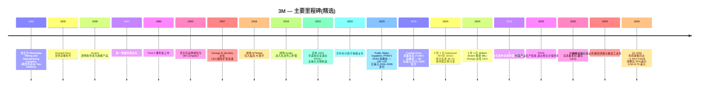

# 公司研究报告：3M 公司 (NYSE: MMM)

**截至日期：** 2026-05-26
**上市信息：** 纽约证券交易所 — 股票代码 `MMM` ([NYSE 公司主页](https://www.nyse.com/quote/XNYS:MMM));同时在 NYSE Texas 与 SIX Swiss Exchange 挂牌 ([3M 8-K 日期 2026-02-03,封面页](https://www.sec.gov/Archives/edgar/data/66740/000006674026000037/mmm-20260203.htm))
**总部地址：** 3M Center, St. Paul, Minnesota 55144-1000 ([3M 10-K FY2025,封面页](https://www.sec.gov/Archives/edgar/data/66740/000006674026000014/mmm-20251231.htm))
**成立时间：** 1902 年于美国明尼苏达州 Two Harbors 创立,原名 Minnesota Mining and Manufacturing Company ([3M 公司历史页面](https://www.3m.com/3M/en_US/company-us/about-3m/history/))
**会计年度截止日：** 12 月 31 日(FY2025 截止于 2025-12-31;FY2025 10-K 于 2026-02-03 提交)
**行业背景锚点：** 野村《Greater China Semi: A guide to Semi renaissance in 2026~30F》2026-05-21 ([行业研报](/Users/x/projects/financial_agent/reports/sector/半导体材料.md)) — 3M 在野村 CMP 抛光垫修整器份额图 (Fig 43) 中占据最大的红色色块,在 CMP 抛光垫图 (Fig 42) 中位列前五,是唯一在大中华半导体复兴论中两个最激烈耗材细分赛道上均有实质席位的美国综合工业集团。

> **更新 — FY2026 业绩指引启动 (2026-01-20)：** 管理层启动 FY2026 调整后 EPS 指引区间为 **8.50–8.70 美元**(对比 FY2025 调整后 EPS 为 8.06 美元),调整后有机销售增长 **3%**,调整后经营利润率扩张 **70–80 个基点**,调整后经营现金流 56–58 亿美元、调整后自由现金流转化率 100%。这是 3M 在 Solventum 拆分后时代首次发布全年指引,标志着公司回归个位数增长、个位数利润率扩张、~100% 现金转化率的运营框架——即管理层正在向市场释放 "公司已跨越 Solventum 拆分与 PFAS / 全氟化合物制造退出留下的低谷期" 的信号。EPS 区间上沿暗示同比 +8% 增长;现金流指引中值暗示 ~57 亿美元的内生资本生成,扣除 Section 1 提及的 ~40 亿美元以上传统诉讼现金流出后仍有可观余量。来源:[3M Q4 2025 业绩公告 2026-01-20,Exhibit 99.1](https://www.sec.gov/Archives/edgar/data/66740/000006674026000003/q42025-8kerexx991.htm)。

---

## 目录

1. 公司概览
2. 公司历史
3. 管理层
4. 产品与服务
5. 客户与市场进入策略
6. 行业概览
7. 竞争格局
8. 市场机会 (TAM)
9. 风险评估

References + Step 10 核查日志

---

## 1. 公司概览

3M 公司是一家总部位于美国明尼苏达州圣保罗的多元化工业技术综合集团,其历史可追溯至 1902 年的一家砂纸与磨料作坊 ([3M 公司历史](https://www.3m.com/3M/en_US/company-us/about-3m/history/))。在 2024 年 4 月医疗保健业务分拆为 Solventum Corporation (NYSE: SOLV)、并于 2025 年底完成 PFAS / 全氟化合物制造业务全面退出后,今天的 3M 是一家围绕 **Safety & Industrial (安全与工业) / Transportation & Electronics (运输与电子) / Consumer (消费) 三大业务部门 (post-Solventum spin-off 2024)** 组织运营的公司——FY2025 合并营收 **249.48 亿美元**,全球员工约 **60,500 人** ([3M 10-K FY2025,Item 1 业务及 Item 7 MD&A](https://www.sec.gov/Archives/edgar/data/66740/000006674026000014/mmm-20251231.htm))。当前的部门架构是于 2024-04-01 Solventum 拆分完成日正式生效的后拆分汇报结构 ([3M 8-K 日期 2024-04-01,Item 8.01 — 分拆完成](https://www.sec.gov/Archives/edgar/data/66740/000006674024000044/mmm-20240401.htm))。

公司在年报 Item 1 中以朴素的语言描述自己:"*3M is a diversified technology company with a global presence in the following businesses: Safety and Industrial; Transportation and Electronics; and Consumer. 3M is among the leading manufacturers of products for many of the markets it serves. Most 3M products involve expertise in product development, manufacturing and marketing, and are subject to competition from products manufactured and sold by other technologically oriented companies*" ([3M 10-K FY2025,Item 1 — General](https://www.sec.gov/Archives/edgar/data/66740/000006674026000014/mmm-20251231.htm))。3M 区别于其他公司的核心思维模型是其 **51 个技术平台**——粘合剂、磨料、薄膜、先进材料、光管理、微复制、非织造布、陶瓷、表面改性等——组合衍生出大约 6 万个 SKU,销往超过 200 个国家 ([3M 投资者日 2025 — 完整演示文稿活动页](https://investors.3m.com/news-events/events-presentations/detail/20250226-3m-2025-investor-day))。投资人需要记住的核心要点是:**半导体材料属于 Transportation & Electronics 部门内的 Electronics Materials Solutions 部门**——即半导体材料是某一部门的子部门下的一个子切片,而非独立报告口径;10-K 也未对该业务单独披露规模数据。本报告通篇致力于挖掘 10-K 中关于半导体相关业务披露的所有信息,在涉及分析师推断时明确标注,避免将公司整体经济指标错误归因到半导体细分业务。

**3M 的盈利逻辑。** 商业模式是工业技术产品销售——拥有专利保护、品牌认知度的耗材与耐用品组件,单位价值适中但销量巨大,广泛销往数千家客户的设计方案。分销渠道运行 "*through numerous distribution channels, including directly to users and through a wide range of e-commerce and traditional wholesalers, retailers, jobbers, distributors, and dealers in a wide variety of trades in many countries around the world*" ([3M 10-K FY2025,Item 1 — Distribution](https://www.sec.gov/Archives/edgar/data/66740/000006674026000014/mmm-20251231.htm))。单位经济模型有三个杠杆:(a) 专利保护配方与专有制造工艺嵌入的结构性毛利率;(b) 51 个技术平台之间的规模化生产力收益(同一氟聚合物化学体系可同时供应半导体光罩防尘薄膜、汽车薄膜与消费厨具用品);(c) 商业卓越定价计划——新任 CEO 已经将调整后经营利润率从 FY2024 的 21.4% 提升至 FY2025 的 23.4%,Brown 时代第一个完整年度 200bp 扩张 ([3M Q4 2025 业绩公告 2026-01-20](https://www.sec.gov/Archives/edgar/data/66740/000006674026000003/q42025-8kerexx991.htm))。

**部门规模 (FY2025 净销售)。** Safety & Industrial: **113.85 亿美元**,GAAP 部门经营利润率 22.7%;Transportation & Electronics: **82.72 亿美元**,GAAP 部门经营利润率 17.4%(剔除 PFAS 制造退出影响调整后 22.7%);Consumer: **49.20 亿美元**,过去两年消费可选品下行后利润率仅为个位数;Corporate and Other: 3.72 亿美元 ([3M 10-K FY2025,Note 3 — Segment Information](https://www.sec.gov/Archives/edgar/data/66740/000006674026000014/mmm-20251231.htm))。Transportation & Electronics 占合并 FY2025 营收的 33.2%,T&E 内的 **Electronics Materials Solutions 部门**(包含半导体相关产品—— CMP 抛光垫修整器 (CMP pad conditioner)、CMP 抛光垫、表面预处理高级磨料、光罩防尘薄膜 (mask pellicle)、显示薄膜 (display films)、电子粘合剂等)是五个部门之一,其他四个为 Advanced Materials、Automotive and Aerospace、Commercial Branding and Transportation、Display Materials and Systems ([3M 10-K FY2025,Item 1 — Business Segments](https://www.sec.gov/Archives/edgar/data/66740/000006674026000014/mmm-20251231.htm))。Electronics Materials Solutions 和 Advanced Materials 内的半导体相关产品体量比 3M 的汽车、磨料、PPE 业务小一个数量级,但战略上其重要性远超规模——因为它们触及驱动卖方倍数定价的逻辑与存储芯片先进节点路线图。

**地理分布 (FY2025 净销售)。** 美洲:135.79 亿美元 (54%);亚太:70.95 亿美元 (28%);EMEA(欧洲中东非洲):42.74 亿美元 (17%) ([3M 10-K FY2025,Note 3 — Net sales by geographic area](https://www.sec.gov/Archives/edgar/data/66740/000006674026000014/mmm-20251231.htm))。亚太区内,**中国大陆/香港销售额为 29.51 亿美元(约占总营收 12%)**——因其重要性及关税、中美脱钩的地缘政治敏感性而单独披露。3M 美国本土销售为 109.36 亿美元(占总营收 44%)。半导体材料子业务的亚洲倾斜度远高于公司整体平均——CMP 抛光垫修整器客户、光罩坯料消费者、防尘薄膜买家集中在台湾、韩国、中国大陆等晶圆厂产能聚集地——但 10-K 并未发布按部门 × 地理交叉的矩阵,使外部投资人无法单独剥离出半导体业务的地理分布。

*来源:[3M 10-K FY2025,Item 7 MD&A Results of Operations](https://www.sec.gov/Archives/edgar/data/66740/000006674026000014/mmm-20251231.htm) 及历年 10-K;FY2025 调整后经营利润率 = 23.4%,FY2024 = 21.4%;营收剔除已终止经营业务 (Solventum 于 2024-04-01 拆分)。*

上图展现了 Solventum 拆分带来的不连续性:医疗保健业务原本贡献约 80 亿美元营收和高十几个百分点的利润率,因此 FY2024 持续经营口径的起点才是 "正确的" 未来基线。从该基线出发,FY2025 数据为 **+1.5% 营收 / +200bp 调整后经营利润率**——即 Brown 主导的商业卓越与 PFAS 退出清理正在转化为利润率修复的早期证据,即便有机增长尚未完全重新加速。

*来源:[3M 10-K FY2025,Note 3 Segment Information](https://www.sec.gov/Archives/edgar/data/66740/000006674026000014/mmm-20251231.htm)。为清晰起见 Corporate & Other 未纳入。*

**估值快照 (截至 2026-05-22)。** 数据来源自市场数据聚合器 ([Stockanalysis.com MMM 统计页](https://stockanalysis.com/stocks/mmm/statistics/)):

| 指标 | MMM | 多元化工业同业 | 行业背景 |
|---|---|---|---|
| 股价 | ~152.5 美元 | — | — |
| 市值 | **795.1 亿美元** | Honeywell ~1300 亿;Illinois Tool Works ~700 亿;Emerson ~700 亿 | DJIA 道指成分;S&P 500 |
| 企业价值 | 868.2 亿美元 | — | — |
| TTM P/E | **29.4×** | HON ~22×,ITW ~24×,EMR ~22× | S&P 500 工业板块中位数 ~22× |
| Forward P/E | 17.5× | HON ~19×,ITW ~22× | — |
| TTM P/S | **3.18×** | HON ~4×,ITW ~4×,EMR ~3.5× | — |
| P/B | 24.4× (股东权益基数受 PFAS 巨额计提侵蚀) | HON ~7×,ITW ~22× | — |
| EV / EBITDA | 13.9× | HON ~13×,ITW ~16× | — |
| 股息收益率 | 2.05% (派息率 60%) | HON 2.2%,ITW 2.4% | — |
| 回购收益率 | 2.32% | — | — |
| 52 周价格变化 | +2.0% | — | — |

*来源:MMM 及同业 TTM P/E 和 P/S 数据 [Stockanalysis.com MMM](https://stockanalysis.com/stocks/mmm/statistics/)、[Stockanalysis.com HON](https://stockanalysis.com/stocks/hon/statistics/)、[Stockanalysis.com ITW](https://stockanalysis.com/stocks/itw/statistics/)、[Stockanalysis.com EMR](https://stockanalysis.com/stocks/emr/statistics/),拉取日期 2026-05-22。*

**如何理解倍数。** MMM 29.4× 的 TTM P/E 高于其多元化工业同业 (HON / ITW / EMR 均在 20 低位区) 是出于两个方向相反的原因。建设性解读:Forward P/E 17.5× *低于*同业,意味着市场已经按接近 17–18× 的倍数对 FY2026 调整后 EPS 指引 (8.50–8.70 美元) 进行了定价——与中周期工业股的估值一致;29.4× 的 TTM P/E 因 PFAS 诉讼计提对 GAAP 盈利的拖累、Solventum 拆分带来的可比基数断裂、以及 PFAS 制造产品一次性计提而人为偏高。*分析师视角:* 在调整后 EPS 口径下,股价 **并未被显著高估**——剔除诉讼噪声后与同业基本对齐。看空解读:GAAP 到调整后的桥接是真金白银流出公司。10-K 显示 FY2025 仅一年内与重大诉讼净成本相关的税前现金支付就达 35 亿美元,且多年期支付义务足够长尾,即便经营表现健康也会压缩股东回报 ([3M Q4 2025 业绩公告 2026-01-20,Special items 表](https://www.sec.gov/Archives/edgar/data/66740/000006674026000003/q42025-8kerexx991.htm))。24.4× 的高市净率是一个红色信号,但理解了股东权益基数受损后就一目了然: PFAS 相关 Public Water Suppliers ("PWS") 公共水务和解金额为 105–125 亿美元,2024–2036 年支付;Combat Arms 耳塞诉讼 ("CAE") 和解金额为 60 亿美元,2023–2029 年支付 ([3M 10-K FY2025,Note 17 — Commitments and Contingencies](https://www.sec.gov/Archives/edgar/data/66740/000006674026000014/mmm-20251231.htm))。Section 9 将估值问题延伸到倍数压缩风险评估。

**股东回报。** 即使诉讼压顶,3M 仍持续兑现 "股息贵族" 地位—— FY2025 通过股息与股票回购合计向股东返还约 **35 亿美元** ([3M Q4 2025 业绩公告 2026-01-20](https://www.sec.gov/Archives/edgar/data/66740/000006674026000003/q42025-8kerexx991.htm))。Q4 2025 单季返还 9 亿美元。自 1916 年起 3M 每个季度都派发股息,2024 年 Solventum 拆分重置后,连续 67 年提高股息 ([3M 投资者关系 — 股票信息 / 股息](https://investors.3m.com/stock-information/dividends))。

## 2. 公司历史

3M 于 **1902 年作为 Minnesota Mining and Manufacturing Company 在美国明尼苏达州 Two Harbors 创立**,五位投资人原本意图开采刚玉用于砂轮,但矿石实际为低品位的斜长岩,创业项目两年内即告失败 ([3M 公司历史页面](https://www.3m.com/3M/en_US/company-us/about-3m/history/))。公司之所以能存活,是因为创始人转型做砂纸,并在随后二十年构建起**磨料、涂料、粘合剂化学**领域的基础能力,这些能力支撑了今天大部分现代产品组合。1925 年,年轻的实验室技术员 Richard Drew 发明了遮蔽胶带——这是 3M 第一款实现国际化规模的产品;同一个十年还诞生了 Scotch 透明胶带;二战后数十年里又陆续在该基础上叠加了 Scotchgard、磁带、Post-it 便利贴 (1980) ([3M 公司历史页面](https://www.3m.com/3M/en_US/company-us/about-3m/history/))。

公司直到 2002 年百年庆时将名称缩短为 **"3M"**,届时已成为全球多元化工业综合集团。五投资人采矿失败的起源至今仍重要,是因为 "耐心资本支持试验" 的企业文化——著名的 "15% 时间" 规则催生了 Post-it 便利贴——是管理层在为公司高 R&D 强度(年化 ~6% 营收)和广泛技术平台战略辩护时所引以为据的核心论据。

*来源:整合自 [3M 10-K FY2025,Item 1 + Executive Officers](https://www.sec.gov/Archives/edgar/data/66740/000006674026000014/mmm-20251231.htm)、[3M 8-K 日期 2024-04-01 — Solventum 分拆完成](https://www.sec.gov/Archives/edgar/data/66740/000006674024000044/mmm-20240401.htm)、[3M 8-K 日期 2024-04-30 — Brown 任命](https://www.sec.gov/Archives/edgar/data/66740/000006674024000051/mmm-20240430.htm)、[3M Q4 2025 业绩公告 2026-01-20](https://www.sec.gov/Archives/edgar/data/66740/000006674026000003/q42025-8kerexx991.htm) 以及 [3M 公司历史页面](https://www.3m.com/3M/en_US/company-us/about-3m/history/)。*

**定义现代 3M 的三次战略转折。**

*转折 1 — Inge Thulin 和 Mike Roman 时代的激进 M&A (2012–2019)。* 从 2010 年代初到 2019 年,3M 在医疗保健和电子领域积极推进补强收购——先后收购 Capital Safety (2015 年,25 亿美元)、Scott Safety (2017 年,20 亿美元)、M\*Modal Health Information Systems (2018 年,10 亿美元),以及最具影响力的 **Acelity (2019 年 10 月,67 亿美元)** 切入先进伤口护理 ([3M 8-K 日期 2019-10-11 — 收购 KCI Holdings (Acelity)](https://www.sec.gov/Archives/edgar/data/66740/000141057819001637/tv530886_8k.htm))。Acelity 交易在当时是 3M 历史最大并购,也是 "医疗保健可以成为综合集团内一个高增长独立纵向板块" 战略的核心赌注。2024 年 Solventum 拆分实际上推翻了这一赌注—— Acelity 最终归入 Solventum,而非 3M 的持续经营业务。

*转折 2 — 诉讼清算与 PFAS 退出 (2022–2025)。* 2022–2023 年的窗口期迫使 3M 做出两项基础性战略决策。2022 年 7 月,公司将其 Combat Arms 耳塞诉讼 子公司 Aearo Technologies 主动申请 Chapter 11 破产,试图通过破产程序处理 CAE 责任 ([3M 8-K 日期 2022-07-26 — Aearo Chapter 11](https://www.sec.gov/Archives/edgar/data/66740/000006674022000061/mmm-20220726.htm))。该策略于 2023 年中失败后,管理层承诺承担覆盖超过 250,000 名索赔人、2023–2029 年支付的 **60 亿美元 CAE 和解金** ([3M 10-K FY2025,Note 17 — Commitments and Contingencies](https://www.sec.gov/Archives/edgar/data/66740/000006674026000014/mmm-20251231.htm))。同时,在 **2022 年 12 月,管理层宣布 3M 将于 2025 年底前完全退出 PFAS 制造** ([3M 8-K 日期 2022-12-20 — PFAS 制造退出](https://www.sec.gov/Archives/edgar/data/66740/000006674022000085/mmm-20221216.htm)),并在 2023 年 6 月宣布 **105–125 亿美元的 Public Water Suppliers 公共水务和解金,解决 PFAS 在美国饮用水中的市政诉求,2024–2036 年支付** ([3M 8-K 日期 2023-06-22 — PWS 和解公告](https://www.sec.gov/Archives/edgar/data/66740/000006674023000048/mmm-20230622.htm) + [3M 10-K FY2025,Note 17](https://www.sec.gov/Archives/edgar/data/66740/000006674026000014/mmm-20251231.htm))。CAE + PWS 合并的 14 年期 165–185 亿美元毛现金支付义务是当前公司单一最大的财务负担。

*转折 3 — Solventum 拆分 + Brown 时代 (2024 至今)。* 2024 年 **4 月 1 日**,3M 通过按持股比例分发 80.1% 的 Solventum Corporation (NYSE: SOLV) 股份给 3M 股东,完成医疗保健业务的分离 ([3M 8-K 日期 2024-04-01](https://www.sec.gov/Archives/edgar/data/66740/000006674024000044/mmm-20240401.htm));3M 保留了 19.9% 的股权,正在伺机变现。分拆将 3M 的营收基数从约 330 亿美元重置到约 240 亿美元,绝对盈利能力下降但复杂度也下降,使董事会得以招募一位 "白纸状态" 的外部 CEO —— **William M. Brown,前 L3Harris CEO** —— 从 2024-05-01 起接替内部提拔的 Mike Roman ([3M 8-K 日期 2024-04-30,Item 5.02](https://www.sec.gov/Archives/edgar/data/66740/000006674024000051/mmm-20240430.htm))。Brown 的任务有两项:(a) 执行 2025 年投资者日提出的 "新经营模式" 三大支柱——绩效、增长、资本配置;(b) 在过去十年里 R&D 绝对值停滞的背景下,重塑公司以工程引领产品创新的声誉。早期证据表明经营模式推进有成效—— FY2025 调整后经营利润率扩张 200bp ——但增长支柱仍滞后(FY2025 有机销售 GAAP 仅 +0.9%,调整后 +2.1%)。

**近期进展(过去 12 个月)。** 2025 年 6 月,3M 完成出售其 **熔融石英业务**——曾隶属 Transportation & Electronics ——"以略低于该业务账面价值的微薄对价出售" ([3M 10-K FY2025,Note 4 — Divestitures](https://www.sec.gov/Archives/edgar/data/66740/000006674026000014/mmm-20251231.htm))。2025 年 9 月,公司同意出售 Safety & Industrial 内的 **精密研磨与精加工业务**(年化销售 ~1.3 亿美元),计入 1.59 亿美元税前减值,并将该业务划为持有待售 ([同上 Note 4](https://www.sec.gov/Archives/edgar/data/66740/000006674026000014/mmm-20251231.htm))。两次剥离均显示 Brown 愿意修剪规模不足资产——这是历史上以 "什么都不卖" 著称的公司的重大文化转变。2025 年 12 月,**PFAS 制造退出完成**,3M 对剩余处置相关资产的折旧年限与残值进行了最终更新 ([3M 10-K FY2025,Item 7 MD&A](https://www.sec.gov/Archives/edgar/data/66740/000006674026000014/mmm-20251231.htm))。

## 3. 管理层

**William M. Brown — 董事长兼首席执行官(CEO 任期始于 2024-05-01;董事长任期始于 2025 年)。** William ("Bill") Brown,63 岁,于 2024 年 5 月 1 日接替 Mike Roman 出任 3M CEO,并于 2025 年当选董事长——将治理与运营领导权同时集中于一人 ([3M 10-K FY2025,Item 1 — Information about our Executive Officers](https://www.sec.gov/Archives/edgar/data/66740/000006674026000014/mmm-20251231.htm))。Brown 是 3M 现代史上首位从外部聘请而非内部提拔的 CEO ——这是董事会在 Solventum 拆分与 PFAS 诉讼清算后,对文化重塑的明确信号。他来自国防电子巨头 **L3Harris Technologies**,曾在 2019–2021 年(其撮合的 L3 / Harris 合并后)担任董事长兼 CEO,2021–2022 年任执行董事长 ([3M 10-K FY2025,Item 1 — Information about our Executive Officers](https://www.sec.gov/Archives/edgar/data/66740/000006674026000014/mmm-20251231.htm); [3M 2026 DEF 14A 委托书](https://www.sec.gov/Archives/edgar/data/66740/000006674026000151/mmm-20260324.htm))。在此之前,Brown 担任 **Harris Corporation 的 CEO 长达 8 年(2011–2019)**,期间他将传统军用无线电业务重新定位为高利润率战术通信和航空电子业务,EBITDA 利润率从十几个百分点提升至 20% 出头,并主导了 2019 年 6 月完成的 330 亿美元全股票 L3 Technologies 合并交易——后冷战时代当时最大的国防业并购 ([8-K 日期 2024-04-30 — Brown 任命,简介附件](https://www.sec.gov/Archives/edgar/data/66740/000006674024000051/mmm-20240430.htm))。Brown 早年职业在 United Technologies Corporation (1997–2010),曾负责包括 Carrier 和 Sikorsky 在内的多个业务,在那里学到了多元化综合集团的运营节奏——他如今正在 3M 重复应用。他拥有 Villanova University 机械工程学士学位和哥伦比亚大学 MBA ([3M 2026 DEF 14A 委托书,董事简历部分](https://www.sec.gov/Archives/edgar/data/66740/000006674026000151/mmm-20260324.htm))。

在 3M,Brown 的薪酬结构与工业 CEO 同业基准保持一致——以业绩为权重—— 2026 年 DEF 14A 委托书披露其包含基本工资,加上以三年相对 TSR 和累计经营利润为目标的长期股权 ([3M 2026 DEF 14A — Compensation Discussion and Analysis](https://www.sec.gov/Archives/edgar/data/66740/000006674026000151/mmm-20260324.htm))。其个人直接持股仍处于任期早期建立阶段(CEO 入职股权按多年解锁)。未来两年,投资人应该关注的是:Brown 能否在 3M 复刻他在 Harris 时代的剧本——积极的组合优化、运营模式重塑和有耐心的资本配置——这正是 [3M 2025 投资者日](https://investors.3m.com/news-events/events-presentations/detail/20250226-3m-2025-investor-day) 框架的三大支柱。早期证据(FY2025 调整后利润率扩张 200bp、剥离熔融石英及精密研磨业务、FY2026 EPS 8.50–8.70 美元的明确指引)与 Harris 时代的节奏一致。风险在于 3M 的结构性问题比 Harris 难——没有像美国国防部那样的反周期单一客户作为基础订单托底,且诉讼尾部规模超过 Brown 在 L3Harris 时期面对的任何挑战。

**创始人背景。** 3M 的五位 1902 年创始人—— Henry Bryan、Hermon Cable、John Dwan、William McGonagle 和 Dr. J. Danley Budd ——都是最初失败的刚玉采矿项目的投资人;他们中没有一位贯穿现代时期保持运营参与,公司早已过渡到职业经理人主导。因此,创始人个人简介并非评估今日 3M 的合适视角——更有意义的框架是 **Inge Thulin (2012–2018) → Mike Roman (2018–2024) → William Brown (2024 至今) 的 CEO 接班序列** ([3M 公司历史页面](https://www.3m.com/3M/en_US/company-us/about-3m/history/))。Roman 任期结束伴随着 Solventum 拆分、PFAS 退出公告、PWS 和解——这些极具影响力的组合举动定义了 Brown 时代的初始条件。Roman 在过渡期内继续以特别顾问身份留任董事会 ([3M 8-K 日期 2024-04-30](https://www.sec.gov/Archives/edgar/data/66740/000006674024000051/mmm-20240430.htm))。
