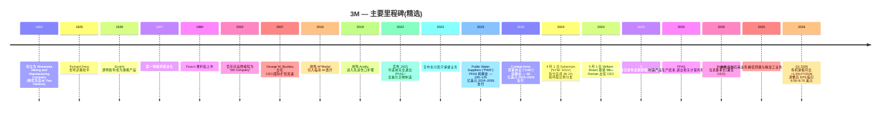
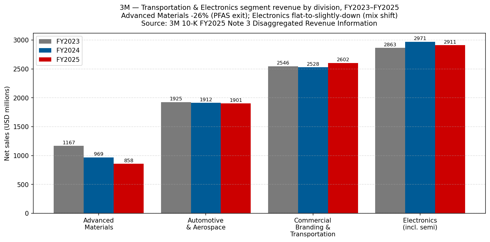
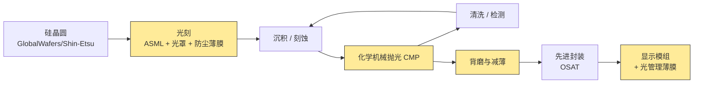
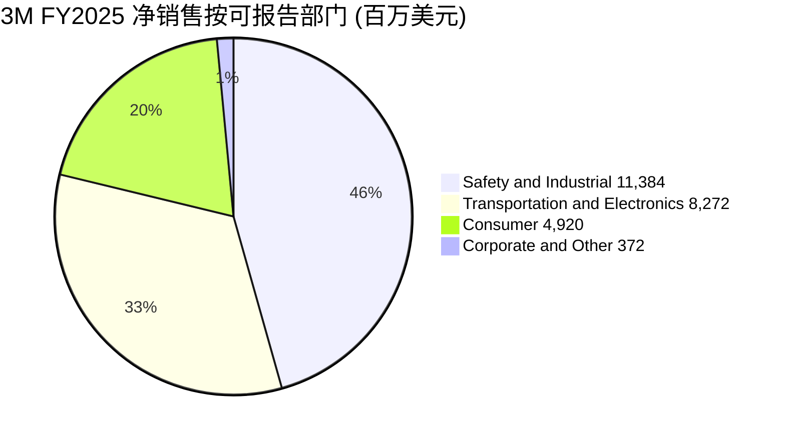
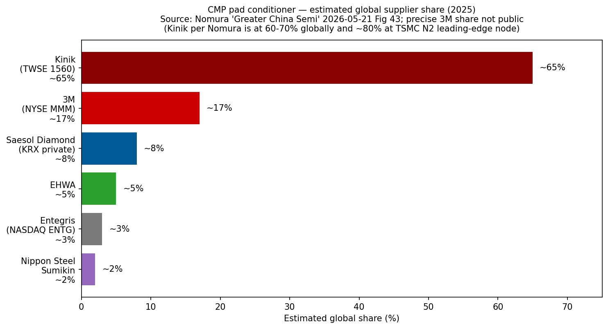

# 公司研究报告：3M 公司 (NYSE: MMM)

**截至日期：** 2026-05-26
**上市信息：** 纽约证券交易所 — 股票代码 `MMM` ([NYSE 公司主页](https://www.nyse.com/quote/XNYS:MMM));同时在 NYSE Texas 与 SIX Swiss Exchange 挂牌 ([3M 8-K 日期 2026-02-03,封面页](https://www.sec.gov/Archives/edgar/data/66740/000006674026000037/mmm-20260203.htm))
**总部地址：** 3M Center, St. Paul, Minnesota 55144-1000 ([3M 10-K FY2025,封面页](https://www.sec.gov/Archives/edgar/data/66740/000006674026000014/mmm-20251231.htm))
**成立时间：** 1902 年于美国明尼苏达州 Two Harbors 创立,原名 Minnesota Mining and Manufacturing Company ([3M 公司历史页面](https://www.3m.com/3M/en_US/company-us/about-3m/history/))
**会计年度截止日：** 12 月 31 日(FY2025 截止于 2025-12-31;FY2025 10-K 于 2026-02-03 提交)
**行业背景锚点：** 野村《Greater China Semi: A guide to Semi renaissance in 2026~30F》2026-05-21 ([行业研报](/Users/x/projects/financial_agent/reports/sector/半导体材料.md)) — 3M 在野村 CMP 抛光垫修整器份额图 (Fig 43) 中占据最大的红色色块,在 CMP 抛光垫图 (Fig 42) 中位列前五,是唯一在大中华半导体复兴论中两个最激烈耗材细分赛道上均有实质席位的美国综合工业集团。

> **更新 — FY2026 业绩指引启动 (2026-01-20)：** 管理层启动 FY2026 调整后 EPS 指引区间为 **8.50–8.70 美元**(对比 FY2025 调整后 EPS 为 8.06 美元),调整后有机销售增长 **3%**,调整后经营利润率扩张 **70–80 个基点**,调整后经营现金流 56–58 亿美元、调整后自由现金流转化率 100%。这是 3M 在 Solventum 拆分后时代首次发布全年指引,标志着公司回归个位数增长、个位数利润率扩张、~100% 现金转化率的运营框架——即管理层正在向市场释放 "公司已跨越 Solventum 拆分与 PFAS / 全氟化合物制造退出留下的低谷期" 的信号。EPS 区间上沿暗示同比 +8% 增长;现金流指引中值暗示 ~57 亿美元的内生资本生成,扣除 Section 1 提及的 ~40 亿美元以上传统诉讼现金流出后仍有可观余量。来源:[3M Q4 2025 业绩公告 2026-01-20,Exhibit 99.1](https://www.sec.gov/Archives/edgar/data/66740/000006674026000003/q42025-8kerexx991.htm)。

---

## 目录

1. 公司概览
2. 公司历史
3. 管理层
4. 产品与服务
5. 客户与市场进入策略
6. 行业概览
7. 竞争格局
8. 市场机会 (TAM)
9. 风险评估

References + Step 10 核查日志

---

## 1. 公司概览

3M 公司是一家总部位于美国明尼苏达州圣保罗的多元化工业技术综合集团,其历史可追溯至 1902 年的一家砂纸与磨料作坊 ([3M 公司历史](https://www.3m.com/3M/en_US/company-us/about-3m/history/))。在 2024 年 4 月医疗保健业务分拆为 Solventum Corporation (NYSE: SOLV)、并于 2025 年底完成 PFAS / 全氟化合物制造业务全面退出后,今天的 3M 是一家围绕 **Safety & Industrial (安全与工业) / Transportation & Electronics (运输与电子) / Consumer (消费) 三大业务部门 (post-Solventum spin-off 2024)** 组织运营的公司——FY2025 合并营收 **249.48 亿美元**,全球员工约 **60,500 人** ([3M 10-K FY2025,Item 1 业务及 Item 7 MD&A](https://www.sec.gov/Archives/edgar/data/66740/000006674026000014/mmm-20251231.htm))。当前的部门架构是于 2024-04-01 Solventum 拆分完成日正式生效的后拆分汇报结构 ([3M 8-K 日期 2024-04-01,Item 8.01 — 分拆完成](https://www.sec.gov/Archives/edgar/data/66740/000006674024000044/mmm-20240401.htm))。

公司在年报 Item 1 中以朴素的语言描述自己:"*3M is a diversified technology company with a global presence in the following businesses: Safety and Industrial; Transportation and Electronics; and Consumer. 3M is among the leading manufacturers of products for many of the markets it serves. Most 3M products involve expertise in product development, manufacturing and marketing, and are subject to competition from products manufactured and sold by other technologically oriented companies*" ([3M 10-K FY2025,Item 1 — General](https://www.sec.gov/Archives/edgar/data/66740/000006674026000014/mmm-20251231.htm))。3M 区别于其他公司的核心思维模型是其 **51 个技术平台**——粘合剂、磨料、薄膜、先进材料、光管理、微复制、非织造布、陶瓷、表面改性等——组合衍生出大约 6 万个 SKU,销往超过 200 个国家 ([3M 投资者日 2025 — 完整演示文稿活动页](https://investors.3m.com/news-events/events-presentations/detail/20250226-3m-2025-investor-day))。投资人需要记住的核心要点是:**半导体材料属于 Transportation & Electronics 部门内的 Electronics Materials Solutions 部门**——即半导体材料是某一部门的子部门下的一个子切片,而非独立报告口径;10-K 也未对该业务单独披露规模数据。本报告通篇致力于挖掘 10-K 中关于半导体相关业务披露的所有信息,在涉及分析师推断时明确标注,避免将公司整体经济指标错误归因到半导体细分业务。

**3M 的盈利逻辑。** 商业模式是工业技术产品销售——拥有专利保护、品牌认知度的耗材与耐用品组件,单位价值适中但销量巨大,广泛销往数千家客户的设计方案。分销渠道运行 "*through numerous distribution channels, including directly to users and through a wide range of e-commerce and traditional wholesalers, retailers, jobbers, distributors, and dealers in a wide variety of trades in many countries around the world*" ([3M 10-K FY2025,Item 1 — Distribution](https://www.sec.gov/Archives/edgar/data/66740/000006674026000014/mmm-20251231.htm))。单位经济模型有三个杠杆:(a) 专利保护配方与专有制造工艺嵌入的结构性毛利率;(b) 51 个技术平台之间的规模化生产力收益(同一氟聚合物化学体系可同时供应半导体光罩防尘薄膜、汽车薄膜与消费厨具用品);(c) 商业卓越定价计划——新任 CEO 已经将调整后经营利润率从 FY2024 的 21.4% 提升至 FY2025 的 23.4%,Brown 时代第一个完整年度 200bp 扩张 ([3M Q4 2025 业绩公告 2026-01-20](https://www.sec.gov/Archives/edgar/data/66740/000006674026000003/q42025-8kerexx991.htm))。

**部门规模 (FY2025 净销售)。** Safety & Industrial: **113.85 亿美元**,GAAP 部门经营利润率 22.7%;Transportation & Electronics: **82.72 亿美元**,GAAP 部门经营利润率 17.4%(剔除 PFAS 制造退出影响调整后 22.7%);Consumer: **49.20 亿美元**,过去两年消费可选品下行后利润率仅为个位数;Corporate and Other: 3.72 亿美元 ([3M 10-K FY2025,Note 3 — Segment Information](https://www.sec.gov/Archives/edgar/data/66740/000006674026000014/mmm-20251231.htm))。Transportation & Electronics 占合并 FY2025 营收的 33.2%,T&E 内的 **Electronics Materials Solutions 部门**(包含半导体相关产品—— CMP 抛光垫修整器 (CMP pad conditioner)、CMP 抛光垫、表面预处理高级磨料、光罩防尘薄膜 (mask pellicle)、显示薄膜 (display films)、电子粘合剂等)是五个部门之一,其他四个为 Advanced Materials、Automotive and Aerospace、Commercial Branding and Transportation、Display Materials and Systems ([3M 10-K FY2025,Item 1 — Business Segments](https://www.sec.gov/Archives/edgar/data/66740/000006674026000014/mmm-20251231.htm))。Electronics Materials Solutions 和 Advanced Materials 内的半导体相关产品体量比 3M 的汽车、磨料、PPE 业务小一个数量级,但战略上其重要性远超规模——因为它们触及驱动卖方倍数定价的逻辑与存储芯片先进节点路线图。

**地理分布 (FY2025 净销售)。** 美洲:135.79 亿美元 (54%);亚太:70.95 亿美元 (28%);EMEA(欧洲中东非洲):42.74 亿美元 (17%) ([3M 10-K FY2025,Note 3 — Net sales by geographic area](https://www.sec.gov/Archives/edgar/data/66740/000006674026000014/mmm-20251231.htm))。亚太区内,**中国大陆/香港销售额为 29.51 亿美元(约占总营收 12%)**——因其重要性及关税、中美脱钩的地缘政治敏感性而单独披露。3M 美国本土销售为 109.36 亿美元(占总营收 44%)。半导体材料子业务的亚洲倾斜度远高于公司整体平均——CMP 抛光垫修整器客户、光罩坯料消费者、防尘薄膜买家集中在台湾、韩国、中国大陆等晶圆厂产能聚集地——但 10-K 并未发布按部门 × 地理交叉的矩阵,使外部投资人无法单独剥离出半导体业务的地理分布。

*来源:[3M 10-K FY2025,Item 7 MD&A Results of Operations](https://www.sec.gov/Archives/edgar/data/66740/000006674026000014/mmm-20251231.htm) 及历年 10-K;FY2025 调整后经营利润率 = 23.4%,FY2024 = 21.4%;营收剔除已终止经营业务 (Solventum 于 2024-04-01 拆分)。*

上图展现了 Solventum 拆分带来的不连续性:医疗保健业务原本贡献约 80 亿美元营收和高十几个百分点的利润率,因此 FY2024 持续经营口径的起点才是 "正确的" 未来基线。从该基线出发,FY2025 数据为 **+1.5% 营收 / +200bp 调整后经营利润率**——即 Brown 主导的商业卓越与 PFAS 退出清理正在转化为利润率修复的早期证据,即便有机增长尚未完全重新加速。

*来源:[3M 10-K FY2025,Note 3 Segment Information](https://www.sec.gov/Archives/edgar/data/66740/000006674026000014/mmm-20251231.htm)。为清晰起见 Corporate & Other 未纳入。*

**估值快照 (截至 2026-05-22)。** 数据来源自市场数据聚合器 ([Stockanalysis.com MMM 统计页](https://stockanalysis.com/stocks/mmm/statistics/)):

| 指标 | MMM | 多元化工业同业 | 行业背景 |
|---|---|---|---|
| 股价 | ~152.5 美元 | — | — |
| 市值 | **795.1 亿美元** | Honeywell ~1300 亿;Illinois Tool Works ~700 亿;Emerson ~700 亿 | DJIA 道指成分;S&P 500 |
| 企业价值 | 868.2 亿美元 | — | — |
| TTM P/E | **29.4×** | HON ~22×,ITW ~24×,EMR ~22× | S&P 500 工业板块中位数 ~22× |
| Forward P/E | 17.5× | HON ~19×,ITW ~22× | — |
| TTM P/S | **3.18×** | HON ~4×,ITW ~4×,EMR ~3.5× | — |
| P/B | 24.4× (股东权益基数受 PFAS 巨额计提侵蚀) | HON ~7×,ITW ~22× | — |
| EV / EBITDA | 13.9× | HON ~13×,ITW ~16× | — |
| 股息收益率 | 2.05% (派息率 60%) | HON 2.2%,ITW 2.4% | — |
| 回购收益率 | 2.32% | — | — |
| 52 周价格变化 | +2.0% | — | — |

*来源:MMM 及同业 TTM P/E 和 P/S 数据 [Stockanalysis.com MMM](https://stockanalysis.com/stocks/mmm/statistics/)、[Stockanalysis.com HON](https://stockanalysis.com/stocks/hon/statistics/)、[Stockanalysis.com ITW](https://stockanalysis.com/stocks/itw/statistics/)、[Stockanalysis.com EMR](https://stockanalysis.com/stocks/emr/statistics/),拉取日期 2026-05-22。*

**如何理解倍数。** MMM 29.4× 的 TTM P/E 高于其多元化工业同业 (HON / ITW / EMR 均在 20 低位区) 是出于两个方向相反的原因。建设性解读:Forward P/E 17.5× *低于*同业,意味着市场已经按接近 17–18× 的倍数对 FY2026 调整后 EPS 指引 (8.50–8.70 美元) 进行了定价——与中周期工业股的估值一致;29.4× 的 TTM P/E 因 PFAS 诉讼计提对 GAAP 盈利的拖累、Solventum 拆分带来的可比基数断裂、以及 PFAS 制造产品一次性计提而人为偏高。*分析师视角:* 在调整后 EPS 口径下,股价 **并未被显著高估**——剔除诉讼噪声后与同业基本对齐。看空解读:GAAP 到调整后的桥接是真金白银流出公司。10-K 显示 FY2025 仅一年内与重大诉讼净成本相关的税前现金支付就达 35 亿美元,且多年期支付义务足够长尾,即便经营表现健康也会压缩股东回报 ([3M Q4 2025 业绩公告 2026-01-20,Special items 表](https://www.sec.gov/Archives/edgar/data/66740/000006674026000003/q42025-8kerexx991.htm))。24.4× 的高市净率是一个红色信号,但理解了股东权益基数受损后就一目了然: PFAS 相关 Public Water Suppliers ("PWS") 公共水务和解金额为 105–125 亿美元,2024–2036 年支付;Combat Arms 耳塞诉讼 ("CAE") 和解金额为 60 亿美元,2023–2029 年支付 ([3M 10-K FY2025,Note 17 — Commitments and Contingencies](https://www.sec.gov/Archives/edgar/data/66740/000006674026000014/mmm-20251231.htm))。Section 9 将估值问题延伸到倍数压缩风险评估。

**股东回报。** 即使诉讼压顶,3M 仍持续兑现 "股息贵族" 地位—— FY2025 通过股息与股票回购合计向股东返还约 **35 亿美元** ([3M Q4 2025 业绩公告 2026-01-20](https://www.sec.gov/Archives/edgar/data/66740/000006674026000003/q42025-8kerexx991.htm))。Q4 2025 单季返还 9 亿美元。自 1916 年起 3M 每个季度都派发股息,2024 年 Solventum 拆分重置后,连续 67 年提高股息 ([3M 投资者关系 — 股票信息 / 股息](https://investors.3m.com/stock-information/dividends))。

## 2. 公司历史

3M 于 **1902 年作为 Minnesota Mining and Manufacturing Company 在美国明尼苏达州 Two Harbors 创立**,五位投资人原本意图开采刚玉用于砂轮,但矿石实际为低品位的斜长岩,创业项目两年内即告失败 ([3M 公司历史页面](https://www.3m.com/3M/en_US/company-us/about-3m/history/))。公司之所以能存活,是因为创始人转型做砂纸,并在随后二十年构建起**磨料、涂料、粘合剂化学**领域的基础能力,这些能力支撑了今天大部分现代产品组合。1925 年,年轻的实验室技术员 Richard Drew 发明了遮蔽胶带——这是 3M 第一款实现国际化规模的产品;同一个十年还诞生了 Scotch 透明胶带;二战后数十年里又陆续在该基础上叠加了 Scotchgard、磁带、Post-it 便利贴 (1980) ([3M 公司历史页面](https://www.3m.com/3M/en_US/company-us/about-3m/history/))。

公司直到 2002 年百年庆时将名称缩短为 **"3M"**,届时已成为全球多元化工业综合集团。五投资人采矿失败的起源至今仍重要,是因为 "耐心资本支持试验" 的企业文化——著名的 "15% 时间" 规则催生了 Post-it 便利贴——是管理层在为公司高 R&D 强度(年化 ~6% 营收)和广泛技术平台战略辩护时所引以为据的核心论据。

*来源:整合自 [3M 10-K FY2025,Item 1 + Executive Officers](https://www.sec.gov/Archives/edgar/data/66740/000006674026000014/mmm-20251231.htm)、[3M 8-K 日期 2024-04-01 — Solventum 分拆完成](https://www.sec.gov/Archives/edgar/data/66740/000006674024000044/mmm-20240401.htm)、[3M 8-K 日期 2024-04-30 — Brown 任命](https://www.sec.gov/Archives/edgar/data/66740/000006674024000051/mmm-20240430.htm)、[3M Q4 2025 业绩公告 2026-01-20](https://www.sec.gov/Archives/edgar/data/66740/000006674026000003/q42025-8kerexx991.htm) 以及 [3M 公司历史页面](https://www.3m.com/3M/en_US/company-us/about-3m/history/)。*

**定义现代 3M 的三次战略转折。**

*转折 1 — Inge Thulin 和 Mike Roman 时代的激进 M&A (2012–2019)。* 从 2010 年代初到 2019 年,3M 在医疗保健和电子领域积极推进补强收购——先后收购 Capital Safety (2015 年,25 亿美元)、Scott Safety (2017 年,20 亿美元)、M\*Modal Health Information Systems (2018 年,10 亿美元),以及最具影响力的 **Acelity (2019 年 10 月,67 亿美元)** 切入先进伤口护理 ([3M 8-K 日期 2019-10-11 — 收购 KCI Holdings (Acelity)](https://www.sec.gov/Archives/edgar/data/66740/000141057819001637/tv530886_8k.htm))。Acelity 交易在当时是 3M 历史最大并购,也是 "医疗保健可以成为综合集团内一个高增长独立纵向板块" 战略的核心赌注。2024 年 Solventum 拆分实际上推翻了这一赌注—— Acelity 最终归入 Solventum,而非 3M 的持续经营业务。

*转折 2 — 诉讼清算与 PFAS 退出 (2022–2025)。* 2022–2023 年的窗口期迫使 3M 做出两项基础性战略决策。2022 年 7 月,公司将其 Combat Arms 耳塞诉讼 子公司 Aearo Technologies 主动申请 Chapter 11 破产,试图通过破产程序处理 CAE 责任 ([3M 8-K 日期 2022-07-26 — Aearo Chapter 11](https://www.sec.gov/Archives/edgar/data/66740/000006674022000061/mmm-20220726.htm))。该策略于 2023 年中失败后,管理层承诺承担覆盖超过 250,000 名索赔人、2023–2029 年支付的 **60 亿美元 CAE 和解金** ([3M 10-K FY2025,Note 17 — Commitments and Contingencies](https://www.sec.gov/Archives/edgar/data/66740/000006674026000014/mmm-20251231.htm))。同时,在 **2022 年 12 月,管理层宣布 3M 将于 2025 年底前完全退出 PFAS 制造** ([3M 8-K 日期 2022-12-20 — PFAS 制造退出](https://www.sec.gov/Archives/edgar/data/66740/000006674022000085/mmm-20221216.htm)),并在 2023 年 6 月宣布 **105–125 亿美元的 Public Water Suppliers 公共水务和解金,解决 PFAS 在美国饮用水中的市政诉求,2024–2036 年支付** ([3M 8-K 日期 2023-06-22 — PWS 和解公告](https://www.sec.gov/Archives/edgar/data/66740/000006674023000048/mmm-20230622.htm) + [3M 10-K FY2025,Note 17](https://www.sec.gov/Archives/edgar/data/66740/000006674026000014/mmm-20251231.htm))。CAE + PWS 合并的 14 年期 165–185 亿美元毛现金支付义务是当前公司单一最大的财务负担。

*转折 3 — Solventum 拆分 + Brown 时代 (2024 至今)。* 2024 年 **4 月 1 日**,3M 通过按持股比例分发 80.1% 的 Solventum Corporation (NYSE: SOLV) 股份给 3M 股东,完成医疗保健业务的分离 ([3M 8-K 日期 2024-04-01](https://www.sec.gov/Archives/edgar/data/66740/000006674024000044/mmm-20240401.htm));3M 保留了 19.9% 的股权,正在伺机变现。分拆将 3M 的营收基数从约 330 亿美元重置到约 240 亿美元,绝对盈利能力下降但复杂度也下降,使董事会得以招募一位 "白纸状态" 的外部 CEO —— **William M. Brown,前 L3Harris CEO** —— 从 2024-05-01 起接替内部提拔的 Mike Roman ([3M 8-K 日期 2024-04-30,Item 5.02](https://www.sec.gov/Archives/edgar/data/66740/000006674024000051/mmm-20240430.htm))。Brown 的任务有两项:(a) 执行 2025 年投资者日提出的 "新经营模式" 三大支柱——绩效、增长、资本配置;(b) 在过去十年里 R&D 绝对值停滞的背景下,重塑公司以工程引领产品创新的声誉。早期证据表明经营模式推进有成效—— FY2025 调整后经营利润率扩张 200bp ——但增长支柱仍滞后(FY2025 有机销售 GAAP 仅 +0.9%,调整后 +2.1%)。

**近期进展(过去 12 个月)。** 2025 年 6 月,3M 完成出售其 **熔融石英业务**——曾隶属 Transportation & Electronics ——"以略低于该业务账面价值的微薄对价出售" ([3M 10-K FY2025,Note 4 — Divestitures](https://www.sec.gov/Archives/edgar/data/66740/000006674026000014/mmm-20251231.htm))。2025 年 9 月,公司同意出售 Safety & Industrial 内的 **精密研磨与精加工业务**(年化销售 ~1.3 亿美元),计入 1.59 亿美元税前减值,并将该业务划为持有待售 ([同上 Note 4](https://www.sec.gov/Archives/edgar/data/66740/000006674026000014/mmm-20251231.htm))。两次剥离均显示 Brown 愿意修剪规模不足资产——这是历史上以 "什么都不卖" 著称的公司的重大文化转变。2025 年 12 月,**PFAS 制造退出完成**,3M 对剩余处置相关资产的折旧年限与残值进行了最终更新 ([3M 10-K FY2025,Item 7 MD&A](https://www.sec.gov/Archives/edgar/data/66740/000006674026000014/mmm-20251231.htm))。

## 3. 管理层

**William M. Brown — 董事长兼首席执行官(CEO 任期始于 2024-05-01;董事长任期始于 2025 年)。** William ("Bill") Brown,63 岁,于 2024 年 5 月 1 日接替 Mike Roman 出任 3M CEO,并于 2025 年当选董事长——将治理与运营领导权同时集中于一人 ([3M 10-K FY2025,Item 1 — Information about our Executive Officers](https://www.sec.gov/Archives/edgar/data/66740/000006674026000014/mmm-20251231.htm))。Brown 是 3M 现代史上首位从外部聘请而非内部提拔的 CEO ——这是董事会在 Solventum 拆分与 PFAS 诉讼清算后,对文化重塑的明确信号。他来自国防电子巨头 **L3Harris Technologies**,曾在 2019–2021 年(其撮合的 L3 / Harris 合并后)担任董事长兼 CEO,2021–2022 年任执行董事长 ([3M 10-K FY2025,Item 1 — Information about our Executive Officers](https://www.sec.gov/Archives/edgar/data/66740/000006674026000014/mmm-20251231.htm); [3M 2026 DEF 14A 委托书](https://www.sec.gov/Archives/edgar/data/66740/000006674026000151/mmm-20260324.htm))。在此之前,Brown 担任 **Harris Corporation 的 CEO 长达 8 年(2011–2019)**,期间他将传统军用无线电业务重新定位为高利润率战术通信和航空电子业务,EBITDA 利润率从十几个百分点提升至 20% 出头,并主导了 2019 年 6 月完成的 330 亿美元全股票 L3 Technologies 合并交易——后冷战时代当时最大的国防业并购 ([8-K 日期 2024-04-30 — Brown 任命,简介附件](https://www.sec.gov/Archives/edgar/data/66740/000006674024000051/mmm-20240430.htm))。Brown 早年职业在 United Technologies Corporation (1997–2010),曾负责包括 Carrier 和 Sikorsky 在内的多个业务,在那里学到了多元化综合集团的运营节奏——他如今正在 3M 重复应用。他拥有 Villanova University 机械工程学士学位和哥伦比亚大学 MBA ([3M 2026 DEF 14A 委托书,董事简历部分](https://www.sec.gov/Archives/edgar/data/66740/000006674026000151/mmm-20260324.htm))。

在 3M,Brown 的薪酬结构与工业 CEO 同业基准保持一致——以业绩为权重—— 2026 年 DEF 14A 委托书披露其包含基本工资,加上以三年相对 TSR 和累计经营利润为目标的长期股权 ([3M 2026 DEF 14A — Compensation Discussion and Analysis](https://www.sec.gov/Archives/edgar/data/66740/000006674026000151/mmm-20260324.htm))。其个人直接持股仍处于任期早期建立阶段(CEO 入职股权按多年解锁)。未来两年,投资人应该关注的是:Brown 能否在 3M 复刻他在 Harris 时代的剧本——积极的组合优化、运营模式重塑和有耐心的资本配置——这正是 [3M 2025 投资者日](https://investors.3m.com/news-events/events-presentations/detail/20250226-3m-2025-investor-day) 框架的三大支柱。早期证据(FY2025 调整后利润率扩张 200bp、剥离熔融石英及精密研磨业务、FY2026 EPS 8.50–8.70 美元的明确指引)与 Harris 时代的节奏一致。风险在于 3M 的结构性问题比 Harris 难——没有像美国国防部那样的反周期单一客户作为基础订单托底,且诉讼尾部规模超过 Brown 在 L3Harris 时期面对的任何挑战。

**创始人背景。** 3M 的五位 1902 年创始人—— Henry Bryan、Hermon Cable、John Dwan、William McGonagle 和 Dr. J. Danley Budd ——都是最初失败的刚玉采矿项目的投资人;他们中没有一位贯穿现代时期保持运营参与,公司早已过渡到职业经理人主导。因此,创始人个人简介并非评估今日 3M 的合适视角——更有意义的框架是 **Inge Thulin (2012–2018) → Mike Roman (2018–2024) → William Brown (2024 至今) 的 CEO 接班序列** ([3M 公司历史页面](https://www.3m.com/3M/en_US/company-us/about-3m/history/))。Roman 任期结束伴随着 Solventum 拆分、PFAS 退出公告、PWS 和解——这些极具影响力的组合举动定义了 Brown 时代的初始条件。Roman 在过渡期内继续以特别顾问身份留任董事会 ([3M 8-K 日期 2024-04-30](https://www.sec.gov/Archives/edgar/data/66740/000006674024000051/mmm-20240430.htm))。

## 4. 产品与服务

> **读者注。** 3M 是一家拥有 6 万 SKU 的综合集团,为每一款 3M 产品撰写完整的产品矩阵将耗费一整份独立报告。本节聚焦于 **Transportation & Electronics 部门**总体,以及 **Electronics Materials Solutions 部门** 和 **Advanced Materials 部门**——这两个 T&E 部门承载着半导体相关产品族 (CMP 抛光垫、CMP 抛光垫修整器、防尘薄膜、表面预处理磨料、显示薄膜、先进氟聚合物),也是 3M 出现在野村半导体复兴论份额图表中的核心分析依据。Safety & Industrial 和 Consumer 部门虽占 67% 营收、对合并论断很重要,但因不是本次启动覆盖的分析重点,将在 Section 4 末尾以简明形式总结。**投资人若将 MMM 视作半导体材料标的,必须意识到半导体子业务在 3M 总营收中占比仅为低个位数百分比——对半导体供应链叙事确实重要,但不是 MMM 整体的盈利杠杆。** 这一张力是本节最重要的认知框架。

### 4.1 10-K 的产品矩阵 — 三大部门、十六个子部门

10-K 并未发布像半导体设备或制药公司那样的精美产品组合表,但 Item 1 Business 中确实包含一张结构化的三列矩阵,将每个业务部门映射到底层子部门、代表性创收活动和示例品牌。**完整复现如下** ([3M 10-K FY2025,Item 1 Business — Business Segments](https://www.sec.gov/Archives/edgar/data/66740/000006674026000014/mmm-20251231.htm)):

| 业务部门 | 底层子部门 / 业务 | 代表性创收活动 | 示例品牌 / 产品 |
|---|---|---|---|
| **Safety and Industrial** | Abrasives; Automotive Aftermarket; Electrical Markets; Industrial Adhesives and Tapes; Industrial Specialties Division; Personal Safety; Roofing Granules | 工业磨料与精加工;车身修复方案;工业专用品(个人卫生用品、遮蔽、包装材料);电气产品与材料用于建筑、维护、配电、电气 OEM;结构粘合剂和胶带;呼吸、听力、眼部和坠落保护方案;用于沥青瓦的天然及染色矿物颗粒 | 3M Cubitron 磨料;Scotch-Brite 磨料;Scotch 乙烯胶带;3M Temflex 乙烯胶带;3M Scotchkote 涂料;3M Dynatel 定位器;3M Scotchcast 树脂;3M VHB 胶带;3M Scotchlite 反光材料;Scotch 包装胶带;3M DBI-Sala 防坠落;3M Scott 自给式呼吸器;3M Peltor 防护通讯;一次性和重复使用呼吸器;Scotchgard 瓦片保护 |
| **Transportation and Electronics** | **Advanced Materials**;**Automotive and Aerospace**;**Commercial Branding and Transportation**;**Display Materials and Systems**;**Electronics Materials Solutions** | 高级陶瓷方案;车辆紧固/粘合、薄膜、降噪与温控;广告与车队标识用大幅面图形薄膜;高速公路和车辆安全反光标识;**光管理薄膜和电子组装方案;航空、工业/商业方案;芯片封装和互连方案;半导体生产材料;数据中心方案** | 3M Nextel 陶瓷纤维和纺织品;Thinsulate 声学绝缘和汽车部件;3M Scotchlite 图形薄膜;3M Scotchcal 和 3M Controltac 商业图形;3M Diamond Grade DG3 反光板;**电子显示增强薄膜和光学透明胶;电子互连产品** |
| **Consumer** | Consumer Safety and Well-Being;Home and Auto Care;Home Improvement;Packaging and Expression | 家用清洁产品;消费空气质量产品;挂画配件;零售磨料、油漆配件和安全产品;文具与办公用品;汽车外观产品;消费创可贴、胶带、护具 | Command 粘贴挂钩;Filtrete HVAC 空气过滤器;Scotch-Brite 清洁海绵;Meguiar's 洗车;Scotch 胶带;Post-it 便利贴;Nexcare 创可贴;Scotchgard 喷雾 |

*来源:[3M 10-K FY2025,Item 1 Business — Business Segments 表](https://www.sec.gov/Archives/edgar/data/66740/000006674026000014/mmm-20251231.htm) 完整复现;粗体强调突出 Transportation & Electronics 部门中与半导体相关的行。*

**Note 3 中按部门级别的营收披露**让我们能精确定位 T&E 各个部分的资金流向 ([3M 10-K FY2025,Note 3 — Disaggregated Revenue Information](https://www.sec.gov/Archives/edgar/data/66740/000006674026000014/mmm-20251231.htm)):

| 子部门 (FY 净销售,百万美元) | FY2023 | FY2024 | FY2025 |
|---|---|---|---|
| Advanced Materials | 1,167 | 969 | **858** |
| Automotive and Aerospace | 1,925 | 1,912 | 1,901 |
| Commercial Branding and Transportation | 2,546 | 2,528 | 2,602 |
| Electronics | 2,863 | 2,971 | **2,911** |
| **Transportation and Electronics 部门合计** | **8,501** | **8,380** | **8,272** |

*来源:[3M 10-K FY2025,Note 3 — Net sales by division](https://www.sec.gov/Archives/edgar/data/66740/000006674026000014/mmm-20251231.htm)。注意 Note 3 的 "Electronics" 行是合并财务行,包含 Display Materials and Systems + Electronics Materials Solutions + 部分先进封装——即 Note 3 将 T&E 五个子部门中的两个折叠成一条财务披露行;Item 1 Business 矩阵将其拆开仅用于描述目的。*

*来源:[3M 10-K FY2025,Note 3 Disaggregated Revenue Information](https://www.sec.gov/Archives/edgar/data/66740/000006674026000014/mmm-20251231.htm)。Advanced Materials 下降反映 PFAS 制造产品退出(FY2025 剔除 6.69 亿美元营收);Electronics 是较稳定的板块,承载着半导体相关 CMP、防尘薄膜、背磨胶带 (back-grind tape) 子业务。*

**两条观察对半导体投资论很重要:**

1. **Advanced Materials 营收从 11.67 亿美元 (FY2023) 降至 8.58 亿美元 (FY2025) —— 两年下降 26%。** 10-K MD&A 将该差距解释为 PFAS 制造产品退出:3M 于 2025 年底前完全退出氟聚合物制造,而 Advanced Materials 就是承载氟聚合物营收的子部门 ([3M 10-K FY2025,Item 7 MD&A — Transportation and Electronics 部门](https://www.sec.gov/Archives/edgar/data/66740/000006674026000014/mmm-20251231.htm))。PFAS 退出特别在 FY2025 剔除了 6.69 亿美元净销售("Manufactured PFAS products" 非 GAAP 调整);剔除 PFAS 后,T&E 有机增长 +2.0%。这对半导体投资论在结构上重要,因为某些半导体邻近产品(尤其是用于晶圆厂的载片膜和腔体的先进氟聚合物薄膜)依赖该氟聚合物化学体系;3M 保留对客户的氟聚合物购买义务到 2025 及之后通过第三方供货——但氟聚合物衍生半导体产品的长期供应位置在退出后结构性走弱。
2. **Electronics 营收(含半导体相关 Electronics Materials Solutions 加 Display Materials and Systems)FY2025 为 29.11 亿美元 —— 与 FY2023 和 FY2024 相差仅 ~3% 范围内。** 这是 T&E 内最稳定的财务行,意味着即使在 PFAS 噪声和消费电子周期下,3M 的电子材料业务结构上保持韧性。*分析师视角:* 表面数字掩盖了内部结构变化——显示薄膜面临 OLED 替代风险(LCD 显示量损失),而半导体生产材料 (CMP 抛光垫、CMP 抛光垫修整器、表面预处理磨料、防尘薄膜) 正乘着 AI capex 浪潮——这正是野村报告所定义的 2026–30 长期景气主线。3M 并未发布 Electronics 内部拆分,因此分析师只能从半导体供应商客户侧的评论中推断走势。

### 4.2 综合 —— T&E 电子板块各产品如何组合成一个半导体晶圆厂的采购清单

要理解 3M 看似分散的半导体产品族为何具有内在一致性,可以想象典型 5nm/3nm 逻辑晶圆厂(或 HBM4 存储产线)运行的晶圆厂采购流: **硅晶圆** (来自 Shin-Etsu / SUMCO / GlobalWafers) → **光刻** (来自 ASML,需要 **光罩坯料 / 光罩防尘薄膜** —— 防尘薄膜是悬挂在光罩活性面上的亚微米透明薄膜,防止颗粒污染) → **沉积** → **刻蚀** → **化学机械抛光 (CMP)** 使每层沉积后表面平整,使用 **CMP 抛光垫** (来自 DuPont / 3M / Fujibo / JSR / Dinglong),由 **CMP 抛光垫修整器** (来自 Kinik / 3M / Saesol / Entegris) 持续修整 → **清洗** → 然后进入下一沉积步骤。完成多次循环后,**完成的晶圆被背磨变薄**(使用 **表面预处理磨料**来自 3M / Disco / Apex),然后流到 OSAT 进行 **先进封装互连材料和介电膜**(Electronics Materials Solutions 单独子线)收尾。最后,完成的器件进入 **商业显示模组**,3M 的 **Display Materials and Systems** 薄膜(增亮膜 / 光管理 / 光学透明胶)叠加在 LCD 或 OLED 堆栈上。**3M 是极少数在 4 个独立步骤上触达晶圆厂的供应商**(CMP 抛光垫、CMP 抛光垫修整器、表面预处理磨料、光罩防尘薄膜)——尽管单一接触点都不足以让 3M 成为顶级半导体材料品牌,但这种 "广度" 让 3M 在客户对话中有杠杆——同一个现场应用工程师可以将多个供应议题打包到一次季度评审中。*分析师视角:* 这种 "有广度但缺深度" 是 3M 半导体业务的结构性特征,解释了为什么份额持续但很少能占据主导。

*高亮(金色)节点为 3M 通过 Transportation & Electronics 部门内的 Electronics Materials Solutions 和 Display Materials and Systems 子部门,在晶圆厂工作流中占据实质供应位置的 4 个步骤。来源:工作流综合自 [3M 10-K FY2025,Item 1 — Transportation and Electronics 矩阵](https://www.sec.gov/Archives/edgar/data/66740/000006674026000014/mmm-20251231.htm) 和 [野村《Greater China Semi》2026-05-21,p. 18–30 供应商排行榜 (Fig 35–44)](/Users/x/projects/financial_agent/reports/sector/半导体材料.md)。*

### 4.3 Electronics Materials Solutions — CMP 抛光垫修整器

10-K 描述该产品族的原文:

> "Light management films and electronics assembly solutions; aerospace, industrial / commercial solutions; **chip packaging and interconnection solutions; semiconductor production materials; solutions for data centers**" ([3M 10-K FY2025,Item 1 Business — Transportation and Electronics 矩阵](https://www.sec.gov/Archives/edgar/data/66740/000006674026000014/mmm-20251231.htm))

10-K Item 1 Business 矩阵将 CMP 抛光垫修整器、CMP 抛光垫、光罩防尘薄膜、背磨磨料全部塞进了 **"semiconductor production materials" / 半导体生产材料** 这一个伞形词组——即 10-K 并未单独命名任何子产品族。如果投资人想要具体产品名,必须查阅 (a) 3M Electronics Materials Solutions 官网,(b) 行业研究报告例如野村半导体材料报告,或 (c) 直接竞争对手的财报(Kinik、Dinglong)在那里 3M 被点名为参照对手。

**通俗解释 —— CMP 抛光垫修整器的物理工作原理 (中文 + English):**

CMP (**chemical mechanical planarization / 化学机械抛光**) 是晶圆厂工艺步骤,将沉积或刻蚀之后留下的三维起伏表面研磨平整—— 平到下一层可以干净地沉积上去。研磨由大型旋转的 **抛光垫 (polishing pad)** 完成,垫面浸满化学浆料,同时溶解和摩擦晶圆顶层。每片晶圆(或每几片晶圆)处理后,垫面本身会被抛光残留物玻璃化;若不持续保持新鲜纹理,抛光速率会下降,均一性也会崩溃。"刷新" 垫面纹理的任务属于 **CMP 抛光垫修整器 / CMP pad conditioner / CMP 修整盘** —— 一片镶嵌金刚石的小型圆盘,在抛光过程中在垫面上往复摆动,持续重新打磨(再纹理化)垫面。修整盘上的金刚石涂层在使用周期内会逐渐磨损;修整盘是真正的耗材,每几周需要更换。*物理类比:* 如果 CMP 抛光垫是磨刀石,那么 CMP 抛光垫修整器就是让磨刀石不变光滑的金刚砂块。没有新鲜的修整器,CMP 步骤会劣化;没有 CMP,整个晶圆厂工艺每隔几步就会停摆。

3M 的抛光垫修整器业务位于 Electronics Materials Solutions 内——历史地位是该品类两个最初的领导者之一,另一位是台湾的 Kinik (TWSE:1560)。根据野村 CMP 抛光垫修整器供应商排行榜 (2026-05-21 [《Greater China Semi》](/Users/x/projects/financial_agent/reports/sector/半导体材料.md) 中的 Fig 43),份额地图为 **Kinik 60-70% + 3M + Saesol + Entegris** ——即 Kinik 占主导,3M 是最大非亚洲挑战者但份额持续下降,尤其在 sub-7nm 先进节点上,Kinik 在 N2 节点的 80% 份额已成事实标准。*分析师视角:* **3M 的 CMP 抛光垫修整器是明显的部分竞争优势**,护城河类型 = 品牌认知 + 30 年客户关系,但 **结构性份额流失** 到 Kinik 在先进节点。3M 内 CMP 抛光垫修整器业务被卖方估为约 200–300 百万美元年化营收(即占 Electronics 的 ~10%),对 3M 的 Electronics Materials Solutions 子部门来说属于重要,但对 3M 整体非重要—— Kinik 抢份额的轨迹是主导风险。

*分析师视角:* **最接近的具名竞争产品** —— Kinik 的 "Diagrid" CMP 抛光垫修整器系列 ([Kinik 公司官网](https://www.kinik.com.tw)) 是直接对标。韩国竞争对手 Saesol Diamond 推出 "PDC" 系列;美日竞争对手 Entegris 在其更广的 CMP 耗材组中销售较小规模的修整器业务 ([Entegris 10-K FY2024,Item 1 Business](https://www.sec.gov/Archives/edgar/data/1101302/000110130225000015/entg-20241231.htm))。3M 自身的产品品牌名在 FY2025 10-K 中仍未披露。

### 4.4 Electronics Materials Solutions — CMP 抛光垫

同一 10-K Item 1 "半导体生产材料" 伞形也覆盖 3M 的 CMP 抛光垫线,销售的是实际旋转的抛光圆盘(晶圆在其上被抛光)。野村 CMP 抛光垫供应商排行榜 (2026-05-21 报告 Fig 42) 列出全球供应商集合为 **DuPont / 3M / Fujibo / JSR / Dinglong / 其他** ([行业研报](/Users/x/projects/financial_agent/reports/sector/半导体材料.md)) —— DuPont (通过其收购 Rohm and Haas) 是长期份额领导者,全球 >50%;3M 历史上是三家西方挑战者之一,但份额比修整器低,且不断被 Dinglong (300054.SZ) 在中国晶圆厂、被 JSR 在韩国和日本晶圆厂蚕食。

**通俗解释:** CMP 抛光垫 / polishing pad 是耗材抛光表面——通常是带有工程化孔隙的聚氨酯复合材料——提供 CMP 步骤的机械力。垫的化学组成、硬度、表面微粗糙度、沟槽图案均可调;**每条新工艺节点都需要 pad 配方重新认证**。经济结构是耗材式 razor-blade:每台抛光设备每班烧掉一两片垫;垫 ASP 为 100–300 美元 / 片;经过认证的客户关系黏性强,因为重新认证风险显著。*物理类比:* CMP 抛光垫是砂纸,浆料是切削液,抛光垫修整器是磨砂纸器——客户在每台晶圆厂设备上同时更换这三者。

*分析师视角:* **3M 的 CMP 抛光垫业务是部分竞争优势** —— 护城河类型 = 与少数领先晶圆代工厂的共同研发关系——但全球范围内 **并非** 结构性 #1 或 #2。DuPont 是份额领导者,Dinglong 是中国份额抢占者。3M 的抛光垫业务被卖方估计为 100–200 百万美元年化营收,是 Electronics 行内最大的单一客户集中风险之一,因为抛光垫认证周期(每个新节点 2+ 年)意味着失去一个大客户等于在 5+ 年内失去他们。5 年战略问题是 3M 抛光垫业务能否在 AI 节点爬坡 (N2 / N1.6 / A10) 中保住——客户审查正处于历史最高水平。

### 4.5 Electronics Materials Solutions — 光罩防尘薄膜与背磨磨料

同样的 "半导体生产材料" 伞形还覆盖 10-K 未单独命名的两个较小但战略上有趣的产品线:

**光罩防尘薄膜 (mask pellicle)。** 防尘薄膜是一层亚微米厚的透明薄膜,安装在金属框架上,拉伸覆盖在光罩活性图案面上,防止颗粒缺陷污染。防尘薄膜是耗材——当其因长期暴露于深紫外 (DUV) 或极紫外 (EUV) 光而积累损伤时被更换。EUV 防尘薄膜尤其关键(也尤其难制造),因为它必须对 13.5nm 波长透明,同时承受数十千瓦的 EUV 功率;EUV 防尘薄膜供应链被 **Mitsui Chemicals** (2024 年收购 ASML 防尘薄膜项目) 和 **Shin-Etsu Chemical** 主导,**3M 历史上是 DUV (193nm 和 248nm) 防尘薄膜的供应商** 作为其 Electronics Materials Solutions 业务的子组件 ([3M 10-K FY2025,Item 1](https://www.sec.gov/Archives/edgar/data/66740/000006674026000014/mmm-20251231.htm) + [野村《Greater China Semi》2026-05-21 供应商排行榜 p. 38-39](/Users/x/projects/financial_agent/reports/sector/半导体材料.md))。*分析师视角:* **3M 在光罩防尘薄膜上是参与者,而非领导者** —— 战略问题是 3M 能否从 Mitsui / Shin-Etsu 手中赢得 EUV 防尘薄膜认证份额,这需要 3M 尚未公开承诺的多年材料科学投资。

**背磨胶带 (back-grind tape) 与表面预处理磨料。** 晶圆厂制造完成后,完工晶圆被从约 775μm 机械研磨至最薄 ~25μm —— 这正是 3D 堆叠(HBM、SoIC、键合 NAND)成为可能的关键。**3M 销售在背磨过程中保护正面电路的背磨胶带**,加上背磨后抛光用的表面预处理磨料。背磨胶带和磨料线是小但高利润的细分市场,3M 的粘合剂和磨料传承赋予其结构防御优势;竞争压力来自 Lintec (日本)、Mitsui (日本)、以及 Disco Corp (TSE: 6146) 更广设备和耗材业务中的背磨细分。

### 4.6 Display Materials and Systems — 光管理薄膜与 OCA

该子部门的 10-K 原文:

> "**Electronic display enhancement films and optically clear adhesives**" ([3M 10-K FY2025,Item 1 Business — Display Materials and Systems 品牌行](https://www.sec.gov/Archives/edgar/data/66740/000006674026000014/mmm-20251231.htm))

**通俗解释:** 增亮膜 / brightness-enhancement films / BEF 是叠加于 LCD 显示器背光模组内的多层光学工程化微复制聚合物薄膜;它们回收并重新定向背光 LED 发出的光朝观察者方向,有效将同等 LED 功率下的轴向亮度提升 2–3 倍。3M 的增亮膜 (BEF) 业务建立在公司的微复制 / microreplication 技术平台上,过去二十年是高端 LCD 电视和笔记本电脑显示的事实 BEF 标准。光学透明胶 / optically clear adhesives (OCAs) 是用于将盖板玻璃与智能手机和平板电脑中 LCD 或 OLED 显示模组粘合的透明压敏胶层;3M 在 OCA 中与 H+P / Hitachi Chemical、Dexerials、LG Chem 以及多家中国供应商竞争。

*分析师视角:* **Display Materials and Systems 随着全球显示市场从 LCD 转向 OLED 在结构性下降。** OLED 自发光,无需背光,消除了 BEF (该子部门内最大单一产品线) 的需求。3M 已尝试通过 AMOLED 新薄膜产品(可折叠手机功能膜、OLED 堆栈超薄 OCA、偏振控制薄膜)抵消 BEF 下降——FY2024 / FY2025 10-K 评论明确提到 "**新产品上市与规格胜出支撑了份额提升**" 在电子领域 ([3M 10-K FY2025,Item 7 — Transportation and Electronics 2024 segment results](https://www.sec.gov/Archives/edgar/data/66740/000006674026000014/mmm-20251231.htm)) ——但 BEF 结构性下降不太可能被完全抵消,Display Materials and Systems 中期内将是横盘到下降的业务。

### 4.7 Advanced Materials — 氟聚合物、陶瓷与 PFAS 退出

10-K 原文:

> "Advanced ceramic solutions" ([3M 10-K FY2025,Item 1 Business — Advanced Materials representative activities](https://www.sec.gov/Archives/edgar/data/66740/000006674026000014/mmm-20251231.htm))

Advanced Materials 是 T&E 内规模较小(FY2025 净销售 8.58 亿美元,从 FY2023 的 11.67 亿下降)、结构上更具争议的子部门。产品组合历史上由三部分构成:**(1) 高性能氟聚合物和氟化学品**(传统 PFAS 业务,用于一切——从电线绝缘到晶圆厂载片膜到耐化学储罐);**(2) Nextel 陶瓷纤维**(用于航空排气管、隔热毯、高温过滤);**(3) Thinsulate 品牌绝缘和其他工程化非织造布**。PFAS 制造产品退出在 2022 年(宣布)和 2025 年(最后制造年)之间将整个氟聚合物营收基数从该子部门移除。3M 在 Q4 2025 完成正式退出,对剩余处置相关资产的折旧年限和残值进行了最终调整 ([3M 10-K FY2025,Item 7 MD&A — Transportation and Electronics](https://www.sec.gov/Archives/edgar/data/66740/000006674026000014/mmm-20251231.htm))。PFAS 退出后留下的 Advanced Materials 是 Nextel 陶瓷业务 + 残余非 PFAS 第三方氟聚合物业务 + 特种非织造和工程材料。*分析师视角:* **PFAS 退出后的 Advanced Materials 是更小、更低增长、更高质量的业务** —— 但它失去了 2010 年代后期承载的大部分可选性,当时 3M 的氟聚合物化学被低估为晶圆厂载片材料。

### 4.8 Transportation & Electronics 之外 — 占营收 67% 的其余业务

**Safety and Industrial (FY2025 113.85 亿美元,占合并销售 45.6%,部门 OI 利润率 22.7%)。** 3M 最大的部门。以 Personal Safety 子部门 (35.44 亿美元 — 呼吸防护、听力防护、坠落防护 — 基于 2015–2017 年收购的 3M Scott、Peltor、DBI-Sala 品牌) 和 Industrial Adhesives and Tapes 子部门 (22.66 亿美元 — VHB 丙烯酸泡沫胶带、Scotch-Weld 结构粘合剂、Scotch 包装胶带) 为锚。Abrasives 线 (13.40 亿美元 — Cubitron、Scotch-Brite) 在战略上与 Electronics Materials Solutions 中的背磨磨料线相连;许多相同的工程化磨粒技术可以跨界。Electrical Markets 子部门 (13.94 亿美元) 销售至电网现代化终端市场,受益于数据中心电气化拉动。Roofing Granules 子部门 (4.90 亿美元) 独具特色——彩色涂层矿物颗粒销售给沥青瓦制造商;这是一个稳态利基,从矿坑所有权获得结构护城河 ([3M 10-K FY2025,Note 3 — Disaggregated Revenue](https://www.sec.gov/Archives/edgar/data/66740/000006674026000014/mmm-20251231.htm))。

**Consumer (FY2025 49.20 亿美元,占合并销售 19.7%)。** 四个子部门:Consumer Safety and Well-Being (11.08 亿美元 — Nexcare 粘贴创可贴、ACE 压缩护具);Home and Auto Care (12.00 亿美元 — Scotch-Brite 清洁海绵、Filtrete HVAC 空气过滤器、Meguiar's 洗车);Home Improvement (14.86 亿美元 — Command 粘贴挂钩、Scotchgard 保护剂、家用 Scotch 胶带);Packaging and Expression (11.26 亿美元 — Post-it 便利贴、办公用 Scotch 胶带、零售磨料)。Consumer 是结构上增长较低、利润率较低的部门——FY2025 有机增长率为负。*分析师视角:* Consumer 部门可能在 Brown 的 "绩效、增长、资本配置" 框架下成为下一个 SOTP 式组合决定(剥离或拆分)的对象——尽管管理层目前并未公开释放此信号。

### 4.9 近期新品与路线图(过去 12 个月)

Brown 时代强调 **商业卓越和渐进新品发布**,而非高调新平台。FY2025 财报电话会议和新闻稿披露的近期新品和产品路线图:

- **3M 投资者日 2025-02-26** 引入 "新经营模式" 框架,并将电子、数据中心、航空航天指定为 T&E 内的三个 "spec-in" 增长方向 ([3M 投资者日 2025 — 完整演示文稿活动页](https://investors.3m.com/news-events/events-presentations/detail/20250226-3m-2025-investor-day))。
- **熔融石英业务剥离(2025 年 6 月)** 从 T&E 移除一条小型电子相关子线 "以略低于该业务账面价值的微薄对价出售" ([3M 10-K FY2025,Note 4](https://www.sec.gov/Archives/edgar/data/66740/000006674026000014/mmm-20251231.htm))。
- **精密研磨与精加工持有待售(2025 年 9 月)** 显示愿意修剪规模不足的 Safety & Industrial 资产 —— 年化销售约 1.3 亿美元,预计 2026 上半年出售 ([3M 10-K FY2025,Note 4](https://www.sec.gov/Archives/edgar/data/66740/000006674026000014/mmm-20251231.htm))。
- **FY2026 指引启动(2026-01-20)** —— 调整后 EPS 8.50–8.70 美元、调整后经营利润率扩张 70–80bp、有机销售增长 3% ([3M Q4 2025 业绩公告 2026-01-20](https://www.sec.gov/Archives/edgar/data/66740/000006674026000003/q42025-8kerexx991.htm)) ——战略信息是 Brown 瞄准受控的顶线增长 + 持续利润率扩张,*非* "大型战略下注" 周期。

### 4.10 旗舰业务与 Section 4 综合

读者若仅记得 3M 产品组合的一个心智模型,应是:**3M 是一家拥有 51 个技术平台的综合集团,其当今三个最高质量业务为 (1) Personal Safety (3M Scott + Peltor + DBI-Sala —— 2015–2017 年收购周期的结果),(2) Industrial Adhesives & Tapes (VHB + Scotch-Weld —— 传统粘合剂化学业务),(3) Cubitron / Scotch-Brite 磨料。** 半导体相关业务—— CMP 抛光垫、CMP 抛光垫修整器、光罩防尘薄膜、背磨磨料、先进封装介电材料 —— 位于 Transportation & Electronics 部门内 Electronics Materials Solutions 和 Advanced Materials 子部门,合计占 3M 总营收的低个位数百分比。**这些半导体业务对野村 "半导体复兴" 论很有战略意义,但对 MMM 近期 EPS 走势不具备财务实质性影响**;FY2026 主导盈利驱动仍然是商业卓越定价 + 跨更广组合的 PFAS 退出清理。Section 7 将逐产品走过竞争格局;Section 9 将分析 PFAS / CAE / Solventum 三件套如何组合成定义今日 MMM 股权论的财务负担。

## 5. 客户与市场进入策略

3M 是 NYSE 上客户基础最为分散的公司之一—— **没有任何单一终端客户的合并营收占比超过 10%**。10-K Item 1 通过 "未披露" 的方式明确这一点:FY2025 10-K 中并不存在 ASC 280-10-50-42 规定的 "Major Customer" 披露——按美国 GAAP,这意味着所报告的三个年度中,没有任何单一客户超过 10% 阈值 ([3M 10-K FY2025,Note 20 — Business Segments and Geographic Information](https://www.sec.gov/Archives/edgar/data/66740/000006674026000014/mmm-20251231.htm))。这在结构上与许多 3M 的半导体材料同业 (PLAB、Kinik、Anji) 不同——后者一两家晶圆代工厂可以驱动 20%+ 的营收;而对 3M 而言,客户结构在汽车 OEM、分销商、消费零售渠道、电子 OEM 和政府机构之间是真正意义上的分散。

*来源:[3M 10-K FY2025,Note 3 — Disaggregated Revenue](https://www.sec.gov/Archives/edgar/data/66740/000006674026000014/mmm-20251231.htm)。注:3M 并未发布客户集中度分解,因为没有单一客户超过 ASC 280 10% 重要性阈值;分析师能提供的最接近替代是按部门营收的拆分。*

**客户集中度——量化分析。** 在 ASC 280-10-50-42 披露阈值下,**3M 在标准意义上是结构性 "无集中度" 公司**。10-K 未点名任何单一客户。分析师能做到的最接近集中度分析是渠道层面:经销商销售(工业经销商、电气批发商、汽车配件经销商、消费零售商如 Walmart、Home Depot、Lowe's、Amazon、Target)代表消费部门面向市场的大部分美元;在 B2B 部门,客户数量在汽车、航空航天、电子和 PPE 买家之间合计达到数万家。*分析师视角:* 客户集中度缺失是 3M 被低估的结构性优势之一——公司比更广泛的 S&P 500 工业板块平均分散度更高。**按本报告的风险分类法,客户集中度对 MMM 不构成实质性风险**(top-1 < 10%,top-5 可能 < 20% —— 两个阈值都不触发标准升级)。

**渠道结构。** 10-K 一字不漏地描述了渠道架构:"*3M products are sold through numerous distribution channels, including directly to users and through a wide range of e-commerce and traditional wholesalers, retailers, jobbers, distributors, and dealers in a wide variety of trades in many countries around the world. Management believes that the confidence of these partners in 3M and its products — a confidence developed through long association with skilled marketing and sales representatives — has contributed significantly to 3M's position in the marketplace and to its growth*" ([3M 10-K FY2025,Item 1 Business — Distribution](https://www.sec.gov/Archives/edgar/data/66740/000006674026000014/mmm-20251231.htm))。在半导体材料具体领域,销售是直接面向晶圆厂和 OSAT 客户—— 3M 的半导体客户关系由驻扎在台湾、韩国、中国大陆和美国的现场应用工程师管理,辅以每个主要晶圆代工厂的合格供应商框架。

**地理分布作为客户分布的代理。** 由于 3M 未公开客户细节,地理分布是最有用的客户分布代理。FY2025 按地区销售 ([3M 10-K FY2025,Note 3](https://www.sec.gov/Archives/edgar/data/66740/000006674026000014/mmm-20251231.htm)):

| 地区 | FY2023 | FY2024 | FY2025 | YoY % |
|---|---|---|---|---|
| 美洲 (美国 + 加拿大 + 拉美) | 13,268 | 13,405 | **13,579** | +1.3% |
| 亚太 | 7,068 | 6,994 | **7,095** | +1.4% |
| 欧洲、中东和非洲 | 4,274 | 4,176 | **4,274** | +2.3% |
| **全球合计** | **24,610** | **24,575** | **24,948** | **+1.5%** |

| 单一国家详细信息 | FY2023 | FY2024 | FY2025 |
|---|---|---|---|
| 美国 | 10,607 | 10,788 | **10,936** |
| 中国 / 香港 | 2,625 | 2,824 | **2,951** |

中国 / 香港营收行是 **3M 单独披露的唯一海外国家**——在 29.51 亿美元(占合并营收 11.8%,从 FY2023 的 10.7% 上升)的规模下,这是公司单一最大的地缘政治集中度。中国 / 香港营收在 FY2025 即便有关税重压仍增长 +4.5%。*分析师视角:* 中国特定营收是最受关注的集中度行,因为 (a) 披露存在,(b) 关税与脱钩言论直接威胁该营收,(c) 半导体供应业务 (CMP 抛光垫修整器、CMP 抛光垫、防尘薄膜) 在中国行内的占比异常偏高。**即便没有单一中国客户突破 ASC 280 阈值,中国营收行仍是 3M 的隐性 "客户集中度" 风险。**

**Spec-in 与认证周期。** 在电子和汽车终端市场,3M 的产品胜利来自 **设计入选 / spec-in** 周期:客户在产品(汽车、智能手机、半导体工艺设备、显示模组)设计阶段将 3M 产品写入物料清单。一旦 spec-in,3M 在客户产品的整个生命周期内累计营收(汽车通常 3-7 年,消费电子 1-2 年,半导体工艺设备 5+ 年)。FY2024 评论专门提到 "**汽车和消费电子的强劲份额增长来自 spec-in 胜利和新产品引入**" —— 而 FY2025 评论指出 "**与去年强劲份额增长进行苛刻对比**" 带来的 YoY 经营利润率逆风 ([3M 10-K FY2025,Item 7 — Transportation and Electronics 2025 results](https://www.sec.gov/Archives/edgar/data/66740/000006674026000014/mmm-20251231.htm))。Spec-in 飞轮是 3M 最被低估的竞争护城河之一,但它也是导致 T&E 营收难以按季度预测的逐年波动来源。

**品牌作为市场进入资产。** 3M 品牌组合异常深厚——至少 32 个品牌具有全球认知 (Scotch、Scotch-Brite、Post-it、Command、Filtrete、VHB、Cubitron、Scotchgard、Thinsulate、Nexcare、ACE、Peltor、DBI-Sala、Scott、Nextel、Meguiar's,加约 20 个其他)。品牌力是真实的市场进入资产,在消费部门降低客户获取成本,在工业部门支撑溢价定价——尤其在工业粘合剂和 PPE 终端市场,品牌确定性与工人安全结果相关。*分析师视角:* 在半导体材料具体业务,品牌效应较弱——晶圆厂关心技术认证,而非品牌——因此 3M 品牌溢价并未干净地延伸到 Electronics Materials Solutions 价值主张上。

## 6. 行业概览

对于像 3M 这样的 6 万 SKU 综合集团,"行业" 并非单一市场,而是一组重叠的工业材料子行业。鉴于本报告的分析目的是评估 3M 作为半导体复兴论标的的价值,本节聚焦 **全球半导体材料行业**,尤其是 **CMP 耗材子市场**——更广泛的工业综合集团市场评论留给标准 Honeywell / ITW / Emerson 同业报告。

**全球半导体材料—— 2025 年 800 亿美元。** 按野村 2026-05-21 的行业研报,全球半导体材料市场 2025 年约 **800 亿美元**,大致分为 **60% IC 制造材料 + 40% 封装材料** (Fig 24-25,[野村行业研报](/Users/x/projects/financial_agent/reports/sector/半导体材料.md))。IC 制造材料内的份额地图为:硅片 ~31%、光刻胶 ~13%、光刻胶辅材 ~7%、特气 ~13%、**CMP ~7%**、靶材 ~3%,剩余 ~26% 在光罩坯料、湿化学品、清洗剂和 CVD 前体之间分配 (Fig 26)。

按地理,**全球半导体材料市场严重向亚洲倾斜**:台湾占 ~30%、中国大陆 ~20%、韩国 ~18%、日本 ~10%、北美 ~10%、欧洲 ~8% (Fig 29-30,[野村行业研报](/Users/x/projects/financial_agent/reports/sector/半导体材料.md))。对于像 3M 这样美国总部的供应商,这意味着客户重心位于亚洲——战略挑战是如何在本地竞争者 (Kinik、Saesol、Dinglong、Anji、JSR) 拥有结构性地理邻近优势的地区维持客户亲密度。

*来源:[野村《Greater China Semi: A guide to Semi renaissance in 2026~30F》,2026-05-21,Fig 24-26 + Fig 29-30 (行业研报)](/Users/x/projects/financial_agent/reports/sector/半导体材料.md)。3M 仅在 CMP 和(较小的)光罩坯料子类别有实质参与,合计代表全球半导体材料 TAM 的 ~10%。*

**CMP 耗材 —— 三个子子市场。** CMP 耗材市场(2025 年全球约 56 亿美元,从 800 亿美元材料市场的 ~7% CMP 份额推算)分解为三个独立竞争认证周期的子子市场:

1. **CMP 抛光液 / slurry**(占 CMP 耗材价值 ~50%,全球约 28 亿美元)——驱动抛光反应的化学流体。野村 Fig 44 排行榜供应商:**Entegris / Resonac / Versum (Merck KGaA) / Fujimi / 安集 Anji (688019.SH) / KC Tech / 鼎龙 Dinglong (300054.SZ)** ([行业研报](/Users/x/projects/financial_agent/reports/sector/半导体材料.md))。**3M 并不在 CMP 抛光液中竞争** —— 这是散户投资者经常混淆的点。3M 销售抛光垫和修整器;CMP 抛光液自 1990 年代末以来就是完全独立的竞争格局。
2. **CMP 抛光垫**(占 CMP 耗材价值 ~30%,全球约 17 亿美元)——旋转的聚氨酯圆盘本身。野村 Fig 42 排行榜供应商:**DuPont / 3M / Fujibo / JSR / Dinglong / 其他** ([行业研报](/Users/x/projects/financial_agent/reports/sector/半导体材料.md))。DuPont (通过 Rohm and Haas 收购 + IC1000 产品线) 二十年来一直是 >50% 份额领导者;3M、Fujibo (日本)、JSR (日本) 是历史西方/日本挑战者;Dinglong 是中国份额抢占者。市场集中——前四大供应商代表 >85% 份额。
3. **CMP 抛光垫修整器**(占 CMP 耗材价值 ~20%,全球约 11 亿美元)——金刚石涂层修整盘。野村 Fig 43 排行榜供应商:**Kinik 60-70% + 3M + Saesol + Entegris** ([行业研报](/Users/x/projects/financial_agent/reports/sector/半导体材料.md))。三个子子市场中最集中—— Kinik 单独占 60-70% 全球份额,在 N2 节点先进端占 80%(按野村对 Kinik 的推荐论)。3M 是最大的非亚洲供应商。

**行业增长驱动——野村 "2026-30 半导体复兴" 论。** 按野村行业研报,未来 5 年的定义性长期驱动是 **AI 计算 + agentic-AI 浪潮 + Backside Power Delivery (BPD) + 2.5D / 3D 先进封装 + 新材料** 组合 ([野村行业研报,p. 4-6](/Users/x/projects/financial_agent/reports/sector/半导体材料.md))。对 CMP 耗材具体而言,两个需求拐点至关重要:

- **BPD(背面电力输送)给一个先进逻辑工艺增加 20-30% 额外 CMP 步骤。** BPD 需要在晶圆背面构建完整金属堆栈,这意味着许多额外的 CMP 平整化循环 ([野村行业研报,p. 6-9,Fig 5-8](/Users/x/projects/financial_agent/reports/sector/半导体材料.md))。
- **晶圆对晶圆 (W2W) 和芯片对晶圆 (CoW) 混合键合** 在 HBM4、SoIC、键合 NAND 中引入多步 CMP 工艺,每个键合面必须抛光到埃级平整度。野村引用 Anji 评论 "**客户 W2W 混合键合试产正在推动多步 CMP**" ([行业研报,p. 130](/Users/x/projects/financial_agent/reports/sector/半导体材料.md)) 作为被低估的需求驱动。

**CMP TAM 测算。** 在 2025 年全球 56 亿美元 CMP 耗材的基础上,叠加野村论点暗示的 BPD 爬坡 + 先进封装多步需求带来的 CMP 步骤量增 ~20-30%,**2028F CMP 耗材 TAM 可能逼近 70-80 亿美元**,其中抛光垫修整器子细分增长最快——因为金刚石盘磨损与 CMP 平台运行总小时数成正比。TAM 增长是持久的——野村假设到 2030F 的多年期长期顺风——但份额分布地图对 3M 不利,因为 Kinik 份额在先进端持续 *扩张*,而 3M 份额持续 *下降*。

**行业结构 ——集中但非垄断。** CMP 耗材是先进端份额集中的四供应商寡头。进入壁垒高(多年期客户认证周期、金刚石盘修整器的资本密集型制造、抛光垫的特种化学专业知识)。供应商力量中等(行业集中,但认证周期意味着任何客户都可以双源采购)。买方力量高(客户基础比供应商基础更集中—— TSMC、Samsung、Intel、SK Hynix、Micron 合计占全球先进节点 CMP 需求 >70%)。替代品是技术性的(替代平整化工艺如刻蚀回填,但 25+ 年来都没有可信地取代 CMP)。**行业结构上具吸引力——但对 3M 具体而言,在行业内的位置在结构上走弱。**

**监管环境—— PFAS 维度。** 过去 5 年对 3M 影响最大的监管发展是 **美国 EPA 饮用水 PFAS MCL 规则(2024 年 4 月最终化)** ,为 PFOA、PFOS、GenX 和其他 PFAS 化学体系设定了可执行的最高污染物水平 ([3M 10-K FY2025,Item 1A — Risk Factors 和 Note 17 — Commitments and Contingencies](https://www.sec.gov/Archives/edgar/data/66740/000006674026000014/mmm-20251231.htm))。该规则直接驱动 PWS 和解并加速了 3M 的 PFAS 制造退出。虽然监管方向现已清晰(美国全国范围内消费和工业产品的 PFAS 淘汰),仍 **存在来自州级别诉讼的持续敞口**(比利时、新泽西、明尼苏达、密歇根、纽约都在 PWS 和解之外单独提起环境补救索赔),这给法律负债准备金增加了不确定的尾部。

**监管环境——中国脱钩。** 任何具有中国营收的美国半导体材料供应商面临日益增长的监管逆风:美国关于先进节点半导体制造的出口管制框架自 2022 年以来逐步收紧 (2022 年 10 月先进计算 / EUV 级光刻出口管制、2023 年 10 月更新实体清单、2024 年 12 月对 HBM 和 CMP 相关前体的更新)。3M 的 CMP 耗材主要销往运行 14nm 及以上中国主流节点的晶圆厂(华虹、SMIC 成熟节点、YMTC 成熟节点),这些大多低于实体清单阈值——但监管方向带来真实风险:未来限制可能针对 3M 销往中国晶圆厂的 CMP / 防尘薄膜 / 先进封装产品线。*分析师视角:* 中国出口风险是不对称的—— 3M 从中国脱钩中获益空间有限(美国晶圆厂建设量远小于中国晶圆厂产能),但若中国晶圆厂访问收紧则有显著下行风险。

## 7. 竞争格局

3M 的竞争格局最好 **按产品分析,而非公司层面** —— 综合集团结构意味着 3M 在每一个子业务都面对完全不同的供应商集合。出于本启动覆盖的分析目的,我们聚焦半导体相关产品族(Section 4 列举),并附带更广综合集团同业比较的简要说明。

### 7.1 半导体材料 —— 竞争对手地图

| 3M 产品线 | 直接竞争对手 | 大致份额领导者 |
|---|---|---|
| CMP 抛光垫修整器 | **Kinik (TWSE:1560)**、**Saesol Diamond Industries (KRX 私营)**、**Entegris (NASDAQ:ENTG)**、**EHWA Diamond Industrial**、**Nippon Steel Sumikin** | Kinik 60–70% 全球(按野村) |
| CMP 抛光垫 | **DuPont (NYSE:DD)**、**Fujibo Holdings (TSE:3104)**、**JSR (TSE:4185 — JIC 收购后私有化)**、**Dinglong (SZSE:300054)** | DuPont >50% 全球(按野村) |
| 显示增亮膜 / OCA | **LG Chem**、**Hitachi Chemical (现 Resonac)**、**Dexerials**、**Sumitomo Chemical** | LG Chem OCA 最大;Resonac BEF 最大 |
| 光罩防尘薄膜 (DUV) | **Mitsui Chemicals**、**Shin-Etsu Chemical**、**Asahi Kasei** | Mitsui DUV 防尘薄膜最大 |
| 背磨胶带 & 磨料 | **Lintec**、**Mitsui Chemicals**、**Disco Corp (TSE:6146)** | Lintec 最大 |
| 先进封装介电(Ajinomoto 增层膜替代品) | **Ajinomoto Co. (TSE:2802 — ABF 膜)**、**Sekisui Chemical**、**Hitachi Chemical (Resonac)** | Ajinomoto ABF 中 >90%,3M 在功能膜中是小参与者 |

*来源:综合自 [3M 10-K FY2025,Item 1 — Products & Brands 矩阵](https://www.sec.gov/Archives/edgar/data/66740/000006674026000014/mmm-20251231.htm);[野村《Greater China Semi》2026-05-21,Fig 35-44 供应商排行榜](/Users/x/projects/financial_agent/reports/sector/半导体材料.md);竞争对手身份从每个被列名供应商的自身年报核实。注:10-K Item 1 并不包含点名特定竞争对手公司的 "Competition" 章节—— 10-K 仅说 3M 产品 "subject to competition from products manufactured and sold by other technologically oriented companies"。上表竞争对手列表因此是基于野村排行榜数据 + 3M 逐产品分析,由分析师构建。*

*来源:[野村《Greater China Semi》2026-05-21,Fig 43 CMP 抛光垫修整器供应商排行榜](/Users/x/projects/financial_agent/reports/sector/半导体材料.md) 的示意性表达。野村的条形图显示 Kinik 是最大的单一条 (60-70%)、3M 是第二大非亚洲挑战者 (~15-20% 估算),Saesol、EHWA、Entegris、Nippon Steel Sumikin 填充剩余。**3M 份额在先进端 (sub-7nm) 结构性下降,而 Kinik 在该端扩张至 ~80%(按野村)。***

### 7.2 逐产品竞争判定

**CMP 抛光垫修整器 —— 部分优势,结构性下降。** 3M 的抛光垫修整器业务受益于与美国和欧洲晶圆厂(Intel、GlobalFoundries、Bosch / Infineon 欧洲晶圆厂)30 年的关系。然而,在先进端 (TSMC N3、N2、A16 + BPD;Samsung 3nm GAA),Kinik 已占据 ~80% 新节点业务,差距正在扩大。3M 的护城河是品牌认知和遗留晶圆厂的认证连续性——但随着晶圆厂迁移到先进节点,护城河被侵蚀。*分析师视角:* **部分优势**,护城河类型 = 装机基数惯性 + 金刚石盘 IP,脆弱性 = Kinik 在先进端取代。

**CMP 抛光垫 —— 部分优势,份额被挑战。** DuPont 领导全球份额 >50%;3M 是三家 <15% 的西方 / 日本挑战者之一。聚氨酯复合 IP 在供应商之间高度差异化,但持续被中国供应商 Dinglong 蚕食—— Dinglong 在 5 年内从微不足道增长到 ~5-10% 份额。3M 的抛光垫业务不太可能成为下一周期的整合者。*分析师视角:* **部分优势**,护城河类型 = 客户共同研发关系,脆弱性 = Dinglong + DuPont 双向挤压。

**光罩防尘薄膜 —— 次要参与者。** 3M 仅在 DUV 防尘薄膜 (193nm) 中竞争——相对于 Mitsui Chemicals 和 Shin-Etsu 是小参与者。**在 EUV 中并非实质份额玩家**, EUV 供应链被 ASML 收购的 Mitsui 项目主导。*分析师视角:* **无优势**;防尘薄膜业务是 Electronics Materials Solutions 的子细分,但非增长引擎。

**显示材料与系统 —— 护城河衰退。** 3M 基于微复制的 BEF 业务过去 15+ 年是 LCD 事实标准,但 LCD 到 OLED 的转变在结构上侵蚀可寻址市场。3M 已推出 AMOLED 功能膜,但份额经济较弱。*分析师视角:* **部分优势**,护城河类型 = 微复制 IP,脆弱性 = LCD 市场下降 + 韩国 OLED 供应链自给。

**广义工业的粘合剂与磨料 (Safety & Industrial 部门)。** 半导体叙事之外,3M 的粘合剂 (VHB、Scotch-Weld) 和磨料 (Cubitron、Scotch-Brite) 是持久的品类领导者。**Cubitron** (工程化陶瓷颗粒磨料) 被视为全球技术引领的品类领导者之一;**VHB** (高强度丙烯酸泡沫胶带) 是汽车装饰附着和面板粘合应用的事实粘合剂标准。*分析师视角:* 在这些半导体之外的产品线,3M 维持 **清晰的品类领导地位**,结构护城河来自 IP + 品牌 + 30 年客户关系。

### 7.3 更广综合集团同业比较

半导体产品线之外,3M 的自然同业是其他美股上市的多元化工业综合集团:

- **Honeywell International (NYSE: HON)** —— 1300 亿美元市值,四个部门(航空航天、工业自动化、楼宇自动化、能源与可持续)。Honeywell 是 3M 按规模和终端市场多样性最接近的同业;两者都是多部门成本和现金流基础的股息贵族工业。HON 对航空航天和国防终端市场暴露更高;MMM 对消费品暴露更高 ([Honeywell 10-K FY2024,Item 1 Business](https://www.sec.gov/Archives/edgar/data/773840/000077384025000010/hon-20241231.htm))。
- **Illinois Tool Works (NYSE: ITW)** —— 700 亿美元市值,七个去中心化部门(汽车 OEM、食品设备、测试与测量 / 电子、焊接、聚合物与流体、建筑产品、专业产品)。ITW 运行著名的去中心化 "80/20" 规则压缩成本,以 ~25%+ 调整后经营利润率运营,是 S&P 500 中执行最好的多元化工业之一 ([ITW EDGAR 10-K 文件索引](https://www.sec.gov/cgi-bin/browse-edgar?action=getcompany&CIK=0000049826&type=10-K))。ITW 是 Brown 在 3M 隐性试图匹配的运营基准。
- **Emerson Electric (NYSE: EMR)** —— 700 亿美元市值,两个部门(智能设备 + 软件与控制)。Emerson 过去 5 年通过剥离(气候技术、网络电力)和收购(NI / National Instruments 2023 年 82 亿美元、控股 AspenTech)激进重组。Emerson 的组合现在比 3M 更广泛的材料与消费基础更聚焦软件与控制 ([Emerson EDGAR 10-K 文件索引](https://www.sec.gov/cgi-bin/browse-edgar?action=getcompany&CIK=0000032604&type=10-K))。

市场目前对 3M (TTM P/E 29.4× / Fwd P/E 17.5×) 的估值在 TTM 上略高于同业(由于 PFAS 对 GAAP 盈利的拖累),但在前瞻上有显著折价。*分析师视角:* 结构性辩论是这种折价是否被 PFAS 阴影和较低部门增长概况所证成,还是一旦 PFAS 尾部更可见,该倍数应趋向 HON / ITW 收敛。Section 9 明确评估倍数压缩风险。

### 7.4 竞争脆弱性(半导体狭义视角)

对专注半导体材料的投资人,3M 的三个脆弱性为:

1. **CMP 抛光垫修整器在先进端被 Kinik 蚕食。** Kinik 在 sub-7nm 的结构性优势在扩大而非缩小。3M 的回应——渐进新品发布、地理邻近现场工程、整合多产品采购讨论——已经放缓但没有阻止份额流失。
2. **PFAS 退出移除实质半导体供应位置。** 几款 3M 的特种氟聚合物产品(载片膜、耐化学储罐、超纯管材)曾被晶圆厂使用;制造退出迫使 3M 要么从第三方采购(利润率较低、控制较少),要么停产产品。在半导体客户基础中的声誉影响并非微不足道。
3. **没有 EUV 时代技术足迹。** 与 Kinik (已投资 N2-BPD 特定抛光垫修整器设计)、Dinglong (已构建先进节点抛光垫和抛光液能力)、或 JSR (拥有领先的 EUV 光刻胶业务) 不同,3M 没有对单一先进 EUV 技术平台做出可见的 R&D 承诺。风险是 3M 的半导体业务收敛到维护 / 遗留节点盈利能力概况,而高增长先进端体量在其他地方积累。

## 8. 市场机会 (TAM)

对 3M 整体而言,合并 TAM 本质上是全球工业材料市场—— 1.5 万亿美元以上的总合,过于宽泛而无分析价值。本启动覆盖的相关 TAM 是 **3M Transportation & Electronics 部门所寻址的全球半导体材料 TAM 切片**,这正是野村半导体复兴论的分析钩子。

**Segment 1 —— CMP 耗材(3M 最大直接半导体 TAM)。** 2025 年全球 CMP 耗材约 56 亿美元(占野村估计的 800 亿美元全球半导体材料市场的 ~7%),拆分大致 ~50% 抛光液 / 30% 抛光垫 / 20% 修整器。**3M 可寻址切片约为 11 亿美元(抛光垫) + 11 亿美元(修整器) = 22 亿美元** —— 即 3M 的 CMP 产品 TAM 约 22 亿美元。按野村长期论,该 TAM 在 2030F 之前以 5-7% CAGR 增长,由 BPD 步骤数扩张 + W2W 键合多步 CMP + 节点迁移到 2nm 及以下驱动,达到 ~30-35 亿美元 ([野村行业研报,Fig 24-26 + Fig 42-43](/Users/x/projects/financial_agent/reports/sector/半导体材料.md))。

**SAM(可服务可用市场)对 3M。** 在 22 亿美元 TAM 中,3M 的可服务份额 —— 考虑 Kinik 60-70% 修整器份额和 DuPont 50%+ 抛光垫份额,加上结构性地理约束 —— 现实上限为 **3-5 亿美元的年化 CMP 产品营收**。卖方共识估计 3M 合并 CMP 业务 "今天为 2-3 亿美元" 与此 SAM 分析一致。

**Segment 2 —— 防尘薄膜 (DUV)。** 全球 DUV 防尘薄膜市场约 2-3 亿美元 / 年(相比 CMP 较小);3M 的 SAM 是市场的个位数百分比,价值 1000 万至 3000 万美元。非实质性。

**Segment 3 —— 背磨和表面预处理。** 全球半导体背磨胶带 + 磨料市场约 6-8 亿美元 / 年(相比 CMP 较小);3M 的 SAM 估计为 5000 万至 1 亿美元。

**Segment 4 —— 显示膜和 OCA。** 全球 LCD 显示增亮膜市场在下降(2025 年约 15 亿美元,每年缩水约 5%,因 LCD 份额让位 OLED);3M 的 SAM 正在收缩。OCA 市场更大(全球约 30-40 亿美元),多家供应商;3M 的 SAM 是高个位数百分比。

**3M 半导体 + 显示总 TAM 暴露(分析师汇总):** **~40-50 亿美元合并 TAM、~7 亿至 10 亿美元 SAM、~4 亿至 6 亿美元跨这些产品线的 3M 估计年化营收**。这是 MMM 半导体投资论的分析钩子—— **在 Electronics 29.11 亿美元年化营收行内非琐碎但非主导**,相对 MMM 合并 249.48 亿美元营收基础非常小。

**增长走势。** CMP 和背磨子细分以 5-7% CAGR 增长(若野村 BPD 多步论比中央情景更快兑现则有上行潜力);显示膜以 2-5% CAGR 下降;防尘薄膜横盘。跨 3M 半导体相关产品组合的净混合 TAM 增长为 ~2-4% CAGR ——即 **3M 对野村 "半导体复兴" 论的暴露真实存在,但被 LCD 显示下降和 CMP 地理 / 份额流失逆风显著稀释**。

**渗透策略。** Brown 在 2025 年投资者日的半导体 / 电子子业务策略是 "spec-in" 增长 —— 即在客户设计周期入口赢得新产品设计,并通过多年期生产周期骑乘合格供应商飞轮。投资者日演示文稿特别指出 **电子、数据中心、航空航天** 作为 T&E 内的三个 "spec-in" 增长方向 ([3M 投资者日 2025 — 完整演示文稿活动页](https://investors.3m.com/news-events/events-presentations/detail/20250226-3m-2025-investor-day))。对将 3M 视为半导体投资标的的投资人,问题是 spec-in 渐进主义能否抵消先进端结构性份额流失——分析师中央情景是 **spec-in 胜利真实存在但小于份额流失**,使半导体子业务在 2030F 之前维持横盘到中个位数增长。
