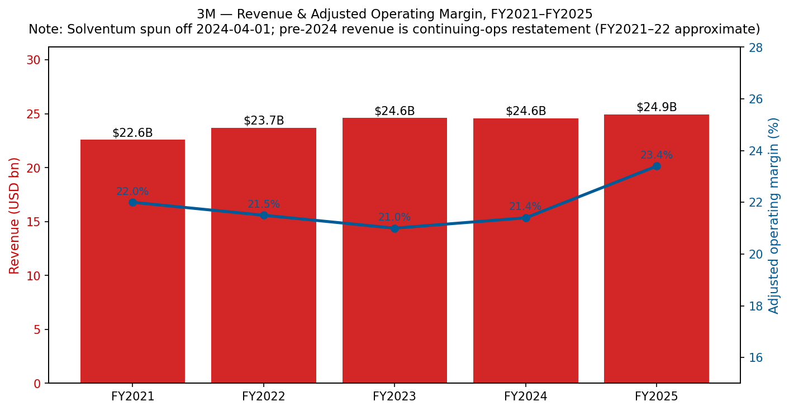
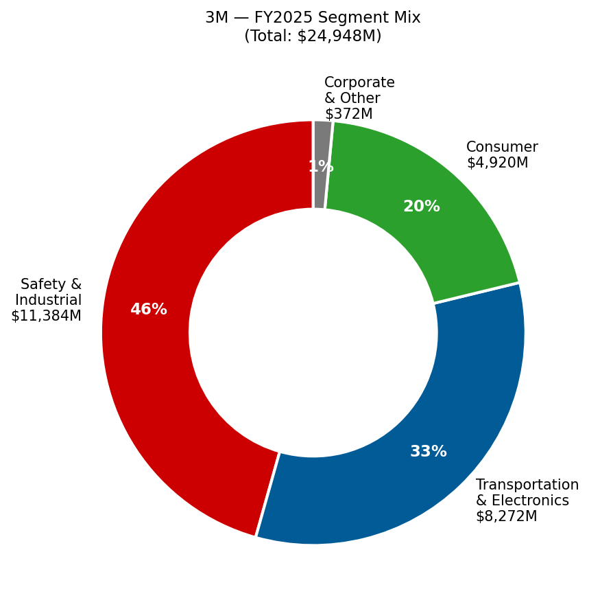
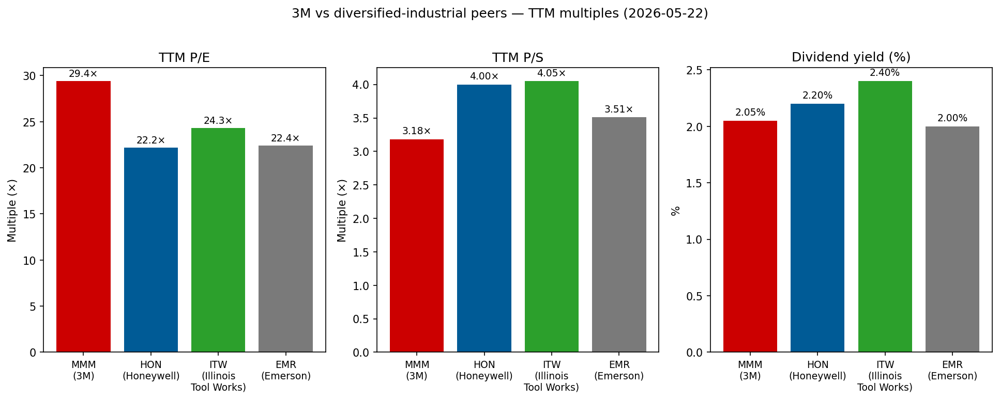

# 公司研究报告：3M 公司 (NYSE: MMM)

**截至日期：** 2026-05-26
**上市信息：** 纽约证券交易所 — 股票代码 `MMM` ([NYSE 公司主页](https://www.nyse.com/quote/XNYS:MMM));同时在 NYSE Texas 与 SIX Swiss Exchange 挂牌 ([3M 8-K 日期 2026-02-03,封面页](https://www.sec.gov/Archives/edgar/data/66740/000006674026000037/mmm-20260203.htm))
**总部地址：** 3M Center, St. Paul, Minnesota 55144-1000 ([3M 10-K FY2025,封面页](https://www.sec.gov/Archives/edgar/data/66740/000006674026000014/mmm-20251231.htm))
**成立时间：** 1902 年于美国明尼苏达州 Two Harbors 创立,原名 Minnesota Mining and Manufacturing Company ([3M 公司历史页面](https://www.3m.com/3M/en_US/company-us/about-3m/history/))
**会计年度截止日：** 12 月 31 日(FY2025 截止于 2025-12-31;FY2025 10-K 于 2026-02-03 提交)
**行业背景锚点：** 野村《Greater China Semi: A guide to Semi renaissance in 2026~30F》2026-05-21 ([行业研报](/Users/x/projects/financial_agent/reports/sector/半导体材料.md)) — 3M 在野村 CMP 抛光垫修整器份额图 (Fig 43) 中占据最大的红色色块,在 CMP 抛光垫图 (Fig 42) 中位列前五,是唯一在大中华半导体复兴论中两个最激烈耗材细分赛道上均有实质席位的美国综合工业集团。

> **更新 — FY2026 业绩指引启动 (2026-01-20)：** 管理层启动 FY2026 调整后 EPS 指引区间为 **8.50–8.70 美元**(对比 FY2025 调整后 EPS 为 8.06 美元),调整后有机销售增长 **3%**,调整后经营利润率扩张 **70–80 个基点**,调整后经营现金流 56–58 亿美元、调整后自由现金流转化率 100%。这是 3M 在 Solventum 拆分后时代首次发布全年指引,标志着公司回归个位数增长、个位数利润率扩张、~100% 现金转化率的运营框架——即管理层正在向市场释放 "公司已跨越 Solventum 拆分与 PFAS / 全氟化合物制造退出留下的低谷期" 的信号。EPS 区间上沿暗示同比 +8% 增长;现金流指引中值暗示 ~57 亿美元的内生资本生成,扣除 Section 1 提及的 ~40 亿美元以上传统诉讼现金流出后仍有可观余量。来源:[3M Q4 2025 业绩公告 2026-01-20,Exhibit 99.1](https://www.sec.gov/Archives/edgar/data/66740/000006674026000003/q42025-8kerexx991.htm)。

---

## 目录

1. 公司概览
2. 公司历史
3. 管理层
4. 产品与服务
5. 客户与市场进入策略
6. 行业概览
7. 竞争格局
8. 市场机会 (TAM)
9. 风险评估

References + Step 10 核查日志

---

## 1. 公司概览

3M 公司是一家总部位于美国明尼苏达州圣保罗的多元化工业技术综合集团,其历史可追溯至 1902 年的一家砂纸与磨料作坊 ([3M 公司历史](https://www.3m.com/3M/en_US/company-us/about-3m/history/))。在 2024 年 4 月医疗保健业务分拆为 Solventum Corporation (NYSE: SOLV)、并于 2025 年底完成 PFAS / 全氟化合物制造业务全面退出后,今天的 3M 是一家围绕 **Safety & Industrial (安全与工业) / Transportation & Electronics (运输与电子) / Consumer (消费) 三大业务部门 (post-Solventum spin-off 2024)** 组织运营的公司——FY2025 合并营收 **249.48 亿美元**,全球员工约 **60,500 人** ([3M 10-K FY2025,Item 1 业务及 Item 7 MD&A](https://www.sec.gov/Archives/edgar/data/66740/000006674026000014/mmm-20251231.htm))。当前的部门架构是于 2024-04-01 Solventum 拆分完成日正式生效的后拆分汇报结构 ([3M 8-K 日期 2024-04-01,Item 8.01 — 分拆完成](https://www.sec.gov/Archives/edgar/data/66740/000006674024000044/mmm-20240401.htm))。

公司在年报 Item 1 中以朴素的语言描述自己:"*3M is a diversified technology company with a global presence in the following businesses: Safety and Industrial; Transportation and Electronics; and Consumer. 3M is among the leading manufacturers of products for many of the markets it serves. Most 3M products involve expertise in product development, manufacturing and marketing, and are subject to competition from products manufactured and sold by other technologically oriented companies*" ([3M 10-K FY2025,Item 1 — General](https://www.sec.gov/Archives/edgar/data/66740/000006674026000014/mmm-20251231.htm))。3M 区别于其他公司的核心思维模型是其 **51 个技术平台**——粘合剂、磨料、薄膜、先进材料、光管理、微复制、非织造布、陶瓷、表面改性等——组合衍生出大约 6 万个 SKU,销往超过 200 个国家 ([3M 投资者日 2025 — 完整演示文稿活动页](https://investors.3m.com/news-events/events-presentations/detail/20250226-3m-2025-investor-day))。投资人需要记住的核心要点是:**半导体材料属于 Transportation & Electronics 部门内的 Electronics Materials Solutions 部门**——即半导体材料是某一部门的子部门下的一个子切片,而非独立报告口径;10-K 也未对该业务单独披露规模数据。本报告通篇致力于挖掘 10-K 中关于半导体相关业务披露的所有信息,在涉及分析师推断时明确标注,避免将公司整体经济指标错误归因到半导体细分业务。

**3M 的盈利逻辑。** 商业模式是工业技术产品销售——拥有专利保护、品牌认知度的耗材与耐用品组件,单位价值适中但销量巨大,广泛销往数千家客户的设计方案。分销渠道运行 "*through numerous distribution channels, including directly to users and through a wide range of e-commerce and traditional wholesalers, retailers, jobbers, distributors, and dealers in a wide variety of trades in many countries around the world*" ([3M 10-K FY2025,Item 1 — Distribution](https://www.sec.gov/Archives/edgar/data/66740/000006674026000014/mmm-20251231.htm))。单位经济模型有三个杠杆:(a) 专利保护配方与专有制造工艺嵌入的结构性毛利率;(b) 51 个技术平台之间的规模化生产力收益(同一氟聚合物化学体系可同时供应半导体光罩防尘薄膜、汽车薄膜与消费厨具用品);(c) 商业卓越定价计划——新任 CEO 已经将调整后经营利润率从 FY2024 的 21.4% 提升至 FY2025 的 23.4%,Brown 时代第一个完整年度 200bp 扩张 ([3M Q4 2025 业绩公告 2026-01-20](https://www.sec.gov/Archives/edgar/data/66740/000006674026000003/q42025-8kerexx991.htm))。

**部门规模 (FY2025 净销售)。** Safety & Industrial: **113.85 亿美元**,GAAP 部门经营利润率 22.7%;Transportation & Electronics: **82.72 亿美元**,GAAP 部门经营利润率 17.4%(剔除 PFAS 制造退出影响调整后 22.7%);Consumer: **49.20 亿美元**,过去两年消费可选品下行后利润率仅为个位数;Corporate and Other: 3.72 亿美元 ([3M 10-K FY2025,Note 3 — Segment Information](https://www.sec.gov/Archives/edgar/data/66740/000006674026000014/mmm-20251231.htm))。Transportation & Electronics 占合并 FY2025 营收的 33.2%,T&E 内的 **Electronics Materials Solutions 部门**(包含半导体相关产品—— CMP 抛光垫修整器 (CMP pad conditioner)、CMP 抛光垫、表面预处理高级磨料、光罩防尘薄膜 (mask pellicle)、显示薄膜 (display films)、电子粘合剂等)是五个部门之一,其他四个为 Advanced Materials、Automotive and Aerospace、Commercial Branding and Transportation、Display Materials and Systems ([3M 10-K FY2025,Item 1 — Business Segments](https://www.sec.gov/Archives/edgar/data/66740/000006674026000014/mmm-20251231.htm))。Electronics Materials Solutions 和 Advanced Materials 内的半导体相关产品体量比 3M 的汽车、磨料、PPE 业务小一个数量级,但战略上其重要性远超规模——因为它们触及驱动卖方倍数定价的逻辑与存储芯片先进节点路线图。

**地理分布 (FY2025 净销售)。** 美洲:135.79 亿美元 (54%);亚太:70.95 亿美元 (28%);EMEA(欧洲中东非洲):42.74 亿美元 (17%) ([3M 10-K FY2025,Note 3 — Net sales by geographic area](https://www.sec.gov/Archives/edgar/data/66740/000006674026000014/mmm-20251231.htm))。亚太区内,**中国大陆/香港销售额为 29.51 亿美元(约占总营收 12%)**——因其重要性及关税、中美脱钩的地缘政治敏感性而单独披露。3M 美国本土销售为 109.36 亿美元(占总营收 44%)。半导体材料子业务的亚洲倾斜度远高于公司整体平均——CMP 抛光垫修整器客户、光罩坯料消费者、防尘薄膜买家集中在台湾、韩国、中国大陆等晶圆厂产能聚集地——但 10-K 并未发布按部门 × 地理交叉的矩阵,使外部投资人无法单独剥离出半导体业务的地理分布。

*来源:[3M 10-K FY2025,Item 7 MD&A Results of Operations](https://www.sec.gov/Archives/edgar/data/66740/000006674026000014/mmm-20251231.htm) 及历年 10-K;FY2025 调整后经营利润率 = 23.4%,FY2024 = 21.4%;营收剔除已终止经营业务 (Solventum 于 2024-04-01 拆分)。*

上图展现了 Solventum 拆分带来的不连续性:医疗保健业务原本贡献约 80 亿美元营收和高十几个百分点的利润率,因此 FY2024 持续经营口径的起点才是 "正确的" 未来基线。从该基线出发,FY2025 数据为 **+1.5% 营收 / +200bp 调整后经营利润率**——即 Brown 主导的商业卓越与 PFAS 退出清理正在转化为利润率修复的早期证据,即便有机增长尚未完全重新加速。

*来源:[3M 10-K FY2025,Note 3 Segment Information](https://www.sec.gov/Archives/edgar/data/66740/000006674026000014/mmm-20251231.htm)。为清晰起见 Corporate & Other 未纳入。*

**估值快照 (截至 2026-05-22)。** 数据来源自市场数据聚合器 ([Stockanalysis.com MMM 统计页](https://stockanalysis.com/stocks/mmm/statistics/)):

| 指标 | MMM | 多元化工业同业 | 行业背景 |
|---|---|---|---|
| 股价 | ~152.5 美元 | — | — |
| 市值 | **795.1 亿美元** | Honeywell ~1300 亿;Illinois Tool Works ~700 亿;Emerson ~700 亿 | DJIA 道指成分;S&P 500 |
| 企业价值 | 868.2 亿美元 | — | — |
| TTM P/E | **29.4×** | HON ~22×,ITW ~24×,EMR ~22× | S&P 500 工业板块中位数 ~22× |
| Forward P/E | 17.5× | HON ~19×,ITW ~22× | — |
| TTM P/S | **3.18×** | HON ~4×,ITW ~4×,EMR ~3.5× | — |
| P/B | 24.4× (股东权益基数受 PFAS 巨额计提侵蚀) | HON ~7×,ITW ~22× | — |
| EV / EBITDA | 13.9× | HON ~13×,ITW ~16× | — |
| 股息收益率 | 2.05% (派息率 60%) | HON 2.2%,ITW 2.4% | — |
| 回购收益率 | 2.32% | — | — |
| 52 周价格变化 | +2.0% | — | — |

*来源:MMM 及同业 TTM P/E 和 P/S 数据 [Stockanalysis.com MMM](https://stockanalysis.com/stocks/mmm/statistics/)、[Stockanalysis.com HON](https://stockanalysis.com/stocks/hon/statistics/)、[Stockanalysis.com ITW](https://stockanalysis.com/stocks/itw/statistics/)、[Stockanalysis.com EMR](https://stockanalysis.com/stocks/emr/statistics/),拉取日期 2026-05-22。*

**如何理解倍数。** MMM 29.4× 的 TTM P/E 高于其多元化工业同业 (HON / ITW / EMR 均在 20 低位区) 是出于两个方向相反的原因。建设性解读:Forward P/E 17.5× *低于*同业,意味着市场已经按接近 17–18× 的倍数对 FY2026 调整后 EPS 指引 (8.50–8.70 美元) 进行了定价——与中周期工业股的估值一致;29.4× 的 TTM P/E 因 PFAS 诉讼计提对 GAAP 盈利的拖累、Solventum 拆分带来的可比基数断裂、以及 PFAS 制造产品一次性计提而人为偏高。*分析师视角:* 在调整后 EPS 口径下,股价 **并未被显著高估**——剔除诉讼噪声后与同业基本对齐。看空解读:GAAP 到调整后的桥接是真金白银流出公司。10-K 显示 FY2025 仅一年内与重大诉讼净成本相关的税前现金支付就达 35 亿美元,且多年期支付义务足够长尾,即便经营表现健康也会压缩股东回报 ([3M Q4 2025 业绩公告 2026-01-20,Special items 表](https://www.sec.gov/Archives/edgar/data/66740/000006674026000003/q42025-8kerexx991.htm))。24.4× 的高市净率是一个红色信号,但理解了股东权益基数受损后就一目了然: PFAS 相关 Public Water Suppliers ("PWS") 公共水务和解金额为 105–125 亿美元,2024–2036 年支付;Combat Arms 耳塞诉讼 ("CAE") 和解金额为 60 亿美元,2023–2029 年支付 ([3M 10-K FY2025,Note 17 — Commitments and Contingencies](https://www.sec.gov/Archives/edgar/data/66740/000006674026000014/mmm-20251231.htm))。Section 9 将估值问题延伸到倍数压缩风险评估。

**股东回报。** 即使诉讼压顶,3M 仍持续兑现 "股息贵族" 地位—— FY2025 通过股息与股票回购合计向股东返还约 **35 亿美元** ([3M Q4 2025 业绩公告 2026-01-20](https://www.sec.gov/Archives/edgar/data/66740/000006674026000003/q42025-8kerexx991.htm))。Q4 2025 单季返还 9 亿美元。自 1916 年起 3M 每个季度都派发股息,2024 年 Solventum 拆分重置后,连续 67 年提高股息 ([3M 投资者关系 — 股票信息 / 股息](https://investors.3m.com/stock-information/dividends))。
