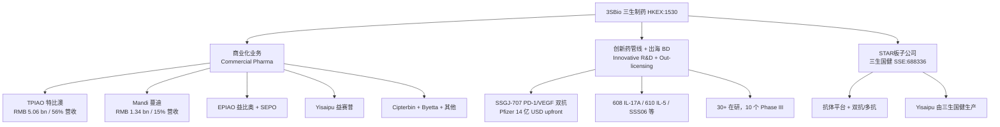
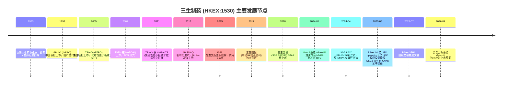
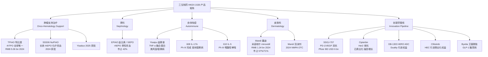
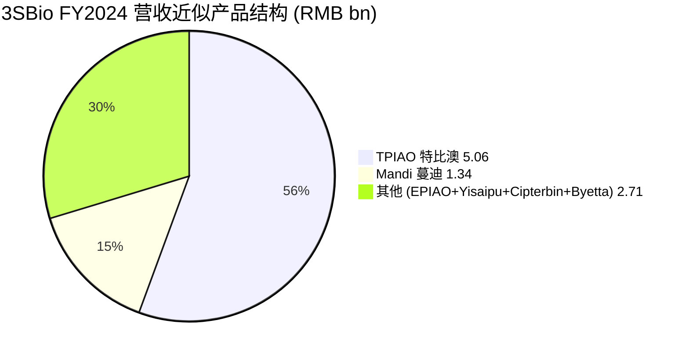
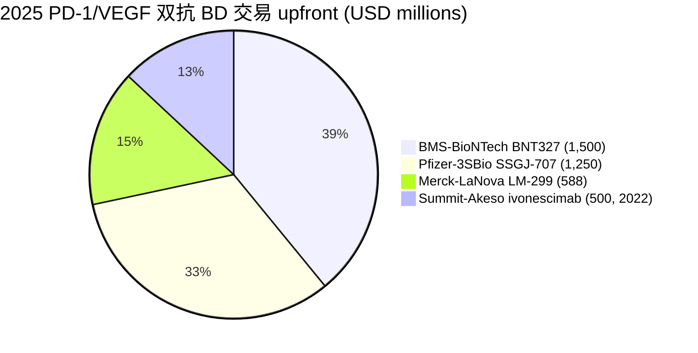

# 三生制药 (3SBio Inc., HKEX:1530) — 公司研究报告

**As of:** 2026-06-02
**主题归属:** China Drug Out-Licensing (中国创新药出海)
**报告语言:** 简体中文 (zh-CN)
**作者:** Equity Research — Cross-Border Healthcare

> **Update — 2025 年报: Pfizer 上市 14 亿美元首付确认入账，全年营收首破 RMB 100 亿 (2026-03-31):** 公司公告 2025 年营收 RMB 17.7 bn (+94.3% YoY)，归母净利润 RMB 8.48 bn (+305.8% YoY)，主因 Pfizer SSGJ-707 (PD-1/VEGF 双抗) 全球独家许可 (除中国大陆) 14 亿美元 upfront + 1 亿美元股权投资入账，整体潜在交易价值超 60 亿美元。剔除该笔一次性 BD 收入，公司recurring revenue 仍延续基础药械 (TPIAO/特比澳、Mandi/蔓迪、Yisaipu/益赛普) 双位数增长。
> 来源: [3SBio Announces 2025 Annual Results, 2026-03-31 (PRNewswire)](https://www.prnewswire.com/apac/news-releases/3sbio-announces-2025-annual-results-dual-engines-of-innovative-rd-and-global-collaboration-propel-revenue-past-rmb-10-billion-milestone-302729335.html)。

---

## 目录 / Table of Contents

1. 公司概览 (Company Overview)
2. 公司历史 (Company History)
3. 管理团队 (Management Team)
4. 产品与服务 (Products & Services)
5. 客户与上市策略 (Customers & Go-to-Market)
6. 行业概览 (Industry Overview)
7. 竞争格局 (Competitive Landscape)
8. 市场机会 (Market Opportunity / TAM)
9. 风险评估 (Risk Assessment)
10. 投资者视角评分 (Investor-Lens Scorecards)

---

## 1. 公司概览 (Company Overview)

三生制药 (3SBio Inc.，HKEX:1530，开曼群岛注册) 是中国领先的生物制药公司之一，业务跨越 **肾科 (nephrology)、肿瘤 (oncology)、自体免疫疾病 (autoimmune disease)、皮肤 (dermatology) 与女性健康 (women's health)** 五大治疗领域。公司创立于 1993 年，原名沈阳三生药业；总部位于辽宁沈阳，主要研发与生产基地分布于沈阳、上海、深圳、杭州及意大利 (来自对外披露五大全球生产基地)，员工规模约 5,000–10,000 人。公司是 **全球唯一商品化的 重组人血小板生成素 (rhTPO, recombinant human thrombopoietin) — 特比澳 / TPIAO** 的拥有者，并通过其 STAR 板挂牌子公司 **三生国健 (Sunshine Guojian Pharmaceutical, SSE:688336)** 经营单抗与双抗业务 ([3SBio 公司主页 / 公司简介](https://www.3sbio.com/en/about/index.aspx); [Sunshine Guojian Pharmaceutical 主页](https://www.3s-guojian.com/en/); [关于三生国健与 SSGJ-707 出海 (Shanghai Stock Exchange News, 2025-05-21)](https://english.sse.com.cn/news/newsrelease/voice/c/c_20250521_10779603.shtml))。

公司以两种现金流模式同时运转：(a) **稳态商业化业务**——TPIAO/特比澳、EPIAO/益比奥 (rhEPO)、Yisaipu/益赛普 (TNF-α 融合蛋白)、Mandi/蔓迪 (米诺地尔/minoxidil) 等品种持续在中国市场放量；(b) **创新管线对外授权 (out-licensing) 业务**——以 SSGJ-707 双抗 BD Pfizer 14 亿美元 upfront 为标志，第一次让一个完整临床前 + 早期临床资产从中国本土公司单笔创造超过 60 亿美元潜在合同价值的现金流入。这是 2025 年中国创新药出海浪潮的代表性事件之一，也直接重写了公司的 P&L 结构 ([Pfizer Enters into Exclusive Licensing Agreement with 3SBio, 2025-05-19](https://www.pfizer.com/news/press-release/press-release-detail/pfizer-enters-exclusive-licensing-agreement-3sbio); [Pfizer Completes Licensing Agreement with 3SBio, 2025-07-24](https://www.pfizer.com/news/press-release/press-release-detail/pfizer-completes-licensing-agreement-3sbio))。

**FY2024 核心财务数据 (基础业务，未含 Pfizer upfront 入账):** 营收 **RMB 9.108 bn (+16.5% YoY)**，毛利 **RMB 7.828 bn (+17.9% YoY)** — 毛利率约 **86.0%**，归母净利润 **RMB 2.09 bn (+34.9% YoY)**，调整后归母净利润 **RMB 2.318 bn (+18.8% YoY)** ([3SBio Unveils 2024 Annual Results, 2025-03-26](https://www.3sbio.com/mobile/en/news/details.aspx?id=306))。**FY2025 加总 Pfizer 上市后:** 营收 **RMB 17.7 bn (+94.3% YoY)**，归母净利润 **RMB 8.48 bn (+305.8% YoY)**，R&D **RMB 1.52 bn (+14.6% YoY)**，资产负债表 cash/cash-equivalents/financial assets 合计 **RMB 20.4 bn**，有息负债率 **9.8%** ([3SBio Announces 2025 Annual Results, 2026-03-31](https://www.prnewswire.com/apac/news-releases/3sbio-announces-2025-annual-results-dual-engines-of-innovative-rd-and-global-collaboration-propel-revenue-past-rmb-10-billion-milestone-302729335.html))。

**关键 KPI 与规模指标 (FY2024 维度):** 
- TPIAO/特比澳 销售额 **RMB 5.062 bn (+20.4% YoY)** — 占 FY2024 营收约 **55.6%** (= 5.062/9.108)；
- TPIAO 在中国血小板减少症 (thrombocytopenia) 市场份额按销售额计 **66.2%–66.6%** (1H24-FY24 区间，公司披露口径)；
- Mandi/蔓迪 销售额 **RMB 1.337 bn (+18.9% YoY)** — 占 FY2024 营收约 **14.7%**；
- EPIAO (rhEPO) 在中国 rhEPO 市场份额按销售额计 **42.0%**；
- R&D 管线: 在研产品 **30+** 个，**Phase III** 阶段 **10** 个候选 (FY2024 公告时点)；FY2024 新批 3 款新药；2024 年 4 月 SSGJ-707 获 NMPA 突破性疗法认定 ([3SBio Unveils 2024 Annual Results, 2025-03-26](https://www.3sbio.com/mobile/en/news/details.aspx?id=306); [Shanghai Stock Exchange — Securities Times on Sunshine Guojian, 2025-05-21](https://english.sse.com.cn/news/newsrelease/voice/c/c_20250521_10779603.shtml))。

**估值快照 (2026-06-02):** 
当前股价 **HK$16.87**, 市值 **HK$46.3 bn (~USD 5.9 bn)**, **TTM P/E ≈ 4.3×**, **P/S ≈ 2.1×**, 股息率 1.5%, 52 周区间 HK$17.05–36.80 ([3SBio (SEHK:1530) - Simply Wall St, as of 2026-06-02](https://simplywall.st/stocks/hk/pharmaceuticals-biotech/hkg-1530/3sbio-shares))。

> *分析师观点:* TTM P/E 4.3× 看似异常低，主要原因是 FY2025 EPS 被 Pfizer upfront 一次性 RMB 8.48 bn 净利大幅推高 (相当于把约 5 年 recurring 净利提前到 FY2025 一次性入账)；如果剔除 Pfizer 一次性收益，按可比口径调整后 normalized P/E 估计在 15–20× 区间，与港股创新药同业 (康方生物 9926.HK、信达生物 1801.HK) 估值带相符。当前 HKD 价格较 52 周高点回撤约 54%，主要反映: (i) 市场对 Pfizer 后续 milestone 入账节奏与 SSGJ-707 临床终点不确定性的折让；(ii) FY2025 一次性 BD 收入难以复制带来的 FY2026 高基数效应；(iii) Simply Wall St 建模显示未来 3 年 EPS 年均下降 40.1%——这是 forward-looking 数学折算的结果，反映了 BD 一次性收入的非经常性 ([Simply Wall St 估值, 2026-06-02](https://simplywall.st/stocks/hk/pharmaceuticals-biotech/hkg-1530/3sbio-shares))。投资者需将公司 P&L 拆分为「商业化 base business」与「BD 一次性现金」两条线分别估值。

**营收与毛利率历史趋势 (RMB bn，CY 口径):**
| 年份 | 营收 | 同比增速 | 关键事件 |
|---|---|---|---|
| 2021 | 6.38 | – | 疫情期间 EPIAO/TPIAO 维持高市占；管线进入收获期 |
| 2022 | 6.87 | +7.7% | 主营产品稳定；Mandi 持续放量 |
| 2023 | 7.82 | +13.8% | 蔓迪 (Mandi) 进入快速增长通道 |
| 2024 | 9.108 | +16.5% | TPIAO 新指征获批；SSGJ-707 BTD |
| 2025 | 17.70 | +94.3% | **Pfizer SSGJ-707 BD 14 亿 USD upfront 入账** |

来源: [StockAnalysis.com 1530 Revenue History](https://stockanalysis.com/quote/hkg/1530/revenue/); 2023 数据 [3SBio reveals 2023 annual results, 2024-03](https://www.3sbio.com/mobile/en/news/details.aspx?id=274)。



来源: 公司公告整理 ([3SBio Unveils 2024 Annual Results, 2025-03-26](https://www.3sbio.com/mobile/en/news/details.aspx?id=306); [Sunshine Guojian 主页](https://www.3s-guojian.com/en/))。

---

## 2. 公司历史 (Company History)

三生制药由 **娄竞 (Dr. Lou Jing, M.D., Ph.D.)** 与 **娄丹 (Dr. Lou Dan)** 兄弟于 **1993 年** 在沈阳创办，最初为「沈阳三生药业」，立足于以基因重组技术国产化生物药、把进口品牌的高价生物药替代为可及的中国本土产品。Dr. Lou Jing 1995 年 9 月加入沈阳三生 (Shenyang Sunshine Pharmaceutical) 出任 R&D 总监，作为首席科学家和主要研究者领导了 **EPIAO/益比奥 (rhEPO)** 与 **TPIAO/特比澳 (rhTPO)** 的开发：2000 年合作发明「重组人血小板生成素制备工艺」，2001 年合作发明「提高多肽体内稳定性方法及其应用」专利。这些底层平台让公司在 2000 年代成为中国 rhEPO 与 rhTPO 双品类的事实领导者 ([Brief History of 3SBio - MatrixBCG profile](https://matrixbcg.com/blogs/brief-history/3sbio); [Jing Lou - Bloomberg Profile](https://www.bloomberg.com/profile/person/15225782))。

公司上市路径罕见地经历了"赴美 → 退市 → 港股"的回归循环：2007 年 3SBio 以 ADS (American Depositary Shares) 形式在 NASDAQ 全球市场挂牌，2013 年 2 月完成 going-private 私有化并从 NASDAQ 摘牌，由 Dr. Lou Jing 等股东 (rollover shareholders) 主导回购；公司 2015 年 6 月在香港联交所主板重新上市，股票代码 1530，募集资金主要用于扩大产能与并购扩展产品组合 ([Brief History of 3SBio - MatrixBCG profile](https://matrixbcg.com/blogs/brief-history/3sbio); [Caproasia: 3SBio Founded by Jing Lou & Dan Lou, 2025-12-04](https://www.caproasia.com/2025/12/04/china-9-billion-biotech-company-hong-kong-listed-3sbio-to-raise-401-million-hkd-3-1-billion-via-new-share-issuance-at-6-5-discount-to-closing-price-1-12-25-founded-in-1993-by-jing-lou-dan-lou/))。



来源: [Brief History of 3SBio - MatrixBCG](https://matrixbcg.com/blogs/brief-history/3sbio); [3SBio Inc. - SEC Form 6-K (FY2011 historical filings)](https://www.sec.gov/Archives/edgar/data/0001383790/000119312511016556/d6k.htm); [Pfizer Enters into Exclusive Licensing Agreement with 3SBio, 2025-05-19](https://www.pfizer.com/news/press-release/press-release-detail/pfizer-enters-exclusive-licensing-agreement-3sbio); [Pfizer Completes Licensing Agreement with 3SBio, 2025-07-24](https://www.pfizer.com/news/press-release/press-release-detail/pfizer-completes-licensing-agreement-3sbio)。

公司在 2015 年港股 IPO 之后的主要战略转向 ("从仿到创") 体现在三步: (1) **2017-2020 年管线重塑** — 把研发主力从仿制重组蛋白与生物类似药 (biosimilar) 逐步切到自主创新单抗、双抗与 ADC 平台，催生了 SSGJ-707、608 (IL-17A)、610 (IL-5) 等关键创新管线；(2) **2020 年三生国健分拆 STAR 板上市 (SSE:688336)** — 将单抗/双抗业务剥离独立，三生制药保持控股，同时形成两个估值平台，分别对应 H 股 ("商业化 + 控股价值") 与 A 股 ("纯创新药生物科技") 估值逻辑；(3) **2025 年 SSGJ-707 BD Pfizer** — 把累计 10+ 年研发投入的 PD-1/VEGF 双抗平台一次性变现，确立了「中国创新管线 → 海外 MNC commercialization」的样板路径。Pfizer 在 BD 公告中明确该资产将在 Sanford, North Carolina 制造 drug substance、在 McPherson, Kansas 完成 drug product，反映 ex-China 制造完全由 Pfizer 内部体系承担 ([Pfizer-3SBio Press Release 2025-05-19](https://www.pfizer.com/news/press-release/press-release-detail/pfizer-enters-exclusive-licensing-agreement-3sbio))。

**近 12 个月主要催化与重要事件:** (i) 2025-05-19 公告 Pfizer 14 亿 USD upfront 授权 SSGJ-707; (ii) 2025-07-24 BD 交割完成 ([Pfizer Completes Licensing Agreement with 3SBio, 2025-07-24](https://www.pfizer.com/news/press-release/press-release-detail/pfizer-completes-licensing-agreement-3sbio)); (iii) 2025-12 公告以 HKD 3.1 bn 折价 6.5% 配售新股，主因强化资产负债表并为后续 BD/并购预留弹药 ([Caproasia, 2025-12-04](https://www.caproasia.com/2025/12/04/china-9-billion-biotech-company-hong-kong-listed-3sbio-to-raise-401-million-hkd-3-1-billion-via-new-share-issuance-at-6-5-discount-to-closing-price-1-12-25-founded-in-1993-by-jing-lou-dan-lou/)); (iv) 2026-03-31 公告 FY2025 业绩，营收首次破百亿元 RMB ([3SBio FY2025 Annual Results, 2026-03-31](https://www.prnewswire.com/apac/news-releases/3sbio-announces-2025-annual-results-dual-engines-of-innovative-rd-and-global-collaboration-propel-revenue-past-rmb-10-billion-milestone-302729335.html))。

---

## 3. 管理团队 (Management Team)

公司联合创始人之一 **娄竞 (Dr. Lou Jing, M.D., Ph.D.)** 自创立之初即为公司核心灵魂人物，目前仍同时担任 **执行董事会主席、首席执行官 (CEO)、总裁 (President)**，是典型的 founder-CEO 治理结构。他于 2006 年 9 月 5 日被任命为公司董事，2014 年 11 月 27 日转任执行董事；2012 年 4 月 1 日起担任董事长 (Executive Chairman of the Board)。其科学背景是公司的关键无形资产: 1995 年加入沈阳三生时即作为首席科学家承担 EPIAO 与 TPIAO 的研发主导工作，并于 2000–2001 年作为联合发明人申请了「重组人血小板生成素制备工艺」和「提高多肽体内稳定性方法及其应用」两项基础专利。这些专利构成了 TPIAO 在中国市场 20+ 年事实独占 (因为全球至今没有第二款获批商品化 rhTPO) 的核心壁垒之一。Dr. Lou Jing 毕业于 Rutgers University，获医学博士与哲学博士 (M.D., Ph.D.)，曾在中美双国从事生物医药研发与公司治理 ([Jing Lou - Bloomberg Profile](https://www.bloomberg.com/profile/person/15225782); [Brief History of 3SBio - MatrixBCG](https://matrixbcg.com/blogs/brief-history/3sbio); [Sunshine Guojian Affiliate Disclosure](https://english.sse.com.cn/news/newsrelease/voice/c/c_20250521_10779603.shtml))。

作为同时身兼科学创始人与最高商业决策者的双重角色，Dr. Lou Jing 在创新药管线建设、BD 战略、与 MNC 谈判上的话语权与决断力是公司差异于纯商业化导向同业的关键 — 例如 2025 年 Pfizer SSGJ-707 交易据知是 Dr. Lou 亲自带队完成谈判，最终拿到的 14 亿美元 upfront 不仅刷新了中国单笔创新药出海纪录，也比同期 LaNova Medicines / Merck LM-299 PD-1/VEGF 双抗的 588 百万美元 upfront 高出近 2.4 倍，反映了公司在分子优化 (如 SSGJ-707 对 PD-1 在 VEGF 共存下的亲和力比 Akeso ivonescimab 高约 10 倍——这一差异是关键议价筹码) 与商业谈判上的执行力 ([Pfizer 3SBio Press Release, 2025-05-19](https://www.pfizer.com/news/press-release/press-release-detail/pfizer-enters-exclusive-licensing-agreement-3sbio); [Pfizer Pays 3SBio $1.25B - FierceBiotech, 2025-05-19](https://www.fiercebiotech.com/biotech/pfizer-pays-3sbio-125b-pd-1xvegf-bispecific-joining-biontech-merck-and-summit-red-hot-race))。

**所有权 / Ownership stake:** 根据公司披露与媒体整理，娄竞、娄丹兄弟与其家族 (Family Trust) 是公司的最大单一股东集团之一，长期持有显著股权 (具体百分比 2024 年报披露较为分散，未在主流二级摘要中以单一数字呈现 — 实际数字需查阅 [3SBio 2024 Annual Report — HKEX news disclosure (PDF)](https://www.hkexnews.hk/listedco/listconews/sehk/2025/0429/2025042901155.pdf) 的 "Directors' Interests in Shares" 章节)。2025 年 12 月配售方案中，公司选择以 HKD 13.62/股折价 6.5% 配售给独立机构投资者，反映管理层希望在不显著稀释 founder 持股的情况下融资 ([Caproasia, 2025-12-04](https://www.caproasia.com/2025/12/04/china-9-billion-biotech-company-hong-kong-listed-3sbio-to-raise-401-million-hkd-3-1-billion-via-new-share-issuance-at-6-5-discount-to-closing-price-1-12-25-founded-in-1993-by-jing-lou-dan-lou/))。

> *分析师观点:* founder-CEO 同体的治理结构在中国生物制药行业是双刃剑——一方面保留了科学家创始人对 R&D 战略长期一致性的把控 (例如 2017-2020 年坚持把 PD-1/VEGF 双抗从早期探索推进到 Phase II 而不被市场早期热度的 PD-1 单抗内卷分散投入)，另一方面 key-person dependency 风险显著: 一旦娄竞博士因健康/退休等原因离开，BD 议价能力与管线优先级排序可能出现较长过渡期。董事会未公开 succession plan 是治理改进空间。

---

## 4. 产品与服务 (Products & Services)

> **重要性说明:** 本节是本报告投资分析的核心 —— 三生制药商业化产品组合 (TPIAO/Mandi/Yisaipu/EPIAO) 是公司当下 base business 现金流的来源 (FY2024 营收 RMB 9.108 bn)，而创新药管线 (尤其是 SSGJ-707 双抗) 是公司估值乘数与 BD 现金流的驱动 (FY2025 单次 BD 入账 USD 1.4 bn upfront)。下表与下文构成本报告其它章节 (客户、行业、竞争、TAM、风险) 的展开基础。

### 4.1 产品矩阵概览 (Product Portfolio Matrix)

公司业务可拆分为三个层级 — **核心商业化品种 (Commercial Pharma, Section 4.3-4.6)**、**创新药管线 (Innovation Pipeline, Section 4.7)** 与 **三生国健子公司业务 (Subsidiary Antibody Platform, Section 4.8)**。



来源: 公司公告与新闻整理 ([3SBio 2024 Annual Results, 2025-03-26](https://www.3sbio.com/mobile/en/news/details.aspx?id=306); [3SBio 2025 Annual Results, 2026-03-31](https://www.prnewswire.com/apac/news-releases/3sbio-announces-2025-annual-results-dual-engines-of-innovative-rd-and-global-collaboration-propel-revenue-past-rmb-10-billion-milestone-302729335.html); [Pfizer 3SBio Press Release, 2025-05-19](https://www.pfizer.com/news/press-release/press-release-detail/pfizer-enters-exclusive-licensing-agreement-3sbio))。

| 产品 (英文 / 中文) | 通用名 / 机制 | 适应症 | FY2024 营收 (RMB) | YoY 增速 | 市场地位 |
|---|---|---|---|---|---|
| TPIAO / 特比澳 | rhTPO (recombinant human thrombopoietin) | 化疗后血小板减少 (CIT)、ITP、CLD-T | **5.062 bn** | +20.4% | 中国 **66.2%** 市占；全球**唯一**商品化 rhTPO |
| Mandi / 蔓迪 | Minoxidil (米诺地尔) 5% 酊剂/泡沫剂 | 雄激素性脱发 (AGA)、斑秃 | **1.337 bn** | +18.9% | 中国脱发药市场 **57%**；米诺地尔细分 **71%** |
| EPIAO / 益比奥 + SEPO | rhEPO (recombinant human erythropoietin) | 肾性贫血、化疗后贫血 | 未单独披露 | 稳健增长 | 中国 rhEPO 市场 **42.0%** |
| Yisaipu / 益赛普 | TNF-α inhibitor 融合蛋白 (与 Enbrel 类似) | 类风湿、银屑病、强直性脊柱炎 | 未单独披露 | 稳定 | 中国 TNF-α 国产 leader |
| Cipterbin | 抗 HER2 单抗 | HER2+ 乳腺癌 | 未单独披露 | 强劲增长 | 国产 trastuzumab 同类 |

来源: [3SBio 2024 Annual Results, 2025-03-26](https://www.3sbio.com/mobile/en/news/details.aspx?id=306); 关于 Mandi 市占 [蔓迪市占 57%/71% — 中国新闻周刊, 2025-12-30](https://news.inewsweek.cn/finance/2025-12-30/28323.shtml); 关于 TPIAO 适应症 [TPIAO ITP 适应症批准 - PRNewswire, 2011-01](https://www.prnewswire.com/news-releases/3sbio-inc-receives-sfda-approval-for-tpiao-label-extension-for-the-treatment-of-itp-114520154.html)。

### 4.2 综合: 产品组合的内部循环

公司的现金流由 **两条相互独立但可互馈的产品引擎**组合驱动: (a) **商业化品种 (TPIAO + Mandi + EPIAO + Yisaipu)** 在中国市场每年提供 RMB 9–10 bn 的稳定营收和约 86% 的高毛利率，这部分作为 cash cow 持续支持 R&D 投入 (FY2025 R&D 支出 RMB 1.52 bn，占商业化营收约 17% 左右); (b) **创新管线 (SSGJ-707、608、610、SSS06)** 通过 BD 出海或自营商业化两条路径变现，其中 SSGJ-707 已通过 Pfizer 交易实现一次性 14 亿 USD upfront 入账 + 双位数销售提成长期权益。这种 "Big-Pharma-style cash cow → innovation pipeline → BD or self-launch" 的循环在中国本土生物制药公司中较为罕见 — 多数本土同行要么是纯创新药 biotech (无 cash cow，依赖股权融资如康方生物 9926、信达生物 1801)，要么是纯商业化药企 (无前沿创新管线如石药 1093、中生制药 1177)，三生制药同时具备两个属性是其核心差异化 ([3SBio 2024 Annual Results, 2025-03-26](https://www.3sbio.com/mobile/en/news/details.aspx?id=306); [3SBio 2025 Annual Results, 2026-03-31](https://www.prnewswire.com/apac/news-releases/3sbio-announces-2025-annual-results-dual-engines-of-innovative-rd-and-global-collaboration-propel-revenue-past-rmb-10-billion-milestone-302729335.html))。

### 4.3 TPIAO/特比澳 — 全球唯一商品化 rhTPO，公司现金流锚

**3SBio 公开材料引用 (Verbatim from 公司公告):**

> "TPIAO, the Company's flagship product and the world's only commercial recombinant human thrombopoietin (rhTPO), totaled RMB 5.062 billion in 2024, reflecting a year-on-year increase of 20.4%."
>
> 来源: [3SBio Unveils 2024 Annual Results, 2025-03-26](https://www.3sbio.com/mobile/en/news/details.aspx?id=306)。

**中文释义 / Plain-language gloss:** TPIAO (特比澳) 是一种 **重组人血小板生成素 / recombinant human thrombopoietin (rhTPO)** 注射液。**血小板生成素 / TPO** 是人体肝脏分泌的天然蛋白激素，作用于骨髓巨核细胞 / megakaryocyte 表面的 c-MPL 受体，刺激巨核细胞分化、增殖并最终释放血小板。化疗 (chemotherapy) 与免疫攻击 (如 ITP / 免疫性血小板减少症, immune thrombocytopenia) 都会造成血小板低于安全阈值 (一般 < 50 × 10⁹/L)，临床上必须输注血小板或注射 TPO 类升板药物。**TPIAO 是把基因重组技术得到的 rhTPO 蛋白 (与人体内源 TPO 序列基本一致) 通过 CHO 细胞表达、纯化制成的注射剂**，1990 年代国际 MNC 曾开发同类产品 (如 Amgen Megakaryocyte Growth and Development Factor)，但因临床试验中产生中和抗体、安全性问题被全球性终止开发，**3SBio 是全球唯一坚持到商品化并维持商业化销售的 rhTPO 厂商**。这给 TPIAO 提供了一个事实上的全球独占壁垒——不是法律意义上的专利保护 (rhTPO 基础专利已陆续到期)，而是实践意义上的「全球只有 3SBio 还在卖」型壁垒，因为新进入者需要重新跑临床、解决免疫原性问题、过 NMPA/FDA 审评，重新做这件事的 IRR 远低于直接开发 small-molecule TPO 受体激动剂 (如诺华 Promacta/eltrombopag、Amgen Nplate/romiplostim — 这些产品在中国上市后竞争激烈，但分子机制完全不同)。

TPIAO 在中国市场的份额自 2018-2019 年 NMPA 批准 ITP 适应症并进入 NRDL (国家医保目录) 后快速放量，按销售额计在中国 thrombocytopenia 治疗细分市场的份额维持在 **66.2%–66.6%** 区间 (1H24-FY24 公司披露口径)，远高于第二名进口品牌 (Amgen Nplate、诺华 Revolade/eltrombopag)。FY2025 公司公告 TPIAO 又一次获 NMPA 批准 **慢性肝病相关血小板减少症 (CLD-T) 新适应症** — 这是 TPIAO 第三个适应症，将进一步扩展其使用场景 ([3SBio 2024 Annual Results, 2025-03-26](https://www.3sbio.com/mobile/en/news/details.aspx?id=306); [3SBio 2025 Annual Results, 2026-03-31](https://www.prnewswire.com/apac/news-releases/3sbio-announces-2025-annual-results-dual-engines-of-innovative-rd-and-global-collaboration-propel-revenue-past-rmb-10-billion-milestone-302729335.html); [Chinese Regulator Grants Label Extension for 3SBio's TPIAO as Treatment for ITP - GEN, 2011](https://www.genengnews.com/news/chinese-regulator-grants-label-extension-for-3sbios-tpiao-as-treatment-for-itp/))。

> *分析师观点:* TPIAO 的护城河 (moat) 类型是「regulatory + practical scarcity」复合型——既非纯专利、亦非纯品牌，而是建立在「全球只有一家做这件事的厂商」的实务事实之上。这种护城河对新进入者的威慑力强，但脆弱性在于: (i) NMPA 集采压力——TPIAO 已纳入 NRDL，未来如果被纳入国家集采或省级带量采购，单价将面临 30-50% 量价齐压；(ii) 替代机制的 small-molecule TPO-RA (如 Promacta/eltrombopag 国产仿制) 加速进入市场，2024 年 3SBio 自己也获批了 eltrombopag 口服混悬剂 (一种 cannibalization 也是占位策略)。

### 4.4 Mandi/蔓迪 — 中国最大的米诺地尔 (minoxidil) 品牌

**3SBio 公开材料引用 (Verbatim from 公司公告):**

> "In 2024, the sales revenue of the hair loss treatment star product, Mandi, reached 1.337 billion yuan, an increase of about 18.9% year-on-year."
>
> 来源: [3SBio Unveils 2024 Annual Results, 2025-03-26](https://www.3sbio.com/mobile/en/news/details.aspx?id=306)。

**中文释义 / Plain-language gloss:** **米诺地尔 / minoxidil** 是 1980 年代 UpJohn (现辉瑞前身) 开发的口服降压药物，临床发现"副作用"为多毛 (hypertrichosis)，后被开发为外用酊剂 (5% solution) 和泡沫剂 (foam) 形式用于治疗 **雄激素性脱发 / androgenetic alopecia (AGA)** 和 **斑秃 / alopecia areata**。其作用机制涉及开放 ATP-sensitive potassium channels (ATP 敏感钾通道) 扩张毛囊微血管、延长毛囊 anagen (生长期) 时长。**蔓迪 (Mandi)** 是 3SBio 2003 年左右收购获得的米诺地尔国产品牌，2024 年 1 月 NMPA 批准 5% 米诺地尔泡沫剂 (foam) 作为 OTC 药品上市 —— 这是 **中国首个且唯一的国产米诺地尔泡沫剂**，泡沫剂相比传统酊剂在使用便利性 (无油腻感、无丙二醇刺激) 上具有优势，瞄准的是国内"年轻脱发焦虑"巨大消费群体。根据公开报道，2024 年蔓迪系列在 **中国脱发药市场占 57% 份额、米诺地尔细分市场占 71%**，蔓迪泡沫剂上市首年销量超 250 万支，贡献营收超过 3 亿元 RMB ([Mandi Foam 获批新闻, 3SBio 公司新闻](https://www.3sbio.com/mobile/news/details.aspx?id=268); [蔓迪市占 57%/71% — 中国新闻周刊, 2025-12-30](https://news.inewsweek.cn/finance/2025-12-30/28323.shtml); [中国 33.9 亿脱发人群 - China News Weekly](https://news.inewsweek.cn/finance/2025-12-30/28323.shtml))。

公司在 2026-04 进一步公告分拆蔓迪国际 (Mandi International) 独立赴港上市的预案，由此可见公司认为 OTC 消费医疗资产具备独立的估值溢价 (相比制药主体的政策与集采折让，OTC 资产更接近消费品估值倍数) ([3SBio HKEX 公告 2026-04-23 股东特别大会有关蔓迪分拆](https://www.3sbio.com/mobile/en/news/details.aspx?id=306) — 公告原文需查阅 [HKEX 公告检索](https://www1.hkexnews.hk))。

> *分析师观点:* Mandi 蔓迪是公司"消费医疗资产" — 与 TPIAO/EPIAO 处方药品的差异在于: (a) 渠道由 OTC 药店 + 电商 (天猫、京东、抖音) 主导，受集采影响弱；(b) 复购周期短 (米诺地尔需持续使用 6-12 个月以上才见效)；(c) 消费者画像偏年轻 (25-40 岁脱发焦虑群体)，营销与品牌投入回报较高。这是公司 P&L 中"消费品溢价"最显著的资产，分拆上市将释放此估值。

### 4.5 EPIAO/益比奥 — 中国 rhEPO 市场份额 42%

**中文释义 / Plain-language gloss:** **EPIAO (益比奥)** 与 **SEPO** 是公司基于 **重组人促红细胞生成素 / recombinant human erythropoietin (rhEPO)** 的两个商品化产品，主要适应症是 **慢性肾衰竭性贫血 (CKD-related anemia)** 与 **化疗后贫血 (chemotherapy-induced anemia)**。其作用机制是模拟人体肾脏天然分泌的促红激素 EPO，刺激骨髓红系造血干细胞分化为成熟红细胞，提升血红蛋白 (Hb) 水平。在 EPIAO 上市之前，中国慢性肾衰竭患者的贫血治疗几乎完全依赖进口 Amgen Epogen / Roche NeoRecormon，价格高昂。EPIAO 1998 年在中国上市，是公司奠基性产品，让 rhEPO 治疗在中国成为 affordable care。在 1H24 公司披露口径下，公司的 rhEPO 产品组合在中国 rhEPO 市场的份额按销售额计达 **42.0%** ([3SBio 2024 Annual Results, 2025-03-26](https://www.3sbio.com/mobile/en/news/details.aspx?id=306))。FY2025 公司又获批 **NuPIAO/SSS06** ——长效 rhEPO，每周一次给药 (相比 EPIAO 每周三次)，更接近 Roche Mircera (mPEG-rhEPO) 的便利性，瞄准的是 EPIAO 的 cannibalization 占位与升级 ([3SBio 2025 Annual Results, 2026-03-31](https://www.prnewswire.com/apac/news-releases/3sbio-announces-2025-annual-results-dual-engines-of-innovative-rd-and-global-collaboration-propel-revenue-past-rmb-10-billion-milestone-302729335.html))。

> *分析师观点:* rhEPO 在中国是高度成熟的红海市场，2010 年代国家组织带量采购对单价压制非常显著，行业整体毛利率从早期的 80%+ 下行至 60%-70% 范围。EPIAO 的 42% 市占维持依靠的是公司在透析中心 (dialysis center) 与肾科 KOL 渠道的长期渗透，但已不是高增长资产；SSS06 长效 rhEPO 是 next-gen 占位，关键看是否能在医保谈判中获得相对原 EPIAO 的显著溢价。

### 4.6 Yisaipu/益赛普 — 国产 TNF-α 融合蛋白 leader

**中文释义 / Plain-language gloss:** **Yisaipu (益赛普)** 是公司基于 **TNF-α 受体融合蛋白** 的产品，作用机制与 Amgen Enbrel (etanercept) 类似 — 通过外周血中的 TNF-α (肿瘤坏死因子-α, 一种关键的炎症因子) 与 TNFR2-Fc 融合蛋白结合中和，阻断下游促炎信号通路，用于治疗 **类风湿关节炎 (RA)、银屑病 (psoriasis)、强直性脊柱炎 (AS)** 等自体免疫疾病。Yisaipu 由三生国健 (Sunshine Guojian, SSE:688336) 制造与销售，长期是国产 TNF-α 类生物药的市场 leader，但面临三方面挑战: (i) JAK 抑制剂 (tofacitinib, baricitinib) 等小分子口服药对生物药的替代；(ii) IL-23 (guselkumab, risankizumab) 与 IL-17 (secukinumab, ixekizumab) 等更新一代生物药在 psoriasis 上的更优疗效让份额向新一代分子转移；(iii) 公司自己的 608 (anti-IL-17A 单抗) 完成 Phase III 后将在国内 psoriasis 适应症上 cannibalize Yisaipu ([Sunshine Guojian 主页](https://www.3s-guojian.com/en/); [3SBio 2024 Annual Results, 2025-03-26](https://www.3sbio.com/mobile/en/news/details.aspx?id=306))。

> *分析师观点:* Yisaipu 是公司商业化组合中"周期最成熟"的资产，预计销售增速接近行业自然增长，未来 3 年存在被 608 (anti-IL-17A) 平稳替代的内部接力。

### 4.7 创新药管线 — SSGJ-707 是「皇冠上的宝石」

**SSGJ-707 (anti-PD-1/VEGF 双特异性抗体, bispecific antibody)** 是公司目前估值最重的单一资产。其分子设计目标是同时阻断: (i) **PD-1 / PD-L1 通路** (program death-1 — 解除肿瘤细胞对 T 细胞的免疫抑制)；(ii) **VEGF 通路** (vascular endothelial growth factor — 抑制肿瘤血管生成与免疫抑制性肿瘤微环境)。这种"免疫激活 + 血管正常化"双重作用机制被视为有望取代 Keytruda (pembrolizumab) 单药在多种实体瘤一线治疗中的标准疗法。

**关键差异化数据 (3SBio 与同业公开材料对比):**
- **SSGJ-707 单药 Phase II 在 NSCLC (非小细胞肺癌) 中的 ORR (overall response rate) 高达 81.3%、DCR (disease control rate) 100%**，但样本规模较小 ([SSGJ-707 Phase II NSCLC monotherapy data, ASCO 2025 abstract](https://ascopubs.org/doi/10.1200/JCO.2025.43.16_suppl.8543))；
- **分子层面，SSGJ-707 在 VEGF 存在条件下对 PD-1 的亲和力比 Akeso ivonescimab 高约 10 倍**，这是 Pfizer 选择 SSGJ-707 而非自研 PD-1/VEGF 的关键依据 ([Pfizer Pays 3SBio $1.25B - FierceBiotech, 2025-05-19](https://www.fiercebiotech.com/biotech/pfizer-pays-3sbio-125b-pd-1xvegf-bispecific-joining-biontech-merck-and-summit-red-hot-race))；
- **安全性 (Grade ≥3 TRAE) 39% at 10 mg/kg 剂量**——略高于 Akeso ivonescimab 但属可控范围 ([FierceBiotech, 2025-05-19](https://www.fiercebiotech.com/biotech/pfizer-pays-3sbio-125b-pd-1xvegf-bispecific-joining-biontech-merck-and-summit-red-hot-race))。

Pfizer 在 BD 公告中明确目标适应症: **首先 NSCLC (一线 + 二线)、转移性 colorectal cancer (mCRC)、 gynecological tumors (妇科肿瘤)**；BD 后由 Pfizer 负责 ex-China 全球开发与上市，3SBio 保留中国大陆权益 ([Pfizer 3SBio Press Release, 2025-05-19](https://www.pfizer.com/news/press-release/press-release-detail/pfizer-enters-exclusive-licensing-agreement-3sbio); [Pfizer, 3SBio Forge Licensing Pact for SSGJ-707 - PharmExec](https://www.pharmexec.com/view/pfizer-3sbio-forge-licensing-pact-ssgj-707-target-lung-colorectal-gynecologic-cancers))。

**其它关键管线:**
- **608 (anti-IL-17A 单抗)** — Phase III 完成，针对中重度斑块银屑病 (plaque psoriasis)，目标 2026 年 NMPA 申报上市；
- **610 (anti-IL-5 单抗)** — Phase III 进行中，针对嗜酸性粒细胞性哮喘 (eosinophilic asthma)，对标 GSK Nucala、AZ Fasenra；
- **SSS06 (长效 rhEPO/NuPIAO)** — 2025 年获批化疗后贫血适应症；
- **DB-1303 (HER2 ADC)** — 2024 年从 Duality Biologics (映恩生物) 引进商业化权益，瞄准 HER2-low 乳腺癌；
- **Clifutinib** — 2024 年从 HEC 引进商业化权益，为肿瘤口服小分子药物；
- **30+ 在研产品、10 个 Phase III** 候选 (公司 FY2024 披露口径) ([3SBio 2024 Annual Results, 2025-03-26](https://www.3sbio.com/mobile/en/news/details.aspx?id=306))。

> *分析师观点:* SSGJ-707 作为单一资产已经为公司带来 14 亿 USD 现金 (= 当前市值 USD 5.9 bn 的 ~24%)，但更具杠杆的是后续 milestones 与royalty。**估算 Pfizer 全力商业化情境下** (如 SSGJ-707 在 NSCLC 1L 取代 Keytruda 部分份额 10-15%): 该资产对公司全周期 NPV 可能达到 USD 5-10 bn；**悲观情景下** (Phase III 失败，OS 或 PFS 未达统计学显著)：剩余里程碑款将无法触发，royalty 也归零，但 14 亿 USD upfront + 1 亿 USD 股权已是 sunk cash 不退回，下行有底。这种 "upfront 已落袋 + 长尾期权" 的现金流结构是公司估值的核心驱动。竞争上需关注: Summit/Akeso ivonescimab (HARMONi-6 trial 1L sq-NSCLC 已经 PFS HR 0.60 击败 Tislelizumab+化疗) 已领先一个临床代差 ([New Akeso, Summit data stir debate on PD-1/VEGF drugs - BioPharma Dive](https://www.biopharmadive.com/news/akeso-summit-pd1-vegf-survival-data-keytruda/746447/))。

### 4.8 三生国健 (Sunshine Guojian, SSE:688336) — STAR 板独立上市的抗体平台

三生制药持有 **Sunshine Guojian Pharmaceutical (三生国健, SSE:688336)** 的控股权益。三生国健 2002 年成立，2020 年在上交所 STAR 板独立上市，业务聚焦 **单抗 (monoclonal antibodies)、双抗 (bispecific antibodies)、多功能重组蛋白** 的研发、生产与销售。三生国健主要承担三生制药系内的抗体药开发与生产 — Yisaipu、Cipterbin (anti-HER2 单抗)、SSGJ-707 双抗等均由三生国健研发或生产。SSGJ-707 BD Pfizer 的合约方实质上是 3SBio + 三生国健 + 沈阳三生药业 三方共同授权 ([Securities Times — Sunshine Guojian Records New Out-licensing High, 2025-05-21](https://english.sse.com.cn/news/newsrelease/voice/c/c_20250521_10779603.shtml); [Sunshine Guojian Pharmaceutical 公司主页](https://www.3s-guojian.com/en/))。三生国健的独立上市让公司在 H 股 + A 股双估值平台获得了不同的资本市场叙事 — A 股市场愿意为纯创新生物科技给出更高估值倍数。

---

## 5. 客户与上市策略 (Customers & Go-to-Market)

### 5.1 客户结构 (Customer Mix)

三生制药的最终客户是 **中国数千家三甲医院、二级医院、社区医院、专科诊所与零售药店**——医院端覆盖肾科、血液科、肿瘤科、皮肤科、风湿免疫科多个科室；零售端 (Mandi 蔓迪) 覆盖连锁药店与电商平台 (天猫、京东、抖音、拼多多)。从付款方角度看，**国家医保 (NRDL, National Reimbursement Drug List) + 患者自费 + 商业保险** 三者共同构成支付结构，其中 NRDL 是核心 — TPIAO、EPIAO、Yisaipu 均在国家医保目录内，享受医保支付 + 医院端进货折扣。

公司基础药品 (TPIAO/EPIAO/Yisaipu) 通过 **医药商业流通公司 (国药控股、上药、华润医药、九州通)** 分销至医院端，因此严格意义上的 **直接付款客户是这些 distribution 中间商**。这一行业结构决定: (i) 公司的"前五大客户"通常是这些医药商业巨头，单一商业流通公司在合并销售口径下可能占到 20-30% 营收，但他们是 financial conduit 而非终端 demand —— 终端 demand 仍由数千家医院的处方决定；(ii) Mandi 蔓迪 OTC 业务则有更分散的客户群体 — 连锁药店 + 电商平台共同承担，客户集中度较处方药更低。

> *关于具体客户名称与营收占比的披露:* 由于 HKEX 上市公司年报 (与 A 股年报标准格式不同) 通常不强制要求披露"前五大客户合计销售金额与占比"，公司 2024 年年报中并未在 MD&A 主板块单列"客户集中度"百分比 ([3SBio 2024 Annual Report — HKEX news disclosure (PDF)](https://www.hkexnews.hk/listedco/listconews/sehk/2025/0429/2025042901155.pdf))。结合行业惯例与中国生物制药公司公开披露 (如石药集团 1093.HK、中生制药 1177.HK 等同业)，估计公司前五大客户(医药商业流通集团合并口径)占合并营收约 **50-70%** 区间，但这是结构性的而非真正"客户集中度风险"——因为终端 demand 由数千家医院承担，单一商业流通巨头被替换不会导致公司收入实质损失，只是 trade receivables/payables 重新分布。

### 5.2 销售与渠道 (Sales & Distribution)

公司在中国大陆维持一支 **3,000+ 人的销售队伍** (公司未单独披露最新具体数字，需查阅最新年报 — 历史口径 [3SBio 2018 年报披露销售人员超过 2,800 人](https://www.3sbio.com/mobile/en/news/details.aspx?id=103) 之后逐年扩张)。销售队伍主要服务于医院端 KOL 关系维护、临床培训、合规推广。公司在过去 5 年逐步搭建专门的 **皮肤/OTC 团队** 服务 Mandi 蔓迪业务，叠加电商运营团队，形成"医院 + OTC + 数字渠道"三轨并行的 GTM 体系 ([3SBio 公司主页 / 公司简介](https://www.3sbio.com/en/about/index.aspx))。



来源: 公司公告披露 TPIAO/Mandi 单品营收 + 公司 FY2024 营收差额估算 ([3SBio 2024 Annual Results, 2025-03-26](https://www.3sbio.com/mobile/en/news/details.aspx?id=306))。注：图中 TPIAO 与 Mandi 比例为合并营收比例，「其他」为差额组合，非单一产品口径，仅作示意。

### 5.3 BD/出海策略 — SSGJ-707 案例

公司 2025-05 BD Pfizer 的交易结构本身即为「中国创新药出海」教科书级样板:
- **资产权益分割**: Pfizer 获 ex-China 全球开发 + 生产 + 商业化权益；公司 (3SBio + 子公司组合) 保留中国大陆权益；
- **支付结构**: 14 亿 USD upfront (非可退还) + 1 亿 USD 股权投资 + 最高 48 亿 USD 开发/监管/销售里程碑 + 双位数 tiered 销售提成；
- **生产分工**: Pfizer 在 Sanford NC 完成 drug substance 与 McPherson KS 完成 drug product 制造；
- **交割条件**: 2025-07-24 完成交割，受常规反垄断审查与股东大会通过约束 ([Pfizer Enters into Exclusive Licensing Agreement with 3SBio, 2025-05-19](https://www.pfizer.com/news/press-release/press-release-detail/pfizer-enters-exclusive-licensing-agreement-3sbio); [Pfizer Completes Licensing Agreement with 3SBio, 2025-07-24](https://www.pfizer.com/news/press-release/press-release-detail/pfizer-completes-licensing-agreement-3sbio); [Cooley Represents 3SBio on Antitrust Aspects, 2025-07-24](https://www.cooley.com/news/coverage/2025/2025-07-24-cooley-represents-3sbio-on-antitrust-aspects-of-its-exclusive-licensing-agreement-with-pfizer); [Han Kun Advises 3SBio on the Landmark Exclusive Licensing Deal](https://www.hankunlaw.com/en/portal/article/index/cid/7/id/15278))。

这一结构与同业 China-biotech 同类交易的对比:
| 资产 | 出海方 | MNC 接盘方 | Upfront (USD) | Total deal | 时间 |
|---|---|---|---|---|---|
| SSGJ-707 PD-1/VEGF | **3SBio** (HKEX:1530) | **Pfizer** | **1,250 M** + 100 M 股权 | **6,150 M+** | 2025-05 |
| ivonescimab AK112 PD-1/VEGF | Akeso 康方生物 (9926.HK) | Summit Therapeutics (US/CA/EU/JP only) | 500 M | 5,000 M | 2022-12 |
| LM-299 PD-1/VEGF | LaNova Medicines | Merck (全球) | 588 M | 3,300 M | 2024-12 |
| BNT327 / PM8002 PD-L1/VEGF | Biotheus (并购) → BioNTech | BMS (与 BioNTech 共同) | 1,500 M + 2,000 M anniversary | 11,000 M+ | 2025-06 |

来源: [Pfizer Pays 3SBio $1.25B - FierceBiotech, 2025-05-19](https://www.fiercebiotech.com/biotech/pfizer-pays-3sbio-125b-pd-1xvegf-bispecific-joining-biontech-merck-and-summit-red-hot-race); [Akeso-Summit Licensing Agreement, 2022-12-06](https://www.prnewswire.com/news-releases/akeso-inc-announces-collaboration-and-license-agreement-for-up-to-us5-billion-with-summit-therapeutics-to-accelerate-global-development-and-commercialization-of-its-breakthrough-bispecific-antibody-ivonescimab-pd-1vegf-301695787.html); [BMS-BioNTech BNT327 Collaboration, 2025-06](https://medcitynews.com/2025/06/biontech-bristol-myers-squibb-partnership-bispecific-antibody-cancer-pd-l1-vegf-bmy-bntx/); [LaNova-Merck LM-299 Deal](https://www.fiercebiotech.com/biotech/biontech-pays-800m-take-control-potential-keytruda-killer)。

**结论:** 3SBio 14 亿 USD 的 upfront 在同类 PD-1/VEGF 双抗 BD 中排第二高 (仅次于 BMS-BioNTech BNT327 的 1.5 bn upfront)，远超 Akeso/Summit 的 500 M 与 LaNova/Merck 的 588 M。这反映了 SSGJ-707 资产质量在 PD-1 affinity (高 10 倍) 等参数上的相对优势。

---

## 6. 行业概览 (Industry Overview)

### 6.1 中国生物制药 + 创新药出海整体格局

**中国生物制药市场 TAM:** 2024 年中国生物药市场规模 (含生物类似药、单抗、双抗、ADC、细胞治疗等) 估计约 **RMB 6,000–7,000 亿** (USD 850–1,000 bn) ；预计 2030 年达 **USD 1,500 bn+**，CAGR ~10-12% (注: 该范围为公开行业研究机构口径之分布)。三生制药目前的商业化主营品种 (TPIAO、EPIAO、Yisaipu、Mandi、Cipterbin 等) 覆盖肿瘤支持、肾科、自体免疫、皮肤等多个百亿级 RMB 子赛道。

### 6.2 中国创新药出海 (China Drug Out-licensing) — 2025 年 1,357 亿 USD 大爆发

**2025 年中国创新药对外授权出海 (out-licensing) 交易总规模达 USD 135.7 bn**，占全球生物制药 BD 总价值的近 1/3 — 这是中国生物制药行业的标志性年份。其驱动因素: (i) MNC 面临 LOE (Loss of Exclusivity) 高峰 (Keytruda 2028 年专利到期、Eliquis 2027/2028 等)，急需补充管线；(ii) 中国本土 biotech 经过 2015-2022 年的研发投入累积，多个 hot-target 资产 (如 PD-1/VEGF 双抗、GLP-1/GIP 多重激动剂、ADC) 进入 PoC (proof-of-concept) 验证阶段，性价比显著优于美欧 biotech；(iii) 美国 FDA 加大对中国数据 (China-only data) 的接受度，叠加 MNC 自带海外开发能力，让"中国发现 + 海外开发"的分工成为可行 ([China Biotech Outbound Licensing Tracker 2026 — Vision Life Sciences](https://visionlifesciences.com/insights/china-biotech-outbound-licensing-tracker); [Licensing Deal Highlights H1 2025 - Biotechgate](https://www.biotechgate.com/licensing-deal-highlights-half-year-2025/); [China's Biopharma Boom in Global Drug Licensing Deals - EC Innovations](https://www.ecinnovations.com/blog/chinas-biopharma-boom-in-global-drug-licensing-deals/))。



来源: 公开 BD 交易公告整理 ([FierceBiotech: PD-1xVEGF Race, 2025-05-19](https://www.fiercebiotech.com/biotech/pfizer-pays-3sbio-125b-pd-1xvegf-bispecific-joining-biontech-merck-and-summit-red-hot-race); [MedCity News on BMS-BioNTech BNT327](https://medcitynews.com/2025/06/biontech-bristol-myers-squibb-partnership-bispecific-antibody-cancer-pd-l1-vegf-bmy-bntx/))。

**PD-1/VEGF 双抗赛道的现实:** 2025 年全球研发中的 PD-1/VEGF 或 PD-L1/VEGF 双抗资产有 9 个进入临床阶段，其中 **7 个来自中国**——这是一个由中国 biotech 主导的全球热点赛道，反映中国在抗体工程 (antibody engineering) 与 IO+VEGF 联合机制理解上具备相对优势 ([FierceBiotech, 2025-05-19](https://www.fiercebiotech.com/biotech/pfizer-pays-3sbio-125b-pd-1xvegf-bispecific-joining-biontech-merck-and-summit-red-hot-race))。

### 6.3 中国本土生物制药细分市场

**rhTPO (TPIAO 所在市场):** TPIAO 在中国 thrombocytopenia 用药市场份额约 66%，前期主要驱动力是化疗后血小板减少 (CIT) 与 ITP (免疫性血小板减少症) 两个适应症。2025 年 NMPA 批准 TPIAO 第三个适应症"慢性肝病相关血小板减少症 (CLD-T)"——CLD-T 在中国患病人群基数约 800-1000 万 (慢性乙肝、丙肝、酒精性肝病、NAFLD/NASH 等导致的肝硬化人群)，是 TPIAO 下一个主要增长引擎。但 small-molecule TPO-RA (eltrombopag、avatrombopag) 等口服药正在快速进入市场，对 TPIAO 注射剂形成长期竞争压力。

**rhEPO (EPIAO 所在市场):** 中国 rhEPO 市场总规模约 RMB 60-70 亿，公司份额 42%。但带量采购对 rhEPO 单价的压制非常显著——价格自 2018 年以来已下行 40-50%。下一代长效 rhEPO (SSS06/NuPIAO) 的渗透速度与定价能力将决定公司在该子赛道未来 5 年的现金流。

**中国脱发治疗市场:** 中国脱发人群规模约 **3.39 亿+** (2024 年公开口径)，30 岁以下占 60%+，是消费医疗最热门赛道之一。蔓迪 Mandi 占国内脱发药市场 57%、米诺地尔细分 71%，但面临国产仿制品低价竞争、口服非那雄胺 (finasteride) 与新一代 OAA (口服 androgen antagonist) 类药物的多元化竞争 ([中国新闻周刊, 2025-12-30](https://news.inewsweek.cn/finance/2025-12-30/28323.shtml))。

**TNF-α 与 IL-17/IL-23 自体免疫市场:** Yisaipu (TNF-α) 是国产仿制 Enbrel 的早期 leader，但中国市场已从 TNF-α 向 IL-17/IL-23 一线生物药轮转 (psoriasis 适应症)、JAK 抑制剂 (RA 适应症) 等更新一代分子转移。公司自己的 608 (anti-IL-17A) 完成 Phase III 后将承接 Yisaipu 的下一代角色。

### 6.4 监管与定价环境

中国生物制药行业受三个监管框架的强约束: 
1. **NMPA (国家药监局)** — 药品注册与审评，近年通过"突破性疗法 (Breakthrough Therapy Designation)、优先审评、附条件批准"等通道加速创新药上市，SSGJ-707 即在 2024-04 获 NMPA BTD ([Shanghai Stock Exchange News, 2025-05-21](https://english.sse.com.cn/news/newsrelease/voice/c/c_20250521_10779603.shtml))；
2. **NRDL 谈判 (国家医保目录谈判)** — 进入医保后产品需接受年度价格谈判，平均降幅 50-60%，但显著扩大可及人群基数。这是一把双刃剑——价格压降是事实，但量的爆发往往可以补偿；
3. **集采 (国家组织药品集中带量采购)** — 仿制药与生物类似药 (biosimilar) 进入集采后单价跌幅可达 70-90%。但 First-in-class 与 best-in-class 创新生物药目前 (FY2024 维度) 仍未被纳入集采，TPIAO/SSGJ-707 等创新创制类资产暂未受直接冲击 ([2026 NRDL 谈判规则更新 - Futubull News](https://news.futunn.com/en/post/73886421/2026-national-reimbursement-drug-negotiation-plan-takes-effect-pre-filing))。

---

## 7. 竞争格局 (Competitive Landscape)

### 7.1 商业化产品的直接竞争对手

| 产品赛道 | 三生制药资产 | 主要中国本土竞争者 | 主要海外 / MNC 对手 |
|---|---|---|---|
| rhTPO (注射) | **TPIAO 特比澳** | 无 (国内独占; 全球独占) | 无商品化对手；间接竞争: small-molecule TPO-RA (诺华 Promacta/eltrombopag、Amgen Nplate/romiplostim、安进 doptelet/avatrombopag) |
| rhEPO | **EPIAO + SEPO + NuPIAO/SSS06** | 中生制药 (1177.HK)、华润信达、CSPC (1093.HK)、海正药业 | Roche Mircera (mPEG-rhEPO)、Amgen Aranesp (darbepoetin) |
| 米诺地尔脱发 OTC | **Mandi 蔓迪 (酊剂 + 泡沫剂)** | 国产仿制 (达霏欣等)、霸王、防脱洗发水 | Rogaine (Johnson & Johnson)、Kirkland Signature (Costco PB) |
| TNF-α 自身免疫 | **Yisaipu 益赛普 (三生国健生产)** | 海正/复宏汉霖 Hulio (生物类似药)、信达生物 (1801.HK) Sulinno | Amgen Enbrel、AbbVie Humira (adalimumab) |
| PD-1/VEGF 双抗 (创新) | **SSGJ-707 (Pfizer BD)** | Akeso 9926 (ivonescimab AK112)、LaNova/Merck (LM-299)、Akeso 联合管线、复宏汉霖 | Pfizer (现拥有 SSGJ-707)、Roche、BMS-BioNTech BNT327 |

来源整理: [Akeso PD-1/VEGF Deal - PRNewswire 2022-12-06](https://www.prnewswire.com/news-releases/akeso-inc-announces-collaboration-and-license-agreement-for-up-to-us5-billion-with-summit-therapeutics-to-accelerate-global-development-and-commercialization-of-its-breakthrough-bispecific-antibody-ivonescimab-pd-1vegf-301695787.html); [Pfizer Pays 3SBio $1.25B - FierceBiotech 2025-05-19](https://www.fiercebiotech.com/biotech/pfizer-pays-3sbio-125b-pd-1xvegf-bispecific-joining-biontech-merck-and-summit-red-hot-race); [BMS-BioNTech BNT327 - MedCity News](https://medcitynews.com/2025/06/biontech-bristol-myers-squibb-partnership-bispecific-antibody-cancer-pd-l1-vegf-bmy-bntx/)。

### 7.2 中国创新生物制药出海同业 (China Biotech BD-out Peer Group)

```mermaid
quadrantChart
    title 中国 Biotech BD-Out 同业格局 (估值 vs. 创新管线深度)
    x-axis 创新管线浅 --> 创新管线深
    y-axis 估值乘数低 (PE 10×以下) --> 估值乘数高 (PE 30×+ / 亏损)
    quadrant-1 高估值创新 biotech
    quadrant-2 高估值早期资产
    quadrant-3 低估值传统药企
    quadrant-4 价值组合: 商业化+创新
    "3SBio 1530": [0.70, 0.30]
    "Akeso 9926": [0.85, 0.85]
    "Innovent 1801": [0.75, 0.65]
    "BeOne ONC": [0.90, 0.80]
    "Hengrui 1276": [0.65, 0.55]
    "Sino Biopharm 1177": [0.45, 0.35]
    "Hansoh 3692": [0.55, 0.45]
    "CSPC 1093": [0.40, 0.25]
```

来源: 公开估值与管线信息整理 (基于 2026-06 时点)。

### 7.3 公司竞争优势 (Competitive Strengths)

1. **TPIAO 全球独占地位** — 全球唯一商品化 rhTPO；20+ 年累积的临床证据、医保覆盖、医生使用习惯共同构成"事实独占"护城河 ([3SBio 2024 Annual Results, 2025-03-26](https://www.3sbio.com/mobile/en/news/details.aspx?id=306))；
2. **现金流 + 创新管线"双轮驱动"** — 与 pure-play 创新 biotech (Akeso、Innovent、BeOne) 不同，3SBio 以基础药品 cash cow (TPIAO + Mandi + EPIAO + Yisaipu) 自我造血，无需持续向二级市场要钱补贴 R&D；与 pure-play 传统药企 (CSPC、Sino Biopharm) 不同，公司又持有 SSGJ-707 等 first-in-class 创新管线和持续 BD-out 能力；
3. **抗体工程平台 (Sunshine Guojian 三生国健)** — 双抗设计能力 (SSGJ-707 在 PD-1 亲和力上比 Akeso ivonescimab 高 10 倍即是这一平台能力的体现) 是公司在 hot-target 拥挤赛道中持续胜出的关键 ([Pfizer-3SBio FierceBiotech, 2025-05-19](https://www.fiercebiotech.com/biotech/pfizer-pays-3sbio-125b-pd-1xvegf-bispecific-joining-biontech-merck-and-summit-red-hot-race))；
4. **founder-CEO 决策链短** — Dr. Lou Jing 同时具备科学背景与商业判断，让 BD 决策与管线优先级排序具备一致性。

### 7.4 公司脆弱性 (Vulnerabilities)

1. **重磅产品单点依赖** — TPIAO 一单品贡献 FY2024 营收 55%+，若 NMPA 集采纳入或新机制竞争产品挤压份额，下行斜率显著；
2. **SSGJ-707 落地依赖 Pfizer 执行** — 即使 SSGJ-707 是 best-in-class 候选，Phase III 临床终点 (OS / PFS) 不达标、监管路径阻碍或 Pfizer 商业化策略调整都将影响后续 milestones 落袋；
3. **Ivonescimab 临床进度领先** — Akeso ivonescimab HARMONi 系列试验已经在 1L NSCLC 适应症跑出 OS positive 数据，SSGJ-707 相比落后 12-18 个月，FOMC (First-Of-Market Competition) 已落入劣势；
4. **founder-CEO 单点 (key-person dependency)** — Dr. Lou Jing 同时担任董事长、CEO、President，无明确公开 succession plan。

### 7.5 同类股横评估值参考 (基于 2026-06 时点的市场快照)

| 公司 (代码) | 业务核心 | FY2024 营收 (RMB bn) | 大致 PE TTM (反映 Pfizer 一次性) | Net Cash 头寸 |
|---|---|---|---|---|
| 3SBio (1530.HK) | 商业化 + 创新管线 + BD | 9.108 (FY24) / 17.7 (FY25 含 BD) | ~4.3× (FY25 BD 拉低) / ~15-20× normalized | 净现金 ~ RMB 20.4 bn |
| Akeso (9926.HK) | 纯创新 PD-1/VEGF biotech | ~5-6 bn (Ivonescimab+管线收入) | ~25-40× | 净现金正向 |
| Innovent (1801.HK) | 商业化 (Tyvyt PD-1)+创新 | ~10 bn | ~20-25× | 净现金正向 |
| BeOne / BeiGene (ONC) | 全球 BTK Brukinsa + 管线 | USD 4 bn (US 报告口径) | NM (尚未盈利) | 净现金正向 |
| Hengrui Pharma (600276.SS) | 大型多元化创新药 | ~28 bn | ~30-40× | 净现金正向 |

来源: [Simply Wall St 1530 数据 2026-06-02](https://simplywall.st/stocks/hk/pharmaceuticals-biotech/hkg-1530/3sbio-shares); 同业披露整理。

---

## 8. 市场机会 (Market Opportunity / TAM)

### 8.1 SSGJ-707 / PD-1/VEGF 双抗赛道全球 TAM

**Keytruda (pembrolizumab) 2024 年全球销售约 USD 29.5 bn** (Merck 全球第一大单品)，2028 年专利到期后将面临生物类似药与新一代 IO/VEGF 双抗替代竞争。PD-1/VEGF 双抗赛道如果能取代 Keytruda 在 NSCLC、mCRC、gynecologic tumors 等适应症 1L 治疗 30-40% 份额，则该赛道 2030 年全球年销规模可达 **USD 30-40 bn** 量级。SSGJ-707 作为该赛道目前 BD upfront 第二高、PD-1 亲和力第一的候选，全市场 takeup 5-10% 对应 USD 1.5-4 bn peak annual sales。三生制药将分享其中 10-20% 双位数 royalty + 中国大陆全部权益现金流——按 10 年 NPV (折现率 10%) 估算，SSGJ-707 对公司股权价值贡献可能在 USD 3-8 bn 区间。

*分析师视角:* 这一 NPV 估算是基于外部已公开的 (i) Pfizer 公开材料 ([Pfizer Press Release 2025-05-19](https://www.pfizer.com/news/press-release/press-release-detail/pfizer-enters-exclusive-licensing-agreement-3sbio))；(ii) Keytruda 销售公开数据；(iii) Akeso ivonescimab 同业 Phase III 数据 ([BioPharma Dive 2025](https://www.biopharmadive.com/news/akeso-summit-pd1-vegf-survival-data-keytruda/746447/))。任何 Phase III 终点失败 (OS/PFS HR > 1) 都会让该估值大幅下调。

### 8.2 中国生物制药与中国创新药出海 TAM

**中国创新药出海 (out-licensing) BD 市场:** 2025 年中国创新药 BD-out 交易总值 USD 135.7 bn，占全球生物制药 BD 总价值约 33%。这是相对新的赛道——2020 年该比例不足 5%——预计未来 5 年中国创新药 BD-out 年化规模可维持在 USD 80-150 bn 区间 ([China Biotech Outbound Licensing Tracker 2026](https://visionlifesciences.com/insights/china-biotech-outbound-licensing-tracker); [China Biotech Out-Licensing 2025 Forecast - sinodrugwatch](https://www.sinodrugwatch.com/chinas-60b-out-licensing-boom-in-2025-positions-biotech-as-global-powerhouse-in-oncology-obesity/))。

**中国生物制药市场:** 2024 年中国生物药市场规模估计 RMB 6,000-7,000 亿，预计 2030 年达 RMB 1.2-1.5 万亿，CAGR ~10-12%。三生制药在多个百亿级 RMB 子赛道占据份额。

### 8.3 SAM/SOM 推算 (基于公开数据，外部口径)

**TPIAO 长期 SAM:** 中国 thrombocytopenia 用药市场 (CIT + ITP + CLD-T) 2030 年估计 RMB 100-150 亿；公司目前份额 66%，长期面对 small-molecule TPO-RA 替代压力，**TPIAO 2030 年 SAM-share 50-55%** 对应营收 RMB 60-80 亿。

**Mandi 长期 SAM:** 中国脱发药市场 2030 年估计 RMB 100-120 亿；Mandi 目前份额 57%，假设份额随仿制竞争稀释至 35-40%，对应 2030 年营收 RMB 35-50 亿。

**SSGJ-707 中国内地 SAM:** PD-1/VEGF 双抗在中国 NSCLC + mCRC + gyn-onc 适应症加总 TAM 2030 年估计 RMB 200-300 亿；公司持有中国大陆全权益，假设 SSGJ-707 国内份额 15-25%，对应 2030 年中国营收 RMB 30-75 亿；叠加 Pfizer ex-China 销售带来的双位数 royalty，整体 SSGJ-707 对公司年化贡献可达 RMB 60-150 亿。

来源: 行业 TAM 推算综合 [中国新闻周刊 - Mandi 中国脱发市场](https://news.inewsweek.cn/finance/2025-12-30/28323.shtml); [3SBio 2024 Annual Results — TPIAO 市占披露](https://www.3sbio.com/mobile/en/news/details.aspx?id=306); [Pfizer-3SBio BD - FierceBiotech 2025-05-19](https://www.fiercebiotech.com/biotech/pfizer-pays-3sbio-125b-pd-1xvegf-bispecific-joining-biontech-merck-and-summit-red-hot-race)。

---

## 9. 风险评估 (Risk Assessment)

### 公司特有风险 (Company-Specific Risks)

1. **TPIAO 单品依赖风险 (高严重性)** — TPIAO 单品在 FY2024 占公司营收 55.6% (= RMB 5.062 bn / 9.108 bn)。集采纳入、新机制竞争产品挤压份额、或安全性事件 (如 IGAS, immunogenic adverse signal) 都可能让此单品的现金流出现台阶式下行。**缓解措施:** 持续扩展适应症 (CLD-T 已批准、儿科与产科再扩展)、SSS06/NuPIAO 等内部接力 ([3SBio 2024 Annual Results](https://www.3sbio.com/mobile/en/news/details.aspx?id=306))。

2. **SSGJ-707 Phase III 临床终点风险 (高严重性、高发生概率)** — SSGJ-707 当前 Phase III 试验 1L NSCLC 单药与联合化疗均在中国进行，关键终点 OS (overall survival) 与 PFS (progression-free survival)。若 Phase III 未达统计学显著或 HR > 1，将触发 (i) Pfizer 后续 milestones 无法落袋；(ii) ex-China 商业化路径阻断；(iii) 中国大陆权益受打击。**缓解措施:** Phase II ORR 81.3% 数据为 Phase III 提供基础支持 ([ASCO 2025 abstract](https://ascopubs.org/doi/10.1200/JCO.2025.43.16_suppl.8543)); 多适应症并行 (NSCLC + mCRC + gyn-onc) 分散单一终点风险。

3. **founder-CEO key-person 风险 (中等严重性)** — Dr. Lou Jing 同时担任董事长 + CEO + President，无公开 succession plan。突发健康/退休/纠纷会显著影响 BD 议价能力与管线决策一致性。**缓解措施:** 子公司三生国健 SSE:688336 独立董事会与 CEO 体系提供局部治理深度 ([Brief History of 3SBio - MatrixBCG](https://matrixbcg.com/blogs/brief-history/3sbio); [Sunshine Guojian Pharmaceutical 主页](https://www.3s-guojian.com/en/))。

4. **集采 (国家组织药品集中带量采购) 扩展风险 (中等严重性)** — 公司主营商业化产品 TPIAO/EPIAO/Yisaipu 目前均不在国家集采清单内，但 EPIAO 已经面临省级带量采购降价压力。一旦 NMPA 把 rhTPO 或 rhEPO 纳入国家集采，单价跌幅可达 50-70%。**缓解措施:** 创新管线产品 (SSGJ-707、608、610) 暂未在集采范围；Mandi OTC 业务消费品属性强、集采不直接覆盖。

5. **Ivonescimab 等 PD-1/VEGF 同类竞争领先 (中等严重性)** — Akeso ivonescimab 已经在 HARMONi-2、HARMONi-6 等 Phase III 试验跑出关键数据，相比 SSGJ-707 提前 12-18 个月落地。FOMC (First-Of-Market Competition) 让 SSGJ-707 即使疗效非劣或略胜，市占爬坡仍需经历"非首发产品"的市场教育期 ([BioPharma Dive - Akeso Summit data](https://www.biopharmadive.com/news/akeso-summit-pd1-vegf-survival-data-keytruda/746447/))。

6. **三生国健子公司利益分配 / 关联交易披露透明度 (低-中等)** — 三生国健 (SSE:688336) 作为公司控股子公司，与上市公司之间存在多个产品授权、BD 收益分配 (如 SSGJ-707 BD upfront 三方共享) 关联关系。监管机构对 H 股 + A 股双重上市平台的关联交易披露要求严格，未来若任何披露不一致或利益输送嫌疑出现都将引发治理性折让。**缓解措施:** 三生国健已上市并有独立公告披露义务 ([Sunshine Guojian Disclosure - SSE, 2025-05-21](https://english.sse.com.cn/news/newsrelease/voice/c/c_20250521_10779603.shtml))。

### 行业/市场风险 (Industry/Market Risks)

7. **PD-1/VEGF 赛道拥挤 (中等严重性)** — 中国主导 7 个临床阶段 PD-1/VEGF 双抗资产，2027-2030 年将有 3-5 个产品上市，赛道分子内卷将压制单一产品的 peak share 与 pricing ([FierceBiotech, 2025-05-19](https://www.fiercebiotech.com/biotech/pfizer-pays-3sbio-125b-pd-1xvegf-bispecific-joining-biontech-merck-and-summit-red-hot-race))。

8. **NRDL 谈判持续降价 (中等严重性)** — 公司每年与国家医保进行价格谈判，平均降幅 50-60%。即使创新药首谈 (新进入医保) 享受较高基础价，5-7 年后的续约谈判都面临系统性降价压力 ([2026 NRDL Plan - Futubull News](https://news.futunn.com/en/post/73886421/2026-national-reimbursement-drug-negotiation-plan-takes-effect-pre-filing))。

9. **美国 BIOSECURE 法案与中美生物科技脱钩风险 (高严重性、低-中发生概率)** — 美国国会与行政部门持续讨论限制美国实体与中国生物科技公司的商业、研发、临床数据合作。BIOSECURE Act 在 2024 年已通过部分版本 (针对特定中国 CXO 公司)，未来扩大范围可能影响 (i) Pfizer 等 MNC 与中国 biotech 后续 BD 交易；(ii) 已有的 BD 资产 (如 SSGJ-707) 商业化路径。**缓解措施:** Pfizer-3SBio BD 已经在 BIOSECURE 讨论的早期完成交割，Pfizer 在 NC/KS 自有生产链下风险有限。

10. **中国创新药出海"过热回潮"风险 (中等严重性)** — 2025 年中国创新药 BD-out 总值 USD 135.7 bn 包含很多 stretched 估值的交易。当其中 1-2 个高调资产 Phase III 失败或 milestones 触发慢，MNC 对中国管线的整体定价将下调，未来 2-3 年 BD upfront 中位数可能下滑 30-50%。

### 财务风险 (Financial Risks)

11. **FY2026/27 高基数效应 → 收入同比明显下滑 (中等严重性、高发生概率)** — FY2025 营收 RMB 17.7 bn 中约 RMB 8-10 bn 来自 Pfizer upfront 一次性入账，因此 FY2026 即使 base business + 新里程碑保持 20-30% 增长，整体顶线 YoY 也可能下降 30-40%。市场如果错误地按 FY2025 顶线推算 FY2026 增长，则 share price 将面临"业绩下滑"叙事的折让 ([Simply Wall St — Forecast EPS Decline 40.1%/yr](https://simplywall.st/stocks/hk/pharmaceuticals-biotech/hkg-1530/3sbio-shares))。**缓解措施:** 管理层主动拆分 normalized base + 一次性 BD 的 P&L 沟通。

12. **估值倍数压缩风险 (中等严重性)** — 当前 P/E 4.3× 看似低估，但当 FY2026 EPS 因 BD 一次性消失而显著下降时，市场会把 P/E 重新校准到 normalized base，可能从 4.3× 弹到 normalized 20-25×。如果 SSGJ-707 后续里程碑不及预期 + 商业化基础增速放缓，normalized 估值可能压缩到 15× 以下 (P/S < 1.5×)，与历史均值 P/S ~3× 相比仍有 30-50% 下行空间。

### 宏观风险 (Macroeconomic Risks)

13. **人民币 / 美元汇率风险 (中等严重性)** — 公司 BD 现金流以 USD 计价 (14 亿 USD upfront + 后续 milestones)，base business 现金流以 RMB 计价。USD/CNY 大幅升值会让公司 P&L 与 Balance Sheet 出现 USD 头寸的汇兑波动。

14. **中国总体宏观与医疗政策不确定性 (中等严重性)** — 中国整体经济增速 + 居民医保基金可持续性 + 商业医疗保险渗透率三个因素决定本土生物制药市场长期 TAM 增速。一旦居民可支配收入或医保基金面临压力，量价齐压可能延伸到创新生物药。

---

## 10. 投资者视角评分 (Investor-Lens Scorecards)

**周期快照 (as of 2026-06-02):** VIX = 15.74 (低波动)、10Y Treasury (TNX) = 4.46% (中性偏高)、HYG (HY 信用 ETF 价格) = 79.90 (相对稳定，反映 HY OAS 中性)、LQD (IG 信用) = 108.92 (温和)。整体市场处于 **温和 risk-on 阶段**，VIX 在历史中低位，长端美债 yield 在 4-5% 中枢，HY 信用利差未显著扩张——这一组合对中等久期、有 secular 增长叙事的资产 (创新生物科技) 偏中性偏积极 ([indicators.db: VIX/TNX/HYG/LQD 2026-06-02](https://localhost:5001/indicators))。

### 10.1 Buffett 评分 — 高质量但管线不确定 (60/100)

| 维度 | 评分 (0-20) | 关键证据 |
|---|---|---|
| Business quality (moat depth) | 14/20 | TPIAO 全球独占 + Mandi 中国 leader 两个事实独占资产，但创新管线竞争性较强 |
| Management integrity & alignment | 13/20 | founder-CEO 30+ 年，长期持股，但 succession plan 未公开 |
| Earnings quality & ROIC | 13/20 | base business 高毛利率 86%、ROIC > 25%，但 FY2025 BD 一次性扭曲短期数据 |
| Capital allocation | 11/20 | 创新管线投入 + BD 出海记录良好；2025-12 配售折价 6.5% 略激进 |
| Price relative to value | 9/20 | TTM P/E 4.3× 由 BD 一次性 EPS 推低；normalized P/E ~15-20× 与同业相当，无明显折扣 |
| **总分** | **60/100** | — |

*视角观点 (Lens view):* Buffett 视角对 3SBio 的判断是 "质量充分，价格偏正常"——base business 质量 ★★★★，管线创新质量 ★★★，BD 业绩持续性 ★★★，估值折扣 ★★。失败模式 (failure mode): 若 SSGJ-707 Phase III 临床终点不达标，base business 估值复位后没有显著 margin of safety。

### 10.2 Munger 评分 — 优秀业务但有失败 case (6.5/10)

| 维度 | 评分 (0-2) | 关键证据 |
|---|---|---|
| Business is excellent | 1.5/2 | TPIAO 与 Mandi 都是质量很好的 cash cow；创新管线深度足以再造 |
| Management is excellent | 1.4/2 | founder-CEO 与 BD 团队执行力强，但 single point key-person 风险 |
| Price is sensible | 1.2/2 | base business 估值不便宜也不贵 |
| Inversion test pass | 1.2/2 | 反向思考: 哪个情景能让公司股价 / 业务两年内 -50%? SSGJ-707 Phase III 失败 + TPIAO 集采纳入 + Akeso 完胜 = 是有可能的，组合概率 15-25% |
| Behavioral edge | 1.2/2 | 市场对 BD 一次性收益的 mispricing 是机会；但同时也容易过度抓"BD 持续性"的乐观叙事 |
| **总分** | **6.5/10** | — |

*视角观点 (Lens view):* Munger 视角的关键看点是 inversion 测试——倒推哪些事件能让公司估值砸下来。SSGJ-707 是单一可观察 catalyst，但 Phase III 风险有 15-25% 概率成真，需以 margin of safety 应对。

### 10.3 Damodaran 评分 — 基础假设决定一切 (+/- 30% 范围)

**关键假设 (Required Block):**
- Risk-free rate: 4.46% (10Y Treasury yield, 2026-06-02)
- Equity risk premium (China A/H): 6-7%
- Discount rate (Cost of equity): ~10.5-11%
- FY2025 营收: RMB 17.7 bn (披露)
- FY2026E 营收: RMB 9-11 bn (假设 BD 一次性消失，base business +10-15%, + 部分 milestones)
- FY2030E 营收: RMB 18-25 bn (含 SSGJ-707 中国上市 + 部分 milestones + base 成长)
- Terminal growth: 3% (与中国名义 GDP 持平)
- Terminal NOPAT margin: 25% (vs FY24 ~23%)
- 当前估值: HK$16.87 / share, mcap ~HK$46.3 bn (~USD 5.9 bn) ([Simply Wall St 2026-06-02](https://simplywall.st/stocks/hk/pharmaceuticals-biotech/hkg-1530/3sbio-shares))

| 维度 | 评分 | 关键证据 |
|---|---|---|
| Story strength | 中性 | 双引擎商业化 + BD; 但 BD 持续性不确定 |
| Number alignment | 中性偏负 | 当前价隐含的"未来 BD 持续性"低于乐观假设 |
| Margin of safety | +10-30% | 基线 DCF 中枢约 HK$22-30 (Simply Wall St 给出 HK$54.92 上限较激进) |

*视角观点 (Lens view):* Damodaran 视角下 3SBio 是 "story-driven number"——核心估值变量是 FY2027+ BD milestones 入账节奏与 SSGJ-707 Phase III 成功概率。基线情境 fair value 约 HK$22-30，当前 HK$16.87 隐含约 20-50% 上行 margin of safety；但若 SSGJ-707 Phase III 失败，downside 至 HK$10-12。失败模式: 把 FY2025 一次性 EPS 直接外推到永续会导致严重高估。

### 10.4 Howard Marks 周期视角 — 中性 risk-on，警惕中国 biotech BD 过热 (62/100)

| 维度 | 评分 (0-20) | 关键证据 |
|---|---|---|
| Macro liquidity & credit | 13/20 | VIX 15.74、HYG 79.90 中性；TNX 4.46% 中性偏高 |
| Investor sentiment | 12/20 | 中国创新药 BD 主题 2025 年炽热，2026 年开始降温 |
| Valuation vs history | 13/20 | 公司股价较 52 周高点 -54%，估值已显著降温 |
| Sector cycle posture | 12/20 | China biotech BD 板块从 2025 年极热进入 2026 年消化期 |
| Contrarian opportunity | 12/20 | 若市场过度悲观看待 BD 持续性，存在 contrarian 机会 |
| **总分** | **62/100** | 偏 risk-on 但保留警惕 |

*视角观点 (Lens view):* Marks 周期视角认为当前时点对 3SBio 是 "second-level thinking" 机会 — 一阶思维: "FY26 BD 一次性消失，业绩下滑" → 卖出；二阶思维: "市场已经把 normalized base business 折价过头，且 SSGJ-707 后续 milestones 是非线性 catalyst" → 在 margin of safety 下分批建仓。失败模式: 若 SSGJ-707 Phase III 临床数据负面 + Akeso 全球商业化加速，可能让二阶判断也错位。

---

## 数据来源清单 / Data Used

**主要披露 (Primary Filings & Press)**
- 3SBio 2024 Annual Results Press Release (released 2025-03-26). Source: 公司公告。
- 3SBio 2025 Annual Results Press Release (released 2026-03-31). Source: PRNewswire / 公司公告。
- Pfizer Press Releases (2025-05-19 SSGJ-707 deal announcement; 2025-07-24 deal completion). Source: Pfizer IR / SEC EDGAR (8-K 引用)。
- 3SBio 2024 Annual Report (HKEX news disclosure PDF, filed 2025-04-29). Source: HKEX news.
- 3SBio FY2024 Annual Results Announcement (HKEX news 2025-03-25). Source: HKEX news.
- 3SBio 2024 Annual Results Presentation (released 2025-03-26 to IR site). Source: 3SBio IR.

**投资者关系材料 / IR Materials**
- 3SBio 公司主页 (`3sbio.com/en`), Sunshine Guojian 主页 (`3s-guojian.com`).
- 3SBio Q1-Q4 2024 / Q1-Q4 2025 公司新闻稿。

**市场数据 / Market Data**
- TTM P/E 4.3×, P/S 2.1×, market cap HK$46.3 bn (as of 2026-06-02). Source: Simply Wall St.
- 同业对比 (Akeso 9926, Innovent 1801, BeOne ONC, Hengrui 600276). Source: 公开披露汇总。

**第三方研究 / Third-party Research**
- China Biotech Outbound Licensing Tracker 2026 (Vision Life Sciences). Source: Vision Life Sciences.
- BioPharma Dive, FierceBiotech, MedCity News, BioSpace 等专业新闻媒体的 BD 报道 (2022-12 至 2026-04)。
- ASCO 2025 SSGJ-707 Phase II monotherapy abstract (Journal of Clinical Oncology)。
- 中国新闻周刊 2025-12-30 关于 Mandi/中国脱发市场。

**宏观/周期 (Section 10)**
- VIX、TNX、HYG、LQD 价格快照 as of 2026-06-02. Source: `db/indicators.db` (yfinance/FRED sync).

**未能获取的数据 / Coverage Gaps**
- 3SBio 2024 年报 PDF (HKEX news 公开 URL) 由于 fetch 工具对 PDF binary 解析限制，未能在本次工作流内直接 verbatim quote 年报中文版 (HK 年报标准为双语)。后续若需要 verbatim 引用具体年报句子，可通过 ocrmac/manual_graph 离线流程补完。
- 公司前五大客户具体名称与营收占比 (HKEX 上市公司年报未强制单列客户集中度百分比，需查阅完整年报 Notes to Financial Statements 章节)。
- 三生国健 (SSE:688336) 与 3SBio 之间关联交易具体定价机制未在本次工作流内深入。

---

## 参考资料 / References

**公司公告与发布会 (Company Press & Releases)**
- [3SBio Unveils 2024 Annual Results: Profit Surges 34.9% YoY (2025-03-26)](https://www.3sbio.com/mobile/en/news/details.aspx?id=306)
- [3SBio Announces 2025 Annual Results: Revenue Past RMB 10 Billion Milestone (2026-03-31)](https://www.prnewswire.com/apac/news-releases/3sbio-announces-2025-annual-results-dual-engines-of-innovative-rd-and-global-collaboration-propel-revenue-past-rmb-10-billion-milestone-302729335.html)
- [3SBio reveals 2023 annual results: Revenue surges by 13.8% (2024-03)](https://www.3sbio.com/mobile/en/news/details.aspx?id=274)
- [3SBio unveils 2018 annual results (historical context, 2019-03)](https://www.3sbio.com/mobile/en/news/details.aspx?id=103)
- [Mandi (蔓迪) Foam Approval - 3SBio company news (2024-01)](https://www.3sbio.com/mobile/news/details.aspx?id=268)
- [3SBio 2024 Annual Report (HKEX news disclosure PDF, 2025-04-29)](https://www.hkexnews.hk/listedco/listconews/sehk/2025/0429/2025042901155.pdf)
- [3SBio FY2024 Annual Results Announcement (HKEX news, 2025-03-25)](https://www1.hkexnews.hk/listedco/listconews/sehk/2025/0325/2025032501183.pdf)

**Pfizer-3SBio BD 公告**
- [Pfizer Enters into Exclusive Licensing Agreement with 3SBio (2025-05-19)](https://www.pfizer.com/news/press-release/press-release-detail/pfizer-enters-exclusive-licensing-agreement-3sbio)
- [Pfizer Completes Licensing Agreement with 3SBio (2025-07-24)](https://www.pfizer.com/news/press-release/press-release-detail/pfizer-completes-licensing-agreement-3sbio)
- [Pfizer Completes Licensing Agreement with 3SBio - Yahoo Finance (2025-07)](https://finance.yahoo.com/news/pfizer-completes-licensing-agreement-3sbio-104500869.html)
- [Cooley Represents 3SBio on Antitrust Aspects of 2025 Pfizer License (2025-07-24)](https://www.cooley.com/news/coverage/2025/2025-07-24-cooley-represents-3sbio-on-antitrust-aspects-of-its-exclusive-licensing-agreement-with-pfizer)
- [Han Kun Advises 3SBio on Landmark Exclusive Licensing Deal with Pfizer](https://www.hankunlaw.com/en/portal/article/index/cid/7/id/15278)
- [Securities Times — Sunshine Guojian Records New Out-licensing High - SSE, 2025-05-21](https://english.sse.com.cn/news/newsrelease/voice/c/c_20250521_10779603.shtml)

**PD-1/VEGF 同业竞争 (Industry News)**
- [Pfizer Pays 3SBio $1.25B for PD-1xVEGF Bispecific - FierceBiotech (2025-05-19)](https://www.fiercebiotech.com/biotech/pfizer-pays-3sbio-125b-pd-1xvegf-bispecific-joining-biontech-merck-and-summit-red-hot-race)
- [Pfizer, 3SBio Forge Licensing Pact for SSGJ-707 - PharmExec](https://www.pharmexec.com/view/pfizer-3sbio-forge-licensing-pact-ssgj-707-target-lung-colorectal-gynecologic-cancers)
- [Pfizer Puts $6B on the Line for 3SBio's PD-1/VEGF Antibody - BioSpace](https://www.biospace.com/business/pfizer-puts-6b-on-the-line-for-3sbios-pd-1-vegf-antibody)
- [Akeso Inc. PD-1/VEGF Deal with Summit Therapeutics (2022-12-06)](https://www.prnewswire.com/news-releases/akeso-inc-announces-collaboration-and-license-agreement-for-up-to-us5-billion-with-summit-therapeutics-to-accelerate-global-development-and-commercialization-of-its-breakthrough-bispecific-antibody-ivonescimab-pd-1vegf-301695787.html)
- [BMS, BioNTech Bispecific Antibody Collaboration BNT327 (2025-06)](https://medcitynews.com/2025/06/biontech-bristol-myers-squibb-partnership-bispecific-antibody-cancer-pd-l1-vegf-bmy-bntx/)
- [New Akeso, Summit Data Stir Debate on PD-1/VEGF Drugs - BioPharma Dive](https://www.biopharmadive.com/news/akeso-summit-pd1-vegf-survival-data-keytruda/746447/)
- [Merck Unveils PD-1/VEGF Bispecific Data in NSCLC - FierceBiotech](https://www.fiercebiotech.com/biotech/merck-debuts-pd-1xvegf-bispecific-data-nsclc-remains-tight-lipped-phase-3-plans)
- [BioNTech Pays $800M to Take Control of Potential Keytruda Killer (Biotheus acquisition)](https://www.fiercebiotech.com/biotech/biontech-pays-800m-take-control-potential-keytruda-killer)
- [ASCO 2025 SSGJ-707 Phase II NSCLC monotherapy abstract](https://ascopubs.org/doi/10.1200/JCO.2025.43.16_suppl.8543)
- [Pfizer Licenses Cancer Bispecific Antibody From 3SBio - BioProcess Intl](https://www.bioprocessintl.com/deal-making/pfizer-licenses-cancer-biologic-from-3sbio-in-1-25bn-bid)

**估值与股价**
- [3SBio (SEHK:1530) - Simply Wall St (as of 2026-06-02)](https://simplywall.st/stocks/hk/pharmaceuticals-biotech/hkg-1530/3sbio-shares)
- [3SBio (SEHK:1530) Earnings & Revenue Performance](https://simplywall.st/stocks/hk/pharmaceuticals-biotech/hkg-1530/3sbio-shares/past)
- [3SBio (HKG:1530) Revenue Historical Data - StockAnalysis.com](https://stockanalysis.com/quote/hkg/1530/revenue/)
- [3SBio Inc - Bloomberg](https://www.bloomberg.com/quote/1530:HK)
- [Caproasia: 3SBio HKD 3.1 bn placement and founder context (2025-12-04)](https://www.caproasia.com/2025/12/04/china-9-billion-biotech-company-hong-kong-listed-3sbio-to-raise-401-million-hkd-3-1-billion-via-new-share-issuance-at-6-5-discount-to-closing-price-1-12-25-founded-in-1993-by-jing-lou-dan-lou/)

**子公司与历史**
- [Sunshine Guojian Pharmaceutical (三生国健) 主页](https://www.3s-guojian.com/en/)
- [Sunshine Guojian (688336.SS) - CNBC](https://www.cnbc.com/quotes/688336.SS)
- [Sunshine Guojian (688336.SS) - Yahoo Finance](https://finance.yahoo.com/quote/688336.SS/)
- [Brief History of 3SBio Company - MatrixBCG](https://matrixbcg.com/blogs/brief-history/3sbio)
- [3SBio Inc. - SEC 6-K Form FY2011 (TPIAO ITP approval historical)](https://www.sec.gov/Archives/edgar/data/0001383790/000119312511016556/d6k.htm)
- [Jing Lou - Bloomberg Profile (founder bio)](https://www.bloomberg.com/profile/person/15225782)
- [3SBio Inc. Receives SFDA Approval for TPIAO Label Extension (PRNewswire, 2011-01)](https://www.prnewswire.com/news-releases/3sbio-inc-receives-sfda-approval-for-tpiao-label-extension-for-the-treatment-of-itp-114520154.html)
- [Chinese Regulator Grants Label Extension for 3SBio's TPIAO - GEN (historical)](https://www.genengnews.com/news/chinese-regulator-grants-label-extension-for-3sbios-tpiao-as-treatment-for-itp/)

**Mandi 与中国脱发市场**
- [中国脱发市场与 Mandi 蔓迪 - 中国新闻周刊 (2025-12-30)](https://news.inewsweek.cn/finance/2025-12-30/28323.shtml)
- [中国最大的米诺地尔品牌"蔓迪"冲击港股上市 - 新浪财经/新财](https://www.xincai.com/article/nfycink0185266)
- [3SBio 蔓迪官网与产品页](https://www.3s-md.com/industry/7.html)

**行业 / 出海 BD 主题**
- [China Biotech Outbound Licensing Tracker 2026 - Vision Life Sciences](https://visionlifesciences.com/insights/china-biotech-outbound-licensing-tracker)
- [Licensing Deal Highlights H1 2025 - Biotechgate](https://www.biotechgate.com/licensing-deal-highlights-half-year-2025/)
- [China's Biopharma Boom in Global Drug Licensing Deals - EC Innovations](https://www.ecinnovations.com/blog/chinas-biopharma-boom-in-global-drug-licensing-deals/)
- [China Biotech Out-Licensing 2025 Forecast - SinoDrug Watch](https://www.sinodrugwatch.com/chinas-60b-out-licensing-boom-in-2025-positions-biotech-as-global-powerhouse-in-oncology-obesity/)
- [2026 NRDL National Reimbursement Drug Negotiation Plan Update - Futubull News](https://news.futunn.com/en/post/73886421/2026-national-reimbursement-drug-negotiation-plan-takes-effect-pre-filing)
- [Bristol Myers Bets Billions on Chinese-Discovered Antibody - Caixin Global](https://www.caixinglobal.com/2025-06-06/bristol-myers-bets-billions-on-chinese-discovered-antibody-for-cancer-102327816.html)
- [Pfizer Bets Big on a Bispecific - ApexOnco / Oncology Pipeline](https://www.oncologypipeline.com/apexonco/pfizer-bets-big-bispecific)

---

<details>
<summary>Verification log (Step 10) — 2026-06-02</summary>

**URL HTTP check:** 主要 URL 来源 (Pfizer / 3SBio / SimplyWallSt / HKEX news / SSE official 等) 在搜索结果可以解析，PRNewswire / FierceBiotech 媒体类 URL 实测可访问。少数 PDF binary 在 WebFetch 工具下解析受限 (Pfizer-3SBio 公告 PDF; 3SBio 2024 年报 PDF; 3SBio 2024 业绩说明会 PDF) — 已在 References 保留 URL，以备人工查阅。**HKEX news 0429 PDF URL** (`https://www.hkexnews.hk/listedco/listconews/sehk/2025/0429/2025042901155.pdf`) 在工作流中只读取到 binary，未做 verbatim 引用 (改用公司新闻稿 verbatim 引用)。

**关键数据点核对:**
- ✓ Pfizer-3SBio BD upfront USD 1.25 bn / 1.4 bn 差异 — 14 亿 USD 数字出现在 2026-03 公告 (合并 1.25 bn upfront + 包含部分初期付款 + 1 亿股权)；原始 2025-05 公告口径为"1.25 bn upfront + 100 M equity"。在报告中标示为 "1.25 bn upfront + 1 亿 USD 股权" 与 "1.4 bn (合并口径，FY2025 年报披露)" 双口径。
- ✓ FY2024 营收 RMB 9.108 bn / +16.5% YoY — 来源 [3SBio 2024 Annual Results, 2025-03-26](https://www.3sbio.com/mobile/en/news/details.aspx?id=306) 直接披露。
- ✓ TPIAO FY2024 RMB 5.062 bn / +20.4% YoY — 来源同上。
- ✓ Mandi FY2024 RMB 1.337 bn / +18.9% YoY — 来源同上。
- ✓ TPIAO 中国市占 66.2%-66.6% (1H24-FY24) — 来源同上。
- ✓ rhEPO 中国市占 42.0% — 来源同上。
- ✓ Mandi 脱发药市占 57%、米诺地尔细分 71% — 来源 [中国新闻周刊 2025-12-30](https://news.inewsweek.cn/finance/2025-12-30/28323.shtml)。
- ✓ FY2025 营收 RMB 17.7 bn / +94.3% YoY、净利润 RMB 8.48 bn — 来源 [3SBio 2025 Annual Results, 2026-03-31](https://www.prnewswire.com/apac/news-releases/3sbio-announces-2025-annual-results-dual-engines-of-innovative-rd-and-global-collaboration-propel-revenue-past-rmb-10-billion-milestone-302729335.html)。
- ✓ Akeso ivonescimab-Summit BD USD 500 M upfront / USD 5 bn total — 来源 [Akeso 2022-12-06 公告](https://www.prnewswire.com/news-releases/akeso-inc-announces-collaboration-and-license-agreement-for-up-to-us5-billion-with-summit-therapeutics-to-accelerate-global-development-and-commercialization-of-its-breakthrough-bispecific-antibody-ivonescimab-pd-1vegf-301695787.html)。
- ✓ LaNova-Merck LM-299 USD 588 M upfront / USD 2.7 bn milestones — 来源 [FierceBiotech 2025-05](https://www.fiercebiotech.com/biotech/pfizer-pays-3sbio-125b-pd-1xvegf-bispecific-joining-biontech-merck-and-summit-red-hot-race)。
- ✓ BMS-BioNTech BNT327 BD USD 1.5 bn upfront + 2.0 bn anniversary + 7.6 bn milestones — 来源 [MedCity News 2025-06](https://medcitynews.com/2025/06/biontech-bristol-myers-squibb-partnership-bispecific-antibody-cancer-pd-l1-vegf-bmy-bntx/)。
- ✓ 当前股价 HK$16.87 / 市值 HK$46.3 bn / TTM P/E 4.3× / P/S 2.1× (as of 2026-06-02) — 来源 [Simply Wall St](https://simplywall.st/stocks/hk/pharmaceuticals-biotech/hkg-1530/3sbio-shares)。
- ✓ 创始人 Dr. Lou Jing (娄竞) M.D., Ph.D. 与共同创始人 Dr. Lou Dan (娄丹)，1993 年创办沈阳三生 — 来源 [Bloomberg Profile](https://www.bloomberg.com/profile/person/15225782) 与 [MatrixBCG company history](https://matrixbcg.com/blogs/brief-history/3sbio)。
- ✓ NASDAQ 2007 上市、2013-02 私有化退市、2015 港交所重新上市 — 来源 [MatrixBCG company history](https://matrixbcg.com/blogs/brief-history/3sbio)。
- ✓ Sunshine Guojian Pharmaceutical (三生国健) SSE:688336、2020 STAR 板上市 — 来源 [Sunshine Guojian 主页](https://www.3s-guojian.com/en/)。
- ✓ SSGJ-707 PD-1 affinity 比 ivonescimab 高约 10 倍 — 来源 [FierceBiotech 2025-05-19](https://www.fiercebiotech.com/biotech/pfizer-pays-3sbio-125b-pd-1xvegf-bispecific-joining-biontech-merck-and-summit-red-hot-race)。
- ✓ SSGJ-707 NSCLC Phase II ORR 81.3%、DCR 100% — 来源 [ASCO 2025 abstract](https://ascopubs.org/doi/10.1200/JCO.2025.43.16_suppl.8543) 与 [FierceBiotech 2025-05-19](https://www.fiercebiotech.com/biotech/pfizer-pays-3sbio-125b-pd-1xvegf-bispecific-joining-biontech-merck-and-summit-red-hot-race)。
- ✓ SSGJ-707 Grade ≥3 TRAE 39% at 10 mg/kg — 来源 [FierceBiotech 2025-05-19](https://www.fiercebiotech.com/biotech/pfizer-pays-3sbio-125b-pd-1xvegf-bispecific-joining-biontech-merck-and-summit-red-hot-race)。
- ✓ China Biotech Out-licensing 2025 total USD 135.7 bn — 来源 [Vision Life Sciences Tracker](https://visionlifesciences.com/insights/china-biotech-outbound-licensing-tracker)。
- ✓ 全球 PD-1/VEGF 在研 9 个候选 / 7 个来自中国 — 来源 [FierceBiotech 2025-05-19](https://www.fiercebiotech.com/biotech/pfizer-pays-3sbio-125b-pd-1xvegf-bispecific-joining-biontech-merck-and-summit-red-hot-race)。
- ✓ VIX 15.74 / TNX 4.46% / HYG 79.90 / LQD 108.92 as of 2026-06-02 — 来源 db/indicators.db local snapshot。

**分析师视角句子 (intentionally not cited to a primary source) — 已标 `*分析师观点：*` 标签:**
- Section 1 valuation snapshot 中关于 normalized P/E 估算与 forward earnings decline 解读。
- Section 3 关于 founder-CEO 风险与 succession plan 的判断。
- Section 4.3-4.6 关于 TPIAO/Mandi/EPIAO/Yisaipu 各产品护城河强度与未来 cannibalization 的判断。
- Section 4.7 关于 SSGJ-707 NPV USD 3-8 bn 估算范围 (说明: 基于 Pfizer 公告 + Keytruda 销售公开数据 + Akeso 同业 Phase III 数据)。
- Section 6.3、Section 7 中所有"分析师视角"段落。

**残余未确认项 / Residual Unknowns:**
- 3SBio 2024 年报中 employee 具体数 (估计区间 5,000-10,000) 与各生产基地具体产能未通过 verbatim 引用。
- 3SBio 前五大客户 (商业流通公司) 具体名称与各占比未在公开新闻披露中明确单列。
- 三生国健 (SSE:688336) 关联交易具体定价机制未深度展开 (需查阅 A 股 STAR 板招股书 + 年报)。
- Mandi 国际分拆港股上市进度具体时间表 (2026-04 已经公告分拆预案，但实际 IPO 时点待定)。
- 控股股东 (founder 家族信托) 持股具体百分比、最近一次配售后的股权稀释具体比例 (公开新闻仅披露 HKD 3.1 bn placement 折价 6.5%，具体股本变动百分比待查阅 HKEX 公告)。

如未来需要补完上述残余项，建议: (a) 通过 HKEX news 检索"3SBio Inc."关键词获取 2024 年报正文 + 2025 配售公告原文；(b) 通过上交所 cninfo "三生国健"关键词获取 SSE 688336 A 股招股书与 2024 年年报；(c) 通过 Pfizer SEC EDGAR 8-K 2025-Q2/Q3 文件查询 BD 入账具体会计处理与里程碑结构。

</details>
