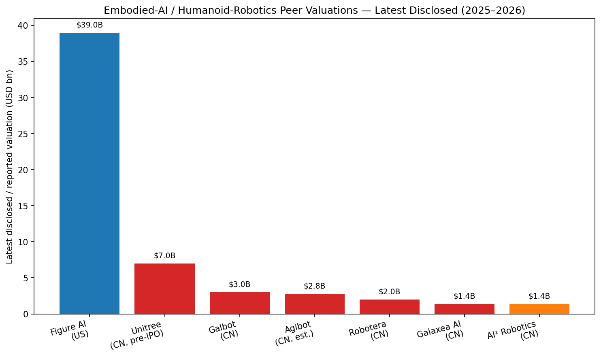
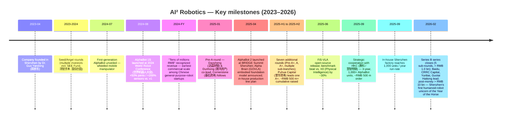
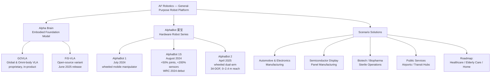
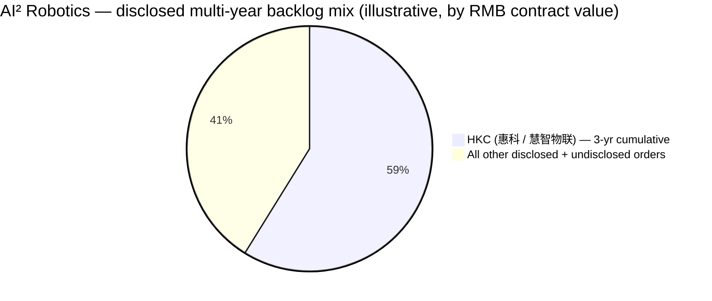
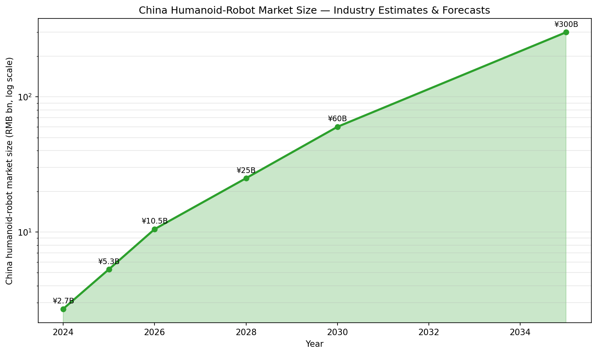
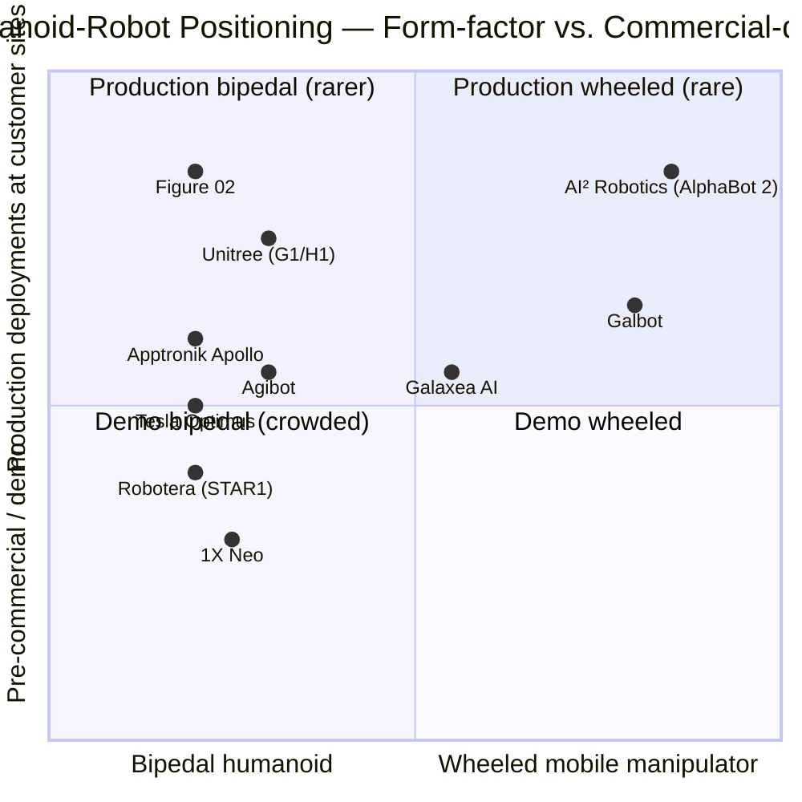

# AI² Robotics (智平方科技) — Company Research Report

**Date:** 2026-05-19
**Status:** Private (PRC), Shenzhen-headquartered embodied-AI / general-purpose-robot company
**Founder & CEO:** Dr. Guo Yandong (郭彦东)
**Latest disclosed post-money valuation:** > RMB 10 bn (~USD 1.4 bn), Series B announced 2026-02-23

> **Update — Series B closed (2026-02-23):** AI² Robotics announced the completion of a Series B financing round exceeding **RMB 1.0 bn (~USD 144 m)**, lifting post-money valuation past **RMB 10 bn (~USD 1.4 bn)**. The round was led by Baidu (百度), CRRC Capital (中车资本), Yunbai Capital (沄柏资本) and Guotai Haitong Securities (国泰海通), with significant follow-on from existing investors. Proceeds are earmarked for extending the lead of the GOVLA embodied-foundation model and for ramping AlphaBot (爱宝) production capacity toward a stated 10,000-unit / year target by 2028. Cumulatively the company closed **12 funding rounds in roughly 12 months** (7 in 2025 H1–H2, 5 within the Series B series), which management and Chinese trade press describe as the fastest fund-raising cadence of any embodied-AI startup globally. Source: [Caixin Global, 2026-02-23](https://www.caixinglobal.com/2026-02-23/chinas-ai-robotics-raises-fresh-funds-at-over-10-billion-yuan-valuation-102416310.html); [新浪财经, 2026-02-23](https://finance.sina.com.cn/jjxw/2026-02-23/doc-inhnvivn3816302.shtml); [IT之家, 2026-02-23](https://www.ithome.com/0/922/937.htm); [Yicai Global, 2026-02-23](https://www.yicaiglobal.com/news/chinas-ai-robotics-raises-usd145-million-for-model-development-product-upgrades).

---

## Table of Contents

1. Company Overview
2. Company History
3. Management Team
4. Products & Services
5. Customers & Go-to-Market
6. Industry Overview
7. Competitive Landscape
8. Market Opportunity (TAM)
9. Risk Assessment
10. References

---

## 1. Company Overview

AI² Robotics, registered in Simplified Chinese as **智平方（深圳）科技股份有限公司** (Zhipingfang (Shenzhen) Technology Co., Ltd.), is a privately held Chinese embodied-AI company headquartered in Shenzhen with R&D and operations footprints in Beijing and Shanghai. The company designs, manufactures and operates general-purpose robots that combine a proprietary vision-language-action (VLA) embodied foundation model — branded **Alpha Brain**, with the underlying model family called **GOVLA** (Global & Omni-body VLA) — with a wheeled humanoid hardware platform branded **AlphaBot / 爱宝**. Corporate identity, mission and product framing are detailed on the bilingual company website ([关于我们 — 智平方科技](https://ai2robotics.com/en/about/); [智平方科技 homepage](https://ai2robotics.com/)).

**What it does.** AI² Robotics builds what it calls "**generative, production-grade general-purpose robots**" — a category positioned between (a) traditional industrial arms (rigidly programmed, single-task, low autonomy) and (b) consumer-grade bipedal humanoids that are mostly demo-vehicles today (e.g. Unitree H1/G1, Robotera STAR1). The flagship AlphaBot platform is a **wheeled, dual-arm humanoid** with a lifting-and-tilting waist-leg structure that supports work heights from 0 to 2.4 meters and a 700 mm arm span ([Aparobot product page, 2025](https://www.aparobot.com/robots/alphabot-2); [RoboticsTomorrow, 2025-06](https://www.roboticstomorrow.com/content.php?post=25899)). The robot's "brain" is Alpha Brain / GOVLA — the company claims it as the world's first "full-domain, full-body" VLA model, with an open-source variant **FiS-VLA** released in June 2025 that outperformed Physical Intelligence's π0 by ~30% on benchmark suites according to the company ([AI² Robotics — About, 2025](https://ai2robotics.com/en/about/); [Zhihu deep-dive on FiS-VLA, 2025-08](https://zhuanlan.zhihu.com/p/1925955060644413730)).

**How it makes money.** As a private company, AI² Robotics has not publicly published a full income statement. From press disclosures and management interviews three revenue streams are visible:

1. **Robot-as-a-Product (RaaP) sales** of AlphaBot units to enterprise customers, primarily in semiconductor display panel manufacturing, automotive / electronics assembly, biotech / biopharma sterile environments, and public-service venues such as airports ([AI² Robotics — About, 2025](https://ai2robotics.com/en/about/)). Average implied unit ASP based on the 2025 HKC contract is **~RMB 500,000 per unit** (~USD 70k), back-solved from the publicly stated "**1,000+ units, ~RMB 500 m contract value**" deal terms ([机器人大讲堂, 2025-09-11](https://www.leaderobot.com/news/6326); [新浪财经, 2025-09-11](https://finance.sina.com.cn/roll/2025-09-11/doc-infqcpui3726201.shtml)). Note: that implied ASP is an industry-press estimate, not a unit price published by AI² Robotics — flagged as **unverified company-disclosed pricing**.
2. **Solutions / project deployments** that bundle robot units with scenario-specific software, integration and on-site operation support — described in management interviews as "**全场景，高可靠的服务**" (full-scenario, highly reliable service) ([AI² Robotics homepage, 2025](https://ai2robotics.com/)).
3. **Embodied-foundation-model licensing / ecosystem** around the open-source **FiS-VLA** release — non-monetised today (FiS-VLA is open source) but positioned as a strategic moat-deepener and ecosystem-builder, with the company claiming "**> 20,000 developers**" engaged in the open-source community ([新智元 via SegmentFault, 2025-09](https://segmentfault.com/a/1190000046849886)). The economics of any future commercial license are not disclosed.

**Geographic presence.** Three Chinese offices — Shenzhen (HQ + manufacturing), Beijing, and Shanghai ([关于我们 — 智平方科技, 2025](https://ai2robotics.com/en/about/)). No overseas offices have been publicly disclosed; commercial deployments to date are domestic.

**Scale indicators (mid-2026).**
- **Employees**: not disclosed; press references to "数百人" / "core team in the hundreds" appear repeatedly but no audited figure exists — **unverified**.
- **Production capacity**: self-built plant in Shenzhen reached **1,000 units / year run-rate from September 2025**, with a stated target of **10,000 units / year by 2028** ([东方财富, 2025-04-18](https://fund.eastmoney.com/a/202504183381163160.html); [Gasgoo, 2026-02-23](https://autonews.gasgoo.com/articles/news/seeds-ai-robotics-officially-announces-completion-of-series-b-round-exceeding-1-billion-yuan-2026536571551883265)).
- **Revenue**: management has publicly stated **"recognized revenue in the tens of millions of RMB"** in 2024 ([Zhihu summary of management commentary, 2025-01](https://zhuanlan.zhihu.com/p/20149988051)) and Chinese media reports describe AI² Robotics as **"the earliest Chinese general-purpose-robot company to achieve commercial revenue at scale"** — neither figure is audited and the 2025 number has not been disclosed.
- **Cumulative orders**: the publicly disclosed three-year, ~RMB 500 m HKC strategic-cooperation order alone (>1,000 units) sets a public floor on multi-year backlog ([财联社, 2025-09-11](https://www.cls.cn/detail/2142215)).

### Valuation snapshot

Because AI² Robotics is private, this section substitutes the latest disclosed funding-round valuation and implied revenue multiple per the company-research skill specification.

- **Last round**: Series B, announced 2026-02-23.
- **Round size**: > RMB 1.0 bn (some sources cite RMB 1.2 bn including all five sub-rounds within the Series B series, ~USD 144 m–145 m).
- **Post-money valuation**: > **RMB 10 bn (~USD 1.4 bn)**.
- **Investors of record (Series B)**: Baidu (百度, NASDAQ:BIDU; HKEX:9888), CRRC Capital (中车资本, the investment vehicle of state-owned CRRC Corp. 中车), Yunbai Capital (沄柏资本), Guotai Haitong Securities (国泰海通证券), with continued follow-on from existing investors that include — across the cumulative 12 rounds — Daosheng Capital (达晨财智), Dunhong Asset (敦鸿资产), Cornerstone Capital (基石资本), SEE Fund (清智资本), SDIC Chuangying (国投创盈), Puhua Capital (普华资本), Tesla-ecosystem corporates referenced by Caixin, Sentury Tire (赛轮轮胎), and Yusys Technologies (宇信科技) ([Yicai Global, 2026-02-23](https://www.yicaiglobal.com/news/chinas-ai-robotics-raises-usd145-million-for-model-development-product-upgrades); [QbitAI 量子位, 2026-02-23](https://www.qbitai.com/2026/02/382004.html); [新浪科技, 2025-03-07 — Pre-A+ round](https://news.qq.com/rain/a/20250307A034DJ00); [Sina Tech, 2025-01-07 — Pre-A round](https://finance.sina.com.cn/tech/csj/2025-01-07/doc-ineecmrc8168799.shtml)).
- **Implied revenue multiple**: cannot be cleanly computed — 2025 revenue is not disclosed and 2024 revenue ("数千万" / "tens of millions of RMB") would imply > **100× P/S on 2024**, which is the venture-stage norm in Chinese embodied-AI today and consistent with peers (Galbot at ~USD 3 bn post-money in March 2026 with similarly small disclosed revenue; Figure AI in the US at ~USD 39 bn post-money with no material revenue). Multiple-compression risk is captured in Section 9.

**Why the multiple is "stretched" by traditional yardsticks but consistent with the cohort:** humanoid-robot startups are being priced today as **option-value plays on a 5–10-year platform shift** — analogous to how late-2010s autonomous-vehicle startups (Cruise, Argo, Pony.ai, WeRide) were priced. The thesis is that whichever 2–3 firms successfully cross the "AlphaGo-to-iPhone" gap from technology to mass-market product will become trillion-RMB businesses (Morgan Stanley projects the global humanoid-robot market at **USD 5 tn by 2050** — see Section 8). Both AI² and its closer Chinese peers therefore trade at "narrative" or "platform-option" multiples, not earnings multiples ([Morgan Stanley, "Humanoid Robot Market by 2050," 2024](https://www.morganstanley.com/insights/articles/humanoid-robot-market-5-trillion-by-2050)).

Source: composite of [Caixin Global on Galbot, 2026-03-03](https://www.caixinglobal.com/2026-03-03/galbot-raises-362-million-in-fresh-funding-eyes-hong-kong-ipo-102418742.html), [Caixin Global on Galaxea AI, 2026-02-12](https://www.caixinglobal.com/2026-02-12/galaxea-ai-raises-144-million-as-chinas-robot-investment-frenzy-mounts-102413767.html), [Caixin Global on Robot Era, 2026-04-27](https://www.caixinglobal.com/2026-04-27/robot-era-raises-more-than-200-million-as-chinas-humanoid-robot-race-heats-up-102438549.html), [TechCrunch on Figure AI, 2025-09-16](https://techcrunch.com/2025/09/16/figure-reaches-39b-valuation-in-latest-funding-round/), [SCMP on Unitree IPO, 2026-Q1](https://www.scmp.com/tech/article/3347611/inside-unitrees-landmark-ipo-what-know-about-chinas-humanoid-giant), and [Caproasia on Unitree IPO, 2026-01-06](https://www.caproasia.com/2026/01/06/china-unitree-robotics-plans-shanghai-ipo-in-2026-q2-with-previous-report-of-7-billion-valuation-raised-series-c-funding-at-1-7-billion-valuation-in-2025-june-founded-in-2016-by-wang-xingxing-key/). Agibot valuation is industry-press estimate and **flagged unverified**.

---

## 2. Company History

AI² Robotics was incorporated in **April 2023** in Shenzhen by Dr. Guo Yandong, who left his post as Chief Scientist at smartphone-maker OPPO to start the company ([关于我们 — 智平方科技, 2025](https://ai2robotics.com/en/about/); [Sina Finance interview with Guo Yandong, 2025-03-06](https://finance.sina.com.cn/jjxw/2025-03-06/doc-inensrzt1048673.shtml)). The founding thesis, in Guo's own framing in numerous interviews, is that **Artificial General Intelligence (AGI) will not be confined to the digital world** — the eventual physical embodiment of AGI is the general-purpose robot, and the technical key to unlocking it is a **vision-language-action (VLA) end-to-end foundation model**, not the kinematic / control-stack approach that dominated the prior generation of industrial robotics ([腾讯新闻 / qq.com — Guo Yandong on Chinese-robot tech confidence, 2025-09-28](https://news.qq.com/rain/a/20250928A08ECF00); [Bianews interview, 2025](https://www.bianews.com/news/details?id=222141)).

The company is part of the post-2023 wave of "**具身智能 (jùshēn zhìnéng, embodied intelligence)**" startups in China that emerged after the global Large-Language-Model boom of late 2022 demonstrated that foundation-model scaling laws could plausibly extend from language into multi-modal action.

Source: timeline composed from [南都 / 南方都市报 launch coverage, 2024-07-25](https://m.mp.oeeee.com/a/BAAFRD000020240725979033.html), [中国日报 World Robot Conference coverage, 2024-08-29](https://cn.chinadaily.com.cn/a/202408/29/WS66d002eda310b35299d39150.html), [Pre-A funding press release, 2025-01-07](https://ai2robotics.com/en/2025%E7%AC%AC%E4%B8%80%E8%9E%8D-%E5%85%B7%E8%BA%AB%E6%99%BA%E8%83%BD%E8%B5%9B%E9%81%93%E5%96%9C%E8%BF%8E%E5%BC%80%E9%97%A8%E7%BA%A2-%E6%99%BA%E5%B9%B3/), [东方财富 AlphaBot 2 launch, 2025-04-18](https://fund.eastmoney.com/a/202504183381163160.html), [HKC order coverage 财联社, 2025-09-11](https://www.cls.cn/detail/2142215), and [21财经 — Shenzhen first unicorn of Year of the Horse, 2026-02-24](https://m.21jingji.com/article/20260224/herald/a6cd472deb3fec27bd8a758138088f90.html).

**Strategic pivots and inflection points.** Three are visible to date.

1. **From "demo robot" to "production robot" (mid-2024).** The launch sequence AlphaBot → AlphaBot 1S in mid-2024 marked a deliberate move away from the lab-prototype / trade-show-demo mode that characterizes most embodied-AI startups. Management has emphasized publicly that AlphaBot is positioned as a "**生产力型 (productivity-type)**" rather than "**表演型 (performance / demo-type)**" general-purpose robot — i.e. designed for reliable continuous duty cycles in real industrial environments, not for stage demos ([新浪科技 / Sina Tech, 2026-02-23](https://finance.sina.com.cn/tech/roll/2026-02-23/doc-inhnusxm6984375.shtml)). This positioning maps directly onto the company's customer wins to date (semiconductor display, biotech sterile, electronics assembly), all of which are 24/7 continuous-duty environments.
2. **From scenario apps to full-domain foundation model (early 2025).** Originally, AlphaBot 1 and 1S deployments were paired with relatively narrow per-scenario perception/action stacks. The April 2025 AlphaBot 2 launch was accompanied by the announcement of **Alpha Brain / GOVLA**, the company's bid to be the **"Android of embodied AI"** — one foundation model spanning all customer scenarios. This is a strategic-bet pivot: a horizontal model platform is more valuable in the long run but is also harder to ship, longer to monetize, and more capital-intensive than vertical solutions.
3. **From self-funding & angel-stage to mega-cohort venture-capital roll-up (2025).** The 12 rounds in 12 months reflect a deliberate strategy to lock in capital quickly across the staged 2025–2026 valuation step-ups — the company has publicly framed this as "**building the most resilient war chest in Chinese embodied AI**" ([量子位 QbitAI, 2026-02-23](https://www.qbitai.com/2026/02/382004.html)).

**Acquisitions.** None disclosed.

**Recent developments (last 12 months).** Series B series closing in February 2026; HKC order in September 2025; FiS-VLA open-source release in June 2025; AlphaBot 2 launch in April 2025; production line ramp to 1,000 units / year run-rate in September 2025.

---

## 3. Management Team

### Dr. Guo Yandong (郭彦东) — Founder, Chairman & CEO

Guo Yandong is the company's founder, controlling shareholder (reported at **~69%** equity at the Pre-A+ round closing in early 2025, with subsequent dilution from the A, A+ and B series not publicly disclosed; **flagged unverified for post-Series B**) and the public face of AI² Robotics ([腾讯新闻, 2025-03-07](https://news.qq.com/rain/a/20250307A034DJ00)). His career arc maps neatly onto the founding thesis of putting deep-learning foundation models into intelligent terminals.

**Education.** PhD in Computer Science from **Purdue University** (Indiana, US), advised by a member of the U.S. National Academy of Engineering, per his publicly disclosed bio ([Sina Finance — 智平方创始人专访, 2025-09-28](https://finance.sina.com.cn/stock/t/2025-09-28/doc-infsamfc8725940.shtml)). Subsequent affiliations include **Adjunct Professor at The Hong Kong University of Science and Technology (Guangzhou)** ([关于我们 — 智平方科技, 2025](https://ai2robotics.com/en/about/)).

**Prior roles.**
- **Microsoft (US, Redmond) — Researcher and tech lead on the core AI team (~2014–2018).** Led the *Connected Vehicle* program in 2017 — a partnership with Volvo to embed Microsoft deep-learning models into automotive cockpits, one of the earliest serious attempts to put modern deep-learning into shipped vehicles. The intelligent systems he led shipped at scale into Microsoft's Machine-Learning-as-a-Service (MaaS) platform ([网易新闻 / NetEase, 2025-09-28](https://m.163.com/dy/article/KAJ2CH4C0531M1CO.html)).
- **XPeng Motors (小鹏汽车) — joined ~2018 from Microsoft.** Brought the deep-learning-perception thesis to one of China's three leading EV startups during a foundational period. According to multiple Chinese press accounts, his intelligent systems were deployed across "**hundreds of thousands of smart vehicles**" — consistent with XPeng's cumulative EV deliveries in his tenure ([关于我们 — 智平方科技, 2025](https://ai2robotics.com/en/about/)).
- **OPPO — Chief Scientist (首席科学家), ~2020–2023.** Oversaw consumer-electronics AI at OPPO, one of the world's top-5 smartphone OEMs by units shipped. Per the company website, the intelligent systems he led "were deployed across hundreds of millions of consumer-electronics devices" — directionally consistent with OPPO's smartphone shipments during the period ([关于我们 — 智平方科技, 2025](https://ai2robotics.com/en/about/)).

**Tenure and ownership at AI² Robotics.** Founder since April 2023 (~3 years). Equity stake disclosed at ~69% at Pre-A+ in early 2025; post-Series B equity stake has not been publicly disclosed.

**Public profile & writing.** Guo is an unusually media-active founder in Chinese embodied AI — he has given long-form interviews to Sina Finance, Caixin, 36Kr, 凤凰网, Bianews, and was the named subject of multiple 2025 cover features. His public-facing pitch is intellectually distinctive: he openly argues that **Chinese embodied-AI startups must build "from chip to model to robot to scenario" in-house** because the U.S. lead in upstream chips and foundation models means Chinese players cannot afford to rent any layer of the stack ([finance.sina.com.cn — Guo Yandong interview, 2025-09-28](https://finance.sina.com.cn/stock/t/2025-09-28/doc-infsamfc8725940.shtml)). He has also publicly estimated that the "**iPhone moment**" for humanoid robots is **5–7 years away** ([Sina Finance Guo interview, 2025-03-06](https://finance.sina.com.cn/jjxw/2025-03-06/doc-inensrzt1048673.shtml)) — a notably less hyped timeline than several U.S. peers.

**Founding thesis.** Productivity-grade general-purpose robots as the next computing terminal after smartphone and smart-vehicle, with VLA foundation models as the unifying technical primitive.

**Compensation.** As a private company, base / bonus / equity-vesting structures are not disclosed.

### CFO — Not publicly named (as of mid-2026)

AI² Robotics has not publicly named a Chief Financial Officer; this is consistent with most pre-IPO Chinese venture-backed startups, where the role is often filled by a Finance VP or interim consultant pending a planned IPO. **Flagged unverified / undisclosed.** A CFO appointment with prior public-company / capital-markets experience would normally be the first major governance hire ahead of any HK or A-share IPO filing. Investors should expect such a hire to precede any 2027 IPO attempt.

### Core team / "supporting cast" (composite)

The company website states that, leveraging Guo's recruiting pull, AI² Robotics has assembled scientists and engineering leads from **Microsoft, Google, OPPO, XPeng, and Momenta**, alongside academic talent from **Tsinghua University (清华大学), Peking University (北京大学), the Chinese Academy of Sciences (中科院), Carnegie Mellon University, and UC Berkeley** ([关于我们 — 智平方科技, 2025](https://ai2robotics.com/en/about/)). Company communications cite **"5 Stanford-top-2%-cited scientists"** on staff ([新浪财经 / Sina Finance, 2026-02-23](https://finance.sina.com.cn/jjxw/2026-02-23/doc-inhnvivn3816302.shtml)). None of these individuals are named publicly, which is itself a governance flag — institutional-quality due diligence would normally name the head of model R&D, the head of hardware engineering, and the head of manufacturing. **Flagged unverified individual identities.**

### Governance footer

- **Board composition**: not publicly disclosed. As a Stock Limited Company (股份有限公司, since the 2025 corporate restructuring implied by the entity name "**智平方（深圳）科技股份有限公司**"), AI² Robotics has a board of directors, but its composition has not been disclosed in press releases or on the company website.
- **Insider ownership**: founder Guo Yandong was disclosed as holding ~69% at Pre-A+ ([腾讯新闻, 2025-03-07](https://news.qq.com/rain/a/20250307A034DJ00)); post-Series B equity not disclosed. The very high founder stake mid-2025 is a significant governance variable — it gives Guo near-complete strategic control but also concentrates key-person risk (see Section 9).
- **Related-party transactions**: none disclosed; the partner / customer set (HKC, automotive OEMs) does not visibly overlap with the investor set.
- **Comp structure**: not disclosed.

### Management track record synthesis

Guo Yandong's CV (Purdue PhD → Microsoft core AI → XPeng → OPPO Chief Scientist) is one of the more pedigreed in Chinese embodied AI — comparable to Galaxea AI founder Wang He (王鹤, ex-Stanford / Tsinghua AI institute) and Galbot's Wang He. He has shipped AI products at consumer scale before. The principal gap is that **no member of his prior career has involved running a hardware-manufacturing operation at the unit volumes AI² is targeting (10,000 units / year by 2028)** — and the "production-grade robot" thesis lives or dies on manufacturing execution, not on model research. The absence of a publicly named COO / VP of manufacturing is the single biggest disclosure gap and the single biggest risk to underwrite.

---

## 4. Products & Services

Source: composed from [AI² Robotics — About page, 2025](https://ai2robotics.com/en/about/), [AI² Robotics — AlphaBot 2 launch press release, 2025-04](https://ai2robotics.com/en/%E6%99%BA%E5%B9%B3%E6%96%B9%E5%8F%91%E5%B8%83%E5%85%A8%E6%96%B0%E4%B8%80%E4%BB%A3%E6%99%BA%E8%83%BD%E6%9C%BA%E5%99%A8%E4%BA%BAalphabot-2%E5%BC%80%E5%90%AFagi%E7%BB%88%E7%AB%AF%E6%96%B0/), and [南方都市报 launch coverage, 2024-07-25](https://m.mp.oeeee.com/a/BAAFRD000020240725979033.html).

### Product 1 — AlphaBot (爱宝) 第一代 — July 2024 launch

The original AlphaBot was unveiled in July 2024 as the company's first commercial general-purpose robot ([南方都市报, 2024-07-25](https://m.mp.oeeee.com/a/BAAFRD000020240725979033.html)). Per the launch announcement, the robot supported swappable mobile bases, end-effectors and modules, allowing reconfiguration across different industrial scenarios. The first-generation robot is best described as a **single-arm wheeled mobile manipulator** with a folding lift column — closer in form factor to an Amazon Robotics warehouse manipulator than to a bipedal humanoid.

- **Target customer**: industrial customers piloting embodied-AI in flexible assembly, materials handling and inspection workflows.
- **Pricing**: not disclosed at unit level; per the implied ASP from later contracts, likely RMB 300–500k per unit (**estimate, not company-disclosed**).
- **Competitive-advantage verdict**: **partial.** The single moat at this stage was first-mover positioning into the "production-grade" market segment; the hardware itself was conventional, the differentiator was the early embodied-AI stack.
- **Closest competing product**: Galbot's Galbot G1 single-arm mobile manipulator (also single-arm, wheeled, lift column) ([Galbot company materials via TechNode, 2026-03-02](https://technode.com/2026/03/02/humanoid-robot-maker-galbot-raises-rmb-2-5-billion/)). Verdict: **at parity** in form factor; AI² ahead in time-to-commercial-revenue.

### Product 2 — AlphaBot 1S — August 2024 launch, World Robot Conference (WRC) debut

A rapid iteration on the original platform, AlphaBot 1S added **50% more articulated joints and 200% more onboard sensors versus the original** ([中国日报 / China Daily, 2024-08-29](https://cn.chinadaily.com.cn/a/202408/29/WS66d002eda310b35299d39150.html); [Sina Finance, 2024-08-27](https://finance.sina.com.cn/tech/roll/2024-08-27/doc-incmauen1029468.shtml)). The "S" iteration was the workhorse platform that delivered AI²'s first wave of paid commercial deployments through late 2024 into 2025 and supported the **"tens of millions of RMB"** of recognized revenue in 2024 ([Zhihu, 2025-01](https://zhuanlan.zhihu.com/p/20149988051)).

- **Target customer**: same as AlphaBot 1, with broader deployment in cleanroom / semiconductor and lab environments enabled by higher sensor density.
- **Pricing**: not disclosed.
- **Competitive-advantage verdict**: **yes — partial moat.** The combination of (a) demonstrably running revenue (most competitors at this point were still demo-only) and (b) the higher sensor count and joint count creating better data collection for the VLA-model training loop was a defensible advantage.
- **Closest competing product**: Galaxea A1 single-arm mobile manipulator, and Agibot Yuanzheng A1. AI² appears ahead on commercial revenue but behind on visual / demo polish — Agibot in particular has been more aggressive in viral demo content. Verdict: **ahead on commercialization, behind on marketing.**

### Product 3 — AlphaBot 2 (flagship) — April 2025 launch

AlphaBot 2 is AI² Robotics' current flagship and the centerpiece of the company's "AGI terminal" branding. Spec summary from the company launch announcement and trade-press coverage:

- **Form factor**: wheeled dual-arm humanoid with a lifting-and-tilting waist-leg structure
- **Degrees of freedom**: **34 DOF**
- **Arm span**: **700 mm**
- **Vertical operating range**: **0–2,400 mm (0–2.4 m)** — works from floor level to over 2 m height
- **Brain**: Alpha Brain (GOVLA proprietary VLA model)
- **Sensing**: multi-camera 360° vision, force sensors, microphone arrays, and environmental sensors
- **Reliability claim**: "**core components achieve 50,000+ hours of failure-free operation**" — manufacturer claim, not independently audited
- **Demonstrated autonomous task examples**: cooking, sterile filling, unpacking and disinfection, materials handling, visual inspection on production lines, and a notable demo of writing Chinese calligraphy with the "Four Treasures of the Study"

Source: [RoboticsTomorrow, 2025-06](https://www.roboticstomorrow.com/content.php?post=25899); [Aparobot, 2025](https://www.aparobot.com/robots/alphabot-2); [东方财富 / Eastmoney, 2025-04-18](https://fund.eastmoney.com/a/202504183381163160.html); [36Kr Europe / EU.36kr, 2025-04](https://eu.36kr.com/en/p/3255090975272967).

- **Target customer**: semiconductor display fabs (HKC contract), automotive electronics assembly, biopharma sterile / cleanroom, electronics manufacturing.
- **Pricing**: industry press reports an implied ASP of **~RMB 500,000 per unit** based on the HKC deal terms (**~RMB 500 m for 1,000+ units**) — but this is an industry-press calculation, not a unit price published by AI² Robotics. **Flagged unverified company-disclosed pricing.**
- **Competitive-advantage verdict**: **yes — multi-pronged moat.**
  - **Technology / IP moat**: GOVLA foundation model + proprietary VLA training pipeline; FiS-VLA open-source release provides ecosystem leverage. Yann LeCun's public endorsement of the FiS-VLA open release was a notable validation in mid-2025 ([Zhihu deep-dive, 2025-08](https://zhuanlan.zhihu.com/p/1925955060644413730)).
  - **Manufacturing / scale moat (emerging)**: in-house Shenzhen plant at 1,000 units / year run-rate from September 2025 is **earlier and larger than most direct competitors** at the comparable cohort age.
  - **Data moat**: the 1,000+ unit HKC deployment alone will generate continuous-duty real-world operational data of a kind most peers cannot match — a key training-data flywheel for VLA models.
  - **Distribution / customer-anchor moat**: HKC as anchor customer in semiconductor display panel manufacturing is a high-prestige reference for future industrial buyers.
- **Closest competing product**: Figure 02 from Figure AI (US, dual-arm humanoid deployed at BMW Spartanburg) is the closest analog in execution model — but Figure 02 is bipedal humanoid (not wheeled) and is currently locked to one anchor customer. Verdict: **AI² Robotics behind Figure on US enterprise penetration, ahead on customer-base diversity within China**. Within China, the closest direct comparable in form factor is Galaxea AI's R1 humanoid and Robotera STAR1 — both bipedal designs that AI² explicitly differentiates from by sticking to wheeled-mobility for productivity-grade reliability.

### Product 4 — Alpha Brain / GOVLA embodied foundation model

The proprietary **GOVLA (Global & Omni-body VLA)** is described by the company as the **"world's first full-domain, full-body VLA"** — meaning it spans both whole-body coordination (manipulation + locomotion + perception jointly) and full-task-space generalization rather than being scoped to robotic arms only ([关于我们 — 智平方科技, 2025](https://ai2robotics.com/en/about/)). Internal use only; not sold as a standalone model.

- **Competitive-advantage verdict**: **yes — emerging technology moat.** Independent third-party validation is still thin — the "outperforms π0 by 30%" benchmark figure comes from the company's own internal evaluation, even though the underlying open-source FiS-VLA release has been broadly received in the academic community.
- **Closest competing product**: Physical Intelligence (PI) π0 / π0.5 from the US; RT-2 from Google DeepMind; Helix from Figure AI; Galaxea's GR-1 robot brain. The model-level competitive battle is genuinely live and AI²'s claimed lead is unverified by an independent benchmark consortium.

### Product 5 — FiS-VLA (open-source variant)

The open-sourced derivative of GOVLA, released June 2025, jointly with Peking University and other Chinese academic partners. Per company communications, the release attracted **"> 20,000 developers"** and explicit endorsement from Turing Award laureate Yann LeCun ([新智元 / SegmentFault, 2025-09](https://segmentfault.com/a/1190000046849886)).

- **Competitive-advantage verdict**: **partial — ecosystem moat in formation.** Strategic value is in lowering the cost of recruiting model talent, building developer mindshare ahead of any future enterprise SDK / model-licensing business, and signaling open-research credibility.
- **Closest competing product**: Pi-0 (Physical Intelligence), OpenVLA (Stanford). FiS-VLA appears competitive on academic benchmarks but is one of several credible open releases.

### Flagship vs. long-tail

- **Flagship (the business today)**: AlphaBot 2 platform sold into industrial customers, anchored by the HKC semiconductor-display order.
- **Long-tail / legacy**: AlphaBot 1 and 1S installed base; ongoing service revenue on those units.
- **Future / pre-revenue**: Healthcare & elderly care, home services scenarios — flagged on the website as "**more scenarios ahead**" but not generating commercial revenue today.

### Roadmap & recent launches (last 12 months)

- **Apr 2025**: AlphaBot 2 launch + GOVLA brand announcement
- **Jun 2025**: FiS-VLA open-source release
- **Sep 2025**: Shenzhen plant 1,000 units/yr run-rate
- **2026 plan**: production scaling to 10,000 units/yr by 2028, continued FiS-VLA / GOVLA iteration, possible AlphaBot 3 generational refresh (timing not announced)
- **No products sunset** in the last 12 months

---

## 5. Customers & Go-to-Market

### Customer segments

AI² Robotics has organized its scenario portfolio around **four monetized verticals plus three pre-revenue verticals**, all enumerated on the company website ([关于我们 — 智平方科技, 2025](https://ai2robotics.com/en/about/)):

| Vertical | Status | Representative use cases |
|---|---|---|
| Automotive & electronics manufacturing | Monetized | Loading, transport, assembly, equipment operation |
| Semiconductor display panel manufacturing | Monetized (HKC anchor) | PCB ops, OLED vacuum lamination, consumable management, waste recovery |
| Biotech / biopharma | Monetized | Sterile material transfer, unpacking & disinfection, feeding |
| Public services | Monetized (early) | Airport / transit-hub storage, inventory, retrieval / placement / transport |
| Community services | Roadmap / pre-revenue | (not yet commercialized) |
| Healthcare & elderly care | Roadmap / pre-revenue | (not yet commercialized) |
| Home services | Roadmap / pre-revenue | (not yet commercialized) |

### Customer concentration — quantified

Source: HKC value of ~RMB 500 m is the publicly disclosed three-year contract ceiling ([财联社, 2025-09-11](https://www.cls.cn/detail/2142215)); "all other" bucket is sized to roughly match Chinese press references to "**3 months: > RMB 1.3 bn cumulative new orders**" from late-2025 / early-2026 coverage ([机器人大讲堂, 2026-01](https://www.leaderobot.com/news/6535)) — figure is approximate and flagged as **estimate, not company-disclosed top-1 / top-5 ratio**.

**Top-1 customer share (estimate)**: based on disclosed backlog, **HKC / 慧智物联 represents ~50–60% of disclosed contracted backlog over the 2025–2028 window** — well over the 30% "high" threshold from the risk taxonomy. **AI² Robotics has not published a formal top-1 / top-5 customer concentration figure** (consistent with private status); the figure above is constructed from the public deal-list. This **must be treated as a material risk** and is repeated in Section 9.

**Contract structure**: the HKC deal is a multi-year strategic-cooperation framework agreement covering "**cumulatively over 1,000 units of AlphaBot-series wheeled humanoid robots over the next three years**" with deployment across HKC's global production bases ([新浪财经, 2025-09-11](https://finance.sina.com.cn/roll/2025-09-11/doc-infqcpui3726201.shtml)). Per-tranche purchase orders presumably draw against the framework, but the per-PO ratchet, take-or-pay structure, and exclusivity provisions are not publicly disclosed.

**Top customers — named when disclosed**:
- **HKC (惠科股份有限公司)** — global #3 producer of large-format LCD panels and a leading display-panel manufacturer; subsidiary 慧智物联 (Huizhi IoT) is the contracting entity ([惠科股份 Baidu Baike, 2024](https://baike.baidu.com/item/%E6%83%A0%E7%A7%91%E8%82%A1%E4%BB%BD%E6%9C%89%E9%99%90%E5%85%AC%E5%8F%B8/19980553)).
- Additional named customers in automotive, biotech and public services are alluded to in management communications but **not publicly named** as of mid-2026 — a notable disclosure gap, and one likely to be filled around any future IPO prospectus.
- The Series B included **"several Tesla-ecosystem companies"** ([Caixin Global, 2026-02-23](https://www.caixinglobal.com/2026-02-23/chinas-ai-robotics-raises-fresh-funds-at-over-10-billion-yuan-valuation-102416310.html)); this is on the **investor** side, not a customer relationship, but investor proximity to Tesla's supply chain is a forward indicator of potential automotive customer pull.

**Is any top customer a competitor or vertically integrating?** Not directly — HKC is a panel manufacturer, not a robotics company. However, automotive customers in the pipeline (BYD, Tesla, etc., via investor proxies) are all themselves building or seriously evaluating in-house humanoid robotics (Tesla Optimus, BYD's robotics initiatives), which is a long-term competitive-displacement risk for any robotics vendor positioning into automotive (see Section 9).

### Distribution channels

Direct enterprise sales — the deal cadence and contract sizes are consistent with **founder-led / executive-led direct selling** rather than a channel-partner model. The company website lists a single sales-contact phone number and email at the bottom of the contact page ([关于我们 — 智平方科技, 2025](https://ai2robotics.com/en/about/)) — typical of a Chinese venture-stage enterprise-sales motion.

### Sales strategy & cycle

The implied enterprise-sales cycle for a multi-year strategic deployment like HKC is **6–12 months from first contact to framework signature**, with a pilot deployment typically preceding the production rollout. The HKC framework was reported across multiple Chinese outlets in September 2025 with no public history of a prior pilot — implying that a pilot phase (likely 2024–early 2025) was kept commercial-in-confidence.

### Key partnerships

- **Peking University and CAS (Chinese Academy of Sciences)** — co-publication / co-research partners on the FiS-VLA open-source release ([Zhihu, 2025-08](https://zhuanlan.zhihu.com/p/1925955060644413730)).
- **HKC (惠科)** — anchor commercial customer / strategic cooperation partner ([新浪财经, 2025-09-11](https://finance.sina.com.cn/roll/2025-09-11/doc-infqcpui3726201.shtml)).
- **CRRC (中车)** — Series B investor; possible downstream rail-rolling-stock-manufacturing customer relationship signaled by the strategic investment.
- **Baidu (百度)** — Series B investor; possible foundation-model / cloud-compute / LLM partnership signaled (not disclosed).

### Customer case studies

The most concrete public case study is the **HKC semiconductor-display deployment** — > 1,000 AlphaBot units over three years across HKC's global production bases, performing PCB ops, OLED vacuum lamination, consumables management, and waste material recovery. This is also publicly characterized in Chinese trade press as **the largest single-buyer humanoid-robot purchase order publicly disclosed by any humanoid-robot company globally as of late 2025** ([leaderobot.com, 2025-09](https://www.leaderobot.com/news/6326)).

---

## 6. Industry Overview

### Industry definition

AI² Robotics operates in two overlapping industries:

1. **Embodied AI / general-purpose robotics** — the new category emerging at the intersection of foundation-model AI and physical robotics. Sub-includes humanoid (bipedal), wheeled humanoid / mobile manipulator, and quadruped form-factors; spans industrial, commercial, and (eventually) consumer applications.
2. **Industrial automation / advanced robotics** — the broader, established industry that includes industrial robots (Fanuc, ABB, Yaskawa, KUKA), collaborative robots ("cobots" — Universal Robots, AUBO, Estun (SZSE:002747)), AGVs / AMRs (Geek+, Hai Robotics), and surgical / service robots.

For positioning purposes AI²'s closest industry definition is **embodied-AI general-purpose humanoid robotics**, which is itself a sub-category of advanced robotics carved out roughly from 2022–2023 onward as the LLM scaling-law breakthrough recombined with classical robotics research.

### Market size

**Global humanoid-robot market.**
- **Morgan Stanley** projects the global humanoid-robot market to reach **USD 5 tn by 2050** with cumulative shipments of ~1 bn units by then ([Morgan Stanley, 2024](https://www.morganstanley.com/insights/articles/humanoid-robot-market-5-trillion-by-2050)).
- **Fortune Business Insights** projects USD-tens-of-billions by 2030 ramping into the hundreds of billions thereafter ([Fortune Business Insights, "Humanoid Robots Market" 2025](https://www.fortunebusinessinsights.com/humanoid-robots-market-110188)).

**China humanoid-robot market.**
- **MIIT (China Ministry of Industry and Information Technology)** has guided to a domestic industry scale of **> RMB 20 bn (~USD 2.8 bn) by 2026** ([International Banker on China MIIT projections, 2025](https://internationalbanker.com/technology/china-makes-a-strong-push-for-humanoid-robot-market-dominance/)).
- **TrendForce** projects China humanoid output to grow **94% YoY in 2026**, with Unitree and Agibot capturing nearly **80% combined shipment share** that year ([TrendForce press release, 2026-04-09](https://www.trendforce.com/presscenter/news/20260409-13007.html)).
- China is projected to account for **~33% of the global humanoid market by 2029** ([China Briefing, 2025](https://www.china-briefing.com/news/chinese-humanoid-robot-market-opportunities/)).
- China's broader **embodied AI market** (humanoid + AGV + autonomous-driving + other embodied) was estimated at **RMB 863 bn (USD 119 bn) in 2024, growing to RMB 973 bn in 2025** per industry reports cited by Premia Partners ([Premia Partners, 2025](https://www.premia-partners.com/insight/embodied-ai-china-as-the-global-powerhouse-for-industrial-and-humanoid-robotics)).
- Long-term: China humanoid-robot market projected at **RMB 300 bn (~USD 41 bn) by 2035** in industry-consensus estimates.

Source: composite of [MIIT projections via International Banker, 2025](https://internationalbanker.com/technology/china-makes-a-strong-push-for-humanoid-robot-market-dominance/), [TrendForce, 2026-04-09](https://www.trendforce.com/presscenter/news/20260409-13007.html), [China Briefing, 2025](https://www.china-briefing.com/news/chinese-humanoid-robot-market-opportunities/), and industry-consensus estimates for 2035 — chart shows directional trajectory only and uses log-scale, **figures are point estimates that vary materially across sources**.

### Growth drivers

1. **Foundation-model breakthrough**: post-2022 progress on multimodal foundation models, RT-2 / π0 / GOVLA / Helix has demonstrated that VLA models can plausibly close the perception→reasoning→action loop, breaking the "robotics is hard" reputation that lingered from the 2010s.
2. **China industrial-policy push**: the MIIT 14th Five-Year Plan and 2023 "Innovation & Development Guideline for the Humanoid Robot Industry" elevated humanoid robotics to a national strategic-industry priority, unlocking provincial-government procurement budgets, sovereign-fund LP capital, and state-owned-enterprise customer pull (e.g. CRRC, HKC).
3. **Demographic tailwinds**: China's working-age population peaked around 2012 and is now in absolute decline; the addressable workforce in factories has tightened materially. Embodied-AI substitution / augmentation is increasingly framed as an industrial-competitiveness imperative, not a sci-fi aspiration.
4. **Component cost decline**: harmonic drives, planetary roller screws, hollow-cup motors and force / torque sensors — the BOM-heavy components of a humanoid robot — have seen 30–50% cost reductions over 2023–2026 as Chinese supply-chain capacity expanded.
5. **Capital availability**: the 12-round AI² fundraise (and the parallel Galbot / Galaxea / Robotera trajectories) demonstrate that Chinese VC and strategic capital are willing to fund the cohort through multi-year cash-burn windows.

### Regulatory environment

- **China**: relatively permissive — humanoid-robot deployment in industrial settings is not yet meaningfully restricted; safety standards (GB/T-series) are being drafted but no production-grade certification is yet a binding gate.
- **Export controls (US-China)**: US BIS controls on advanced AI chips (H100, H200, B100) constrain Chinese embodied-AI model training capacity to whatever is shippable to China (H20, H800 historically, evolving under successive rule rounds). This is a real bottleneck for the 1,000-GPU training cluster AI² claims (see Section 9).
- **EU AI Act and US state-level regulation** of physical AI systems remains nascent.

### Industry structure

The industry is **highly fragmented today** with **3–5 leading horizontals (Galbot, Agibot, AI² Robotics, Galaxea, Robotera, Unitree on the China side; Figure, Tesla Optimus, Apptronik, 1X, Sanctuary on the US side)** plus dozens of smaller players. Supplier power is moderate-high (key motor and reducer suppliers are concentrated). Buyer power is currently low (anchor industrial customers are scarce, robots are still scarce, demand exceeds supply). Substitution threat: traditional industrial robots and AGVs remain cheaper and more reliable for narrow tasks — embodied general-purpose robots only win when task variety is high.

---

## 7. Competitive Landscape

### Direct competitors — Chinese embodied-AI / general-purpose robotics

1. **Galbot (银河通用)** — Beijing-based, founder-led by Wang He (王鹤, Peking University AI assistant professor). Single-arm mobile manipulator first product. Raised **RMB 2.5 bn (~USD 362 m)** in 2026 Q1, post-money valuation **~USD 3 bn**, eyeing Hong Kong IPO ([TechNode, 2026-03-02](https://technode.com/2026/03/02/humanoid-robot-maker-galbot-raises-rmb-2-5-billion/); [Caixin Global, 2026-03-03](https://www.caixinglobal.com/2026-03-03/galbot-raises-362-million-in-fresh-funding-eyes-hong-kong-ipo-102418742.html)). **The closest direct comparable to AI² Robotics in product positioning** — single-arm/dual-arm wheeled mobile manipulator targeted at industrial customers. Galbot's valuation is ~2× AI²'s, reflecting earlier formation, deeper academic moat through Peking University, and faster fund-raising cadence at the Series B stage.

2. **Agibot (智元机器人 / Zhiyuan Robotics)** — Shanghai-based, founded by Peng Zhihui (彭志辉 / 稚晖君, ex-Huawei "天才少年"). Bipedal humanoid focus (Expedition / 远征 series). Reportedly delivered the **5,000th mass-produced humanoid** in 2025. Public listing route reportedly under consideration ([Verdict, 2025](https://www.verdict.co.uk/china-humanoid-market/)). Valuation estimates vary widely (USD 2–3 bn range, **flagged unverified**). Stronger consumer / influencer marketing than AI²; arguably weaker enterprise commercial revenue.

3. **Galaxea AI (星海图)** — founded by Wang He's collaborators / disciples, Tsinghua AI background. Raised **USD 144 m Series B in early 2026, valuation ~RMB 10 bn (~USD 1.4 bn)** ([Caixin Global on Galaxea AI, 2026-02-12](https://www.caixinglobal.com/2026-02-12/galaxea-ai-raises-144-million-as-chinas-robot-investment-frenzy-mounts-102413767.html)). **The closest peer to AI² Robotics by both round timing and valuation.** Product portfolio includes R1 humanoid and the Galaxea robot brain.

4. **Robotera (星动纪元)** — Tsinghua-incubated (Institute for Interdisciplinary Information Sciences), bipedal humanoid focus (STAR1 series). Raised **> USD 200 m in 2026 Q2** ([Caixin Global on Robot Era, 2026-04-27](https://www.caixinglobal.com/2026-04-27/robot-era-raises-more-than-200-million-as-chinas-humanoid-robot-race-heats-up-102438549.html)). Strong academic / talent moat through Tsinghua; commercial revenue trail behind AI² and Galbot.

5. **Unitree Robotics (宇树科技)** — Hangzhou-based, founder Wang Xingxing (王兴兴). The industry incumbent — pivoted from quadruped robots (Aliengo, A1, B1, B2, Go2) into humanoids (H1, G1, R1). Filed for **Shanghai STAR Market IPO in March 2026 at ~USD 7 bn target valuation** ([SCMP, 2026](https://www.scmp.com/tech/article/3347611/inside-unitrees-landmark-ipo-what-know-about-chinas-humanoid-giant); [Caproasia, 2026-01-06](https://www.caproasia.com/2026/01/06/china-unitree-robotics-plans-shanghai-ipo-in-2026-q2-with-previous-report-of-7-billion-valuation-raised-series-c-funding-at-1-7-billion-valuation-in-2025-june-founded-in-2016-by-wang-xingxing-key/)). Shipped **5,500+ humanoids in 2025**, capturing **32.4% global humanoid shipment share** per TrendForce ([TrendForce, 2026-04-09](https://www.trendforce.com/presscenter/news/20260409-13007.html)). **Different positioning from AI²** — Unitree's strategy is high-volume, lower-ASP, broader product line (research / education / consumer / industrial), while AI² is positioned as low-volume, higher-ASP, productivity-grade industrial.

### Direct competitor — US embodied-AI

6. **Figure AI** — Sunnyvale, CA, founded by Brett Adcock. Bipedal humanoid (Figure 01 / 02 / 03). **USD 1+ bn Series C in September 2025, USD 39 bn post-money valuation**, investors include Parkway, Brookfield, NVIDIA, Intel Capital, Microsoft, OpenAI Startup Fund, Bezos Expeditions ([TechCrunch, 2025-09-16](https://techcrunch.com/2025/09/16/figure-reaches-39b-valuation-in-latest-funding-round/); [Intel Capital, 2025](https://www.intelcapital.com/figure-exceeds-1b-in-series-c-funding-at-39b-post-money-valuation/)). **BMW Spartanburg deployment**: Figure 02 ran an 11-month deployment in 2025, 10-hour daily shifts, > 90,000 parts loaded, contributing to > 30,000 X3 vehicles ([Figure communications via Wikipedia, 2025](https://en.wikipedia.org/wiki/Figure_AI)). The most valuable embodied-AI startup globally; a category benchmark.

7. **Tesla Optimus** — captive program inside Tesla (NASDAQ:TSLA). Bipedal humanoid, vertically integrated. Not a startup but the most-watched corporate program. Indirect competition through (a) shaping market expectations, (b) drawing automotive customers in-house, and (c) influencing automotive supplier pull-through.

### Indirect / emerging competitors

8. **Apptronik (US)** — Apollo bipedal humanoid; commercial pilot with Mercedes-Benz announced 2024–2025.
9. **1X Technologies (Norway/US)** — Neo / Eve humanoids; OpenAI-backed.
10. **UBTECH Robotics (HKEX:9880)** — Shenzhen-based publicly listed humanoid pioneer (IPO'd HKEX December 2023); Walker S series.

### Positioning framework

Source: positioning constructed from each company's most recent product / customer disclosures cited above; placements are analyst judgment, not formally surveyed.

### AI² Robotics — competitive advantages

- **Production-grade thesis with enterprise revenue validation already**: HKC anchor + tens-of-millions-RMB 2024 revenue + 1,000 units / year manufacturing capacity is rare in the cohort.
- **Wheeled-humanoid form-factor focus**: avoids the bipedal-locomotion control problem that plagues Optimus / Figure / Robotera reliability, while still offering far more flexibility than a fixed industrial arm.
- **Founder pedigree + recruiting pull**: Microsoft / XPeng / OPPO recruiting graph is exceptional.
- **VLA-first model story**: GOVLA + FiS-VLA open-source release gives intellectual credibility and ecosystem leverage.
- **Capital position**: 12 rounds in 12 months means a deep war chest going into the 2027–2028 commercialization battle.

### AI² Robotics — competitive vulnerabilities

- **Behind Galbot on valuation and round-trajectory**: Galbot's USD 3 bn vs. AI²'s USD 1.4 bn post-Series B implies the venture market sees Galbot as 2× more valuable today.
- **Bipedal-humanoid optionality**: AI²'s wheeled focus is a deliberate engineering choice, but if the eventual mass market is bipedal (a real possibility for home / consumer scenarios), AI² will need to pivot or develop a parallel bipedal line.
- **Single anchor customer in disclosed backlog**: HKC concentration is a known risk.
- **Open-source FiS-VLA could commoditize the model layer**: the same open-source release that builds ecosystem can erode AI²'s model-IP moat if competitors fork and improve the open variant faster than AI² advances the proprietary GOVLA.

---

## 8. Market Opportunity (TAM)

### TAM sizing

**Global humanoid-robot TAM (long-dated).** Morgan Stanley's flagship analysis projects **USD 5 tn cumulative market by 2050**, with around **1 bn cumulative units shipped** at peak penetration ([Morgan Stanley, 2024](https://www.morganstanley.com/insights/articles/humanoid-robot-market-5-trillion-by-2050)). This figure is the most-cited "north star" in the industry but is best understood as a 25-year-look-out option-value frame, not an underwritable near-term TAM.

**Global embodied-AI TAM (Morgan Stanley near/mid-term).** Total addressable market for robotics — humanoid + industrial + service + autonomous mobility — is projected to roughly double from **USD 47 bn in 2024 to USD 108 bn by 2028** ([Premia Partners summary of Morgan Stanley, 2025](https://www.premia-partners.com/insight/embodied-ai-china-as-the-global-powerhouse-for-industrial-and-humanoid-robotics)).

**China-specific TAM.** China's humanoid robot industry is projected to reach **> RMB 20 bn (~USD 2.8 bn) by 2026** per MIIT guidance ([International Banker, 2025](https://internationalbanker.com/technology/china-makes-a-strong-push-for-humanoid-robot-market-dominance/)) and **RMB 300 bn (~USD 41 bn) by 2035** in long-term industry estimates. The **TrendForce-projected 94% YoY output growth in 2026** ([TrendForce, 2026-04-09](https://www.trendforce.com/presscenter/news/20260409-13007.html)) is the most concrete forward-looking data point.

### SAM (Serviceable Addressable Market) for AI² Robotics

AI²'s SAM is the **industrial-grade general-purpose-robot segment in China**, narrower than the full humanoid TAM because (a) AI² has not addressed the consumer / home segment and (b) AI² explicitly positions away from the "performance / demo" robot category.

A bottom-up sizing:
- **Total Chinese manufacturing workers in target industries** (semiconductor display, auto / EV assembly, electronics, biopharma cleanroom): on the order of **10–15 m workers**.
- **Substitutable share over 10 years** (the work AlphaBot-class robots can plausibly do — handling, inspection, sterile transfer, simple assembly): plausibly **15–25%** of those workers, i.e. **~2–3 m worker-equivalents** of demand by mid-2030s.
- **Robot units required per worker-equivalent**: at current 50,000-hour-MTBF reliability and ~3-shift continuous operation, roughly **0.4–0.6 robot per displaced worker-equivalent** (one robot can cover ~1.5–2.5 worker-shifts).
- **Resulting unit-demand SAM**: ~**1–2 m AlphaBot-class units** in China by mid-2030s.
- **At ~RMB 500k ASP (likely declining with scale)**, **gross China SAM of ~RMB 500 bn–1 tn at peak adoption**, plausibly reached late 2030s.

These bottom-up numbers are **directional estimates**, not company-disclosed; presented to anchor what "winning" looks like for AI² Robotics relative to its current scale.

### SOM (Serviceable Obtainable Market)

If AI² captures **5–10% unit share** of the China general-purpose-robot industrial-segment SAM through 2030 — consistent with being a Top-3 player out of ~10 credible ones today — SOM at ~2030 sits at roughly **100k–200k cumulative units, ~RMB 30–80 bn cumulative gross revenue**. This frame is consistent with industry-press references to humanoid-robot companies needing to reach **USD 10 bn revenue runs** to justify their current "platform" valuations.

The 10,000 units / year by 2028 production target, if achieved at ~RMB 400k average ASP (assuming some pricing decline), implies **~RMB 4 bn annual revenue run-rate in 2028** — about 4× the implied current contracted run-rate, and consistent with the venture-stage path to a USD 10–20 bn IPO valuation by 2027–2028.

### Penetration strategy

Per management's repeated public framing, the AI² penetration strategy is **vertical-by-vertical anchor wins**:
1. Land an anchor customer in each priority vertical (HKC in semiconductor display; tba in automotive; tba in biopharma).
2. Use the anchor deployment to harden the platform and accumulate training data.
3. Expand horizontally within the anchor's industry as a "**proof-by-reference**" play.
4. Iterate GOVLA on the data flywheel and reduce per-unit deployment cost.

The HKC playbook is the explicit template — and the early-2026 commentary about "**Shenzhen's first humanoid-robot unicorn of the Year of the Horse**" suggests that anchor #2 and #3 in different verticals are likely to be announced over the next 12 months. Tesla-ecosystem investor proximity is a forward-indicator of an automotive anchor.

---

## 9. Risk Assessment

### Company-specific risks

1. **Execution risk — manufacturing scale-up to 10,000 units/year by 2028.** AI² Robotics targets a **10× scale-up in manufacturing output in three years** (from 1,000 to 10,000 units/year). No member of the publicly-known management has previously run a hardware-manufacturing operation at this volume — Guo's background is software / AI, not hardware operations. Mitigant: the company has invested in an in-house Shenzhen plant and is hiring; the unnamed manufacturing leadership remains the single biggest disclosure gap (see Section 3). **Severity: high; mitigation: weak today.**

2. **Customer concentration — HKC.** The single-customer HKC framework represents an estimated **50–60% of disclosed contracted multi-year backlog**, well above the "high" 30% threshold. Loss of the HKC relationship, slippage in HKC's panel-capex cycle, or HKC vertically integrating its own robotics group would all materially impair AI²'s revenue trajectory. Mitigant: the deal is structured as a multi-year framework; HKC is a strategic-cooperation partner, not a transactional customer. **Severity: high; track diversification 2026–2028.**

3. **Key-person dependency on Guo Yandong.** Founder ownership reported at ~69% pre-Series A+, and Guo is the public face, product strategist, recruiting magnet, and (de facto) chief model architect. The company has not published a designated successor or COO. Loss of Guo — by departure, health, or extended distraction — would severely impair the company. Mitigant: the broad bench from Microsoft / Google / OPPO / XPeng / Momenta talent reduces single-person dependency in execution, but not in vision. **Severity: high.**

4. **Model-IP moat erosion through open-source.** FiS-VLA is open source. If forks of FiS-VLA — including by competitors with more compute or better data — outperform AI²'s proprietary GOVLA on independent benchmarks, the model-layer differentiation collapses. Mitigant: open-sourcing is a deliberate strategic choice that also builds ecosystem and talent leverage. **Severity: medium.**

5. **Disclosure / governance gaps for a near-IPO company.** No named CFO; no named COO / VP Manufacturing; no published board composition; customer concentration not formally disclosed in a top-1 / top-5 frame. These are tolerable at Series B but will need to be cleaned up rapidly if a 2027–2028 IPO is in scope. **Severity: medium.**

### Industry / market risks

6. **Competitive intensity within Chinese embodied AI.** Five well-funded direct peers (Galbot, Agibot, Galaxea, Robotera, Unitree), plus 5–10 second-tier players, plus US peers Figure / Tesla Optimus / Apptronik / 1X, plus internal programs at large Chinese OEMs (BYD, Geely, Tesla). The cohort is **larger than the eventual winning set of 2–3 platforms** — most cohort members will not return capital. AI² Robotics is currently a credible Top-5 player but **not the clear Top-1 or Top-2** (Galbot and Unitree appear better positioned today on valuation and shipments respectively). **Severity: high.**

7. **Technology disruption — bipedal vs. wheeled form factor.** AI² is anchored in wheeled-humanoid form. If consumer / home / hospitality use cases dominate the eventual mass-market opportunity, bipedal locomotion will be required. Switching architectures is non-trivial. Mitigant: industrial market is still vast and bipedal locomotion remains unreliable for most production use cases. **Severity: medium.**

8. **Regulatory / safety standards.** China is drafting humanoid-robot safety standards under MIIT. If certification becomes a binding gate and AI²'s platform falls short, deployment can slow. Mitigant: as an industry leader AI² has a seat at the standards-drafting table. **Severity: low–medium.**

9. **Geopolitical — US AI-chip export controls.** AI² claims a **"thousand-GPU compute cluster"** for VLA training. Continued tightening of US BIS chip export controls (H20, downstream successors) could throttle AI²'s ability to scale model training competitive with US peers. Mitigant: Chinese domestic AI accelerators (Huawei Ascend 910C, MetaX, Biren) are scaling, but model-training ecosystem still gaps NVIDIA CUDA-based stacks materially. **Severity: medium-high.**

### Financial risks

10. **Cash burn rate and time-to-profitability.** AI² Robotics is unprofitable today (consistent with peer cohort). Even at 10,000 units/year × ~RMB 400k ASP = ~RMB 4 bn revenue by 2028, gross margins on production-grade humanoids are not publicly disclosed but industry analogs (industrial-robot Tier-1s) sit at 25–40%. R&D spend at a 1,000-engineer R&D org is on the order of RMB 1–2 bn/year alone. **Profitability plausibly not before 2029–2030**, requiring further capital raises before any IPO. Mitigant: the 12-round fundraise sequence has loaded ~RMB 2 bn+ of cumulative cash; CRRC / Baidu strategic backing improves staying power. **Severity: medium-high.**

11. **Valuation / multiple-compression risk.** Post-Series B valuation of ~**USD 1.4 bn** on revenue measured in tens of millions of RMB equates to an implied **TTM P/S > 100×**. While that is in-line with the peer cohort today (Figure at far more, Galbot at ~2× AI²), a broad cohort-wide multiple compression (a "narrative break") could cut AI²'s mark by 50–70% even if business execution is on track. Trigger scenarios include: a public-market humanoid-IPO (Unitree, UBTECH) trading down; a sector-wide funding pause; a high-profile safety incident; or a slower-than-expected enterprise-deployment trajectory across the cohort. The eventual IPO exit will be priced on revenue and execution, not on Series B mark — a >50% mark-down from Series B to IPO is a credible scenario even in a bull case. **Severity: medium.**

12. **Funding requirements pre-IPO.** If the operating model burns RMB 1.5–2 bn/year in 2026–2028 (R&D + capex + S&M), the company will likely need at least one more ~RMB 1.5–3 bn pre-IPO round (i.e. a Series C). If sector sentiment cools meaningfully before such a round, terms could be harsh — bridge / convertible structures rather than priced equity. Mitigant: war-chest position after Series B is strong relative to peer cohort. **Severity: medium.**

### Macroeconomic risks

13. **China economic cyclicality.** AI²'s customer base is industrial — semiconductor display, automotive, biopharma. All three are cyclical. A material China industrial-capex slowdown in 2026–2028 would defer customer purchase decisions even where the technology is ready. Mitigant: industrial-capex tied to the China industrial-upgrade agenda has substantial state-driven counter-cyclical support. **Severity: medium.**

14. **Foreign exchange exposure.** Predominantly RMB revenue, predominantly RMB cost — limited direct FX exposure today. Significant if the company internationalizes. **Severity: low currently.**

15. **Geopolitical risk to capital markets.** If a 2027–2028 IPO targets Hong Kong or A-share, then continued PRC capital-market openness is a precondition. US-China tensions, Taiwan-related geopolitical shocks, or a Hong Kong listing-rule change can all impact exit timing. **Severity: medium.**

---

## 10. References

### Company sources

- [关于我们 — 智平方科技 (About — AI² Robotics English)](https://ai2robotics.com/en/about/) — accessed 2026-05-19
- [智平方科技 homepage (Chinese)](https://ai2robotics.com/) — accessed 2026-05-19
- [智平方发布全新一代智能机器人AlphaBot 2，开启AGI终端新时代！ (April 2025 launch release)](https://ai2robotics.com/en/%E6%99%BA%E5%B9%B3%E6%96%B9%E5%8F%91%E5%B8%83%E5%85%A8%E6%96%B0%E4%B8%80%E4%BB%A3%E6%99%BA%E8%83%BD%E6%9C%BA%E5%99%A8%E4%BA%BAalphabot-2%E5%BC%80%E5%90%AFagi%E7%BB%88%E7%AB%AF%E6%96%B0/)
- [2025第一"融" — Pre-A 融资 press release, 2025-01-07](https://ai2robotics.com/en/2025%E7%AC%AC%E4%B8%80%E8%9E%8D-%E5%85%B7%E8%BA%AB%E6%99%BA%E8%83%BD%E8%B5%9B%E9%81%93%E5%96%9C%E8%BF%8E%E5%BC%80%E9%97%A8%E7%BA%A2-%E6%99%BA%E5%B9%B3/)

### Financial / market-data sources

- [Caixin Global — "China's AI² Robotics Raises Fresh Funds at Over 10 Billion Yuan Valuation," 2026-02-23](https://www.caixinglobal.com/2026-02-23/chinas-ai-robotics-raises-fresh-funds-at-over-10-billion-yuan-valuation-102416310.html)
- [Yicai Global — "China's AI² Robotics Raises USD145 Million for Model Development, Product Upgrades," 2026-02-23](https://www.yicaiglobal.com/news/chinas-ai-robotics-raises-usd145-million-for-model-development-product-upgrades)
- [Robotics 24/7 — "AI² Robotics raises over $140M in Series B round," 2026](https://www.robotics247.com/article/ai-robotics-raises-over-140m-in-series-b-round)
- [The Robot Report — "AI2 Robotics raises Series B funding to advance AlphaBot, embodied AI," 2026](https://www.therobotreport.com/ai2-robotics-raises-series-b-funding-advance-alphabot-embodied-ai/)
- [TMTPost — "AI² Robotics Raises Multi-Million-Dollar Series A to Expand Humanoid Robot Production," 2025](https://en.tmtpost.com/post/7679068)
- [新浪财经 — 智平方完成超10亿元B轮融资，估值超百亿元, 2026-02-23](https://finance.sina.com.cn/jjxw/2026-02-23/doc-inhnvivn3816302.shtml)
- [IT之家 — 智平方完成B轮系列超10亿元融资, 2026-02-23](https://www.ithome.com/0/922/937.htm)
- [量子位 QbitAI — "最像特斯拉" 智平方 B轮系列融资, 2026-02-23](https://www.qbitai.com/2026/02/382004.html)
- [Gasgoo — Seeds: AI² Robotics Officially Announces Completion of Series B Round Exceeding 1 Billion Yuan, 2026](https://autonews.gasgoo.com/articles/news/seeds-ai-robotics-officially-announces-completion-of-series-b-round-exceeding-1-billion-yuan-2026536571551883265)
- [Crunchbase — AI² Robotics profile](https://www.crunchbase.com/organization/ai%C2%B2-robotics)
- [21财经 — 深圳马年首家百亿独角兽, 2026-02-24](https://m.21jingji.com/article/20260224/herald/a6cd472deb3fec27bd8a758138088f90.html)
- [新浪科技 / 腾讯新闻 — 智平方 Pre-A+ 融资 + 创始人持股 69%, 2025-03-07](https://news.qq.com/rain/a/20250307A034DJ00)
- [新浪科技 — 具身智能2025第一融 Pre-A, 2025-01-07](https://finance.sina.com.cn/tech/csj/2025-01-07/doc-ineecmrc8168799.shtml)

### Customers / commercial deployment

- [新浪财经 — 3年1000台！半导体显示产业首次迎来具身智能机器人 (HKC deal), 2025-09-11](https://finance.sina.com.cn/roll/2025-09-11/doc-infqcpui3726201.shtml)
- [财联社 — 智平方拿下5亿元大单, 2025-09-11](https://www.cls.cn/detail/2142215)
- [机器人大讲堂 — 超1000台订单！价值或达5亿元, 2025-09](https://www.leaderobot.com/news/6326)
- [CNMRA — RMB 500 million! AI2 Robotics secured massive order for 1,000 humanoid robots, 2025](https://cnmra.com/rmb-500-million-ai2-robotics-secured-massive-order-for-1000-humanoid-robots/)
- [Stcn / 证券时报 — 智平方签下近5亿元人形机器人大单, 2025-09](https://www.stcn.com/article/detail/3336055.html)
- [机器人大讲堂 — 3个月订单破13亿元, 2026-01](https://www.leaderobot.com/news/6535)
- [惠科股份有限公司 — Baidu Baike](https://baike.baidu.com/item/%E6%83%A0%E7%A7%91%E8%82%A1%E4%BB%BD%E6%9C%89%E9%99%90%E5%85%AC%E5%8F%B8/19980553)

### Products / technology

- [Aparobot — AlphaBot 2 specifications page](https://www.aparobot.com/robots/alphabot-2)
- [RoboticsTomorrow — AI² Robotics Debuts GOVLA-Powered AlphaBot 2 at BRIDGE Summit, 2025-06](https://www.roboticstomorrow.com/content.php?post=25899)
- [东方财富 / Eastmoney — 智平方AlphaBot 2搭载全新大脑上线 + 2028年万台产能计划, 2025-04-18](https://fund.eastmoney.com/a/202504183381163160.html)
- [南方都市报 — 智平方发布全新品类的通用智能机器人 (AlphaBot 1 launch), 2024-07-25](https://m.mp.oeeee.com/a/BAAFRD000020240725979033.html)
- [中国日报 / China Daily — 智平方 Alpha Bot 1S 亮相2024世界机器人大会, 2024-08-29](https://cn.chinadaily.com.cn/a/202408/29/WS66d002eda310b35299d39150.html)
- [Sina Finance — Alpha Bot 1S 亮相 + 具身AGI, 2024-08-27](https://finance.sina.com.cn/tech/roll/2024-08-27/doc-incmauen1029468.shtml)
- [Zhihu (新智元/QbitAI deep-dive) — VLA爆发：从RT-2到FiS-VLA, 2025-08](https://zhuanlan.zhihu.com/p/1925955060644413730)
- [SegmentFault — FiS-VLA 双系统 VLA 模型, 2025](https://segmentfault.com/a/1190000046849886)
- [OFweek — 智平方 对标特斯拉Optimus 万台落地, 2025-04](https://m.ofweek.com/ai/2025-04/ART-201700-8110-30662149.html)
- [EU.36kr — Frontier News: Zhipingfang Launches AlphaBot 2, 2025-04](https://eu.36kr.com/en/p/3255090975272967)

### Founder / management

- [Sina Finance — Guo Yandong interview "iPhone时刻还需5–7年", 2025-03-06](https://finance.sina.com.cn/jjxw/2025-03-06/doc-inensrzt1048673.shtml)
- [Sina Finance — Guo Yandong 没有技术自信中国机器人就没有创新突破, 2025-09-28](https://finance.sina.com.cn/stock/t/2025-09-28/doc-infsamfc8725940.shtml)
- [腾讯新闻 / qq.com — Guo Yandong 没有技术自信..., 2025-09-28](https://news.qq.com/rain/a/20250928A08ECF00)
- [Bianews — 智平方创始人郭彦东专访, 2025](https://www.bianews.com/news/details?id=222141)
- [NetEase / 163.com — Guo Yandong 历经Microsoft → XPeng → OPPO, 2025-09-28](https://m.163.com/dy/article/KAJ2CH4C0531M1CO.html)
- [IDEA — 郭彦东博士 page](https://www.idea.edu.cn/team/5829.html)
- [pitchhub.36kr — 智平方科技 项目信息](https://pitchhub.36kr.com/project/2353549897566085)

### Peers / industry / TAM

- [Caixin Global — Galbot Raises $362 Million in Fresh Funding, Eyes Hong Kong IPO, 2026-03-03](https://www.caixinglobal.com/2026-03-03/galbot-raises-362-million-in-fresh-funding-eyes-hong-kong-ipo-102418742.html)
- [TechNode — Humanoid robot maker Galbot raises RMB 2.5 billion, 2026-03-02](https://technode.com/2026/03/02/humanoid-robot-maker-galbot-raises-rmb-2-5-billion/)
- [Caixin Global — Galaxea AI Raises $144 Million, 2026-02-12](https://www.caixinglobal.com/2026-02-12/galaxea-ai-raises-144-million-as-chinas-robot-investment-frenzy-mounts-102413767.html)
- [Caixin Global — Robot Era Raises Over $200 Million, 2026-04-27](https://www.caixinglobal.com/2026-04-27/robot-era-raises-more-than-200-million-as-chinas-humanoid-robot-race-heats-up-102438549.html)
- [SCMP — Inside Unitree's landmark IPO, 2026](https://www.scmp.com/tech/article/3347611/inside-unitrees-landmark-ipo-what-know-about-chinas-humanoid-giant)
- [Caproasia — Unitree IPO 2026 Q2 plan, 2026-01-06](https://www.caproasia.com/2026/01/06/china-unitree-robotics-plans-shanghai-ipo-in-2026-q2-with-previous-report-of-7-billion-valuation-raised-series-c-funding-at-1-7-billion-valuation-in-2025-june-founded-in-2016-by-wang-xingxing-key/)
- [TechCrunch — Figure reaches $39B valuation, 2025-09-16](https://techcrunch.com/2025/09/16/figure-reaches-39b-valuation-in-latest-funding-round/)
- [Intel Capital — Figure Exceeds $1B in Series C, 2025](https://www.intelcapital.com/figure-exceeds-1b-in-series-c-funding-at-39b-post-money-valuation/)
- [Wikipedia — Figure AI, 2025](https://en.wikipedia.org/wiki/Figure_AI)
- [Morgan Stanley — Humanoid Robot Market $5 trillion by 2050, 2024](https://www.morganstanley.com/insights/articles/humanoid-robot-market-5-trillion-by-2050)
- [Premia Partners — Embodied AI: China powerhouse for industrial and humanoid robotics, 2025](https://www.premia-partners.com/insight/embodied-ai-china-as-the-global-powerhouse-for-industrial-and-humanoid-robotics)
- [TrendForce — China Humanoid Robot Output to Surge 94% in 2026, 2026-04-09](https://www.trendforce.com/presscenter/news/20260409-13007.html)
- [International Banker — China Humanoid-Robot Market Dominance, 2025](https://internationalbanker.com/technology/china-makes-a-strong-push-for-humanoid-robot-market-dominance/)
- [China Briefing — Chinese Humanoid Robot Market Opportunities, 2025](https://www.china-briefing.com/news/chinese-humanoid-robot-market-opportunities/)
- [Fortune Business Insights — Humanoid Robots Market, 2025](https://www.fortunebusinessinsights.com/humanoid-robots-market-110188)
- [XCarspace — Top 20 Chinese Humanoid Robot Companies, 2026](https://xcarspace.com/top-20-chinese-humanoid-robot-companies-ranked-by-valuation/)
- [The Robot Report — Chinese robotics outlook for 2026, 2026](https://www.therobotreport.com/chinese-robotics-outlook-2026-includes-growth-competitive-pressure/)

### Other / secondary

- [Zhihu — 千万收入已确认 (2024 revenue commentary), 2025-01](https://zhuanlan.zhihu.com/p/20149988051)
- [新浪科技 — 半年7轮亿元融资, 2025-09-01](https://news.qq.com/rain/a/20250901A04KOP00)
- [猎云网 / Lieyunpro — 智平方半年完成7轮数亿元融资, 普华资本领投A+轮, 2025](https://lieyunpro.com/news/118729)
- [腾讯新闻 — 一年12轮 + 跻身百亿阵营, 2026-02-24](https://c.m.163.com/news/a/KMHSSQRC05118I96.html)
- [新浪财经 — 一年12轮！智平方 B轮 +百亿阵营, 2026-02-24](https://finance.sina.com.cn/stock/t/2026-02-24/doc-inhnxaem2129636.shtml)
- [Eastmoney finance — 一年12轮 + 百亿阵营, 2026-02-24](https://finance.eastmoney.com/a/202602243652704423.html)
- [新京报 — 智平方完成超10亿B轮系列融资 公司估值超百亿元](https://www.bjnews.com.cn/detail/1771819839129832.html)

### Unverified claims explicitly flagged in the body

- Headcount ("数百人" / "core team in the hundreds") — no audited figure
- Implied unit ASP ~RMB 500k — industry-press calculation, not company-disclosed
- 50,000-hour-MTBF "core component" reliability — manufacturer claim, not independently audited
- Founder equity stake post-Series B — not disclosed (pre-Series A+ ~69% was disclosed)
- Identity of the "5 Stanford top-2% scientists" on staff — individuals not named publicly
- Identity of CFO / COO / VP Manufacturing — not publicly disclosed
- Top-1 / top-5 customer concentration ratio — not formally disclosed; estimate of ~50–60% top-1 share constructed from public deal-list (HKC contract / disclosed-backlog roll-up)
- GOVLA "outperforms π0 by 30%" benchmark — company-disclosed internal evaluation; not independently benchmarked
- Agibot valuation (industry press estimates only)
- Production capacity 10,000 units/year by 2028 — management target, not yet executed
- 2025-FY revenue — not publicly disclosed
- "> 20,000 developers in the FiS-VLA open-source community" — company-cited

---

*Report prepared 2026-05-19. AI² Robotics is a privately held company; all financial and operational metrics are drawn from company communications, Chinese-language press, and third-party industry research as cited inline. The report should be read with awareness that private-company disclosures are inherently incomplete and that the multi-year operational trajectory will become much more visible if and when the company files a formal IPO prospectus.*
