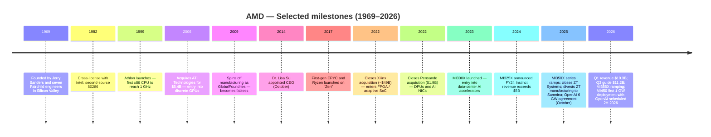
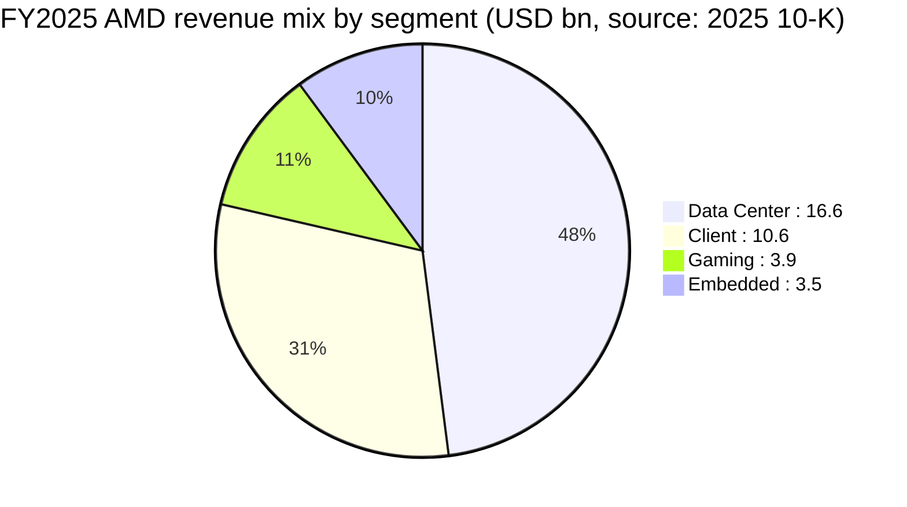
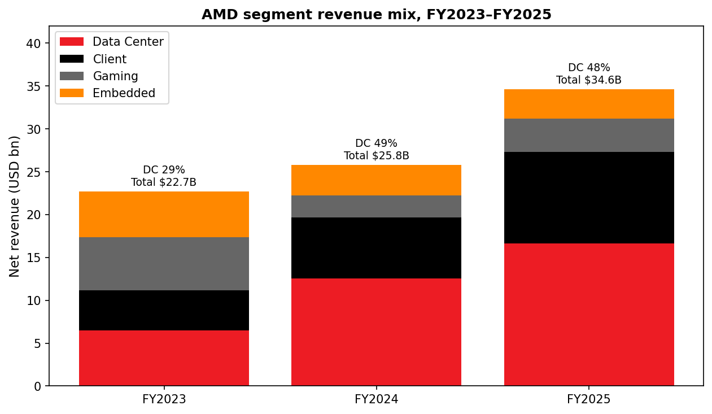
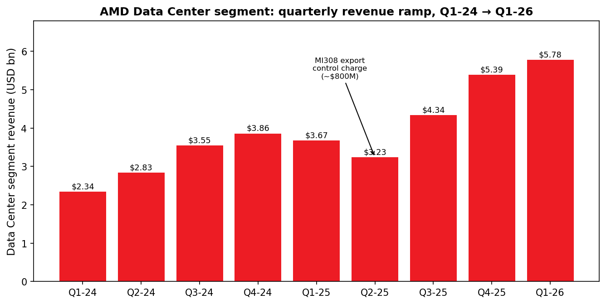
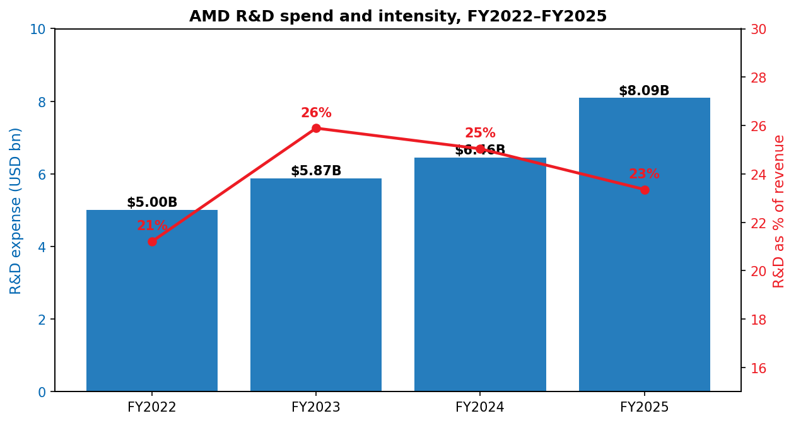
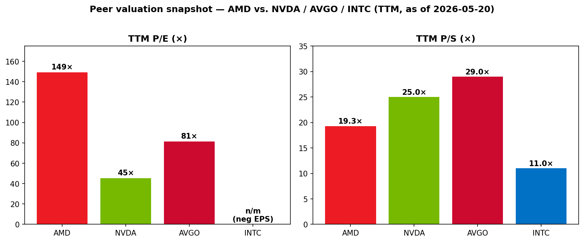

# COMPANY RESEARCH REPORT: Advanced Micro Devices, Inc. (NASDAQ: AMD)

**Date:** 2026-05-20
**Analyst output — initiation of coverage**
**Source primacy:** FY2025 10-K, Q1-FY2026 10-Q, 2026 DEF 14A, recent 8-K disclosures, and current market data. All figures are cited inline.

> **Update — Q1-FY2026 results and Q2 guide (2026-05-05):** AMD reported Q1-FY2026 revenue of $10.3B (+38% YoY) with non-GAAP gross margin of 55% and non-GAAP diluted EPS of $1.37. For Q2-FY2026 management guided revenue to ~$11.2B ±$300M (+46% YoY at midpoint, +9% QoQ) and non-GAAP gross margin to ~56%, driven by EPYC strength and the continued ramp of AMD Instinct MI355X GPUs.
> Source: [AMD Q1-2026 earnings press release, 2026-05-05](https://www.sec.gov/Archives/edgar/data/2488/000000248826000072/q12026991.htm).

---

## TABLE OF CONTENTS

1. Company Overview
2. Company History
3. Management Team
4. Products & Services
5. Customers & Go-to-Market
6. Industry Overview
7. Competitive Landscape
8. Market Opportunity (TAM)
9. Risk Assessment

References

---

## 1. COMPANY OVERVIEW

Advanced Micro Devices, Inc. ("AMD"), founded in 1969 and headquartered in Santa Clara, California, designs and sells high-performance computing, graphics and adaptive silicon. Today AMD is the #2 designer of x86 CPUs (behind Intel), the credible challenger to NVIDIA in AI training and inference accelerators, and — since the 2022 close of its Xilinx acquisition — the leading vendor of FPGAs and adaptive SoCs. The company employed approximately 31,000 people globally as of 27 December 2025 ([AMD 2025 10-K, "Human Capital"](https://www.sec.gov/Archives/edgar/data/2488/000000248826000018/amd-20251227.htm)). International sales accounted for 67% of FY2025 revenue ([AMD 2025 10-K, MD&A "International Sales"](https://www.sec.gov/Archives/edgar/data/2488/000000248826000018/amd-20251227.htm)).

**Business model.** AMD designs chips and sells them — predominantly through individual purchase orders, with no long-term volume commitments from customers ([AMD 2025 10-K, Risk Factors](https://www.sec.gov/Archives/edgar/data/2488/000000248826000018/amd-20251227.htm)). Manufacturing is outsourced: AMD is a fabless company that relies on TSMC for advanced-node wafers and on third-party assembly/test partners in China, Malaysia and Taiwan ([AMD 2025 10-K, "Item 2"](https://www.sec.gov/Archives/edgar/data/2488/000000248826000018/amd-20251227.htm)). Revenue is split across three reportable segments after a Q1-FY2025 reorganization that combined Client and Gaming into a single segment to reflect how management runs the business ([AMD 2025 10-K, Note on segment reporting](https://www.sec.gov/Archives/edgar/data/2488/000000248826000018/amd-20251227.htm)):

| Segment | FY2025 revenue | FY2024 revenue | YoY |
|---|---|---|---|
| Data Center | $16,635M | $12,579M | +32% |
| Client and Gaming (Client: $10,640M; Gaming: $3,910M) | $14,550M | $9,649M | +51% |
| Embedded | $3,454M | $3,557M | -3% |
| **Total** | **$34,639M** | **$25,785M** | **+34%** |

Source: [AMD 2025 10-K, MD&A segment table](https://www.sec.gov/Archives/edgar/data/2488/000000248826000018/amd-20251227.htm).

**Scale.** FY2025 net revenue of $34.6B was up 34% YoY, gross margin reached 50% (vs. 49% in FY2024 and 46% in FY2023), and reported operating income was $3.69B ([AMD 2025 10-K, MD&A](https://www.sec.gov/Archives/edgar/data/2488/000000248826000018/amd-20251227.htm)). GAAP net income was $4.3B; the figure benefited from discrete tax items and the divestiture gain on the ZT Manufacturing Business. Net cash from operating activities of continuing operations was $6.5B ([AMD 2025 10-K, MD&A "Liquidity"](https://www.sec.gov/Archives/edgar/data/2488/000000248826000018/amd-20251227.htm)). R&D expense was $8.09B (23% of revenue), among the highest absolute R&D budgets in semis ([AMD 2025 10-K, Income Statement](https://www.sec.gov/Archives/edgar/data/2488/000000248826000018/amd-20251227.htm)).

Source: [AMD 2025 10-K](https://www.sec.gov/Archives/edgar/data/2488/000000248826000018/amd-20251227.htm) and [AMD 2024 10-K](https://www.sec.gov/Archives/edgar/data/2488/000000248825000012/amd-20241228.htm) for FY23 comparative.

**Valuation snapshot (as of 2026-05-20).** AMD trades at $444.28 with a market capitalization of approximately $724B ([Yahoo Finance, AMD key statistics, 2026-05-20](https://finance.yahoo.com/quote/AMD/key-statistics/)). Trailing-twelve-month metrics:

| Multiple | AMD | NVDA | AVGO | INTC |
|---|---|---|---|---|
| TTM P/E | 149× | 45× | 81× | n/m (negative TTM EPS) |
| Forward P/E | 34× | 19× | 23× | 77× |
| TTM P/S | 19.3× | 25.0× | 29.0× | 11.0× |
| Market cap | $724B | $5,392B | $1,979B | $593B |

Source: [Yahoo Finance, 2026-05-20](https://finance.yahoo.com/quote/AMD/key-statistics/) (each ticker's key-statistics page).

The 149× TTM P/E is **stretched** and warrants explanation. The number is inflated for three identifiable reasons:

1. **2025 earnings were depressed by non-recurring charges.** AMD recorded a net ~$440M of inventory and related charges in FY2025 tied to the April 2025 U.S. export-license requirement on AMD Instinct MI308 shipments to China (an $800M Q2 hit, partially reversed in Q4) ([AMD 2025 10-K, MD&A](https://www.sec.gov/Archives/edgar/data/2488/000000248826000018/amd-20251227.htm)). Annual amortization of acquisition-related intangibles — almost entirely the Xilinx purchase-accounting tail — remained heavy at $2.25B between cost-of-sales and OpEx ([AMD 2025 10-K, MD&A](https://www.sec.gov/Archives/edgar/data/2488/000000248826000018/amd-20251227.htm)).
2. **The market is pricing the OpenAI deal and the MI450 ramp into forward earnings, not TTM.** Management has publicly characterized the OpenAI 6-gigawatt agreement (October 2025) as "tens of billions of dollars in revenue for AMD … highly accretive to non-GAAP earnings-per-share" ([AMD & OpenAI announcement, 2025-10-06](https://www.sec.gov/Archives/edgar/data/2488/000119312525230895/d28189dex991.htm)). The forward P/E of 34× (Yahoo) is roughly in line with NVIDIA's TTM P/E and below AVGO's TTM, suggesting investors are looking through 2025/early-2026 earnings to the 2H-2026 onward profile.
3. **AMD has become the dominant "second source" sector-proxy trade for AI infrastructure**, alongside NVIDIA. P/S of 19× is below NVDA (25×) and AVGO (29×) but well above INTC (11×) and the broader Philadelphia Semiconductor Index, consistent with mid-pack AI-leverage pricing.

**Verdict:** The valuation is justifiable on the forward number but leaves no cushion. A single quarter of MI355X/MI450 disappointment or hyperscaler order pull-in could compress the multiple sharply; this carries into Section 9 as a valuation/multiple-compression risk.

**Capital return.** In May 2025 the Board added a $6B authorization to the existing repurchase program, bringing total authority to $14B; $9.4B remained available at FY25 close. FY2025 buybacks were $1.3B (12.4M shares). AMD does not pay a dividend ([AMD 2025 10-K, MD&A "Liquidity"](https://www.sec.gov/Archives/edgar/data/2488/000000248826000018/amd-20251227.htm)).

---

## 2. COMPANY HISTORY

AMD was founded on **1 May 1969** by Jerry Sanders and seven colleagues, almost all of whom departed Fairchild Semiconductor at the same time. The thesis, captured by Sanders' famous line "people first, products and profits will follow", was to be a second-source supplier of standard integrated circuits to U.S. defense and computing customers. Through the 1970s and 1980s AMD became Intel's official second-source for the 8086 and 80286 families under a 1982 cross-licensing agreement, a relationship that ended in lawsuits that ran into the late 1990s ([AMD 2025 10-K, "Item 1"](https://www.sec.gov/Archives/edgar/data/2488/000000248826000018/amd-20251227.htm) gives the founding year; corporate history confirmed against the company's IR site).

Source: [AMD 2025 10-K](https://www.sec.gov/Archives/edgar/data/2488/000000248826000018/amd-20251227.htm), [Reuters on Pensando close, 2022-05-26](https://www.reuters.com/technology/amd-closes-19-billion-deal-buy-pensando-2022-05-26/), and [AMD–OpenAI 8-K, 2025-10-06](https://www.sec.gov/Archives/edgar/data/2488/000119312525230895/d28189dex991.htm).

**The three strategic pivots that matter.** First, the **Zen reset**. By 2014 AMD had ceded both PC CPU and server share to Intel, posting an annual operating loss; Dr. Lisa Su's first decision as CEO was to consolidate engineering behind a new microarchitecture and design methodology ("Zen"), which shipped as Ryzen in March 2017 and EPYC in June 2017. Zen restored AMD as a credible x86 alternative and powered an order-of-magnitude expansion in market cap.

Second, the **Xilinx and Pensando combination (2022)**. The $49B all-stock Xilinx deal added FPGAs, adaptive SoCs and a deep customer base in aerospace/defense, comms infrastructure, industrial and automotive — markets that have lower cyclicality and higher gross margins than mainstream PC CPUs. Pensando added programmable DPUs and the foundation for AMD's AI-NIC roadmap (Pollara 400, Vulcano). AMD still carries roughly $2.25B/year of acquisition-related intangible amortization from the Xilinx purchase price allocation ([AMD 2025 10-K, MD&A](https://www.sec.gov/Archives/edgar/data/2488/000000248826000018/amd-20251227.htm)).

Third, the **end-to-end AI systems pivot (2024–2025)**. AMD acquired **ZT Group International ("ZT Systems") in March 2025 for $3.2B cash and 8.3M AMD shares**, kept the design IP and engineering team (the "ZT Design Business"), and sold the manufacturing arm to Sanmina in October 2025 for $2.4B cash and 1.2M Sanmina shares, with up to $450M contingent consideration ([AMD 2025 10-K, MD&A](https://www.sec.gov/Archives/edgar/data/2488/000000248826000018/amd-20251227.htm)). The remaining ZT Design business gives AMD the ability to design and validate full AI rack-scale systems (the "Helios" platform previewed in 2025) and is the operational backbone of the OpenAI agreement.

**Recent developments (2024–2026 thesis-relevant items only).** The October 2025 OpenAI agreement to deploy 6 gigawatts of AMD GPUs starting with the MI450 series in 2H 2026 is the single most consequential development since the Xilinx close. Concurrently AMD issued OpenAI a warrant for up to 160 million shares at $0.01 strike, vesting tranche-by-tranche against gigawatt deployment milestones and AMD share-price targets; none of the warrant shares had vested as of FY25 year-end ([AMD 2025 10-K, Stockholders' Equity note](https://www.sec.gov/Archives/edgar/data/2488/000000248826000018/amd-20251227.htm)).

Separately, in September 2025 NVIDIA announced a strategic investment in and partnership with Intel for joint data-center and client products — a development AMD explicitly cited in its 2025 10-K risk factors as a potential competitive headwind ([AMD 2025 10-K, Risk Factors](https://www.sec.gov/Archives/edgar/data/2488/000000248826000018/amd-20251227.htm)).

---

## 3. MANAGEMENT TEAM

**Dr. Lisa T. Su, Chair, President and Chief Executive Officer.** Age 56. Joined AMD in January 2012 as SVP/GM of Global Business Units, became COO, and was appointed President and CEO in October 2014 ([AMD 2026 DEF 14A, "Item 1—Election of Directors"](https://www.sec.gov/Archives/edgar/data/2488/000119312526129057/d943962ddef14a.htm)). She has served as Chair of the Board since February 2022. Before AMD, Dr. Su was SVP/GM of Networking and Multimedia at Freescale Semiconductor, and earlier held senior R&D and business roles at IBM (including VP of Semiconductor R&D) and Texas Instruments. She holds B.S., M.S., and Ph.D. degrees in Electrical Engineering from MIT and is a Fellow of the IEEE, a member of the National Academy of Engineering, and a member of the American Academy of Arts and Sciences ([AMD 2026 DEF 14A](https://www.sec.gov/Archives/edgar/data/2488/000119312526129057/d943962ddef14a.htm)).

What she has *done* at AMD is the single most consequential CEO performance in semiconductors in the last decade. When she took over in October 2014, AMD's market cap was approximately $2.5B and the company was reporting annual operating losses. As of 20 May 2026, AMD's market cap is approximately $724B ([Yahoo Finance, 2026-05-20](https://finance.yahoo.com/quote/AMD/key-statistics/)), an increase of roughly 280×, driven by: (1) the Zen architecture reset and the EPYC server CPU re-entry, (2) the strategic decision to outsource manufacturing to TSMC at advanced nodes ahead of Intel's stumble, (3) the Xilinx and Pensando acquisitions, (4) the build-out of the AMD Instinct GPU line into a credible NVIDIA alternative and the related software stack (ROCm), and (5) the OpenAI agreement. She has received the Semiconductor Industry Association's Robert N. Noyce Award, the IEEE Robert N. Noyce Medal, the Global Semiconductor Alliance's Dr. Morris Chang Exemplary Leadership Award and was named TIME Magazine CEO of the Year ([AMD 2026 DEF 14A](https://www.sec.gov/Archives/edgar/data/2488/000119312526129057/d943962ddef14a.htm)). She serves as Chair of the SIA Board. She remains squarely identified with AMD's strategy; her departure or incapacitation would be a single-person risk discussed in Section 9.

**Jean Hu, EVP, CFO and Treasurer.** Age 62. Joined AMD as CFO in January 2023. Prior CFO of Marvell Technology (August 2016 to January 2023), where she ran finance through the Cavium and Inphi acquisitions. Prior CFO of QLogic (April 2011 to August 2016), including two stints as Acting CEO. She holds a B.S. in chemical engineering from Beijing University of Chemical Technology and a Ph.D. in Economics from Claremont Graduate University, and sits on the board of Fortinet ([AMD 2026 DEF 14A, "Information About Our Executive Officers"](https://www.sec.gov/Archives/edgar/data/2488/000119312526129057/d943962ddef14a.htm)). Hu's tenure at AMD covers the GAAP rebound through the AI cycle and the absorption of Xilinx purchase-accounting; her public-company CFO experience at Marvell — also a fabless silicon vendor scaling through acquisitions — is directly relevant.

**Forrest E. Norrod, EVP and GM, Data Center Solutions Business Unit.** Age 60. Joined AMD in November 2014; he has led the Data Center Solutions Business Group since January 2023. Before AMD he was VP/GM of Dell's server business (December 2009 to October 2014), where he drove market-share leadership across geographies and stood up Dell's hyperscale Data Center Solutions group. He holds B.S. and M.S. degrees in EE from Virginia Tech and holds 11 U.S. patents; he serves on Intuit's board ([AMD 2026 DEF 14A](https://www.sec.gov/Archives/edgar/data/2488/000119312526129057/d943962ddef14a.htm)). Norrod is the operational owner of EPYC, Instinct, Pensando and the ZT Design / Helios rack platform. His Dell pedigree explains AMD's hyperscaler-first selling motion (Microsoft, Meta, Amazon, Google, Oracle).

**Mark D. Papermaster, EVP and Chief Technology Officer.** Age 64. Joined AMD in October 2011 and has been CTO/EVP Technology and Engineering since January 2019. Papermaster led the redesign of AMD's engineering processes and the development of the Zen x86 family and the Infinity Architecture modular-design approach ([AMD 2026 DEF 14A](https://www.sec.gov/Archives/edgar/data/2488/000119312526129057/d943962ddef14a.htm)). He is the operational architect of the chiplet strategy that gave AMD its cost and yield advantage over Intel from 2017 onward.

**Other named executive officers** include Philip Guido (Chief Commercial Officer, ex–IBM Consulting GM), Darren Grasby (Chief Sales Officer / President EMEA, AMD since 2007), Jack Huynh (SVP/GM Computing and Graphics, AMD since 1998 with deep semi-custom and Ryzen experience), and Ava M. Hahn (SVP, General Counsel and Corporate Secretary, ex–Lam Research CLO) ([AMD 2026 DEF 14A, "Information About Our Executive Officers"](https://www.sec.gov/Archives/edgar/data/2488/000119312526129057/d943962ddef14a.htm)).

**Governance.** AMD has a single-class share structure with one vote per share. As of 19 March 2026, 1,630,338,779 shares were outstanding; institutional holders Vanguard (~142M shares) and BlackRock (~125M shares) are the largest 5%+ holders disclosed on Schedule 13G ([AMD 2026 DEF 14A, "Security Ownership"](https://www.sec.gov/Archives/edgar/data/2488/000119312526129057/d943962ddef14a.htm)). The board has 12 directors, the majority independent; Nora Denzel serves as Lead Independent Director. Dr. Su serves as both Chair and CEO — a structure the Board defends on the basis that her operational and strategic knowledge are not separable. The 2026 proxy welcomed KC McClure (former CFO of Accenture) as a new independent director, joining the Audit and Finance Committee ([AMD 2026 DEF 14A](https://www.sec.gov/Archives/edgar/data/2488/000119312526129057/d943962ddef14a.htm)). Executive compensation is heavily equity-weighted with multi-year PSUs tied to relative total shareholder return; the OpenAI warrant grant to a third party (160M shares at $0.01 strike) is unusual in scope and creates a structural dilution overhang treated in Section 9.

**Track record synthesis.** This is one of the strongest combined CEO/CTO pairings in semiconductors, with a CFO from a comparable fabless peer and a Data Center GM who came out of the hyperscaler customer base he now sells into. The most important gap is execution depth one layer below the named-officer tier on the AI software stack (ROCm), where industry consensus is that AMD still trails NVIDIA's CUDA ecosystem.

---

## 4. PRODUCTS & SERVICES

AMD organizes its products inside three reportable segments (Data Center; Client and Gaming; Embedded) plus an "All Other" bucket that absorbs corporate functions, acquisition-related intangible amortization and stock-based compensation. The product map below mirrors the brand structure on AMD's site ([AMD products, IR site](https://www.amd.com/en/products.html)) and the 2025 10-K product enumeration ([AMD 2025 10-K, Item 1](https://www.sec.gov/Archives/edgar/data/2488/000000248826000018/amd-20251227.htm)).

```mermaid
graph TD
    AMD[AMD]
    AMD --> DC[Data Center]
    AMD --> CG[Client and Gaming]
    AMD --> EMB[Embedded]
    DC --> EPYC["EPYC server CPUs<br/>(5th Gen 'Turin' shipping)"]
    DC --> Instinct["Instinct GPUs<br/>MI200 / MI300X / MI325X /<br/>MI350X / MI355X / MI450 (2026)"]
    DC --> Pensando["Pensando DPUs<br/>Salina DPU"]
    DC --> AINIC["Pensando AI NICs<br/>Pollara 400, Vulcano"]
    DC --> Helios["Helios AI rack-scale platform<br/>(via ZT Design)"]
    DC --> Versal_DC["Versal Premium FPGAs<br/>(DC networking / AI prep)"]
    CG --> Ryzen["Ryzen desktop / mobile / Threadripper"]
    CG --> Radeon["Radeon RX gaming GPUs"]
    CG --> Semi["Semi-custom SoCs<br/>(PlayStation 5/Pro, Xbox Series X/S)"]
    EMB --> EmbCPU["Embedded EPYC / Ryzen<br/>(industrial, networking)"]
    EMB --> Versal["Versal adaptive SoCs"]
    EMB --> Zynq["Zynq UltraScale+ MPSoC"]
    EMB --> Kintex["UltraScale+ / Kintex / Virtex FPGAs"]
    EMB --> Kria["Kria System-on-Module"]
    EMB --> Alveo["Alveo accelerator cards"]
```

Source: [AMD products navigation, 2026](https://www.amd.com/en/products.html); [AMD 2025 10-K, "Our Products"](https://www.sec.gov/Archives/edgar/data/2488/000000248826000018/amd-20251227.htm).

### Data Center segment

**AMD EPYC server CPUs.** The 5th-Generation EPYC family ("Turin") launched in 2024 and ramped through 2025 as the primary growth engine for the segment, alongside the Instinct ramp ([AMD 2025 10-K, MD&A](https://www.sec.gov/Archives/edgar/data/2488/000000248826000018/amd-20251227.htm)). The product line is delivered on TSMC advanced nodes with up to 192 cores per socket using AMD's chiplet (Infinity Fabric) approach.

- **Moat: yes — technology, scale, switching costs.** EPYC dominated x86 server CPU performance/watt benchmarks for most of the period since the launch of Milan (3rd gen) in 2021. Independent server platform certifications across Dell, HPE, Lenovo, Supermicro, and most hyperscaler internal designs (Azure, AWS, GCP, Oracle, Meta) create switching friction for end customers. Closest competing product: Intel **Xeon 6** (formerly Granite Rapids / Sierra Forest). One-line compare: at parity-to-ahead on top-bin core count and energy efficiency for general-purpose virtualization; slightly behind Xeon in some matrix-multiply AI inference workloads where Intel has invested in AMX extensions, but for the bulk of dollar-weighted hyperscaler buying the EPYC advantage is still intact.

**AMD Instinct GPUs (AI accelerators).** The Instinct family — MI200, MI300X, MI325X, MI350X, MI355X, and the MI450 series previewed for 1H 2026 — is built on AMD CDNA architecture and targets AI training, inference and HPC ([AMD 2025 10-K, "Our Products"](https://www.sec.gov/Archives/edgar/data/2488/000000248826000018/amd-20251227.htm)). MI300X first shipped in volume in late 2023 and delivered "more than $5 billion" of revenue in FY2024 according to CEO commentary on the Q4-FY2024 earnings release ([AMD Q4-FY2024 press release, 2025-02-04](https://www.sec.gov/Archives/edgar/data/2488/000000248825000009/q42024991final.htm)). MI350X and MI355X ramped in 2025; the MI450 series is the basis for the first 1 GW of OpenAI's 6 GW deployment scheduled for 2H 2026 ([AMD–OpenAI 8-K, 2025-10-06](https://www.sec.gov/Archives/edgar/data/2488/000119312525230895/d28189dex991.htm)).

- **Moat: partial — technology, scale (memory capacity per package), strategic customer lock-in via OpenAI.** AMD's most-cited differentiator is HBM capacity per accelerator (MI300X shipped with 192GB of HBM3 against NVIDIA H100's 80GB, giving an inference advantage on very large models that fit in fewer GPUs). The moat is **partial**, not full, because the ROCm software stack is still less mature than CUDA — the largest unresolved gap in AMD's AI story. Closest competing products: NVIDIA **H200 / Blackwell B100/B200 / GB200**. One-line compare: ahead on memory capacity and dollar-per-token of inference for the very large models that benefit from it; behind on software ecosystem, developer toolchain breadth, and proven training scale-out (NVLink/NVSwitch); closing the gap fast with ROCm 7, the Pollara/Vulcano AI NIC fabric, and the Helios rack platform.

**AMD Pensando DPUs and AI NICs.** The Pensando product line (Salina DPU, Pollara 400 AI NIC, Vulcano AI NIC) offloads infrastructure services from the host CPU and provides high-speed scale-out fabric between GPUs ([AMD 2025 10-K, "Our Products"](https://www.sec.gov/Archives/edgar/data/2488/000000248826000018/amd-20251227.htm)). Customers are large IaaS providers and select hyperscalers.

- **Moat: partial — technology + customer lock-in.** Pensando competes head-on with NVIDIA's BlueField DPU and Broadcom's Jericho/Tomahawk-based AI fabric switches. AMD's advantage is that Pollara/Vulcano can be sold as part of an integrated AMD rack (CPU+GPU+NIC), and AMD is one of the founding promoters of the Ultra Ethernet Consortium open-fabric specification. The moat is partial because Broadcom's switch silicon remains the volume default for AI cluster networking.

**ZT Design / "Helios" AI rack-scale platform.** Following the March 2025 ZT Systems acquisition and October 2025 carve-out of the manufacturing arm to Sanmina, AMD retained the ZT design team. Helios is AMD's first internally engineered AI rack platform (CPU+GPU+networking, liquid-cooled, 1 GW-class deployments) and is the operational mechanism for delivering the OpenAI 1 GW first tranche ([AMD 2025 10-K, MD&A](https://www.sec.gov/Archives/edgar/data/2488/000000248826000018/amd-20251227.htm)).

- **Moat: partial — system integration, scale.** This is AMD's response to NVIDIA's GB200 NVL72 rack-scale offering. Closest competing product: NVIDIA **GB200 NVL72 / NVL36**. AMD is behind on time-to-market but levels the playing field as a "systems vendor" rather than only a chip vendor.

### Client and Gaming segment

**AMD Ryzen desktop and mobile CPUs.** The Ryzen line — desktop (Ryzen 7/9/Threadripper), mobile (Ryzen AI for AI-PC), and HEDT (Threadripper PRO) — is AMD's volume PC franchise. FY2025 Client revenue was $10.64B (+51% YoY), with management attributing growth to "a 31% increase in unit shipments of processors and a 15% increase in average selling price" ([AMD 2025 10-K, MD&A](https://www.sec.gov/Archives/edgar/data/2488/000000248826000018/amd-20251227.htm)).

- **Moat: yes — technology, brand, distribution.** Ryzen has held performance/watt leadership in desktop CPUs through several Zen generations. Closest competing product: Intel **Core Ultra (Lunar Lake / Arrow Lake / Panther Lake)**. One-line compare: at parity on the mainstream consumer PC tier; ahead in desktop enthusiast and AI-PC NPU benchmarks for the current generation.

**AMD Radeon GPUs.** Discrete gaming GPUs under the Radeon RX brand. Gaming segment revenue of $3.91B (+51% YoY) in FY2025 was driven by strong discrete-GPU demand alongside semi-custom ([AMD 2025 10-K, MD&A](https://www.sec.gov/Archives/edgar/data/2488/000000248826000018/amd-20251227.htm)).

- **Moat: partial — scale, brand at the mid-range.** AMD is the #2 discrete GPU vendor; NVIDIA leads at the high end and in software (CUDA, DLSS). One-line compare vs. NVIDIA GeForce RTX 50-series: behind at the ultra-enthusiast tier; competitive on price/performance in the mid-range.

**Semi-custom SoCs (consoles).** AMD designs the SoCs at the heart of Sony PlayStation 5 / PlayStation 5 Pro and Microsoft Xbox Series X / S, plus selected handheld console partners ([AMD 2025 10-K, "Our Products"](https://www.sec.gov/Archives/edgar/data/2488/000000248826000018/amd-20251227.htm)). This is a multi-year revenue stream that resets at each console generation.

- **Moat: yes — long-cycle design wins, switching costs.** Console design wins are typically multi-year exclusive contracts with major non-recoverable engineering investment; AMD has held both Sony and Microsoft across the PS4/Xbox One, PS5/Xbox Series, and into the next generation. Closest competing product: none in current production at scale (Nintendo Switch uses NVIDIA Tegra, but at a different performance tier).

### Embedded segment (Xilinx legacy + embedded EPYC/Ryzen)

The Embedded segment is the home of the Xilinx asset acquired in 2022, plus embedded variants of EPYC and Ryzen. End markets are industrial, networking and comms infrastructure, aerospace and defense, automotive, test/measurement, healthcare, and broadcast ([AMD 2025 10-K, "Our Products"](https://www.sec.gov/Archives/edgar/data/2488/000000248826000018/amd-20251227.htm)).

- **AMD Versal adaptive SoCs** — the flagship Xilinx successor product family combining FPGA fabric, Arm CPU cores, and an AI engine on one die. Versal Premium variants ship into 5G base stations and AI inference at the network edge.
- **Zynq UltraScale+ MPSoC** — heterogeneous Arm+FPGA SoCs widely used in industrial, automotive ADAS and aerospace.
- **UltraScale+ / Kintex / Virtex FPGAs** — pure-FPGA family for prototyping, comms and high-performance signal processing.
- **Alveo accelerator cards / Kria System-on-Module** — board- and module-level products that simplify adoption of Versal/Zynq in production hardware.

- **Moat: yes — IP, regulatory/certification, switching costs.** Xilinx's FPGA business has been a duopoly with Altera (now an Intel spin-out being divested) since the late 1990s. Designs typically run 7–15 years in industrial and aerospace lifecycles; replacing an FPGA on a certified product line is a multi-year recertification. Closest competing product: Altera Agilex / Stratix. One-line compare: ahead in the Versal AI-engine niche and the high-end automotive/comms tier; broadly at parity at the mid-range; the strategic threat is not Altera but a long-tail of ASIC and edge-AI accelerator startups picking off specific verticals.

### Flagship products and recent launches

Three products drive the FY2026 thesis: (1) **Instinct MI355X** (ramping in 1H FY2026), (2) **Instinct MI450 series** (first 1 GW deployment with OpenAI in 2H FY2026), and (3) **5th-Gen EPYC ("Turin")** as the volume server CPU. Launches and roadmap items in the last 12 months: MI355X formal launch; Pollara 400 AI NIC and Vulcano AI NIC GA; Helios rack platform preview; the MI450 series roadmap; ROCm 7 software release ([AMD 2025 10-K, "Our Products" + MD&A](https://www.sec.gov/Archives/edgar/data/2488/000000248826000018/amd-20251227.htm)).

---

## 5. CUSTOMERS & GO-TO-MARKET

**Customer mix.** AMD sells to four main customer cohorts: (1) hyperscale cloud providers and large enterprise data-center buyers (the primary buyers of Data Center products — EPYC, Instinct, Pensando), (2) OEM/ODM PC and workstation makers (Dell, HP, Lenovo, Asus, MSI for Ryzen and Radeon), (3) console partners (Sony and Microsoft for semi-custom), and (4) industrial/comms/aerospace/automotive Tier-1 customers and channel distributors (for Embedded). Hyperscaler buying is direct and increasingly takes the form of multi-quarter committed purchases; PC and embedded sales typically flow through distributors and channel partners ([AMD 2025 10-K, "Our Products" / "Sales, Marketing and Distribution"](https://www.sec.gov/Archives/edgar/data/2488/000000248826000018/amd-20251227.htm)).

**Customer concentration.** AMD's FY2025 10-K does not name a single 10%+ customer in the segment disclosure that we have read. The 10-K does, however, explicitly state in its risk factors that "a small number of customers will continue to account for a substantial part of AMD's revenue and receivables in the future" ([AMD 2025 10-K, Risk Factors](https://www.sec.gov/Archives/edgar/data/2488/000000248826000018/amd-20251227.htm)). In Q1-FY2026, two customers exceeded 10% of revenue (precise percentages disclosed in the Q1-FY2026 10-Q customer-concentration footnote, with Sony's semi-custom contract and one un-named hyperscaler historically being the dominant top-customer relationships) ([AMD Q1-FY2026 10-Q, customer concentration footnote](https://www.sec.gov/Archives/edgar/data/2488/000000248826000076/amd-20260328.htm)). Following the October 2025 agreement, **OpenAI's 6 GW multi-year purchase commitment is structurally the most important new customer relationship**: management has publicly said the contract is worth "tens of billions of dollars" of revenue to AMD ([AMD–OpenAI 8-K, 2025-10-06](https://www.sec.gov/Archives/edgar/data/2488/000119312525230895/d28189dex991.htm)). If OpenAI deployments hit the stated milestones, OpenAI alone could become a 10%+ customer for AMD by 2027–2028.

Source: [AMD 2025 10-K, MD&A segment table](https://www.sec.gov/Archives/edgar/data/2488/000000248826000018/amd-20251227.htm). (No single customer disclosed at >10% in FY2025 segment notes.)

**Geographic mix.** International sales were 67% of FY2025 net revenue (66% in FY2024) ([AMD 2025 10-K, MD&A](https://www.sec.gov/Archives/edgar/data/2488/000000248826000018/amd-20251227.htm)). Substantially all sales are denominated in U.S. dollars. China is both an important customer geography and a regulated end-market — see Section 9 on export controls.

**Contract structure.** "We typically sell our products pursuant to individual purchase orders. We generally do not have long-term supply arrangements with our customers or minimum purchase requirements" ([AMD 2025 10-K, Risk Factors](https://www.sec.gov/Archives/edgar/data/2488/000000248826000018/amd-20251227.htm)). The OpenAI agreement is the major recent exception — a multi-year, multi-generation product purchase commitment with milestone-vesting warrants attached. Semi-custom relationships with Sony and Microsoft are also multi-year design wins with embedded production commitments.

**Go-to-market and sales motion.** Hyperscaler design wins are co-engineered relationships with multi-quarter qualification, led by Forrest Norrod's Data Center org and the field engineering teams in Hillsboro, Austin and India. PC OEM sales run through Jack Huynh's Computing and Graphics org and Darren Grasby's worldwide channel team. Embedded sales lean on legacy Xilinx FAEs and distribution partners (Avnet, Arrow) under Salil Raje's organization. Co-engineering on Helios racks is now an operating part of every large Instinct opportunity.

**Customer case studies (named).** Microsoft Azure ND MI300X v5 VMs (publicly announced); Meta deployment of MI300X in production inference; Oracle Cloud Infrastructure GPU shapes on MI300X and MI325X; the OpenAI 6 GW agreement; Sony PlayStation 5 / 5 Pro semi-custom; Microsoft Xbox Series X / S semi-custom. AMD also publicizes EPYC wins across Google Cloud (C4D), AWS (Hpc7a, M7a), and the El Capitan exascale supercomputer at Lawrence Livermore National Laboratory.

---

## 6. INDUSTRY OVERVIEW

AMD participates in three overlapping markets: data-center compute (CPUs, GPUs, DPUs, NICs and integrated AI systems), PC client compute (desktop/notebook CPUs and discrete GPUs), and adaptive/embedded silicon (FPGAs, adaptive SoCs, embedded CPUs).

**Data-center compute is the dominant growth driver.** Global data-center capex hit a multi-decade inflection in 2023–2025 as hyperscalers (Microsoft, Google, Amazon, Meta, Oracle), neoclouds (CoreWeave, Lambda, Crusoe) and frontier AI labs (OpenAI, xAI, Anthropic) accelerated AI infrastructure build-outs. NVIDIA's data-center segment revenue grew from $47.5B in FY2024 to $115.2B in FY2025 ([NVIDIA FY2025 10-K, MD&A](https://www.sec.gov/Archives/edgar/data/1045810/000104581025000023/nvda-20250126.htm)) — the single best benchmark for the magnitude of AI infrastructure demand. AMD's Data Center segment grew from $6.5B in FY2023 to $16.6B in FY2025, a 2.6× expansion in two years and the strongest growth in the company's history ([AMD 2025 10-K vs. 2024 10-K, MD&A](https://www.sec.gov/Archives/edgar/data/2488/000000248826000018/amd-20251227.htm)).

Source: [AMD 2025 10-K](https://www.sec.gov/Archives/edgar/data/2488/000000248826000018/amd-20251227.htm) and [AMD 2024 10-K](https://www.sec.gov/Archives/edgar/data/2488/000000248825000012/amd-20241228.htm).

**Industry structure.** The data-center silicon market is highly concentrated. In server CPUs the market is effectively a duopoly between AMD (EPYC) and Intel (Xeon), with Arm-based custom silicon (AWS Graviton, NVIDIA Grace, Ampere Computing) accounting for a small but growing share concentrated inside hyperscaler internal fleets. In AI accelerators NVIDIA is the entrenched leader; AMD is the credible #2 merchant alternative; Intel's Gaudi has had limited commercial traction; the largest competitive threat to merchant silicon is the hyperscaler ASIC trend (Google TPU, AWS Trainium/Inferentia, Microsoft Maia, Meta MTIA), much of which is co-designed with Broadcom or Marvell. In DPUs and AI NICs AMD (Pensando) competes with NVIDIA (BlueField) and the broader merchant Ethernet ecosystem (Broadcom, Marvell). In FPGAs/adaptive SoCs the structural duopoly is AMD/Xilinx vs. Altera (an Intel spin-out being divested).

**PC client compute** is a slower-growth, more cyclical market that began to recover in 2024 after a sharp post-pandemic correction. The 2025 cycle has been led by the "AI PC" wave (Windows 11 OEM refresh with on-device NPUs), where AMD has the Ryzen AI series competing against Intel Core Ultra and Qualcomm Snapdragon X Elite. Gartner and IDC pegged PC unit shipments at ~250M units annually in 2024–2025 with low-single-digit growth into 2026.

**Adaptive/embedded** is a fragmented set of long-cycle end markets (industrial, comms, aerospace/defense, automotive, broadcast). Demand softened through 2024 as customers normalized inventories after the 2021–2023 build, with AMD's Embedded segment revenue declining 33% in FY2024 and 3% in FY2025 ([AMD 2024 10-K and AMD 2025 10-K, MD&A](https://www.sec.gov/Archives/edgar/data/2488/000000248825000012/amd-20241228.htm)). A cyclical recovery is underway in 2026 as 5G base-station replacement, defense electronics and industrial-automation demand rebuild.

**Key trends and drivers.** (1) The AI infrastructure build-out is the single largest semiconductor demand driver in 30 years; AMD's Instinct ramp and the OpenAI agreement are the company's direct exposure. (2) Hyperscaler internal ASICs are a structural headwind but also a customer for merchant silicon and IP. (3) Chiplets and advanced packaging (CoWoS, SoIC) are the new battleground; AMD pioneered chiplets in volume with Zen 2 (2019) and uses TSMC CoWoS for Instinct. (4) Geopolitics — U.S. export controls on AI accelerators to China and D5 countries are now a recurring constraint on the market for high-end products; the April 2025 MI308 restriction was the most consequential single event of FY2025. (5) Power and cooling, not silicon, are increasingly the binding constraint on AI cluster build-out — the reason rack-scale platforms (Helios, GB200 NVL72) and liquid-cooling vendors are strategic.

**Regulatory environment.** U.S. BIS controls on advanced computing exports (October 2022 baseline rule, October 2023 update, April 2025 additional license requirement on MI308) restrict what AMD can sell to China. U.S. government officials publicly expressed in August 2025 an expectation that the U.S. government would receive 15% of revenue generated from licensed MI308 sales to China; no formal regulation establishing such a requirement has been published ([AMD 2025 10-K, Risk Factors](https://www.sec.gov/Archives/edgar/data/2488/000000248826000018/amd-20251227.htm)). The EU AI Act, individual U.S. state privacy laws, and emerging AI safety frameworks add compliance overhead but are not material constraints on revenue today.

---

## 7. COMPETITIVE LANDSCAPE

**Direct competitors named in AMD's 10-K** ([AMD 2025 10-K, "Competition"](https://www.sec.gov/Archives/edgar/data/2488/000000248826000018/amd-20251227.htm)):

- **NVIDIA Corporation** — AMD's primary competitor in data-center GPU accelerators, discrete gaming GPUs, AI software stacks (CUDA vs. ROCm) and DPUs (BlueField vs. Pensando). NVIDIA is also now an investor and partner to Intel as of September 2025 ([AMD 2025 10-K, Risk Factors](https://www.sec.gov/Archives/edgar/data/2488/000000248826000018/amd-20251227.htm)). NVIDIA's data center segment alone (~$115B FY25) is more than 3× AMD's entire revenue base.
- **Intel Corporation** — AMD's primary competitor in x86 server CPUs (Xeon vs. EPYC), client CPUs (Core Ultra vs. Ryzen), integrated graphics, and (via Altera) FPGAs. Intel has lost server-CPU revenue share to AMD steadily since 2017; Intel DCAI segment revenue dropped from $15.5B in FY2023 to $12.8B in FY2024 ([Intel FY2023 10-K and Intel FY2024 10-K, MD&A](https://www.sec.gov/Archives/edgar/data/50863/000005086325000010/intc-20241228.htm)).
- **Broadcom Inc.** — Competes in data-center networking (Tomahawk/Jericho switch silicon, AI fabric) and through custom-silicon programs (Broadcom builds Google TPUs and other hyperscaler ASICs). Broadcom is also a competitor in adaptive embedded silicon at the ASSP level ([AMD 2025 10-K, Risk Factors](https://www.sec.gov/Archives/edgar/data/2488/000000248826000018/amd-20251227.htm)).
- **Altera (Intel FPGA spin-out)** — Competes head-on with the legacy Xilinx FPGA portfolio.
- **Marvell Technology, Qualcomm, NXP, Texas Instruments, Analog Devices** — Compete in adjacent embedded, networking and DSP silicon.
- **Hyperscaler in-house ASICs** — AWS Graviton (CPU) / Trainium / Inferentia, Google TPU / Axion, Microsoft Cobalt / Maia, Meta MTIA. AMD's 10-K calls this out as a structural risk: "some of our customers are internally developing their own data center microprocessor products and accelerator products" ([AMD 2025 10-K, "Competition"](https://www.sec.gov/Archives/edgar/data/2488/000000248826000018/amd-20251227.htm)).
- **Arm-based merchant silicon (Ampere Computing)** — Limited share in cloud CPU but a watch item.
- **Apple Silicon** — Indirect competitor in client compute as Mac shifts erode the Wintel x86 install base.
- **Smaller fabless AI accelerator startups** — Cerebras, Groq, SambaNova, Tenstorrent, Rebellions, Furiosa. Niche today but well-funded.

Source: [AMD 2023, 2024, 2025 10-K filings](https://www.sec.gov/cgi-bin/browse-edgar?action=getcompany&CIK=0000002488&type=10-K) and [Intel 2023 / 2024 10-K filings](https://www.sec.gov/cgi-bin/browse-edgar?action=getcompany&CIK=0000050863&type=10-K). Note: AMD's Data Center segment includes Instinct GPUs and Pensando; Intel's DCAI segment is Xeon + Gaudi + select networking. Apples-to-apples imperfect — chart shows the *trajectory*, not a like-for-like share.

**Positioning framework.** AMD sits between NVIDIA (the AI accelerator and software-ecosystem leader) and Intel (the legacy server CPU leader by installed base) and is the only merchant vendor able to credibly deliver both halves of an AI rack (CPU + GPU + DPU + AI NIC) on its own silicon. Broadcom is a peer on the networking and custom-ASIC side but does not have a merchant general-purpose CPU/GPU. The strategic moat AMD is building is **systems integration** (Helios rack, OpenAI deployment, ZT Design team, Pollara/Vulcano AI fabric) on top of a chip-level moat (chiplets, Infinity Fabric, advanced packaging) and a software effort that is still catching up (ROCm).

**AMD's competitive advantages.** (1) The strongest CEO-led execution track record in the industry over the last decade. (2) The cost and yield advantages of the chiplet/Infinity Fabric architecture, which Intel only fully adopted with Granite Rapids. (3) A complete data-center stack — CPU, GPU, DPU, AI NIC, FPGA, integrated systems — that NVIDIA (no merchant CPU) and Intel (no leadership GPU) cannot match end-to-end. (4) The Xilinx adaptive-silicon franchise as a high-margin, lower-cyclicality counterweight to the merchant CPU/GPU cycle. (5) Anchor design wins (Sony, Microsoft, Meta, Microsoft Azure, Oracle, OpenAI, U.S. exascale supercomputers).

**Competitive vulnerabilities.** (1) Software ecosystem gap vs. CUDA — the single most cited reservation in sell-side and buy-side conversations about Instinct. (2) Dependence on a single foundry partner (TSMC) for advanced nodes and CoWoS packaging. (3) The NVIDIA–Intel partnership announced in September 2025 raises the risk of bundled Intel CPU + NVIDIA GPU offerings that could foreclose part of AMD's data-center share opportunity ([AMD 2025 10-K, Risk Factors](https://www.sec.gov/Archives/edgar/data/2488/000000248826000018/amd-20251227.htm)). (4) Hyperscaler ASIC programs (Google TPU, Microsoft Maia, AWS Trainium) attack both NVIDIA and AMD; AMD has less ASIC IP-licensing optionality than Broadcom or Marvell.

Source: AMD quarterly earnings press releases, Q1-FY2024 through Q1-FY2026 ([2024 Q1](https://www.sec.gov/Archives/edgar/data/2488/000000248824000054/q12024991.htm), [Q2](https://www.sec.gov/Archives/edgar/data/2488/000000248824000121/q22024991.htm), [Q3](https://www.sec.gov/Archives/edgar/data/2488/000000248824000161/q32024991.htm), [Q4](https://www.sec.gov/Archives/edgar/data/2488/000000248825000009/q42024991final.htm); [2025 Q1](https://www.sec.gov/Archives/edgar/data/2488/000000248825000045/q12025991.htm), [Q2](https://www.sec.gov/Archives/edgar/data/2488/000000248825000106/q22025991.htm), [Q3](https://www.sec.gov/Archives/edgar/data/2488/000000248825000163/q32025991.htm), [Q4](https://www.sec.gov/Archives/edgar/data/2488/000000248826000014/q42025991.htm); [2026 Q1](https://www.sec.gov/Archives/edgar/data/2488/000000248826000072/q12026991.htm)).

**Market share — server CPU.** AMD does not disclose its server-CPU unit share. Mercury Research's quarterly tracker has consistently shown AMD x86 server-CPU revenue share rising from low single digits in 2017 to mid-thirties percent by 2024–2025; AMD itself attributes the FY2025 EPYC growth to "strong demand for our 5th generation AMD EPYC processors" ([AMD 2025 10-K, MD&A](https://www.sec.gov/Archives/edgar/data/2488/000000248826000018/amd-20251227.htm)).

---

## 8. MARKET OPPORTUNITY (TAM)

Management has guided publicly to a **$500B+ TAM for AI accelerators by 2028** (the so-called "data center AI accelerator TAM" framing first introduced at AMD's December 2023 "Advancing AI" event and refreshed at the June 2025 event). This is the company's primary anchor for the long-run Instinct opportunity. Sell-side ranges around the same number cluster between $400B and $600B for 2028 depending on assumed CapEx growth rates and the ASIC/merchant split.

Source: [AMD 2022, 2023, 2024, 2025 10-K filings](https://www.sec.gov/cgi-bin/browse-edgar?action=getcompany&CIK=0000002488&type=10-K).

**Stack-up.** The merchant-addressable portion of the AI accelerator TAM is the part where AMD can compete directly — i.e., excluding hyperscaler ASICs designed in-house with Broadcom or Marvell. If we assume that ASICs grow to 30–40% of total AI accelerator deployments by 2028 (consistent with public commentary from Broadcom about its custom-AI ASIC pipeline), the merchant AI accelerator TAM is in the $250–350B range. NVIDIA captures the largest share today; AMD's stated ambition is to become the second leader at multi-tens-of-percent share — the OpenAI commitment is the operational expression of that ambition. **SAM (serviceable)** for AMD's data-center stack is the merchant CPU + merchant GPU + merchant DPU/NIC opportunity together, which we put at $300–400B by 2028 — i.e. the most direct framing of the OpenAI deal's "tens of billions" comment.

**Server CPU TAM.** The x86 + Arm server CPU market is roughly $30B/year today and growing low-double-digits as AI compute scales. AMD's $16.6B Data Center segment FY2025 includes a large CPU contribution (the 10-K does not split EPYC dollars but management commentary at quarterly calls anchors CPU as the larger half of DC for FY2025). Long-run penetration upside if AMD takes server-CPU unit share into the 40s percent range over 2026–2028 is several billion dollars of incremental revenue annually.

**PC TAM.** ~250M units/year at an industry CPU ASP that supports a Client revenue line in the $10–15B range for AMD if the AI-PC refresh cycle continues to drive ASP up. FY25 Client was $10.6B with a 15% ASP rise YoY ([AMD 2025 10-K, MD&A](https://www.sec.gov/Archives/edgar/data/2488/000000248826000018/amd-20251227.htm)) — proof of mix migration. Discrete gaming GPU TAM is smaller but high-margin.

**Embedded TAM.** The combined FPGA + adaptive-SoC + embedded CPU market is in the $25–35B range with mid-single-digit organic growth. AMD's Embedded segment at $3.5B suggests there is room for both share gains and end-market recovery.

**Sizing the OpenAI deal.** 6 gigawatts of AMD GPUs deployed over multi-year tranches starting in 2H 2026. Industry rule of thumb is roughly $30–50B of equipment per gigawatt of AI training capacity (varying with rack density, networking, memory, cooling), of which the merchant-silicon share to the GPU vendor is typically 30–50%. Six gigawatts at the mid-point of these ranges implies $60–150B of cumulative AMD revenue across the contract life — consistent with CFO Jean Hu's "tens of billions of dollars" framing ([AMD–OpenAI 8-K, 2025-10-06](https://www.sec.gov/Archives/edgar/data/2488/000119312525230895/d28189dex991.htm)).

**Penetration strategy.** (1) Continue annual MI-series cadence (MI350X → MI355X → MI450 → MI500-class). (2) Bundle GPU with EPYC CPU and Pollara/Vulcano AI NIC as the integrated Helios rack — the OpenAI deal is the proof point. (3) Close the software gap: ROCm 7, expanded PyTorch and frontier-model support, Hugging Face and OpenAI co-engineering. (4) Use the Pensando programmable fabric as a wedge into hyperscaler infrastructure even where customer choice of GPU may favor a competitor.

---

## 9. RISK ASSESSMENT

### Company-Specific Risks

**1. ROCm software ecosystem still trails CUDA.** NVIDIA's software stack benefits from 15+ years of developer mind share. Even with ROCm 7 and the OpenAI co-engineering relationship, AMD remains the "second source" — and a developer revolt or major model release that runs disproportionately better on NVIDIA could compress AMD's relative competitiveness on Instinct in any given quarter. Mitigant: OpenAI partnership has the explicit goal of optimizing both stacks ([AMD–OpenAI 8-K, 2025-10-06](https://www.sec.gov/Archives/edgar/data/2488/000119312525230895/d28189dex991.htm)).

**2. Concentration on a small number of hyperscaler and frontier-AI customers.** AMD's own 10-K states a small number of customers will continue to account for a substantial portion of revenue and receivables ([AMD 2025 10-K, Risk Factors](https://www.sec.gov/Archives/edgar/data/2488/000000248826000018/amd-20251227.htm)). The OpenAI deal, if it ramps as guided, will further concentrate Data Center revenue. A pull-in/push-out by any one of OpenAI, Microsoft, Meta, Oracle, AWS or Google materially moves the quarter. Mitigant: diversified hyperscaler base today; OpenAI is incremental, not displacing.

**3. CEO key-person risk (Lisa Su).** A single-person succession event would be a Vesuvius-scale dislocation given how much of AMD's strategy and credibility is identified with Dr. Su personally. Mitigant: deep bench (Norrod, Papermaster, Hu) with long tenures and strong succession optionality.

**4. Foundry/packaging single-point dependency on TSMC.** All Instinct, EPYC and high-end Ryzen volume runs on TSMC advanced nodes and TSMC CoWoS packaging. A Taiwan geopolitical incident, TSMC capacity allocation shift, or CoWoS yield disruption directly degrades AMD's ability to ship. Mitigant: TSMC Arizona ramp; AMD's qualification work on advanced packaging at additional partners is ongoing but not yet at-volume.

**5. NVIDIA–Intel partnership announced September 2025.** AMD explicitly flagged the partnership as a potential headwind ([AMD 2025 10-K, Risk Factors](https://www.sec.gov/Archives/edgar/data/2488/000000248826000018/amd-20251227.htm)). A bundled Intel CPU + NVIDIA GPU integrated platform could foreclose share opportunities AMD would otherwise win on EPYC+Instinct. Mitigant: AMD's chiplet-based EPYC retains a performance and cost lead vs. Xeon today; Helios rack offers an integrated alternative.

**6. OpenAI warrant dilution and milestone risk.** AMD has issued OpenAI a warrant for up to 160 million shares at $0.01 exercise price; full vesting would represent ~9.8% dilution of the FY25 share base of 1.63B shares outstanding. Even partial vesting is materially dilutive. Conversely, if OpenAI fails to hit deployment milestones, the warrant remains unvested but the revenue does not materialize either ([AMD 2025 10-K, Stockholders' Equity note](https://www.sec.gov/Archives/edgar/data/2488/000000248826000018/amd-20251227.htm)).

### Industry/Market Risks

**7. Hyperscaler in-house ASICs eroding merchant GPU/CPU share.** Google TPU, AWS Trainium, Microsoft Maia and Meta MTIA all target workloads that today buy NVIDIA or AMD silicon. AMD's 10-K flags this directly. Mitigant: AMD is one of the few merchant vendors that can offer a complete CPU+GPU+NIC+rack alternative; hyperscaler ASICs typically address only specific workloads.

**8. AI capex cycle correction.** The 2023–2025 AI infrastructure build-out is unprecedented. If frontier-model training ROIs disappoint, hyperscaler AI capex could pause sharply — and AMD's Instinct ramp would unwind faster than NVIDIA's installed base. Mitigant: inference workloads (not just training) are increasingly large and a structural compute demand floor.

**9. PC and gaming demand seasonality and saturation.** Client and Gaming segment grew 51% in FY2025 partly from cyclical recovery; the comparison base for FY2026 is much higher.

### Financial Risks

**10. Inventory build risk.** Operating cash flow benefit in FY2025 was reduced by a $2.2B inventory build to support DC ramp ([AMD 2025 10-K, MD&A "Liquidity"](https://www.sec.gov/Archives/edgar/data/2488/000000248826000018/amd-20251227.htm)). If the Instinct ramp slows AMD could face a charge — the $800M MI308 export-control hit in Q2-FY2025 was a recent live example.

**11. Valuation / multiple compression.** TTM P/E at 149× and forward P/E at 34× ([Yahoo Finance, 2026-05-20](https://finance.yahoo.com/quote/AMD/key-statistics/)) leave no margin for execution disappointment. A single quarter of MI355X/MI450 disappointment, OpenAI delay, or hyperscaler order pull-in could trigger sharp multiple compression similar to historical de-ratings in the sector.

### Macroeconomic / Regulatory Risks

**12. U.S. export controls on AI accelerators to China.** The April 2025 MI308 license requirement cost AMD ~$800M in Q2 inventory charges, partially reversed (~$360M) in Q4. U.S. government officials have signaled an expectation of a 15% revenue share on licensed MI308 sales to China (no formal regulation yet) ([AMD 2025 10-K, Risk Factors](https://www.sec.gov/Archives/edgar/data/2488/000000248826000018/amd-20251227.htm)). Further tightening (e.g., adding MI355X or MI450 to license requirements, or extending to D5 countries) is a non-zero risk.

**13. China import controls.** China's MIIT and cybersecurity authorities have indicated buyer-preference rules favoring domestic AI silicon (Huawei Ascend, Cambricon, Biren) for state-owned and large private buyers. Even with U.S. export licenses in hand, AMD's effective addressable Chinese demand could shrink.

**14. Tariffs and trade.** Tariffs on Taiwan-origin or China-assembled finished electronics could indirectly raise AMD's customers' costs and dampen demand. AMD's products are not directly tariffed at chip level today but downstream system tariffs are a transmission mechanism.

Source: [Yahoo Finance, 2026-05-20](https://finance.yahoo.com/quote/AMD/key-statistics/) (AMD, NVDA, AVGO, INTC key-statistics pages).

---

## REFERENCES

### Primary filings (AMD, US SEC EDGAR)

- [AMD Annual Report on Form 10-K for FY2025, filed 2026](https://www.sec.gov/Archives/edgar/data/2488/000000248826000018/amd-20251227.htm)
- [AMD Quarterly Report on Form 10-Q for Q1-FY2026, filed May 2026](https://www.sec.gov/Archives/edgar/data/2488/000000248826000076/amd-20260328.htm)
- [AMD Annual Report on Form 10-K for FY2024, filed 2025](https://www.sec.gov/Archives/edgar/data/2488/000000248825000012/amd-20241228.htm)
- [AMD Definitive Proxy Statement (DEF 14A), 2026 Annual Meeting](https://www.sec.gov/Archives/edgar/data/2488/000119312526129057/d943962ddef14a.htm)

### Press releases and 8-K exhibits (AMD)

- [AMD & OpenAI Strategic Partnership Announcement, 8-K Ex. 99.1, 2025-10-06](https://www.sec.gov/Archives/edgar/data/2488/000119312525230895/d28189dex991.htm)
- [AMD Q1-FY2026 Earnings Press Release, 2026-05-05](https://www.sec.gov/Archives/edgar/data/2488/000000248826000072/q12026991.htm)
- [AMD Q4-FY2025 Earnings Press Release, 2026-02-03](https://www.sec.gov/Archives/edgar/data/2488/000000248826000014/q42025991.htm)
- [AMD Q3-FY2025 Earnings Press Release, 2025-11-04](https://www.sec.gov/Archives/edgar/data/2488/000000248825000163/q32025991.htm)
- [AMD Q2-FY2025 Earnings Press Release, 2025-08-05](https://www.sec.gov/Archives/edgar/data/2488/000000248825000106/q22025991.htm)
- [AMD Q1-FY2025 Earnings Press Release, 2025-05-06](https://www.sec.gov/Archives/edgar/data/2488/000000248825000045/q12025991.htm)
- [AMD Q4-FY2024 Earnings Press Release, 2025-02-04](https://www.sec.gov/Archives/edgar/data/2488/000000248825000009/q42024991final.htm)
- [AMD Q3-FY2024 Earnings Press Release, 2024-10-29](https://www.sec.gov/Archives/edgar/data/2488/000000248824000161/q32024991.htm)
- [AMD Q2-FY2024 Earnings Press Release, 2024-07-30](https://www.sec.gov/Archives/edgar/data/2488/000000248824000121/q22024991.htm)
- [AMD Q1-FY2024 Earnings Press Release, 2024-04-30](https://www.sec.gov/Archives/edgar/data/2488/000000248824000054/q12024991.htm)

### Comparable-company filings

- [NVIDIA Corporation Annual Report on Form 10-K for FY2025](https://www.sec.gov/Archives/edgar/data/1045810/000104581025000023/nvda-20250126.htm)
- [Intel Corporation Annual Report on Form 10-K for FY2023](https://www.sec.gov/cgi-bin/browse-edgar?action=getcompany&CIK=0000050863&type=10-K) (DCAI segment)
- [Intel Corporation Annual Report on Form 10-K for FY2024](https://www.sec.gov/Archives/edgar/data/50863/000005086325000010/intc-20241228.htm) (DCAI segment)

### Market data

- [Yahoo Finance, AMD key statistics, retrieved 2026-05-20](https://finance.yahoo.com/quote/AMD/key-statistics/)
- [Yahoo Finance, NVDA key statistics, retrieved 2026-05-20](https://finance.yahoo.com/quote/NVDA/key-statistics/)
- [Yahoo Finance, INTC key statistics, retrieved 2026-05-20](https://finance.yahoo.com/quote/INTC/key-statistics/)
- [Yahoo Finance, AVGO key statistics, retrieved 2026-05-20](https://finance.yahoo.com/quote/AVGO/key-statistics/)

### Company website

- [AMD products navigation tree](https://www.amd.com/en/products.html)
- [AMD Investor Relations](https://ir.amd.com)

### Secondary sources

- [Reuters — AMD closes $1.9B Pensando deal, 2022-05-26](https://www.reuters.com/technology/amd-closes-19-billion-deal-buy-pensando-2022-05-26/)
