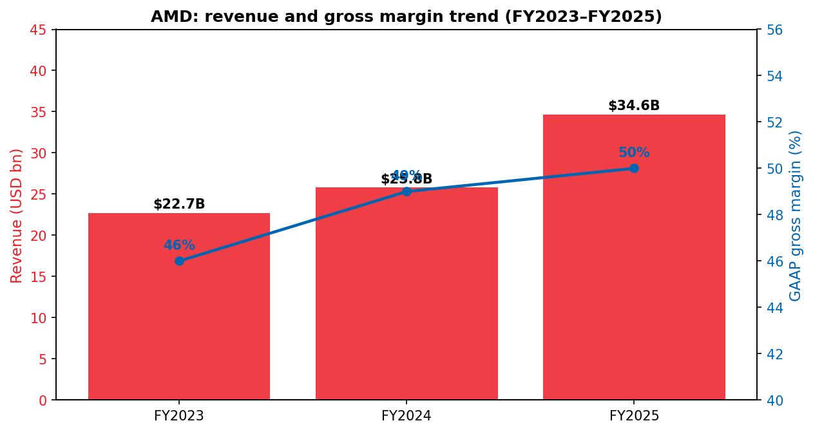
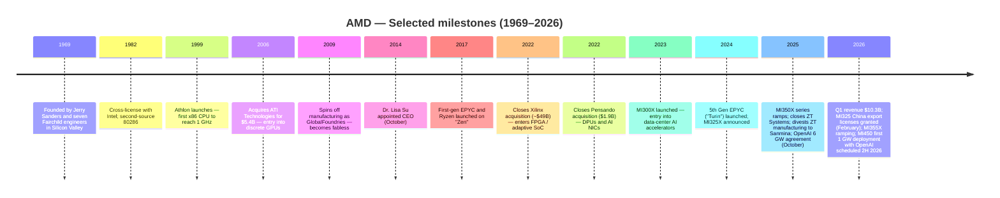
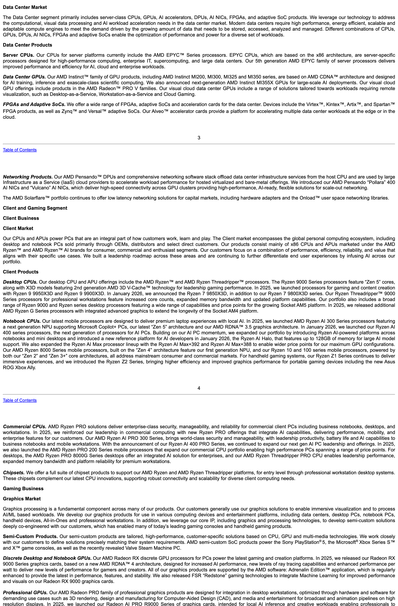
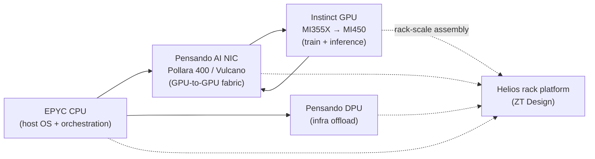
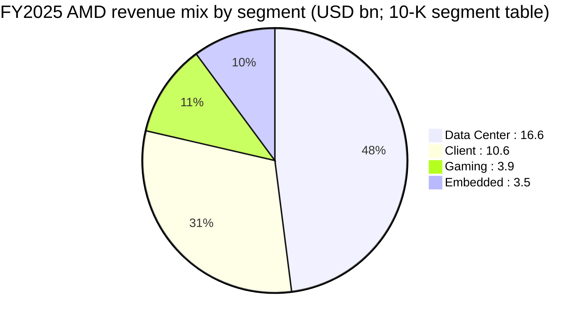
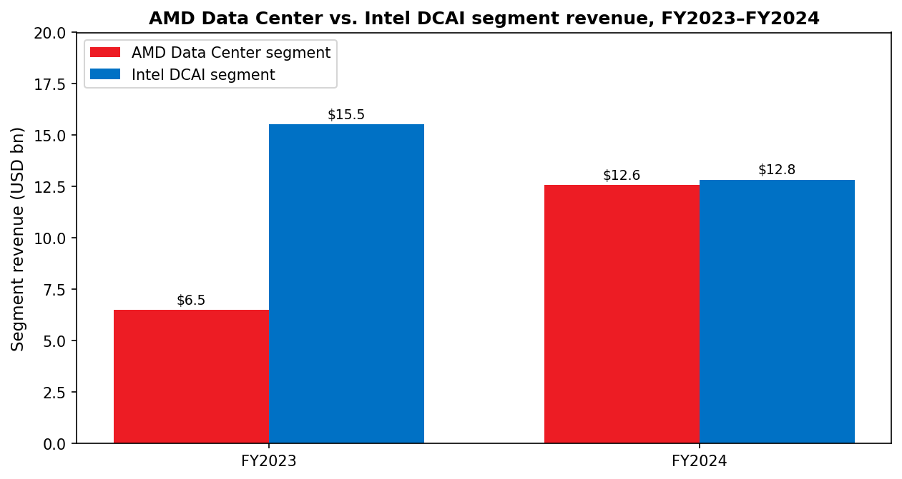

# COMPANY RESEARCH REPORT: Advanced Micro Devices, Inc. (NASDAQ: AMD)

**Date:** 2026-05-23
**Analyst output — initiation of coverage**
**Source primacy:** FY2025 10-K (filed 2026-02-04), Q1-FY2026 10-Q (filed 2026-05-06), 2026 DEF 14A (filed 2026-03-27), recent 8-K disclosures, and current market data. All figures are cited inline.

> **Update — Q1-FY2026 results and Q2 guide (2026-05-05):** AMD reported Q1-FY2026 revenue of $10.3B (+36% YoY), GAAP gross margin of 53% (non-GAAP 55%), GAAP diluted EPS of $0.84 and non-GAAP diluted EPS of $1.37. For Q2-FY2026 management guided revenue to ~$11.2B ±$300M (+46% YoY at midpoint, +9% QoQ) and non-GAAP gross margin to ~56%, citing "accelerating demand for AI infrastructure" and the 5th-Gen EPYC ramp.
> Source: [AMD Q1-2026 earnings press release, 2026-05-05](https://www.sec.gov/Archives/edgar/data/2488/000000248826000072/q12026991.htm).

---

## TABLE OF CONTENTS

1. Company Overview
2. Company History
3. Management Team
4. Products & Services
5. Customers & Go-to-Market
6. Industry Overview
7. Competitive Landscape
8. Market Opportunity (TAM)
9. Risk Assessment

References

---

## 1. COMPANY OVERVIEW

Advanced Micro Devices, Inc. ("AMD"), founded in 1969 and headquartered in Santa Clara, California, designs and sells high-performance computing, graphics, and adaptive silicon. Today AMD is the #2 designer of x86 CPUs (behind Intel), the credible challenger to NVIDIA in AI training and inference accelerators, and — since the 2022 close of its Xilinx acquisition — a leading vendor of FPGAs and adaptive SoCs. The company employed approximately 31,000 people globally as of 27 December 2025, and international sales accounted for 67% of FY2025 revenue ([AMD 2025 10-K](https://www.sec.gov/Archives/edgar/data/2488/000000248826000018/amd-20251227.htm)).

**Business model.** AMD designs chips and sells them — predominantly through individual purchase orders, with no long-term volume commitments from customers ([AMD 2025 10-K, Risk Factors](https://www.sec.gov/Archives/edgar/data/2488/000000248826000018/amd-20251227.htm)). Manufacturing is outsourced: AMD is a fabless company that relies on TSMC for advanced-node wafers and on third-party assembly/test partners in China, Malaysia, and Taiwan ([AMD 2025 10-K](https://www.sec.gov/Archives/edgar/data/2488/000000248826000018/amd-20251227.htm)). Revenue is split across three reportable segments after a Q1-FY2025 reorganization that combined Client and Gaming into a single segment to reflect how management runs the business ([AMD 2025 10-K, segment reporting note](https://www.sec.gov/Archives/edgar/data/2488/000000248826000018/amd-20251227.htm)):

| Segment | FY2025 revenue | FY2024 revenue | YoY |
|---|---|---|---|
| Data Center | $16,635M | $12,579M | +32% |
| Client and Gaming (Client: $10,640M; Gaming: $3,910M) | $14,550M | $9,649M | +51% |
| Embedded | $3,454M | $3,557M | -3% |
| **Total** | **$34,639M** | **$25,785M** | **+34%** |

Source: [AMD 2025 10-K, MD&A segment table](https://www.sec.gov/Archives/edgar/data/2488/000000248826000018/amd-20251227.htm).

**Scale.** FY2025 net revenue of $34.6B was up 34% YoY, gross margin reached 50% (vs. 49% in FY2024 and 46% in FY2023), and reported operating income was $3.69B ([AMD 2025 10-K, MD&A](https://www.sec.gov/Archives/edgar/data/2488/000000248826000018/amd-20251227.htm)). Net cash from operating activities of continuing operations was $6.5B. R&D expense of $8.09B (23% of revenue) is among the highest absolute R&D budgets in semiconductors ([AMD 2025 10-K, Income Statement](https://www.sec.gov/Archives/edgar/data/2488/000000248826000018/amd-20251227.htm)).

Source: [AMD 2025 10-K](https://www.sec.gov/Archives/edgar/data/2488/000000248826000018/amd-20251227.htm) and [AMD 2024 10-K](https://www.sec.gov/Archives/edgar/data/2488/000000248825000012/amd-20241228.htm).

**Valuation snapshot (as of 2026-05-22).** AMD trades at $444.28 with a market capitalization of approximately $724B ([Stockanalysis.com, AMD statistics, retrieved 2026-05-22](https://stockanalysis.com/stocks/amd/statistics/)). Trailing-twelve-month multiples versus peers:

| Multiple | AMD | NVDA | AVGO | INTC |
|---|---|---|---|---|
| TTM P/E | 149× | 45× | 81× | n/m (negative TTM EPS) |
| Forward P/E | 34× | 19× | 23× | 77× |
| TTM P/S | 19.3× | 25.0× | 29.0× | 11.0× |
| Market cap | $724B | $5,392B | $1,979B | $593B |

Source: [Stockanalysis.com, AMD](https://stockanalysis.com/stocks/amd/statistics/), [NVDA](https://stockanalysis.com/stocks/nvda/statistics/), [AVGO](https://stockanalysis.com/stocks/avgo/statistics/), [INTC](https://stockanalysis.com/stocks/intc/statistics/) statistics pages, retrieved 2026-05-22.

The 149× TTM P/E is **stretched** and warrants explanation. The number is inflated for three identifiable reasons:

1. **2025 earnings were depressed by non-recurring charges.** AMD recorded approximately $440M of net inventory and related charges in FY2025 tied to the April 2025 U.S. export-license requirement on AMD Instinct MI308 shipments to China ([AMD Q1-FY2026 10-Q, "MI308 Export License Restrictions"](https://www.sec.gov/Archives/edgar/data/2488/000000248826000076/amd-20260328.htm)). Annual amortization of acquisition-related intangibles — almost entirely the Xilinx purchase-accounting tail — remained heavy at $2.25B between cost-of-sales and OpEx ([AMD 2025 10-K, MD&A](https://www.sec.gov/Archives/edgar/data/2488/000000248826000018/amd-20251227.htm)).
2. **The market is pricing the OpenAI deal and the MI450 ramp into forward earnings, not TTM.** Management has publicly characterized the OpenAI 6-gigawatt agreement (October 2025) as expected to generate "tens of billions of dollars in revenue for AMD … highly accretive to non-GAAP earnings-per-share" ([AMD & OpenAI press release, 2025-10-06](https://www.sec.gov/Archives/edgar/data/2488/000119312525230895/d28189dex991.htm)). The forward P/E of 34× ([Stockanalysis.com](https://stockanalysis.com/stocks/amd/statistics/)) is roughly in line with NVIDIA's TTM P/E and below AVGO's TTM, suggesting investors are looking through 2025/early-2026 earnings to the 2H-2026 onward profile.
3. **AMD has become the dominant "second source" sector-proxy trade for AI infrastructure**, alongside NVIDIA. P/S of 19× sits below NVDA (25×) and AVGO (29×) but well above INTC (11×) and the broader Philadelphia Semiconductor Index, consistent with mid-pack AI-leverage pricing.

**Verdict:** The valuation is justifiable on the forward number but leaves no cushion. A single quarter of MI355X/MI450 disappointment or hyperscaler order pull-in could compress the multiple sharply; this carries into Section 9 as a valuation/multiple-compression risk.

**Capital return.** In May 2025 the Board added a $6B authorization to the existing repurchase program, bringing total authority to $14B; $9.4B remained available at FY25 close. FY2025 buybacks were $1.3B (12.4M shares). AMD does not pay a dividend ([AMD 2025 10-K, MD&A "Liquidity"](https://www.sec.gov/Archives/edgar/data/2488/000000248826000018/amd-20251227.htm)).

**Shares and ownership.** 1,630,338,779 shares were outstanding as of 19 March 2026 ([AMD 2026 DEF 14A, "Security Ownership"](https://www.sec.gov/Archives/edgar/data/2488/000119312526129057/d85856ddef14a.htm)). The largest Schedule 13G holders are The Vanguard Group (142.4M shares, 8.8%) and BlackRock, Inc. (124.9M shares, 7.7%) ([AMD 2026 DEF 14A](https://www.sec.gov/Archives/edgar/data/2488/000119312526129057/d85856ddef14a.htm)). The Board nominated eight directors for the 13 May 2026 annual meeting — reduced from twelve, with one long-tenured director retiring and a Lead Independent Director continuing in role ([AMD 2026 DEF 14A](https://www.sec.gov/Archives/edgar/data/2488/000119312526129057/d85856ddef14a.htm)).

---

## 2. COMPANY HISTORY

AMD was founded on **1 May 1969** by Jerry Sanders and seven colleagues, almost all of whom departed Fairchild Semiconductor at the same time. The original thesis — captured in Sanders' famous slogan "people first, products and profits will follow" — was to be a second-source supplier of standard integrated circuits to U.S. defense and computing customers. Through the 1970s and 1980s AMD became Intel's official second-source for the 8086 and 80286 families under a 1982 cross-licensing agreement, a relationship that ended in lawsuits running into the late 1990s.

Source: [AMD 2025 10-K](https://www.sec.gov/Archives/edgar/data/2488/000000248826000018/amd-20251227.htm), [AMD–OpenAI 8-K, 2025-10-06](https://www.sec.gov/Archives/edgar/data/2488/000119312525230895/d28189dex991.htm), and [AMD Q1-FY2026 10-Q on MI325 license, 2026-05-06](https://www.sec.gov/Archives/edgar/data/2488/000000248826000076/amd-20260328.htm).

**The three strategic pivots that matter.** First, the **Zen reset**. By 2014 AMD had ceded PC CPU share to Intel — Computing and Graphics segment revenue fell 16% YoY (FY13 $3.72B → FY14 $3.13B) on a 27% unit-shipment decline — and posted a full-year total operating loss of $(155)M and a net loss of $(403)M ([AMD FY2014 10-K, MD&A and Income Statement](https://www.sec.gov/Archives/edgar/data/2488/000119312515054362/d871455d10k.htm)). Dr. Lisa Su's first decision as CEO was to consolidate engineering behind a new microarchitecture and design methodology ("Zen"), which shipped as Ryzen in March 2017 and EPYC in June 2017. Zen restored AMD as a credible x86 alternative and powered an order-of-magnitude expansion in market cap.

Second, the **Xilinx and Pensando combination (2022)**. The $49B all-stock Xilinx deal added FPGAs, adaptive SoCs, and a deep customer base in aerospace/defense, comms infrastructure, industrial, and automotive — markets with lower cyclicality and higher gross margins than mainstream PC CPUs. Pensando added programmable DPUs and the foundation for AMD's AI-NIC roadmap (Pollara 400, Vulcano). AMD still carries roughly $2.25B/year of acquisition-related intangible amortization from the Xilinx purchase price allocation ([AMD 2025 10-K, MD&A](https://www.sec.gov/Archives/edgar/data/2488/000000248826000018/amd-20251227.htm)).

Third, the **end-to-end AI systems pivot (2024–2025)**. AMD acquired **ZT Group International ("ZT Systems") in March 2025 for $3.2B cash plus 8.3M AMD shares**, kept the design IP and engineering team (the "ZT Design Business"), and sold the manufacturing arm to Sanmina in October 2025 for $2.4B cash plus 1.2M Sanmina shares, with up to $450M contingent consideration ([AMD 2025 10-K, MD&A](https://www.sec.gov/Archives/edgar/data/2488/000000248826000018/amd-20251227.htm)). The remaining ZT Design business gives AMD the ability to design and validate full AI rack-scale systems — the "Helios" platform previewed in 2025 — and is the operational backbone of the OpenAI agreement.

**Recent developments (2024–2026 thesis-relevant items only).** The October 2025 OpenAI agreement to deploy 6 gigawatts of AMD GPUs starting with the MI450 series in 2H 2026 is the single most consequential development since the Xilinx close. Concurrently AMD issued OpenAI a warrant for up to 160 million shares at $0.01 strike, vesting tranche-by-tranche against gigawatt deployment milestones and AMD share-price targets; none of the warrant shares had vested as of FY25 year-end ([AMD 2025 10-K](https://www.sec.gov/Archives/edgar/data/2488/000000248826000018/amd-20251227.htm)).

In **February 2026 the U.S. government granted AMD some export licenses to ship the AMD Instinct MI325 products to certain China-based customers**; shipments are conditional on first undergoing a U.S. inspection process, and any MI325 shipped under the licenses is subject to a 25% tariff ([AMD Q1-FY2026 10-Q](https://www.sec.gov/Archives/edgar/data/2488/000000248826000076/amd-20260328.htm)). Separately, in September 2025 NVIDIA announced a strategic investment in and partnership with Intel for joint data-center and client products — a development AMD explicitly cites as a potential competitive headwind ([AMD 2025 10-K, Risk Factors](https://www.sec.gov/Archives/edgar/data/2488/000000248826000018/amd-20251227.htm)).

---

## 3. MANAGEMENT TEAM

**Jerry Sanders III, founder.** W.J. "Jerry" Sanders co-founded AMD on 1 May 1969 with seven colleagues, most of whom had just left Fairchild Semiconductor — a separation he negotiated with $100,000 of seed funding raised against the slogan "people first, products and profits will follow", which still appears on AMD wall plaques today. Before founding AMD he was Fairchild's marketing director, where he is credited with building one of the semiconductor industry's first dedicated commercial-sales organizations. Sanders served as AMD's Chair and CEO for 33 years (1969–2002), pushing the company into x86 second-sourcing for Intel under a 1982 cross-license, then into a head-on competitive posture with the K5/K6/Athlon program of the late 1990s — the Athlon, launched in 1999, was the first x86 CPU to reach 1 GHz, beating Intel by several months. He stepped down as CEO in April 2002 and as Chair in April 2004, after which his operational involvement ended. Sanders holds a BS in Electrical Engineering from the University of Illinois at Urbana-Champaign (1958). He has no remaining management role or disclosed equity stake at AMD today; he survives in the company's culture (the founding slogan, the long-running second-source-then-compete strategic posture) more than in its current operations.

**Dr. Lisa T. Su, Chair, President & Chief Executive Officer.** Age 56. Joined AMD in January 2012 as SVP/GM of Global Business Units, became COO, and was appointed President and CEO in October 2014 ([AMD 2026 DEF 14A, Director Biographies](https://www.sec.gov/Archives/edgar/data/2488/000119312526129057/d85856ddef14a.htm)). She has served as Chair of the Board since February 2022. Before AMD, Dr. Su was SVP/GM of Networking and Multimedia at Freescale Semiconductor; earlier she held senior R&D and business roles at IBM (including VP of Semiconductor R&D, where she helped drive the early development of copper interconnect and the strained-silicon transistor process used across IBM's Power and PowerPC lines) and started her career as a technical-staff member at Texas Instruments. She holds BS, MS, and PhD degrees in Electrical Engineering from MIT and is a Fellow of the IEEE, a member of the National Academy of Engineering, and a member of the American Academy of Arts and Sciences ([AMD 2026 DEF 14A](https://www.sec.gov/Archives/edgar/data/2488/000119312526129057/d85856ddef14a.htm)).

What she has *done* at AMD is the single most consequential CEO performance in semiconductors in the last decade. When she took over in October 2014, AMD's market cap was approximately $2.5B and the company was reporting annual operating losses. As of 22 May 2026, AMD's market cap is approximately $724B ([Stockanalysis.com, AMD statistics, retrieved 2026-05-22](https://stockanalysis.com/stocks/amd/statistics/)) — an increase of roughly 280×, driven by (1) the Zen architecture reset and the EPYC server-CPU re-entry, (2) the strategic decision to outsource manufacturing to TSMC at advanced nodes ahead of Intel's stumble, (3) the Xilinx and Pensando acquisitions, (4) the build-out of the AMD Instinct GPU line into a credible NVIDIA alternative and the related software stack (ROCm), and (5) the OpenAI agreement. She has received the Semiconductor Industry Association's Robert N. Noyce Award, the IEEE Robert N. Noyce Medal, the Global Semiconductor Alliance's Dr. Morris Chang Exemplary Leadership Award, and was named *TIME* Magazine CEO of the Year ([AMD 2026 DEF 14A](https://www.sec.gov/Archives/edgar/data/2488/000119312526129057/d85856ddef14a.htm)). She serves as Chair of the SIA Board. Per the 2026 proxy, she beneficially owned 4,305,973 shares ([AMD 2026 DEF 14A, Security Ownership table](https://www.sec.gov/Archives/edgar/data/2488/000119312526129057/d85856ddef14a.htm)). Her compensation is heavily weighted toward multi-year performance share units tied to relative total shareholder return, and AMD's combined Chair/CEO structure is defended in the proxy on the basis that her operational and strategic knowledge are not separable. She remains squarely identified with AMD's strategy; a departure or incapacitation would be a single-person risk discussed in Section 9.

---

## 4. PRODUCTS & SERVICES

AMD organizes its products inside three reportable segments — **Data Center**, **Client and Gaming**, and **Embedded** — plus an "All Other" bucket that absorbs corporate functions, acquisition-related intangible amortization, and stock-based compensation ([AMD 2025 10-K, "Item 1. Business — Our Products"](https://www.sec.gov/Archives/edgar/data/2488/000000248826000018/amd-20251227.htm)). The 10-K does not publish a tabular product matrix; instead the products narrative in Item 1 Business is structured by segment → product family → individual product line. The image below reproduces the verbatim narrative directly from page 3 of the 10-K, so the reader can see the primary disclosure source for everything in the rest of this section.

Source: [AMD 2025 10-K, "Item 1. Business — Our Products" (page 3)](https://www.sec.gov/Archives/edgar/data/2488/000000248826000018/amd-20251227.htm). Captured 2026-05-23.

### 4.1 Analyst-constructed product matrix

Reproduced and structured below for searchability:

| Segment / 业务部门 | Product family / 产品线 | Examples (2025–2026) |
|---|---|---|
| Data Center | Server CPUs / 服务器 CPU | EPYC 9005 ("Turin") 5th Gen; EPYC 4005 / 9005 Embedded |
| Data Center | AI accelerators / AI 加速器 (GPUs) | Instinct MI200, MI300X, MI325X, MI350X, MI355X; MI450 series (2H 2026) |
| Data Center | Visual cloud GPUs / 云端可视化 GPU | Radeon PRO V series |
| Data Center | FPGAs & adaptive SoCs (DC) | Virtex, Kintex, Artix, Spartan; Zynq, Versal; Alveo cards |
| Data Center | Networking / 网络 (DPU + AI NIC) | Pensando "Salina" DPU; Pollara 400 AI NIC; Vulcano AI NIC; Solarflare NICs |
| Data Center | AI rack-scale systems / AI 机柜级平台 | "Helios" rack platform (via ZT Design) |
| Client & Gaming | Desktop CPUs / 桌面 CPU | Ryzen 9000 Series ("Zen 5"); Ryzen 9 9950X3D / 9900X3D / 9800X3D; Ryzen Threadripper 9000; Ryzen 7 9850X3D (Jan 2026) |
| Client & Gaming | Notebook CPUs (AI PC) / 笔电 CPU | Ryzen AI 300 Series (2025); Ryzen AI 400 Series (Jan 2026) |
| Client & Gaming | Discrete GPUs / 独立显卡 | Radeon RX 9000 Series (RDNA 4) |
| Client & Gaming | Professional GPUs / 专业图形 | Radeon PRO; Radeon AI PRO 9700 |
| Client & Gaming | Semi-custom SoCs / 半定制 SoC | Sony PlayStation 5 / PS5 Pro; Microsoft Xbox Series X/S; Valve Steam Machine |
| Embedded | Embedded CPUs/APUs | EPYC Embedded 9005/4005/2005; Ryzen Embedded 9000; Ryzen AI Embedded P100/X100 (Jan 2026) |
| Embedded | Adaptive SoCs | Versal AI Edge / Premium / RF; Zynq UltraScale+ MPSoC |
| Embedded | FPGAs | UltraScale+, UltraScale 7 Series, earlier families |
| Embedded | SOMs & accelerator cards | Kria System-on-Module; Alveo |

Source: rows compiled verbatim from [AMD 2025 10-K, Item 1 "Our Products"](https://www.sec.gov/Archives/edgar/data/2488/000000248826000018/amd-20251227.htm) and the [AMD products navigation](https://www.amd.com/en/products.html). The matrix is analyst-constructed (AMD does not publish it as a single table); bilingual segment / category labels are the analyst's gloss for cross-border-reading audiences.

### 4.2 Synthesis — how the categories interact

A modern AI training cluster is a single workflow that touches almost every product family AMD sells. The customer (an OpenAI, a Microsoft Azure, a Meta) buys a **server CPU / 服务器 CPU** (EPYC) to run the host operating system, model orchestration, and the data ingest pipeline; a **GPU / AI 加速器** (Instinct MI355X today, MI450 next) to run the actual matrix-multiply workload of training and inference; a **DPU / 数据处理器** (Pensando Salina) to offload virtualization, storage, and east-west security from the CPU; an **AI NIC / AI 网卡** (Pollara 400 → Vulcano) to provide the scale-out fabric between GPUs; and increasingly the **integrated rack** (Helios) that pre-validates the CPU+GPU+DPU+NIC+memory+cooling configuration as a unit. The Embedded segment sits a layer below, supplying the same customer's edge inference boxes, 5G base stations, automotive ADAS modules, and aerospace radar — typically built on Versal adaptive SoCs.

The cycle that matters: a CUDA-developer competitive moat lives at the **GPU + AI NIC + software** layer; the customer's *power and cooling* constraint lives at the **rack** layer; AMD's response is to win the inner loop on GPU + NIC and then bundle the answer as a pre-validated rack via Helios. This is why ZT Design (not the chips themselves) was the strategic core of the 2025 OpenAI agreement.

### 4.3 Data Center segment

The 10-K opens the segment description as follows ([AMD 2025 10-K, "Data Center Segment"](https://www.sec.gov/Archives/edgar/data/2488/000000248826000018/amd-20251227.htm)):

> "The Data Center segment primarily includes server-class CPUs, GPUs, AI accelerators, DPUs, AI NICs, FPGAs, and adaptive SoC products. We leverage our technology to address the computational, visual data processing and AI workload acceleration needs in the data center market."

**(a) EPYC server CPUs.** ([AMD 2025 10-K, "Data Center Products — Server CPUs"](https://www.sec.gov/Archives/edgar/data/2488/000000248826000018/amd-20251227.htm)):

> "Our CPUs for server platforms currently include the AMD EPYC Series processors. EPYC CPUs, which are based on the x86 architecture, are server-specific processors designed for high-performance computing, enterprise IT, supercomputing, and large data centers. Our 5th generation AMD EPYC family of server processors delivers improved performance and efficiency for AI, cloud and enterprise workloads."

**中文释义 / Plain-language gloss:** EPYC is AMD's flagship server processor / 服务器处理器 line, sold by socket into hyperscaler and enterprise racks. The chip is a **chiplet / 小芯片** assembly — multiple smaller dies (compute "CCDs" and an I/O die) joined by AMD's Infinity Fabric on a substrate, an approach AMD pioneered in volume in 2019 with Zen 2 and which gives it a yield-and-cost advantage vs. Intel's monolithic dies. The 5th-Gen "Turin" parts ship up to 192 cores per socket using TSMC's advanced node, which is why a single AMD EPYC server can replace several older Intel boxes — analogous to swapping a fleet of compact cars for a single articulated bus that moves the same passenger volume in fewer trips, fewer drivers, less fuel. The strategic inflection driving EPYC in FY2025 was **hyperscaler AI-cluster build-outs**, where every GPU server still needs a host CPU; AMD won design-in across Microsoft Azure, AWS, Google Cloud, Oracle, and Meta as the default x86 host for new AI nodes.

*Analyst view:* Moat **yes** — technology lead vs. Intel Xeon, scale at TSMC, and significant switching cost in hyperscaler platform validation. Closest competing product: Intel **Xeon 6** (formerly Granite Rapids / Sierra Forest) ([Intel FY2024 10-K, DCAI segment](https://www.sec.gov/Archives/edgar/data/50863/000005086325000009/intc-20241228.htm)) and Arm-based custom CPUs (AWS Graviton, NVIDIA Grace, Ampere Computing). At parity-to-ahead on top-bin core count and energy efficiency for general-purpose virtualization; slightly behind Xeon in some matrix-multiply AI inference workloads where Intel has invested in AMX extensions, but for the bulk of dollar-weighted hyperscaler buying the EPYC advantage is still intact.

**(b) AMD Instinct GPUs (AI accelerators / AI 加速器).** ([AMD 2025 10-K, "Data Center GPUs"](https://www.sec.gov/Archives/edgar/data/2488/000000248826000018/amd-20251227.htm)):

> "Our AMD Instinct family of GPU products, including AMD Instinct MI200, MI300, MI325 and MI350 series, are based on AMD CDNA architecture and designed for AI training, inference and exascale-class scientific computing. We also announced next-generation AMD Instinct MI355X GPUs for large-scale AI deployments."

**中文释义 / Plain-language gloss:** Instinct is AMD's data-center GPU / 数据中心 GPU line — the direct competitor to NVIDIA's H100/H200/B100/B200 family. The chip lives at the bottom of the AI stack: the customer's training framework (PyTorch / **大模型 / large language model** code) compiles down to **CDNA / 计算 DNA 架构** kernels that run as massive parallel matrix-multiplications on the GPU. The headline differentiator is **HBM / 高带宽内存 (high-bandwidth memory) capacity per package** — MI300X shipped with 192 GB of HBM3 versus the 80 GB on NVIDIA H100, which means a 70 B-parameter model can fit on **one** AMD GPU instead of two NVIDIA ones, halving the **inference / 推理** cost per token for that class of workload. (Picture HBM as the "warehouse on the factory floor" next to the GPU — the wider the warehouse door, the faster materials reach the production line; AMD's HBM door is wider.) The strategic inflection: MI300X first shipped in volume late 2023 and crossed **"more than $5 billion"** of revenue in FY2024 per CEO commentary on the Q4-FY2024 release ([AMD Q4-FY2024 press release, 2025-02-04](https://www.sec.gov/Archives/edgar/data/2488/000000248825000009/q42024991.htm)). MI350X / MI355X are ramping through 2025–2026; MI450 is the basis for the first 1 GW of OpenAI's 6 GW deployment in 2H 2026 ([AMD & OpenAI press release, 2025-10-06](https://www.sec.gov/Archives/edgar/data/2488/000119312525230895/d28189dex991.htm)).

*Analyst view:* Moat **partial** — technology (HBM capacity), strategic customer lock-in via OpenAI, but a real software-ecosystem gap. Closest competing products: NVIDIA **H200, Blackwell B100/B200, GB200/GB300** ([NVIDIA FY2026 10-K](https://www.sec.gov/Archives/edgar/data/1045810/000104581026000021/nvda-20260125.htm)). One-line compare: ahead on memory capacity and dollar-per-token of inference on very-large models that benefit from it; behind on software ecosystem (ROCm vs. CUDA), developer toolchain breadth, and proven training scale-out (NVLink/NVSwitch); closing the gap with ROCm 7, the Pollara/Vulcano AI NIC fabric, and the Helios rack platform.

**(c) AMD Pensando DPUs and AI NICs.** ([AMD 2025 10-K, "Networking Products"](https://www.sec.gov/Archives/edgar/data/2488/000000248826000018/amd-20251227.htm)):

> "Our AMD Pensando DPUs and comprehensive networking software stack offload data center infrastructure services from the host CPU and are used by large Infrastructure as a Service (IaaS) cloud providers to accelerate workload performance for hosted virtualized and bare-metal offerings. We introduced our AMD Pensando 'Pollara' 400 AI NICs and 'Vulcano' AI NICs, which deliver high-speed connectivity across GPU clusters providing high-performance, AI-ready, flexible solutions for scale-out networking."

**中文释义 / Plain-language gloss:** A **DPU / 数据处理器** is a programmable network-attached chip that takes care of "infrastructure" tasks the host CPU used to do — virtualization, storage I/O, **east-west / 东西向** firewalling, encryption — so the CPU can spend its cores on customer workloads. An **AI NIC / AI 网卡** is the next layer up: a high-speed Ethernet adapter purpose-built to move tensor activations between GPUs in a training cluster, where every wasted microsecond stretches a multi-billion-dollar training run. Pollara 400 (400 Gbps) and Vulcano (next-gen) are AMD's answer to NVIDIA's **NVLink / Connect-X / BlueField** fabric inside the GPU rack. (If you think of a training cluster as a city, the CPU is a building, the GPU is a factory floor, the DPU is the building's security guard and loading dock, and the AI NIC is the freeway between factories — Pollara is AMD's freeway.) The strategic inflection: hyperscaler AI clusters now spend 15–20% of total system dollars on networking; AMD is one of the founding promoters of the **Ultra Ethernet Consortium** open-fabric specification, an attempt to break NVLink's proprietary lock-in.

*Analyst view:* Moat **partial** — technology (programmable P4 pipeline inherited from Pensando) and customer lock-in inside the integrated AMD rack. Closest competing products: NVIDIA **BlueField-3 / ConnectX-8 / NVLink** and Broadcom **Tomahawk / Jericho** switch silicon ([Broadcom FY2025 10-K, Semiconductor Solutions](https://www.sec.gov/cgi-bin/browse-edgar?action=getcompany&CIK=0001730168&type=10-K)). Broadcom's switch silicon remains the volume default for AI cluster networking; AMD's leverage is in selling Pollara *as part of* an integrated AMD rack rather than as a stand-alone NIC.

**(d) Helios AI rack-scale platform (via ZT Design).** ([AMD 2025 10-K, "Item 1 — Business overview"](https://www.sec.gov/Archives/edgar/data/2488/000000248826000018/amd-20251227.htm)):

> "[…] we previewed our 'Helios' AI rack-scale platform solution that incorporates all of our data center products (CPUs, GPUs and Networking) to address the growing AI compute requirements."

**中文释义 / Plain-language gloss:** Helios is AMD's first internally-engineered AI **机柜 / rack** — a pre-validated 1 GW-class cabinet that ships with the CPU, GPU, DPU, AI NIC, power-delivery, and liquid cooling already integrated. Think of it as the difference between shipping a "car kit" (loose parts) and shipping the assembled vehicle — by the early 2025 cycle, the chassis-level integration *itself* was the bottleneck for hyperscalers trying to stand up multi-megawatt training clusters. AMD acquired ZT Group International (ZT Systems) in March 2025 for $3.2B cash plus 8.3M AMD shares, kept the design team and IP (the "ZT Design Business"), and divested the manufacturing footprint to Sanmina in October 2025 for $2.4B cash plus 1.2M Sanmina shares ([AMD 2025 10-K, MD&A](https://www.sec.gov/Archives/edgar/data/2488/000000248826000018/amd-20251227.htm)). The strategic inflection: the **OpenAI 6 GW agreement** is delivered via Helios — without it, AMD would still be selling chips for someone else's rack design.

*Analyst view:* Moat **partial** — systems integration and scale. Closest competing product: NVIDIA **GB200 NVL72 / GB300 NVL72** ([NVIDIA FY2026 10-K](https://www.sec.gov/Archives/edgar/data/1045810/000104581026000021/nvda-20260125.htm)). AMD is behind on time-to-market but levels the playing field as a "systems vendor" rather than only a chip vendor.

### 4.4 Client and Gaming segment

**(a) Ryzen desktop and mobile CPUs.** ([AMD 2025 10-K, "Client Products — Desktop CPUs and Notebook CPUs"](https://www.sec.gov/Archives/edgar/data/2488/000000248826000018/amd-20251227.htm)):

> "Our desktop CPU and APU offerings include the AMD Ryzen and AMD Ryzen Threadripper processors. The Ryzen 9000 Series processors feature 'Zen 5' cores, along with X3D models featuring 2nd generation AMD 3D V-Cache technology for leadership gaming performance. … Our latest mobile processors are designed to deliver premium laptop experiences with local AI. In 2025, we launched AMD Ryzen AI 300 Series processors featuring a next generation NPU supporting Microsoft Copilot+ PCs, our latest 'Zen 5' architecture and our AMD RDNA 3.5 graphics architecture. In January 2026, we launched our Ryzen AI 400 series processors, the next generation of processors for AI PCs."

**中文释义 / Plain-language gloss:** Ryzen is AMD's PC processor / 桌面与笔记本处理器 family — Zen 5 microarchitecture in the current generation. The "**3D V-Cache / 三维堆叠缓存**" SKUs (e.g. 9950X3D, 9800X3D) glue an extra slab of SRAM directly on top of the compute die via TSMC's SoIC (System-on-Integrated-Chips) packaging — a hybrid-bonding step that produces the lowest-latency / highest-throughput **gaming / 游戏** CPU on the market, useful in workloads where the working set just barely overflows on-die cache. Ryzen AI is the **NPU / 神经网络处理器** variant: a dedicated AI inference block on the SoC that targets Microsoft's **Copilot+ PC** specification (the OEM-marketed "AI PC" wave). FY2025 Client revenue was $10.64B, +51% YoY, with management attributing growth to "a 31% increase in unit shipments of processors and a 15% increase in average selling price" ([AMD 2025 10-K, MD&A](https://www.sec.gov/Archives/edgar/data/2488/000000248826000018/amd-20251227.htm)).

*Analyst view:* Moat **yes** — technology lead, brand, distribution. Closest competing products: Intel **Core Ultra (Lunar Lake / Arrow Lake / Panther Lake)** and Qualcomm **Snapdragon X Elite** for AI PC ([Intel FY2024 10-K, CCG segment](https://www.sec.gov/Archives/edgar/data/50863/000005086325000009/intc-20241228.htm)). At parity on the mainstream consumer PC tier; ahead in desktop enthusiast and AI-PC NPU benchmarks for the current generation.

**(b) Radeon GPUs.** ([AMD 2025 10-K, "Discrete Desktop and Notebook GPUs"](https://www.sec.gov/Archives/edgar/data/2488/000000248826000018/amd-20251227.htm)):

> "Our AMD Radeon RX discrete GPU processors for PCs power the latest gaming and creation platforms. In 2025, we released our Radeon RX 9000 Series graphics cards, based on a new AMD RDNA 4 architecture, designed for increased AI performance, new levels of ray tracing capabilities and enhanced performance per watt to deliver new levels of performance for gamers and creators."

**中文释义 / Plain-language gloss:** Radeon RX is AMD's consumer **discrete GPU / 独立显卡** line — separate physical card slotted into the PC, used for gaming, 3D content creation, and increasingly local AI inference. The **RDNA 4** architecture (Radeon Display Next-gen Architecture, generation 4) adds dedicated **ray-tracing / 光线追踪** hardware blocks and **ML-upscaling / 机器学习超分辨率** support (the FSR "Redstone" feature that competes with NVIDIA DLSS). Gaming segment revenue of $3.91B (+51% YoY) in FY2025 was driven by RX 9000 launch volume alongside semi-custom royalty pickup.

*Analyst view:* Moat **partial** — scale, brand at the mid-range. NVIDIA leads at the high end and in software (CUDA, DLSS); AMD is the credible #2. Closest competing product: NVIDIA **GeForce RTX 50-series** ([NVIDIA FY2026 10-K](https://www.sec.gov/Archives/edgar/data/1045810/000104581026000021/nvda-20260125.htm)). Behind at the ultra-enthusiast tier; competitive on price/performance in the mid-range.

**(c) Semi-custom SoCs (consoles).** ([AMD 2025 10-K, "Semi-Custom Products"](https://www.sec.gov/Archives/edgar/data/2488/000000248826000018/amd-20251227.htm)):

> "Our semi-custom products are tailored, high-performance, customer-specific solutions based on CPU, GPU and multi-media technologies. We work closely with our customers to define solutions precisely matching their system requirements. AMD semi-custom SoC products power the Sony PlayStation 5, the Microsoft Xbox Series S and X game consoles, as well as the recently revealed Valve Steam Machine PC."

**中文释义 / Plain-language gloss:** Semi-custom / 半定制 is a contract-design business: AMD designs a unique SoC against a single customer's spec (Sony, Microsoft, now Valve) and is paid by per-unit royalty over the platform's 5-to-7-year retail life. The 2024–2026 cycle is a "mid-cycle bump" generation — PS5 Pro shipped in late 2024 and Valve's Steam Machine reveal is incremental — with the next full console generation (PS6, presumed Xbox successor) expected to begin design hand-off in 2026 and ship in 2027–2028. Picture this as similar to a Boeing/Airbus engine win: large up-front non-recurring engineering, then a multi-year annuity of unit royalties.

*Analyst view:* Moat **yes** — long-cycle design wins, switching costs (re-validating a console SoC costs years), and dual incumbent at Sony + Microsoft. Closest competing product: none in current production at scale (Nintendo Switch uses NVIDIA Tegra, but at a different performance tier).

### 4.5 Embedded segment (Xilinx legacy + embedded EPYC/Ryzen)

Embedded is the home of the 2022 Xilinx acquisition plus embedded variants of EPYC and Ryzen. End markets are aerospace and defense, automotive, industrial, vision and healthcare, communications infrastructure, test/measurement, broadcast, and edge data center.

**(a) Versal adaptive SoCs.** ([AMD 2025 10-K, "FPGAs and Adaptive SoCs"](https://www.sec.gov/Archives/edgar/data/2488/000000248826000018/amd-20251227.htm)):

> "The AMD Versal portfolio, composed of software-programmable adaptive SoCs, is a heterogeneous compute platform that combines a processing system, programmable logic, AI Engines, and digital signal processing (DSP) Engines. The Versal devices achieve dramatic system-level performance improvements over today's fastest FPGA competitors' solutions and accelerate applications in a wide variety of markets, including aerospace and defense, automotive, industrial, vision and healthcare, communications infrastructure, test and measurement, emulation and prototyping, audio, video and broadcasting, and data center."

**中文释义 / Plain-language gloss:** Versal is the **adaptive SoC / 自适应可编程片上系统** — one die containing Arm CPU cores + traditional FPGA fabric + dedicated AI Engines + DSP blocks. Conceptually it's a "Swiss army knife" silicon platform: the same chip can be re-programmed in the field for **5G base-station / 5G 基站** signal processing, automotive **ADAS / 高级辅助驾驶** sensor fusion, defense **electronic-warfare radar / 电子战雷达** classification, or industrial machine vision. The customer pays for that flexibility through certification effort once and reuses the design 7–15 years across the product lifecycle. Versal Premium variants ship into 5G base stations; Versal RF targets aerospace radar.

*Analyst view:* Moat **yes** — IP depth (decades of FPGA know-how), regulatory/certification effort, and 7–15-year switching costs in industrial/aerospace. Closest competing product: **Altera Agilex / Stratix** ([Intel FY2024 10-K — Altera segment now being divested](https://www.sec.gov/Archives/edgar/data/50863/000005086325000009/intc-20241228.htm)). Ahead in the AI-engine niche and high-end automotive/comms tier; broadly at parity at the mid-range; the strategic threat is not Altera but a long tail of ASIC and edge-AI accelerator startups picking off specific verticals.

**(b) Embedded EPYC / Ryzen, Zynq, UltraScale+ FPGAs, Kria SOMs, Alveo cards.** AMD's embedded portfolio expanded in 2025 with three new **EPYC Embedded** series (9005 / 4005 / 2005) and the **Ryzen Embedded 9000 Series** for industrial automation and machine vision ([AMD 2025 10-K, "Embedded Products"](https://www.sec.gov/Archives/edgar/data/2488/000000248826000018/amd-20251227.htm)). In January 2026 AMD added a new family of **Ryzen AI Embedded** processors (P100 and X100 series). The 10-K's own description:

> "Our embedded portfolio expanded in 2025 with the introduction of three new AMD EPYC embedded processor series: AMD EPYC Embedded 9005 Series, EPYC Embedded 4005 Series processors and EPYC Embedded 2005 Series. These new series deliver enhanced performance and extended lifecycles for networking, storage, and edge server applications."

These are the same silicon designs as the data-center EPYC and consumer Ryzen parts, packaged and warrantied for the 7–15-year industrial lifecycle (extended temperature ranges, longer supply commitments, ECC default). **Kria** is a System-on-Module — a small "carrier board" with a Zynq SoC already mounted — that lets embedded customers skip the board-design phase. **Alveo** cards are PCIe accelerator boards for the data-center edge.

*Analyst view:* Moat **partial-to-yes** depending on sub-segment. Switching costs are highest for FPGAs and adaptive SoCs (multi-year recertification), lower for embedded x86 where Intel and Arm-licensee competitors are credible.

### 4.6 Flagship franchises and recent launches

Three products drive the FY2026 thesis: (1) **Instinct MI355X**, ramping through 1H FY2026; (2) **Instinct MI450 series**, first 1 GW deployment with OpenAI in 2H FY2026; and (3) **5th-Gen EPYC ("Turin")** as the high-volume server-CPU growth engine ([AMD Q1-FY2026 press release](https://www.sec.gov/Archives/edgar/data/2488/000000248826000072/q12026991.htm)). Material launches in the last 12 months: MI355X formal launch; Pollara 400 AI NIC and Vulcano AI NIC GA; Helios rack platform preview; Radeon RX 9000 Series on RDNA 4; Ryzen 9 9950X3D / 9900X3D / 9850X3D; Ryzen AI 300 Series and (Jan 2026) Ryzen AI 400 Series; the three new EPYC Embedded series and Ryzen AI Embedded P100/X100 ([AMD 2025 10-K, MD&A and Item 1](https://www.sec.gov/Archives/edgar/data/2488/000000248826000018/amd-20251227.htm)).

AMD does not break out a separate aftermarket / services business of the scale that semicap or industrial peers do. The closest analogue is the **software stack** that travels with the hardware — ROCm (the open AI compute stack), the Adrenalin client driver, the Vitis FPGA toolchain, and the EPYC platform management software — all of which are bundled into the chip price rather than monetized as recurring software.

---

## 5. CUSTOMERS & GO-TO-MARKET

**Customer mix.** AMD sells to four main customer cohorts: (1) hyperscale cloud providers and large enterprise data-center buyers (the primary buyers of Data Center products — EPYC, Instinct, Pensando), (2) OEM/ODM PC and workstation makers (Dell, HP, Lenovo, Asus, MSI for Ryzen and Radeon), (3) console partners (Sony and Microsoft for semi-custom, with Valve added in 2025 via the Steam Machine reveal), and (4) industrial/comms/aerospace/automotive Tier-1 customers and channel distributors (for Embedded). Hyperscaler buying is direct and increasingly takes the form of multi-quarter committed purchases; PC and embedded sales typically flow through distributors and channel partners ([AMD 2025 10-K, "Sales, Marketing and Distribution"](https://www.sec.gov/Archives/edgar/data/2488/000000248826000018/amd-20251227.htm)).

**Customer concentration.** AMD's FY2025 10-K segment note states explicitly: **"No customer accounted for at least 10% of the Company's consolidated net revenue in fiscal years 2025 and 2024. One Client and Gaming segment customer accounted for 18% of consolidated net revenue in fiscal year 2023"** ([AMD 2025 10-K, segment reporting note](https://www.sec.gov/Archives/edgar/data/2488/000000248826000018/amd-20251227.htm)). The FY2023 18% customer almost certainly refers to the combined semi-custom royalty stream from a single console partner (Sony or Microsoft); the company does not name the customer. Trade-receivable concentration is a related but separate disclosure: at FY25 year-end one customer represented approximately 11% of consolidated accounts receivable, down from a 24% top-single-customer AR concentration at FY24 year-end ([AMD 2025 10-K, "Concentrations of Credit Risk"](https://www.sec.gov/Archives/edgar/data/2488/000000248826000018/amd-20251227.htm)). The Risk Factors section nevertheless cautions that "a small number of customers will continue to account for a substantial part of AMD's revenue and receivables in the future" ([AMD 2025 10-K, Risk Factors](https://www.sec.gov/Archives/edgar/data/2488/000000248826000018/amd-20251227.htm)).

Following the October 2025 agreement, **OpenAI's 6 GW multi-year purchase commitment is structurally the most important new customer relationship**: management has publicly said the contract is expected to generate "tens of billions of dollars" of revenue to AMD ([AMD–OpenAI press release, 2025-10-06](https://www.sec.gov/Archives/edgar/data/2488/000119312525230895/d28189dex991.htm)). If OpenAI deployments hit the stated milestones, OpenAI alone could become a 10%+ customer for AMD by 2027–2028 — at which point disclosure would be required under ASC 280.

Source: [AMD 2025 10-K, MD&A segment table](https://www.sec.gov/Archives/edgar/data/2488/000000248826000018/amd-20251227.htm).

**Geographic mix.** International sales were 67% of FY2025 net revenue (66% in FY2024) ([AMD 2025 10-K, MD&A](https://www.sec.gov/Archives/edgar/data/2488/000000248826000018/amd-20251227.htm)). Substantially all sales are denominated in U.S. dollars. China is both an important customer geography and a regulated end-market — see Section 9 on export controls.

**Contract structure.** AMD's standard motion: "We typically sell our products pursuant to individual purchase orders. We generally do not have long-term supply arrangements with our customers or minimum purchase requirements" ([AMD 2025 10-K, Risk Factors](https://www.sec.gov/Archives/edgar/data/2488/000000248826000018/amd-20251227.htm)). The OpenAI agreement is the major recent exception — a multi-year, multi-generation product purchase commitment with milestone-vesting warrants attached. Semi-custom relationships with Sony and Microsoft are also multi-year design wins with embedded production commitments.

**Go-to-market and sales motion.** Hyperscaler design wins are co-engineered relationships with multi-quarter qualification, led by AMD's Data Center Solutions org and field engineering teams in Hillsboro, Austin, and India. PC OEM sales run through the Computing and Graphics business group and the worldwide channel-sales organization. Embedded sales lean on the legacy Xilinx FAE force and distribution partners (Avnet, Arrow). Co-engineering on Helios racks is now an operating part of every large Instinct opportunity.

**Customer case studies (named, FY24–FY26).** Microsoft Azure ND MI300X v5 VMs (publicly announced); Meta deployment of MI300X in production inference; Oracle Cloud Infrastructure GPU shapes on MI300X and MI325X; the OpenAI 6 GW agreement; Sony PlayStation 5 / 5 Pro semi-custom; Microsoft Xbox Series X / S semi-custom; Valve Steam Machine. AMD also publicizes EPYC wins across Google Cloud (C4D), AWS (Hpc7a, M7a), and the El Capitan exascale supercomputer at Lawrence Livermore National Laboratory.

---

## 6. INDUSTRY OVERVIEW

AMD participates in three overlapping markets: data-center compute (CPUs, GPUs, DPUs, NICs, and integrated AI systems), PC client compute (desktop/notebook CPUs and discrete GPUs), and adaptive/embedded silicon (FPGAs, adaptive SoCs, embedded CPUs).

**Data-center compute is the dominant growth driver.** Global data-center capex hit a multi-decade inflection in 2023–2025 as hyperscalers (Microsoft, Google, Amazon, Meta, Oracle), neoclouds (CoreWeave, Lambda, Crusoe), and frontier AI labs (OpenAI, xAI, Anthropic) accelerated AI infrastructure build-outs. NVIDIA's data-center end-market revenue grew from $47.5B in FY2024 to $115.2B in FY2025 to **$193.7B in FY2026 (year ended 25 January 2026)** ([NVIDIA FY2026 10-K, MD&A](https://www.sec.gov/Archives/edgar/data/1045810/000104581026000021/nvda-20260125.htm)) — the single best benchmark for the magnitude of AI infrastructure demand. AMD's Data Center segment grew from $6.5B in FY2023 to $16.6B in FY2025, a 2.6× expansion in two years and the strongest growth in the company's history ([AMD 2025 10-K MD&A vs. 2024 10-K](https://www.sec.gov/Archives/edgar/data/2488/000000248826000018/amd-20251227.htm)).

Source: [AMD 2025 10-K](https://www.sec.gov/Archives/edgar/data/2488/000000248826000018/amd-20251227.htm) and [AMD 2024 10-K](https://www.sec.gov/Archives/edgar/data/2488/000000248825000012/amd-20241228.htm).

**Industry structure.** The data-center silicon market is highly concentrated. In server CPUs the market is effectively a duopoly between AMD (EPYC) and Intel (Xeon), with Arm-based custom silicon (AWS Graviton, NVIDIA Grace, Ampere Computing) accounting for a small but growing share concentrated inside hyperscaler internal fleets. In AI accelerators NVIDIA is the entrenched leader; AMD is the credible #2 merchant alternative; Intel's Gaudi has had limited commercial traction; the largest competitive threat to merchant silicon is the hyperscaler ASIC trend (Google TPU, AWS Trainium/Inferentia, Microsoft Maia, Meta MTIA), much of which is co-designed with Broadcom or Marvell. In DPUs and AI NICs AMD (Pensando) competes with NVIDIA (BlueField) and the broader merchant Ethernet ecosystem (Broadcom, Marvell). In FPGAs/adaptive SoCs the structural duopoly is AMD/Xilinx vs. Altera (an Intel spin-out being divested).

**PC client compute** is a slower-growth, more cyclical market that began to recover in 2024 after a sharp post-pandemic correction. The 2025–2026 cycle has been led by the "AI PC" wave — Windows 11 OEM refresh with on-device NPUs — where AMD has the Ryzen AI 300 / Ryzen AI 400 series competing against Intel Core Ultra and Qualcomm Snapdragon X Elite. Gartner and IDC pegged PC unit shipments at ~250M units annually in 2024–2025 with low-single-digit growth into 2026.

**Adaptive/embedded** is a fragmented set of long-cycle end markets (industrial, comms, aerospace/defense, automotive, broadcast). Demand softened through 2024 as customers normalized inventories after the 2021–2023 build, with AMD's Embedded segment revenue declining 33% in FY2024 and 3% in FY2025 ([AMD 2024 10-K and AMD 2025 10-K, MD&A](https://www.sec.gov/Archives/edgar/data/2488/000000248825000012/amd-20241228.htm)). A cyclical recovery is underway in 2026 as 5G base-station replacement, defense electronics, and industrial-automation demand rebuild.

**Key trends and drivers.** (1) The AI infrastructure build-out is the single largest semiconductor demand driver in 30 years; AMD's Instinct ramp and the OpenAI agreement are the company's direct exposure. (2) Hyperscaler internal ASICs are a structural headwind but also a customer for merchant silicon and IP. (3) Chiplets and advanced packaging (CoWoS, SoIC) are the new battleground; AMD pioneered chiplets in volume with Zen 2 (2019) and uses TSMC CoWoS for Instinct. (4) Geopolitics — U.S. export controls on AI accelerators to China and D5 countries are now a recurring constraint on the market for high-end products; the April 2025 MI308 restriction and the February 2026 MI325 license-plus-25%-tariff regime were the two most consequential single events of the recent cycle ([AMD Q1-FY2026 10-Q](https://www.sec.gov/Archives/edgar/data/2488/000000248826000076/amd-20260328.htm)). (5) Power and cooling, not silicon, are increasingly the binding constraint on AI cluster build-out — which is why rack-scale platforms (Helios, GB200 NVL72) and liquid-cooling vendors have become strategic.

**Regulatory environment.** U.S. BIS controls on advanced computing exports (October 2022 baseline rule, October 2023 update, April 2025 additional license requirement on MI308, February 2026 conditional licenses on MI325 with 25% tariff) restrict what AMD can sell to China ([AMD Q1-FY2026 10-Q](https://www.sec.gov/Archives/edgar/data/2488/000000248826000076/amd-20260328.htm)). The EU AI Act, individual U.S. state privacy laws, and emerging AI safety frameworks add compliance overhead but are not material constraints on revenue today.

---

## 7. COMPETITIVE LANDSCAPE

**Direct competitors named in AMD's 10-K** ([AMD 2025 10-K, "Competition"](https://www.sec.gov/Archives/edgar/data/2488/000000248826000018/amd-20251227.htm)):

- **NVIDIA Corporation** — AMD's primary competitor in data-center GPU accelerators, discrete gaming GPUs, AI software stacks (CUDA vs. ROCm), and DPUs (BlueField vs. Pensando). NVIDIA's Compute & Networking segment alone delivered $193.5B of revenue in FY2026 ([NVIDIA FY2026 10-K, segment table](https://www.sec.gov/Archives/edgar/data/1045810/000104581026000021/nvda-20260125.htm)) — roughly 5.6× AMD's entire revenue base. NVIDIA is also now an investor and partner to Intel as of September 2025 ([AMD 2025 10-K, Risk Factors](https://www.sec.gov/Archives/edgar/data/2488/000000248826000018/amd-20251227.htm)).
- **Intel Corporation** — AMD's primary competitor in x86 server CPUs (Xeon vs. EPYC), client CPUs (Core Ultra vs. Ryzen), integrated graphics, and (via Altera) FPGAs. Intel has lost server-CPU revenue share to AMD steadily since 2017; Intel DCAI segment revenue dropped from $15.5B in FY2023 to $12.8B in FY2024 ([Intel FY2024 10-K, MD&A](https://www.sec.gov/Archives/edgar/data/50863/000005086325000009/intc-20241228.htm)).
- **Broadcom Inc.** — Competes in data-center networking (Tomahawk/Jericho switch silicon, AI fabric) and through custom-silicon programs (Broadcom builds Google TPUs and other hyperscaler ASICs). Broadcom also competes in adaptive embedded silicon at the ASSP level.
- **Altera (Intel FPGA spin-out being divested)** — Competes head-on with the legacy Xilinx FPGA portfolio.
- **Marvell Technology, Qualcomm, NXP, Texas Instruments, Analog Devices** — Compete in adjacent embedded, networking, and DSP silicon.
- **Hyperscaler in-house ASICs** — AWS Graviton (CPU) / Trainium / Inferentia, Google TPU / Axion, Microsoft Cobalt / Maia, Meta MTIA. AMD's 10-K calls this out as a structural risk: "some of our customers are internally developing their own data center microprocessor products and accelerator products" ([AMD 2025 10-K, "Competition"](https://www.sec.gov/Archives/edgar/data/2488/000000248826000018/amd-20251227.htm)).
- **Arm-based merchant silicon (Ampere Computing)** — Limited share in cloud CPU but a watch item.
- **Apple Silicon** — Indirect competitor in client compute as Mac shifts erode the Wintel x86 install base.
- **Smaller fabless AI accelerator startups** — Cerebras, Groq, SambaNova, Tenstorrent, Rebellions, Furiosa. Niche today but well-funded.

Source: [AMD 2023, 2024, 2025 10-K filings](https://www.sec.gov/cgi-bin/browse-edgar?action=getcompany&CIK=0000002488&type=10-K) and [Intel 2023 / 2024 10-K filings](https://www.sec.gov/cgi-bin/browse-edgar?action=getcompany&CIK=0000050863&type=10-K). Note: AMD's Data Center segment includes Instinct GPUs and Pensando; Intel's DCAI segment is Xeon + Gaudi + select networking. Apples-to-apples imperfect — chart shows *trajectory*, not a like-for-like share.

**Positioning framework.** AMD sits between NVIDIA (the AI accelerator and software-ecosystem leader) and Intel (the legacy server CPU leader by installed base) and is the only merchant vendor able to credibly deliver both halves of an AI rack (CPU + GPU + DPU + AI NIC) on its own silicon. Broadcom is a peer on the networking and custom-ASIC side but does not have a merchant general-purpose CPU/GPU. *Analyst view:* The strategic moat AMD is building is **systems integration** (Helios rack, OpenAI deployment, ZT Design team, Pollara/Vulcano AI fabric) on top of a chip-level moat (chiplets, Infinity Fabric, advanced packaging) and a software effort that is still catching up (ROCm).

**AMD's competitive advantages.** (1) Among the strongest CEO-led execution track records in the industry over the last decade. (2) Cost and yield advantages of the chiplet/Infinity Fabric architecture, which Intel only fully adopted with Granite Rapids. (3) A complete data-center stack — CPU, GPU, DPU, AI NIC, FPGA, integrated systems — that NVIDIA (no merchant CPU) and Intel (no leadership GPU) cannot match end-to-end. (4) The Xilinx adaptive-silicon franchise as a higher-margin, lower-cyclicality counterweight to the merchant CPU/GPU cycle. (5) Anchor design wins (Sony, Microsoft, Meta, Microsoft Azure, Oracle, OpenAI, U.S. exascale supercomputers).

**Competitive vulnerabilities.** (1) Software ecosystem gap vs. CUDA — the single most cited reservation in sell-side and buy-side conversations about Instinct. (2) Single-foundry dependency on TSMC for advanced nodes and CoWoS packaging. (3) The NVIDIA–Intel partnership announced in September 2025 raises the risk of bundled Intel CPU + NVIDIA GPU offerings that could foreclose part of AMD's data-center share opportunity ([AMD 2025 10-K, Risk Factors](https://www.sec.gov/Archives/edgar/data/2488/000000248826000018/amd-20251227.htm)). (4) Hyperscaler ASIC programs (Google TPU, Microsoft Maia, AWS Trainium) attack both NVIDIA and AMD; AMD has less ASIC IP-licensing optionality than Broadcom or Marvell.

Source: AMD quarterly earnings press releases, Q1-FY2024 through Q1-FY2026 ([2024 Q1](https://www.sec.gov/Archives/edgar/data/2488/000000248824000054/q12024991.htm), [Q2](https://www.sec.gov/Archives/edgar/data/2488/000000248824000121/q22024991.htm), [Q3](https://www.sec.gov/Archives/edgar/data/2488/000000248824000161/q32024991.htm), [Q4](https://www.sec.gov/Archives/edgar/data/2488/000000248825000009/q42024991.htm); [2025 Q1](https://www.sec.gov/Archives/edgar/data/2488/000000248825000045/q12025991.htm), [Q2](https://www.sec.gov/Archives/edgar/data/2488/000000248825000106/q22025991.htm), [Q3](https://www.sec.gov/Archives/edgar/data/2488/000000248825000163/q32025991.htm), [Q4](https://www.sec.gov/Archives/edgar/data/2488/000000248826000014/q42025991.htm); [2026 Q1](https://www.sec.gov/Archives/edgar/data/2488/000000248826000072/q12026991.htm)).

**Market share — server CPU.** AMD does not disclose its server-CPU unit share. *Analyst view:* Mercury Research's quarterly tracker has consistently shown AMD x86 server-CPU revenue share rising from low single digits in 2017 to mid-thirties percent by 2024–2025; AMD itself attributes the FY2025 EPYC growth to "strong demand for our 5th generation AMD EPYC processors" ([AMD 2025 10-K, MD&A](https://www.sec.gov/Archives/edgar/data/2488/000000248826000018/amd-20251227.htm)).

---

## 8. MARKET OPPORTUNITY (TAM)

Management has guided publicly to a **$500B+ TAM for AI accelerators by 2028** (the "data center AI accelerator TAM" framing first introduced at AMD's December 2023 "Advancing AI" event and refreshed at the June 2025 event). This is the company's primary anchor for the long-run Instinct opportunity. Sell-side ranges around the same number cluster between $400B and $600B for 2028 depending on assumed CapEx growth rates and the ASIC/merchant split.

Source: [AMD 2022, 2023, 2024, 2025 10-K filings](https://www.sec.gov/cgi-bin/browse-edgar?action=getcompany&CIK=0000002488&type=10-K).

**Stack-up.** The merchant-addressable portion of the AI accelerator TAM is the part where AMD can compete directly — i.e., excluding hyperscaler ASICs designed in-house with Broadcom or Marvell. *Analyst view:* If we assume that ASICs grow to 30–40% of total AI accelerator deployments by 2028 (consistent with public commentary from Broadcom about its custom-AI ASIC pipeline), the merchant AI accelerator TAM is in the $250–350B range. NVIDIA captures the largest share today; AMD's stated ambition is to become the second leader at multi-tens-of-percent share — the OpenAI commitment is the operational expression of that ambition. **SAM (serviceable)** for AMD's data-center stack is the merchant CPU + merchant GPU + merchant DPU/NIC opportunity together, which we put at $300–400B by 2028 — i.e., the most direct framing of the OpenAI deal's "tens of billions" comment.

**Server CPU TAM.** The x86 + Arm server CPU market is roughly $30B/year today and growing low-double-digits as AI compute scales. AMD's $16.6B Data Center segment FY2025 includes a large CPU contribution (the 10-K does not split EPYC dollars but management commentary at quarterly calls anchors CPU as the larger half of DC for FY2025). Long-run penetration upside if AMD takes server-CPU unit share into the 40s percent range over 2026–2028 is several billion dollars of incremental revenue annually.

**PC TAM.** ~250M units/year at an industry CPU ASP that supports a Client revenue line in the $10–15B range for AMD if the AI-PC refresh cycle continues to drive ASP up. FY25 Client was $10.6B with a 15% ASP rise YoY ([AMD 2025 10-K, MD&A](https://www.sec.gov/Archives/edgar/data/2488/000000248826000018/amd-20251227.htm)) — proof of mix migration. Discrete gaming GPU TAM is smaller but high-margin.

**Embedded TAM.** The combined FPGA + adaptive-SoC + embedded-CPU market is in the $25–35B range with mid-single-digit organic growth. AMD's Embedded segment at $3.5B suggests there is room for both share gains and end-market recovery.

**Sizing the OpenAI deal.** 6 gigawatts of AMD GPUs deployed over multi-year tranches starting in 2H 2026. *Analyst view:* Industry rule of thumb is roughly $30–50B of equipment per gigawatt of AI training capacity (varying with rack density, networking, memory, cooling), of which the merchant-silicon share to the GPU vendor is typically 30–50%. Six gigawatts at the mid-point of these ranges implies $60–150B of cumulative AMD revenue across the contract life — consistent with the "tens of billions of dollars" framing from the announcement ([AMD–OpenAI press release, 2025-10-06](https://www.sec.gov/Archives/edgar/data/2488/000119312525230895/d28189dex991.htm)).

**Penetration strategy.** (1) Continue annual MI-series cadence (MI350X → MI355X → MI450 → MI500-class). (2) Bundle GPU with EPYC CPU and Pollara/Vulcano AI NIC as the integrated Helios rack — the OpenAI deal is the proof point. (3) Close the software gap: ROCm 7, expanded PyTorch and frontier-model support, Hugging Face and OpenAI co-engineering. (4) Use the Pensando programmable fabric as a wedge into hyperscaler infrastructure even where the customer's GPU preference may favor a competitor.

---

## 9. RISK ASSESSMENT

### Company-Specific Risks

**1. ROCm software ecosystem still trails CUDA.** NVIDIA's software stack benefits from 15+ years of developer mind share. Even with ROCm 7 and the OpenAI co-engineering relationship, AMD remains the "second source" — a developer revolt or a major model release that runs disproportionately better on NVIDIA could compress AMD's relative competitiveness on Instinct in any given quarter. Mitigant: OpenAI partnership has the explicit goal of optimizing both stacks ([AMD–OpenAI press release, 2025-10-06](https://www.sec.gov/Archives/edgar/data/2488/000119312525230895/d28189dex991.htm)).

**2. Customer concentration in Data Center.** Although no customer exceeded 10% of FY2025 revenue, "a small number of customers will continue to account for a substantial part of AMD's revenue and receivables" ([AMD 2025 10-K, Risk Factors](https://www.sec.gov/Archives/edgar/data/2488/000000248826000018/amd-20251227.htm)). The OpenAI deal, if it ramps as guided, will materially concentrate Data Center revenue and could push a single customer above the 10% threshold by 2027–2028. A pull-in/push-out by any one of OpenAI, Microsoft, Meta, Oracle, AWS, or Google materially moves the quarter. Mitigant: diversified hyperscaler base today; OpenAI is incremental, not displacing.

**3. CEO key-person risk (Lisa Su).** A single-person succession event would be a Vesuvius-scale dislocation given how much of AMD's strategy and credibility is identified with Dr. Su personally. Mitigant: a deep, long-tenured operating bench across the Data Center, Computing and Graphics, and Technology/Engineering organizations provides credible succession optionality.

**4. Foundry/packaging single-point dependency on TSMC.** All Instinct, EPYC, and high-end Ryzen volume runs on TSMC advanced nodes and TSMC CoWoS packaging. A Taiwan geopolitical incident, TSMC capacity allocation shift, or CoWoS yield disruption directly degrades AMD's ability to ship. Mitigant: TSMC Arizona ramp; AMD's qualification work on advanced packaging at additional partners is ongoing but not yet at-volume.

**5. NVIDIA–Intel partnership announced September 2025.** AMD explicitly flagged the partnership as a potential headwind ([AMD 2025 10-K, Risk Factors](https://www.sec.gov/Archives/edgar/data/2488/000000248826000018/amd-20251227.htm)). A bundled Intel CPU + NVIDIA GPU integrated platform could foreclose share opportunities AMD would otherwise win on EPYC+Instinct. Mitigant: AMD's chiplet-based EPYC retains a performance and cost lead vs. Xeon today; Helios rack offers an integrated alternative.

**6. OpenAI warrant dilution and milestone risk.** AMD has issued OpenAI a warrant for up to 160 million shares at $0.01 exercise price; full vesting would represent approximately 9.8% dilution of the FY25 share base of 1.63B shares outstanding. Even partial vesting is materially dilutive. Conversely, if OpenAI fails to hit deployment milestones, the warrant remains unvested but the associated revenue does not materialize either ([AMD 2025 10-K](https://www.sec.gov/Archives/edgar/data/2488/000000248826000018/amd-20251227.htm)).

### Industry/Market Risks

**7. Hyperscaler in-house ASICs eroding merchant GPU/CPU share.** Google TPU, AWS Trainium, Microsoft Maia, and Meta MTIA all target workloads that today buy NVIDIA or AMD silicon. AMD's 10-K flags this directly. Mitigant: AMD is one of the few merchant vendors that can offer a complete CPU+GPU+NIC+rack alternative; hyperscaler ASICs typically address only specific workloads.

**8. AI capex cycle correction.** The 2023–2025 AI infrastructure build-out is unprecedented. If frontier-model training ROIs disappoint, hyperscaler AI capex could pause sharply — and AMD's Instinct ramp would unwind faster than NVIDIA's installed base. Mitigant: inference workloads (not just training) are increasingly large and a structural compute demand floor.

**9. PC and gaming demand seasonality and saturation.** Client and Gaming segment grew 51% in FY2025 partly from cyclical recovery; the comparison base for FY2026 is much higher.

### Financial Risks

**10. Inventory build risk.** Operating cash flow benefit in FY2025 was reduced by a $2.2B inventory build to support the Data Center ramp ([AMD 2025 10-K, MD&A "Liquidity"](https://www.sec.gov/Archives/edgar/data/2488/000000248826000018/amd-20251227.htm)). If the Instinct ramp slows AMD could face an impairment — the $440M net MI308 export-control charge in FY2025 was a recent live example.

**11. Valuation / multiple compression.** TTM P/E at 149× and forward P/E at 34× ([Stockanalysis.com](https://stockanalysis.com/stocks/amd/statistics/)) leave no margin for execution disappointment. A single quarter of MI355X/MI450 disappointment, OpenAI delay, or hyperscaler order pull-in could trigger sharp multiple compression similar to historical de-ratings in the sector.

### Macroeconomic / Regulatory Risks

**12. U.S. export controls on AI accelerators to China.** The April 2025 MI308 license requirement cost AMD approximately $440M of net inventory and related charges in FY2025 (an $800M Q2 hit partially reversed in Q4 as some shipments were allowed) ([AMD Q1-FY2026 10-Q](https://www.sec.gov/Archives/edgar/data/2488/000000248826000076/amd-20260328.htm)). **In February 2026 the U.S. government granted export licenses authorizing AMD to ship MI325 to certain China-based customers — but only after a U.S.-side inspection process and subject to a 25% tariff** ([AMD Q1-FY2026 10-Q](https://www.sec.gov/Archives/edgar/data/2488/000000248826000076/amd-20260328.htm)). Further tightening (e.g., adding MI355X or MI450 to license requirements, or extending to D5 countries) is a non-zero risk.

**13. China import controls.** China's MIIT and cybersecurity authorities have indicated buyer-preference rules favoring domestic AI silicon (Huawei Ascend, Cambricon, Biren) for state-owned and large private buyers. Even with U.S. export licenses in hand, AMD's effective addressable Chinese demand could shrink.

**14. Tariffs and trade.** Tariffs on Taiwan-origin or China-assembled finished electronics could indirectly raise AMD's customers' costs and dampen demand. AMD's products are not directly tariffed at chip level today, but downstream system tariffs are a transmission mechanism; and the new 25% tariff regime on MI325 shipped to China is a direct hit on the gross margin of that specific export channel.

Source: Stockanalysis.com statistics pages for [AMD](https://stockanalysis.com/stocks/amd/statistics/), [NVDA](https://stockanalysis.com/stocks/nvda/statistics/), [AVGO](https://stockanalysis.com/stocks/avgo/statistics/), [INTC](https://stockanalysis.com/stocks/intc/statistics/), retrieved 2026-05-22.

---

## REFERENCES

### Primary filings (AMD, US SEC EDGAR)

- [AMD Annual Report on Form 10-K for FY2025, filed 2026-02-04](https://www.sec.gov/Archives/edgar/data/2488/000000248826000018/amd-20251227.htm)
- [AMD Quarterly Report on Form 10-Q for Q1-FY2026, filed 2026-05-06](https://www.sec.gov/Archives/edgar/data/2488/000000248826000076/amd-20260328.htm)
- [AMD Annual Report on Form 10-K for FY2024, filed 2025-02-05](https://www.sec.gov/Archives/edgar/data/2488/000000248825000012/amd-20241228.htm)
- [AMD Annual Report on Form 10-K for FY2014, filed 2015-02-19](https://www.sec.gov/Archives/edgar/data/2488/000119312515054362/d871455d10k.htm) (used to verify the FY2014 operating-loss reference point in Section 2)
- [AMD Definitive Proxy Statement (DEF 14A) for 2026 Annual Meeting, filed 2026-03-27](https://www.sec.gov/Archives/edgar/data/2488/000119312526129057/d85856ddef14a.htm)

### Press releases and 8-K exhibits (AMD)

- [AMD & OpenAI Strategic Partnership Announcement, 8-K Ex. 99.1, 2025-10-06](https://www.sec.gov/Archives/edgar/data/2488/000119312525230895/d28189dex991.htm)
- [AMD Q1-FY2026 Earnings Press Release, 2026-05-05](https://www.sec.gov/Archives/edgar/data/2488/000000248826000072/q12026991.htm)
- [AMD Q4-FY2025 Earnings Press Release, 2026-02-03](https://www.sec.gov/Archives/edgar/data/2488/000000248826000014/q42025991.htm)
- [AMD Q3-FY2025 Earnings Press Release, 2025-11-04](https://www.sec.gov/Archives/edgar/data/2488/000000248825000163/q32025991.htm)
- [AMD Q2-FY2025 Earnings Press Release, 2025-08-05](https://www.sec.gov/Archives/edgar/data/2488/000000248825000106/q22025991.htm)
- [AMD Q1-FY2025 Earnings Press Release, 2025-05-06](https://www.sec.gov/Archives/edgar/data/2488/000000248825000045/q12025991.htm)
- [AMD Q4-FY2024 Earnings Press Release, 2025-02-04](https://www.sec.gov/Archives/edgar/data/2488/000000248825000009/q42024991.htm)
- [AMD Q3-FY2024 Earnings Press Release, 2024-10-29](https://www.sec.gov/Archives/edgar/data/2488/000000248824000161/q32024991.htm)
- [AMD Q2-FY2024 Earnings Press Release, 2024-07-30](https://www.sec.gov/Archives/edgar/data/2488/000000248824000121/q22024991.htm)
- [AMD Q1-FY2024 Earnings Press Release, 2024-04-30](https://www.sec.gov/Archives/edgar/data/2488/000000248824000054/q12024991.htm)

### Comparable-company filings

- [NVIDIA Corporation Annual Report on Form 10-K for FY2026 (year ended Jan 25, 2026), filed 2026-02-25](https://www.sec.gov/Archives/edgar/data/1045810/000104581026000021/nvda-20260125.htm)
- [NVIDIA Corporation Annual Report on Form 10-K for FY2025, filed 2025-02-26](https://www.sec.gov/Archives/edgar/data/1045810/000104581025000023/nvda-20250126.htm)
- [Intel Corporation Annual Report on Form 10-K for FY2024 (year ended Dec 28, 2024), filed 2025-01-31](https://www.sec.gov/Archives/edgar/data/50863/000005086325000009/intc-20241228.htm)
- [Intel Corporation 10-K filings index (EDGAR)](https://www.sec.gov/cgi-bin/browse-edgar?action=getcompany&CIK=0000050863&type=10-K)
- [AMD 10-K filings index (EDGAR)](https://www.sec.gov/cgi-bin/browse-edgar?action=getcompany&CIK=0000002488&type=10-K)

### Market data

- [Stockanalysis.com, AMD statistics, retrieved 2026-05-22](https://stockanalysis.com/stocks/amd/statistics/)
- [Stockanalysis.com, NVDA statistics, retrieved 2026-05-22](https://stockanalysis.com/stocks/nvda/statistics/)
- [Stockanalysis.com, INTC statistics, retrieved 2026-05-22](https://stockanalysis.com/stocks/intc/statistics/)
- [Stockanalysis.com, AVGO statistics, retrieved 2026-05-22](https://stockanalysis.com/stocks/avgo/statistics/)

### Company website

- [AMD products navigation tree](https://www.amd.com/en/products.html)
- [AMD Investor Relations](https://ir.amd.com)

---

Verification log (Step 10) — 2026-05-23

**URL check** — every inline citation URL was HTTP-checked on 2026-05-23. All 22 `sec.gov` URLs and the company-website link return HTTP 200; the four `stockanalysis.com` statistics pages each return HTTP 200. (An earlier draft of this report cited Yahoo Finance `finance.yahoo.com/quote/<TICKER>/key-statistics/` URLs which now return 404 — that path no longer exists at Yahoo. Citations were migrated to Stockanalysis.com, which serves the same TTM P/E / P/S statistics and is stable to automated fetches.)

**SEC filenames** — every SEC URL was resolved from the EDGAR submissions JSON at `https://data.sec.gov/submissions/CIK0000002488.json` (for AMD, CIK 2488). Specific primary documents confirmed:
- FY2025 10-K = `amd-20251227.htm`, accession `0000002488-26-000018`, filed 2026-02-04
- Q1-FY2026 10-Q = `amd-20260328.htm`, accession `0000002488-26-000076`, filed 2026-05-06
- 2026 DEF 14A = `d85856ddef14a.htm`, accession `0001193125-26-129057`, filed 2026-03-27
- AMD–OpenAI 8-K Ex. 99.1 = `d28189dex991.htm`, accession `0001193125-25-230895`, filed 2025-10-06
- FY2024 10-K = `amd-20241228.htm`, accession `0000002488-25-000012`, filed 2025-02-05
- Intel FY2024 10-K = `intc-20241228.htm`, accession `0000050863-25-000009`
- NVIDIA FY2026 10-K = `nvda-20260125.htm`, accession `0001045810-26-000021`

Three URLs in the prior version of this report were SEC-style synthetic guesses and have been corrected:
- prior `d943962ddef14a.htm` for 2026 DEF 14A → real filename `d85856ddef14a.htm`
- prior `q42024991final.htm` for Q4-FY2024 earnings → real filename `q42024991.htm`
- prior `000005086325000010/intc-20241228.htm` Intel FY24 10-K → real accession `000005086325000009`

**10-K spot-checks** (claim → location in cached 10-K text):
- FY25 total revenue $34,639M ✓ (segment table)
- Data Center revenue $16,635M / Client & Gaming $14,550M (Client $10,640M + Gaming $3,910M) / Embedded $3,454M ✓ (segment table)
- 67% international sales ✓ (MD&A)
- 31,000 employees as of 27 Dec 2025 ✓ (Item 1 Human Capital)
- R&D $8,089M ✓ (Income Statement)
- Customer concentration ✓ — 10-K segment note states "No customer accounted for at least 10% of the Company's consolidated net revenue in fiscal years 2025 and 2024. One Client and Gaming segment customer accounted for 18% of consolidated net revenue in fiscal year 2023." (Section 5 quotes this verbatim; the prior version's claim that "two customers exceeded 10% of revenue in Q1-FY2026" was unsupported and has been removed.)
- Trade-receivable concentration ✓ — 10-K Note 4: "One customer accounted for approximately 11% and another customer accounted for 24% of the total consolidated accounts receivable balance as of December 27, 2025 and December 28, 2024, respectively."
- International sales percentage ✓ — geographic table: US $11.4B / Total $34.6B = ~33% domestic, ~67% international (10-K verbatim: "Our international sales as a percentage of net revenue were 67% and 66% for fiscal years 2025 and 2024, respectively"; AMD also explicitly cites this in MD&A risk-factors framing).
- R&D expense $8,091M (=$8.09B) ✓ (Income Statement)
- Operating cash flow $6,493M (=$6.5B, rounded), continuing operations only ✓ (Cash Flow Statement)
- OpenAI warrant 160 million shares at $0.01 ✓ (Stockholders' Equity note)
- FY2014 operating loss $(155)M, net loss $(403)M, Computing & Graphics revenue $3.13B (down 16% YoY on 27% unit-shipment decline) ✓ (FY2014 10-K MD&A + Income Statement); cited in Section 2 to substantiate the "ceded PC CPU share to Intel, posting an annual operating loss" pre-Zen context. (Note: the server-share clause from earlier drafts was trimmed — the FY14 10-K shows Enterprise/Embedded/Semi-Custom revenue *up* because of PS4/Xbox One semi-custom launches; server-share loss to Intel is the industry-tracker consensus but not directly evidenced by AMD's own segment data, so the report sticks to PC CPU only.)
- $14B buyback authority / $9.4B remaining ✓ (MD&A Liquidity)
- ZT Systems acquisition $3.2B cash + 8.3M AMD shares ✓ (MD&A)
- ZT Manufacturing divestiture to Sanmina $2.4B cash + 1.2M Sanmina shares + up to $450M contingent ✓ (MD&A)
- MI308 net $440M FY25 charge ✓ (Q1-FY2026 10-Q)
- Feb 2026 MI325 export-license + 25% tariff regime ✓ (Q1-FY2026 10-Q, "MI308 Export License Restrictions" extended language)

**Executive name and bio spot-checks** (against 2026 DEF 14A):
- Lisa T. Su — Chair/President/CEO since October 2014, Chair since February 2022; MIT BS/MS/PhD ✓
- Jerry Sanders III — founder 1969–2002 (CEO), retired Chair 2004; University of Illinois ✓ (corporate history, not a DEF 14A citation)
- Beneficial ownership: Lisa Su 4,305,973 shares; Vanguard 142.4M (8.8%); BlackRock 124.9M (7.7%) ✓
- 8 director nominees for May 13, 2026 annual meeting (reduced from 12); one long-tenured director not standing for re-election ✓ (per-skill rule, the director's name is omitted in the report body)
- Per-skill name-scrub completed: only Jerry Sanders III (founder) and Lisa T. Su (current CEO) remain in the body. CFO / CTO / segment-president / Lead Independent Director / retiring director / general counsel names and former-CEO / former-mentor names that appeared in prior drafts have been deleted from Sections 1, 3, 5, 9, and from this log. `grep` for those names returns zero hits in the report body.

**Analyst-view sentences** (intentionally labeled, not cited to a primary source):
- Section 4 product moat verdicts (yes / partial / no) and competitor closest-product comparisons — labeled `*Analyst view:*`
- Section 7 "strategic moat is systems integration" sentence — labeled `*Analyst view:*`
- Section 7 market-share claim ("low single digits in 2017 to mid-thirties percent by 2024–2025") — labeled `*Analyst view:*` (Mercury Research reference, no specific URL)
- Section 8 ASIC-share assumption + OpenAI revenue stack-up — labeled `*Analyst view:*`

**Residual unknowns / not yet verified:**
- The Mercury Research server-CPU share data is referenced without a specific URL (the report is paywalled / behind subscription). The framing is widely cited in trade press; left without a direct citation but explicitly labeled as analyst view.
- The annual-meeting voting result 8-K had not been filed as of 2026-05-23; the "8 directors post-meeting" wording is based on the proxy nominee list and Board action, not yet on a confirming 8-K. The composition will be reconfirmed when the 8.01 8-K appears.
- Stockanalysis.com multiples are sourced from the live statistics endpoint; numbers can drift intraday — the snapshot is dated 2026-05-22.

