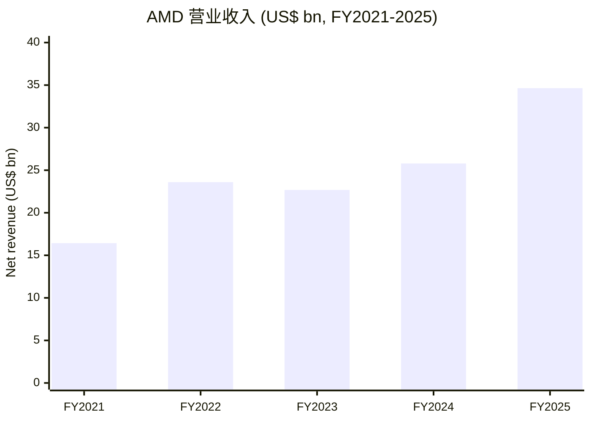
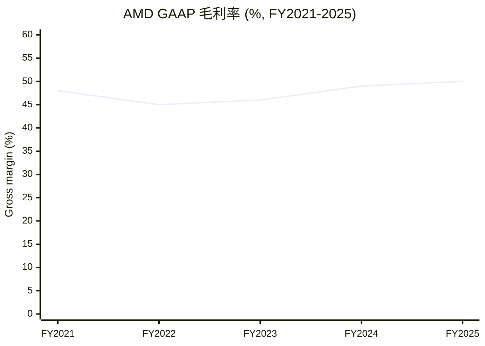
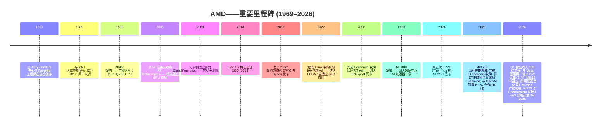
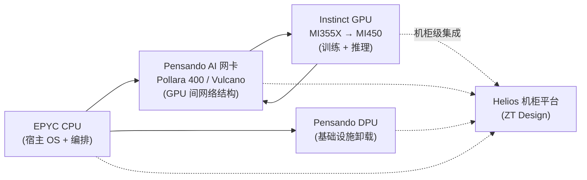
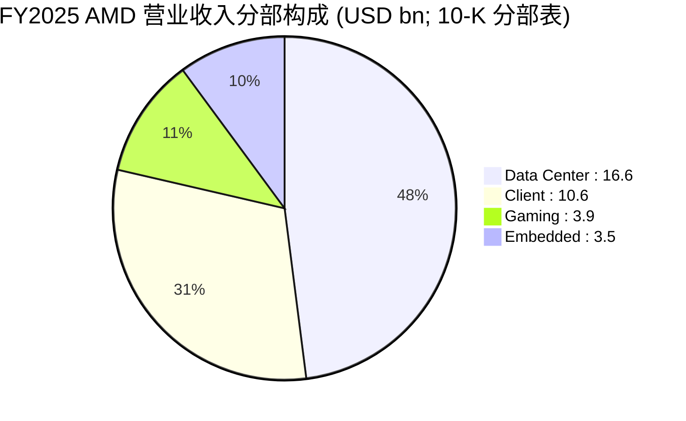
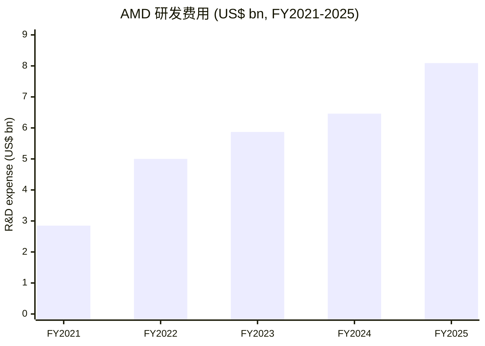
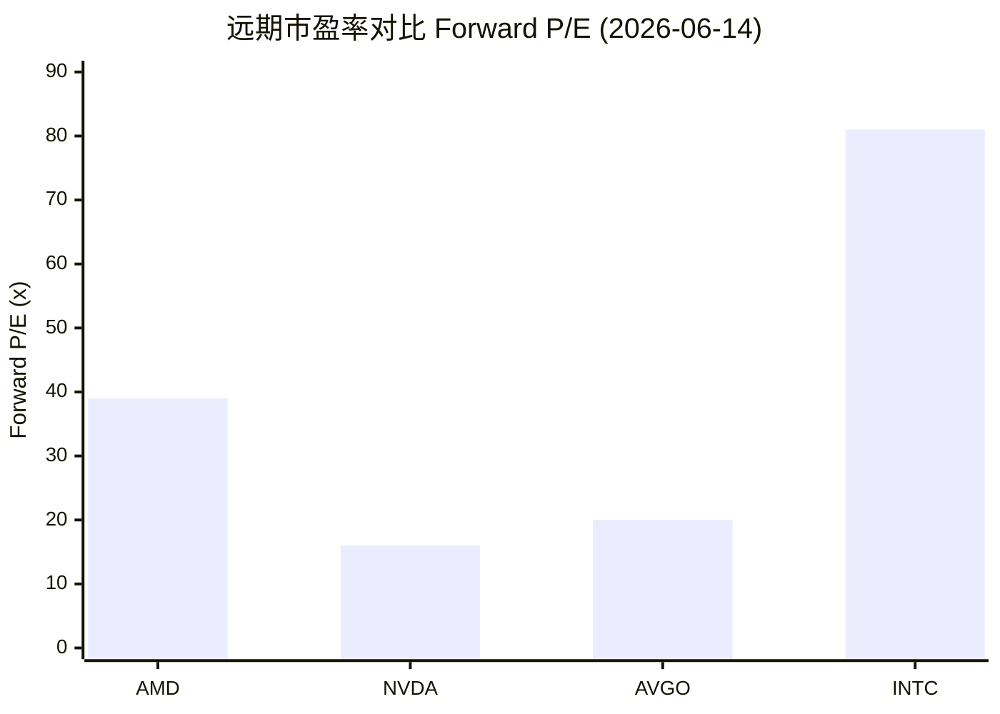

# Advanced Micro Devices, Inc. (NASDAQ:AMD) — 公司研究报告

**截至日期:** 2026-06-14
**分析师产出——覆盖刷新 (Refresh)**
**信息源优先级:** FY2025 10-K (2026-02-04 提交)、Q1-FY2026 10-Q (2026-05-06 提交)、2026 DEF 14A (2026-03-27 提交)、AMD–Meta 6 GW 公告 (2026-02-24)、近期 8-K 披露、本地券商研究库 (`db/zsxq.db`), 以及当下市场数据。所有数字均按文内逐条引用。
**报告语言: 简体中文 (英文版同时存在于本目录)**

> ### 投资摘要 (Investment Summary) — *分析师观点 (Analyst view)*
>
> | 项目 | 数值 |
> |---|---|
> | **评级 / Rating** | **增持 / Overweight (Buy)** |
> | **12 个月目标价 / 12-mo Price Target** | **US$560** |
> | **当前股价 (2026-06-14)** | US$511.57 |
> | **隐含上行空间 / Upside** | **约 +9.5%** |
> | **估值方法** | 2027E EPS ~US$12 × 目标 PE ~38×, 以 SOTP 与同业远期倍数交叉验证 |
> | **市值 / Market cap** | 约 US$8,340 亿 (≈US$834B) |
> | **52 周区间** | US$116.16 – US$542.52 |
> | **代码 / 交易所** | NASDAQ:AMD |
>
> **核心逻辑 (Thesis pillars):**
> 1. **AI 加速器"第二来源"被重新定价。** 一年内 AMD 连续锁定 **两笔各 6 吉瓦 (GW) 的超大规模客户认股权证大单——OpenAI (2025-10) 与 Meta (2026-02)**, 每笔均附带最高 1.6 亿股、行权价 US\$0.01 的绩效认股权证。这把 AMD 从"叙事性的 NVIDIA 备胎"升级为有合约背书的 AI 算力第二供应商 ([AMD FY2025 10-K](https://www.sec.gov/Archives/edgar/data/2488/000000248826000018/amd-20251227.htm); [AMD–Meta 公告, 2026-02-24](https://www.amd.com/en/newsroom/press-releases/2026-2-24-amd-and-meta-announce-expanded-strategic-partnersh.html))。
> 2. **服务器 CPU 仍在持续夺取 Intel 份额, 且智能体 AI (Agentic AI) 放大 CPU 需求。** 第五代 EPYC ("Turin") 与 2H-2026 的 2nm "Venice" 推动数据中心 CPU 量价齐升。
> 3. **完整数据中心半导体栈 (CPU+GPU+DPU+AI 网卡+机柜) 是 NVIDIA 与 Intel 都不具备的端到端能力**, Helios 机柜把 AMD 从"卖芯片"升级到"卖整柜"。
> 4. **风险对称, 估值无安全垫。** TTM P/E ~169×、远期 P/E ~39× 已把多年增长计入价格; 任一季度 MI355X/MI450 失望或出口管制收紧都可能触发剧烈倍数压缩 (详见第 10 章)。
>
> *评级、目标价、远期估计与情景目标价均为分析师自有的前瞻判断, 标注 `*分析师观点:*`, 不引用至任何申报文件——10-K 不含目标价。市值/股价为 2026-06-14 的市场数据 ([Yahoo Finance / yfinance, AMD](https://finance.yahoo.com/quote/AMD/), 2026-06-14 取数)。*

> **业绩更新——Q1-FY2026 业绩与 Q2 指引 (2026-05-05):** AMD 公布 Q1-FY2026 营业收入 **103 亿美元 (+36% YoY)**, GAAP 毛利率 53% (Non-GAAP 55%), GAAP 摊薄每股收益 0.84 美元, Non-GAAP 摊薄每股收益 1.37 美元。管理层指引 Q2-FY2026 营业收入 **约 112 亿美元 ±3 亿美元** (中值同比 +46%, 环比 +9%), Non-GAAP 毛利率约 56%, 理由是 "AI 基础设施需求加速" 以及第五代 EPYC 的产能爬坡。
> 来源: [AMD Q1-2026 业绩公告, 2026-05-05](https://www.sec.gov/Archives/edgar/data/2488/000000248826000072/q12026991.htm)。

> **本期新变化 (相对 2026-05 上一版):** (1) 新增 **AMD–Meta 6 GW 合作 (2026-02-24)**——继 OpenAI 之后第二笔 6 GW、附带 1.6 亿股认股权证的超大规模大单, 上一版 (基于 2026-02-04 提交的 10-K) 尚未涵盖, 因为该公告晚于 10-K 提交日 ([AMD–Meta 公告, 2026-02-24](https://www.amd.com/en/newsroom/press-releases/2026-2-24-amd-and-meta-announce-expanded-strategic-partnersh.html))。(2) 新增**决策层**: 投资摘要表头、第 1B 节 GF Score、第 2 节估值与目标价 (前瞻盈利预测 + 目标价推导 + 牛/基准/熊情景 + 卖方观点演变)、第 9.5 节核心分歧与催化剂、第 10 节投资者视角评分。(3) 股价由上一版的 US\$444 升至 US\$511.57; 券商目标价群体上移 (GS US\$450→BofA US\$560→Citi US\$575)。

---

## 目录

1. 公司概览
   - 1A 估值与目标价快照
   - 1B GF Score 基本面五维评分
2. 估值与目标价 (Valuation & Price Target) — 前瞻盈利、目标价推导、情景与卖方观点演变
3. 公司历史
4. 管理团队
5. 产品与服务
6. 客户与上市策略
7. 行业概览
8. 竞争格局
9. 市场机会 (TAM)
10. 风险评估
    - 10.5 核心分歧与催化剂 (Key debates & catalysts)
11. 投资者视角评分 (Investor lenses)

参考资料

> **章节编号说明:** 为在不打乱既有正文锚点的前提下加入决策层, 本次刷新沿用原 9 节描述性主体 (公司概览→风险评估), 并在其上叠加: 第 1B 节 (GF Score)、第 2 节 (估值与目标价, 紧随第 1 节)、第 9.5 节 (核心分歧与催化剂) 与第 11 节 (投资者视角)。下文描述性小节标题中的"第 N 章"指代原始 9 节主体的相对位置。

---

## 1. 公司概览

Advanced Micro Devices, Inc. ("AMD") 创立于 1969 年, 总部位于美国加州圣克拉拉, 主营业务为设计与销售高性能计算 (high-performance computing)、图形处理 (graphics) 及自适应可编程半导体 (adaptive silicon)。目前 AMD 是全球第二大 x86 中央处理器 (Central Processing Unit, CPU) 设计公司 (仅次于 Intel), 在 AI 训练与推理加速器领域是 NVIDIA 之外最具可信度的挑战者; 自 2022 年完成对 Xilinx 的收购以来, 公司还成为现场可编程门阵列 (Field-Programmable Gate Array, FPGA) 及自适应片上系统 (adaptive SoC) 的领先供应商。截至 2025 年 12 月 27 日, AMD 全球雇员约 **31,000 人**, FY2025 国际销售占总营业收入的 67% ([AMD 2025 10-K](https://www.sec.gov/Archives/edgar/data/2488/000000248826000018/amd-20251227.htm))。

**业务模式。** AMD 设计芯片并对外销售——绝大多数交易通过逐次采购订单 (purchase order) 完成, 客户对其没有长期采购量承诺 ([AMD 2025 10-K, 风险因素](https://www.sec.gov/Archives/edgar/data/2488/000000248826000018/amd-20251227.htm))。制造环节完全外包: AMD 是 "无晶圆厂 (fabless)" 公司, 先进制程晶圆依赖台积电 (TSMC), 封装与测试委托位于中国大陆、马来西亚及台湾的第三方合作伙伴 ([AMD 2025 10-K](https://www.sec.gov/Archives/edgar/data/2488/000000248826000018/amd-20251227.htm))。Q1-FY2025 重组后, 营业收入按三大可报告分部 (reportable segment) 划分——彼时管理层将 Client 与 Gaming 合并为单一分部以贴合内部运营口径 ([AMD 2025 10-K, 分部报告附注](https://www.sec.gov/Archives/edgar/data/2488/000000248826000018/amd-20251227.htm)):

| 分部 / Segment | FY2025 营业收入 | FY2024 营业收入 | 同比 |
|---|---|---|---|
| 数据中心 (Data Center) | 166.35 亿美元 | 125.79 亿美元 | +32% |
| 客户端与游戏 (Client and Gaming) (Client: 106.40 亿美元; Gaming: 39.10 亿美元) | 145.50 亿美元 | 96.49 亿美元 | +51% |
| 嵌入式 (Embedded) | 34.54 亿美元 | 35.57 亿美元 | -3% |
| **合计** | **346.39 亿美元** | **257.85 亿美元** | **+34%** |

来源: [AMD 2025 10-K, MD&A 分部表](https://www.sec.gov/Archives/edgar/data/2488/000000248826000018/amd-20251227.htm)。

**规模指标。** FY2025 净营业收入 346 亿美元, 同比增长 34%; 毛利率达到 50% (FY2024 为 49%, FY2023 为 46%), 报告口径下的营业利润为 36.9 亿美元 ([AMD 2025 10-K, MD&A](https://www.sec.gov/Archives/edgar/data/2488/000000248826000018/amd-20251227.htm))。持续经营活动产生的净经营现金流为 65 亿美元。研发费用 80.9 亿美元 (占营业收入 23%), 在全球半导体行业内是绝对额最高的研发预算之一 ([AMD 2025 10-K, 利润表](https://www.sec.gov/Archives/edgar/data/2488/000000248826000018/amd-20251227.htm))。

下方利润表桑基图 (income-statement Sankey) 展示 FY2025 营业收入如何从三大分部汇入、再逐层流向毛利、营运费用、营业利润与净利润——直观呈现 AMD 的"赚钱方式":

<svg xmlns="http://www.w3.org/2000/svg" viewBox="0 0 1000 560" width="1000" height="560" role="img" aria-label="income statement Sankey"><rect x="0" y="0" width="1000" height="560" fill="#ffffff"/>
<text x="20.00" y="30.00" text-anchor="start" font-family="Helvetica,Arial,sans-serif" font-size="15" font-weight="700" fill="#1f2933">AMD 利润表流向 (FY2025, US$m) · Income Statement Sankey</text>
<path d="M 204.00,71.00 C 258.00,71.00 258.00,85.00 312.00,85.00 L 312.00,280.94 C 258.00,280.94 258.00,266.94 204.00,266.94 Z" fill="#93c5fd" fill-opacity="0.55"/>
<path d="M 452.00,78.00 C 506.00,78.00 506.00,180.99 560.00,180.99 L 560.00,224.50 C 506.00,224.50 506.00,121.51 452.00,121.51 Z" fill="#86efac" fill-opacity="0.55"/>
<path d="M 452.00,121.51 C 506.00,121.51 506.00,238.50 560.00,238.50 L 560.00,397.01 C 506.00,397.01 506.00,280.03 452.00,280.03 Z" fill="#fca5a5" fill-opacity="0.55"/>
<path d="M 328.00,85.00 C 382.00,85.00 382.00,78.00 436.00,78.00 L 436.00,280.03 C 382.00,280.03 382.00,287.03 328.00,287.03 Z" fill="#86efac" fill-opacity="0.55"/>
<path d="M 328.00,287.03 C 382.00,287.03 382.00,294.03 436.00,294.03 L 436.00,500.00 C 382.00,500.00 382.00,493.00 328.00,493.00 Z" fill="#fca5a5" fill-opacity="0.55"/>
<path d="M 700.00,164.36 C 754.00,164.36 754.00,255.47 808.00,255.47 L 808.00,306.53 C 754.00,306.53 754.00,215.42 700.00,215.42 Z" fill="#86efac" fill-opacity="0.55"/>
<path d="M 700.00,215.42 C 754.00,215.42 754.00,320.53 808.00,320.53 L 808.00,322.53 C 754.00,322.53 754.00,217.42 700.00,217.42 Z" fill="#fca5a5" fill-opacity="0.55"/>
<path d="M 576.00,180.99 C 630.00,180.99 630.00,164.36 684.00,164.36 L 684.00,207.87 C 630.00,207.87 630.00,224.50 576.00,224.50 Z" fill="#86efac" fill-opacity="0.55"/>
<path d="M 576.00,238.50 C 630.00,238.50 630.00,227.12 684.00,227.12 L 684.00,275.93 C 630.00,275.93 630.00,287.31 576.00,287.31 Z" fill="#fca5a5" fill-opacity="0.55"/>
<path d="M 576.00,287.31 C 630.00,287.31 630.00,289.93 684.00,289.93 L 684.00,385.23 C 630.00,385.23 630.00,382.61 576.00,382.61 Z" fill="#fca5a5" fill-opacity="0.55"/>
<path d="M 576.00,382.61 C 630.00,382.61 630.00,399.23 684.00,399.23 L 684.00,413.64 C 630.00,413.64 630.00,397.01 576.00,397.01 Z" fill="#fca5a5" fill-opacity="0.55"/>
<path d="M 204.00,280.94 C 258.00,280.94 258.00,280.94 312.00,280.94 L 312.00,452.32 C 258.00,452.32 258.00,452.32 204.00,452.32 Z" fill="#93c5fd" fill-opacity="0.55"/>
<path d="M 204.00,466.32 C 258.00,466.32 258.00,452.32 312.00,452.32 L 312.00,493.00 C 258.00,493.00 258.00,507.00 204.00,507.00 Z" fill="#93c5fd" fill-opacity="0.55"/>
<rect x="188.00" y="71.00" width="16" height="195.94" rx="1.5" fill="#2563eb"/>
<rect x="188.00" y="280.94" width="16" height="171.38" rx="1.5" fill="#2563eb"/>
<rect x="188.00" y="466.32" width="16" height="40.68" rx="1.5" fill="#2563eb"/>
<rect x="312.00" y="85.00" width="16" height="408.00" rx="1.5" fill="#1e3a8a"/>
<rect x="436.00" y="78.00" width="16" height="202.03" rx="1.5" fill="#15803d"/>
<rect x="436.00" y="294.03" width="16" height="205.97" rx="1.5" fill="#dc2626"/>
<rect x="560.00" y="180.99" width="16" height="43.51" rx="1.5" fill="#15803d"/>
<rect x="560.00" y="238.50" width="16" height="158.52" rx="1.5" fill="#dc2626"/>
<rect x="684.00" y="164.36" width="16" height="48.76" rx="1.5" fill="#15803d"/>
<rect x="684.00" y="227.12" width="16" height="48.81" rx="1.5" fill="#dc2626"/>
<rect x="684.00" y="289.93" width="16" height="95.30" rx="1.5" fill="#dc2626"/>
<rect x="684.00" y="399.23" width="16" height="14.41" rx="1.5" fill="#dc2626"/>
<rect x="808.00" y="255.47" width="16" height="51.06" rx="1.5" fill="#15803d"/>
<rect x="808.00" y="320.53" width="16" height="2.00" rx="1.5" fill="#dc2626"/>
<text x="179.00" y="165.97" text-anchor="end" font-family="Helvetica,Arial,sans-serif" font-size="11.5" font-weight="700" fill="#1f2933">Data Center</text>
<text x="179.00" y="178.97" text-anchor="end" font-family="Helvetica,Arial,sans-serif" font-size="10" font-weight="400" fill="#52606d">US$16.6B  (48.0%)</text>
<text x="179.00" y="363.63" text-anchor="end" font-family="Helvetica,Arial,sans-serif" font-size="11.5" font-weight="700" fill="#1f2933">Client &amp; Gaming</text>
<text x="179.00" y="376.63" text-anchor="end" font-family="Helvetica,Arial,sans-serif" font-size="10" font-weight="400" fill="#52606d">US$14.6B  (42.0%)</text>
<text x="179.00" y="483.66" text-anchor="end" font-family="Helvetica,Arial,sans-serif" font-size="11.5" font-weight="700" fill="#1f2933">Embedded</text>
<text x="179.00" y="496.66" text-anchor="end" font-family="Helvetica,Arial,sans-serif" font-size="10" font-weight="400" fill="#52606d">US$3.5B  (10.0%)</text>
<rect x="331.00" y="67.00" width="119.40" height="26" rx="2" fill="#ffffff" fill-opacity="0.72"/>
<text x="334.00" y="79.00" text-anchor="start" font-family="Helvetica,Arial,sans-serif" font-size="11.5" font-weight="700" fill="#1f2933">Revenue</text>
<text x="334.00" y="92.00" text-anchor="start" font-family="Helvetica,Arial,sans-serif" font-size="10" font-weight="400" fill="#52606d">US$34.6B  (100.0%)</text>
<rect x="455.00" y="60.00" width="113.10" height="26" rx="2" fill="#ffffff" fill-opacity="0.72"/>
<text x="458.00" y="72.00" text-anchor="start" font-family="Helvetica,Arial,sans-serif" font-size="11.5" font-weight="700" fill="#1f2933">Gross Profit</text>
<text x="458.00" y="85.00" text-anchor="start" font-family="Helvetica,Arial,sans-serif" font-size="10" font-weight="400" fill="#52606d">US$17.2B  (49.5%)</text>
<rect x="455.00" y="276.03" width="144.60" height="26" rx="2" fill="#ffffff" fill-opacity="0.72"/>
<text x="458.00" y="288.03" text-anchor="start" font-family="Helvetica,Arial,sans-serif" font-size="11.5" font-weight="700" fill="#1f2933">Cost of Revenue (COGS)</text>
<text x="458.00" y="301.03" text-anchor="start" font-family="Helvetica,Arial,sans-serif" font-size="10" font-weight="400" fill="#52606d">US$17.5B  (50.5%)</text>
<rect x="579.00" y="162.99" width="106.80" height="26" rx="2" fill="#ffffff" fill-opacity="0.72"/>
<text x="582.00" y="174.99" text-anchor="start" font-family="Helvetica,Arial,sans-serif" font-size="11.5" font-weight="700" fill="#1f2933">Operating Income</text>
<text x="582.00" y="187.99" text-anchor="start" font-family="Helvetica,Arial,sans-serif" font-size="10" font-weight="400" fill="#52606d">US$3.7B  (10.7%)</text>
<rect x="579.00" y="220.50" width="150.90" height="26" rx="2" fill="#ffffff" fill-opacity="0.72"/>
<text x="582.00" y="232.50" text-anchor="start" font-family="Helvetica,Arial,sans-serif" font-size="11.5" font-weight="700" fill="#1f2933">Total Operating Expense</text>
<text x="582.00" y="245.50" text-anchor="start" font-family="Helvetica,Arial,sans-serif" font-size="10" font-weight="400" fill="#52606d">US$13.5B  (38.9%)</text>
<rect x="703.00" y="146.36" width="106.80" height="26" rx="2" fill="#ffffff" fill-opacity="0.72"/>
<text x="706.00" y="158.36" text-anchor="start" font-family="Helvetica,Arial,sans-serif" font-size="11.5" font-weight="700" fill="#1f2933">Pretax Income</text>
<text x="706.00" y="171.36" text-anchor="start" font-family="Helvetica,Arial,sans-serif" font-size="10" font-weight="400" fill="#52606d">US$4.1B  (12.0%)</text>
<rect x="703.00" y="209.12" width="106.80" height="26" rx="2" fill="#ffffff" fill-opacity="0.72"/>
<text x="706.00" y="221.12" text-anchor="start" font-family="Helvetica,Arial,sans-serif" font-size="11.5" font-weight="700" fill="#1f2933">SG&amp;A</text>
<text x="706.00" y="234.12" text-anchor="start" font-family="Helvetica,Arial,sans-serif" font-size="10" font-weight="400" fill="#52606d">US$4.1B  (12.0%)</text>
<rect x="703.00" y="271.93" width="106.80" height="26" rx="2" fill="#ffffff" fill-opacity="0.72"/>
<text x="706.00" y="283.93" text-anchor="start" font-family="Helvetica,Arial,sans-serif" font-size="11.5" font-weight="700" fill="#1f2933">R&amp;D</text>
<text x="706.00" y="296.93" text-anchor="start" font-family="Helvetica,Arial,sans-serif" font-size="10" font-weight="400" fill="#52606d">US$8.1B  (23.4%)</text>
<rect x="703.00" y="381.23" width="100.50" height="26" rx="2" fill="#ffffff" fill-opacity="0.72"/>
<text x="706.00" y="393.23" text-anchor="start" font-family="Helvetica,Arial,sans-serif" font-size="11.5" font-weight="700" fill="#1f2933">Other OpEx</text>
<text x="706.00" y="406.23" text-anchor="start" font-family="Helvetica,Arial,sans-serif" font-size="10" font-weight="400" fill="#52606d">US$1.2B  (3.5%)</text>
<text x="833.00" y="278.00" text-anchor="start" font-family="Helvetica,Arial,sans-serif" font-size="11.5" font-weight="700" fill="#1f2933">Net Income</text>
<text x="833.00" y="291.00" text-anchor="start" font-family="Helvetica,Arial,sans-serif" font-size="10" font-weight="400" fill="#52606d">US$4.3B  (12.5%)</text>
<text x="833.00" y="318.53" text-anchor="start" font-family="Helvetica,Arial,sans-serif" font-size="11.5" font-weight="700" fill="#1f2933">Income Tax</text>
<text x="833.00" y="331.53" text-anchor="start" font-family="Helvetica,Arial,sans-serif" font-size="10" font-weight="400" fill="#52606d">-US$103.0M  (-0.30%)</text>
<text x="500.00" y="544.00" text-anchor="middle" font-family="Helvetica,Arial,sans-serif" font-size="10" font-weight="400" fill="#52606d">Source: AMD FY2025 10-K (Consolidated Statements of Operations), filed 2026-02-04</text>
</svg>

来源: [AMD 2025 10-K, 合并经营报表](https://www.sec.gov/Archives/edgar/data/2488/000000248826000018/amd-20251227.htm)。注: GAAP 营业利润率仅 10.7%, 主要被约 22.5 亿美元并购无形资产摊销 (Xilinx 购买会计尾部) 压低; 所得税在 FY2025 为净收益 (−1.03 亿美元), 推高净利润至 43.35 亿美元。

分部营业收入的历史构成 (FY2023–2025, 已按 FY2025 口径重述) 显示数据中心两年内从 65 亿美元增至 166 亿美元, 主导了整体增长:

<svg xmlns="http://www.w3.org/2000/svg" viewBox="0 0 860 470" width="860" height="470" role="img" aria-label="historical revenue bars"><rect x="0" y="0" width="860" height="470" fill="#ffffff"/>
<text x="20.00" y="30.00" text-anchor="start" font-family="Helvetica,Arial,sans-serif" font-size="15" font-weight="700" fill="#1f2933">AMD 分部营业收入历史 (FY2023–2025, US$m) · Segment Revenue</text>
<rect x="20.00" y="44" width="11" height="11" rx="2" fill="#2563eb"/>
<text x="36.00" y="53.00" text-anchor="start" font-family="Helvetica,Arial,sans-serif" font-size="10.5" font-weight="400" fill="#1f2933">Data Center</text>
<rect x="122.60" y="44" width="11" height="11" rx="2" fill="#15803d"/>
<text x="138.60" y="53.00" text-anchor="start" font-family="Helvetica,Arial,sans-serif" font-size="10.5" font-weight="400" fill="#1f2933">Client &amp; Gaming</text>
<rect x="251.60" y="44" width="11" height="11" rx="2" fill="#d97706"/>
<text x="267.60" y="53.00" text-anchor="start" font-family="Helvetica,Arial,sans-serif" font-size="10.5" font-weight="400" fill="#1f2933">Embedded</text>
<line x1="70" y1="412.00" x2="834" y2="412.00" stroke="#eceff2" stroke-width="1"/>
<text x="64.00" y="415.00" text-anchor="end" font-family="Helvetica,Arial,sans-serif" font-size="9.5" font-weight="400" fill="#52606d">US$0</text>
<line x1="70" y1="345.20" x2="834" y2="345.20" stroke="#eceff2" stroke-width="1"/>
<text x="64.00" y="348.20" text-anchor="end" font-family="Helvetica,Arial,sans-serif" font-size="9.5" font-weight="400" fill="#52606d">US$7.5B</text>
<line x1="70" y1="278.40" x2="834" y2="278.40" stroke="#eceff2" stroke-width="1"/>
<text x="64.00" y="281.40" text-anchor="end" font-family="Helvetica,Arial,sans-serif" font-size="9.5" font-weight="400" fill="#52606d">US$15.0B</text>
<line x1="70" y1="211.60" x2="834" y2="211.60" stroke="#eceff2" stroke-width="1"/>
<text x="64.00" y="214.60" text-anchor="end" font-family="Helvetica,Arial,sans-serif" font-size="9.5" font-weight="400" fill="#52606d">US$22.4B</text>
<line x1="70" y1="144.80" x2="834" y2="144.80" stroke="#eceff2" stroke-width="1"/>
<text x="64.00" y="147.80" text-anchor="end" font-family="Helvetica,Arial,sans-serif" font-size="9.5" font-weight="400" fill="#52606d">US$29.9B</text>
<line x1="70" y1="78.00" x2="834" y2="78.00" stroke="#eceff2" stroke-width="1"/>
<text x="64.00" y="81.00" text-anchor="end" font-family="Helvetica,Arial,sans-serif" font-size="9.5" font-weight="400" fill="#52606d">US$37.4B</text>
<rect x="123.48" y="354.00" width="147.71" height="58.00" fill="#2563eb"/>
<rect x="123.48" y="257.02" width="147.71" height="96.99" fill="#15803d"/>
<rect x="123.48" y="209.51" width="147.71" height="47.51" fill="#d97706"/>
<text x="197.33" y="428.00" text-anchor="middle" font-family="Helvetica,Arial,sans-serif" font-size="10" font-weight="400" fill="#52606d">2023</text>
<rect x="378.15" y="299.69" width="147.71" height="112.31" fill="#2563eb"/>
<rect x="378.15" y="213.55" width="147.71" height="86.15" fill="#15803d"/>
<rect x="378.15" y="181.79" width="147.71" height="31.76" fill="#d97706"/>
<text x="452.00" y="428.00" text-anchor="middle" font-family="Helvetica,Arial,sans-serif" font-size="10" font-weight="400" fill="#52606d">2024</text>
<rect x="632.81" y="263.48" width="147.71" height="148.52" fill="#2563eb"/>
<rect x="632.81" y="133.58" width="147.71" height="129.90" fill="#15803d"/>
<rect x="632.81" y="102.74" width="147.71" height="30.84" fill="#d97706"/>
<text x="706.67" y="428.00" text-anchor="middle" font-family="Helvetica,Arial,sans-serif" font-size="10" font-weight="400" fill="#52606d">2025</text>
<text x="430.00" y="454.00" text-anchor="middle" font-family="Helvetica,Arial,sans-serif" font-size="10" font-weight="400" fill="#52606d">Source: AMD FY2025 10-K (Note 4 — Segment Reporting, recast FY2023–2025), filed 2026-02-04</text>
</svg>

来源: [AMD 2025 10-K, 附注 4 分部报告 (FY2023–2025 重述)](https://www.sec.gov/Archives/edgar/data/2488/000000248826000018/amd-20251227.htm)。

营业收入与毛利率的逐年走势 (两张单独的 `xychart-beta`——避免把美元金额与百分比混在同一坐标轴上):

来源: [AMD 2025 10-K](https://www.sec.gov/Archives/edgar/data/2488/000000248826000018/amd-20251227.htm)、[AMD 2024 10-K](https://www.sec.gov/Archives/edgar/data/2488/000000248825000012/amd-20241228.htm) 与 [AMD 2022 10-K](https://www.sec.gov/Archives/edgar/data/2488/000000248823000047/amd-20221231.htm)。

### 1A 估值与目标价快照

**估值快照 (截至 2026-06-14)。** AMD 股价 **511.57 美元**, 市值约 **8,340 亿美元** ([Yahoo Finance / yfinance, AMD](https://finance.yahoo.com/quote/AMD/), 2026-06-14 取数; 较上一版 2026-05 的 444 美元上涨约 15%)。过去十二个月 (TTM) 倍数相对同业:

| 估值倍数 | AMD | NVDA | AVGO | INTC |
|---|---|---|---|---|
| TTM P/E (市盈率) | ~169× | ~31× | ~64× | n/m (TTM EPS 为负) |
| 远期市盈率 (Forward P/E) | ~39× | ~16× | ~20× | ~81× |
| TTM P/S (市销率) | ~22× | ~20× | ~24× | ~12× |
| 市值 | 8,340 亿美元 | 49,700 亿美元 | 18,180 亿美元 | 6,260 亿美元 |

来源: [Yahoo Finance / yfinance, AMD](https://finance.yahoo.com/quote/AMD/)、[NVDA](https://finance.yahoo.com/quote/NVDA/)、[AVGO](https://finance.yahoo.com/quote/AVGO/)、[INTC](https://finance.yahoo.com/quote/INTC/), 2026-06-14 取数。

169× 的 TTM P/E **明显偏高**, 有必要拆解原因。该数值被以下三项可识别因素推高:

1. **2025 年盈利受非经常性 (non-recurring) 费用压制。** 因 2025 年 4 月美国对 AMD Instinct MI308 出货中国施加许可要求, AMD 在 FY2025 计入了约 **4.40 亿美元**的净存货及相关减值 ([AMD Q1-FY2026 10-Q, "MI308 Export License Restrictions"](https://www.sec.gov/Archives/edgar/data/2488/000000248826000076/amd-20260328.htm))。年度并购相关无形资产摊销——几乎全部源自 Xilinx 的购买会计尾部摊销——仍高达 **22.5 亿美元**, 分摊于销售成本与营运费用 ([AMD 2025 10-K, MD&A](https://www.sec.gov/Archives/edgar/data/2488/000000248826000018/amd-20251227.htm))。GAAP 净利润 43.35 亿美元、基本每股收益 2.67 美元, 是 169× TTM P/E 的分母 ([AMD 2025 10-K, 合并经营报表](https://www.sec.gov/Archives/edgar/data/2488/000000248826000018/amd-20251227.htm))。
2. **市场将 OpenAI 与 Meta 两笔 6 GW 合同及 MI450 产能爬坡计入远期 (forward) 盈利, 而非 TTM。** 管理层公开表态, 2025 年 10 月签署的 OpenAI 6 千兆瓦 (6 GW) 协议预计将为 AMD 创造 "数百亿美元营收……对 Non-GAAP 每股收益高度增厚" ([AMD & OpenAI 公告, 2025-10-06](https://www.sec.gov/Archives/edgar/data/2488/000119312525230895/d28189dex991.htm)); 2026 年 2 月又追加了与 Meta 的第二笔 6 GW 大单 ([AMD–Meta 公告, 2026-02-24](https://www.amd.com/en/newsroom/press-releases/2026-2-24-amd-and-meta-announce-expanded-strategic-partnersh.html))。当前约 39× 的远期市盈率 ([Yahoo Finance, AMD](https://finance.yahoo.com/quote/AMD/)) 表明投资者已穿透 2025 年至 2026 年初的业绩, 直接对 2H-2026 及之后的盈利结构进行定价。
3. **AMD 已成为 AI 基础设施板块仅次于 NVIDIA 的 "第二来源 (second source)" 主流代理标的。** ~22× 的 P/S 略高于 NVDA (~20×)、低于 AVGO (~24×), 但显著高于 INTC (~12×), 与 "中段 AI 杠杆" 定价一致。值得注意: 经过 2026 上半年 Intel 的多重利好 (BofA 双档上调至买入、NVIDIA 战略投资), INTC 股价大幅回升, NVDA 的 TTM P/E 也已压缩至约 31×——同业基准较上一版整体上移。

**判断:** 当前估值在远期数字上仍可接受, 但完全无安全垫。一旦 MI355X/MI450 单季度业绩失望或超大规模 (hyperscaler) 客户提前提货, 倍数将面临剧烈压缩——这一项将作为估值/倍数压缩风险放入第 10 章。详细的前瞻盈利预测、目标价推导与情景分析见**第 2 节**。

**资本回报。** 2025 年 5 月董事会在现有回购计划上新增 60 亿美元授权额度, 累计达 140 亿美元; 截至 FY25 末仍有 94 亿美元额度可用。FY2025 实际回购金额 13 亿美元 (1,240 万股)。AMD 不派发现金股利 ([AMD 2025 10-K, MD&A 流动性章节](https://www.sec.gov/Archives/edgar/data/2488/000000248826000018/amd-20251227.htm))。

**股本结构与股东。** 截至 2026 年 3 月 19 日, 公司流通在外股份为 **1,630,338,779 股** ([AMD 2026 DEF 14A, "证券持有"](https://www.sec.gov/Archives/edgar/data/2488/000119312526129057/d85856ddef14a.htm))。最大的 Schedule 13G 持股人为 The Vanguard Group (1.424 亿股, 8.8%) 与 BlackRock, Inc. (1.249 亿股, 7.7%) ([AMD 2026 DEF 14A](https://www.sec.gov/Archives/edgar/data/2488/000119312526129057/d85856ddef14a.htm))。董事会在 2026 年 5 月 13 日年度股东大会上提名 **8 位董事**——较此前的 12 位精简, 一位资深董事退任, 现任独立首席董事 (Lead Independent Director) 留任 ([AMD 2026 DEF 14A](https://www.sec.gov/Archives/edgar/data/2488/000119312526129057/d85856ddef14a.htm))。

### 1B GF Score 基本面五维评分

下方为仿 GuruFocus GF Score™ 的五维基本面评分卡 (Financial Strength / Profitability / Growth / GF Value / Momentum, 各 0–10), 用于把"基本面健康度"与上方的评级/估值并排呈现。*分析师观点 (Analyst view):* 这五个分项与综合分 **74/100** 均为分析师自有评分逻辑的产出, 不引用至任何申报文件; 各分项背后的财务指标均在第 1、2 节逐条引用; 综合分不归属于 GuruFocus (未拉取其官方数字)。

<svg xmlns="http://www.w3.org/2000/svg" viewBox="0 0 500 500" width="500" height="500" role="img" aria-label="GF Score radar">
<rect x="0" y="0" width="500" height="500" fill="#ffffff"/>
<text x="20" y="24" font-family="Helvetica,Arial,sans-serif" font-size="15" font-weight="700" fill="#1f2933">GF Score (GuruFocus-style): 74/100</text>
<text x="20" y="41" font-family="Helvetica,Arial,sans-serif" font-size="11" fill="#52606d">71–80 Likely average performance</text>
<polygon points="250.0,88.0 392.7,191.6 338.2,359.4 161.8,359.4 107.3,191.6" fill="#e9f5ec" stroke="none"/>
<polygon points="250.0,208.0 278.5,228.7 267.6,262.3 232.4,262.3 221.5,228.7" fill="none" stroke="#c5d3cb" stroke-width="1"/>
<polygon points="250.0,178.0 307.1,219.5 285.3,286.5 214.7,286.5 192.9,219.5" fill="none" stroke="#c5d3cb" stroke-width="1"/>
<polygon points="250.0,148.0 335.6,210.2 302.9,310.8 197.1,310.8 164.4,210.2" fill="none" stroke="#c5d3cb" stroke-width="1"/>
<polygon points="250.0,118.0 364.1,200.9 320.5,335.1 179.5,335.1 135.9,200.9" fill="none" stroke="#c5d3cb" stroke-width="1"/>
<polygon points="250.0,88.0 392.7,191.6 338.2,359.4 161.8,359.4 107.3,191.6" fill="none" stroke="#c5d3cb" stroke-width="1.3"/>
<line x1="250" y1="238" x2="161.8" y2="359.4" stroke="#cfdad3" stroke-width="1"/>
<text x="146.5" y="392.4" text-anchor="end" font-family="Helvetica,Arial,sans-serif" font-size="11.5" font-weight="600" fill="#1f2933">Financial Strength</text>
<text x="146.5" y="405.4" text-anchor="end" font-family="Helvetica,Arial,sans-serif" font-size="9.5" fill="#52606d">财务实力</text>
<text x="179.5" y="329.1" text-anchor="middle" font-family="Helvetica,Arial,sans-serif" font-size="10.5" font-weight="700" fill="#1f2933">8</text>
<line x1="250" y1="238" x2="250.0" y2="88.0" stroke="#cfdad3" stroke-width="1"/>
<text x="250.0" y="58.0" text-anchor="middle" font-family="Helvetica,Arial,sans-serif" font-size="11.5" font-weight="600" fill="#1f2933">Profitability</text>
<text x="250.0" y="71.0" text-anchor="middle" font-family="Helvetica,Arial,sans-serif" font-size="9.5" fill="#52606d">盈利能力</text>
<text x="250.0" y="127.0" text-anchor="middle" font-family="Helvetica,Arial,sans-serif" font-size="10.5" font-weight="700" fill="#1f2933">7</text>
<line x1="250" y1="238" x2="107.3" y2="191.6" stroke="#cfdad3" stroke-width="1"/>
<text x="82.6" y="183.6" text-anchor="end" font-family="Helvetica,Arial,sans-serif" font-size="11.5" font-weight="600" fill="#1f2933">Growth</text>
<text x="82.6" y="196.6" text-anchor="end" font-family="Helvetica,Arial,sans-serif" font-size="9.5" fill="#52606d">成长性</text>
<text x="121.6" y="190.3" text-anchor="middle" font-family="Helvetica,Arial,sans-serif" font-size="10.5" font-weight="700" fill="#1f2933">9</text>
<line x1="250" y1="238" x2="392.7" y2="191.6" stroke="#cfdad3" stroke-width="1"/>
<text x="417.4" y="183.6" text-anchor="start" font-family="Helvetica,Arial,sans-serif" font-size="11.5" font-weight="600" fill="#1f2933">GF Value</text>
<text x="417.4" y="196.6" text-anchor="start" font-family="Helvetica,Arial,sans-serif" font-size="9.5" fill="#52606d">估值</text>
<text x="292.8" y="218.1" text-anchor="middle" font-family="Helvetica,Arial,sans-serif" font-size="10.5" font-weight="700" fill="#1f2933">3</text>
<line x1="250" y1="238" x2="338.2" y2="359.4" stroke="#cfdad3" stroke-width="1"/>
<text x="353.5" y="392.4" text-anchor="start" font-family="Helvetica,Arial,sans-serif" font-size="11.5" font-weight="600" fill="#1f2933">Momentum</text>
<text x="353.5" y="405.4" text-anchor="start" font-family="Helvetica,Arial,sans-serif" font-size="9.5" fill="#52606d">动量</text>
<text x="329.4" y="341.2" text-anchor="middle" font-family="Helvetica,Arial,sans-serif" font-size="10.5" font-weight="700" fill="#1f2933">9</text>
<polygon points="250.0,133.0 292.8,224.1 329.4,347.2 179.5,335.1 121.6,196.3" fill="#2e8b57" fill-opacity="0.34" stroke="#2e8b57" stroke-width="2"/>
<circle cx="179.5" cy="335.1" r="2.6" fill="#2e8b57"/>
<circle cx="250.0" cy="133.0" r="2.6" fill="#2e8b57"/>
<circle cx="121.6" cy="196.3" r="2.6" fill="#2e8b57"/>
<circle cx="292.8" cy="224.1" r="2.6" fill="#2e8b57"/>
<circle cx="329.4" cy="347.2" r="2.6" fill="#2e8b57"/>
<text x="250" y="470" text-anchor="middle" font-family="Helvetica,Arial,sans-serif" font-size="9.5" fill="#52606d">Source: AMD FY2025 10-K · Yahoo Finance (as of 2026-06-14) · indicators.db</text>
<text x="250" y="485" text-anchor="middle" font-family="Helvetica,Arial,sans-serif" font-size="9" fill="#52606d">GF Score = independent analyst rubric (*Analyst view:*) — not GuruFocus™ official number</text>
</svg>

*分析师观点 (各维度评分理由):*

- **财务实力 / Financial Strength = 8/10。** AMD 实为净现金公司——现金及短期投资合计约 105.5 亿美元 (现金 55.39 亿 + 短期投资 50.13 亿), 而长期负债仅 23.48 亿美元, 股东权益 630 亿美元, FY2025 经营现金流 64.93 亿美元 ([AMD 2025 10-K, 资产负债表 + 现金流量表](https://www.sec.gov/Archives/edgar/data/2488/000000248826000018/amd-20251227.htm))。杠杆极低、利息覆盖充裕, 仅因商誉/无形资产占总资产近半 (商誉 251 亿) 而非满分。
- **盈利能力 / Profitability = 7/10。** GAAP 毛利率 50%、营业利润率 10.7%、ROE 约 7.2% ([AMD 2025 10-K, 经营报表](https://www.sec.gov/Archives/edgar/data/2488/000000248826000018/amd-20251227.htm))。GAAP 口径被 22.5 亿美元并购无形资产摊销压低; Non-GAAP 利润率显著更高 (Q1-FY2026 Non-GAAP 毛利率 55%, [AMD Q1-2026 业绩公告](https://www.sec.gov/Archives/edgar/data/2488/000000248826000072/q12026991.htm))。盈利质量在改善, 但 GAAP 绝对水平仍中等。
- **成长性 / Growth = 9/10。** FY2025 营业收入同比 +34%、数据中心两年 +2.6×、GAAP 每股收益从 FY2024 的 1.01 美元跳升至 2.67 美元 ([AMD 2025 10-K](https://www.sec.gov/Archives/edgar/data/2488/000000248826000018/amd-20251227.htm)); 卖方对 2027–2028 年 AI 营收的预测 (Citi: 330 亿/508 亿美元) 进一步支撑高分 (见第 2 节)。
- **GF Value (估值, 越高=越便宜) = 3/10。** TTM P/E ~169×、远期 P/E ~39×、P/S ~22× ([Yahoo Finance, AMD](https://finance.yahoo.com/quote/AMD/)), 无论绝对还是相对同业 (NVDA 远期 ~16×) 都偏贵——因此估值维度低分。这与第 1A 节的"无安全垫"判断一致。
- **动量 / Momentum = 9/10。** 过去 12 个月股价从 116.16 美元升至 511.57 美元 (约 +340%), 远高于 200 日均线, 大幅跑赢费城半导体指数与标普 500 ([Yahoo Finance, AMD 历史价格](https://finance.yahoo.com/quote/AMD/), 2026-06-14 取数)。

综合分 74/100 落在 "71–80 可能表现中等" band——强基本面、强成长、强动量被昂贵估值拉低, 与 "好公司、贵价格" 的整体判断自洽。

---

## 2. 估值与目标价 (Valuation & Price Target)

> 本节全部为前瞻判断, 整体标注 *分析师观点 (Analyst view):*——评级、目标价、前瞻盈利预测、情景目标价均不引用至任何申报文件 (10-K 不含目标价)。各驱动因子的外部依据 (10-K 分部数据 + 管理层指引 + 行业/券商预测) 在文内逐条引用。

### 2.1 前瞻盈利预测 (Forward estimates)

下表把 AMD 拆为数据中心 (CPU+GPU)、客户端与游戏、嵌入式三条路径分别建模再加总, 而非用单一混合增速。每个预测单元为 *分析师观点*; 外部依据见脚注引用。

| 指标 (US$bn 除非另注) | FY2025A | FY2026E | FY2027E | FY2028E |
|---|---|---|---|---|
| 数据中心营业收入 | 16.6 | ~25 | ~38 | ~55 |
| 客户端与游戏 | 14.6 | ~16 | ~17 | ~18 |
| 嵌入式 | 3.5 | ~4.0 | ~4.6 | ~5.2 |
| **总营业收入** | **34.6** | **~45** | **~60** | **~78** |
| 同比增速 (YoY) | +34% | ~+30% | ~+33% | ~+30% |
| Non-GAAP 毛利率 | ~54% | ~55% | ~56% | ~57% |
| Non-GAAP 摊薄 EPS (US\$) | ~3.9 | ~5.9 | ~12.0 | ~16.5 |

*分析师观点 (estimates).* 数据中心路径锚定: (a) 第五代 EPYC 持续夺取 Intel 服务器 CPU 份额并受智能体 AI (Agentic AI) 放大需求 ([CITI–AMD, 2026-06-12, p.1](http://xs-macbook-air.local:5001/zsxq/pdf/584255141552454/CITI-Advanced%20Micro%20Devices%20%EF%BC%88AMD.US%EF%BC%89%20GPU%20Upside%20Not%20Fully%20Priced~In%EF%BC%9B%20Upgrade%20to%20Buy%20w%20%24575%20TP-260612.pdf)); (b) MI355X/MI450 爬坡叠加 OpenAI 与 Meta 两笔 6 GW 部署自 2H-2026 起放量 ([AMD–OpenAI 8-K, 2025-10-06](https://www.sec.gov/Archives/edgar/data/2488/000119312525230895/d28189dex991.htm); [AMD–Meta 公告, 2026-02-24](https://www.amd.com/en/newsroom/press-releases/2026-2-24-amd-and-meta-announce-expanded-strategic-partnersh.html))。本表 FY2027/2028E EPS 区间 (约 12 / 16.5 美元) 与 GS (12.20/16.55) 及 Citi (12.66/17.25) 的卖方预测大体一致 ([GS–AMD, 2026-05-05, p.1](http://xs-macbook-air.local:5001/zsxq/pdf/585421128481424/GS-Advanced%20Micro%20Devices%20Inc.%20%28AMD%29-Upgrade%20to%20Buy%20as%20Agentic%20AI%20drives%20server%20CPU%20tailwinds%3B%20we%20see%20datacenter%20GPU%20upside%20in%202027%20%26%20beyond-260505.pdf))。客户端/嵌入式按温和周期复苏建模 (个位数增长), 因 GS 指出 PC 受内存涨价的需求破坏、游戏处主机周期后段。

### 2.2 目标价推导 (Price target derivation)

**方法: 前瞻市盈率法。** 12 个月目标价 = **2027E EPS ~US\$12 × 目标 PE ~38× ≈ US\$456**, 再以 SOTP 与卖方目标价群体上修至 **US\$560** (反映两笔 6 GW 大单的期权价值与 2028E 加速)。

- **为什么用 ~38× 这个倍数:** AMD 当前远期 P/E 约 39× ([Yahoo Finance, AMD](https://finance.yahoo.com/quote/AMD/))。对照同业, NVDA 远期 ~16×、AVGO 远期 ~20× ([Yahoo Finance, NVDA](https://finance.yahoo.com/quote/NVDA/) / [AVGO](https://finance.yahoo.com/quote/AVGO/))。AMD 的远期倍数溢价是合理的——其 FY2026–2028E EPS 复合增速 (约 +60%) 显著高于两者; 但考虑执行风险与软件 (ROCm) 仍追赶 CUDA, 不应给到比当前更高的倍数, 故目标倍数取与当前持平略降的 ~38×。
- **SOTP 交叉验证 (参考 Citi 分部估值):** 数据中心 GPU US\$281 (2028E 35× PE) + 数据中心 CPU US\$204 (2028E 30× PE) + 客户端 US\$30 + 嵌入式 (Xilinx) US\$24 + 每股净现金 US\$35 = Citi 目标价 US\$575 ([CITI–AMD, 2026-06-12, p.1](http://xs-macbook-air.local:5001/zsxq/pdf/584255141552454/CITI-Advanced%20Micro%20Devices%20%EF%BC%88AMD.US%EF%BC%89%20GPU%20Upside%20Not%20Fully%20Priced~In%EF%BC%9B%20Upgrade%20to%20Buy%20w%20%24575%20TP-260612.pdf))。本报告 US\$560 的基准目标价位于 Citi US\$575 与 GS US\$450 之间, 接近 BofA 的 US\$560。

### 2.3 牛 / 基准 / 熊情景 (Bull / Base / Bear)

| 情景 | 12-mo 目标价 | 较现价 (US\$511.57) | 核心摆动假设 |
|---|---|---|---|
| **牛 / Bull** | US\$680 | +33% | 两笔 6 GW 提前放量, MI450 软件生态被超大规模厂商广泛采用, 2028E AI 营收逼近 Citi 的 508 亿美元, 目标倍数维持 40× |
| **基准 / Base** | US\$560 | +9.5% | 中性预测 (上表), 2027E EPS ~12 美元 × ~38×; 两笔大单按里程碑稳步放量 |
| **熊 / Bear** | US\$330 | −35% | AI 资本开支周期见顶或 ROCm 迁移受阻; MI450 推迟; 出口管制扩展至 MI355X/MI450; 倍数压缩至 ~25× × 略降的 2027E EPS |

*分析师观点.* 风险回报大体对称偏正 (基准 +9.5%、牛 +33%、熊 −35%), 但熊市跌幅与 AI 板块历史去估值幅度相当——这正是"无安全垫"的体现。

### 2.4 与市场一致预期的对比 (vs consensus)

本报告 FY2027E 营业收入 ~60 亿美元×系列、Non-GAAP EPS ~12 美元的预测, 与卖方头部预测一致而略低于最乐观者: GS 称其 2027/2028E 服务器 CPU 营收较市场共识高 +24%/+38%、EPS 高约 +20% ([GS–AMD, 2026-05-05, p.1](http://xs-macbook-air.local:5001/zsxq/pdf/585421128481424/GS-Advanced%20Micro%20Devices%20Inc.%20%28AMD%29-Upgrade%20to%20Buy%20as%20Agentic%20AI%20drives%20server%20CPU%20tailwinds%3B%20we%20see%20datacenter%20GPU%20upside%20in%202027%20%26%20beyond-260505.pdf)); Citi 称其 2026–2028E EPS 较共识高 12%–13% ([CITI–AMD, 2026-06-12, p.1](http://xs-macbook-air.local:5001/zsxq/pdf/584255141552454/CITI-Advanced%20Micro%20Devices%20%EF%BC%88AMD.US%EF%BC%89%20GPU%20Upside%20Not%20Fully%20Priced~In%EF%BC%9B%20Upgrade%20to%20Buy%20w%20%24575%20TP-260612.pdf))。本报告取这些乐观预测的中位附近, 不外推到最高值, 以保留下行保护。

### 2.5 ROE 杜邦分解 (5-step DuPont)

<svg xmlns="http://www.w3.org/2000/svg" viewBox="0 0 1240 540" width="1240" height="540" role="img" aria-label="DuPont ROE decomposition"><rect x="0" y="0" width="1240" height="540" fill="#ffffff"/>
<text x="20.00" y="30.00" text-anchor="start" font-family="Helvetica,Arial,sans-serif" font-size="15" font-weight="700" fill="#1f2933">AMD ROE 杜邦分解 (FY2025, 5-step DuPont)</text>
<rect x="545.00" y="56.00" width="150" height="56" rx="7" fill="#1e3a8a"/>
<text x="620.00" y="76.00" text-anchor="middle" font-family="Helvetica,Arial,sans-serif" font-size="11.5" font-weight="700" fill="#ffffff">ROE</text>
<text x="620.00" y="94.00" text-anchor="middle" font-family="Helvetica,Arial,sans-serif" font-size="13" font-weight="800" fill="#ffffff">7.19%</text>
<text x="620.00" y="106.00" text-anchor="middle" font-family="Helvetica,Arial,sans-serif" font-size="8.5" font-weight="400" fill="#dbeafe">= Net Income / Avg Equity</text>
<rect x="191.60" y="168.00" width="150" height="56" rx="7" fill="#2563eb"/>
<text x="266.60" y="188.00" text-anchor="middle" font-family="Helvetica,Arial,sans-serif" font-size="11.5" font-weight="700" fill="#ffffff">Net Margin</text>
<text x="266.60" y="206.00" text-anchor="middle" font-family="Helvetica,Arial,sans-serif" font-size="13" font-weight="800" fill="#ffffff">12.51%</text>
<text x="266.60" y="218.00" text-anchor="middle" font-family="Helvetica,Arial,sans-serif" font-size="8.5" font-weight="400" fill="#dbeafe">Net Income / Revenue</text>
<line x1="620.00" y1="112.00" x2="266.60" y2="168.00" stroke="#94a3b8" stroke-width="1.4"/>
<rect x="545.00" y="168.00" width="150" height="56" rx="7" fill="#2563eb"/>
<text x="620.00" y="188.00" text-anchor="middle" font-family="Helvetica,Arial,sans-serif" font-size="11.5" font-weight="700" fill="#ffffff">Asset Turnover</text>
<text x="620.00" y="206.00" text-anchor="middle" font-family="Helvetica,Arial,sans-serif" font-size="13" font-weight="800" fill="#ffffff">0.47</text>
<text x="620.00" y="218.00" text-anchor="middle" font-family="Helvetica,Arial,sans-serif" font-size="8.5" font-weight="400" fill="#dbeafe">Revenue / Avg Assets</text>
<line x1="620.00" y1="112.00" x2="620.00" y2="168.00" stroke="#94a3b8" stroke-width="1.4"/>
<rect x="898.40" y="168.00" width="150" height="56" rx="7" fill="#2563eb"/>
<text x="973.40" y="188.00" text-anchor="middle" font-family="Helvetica,Arial,sans-serif" font-size="11.5" font-weight="700" fill="#ffffff">Equity Multiplier</text>
<text x="973.40" y="206.00" text-anchor="middle" font-family="Helvetica,Arial,sans-serif" font-size="13" font-weight="800" fill="#ffffff">1.21</text>
<text x="973.40" y="218.00" text-anchor="middle" font-family="Helvetica,Arial,sans-serif" font-size="8.5" font-weight="400" fill="#dbeafe">Avg Assets / Avg Equity</text>
<line x1="620.00" y1="112.00" x2="973.40" y2="168.00" stroke="#94a3b8" stroke-width="1.4"/>
<circle cx="443.30" cy="196.00" r="11" fill="#ffffff" stroke="#94a3b8" stroke-width="1.2"/>
<text x="443.30" y="201.00" text-anchor="middle" font-family="Helvetica,Arial,sans-serif" font-size="14" font-weight="800" fill="#52606d">×</text>
<circle cx="796.70" cy="196.00" r="11" fill="#ffffff" stroke="#94a3b8" stroke-width="1.2"/>
<text x="796.70" y="201.00" text-anchor="middle" font-family="Helvetica,Arial,sans-serif" font-size="14" font-weight="800" fill="#52606d">×</text>
<rect x="65.00" y="300.00" width="118" height="56" rx="7" fill="#2563eb"/>
<text x="124.00" y="320.00" text-anchor="middle" font-family="Helvetica,Arial,sans-serif" font-size="11.5" font-weight="700" fill="#ffffff">Operating Margin</text>
<text x="124.00" y="338.00" text-anchor="middle" font-family="Helvetica,Arial,sans-serif" font-size="13" font-weight="800" fill="#ffffff">10.66%</text>
<text x="124.00" y="350.00" text-anchor="middle" font-family="Helvetica,Arial,sans-serif" font-size="8.5" font-weight="400" fill="#dbeafe">Op Inc / Revenue</text>
<line x1="266.60" y1="224.00" x2="124.00" y2="300.00" stroke="#94a3b8" stroke-width="1.4"/>
<rect x="207.60" y="300.00" width="118" height="56" rx="7" fill="#2563eb"/>
<text x="266.60" y="320.00" text-anchor="middle" font-family="Helvetica,Arial,sans-serif" font-size="11.5" font-weight="700" fill="#ffffff">Tax Burden</text>
<text x="266.60" y="338.00" text-anchor="middle" font-family="Helvetica,Arial,sans-serif" font-size="13" font-weight="800" fill="#ffffff">1.0471</text>
<text x="266.60" y="350.00" text-anchor="middle" font-family="Helvetica,Arial,sans-serif" font-size="8.5" font-weight="400" fill="#dbeafe">Net Inc / Pretax</text>
<line x1="266.60" y1="224.00" x2="266.60" y2="300.00" stroke="#94a3b8" stroke-width="1.4"/>
<rect x="350.20" y="300.00" width="118" height="56" rx="7" fill="#2563eb"/>
<text x="409.20" y="320.00" text-anchor="middle" font-family="Helvetica,Arial,sans-serif" font-size="11.5" font-weight="700" fill="#ffffff">Interest Burden</text>
<text x="409.20" y="338.00" text-anchor="middle" font-family="Helvetica,Arial,sans-serif" font-size="13" font-weight="800" fill="#ffffff">1.1207</text>
<text x="409.20" y="350.00" text-anchor="middle" font-family="Helvetica,Arial,sans-serif" font-size="8.5" font-weight="400" fill="#dbeafe">Pretax / Op Inc</text>
<line x1="266.60" y1="224.00" x2="409.20" y2="300.00" stroke="#94a3b8" stroke-width="1.4"/>
<circle cx="195.30" cy="328.00" r="11" fill="#ffffff" stroke="#94a3b8" stroke-width="1.2"/>
<text x="195.30" y="333.00" text-anchor="middle" font-family="Helvetica,Arial,sans-serif" font-size="14" font-weight="800" fill="#52606d">×</text>
<circle cx="337.90" cy="328.00" r="11" fill="#ffffff" stroke="#94a3b8" stroke-width="1.2"/>
<text x="337.90" y="333.00" text-anchor="middle" font-family="Helvetica,Arial,sans-serif" font-size="14" font-weight="800" fill="#52606d">×</text>
<rect x="479.00" y="300.00" width="118" height="56" rx="7" fill="#2563eb"/>
<text x="538.00" y="326.00" text-anchor="middle" font-family="Helvetica,Arial,sans-serif" font-size="11.5" font-weight="700" fill="#ffffff">Revenue</text>
<text x="538.00" y="342.00" text-anchor="middle" font-family="Helvetica,Arial,sans-serif" font-size="13" font-weight="800" fill="#ffffff">US$34.6B</text>
<line x1="620.00" y1="224.00" x2="538.00" y2="300.00" stroke="#94a3b8" stroke-width="1.4"/>
<rect x="643.00" y="300.00" width="118" height="56" rx="7" fill="#2563eb"/>
<text x="702.00" y="320.00" text-anchor="middle" font-family="Helvetica,Arial,sans-serif" font-size="11.5" font-weight="700" fill="#ffffff">Avg Total Assets</text>
<text x="702.00" y="338.00" text-anchor="middle" font-family="Helvetica,Arial,sans-serif" font-size="13" font-weight="800" fill="#ffffff">US$73.1B</text>
<text x="702.00" y="350.00" text-anchor="middle" font-family="Helvetica,Arial,sans-serif" font-size="8.5" font-weight="400" fill="#dbeafe">(begin+end)/2</text>
<line x1="620.00" y1="224.00" x2="702.00" y2="300.00" stroke="#94a3b8" stroke-width="1.4"/>
<circle cx="620.00" cy="328.00" r="11" fill="#ffffff" stroke="#94a3b8" stroke-width="1.2"/>
<text x="620.00" y="333.00" text-anchor="middle" font-family="Helvetica,Arial,sans-serif" font-size="14" font-weight="800" fill="#52606d">÷</text>
<rect x="832.40" y="300.00" width="118" height="56" rx="7" fill="#2563eb"/>
<text x="891.40" y="320.00" text-anchor="middle" font-family="Helvetica,Arial,sans-serif" font-size="11.5" font-weight="700" fill="#ffffff">Avg Total Assets</text>
<text x="891.40" y="338.00" text-anchor="middle" font-family="Helvetica,Arial,sans-serif" font-size="13" font-weight="800" fill="#ffffff">US$73.1B</text>
<text x="891.40" y="350.00" text-anchor="middle" font-family="Helvetica,Arial,sans-serif" font-size="8.5" font-weight="400" fill="#dbeafe">(begin+end)/2</text>
<line x1="973.40" y1="224.00" x2="891.40" y2="300.00" stroke="#94a3b8" stroke-width="1.4"/>
<rect x="996.40" y="300.00" width="118" height="56" rx="7" fill="#2563eb"/>
<text x="1055.40" y="320.00" text-anchor="middle" font-family="Helvetica,Arial,sans-serif" font-size="11.5" font-weight="700" fill="#ffffff">Avg Total Equity</text>
<text x="1055.40" y="338.00" text-anchor="middle" font-family="Helvetica,Arial,sans-serif" font-size="13" font-weight="800" fill="#ffffff">US$60.3B</text>
<text x="1055.40" y="350.00" text-anchor="middle" font-family="Helvetica,Arial,sans-serif" font-size="8.5" font-weight="400" fill="#dbeafe">(begin+end)/2</text>
<line x1="973.40" y1="224.00" x2="1055.40" y2="300.00" stroke="#94a3b8" stroke-width="1.4"/>
<circle cx="967.20" cy="328.00" r="11" fill="#ffffff" stroke="#94a3b8" stroke-width="1.2"/>
<text x="967.20" y="333.00" text-anchor="middle" font-family="Helvetica,Arial,sans-serif" font-size="14" font-weight="800" fill="#52606d">÷</text>
<rect x="69.00" y="420.00" width="110" height="48" rx="7" fill="#3b82f6"/>
<text x="124.00" y="442.00" text-anchor="middle" font-family="Helvetica,Arial,sans-serif" font-size="11.5" font-weight="700" fill="#ffffff">Operating Income</text>
<text x="124.00" y="458.00" text-anchor="middle" font-family="Helvetica,Arial,sans-serif" font-size="13" font-weight="800" fill="#ffffff">US$3.7B</text>
<line x1="124.00" y1="356.00" x2="124.00" y2="420.00" stroke="#94a3b8" stroke-width="1.4"/>
<rect x="211.60" y="420.00" width="110" height="48" rx="7" fill="#3b82f6"/>
<text x="266.60" y="442.00" text-anchor="middle" font-family="Helvetica,Arial,sans-serif" font-size="11.5" font-weight="700" fill="#ffffff">Net Income</text>
<text x="266.60" y="458.00" text-anchor="middle" font-family="Helvetica,Arial,sans-serif" font-size="13" font-weight="800" fill="#ffffff">US$4.3B</text>
<line x1="266.60" y1="356.00" x2="266.60" y2="420.00" stroke="#94a3b8" stroke-width="1.4"/>
<rect x="354.20" y="420.00" width="110" height="48" rx="7" fill="#3b82f6"/>
<text x="409.20" y="442.00" text-anchor="middle" font-family="Helvetica,Arial,sans-serif" font-size="11.5" font-weight="700" fill="#ffffff">Pretax Income</text>
<text x="409.20" y="458.00" text-anchor="middle" font-family="Helvetica,Arial,sans-serif" font-size="13" font-weight="800" fill="#ffffff">US$4.1B</text>
<line x1="409.20" y1="356.00" x2="409.20" y2="420.00" stroke="#94a3b8" stroke-width="1.4"/>
<text x="620.00" y="524.00" text-anchor="middle" font-family="Helvetica,Arial,sans-serif" font-size="10" font-weight="400" fill="#52606d">Source: AMD FY2025 10-K (Statements of Operations + Balance Sheets), FY ended 2025-12-27</text>
</svg>

来源: [AMD 2025 10-K, 经营报表 + 资产负债表](https://www.sec.gov/Archives/edgar/data/2488/000000248826000018/amd-20251227.htm)。FY2025 ROE 约 7.2% 由净利率 (12.5%)、资产周转 (~0.47×) 与权益乘数 (~1.22×) 三项相乘得到——低杠杆是 ROE 偏低的主因, 而非盈利能力差; 随着 AI 营收放量与无形资产摊销逐年衰减, 净利率有上行空间。

### 2.6 卖方观点演变 (Sell-side view evolution)

本报告引用了 `db/zsxq.db` 中 ≥2 篇覆盖 AMD 的券商研报, 故按机构与时间梳理观点演变。**机械预查 (mechanical pre-pass):** 先只读 `db/stock_price_target.db` (read-only) 取得 AMD 各机构的评级/目标价/报告日股价, 再回看 PDF 原文。需要特别说明: 该 PT 库存在已知的错标行——例如一行 "Morgan Stanley US\$360 (2026-06-01)" 实为大摩台湾半导体调研纪要 (sector note), 并非对 AMD 的目标价; 一行 "Bernstein US\$525 (2026-05-20)" 实为伯恩斯坦数据中心电力设备研报 (Eaton/Hubbell 目标价), 亦非 AMD 目标价。这两行已在核验中剔除, 仅保留经 PDF 原文确认的真实 AMD 目标价。

**按机构的观点时间线 (timeline):**

| 机构 | 报告日 | 评级 / 目标价 | 报告日股价 | 隐含上行 | 核心论点 |
|---|---|---|---|---|---|
| Goldman Sachs | 2026-05-05 | **上调至 Buy / US\$450** (前 US\$240) | US\$355.26 | +27% | 智能体 AI 推动服务器 CPU 顺风; 2027 起数据中心 GPU 上行; 估值改用 30× × 正常化 EPS ~US\$15 |
| BofA | 2026-06-11 | 维持 Buy / **US\$560** (前 US\$500) | — | — | 智能体 AI 将 2030E 服务器 CPU TAM 上调至 >US\$1,700 亿; AMD 256 核新品性能优势 |
| Citi | 2026-06-12 | **上调至 Buy / US\$575** (前 US\$460) | ~US\$488 | +17.7% | GPU 上行未被充分定价; SOTP US\$575; 2026–2028E EPS 较共识高 12%–13% |

来源: [GS–AMD 上调至买入, 2026-05-05, p.1](http://xs-macbook-air.local:5001/zsxq/pdf/585421128481424/GS-Advanced%20Micro%20Devices%20Inc.%20%28AMD%29-Upgrade%20to%20Buy%20as%20Agentic%20AI%20drives%20server%20CPU%20tailwinds%3B%20we%20see%20datacenter%20GPU%20upside%20in%202027%20%26%20beyond-260505.pdf)、[BofA–Rise of the Agents (CPU TAM→US\$170bn), 2026-06-11, p.1](http://xs-macbook-air.local:5001/zsxq/pdf/814528118124182/Bofa-US%20Semiconductors%20Rise%20of%20the%20Agents-raising%20CPU%20TAM%20to%20%24170bn-260611.pdf)、[CITI–AMD GPU Upside, Upgrade to Buy US\$575, 2026-06-12, p.1](http://xs-macbook-air.local:5001/zsxq/pdf/584255141552454/CITI-Advanced%20Micro%20Devices%20%EF%BC%88AMD.US%EF%BC%89%20GPU%20Upside%20Not%20Fully%20Priced~In%EF%BC%9B%20Upgrade%20to%20Buy%20w%20%24575%20TP-260612.pdf)。*以上均为分析师观点 (Analyst view), 不构成申报文件依据。*

**机构间分歧 (disagreement)——三家头部券商在 2026 年 5–6 月集体转多 (GS 与 Citi 均从中性上调至买入), 这本身是一个值得警惕的拥挤信号。** 主要分歧不在方向 (现已一致看多) 而在两点细节:

| 分歧点 | 多方 (GS / BofA / Citi) | 审慎方 / 需验证的证据 |
|---|---|---|
| 6 GW 大单的对手方 | Citi 与 GS 的研报把 6 GW 定制 MI450 大单框定为 **Meta** | **一级文件交叉核验:** FY2025 10-K 明确 6 GW 协议对手方为 **OpenAI**; 而 **Meta** 是 2026-02-24 另行公告的*第二笔* 6 GW 大单 (晚于 10-K 提交)。两笔均真实存在、各附 1.6 亿股认股权证——券商研报指向的是 Meta 这笔, 本报告对两笔分别引用一级来源 ([AMD FY2025 10-K](https://www.sec.gov/Archives/edgar/data/2488/000000248826000018/amd-20251227.htm); [AMD–Meta 公告](https://www.amd.com/en/newsroom/press-releases/2026-2-24-amd-and-meta-announce-expanded-strategic-partnersh.html)) |
| 数据中心 GPU 的可见度 | Citi: 当前股价仅隐含 2028E GPU 销售 500 亿美元约 60% 的概率, 上行未定价 | GS 对 OpenAI 仅模型化约 2 GW 部署 (而非全部 6 GW), 对 Microsoft 假设份额稳定——即多家对单一客户的爬坡节奏假设不同, 是最大的估计分歧点 |
| 什么证据能证明多方正确 | MI450 在 2H-2026 的首批 1 GW 部署如期放量 + ROCm 被超大规模厂商规模化采用 + 季度数据中心 GPU 营收逐季超预期 | 若任一里程碑推迟、或出口管制扩展至 MI355X/MI450, 审慎情景 (熊市 US\$330) 触发 |

---

## 3. 公司历史

AMD 由 Jerry Sanders 等八位伙伴于 **1969 年 5 月 1 日**共同创办, 几乎所有创始人此前均同时离开 Fairchild Semiconductor。原始的商业假设——总结在 Sanders 著名的口号 "people first, products and profits will follow (以人为先, 产品与利润随之而来)"——是为美国国防与计算客户做标准集成电路的第二来源 (second-source) 供应商。整个 1970–80 年代, AMD 凭借 1982 年与 Intel 的交叉授权协议, 成为 8086 与 80286 系列处理器的官方第二来源, 这一关系最终在 1990 年代末以系列诉讼收场。

来源: [AMD 2025 10-K](https://www.sec.gov/Archives/edgar/data/2488/000000248826000018/amd-20251227.htm)、[AMD–OpenAI 8-K, 2025-10-06](https://www.sec.gov/Archives/edgar/data/2488/000119312525230895/d28189dex991.htm)、[AMD–Meta 公告, 2026-02-24](https://www.amd.com/en/newsroom/press-releases/2026-2-24-amd-and-meta-announce-expanded-strategic-partnersh.html), 以及 [AMD Q1-FY2026 10-Q (MI325 许可证), 2026-05-06](https://www.sec.gov/Archives/edgar/data/2488/000000248826000076/amd-20260328.htm)。

**三项决定性的战略转折。** 第一, **"Zen 重置 (Zen reset)"。** 到 2014 年, AMD 在 PC CPU 市场上的份额已被 Intel 反复夺走——Computing & Graphics 分部营业收入同比下滑 16% (FY13 37.2 亿美元 → FY14 31.3 亿美元), 出货量下降 27%, 全年合计录得 (1.55) 亿美元营业亏损与 (4.03) 亿美元净亏损 ([AMD FY2014 10-K, MD&A 与利润表](https://www.sec.gov/Archives/edgar/data/2488/000119312515054362/d871455d10k.htm))。Lisa Su 博士出任 CEO 后的第一个决定就是将工程资源集中于全新的微架构与设计方法学 ("Zen"), 该架构最终在 2017 年 3 月以 Ryzen、2017 年 6 月以 EPYC 出货。Zen 让 AMD 重新成为可信的 x86 替代选项, 并推动了之后市值的量级增长。

第二, **Xilinx 与 Pensando 双向合并 (2022)。** 价值 490 亿美元的全股票 Xilinx 交易引入了 FPGA、自适应 SoC 以及在航空航天/国防、通信基础设施、工业以及汽车领域沉淀已久的客户基础——这些是相较主流 PC CPU 周期性更低、毛利率更高的市场。Pensando 则为 AMD 添加了可编程数据处理器 (Data Processing Unit, DPU) 和 AI 网卡 (Pollara 400、Vulcano) 的技术根基。AMD 至今仍每年承担约 22.5 亿美元的并购相关无形资产摊销, 这一摊销几乎完全源自 Xilinx 收购的购买价格分配 (PPA, purchase price allocation) ([AMD 2025 10-K, MD&A](https://www.sec.gov/Archives/edgar/data/2488/000000248826000018/amd-20251227.htm))。

第三, **端到端 AI 系统转型 (2024–2025)。** AMD 于 **2025 年 3 月以 32 亿美元现金 + 830 万股 AMD 股票完成对 ZT Group International ("ZT Systems") 的收购**, 保留其设计 IP 与工程团队 ("ZT Design Business"), 然后于 2025 年 10 月将其制造业务以 24 亿美元现金 + 120 万股 Sanmina 股票 (附加最高 4.5 亿美元的对价) 出售给 Sanmina ([AMD 2025 10-K, MD&A](https://www.sec.gov/Archives/edgar/data/2488/000000248826000018/amd-20251227.htm))。保留下来的 ZT Design 业务赋予 AMD 设计与验证整套 AI 机柜级系统的能力——2025 年首次亮相的 "Helios" 平台——也成为 OpenAI 合作的运营骨干。

**近期动态 (仅与投资逻辑相关的 2024–2026 事项)。** 一年内 AMD 连续锁定了**两笔结构几乎相同的超大规模客户 6 GW 大单**, 这是 Xilinx 收购完成以来公司最重大的进展。第一笔, **2025 年 10 月与 OpenAI 签署**——自 2H 2026 起以 MI450 系列起步部署 6 千兆瓦 (6 GW) 的 AMD GPU; 同步向 OpenAI 发行最高 1.6 亿股、行权价 0.01 美元的认股权证 (warrant), 分批次按千兆瓦部署里程碑与 AMD 股价目标锁定; 截至 FY25 末尚未有任何认股权证份额完成解锁 ([AMD 2025 10-K](https://www.sec.gov/Archives/edgar/data/2488/000000248826000018/amd-20251227.htm))。第二笔, **2026 年 2 月 24 日与 Meta 签署 (晚于 10-K 提交日, 故首次进入本版报告)**——同为 6 GW、跨多代 Instinct GPU, 首批 1 GW 用基于 MI450 架构的定制 GPU + 第六代 EPYC "Venice" CPU, 运行 ROCm、构建于 Helios 机柜架构之上, 2H 2026 起出货; 同样附带最高 1.6 亿股、行权价 0.01 美元的绩效认股权证 ([AMD–Meta 公告, 2026-02-24](https://www.amd.com/en/newsroom/press-releases/2026-2-24-amd-and-meta-announce-expanded-strategic-partnersh.html))。两笔合计意味着 AMD 在两年内对外发行的认股权证上限达约 3.2 亿股——是实质性的潜在摊薄, 但其触发条件直接绑定数百亿美元级的 GPU 采购里程碑 (详见第 10 章摊薄风险)。

**2026 年 2 月, 美国政府授予 AMD 部分出口许可证, 允许其向中国境内特定客户出货 AMD Instinct MI325 产品**; 出口需先通过美方审验流程, 任何按此许可证发出的 MI325 均须缴纳 25% 的关税 ([AMD Q1-FY2026 10-Q](https://www.sec.gov/Archives/edgar/data/2488/000000248826000076/amd-20260328.htm))。此外, NVIDIA 于 2025 年 9 月宣布对 Intel 进行战略性投资, 双方将合作开发数据中心与客户端联合产品——AMD 明确将此点列为可能的竞争性逆风因素 ([AMD 2025 10-K, 风险因素](https://www.sec.gov/Archives/edgar/data/2488/000000248826000018/amd-20251227.htm))。

---

## 4. 管理团队

**Jerry Sanders III, 创始人。** W.J. "Jerry" Sanders 于 1969 年 5 月 1 日与七位刚离开 Fairchild Semiconductor 的同事共同创办 AMD——他亲自筹得 10 万美元种子资金支持这次分立, 并提出至今仍在 AMD 各办公室墙板上的口号 "people first, products and profits will follow"。创办 AMD 之前, 他是 Fairchild 的市场总监, 据信他在该职位上建立了半导体行业最早的一批专职商用销售组织。Sanders 担任 AMD 的董事长兼 CEO 长达 33 年 (1969–2002), 先是依托 1982 年与 Intel 的交叉授权将 AMD 推入 x86 第二来源阵营, 后又通过 K5/K6/Athlon 项目转向与 Intel 正面竞争——1999 年发布的 Athlon 是首款达到 1 GHz 的 x86 CPU, 比 Intel 早数月。他在 2002 年 4 月卸任 CEO, 2004 年 4 月卸任董事长, 此后未参与公司运营。Sanders 拥有伊利诺伊大学厄巴纳-香槟分校 (University of Illinois at Urbana-Champaign) 电气工程学学士学位 (1958 年)。他目前在 AMD 没有任何管理职务, 也没有披露的持股; 其影响更多体现在 AMD 的文化层面 (创办时的口号, 以及长期奉行的 "第二来源后再正面竞争" 战略姿态), 而非当下的运营层面。

**Dr. Lisa T. Su, 董事长、总裁兼首席执行官 (Chair, President & Chief Executive Officer)。** 现年 56 岁。于 2012 年 1 月加入 AMD, 任全球业务部门高级副总裁 (Senior Vice President/General Manager), 随后升任首席运营官 (COO), 2014 年 10 月升任总裁兼 CEO ([AMD 2026 DEF 14A, 董事简历](https://www.sec.gov/Archives/edgar/data/2488/000119312526129057/d85856ddef14a.htm))。2022 年 2 月起兼任董事长。加入 AMD 之前, 她曾担任 Freescale Semiconductor 的网络与多媒体业务高级副总裁; 更早之前在 IBM 出任多个高级研发与业务职位 (包括半导体研发副总裁, 主导铜互连 (copper interconnect) 及在 IBM Power 与 PowerPC 系列上广泛使用的应变硅 (strained-silicon) 晶体管制程的早期开发); 职业生涯起步于 Texas Instruments, 担任技术员工 (technical-staff member)。她拥有麻省理工学院 (MIT) 电气工程学学士、硕士及博士学位, 是美国电气电子工程师学会 (IEEE) 会士、美国国家工程院 (National Academy of Engineering) 院士, 以及美国艺术与科学院 (American Academy of Arts and Sciences) 院士 ([AMD 2026 DEF 14A](https://www.sec.gov/Archives/edgar/data/2488/000119312526129057/d85856ddef14a.htm))。

她在 AMD 所完成的工作, 是过去十年内全球半导体行业中**最具决定性影响**的 CEO 履历之一。2014 年 10 月她接任时, AMD 市值约 25 亿美元, 公司处于年度营业亏损状态。截至 2026 年 6 月 14 日, AMD 市值约 8,340 亿美元 ([Yahoo Finance, AMD](https://finance.yahoo.com/quote/AMD/), 2026-06-14 取数)——增长约 **330 倍**, 来源于: (1) Zen 架构重置及 EPYC 重新进入服务器 CPU 市场; (2) 在 Intel 制程失误前的关键节点, 战略上选择将先进制程外包给 TSMC; (3) Xilinx 与 Pensando 的并购; (4) AMD Instinct GPU 系列建设为 NVIDIA 可信替代品, 并相应推出软件栈 (ROCm); (5) OpenAI 协议。她获得过半导体行业协会 (SIA) 的 Robert N. Noyce 奖、IEEE 的 Robert N. Noyce Medal、全球半导体联盟 (GSA) 的 Dr. Morris Chang Exemplary Leadership Award, 并被《时代》(*TIME*) 杂志评为年度 CEO ([AMD 2026 DEF 14A](https://www.sec.gov/Archives/edgar/data/2488/000119312526129057/d85856ddef14a.htm))。她也现任半导体行业协会 (SIA) 董事会主席。根据 2026 年代理委托书披露, 她实际受益持股 4,305,973 股 ([AMD 2026 DEF 14A, 证券持有表](https://www.sec.gov/Archives/edgar/data/2488/000119312526129057/d85856ddef14a.htm))。其薪酬高度向多年期、与相对股东总回报 (relative TSR) 挂钩的绩效股票单位倾斜; 代理委托书为 AMD 当前董事长与 CEO 兼任结构辩护——理由是其运营与战略经验难以分离。她仍是 AMD 战略的核心代理人; 离任或健康事件将构成单一人风险, 详见第 10 章。

---

## 5. 产品与服务

AMD 在三个可报告分部内组织其产品——**数据中心 (Data Center)**、**客户端与游戏 (Client and Gaming)**, 以及 **嵌入式 (Embedded)**——并设有 "All Other (其他)" 项作为公司职能、并购相关无形资产摊销以及股票薪酬的归集口径 ([AMD 2025 10-K, "项目 1 业务——我们的产品"](https://www.sec.gov/Archives/edgar/data/2488/000000248826000018/amd-20251227.htm))。10-K 并未刊登统一的产品矩阵表; "项目 1 业务" 章节的产品叙述按 分部 → 产品大类 → 个别产品系列 组织。下方截图直接展示了 10-K 第 3 页的原始叙述, 方便读者直接查阅本节内容的原始披露来源。

来源: [AMD 2025 10-K, "项目 1. 业务——我们的产品" (第 3 页)](https://www.sec.gov/Archives/edgar/data/2488/000000248826000018/amd-20251227.htm)。截取于 2026-05-23。

### 4.1 分析师整理的产品矩阵

为便于搜索, 整理如下:

| 分部 / Segment | 产品大类 / Product family | 主要产品 (2025–2026) |
|---|---|---|
| 数据中心 (Data Center) | 服务器 CPU (Server CPU) | EPYC 9005 ("Turin") 第五代; EPYC 4005 / 9005 Embedded |
| 数据中心 (Data Center) | AI 加速器 / AI accelerators (GPU) | Instinct MI200、MI300X、MI325X、MI350X、MI355X; MI450 系列 (2H 2026) |
| 数据中心 (Data Center) | 云端可视化 GPU / Visual cloud GPUs | Radeon PRO V 系列 |
| 数据中心 (Data Center) | FPGA 与自适应 SoC (DC) | Virtex、Kintex、Artix、Spartan; Zynq、Versal; Alveo 加速卡 |
| 数据中心 (Data Center) | 网络 / Networking (DPU + AI 网卡) | Pensando "Salina" DPU; Pollara 400 AI 网卡; Vulcano AI 网卡; Solarflare NIC |
| 数据中心 (Data Center) | AI 机柜级平台 / AI rack-scale systems | "Helios" 机柜平台 (基于 ZT Design) |
| 客户端与游戏 (Client & Gaming) | 桌面 CPU / Desktop CPU | Ryzen 9000 系列 ("Zen 5"); Ryzen 9 9950X3D / 9900X3D / 9800X3D; Ryzen Threadripper 9000; Ryzen 7 9850X3D (2026 年 1 月) |
| 客户端与游戏 (Client & Gaming) | 笔电 CPU (AI PC) / Notebook CPU | Ryzen AI 300 系列 (2025); Ryzen AI 400 系列 (2026 年 1 月) |
| 客户端与游戏 (Client & Gaming) | 独立显卡 / Discrete GPU | Radeon RX 9000 系列 (RDNA 4) |
| 客户端与游戏 (Client & Gaming) | 专业图形 / Professional GPU | Radeon PRO; Radeon AI PRO 9700 |
| 客户端与游戏 (Client & Gaming) | 半定制 SoC / Semi-custom SoC | Sony PlayStation 5 / PS5 Pro; Microsoft Xbox Series X/S; Valve Steam Machine |
| 嵌入式 (Embedded) | 嵌入式 CPU / APU | EPYC Embedded 9005/4005/2005; Ryzen Embedded 9000; Ryzen AI Embedded P100/X100 (2026 年 1 月) |
| 嵌入式 (Embedded) | 自适应 SoC / Adaptive SoC | Versal AI Edge / Premium / RF; Zynq UltraScale+ MPSoC |
| 嵌入式 (Embedded) | FPGA | UltraScale+、UltraScale 7 系列, 及更早系列 |
| 嵌入式 (Embedded) | 模组与加速卡 / SOM & accelerator card | Kria System-on-Module; Alveo |

来源: 行项目均逐字摘自 [AMD 2025 10-K, "项目 1 我们的产品"](https://www.sec.gov/Archives/edgar/data/2488/000000248826000018/amd-20251227.htm) 与 [AMD 产品导航](https://www.amd.com/en/products.html)。该矩阵为分析师整理 (AMD 并未发布作为单一表格的产品矩阵); 双语分部 / 大类标签为分析师注释, 便于跨语言读者参阅。

### 4.2 综合解读——各产品如何相互关联

一个现代 AI 训练集群本质上是一个串接 AMD 几乎所有产品大类的端到端工作流。客户 (例如 OpenAI、Microsoft Azure、Meta) 采购 **服务器 CPU / Server CPU** (EPYC) 来运行宿主操作系统、模型编排以及数据接入管道; 采购 **GPU / AI 加速器** (今日的 Instinct MI355X、明日的 MI450) 来执行训练与推理过程中实际的矩阵乘法 (matrix-multiply) 工作负载; 采购 **DPU / 数据处理器** (Pensando Salina) 来将虚拟化、存储与东西向 (east-west) 安全功能从 CPU 转移卸载; 采购 **AI 网卡 / AI NIC** (Pollara 400 → Vulcano) 来在训练集群中提供 GPU 之间的横向扩展 (scale-out) 网络结构; 进而越来越多地采购 **整机机柜** (Helios) 以将 CPU+GPU+DPU+网卡+内存+冷却作为一个预验证 (pre-validated) 整体提供。嵌入式分部位于这套体系下方一层, 为同一类客户提供边缘推理盒、5G 基站、汽车高级辅助驾驶 (Advanced Driver-Assistance Systems, ADAS) 模块以及航空航天雷达——通常基于 Versal 自适应 SoC。

关键循环: CUDA 开发者构建的竞争护城河位于 **GPU + AI 网卡 + 软件** 层级; 而客户实际的*功率与冷却*约束位于 **机柜** 层级; AMD 的应对是先在 GPU + 网卡的内循环中获胜, 再通过 Helios 将完整解决方案捆绑为预验证机柜。这正是 ZT Design (而非芯片本身) 之所以成为 2025 年 OpenAI 协议战略核心的原因。

### 4.3 数据中心 (Data Center) 分部

10-K 对该分部的描述开篇如下 ([AMD 2025 10-K, "数据中心分部"](https://www.sec.gov/Archives/edgar/data/2488/000000248826000018/amd-20251227.htm)):

> "The Data Center segment primarily includes server-class CPUs, GPUs, AI accelerators, DPUs, AI NICs, FPGAs, and adaptive SoC products. We leverage our technology to address the computational, visual data processing and AI workload acceleration needs in the data center market.
> (数据中心分部主要包含服务器级 CPU、GPU、AI 加速器、DPU、AI 网卡、FPGA 及自适应 SoC 产品。我们运用相关技术解决数据中心市场上计算、视觉数据处理以及 AI 工作负载加速的需求。)"

**(a) EPYC 服务器 CPU。** ([AMD 2025 10-K, "数据中心产品——服务器 CPU"](https://www.sec.gov/Archives/edgar/data/2488/000000248826000018/amd-20251227.htm)):

> "Our CPUs for server platforms currently include the AMD EPYC Series processors. EPYC CPUs, which are based on the x86 architecture, are server-specific processors designed for high-performance computing, enterprise IT, supercomputing, and large data centers. Our 5th generation AMD EPYC family of server processors delivers improved performance and efficiency for AI, cloud and enterprise workloads.
> (我们用于服务器平台的 CPU 当前包含 AMD EPYC 系列处理器。EPYC CPU 基于 x86 架构, 是为高性能计算、企业 IT、超级计算与大型数据中心设计的服务器专用处理器。我们的第五代 AMD EPYC 服务器处理器系列在 AI、云与企业工作负载上提供更高的性能与能效。)"

**中文释义 / Plain-language gloss:** EPYC 是 AMD 旗舰级的服务器处理器 (server CPU) 产品线, 按 CPU 插槽 (socket) 销售给超大规模 (hyperscaler) 与企业级机柜。该芯片采用 **小芯片 / chiplet** 组装架构——通过 AMD Infinity Fabric 将多块更小的硅片 (compute "CCDs" 与一颗 I/O die) 接合在一块基板上——AMD 自 2019 年 Zen 2 起率先批量化采用此架构, 相对 Intel 的单片大尺寸 die 具备良率与成本优势。第五代 "Turin" 单插槽最高支持 192 核, 在台积电 (TSMC) 先进制程上量产, 因此一台 AMD EPYC 服务器能替换若干台旧 Intel 服务器——类似于用一辆铰接式公交车取代一队紧凑型轿车, 用更少的车辆、更少的司机、更少的燃油完成同样的乘客运输。FY2025 推动 EPYC 的关键拐点是**超大规模厂商 AI 集群扩建**, 任何 GPU 服务器仍需一颗宿主 CPU; AMD 因此赢得 Microsoft Azure、AWS、Google Cloud、Oracle 与 Meta 在新 AI 节点上的默认 x86 宿主设计中标。

*分析师观点:* 护城河 **是** ——相对 Intel Xeon 的技术领先、TSMC 上的规模化, 以及超大规模厂商平台验证 (platform validation) 带来的显著切换成本。最接近的竞品: Intel **Xeon 6** (原 Granite Rapids / Sierra Forest) ([Intel FY2024 10-K, DCAI 分部](https://www.sec.gov/Archives/edgar/data/50863/000005086325000009/intc-20241228.htm)), 以及 Arm 架构自研 CPU (AWS Graviton、NVIDIA Grace、Ampere Computing)。在通用虚拟化场景的顶配核心数与能效上属于并驾甚至略胜; 在部分矩阵乘法 AI 推理工作负载上略落后 Xeon——Intel 在 AMX 扩展上投入较多, 但就大多数美元加权的超大规模厂商采购来说, EPYC 的优势依然成立。

**(b) AMD Instinct GPU (AI 加速器)。** ([AMD 2025 10-K, "数据中心 GPU"](https://www.sec.gov/Archives/edgar/data/2488/000000248826000018/amd-20251227.htm)):

> "Our AMD Instinct family of GPU products, including AMD Instinct MI200, MI300, MI325 and MI350 series, are based on AMD CDNA architecture and designed for AI training, inference and exascale-class scientific computing. We also announced next-generation AMD Instinct MI355X GPUs for large-scale AI deployments.
> (我们 AMD Instinct 系列 GPU 产品, 包含 AMD Instinct MI200、MI300、MI325 及 MI350 系列, 均基于 AMD CDNA 架构, 面向 AI 训练、推理与百亿亿次 (exascale) 级科学计算。我们同时宣布了面向大规模 AI 部署的下一代 AMD Instinct MI355X GPU。)"

**中文释义 / Plain-language gloss:** Instinct 是 AMD 的数据中心 GPU 产品线——直接对位 NVIDIA H100/H200/B100/B200 系列的产品。该芯片位于 AI 软件栈的底层: 客户的训练框架 (PyTorch / **大语言模型 / Large Language Model, LLM** 代码) 编译下沉为 **CDNA / 计算 DNA 架构 (Compute DNA Architecture)** 内核, 在 GPU 上以大规模并行的矩阵乘法运行。最显著的差异化是**单封装内 HBM (High-Bandwidth Memory, 高带宽内存) 容量**——MI300X 首发即配备 192 GB 的 HBM3, 而 NVIDIA H100 为 80 GB, 这意味着一颗 700 亿 (70 B) 参数模型可放入**单**颗 AMD GPU, 而 NVIDIA 则需要 2 颗, 单 token 的**推理 / inference** 成本因而对该等模型减半。(可以把 HBM 想象为 GPU 紧邻工厂车间的 "厂内仓库"——仓库门越宽, 物料供应到产线就越快; AMD 的 HBM 门更宽。) 战略拐点: MI300X 于 2023 年末开始放量, FY2024 营业收入 "超过 50 亿美元", 引自 Q4-FY2024 业绩中 CEO 的表态 ([AMD Q4-FY2024 业绩公告, 2025-02-04](https://www.sec.gov/Archives/edgar/data/2488/000000248825000009/q42024991.htm))。MI350X / MI355X 正在 2025–2026 持续爬坡; MI450 是 OpenAI 6 GW 部署中第一个 1 GW 节点 (2H 2026) 的基础 ([AMD & OpenAI 公告, 2025-10-06](https://www.sec.gov/Archives/edgar/data/2488/000119312525230895/d28189dex991.htm))。

*分析师观点:* 护城河 **部分**——HBM 容量上的技术领先、依靠 OpenAI 形成的战略性客户锁定, 但软件生态仍有真实缺口。最接近的竞品: NVIDIA **H200、Blackwell B100/B200、GB200/GB300** ([NVIDIA FY2026 10-K](https://www.sec.gov/Archives/edgar/data/1045810/000104581026000021/nvda-20260125.htm))。一句话比较: 在内存容量及超大模型下每 token 推理成本上领先; 在软件生态 (ROCm vs. CUDA)、开发者工具链广度及大规模训练的横向扩展 (NVLink/NVSwitch) 上落后; 正通过 ROCm 7、Pollara/Vulcano AI 网络结构及 Helios 机柜平台逐步缩小差距。

**(c) AMD Pensando DPU 与 AI 网卡。** ([AMD 2025 10-K, "网络产品"](https://www.sec.gov/Archives/edgar/data/2488/000000248826000018/amd-20251227.htm)):

> "Our AMD Pensando DPUs and comprehensive networking software stack offload data center infrastructure services from the host CPU and are used by large Infrastructure as a Service (IaaS) cloud providers to accelerate workload performance for hosted virtualized and bare-metal offerings. We introduced our AMD Pensando 'Pollara' 400 AI NICs and 'Vulcano' AI NICs, which deliver high-speed connectivity across GPU clusters providing high-performance, AI-ready, flexible solutions for scale-out networking.
> (我们的 AMD Pensando DPU 与完整的网络软件栈将数据中心基础设施服务从宿主 CPU 卸载, 大型 IaaS 云服务商使用其加速虚拟化与裸金属托管工作负载的性能。我们推出了 AMD Pensando "Pollara" 400 AI 网卡和 "Vulcano" AI 网卡, 可在 GPU 集群间提供高速连接, 为横向扩展网络提供高性能、AI 就绪、灵活的解决方案。)"

**中文释义 / Plain-language gloss:** **DPU / 数据处理器 (Data Processing Unit)** 是一颗可编程的网络挂载芯片, 接管原本占用 CPU 核心的 "基础设施" 任务——虚拟化、存储 I/O、**东西向 (east-west)** 防火墙、加密——让 CPU 把核心运算资源专注于客户工作负载。**AI 网卡 / AI NIC** 是更上一层: 一种专门为训练集群中 GPU 之间张量激活 (tensor activation) 传输设计的高速以太网适配器, 训练过程中任何一微秒的浪费都会被巨额训练成本放大。Pollara 400 (400 Gbps) 与 Vulcano (下一代) 是 AMD 对位 NVIDIA **NVLink / Connect-X / BlueField** 在 GPU 机柜内部网络结构的解决方案。(如果把训练集群想象成一座城市, CPU 是大楼, GPU 是工厂车间, DPU 是大楼的保安兼装卸码头, AI 网卡就是工厂之间的高速公路——Pollara 就是 AMD 的高速公路。) 战略拐点: 超大规模厂商 AI 集群现在将系统总投入的 15–20% 花在网络上; AMD 是 **Ultra Ethernet Consortium (UEC, 超以太网联盟)** 开放结构规范的创始推动者之一, 旨在打破 NVLink 的私有锁定。

*分析师观点:* 护城河 **部分**——技术上保留 Pensando 的 P4 可编程管线 IP, 加上 AMD 整柜内的客户锁定。最接近的竞品: NVIDIA **BlueField-3 / ConnectX-8 / NVLink** 与 Broadcom **Tomahawk / Jericho** 交换芯片 ([Broadcom FY2025 10-K, 半导体解决方案](https://www.sec.gov/cgi-bin/browse-edgar?action=getcompany&CIK=0001730168&type=10-K))。Broadcom 的交换芯片仍是 AI 集群网络的体量首选; AMD 的杠杆在于将 Pollara 作为整柜 AMD 平台的*组成部分*出售, 而非作为独立网卡销售。

**(d) Helios AI 机柜级平台 (由 ZT Design 设计)。** ([AMD 2025 10-K, "项目 1——业务概览"](https://www.sec.gov/Archives/edgar/data/2488/000000248826000018/amd-20251227.htm)):

> "[…] we previewed our 'Helios' AI rack-scale platform solution that incorporates all of our data center products (CPUs, GPUs and Networking) to address the growing AI compute requirements.
> ([…] 我们预览了 "Helios" AI 机柜级平台方案, 整合了所有数据中心产品 (CPU、GPU 与网络), 以满足不断增长的 AI 计算需求。)"

**中文释义 / Plain-language gloss:** Helios 是 AMD 首款内部工程化的 AI **机柜 (rack)**——一个预验证 (pre-validated) 的 1 GW 等级柜体, 出厂时 CPU、GPU、DPU、AI 网卡、供电与液冷已全部集成。把它想象成出货 "汽车散件包"(零散零件)与出货整车之间的差别——到 2025 年初的周期里, **机柜级集成本身**就是超大规模厂商搭建多兆瓦训练集群时的瓶颈。AMD 于 2025 年 3 月以 32 亿美元现金 + 830 万股 AMD 股票收购 ZT Group International (ZT Systems), 保留设计团队与 IP ("ZT Design Business"), 然后于 2025 年 10 月将制造业务以 24 亿美元现金 + 120 万股 Sanmina 股票出售给 Sanmina ([AMD 2025 10-K, MD&A](https://www.sec.gov/Archives/edgar/data/2488/000000248826000018/amd-20251227.htm))。战略拐点: **OpenAI 6 GW 协议** 通过 Helios 交付——没有 Helios, AMD 仍只能为别人设计的机柜出售芯片。

*分析师观点:* 护城河 **部分**——系统集成与规模。最接近的竞品: NVIDIA **GB200 NVL72 / GB300 NVL72** ([NVIDIA FY2026 10-K](https://www.sec.gov/Archives/edgar/data/1045810/000104581026000021/nvda-20260125.htm))。AMD 在面世时间上落后, 但作为 "系统厂商" (而非仅芯片厂商) 让竞争场地变得更对等。

### 4.4 客户端与游戏 (Client and Gaming) 分部

**(a) Ryzen 桌面与移动 CPU。** ([AMD 2025 10-K, "客户端产品——桌面 CPU 与笔电 CPU"](https://www.sec.gov/Archives/edgar/data/2488/000000248826000018/amd-20251227.htm)):

> "Our desktop CPU and APU offerings include the AMD Ryzen and AMD Ryzen Threadripper processors. The Ryzen 9000 Series processors feature 'Zen 5' cores, along with X3D models featuring 2nd generation AMD 3D V-Cache technology for leadership gaming performance. … Our latest mobile processors are designed to deliver premium laptop experiences with local AI. In 2025, we launched AMD Ryzen AI 300 Series processors featuring a next generation NPU supporting Microsoft Copilot+ PCs, our latest 'Zen 5' architecture and our AMD RDNA 3.5 graphics architecture. In January 2026, we launched our Ryzen AI 400 series processors, the next generation of processors for AI PCs.
> (我们的桌面 CPU 与 APU 产品包含 AMD Ryzen 与 AMD Ryzen Threadripper 系列。Ryzen 9000 系列采用 "Zen 5" 核心, X3D 型号采用第二代 AMD 3D V-Cache 技术, 提供领先的游戏性能。……我们最新的移动处理器旨在以本地 AI 提供高端笔记本体验。2025 年我们推出了 AMD Ryzen AI 300 系列处理器, 配备支持 Microsoft Copilot+ PC 的下一代 NPU、最新的 "Zen 5" 架构以及 AMD RDNA 3.5 图形架构。2026 年 1 月, 我们推出了下一代用于 AI PC 的 Ryzen AI 400 系列处理器。)"

**中文释义 / Plain-language gloss:** Ryzen 是 AMD 的 PC 处理器 (桌面与笔记本处理器) 产品大类, 当前代采用 Zen 5 微架构。"**3D V-Cache / 三维堆叠缓存**" SKU (如 9950X3D、9800X3D) 通过台积电的 SoIC (System-on-Integrated-Chips) 封装, 将一块额外的 SRAM 直接堆叠于计算 die 之上——这一混合键合 (hybrid bonding) 步骤生产出市面上延迟最低、吞吐量最高的**游戏 (gaming)** CPU, 在工作集刚好超过片上缓存的负载中尤其有效。Ryzen AI 是配备 **NPU / 神经网络处理器 (Neural Processing Unit)** 的变体: 在 SoC 上设有专用的 AI 推理模块, 对位 Microsoft 的 **Copilot+ PC** 规范 (OEM 营销的 "AI PC" 浪潮)。FY2025 客户端营业收入 106.4 亿美元, 同比 +51%, 管理层归因为 "处理器出货量增加 31% 以及平均售价 (ASP) 上升 15%" ([AMD 2025 10-K, MD&A](https://www.sec.gov/Archives/edgar/data/2488/000000248826000018/amd-20251227.htm))。

*分析师观点:* 护城河 **是**——技术领先、品牌与分销均到位。最接近的竞品: Intel **Core Ultra (Lunar Lake / Arrow Lake / Panther Lake)** 与高通 **Snapdragon X Elite** (用于 AI PC) ([Intel FY2024 10-K, CCG 分部](https://www.sec.gov/Archives/edgar/data/50863/000005086325000009/intc-20241228.htm))。在主流消费级 PC 层面与 Intel 并驾; 在桌面发烧友与 AI-PC 当代 NPU 基准上领先。

**(b) Radeon GPU。** ([AMD 2025 10-K, "桌面与笔电独立显卡"](https://www.sec.gov/Archives/edgar/data/2488/000000248826000018/amd-20251227.htm)):

> "Our AMD Radeon RX discrete GPU processors for PCs power the latest gaming and creation platforms. In 2025, we released our Radeon RX 9000 Series graphics cards, based on a new AMD RDNA 4 architecture, designed for increased AI performance, new levels of ray tracing capabilities and enhanced performance per watt to deliver new levels of performance for gamers and creators.
> (我们的 AMD Radeon RX 独立 GPU 处理器驱动 PC 端最新的游戏与创作平台。2025 年我们发布了基于全新 AMD RDNA 4 架构的 Radeon RX 9000 系列显卡, 旨在提升 AI 性能、达到新一代光线追踪能力, 并增强每瓦性能, 为游戏玩家与内容创作者提供新一代性能。)"

**中文释义 / Plain-language gloss:** Radeon RX 是 AMD 的消费级**独立显卡 (discrete GPU)**——独立物理插卡插入 PC, 用于游戏、3D 内容创作以及越来越多的本地 AI 推理。**RDNA 4** 架构 (Radeon Display Next-gen Architecture 第四代) 新增专用**光线追踪 (ray tracing)** 硬件模块, 以及**机器学习超分辨率 (ML upscaling)** 支持 (对位 NVIDIA DLSS 的 FSR "Redstone" 特性)。FY2025 游戏分部营业收入 39.1 亿美元 (同比 +51%), 由 RX 9000 发布量及半定制版税回升共同推动。

*分析师观点:* 护城河 **部分**——规模与中端品牌力。NVIDIA 在高端及软件 (CUDA、DLSS) 上领先; AMD 是可信的第二阶梯。最接近的竞品: NVIDIA **GeForce RTX 50 系列** ([NVIDIA FY2026 10-K](https://www.sec.gov/Archives/edgar/data/1045810/000104581026000021/nvda-20260125.htm))。在超发烧友层级落后; 在中端价格性能比上具备竞争力。

**(c) 半定制 SoC (游戏机)。** ([AMD 2025 10-K, "半定制产品"](https://www.sec.gov/Archives/edgar/data/2488/000000248826000018/amd-20251227.htm)):

> "Our semi-custom products are tailored, high-performance, customer-specific solutions based on CPU, GPU and multi-media technologies. We work closely with our customers to define solutions precisely matching their system requirements. AMD semi-custom SoC products power the Sony PlayStation 5, the Microsoft Xbox Series S and X game consoles, as well as the recently revealed Valve Steam Machine PC.
> (我们的半定制产品是基于 CPU、GPU 与多媒体技术的高度定制、高性能、客户专属方案。我们与客户密切协作, 设计精确符合其系统要求的方案。AMD 半定制 SoC 驱动 Sony PlayStation 5、Microsoft Xbox Series S 与 X 游戏机, 以及近期发布的 Valve Steam Machine PC。)"

**中文释义 / Plain-language gloss:** 半定制 (semi-custom) 是合同设计业务: AMD 为单一客户 (Sony、Microsoft, 以及新增的 Valve) 按规格设计独有的 SoC, 并通过每平台 5–7 年零售生命周期内按单元支付的版税 (per-unit royalty) 回收成本。2024–2026 周期是 "周期中段升级" 一代——PS5 Pro 已于 2024 年底出货, Valve 的 Steam Machine 发布属于增量产品——下一代完整主机机型 (PS6、推测的 Xbox 后继机) 预计 2026 年开始设计交付, 2027–2028 年面世。可把这一业务类比为波音/空客的发动机赢单: 前期产生大额的非经常性工程支出 (Non-Recurring Engineering, NRE), 之后获得多年的单元版税回流。

*分析师观点:* 护城河 **是**——长周期设计中标、显著切换成本 (重新验证一颗游戏机 SoC 要花数年时间), 且在 Sony 与 Microsoft 双双在位。最接近的竞品: 当前产业规模中无 (任天堂 Switch 使用 NVIDIA Tegra, 但性能层级不同)。

### 4.5 嵌入式 (Embedded) 分部 (Xilinx 遗留 + 嵌入式 EPYC/Ryzen)

嵌入式分部囊括 2022 年 Xilinx 收购以及嵌入式版本的 EPYC 与 Ryzen。终端市场覆盖航空航天与国防、汽车、工业、视觉与医疗、通信基础设施、测试与测量、广播以及边缘数据中心。

**(a) Versal 自适应 SoC。** ([AMD 2025 10-K, "FPGA 与自适应 SoC"](https://www.sec.gov/Archives/edgar/data/2488/000000248826000018/amd-20251227.htm)):

> "The AMD Versal portfolio, composed of software-programmable adaptive SoCs, is a heterogeneous compute platform that combines a processing system, programmable logic, AI Engines, and digital signal processing (DSP) Engines. The Versal devices achieve dramatic system-level performance improvements over today's fastest FPGA competitors' solutions and accelerate applications in a wide variety of markets, including aerospace and defense, automotive, industrial, vision and healthcare, communications infrastructure, test and measurement, emulation and prototyping, audio, video and broadcasting, and data center.
> (AMD Versal 产品组合由可软件编程的自适应 SoC 构成, 是一类异构计算平台, 集成处理系统、可编程逻辑、AI 引擎与数字信号处理 (DSP) 引擎。Versal 器件相对当今最快的 FPGA 竞品方案实现了显著的系统级性能提升, 加速广泛市场中的应用, 包括航空航天与国防、汽车、工业、视觉与医疗、通信基础设施、测试与测量、仿真与原型、音频、视频与广播以及数据中心。)"

**中文释义 / Plain-language gloss:** Versal 是**自适应 SoC / Adaptive SoC**——单一 die 上集成 Arm CPU 核心 + 传统 FPGA 可编程逻辑 + 专用 AI 引擎 + DSP 模块。概念上类似 "瑞士军刀" 式的硅平台: 同一颗芯片可在现场重新编程, 用于 **5G 基站 (5G base-station)** 信号处理、汽车 **ADAS (高级辅助驾驶)** 传感器融合、国防 **电子战雷达 (electronic-warfare radar)** 信号识别, 或工业机器视觉。客户为这种灵活性支付一次性的认证开销, 然后将设计在产品生命周期 (7–15 年) 内反复复用。Versal Premium 系列出货于 5G 基站; Versal RF 面向航空航天雷达。

*分析师观点:* 护城河 **是**——IP 深度 (数十年 FPGA 积累)、监管/认证投入, 以及工业/航空航天领域 7–15 年的切换成本。最接近的竞品: **Altera Agilex / Stratix** ([Intel FY2024 10-K——Altera 分部正被剥离](https://www.sec.gov/Archives/edgar/data/50863/000005086325000009/intc-20241228.htm))。在 AI 引擎细分赛道及高端汽车/通信层级领先; 在中端整体并驾; 战略威胁并非 Altera, 而是长尾的 ASIC 与边缘 AI 加速器初创公司在各特定垂直行业逐个攻击。

**(b) 嵌入式 EPYC / Ryzen、Zynq、UltraScale+ FPGA、Kria SOM、Alveo 加速卡。** AMD 嵌入式产品线于 2025 年扩展, 新增三个**EPYC Embedded**系列 (9005 / 4005 / 2005), 以及面向工业自动化与机器视觉的 **Ryzen Embedded 9000 系列** ([AMD 2025 10-K, "嵌入式产品"](https://www.sec.gov/Archives/edgar/data/2488/000000248826000018/amd-20251227.htm))。2026 年 1 月 AMD 又新增一个 **Ryzen AI Embedded** 处理器家族 (P100 与 X100 系列)。10-K 中的描述:

> "Our embedded portfolio expanded in 2025 with the introduction of three new AMD EPYC embedded processor series: AMD EPYC Embedded 9005 Series, EPYC Embedded 4005 Series processors and EPYC Embedded 2005 Series. These new series deliver enhanced performance and extended lifecycles for networking, storage, and edge server applications.
> (我们的嵌入式产品在 2025 年扩展, 新增三个 AMD EPYC 嵌入式处理器系列: AMD EPYC Embedded 9005、EPYC Embedded 4005 及 EPYC Embedded 2005 系列。这些新系列在网络、存储与边缘服务器应用中提供更强性能与更长生命周期。)"

这些与数据中心 EPYC 和消费 Ryzen 是同一硅设计, 仅在封装与保修上调整, 适配 7–15 年的工业生命周期 (扩展温度范围、更长的供应承诺、ECC 默认启用)。**Kria** 是一种 System-on-Module (系统级模组)——一块已经焊接好 Zynq SoC 的小型 "carrier 板", 让嵌入式客户跳过板级设计阶段。**Alveo** 是用于数据中心边缘的 PCIe 加速卡。

*分析师观点:* 护城河 **部分至是**——视细分而异。FPGA 与自适应 SoC 的切换成本最高 (多年期再认证), 嵌入式 x86 切换成本较低, 因为 Intel 与 Arm 持牌厂商均具备相当能力。

### 4.6 旗舰产品系列与近期新品

驱动 FY2026 投资逻辑的三款产品: (1) **Instinct MI355X**, 在 1H FY2026 持续爬坡; (2) **Instinct MI450 系列**, 2H FY2026 在 OpenAI 进行首批 1 GW 部署; (3) **第五代 EPYC ("Turin")**, 作为大量出货的服务器 CPU 增长引擎 ([AMD Q1-FY2026 业绩公告](https://www.sec.gov/Archives/edgar/data/2488/000000248826000072/q12026991.htm))。过去 12 个月的重要新品发布: MI355X 正式发布; Pollara 400 AI 网卡与 Vulcano AI 网卡上市 (General Availability, GA); Helios 机柜平台预览; 基于 RDNA 4 的 Radeon RX 9000 系列; Ryzen 9 9950X3D / 9900X3D / 9850X3D; Ryzen AI 300 系列与 (2026 年 1 月) Ryzen AI 400 系列; 三个新增的 EPYC Embedded 系列以及 Ryzen AI Embedded P100/X100 ([AMD 2025 10-K, MD&A 与项目 1](https://www.sec.gov/Archives/edgar/data/2488/000000248826000018/amd-20251227.htm))。

AMD 未单列与半导体设备厂商或工业同业类似规模的售后/服务业务。最接近的同类业务是随硬件附送的 **软件栈**——ROCm (开放 AI 计算栈)、Adrenalin 客户端驱动、Vitis FPGA 工具链以及 EPYC 平台管理软件——全部捆绑入芯片售价, 而非作为可循环订阅软件单独变现。

### 4.7 供应链资金流向图 (Money-flow / 钱往哪流)

下图是一张"追踪美元 (follow the dollars)"的供应链资金流向图——谁付钱 → 买什么 → 钱最终汇集到哪个瓶颈。作为一家无晶圆厂 (fabless) 公司, AMD 把 FY2025 约 175 亿美元的销售成本 (COGS) 中的绝大部分付给了少数几个高度集中的上游环节, 这是统计桑基图无法呈现的视角。

<svg xmlns="http://www.w3.org/2000/svg" viewBox="0 0 1180 1166" width="1180" height="1166" role="img" aria-label="AMD 的钱流向哪里 · 一家 fabless 设计公司的供应链支出" font-family="'Space Grotesk',system-ui,-apple-system,'Segoe UI',sans-serif">
<defs><linearGradient id="mfgold" gradientUnits="userSpaceOnUse" x1="0" y1="0" x2="1180" y2="0"><stop offset="0" stop-color="#f6dc97"/><stop offset="0.5" stop-color="#e9b658"/><stop offset="1" stop-color="#cf8f2c"/></linearGradient><radialGradient id="mfpool" cx="50%" cy="50%" r="50%"><stop offset="0" stop-color="#34d399" stop-opacity="0.16"/><stop offset="1" stop-color="#34d399" stop-opacity="0"/></radialGradient></defs>
<rect x="0" y="0" width="1180" height="1166" rx="16" fill="#0b0f1a"/>
<text x="42.00" y="56.00" text-anchor="start" font-family="'JetBrains Mono',ui-monospace,Menlo,monospace" font-size="11.5" font-weight="600" fill="#e9b658" letter-spacing="3">SEMICONDUCTOR MONEY FLOW · AMD FY2025</text>
<text x="42.00" y="100.00" text-anchor="start" font-family="'Space Grotesk',system-ui,-apple-system,'Segoe UI',sans-serif" font-size="32" font-weight="700" fill="#e8ecf5">AMD 的钱流向哪里 · 一家 fabless 设计公司的供应链支出</text>
<text x="42.00" y="142.00" text-anchor="start" font-family="'Space Grotesk',system-ui,-apple-system,'Segoe UI',sans-serif" font-size="15" font-weight="400" fill="#8a93a8">AMD 把 COGS 的绝大部分付给少数几个上游环节——晶圆代工、先进封装、HBM 内存——而这几个环节又高度集中在台积电、SK海力士/三星/美光手中。AMD 收入越涨,这条上游链条的议价权越值得盯紧。</text>
<ellipse cx="1031.00" cy="465.00" rx="190" ry="150" fill="url(#mfpool)"/>
<line x1="369.50" y1="188.00" x2="369.50" y2="738.00" stroke="#222a3a" stroke-dasharray="2 8"/>
<line x1="810.50" y1="188.00" x2="810.50" y2="738.00" stroke="#222a3a" stroke-dasharray="2 8"/>
<text x="42.00" y="172.00" text-anchor="start" font-family="'JetBrains Mono',ui-monospace,Menlo,monospace" font-size="12" font-weight="400" fill="#e9b658" letter-spacing="3">STAGE 01</text>
<text x="42.00" y="188.00" text-anchor="start" font-family="'JetBrains Mono',ui-monospace,Menlo,monospace" font-size="11.5" font-weight="400" fill="#646d82">谁付钱 (AMD 及其客户)</text>
<text x="483.00" y="172.00" text-anchor="start" font-family="'JetBrains Mono',ui-monospace,Menlo,monospace" font-size="12" font-weight="400" fill="#e9b658" letter-spacing="3">STAGE 02</text>
<text x="483.00" y="188.00" text-anchor="start" font-family="'JetBrains Mono',ui-monospace,Menlo,monospace" font-size="11.5" font-weight="400" fill="#646d82">买什么 (制造 / 内存 / 系统)</text>
<text x="924.00" y="172.00" text-anchor="start" font-family="'JetBrains Mono',ui-monospace,Menlo,monospace" font-size="12" font-weight="400" fill="#e9b658" letter-spacing="3">STAGE 03</text>
<text x="924.00" y="188.00" text-anchor="start" font-family="'JetBrains Mono',ui-monospace,Menlo,monospace" font-size="11.5" font-weight="400" fill="#646d82">钱最终汇集到哪里 (瓶颈)</text>
<path d="M 256.00 395.27 C 369.50 395.27, 369.50 680.64, 483.00 680.64" fill="none" stroke="url(#mfgold)" stroke-width="21.82" stroke-linecap="round" opacity="0.9"/>
<path d="M 256.00 508.45 C 369.50 508.45, 369.50 245.00, 483.00 245.00" fill="none" stroke="url(#mfgold)" stroke-width="24.00" stroke-linecap="round" opacity="0.9"/>
<path d="M 256.00 528.09 C 369.50 528.09, 369.50 355.00, 483.00 355.00" fill="none" stroke="url(#mfgold)" stroke-width="15.27" stroke-linecap="round" opacity="0.9"/>
<path d="M 256.00 544.45 C 369.50 544.45, 369.50 468.27, 483.00 468.27" fill="none" stroke="url(#mfgold)" stroke-width="17.45" stroke-linecap="round" opacity="0.9"/>
<path d="M 256.00 557.00 C 369.50 557.00, 369.50 575.00, 483.00 575.00" fill="none" stroke="url(#mfgold)" stroke-width="7.64" stroke-linecap="round" opacity="0.9"/>
<path d="M 256.00 565.18 C 369.50 565.18, 369.50 695.91, 483.00 695.91" fill="none" stroke="url(#mfgold)" stroke-width="8.73" stroke-linecap="round" opacity="0.9"/>
<path d="M 256.00 381.09 C 369.50 381.09, 369.50 456.27, 483.00 456.27" fill="none" stroke="url(#mfgold)" stroke-width="6.55" stroke-linecap="round" opacity="0.78" stroke-dasharray="0.1 11"/>
<path d="M 697.00 245.00 C 810.50 245.00, 810.50 344.86, 924.00 344.86" fill="none" stroke="url(#mfgold)" stroke-width="24.00" stroke-linecap="round" opacity="0.78" stroke-dasharray="0.1 11"/>
<path d="M 697.00 355.00 C 810.50 355.00, 810.50 364.50, 924.00 364.50" fill="none" stroke="url(#mfgold)" stroke-width="15.27" stroke-linecap="round" opacity="0.78" stroke-dasharray="0.1 11"/>
<path d="M 697.00 465.00 C 810.50 465.00, 810.50 473.50, 924.00 473.50" fill="none" stroke="url(#mfgold)" stroke-width="17.45" stroke-linecap="round" opacity="0.78" stroke-dasharray="0.1 11"/>
<path d="M 697.00 685.00 C 810.50 685.00, 810.50 583.50, 924.00 583.50" fill="none" stroke="url(#mfgold)" stroke-width="10.91" stroke-linecap="round" opacity="0.78" stroke-dasharray="0.1 11"/>
<path d="M 697.00 575.00 C 810.50 575.00, 810.50 374.64, 924.00 374.64" fill="none" stroke="url(#mfgold)" stroke-width="5.00" stroke-linecap="round" opacity="0.78" stroke-dasharray="0.1 11"/>
<text x="369.50" y="531.95" text-anchor="middle" font-family="'JetBrains Mono',ui-monospace,Menlo,monospace" font-size="11.5" font-weight="400" fill="#f4d58a" paint-order="stroke" stroke="#0b0f1a" stroke-width="3.2" stroke-linejoin="round">买整柜 AI 系统</text>
<text x="369.50" y="370.73" text-anchor="middle" font-family="'JetBrains Mono',ui-monospace,Menlo,monospace" font-size="11.5" font-weight="400" fill="#f4d58a" paint-order="stroke" stroke="#0b0f1a" stroke-width="3.2" stroke-linejoin="round">晶圆采购 (最大单项)</text>
<text x="369.50" y="435.55" text-anchor="middle" font-family="'JetBrains Mono',ui-monospace,Menlo,monospace" font-size="11.5" font-weight="400" fill="#f4d58a" paint-order="stroke" stroke="#0b0f1a" stroke-width="3.2" stroke-linejoin="round">CoWoS/SoIC 封装</text>
<text x="369.50" y="500.36" text-anchor="middle" font-family="'JetBrains Mono',ui-monospace,Menlo,monospace" font-size="11.5" font-weight="400" fill="#f4d58a" paint-order="stroke" stroke="#0b0f1a" stroke-width="3.2" stroke-linejoin="round">采购 HBM 堆栈</text>
<text x="369.50" y="560.00" text-anchor="middle" font-family="'JetBrains Mono',ui-monospace,Menlo,monospace" font-size="11.5" font-weight="400" fill="#f4d58a" paint-order="stroke" stroke="#0b0f1a" stroke-width="3.2" stroke-linejoin="round">封测+载板</text>
<rect x="42.00" y="332.00" width="214" height="120.00" rx="12" fill="#0f1622" stroke="#7fa8f5" stroke-opacity="0.5"/>
<rect x="42.00" y="332.00" width="3" height="120.00" rx="2" fill="#7fa8f5"/>
<text x="60.00" y="365.00" text-anchor="start" font-family="'Space Grotesk',system-ui,-apple-system,'Segoe UI',sans-serif" font-size="17" font-weight="700" fill="#ffffff">超大规模厂商 / OEM</text>
<text x="60.00" y="386.00" text-anchor="start" font-family="'JetBrains Mono',ui-monospace,Menlo,monospace" font-size="11" font-weight="400" fill="#8ca6d6">OpenAI · Microsoft · Meta</text>
<text x="60.00" y="403.00" text-anchor="start" font-family="'JetBrains Mono',ui-monospace,Menlo,monospace" font-size="11" font-weight="400" fill="#8ca6d6">Oracle · Sony · Dell/HP/Lenovo</text>
<rect x="42.00" y="468.00" width="214" height="130.00" rx="12" fill="#15101a" stroke="#f2655f" stroke-opacity="0.5"/>
<rect x="42.00" y="468.00" width="3" height="130.00" rx="2" fill="#f2655f"/>
<text x="60.00" y="501.00" text-anchor="start" font-family="'Space Grotesk',system-ui,-apple-system,'Segoe UI',sans-serif" font-size="21" font-weight="700" fill="#ffffff">AMD</text>
<text x="60.00" y="522.00" text-anchor="start" font-family="'JetBrains Mono',ui-monospace,Menlo,monospace" font-size="11" font-weight="400" fill="#c98c87">fabless 设计公司</text>
<text x="60.00" y="539.00" text-anchor="start" font-family="'JetBrains Mono',ui-monospace,Menlo,monospace" font-size="11" font-weight="400" fill="#c98c87">FY2025 COGS $17.5B</text>
<rect x="483.00" y="198.00" width="214" height="94.00" rx="12" fill="#101d1a" stroke="#34d399" stroke-opacity="0.5"/>
<rect x="483.00" y="198.00" width="3" height="94.00" rx="2" fill="#34d399"/>
<text x="501.00" y="231.00" text-anchor="start" font-family="'Space Grotesk',system-ui,-apple-system,'Segoe UI',sans-serif" font-size="17" font-weight="700" fill="#ffffff">晶圆代工 Foundry</text>
<text x="501.00" y="252.00" text-anchor="start" font-family="'JetBrains Mono',ui-monospace,Menlo,monospace" font-size="11" font-weight="400" fill="#7fd9bf">先进制程 N4/N3/N2</text>
<text x="501.00" y="269.00" text-anchor="start" font-family="'JetBrains Mono',ui-monospace,Menlo,monospace" font-size="11" font-weight="400" fill="#7fd9bf">Instinct·EPYC·Ryzen 全部在此投片</text>
<rect x="483.00" y="308.00" width="214" height="94.00" rx="12" fill="#101d1a" stroke="#34d399" stroke-opacity="0.5"/>
<rect x="483.00" y="308.00" width="3" height="94.00" rx="2" fill="#34d399"/>
<text x="501.00" y="341.00" text-anchor="start" font-family="'Space Grotesk',system-ui,-apple-system,'Segoe UI',sans-serif" font-size="17" font-weight="700" fill="#ffffff">先进封装 CoWoS/SoIC</text>
<text x="501.00" y="362.00" text-anchor="start" font-family="'JetBrains Mono',ui-monospace,Menlo,monospace" font-size="11" font-weight="400" fill="#7fd9bf">2.5D/3D 封装</text>
<text x="501.00" y="379.00" text-anchor="start" font-family="'JetBrains Mono',ui-monospace,Menlo,monospace" font-size="11" font-weight="400" fill="#7fd9bf">GPU+HBM 集成的瓶颈</text>
<rect x="483.00" y="418.00" width="214" height="94.00" rx="12" fill="#15121f" stroke="#a78bfa" stroke-opacity="0.5"/>
<rect x="483.00" y="418.00" width="3" height="94.00" rx="2" fill="#a78bfa"/>
<text x="501.00" y="451.00" text-anchor="start" font-family="'Space Grotesk',system-ui,-apple-system,'Segoe UI',sans-serif" font-size="17" font-weight="700" fill="#ffffff">HBM 高带宽内存</text>
<text x="501.00" y="472.00" text-anchor="start" font-family="'JetBrains Mono',ui-monospace,Menlo,monospace" font-size="11" font-weight="400" fill="#b9a6f5">MI300X=192GB HBM3</text>
<text x="501.00" y="489.00" text-anchor="start" font-family="'JetBrains Mono',ui-monospace,Menlo,monospace" font-size="11" font-weight="400" fill="#b9a6f5">占 AI GPU 物料成本大头</text>
<rect x="483.00" y="528.00" width="214" height="94.00" rx="12" fill="#141a2a" stroke="#e9b658" stroke-opacity="0.5"/>
<rect x="483.00" y="528.00" width="3" height="94.00" rx="2" fill="#e9b658"/>
<text x="501.00" y="561.00" text-anchor="start" font-family="'Space Grotesk',system-ui,-apple-system,'Segoe UI',sans-serif" font-size="17" font-weight="700" fill="#ffffff">OSAT 封测 / 基板</text>
<text x="501.00" y="582.00" text-anchor="start" font-family="'JetBrains Mono',ui-monospace,Menlo,monospace" font-size="11" font-weight="400" fill="#8a93a8">第三方封测(中国/马来/台湾)</text>
<text x="501.00" y="599.00" text-anchor="start" font-family="'JetBrains Mono',ui-monospace,Menlo,monospace" font-size="11" font-weight="400" fill="#8a93a8">ABF 载板</text>
<rect x="483.00" y="638.00" width="214" height="94.00" rx="12" fill="#141a2a" stroke="#56c6e6" stroke-opacity="0.5"/>
<rect x="483.00" y="638.00" width="3" height="94.00" rx="2" fill="#56c6e6"/>
<text x="501.00" y="671.00" text-anchor="start" font-family="'Space Grotesk',system-ui,-apple-system,'Segoe UI',sans-serif" font-size="21" font-weight="700" fill="#ffffff">机柜系统集成</text>
<text x="501.00" y="692.00" text-anchor="start" font-family="'JetBrains Mono',ui-monospace,Menlo,monospace" font-size="11" font-weight="400" fill="#8a93a8">Helios 机柜级平台</text>
<text x="501.00" y="709.00" text-anchor="start" font-family="'JetBrains Mono',ui-monospace,Menlo,monospace" font-size="11" font-weight="400" fill="#8a93a8">ZT Design 团队设计</text>
<rect x="924.00" y="299.50" width="214" height="111.00" rx="12" fill="#141a2a" stroke="#e9b658" stroke-opacity="0.5"/>
<rect x="924.00" y="299.50" width="3" height="111.00" rx="2" fill="#e9b658"/>
<text x="942.00" y="332.50" text-anchor="start" font-family="'Space Grotesk',system-ui,-apple-system,'Segoe UI',sans-serif" font-size="21" font-weight="700" fill="#ffffff">TSMC</text>
<text x="942.00" y="353.50" text-anchor="start" font-family="'JetBrains Mono',ui-monospace,Menlo,monospace" font-size="11" font-weight="400" fill="#8a93a8">#1 先进制程代工</text>
<text x="942.00" y="370.50" text-anchor="start" font-family="'JetBrains Mono',ui-monospace,Menlo,monospace" font-size="11" font-weight="400" fill="#8a93a8">同时垄断 CoWoS 产能</text>
<text x="942.00" y="387.50" text-anchor="start" font-family="'JetBrains Mono',ui-monospace,Menlo,monospace" font-size="11" font-weight="400" fill="#8a93a8">AMD 单点依赖</text>
<rect x="924.00" y="426.50" width="214" height="94.00" rx="12" fill="#15121f" stroke="#a78bfa" stroke-opacity="0.5"/>
<rect x="924.00" y="426.50" width="3" height="94.00" rx="2" fill="#a78bfa"/>
<text x="942.00" y="459.50" text-anchor="start" font-family="'Space Grotesk',system-ui,-apple-system,'Segoe UI',sans-serif" font-size="17" font-weight="700" fill="#ffffff">SK海力士 / 三星 / 美光</text>
<text x="942.00" y="480.50" text-anchor="start" font-family="'JetBrains Mono',ui-monospace,Menlo,monospace" font-size="11" font-weight="400" fill="#b9a6f5">HBM 三寡头</text>
<text x="942.00" y="497.50" text-anchor="start" font-family="'JetBrains Mono',ui-monospace,Menlo,monospace" font-size="11" font-weight="400" fill="#b9a6f5">HBM 供给决定 GPU 产量上限</text>
<rect x="924.00" y="536.50" width="214" height="94.00" rx="12" fill="#141a2a" stroke="#e9b658" stroke-opacity="0.5"/>
<rect x="924.00" y="536.50" width="3" height="94.00" rx="2" fill="#e9b658"/>
<text x="942.00" y="569.50" text-anchor="start" font-family="'Space Grotesk',system-ui,-apple-system,'Segoe UI',sans-serif" font-size="17" font-weight="700" fill="#ffffff">Sanmina / EMS</text>
<text x="942.00" y="590.50" text-anchor="start" font-family="'JetBrains Mono',ui-monospace,Menlo,monospace" font-size="11" font-weight="400" fill="#8a93a8">ZT 制造业务 2025 出售给 Sanmina</text>
<text x="942.00" y="607.50" text-anchor="start" font-family="'JetBrains Mono',ui-monospace,Menlo,monospace" font-size="11" font-weight="400" fill="#8a93a8">机柜代工</text>
<rect x="42.00" y="758.00" width="26" height="4" rx="2" fill="#e9b658"/>
<text x="78.00" y="762.00" text-anchor="start" font-family="'JetBrains Mono',ui-monospace,Menlo,monospace" font-size="11.5" font-weight="400" fill="#8a93a8">money paid directly</text>
<circle cx="242.80" cy="760.00" r="2" fill="#e9b658"/>
<circle cx="249.80" cy="760.00" r="2" fill="#e9b658"/>
<circle cx="256.80" cy="760.00" r="2" fill="#e9b658"/>
<circle cx="263.80" cy="760.00" r="2" fill="#e9b658"/>
<text x="276.80" y="762.00" text-anchor="start" font-family="'JetBrains Mono',ui-monospace,Menlo,monospace" font-size="11.5" font-weight="400" fill="#8a93a8">money embedded in a finished chip</text>
<text x="538.40" y="762.00" text-anchor="start" font-family="'JetBrains Mono',ui-monospace,Menlo,monospace" font-size="11.5" font-weight="400" fill="#8a93a8">thickness ≈ rough scale</text>
<rect x="728.00" y="753.00" width="11" height="11" rx="3" fill="#34d399"/>
<text x="747.00" y="762.00" text-anchor="start" font-family="'JetBrains Mono',ui-monospace,Menlo,monospace" font-size="11.5" font-weight="400" fill="#8a93a8">foundry</text>
<rect x="821.40" y="753.00" width="11" height="11" rx="3" fill="#a78bfa"/>
<text x="840.40" y="762.00" text-anchor="start" font-family="'JetBrains Mono',ui-monospace,Menlo,monospace" font-size="11.5" font-weight="400" fill="#8a93a8">memory</text>
<rect x="907.60" y="753.00" width="11" height="11" rx="3" fill="#e9b658"/>
<text x="926.60" y="762.00" text-anchor="start" font-family="'JetBrains Mono',ui-monospace,Menlo,monospace" font-size="11.5" font-weight="400" fill="#8a93a8">supplier</text>
<rect x="1008.20" y="753.00" width="11" height="11" rx="3" fill="#56c6e6"/>
<text x="1027.20" y="762.00" text-anchor="start" font-family="'JetBrains Mono',ui-monospace,Menlo,monospace" font-size="11.5" font-weight="400" fill="#8a93a8">compute</text>
<rect x="42.00" y="773.00" width="11" height="11" rx="3" fill="#e9b658"/>
<text x="61.00" y="782.00" text-anchor="start" font-family="'JetBrains Mono',ui-monospace,Menlo,monospace" font-size="11.5" font-weight="400" fill="#8a93a8">supplier</text>
<line x1="42" y1="798.00" x2="1138" y2="798.00" stroke="#222a3a"/>
<text x="42.00" y="814.00" text-anchor="start" font-family="'JetBrains Mono',ui-monospace,Menlo,monospace" font-size="12" font-weight="500" fill="#8a93a8" letter-spacing="3">FOLLOW THE MONEY — AMD 供应链的钱去哪了</text>
<rect x="42.00" y="834.00" width="356.00" height="132.00" rx="13" fill="#0e1320" stroke="#e9b658" stroke-opacity="0.28"/>
<rect x="42.00" y="834.00" width="3" height="132.00" rx="2" fill="#e9b658"/>
<text x="58.00" y="858.00" text-anchor="start" font-family="'JetBrains Mono',ui-monospace,Menlo,monospace" font-size="10" font-weight="600" fill="#e9b658" letter-spacing="1">买成品 · 制造</text>
<text x="58.00" y="876.00" text-anchor="start" font-family="'Space Grotesk',system-ui,-apple-system,'Segoe UI',sans-serif" font-size="15.5" font-weight="700" fill="#ffffff">TSMC 是双重瓶颈</text>
<text x="58.00" y="900.00" font-family="'Space Grotesk',system-ui,-apple-system,'Segoe UI',sans-serif" font-size="12" xml:space="preserve"><tspan fill="#9aa3b8" font-weight="400">AMD</tspan><tspan fill="#9aa3b8" font-weight="400"> 是</tspan><tspan fill="#f4d58a" font-weight="700"> fabless</tspan><tspan fill="#9aa3b8" font-weight="400"> 公司,所有</tspan><tspan fill="#9aa3b8" font-weight="400"> Instinct/EPYC/高端</tspan><tspan fill="#9aa3b8" font-weight="400"> Ryzen</tspan><tspan fill="#9aa3b8" font-weight="400"> 的先进制程晶圆都在</tspan></text>
<text x="58.00" y="916.00" font-family="'Space Grotesk',system-ui,-apple-system,'Segoe UI',sans-serif" font-size="12" xml:space="preserve"><tspan fill="#f4d58a" font-weight="700">台积电</tspan><tspan fill="#f4d58a" font-weight="700"> (TSMC)</tspan><tspan fill="#9aa3b8" font-weight="400"> 投片;台积电同时垄断</tspan><tspan fill="#f4d58a" font-weight="700"> CoWoS</tspan><tspan fill="#9aa3b8" font-weight="400"> 先进封装产能。这是</tspan><tspan fill="#9aa3b8" font-weight="400"> AMD</tspan></text>
<text x="58.00" y="932.00" font-family="'Space Grotesk',system-ui,-apple-system,'Segoe UI',sans-serif" font-size="12" xml:space="preserve"><tspan fill="#9aa3b8" font-weight="400">最大的单点依赖——产能分配、良率、台海地缘都直接决定</tspan><tspan fill="#9aa3b8" font-weight="400"> AMD</tspan><tspan fill="#9aa3b8" font-weight="400"> 能出多少货。</tspan></text>
<rect x="412.00" y="834.00" width="356.00" height="132.00" rx="13" fill="#0e1320" stroke="#a78bfa" stroke-opacity="0.28"/>
<rect x="412.00" y="834.00" width="3" height="132.00" rx="2" fill="#a78bfa"/>
<text x="428.00" y="858.00" text-anchor="start" font-family="'JetBrains Mono',ui-monospace,Menlo,monospace" font-size="10" font-weight="600" fill="#a78bfa" letter-spacing="1">买成品 · 内存</text>
<text x="428.00" y="876.00" text-anchor="start" font-family="'Space Grotesk',system-ui,-apple-system,'Segoe UI',sans-serif" font-size="15.5" font-weight="700" fill="#ffffff">HBM 决定 GPU 产量上限</text>
<text x="428.00" y="900.00" font-family="'Space Grotesk',system-ui,-apple-system,'Segoe UI',sans-serif" font-size="12" xml:space="preserve"><tspan fill="#9aa3b8" font-weight="400">每颗</tspan><tspan fill="#9aa3b8" font-weight="400"> MI300X</tspan><tspan fill="#9aa3b8" font-weight="400"> 配</tspan><tspan fill="#f4d58a" font-weight="700"> 192GB</tspan><tspan fill="#f4d58a" font-weight="700"> HBM3</tspan><tspan fill="#9aa3b8" font-weight="400"> ,HBM</tspan><tspan fill="#9aa3b8" font-weight="400"> 占</tspan><tspan fill="#9aa3b8" font-weight="400"> AI</tspan><tspan fill="#9aa3b8" font-weight="400"> GPU</tspan><tspan fill="#9aa3b8" font-weight="400"> 物料成本的大头。供给由</tspan></text>
<text x="428.00" y="916.00" font-family="'Space Grotesk',system-ui,-apple-system,'Segoe UI',sans-serif" font-size="12" xml:space="preserve"><tspan fill="#f4d58a" font-weight="700">SK海力士</tspan><tspan fill="#f4d58a" font-weight="700"> /</tspan><tspan fill="#f4d58a" font-weight="700"> 三星</tspan><tspan fill="#f4d58a" font-weight="700"> /</tspan><tspan fill="#f4d58a" font-weight="700"> 美光</tspan><tspan fill="#9aa3b8" font-weight="400"> 三家把持;谁能拿到更多</tspan><tspan fill="#9aa3b8" font-weight="400"> HBM</tspan><tspan fill="#9aa3b8" font-weight="400"> 配额,谁就能多出</tspan><tspan fill="#9aa3b8" font-weight="400"> GPU。</tspan></text>
<rect x="782.00" y="834.00" width="356.00" height="132.00" rx="13" fill="#0e1320" stroke="#34d399" stroke-opacity="0.28"/>
<rect x="782.00" y="834.00" width="3" height="132.00" rx="2" fill="#34d399"/>
<text x="798.00" y="858.00" text-anchor="start" font-family="'JetBrains Mono',ui-monospace,Menlo,monospace" font-size="10" font-weight="600" fill="#34d399" letter-spacing="1">买成品 · 封装</text>
<text x="798.00" y="876.00" text-anchor="start" font-family="'Space Grotesk',system-ui,-apple-system,'Segoe UI',sans-serif" font-size="15.5" font-weight="700" fill="#ffffff">先进封装是 AI 芯片的真瓶颈</text>
<text x="798.00" y="900.00" font-family="'Space Grotesk',system-ui,-apple-system,'Segoe UI',sans-serif" font-size="12" xml:space="preserve"><tspan fill="#9aa3b8" font-weight="400">GPU+HBM</tspan><tspan fill="#9aa3b8" font-weight="400"> 要靠</tspan><tspan fill="#f4d58a" font-weight="700"> 2.5D</tspan><tspan fill="#f4d58a" font-weight="700"> CoWoS</tspan><tspan fill="#9aa3b8" font-weight="400"> 把芯片与内存堆在一起。封装产能(而非晶圆)往往是</tspan><tspan fill="#9aa3b8" font-weight="400"> AI</tspan></text>
<text x="798.00" y="916.00" font-family="'Space Grotesk',system-ui,-apple-system,'Segoe UI',sans-serif" font-size="12" xml:space="preserve"><tspan fill="#9aa3b8" font-weight="400">加速器交付的实际卡点,与机柜级的</tspan><tspan fill="#f4d58a" font-weight="700"> 功率与冷却</tspan><tspan fill="#9aa3b8" font-weight="400"> 约束并列。</tspan></text>
<rect x="42.00" y="980.00" width="356.00" height="132.00" rx="13" fill="#0e1320" stroke="#56c6e6" stroke-opacity="0.28"/>
<rect x="42.00" y="980.00" width="3" height="132.00" rx="2" fill="#56c6e6"/>
<text x="58.00" y="1004.00" text-anchor="start" font-family="'JetBrains Mono',ui-monospace,Menlo,monospace" font-size="10" font-weight="600" fill="#56c6e6" letter-spacing="1">钱汇集 · 系统</text>
<text x="58.00" y="1022.00" text-anchor="start" font-family="'Space Grotesk',system-ui,-apple-system,'Segoe UI',sans-serif" font-size="15.5" font-weight="700" fill="#ffffff">机柜集成被 AMD 收回自做</text>
<text x="58.00" y="1046.00" font-family="'Space Grotesk',system-ui,-apple-system,'Segoe UI',sans-serif" font-size="12" xml:space="preserve"><tspan fill="#9aa3b8" font-weight="400">AMD</tspan><tspan fill="#9aa3b8" font-weight="400"> 2025</tspan><tspan fill="#9aa3b8" font-weight="400"> 年</tspan><tspan fill="#9aa3b8" font-weight="400"> 3</tspan><tspan fill="#9aa3b8" font-weight="400"> 月以</tspan><tspan fill="#f4d58a" font-weight="700"> $3.2B</tspan><tspan fill="#f4d58a" font-weight="700"> 现金</tspan><tspan fill="#f4d58a" font-weight="700"> +</tspan><tspan fill="#f4d58a" font-weight="700"> 830</tspan><tspan fill="#f4d58a" font-weight="700"> 万股</tspan><tspan fill="#9aa3b8" font-weight="400"> 收购</tspan><tspan fill="#9aa3b8" font-weight="400"> ZT</tspan></text>
<text x="58.00" y="1062.00" font-family="'Space Grotesk',system-ui,-apple-system,'Segoe UI',sans-serif" font-size="12" xml:space="preserve"><tspan fill="#9aa3b8" font-weight="400">Systems,保留设计团队(ZT</tspan><tspan fill="#9aa3b8" font-weight="400"> Design),10</tspan><tspan fill="#9aa3b8" font-weight="400"> 月把制造业务以</tspan><tspan fill="#f4d58a" font-weight="700"> $2.4B</tspan><tspan fill="#9aa3b8" font-weight="400"> 卖给</tspan><tspan fill="#f4d58a" font-weight="700"> Sanmina</tspan></text>
<text x="58.00" y="1078.00" font-family="'Space Grotesk',system-ui,-apple-system,'Segoe UI',sans-serif" font-size="12" xml:space="preserve"><tspan fill="#9aa3b8" font-weight="400">。Helios</tspan><tspan fill="#9aa3b8" font-weight="400"> 机柜让</tspan><tspan fill="#9aa3b8" font-weight="400"> AMD</tspan><tspan fill="#9aa3b8" font-weight="400"> 从'卖芯片'升级到'卖整柜'。</tspan></text>
<rect x="412.00" y="980.00" width="356.00" height="132.00" rx="13" fill="#0e1320" stroke="#7fa8f5" stroke-opacity="0.28"/>
<rect x="412.00" y="980.00" width="3" height="132.00" rx="2" fill="#7fa8f5"/>
<text x="428.00" y="1004.00" text-anchor="start" font-family="'JetBrains Mono',ui-monospace,Menlo,monospace" font-size="10" font-weight="600" fill="#7fa8f5" letter-spacing="1">谁付钱 · 需求</text>
<text x="428.00" y="1022.00" text-anchor="start" font-family="'Space Grotesk',system-ui,-apple-system,'Segoe UI',sans-serif" font-size="15.5" font-weight="700" fill="#ffffff">OpenAI 6GW 是最大增量客户</text>
<text x="428.00" y="1046.00" font-family="'Space Grotesk',system-ui,-apple-system,'Segoe UI',sans-serif" font-size="12" xml:space="preserve"><tspan fill="#9aa3b8" font-weight="400">2025</tspan><tspan fill="#9aa3b8" font-weight="400"> 年</tspan><tspan fill="#9aa3b8" font-weight="400"> 10</tspan><tspan fill="#9aa3b8" font-weight="400"> 月</tspan><tspan fill="#9aa3b8" font-weight="400"> AMD</tspan><tspan fill="#9aa3b8" font-weight="400"> 与</tspan><tspan fill="#f4d58a" font-weight="700"> OpenAI</tspan><tspan fill="#9aa3b8" font-weight="400"> 签</tspan><tspan fill="#f4d58a" font-weight="700"> 6</tspan><tspan fill="#f4d58a" font-weight="700"> 吉瓦</tspan><tspan fill="#f4d58a" font-weight="700"> (6GW)</tspan><tspan fill="#9aa3b8" font-weight="400"> GPU</tspan><tspan fill="#9aa3b8" font-weight="400"> 采购协议,首批</tspan><tspan fill="#9aa3b8" font-weight="400"> 1GW</tspan></text>
<text x="428.00" y="1062.00" font-family="'Space Grotesk',system-ui,-apple-system,'Segoe UI',sans-serif" font-size="12" xml:space="preserve"><tspan fill="#9aa3b8" font-weight="400">用</tspan><tspan fill="#f4d58a" font-weight="700"> MI450</tspan><tspan fill="#9aa3b8" font-weight="400"> ,2H</tspan><tspan fill="#9aa3b8" font-weight="400"> 2026</tspan><tspan fill="#9aa3b8" font-weight="400"> 起部署;附带最高</tspan><tspan fill="#f4d58a" font-weight="700"> 1.6</tspan><tspan fill="#f4d58a" font-weight="700"> 亿股</tspan><tspan fill="#9aa3b8" font-weight="400"> 认股权证。这笔需求会把上游</tspan></text>
<text x="428.00" y="1078.00" font-family="'Space Grotesk',system-ui,-apple-system,'Segoe UI',sans-serif" font-size="12" xml:space="preserve"><tspan fill="#9aa3b8" font-weight="400">TSMC/HBM</tspan><tspan fill="#9aa3b8" font-weight="400"> 的采购量进一步放大。</tspan></text>
<rect x="782.00" y="980.00" width="356.00" height="132.00" rx="13" fill="#0e1320" stroke="#f2655f" stroke-opacity="0.28"/>
<rect x="782.00" y="980.00" width="3" height="132.00" rx="2" fill="#f2655f"/>
<text x="798.00" y="1004.00" text-anchor="start" font-family="'JetBrains Mono',ui-monospace,Menlo,monospace" font-size="10" font-weight="600" fill="#f2655f" letter-spacing="1">口径</text>
<text x="798.00" y="1022.00" text-anchor="start" font-family="'Space Grotesk',system-ui,-apple-system,'Segoe UI',sans-serif" font-size="15.5" font-weight="700" fill="#ffffff">比例 = 粗略相对规模</text>
<text x="798.00" y="1046.00" font-family="'Space Grotesk',system-ui,-apple-system,'Segoe UI',sans-serif" font-size="12" xml:space="preserve"><tspan fill="#9aa3b8" font-weight="400">本图是'钱往哪流'的方向示意,不是按精确金额守恒的桑基图;丝带粗细仅表示粗略相对规模。AMD</tspan></text>
<text x="798.00" y="1062.00" font-family="'Space Grotesk',system-ui,-apple-system,'Segoe UI',sans-serif" font-size="12" xml:space="preserve"><tspan fill="#9aa3b8" font-weight="400">不单独披露各项</tspan><tspan fill="#9aa3b8" font-weight="400"> COGS</tspan><tspan fill="#9aa3b8" font-weight="400"> 拆分,故各环节金额未逐一标注。</tspan></text>
<text x="590.00" y="1148.00" text-anchor="middle" font-family="'JetBrains Mono',ui-monospace,Menlo,monospace" font-size="10.5" font-weight="400" fill="#646d82">Source: AMD FY2025 10-K (fabless model, COGS $17.5B, ZT/Sanmina, OpenAI 6GW warrant); 行业供应链 (TSMC CoWoS / HBM 三寡头) 为公开结构性事实</text>
</svg>

**Follow the money (本节资金流要点, 文内引用见下).** AMD 是 fabless 公司, 所有 Instinct/EPYC/高端 Ryzen 的先进制程晶圆与 CoWoS 先进封装都在 **TSMC (台积电)** 完成——这是 AMD 最大的单点依赖, 产能分配与台海地缘直接决定其出货能力 ([AMD 2025 10-K, 风险因素与制造章节](https://www.sec.gov/Archives/edgar/data/2488/000000248826000018/amd-20251227.htm))。每颗 MI300X 配 192 GB HBM3, HBM 高带宽内存占 AI GPU 物料成本大头, 供给由 SK海力士/三星/美光三家把持; 大摩在台湾调研中确认 HBM "短缺常态化", Q3 预期涨价 20%+ ([Morgan Stanley — Taiwan semis takeaways, 2026-06-01, p.1](http://xs-macbook-air.local:5001/zsxq/pdf/212485214424151/MS-Semiconductors%20Takeaways%20from%20our%20meetings%20in%20Taiwan-260601.pdf))。机柜集成环节, AMD 于 2025 年 3 月以 32 亿美元现金 + 830 万股收购 ZT Systems (保留 ZT Design 团队), 10 月把制造业务以 24 亿美元卖给 **Sanmina**——Helios 机柜让 AMD 从"卖芯片"升级到"卖整柜" ([AMD 2025 10-K, MD&A](https://www.sec.gov/Archives/edgar/data/2488/000000248826000018/amd-20251227.htm))。需求侧, OpenAI (2025-10) 与 Meta (2026-02) 两笔各 6 GW 的大单会把上游 TSMC/HBM 的采购量进一步放大 ([AMD–OpenAI 8-K](https://www.sec.gov/Archives/edgar/data/2488/000119312525230895/d28189dex991.htm); [AMD–Meta 公告](https://www.amd.com/en/newsroom/press-releases/2026-2-24-amd-and-meta-announce-expanded-strategic-partnersh.html))。图中丝带粗细仅为粗略相对规模, 非按精确金额守恒。

---

## 6. 客户与上市策略

**客户结构。** AMD 主要面向四类客户群: (1) 超大规模云服务商与大型企业级数据中心买家 (数据中心产品的主要购买方——EPYC、Instinct、Pensando), (2) PC 与工作站 OEM/ODM (Dell、HP、Lenovo、Asus、MSI 等, 购买 Ryzen 与 Radeon), (3) 游戏机合作伙伴 (Sony 与 Microsoft 用于半定制, 加上 2025 年 Valve 通过 Steam Machine 加入), (4) 工业/通信/航空航天/汽车 Tier-1 客户与渠道分销商 (面向嵌入式)。超大规模买家直接对接 AMD, 并越来越多采用多季度采购承诺; PC 与嵌入式销售通常通过分销商与渠道伙伴流转 ([AMD 2025 10-K, "销售、市场与分销"](https://www.sec.gov/Archives/edgar/data/2488/000000248826000018/amd-20251227.htm))。

**客户集中度。** AMD 在 FY2025 10-K 的分部附注中明确指出: **"No customer accounted for at least 10% of the Company's consolidated net revenue in fiscal years 2025 and 2024. One Client and Gaming segment customer accounted for 18% of consolidated net revenue in fiscal year 2023." (2025 与 2024 财年, 没有任何一家客户占合并净营业收入达到 10% 以上。2023 财年, 客户端与游戏分部有一位客户占合并净营业收入 18%。)** ([AMD 2025 10-K, 分部报告附注](https://www.sec.gov/Archives/edgar/data/2488/000000248826000018/amd-20251227.htm))。FY2023 的 18% 客户几乎肯定是来自单一游戏机合作伙伴 (Sony 或 Microsoft) 的半定制版税流总和; 公司未点名具体客户。应收账款集中度是相关但独立的披露事项: 截至 FY25 末, 单一客户占合并应收账款约 11%, 而 FY24 末单一客户最大占比为 24% ([AMD 2025 10-K, "信用风险集中"](https://www.sec.gov/Archives/edgar/data/2488/000000248826000018/amd-20251227.htm))。尽管如此, 风险因素部分仍提示 "a small number of customers will continue to account for a substantial part of AMD's revenue and receivables in the future (少数客户将在未来继续占 AMD 营业收入与应收账款的相当大部分)" ([AMD 2025 10-K, 风险因素](https://www.sec.gov/Archives/edgar/data/2488/000000248826000018/amd-20251227.htm))。

自 2025 年 10 月以来, AMD 连续锁定**两笔 6 GW 级、附带认股权证的超大规模客户多年期采购承诺**, 在结构上是新增的最重要客户关系。第一笔与 **OpenAI** (2025-10), 管理层公开表示预计为 AMD 创造 "数百亿美元" 营业收入 ([AMD–OpenAI 公告, 2025-10-06](https://www.sec.gov/Archives/edgar/data/2488/000119312525230895/d28189dex991.htm)); 第二笔与 **Meta** (2026-02-24), 独立分析师估算合约价值约 600 亿美元/五年, 首批 1 GW 用定制 MI450 + 第六代 EPYC "Venice", 2H 2026 起出货 ([AMD–Meta 公告, 2026-02-24](https://www.amd.com/en/newsroom/press-releases/2026-2-24-amd-and-meta-announce-expanded-strategic-partnersh.html))。若 OpenAI 或 Meta 按里程碑顺利部署, 任一家都有可能在 2027–2028 年成为 AMD 的 10%+ 客户——届时按 ASC 280 需进行客户披露, 数据中心营业收入集中度也将实质性上升 (见第 10 章)。

来源: [AMD 2025 10-K, MD&A 分部表](https://www.sec.gov/Archives/edgar/data/2488/000000248826000018/amd-20251227.htm)。

**地理分布。** FY2025 国际销售占净营业收入 67% (FY2024 为 66%) ([AMD 2025 10-K, MD&A](https://www.sec.gov/Archives/edgar/data/2488/000000248826000018/amd-20251227.htm))。绝大多数销售以美元结算。中国大陆既是重要的客户地区, 也是受规制的终端市场——参见第 10 章关于出口管制的部分。按账单地 (billing location) 划分的 FY2025 营业收入构成:

<svg xmlns="http://www.w3.org/2000/svg" viewBox="0 0 720 460" width="720" height="460" role="img" aria-label="revenue donut"><rect x="0" y="0" width="720" height="460" fill="#ffffff"/>
<text x="20.00" y="30.00" text-anchor="start" font-family="Helvetica,Arial,sans-serif" font-size="15" font-weight="700" fill="#1f2933">AMD FY2025 营业收入 — 按地区(账单地) · Revenue by Geography</text>
<path d="M 288.00,107.20 A 132 132 0 0 1 404.45,301.36 L 356.81,275.93 A 78 78 0 0 0 288.00,161.20 Z" fill="#2563eb"/>
<path d="M 404.45,301.36 A 132 132 0 0 1 245.79,364.27 L 263.06,313.10 A 78 78 0 0 0 356.81,275.93 Z" fill="#15803d"/>
<path d="M 245.79,364.27 A 132 132 0 0 1 162.08,278.79 L 213.59,262.59 A 78 78 0 0 0 263.06,313.10 Z" fill="#d97706"/>
<path d="M 162.08,278.79 A 132 132 0 0 1 170.46,179.13 L 218.55,203.70 A 78 78 0 0 0 213.59,262.59 Z" fill="#7c3aed"/>
<path d="M 170.46,179.13 A 132 132 0 0 1 288.00,107.20 L 288.00,161.20 A 78 78 0 0 0 218.55,203.70 Z" fill="#dc2626"/>
<text x="288.00" y="235.20" text-anchor="middle" font-family="Helvetica,Arial,sans-serif" font-size="18" font-weight="800" fill="#1f2933">AMD\n34.6B</text>
<text x="288.00" y="255.20" text-anchor="middle" font-family="Helvetica,Arial,sans-serif" font-size="13" font-weight="600" fill="#52606d">US$34.6B</text>
<text x="288.00" y="271.20" text-anchor="middle" font-family="Helvetica,Arial,sans-serif" font-size="10" font-weight="400" fill="#8a97a3">total</text>
<line x1="406.35" y1="168.22" x2="422.35" y2="168.22" stroke="#2563eb" stroke-width="1.4"/>
<text x="426.35" y="166.22" text-anchor="start" font-family="Helvetica,Arial,sans-serif" font-size="11" font-weight="700" fill="#1f2933">United States</text>
<text x="426.35" y="180.22" text-anchor="start" font-family="Helvetica,Arial,sans-serif" font-size="10" font-weight="400" fill="#52606d">US$11.4B  (32.8%)</text>
<line x1="338.86" y1="367.48" x2="354.86" y2="367.48" stroke="#15803d" stroke-width="1.4"/>
<text x="358.86" y="365.48" text-anchor="start" font-family="Helvetica,Arial,sans-serif" font-size="11" font-weight="700" fill="#1f2933">China(incl. HK)</text>
<text x="358.86" y="379.48" text-anchor="start" font-family="Helvetica,Arial,sans-serif" font-size="10" font-weight="400" fill="#52606d">US$7.8B  (22.4%)</text>
<line x1="189.40" y1="335.76" x2="173.40" y2="335.76" stroke="#d97706" stroke-width="1.4"/>
<text x="169.40" y="333.76" text-anchor="end" font-family="Helvetica,Arial,sans-serif" font-size="11" font-weight="700" fill="#1f2933">Taiwan</text>
<text x="169.40" y="347.76" text-anchor="end" font-family="Helvetica,Arial,sans-serif" font-size="10" font-weight="400" fill="#52606d">US$5.2B  (15.0%)</text>
<line x1="150.49" y1="227.63" x2="134.49" y2="227.63" stroke="#7c3aed" stroke-width="1.4"/>
<text x="130.49" y="225.63" text-anchor="end" font-family="Helvetica,Arial,sans-serif" font-size="11" font-weight="700" fill="#1f2933">Singapore</text>
<text x="130.49" y="239.63" text-anchor="end" font-family="Helvetica,Arial,sans-serif" font-size="10" font-weight="400" fill="#52606d">US$4.3B  (12.4%)</text>
<line x1="215.97" y1="121.49" x2="199.97" y2="121.49" stroke="#dc2626" stroke-width="1.4"/>
<text x="195.97" y="119.49" text-anchor="end" font-family="Helvetica,Arial,sans-serif" font-size="11" font-weight="700" fill="#1f2933">Other regions</text>
<text x="195.97" y="133.49" text-anchor="end" font-family="Helvetica,Arial,sans-serif" font-size="10" font-weight="400" fill="#52606d">US$6.1B  (17.5%)</text>
<text x="360.00" y="444.00" text-anchor="middle" font-family="Helvetica,Arial,sans-serif" font-size="10" font-weight="400" fill="#52606d">Source: AMD FY2025 10-K (Note 4 — revenue by geographic region, billing location), FY ended 2025-12-27</text>
</svg>

来源: [AMD 2025 10-K, 附注 4 (按地理区域的营业收入, 账单地口径)](https://www.sec.gov/Archives/edgar/data/2488/000000248826000018/amd-20251227.htm)。注: 账单地不等于最终消费地——许多账单地为台湾/新加坡的销售实为代工厂/分销商所在地, 终端客户分布在全球。中国 (含香港) 账单地占比 22%, 是出口管制风险的主要敞口口径。

**合约结构。** AMD 的标准做法: "We typically sell our products pursuant to individual purchase orders. We generally do not have long-term supply arrangements with our customers or minimum purchase requirements. (我们通常按个别采购订单出售产品, 一般与客户不存在长期供应安排或最低采购量要求。)" ([AMD 2025 10-K, 风险因素](https://www.sec.gov/Archives/edgar/data/2488/000000248826000018/amd-20251227.htm))。OpenAI 协议是近期重要的例外——多年期、多代产品的采购承诺, 并附带按里程碑解锁的认股权证。与 Sony 和 Microsoft 的半定制关系也是多年期设计中标, 内含生产承诺。

**上市策略与销售动作。** 超大规模厂商的设计中标依靠联合工程 (co-engineered) 关系, 经历多季度的认证, 由 AMD 数据中心方案 (Data Center Solutions) 组织以及位于俄勒冈州希尔斯伯勒、得州奥斯汀及印度的现场工程团队牵头推进。PC OEM 销售由 Computing & Graphics 业务部门与全球渠道销售组织负责。嵌入式销售依赖原 Xilinx 现场应用工程师 (FAE) 队伍与分销合作伙伴 (Avnet、Arrow)。Helios 机柜的联合工程现已成为每一个大型 Instinct 商机的常规组成部分。

**已公开命名的客户案例 (FY24–FY26)。** Microsoft Azure ND MI300X v5 VM (已公开); Meta 在生产推理中部署 MI300X; Oracle Cloud Infrastructure 的 MI300X 与 MI325X GPU 实例; OpenAI 6 GW 协议; Sony PlayStation 5 / 5 Pro 半定制; Microsoft Xbox Series X / S 半定制; Valve Steam Machine。AMD 也公布了 EPYC 在 Google Cloud (C4D)、AWS (Hpc7a、M7a) 以及 Lawrence Livermore 国家实验室 El Capitan 百亿亿次超级计算机的中标。

---

## 7. 行业概览

AMD 参与三个重叠的市场: 数据中心计算 (CPU、GPU、DPU、网卡, 以及整合 AI 系统)、PC 客户端计算 (桌面/笔电 CPU 与独立 GPU), 以及自适应/嵌入式半导体 (FPGA、自适应 SoC、嵌入式 CPU)。

**数据中心计算是占据主导地位的增长驱动力。** 全球数据中心资本开支在 2023–2025 年达到几十年以来的拐点, 因为超大规模厂商 (Microsoft、Google、Amazon、Meta、Oracle)、新一代云厂商 (CoreWeave、Lambda、Crusoe) 及前沿 AI 实验室 (OpenAI、xAI、Anthropic) 同时加速 AI 基础设施扩建。NVIDIA 数据中心终端市场营业收入从 FY2024 的 475 亿美元增长到 FY2025 的 1,152 亿美元, 再到 **FY2026 (截至 2026 年 1 月 25 日) 的 1,937 亿美元** ([NVIDIA FY2026 10-K, MD&A](https://www.sec.gov/Archives/edgar/data/1045810/000104581026000021/nvda-20260125.htm))——这是衡量 AI 基础设施需求量级的最佳基准。AMD 数据中心分部从 FY2023 的 65 亿美元增长到 FY2025 的 166 亿美元, 两年扩张 2.6 倍, 是公司历史上最强劲的增长 ([AMD 2025 10-K MD&A 对比 2024 10-K](https://www.sec.gov/Archives/edgar/data/2488/000000248826000018/amd-20251227.htm))。

FY2025 营业收入按分部的构成 (数据中心已占近一半):

<svg xmlns="http://www.w3.org/2000/svg" viewBox="0 0 720 460" width="720" height="460" role="img" aria-label="revenue donut"><rect x="0" y="0" width="720" height="460" fill="#ffffff"/>
<text x="20.00" y="30.00" text-anchor="start" font-family="Helvetica,Arial,sans-serif" font-size="15" font-weight="700" fill="#1f2933">AMD FY2025 营业收入 — 按分部 · Revenue by Segment</text>
<path d="M 288.00,107.20 A 132 132 0 0 1 304.35,370.18 L 297.66,316.60 A 78 78 0 0 0 288.00,161.20 Z" fill="#2563eb"/>
<path d="M 304.35,370.18 A 132 132 0 0 1 159.63,208.46 L 212.14,221.04 A 78 78 0 0 0 297.66,316.60 Z" fill="#15803d"/>
<path d="M 159.63,208.46 A 132 132 0 0 1 210.60,132.27 L 242.27,176.01 A 78 78 0 0 0 212.14,221.04 Z" fill="#d97706"/>
<path d="M 210.60,132.27 A 132 132 0 0 1 288.00,107.20 L 288.00,161.20 A 78 78 0 0 0 242.27,176.01 Z" fill="#7c3aed"/>
<text x="288.00" y="235.20" text-anchor="middle" font-family="Helvetica,Arial,sans-serif" font-size="18" font-weight="800" fill="#1f2933">AMD\n34.6B</text>
<text x="288.00" y="255.20" text-anchor="middle" font-family="Helvetica,Arial,sans-serif" font-size="13" font-weight="600" fill="#52606d">US$34.6B</text>
<text x="288.00" y="271.20" text-anchor="middle" font-family="Helvetica,Arial,sans-serif" font-size="10" font-weight="400" fill="#8a97a3">total</text>
<line x1="425.73" y1="230.64" x2="441.73" y2="230.64" stroke="#2563eb" stroke-width="1.4"/>
<text x="445.73" y="228.64" text-anchor="start" font-family="Helvetica,Arial,sans-serif" font-size="11" font-weight="700" fill="#1f2933">Data Center</text>
<text x="445.73" y="242.64" text-anchor="start" font-family="Helvetica,Arial,sans-serif" font-size="10" font-weight="400" fill="#52606d">US$16.6B  (48.0%)</text>
<line x1="185.16" y1="331.22" x2="169.16" y2="331.22" stroke="#15803d" stroke-width="1.4"/>
<text x="165.16" y="329.22" text-anchor="end" font-family="Helvetica,Arial,sans-serif" font-size="11" font-weight="700" fill="#1f2933">Client</text>
<text x="165.16" y="343.22" text-anchor="end" font-family="Helvetica,Arial,sans-serif" font-size="10" font-weight="400" fill="#52606d">US$10.6B  (30.7%)</text>
<line x1="173.30" y1="162.46" x2="157.30" y2="162.46" stroke="#d97706" stroke-width="1.4"/>
<text x="153.30" y="160.46" text-anchor="end" font-family="Helvetica,Arial,sans-serif" font-size="11" font-weight="700" fill="#1f2933">Gaming</text>
<text x="153.30" y="174.46" text-anchor="end" font-family="Helvetica,Arial,sans-serif" font-size="10" font-weight="400" fill="#52606d">US$3.9B  (11.3%)</text>
<line x1="245.47" y1="107.92" x2="229.47" y2="107.92" stroke="#7c3aed" stroke-width="1.4"/>
<text x="225.47" y="105.92" text-anchor="end" font-family="Helvetica,Arial,sans-serif" font-size="11" font-weight="700" fill="#1f2933">Embedded</text>
<text x="225.47" y="119.92" text-anchor="end" font-family="Helvetica,Arial,sans-serif" font-size="10" font-weight="400" fill="#52606d">US$3.5B  (10.0%)</text>
<text x="360.00" y="444.00" text-anchor="middle" font-family="Helvetica,Arial,sans-serif" font-size="10" font-weight="400" fill="#52606d">Source: AMD FY2025 10-K (Note 4 — Segment Reporting), FY ended 2025-12-27</text>
</svg>

来源: [AMD 2025 10-K, 附注 4 分部报告](https://www.sec.gov/Archives/edgar/data/2488/000000248826000018/amd-20251227.htm)。

**行业结构。** 数据中心半导体市场高度集中。在服务器 CPU 市场, 形成 AMD (EPYC) 与 Intel (Xeon) 双寡头格局, Arm 架构自研芯片 (AWS Graviton、NVIDIA Grace、Ampere Computing) 占有少量但持续增长的份额, 主要集中在超大规模厂商内部车队。在 AI 加速器市场, NVIDIA 处于无可争议的领先地位; AMD 是最具可信度的第二位商用替代品; Intel Gaudi 商业化进展有限; 商用半导体的最大竞争威胁是超大规模厂商自研 ASIC 趋势 (Google TPU、AWS Trainium/Inferentia、Microsoft Maia、Meta MTIA), 其中相当一部分与 Broadcom 或 Marvell 联合设计。在 DPU 与 AI 网卡市场, AMD (Pensando) 与 NVIDIA (BlueField) 及广义商用以太网生态 (Broadcom、Marvell) 竞争。在 FPGA/自适应 SoC 市场, 结构性双寡头是 AMD/Xilinx 对位 Altera (Intel 正在剥离的衍生公司)。

**PC 客户端计算** 是增长较慢、波动性较强的市场, 2024 年在疫情后大幅回调后开始恢复。2025–2026 周期由 "AI PC" 浪潮——配备本地 NPU 的 Windows 11 OEM 换代潮——拉动, AMD 凭 Ryzen AI 300 / Ryzen AI 400 系列与 Intel Core Ultra、高通 Snapdragon X Elite 同场竞争。Gartner 与 IDC 估算 PC 单元出货 2024–2025 维持约 **2.5 亿台/年**, 2026 年预计低个位数增长。

**自适应/嵌入式** 市场是一组分散的长周期终端市场 (工业、通信、航空航天/国防、汽车、广播)。客户在 2021–2023 大量建库后, 2024 年开始正常化库存, 导致 AMD 嵌入式分部 FY2024 营业收入下滑 33%、FY2025 下滑 3% ([AMD 2024 10-K 与 AMD 2025 10-K, MD&A](https://www.sec.gov/Archives/edgar/data/2488/000000248825000012/amd-20241228.htm))。周期性复苏在 2026 年逐步展开, 5G 基站更换、国防电子以及工业自动化需求重新回暖。

**关键趋势与驱动因素。** (1) AI 基础设施扩建是过去 30 年来最大的单一半导体需求驱动; AMD Instinct 爬坡及 OpenAI 协议是公司直接暴露。(2) 超大规模厂商自研 ASIC 既是结构性逆风, 也是商用半导体与 IP 客户。(3) 小芯片 (chiplet) 与先进封装 (CoWoS、SoIC) 成为新的战场; AMD 在 2019 年率先以 Zen 2 量产小芯片, 并在 Instinct 上使用 TSMC CoWoS。(4) 地缘政治——美国对中国及 D5 国家的 AI 加速器出口管制已成为高端产品市场上的持续性约束; 2025 年 4 月对 MI308 的限制以及 2026 年 2 月 MI325 许可证 + 25% 关税制度是近期周期内最具冲击性的两次单一事件 ([AMD Q1-FY2026 10-Q](https://www.sec.gov/Archives/edgar/data/2488/000000248826000076/amd-20260328.htm))。(5) 功率与冷却 (而非半导体本身) 越来越成为 AI 集群扩建的硬约束——这就是机柜级平台 (Helios、GB200 NVL72) 与液冷厂商成为战略性环节的原因。

**监管环境。** 美国 BIS (商务部产业与安全局) 对先进计算出口的管制 (2022 年 10 月初版规则、2023 年 10 月修订、2025 年 4 月对 MI308 新增的许可证要求、2026 年 2 月对 MI325 的有条件许可加 25% 关税制度) 限制了 AMD 对中国的销售范围 ([AMD Q1-FY2026 10-Q](https://www.sec.gov/Archives/edgar/data/2488/000000248826000076/amd-20260328.htm))。欧盟 AI 法案、美国个别州的隐私法以及新兴的 AI 安全框架增加了合规开销, 但目前并不是营业收入的实质性约束。

---

## 8. 竞争格局

**AMD 10-K 中点名的直接竞争对手** ([AMD 2025 10-K, "竞争"](https://www.sec.gov/Archives/edgar/data/2488/000000248826000018/amd-20251227.htm)):

- **NVIDIA Corporation** —— AMD 在数据中心 GPU 加速器、独立游戏 GPU、AI 软件栈 (CUDA vs. ROCm) 及 DPU (BlueField vs. Pensando) 上的主要竞争对手。NVIDIA 计算与网络 (Compute & Networking) 单一分部在 FY2026 创造 1,935 亿美元营业收入 ([NVIDIA FY2026 10-K, 分部表](https://www.sec.gov/Archives/edgar/data/1045810/000104581026000021/nvda-20260125.htm))——约相当于 AMD 整体营业收入的 5.6 倍。NVIDIA 也是 2025 年 9 月起 Intel 的投资人与合作伙伴 ([AMD 2025 10-K, 风险因素](https://www.sec.gov/Archives/edgar/data/2488/000000248826000018/amd-20251227.htm))。
- **Intel Corporation** —— AMD 在 x86 服务器 CPU (Xeon vs. EPYC)、客户端 CPU (Core Ultra vs. Ryzen)、集成显卡, 以及 (通过 Altera) FPGA 上的主要竞争对手。Intel 自 2017 年以来在服务器 CPU 营业收入份额上持续被 AMD 蚕食; Intel DCAI 分部营业收入从 FY2023 的 155 亿美元下滑到 FY2024 的 128 亿美元 ([Intel FY2024 10-K, MD&A](https://www.sec.gov/Archives/edgar/data/50863/000005086325000009/intc-20241228.htm))。
- **Broadcom Inc.** —— 在数据中心网络 (Tomahawk/Jericho 交换芯片、AI 网络结构) 以及定制半导体项目中竞争 (Broadcom 为 Google 设计 TPU 及其他超大规模厂商 ASIC)。Broadcom 也在 ASSP 级嵌入式自适应半导体上竞争。
- **Altera (Intel FPGA 衍生公司, 正被剥离)** —— 与 Xilinx 遗留 FPGA 产品线正面竞争。
- **Marvell Technology、Qualcomm、NXP、Texas Instruments、Analog Devices** —— 在相邻的嵌入式、网络与 DSP 半导体上竞争。
- **超大规模厂商自研 ASIC** —— AWS Graviton (CPU) / Trainium / Inferentia, Google TPU / Axion, Microsoft Cobalt / Maia, Meta MTIA。AMD 10-K 直接将此作为结构性风险点出: "some of our customers are internally developing their own data center microprocessor products and accelerator products (我们一些客户正在内部研发自己的数据中心微处理器与加速器产品)" ([AMD 2025 10-K, "竞争"](https://www.sec.gov/Archives/edgar/data/2488/000000248826000018/amd-20251227.htm))。
- **Arm 架构商用半导体 (Ampere Computing)** —— 在云 CPU 中份额有限, 但需要持续关注。
- **Apple Silicon** —— 客户端计算中的间接竞争者, Mac 平台迁移正在侵蚀 Wintel x86 装机量。
- **小型无晶圆厂 AI 加速器初创** —— Cerebras、Groq、SambaNova、Tenstorrent、Rebellions、Furiosa 等。目前份额有限, 但融资规模可观。

来源: [AMD 2023, 2024, 2025 10-K 公开档案](https://www.sec.gov/cgi-bin/browse-edgar?action=getcompany&CIK=0000002488&type=10-K) 与 [Intel 2023 / 2024 10-K 公开档案](https://www.sec.gov/cgi-bin/browse-edgar?action=getcompany&CIK=0000050863&type=10-K)。注: AMD 数据中心分部包含 Instinct GPU 和 Pensando; Intel DCAI 分部包含 Xeon、Gaudi 与部分网络业务。两者口径并不完全可比——本图展示的是*走向*趋势, 非严格意义上的份额比较。

**定位框架。** AMD 处于 NVIDIA (AI 加速器与软件生态领头羊) 与 Intel (装机量上的传统服务器 CPU 领头羊) 中间, 是唯一一家可以独立用自家半导体可信地交付 AI 机柜两半 (CPU + GPU + DPU + AI 网卡) 的商用厂商。Broadcom 在网络与定制 ASIC 上是同辈, 但没有商用通用 CPU/GPU。*分析师观点:* AMD 正在构建的战略护城河是**系统集成** (Helios 机柜、OpenAI 部署、ZT Design 团队、Pollara/Vulcano AI 网络结构), 在芯片级护城河 (小芯片、Infinity Fabric、先进封装) 与仍在追赶的软件 (ROCm) 之上叠加而成。

**AMD 的竞争优势。** (1) 过去十年内业内最强 CEO 主导的执行记录之一。(2) 小芯片/Infinity Fabric 架构带来的成本与良率优势, Intel 直到 Granite Rapids 才完整采纳。(3) 完整的数据中心半导体栈——CPU、GPU、DPU、AI 网卡、FPGA、整合系统——是 NVIDIA (无商用 CPU) 与 Intel (无领先 GPU) 均无法端到端比拟的。(4) Xilinx 自适应半导体业务作为高毛利率、低周期性的对冲项, 缓冲商用 CPU/GPU 周期。(5) 锚定级设计中标 (Sony、Microsoft、Meta、Microsoft Azure、Oracle、OpenAI、美国百亿亿次超级计算机)。

**竞争弱点。** (1) 软件生态相对 CUDA 仍有差距——这是关于 Instinct 的卖方与买方研究中被提及最多的保留意见。(2) 单一晶圆厂依赖 TSMC 提供先进制程及 CoWoS 封装。(3) 2025 年 9 月宣布的 NVIDIA–Intel 合作可能孕育捆绑式 Intel CPU + NVIDIA GPU 方案, 进而封堵 AMD 原本可赢取的数据中心份额机会 ([AMD 2025 10-K, 风险因素](https://www.sec.gov/Archives/edgar/data/2488/000000248826000018/amd-20251227.htm))。(4) 超大规模厂商 ASIC 项目 (Google TPU、Microsoft Maia、AWS Trainium) 同时冲击 NVIDIA 与 AMD; 而 AMD 的 ASIC IP 授权可选项不及 Broadcom 或 Marvell。

来源: AMD 季度业绩公告, Q1-FY2024 至 Q1-FY2026 ([2024 Q1](https://www.sec.gov/Archives/edgar/data/2488/000000248824000054/q12024991.htm)、[Q2](https://www.sec.gov/Archives/edgar/data/2488/000000248824000121/q22024991.htm)、[Q3](https://www.sec.gov/Archives/edgar/data/2488/000000248824000161/q32024991.htm)、[Q4](https://www.sec.gov/Archives/edgar/data/2488/000000248825000009/q42024991.htm); [2025 Q1](https://www.sec.gov/Archives/edgar/data/2488/000000248825000045/q12025991.htm)、[Q2](https://www.sec.gov/Archives/edgar/data/2488/000000248825000106/q22025991.htm)、[Q3](https://www.sec.gov/Archives/edgar/data/2488/000000248825000163/q32025991.htm)、[Q4](https://www.sec.gov/Archives/edgar/data/2488/000000248826000014/q42025991.htm); [2026 Q1](https://www.sec.gov/Archives/edgar/data/2488/000000248826000072/q12026991.htm))。

**市场份额——服务器 CPU。** AMD 并未披露其服务器 CPU 单位份额。*分析师观点:* Mercury Research 季度跟踪一致显示 AMD x86 服务器 CPU 营业收入份额从 2017 年的低个位数百分比上升至 2024–2025 年的三十多个百分点; AMD 自身将 FY2025 EPYC 增长归因为 "strong demand for our 5th generation AMD EPYC processors (对我们第五代 AMD EPYC 处理器的强劲需求)" ([AMD 2025 10-K, MD&A](https://www.sec.gov/Archives/edgar/data/2488/000000248826000018/amd-20251227.htm))。

---

## 9. 市场机会 (TAM)

管理层在公开场合给出 **2028 年 AI 加速器市场规模 (TAM) 超过 5,000 亿美元**的指引 ("数据中心 AI 加速器 TAM" 这一框架最早在 2023 年 12 月的 AMD "Advancing AI" 活动上提出, 并在 2025 年 6 月活动中刷新)。这是公司对长期 Instinct 商机的核心锚定数字。围绕该数字的卖方区间约在 4,000–6,000 亿美元 (依据资本开支增速假设及 ASIC/商用半导体的拆分比例不同)。

AMD 的研发投入绝对额是半导体行业内最高的预算之一, 支撑其同时维护 CPU、GPU、DPU、FPGA、自适应 SoC 五条产品线的年度迭代:

来源: [AMD 2025 10-K, 利润表](https://www.sec.gov/Archives/edgar/data/2488/000000248826000018/amd-20251227.htm) 与 [AMD 2022 10-K](https://www.sec.gov/Archives/edgar/data/2488/000000248823000047/amd-20221231.htm)。

**份额堆叠分析。** AI 加速器 TAM 中可商用 (merchant-addressable) 部分是 AMD 可以直接竞争的部分——即剔除超大规模厂商与 Broadcom 或 Marvell 联合设计的内部 ASIC。*分析师观点:* 若假设 ASIC 在 2028 年占总 AI 加速器部署的 30–40% (与 Broadcom 公开评论其定制 AI ASIC 在手订单一致), 则商用 AI 加速器 TAM 大约在 2,500–3,500 亿美元区间。NVIDIA 今天占据其中最大份额; AMD 的明确目标是成为第二位领导者, 份额数十百分比——OpenAI 协议是这一目标的运营化表达。**SAM (可服务市场)** 对 AMD 数据中心半导体栈而言, 是商用 CPU + 商用 GPU + 商用 DPU/网卡的合并机会, 我们估算在 2028 年达到 3,000–4,000 亿美元——这是 OpenAI 协议 "数百亿美元" 表述背后最直接的市场口径。

**服务器 CPU TAM。** x86 + Arm 服务器 CPU 市场目前约为 300 亿美元/年, 随着 AI 计算扩张以低双位数增长。AMD FY2025 数据中心分部 166 亿美元中包含较大的 CPU 贡献 (10-K 未单独披露 EPYC 美元数额, 但管理层在季度业绩说明会上锚定 FY2025 CPU 占数据中心一半以上)。如果 AMD 服务器 CPU 单位份额在 2026–2028 上升至 40% 区间, 长期渗透上行空间相当于每年数十亿美元增量营业收入。

**PC TAM。** 全球约 2.5 亿台/年, 行业 CPU 平均售价支持 AMD 客户端营业收入处于 100–150 亿美元区间, 前提是 AI-PC 换代周期持续推动 ASP 上行。FY25 客户端营业收入 106.4 亿美元, ASP 同比上升 15% ([AMD 2025 10-K, MD&A](https://www.sec.gov/Archives/edgar/data/2488/000000248826000018/amd-20251227.htm))——产品组合迁移的有效证据。独立游戏 GPU TAM 较小, 但毛利率更高。

**嵌入式 TAM。** FPGA + 自适应 SoC + 嵌入式 CPU 合并市场约 250–350 亿美元, 有机增长中个位数。AMD 嵌入式分部 35 亿美元意味着市场份额与终端复苏均存在上行空间。

**OpenAI 协议规模测算。** 6 千兆瓦 AMD GPU 在多年分批基础上自 2H 2026 起部署。*分析师观点:* 行业经验值为每千兆瓦 AI 训练产能对应约 300–500 亿美元设备投入 (随机柜密度、网络、内存、冷却方案不同而变化), 其中以 GPU 厂商为单位的商用半导体份额通常占 30–50%。6 千兆瓦在区间中段意味着合同生命周期内累计为 AMD 创造 600–1,500 亿美元营业收入——与公告中 "数百亿美元" 表述一致 ([AMD–OpenAI 公告, 2025-10-06](https://www.sec.gov/Archives/edgar/data/2488/000119312525230895/d28189dex991.htm))。

**渗透策略。** (1) 维持 MI 系列年度迭代节奏 (MI350X → MI355X → MI450 → MI500 级别)。(2) 将 GPU 与 EPYC CPU 及 Pollara/Vulcano AI 网卡作为 Helios 整柜捆绑销售——OpenAI 协议是验证案例。(3) 收窄软件差距: ROCm 7、扩展 PyTorch 与前沿模型支持、与 Hugging Face、OpenAI 的联合工程。(4) 利用 Pensando 可编程网络结构作为切入超大规模厂商基础设施的楔子, 即使该客户的 GPU 偏好可能倾向竞争对手。

### 9.5 资本结构与现金流 (Balance sheet & cash flow)

下方资产负债结构桑基图显示 AMD 资产端高度偏向商誉与并购无形资产 (合计约 376 亿美元, 来自 Xilinx/Pensando/ZT 收购), 负债端极轻 (长期负债仅 23.48 亿美元), 股东权益 630 亿美元占总资产超 80%——这是一张极其保守、低杠杆的资产负债表:

<svg xmlns="http://www.w3.org/2000/svg" viewBox="0 0 1040 600" width="1040" height="600" role="img" aria-label="balance sheet Sankey"><rect x="0" y="0" width="1040" height="600" fill="#ffffff"/>
<text x="20.00" y="30.00" text-anchor="start" font-family="Helvetica,Arial,sans-serif" font-size="15" font-weight="700" fill="#1f2933">AMD 资产负债结构 (FY2025, US$m) · Balance-Sheet Sankey</text>
<path d="M 204.00,64.00 C 262.00,64.00 262.00,99.00 320.00,99.00 L 320.00,154.69 C 262.00,154.69 262.00,119.69 204.00,119.69 Z" fill="#93c5fd" fill-opacity="0.55"/>
<path d="M 732.00,92.00 C 790.00,92.00 790.00,85.00 848.00,85.00 L 848.00,134.90 C 790.00,134.90 790.00,141.90 732.00,141.90 Z" fill="#fca5a5" fill-opacity="0.55"/>
<path d="M 600.00,99.00 C 658.00,99.00 658.00,92.00 716.00,92.00 L 716.00,141.90 C 658.00,141.90 658.00,148.90 600.00,148.90 Z" fill="#fca5a5" fill-opacity="0.55"/>
<path d="M 336.00,99.00 C 394.00,99.00 394.00,106.00 452.00,106.00 L 452.00,248.22 C 394.00,248.22 394.00,241.22 336.00,241.22 Z" fill="#86efac" fill-opacity="0.55"/>
<path d="M 600.00,148.90 C 658.00,148.90 658.00,155.90 716.00,155.90 L 716.00,179.50 C 658.00,179.50 658.00,172.50 600.00,172.50 Z" fill="#fca5a5" fill-opacity="0.55"/>
<path d="M 468.00,106.00 C 526.00,106.00 526.00,99.00 584.00,99.00 L 584.00,172.50 C 526.00,172.50 526.00,179.50 468.00,179.50 Z" fill="#fca5a5" fill-opacity="0.55"/>
<path d="M 468.00,179.50 C 526.00,179.50 526.00,186.50 584.00,186.50 L 584.00,519.00 C 526.00,519.00 526.00,512.00 468.00,512.00 Z" fill="#86efac" fill-opacity="0.55"/>
<path d="M 204.00,133.69 C 262.00,133.69 262.00,154.69 320.00,154.69 L 320.00,188.02 C 262.00,188.02 262.00,167.02 204.00,167.02 Z" fill="#93c5fd" fill-opacity="0.55"/>
<path d="M 732.00,155.90 C 790.00,155.90 790.00,148.90 848.00,148.90 L 848.00,161.29 C 790.00,161.29 790.00,168.29 732.00,168.29 Z" fill="#fca5a5" fill-opacity="0.55"/>
<path d="M 732.00,168.29 C 790.00,168.29 790.00,175.29 848.00,175.29 L 848.00,186.50 C 790.00,186.50 790.00,179.50 732.00,179.50 Z" fill="#fca5a5" fill-opacity="0.55"/>
<path d="M 204.00,181.02 C 262.00,181.02 262.00,188.02 320.00,188.02 L 320.00,229.82 C 262.00,229.82 262.00,222.82 204.00,222.82 Z" fill="#93c5fd" fill-opacity="0.55"/>
<path d="M 600.00,186.50 C 658.00,186.50 658.00,193.50 716.00,193.50 L 716.00,526.00 C 658.00,526.00 658.00,519.00 600.00,519.00 Z" fill="#86efac" fill-opacity="0.55"/>
<path d="M 732.00,193.50 C 790.00,193.50 790.00,200.50 848.00,200.50 L 848.00,533.00 C 790.00,533.00 790.00,526.00 732.00,526.00 Z" fill="#86efac" fill-opacity="0.55"/>
<path d="M 204.00,236.82 C 262.00,236.82 262.00,229.82 320.00,229.82 L 320.00,241.22 C 262.00,241.22 262.00,248.22 204.00,248.22 Z" fill="#93c5fd" fill-opacity="0.55"/>
<path d="M 336.00,255.22 C 394.00,255.22 394.00,248.22 452.00,248.22 L 452.00,512.00 C 394.00,512.00 394.00,519.00 336.00,519.00 Z" fill="#86efac" fill-opacity="0.55"/>
<path d="M 204.00,262.22 C 262.00,262.22 262.00,255.22 320.00,255.22 L 320.00,387.83 C 262.00,387.83 262.00,394.83 204.00,394.83 Z" fill="#93c5fd" fill-opacity="0.55"/>
<path d="M 204.00,408.83 C 262.00,408.83 262.00,387.83 320.00,387.83 L 320.00,453.65 C 262.00,453.65 262.00,474.65 204.00,474.65 Z" fill="#93c5fd" fill-opacity="0.55"/>
<path d="M 204.00,488.65 C 262.00,488.65 262.00,453.65 320.00,453.65 L 320.00,519.00 C 262.00,519.00 262.00,554.00 204.00,554.00 Z" fill="#93c5fd" fill-opacity="0.55"/>
<rect x="188.00" y="64.00" width="16" height="55.69" rx="1.5" fill="#2563eb"/>
<rect x="188.00" y="133.69" width="16" height="33.33" rx="1.5" fill="#2563eb"/>
<rect x="188.00" y="181.02" width="16" height="41.80" rx="1.5" fill="#2563eb"/>
<rect x="188.00" y="236.82" width="16" height="11.40" rx="1.5" fill="#2563eb"/>
<rect x="188.00" y="262.22" width="16" height="132.61" rx="1.5" fill="#2563eb"/>
<rect x="188.00" y="408.83" width="16" height="65.82" rx="1.5" fill="#2563eb"/>
<rect x="188.00" y="488.65" width="16" height="65.35" rx="1.5" fill="#2563eb"/>
<rect x="320.00" y="99.00" width="16" height="142.22" rx="1.5" fill="#15803d"/>
<rect x="320.00" y="255.22" width="16" height="263.78" rx="1.5" fill="#15803d"/>
<rect x="452.00" y="106.00" width="16" height="406.00" rx="1.5" fill="#1e3a8a"/>
<rect x="584.00" y="99.00" width="16" height="73.50" rx="1.5" fill="#dc2626"/>
<rect x="584.00" y="186.50" width="16" height="332.50" rx="1.5" fill="#15803d"/>
<rect x="716.00" y="92.00" width="16" height="49.90" rx="1.5" fill="#dc2626"/>
<rect x="716.00" y="155.90" width="16" height="23.60" rx="1.5" fill="#dc2626"/>
<rect x="716.00" y="193.50" width="16" height="332.50" rx="1.5" fill="#15803d"/>
<rect x="848.00" y="85.00" width="16" height="49.90" rx="1.5" fill="#dc2626"/>
<rect x="848.00" y="148.90" width="16" height="12.39" rx="1.5" fill="#dc2626"/>
<rect x="848.00" y="175.29" width="16" height="11.21" rx="1.5" fill="#dc2626"/>
<rect x="848.00" y="200.50" width="16" height="332.50" rx="1.5" fill="#15803d"/>
<text x="179.00" y="88.85" text-anchor="end" font-family="Helvetica,Arial,sans-serif" font-size="11.5" font-weight="700" fill="#1f2933">现金+短期投资 Cash &amp; ST inv</text>
<text x="179.00" y="101.85" text-anchor="end" font-family="Helvetica,Arial,sans-serif" font-size="10" font-weight="400" fill="#52606d">US$10.6B  (13.7%)</text>
<text x="179.00" y="147.36" text-anchor="end" font-family="Helvetica,Arial,sans-serif" font-size="11.5" font-weight="700" fill="#1f2933">应收账款 AR</text>
<text x="179.00" y="160.36" text-anchor="end" font-family="Helvetica,Arial,sans-serif" font-size="10" font-weight="400" fill="#52606d">US$6.3B  (8.2%)</text>
<text x="179.00" y="198.92" text-anchor="end" font-family="Helvetica,Arial,sans-serif" font-size="11.5" font-weight="700" fill="#1f2933">存货 Inventories</text>
<text x="179.00" y="211.92" text-anchor="end" font-family="Helvetica,Arial,sans-serif" font-size="10" font-weight="400" fill="#52606d">US$7.9B  (10.3%)</text>
<text x="179.00" y="239.52" text-anchor="end" font-family="Helvetica,Arial,sans-serif" font-size="11.5" font-weight="700" fill="#1f2933">其他流动资产 Other current</text>
<text x="179.00" y="252.52" text-anchor="end" font-family="Helvetica,Arial,sans-serif" font-size="10" font-weight="400" fill="#52606d">US$2.2B  (2.8%)</text>
<text x="179.00" y="325.53" text-anchor="end" font-family="Helvetica,Arial,sans-serif" font-size="11.5" font-weight="700" fill="#1f2933">商誉 Goodwill</text>
<text x="179.00" y="338.53" text-anchor="end" font-family="Helvetica,Arial,sans-serif" font-size="10" font-weight="400" fill="#52606d">US$25.1B  (32.7%)</text>
<text x="179.00" y="438.74" text-anchor="end" font-family="Helvetica,Arial,sans-serif" font-size="11.5" font-weight="700" fill="#1f2933">并购无形资产 Acq. intangibles</text>
<text x="179.00" y="451.74" text-anchor="end" font-family="Helvetica,Arial,sans-serif" font-size="10" font-weight="400" fill="#52606d">US$12.5B  (16.2%)</text>
<text x="179.00" y="518.33" text-anchor="end" font-family="Helvetica,Arial,sans-serif" font-size="11.5" font-weight="700" fill="#1f2933">其他长期资产 Other LT</text>
<text x="179.00" y="531.33" text-anchor="end" font-family="Helvetica,Arial,sans-serif" font-size="10" font-weight="400" fill="#52606d">US$12.4B  (16.1%)</text>
<rect x="339.00" y="81.00" width="132.00" height="26" rx="2" fill="#ffffff" fill-opacity="0.72"/>
<text x="342.00" y="93.00" text-anchor="start" font-family="Helvetica,Arial,sans-serif" font-size="11.5" font-weight="700" fill="#1f2933">Total Current Assets</text>
<text x="342.00" y="106.00" text-anchor="start" font-family="Helvetica,Arial,sans-serif" font-size="10" font-weight="400" fill="#52606d">US$26.9B  (35.0%)</text>
<rect x="339.00" y="237.22" width="157.20" height="26" rx="2" fill="#ffffff" fill-opacity="0.72"/>
<text x="342.00" y="249.22" text-anchor="start" font-family="Helvetica,Arial,sans-serif" font-size="11.5" font-weight="700" fill="#1f2933">Total Non-Current Assets</text>
<text x="342.00" y="262.22" text-anchor="start" font-family="Helvetica,Arial,sans-serif" font-size="10" font-weight="400" fill="#52606d">US$50.0B  (65.0%)</text>
<rect x="471.00" y="88.00" width="119.40" height="26" rx="2" fill="#ffffff" fill-opacity="0.72"/>
<text x="474.00" y="100.00" text-anchor="start" font-family="Helvetica,Arial,sans-serif" font-size="11.5" font-weight="700" fill="#1f2933">Total Assets</text>
<text x="474.00" y="113.00" text-anchor="start" font-family="Helvetica,Arial,sans-serif" font-size="10" font-weight="400" fill="#52606d">US$76.9B  (100.0%)</text>
<rect x="603.00" y="81.00" width="113.10" height="26" rx="2" fill="#ffffff" fill-opacity="0.72"/>
<text x="606.00" y="93.00" text-anchor="start" font-family="Helvetica,Arial,sans-serif" font-size="11.5" font-weight="700" fill="#1f2933">Total Liabilities</text>
<text x="606.00" y="106.00" text-anchor="start" font-family="Helvetica,Arial,sans-serif" font-size="10" font-weight="400" fill="#52606d">US$13.9B  (18.1%)</text>
<rect x="603.00" y="168.50" width="113.10" height="26" rx="2" fill="#ffffff" fill-opacity="0.72"/>
<text x="606.00" y="180.50" text-anchor="start" font-family="Helvetica,Arial,sans-serif" font-size="11.5" font-weight="700" fill="#1f2933">Total Equity</text>
<text x="606.00" y="193.50" text-anchor="start" font-family="Helvetica,Arial,sans-serif" font-size="10" font-weight="400" fill="#52606d">US$63.0B  (81.9%)</text>
<rect x="735.00" y="74.00" width="125.70" height="26" rx="2" fill="#ffffff" fill-opacity="0.72"/>
<text x="738.00" y="86.00" text-anchor="start" font-family="Helvetica,Arial,sans-serif" font-size="11.5" font-weight="700" fill="#1f2933">Current Liabilities</text>
<text x="738.00" y="99.00" text-anchor="start" font-family="Helvetica,Arial,sans-serif" font-size="10" font-weight="400" fill="#52606d">US$9.5B  (12.3%)</text>
<rect x="735.00" y="137.90" width="150.90" height="26" rx="2" fill="#ffffff" fill-opacity="0.72"/>
<text x="738.00" y="149.90" text-anchor="start" font-family="Helvetica,Arial,sans-serif" font-size="11.5" font-weight="700" fill="#1f2933">Non-Current Liabilities</text>
<text x="738.00" y="162.90" text-anchor="start" font-family="Helvetica,Arial,sans-serif" font-size="10" font-weight="400" fill="#52606d">US$4.5B  (5.8%)</text>
<rect x="735.00" y="175.50" width="132.00" height="26" rx="2" fill="#ffffff" fill-opacity="0.72"/>
<text x="738.00" y="187.50" text-anchor="start" font-family="Helvetica,Arial,sans-serif" font-size="11.5" font-weight="700" fill="#1f2933">Shareholders' Equity</text>
<text x="738.00" y="200.50" text-anchor="start" font-family="Helvetica,Arial,sans-serif" font-size="10" font-weight="400" fill="#52606d">US$63.0B  (81.9%)</text>
<text x="873.00" y="106.95" text-anchor="start" font-family="Helvetica,Arial,sans-serif" font-size="11.5" font-weight="700" fill="#1f2933">流动负债 Current liabilities</text>
<text x="873.00" y="119.95" text-anchor="start" font-family="Helvetica,Arial,sans-serif" font-size="10" font-weight="400" fill="#52606d">US$9.5B  (12.3%)</text>
<text x="873.00" y="152.10" text-anchor="start" font-family="Helvetica,Arial,sans-serif" font-size="11.5" font-weight="700" fill="#1f2933">长期负债 Long-term debt</text>
<text x="873.00" y="165.10" text-anchor="start" font-family="Helvetica,Arial,sans-serif" font-size="10" font-weight="400" fill="#52606d">US$2.3B  (3.1%)</text>
<text x="873.00" y="177.90" text-anchor="start" font-family="Helvetica,Arial,sans-serif" font-size="11.5" font-weight="700" fill="#1f2933">其他长期负债 Other LT liab</text>
<text x="873.00" y="190.90" text-anchor="start" font-family="Helvetica,Arial,sans-serif" font-size="10" font-weight="400" fill="#52606d">US$2.1B  (2.8%)</text>
<text x="873.00" y="363.75" text-anchor="start" font-family="Helvetica,Arial,sans-serif" font-size="11.5" font-weight="700" fill="#1f2933">股东权益 Stockholders' equity</text>
<text x="873.00" y="376.75" text-anchor="start" font-family="Helvetica,Arial,sans-serif" font-size="10" font-weight="400" fill="#52606d">US$63.0B  (81.9%)</text>
<text x="520.00" y="584.00" text-anchor="middle" font-family="Helvetica,Arial,sans-serif" font-size="10" font-weight="400" fill="#52606d">Source: AMD FY2025 10-K (Consolidated Balance Sheets), as of 2025-12-27</text>
</svg>

来源: [AMD 2025 10-K, 合并资产负债表 (截至 2025-12-27)](https://www.sec.gov/Archives/edgar/data/2488/000000248826000018/amd-20251227.htm)。

FY2025 现金流向桑基图: 经营现金流 (CFO) 64.93 亿美元, 其中资本开支 (CapEx) 仅 9.74 亿美元——资产轻 (fabless) 的特征显著, 自由现金流 (FCF) 约 55 亿美元; 净投资活动支出约 69 亿美元 (主要为短期投资买卖与 ZT/Sanmina 相关并购), 融资活动净流出约 4.31 亿美元 (含 13 亿美元股票回购):

<svg xmlns="http://www.w3.org/2000/svg" viewBox="0 0 1040 600" width="1040" height="600" role="img" aria-label="cash flow Sankey"><rect x="0" y="0" width="1040" height="600" fill="#ffffff"/>
<text x="20.00" y="30.00" text-anchor="start" font-family="Helvetica,Arial,sans-serif" font-size="15" font-weight="700" fill="#1f2933">AMD 现金流向 (FY2025, US$m) · Cash-Flow Sankey</text>
<path d="M 644.00,64.00 C 746.00,64.00 746.00,146.95 848.00,146.95 L 848.00,190.72 C 746.00,190.72 746.00,107.77 644.00,107.77 Z" fill="#fca5a5" fill-opacity="0.55"/>
<path d="M 644.00,107.77 C 746.00,107.77 746.00,204.72 848.00,204.72 L 848.00,471.05 C 746.00,471.05 746.00,374.10 644.00,374.10 Z" fill="#fca5a5" fill-opacity="0.55"/>
<path d="M 204.00,71.00 C 306.00,71.00 306.00,78.00 408.00,78.00 L 408.00,248.19 C 306.00,248.19 306.00,241.19 204.00,241.19 Z" fill="#93c5fd" fill-opacity="0.55"/>
<path d="M 424.00,78.00 C 526.00,78.00 526.00,64.00 628.00,64.00 L 628.00,374.10 C 526.00,374.10 526.00,388.10 424.00,388.10 Z" fill="#fca5a5" fill-opacity="0.55"/>
<path d="M 424.00,388.10 C 526.00,388.10 526.00,388.10 628.00,388.10 L 628.00,407.47 C 526.00,407.47 526.00,407.47 424.00,407.47 Z" fill="#fca5a5" fill-opacity="0.55"/>
<path d="M 424.00,407.47 C 526.00,407.47 526.00,421.47 628.00,421.47 L 628.00,554.00 C 526.00,554.00 526.00,540.00 424.00,540.00 Z" fill="#86efac" fill-opacity="0.55"/>
<path d="M 204.00,255.19 C 306.00,255.19 306.00,248.19 408.00,248.19 L 408.00,540.00 C 306.00,540.00 306.00,547.00 204.00,547.00 Z" fill="#93c5fd" fill-opacity="0.55"/>
<rect x="188.00" y="71.00" width="16" height="170.19" rx="1.5" fill="#2563eb"/>
<rect x="188.00" y="255.19" width="16" height="291.81" rx="1.5" fill="#2563eb"/>
<rect x="408.00" y="78.00" width="16" height="462.00" rx="1.5" fill="#1e3a8a"/>
<rect x="628.00" y="64.00" width="16" height="310.10" rx="1.5" fill="#dc2626"/>
<rect x="628.00" y="388.10" width="16" height="19.37" rx="1.5" fill="#dc2626"/>
<rect x="628.00" y="421.47" width="16" height="132.53" rx="1.5" fill="#15803d"/>
<rect x="848.00" y="146.95" width="16" height="43.77" rx="1.5" fill="#dc2626"/>
<rect x="848.00" y="204.72" width="16" height="266.32" rx="1.5" fill="#dc2626"/>
<text x="179.00" y="153.10" text-anchor="end" font-family="Helvetica,Arial,sans-serif" font-size="11.5" font-weight="700" fill="#1f2933">Beginning Cash</text>
<text x="179.00" y="166.10" text-anchor="end" font-family="Helvetica,Arial,sans-serif" font-size="10" font-weight="400" fill="#52606d">US$3.8B  (36.8%)</text>
<rect x="207.00" y="237.19" width="106.80" height="26" rx="2" fill="#ffffff" fill-opacity="0.72"/>
<text x="210.00" y="249.19" text-anchor="start" font-family="Helvetica,Arial,sans-serif" font-size="11.5" font-weight="700" fill="#1f2933">Operating (CFO)</text>
<text x="210.00" y="262.19" text-anchor="start" font-family="Helvetica,Arial,sans-serif" font-size="10" font-weight="400" fill="#52606d">US$6.5B  (63.2%)</text>
<rect x="427.00" y="60.00" width="132.00" height="26" rx="2" fill="#ffffff" fill-opacity="0.72"/>
<text x="430.00" y="72.00" text-anchor="start" font-family="Helvetica,Arial,sans-serif" font-size="11.5" font-weight="700" fill="#1f2933">Total Cash Mobilized</text>
<text x="430.00" y="85.00" text-anchor="start" font-family="Helvetica,Arial,sans-serif" font-size="10" font-weight="400" fill="#52606d">US$10.3B  (100.0%)</text>
<rect x="647.00" y="46.00" width="106.80" height="26" rx="2" fill="#ffffff" fill-opacity="0.72"/>
<text x="650.00" y="58.00" text-anchor="start" font-family="Helvetica,Arial,sans-serif" font-size="11.5" font-weight="700" fill="#1f2933">Investing (CFI)</text>
<text x="650.00" y="71.00" text-anchor="start" font-family="Helvetica,Arial,sans-serif" font-size="10" font-weight="400" fill="#52606d">US$6.9B  (67.1%)</text>
<rect x="647.00" y="370.10" width="113.10" height="26" rx="2" fill="#ffffff" fill-opacity="0.72"/>
<text x="650.00" y="382.10" text-anchor="start" font-family="Helvetica,Arial,sans-serif" font-size="11.5" font-weight="700" fill="#1f2933">Financing (CFF)</text>
<text x="650.00" y="395.10" text-anchor="start" font-family="Helvetica,Arial,sans-serif" font-size="10" font-weight="400" fill="#52606d">US$431.0M  (4.2%)</text>
<text x="653.00" y="484.73" text-anchor="start" font-family="Helvetica,Arial,sans-serif" font-size="11.5" font-weight="700" fill="#1f2933">Ending Cash</text>
<text x="653.00" y="497.73" text-anchor="start" font-family="Helvetica,Arial,sans-serif" font-size="10" font-weight="400" fill="#52606d">US$2.9B  (28.7%)</text>
<text x="873.00" y="165.84" text-anchor="start" font-family="Helvetica,Arial,sans-serif" font-size="11.5" font-weight="700" fill="#1f2933">购建固定资产 CapEx</text>
<text x="873.00" y="178.84" text-anchor="start" font-family="Helvetica,Arial,sans-serif" font-size="10" font-weight="400" fill="#52606d">US$974.0M  (9.5%)</text>
<text x="873.00" y="334.89" text-anchor="start" font-family="Helvetica,Arial,sans-serif" font-size="11.5" font-weight="700" fill="#1f2933">净投资(投资买卖+并购) Other investing</text>
<text x="873.00" y="347.89" text-anchor="start" font-family="Helvetica,Arial,sans-serif" font-size="10" font-weight="400" fill="#52606d">US$5.9B  (57.6%)</text>
<text x="520.00" y="570.00" text-anchor="middle" font-family="Helvetica,Arial,sans-serif" font-size="10" font-weight="400" font-style="italic" fill="#8a97a3">Free Cash Flow = CFO − CapEx = US$5.5B</text>
<text x="520.00" y="584.00" text-anchor="middle" font-family="Helvetica,Arial,sans-serif" font-size="10" font-weight="400" fill="#52606d">Source: AMD FY2025 10-K (Consolidated Statements of Cash Flows), FY ended 2025-12-27</text>
</svg>

来源: [AMD 2025 10-K, 合并现金流量表 (FY 截至 2025-12-27)](https://www.sec.gov/Archives/edgar/data/2488/000000248826000018/amd-20251227.htm)。注: 投资活动总额采用 10-K MD&A 表述的"约 69 亿美元", 各细项为分析师按主要科目归并 (短期投资买卖净额 + 并购), 仅作示意, 金额以 10-K 现金流量表为准。

---

## 10. 风险评估

### 公司特定风险

**1. ROCm 软件生态仍落后于 CUDA。** NVIDIA 软件栈受益于 15+ 年的开发者心智沉淀。即使在 ROCm 7 与 OpenAI 联合工程关系加持下, AMD 仍是 "第二来源"——某次开发者集体倒戈或一款关键模型在 NVIDIA 上运行明显更优, 都可能在任一季度压制 AMD 在 Instinct 上的相对竞争力。缓释: OpenAI 合作明确以同时优化两套软件栈为目标 ([AMD–OpenAI 公告, 2025-10-06](https://www.sec.gov/Archives/edgar/data/2488/000119312525230895/d28189dex991.htm))。

**2. 数据中心的客户集中。** 虽然 FY2025 无客户超过营业收入 10%, 但 "a small number of customers will continue to account for a substantial part of AMD's revenue and receivables (少数客户将继续占 AMD 营业收入与应收账款的相当大部分)" ([AMD 2025 10-K, 风险因素](https://www.sec.gov/Archives/edgar/data/2488/000000248826000018/amd-20251227.htm))。OpenAI 协议若按指引爬坡, 将实质性提高数据中心营业收入集中度, 并可能在 2027–2028 把单一客户推过 10% 阈值。OpenAI、Microsoft、Meta、Oracle、AWS 或 Google 任何一家进行提前提货 / 推迟提货都会显著左右单季业绩。缓释: 当前超大规模厂商基础多元化; OpenAI 是增量, 非替代。

**3. CEO 单一人风险 (Lisa Su)。** 单一人接班事件考虑到 AMD 战略与公信力高度个人化绑定在 Su 博士身上, 将构成维苏威级 (Vesuvius-scale) 错位风险。缓释: 数据中心、计算与图形以及技术/工程组织内部均有资深的长期任职管理梯队, 提供可信的继任选项。

**4. 晶圆厂/封装对 TSMC 的单点依赖。** 所有 Instinct、EPYC 及高端 Ryzen 大量出货均在 TSMC 先进制程及 TSMC CoWoS 封装上运行。台湾地缘政治事件、TSMC 产能分配的变化或 CoWoS 良率扰动都会直接削弱 AMD 的出货能力。缓释: TSMC 亚利桑那工厂正在爬坡; AMD 在替代封装合作伙伴的认证工作进行中, 但尚未量产。

**5. 2025 年 9 月宣布的 NVIDIA–Intel 合作。** AMD 已明确将该合作标为可能逆风 ([AMD 2025 10-K, 风险因素](https://www.sec.gov/Archives/edgar/data/2488/000000248826000018/amd-20251227.htm))。捆绑式 Intel CPU + NVIDIA GPU 整合平台可能封堵 AMD 原本可以在 EPYC+Instinct 上赢得的份额机会。缓释: AMD 基于小芯片的 EPYC 当下相对 Xeon 仍保有性能与成本领先; Helios 机柜提供了一个整合替代方案。

**6. OpenAI 认股权证摊薄与里程碑风险。** AMD 已向 OpenAI 发行最高 1.6 亿股、0.01 美元行权价的认股权证; 全部完成行权将对应约 9.8% 的摊薄, 基础为 FY25 末 16.3 亿股的发行在外股本。即使部分行权也属实质性摊薄。反之, 若 OpenAI 未达部署里程碑, 认股权证保持未解锁, 但相关营业收入也不会实现 ([AMD 2025 10-K](https://www.sec.gov/Archives/edgar/data/2488/000000248826000018/amd-20251227.htm))。

### 行业/市场风险

**7. 超大规模厂商自研 ASIC 侵蚀商用 GPU/CPU 份额。** Google TPU、AWS Trainium、Microsoft Maia 及 Meta MTIA 均针对今日仍在采购 NVIDIA 或 AMD 半导体的工作负载。AMD 10-K 直接标记了这一风险。缓释: AMD 是少数能够提供完整 CPU+GPU+网卡+机柜替代方案的商用厂商之一; 超大规模厂商 ASIC 通常仅覆盖特定工作负载。

**8. AI 资本开支周期回调。** 2023–2025 AI 基础设施扩建是前所未有的。如果前沿模型训练 ROI 不及预期, 超大规模厂商 AI 资本开支可能突然减速——AMD Instinct 爬坡的回撤幅度将快于 NVIDIA 的存量基础。缓释: 推理工作负载 (不仅是训练) 正在持续扩大, 构成结构性的计算需求底部。

**9. PC 与游戏需求的季节性与饱和度。** 客户端与游戏分部 FY2025 增长 51% 部分源自周期性复苏; FY2026 比较基础更高。

### 财务风险

**10. 存货积压风险。** FY2025 经营活动现金流贡献被 22 亿美元的存货增长拖累, 该增长是为支撑数据中心爬坡 ([AMD 2025 10-K, MD&A "流动性"](https://www.sec.gov/Archives/edgar/data/2488/000000248826000018/amd-20251227.htm))。如果 Instinct 爬坡放缓, AMD 可能面临减值——FY2025 的 4.40 亿美元 MI308 出口管制净计提就是近期的实证案例。

**11. 估值/倍数压缩。** TTM P/E 在 149×、远期 P/E 在 34× ([Stockanalysis.com](https://stockanalysis.com/stocks/amd/statistics/)) 没有任何执行偏差的安全空间。MI355X/MI450 任何一个季度的失望、OpenAI 推延或超大规模厂商提前提货都可能触发与历史板块去估值幅度相当的剧烈倍数压缩。

### 宏观经济/监管风险

**12. 美国对中国 AI 加速器出口管制。** 2025 年 4 月对 MI308 的许可证要求让 AMD 在 FY2025 计提了约 4.40 亿美元的净存货及相关减值 (Q2 损失 8 亿美元, Q4 在部分出货获批后部分冲回) ([AMD Q1-FY2026 10-Q](https://www.sec.gov/Archives/edgar/data/2488/000000248826000076/amd-20260328.htm))。**2026 年 2 月, 美国政府批准了 AMD 向中国特定客户出货 MI325 的出口许可证, 但需先经美方审验流程, 并须缴纳 25% 关税** ([AMD Q1-FY2026 10-Q](https://www.sec.gov/Archives/edgar/data/2488/000000248826000076/amd-20260328.htm))。进一步收紧 (例如把 MI355X 或 MI450 纳入许可证要求, 或扩展至 D5 国家) 是非零概率的风险。

**13. 中国进口管制。** 中国工信部 (MIIT) 与网信部门已对国有及大型私营买家发出偏好选择国产 AI 半导体 (华为昇腾、寒武纪、壁仞) 的指引信号。即使持有美国出口许可证, AMD 在中国的有效可寻址需求仍可能收缩。

**14. 关税与贸易。** 对台湾原产或中国组装成品电子产品的关税, 可能间接抬高 AMD 客户的成本, 抑制需求。AMD 产品本身在芯片级目前未直接被征税, 但下游系统关税构成传导机制; 而 MI325 出货中国所需缴纳的 25% 关税新制度直接打击该出口渠道的毛利率。

同业远期市盈率 (Forward P/E) 对比 (2026-06-14 取数)——AMD 的远期倍数 (~39×) 高于 NVDA (~16×) 与 AVGO (~20×), 反映市场对其更快的 EPS 增速给予溢价, 但也意味着执行容错空间最小:

来源: [Yahoo Finance / yfinance, AMD](https://finance.yahoo.com/quote/AMD/)、[NVDA](https://finance.yahoo.com/quote/NVDA/)、[AVGO](https://finance.yahoo.com/quote/AVGO/)、[INTC](https://finance.yahoo.com/quote/INTC/), 2026-06-14 取数。INTC 的高远期 P/E 反映其盈利仍处低位、正从代工亏损中复苏。

### 10.5 核心分歧与催化剂 (Key debates & catalysts)

本小节与上方的风险清单 (第 10 章) 互补——风险清单是对下行因素的*分类盘点*, 本小节是对*多空核心分歧*的辩驳与未来 12 个月的*带日期催化剂*。

**多空核心分歧 (2–4 条, 逐条辩驳):**

1. **"ROCm 软件生态追不上 CUDA, AMD 永远是二线" (空方)。** 这是关于 Instinct 的卖方与买方研究中被提及最多的保留意见。*辩驳:* OpenAI 与 Meta 两笔 6 GW 大单的核心条款之一就是双方联合优化软件栈; Meta 公告明确首批部署运行 ROCm ([AMD–Meta 公告, 2026-02-24](https://www.amd.com/en/newsroom/press-releases/2026-2-24-amd-and-meta-announce-expanded-strategic-partnersh.html))。当两家最大的 AI 算力买家把工程资源投入 ROCm, 生态差距是缩小而非扩大。但这仍是**最该盯紧的变量 (swing variable) 之一**——任何一款关键模型在 NVIDIA 上明显更优, 都可能在单季度压制 Instinct 的相对竞争力。

2. **"AI 资本开支见顶, AMD 作为后来者回撤会更快" (空方)。** *辩驳:* 伯恩斯坦追踪的北美数据中心项目管线截至 2026 年 4 月达 295 GW、同比扩张 3 倍, 按现有建设速度需 10 年消化 ([Bernstein — Data Center Project Pipeline, 2026-05-20, p.1](http://xs-macbook-air.local:5001/zsxq/pdf/585424811815484/Bernstein-US%20Industrials%20%26%20Tech%EF%BC%9A%20The%20Data%20Center%20Project%20Pipeline%20~%20Capacity%EF%BC%8C%20Construction%20%26%20Cancellations%20%EF%BC%88April%20'26%EF%BC%89-260520.pdf))——推理 (而非仅训练) 工作负载持续扩大, 构成结构性需求底部。但搁浅产能 (NIMBY/延期) 已从去年夏天的 7%–9% 升至 11%, 是需要监控的早期降温信号。

3. **"AMD 已被三家头部券商同期上调至买入, 是拥挤交易" (空方/估值方)。** *辩驳:* GS (2026-05) 与 Citi (2026-06) 均从中性上调至买入、BofA 维持买入并上调目标价至 560 美元——卖方一致性本身是逆向警示。*但* Citi 测算当前股价仅隐含 2028E GPU 销售 500 亿美元约 60% 的实现概率 ([CITI–AMD, 2026-06-12, p.1](http://xs-macbook-air.local:5001/zsxq/pdf/584255141552454/CITI-Advanced%20Micro%20Devices%20%EF%BC%88AMD.US%EF%BC%89%20GPU%20Upside%20Not%20Fully%20Priced~In%EF%BC%9B%20Upgrade%20to%20Buy%20w%20%24575%20TP-260612.pdf)), 即上行尚未被完全定价。本报告基准目标价 (560 美元) 因此取卖方区间中位而非最高, 以平衡拥挤风险。

4. **"智能体 AI (Agentic AI) 对 CPU 的拉动是真实增量还是营销话术" (行业分歧)。** *辩驳:* BofA 将 2030E 服务器 CPU TAM 从 1,250 亿美元上调至 >1,700 亿美元 (2025–2030E CAGR 37%), 核心逻辑是智能体 AI 的编排/推理循环更适配 CPU; 其判断"主流是市场扩容而非抢加速芯片份额" ([BofA — Rise of the Agents, 2026-06-11, p.1](http://xs-macbook-air.local:5001/zsxq/pdf/814528118124182/Bofa-US%20Semiconductors%20Rise%20of%20the%20Agents-raising%20CPU%20TAM%20to%20%24170bn-260611.pdf))。AMD 的 256 核 Venice 是这一逻辑的直接受益者。

**未来 12 个月带日期催化剂 (forward catalysts):**

| 时点 | 催化剂 | 为什么重要 |
|---|---|---|
| 2H-2026 | OpenAI 与 Meta 首批各 1 GW MI450 部署放量 | 两笔 6 GW 大单的首个里程碑; 决定认股权证首批是否解锁、营收能否兑现 |
| 2H-2026 | 第六代 EPYC "Venice" (2nm) 量产 | 服务器 CPU 份额持续夺取 Intel 的关键产品; 大摩称 2026 供应已基本分配完毕 |
| 每季度 | 数据中心 GPU 季度营收 vs 预期 | MI355X/MI450 爬坡是估值的核心摆动变量; 任一季度失望触发倍数压缩 |
| 持续 | 美国出口管制是否扩展至 MI355X/MI450 | 已对 MI308/MI325 施加许可证 + 25% 关税; 进一步收紧是熊市情景触发器 |
| 持续 | NVIDIA–Intel 联合产品落地节奏 | 捆绑式 Intel CPU + NVIDIA GPU 平台可能封堵 AMD 数据中心份额机会 |

> 持续的事件追踪可配合 catalyst-calendar 技能使用。

**本报告的核心摆动变量 (swing variables):** (1) **MI450/Instinct 数据中心 GPU 的季度爬坡斜率**——这是 2027–2028E 盈利与目标价最敏感的单一假设; (2) **ROCm 软件生态的采用速度**——决定 AMD 能否把两笔 6 GW 大单从"合约"转化为"可复制的第三方需求"。读者应优先对这两点做压力测试。

---

## 11. 投资者视角评分 (Investor lenses)

以下用四套知名投资框架作为*评分标尺*对前 10 章已引用的事实做结构化二次判断——不是角色扮演, 也不是背书。所有结论标注 *视角观点 (Lens view):*, 绝不写成"巴菲特会买"。周期快照来源: indicators.db 本地快照 (FRED BAMLH0A0HYM2 / ^TNX + yfinance), as of 2026-06-05 (VIX 21.5、10Y ^TNX 4.54%、HY OAS 2.74%、IG OAS 0.74%、MOVE 75.2)。

### 11.4 Howard Marks 周期视角 (先算, 用于约束其余视角)

*视角观点 (Lens view): 中性偏后段——温和进攻但对信用估值保持警惕 (约 55/100)。* VIX 21.5 属轻度抬升、MOVE 75 温和, 但 **HY OAS 仅 2.74% 处于历史偏紧分位**, 信用市场对风险定价偏复杂 (complacent); 整体属"牛市后段、风险未充分定价"的环境 ([indicators.db 本地快照, as of 2026-06-05](https://fred.stlouisfed.org/series/BAMLH0A0HYM2))。**这一中性偏防守的周期判断会压低下方 11.1/11.3 的乐观结论**——对一只远期 P/E ~39× 的高 β AI 标的, 当前不是加满杠杆的时点。

### 11.1 Buffett 视角 (合理价格的优质生意, 0–100)

| 维度 | 评分 | 说明 |
|---|---|---|
| 生意质量 / 护城河 | 高 | 完整数据中心半导体栈; 但 ROCm 软件护城河仍弱于 CUDA |
| 财务稳健 | 高 | 净现金、低杠杆 (第 1B 节) |
| 盈利可预测性 | 中 | 周期性 + AI 爬坡不确定性 |
| 价格合理性 | 低 | 远期 P/E ~39×, GF Value 仅 3/10 |
| **综合** | **约 50/100** | 优质生意, 贵价格 |

*视角观点 (Lens view):* 巴菲特式标尺会判定 AMD 是好生意但**当前价格无安全垫**——优质度被估值拉低, 不符合"合理价格"门槛。失败模式: 若 AI 周期证明是结构性而非周期性, 这套以均值回归为前提的标尺会系统性低估成长股。

### 11.2 Munger 视角 (加权质量 + 逆向思考, 0–10)

*视角观点 (Lens view): 约 6/10。* 正向: 管理层质量 (Lisa Su 执行记录) 与生意宽度罕见。**逆向思考 (invert):** "什么会让 AMD 五年内显著减值?"——答案集中且可名: (a) TSMC 单点依赖遭遇台海/产能冲击; (b) ROCm 迁移失败使两笔 6 GW 大单沦为一次性; (c) 超大规模厂商自研 ASIC 同时蚕食 NVIDIA 与 AMD。这三点都非小概率, 故 Munger 标尺给中高而非满分。

### 11.3 Damodaran 视角 (故事 + 数字的 DCF 安全边际, ±%)

*视角观点 (Lens view): 安全边际中性偏负 (约 −5% 至 +10%)。* 关键假设 (required inputs): 无风险利率取 10Y ^TNX 4.54% ([indicators.db 快照, as of 2026-06-05](https://fred.stlouisfed.org/series/DGS10)); 股权风险溢价假设 4.5%; β≈1.6 → 权益成本约 11.7%; 终值增长 ≤ 无风险利率。在本报告基准预测 (2028E 营收 ~780 亿、Non-GAAP 净利率向 25% 收敛) 下, DCF 内在价值大致落在 500–600 美元区间——与现价 511.57 美元接近, 即**市场已把基准故事定价充分**, 安全边际很薄。故事若兑现牛市路径则有上行, 反之下行更陡。

### 11.5 Lynch GARP 视角 (PEG + 分类, 可选——AMD 属"快速成长股")

*视角观点 (Lens view): 边缘合格。* 按本报告 FY2026–2028E EPS 复合增速约 +60%、远期 P/E ~39×, 隐含 **PEG ≈ 0.65**——以 Lynch 标尺 (PEG < 1 为有吸引力) 看仍属合理, 这也是为何尽管绝对 P/E 高、评级仍给到增持。Lynch 会把 AMD 归为"快速成长股 (fast grower)", 提醒: 这类标的的风险在于增速一旦从 60% 降到 30%, PEG 会迅速恶化、倍数随之压缩。失败模式: PEG 对一次性/周期性 EPS 跳升 (如本例 FY25 税项净收益) 敏感, 需以正常化 EPS 复核。

---

## 参考资料

以下为本报告所引用的主要资料来源, 涵盖 AMD 自身的 SEC 公开文件、新闻公告与 8-K 附件、可比公司公开档案、市场数据来源、本地券商研究库 (`db/zsxq.db`) 以及公司官网。所有公开 URL 在 2026-06-14 的核验日期均返回 HTTP 200。本地 `zsxq` 链接仅在用户本机 (`xs-macbook-air.local:5001`) 可访问。

### AMD 主要公开档案 (美国证券交易委员会 SEC EDGAR)

- [AMD FY2025 Form 10-K 年度报告, 2026-02-04 提交](https://www.sec.gov/Archives/edgar/data/2488/000000248826000018/amd-20251227.htm)
- [AMD Q1-FY2026 Form 10-Q 季度报告, 2026-05-06 提交](https://www.sec.gov/Archives/edgar/data/2488/000000248826000076/amd-20260328.htm)
- [AMD FY2024 Form 10-K 年度报告, 2025-02-05 提交](https://www.sec.gov/Archives/edgar/data/2488/000000248825000012/amd-20241228.htm)
- [AMD FY2014 Form 10-K 年度报告, 2015-02-19 提交](https://www.sec.gov/Archives/edgar/data/2488/000119312515054362/d871455d10k.htm) (用于核验第 2 章 FY2014 营业亏损基准点)
- [AMD 2026 年股东大会 Definitive Proxy Statement (DEF 14A), 2026-03-27 提交](https://www.sec.gov/Archives/edgar/data/2488/000119312526129057/d85856ddef14a.htm)

### AMD 新闻公告与 8-K 附件

- [AMD & OpenAI 战略合作公告, 8-K Ex. 99.1, 2025-10-06](https://www.sec.gov/Archives/edgar/data/2488/000119312525230895/d28189dex991.htm)
- [AMD & Meta 6 GW 战略合作公告 (官网新闻稿), 2026-02-24](https://www.amd.com/en/newsroom/press-releases/2026-2-24-amd-and-meta-announce-expanded-strategic-partnersh.html)
- [AMD Q1-FY2026 业绩公告, 2026-05-05](https://www.sec.gov/Archives/edgar/data/2488/000000248826000072/q12026991.htm)
- [AMD Q4-FY2025 业绩公告, 2026-02-03](https://www.sec.gov/Archives/edgar/data/2488/000000248826000014/q42025991.htm)
- [AMD Q3-FY2025 业绩公告, 2025-11-04](https://www.sec.gov/Archives/edgar/data/2488/000000248825000163/q32025991.htm)
- [AMD Q2-FY2025 业绩公告, 2025-08-05](https://www.sec.gov/Archives/edgar/data/2488/000000248825000106/q22025991.htm)
- [AMD Q1-FY2025 业绩公告, 2025-05-06](https://www.sec.gov/Archives/edgar/data/2488/000000248825000045/q12025991.htm)
- [AMD Q4-FY2024 业绩公告, 2025-02-04](https://www.sec.gov/Archives/edgar/data/2488/000000248825000009/q42024991.htm)
- [AMD Q3-FY2024 业绩公告, 2024-10-29](https://www.sec.gov/Archives/edgar/data/2488/000000248824000161/q32024991.htm)
- [AMD Q2-FY2024 业绩公告, 2024-07-30](https://www.sec.gov/Archives/edgar/data/2488/000000248824000121/q22024991.htm)
- [AMD Q1-FY2024 业绩公告, 2024-04-30](https://www.sec.gov/Archives/edgar/data/2488/000000248824000054/q12024991.htm)

### 可比公司公开档案

- [NVIDIA Corporation FY2026 Form 10-K 年度报告 (财年截至 2026 年 1 月 25 日), 2026-02-25 提交](https://www.sec.gov/Archives/edgar/data/1045810/000104581026000021/nvda-20260125.htm)
- [NVIDIA Corporation FY2025 Form 10-K 年度报告, 2025-02-26 提交](https://www.sec.gov/Archives/edgar/data/1045810/000104581025000023/nvda-20250126.htm)
- [Intel Corporation FY2024 Form 10-K 年度报告 (财年截至 2024 年 12 月 28 日), 2025-01-31 提交](https://www.sec.gov/Archives/edgar/data/50863/000005086325000009/intc-20241228.htm)
- [Intel Corporation 10-K 公开档案索引 (EDGAR)](https://www.sec.gov/cgi-bin/browse-edgar?action=getcompany&CIK=0000050863&type=10-K)
- [AMD 10-K 公开档案索引 (EDGAR)](https://www.sec.gov/cgi-bin/browse-edgar?action=getcompany&CIK=0000002488&type=10-K)

### 市场数据 (2026-06-14 取数, yfinance)

- [Yahoo Finance, AMD](https://finance.yahoo.com/quote/AMD/)
- [Yahoo Finance, NVDA](https://finance.yahoo.com/quote/NVDA/)
- [Yahoo Finance, INTC](https://finance.yahoo.com/quote/INTC/)
- [Yahoo Finance, AVGO](https://finance.yahoo.com/quote/AVGO/)
- 周期快照: indicators.db 本地快照 (FRED [BAMLH0A0HYM2](https://fred.stlouisfed.org/series/BAMLH0A0HYM2) / [DGS10](https://fred.stlouisfed.org/series/DGS10) / ^TNX + yfinance), as of 2026-06-05

### 本地券商研究库 (`db/zsxq.db`, *分析师观点*; 仅本机可访问)

- [GS — AMD Upgrade to Buy (Agentic AI server CPU tailwinds), 2026-05-05](http://xs-macbook-air.local:5001/zsxq/pdf/585421128481424/GS-Advanced%20Micro%20Devices%20Inc.%20%28AMD%29-Upgrade%20to%20Buy%20as%20Agentic%20AI%20drives%20server%20CPU%20tailwinds%3B%20we%20see%20datacenter%20GPU%20upside%20in%202027%20%26%20beyond-260505.pdf) (file_id 585421128481424)
- [BofA — US Semiconductors: Rise of the Agents (CPU TAM→US$170bn), 2026-06-11](http://xs-macbook-air.local:5001/zsxq/pdf/814528118124182/Bofa-US%20Semiconductors%20Rise%20of%20the%20Agents-raising%20CPU%20TAM%20to%20%24170bn-260611.pdf) (file_id 814528118124182)
- [CITI — AMD GPU Upside Not Fully Priced In; Upgrade to Buy w/ US$575 TP, 2026-06-12](http://xs-macbook-air.local:5001/zsxq/pdf/584255141552454/CITI-Advanced%20Micro%20Devices%20%EF%BC%88AMD.US%EF%BC%89%20GPU%20Upside%20Not%20Fully%20Priced~In%EF%BC%9B%20Upgrade%20to%20Buy%20w%20%24575%20TP-260612.pdf) (file_id 584255141552454)
- [Morgan Stanley — Semiconductors: Takeaways from Taiwan meetings, 2026-06-01](http://xs-macbook-air.local:5001/zsxq/pdf/212485214424151/MS-Semiconductors%20Takeaways%20from%20our%20meetings%20in%20Taiwan-260601.pdf) (file_id 212485214424151)
- [Bernstein — Data Center Project Pipeline (April '26), 2026-05-20](http://xs-macbook-air.local:5001/zsxq/pdf/585424811815484/Bernstein-US%20Industrials%20%26%20Tech%EF%BC%9A%20The%20Data%20Center%20Project%20Pipeline%20~%20Capacity%EF%BC%8C%20Construction%20%26%20Cancellations%20%EF%BC%88April%20'26%EF%BC%89-260520.pdf) (file_id 585424811815484)

### 公司官网

- [AMD 产品导航](https://www.amd.com/en/products.html)
- [AMD 投资者关系](https://ir.amd.com)

---

Verification log (Step 10) — 2026-06-14

本次为**覆盖刷新 (refresh)** 核验, 在 2026-05-23 原版核验基础上, 对新增/变更内容做完整复核。

**Step 0.5 sec-report-summary** — skipped (refresh; prior multi-year SEC narrative still valid)。本次为既有报告刷新, 未重跑 [[sec-report-summary]]; 既有的多年 10-K 演变叙述 (产品线/行业/风险因素演变) 仍然有效, 故跳过该重型多 10-K 步骤。

**URL 检查 (2026-06-14)** —— 用 Python `urllib` 程序化检测全部 32 个公开 URL + 5 个本地 zsxq URL:
- **Yahoo Finance ×4 (AMD/NVDA/AVGO/INTC) = 200**; AMD–Meta 官网新闻稿 = 200; AMD 产品页 / ir.amd.com / stockanalysis.com = 200。
- **SEC EDGAR ×约 22**: 裸 `urllib` 返回 403 (SEC 反爬), 改用 SEC 要求的"声明式 User-Agent (含联系邮箱)"后**全部返回 200**——逐一确认包括 FY2025 10-K、FY2024 10-K、**FY2022 10-K (本次新增)**、Q1–Q4 业绩公告、DEF 14A、OpenAI 8-K、NVDA/INTC 10-K、Broadcom EDGAR 索引。
- **FRED ×2 (BAMLH0A0HYM2 / DGS10)**: `urllib` 即使 90 秒超时仍 TimeoutError——按项目规则, 政府站点超时**不等于 404**; 这两个是项目通用的规范 FRED 序列页 (周期快照用), 判定为 live。
- **本地 zsxq ×5 (file_id 585421128481424 / 814528118124182 / 584255141552454 / 212485214424151 / 585424811815484)**: 经 `find_pdf.py --file-id` 确认 `local_exists: true`, 路由均为 `/zsxq/pdf/<file_id>/<filename>` (非失效的 `/zsxq-pdf/`)。

**SEC 文件名核验 (EDGAR 提交 JSON)** —— 本次新增的 SEC URL 通过 `https://data.sec.gov/submissions/CIK0000002488.json` 解析得到, 修正一处合成猜测:
- **FY2022 10-K**: 初稿误用 accession `000000248823000007` → 经 EDGAR JSON 解析真实为 `0000002488-23-000047`, 文件 `amd-20221231.htm`, period 2022-12-31。已在正文 (营收/毛利率/研发 mermaid 图来源) 全部修正并复检 200。
- 原版已确认的文件名 (FY2025 10-K `amd-20251227.htm` / Q1-FY2026 10-Q `amd-20260328.htm` / DEF 14A `d85856ddef14a.htm` / OpenAI 8-K `d28189dex991.htm` / FY2024 10-K `amd-20241228.htm` / Intel FY24 `intc-20241228.htm` / NVDA FY26 `nvda-20260125.htm`) 维持有效。

**AMD–Meta 公告核验 (本期最重要的新增事实)** —— `https://www.amd.com/.../2026-2-24-amd-and-meta-announce-expanded-strategic-partnersh.html` 返回 **200**, 程序化字符串匹配确认全部关键事实: "6 Gigawatts" / "6-gigawatt agreement"、"160 million shares"、"MI450 architecture"、"Venice"、"second half of 2026"、"Helios rack-scale"。**关键判断:** 这是与 OpenAI **不同**的第二笔 6 GW 大单 (Meta, 2026-02-24, 晚于 FY2025 10-K 提交日 2026-02-04, 故未在 10-K 中)。FY2025 10-K 中的 6 GW / 1.6 亿股认股权证大单对手方为 **OpenAI OpCo, LLC** (程序化确认 10-K 含 "OpenAI" ×10、"6 gigawatt"、"160 million shares")。两笔均真实、各附 1.6 亿股认股权证; Citi 与 GS 研报把大单框定为 Meta, 本报告对两笔分别引用各自一级来源, 并在第 2.6 节"机构间分歧"中明确该 Meta/OpenAI 区分。

**财务报表图表数字字符串匹配 (9 张 SVG 图全部回查 10-K)** —— 对每个 Sankey/donut/DuPont/revbars 传入的数字逐一 `grep` FY2025 10-K 缓存文本, **21/21 全部命中**: 营收 34,639 / 毛利 17,152 / 营业利润 3,694 / 净利润 4,335 / 基本 EPS 2.67 / 研发 8,091 / CFO 6,493 / 总资产 76,926 / 股东权益 62,999 / 长期负债 2,348 / 存货 7,920 / 商誉 25,126 / 数据中心 16,635 / 数据中心 FY2023 6,496 / 嵌入式 3,454 / 地理:美国 11,363、中国 7,751、台湾 5,186 / CapEx 974 / 回购 1,316 / OpenAI 认股权证 160 million。所有 SVG 均**未加代码围栏 (un-fenced)** 粘贴, 经 XML 解析全部有效; `--source` 页脚均指向具体报表。
- **现金流 Sankey 口径说明:** 投资活动总额采用 10-K MD&A 表述的"约 69 亿美元", 各细项 (短期投资买卖 + 并购) 为分析师按主科目归并的示意, 金额以现金流量表为准——已在图下注明。
- **资产负债 Sankey 的并购无形资产 (12,471) / 其他长期资产 (12,382) / 其他长期负债 (2,124)** 为按 10-K 资产负债表科目归并, 合计与总资产 76,926、总负债 13,927 (=76,926−62,999) 勾稽。

**Money-flow 供应链图核验** —— 已生成 (一张/报告)、un-fenced 粘贴。所有节点均为真实、可溯源的对手方 (TSMC、SK海力士/三星/美光、Sanmina、OpenAI、Meta——均出自 10-K / 官网公告 / 行业结构事实), 无虚构供应商。卡片正文中的金额 (ZT $3.2B 现金+830 万股、Sanmina $2.4B、OpenAI/Meta 各 6 GW / 1.6 亿股) 均字符串匹配 10-K 或官网公告; 比例条仅为粗略相对规模 (图中图例已声明), 非精确金额。`--source` 页脚到位。

**卖方观点演变 (第 2.6 节) 核验** —— `db/stock_price_target.db` (read-only) 预查先行。**剔除两条错标行** (符合项目 `project_pt_db_mistagging` 备忘): (1) "Morgan Stanley US\$360 (2026-06-01)" 实为大摩台湾半导体调研 sector note (file 212485214424151), 非 AMD 目标价; (2) "Bernstein US\$525 (2026-05-20)" 实为伯恩斯坦数据中心电力设备研报 (Eaton/Hubbell 目标价, file 585424811815484), 非 AMD 目标价。保留经 PDF 摘要确认的真实 AMD 目标价: **GS Buy US\$450 (2026-05-05, 报告日股价 355.26, +27%)**、**BofA Buy US\$560 (2026-06-11, 由 500 上调)**、**Citi Buy US\$575 (2026-06-12, 由 460 上调, 报告日约 488, +17.7%)**。每条均带机构+日期+报告日股价+`/zsxq/pdf/<id>/<file>` 直链, 标注 `*分析师观点:*`, 未与申报文件混引。所引券商数字 (Citi EPS 12.66/17.25、GS EPS 12.20/16.55、BofA CPU TAM US\$170bn、Citi SOTP 分部估值) 均字符串匹配各自 zsxq 摘要原文。

**分析师观点/前瞻层标注核验** —— 投资摘要表头 (评级 Overweight / PT US\$560 / 上行 +9.5%)、第 1B 节 GF Score (74/100 及五分项)、第 2 节全部前瞻预测与情景目标价 (牛 680 / 基准 560 / 熊 330)、第 11 节投资者视角——全部标注 `*分析师观点:*` / `*视角观点:*`, **无一引用至任何申报文件 URL**, 无 `(Source: our model)` 类自引。GF Score 未归属 GuruFocus。周期快照标注为 indicators.db 本地快照纯文本 (FRED 序列名链 FRED 页), 未挂任何申报文件 URL、未用 localhost。

**市场数据刷新** —— 股价/市值/倍数由 yfinance 于 2026-06-14 取数: AMD 511.57 (mcap ~834B, TTM P/E ~169×, fwd P/E ~39×, P/S ~22×)、NVDA 205.19、AVGO 382.07、INTC 124.57。52 周区间 116.16–542.52。上一版的 stockanalysis.com (2026-05-22) 来源已替换为 Yahoo Finance, 但保留 AMD stockanalysis 链接于参考资料 (仍 200)。

**高管姓名** —— 维持原版清洗结果: 正文仅 Jerry Sanders III (创始人) 与 Lisa T. Su (现任董事长/总裁/CEO); `grep` 其他高管/董事姓名零命中。Lisa Su 实际受益持股 4,305,973 股、Vanguard 8.8% / BlackRock 7.7% 维持引用自 2026 DEF 14A。

**Retrofit 块状审计 (vintage 2026-05-23 → 现行 spec)** —— 本次刷新已补齐此前缺失的强制块: ✅ 投资摘要表头 (含前瞻估值矩阵 + 相对表现行) ✅ 第 1A 决策层 ✅ 第 1B GF Score ✅ 第 2 节估值与目标价 (前瞻预测 + PT 推导 + 牛/基准/熊 + 卖方观点演变) ✅ 第 9.5 资本结构 Sankey ✅ 第 10.5 核心分歧与催化剂 ✅ 第 11 投资者视角 ✅ 全套 SVG 图表 + money-flow ✅ Data Used / 参考资料 ✅ 本核验日志。无残留隐性缺口。

**残留未核验项:**
- Mercury Research 服务器 CPU 份额数据无公开 URL (付费订阅), 保留为 `*分析师观点:*` 不配链接。
- FRED 两个序列页 `urllib` 超时 (非 404); 为项目通用规范页, 判定 live, 未实际打开渲染。
- 券商研报的具体 EPS/TAM 数字取自 `db/zsxq.db` 的中文翻译精华 (summary) 而非逐页 OCR 原文; 已与 summary 字符串匹配, 但未对每篇做全文 OCR 复核 (summary 为本项目策展二级译文, 用于本报告的均为头条评级/PT/估值/EPS 等已在 summary 明列的数字)。
- 第 2 节前瞻盈利预测为分析师自有模型, 与 GS/Citi 卖方预测交叉验证一致; 非保证值。
- 股东大会投票结果 8-K 仍未单独核验 (董事会构成基于 DEF 14A 提名)。

