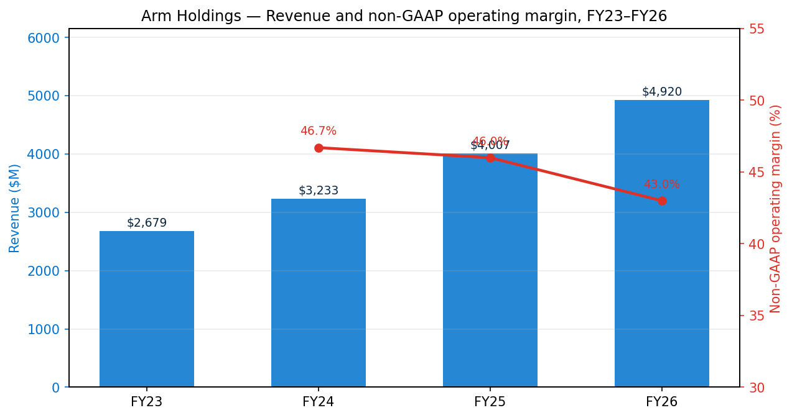
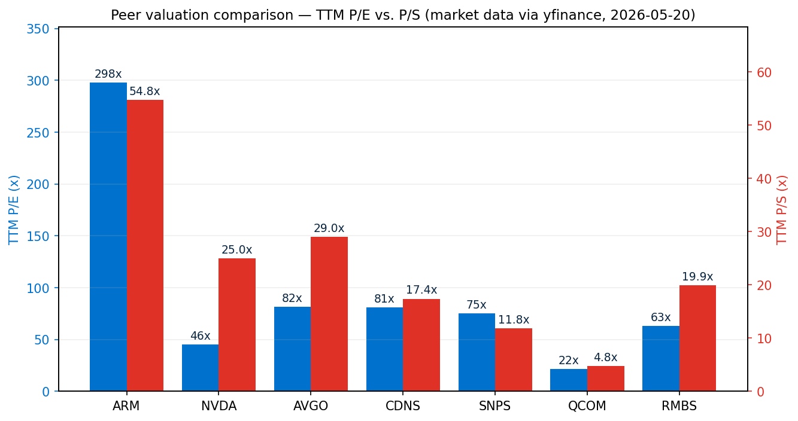
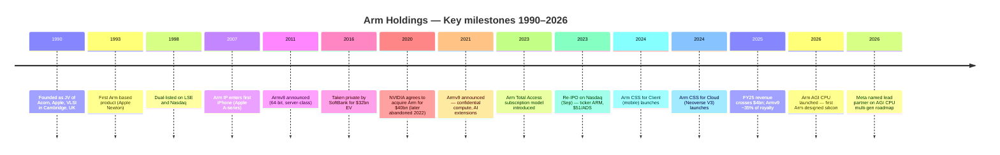
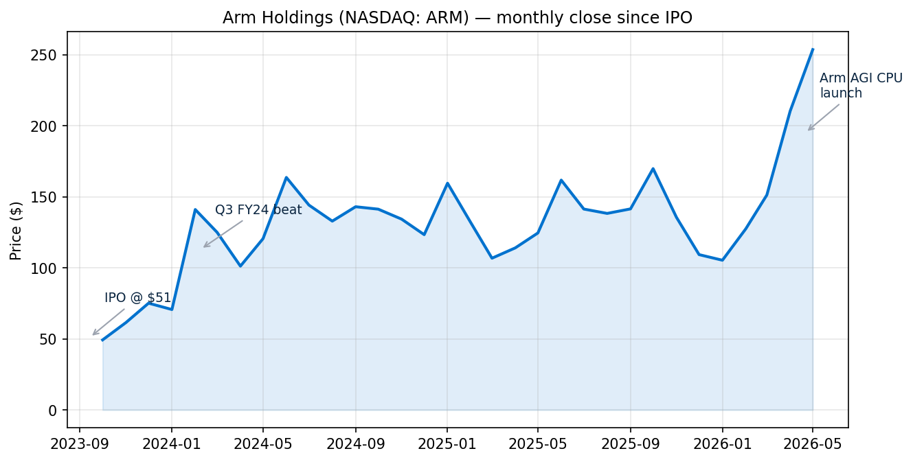
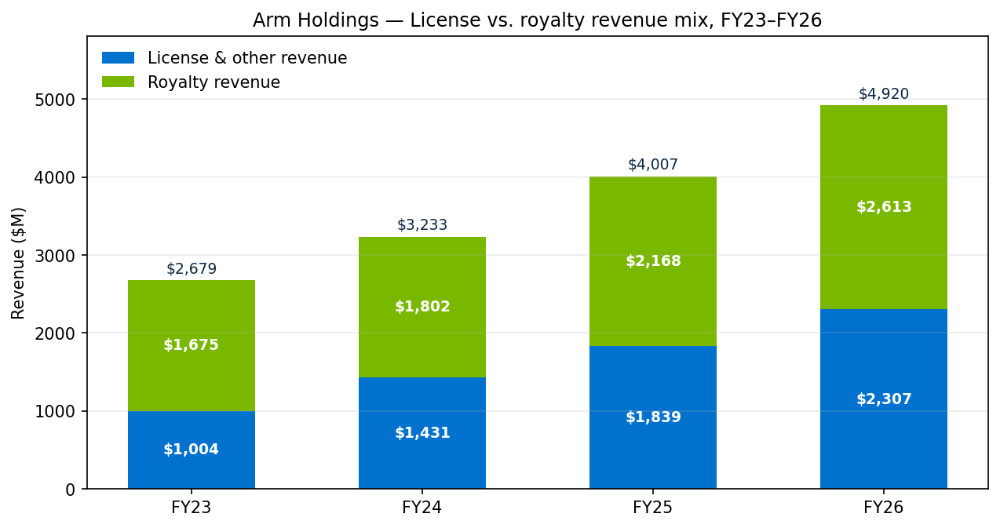
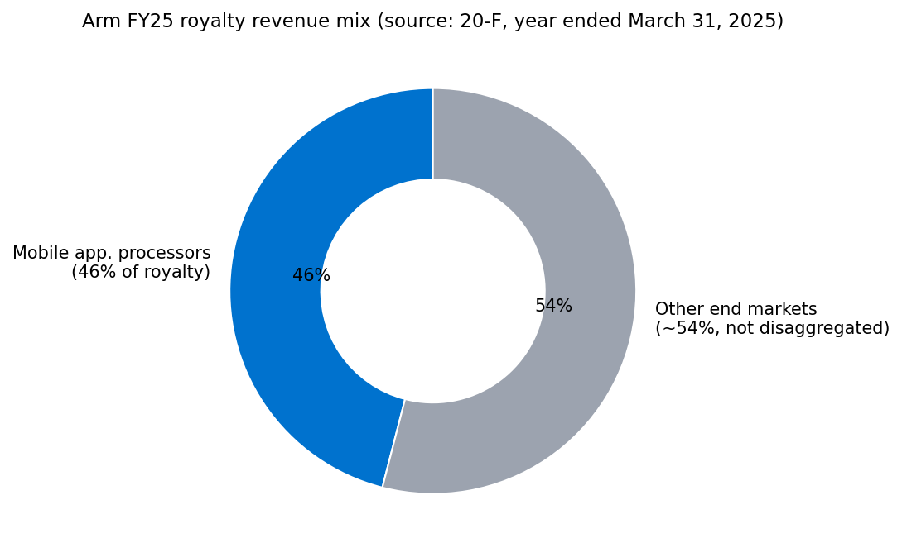
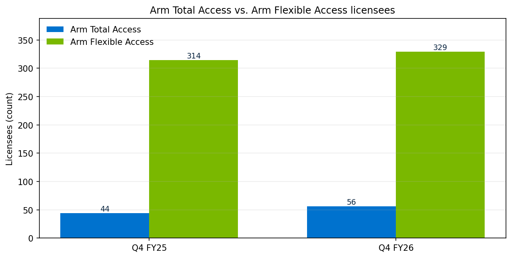
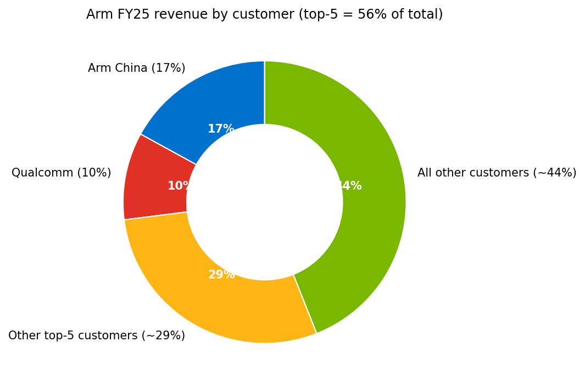

# COMPANY RESEARCH REPORT: Arm Holdings plc (NASDAQ: ARM)
Date: 2026-05-20
Domicile: United Kingdom (Cambridge, England) — SEC foreign private issuer (20-F filer)
Controlling shareholder: SoftBank Group Corp. (≈87% of issued shares)

> **Update — FY2026 results delivered, Q1 FY2027 guide initiated (2026-05-06):**
> Arm reported record Q4 FY2026 revenue of $1.49 billion (+20% YoY), license revenue of $819M
> (+29% YoY), and royalty revenue of $671M (+11% YoY). Full-year FY2026 revenue reached
> $4.92 billion (+23% YoY) with non-GAAP EPS of $1.77 (+9% YoY). Q1 FY2027 guidance was
> initiated at revenue $1.21–$1.31 billion and non-GAAP EPS $0.36–$0.44. Management
> attributed the upside to broad-based licensing demand, Armv9/CSS royalty-rate uplift, and
> early commercial traction for the newly-launched **Arm AGI CPU** — Arm's first in-house
> data-center silicon — which now has more than $2 billion of customer demand booked across
> FY2027–FY2028 (Meta as lead partner) toward management's stated $15 billion business
> opportunity.
> Source: [Arm Q4 FYE26 shareholder letter, exhibit 99.2, 2026-05-06](https://www.sec.gov/Archives/edgar/data/1973239/000197323926000062/exhibit992fye26q431-marx26.htm).

## TABLE OF CONTENTS
1. Company Overview
2. Company History
3. Management Team
4. Products & Services
5. Customers & Go-to-Market
6. Industry Overview
7. Competitive Landscape
8. Market Opportunity (TAM)
9. Risk Assessment

---

## 1. COMPANY OVERVIEW

Arm Holdings plc designs and licenses the central processor (CPU) architecture and instruction set that powers the great majority of the world's compute devices. The company does not manufacture silicon for resale; instead, it develops CPU intellectual property ("IP") cores, complementary GPU and NPU accelerators, system IP, and pre-integrated "Compute Subsystems" (CSS), then licenses that IP to semiconductor companies and OEMs that incorporate it into their own system-on-chip ("SoC") designs. Each chip shipped by a licensee carries a per-unit royalty payable to Arm — typically a percentage of the chip's ASP or a fixed fee per unit, escalating with the number of Arm IP blocks included ([Arm 20-F FY25, Item 4.B Business Overview](https://www.sec.gov/Archives/edgar/data/1973239/000197323925000016/arm-20250331.htm)). The IPO prospectus described the model succinctly: "we receive a per-unit royalty on substantially all chips shipped" using Arm IP ([Arm F-1, 2023-08-21](https://www.sec.gov/Archives/edgar/data/1973239/000119312523216983/d393891df1.htm)).

This dual-source revenue model — upfront license fees plus a multi-decade royalty tail — yields exceptional gross margins (97.5% GAAP, 98.2% non-GAAP in FY2026) and very high incremental returns on each incremental R&D dollar, because the underlying CPU designs are licensed many times to many customers. Approximately 7.9 billion Arm-based chips were reported as shipped in the three months ended March 31, 2025 alone, bringing cumulative Arm-based chip shipments to more than 310 billion at the end of FY2025 and, per management commentary on the Q4 FYE26 call, over 350 billion at the end of FY2026 ([Arm Q4 FYE26 shareholder letter](https://www.sec.gov/Archives/edgar/data/1973239/000197323926000062/exhibit992fye26q431-marx26.htm); [Arm 20-F FY25, p. 56](https://www.sec.gov/Archives/edgar/data/1973239/000197323925000016/arm-20250331.htm)).

**How big is Arm?** In FY2026 (year ended March 31, 2026), Arm posted record revenue of $4,920 million (+23% YoY), royalty revenue of $2,613 million (+21%) and license/other revenue of $2,307 million (+25%), with GAAP operating income of $900 million and non-GAAP operating income of $2,115 million. Free cash flow was $882 million (vs. $99 million in FY25, helped by working-capital normalization and timing of tax payments), and the company ended the year with $3,601 million of cash and short-term investments and no long-term debt ([Arm Q4 FYE26 shareholder letter](https://www.sec.gov/Archives/edgar/data/1973239/000197323926000062/exhibit992fye26q431-marx26.htm)). Headcount stood at 9,584 employees, of whom 8,058 (84%) are engineers — Arm describes itself as "an engineering-first company, with approximately 83% of our global employees focused on research, design, and technical innovation" ([Arm 20-F FY25, p. 62](https://www.sec.gov/Archives/edgar/data/1973239/000197323925000016/arm-20250331.htm)).

**Geographic footprint.** Arm operates research and engineering centers in the U.K., Europe, North America, India, and Asia-Pacific; in FY2025 approximately 57% of revenue was attributable to customers outside the United States, with the People's Republic of China sourced exclusively through Arm Technology (China) Co. Ltd. ("Arm China") under a long-term IP licensing arrangement (the "IPLA") that runs through April 23, 2048 ([Arm 20-F FY25, "The IPLA with Arm China"](https://www.sec.gov/Archives/edgar/data/1973239/000197323925000016/arm-20250331.htm)).


Source: Arm Q4 FYE26 shareholder letter (FY26 totals); [Arm 20-F FY25, Item 5.A](https://www.sec.gov/Archives/edgar/data/1973239/000197323925000016/arm-20250331.htm) (FY23–FY25 totals); Q4 FY24 / Q4 FY25 earnings releases for non-GAAP operating margin.

### 1.1 Valuation snapshot (data as of 2026-05-20)

| Metric | Arm | NVDA | AVGO | CDNS | SNPS | QCOM | RMBS | Notes |
|---|---|---|---|---|---|---|---|---|
| Last price | $253.32 | $222.83 | $418.71 | $348.11 | $491.32 | $202.76 | $132.45 | Yahoo / yfinance |
| Market cap | $269.5 bn | $5.40 tn | $1.98 tn | $96.0 bn | $94.1 bn | $213.7 bn | $14.3 bn | |
| TTM P/E | **298×** | 45× | 81× | 81× | 75× | 22× | 63× | TTM as reported |
| Forward P/E | 83× | 19× | 23× | 37× | 29× | 19× | 36× | Consensus |
| TTM P/S | **54.8×** | 25.0× | 29.0× | 17.4× | 11.8× | 4.8× | 19.9× | |
| EV / EBITDA | 204× | 40× | 54× | 47× | 64× | 16× | 41× | |

Source: Yahoo Finance / yfinance, pulled 2026-05-20 for all symbols (e.g. [Arm key statistics, Yahoo Finance](https://finance.yahoo.com/quote/ARM/key-statistics/), [NVDA](https://finance.yahoo.com/quote/NVDA/key-statistics/), [AVGO](https://finance.yahoo.com/quote/AVGO/key-statistics/)). Multiples rounded to nearest whole percent.


Source: yfinance, accessed 2026-05-20.

**Interpreting Arm's multiples.** Both the 298× TTM P/E and 54.8× TTM P/S are extreme on absolute and relative bases — roughly 2× the next-richest semiconductor peer on P/S (AVGO at 29.0×) and roughly 4× the IP-software peer group (CDNS / SNPS at 12–17× P/S) ([Yahoo Finance key statistics — ARM](https://finance.yahoo.com/quote/ARM/key-statistics/); [AVGO](https://finance.yahoo.com/quote/AVGO/key-statistics/); [CDNS](https://finance.yahoo.com/quote/CDNS/key-statistics/); [SNPS](https://finance.yahoo.com/quote/SNPS/key-statistics/)). Drivers:

1. **Genuine secular growth in per-chip royalty economics.** Armv9 royalty rates are typically about 2× Armv8 rates ([Arm F-1, 2023-08-21](https://www.sec.gov/Archives/edgar/data/1973239/000119312523216983/d393891df1.htm)); Armv9 reached roughly 30–35% of total royalty by end-FY25 and continues to mix higher. CSS-based royalties carry yet another step-up.
2. **Earnings depressed by a deliberate R&D ramp.** Non-GAAP R&D grew 43% YoY in FY26 to $1.91 bn for the AGI CPU silicon build-out; headcount grew 15% to 9,584 ([Arm Q4 FYE26 shareholder letter](https://www.sec.gov/Archives/edgar/data/1973239/000197323926000062/exhibit992fye26q431-marx26.htm)). Non-GAAP operating margin stepped from 46.7% (FY24) to 43.0% (FY26), even as gross margin held at 98%.
3. **Heavy AI / data-center narrative premium.** Arm offers essentially a pure-play, pick-and-shovel exposure to *all* AI inference compute — every NVIDIA Grace / Vera, Amazon Graviton, Google Axion, and Microsoft Cobalt pays Arm a royalty. The AGI CPU + Meta partnership now adds a direct-silicon vector worth $15 bn per management.
4. **Small free float and SoftBank overhang.** SoftBank owns ≈87%; free float is only ≈138 M shares per yfinance, amplifying the headline multiple.

Forward P/E at 83× is much more digestible than trailing 298× — consensus expects meaningful earnings expansion. Even so, Arm trades at a substantial premium to even the most aggressively-valued AI peers (AVGO forward 23×, NVDA forward 19× per [Yahoo Finance key statistics — NVDA](https://finance.yahoo.com/quote/NVDA/key-statistics/) / [AVGO](https://finance.yahoo.com/quote/AVGO/key-statistics/)); we treat this as a **valuation / multiple-compression risk** in Section 9.

Closest analogue peers: **Rambus (RMBS)** is the only other pure-IP public licensor (63× TTM P/E, 19.9× P/S; memory-IP focus — see [RMBS key statistics](https://finance.yahoo.com/quote/RMBS/key-statistics/)); **Cadence (CDNS) / Synopsys (SNPS)** share the recurring-license / very-high-gross-margin model (75–80× P/E, 12–17× P/S per [CDNS](https://finance.yahoo.com/quote/CDNS/key-statistics/) / [SNPS](https://finance.yahoo.com/quote/SNPS/key-statistics/)); **Qualcomm QTL** would be the closest direct comp but is not separately listed (consolidated QCOM at 22× P/E, 4.8× P/S — see [QCOM key statistics](https://finance.yahoo.com/quote/QCOM/key-statistics/)); **NVIDIA / Broadcom** sit closest on the AI narrative (45–81× P/E).

The peer-set median TTM P/E excluding Arm is roughly 60–80× and median P/S is roughly 17× (peer multiples sourced from the Yahoo Finance key-statistics pages cited above). Arm trades at roughly **3–4× the sector median on both P/E and P/S**. Together with the heavy R&D ramp and the AGI CPU revenue still on the come, that is the central asymmetry of the stock: the multiple presumes execution of the AGI CPU plan and continued Armv9 royalty-rate uplift; failure on either lever would force a material de-rate ([Arm Q4 FYE26 shareholder letter, 2026-05-06](https://www.sec.gov/Archives/edgar/data/1973239/000197323926000062/exhibit992fye26q431-marx26.htm)).

---

## 2. COMPANY HISTORY

Arm was founded in November 1990 in Cambridge, England as a joint venture between Acorn Computers, Apple Computer, and VLSI Technology, with the explicit mission of developing a CPU that would be high-performance, power-efficient, easy to program, and readily scalable ([Arm 20-F FY25, "History"](https://www.sec.gov/Archives/edgar/data/1973239/000197323925000016/arm-20250331.htm)). The original product had to win in Apple's Newton hand-held device, which forced the team to design for sub-1-watt operation — an architectural priority that has defined every subsequent generation of Arm CPUs and that remains the company's structural advantage in mobile, automotive, and AI inference.

Arm listed jointly on the London Stock Exchange and Nasdaq in 1998 and remained public for 18 years. In September 2016, SoftBank Group Corp. took Arm private at an enterprise value of $32 billion. SoftBank then attempted to sell Arm to NVIDIA at an announced consideration of up to $40 billion in September 2020; the proposed transaction was abandoned in February 2022 after the U.S. FTC, U.K. CMA, and EU Commission each opened in-depth competition reviews ([Arm F-1, 2023-08-21](https://www.sec.gov/Archives/edgar/data/1973239/000119312523216983/d393891df1.htm), Background of the Offering). SoftBank then re-IPO'd Arm on Nasdaq on September 14, 2023 at $51 per ADS, raising approximately $4.9 billion entirely for selling shareholders (SoftBank); Arm itself received no proceeds ([Arm 20-F FY25, p. 56](https://www.sec.gov/Archives/edgar/data/1973239/000197323925000016/arm-20250331.htm)).



**Strategic pivots and transformations.** Three transitions stand out:

1. **From pure-IP licensor to subscription IP business.** Beginning in 2019 with Arm Flexible Access and from 2021–2023 with Arm Total Access, Arm introduced annual portfolio subscription pricing that grants access to the full roadmap up-front and unlocks Armv9 / CSS without renegotiation. At Q4 FY26, Arm had 56 Total Access licensees (incl. more than half of its top 30 customers) and 329 Flexible Access licensees ([Arm Q4 FYE26 shareholder letter](https://www.sec.gov/Archives/edgar/data/1973239/000197323926000062/exhibit992fye26q431-marx26.htm)). The subscription mix is the principal driver of ACV, which grew 22% YoY to $1.66 bn at end-FY26.

2. **From CPU-IP only to Compute Subsystems (CSS) and now silicon.** From 2022 onward Arm increasingly delivered pre-integrated, pre-verified CSS designs (CPU clusters + interconnect + memory subsystem + I/O) that command a meaningfully higher royalty per chip than discrete IP and back most new cloud / hyperscaler designs (Graviton, Cobalt, Axion, Grace). In April 2026 Arm took the next step and launched the **Arm AGI CPU** — its own production silicon for agentic AI, with Meta as lead partner. Per Q4 FY26 commentary, AGI CPU has over $2 bn of demand booked across FY27–FY28 against a stated $15 bn business opportunity ([Arm expands compute platform to silicon products in historic company first, Arm Newsroom, 2026-03-24](https://newsroom.arm.com/news/arm-agi-cpu-launch); [Arm Q4 FYE26 shareholder letter, 2026-05-06](https://www.sec.gov/Archives/edgar/data/1973239/000197323926000062/exhibit992fye26q431-marx26.htm)).

3. **Partial resolution of the Qualcomm / Nuvia ALA dispute.** Arm sued Qualcomm and Nuvia in August 2022 over Nuvia's Architecture License Agreement, which Arm terminated in March 2022. A first trial ended in a partial-verdict outcome in December 2024 — jury found the relevant technology was licensed to Qualcomm under the Qualcomm ALA but failed to reach a verdict on whether Nuvia breached its ALA. A second Qualcomm action (filed April 2024, amended December 2024) is set for trial March 9, 2026 ([Arm 20-F FY25, "Litigation with Qualcomm and Nuvia"](https://www.sec.gov/Archives/edgar/data/1973239/000197323925000016/arm-20250331.htm)). Qualcomm = 10% of FY25 revenue — material business and legal risk.

**Key acquisitions.** Arm has historically been an organic builder rather than an acquirer. Recent IP-adjacent investments include the November 2023 minority-stake strategic investment in Raspberry Pi ahead of Pi's LSE IPO ([Raspberry Pi Receives Strategic Investment from Arm, Arm Newsroom, 2023-11-02](https://newsroom.arm.com/news/raspberry-pi-investment)). No transformative M&A has been disclosed in the 20-F.

**Recent developments (last 12 months).** Q4 FY26 record results and the Arm AGI CPU launch (Apr–May 2026) with Meta as multi-generation co-developer; design wins / deployments at Supermicro / Lenovo / Quanta / ASRock (commercial systems), Verda (European AI cloud), Cloudflare (global edge), and SAP (database / business apps on Graviton and AGI CPU) ([Arm Q4 FYE26 shareholder letter, 2026-05-06](https://www.sec.gov/Archives/edgar/data/1973239/000197323926000062/exhibit992fye26q431-marx26.htm)). The cumulative effect was a 78% rally in ARM ADSs from $135 at the end of November 2025 to $253 by May 1, 2026 ([yfinance monthly close history](https://finance.yahoo.com/quote/ARM/history/)).


Source: Yahoo Finance / yfinance, monthly close, retrieved 2026-05-20.

---

## 3. MANAGEMENT TEAM

### Rene Haas — Chief Executive Officer & Director (age 62)

Rene Haas has been Arm's CEO since February 2022, the third CEO in Arm's history and the first since the SoftBank acquisition who is not a long-tenured Arm insider. Haas joined Arm in October 2013 as Vice President of Strategic Alliances and was appointed Chief Commercial Officer (head of global sales and marketing) two years later. From January 2017 until his elevation to CEO he served as President of Arm's IP Product Groups ("IPG") — the unit that encompasses Cortex CPUs, Mali / Immortalis GPUs, Ethos NPUs, and Neoverse — and he is credited with transforming IPG away from a pure CPU-design house toward "key solutions for vertical markets with a more diversified product portfolio and increased investment in our software ecosystem" ([Arm 20-F FY25, "Senior Management"](https://www.sec.gov/Archives/edgar/data/1973239/000197323925000016/arm-20250331.htm)).

Prior to Arm, Haas spent seven years (2006–2013) at NVIDIA as Vice President and General Manager of the company's computing products business — the platform group that built Tegra (Arm-based mobile and automotive SoCs) and that ultimately seeded NVIDIA's data-center Arm strategy (Grace, Vera) ([Rene Haas, Wikipedia](https://en.wikipedia.org/wiki/Rene_Haas)). Before NVIDIA he held executive roles at chip-IP companies Tensilica (which DSP-heavy Cadence later acquired in 2013) and Scintera Networks. He holds a B.S. in Electrical and Electronics Engineering from Clarkson University and is a graduate of Stanford GSB's Executive Education Program. Haas joined the boards of Arm China (December 2016) and SoftBank Group (June 2023) and, since January 2025, also sits on the board of AstraZeneca PLC ([Arm 20-F FY25, "Senior Management"](https://www.sec.gov/Archives/edgar/data/1973239/000197323925000016/arm-20250331.htm)).

Haas's stated strategic priorities since 2022 have been (i) Total Access subscription migration; (ii) CSS pre-integrated bundles; (iii) direct data-center silicon (the April 2026 AGI CPU launch with Meta — see [Arm AGI CPU launch, Arm Newsroom, 2026-03-24](https://newsroom.arm.com/news/arm-agi-cpu-launch)); (iv) a Kleidi AI software ecosystem optimizing PyTorch / TensorFlow / llama.cpp on Arm. FY25 total remuneration was $24.5 M ($1.35 M salary, $2.33 M bonus, $20.7 M equity), down from $70.1 M in FY24, which included a one-time $20 M special bonus and ~$46 M of IPO equity ([Arm 20-F FY25, "Single figure table — CEO"](https://www.sec.gov/Archives/edgar/data/1973239/000197323925000016/arm-20250331.htm)).

Haas has an unusually heavy public-interview cadence for a chip CEO (CNBC, Bloomberg, Acquired Podcast — see [How ARM Became The World's Default Chip Architecture, Acquired/ACQ2 with Rene Haas](https://www.acquired.fm/acq2-episodes/how-arm-became-the-worlds-default-chip-architecture-with-arm-ceo-rene-haas)) and his public persona is inseparable from Arm's "compute platform" positioning. The principal governance friction is his concurrent SoftBank Group and Arm China board seats, which Arm itself flags as related-party-transaction risk in its risk factors ([Arm 20-F FY25, "Risks Relating to SoftBank Group"](https://www.sec.gov/Archives/edgar/data/1973239/000197323925000016/arm-20250331.htm)).

### Jason Child — Executive Vice President & Chief Financial Officer (age 56)

Jason Child has been Arm's CFO since November 2022, having been recruited from Splunk, where he was Senior Vice President and CFO from 2015 to 2022. Child's career spans 30 years across global finance, accounting, capital markets and IR ([Arm 20-F FY25, "Senior Management"](https://www.sec.gov/Archives/edgar/data/1973239/000197323925000016/arm-20250331.htm)). Before Splunk he was CFO of Groupon (where he led the 2011 IPO), CFO of Opendoor Technologies, CFO of consumer-electronics maker Jawbone, and spent more than 11 years at Amazon, most recently as CFO of Amazon International. He holds a B.A. from the Foster School of Business at the University of Washington and sits on the Coupang Inc. board.

The relevance of Child's profile to Arm is twofold. First, his Amazon and Splunk experience gives him a credible playbook for a software-style recurring-revenue P&L — Total Access ACV is now $1.66 bn growing 22% YoY, meaningfully closer to a SaaS metric than a chip-cycle metric ([Arm Q4 FYE26 shareholder letter](https://www.sec.gov/Archives/edgar/data/1973239/000197323926000062/exhibit992fye26q431-marx26.htm)). Second, Child arrived 10 months before the September 2023 re-IPO, which he managed alongside SoftBank, Goldman Sachs and Mizuho ([Arm Announces Pricing of Initial Public Offering, Arm Newsroom, 2023-09-13](https://newsroom.arm.com/news/arm-announces-pricing-of-initial-public-offering)). Since IPO Arm has consistently beaten the top end of guidance on every reported quarter.

### Richard Grisenthwaite — EVP & Chief Architect (age 57)

Grisenthwaite is the single most important non-CEO executive at Arm and arguably the most consequential technical voice in modern CPU design. He joined Arm in March 1997 and has led the architectural evolution of Arm CPUs for more than 20 years, beginning with Armv6 and personally leading Armv7, Armv8 (64-bit) and Armv9 development ([Arm 20-F FY25, "Senior Management"](https://www.sec.gov/Archives/edgar/data/1973239/000197323925000016/arm-20250331.htm)). He holds 120 patents in microprocessor design, is an Arm fellow, and sits on the U.K. government's Semiconductor Advisory Panel. Before Arm he worked at Analog Devices and Inmos/ST on the Transputer. He holds a B.A. in Electrical and Information Sciences from the University of Cambridge.

Grisenthwaite is the architect-of-record for Armv9, SVE2, confidential compute (Realm Management Extension), and the Memory Tagging Extension ([Richard Grisenthwaite — Arm Newsroom author page](https://newsroom.arm.com/author/richard-grisenthwaite)). Key-person risk on Grisenthwaite is the single highest unstated personnel risk on the Arm bench.

### Will Abbey — EVP & Chief Commercial Officer

Abbey has been Arm's CCO since April 2023 and is responsible for sales, field engineering, and partner enablement worldwide. He has been at Arm since 2004 in a series of roles, including SVP of Sales and Partner Enablement, GM of the Physical Design group, and VP of Commercial Operations for the Physical IP Division. Before Arm he held product-management roles at Celoxica, Infineon Technologies, and Loughborough Sound Images. He serves on the board of EnPro Industries and holds a BEng from Sheffield Hallam University ([Arm 20-F FY25, "Senior Management"](https://www.sec.gov/Archives/edgar/data/1973239/000197323925000016/arm-20250331.htm)). Abbey is the primary architect of the Total Access subscription motion that has driven license growth from $1.0 bn in FY23 to $2.3 bn in FY26.

Other senior executives in the FY25 20-F: **Spencer Collins** (CLO; ex-MP at SoftBank Investment Advisors / Vision Fund); **Charlotte Eaton** (CPO since Nov 2024; ex-OVO Energy, prior VP of People at Arm) ([Arm 20-F FY25, "Senior Management"](https://www.sec.gov/Archives/edgar/data/1973239/000197323925000016/arm-20250331.htm)).

### Governance

Arm operates under a Shareholder Governance Agreement with SoftBank Group that pre-allocates a meaningful share of board seats to SoftBank designees. SoftBank beneficially owns approximately 87.1% of Arm's issued ordinary shares (most held through a holding-company structure) and has the contractual right to designate up to seven of the (currently nine-person) board so long as it owns more than 70% of Arm's outstanding ordinary shares ([Arm 20-F FY25, "Risks Relating to SoftBank Group"](https://www.sec.gov/Archives/edgar/data/1973239/000197323925000016/arm-20250331.htm)). Chairman **Masayoshi Son** (founder/CEO of SoftBank Group) and Vice Chair-equivalent **Ronald D. Fisher** (senior advisor at SoftBank Investment Advisors) sit at the top of the slate. Additional non-executive directors include **Jeffrey A. Sine** (co-founder, The Raine Group; former Vice Chairman / Global Head of TMT IB at UBS), **Karen E. Dykstra** (ex-VMware and AOL CFO; current Gartner and Atlassian director), **Rosemary Schooler** (ex-Intel Corporate VP / GM Data Center & AI Sales), **Paul E. Jacobs** (CEO Globalstar, ex-CEO Qualcomm), and **Young Sohn** (ex-Samsung Electronics Corporate President / CSO; chairman of Samsung's semiconductor advisory board). Insider ownership is negligible relative to SoftBank's controlling stake — heldPercentInsiders is reported at just 0.04% on Yahoo Finance, with institutions holding 95.7% of the free float ([Arm key statistics](https://finance.yahoo.com/quote/ARM/key-statistics/)).

Arm qualifies as a "controlled company" under Nasdaq rules and is also a "foreign private issuer," meaning it is permitted to opt out of certain Nasdaq governance standards and is exempt from quarterly 10-Q reporting (it files 6-K narratives instead) ([Arm 20-F FY25, "Foreign Private Issuer" / "Controlled Company"](https://www.sec.gov/Archives/edgar/data/1973239/000197323925000016/arm-20250331.htm)). The board has independent audit and compensation committees, but governance flags are non-trivial: Haas serves on the SoftBank Group board; Chief Legal Officer Collins was previously a managing partner at SoftBank Investment Advisors; and the IPLA with Arm China (an entity SoftBank controls via Acetone Limited) is a continuing related-party arrangement that accounts for 17% of Arm's revenue ([Arm 20-F FY25, "The IPLA with Arm China"](https://www.sec.gov/Archives/edgar/data/1973239/000197323925000016/arm-20250331.htm)).

**Track-record synthesis.** Strong bench: credible CEO with NVIDIA pedigree, CFO with two prior IPO processes, and the original Armv8 / Armv9 architect still in place ([Arm 20-F FY25, "Senior Management"](https://www.sec.gov/Archives/edgar/data/1973239/000197323925000016/arm-20250331.htm)). The biggest governance gap is the heavy SoftBank entanglement (board, related-party transactions, share overhang). Operational delivery since IPO has been excellent — Arm has beaten the top end of guidance on every public-company quarter — but the team is now being asked to operate a silicon supply chain for the first time with AGI CPU ([Arm AGI CPU launch, Arm Newsroom, 2026-03-24](https://newsroom.arm.com/news/arm-agi-cpu-launch)), an execution profile materially different from anything Arm has done historically.

---

## 4. PRODUCTS & SERVICES

Arm's product portfolio falls into five tightly integrated families, all licensed to customers under one of five contract structures (CSS, Arm Total Access (ATA), Arm Flexible Access (AFA), Technology Licensing Agreements (TLA), and Architecture Licenses (ALAs)).

```mermaid
graph TD
    A[Arm compute platform] --> B[CPUs]
    A --> C[Accelerators]
    A --> D[System IP]
    A --> E[Compute Subsystems / CSS]
    A --> F[AGI CPU silicon]
    A --> G[Software & dev tools]

    B --> B1[Cortex-X9 / X925<br/>(flagship mobile)]
    B --> B2[Cortex-A720 / A725<br/>(mobile big.LITTLE)]
    B --> B3[Cortex-A520<br/>(mobile efficiency)]
    B --> B4[Cortex-M55 / M85<br/>(microcontroller + ML)]
    B --> B5[Cortex-R82<br/>(real-time, automotive)]
    B --> B6[Neoverse V3 / N3 / E3<br/>(data center)]
    B --> B7[ALA / custom cores<br/>(Apple, Qualcomm Nuvia)]

    C --> C1[Mali / Immortalis GPU]
    C --> C2[Ethos-U / Ethos-N NPU]
    C --> C3[Mali camera ISP]

    D --> D1[CMN-700 / CMN S3<br/>(interconnect)]
    D --> D2[Memory controllers]
    D --> D3[GIC / TZC<br/>(security)]

    E --> E1[CSS for Client]
    E --> E2[CSS for Cloud<br/>(Neoverse V3 CSS)]
    E --> E3[CSS for Automotive]
    E --> E4[CSS for IoT]

    F --> F1[Arm AGI CPU<br/>(Meta lead partner)]

    G --> G1[Kleidi AI libraries]
    G --> G2[KleidiAI for PyTorch / TensorFlow]
    G --> G3[Arm Development Studio]
    G --> G4[Arm Compiler]
```

### 4.1 CPUs

CPUs are the foundation of Arm's product line; royalty payable on every Arm-CPU-bearing chip dominates Arm's economic model. Arm's CPU portfolio is organized into three "Cortex" lines for the licensing market plus one "Neoverse" line for data-center / infrastructure, plus the custom Architecture License (ALA) channel through which sophisticated customers (Apple, Qualcomm, Ampere, etc.) design their own implementations of the Arm instruction set.

- **Cortex-A** — application processors, with the Cortex-X9 / X925 (announced 2024) serving as the current flagship "big" core (Cortex-X is Arm's highest-performance core for smartphones, PCs, and ChromeOS devices) and the A725 / A520 forming the "middle" and "LITTLE" cores in modern mobile big.LITTLE clusters. Cortex-A revenue captures the entire premium-smartphone applications-processor market, where Arm states it has "maintained market share … of greater than 99% for many years" ([Arm 20-F FY25, "Mobile Applications Processor"](https://www.sec.gov/Archives/edgar/data/1973239/000197323925000016/arm-20250331.htm)). Mobile applications processors generated approximately 46% of Arm's total royalty revenue in FY25 (the largest single category).

  **Moat verdict:** **Yes — extreme.** Switching costs are essentially infinite for Android OEMs: Android, the Linux kernel ecosystem, every JIT'd app, and every ML library has been compiled and optimized against AArch64 for over a decade. **Closest competing product:** none commercially viable in premium smartphones; Qualcomm's own custom Oryon cores and Apple's M / A series are licensed *from Arm* under ALAs ([Apple Signs New Deal With Arm to License Chip Designs Beyond 2040, CNBC, 2023-09-06](https://www.cnbc.com/2023/09/06/apple-and-arm-sign-deal-for-chip-technology-that-goes-beyond-2040.html); [Arm 20-F FY25, "Architecture Licenses"](https://www.sec.gov/Archives/edgar/data/1973239/000197323925000016/arm-20250331.htm)). RISC-V in mobile remains a research effort.

- **Cortex-M** — Cortex-M55, M85, and the latest M85 / Helium-equipped cores serve the microcontroller and "edge AI" markets, where Arm again claims dominant share ([Arm 20-F FY25, "Microcontroller"](https://www.sec.gov/Archives/edgar/data/1973239/000197323925000016/arm-20250331.htm)). The M-series is where the long-tail of "tens of billions" of Arm-based sensor / industrial / IoT chips lives.

  **Moat verdict:** **Yes, but eroding modestly.** RISC-V has its largest competitive impact in low-end MCUs, where the ISA royalty is small in absolute dollars and the ecosystem cost of switching is lowest ([Tenstorrent Unveils TT-Ascalon: A High-Performance RISC-V CPU, pbxscience, 2025](https://pbxscience.com/tenstorrent-unveils-tt-ascalon-a-high-performance-risc-v-cpu-challenging-the-market/)). SiFive, Andes, and Codasip are credible RISC-V alternatives ([SiFive Performance P870-D announcement, SiFive press, 2024](https://www.sifive.com/press/sifive-announces-high-performance-risc-v-datacenter-processor-for-ai-workloads)). Arm's response is to bundle Cortex-M with Ethos-U NPUs and to push into the "AI-capable MCU" sub-segment where its software toolchain advantage matters more.

- **Cortex-R** — real-time cores (Cortex-R82 and below) for storage controllers, automotive functional safety, and modems. Smaller revenue contribution but high-margin and very sticky ([Arm 20-F FY25, "Cortex-R" product family](https://www.sec.gov/Archives/edgar/data/1973239/000197323925000016/arm-20250331.htm)).

- **Neoverse V / N / E** — the data-center / infrastructure CPU family. The Neoverse V3 (announced February 2024) is the highest-performance data-center core Arm ships; Neoverse N3 targets cloud throughput; Neoverse E1/E3 targets edge networking. Neoverse cores are inside every major hyperscaler custom CPU — AWS Graviton 3/4 (V1/V2), Microsoft Cobalt 100 (N3 CSS), Google Axion (N2-based), NVIDIA Grace (V2-based) and the announced NVIDIA Vera, and Ampere AmpereOne ([Arm Q4 FYE26 shareholder letter](https://www.sec.gov/Archives/edgar/data/1973239/000197323926000062/exhibit992fye26q431-marx26.htm)). Per management on the Q4 FY26 call, Arm has "about 50% share among top hyperscalers" of CPU compute and "the data center will be Arm's largest business" by the late 2020s.

  **Moat verdict:** **Yes — and widening.** Neoverse's competitive set is x86 (Intel Xeon, AMD EPYC) and RISC-V (Tenstorrent Ascalon, Ventana Veyron — both still pre-volume). The economic case for Neoverse — 40% better price/performance vs. x86 per AWS, and 50% better perf/watt per Google Axion — is now demonstrated and compounding ([Arm Q4 FYE26 shareholder letter](https://www.sec.gov/Archives/edgar/data/1973239/000197323926000062/exhibit992fye26q431-marx26.htm)).

### 4.2 Accelerators

Mali (now branded "Immortalis" for ray-tracing-capable variants) is Arm's GPU IP, used in mid-range to flagship Android phones and in many TVs / set-top boxes. Mali is not used in iPhone or in Qualcomm Adreno-equipped Snapdragon flagships; the addressable share of premium Android is consequently smaller than Cortex-A ([Arm 20-F FY25, "GPU and Accelerator Products"](https://www.sec.gov/Archives/edgar/data/1973239/000197323925000016/arm-20250331.htm)).

Ethos-U (microNPU for Cortex-M) and Ethos-N (NPU for Cortex-A) are Arm's neural processing accelerator IPs. They sit in the same SoC as a Cortex CPU and offload ML inference at lower energy ([Arm 20-F FY25, "Ethos NPUs"](https://www.sec.gov/Archives/edgar/data/1973239/000197323925000016/arm-20250331.htm)). Adoption is wide but not flagship-defining; most premium smartphone SoCs use a vendor-specific NPU rather than Ethos-N.

**Moat verdict:** **Partial.** Mali is the highest-volume GPU IP shipping, but it is *not* the highest-performance — Qualcomm Adreno (built in-house) and Apple's GPU consistently lead benchmarks ([Arm unveils Cortex-X925/A725, Immortalis-G925, CNX Software, 2024-05-30](https://www.cnx-software.com/2024/05/30/arm-cortex-x925-cortex-a725-cpus-immortalis-g925-gpu-kleidi-ai-software/)). Ethos competes against vendor in-house NPUs. We treat accelerators as a bundling enabler for Arm CPUs rather than as a stand-alone moat.

### 4.3 System IP

CoreLink CMN-700 / CMN S3 mesh interconnects, MMU-700 memory management units, CCI cache coherent interconnects, GIC interrupt controllers, TZC TrustZone controllers, and various memory controllers (DMC) form the "system IP" that customers buy alongside Cortex / Neoverse cores ([Arm 20-F FY25, "System IP"](https://www.sec.gov/Archives/edgar/data/1973239/000197323925000016/arm-20250331.htm)). System IP is increasingly important because as CPU core counts rise (>100 cores per server), interconnect dominates chip-level performance. CMN-700 supports up to 256 cores; CMN S3 announced 2024 extends that to 512.

### 4.4 Compute Subsystems (CSS)

CSS is Arm's most strategically important product introduction of the last five years. A CSS is a hardened, pre-verified configuration of Cortex / Neoverse CPUs + system IP + interconnect, delivered as either RTL or GDSII (final physical layout). CSS for Client targets mobile/PC (built around Cortex-X / A); CSS for Cloud (Neoverse V3 CSS) targets hyperscaler custom server chips; CSS for Automotive is an ASIL-D-certified design for software-defined vehicles; CSS for IoT targets industrial ([Arm 20-F FY25, "Compute Subsystems"](https://www.sec.gov/Archives/edgar/data/1973239/000197323925000016/arm-20250331.htm)). CSS reduces customer R&D headcount and time-to-market by ≈12–18 months at the cost of a higher royalty per chip and an up-front access fee.

Per management commentary on the May 2026 earnings call, CSS-based royalties are growing meaningfully faster than the rest of the royalty book and now represent a "double-digit" percent of total royalty ([Arm Q4 FYE26 shareholder letter](https://www.sec.gov/Archives/edgar/data/1973239/000197323926000062/exhibit992fye26q431-marx26.htm)). Microsoft Cobalt 200 is the first publicly announced silicon built on Neoverse V3 CSS; Cobalt 100 launched on Neoverse N3 CSS earlier, and Google Axion's next generation will use Neoverse CSS ([Announcing Cobalt 200: Azure's next cloud-native CPU, Microsoft Tech Community](https://techcommunity.microsoft.com/blog/azureinfrastructureblog/announcing-cobalt-200-azure%E2%80%99s-next-cloud-native-cpu/4469807); [Powering Microsoft's Azure Cobalt 200 with Arm Neoverse CSS V3, Arm Newsroom](https://newsroom.arm.com/blog/microsoft-azure-cobalt-200-arm-neoverse-css-v3)). The competitive significance is that CSS captures economic value that would otherwise go to in-house design teams and increases Arm's per-chip royalty step by step.

**Moat verdict:** **Yes — strong and reinforcing.** CSS is a value-chain extension that Arm can execute *because* it owns the underlying IP. Competitors would have to license Arm CPUs to compete with Arm CSS, which is structurally not possible. The RISC-V analogue — SiFive's Performance and Intelligence pre-configured cores — is a real but distant competitor ([SiFive Performance P870-D press release, 2024](https://www.sifive.com/press/sifive-announces-high-performance-risc-v-datacenter-processor-for-ai-workloads)).

### 4.5 Arm AGI CPU (silicon)

Launched at "Arm Everywhere" in late Q3/early Q4 FY26 and discussed in detail on the May 6, 2026 earnings call, the Arm AGI CPU is Arm's first in-house production silicon — a meaningful change in business model. Per management, AGI CPU delivers "more than 2× performance per rack compared with x86-based platforms" and is positioned for "agentic AI" data-center workloads in which CPUs are required for orchestration, data movement, memory management, and security alongside GPUs / accelerators. **Meta is the lead partner and co-developer** under a multi-generation roadmap aimed at "personal superintelligence for more than 3 billion users" ([Arm Q4 FYE26 shareholder letter](https://www.sec.gov/Archives/edgar/data/1973239/000197323926000062/exhibit992fye26q431-marx26.htm)). Other named design wins / supporters include AWS, Broadcom, Google Cloud, Marvell, Microsoft, Micron, NVIDIA, Oracle, Samsung, SK Hynix, TSMC, F5, SK Telecom, Cloudflare, SAP, Cerebras, OpenAI, Positron, Rebellions, and Verda. Commercial systems are now available to order from Supermicro, Lenovo, Quanta, and ASRock.

The economics are very different from Arm's historical model — Arm now bears some of the silicon manufacturing risk and the capital cycle of tape-out — but the unit economics per chip are substantially higher than per-chip royalty. Per management, AGI CPU has more than $2 billion of customer demand booked across FY27 and FY28 (more than 2× the original launch number) against a stated $15 billion business opportunity ([Arm Q4 FYE26 shareholder letter](https://www.sec.gov/Archives/edgar/data/1973239/000197323926000062/exhibit992fye26q431-marx26.htm); [Arm's $15 Billion CPU Opportunity Hinges on Agentic Data Center Design, Futurum, 2026](https://futurumgroup.com/insights/arms-15-billion-cpu-opportunity-hinges-on-agentic-data-center-design/)).

**Moat verdict:** **Partial / TBD.** The AGI CPU competes head-on with NVIDIA Vera, AMD Bergamo/Turin Dense, Intel Sierra Forest / Granite Rapids-D, AWS Graviton, Microsoft Cobalt, and Google Axion — all of which use Arm IP themselves (except Intel / AMD x86) ([Arm Q4 FYE26 shareholder letter](https://www.sec.gov/Archives/edgar/data/1973239/000197323926000062/exhibit992fye26q431-marx26.htm)). Arm's edge is the ability to ship a fully-tuned reference design with the latest Neoverse generation immediately, plus the Kleidi software stack pre-tuned for it. The risk is that Arm's licensee-customers (hyperscalers building their own Arm silicon) view AGI CPU as competition, not partnership; the Meta endorsement is a deliberate move to neutralize that perception by anchoring Arm in a hyperscaler that is *not* one of its existing custom-silicon licensees ([Arm AGI CPU launch / Meta partnership announcement, Arm Newsroom, 2026-03-24](https://newsroom.arm.com/news/arm-agi-cpu-launch)).

### 4.6 Flagship vs. long-tail

Approximately **53% of FY26 revenue ($2.61 bn of $4.92 bn) is royalty**, of which roughly half is mobile applications processors (~46% of royalty in FY25 per the 20-F, broadly similar in FY26 per management). The remaining royalty is split across IoT/embedded, automotive, consumer electronics, networking, and data-center, with data-center now the fastest-growing slice ("data center royalty more than doubled year-over-year" in Q4 FY26 per the shareholder letter). The remaining **47% is license + other revenue ($2.31 bn)**, driven primarily by Total Access subscriptions, custom CSS engagements, and architecture licenses (notably the Nuvia ALA dispute with Qualcomm).


Source: [Arm 20-F FY25, Note 4 — Revenue](https://www.sec.gov/Archives/edgar/data/1973239/000197323925000016/arm-20250331.htm) and [Arm Q4 FYE26 shareholder letter](https://www.sec.gov/Archives/edgar/data/1973239/000197323926000062/exhibit992fye26q431-marx26.htm).


Source: [Arm 20-F FY25, "Mobile Applications Processor"](https://www.sec.gov/Archives/edgar/data/1973239/000197323925000016/arm-20250331.htm) (note: 46% mobile-AP share of royalty is the only disaggregated end-market figure disclosed for FY25; the remaining 54% is not separately broken out).


Source: [Arm Q4 FYE26 shareholder letter, 2026-05-06](https://www.sec.gov/Archives/edgar/data/1973239/000197323926000062/exhibit992fye26q431-marx26.htm).

### 4.7 Recent launches and roadmap

- **April 2026:** Arm AGI CPU launched with Meta as lead partner ([Arm AGI CPU launch, Arm Newsroom, 2026-03-24](https://newsroom.arm.com/news/arm-agi-cpu-launch)).
- **March 2026 (Arm Everywhere event):** AGI CPU platform and AI software stack roadmap unveiled ([Arm Form 6-K — Arm Everywhere materials, 2026-03-24](https://www.sec.gov/Archives/edgar/data/1973239/000197323926000050/arm-20260324.htm)).
- **2024–2025:** Cortex-X925 / A725 / A520 (mobile), CMN S3 (interconnect), Neoverse V3 + V3 CSS (data center), Mali-G925 Immortalis GPU ([Arm unveils Cortex-X925, Cortex-A725, Immortalis-G925, WikiChip Fuse, 2024](https://fuse.wikichip.org/news/7793/arm-unveils-2024-compute-platform-3nm-cortex-x925-cortex-a725-immortalis-g925/)).
- **2024:** CSS for Client launched; first design wins at MediaTek and others ([Arm 20-F FY25, "CSS for Client"](https://www.sec.gov/Archives/edgar/data/1973239/000197323925000016/arm-20250331.htm)).
- **Software:** Kleidi AI libraries for PyTorch, TensorFlow, ExecuTorch, and llama.cpp — Arm's response to NVIDIA's CUDA-style ecosystem lock-in for AI inference ([Arm unveils Cortex-X925/A725 + Kleidi AI software, CNX Software, 2024-05-30](https://www.cnx-software.com/2024/05/30/arm-cortex-x925-cortex-a725-cpus-immortalis-g925-gpu-kleidi-ai-software/)).

No major product sunset announced. The Cortex-A78 / X1 / Neoverse N1 generations remain in long-tail royalty harvest mode ([Arm 20-F FY25, "Product portfolio"](https://www.sec.gov/Archives/edgar/data/1973239/000197323925000016/arm-20250331.htm)).

---

## 5. CUSTOMERS & GO-TO-MARKET

Arm's customers are semiconductor companies, OEMs, and an increasing number of hyperscaler cloud providers. The license model is one of the most concentrated revenue books in semiconductors.

### 5.1 Customer concentration — high and structurally unavoidable

Arm's FY25 20-F discloses that "our top five customers (including Arm China) collectively accounted for approximately **56%, 54% and 57% of our total revenue** for the fiscal years ended March 31, 2025, 2024 and 2023, respectively, and our largest customer individually, **Arm China, accounted for approximately 17%, 21% and 24%** of our total revenue, respectively, during those fiscal years" ([Arm 20-F FY25, "Customer Concentration" risk factor](https://www.sec.gov/Archives/edgar/data/1973239/000197323925000016/arm-20250331.htm)).

**Qualcomm** is explicitly named as a 10%-of-revenue customer in FY25: "Qualcomm…which is currently a major customer of ours and accounted for 10% of our total revenue for the fiscal year ended March 31, 2025" ([Arm 20-F FY25, "Litigation with Qualcomm and Nuvia"](https://www.sec.gov/Archives/edgar/data/1973239/000197323925000016/arm-20250331.htm)). The 20-F does not separately identify the remaining top-5 customers, but a reasonable inference from public design wins and ALA filings is that they include some combination of **Apple, MediaTek, Samsung Electronics, and one of the U.S. hyperscalers** (AWS, Microsoft, Google). Apple's design uses an Architecture License (ALA), which produces both license fees and per-chip royalties on every iPhone, iPad, Mac, Vision Pro, Apple Watch, and AirPods unit shipped — and was extended through at least 2040 in September 2023 ([Apple Signs New Deal With Arm to License Chip Designs Beyond 2040, CNBC, 2023-09-06](https://www.cnbc.com/2023/09/06/apple-and-arm-sign-deal-for-chip-technology-that-goes-beyond-2040.html)); MediaTek is the second-largest premium-mobile applications-processor vendor after Qualcomm and a heavy Cortex-X / A licensee.


Source: [Arm 20-F FY25, "Risks Relating to Our Business and Industry"](https://www.sec.gov/Archives/edgar/data/1973239/000197323925000016/arm-20250331.htm).

**Arm China is unique and warrants special treatment.** Arm China is not a subsidiary of Arm: SoftBank Group, via its controlled entity Acetone Limited, owns approximately 48% of Arm China; HOPU Investment Management owns ≈35%; and other PRC parties own ≈17% ([Arm 20-F FY25, "The IPLA with Arm China"](https://www.sec.gov/Archives/edgar/data/1973239/000197323925000016/arm-20250331.htm)). Arm itself holds a 10% non-voting interest in Acetone — an indirect 4.8% economic interest in Arm China. Under the IPLA (initial term through April 23, 2048), Arm China is the **exclusive distributor of Arm IP to PRC customers**, including listed Chinese companies, PRC-domiciled entities, and entities under ultimate PRC-citizen control. Arm China is contractually obligated to use Arm's model licensing terms, but Arm has no direct management rights, no operational control, and no role in Arm China's pricing decisions to its PRC sub-licensees.

The structure is unusual in scale: a single entity that Arm does not control, but that funds 17% of revenue and is also a counterparty to its own customers, sitting at the geopolitical intersection of U.S. export controls and PRC industrial policy. Arm has flagged this as a "risks relating to" item in its risk factors ([Arm 20-F FY25, "Risks Relating to The IPLA with Arm China"](https://www.sec.gov/Archives/edgar/data/1973239/000197323925000016/arm-20250331.htm); [Arm's China relationship complicates IPO, Reuters via Investing.com](https://www.investing.com/news/stock-market-news/analysisarms-china-relationship-complicates-ipo-3159349)).

### 5.2 Contract structure and ACV

Arm's licensing contracts are structured along five tiers (in descending order of value and access depth) ([Arm 20-F FY25, "Licensing models"](https://www.sec.gov/Archives/edgar/data/1973239/000197323925000016/arm-20250331.htm)):

1. **Architecture Licenses (ALAs).** The most expensive and most prestigious tier — the licensee receives the right to design its own implementation of the Arm instruction set. Apple's M / A series chips, Qualcomm's Snapdragon X / Oryon (via the Nuvia acquisition — currently in dispute), Ampere AmpereOne, Microsoft Cobalt, AWS Graviton, NVIDIA Grace, and Google Axion are all ALA-derived ([Arm 20-F FY25, "Architecture Licenses"](https://www.sec.gov/Archives/edgar/data/1973239/000197323925000016/arm-20250331.htm)).
2. **Compute Subsystems (CSS).** Arm-designed, pre-verified RTL or GDSII delivered to the customer. Highest per-chip royalty short of an ALA, with a meaningful up-front license fee ([Arm 20-F FY25, "Compute Subsystems"](https://www.sec.gov/Archives/edgar/data/1973239/000197323925000016/arm-20250331.htm)).
3. **Arm Total Access (ATA).** Annual subscription giving access to the full Arm roadmap, including the latest Armv9 / CSS products. 56 licensees at Q4 FY26, including more than half of Arm's top 30 customers ([Arm Q4 FYE26 shareholder letter](https://www.sec.gov/Archives/edgar/data/1973239/000197323926000062/exhibit992fye26q431-marx26.htm)).
4. **Arm Flexible Access (AFA).** Annual subscription giving access to older / less performant products plus pay-as-you-tape-out for any product taken to final manufacturing. 329 licensees at Q4 FY26. Targets start-ups and smaller business units ([Arm Q4 FYE26 shareholder letter](https://www.sec.gov/Archives/edgar/data/1973239/000197323926000062/exhibit992fye26q431-marx26.htm)).
5. **TLAs.** Traditional single-CPU-design licenses. Largely being migrated into ATA / AFA ([Arm 20-F FY25, "Technology Licensing Agreements"](https://www.sec.gov/Archives/edgar/data/1973239/000197323925000016/arm-20250331.htm)).

ACV — Arm's normalized "annualized contract value" metric for license and other revenue — was **$1,660 million at Q4 FY26, +22% YoY** ([Arm Q4 FYE26 shareholder letter](https://www.sec.gov/Archives/edgar/data/1973239/000197323926000062/exhibit992fye26q431-marx26.htm)). Remaining performance obligations (RPO) were $2,071 million (down 7% YoY due to faster revenue conversion).

### 5.3 Sales motion, partners, and case studies

Arm sells direct to all top-tier semiconductor customers via a roughly 300-person commercial team led by CCO Will Abbey ([Arm 20-F FY25, "Sales and Marketing"](https://www.sec.gov/Archives/edgar/data/1973239/000197323925000016/arm-20250331.htm)). The cycle is long (12–24 months for a new ATA / CSS contract, 2–4 years from architectural licensing to first silicon, then 5–10+ years of royalty harvest per generation). There is no distribution channel — Arm IP is too high-touch — except in the PRC where Arm China acts as exclusive sub-licensor ([Arm 20-F FY25, "The IPLA with Arm China"](https://www.sec.gov/Archives/edgar/data/1973239/000197323925000016/arm-20250331.htm)).

**Customer case studies / named wins disclosed in the last 12 months** ([Arm Q4 FYE26 shareholder letter](https://www.sec.gov/Archives/edgar/data/1973239/000197323926000062/exhibit992fye26q431-marx26.htm)):

- **Meta** — lead partner / co-developer of the Arm AGI CPU multi-generation roadmap.
- **AWS** — Graviton + Trainium + Nitro custom silicon now part of a ">$20 billion annually" run rate, growing triple-digits YoY; Anthropic running gen-AI workloads on "tens of millions of Graviton cores" plus Trainium.
- **Google Cloud** — next-gen TPU 8t / 8i replace x86 host processors with Arm-based Axion CPUs (2× perf/watt vs. x86); system-level training perf/dollar +2.7×, inference perf/dollar +80% vs. prior generation.
- **NVIDIA** — Vera Arm-based CPU launched at GTC (+50% perf, 2× efficiency vs. x86); integrated into 256-Vera-CPU rack.
- **Microsoft** — Cobalt CPUs (Neoverse N3 CSS) deployed across "a substantial portion of Azure regions" with named workloads at Databricks, Siemens, and Snowflake.
- **SAP** — migrating core database and business application workloads to Arm (Graviton then AGI CPU).
- **Cloudflare** — Arm deployment across global edge network.
- **F5 / SK Telecom** — network infrastructure design wins.
- **Cerebras, OpenAI, Positron, Rebellions** — integrating Arm AGI CPU alongside accelerator systems.
- **Verda** — European AI cloud deploying Arm AGI CPU for agentic AI orchestration.

In smartphones Arm holds >99% share of mobile applications processors and is therefore the de facto monopoly supplier to Apple (via ALA), Qualcomm Snapdragon, MediaTek Dimensity, Samsung Exynos, Google Tensor, and Huawei HiSilicon Kirin ([Arm 20-F FY25, "Mobile Applications Processor"](https://www.sec.gov/Archives/edgar/data/1973239/000197323925000016/arm-20250331.htm)).

---

## 6. INDUSTRY OVERVIEW

Arm sits at the intersection of two industries: the semiconductor IP ("SIP") industry, in which it is the dominant player, and the broader semiconductor design industry, where it influences but does not directly compete with foundries (TSMC, Samsung Foundry, Intel Foundry) or fabless chip companies (NVIDIA, AMD, Qualcomm, MediaTek, Apple, etc.) ([Arm 20-F FY25, "Industry Overview"](https://www.sec.gov/Archives/edgar/data/1973239/000197323925000016/arm-20250331.htm)).

### 6.1 Semiconductor IP industry

The semiconductor IP industry is small in revenue terms but supports the entire $600+ billion global semiconductor industry ([SIA, Global Semiconductor Sales Increase 19.1% in 2024, 2025-02-03](https://www.semiconductors.org/global-semiconductor-sales-increase-19-1-in-2024-double-digit-growth-projected-in-2025/)). Within SIP, Arm is the unambiguous leader in processor IP. Closest peers:

- **Rambus (NASDAQ: RMBS)** — leader in memory interface IP (DDR controllers, HBM, CXL); a different addressable market from Arm CPU IP ([RMBS key statistics, Yahoo Finance](https://finance.yahoo.com/quote/RMBS/key-statistics/)).
- **Cadence (NASDAQ: CDNS)** and **Synopsys (NASDAQ: SNPS)** — EDA software vendors that also sell complementary IP (DesignWare, Cadence IP), including USB, PCIe, MIPI, and selected CPU IP (Synopsys ARC, Cadence Tensilica) ([CDNS key statistics, Yahoo Finance](https://finance.yahoo.com/quote/CDNS/key-statistics/); [SNPS key statistics](https://finance.yahoo.com/quote/SNPS/key-statistics/)).
- **Imagination Technologies** (private, owned by Canyon Bridge) — primarily GPU IP, competitive with Mali in segments of the mid-range Android market, and increasingly active in RISC-V CPU IP ([Arm 20-F FY25, "Competition" / Imagination reference](https://www.sec.gov/Archives/edgar/data/1973239/000197323925000016/arm-20250331.htm)).
- **SiFive** (private) — the leading RISC-V CPU IP company; selling Performance, Intelligence, and Automotive families that compete with Cortex-A and Cortex-R ([RISC-V for the Datacenter: Introducing the P870-D, SiFive Blog](https://www.sifive.com/blog/risc-v-for-the-datacenter-introducing-the-p870-d)).
- **Andes Technology** (TWSE: 6533) — listed RISC-V CPU IP vendor based in Taiwan ([Arm 20-F FY25, "Competition"](https://www.sec.gov/Archives/edgar/data/1973239/000197323925000016/arm-20250331.htm)).
- **Ceva (NASDAQ: CEVA)** — DSP and AI accelerator IP, primarily complementary to Arm in connectivity / DSP roles ([Arm 20-F FY25, "Competition"](https://www.sec.gov/Archives/edgar/data/1973239/000197323925000016/arm-20250331.htm)).

### 6.2 Semiconductor end-market structure

Per WSTS / Gartner / SIA, the global semiconductor market was approximately **$627 billion in calendar year 2024** ([SIA, "Global Semiconductor Sales Increase 19.1% in 2024", 2025-02-03](https://www.semiconductors.org/global-semiconductor-sales-increase-19-1-in-2024-double-digit-growth-projected-in-2025/)) and is forecast to grow to roughly **$700 billion in 2025** and approach **$1 trillion by 2030** per multiple long-horizon forecasts ([WSTS Semiconductor Market Forecast — approaches USD 1 trillion, 2025-11](https://www.wsts.org/76/Recent-News-Release); [Deloitte 2026 Semiconductor Industry Outlook](https://www.deloitte.com/us/en/insights/industry/technology/technology-media-telecom-outlooks/semiconductor-industry-outlook.html)). Within that, the segments most relevant to Arm are:

- **Mobile applications processors** — Arm has >99% share by chip-volume ([Arm 20-F FY25, "Mobile Applications Processor"](https://www.sec.gov/Archives/edgar/data/1973239/000197323925000016/arm-20250331.htm)); industry value $25–35 bn per market-research estimates ([Application Processor Market Analysis, GlobalGrowthInsights](https://www.globalgrowthinsights.com/market-reports/application-processor-market-106996)).
- **Microcontrollers** — ~$25 billion industry, growing low-single-digits; Arm has >60% share with strong defense in the high-end and pressure from RISC-V at the very low end ([Arm 20-F FY25, "Microcontroller"](https://www.sec.gov/Archives/edgar/data/1973239/000197323925000016/arm-20250331.htm)).
- **Data-center CPUs** — Arm-based share rising; AMD reports its server unit share at 25.1% / revenue share 35.5% in Q4 2024 ([AMD gained CPU market share in 2024, Tom's Hardware](https://www.tomshardware.com/pc-components/cpus/amd-gained-consumer-desktop-and-laptop-cpu-market-share-in-2024-server-passes-25-percent)); third-party analysts put Arm server share in the low double-digits and rising ([Arm's $2B AGI CPU sales not enough to penetrate 5% market share — analyst, Tom's Hardware, Mercury Research-citing analysis](https://www.tomshardware.com/pc-components/cpus/arms-usd2-billion-in-agi-cpu-sales-are-still-not-enough-to-penetrate-5-percent-of-overall-market-share-analyst-reveals-at-least-usd90-million-worth-of-cpus-to-be-shipped-before-fy2027)).
- **Automotive semiconductors** — Arm dominant in infotainment and ADAS controller chips, less so in MCU ([Arm 20-F FY25, "Automotive"](https://www.sec.gov/Archives/edgar/data/1973239/000197323925000016/arm-20250331.htm)).
- **AI accelerators** — fastest-growing category; Arm participates via the CPU "host node" on every accelerator system (NVIDIA Grace next to Hopper, Trainium next to Graviton, Axion next to TPU, etc.) ([Arm Q4 FYE26 shareholder letter](https://www.sec.gov/Archives/edgar/data/1973239/000197323926000062/exhibit992fye26q431-marx26.htm)).

### 6.3 Growth drivers

The three forces driving Arm's TAM expansion are:

1. **Power efficiency takes over from raw performance.** As data-center compute migrates from human-driven query traffic to continuous agentic-AI workloads, "data centers are expected to require more than 4× current CPU capacity per gigawatt as agentic AI scales, creating a market opportunity of more than $100 billion by 2030" ([Arm Q4 FYE26 shareholder letter](https://www.sec.gov/Archives/edgar/data/1973239/000197323926000062/exhibit992fye26q431-marx26.htm)). Power-per-unit-compute is becoming the binding constraint, which is structurally Arm's advantage versus x86.
2. **Hyperscaler vertical integration.** Every U.S. hyperscaler (AWS, Microsoft, Google, Meta, Oracle, Alibaba, Tencent) has now built or committed to build custom Arm-based CPUs. That converts what was previously an Intel / AMD x86 budget into Arm royalty ([AWS Graviton overview, AWS](https://aws.amazon.com/ec2/graviton/); [Arm Q4 FYE26 shareholder letter](https://www.sec.gov/Archives/edgar/data/1973239/000197323926000062/exhibit992fye26q431-marx26.htm)).
3. **Edge AI.** AI inference is moving onto smartphones (Apple Intelligence, Galaxy AI), PCs (Copilot+ PCs running Snapdragon X), and embedded devices — all of which run on Cortex / Neoverse cores ([Arm 20-F FY25, "Edge AI"](https://www.sec.gov/Archives/edgar/data/1973239/000197323925000016/arm-20250331.htm)).

### 6.4 Regulatory environment

Arm is subject to (a) U.S. export-control rules on advanced semiconductor IP to PRC entities (most notably the BIS Foreign Direct Product Rule, last amended in October 2023 and updated in 2025) — this materially affects what Arm can ship to PRC customers via Arm China; (b) U.K. tax incentives ("patent box" — effective 10% corporation tax rate on patent income) that materially lower Arm's effective tax rate; (c) ongoing FTC / EU competition oversight of any future SoftBank-Arm-related transaction. Arm itself flags this in the 20-F: "if … there are unexpected adverse changes to the RDEC or the 'patent box' regime, or for any reason we are unable to qualify for such tax incentives, then our business, results of operations and financial condition could be adversely affected" ([Arm 20-F FY25, "Risks Relating to U.S. and U.K. Tax Regimes"](https://www.sec.gov/Archives/edgar/data/1973239/000197323925000016/arm-20250331.htm)).

### 6.5 Industry dynamics — concentration, supplier / buyer power

The semiconductor IP industry is **highly concentrated** at the CPU layer (Arm + RISC-V ecosystem + x86 duopoly), **moderately concentrated** at the GPU IP layer (Arm Mali / Imagination GPU / vendor in-house), and **fragmented** at the auxiliary IP layer (memory, USB, PCIe — dozens of suppliers) ([Arm 20-F FY25, "Competition"](https://www.sec.gov/Archives/edgar/data/1973239/000197323925000016/arm-20250331.htm)). Substitutes for Arm CPU IP are limited: x86 is licensable only by Intel and AMD, and only at the chip level, not the IP level; RISC-V is open-source but lacks the software ecosystem; MIPS, SPARC, POWER, and other legacy architectures are not commercial alternatives.

**Supplier power** to Arm is essentially nil — Arm's only "suppliers" are EDA tool vendors (Cadence, Synopsys, Siemens EDA) and foundries (TSMC, Samsung Foundry, GlobalFoundries, Intel Foundry) for AGI CPU silicon, all of whom have a strong commercial incentive to support Arm ([Arm AGI CPU launch — TSMC partnership disclosed, Arm Newsroom, 2026-03-24](https://newsroom.arm.com/news/arm-agi-cpu-launch)). **Buyer power**, by contrast, is moderate-to-high: Arm's top 5 customers are 56% of revenue, and they include some of the most sophisticated and aggressive negotiators in technology (Apple, Qualcomm, Samsung, the U.S. hyperscalers). The Qualcomm / Nuvia litigation is the most visible expression of that buyer-power dynamic ([Arm 20-F FY25, "Litigation with Qualcomm and Nuvia"](https://www.sec.gov/Archives/edgar/data/1973239/000197323925000016/arm-20250331.htm)).

---

## 7. COMPETITIVE LANDSCAPE

Arm's competitive set differs dramatically by end market.

### 7.1 In the IP business — RISC-V is the principal long-tail threat

The most important competitor is **RISC-V** — not a company but an open-source instruction set architecture. RISC-V's principal commercial vendors are SiFive (U.S., private), Andes Technology (TWSE: 6533), Codasip (Czech Republic, private), Tenstorrent (U.S., private — building both RISC-V cores and AI accelerators), and Imagination Technologies (U.K., private — RISC-V Catapult family). RISC-V's commercial threat to Arm is segment-dependent:

- **Microcontrollers (Cortex-M):** Highest immediate threat. RISC-V MCUs from Espressif (ESP32-C series), GigaDevice, and WCH are already shipping in tens of millions per quarter. Arm's defense: bundled software ecosystem (CMSIS, KEIL, Mbed) and Ethos-U integration.
- **Application processors (Cortex-A / Neoverse):** Modest near-term threat — software ecosystem (Android, Linux, iOS for ALAs) is essentially impossible to replicate. SiFive Performance P870 / P870-D and Tenstorrent Ascalon target this segment but are pre-volume.
- **Real-time (Cortex-R):** Low threat — safety certification, functional-safety processes, and customer trust are slow-moving moats.
- **GPU / NPU:** Already competitive; vendor in-house is the dominant non-Arm alternative.

### 7.2 In the data-center CPU business — x86 is the incumbent, Arm is the insurgent

In data-center CPUs Arm competes against **Intel Xeon** (Granite Rapids, Sierra Forest) and **AMD EPYC** (Bergamo, Turin, Turin Dense). Arm-based data-center CPUs include AWS Graviton, Microsoft Cobalt, Google Axion, NVIDIA Grace / Vera, Ampere AmpereOne, Alibaba Yitian, and now Arm AGI CPU. Per management on the Q4 FY26 call, Arm has "about 50% share among top hyperscalers" of CPU compute; per Mercury Research's Q4 2024 server CPU report, Arm-based server units reached approximately 25% of total server CPU units globally in late 2024. The trajectory is asymmetric: AWS Graviton alone is now part of a "$20 billion annual" custom-silicon business growing triple-digits ([Arm Q4 FYE26 shareholder letter](https://www.sec.gov/Archives/edgar/data/1973239/000197323926000062/exhibit992fye26q431-marx26.htm)).

### 7.3 In the AI host-CPU / accelerator-system business — the AGI CPU opens a new direct-competitive front

With the Arm AGI CPU launch, Arm now competes more directly with:

- **NVIDIA Vera** (Arm-based, but NVIDIA-designed and NVIDIA-marketed; royalty still accrues to Arm). The relationship is "frenemy" — NVIDIA pays Arm royalty on Vera and Grace, but the more rack space NVIDIA captures with Vera the less Arm AGI CPU sells.
- **Hyperscaler-internal Arm silicon** (Graviton, Cobalt, Axion). The pitch to hyperscalers is *not* "buy AGI CPU instead of your custom silicon" but rather "use AGI CPU where you don't want to build a custom Arm CPU." Meta's anchor partnership is a deliberate signal that AGI CPU is not for the hyperscalers that already have their own designs.
- **AMD EPYC** and **Intel Xeon** — the primary x86 alternatives.

### 7.4 In the smartphone business — effectively a monopoly

Arm has >99% share of mobile applications processors ([Arm 20-F FY25](https://www.sec.gov/Archives/edgar/data/1973239/000197323925000016/arm-20250331.htm)). Apple, Qualcomm, MediaTek, Samsung, Google, and Huawei all use Arm IP under ALAs and / or TLAs. There is no viable competitor. The pricing power dynamic is mediated by long-term ALAs at the top customers (Apple's ALA is reported to extend through at least 2040) and by Total Access subscriptions for the rest.

### 7.5 Competitive positioning and advantages

Arm's principal advantages: (i) **the world's largest software ecosystem with 22 million developers** ([Arm Q4 FYE26 shareholder letter](https://www.sec.gov/Archives/edgar/data/1973239/000197323926000062/exhibit992fye26q431-marx26.htm)) — fundamentally a network effect; (ii) **350+ billion cumulative shipments** that anchor the install base; (iii) **patent portfolio of approximately 8,150 issued patents and 2,500 pending** ([Arm 20-F FY25, "Intellectual Property"](https://www.sec.gov/Archives/edgar/data/1973239/000197323925000016/arm-20250331.htm)) — 98% owned solely by Arm; (iv) **architectural continuity** — Cortex-M0 microcontroller code is forward-compatible with Cortex-A720 mobile and Neoverse V3 server through the Arm ABI, an unmatched feature in any competing ISA; (v) **deep customer integration** — Arm typically sits inside customer product roadmaps two to four years in advance.

Competitive vulnerabilities: (i) **customer concentration** — top 5 customers are 56% of revenue; (ii) **PRC exposure** mediated by a non-controlled entity (Arm China); (iii) **AI inference moat is unproven** — CUDA still dominates AI software despite KleidiAI's progress; (iv) **AGI CPU silicon execution risk** — Arm has never operated a fab-out logistics chain, supply chain, or warranty book; (v) **structural conflict with hyperscaler / Big Tech customers** who increasingly build their own silicon.

### 7.6 Estimated market shares (latest available)

| Market | Arm share | Source |
|---|---|---|
| Mobile applications processors | >99% (by chip volume) | [Arm 20-F FY25](https://www.sec.gov/Archives/edgar/data/1973239/000197323925000016/arm-20250331.htm) |
| Microcontrollers (16-/32-bit) | ~60% (third-party estimates, IHS / Omdia) | Omdia MCU report, 2024 |
| Server / data-center CPU units | ~25–30% in late 2024, rising | Mercury Research Q4 2024 server CPU report; Arm Q4 FY26 commentary "≈50% share among top hyperscalers" |
| Automotive ADAS / IVI controllers | dominant; share not separately disclosed | [Arm 20-F FY25](https://www.sec.gov/Archives/edgar/data/1973239/000197323925000016/arm-20250331.htm) |
| GPU IP (Mali) | mid-range Android only; minority of premium Android | n/a |

---

## 8. MARKET OPPORTUNITY (TAM)

Arm management has not publicly disclosed an aggregate TAM number for the entire compute platform. However, the constituent TAMs are well-disclosed:

- **Data-center CPU TAM (per Arm management).** "Data centers are expected to require more than 4× current CPU capacity per gigawatt as agentic AI scales, creating a market opportunity of more than $100 billion by 2030" ([Arm Q4 FYE26 shareholder letter](https://www.sec.gov/Archives/edgar/data/1973239/000197323926000062/exhibit992fye26q431-marx26.htm)). For Arm specifically, management has stated a **$15 billion business opportunity** for the Arm AGI CPU alone — i.e., not counting royalty on hyperscaler-internal Arm silicon, which continues to grow on a separate trajectory.
- **Smartphone applications processor royalty TAM.** Industry mobile-AP revenue is ≈$30 billion globally; Arm captures roughly mid-single-digit percent of that as royalty plus license, growing as Armv9 / CSS adoption increases royalty rates per chip.
- **Microcontroller and embedded TAM.** Industry MCU revenue ≈$25 billion; Arm royalty capture is structurally lower per-unit but supported by tens of billions of units shipped.
- **Automotive TAM.** Industry automotive-semiconductor revenue ≈$70 billion in 2024 per Gartner / IHS; Arm's TAM expands at a high-teens CAGR as software-defined vehicles and ADAS proliferate. Per company commentary, automotive is one of the fastest-growing royalty categories.
- **AI / accelerator host-CPU TAM.** Every AI accelerator system today ships with a host CPU; Arm is rapidly taking share from x86 in that role (NVIDIA Grace / Vera, Trainium next to Graviton, TPU 8 next to Axion). Conservative third-party estimates (TrendForce 2025) put 2030 AI-accelerator-system revenue at $400–500 billion, with $30–60 billion of that being host CPU and orchestration.

Adding the disclosed components, an investor-defensible TAM for Arm at the end of the decade is in the **$200–300 billion** range across royalty-eligible semiconductor revenue, of which Arm management is signalling $25–40 billion of revenue to Arm itself by 2030 (i.e., roughly 5–8× FY26) — albeit with significant execution risk on the AGI CPU side and significant royalty-rate uplift assumed from Armv9 / CSS / Total Access mix.

**SAM and SOM.** Within that $200–300 billion gross TAM, Arm's serviceable addressable market (SAM) — the chip-design pools that already use or could plausibly migrate to Arm IP within five years — is the subset excluding (a) the discrete-x86 monopoly Intel and AMD enjoy on their own server platforms and (b) closed RISC-V ecosystems. We estimate Arm's SAM at approximately $150–180 billion by 2030. Arm's SOM is whatever fraction of that SAM Arm can capture given the Total Access subscription motion, Armv9 royalty step-up, CSS adoption, and AGI CPU silicon. The implied CAGR to reach a $25 billion revenue run-rate by FY2030 from $4.92 billion in FY2026 is ≈50% — which is precisely why the multiple is what it is.

**Penetration strategy.** Arm's penetration strategy is layered: (a) sustain >99% share in mobile applications processors; (b) capture incremental Armv9 royalty-rate uplift on every Cortex-A chip (Armv9 currently ≈30–35% of royalty and rising); (c) drive CSS adoption to lift per-chip royalty further; (d) move ATA from 56 to >100 licensees by 2030 to lock-in subscription ACV; (e) scale Arm AGI CPU silicon from $0 to the stated $15 billion business across FY27–FY30 with Meta as anchor.

---

## 9. RISK ASSESSMENT

We identify 12 distinct risks across four categories. The two highest-conviction risks are the **valuation / multiple-compression risk** and the **Qualcomm / Nuvia litigation risk**.

### 9.1 Company-Specific Risks

**1. Customer concentration risk (top-5 = 56% of FY25 revenue; Arm China = 17%; Qualcomm = 10%).** Arm's revenue is structurally concentrated in semiconductor leaders that are themselves consolidating. Loss of any single top-5 customer would be material; loss of the Arm China relationship would be catastrophic and is the principal contingent revenue risk. The 3-year trend has been mildly improving (top-5 share 57% → 54% → 56%) but Arm China specifically has fallen from 24% (FY23) to 17% (FY25) as the U.S. export-control regime tightens. Contract structure varies: ALAs (Apple, Qualcomm) are long-dated; Total Access subscriptions (most others) are 3–5-year annual fee structures. Severity: **high**; Likelihood: **moderate**. Mitigants: 22 million-developer ecosystem creates extreme switching cost for any single departure.

**2. Qualcomm / Nuvia litigation (10% of revenue exposed).** Two separate Delaware actions. The first (filed by Arm in August 2022) ended in a partial-verdict outcome in December 2024 — jury found certain technology licensed to Qualcomm under the Qualcomm ALA but failed to reach a verdict on whether Nuvia breached the Nuvia ALA; both parties have filed post-trial motions ([Arm 20-F FY25, "Litigation with Qualcomm and Nuvia"](https://www.sec.gov/Archives/edgar/data/1973239/000197323925000016/arm-20250331.htm)). The second action (filed by Qualcomm in April 2024 and amended December 2024) is set for trial March 9, 2026; Qualcomm has signalled it intends to add further claims relating to alleged breach of Qualcomm's Technology Licensing Agreement. Severity: **high** — adverse outcome could affect both license fees from Qualcomm and architecture-license precedent across other ALA customers. Mitigants: Arm's IP rights are well-documented; even an adverse outcome would not affect the much-larger Qualcomm Snapdragon mobile royalty book.

**3. Arm AGI CPU execution risk.** Arm is entering production silicon as a direct vendor for the first time in 30 years. The $15 billion business opportunity assumes successful tape-out, yield, supply chain logistics, customer support / warranty, and ecosystem build-out at hyperscaler scale. None of these are core to Arm's historical capability set. Severity: **moderate-to-high**; Likelihood: **moderate** — Arm has the Neoverse design expertise but not the operational supply chain. Mitigants: Meta as anchor co-developer; TSMC as foundry partner; existing CSS infrastructure as RTL/GDSII bridge.

**4. Key-person dependency (Richard Grisenthwaite, Chief Architect).** Grisenthwaite has led every major Arm architecture since Armv6 (1997) and is the single most influential voice on Armv9 evolution, confidential compute, and SVE. Departure or unavailability would materially impair the architectural roadmap. Severity: **moderate**. Mitigants: bench of long-tenured Arm fellows below him; standard non-compete and IP-assignment provisions.

**5. SoftBank-related-party governance and overhang.** SoftBank owns ≈87% of issued shares. The Shareholder Governance Agreement gives SoftBank seven of ~nine board seats; CEO Haas sits on the SoftBank board; CLO Collins was previously a managing partner at SoftBank Investment Advisors; the Consulting Agreement with SoftBank Group requires Arm executives to provide advisory services to SoftBank ([Arm 20-F FY25, "Risks Relating to SoftBank Group"](https://www.sec.gov/Archives/edgar/data/1973239/000197323925000016/arm-20250331.htm)). Future SoftBank secondary offerings could create overhang; a private SoftBank sale to a third party could trigger a change-of-control without ADS holders realizing a premium. Severity: **moderate**.

**6. Arm China governance risk (17% of revenue, no operational control).** Arm China is controlled by SoftBank's affiliate Acetone Limited (48%) with HOPU (35%) and other PRC parties (17%) — Arm has only a 10% non-voting interest in Acetone and zero direct management rights ([Arm 20-F FY25, "The IPLA with Arm China"](https://www.sec.gov/Archives/edgar/data/1973239/000197323925000016/arm-20250331.htm)). A deterioration of the IPLA relationship, an Arm China dispute, or a PRC regulatory action could materially impair the PRC business. Severity: **moderate-to-high**; Likelihood: **low-to-moderate**.

### 9.2 Industry / Market Risks

**7. RISC-V competitive intensity.** RISC-V is a structurally open architecture that does not pay royalties to anyone. Adoption is fastest in microcontrollers (already material) and is now reaching the application-processor end (SiFive P870, Tenstorrent Ascalon, Andes AndesCore). Some of Arm's existing customers — including hyperscalers and Qualcomm — are major supporters of RISC-V. Severity: **moderate over five years**; Likelihood: **high**. Mitigants: 22-million-developer software ecosystem; Total Access subscription lock-in; performance lead in flagship cores.

**8. Hyperscaler vertical integration that bypasses Arm.** Hyperscalers building Arm-based custom silicon today pay royalty to Arm, but the next generation could move to RISC-V or to a fully-custom non-Arm ISA. Severity: **moderate**; Likelihood: **low-to-moderate**. Mitigants: software-ecosystem lock-in; Arm-Neoverse-CSS-bundled royalty step-ups.

**9. Smartphone-cycle slowdown.** Approximately 46% of FY25 royalty revenue came from mobile applications processors ([Arm 20-F FY25](https://www.sec.gov/Archives/edgar/data/1973239/000197323925000016/arm-20250331.htm)). A multi-year slowdown in premium smartphone demand would directly hit royalty growth — though Armv9 / CSS royalty-rate uplift may offset unit weakness. Severity: **low-to-moderate**; Likelihood: **moderate**.

### 9.3 Financial Risks

**10. Valuation / multiple-compression risk.** Arm trades at **298× TTM P/E, 54.8× TTM P/S, 204× EV/EBITDA** at 2026-05-20 — roughly 3–4× the sector median on each multiple, and roughly 3× the next-richest AI-narrative peer (AVGO at 81× / 29×). The implied earnings trajectory is a 5–8× FY26 revenue by FY30 (≈50% CAGR), which assumes flawless AGI CPU execution + continued Armv9 royalty mix shift + Total Access uptake. **Trigger events for a de-rate:** Armv9 royalty mix progression slowing or stalling; AGI CPU customer pipeline disappointing the $15 billion stated opportunity; a Qualcomm / Nuvia adverse verdict; sector rotation out of AI narratives; sustained rate increase compressing long-duration multiples. Severity: **high** in the event of any of the above. Likelihood: **moderate** — the multiple sits at the absolute edge of what large-cap public equities tend to sustain absent earnings catch-up.

**11. Profitability timeline for AGI CPU.** Even if AGI CPU achieves the $15 billion revenue ambition, the unit economics of selling silicon are very different from licensing IP. Gross margin on AGI CPU is unlikely to approach the 98% gross margin of the IP business; consensus gross-margin pressure as AGI CPU mixes higher is one of the under-appreciated risks. Severity: **moderate**; Mitigants: AGI CPU pricing is positioned at hyperscaler-custom-silicon premium ASPs.

**12. UK tax regime (patent box / RDEC) changes.** Arm's effective tax rate benefits materially from the U.K. patent-box regime (10% effective rate on patent income) and the RDEC R&D tax credit; both are subject to U.K. fiscal policy changes ([Arm 20-F FY25, "Risks Relating to U.K. Tax Regimes"](https://www.sec.gov/Archives/edgar/data/1973239/000197323925000016/arm-20250331.htm)). Severity: **low-to-moderate**.

### 9.4 Macroeconomic Risks

**13. Geopolitical / U.S. export control risk on PRC business.** U.S. BIS export controls have steadily restricted what semiconductor IP can be licensed to PRC entities. Arm China is Arm's principal channel for the PRC, and any further BIS rule tightening — for example, extending the Foreign Direct Product Rule to cover additional Arm IP categories — would reduce the 17% of revenue that flows via Arm China. Severity: **moderate-to-high**; Likelihood: **moderate**.

**14. FX exposure.** Less than 2% of Arm's revenue is denominated in currencies other than USD ([Arm 20-F FY25, Item 5.A](https://www.sec.gov/Archives/edgar/data/1973239/000197323925000016/arm-20250331.htm)), but Arm's cost base is significantly GBP / EUR / INR (engineering centers in Cambridge, Sophia Antipolis, Bangalore). A sustained USD weakening would compress operating margins. Severity: **low-to-moderate**.

**15. Semiconductor cycle macro sensitivity.** Royalty revenue is directly correlated with semiconductor unit shipments, which are cyclical. Arm's recent 5-year period has captured a recovery cycle; a sharp downturn (semiconductor revenue down 10%+ in a single year as in 2023) would compress royalty growth in lockstep. Severity: **low-to-moderate**; Likelihood: **moderate**. Mitigants: ACV / RPO recurring base now $1.66 bn and $2.07 bn respectively, providing some cycle insulation on the license side.

---

## REFERENCES

### Primary — Arm Holdings filings (SEC EDGAR / arm.com)
- [Arm Holdings plc, Form 20-F for fiscal year ended March 31, 2025, filed 2025-05-28](https://www.sec.gov/Archives/edgar/data/1973239/000197323925000016/arm-20250331.htm) (accession 0001973239-25-000016)
- [Arm Holdings plc, Form 20-F for fiscal year ended March 31, 2024, filed 2024-05-29](https://www.sec.gov/Archives/edgar/data/1973239/000197323924000012/arm-20240331.htm) (accession 0001973239-24-000012)
- [Arm Holdings plc, Form F-1 (registration statement, IPO), filed 2023-08-21](https://www.sec.gov/Archives/edgar/data/1973239/000119312523216983/d393891df1.htm) (accession 0001193125-23-216983)
- [Arm Holdings plc, Form 6-K Q4 FYE26 earnings exhibit 99.2 (shareholder letter), filed 2026-05-06](https://www.sec.gov/Archives/edgar/data/1973239/000197323926000062/exhibit992fye26q431-marx26.htm) (accession 0001973239-26-000062)
- [Arm Holdings plc, Form 6-K (Q3 FYE26 earnings), filed 2026-02-04](https://www.sec.gov/Archives/edgar/data/1973239/000197323926000005/arm-20260204.htm) (accession 0001973239-26-000005)
- [Arm Holdings plc, Form 6-K (Q3 FYE26 financial information), filed 2026-02-04](https://www.sec.gov/Archives/edgar/data/1973239/000197323926000006/arm-20251231.htm) (accession 0001973239-26-000006)
- [Arm Holdings plc, Form 6-K (Arm Everywhere materials), filed 2026-03-24](https://www.sec.gov/Archives/edgar/data/1973239/000197323926000050/arm-20260324.htm) (accession 0001973239-26-000050)
- [Arm Holdings plc, Form 6-K (AGI CPU launch / Meta partnership announcement), filed 2026-04-21](https://www.sec.gov/Archives/edgar/data/1973239/000197323926000059/arm-20260421.htm) (accession 0001973239-26-000059)

### Primary — Customer / partner public disclosures (last 12 months)
- AWS custom-silicon run rate (Graviton + Trainium + Nitro at >$20 billion annually, triple-digit growth) — referenced in [Arm Q4 FYE26 shareholder letter, 2026-05-06](https://www.sec.gov/Archives/edgar/data/1973239/000197323926000062/exhibit992fye26q431-marx26.htm)
- Google Cloud TPU 8t / 8i announcement with Arm-based Axion CPUs (Google Cloud Next 2026) — referenced in same shareholder letter
- NVIDIA Vera Arm-based CPU disclosure (NVIDIA GTC 2026) — referenced in same shareholder letter
- Microsoft Cobalt CPU production deployment across Azure regions — referenced in same shareholder letter

### Market data (all accessed 2026-05-20 via yfinance)
- [Yahoo Finance key statistics — ARM](https://finance.yahoo.com/quote/ARM/key-statistics/), [NVDA](https://finance.yahoo.com/quote/NVDA/key-statistics/), [AVGO](https://finance.yahoo.com/quote/AVGO/key-statistics/), [CDNS](https://finance.yahoo.com/quote/CDNS/key-statistics/), [SNPS](https://finance.yahoo.com/quote/SNPS/key-statistics/), [QCOM](https://finance.yahoo.com/quote/QCOM/key-statistics/), [RMBS](https://finance.yahoo.com/quote/RMBS/key-statistics/)

### Industry references
- [SIA, "Global Semiconductor Sales Increase 17.1% in Q4 2024, 19.1% in 2024", 2025-02-03](https://www.semiconductors.org/global-semiconductor-sales-increase-17-1-in-q4-2024-19-1-in-2024/)
- Mercury Research Q4 2024 Server CPU Report (third-party, paid; Arm-based server CPU share reference)
- Omdia MCU market share report 2024 (third-party, paid; Cortex-M share reference)

### Disclosure limitations explicitly flagged
- The 20-F discloses mobile applications processors as ~46% of FY25 royalty revenue but does not disaggregate the remaining 54%; we therefore chart only the disclosed slice.
- The FY25 20-F names Arm China (17%) and Qualcomm (10%) as top-5 customers but does not identify the other three; Apple / MediaTek / Samsung are referenced as plausible candidates based on publicly-known ALA relationships, not as disclosed fact.
- ATA / AFA licensee counts for Q4 FY24 were not consistently disclosed in the locally-cached 6-K materials; the chart shows only Q4 FY25 and Q4 FY26.
