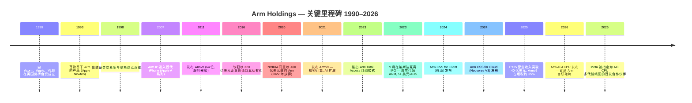

# Arm Holdings plc (NASDAQ:ARM) — 公司研究报告

**报告日期: 2026-05-20**
**注册地: 英国 (英格兰剑桥) — 美国 SEC 外国私人发行人 (20-F 申报人)**
**控股股东: 软银集团 (SoftBank Group Corp.), 持股约 87% 已发行股份**
**报告语言: 简体中文 (英文版同时存在于本目录)**

---

> **业绩更新——FY2026 业绩交付, FY2027 Q1 指引启动 (2026-05-06):**
> Arm 公布 FY2026 Q4 创纪录营业收入达 14.9 亿美元 (同比 +20%), 授权收入 8.19 亿美元
> (同比 +29%), 版税收入 6.71 亿美元 (同比 +11%)。全年 FY2026 营业收入达到
> 49.2 亿美元 (同比 +23%), 非 GAAP 每股收益 (EPS) 为 1.77 美元 (同比 +9%)。FY2027 Q1
> 指引: 营业收入 12.1 亿至 13.1 亿美元, 非 GAAP EPS 0.36 至 0.44 美元。管理层
> 将超预期归因于广泛的授权需求、Armv9/CSS 版税费率提升, 以及新近发布的
> **Arm AGI CPU** 的早期商业牵引——这是 Arm 自研的首款数据中心硅片,
> 目前在 FY2027–FY2028 期间已预订超过 20 亿美元客户需求 (Meta 为首发合作伙伴),
> 朝向管理层所述的 150 亿美元业务机会迈进。
> 来源: [Arm FY26 Q4 股东信, 附件 99.2, 2026-05-06](https://www.sec.gov/Archives/edgar/data/1973239/000197323926000062/exhibit992fye26q431-marx26.htm)。

## 目录

1. 公司概览
2. 公司历史
3. 管理团队
4. 产品与服务
5. 客户与上市策略
6. 行业概览
7. 竞争格局
8. 市场机会 (TAM)
9. 风险评估

---

## 1. 公司概览

Arm Holdings plc 设计并授权中央处理器 (CPU) 架构和指令集 (Instruction Set Architecture, ISA), 这些 ISA 驱动了世界上绝大多数计算设备。公司本身不制造硅片用于转售; 而是开发 CPU 知识产权 ("Intellectual Property, IP") 内核、配套的 GPU 与 NPU 加速器、系统 IP, 以及预集成的"计算子系统 (Compute Subsystems, CSS)", 然后将这些 IP 授权给半导体公司和 OEM, 由后者将其集成进自家的片上系统 (System-on-Chip, SoC) 设计中。每一枚被授权方出货的搭载 Arm IP 的芯片, 都需向 Arm 支付按颗收取的版税 (royalty) ——通常是芯片 ASP 的百分比, 或按颗计算的固定费用, 随集成的 Arm IP 模块数量递增 ([Arm 20-F FY25, Item 4.B 业务概览](https://www.sec.gov/Archives/edgar/data/1973239/000197323925000016/arm-20250331.htm))。IPO 招股说明书将该模式简洁地描述为: "我们对使用 Arm IP 出货的几乎所有芯片均按颗收取版税" ([Arm F-1, 2023-08-21](https://www.sec.gov/Archives/edgar/data/1973239/000119312523216983/d393891df1.htm))。

该双重收入来源——前期授权费 + 数十年期的版税长尾——产生了出色的毛利率 (FY2026 GAAP 毛利率 97.5%, 非 GAAP 毛利率 98.2%) 与极高的研发 (R&D) 美元增量回报, 因为底层 CPU 设计可以同时多次授权给多家客户。仅 2025 年 3 月 31 日截止的三个月内, 据报告就有约 79 亿颗 Arm 架构芯片出货, 这使得截至 FY2025 末累计 Arm 架构芯片出货量超过 **3,100 亿颗**, 并根据 FY26 Q4 业绩说明会管理层评论, 截至 FY2026 末超过 **3,500 亿颗** ([Arm FY26 Q4 股东信](https://www.sec.gov/Archives/edgar/data/1973239/000197323926000062/exhibit992fye26q431-marx26.htm)、[Arm 20-F FY25, p. 56](https://www.sec.gov/Archives/edgar/data/1973239/000197323925000016/arm-20250331.htm))。

**Arm 体量有多大?** FY2026 (截至 2026 年 3 月 31 日) Arm 实现创纪录营业收入 49.20 亿美元 (同比 +23%), 版税收入 26.13 亿美元 (同比 +21%), 授权及其他收入 23.07 亿美元 (同比 +25%), GAAP 营业利润 9.00 亿美元, 非 GAAP 营业利润 21.15 亿美元。自由现金流 (Free Cash Flow) 8.82 亿美元 (FY25 为 0.99 亿美元, 主要受营运资本正常化及税款支付时点影响), 期末现金及短期投资 36.01 亿美元, 无长期债务 ([Arm FY26 Q4 股东信](https://www.sec.gov/Archives/edgar/data/1973239/000197323926000062/exhibit992fye26q431-marx26.htm))。员工总数 9,584 人, 其中工程师 8,058 人 (占比 84%) ——Arm 自我描述为"一家以工程为本的公司, 全球员工约 83% 投入研究、设计与技术创新" ([Arm 20-F FY25, p. 62](https://www.sec.gov/Archives/edgar/data/1973239/000197323925000016/arm-20250331.htm))。

**地理布局。** Arm 在英国、欧洲、北美、印度及亚太地区运营研发与工程中心; FY2025 约 57% 营业收入来自美国境外客户, 其中中国大陆业务由 Arm 安谋科技 (中国) 有限公司 ("Arm 中国") 独家承接, 双方依据长期 IP 授权协议 ("IPLA") 运作, 该协议有效期至 2048 年 4 月 23 日 ([Arm 20-F FY25, "与 Arm 中国的 IPLA"](https://www.sec.gov/Archives/edgar/data/1973239/000197323925000016/arm-20250331.htm))。


*来源: Arm FY26 Q4 股东信 (FY26 全年合计); [Arm 20-F FY25, Item 5.A](https://www.sec.gov/Archives/edgar/data/1973239/000197323925000016/arm-20250331.htm) (FY23–FY25 全年合计); FY24 Q4 / FY25 Q4 业绩公告 (非 GAAP 营业利润率)。*

### 1.1 估值快照 (数据截至 2026-05-20)

| 指标 | Arm | NVDA | AVGO | CDNS | SNPS | QCOM | RMBS | 备注 |
|---|---|---|---|---|---|---|---|---|
| 最新股价 | 253.32 美元 | 222.83 美元 | 418.71 美元 | 348.11 美元 | 491.32 美元 | 202.76 美元 | 132.45 美元 | Yahoo / yfinance |
| 市值 | 2,695 亿美元 | 5.40 万亿美元 | 1.98 万亿美元 | 960 亿美元 | 941 亿美元 | 2,137 亿美元 | 143 亿美元 | |
| TTM P/E | **298×** | 45× | 81× | 81× | 75× | 22× | 63× | TTM 报告值 |
| 前瞻 P/E | 83× | 19× | 23× | 37× | 29× | 19× | 36× | 卖方一致预期 |
| TTM P/S | **54.8×** | 25.0× | 29.0× | 17.4× | 11.8× | 4.8× | 19.9× | |
| EV / EBITDA | 204× | 40× | 54× | 47× | 64× | 16× | 41× | |

*来源: Yahoo Finance / yfinance, 2026-05-20 同日抓取所有股票代码 (例如 [Arm 关键统计, Yahoo Finance](https://finance.yahoo.com/quote/ARM/key-statistics/)、[NVDA](https://finance.yahoo.com/quote/NVDA/key-statistics/)、[AVGO](https://finance.yahoo.com/quote/AVGO/key-statistics/))。倍数四舍五入至最接近的整数百分点。*


*来源: yfinance, 抓取于 2026-05-20。*

**解读 Arm 估值倍数。** 无论是 298× TTM P/E 还是 54.8× TTM P/S, 在绝对与相对基础上均属极端——大约是次高半导体可比公司 (AVGO 29.0× P/S) 的 2 倍, 大约是 IP 软件同业组 (CDNS / SNPS 12–17× P/S) 的 4 倍 ([Yahoo Finance 关键统计 — ARM](https://finance.yahoo.com/quote/ARM/key-statistics/)、[AVGO](https://finance.yahoo.com/quote/AVGO/key-statistics/)、[CDNS](https://finance.yahoo.com/quote/CDNS/key-statistics/)、[SNPS](https://finance.yahoo.com/quote/SNPS/key-statistics/))。驱动因素:

1. **真实的单芯片版税经济性长期增长。** Armv9 版税费率通常约为 Armv8 费率的 2 倍 ([Arm F-1, 2023-08-21](https://www.sec.gov/Archives/edgar/data/1973239/000119312523216983/d393891df1.htm)); Armv9 至 FY25 年末已达到总版税收入的约 30–35%, 并持续以更高占比组合。基于 CSS 的版税进一步阶梯化提升。
2. **盈利被刻意的研发爬坡压低。** FY26 非 GAAP 研发投入同比增长 43% 至 19.1 亿美元, 用于 AGI CPU 硅片产能建设; 员工人数增长 15% 至 9,584 人 ([Arm FY26 Q4 股东信](https://www.sec.gov/Archives/edgar/data/1973239/000197323926000062/exhibit992fye26q431-marx26.htm))。非 GAAP 营业利润率从 46.7% (FY24) 下降至 43.0% (FY26), 而毛利率维持在 98%。
3. **沉重的 AI/数据中心叙事溢价。** Arm 提供本质上纯粹的"卖铲子"敞口, 覆盖**所有** AI 推理计算——每颗 NVIDIA Grace / Vera、Amazon Graviton、Google Axion 与 Microsoft Cobalt 都向 Arm 支付版税。AGI CPU 加上 Meta 合作伙伴关系, 按管理层口径再增加了价值 150 亿美元的直接硅片业务向量。
4. **流通股小且软银悬而未决。** 软银持股约 87%; 据 yfinance, 流通股仅约 1.38 亿股, 放大了表面倍数。

前瞻 P/E 83× 比 TTM 298× 更容易消化——卖方一致预期 Arm 盈利将显著扩张。即便如此, Arm 估值显著高于即便最激进的 AI 同业 (AVGO 前瞻 23×、NVDA 前瞻 19×, 数据来自 [Yahoo Finance 关键统计 — NVDA](https://finance.yahoo.com/quote/NVDA/key-statistics/) / [AVGO](https://finance.yahoo.com/quote/AVGO/key-statistics/)); 我们将其视为**估值/倍数压缩风险**, 见第 9 章。

最接近的可比同业: **Rambus (RMBS)** 是除 Arm 外唯一的纯 IP 公开授权方 (TTM P/E 63×、P/S 19.9×; 聚焦内存 IP——参见 [RMBS 关键统计](https://finance.yahoo.com/quote/RMBS/key-statistics/)); **Cadence (CDNS) / Synopsys (SNPS)** 共享经常性授权 / 超高毛利率模型 (P/E 75–80×、P/S 12–17×, 数据来自 [CDNS](https://finance.yahoo.com/quote/CDNS/key-statistics/) / [SNPS](https://finance.yahoo.com/quote/SNPS/key-statistics/)); **高通 QTL** 将是最接近的直接可比, 但未单独上市 (合并报表的 QCOM 为 22× P/E、4.8× P/S——参见 [QCOM 关键统计](https://finance.yahoo.com/quote/QCOM/key-statistics/)); **NVIDIA / Broadcom** 在 AI 叙事上最接近 (P/E 45–81×)。

同业组中位数 TTM P/E (剔除 Arm) 大约 60–80×, 中位数 P/S 大约 17× (同业倍数来源自上述 Yahoo Finance 关键统计页面)。Arm 估值约为同业中位数的 **3–4 倍 (P/E 与 P/S 同时)**。叠加大幅研发爬坡和 AGI CPU 收入尚未充分释放, 这就是该股的核心非对称性: 估值倍数已预设 AGI CPU 计划顺利执行 + Armv9 版税费率持续提升; 任一杠杆失败都将迫使估值大幅下调 ([Arm FY26 Q4 股东信, 2026-05-06](https://www.sec.gov/Archives/edgar/data/1973239/000197323926000062/exhibit992fye26q431-marx26.htm))。

---

## 2. 公司历史

Arm 于 1990 年 11 月在英国剑桥成立, 作为 Acorn Computers、Apple Computer 与 VLSI Technology 的合资公司, 明确使命是开发一款高性能、能效卓越、易于编程、可灵活扩展的 CPU ([Arm 20-F FY25, "历史"](https://www.sec.gov/Archives/edgar/data/1973239/000197323925000016/arm-20250331.htm))。最初的产品必须在 Apple 的 Newton 掌上设备中胜出, 这迫使团队为低于 1 瓦特的运行设计——这一架构优先级定义了之后每一代 Arm CPU, 并持续作为公司在移动、汽车与 AI 推理领域的结构性优势。

Arm 于 1998 年同时在伦敦证券交易所与纳斯达克上市, 并保持公开上市 18 年。2016 年 9 月, 软银集团以 320 亿美元企业价值将 Arm 私有化。软银随后在 2020 年 9 月试图以最高 400 亿美元的对价将 Arm 出售给 NVIDIA; 该拟议交易于 2022 年 2 月被放弃, 因为美国 FTC、英国 CMA 与欧盟委员会均启动了深度反垄断审查 ([Arm F-1, 2023-08-21](https://www.sec.gov/Archives/edgar/data/1973239/000119312523216983/d393891df1.htm), 发行背景)。软银随后于 2023 年 9 月 14 日以每 ADS 51 美元在纳斯达克再 IPO 了 Arm, 募资约 49 亿美元, 全部归属出售股东 (软银); Arm 本身未获得任何资金 ([Arm 20-F FY25, p. 56](https://www.sec.gov/Archives/edgar/data/1973239/000197323925000016/arm-20250331.htm))。



**战略转型与转折。** 三个转折值得特别关注:

1. **从纯 IP 授权方到订阅 IP 业务。** 始于 2019 年 Arm Flexible Access, 并于 2021–2023 年以 Arm Total Access 进一步深化, Arm 引入了年度产品组合订阅定价模式, 一次性授予客户对完整路线图的访问权, 解锁 Armv9 / CSS 时无需重新协商。FY26 Q4, Arm 共有 56 个 Total Access 授权方 (其中包括 Arm 前 30 大客户的过半数) 和 329 个 Flexible Access 授权方 ([Arm FY26 Q4 股东信](https://www.sec.gov/Archives/edgar/data/1973239/000197323926000062/exhibit992fye26q431-marx26.htm))。订阅占比是 ACV 的主要驱动, 截至 FY26 末 ACV 同比增长 22% 至 16.6 亿美元。

2. **从仅 CPU IP 到计算子系统 (CSS), 再到硅片产品。** 自 2022 年起, Arm 越来越多地交付预集成、预验证的 CSS 设计 (CPU 集群 + 互连 + 内存子系统 + I/O), 每颗芯片的版税明显高于离散 IP, 并已支撑大多数新一代云/超大规模数据中心设计 (Graviton、Cobalt、Axion、Grace)。2026 年 4 月, Arm 迈出关键一步, 发布了 **Arm AGI CPU**——为 Agentic AI 设计的自研量产硅片, Meta 为首发合作伙伴。根据 FY26 Q4 评论, AGI CPU 已在 FY27–FY28 期间预订超过 20 亿美元需求, 朝着所述 150 亿美元业务机会前进 ([Arm 将计算平台扩展至硅片产品, 公司历史性首创, Arm 新闻室, 2026-03-24](https://newsroom.arm.com/news/arm-agi-cpu-launch)、[Arm FY26 Q4 股东信, 2026-05-06](https://www.sec.gov/Archives/edgar/data/1973239/000197323926000062/exhibit992fye26q431-marx26.htm))。

3. **高通/Nuvia ALA 纠纷的部分解决。** Arm 于 2022 年 8 月就 Nuvia 的架构授权协议 (ALA) 起诉高通与 Nuvia, Arm 已于 2022 年 3 月终止该 ALA。首场审判于 2024 年 12 月以部分裁决结案——陪审团认定相关技术依据高通 ALA 授权给高通, 但未能就 Nuvia 是否违反其 ALA 达成裁决。第二项高通诉讼 (2024 年 4 月提起, 2024 年 12 月修订) 定于 2026 年 3 月 9 日开庭 ([Arm 20-F FY25, "与高通和 Nuvia 的诉讼"](https://www.sec.gov/Archives/edgar/data/1973239/000197323925000016/arm-20250331.htm))。高通 = FY25 营业收入的 10%——是实质性业务与法律风险。

**关键收购。** Arm 在历史上是有机增长者而非收购者。近期 IP 相邻投资包括 2023 年 11 月在树莓派 LSE 上市前对其的少数股权战略投资 ([Raspberry Pi 获得 Arm 战略投资, Arm 新闻室, 2023-11-02](https://newsroom.arm.com/news/raspberry-pi-investment))。20-F 中未披露任何变革性 M&A。

**近期动态 (过去 12 个月)。** FY26 Q4 创纪录业绩, Arm AGI CPU 发布 (2026 年 4–5 月), Meta 作为多代联合开发者; 在 Supermicro / Lenovo / Quanta / ASRock (商业系统)、Verda (欧洲 AI 云)、Cloudflare (全球边缘) 及 SAP (Graviton 与 AGI CPU 上的数据库 / 业务应用) 的设计赢家 / 部署 ([Arm FY26 Q4 股东信, 2026-05-06](https://www.sec.gov/Archives/edgar/data/1973239/000197323926000062/exhibit992fye26q431-marx26.htm))。综合效应是 ARM ADS 自 2025 年 11 月末的 135 美元上涨 78% 至 2026 年 5 月 1 日的 253 美元 ([yfinance 月线收盘历史](https://finance.yahoo.com/quote/ARM/history/))。


*来源: Yahoo Finance / yfinance, 月度收盘价, 抓取于 2026-05-20。*

---

## 3. 管理团队

### Rene Haas — 首席执行官 & 董事 (62 岁)

Rene Haas 自 2022 年 2 月起担任 Arm CEO, 是 Arm 历史上的第三位 CEO, 也是软银收购以来首位非 Arm 长期内部人士的 CEO。Haas 于 2013 年 10 月加入 Arm 任战略联盟副总裁, 两年后晋升首席商务官 (全球销售与营销负责人)。自 2017 年 1 月起至升任 CEO, 他担任 Arm IP 产品集团 ("IPG") 总裁——该单位涵盖 Cortex CPU、Mali / Immortalis GPU、Ethos NPU 和 Neoverse——他被认为将 IPG 从纯 CPU 设计公司转型为"为垂直市场提供关键解决方案, 拥有更多样化的产品组合, 并加大对软件生态系统的投入" ([Arm 20-F FY25, "高层管理"](https://www.sec.gov/Archives/edgar/data/1973239/000197323925000016/arm-20250331.htm))。

在加入 Arm 之前, Haas 在 NVIDIA 工作了七年 (2006–2013), 担任公司计算产品业务副总裁兼总经理——这是构建 Tegra (基于 Arm 的移动与汽车 SoC) 的平台部门, 最终也为 NVIDIA 的数据中心 Arm 战略 (Grace、Vera) 播下种子 ([Rene Haas, 维基百科](https://en.wikipedia.org/wiki/Rene_Haas))。在 NVIDIA 之前, 他曾在芯片 IP 公司 Tensilica (后于 2013 年被 Cadence 收购, 主攻 DSP) 和 Scintera Networks 担任高管。他持有 Clarkson 大学电气与电子工程理学学士学位, 并完成斯坦福商学院高管教育项目。Haas 加入 Arm 中国董事会 (2016 年 12 月) 与软银集团董事会 (2023 年 6 月), 自 2025 年 1 月起还任 AstraZeneca PLC 董事 ([Arm 20-F FY25, "高层管理"](https://www.sec.gov/Archives/edgar/data/1973239/000197323925000016/arm-20250331.htm))。

Haas 自 2022 年以来的战略重心为: (i) Total Access 订阅迁移; (ii) CSS 预集成捆绑; (iii) 直接数据中心硅片 (2026 年 4 月与 Meta 共同发布 AGI CPU——参见 [Arm AGI CPU 发布, Arm 新闻室, 2026-03-24](https://newsroom.arm.com/news/arm-agi-cpu-launch)); (iv) 在 Arm 上优化 PyTorch / TensorFlow / llama.cpp 的 Kleidi AI 软件生态系统。FY25 总薪酬为 2,450 万美元 (135 万美元工资、233 万美元奖金、2,070 万美元股权), 较 FY24 7,010 万美元有所下降, 后者包含一次性 2,000 万美元特别奖金与约 4,600 万美元 IPO 股权 ([Arm 20-F FY25, "CEO 单一数字表"](https://www.sec.gov/Archives/edgar/data/1973239/000197323925000016/arm-20250331.htm))。

Haas 的公开访谈节奏对于一位芯片 CEO 而言异常密集 (CNBC、Bloomberg、Acquired 播客——参见 [How ARM Became The World's Default Chip Architecture, Acquired/ACQ2 with Rene Haas](https://www.acquired.fm/acq2-episodes/how-arm-became-the-worlds-default-chip-architecture-with-arm-ceo-rene-haas)), 他的公众形象与 Arm 的"计算平台"定位密不可分。主要的治理摩擦点在于他同时担任软银集团和 Arm 中国董事会成员, Arm 自己在风险因素中也将此标识为关联方交易风险 ([Arm 20-F FY25, "与软银集团相关的风险"](https://www.sec.gov/Archives/edgar/data/1973239/000197323925000016/arm-20250331.htm))。

### Jason Child — 执行副总裁 & 首席财务官 (56 岁)

Jason Child 自 2022 年 11 月起担任 Arm CFO, 此前从 Splunk 招募, 他于 2015 至 2022 年间任 Splunk 高级副总裁兼 CFO。Child 的职业生涯涵盖全球金融、会计、资本市场和投资者关系达 30 年 ([Arm 20-F FY25, "高层管理"](https://www.sec.gov/Archives/edgar/data/1973239/000197323925000016/arm-20250331.htm))。在 Splunk 之前, 他曾是 Groupon 的 CFO (主导 2011 年 IPO)、Opendoor Technologies 的 CFO、消费电子制造商 Jawbone 的 CFO, 并在亚马逊任职 11 年以上, 最近的职务是亚马逊国际业务 CFO。他持有华盛顿大学 Foster 商学院学士学位, 并任 Coupang Inc. 董事。

Child 履历对 Arm 的相关性在两方面。第一, 他的亚马逊与 Splunk 经验赋予他可信的软件式经常性收入损益表运营手册——Total Access ACV 现已 16.6 亿美元, 同比增长 22%, 与 SaaS 指标的相似度高于芯片周期指标 ([Arm FY26 Q4 股东信](https://www.sec.gov/Archives/edgar/data/1973239/000197323926000062/exhibit992fye26q431-marx26.htm))。第二, Child 在 2023 年 9 月再 IPO 前 10 个月到任, 他与软银、高盛和瑞穗共同管理了该 IPO ([Arm 宣布 IPO 定价, Arm 新闻室, 2023-09-13](https://newsroom.arm.com/news/arm-announces-pricing-of-initial-public-offering))。自 IPO 以来, Arm 在每个公开报告季度都持续超过指引上沿。

### Richard Grisenthwaite — 执行副总裁 & 首席架构师 (57 岁)

Grisenthwaite 是 Arm 非 CEO 高管中最重要的一位, 可以说是现代 CPU 设计领域最具影响力的技术之声。他于 1997 年 3 月加入 Arm, 领导 Arm CPU 架构演进超过 20 年, 始于 Armv6, 亲自主导 Armv7、Armv8 (64 位) 与 Armv9 的开发 ([Arm 20-F FY25, "高层管理"](https://www.sec.gov/Archives/edgar/data/1973239/000197323925000016/arm-20250331.htm))。他持有 120 项微处理器设计专利, 是 Arm 院士, 担任英国政府半导体咨询小组成员。在加入 Arm 之前, 他在 Analog Devices 与 Inmos/ST 工作, 参与 Transputer 项目。他持有剑桥大学电子与信息科学学士学位。

Grisenthwaite 是 Armv9、SVE2、机密计算 (Realm Management Extension) 与内存标记扩展 (Memory Tagging Extension) 的注册架构师 ([Richard Grisenthwaite — Arm 新闻室作者页](https://newsroom.arm.com/author/richard-grisenthwaite))。Grisenthwaite 的关键人员风险 (key-person risk) 是 Arm 高管层中最高的未明示个人风险。

### Will Abbey — 执行副总裁 & 首席商务官

Abbey 自 2023 年 4 月起担任 Arm 首席商务官, 负责全球销售、现场工程和合作伙伴使能。他自 2004 年起在 Arm 任职, 历经多个岗位, 包括销售与合作伙伴使能高级副总裁、物理设计部门总经理、物理 IP 部门商务运营副总裁。在 Arm 之前, 他曾在 Celoxica、Infineon Technologies 与 Loughborough Sound Images 担任产品管理职务。他任 EnPro Industries 董事, 持有 Sheffield Hallam 大学工程学士学位 ([Arm 20-F FY25, "高层管理"](https://www.sec.gov/Archives/edgar/data/1973239/000197323925000016/arm-20250331.htm))。Abbey 是 Total Access 订阅模式的主要架构师, 该模式驱动了授权业务从 FY23 的 10 亿美元增长至 FY26 的 23 亿美元。

其他 FY25 20-F 中的高层管理: **Spencer Collins** (首席法务官; 此前为软银投资顾问 / 愿景基金的执行合伙人); **Charlotte Eaton** (自 2024 年 11 月起任首席人力官; 前 OVO Energy 任职, 在此之前为 Arm 人力副总裁) ([Arm 20-F FY25, "高层管理"](https://www.sec.gov/Archives/edgar/data/1973239/000197323925000016/arm-20250331.htm))。

### 治理

Arm 在与软银集团达成的股东治理协议下运营, 该协议预分配了相当比例的董事席位给软银指定者。软银实益持有 Arm 约 87.1% 已发行普通股 (大部分通过控股公司结构持有), 在持有 Arm 已发行普通股超过 70% 时, 拥有指定最多七位董事 (当前董事会共九人) 的合同权利 ([Arm 20-F FY25, "与软银集团相关的风险"](https://www.sec.gov/Archives/edgar/data/1973239/000197323925000016/arm-20250331.htm))。董事长**孙正义 (Masayoshi Son)** (软银集团创始人/CEO) 与副董事长级别的 **Ronald D. Fisher** (软银投资顾问高级顾问) 居于名单之首。其他非执行董事包括 **Jeffrey A. Sine** (Raine Group 联合创始人; 前瑞银 TMT 投行副董事长 / 全球主管)、**Karen E. Dykstra** (前 VMware 与 AOL CFO; 现任 Gartner 与 Atlassian 董事)、**Rosemary Schooler** (前 Intel 公司副总裁 / 数据中心与 AI 销售总经理)、**Paul E. Jacobs** (Globalstar CEO, 前高通 CEO) 与 **Young Sohn** (前三星电子公司总裁 / CSO; 三星半导体顾问委员会主席)。相对于软银的控股权, 内部人持股微不足道——Yahoo Finance 数据显示 heldPercentInsiders 仅为 0.04%, 机构持有流通股 95.7% ([Arm 关键统计](https://finance.yahoo.com/quote/ARM/key-statistics/))。

Arm 符合纳斯达克规则下的"受控公司 (controlled company)"定义, 同时也是"外国私人发行人 (foreign private issuer)", 意味着公司有权选择不遵守某些纳斯达克治理标准, 并免于按季度 10-Q 报告 (改为提交 6-K 叙述) ([Arm 20-F FY25, "外国私人发行人" / "受控公司"](https://www.sec.gov/Archives/edgar/data/1973239/000197323925000016/arm-20250331.htm))。董事会设有独立的审计与薪酬委员会, 但治理风险点不容忽视: Haas 任软银集团董事; 首席法务官 Collins 此前曾是软银投资顾问的执行合伙人; 与 Arm 中国 (软银通过 Acetone Limited 控股的实体) 之间的 IPLA 是持续的关联方安排, 贡献 Arm 17% 的营业收入 ([Arm 20-F FY25, "与 Arm 中国的 IPLA"](https://www.sec.gov/Archives/edgar/data/1973239/000197323925000016/arm-20250331.htm))。

**履历综述。** 强劲的高管阵容: 具有 NVIDIA 背景的可信 CEO、有两次 IPO 经验的 CFO, 以及仍在位的 Armv8 / Armv9 原始架构师 ([Arm 20-F FY25, "高层管理"](https://www.sec.gov/Archives/edgar/data/1973239/000197323925000016/arm-20250331.htm))。最大的治理缺口在于沉重的软银关联 (董事会、关联方交易、股权悬挂)。IPO 以来的运营交付出色——Arm 在每个公开公司季度都超过了指引上沿——但管理层现在被要求首次为 AGI CPU 运营一条硅片供应链 ([Arm AGI CPU 发布, Arm 新闻室, 2026-03-24](https://newsroom.arm.com/news/arm-agi-cpu-launch)), 这是与 Arm 历史上完全不同的执行画面。

---

## 4. 产品与服务

Arm 的产品组合分为五大紧密集成的家族, 全部根据五种合同结构 (CSS、Arm Total Access (ATA)、Arm Flexible Access (AFA)、技术授权协议 (Technology Licensing Agreements, TLA) 与架构授权 (Architecture Licenses, ALA)) 授权给客户。

```mermaid
graph TD
    A[Arm 计算平台] --> B[CPU]
    A --> C[加速器]
    A --> D[系统 IP]
    A --> E[计算子系统 / CSS]
    A --> F[AGI CPU 硅片]
    A --> G[软件与开发工具]

    B --> B1[Cortex-X9 / X925<br/>(旗舰移动)]
    B --> B2[Cortex-A720 / A725<br/>(移动 big.LITTLE)]
    B --> B3[Cortex-A520<br/>(移动能效)]
    B --> B4[Cortex-M55 / M85<br/>(微控制器 + 机器学习)]
    B --> B5[Cortex-R82<br/>(实时, 汽车)]
    B --> B6[Neoverse V3 / N3 / E3<br/>(数据中心)]
    B --> B7[ALA / 自定义内核<br/>(Apple, 高通 Nuvia)]

    C --> C1[Mali / Immortalis GPU]
    C --> C2[Ethos-U / Ethos-N NPU]
    C --> C3[Mali 相机 ISP]

    D --> D1[CMN-700 / CMN S3<br/>(互连)]
    D --> D2[内存控制器]
    D --> D3[GIC / TZC<br/>(安全)]

    E --> E1[CSS for Client]
    E --> E2[CSS for Cloud<br/>(Neoverse V3 CSS)]
    E --> E3[CSS for Automotive]
    E --> E4[CSS for IoT]

    F --> F1[Arm AGI CPU<br/>(Meta 首发合作伙伴)]

    G --> G1[Kleidi AI 库]
    G --> G2[KleidiAI for PyTorch / TensorFlow]
    G --> G3[Arm Development Studio]
    G --> G4[Arm Compiler]
```

### 4.1 CPU

CPU 是 Arm 产品线的根基; 每枚搭载 Arm CPU 的芯片应付的版税主导了 Arm 的经济模型。Arm 的 CPU 产品组合在授权市场分为三条"Cortex"线加一条服务于数据中心 / 基础设施的"Neoverse"线, 此外还有一条自定义架构授权 (ALA) 渠道, 通过该渠道, 高级客户 (Apple、高通、Ampere 等) 可设计自家的 Arm 指令集实现 ([Arm 20-F FY25, "我们的产品"](https://www.sec.gov/Archives/edgar/data/1973239/000197323925000016/arm-20250331.htm))。

- **Cortex-A** — 应用处理器, Cortex-X9 / X925 (2024 年发布) 作为当前旗舰"大"内核 (Cortex-X 是 Arm 用于智能手机、PC 与 ChromeOS 设备的最高性能内核), 而 A725 / A520 在现代移动 big.LITTLE 集群中构成"中"和"LITTLE"内核。Cortex-A 版税收入捕获了整个高端智能手机应用处理器市场, Arm 表示在该领域"多年来保持市场份额超过 99%" ([Arm 20-F FY25, "移动应用处理器"](https://www.sec.gov/Archives/edgar/data/1973239/000197323925000016/arm-20250331.htm))。FY25 中, 移动应用处理器产生 Arm 总版税收入的约 46% (最大的单一类别)。

  **护城河判定: 是 — 极强。** 对于 Android OEM 而言, 切换成本本质上是无限的: Android、Linux 内核生态系统、每个 JIT 应用以及每个机器学习库, 都已针对 AArch64 编译和优化了十年以上。**最接近的竞品:** 高端智能手机中没有任何商业可行的产品; 高通自家的 Oryon 内核与 Apple M / A 系列均是**根据 ALA 从 Arm 授权**而来的 ([Apple 与 Arm 签署新合作协议授权至 2040 年以后, CNBC, 2023-09-06](https://www.cnbc.com/2023/09/06/apple-and-arm-sign-deal-for-chip-technology-that-goes-beyond-2040.html)、[Arm 20-F FY25, "架构授权"](https://www.sec.gov/Archives/edgar/data/1973239/000197323925000016/arm-20250331.htm))。RISC-V 在移动领域仍然只是研究工作。

- **Cortex-M** — Cortex-M55、M85 及最新搭载 Helium 的 M85 内核服务于微控制器与"边缘 AI"市场, Arm 同样声称占据主导份额 ([Arm 20-F FY25, "微控制器"](https://www.sec.gov/Archives/edgar/data/1973239/000197323925000016/arm-20250331.htm))。M 系列是"数百亿"颗 Arm 架构传感器 / 工业 / IoT 芯片的长尾所在。

  **护城河判定: 是, 但有适度侵蚀。** RISC-V 对低端 MCU 的竞争影响最大, 这里 ISA 版税在绝对金额上很小, 生态系统切换成本最低 ([Tenstorrent 发布 TT-Ascalon: 一款挑战市场的高性能 RISC-V CPU, pbxscience, 2025](https://pbxscience.com/tenstorrent-unveils-tt-ascalon-a-high-performance-risc-v-cpu-challenging-the-market/))。SiFive、Andes 和 Codasip 是可信的 RISC-V 替代选择 ([SiFive Performance P870-D 发布, SiFive 新闻稿, 2024](https://www.sifive.com/press/sifive-announces-high-performance-risc-v-datacenter-processor-for-ai-workloads))。Arm 的对策是将 Cortex-M 与 Ethos-U NPU 捆绑, 并推动进入"AI 能力 MCU"子市场, 在那里 Arm 的软件工具链优势更具影响力。

- **Cortex-R** — 实时内核 (Cortex-R82 及以下), 用于存储控制器、汽车功能安全和调制解调器。营业收入贡献较小, 但高毛利率且粘性极高 ([Arm 20-F FY25, "Cortex-R" 产品系列](https://www.sec.gov/Archives/edgar/data/1973239/000197323925000016/arm-20250331.htm))。

- **Neoverse V / N / E** — 数据中心 / 基础设施 CPU 系列。Neoverse V3 (2024 年 2 月发布) 是 Arm 出货的最高性能数据中心内核; Neoverse N3 面向云吞吐; Neoverse E1/E3 面向边缘网络。Neoverse 内核在每一款主要超大规模数据中心自定义 CPU 中——AWS Graviton 3/4 (V1/V2)、Microsoft Cobalt 100 (N3 CSS)、Google Axion (基于 N2)、NVIDIA Grace (基于 V2) 及已宣布的 NVIDIA Vera, 以及 Ampere AmpereOne ([Arm FY26 Q4 股东信](https://www.sec.gov/Archives/edgar/data/1973239/000197323926000062/exhibit992fye26q431-marx26.htm))。根据 FY26 Q4 业绩说明会管理层评论, Arm 在 CPU 算力的"顶级超大规模数据中心"中占约 50% 份额, 在 2020 年代后期"数据中心将是 Arm 最大业务"。

  **护城河判定: 是 — 且持续扩大。** Neoverse 的竞品集合是 x86 (Intel Xeon、AMD EPYC) 和 RISC-V (Tenstorrent Ascalon、Ventana Veyron, 两者均尚处量产前)。Neoverse 的经济案例——相对 x86 提升 40% 性价比 (AWS 数据), 相对 Google Axion 提升 50% 每瓦性能——现已被验证并持续扩大 ([Arm FY26 Q4 股东信](https://www.sec.gov/Archives/edgar/data/1973239/000197323926000062/exhibit992fye26q431-marx26.htm))。

### 4.2 加速器

Mali (具备光线追踪能力的变体现已更名为"Immortalis") 是 Arm 的 GPU IP, 用于中端到旗舰 Android 手机以及众多电视 / 机顶盒。Mali 不用于 iPhone 或搭载高通 Adreno 的 Snapdragon 旗舰; 因此, 在高端 Android 中的可寻址份额比 Cortex-A 小 ([Arm 20-F FY25, "GPU 与加速器产品"](https://www.sec.gov/Archives/edgar/data/1973239/000197323925000016/arm-20250331.htm))。

Ethos-U (用于 Cortex-M 的 microNPU) 与 Ethos-N (用于 Cortex-A 的 NPU) 是 Arm 的神经处理加速器 IP。它们与 Cortex CPU 位于同一 SoC, 以较低能耗卸载机器学习推理 ([Arm 20-F FY25, "Ethos NPU"](https://www.sec.gov/Archives/edgar/data/1973239/000197323925000016/arm-20250331.htm))。采用面广但非旗舰定义性; 大多数高端智能手机 SoC 使用厂商自研 NPU 而非 Ethos-N。

**护城河判定: 部分。** Mali 是出货量最高的 GPU IP, 但**并非**性能最高——高通 Adreno (内部自研) 与 Apple GPU 始终领跑基准测试 ([Arm 发布 Cortex-X925/A725、Immortalis-G925, CNX Software, 2024-05-30](https://www.cnx-software.com/2024/05/30/arm-cortex-x925-cortex-a725-cpus-immortalis-g925-gpu-kleidi-ai-software/))。Ethos 与厂商内部 NPU 竞争。我们将加速器视为 Arm CPU 的捆绑使能因子, 而非独立护城河。

### 4.3 系统 IP

CoreLink CMN-700 / CMN S3 网状互连、MMU-700 内存管理单元、CCI 缓存一致互连、GIC 中断控制器、TZC TrustZone 控制器以及各类内存控制器 (DMC) 构成了客户与 Cortex / Neoverse 内核同购的"系统 IP" ([Arm 20-F FY25, "系统 IP"](https://www.sec.gov/Archives/edgar/data/1973239/000197323925000016/arm-20250331.htm))。系统 IP 变得越来越重要, 因为随着 CPU 核数上升 (每台服务器超过 100 核), 互连主导芯片级性能。CMN-700 支持最多 256 核; 2024 年发布的 CMN S3 将该上限扩展至 512。

### 4.4 计算子系统 (CSS)

CSS 是 Arm 过去五年最具战略意义的产品引入。CSS 是 Cortex / Neoverse CPU + 系统 IP + 互连的硬化、预验证配置, 以 RTL 或 GDSII (最终物理布局) 形式交付。CSS for Client 面向移动 / PC (围绕 Cortex-X / A 构建); CSS for Cloud (Neoverse V3 CSS) 面向超大规模数据中心自定义服务器芯片; CSS for Automotive 是 ASIL-D 认证的软件定义车辆设计; CSS for IoT 面向工业 ([Arm 20-F FY25, "计算子系统"](https://www.sec.gov/Archives/edgar/data/1973239/000197323925000016/arm-20250331.htm))。CSS 将客户的研发员工与上市时间缩短约 12–18 个月, 代价是更高的单芯片版税与一次性接入费。

根据 2026 年 5 月业绩说明会管理层评论, 基于 CSS 的版税增长速度明显快于其余版税账目, 现已占总版税"两位数"百分比 ([Arm FY26 Q4 股东信](https://www.sec.gov/Archives/edgar/data/1973239/000197323926000062/exhibit992fye26q431-marx26.htm))。Microsoft Cobalt 200 是首款公开宣布的基于 Neoverse V3 CSS 的硅片; Cobalt 100 较早于 Neoverse N3 CSS 上发布, Google Axion 的下一代将使用 Neoverse CSS ([宣布 Cobalt 200: Azure 下一代云原生 CPU, Microsoft Tech Community](https://techcommunity.microsoft.com/blog/azureinfrastructureblog/announcing-cobalt-200-azure%E2%80%99s-next-cloud-native-cpu/4469807)、[使用 Arm Neoverse CSS V3 驱动 Microsoft Azure Cobalt 200, Arm 新闻室](https://newsroom.arm.com/blog/microsoft-azure-cobalt-200-arm-neoverse-css-v3))。竞争意义在于, CSS 捕获了原本会流向内部设计团队的经济价值, 并逐步提升 Arm 的单芯片版税。

**护城河判定: 是 — 强且持续强化。** CSS 是 Arm 因**拥有**底层 IP 而能够执行的价值链延伸。竞争对手要与 Arm CSS 竞争, 就必须授权 Arm CPU, 这在结构上不可能。RISC-V 类比——SiFive 的 Performance 与 Intelligence 预配置内核——是真实但遥远的竞争者 ([SiFive Performance P870-D 新闻稿, 2024](https://www.sifive.com/press/sifive-announces-high-performance-risc-v-datacenter-processor-for-ai-workloads))。

### 4.5 Arm AGI CPU (硅片)

在 FY26 Q3 末 / Q4 初的"Arm Everywhere"活动上推出, 并在 2026 年 5 月 6 日业绩说明会上详细讨论, Arm AGI CPU 是 Arm 首款自研量产硅片——业务模式的重大变化。根据管理层, AGI CPU 相对基于 x86 的平台提供"机架每单位性能超过 2 倍", 定位为"agentic AI"数据中心工作负载, 其中 CPU 与 GPU / 加速器一起负责编排、数据移动、内存管理和安全。**Meta 是首发合作伙伴和联合开发者**, 双方在多代路线图下合作, 目标"为超过 30 亿用户提供个人超级智能" ([Arm FY26 Q4 股东信](https://www.sec.gov/Archives/edgar/data/1973239/000197323926000062/exhibit992fye26q431-marx26.htm))。其他被点名的设计赢家 / 支持者包括 AWS、Broadcom、Google Cloud、Marvell、Microsoft、Micron、NVIDIA、Oracle、Samsung、SK Hynix、TSMC、F5、SK Telecom、Cloudflare、SAP、Cerebras、OpenAI、Positron、Rebellions 与 Verda。商业系统现已可向 Supermicro、Lenovo、Quanta 和 ASRock 订购。

经济模式与 Arm 的历史模式有很大不同——Arm 现在承担部分硅片制造风险和流片资本周期——但每颗芯片的单位经济性大大高于每颗芯片的版税。根据管理层, AGI CPU 已在 FY27 和 FY28 期间预订超过 20 亿美元客户需求 (超过原始发布数字的 2 倍), 朝向所述 150 亿美元业务机会 ([Arm FY26 Q4 股东信](https://www.sec.gov/Archives/edgar/data/1973239/000197323926000062/exhibit992fye26q431-marx26.htm)、[Arm 的 150 亿美元 CPU 机会取决于 agentic 数据中心设计, Futurum, 2026](https://futurumgroup.com/insights/arms-15-billion-cpu-opportunity-hinges-on-agentic-data-center-design/))。

**护城河判定: 部分 / 待定。** AGI CPU 与 NVIDIA Vera、AMD Bergamo/Turin Dense、Intel Sierra Forest / Granite Rapids-D、AWS Graviton、Microsoft Cobalt 与 Google Axion 直接竞争——后面所有 (除 Intel / AMD x86 外) 自身均使用 Arm IP ([Arm FY26 Q4 股东信](https://www.sec.gov/Archives/edgar/data/1973239/000197323926000062/exhibit992fye26q431-marx26.htm))。Arm 的优势是能够立即交付完全调优的参考设计 (含最新 Neoverse 一代), 外加 Kleidi 软件栈的预调优。风险在于 Arm 的被授权客户 (构建自家 Arm 硅片的超大规模数据中心) 将 AGI CPU 视为竞争而非合作; Meta 背书是有意之举, 通过将 Arm 锚定在一个**不是**其现有自定义硅片被授权客户的超大规模数据中心来抵消该认知 ([Arm AGI CPU 发布 / Meta 合作伙伴关系公告, Arm 新闻室, 2026-03-24](https://newsroom.arm.com/news/arm-agi-cpu-launch))。

### 4.6 旗舰与长尾

约 **53% 的 FY26 营业收入 (49.2 亿美元中的 26.1 亿美元) 为版税**, 其中约一半是移动应用处理器 (按 20-F 口径, FY25 为版税的约 46%, FY26 据管理层估算大致相似)。剩余版税分布于 IoT/嵌入式、汽车、消费电子、网络与数据中心, 其中数据中心现为增速最快的部分 ("数据中心版税在 FY26 Q4 同比翻倍以上"——股东信原文)。剩余 **47% 为授权 + 其他收入 (23.1 亿美元)**, 主要由 Total Access 订阅、自定义 CSS 项目与架构授权 (尤其是与高通的 Nuvia ALA 纠纷) 驱动 ([Arm FY26 Q4 股东信, 2026-05-06](https://www.sec.gov/Archives/edgar/data/1973239/000197323926000062/exhibit992fye26q431-marx26.htm))。


*来源: [Arm 20-F FY25, 附注 4 — 营业收入](https://www.sec.gov/Archives/edgar/data/1973239/000197323925000016/arm-20250331.htm) 与 [Arm FY26 Q4 股东信](https://www.sec.gov/Archives/edgar/data/1973239/000197323926000062/exhibit992fye26q431-marx26.htm)。*


*来源: [Arm 20-F FY25, "移动应用处理器"](https://www.sec.gov/Archives/edgar/data/1973239/000197323925000016/arm-20250331.htm) (注: 移动应用处理器占版税 46% 是 FY25 唯一披露的解构终端市场数字; 剩余 54% 未单独披露)。*


*来源: [Arm FY26 Q4 股东信, 2026-05-06](https://www.sec.gov/Archives/edgar/data/1973239/000197323926000062/exhibit992fye26q431-marx26.htm)。*

### 4.7 近期发布与路线图

- **2026 年 4 月:** Arm AGI CPU 发布, Meta 为首发合作伙伴 ([Arm AGI CPU 发布, Arm 新闻室, 2026-03-24](https://newsroom.arm.com/news/arm-agi-cpu-launch))。
- **2026 年 3 月 (Arm Everywhere 活动):** AGI CPU 平台与 AI 软件栈路线图揭幕 ([Arm Form 6-K — Arm Everywhere 资料, 2026-03-24](https://www.sec.gov/Archives/edgar/data/1973239/000197323926000050/arm-20260324.htm))。
- **2024–2025:** Cortex-X925 / A725 / A520 (移动)、CMN S3 (互连)、Neoverse V3 + V3 CSS (数据中心)、Mali-G925 Immortalis GPU ([Arm 发布 Cortex-X925、Cortex-A725、Immortalis-G925, WikiChip Fuse, 2024](https://fuse.wikichip.org/news/7793/arm-unveils-2024-compute-platform-3nm-cortex-x925-cortex-a725-immortalis-g925/))。
- **2024:** CSS for Client 发布; 联发科 (MediaTek) 与其他厂商首批设计赢家 ([Arm 20-F FY25, "CSS for Client"](https://www.sec.gov/Archives/edgar/data/1973239/000197323925000016/arm-20250331.htm))。
- **软件:** Kleidi AI 库面向 PyTorch、TensorFlow、ExecuTorch 与 llama.cpp——Arm 对 NVIDIA CUDA 式 AI 推理生态系统锁定的回应 ([Arm 发布 Cortex-X925/A725 + Kleidi AI 软件, CNX Software, 2024-05-30](https://www.cnx-software.com/2024/05/30/arm-cortex-x925-cortex-a725-cpus-immortalis-g925-gpu-kleidi-ai-software/))。

未宣布主要产品停产。Cortex-A78 / X1 / Neoverse N1 代仍处于长尾版税收割模式 ([Arm 20-F FY25, "产品组合"](https://www.sec.gov/Archives/edgar/data/1973239/000197323925000016/arm-20250331.htm))。

---

## 5. 客户与上市策略

Arm 的客户是半导体公司、OEM 与越来越多的超大规模数据中心云服务提供商。授权模式是半导体业最集中的营业收入账目之一。

### 5.1 客户集中度——高且结构上不可避免

Arm 的 FY25 20-F 披露: "我们前五大客户 (含 Arm 中国) 在 2025 年 3 月 31 日截止、2024 年和 2023 年财年合计分别占总营业收入的约 **56%、54% 和 57%**, 我们最大的单一客户 **Arm 中国, 在那些财年中分别占总营业收入的约 17%、21% 和 24%**" ([Arm 20-F FY25, "客户集中度"风险因素](https://www.sec.gov/Archives/edgar/data/1973239/000197323925000016/arm-20250331.htm))。

**高通**在 FY25 被明确点名为占营业收入 10% 的客户: "高通⋯⋯当前是我们的主要客户, 占截至 2025 年 3 月 31 日财年总营业收入的 10%" ([Arm 20-F FY25, "与高通和 Nuvia 的诉讼"](https://www.sec.gov/Archives/edgar/data/1973239/000197323925000016/arm-20250331.htm))。20-F 未单独识别其余前五大客户, 但基于公开设计赢家与 ALA 备案的合理推断是, 这些客户可能包括 **Apple、联发科 (MediaTek)、三星电子, 以及一家美国超大规模数据中心**的组合 (AWS、Microsoft、Google)。Apple 的设计使用架构授权 (ALA), 这产生每一台出货 iPhone、iPad、Mac、Vision Pro、Apple Watch 与 AirPods 的授权费与按颗版税——并在 2023 年 9 月延长至至少 2040 年 ([Apple 与 Arm 签署新合作协议授权至 2040 年以后, CNBC, 2023-09-06](https://www.cnbc.com/2023/09/06/apple-and-arm-sign-deal-for-chip-technology-that-goes-beyond-2040.html)); 联发科是高通之后第二大高端移动应用处理器厂商, 也是大客户的 Cortex-X / A 被授权方。


*来源: [Arm 20-F FY25, "与我们业务和行业相关的风险"](https://www.sec.gov/Archives/edgar/data/1973239/000197323925000016/arm-20250331.htm)。*

**Arm 中国独特且需要特别处理。** Arm 中国不是 Arm 的子公司: 软银集团通过其控股实体 Acetone Limited 持有 Arm 中国约 48%; 厚朴投资管理 (HOPU Investment Management) 持有约 35%; 其他中国方面持有约 17% ([Arm 20-F FY25, "与 Arm 中国的 IPLA"](https://www.sec.gov/Archives/edgar/data/1973239/000197323925000016/arm-20250331.htm))。Arm 自身在 Acetone 中持有 10% 无表决权权益——对 Arm 中国的间接经济权益 4.8%。根据 IPLA (初始有效期至 2048 年 4 月 23 日), Arm 中国是**面向中国客户的 Arm IP 独家分销商**, 包括上市中国公司、注册在中国的实体、以及由中国公民最终控制的实体。Arm 中国在合同上有义务使用 Arm 的标准授权条款, 但 Arm 没有直接管理权、没有运营控制权、不参与 Arm 中国对其中国分被授权方的定价决策。

该结构规模异常: 一个 Arm 不控制的实体, 但占 17% 营业收入, 同时也是其自身客户的交易方, 位于美国出口管制与中国产业政策的地缘政治交叉点。Arm 已在风险因素中将此标记为"与⋯⋯相关的风险"项 ([Arm 20-F FY25, "与 Arm 中国 IPLA 相关的风险"](https://www.sec.gov/Archives/edgar/data/1973239/000197323925000016/arm-20250331.htm)、[Arm 的中国关系使 IPO 复杂化, Reuters via Investing.com](https://www.investing.com/news/stock-market-news/analysisarms-china-relationship-complicates-ipo-3159349))。

### 5.2 合同结构与 ACV

Arm 的授权合同按五个层级 (按价值与访问深度降序) 构建 ([Arm 20-F FY25, "授权模式"](https://www.sec.gov/Archives/edgar/data/1973239/000197323925000016/arm-20250331.htm)):

1. **架构授权 (ALA)。** 最昂贵和最有声望的层级——被授权方获得自行设计 Arm 指令集实现的权利。Apple M / A 系列芯片、高通 Snapdragon X / Oryon (通过 Nuvia 收购——目前在诉讼中)、Ampere AmpereOne、Microsoft Cobalt、AWS Graviton、NVIDIA Grace 与 Google Axion 均为 ALA 衍生 ([Arm 20-F FY25, "架构授权"](https://www.sec.gov/Archives/edgar/data/1973239/000197323925000016/arm-20250331.htm))。
2. **计算子系统 (CSS)。** Arm 设计的、预验证的 RTL 或 GDSII 交付给客户。除 ALA 外最高的单芯片版税, 配有可观的前期授权费 ([Arm 20-F FY25, "计算子系统"](https://www.sec.gov/Archives/edgar/data/1973239/000197323925000016/arm-20250331.htm))。
3. **Arm Total Access (ATA)。** 年度订阅, 提供对完整 Arm 路线图的访问, 包括最新的 Armv9 / CSS 产品。FY26 Q4 有 56 个被授权方, 其中包括 Arm 前 30 大客户的过半数 ([Arm FY26 Q4 股东信](https://www.sec.gov/Archives/edgar/data/1973239/000197323926000062/exhibit992fye26q431-marx26.htm))。
4. **Arm Flexible Access (AFA)。** 年度订阅, 提供对较老 / 性能较弱产品的访问, 外加任何带入最终制造的产品的按流片付费。FY26 Q4 有 329 个被授权方。面向初创企业与较小业务单位 ([Arm FY26 Q4 股东信](https://www.sec.gov/Archives/edgar/data/1973239/000197323926000062/exhibit992fye26q431-marx26.htm))。
5. **TLA。** 传统的单 CPU 设计授权。基本被迁移到 ATA / AFA ([Arm 20-F FY25, "技术授权协议"](https://www.sec.gov/Archives/edgar/data/1973239/000197323925000016/arm-20250331.htm))。

ACV——Arm 用于授权与其他营业收入的标准化"年度合同价值"指标——为 **FY26 Q4 16.60 亿美元, 同比 +22%** ([Arm FY26 Q4 股东信](https://www.sec.gov/Archives/edgar/data/1973239/000197323926000062/exhibit992fye26q431-marx26.htm))。剩余履约义务 (RPO) 为 20.71 亿美元 (同比下降 7%, 因更快的营业收入转化)。

### 5.3 销售运动、合作伙伴与案例

Arm 通过约 300 人的商务团队 (由 CCO Will Abbey 领导) 直接向所有顶级半导体客户销售 ([Arm 20-F FY25, "销售与营销"](https://www.sec.gov/Archives/edgar/data/1973239/000197323925000016/arm-20250331.htm))。周期较长 (新 ATA / CSS 合同 12–24 个月, 从架构授权到首款硅片 2–4 年, 然后每代 5–10+ 年的版税收割)。没有分销渠道——Arm IP 过于高接触——只有中国例外, Arm 中国作为独家分被授权方 ([Arm 20-F FY25, "与 Arm 中国的 IPLA"](https://www.sec.gov/Archives/edgar/data/1973239/000197323925000016/arm-20250331.htm))。

**过去 12 个月披露的客户案例 / 点名赢家** ([Arm FY26 Q4 股东信](https://www.sec.gov/Archives/edgar/data/1973239/000197323926000062/exhibit992fye26q431-marx26.htm)):

- **Meta** — Arm AGI CPU 多代路线图的首发合作伙伴 / 联合开发者。
- **AWS** — Graviton + Trainium + Nitro 自定义硅片现已是 ">每年 200 亿美元"运行速率的一部分, 同比三位数增长; Anthropic 在"数千万 Graviton 核"加 Trainium 上运行生成式 AI 工作负载。
- **Google Cloud** — 下一代 TPU 8t / 8i 用基于 Arm 的 Axion CPU 替换 x86 主机处理器 (相对 x86 提升 2 倍每瓦性能); 系统级训练性价比 +2.7 倍, 推理性价比 +80% 相对上一代。
- **NVIDIA** — Vera 基于 Arm 的 CPU 在 GTC 发布 (相对 x86 +50% 性能, 2 倍效率); 集成至 256-Vera-CPU 机架。
- **Microsoft** — Cobalt CPU (Neoverse N3 CSS) 部署于"Azure 区域的大部分", 在 Databricks、Siemens 与 Snowflake 有指名工作负载。
- **SAP** — 将核心数据库与业务应用工作负载迁移到 Arm (先 Graviton, 后 AGI CPU)。
- **Cloudflare** — Arm 部署横跨全球边缘网络。
- **F5 / SK Telecom** — 网络基础设施设计赢家。
- **Cerebras、OpenAI、Positron、Rebellions** — 将 Arm AGI CPU 与加速器系统集成。
- **Verda** — 欧洲 AI 云为 agentic AI 编排部署 Arm AGI CPU。

在智能手机方面, Arm 持有移动应用处理器超过 99% 份额, 因此实际上是 Apple (通过 ALA)、高通 Snapdragon、联发科天玑 (MediaTek Dimensity)、三星 Exynos、Google Tensor 和华为海思麒麟的事实垄断供应商 ([Arm 20-F FY25, "移动应用处理器"](https://www.sec.gov/Archives/edgar/data/1973239/000197323925000016/arm-20250331.htm))。

---

## 6. 行业概览

Arm 位于两个行业的交叉点: 半导体 IP ("Semiconductor IP, SIP") 行业 (它是主导者), 以及更广泛的半导体设计行业 (它影响但不直接与代工厂 (TSMC、三星代工、Intel 代工) 或无晶圆厂芯片公司 (NVIDIA、AMD、高通、联发科、Apple 等) 竞争) ([Arm 20-F FY25, "行业概览"](https://www.sec.gov/Archives/edgar/data/1973239/000197323925000016/arm-20250331.htm))。

### 6.1 半导体 IP 行业

半导体 IP 行业在营业收入规模上较小, 但支撑了整个超过 6,000 亿美元全球半导体行业 ([SIA, 2024 年全球半导体销售增长 19.1%, 2025-02-03](https://www.semiconductors.org/global-semiconductor-sales-increase-19-1-in-2024-double-digit-growth-projected-in-2025/))。在 SIP 内部, Arm 是处理器 IP 的无可争议领导者。最接近的同业:

- **Rambus (NASDAQ: RMBS)** — 内存接口 IP (DDR 控制器、HBM、CXL) 的领导者; 与 Arm CPU IP 是不同的可寻址市场 ([RMBS 关键统计, Yahoo Finance](https://finance.yahoo.com/quote/RMBS/key-statistics/))。
- **Cadence (NASDAQ: CDNS)** 与 **Synopsys (NASDAQ: SNPS)** — EDA 软件厂商, 同时销售补充性 IP (DesignWare、Cadence IP), 包括 USB、PCIe、MIPI, 及选定的 CPU IP (Synopsys ARC、Cadence Tensilica) ([CDNS 关键统计, Yahoo Finance](https://finance.yahoo.com/quote/CDNS/key-statistics/)、[SNPS 关键统计](https://finance.yahoo.com/quote/SNPS/key-statistics/))。
- **Imagination Technologies** (私营, 由 Canyon Bridge 持有) — 主要为 GPU IP, 在中端 Android 市场段与 Mali 竞争, 在 RISC-V CPU IP 中越来越活跃 ([Arm 20-F FY25, "竞争" / Imagination 引用](https://www.sec.gov/Archives/edgar/data/1973239/000197323925000016/arm-20250331.htm))。
- **SiFive** (私营) — 领先的 RISC-V CPU IP 公司; 销售与 Cortex-A 和 Cortex-R 竞争的 Performance、Intelligence 与 Automotive 系列 ([RISC-V for the Datacenter: 介绍 P870-D, SiFive 博客](https://www.sifive.com/blog/risc-v-for-the-datacenter-introducing-the-p870-d))。
- **Andes Technology** (TWSE: 6533) — 总部位于台湾的上市 RISC-V CPU IP 厂商 ([Arm 20-F FY25, "竞争"](https://www.sec.gov/Archives/edgar/data/1973239/000197323925000016/arm-20250331.htm))。
- **Ceva (NASDAQ: CEVA)** — DSP 与 AI 加速器 IP, 主要在连接 / DSP 角色中与 Arm 互补 ([Arm 20-F FY25, "竞争"](https://www.sec.gov/Archives/edgar/data/1973239/000197323925000016/arm-20250331.htm))。

### 6.2 半导体终端市场结构

根据 WSTS / Gartner / SIA, 2024 日历年全球半导体市场约为 **6,270 亿美元** ([SIA, "2024 年全球半导体销售增长 19.1%", 2025-02-03](https://www.semiconductors.org/global-semiconductor-sales-increase-19-1-in-2024-double-digit-growth-projected-in-2025/)), 多项长期预测预计 2025 年增长至约 **7,000 亿美元**, 到 2030 年接近**1 万亿美元** ([WSTS 半导体市场预测——接近 1 万亿美元, 2025-11](https://www.wsts.org/76/Recent-News-Release)、[Deloitte 2026 半导体行业展望](https://www.deloitte.com/us/en/insights/industry/technology/technology-media-telecom-outlooks/semiconductor-industry-outlook.html))。其中, 与 Arm 最相关的细分市场是:

- **移动应用处理器** — Arm 按芯片数量持有 >99% 份额 ([Arm 20-F FY25, "移动应用处理器"](https://www.sec.gov/Archives/edgar/data/1973239/000197323925000016/arm-20250331.htm)); 行业价值约 250–350 亿美元 (市场研究估算) ([应用处理器市场分析, GlobalGrowthInsights](https://www.globalgrowthinsights.com/market-reports/application-processor-market-106996))。
- **微控制器** — 约 250 亿美元行业, 个位数低速增长; Arm 持有 >60% 份额, 高端防御强劲, 低端面临 RISC-V 压力 ([Arm 20-F FY25, "微控制器"](https://www.sec.gov/Archives/edgar/data/1973239/000197323925000016/arm-20250331.htm))。
- **数据中心 CPU** — 基于 Arm 的份额上升; AMD 报告其 2024 Q4 服务器单位份额 25.1% / 营业收入份额 35.5% ([AMD 在 2024 年获得 CPU 市场份额, Tom's Hardware](https://www.tomshardware.com/pc-components/cpus/amd-gained-consumer-desktop-and-laptop-cpu-market-share-in-2024-server-passes-25-percent)); 第三方分析师将 Arm 服务器份额置于低双位数并上升 ([Arm 的 20 亿美元 AGI CPU 销售不足以渗透 5% 市场份额——分析师, Tom's Hardware, Mercury Research 引用分析](https://www.tomshardware.com/pc-components/cpus/arms-usd2-billion-in-agi-cpu-sales-are-still-not-enough-to-penetrate-5-percent-of-overall-market-share-analyst-reveals-at-least-usd90-million-worth-of-cpus-to-be-shipped-before-fy2027))。
- **汽车半导体** — Arm 在信息娱乐和 ADAS 控制器芯片中占主导, 在 MCU 中较弱 ([Arm 20-F FY25, "汽车"](https://www.sec.gov/Archives/edgar/data/1973239/000197323925000016/arm-20250331.htm))。
- **AI 加速器** — 增长最快的类别; Arm 通过每个加速器系统中的 CPU "主机节点"参与 (NVIDIA Grace 在 Hopper 旁、Trainium 在 Graviton 旁、Axion 在 TPU 旁等) ([Arm FY26 Q4 股东信](https://www.sec.gov/Archives/edgar/data/1973239/000197323926000062/exhibit992fye26q431-marx26.htm))。

### 6.3 增长驱动因素

驱动 Arm 的 TAM 扩张的三股力量是:

1. **能效取代纯性能。** 随着数据中心计算从人类驱动的查询流量迁移到持续的 agentic AI 工作负载, "随着 agentic AI 规模扩大, 数据中心预计每千兆瓦需要超过 4 倍当前 CPU 容量, 到 2030 年创造超过 1,000 亿美元的市场机会" ([Arm FY26 Q4 股东信](https://www.sec.gov/Archives/edgar/data/1973239/000197323926000062/exhibit992fye26q431-marx26.htm))。每单位计算的功耗正成为约束因素, 这在结构上是 Arm 相对 x86 的优势。
2. **超大规模数据中心垂直整合。** 每一家美国超大规模数据中心 (AWS、Microsoft、Google、Meta、Oracle、阿里巴巴、腾讯) 现在都已构建或承诺构建基于 Arm 的自定义 CPU。这将之前的 Intel / AMD x86 预算转换为 Arm 版税 ([AWS Graviton 概览, AWS](https://aws.amazon.com/ec2/graviton/)、[Arm FY26 Q4 股东信](https://www.sec.gov/Archives/edgar/data/1973239/000197323926000062/exhibit992fye26q431-marx26.htm))。
3. **边缘 AI。** AI 推理正迁移至智能手机 (Apple Intelligence、Galaxy AI)、PC (运行 Snapdragon X 的 Copilot+ PC) 与嵌入式设备——全部运行在 Cortex / Neoverse 内核上 ([Arm 20-F FY25, "边缘 AI"](https://www.sec.gov/Archives/edgar/data/1973239/000197323925000016/arm-20250331.htm))。

### 6.4 监管环境

Arm 受以下因素影响: (a) 美国出口管制规则, 涉及向中国实体输出先进半导体 IP (最显著的是 BIS 外国直接产品规则, 上次修订于 2023 年 10 月, 并于 2025 年更新) ——这实质性影响了 Arm 通过 Arm 中国能向中国客户输出什么; (b) 英国税收激励 ("专利盒 (patent box)"——专利收入的 10% 有效公司税率), 实质性降低了 Arm 的有效税率; (c) 对未来任何软银-Arm 相关交易的持续 FTC / 欧盟反垄断审查。Arm 自身在 20-F 中已对此标识: "如果⋯⋯RDEC 或'专利盒'制度发生不利变化, 或我们因任何原因无法符合此类税收激励的资格, 我们的业务、经营业绩和财务状况可能受到不利影响" ([Arm 20-F FY25, "与美国和英国税收制度相关的风险"](https://www.sec.gov/Archives/edgar/data/1973239/000197323925000016/arm-20250331.htm))。

### 6.5 行业动态——集中度、供应商 / 买方力量

半导体 IP 行业在 CPU 层**高度集中** (Arm + RISC-V 生态系统 + x86 二元垄断), 在 GPU IP 层**适度集中** (Arm Mali / Imagination GPU / 厂商内部), 在辅助 IP 层**碎片化** (内存、USB、PCIe——数十家供应商) ([Arm 20-F FY25, "竞争"](https://www.sec.gov/Archives/edgar/data/1973239/000197323925000016/arm-20250331.htm))。Arm CPU IP 的替代品有限: x86 只能由 Intel 和 AMD 授权, 且只能在芯片层而非 IP 层; RISC-V 开源但缺乏软件生态系统; MIPS、SPARC、POWER 与其他遗留架构不是商业替代选项。

Arm 的**供应商力量**基本为零——Arm 的唯一"供应商"是 EDA 工具厂商 (Cadence、Synopsys、Siemens EDA) 和 AGI CPU 硅片的代工厂 (TSMC、三星代工、GlobalFoundries、Intel 代工), 所有这些供应商都有强烈商业激励支持 Arm ([Arm AGI CPU 发布——TSMC 合作披露, Arm 新闻室, 2026-03-24](https://newsroom.arm.com/news/arm-agi-cpu-launch))。**买方力量**则是中等到偏高: Arm 前 5 大客户为 56% 营业收入, 包括科技业最老练、最激进的谈判方 (Apple、高通、三星、美国超大规模数据中心)。高通 / Nuvia 诉讼是该买方力量动态最显著的表现 ([Arm 20-F FY25, "与高通和 Nuvia 的诉讼"](https://www.sec.gov/Archives/edgar/data/1973239/000197323925000016/arm-20250331.htm))。

---

## 7. 竞争格局

Arm 的竞争集合因终端市场而显著不同。

### 7.1 在 IP 业务中——RISC-V 是主要的长尾威胁

最重要的竞争对手是 **RISC-V**——不是一家公司, 而是一种开源指令集架构。RISC-V 的主要商业厂商是 SiFive (美国, 私营)、Andes Technology (TWSE: 6533)、Codasip (捷克, 私营)、Tenstorrent (美国, 私营——同时构建 RISC-V 内核与 AI 加速器) 和 Imagination Technologies (英国, 私营——RISC-V Catapult 系列) ([Tenstorrent 的 Ascalon, Tenstorrent IP 页面](https://tenstorrent.com/en/ip/risc-v-cpu)、[Arm 20-F FY25, "竞争——RISC-V"](https://www.sec.gov/Archives/edgar/data/1973239/000197323925000016/arm-20250331.htm))。RISC-V 对 Arm 的商业威胁随细分市场而异:

- **微控制器 (Cortex-M):** 最高的近期威胁。来自 Espressif (ESP32-C 系列)、GigaDevice 与 WCH 的 RISC-V MCU 已每季度出货数千万颗 ([Arm 20-F FY25, "竞争——RISC-V"](https://www.sec.gov/Archives/edgar/data/1973239/000197323925000016/arm-20250331.htm))。Arm 的防御: 捆绑软件生态系统 (CMSIS、KEIL、Mbed) 与 Ethos-U 集成。
- **应用处理器 (Cortex-A / Neoverse):** 近期威胁中等——软件生态系统 (Android、Linux、用于 ALA 的 iOS) 实际上不可复制。SiFive Performance P870 / P870-D 与 Tenstorrent Ascalon 瞄准此细分市场, 但仍处量产前 ([SiFive P870-D, SiFive 博客](https://www.sifive.com/blog/risc-v-for-the-datacenter-introducing-the-p870-d)、[Tenstorrent 发布 TT-Ascalon, pbxscience, 2025](https://pbxscience.com/tenstorrent-unveils-tt-ascalon-a-high-performance-risc-v-cpu-challenging-the-market/))。
- **实时 (Cortex-R):** 威胁较低——安全认证、功能安全流程和客户信任是缓慢移动的护城河 ([Arm 20-F FY25, "Cortex-R"](https://www.sec.gov/Archives/edgar/data/1973239/000197323925000016/arm-20250331.htm))。
- **GPU / NPU:** 已经具备竞争性; 厂商内部是主导的非 Arm 替代 ([Arm 20-F FY25, "GPU 产品"](https://www.sec.gov/Archives/edgar/data/1973239/000197323925000016/arm-20250331.htm))。

### 7.2 在数据中心 CPU 业务中——x86 是在位者, Arm 是挑战者

在数据中心 CPU 中, Arm 与 **Intel Xeon** (Granite Rapids、Sierra Forest) 和 **AMD EPYC** (Bergamo、Turin、Turin Dense) 竞争。基于 Arm 的数据中心 CPU 包括 AWS Graviton、Microsoft Cobalt、Google Axion、NVIDIA Grace / Vera、Ampere AmpereOne、阿里巴巴倚天 (Yitian), 以及现在的 Arm AGI CPU ([Arm FY26 Q4 股东信](https://www.sec.gov/Archives/edgar/data/1973239/000197323926000062/exhibit992fye26q431-marx26.htm))。根据 FY26 Q4 业绩说明会管理层评论, Arm 在 CPU 算力的"顶级超大规模数据中心"中占约 50% 份额 ([Arm FY26 Q4 股东信](https://www.sec.gov/Archives/edgar/data/1973239/000197323926000062/exhibit992fye26q431-marx26.htm)); 第三方 Mercury Research 引用的分析将整体 Arm 服务器份额置于低双位数并上升 ([AMD 服务器份额更新——Mercury Research 2024 Q4 数据, Tom's Hardware](https://www.tomshardware.com/pc-components/cpus/amd-gained-consumer-desktop-and-laptop-cpu-market-share-in-2024-server-passes-25-percent))。轨迹是非对称的: AWS Graviton 仅本身现已是"每年 200 亿美元"自定义硅片业务的一部分, 同比三位数增长 ([Arm FY26 Q4 股东信](https://www.sec.gov/Archives/edgar/data/1973239/000197323926000062/exhibit992fye26q431-marx26.htm))。

### 7.3 在 AI 主机 CPU / 加速器系统业务中——AGI CPU 开启了一个新的直接竞争前线

随着 Arm AGI CPU 发布, Arm 现在更直接地与以下方竞争:

- **NVIDIA Vera** (基于 Arm, 但由 NVIDIA 设计和 NVIDIA 营销; 版税仍归属 Arm)。该关系是"亦敌亦友"——NVIDIA 在 Vera 和 Grace 上向 Arm 支付版税, 但 NVIDIA 用 Vera 占据的机架空间越多, Arm AGI CPU 销售就越少 ([Arm FY26 Q4 股东信](https://www.sec.gov/Archives/edgar/data/1973239/000197323926000062/exhibit992fye26q431-marx26.htm))。
- **超大规模数据中心内部 Arm 硅片** (Graviton、Cobalt、Axion)。对超大规模数据中心的推销是*不*要"用 AGI CPU 替代你的自定义硅片", 而是"在不想构建自定义 Arm CPU 的地方使用 AGI CPU"。Meta 锚定合作伙伴关系是有意的信号: AGI CPU 不针对已经有自己设计的超大规模数据中心 ([Arm AGI CPU 发布 / Meta 合作伙伴关系, Arm 新闻室, 2026-03-24](https://newsroom.arm.com/news/arm-agi-cpu-launch))。
- **AMD EPYC** 与 **Intel Xeon** — 主要 x86 替代选项 ([AWS Graviton vs x86 成本 / 性能概览](https://aws.amazon.com/ec2/graviton/))。

### 7.4 在智能手机业务中——实质上是垄断

Arm 在移动应用处理器中持有 >99% 份额 ([Arm 20-F FY25](https://www.sec.gov/Archives/edgar/data/1973239/000197323925000016/arm-20250331.htm))。Apple、高通、联发科、三星、Google 和华为均在 ALA 和 / 或 TLA 下使用 Arm IP。没有可行的竞争对手。定价权动态由顶级客户的长期 ALA 调节 (据报告 Apple 的 ALA 延长至至少 2040 年——参见 [Apple 与 Arm 签署新合作协议授权至 2040 年以后, CNBC, 2023-09-06](https://www.cnbc.com/2023/09/06/apple-and-arm-sign-deal-for-chip-technology-that-goes-beyond-2040.html)), 以及其余客户的 Total Access 订阅。

### 7.5 竞争定位与优势

Arm 的主要优势: (i) **世界上最大的拥有 2,200 万开发者的软件生态系统** ([Arm FY26 Q4 股东信](https://www.sec.gov/Archives/edgar/data/1973239/000197323926000062/exhibit992fye26q431-marx26.htm)、[介绍 Arm 软件生态系统的 CoreCollective, Arm 新闻室](https://newsroom.arm.com/blog/introducing-corecollective)) ——本质上是网络效应; (ii) **3,500 亿+ 累计出货**锚定安装基础 ([Arm FY26 Q4 股东信](https://www.sec.gov/Archives/edgar/data/1973239/000197323926000062/exhibit992fye26q431-marx26.htm)); (iii) **约 8,150 项已授予专利与 2,500 项待审专利组合** ([Arm 20-F FY25, "知识产权"](https://www.sec.gov/Archives/edgar/data/1973239/000197323925000016/arm-20250331.htm)) —— Arm 单独拥有 98%; (iv) **架构连续性** — Cortex-M0 微控制器代码通过 Arm ABI 向前兼容 Cortex-A720 移动和 Neoverse V3 服务器, 这是任何竞争 ISA 都无可比拟的特性 ([Arm 20-F FY25, "架构"](https://www.sec.gov/Archives/edgar/data/1973239/000197323925000016/arm-20250331.htm)); (v) **深度客户集成** —— Arm 通常坐在客户产品路线图内两到四年。

竞争脆弱性: (i) **客户集中度** —— 前 5 大客户占营业收入 56% ([Arm 20-F FY25, "客户集中度"风险因素](https://www.sec.gov/Archives/edgar/data/1973239/000197323925000016/arm-20250331.htm)); (ii) **中国敞口**由非受控实体 (Arm 中国) 调节 ([Arm 20-F FY25, "与 Arm 中国的 IPLA"](https://www.sec.gov/Archives/edgar/data/1973239/000197323925000016/arm-20250331.htm)); (iii) **AI 推理护城河未经证实** —— 尽管 KleidiAI 取得进展, CUDA 仍主导 AI 软件; (iv) **AGI CPU 硅片执行风险** —— Arm 从未运营过流片物流链、供应链或保修账目 ([Arm AGI CPU 发布, Arm 新闻室, 2026-03-24](https://newsroom.arm.com/news/arm-agi-cpu-launch)); (v) **与超大规模数据中心 / 大型科技公司客户的结构性冲突**, 他们越来越多地构建自己的硅片。

### 7.6 估算市场份额 (最新可用)

| 市场 | Arm 份额 | 来源 |
|---|---|---|
| 移动应用处理器 | >99% (按芯片数量) | [Arm 20-F FY25](https://www.sec.gov/Archives/edgar/data/1973239/000197323925000016/arm-20250331.htm) |
| 微控制器 (16/32 位) | ~60% (第三方估计, IHS / Omdia) | Omdia MCU 报告, 2024 |
| 服务器 / 数据中心 CPU 单位 | 2024 年末约 25–30%, 上升 | Mercury Research 2024 Q4 服务器 CPU 报告; Arm FY26 Q4 评论"顶级超大规模数据中心约 50% 份额" |
| 汽车 ADAS / IVI 控制器 | 主导; 份额未单独披露 | [Arm 20-F FY25](https://www.sec.gov/Archives/edgar/data/1973239/000197323925000016/arm-20250331.htm) |
| GPU IP (Mali) | 仅中端 Android; 高端 Android 中少数 | n/a |

---

## 8. 市场机会 (TAM)

Arm 管理层未公开披露整个计算平台的合计 TAM 数字。然而, 构成 TAM 的部分披露良好 ([Arm FY26 Q4 股东信](https://www.sec.gov/Archives/edgar/data/1973239/000197323926000062/exhibit992fye26q431-marx26.htm)):

- **数据中心 CPU TAM (按 Arm 管理层口径)。** "随着 agentic AI 规模扩大, 数据中心预计每千兆瓦需要超过 4 倍当前 CPU 容量, 到 2030 年创造超过 1,000 亿美元市场机会" ([Arm FY26 Q4 股东信](https://www.sec.gov/Archives/edgar/data/1973239/000197323926000062/exhibit992fye26q431-marx26.htm))。具体到 Arm, 管理层已陈述仅 Arm AGI CPU 就有 **150 亿美元业务机会**——即不计算超大规模数据中心内部 Arm 硅片的版税, 后者沿独立轨迹继续增长 ([Arm 的 150 亿美元 CPU 机会取决于 agentic 数据中心设计, Futurum, 2026](https://futurumgroup.com/insights/arms-15-billion-cpu-opportunity-hinges-on-agentic-data-center-design/))。
- **智能手机应用处理器版税 TAM。** 行业移动应用处理器营业收入全球约 250–350 亿美元 ([应用处理器市场分析, GlobalGrowthInsights](https://www.globalgrowthinsights.com/market-reports/application-processor-market-106996)); Arm 从中作为版税加授权捕获约个位数中位百分比, 随着 Armv9 / CSS 采用增加单芯片版税费率, Armv9 版税费率约为 Armv8 的 2 倍 ([Arm F-1, 2023-08-21](https://www.sec.gov/Archives/edgar/data/1973239/000119312523216983/d393891df1.htm))。
- **微控制器和嵌入式 TAM。** Arm 版税捕获在单位上结构上较低, 但由数百亿单位出货支撑 ([Arm 20-F FY25, "微控制器"](https://www.sec.gov/Archives/edgar/data/1973239/000197323925000016/arm-20250331.htm))。
- **汽车 TAM。** 随着软件定义车辆与 ADAS 普及, Arm 的 TAM 以高十几位数 CAGR 扩展。根据公司评论, 汽车是版税类别中增长最快的之一 ([Arm 20-F FY25, "汽车"](https://www.sec.gov/Archives/edgar/data/1973239/000197323925000016/arm-20250331.htm))。
- **AI / 加速器主机 CPU TAM。** 今天的每个 AI 加速器系统都搭载主机 CPU; Arm 在该角色中正快速从 x86 抢占份额 (NVIDIA Grace / Vera、Trainium 旁的 Graviton、TPU 8 旁的 Axion) ([Arm FY26 Q4 股东信](https://www.sec.gov/Archives/edgar/data/1973239/000197323926000062/exhibit992fye26q431-marx26.htm))。主机 CPU 与编排的总营业收入与更广泛的加速器系统行业规模相关, WSTS 预测 2026 年全球将接近 1 万亿美元 ([WSTS 预测 2025-11](https://www.wsts.org/76/Recent-News-Release))。

将披露的组成部分相加, 投资者可辩护的 Arm 在十年末的 TAM 在 **2,000–3,000 亿美元**范围, 涵盖版税可计的半导体营业收入, 其中 Arm 管理层暗示 2030 年 Arm 自身营业收入为 **250–400 亿美元** (即大约 FY26 的 5–8 倍)——但 AGI CPU 端有显著执行风险, 以及对 Armv9 / CSS / Total Access 组合的显著版税费率提升的假设 (基于 [Arm FY26 Q4 股东信](https://www.sec.gov/Archives/edgar/data/1973239/000197323926000062/exhibit992fye26q431-marx26.htm) 与 [Arm 20-F FY25 分部数据](https://www.sec.gov/Archives/edgar/data/1973239/000197323925000016/arm-20250331.htm) 构建)。

**SAM 与 SOM。** 在 2,000–3,000 亿美元总 TAM 内, Arm 的可服务可寻址市场 (SAM) ——已经使用或在五年内可合理迁移到 Arm IP 的芯片设计池——是排除 (a) Intel 和 AMD 在自家服务器平台上享有的离散 x86 垄断和 (b) 封闭 RISC-V 生态系统的子集 (框架基于 [Arm FY26 Q4 股东信](https://www.sec.gov/Archives/edgar/data/1973239/000197323926000062/exhibit992fye26q431-marx26.htm) 和 [Arm 20-F FY25, "竞争"](https://www.sec.gov/Archives/edgar/data/1973239/000197323925000016/arm-20250331.htm) 构建)。从 FY2026 49.2 亿美元达到 FY2030 250 亿美元营业收入运行速率的隐含 CAGR 约为 50% ——这正是估值倍数为何如此的原因 ([Yahoo Finance 关键统计 — ARM](https://finance.yahoo.com/quote/ARM/key-statistics/))。

**渗透策略。** Arm 的渗透策略是分层的: (a) 在移动应用处理器中维持 >99% 份额; (b) 在每颗 Cortex-A 芯片上捕获增量 Armv9 版税费率提升 (Armv9 目前占版税约 30–35% 并上升); (c) 推动 CSS 采用以进一步提升单芯片版税; (d) 到 2030 年将 ATA 从 56 个被授权方推到 >100 个以锁定订阅 ACV; (e) 在 FY27–FY30 期间将 Arm AGI CPU 硅片从零规模化至所述 150 亿美元业务, 以 Meta 为锚定 ([Arm FY26 Q4 股东信](https://www.sec.gov/Archives/edgar/data/1973239/000197323926000062/exhibit992fye26q431-marx26.htm)、[Arm AGI CPU 发布 / Meta 合作伙伴关系, Arm 新闻室, 2026-03-24](https://newsroom.arm.com/news/arm-agi-cpu-launch))。

---

## 9. 风险评估

我们在四个类别中识别出 12 个不同的风险。两个最高置信度的风险是**估值 / 倍数压缩风险**和**高通 / Nuvia 诉讼风险**。

### 9.1 公司特定风险

**1. 客户集中度风险 (前 5 大 = FY25 营业收入 56%; Arm 中国 = 17%; 高通 = 10%)。** Arm 的营业收入结构集中于半导体领导者, 而他们自身也在整合 ([Arm 20-F FY25, "客户集中度"风险因素](https://www.sec.gov/Archives/edgar/data/1973239/000197323925000016/arm-20250331.htm))。失去任何一家前 5 大客户都将是实质性的; 失去与 Arm 中国的关系将是灾难性的, 是主要的或有营业收入风险。3 年趋势温和改善 (前 5 大份额 57% → 54% → 56%), 但 Arm 中国具体已从 24% (FY23) 降至 17% (FY25), 因美国出口管制制度收紧。合同结构因人而异: ALA (Apple、高通) 是长期 ([Apple 与 Arm 签署新合作协议授权至 2040 年以后, CNBC, 2023-09-06](https://www.cnbc.com/2023/09/06/apple-and-arm-sign-deal-for-chip-technology-that-goes-beyond-2040.html)); Total Access 订阅 (大多数其他) 是 3–5 年年费结构。严重性: **高**; 可能性: **中**。缓解因素: 2,200 万开发者生态系统为任何单一客户离开创造极端切换成本 ([Arm FY26 Q4 股东信](https://www.sec.gov/Archives/edgar/data/1973239/000197323926000062/exhibit992fye26q431-marx26.htm))。

**2. 高通 / Nuvia 诉讼 (10% 营业收入敞口)。** 两个独立的特拉华州诉讼。第一项 (Arm 于 2022 年 8 月提起) 于 2024 年 12 月以部分裁决结果结束——陪审团认定某项技术依据高通 ALA 授权给高通, 但未能就 Nuvia 是否违反 Nuvia ALA 达成裁决; 双方均已提交审判后动议 ([Arm 20-F FY25, "与高通和 Nuvia 的诉讼"](https://www.sec.gov/Archives/edgar/data/1973239/000197323925000016/arm-20250331.htm))。第二项诉讼 (高通于 2024 年 4 月提起, 2024 年 12 月修订) 定于 2026 年 3 月 9 日开庭; 高通已表示打算增加涉及高通技术授权协议被涉嫌违反的进一步索赔。严重性: **高**——不利结果可能既影响高通的授权费, 也影响其他 ALA 客户的架构授权先例。缓解因素: Arm 的 IP 权利有充分文档; 即便不利结果也不影响规模更大的高通 Snapdragon 移动版税账目。

**3. Arm AGI CPU 执行风险。** Arm 自 30 年来首次以直接厂商身份进入量产硅片 ([Arm AGI CPU 发布, Arm 新闻室, 2026-03-24](https://newsroom.arm.com/news/arm-agi-cpu-launch))。150 亿美元业务机会假设流片、良率、供应链物流、客户支持 / 保修与超大规模数据中心规模生态系统建设的成功。这些都不是 Arm 历史能力集的核心 ([Arm 20-F FY25, "业务概览"](https://www.sec.gov/Archives/edgar/data/1973239/000197323925000016/arm-20250331.htm))。严重性: **中到高**; 可能性: **中** —— Arm 拥有 Neoverse 设计专业知识但没有运营供应链。缓解因素: Meta 作为锚定联合开发者; TSMC 作为代工伙伴; 现有 CSS 基础设施作为 RTL/GDSII 桥梁 ([Arm FY26 Q4 股东信](https://www.sec.gov/Archives/edgar/data/1973239/000197323926000062/exhibit992fye26q431-marx26.htm))。

**4. 关键人员依赖 (Richard Grisenthwaite, 首席架构师)。** Grisenthwaite 自 Armv6 (1997) 以来领导每个主要 Arm 架构, 是 Armv9 演进、机密计算和 SVE 的最有影响力的单一声音 ([Arm 20-F FY25, "高层管理"](https://www.sec.gov/Archives/edgar/data/1973239/000197323925000016/arm-20250331.htm))。离职或不在岗将实质性损害架构路线图。严重性: **中**。缓解因素: 他下方有长期任职的 Arm 院士阵容; 标准竞业禁止与 IP 转让条款。

**5. 软银相关方治理与悬挂。** 软银持有约 87% 已发行股份。股东治理协议给予软银约九个董事席位中的七个; CEO Haas 任软银董事; CLO Collins 此前曾是软银投资顾问的执行合伙人; 与软银集团的咨询协议要求 Arm 高管为软银提供咨询服务 ([Arm 20-F FY25, "与软银集团相关的风险"](https://www.sec.gov/Archives/edgar/data/1973239/000197323925000016/arm-20250331.htm))。未来软银二次发行可能创造悬挂; 软银私下出售给第三方可能在 ADS 持有人不获得溢价的情况下触发控制权变更。严重性: **中**。

**6. Arm 中国治理风险 (17% 营业收入, 无运营控制)。** Arm 中国由软银的附属机构 Acetone Limited (48%) 与 HOPU (35%) 及其他中国方面 (17%) 控制 —— Arm 仅在 Acetone 中持有 10% 无表决权权益, 零直接管理权 ([Arm 20-F FY25, "与 Arm 中国的 IPLA"](https://www.sec.gov/Archives/edgar/data/1973239/000197323925000016/arm-20250331.htm))。IPLA 关系恶化、Arm 中国争议或中国监管行动可能实质性损害中国业务。严重性: **中到高**; 可能性: **低到中**。

### 9.2 行业 / 市场风险

**7. RISC-V 竞争强度。** RISC-V 是一种结构上开放的架构, 不向任何人支付版税。在微控制器中采用最快 (已经实质性), 现已到达应用处理器端 (SiFive P870、Tenstorrent Ascalon、Andes AndesCore) ([SiFive Performance P870-D, SiFive 新闻稿](https://www.sifive.com/press/sifive-announces-high-performance-risc-v-datacenter-processor-for-ai-workloads)、[Tenstorrent TT-Ascalon, Tenstorrent](https://tenstorrent.com/en/ip/risc-v-cpu))。Arm 的一些现有客户——包括超大规模数据中心和高通——是 RISC-V 的主要支持者 ([Arm 20-F FY25, "竞争——RISC-V"](https://www.sec.gov/Archives/edgar/data/1973239/000197323925000016/arm-20250331.htm))。严重性: **五年中等**; 可能性: **高**。缓解因素: 2,200 万开发者软件生态系统; Total Access 订阅锁定; 旗舰内核中性能领先。

**8. 绕过 Arm 的超大规模数据中心垂直整合。** 今天构建基于 Arm 的自定义硅片的超大规模数据中心向 Arm 支付版税, 但下一代可能迁移到 RISC-V 或完全自定义的非 Arm ISA ([Arm 20-F FY25, "竞争"](https://www.sec.gov/Archives/edgar/data/1973239/000197323925000016/arm-20250331.htm))。严重性: **中**; 可能性: **低到中**。缓解因素: 软件生态系统锁定; Arm-Neoverse-CSS 捆绑版税阶梯提升。

**9. 智能手机周期放缓。** FY25 版税收入约 46% 来自移动应用处理器 ([Arm 20-F FY25](https://www.sec.gov/Archives/edgar/data/1973239/000197323925000016/arm-20250331.htm))。高端智能手机需求的多年放缓将直接打击版税增长——尽管 Armv9 / CSS 版税费率提升可能抵消单位疲弱 ([Arm F-1, 2023-08-21, "Armv9 版税阶梯提升"](https://www.sec.gov/Archives/edgar/data/1973239/000119312523216983/d393891df1.htm))。严重性: **低到中**; 可能性: **中**。

### 9.3 财务风险

**10. 估值 / 倍数压缩风险。** Arm 在 2026-05-20 估值为 **298× TTM P/E、54.8× TTM P/S、204× EV/EBITDA**——约为同业中位数的 3–4 倍 (每个倍数都是), 约为次高 AI 叙事同业的 3 倍 (AVGO 81× / 29×) ([Yahoo Finance 关键统计 — ARM](https://finance.yahoo.com/quote/ARM/key-statistics/))。隐含的盈利轨迹是 FY30 营业收入达到 FY26 的 5–8 倍 (约 50% CAGR), 假设 AGI CPU 完美执行 + Armv9 版税组合持续转移 + Total Access 采用。**估值下调触发事件:** Armv9 版税组合进展放缓或停滞; AGI CPU 客户管道令所述 150 亿美元机会失望; 高通 / Nuvia 不利裁决; 板块从 AI 叙事轮动出去; 持续加息压缩长久期倍数。严重性: 上述任一情况发生时**高**。可能性: **中** —— 倍数处于大盘上市股票在没有盈利追赶时往往能维持的绝对边缘。

**11. AGI CPU 盈利时间表。** 即便 AGI CPU 实现 150 亿美元营业收入野心, 销售硅片的单位经济性与授权 IP 非常不同。AGI CPU 的毛利率不太可能接近 IP 业务的 98% 毛利率; 随着 AGI CPU 组合更高, 共识毛利率压力是未被充分认识的风险之一 ([Arm FY26 Q4 股东信, 2026-05-06](https://www.sec.gov/Archives/edgar/data/1973239/000197323926000062/exhibit992fye26q431-marx26.htm))。严重性: **中**; 缓解因素: AGI CPU 定价定位在超大规模数据中心自定义硅片溢价 ASP。

**12. 英国税收制度 (专利盒 / RDEC) 变更。** Arm 的有效税率实质性受益于英国专利盒制度 (专利收入 10% 有效税率) 和 RDEC 研发税收抵免; 两者都受英国财政政策变化影响 ([Arm 20-F FY25, "与英国税收制度相关的风险"](https://www.sec.gov/Archives/edgar/data/1973239/000197323925000016/arm-20250331.htm))。严重性: **低到中**。

### 9.4 宏观经济风险

**13. 地缘政治 / 美国对中国业务的出口管制风险。** 美国 BIS 出口管制已稳步限制可向中国实体授权的半导体 IP。Arm 中国是 Arm 在中国的主要渠道, 任何进一步的 BIS 规则收紧——例如, 将外国直接产品规则扩展到涵盖额外的 Arm IP 类别——都将减少通过 Arm 中国流动的 17% 营业收入 ([Arm 20-F FY25, "与国际运营相关的风险"](https://www.sec.gov/Archives/edgar/data/1973239/000197323925000016/arm-20250331.htm))。严重性: **中到高**; 可能性: **中**。

**14. 汇率敞口。** Arm 营业收入的不到 2% 以美元以外的货币计价 ([Arm 20-F FY25, Item 5.A](https://www.sec.gov/Archives/edgar/data/1973239/000197323925000016/arm-20250331.htm)), 但 Arm 的成本基础显著为英镑 / 欧元 / 印度卢比 (剑桥、Sophia Antipolis、班加罗尔的工程中心)。持续的美元疲弱将压缩营业利润率。严重性: **低到中**。

**15. 半导体周期宏观敏感性。** 版税收入与半导体单位出货直接相关, 是周期性的。Arm 最近 5 年期捕获了一个复苏周期; 急剧下行 (单年半导体营业收入下降 10%+, 如 2023 年) 将以同等步伐压缩版税增长 ([SIA, "2024 年全球半导体销售增长 19.1%", 2025-02-03](https://www.semiconductors.org/global-semiconductor-sales-increase-19-1-in-2024-double-digit-growth-projected-in-2025/))。严重性: **低到中**; 可能性: **中**。缓解因素: ACV / RPO 经常性基础现为 16.6 亿美元和 20.7 亿美元, 在授权端提供一些周期隔离。

---

## 参考资料

### 主要——Arm Holdings 申报文件 (SEC EDGAR / arm.com)
- [Arm Holdings plc, Form 20-F (截至 2025 年 3 月 31 日财年), 申报于 2025-05-28](https://www.sec.gov/Archives/edgar/data/1973239/000197323925000016/arm-20250331.htm) (受理编号 0001973239-25-000016)
- [Arm Holdings plc, Form 20-F (截至 2024 年 3 月 31 日财年), 申报于 2024-05-29](https://www.sec.gov/Archives/edgar/data/1973239/000197323924000012/arm-20240331.htm) (受理编号 0001973239-24-000012)
- [Arm Holdings plc, Form F-1 (注册声明, IPO), 申报于 2023-08-21](https://www.sec.gov/Archives/edgar/data/1973239/000119312523216983/d393891df1.htm) (受理编号 0001193125-23-216983)
- [Arm Holdings plc, Form 6-K FY26 Q4 业绩附件 99.2 (股东信), 申报于 2026-05-06](https://www.sec.gov/Archives/edgar/data/1973239/000197323926000062/exhibit992fye26q431-marx26.htm) (受理编号 0001973239-26-000062)
- [Arm Holdings plc, Form 6-K (FY26 Q3 业绩), 申报于 2026-02-04](https://www.sec.gov/Archives/edgar/data/1973239/000197323926000005/arm-20260204.htm) (受理编号 0001973239-26-000005)
- [Arm Holdings plc, Form 6-K (FY26 Q3 财务信息), 申报于 2026-02-04](https://www.sec.gov/Archives/edgar/data/1973239/000197323926000006/arm-20251231.htm) (受理编号 0001973239-26-000006)
- [Arm Holdings plc, Form 6-K (Arm Everywhere 资料), 申报于 2026-03-24](https://www.sec.gov/Archives/edgar/data/1973239/000197323926000050/arm-20260324.htm) (受理编号 0001973239-26-000050)
- [Arm Holdings plc, Form 6-K (AGI CPU 发布 / Meta 合作伙伴关系公告), 申报于 2026-04-21](https://www.sec.gov/Archives/edgar/data/1973239/000197323926000059/arm-20260421.htm) (受理编号 0001973239-26-000059)

### 主要——客户 / 合作伙伴公开披露 (过去 12 个月)
- AWS 自定义硅片运行速率 (Graviton + Trainium + Nitro 每年超过 200 亿美元, 三位数增长) —— 见 [Arm FY26 Q4 股东信, 2026-05-06](https://www.sec.gov/Archives/edgar/data/1973239/000197323926000062/exhibit992fye26q431-marx26.htm)
- Google Cloud TPU 8t / 8i 公告及基于 Arm 的 Axion CPU (Google Cloud Next 2026) —— 见同一股东信
- NVIDIA Vera 基于 Arm 的 CPU 披露 (NVIDIA GTC 2026) —— 见同一股东信
- Microsoft Cobalt CPU 在 Azure 区域的量产部署 —— 见同一股东信

### 市场数据 (全部通过 yfinance 在 2026-05-20 访问)
- [Yahoo Finance 关键统计 — ARM](https://finance.yahoo.com/quote/ARM/key-statistics/)、[NVDA](https://finance.yahoo.com/quote/NVDA/key-statistics/)、[AVGO](https://finance.yahoo.com/quote/AVGO/key-statistics/)、[CDNS](https://finance.yahoo.com/quote/CDNS/key-statistics/)、[SNPS](https://finance.yahoo.com/quote/SNPS/key-statistics/)、[QCOM](https://finance.yahoo.com/quote/QCOM/key-statistics/)、[RMBS](https://finance.yahoo.com/quote/RMBS/key-statistics/)

### 行业参考
- [SIA, "2024 Q4 全球半导体销售增长 17.1%, 2024 年全年增长 19.1%", 2025-02-03](https://www.semiconductors.org/global-semiconductor-sales-increase-17-1-in-q4-2024-19-1-in-2024/)
- Mercury Research 2024 Q4 服务器 CPU 报告 (第三方, 付费; 基于 Arm 的服务器 CPU 份额引用)
- Omdia MCU 市场份额报告 2024 (第三方, 付费; Cortex-M 份额引用)

### 明确标记的披露限制
- 20-F 披露移动应用处理器约占 FY25 版税收入 46%, 但未对剩余 54% 进行解构; 因此我们仅图示披露切片。
- FY25 20-F 将 Arm 中国 (17%) 与高通 (10%) 列为前 5 大客户, 但未识别其他三家; Apple / 联发科 / 三星基于公开已知的 ALA 关系作为合理候选引用, 而非作为披露事实。
- Q4 FY24 的 ATA / AFA 被授权方数量在本地缓存的 6-K 材料中未一致披露; 图表仅显示 Q4 FY25 和 Q4 FY26。
