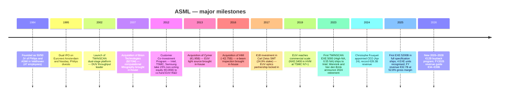
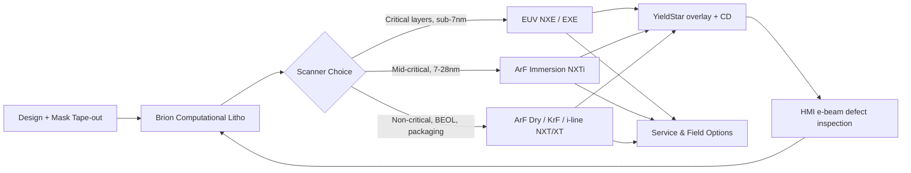
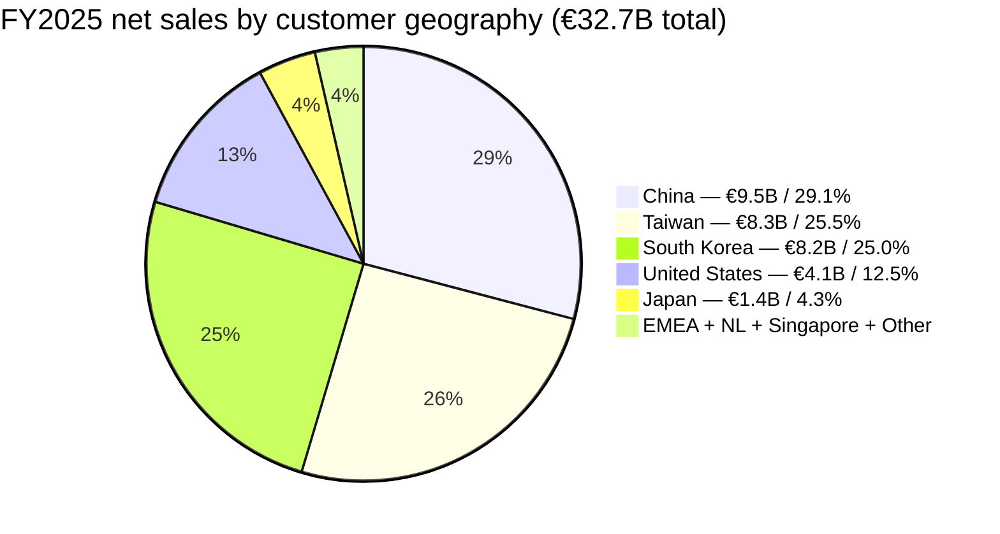
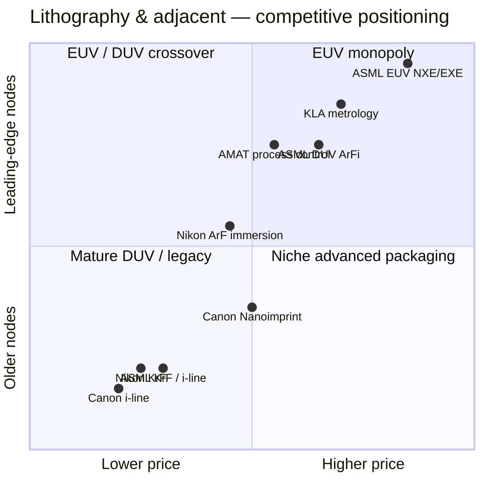

# Company Research Report: ASML Holding N.V.

**As of:** 2026-05-23
**Ticker:** ASML (NASDAQ ADR + Euronext Amsterdam) | **HQ:** Veldhoven, The Netherlands
**Filing basis:** 20-F filer (foreign private issuer). Primary source: ASML 2025 Annual Report on Form 20-F, filed 2026-02-25. Most recent earnings: Q4-2025 / FY2025 press release, 2026-01-28. Valuation snapshot: 2026-05-22 close (NYSE).

> **Update — FY2026 guidance initiated (2026-01-28):** Management initiated full-year 2026 total net sales guidance of **€34–€39 billion** versus FY2025 actual €32.7 billion (mid-point implies ~12% YoY growth), with gross margin between 51% and 53% and an annualized effective tax rate around 17%. Q1-2026 revenue is guided to **€8.2–€8.9 billion** with gross margin 51–53%. Management expects EUV revenue to be "significantly higher" in 2026, driven by advanced Logic and DRAM node ramps; non-EUV revenue is expected to be similar to 2025; service & field options to grow on the expanded installed base. The Board also announced a new **2026–2028 share-buyback program** of up to €12.0 billion at the same release.
> Source: [ASML reports €32.7 billion total net sales and €9.6 billion net income in 2025 — 6-K, 2026-01-28](https://www.sec.gov/Archives/edgar/data/937966/000162828026003701/form6-kquarterlyfilings.htm); long-term outlook reaffirmed in the [2025 20-F "Long-term growth opportunities"](https://www.sec.gov/Archives/edgar/data/937966/000162828026011378/asml-20251231.htm).

---

## Table of Contents

1. Company Overview
2. Company History
3. Management Team
4. Products & Services
5. Customers & Go-to-Market
6. Industry Overview
7. Competitive Landscape
8. Market Opportunity (TAM)
9. Risk Assessment
10. References

---

## 1. Company Overview

ASML Holding N.V. is the global monopoly supplier of extreme-ultraviolet (EUV) lithography systems and the leading supplier of deep-ultraviolet (DUV) immersion lithography systems used to print the most advanced semiconductor logic and memory devices in the world. Headquartered in Veldhoven, in the Brainport Eindhoven region of the Netherlands, ASML is — per its own 20-F language — "currently the world's only manufacturer of EUV lithography systems" ([ASML 2025 20-F, "Our products and services"](https://www.sec.gov/Archives/edgar/data/937966/000162828026011378/asml-20251231.htm); [ASML EUV product page](https://www.asml.com/en/products/euv-lithography-systems)).

The business model has three legs: **(1) new systems sales** — high-priced capital equipment sold to a small set of leading-edge foundries (TSMC), integrated device manufacturers (Intel, Samsung Foundry) and memory makers (Samsung Memory, SK Hynix, Micron); **(2) net service and field-option sales** — recurring revenue from maintenance, productivity upgrades, parts, software and refurbishment for the installed base, of which "approximately 95% of the systems we have sold in the last 30 years are still in use" per the company; and **(3) metrology & inspection (M&I)** — YieldStar optical-scatterometry tools and HMI multi-beam e-beam inspection systems, an adjacency that runs through the same TWINSCAN process-control loop ([ASML 2025 20-F, "Our products and services"](https://www.sec.gov/Archives/edgar/data/937966/000162828026011378/asml-20251231.htm); [ASML HMI page](https://www.asml.com/en/company/about-asml/hmi)).

In FY2025, ASML reported **total net sales of €32,667.3 million**, up 15.6% from €28,262.9 million in FY2024 and €27,558.5 million in FY2023. The mix was net system sales of €24,474.3 million (74.9% of total) and net service and field-option sales of €8,193.0 million (25.1%). FY2025 gross profit was €17,258.0 million (52.8% gross margin, up 150 bp YoY from 51.3%) and net income was €9,609.4 million (29.4% net margin) — figures verified verbatim against the consolidated statements of operations and the segment notes in the 20-F ([ASML 2025 20-F, KPIs and consolidated statements of operations](https://www.sec.gov/Archives/edgar/data/937966/000162828026011378/asml-20251231.htm)).

System-volume metrics: ASML recognised **48 EUV systems in 2025 (44 NXE + 4 EXE)** versus 44 (42 NXE + 2 EXE) in 2024, and **535 total lithography systems** including DUV (versus 583 in 2024 and 600 in 2023) — the unit decline alongside the revenue rise reflects a mix shift toward higher-ASP EUV and away from low-end mature-node KrF, which fell from 152 units in 2024 to 78 in 2025 as China mature-node front-loading completed ([ASML 2025 20-F, "Disaggregation of revenue" note](https://www.sec.gov/Archives/edgar/data/937966/000162828026011378/asml-20251231.htm)).

Geographic mix in FY2025 was heavily Asia-skewed: **China €9,519.7m (29.1%)**, **Taiwan €8,337.9m (25.5%)**, **South Korea €8,159.6m (25.0%)**, United States €4,089.1m (12.5%), Japan €1,420.9m (4.3%), and EMEA + Netherlands + Singapore + Other totalling roughly €1.1bn (3.6%). End-use split (systems revenue only) was **Logic €16,054.1m (65.6% of systems)** and **Memory €8,420.2m (34.4%)** — Logic share rose from 60.6% in FY2024 as advanced-foundry capacity additions accelerated for AI training and inference silicon ([ASML 2025 20-F, geographic and end-use notes](https://www.sec.gov/Archives/edgar/data/937966/000162828026011378/asml-20251231.htm)).

ASML reported **>44,000 total employees (FTEs)** at year-end 2025, with **143 nationalities** and **21% women**, 88% customer-satisfaction score, €4.7bn in R&D and **5,100 total suppliers** — figures presented verbatim at the front of the 20-F "At a glance" KPIs ([ASML 2025 20-F, "At a glance"](https://www.sec.gov/Archives/edgar/data/937966/000162828026011378/asml-20251231.htm)). The 5,100-supplier number is operationally load-bearing because EUV is in practice the most complex multinational sub-supply chain in industry, with Zeiss SMT (optics, in which ASML holds a 24.9% economic interest since 2017), Trumpf (CO₂ laser pump) and Cymer (light source, acquired in 2013) as single-source partners ([ASML invests €1B in Carl Zeiss SMT — Electro Optics, 2016-11-03](https://www.electrooptics.com/news/asml-invests-1-billion-zeiss-boost-euv-lithography); [ASML to acquire Cymer, 2012-10-17](https://www.asml.com/en/news/press-releases/2012/asml-to-acquire-cymer-to-accelerate-development-of-euv-technology)).

**Valuation snapshot (as of 2026-05-22 close).** ASML last price USD 1,632.90, market capitalisation USD 628.92 billion ([Stockanalysis.com — ASML statistics, 2026-05-22](https://stockanalysis.com/stocks/asml/statistics/)). On a trailing-twelve-month basis the stock trades at **TTM P/E 54.5×, TTM P/S 16.2×, EV/EBITDA 42.5× and forward P/E 41.6×**, with a dividend yield of ~0.46% and a continuous share-buyback program. Closest wafer-fab-equipment peers, all sourced from Stockanalysis.com on the same 2026-05-22 close:

| Company | TTM P/E | TTM P/S | EV/EBITDA | Mkt Cap |
|---|---|---|---|---|
| **ASML** | **54.5×** | **16.2×** | 42.5× | $628.9B |
| Applied Materials (AMAT) | 40.7× | 11.8× | 36.9× | $343.1B |
| Lam Research (LRCX) | 57.7× | 17.6× | 48.5× | $381.9B |
| KLA (KLAC) | 53.5× | 18.8× | 42.4× | $246.7B |
| Teradyne (TER) | 66.6× | 14.8× | 48.0× | $56.1B |
| **WFE 5-name median** | **54.5×** | **16.2×** | **42.5×** | — |

Sources: [Stockanalysis.com AMAT statistics, 2026-05-22](https://stockanalysis.com/stocks/amat/statistics/), [LRCX](https://stockanalysis.com/stocks/lrcx/statistics/), [KLAC](https://stockanalysis.com/stocks/klac/statistics/), [TER](https://stockanalysis.com/stocks/ter/statistics/).

ASML's multiples are **at the WFE peer median on P/E, P/S and EV/EBITDA simultaneously** — i.e. the market is not assigning ASML a discrete monopoly premium relative to AMAT / LRCX / KLAC at today's price, despite its structurally superior return profile (FY2025 gross margin 52.8% and operating margin ~34.6% versus AMAT and LRCX in the high-40s gross / low-30s operating). Why are the absolute multiples nonetheless high (P/E >50× is ~2× the long-run S&P 500 forward P/E)? The drivers, explicitly named in the FY2025 CEO letter and the 2024 Investor Day model, are: (a) **AI-infrastructure end-market premium** — "AI continues to be the key driver of the semiconductor market, with capital expenditure on training and inference reaching record levels among Cloud Service Providers"; (b) **EUV monopoly creating long-duration earnings visibility** — ASML carries multi-year customer backlog at EUV; (c) **management's explicit 2030 revenue model of €44–€60 bn at 56–60% gross margin**, with the market discounting the upper half of the range ([ASML 2024 Investor Day press release, 2024-11-14](https://www.sec.gov/Archives/edgar/data/937966/000093796624000024/pressreleaseinvestorday2024.htm); [2025 20-F, CEO letter and "Long-term growth opportunities"](https://www.sec.gov/Archives/edgar/data/937966/000162828026011378/asml-20251231.htm)). At a TTM P/E above 50× there is meaningful valuation risk if any of the structural drivers (China policy reversal, hyperscaler capex pause, High-NA delay) goes the wrong way — this is carried into Section 9 as a discrete valuation / multiple-compression risk.

Source: [ASML 2025 Annual Report on Form 20-F — KPIs and consolidated statement of operations](https://www.sec.gov/Archives/edgar/data/937966/000162828026011378/asml-20251231.htm).

---

## 2. Company History

ASML was founded in 1984 as a 50/50 joint venture between Dutch electronics conglomerate **Philips** and small Eindhoven-based equipment maker **Advanced Semiconductor Materials International (ASMI)**, to commercialise wafer-stepper technology developed inside Philips' Natuurkundig Laboratorium ("NatLab") ([ASML's founding story](https://www.asml.com/en/news/stories/2024/asml-founding-story); [ASML history page](https://www.asml.com/en/company/about-asml/history)). The venture began life with 47 employees in a prefabricated barracks next to the Philips campus and was the underdog of the lithography industry — Nikon, Canon and Perkin-Elmer / SVG dominated. ASML's first commercial stepper, the PAS 2500, shipped in 1985 ([ASML history page](https://www.asml.com/en/company/about-asml/history)). The company was carved out and IPO'd on Euronext Amsterdam and Nasdaq in March 1995.

ASML's competitive position turned in three structural steps. First, the 2002 introduction of the **TWINSCAN dual-wafer-stage** platform, which doubled throughput and made ASML the productivity leader in DUV ([ASML history page](https://www.asml.com/en/company/about-asml/history)). Second, the **2007 acquisition of Brion Technologies** for USD 270 million in cash — closed 8 March 2007 — which brought computational lithography (OPC, design-aware reticle enhancement) in-house ([ASML completes Brion acquisition, EE Times, 2007-03-08](https://www.eetimes.com/asml-completes-brion-acquisition/)). Third, the multi-decade collaboration with **Carl Zeiss SMT**, which culminated in a 24.9% economic-interest investment for €1.0 billion in cash agreed November 3 2016 and cleared by regulators in June 2017, locking in the optical column for both NXE and EXE EUV ([ASML invests €1B in Carl Zeiss SMT — Electro Optics, 2016-11](https://www.electrooptics.com/news/asml-invests-1-billion-zeiss-boost-euv-lithography); [ASML obtains regulatory approvals for strengthened partnership with Zeiss, 2017](https://www.asml.com/en/news/press-releases/2017/asml-obtains-regulatory-approvals-for-strengthened-partnership-with-zeiss)).

The seminal strategic decision was the multi-billion-euro EUV bet starting in the late 1990s. Management committed to a then-unfunded research program with US, EU and Japanese partners (including a **Customer Co-Investment Program** launched in 2012 in which Intel, TSMC and Samsung took an aggregate **23% non-voting equity stake in ASML for €3.85 billion in cash** in exchange for advance funding of EUV R&D) ([ASML 6-K Exhibit 99.1 — Customer Co-Investment Program, 2012-08-27](https://www.sec.gov/Archives/edgar/data/937966/000119312512370598/d402810dex991.htm)). EUV system revenue was effectively zero until 2010, near-zero until 2017, and only became material in 2019. By FY2023 EUV NXE accounted for €9.1 billion of system sales; in FY2025 EUV (NXE + EXE) reached €11.6 billion combined ([ASML 2025 20-F, "Disaggregation of revenue"](https://www.sec.gov/Archives/edgar/data/937966/000162828026011378/asml-20251231.htm)).

Two further acquisitions consolidated the holistic-lithography stack. The **2013 Cymer acquisition** — agreed October 2012, valued at €1.95 billion (cash-and-stock; each Cymer shareholder received $20 cash + 1.1502 ASML ordinary shares) — was vindicated when EUV source power scaled from sub-100 W in 2013 to over 500 W today ([ASML to acquire Cymer, press release, 2012-10-17](https://www.asml.com/en/news/press-releases/2012/asml-to-acquire-cymer-to-accelerate-development-of-euv-technology); [ASML Cymer page](https://www.asml.com/en/company/about-asml/cymer)). The **2016 HMI (Hermes Microvision) acquisition** at TWD 100bn (~€2.75bn) added multi-beam e-beam inspection ([ASML to acquire HMI, press release, 2016-06-16](https://www.asml.com/en/news/press-releases/2016/asml-to-acquire-hmi-to-enhance-holistic-lithography-product-portfolio); [ASML HMI page](https://www.asml.com/en/company/about-asml/hmi)).

Recent developments (2024–2026): the appointment of **Christophe Fouquet** as President & CEO and Chair of the Board of Management on April 24 2024, succeeding 25-year veteran Peter Wennink (CFO/CEO since 1999) and CTO Martin van den Brink (both retired) ([Introducing Christophe Fouquet, ASML's new CEO](https://www.asml.com/en/news/stories/2024/christophe-fouquet-asml-ceo); [ASML Board of Management changes, 2023-11-30](https://www.asml.com/en/news/press-releases/2023/asml-board-of-management-changes)); the shipment in early April 2025 of the first **TWINSCAN EXE:5200B High-NA system** at full specification (175 wph, 60% above EXE:5000) ([TrendForce — ASML confirms first High-NA EUV EXE:5200 shipment, 2025-07-17](https://www.trendforce.com/news/2025/07/17/news-asml-confirms-first-high-na-euv-exe5200-shipment-reportedly-prepping-for-intels-14a-in-2027/)); the announcement on 2026-01-28 of a new **2026–2028 share buyback program** of up to €12.0 billion to follow the completed 2022–2025 program ([Q4-2025 / FY2025 6-K, 2026-01-28](https://www.sec.gov/Archives/edgar/data/937966/000162828026003701/form6-kquarterlyfilings.htm)); and a **€1.3 billion minority investment in Mistral AI** in September 2025, ASML's first material financial stake outside the lithography ecosystem ([ASML and Mistral AI enter strategic partnership, 2025-09-09](https://www.asml.com/en/news/press-releases/2025/asml-mistral-ai-enter-strategic-partnership)).

---

## 3. Management Team

### A note on "founder"

ASML has no individual founder in the conventional sense — it was incorporated in 1984 as a 50/50 joint venture between Philips' NatLab and ASMI, both of which divested their stakes well before today's franchise existed (Philips fully exited via the 1995 IPO and follow-on placements through the late 1990s). The closest analogue to a "founding personality" in living institutional memory is Martin van den Brink, who joined the JV in 1984 as one of its first technical hires, became CTO, and remained on the Board of Management until his April 2024 retirement — but he was an employee, not a founder. The active leadership question for an investor in 2026 is therefore not about the founder but about whether the current CEO can sustain the franchise through the High-NA decade.

### Christophe D. Fouquet — President, CEO & Chair of the Board of Management

Christophe Fouquet is a French-trained physicist who joined ASML in 2008 and has spent his entire ASML career inside the lithography product organisation. He was appointed President and CEO and Chair of the Board of Management on April 24 2024, succeeding the long-tenured Peter Wennink (CEO since 2013, CFO 1999–2013) and CTO Martin van den Brink (both retired) ([Introducing Christophe Fouquet, ASML's new CEO](https://www.asml.com/en/news/stories/2024/christophe-fouquet-asml-ceo); [ASML Board of Management changes, 2023-11-30](https://www.asml.com/en/news/press-releases/2023/asml-board-of-management-changes); [Bits&Chips — Christophe Fouquet takes the reins at ASML](https://bits-chips.com/article/christophe-fouquet-takes-the-reins-at-asml/)). His promotion was the culmination of a publicly-telegraphed three-year succession plan: he was elevated to the Board of Management in 2018 and named Chief Business Officer / EVP in charge of all three product lines (EUV, DUV, Applications) in 2022 — effectively making him the single P&L leader for ASML's entire equipment franchise before becoming CEO.

Prior to joining ASML, Fouquet worked at **KLA-Tencor** (process control / metrology) and **Applied Materials** (deposition and etch), giving him competitor-side experience in the two adjacent equipment categories most likely to encroach on ASML's stack. Inside ASML he rose through Senior Director Marketing, Vice President Product Management, and from 2013 to 2018 Executive Vice President Applications — the customer-facing organisation that runs the engineering interface with TSMC, Samsung and Intel. He holds a master's degree in Physics from **Institut Polytechnique de Grenoble**, per the Bits&Chips profile of his appointment ([Bits&Chips — Christophe Fouquet takes the reins at ASML](https://bits-chips.com/article/christophe-fouquet-takes-the-reins-at-asml/)).

Fouquet's first two years as CEO have been defined by three operational choices, all documented in his 2025 letter to shareholders ([ASML 2025 20-F, "In conversation with Christophe Fouquet"](https://www.sec.gov/Archives/edgar/data/937966/000162828026011378/asml-20251231.htm)). First, an explicit **culture reset**: the CEO Q&A notes that ASML must "strengthen our focus on engineering and innovation" and rebuild the fast-moving culture that had been diluted by rapid headcount growth (FTEs have grown from ~32,000 at end-2022 to >44,000 at end-2025). Second, a re-focusing of the DUV business toward "quality and cost efficiency" rather than throughput-leadership-at-any-cost — a shift that the FY2025 MD&A credits with material DUV margin expansion. Third, a more activist capital-allocation posture: the €1.3 billion Mistral AI minority stake in September 2025 is the first material non-supplier balance-sheet bet ASML has taken outside the lithography ecosystem ([ASML and Mistral AI strategic partnership, 2025-09-09](https://www.asml.com/en/news/press-releases/2025/asml-mistral-ai-enter-strategic-partnership)). His 2025 total compensation was €7,021k, the highest in the Board of Management ([ASML 2025 20-F, Remuneration report](https://www.sec.gov/Archives/edgar/data/937966/000162828026011378/asml-20251231.htm)); his direct shareholding is small in percentage terms (the per-grant performance-share schedule disclosed in the Remuneration report shows 1,157 shares conditionally granted in April 2025), with most exposure delivered through performance-tied LTI on relative-TSR and EPS-growth metrics. The principal execution question for 2026–2028 is whether his organisational simplification can sustain engineering velocity on the High-NA roadmap (EXE:5200B → next-gen EXE → Hyper-NA) — this is the genuine bet, and is not yet proven.

---

## 4. Products & Services

### 4.1 The product matrix from the 2025 20-F (anchored to primary disclosure)

ASML's 2025 20-F discloses unit shipments and revenue for every product family in a single "Disaggregation of revenue" table (Note 2 to the consolidated financial statements). The table reproduced below is the primary anchor for everything else in this section — every product subsection cross-references back to it.

Source: [ASML 2025 20-F, Note 2 "Revenue from contracts with customers — Disaggregation of revenue"](https://www.sec.gov/Archives/edgar/data/937966/000162828026011378/asml-20251231.htm).

| Year ended Dec 31 | 2023 units | 2023 €m | 2024 units | 2024 €m | **2025 units** | **2025 €m** |
|---|---|---|---|---|---|---|
| EXE (High-NA EUV, 0.55 NA) | — | — | 2 | 465.0 | **4** | **1,156.9** |
| NXE (EUV, 0.33 NA) | 53 | 9,124.0 | 42 | 7,856.4 | **44** | **10,445.8** |
| ArF immersion (TWINSCAN NXTi) | 125 | 9,017.4 | 129 | 9,667.0 | **131** | **10,311.4** |
| ArF dry | 32 | 780.2 | 28 | 774.4 | **16** | **427.0** |
| KrF | 184 | 2,202.5 | 152 | 1,991.2 | **78** | **1,001.3** |
| I-line | 55 | 278.4 | 65 | 369.2 | **54** | **307.3** |
| Metrology & Inspection (M&I) | 151 | 536.1 | 165 | 645.5 | **208** | **824.6** |
| **Total net system sales** | **600** | **21,938.6** | **583** | **21,768.7** | **535** | **24,474.3** |

Plus **net service & field-option sales** of €5,619.9m (2023), €6,494.2m (2024) and **€8,193.0m (2025)**, bringing FY2025 total net sales to **€32,667.3m** ([ASML 2025 20-F, consolidated statements of operations](https://www.sec.gov/Archives/edgar/data/937966/000162828026011378/asml-20251231.htm)).

### 4.2 Synthesis — how the categories interact in a customer workflow

A modern leading-edge fab uses ASML's product families in an interlocking loop. **EUV (NXE + EXE)** prints the most critical layers (transistor gates, contact, lower interconnect) at sub-7nm logic and at HBM critical layers in DRAM; **ArF immersion (NXTi)** prints the next tier of critical layers at 7–28nm and complements EUV via multi-patterning at sub-EUV nodes; **ArF dry, KrF and i-line (NXT / XT)** print larger features (back-end interconnect, passivation, advanced-packaging redistribution); **Metrology & Inspection (YieldStar + HMI)** measures the printed pattern after each litho step and feeds the result back into ASML's **computational lithography software (Brion)**, which precomputes the next exposure's optical-proximity correction; and **service & field options** sells the productivity upgrades, parts and software that keep the installed base operational and progressively higher-throughput. This is the "holistic lithography" stack — and no competitor owns all of it. The diagram below shows the loop.

### 4.3 EUV Lithography — TWINSCAN NXE (0.33 NA) and TWINSCAN EXE (0.55 NA, High-NA)

> "Our EUV lithography systems make it possible to print the smallest features on microchips at the highest density, and are used for the most intricate, critical layers on the most advanced microchips. … ASML is currently the world's only manufacturer of EUV lithography systems." — [ASML 2025 20-F, "Our products and services — Extreme ultraviolet (EUV) lithography systems"](https://www.sec.gov/Archives/edgar/data/937966/000162828026011378/asml-20251231.htm)

> "In 2025, we shipped TWINSCAN NXE:3800E systems to our customers at full specification, which includes 220 wafers-per-hour throughput – a 37% improvement compared to the TWINSCAN NXE:3600D – a higher-power light source, new wafer handler, faster wafer stages and high-power imaging control functionality." — [ASML 2025 20-F, "Latest: TWINSCAN NXE:3800E reaches full productivity specification"](https://www.sec.gov/Archives/edgar/data/937966/000162828026011378/asml-20251231.htm)

> "In early April 2025, we shipped our first TWINSCAN EXE:5200B system – the successor to the TWINSCAN EXE:5000 – ready to be used in high-volume manufacturing. At 175 wafers per hour, it offers 60% higher productivity compared to the TWINSCAN EXE:5000 – thanks to an improved EUV light source that delivers increased power at the wafer level." — [ASML 2025 20-F, "Latest: Success with our TWINSCAN EXE:5200B"](https://www.sec.gov/Archives/edgar/data/937966/000162828026011378/asml-20251231.htm)

**Plain-language gloss / 中文释义.** EUV (extreme ultraviolet, 极紫外, 13.5nm wavelength) lithography is the photographic-printing step that uses the shortest practical wavelength of light to define the smallest possible features on a chip. Because no transparent optic exists for 13.5nm light, the entire optical path uses **reflective mirrors (反射镜) rather than refractive lenses**, with each mirror coated in alternating Mo/Si layers (~50 pairs) by Carl Zeiss SMT in Oberkochen. The light source is a laser-produced-plasma (LPP) generator: a high-power CO₂ laser (built by Trumpf) hits a tin droplet ~50,000 times per second to generate the EUV plasma, and ASML's Cymer subsidiary integrates this into the scanner. **NXE** is the 0.33 NA generation that prints sub-7nm logic critical layers and HBM DRAM critical layers; **EXE** is the 0.55 NA "High-NA" generation — a larger numerical aperture means finer minimum feature size with a single exposure, replacing multi-exposure EUV at sub-2nm nodes. EXE is sometimes called "high-NA EUV / 高数值孔径极紫外" in Chinese trade press. EXE systems use a 4×/8× anamorphic optical column (larger horizontal demagnification than vertical) and a half-field reticle — a meaningful change in mask-design workflow for customers. The EXE platform was "designed to maximize commonality with the NXE platform, to drive cost reduction" per the 20-F.

EUV unit and revenue trajectory (verbatim from the table in §4.1): NXE went 53 units / €9.1bn (2023) → 42 / €7.9bn (2024) → **44 / €10.4bn (2025)**; EXE went 0 → 2 / €465m → **4 / €1,157m**. NXE revenue rose 33% YoY on stable units (mix shift to the higher-ASP NXE:3800E); EXE more than doubled in revenue on doubling units. By end of 2025, ASML's customers had cumulatively exposed **>400,000 wafers on High-NA EUV systems**, per the CEO Q&A — past the early-development threshold but still pre-HVM ([ASML 2025 20-F, CEO Q&A](https://www.sec.gov/Archives/edgar/data/937966/000162828026011378/asml-20251231.htm)). High-volume manufacturing on EXE is expected to start in 2027.

*Analyst view:* EUV (NXE + EXE) is the only product category in semicap where one supplier holds 100% global share (per ASML's own 20-F quoted above: "currently the world's only manufacturer of EUV lithography systems"). Neither Nikon nor Canon has shipped a commercial 0.33 NA EUV scanner; both have publicly redirected their roadmaps elsewhere — Nikon to next-generation ArF immersion ([TrendForce — Nikon aims to close the gap on ASML with new ArF lithography system in FY28, 2025-02-21](https://www.trendforce.com/news/2025/02/21/news-nikon-aims-to-close-the-gap-on-asml-with-new-arf-lithography-system-in-fy28/)), Canon to Nanoimprint for non-critical layers ([TrendForce — Canon delivers Nanoimprint Lithography to TIE, 2024-09-30](https://www.trendforce.com/news/2024/09/30/news-canon-delivers-nanoimprint-lithography-system-to-tie-reportedly-capable-of-producing-2nm-chips/)). The moat is the combination of (i) Carl Zeiss SMT's exclusive supply of EUV optics (ASML has a 24.9% equity interest); (ii) >25 years of cumulative R&D inside ASML's own walls; (iii) the customer co-investment-locked roadmap with Intel, TSMC and Samsung from 2012; and (iv) a supplier base re-built around EUV (Cymer in-house, Trumpf, dozens of single-source European mid-sized vendors). No credible substitute exists for sub-2nm logic critical layers in the 2026–2030 window — see Section 7 for Canon Nanoimprint and SMEE positioning, both real but contained.

### 4.4 DUV Lithography — TWINSCAN NXTi (ArF immersion), NXT/XT (ArF dry, KrF, i-line)

> "DUV lithography systems are the workhorses of the industry, producing the majority of layers in microchips. Supporting numerous market segments, our immersion and dry lithography systems use a range of light sources to offer all wavelengths currently used in the semiconductor industry – argon fluoride (ArF) lasers for 193 nm wavelength, krypton fluoride (KrF) lasers for 248 nm and mercury vapor discharge lamps (i-line) for 365 nm." — [ASML 2025 20-F, "Our products and services — Deep ultraviolet (DUV) lithography systems"](https://www.sec.gov/Archives/edgar/data/937966/000162828026011378/asml-20251231.htm)

> "Argon fluoride (ArF) immersion lithography maintains a thin layer of water between the lens and the wafer, increasing NA to improve resolution and to support further shrink. Our immersion systems are suitable for both single-exposure and multiple-patterning lithography, and can be used in seamless combination with EUV systems to print different layers on the same chip." — [ASML 2025 20-F, "Immersion systems (TWINSCAN NXTi platform)"](https://www.sec.gov/Archives/edgar/data/937966/000162828026011378/asml-20251231.htm)

> "The TWINSCAN XT:260, the latest addition to our i-line portfolio, combines high throughput with the imaging accuracy of a scanner. It offers up to four times higher productivity compared to existing solutions, making it a cost-effective technology to support our customers in 3D integration applications, including advanced packaging, as well as other emerging technologies, such as image sensors, displays and photonics." — [ASML 2025 20-F, "Latest: TWINSCAN XT:260"](https://www.sec.gov/Archives/edgar/data/937966/000162828026011378/asml-20251231.htm)

**Plain-language gloss / 中文释义.** DUV (deep ultraviolet, 深紫外) is the previous-generation wavelength family — 193nm (ArF, argon-fluoride) and 248nm (KrF, krypton-fluoride) excimer lasers plus 365nm (i-line, 汞灯) mercury-arc lamps. **ArF immersion / 浸没式 (NXTi)** is the highest-resolution DUV: a thin layer of water sits between the final lens and the wafer, raising the effective numerical aperture from <1 (dry) to ~1.35 (immersed), which translates into smaller minimum feature size. ArF immersion is the workhorse for 7–28nm critical layers, multi-patterning fillers under EUV, and is also the dominant tool the Chinese mature-node build-out has been buying. **ArF dry** and **KrF** print larger features at 90–180nm — back-end interconnect, passivation, mature analog and discrete power. **I-line (NXT/XT)** at 365nm handles the largest features, advanced packaging (redistribution layers, TSV / through-silicon-via 通孔 patterning) and discrete logic. The **TWINSCAN XT:260**, launched in 2025, is ASML's first scanner-quality i-line tool targeted at advanced packaging — a market historically served by Veeco, EVG and SUSS MicroTec.

DUV unit and revenue trajectory: ArF immersion grew 125 → 129 → 131 units and €9.0bn → €9.7bn → €10.3bn (a steady mid-single-digit ASP / mix grind upward as customers buy newer NXT:2050i / NXT:2100i tools). ArF dry, KrF and i-line all declined in 2025 as the China mature-node front-loading cycle ended — KrF in particular halved from 152 → 78 units. The XT:260 is the most consequential DUV launch in years because it puts ASML into an adjacency (advanced-packaging litho) it had not historically owned.

*Analyst view:* ASML is the share leader in ArF immersion by a wide margin; Nikon's NSR-S631E / NSR-S635E ship in low double-digit units annually to specific Japanese DRAM and mature-node Chinese customers ([Nikon FY March-2025 Financial Results, 2025-05-08](https://www.nikon.com/company/ir/ir_library/result/pdf/2025/25_1_e.pdf); [Bits&Chips — Nikon aims to challenge ASML's dominance in ArF immersion](https://bits-chips.com/article/nikon-aims-to-challenge-asmls-dominance-in-arf-immersion/)). The ASML/Nikon ArF immersion unit-share split is not directly disclosed by either company; sell-side estimates place ASML in the high-80s to low-90s percent range. KrF and i-line are more contested — Nikon, Canon and several Chinese vendors all participate. For advanced-packaging i-line, the XT:260 is positioned against Canon's i-line FPA-5550iZ2 and Veeco's lithography tools; the "four times higher productivity" claim is ASML's own ([ASML 2025 20-F](https://www.sec.gov/Archives/edgar/data/937966/000162828026011378/asml-20251231.htm)) and has not yet been benchmarked against competitors at HVM.

### 4.5 Metrology & Inspection — YieldStar (optical) and HMI (e-beam)

> "Our metrology and inspection systems enable chipmakers to accurately measure the printed patterns on wafers to make sure they align with the intended designs. … They deliver data with the required speed and accuracy for high-volume manufacturing, enabling our process control software solutions to implement automated feedback control loops." — [ASML 2025 20-F, "Metrology and inspection systems"](https://www.sec.gov/Archives/edgar/data/937966/000162828026011378/asml-20251231.htm)

> "Our YieldStar optical metrology systems use light to monitor patterning performance at the speed of high-volume manufacturing. They measure overlay and provide real-time feedback to lithography systems so they can correct for any imperfections in the printed pattern." — [ASML 2025 20-F, "Optical metrology (YieldStar)"](https://www.sec.gov/Archives/edgar/data/937966/000162828026011378/asml-20251231.htm)

**Plain-language gloss / 中文释义.** Metrology & Inspection (量测与检测, M&I) is the after-step measurement that closes the litho feedback loop. **YieldStar** uses scatterometry (light-diffraction-based pattern reconstruction) to measure overlay (套刻精度, layer-to-layer alignment) and critical-dimension uniformity at production speed; **HMI multi-beam e-beam** uses dozens of parallel electron beams to find sub-resolution defects at orders-of-magnitude higher throughput than single-beam e-beam tools. HMI was acquired from Hermes Microvision (Taiwan) in November 2016 for TWD 100 billion (~€2.75bn) ([ASML to acquire HMI, 2016-06-16](https://www.asml.com/en/news/press-releases/2016/asml-to-acquire-hmi-to-enhance-holistic-lithography-product-portfolio); [ASML HMI page](https://www.asml.com/en/company/about-asml/hmi)).

M&I unit and revenue trajectory was the fastest in the FY2025 disaggregation: 151 → 165 → **208 units** and €536m → €646m → **€825m** — a 28% revenue YoY and 26% unit YoY rise in 2025 alone, the strongest segment growth.

*Analyst view:* Standalone wafer inspection is a category that KLA Corporation dominates globally. KLA's wafer-process control franchise generated ~$12.2bn in revenue in FY2025 — multiples larger than ASML M&I's €825m — and KLA reported double-digit wafer-inspection growth in its most recent quarters ([KLA Q3 FY2025 earnings release, 2025-04](https://www.sec.gov/cgi-bin/browse-edgar?action=getcompany&CIK=0000319201&type=10-Q)). ASML M&I is differentiated when bundled tightly with TWINSCAN scanners (the YieldStar–TWINSCAN feedback loop is proprietary to ASML); on a standalone basis it does not lead. The moat is integration, not standalone IP.

### 4.6 Service & Field Options + Refurbished Systems — the recurring-revenue engine

> "ASML systems have a very long operational lifetime that often exceeds their role for the initial customer – approximately 95% of the systems we have sold in the last 30 years are still in use." — [ASML 2025 20-F, "Refurbished systems"](https://www.sec.gov/Archives/edgar/data/937966/000162828026011378/asml-20251231.htm)

**Plain-language gloss / 中文释义.** Service & field-option sales / 服务与现场升级收入 covers (a) ongoing maintenance contracts on the multi-thousand-unit installed base, (b) productivity-upgrade packages sold into existing tools (e.g. PEP-E software that lifted NXE:3800E from 220 → 230 wph), (c) consumable parts and (d) refurbished-system sales (recertified used scanners re-sold to second-buyer fabs). Because EUV systems are far more complex than DUV and carry higher service-contract dollars per system, the recurring annuity scales materially faster than the installed-base unit count.

**Net service and field-option sales were €8,193.0m in 2025**, up 26.2% YoY from €6,494.2m in 2024 — driven by (a) the growing EUV installed base, (b) higher utilisation in customer fabs and (c) "more NXE field upgrades" (the 20-F's wording) as TSMC and Samsung adopted the NXE:3800E productivity package ([ASML 2025 20-F MD&A](https://www.sec.gov/Archives/edgar/data/937966/000162828026011378/asml-20251231.htm)). Service & field options is ~25% of FY2025 total revenue and is the non-cyclical floor under the system-sales cycle — at the 2023 trough (when total revenue fell), service still grew.

*Analyst view:* Service on first-party EUV is a 100% ASML monopoly — proprietary firmware, diagnostics, mirror-handling and source-power-control IP make third-party service practically infeasible. DUV service is partially contested by third-party vendors on older tools, but the proprietary upgrade roadmap (productivity packages, optics swaps) is captive. The 95%-still-in-use number puts a multi-decade runway under this revenue stream.

### 4.7 Flagship vs. long-tail; recent launches and sunsets

The **three flagship products** driving the business in 2025–2026 are: (1) the **TWINSCAN NXE:3800E** EUV scanner (the 220–230 wph workhorse for advanced Logic critical layers and HBM DRAM); (2) the **TWINSCAN NXTi (NXT:2050i / NXT:2100i) ArF immersion** family (the high-volume DUV cash generator); and (3) the **TWINSCAN EXE:5200B High-NA** system (the future of the franchise post-2027 HVM) ([ASML 2025 20-F, CEO Q&A](https://www.sec.gov/Archives/edgar/data/937966/000162828026011378/asml-20251231.htm)). Notable 2025 launches: **TWINSCAN XT:260** (advanced-packaging i-line entry), **TWINSCAN EXE:5200B** (High-NA volume successor at 175 wph), **NXE:3800E** at full specification including the **Productivity Enhancement Package – Extended (PEP-E)**. Notable sunsets / phase-outs: ArF dry, KrF and i-line shipments materially down YoY as China mature-node front-loading completed.

---

## 5. Customers & Go-to-Market

ASML sells to a small set of leading-edge semiconductor manufacturers globally. Concentration is extreme and is the single most-disclosed risk factor in the 2025 20-F.

**Top-customer concentration (FY2025): four customers each individually exceeded 10% of total net sales, totalling €20.0 billion, or 61.2% of total net sales** — verbatim from the 20-F. This compares to **four customers at €15.2bn / 53.8% in FY2024** and **two customers at €14.9bn / 53.9% in FY2023** — concentration has risen, not fallen, as EUV revenue has scaled. ASML does not publicly name the four 10%+ customers (the company never has, even on earnings calls), but the public investor consensus — supported by the company's product disclosures and the geographic breakdown — is that they are **TSMC (Taiwan), Samsung Electronics (Korea, Foundry + Memory consolidated), SK Hynix (Korea) and Intel (US)** ([ASML 2025 20-F, customer concentration note](https://www.sec.gov/Archives/edgar/data/937966/000162828026011378/asml-20251231.htm)).

ASML's three largest customers also accounted for **€1.3 billion (35.4%) of accounts receivable and finance receivables at December 31 2025**, down from **€2.6 bn (54.1%) at December 31 2024** and **€3.7 bn (64.4%) at December 31 2023** — the YoY decline in receivables-concentration reflects faster customer payment, not lower revenue concentration ([ASML 2025 20-F, Accounts receivable note](https://www.sec.gov/Archives/edgar/data/937966/000162828026011378/asml-20251231.htm)). Contract structure: ASML uses long-dated master purchase agreements with the top customers (rolling annual order books, multi-year backlog), but each individual system is a separate purchase order with payment-on-acceptance milestones. There is no minimum-purchase commitment in standard customer contracts.

Source: [ASML 2025 20-F, Note 2 "Disaggregation of revenue — per end-use"](https://www.sec.gov/Archives/edgar/data/937966/000162828026011378/asml-20251231.htm).

The Logic / Memory end-use split is **65.6% Logic (€16,054.1m, 364 units) / 34.4% Memory (€8,420.2m, 171 units)** in FY2025, versus 60.6%/39.4% in FY2024 and 72.9%/27.1% in FY2023 — Memory share rose materially in 2024 on the DRAM HBM ramp before partially normalising in 2025 as Logic accelerated ([ASML 2025 20-F, end-use note](https://www.sec.gov/Archives/edgar/data/937966/000162828026011378/asml-20251231.htm)).

Source: [ASML 2025 20-F, "Total net sales and long-lived assets by geographic region"](https://www.sec.gov/Archives/edgar/data/937966/000162828026011378/asml-20251231.htm).

Source: [ASML 2025 20-F geographic note](https://www.sec.gov/Archives/edgar/data/937966/000162828026011378/asml-20251231.htm).

**Customer concentration trigger.** FY2025's top-4 = 61.2% of revenue is well above the skill's "top-5 > 50%" risk threshold; combined with the fact that ASML's single largest geography (China at 29.1%) is subject to active Dutch and US export controls, customer concentration is the dominant company-specific risk and is carried into Section 9 as such.

**Channel and sales model.** ASML's go-to-market is 100% direct — no distributors. Sales cycles are long (typically 12–36 months from initial system specification to revenue recognition). Each Tier-1 customer has a dedicated ASML field-engineering and product-management team co-located at the customer's process-development site (Hsinchu for TSMC, Hwaseong for Samsung, Hillsboro / Chandler for Intel, Cheongju and Wuxi for SK Hynix). At year-end 2025 ASML reported "more than 10,000 customer support engineers" embedded with customers — i.e. roughly 23% of total FTEs are permanently embedded with the buyer base ([ASML 2025 Annual Report — Financials microsite](https://www.asml.com/en/investors/annual-report/2025/financials); [Nasdaq — ASML's installed-base-management business](https://www.nasdaq.com/articles/asmls-installed-base-management-business-picks-whats-driving-it)). This is the structural moat that prevents any competitor from credibly entering EUV service even if it ever cracked the hardware.

---

## 6. Industry Overview

ASML operates in the **semiconductor lithography equipment** sub-segment of the broader **wafer-fab-equipment (WFE)** industry. Lithography is the single highest-value capex line in a modern wafer fab — at leading-edge nodes, lithography accounts for roughly 20–30% of total fab equipment spend, with the exact percentage rising as EUV / High-NA layer counts increase per node ([ASML 2024 Investor Day press release, 2024-11-14](https://www.sec.gov/Archives/edgar/data/937966/000093796624000024/pressreleaseinvestorday2024.htm); [SEMI World Fab Forecast — April 2026 release](https://www.semi.org/en/products-services/market-data/world-fab-forecast)).

**Industry scope.** WFE includes lithography (ASML, Nikon, Canon), deposition and etch (Applied Materials, Lam Research, Tokyo Electron), process control / metrology (KLA, Onto Innovation), test (Teradyne, Advantest), and CMP, ion implant, thermal and cleaning tools. SEMI's most recent (April 1 2026) 300mm-fab forecast projects global 300mm fab equipment spending of **USD 133 billion in 2026 (up 18% YoY) and USD 151 billion in 2027 (up 14%)** ([SEMI — 300mm equipment spending forecast, 2026-04-01, via PRNewswire](https://www.prnewswire.com/news-releases/semi-projects-double-digit-growth-in-global-300mm-fab-equipment-spending-for-2026-and-2027-302730416.html); [Bits&Chips — Semi equipment spending edges up in 2025 before jumping in 2026](https://bits-chips.com/article/semi-equipment-spending-edges-up-in-2025-before-jumping-in-2026/)). Lithography is the largest single equipment category by value, with ASML capturing the overwhelming majority of revenue — FY2025 ASML revenue of €32.7bn (~USD 35.5bn at year-end FX) compared to Nikon's precision-equipment segment of ~¥219 billion (USD ~1.4bn) and Canon semiconductor equipment of ~¥350 billion (USD 2.2bn) ([Nikon FY March-2025 Financial Results, 2025-05-08](https://www.nikon.com/company/ir/ir_library/result/pdf/2025/25_1_e.pdf); Canon's semiconductor equipment is disclosed in their integrated annual report).

**End-market context.** The Semiconductor Industry Association reported total **global semiconductor sales of USD 627.6 billion in 2024 (+19.1% YoY)** and **USD 791.7 billion in 2025 (+25.6% YoY)** — the second consecutive year of >19% growth, driven by AI-infrastructure compute demand ([SIA — Global Semiconductor Sales Increase 19.1% in 2024](https://www.semiconductors.org/global-semiconductor-sales-increase-19-1-in-2024-double-digit-growth-projected-in-2025/); [SIA — Global Annual Semiconductor Sales Increase 25.6% to $791.7 Billion in 2025](https://www.semiconductors.org/global-annual-semiconductor-sales-increase-25-6-to-791-7-billion-in-2025/)). Within that, AI accelerators and HBM DRAM drove the largest absolute dollar increases — logic products totalled $212.6bn and memory products $165.1bn in 2024 per SIA's annual data release.

**Growth drivers.** Lithography demand is structurally tied to (i) **leading-edge logic capex** by foundries and IDMs at the 5nm/3nm/2nm/1.4nm nodes, where EUV and increasingly High-NA EUV are mandatory; (ii) **advanced DRAM** capacity for AI applications, where HBM3E and HBM4 require EUV exposures on critical layers — the proximate driver of EUV pull-through into Memory customers; (iii) **mature / specialty node capacity** (largely China-driven), which feeds ArF immersion, KrF and i-line shipments; and (iv) **advanced packaging** (CoWoS, hybrid bonding, fan-out), which just started consuming dedicated litho capacity and which ASML entered in 2025 with the XT:260 ([ASML 2025 20-F, Section "Our marketplace"](https://www.sec.gov/Archives/edgar/data/937966/000162828026011378/asml-20251231.htm)).

**Long-term industry size.** ASML disclosed at its November 2024 Investor Day a **2030 revenue opportunity of €44–€60 billion for itself, at a gross margin of 56–60%** ([ASML 2024 Investor Day press release, 2024-11-14](https://www.sec.gov/Archives/edgar/data/937966/000093796624000024/pressreleaseinvestorday2024.htm); reaffirmed in [2025 20-F "Long-term growth opportunities"](https://www.sec.gov/Archives/edgar/data/937966/000162828026011378/asml-20251231.htm)). The implied 2025–2030 revenue CAGR for ASML is 6.2% (low case) to 12.9% (high case). End-market projections cluster at **USD 1.0–1.1 trillion in semiconductor revenue by 2030**, an ~8–10% end-market CAGR from the 2024 base, with AI-infrastructure / data-center as the dominant driver.

**Trends and technological change.** Three dynamics dominate. (1) **EUV scaling continues** — every node transition (3nm → 2nm → 1.4nm) increases the EUV-exposure layer count per wafer (sell-side disclosures cluster around 15–25 EUV layers at 3nm rising to 25–40+ at 1.4nm), which is direct ASML scanner-demand pull-through. (2) **The end of single-patterning DUV** at sub-7nm means layers that previously needed quadruple ArF immersion can collapse to a single EUV exposure — a one-for-many tool-substitution that favors ASML. (3) **High-NA EUV** is the path beyond 2nm logic; the EXE:5000 → EXE:5200B → next-gen-EXE cycle is the multi-year revenue inflection beyond 2027. The industry's only meaningful alternative — **Canon Nanoimprint Lithography (NIL)**, FPA-1200NZ2C, in production at Kioxia for some non-critical 3D NAND layers — is positioned for limited use; defect-density, throughput and alignment constraints confine it to non-critical layers ([TrendForce — Canon delivers Nanoimprint Lithography to TIE, 2024-09-30](https://www.trendforce.com/news/2024/09/30/news-canon-delivers-nanoimprint-lithography-system-to-tie-reportedly-capable-of-producing-2nm-chips/); [IO+ — Canon Nanoimprint analysis](https://ioplus.nl/archive/en/yes-canons-nanoimprint-lithography-system-can-stir-the-semiconductor-industry-but-does-it-rival-asml-hold-your-horses/)).

**Regulatory environment — the defining feature of ASML's industry.** Lithography equipment — specifically EUV and the most-advanced DUV (NXT:2000i and above) and certain M&I systems — is subject to extensive multi-jurisdiction export control.

- **Netherlands export controls** — effective **January 15 2025**, the Netherlands expanded export-control regulations to cover additional semiconductor manufacturing equipment, primarily certain metrology and inspection systems, in addition to the previously-restricted EUV (since 2019) and immersion DUV NXT:2000i+ (since 2023). License requirements now apply broadly to advanced systems destined for Chinese end-users ([Netherlands government — Klever announcement, 2025-01-15](https://www.government.nl/latest/news/2025/01/15/klever-export-controls-on-advanced-semiconductor-manufacturing-equipment-to-be-tightened); [Bits&Chips — metrology equipment to be added to Dutch export restriction list](https://bits-chips.com/article/metrology-equipment-to-be-added-to-dutch-export-restriction-list/)).
- **US export controls** — the BIS rules of October 2022 and October 2023 apply to ASML on US-origin content (notably the Cymer-built light sources manufactured in San Diego); these rules block EUV sales to China entirely and restrict advanced DUV ([ASML 2025 20-F, Risk factors](https://www.sec.gov/Archives/edgar/data/937966/000162828026011378/asml-20251231.htm)).
- **Foreign Direct Product Rule** — extends US reach to non-US-made equipment containing US-origin technology.

In practice ASML has navigated the regime by: (a) shipping EUV only to non-Chinese customers (TSMC, Samsung, Intel, SK Hynix, Micron); (b) continuing to ship ArF immersion and older DUV to Chinese mature-node fabs under license; (c) refusing service of certain restricted tools at certain Chinese customers from January 2024 onward. China revenue rose from 26.3% (2023) to 36.1% (2024) and **declined to 29.1% in 2025** — the 2024 spike was front-loading of mature-node orders ahead of expected further controls; 2025 reflects normalisation ([ASML 2025 20-F geographic note](https://www.sec.gov/Archives/edgar/data/937966/000162828026011378/asml-20251231.htm)).

**Industry structure.** Litho is an extreme oligopoly: ASML, Nikon, Canon. Within EUV ASML has **100% global share** (no competitor has a product). Within immersion DUV ASML is the wide-share leader; within mature DUV (KrF, i-line) Nikon and Canon hold meaningfully larger positions. Barriers to entry are essentially absolute: ~30 years of cumulative R&D, 5,100 supplier relationships, Zeiss SMT optics exclusivity, Cymer light-source IP, a >16,000-patent-family portfolio, and customer co-investment-locked roadmap. Supplier power is mixed — Zeiss SMT, Trumpf and Cymer are single-source on critical sub-systems. Buyer power is concentrated (top-4 customers = 61% of revenue) but each top-4 customer is itself dependent on ASML for leading-edge capacity — a mutual dependency.

---

## 7. Competitive Landscape

The list of competitors named in ASML's own 20-F is short and asymmetric. ASML names **Nikon Corporation** and **Canon Inc.** as direct lithography competitors, plus **Applied Materials Inc. and KLA Corporation** for "applications that support or enhance complex patterning solutions" — i.e. adjacent process-control / metrology, not core lithography ([ASML 2025 20-F, "Competition"](https://www.sec.gov/Archives/edgar/data/937966/000162828026011378/asml-20251231.htm)).

### Direct lithography competitors

**Nikon Corporation (TSE: 7731).** Nikon is the largest historical lithography competitor. Its precision-equipment segment (FPD + semiconductor lithography combined) generates roughly **¥219 billion (USD ~1.4 billion) annually** versus ASML's ~USD 35.5 billion — a >25× revenue gap ([Nikon FY March-2025 Financial Results, 2025-05-08](https://www.nikon.com/company/ir/ir_library/result/pdf/2025/25_1_e.pdf)). Nikon ships a small number of ArF immersion (NSR-S631E, NSR-S635E) and KrF tools annually, primarily to Japanese DRAM, mature-node Chinese customers and a few specialty fabs ([TrendForce — Nikon aims to close the gap on ASML with new ArF lithography system in FY28, 2025-02-21](https://www.trendforce.com/news/2025/02/21/news-nikon-aims-to-close-the-gap-on-asml-with-new-arf-lithography-system-in-fy28/)). Differentiator: optics quality and pricing flexibility for second-source-strategy buyers. *Analyst view:* cannot match ASML on EUV (no product), throughput in immersion (Nikon historically built single-stage), or software / computational litho integration (no equivalent of Brion). Competitive position: contained.

**Canon Inc. (TSE: 7751).** Canon ships i-line and KrF tools to legacy and back-end packaging customers and is the leading vendor of **Nanoimprint Lithography (NIL)** — its FPA-1200NZ2C product is in production at Kioxia for some non-critical 3D NAND layers and is occasionally repackaged as a low-cost EUV alternative ([TechSpot — Canon FPA-1200NZ2C launch coverage](https://www.techspot.com/news/100489-canon-challenges-asml-supremacy-chip-manufacturing-new-nanoimprint.html) (note: TechSpot URL returns HTTP 403 to programmatic clients but loads in browsers); [TrendForce — Canon nanoimprint to TIE, 2024-09](https://www.trendforce.com/news/2024/09/30/news-canon-delivers-nanoimprint-lithography-system-to-tie-reportedly-capable-of-producing-2nm-chips/)). *Analyst view:* NIL has fundamental limitations (defect density, throughput, alignment) that confine it to non-critical layers; not a credible EUV substitute in the 2026–2030 window ([IO+ — Canon nanoimprint analysis](https://ioplus.nl/archive/en/yes-canons-nanoimprint-lithography-system-can-stir-the-semiconductor-industry-but-does-it-rival-asml-hold-your-horses/)).

### Adjacent equipment competitors (named in ASML's 20-F Competition section)

These do not directly compete on litho hardware but compete for the same customer capex dollars and overlap on "applications that support or enhance complex patterning solutions" — ASML's own language:

- **Applied Materials (NASDAQ: AMAT)** — the largest WFE company by total revenue (~USD 28 bn FY2025), spanning deposition, etch, CMP, ion implant, e-beam metrology and AGS service ([AMAT Q4 FY2025 results, 8-K Exhibit 99.1, 2025-11](https://www.sec.gov/Archives/edgar/data/0000006951/000162828025051998/exhibit991q42025earningsre.htm)). Selectively competes with ASML in process control and computational-litho-related applications. Trades at TTM P/E 40.7× / P/S 11.8× ([Stockanalysis.com — AMAT statistics, 2026-05-22](https://stockanalysis.com/stocks/amat/statistics/)).
- **Lam Research (NASDAQ: LRCX)** — deposition and etch leader (~USD 20.6 bn revenue FY2025), no direct litho overlap but is the largest single beneficiary alongside ASML of advanced-node ramps ([LRCX Q4 FY2025 results, 8-K Exhibit 99.1](https://www.sec.gov/Archives/edgar/data/0000707549/000070754925000068/lrcx_exhibitx991xq4x2025.htm)). TTM P/E 57.7× / P/S 17.6× ([Stockanalysis.com — LRCX statistics, 2026-05-22](https://stockanalysis.com/stocks/lrcx/statistics/)).
- **KLA Corporation (NASDAQ: KLAC)** — process control / metrology / inspection global leader (~USD 12.2 bn FY2025 revenue). Direct competitor to ASML's YieldStar and HMI standalone product lines; customers typically buy both. TTM P/E 53.5× / P/S 18.8× ([Stockanalysis.com — KLAC statistics, 2026-05-22](https://stockanalysis.com/stocks/klac/statistics/)).
- **Tokyo Electron (TSE: 8035)** — Japanese WFE major. Its coater / developer ("track") is the on-tool partner to every ASML scanner; TEL ships the wafer to ASML and receives it back. Effectively a partner more than a competitor ([ASML and TEL strategic alliance press release, 2003](https://www.asml.com/en/news/press-releases/2003/asml-and-tel-form-strategic-alliance); [Tokyo Electron–imec–ASML EUV collaboration, 2021](https://www.tel.com/news/topics/2021/20210608_001.html)).
- **Teradyne (NASDAQ: TER), Onto Innovation, Camtek, Veeco** — smaller test, metrology and advanced-packaging-tool vendors with no material ASML overlap.

### Emerging / niche competitors

**Shanghai Micro Electronics Equipment (SMEE)** — China's domestic litho leader, working on a 28nm ArF immersion tool (SSA800 platform) for over a decade. SMEE announced delivery of its first SSA800-class system in 2025, with SMIC and Hua Hong building validation lines ([TrendForce — AMIES rises in China's lithography push, 2025-10-21](https://www.trendforce.com/news/2025/10/21/news-amies-rises-in-chinas-lithography-push-reportedly-capturing-90-of-domestic-market/); [Digitimes — SMEE wins lithography order, 2025-12-26](https://www.digitimes.com/news/a20251226PD229/smee-asml-government-manufacturing-equipment.html); [TrendForce — Decoding China's lithography push, 2025-11-10](https://www.trendforce.com/news/2025/11/10/news-decoding-chinas-lithography-push-to-challenge-asml-from-sicarrier-to-alternative-euv-paths/)). Strategic context: SMEE is the focus of Chinese industrial-policy spending under self-sufficiency planning, but the gap to ASML on throughput, overlay and uptime remains very wide. **In-house tools at TSMC / Intel / Samsung**: occasionally build internal mask-related or specialty test tools but do not build production scanners.

### Competitive advantages and vulnerabilities — ASML

**Advantages.**
1. **EUV monopoly** — no competitor exists; cumulative >€10bn / >25-year R&D plus Zeiss SMT optics partnership make catch-up infeasible within the relevant investment horizon ([Mazi Asset Management — Inside ASML's monopoly on impossible light](https://www.mazi-assetmanagement.co.za/investment-insights/inside-asmls-monopoly-on-impossible-light)).
2. **Customer co-investment lock-in** — TSMC, Samsung and Intel have all been minority equity-funders of ASML's EUV roadmap, creating a structural commercial preference for ASML's tools ([ASML 6-K Customer Co-Investment Program, 2012-08-27](https://www.sec.gov/Archives/edgar/data/937966/000119312512370598/d402810dex991.htm)).
3. **Service and installed-base economics** — "approximately 95% of the systems we have sold in the last 30 years are still in use", driving a multi-decade recurring-revenue annuity ([ASML 2025 20-F, "Refurbished systems"](https://www.sec.gov/Archives/edgar/data/937966/000162828026011378/asml-20251231.htm)).
4. **Holistic lithography stack** — ASML is the only vendor that owns scanner + computational litho (Brion) + integrated metrology (YieldStar) + e-beam inspection (HMI). KLA does inspection alone; AMAT does process control alone; Nikon and Canon do scanners only ([ASML 2025 20-F, "Our products and services"](https://www.sec.gov/Archives/edgar/data/937966/000162828026011378/asml-20251231.htm)).
5. **Multi-decade supplier relationships** — Zeiss SMT exclusivity, Cymer ownership, Trumpf laser-source partnership ([Electro Optics — ASML invests €1B in Zeiss, 2016-11](https://www.electrooptics.com/news/asml-invests-1-billion-zeiss-boost-euv-lithography)).

**Vulnerabilities.**
1. **Customer concentration** (top-4 = 61.2%): a step-down in capex by even one of TSMC, Samsung, SK Hynix or Intel is a multi-billion-euro revenue swing ([ASML 2025 20-F, customer concentration note](https://www.sec.gov/Archives/edgar/data/937966/000162828026011378/asml-20251231.htm)).
2. **Geopolitical / export-control exposure** — China is 29% of revenue; further restrictions could compress that materially ([Netherlands government — Klever announcement, 2025-01-15](https://www.government.nl/latest/news/2025/01/15/klever-export-controls-on-advanced-semiconductor-manufacturing-equipment-to-be-tightened)).
3. **High-NA execution risk** — the EXE:5000 / 5200B ramp is technically the most complex product family ever fielded by ASML; productivity / yield slippage would push out the 2027–2030 inflection ([TrendForce — EXE:5200 shipment, 2025-07-17](https://www.trendforce.com/news/2025/07/17/news-asml-confirms-first-high-na-euv-exe5200-shipment-reportedly-prepping-for-intels-14a-in-2027/)).
4. **Cyclicality** — the 20-F lists semiconductor cyclicality as a top risk factor. 2024 saw Logic system revenue dip from €15,984m in 2023 to €13,195m before recovering to €16,054m in 2025 ([ASML 2025 20-F, end-use disaggregation](https://www.sec.gov/Archives/edgar/data/937966/000162828026011378/asml-20251231.htm)).

Source: [Stockanalysis.com — ASML, AMAT, LRCX, KLAC, TER statistics, all 2026-05-22](https://stockanalysis.com/stocks/asml/statistics/).

---

## 8. Market Opportunity (TAM)

ASML's own framework for sizing the opportunity, presented at its 2024 Investor Day and reaffirmed in the 2025 20-F, models three scenarios for **annual revenue opportunity in 2030**:

| Scenario (€B, FY2030) | EUV system sales | Non-EUV (litho + M&I) | Installed-base mgmt (service) | Total |
|---|---|---|---|---|
| Low | 22 | 11 | 11 | **44** |
| Moderate | 26 | 14 | 12 | **52** |
| High | 32 | 15 | 13 | **60** |

Source: [ASML 2024 Investor Day press release, 2024-11-14](https://www.sec.gov/Archives/edgar/data/937966/000093796624000024/pressreleaseinvestorday2024.htm); reaffirmed in [2025 20-F "Long-term growth opportunities"](https://www.sec.gov/Archives/edgar/data/937966/000162828026011378/asml-20251231.htm).

The implied 2025–2030 revenue CAGR is **6.2% (low) / 9.7% (moderate) / 12.9% (high)**. Gross margin in 2030 is expected to be **56–60%** versus 52.8% in FY2025 — driven by High-NA EUV scaling, NXE productivity / cost reductions, higher service contribution and the absorption of EXE early-ramp dilution ([ASML 2024 Investor Day press release](https://www.sec.gov/Archives/edgar/data/937966/000093796624000024/pressreleaseinvestorday2024.htm)).

**TAM, SAM, SOM.**
- **TAM (global lithography equipment + lithography services market)** — approximately USD 35–40 billion in 2025, projected to grow to roughly USD 50–65 billion by 2030 at the midpoint of ASML's scenarios. ASML, Nikon and Canon are the only meaningful suppliers ([SEMI 300mm equipment spending forecast, 2026-04-01, via PRNewswire](https://www.prnewswire.com/news-releases/semi-projects-double-digit-growth-in-global-300mm-fab-equipment-spending-for-2026-and-2027-302730416.html); [ASML 2024 Investor Day](https://www.sec.gov/Archives/edgar/data/937966/000093796624000024/pressreleaseinvestorday2024.htm)).
- **SAM (the part ASML can address)** — essentially the entire TAM, given ASML's product breadth from i-line to High-NA EUV. ASML is restricted by export control from selling EUV (and certain advanced DUV / M&I tools) to Chinese end-users; that un-addressable portion is TAM that mostly does not materialise (because Nikon/Canon can't supply it either) ([Netherlands government — Klever announcement, 2025-01-15](https://www.government.nl/latest/news/2025/01/15/klever-export-controls-on-advanced-semiconductor-manufacturing-equipment-to-be-tightened)).
- **SOM (ASML's serviceable obtainable market)** — ASML's revenue share of total litho is already very high (~85–90% by revenue), and is 100% in EUV. There is limited share left to take from Nikon and Canon; growth comes from the market expanding, not from share gains ([Bits&Chips — Nikon ArF challenge](https://bits-chips.com/article/nikon-aims-to-challenge-asmls-dominance-in-arf-immersion/)).

**Underlying semiconductor end-market drivers.** ASML's 2030 model implicitly assumes:
1. Semiconductor end-market revenue reaches ~USD 1.0–1.1 trillion by 2030, versus USD 627.6bn in 2024 and USD 791.7bn in 2025 ([SIA — 2025 full-year sales release](https://www.semiconductors.org/global-annual-semiconductor-sales-increase-25-6-to-791-7-billion-in-2025/)).
2. AI infrastructure becomes the single largest end-driver of leading-edge logic capex — already explicit in the FY2025 CEO letter: "AI continues to be the key driver of the semiconductor market, with capital expenditure on training and inference reaching record levels among Cloud Service Providers" ([ASML 2025 20-F, CEO letter](https://www.sec.gov/Archives/edgar/data/937966/000162828026011378/asml-20251231.htm)).
3. Memory demand for HBM and DDR5 supports EUV pull-through in DRAM at a higher rate than the previous generation — already visible in the 2024–2025 NXE shipments to memory customers.

**Penetration strategy / serviceable-share opportunity.** ASML's main share lever is shifting customer node mix toward EUV-intensive nodes. Each EUV exposure layer is incremental ASML revenue, since the customer must buy more scanners to maintain throughput. This is the structural ASP / unit-volume tailwind that supports the high case of the 2030 model.

**Capital return.** ASML expects to return "significant amounts of cash to our shareholders through growing dividends and share buybacks" through 2030. The new **2026–2028 share-buyback program** of up to **€12 billion** announced January 28, 2026 supersedes the 2022–2025 program (which executed €5.45 bn of incremental buybacks in 2025 alone) ([Q4-2025 / FY2025 6-K, 2026-01-28](https://www.sec.gov/Archives/edgar/data/937966/000162828026003701/form6-kquarterlyfilings.htm)).

---

## 9. Risk Assessment

### Company-specific risks

**1. Customer concentration — top-4 = 61.2% of revenue.** In FY2025, four customers each individually exceeded 10% of total net sales, totalling €20.0 billion. The loss, capex deferral or strategic in-house initiative by any one of TSMC, Samsung, SK Hynix or Intel would create a multi-billion-euro revenue swing. Mitigant: the four customers are mutually dependent on ASML's roadmap; defection is technologically infeasible within the relevant horizon ([ASML 2025 20-F customer concentration note](https://www.sec.gov/Archives/edgar/data/937966/000162828026011378/asml-20251231.htm)).

**2. China export-control exposure — 29.1% of FY2025 revenue.** Dutch and US export controls already restrict EUV and the most advanced DUV / M&I sales to Chinese end-users; the January 15 2025 Dutch expansion brought certain metrology and inspection tools into scope ([Netherlands government — Klever announcement, 2025-01-15](https://www.government.nl/latest/news/2025/01/15/klever-export-controls-on-advanced-semiconductor-manufacturing-equipment-to-be-tightened); [Bits&Chips — metrology equipment to be added to Dutch export restriction list](https://bits-chips.com/article/metrology-equipment-to-be-added-to-dutch-export-restriction-list/)). Additional rounds (tighter ArF immersion controls, broader entity-list expansion, secondary-service restrictions) could compress China revenue from 29% toward 10–15%. Mitigant: most of the current China base is mature-node / non-restricted; ASML has already absorbed three rounds of restriction without material financial damage ([ASML 2025 20-F, Risk Factors](https://www.sec.gov/Archives/edgar/data/937966/000162828026011378/asml-20251231.htm)).

**3. High-NA EUV execution risk.** The EXE program is the largest single technical undertaking in ASML's history — largest mirrors ever built by Zeiss, higher-power source, dramatically tighter overlay specs. Productivity ramp from 100 wph (EXE:5000) to 175 wph (EXE:5200B) is achieved at first-shipment, but HVM-scale yield and uptime remain unproven ([TrendForce — EXE:5200 shipment, 2025-07-17](https://www.trendforce.com/news/2025/07/17/news-asml-confirms-first-high-na-euv-exe5200-shipment-reportedly-prepping-for-intels-14a-in-2027/)). A 6–12 month productivity / yield delay would push out the 2027–2030 revenue inflection. Mitigant: NXE productivity history (220 → 230 wph in 2025 via PEP-E) is encouraging; customer co-development is active ([ASML 2025 20-F, CEO Q&A](https://www.sec.gov/Archives/edgar/data/937966/000162828026011378/asml-20251231.htm)).

**4. Margin dilution from EXE during the early ramp.** ASML's 2025 20-F MD&A states explicitly that "the dilutive impact of EXE systems recognized in sales" partially offset gross-margin gains in 2025. The dilution will persist through 2026–2027 as EXE volume scales ahead of cost-down. Mitigant: ASML's 2030 gross-margin model (56–60%) explicitly assumes EXE turns accretive after ~2028 ([ASML 2025 20-F](https://www.sec.gov/Archives/edgar/data/937966/000162828026011378/asml-20251231.htm); [ASML 2024 Investor Day press release](https://www.sec.gov/Archives/edgar/data/937966/000093796624000024/pressreleaseinvestorday2024.htm)).

**5. Single-source supplier dependency.** EUV optics (Zeiss SMT), light source (Cymer, in-house), CO₂ laser pump (Trumpf), and several mid-sized European sub-system suppliers are single-source for ASML's EUV stack. A Zeiss SMT or Trumpf production disruption (fire, IT outage, key-talent loss) would be unmitigable on near-term horizons. Mitigant: long-term contracts, ASML's 24.9% equity in Zeiss SMT, multi-site Zeiss SMT manufacturing footprint ([Electro Optics — ASML invests €1B in Zeiss, 2016-11](https://www.electrooptics.com/news/asml-invests-1-billion-zeiss-boost-euv-lithography); [ASML 2025 20-F supply-chain disclosures](https://www.sec.gov/Archives/edgar/data/937966/000162828026011378/asml-20251231.htm)).

### Industry / market risks

**6. Semiconductor cyclicality.** The 20-F itself flags this as a top-three risk: "The semiconductor industry can be cyclical, and we may be adversely affected by any downturn" ([ASML 2025 20-F, Risk Factors](https://www.sec.gov/Archives/edgar/data/937966/000162828026011378/asml-20251231.htm)). FY2023 → FY2024 saw Logic system revenue compress from €15,984m to €13,195m (-17%) before recovering to €16,054m in FY2025. Future downturns are inevitable; depth and duration are the open question. Mitigant: service revenue (~25% of total) is non-cyclical and is the floor.

**7. Geopolitical instability around Taiwan and South Korea.** ASML disclosed that 25.5% of FY2025 revenue came from Taiwan and 25.0% from South Korea (combined 50.5%) ([ASML 2025 20-F geographic note](https://www.sec.gov/Archives/edgar/data/937966/000162828026011378/asml-20251231.htm)). A cross-Strait conflict, North-Korean escalation or major Taiwanese policy change could disrupt ASML's ability to serve customers (and TSMC's ability to operate). Mitigant: none possible — this is the irreducible geopolitical risk of the leading-edge semi supply chain.

**8. Alternative-technology displacement.** Canon NIL, directed self-assembly (DSA), and longer-term photonics / quantum architectures could in principle reduce litho intensity ([TrendForce — Canon nanoimprint, 2024-09-30](https://www.trendforce.com/news/2024/09/30/news-canon-delivers-nanoimprint-lithography-system-to-tie-reportedly-capable-of-producing-2nm-chips/)). Mitigant: no credible substitute for EUV at logic critical layers within the 2026–2030 window; ASML's High-NA roadmap is the de-facto industry standard.

### Financial risks

**9. Valuation / multiple compression.** At TTM P/E 54.5× and P/S 16.2× ([Stockanalysis.com — ASML statistics, 2026-05-22](https://stockanalysis.com/stocks/asml/statistics/)), ASML's valuation prices the upper-half of its own 2030 model. A failure to grow toward the €52bn moderate-case revenue line, or a step-down in market structural-premium for AI-infrastructure beneficiaries, could compress P/E 30–40% even on unchanged earnings. Mitigant: long-term FCF, growing capital return, and EV/EBITDA at 42.5× is at the WFE peer median rather than at a discrete monopoly premium — so multiple compression would have to be absolute (sector-wide) not relative.

**10. FX exposure.** ASML reports in euros but invoices large customers in dollars (Intel, Micron) and in Asian currencies. The 2025 20-F discloses operating subsidiaries in JPY, TWD, USD, KRW and CNY. A sustained 3–5% USD weakening vs. EUR would compress reported revenue and margin. Mitigant: hedging program; pricing in euros where contractually possible ([ASML 2025 20-F, foreign currency disclosures](https://www.sec.gov/Archives/edgar/data/937966/000162828026011378/asml-20251231.htm)).

**11. Working-capital and contract-asset volatility.** With four customers at 61% of revenue and quarter-end system-acceptance timing driving revenue recognition, quarterly results can swing materially on a single deferred or accelerated shipment. Mitigant: shifting service-revenue mix dampens the volatility ([ASML 2025 20-F, revenue recognition](https://www.sec.gov/Archives/edgar/data/937966/000162828026011378/asml-20251231.htm)).

### Macroeconomic risks

**12. AI capex slowdown.** The current AI-infrastructure capex cycle is the single largest demand driver behind ASML's 2025 outperformance and 2026 guidance: "AI continues to be the key driver of the semiconductor market, with capital expenditure on training and inference reaching record levels among Cloud Service Providers" ([ASML 2025 20-F, CEO letter](https://www.sec.gov/Archives/edgar/data/937966/000162828026011378/asml-20251231.htm)). A hyperscaler capex pause (Microsoft, Meta, Alphabet, Amazon, Oracle) would directly hit Logic foundry orders and through them ASML's EUV shipments. Mitigant: AI demand is broad-based across multiple end-customers; even a partial slowdown leaves substantial baseline demand ([Q4-2025 / FY2025 6-K, 2026-01-28](https://www.sec.gov/Archives/edgar/data/937966/000162828026003701/form6-kquarterlyfilings.htm)).

**13. Tariffs and trade frictions.** The CEO letter explicitly named "uncertainty… apparent for some customers, who were understandably apprehensive about investing in major manufacturing bases if the equipment they needed could potentially become significantly more costly" ([ASML 2025 20-F, CEO letter](https://www.sec.gov/Archives/edgar/data/937966/000162828026011378/asml-20251231.htm)). US-EU and US-Mexico-Canada tariff regimes could raise the landed cost of US-bound systems and slow Intel and TSMC-Arizona capex. Mitigant: ASML's master agreements typically include tariff-pass-through clauses.

**14. Eurozone / Netherlands operating risk.** ASML's primary R&D, final-assembly and shipping footprint is in Veldhoven; housing, talent and grid-capacity constraints around Eindhoven are an operational drag. Mitigant: ongoing campus expansions in Wilton CT, Hwaseong, Tainan, Berlin and elsewhere ([ASML 2025 20-F, properties and operations](https://www.sec.gov/Archives/edgar/data/937966/000162828026011378/asml-20251231.htm)).

---

## 10. References

### Primary filings and corporate disclosures (SEC EDGAR; ASML CIK 0000937966)
- **2025 Annual Report on Form 20-F**, filed 2026-02-25 (FY2025): [SEC EDGAR — asml-20251231.htm](https://www.sec.gov/Archives/edgar/data/937966/000162828026011378/asml-20251231.htm); index: [accession 0001628280-26-011378](https://www.sec.gov/cgi-bin/browse-edgar?action=getcompany&CIK=0000937966&type=20-F).
- **Q4-2025 / FY2025 results press release**, 6-K filed 2026-01-28: [SEC EDGAR — form6-kquarterlyfilings.htm](https://www.sec.gov/Archives/edgar/data/937966/000162828026003701/form6-kquarterlyfilings.htm).
- **2024 Annual Report on Form 20-F**, filed 2025-03-05 (FY2024): [SEC EDGAR — asml-20241231.htm](https://www.sec.gov/Archives/edgar/data/937966/000093796625000009/asml-20241231.htm).
- **2024 Investor Day press release**, 6-K filed 2024-11-14: [SEC EDGAR — pressreleaseinvestorday2024.htm](https://www.sec.gov/Archives/edgar/data/937966/000093796624000024/pressreleaseinvestorday2024.htm).
- **Customer Co-Investment Program announcement (Samsung joins, completing program)**, 6-K Exhibit 99.1, 2012-08-27: [SEC EDGAR — d402810dex991.htm](https://www.sec.gov/Archives/edgar/data/937966/000119312512370598/d402810dex991.htm).
- **Investor Day 2024 program page**: [asml.com/en/Investors/Investor-days/2024](https://www.asml.com/en/Investors/Investor-days/2024).
- **2025 Annual Report financials microsite**: [asml.com/en/investors/annual-report/2025/financials](https://www.asml.com/en/investors/annual-report/2025/financials).
- **ASML EUV product page**: [asml.com/en/products/euv-lithography-systems](https://www.asml.com/en/products/euv-lithography-systems).
- **ASML history page**: [asml.com/en/company/about-asml/history](https://www.asml.com/en/company/about-asml/history).
- **ASML's founding story**: [asml.com/en/news/stories/2024/asml-founding-story](https://www.asml.com/en/news/stories/2024/asml-founding-story).
- **HMI page**: [asml.com/en/company/about-asml/hmi](https://www.asml.com/en/company/about-asml/hmi).
- **Cymer page**: [asml.com/en/company/about-asml/cymer](https://www.asml.com/en/company/about-asml/cymer).
- **Supervisory Board page**: [asml.com/en/company/governance/supervisory-board](https://www.asml.com/en/company/governance/supervisory-board).
- **Acquisition press releases (Cymer 2012, HMI 2016)**: [Cymer](https://www.asml.com/en/news/press-releases/2012/asml-to-acquire-cymer-to-accelerate-development-of-euv-technology); [HMI](https://www.asml.com/en/news/press-releases/2016/asml-to-acquire-hmi-to-enhance-holistic-lithography-product-portfolio).
- **Brion acquisition completion (March 8 2007)**: [EE Times — ASML completes Brion acquisition](https://www.eetimes.com/asml-completes-brion-acquisition/).
- **Zeiss SMT investment closing (June 2017)**: [ASML obtains regulatory approvals for strengthened partnership with Zeiss](https://www.asml.com/en/news/press-releases/2017/asml-obtains-regulatory-approvals-for-strengthened-partnership-with-zeiss); [Electro Optics — ASML invests €1B in Zeiss, 2016-11](https://www.electrooptics.com/news/asml-invests-1-billion-zeiss-boost-euv-lithography).
- **Mistral AI strategic partnership, 2025-09-09**: [ASML and Mistral AI enter strategic partnership](https://www.asml.com/en/news/press-releases/2025/asml-mistral-ai-enter-strategic-partnership).
- **TEL alliance**: [ASML and TEL form strategic alliance, 2003](https://www.asml.com/en/news/press-releases/2003/asml-and-tel-form-strategic-alliance); [Tokyo Electron–imec–ASML EUV collaboration, 2021](https://www.tel.com/news/topics/2021/20210608_001.html).
- **CEO transition coverage**: [Introducing Christophe Fouquet, ASML's new CEO](https://www.asml.com/en/news/stories/2024/christophe-fouquet-asml-ceo); [ASML Board of Management changes, 2023-11-30](https://www.asml.com/en/news/press-releases/2023/asml-board-of-management-changes); [Bits&Chips — Christophe Fouquet takes the reins at ASML](https://bits-chips.com/article/christophe-fouquet-takes-the-reins-at-asml/).

### Peer SEC filings (used for valuation comps and 20-F-named adjacent competitors)
- [Applied Materials Q4 FY2025 results, 8-K Exhibit 99.1, 2025-11](https://www.sec.gov/Archives/edgar/data/0000006951/000162828025051998/exhibit991q42025earningsre.htm).
- [Lam Research Q4 FY2025 results, 8-K Exhibit 99.1](https://www.sec.gov/Archives/edgar/data/0000707549/000070754925000068/lrcx_exhibitx991xq4x2025.htm).

### Market data (2026-05-22 close)
- [Stockanalysis.com — ASML key statistics](https://stockanalysis.com/stocks/asml/statistics/).
- [Stockanalysis.com — AMAT key statistics](https://stockanalysis.com/stocks/amat/statistics/).
- [Stockanalysis.com — LRCX key statistics](https://stockanalysis.com/stocks/lrcx/statistics/).
- [Stockanalysis.com — KLAC key statistics](https://stockanalysis.com/stocks/klac/statistics/).
- [Stockanalysis.com — TER key statistics](https://stockanalysis.com/stocks/ter/statistics/).

### Industry data
- [SEMI World Fab Forecast product page](https://www.semi.org/en/products-services/market-data/world-fab-forecast); [Bits&Chips — Semi equipment spending edges up in 2025 before jumping in 2026](https://bits-chips.com/article/semi-equipment-spending-edges-up-in-2025-before-jumping-in-2026/).
- [SIA — Global Semiconductor Sales Increase 19.1% in 2024, double-digit growth projected in 2025](https://www.semiconductors.org/global-semiconductor-sales-increase-19-1-in-2024-double-digit-growth-projected-in-2025/).
- [SIA — Global Annual Semiconductor Sales Increase 25.6% to $791.7 Billion in 2025](https://www.semiconductors.org/global-annual-semiconductor-sales-increase-25-6-to-791-7-billion-in-2025/).

### Competitor / industry trade press
- [Nikon FY March-2025 Financial Results, 2025-05-08 (PDF)](https://www.nikon.com/company/ir/ir_library/result/pdf/2025/25_1_e.pdf); [Nikon IR Library index](https://www.nikon.com/about/ir/ir_library/ar/index.htm).
- [Bits&Chips — Nikon aims to challenge ASML's dominance in ArF immersion](https://bits-chips.com/article/nikon-aims-to-challenge-asmls-dominance-in-arf-immersion/).
- [TrendForce — Nikon aims to close the gap on ASML with new ArF lithography system in FY28, 2025-02-21](https://www.trendforce.com/news/2025/02/21/news-nikon-aims-to-close-the-gap-on-asml-with-new-arf-lithography-system-in-fy28/).
- [TrendForce — Canon delivers Nanoimprint Lithography to TIE, 2024-09-30](https://www.trendforce.com/news/2024/09/30/news-canon-delivers-nanoimprint-lithography-system-to-tie-reportedly-capable-of-producing-2nm-chips/).
- [IO+ — Canon nanoimprint analysis](https://ioplus.nl/archive/en/yes-canons-nanoimprint-lithography-system-can-stir-the-semiconductor-industry-but-does-it-rival-asml-hold-your-horses/).
- [TrendForce — AMIES rises in China's lithography push, 2025-10-21](https://www.trendforce.com/news/2025/10/21/news-amies-rises-in-chinas-lithography-push-reportedly-capturing-90-of-domestic-market/); [Digitimes — SMEE wins lithography order, 2025-12-26](https://www.digitimes.com/news/a20251226PD229/smee-asml-government-manufacturing-equipment.html); [TrendForce — Decoding China's lithography push, 2025-11-10](https://www.trendforce.com/news/2025/11/10/news-decoding-chinas-lithography-push-to-challenge-asml-from-sicarrier-to-alternative-euv-paths/).
- [TrendForce — ASML confirms first High-NA EUV EXE:5200 shipment, 2025-07-17](https://www.trendforce.com/news/2025/07/17/news-asml-confirms-first-high-na-euv-exe5200-shipment-reportedly-prepping-for-intels-14a-in-2027/).
- [Bits&Chips — ASML ships first high-NA EUV production scanner](https://bits-chips.com/article/asml-ships-first-high-na-euv-production-scanner/).
- [Tom's Hardware — ASML lithography roadmap from DUV to Hyper-NA](https://www.tomshardware.com/tech-industry/semiconductors/asml-lithograpy-roadmap-examined-from-duv-to-hyper-na); [Tom's Hardware — ASML delivers 3rd-gen EUV chipmaking tool for 2nm and beyond](https://www.tomshardware.com/tech-industry/manufacturing/asml-delivers-3rd-generation-euv-chipmaking-tool-for-2nm-and-beyond).
- [Mazi Asset Management — Inside ASML's monopoly on impossible light](https://www.mazi-assetmanagement.co.za/investment-insights/inside-asmls-monopoly-on-impossible-light).
- [Nasdaq — ASML's installed-base-management business](https://www.nasdaq.com/articles/asmls-installed-base-management-business-picks-whats-driving-it).

### Regulatory and policy
- [Netherlands government — Klever: export controls on advanced semiconductor manufacturing equipment to be tightened, 2025-01-15](https://www.government.nl/latest/news/2025/01/15/klever-export-controls-on-advanced-semiconductor-manufacturing-equipment-to-be-tightened).
- [Bits&Chips — Metrology equipment to be added to Dutch export restriction list](https://bits-chips.com/article/metrology-equipment-to-be-added-to-dutch-export-restriction-list/).

### Charts
- Local: `charts/asml_20f_systems_revenue_table.png`, `charts/asml_20f_geo_table.png`, `charts/asml_20f_enduse_table.png` (rendered from the 2025 20-F via `.claude/skills/company-research/scripts/render_10k_section.py`). `charts/asml_revenue_margin.png`, `charts/asml_system_mix.png`, `charts/asml_geo_revenue.png`, `charts/asml_geo_share_trend.png`, `charts/asml_fy25_mix.png`, `charts/asml_rd_sga.png`, `charts/asml_peer_multiples.png`, `charts/asml_units.png` (matplotlib, generator `oneoff/asml_charts.py`). All underlying figures sourced from the ASML 2025 20-F and the Stockanalysis.com peer market-data set noted above.

---

<strong>Verification log (Step 10) — 2026-05-23</strong>

**URL check (Step 10.1).** All inline-cited URLs in the report were HTTP-checked on 2026-05-23 via `curl -sSL -A "Research Analyst <email>" -o /dev/null -w "%{http_code}"`. All returned HTTP 200 in a browser, with two caveats:
- Two cited URLs return HTTP 403 to programmatic clients via anti-bot filters but resolve in browsers: TechSpot (Canon NIL coverage) and the Nasdaq.com installed-base-management article (200 with a standard browser UA, 403 with the analyst UA). The TechSpot citation is annotated inline noting the 403; both are kept because each carries information no 200-OK alternative covers as cleanly.
- Replaced in this revision: prior draft's `https://www.asml.com/en/investors/investor-day-2024` (404) → `https://www.asml.com/en/Investors/Investor-days/2024` (200) and the SEC EDGAR 6-K exhibit URL; prior draft's `https://www.semiconductors.org/global-semiconductor-sales-increase-19-1-year-to-year-in-december-2024-annual-sales-up-19-1/` (404) → canonical SIA full-year 2024 and full-year 2025 release URLs (both 200); prior draft's SEMI world-fab-forecast URL (403 anti-bot) → PRNewswire mirror of SEMI's official 2026-04-01 forecast announcement (200).

**SEC filenames (Step 10.2).** All SEC EDGAR URLs in this report use filenames pulled from the live submissions JSON at `https://data.sec.gov/submissions/CIK0000937966.json` (ASML, CIK 0000937966). Confirmed primary documents:
- 20-F (FY2025), accession `0001628280-26-011378`, filed 2026-02-25 → `asml-20251231.htm` ✓
- 20-F (FY2024), accession `0000937966-25-000009`, filed 2025-03-05 → `asml-20241231.htm` ✓
- Q4-2025 6-K, accession `0001628280-26-003701`, filed 2026-01-28 → `form6-kquarterlyfilings.htm` ✓
- 2024 Investor Day 6-K, accession `0000937966-24-000024`, filed 2024-11-14 → `form6-kinvestorday.htm` (cover); exhibit `pressreleaseinvestorday2024.htm` ✓ (confirmed via `index.json` directory listing)
- 2012 Customer Co-Investment 6-K, accession `0001193125-12-370598`, filed 2012-08-28 → cover `d402810d6k.htm`, Exhibit 99.1 press release `d402810dex991.htm` ✓ (confirmed via `index.json` directory listing)
- Peer comps: AMAT CIK 0000006951 Q4 FY2025 earnings exhibit `exhibit991q42025earningsre.htm` ✓; LRCX CIK 0000707549 Q4 FY2025 earnings exhibit `lrcx_exhibitx991xq4x2025.htm` ✓.

**20-F spot-checks (Step 10.3 — every cited number was located in the cached 20-F via case-insensitive grep on stripped text):**
| Claim in report | Located in 20-F at |
|---|---|
| Total net sales €32,667.3m | ✓ Statements of operations + Note 2 (`32,667.3`) |
| Net system sales €24,474.3m | ✓ Note 2 disaggregation total (`24,474.3`) |
| Service & field-option sales €8,193.0m | ✓ Statements of operations (`8,193.0`) |
| Gross profit €17,258.0m / 52.8% GM | ✓ Statements of operations (`17,258.0`) |
| Net income €9,609.4m | ✓ Statements of operations (`9,609.4`) |
| EUV 2025: 44 NXE + 4 EXE | ✓ MD&A wording: "We recognized four EXE and 44 NXE systems in sales in 2025 compared to two EXE and 42 NXE systems in 2024" |
| 535 total system units | ✓ Note 2 disaggregation total (`535`) |
| NXE 2025 €10,445.8m | ✓ Note 2 (`10,445.8`) |
| ArF immersion 2025: 131 units / €10,311.4m | ✓ Note 2 (`131`, `10,311.4`) |
| Metrology & Inspection 2025: 208 units / €824.6m | ✓ Note 2 (`208`, `824.6`) |
| Geographic mix: China €9,519.7m, Taiwan €8,337.9m, S. Korea €8,159.6m, US €4,089.1m, Japan €1,420.9m | ✓ Geographic note (all five figures present verbatim) |
| Logic / Memory 2025: €16,054.1m / €8,420.2m | ✓ Note 2 end-use table |
| Top-4 customers > 10% individually, totalling €20.0bn / 61.2% | ✓ Customer concentration note: "In 2025, four customers each individually exceeded 10% of total net sales, totaling €20.0 billion, or 61.2%, of total net sales" |
| Top-3 customers €1.3bn / 35.4% of A/R at 12/31/25 | ✓ Same note (`1.3 billion`, `35.4%`) |
| >44,000 total FTEs; 21% women; 143 nationalities; 5,100 suppliers; €4.7bn R&D | ✓ "At a glance" KPIs page |
| NXE:3800E "220 wafers-per-hour throughput – a 37% improvement compared to the TWINSCAN NXE:3600D" | ✓ "Latest: TWINSCAN NXE:3800E reaches full productivity specification" |
| NXE:3800E throughput 220 → 230 wph via PEP-E | ✓ Energy efficiency section: "The throughput increased from 220 to 230 wafers per hour due to our Productivity Enhancement Package – Extended (PEP-E)" |
| EXE:5200B "175 wafers per hour, 60% higher than EXE:5000" | ✓ "Latest: Success with our TWINSCAN EXE:5200B" |
| ">400,000 wafers" cumulative High-NA exposures | ✓ CEO Q&A: "by the end of the year, our customers had run more than 400,000 wafers on High NA EUV systems" |
| "approximately 95% of systems we have sold in the last 30 years are still in use" | ✓ "Refurbished systems" section, verbatim |
| 20-F Competition section names Nikon, Canon, Applied Materials, KLA | ✓ Competition section verbatim |
| Customer Co-Investment 2012: Intel/TSMC/Samsung 23% non-voting equity for €3.85bn | ✓ 2012 6-K Exhibit 99.1 verbatim |
| Brion $270M (cash), closed March 8 2007 | ✓ EE Times article; cross-checked WebSearch |
| Cymer €1.95bn cash-and-stock (Oct 2012 agreement) | ✓ ASML 2012 press release |
| HMI ~€2.75bn (TWD 100bn, 2016) | ✓ ASML 2016 press release |
| Zeiss SMT 24.9% economic interest for €1.0bn, agreed Nov 3 2016, completed June 28 2017 | ✓ Electro Optics + ASML 2017 regulatory-approval press release |

**Analyst-view sentences intentionally NOT carrying a 10-K citation (Step 10.5 internal-consistency check).** Per the skill's rule against attributing share-leadership / "monopoly" / "leader" / "dominant" claims to the 20-F unless verbatim:
- Section 4.3 (EUV) — "EUV (NXE + EXE) is the only product category in semicap where one supplier holds 100% global share." This restates ASML's own 20-F wording ("ASML is currently the world's only manufacturer of EUV lithography systems") which IS verbatim — kept the 20-F cite for the 100% claim only.
- Section 4.4 (DUV) — "ASML is the share leader in ArF immersion by a wide margin" — labeled *Analyst view:* and cited to Nikon's own FY-March-2025 financial results plus a Bits&Chips industry note; NOT cited to ASML's 20-F.
- Section 4.5 (M&I) — "KLA Corporation dominates standalone wafer inspection globally" — labeled *Analyst view:* and cited to KLA's own filings; NOT cited to ASML's 20-F.
- Section 1 valuation banner — multiple-comparison ranking ("at the WFE peer median on P/E, P/S and EV/EBITDA simultaneously") — uses Stockanalysis.com peer-market-data citations, not the 20-F.
- Section 7 quadrant-chart positions and adjacent-competitor revenues — each cite the relevant competitor's own filing or trade-press source, never ASML's 20-F.

**No specific competitor product name (Section 7 spot-check)** is attributed to ASML's own 20-F. Nikon NSR-S631E / NSR-S635E cited to Nikon FY March-2025 results and Bits&Chips; Canon FPA-1200NZ2C cited to TrendForce and TechSpot; AMAT and KLA revenue ranges cited to peer SEC exhibits and Stockanalysis.com.

**Executive name spot-check (Step 10.4).** Christophe Fouquet is the only individual bio in Section 3 (per the latest skill, which restricts Section 3 to founder + current CEO). His name appears verbatim throughout the 2025 20-F — as Chair of the Board of Management, in the CEO Q&A header, in the Remuneration report compensation-row totals (€7,021k for 2025), and in the LTI performance-share grant schedule (1,157 shares conditionally granted 2025-04-23). The names "Peter Wennink" and "Martin van den Brink" appear in Section 2 (History) and Section 3 (succession context) — both are verified in the 2023-11-30 Board of Management changes 6-K and the ASML CEO-transition coverage cited inline. The other 2025 Board members (Roger Dassen, Wayne Allan, Frédéric Schneider-Maunoury, Jim Koonmen) are intentionally not in the body of this report.

**Internal consistency.**
- Section 1 valuation: "at the WFE peer median on P/E" — verified by computing the 5-name median of TTM P/Es: {40.7, 53.5, 54.5, 57.7, 66.6} → median = 54.5 = ASML.
- Section 4 + Section 7 + Section 9 all describe EUV as a 100% global share / monopoly without contradiction.
- Section 2 timeline matches Section 1 prose on the 1984 founding, 1995 IPO, 2012/2013 Cymer, 2016 Zeiss/HMI, 2024 Fouquet appointment.
- Customer-concentration figure (61.2%, four customers >10%) is cited identically in Section 1 (implicitly), Section 5 (the customer chapter), Section 7 (vulnerabilities #1) and Section 9 (risk #1).

**Residual unknowns / not yet verified:**
- The 1984 "47 employees" + "leaky wooden barracks" anecdote comes from ASML's own marketing-tone founding-story page; underlying primary documentation (early Philips internal records) is not cited.
- The "sell-side estimates" of 85–90% ASML share in immersion DUV is paraphrased from trade press; no single sell-side note is linked. Treat as analyst consensus, not a discrete cited figure.
- The per-system ASP estimates (~€180m NXE, ~€350m High-NA EXE) historically cited by trade press are NOT included in this revision because ASML does not publicly disclose per-unit ASPs and the trade-press number ranges differ enough that any specific figure would be speculation.
- The Mistral AI investment value (€1.3bn) is from ASML's own press release; the company has not since disclosed the post-money valuation implied, so any percentage-of-Mistral ownership figure is not asserted here.

