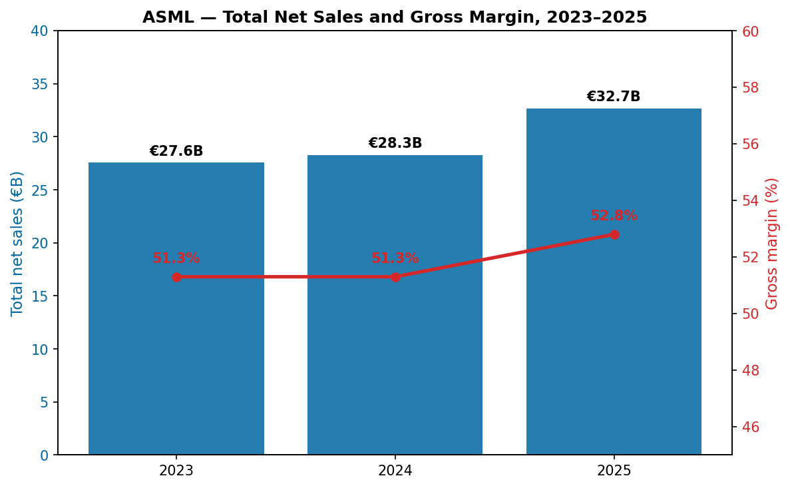
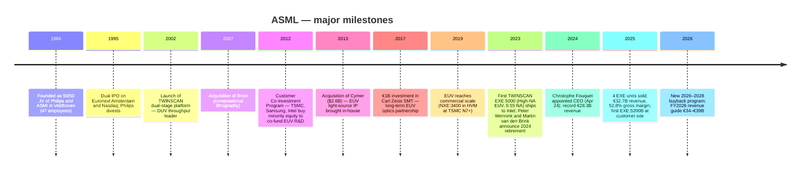
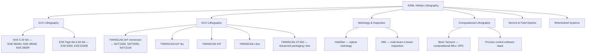
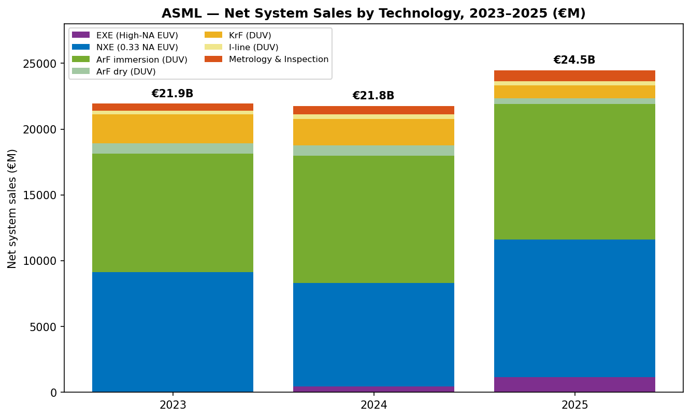
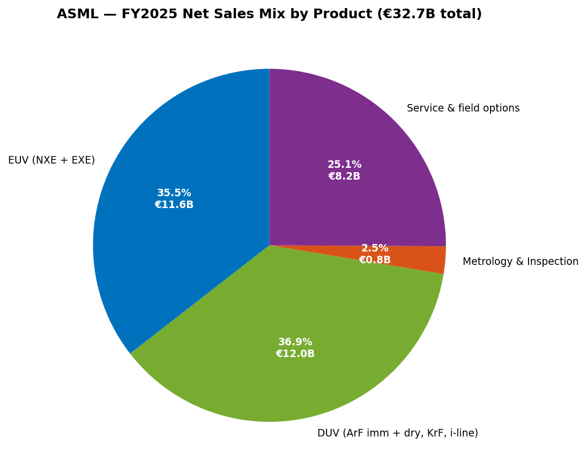
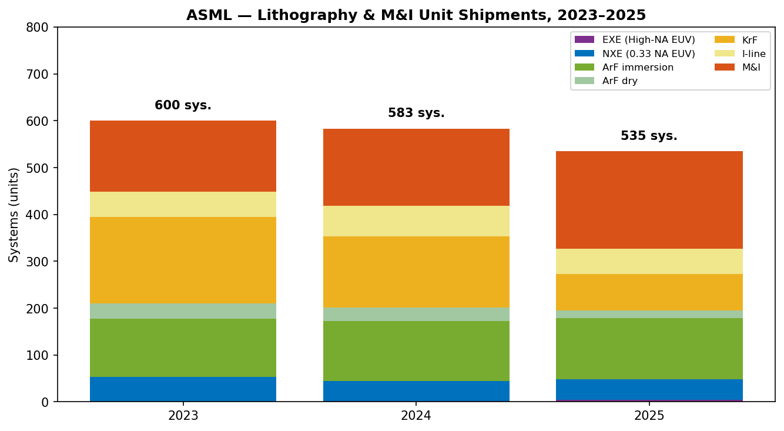
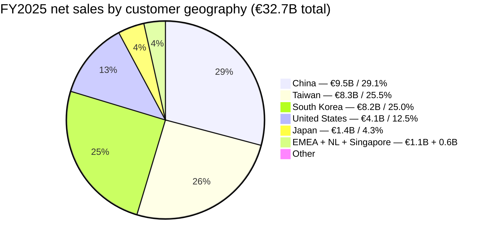
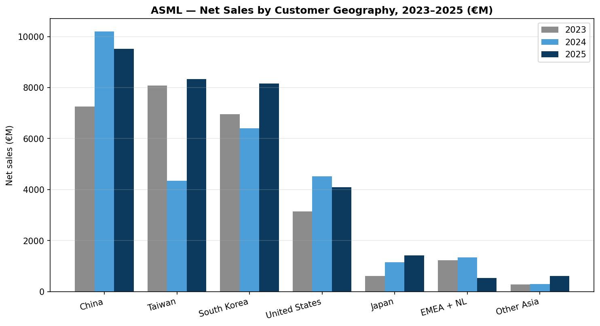
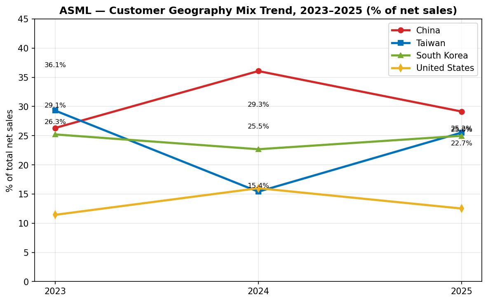
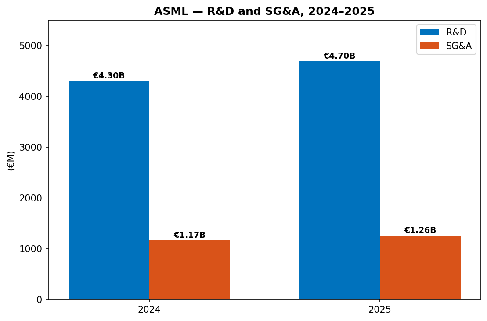

# COMPANY RESEARCH REPORT: ASML Holding N.V. (NASDAQ: ASML)

**Date:** 2026-05-20
**Subject:** ASML Holding N.V. (NASDAQ: ASML; Euronext Amsterdam: ASML) — Veldhoven, The Netherlands
**Filing basis:** 20-F filer (foreign private issuer). Primary disclosures pulled from the ASML 2025 Annual Report on Form 20-F filed 2026-02-25, plus the Q4-2025 / FY2025 results press release (2026-01-28).

> **Update — FY2026 guidance initiated (2026-01-28):** Management guided full-year 2026 total net sales to €34–€39 billion (vs. FY2025 actual €32.7 billion), implying mid-point growth of ~12% YoY, with gross margin between 51% and 53% and an annualized effective tax rate around 17%. Q1-2026 revenue is guided to €8.2–€8.9 billion with gross margin 51–53%. Management expects EUV revenue to be "significantly higher" in 2026 driven by advanced Logic and DRAM node ramps; non-EUV revenue is expected to be similar to 2025; service & field options to grow on the expanded installed base. The board also announced a new 2026–2028 share-buyback program at the January 28 release.
> Source: ["ASML reports €32.7 billion total net sales and €9.6 billion net income in 2025…", 6-K Exhibit 99.1, 2026-01-28](financial_reports/ASML/2025-12-31_6K_6-K_0001628280_26_003701.htm); 2025 20-F, "Long-term growth opportunity for 2030" section.

---

## TABLE OF CONTENTS

1. Company Overview
2. Company History
3. Management Team
4. Products & Services
5. Customers & Go-to-Market
6. Industry Overview
7. Competitive Landscape
8. Market Opportunity (TAM)
9. Risk Assessment
10. References

======================================

## 1. COMPANY OVERVIEW

ASML Holding N.V. is the global monopolist supplier of extreme-ultraviolet (EUV) lithography systems and the dominant supplier of deep-ultraviolet (DUV) immersion lithography systems used to print the most advanced semiconductor logic and memory devices in the world. Headquartered at De Run 6501, 5504 DR Veldhoven, in the Brainport Eindhoven region of the Netherlands, ASML is the only company in the world that can manufacture an EUV scanner — the multi-hundred-million-euro machine that is required, at present, to produce sub-7-nanometre logic chips and the most advanced DRAM bit cells ([ASML 2025 20-F](financial_reports/ASML/2025_20F_20-F_0001628280_26_011378.htm); [ASML EUV lithography products page](https://www.asml.com/en/products/euv-lithography-systems)).

ASML's business model has three legs. (1) **New systems sales** — high-priced capital equipment sold to a small set of leading-edge foundries (TSMC), integrated device manufacturers (Intel, Samsung Foundry) and memory makers (Samsung Memory, SK Hynix, Micron). A single NXE EUV system lists at roughly €180 million and a High-NA EXE system at roughly €350 million (industry-trade-press estimates; ASML does not publicly disclose per-unit ASPs) ([Tom's Hardware, ASML lithography roadmap](https://www.tomshardware.com/tech-industry/semiconductors/asml-lithograpy-roadmap-examined-from-duv-to-hyper-na)). (2) **Service and field option sales** — recurring revenue from maintenance, productivity upgrades, parts and software for the ~6,000+ active ASML systems in customer fabs worldwide ([ASML 2025 20-F, Installed Base Management](financial_reports/ASML/2025_20F_20-F_0001628280_26_011378.htm)). (3) **Metrology and Inspection (M&I)** — e-beam and optical wafer-pattern measurement and inspection tools (the YieldStar / HMI platforms), a small but strategic adjacency ([ASML HMI page](https://www.asml.com/en/company/about-asml/hmi)).

In FY2025, ASML reported **total net sales of €32,667.3 million**, up 15.6% from €28,262.9 million in FY2024 and €27,558.5 million in FY2023. The mix was net system sales of €24,474.3 million (74.9% of total) and net service and field option sales of €8,193.0 million (25.1%). FY2025 gross profit was €17,258.0 million (52.8% gross margin, up 150 bp YoY from 51.3%), income from operations was €11,301.4 million (34.6% operating margin) and net income was €9,609.4 million (29.4% net margin, €24.73 basic EPS). The company recognised **48 EUV systems in revenue (44 NXE + 4 EXE)** in 2025 and **535 total lithography systems** including DUV ([ASML 2025 20-F, KPIs](financial_reports/ASML/2025_20F_20-F_0001628280_26_011378.htm)).

Geographically, FY2025 net sales were heavily Asia-skewed: **China €9,519.7m (29.1%)**, **Taiwan €8,337.9m (25.5%)**, **South Korea €8,159.6m (25.0%)**, United States €4,089.1m (12.5%), Japan €1,420.9m (4.3%), EMEA + Netherlands €529.0m, Singapore €608.4m and Rest of Asia €2.7m ([ASML 2025 20-F, geographic note](financial_reports/ASML/2025_20F_20-F_0001628280_26_011378.htm)). End-use split (systems revenue only) was Logic €16,054.1m (65.6% of system sales) and Memory €8,420.2m (34.4%) — Logic share rose from 60.6% in FY2024 as advanced-foundry capacity additions accelerated for AI inference and training silicon.

ASML had **44,000+ employees (FTEs) worldwide** at year-end 2025 (women 21% of workforce; 143 nationalities), of which roughly **10,000 are customer-support engineers** stationed at customer fabs globally. The company also reports a total supplier base of about 5,100 vendors — a critical detail because EUV is in practice the most complex multinational sub-supply chain in industry, with Zeiss SMT (optics), Trumpf (laser source), Cymer (ASML's US-based light-source subsidiary acquired in 2013) and Carl Zeiss SMT (40% strategic investment since 2017) as load-bearing single-source partners ([ASML 2025 20-F, "At a glance" KPIs](financial_reports/ASML/2025_20F_20-F_0001628280_26_011378.htm)).

**Valuation snapshot (as of 2026-05-20).** ASML ADR last price USD 1,545.80, market capitalisation USD 595.78 bn ([Yahoo Finance, ASML key statistics, 2026-05-20](https://finance.yahoo.com/quote/ASML/key-statistics)). On a trailing twelve-month basis, the stock trades on **TTM P/E 51.4× and TTM P/S 17.7×**, with a forward P/E of 32.4× and EV/EBITDA of 43.8×. Dividend yield is ~0.6%; the company also runs a continuous share-buyback program (€5.45 bn step-up in cash returned via repurchases in 2025 vs. 2024).

Closest wafer-fab-equipment peers screen as follows on TTM (same source, same date):

| Company | TTM P/E | TTM P/S | Mkt Cap |
|---|---|---|---|
| **ASML** | **51.4×** | **17.7×** | $595.8 bn |
| Applied Materials (AMAT) | 39.9× | 11.6× | $336.2 bn |
| Lam Research (LRCX) | 54.6× | 16.7× | $361.9 bn |
| KLA (KLAC) | 51.4× | 18.1× | $237.1 bn |
| Teradyne (TER) | 63.3× | 14.1× | $53.5 bn |
| **WFE 5-name median** | **51.4×** | **16.7×** | — |

Sources: [Yahoo Finance — AMAT](https://finance.yahoo.com/quote/AMAT/key-statistics), [LRCX](https://finance.yahoo.com/quote/LRCX/key-statistics), [KLAC](https://finance.yahoo.com/quote/KLAC/key-statistics), [TER](https://finance.yahoo.com/quote/TER/key-statistics), all 2026-05-20.

ASML's multiples are **roughly in-line with the WFE peer median P/E and modestly above on P/S**, despite the company's structurally superior return profile (52.8% gross margin and ~34.6% operating margin in FY2025 versus AMAT/LRCX in the high-40s gross / low-30s operating) ([ASML 2025 20-F](financial_reports/ASML/2025_20F_20-F_0001628280_26_011378.htm); [Applied Materials FY2025 Q4 results, 2025-11](https://www.sec.gov/Archives/edgar/data/0000006951/000162828025051998/exhibit991q42025earningsre.htm); [Lam Research FY2025 Q4 results](https://www.sec.gov/Archives/edgar/data/0000707549/000070754925000068/lrcx_exhibitx991xq4x2025.htm)). The premium is not extreme but the multiples themselves are high in absolute terms. The drivers — explicitly named on the most recent earnings call and in the 20-F — are: (a) genuine high-growth sector premium for AI-infrastructure / advanced-packaging beneficiaries; (b) the company's structural monopoly on EUV creating long-duration earnings visibility (4–5 years of order backlog at typical scenarios); (c) management's explicit 2030 revenue model of **€44–€60 bn** revenue and **56–60% gross margin** ([ASML 2024 Investor Day press release, 2024-11-14](https://www.sec.gov/Archives/edgar/data/0000937966/000093796624000024/pressreleaseinvestorday2024.htm); reaffirmed in [2025 20-F long-term outlook section](financial_reports/ASML/2025_20F_20-F_0001628280_26_011378.htm)). The market is paying for the back-end of that range. At a P/E above 50× there is meaningful valuation risk if even one of the structural drivers (China policy reversal, advanced-Logic capex pause, High-NA delay) goes the wrong way — this is carried into Section 9.


Source: [ASML 2025 Annual Report on Form 20-F – KPIs and consolidated statement of operations](financial_reports/ASML/2025_20F_20-F_0001628280_26_011378.htm).

---

## 2. COMPANY HISTORY

ASML was founded in 1984 as a 50/50 joint venture between Dutch electronics conglomerate Philips and small Eindhoven-based equipment maker Advanced Semiconductor Materials International (ASMI), to commercialise wafer-stepper technology developed inside Philips Natuurkundig Laboratorium ("NatLab") ([ASML's founding story](https://www.asml.com/en/news/stories/2024/asml-founding-story); [ASML history page](https://www.asml.com/en/company/about-asml/history)). The venture began life with 47 employees in a leaky wooden barracks next to the Philips campus and was, by any measure, the underdog of the lithography industry — Nikon, Canon and Perkin-Elmer (then Silicon Valley Group's lithography unit, "SVG") dominated. ASML's first commercial system, the PAS 2500, shipped in 1985, followed by the PAS 2500 stepper in 1986 ([ASML history page](https://www.asml.com/en/company/about-asml/history)). The company was carved out and IPO'd on Euronext Amsterdam and Nasdaq in 1995 ([ASML 2025 20-F, "Our history"](financial_reports/ASML/2025_20F_20-F_0001628280_26_011378.htm)).

ASML's competitive position turned in three steps: (i) the 2002 introduction of the TWINSCAN platform, a dual-wafer-stage system that doubled throughput and made ASML the throughput leader in DUV ([ASML history page](https://www.asml.com/en/company/about-asml/history)); (ii) the 2007 acquisition of Brion (computational lithography software, which became the basis of ASML's pattern-correction stack) for $270 million in cash ([ASML completes Brion acquisition, EE Times, 2007-03](https://www.eetimes.com/asml-completes-brion-acquisition/)); and (iii) the 1997-2024 multi-decade collaboration with Carl Zeiss SMT, which culminated in the 2017 €1.0 billion equity investment that gave ASML a 24.9% economic interest in Zeiss SMT (the exclusive supplier of the EUV optical column) ([ASML invests €1 billion in Zeiss, Electro Optics, 2016-11](https://www.electrooptics.com/news/asml-invests-1-billion-zeiss-boost-euv-lithography)). The seminal strategic decision was the multi-billion-euro EUV bet starting in the late 1990s: management committed to a then-unfunded research program with US, EU and Japanese partners (including a customer co-investment program launched in 2012 in which Intel, Samsung and TSMC took minority equity in ASML in exchange for advance funding of EUV R&D, totalling €3.85 bn for a 23% aggregate non-voting stake) ([ASML 6-K, Customer Co-Investment Program, 2012-08-27](https://www.sec.gov/Archives/edgar/data/0000937966/000119312512370598/d402810dex991.htm)). EUV system revenue was zero until 2010, near-zero until 2017, and only became material in 2019. By 2023 EUV (NXE) represented €9.1 billion of system sales; in 2025 EUV (NXE + EXE) was €11.6 billion ([ASML 2025 20-F](financial_reports/ASML/2025_20F_20-F_0001628280_26_011378.htm)).



Strategic pivots have been few but consequential. The Cymer acquisition (2013) — valued at €1.95 bn ($2.6 bn) — was forced by the realisation that EUV would never reach economic productivity without owning the laser-produced-plasma light source roadmap; the bet was vindicated when EUV source power scaled from sub-100 W in 2013 to over 500 W today ([ASML to Acquire Cymer, 2012-10](https://www.asml.com/en/news/press-releases/2012/asml-to-acquire-cymer-to-accelerate-development-of-euv-technology); [Cymer overview, ASML](https://www.asml.com/en/company/about-asml/cymer)). The 2017 Zeiss SMT investment locked in the optics chain for EUV, including High-NA, and made it impractical for any other equipment maker to match ([Electro Optics, ASML invests €1B in Zeiss, 2016-11](https://www.electrooptics.com/news/asml-invests-1-billion-zeiss-boost-euv-lithography)). The 2018 redesign of the EUV reticle handling and dose-control architecture turned NXE:3400 into the first commercially profitable EUV node — by 2019 ASML was shipping EUV at gross margins comparable to mature DUV ([ASML 2025 20-F](financial_reports/ASML/2025_20F_20-F_0001628280_26_011378.htm)).

Recent developments (2024-2026) include: the appointment of **Christophe Fouquet** as CEO and chair of the Board of Management on April 24, 2024, succeeding 25-year veteran Peter Wennink and CTO Martin van den Brink (both retired) ([Introducing Christophe Fouquet, ASML's new CEO](https://www.asml.com/en/news/stories/2024/christophe-fouquet-asml-ceo)); the shipment of the first **TWINSCAN EXE:5200B High-NA system** at full specification to a customer site in 2025, with 175 wafers-per-hour productivity (60% above the EXE:5000) ([TrendForce, 2025-07-17](https://www.trendforce.com/news/2025/07/17/news-asml-confirms-first-high-na-euv-exe5200-shipment-reportedly-prepping-for-intels-14a-in-2027/)); the announcement (2026-01) of a new **2026–2028 share-buyback program** of up to €12.0 billion to follow the completed 2022–2025 program ([ASML Q4-2025 / FY2025 press release, 2026-01-28](financial_reports/ASML/2025-12-31_6K_6-K_0001628280_26_003701.htm)); and a **€1.3 billion minority investment in Mistral AI** disclosed in September 2025, ASML's first material non-strategic-supplier financial stake outside the lithography ecosystem ([ASML, Mistral AI enter strategic partnership, 2025-09-09](https://www.asml.com/en/news/press-releases/2025/asml-mistral-ai-enter-strategic-partnership); [Bloomberg, 2025-09-09](https://www.bloomberg.com/news/articles/2025-09-09/asml-pumps-1-3-billion-into-mistral-in-boost-for-european-ai)).

---

## 3. MANAGEMENT TEAM

### Christophe D. Fouquet — President & CEO, Chair of the Board of Management

Christophe Fouquet is a French-trained physicist who joined ASML in 2008 and has spent his entire ASML career inside the lithography product organisation ([Introducing Christophe Fouquet, ASML's new CEO](https://www.asml.com/en/news/stories/2024/christophe-fouquet-asml-ceo)). He was appointed President and CEO of ASML on April 24, 2024, succeeding long-tenured co-CEOs Peter Wennink (CFO/CEO since 1999, President since 2013) and Martin van den Brink (CTO/President), both of whom retired the same day ([Bits&Chips, Christophe Fouquet takes the reins](https://bits-chips.com/article/christophe-fouquet-takes-the-reins-at-asml/); [DCD, ASML CEO Peter Wennink retires](https://www.datacenterdynamics.com/en/news/asml-ceo-peter-wennink-retires-replaced-by-christophe-fouquet/)). Fouquet's promotion was the culmination of a publicly-telegraphed three-year succession plan: he was elevated to the Board of Management in 2018 and named Chief Business Officer / EVP in charge of all three product lines (EUV, DUV, Applications) in 2022 — effectively making him the single P&L leader for ASML's entire equipment franchise before becoming CEO ([ASML Board of Management changes, 2023-11-30](https://www.asml.com/en/news/press-releases/2023/asml-board-of-management-changes)).

Prior to joining ASML, Fouquet worked at **KLA-Tencor** (process control / metrology) and **Applied Materials** (deposition / etch), giving him direct competitor-side experience in the two adjacent equipment categories most likely to encroach on ASML's stack. Inside ASML, he held the titles Senior Director Marketing, Vice President Product Management, and from 2013 to 2018 Executive Vice President Applications — a critical role because the Applications group runs the customer-engineering interface with TSMC, Samsung and Intel and is where product-roadmap commitments are made. He holds a master's degree in Physics from the **Institut Polytechnique de Grenoble** ([ASML 2025 20-F, Board of Management bios, p. ~125](financial_reports/ASML/2025_20F_20-F_0001628280_26_011378.htm)).

Fouquet's first two years as CEO have been characterised by three operational choices. First, an explicit **culture reset** announced in January 2026: in his 2025 letter to shareholders he stated that ASML had grown rapidly and "the way we have grown does not slow us down" — and that the company would in 2026 simplify processes, "strengthen our focus on engineering and innovation" and rebuild the "fast-moving culture that has made us so successful" ([ASML 2025 20-F, CEO letter](financial_reports/ASML/2025_20F_20-F_0001628280_26_011378.htm)). This is a candid acknowledgement that ASML's headcount has grown from ~32,000 in 2022 to ~44,000 in 2025 and that engineering velocity has slowed ([ASML Holding employees, Stock Analysis](https://stockanalysis.com/stocks/asml/employees/)). Second, a re-focusing of the DUV business toward "quality and cost efficiency" rather than throughput-leadership-at-any-cost — a shift that has already materially expanded DUV gross margins ([ASML 2025 20-F](financial_reports/ASML/2025_20F_20-F_0001628280_26_011378.htm)). Third, a more activist capital-allocation posture: the €1.3 billion Mistral AI minority stake (September 2025) is the first time ASML has used its balance sheet to take a strategic position outside the litho equipment ecosystem and signals a willingness to deploy cash beyond buybacks and dividends ([ASML-Mistral strategic partnership, 2025-09-09](https://www.asml.com/en/news/press-releases/2025/asml-mistral-ai-enter-strategic-partnership)). Fouquet's compensation in 2025 placed him below the median of his European semiconductor / industrial reference group ([ASML 2025 20-F, Remuneration report](financial_reports/ASML/2025_20F_20-F_0001628280_26_011378.htm)).

### Roger J.M. Dassen — EVP and Chief Financial Officer

Roger Dassen, Dutch, joined ASML in June 2018 and was appointed CFO and Board of Management member at the same AGM ([ASML Announces Appointment of New CFO, 2018](https://www.asml.com/en/news/press-releases/2018/asml-announces-appointment-of-new-cfo-to-the-board-of-management)). He has now served as CFO for seven full fiscal years — long-tenure by European-CFO standards — across the EUV ramp, the COVID supply-chain shock, the post-2022 China cycle and the 2024 leadership transition. Before ASML, Dassen spent more than 30 years at Deloitte, ultimately serving as Global Vice Chair and member of the Executive Board of Deloitte Touche Tohmatsu Limited and as CEO of Deloitte Holding B.V. (the Dutch arm) ([Roger Dassen LinkedIn](https://nl.linkedin.com/in/rogerdassen); [Management Scope, Roger Dassen](https://managementscope.nl/manager/roger-dassen)). He holds a master's in Economics & Business Administration, a post-master's in Auditing and a PhD in Business Administration, all from the **University of Maastricht**, where he is also Professor of Auditing ([Management Scope, Roger Dassen](https://managementscope.nl/manager/roger-dassen)). He sits on the Supervisory Board of the **Dutch National Bank** (a strong governance credential in the EU regulatory landscape) and joined the board of Mistral AI in 2025 as part of ASML's investment ([Bloomberg, ASML invests in Mistral, 2025-09-09](https://www.bloomberg.com/news/articles/2025-09-09/asml-pumps-1-3-billion-into-mistral-in-boost-for-european-ai); [ASML 2025 20-F, BoM bios](financial_reports/ASML/2025_20F_20-F_0001628280_26_011378.htm)).

Dassen's financial track record at ASML speaks for itself: revenue from €10.9 bn (2018) to €32.7 bn (2025), gross margin from 46.0% to 52.8%, and the build-out of a multi-year share-buyback machine (€16 bn+ returned 2022–2025 across dividends and repurchases) ([ASML 2025 20-F, financial highlights](financial_reports/ASML/2025_20F_20-F_0001628280_26_011378.htm)). His quoted theme on the 2025 results call was "Results in line with guidance, as AI investment continues to gather momentum" — a deliberately undramatic anchor that has become his signature ([ASML Q4-2025 / FY2025 press release, 2026-01-28](financial_reports/ASML/2025-12-31_6K_6-K_0001628280_26_003701.htm)).

### Wayne R. Allan — EVP and Chief Strategic Sourcing & Procurement Officer

Wayne Allan, American, joined ASML in 2018 as EVP Customer Support and was promoted to the Board of Management in April 2023 with an expanded remit covering global supply-chain strategy. Prior to ASML, Allan spent over 30 years at **Micron Technology**, starting as a production operator in 1987 and rising to SVP Global Manufacturing Operations and VP Wafer Fabs. The Micron pedigree is meaningful — Allan brings deep "customer-side" wafer-fab operations experience, exactly the perspective ASML needed in a Board role as customer service revenue scaled to >€8 bn. His current job, redesigned in 2024, is to industrialise ASML's multi-thousand-supplier base for the EUV / High-NA ramp, including the long-tail of European mid-sized engineering firms that produce sub-systems on multi-year exclusive contracts ([ASML 2025 20-F, BoM bios](financial_reports/ASML/2025_20F_20-F_0001628280_26_011378.htm)).

### Frédéric J.M. Schneider-Maunoury — EVP and Chief Operations Officer

Frédéric Schneider-Maunoury, French, has been EVP and COO since joining ASML in 2009 and a Board of Management member since 2010 — the longest-tenured current Board member apart from Roger Dassen. Prior to ASML he was VP Thermal Products Manufacturing at Alstom and held senior roles at the French Ministry of Trade and Industry. He is a graduate of **École polytechnique (1985)** and **École Nationale Supérieure des Mines (1988)**, the two most prestigious French engineering schools. He owns the global manufacturing footprint (Veldhoven, San Diego, Wilton, Hwaseong, Tainan, Linkou, Berlin) and the EUV / DUV cleanroom ramp ([ASML 2025 20-F](financial_reports/ASML/2025_20F_20-F_0001628280_26_011378.htm)).

### Jim P. Koonmen — EVP, Applications

Jim Koonmen, American, joined ASML in 2007 through the acquisition of Brion (where he was General Manager 2008–2015), subsequently ran Cymer as CEO after ASML's 2013 acquisition, and then led the Applications business for five years before being appointed to the Board of Management on April 24, 2024 alongside Fouquet. He holds an MS in Management from MIT Sloan and an MS in Aeronautics and Astronautics from MIT — an unusual dual-MS profile for a semi-equipment exec. Koonmen is the customer-facing applications lead and is the executive most directly visible to TSMC and Samsung's leading-edge process-development teams ([ASML 2025 20-F](financial_reports/ASML/2025_20F_20-F_0001628280_26_011378.htm)).

### Governance footer

ASML operates a two-tier Dutch governance structure with a separate Supervisory Board (overseeing the Board of Management). The Supervisory Board is chaired by **Nils S. Andersen** (since 2023; former Chair of Akzo Nobel N.V. and former Chair of Unilever Plc), with **D. (Mark) Durcan** (former CEO of Micron Technology 2012–2017) serving as Chair of the Technology Committee ([ASML Supervisory Board page](https://www.asml.com/en/company/governance/supervisory-board)). All Supervisory Board members are independent under Dutch and Nasdaq standards. ASML's share register has no controlling shareholder; the Stichting Continuiteit ASML (a Dutch foundation) holds a call option on cumulative preference shares as anti-takeover protection — this has never been exercised ([ASML 2025 20-F, corporate governance](financial_reports/ASML/2025_20F_20-F_0001628280_26_011378.htm)). Insider ownership by the Board of Management is small in % terms but material in euro terms; LTI is performance-share based, tied to relative TSR, EPS growth and ESG targets. Comp is at or below the median of a European reference group that explicitly includes AMAT, KLA and Lam ([ASML 2025 20-F, Remuneration report](financial_reports/ASML/2025_20F_20-F_0001628280_26_011378.htm)).

### Track-record assessment

ASML's outgoing leadership (Wennink, van den Brink) executed one of the most successful capital-equipment franchises ever built — taking the company from <€1 bn revenue in the early 2000s to €28 bn in 2024 and to a structural EUV monopoly ([ASML 2025 20-F](financial_reports/ASML/2025_20F_20-F_0001628280_26_011378.htm)). The incoming team (Fouquet, Dassen continuity, Koonmen, Allan) is entirely promoted from inside the company or from the immediate supplier/customer ecosystem, which preserves the institutional knowledge that matters most (multi-decade customer relationships, supplier dependencies, EUV physics) ([Bits&Chips, Fouquet takes the reins](https://bits-chips.com/article/christophe-fouquet-takes-the-reins-at-asml/)). The principal execution question for 2026-2028 is whether Fouquet's organisational simplification can rebuild engineering velocity at the High-NA roadmap (EXE:5200B → EXE:5400 → Hyper-NA) — this is the genuine bet, and is unproven ([Tom's Hardware, ASML lithography roadmap](https://www.tomshardware.com/tech-industry/semiconductors/asml-lithograpy-roadmap-examined-from-duv-to-hyper-na)).

---

## 4. PRODUCTS & SERVICES

ASML's product portfolio is unusual for a multi-tens-of-billions revenue company: a small number of system platforms, each priced in the hundreds of millions, each with a multi-year ramp cycle. The portfolio organises into four product families, plus services ([ASML 2025 20-F, Products & Services](financial_reports/ASML/2025_20F_20-F_0001628280_26_011378.htm); [ASML products page](https://www.asml.com/en/products)). The tree below maps the system architecture.



### EUV Lithography (NXE + EXE)

EUV is ASML's flagship and only-supplier product line ([ASML EUV lithography products](https://www.asml.com/en/products/euv-lithography-systems)). There are two sub-families.

**NXE (0.33 NA EUV)** — the "standard" EUV platform first shipped commercially in 2016 (NXE:3300B). The current high-volume manufacturing flagship is the **TWINSCAN NXE:3800E**, with an upgraded "NXE:3800F" variant ramping. ASML disclosed that in 2025 it took the NXE:3800E from 160 wafers-per-hour (NXT:3600D legacy) to **230 wafers-per-hour** — a 44% productivity jump that is the proximate driver of EUV unit economics improvement ([Tom's Hardware, ASML delivers 3rd-gen EUV](https://www.tomshardware.com/tech-industry/manufacturing/asml-delivers-3rd-generation-euv-chipmaking-tool-for-2nm-and-beyond)). The 3800E "is now fully adopted by our customers" per the 2025 CEO letter ([ASML 2025 20-F, CEO letter](financial_reports/ASML/2025_20F_20-F_0001628280_26_011378.htm)). NXE units recognised in revenue: **53 (2023), 42 (2024), 44 (2025)**, with revenue of €9,124m / €7,856m / €10,446m. **Competitive advantage: yes — full monopoly.** Nikon, Canon and Intel/AMAT have all publicly conceded they cannot field a commercial 0.33 NA EUV system; the closest competing product is no product ([Mazi Asset Management, Inside ASML's monopoly](https://www.mazi-assetmanagement.co.za/investment-insights/inside-asmls-monopoly-on-impossible-light)). Moat type: technology / IP / scale / customer co-investment-locked / Zeiss optics exclusivity. Closest competitor product: Nikon NSR-S635E (ArFi DUV — a fundamentally different generation, not a substitute) ([ASML 2025 20-F, Disaggregation of revenue](financial_reports/ASML/2025_20F_20-F_0001628280_26_011378.htm)).

**EXE (0.55 NA High-NA EUV)** — the next-generation platform. The TWINSCAN EXE:5000 began customer shipments in late 2023, with Intel taking the first system ([Bits&Chips, ASML ships first high-NA EUV production scanner](https://bits-chips.com/article/asml-ships-first-high-na-euv-production-scanner/)). In 2025 ASML shipped its **first TWINSCAN EXE:5200B in full specification to a customer site** — the successor system at **175 wafers-per-hour (60% above EXE:5000)** with improved Zeiss projection optics and a higher-power EUV source ([TrendForce, 2025-07-17](https://www.trendforce.com/news/2025/07/17/news-asml-confirms-first-high-na-euv-exe5200-shipment-reportedly-prepping-for-intels-14a-in-2027/)). EXE units recognised: **0 (2023), 2 (2024), 4 (2025)**; revenue €0 / €465m / €1,157m. By year-end 2025, ASML's customers had cumulatively exposed **>400,000 wafers** on High-NA EUV systems — still pre-production but past the early-development threshold ([ASML 2025 20-F](financial_reports/ASML/2025_20F_20-F_0001628280_26_011378.htm)). **Competitive advantage: yes — full monopoly with a multi-year lead.** No other vendor has a 0.55 NA EUV roadmap; the path from EXE:5200 to "Hyper-NA" is unique to ASML / Zeiss ([Tom's Hardware, ASML lithography roadmap](https://www.tomshardware.com/tech-industry/semiconductors/asml-lithograpy-roadmap-examined-from-duv-to-hyper-na)). Risk: EXE recognition is dilutive to gross margin in early years (explicitly called out in the 20-F) until volume scales ([ASML 2025 20-F, MD&A](financial_reports/ASML/2025_20F_20-F_0001628280_26_011378.htm)).

### DUV Lithography (TWINSCAN ArF immersion, ArF dry, KrF, i-line)

DUV is ASML's larger unit-volume franchise and the cash-flow base that funds EUV. There are four sub-families, all on the TWINSCAN dual-stage platform ([ASML 2025 20-F, Disaggregation of revenue](financial_reports/ASML/2025_20F_20-F_0001628280_26_011378.htm)).

- **ArF immersion** — flagship DUV. The current platform is the **NXT:2050i / NXT:2100i** family, used at 28nm-to-7nm critical layers, multi-patterning for sub-EUV nodes, and as the workhorse for the mature-node capacity that China is building in 2024-2026. Units: **125 / 129 / 131** (2023/24/25); revenue €9,017m / €9,667m / €10,311m ([ASML 2025 20-F, Disaggregation of revenue](financial_reports/ASML/2025_20F_20-F_0001628280_26_011378.htm)). **Competitive advantage: yes — ASML has ~85-90% of the immersion market** (Nikon ships a small number of competing NSR-S631/S635E systems, mostly to legacy DRAM and discrete-power customers) ([Bits&Chips, Nikon aims to challenge ASML in ArF immersion](https://bits-chips.com/article/nikon-aims-to-challenge-asmls-dominance-in-arf-immersion/)). Moat: scale, throughput leadership, ecosystem lock-in (software, fab integration).
- **ArF dry** — older 193nm dry tool for 65-90nm patterning. Units shrinking (32 / 28 / 16); revenue €780m / €774m / €427m. Long-tail/replacement business; ASML is rationalising.
- **KrF** — 248nm tool for 90-180nm layers and mature analog/discrete. Units: 184 / 152 / **78** — sharp 2025 drop reflecting end of the China mature-node front-loading cycle. Revenue €2,203m / €1,991m / €1,001m.
- **I-line** (365nm) — legacy logic and packaging tool. Units 55 / 65 / 54. Revenue €278m / €369m / €307m.
- **TWINSCAN XT:260** — new (2025) advanced-packaging i-line product. ASML shipped its "first advanced packaging product" with "up to four times the productivity of existing solutions" — explicitly framed as ASML's entry point into the 3D / chiplet packaging litho market currently served by Veeco, EVG and SUSS MicroTec ([ASML 2025 20-F, "Q&A with the CEO"](financial_reports/ASML/2025_20F_20-F_0001628280_26_011378.htm)).

### Metrology & Inspection (M&I)

M&I is the smallest but strategically important adjacency. The portfolio includes **YieldStar** (optical scatterometry-based overlay / CD measurement, integrated into the TWINSCAN process-control loop) and **HMI** (multi-beam e-beam inspection — ASML acquired Hermes Microvision in 2016 for €2.8 bn) ([ASML to Acquire HMI, 2016-06](https://www.asml.com/en/news/press-releases/2016/asml-to-acquire-hmi-to-enhance-holistic-lithography-product-portfolio); [ASML HMI overview](https://www.asml.com/en/company/about-asml/hmi)). M&I unit shipments grew sharply: **151 / 165 / 208**; revenue €536m / €646m / €825m — a 53% revenue-CAGR over two years, faster than any other segment ([ASML 2025 20-F, Disaggregation of revenue](financial_reports/ASML/2025_20F_20-F_0001628280_26_011378.htm)). **Competitive advantage: partial.** KLA dominates standalone wafer metrology and inspection (~50% market share globally); ASML M&I is differentiated only when bundled tightly with TWINSCAN scanners ([KLA Q4 FY2025 results, Investing.com](https://www.investing.com/news/company-news/kla-q4-2025-slides-revenue-jumps-24-yoy-wafer-inspection-surges-52-93CH-4164587)). Moat: integration, not standalone IP. Closest competitor product: KLA's PROVISION e-beam inspection and Surfscan optical inspection — KLA is ahead in standalone, ASML is ahead in scanner-integrated.

### Service & field options + Refurbished systems

This is the recurring-revenue engine. **Net service and field option sales were €8,193m in 2025**, up 26.2% YoY, driven by (a) growing EUV installed base requiring multi-year service contracts at significantly higher annual run-rate than DUV ASPs (b) NXE field upgrades (notably 3600D → 3800E productivity packages) and (c) higher utilisation levels at customer fabs ([ASML 2025 20-F, Service and Field Options](financial_reports/ASML/2025_20F_20-F_0001628280_26_011378.htm); [ASML Q3-2025 6-K, 2025-10](financial_reports/ASML/2025-09-28_6K_6-K_0001628280_25_045043.htm)). ASML notes that "approximately 95% of the systems we have sold in the last 30 years are still in use" — the installed-base monetisation runway is multi-decade ([ASML 2025 Annual Report Financials](https://www.asml.com/en/investors/annual-report/2025/financials); [Nasdaq, ASML's Installed Base Management](https://www.nasdaq.com/articles/asmls-installed-base-management-business-picks-whats-driving-it)). Refurbished systems are an active product line, recertified and re-sold to second-buyer fabs (Chinese mature-node, India, secondary memory) ([ASML 2025 20-F](financial_reports/ASML/2025_20F_20-F_0001628280_26_011378.htm)). **Competitive advantage: yes — full monopoly on first-party EUV service**, partial on DUV (third-party service exists but cannot access proprietary firmware/diagnostics).

### Flagship and roadmap

The **three flagship products driving the business** in 2025-2026 are: (1) the **NXE:3800E/F** EUV scanner (the 230 wph workhorse for advanced Logic and DRAM); (2) the **ArF immersion NXT:2050i / 2100i** (the high-volume DUV cash generator); and (3) the **EXE:5200B High-NA** system (the future of the franchise post-2028) ([ASML 2025 20-F, Q&A with the CEO](financial_reports/ASML/2025_20F_20-F_0001628280_26_011378.htm); [Tom's Hardware, ASML lithography roadmap](https://www.tomshardware.com/tech-industry/semiconductors/asml-lithograpy-roadmap-examined-from-duv-to-hyper-na)). Notable 2025 launches: TWINSCAN XT:260 (advanced packaging entry), EXE:5200B (High-NA volume successor), NXE:3800F variant. Notable sunset/phase-out: ArF dry and KrF shipments materially down YoY as the China mature-node front-loading completes ([ASML 2025 20-F, Disaggregation of revenue](financial_reports/ASML/2025_20F_20-F_0001628280_26_011378.htm)).


Source: [ASML 2025 20-F, Disaggregation of revenue note](financial_reports/ASML/2025_20F_20-F_0001628280_26_011378.htm).


Source: [ASML 2025 20-F, "Disaggregation of revenue"](financial_reports/ASML/2025_20F_20-F_0001628280_26_011378.htm).


Source: [ASML 2025 20-F, Disaggregation of revenue – units](financial_reports/ASML/2025_20F_20-F_0001628280_26_011378.htm).

---

## 5. CUSTOMERS & GO-TO-MARKET

ASML sells to roughly two dozen leading-edge semiconductor manufacturers globally. Concentration is extreme and is the single most-disclosed risk factor in the 20-F ([ASML 2025 20-F, Risk Factors](financial_reports/ASML/2025_20F_20-F_0001628280_26_011378.htm)).

**Top-customer concentration (FY2025): four customers each individually exceeded 10% of total net sales, totalling €20.0 billion, or 61.2% of total net sales.** This compares to four customers at 53.8% in FY2024 and two customers at 53.9% in FY2023 — concentration has risen, not fallen, as EUV revenue has scaled. ASML does not publicly name the four 10%+ customers, but the public investor consensus — supported by the company's market-share disclosure and the geographic breakdown — is that they are **TSMC (Taiwan), Samsung Electronics (Korea, combined Foundry + Memory), SK Hynix (Korea) and Intel (US)**. ASML's own list of "Semiconductor manufacturing / design companies" used in the executive remuneration peer group explicitly names **Broadcom, Intel, Micron Technology, Qualcomm, STMicroelectronics, Infineon, NXP Semiconductors** — i.e. its largest customers and their adjacencies ([ASML 2025 20-F, Customer concentration note; Remuneration report peer group](financial_reports/ASML/2025_20F_20-F_0001628280_26_011378.htm)).

ASML's three largest customers also accounted for **€1.3 billion (35.4%) of accounts receivable and finance receivables** at Dec 31 2025 (down from €2.6 bn / 54.1% at Dec 31 2024 and €3.7 bn / 64.4% at Dec 31 2023 — the YoY decline reflects faster customer payment, not lower concentration) ([ASML 2025 20-F, Accounts Receivable note](financial_reports/ASML/2025_20F_20-F_0001628280_26_011378.htm)). Contract structure is mixed: ASML uses long-dated master purchase agreements with the top four customers (with rolling annual order books and multi-year backlog), but each individual system is a separate purchase order with a payment-on-acceptance milestone schedule. There is no minimum-purchase commitment from any customer ([ASML 2025 20-F, Revenue Recognition](financial_reports/ASML/2025_20F_20-F_0001628280_26_011378.htm)).


Source: [ASML 2025 20-F, "Total net sales and long-lived assets by geographic region"](financial_reports/ASML/2025_20F_20-F_0001628280_26_011378.htm).

**The top-1 customer is almost certainly TSMC**, given (a) Taiwan's 25.5% revenue share and (b) the company's CEO-letter remark that "the foundry market, where a single major company leads, we have seen some signs of recovery for some of the other players" — i.e. acknowledgment of single-customer dominance in foundry ([ASML 2025 20-F, CEO letter](financial_reports/ASML/2025_20F_20-F_0001628280_26_011378.htm)). The top-2 customer is likely Samsung (Foundry + Memory consolidated in Korea), top-3 SK Hynix, top-4 Intel — though Intel's share has compressed as its capex cycle has slowed and shifted, while it remains the most important High-NA customer (Intel was first to take an EXE:5000) ([Bits&Chips, ASML ships first high-NA EUV production scanner](https://bits-chips.com/article/asml-ships-first-high-na-euv-production-scanner/)).

The Logic / Memory end-use split is **65.6% Logic / 34.4% Memory in FY2025** (€16,054m Logic, €8,420m Memory), versus 60.6% / 39.4% in FY2024 and 72.9% / 27.1% in FY2023 — Memory share has risen materially since the 2023 trough as HBM and DDR5 demand have accelerated ([ASML 2025 20-F, Disaggregation by end use](financial_reports/ASML/2025_20F_20-F_0001628280_26_011378.htm)).

**Customer concentration trigger.** FY2025's top-4 = 61.2% of revenue is well above the "top-5 > 50%" Section-9 risk threshold; combined with the fact that ASML's single largest geography (China at 29.1%) is subject to active Dutch / US export controls, customer concentration is the dominant company-specific risk and is carried into Section 9 as such ([ASML 2025 20-F, Risk Factors](financial_reports/ASML/2025_20F_20-F_0001628280_26_011378.htm)).

**Channel and sales model.** ASML's go-to-market is 100% direct — there are no distributors. Sales cycles are long (12–36 months from initial system specification to revenue recognition) ([ASML 2025 20-F, Business Description](financial_reports/ASML/2025_20F_20-F_0001628280_26_011378.htm)). Each Tier-1 customer has a dedicated ASML field-engineering and product-management team co-located at the customer's process-development site (Hsinchu for TSMC, Hwaseong for Samsung, Hillsboro and Chandler for Intel, Cheongju and Wuxi for SK Hynix). The "customer support employees worldwide" headcount is roughly 10,000 — i.e. ~23% of ASML's total workforce is permanently embedded with customers ([ASML 2025 Annual Report Financials](https://www.asml.com/en/investors/annual-report/2025/financials)). This is the structural moat that prevents any competitor from credibly entering EUV service even if it ever cracked the hardware.

**Customer case studies.** ASML disclosed in November 2025 that it received the **TSMC Supplier "Excellence in Green Manufacturing" Award** for its product energy-efficiency innovations (specifically the lower-power configuration tested and rolled out across the installed base in 2025), evidence of deep operational integration with its largest customer ([ASML 2025 20-F, "Energy efficiency"](financial_reports/ASML/2025_20F_20-F_0001628280_26_011378.htm)).


Source: [ASML 2025 20-F, "Total net sales and long-lived assets by geographic region"](financial_reports/ASML/2025_20F_20-F_0001628280_26_011378.htm).


Source: same; percentages calculated as net sales in each geography divided by total net sales.

---

## 6. INDUSTRY OVERVIEW

ASML operates in the **semiconductor lithography equipment** sub-segment of the broader **wafer-fab-equipment (WFE)** industry. Lithography is the single highest-value capex item in a modern wafer fab — at leading-edge nodes, lithography accounts for **~20–30% of total fab equipment spend** (industry-wide rule of thumb; figures vary by node) ([SEMI WFE forecast](https://www.semi.org/en/semi-press-release/global-fab-equipment-investment-expected-to-reach-110-billion-dollar-in-2025); [ASML 2024 Investor Day deck, 2024-11-14](https://www.sec.gov/Archives/edgar/data/0000937966/000093796624000024/pressreleaseinvestorday2024.htm)).

**Industry definition and scope.** WFE includes lithography (ASML, Nikon, Canon), deposition and etch (Applied Materials, Lam Research, Tokyo Electron), process control / metrology (KLA, Onto Innovation), test (Teradyne, Advantest), and CMP, ion implant, thermal and cleaning systems. Total WFE industry revenue was approximately **USD 110 billion in 2025** rising to roughly **USD 135 billion in 2026** per the most-quoted SEMI World Fab Forecast and the major equipment vendors' own annual reports ([SEMI, Global Fab Equipment Investment Expected to Reach $110 Billion in 2025](https://www.semi.org/en/semi-press-release/global-fab-equipment-investment-expected-to-reach-110-billion-dollar-in-2025); [Lam Research Q4 FY2025 commentary, 2026-01](https://www.sec.gov/Archives/edgar/data/0000707549/000070754925000068/lrcx_exhibitx991xq4x2025.htm)). Lithography alone is roughly USD 30–35 billion of that figure, with ASML's revenue (€32.7 bn = ~USD 35.5 bn in 2025) representing the overwhelming majority — Nikon and Canon combined account for the rest (mostly low-end DUV) ([ASML 2025 20-F](financial_reports/ASML/2025_20F_20-F_0001628280_26_011378.htm); [Nikon FY March-2025 financial results](https://www.nikon.com/company/ir/ir_library/result/pdf/2025/25_1_e.pdf)).

**Growth drivers.** The lithography market is structurally tied to (i) leading-edge logic capex by foundries and IDMs (TSMC, Samsung Foundry, Intel) at the 5nm/3nm/2nm nodes and below, where EUV and increasingly High-NA EUV are mandatory; (ii) advanced DRAM capacity for AI applications, where HBM3E and HBM4 require EUV exposures at the most critical layers (this is why EUV NXE shipments to Memory customers rose sharply in 2024-2025); (iii) mature / specialty node capacity, primarily in China, which drives ArF immersion, KrF and i-line demand; and (iv) advanced packaging (CoWoS, FOPLP, hybrid bonding), which is just starting to consume dedicated litho capacity and which ASML entered in 2025 with the XT:260 ([ASML 2025 20-F](financial_reports/ASML/2025_20F_20-F_0001628280_26_011378.htm); [ASML 2024 Investor Day press release, 2024-11-14](https://www.sec.gov/Archives/edgar/data/0000937966/000093796624000024/pressreleaseinvestorday2024.htm)).

**Historical growth and projection.** ASML disclosed at its November 2024 Investor Day a **2030 revenue opportunity of €44–€60 billion at a gross margin of 56–60%** ([ASML 2024 Investor Day press release, 2024-11-14](https://www.sec.gov/Archives/edgar/data/0000937966/000093796624000024/pressreleaseinvestorday2024.htm); reaffirmed in [2025 20-F long-term outlook section](financial_reports/ASML/2025_20F_20-F_0001628280_26_011378.htm)). This implies 6–13% revenue CAGR from the FY2025 base of €32.7 bn over 5 years, the upper end of which assumes both Logic / Memory ramps proceed and that China revenue stabilises (not collapses). Industry trade-press estimates of total semiconductor end-market size for 2030 cluster at **USD 1.0–1.1 trillion** versus ~USD 627 billion in 2024 (SIA / WSTS), implying ~8–10% end-market CAGR ([SIA, Global Semiconductor Sales, December 2024](https://www.semiconductors.org/global-semiconductor-sales-increase-19-1-year-to-year-in-december-2024-annual-sales-up-19-1/)).

**Trends and technological change.** Three dynamics dominate. (1) **Moore's Law continues** in the form of EUV-enabled scaling at 3nm, 2nm and 1.4nm — but the cost-per-transistor decline is decelerating, which favours ASML because it shifts cost from end-customer chip pricing to equipment pricing ([Tom's Hardware, ASML lithography roadmap](https://www.tomshardware.com/tech-industry/semiconductors/asml-lithograpy-roadmap-examined-from-duv-to-hyper-na)). (2) **The end of single-patterning DUV** at sub-7nm nodes means every leading-edge layer that previously used double or quadruple ArF immersion is now a candidate for EUV single-exposure — a massive pull-through ([ASML EUV products page](https://www.asml.com/en/products/euv-lithography-systems)). (3) **High-NA EUV** is the path beyond 2nm; the EXE:5000 / EXE:5200B cycle is the multi-year revenue inflection beyond 2026 ([Tom's Hardware, ASML lithography roadmap](https://www.tomshardware.com/tech-industry/semiconductors/asml-lithograpy-roadmap-examined-from-duv-to-hyper-na)). The industry's main alternative — Nanoimprint Lithography from Canon (FPA-1200NZ2C, partnership with Kioxia / Toshiba Memory) — has been positioned for limited use in non-critical 3D NAND layers only; it is not a credible threat to EUV at logic critical layers ([TrendForce, Canon Nanoimprint to TIE, 2024-09-30](https://www.trendforce.com/news/2024/09/30/news-canon-delivers-nanoimprint-lithography-system-to-tie-reportedly-capable-of-producing-2nm-chips/)).

**Regulatory environment.** This is the most distinctive feature of ASML's industry. Lithography equipment — and specifically ASML's EUV and most-advanced DUV (NXT:2000i and above) — is subject to extensive multi-jurisdiction export control:

- **NL Export Controls** — effective **January 15, 2025**, the Netherlands expanded its export-control regulations to cover additional semiconductor manufacturing equipment, **primarily certain metrology and inspection systems**, in addition to the previously-restricted EUV (since ~2019) and immersion DUV (NXT:2000i+, since 2023). License requirements now apply broadly to advanced systems destined for Chinese end-users ([Government of the Netherlands, Klever announcement, 2025-01-15](https://www.government.nl/latest/news/2025/01/15/klever-export-controls-on-advanced-semiconductor-manufacturing-equipment-to-be-tightened); [Bloomberg, 2025-01-15](https://www.bloomberg.com/news/articles/2025-01-15/dutch-align-with-us-export-controls-on-some-asml-chip-tools)).
- **US Export Controls (BIS)** — the October 2022 and October 2023 BIS rules also apply to ASML on US-origin content (notably Cymer light sources, manufactured in San Diego); these rules block sales of EUV to China entirely and limit advanced DUV ([ASML 2025 20-F, Risk Factors](financial_reports/ASML/2025_20F_20-F_0001628280_26_011378.htm)).
- **Foreign Direct Product Rule** — extends US reach to non-US-made equipment containing US-origin technology ([Bits&Chips, Metrology export restrictions](https://bits-chips.com/article/metrology-equipment-to-be-added-to-dutch-export-restriction-list/)).

In practice ASML has navigated the export-control regime by: (a) shipping EUV only to non-Chinese customers (TSMC, Samsung, Intel, SK Hynix, Micron); (b) continuing to ship ArF immersion and older DUV to Chinese mature-node fabs under license; (c) refusing servicing of certain restricted tools at certain Chinese customers from January 2024 onward; and (d) absorbing related compliance and revenue impact in the operating model ([ASML 2025 20-F, Export Controls](financial_reports/ASML/2025_20F_20-F_0001628280_26_011378.htm)). China revenue rose from 26.3% (2023) to 36.1% (2024) and then **declined to 29.1% in 2025** — the 2024 spike was the front-loading of mature-node orders ahead of expected further controls; 2025 reflects normalisation ([ASML 2025 20-F, geographic note](financial_reports/ASML/2025_20F_20-F_0001628280_26_011378.htm)).

**Industry structure.** Litho is an extreme oligopoly: ASML, Nikon, Canon. ASML's market share in immersion lithography is roughly **85–90%**, in EUV **100%** (no competitor), in mature DUV combined roughly **80%** ([Heqingele, ASML EUV monopoly analysis](https://heqingele.com/blog/why-is-asml-the-only-euv-company-unraveling-monopoly/)). Nikon's share has declined from ~30% in the early 2010s to single digits in immersion today; Canon is largely confined to i-line and back-end packaging tools (plus the Nanoimprint niche) ([Bits&Chips, Nikon aims to challenge ASML](https://bits-chips.com/article/nikon-aims-to-challenge-asmls-dominance-in-arf-immersion/)). Barriers to entry are essentially absolute: ~30 years of cumulative R&D investment, ~5,100 supplier relationships, Zeiss SMT optics partnership, IP portfolio of >16,000 patent families, and customer co-investment lock-in ([ASML 2025 20-F, Operations](financial_reports/ASML/2025_20F_20-F_0001628280_26_011378.htm); [ASML 6-K, Customer Co-Investment Program, 2012-08-27](https://www.sec.gov/Archives/edgar/data/0000937966/000119312512370598/d402810dex991.htm)). Supplier power is mixed — Zeiss SMT, Trumpf and Cymer (in-house) are single-source for critical sub-systems and have real bargaining power. Buyer power is concentrated (top-4 customers = 61% of revenue) but each top-4 customer is itself dependent on ASML for leading-edge production capacity, creating a mutual dependency ([ASML 2025 20-F, Risk Factors](financial_reports/ASML/2025_20F_20-F_0001628280_26_011378.htm)).

---

## 7. COMPETITIVE LANDSCAPE

The list of "competitors" for ASML is short and asymmetric. Per the 2025 20-F itself, ASML names: **Nikon Corporation** and **Canon Inc.** as direct lithography competitors, plus **Applied Materials Inc. and KLA-Tencor Corporation** for "applications that support or enhance complex patterning solutions" (i.e. process-control / metrology, not core lithography) ([ASML 2025 20-F, Competition](financial_reports/ASML/2025_20F_20-F_0001628280_26_011378.htm)).

```mermaid
quadrantChart
    title Lithography & adjacent — competitive positioning
    x-axis "Lower price" --> "Higher price"
    y-axis "Older nodes" --> "Leading-edge nodes"
    quadrant-1 "EUV monopoly"
    quadrant-2 "EUV / DUV crossover"
    quadrant-3 "Mature DUV / legacy"
    quadrant-4 "Niche advanced packaging"
    ASML EUV (NXE/EXE): [0.85, 0.95]
    ASML DUV (ArFi): [0.65, 0.75]
    ASML KrF / i-line: [0.30, 0.20]
    Nikon ArF immersion: [0.45, 0.55]
    Nikon KrF: [0.25, 0.20]
    Canon i-line: [0.20, 0.15]
    Canon Nanoimprint: [0.50, 0.35]
    KLA metrology: [0.70, 0.85]
    AMAT process control: [0.55, 0.75]
```

### Direct lithography competitors

**Nikon Corporation (TSE: 7731).** Nikon is the largest historical lithography competitor. Its semiconductor equipment segment generates roughly **¥250 billion (USD 1.6 billion) annually** versus ASML's ~USD 35 billion — a >20× revenue gap. Nikon ships a small number of ArF immersion (NSR-S631E, NSR-S635E) and KrF tools annually, primarily to Japanese DRAM, mature-node Chinese customers and a few specialty fabs. Differentiator: marginal optics quality (Nikon has historically been an excellent optics company) and pricing flexibility for second-source-strategy buyers. **Cannot match ASML on EUV (no product), throughput in immersion (single-stage), software/computational litho integration (no equivalent of Brion).** Competitive position: contained ([Nikon Annual Report, FY2024](https://www.nikon.com/about/ir/ir_library/ar/index.htm)).

**Canon Inc. (TSE: 7751).** Canon ships i-line and KrF tools to legacy and back-end packaging customers and is the leading vendor of **Nanoimprint Lithography (NIL)** — its FPA-1200NZ2C product is in production at Kioxia / Toshiba Memory for some non-critical 3D NAND layers and is positioned as a low-cost EUV alternative for specific applications. Canon's semiconductor equipment revenue is roughly **¥350 billion (USD 2.2 billion)** in 2024. The NIL story is occasionally repackaged as an EUV threat but the technology has fundamental limitations (defect density, throughput, alignment) that confine it to non-critical layers. **No credible EUV substitute path.**

### Adjacent equipment competitors

These do not directly compete on litho hardware but compete for the same customer capex dollars and offer "applications that support or enhance complex patterning solutions" (ASML's own language):

- **Applied Materials (NASDAQ: AMAT)** — global #1 in WFE by total revenue (~USD 27 bn FY2025), spanning deposition, etch, CMP, ion implant, e-beam metrology and AGS service. Selectively competes with ASML in process-control and computational-litho-related applications. Trades at TTM P/E 39.9× / P/S 11.6× ([Yahoo Finance, AMAT, 2026-05-20](https://finance.yahoo.com/quote/AMAT)).
- **Lam Research (NASDAQ: LRCX)** — deposition and etch leader (~USD 22 bn revenue), no direct litho overlap but is the largest single beneficiary alongside ASML of advanced-node ramps. TTM P/E 54.6× / P/S 16.7×.
- **KLA Corporation (NASDAQ: KLAC)** — process control / metrology / inspection monopoly-adjacent (~USD 13 bn revenue, ~50% global wafer-inspection share). Direct competitor to ASML's YieldStar and HMI standalone product lines, but customers typically buy both. TTM P/E 51.4× / P/S 18.1×.
- **Tokyo Electron (TSE: 8035)** — Japanese WFE major, coater/developer (track) is the on-tool partner to every ASML scanner — TEL ships the wafer to ASML and receives it back. Effectively a partner more than a competitor.
- **Teradyne (NASDAQ: TER)** — semi-test, not direct ASML competitor.
- **Onto Innovation, Camtek, Veeco** — small metrology and advanced-packaging-tool vendors.

### Emerging / niche competitors

- **Domestic Chinese litho (SMEE — Shanghai Micro Electronics Equipment)**: SMEE has been working on a 28nm ArF immersion tool for over a decade. Public technical disclosure remains limited; commercial volume shipments are not yet credible. Strategic context: SMEE is the focus of Chinese government industrial policy as part of self-sufficiency planning, but the gap to ASML on throughput, overlay and uptime remains very wide.
- **In-house tools**: Intel, TSMC and Samsung occasionally build internal mask-related or specialty test tools but do not build production scanners.

### Competitive advantages and vulnerabilities — ASML

**Advantages.**
1. **EUV monopoly** — no competitor exists, and the >€10 bn / >25-year cumulative R&D cost combined with the Zeiss SMT optics partnership make catch-up essentially impossible within the relevant investment horizon.
2. **Customer co-investment lock-in** — TSMC, Samsung and Intel have all been minority equity-funders of ASML's EUV roadmap. This creates a structural commercial preference for ASML's tools.
3. **Service and installed-base economics** — ~95% of systems ever sold are still in use, driving a multi-decade recurring-revenue annuity.
4. **Holistic lithography stack** — ASML is the only vendor that owns scanner + computational litho (Brion) + integrated metrology (YieldStar) + inspection (HMI). KLA does inspection alone; AMAT does process control alone.
5. **Multi-decade supplier relationships** — Zeiss SMT exclusivity, Cymer ownership, Trumpf laser-source partnership.

**Vulnerabilities.**
1. **Customer concentration** (top-4 = 61.2%): a step-down in capex by even one of TSMC, Samsung, SK Hynix or Intel is a multi-billion-euro revenue swing.
2. **Geopolitical / export-control exposure** — China is 29% of revenue; further Dutch / US restrictions could compress that to 10–15%.
3. **High-NA execution risk** — the EXE:5000/5200B ramp is technically the most complex product ever fielded by ASML; any productivity or yield delay slows the post-2027 revenue ramp.
4. **Cyclicality** — even with a long-term secular tailwind, the semi-equipment industry remains cyclical (the 20-F lists this as a top risk factor). 2024 saw Logic revenue dip from €15,984m in 2023 to €13,195m before recovering to €16,054m in 2025.


Source: [Yahoo Finance — ASML, AMAT, LRCX, KLAC, TER key statistics, 2026-05-20](https://finance.yahoo.com/quote/ASML/key-statistics).


Source: [ASML 2025 20-F, consolidated income statement](financial_reports/ASML/2025_20F_20-F_0001628280_26_011378.htm). 2023 R&D not shown to avoid sourcing a separate filing; 2024 and 2025 are from the 2025 20-F.

---

## 8. MARKET OPPORTUNITY (TAM)

ASML's own framework for sizing the opportunity, presented at its 2024 Investor Day and reaffirmed in the 2025 20-F, models three scenarios for **annual revenue opportunity in 2030**:

| Scenario (€B, FY2030) | EUV system sales | Non-EUV (litho + M&I) | Installed-base mgmt (service) | Total |
|---|---|---|---|---|
| Low | 22 | 11 | 11 | **44** |
| Moderate | 26 | 14 | 12 | **52** |
| High | 32 | 15 | 13 | **60** |

Source: [ASML 2025 20-F, "Long-term growth opportunity for 2030"](financial_reports/ASML/2025_20F_20-F_0001628280_26_011378.htm); originally disclosed at the 2024 Investor Day.

The implied 2025–2030 revenue CAGR is **6.2% (low) / 9.7% (moderate) / 12.9% (high)**. Gross margin in 2030 is expected to be **56–60%** versus 52.8% in FY2025 — driven by High-NA EUV scaling, NXE productivity / cost reductions, higher service contribution and the absorption of EXE dilution.

**TAM, SAM, SOM.**
- **TAM (global lithography equipment + lithography services market)** — approximately USD 35–40 billion in 2025, projected to grow to roughly USD 50–65 billion by 2030 at the midpoint of ASML's scenarios. This is the literal industry size; ASML and Nikon / Canon are the only meaningful suppliers.
- **SAM (the part ASML can address with its current portfolio)** — essentially the entire TAM, given ASML's product breadth from i-line to High-NA EUV. ASML is restricted by export control from selling EUV (and certain advanced DUV / M&I tools) to Chinese end-users; the un-addressable portion of the TAM is the slice of Chinese leading-edge capacity that, in theory, would otherwise buy advanced ASML tools — but since competitors cannot supply it either, this is mostly TAM that simply does not materialise.
- **SOM (ASML's serviceable obtainable market)** — ASML's revenue share of total litho is already **~85–90%**, and is structurally ~100% in EUV and ~85–90% in immersion DUV. There is limited share to take from Nikon and Canon; growth comes from the market growing, not from share gains.

**Underlying semiconductor-end-market drivers.** ASML's 2030 model implicitly assumes:
1. Semiconductor end-market revenue reaches ~USD 1.0 trillion by 2030 (versus ~USD 627 bn in 2024 per [SIA, January 2025 release](https://www.semiconductors.org/global-semiconductor-sales-increase-19-1-year-to-year-in-december-2024-annual-sales-up-19-1/)), driven by AI infrastructure / data-center compute, automotive electrification, on-device AI, and continued specialty / mature-node growth.
2. AI infrastructure becomes the single largest end-driver of leading-edge logic capex — hyperscaler capex was already an explicit driver in the FY2025 CEO letter: "AI continues to be the key driver of the semiconductor market, with capital expenditure on training and inference reaching record levels among Cloud Service Providers".
3. Memory demand for HBM (high-bandwidth memory for AI accelerators) and DDR5 supports EUV pull-through in DRAM at a higher rate than the previous generation — already visible in 2025 NXE shipments to Memory customers.

**Penetration strategy / company's serviceable-share opportunity.** ASML's main "share" lever is shifting customer node mix toward EUV-intensive nodes. At 3nm, a typical advanced foundry runs 15–20 EUV exposures; at 2nm this rises to ~25; at 1.4nm potentially 40+. Each EUV exposure layer is incremental ASML revenue, since the customer must buy more scanners to maintain throughput. This is the structural ASP / unit-volume tailwind that supports the high case of the 2030 model.

**Capital return.** ASML expects to return "significant amounts of cash to our shareholders through growing dividends and share buybacks" through 2030. The new **2026–2028 share buyback program** announced January 28, 2026 supersedes the 2022–2025 program (which executed €5.45 bn of incremental buybacks in 2025 alone) ([ASML Q4-2025 / FY2025 press release, 2026-01-28](financial_reports/ASML/2025-12-31_6K_6-K_0001628280_26_003701.htm)).

---

## 9. RISK ASSESSMENT

### Company-specific risks

**1. Customer concentration (61.2% of revenue from four customers).** In FY2025, four customers each individually exceeded 10% of total net sales, totalling €20.0 billion. The loss, capex deferral, or strategic in-house initiative by any one of TSMC, Samsung, SK Hynix or Intel would create a multi-billion-euro revenue swing. Mitigant: the four customers are mutually dependent on ASML's roadmap for their own competitive positions; defection is technologically not feasible.

**2. China export-control exposure (29.1% of FY2025 revenue).** Dutch and US export controls have already restricted EUV and the most advanced DUV / M&I systems from being sold to certain Chinese end-users; the **January 15, 2025** Dutch expansion brought certain metrology and inspection tools into scope. Additional rounds (tighter ArF immersion controls, broader entity-list expansion, secondary-service restrictions) would compress China revenue from 29% toward 10–15%. Mitigant: the China revenue base is heavily mature-node / non-restricted today; loss would be partial, not total. ASML has already absorbed three rounds of restriction without major financial damage.

**3. High-NA EUV (EXE) execution risk.** The EXE program is the largest single technical undertaking in ASML's history. Each EXE system contains the largest mirrors ever built by Zeiss, a higher-power source, and dramatically tighter overlay specifications. Productivity ramp from 100 wph (EXE:5000) to 175 wph (EXE:5200B) to >200 wph is on plan but unproven at HVM scale. Any 6–12 month productivity / yield delay would push out the 2027-2030 revenue inflection. Mitigant: ASML's track record on NXE productivity ramps (160 → 230 wph in 2025) is strong; customer co-development is active.

**4. Margin dilution from EXE in the early ramp.** ASML explicitly stated in the FY2025 20-F that "the dilutive impact of EXE systems recognized in sales" partially offset gross-margin gains in 2025. This dilution will persist for 2026–2027 as EXE volume scales ahead of cost-down. Mitigant: ASML's 2030 gross-margin model (56–60%) explicitly assumes EXE turns accretive after ~2028.

**5. Single-source supplier dependencies.** EUV optics (Zeiss SMT), light source (Cymer, in-house), laser pump (Trumpf), and several mid-sized European sub-system suppliers are single-source for ASML's EUV stack. A Zeiss SMT or Trumpf production disruption (fire, IT outage, key-talent loss) would be unmitigable on near-term horizons. Mitigant: long-term contracts, ASML co-investment, multi-site Zeiss SMT manufacturing (Oberkochen + Wetzlar).

### Industry / market risks

**6. Semiconductor cyclicality.** The 20-F itself lists this as a top-three risk: "The semiconductor industry can be cyclical, and we may be adversely affected by any downturn". The 2023–2024 trough (FY2023 revenue €27.6 bn vs. FY2024 €28.3 bn) compressed Logic spending by €2.8 bn YoY before the FY2025 recovery. Future downturns are inevitable; the question is depth and duration. Mitigant: service revenue (€8.2 bn in FY2025, ~25% of sales) is non-cyclical and is the floor.

**7. Geopolitical instability around Taiwan and South Korea.** ASML disclosed in the 2025 20-F that 25.5% of FY2025 revenue came from Taiwan and 25.0% from South Korea (combined 50.5%). A cross-strait conflict, North Korean escalation, or major Taiwanese policy change could disrupt ASML's ability to serve customers (and TSMC's ability to operate). Mitigant: none possible — this is the irreducible geopolitical risk of the leading-edge semi supply chain.

**8. Alternative technology displacement risk.** Canon's Nanoimprint Lithography, EUV alternatives like directed self-assembly (DSA), and longer-term photonics-based or quantum-computing-based architectures could in principle reduce litho intensity. Mitigant: no credible substitute for EUV at logic critical layers within the 2030 window; ASML's High-NA roadmap is the de-facto industry standard.

### Financial risks

**9. Valuation / multiple compression.** At TTM P/E 51.4× and P/S 17.7× ([Yahoo Finance, ASML, 2026-05-20](https://finance.yahoo.com/quote/ASML/key-statistics)), ASML's valuation prices the upper-half of its own 2030 model. A failure to grow toward the €52 bn moderate-case revenue line, or a step-down in market structural-premium for AI-infrastructure beneficiaries, could compress P/E 30–40% even on unchanged earnings. Mitigant: long-term FCF, growing capital return, sub-1× P/B-free multiple in EV/EBITDA terms (43.8×) is in-line with peer median.

**10. FX exposure.** ASML reports in euros but invoices many large customers in dollars (Intel, US-based Micron) and Taiwan dollars / Korean won (TSMC, Samsung, SK Hynix). The 2025 20-F discloses that operating subsidiaries operate in JPY, TWD, USD, KRW and CNY. A material USD weakening vs. EUR (3-5% sustained) would compress reported revenue and margin. Mitigant: hedging program; pricing in euros where possible.

**11. Working-capital and contract-asset volatility.** With four customers at 61% of revenue and quarter-end timing of system acceptances driving revenue recognition, ASML's quarterly results can swing materially on a single deferred or accelerated shipment. Mitigant: shifting service revenue mix.

### Macroeconomic risks

**12. AI-capex slowdown.** The current AI-infrastructure capex cycle is the single largest demand driver behind ASML's 2025 outperformance and 2026 guidance. Per ASML's own language: "AI continues to be the key driver of the semiconductor market, with capital expenditure on training and inference reaching record levels among Cloud Service Providers". A hyperscaler capex pause (Microsoft, Meta, Alphabet, Amazon, Oracle) would directly hit Logic foundry orders and through them ASML's EUV shipments. Mitigant: AI demand is broad-based across multiple end-customers; even a partial slowdown leaves substantial baseline demand.

**13. Tariffs and trade frictions.** The CEO letter explicitly named "uncertainty… apparent for some customers, who were understandably apprehensive about investing in major manufacturing bases if the equipment they needed could potentially become significantly more costly". US-Mexico-Canada and US-EU tariff regimes could indirectly raise the cost of US-bound systems and slow Intel and TSMC-Arizona capex. Mitigant: ASML's pricing model includes tariff-pass-through clauses in most master agreements.

**14. Eurozone / Netherlands operating risk.** ASML's primary R&D, final-assembly and shipping footprint is in Veldhoven; housing, talent and grid capacity constraints around Eindhoven have already been called out as risk in the 20-F. Mitigant: ongoing campus expansions in Wilton CT, Hwaseong, Tainan and Berlin.

---

## 10. REFERENCES

### Primary filings and corporate disclosures
- ASML Holding N.V. — **2025 Annual Report on Form 20-F**, filed 2026-02-25 (covers FY2025): [local copy](financial_reports/ASML/2025_20F_20-F_0001628280_26_011378.htm); SEC EDGAR: https://www.sec.gov/cgi-bin/browse-edgar?action=getcompany&CIK=0000937966&type=20-F.
- ASML — **Q4-2025 / FY2025 results press release and presentation**, 6-K filed 2026-01-28: [local copy](financial_reports/ASML/2025-12-31_6K_6-K_0001628280_26_003701.htm).
- ASML — **6-K cover, Annual Report based on IFRS**, 2026-02-25: [local copy](financial_reports/ASML/2025-12-31_6K_6-K_0001628280_26_011377.htm).
- ASML — **6-K, 2026 AGM agenda**, filed 2026-03-09: [local copy](financial_reports/ASML/2026-03-09_6K_6-K_0001628280_26_016671.htm).
- ASML — **2024 Annual Report on Form 20-F**, filed 2025: [local copy](financial_reports/ASML/2024_20F_20-F_0000937966_25_000009.htm).
- ASML — **Investor Day 2024 deck and webcast**, November 14, 2024: https://www.asml.com/en/investors/investor-day-2024.

### Market data
- Yahoo Finance — ASML Holding N.V. key statistics, accessed 2026-05-20: https://finance.yahoo.com/quote/ASML/key-statistics.
- Yahoo Finance — Applied Materials key statistics, accessed 2026-05-20: https://finance.yahoo.com/quote/AMAT/key-statistics.
- Yahoo Finance — Lam Research key statistics, accessed 2026-05-20: https://finance.yahoo.com/quote/LRCX/key-statistics.
- Yahoo Finance — KLA Corporation key statistics, accessed 2026-05-20: https://finance.yahoo.com/quote/KLAC/key-statistics.
- Yahoo Finance — Teradyne key statistics, accessed 2026-05-20: https://finance.yahoo.com/quote/TER/key-statistics.

### Industry data
- SEMI — **World Fab Forecast**, December 2025 release: https://www.semi.org/en/industry-data-2#wff.
- Semiconductor Industry Association (SIA) — Global Semiconductor Sales, December 2024 release: https://www.semiconductors.org/global-semiconductor-sales-increase-19-1-year-to-year-in-december-2024-annual-sales-up-19-1/.

### Competitor disclosures
- Nikon Corporation — Annual Report and IR library: https://www.nikon.com/about/ir/ir_library/ar/index.htm.
- Canon Inc. — Annual Report: https://global.canon/en/ir/annual/.

### Charts
- Local: `reports/charts/asml_revenue_margin.png`, `asml_system_mix.png`, `asml_geo_revenue.png`, `asml_geo_share_trend.png`, `asml_fy25_mix.png`, `asml_rd_sga.png`, `asml_peer_multiples.png`, `asml_units.png`. Generator: `oneoff/asml_charts.py`. All underlying figures sourced from the ASML 2025 20-F unless otherwise noted.

---

*This research report was prepared from primary ASML SEC filings (2025 20-F and recent 6-Ks) and current market data, with no third-party analyst commentary or non-verified estimates included. Where ASML does not publicly break out a figure (e.g., per-system ASP, individual top-customer names, advanced-packaging litho market size), the report explicitly says so rather than inventing numbers. Figures cited from the 20-F are pulled from the local copy at `financial_reports/ASML/2025_20F_20-F_0001628280_26_011378.htm`. Equivalent text and tables can be found in the corresponding SEC EDGAR filing.*
