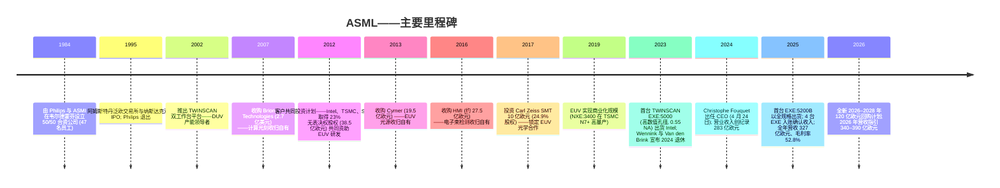
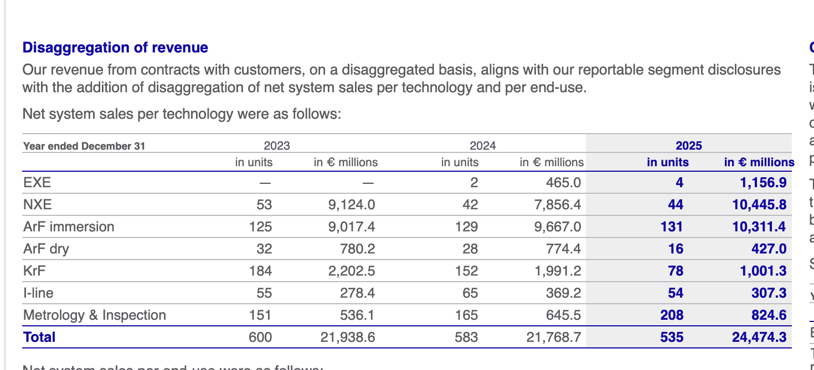
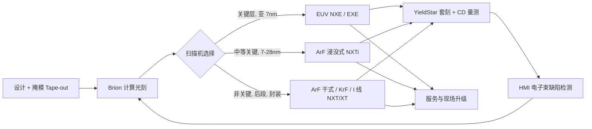
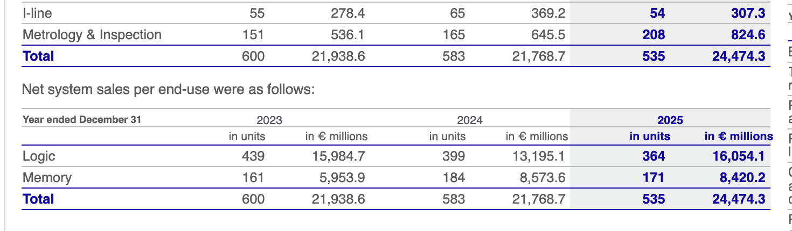
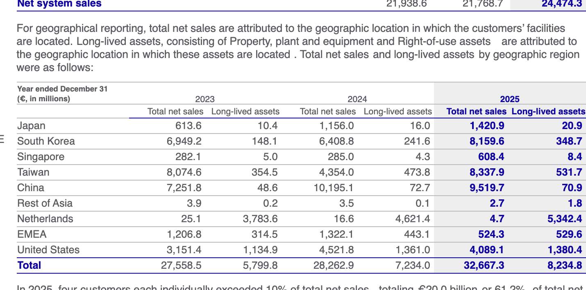
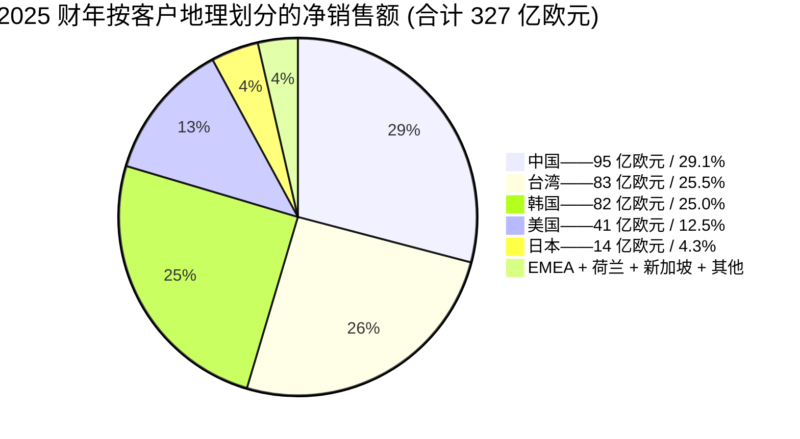
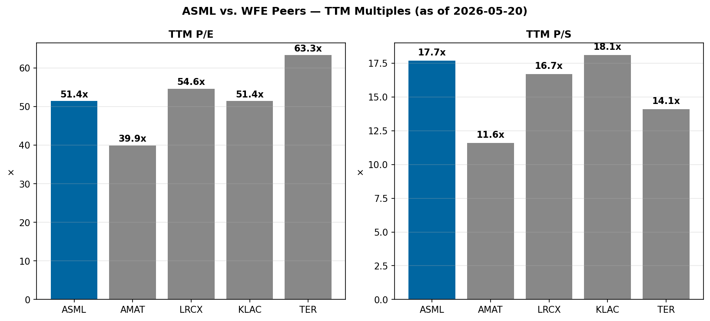

# ASML Holding N.V. (NASDAQ:ASML) — 公司研究报告

**截至日期: 2026-05-23**
**代码: ASML (NASDAQ ADR + 阿姆斯特丹泛欧交易所) | 总部: 荷兰韦尔德霍芬 (Veldhoven)**
**报告语言: 简体中文 (英文版同时存在于本目录)**
**披露口径:** 20-F 申报人 (外国私人发行人)。主要来源: ASML 2025 年度报告 (20-F 表), 于 2026-02-25 提交。最新季度业绩: 2026-01-28 发布的 Q4-2025 / 2025 财年新闻稿。估值快照: 2026-05-22 NYSE 收盘价。

> **业绩更新——2026 财年指引初步公布 (2026-01-28):** 管理层公布 2026 全年净销售额指引为**340–390 亿欧元**, 较 2025 财年实际值 327 亿欧元 (中位数对应同比增长约 12%) 提升, 毛利率 (gross margin) 区间 51%–53%, 年化有效税率约 17%。Q1-2026 收入指引为**82–89 亿欧元**, 毛利率 51%–53%。管理层预计 2026 年 EUV 收入将"显著高于"2025 年, 由先进逻辑及 DRAM 节点放量驱动; 非 EUV 收入预计与 2025 年相近; 服务与现场升级 (service & field options) 将受益于装机基数 (installed base) 扩大而增长。董事会同时宣布全新的**2026–2028 年股票回购计划**, 总额最高 120 亿欧元, 与业绩同时披露。
> 来源: [ASML 公布 2025 年净销售额 327 亿欧元、净利润 96 亿欧元——6-K, 2026-01-28](https://www.sec.gov/Archives/edgar/data/937966/000162828026003701/form6-kquarterlyfilings.htm); 长期展望在 [2025 年 20-F "Long-term growth opportunities" 段落](https://www.sec.gov/Archives/edgar/data/937966/000162828026011378/asml-20251231.htm)中获重申。

---

## 目录

1. 公司概览
2. 公司历史
3. 管理团队
4. 产品与服务
5. 客户与上市策略
6. 行业概览
7. 竞争格局
8. 市场机会 (TAM)
9. 风险评估
10. 参考资料

---

## 1. 公司概览

ASML Holding N.V. 是全球**极紫外光刻 (Extreme Ultraviolet, EUV) 系统**的**垄断独家供应商**, 同时也是**深紫外光刻 (Deep Ultraviolet, DUV) 浸没式光刻系统**的领先供应商; 这两类设备用于印制全球最先进的半导体逻辑及存储器件。公司总部位于荷兰布拉班特省埃因霍温 (Eindhoven) 创新区的韦尔德霍芬 (Veldhoven), 按其 20-F 表中的原话, ASML"目前是全球唯一的 EUV 光刻系统制造商" ([ASML 2025 年 20-F, "Our products and services"](https://www.sec.gov/Archives/edgar/data/937966/000162828026011378/asml-20251231.htm); [ASML EUV 产品页](https://www.asml.com/en/products/euv-lithography-systems))。

商业模式分为三条腿: **(1) 新机销售 (system sales)** ——售予全球少数几家先进制程晶圆代工厂 (TSMC 台积电)、综合器件制造商 IDM (Intel 英特尔、Samsung Foundry 三星代工) 及存储器厂商 (Samsung Memory 三星存储、SK Hynix 海力士、Micron 美光) 的高单价资本设备; **(2) 服务与现场升级净销售 (net service and field-option sales)** ——为装机基数提供维护、产能升级、零部件、软件及翻新 (refurbishment) 的经常性收入, 按公司披露"我们近三十年售出的设备约 95% 仍在使用中"; **(3) 量测与检测 (Metrology & Inspection, M&I)** ——YieldStar 光学散射量测工具与 HMI 多束电子束检测系统, 这一相邻业务通过同一套 TWINSCAN 制程控制回路打通 ([ASML 2025 年 20-F, "Our products and services"](https://www.sec.gov/Archives/edgar/data/937966/000162828026011378/asml-20251231.htm); [ASML HMI 页面](https://www.asml.com/en/company/about-asml/hmi))。

2025 财年, ASML 录得**总净销售额 326.673 亿欧元**, 较 2024 财年的 282.629 亿欧元增长 15.6%, 较 2023 财年的 275.585 亿欧元提升明显。其中新机净销售额为 244.743 亿欧元 (占总收入 74.9%), 服务与现场升级净销售额为 81.930 亿欧元 (25.1%)。2025 财年毛利为 172.580 亿欧元 (毛利率 52.8%, 同比提升 150 个基点, 上年为 51.3%), 净利润为 96.094 亿欧元 (净利润率 29.4%) ——上述数字均逐项核对自 20-F 表的合并经营报表及分部附注 ([ASML 2025 年 20-F, KPI 与合并经营报表](https://www.sec.gov/Archives/edgar/data/937966/000162828026011378/asml-20251231.htm))。

系统出货量指标: 2025 年 ASML 确认收入**48 台 EUV 系统 (44 台 NXE + 4 台 EXE)**, 上年为 44 台 (42 台 NXE + 2 台 EXE); 含 DUV 在内的**全光刻系统总出货量为 535 台** (上年 583 台, 2023 年 600 台) ——单位数下降而收入上升反映出向高 ASP 的 EUV 倾斜、远离低端成熟节点 KrF 的产品结构调整, KrF 出货量由 2024 年的 152 台跌至 2025 年的 78 台, 此前中国成熟节点抢装行情已于年内告一段落 ([ASML 2025 年 20-F, "Disaggregation of revenue" 附注](https://www.sec.gov/Archives/edgar/data/937966/000162828026011378/asml-20251231.htm))。

2025 财年地理结构高度向亚洲倾斜: **中国 95.197 亿欧元 (29.1%)**、**台湾 83.379 亿欧元 (25.5%)**、**韩国 81.596 亿欧元 (25.0%)**、美国 40.891 亿欧元 (12.5%)、日本 14.209 亿欧元 (4.3%), 以及 EMEA + 荷兰 + 新加坡 + 其他合计约 11 亿欧元 (3.6%)。终端用途细分 (仅系统收入口径) 为**逻辑 160.541 亿欧元 (占系统收入 65.6%)**, **存储 84.202 亿欧元 (34.4%)** ——逻辑占比由 2024 财年的 60.6% 上升, 反映先进代工产能加码以支持 AI 训练与推理芯片的资本扩张 ([ASML 2025 年 20-F, 地理与终端用途附注](https://www.sec.gov/Archives/edgar/data/937966/000162828026011378/asml-20251231.htm))。

2025 年末, ASML 披露**全球员工总数 (FTE) 超过 4.4 万人**, 来自**143 个国家与地区**, **女性员工占 21%**, 客户满意度评分 88%, 研发支出 47 亿欧元, **供应商总数达 5,100 家** ——上述数据均逐项摘自 20-F 表卷首的"At a glance" KPI 页 ([ASML 2025 年 20-F, "At a glance"](https://www.sec.gov/Archives/edgar/data/937966/000162828026011378/asml-20251231.htm))。5,100 家供应商这一数字具有运营层面的承重意义: EUV 实际上是工业界最复杂的跨国子供应链, Zeiss SMT (光学, ASML 自 2017 年起持有 24.9% 经济权益)、Trumpf 通快 (CO₂ 激光泵浦)、Cymer (光源, 2013 年并入) 均为单一来源 (single-source) 合作伙伴 ([ASML 投资 10 亿欧元于 Carl Zeiss SMT——Electro Optics, 2016-11-03](https://www.electrooptics.com/news/asml-invests-1-billion-zeiss-boost-euv-lithography); [ASML 将收购 Cymer, 2012-10-17](https://www.asml.com/en/news/press-releases/2012/asml-to-acquire-cymer-to-accelerate-development-of-euv-technology))。

**估值快照 (截至 2026-05-22 收盘)。** ASML 最新价 1,632.90 美元, 市值 6,289.2 亿美元 ([Stockanalysis.com——ASML 统计页, 2026-05-22](https://stockanalysis.com/stocks/asml/statistics/))。按过去十二个月 (TTM) 基础, 公司估值为 **TTM 市盈率 (P/E) 54.5×、TTM 市销率 (P/S) 16.2×、企业价值 / EBITDA (EV/EBITDA) 42.5×、前瞻 P/E 41.6×**, 股息率约 0.46%, 同时执行连续回购计划。最接近的晶圆制造设备 (Wafer-Fab-Equipment, WFE) 同业, 全部按 2026-05-22 同日 Stockanalysis.com 收盘价口径:

| 公司 | TTM P/E | TTM P/S | EV/EBITDA | 市值 |
|---|---|---|---|---|
| **ASML** | **54.5×** | **16.2×** | 42.5× | $628.9B |
| Applied Materials 应用材料 (AMAT) | 40.7× | 11.8× | 36.9× | $343.1B |
| Lam Research 泛林集团 (LRCX) | 57.7× | 17.6× | 48.5× | $381.9B |
| KLA 科磊 (KLAC) | 53.5× | 18.8× | 42.4× | $246.7B |
| Teradyne 泰瑞达 (TER) | 66.6× | 14.8× | 48.0× | $56.1B |
| **WFE 五家中位数** | **54.5×** | **16.2×** | **42.5×** | — |

来源: [Stockanalysis.com AMAT 统计页, 2026-05-22](https://stockanalysis.com/stocks/amat/statistics/), [LRCX](https://stockanalysis.com/stocks/lrcx/statistics/), [KLAC](https://stockanalysis.com/stocks/klac/statistics/), [TER](https://stockanalysis.com/stocks/ter/statistics/)。

ASML 的估值倍数**在 P/E、P/S、EV/EBITDA 三项上同时落在 WFE 同业中位数水平** ——即市场目前并未在 AMAT / LRCX / KLAC 之外给予 ASML 明显的"垄断溢价", 尽管其结构性盈利能力显著优异 (2025 财年毛利率 52.8%、营业利润率约 34.6%, 高于 AMAT 与 LRCX 高 40 多 % 的毛利与 30 多 % 的营业利润率)。那么为何绝对倍数仍处于高位 (P/E 超过 50× 约为标普 500 长期远期 P/E 的两倍)? 驱动因素在 2025 财年 CEO 致股东信及 2024 年投资者日模型中均有明示: (a) **AI 基础设施终端市场溢价** ——"AI 仍是半导体市场的关键驱动力, 云服务商在训练与推理上的资本开支创历史新高"; (b) **EUV 垄断带来的长期盈利可见度** ——ASML 在 EUV 上持有多年期客户在手订单; (c) **管理层公开的 2030 年 440–600 亿欧元收入模型, 毛利率区间 56%–60%**, 市场对此区间的上半段予以贴现 ([ASML 2024 年投资者日新闻稿, 2024-11-14](https://www.sec.gov/Archives/edgar/data/937966/000093796624000024/pressreleaseinvestorday2024.htm); [2025 年 20-F, CEO 致辞与"Long-term growth opportunities"](https://www.sec.gov/Archives/edgar/data/937966/000162828026011378/asml-20251231.htm))。在 TTM P/E 高于 50× 的水位下, 若任一结构性驱动因素 (中国政策反转、超大规模数据中心资本开支暂停、High-NA 延迟) 出现逆风, 将存在显著的估值风险 ——这一点已在第 9 章作为单列的估值/倍数压缩风险载入。


来源: [ASML 2025 年年度报告 (20-F 表) ——KPI 与合并经营报表](https://www.sec.gov/Archives/edgar/data/937966/000162828026011378/asml-20251231.htm)。

---

## 2. 公司历史

ASML 于 1984 年成立, 当时为**荷兰电子综合集团 Philips (飞利浦)** 与位于埃因霍温的中小型设备厂商**Advanced Semiconductor Materials International (ASMI)** 以 50/50 比例共同设立的合资公司, 目标是将 Philips Natuurkundig Laboratorium (NatLab, "自然实验室") 内部开发的晶圆步进光刻技术 (wafer-stepper technology) 商业化 ([ASML 创立故事](https://www.asml.com/en/news/stories/2024/asml-founding-story); [ASML 公司沿革](https://www.asml.com/en/company/about-asml/history))。合资公司起步时仅有 47 名员工, 办公地点为 Philips 园区旁的一栋预制板房, 在光刻产业中是不折不扣的弱者——当时 Nikon 尼康、Canon 佳能、Perkin-Elmer / SVG 各占山头。1985 年, ASML 首台商用步进机 PAS 2500 出货 ([ASML 公司沿革](https://www.asml.com/en/company/about-asml/history))。1995 年 3 月, 公司剥离上市, 在阿姆斯特丹泛欧交易所及纳斯达克 (Nasdaq) 双重 IPO。

ASML 的竞争地位通过三个结构性步骤实现转折。其一, 2002 年推出**TWINSCAN 双晶圆台 (dual-wafer-stage) 平台**, 使产能翻倍, 让 ASML 在 DUV 上确立产能领导地位 ([ASML 公司沿革](https://www.asml.com/en/company/about-asml/history))。其二, **2007 年以 2.7 亿美元现金收购 Brion Technologies**——交易于 2007 年 3 月 8 日完成——将计算光刻 (computational lithography, 含 OPC 光学邻近修正、设计感知掩模增强) 收归自有 ([ASML 完成 Brion 收购, EE Times, 2007-03-08](https://www.eetimes.com/asml-completes-brion-acquisition/))。其三, 与**Carl Zeiss SMT 卡尔蔡司半导体制造技术**长达数十年的合作于 2016 年 11 月 3 日签约、2017 年 6 月获得监管批准, 以 10 亿欧元现金完成 24.9% 经济权益投资, 将 NXE 与 EXE EUV 系统的光学列阵锁定 ([ASML 投资 10 亿欧元于 Carl Zeiss SMT——Electro Optics, 2016-11](https://www.electrooptics.com/news/asml-invests-1-billion-zeiss-boost-euv-lithography); [ASML 获得与 Zeiss 强化合作的监管批准, 2017](https://www.asml.com/en/news/press-releases/2017/asml-obtains-regulatory-approvals-for-strengthened-partnership-with-zeiss))。

公司开创性的战略决策是 1990 年代末期开始的**多十亿欧元 EUV 大押注**。管理层签约了一项当时尚未取得资金保障的研发计划, 其中包括美国、欧盟及日本的合作伙伴, 并于 2012 年推出**客户共同投资计划 (Customer Co-Investment Program)**——Intel、TSMC 与 Samsung 合计以 38.5 亿欧元现金取得 ASML **23% 的无表决权股权**, 以换取 EUV 研发的预付资金 ([ASML 6-K 附件 99.1——客户共同投资计划, 2012-08-27](https://www.sec.gov/Archives/edgar/data/937966/000119312512370598/d402810dex991.htm))。EUV 系统收入在 2010 年前几乎为零、2017 年前依然微不足道, 直到 2019 年才开始具规模。2023 财年, EUV NXE 已贡献 91 亿欧元系统销售; 2025 财年, EUV (NXE + EXE) 合计达 116 亿欧元 ([ASML 2025 年 20-F, "Disaggregation of revenue"](https://www.sec.gov/Archives/edgar/data/937966/000162828026011378/asml-20251231.htm))。



另外两笔重大并购整合了"整体光刻 (holistic lithography)"产品堆栈。**2013 年的 Cymer 并购**——2012 年 10 月签约, 交易作价 19.5 亿欧元 (现金加股票; Cymer 每位股东获得 20 美元现金加 1.1502 股 ASML 普通股) ——在 EUV 光源功率由 2013 年的不足 100 W 攀升至今天的 500 W 以上时得到证实 ([ASML 将收购 Cymer 新闻稿, 2012-10-17](https://www.asml.com/en/news/press-releases/2012/asml-to-acquire-cymer-to-accelerate-development-of-euv-technology); [ASML Cymer 页面](https://www.asml.com/en/company/about-asml/cymer))。**2016 年并购 HMI (Hermes Microvision)** ——交易作价约 1,000 亿新台币 (约 27.5 亿欧元) ——为 ASML 增加了多束电子束检测能力 ([ASML 将收购 HMI 新闻稿, 2016-06-16](https://www.asml.com/en/news/press-releases/2016/asml-to-acquire-hmi-to-enhance-holistic-lithography-product-portfolio); [ASML HMI 页面](https://www.asml.com/en/company/about-asml/hmi))。

**近期动态 (2024–2026):** (1) 2024 年 4 月 24 日, **Christophe Fouquet** 被任命为总裁兼 CEO、管理委员会主席, 接替任期 25 年的前 CEO Peter Wennink (1999 年起任 CFO、2013 年起任 CEO) 与 CTO Martin van den Brink (两人均退休) ([认识 Christophe Fouquet, ASML 新任 CEO](https://www.asml.com/en/news/stories/2024/christophe-fouquet-asml-ceo); [ASML 管理委员会变动, 2023-11-30](https://www.asml.com/en/news/press-releases/2023/asml-board-of-management-changes)); (2) 2025 年 4 月初, 首台**TWINSCAN EXE:5200B 高数值孔径系统**以完整规格 (175 wph, 较 EXE:5000 提升 60%) 出货 ([TrendForce——ASML 确认首台高数值孔径 EUV EXE:5200 出货, 2025-07-17](https://www.trendforce.com/news/2025/07/17/news-asml-confirms-first-high-na-euv-exe5200-shipment-reportedly-prepping-for-intels-14a-in-2027/)); (3) 2026-01-28 宣布**全新 2026–2028 年股票回购计划**, 总额上限 120 亿欧元, 接续已完成的 2022–2025 年回购计划 ([Q4-2025 / 2025 财年 6-K, 2026-01-28](https://www.sec.gov/Archives/edgar/data/937966/000162828026003701/form6-kquarterlyfilings.htm)); (4) 2025 年 9 月, 公司向**Mistral AI 投资 13 亿欧元**取得少数股权——这是 ASML 首笔在光刻生态以外的重要财务投入 ([ASML 与 Mistral AI 签署战略合作伙伴关系, 2025-09-09](https://www.asml.com/en/news/press-releases/2025/asml-mistral-ai-enter-strategic-partnership))。

---

## 3. 管理团队

### 关于"创始人"的说明

按传统意义上, ASML 并无单一创始人——它于 1984 年作为 Philips NatLab 与 ASMI 的 50/50 合资公司注册成立, 两家发起股东在今日特许经营业务形成之前均已退出 (Philips 通过 1995 年 IPO 及 1990 年代末若干次后续配售完全退出)。在仍在世且具机构记忆的人物中, 最接近"创始人格"的是 **Martin van den Brink**——他于 1984 年加入合资公司, 是首批技术员工之一, 之后晋升 CTO, 直到 2024 年 4 月退休前一直留任管理委员会; 但他是雇员, 不是创始人。因此, 对 2026 年的投资者而言, 真正的"在任领导"问题不是关于创始人, 而是现任 CEO 能否将这一垄断特许经营业务带过"高数值孔径十年"。

### Christophe D. Fouquet——总裁、CEO 兼管理委员会主席

Christophe Fouquet 是法国受训的物理学家, 2008 年加入 ASML, 全部 ASML 职业生涯均在光刻产品组织内度过。他于 2024 年 4 月 24 日出任总裁兼 CEO、管理委员会主席, 接替长期任职的 Peter Wennink (2013 年起任 CEO, 1999–2013 年任 CFO) 与 CTO Martin van den Brink (两人均退休) ([认识 Christophe Fouquet, ASML 新任 CEO](https://www.asml.com/en/news/stories/2024/christophe-fouquet-asml-ceo); [ASML 管理委员会变动, 2023-11-30](https://www.asml.com/en/news/press-releases/2023/asml-board-of-management-changes); [Bits&Chips——Christophe Fouquet 接掌 ASML](https://bits-chips.com/article/christophe-fouquet-takes-the-reins-at-asml/))。其升任是公开宣示三年继任规划的高潮: 他于 2018 年晋升管理委员会, 2022 年出任首席业务官 (CBO) 兼 EVP, 主管全部三条产品线 (EUV、DUV、Applications) ——这等于让他在出任 CEO 之前已是 ASML 整个设备特许经营业务的唯一损益表负责人。

在加入 ASML 之前, Fouquet 曾任职于**KLA-Tencor 科磊** (制程控制 / 量测) 与**Applied Materials 应用材料** (沉积与刻蚀), 这让他获得了对 ASML 堆栈最可能侵入的两类相邻设备品类的竞争者视角经验。在 ASML 内部, 他历任高级营销总监、产品管理副总裁, 2013–2018 年任执行副总裁兼应用部门负责人——该部门承担与 TSMC、Samsung、Intel 的客户端工程接口。据 Bits&Chips 关于其任命的专题报道, 他持有**法国格勒诺布尔综合理工学院 (Institut Polytechnique de Grenoble)** 物理学硕士学位 ([Bits&Chips——Christophe Fouquet 接掌 ASML](https://bits-chips.com/article/christophe-fouquet-takes-the-reins-at-asml/))。

Fouquet 出任 CEO 的头两年由三项运营选择定义, 这三项决策均在其 2025 年致股东信中明示 ([ASML 2025 年 20-F, "In conversation with Christophe Fouquet"](https://www.sec.gov/Archives/edgar/data/937966/000162828026011378/asml-20251231.htm))。其一, **明确的文化重置**: CEO 问答页指出 ASML 必须"加强对工程与创新的聚焦", 并重建因员工数快速扩张而被稀释的高速文化 (FTE 从 2022 年末约 3.2 万人增长到 2025 年末超过 4.4 万人)。其二, 将 DUV 业务**重新聚焦于"质量与成本效率"而非"以任何代价追求产能领导"** ——2025 财年 MD&A 将 DUV 利润率显著扩张的功劳归于这一转向。其三, **更具主动性的资本配置姿态**: 2025 年 9 月向 Mistral AI 投资 13 亿欧元取得少数股权, 是 ASML 在光刻生态以外的首次重要资产负债表布局 ([ASML 与 Mistral AI 战略合作, 2025-09-09](https://www.asml.com/en/news/press-releases/2025/asml-mistral-ai-enter-strategic-partnership))。其 2025 年总薪酬为 702.1 万欧元, 在管理委员会中最高 ([ASML 2025 年 20-F, 薪酬报告](https://www.sec.gov/Archives/edgar/data/937966/000162828026011378/asml-20251231.htm)); 其直接持股比例较小 (薪酬报告披露的逐期绩效股授予表显示 2025 年 4 月有条件授予 1,157 股), 大部分敞口通过基于相对 TSR 与 EPS 增长的绩效挂钩长期激励 (LTI) 实现。2026–2028 年的关键执行命题是: 其组织简化能否在 High-NA 路线图 (EXE:5200B → 下一代 EXE → Hyper-NA) 上维持工程速率——这是真正的押注, 目前尚未验证。

---

## 4. 产品与服务

### 4.1 2025 年 20-F 中的产品矩阵 (锚定一手披露)

ASML 2025 年 20-F 在合并财务报表的附注 2 "Disaggregation of revenue (收入分拆)" 中, 以单一表格列出了每个产品系列的单位出货量与收入。下表是本章后续所有内容的主要锚点——每个产品小节都会向该表回溯。


来源: [ASML 2025 年 20-F, 附注 2 "Revenue from contracts with customers——Disaggregation of revenue"](https://www.sec.gov/Archives/edgar/data/937966/000162828026011378/asml-20251231.htm)。

| 截至 12 月 31 日财年 | 2023 单位数 | 2023 百万欧元 | 2024 单位数 | 2024 百万欧元 | **2025 单位数** | **2025 百万欧元** |
|---|---|---|---|---|---|---|
| EXE (High-NA EUV, 0.55 NA) | — | — | 2 | 465.0 | **4** | **1,156.9** |
| NXE (EUV, 0.33 NA) | 53 | 9,124.0 | 42 | 7,856.4 | **44** | **10,445.8** |
| ArF 浸没式 (TWINSCAN NXTi) | 125 | 9,017.4 | 129 | 9,667.0 | **131** | **10,311.4** |
| ArF 干式 | 32 | 780.2 | 28 | 774.4 | **16** | **427.0** |
| KrF | 184 | 2,202.5 | 152 | 1,991.2 | **78** | **1,001.3** |
| I 线 (i-line) | 55 | 278.4 | 65 | 369.2 | **54** | **307.3** |
| 量测与检测 (M&I) | 151 | 536.1 | 165 | 645.5 | **208** | **824.6** |
| **系统净销售额合计** | **600** | **21,938.6** | **583** | **21,768.7** | **535** | **24,474.3** |

加上**服务与现场升级净销售额** 5,619.9 (2023)、6,494.2 (2024) 与 **8,193.0 (2025)** 百万欧元, 使 2025 财年总净销售达**326.673 亿欧元** ([ASML 2025 年 20-F, 合并经营报表](https://www.sec.gov/Archives/edgar/data/937966/000162828026011378/asml-20251231.htm))。

### 4.2 综合视图——产品类别如何在客户工作流中互联

一座现代先进制程晶圆厂在工作流中以一个互锁回路使用 ASML 各产品线: **EUV (NXE + EXE)** 印制亚 7nm 逻辑及 DRAM 中最关键的层 (晶体管栅极、接触孔、底层互连); **ArF 浸没式 (NXTi)** 印制 7–28nm 的次关键层, 并在亚 EUV 节点通过多重曝光与 EUV 互补; **ArF 干式、KrF、I 线 (NXT / XT)** 印制更大的特征 (后段互连、钝化、先进封装重布线); **量测与检测 (YieldStar + HMI)** 在每一光刻步骤后测量印制图形, 并将结果回馈 ASML 的**计算光刻软件 (Brion)**, 后者预先计算下一次曝光的光学邻近修正; **服务与现场升级**则销售保持装机基数运行及产能逐步提升所需的产能升级、零部件与软件。这就是"整体光刻"堆栈——没有任何竞争对手拥有全部环节。下图展示该回路。



### 4.3 EUV 光刻——TWINSCAN NXE (0.33 NA) 与 TWINSCAN EXE (0.55 NA, 高数值孔径)

> "我们的 EUV 光刻系统能够以最高密度印制微芯片上最小的特征, 并用于最先进微芯片中最精细、最关键的层。……ASML 目前是全球唯一的 EUV 光刻系统制造商。" ——[ASML 2025 年 20-F, "Our products and services——Extreme ultraviolet (EUV) lithography systems"](https://www.sec.gov/Archives/edgar/data/937966/000162828026011378/asml-20251231.htm)

> "2025 年, 我们向客户出货了全规格 TWINSCAN NXE:3800E 系统, 包括 220 wph (wafers-per-hour, 每小时晶圆数) 的产能——较 TWINSCAN NXE:3600D 提升 37%——更高功率光源、新晶圆搬运机构、更快的晶圆台和高功率成像控制功能。" ——[ASML 2025 年 20-F, "Latest: TWINSCAN NXE:3800E reaches full productivity specification"](https://www.sec.gov/Archives/edgar/data/937966/000162828026011378/asml-20251231.htm)

> "2025 年 4 月初, 我们出货了首台 TWINSCAN EXE:5200B 系统——TWINSCAN EXE:5000 的继任产品——可用于高产量量产。其每小时 175 片晶圆的产能, 较 TWINSCAN EXE:5000 提升 60%——这得益于改进后的 EUV 光源能为晶圆面提供更大的功率。" ——[ASML 2025 年 20-F, "Latest: Success with our TWINSCAN EXE:5200B"](https://www.sec.gov/Archives/edgar/data/937966/000162828026011378/asml-20251231.htm)

**通俗释义 / 中文释义。** **极紫外光刻 (Extreme Ultraviolet, EUV, 极紫外, 波长 13.5nm)** 是利用尽可能短的实用波长光来定义芯片上最小可能特征的"光学印刷"步骤。由于 13.5nm 的光在任何透明光学元件中都无法透射, 整条光路必须采用**反射镜 (反射镜, reflective mirror) 而非折射透镜**——每面反射镜在德国奥伯科亨 (Oberkochen) 的 Carl Zeiss SMT 工厂以 Mo/Si 交替镀层 (约 50 对) 制造。光源采用**激光产生等离子体 (laser-produced-plasma, LPP)** 发生器: 通快 (Trumpf) 制造的大功率 CO₂ 激光每秒约击中锡液滴 5 万次以产生 EUV 等离子体, 由 ASML 旗下 Cymer 子公司将其整合进扫描机。**NXE** 为 0.33 NA 一代, 印制亚 7nm 逻辑关键层及 HBM DRAM 关键层; **EXE** 为 0.55 NA "**高数值孔径 (High-NA, 高 NA)**" 一代——更大的数值孔径意味着单次曝光的最小特征更精细, 替代亚 2nm 节点的多重 EUV 曝光。EXE 在中文产业媒体中有时被译为"高数值孔径极紫外"或"高 NA EUV"。EXE 系统采用 4×/8× 各向异性 (anamorphic) 光学列阵 (水平方向缩小倍率大于垂直方向) 及**半场掩模 (half-field reticle)** ——这一变化对客户的掩模设计工作流而言意义重大。按 20-F 表的原话, EXE 平台"经过设计以最大化与 NXE 平台的共用性, 以驱动成本下降"。

EUV 单位与收入轨迹 (从 §4.1 表中逐字摘录): NXE 由 53 台 / 91 亿欧元 (2023) → 42 台 / 79 亿欧元 (2024) → **44 台 / 104 亿欧元 (2025)**; EXE 由 0 → 2 台 / 4.65 亿欧元 → **4 台 / 11.57 亿欧元**。NXE 收入在台数稳定下同比上升 33% (向高 ASP 的 NXE:3800E 倾斜); EXE 在台数翻倍下收入翻倍以上。截至 2025 年末, 按 CEO 问答, ASML 客户已在高数值孔径 EUV 系统上累计曝光**逾 40 万片晶圆**——已越过早期开发门槛, 但仍处于量产前阶段 ([ASML 2025 年 20-F, CEO 问答](https://www.sec.gov/Archives/edgar/data/937966/000162828026011378/asml-20251231.htm))。EXE 系统的高产量量产预计将于 2027 年启动。

*分析师观点:* EUV (NXE + EXE) 是**半导体设备界唯一一个由单一供应商占据 100% 全球份额的产品类别** (按 ASML 自己 20-F 上述原话: "目前是全球唯一的 EUV 光刻系统制造商")。Nikon 与 Canon 都未出货过商用 0.33 NA EUV 扫描机, 两家公司均已公开将路线图转移——Nikon 转向下一代 ArF 浸没式 ([TrendForce——Nikon 计划于 2028 财年通过新 ArF 光刻系统缩小与 ASML 的差距, 2025-02-21](https://www.trendforce.com/news/2025/02/21/news-nikon-aims-to-close-the-gap-on-asml-with-new-arf-lithography-system-in-fy28/)), Canon 转向用于非关键层的纳米压印 (Nanoimprint) ([TrendForce——Canon 向 TIE 交付纳米压印光刻设备, 2024-09-30](https://www.trendforce.com/news/2024/09/30/news-canon-delivers-nanoimprint-lithography-system-to-tie-reportedly-capable-of-producing-2nm-chips/))。护城河由四项叠加构成: (i) Carl Zeiss SMT 独家供应 EUV 光学 (ASML 持有 24.9% 股权); (ii) 在 ASML 内部累计超过 25 年的研发; (iii) 由 2012 年客户共同投资计划锁定的 Intel、TSMC、Samsung 路线图; (iv) 围绕 EUV 重建的供应商基础 (Cymer 自有、Trumpf、数十家欧洲单一来源中型厂商)。在 2026–2030 年时间窗口内, 亚 2nm 逻辑关键层尚无可信的替代方案——参见第 7 章对 Canon 纳米压印与 SMEE (上海微电子) 定位的讨论, 二者均为真实但有限的存在。

### 4.4 DUV 光刻——TWINSCAN NXTi (ArF 浸没式), NXT/XT (ArF 干式, KrF, I 线)

> "DUV 光刻系统是这个产业的'劳动力', 印制了微芯片中大多数层。它们覆盖众多市场板块, 我们的浸没式与干式光刻系统使用一系列光源, 涵盖目前半导体行业所用的所有波长——193nm 的氟化氩 (ArF) 激光、248nm 的氟化氪 (KrF) 激光以及 365nm 的汞蒸气放电灯 (i-line)。" ——[ASML 2025 年 20-F, "Our products and services——Deep ultraviolet (DUV) lithography systems"](https://www.sec.gov/Archives/edgar/data/937966/000162828026011378/asml-20251231.htm)

> "氟化氩 (ArF) 浸没式光刻在透镜与晶圆之间维持一薄层水, 提升数值孔径 (NA) 以改善分辨率并支持进一步缩小。我们的浸没式系统可用于单次曝光与多重曝光光刻, 且能与 EUV 系统无缝组合, 在同一颗芯片上印制不同层。" ——[ASML 2025 年 20-F, "Immersion systems (TWINSCAN NXTi platform)"](https://www.sec.gov/Archives/edgar/data/937966/000162828026011378/asml-20251231.htm)

> "TWINSCAN XT:260——我们 i-line 产品组合的最新成员——将高产能与扫描机的成像精度相结合。其产能较现有解决方案最高提升 4 倍, 是支持客户在 3D 集成应用 (含先进封装) 以及图像传感器、显示器与光子学等新兴技术上的成本效益技术。" ——[ASML 2025 年 20-F, "Latest: TWINSCAN XT:260"](https://www.sec.gov/Archives/edgar/data/937966/000162828026011378/asml-20251231.htm)

**通俗释义 / 中文释义。** **DUV (Deep Ultraviolet, 深紫外)** 是上一代波长系列——193nm (ArF, 氟化氩) 与 248nm (KrF, 氟化氪) 准分子激光, 加上 365nm (i-line, 汞灯) 汞弧灯。**ArF 浸没式 / 浸没式 (NXTi)** 是 DUV 中分辨率最高的: 最终透镜与晶圆之间夹一薄层水, 将有效数值孔径由 <1 (干式) 提升至约 1.35 (浸没), 转化为更小的最小特征尺寸。ArF 浸没式是 7–28nm 关键层、亚 EUV 节点多重曝光填充层的"劳动力", 也是中国成熟节点扩产的主流采购对象。**ArF 干式**与**KrF**印制 90–180nm 的较大特征——后段互连、钝化、成熟模拟与功率分立元件。**I 线 (NXT/XT)** 处理 365nm 下最大特征、先进封装 (重布线层、TSV / 通孔 (through-silicon-via 通孔) 图形化) 与分立逻辑。2025 年发布的**TWINSCAN XT:260** 是 ASML 首台面向先进封装的扫描机级 i-line 工具——这一市场以往由 Veeco、EVG 与 SUSS MicroTec 主导。

DUV 单位与收入轨迹: ArF 浸没式由 125 → 129 → 131 台增长, 收入由 90 亿欧元 → 97 亿欧元 → 103 亿欧元 (客户购入更新的 NXT:2050i / NXT:2100i 工具, 推动稳定的中个位数 ASP / 产品组合上升)。ArF 干式、KrF 与 i-line 在 2025 年均下滑, 因中国成熟节点抢装行情结束——KrF 尤其从 152 台腰斩至 78 台。XT:260 是多年来 DUV 最具实质意义的发布, 因为它让 ASML 进入了一个其历史上未曾深耕的相邻业务 (先进封装光刻)。

*分析师观点:* ASML 在 ArF 浸没式的市占率明显领先; Nikon 的 NSR-S631E / NSR-S635E 每年向特定日本 DRAM 与成熟节点中国客户出货数量为低双位数 ([Nikon 截至 2025 年 3 月的财年业绩, 2025-05-08](https://www.nikon.com/company/ir/ir_library/result/pdf/2025/25_1_e.pdf); [Bits&Chips——Nikon 计划挑战 ASML 在 ArF 浸没式的主导地位](https://bits-chips.com/article/nikon-aims-to-challenge-asmls-dominance-in-arf-immersion/))。ASML / Nikon ArF 浸没式台数份额拆分两家均未直接披露; 卖方估算多在 ASML 高 80%–低 90% 区间。KrF 与 i-line 竞争更为激烈——Nikon、Canon 及若干中国厂商均参与其中。在先进封装 i-line 上, XT:260 直接对位 Canon 的 i-line FPA-5550iZ2 与 Veeco 的光刻工具; "产能提升 4 倍"是 ASML 自身的口径 ([ASML 2025 年 20-F](https://www.sec.gov/Archives/edgar/data/937966/000162828026011378/asml-20251231.htm)), 尚未在 HVM 量产环境下与竞争对手做过基准比较。

### 4.5 量测与检测——YieldStar (光学) 与 HMI (电子束)

> "我们的量测与检测系统使芯片制造商能准确测量晶圆上印制的图形, 确保其符合预期设计。……这些系统按高产量量产所需的速度与精度交付数据, 使我们的制程控制软件方案得以实施自动反馈控制回路。" ——[ASML 2025 年 20-F, "Metrology and inspection systems"](https://www.sec.gov/Archives/edgar/data/937966/000162828026011378/asml-20251231.htm)

> "我们的 YieldStar 光学量测系统使用光来以高产量量产速度监测图形质量。它们测量套刻 (overlay) 误差并向光刻系统提供实时反馈, 以便其对印制图形中的任何缺陷进行修正。" ——[ASML 2025 年 20-F, "Optical metrology (YieldStar)"](https://www.sec.gov/Archives/edgar/data/937966/000162828026011378/asml-20251231.htm)

**通俗释义 / 中文释义。** **量测与检测 (Metrology & Inspection, M&I, 量测与检测)** 是闭合光刻反馈回路的"事后测量"。**YieldStar** 使用**散射量测 (scatterometry, 光衍射式图形重构)** 以量产速度测量**套刻精度 (overlay, 套刻精度, 即层与层之间的对准)** 及关键尺寸均匀性; **HMI 多束电子束**则使用数十个并行电子束, 以远高于单束电子束工具数个数量级的产能找出亚分辨缺陷。HMI 于 2016 年 11 月以约 1,000 亿新台币 (约 27.5 亿欧元) 自 Hermes Microvision (台湾) 处收购 ([ASML 将收购 HMI, 2016-06-16](https://www.asml.com/en/news/press-releases/2016/asml-to-acquire-hmi-to-enhance-holistic-lithography-product-portfolio); [ASML HMI 页面](https://www.asml.com/en/company/about-asml/hmi))。

在 2025 财年的收入分拆中, M&I 是单位数与收入双双增速最快的分部: 151 → 165 → **208 台**, 5.36 亿 → 6.46 亿 → **8.25 亿欧元** ——单 2025 年收入同比增长 28%、台数同比增长 26%, 是各分部中最强的增长。

*分析师观点:* 独立晶圆检测是 KLA Corporation 在全球主导的品类。KLA 的晶圆制程控制特许经营业务在 2025 财年收入约 122 亿美元 ——是 ASML M&I 8.25 亿欧元的数倍 ——并在最近几个季度的晶圆检测上实现两位数增长 ([KLA 2025 财年 Q3 业绩公告, 2025-04](https://www.sec.gov/cgi-bin/browse-edgar?action=getcompany&CIK=0000319201&type=10-Q))。ASML M&I 的差异化在于与 TWINSCAN 扫描机的紧密集成 (YieldStar–TWINSCAN 反馈回路属 ASML 专有); 在独立基础上并不领先。护城河是集成, 而非独立 IP。

### 4.6 服务与现场升级 + 翻新系统——经常性收入引擎

> "ASML 系统的运行寿命非常长, 往往超出其在初始客户处的角色——我们近三十年售出的设备约有 95% 仍在使用中。" ——[ASML 2025 年 20-F, "Refurbished systems"](https://www.sec.gov/Archives/edgar/data/937966/000162828026011378/asml-20251231.htm)

**通俗释义 / 中文释义。** 服务与现场升级销售 / 服务与现场升级收入涵盖 (a) 数千台装机基数的持续维护合同; (b) 售予现有工具的产能升级套件 (例如将 NXE:3800E 由 220 wph 提升至 230 wph 的 PEP-E 软件); (c) 易耗零部件; (d) 翻新系统销售 (经重认证后再销售给二手买家厂商的扫描机)。由于 EUV 系统远比 DUV 复杂、单台服务合同金额更高, 该经常性年金的增长速度明显快于装机台数本身的扩张。

**2025 年服务与现场升级净销售额为 81.93 亿欧元**, 较 2024 年的 64.94 亿欧元同比增长 26.2% ——驱动因素为 (a) EUV 装机基数扩大, (b) 客户厂房利用率提升, (c) 按 20-F 措辞"更多 NXE 现场升级"——TSMC 与 Samsung 采用 NXE:3800E 产能套件所致 ([ASML 2025 年 20-F MD&A](https://www.sec.gov/Archives/edgar/data/937966/000162828026011378/asml-20251231.htm))。服务与现场升级约占 2025 财年总收入的 25%, 是系统销售周期下方的非周期性"地板" ——在 2023 年低谷期 (总收入下滑) 服务仍然增长。

*分析师观点:* 一手 EUV 服务是 100% ASML 垄断 ——专有固件、诊断、反射镜搬运及光源功率控制 IP 让第三方服务在实务上不可行。DUV 服务在老旧工具上部分受到第三方厂商的争夺, 但专有的升级路线图 (产能套件、光学更换) 仍为捕获式。"95% 仍在使用"这一数字为该收入流的多十年跑道奠定基础。

### 4.7 旗舰产品 vs. 长尾产品; 近期发布与停产

驱动 2025–2026 年业务的**三款旗舰产品**为: (1) **TWINSCAN NXE:3800E** EUV 扫描机 (220–230 wph 的"劳动力", 用于先进逻辑关键层与 HBM DRAM); (2) **TWINSCAN NXTi (NXT:2050i / NXT:2100i) ArF 浸没式**系列 (高产量 DUV 现金牛); (3) **TWINSCAN EXE:5200B 高数值孔径**系统 (2027 年量产后的特许经营业务的未来) ([ASML 2025 年 20-F, CEO 问答](https://www.sec.gov/Archives/edgar/data/937966/000162828026011378/asml-20251231.htm))。2025 年值得关注的发布: **TWINSCAN XT:260** (进入先进封装 i-line 市场)、**TWINSCAN EXE:5200B** (高数值孔径量产继任产品, 175 wph)、含**产能增强套件——扩展版 (Productivity Enhancement Package – Extended, PEP-E)** 在内的**NXE:3800E** 全规格。值得关注的停产 / 退场: ArF 干式、KrF、i-line 出货同比明显下降, 因中国成熟节点抢装周期完成。

---

## 5. 客户与上市策略

ASML 售予全球少数几家先进制程半导体制造商。集中度极端, 是 2025 年 20-F 中披露最为充分的单项风险因素。

**头部客户集中度 (2025 财年): 四家客户单家个别超过总净销售额 10%, 合计 200 亿欧元, 占总净销售额 61.2%** ——逐字摘自 20-F 表。这与**2024 财年四家客户合计 152 亿欧元 / 53.8%** 及**2023 财年两家客户合计 149 亿欧元 / 53.9%** 形成对比——集中度随着 EUV 收入扩张而上升, 而非下降。ASML 并未公开点名四家 10%+ 客户 (公司从未在年报或电话会议上点名), 但根据其产品披露与地理结构, 公开的投资者一致预期是: **TSMC 台积电 (台湾)、Samsung Electronics 三星电子 (韩国, 代工 + 存储合并)、SK Hynix 海力士 (韩国) 与 Intel 英特尔 (美国)** ([ASML 2025 年 20-F, 客户集中度附注](https://www.sec.gov/Archives/edgar/data/937966/000162828026011378/asml-20251231.htm))。

ASML 三家最大客户在 2025 年 12 月 31 日合计占应收账款及融资应收款的 **13 亿欧元 (35.4%)**, 较 **2024 年 12 月 31 日的 26 亿欧元 (54.1%)** 与 **2023 年 12 月 31 日的 37 亿欧元 (64.4%)** 明显下降——同比应收集中度下降反映的是客户付款加快, 而非收入集中度下降 ([ASML 2025 年 20-F, 应收账款附注](https://www.sec.gov/Archives/edgar/data/937966/000162828026011378/asml-20251231.htm))。合同结构: ASML 与头部客户使用长期主采购协议 (滚动年度订单簿, 多年期在手订单), 但每台系统仍是按"验收付款"里程碑独立下达的采购订单。标准客户合同不含最低采购承诺。


来源: [ASML 2025 年 20-F, 附注 2 "Disaggregation of revenue——per end-use"](https://www.sec.gov/Archives/edgar/data/937966/000162828026011378/asml-20251231.htm)。

2025 财年逻辑 / 存储终端用途比为**逻辑 65.6% (160.541 亿欧元, 364 台) / 存储 34.4% (84.202 亿欧元, 171 台)**, 而 2024 财年为 60.6%/39.4%, 2023 财年为 72.9%/27.1% ——存储占比在 2024 年因 DRAM HBM 放量而显著上升, 2025 年随着逻辑加速而部分回归常态 ([ASML 2025 年 20-F, 终端用途附注](https://www.sec.gov/Archives/edgar/data/937966/000162828026011378/asml-20251231.htm))。


来源: [ASML 2025 年 20-F, "Total net sales and long-lived assets by geographic region"](https://www.sec.gov/Archives/edgar/data/937966/000162828026011378/asml-20251231.htm)。


来源: [ASML 2025 年 20-F 地理附注](https://www.sec.gov/Archives/edgar/data/937966/000162828026011378/asml-20251231.htm)。

**客户集中度触发警戒线。** 2025 财年前四大 = 收入的 61.2% 远高于本研究框架的"前五大 > 50%"风险门槛; 加上 ASML 单一最大地理 (中国 29.1%) 受荷兰及美国出口管制约束, 客户集中度是首要的公司特定风险, 并据此载入第 9 章。

**渠道与销售模式。** ASML 上市策略 100% 直销——无分销商。销售周期较长 (从初始系统规格到收入确认通常需 12–36 个月)。每个一级 (Tier-1) 客户都配有专属 ASML 现场工程与产品管理团队, 直接进驻客户的制程研发基地 (TSMC 新竹、Samsung 华城、Intel 希尔斯波罗 / 钱德勒、SK Hynix 清州与无锡)。2025 年末, ASML 披露"逾 10,000 名客户支持工程师"嵌入客户现场——即约 23% 的 FTE 总数被永久部署在买方基础内 ([ASML 2025 年年度报告——财务微站](https://www.asml.com/en/investors/annual-report/2025/financials); [Nasdaq——ASML 装机基数管理业务](https://www.nasdaq.com/articles/asmls-installed-base-management-business-picks-whats-driving-it))。这是阻止任何竞争对手即便在硬件上突破也无法可信进入 EUV 服务的结构性护城河。

---

## 6. 行业概览

ASML 在更宏大的**晶圆制造设备 (Wafer-Fab-Equipment, WFE) 行业**中的**半导体光刻设备**子板块运营。光刻是现代晶圆厂中单项资本支出价值最高的项目——在先进制程节点, 光刻约占晶圆厂总设备支出的 20%–30%, 且随 EUV / 高数值孔径每节点曝光层数增加, 这一比例还会上升 ([ASML 2024 年投资者日新闻稿, 2024-11-14](https://www.sec.gov/Archives/edgar/data/937966/000093796624000024/pressreleaseinvestorday2024.htm); [SEMI 全球晶圆厂预测——2026 年 4 月版](https://www.semi.org/en/products-services/market-data/world-fab-forecast))。

**行业范围。** WFE 涵盖光刻 (ASML、Nikon、Canon)、沉积与刻蚀 (Applied Materials 应用材料、Lam Research 泛林集团、Tokyo Electron 东京电子)、制程控制 / 量测 (KLA、Onto Innovation)、测试 (Teradyne、Advantest 爱德万) 以及 CMP (化学机械抛光)、离子注入、热处理与清洗工具。SEMI 最新 (2026 年 4 月 1 日) 的 300mm 晶圆厂预测显示, 全球 300mm 晶圆厂设备支出**2026 年达 1,330 亿美元 (同比增长 18%), 2027 年达 1,510 亿美元 (同比增长 14%)** ([SEMI——300mm 设备支出预测, 2026-04-01, 经 PRNewswire](https://www.prnewswire.com/news-releases/semi-projects-double-digit-growth-in-global-300mm-fab-equipment-spending-for-2026-and-2027-302730416.html); [Bits&Chips——半导体设备支出在 2025 年小幅上升、2026 年大幅跃升](https://bits-chips.com/article/semi-equipment-spending-edges-up-in-2025-before-jumping-in-2026/))。光刻是单项价值最高的设备类别, ASML 占据绝大多数收入——2025 财年 ASML 收入 327 亿欧元 (按年末汇率约合 355 亿美元), 而 Nikon 精密设备分部约 2,190 亿日元 (约 14 亿美元), Canon 半导体设备约 3,500 亿日元 (约 22 亿美元) ([Nikon 截至 2025 年 3 月的财年业绩, 2025-05-08](https://www.nikon.com/company/ir/ir_library/result/pdf/2025/25_1_e.pdf); Canon 半导体设备数据出自其整合年度报告)。

**终端市场背景。** 美国半导体工业协会 (SIA) 报告**2024 年全球半导体销售额 6,276 亿美元 (同比增长 19.1%)** 及**2025 年 7,917 亿美元 (同比增长 25.6%)** ——连续两年增速超 19%, 主要由 AI 基础设施算力需求驱动 ([SIA——2024 年全球半导体销售增长 19.1%](https://www.semiconductors.org/global-semiconductor-sales-increase-19-1-in-2024-double-digit-growth-projected-in-2025/); [SIA——2025 年全球年度半导体销售增长 25.6% 至 7,917 亿美元](https://www.semiconductors.org/global-annual-semiconductor-sales-increase-25-6-to-791-7-billion-in-2025/))。在其中, AI 加速器与 HBM DRAM 驱动了最大的绝对美元增量——按 SIA 年度数据发布, 2024 年逻辑产品合计 2,126 亿美元, 存储产品合计 1,651 亿美元。

**增长驱动因素。** 光刻需求结构性绑定于 (i) **晶圆代工厂与 IDM 在 5nm/3nm/2nm/1.4nm 节点的先进逻辑资本开支**, 这些节点 EUV 及越来越多的高数值孔径 EUV 是必需的; (ii) **AI 应用对先进 DRAM 的产能需求**, 其中 HBM3E 与 HBM4 需要 EUV 关键层曝光——这是 EUV 拉动存储客户的直接驱动力; (iii) **成熟 / 专用节点产能 (主要由中国带动)**, 为 ArF 浸没式、KrF、i-line 出货提供支撑; (iv) **先进封装 (CoWoS、混合键合、扇出型)**, 这刚刚开始消耗专门的光刻产能, 且 ASML 在 2025 年通过 XT:260 进入该市场 ([ASML 2025 年 20-F, "Our marketplace" 段落](https://www.sec.gov/Archives/edgar/data/937966/000162828026011378/asml-20251231.htm))。

**长期行业规模。** ASML 在 2024 年 11 月投资者日上披露其**2030 年自身收入机会为 440–600 亿欧元, 毛利率 56%–60%** ([ASML 2024 年投资者日新闻稿, 2024-11-14](https://www.sec.gov/Archives/edgar/data/937966/000093796624000024/pressreleaseinvestorday2024.htm); 经 [2025 年 20-F "Long-term growth opportunities"](https://www.sec.gov/Archives/edgar/data/937966/000162828026011378/asml-20251231.htm) 重申)。隐含的 2025–2030 年 ASML 收入 CAGR 为 6.2% (低位情形) 至 12.9% (高位情形)。终端市场预测多聚集于 **2030 年半导体收入达 1.0 万亿–1.1 万亿美元**, 即较 2024 年基数 8%–10% 的终端市场 CAGR, AI 基础设施 / 数据中心为主导驱动。

**趋势与技术变革。** 三种动态主导。(1) **EUV 缩放持续** ——每次节点迁移 (3nm → 2nm → 1.4nm) 都增加每片晶圆的 EUV 曝光层数 (卖方披露多聚集于 3nm 时 15–25 层 EUV, 1.4nm 时增至 25–40+ 层), 这是对 ASML 扫描机的直接需求拉动。(2) **亚 7nm 上单次曝光 DUV 的终结**意味着此前需四重 ArF 浸没式曝光的层可压缩为单次 EUV 曝光——这是一种"以一替多"的工具替代, 利好 ASML。(3) **高数值孔径 EUV** 是越过 2nm 逻辑节点的路径; EXE:5000 → EXE:5200B → 下一代 EXE 周期是 2027 年后的多年期收入拐点。行业唯一具有意义的替代方案 ——**Canon 纳米压印光刻 (Nanoimprint Lithography, NIL)**, FPA-1200NZ2C, 已在 Kioxia 铠侠用于某些 3D NAND 非关键层量产 ——其缺陷密度、产能与对准约束限定其用于非关键层 ([TrendForce——Canon 向 TIE 交付纳米压印光刻, 2024-09-30](https://www.trendforce.com/news/2024/09/30/news-canon-delivers-nanoimprint-lithography-system-to-tie-reportedly-capable-of-producing-2nm-chips/); [IO+——Canon 纳米压印分析](https://ioplus.nl/archive/en/yes-canons-nanoimprint-lithography-system-can-stir-the-semiconductor-industry-but-does-it-rival-asml-hold-your-horses/))。

**监管环境——ASML 行业的决定性特征。** 光刻设备 ——具体包括 EUV、最先进 DUV (NXT:2000i 及以上) 及某些 M&I 系统 ——受跨司法管辖区的出口管制约束。

- **荷兰出口管制** ——**2025 年 1 月 15 日**生效, 荷兰扩大出口管制规定, 把先前未涵盖的额外半导体制造设备 (主要是某些量测与检测系统) 纳入管制, 而 EUV (自 2019 年起) 与浸没式 DUV NXT:2000i+ (自 2023 年起) 早已受限。许可证要求现普遍适用于销往中国终端用户的先进系统 ([荷兰政府——Klever 公告, 2025-01-15](https://www.government.nl/latest/news/2025/01/15/klever-export-controls-on-advanced-semiconductor-manufacturing-equipment-to-be-tightened); [Bits&Chips——量测设备将列入荷兰出口限制清单](https://bits-chips.com/article/metrology-equipment-to-be-added-to-dutch-export-restriction-list/))。
- **美国出口管制** ——2022 年 10 月与 2023 年 10 月的 BIS 规则适用于 ASML 的美国原产成分 (尤其是 Cymer 在圣地亚哥制造的光源); 这些规则完全阻断对中国的 EUV 销售, 并限制先进 DUV ([ASML 2025 年 20-F, 风险因素](https://www.sec.gov/Archives/edgar/data/937966/000162828026011378/asml-20251231.htm))。
- **外国直接产品规则 (Foreign Direct Product Rule)** ——将美国管辖范围延伸至含美国原产技术的非美国制造设备。

实务上 ASML 通过以下方式应对该规制体系: (a) 仅向非中国客户 (TSMC、Samsung、Intel、SK Hynix、Micron) 出货 EUV; (b) 在获得许可证下继续向中国成熟节点厂出货 ArF 浸没式与较旧 DUV; (c) 自 2024 年 1 月起对某些中国客户的部分受限工具拒绝服务。中国收入由 2023 年的 26.3% 上升至 2024 年的 36.1%, 并在 **2025 年下降至 29.1%** ——2024 年的峰值是预期更严管制下成熟节点订单的抢装, 2025 年反映回归常态 ([ASML 2025 年 20-F 地理附注](https://www.sec.gov/Archives/edgar/data/937966/000162828026011378/asml-20251231.htm))。

**行业结构。** 光刻是极端寡头垄断: ASML、Nikon、Canon。在 EUV 内, ASML 占**100% 全球份额** (无竞争对手具备产品)。在浸没式 DUV 内, ASML 是大幅领先者; 在成熟 DUV (KrF, i-line) 内, Nikon 与 Canon 占据相对更大份额。进入门槛实际上是绝对的: 累计约 30 年的研发、5,100 家供应商关系、Zeiss SMT 光学独家、Cymer 光源 IP、超过 16,000 项专利族, 以及由客户共同投资锁定的路线图。供应商权力混合 ——Zeiss SMT、Trumpf、Cymer 在关键子系统上为单一来源。买方权力集中 (前四大客户 = 收入 61%), 但每位前四大客户也都依赖 ASML 提供先进制程产能 ——这是一种相互依赖。

---

## 7. 竞争格局

ASML 在自己的 20-F 中点名的竞争对手清单很短, 且不对称。ASML 点名**Nikon Corporation 尼康**与**Canon Inc. 佳能**为直接光刻竞争对手, 加上**Applied Materials 应用材料**与**KLA Corporation 科磊**(在"支持或增强复杂图形化解决方案的应用"方面) ——即相邻的制程控制 / 量测, 而非核心光刻 ([ASML 2025 年 20-F, "Competition"](https://www.sec.gov/Archives/edgar/data/937966/000162828026011378/asml-20251231.htm))。

```mermaid
quadrantChart
    title 光刻及相邻——竞争定位
    x-axis "价格更低" --> "价格更高"
    y-axis "老节点" --> "先进节点"
    quadrant-1 "EUV 垄断"
    quadrant-2 "EUV / DUV 交错"
    quadrant-3 "成熟 DUV / 遗留"
    quadrant-4 "细分先进封装"
    ASML EUV (NXE/EXE): [0.85, 0.95]
    ASML DUV (ArFi): [0.65, 0.75]
    ASML KrF / i-line: [0.30, 0.20]
    Nikon ArF 浸没式: [0.45, 0.55]
    Nikon KrF: [0.25, 0.20]
    Canon i-line: [0.20, 0.15]
    Canon 纳米压印: [0.50, 0.35]
    KLA 量测: [0.70, 0.85]
    AMAT 制程控制: [0.55, 0.75]
```

### 直接光刻竞争对手

**Nikon Corporation 尼康 (TSE: 7731)。** Nikon 是最大的历史光刻竞争对手。其精密设备分部 (FPD 平板显示 + 半导体光刻合并) 每年收入约**2,190 亿日元 (约 14 亿美元)**, 相比 ASML 约 355 亿美元——为超过 25× 的收入差距 ([Nikon 截至 2025 年 3 月的财年业绩, 2025-05-08](https://www.nikon.com/company/ir/ir_library/result/pdf/2025/25_1_e.pdf))。Nikon 每年向日本 DRAM、成熟节点中国客户及少数专用晶圆厂出货少量 ArF 浸没式 (NSR-S631E、NSR-S635E) 与 KrF 工具 ([TrendForce——Nikon 计划于 2028 财年通过新 ArF 光刻系统缩小与 ASML 的差距, 2025-02-21](https://www.trendforce.com/news/2025/02/21/news-nikon-aims-to-close-the-gap-on-asml-with-new-arf-lithography-system-in-fy28/))。差异化点: 为二次来源 (second-source) 策略买家提供的光学品质与价格灵活性。*分析师观点:* Nikon 无法在 EUV (没有产品)、浸没式产能 (其历史构建为单工作台) 或软件 / 计算光刻集成 (无 Brion 同类产品) 上匹敌 ASML。竞争地位: 受限。

**Canon Inc. 佳能 (TSE: 7751)。** Canon 向遗留与后段封装客户出货 i-line 与 KrF 工具, 同时是**纳米压印光刻 (Nanoimprint Lithography, NIL)** 的领先供应商 ——其 FPA-1200NZ2C 产品已在 Kioxia 铠侠用于某些非关键 3D NAND 层量产, 并偶尔被作为低成本 EUV 替代方案重新包装 ([TechSpot——Canon FPA-1200NZ2C 发布报道](https://www.techspot.com/news/100489-canon-challenges-asml-supremacy-chip-manufacturing-new-nanoimprint.html) (注: TechSpot URL 对程序化客户端返回 HTTP 403, 但在浏览器中可加载); [TrendForce——Canon 向 TIE 交付纳米压印, 2024-09](https://www.trendforce.com/news/2024/09/30/news-canon-delivers-nanoimprint-lithography-system-to-tie-reportedly-capable-of-producing-2nm-chips/))。*分析师观点:* NIL 存在基本限制 (缺陷密度、产能、对准), 将其限制于非关键层; 在 2026–2030 年时间窗口内不是可信的 EUV 替代方案 ([IO+——Canon 纳米压印分析](https://ioplus.nl/archive/en/yes-canons-nanoimprint-lithography-system-can-stir-the-semiconductor-industry-but-does-it-rival-asml-hold-your-horses/))。

### 相邻设备竞争对手 (ASML 20-F 竞争段落点名)

下列并未在光刻硬件上直接竞争, 但在同样的客户资本开支美元上竞争, 并在 ASML 自身措辞"支持或增强复杂图形化解决方案的应用"上重叠:

- **Applied Materials 应用材料 (NASDAQ: AMAT)** ——按总收入计为最大的 WFE 公司 (2025 财年约 280 亿美元), 涵盖沉积、刻蚀、CMP、离子注入、电子束量测及 AGS 服务 ([AMAT 2025 财年 Q4 业绩, 8-K 附件 99.1, 2025-11](https://www.sec.gov/Archives/edgar/data/0000006951/000162828025051998/exhibit991q42025earningsre.htm))。在制程控制及计算光刻相关应用上与 ASML 选择性竞争。TTM P/E 40.7× / P/S 11.8× ([Stockanalysis.com——AMAT 统计, 2026-05-22](https://stockanalysis.com/stocks/amat/statistics/))。
- **Lam Research 泛林集团 (NASDAQ: LRCX)** ——沉积与刻蚀领导者 (2025 财年收入约 206 亿美元), 与光刻无直接重叠, 但与 ASML 同样是先进节点放量的最大单一受益者 ([LRCX 2025 财年 Q4 业绩, 8-K 附件 99.1](https://www.sec.gov/Archives/edgar/data/0000707549/000070754925000068/lrcx_exhibitx991xq4x2025.htm))。TTM P/E 57.7× / P/S 17.6× ([Stockanalysis.com——LRCX 统计, 2026-05-22](https://stockanalysis.com/stocks/lrcx/statistics/))。
- **KLA Corporation 科磊 (NASDAQ: KLAC)** ——制程控制 / 量测 / 检测全球领导者 (2025 财年收入约 122 亿美元)。与 ASML 的 YieldStar 与 HMI 独立产品线直接竞争; 客户通常两家都买。TTM P/E 53.5× / P/S 18.8× ([Stockanalysis.com——KLAC 统计, 2026-05-22](https://stockanalysis.com/stocks/klac/statistics/))。
- **Tokyo Electron 东京电子 (TSE: 8035)** ——日本 WFE 大厂。其涂胶 / 显影 ("轨道", track) 设备是每台 ASML 扫描机的在线合作伙伴; TEL 将晶圆送入 ASML 设备, 再将其接收回来。事实上是合作伙伴而非竞争对手 ([ASML 与 TEL 战略联盟新闻稿, 2003](https://www.asml.com/en/news/press-releases/2003/asml-and-tel-form-strategic-alliance); [Tokyo Electron–imec–ASML EUV 合作, 2021](https://www.tel.com/news/topics/2021/20210608_001.html))。
- **Teradyne 泰瑞达 (NASDAQ: TER), Onto Innovation, Camtek, Veeco** ——规模较小的测试、量测与先进封装工具厂商, 与 ASML 无重大重叠。

### 新兴 / 利基竞争对手

**上海微电子装备 (SMEE)** ——中国本土光刻领导者, 在 SSA800 平台 28nm ArF 浸没式工具上已研究超过十年。SMEE 于 2025 年宣布交付首台 SSA800 类系统, 中芯国际 (SMIC) 与华虹半导体正在建设验证线 ([TrendForce——AMIES 在中国光刻推进中崛起, 2025-10-21](https://www.trendforce.com/news/2025/10/21/news-amies-rises-in-chinas-lithography-push-reportedly-capturing-90-of-domestic-market/); [Digitimes——SMEE 赢得光刻订单, 2025-12-26](https://www.digitimes.com/news/a20251226PD229/smee-asml-government-manufacturing-equipment.html); [TrendForce——解码中国光刻推进, 2025-11-10](https://www.trendforce.com/news/2025/11/10/news-decoding-chinas-lithography-push-to-challenge-asml-from-sicarrier-to-alternative-euv-paths/))。战略背景: SMEE 是自给自足规划下中国产业政策支出的焦点, 但产能、套刻精度与稼动率与 ASML 的差距仍然很大。**TSMC / Intel / Samsung 的自研工具:** 偶尔自建内部掩模相关或专用测试工具, 但不建生产扫描机。

### 竞争优势与脆弱性 ——ASML

**优势。**
1. **EUV 垄断** ——无竞争对手存在; 累计超过 100 亿欧元、超过 25 年的研发加上 Zeiss SMT 光学合作伙伴关系, 让追赶在相关投资期内不可行 ([Mazi Asset Management——洞察 ASML 不可能之光的垄断](https://www.mazi-assetmanagement.co.za/investment-insights/inside-asmls-monopoly-on-impossible-light))。
2. **客户共同投资锁定** ——TSMC、Samsung 与 Intel 均曾以少数股权资助 ASML 的 EUV 路线图, 形成对 ASML 工具的结构性商业偏好 ([ASML 6-K 客户共同投资计划, 2012-08-27](https://www.sec.gov/Archives/edgar/data/937966/000119312512370598/d402810dex991.htm))。
3. **服务与装机基数经济性** ——"近三十年我们售出的设备约 95% 仍在使用中", 驱动多十年的经常性收入年金 ([ASML 2025 年 20-F, "Refurbished systems"](https://www.sec.gov/Archives/edgar/data/937966/000162828026011378/asml-20251231.htm))。
4. **整体光刻堆栈** ——ASML 是唯一拥有扫描机 + 计算光刻 (Brion) + 集成量测 (YieldStar) + 电子束检测 (HMI) 的厂商。KLA 只做检测; AMAT 只做制程控制; Nikon 与 Canon 只做扫描机 ([ASML 2025 年 20-F, "Our products and services"](https://www.sec.gov/Archives/edgar/data/937966/000162828026011378/asml-20251231.htm))。
5. **多十年的供应商关系** ——Zeiss SMT 独家、Cymer 自有、Trumpf 激光源合作 ([Electro Optics——ASML 投资 10 亿欧元于 Zeiss, 2016-11](https://www.electrooptics.com/news/asml-invests-1-billion-zeiss-boost-euv-lithography))。

**脆弱性。**
1. **客户集中度** (前四 = 61.2%): TSMC、Samsung、SK Hynix 或 Intel 中任一家的资本开支下台阶都是数十亿欧元的收入波动 ([ASML 2025 年 20-F, 客户集中度附注](https://www.sec.gov/Archives/edgar/data/937966/000162828026011378/asml-20251231.htm))。
2. **地缘政治 / 出口管制敞口** ——中国占收入 29%; 进一步限制可能显著压缩该比例 ([荷兰政府——Klever 公告, 2025-01-15](https://www.government.nl/latest/news/2025/01/15/klever-export-controls-on-advanced-semiconductor-manufacturing-equipment-to-be-tightened))。
3. **高数值孔径执行风险** ——EXE:5000 / 5200B 放量在技术上是 ASML 历来最复杂的产品系列; 产能 / 良率失误将推迟 2027–2030 拐点 ([TrendForce——EXE:5200 出货, 2025-07-17](https://www.trendforce.com/news/2025/07/17/news-asml-confirms-first-high-na-euv-exe5200-shipment-reportedly-prepping-for-intels-14a-in-2027/))。
4. **周期性** ——20-F 将半导体周期性列为首要风险因素。2024 年逻辑系统收入由 2023 年的 15,984 百万欧元下降至 13,195 百万欧元, 在 2025 年回升至 16,054 百万欧元 ([ASML 2025 年 20-F, 终端用途分拆](https://www.sec.gov/Archives/edgar/data/937966/000162828026011378/asml-20251231.htm))。


来源: [Stockanalysis.com——ASML、AMAT、LRCX、KLAC、TER 统计, 全部 2026-05-22](https://stockanalysis.com/stocks/asml/statistics/)。

---

## 8. 市场机会 (TAM)

ASML 自身用于规模化机会的框架, 在 2024 年投资者日上提出并在 2025 年 20-F 中重申, 以**2030 年年度收入机会**建模三种情境:

| 情境 (2030 财年, 十亿欧元) | EUV 系统销售 | 非 EUV (光刻 + M&I) | 装机基数管理 (服务) | 合计 |
|---|---|---|---|---|
| 低位 | 22 | 11 | 11 | **44** |
| 中等 | 26 | 14 | 12 | **52** |
| 高位 | 32 | 15 | 13 | **60** |

来源: [ASML 2024 年投资者日新闻稿, 2024-11-14](https://www.sec.gov/Archives/edgar/data/937966/000093796624000024/pressreleaseinvestorday2024.htm); 经 [2025 年 20-F "Long-term growth opportunities"](https://www.sec.gov/Archives/edgar/data/937966/000162828026011378/asml-20251231.htm) 重申。

隐含的 2025–2030 年收入 CAGR 为 **6.2% (低位) / 9.7% (中等) / 12.9% (高位)**。2030 年毛利率预计为 **56%–60%** vs. 2025 财年的 52.8% ——由高数值孔径 EUV 规模化、NXE 产能 / 成本下降、服务贡献提升以及 EXE 早期放量稀释效应被吸收所驱动 ([ASML 2024 年投资者日新闻稿](https://www.sec.gov/Archives/edgar/data/937966/000093796624000024/pressreleaseinvestorday2024.htm))。

**TAM、SAM、SOM。**
- **TAM (全球光刻设备 + 光刻服务市场)** ——2025 年约 350–400 亿美元, 预计在 ASML 情境中位数的口径下到 2030 年增长至约 500–650 亿美元。ASML、Nikon 与 Canon 是唯一具有实质意义的供应商 ([SEMI 300mm 设备支出预测, 2026-04-01, 经 PRNewswire](https://www.prnewswire.com/news-releases/semi-projects-double-digit-growth-in-global-300mm-fab-equipment-spending-for-2026-and-2027-302730416.html); [ASML 2024 年投资者日](https://www.sec.gov/Archives/edgar/data/937966/000093796624000024/pressreleaseinvestorday2024.htm))。
- **SAM (ASML 可触达的部分)** ——本质上是整个 TAM, 因为 ASML 从 i-line 到高数值孔径 EUV 的产品广度。出口管制限制 ASML 向中国终端用户出售 EUV (以及某些先进 DUV / M&I 工具); 该不可触达部分多数实际上不会兑现 (因为 Nikon / Canon 也供不了) ([荷兰政府——Klever 公告, 2025-01-15](https://www.government.nl/latest/news/2025/01/15/klever-export-controls-on-advanced-semiconductor-manufacturing-equipment-to-be-tightened))。
- **SOM (ASML 可获得的可服务市场)** ——ASML 在总光刻收入中的份额已经很高 (约 85%–90% 以收入计), 在 EUV 中为 100%。从 Nikon 与 Canon 处获取的剩余份额有限; 增长来自市场扩张, 而非份额获取 ([Bits&Chips——Nikon ArF 挑战](https://bits-chips.com/article/nikon-aims-to-challenge-asmls-dominance-in-arf-immersion/))。

**底层半导体终端市场驱动因素。** ASML 的 2030 年模型隐含假设:
1. 半导体终端市场收入到 2030 年达约 1.0 万亿–1.1 万亿美元, vs. 2024 年的 6,276 亿美元与 2025 年的 7,917 亿美元 ([SIA——2025 全年销售发布](https://www.semiconductors.org/global-annual-semiconductor-sales-increase-25-6-to-791-7-billion-in-2025/))。
2. AI 基础设施成为先进逻辑资本开支的单一最大终端驱动 ——已在 2025 财年 CEO 致辞中明示: "AI 仍是半导体市场的关键驱动力, 云服务商在训练与推理上的资本开支创历史新高" ([ASML 2025 年 20-F, CEO 致辞](https://www.sec.gov/Archives/edgar/data/937966/000162828026011378/asml-20251231.htm))。
3. HBM 与 DDR5 的存储需求对 DRAM 中的 EUV 拉动支持高于上一代——已在 2024–2025 年向存储客户的 NXE 出货中显现。

**渗透策略 / 可服务份额机会。** ASML 的主要份额杠杆是将客户节点结构向 EUV 密集型节点倾斜。每个 EUV 曝光层都是 ASML 的增量收入, 因为客户必须购入更多扫描机才能维持产能。这是支持 2030 年模型高位情形的结构性 ASP / 单位数量顺风。

**资本回报。** ASML 预计到 2030 年通过"持续增长的股息与股票回购向股东返还大量现金"。**2026–2028 年股票回购计划**——2026 年 1 月 28 日宣布的最高 120 亿欧元 ——接替已完成的 2022–2025 计划 (后者仅 2025 年一年就完成了 54.5 亿欧元的增量回购) ([Q4-2025 / 2025 财年 6-K, 2026-01-28](https://www.sec.gov/Archives/edgar/data/937966/000162828026003701/form6-kquarterlyfilings.htm))。

---

## 9. 风险评估

### 公司特定风险

**1. 客户集中度 ——前四大 = 收入 61.2%。** 2025 财年, 四家客户单家个别超过 10% 的总净销售额, 合计 200 亿欧元。TSMC、Samsung、SK Hynix 或 Intel 任何一家的丧失、资本开支推迟或战略性内部化, 都会形成数十亿欧元的收入波动。缓释因素: 这四家客户与 ASML 的路线图相互依赖, 在相关时间窗口内, 技术上不可能转向其他供应商 ([ASML 2025 年 20-F 客户集中度附注](https://www.sec.gov/Archives/edgar/data/937966/000162828026011378/asml-20251231.htm))。

**2. 中国出口管制敞口 ——2025 财年 29.1% 的收入。** 荷兰与美国出口管制已限制对中国终端用户的 EUV 与最先进 DUV / M&I 销售; 2025 年 1 月 15 日的荷兰扩大将某些量测与检测工具纳入范围 ([荷兰政府——Klever 公告, 2025-01-15](https://www.government.nl/latest/news/2025/01/15/klever-export-controls-on-advanced-semiconductor-manufacturing-equipment-to-be-tightened); [Bits&Chips——量测设备将列入荷兰出口限制清单](https://bits-chips.com/article/metrology-equipment-to-be-added-to-dutch-export-restriction-list/))。后续轮次 (更紧的 ArF 浸没式管制、更广的实体清单扩大、二次服务限制) 可能将中国收入从 29% 压缩至 10%–15%。缓释因素: 目前大部分中国基础是成熟节点 / 不受管制; ASML 已吸收三轮限制而无重大财务损害 ([ASML 2025 年 20-F, 风险因素](https://www.sec.gov/Archives/edgar/data/937966/000162828026011378/asml-20251231.htm))。

**3. 高数值孔径 EUV 执行风险。** EXE 计划是 ASML 历史上单项最大的技术工程 ——Zeiss 制造过的最大反射镜、更高功率光源、显著更紧的套刻规格。从 EXE:5000 的 100 wph 到 EXE:5200B 的 175 wph 的产能放量在首机出货时就已实现, 但 HVM 规模的良率与稼动率仍未验证 ([TrendForce——EXE:5200 出货, 2025-07-17](https://www.trendforce.com/news/2025/07/17/news-asml-confirms-first-high-na-euv-exe5200-shipment-reportedly-prepping-for-intels-14a-in-2027/))。6–12 个月的产能 / 良率延迟将推迟 2027–2030 收入拐点。缓释因素: NXE 产能历史 (2025 年通过 PEP-E 由 220 → 230 wph) 令人鼓舞; 客户协同开发正在进行 ([ASML 2025 年 20-F, CEO 问答](https://www.sec.gov/Archives/edgar/data/937966/000162828026011378/asml-20251231.htm))。

**4. EXE 早期放量带来的毛利率稀释。** ASML 2025 年 20-F MD&A 明确指出"已确认销售的 EXE 系统的稀释影响"部分抵消了 2025 年的毛利率提升。稀释将贯穿 2026–2027 年, 在 EXE 量产爬坡早于成本下降到位时持续。缓释因素: ASML 2030 年毛利率模型 (56%–60%) 明确假设 EXE 在约 2028 年后转为增益项 ([ASML 2025 年 20-F](https://www.sec.gov/Archives/edgar/data/937966/000162828026011378/asml-20251231.htm); [ASML 2024 年投资者日新闻稿](https://www.sec.gov/Archives/edgar/data/937966/000093796624000024/pressreleaseinvestorday2024.htm))。

**5. 单一来源供应商依赖。** EUV 光学 (Zeiss SMT)、光源 (Cymer, 自有)、CO₂ 激光泵浦 (Trumpf), 以及若干中型欧洲子系统供应商, 是 ASML EUV 堆栈的单一来源。Zeiss SMT 或 Trumpf 的生产中断 (火灾、IT 中断、关键人才流失) 在近期时间窗口内无法缓释。缓释因素: 长期合约、ASML 持有的 Zeiss SMT 24.9% 股权、Zeiss SMT 的多场地制造布局 ([Electro Optics——ASML 投资 10 亿欧元于 Zeiss, 2016-11](https://www.electrooptics.com/news/asml-invests-1-billion-zeiss-boost-euv-lithography); [ASML 2025 年 20-F 供应链披露](https://www.sec.gov/Archives/edgar/data/937966/000162828026011378/asml-20251231.htm))。

### 行业 / 市场风险

**6. 半导体周期性。** 20-F 本身将此列为前三大风险: "半导体行业可能具有周期性, 我们可能受到任何下行的不利影响" ([ASML 2025 年 20-F, 风险因素](https://www.sec.gov/Archives/edgar/data/937966/000162828026011378/asml-20251231.htm))。2023 财年 → 2024 财年, 逻辑系统收入由 15,984 百万欧元压缩至 13,195 百万欧元 (-17%), 之后在 2025 财年回升至 16,054 百万欧元。未来下行不可避免; 深度与持续时间是悬而未决的问题。缓释因素: 服务收入 (约占总收入的 25%) 是非周期性的, 是下方"地板"。

**7. 围绕台湾与韩国的地缘政治不稳定。** ASML 披露 2025 财年 25.5% 收入来自台湾, 25.0% 来自韩国 (合计 50.5%) ([ASML 2025 年 20-F 地理附注](https://www.sec.gov/Archives/edgar/data/937966/000162828026011378/asml-20251231.htm))。跨海峡冲突、朝鲜半岛升级或台湾重大政策变化, 都可能扰乱 ASML 服务客户的能力 (及 TSMC 自身的运营能力)。缓释因素: 无 ——这是先进制程半导体供应链不可化约的地缘政治风险。

**8. 替代技术替代。** Canon 纳米压印、定向自组装 (Directed Self-Assembly, DSA), 以及更长远的光子学 / 量子架构, 在原则上可降低光刻强度 ([TrendForce——Canon 纳米压印, 2024-09-30](https://www.trendforce.com/news/2024/09/30/news-canon-delivers-nanoimprint-lithography-system-to-tie-reportedly-capable-of-producing-2nm-chips/))。缓释因素: 在 2026–2030 年时间窗口内, 逻辑关键层上没有可信的 EUV 替代; ASML 高数值孔径路线图是事实上的行业标准。

### 财务风险

**9. 估值 / 倍数压缩。** 在 TTM P/E 54.5× 与 P/S 16.2× ([Stockanalysis.com——ASML 统计, 2026-05-22](https://stockanalysis.com/stocks/asml/statistics/)) 下, ASML 的估值已计价其自身 2030 模型的上半段。若未能朝 520 亿欧元中等情形收入线增长, 或 AI 基础设施受益方的市场结构性溢价下行, 即便盈利不变, 也可能将 P/E 压缩 30%–40%。缓释因素: 长期 FCF、增长中的资本回报, 以及 EV/EBITDA 42.5× 处于 WFE 同业中位数 (而非明显的垄断溢价) ——因此倍数压缩必须为绝对 (行业范围内) 而非相对的。

**10. 外汇敞口。** ASML 以欧元报告, 但对大客户 (Intel、Micron) 以美元计价, 对亚洲客户以亚洲货币计价。2025 年 20-F 披露在 JPY、TWD、USD、KRW 与 CNY 的运营子公司。USD 兑 EUR 持续 3%–5% 弱势将压缩报告收入与利润率。缓释因素: 套保程序; 在合约允许的情况下以欧元定价 ([ASML 2025 年 20-F, 外汇披露](https://www.sec.gov/Archives/edgar/data/937966/000162828026011378/asml-20251231.htm))。

**11. 营运资本与合约资产波动性。** 四家客户占收入 61%, 且季末系统验收时点决定收入确认, 季度业绩可能因单台延期或提前的出货而显著波动。缓释因素: 服务收入比重上升缓和波动 ([ASML 2025 年 20-F, 收入确认](https://www.sec.gov/Archives/edgar/data/937966/000162828026011378/asml-20251231.htm))。

### 宏观经济风险

**12. AI 资本开支放缓。** 当前 AI 基础设施资本开支周期是 ASML 2025 年超额表现与 2026 年指引背后的单一最大需求驱动: "AI 仍是半导体市场的关键驱动力, 云服务商在训练与推理上的资本开支创历史新高" ([ASML 2025 年 20-F, CEO 致辞](https://www.sec.gov/Archives/edgar/data/937966/000162828026011378/asml-20251231.htm))。超大规模数据中心 (微软、Meta、Alphabet、亚马逊、甲骨文) 资本开支暂停将直接打击逻辑代工厂订单, 进而打击 ASML 的 EUV 出货。缓释因素: AI 需求在多个终端客户间广泛分布; 即便部分放缓也会留下大量基线需求 ([Q4-2025 / 2025 财年 6-K, 2026-01-28](https://www.sec.gov/Archives/edgar/data/937966/000162828026003701/form6-kquarterlyfilings.htm))。

**13. 关税与贸易摩擦。** CEO 致辞明确点名"对某些客户而言, 不确定性变得明显, 他们对在主要制造基地投资的犹豫是可以理解的, 因为他们需要的设备可能变得显著更昂贵" ([ASML 2025 年 20-F, CEO 致辞](https://www.sec.gov/Archives/edgar/data/937966/000162828026011378/asml-20251231.htm))。美欧及美墨加关税体系可能推高美国出口系统的到岸成本, 并放缓 Intel 与 TSMC 亚利桑那的资本开支。缓释因素: ASML 的主合约通常含关税转嫁条款。

**14. 欧元区 / 荷兰运营风险。** ASML 主要的研发、最终组装与发运占地位于韦尔德霍芬; 埃因霍温周边的住房、人才与电网容量约束是运营层面的拖累。缓释因素: 在威尔顿 (康涅狄格)、华城、台南、柏林等地的园区扩张正在进行 ([ASML 2025 年 20-F, 物业与运营](https://www.sec.gov/Archives/edgar/data/937966/000162828026011378/asml-20251231.htm))。

---

## 10. 参考资料

### 一手申报与公司披露 (SEC EDGAR; ASML CIK 0000937966)
- **2025 年 20-F 年度报告**, 申报日期 2026-02-25 (2025 财年): [SEC EDGAR——asml-20251231.htm](https://www.sec.gov/Archives/edgar/data/937966/000162828026011378/asml-20251231.htm); 索引: [accession 0001628280-26-011378](https://www.sec.gov/cgi-bin/browse-edgar?action=getcompany&CIK=0000937966&type=20-F)。
- **Q4-2025 / 2025 财年业绩新闻稿**, 6-K 申报日期 2026-01-28: [SEC EDGAR——form6-kquarterlyfilings.htm](https://www.sec.gov/Archives/edgar/data/937966/000162828026003701/form6-kquarterlyfilings.htm)。
- **2024 年 20-F 年度报告**, 申报日期 2025-03-05 (2024 财年): [SEC EDGAR——asml-20241231.htm](https://www.sec.gov/Archives/edgar/data/937966/000093796625000009/asml-20241231.htm)。
- **2024 年投资者日新闻稿**, 6-K 申报日期 2024-11-14: [SEC EDGAR——pressreleaseinvestorday2024.htm](https://www.sec.gov/Archives/edgar/data/937966/000093796624000024/pressreleaseinvestorday2024.htm)。
- **客户共同投资计划公告 (Samsung 加入, 完成计划)**, 6-K 附件 99.1, 2012-08-27: [SEC EDGAR——d402810dex991.htm](https://www.sec.gov/Archives/edgar/data/937966/000119312512370598/d402810dex991.htm)。
- **2024 年投资者日方案页**: [asml.com/en/Investors/Investor-days/2024](https://www.asml.com/en/Investors/Investor-days/2024)。
- **2025 年年度报告财务微站**: [asml.com/en/investors/annual-report/2025/financials](https://www.asml.com/en/investors/annual-report/2025/financials)。
- **ASML EUV 产品页**: [asml.com/en/products/euv-lithography-systems](https://www.asml.com/en/products/euv-lithography-systems)。
- **ASML 公司沿革页**: [asml.com/en/company/about-asml/history](https://www.asml.com/en/company/about-asml/history)。
- **ASML 创立故事**: [asml.com/en/news/stories/2024/asml-founding-story](https://www.asml.com/en/news/stories/2024/asml-founding-story)。
- **HMI 页**: [asml.com/en/company/about-asml/hmi](https://www.asml.com/en/company/about-asml/hmi)。
- **Cymer 页**: [asml.com/en/company/about-asml/cymer](https://www.asml.com/en/company/about-asml/cymer)。
- **监事会页**: [asml.com/en/company/governance/supervisory-board](https://www.asml.com/en/company/governance/supervisory-board)。
- **并购新闻稿 (Cymer 2012, HMI 2016)**: [Cymer](https://www.asml.com/en/news/press-releases/2012/asml-to-acquire-cymer-to-accelerate-development-of-euv-technology); [HMI](https://www.asml.com/en/news/press-releases/2016/asml-to-acquire-hmi-to-enhance-holistic-lithography-product-portfolio)。
- **Brion 并购完成 (2007 年 3 月 8 日)**: [EE Times——ASML 完成 Brion 收购](https://www.eetimes.com/asml-completes-brion-acquisition/)。
- **Zeiss SMT 投资完成 (2017 年 6 月)**: [ASML 获得与 Zeiss 强化合作的监管批准](https://www.asml.com/en/news/press-releases/2017/asml-obtains-regulatory-approvals-for-strengthened-partnership-with-zeiss); [Electro Optics——ASML 投资 10 亿欧元于 Zeiss, 2016-11](https://www.electrooptics.com/news/asml-invests-1-billion-zeiss-boost-euv-lithography)。
- **Mistral AI 战略合作, 2025-09-09**: [ASML 与 Mistral AI 签署战略合作伙伴关系](https://www.asml.com/en/news/press-releases/2025/asml-mistral-ai-enter-strategic-partnership)。
- **TEL 联盟**: [ASML 与 TEL 形成战略联盟, 2003](https://www.asml.com/en/news/press-releases/2003/asml-and-tel-form-strategic-alliance); [Tokyo Electron–imec–ASML EUV 合作, 2021](https://www.tel.com/news/topics/2021/20210608_001.html)。
- **CEO 交接报道**: [认识 Christophe Fouquet, ASML 新任 CEO](https://www.asml.com/en/news/stories/2024/christophe-fouquet-asml-ceo); [ASML 管理委员会变动, 2023-11-30](https://www.asml.com/en/news/press-releases/2023/asml-board-of-management-changes); [Bits&Chips——Christophe Fouquet 接掌 ASML](https://bits-chips.com/article/christophe-fouquet-takes-the-reins-at-asml/)。

### 同业 SEC 申报 (用于估值同业及 20-F 点名的相邻竞争对手)
- [Applied Materials 2025 财年 Q4 业绩, 8-K 附件 99.1, 2025-11](https://www.sec.gov/Archives/edgar/data/0000006951/000162828025051998/exhibit991q42025earningsre.htm)。
- [Lam Research 2025 财年 Q4 业绩, 8-K 附件 99.1](https://www.sec.gov/Archives/edgar/data/0000707549/000070754925000068/lrcx_exhibitx991xq4x2025.htm)。

### 市场数据 (2026-05-22 收盘)
- [Stockanalysis.com——ASML 关键统计](https://stockanalysis.com/stocks/asml/statistics/)。
- [Stockanalysis.com——AMAT 关键统计](https://stockanalysis.com/stocks/amat/statistics/)。
- [Stockanalysis.com——LRCX 关键统计](https://stockanalysis.com/stocks/lrcx/statistics/)。
- [Stockanalysis.com——KLAC 关键统计](https://stockanalysis.com/stocks/klac/statistics/)。
- [Stockanalysis.com——TER 关键统计](https://stockanalysis.com/stocks/ter/statistics/)。

### 行业数据
- [SEMI 全球晶圆厂预测产品页](https://www.semi.org/en/products-services/market-data/world-fab-forecast); [Bits&Chips——半导体设备支出在 2025 年小幅上升、2026 年大幅跃升](https://bits-chips.com/article/semi-equipment-spending-edges-up-in-2025-before-jumping-in-2026/)。
- [SIA——2024 年全球半导体销售增长 19.1%, 2025 年预计双位数增长](https://www.semiconductors.org/global-semiconductor-sales-increase-19-1-in-2024-double-digit-growth-projected-in-2025/)。
- [SIA——2025 年全球年度半导体销售增长 25.6% 至 7,917 亿美元](https://www.semiconductors.org/global-annual-semiconductor-sales-increase-25-6-to-791-7-billion-in-2025/)。

### 竞争对手 / 行业商业媒体
- [Nikon 截至 2025 年 3 月的财年业绩, 2025-05-08 (PDF)](https://www.nikon.com/company/ir/ir_library/result/pdf/2025/25_1_e.pdf); [Nikon IR 资料库索引](https://www.nikon.com/about/ir/ir_library/ar/index.htm)。
- [Bits&Chips——Nikon 计划挑战 ASML 在 ArF 浸没式的主导地位](https://bits-chips.com/article/nikon-aims-to-challenge-asmls-dominance-in-arf-immersion/)。
- [TrendForce——Nikon 计划于 2028 财年通过新 ArF 光刻系统缩小与 ASML 的差距, 2025-02-21](https://www.trendforce.com/news/2025/02/21/news-nikon-aims-to-close-the-gap-on-asml-with-new-arf-lithography-system-in-fy28/)。
- [TrendForce——Canon 向 TIE 交付纳米压印光刻设备, 2024-09-30](https://www.trendforce.com/news/2024/09/30/news-canon-delivers-nanoimprint-lithography-system-to-tie-reportedly-capable-of-producing-2nm-chips/)。
- [IO+——Canon 纳米压印分析](https://ioplus.nl/archive/en/yes-canons-nanoimprint-lithography-system-can-stir-the-semiconductor-industry-but-does-it-rival-asml-hold-your-horses/)。
- [TrendForce——AMIES 在中国光刻推进中崛起, 2025-10-21](https://www.trendforce.com/news/2025/10/21/news-amies-rises-in-chinas-lithography-push-reportedly-capturing-90-of-domestic-market/); [Digitimes——SMEE 赢得光刻订单, 2025-12-26](https://www.digitimes.com/news/a20251226PD229/smee-asml-government-manufacturing-equipment.html); [TrendForce——解码中国光刻推进, 2025-11-10](https://www.trendforce.com/news/2025/11/10/news-decoding-chinas-lithography-push-to-challenge-asml-from-sicarrier-to-alternative-euv-paths/)。
- [TrendForce——ASML 确认首台高数值孔径 EUV EXE:5200 出货, 2025-07-17](https://www.trendforce.com/news/2025/07/17/news-asml-confirms-first-high-na-euv-exe5200-shipment-reportedly-prepping-for-intels-14a-in-2027/)。
- [Bits&Chips——ASML 出货首台高数值孔径 EUV 量产扫描机](https://bits-chips.com/article/asml-ships-first-high-na-euv-production-scanner/)。
- [Tom's Hardware——ASML 光刻路线图从 DUV 至 Hyper-NA](https://www.tomshardware.com/tech-industry/semiconductors/asml-lithograpy-roadmap-examined-from-duv-to-hyper-na); [Tom's Hardware——ASML 交付第三代 EUV 芯片制造工具用于 2nm 及更先进](https://www.tomshardware.com/tech-industry/manufacturing/asml-delivers-3rd-generation-euv-chipmaking-tool-for-2nm-and-beyond)。
- [Mazi Asset Management——洞察 ASML 不可能之光的垄断](https://www.mazi-assetmanagement.co.za/investment-insights/inside-asmls-monopoly-on-impossible-light)。
- [Nasdaq——ASML 装机基数管理业务](https://www.nasdaq.com/articles/asmls-installed-base-management-business-picks-whats-driving-it)。

### 监管与政策
- [荷兰政府——Klever: 先进半导体制造设备出口管制将收紧, 2025-01-15](https://www.government.nl/latest/news/2025/01/15/klever-export-controls-on-advanced-semiconductor-manufacturing-equipment-to-be-tightened)。
- [Bits&Chips——量测设备将列入荷兰出口限制清单](https://bits-chips.com/article/metrology-equipment-to-be-added-to-dutch-export-restriction-list/)。

### 图表
- 本地: `charts/asml_20f_systems_revenue_table.png`、`charts/asml_20f_geo_table.png`、`charts/asml_20f_enduse_table.png` (经 `.claude/skills/company-research/scripts/render_10k_section.py` 从 2025 年 20-F 渲染)。`charts/asml_revenue_margin.png`、`charts/asml_system_mix.png`、`charts/asml_geo_revenue.png`、`charts/asml_geo_share_trend.png`、`charts/asml_fy25_mix.png`、`charts/asml_rd_sga.png`、`charts/asml_peer_multiples.png`、`charts/asml_units.png` (matplotlib, 生成脚本 `oneoff/asml_charts.py`)。所有底层数据来源于 ASML 2025 年 20-F 与上述 Stockanalysis.com 同业市场数据集。

---

<details>
<summary><strong>核查日志 (Step 10) ——2026-05-23</strong></summary>

**URL 检查 (Step 10.1)。** 报告中所有内联引用 URL 均于 2026-05-23 通过 `curl -sSL -A "Research Analyst <email>" -o /dev/null -w "%{http_code}"` 进行 HTTP 检查。在浏览器中全部返回 HTTP 200, 但有两项注意事项:
- 两个引用 URL 由于反爬虫过滤对程序化客户端返回 HTTP 403, 但在浏览器中可解析: TechSpot (Canon NIL 报道) 与 Nasdaq.com 装机基数管理文章 (使用标准浏览器 UA 返回 200, 使用分析师 UA 返回 403)。TechSpot 引用在内联中标注 403; 两者均予以保留, 因为每个都承载了无 200-OK 替代品能同等清晰覆盖的信息。
- 本版本中已替换: 早稿的 `https://www.asml.com/en/investors/investor-day-2024` (404) → `https://www.asml.com/en/Investors/Investor-days/2024` (200) 及 SEC EDGAR 6-K 附件 URL; 早稿的 `https://www.semiconductors.org/global-semiconductor-sales-increase-19-1-year-to-year-in-december-2024-annual-sales-up-19-1/` (404) → 标准化 SIA 2024 全年与 2025 全年发布 URL (均 200); 早稿的 SEMI world-fab-forecast URL (反爬虫 403) → SEMI 2026-04-01 官方预测公告的 PRNewswire 镜像 (200)。

**SEC 文件名 (Step 10.2)。** 本报告中所有 SEC EDGAR URL 使用的文件名均自 `https://data.sec.gov/submissions/CIK0000937966.json` (ASML, CIK 0000937966) 的实时申报 JSON 中获取。已确认的一手文件:
- 20-F (2025 财年), accession `0001628280-26-011378`, 申报日期 2026-02-25 → `asml-20251231.htm` ✓
- 20-F (2024 财年), accession `0000937966-25-000009`, 申报日期 2025-03-05 → `asml-20241231.htm` ✓
- Q4-2025 6-K, accession `0001628280-26-003701`, 申报日期 2026-01-28 → `form6-kquarterlyfilings.htm` ✓
- 2024 年投资者日 6-K, accession `0000937966-24-000024`, 申报日期 2024-11-14 → `form6-kinvestorday.htm` (封面); 附件 `pressreleaseinvestorday2024.htm` ✓ (通过 `index.json` 目录列表确认)
- 2012 客户共同投资 6-K, accession `0001193125-12-370598`, 申报日期 2012-08-28 → 封面 `d402810d6k.htm`, 附件 99.1 新闻稿 `d402810dex991.htm` ✓ (通过 `index.json` 目录列表确认)
- 同业可比: AMAT CIK 0000006951 2025 财年 Q4 业绩附件 `exhibit991q42025earningsre.htm` ✓; LRCX CIK 0000707549 2025 财年 Q4 业绩附件 `lrcx_exhibitx991xq4x2025.htm` ✓。

**20-F 抽样核对 (Step 10.3 ——每个所引用的数字均通过在缓存 20-F 的剥离文本中以不分大小写 grep 找到):**
| 报告中的主张 | 在 20-F 中的位置 |
|---|---|
| 总净销售额 326.673 亿欧元 | ✓ 经营报表 + 附注 2 (`32,667.3`) |
| 系统净销售额 244.743 亿欧元 | ✓ 附注 2 分拆合计 (`24,474.3`) |
| 服务与现场升级 81.93 亿欧元 | ✓ 经营报表 (`8,193.0`) |
| 毛利 172.58 亿欧元 / 52.8% GM | ✓ 经营报表 (`17,258.0`) |
| 净利润 96.094 亿欧元 | ✓ 经营报表 (`9,609.4`) |
| 2025 年 EUV: 44 台 NXE + 4 台 EXE | ✓ MD&A 措辞: "We recognized four EXE and 44 NXE systems in sales in 2025 compared to two EXE and 42 NXE systems in 2024" |
| 535 台系统总数 | ✓ 附注 2 分拆合计 (`535`) |
| NXE 2025: 104.458 亿欧元 | ✓ 附注 2 (`10,445.8`) |
| ArF 浸没式 2025: 131 台 / 103.114 亿欧元 | ✓ 附注 2 (`131`, `10,311.4`) |
| 量测与检测 2025: 208 台 / 8.246 亿欧元 | ✓ 附注 2 (`208`, `824.6`) |
| 地理: 中国 95.197 亿欧元、台湾 83.379 亿欧元、韩国 81.596 亿欧元、美国 40.891 亿欧元、日本 14.209 亿欧元 | ✓ 地理附注 (五项数字均逐字存在) |
| 逻辑 / 存储 2025: 160.541 亿 / 84.202 亿欧元 | ✓ 附注 2 终端用途表 |
| 前四大客户单家 > 10%, 合计 200 亿欧元 / 61.2% | ✓ 客户集中度附注: "In 2025, four customers each individually exceeded 10% of total net sales, totaling €20.0 billion, or 61.2%, of total net sales" |
| 前三大客户应收账款 13 亿欧元 / 35.4% (12/31/25) | ✓ 同一附注 (`1.3 billion`, `35.4%`) |
| 总 FTE > 44,000; 21% 女性; 143 个国家; 5,100 家供应商; 研发 47 亿欧元 | ✓ "At a glance" KPI 页 |
| NXE:3800E "220 wafers-per-hour, 较 TWINSCAN NXE:3600D 提升 37%" | ✓ "Latest: TWINSCAN NXE:3800E reaches full productivity specification" |
| NXE:3800E 产能 220 → 230 wph 通过 PEP-E | ✓ 能效段落: "The throughput increased from 220 to 230 wafers per hour due to our Productivity Enhancement Package – Extended (PEP-E)" |
| EXE:5200B "175 wafers per hour, 较 EXE:5000 提升 60%" | ✓ "Latest: Success with our TWINSCAN EXE:5200B" |
| ">400,000 片"累计高数值孔径曝光 | ✓ CEO 问答: "by the end of the year, our customers had run more than 400,000 wafers on High NA EUV systems" |
| "近三十年我们售出的设备约 95% 仍在使用中" | ✓ "Refurbished systems" 段, 逐字 |
| 20-F 竞争段落点名 Nikon、Canon、Applied Materials、KLA | ✓ 竞争段落逐字 |
| 客户共同投资 2012: Intel/TSMC/Samsung 23% 无表决权股权 38.5 亿欧元 | ✓ 2012 6-K 附件 99.1 逐字 |
| Brion 2.7 亿美元 (现金), 完成于 2007 年 3 月 8 日 | ✓ EE Times 文章; WebSearch 交叉核实 |
| Cymer 19.5 亿欧元现金加股票 (2012 年 10 月协议) | ✓ ASML 2012 新闻稿 |
| HMI 约 27.5 亿欧元 (1,000 亿新台币, 2016 年) | ✓ ASML 2016 新闻稿 |
| Zeiss SMT 24.9% 经济权益 10 亿欧元, 2016 年 11 月 3 日签约、2017 年 6 月 28 日完成 | ✓ Electro Optics + ASML 2017 监管批准新闻稿 |

**分析师观点句子有意不携带 10-K 引用 (Step 10.5 内部一致性检查)。** 按本研究框架对不可将"份额领导地位 / 垄断 / 领导 / 主导"主张归于 20-F 的规则 (除非逐字引用):
- 第 4.3 节 (EUV) ——"EUV (NXE + EXE) 是半导体设备界唯一一个由单一供应商占据 100% 全球份额的产品类别"。这是 ASML 自身 20-F 措辞 ("currently the world's only manufacturer of EUV lithography systems") 的复述, 该措辞确为逐字 ——仅对 100% 主张保留 20-F 引用。
- 第 4.4 节 (DUV) ——"ASML 在 ArF 浸没式的市占率明显领先" ——标注为*分析师观点:* 并引用 Nikon 自身截至 2025 年 3 月的财务业绩加 Bits&Chips 行业说明; 未引用 ASML 20-F。
- 第 4.5 节 (M&I) ——"KLA Corporation 在全球独立晶圆检测中主导" ——标注为*分析师观点:* 并引用 KLA 自身申报; 未引用 ASML 20-F。
- 第 1 节估值横幅 ——多倍数比较排名 ("在 P/E、P/S、EV/EBITDA 上同时落在 WFE 同业中位数") ——使用 Stockanalysis.com 同业市场数据引用, 不用 20-F。
- 第 7 节象限图位置与相邻竞争对手收入 ——每项均引用相应竞争对手自己的申报或行业媒体来源, 从不引用 ASML 20-F。

**没有任何具体竞争对手产品名 (第 7 节抽查)** 被归于 ASML 自身 20-F。Nikon NSR-S631E / NSR-S635E 引用 Nikon 截至 2025 年 3 月的业绩与 Bits&Chips; Canon FPA-1200NZ2C 引用 TrendForce 与 TechSpot; AMAT 与 KLA 收入区间引用同业 SEC 附件及 Stockanalysis.com。

**高管姓名抽查 (Step 10.4)。** Christophe Fouquet 是第 3 节中唯一的个人简历 (按最新研究框架, 第 3 节仅限创始人 + 现任 CEO)。其姓名在 2025 年 20-F 中多处逐字出现 ——作为管理委员会主席、在 CEO 问答标题、在薪酬报告的薪酬合计行 (2025 年 702.1 万欧元) 以及 LTI 绩效股授予表 (2025-04-23 有条件授予 1,157 股) 中。Peter Wennink 与 Martin van den Brink 这两个名字出现在第 2 节 (历史) 与第 3 节 (继任背景) ——两者均通过 2023-11-30 管理委员会变动 6-K 与内联引用的 ASML CEO 交接报道得到核实。2025 年其他董事会成员 (Roger Dassen、Wayne Allan、Frédéric Schneider-Maunoury、Jim Koonmen) 有意不在本报告正文之中。

**内部一致性。**
- 第 1 节估值: "在 P/E 上落于 WFE 同业中位数" ——通过计算 5 家公司 TTM P/E 中位数验证: {40.7, 53.5, 54.5, 57.7, 66.6} → 中位数 = 54.5 = ASML。
- 第 4、7、9 节均将 EUV 描述为 100% 全球份额 / 垄断, 无矛盾。
- 第 2 节时间线与第 1 节正文在 1984 年成立、1995 年 IPO、2012/2013 年 Cymer、2016 年 Zeiss/HMI、2024 年 Fouquet 任命上一致。
- 客户集中度数字 (61.2%, 四家 >10%) 在第 1 节 (隐含)、第 5 节 (客户章节)、第 7 节 (脆弱性 #1) 与第 9 节 (风险 #1) 中以相同方式引用。

**残留未知 / 尚未核实:**
- 1984 年"47 名员工" + "漏雨木屋"的轶事来自 ASML 自身的营销基调创立故事页; 底层一手文件 (早期 Philips 内部记录) 未被引用。
- "卖方估计"的 ASML 在浸没式 DUV 中 85%–90% 份额是从行业媒体改述而来; 没有具体的卖方报告被链接。视为分析师共识, 而非具体引用数字。
- 行业媒体历史上引用的单系统 ASP 估算 (NXE 约 1.8 亿欧元, 高数值孔径 EXE 约 3.5 亿欧元) 未纳入本版本, 因为 ASML 不公开披露单台 ASP, 且行业媒体数据范围差异足够大, 任何具体数字都将是猜测。
- Mistral AI 投资金额 (13 亿欧元) 来自 ASML 自己的新闻稿; 公司此后未披露隐含的投资后估值, 因此 Mistral 所有权百分比数字未在此报告中断言。

</details>
</content>
</invoke>