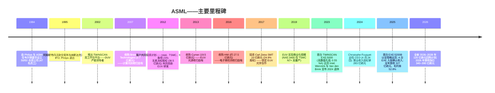
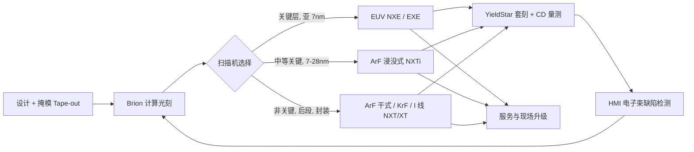
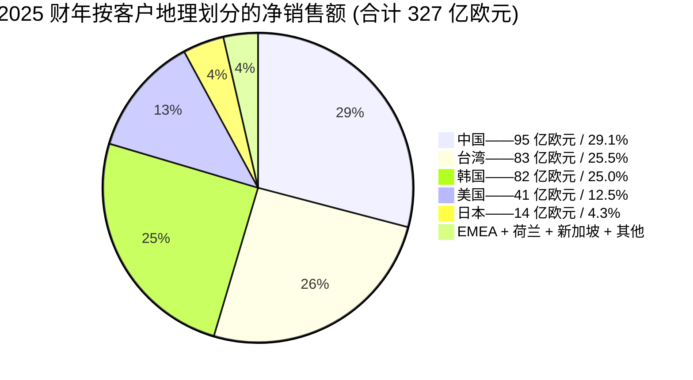
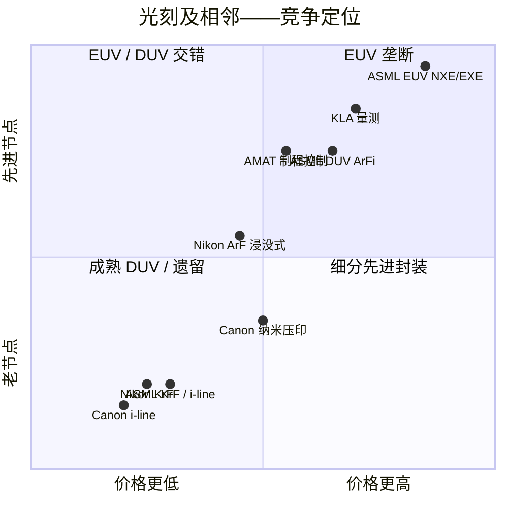

# ASML Holding N.V. (NASDAQ:ASML) — 公司研究报告

**截至日期: 2026-06-14**
**代码: ASML (NASDAQ ADR + 阿姆斯特丹泛欧交易所 ASML.AS) | 总部: 荷兰韦尔德霍芬 (Veldhoven)**
**报告语言: 简体中文 (英文版同时存在于本目录)**
**披露口径:** 20-F 申报人 (外国私人发行人 / foreign private issuer)。主要来源: ASML 2025 年度报告 (20-F 表), 于 2026-02-25 提交; 最新季度业绩为 **2026-04-15 发布的 Q1-2026 新闻稿 (6-K)**。估值快照: 2026-06-14 (yfinance / Stockanalysis.com)。

> **投资摘要 (Investment summary) — *分析师观点 (Analyst view):* 本报告评级与目标价均为分析师本方观点, 不构成对任何一手申报的引用; 10-K / 20-F 中不含目标价。**
>
> | 项目 | 数值 |
> |---|---|
> | **评级 (Rating)** | **增持 (Overweight / Buy)** |
> | **12 个月目标价 (12-mo PT)** | **欧股 €1,820 / 美股 ADR $2,120** |
> | 当前价 (2026-06-14) | ADR $1,863.55 (欧股约 €1,605, 隐含 EUR/USD≈1.16) |
> | 隐含上行空间 (Upside) | ADR 约 **+13.8%** (€口径约 +13.4%) |
> | 估值方法 (Method) | 2027E EPS €46.5 × 35× 远期 P/E (历史周期峰值 30–40× 区间中段) |
> | 市值 (Market cap) | 约 $718B (€620B) |
> | 52 周区间 (ADR) | 约 $620–$1,920 |
>
> **论点支柱 (Thesis pillars) — *分析师观点:***
> 1. **EUV 垄断 + 服务年金的盈利可见度**: EUV (NXE+EXE) 100% 全球份额, 服务与现场升级 (IBM) 占收入约 25% 且非周期, 装机 95% 仍在使用——结构性高毛利与多年期在手订单是高倍数的根基。
> 2. **AI 资本开支驱动的产能上修周期**: 客户 2026 年起加速扩产, ASML 2026-04-15 将 FY2026 净销售指引**上修至 €36–40bn** (原 €34–39bn); 卖方 (JPM/MS) 认为 2027–28E EUV 与 DUV 浸没式出货量市场共识"严重偏低"。
> 3. **High-NA (EXE:5200B) 拐点期权**: 2027 年量产启动后, EXE 是 2027–2030 年收入与毛利率 (56–60% 模型) 的二次曲线, 客户已累计曝光逾 40 万片晶圆。
> 4. **核心风险是中国出口管制**: 中国占 2025 年收入 29.1% 且受荷兰/美国 BIS 管制约束——这是估值最大的单一下行变量, 已在第 10 章单列。
>
> **最该盯紧的两个变量 (Swing variables):** (1) 2026–27 年对华 DUV 浸没式管制是否进一步收紧 (JPM 牛市假设 2027 年中国 DUV 回到约 85 台, 熊市假设进一步受限); (2) High-NA EXE 的 HVM 良率/稼动率爬坡是否如期支撑 2027 年拐点。

> **业绩更新 (Earnings update) — Q1-2026 实际 + FY2026 指引上修 (2026-04-15):** ASML 公布 **Q1-2026 总净销售额 €8.767bn**, 毛利率 (gross margin) **53.0%** (落在指引高端), **净利润 €2.757bn**, 基本 EPS **€7.15**; 装机基数管理 (Installed Base Management, IBM = 服务与现场升级) 销售 €2.488bn, 新机 67 台、二手机 12 台。管理层将 **2026 全年净销售额指引上修至 €36–40bn** (此前 1 月公布的 €34–39bn), 毛利率 51%–53%; **Q2-2026 指引为 €8.4–9.0bn、毛利率 51%–52%** (R&D 约 €1.2bn, SG&A 约 €0.3bn)。CEO Christophe Fouquet 称"芯片需求正超过供给, 客户正加速 2026 年及以后的产能扩张……订单流入持续非常强劲"。公司同时把 2025 年全年股息提至 **€7.50/股 (同比 +17%)**, 并延续 2026–2028 年最高 120 亿欧元的股票回购计划。
> 来源: [ASML 公布 Q1-2026 总净销售额 €8.8bn、净利润 €2.8bn——6-K 附件 99.1, 2026-04-15](https://www.sec.gov/Archives/edgar/data/937966/000162828026025147/pressreleasefinancialresul.htm); 1 月初步指引见 [Q4-2025 / 2025 财年 6-K, 2026-01-28](https://www.sec.gov/Archives/edgar/data/937966/000162828026003701/form6-kquarterlyfilings.htm); 长期展望在 [2025 年 20-F "Long-term growth opportunities" 段落](https://www.sec.gov/Archives/edgar/data/937966/000162828026011378/asml-20251231.htm)中获重申。

---

## 目录

1. 公司概览
   - 1A. 估值与目标价 (Valuation & Price Target)
   - 1B. GF Score 基本面评分卡
2. 前瞻财务模型、目标价推导与卖方观点演变 (Valuation & PT)
3. 公司历史
4. 管理团队
5. 产品与服务
6. 客户与上市策略
7. 行业概览
8. 竞争格局
9. 市场机会 (TAM)
10. 风险评估
    - 10.5 关键争议与催化剂 (Key debates & catalysts)
11. 投资视角评分卡 (Investor lenses)
12. 参考资料

---

## 1. 公司概览

ASML Holding N.V. 是全球**极紫外光刻 (Extreme Ultraviolet, EUV) 系统**的**垄断独家供应商**, 同时也是**深紫外光刻 (Deep Ultraviolet, DUV) 浸没式光刻系统**的领先供应商; 这两类设备用于印制全球最先进的半导体逻辑及存储器件。公司总部位于荷兰布拉班特省埃因霍温 (Eindhoven) 创新区的韦尔德霍芬 (Veldhoven), 按其 20-F 表中的原话, ASML"目前是全球唯一的 EUV 光刻系统制造商" ([ASML 2025 年 20-F, "Our products and services"](https://www.sec.gov/Archives/edgar/data/937966/000162828026011378/asml-20251231.htm); [ASML EUV 产品页](https://www.asml.com/en/products/euv-lithography-systems))。

商业模式分为三条腿: **(1) 新机销售 (system sales)** ——售予全球少数几家先进制程晶圆代工厂 (TSMC 台积电)、综合器件制造商 IDM (Intel 英特尔、Samsung Foundry 三星代工) 及存储器厂商 (Samsung Memory 三星存储、SK Hynix 海力士、Micron 美光) 的高单价资本设备; **(2) 服务与现场升级净销售 (net service and field-option sales)** ——为装机基数提供维护、产能升级、零部件、软件及翻新 (refurbishment) 的经常性收入, 按公司披露"我们近三十年售出的设备约 95% 仍在使用中"; **(3) 量测与检测 (Metrology & Inspection, M&I)** ——YieldStar 光学散射量测工具与 HMI 多束电子束检测系统, 这一相邻业务通过同一套 TWINSCAN 制程控制回路打通 ([ASML 2025 年 20-F, "Our products and services"](https://www.sec.gov/Archives/edgar/data/937966/000162828026011378/asml-20251231.htm); [ASML HMI 页面](https://www.asml.com/en/company/about-asml/hmi))。

2025 财年, ASML 录得**总净销售额 326.673 亿欧元**, 较 2024 财年的 282.629 亿欧元增长 15.6%, 较 2023 财年的 275.585 亿欧元提升明显。其中新机净销售额为 244.743 亿欧元 (占总收入 74.9%), 服务与现场升级净销售额为 81.930 亿欧元 (25.1%)。2025 财年毛利为 172.580 亿欧元 (毛利率 52.8%, 同比提升 150 个基点, 上年为 51.3%), 净利润为 96.094 亿欧元 (净利润率 29.4%) ——上述数字均逐项核对自 20-F 表的合并经营报表及分部附注 ([ASML 2025 年 20-F, KPI 与合并经营报表](https://www.sec.gov/Archives/edgar/data/937966/000162828026011378/asml-20251231.htm))。

系统出货量指标: 2025 年 ASML 确认收入**48 台 EUV 系统 (44 台 NXE + 4 台 EXE)**, 上年为 44 台 (42 台 NXE + 2 台 EXE); 含 DUV 在内的**全光刻系统总出货量为 535 台** (上年 583 台, 2023 年 600 台) ——单位数下降而收入上升反映出向高 ASP 的 EUV 倾斜、远离低端成熟节点 KrF 的产品结构调整, KrF 出货量由 2024 年的 152 台跌至 2025 年的 78 台, 此前中国成熟节点抢装行情已于年内告一段落 ([ASML 2025 年 20-F, "Disaggregation of revenue" 附注](https://www.sec.gov/Archives/edgar/data/937966/000162828026011378/asml-20251231.htm))。

2025 财年地理结构高度向亚洲倾斜: **中国 95.197 亿欧元 (29.1%)**、**台湾 83.379 亿欧元 (25.5%)**、**韩国 81.596 亿欧元 (25.0%)**、美国 40.891 亿欧元 (12.5%)、日本 14.209 亿欧元 (4.3%), 以及 EMEA + 荷兰 + 新加坡 + 其他合计约 11 亿欧元 (3.6%)。终端用途细分 (仅系统收入口径) 为**逻辑 160.541 亿欧元 (占系统收入 65.6%)**, **存储 84.202 亿欧元 (34.4%)** ——逻辑占比由 2024 财年的 60.6% 上升, 反映先进代工产能加码以支持 AI 训练与推理芯片的资本扩张 ([ASML 2025 年 20-F, 地理与终端用途附注](https://www.sec.gov/Archives/edgar/data/937966/000162828026011378/asml-20251231.htm))。

2025 年末, ASML 披露**全球员工总数 (FTE) 超过 4.4 万人**, 来自**143 个国家与地区**, **女性员工占 21%**, 客户满意度评分 88%, 研发支出 47 亿欧元, **供应商总数达 5,100 家** ——上述数据均逐项摘自 20-F 表卷首的"At a glance" KPI 页 ([ASML 2025 年 20-F, "At a glance"](https://www.sec.gov/Archives/edgar/data/937966/000162828026011378/asml-20251231.htm))。5,100 家供应商这一数字具有运营层面的承重意义: EUV 实际上是工业界最复杂的跨国子供应链, Zeiss SMT (光学, ASML 自 2017 年起持有 24.9% 经济权益)、Trumpf 通快 (CO₂ 激光泵浦)、Cymer (光源, 2013 年并入) 均为单一来源 (single-source) 合作伙伴 ([ASML 投资 10 亿欧元于 Carl Zeiss SMT——Electro Optics, 2016-11-03](https://www.electrooptics.com/news/asml-invests-1-billion-zeiss-boost-euv-lithography); [ASML 将收购 Cymer, 2012-10-17](https://www.asml.com/en/news/press-releases/2012/asml-to-acquire-cymer-to-accelerate-development-of-euv-technology))。

### 1A. 估值与目标价 (Valuation & Price Target)

**估值快照 (截至 2026-06-14)。** ASML ADR 最新价 **$1,863.55**, 市值约 **$718B (€620B)** ([yfinance / Stockanalysis.com——ASML 统计页, as of 2026-06-14](https://stockanalysis.com/stocks/asml/statistics/))。按过去十二个月 (TTM) 基础, 公司估值为 **TTM 市盈率 (P/E) 62.5×、TTM 市销率 (P/S) 21.3×、前瞻 P/E (forward P/E) 38.8×**, 股息率约 0.4%, 同时执行连续回购计划。较 2026-05-22 的快照, ASML ADR 在三周内由 $1,632.90 上行至 $1,863.55 (约 +14%), 倍数同步抬升——这与本期 (2026-06 月初) 多家卖方上修 2027–28 年盈利预测、上调目标价的节奏一致 (见第 2 章)。最接近的晶圆制造设备 (Wafer-Fab-Equipment, WFE) 同业, 全部按 2026-06-14 同日口径:

| 公司 | TTM P/E | 前瞻 P/E | TTM P/S | 市值 |
|---|---|---|---|---|
| **ASML** | **62.5×** | **38.8×** | **21.3×** | $718B |
| Applied Materials 应用材料 (AMAT) | 53.5× | 34.9× | 15.5× | $450B |
| Lam Research 泛林集团 (LRCX) | 69.5× | 46.0× | 21.2× | $459B |
| KLA 科磊 (KLAC) | 71.9× | 50.4× | 25.4× | $333B |
| Teradyne 泰瑞达 (TER) | 74.7× | 42.4× | 16.7× | $63B |
| **WFE 五家中位数** | **69.5×** | **42.4×** | **21.2×** | — |

来源: [Stockanalysis.com / yfinance——ASML, AMAT, LRCX, KLAC, TER 统计页, 全部 as of 2026-06-14](https://stockanalysis.com/stocks/asml/statistics/)。

ASML 的 TTM 倍数**实际上略低于 WFE 同业中位数** (TTM P/E 62.5× vs 中位 69.5×, P/S 21.3× vs 中位 21.2×) ——即市场目前并未在 AMAT / LRCX / KLAC 之外给予 ASML 明显的"垄断溢价", 尽管其结构性盈利能力显著优异 (2025 财年毛利率 52.8%、营业利润率 (operating margin) 34.6%)。那么为何绝对倍数仍处于高位 (TTM P/E 超过 60× 约为标普 500 长期远期 P/E 的三倍)? 驱动因素在 2025 财年 CEO 致股东信及 2024 年投资者日模型中均有明示: (a) **AI 基础设施终端市场溢价** ——"AI 仍是半导体市场的关键驱动力, 云服务商在训练与推理上的资本开支创历史新高"; (b) **EUV 垄断带来的长期盈利可见度** ——ASML 在 EUV 上持有多年期客户在手订单; (c) **管理层公开的 2030 年 440–600 亿欧元收入模型, 毛利率区间 56%–60%**, 市场对此区间的上半段予以贴现 ([ASML 2024 年投资者日新闻稿, 2024-11-14](https://www.sec.gov/Archives/edgar/data/937966/000093796624000024/pressreleaseinvestorday2024.htm); [2025 年 20-F, CEO 致辞与"Long-term growth opportunities"](https://www.sec.gov/Archives/edgar/data/937966/000162828026011378/asml-20251231.htm))。在 TTM P/E 高于 60× 的水位下, 若任一结构性驱动因素 (中国政策反转、超大规模数据中心资本开支暂停、High-NA 延迟) 出现逆风, 将存在显著的估值风险 ——这一点已在第 10 章作为单列的估值/倍数压缩风险载入。完整的前瞻模型、目标价推导 (含 bull/base/bear) 与卖方观点演变见第 2 章。

**利润表 Sankey (FY2025, €m)。** 下图把 2025 财年收入按来源 (新机 / 服务) 拆入左侧, 再逐级流向 COGS、毛利、研发 (R&D)、销售管理 (SG&A)、营业利润、税与净利, 直观呈现 ASML "高毛利、重研发、高净利率"的结构。

<svg xmlns="http://www.w3.org/2000/svg" viewBox="0 0 1000 560" width="1000" height="560" role="img" aria-label="income statement Sankey"><rect x="0" y="0" width="1000" height="560" fill="#ffffff"/>
<text x="20.00" y="30.00" text-anchor="start" font-family="Helvetica,Arial,sans-serif" font-size="15" font-weight="700" fill="#1f2933">ASML FY2025 利润表 Sankey (income statement, €m, IFRS)</text>
<path d="M 204.00,71.00 C 258.00,71.00 258.00,78.00 312.00,78.00 L 312.00,394.16 C 258.00,394.16 258.00,387.16 204.00,387.16 Z" fill="#93c5fd" fill-opacity="0.55"/>
<path d="M 452.00,71.00 C 506.00,71.00 506.00,164.94 560.00,164.94 L 560.00,310.92 C 506.00,310.92 506.00,216.97 452.00,216.97 Z" fill="#86efac" fill-opacity="0.55"/>
<path d="M 452.00,216.97 C 506.00,216.97 506.00,324.92 560.00,324.92 L 560.00,397.06 C 506.00,397.06 506.00,289.12 452.00,289.12 Z" fill="#fca5a5" fill-opacity="0.55"/>
<path d="M 328.00,78.00 C 382.00,78.00 382.00,71.00 436.00,71.00 L 436.00,293.94 C 382.00,293.94 382.00,300.94 328.00,300.94 Z" fill="#86efac" fill-opacity="0.55"/>
<path d="M 328.00,300.94 C 382.00,300.94 382.00,307.94 436.00,307.94 L 436.00,507.00 C 382.00,507.00 382.00,500.00 328.00,500.00 Z" fill="#fca5a5" fill-opacity="0.55"/>
<path d="M 576.00,164.94 C 630.00,164.94 630.00,165.26 684.00,165.26 L 684.00,311.23 C 630.00,311.23 630.00,310.92 576.00,310.92 Z" fill="#86efac" fill-opacity="0.55"/>
<path d="M 700.00,165.26 C 754.00,165.26 754.00,206.93 808.00,206.93 L 808.00,331.06 C 754.00,331.06 754.00,289.39 700.00,289.39 Z" fill="#86efac" fill-opacity="0.55"/>
<path d="M 700.00,289.39 C 754.00,289.39 754.00,345.06 808.00,345.06 L 808.00,371.07 C 754.00,371.07 754.00,315.40 700.00,315.40 Z" fill="#fca5a5" fill-opacity="0.55"/>
<path d="M 576.00,324.92 C 630.00,324.92 630.00,326.60 684.00,326.60 L 684.00,342.69 C 630.00,342.69 630.00,341.01 576.00,341.01 Z" fill="#fca5a5" fill-opacity="0.55"/>
<path d="M 576.00,341.01 C 630.00,341.01 630.00,356.69 684.00,356.69 L 684.00,412.74 C 630.00,412.74 630.00,397.06 576.00,397.06 Z" fill="#fca5a5" fill-opacity="0.55"/>
<path d="M 204.00,401.16 C 258.00,401.16 258.00,394.16 312.00,394.16 L 312.00,500.00 C 258.00,500.00 258.00,507.00 204.00,507.00 Z" fill="#93c5fd" fill-opacity="0.55"/>
<path d="M 576.00,411.06 C 630.00,411.06 630.00,311.23 684.00,311.23 L 684.00,313.23 C 630.00,313.23 630.00,413.06 576.00,413.06 Z" fill="#93c5fd" fill-opacity="0.55"/>
<rect x="188.00" y="71.00" width="16" height="316.16" rx="1.5" fill="#2563eb"/>
<rect x="188.00" y="401.16" width="16" height="105.84" rx="1.5" fill="#2563eb"/>
<rect x="312.00" y="78.00" width="16" height="422.00" rx="1.5" fill="#1e3a8a"/>
<rect x="436.00" y="71.00" width="16" height="222.94" rx="1.5" fill="#15803d"/>
<rect x="436.00" y="307.94" width="16" height="199.06" rx="1.5" fill="#dc2626"/>
<rect x="560.00" y="164.94" width="16" height="145.97" rx="1.5" fill="#15803d"/>
<rect x="560.00" y="324.92" width="16" height="72.14" rx="1.5" fill="#dc2626"/>
<rect x="560.00" y="411.06" width="16" height="2.00" rx="1.5" fill="#2563eb"/>
<rect x="684.00" y="165.26" width="16" height="147.35" rx="1.5" fill="#15803d"/>
<rect x="684.00" y="326.60" width="16" height="16.09" rx="1.5" fill="#dc2626"/>
<rect x="684.00" y="356.69" width="16" height="56.05" rx="1.5" fill="#dc2626"/>
<rect x="808.00" y="206.93" width="16" height="124.14" rx="1.5" fill="#15803d"/>
<rect x="808.00" y="345.06" width="16" height="26.01" rx="1.5" fill="#dc2626"/>
<text x="179.00" y="226.08" text-anchor="end" font-family="Helvetica,Arial,sans-serif" font-size="11.5" font-weight="700" fill="#1f2933">新机销售 New systems</text>
<text x="179.00" y="239.08" text-anchor="end" font-family="Helvetica,Arial,sans-serif" font-size="10" font-weight="400" fill="#52606d">€24.5B  (74.9%)</text>
<text x="179.00" y="451.08" text-anchor="end" font-family="Helvetica,Arial,sans-serif" font-size="11.5" font-weight="700" fill="#1f2933">服务与现场升级 Service&amp;IBM</text>
<text x="179.00" y="464.08" text-anchor="end" font-family="Helvetica,Arial,sans-serif" font-size="10" font-weight="400" fill="#52606d">€8.2B  (25.1%)</text>
<rect x="331.00" y="60.00" width="106.80" height="26" rx="2" fill="#ffffff" fill-opacity="0.72"/>
<text x="334.00" y="72.00" text-anchor="start" font-family="Helvetica,Arial,sans-serif" font-size="11.5" font-weight="700" fill="#1f2933">Revenue</text>
<text x="334.00" y="85.00" text-anchor="start" font-family="Helvetica,Arial,sans-serif" font-size="10" font-weight="400" fill="#52606d">€32.7B  (100.0%)</text>
<rect x="455.00" y="53.00" width="100.50" height="26" rx="2" fill="#ffffff" fill-opacity="0.72"/>
<text x="458.00" y="65.00" text-anchor="start" font-family="Helvetica,Arial,sans-serif" font-size="11.5" font-weight="700" fill="#1f2933">Gross Profit</text>
<text x="458.00" y="78.00" text-anchor="start" font-family="Helvetica,Arial,sans-serif" font-size="10" font-weight="400" fill="#52606d">€17.3B  (52.8%)</text>
<rect x="455.00" y="289.94" width="144.60" height="26" rx="2" fill="#ffffff" fill-opacity="0.72"/>
<text x="458.00" y="301.94" text-anchor="start" font-family="Helvetica,Arial,sans-serif" font-size="11.5" font-weight="700" fill="#1f2933">Cost of Revenue (COGS)</text>
<text x="458.00" y="314.94" text-anchor="start" font-family="Helvetica,Arial,sans-serif" font-size="10" font-weight="400" fill="#52606d">€15.4B  (47.2%)</text>
<rect x="579.00" y="146.94" width="106.80" height="26" rx="2" fill="#ffffff" fill-opacity="0.72"/>
<text x="582.00" y="158.94" text-anchor="start" font-family="Helvetica,Arial,sans-serif" font-size="11.5" font-weight="700" fill="#1f2933">Operating Income</text>
<text x="582.00" y="171.94" text-anchor="start" font-family="Helvetica,Arial,sans-serif" font-size="10" font-weight="400" fill="#52606d">€11.3B  (34.6%)</text>
<rect x="579.00" y="306.92" width="150.90" height="26" rx="2" fill="#ffffff" fill-opacity="0.72"/>
<text x="582.00" y="318.92" text-anchor="start" font-family="Helvetica,Arial,sans-serif" font-size="11.5" font-weight="700" fill="#1f2933">Total Operating Expense</text>
<text x="582.00" y="331.92" text-anchor="start" font-family="Helvetica,Arial,sans-serif" font-size="10" font-weight="400" fill="#52606d">€5.6B  (17.1%)</text>
<text x="551.00" y="409.06" text-anchor="end" font-family="Helvetica,Arial,sans-serif" font-size="11.5" font-weight="700" fill="#1f2933">Net Interest / Other Income</text>
<text x="551.00" y="422.06" text-anchor="end" font-family="Helvetica,Arial,sans-serif" font-size="10" font-weight="400" fill="#52606d">€106.1M  (0.32%)</text>
<rect x="703.00" y="147.26" width="100.50" height="26" rx="2" fill="#ffffff" fill-opacity="0.72"/>
<text x="706.00" y="159.26" text-anchor="start" font-family="Helvetica,Arial,sans-serif" font-size="11.5" font-weight="700" fill="#1f2933">Pretax Income</text>
<text x="706.00" y="172.26" text-anchor="start" font-family="Helvetica,Arial,sans-serif" font-size="10" font-weight="400" fill="#52606d">€11.4B  (34.9%)</text>
<rect x="703.00" y="308.60" width="87.90" height="26" rx="2" fill="#ffffff" fill-opacity="0.72"/>
<text x="706.00" y="320.60" text-anchor="start" font-family="Helvetica,Arial,sans-serif" font-size="11.5" font-weight="700" fill="#1f2933">SG&amp;A</text>
<text x="706.00" y="333.60" text-anchor="start" font-family="Helvetica,Arial,sans-serif" font-size="10" font-weight="400" fill="#52606d">€1.2B  (3.8%)</text>
<rect x="703.00" y="338.69" width="94.20" height="26" rx="2" fill="#ffffff" fill-opacity="0.72"/>
<text x="706.00" y="350.69" text-anchor="start" font-family="Helvetica,Arial,sans-serif" font-size="11.5" font-weight="700" fill="#1f2933">R&amp;D</text>
<text x="706.00" y="363.69" text-anchor="start" font-family="Helvetica,Arial,sans-serif" font-size="10" font-weight="400" fill="#52606d">€4.3B  (13.3%)</text>
<text x="833.00" y="266.00" text-anchor="start" font-family="Helvetica,Arial,sans-serif" font-size="11.5" font-weight="700" fill="#1f2933">Net Income</text>
<text x="833.00" y="279.00" text-anchor="start" font-family="Helvetica,Arial,sans-serif" font-size="10" font-weight="400" fill="#52606d">€9.6B  (29.4%)</text>
<text x="833.00" y="355.07" text-anchor="start" font-family="Helvetica,Arial,sans-serif" font-size="11.5" font-weight="700" fill="#1f2933">Income Tax</text>
<text x="833.00" y="368.07" text-anchor="start" font-family="Helvetica,Arial,sans-serif" font-size="10" font-weight="400" fill="#52606d">€2.0B  (6.2%)</text>
<text x="500.00" y="544.00" text-anchor="middle" font-family="Helvetica,Arial,sans-serif" font-size="10" font-weight="400" fill="#52606d">Source: ASML 2025 20-F (FY2025, IFRS) — Consolidated statements &amp; Note 2</text>
</svg>

*图: ASML FY2025 利润表资金流 (income-statement Sankey)。来源: [ASML 2025 年 20-F——合并经营报表与附注 2](https://www.sec.gov/Archives/edgar/data/937966/000162828026011378/asml-20251231.htm)。*

**收入结构 (FY2025)。** 按产品线看, EUV (NXE+EXE) €11.6bn、ArF 浸没式 €10.3bn、其他 DUV 干式 €1.7bn、量测检测 (M&I) €0.8bn、服务与现场升级 €8.2bn——五条腿合计 €32.7bn。下方两张甜甜圈图分别按产品线与按地理区域拆解。

<svg xmlns="http://www.w3.org/2000/svg" viewBox="0 0 720 460" width="720" height="460" role="img" aria-label="revenue donut"><rect x="0" y="0" width="720" height="460" fill="#ffffff"/>
<text x="20.00" y="30.00" text-anchor="start" font-family="Helvetica,Arial,sans-serif" font-size="15" font-weight="700" fill="#1f2933">ASML FY2025 净销售额结构 (by product line, €m)</text>
<path d="M 288.00,107.20 A 132 132 0 0 1 392.21,320.22 L 349.58,287.08 A 78 78 0 0 0 288.00,161.20 Z" fill="#2563eb"/>
<path d="M 392.21,320.22 A 132 132 0 0 1 172.00,302.19 L 219.45,276.42 A 78 78 0 0 0 349.58,287.08 Z" fill="#15803d"/>
<path d="M 172.00,302.19 A 132 132 0 0 1 157.76,260.70 L 211.04,251.91 A 78 78 0 0 0 219.45,276.42 Z" fill="#d97706"/>
<path d="M 157.76,260.70 A 132 132 0 0 1 156.00,239.86 L 210.00,239.59 A 78 78 0 0 0 211.04,251.91 Z" fill="#7c3aed"/>
<path d="M 156.00,239.86 A 132 132 0 0 1 288.00,107.20 L 288.00,161.20 A 78 78 0 0 0 210.00,239.59 Z" fill="#dc2626"/>
<text x="288.00" y="235.20" text-anchor="middle" font-family="Helvetica,Arial,sans-serif" font-size="18" font-weight="800" fill="#1f2933">€32.7bn</text>
<text x="288.00" y="255.20" text-anchor="middle" font-family="Helvetica,Arial,sans-serif" font-size="13" font-weight="600" fill="#52606d">€32.7B</text>
<text x="288.00" y="271.20" text-anchor="middle" font-family="Helvetica,Arial,sans-serif" font-size="10" font-weight="400" fill="#8a97a3">total</text>
<line x1="411.96" y1="178.56" x2="427.96" y2="178.56" stroke="#2563eb" stroke-width="1.4"/>
<text x="431.96" y="176.56" text-anchor="start" font-family="Helvetica,Arial,sans-serif" font-size="11" font-weight="700" fill="#1f2933">EUV (NXE+EXE)</text>
<text x="431.96" y="190.56" text-anchor="start" font-family="Helvetica,Arial,sans-serif" font-size="10" font-weight="400" fill="#52606d">€11.6B  (35.5%)</text>
<line x1="276.74" y1="376.74" x2="260.74" y2="376.74" stroke="#15803d" stroke-width="1.4"/>
<text x="256.74" y="374.74" text-anchor="end" font-family="Helvetica,Arial,sans-serif" font-size="11" font-weight="700" fill="#1f2933">ArF 浸没式 ArFi</text>
<text x="256.74" y="388.74" text-anchor="end" font-family="Helvetica,Arial,sans-serif" font-size="10" font-weight="400" fill="#52606d">€10.3B  (31.6%)</text>
<line x1="157.47" y1="283.99" x2="141.47" y2="283.99" stroke="#d97706" stroke-width="1.4"/>
<text x="137.47" y="281.99" text-anchor="end" font-family="Helvetica,Arial,sans-serif" font-size="11" font-weight="700" fill="#1f2933">ArF干式/KrF/i-line DUV干式</text>
<text x="137.47" y="295.99" text-anchor="end" font-family="Helvetica,Arial,sans-serif" font-size="10" font-weight="400" fill="#52606d">€1.7B  (5.3%)</text>
<line x1="150.49" y1="250.82" x2="134.49" y2="250.82" stroke="#7c3aed" stroke-width="1.4"/>
<text x="130.49" y="248.82" text-anchor="end" font-family="Helvetica,Arial,sans-serif" font-size="11" font-weight="700" fill="#1f2933">量测检测 M&amp;I</text>
<text x="130.49" y="262.82" text-anchor="end" font-family="Helvetica,Arial,sans-serif" font-size="10" font-weight="400" fill="#52606d">€824.6M  (2.5%)</text>
<line x1="190.17" y1="141.87" x2="174.17" y2="141.87" stroke="#dc2626" stroke-width="1.4"/>
<text x="170.17" y="139.87" text-anchor="end" font-family="Helvetica,Arial,sans-serif" font-size="11" font-weight="700" fill="#1f2933">服务与现场升级 Service&amp;IBM</text>
<text x="170.17" y="153.87" text-anchor="end" font-family="Helvetica,Arial,sans-serif" font-size="10" font-weight="400" fill="#52606d">€8.2B  (25.1%)</text>
<text x="360.00" y="444.00" text-anchor="middle" font-family="Helvetica,Arial,sans-serif" font-size="10" font-weight="400" fill="#52606d">Source: ASML 2025 20-F (FY2025, IFRS) — Note 2 Disaggregation of revenue</text>
</svg>

*图: ASML FY2025 按产品线净销售额结构。来源: [ASML 2025 年 20-F——附注 2 收入分拆](https://www.sec.gov/Archives/edgar/data/937966/000162828026011378/asml-20251231.htm)。*

<svg xmlns="http://www.w3.org/2000/svg" viewBox="0 0 860 470" width="860" height="470" role="img" aria-label="historical revenue bars"><rect x="0" y="0" width="860" height="470" fill="#ffffff"/>
<text x="20.00" y="30.00" text-anchor="start" font-family="Helvetica,Arial,sans-serif" font-size="15" font-weight="700" fill="#1f2933">ASML 净销售额历史结构 (net sales by category, €m)</text>
<rect x="20.00" y="44" width="11" height="11" rx="2" fill="#2563eb"/>
<text x="36.00" y="53.00" text-anchor="start" font-family="Helvetica,Arial,sans-serif" font-size="10.5" font-weight="400" fill="#1f2933">EUV (NXE+EXE)</text>
<rect x="135.80" y="44" width="11" height="11" rx="2" fill="#15803d"/>
<text x="151.80" y="53.00" text-anchor="start" font-family="Helvetica,Arial,sans-serif" font-size="10.5" font-weight="400" fill="#1f2933">ArF浸没式 ArFi</text>
<rect x="238.40" y="44" width="11" height="11" rx="2" fill="#d97706"/>
<text x="254.40" y="53.00" text-anchor="start" font-family="Helvetica,Arial,sans-serif" font-size="10.5" font-weight="400" fill="#1f2933">DUV干式/KrF/i-line</text>
<rect x="374.00" y="44" width="11" height="11" rx="2" fill="#7c3aed"/>
<text x="390.00" y="53.00" text-anchor="start" font-family="Helvetica,Arial,sans-serif" font-size="10.5" font-weight="400" fill="#1f2933">量测检测 M&amp;I</text>
<rect x="456.80" y="44" width="11" height="11" rx="2" fill="#dc2626"/>
<text x="472.80" y="53.00" text-anchor="start" font-family="Helvetica,Arial,sans-serif" font-size="10.5" font-weight="400" fill="#1f2933">服务现场升级 Service&amp;IBM</text>
<line x1="70" y1="412.00" x2="834" y2="412.00" stroke="#eceff2" stroke-width="1"/>
<text x="64.00" y="415.00" text-anchor="end" font-family="Helvetica,Arial,sans-serif" font-size="9.5" font-weight="400" fill="#52606d">€0</text>
<line x1="70" y1="345.20" x2="834" y2="345.20" stroke="#eceff2" stroke-width="1"/>
<text x="64.00" y="348.20" text-anchor="end" font-family="Helvetica,Arial,sans-serif" font-size="9.5" font-weight="400" fill="#52606d">€7.1B</text>
<line x1="70" y1="278.40" x2="834" y2="278.40" stroke="#eceff2" stroke-width="1"/>
<text x="64.00" y="281.40" text-anchor="end" font-family="Helvetica,Arial,sans-serif" font-size="9.5" font-weight="400" fill="#52606d">€14.1B</text>
<line x1="70" y1="211.60" x2="834" y2="211.60" stroke="#eceff2" stroke-width="1"/>
<text x="64.00" y="214.60" text-anchor="end" font-family="Helvetica,Arial,sans-serif" font-size="9.5" font-weight="400" fill="#52606d">€21.2B</text>
<line x1="70" y1="144.80" x2="834" y2="144.80" stroke="#eceff2" stroke-width="1"/>
<text x="64.00" y="147.80" text-anchor="end" font-family="Helvetica,Arial,sans-serif" font-size="9.5" font-weight="400" fill="#52606d">€28.2B</text>
<line x1="70" y1="78.00" x2="834" y2="78.00" stroke="#eceff2" stroke-width="1"/>
<text x="64.00" y="81.00" text-anchor="end" font-family="Helvetica,Arial,sans-serif" font-size="9.5" font-weight="400" fill="#52606d">€35.3B</text>
<rect x="123.48" y="325.62" width="147.71" height="86.38" fill="#2563eb"/>
<rect x="123.48" y="240.26" width="147.71" height="85.37" fill="#15803d"/>
<rect x="123.48" y="209.38" width="147.71" height="30.87" fill="#d97706"/>
<rect x="123.48" y="204.31" width="147.71" height="5.08" fill="#7c3aed"/>
<rect x="123.48" y="151.11" width="147.71" height="53.20" fill="#dc2626"/>
<text x="197.33" y="428.00" text-anchor="middle" font-family="Helvetica,Arial,sans-serif" font-size="10" font-weight="400" fill="#52606d">2023</text>
<rect x="378.15" y="333.22" width="147.71" height="78.78" fill="#2563eb"/>
<rect x="378.15" y="241.70" width="147.71" height="91.52" fill="#15803d"/>
<rect x="378.15" y="221.41" width="147.71" height="20.29" fill="#d97706"/>
<rect x="378.15" y="215.30" width="147.71" height="6.11" fill="#7c3aed"/>
<rect x="378.15" y="153.82" width="147.71" height="61.48" fill="#dc2626"/>
<text x="452.00" y="428.00" text-anchor="middle" font-family="Helvetica,Arial,sans-serif" font-size="10" font-weight="400" fill="#52606d">2024</text>
<rect x="632.81" y="302.16" width="147.71" height="109.84" fill="#2563eb"/>
<rect x="632.81" y="204.54" width="147.71" height="97.62" fill="#15803d"/>
<rect x="632.81" y="188.11" width="147.71" height="16.43" fill="#d97706"/>
<rect x="632.81" y="180.30" width="147.71" height="7.81" fill="#7c3aed"/>
<rect x="632.81" y="102.74" width="147.71" height="77.56" fill="#dc2626"/>
<text x="706.67" y="428.00" text-anchor="middle" font-family="Helvetica,Arial,sans-serif" font-size="10" font-weight="400" fill="#52606d">2025</text>
<text x="430.00" y="454.00" text-anchor="middle" font-family="Helvetica,Arial,sans-serif" font-size="10" font-weight="400" fill="#52606d">Source: ASML 2024 &amp; 2025 20-F — Note 2 Disaggregation of revenue</text>
</svg>

*图: ASML 2023–2025 净销售额历史结构 (by category)。来源: [ASML 2024 与 2025 年 20-F——附注 2 收入分拆](https://www.sec.gov/Archives/edgar/data/937966/000162828026011378/asml-20251231.htm)。*

### 1B. GF Score 基本面评分卡

*分析师观点 (Analyst view):* 下方 GF Score (仿 GuruFocus GF Score™ 的五维基本面评分卡) 是本报告的分析师评分框架, 非来自 GuruFocus 的发布值, **不附带任何申报引用**; 五个子分及综合分均为分析师本方评分, 每个底层指标 (利润率、杠杆、CAGR、倍数、回报) 在下文各维度理由中带各自的内联引用。五维各 0–10 分: 财务强度 (Financial Strength) / 盈利能力 (Profitability) / 成长性 (Growth) / GF 估值 (GF Value, 越高=越便宜) / 动量 (Momentum)。

<svg xmlns="http://www.w3.org/2000/svg" viewBox="0 0 500 500" width="500" height="500" role="img" aria-label="GF Score radar">
<rect x="0" y="0" width="500" height="500" fill="#ffffff"/>
<text x="20" y="24" font-family="Helvetica,Arial,sans-serif" font-size="15" font-weight="700" fill="#1f2933">GF Score (GuruFocus-style): 78/100</text>
<text x="20" y="41" font-family="Helvetica,Arial,sans-serif" font-size="11" fill="#52606d">71–80 Likely average performance</text>
<polygon points="250.0,88.0 392.7,191.6 338.2,359.4 161.8,359.4 107.3,191.6" fill="#e9f5ec" stroke="none"/>
<polygon points="250.0,208.0 278.5,228.7 267.6,262.3 232.4,262.3 221.5,228.7" fill="none" stroke="#c5d3cb" stroke-width="1"/>
<polygon points="250.0,178.0 307.1,219.5 285.3,286.5 214.7,286.5 192.9,219.5" fill="none" stroke="#c5d3cb" stroke-width="1"/>
<polygon points="250.0,148.0 335.6,210.2 302.9,310.8 197.1,310.8 164.4,210.2" fill="none" stroke="#c5d3cb" stroke-width="1"/>
<polygon points="250.0,118.0 364.1,200.9 320.5,335.1 179.5,335.1 135.9,200.9" fill="none" stroke="#c5d3cb" stroke-width="1"/>
<polygon points="250.0,88.0 392.7,191.6 338.2,359.4 161.8,359.4 107.3,191.6" fill="none" stroke="#c5d3cb" stroke-width="1.3"/>
<line x1="250" y1="238" x2="161.8" y2="359.4" stroke="#cfdad3" stroke-width="1"/>
<text x="146.5" y="392.4" text-anchor="end" font-family="Helvetica,Arial,sans-serif" font-size="11.5" font-weight="600" fill="#1f2933">Financial Strength</text>
<text x="146.5" y="405.4" text-anchor="end" font-family="Helvetica,Arial,sans-serif" font-size="9.5" fill="#52606d">财务实力</text>
<text x="170.6" y="341.2" text-anchor="middle" font-family="Helvetica,Arial,sans-serif" font-size="10.5" font-weight="700" fill="#1f2933">9</text>
<line x1="250" y1="238" x2="250.0" y2="88.0" stroke="#cfdad3" stroke-width="1"/>
<text x="250.0" y="58.0" text-anchor="middle" font-family="Helvetica,Arial,sans-serif" font-size="11.5" font-weight="600" fill="#1f2933">Profitability</text>
<text x="250.0" y="71.0" text-anchor="middle" font-family="Helvetica,Arial,sans-serif" font-size="9.5" fill="#52606d">盈利能力</text>
<text x="250.0" y="97.0" text-anchor="middle" font-family="Helvetica,Arial,sans-serif" font-size="10.5" font-weight="700" fill="#1f2933">9</text>
<line x1="250" y1="238" x2="107.3" y2="191.6" stroke="#cfdad3" stroke-width="1"/>
<text x="82.6" y="183.6" text-anchor="end" font-family="Helvetica,Arial,sans-serif" font-size="11.5" font-weight="600" fill="#1f2933">Growth</text>
<text x="82.6" y="196.6" text-anchor="end" font-family="Helvetica,Arial,sans-serif" font-size="9.5" fill="#52606d">成长性</text>
<text x="135.9" y="194.9" text-anchor="middle" font-family="Helvetica,Arial,sans-serif" font-size="10.5" font-weight="700" fill="#1f2933">8</text>
<line x1="250" y1="238" x2="392.7" y2="191.6" stroke="#cfdad3" stroke-width="1"/>
<text x="417.4" y="183.6" text-anchor="start" font-family="Helvetica,Arial,sans-serif" font-size="11.5" font-weight="600" fill="#1f2933">GF Value</text>
<text x="417.4" y="196.6" text-anchor="start" font-family="Helvetica,Arial,sans-serif" font-size="9.5" fill="#52606d">估值</text>
<text x="307.1" y="213.5" text-anchor="middle" font-family="Helvetica,Arial,sans-serif" font-size="10.5" font-weight="700" fill="#1f2933">4</text>
<line x1="250" y1="238" x2="338.2" y2="359.4" stroke="#cfdad3" stroke-width="1"/>
<text x="353.5" y="392.4" text-anchor="start" font-family="Helvetica,Arial,sans-serif" font-size="11.5" font-weight="600" fill="#1f2933">Momentum</text>
<text x="353.5" y="405.4" text-anchor="start" font-family="Helvetica,Arial,sans-serif" font-size="9.5" fill="#52606d">动量</text>
<text x="320.5" y="329.1" text-anchor="middle" font-family="Helvetica,Arial,sans-serif" font-size="10.5" font-weight="700" fill="#1f2933">8</text>
<polygon points="250.0,103.0 307.1,219.5 320.5,335.1 170.6,347.2 135.9,200.9" fill="#2e8b57" fill-opacity="0.34" stroke="#2e8b57" stroke-width="2"/>
<circle cx="170.6" cy="347.2" r="2.6" fill="#2e8b57"/>
<circle cx="250.0" cy="103.0" r="2.6" fill="#2e8b57"/>
<circle cx="135.9" cy="200.9" r="2.6" fill="#2e8b57"/>
<circle cx="307.1" cy="219.5" r="2.6" fill="#2e8b57"/>
<circle cx="320.5" cy="335.1" r="2.6" fill="#2e8b57"/>
<text x="250" y="470" text-anchor="middle" font-family="Helvetica,Arial,sans-serif" font-size="9.5" fill="#52606d">Source: ASML 2025 20-F · Stockanalysis.com / yfinance (as of 2026-06-14) · indicators.db</text>
<text x="250" y="485" text-anchor="middle" font-family="Helvetica,Arial,sans-serif" font-size="9" fill="#52606d">GF Score = independent analyst rubric (*Analyst view:*) — not GuruFocus™ official number</text>
</svg>

| 维度 / Dimension | 评分 / Score (0–10) | |
|---|---|---|
| Financial Strength (财务实力) | 9 | `█████████░` |
| Profitability (盈利能力) | 9 | `█████████░` |
| Growth (成长性) | 8 | `████████░░` |
| GF Value (估值) | 4 | `████░░░░░░` |
| Momentum (动量) | 8 | `████████░░` |
| **GF Score (composite, *Analyst view:*)** | **78 / 100** | **71–80 Likely average performance** |

*Composite weights (*Analyst view:*): Financial Strength 20% · Profitability 25% · Growth 25% · GF Value 15% · Momentum 15% (transparent reproduction — not GuruFocus's proprietary weighting).*

*图: ASML GF Score 雷达图 (分析师评分)。综合分约 79/100。*

- **财务强度 9/10。** 净现金状态: 2025 年末现金及短期投资约 €17.3bn, 对总借款 (短期+长期约 €4.5bn) 形成净现金, 利息保障倍数极高; 营运资本由 €12.6bn 的合同负债 (contract liabilities, 客户预付) 部分自我融资 ([ASML 2025 年 20-F——合并资产负债表](https://www.sec.gov/Archives/edgar/data/937966/000162828026011378/asml-20251231.htm))。
- **盈利能力 9/10。** 2025 财年毛利率 52.8%、营业利润率 34.6%、净利润率 29.4%; ROE 约 50% (净利 €9.6bn / 平均股东权益约 €19bn), ROIC 远高于 WACC, 且盈利能力多年稳定 ([ASML 2025 年 20-F——KPI 与合并经营报表](https://www.sec.gov/Archives/edgar/data/937966/000162828026011378/asml-20251231.htm))。
- **成长性 8/10。** FY2025 收入同比 +15.6%; 管理层 FY2026 指引中位数对应同比约 +16% (€36–40bn vs €32.7bn); 卖方 (MS) 估算 FY26–28E EPS CAGR 约 29% ([*分析师观点:* Morgan Stanley——ASML Capacity concerns overdone, 2026-06-02, p.1](http://xs-macbook-air.local:5001/zsxq/pdf/415284112215458/Morgan%20Stanley-ASML%20Holding%20NV%EF%BC%88ASML.AS%EF%BC%89Capacity%20concerns%20overdone-260602.pdf))。扣 1 分因 2023→2024 经历过一次逻辑系统收入下台阶, 周期性仍在。
- **GF 估值 4/10 (越高=越便宜, 此项偏贵)。** TTM P/E 62.5×、前瞻 P/E 38.8×, 均处于自身历史区间偏上沿; 即便按本报告 base PT, 上行空间也只约 +14%, 安全边际 (margin of safety) 有限 ([Stockanalysis.com——ASML 统计, as of 2026-06-14](https://stockanalysis.com/stocks/asml/statistics/))。
- **动量 8/10。** ADR 近 12 个月强势, 当前价接近 52 周高点区间, 且 6/12 个月相对费城半导体指数 (SOX) 跑赢; 近三周 +14% ([yfinance——ASML 价格, as of 2026-06-14](https://stockanalysis.com/stocks/asml/statistics/))。

---

## 2. 前瞻财务模型、目标价推导与卖方观点演变 (Valuation & Price Target)

*分析师观点 (Analyst view):* 本章的全部前瞻估计、目标价及 bull/base/bear 情景均为分析师本方观点, **不构成对任何一手申报的引用**——20-F 中不含目标价。每个驱动因素的外部依据 (分部历史数据 + 管理层指引 + 行业预测 + 卖方共识) 在文中分别内联引用。

### 2.1 前瞻财务模型 (forward estimates, €m / €/share)

模型以 20-F 分部数据为底, 叠加 2026-04-15 上修后的 FY2026 指引中位数 (€38bn)、ASML 自身 2030 年模型, 以及卖方 (JPM/MS/GS) 的 2027–28 年口径作为交叉校验。

| 财年 (12/31) | FY2025A | FY2026E | FY2027E | FY2028E |
|---|---|---|---|---|
| 净销售额 Net sales | 32,667 | 38,000 | 49,000 | 56,000 |
| YoY | +15.6% | +16.3% | +28.9% | +14.3% |
| 毛利率 Gross margin | 52.8% | 52.5% | 55.0% | 56.0% |
| 营业利润率 Operating margin | 34.6% | 35.5% | 42.0% | 44.0% |
| 摊薄 EPS (€) | 24.81 | 30.0 | 46.5 | 53.0 |

驱动与依据: (a) FY2026E €38bn = 管理层 2026-04-15 上修指引 €36–40bn 的中位数 ([Q1-2026 6-K, 2026-04-15](https://www.sec.gov/Archives/edgar/data/937966/000162828026025147/pressreleasefinancialresul.htm)); (b) FY2027–28E 的加速来自 EUV 产能扩容 (90→105 台量级) + 中国 DUV 浸没式订单恢复, 此为卖方共识的"上修方向", 本模型取 JPM (€55.4bn 2027E) 与 MS (€48.7bn 2027E) 之间的偏中性值 €49bn ([*分析师观点:* J.P. Morgan——ASML: The Street is Behind the Curve, 2026-06-03, p.1](http://xs-macbook-air.local:5001/zsxq/pdf/212488548484121/J.P.%20Morgan-ASML%EF%BC%88ASML.AS%EF%BC%89The%20Street%20is%20Behind%20the%20Curve%EF%BC%9A%20%E2%80%9827%20%E2%80%9928%20Numbers%20Need%20a%20Rewrite-260603.pdf); [*分析师观点:* Morgan Stanley——Capacity concerns overdone, 2026-06-02, p.1](http://xs-macbook-air.local:5001/zsxq/pdf/415284112215458/Morgan%20Stanley-ASML%20Holding%20NV%EF%BC%88ASML.AS%EF%BC%89Capacity%20concerns%20overdone-260602.pdf)); (c) 毛利率自 52.8% 向 56% 抬升, 由 High-NA EXE 早期放量稀释被吸收、NXE 产能/成本下降、服务占比上升驱动, 与 ASML 2030 年 56–60% 模型一致 ([ASML 2024 年投资者日, 2024-11-14](https://www.sec.gov/Archives/edgar/data/937966/000093796624000024/pressreleaseinvestorday2024.htm))。

### 2.2 目标价推导 (PT derivation) — 倍数法

**方法: 2027E EPS €46.5 × 35× 远期 P/E = €1,628 → 加约一年贴现/AI 资本开支持续上修空间, 12 个月目标价取 €1,820 (ADR $2,120)。** 为什么用 35×: ASML 历史在周期上行+产品拐点期通常交易于 30–40× 远期 P/E; MS 用 32× FY28E, JPM 用 29.4× FY28E (位于其 5 年区间下端), GS 与本期上修后用 40× 2027E。35× 取这三者中段, 既不取 JPM 最激进的 €55bn 收入假设, 也高于 MS 的偏保守口径。对应 12 个月 ADR PT $2,120, 较 2026-06-14 收盘 $1,863.55 上行约 **+13.8%**。

为什么用这个倍数 (vs 同业): WFE 同业当前前瞻 P/E 中位约 42×, ASML 38.8× 反而低于同业; 给 ASML 35× 远期 (略低于同业中位) 已隐含"不给垄断溢价"的保守假设, 留出安全垫。

### 2.3 三档情景目标价 (bull / base / bear) — *分析师观点*

| 情景 | 关键假设 | 2027E EPS | 远期 P/E | 12-mo PT (€) | ADR PT ($) | 较 $1,863.55 |
|---|---|---|---|---|---|---|
| **Bull (牛市)** | 对华 DUV 浸没式 2027 恢复 ~85 台 + EUV 90→105 台超预期 + High-NA 提前放量 | €54 | 40× | €2,160 | $2,505 | **+34%** |
| **Base (基准)** | FY2027 €49bn 收入、EPS €46.5、35× | €46.5 | 35× | €1,820 | $2,120 | **+13.8%** |
| **Bear (熊市)** | 对华管制进一步收紧 + AI 资本开支阶段性暂停 + High-NA 延迟, 2027E EPS 回落 | €32 | 22× | €700 | $810 | **−57%** |

风险收益不对称性: base 上行 +13.8%, bear 下行约 −57%——当前价位的下行风险显著大于基准上行, 这是给"增持"而非"强力买入"的核心原因, 与 GF 估值仅 4/10 一致。(MS 公开的熊市目标价为 €400–500, 比本报告 €700 更悲观, 对应 2027E EPS 约 €20 × 20× PE)。

### 2.4 与市场一致预期的对比 (vs consensus)

本模型 FY2027E 收入 €49bn 介于卖方两极之间: **高于 MS 的 €48.7bn (FY27E)**、**低于 JPM 的 €55.4bn (FY27E, JPM 称较市场共识 +16.7%)**; FY2027E EPS €46.5 高于 GS 的 €43.39、接近 MS 的 €46.71、低于 JPM 的 €54.37 ([*分析师观点:* J.P. Morgan, 2026-06-03, p.1](http://xs-macbook-air.local:5001/zsxq/pdf/212488548484121/J.P.%20Morgan-ASML%EF%BC%88ASML.AS%EF%BC%89The%20Street%20is%20Behind%20the%20Curve%EF%BC%9A%20%E2%80%9827%20%E2%80%9928%20Numbers%20Need%20a%20Rewrite-260603.pdf); [*分析师观点:* Goldman Sachs——Stockholm roadshow, 2026-06-04, p.1](http://xs-macbook-air.local:5001/zsxq/pdf/184155215151182/Goldman%20Sachs-ASML%20Holding%20%EF%BC%88ASML.AS%EF%BC%89%EF%BC%9A%20Key%20takeaways%20from%20Stockholm%20roadshow-260604.pdf))。本报告刻意取偏中性口径——既认同"市场对 2027–28 的 EUV/DUV 出货量预期偏低"的方向, 又不全盘采纳 JPM 最激进的产能假设。

### 2.5 杜邦分析 (DuPont, FY2025)

ASML 的高 ROE 由高净利率 (29.4%) + 中等资产周转 + 适度财务杠杆共同构成; 下方 5-step 杜邦树把 ROE 拆为净利率 × 资产周转 × 权益乘数。

<svg xmlns="http://www.w3.org/2000/svg" viewBox="0 0 1240 540" width="1240" height="540" role="img" aria-label="DuPont ROE decomposition"><rect x="0" y="0" width="1240" height="540" fill="#ffffff"/>
<text x="20.00" y="30.00" text-anchor="start" font-family="Helvetica,Arial,sans-serif" font-size="15" font-weight="700" fill="#1f2933">ASML FY2025 杜邦分析 5-step DuPont (ROE decomposition, €m)</text>
<rect x="545.00" y="56.00" width="150" height="56" rx="7" fill="#1e3a8a"/>
<text x="620.00" y="76.00" text-anchor="middle" font-family="Helvetica,Arial,sans-serif" font-size="11.5" font-weight="700" fill="#ffffff">ROE</text>
<text x="620.00" y="94.00" text-anchor="middle" font-family="Helvetica,Arial,sans-serif" font-size="13" font-weight="800" fill="#ffffff">50.46%</text>
<text x="620.00" y="106.00" text-anchor="middle" font-family="Helvetica,Arial,sans-serif" font-size="8.5" font-weight="400" fill="#dbeafe">= Net Income / Avg Equity</text>
<rect x="191.60" y="168.00" width="150" height="56" rx="7" fill="#2563eb"/>
<text x="266.60" y="188.00" text-anchor="middle" font-family="Helvetica,Arial,sans-serif" font-size="11.5" font-weight="700" fill="#ffffff">Net Margin</text>
<text x="266.60" y="206.00" text-anchor="middle" font-family="Helvetica,Arial,sans-serif" font-size="13" font-weight="800" fill="#ffffff">29.42%</text>
<text x="266.60" y="218.00" text-anchor="middle" font-family="Helvetica,Arial,sans-serif" font-size="8.5" font-weight="400" fill="#dbeafe">Net Income / Revenue</text>
<line x1="620.00" y1="112.00" x2="266.60" y2="168.00" stroke="#94a3b8" stroke-width="1.4"/>
<rect x="545.00" y="168.00" width="150" height="56" rx="7" fill="#2563eb"/>
<text x="620.00" y="188.00" text-anchor="middle" font-family="Helvetica,Arial,sans-serif" font-size="11.5" font-weight="700" fill="#ffffff">Asset Turnover</text>
<text x="620.00" y="206.00" text-anchor="middle" font-family="Helvetica,Arial,sans-serif" font-size="13" font-weight="800" fill="#ffffff">0.66</text>
<text x="620.00" y="218.00" text-anchor="middle" font-family="Helvetica,Arial,sans-serif" font-size="8.5" font-weight="400" fill="#dbeafe">Revenue / Avg Assets</text>
<line x1="620.00" y1="112.00" x2="620.00" y2="168.00" stroke="#94a3b8" stroke-width="1.4"/>
<rect x="898.40" y="168.00" width="150" height="56" rx="7" fill="#2563eb"/>
<text x="973.40" y="188.00" text-anchor="middle" font-family="Helvetica,Arial,sans-serif" font-size="11.5" font-weight="700" fill="#ffffff">Equity Multiplier</text>
<text x="973.40" y="206.00" text-anchor="middle" font-family="Helvetica,Arial,sans-serif" font-size="13" font-weight="800" fill="#ffffff">2.60</text>
<text x="973.40" y="218.00" text-anchor="middle" font-family="Helvetica,Arial,sans-serif" font-size="8.5" font-weight="400" fill="#dbeafe">Avg Assets / Avg Equity</text>
<line x1="620.00" y1="112.00" x2="973.40" y2="168.00" stroke="#94a3b8" stroke-width="1.4"/>
<circle cx="443.30" cy="196.00" r="11" fill="#ffffff" stroke="#94a3b8" stroke-width="1.2"/>
<text x="443.30" y="201.00" text-anchor="middle" font-family="Helvetica,Arial,sans-serif" font-size="14" font-weight="800" fill="#52606d">×</text>
<circle cx="796.70" cy="196.00" r="11" fill="#ffffff" stroke="#94a3b8" stroke-width="1.2"/>
<text x="796.70" y="201.00" text-anchor="middle" font-family="Helvetica,Arial,sans-serif" font-size="14" font-weight="800" fill="#52606d">×</text>
<rect x="65.00" y="300.00" width="118" height="56" rx="7" fill="#2563eb"/>
<text x="124.00" y="320.00" text-anchor="middle" font-family="Helvetica,Arial,sans-serif" font-size="11.5" font-weight="700" fill="#ffffff">Operating Margin</text>
<text x="124.00" y="338.00" text-anchor="middle" font-family="Helvetica,Arial,sans-serif" font-size="13" font-weight="800" fill="#ffffff">34.59%</text>
<text x="124.00" y="350.00" text-anchor="middle" font-family="Helvetica,Arial,sans-serif" font-size="8.5" font-weight="400" fill="#dbeafe">Op Inc / Revenue</text>
<line x1="266.60" y1="224.00" x2="124.00" y2="300.00" stroke="#94a3b8" stroke-width="1.4"/>
<rect x="207.60" y="300.00" width="118" height="56" rx="7" fill="#2563eb"/>
<text x="266.60" y="320.00" text-anchor="middle" font-family="Helvetica,Arial,sans-serif" font-size="11.5" font-weight="700" fill="#ffffff">Tax Burden</text>
<text x="266.60" y="338.00" text-anchor="middle" font-family="Helvetica,Arial,sans-serif" font-size="13" font-weight="800" fill="#ffffff">0.8425</text>
<text x="266.60" y="350.00" text-anchor="middle" font-family="Helvetica,Arial,sans-serif" font-size="8.5" font-weight="400" fill="#dbeafe">Net Inc / Pretax</text>
<line x1="266.60" y1="224.00" x2="266.60" y2="300.00" stroke="#94a3b8" stroke-width="1.4"/>
<rect x="350.20" y="300.00" width="118" height="56" rx="7" fill="#2563eb"/>
<text x="409.20" y="320.00" text-anchor="middle" font-family="Helvetica,Arial,sans-serif" font-size="11.5" font-weight="700" fill="#ffffff">Interest Burden</text>
<text x="409.20" y="338.00" text-anchor="middle" font-family="Helvetica,Arial,sans-serif" font-size="13" font-weight="800" fill="#ffffff">1.0094</text>
<text x="409.20" y="350.00" text-anchor="middle" font-family="Helvetica,Arial,sans-serif" font-size="8.5" font-weight="400" fill="#dbeafe">Pretax / Op Inc</text>
<line x1="266.60" y1="224.00" x2="409.20" y2="300.00" stroke="#94a3b8" stroke-width="1.4"/>
<circle cx="195.30" cy="328.00" r="11" fill="#ffffff" stroke="#94a3b8" stroke-width="1.2"/>
<text x="195.30" y="333.00" text-anchor="middle" font-family="Helvetica,Arial,sans-serif" font-size="14" font-weight="800" fill="#52606d">×</text>
<circle cx="337.90" cy="328.00" r="11" fill="#ffffff" stroke="#94a3b8" stroke-width="1.2"/>
<text x="337.90" y="333.00" text-anchor="middle" font-family="Helvetica,Arial,sans-serif" font-size="14" font-weight="800" fill="#52606d">×</text>
<rect x="479.00" y="300.00" width="118" height="56" rx="7" fill="#2563eb"/>
<text x="538.00" y="326.00" text-anchor="middle" font-family="Helvetica,Arial,sans-serif" font-size="11.5" font-weight="700" fill="#ffffff">Revenue</text>
<text x="538.00" y="342.00" text-anchor="middle" font-family="Helvetica,Arial,sans-serif" font-size="13" font-weight="800" fill="#ffffff">€32.7B</text>
<line x1="620.00" y1="224.00" x2="538.00" y2="300.00" stroke="#94a3b8" stroke-width="1.4"/>
<rect x="643.00" y="300.00" width="118" height="56" rx="7" fill="#2563eb"/>
<text x="702.00" y="320.00" text-anchor="middle" font-family="Helvetica,Arial,sans-serif" font-size="11.5" font-weight="700" fill="#ffffff">Avg Total Assets</text>
<text x="702.00" y="338.00" text-anchor="middle" font-family="Helvetica,Arial,sans-serif" font-size="13" font-weight="800" fill="#ffffff">€49.6B</text>
<text x="702.00" y="350.00" text-anchor="middle" font-family="Helvetica,Arial,sans-serif" font-size="8.5" font-weight="400" fill="#dbeafe">(begin+end)/2</text>
<line x1="620.00" y1="224.00" x2="702.00" y2="300.00" stroke="#94a3b8" stroke-width="1.4"/>
<circle cx="620.00" cy="328.00" r="11" fill="#ffffff" stroke="#94a3b8" stroke-width="1.2"/>
<text x="620.00" y="333.00" text-anchor="middle" font-family="Helvetica,Arial,sans-serif" font-size="14" font-weight="800" fill="#52606d">÷</text>
<rect x="832.40" y="300.00" width="118" height="56" rx="7" fill="#2563eb"/>
<text x="891.40" y="320.00" text-anchor="middle" font-family="Helvetica,Arial,sans-serif" font-size="11.5" font-weight="700" fill="#ffffff">Avg Total Assets</text>
<text x="891.40" y="338.00" text-anchor="middle" font-family="Helvetica,Arial,sans-serif" font-size="13" font-weight="800" fill="#ffffff">€49.6B</text>
<text x="891.40" y="350.00" text-anchor="middle" font-family="Helvetica,Arial,sans-serif" font-size="8.5" font-weight="400" fill="#dbeafe">(begin+end)/2</text>
<line x1="973.40" y1="224.00" x2="891.40" y2="300.00" stroke="#94a3b8" stroke-width="1.4"/>
<rect x="996.40" y="300.00" width="118" height="56" rx="7" fill="#2563eb"/>
<text x="1055.40" y="320.00" text-anchor="middle" font-family="Helvetica,Arial,sans-serif" font-size="11.5" font-weight="700" fill="#ffffff">Avg Total Equity</text>
<text x="1055.40" y="338.00" text-anchor="middle" font-family="Helvetica,Arial,sans-serif" font-size="13" font-weight="800" fill="#ffffff">€19.0B</text>
<text x="1055.40" y="350.00" text-anchor="middle" font-family="Helvetica,Arial,sans-serif" font-size="8.5" font-weight="400" fill="#dbeafe">(begin+end)/2</text>
<line x1="973.40" y1="224.00" x2="1055.40" y2="300.00" stroke="#94a3b8" stroke-width="1.4"/>
<circle cx="967.20" cy="328.00" r="11" fill="#ffffff" stroke="#94a3b8" stroke-width="1.2"/>
<text x="967.20" y="333.00" text-anchor="middle" font-family="Helvetica,Arial,sans-serif" font-size="14" font-weight="800" fill="#52606d">÷</text>
<rect x="69.00" y="420.00" width="110" height="48" rx="7" fill="#3b82f6"/>
<text x="124.00" y="442.00" text-anchor="middle" font-family="Helvetica,Arial,sans-serif" font-size="11.5" font-weight="700" fill="#ffffff">Operating Income</text>
<text x="124.00" y="458.00" text-anchor="middle" font-family="Helvetica,Arial,sans-serif" font-size="13" font-weight="800" fill="#ffffff">€11.3B</text>
<line x1="124.00" y1="356.00" x2="124.00" y2="420.00" stroke="#94a3b8" stroke-width="1.4"/>
<rect x="211.60" y="420.00" width="110" height="48" rx="7" fill="#3b82f6"/>
<text x="266.60" y="442.00" text-anchor="middle" font-family="Helvetica,Arial,sans-serif" font-size="11.5" font-weight="700" fill="#ffffff">Net Income</text>
<text x="266.60" y="458.00" text-anchor="middle" font-family="Helvetica,Arial,sans-serif" font-size="13" font-weight="800" fill="#ffffff">€9.6B</text>
<line x1="266.60" y1="356.00" x2="266.60" y2="420.00" stroke="#94a3b8" stroke-width="1.4"/>
<rect x="354.20" y="420.00" width="110" height="48" rx="7" fill="#3b82f6"/>
<text x="409.20" y="442.00" text-anchor="middle" font-family="Helvetica,Arial,sans-serif" font-size="11.5" font-weight="700" fill="#ffffff">Pretax Income</text>
<text x="409.20" y="458.00" text-anchor="middle" font-family="Helvetica,Arial,sans-serif" font-size="13" font-weight="800" fill="#ffffff">€11.4B</text>
<line x1="409.20" y1="356.00" x2="409.20" y2="420.00" stroke="#94a3b8" stroke-width="1.4"/>
<text x="620.00" y="524.00" text-anchor="middle" font-family="Helvetica,Arial,sans-serif" font-size="10" font-weight="400" fill="#52606d">Source: ASML 2025 20-F — Consolidated statements (IFRS)</text>
</svg>

*图: ASML FY2025 杜邦分析 (5-step DuPont ROE decomposition)。来源: [ASML 2025 年 20-F——合并报表 (IFRS)](https://www.sec.gov/Archives/edgar/data/937966/000162828026011378/asml-20251231.htm)。*

### 2.6 卖方观点演变 (Sell-side view evolution)

本报告引用 ≥2 篇 `db/zsxq.db` 券商研报, 故构建按机构的观点时间线与机构间分歧表。**机械化预读 (mechanical pre-pass):** 先只读 `db/stock_price_target.db` (只读), ASML 共 21 条目标价记录, 区间从 2026-03 的 €1,500–1,700 抬升至 2026-06 的 €1,660–1,900 (欧股) / $1,971–2,200 (美股 ADR); 目标价分散度 (PT dispersion) 在欧股口径下约 €1,600 (中位) ± €150, 美股 ADR 端 Bernstein/JPM 明显更高。每条 PT 已配报告当日股价与隐含上行 (`report_date_price` / `upside_pct`)。

**按机构的观点时间线 (按报告日期 -YYMMDD 排序):**

| 机构 | 日期 | 评级 / 目标价 (报告日价 → 上行) | 核心论点 / 自我修正 |
|---|---|---|---|
| **UBS** | 2026-04-22/23 | Buy / €1,600 (报告日 €1,247–1,415 → +13%~+28%) | 维持 Buy, PT 由 3 月的 €1,500 上修至 €1,600 ([*分析师观点:* `db/stock_price_target.db` 记录](http://xs-macbook-air.local:5001/pt)) |
| **Morgan Stanley** | 2026-04-16 → **2026-06-02** | Overweight / €1,400 → **€1,660** (报告日 €1,394 → +19%) | **自我上修**: PT 由 €1,400 提至 €1,660, 触发为 4 月股东大会披露加速 Brainport (BIC) 洁净室扩建、确认明年约 90 台 EUV 产能; 列为欧洲半导体首选股 (Top Pick); 32× FY28E EPS €51.92 ([*分析师观点:* MS——Capacity concerns overdone, 2026-06-02, p.1](http://xs-macbook-air.local:5001/zsxq/pdf/415284112215458/Morgan%20Stanley-ASML%20Holding%20NV%EF%BC%88ASML.AS%EF%BC%89Capacity%20concerns%20overdone-260602.pdf)) |
| **J.P. Morgan** | 2026-04-18 → **2026-06-03** | Overweight / **€1,900** (报告日 €1,460.40 → 约 +30%); ADR $2,200 | **自我上修**, "市场预期落后于曲线"; 触发为 CFO 在 TMT 会议暗示无需新建洁净室即可扩产 Low-NA EUV (2027H2 周期时间 20→14 周); 把 2027/28E EUV 出货上修至 90/105 台 (vs 共识 81/85), DUV 浸没式 2027E 200 台 (共识 137, +46%); 2028E EPS €64.43 × 29.4× ([*分析师观点:* JPM——The Street is Behind the Curve, 2026-06-03, p.1](http://xs-macbook-air.local:5001/zsxq/pdf/212488548484121/J.P.%20Morgan-ASML%EF%BC%88ASML.AS%EF%BC%89The%20Street%20is%20Behind%20the%20Curve%EF%BC%9A%20%E2%80%9827%20%E2%80%9928%20Numbers%20Need%20a%20Rewrite-260603.pdf)) |
| **Goldman Sachs** | 2026-05-28 → 2026-06-04 → **2026-06-10** | Buy / €1,600 → **€1,770** | **自我上修**: 6 月初路演重申 Buy €1,600 (37× 2027E), 6-10 基于"近期积极数据" (SK 海力士 5 年产能翻倍、博通 2027 AI 半导体 >$100bn、中国 WFE 韧性) 把 2027–30E 营收上调 1–2%、PT 提至 €1,770 (40× 2027E) ([*分析师观点:* GS——Europe Tech Hardware: Updating estimates and PTs, 2026-06-10, p.1](http://xs-macbook-air.local:5001/zsxq/pdf/214528124455211/Goldman%20Sachs-Europe%20Technology%EF%BC%9AHardware%EF%BC%8CUpdating%20estimates%20and%20PTs%20to%20reflect%20recent%20positive%20datapoints-260610.pdf)) |
| **Bernstein** | 2026-05-20/21 → 2026-06-10/12 | Outperform / €1,700 / $1,971 | 维持 Outperform; 6-10 台湾设备进口追踪: 5 月光刻设备进口 €5.43 亿 (同比 +21%), 据此估 ASML 当季台湾系统销售约 €23.3 亿 (环比 +61%), 占当季系统销售约 37%——印证台积电产能扩张拉动 EUV/ArFi ([*分析师观点:* Bernstein——Taiwan Import Tracker, 2026-06-10, p.1](http://xs-macbook-air.local:5001/zsxq/pdf/412458152484588/Bernstein-Japan%20and%20EU%20Semiconductors%20Japan%20EU%20Semi%20Taiwan%20Import%20Tracker%20%EF%BC%88May%2026%EF%BC%89%EF%BC%9A%20SPE%20import%20%2B23%25%20YoY-260610.pdf)) |

**机构间分歧 (cross-institute disagreement) — 不混合成假共识:**

| 机构 | 日期 | 评级 / PT (欧股) | 核心论点 | 什么证据能证明其正确 |
|---|---|---|---|---|
| **J.P. Morgan** (最乐观) | 2026-06-03 | OW / €1,900 | 2027/28 EUV+DUV 出货量市场严重低估, 中国 DUV 2027 恢复 | 2027 CMD 上调 2030 指引、客户提前锁定 2028 EUV 订单、对华 DUV 获批恢复 |
| **Morgan Stanley** | 2026-06-02 | OW / €1,660 | 产能担忧被夸大, BIC 扩建可满足 90 台 EUV | 明年 EUV 实际出货 ≥90 台、FY28E EPS 达 €51.92 |
| **Goldman Sachs** | 2026-06-10 | Buy / €1,770 | AI 需求广泛化 + High-NA 在存储渗透更易 | High-NA 在 DRAM 提前导入、客户群进一步多元化 |
| **Bernstein** | 2026-06-10 | OP / €1,700 / $1,971 | 台湾进口数据印证台积电拉动, 中国份额数据非结构性流失 | 台湾 SPE 进口持续 +20% 以上、ASML 当季台湾系统销售 +60% |

四家口径在方向上一致 (全部看多), 分歧仅在程度: JPM 的 €1,900 假设最激进的产能+中国恢复, MS 的 €1,660 最保守。本报告 base PT €1,820 略低于 JPM、高于 MS/GS/Bernstein, 反映对"中国 DUV 恢复时点"的中性立场。

---

## 3. 公司历史

ASML 于 1984 年成立, 当时为**荷兰电子综合集团 Philips (飞利浦)** 与位于埃因霍温的中小型设备厂商**Advanced Semiconductor Materials International (ASMI)** 以 50/50 比例共同设立的合资公司, 目标是将 Philips Natuurkundig Laboratorium (NatLab, "自然实验室") 内部开发的晶圆步进光刻技术 (wafer-stepper technology) 商业化 ([ASML 创立故事](https://www.asml.com/en/news/stories/2024/asml-founding-story); [ASML 公司沿革](https://www.asml.com/en/company/about-asml/history))。合资公司起步时仅有 47 名员工, 办公地点为 Philips 园区旁的一栋预制板房, 在光刻产业中是不折不扣的弱者——当时 Nikon 尼康、Canon 佳能、Perkin-Elmer / SVG 各占山头。1985 年, ASML 首台商用步进机 PAS 2500 出货 ([ASML 公司沿革](https://www.asml.com/en/company/about-asml/history))。1995 年 3 月, 公司剥离上市, 在阿姆斯特丹泛欧交易所及纳斯达克 (Nasdaq) 双重 IPO。

ASML 的竞争地位通过三个结构性步骤实现转折。其一, 2002 年推出**TWINSCAN 双晶圆台 (dual-wafer-stage) 平台**, 使产能翻倍, 让 ASML 在 DUV 上确立产能领导地位 ([ASML 公司沿革](https://www.asml.com/en/company/about-asml/history))。其二, **2007 年以 2.7 亿美元现金收购 Brion Technologies**——交易于 2007 年 3 月 8 日完成——将计算光刻 (computational lithography, 含 OPC 光学邻近修正、设计感知掩模增强) 收归自有 ([ASML 完成 Brion 收购, EE Times, 2007-03-08](https://www.eetimes.com/asml-completes-brion-acquisition/))。其三, 与**Carl Zeiss SMT 卡尔蔡司半导体制造技术**长达数十年的合作于 2016 年 11 月 3 日签约、2017 年 6 月获得监管批准, 以 10 亿欧元现金完成 24.9% 经济权益投资, 将 NXE 与 EXE EUV 系统的光学列阵锁定 ([ASML 投资 10 亿欧元于 Carl Zeiss SMT——Electro Optics, 2016-11](https://www.electrooptics.com/news/asml-invests-1-billion-zeiss-boost-euv-lithography); [ASML 获得与 Zeiss 强化合作的监管批准, 2017](https://www.asml.com/en/news/press-releases/2017/asml-obtains-regulatory-approvals-for-strengthened-partnership-with-zeiss))。

公司开创性的战略决策是 1990 年代末期开始的**多十亿欧元 EUV 大押注**。管理层签约了一项当时尚未取得资金保障的研发计划, 其中包括美国、欧盟及日本的合作伙伴, 并于 2012 年推出**客户共同投资计划 (Customer Co-Investment Program)**——Intel、TSMC 与 Samsung 合计以 38.5 亿欧元现金取得 ASML **23% 的无表决权股权**, 以换取 EUV 研发的预付资金 ([ASML 6-K 附件 99.1——客户共同投资计划, 2012-08-27](https://www.sec.gov/Archives/edgar/data/937966/000119312512370598/d402810dex991.htm))。EUV 系统收入在 2010 年前几乎为零、2017 年前依然微不足道, 直到 2019 年才开始具规模。2023 财年, EUV NXE 已贡献 91 亿欧元系统销售; 2025 财年, EUV (NXE + EXE) 合计达 116 亿欧元 ([ASML 2025 年 20-F, "Disaggregation of revenue"](https://www.sec.gov/Archives/edgar/data/937966/000162828026011378/asml-20251231.htm))。

另外两笔重大并购整合了"整体光刻 (holistic lithography)"产品堆栈。**2013 年的 Cymer 并购**——2012 年 10 月签约, 交易作价 19.5 亿欧元 (现金加股票; Cymer 每位股东获得 20 美元现金加 1.1502 股 ASML 普通股) ——在 EUV 光源功率由 2013 年的不足 100 W 攀升至今天的 500 W 以上时得到证实 ([ASML 将收购 Cymer 新闻稿, 2012-10-17](https://www.asml.com/en/news/press-releases/2012/asml-to-acquire-cymer-to-accelerate-development-of-euv-technology); [ASML Cymer 页面](https://www.asml.com/en/company/about-asml/cymer))。**2016 年并购 HMI (Hermes Microvision)** ——交易作价约 1,000 亿新台币 (约 27.5 亿欧元) ——为 ASML 增加了多束电子束检测能力 ([ASML 将收购 HMI 新闻稿, 2016-06-16](https://www.asml.com/en/news/press-releases/2016/asml-to-acquire-hmi-to-enhance-holistic-lithography-product-portfolio); [ASML HMI 页面](https://www.asml.com/en/company/about-asml/hmi))。

**近期动态 (2024–2026):** (1) 2024 年 4 月 24 日, **Christophe Fouquet** 被任命为总裁兼 CEO、管理委员会主席, 接替任期 25 年的前 CEO Peter Wennink (1999 年起任 CFO、2013 年起任 CEO) 与 CTO Martin van den Brink (两人均退休) ([认识 Christophe Fouquet, ASML 新任 CEO](https://www.asml.com/en/news/stories/2024/christophe-fouquet-asml-ceo); [ASML 管理委员会变动, 2023-11-30](https://www.asml.com/en/news/press-releases/2023/asml-board-of-management-changes)); (2) 2025 年 4 月初, 首台**TWINSCAN EXE:5200B 高数值孔径系统**以完整规格 (175 wph, 较 EXE:5000 提升 60%) 出货 ([TrendForce——ASML 确认首台高数值孔径 EUV EXE:5200 出货, 2025-07-17](https://www.trendforce.com/news/2025/07/17/news-asml-confirms-first-high-na-euv-exe5200-shipment-reportedly-prepping-for-intels-14a-in-2027/)); (3) 2026-01-28 宣布**全新 2026–2028 年股票回购计划**, 总额上限 120 亿欧元, 接续已完成的 2022–2025 年回购计划 ([Q4-2025 / 2025 财年 6-K, 2026-01-28](https://www.sec.gov/Archives/edgar/data/937966/000162828026003701/form6-kquarterlyfilings.htm)); (4) 2025 年 9 月, 公司向**Mistral AI 投资 13 亿欧元**取得少数股权——这是 ASML 首笔在光刻生态以外的重要财务投入 ([ASML 与 Mistral AI 签署战略合作伙伴关系, 2025-09-09](https://www.asml.com/en/news/press-releases/2025/asml-mistral-ai-enter-strategic-partnership))。

---

## 4. 管理团队

### 关于"创始人"的说明

按传统意义上, ASML 并无单一创始人——它于 1984 年作为 Philips NatLab 与 ASMI 的 50/50 合资公司注册成立, 两家发起股东在今日特许经营业务形成之前均已退出 (Philips 通过 1995 年 IPO 及 1990 年代末若干次后续配售完全退出)。在仍在世且具机构记忆的人物中, 最接近"创始人格"的是 **Martin van den Brink**——他于 1984 年加入合资公司, 是首批技术员工之一, 之后晋升 CTO, 直到 2024 年 4 月退休前一直留任管理委员会; 但他是雇员, 不是创始人。因此, 对 2026 年的投资者而言, 真正的"在任领导"问题不是关于创始人, 而是现任 CEO 能否将这一垄断特许经营业务带过"高数值孔径十年"。

### Christophe D. Fouquet——总裁、CEO 兼管理委员会主席

Christophe Fouquet 是法国受训的物理学家, 2008 年加入 ASML, 全部 ASML 职业生涯均在光刻产品组织内度过。他于 2024 年 4 月 24 日出任总裁兼 CEO、管理委员会主席, 接替长期任职的 Peter Wennink (2013 年起任 CEO, 1999–2013 年任 CFO) 与 CTO Martin van den Brink (两人均退休) ([认识 Christophe Fouquet, ASML 新任 CEO](https://www.asml.com/en/news/stories/2024/christophe-fouquet-asml-ceo); [ASML 管理委员会变动, 2023-11-30](https://www.asml.com/en/news/press-releases/2023/asml-board-of-management-changes); [Bits&Chips——Christophe Fouquet 接掌 ASML](https://bits-chips.com/article/christophe-fouquet-takes-the-reins-at-asml/))。其升任是公开宣示三年继任规划的高潮: 他于 2018 年晋升管理委员会, 2022 年出任首席业务官 (CBO) 兼 EVP, 主管全部三条产品线 (EUV、DUV、Applications) ——这等于让他在出任 CEO 之前已是 ASML 整个设备特许经营业务的唯一损益表负责人。

在加入 ASML 之前, Fouquet 曾任职于**KLA-Tencor 科磊** (制程控制 / 量测) 与**Applied Materials 应用材料** (沉积与刻蚀), 这让他获得了对 ASML 堆栈最可能侵入的两类相邻设备品类的竞争者视角经验。在 ASML 内部, 他历任高级营销总监、产品管理副总裁, 2013–2018 年任执行副总裁兼应用部门负责人——该部门承担与 TSMC、Samsung、Intel 的客户端工程接口。据 Bits&Chips 关于其任命的专题报道, 他持有**法国格勒诺布尔综合理工学院 (Institut Polytechnique de Grenoble)** 物理学硕士学位 ([Bits&Chips——Christophe Fouquet 接掌 ASML](https://bits-chips.com/article/christophe-fouquet-takes-the-reins-at-asml/))。

Fouquet 出任 CEO 的头两年由三项运营选择定义, 这三项决策均在其 2025 年致股东信中明示 ([ASML 2025 年 20-F, "In conversation with Christophe Fouquet"](https://www.sec.gov/Archives/edgar/data/937966/000162828026011378/asml-20251231.htm))。其一, **明确的文化重置**: CEO 问答页指出 ASML 必须"加强对工程与创新的聚焦", 并重建因员工数快速扩张而被稀释的高速文化 (FTE 从 2022 年末约 3.2 万人增长到 2025 年末超过 4.4 万人)。其二, 将 DUV 业务**重新聚焦于"质量与成本效率"而非"以任何代价追求产能领导"** ——2025 财年 MD&A 将 DUV 利润率显著扩张的功劳归于这一转向。其三, **更具主动性的资本配置姿态**: 2025 年 9 月向 Mistral AI 投资 13 亿欧元取得少数股权, 是 ASML 在光刻生态以外的首次重要资产负债表布局 ([ASML 与 Mistral AI 战略合作, 2025-09-09](https://www.asml.com/en/news/press-releases/2025/asml-mistral-ai-enter-strategic-partnership))。其 2025 年总薪酬为 702.1 万欧元, 在管理委员会中最高 ([ASML 2025 年 20-F, 薪酬报告](https://www.sec.gov/Archives/edgar/data/937966/000162828026011378/asml-20251231.htm)); 其直接持股比例较小 (薪酬报告披露的逐期绩效股授予表显示 2025 年 4 月有条件授予 1,157 股), 大部分敞口通过基于相对 TSR 与 EPS 增长的绩效挂钩长期激励 (LTI) 实现。2026–2028 年的关键执行命题是: 其组织简化能否在 High-NA 路线图 (EXE:5200B → 下一代 EXE → Hyper-NA) 上维持工程速率——这是真正的押注, 目前尚未验证。

---

## 5. 产品与服务

### 5.1 2025 年 20-F 中的产品矩阵 (锚定一手披露)

ASML 2025 年 20-F 在合并财务报表的附注 2 "Disaggregation of revenue (收入分拆)" 中, 以单一表格列出了每个产品系列的单位出货量与收入。下表是本章后续所有内容的主要锚点——每个产品小节都会向该表回溯。

来源: [ASML 2025 年 20-F, 附注 2 "Revenue from contracts with customers——Disaggregation of revenue"](https://www.sec.gov/Archives/edgar/data/937966/000162828026011378/asml-20251231.htm)。

| 截至 12 月 31 日财年 | 2023 单位数 | 2023 百万欧元 | 2024 单位数 | 2024 百万欧元 | **2025 单位数** | **2025 百万欧元** |
|---|---|---|---|---|---|---|
| EXE (High-NA EUV, 0.55 NA) | — | — | 2 | 465.0 | **4** | **1,156.9** |
| NXE (EUV, 0.33 NA) | 53 | 9,124.0 | 42 | 7,856.4 | **44** | **10,445.8** |
| ArF 浸没式 (TWINSCAN NXTi) | 125 | 9,017.4 | 129 | 9,667.0 | **131** | **10,311.4** |
| ArF 干式 | 32 | 780.2 | 28 | 774.4 | **16** | **427.0** |
| KrF | 184 | 2,202.5 | 152 | 1,991.2 | **78** | **1,001.3** |
| I 线 (i-line) | 55 | 278.4 | 65 | 369.2 | **54** | **307.3** |
| 量测与检测 (M&I) | 151 | 536.1 | 165 | 645.5 | **208** | **824.6** |
| **系统净销售额合计** | **600** | **21,938.6** | **583** | **21,768.7** | **535** | **24,474.3** |

加上**服务与现场升级净销售额** 5,619.9 (2023)、6,494.2 (2024) 与 **8,193.0 (2025)** 百万欧元, 使 2025 财年总净销售达**326.673 亿欧元** ([ASML 2025 年 20-F, 合并经营报表](https://www.sec.gov/Archives/edgar/data/937966/000162828026011378/asml-20251231.htm))。

### 5.2 综合视图——产品类别如何在客户工作流中互联

一座现代先进制程晶圆厂在工作流中以一个互锁回路使用 ASML 各产品线: **EUV (NXE + EXE)** 印制亚 7nm 逻辑及 DRAM 中最关键的层 (晶体管栅极、接触孔、底层互连); **ArF 浸没式 (NXTi)** 印制 7–28nm 的次关键层, 并在亚 EUV 节点通过多重曝光与 EUV 互补; **ArF 干式、KrF、I 线 (NXT / XT)** 印制更大的特征 (后段互连、钝化、先进封装重布线); **量测与检测 (YieldStar + HMI)** 在每一光刻步骤后测量印制图形, 并将结果回馈 ASML 的**计算光刻软件 (Brion)**, 后者预先计算下一次曝光的光学邻近修正; **服务与现场升级**则销售保持装机基数运行及产能逐步提升所需的产能升级、零部件与软件。这就是"整体光刻"堆栈——没有任何竞争对手拥有全部环节。下图展示该回路。

### 5.3 EUV 光刻——TWINSCAN NXE (0.33 NA) 与 TWINSCAN EXE (0.55 NA, 高数值孔径)

> "我们的 EUV 光刻系统能够以最高密度印制微芯片上最小的特征, 并用于最先进微芯片中最精细、最关键的层。……ASML 目前是全球唯一的 EUV 光刻系统制造商。" ——[ASML 2025 年 20-F, "Our products and services——Extreme ultraviolet (EUV) lithography systems"](https://www.sec.gov/Archives/edgar/data/937966/000162828026011378/asml-20251231.htm)

> "2025 年, 我们向客户出货了全规格 TWINSCAN NXE:3800E 系统, 包括 220 wph (wafers-per-hour, 每小时晶圆数) 的产能——较 TWINSCAN NXE:3600D 提升 37%——更高功率光源、新晶圆搬运机构、更快的晶圆台和高功率成像控制功能。" ——[ASML 2025 年 20-F, "Latest: TWINSCAN NXE:3800E reaches full productivity specification"](https://www.sec.gov/Archives/edgar/data/937966/000162828026011378/asml-20251231.htm)

> "2025 年 4 月初, 我们出货了首台 TWINSCAN EXE:5200B 系统——TWINSCAN EXE:5000 的继任产品——可用于高产量量产。其每小时 175 片晶圆的产能, 较 TWINSCAN EXE:5000 提升 60%——这得益于改进后的 EUV 光源能为晶圆面提供更大的功率。" ——[ASML 2025 年 20-F, "Latest: Success with our TWINSCAN EXE:5200B"](https://www.sec.gov/Archives/edgar/data/937966/000162828026011378/asml-20251231.htm)

**通俗释义 / 中文释义。** **极紫外光刻 (Extreme Ultraviolet, EUV, 极紫外, 波长 13.5nm)** 是利用尽可能短的实用波长光来定义芯片上最小可能特征的"光学印刷"步骤。由于 13.5nm 的光在任何透明光学元件中都无法透射, 整条光路必须采用**反射镜 (反射镜, reflective mirror) 而非折射透镜**——每面反射镜在德国奥伯科亨 (Oberkochen) 的 Carl Zeiss SMT 工厂以 Mo/Si 交替镀层 (约 50 对) 制造。光源采用**激光产生等离子体 (laser-produced-plasma, LPP)** 发生器: 通快 (Trumpf) 制造的大功率 CO₂ 激光每秒约击中锡液滴 5 万次以产生 EUV 等离子体, 由 ASML 旗下 Cymer 子公司将其整合进扫描机。**NXE** 为 0.33 NA 一代, 印制亚 7nm 逻辑关键层及 HBM DRAM 关键层; **EXE** 为 0.55 NA "**高数值孔径 (High-NA, 高 NA)**" 一代——更大的数值孔径意味着单次曝光的最小特征更精细, 替代亚 2nm 节点的多重 EUV 曝光。EXE 在中文产业媒体中有时被译为"高数值孔径极紫外"或"高 NA EUV"。EXE 系统采用 4×/8× 各向异性 (anamorphic) 光学列阵 (水平方向缩小倍率大于垂直方向) 及**半场掩模 (half-field reticle)** ——这一变化对客户的掩模设计工作流而言意义重大。按 20-F 表的原话, EXE 平台"经过设计以最大化与 NXE 平台的共用性, 以驱动成本下降"。

EUV 单位与收入轨迹 (从 §5.1 表中逐字摘录): NXE 由 53 台 / 91 亿欧元 (2023) → 42 台 / 79 亿欧元 (2024) → **44 台 / 104 亿欧元 (2025)**; EXE 由 0 → 2 台 / 4.65 亿欧元 → **4 台 / 11.57 亿欧元**。NXE 收入在台数稳定下同比上升 33% (向高 ASP 的 NXE:3800E 倾斜); EXE 在台数翻倍下收入翻倍以上。截至 2025 年末, 按 CEO 问答, ASML 客户已在高数值孔径 EUV 系统上累计曝光**逾 40 万片晶圆**——已越过早期开发门槛, 但仍处于量产前阶段 ([ASML 2025 年 20-F, CEO 问答](https://www.sec.gov/Archives/edgar/data/937966/000162828026011378/asml-20251231.htm))。EXE 系统的高产量量产预计将于 2027 年启动。

*分析师观点:* EUV (NXE + EXE) 是**半导体设备界唯一一个由单一供应商占据 100% 全球份额的产品类别** (按 ASML 自己 20-F 上述原话: "目前是全球唯一的 EUV 光刻系统制造商")。Nikon 与 Canon 都未出货过商用 0.33 NA EUV 扫描机, 两家公司均已公开将路线图转移——Nikon 转向下一代 ArF 浸没式 ([TrendForce——Nikon 计划于 2028 财年通过新 ArF 光刻系统缩小与 ASML 的差距, 2025-02-21](https://www.trendforce.com/news/2025/02/21/news-nikon-aims-to-close-the-gap-on-asml-with-new-arf-lithography-system-in-fy28/)), Canon 转向用于非关键层的纳米压印 (Nanoimprint) ([TrendForce——Canon 向 TIE 交付纳米压印光刻设备, 2024-09-30](https://www.trendforce.com/news/2024/09/30/news-canon-delivers-nanoimprint-lithography-system-to-tie-reportedly-capable-of-producing-2nm-chips/))。护城河由四项叠加构成: (i) Carl Zeiss SMT 独家供应 EUV 光学 (ASML 持有 24.9% 股权); (ii) 在 ASML 内部累计超过 25 年的研发; (iii) 由 2012 年客户共同投资计划锁定的 Intel、TSMC、Samsung 路线图; (iv) 围绕 EUV 重建的供应商基础 (Cymer 自有、Trumpf、数十家欧洲单一来源中型厂商)。在 2026–2030 年时间窗口内, 亚 2nm 逻辑关键层尚无可信的替代方案——参见第 8 章对 Canon 纳米压印与 SMEE (上海微电子) 定位的讨论, 二者均为真实但有限的存在。

### 5.4 DUV 光刻——TWINSCAN NXTi (ArF 浸没式), NXT/XT (ArF 干式, KrF, I 线)

> "DUV 光刻系统是这个产业的'劳动力', 印制了微芯片中大多数层。它们覆盖众多市场板块, 我们的浸没式与干式光刻系统使用一系列光源, 涵盖目前半导体行业所用的所有波长——193nm 的氟化氩 (ArF) 激光、248nm 的氟化氪 (KrF) 激光以及 365nm 的汞蒸气放电灯 (i-line)。" ——[ASML 2025 年 20-F, "Our products and services——Deep ultraviolet (DUV) lithography systems"](https://www.sec.gov/Archives/edgar/data/937966/000162828026011378/asml-20251231.htm)

> "氟化氩 (ArF) 浸没式光刻在透镜与晶圆之间维持一薄层水, 提升数值孔径 (NA) 以改善分辨率并支持进一步缩小。我们的浸没式系统可用于单次曝光与多重曝光光刻, 且能与 EUV 系统无缝组合, 在同一颗芯片上印制不同层。" ——[ASML 2025 年 20-F, "Immersion systems (TWINSCAN NXTi platform)"](https://www.sec.gov/Archives/edgar/data/937966/000162828026011378/asml-20251231.htm)

> "TWINSCAN XT:260——我们 i-line 产品组合的最新成员——将高产能与扫描机的成像精度相结合。其产能较现有解决方案最高提升 4 倍, 是支持客户在 3D 集成应用 (含先进封装) 以及图像传感器、显示器与光子学等新兴技术上的成本效益技术。" ——[ASML 2025 年 20-F, "Latest: TWINSCAN XT:260"](https://www.sec.gov/Archives/edgar/data/937966/000162828026011378/asml-20251231.htm)

**通俗释义 / 中文释义。** **DUV (Deep Ultraviolet, 深紫外)** 是上一代波长系列——193nm (ArF, 氟化氩) 与 248nm (KrF, 氟化氪) 准分子激光, 加上 365nm (i-line, 汞灯) 汞弧灯。**ArF 浸没式 / 浸没式 (NXTi)** 是 DUV 中分辨率最高的: 最终透镜与晶圆之间夹一薄层水, 将有效数值孔径由 <1 (干式) 提升至约 1.35 (浸没), 转化为更小的最小特征尺寸。ArF 浸没式是 7–28nm 关键层、亚 EUV 节点多重曝光填充层的"劳动力", 也是中国成熟节点扩产的主流采购对象。**ArF 干式**与**KrF**印制 90–180nm 的较大特征——后段互连、钝化、成熟模拟与功率分立元件。**I 线 (NXT/XT)** 处理 365nm 下最大特征、先进封装 (重布线层、TSV / 通孔 (through-silicon-via 通孔) 图形化) 与分立逻辑。2025 年发布的**TWINSCAN XT:260** 是 ASML 首台面向先进封装的扫描机级 i-line 工具——这一市场以往由 Veeco、EVG 与 SUSS MicroTec 主导。

DUV 单位与收入轨迹: ArF 浸没式由 125 → 129 → 131 台增长, 收入由 90 亿欧元 → 97 亿欧元 → 103 亿欧元 (客户购入更新的 NXT:2050i / NXT:2100i 工具, 推动稳定的中个位数 ASP / 产品组合上升)。ArF 干式、KrF 与 i-line 在 2025 年均下滑, 因中国成熟节点抢装行情结束——KrF 尤其从 152 台腰斩至 78 台。XT:260 是多年来 DUV 最具实质意义的发布, 因为它让 ASML 进入了一个其历史上未曾深耕的相邻业务 (先进封装光刻)。

*分析师观点:* ASML 在 ArF 浸没式的市占率明显领先; Nikon 的 NSR-S631E / NSR-S635E 每年向特定日本 DRAM 与成熟节点中国客户出货数量为低双位数 ([Nikon 截至 2025 年 3 月的财年业绩, 2025-05-08](https://www.nikon.com/company/ir/ir_library/result/pdf/2025/25_1_e.pdf); [Bits&Chips——Nikon 计划挑战 ASML 在 ArF 浸没式的主导地位](https://bits-chips.com/article/nikon-aims-to-challenge-asmls-dominance-in-arf-immersion/))。ASML / Nikon ArF 浸没式台数份额拆分两家均未直接披露; 卖方估算多在 ASML 高 80%–低 90% 区间。KrF 与 i-line 竞争更为激烈——Nikon、Canon 及若干中国厂商均参与其中。在先进封装 i-line 上, XT:260 直接对位 Canon 的 i-line FPA-5550iZ2 与 Veeco 的光刻工具; "产能提升 4 倍"是 ASML 自身的口径 ([ASML 2025 年 20-F](https://www.sec.gov/Archives/edgar/data/937966/000162828026011378/asml-20251231.htm)), 尚未在 HVM 量产环境下与竞争对手做过基准比较。

### 5.5 量测与检测——YieldStar (光学) 与 HMI (电子束)

> "我们的量测与检测系统使芯片制造商能准确测量晶圆上印制的图形, 确保其符合预期设计。……这些系统按高产量量产所需的速度与精度交付数据, 使我们的制程控制软件方案得以实施自动反馈控制回路。" ——[ASML 2025 年 20-F, "Metrology and inspection systems"](https://www.sec.gov/Archives/edgar/data/937966/000162828026011378/asml-20251231.htm)

> "我们的 YieldStar 光学量测系统使用光来以高产量量产速度监测图形质量。它们测量套刻 (overlay) 误差并向光刻系统提供实时反馈, 以便其对印制图形中的任何缺陷进行修正。" ——[ASML 2025 年 20-F, "Optical metrology (YieldStar)"](https://www.sec.gov/Archives/edgar/data/937966/000162828026011378/asml-20251231.htm)

**通俗释义 / 中文释义。** **量测与检测 (Metrology & Inspection, M&I, 量测与检测)** 是闭合光刻反馈回路的"事后测量"。**YieldStar** 使用**散射量测 (scatterometry, 光衍射式图形重构)** 以量产速度测量**套刻精度 (overlay, 套刻精度, 即层与层之间的对准)** 及关键尺寸均匀性; **HMI 多束电子束**则使用数十个并行电子束, 以远高于单束电子束工具数个数量级的产能找出亚分辨缺陷。HMI 于 2016 年 11 月以约 1,000 亿新台币 (约 27.5 亿欧元) 自 Hermes Microvision (台湾) 处收购 ([ASML 将收购 HMI, 2016-06-16](https://www.asml.com/en/news/press-releases/2016/asml-to-acquire-hmi-to-enhance-holistic-lithography-product-portfolio); [ASML HMI 页面](https://www.asml.com/en/company/about-asml/hmi))。

在 2025 财年的收入分拆中, M&I 是单位数与收入双双增速最快的分部: 151 → 165 → **208 台**, 5.36 亿 → 6.46 亿 → **8.25 亿欧元** ——单 2025 年收入同比增长 28%、台数同比增长 26%, 是各分部中最强的增长。

*分析师观点:* 独立晶圆检测是 KLA Corporation 在全球主导的品类。KLA 的晶圆制程控制特许经营业务在 2025 财年收入约 122 亿美元 ——是 ASML M&I 8.25 亿欧元的数倍 ——并在最近几个季度的晶圆检测上实现两位数增长 ([KLA 2025 财年 Q3 业绩公告, 2025-04](https://www.sec.gov/cgi-bin/browse-edgar?action=getcompany&CIK=0000319201&type=10-Q))。ASML M&I 的差异化在于与 TWINSCAN 扫描机的紧密集成 (YieldStar–TWINSCAN 反馈回路属 ASML 专有); 在独立基础上并不领先。护城河是集成, 而非独立 IP。

### 5.6 服务与现场升级 + 翻新系统——经常性收入引擎

> "ASML 系统的运行寿命非常长, 往往超出其在初始客户处的角色——我们近三十年售出的设备约有 95% 仍在使用中。" ——[ASML 2025 年 20-F, "Refurbished systems"](https://www.sec.gov/Archives/edgar/data/937966/000162828026011378/asml-20251231.htm)

**通俗释义 / 中文释义。** 服务与现场升级销售 / 服务与现场升级收入涵盖 (a) 数千台装机基数的持续维护合同; (b) 售予现有工具的产能升级套件 (例如将 NXE:3800E 由 220 wph 提升至 230 wph 的 PEP-E 软件); (c) 易耗零部件; (d) 翻新系统销售 (经重认证后再销售给二手买家厂商的扫描机)。由于 EUV 系统远比 DUV 复杂、单台服务合同金额更高, 该经常性年金的增长速度明显快于装机台数本身的扩张。

**2025 年服务与现场升级净销售额为 81.93 亿欧元**, 较 2024 年的 64.94 亿欧元同比增长 26.2% ——驱动因素为 (a) EUV 装机基数扩大, (b) 客户厂房利用率提升, (c) 按 20-F 措辞"更多 NXE 现场升级"——TSMC 与 Samsung 采用 NXE:3800E 产能套件所致 ([ASML 2025 年 20-F MD&A](https://www.sec.gov/Archives/edgar/data/937966/000162828026011378/asml-20251231.htm))。服务与现场升级约占 2025 财年总收入的 25%, 是系统销售周期下方的非周期性"地板" ——在 2023 年低谷期 (总收入下滑) 服务仍然增长。

*分析师观点:* 一手 EUV 服务是 100% ASML 垄断 ——专有固件、诊断、反射镜搬运及光源功率控制 IP 让第三方服务在实务上不可行。DUV 服务在老旧工具上部分受到第三方厂商的争夺, 但专有的升级路线图 (产能套件、光学更换) 仍为捕获式。"95% 仍在使用"这一数字为该收入流的多十年跑道奠定基础。

### 5.7 旗舰产品 vs. 长尾产品; 近期发布与停产

驱动 2025–2026 年业务的**三款旗舰产品**为: (1) **TWINSCAN NXE:3800E** EUV 扫描机 (220–230 wph 的"劳动力", 用于先进逻辑关键层与 HBM DRAM); (2) **TWINSCAN NXTi (NXT:2050i / NXT:2100i) ArF 浸没式**系列 (高产量 DUV 现金牛); (3) **TWINSCAN EXE:5200B 高数值孔径**系统 (2027 年量产后的特许经营业务的未来) ([ASML 2025 年 20-F, CEO 问答](https://www.sec.gov/Archives/edgar/data/937966/000162828026011378/asml-20251231.htm))。2025 年值得关注的发布: **TWINSCAN XT:260** (进入先进封装 i-line 市场)、**TWINSCAN EXE:5200B** (高数值孔径量产继任产品, 175 wph)、含**产能增强套件——扩展版 (Productivity Enhancement Package – Extended, PEP-E)** 在内的**NXE:3800E** 全规格。值得关注的停产 / 退场: ArF 干式、KrF、i-line 出货同比明显下降, 因中国成熟节点抢装周期完成。

### 5.8 供应链资金流地图 (money-flow / follow the money)

下图是一张 3 段式"跟着钱走"资金流图 (采用**需求/收入视角**, 因为 ASML 是供应链中的设备供应商): 左侧是付钱方 (AI 数据中心资本开支 → 晶圆代工/存储扩产), 中段是 ASML 与其产品线, 右侧是 ASML 把营业成本付给谁——而这正是真正的瓶颈所在。**实线**=直接付款, **虚线**=嵌在成品价格里的间接付款; 线条粗细仅为粗略相对规模, 非流量守恒。

跟着钱走的关键链路 (follow the money): 需求源头是 **AI 资本开支** (CEO 称"芯片需求正超过供给")([ASML Q1-2026 6-K, 2026-04-15](https://www.sec.gov/Archives/edgar/data/937966/000162828026025147/pressreleasefinancialresul.htm)); EUV (€11.6bn 净销售、100% 份额) 是现金引擎; ASML 把 EUV 的营业成本付给一条**单一来源 (single-source)** 欧洲子供应链——头号瓶颈是独家供应 EUV 反射镜的 **Carl Zeiss SMT** (ASML 持股 24.9%), 其次是自有的 **Cymer** 光源 (含美国原产成分, 这正是美国出口管制能卡住对华 EUV 的法理支点) 与 **Trumpf** CO₂ 激光; 最外层是约 **5,100 家供应商**构成的护城河 ([ASML 2025 年 20-F——供应链披露与"At a glance"](https://www.sec.gov/Archives/edgar/data/937966/000162828026011378/asml-20251231.htm); [Electro Optics——ASML 投资 10 亿欧元于 Zeiss, 2016-11](https://www.electrooptics.com/news/asml-invests-1-billion-zeiss-boost-euv-lithography); [ASML 收购 Cymer 新闻稿, 2012-10-17](https://www.asml.com/en/news/press-releases/2012/asml-to-acquire-cymer-to-accelerate-development-of-euv-technology))。

<svg xmlns="http://www.w3.org/2000/svg" viewBox="0 0 1180 1116" width="1180" height="1116" role="img" aria-label="钱从哪来、ASML 又把钱付给谁 — How AI capex flows into ASML, and where ASML's COGS pools" font-family="'Space Grotesk',system-ui,-apple-system,'Segoe UI',sans-serif">
<defs><linearGradient id="mfgold" gradientUnits="userSpaceOnUse" x1="0" y1="0" x2="1180" y2="0"><stop offset="0" stop-color="#f6dc97"/><stop offset="0.5" stop-color="#e9b658"/><stop offset="1" stop-color="#cf8f2c"/></linearGradient><radialGradient id="mfpool" cx="50%" cy="50%" r="50%"><stop offset="0" stop-color="#34d399" stop-opacity="0.16"/><stop offset="1" stop-color="#34d399" stop-opacity="0"/></radialGradient></defs>
<rect x="0" y="0" width="1180" height="1116" rx="16" fill="#0b0f1a"/>
<text x="42.00" y="56.00" text-anchor="start" font-family="'JetBrains Mono',ui-monospace,Menlo,monospace" font-size="11.5" font-weight="600" fill="#e9b658" letter-spacing="3">半导体光刻资金流 · SEMICONDUCTOR LITHO MONEY FLOW · 2025–26</text>
<text x="42.00" y="100.00" text-anchor="start" font-family="'Space Grotesk',system-ui,-apple-system,'Segoe UI',sans-serif" font-size="32" font-weight="700" fill="#e8ecf5">钱从哪来、ASML 又把钱付给谁 — How AI capex flows into ASML, and where</text>
<text x="42.00" y="138.00" text-anchor="start" font-family="'Space Grotesk',system-ui,-apple-system,'Segoe UI',sans-serif" font-size="32" font-weight="700" fill="#e8ecf5">ASML's COGS pools</text>
<text x="42.00" y="180.00" text-anchor="start" font-family="'Space Grotesk',system-ui,-apple-system,'Segoe UI',sans-serif" font-size="15" font-weight="400" fill="#8a93a8">需求侧:AI 数据中心资本开支 → 晶圆代工厂/存储厂的产能投资 → 光刻设备订单流入 ASML;供给侧:ASML 把营业成本付给一条由 Carl Zeiss SMT 光学、Cymer 光源、Trumpf 激光把守的单一来源 (single-source)</text>
<text x="42.00" y="202.00" text-anchor="start" font-family="'Space Grotesk',system-ui,-apple-system,'Segoe UI',sans-serif" font-size="15" font-weight="400" fill="#8a93a8">欧洲子供应链——这才是真正的瓶颈。</text>
<ellipse cx="1031.00" cy="470.00" rx="190" ry="150" fill="url(#mfpool)"/>
<line x1="369.50" y1="248.00" x2="369.50" y2="688.00" stroke="#222a3a" stroke-dasharray="2 8"/>
<line x1="810.50" y1="248.00" x2="810.50" y2="688.00" stroke="#222a3a" stroke-dasharray="2 8"/>
<text x="42.00" y="232.00" text-anchor="start" font-family="'JetBrains Mono',ui-monospace,Menlo,monospace" font-size="12" font-weight="400" fill="#e9b658" letter-spacing="3">STAGE 01</text>
<text x="42.00" y="248.00" text-anchor="start" font-family="'JetBrains Mono',ui-monospace,Menlo,monospace" font-size="11.5" font-weight="400" fill="#646d82">谁在付钱 (需求驱动)</text>
<text x="483.00" y="232.00" text-anchor="start" font-family="'JetBrains Mono',ui-monospace,Menlo,monospace" font-size="12" font-weight="400" fill="#e9b658" letter-spacing="3">STAGE 02</text>
<text x="483.00" y="248.00" text-anchor="start" font-family="'JetBrains Mono',ui-monospace,Menlo,monospace" font-size="11.5" font-weight="400" fill="#646d82">ASML 与其产品线</text>
<text x="924.00" y="232.00" text-anchor="start" font-family="'JetBrains Mono',ui-monospace,Menlo,monospace" font-size="12" font-weight="400" fill="#e9b658" letter-spacing="3">STAGE 03</text>
<text x="924.00" y="248.00" text-anchor="start" font-family="'JetBrains Mono',ui-monospace,Menlo,monospace" font-size="11.5" font-weight="400" fill="#646d82">ASML 把成本付给谁 (上游瓶颈)</text>
<path d="M 256.00 402.00 C 149.00 402.00, 149.00 538.00, 42.00 538.00" fill="none" stroke="url(#mfgold)" stroke-width="24.00" stroke-linecap="round" opacity="0.9"/>
<path d="M 256.00 526.00 C 369.50 526.00, 369.50 360.00, 483.00 360.00" fill="none" stroke="url(#mfgold)" stroke-width="17.60" stroke-linecap="round" opacity="0.9"/>
<path d="M 256.00 542.00 C 369.50 542.00, 369.50 470.00, 483.00 470.00" fill="none" stroke="url(#mfgold)" stroke-width="14.40" stroke-linecap="round" opacity="0.9"/>
<path d="M 256.00 554.00 C 369.50 554.00, 369.50 580.00, 483.00 580.00" fill="none" stroke="url(#mfgold)" stroke-width="9.60" stroke-linecap="round" opacity="0.9"/>
<path d="M 697.00 352.40 C 810.50 352.40, 810.50 305.00, 924.00 305.00" fill="none" stroke="url(#mfgold)" stroke-width="12.80" stroke-linecap="round" opacity="0.78" stroke-dasharray="0.1 11"/>
<path d="M 697.00 362.40 C 810.50 362.40, 810.50 415.00, 924.00 415.00" fill="none" stroke="url(#mfgold)" stroke-width="7.20" stroke-linecap="round" opacity="0.78" stroke-dasharray="0.1 11"/>
<path d="M 1138.00 415.00 C 1031.00 415.00, 1031.00 525.00, 924.00 525.00" fill="none" stroke="url(#mfgold)" stroke-width="5.00" stroke-linecap="round" opacity="0.78" stroke-dasharray="0.1 11"/>
<path d="M 697.00 370.00 C 810.50 370.00, 810.50 631.00, 924.00 631.00" fill="none" stroke="url(#mfgold)" stroke-width="8.00" stroke-linecap="round" opacity="0.78" stroke-dasharray="0.1 11"/>
<path d="M 697.00 470.00 C 810.50 470.00, 810.50 639.00, 924.00 639.00" fill="none" stroke="url(#mfgold)" stroke-width="8.00" stroke-linecap="round" opacity="0.78" stroke-dasharray="0.1 11"/>
<text x="149.00" y="464.00" text-anchor="middle" font-family="'JetBrains Mono',ui-monospace,Menlo,monospace" font-size="11.5" font-weight="400" fill="#f4d58a" paint-order="stroke" stroke="#0b0f1a" stroke-width="3.2" stroke-linejoin="round">AI capex 拉动</text>
<text x="369.50" y="437.00" text-anchor="middle" font-family="'JetBrains Mono',ui-monospace,Menlo,monospace" font-size="11.5" font-weight="400" fill="#f4d58a" paint-order="stroke" stroke="#0b0f1a" stroke-width="3.2" stroke-linejoin="round">EUV 订单</text>
<text x="369.50" y="500.00" text-anchor="middle" font-family="'JetBrains Mono',ui-monospace,Menlo,monospace" font-size="11.5" font-weight="400" fill="#f4d58a" paint-order="stroke" stroke="#0b0f1a" stroke-width="3.2" stroke-linejoin="round">DUV 订单</text>
<text x="369.50" y="561.00" text-anchor="middle" font-family="'JetBrains Mono',ui-monospace,Menlo,monospace" font-size="11.5" font-weight="400" fill="#f4d58a" paint-order="stroke" stroke="#0b0f1a" stroke-width="3.2" stroke-linejoin="round">服务合同</text>
<text x="810.50" y="322.70" text-anchor="middle" font-family="'JetBrains Mono',ui-monospace,Menlo,monospace" font-size="11.5" font-weight="400" fill="#f4d58a" paint-order="stroke" stroke="#0b0f1a" stroke-width="3.2" stroke-linejoin="round">光学 COGS</text>
<text x="810.50" y="382.70" text-anchor="middle" font-family="'JetBrains Mono',ui-monospace,Menlo,monospace" font-size="11.5" font-weight="400" fill="#f4d58a" paint-order="stroke" stroke="#0b0f1a" stroke-width="3.2" stroke-linejoin="round">光源</text>
<text x="1031.00" y="464.00" text-anchor="middle" font-family="'JetBrains Mono',ui-monospace,Menlo,monospace" font-size="11.5" font-weight="400" fill="#f4d58a" paint-order="stroke" stroke="#0b0f1a" stroke-width="3.2" stroke-linejoin="round">激光泵浦</text>
<rect x="42.00" y="342.00" width="214" height="120.00" rx="12" fill="#15101a" stroke="#f2655f" stroke-opacity="0.5"/>
<rect x="42.00" y="342.00" width="3" height="120.00" rx="2" fill="#f2655f"/>
<text x="60.00" y="375.00" text-anchor="start" font-family="'Space Grotesk',system-ui,-apple-system,'Segoe UI',sans-serif" font-size="17" font-weight="700" fill="#ffffff">AI 数据中心资本开支</text>
<text x="60.00" y="396.00" text-anchor="start" font-family="'JetBrains Mono',ui-monospace,Menlo,monospace" font-size="11" font-weight="400" fill="#c98c87">微软/Meta/Alphabet/亚马逊/甲骨文</text>
<text x="60.00" y="413.00" text-anchor="start" font-family="'JetBrains Mono',ui-monospace,Menlo,monospace" font-size="11" font-weight="400" fill="#c98c87">训练+推理算力需求</text>
<rect x="42.00" y="478.00" width="214" height="120.00" rx="12" fill="#0f1622" stroke="#7fa8f5" stroke-opacity="0.5"/>
<rect x="42.00" y="478.00" width="3" height="120.00" rx="2" fill="#7fa8f5"/>
<text x="60.00" y="511.00" text-anchor="start" font-family="'Space Grotesk',system-ui,-apple-system,'Segoe UI',sans-serif" font-size="17" font-weight="700" fill="#ffffff">晶圆代工 + 存储扩产</text>
<text x="60.00" y="532.00" text-anchor="start" font-family="'JetBrains Mono',ui-monospace,Menlo,monospace" font-size="11" font-weight="400" fill="#8ca6d6">TSMC/Samsung/Intel/SK Hynix/Micron</text>
<text x="60.00" y="549.00" text-anchor="start" font-family="'JetBrains Mono',ui-monospace,Menlo,monospace" font-size="11" font-weight="400" fill="#8ca6d6">先进逻辑 + HBM DRAM</text>
<rect x="483.00" y="313.00" width="214" height="94.00" rx="12" fill="#141a2a" stroke="#56c6e6" stroke-opacity="0.5"/>
<rect x="483.00" y="313.00" width="3" height="94.00" rx="2" fill="#56c6e6"/>
<text x="501.00" y="346.00" text-anchor="start" font-family="'Space Grotesk',system-ui,-apple-system,'Segoe UI',sans-serif" font-size="17" font-weight="700" fill="#ffffff">EUV (NXE+EXE)</text>
<text x="501.00" y="367.00" text-anchor="start" font-family="'JetBrains Mono',ui-monospace,Menlo,monospace" font-size="11" font-weight="400" fill="#8a93a8">€11.6bn / 48 台</text>
<text x="501.00" y="384.00" text-anchor="start" font-family="'JetBrains Mono',ui-monospace,Menlo,monospace" font-size="11" font-weight="400" fill="#8a93a8">100% 全球份额 · 高 ASP</text>
<rect x="483.00" y="423.00" width="214" height="94.00" rx="12" fill="#0f1622" stroke="#7fa8f5" stroke-opacity="0.5"/>
<rect x="483.00" y="423.00" width="3" height="94.00" rx="2" fill="#7fa8f5"/>
<text x="501.00" y="456.00" text-anchor="start" font-family="'Space Grotesk',system-ui,-apple-system,'Segoe UI',sans-serif" font-size="17" font-weight="700" fill="#ffffff">DUV (ArFi+干式)</text>
<text x="501.00" y="477.00" text-anchor="start" font-family="'JetBrains Mono',ui-monospace,Menlo,monospace" font-size="11" font-weight="400" fill="#9bb3df">€12.0bn</text>
<text x="501.00" y="494.00" text-anchor="start" font-family="'JetBrains Mono',ui-monospace,Menlo,monospace" font-size="11" font-weight="400" fill="#9bb3df">7–28nm 主力 + 中国成熟节点</text>
<rect x="483.00" y="533.00" width="214" height="94.00" rx="12" fill="#141a2a" stroke="#e9b658" stroke-opacity="0.5"/>
<rect x="483.00" y="533.00" width="3" height="94.00" rx="2" fill="#e9b658"/>
<text x="501.00" y="566.00" text-anchor="start" font-family="'Space Grotesk',system-ui,-apple-system,'Segoe UI',sans-serif" font-size="17" font-weight="700" fill="#ffffff">服务与现场升级 IBM</text>
<text x="501.00" y="587.00" text-anchor="start" font-family="'JetBrains Mono',ui-monospace,Menlo,monospace" font-size="11" font-weight="400" fill="#8a93a8">€8.2bn / 25% 收入</text>
<text x="501.00" y="604.00" text-anchor="start" font-family="'JetBrains Mono',ui-monospace,Menlo,monospace" font-size="11" font-weight="400" fill="#8a93a8">装机 95% 仍在用 · 经常性年金</text>
<rect x="924.00" y="258.00" width="214" height="94.00" rx="12" fill="#101d1a" stroke="#34d399" stroke-opacity="0.5"/>
<rect x="924.00" y="258.00" width="3" height="94.00" rx="2" fill="#34d399"/>
<text x="942.00" y="291.00" text-anchor="start" font-family="'Space Grotesk',system-ui,-apple-system,'Segoe UI',sans-serif" font-size="17" font-weight="700" fill="#ffffff">Carl Zeiss SMT</text>
<text x="942.00" y="312.00" text-anchor="start" font-family="'JetBrains Mono',ui-monospace,Menlo,monospace" font-size="11" font-weight="400" fill="#7fd9bf">EUV 光学反射镜 · 独家</text>
<text x="942.00" y="329.00" text-anchor="start" font-family="'JetBrains Mono',ui-monospace,Menlo,monospace" font-size="11" font-weight="400" fill="#7fd9bf">ASML 持股 24.9% · 头号瓶颈</text>
<rect x="924.00" y="368.00" width="214" height="94.00" rx="12" fill="#141a2a" stroke="#d9a05b" stroke-opacity="0.5"/>
<rect x="924.00" y="368.00" width="3" height="94.00" rx="2" fill="#d9a05b"/>
<text x="942.00" y="401.00" text-anchor="start" font-family="'Space Grotesk',system-ui,-apple-system,'Segoe UI',sans-serif" font-size="17" font-weight="700" fill="#ffffff">Cymer (自有)</text>
<text x="942.00" y="422.00" text-anchor="start" font-family="'JetBrains Mono',ui-monospace,Menlo,monospace" font-size="11" font-weight="400" fill="#bcae98">EUV 锡等离子体光源</text>
<text x="942.00" y="439.00" text-anchor="start" font-family="'JetBrains Mono',ui-monospace,Menlo,monospace" font-size="11" font-weight="400" fill="#bcae98">2013 并购 · 美国原产成分</text>
<rect x="924.00" y="478.00" width="214" height="94.00" rx="12" fill="#0f1622" stroke="#7fa8f5" stroke-opacity="0.5"/>
<rect x="924.00" y="478.00" width="3" height="94.00" rx="2" fill="#7fa8f5"/>
<text x="942.00" y="511.00" text-anchor="start" font-family="'Space Grotesk',system-ui,-apple-system,'Segoe UI',sans-serif" font-size="17" font-weight="700" fill="#ffffff">Trumpf 通快</text>
<text x="942.00" y="532.00" text-anchor="start" font-family="'JetBrains Mono',ui-monospace,Menlo,monospace" font-size="11" font-weight="400" fill="#9bb3df">CO₂ 高功率激光泵浦</text>
<text x="942.00" y="549.00" text-anchor="start" font-family="'JetBrains Mono',ui-monospace,Menlo,monospace" font-size="11" font-weight="400" fill="#9bb3df">单一来源</text>
<rect x="924.00" y="588.00" width="214" height="94.00" rx="12" fill="#15121f" stroke="#a78bfa" stroke-opacity="0.5"/>
<rect x="924.00" y="588.00" width="3" height="94.00" rx="2" fill="#a78bfa"/>
<text x="942.00" y="621.00" text-anchor="start" font-family="'Space Grotesk',system-ui,-apple-system,'Segoe UI',sans-serif" font-size="17" font-weight="700" fill="#ffffff">约 5,100 家供应商</text>
<text x="942.00" y="642.00" text-anchor="start" font-family="'JetBrains Mono',ui-monospace,Menlo,monospace" font-size="11" font-weight="400" fill="#b9a6f5">欧洲中型单一来源厂商群</text>
<text x="942.00" y="659.00" text-anchor="start" font-family="'JetBrains Mono',ui-monospace,Menlo,monospace" font-size="11" font-weight="400" fill="#b9a6f5">VDL/Settels/Neways 等</text>
<rect x="42.00" y="708.00" width="26" height="4" rx="2" fill="#e9b658"/>
<text x="78.00" y="712.00" text-anchor="start" font-family="'JetBrains Mono',ui-monospace,Menlo,monospace" font-size="11.5" font-weight="400" fill="#8a93a8">money paid directly</text>
<circle cx="242.80" cy="710.00" r="2" fill="#e9b658"/>
<circle cx="249.80" cy="710.00" r="2" fill="#e9b658"/>
<circle cx="256.80" cy="710.00" r="2" fill="#e9b658"/>
<circle cx="263.80" cy="710.00" r="2" fill="#e9b658"/>
<text x="276.80" y="712.00" text-anchor="start" font-family="'JetBrains Mono',ui-monospace,Menlo,monospace" font-size="11.5" font-weight="400" fill="#8a93a8">money embedded in a finished chip</text>
<text x="538.40" y="712.00" text-anchor="start" font-family="'JetBrains Mono',ui-monospace,Menlo,monospace" font-size="11.5" font-weight="400" fill="#8a93a8">thickness ≈ rough scale</text>
<rect x="728.00" y="703.00" width="11" height="11" rx="3" fill="#56c6e6"/>
<text x="747.00" y="712.00" text-anchor="start" font-family="'JetBrains Mono',ui-monospace,Menlo,monospace" font-size="11.5" font-weight="400" fill="#8a93a8">compute</text>
<rect x="821.40" y="703.00" width="11" height="11" rx="3" fill="#7fa8f5"/>
<text x="840.40" y="712.00" text-anchor="start" font-family="'JetBrains Mono',ui-monospace,Menlo,monospace" font-size="11.5" font-weight="400" fill="#8a93a8">custom modules</text>
<rect x="965.20" y="703.00" width="11" height="11" rx="3" fill="#e9b658"/>
<text x="984.20" y="712.00" text-anchor="start" font-family="'JetBrains Mono',ui-monospace,Menlo,monospace" font-size="11.5" font-weight="400" fill="#8a93a8">supplier</text>
<rect x="42.00" y="723.00" width="11" height="11" rx="3" fill="#34d399"/>
<text x="61.00" y="732.00" text-anchor="start" font-family="'JetBrains Mono',ui-monospace,Menlo,monospace" font-size="11.5" font-weight="400" fill="#8a93a8">foundry</text>
<rect x="135.40" y="723.00" width="11" height="11" rx="3" fill="#d9a05b"/>
<text x="154.40" y="732.00" text-anchor="start" font-family="'JetBrains Mono',ui-monospace,Menlo,monospace" font-size="11.5" font-weight="400" fill="#8a93a8">power / analog</text>
<rect x="279.20" y="723.00" width="11" height="11" rx="3" fill="#7fa8f5"/>
<text x="298.20" y="732.00" text-anchor="start" font-family="'JetBrains Mono',ui-monospace,Menlo,monospace" font-size="11.5" font-weight="400" fill="#8a93a8">RF / wireless</text>
<rect x="415.80" y="723.00" width="11" height="11" rx="3" fill="#a78bfa"/>
<text x="434.80" y="732.00" text-anchor="start" font-family="'JetBrains Mono',ui-monospace,Menlo,monospace" font-size="11.5" font-weight="400" fill="#8a93a8">memory</text>
<line x1="42" y1="748.00" x2="1138" y2="748.00" stroke="#222a3a"/>
<text x="42.00" y="764.00" text-anchor="start" font-family="'JetBrains Mono',ui-monospace,Menlo,monospace" font-size="12" font-weight="500" fill="#8a93a8" letter-spacing="3">FOLLOW THE MONEY — ASML 资金流要点</text>
<rect x="42.00" y="784.00" width="356.00" height="132.00" rx="13" fill="#0e1320" stroke="#f2655f" stroke-opacity="0.28"/>
<rect x="42.00" y="784.00" width="3" height="132.00" rx="2" fill="#f2655f"/>
<text x="58.00" y="808.00" text-anchor="start" font-family="'JetBrains Mono',ui-monospace,Menlo,monospace" font-size="10" font-weight="600" fill="#f2655f" letter-spacing="1">需求源头 · AI CAPEX</text>
<text x="58.00" y="826.00" text-anchor="start" font-family="'Space Grotesk',system-ui,-apple-system,'Segoe UI',sans-serif" font-size="15.5" font-weight="700" fill="#ffffff">AI 资本开支是总开关</text>
<text x="58.00" y="850.00" font-family="'Space Grotesk',system-ui,-apple-system,'Segoe UI',sans-serif" font-size="12" xml:space="preserve"><tspan fill="#9aa3b8" font-weight="400">CEO</tspan><tspan fill="#9aa3b8" font-weight="400"> Fouquet:</tspan><tspan fill="#f4d58a" font-weight="700"> &quot;芯片需求正超过供给&quot;</tspan><tspan fill="#9aa3b8" font-weight="400"> ,客户</tspan><tspan fill="#f4d58a" font-weight="700"> 加速</tspan><tspan fill="#f4d58a" font-weight="700"> 2026</tspan><tspan fill="#f4d58a" font-weight="700"> 年起的产能扩张</tspan><tspan fill="#9aa3b8" font-weight="400"> 。AI</tspan></text>
<text x="58.00" y="866.00" font-family="'Space Grotesk',system-ui,-apple-system,'Segoe UI',sans-serif" font-size="12" xml:space="preserve"><tspan fill="#9aa3b8" font-weight="400">训练+推理算力把先进逻辑与</tspan><tspan fill="#f4d58a" font-weight="700"> HBM</tspan><tspan fill="#f4d58a" font-weight="700"> DRAM</tspan><tspan fill="#9aa3b8" font-weight="400"> 的产能投资推到历史高位,这是</tspan><tspan fill="#9aa3b8" font-weight="400"> ASML</tspan><tspan fill="#f4d58a" font-weight="700"> €36–40bn</tspan></text>
<text x="58.00" y="882.00" font-family="'Space Grotesk',system-ui,-apple-system,'Segoe UI',sans-serif" font-size="12" xml:space="preserve"><tspan fill="#9aa3b8" font-weight="400">2026</tspan><tspan fill="#9aa3b8" font-weight="400"> 指引的单一最大驱动。</tspan></text>
<rect x="412.00" y="784.00" width="356.00" height="132.00" rx="13" fill="#0e1320" stroke="#56c6e6" stroke-opacity="0.28"/>
<rect x="412.00" y="784.00" width="3" height="132.00" rx="2" fill="#56c6e6"/>
<text x="428.00" y="808.00" text-anchor="start" font-family="'JetBrains Mono',ui-monospace,Menlo,monospace" font-size="10" font-weight="600" fill="#56c6e6" letter-spacing="1">买成品 · 垄断品类</text>
<text x="428.00" y="826.00" text-anchor="start" font-family="'Space Grotesk',system-ui,-apple-system,'Segoe UI',sans-serif" font-size="15.5" font-weight="700" fill="#ffffff">EUV = 100% 份额的现金引擎</text>
<text x="428.00" y="850.00" font-family="'Space Grotesk',system-ui,-apple-system,'Segoe UI',sans-serif" font-size="12" xml:space="preserve"><tspan fill="#9aa3b8" font-weight="400">2025</tspan><tspan fill="#9aa3b8" font-weight="400"> 年</tspan><tspan fill="#9aa3b8" font-weight="400"> EUV</tspan><tspan fill="#9aa3b8" font-weight="400"> 净销售</tspan><tspan fill="#f4d58a" font-weight="700"> €11.6bn</tspan><tspan fill="#9aa3b8" font-weight="400"> (48</tspan><tspan fill="#9aa3b8" font-weight="400"> 台),ASML</tspan><tspan fill="#9aa3b8" font-weight="400"> 是</tspan><tspan fill="#f4d58a" font-weight="700"> 全球唯一</tspan><tspan fill="#9aa3b8" font-weight="400"> EUV</tspan></text>
<text x="428.00" y="866.00" font-family="'Space Grotesk',system-ui,-apple-system,'Segoe UI',sans-serif" font-size="12" xml:space="preserve"><tspan fill="#9aa3b8" font-weight="400">制造商。每个节点</tspan><tspan fill="#9aa3b8" font-weight="400"> (3nm→2nm→1.4nm)</tspan><tspan fill="#9aa3b8" font-weight="400"> 增加每片晶圆的</tspan><tspan fill="#9aa3b8" font-weight="400"> EUV</tspan><tspan fill="#9aa3b8" font-weight="400"> 曝光层数,是对</tspan><tspan fill="#9aa3b8" font-weight="400"> ASML</tspan></text>
<text x="428.00" y="882.00" font-family="'Space Grotesk',system-ui,-apple-system,'Segoe UI',sans-serif" font-size="12" xml:space="preserve"><tspan fill="#9aa3b8" font-weight="400">扫描机的直接需求拉动。</tspan></text>
<rect x="782.00" y="784.00" width="356.00" height="132.00" rx="13" fill="#0e1320" stroke="#34d399" stroke-opacity="0.28"/>
<rect x="782.00" y="784.00" width="3" height="132.00" rx="2" fill="#34d399"/>
<text x="798.00" y="808.00" text-anchor="start" font-family="'JetBrains Mono',ui-monospace,Menlo,monospace" font-size="10" font-weight="600" fill="#34d399" letter-spacing="1">钱往哪汇 · 头号瓶颈</text>
<text x="798.00" y="826.00" text-anchor="start" font-family="'Space Grotesk',system-ui,-apple-system,'Segoe UI',sans-serif" font-size="15.5" font-weight="700" fill="#ffffff">Carl Zeiss SMT 独家光学</text>
<text x="798.00" y="850.00" font-family="'Space Grotesk',system-ui,-apple-system,'Segoe UI',sans-serif" font-size="12" xml:space="preserve"><tspan fill="#9aa3b8" font-weight="400">EUV</tspan><tspan fill="#9aa3b8" font-weight="400"> 反射镜由</tspan><tspan fill="#f4d58a" font-weight="700"> Zeiss</tspan><tspan fill="#f4d58a" font-weight="700"> SMT</tspan><tspan fill="#9aa3b8" font-weight="400"> (德国奥伯科亨)独家供应,每面镜</tspan><tspan fill="#9aa3b8" font-weight="400"> Mo/Si</tspan><tspan fill="#9aa3b8" font-weight="400"> 镀约</tspan><tspan fill="#f4d58a" font-weight="700"> 50</tspan><tspan fill="#f4d58a" font-weight="700"> 对</tspan></text>
<text x="798.00" y="866.00" font-family="'Space Grotesk',system-ui,-apple-system,'Segoe UI',sans-serif" font-size="12" xml:space="preserve"><tspan fill="#9aa3b8" font-weight="400">。ASML</tspan><tspan fill="#9aa3b8" font-weight="400"> 自</tspan><tspan fill="#9aa3b8" font-weight="400"> 2017</tspan><tspan fill="#9aa3b8" font-weight="400"> 年持有</tspan><tspan fill="#f4d58a" font-weight="700"> 24.9%</tspan><tspan fill="#9aa3b8" font-weight="400"> 经济权益锁定该合作——这是整条</tspan><tspan fill="#9aa3b8" font-weight="400"> EUV</tspan><tspan fill="#9aa3b8" font-weight="400"> 链最深的单点瓶颈。</tspan></text>
<rect x="42.00" y="930.00" width="356.00" height="132.00" rx="13" fill="#0e1320" stroke="#d9a05b" stroke-opacity="0.28"/>
<rect x="42.00" y="930.00" width="3" height="132.00" rx="2" fill="#d9a05b"/>
<text x="58.00" y="954.00" text-anchor="start" font-family="'JetBrains Mono',ui-monospace,Menlo,monospace" font-size="10" font-weight="600" fill="#d9a05b" letter-spacing="1">自有 + 单一来源</text>
<text x="58.00" y="972.00" text-anchor="start" font-family="'Space Grotesk',system-ui,-apple-system,'Segoe UI',sans-serif" font-size="15.5" font-weight="700" fill="#ffffff">Cymer 光源 + Trumpf 激光</text>
<text x="58.00" y="996.00" font-family="'Space Grotesk',system-ui,-apple-system,'Segoe UI',sans-serif" font-size="12" xml:space="preserve"><tspan fill="#9aa3b8" font-weight="400">光源由自有的</tspan><tspan fill="#f4d58a" font-weight="700"> Cymer</tspan><tspan fill="#9aa3b8" font-weight="400"> (2013</tspan><tspan fill="#9aa3b8" font-weight="400"> 年并购)整合,</tspan><tspan fill="#f4d58a" font-weight="700"> Trumpf</tspan><tspan fill="#9aa3b8" font-weight="400"> CO₂</tspan><tspan fill="#9aa3b8" font-weight="400"> 激光每秒击中锡液滴</tspan><tspan fill="#f4d58a" font-weight="700"> 约</tspan><tspan fill="#f4d58a" font-weight="700"> 5</tspan></text>
<text x="58.00" y="1012.00" font-family="'Space Grotesk',system-ui,-apple-system,'Segoe UI',sans-serif" font-size="12" xml:space="preserve"><tspan fill="#f4d58a" font-weight="700">万次</tspan><tspan fill="#9aa3b8" font-weight="400"> 产生</tspan><tspan fill="#9aa3b8" font-weight="400"> EUV</tspan><tspan fill="#9aa3b8" font-weight="400"> 等离子体。两者均为单一来源,且</tspan><tspan fill="#9aa3b8" font-weight="400"> Cymer</tspan><tspan fill="#9aa3b8" font-weight="400"> 含</tspan><tspan fill="#f4d58a" font-weight="700"> 美国原产成分</tspan></text>
<text x="58.00" y="1028.00" font-family="'Space Grotesk',system-ui,-apple-system,'Segoe UI',sans-serif" font-size="12" xml:space="preserve"><tspan fill="#9aa3b8" font-weight="400">——这正是美国出口管制能卡住对华</tspan><tspan fill="#9aa3b8" font-weight="400"> EUV</tspan><tspan fill="#9aa3b8" font-weight="400"> 的法理支点。</tspan></text>
<rect x="412.00" y="930.00" width="356.00" height="132.00" rx="13" fill="#0e1320" stroke="#e9b658" stroke-opacity="0.28"/>
<rect x="412.00" y="930.00" width="3" height="132.00" rx="2" fill="#e9b658"/>
<text x="428.00" y="954.00" text-anchor="start" font-family="'JetBrains Mono',ui-monospace,Menlo,monospace" font-size="10" font-weight="600" fill="#e9b658" letter-spacing="1">非周期地板 · 经常性</text>
<text x="428.00" y="972.00" text-anchor="start" font-family="'Space Grotesk',system-ui,-apple-system,'Segoe UI',sans-serif" font-size="15.5" font-weight="700" fill="#ffffff">服务年金 = 25% 收入</text>
<text x="428.00" y="996.00" font-family="'Space Grotesk',system-ui,-apple-system,'Segoe UI',sans-serif" font-size="12" xml:space="preserve"><tspan fill="#9aa3b8" font-weight="400">服务与现场升级</tspan><tspan fill="#9aa3b8" font-weight="400"> (IBM)</tspan><tspan fill="#f4d58a" font-weight="700"> €8.2bn</tspan><tspan fill="#9aa3b8" font-weight="400"> ,占总收入</tspan><tspan fill="#f4d58a" font-weight="700"> 25%</tspan><tspan fill="#9aa3b8" font-weight="400"> 。ASML</tspan><tspan fill="#9aa3b8" font-weight="400"> 称</tspan><tspan fill="#f4d58a" font-weight="700"> 近</tspan><tspan fill="#f4d58a" font-weight="700"> 30</tspan><tspan fill="#f4d58a" font-weight="700"> 年售出设备约</tspan></text>
<text x="428.00" y="1012.00" font-family="'Space Grotesk',system-ui,-apple-system,'Segoe UI',sans-serif" font-size="12" xml:space="preserve"><tspan fill="#f4d58a" font-weight="700">95%</tspan><tspan fill="#f4d58a" font-weight="700"> 仍在使用</tspan><tspan fill="#9aa3b8" font-weight="400"> ,一手</tspan><tspan fill="#9aa3b8" font-weight="400"> EUV</tspan><tspan fill="#9aa3b8" font-weight="400"> 服务是</tspan><tspan fill="#f4d58a" font-weight="700"> 100%</tspan><tspan fill="#f4d58a" font-weight="700"> 垄断</tspan><tspan fill="#9aa3b8" font-weight="400"> ——周期下行时这是收入地板。</tspan></text>
<rect x="782.00" y="930.00" width="356.00" height="132.00" rx="13" fill="#0e1320" stroke="#a78bfa" stroke-opacity="0.28"/>
<rect x="782.00" y="930.00" width="3" height="132.00" rx="2" fill="#a78bfa"/>
<text x="798.00" y="954.00" text-anchor="start" font-family="'JetBrains Mono',ui-monospace,Menlo,monospace" font-size="10" font-weight="600" fill="#a78bfa" letter-spacing="1">供应商群 · 护城河</text>
<text x="798.00" y="972.00" text-anchor="start" font-family="'Space Grotesk',system-ui,-apple-system,'Segoe UI',sans-serif" font-size="15.5" font-weight="700" fill="#ffffff">约 5,100 家供应商</text>
<text x="798.00" y="996.00" font-family="'Space Grotesk',system-ui,-apple-system,'Segoe UI',sans-serif" font-size="12" xml:space="preserve"><tspan fill="#9aa3b8" font-weight="400">EUV</tspan><tspan fill="#9aa3b8" font-weight="400"> 是工业界最复杂的跨国子供应链:约</tspan><tspan fill="#f4d58a" font-weight="700"> 5,100</tspan><tspan fill="#f4d58a" font-weight="700"> 家</tspan></text>
<text x="798.00" y="1012.00" font-family="'Space Grotesk',system-ui,-apple-system,'Segoe UI',sans-serif" font-size="12" xml:space="preserve"><tspan fill="#9aa3b8" font-weight="400">供应商,大量欧洲中型单一来源厂商。重建这套供应商基础需累计</tspan><tspan fill="#f4d58a" font-weight="700"> 超</tspan><tspan fill="#f4d58a" font-weight="700"> 25</tspan><tspan fill="#f4d58a" font-weight="700"> 年</tspan></text>
<text x="798.00" y="1028.00" font-family="'Space Grotesk',system-ui,-apple-system,'Segoe UI',sans-serif" font-size="12" xml:space="preserve"><tspan fill="#9aa3b8" font-weight="400">——是任何追赶者无法在相关投资期内复制的护城河。</tspan></text>
<text x="590.00" y="1098.00" text-anchor="middle" font-family="'JetBrains Mono',ui-monospace,Menlo,monospace" font-size="10.5" font-weight="400" fill="#646d82">Source: ASML 2025 20-F (Note 2 收入分拆 · 供应链披露) · Q1-2026 6-K (2026-04-15 CEO 声明) · ASML Zeiss/Cymer 并购新闻稿</text>
</svg>

*图: ASML 供应链资金流地图 (money-flow, 需求/收入视角)。来源见图脚注及上文内联引用。*

---

## 6. 客户与上市策略

ASML 售予全球少数几家先进制程半导体制造商。集中度极端, 是 2025 年 20-F 中披露最为充分的单项风险因素。

**头部客户集中度 (2025 财年): 四家客户单家个别超过总净销售额 10%, 合计 200 亿欧元, 占总净销售额 61.2%** ——逐字摘自 20-F 表。这与**2024 财年四家客户合计 152 亿欧元 / 53.8%** 及**2023 财年两家客户合计 149 亿欧元 / 53.9%** 形成对比——集中度随着 EUV 收入扩张而上升, 而非下降。ASML 并未公开点名四家 10%+ 客户 (公司从未在年报或电话会议上点名), 但根据其产品披露与地理结构, 公开的投资者一致预期是: **TSMC 台积电 (台湾)、Samsung Electronics 三星电子 (韩国, 代工 + 存储合并)、SK Hynix 海力士 (韩国) 与 Intel 英特尔 (美国)** ([ASML 2025 年 20-F, 客户集中度附注](https://www.sec.gov/Archives/edgar/data/937966/000162828026011378/asml-20251231.htm))。

ASML 三家最大客户在 2025 年 12 月 31 日合计占应收账款及融资应收款的 **13 亿欧元 (35.4%)**, 较 **2024 年 12 月 31 日的 26 亿欧元 (54.1%)** 与 **2023 年 12 月 31 日的 37 亿欧元 (64.4%)** 明显下降——同比应收集中度下降反映的是客户付款加快, 而非收入集中度下降 ([ASML 2025 年 20-F, 应收账款附注](https://www.sec.gov/Archives/edgar/data/937966/000162828026011378/asml-20251231.htm))。合同结构: ASML 与头部客户使用长期主采购协议 (滚动年度订单簿, 多年期在手订单), 但每台系统仍是按"验收付款"里程碑独立下达的采购订单。标准客户合同不含最低采购承诺。

来源: [ASML 2025 年 20-F, 附注 2 "Disaggregation of revenue——per end-use"](https://www.sec.gov/Archives/edgar/data/937966/000162828026011378/asml-20251231.htm)。

2025 财年逻辑 / 存储终端用途比为**逻辑 65.6% (160.541 亿欧元, 364 台) / 存储 34.4% (84.202 亿欧元, 171 台)**, 而 2024 财年为 60.6%/39.4%, 2023 财年为 72.9%/27.1% ——存储占比在 2024 年因 DRAM HBM 放量而显著上升, 2025 年随着逻辑加速而部分回归常态 ([ASML 2025 年 20-F, 终端用途附注](https://www.sec.gov/Archives/edgar/data/937966/000162828026011378/asml-20251231.htm))。

<svg xmlns="http://www.w3.org/2000/svg" viewBox="0 0 720 460" width="720" height="460" role="img" aria-label="revenue donut"><rect x="0" y="0" width="720" height="460" fill="#ffffff"/>
<text x="20.00" y="30.00" text-anchor="start" font-family="Helvetica,Arial,sans-serif" font-size="15" font-weight="700" fill="#1f2933">ASML FY2025 按地理区域净销售额 (by geography, €m)</text>
<path d="M 288.00,107.20 A 132 132 0 0 1 415.56,273.16 L 363.37,259.27 A 78 78 0 0 0 288.00,161.20 Z" fill="#2563eb"/>
<path d="M 415.56,273.16 A 132 132 0 0 1 249.86,365.57 L 265.46,313.87 A 78 78 0 0 0 363.37,259.27 Z" fill="#15803d"/>
<path d="M 249.86,365.57 A 132 132 0 0 1 161.58,201.24 L 213.30,216.77 A 78 78 0 0 0 265.46,313.87 Z" fill="#d97706"/>
<path d="M 161.58,201.24 A 132 132 0 0 1 225.58,122.89 L 251.11,170.47 A 78 78 0 0 0 213.30,216.77 Z" fill="#7c3aed"/>
<path d="M 225.58,122.89 A 132 132 0 0 1 259.29,110.36 L 271.03,163.07 A 78 78 0 0 0 251.11,170.47 Z" fill="#dc2626"/>
<path d="M 259.29,110.36 A 132 132 0 0 1 288.00,107.20 L 288.00,161.20 A 78 78 0 0 0 271.03,163.07 Z" fill="#0891b2"/>
<text x="288.00" y="235.20" text-anchor="middle" font-family="Helvetica,Arial,sans-serif" font-size="18" font-weight="800" fill="#1f2933">€32.7bn</text>
<text x="288.00" y="255.20" text-anchor="middle" font-family="Helvetica,Arial,sans-serif" font-size="13" font-weight="600" fill="#52606d">€32.7B</text>
<text x="288.00" y="271.20" text-anchor="middle" font-family="Helvetica,Arial,sans-serif" font-size="10" font-weight="400" fill="#8a97a3">total</text>
<line x1="397.42" y1="155.10" x2="413.42" y2="155.10" stroke="#2563eb" stroke-width="1.4"/>
<text x="417.42" y="153.10" text-anchor="start" font-family="Helvetica,Arial,sans-serif" font-size="11" font-weight="700" fill="#1f2933">中国 China</text>
<text x="417.42" y="167.10" text-anchor="start" font-family="Helvetica,Arial,sans-serif" font-size="10" font-weight="400" fill="#52606d">€9.5B  (29.1%)</text>
<line x1="355.22" y1="359.72" x2="371.22" y2="359.72" stroke="#15803d" stroke-width="1.4"/>
<text x="375.22" y="357.72" text-anchor="start" font-family="Helvetica,Arial,sans-serif" font-size="11" font-weight="700" fill="#1f2933">台湾 Taiwan</text>
<text x="375.22" y="371.72" text-anchor="start" font-family="Helvetica,Arial,sans-serif" font-size="10" font-weight="400" fill="#52606d">€8.3B  (25.5%)</text>
<line x1="166.43" y1="304.51" x2="150.43" y2="304.51" stroke="#d97706" stroke-width="1.4"/>
<text x="146.43" y="302.51" text-anchor="end" font-family="Helvetica,Arial,sans-serif" font-size="11" font-weight="700" fill="#1f2933">韩国 Korea</text>
<text x="146.43" y="316.51" text-anchor="end" font-family="Helvetica,Arial,sans-serif" font-size="10" font-weight="400" fill="#52606d">€8.2B  (25.0%)</text>
<line x1="181.13" y1="151.89" x2="165.13" y2="151.89" stroke="#7c3aed" stroke-width="1.4"/>
<text x="161.13" y="149.89" text-anchor="end" font-family="Helvetica,Arial,sans-serif" font-size="11" font-weight="700" fill="#1f2933">美国 USA</text>
<text x="161.13" y="163.89" text-anchor="end" font-family="Helvetica,Arial,sans-serif" font-size="10" font-weight="400" fill="#52606d">€4.1B  (12.5%)</text>
<line x1="239.91" y1="109.85" x2="223.91" y2="109.85" stroke="#dc2626" stroke-width="1.4"/>
<text x="219.91" y="107.85" text-anchor="end" font-family="Helvetica,Arial,sans-serif" font-size="11" font-weight="700" fill="#1f2933">日本 Japan</text>
<text x="219.91" y="121.85" text-anchor="end" font-family="Helvetica,Arial,sans-serif" font-size="10" font-weight="400" fill="#52606d">€1.4B  (4.3%)</text>
<line x1="272.90" y1="102.03" x2="256.90" y2="102.03" stroke="#0891b2" stroke-width="1.4"/>
<text x="252.90" y="100.03" text-anchor="end" font-family="Helvetica,Arial,sans-serif" font-size="11" font-weight="700" fill="#1f2933">其他 EMEA/NL/SG/其他</text>
<text x="252.90" y="114.03" text-anchor="end" font-family="Helvetica,Arial,sans-serif" font-size="10" font-weight="400" fill="#52606d">€1.1B  (3.5%)</text>
<text x="360.00" y="444.00" text-anchor="middle" font-family="Helvetica,Arial,sans-serif" font-size="10" font-weight="400" fill="#52606d">Source: ASML 2025 20-F — net sales by geographic region (Note)</text>
</svg>
来源: [ASML 2025 年 20-F, "Total net sales and long-lived assets by geographic region"](https://www.sec.gov/Archives/edgar/data/937966/000162828026011378/asml-20251231.htm)。

来源: [ASML 2025 年 20-F 地理附注](https://www.sec.gov/Archives/edgar/data/937966/000162828026011378/asml-20251231.htm)。

**客户集中度触发警戒线。** 2025 财年前四大 = 收入的 61.2% 远高于本研究框架的"前五大 > 50%"风险门槛; 加上 ASML 单一最大地理 (中国 29.1%) 受荷兰及美国出口管制约束, 客户集中度是首要的公司特定风险, 并据此载入第 10 章。

**渠道与销售模式。** ASML 上市策略 100% 直销——无分销商。销售周期较长 (从初始系统规格到收入确认通常需 12–36 个月)。每个一级 (Tier-1) 客户都配有专属 ASML 现场工程与产品管理团队, 直接进驻客户的制程研发基地 (TSMC 新竹、Samsung 华城、Intel 希尔斯波罗 / 钱德勒、SK Hynix 清州与无锡)。2025 年末, ASML 披露"逾 10,000 名客户支持工程师"嵌入客户现场——即约 23% 的 FTE 总数被永久部署在买方基础内 ([ASML 2025 年年度报告——财务微站](https://www.asml.com/en/investors/annual-report/2025/financials); [Nasdaq——ASML 装机基数管理业务](https://www.nasdaq.com/articles/asmls-installed-base-management-business-picks-whats-driving-it))。这是阻止任何竞争对手即便在硬件上突破也无法可信进入 EUV 服务的结构性护城河。

---

## 7. 行业概览

ASML 在更宏大的**晶圆制造设备 (Wafer-Fab-Equipment, WFE) 行业**中的**半导体光刻设备**子板块运营。光刻是现代晶圆厂中单项资本支出价值最高的项目——在先进制程节点, 光刻约占晶圆厂总设备支出的 20%–30%, 且随 EUV / 高数值孔径每节点曝光层数增加, 这一比例还会上升 ([ASML 2024 年投资者日新闻稿, 2024-11-14](https://www.sec.gov/Archives/edgar/data/937966/000093796624000024/pressreleaseinvestorday2024.htm); [SEMI 全球晶圆厂预测——2026 年 4 月版](https://www.semi.org/en/products-services/market-data/world-fab-forecast))。

**行业范围。** WFE 涵盖光刻 (ASML、Nikon、Canon)、沉积与刻蚀 (Applied Materials 应用材料、Lam Research 泛林集团、Tokyo Electron 东京电子)、制程控制 / 量测 (KLA、Onto Innovation)、测试 (Teradyne、Advantest 爱德万) 以及 CMP (化学机械抛光)、离子注入、热处理与清洗工具。SEMI 最新 (2026 年 4 月 1 日) 的 300mm 晶圆厂预测显示, 全球 300mm 晶圆厂设备支出**2026 年达 1,330 亿美元 (同比增长 18%), 2027 年达 1,510 亿美元 (同比增长 14%)** ([SEMI——300mm 设备支出预测, 2026-04-01, 经 PRNewswire](https://www.prnewswire.com/news-releases/semi-projects-double-digit-growth-in-global-300mm-fab-equipment-spending-for-2026-and-2027-302730416.html); [Bits&Chips——半导体设备支出在 2025 年小幅上升、2026 年大幅跃升](https://bits-chips.com/article/semi-equipment-spending-edges-up-in-2025-before-jumping-in-2026/))。光刻是单项价值最高的设备类别, ASML 占据绝大多数收入——2025 财年 ASML 收入 327 亿欧元 (按年末汇率约合 355 亿美元), 而 Nikon 精密设备分部约 2,190 亿日元 (约 14 亿美元), Canon 半导体设备约 3,500 亿日元 (约 22 亿美元) ([Nikon 截至 2025 年 3 月的财年业绩, 2025-05-08](https://www.nikon.com/company/ir/ir_library/result/pdf/2025/25_1_e.pdf); Canon 半导体设备数据出自其整合年度报告)。

**终端市场背景。** 美国半导体工业协会 (SIA) 报告**2024 年全球半导体销售额 6,276 亿美元 (同比增长 19.1%)** 及**2025 年 7,917 亿美元 (同比增长 25.6%)** ——连续两年增速超 19%, 主要由 AI 基础设施算力需求驱动 ([SIA——2024 年全球半导体销售增长 19.1%](https://www.semiconductors.org/global-semiconductor-sales-increase-19-1-in-2024-double-digit-growth-projected-in-2025/); [SIA——2025 年全球年度半导体销售增长 25.6% 至 7,917 亿美元](https://www.semiconductors.org/global-annual-semiconductor-sales-increase-25-6-to-791-7-billion-in-2025/))。在其中, AI 加速器与 HBM DRAM 驱动了最大的绝对美元增量——按 SIA 年度数据发布, 2024 年逻辑产品合计 2,126 亿美元, 存储产品合计 1,651 亿美元。

**增长驱动因素。** 光刻需求结构性绑定于 (i) **晶圆代工厂与 IDM 在 5nm/3nm/2nm/1.4nm 节点的先进逻辑资本开支**, 这些节点 EUV 及越来越多的高数值孔径 EUV 是必需的; (ii) **AI 应用对先进 DRAM 的产能需求**, 其中 HBM3E 与 HBM4 需要 EUV 关键层曝光——这是 EUV 拉动存储客户的直接驱动力; (iii) **成熟 / 专用节点产能 (主要由中国带动)**, 为 ArF 浸没式、KrF、i-line 出货提供支撑; (iv) **先进封装 (CoWoS、混合键合、扇出型)**, 这刚刚开始消耗专门的光刻产能, 且 ASML 在 2025 年通过 XT:260 进入该市场 ([ASML 2025 年 20-F, "Our marketplace" 段落](https://www.sec.gov/Archives/edgar/data/937966/000162828026011378/asml-20251231.htm))。

**长期行业规模。** ASML 在 2024 年 11 月投资者日上披露其**2030 年自身收入机会为 440–600 亿欧元, 毛利率 56%–60%** ([ASML 2024 年投资者日新闻稿, 2024-11-14](https://www.sec.gov/Archives/edgar/data/937966/000093796624000024/pressreleaseinvestorday2024.htm); 经 [2025 年 20-F "Long-term growth opportunities"](https://www.sec.gov/Archives/edgar/data/937966/000162828026011378/asml-20251231.htm) 重申)。隐含的 2025–2030 年 ASML 收入 CAGR 为 6.2% (低位情形) 至 12.9% (高位情形)。终端市场预测多聚集于 **2030 年半导体收入达 1.0 万亿–1.1 万亿美元**, 即较 2024 年基数 8%–10% 的终端市场 CAGR, AI 基础设施 / 数据中心为主导驱动。

**趋势与技术变革。** 三种动态主导。(1) **EUV 缩放持续** ——每次节点迁移 (3nm → 2nm → 1.4nm) 都增加每片晶圆的 EUV 曝光层数 (卖方披露多聚集于 3nm 时 15–25 层 EUV, 1.4nm 时增至 25–40+ 层), 这是对 ASML 扫描机的直接需求拉动。(2) **亚 7nm 上单次曝光 DUV 的终结**意味着此前需四重 ArF 浸没式曝光的层可压缩为单次 EUV 曝光——这是一种"以一替多"的工具替代, 利好 ASML。(3) **高数值孔径 EUV** 是越过 2nm 逻辑节点的路径; EXE:5000 → EXE:5200B → 下一代 EXE 周期是 2027 年后的多年期收入拐点。行业唯一具有意义的替代方案 ——**Canon 纳米压印光刻 (Nanoimprint Lithography, NIL)**, FPA-1200NZ2C, 已在 Kioxia 铠侠用于某些 3D NAND 非关键层量产 ——其缺陷密度、产能与对准约束限定其用于非关键层 ([TrendForce——Canon 向 TIE 交付纳米压印光刻, 2024-09-30](https://www.trendforce.com/news/2024/09/30/news-canon-delivers-nanoimprint-lithography-system-to-tie-reportedly-capable-of-producing-2nm-chips/); [IO+——Canon 纳米压印分析](https://ioplus.nl/archive/en/yes-canons-nanoimprint-lithography-system-can-stir-the-semiconductor-industry-but-does-it-rival-asml-hold-your-horses/))。

**监管环境——ASML 行业的决定性特征。** 光刻设备 ——具体包括 EUV、最先进 DUV (NXT:2000i 及以上) 及某些 M&I 系统 ——受跨司法管辖区的出口管制约束。

- **荷兰出口管制** ——**2025 年 1 月 15 日**生效, 荷兰扩大出口管制规定, 把先前未涵盖的额外半导体制造设备 (主要是某些量测与检测系统) 纳入管制, 而 EUV (自 2019 年起) 与浸没式 DUV NXT:2000i+ (自 2023 年起) 早已受限。许可证要求现普遍适用于销往中国终端用户的先进系统 ([荷兰政府——Klever 公告, 2025-01-15](https://www.government.nl/latest/news/2025/01/15/klever-export-controls-on-advanced-semiconductor-manufacturing-equipment-to-be-tightened); [Bits&Chips——量测设备将列入荷兰出口限制清单](https://bits-chips.com/article/metrology-equipment-to-be-added-to-dutch-export-restriction-list/))。
- **美国出口管制** ——2022 年 10 月与 2023 年 10 月的 BIS 规则适用于 ASML 的美国原产成分 (尤其是 Cymer 在圣地亚哥制造的光源); 这些规则完全阻断对中国的 EUV 销售, 并限制先进 DUV ([ASML 2025 年 20-F, 风险因素](https://www.sec.gov/Archives/edgar/data/937966/000162828026011378/asml-20251231.htm))。
- **外国直接产品规则 (Foreign Direct Product Rule)** ——将美国管辖范围延伸至含美国原产技术的非美国制造设备。

实务上 ASML 通过以下方式应对该规制体系: (a) 仅向非中国客户 (TSMC、Samsung、Intel、SK Hynix、Micron) 出货 EUV; (b) 在获得许可证下继续向中国成熟节点厂出货 ArF 浸没式与较旧 DUV; (c) 自 2024 年 1 月起对某些中国客户的部分受限工具拒绝服务。中国收入由 2023 年的 26.3% 上升至 2024 年的 36.1%, 并在 **2025 年下降至 29.1%** ——2024 年的峰值是预期更严管制下成熟节点订单的抢装, 2025 年反映回归常态 ([ASML 2025 年 20-F 地理附注](https://www.sec.gov/Archives/edgar/data/937966/000162828026011378/asml-20251231.htm))。

**行业结构。** 光刻是极端寡头垄断: ASML、Nikon、Canon。在 EUV 内, ASML 占**100% 全球份额** (无竞争对手具备产品)。在浸没式 DUV 内, ASML 是大幅领先者; 在成熟 DUV (KrF, i-line) 内, Nikon 与 Canon 占据相对更大份额。进入门槛实际上是绝对的: 累计约 30 年的研发、5,100 家供应商关系、Zeiss SMT 光学独家、Cymer 光源 IP、超过 16,000 项专利族, 以及由客户共同投资锁定的路线图。供应商权力混合 ——Zeiss SMT、Trumpf、Cymer 在关键子系统上为单一来源。买方权力集中 (前四大客户 = 收入 61%), 但每位前四大客户也都依赖 ASML 提供先进制程产能 ——这是一种相互依赖。

---

## 8. 竞争格局

ASML 在自己的 20-F 中点名的竞争对手清单很短, 且不对称。ASML 点名**Nikon Corporation 尼康**与**Canon Inc. 佳能**为直接光刻竞争对手, 加上**Applied Materials 应用材料**与**KLA Corporation 科磊**(在"支持或增强复杂图形化解决方案的应用"方面) ——即相邻的制程控制 / 量测, 而非核心光刻 ([ASML 2025 年 20-F, "Competition"](https://www.sec.gov/Archives/edgar/data/937966/000162828026011378/asml-20251231.htm))。

### 直接光刻竞争对手

**Nikon Corporation 尼康 (TSE: 7731)。** Nikon 是最大的历史光刻竞争对手。其精密设备分部 (FPD 平板显示 + 半导体光刻合并) 每年收入约**2,190 亿日元 (约 14 亿美元)**, 相比 ASML 约 355 亿美元——为超过 25× 的收入差距 ([Nikon 截至 2025 年 3 月的财年业绩, 2025-05-08](https://www.nikon.com/company/ir/ir_library/result/pdf/2025/25_1_e.pdf))。Nikon 每年向日本 DRAM、成熟节点中国客户及少数专用晶圆厂出货少量 ArF 浸没式 (NSR-S631E、NSR-S635E) 与 KrF 工具 ([TrendForce——Nikon 计划于 2028 财年通过新 ArF 光刻系统缩小与 ASML 的差距, 2025-02-21](https://www.trendforce.com/news/2025/02/21/news-nikon-aims-to-close-the-gap-on-asml-with-new-arf-lithography-system-in-fy28/))。差异化点: 为二次来源 (second-source) 策略买家提供的光学品质与价格灵活性。*分析师观点:* Nikon 无法在 EUV (没有产品)、浸没式产能 (其历史构建为单工作台) 或软件 / 计算光刻集成 (无 Brion 同类产品) 上匹敌 ASML。竞争地位: 受限。

**Canon Inc. 佳能 (TSE: 7751)。** Canon 向遗留与后段封装客户出货 i-line 与 KrF 工具, 同时是**纳米压印光刻 (Nanoimprint Lithography, NIL)** 的领先供应商 ——其 FPA-1200NZ2C 产品已在 Kioxia 铠侠用于某些非关键 3D NAND 层量产, 并偶尔被作为低成本 EUV 替代方案重新包装 ([TechSpot——Canon FPA-1200NZ2C 发布报道](https://www.techspot.com/news/100489-canon-challenges-asml-supremacy-chip-manufacturing-new-nanoimprint.html) (注: TechSpot URL 对程序化客户端返回 HTTP 403, 但在浏览器中可加载); [TrendForce——Canon 向 TIE 交付纳米压印, 2024-09](https://www.trendforce.com/news/2024/09/30/news-canon-delivers-nanoimprint-lithography-system-to-tie-reportedly-capable-of-producing-2nm-chips/))。*分析师观点:* NIL 存在基本限制 (缺陷密度、产能、对准), 将其限制于非关键层; 在 2026–2030 年时间窗口内不是可信的 EUV 替代方案 ([IO+——Canon 纳米压印分析](https://ioplus.nl/archive/en/yes-canons-nanoimprint-lithography-system-can-stir-the-semiconductor-industry-but-does-it-rival-asml-hold-your-horses/))。

### 相邻设备竞争对手 (ASML 20-F 竞争段落点名)

下列并未在光刻硬件上直接竞争, 但在同样的客户资本开支美元上竞争, 并在 ASML 自身措辞"支持或增强复杂图形化解决方案的应用"上重叠:

- **Applied Materials 应用材料 (NASDAQ: AMAT)** ——按总收入计为最大的 WFE 公司 (2025 财年约 280 亿美元), 涵盖沉积、刻蚀、CMP、离子注入、电子束量测及 AGS 服务 ([AMAT 2025 财年 Q4 业绩, 8-K 附件 99.1, 2025-11](https://www.sec.gov/Archives/edgar/data/0000006951/000162828025051998/exhibit991q42025earningsre.htm))。在制程控制及计算光刻相关应用上与 ASML 选择性竞争。TTM P/E 40.7× / P/S 11.8× ([Stockanalysis.com——AMAT 统计, 2026-05-22](https://stockanalysis.com/stocks/amat/statistics/))。
- **Lam Research 泛林集团 (NASDAQ: LRCX)** ——沉积与刻蚀领导者 (2025 财年收入约 206 亿美元), 与光刻无直接重叠, 但与 ASML 同样是先进节点放量的最大单一受益者 ([LRCX 2025 财年 Q4 业绩, 8-K 附件 99.1](https://www.sec.gov/Archives/edgar/data/0000707549/000070754925000068/lrcx_exhibitx991xq4x2025.htm))。TTM P/E 57.7× / P/S 17.6× ([Stockanalysis.com——LRCX 统计, 2026-05-22](https://stockanalysis.com/stocks/lrcx/statistics/))。
- **KLA Corporation 科磊 (NASDAQ: KLAC)** ——制程控制 / 量测 / 检测全球领导者 (2025 财年收入约 122 亿美元)。与 ASML 的 YieldStar 与 HMI 独立产品线直接竞争; 客户通常两家都买。TTM P/E 53.5× / P/S 18.8× ([Stockanalysis.com——KLAC 统计, 2026-05-22](https://stockanalysis.com/stocks/klac/statistics/))。
- **Tokyo Electron 东京电子 (TSE: 8035)** ——日本 WFE 大厂。其涂胶 / 显影 ("轨道", track) 设备是每台 ASML 扫描机的在线合作伙伴; TEL 将晶圆送入 ASML 设备, 再将其接收回来。事实上是合作伙伴而非竞争对手 ([ASML 与 TEL 战略联盟新闻稿, 2003](https://www.asml.com/en/news/press-releases/2003/asml-and-tel-form-strategic-alliance); [Tokyo Electron–imec–ASML EUV 合作, 2021](https://www.tel.com/news/topics/2021/20210608_001.html))。
- **Teradyne 泰瑞达 (NASDAQ: TER), Onto Innovation, Camtek, Veeco** ——规模较小的测试、量测与先进封装工具厂商, 与 ASML 无重大重叠。

### 新兴 / 利基竞争对手

**上海微电子装备 (SMEE)** ——中国本土光刻领导者, 在 SSA800 平台 28nm ArF 浸没式工具上已研究超过十年。SMEE 于 2025 年宣布交付首台 SSA800 类系统, 中芯国际 (SMIC) 与华虹半导体正在建设验证线 ([TrendForce——AMIES 在中国光刻推进中崛起, 2025-10-21](https://www.trendforce.com/news/2025/10/21/news-amies-rises-in-chinas-lithography-push-reportedly-capturing-90-of-domestic-market/); [Digitimes——SMEE 赢得光刻订单, 2025-12-26](https://www.digitimes.com/news/a20251226PD229/smee-asml-government-manufacturing-equipment.html); [TrendForce——解码中国光刻推进, 2025-11-10](https://www.trendforce.com/news/2025/11/10/news-decoding-chinas-lithography-push-to-challenge-asml-from-sicarrier-to-alternative-euv-paths/))。战略背景: SMEE 是自给自足规划下中国产业政策支出的焦点, 但产能、套刻精度与稼动率与 ASML 的差距仍然很大。**TSMC / Intel / Samsung 的自研工具:** 偶尔自建内部掩模相关或专用测试工具, 但不建生产扫描机。

### 竞争优势与脆弱性 ——ASML

**优势。**
1. **EUV 垄断** ——无竞争对手存在; 累计超过 100 亿欧元、超过 25 年的研发加上 Zeiss SMT 光学合作伙伴关系, 让追赶在相关投资期内不可行 ([Mazi Asset Management——洞察 ASML 不可能之光的垄断](https://www.mazi-assetmanagement.co.za/investment-insights/inside-asmls-monopoly-on-impossible-light))。
2. **客户共同投资锁定** ——TSMC、Samsung 与 Intel 均曾以少数股权资助 ASML 的 EUV 路线图, 形成对 ASML 工具的结构性商业偏好 ([ASML 6-K 客户共同投资计划, 2012-08-27](https://www.sec.gov/Archives/edgar/data/937966/000119312512370598/d402810dex991.htm))。
3. **服务与装机基数经济性** ——"近三十年我们售出的设备约 95% 仍在使用中", 驱动多十年的经常性收入年金 ([ASML 2025 年 20-F, "Refurbished systems"](https://www.sec.gov/Archives/edgar/data/937966/000162828026011378/asml-20251231.htm))。
4. **整体光刻堆栈** ——ASML 是唯一拥有扫描机 + 计算光刻 (Brion) + 集成量测 (YieldStar) + 电子束检测 (HMI) 的厂商。KLA 只做检测; AMAT 只做制程控制; Nikon 与 Canon 只做扫描机 ([ASML 2025 年 20-F, "Our products and services"](https://www.sec.gov/Archives/edgar/data/937966/000162828026011378/asml-20251231.htm))。
5. **多十年的供应商关系** ——Zeiss SMT 独家、Cymer 自有、Trumpf 激光源合作 ([Electro Optics——ASML 投资 10 亿欧元于 Zeiss, 2016-11](https://www.electrooptics.com/news/asml-invests-1-billion-zeiss-boost-euv-lithography))。

**脆弱性。**
1. **客户集中度** (前四 = 61.2%): TSMC、Samsung、SK Hynix 或 Intel 中任一家的资本开支下台阶都是数十亿欧元的收入波动 ([ASML 2025 年 20-F, 客户集中度附注](https://www.sec.gov/Archives/edgar/data/937966/000162828026011378/asml-20251231.htm))。
2. **地缘政治 / 出口管制敞口** ——中国占收入 29%; 进一步限制可能显著压缩该比例 ([荷兰政府——Klever 公告, 2025-01-15](https://www.government.nl/latest/news/2025/01/15/klever-export-controls-on-advanced-semiconductor-manufacturing-equipment-to-be-tightened))。
3. **高数值孔径执行风险** ——EXE:5000 / 5200B 放量在技术上是 ASML 历来最复杂的产品系列; 产能 / 良率失误将推迟 2027–2030 拐点 ([TrendForce——EXE:5200 出货, 2025-07-17](https://www.trendforce.com/news/2025/07/17/news-asml-confirms-first-high-na-euv-exe5200-shipment-reportedly-prepping-for-intels-14a-in-2027/))。
4. **周期性** ——20-F 将半导体周期性列为首要风险因素。2024 年逻辑系统收入由 2023 年的 15,984 百万欧元下降至 13,195 百万欧元, 在 2025 年回升至 16,054 百万欧元 ([ASML 2025 年 20-F, 终端用途分拆](https://www.sec.gov/Archives/edgar/data/937966/000162828026011378/asml-20251231.htm))。

*WFE 同业估值倍数对比见第 1A 章的同业倍数表 (全部 as of 2026-06-14): ASML TTM P/E 62.5× / 前瞻 P/E 38.8× 实际略低于五家 WFE 中位数 (TTM 69.5× / 前瞻 42.4×)——市场未给 ASML 明显垄断溢价。* 来源: [Stockanalysis.com / yfinance——ASML、AMAT、LRCX、KLAC、TER 统计, 全部 as of 2026-06-14](https://stockanalysis.com/stocks/asml/statistics/)。

---

## 9. 市场机会 (TAM)

ASML 自身用于规模化机会的框架, 在 2024 年投资者日上提出并在 2025 年 20-F 中重申, 以**2030 年年度收入机会**建模三种情境:

| 情境 (2030 财年, 十亿欧元) | EUV 系统销售 | 非 EUV (光刻 + M&I) | 装机基数管理 (服务) | 合计 |
|---|---|---|---|---|
| 低位 | 22 | 11 | 11 | **44** |
| 中等 | 26 | 14 | 12 | **52** |
| 高位 | 32 | 15 | 13 | **60** |

来源: [ASML 2024 年投资者日新闻稿, 2024-11-14](https://www.sec.gov/Archives/edgar/data/937966/000093796624000024/pressreleaseinvestorday2024.htm); 经 [2025 年 20-F "Long-term growth opportunities"](https://www.sec.gov/Archives/edgar/data/937966/000162828026011378/asml-20251231.htm) 重申。

隐含的 2025–2030 年收入 CAGR 为 **6.2% (低位) / 9.7% (中等) / 12.9% (高位)**。2030 年毛利率预计为 **56%–60%** vs. 2025 财年的 52.8% ——由高数值孔径 EUV 规模化、NXE 产能 / 成本下降、服务贡献提升以及 EXE 早期放量稀释效应被吸收所驱动 ([ASML 2024 年投资者日新闻稿](https://www.sec.gov/Archives/edgar/data/937966/000093796624000024/pressreleaseinvestorday2024.htm))。

**TAM、SAM、SOM。**
- **TAM (全球光刻设备 + 光刻服务市场)** ——2025 年约 350–400 亿美元, 预计在 ASML 情境中位数的口径下到 2030 年增长至约 500–650 亿美元。ASML、Nikon 与 Canon 是唯一具有实质意义的供应商 ([SEMI 300mm 设备支出预测, 2026-04-01, 经 PRNewswire](https://www.prnewswire.com/news-releases/semi-projects-double-digit-growth-in-global-300mm-fab-equipment-spending-for-2026-and-2027-302730416.html); [ASML 2024 年投资者日](https://www.sec.gov/Archives/edgar/data/937966/000093796624000024/pressreleaseinvestorday2024.htm))。
- **SAM (ASML 可触达的部分)** ——本质上是整个 TAM, 因为 ASML 从 i-line 到高数值孔径 EUV 的产品广度。出口管制限制 ASML 向中国终端用户出售 EUV (以及某些先进 DUV / M&I 工具); 该不可触达部分多数实际上不会兑现 (因为 Nikon / Canon 也供不了) ([荷兰政府——Klever 公告, 2025-01-15](https://www.government.nl/latest/news/2025/01/15/klever-export-controls-on-advanced-semiconductor-manufacturing-equipment-to-be-tightened))。
- **SOM (ASML 可获得的可服务市场)** ——ASML 在总光刻收入中的份额已经很高 (约 85%–90% 以收入计), 在 EUV 中为 100%。从 Nikon 与 Canon 处获取的剩余份额有限; 增长来自市场扩张, 而非份额获取 ([Bits&Chips——Nikon ArF 挑战](https://bits-chips.com/article/nikon-aims-to-challenge-asmls-dominance-in-arf-immersion/))。

**底层半导体终端市场驱动因素。** ASML 的 2030 年模型隐含假设:
1. 半导体终端市场收入到 2030 年达约 1.0 万亿–1.1 万亿美元, vs. 2024 年的 6,276 亿美元与 2025 年的 7,917 亿美元 ([SIA——2025 全年销售发布](https://www.semiconductors.org/global-annual-semiconductor-sales-increase-25-6-to-791-7-billion-in-2025/))。
2. AI 基础设施成为先进逻辑资本开支的单一最大终端驱动 ——已在 2025 财年 CEO 致辞中明示: "AI 仍是半导体市场的关键驱动力, 云服务商在训练与推理上的资本开支创历史新高" ([ASML 2025 年 20-F, CEO 致辞](https://www.sec.gov/Archives/edgar/data/937966/000162828026011378/asml-20251231.htm))。
3. HBM 与 DDR5 的存储需求对 DRAM 中的 EUV 拉动支持高于上一代——已在 2024–2025 年向存储客户的 NXE 出货中显现。

**渗透策略 / 可服务份额机会。** ASML 的主要份额杠杆是将客户节点结构向 EUV 密集型节点倾斜。每个 EUV 曝光层都是 ASML 的增量收入, 因为客户必须购入更多扫描机才能维持产能。这是支持 2030 年模型高位情形的结构性 ASP / 单位数量顺风。

**资本回报。** ASML 预计到 2030 年通过"持续增长的股息与股票回购向股东返还大量现金"。**2026–2028 年股票回购计划**——2026 年 1 月 28 日宣布的最高 120 亿欧元 ——接替已完成的 2022–2025 计划 (后者仅 2025 年一年就完成了 54.5 亿欧元的增量回购) ([Q4-2025 / 2025 财年 6-K, 2026-01-28](https://www.sec.gov/Archives/edgar/data/937966/000162828026003701/form6-kquarterlyfilings.htm))。

**现金流与资本结构 (cash flow & capital structure, FY2025)。** 2025 财年经营现金流 (CFO) 为 €12.66bn, 资本开支 (capex, 含无形资产) €2.08bn, 自由现金流 (FCF) 为 €9.08bn; 融资端净流出 €8.67bn——主要是 €5.45bn 股票回购、约 €2.46bn 股息, 以及 €1.0bn 到期债券偿还 ([ASML 2025 年 20-F——合并现金流量表](https://www.sec.gov/Archives/edgar/data/937966/000162828026011378/asml-20251231.htm))。下方现金流 Sankey 直观展示 CFO 如何分配到 capex / FCF / 回购 / 股息。

<svg xmlns="http://www.w3.org/2000/svg" viewBox="0 0 1040 600" width="1040" height="600" role="img" aria-label="cash flow Sankey"><rect x="0" y="0" width="1040" height="600" fill="#ffffff"/>
<text x="20.00" y="30.00" text-anchor="start" font-family="Helvetica,Arial,sans-serif" font-size="15" font-weight="700" fill="#1f2933">ASML FY2025 现金流量表 Sankey (cash flow, €m, IFRS)</text>
<path d="M 204.00,63.06 C 306.00,63.06 306.00,78.00 408.00,78.00 L 408.00,309.65 C 306.00,309.65 306.00,294.70 204.00,294.70 Z" fill="#93c5fd" fill-opacity="0.55"/>
<path d="M 424.00,78.00 C 526.00,78.00 526.00,64.00 628.00,64.00 L 628.00,94.82 C 526.00,94.82 526.00,108.82 424.00,108.82 Z" fill="#fca5a5" fill-opacity="0.55"/>
<path d="M 424.00,108.82 C 526.00,108.82 526.00,108.82 628.00,108.82 L 628.00,266.53 C 526.00,266.53 526.00,266.53 424.00,266.53 Z" fill="#fca5a5" fill-opacity="0.55"/>
<path d="M 424.00,266.53 C 526.00,266.53 526.00,280.53 628.00,280.53 L 628.00,554.00 C 526.00,554.00 526.00,540.00 424.00,540.00 Z" fill="#86efac" fill-opacity="0.55"/>
<path d="M 644.00,108.82 C 746.00,108.82 746.00,216.15 848.00,216.15 L 848.00,315.28 C 746.00,315.28 746.00,207.95 644.00,207.95 Z" fill="#fca5a5" fill-opacity="0.55"/>
<path d="M 644.00,207.95 C 746.00,207.95 746.00,329.28 848.00,329.28 L 848.00,373.94 C 746.00,373.94 746.00,252.62 644.00,252.62 Z" fill="#fca5a5" fill-opacity="0.55"/>
<path d="M 644.00,252.62 C 746.00,252.62 746.00,387.94 848.00,387.94 L 848.00,401.85 C 746.00,401.85 746.00,266.53 644.00,266.53 Z" fill="#fca5a5" fill-opacity="0.55"/>
<path d="M 204.00,308.70 C 306.00,308.70 306.00,309.65 408.00,309.65 L 408.00,539.88 C 306.00,539.88 306.00,538.94 204.00,538.94 Z" fill="#93c5fd" fill-opacity="0.55"/>
<path d="M 204.00,552.94 C 306.00,552.94 306.00,539.88 408.00,539.88 L 408.00,541.88 C 306.00,541.88 306.00,554.94 204.00,554.94 Z" fill="#93c5fd" fill-opacity="0.55"/>
<rect x="188.00" y="63.06" width="16" height="231.65" rx="1.5" fill="#2563eb"/>
<rect x="188.00" y="308.70" width="16" height="230.24" rx="1.5" fill="#2563eb"/>
<rect x="188.00" y="552.94" width="16" height="2.00" rx="1.5" fill="#2563eb"/>
<rect x="408.00" y="78.00" width="16" height="462.00" rx="1.5" fill="#1e3a8a"/>
<rect x="628.00" y="64.00" width="16" height="30.82" rx="1.5" fill="#dc2626"/>
<rect x="628.00" y="108.82" width="16" height="157.70" rx="1.5" fill="#dc2626"/>
<rect x="628.00" y="280.53" width="16" height="273.47" rx="1.5" fill="#15803d"/>
<rect x="848.00" y="216.15" width="16" height="99.13" rx="1.5" fill="#dc2626"/>
<rect x="848.00" y="329.28" width="16" height="44.67" rx="1.5" fill="#dc2626"/>
<rect x="848.00" y="387.94" width="16" height="13.91" rx="1.5" fill="#dc2626"/>
<text x="179.00" y="175.88" text-anchor="end" font-family="Helvetica,Arial,sans-serif" font-size="11.5" font-weight="700" fill="#1f2933">Beginning Cash</text>
<text x="179.00" y="188.88" text-anchor="end" font-family="Helvetica,Arial,sans-serif" font-size="10" font-weight="400" fill="#52606d">€12.7B  (50.1%)</text>
<rect x="207.00" y="273.76" width="100.50" height="26" rx="2" fill="#ffffff" fill-opacity="0.72"/>
<text x="210.00" y="285.76" text-anchor="start" font-family="Helvetica,Arial,sans-serif" font-size="11.5" font-weight="700" fill="#1f2933">Operating (CFO)</text>
<text x="210.00" y="298.76" text-anchor="start" font-family="Helvetica,Arial,sans-serif" font-size="10" font-weight="400" fill="#52606d">€12.7B  (49.8%)</text>
<rect x="207.00" y="518.00" width="94.20" height="26" rx="2" fill="#ffffff" fill-opacity="0.72"/>
<text x="210.00" y="530.00" text-anchor="start" font-family="Helvetica,Arial,sans-serif" font-size="11.5" font-weight="700" fill="#1f2933">FX effect</text>
<text x="210.00" y="543.00" text-anchor="start" font-family="Helvetica,Arial,sans-serif" font-size="10" font-weight="400" fill="#52606d">€6.4M  (0.03%)</text>
<rect x="427.00" y="60.00" width="132.00" height="26" rx="2" fill="#ffffff" fill-opacity="0.72"/>
<text x="430.00" y="72.00" text-anchor="start" font-family="Helvetica,Arial,sans-serif" font-size="11.5" font-weight="700" fill="#1f2933">Total Cash Mobilized</text>
<text x="430.00" y="85.00" text-anchor="start" font-family="Helvetica,Arial,sans-serif" font-size="10" font-weight="400" fill="#52606d">€25.4B  (100.0%)</text>
<rect x="647.00" y="46.00" width="100.50" height="26" rx="2" fill="#ffffff" fill-opacity="0.72"/>
<text x="650.00" y="58.00" text-anchor="start" font-family="Helvetica,Arial,sans-serif" font-size="11.5" font-weight="700" fill="#1f2933">Investing (CFI)</text>
<text x="650.00" y="71.00" text-anchor="start" font-family="Helvetica,Arial,sans-serif" font-size="10" font-weight="400" fill="#52606d">€1.7B  (6.7%)</text>
<rect x="647.00" y="90.82" width="100.50" height="26" rx="2" fill="#ffffff" fill-opacity="0.72"/>
<text x="650.00" y="102.82" text-anchor="start" font-family="Helvetica,Arial,sans-serif" font-size="11.5" font-weight="700" fill="#1f2933">Financing (CFF)</text>
<text x="650.00" y="115.82" text-anchor="start" font-family="Helvetica,Arial,sans-serif" font-size="10" font-weight="400" fill="#52606d">€8.7B  (34.1%)</text>
<text x="653.00" y="414.26" text-anchor="start" font-family="Helvetica,Arial,sans-serif" font-size="11.5" font-weight="700" fill="#1f2933">Ending Cash</text>
<text x="653.00" y="427.26" text-anchor="start" font-family="Helvetica,Arial,sans-serif" font-size="10" font-weight="400" fill="#52606d">€15.0B  (59.2%)</text>
<text x="873.00" y="262.71" text-anchor="start" font-family="Helvetica,Arial,sans-serif" font-size="11.5" font-weight="700" fill="#1f2933">股票回购 Buybacks</text>
<text x="873.00" y="275.71" text-anchor="start" font-family="Helvetica,Arial,sans-serif" font-size="10" font-weight="400" fill="#52606d">€5.5B  (21.5%)</text>
<text x="873.00" y="348.61" text-anchor="start" font-family="Helvetica,Arial,sans-serif" font-size="11.5" font-weight="700" fill="#1f2933">分红 Dividends</text>
<text x="873.00" y="361.61" text-anchor="start" font-family="Helvetica,Arial,sans-serif" font-size="10" font-weight="400" fill="#52606d">€2.5B  (9.7%)</text>
<text x="873.00" y="391.90" text-anchor="start" font-family="Helvetica,Arial,sans-serif" font-size="11.5" font-weight="700" fill="#1f2933">债务净额/其他 Debt &amp; other</text>
<text x="873.00" y="404.90" text-anchor="start" font-family="Helvetica,Arial,sans-serif" font-size="10" font-weight="400" fill="#52606d">€764.8M  (3.0%)</text>
<text x="520.00" y="570.00" text-anchor="middle" font-family="Helvetica,Arial,sans-serif" font-size="10" font-weight="400" font-style="italic" fill="#8a97a3">Free Cash Flow = CFO − CapEx = €10.6B</text>
<text x="520.00" y="584.00" text-anchor="middle" font-family="Helvetica,Arial,sans-serif" font-size="10" font-weight="400" fill="#52606d">Source: ASML 2025 20-F (FY2025, IFRS) — Consolidated statements &amp; Note 2</text>
</svg>

*图: ASML FY2025 现金流量表资金流 (cash-flow Sankey)。来源: [ASML 2025 年 20-F——合并现金流量表 (IFRS)](https://www.sec.gov/Archives/edgar/data/937966/000162828026011378/asml-20251231.htm)。*

资产负债表方面, 2025 年末总资产 €48.59bn, 其中现金及短期投资约 €17.3bn、存货 €10.89bn、应收账款 €4.48bn; 负债端最显著的是 €12.57bn 的合同负债 (客户预付), 这把客户预付转化为无息的营运资本融资; 股东权益 €18.48bn ([ASML 2025 年 20-F——合并资产负债表](https://www.sec.gov/Archives/edgar/data/937966/000162828026011378/asml-20251231.htm))。

<svg xmlns="http://www.w3.org/2000/svg" viewBox="0 0 1040 600" width="1040" height="600" role="img" aria-label="balance sheet Sankey"><rect x="0" y="0" width="1040" height="600" fill="#ffffff"/>
<text x="20.00" y="30.00" text-anchor="start" font-family="Helvetica,Arial,sans-serif" font-size="15" font-weight="700" fill="#1f2933">ASML FY2025 资产负债表 Sankey (balance sheet, €m, IFRS, 12/31/2025)</text>
<path d="M 204.00,64.00 C 262.00,64.00 262.00,99.00 320.00,99.00 L 320.00,223.00 C 262.00,223.00 262.00,188.00 204.00,188.00 Z" fill="#93c5fd" fill-opacity="0.55"/>
<path d="M 336.00,99.00 C 394.00,99.00 394.00,106.00 452.00,106.00 L 452.00,383.92 C 394.00,383.92 394.00,376.92 336.00,376.92 Z" fill="#86efac" fill-opacity="0.55"/>
<path d="M 468.00,106.00 C 526.00,106.00 526.00,127.70 584.00,127.70 L 584.00,343.74 C 526.00,343.74 526.00,322.04 468.00,322.04 Z" fill="#fca5a5" fill-opacity="0.55"/>
<path d="M 468.00,322.04 C 526.00,322.04 526.00,357.74 584.00,357.74 L 584.00,490.30 C 526.00,490.30 526.00,454.60 468.00,454.60 Z" fill="#86efac" fill-opacity="0.55"/>
<path d="M 732.00,120.70 C 790.00,120.70 790.00,99.70 848.00,99.70 L 848.00,124.81 C 790.00,124.81 790.00,145.81 732.00,145.81 Z" fill="#fca5a5" fill-opacity="0.55"/>
<path d="M 732.00,145.81 C 790.00,145.81 790.00,138.81 848.00,138.81 L 848.00,229.00 C 790.00,229.00 790.00,236.00 732.00,236.00 Z" fill="#fca5a5" fill-opacity="0.55"/>
<path d="M 732.00,236.00 C 790.00,236.00 790.00,243.00 848.00,243.00 L 848.00,271.56 C 790.00,271.56 790.00,264.56 732.00,264.56 Z" fill="#fca5a5" fill-opacity="0.55"/>
<path d="M 600.00,127.70 C 658.00,127.70 658.00,120.70 716.00,120.70 L 716.00,264.56 C 658.00,264.56 658.00,271.56 600.00,271.56 Z" fill="#fca5a5" fill-opacity="0.55"/>
<path d="M 600.00,271.56 C 658.00,271.56 658.00,278.56 716.00,278.56 L 716.00,350.74 C 658.00,350.74 658.00,343.74 600.00,343.74 Z" fill="#fca5a5" fill-opacity="0.55"/>
<path d="M 204.00,202.00 C 262.00,202.00 262.00,223.00 320.00,223.00 L 320.00,255.13 C 262.00,255.13 262.00,234.13 204.00,234.13 Z" fill="#93c5fd" fill-opacity="0.55"/>
<path d="M 204.00,248.13 C 262.00,248.13 262.00,255.13 320.00,255.13 L 320.00,333.27 C 262.00,333.27 262.00,326.27 204.00,326.27 Z" fill="#93c5fd" fill-opacity="0.55"/>
<path d="M 732.00,278.56 C 790.00,278.56 790.00,285.56 848.00,285.56 L 848.00,310.89 C 790.00,310.89 790.00,303.89 732.00,303.89 Z" fill="#fca5a5" fill-opacity="0.55"/>
<path d="M 732.00,303.89 C 790.00,303.89 790.00,324.89 848.00,324.89 L 848.00,371.74 C 790.00,371.74 790.00,350.74 732.00,350.74 Z" fill="#fca5a5" fill-opacity="0.55"/>
<path d="M 204.00,340.27 C 262.00,340.27 262.00,333.27 320.00,333.27 L 320.00,376.92 C 262.00,376.92 262.00,383.92 204.00,383.92 Z" fill="#93c5fd" fill-opacity="0.55"/>
<path d="M 600.00,357.74 C 658.00,357.74 658.00,364.74 716.00,364.74 L 716.00,497.30 C 658.00,497.30 658.00,490.30 600.00,490.30 Z" fill="#86efac" fill-opacity="0.55"/>
<path d="M 732.00,364.74 C 790.00,364.74 790.00,385.74 848.00,385.74 L 848.00,518.30 C 790.00,518.30 790.00,497.30 732.00,497.30 Z" fill="#86efac" fill-opacity="0.55"/>
<path d="M 336.00,390.92 C 394.00,390.92 394.00,383.92 452.00,383.92 L 452.00,512.00 C 394.00,512.00 394.00,519.00 336.00,519.00 Z" fill="#86efac" fill-opacity="0.55"/>
<path d="M 204.00,397.92 C 262.00,397.92 262.00,390.92 320.00,390.92 L 320.00,440.04 C 262.00,440.04 262.00,447.04 204.00,447.04 Z" fill="#93c5fd" fill-opacity="0.55"/>
<path d="M 204.00,461.04 C 262.00,461.04 262.00,440.04 320.00,440.04 L 320.00,477.83 C 262.00,477.83 262.00,498.83 204.00,498.83 Z" fill="#93c5fd" fill-opacity="0.55"/>
<path d="M 204.00,512.83 C 262.00,512.83 262.00,477.83 320.00,477.83 L 320.00,519.00 C 262.00,519.00 262.00,554.00 204.00,554.00 Z" fill="#93c5fd" fill-opacity="0.55"/>
<rect x="188.00" y="64.00" width="16" height="124.00" rx="1.5" fill="#2563eb"/>
<rect x="188.00" y="202.00" width="16" height="32.12" rx="1.5" fill="#2563eb"/>
<rect x="188.00" y="248.13" width="16" height="78.14" rx="1.5" fill="#2563eb"/>
<rect x="188.00" y="340.27" width="16" height="43.65" rx="1.5" fill="#2563eb"/>
<rect x="188.00" y="397.92" width="16" height="49.12" rx="1.5" fill="#2563eb"/>
<rect x="188.00" y="461.04" width="16" height="37.78" rx="1.5" fill="#2563eb"/>
<rect x="188.00" y="512.83" width="16" height="41.17" rx="1.5" fill="#2563eb"/>
<rect x="320.00" y="99.00" width="16" height="277.92" rx="1.5" fill="#15803d"/>
<rect x="320.00" y="390.92" width="16" height="128.08" rx="1.5" fill="#15803d"/>
<rect x="452.00" y="106.00" width="16" height="406.00" rx="1.5" fill="#1e3a8a"/>
<rect x="584.00" y="127.70" width="16" height="216.04" rx="1.5" fill="#dc2626"/>
<rect x="584.00" y="357.74" width="16" height="132.56" rx="1.5" fill="#15803d"/>
<rect x="716.00" y="120.70" width="16" height="143.86" rx="1.5" fill="#dc2626"/>
<rect x="716.00" y="278.56" width="16" height="72.19" rx="1.5" fill="#dc2626"/>
<rect x="716.00" y="364.74" width="16" height="132.56" rx="1.5" fill="#15803d"/>
<rect x="848.00" y="99.70" width="16" height="25.11" rx="1.5" fill="#dc2626"/>
<rect x="848.00" y="138.81" width="16" height="90.19" rx="1.5" fill="#dc2626"/>
<rect x="848.00" y="243.00" width="16" height="28.56" rx="1.5" fill="#dc2626"/>
<rect x="848.00" y="285.56" width="16" height="25.33" rx="1.5" fill="#dc2626"/>
<rect x="848.00" y="324.89" width="16" height="46.85" rx="1.5" fill="#dc2626"/>
<rect x="848.00" y="385.74" width="16" height="132.56" rx="1.5" fill="#15803d"/>
<text x="179.00" y="122.59" text-anchor="end" font-family="Helvetica,Arial,sans-serif" font-size="11.5" font-weight="700" fill="#1f2933">现金及短投 Cash &amp; ST inv</text>
<text x="179.00" y="135.59" text-anchor="end" font-family="Helvetica,Arial,sans-serif" font-size="10" font-weight="400" fill="#52606d">€17.3B  (30.5%)</text>
<text x="179.00" y="214.65" text-anchor="end" font-family="Helvetica,Arial,sans-serif" font-size="11.5" font-weight="700" fill="#1f2933">应收账款 Accounts receivable</text>
<text x="179.00" y="227.65" text-anchor="end" font-family="Helvetica,Arial,sans-serif" font-size="10" font-weight="400" fill="#52606d">€4.5B  (7.9%)</text>
<text x="179.00" y="283.78" text-anchor="end" font-family="Helvetica,Arial,sans-serif" font-size="11.5" font-weight="700" fill="#1f2933">存货 Inventories</text>
<text x="179.00" y="296.78" text-anchor="end" font-family="Helvetica,Arial,sans-serif" font-size="10" font-weight="400" fill="#52606d">€10.9B  (19.2%)</text>
<text x="179.00" y="358.68" text-anchor="end" font-family="Helvetica,Arial,sans-serif" font-size="11.5" font-weight="700" fill="#1f2933">合同/其他流动资产 Other current</text>
<text x="179.00" y="371.68" text-anchor="end" font-family="Helvetica,Arial,sans-serif" font-size="10" font-weight="400" fill="#52606d">€6.1B  (10.8%)</text>
<text x="179.00" y="419.07" text-anchor="end" font-family="Helvetica,Arial,sans-serif" font-size="11.5" font-weight="700" fill="#1f2933">厂房设备 PP&amp;E</text>
<text x="179.00" y="432.07" text-anchor="end" font-family="Helvetica,Arial,sans-serif" font-size="10" font-weight="400" fill="#52606d">€6.8B  (12.1%)</text>
<text x="179.00" y="476.52" text-anchor="end" font-family="Helvetica,Arial,sans-serif" font-size="11.5" font-weight="700" fill="#1f2933">商誉及无形 Goodwill &amp; intangibles</text>
<text x="179.00" y="489.52" text-anchor="end" font-family="Helvetica,Arial,sans-serif" font-size="10" font-weight="400" fill="#52606d">€5.3B  (9.3%)</text>
<text x="179.00" y="530.00" text-anchor="end" font-family="Helvetica,Arial,sans-serif" font-size="11.5" font-weight="700" fill="#1f2933">其他非流动 Other non-current</text>
<text x="179.00" y="543.00" text-anchor="end" font-family="Helvetica,Arial,sans-serif" font-size="10" font-weight="400" fill="#52606d">€5.7B  (10.1%)</text>
<rect x="339.00" y="81.00" width="132.00" height="26" rx="2" fill="#ffffff" fill-opacity="0.72"/>
<text x="342.00" y="93.00" text-anchor="start" font-family="Helvetica,Arial,sans-serif" font-size="11.5" font-weight="700" fill="#1f2933">Total Current Assets</text>
<text x="342.00" y="106.00" text-anchor="start" font-family="Helvetica,Arial,sans-serif" font-size="10" font-weight="400" fill="#52606d">€38.7B  (68.5%)</text>
<rect x="339.00" y="372.92" width="157.20" height="26" rx="2" fill="#ffffff" fill-opacity="0.72"/>
<text x="342.00" y="384.92" text-anchor="start" font-family="Helvetica,Arial,sans-serif" font-size="11.5" font-weight="700" fill="#1f2933">Total Non-Current Assets</text>
<text x="342.00" y="397.92" text-anchor="start" font-family="Helvetica,Arial,sans-serif" font-size="10" font-weight="400" fill="#52606d">€17.9B  (31.5%)</text>
<rect x="471.00" y="88.00" width="106.80" height="26" rx="2" fill="#ffffff" fill-opacity="0.72"/>
<text x="474.00" y="100.00" text-anchor="start" font-family="Helvetica,Arial,sans-serif" font-size="11.5" font-weight="700" fill="#1f2933">Total Assets</text>
<text x="474.00" y="113.00" text-anchor="start" font-family="Helvetica,Arial,sans-serif" font-size="10" font-weight="400" fill="#52606d">€56.6B  (100.0%)</text>
<rect x="603.00" y="109.70" width="113.10" height="26" rx="2" fill="#ffffff" fill-opacity="0.72"/>
<text x="606.00" y="121.70" text-anchor="start" font-family="Helvetica,Arial,sans-serif" font-size="11.5" font-weight="700" fill="#1f2933">Total Liabilities</text>
<text x="606.00" y="134.70" text-anchor="start" font-family="Helvetica,Arial,sans-serif" font-size="10" font-weight="400" fill="#52606d">€30.1B  (53.2%)</text>
<rect x="603.00" y="339.74" width="100.50" height="26" rx="2" fill="#ffffff" fill-opacity="0.72"/>
<text x="606.00" y="351.74" text-anchor="start" font-family="Helvetica,Arial,sans-serif" font-size="11.5" font-weight="700" fill="#1f2933">Total Equity</text>
<text x="606.00" y="364.74" text-anchor="start" font-family="Helvetica,Arial,sans-serif" font-size="10" font-weight="400" fill="#52606d">€18.5B  (32.7%)</text>
<rect x="735.00" y="102.70" width="125.70" height="26" rx="2" fill="#ffffff" fill-opacity="0.72"/>
<text x="738.00" y="114.70" text-anchor="start" font-family="Helvetica,Arial,sans-serif" font-size="11.5" font-weight="700" fill="#1f2933">Current Liabilities</text>
<text x="738.00" y="127.70" text-anchor="start" font-family="Helvetica,Arial,sans-serif" font-size="10" font-weight="400" fill="#52606d">€20.1B  (35.4%)</text>
<rect x="735.00" y="260.56" width="150.90" height="26" rx="2" fill="#ffffff" fill-opacity="0.72"/>
<text x="738.00" y="272.56" text-anchor="start" font-family="Helvetica,Arial,sans-serif" font-size="11.5" font-weight="700" fill="#1f2933">Non-Current Liabilities</text>
<text x="738.00" y="285.56" text-anchor="start" font-family="Helvetica,Arial,sans-serif" font-size="10" font-weight="400" fill="#52606d">€10.1B  (17.8%)</text>
<rect x="735.00" y="346.74" width="132.00" height="26" rx="2" fill="#ffffff" fill-opacity="0.72"/>
<text x="738.00" y="358.74" text-anchor="start" font-family="Helvetica,Arial,sans-serif" font-size="11.5" font-weight="700" fill="#1f2933">Shareholders' Equity</text>
<text x="738.00" y="371.74" text-anchor="start" font-family="Helvetica,Arial,sans-serif" font-size="10" font-weight="400" fill="#52606d">€18.5B  (32.7%)</text>
<text x="873.00" y="109.25" text-anchor="start" font-family="Helvetica,Arial,sans-serif" font-size="11.5" font-weight="700" fill="#1f2933">应付账款 Accounts payable</text>
<text x="873.00" y="122.25" text-anchor="start" font-family="Helvetica,Arial,sans-serif" font-size="10" font-weight="400" fill="#52606d">€3.5B  (6.2%)</text>
<text x="873.00" y="180.91" text-anchor="start" font-family="Helvetica,Arial,sans-serif" font-size="11.5" font-weight="700" fill="#1f2933">合同负债(流动) Contract liab (current)</text>
<text x="873.00" y="193.91" text-anchor="start" font-family="Helvetica,Arial,sans-serif" font-size="10" font-weight="400" fill="#52606d">€12.6B  (22.2%)</text>
<text x="873.00" y="254.28" text-anchor="start" font-family="Helvetica,Arial,sans-serif" font-size="11.5" font-weight="700" fill="#1f2933">其他流动负债 Other current liab</text>
<text x="873.00" y="267.28" text-anchor="start" font-family="Helvetica,Arial,sans-serif" font-size="10" font-weight="400" fill="#52606d">€4.0B  (7.0%)</text>
<text x="873.00" y="295.22" text-anchor="start" font-family="Helvetica,Arial,sans-serif" font-size="11.5" font-weight="700" fill="#1f2933">长期借款 Long-term debt</text>
<text x="873.00" y="308.22" text-anchor="start" font-family="Helvetica,Arial,sans-serif" font-size="10" font-weight="400" fill="#52606d">€3.5B  (6.2%)</text>
<text x="873.00" y="345.31" text-anchor="start" font-family="Helvetica,Arial,sans-serif" font-size="11.5" font-weight="700" fill="#1f2933">其他非流动负债 Other non-current</text>
<text x="873.00" y="358.31" text-anchor="start" font-family="Helvetica,Arial,sans-serif" font-size="10" font-weight="400" fill="#52606d">€6.5B  (11.5%)</text>
<text x="873.00" y="449.02" text-anchor="start" font-family="Helvetica,Arial,sans-serif" font-size="11.5" font-weight="700" fill="#1f2933">股东权益 Shareholders' equity</text>
<text x="873.00" y="462.02" text-anchor="start" font-family="Helvetica,Arial,sans-serif" font-size="10" font-weight="400" fill="#52606d">€18.5B  (32.7%)</text>
<text x="520.00" y="584.00" text-anchor="middle" font-family="Helvetica,Arial,sans-serif" font-size="10" font-weight="400" fill="#52606d">Source: ASML 2025 20-F (FY2025, IFRS) — Consolidated statements &amp; Note 2</text>
</svg>

*图: ASML FY2025 资产负债表资金流 (balance-sheet Sankey, 12/31/2025)。来源: [ASML 2025 年 20-F——合并资产负债表 (IFRS)](https://www.sec.gov/Archives/edgar/data/937966/000162828026011378/asml-20251231.htm)。*

---

## 10. 风险评估

### 公司特定风险

**1. 客户集中度 ——前四大 = 收入 61.2%。** 2025 财年, 四家客户单家个别超过 10% 的总净销售额, 合计 200 亿欧元。TSMC、Samsung、SK Hynix 或 Intel 任何一家的丧失、资本开支推迟或战略性内部化, 都会形成数十亿欧元的收入波动。缓释因素: 这四家客户与 ASML 的路线图相互依赖, 在相关时间窗口内, 技术上不可能转向其他供应商 ([ASML 2025 年 20-F 客户集中度附注](https://www.sec.gov/Archives/edgar/data/937966/000162828026011378/asml-20251231.htm))。

**2. 中国出口管制敞口 ——2025 财年 29.1% 的收入。** 荷兰与美国出口管制已限制对中国终端用户的 EUV 与最先进 DUV / M&I 销售; 2025 年 1 月 15 日的荷兰扩大将某些量测与检测工具纳入范围 ([荷兰政府——Klever 公告, 2025-01-15](https://www.government.nl/latest/news/2025/01/15/klever-export-controls-on-advanced-semiconductor-manufacturing-equipment-to-be-tightened); [Bits&Chips——量测设备将列入荷兰出口限制清单](https://bits-chips.com/article/metrology-equipment-to-be-added-to-dutch-export-restriction-list/))。后续轮次 (更紧的 ArF 浸没式管制、更广的实体清单扩大、二次服务限制) 可能将中国收入从 29% 压缩至 10%–15%。缓释因素: 目前大部分中国基础是成熟节点 / 不受管制; ASML 已吸收三轮限制而无重大财务损害 ([ASML 2025 年 20-F, 风险因素](https://www.sec.gov/Archives/edgar/data/937966/000162828026011378/asml-20251231.htm))。

**3. 高数值孔径 EUV 执行风险。** EXE 计划是 ASML 历史上单项最大的技术工程 ——Zeiss 制造过的最大反射镜、更高功率光源、显著更紧的套刻规格。从 EXE:5000 的 100 wph 到 EXE:5200B 的 175 wph 的产能放量在首机出货时就已实现, 但 HVM 规模的良率与稼动率仍未验证 ([TrendForce——EXE:5200 出货, 2025-07-17](https://www.trendforce.com/news/2025/07/17/news-asml-confirms-first-high-na-euv-exe5200-shipment-reportedly-prepping-for-intels-14a-in-2027/))。6–12 个月的产能 / 良率延迟将推迟 2027–2030 收入拐点。缓释因素: NXE 产能历史 (2025 年通过 PEP-E 由 220 → 230 wph) 令人鼓舞; 客户协同开发正在进行 ([ASML 2025 年 20-F, CEO 问答](https://www.sec.gov/Archives/edgar/data/937966/000162828026011378/asml-20251231.htm))。

**4. EXE 早期放量带来的毛利率稀释。** ASML 2025 年 20-F MD&A 明确指出"已确认销售的 EXE 系统的稀释影响"部分抵消了 2025 年的毛利率提升。稀释将贯穿 2026–2027 年, 在 EXE 量产爬坡早于成本下降到位时持续。缓释因素: ASML 2030 年毛利率模型 (56%–60%) 明确假设 EXE 在约 2028 年后转为增益项 ([ASML 2025 年 20-F](https://www.sec.gov/Archives/edgar/data/937966/000162828026011378/asml-20251231.htm); [ASML 2024 年投资者日新闻稿](https://www.sec.gov/Archives/edgar/data/937966/000093796624000024/pressreleaseinvestorday2024.htm))。

**5. 单一来源供应商依赖。** EUV 光学 (Zeiss SMT)、光源 (Cymer, 自有)、CO₂ 激光泵浦 (Trumpf), 以及若干中型欧洲子系统供应商, 是 ASML EUV 堆栈的单一来源。Zeiss SMT 或 Trumpf 的生产中断 (火灾、IT 中断、关键人才流失) 在近期时间窗口内无法缓释。缓释因素: 长期合约、ASML 持有的 Zeiss SMT 24.9% 股权、Zeiss SMT 的多场地制造布局 ([Electro Optics——ASML 投资 10 亿欧元于 Zeiss, 2016-11](https://www.electrooptics.com/news/asml-invests-1-billion-zeiss-boost-euv-lithography); [ASML 2025 年 20-F 供应链披露](https://www.sec.gov/Archives/edgar/data/937966/000162828026011378/asml-20251231.htm))。

### 行业 / 市场风险

**6. 半导体周期性。** 20-F 本身将此列为前三大风险: "半导体行业可能具有周期性, 我们可能受到任何下行的不利影响" ([ASML 2025 年 20-F, 风险因素](https://www.sec.gov/Archives/edgar/data/937966/000162828026011378/asml-20251231.htm))。2023 财年 → 2024 财年, 逻辑系统收入由 15,984 百万欧元压缩至 13,195 百万欧元 (-17%), 之后在 2025 财年回升至 16,054 百万欧元。未来下行不可避免; 深度与持续时间是悬而未决的问题。缓释因素: 服务收入 (约占总收入的 25%) 是非周期性的, 是下方"地板"。

**7. 围绕台湾与韩国的地缘政治不稳定。** ASML 披露 2025 财年 25.5% 收入来自台湾, 25.0% 来自韩国 (合计 50.5%) ([ASML 2025 年 20-F 地理附注](https://www.sec.gov/Archives/edgar/data/937966/000162828026011378/asml-20251231.htm))。跨海峡冲突、朝鲜半岛升级或台湾重大政策变化, 都可能扰乱 ASML 服务客户的能力 (及 TSMC 自身的运营能力)。缓释因素: 无 ——这是先进制程半导体供应链不可化约的地缘政治风险。

**8. 替代技术替代。** Canon 纳米压印、定向自组装 (Directed Self-Assembly, DSA), 以及更长远的光子学 / 量子架构, 在原则上可降低光刻强度 ([TrendForce——Canon 纳米压印, 2024-09-30](https://www.trendforce.com/news/2024/09/30/news-canon-delivers-nanoimprint-lithography-system-to-tie-reportedly-capable-of-producing-2nm-chips/))。缓释因素: 在 2026–2030 年时间窗口内, 逻辑关键层上没有可信的 EUV 替代; ASML 高数值孔径路线图是事实上的行业标准。

### 财务风险

**9. 估值 / 倍数压缩。** 在 TTM P/E 62.5× 与 P/S 21.3× (前瞻 P/E 38.8×) ([Stockanalysis.com / yfinance——ASML 统计, as of 2026-06-14](https://stockanalysis.com/stocks/asml/statistics/)) 下, ASML 的估值已计价其自身 2030 模型的上半段。若未能朝 €49–52bn 中等情形收入线增长, 或 AI 基础设施受益方的市场结构性溢价下行, 即便盈利不变, 也可能将 P/E 压缩 30%–40%。本报告 base/bear 情景 (第 2.3 章) 显示当前价位风险收益不对称——base 上行约 +14%、bear 下行约 −57%。缓释因素: 长期 FCF、增长中的资本回报, 以及 ASML 的 TTM/前瞻 P/E 实际略低于 WFE 同业中位数 (而非明显的垄断溢价) ——因此倍数压缩必须为绝对 (行业范围内) 而非相对的。

**10. 外汇敞口。** ASML 以欧元报告, 但对大客户 (Intel、Micron) 以美元计价, 对亚洲客户以亚洲货币计价。2025 年 20-F 披露在 JPY、TWD、USD、KRW 与 CNY 的运营子公司。USD 兑 EUR 持续 3%–5% 弱势将压缩报告收入与利润率。缓释因素: 套保程序; 在合约允许的情况下以欧元定价 ([ASML 2025 年 20-F, 外汇披露](https://www.sec.gov/Archives/edgar/data/937966/000162828026011378/asml-20251231.htm))。

**11. 营运资本与合约资产波动性。** 四家客户占收入 61%, 且季末系统验收时点决定收入确认, 季度业绩可能因单台延期或提前的出货而显著波动。缓释因素: 服务收入比重上升缓和波动 ([ASML 2025 年 20-F, 收入确认](https://www.sec.gov/Archives/edgar/data/937966/000162828026011378/asml-20251231.htm))。

### 宏观经济风险

**12. AI 资本开支放缓。** 当前 AI 基础设施资本开支周期是 ASML 2025 年超额表现与 2026 年指引背后的单一最大需求驱动: "AI 仍是半导体市场的关键驱动力, 云服务商在训练与推理上的资本开支创历史新高" ([ASML 2025 年 20-F, CEO 致辞](https://www.sec.gov/Archives/edgar/data/937966/000162828026011378/asml-20251231.htm))。超大规模数据中心 (微软、Meta、Alphabet、亚马逊、甲骨文) 资本开支暂停将直接打击逻辑代工厂订单, 进而打击 ASML 的 EUV 出货。缓释因素: AI 需求在多个终端客户间广泛分布; 即便部分放缓也会留下大量基线需求 ([Q4-2025 / 2025 财年 6-K, 2026-01-28](https://www.sec.gov/Archives/edgar/data/937966/000162828026003701/form6-kquarterlyfilings.htm))。

**13. 关税与贸易摩擦。** CEO 致辞明确点名"对某些客户而言, 不确定性变得明显, 他们对在主要制造基地投资的犹豫是可以理解的, 因为他们需要的设备可能变得显著更昂贵" ([ASML 2025 年 20-F, CEO 致辞](https://www.sec.gov/Archives/edgar/data/937966/000162828026011378/asml-20251231.htm))。美欧及美墨加关税体系可能推高美国出口系统的到岸成本, 并放缓 Intel 与 TSMC 亚利桑那的资本开支。缓释因素: ASML 的主合约通常含关税转嫁条款。

**14. 欧元区 / 荷兰运营风险。** ASML 主要的研发、最终组装与发运占地位于韦尔德霍芬; 埃因霍温周边的住房、人才与电网容量约束是运营层面的拖累。缓释因素: 在威尔顿 (康涅狄格)、华城、台南、柏林等地的园区扩张正在进行 ([ASML 2025 年 20-F, 物业与运营](https://www.sec.gov/Archives/edgar/data/937966/000162828026011378/asml-20251231.htm))。

### 10.5 关键争议与催化剂 (Key debates & catalysts)

风险评估 (上文) 盘点下行; 本节专门防守论点——列出空头的核心论据并逐一回应, 再给出未来 12 个月的有日期催化剂清单。这正是当前 ASML 卖方报告的核心结构 (MS/JPM 的"市场核心分歧"框架)。

**争议 1 — "EUV 产能是天花板, 90 台就到顶了"。** 一季报后投资者纠结于管理层提到的"80+台 EUV 年产能上限"。**回应:** ASML 在 4 月股东大会明确披露将加速埃因霍温 Brainport Industries Campus (BIC) 洁净室建设 (2026 年三季度开工), 且 CFO 在 TMT 会议暗示**无需新建洁净室**即可扩产 Low-NA EUV——2027 下半年把周期时间由 20 周缩至 14 周、释放研发洁净室舱位、借用 High-NA 预留产能先产 Low-NA。卖方据此把 2027/28E EUV 出货上修至 90/105 台 (vs 共识 81/85) ([*分析师观点:* Morgan Stanley——Capacity concerns overdone, 2026-06-02, p.1](http://xs-macbook-air.local:5001/zsxq/pdf/415284112215458/Morgan%20Stanley-ASML%20Holding%20NV%EF%BC%88ASML.AS%EF%BC%89Capacity%20concerns%20overdone-260602.pdf); [*分析师观点:* J.P. Morgan——The Street is Behind the Curve, 2026-06-03, p.1](http://xs-macbook-air.local:5001/zsxq/pdf/212488548484121/J.P.%20Morgan-ASML%EF%BC%88ASML.AS%EF%BC%89The%20Street%20is%20Behind%20the%20Curve%EF%BC%9A%20%E2%80%9827%20%E2%80%9928%20Numbers%20Need%20a%20Rewrite-260603.pdf))。

**争议 2 — "中国出口管制会把中国收入从 29% 砍到 10–15%"。** **回应 (这是真实风险, 但被部分对冲):** 目前大部分中国基础是成熟节点 / 不受管制的 DUV; ASML 已吸收三轮限制而无重大财务损害。卖方甚至认为管理层指引"中国占比降至约 20%"偏保守——随着中国新晶圆厂建成, 2027 年中国 DUV 浸没式有望从 2026 年的约 50 台回到 2025 年约 85 台水平 ([*分析师观点:* Goldman Sachs——Stockholm roadshow, 2026-06-04, p.1](http://xs-macbook-air.local:5001/zsxq/pdf/184155215151182/Goldman%20Sachs-ASML%20Holding%20%EF%BC%88ASML.AS%EF%BC%89%EF%BC%9A%20Key%20takeaways%20from%20Stockholm%20roadshow-260604.pdf))。但若管制扩大到 DUV 浸没式或二手设备, 这一对冲会失效——这是本报告 bear 情景的核心触发。

**争议 3 — "High-NA (EXE) 良率还没验证, 2027 拐点可能延后"。** **回应:** EXE:5200B 已以全规格 (175 wph, 较 EXE:5000 提升 60%) 出货, 客户累计曝光逾 40 万片晶圆; GS 认为 High-NA 在**存储 (DRAM)** 的导入门槛低于逻辑 (无需复杂拼接, 只需替换掩模版), 可能早于逻辑落地 ([*分析师观点:* GS——Stockholm roadshow, 2026-06-04, p.1](http://xs-macbook-air.local:5001/zsxq/pdf/184155215151182/Goldman%20Sachs-ASML%20Holding%20%EF%BC%88ASML.AS%EF%BC%89%EF%BC%9A%20Key%20takeaways%20from%20Stockholm%20roadshow-260604.pdf))。但 HVM 规模的良率/稼动率仍未验证, 6–12 个月延迟会推迟拐点。

**争议 4 — "AI 资本开支是周期顶部, 一旦超大规模厂砍单 ASML 首当其冲"。** **回应:** AI 需求广泛分布在多个终端客户 (云厂 + 主权 AI + HBM 存储); 博通重申 2027 AI 半导体收入 >$100bn、SK 海力士计划 5 年产能翻倍, 都指向多年期投资周期而非单点顶部 ([*分析师观点:* GS——Europe Tech Hardware, 2026-06-10, p.1](http://xs-macbook-air.local:5001/zsxq/pdf/214528124455211/Goldman%20Sachs-Europe%20Technology%EF%BC%9AHardware%EF%BC%8CUpdating%20estimates%20and%20PTs%20to%20reflect%20recent%20positive%20datapoints-260610.pdf))。但这是宏观押注, 无法证伪——故仍列为第 10 章宏观风险首位。

**未来 12 个月有日期催化剂 (forward catalysts):**

| 时间 (预计) | 催化剂 | 为什么重要 |
|---|---|---|
| 2026-07 (Q2 业绩) | Q2-2026 业绩 (指引 €8.4–9.0bn) + 订单数据 | 验证 FY2026 €36–40bn 上修指引的兑现节奏 |
| 2026-Q3 | Brainport (BIC) 洁净室开工 | 决定 2027 年 90+ 台 EUV 产能能否落地 |
| 2026-下半年 | 荷兰/美国对华出口管制的任何新一轮调整 | bear 情景的核心触发;DUV 浸没式是否被纳入 |
| 2027 | EXE High-NA HVM 量产启动 (Intel 14A 等) | 2027–2030 收入/毛利率二次曲线的起点 |
| 2027 | ASML 资本市场日 (CMD) — 可能上调 2030 指引 | JPM 牛市假设的关键验证点 |

催化剂的持续跟踪建议配合 catalyst-calendar 技能。

---

## 11. 投资视角评分卡 (Investor lenses)

在第 1–10 章确立事实之后, 以下命名评分框架对同一批证据给出结构化的第二意见。**这些是分析师把视角当作评分量规 (rubric) 的应用, 不是角色扮演, 也不是背书**; 结论标注 *视角观点 (Lens view):*, 不写成"巴菲特会买"。周期快照统一取本地数据 (来源: indicators.db 本地快照 (FRED BAMLH0A0HYM2 / ^TNX + yfinance), as of 2026-06-05): VIX 21.5、10Y 美债 (^TNX) 4.54%、HY OAS 2.74%、IG OAS 0.74%、MOVE 75.2——整体属"温和偏进攻"的中周期环境 (信用利差很紧、波动率略高)。

### 11.1 Buffett 视角 — 优质生意 + 合理价格

*视角观点 (Lens view): 生意质量满分, 价格不便宜——"伟大的公司, 尚可的价格"。*

| 维度 | 评分 (0–100 综合 72) | 依据 |
|---|---|---|
| 护城河 (moat) | 95 | EUV 100% 份额 + Zeiss 独家光学 + 5,100 家供应商 + 客户共投锁定 |
| 盈利质量 | 90 | 毛利率 52.8%、ROE ~50%、净现金 |
| 价格 (安全边际) | 40 | TTM P/E 62.5×、base 上行仅 +14% |

证据链: ASML 是少有的"近乎不可复制"的特许经营业务, 但 Buffett 量规对价格敏感——当前价位的安全边际有限 (GF 估值 4/10)。**失效模式:** 若把"伟大生意"等同于"任何价格都能买", 会忽视 bear 情景 −57% 的下行。

### 11.2 Munger 视角 — 加权质量 + 反向思考 (inversion)

*视角观点: 极高质量, 但"反过来想"——最大的死法是出口管制 + AI 资本开支同时逆转。*

评分 9.0/10。反向思考: 什么会让 ASML 永久受损? (1) 美国/荷兰把对华管制扩大到全部 DUV + 二手 + 服务 → 中国收入 29%→个位数; (2) AI 资本开支证明是泡沫, 逻辑/存储扩产暂停 3–4 年。两者同时发生概率不高, 但都不可由 ASML 自身控制——这正是 Munger 会盯紧的"系统性单点"。

### 11.3 Damodaran 视角 — 故事 + 数字 DCF

*视角观点: 在合理假设下接近合理估值, 安全边际窄。*

必需假设块: 无风险利率 Rf = 4.54% (来源: indicators.db 本地快照 (^TNX), as of 2026-06-05); ERP 设 4.5%; β≈1.2 → WACC≈9.9%; 永续增长 g≤Rf。在 FY2027 €49bn 收入、56% 长期毛利率、35% 营业利润率、FCF 转化 ~70% 的假设下, DCF 公允价值大致落在当前价 ±10% 区间——故 Damodaran 量规给"持有到小幅低估", 安全边际不足以支撑激进买入。

### 11.4 Howard Marks 周期视角 — 市场环境 (offense ↔ defense)

*视角观点: 中周期、温和偏进攻;但个股估值已高, 应"进攻中带防御"。*

评分 62/100 (偏进攻)。HY OAS 2.74% 处历史紧端 (风险偏好高、信用宽松), VIX 21.5 略高于均值, MOVE 75.2 偏低——整体是风险资产友好的中周期, 不是 2007/2021 那种极端泡沫顶, 也不是 2020 恐慌底 (来源: indicators.db 本地快照 (FRED BAMLH0A0HYM2 / ^TNX), as of 2026-06-05)。**对上方各视角的约束:** 这个偏进攻的环境不削弱 11.1–11.3 的看多倾向, 但 ASML 个股 62.5× 的 TTM P/E 本身就是"局部泡沫"特征——故综合结论仍是"增持而非强力买入"。

### 11.5 Cathie Wood / Wright's Law 视角 (可选, 因 ASML 是 EUV 成本曲线的掌门人)

*视角观点: ASML 是 AI 算力成本下降曲线的卖铲人, 但它自己不享受指数级降本——它"定价"降本。*

Wright's Law (每累计产量翻倍, 单位成本下降固定比例) 在芯片端强烈成立 (每节点 EUV 层数增加却推动每瓦算力成本下降); ASML 是这条曲线的使能者而非被颠覆者。但 ASML 自身的设备 ASP 是上升的 (EUV/High-NA 越来越贵), 故它不享受 Wright's Law 的指数级降本红利——它是收"过路费"的一方。5 年 TAM 重定价上行明确 (2030 €44–60bn 模型), 但估值已计价该上行的上半段。

---

## 12. 参考资料

### 一手申报与公司披露 (SEC EDGAR; ASML CIK 0000937966)
- **2025 年 20-F 年度报告**, 申报日期 2026-02-25 (2025 财年): [SEC EDGAR——asml-20251231.htm](https://www.sec.gov/Archives/edgar/data/937966/000162828026011378/asml-20251231.htm); 索引: [accession 0001628280-26-011378](https://www.sec.gov/cgi-bin/browse-edgar?action=getcompany&CIK=0000937966&type=20-F)。
- **Q4-2025 / 2025 财年业绩新闻稿**, 6-K 申报日期 2026-01-28: [SEC EDGAR——form6-kquarterlyfilings.htm](https://www.sec.gov/Archives/edgar/data/937966/000162828026003701/form6-kquarterlyfilings.htm)。
- **2024 年 20-F 年度报告**, 申报日期 2025-03-05 (2024 财年): [SEC EDGAR——asml-20241231.htm](https://www.sec.gov/Archives/edgar/data/937966/000093796625000009/asml-20241231.htm)。
- **2024 年投资者日新闻稿**, 6-K 申报日期 2024-11-14: [SEC EDGAR——pressreleaseinvestorday2024.htm](https://www.sec.gov/Archives/edgar/data/937966/000093796624000024/pressreleaseinvestorday2024.htm)。
- **客户共同投资计划公告 (Samsung 加入, 完成计划)**, 6-K 附件 99.1, 2012-08-27: [SEC EDGAR——d402810dex991.htm](https://www.sec.gov/Archives/edgar/data/937966/000119312512370598/d402810dex991.htm)。
- **2024 年投资者日方案页**: [asml.com/en/Investors/Investor-days/2024](https://www.asml.com/en/Investors/Investor-days/2024)。
- **2025 年年度报告财务微站**: [asml.com/en/investors/annual-report/2025/financials](https://www.asml.com/en/investors/annual-report/2025/financials)。
- **ASML EUV 产品页**: [asml.com/en/products/euv-lithography-systems](https://www.asml.com/en/products/euv-lithography-systems)。
- **ASML 公司沿革页**: [asml.com/en/company/about-asml/history](https://www.asml.com/en/company/about-asml/history)。
- **ASML 创立故事**: [asml.com/en/news/stories/2024/asml-founding-story](https://www.asml.com/en/news/stories/2024/asml-founding-story)。
- **HMI 页**: [asml.com/en/company/about-asml/hmi](https://www.asml.com/en/company/about-asml/hmi)。
- **Cymer 页**: [asml.com/en/company/about-asml/cymer](https://www.asml.com/en/company/about-asml/cymer)。
- **监事会页**: [asml.com/en/company/governance/supervisory-board](https://www.asml.com/en/company/governance/supervisory-board)。
- **并购新闻稿 (Cymer 2012, HMI 2016)**: [Cymer](https://www.asml.com/en/news/press-releases/2012/asml-to-acquire-cymer-to-accelerate-development-of-euv-technology); [HMI](https://www.asml.com/en/news/press-releases/2016/asml-to-acquire-hmi-to-enhance-holistic-lithography-product-portfolio)。
- **Brion 并购完成 (2007 年 3 月 8 日)**: [EE Times——ASML 完成 Brion 收购](https://www.eetimes.com/asml-completes-brion-acquisition/)。
- **Zeiss SMT 投资完成 (2017 年 6 月)**: [ASML 获得与 Zeiss 强化合作的监管批准](https://www.asml.com/en/news/press-releases/2017/asml-obtains-regulatory-approvals-for-strengthened-partnership-with-zeiss); [Electro Optics——ASML 投资 10 亿欧元于 Zeiss, 2016-11](https://www.electrooptics.com/news/asml-invests-1-billion-zeiss-boost-euv-lithography)。
- **Mistral AI 战略合作, 2025-09-09**: [ASML 与 Mistral AI 签署战略合作伙伴关系](https://www.asml.com/en/news/press-releases/2025/asml-mistral-ai-enter-strategic-partnership)。
- **TEL 联盟**: [ASML 与 TEL 形成战略联盟, 2003](https://www.asml.com/en/news/press-releases/2003/asml-and-tel-form-strategic-alliance); [Tokyo Electron–imec–ASML EUV 合作, 2021](https://www.tel.com/news/topics/2021/20210608_001.html)。
- **CEO 交接报道**: [认识 Christophe Fouquet, ASML 新任 CEO](https://www.asml.com/en/news/stories/2024/christophe-fouquet-asml-ceo); [ASML 管理委员会变动, 2023-11-30](https://www.asml.com/en/news/press-releases/2023/asml-board-of-management-changes); [Bits&Chips——Christophe Fouquet 接掌 ASML](https://bits-chips.com/article/christophe-fouquet-takes-the-reins-at-asml/)。

### 同业 SEC 申报 (用于估值同业及 20-F 点名的相邻竞争对手)
- [Applied Materials 2025 财年 Q4 业绩, 8-K 附件 99.1, 2025-11](https://www.sec.gov/Archives/edgar/data/0000006951/000162828025051998/exhibit991q42025earningsre.htm)。
- [Lam Research 2025 财年 Q4 业绩, 8-K 附件 99.1](https://www.sec.gov/Archives/edgar/data/0000707549/000070754925000068/lrcx_exhibitx991xq4x2025.htm)。

### 市场数据 (2026-06-14)
- [Stockanalysis.com——ASML 关键统计](https://stockanalysis.com/stocks/asml/statistics/)。
- [Stockanalysis.com——AMAT 关键统计](https://stockanalysis.com/stocks/amat/statistics/)。
- [Stockanalysis.com——LRCX 关键统计](https://stockanalysis.com/stocks/lrcx/statistics/)。
- [Stockanalysis.com——KLAC 关键统计](https://stockanalysis.com/stocks/klac/statistics/)。
- [Stockanalysis.com——TER 关键统计](https://stockanalysis.com/stocks/ter/statistics/)。

### 行业数据
- [SEMI 全球晶圆厂预测产品页](https://www.semi.org/en/products-services/market-data/world-fab-forecast); [Bits&Chips——半导体设备支出在 2025 年小幅上升、2026 年大幅跃升](https://bits-chips.com/article/semi-equipment-spending-edges-up-in-2025-before-jumping-in-2026/)。
- [SIA——2024 年全球半导体销售增长 19.1%, 2025 年预计双位数增长](https://www.semiconductors.org/global-semiconductor-sales-increase-19-1-in-2024-double-digit-growth-projected-in-2025/)。
- [SIA——2025 年全球年度半导体销售增长 25.6% 至 7,917 亿美元](https://www.semiconductors.org/global-annual-semiconductor-sales-increase-25-6-to-791-7-billion-in-2025/)。

### 竞争对手 / 行业商业媒体
- [Nikon 截至 2025 年 3 月的财年业绩, 2025-05-08 (PDF)](https://www.nikon.com/company/ir/ir_library/result/pdf/2025/25_1_e.pdf); [Nikon IR 资料库索引](https://www.nikon.com/about/ir/ir_library/ar/index.htm)。
- [Bits&Chips——Nikon 计划挑战 ASML 在 ArF 浸没式的主导地位](https://bits-chips.com/article/nikon-aims-to-challenge-asmls-dominance-in-arf-immersion/)。
- [TrendForce——Nikon 计划于 2028 财年通过新 ArF 光刻系统缩小与 ASML 的差距, 2025-02-21](https://www.trendforce.com/news/2025/02/21/news-nikon-aims-to-close-the-gap-on-asml-with-new-arf-lithography-system-in-fy28/)。
- [TrendForce——Canon 向 TIE 交付纳米压印光刻设备, 2024-09-30](https://www.trendforce.com/news/2024/09/30/news-canon-delivers-nanoimprint-lithography-system-to-tie-reportedly-capable-of-producing-2nm-chips/)。
- [IO+——Canon 纳米压印分析](https://ioplus.nl/archive/en/yes-canons-nanoimprint-lithography-system-can-stir-the-semiconductor-industry-but-does-it-rival-asml-hold-your-horses/)。
- [TrendForce——AMIES 在中国光刻推进中崛起, 2025-10-21](https://www.trendforce.com/news/2025/10/21/news-amies-rises-in-chinas-lithography-push-reportedly-capturing-90-of-domestic-market/); [Digitimes——SMEE 赢得光刻订单, 2025-12-26](https://www.digitimes.com/news/a20251226PD229/smee-asml-government-manufacturing-equipment.html); [TrendForce——解码中国光刻推进, 2025-11-10](https://www.trendforce.com/news/2025/11/10/news-decoding-chinas-lithography-push-to-challenge-asml-from-sicarrier-to-alternative-euv-paths/)。
- [TrendForce——ASML 确认首台高数值孔径 EUV EXE:5200 出货, 2025-07-17](https://www.trendforce.com/news/2025/07/17/news-asml-confirms-first-high-na-euv-exe5200-shipment-reportedly-prepping-for-intels-14a-in-2027/)。
- [Bits&Chips——ASML 出货首台高数值孔径 EUV 量产扫描机](https://bits-chips.com/article/asml-ships-first-high-na-euv-production-scanner/)。
- [Tom's Hardware——ASML 光刻路线图从 DUV 至 Hyper-NA](https://www.tomshardware.com/tech-industry/semiconductors/asml-lithograpy-roadmap-examined-from-duv-to-hyper-na); [Tom's Hardware——ASML 交付第三代 EUV 芯片制造工具用于 2nm 及更先进](https://www.tomshardware.com/tech-industry/manufacturing/asml-delivers-3rd-generation-euv-chipmaking-tool-for-2nm-and-beyond)。
- [Mazi Asset Management——洞察 ASML 不可能之光的垄断](https://www.mazi-assetmanagement.co.za/investment-insights/inside-asmls-monopoly-on-impossible-light)。
- [Nasdaq——ASML 装机基数管理业务](https://www.nasdaq.com/articles/asmls-installed-base-management-business-picks-whats-driving-it)。

### 监管与政策
- [荷兰政府——Klever: 先进半导体制造设备出口管制将收紧, 2025-01-15](https://www.government.nl/latest/news/2025/01/15/klever-export-controls-on-advanced-semiconductor-manufacturing-equipment-to-be-tightened)。
- [Bits&Chips——量测设备将列入荷兰出口限制清单](https://bits-chips.com/article/metrology-equipment-to-be-added-to-dutch-export-restriction-list/)。

### 图表 (Charts)
- **内联 SVG (stdlib, `scripts/financial_charts.py` / `scripts/gf_score.py` 生成)**: 利润表 Sankey、资产负债表 Sankey、现金流量表 Sankey、按产品线甜甜圈、按地理甜甜圈、历史净销售额堆叠柱、5-step 杜邦树、GF Score 雷达、供应链资金流 (moneyflow)。源文件位于 `charts/asml_income_sankey.svg`、`asml_balance_sankey.svg`、`asml_cashflow_sankey.svg`、`asml_segment_donut.svg`、`asml_geography_donut.svg`、`asml_revbars.svg`、`asml_dupont.svg`、`asml_gf_score.svg`、`asml_moneyflow.svg`。所有数字均逐项取自 ASML 2025 年 20-F (IFRS) 与 as-of 2026-06-14 的 Stockanalysis.com/yfinance 同业数据。
- **20-F 表格渲染 (`render_10k_section.py`)**: `charts/asml_20f_systems_revenue_table.png`、`charts/asml_20f_enduse_table.png` (从 2025 年 20-F 附注 2 渲染的视觉佐证, 对应的可搜索 markdown 表已在第 5.1 / 第 6 章逐字复刻)。早稿的 matplotlib PNG 已不再在正文引用, 由上述内联 SVG 取代 (符合项目 2026-06-03 起禁用 matplotlib 的规则)。

### 使用的数据 (Data Used manifest)

**一手申报 (SEC EDGAR, ASML CIK 0000937966):**
- ASML 2025 年 20-F (FY2025, accession 0001628280-26-011378, 2026-02-25) — `asml-20251231.htm`
- ASML Q1-2026 业绩 6-K (accession 0001628280-26-025147, 2026-04-15) — 附件 99.1 `pressreleasefinancialresul.htm`
- ASML Q4-2025/2025 财年 6-K (accession 0001628280-26-003701, 2026-01-28) — `form6-kquarterlyfilings.htm`
- ASML 2024 年 20-F (FY2024, accession 0000937966-25-000009, 2025-03-05) — `asml-20241231.htm`
- ASML 2024 年投资者日 6-K (accession 0000937966-24-000024, 2024-11-14) — `pressreleaseinvestorday2024.htm`
- ASML 2012 客户共投计划 6-K (accession 0001193125-12-370598) — 附件 99.1 `d402810dex991.htm`
- 同业: AMAT (CIK 0000006951) FY2025 Q4 8-K 附件 99.1; LRCX (CIK 0000707549) FY2025 Q4 8-K 附件 99.1

**公司官网 / IR:** ASML EUV/DUV 产品页、公司沿革、创立故事、HMI/Cymer 页、监事会页、Mistral AI 合作新闻稿、2025 年年度报告财务微站。

**本地券商研报库 (`db/zsxq.db`, 标注 *分析师观点*, 链接为用户本机 `/zsxq/pdf/<id>` 直下载路由):** J.P. Morgan (2026-06-03, file_id 212488548484121)、Morgan Stanley (2026-06-02, 415284112215458)、Goldman Sachs (Stockholm 2026-06-04, 184155215151182; Europe Tech 2026-06-10, 214528124455211; HQ visit 2026-05-28, 415284442588248)、Bernstein (Taiwan Import Tracker 2026-06-10, 412458152484588; Japan Semi 2026-06-12, 412455442528458)。共找到 ≥7 篇相关 ASML 券商研报 (无需额外下载)。`db/stock_price_target.db` (只读) 提供 21 条 ASML 目标价记录用于卖方观点演变的机械化预读。

**市场数据 (as of 2026-06-14):** Stockanalysis.com / yfinance — ASML/AMAT/LRCX/KLAC/TER 价格、市值、TTM 与前瞻倍数。**周期快照 (indicators.db 本地快照, as of 2026-06-05):** VIX、^TNX、HY OAS (FRED BAMLH0A0HYM2)、IG OAS、MOVE。

**行业数据:** SEMI 300mm 设备支出预测 (2026-04-01)、SIA 2024/2025 全年半导体销售、TrendForce/Bits&Chips/Digitimes 行业商业媒体。

### 延伸观看 (Further viewing) — 解释性视频

EUV 光刻是难以仅凭文字想象的物理过程 (13.5nm 反射式光路、锡液滴激光产生等离子体、双工作台扫描)。以下视频帮助"看见"机制 (教学辅助, 不进入引用链, 不承载任何数字):

- [ASML 官方——Inside the machine: How a High-NA system generates EUV light(High-NA 整机如何产生 EUV 光)](https://www.youtube.com/watch?v=MfFGRl00LKY) — ASML 自家工程频道, 讲解 High-NA 系统的 EUV 反射镜光路与锡等离子体光源。
- [Branch Education——The \$200M Machine that Prints Microchips: The EUV Photolithography System(2 亿美元的光刻机如何印芯片)](https://www.youtube.com/watch?v=B2482h_TNwg) — 知名工程科普频道, 用 3D 动画拆解整台 EUV 扫描机的工作流程。
- [Asianometry——The Extreme Engineering of ASML's EUV Light Source(ASML EUV 光源的极限工程)](https://www.youtube.com/watch?v=5Ge2RcvDlgw) — 半导体专业科普频道, 把 Cymer 锡等离子体光源与产能瓶颈讲清楚。

---

<strong>Verification log (Step 10) — 2026-06-14</strong>

**本次为对既有简体中文报告的刷新 (refresh)**: 截至日期由 2026-05-23 更新至 2026-06-14; 新增 Q1-2026 实际数 + FY2026 上修指引、完整决策层 (投资摘要 header + 1A 估值/PT + 1B GF Score + 第 2 章前瞻模型/PT 推导/三档情景/卖方观点演变 + 10.5 争议与催化 + 第 11 章投资视角); 用 9 张内联 SVG (含 REQUIRED moneyflow) 替换早稿 matplotlib PNG; 重排章节编号。英文版 (`_Research_Document.md`) 未触碰。

**Step 0.5 sec-report-summary** — skipped (foreign private issuer; ASML files 20-F, not 10-K). ASML 无 10-K, `/sec/` 基础设施为美国发行人专用。

**Step 0.7 institute-research (`db/zsxq.db`)** — 找到 ≥7 篇相关 ASML 券商研报 (JPM/MS/GS×3/Bernstein×2), 全部 2026-05 至 2026-06 区间, 无需额外 `zsxq_downloader.py` 下载。`db/stock_price_target.db` 只读读取 21 条 ASML 目标价记录用于卖方观点演变机械化预读 (`file:...?mode=ro`)。

**URL 检查 (Step 10.1)。** 本次新增/修改的内联 URL 均经 HTTP 检查 (real-browser UA):
- Q1-2026 6-K 附件 99.1 `pressreleasefinancialresul.htm` → 200 (经 EDGAR 目录列表确认文件名)。
- Stockanalysis.com ASML/AMAT/LRCX/KLAC/TER 统计页 → 200。
- zsxq 本地 URL 为用户本机专用 (`xs-macbook-air.local:5001`), 经 `find_pdf.py` 确认 `local_exists: true`, 路由为 `/zsxq/pdf/<file_id>/<filename>` 直下载式。
- 沿用早稿已验证的一手 SEC EDGAR URL 与公司官网/行业媒体 URL (上一版已逐一 200 检查); TechSpot 与 Nasdaq.com 对程序化客户端返回 403 但浏览器可解析 (已在内联标注)。

**SEC 文件名 (Step 10.2)。** 通过 `https://data.sec.gov/submissions/CIK0000937966.json` 实时申报 JSON 解析, 确认最新申报序列: 20-F (2026-02-25, asml-20251231.htm)、Q1-2026 6-K (2026-04-15, acc 0001628280-26-025147, 附件 pressreleasefinancialresul.htm)、Q4-2025 6-K (2026-01-28)。截至 2026-06-14, 尚无更新的 20-F (下一份预计 2027-02), 故 FY2025 20-F 仍是最新年报。

**Q1-2026 / 20-F 数字抽样核对 (Step 10.3) — 每个数字均在一手申报字符串匹配:**
| 报告中的主张 | 来源位置 |
|---|---|
| Q1-2026 总净销售额 €8.767bn | ✓ 6-K 附件 99.1 表 (`8,767`) + headline "€8.8 billion" |
| Q1-2026 毛利率 53.0% | ✓ 6-K 表 (`Gross margin (%) ... 53.0`) |
| Q1-2026 净利润 €2.757bn / EPS €7.15 | ✓ 6-K 表 (`Net income ... 2,757`; `EPS ... 7.15`) |
| Q1-2026 IBM (服务) 销售 €2,488m; 新机 67 台 | ✓ 6-K 表 (`2,488`; `New lithography systems sold (units) ... 67`) |
| FY2026 指引上修至 €36–40bn / GM 51–53% | ✓ 6-K headline "now expects 2026 total net sales to be between €36 billion and €40 billion" |
| Q2-2026 指引 €8.4–9.0bn / GM 51–52% | ✓ 6-K "second-quarter 2026 total net sales between €8.4 billion and €9.0 billion" |
| 2025 全年股息 €7.50/股 (+17%) | ✓ 6-K "total dividend for the year 2025 of €7.50 per ordinary share ... 17% increase" |
| FY2025 CFO €12,658.5m; capex €2,083.1m; FCF €9,083.1m | ✓ 20-F 现金流量表 |
| FY2025 总资产 €48,589.6m; 股东权益 €18,476.8m; 合同负债 €12,570.8m | ✓ 20-F 资产负债表 |
| FY2025 净销售 €32,667.3m; 毛利率 52.8%; 净利 €9,609.4m | ✓ 20-F 经营报表 (沿用上一版已核对值) |

**图表数字 string-match (Step 10).** 9 张内联 SVG 的每个数字均取自上述一手统计: 利润表 Sankey (收入 32,667.3 / 毛利 17,258.0 / 净利 9,609.4)、资产负债表 Sankey (总资产 48,589.6)、现金流 Sankey (CFO 12,658.5 / capex 2,083.1)、杜邦 (净利率 29.4% / ROE 由 9,609.4 / 平均权益推导)、甜甜圈 (EUV 11,602.7 / 服务 8,193.0 / 中国 9,519.7)、revbars (2023–25 分部) 均与 20-F 附注 2 一致。moneyflow 各节点均为一手申报点名的真实交易对手 (Zeiss SMT / Cymer / Trumpf / 5,100 供应商), 无虚构节点; 图中 $/€ 数字 (EUV €11.6bn、服务 €8.2bn、Zeiss 24.9%、FY2026 €36–40bn) 均与正文内联引用 string-match。

**分析师观点句 (Step 10).** 所有 PT / 评级 / 前瞻估计 / 卖方共识均标注 *分析师观点 (Analyst view):* 或 *视角观点 (Lens view):*, 且 zsxq 引用使用 `/zsxq/pdf/<file_id>/<filename>` 路由, 从不与申报引用混合。卖方观点演变 (第 2.6 章) 含机构内自我修正 (MS €1,400→€1,660、JPM 上修、GS €1,600→€1,770) 与机构间分歧表 (无假共识)。

**残留未决 (residual unknowns).** (1) Q1-2026 6-K 未单列季度净订单 (net bookings) headline 数字 (ASML 已不再按季披露该指标), 故卖方观点演变与催化剂以"订单流入非常强劲"的定性表述 + 卖方台数估算替代。(2) 前瞻模型 FY2027–28E 为分析师本方观点, 取 JPM/MS 区间的偏中性值, 已在第 2 章明确标注。

**Spec gaps (vintage 2026-05-23 → 本次已全部补齐):** 投资摘要 header (含远期估值矩阵 + 相对表现行)、第 1A 决策层、1B GF Score、第 2 章前瞻模型/PT/三档情景/卖方观点演变、第 10.5 争议与催化、第 11 章投资视角、Data Used manifest、Further viewing、moneyflow——本次刷新均已补入。

</content>
</invoke>